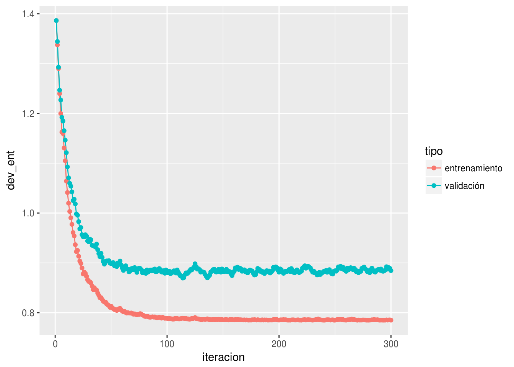
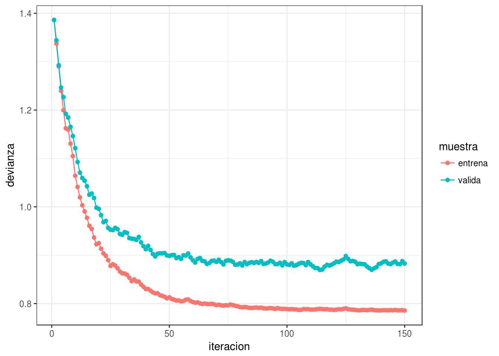
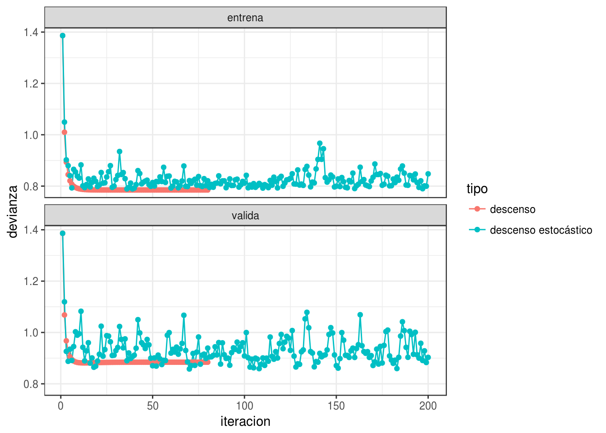
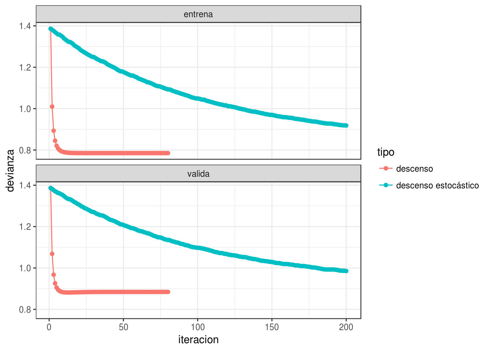
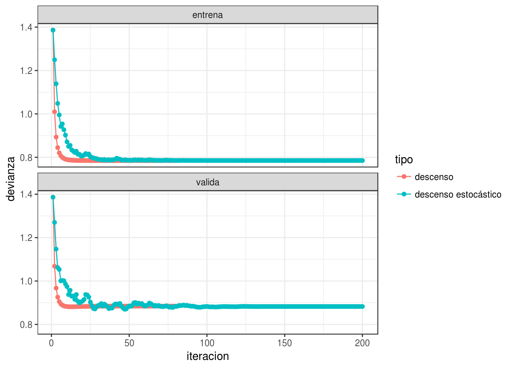
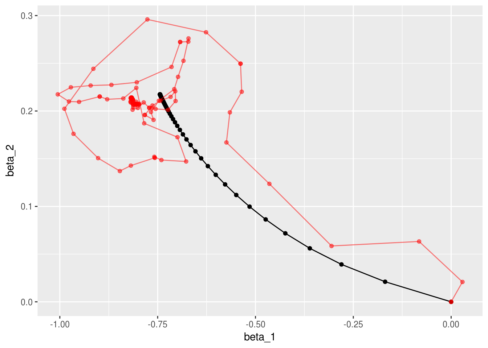

# Descenso estocástico

En esta sección discutiremos estrategias para ajustar modelos como los
que vimos en secciones anteriores. Estos métodos también se utilizarán
en el tutorial de redes neuronales más adelante.

El algoritmo más popular para ajustar modelos grandes es descenso estocástico,
que
es una modificación de nuestro algoritmo de descenso en gradiente de las secicones anteriores. Antes de presentar
las razones para usarlo, veremos cómo funciona para problemas con regresión
lineal o logística.


\BeginKnitrBlock{comentario}<div class="comentario">En **descenso estocástico (por minilotes)**, el cálculo del gradiente se hace sobre una submuestra
relativamente chica de la muestra de entrenamiento. En este contexto, a esta submuestra
se le llama un **minilote**. En cada iteración, nos movemos en 
la dirección de descenso para ese minilote. 

La muestra de entrenamiento se divide entonces (al azar)
en minilotes, y recorremos todos los minilotes haciendo una actualización de nuestros
parámetros en cada minilote. Un recorrido sobre todos los minilotes se llama
una **época** (las iteraciones se entienden sobre los minilotes).</div>\EndKnitrBlock{comentario}

Antes de escribir el algoritmo mostramos una implementación para regresión logística.
Usamos las mismas funciones para calcular devianza y gradiente.


```r
library(tidyverse)
theme_set(theme_bw())
library(plotly)
h <- function(x){1/(1+exp(-x))}
devianza_calc <- function(x, y){
  dev_fun <- function(beta){
    p_beta <- h(as.matrix(cbind(1, x)) %*% beta) 
   -2*mean(y*log(p_beta) + (1-y)*log(1-p_beta))
  }
  dev_fun
}

grad_calc <- function(x_ent, y_ent){
  salida_grad <- function(beta){
    p_beta <- h(as.matrix(cbind(1, x_ent)) %*% beta) 
    e <- y_ent - p_beta
    grad_out <- -2*as.numeric(t(cbind(1,x_ent)) %*% e)/nrow(x_ent)
    names(grad_out) <- c('Intercept', colnames(x_ent))
    grad_out
  }
  salida_grad
}
```

Y comparamos la implementación de los dos algoritmos:


```r
descenso <- function(n, z_0, eta, h_deriv){
  z <- matrix(0,n, length(z_0))
  z[1, ] <- z_0
  for(i in 1:(n-1)){
    z[i+1, ] <- z[i, ] - eta * h_deriv(z[i, ])
  }
  z
}
# esta implementación es solo para este ejemplo:
descenso_estocástico <- function(n_epocas, z_0, eta, minilotes){
  #minilotes es una lista
  m <- length(minilotes)
  z <- matrix(0, m*n_epocas, length(z_0))
  z[1, ] <- z_0
  for(i in 1:(m*n_epocas-1)){
    k <- i %% m + 1
    if(i %% m == 0){
      #comenzar nueva época y reordenar minilotes al azar
      minilotes <- minilotes[sample(1:m, m)]
    }
    h_deriv <- grad_calc(minilotes[[k]]$x, minilotes[[k]]$y)
    z[i+1, ] <- z[i, ] - eta * h_deriv(z[i, ])
  }
  z
}
```


Usaremos el ejemplo simulado de regresión para hacer algunos experimentos:


```r
p_1 <- function(x){
  ifelse(x < 30, 0.9, 0.9 - 0.007 * (x - 15))
}

set.seed(143)
sim_datos <- function(n){
  x <- pmin(rexp(n, 1/30), 100)
  probs <- p_1(x)
  g <- rbinom(length(x), 1, probs)
  # con dos variables de ruido:
  dat <- data_frame(x_1 = (x - mean(x))/sd(x), 
                    x_2 = rnorm(length(x),0,1),
                    x_3 = rnorm(length(x),0,1),
                    p_1 = probs, g )
  dat %>% select(x_1, x_2, x_3, g) 
}
dat_ent <- sim_datos(100)
dat_valid <- sim_datos(1000)
glm(g ~ x_1 + x_2+ x_3 , data = dat_ent, family = 'binomial') %>% coef
```

```
## (Intercept)         x_1         x_2         x_3 
##   1.8082362  -0.7439627   0.2172971   0.3711973
```
Hacemos descenso en gradiente:


```r
iter_descenso <- descenso(80, rep(0,4), 0.9,
         h_deriv = grad_calc(x_ent = as.matrix(dat_ent[,c('x_1','x_2','x_3'), drop =FALSE]), 
                             y_ent=dat_ent$g)) %>%
  data.frame %>% rename(beta_0 = X1, beta_1 = X2, beta_2 = X3, beta_3 = X4)
iter_descenso$tipo <- "descenso"
source("scripts/graficar_traza.R")
graficar_traza(iter_descenso)
```

```
## Joining, by = c("tipo", "n")
```

```
## Warning in RColorBrewer::brewer.pal(N, "Set2"): minimal value for n is 3, returning requested palette with 3 different levels
```

<!--html_preserve--><div id="2a297f4d420f" style="width:672px;height:480px;" class="plotly html-widget"></div>
<script type="application/json" data-for="2a297f4d420f">{"x":{"visdat":{"2a2963cf2f15":["function () ","plotlyVisDat"]},"cur_data":"2a2963cf2f15","attrs":{"2a2963cf2f15":{"x":{},"y":{},"mode":"lines+markers","showlegend":true,"marker":{"size":8},"color":{},"frame":{},"alpha":1,"sizes":[10,100],"type":"scatter"}},"layout":{"margin":{"b":40,"l":60,"t":25,"r":10},"xaxis":{"domain":[0,1],"zeroline":false,"title":"beta_1","range":[-0.781157669863642,0.0371979842792211]},"yaxis":{"domain":[0,1],"zeroline":false,"title":"beta_2","range":[-0.0108647119927178,0.228158951847074]},"hovermode":"closest","showlegend":true,"sliders":[{"currentvalue":{"prefix":"num: ","xanchor":"right","font":{"size":16,"color":"rgba(204,204,204,1)"}},"steps":[{"method":"animate","args":[["1"],{"transition":{"duration":0,"easing":"linear"},"frame":{"duration":100,"redraw":false},"mode":"immediate"}],"label":"1","value":"1"},{"method":"animate","args":[["2"],{"transition":{"duration":0,"easing":"linear"},"frame":{"duration":100,"redraw":false},"mode":"immediate"}],"label":"2","value":"2"},{"method":"animate","args":[["3"],{"transition":{"duration":0,"easing":"linear"},"frame":{"duration":100,"redraw":false},"mode":"immediate"}],"label":"3","value":"3"},{"method":"animate","args":[["4"],{"transition":{"duration":0,"easing":"linear"},"frame":{"duration":100,"redraw":false},"mode":"immediate"}],"label":"4","value":"4"},{"method":"animate","args":[["5"],{"transition":{"duration":0,"easing":"linear"},"frame":{"duration":100,"redraw":false},"mode":"immediate"}],"label":"5","value":"5"},{"method":"animate","args":[["6"],{"transition":{"duration":0,"easing":"linear"},"frame":{"duration":100,"redraw":false},"mode":"immediate"}],"label":"6","value":"6"},{"method":"animate","args":[["7"],{"transition":{"duration":0,"easing":"linear"},"frame":{"duration":100,"redraw":false},"mode":"immediate"}],"label":"7","value":"7"},{"method":"animate","args":[["8"],{"transition":{"duration":0,"easing":"linear"},"frame":{"duration":100,"redraw":false},"mode":"immediate"}],"label":"8","value":"8"},{"method":"animate","args":[["9"],{"transition":{"duration":0,"easing":"linear"},"frame":{"duration":100,"redraw":false},"mode":"immediate"}],"label":"9","value":"9"},{"method":"animate","args":[["10"],{"transition":{"duration":0,"easing":"linear"},"frame":{"duration":100,"redraw":false},"mode":"immediate"}],"label":"10","value":"10"},{"method":"animate","args":[["11"],{"transition":{"duration":0,"easing":"linear"},"frame":{"duration":100,"redraw":false},"mode":"immediate"}],"label":"11","value":"11"},{"method":"animate","args":[["12"],{"transition":{"duration":0,"easing":"linear"},"frame":{"duration":100,"redraw":false},"mode":"immediate"}],"label":"12","value":"12"},{"method":"animate","args":[["13"],{"transition":{"duration":0,"easing":"linear"},"frame":{"duration":100,"redraw":false},"mode":"immediate"}],"label":"13","value":"13"},{"method":"animate","args":[["14"],{"transition":{"duration":0,"easing":"linear"},"frame":{"duration":100,"redraw":false},"mode":"immediate"}],"label":"14","value":"14"},{"method":"animate","args":[["15"],{"transition":{"duration":0,"easing":"linear"},"frame":{"duration":100,"redraw":false},"mode":"immediate"}],"label":"15","value":"15"},{"method":"animate","args":[["16"],{"transition":{"duration":0,"easing":"linear"},"frame":{"duration":100,"redraw":false},"mode":"immediate"}],"label":"16","value":"16"},{"method":"animate","args":[["17"],{"transition":{"duration":0,"easing":"linear"},"frame":{"duration":100,"redraw":false},"mode":"immediate"}],"label":"17","value":"17"},{"method":"animate","args":[["18"],{"transition":{"duration":0,"easing":"linear"},"frame":{"duration":100,"redraw":false},"mode":"immediate"}],"label":"18","value":"18"},{"method":"animate","args":[["19"],{"transition":{"duration":0,"easing":"linear"},"frame":{"duration":100,"redraw":false},"mode":"immediate"}],"label":"19","value":"19"},{"method":"animate","args":[["20"],{"transition":{"duration":0,"easing":"linear"},"frame":{"duration":100,"redraw":false},"mode":"immediate"}],"label":"20","value":"20"},{"method":"animate","args":[["21"],{"transition":{"duration":0,"easing":"linear"},"frame":{"duration":100,"redraw":false},"mode":"immediate"}],"label":"21","value":"21"},{"method":"animate","args":[["22"],{"transition":{"duration":0,"easing":"linear"},"frame":{"duration":100,"redraw":false},"mode":"immediate"}],"label":"22","value":"22"},{"method":"animate","args":[["23"],{"transition":{"duration":0,"easing":"linear"},"frame":{"duration":100,"redraw":false},"mode":"immediate"}],"label":"23","value":"23"},{"method":"animate","args":[["24"],{"transition":{"duration":0,"easing":"linear"},"frame":{"duration":100,"redraw":false},"mode":"immediate"}],"label":"24","value":"24"},{"method":"animate","args":[["25"],{"transition":{"duration":0,"easing":"linear"},"frame":{"duration":100,"redraw":false},"mode":"immediate"}],"label":"25","value":"25"},{"method":"animate","args":[["26"],{"transition":{"duration":0,"easing":"linear"},"frame":{"duration":100,"redraw":false},"mode":"immediate"}],"label":"26","value":"26"},{"method":"animate","args":[["27"],{"transition":{"duration":0,"easing":"linear"},"frame":{"duration":100,"redraw":false},"mode":"immediate"}],"label":"27","value":"27"},{"method":"animate","args":[["28"],{"transition":{"duration":0,"easing":"linear"},"frame":{"duration":100,"redraw":false},"mode":"immediate"}],"label":"28","value":"28"},{"method":"animate","args":[["29"],{"transition":{"duration":0,"easing":"linear"},"frame":{"duration":100,"redraw":false},"mode":"immediate"}],"label":"29","value":"29"},{"method":"animate","args":[["30"],{"transition":{"duration":0,"easing":"linear"},"frame":{"duration":100,"redraw":false},"mode":"immediate"}],"label":"30","value":"30"},{"method":"animate","args":[["31"],{"transition":{"duration":0,"easing":"linear"},"frame":{"duration":100,"redraw":false},"mode":"immediate"}],"label":"31","value":"31"},{"method":"animate","args":[["32"],{"transition":{"duration":0,"easing":"linear"},"frame":{"duration":100,"redraw":false},"mode":"immediate"}],"label":"32","value":"32"},{"method":"animate","args":[["33"],{"transition":{"duration":0,"easing":"linear"},"frame":{"duration":100,"redraw":false},"mode":"immediate"}],"label":"33","value":"33"},{"method":"animate","args":[["34"],{"transition":{"duration":0,"easing":"linear"},"frame":{"duration":100,"redraw":false},"mode":"immediate"}],"label":"34","value":"34"},{"method":"animate","args":[["35"],{"transition":{"duration":0,"easing":"linear"},"frame":{"duration":100,"redraw":false},"mode":"immediate"}],"label":"35","value":"35"},{"method":"animate","args":[["36"],{"transition":{"duration":0,"easing":"linear"},"frame":{"duration":100,"redraw":false},"mode":"immediate"}],"label":"36","value":"36"},{"method":"animate","args":[["37"],{"transition":{"duration":0,"easing":"linear"},"frame":{"duration":100,"redraw":false},"mode":"immediate"}],"label":"37","value":"37"},{"method":"animate","args":[["38"],{"transition":{"duration":0,"easing":"linear"},"frame":{"duration":100,"redraw":false},"mode":"immediate"}],"label":"38","value":"38"},{"method":"animate","args":[["39"],{"transition":{"duration":0,"easing":"linear"},"frame":{"duration":100,"redraw":false},"mode":"immediate"}],"label":"39","value":"39"},{"method":"animate","args":[["40"],{"transition":{"duration":0,"easing":"linear"},"frame":{"duration":100,"redraw":false},"mode":"immediate"}],"label":"40","value":"40"},{"method":"animate","args":[["41"],{"transition":{"duration":0,"easing":"linear"},"frame":{"duration":100,"redraw":false},"mode":"immediate"}],"label":"41","value":"41"},{"method":"animate","args":[["42"],{"transition":{"duration":0,"easing":"linear"},"frame":{"duration":100,"redraw":false},"mode":"immediate"}],"label":"42","value":"42"},{"method":"animate","args":[["43"],{"transition":{"duration":0,"easing":"linear"},"frame":{"duration":100,"redraw":false},"mode":"immediate"}],"label":"43","value":"43"},{"method":"animate","args":[["44"],{"transition":{"duration":0,"easing":"linear"},"frame":{"duration":100,"redraw":false},"mode":"immediate"}],"label":"44","value":"44"},{"method":"animate","args":[["45"],{"transition":{"duration":0,"easing":"linear"},"frame":{"duration":100,"redraw":false},"mode":"immediate"}],"label":"45","value":"45"},{"method":"animate","args":[["46"],{"transition":{"duration":0,"easing":"linear"},"frame":{"duration":100,"redraw":false},"mode":"immediate"}],"label":"46","value":"46"},{"method":"animate","args":[["47"],{"transition":{"duration":0,"easing":"linear"},"frame":{"duration":100,"redraw":false},"mode":"immediate"}],"label":"47","value":"47"},{"method":"animate","args":[["48"],{"transition":{"duration":0,"easing":"linear"},"frame":{"duration":100,"redraw":false},"mode":"immediate"}],"label":"48","value":"48"},{"method":"animate","args":[["49"],{"transition":{"duration":0,"easing":"linear"},"frame":{"duration":100,"redraw":false},"mode":"immediate"}],"label":"49","value":"49"},{"method":"animate","args":[["50"],{"transition":{"duration":0,"easing":"linear"},"frame":{"duration":100,"redraw":false},"mode":"immediate"}],"label":"50","value":"50"},{"method":"animate","args":[["51"],{"transition":{"duration":0,"easing":"linear"},"frame":{"duration":100,"redraw":false},"mode":"immediate"}],"label":"51","value":"51"},{"method":"animate","args":[["52"],{"transition":{"duration":0,"easing":"linear"},"frame":{"duration":100,"redraw":false},"mode":"immediate"}],"label":"52","value":"52"},{"method":"animate","args":[["53"],{"transition":{"duration":0,"easing":"linear"},"frame":{"duration":100,"redraw":false},"mode":"immediate"}],"label":"53","value":"53"},{"method":"animate","args":[["54"],{"transition":{"duration":0,"easing":"linear"},"frame":{"duration":100,"redraw":false},"mode":"immediate"}],"label":"54","value":"54"},{"method":"animate","args":[["55"],{"transition":{"duration":0,"easing":"linear"},"frame":{"duration":100,"redraw":false},"mode":"immediate"}],"label":"55","value":"55"},{"method":"animate","args":[["56"],{"transition":{"duration":0,"easing":"linear"},"frame":{"duration":100,"redraw":false},"mode":"immediate"}],"label":"56","value":"56"},{"method":"animate","args":[["57"],{"transition":{"duration":0,"easing":"linear"},"frame":{"duration":100,"redraw":false},"mode":"immediate"}],"label":"57","value":"57"},{"method":"animate","args":[["58"],{"transition":{"duration":0,"easing":"linear"},"frame":{"duration":100,"redraw":false},"mode":"immediate"}],"label":"58","value":"58"},{"method":"animate","args":[["59"],{"transition":{"duration":0,"easing":"linear"},"frame":{"duration":100,"redraw":false},"mode":"immediate"}],"label":"59","value":"59"},{"method":"animate","args":[["60"],{"transition":{"duration":0,"easing":"linear"},"frame":{"duration":100,"redraw":false},"mode":"immediate"}],"label":"60","value":"60"},{"method":"animate","args":[["61"],{"transition":{"duration":0,"easing":"linear"},"frame":{"duration":100,"redraw":false},"mode":"immediate"}],"label":"61","value":"61"},{"method":"animate","args":[["62"],{"transition":{"duration":0,"easing":"linear"},"frame":{"duration":100,"redraw":false},"mode":"immediate"}],"label":"62","value":"62"},{"method":"animate","args":[["63"],{"transition":{"duration":0,"easing":"linear"},"frame":{"duration":100,"redraw":false},"mode":"immediate"}],"label":"63","value":"63"},{"method":"animate","args":[["64"],{"transition":{"duration":0,"easing":"linear"},"frame":{"duration":100,"redraw":false},"mode":"immediate"}],"label":"64","value":"64"},{"method":"animate","args":[["65"],{"transition":{"duration":0,"easing":"linear"},"frame":{"duration":100,"redraw":false},"mode":"immediate"}],"label":"65","value":"65"},{"method":"animate","args":[["66"],{"transition":{"duration":0,"easing":"linear"},"frame":{"duration":100,"redraw":false},"mode":"immediate"}],"label":"66","value":"66"},{"method":"animate","args":[["67"],{"transition":{"duration":0,"easing":"linear"},"frame":{"duration":100,"redraw":false},"mode":"immediate"}],"label":"67","value":"67"},{"method":"animate","args":[["68"],{"transition":{"duration":0,"easing":"linear"},"frame":{"duration":100,"redraw":false},"mode":"immediate"}],"label":"68","value":"68"},{"method":"animate","args":[["69"],{"transition":{"duration":0,"easing":"linear"},"frame":{"duration":100,"redraw":false},"mode":"immediate"}],"label":"69","value":"69"},{"method":"animate","args":[["70"],{"transition":{"duration":0,"easing":"linear"},"frame":{"duration":100,"redraw":false},"mode":"immediate"}],"label":"70","value":"70"},{"method":"animate","args":[["71"],{"transition":{"duration":0,"easing":"linear"},"frame":{"duration":100,"redraw":false},"mode":"immediate"}],"label":"71","value":"71"},{"method":"animate","args":[["72"],{"transition":{"duration":0,"easing":"linear"},"frame":{"duration":100,"redraw":false},"mode":"immediate"}],"label":"72","value":"72"},{"method":"animate","args":[["73"],{"transition":{"duration":0,"easing":"linear"},"frame":{"duration":100,"redraw":false},"mode":"immediate"}],"label":"73","value":"73"},{"method":"animate","args":[["74"],{"transition":{"duration":0,"easing":"linear"},"frame":{"duration":100,"redraw":false},"mode":"immediate"}],"label":"74","value":"74"},{"method":"animate","args":[["75"],{"transition":{"duration":0,"easing":"linear"},"frame":{"duration":100,"redraw":false},"mode":"immediate"}],"label":"75","value":"75"},{"method":"animate","args":[["76"],{"transition":{"duration":0,"easing":"linear"},"frame":{"duration":100,"redraw":false},"mode":"immediate"}],"label":"76","value":"76"},{"method":"animate","args":[["77"],{"transition":{"duration":0,"easing":"linear"},"frame":{"duration":100,"redraw":false},"mode":"immediate"}],"label":"77","value":"77"},{"method":"animate","args":[["78"],{"transition":{"duration":0,"easing":"linear"},"frame":{"duration":100,"redraw":false},"mode":"immediate"}],"label":"78","value":"78"},{"method":"animate","args":[["79"],{"transition":{"duration":0,"easing":"linear"},"frame":{"duration":100,"redraw":false},"mode":"immediate"}],"label":"79","value":"79"},{"method":"animate","args":[["80"],{"transition":{"duration":0,"easing":"linear"},"frame":{"duration":100,"redraw":false},"mode":"immediate"}],"label":"80","value":"80"}],"visible":true,"pad":{"t":40}}],"updatemenus":[{"type":"buttons","direction":"right","showactive":false,"y":0,"x":0,"yanchor":"top","xanchor":"right","pad":{"t":60,"r":5},"buttons":[{"label":"Play","method":"animate","args":[null,{"fromcurrent":true,"mode":"immediate","transition":{"duration":0,"easing":"linear"},"frame":{"duration":100,"redraw":false}}]}]}]},"source":"A","config":{"modeBarButtonsToAdd":[{"name":"Collaborate","icon":{"width":1000,"ascent":500,"descent":-50,"path":"M487 375c7-10 9-23 5-36l-79-259c-3-12-11-23-22-31-11-8-22-12-35-12l-263 0c-15 0-29 5-43 15-13 10-23 23-28 37-5 13-5 25-1 37 0 0 0 3 1 7 1 5 1 8 1 11 0 2 0 4-1 6 0 3-1 5-1 6 1 2 2 4 3 6 1 2 2 4 4 6 2 3 4 5 5 7 5 7 9 16 13 26 4 10 7 19 9 26 0 2 0 5 0 9-1 4-1 6 0 8 0 2 2 5 4 8 3 3 5 5 5 7 4 6 8 15 12 26 4 11 7 19 7 26 1 1 0 4 0 9-1 4-1 7 0 8 1 2 3 5 6 8 4 4 6 6 6 7 4 5 8 13 13 24 4 11 7 20 7 28 1 1 0 4 0 7-1 3-1 6-1 7 0 2 1 4 3 6 1 1 3 4 5 6 2 3 3 5 5 6 1 2 3 5 4 9 2 3 3 7 5 10 1 3 2 6 4 10 2 4 4 7 6 9 2 3 4 5 7 7 3 2 7 3 11 3 3 0 8 0 13-1l0-1c7 2 12 2 14 2l218 0c14 0 25-5 32-16 8-10 10-23 6-37l-79-259c-7-22-13-37-20-43-7-7-19-10-37-10l-248 0c-5 0-9-2-11-5-2-3-2-7 0-12 4-13 18-20 41-20l264 0c5 0 10 2 16 5 5 3 8 6 10 11l85 282c2 5 2 10 2 17 7-3 13-7 17-13z m-304 0c-1-3-1-5 0-7 1-1 3-2 6-2l174 0c2 0 4 1 7 2 2 2 4 4 5 7l6 18c0 3 0 5-1 7-1 1-3 2-6 2l-173 0c-3 0-5-1-8-2-2-2-4-4-4-7z m-24-73c-1-3-1-5 0-7 2-2 3-2 6-2l174 0c2 0 5 0 7 2 3 2 4 4 5 7l6 18c1 2 0 5-1 6-1 2-3 3-5 3l-174 0c-3 0-5-1-7-3-3-1-4-4-5-6z"},"click":"function(gd) { \n        // is this being viewed in RStudio?\n        if (location.search == '?viewer_pane=1') {\n          alert('To learn about plotly for collaboration, visit:\\n https://cpsievert.github.io/plotly_book/plot-ly-for-collaboration.html');\n        } else {\n          window.open('https://cpsievert.github.io/plotly_book/plot-ly-for-collaboration.html', '_blank');\n        }\n      }"}],"cloud":false},"data":[{"x":[0],"y":[0],"mode":"lines+markers","showlegend":true,"marker":{"size":8},"frame":"1","type":"scatter","name":"descenso","line":{"fillcolor":"rgba(252,141,98,0.5)","color":"rgba(252,141,98,1)"},"xaxis":"x","yaxis":"y","visible":true}],"highlight":{"on":"plotly_click","persistent":false,"dynamic":false,"selectize":false,"opacityDim":0.2,"selected":{"opacity":1}},"frames":[{"name":"1","data":[{"x":[0],"y":[0],"mode":"lines+markers","showlegend":true,"marker":{"size":8},"frame":"1","type":"scatter","name":"descenso","line":{"fillcolor":"rgba(252,141,98,0.5)","color":"rgba(252,141,98,1)"},"xaxis":"x","yaxis":"y","visible":true}],"traces":[0]},{"name":"2","data":[{"x":[0,-0.189803334239082],"y":[0,0.0236965163362849],"mode":"lines+markers","showlegend":true,"marker":{"size":8},"frame":"2","type":"scatter","name":"descenso","line":{"fillcolor":"rgba(252,141,98,0.5)","color":"rgba(252,141,98,1)"},"xaxis":"x","yaxis":"y","visible":true}],"traces":[0]},{"name":"3","data":[{"x":[0,-0.189803334239082,-0.308510421102101],"y":[0,0.0236965163362849,0.04387548300997],"mode":"lines+markers","showlegend":true,"marker":{"size":8},"frame":"3","type":"scatter","name":"descenso","line":{"fillcolor":"rgba(252,141,98,0.5)","color":"rgba(252,141,98,1)"},"xaxis":"x","yaxis":"y","visible":true}],"traces":[0]},{"name":"4","data":[{"x":[0,-0.189803334239082,-0.308510421102101,-0.392313973008706],"y":[0,0.0236965163362849,0.04387548300997,0.0626262743151528],"mode":"lines+markers","showlegend":true,"marker":{"size":8},"frame":"4","type":"scatter","name":"descenso","line":{"fillcolor":"rgba(252,141,98,0.5)","color":"rgba(252,141,98,1)"},"xaxis":"x","yaxis":"y","visible":true}],"traces":[0]},{"name":"5","data":[{"x":[0,-0.189803334239082,-0.308510421102101,-0.392313973008706,-0.455925875946886],"y":[0,0.0236965163362849,0.04387548300997,0.0626262743151528,0.0799384178740605],"mode":"lines+markers","showlegend":true,"marker":{"size":8},"frame":"5","type":"scatter","name":"descenso","line":{"fillcolor":"rgba(252,141,98,0.5)","color":"rgba(252,141,98,1)"},"xaxis":"x","yaxis":"y","visible":true}],"traces":[0]},{"name":"6","data":[{"x":[0,-0.189803334239082,-0.308510421102101,-0.392313973008706,-0.455925875946886,-0.506005555181516],"y":[0,0.0236965163362849,0.04387548300997,0.0626262743151528,0.0799384178740605,0.0957238640086923],"mode":"lines+markers","showlegend":true,"marker":{"size":8},"frame":"6","type":"scatter","name":"descenso","line":{"fillcolor":"rgba(252,141,98,0.5)","color":"rgba(252,141,98,1)"},"xaxis":"x","yaxis":"y","visible":true}],"traces":[0]},{"name":"7","data":[{"x":[0,-0.189803334239082,-0.308510421102101,-0.392313973008706,-0.455925875946886,-0.506005555181516,-0.546217040538929],"y":[0,0.0236965163362849,0.04387548300997,0.0626262743151528,0.0799384178740605,0.0957238640086923,0.109983517150374],"mode":"lines+markers","showlegend":true,"marker":{"size":8},"frame":"7","type":"scatter","name":"descenso","line":{"fillcolor":"rgba(252,141,98,0.5)","color":"rgba(252,141,98,1)"},"xaxis":"x","yaxis":"y","visible":true}],"traces":[0]},{"name":"8","data":[{"x":[0,-0.189803334239082,-0.308510421102101,-0.392313973008706,-0.455925875946886,-0.506005555181516,-0.546217040538929,-0.578890491833548],"y":[0,0.0236965163362849,0.04387548300997,0.0626262743151528,0.0799384178740605,0.0957238640086923,0.109983517150374,0.122778525676238],"mode":"lines+markers","showlegend":true,"marker":{"size":8},"frame":"8","type":"scatter","name":"descenso","line":{"fillcolor":"rgba(252,141,98,0.5)","color":"rgba(252,141,98,1)"},"xaxis":"x","yaxis":"y","visible":true}],"traces":[0]},{"name":"9","data":[{"x":[0,-0.189803334239082,-0.308510421102101,-0.392313973008706,-0.455925875946886,-0.506005555181516,-0.546217040538929,-0.578890491833548,-0.605652998785674],"y":[0,0.0236965163362849,0.04387548300997,0.0626262743151528,0.0799384178740605,0.0957238640086923,0.109983517150374,0.122778525676238,0.134201947506751],"mode":"lines+markers","showlegend":true,"marker":{"size":8},"frame":"9","type":"scatter","name":"descenso","line":{"fillcolor":"rgba(252,141,98,0.5)","color":"rgba(252,141,98,1)"},"xaxis":"x","yaxis":"y","visible":true}],"traces":[0]},{"name":"10","data":[{"x":[0,-0.189803334239082,-0.308510421102101,-0.392313973008706,-0.455925875946886,-0.506005555181516,-0.546217040538929,-0.578890491833548,-0.605652998785674,-0.627706569215025],"y":[0,0.0236965163362849,0.04387548300997,0.0626262743151528,0.0799384178740605,0.0957238640086923,0.109983517150374,0.122778525676238,0.134201947506751,0.144361296887183],"mode":"lines+markers","showlegend":true,"marker":{"size":8},"frame":"10","type":"scatter","name":"descenso","line":{"fillcolor":"rgba(252,141,98,0.5)","color":"rgba(252,141,98,1)"},"xaxis":"x","yaxis":"y","visible":true}],"traces":[0]},{"name":"11","data":[{"x":[0,-0.189803334239082,-0.308510421102101,-0.392313973008706,-0.455925875946886,-0.506005555181516,-0.546217040538929,-0.578890491833548,-0.605652998785674,-0.627706569215025,-0.645969293946658],"y":[0,0.0236965163362849,0.04387548300997,0.0626262743151528,0.0799384178740605,0.0957238640086923,0.109983517150374,0.122778525676238,0.134201947506751,0.144361296887183,0.153368349893679],"mode":"lines+markers","showlegend":true,"marker":{"size":8},"frame":"11","type":"scatter","name":"descenso","line":{"fillcolor":"rgba(252,141,98,0.5)","color":"rgba(252,141,98,1)"},"xaxis":"x","yaxis":"y","visible":true}],"traces":[0]},{"name":"12","data":[{"x":[0,-0.189803334239082,-0.308510421102101,-0.392313973008706,-0.455925875946886,-0.506005555181516,-0.546217040538929,-0.578890491833548,-0.605652998785674,-0.627706569215025,-0.645969293946658,-0.661156764167693],"y":[0,0.0236965163362849,0.04387548300997,0.0626262743151528,0.0799384178740605,0.0957238640086923,0.109983517150374,0.122778525676238,0.134201947506751,0.144361296887183,0.153368349893679,0.161333258294792],"mode":"lines+markers","showlegend":true,"marker":{"size":8},"frame":"12","type":"scatter","name":"descenso","line":{"fillcolor":"rgba(252,141,98,0.5)","color":"rgba(252,141,98,1)"},"xaxis":"x","yaxis":"y","visible":true}],"traces":[0]},{"name":"13","data":[{"x":[0,-0.189803334239082,-0.308510421102101,-0.392313973008706,-0.455925875946886,-0.506005555181516,-0.546217040538929,-0.578890491833548,-0.605652998785674,-0.627706569215025,-0.645969293946658,-0.661156764167693,-0.67383410885857],"y":[0,0.0236965163362849,0.04387548300997,0.0626262743151528,0.0799384178740605,0.0957238640086923,0.109983517150374,0.122778525676238,0.134201947506751,0.144361296887183,0.153368349893679,0.161333258294792,0.168361225757238],"mode":"lines+markers","showlegend":true,"marker":{"size":8},"frame":"13","type":"scatter","name":"descenso","line":{"fillcolor":"rgba(252,141,98,0.5)","color":"rgba(252,141,98,1)"},"xaxis":"x","yaxis":"y","visible":true}],"traces":[0]},{"name":"14","data":[{"x":[0,-0.189803334239082,-0.308510421102101,-0.392313973008706,-0.455925875946886,-0.506005555181516,-0.546217040538929,-0.578890491833548,-0.605652998785674,-0.627706569215025,-0.645969293946658,-0.661156764167693,-0.67383410885857,-0.684451805233601],"y":[0,0.0236965163362849,0.04387548300997,0.0626262743151528,0.0799384178740605,0.0957238640086923,0.109983517150374,0.122778525676238,0.134201947506751,0.144361296887183,0.153368349893679,0.161333258294792,0.168361225757238,0.174550733261779],"mode":"lines+markers","showlegend":true,"marker":{"size":8},"frame":"14","type":"scatter","name":"descenso","line":{"fillcolor":"rgba(252,141,98,0.5)","color":"rgba(252,141,98,1)"},"xaxis":"x","yaxis":"y","visible":true}],"traces":[0]},{"name":"15","data":[{"x":[0,-0.189803334239082,-0.308510421102101,-0.392313973008706,-0.455925875946886,-0.506005555181516,-0.546217040538929,-0.578890491833548,-0.605652998785674,-0.627706569215025,-0.645969293946658,-0.661156764167693,-0.67383410885857,-0.684451805233601,-0.693371553478225],"y":[0,0.0236965163362849,0.04387548300997,0.0626262743151528,0.0799384178740605,0.0957238640086923,0.109983517150374,0.122778525676238,0.134201947506751,0.144361296887183,0.153368349893679,0.161333258294792,0.168361225757238,0.174550733261779,0.179992711998887],"mode":"lines+markers","showlegend":true,"marker":{"size":8},"frame":"15","type":"scatter","name":"descenso","line":{"fillcolor":"rgba(252,141,98,0.5)","color":"rgba(252,141,98,1)"},"xaxis":"x","yaxis":"y","visible":true}],"traces":[0]},{"name":"16","data":[{"x":[0,-0.189803334239082,-0.308510421102101,-0.392313973008706,-0.455925875946886,-0.506005555181516,-0.546217040538929,-0.578890491833548,-0.605652998785674,-0.627706569215025,-0.645969293946658,-0.661156764167693,-0.67383410885857,-0.684451805233601,-0.693371553478225,-0.70088555613884],"y":[0,0.0236965163362849,0.04387548300997,0.0626262743151528,0.0799384178740605,0.0957238640086923,0.109983517150374,0.122778525676238,0.134201947506751,0.144361296887183,0.153368349893679,0.161333258294792,0.168361225757238,0.174550733261779,0.179992711998887,0.184770297176209],"mode":"lines+markers","showlegend":true,"marker":{"size":8},"frame":"16","type":"scatter","name":"descenso","line":{"fillcolor":"rgba(252,141,98,0.5)","color":"rgba(252,141,98,1)"},"xaxis":"x","yaxis":"y","visible":true}],"traces":[0]},{"name":"17","data":[{"x":[0,-0.189803334239082,-0.308510421102101,-0.392313973008706,-0.455925875946886,-0.506005555181516,-0.546217040538929,-0.578890491833548,-0.605652998785674,-0.627706569215025,-0.645969293946658,-0.661156764167693,-0.67383410885857,-0.684451805233601,-0.693371553478225,-0.70088555613884,-0.707231164088609],"y":[0,0.0236965163362849,0.04387548300997,0.0626262743151528,0.0799384178740605,0.0957238640086923,0.109983517150374,0.122778525676238,0.134201947506751,0.144361296887183,0.153368349893679,0.161333258294792,0.168361225757238,0.174550733261779,0.179992711998887,0.184770297176209,0.188958935002282],"mode":"lines+markers","showlegend":true,"marker":{"size":8},"frame":"17","type":"scatter","name":"descenso","line":{"fillcolor":"rgba(252,141,98,0.5)","color":"rgba(252,141,98,1)"},"xaxis":"x","yaxis":"y","visible":true}],"traces":[0]},{"name":"18","data":[{"x":[0,-0.189803334239082,-0.308510421102101,-0.392313973008706,-0.455925875946886,-0.506005555181516,-0.546217040538929,-0.578890491833548,-0.605652998785674,-0.627706569215025,-0.645969293946658,-0.661156764167693,-0.67383410885857,-0.684451805233601,-0.693371553478225,-0.70088555613884,-0.707231164088609,-0.712602144821828],"y":[0,0.0236965163362849,0.04387548300997,0.0626262743151528,0.0799384178740605,0.0957238640086923,0.109983517150374,0.122778525676238,0.134201947506751,0.144361296887183,0.153368349893679,0.161333258294792,0.168361225757238,0.174550733261779,0.179992711998887,0.184770297176209,0.188958935002282,0.19262669939999],"mode":"lines+markers","showlegend":true,"marker":{"size":8},"frame":"18","type":"scatter","name":"descenso","line":{"fillcolor":"rgba(252,141,98,0.5)","color":"rgba(252,141,98,1)"},"xaxis":"x","yaxis":"y","visible":true}],"traces":[0]},{"name":"19","data":[{"x":[0,-0.189803334239082,-0.308510421102101,-0.392313973008706,-0.455925875946886,-0.506005555181516,-0.546217040538929,-0.578890491833548,-0.605652998785674,-0.627706569215025,-0.645969293946658,-0.661156764167693,-0.67383410885857,-0.684451805233601,-0.693371553478225,-0.70088555613884,-0.707231164088609,-0.712602144821828,-0.717157430418674],"y":[0,0.0236965163362849,0.04387548300997,0.0626262743151528,0.0799384178740605,0.0957238640086923,0.109983517150374,0.122778525676238,0.134201947506751,0.144361296887183,0.153368349893679,0.161333258294792,0.168361225757238,0.174550733261779,0.179992711998887,0.184770297176209,0.188958935002282,0.19262669939999,0.195834727269435],"mode":"lines+markers","showlegend":true,"marker":{"size":8},"frame":"19","type":"scatter","name":"descenso","line":{"fillcolor":"rgba(252,141,98,0.5)","color":"rgba(252,141,98,1)"},"xaxis":"x","yaxis":"y","visible":true}],"traces":[0]},{"name":"20","data":[{"x":[0,-0.189803334239082,-0.308510421102101,-0.392313973008706,-0.455925875946886,-0.506005555181516,-0.546217040538929,-0.578890491833548,-0.605652998785674,-0.627706569215025,-0.645969293946658,-0.661156764167693,-0.67383410885857,-0.684451805233601,-0.693371553478225,-0.70088555613884,-0.707231164088609,-0.712602144821828,-0.717157430418674,-0.72102795678624],"y":[0,0.0236965163362849,0.04387548300997,0.0626262743151528,0.0799384178740605,0.0957238640086923,0.109983517150374,0.122778525676238,0.134201947506751,0.144361296887183,0.153368349893679,0.161333258294792,0.168361225757238,0.174550733261779,0.179992711998887,0.184770297176209,0.188958935002282,0.19262669939999,0.195834727269435,0.198637714045998],"mode":"lines+markers","showlegend":true,"marker":{"size":8},"frame":"20","type":"scatter","name":"descenso","line":{"fillcolor":"rgba(252,141,98,0.5)","color":"rgba(252,141,98,1)"},"xaxis":"x","yaxis":"y","visible":true}],"traces":[0]},{"name":"21","data":[{"x":[0,-0.189803334239082,-0.308510421102101,-0.392313973008706,-0.455925875946886,-0.506005555181516,-0.546217040538929,-0.578890491833548,-0.605652998785674,-0.627706569215025,-0.645969293946658,-0.661156764167693,-0.67383410885857,-0.684451805233601,-0.693371553478225,-0.70088555613884,-0.707231164088609,-0.712602144821828,-0.717157430418674,-0.72102795678624,-0.724322042916758],"y":[0,0.0236965163362849,0.04387548300997,0.0626262743151528,0.0799384178740605,0.0957238640086923,0.109983517150374,0.122778525676238,0.134201947506751,0.144361296887183,0.153368349893679,0.161333258294792,0.168361225757238,0.174550733261779,0.179992711998887,0.184770297176209,0.188958935002282,0.19262669939999,0.195834727269435,0.198637714045998,0.201084432305457],"mode":"lines+markers","showlegend":true,"marker":{"size":8},"frame":"21","type":"scatter","name":"descenso","line":{"fillcolor":"rgba(252,141,98,0.5)","color":"rgba(252,141,98,1)"},"xaxis":"x","yaxis":"y","visible":true}],"traces":[0]},{"name":"22","data":[{"x":[0,-0.189803334239082,-0.308510421102101,-0.392313973008706,-0.455925875946886,-0.506005555181516,-0.546217040538929,-0.578890491833548,-0.605652998785674,-0.627706569215025,-0.645969293946658,-0.661156764167693,-0.67383410885857,-0.684451805233601,-0.693371553478225,-0.70088555613884,-0.707231164088609,-0.712602144821828,-0.717157430418674,-0.72102795678624,-0.724322042916758,-0.727129645258408],"y":[0,0.0236965163362849,0.04387548300997,0.0626262743151528,0.0799384178740605,0.0957238640086923,0.109983517150374,0.122778525676238,0.134201947506751,0.144361296887183,0.153368349893679,0.161333258294792,0.168361225757238,0.174550733261779,0.179992711998887,0.184770297176209,0.188958935002282,0.19262669939999,0.195834727269435,0.198637714045998,0.201084432305457,0.203218249717962],"mode":"lines+markers","showlegend":true,"marker":{"size":8},"frame":"22","type":"scatter","name":"descenso","line":{"fillcolor":"rgba(252,141,98,0.5)","color":"rgba(252,141,98,1)"},"xaxis":"x","yaxis":"y","visible":true}],"traces":[0]},{"name":"23","data":[{"x":[0,-0.189803334239082,-0.308510421102101,-0.392313973008706,-0.455925875946886,-0.506005555181516,-0.546217040538929,-0.578890491833548,-0.605652998785674,-0.627706569215025,-0.645969293946658,-0.661156764167693,-0.67383410885857,-0.684451805233601,-0.693371553478225,-0.70088555613884,-0.707231164088609,-0.712602144821828,-0.717157430418674,-0.72102795678624,-0.724322042916758,-0.727129645258408,-0.729525740261567],"y":[0,0.0236965163362849,0.04387548300997,0.0626262743151528,0.0799384178740605,0.0957238640086923,0.109983517150374,0.122778525676238,0.134201947506751,0.144361296887183,0.153368349893679,0.161333258294792,0.168361225757238,0.174550733261779,0.179992711998887,0.184770297176209,0.188958935002282,0.19262669939999,0.195834727269435,0.198637714045998,0.201084432305457,0.203218249717962,0.205077631483422],"mode":"lines+markers","showlegend":true,"marker":{"size":8},"frame":"23","type":"scatter","name":"descenso","line":{"fillcolor":"rgba(252,141,98,0.5)","color":"rgba(252,141,98,1)"},"xaxis":"x","yaxis":"y","visible":true}],"traces":[0]},{"name":"24","data":[{"x":[0,-0.189803334239082,-0.308510421102101,-0.392313973008706,-0.455925875946886,-0.506005555181516,-0.546217040538929,-0.578890491833548,-0.605652998785674,-0.627706569215025,-0.645969293946658,-0.661156764167693,-0.67383410885857,-0.684451805233601,-0.693371553478225,-0.70088555613884,-0.707231164088609,-0.712602144821828,-0.717157430418674,-0.72102795678624,-0.724322042916758,-0.727129645258408,-0.729525740261567,-0.731573027680434],"y":[0,0.0236965163362849,0.04387548300997,0.0626262743151528,0.0799384178740605,0.0957238640086923,0.109983517150374,0.122778525676238,0.134201947506751,0.144361296887183,0.153368349893679,0.161333258294792,0.168361225757238,0.174550733261779,0.179992711998887,0.184770297176209,0.188958935002282,0.19262669939999,0.195834727269435,0.198637714045998,0.201084432305457,0.203218249717962,0.205077631483422,0.206696618192419],"mode":"lines+markers","showlegend":true,"marker":{"size":8},"frame":"24","type":"scatter","name":"descenso","line":{"fillcolor":"rgba(252,141,98,0.5)","color":"rgba(252,141,98,1)"},"xaxis":"x","yaxis":"y","visible":true}],"traces":[0]},{"name":"25","data":[{"x":[0,-0.189803334239082,-0.308510421102101,-0.392313973008706,-0.455925875946886,-0.506005555181516,-0.546217040538929,-0.578890491833548,-0.605652998785674,-0.627706569215025,-0.645969293946658,-0.661156764167693,-0.67383410885857,-0.684451805233601,-0.693371553478225,-0.70088555613884,-0.707231164088609,-0.712602144821828,-0.717157430418674,-0.72102795678624,-0.724322042916758,-0.727129645258408,-0.729525740261567,-0.731573027680434,-0.733324102026132],"y":[0,0.0236965163362849,0.04387548300997,0.0626262743151528,0.0799384178740605,0.0957238640086923,0.109983517150374,0.122778525676238,0.134201947506751,0.144361296887183,0.153368349893679,0.161333258294792,0.168361225757238,0.174550733261779,0.179992711998887,0.184770297176209,0.188958935002282,0.19262669939999,0.195834727269435,0.198637714045998,0.201084432305457,0.203218249717962,0.205077631483422,0.206696618192419,0.208105273914955],"mode":"lines+markers","showlegend":true,"marker":{"size":8},"frame":"25","type":"scatter","name":"descenso","line":{"fillcolor":"rgba(252,141,98,0.5)","color":"rgba(252,141,98,1)"},"xaxis":"x","yaxis":"y","visible":true}],"traces":[0]},{"name":"26","data":[{"x":[0,-0.189803334239082,-0.308510421102101,-0.392313973008706,-0.455925875946886,-0.506005555181516,-0.546217040538929,-0.578890491833548,-0.605652998785674,-0.627706569215025,-0.645969293946658,-0.661156764167693,-0.67383410885857,-0.684451805233601,-0.693371553478225,-0.70088555613884,-0.707231164088609,-0.712602144821828,-0.717157430418674,-0.72102795678624,-0.724322042916758,-0.727129645258408,-0.729525740261567,-0.731573027680434,-0.733324102026132,-0.734823205529164],"y":[0,0.0236965163362849,0.04387548300997,0.0626262743151528,0.0799384178740605,0.0957238640086923,0.109983517150374,0.122778525676238,0.134201947506751,0.144361296887183,0.153368349893679,0.161333258294792,0.168361225757238,0.174550733261779,0.179992711998887,0.184770297176209,0.188958935002282,0.19262669939999,0.195834727269435,0.198637714045998,0.201084432305457,0.203218249717962,0.205077631483422,0.206696618192419,0.208105273914955,0.209330101898222],"mode":"lines+markers","showlegend":true,"marker":{"size":8},"frame":"26","type":"scatter","name":"descenso","line":{"fillcolor":"rgba(252,141,98,0.5)","color":"rgba(252,141,98,1)"},"xaxis":"x","yaxis":"y","visible":true}],"traces":[0]},{"name":"27","data":[{"x":[0,-0.189803334239082,-0.308510421102101,-0.392313973008706,-0.455925875946886,-0.506005555181516,-0.546217040538929,-0.578890491833548,-0.605652998785674,-0.627706569215025,-0.645969293946658,-0.661156764167693,-0.67383410885857,-0.684451805233601,-0.693371553478225,-0.70088555613884,-0.707231164088609,-0.712602144821828,-0.717157430418674,-0.72102795678624,-0.724322042916758,-0.727129645258408,-0.729525740261567,-0.731573027680434,-0.733324102026132,-0.734823205529164,-0.736107650179189],"y":[0,0.0236965163362849,0.04387548300997,0.0626262743151528,0.0799384178740605,0.0957238640086923,0.109983517150374,0.122778525676238,0.134201947506751,0.144361296887183,0.153368349893679,0.161333258294792,0.168361225757238,0.174550733261779,0.179992711998887,0.184770297176209,0.188958935002282,0.19262669939999,0.195834727269435,0.198637714045998,0.201084432305457,0.203218249717962,0.205077631483422,0.206696618192419,0.208105273914955,0.209330101898222,0.210394426983795],"mode":"lines+markers","showlegend":true,"marker":{"size":8},"frame":"27","type":"scatter","name":"descenso","line":{"fillcolor":"rgba(252,141,98,0.5)","color":"rgba(252,141,98,1)"},"xaxis":"x","yaxis":"y","visible":true}],"traces":[0]},{"name":"28","data":[{"x":[0,-0.189803334239082,-0.308510421102101,-0.392313973008706,-0.455925875946886,-0.506005555181516,-0.546217040538929,-0.578890491833548,-0.605652998785674,-0.627706569215025,-0.645969293946658,-0.661156764167693,-0.67383410885857,-0.684451805233601,-0.693371553478225,-0.70088555613884,-0.707231164088609,-0.712602144821828,-0.717157430418674,-0.72102795678624,-0.724322042916758,-0.727129645258408,-0.729525740261567,-0.731573027680434,-0.733324102026132,-0.734823205529164,-0.736107650179189,-0.737208976783369],"y":[0,0.0236965163362849,0.04387548300997,0.0626262743151528,0.0799384178740605,0.0957238640086923,0.109983517150374,0.122778525676238,0.134201947506751,0.144361296887183,0.153368349893679,0.161333258294792,0.168361225757238,0.174550733261779,0.179992711998887,0.184770297176209,0.188958935002282,0.19262669939999,0.195834727269435,0.198637714045998,0.201084432305457,0.203218249717962,0.205077631483422,0.206696618192419,0.208105273914955,0.209330101898222,0.210394426983795,0.211318745011251],"mode":"lines+markers","showlegend":true,"marker":{"size":8},"frame":"28","type":"scatter","name":"descenso","line":{"fillcolor":"rgba(252,141,98,0.5)","color":"rgba(252,141,98,1)"},"xaxis":"x","yaxis":"y","visible":true}],"traces":[0]},{"name":"29","data":[{"x":[0,-0.189803334239082,-0.308510421102101,-0.392313973008706,-0.455925875946886,-0.506005555181516,-0.546217040538929,-0.578890491833548,-0.605652998785674,-0.627706569215025,-0.645969293946658,-0.661156764167693,-0.67383410885857,-0.684451805233601,-0.693371553478225,-0.70088555613884,-0.707231164088609,-0.712602144821828,-0.717157430418674,-0.72102795678624,-0.724322042916758,-0.727129645258408,-0.729525740261567,-0.731573027680434,-0.733324102026132,-0.734823205529164,-0.736107650179189,-0.737208976783369,-0.738153903990673],"y":[0,0.0236965163362849,0.04387548300997,0.0626262743151528,0.0799384178740605,0.0957238640086923,0.109983517150374,0.122778525676238,0.134201947506751,0.144361296887183,0.153368349893679,0.161333258294792,0.168361225757238,0.174550733261779,0.179992711998887,0.184770297176209,0.188958935002282,0.19262669939999,0.195834727269435,0.198637714045998,0.201084432305457,0.203218249717962,0.205077631483422,0.206696618192419,0.208105273914955,0.209330101898222,0.210394426983795,0.211318745011251,0.212121040239654],"mode":"lines+markers","showlegend":true,"marker":{"size":8},"frame":"29","type":"scatter","name":"descenso","line":{"fillcolor":"rgba(252,141,98,0.5)","color":"rgba(252,141,98,1)"},"xaxis":"x","yaxis":"y","visible":true}],"traces":[0]},{"name":"30","data":[{"x":[0,-0.189803334239082,-0.308510421102101,-0.392313973008706,-0.455925875946886,-0.506005555181516,-0.546217040538929,-0.578890491833548,-0.605652998785674,-0.627706569215025,-0.645969293946658,-0.661156764167693,-0.67383410885857,-0.684451805233601,-0.693371553478225,-0.70088555613884,-0.707231164088609,-0.712602144821828,-0.717157430418674,-0.72102795678624,-0.724322042916758,-0.727129645258408,-0.729525740261567,-0.731573027680434,-0.733324102026132,-0.734823205529164,-0.736107650179189,-0.737208976783369,-0.738153903990673,-0.738965108732902],"y":[0,0.0236965163362849,0.04387548300997,0.0626262743151528,0.0799384178740605,0.0957238640086923,0.109983517150374,0.122778525676238,0.134201947506751,0.144361296887183,0.153368349893679,0.161333258294792,0.168361225757238,0.174550733261779,0.179992711998887,0.184770297176209,0.188958935002282,0.19262669939999,0.195834727269435,0.198637714045998,0.201084432305457,0.203218249717962,0.205077631483422,0.206696618192419,0.208105273914955,0.209330101898222,0.210394426983795,0.211318745011251,0.212121040239654,0.212817072310589],"mode":"lines+markers","showlegend":true,"marker":{"size":8},"frame":"30","type":"scatter","name":"descenso","line":{"fillcolor":"rgba(252,141,98,0.5)","color":"rgba(252,141,98,1)"},"xaxis":"x","yaxis":"y","visible":true}],"traces":[0]},{"name":"31","data":[{"x":[0,-0.189803334239082,-0.308510421102101,-0.392313973008706,-0.455925875946886,-0.506005555181516,-0.546217040538929,-0.578890491833548,-0.605652998785674,-0.627706569215025,-0.645969293946658,-0.661156764167693,-0.67383410885857,-0.684451805233601,-0.693371553478225,-0.70088555613884,-0.707231164088609,-0.712602144821828,-0.717157430418674,-0.72102795678624,-0.724322042916758,-0.727129645258408,-0.729525740261567,-0.731573027680434,-0.733324102026132,-0.734823205529164,-0.736107650179189,-0.737208976783369,-0.738153903990673,-0.738965108732902,-0.739661870685247],"y":[0,0.0236965163362849,0.04387548300997,0.0626262743151528,0.0799384178740605,0.0957238640086923,0.109983517150374,0.122778525676238,0.134201947506751,0.144361296887183,0.153368349893679,0.161333258294792,0.168361225757238,0.174550733261779,0.179992711998887,0.184770297176209,0.188958935002282,0.19262669939999,0.195834727269435,0.198637714045998,0.201084432305457,0.203218249717962,0.205077631483422,0.206696618192419,0.208105273914955,0.209330101898222,0.210394426983795,0.211318745011251,0.212121040239654,0.212817072310589,0.213420634577],"mode":"lines+markers","showlegend":true,"marker":{"size":8},"frame":"31","type":"scatter","name":"descenso","line":{"fillcolor":"rgba(252,141,98,0.5)","color":"rgba(252,141,98,1)"},"xaxis":"x","yaxis":"y","visible":true}],"traces":[0]},{"name":"32","data":[{"x":[0,-0.189803334239082,-0.308510421102101,-0.392313973008706,-0.455925875946886,-0.506005555181516,-0.546217040538929,-0.578890491833548,-0.605652998785674,-0.627706569215025,-0.645969293946658,-0.661156764167693,-0.67383410885857,-0.684451805233601,-0.693371553478225,-0.70088555613884,-0.707231164088609,-0.712602144821828,-0.717157430418674,-0.72102795678624,-0.724322042916758,-0.727129645258408,-0.729525740261567,-0.731573027680434,-0.733324102026132,-0.734823205529164,-0.736107650179189,-0.737208976783369,-0.738153903990673,-0.738965108732902,-0.739661870685247,-0.740260606513245],"y":[0,0.0236965163362849,0.04387548300997,0.0626262743151528,0.0799384178740605,0.0957238640086923,0.109983517150374,0.122778525676238,0.134201947506751,0.144361296887183,0.153368349893679,0.161333258294792,0.168361225757238,0.174550733261779,0.179992711998887,0.184770297176209,0.188958935002282,0.19262669939999,0.195834727269435,0.198637714045998,0.201084432305457,0.203218249717962,0.205077631483422,0.206696618192419,0.208105273914955,0.209330101898222,0.210394426983795,0.211318745011251,0.212121040239654,0.212817072310589,0.213420634577,0.213943785786799],"mode":"lines+markers","showlegend":true,"marker":{"size":8},"frame":"32","type":"scatter","name":"descenso","line":{"fillcolor":"rgba(252,141,98,0.5)","color":"rgba(252,141,98,1)"},"xaxis":"x","yaxis":"y","visible":true}],"traces":[0]},{"name":"33","data":[{"x":[0,-0.189803334239082,-0.308510421102101,-0.392313973008706,-0.455925875946886,-0.506005555181516,-0.546217040538929,-0.578890491833548,-0.605652998785674,-0.627706569215025,-0.645969293946658,-0.661156764167693,-0.67383410885857,-0.684451805233601,-0.693371553478225,-0.70088555613884,-0.707231164088609,-0.712602144821828,-0.717157430418674,-0.72102795678624,-0.724322042916758,-0.727129645258408,-0.729525740261567,-0.731573027680434,-0.733324102026132,-0.734823205529164,-0.736107650179189,-0.737208976783369,-0.738153903990673,-0.738965108732902,-0.739661870685247,-0.740260606513245,-0.740775314369883],"y":[0,0.0236965163362849,0.04387548300997,0.0626262743151528,0.0799384178740605,0.0957238640086923,0.109983517150374,0.122778525676238,0.134201947506751,0.144361296887183,0.153368349893679,0.161333258294792,0.168361225757238,0.174550733261779,0.179992711998887,0.184770297176209,0.188958935002282,0.19262669939999,0.195834727269435,0.198637714045998,0.201084432305457,0.203218249717962,0.205077631483422,0.206696618192419,0.208105273914955,0.209330101898222,0.210394426983795,0.211318745011251,0.212121040239654,0.212817072310589,0.213420634577,0.213943785786799,0.214397057178047],"mode":"lines+markers","showlegend":true,"marker":{"size":8},"frame":"33","type":"scatter","name":"descenso","line":{"fillcolor":"rgba(252,141,98,0.5)","color":"rgba(252,141,98,1)"},"xaxis":"x","yaxis":"y","visible":true}],"traces":[0]},{"name":"34","data":[{"x":[0,-0.189803334239082,-0.308510421102101,-0.392313973008706,-0.455925875946886,-0.506005555181516,-0.546217040538929,-0.578890491833548,-0.605652998785674,-0.627706569215025,-0.645969293946658,-0.661156764167693,-0.67383410885857,-0.684451805233601,-0.693371553478225,-0.70088555613884,-0.707231164088609,-0.712602144821828,-0.717157430418674,-0.72102795678624,-0.724322042916758,-0.727129645258408,-0.729525740261567,-0.731573027680434,-0.733324102026132,-0.734823205529164,-0.736107650179189,-0.737208976783369,-0.738153903990673,-0.738965108732902,-0.739661870685247,-0.740260606513245,-0.740775314369883,-0.741217944975082],"y":[0,0.0236965163362849,0.04387548300997,0.0626262743151528,0.0799384178740605,0.0957238640086923,0.109983517150374,0.122778525676238,0.134201947506751,0.144361296887183,0.153368349893679,0.161333258294792,0.168361225757238,0.174550733261779,0.179992711998887,0.184770297176209,0.188958935002282,0.19262669939999,0.195834727269435,0.198637714045998,0.201084432305457,0.203218249717962,0.205077631483422,0.206696618192419,0.208105273914955,0.209330101898222,0.210394426983795,0.211318745011251,0.212121040239654,0.212817072310589,0.213420634577,0.213943785786799,0.214397057178047,0.214789637041604],"mode":"lines+markers","showlegend":true,"marker":{"size":8},"frame":"34","type":"scatter","name":"descenso","line":{"fillcolor":"rgba(252,141,98,0.5)","color":"rgba(252,141,98,1)"},"xaxis":"x","yaxis":"y","visible":true}],"traces":[0]},{"name":"35","data":[{"x":[0,-0.189803334239082,-0.308510421102101,-0.392313973008706,-0.455925875946886,-0.506005555181516,-0.546217040538929,-0.578890491833548,-0.605652998785674,-0.627706569215025,-0.645969293946658,-0.661156764167693,-0.67383410885857,-0.684451805233601,-0.693371553478225,-0.70088555613884,-0.707231164088609,-0.712602144821828,-0.717157430418674,-0.72102795678624,-0.724322042916758,-0.727129645258408,-0.729525740261567,-0.731573027680434,-0.733324102026132,-0.734823205529164,-0.736107650179189,-0.737208976783369,-0.738153903990673,-0.738965108732902,-0.739661870685247,-0.740260606513245,-0.740775314369883,-0.741217944975082,-0.741598712376518],"y":[0,0.0236965163362849,0.04387548300997,0.0626262743151528,0.0799384178740605,0.0957238640086923,0.109983517150374,0.122778525676238,0.134201947506751,0.144361296887183,0.153368349893679,0.161333258294792,0.168361225757238,0.174550733261779,0.179992711998887,0.184770297176209,0.188958935002282,0.19262669939999,0.195834727269435,0.198637714045998,0.201084432305457,0.203218249717962,0.205077631483422,0.206696618192419,0.208105273914955,0.209330101898222,0.210394426983795,0.211318745011251,0.212121040239654,0.212817072310589,0.213420634577,0.213943785786799,0.214397057178047,0.214789637041604,0.21512953475792],"mode":"lines+markers","showlegend":true,"marker":{"size":8},"frame":"35","type":"scatter","name":"descenso","line":{"fillcolor":"rgba(252,141,98,0.5)","color":"rgba(252,141,98,1)"},"xaxis":"x","yaxis":"y","visible":true}],"traces":[0]},{"name":"36","data":[{"x":[0,-0.189803334239082,-0.308510421102101,-0.392313973008706,-0.455925875946886,-0.506005555181516,-0.546217040538929,-0.578890491833548,-0.605652998785674,-0.627706569215025,-0.645969293946658,-0.661156764167693,-0.67383410885857,-0.684451805233601,-0.693371553478225,-0.70088555613884,-0.707231164088609,-0.712602144821828,-0.717157430418674,-0.72102795678624,-0.724322042916758,-0.727129645258408,-0.729525740261567,-0.731573027680434,-0.733324102026132,-0.734823205529164,-0.736107650179189,-0.737208976783369,-0.738153903990673,-0.738965108732902,-0.739661870685247,-0.740260606513245,-0.740775314369883,-0.741217944975082,-0.741598712376518,-0.74192635494881],"y":[0,0.0236965163362849,0.04387548300997,0.0626262743151528,0.0799384178740605,0.0957238640086923,0.109983517150374,0.122778525676238,0.134201947506751,0.144361296887183,0.153368349893679,0.161333258294792,0.168361225757238,0.174550733261779,0.179992711998887,0.184770297176209,0.188958935002282,0.19262669939999,0.195834727269435,0.198637714045998,0.201084432305457,0.203218249717962,0.205077631483422,0.206696618192419,0.208105273914955,0.209330101898222,0.210394426983795,0.211318745011251,0.212121040239654,0.212817072310589,0.213420634577,0.213943785786799,0.214397057178047,0.214789637041604,0.21512953475792,0.215423726232331],"mode":"lines+markers","showlegend":true,"marker":{"size":8},"frame":"36","type":"scatter","name":"descenso","line":{"fillcolor":"rgba(252,141,98,0.5)","color":"rgba(252,141,98,1)"},"xaxis":"x","yaxis":"y","visible":true}],"traces":[0]},{"name":"37","data":[{"x":[0,-0.189803334239082,-0.308510421102101,-0.392313973008706,-0.455925875946886,-0.506005555181516,-0.546217040538929,-0.578890491833548,-0.605652998785674,-0.627706569215025,-0.645969293946658,-0.661156764167693,-0.67383410885857,-0.684451805233601,-0.693371553478225,-0.70088555613884,-0.707231164088609,-0.712602144821828,-0.717157430418674,-0.72102795678624,-0.724322042916758,-0.727129645258408,-0.729525740261567,-0.731573027680434,-0.733324102026132,-0.734823205529164,-0.736107650179189,-0.737208976783369,-0.738153903990673,-0.738965108732902,-0.739661870685247,-0.740260606513245,-0.740775314369883,-0.741217944975082,-0.741598712376518,-0.74192635494881,-0.742208355180163],"y":[0,0.0236965163362849,0.04387548300997,0.0626262743151528,0.0799384178740605,0.0957238640086923,0.109983517150374,0.122778525676238,0.134201947506751,0.144361296887183,0.153368349893679,0.161333258294792,0.168361225757238,0.174550733261779,0.179992711998887,0.184770297176209,0.188958935002282,0.19262669939999,0.195834727269435,0.198637714045998,0.201084432305457,0.203218249717962,0.205077631483422,0.206696618192419,0.208105273914955,0.209330101898222,0.210394426983795,0.211318745011251,0.212121040239654,0.212817072310589,0.213420634577,0.213943785786799,0.214397057178047,0.214789637041604,0.21512953475792,0.215423726232331,0.215678282549125],"mode":"lines+markers","showlegend":true,"marker":{"size":8},"frame":"37","type":"scatter","name":"descenso","line":{"fillcolor":"rgba(252,141,98,0.5)","color":"rgba(252,141,98,1)"},"xaxis":"x","yaxis":"y","visible":true}],"traces":[0]},{"name":"38","data":[{"x":[0,-0.189803334239082,-0.308510421102101,-0.392313973008706,-0.455925875946886,-0.506005555181516,-0.546217040538929,-0.578890491833548,-0.605652998785674,-0.627706569215025,-0.645969293946658,-0.661156764167693,-0.67383410885857,-0.684451805233601,-0.693371553478225,-0.70088555613884,-0.707231164088609,-0.712602144821828,-0.717157430418674,-0.72102795678624,-0.724322042916758,-0.727129645258408,-0.729525740261567,-0.731573027680434,-0.733324102026132,-0.734823205529164,-0.736107650179189,-0.737208976783369,-0.738153903990673,-0.738965108732902,-0.739661870685247,-0.740260606513245,-0.740775314369883,-0.741217944975082,-0.741598712376518,-0.74192635494881,-0.742208355180163,-0.742451125201844],"y":[0,0.0236965163362849,0.04387548300997,0.0626262743151528,0.0799384178740605,0.0957238640086923,0.109983517150374,0.122778525676238,0.134201947506751,0.144361296887183,0.153368349893679,0.161333258294792,0.168361225757238,0.174550733261779,0.179992711998887,0.184770297176209,0.188958935002282,0.19262669939999,0.195834727269435,0.198637714045998,0.201084432305457,0.203218249717962,0.205077631483422,0.206696618192419,0.208105273914955,0.209330101898222,0.210394426983795,0.211318745011251,0.212121040239654,0.212817072310589,0.213420634577,0.213943785786799,0.214397057178047,0.214789637041604,0.21512953475792,0.215423726232331,0.215678282549125,0.215898483547327],"mode":"lines+markers","showlegend":true,"marker":{"size":8},"frame":"38","type":"scatter","name":"descenso","line":{"fillcolor":"rgba(252,141,98,0.5)","color":"rgba(252,141,98,1)"},"xaxis":"x","yaxis":"y","visible":true}],"traces":[0]},{"name":"39","data":[{"x":[0,-0.189803334239082,-0.308510421102101,-0.392313973008706,-0.455925875946886,-0.506005555181516,-0.546217040538929,-0.578890491833548,-0.605652998785674,-0.627706569215025,-0.645969293946658,-0.661156764167693,-0.67383410885857,-0.684451805233601,-0.693371553478225,-0.70088555613884,-0.707231164088609,-0.712602144821828,-0.717157430418674,-0.72102795678624,-0.724322042916758,-0.727129645258408,-0.729525740261567,-0.731573027680434,-0.733324102026132,-0.734823205529164,-0.736107650179189,-0.737208976783369,-0.738153903990673,-0.738965108732902,-0.739661870685247,-0.740260606513245,-0.740775314369883,-0.741217944975082,-0.741598712376518,-0.74192635494881,-0.742208355180163,-0.742451125201844,-0.74266016374472],"y":[0,0.0236965163362849,0.04387548300997,0.0626262743151528,0.0799384178740605,0.0957238640086923,0.109983517150374,0.122778525676238,0.134201947506751,0.144361296887183,0.153368349893679,0.161333258294792,0.168361225757238,0.174550733261779,0.179992711998887,0.184770297176209,0.188958935002282,0.19262669939999,0.195834727269435,0.198637714045998,0.201084432305457,0.203218249717962,0.205077631483422,0.206696618192419,0.208105273914955,0.209330101898222,0.210394426983795,0.211318745011251,0.212121040239654,0.212817072310589,0.213420634577,0.213943785786799,0.214397057178047,0.214789637041604,0.21512953475792,0.215423726232331,0.215678282549125,0.215898483547327,0.216088917896922],"mode":"lines+markers","showlegend":true,"marker":{"size":8},"frame":"39","type":"scatter","name":"descenso","line":{"fillcolor":"rgba(252,141,98,0.5)","color":"rgba(252,141,98,1)"},"xaxis":"x","yaxis":"y","visible":true}],"traces":[0]},{"name":"40","data":[{"x":[0,-0.189803334239082,-0.308510421102101,-0.392313973008706,-0.455925875946886,-0.506005555181516,-0.546217040538929,-0.578890491833548,-0.605652998785674,-0.627706569215025,-0.645969293946658,-0.661156764167693,-0.67383410885857,-0.684451805233601,-0.693371553478225,-0.70088555613884,-0.707231164088609,-0.712602144821828,-0.717157430418674,-0.72102795678624,-0.724322042916758,-0.727129645258408,-0.729525740261567,-0.731573027680434,-0.733324102026132,-0.734823205529164,-0.736107650179189,-0.737208976783369,-0.738153903990673,-0.738965108732902,-0.739661870685247,-0.740260606513245,-0.740775314369883,-0.741217944975082,-0.741598712376518,-0.74192635494881,-0.742208355180163,-0.742451125201844,-0.74266016374472,-0.742840189188418],"y":[0,0.0236965163362849,0.04387548300997,0.0626262743151528,0.0799384178740605,0.0957238640086923,0.109983517150374,0.122778525676238,0.134201947506751,0.144361296887183,0.153368349893679,0.161333258294792,0.168361225757238,0.174550733261779,0.179992711998887,0.184770297176209,0.188958935002282,0.19262669939999,0.195834727269435,0.198637714045998,0.201084432305457,0.203218249717962,0.205077631483422,0.206696618192419,0.208105273914955,0.209330101898222,0.210394426983795,0.211318745011251,0.212121040239654,0.212817072310589,0.213420634577,0.213943785786799,0.214397057178047,0.214789637041604,0.21512953475792,0.215423726232331,0.215678282549125,0.215898483547327,0.216088917896922,0.21625357112793],"mode":"lines+markers","showlegend":true,"marker":{"size":8},"frame":"40","type":"scatter","name":"descenso","line":{"fillcolor":"rgba(252,141,98,0.5)","color":"rgba(252,141,98,1)"},"xaxis":"x","yaxis":"y","visible":true}],"traces":[0]},{"name":"41","data":[{"x":[0,-0.189803334239082,-0.308510421102101,-0.392313973008706,-0.455925875946886,-0.506005555181516,-0.546217040538929,-0.578890491833548,-0.605652998785674,-0.627706569215025,-0.645969293946658,-0.661156764167693,-0.67383410885857,-0.684451805233601,-0.693371553478225,-0.70088555613884,-0.707231164088609,-0.712602144821828,-0.717157430418674,-0.72102795678624,-0.724322042916758,-0.727129645258408,-0.729525740261567,-0.731573027680434,-0.733324102026132,-0.734823205529164,-0.736107650179189,-0.737208976783369,-0.738153903990673,-0.738965108732902,-0.739661870685247,-0.740260606513245,-0.740775314369883,-0.741217944975082,-0.741598712376518,-0.74192635494881,-0.742208355180163,-0.742451125201844,-0.74266016374472,-0.742840189188418,-0.742995252548253],"y":[0,0.0236965163362849,0.04387548300997,0.0626262743151528,0.0799384178740605,0.0957238640086923,0.109983517150374,0.122778525676238,0.134201947506751,0.144361296887183,0.153368349893679,0.161333258294792,0.168361225757238,0.174550733261779,0.179992711998887,0.184770297176209,0.188958935002282,0.19262669939999,0.195834727269435,0.198637714045998,0.201084432305457,0.203218249717962,0.205077631483422,0.206696618192419,0.208105273914955,0.209330101898222,0.210394426983795,0.211318745011251,0.212121040239654,0.212817072310589,0.213420634577,0.213943785786799,0.214397057178047,0.214789637041604,0.21512953475792,0.215423726232331,0.215678282549125,0.215898483547327,0.216088917896922,0.21625357112793,0.216395902939782],"mode":"lines+markers","showlegend":true,"marker":{"size":8},"frame":"41","type":"scatter","name":"descenso","line":{"fillcolor":"rgba(252,141,98,0.5)","color":"rgba(252,141,98,1)"},"xaxis":"x","yaxis":"y","visible":true}],"traces":[0]},{"name":"42","data":[{"x":[0,-0.189803334239082,-0.308510421102101,-0.392313973008706,-0.455925875946886,-0.506005555181516,-0.546217040538929,-0.578890491833548,-0.605652998785674,-0.627706569215025,-0.645969293946658,-0.661156764167693,-0.67383410885857,-0.684451805233601,-0.693371553478225,-0.70088555613884,-0.707231164088609,-0.712602144821828,-0.717157430418674,-0.72102795678624,-0.724322042916758,-0.727129645258408,-0.729525740261567,-0.731573027680434,-0.733324102026132,-0.734823205529164,-0.736107650179189,-0.737208976783369,-0.738153903990673,-0.738965108732902,-0.739661870685247,-0.740260606513245,-0.740775314369883,-0.741217944975082,-0.741598712376518,-0.74192635494881,-0.742208355180163,-0.742451125201844,-0.74266016374472,-0.742840189188418,-0.742995252548253,-0.743128833581397],"y":[0,0.0236965163362849,0.04387548300997,0.0626262743151528,0.0799384178740605,0.0957238640086923,0.109983517150374,0.122778525676238,0.134201947506751,0.144361296887183,0.153368349893679,0.161333258294792,0.168361225757238,0.174550733261779,0.179992711998887,0.184770297176209,0.188958935002282,0.19262669939999,0.195834727269435,0.198637714045998,0.201084432305457,0.203218249717962,0.205077631483422,0.206696618192419,0.208105273914955,0.209330101898222,0.210394426983795,0.211318745011251,0.212121040239654,0.212817072310589,0.213420634577,0.213943785786799,0.214397057178047,0.214789637041604,0.21512953475792,0.215423726232331,0.215678282549125,0.215898483547327,0.216088917896922,0.21625357112793,0.216395902939782,0.216518914997345],"mode":"lines+markers","showlegend":true,"marker":{"size":8},"frame":"42","type":"scatter","name":"descenso","line":{"fillcolor":"rgba(252,141,98,0.5)","color":"rgba(252,141,98,1)"},"xaxis":"x","yaxis":"y","visible":true}],"traces":[0]},{"name":"43","data":[{"x":[0,-0.189803334239082,-0.308510421102101,-0.392313973008706,-0.455925875946886,-0.506005555181516,-0.546217040538929,-0.578890491833548,-0.605652998785674,-0.627706569215025,-0.645969293946658,-0.661156764167693,-0.67383410885857,-0.684451805233601,-0.693371553478225,-0.70088555613884,-0.707231164088609,-0.712602144821828,-0.717157430418674,-0.72102795678624,-0.724322042916758,-0.727129645258408,-0.729525740261567,-0.731573027680434,-0.733324102026132,-0.734823205529164,-0.736107650179189,-0.737208976783369,-0.738153903990673,-0.738965108732902,-0.739661870685247,-0.740260606513245,-0.740775314369883,-0.741217944975082,-0.741598712376518,-0.74192635494881,-0.742208355180163,-0.742451125201844,-0.74266016374472,-0.742840189188418,-0.742995252548253,-0.743128833581397,-0.743243922654214],"y":[0,0.0236965163362849,0.04387548300997,0.0626262743151528,0.0799384178740605,0.0957238640086923,0.109983517150374,0.122778525676238,0.134201947506751,0.144361296887183,0.153368349893679,0.161333258294792,0.168361225757238,0.174550733261779,0.179992711998887,0.184770297176209,0.188958935002282,0.19262669939999,0.195834727269435,0.198637714045998,0.201084432305457,0.203218249717962,0.205077631483422,0.206696618192419,0.208105273914955,0.209330101898222,0.210394426983795,0.211318745011251,0.212121040239654,0.212817072310589,0.213420634577,0.213943785786799,0.214397057178047,0.214789637041604,0.21512953475792,0.215423726232331,0.215678282549125,0.215898483547327,0.216088917896922,0.21625357112793,0.216395902939782,0.216518914997345,0.216625210304443],"mode":"lines+markers","showlegend":true,"marker":{"size":8},"frame":"43","type":"scatter","name":"descenso","line":{"fillcolor":"rgba(252,141,98,0.5)","color":"rgba(252,141,98,1)"},"xaxis":"x","yaxis":"y","visible":true}],"traces":[0]},{"name":"44","data":[{"x":[0,-0.189803334239082,-0.308510421102101,-0.392313973008706,-0.455925875946886,-0.506005555181516,-0.546217040538929,-0.578890491833548,-0.605652998785674,-0.627706569215025,-0.645969293946658,-0.661156764167693,-0.67383410885857,-0.684451805233601,-0.693371553478225,-0.70088555613884,-0.707231164088609,-0.712602144821828,-0.717157430418674,-0.72102795678624,-0.724322042916758,-0.727129645258408,-0.729525740261567,-0.731573027680434,-0.733324102026132,-0.734823205529164,-0.736107650179189,-0.737208976783369,-0.738153903990673,-0.738965108732902,-0.739661870685247,-0.740260606513245,-0.740775314369883,-0.741217944975082,-0.741598712376518,-0.74192635494881,-0.742208355180163,-0.742451125201844,-0.74266016374472,-0.742840189188418,-0.742995252548253,-0.743128833581397,-0.743243922654214,-0.74334309057224],"y":[0,0.0236965163362849,0.04387548300997,0.0626262743151528,0.0799384178740605,0.0957238640086923,0.109983517150374,0.122778525676238,0.134201947506751,0.144361296887183,0.153368349893679,0.161333258294792,0.168361225757238,0.174550733261779,0.179992711998887,0.184770297176209,0.188958935002282,0.19262669939999,0.195834727269435,0.198637714045998,0.201084432305457,0.203218249717962,0.205077631483422,0.206696618192419,0.208105273914955,0.209330101898222,0.210394426983795,0.211318745011251,0.212121040239654,0.212817072310589,0.213420634577,0.213943785786799,0.214397057178047,0.214789637041604,0.21512953475792,0.215423726232331,0.215678282549125,0.215898483547327,0.216088917896922,0.21625357112793,0.216395902939782,0.216518914997345,0.216625210304443,0.216717045136945],"mode":"lines+markers","showlegend":true,"marker":{"size":8},"frame":"44","type":"scatter","name":"descenso","line":{"fillcolor":"rgba(252,141,98,0.5)","color":"rgba(252,141,98,1)"},"xaxis":"x","yaxis":"y","visible":true}],"traces":[0]},{"name":"45","data":[{"x":[0,-0.189803334239082,-0.308510421102101,-0.392313973008706,-0.455925875946886,-0.506005555181516,-0.546217040538929,-0.578890491833548,-0.605652998785674,-0.627706569215025,-0.645969293946658,-0.661156764167693,-0.67383410885857,-0.684451805233601,-0.693371553478225,-0.70088555613884,-0.707231164088609,-0.712602144821828,-0.717157430418674,-0.72102795678624,-0.724322042916758,-0.727129645258408,-0.729525740261567,-0.731573027680434,-0.733324102026132,-0.734823205529164,-0.736107650179189,-0.737208976783369,-0.738153903990673,-0.738965108732902,-0.739661870685247,-0.740260606513245,-0.740775314369883,-0.741217944975082,-0.741598712376518,-0.74192635494881,-0.742208355180163,-0.742451125201844,-0.74266016374472,-0.742840189188418,-0.742995252548253,-0.743128833581397,-0.743243922654214,-0.74334309057224,-0.743428548213142],"y":[0,0.0236965163362849,0.04387548300997,0.0626262743151528,0.0799384178740605,0.0957238640086923,0.109983517150374,0.122778525676238,0.134201947506751,0.144361296887183,0.153368349893679,0.161333258294792,0.168361225757238,0.174550733261779,0.179992711998887,0.184770297176209,0.188958935002282,0.19262669939999,0.195834727269435,0.198637714045998,0.201084432305457,0.203218249717962,0.205077631483422,0.206696618192419,0.208105273914955,0.209330101898222,0.210394426983795,0.211318745011251,0.212121040239654,0.212817072310589,0.213420634577,0.213943785786799,0.214397057178047,0.214789637041604,0.21512953475792,0.215423726232331,0.215678282549125,0.215898483547327,0.216088917896922,0.21625357112793,0.216395902939782,0.216518914997345,0.216625210304443,0.216717045136945,0.216796374416077],"mode":"lines+markers","showlegend":true,"marker":{"size":8},"frame":"45","type":"scatter","name":"descenso","line":{"fillcolor":"rgba(252,141,98,0.5)","color":"rgba(252,141,98,1)"},"xaxis":"x","yaxis":"y","visible":true}],"traces":[0]},{"name":"46","data":[{"x":[0,-0.189803334239082,-0.308510421102101,-0.392313973008706,-0.455925875946886,-0.506005555181516,-0.546217040538929,-0.578890491833548,-0.605652998785674,-0.627706569215025,-0.645969293946658,-0.661156764167693,-0.67383410885857,-0.684451805233601,-0.693371553478225,-0.70088555613884,-0.707231164088609,-0.712602144821828,-0.717157430418674,-0.72102795678624,-0.724322042916758,-0.727129645258408,-0.729525740261567,-0.731573027680434,-0.733324102026132,-0.734823205529164,-0.736107650179189,-0.737208976783369,-0.738153903990673,-0.738965108732902,-0.739661870685247,-0.740260606513245,-0.740775314369883,-0.741217944975082,-0.741598712376518,-0.74192635494881,-0.742208355180163,-0.742451125201844,-0.74266016374472,-0.742840189188418,-0.742995252548253,-0.743128833581397,-0.743243922654214,-0.74334309057224,-0.743428548213142,-0.743502197505594],"y":[0,0.0236965163362849,0.04387548300997,0.0626262743151528,0.0799384178740605,0.0957238640086923,0.109983517150374,0.122778525676238,0.134201947506751,0.144361296887183,0.153368349893679,0.161333258294792,0.168361225757238,0.174550733261779,0.179992711998887,0.184770297176209,0.188958935002282,0.19262669939999,0.195834727269435,0.198637714045998,0.201084432305457,0.203218249717962,0.205077631483422,0.206696618192419,0.208105273914955,0.209330101898222,0.210394426983795,0.211318745011251,0.212121040239654,0.212817072310589,0.213420634577,0.213943785786799,0.214397057178047,0.214789637041604,0.21512953475792,0.215423726232331,0.215678282549125,0.215898483547327,0.216088917896922,0.21625357112793,0.216395902939782,0.216518914997345,0.216625210304443,0.216717045136945,0.216796374416077,0.216864891308936],"mode":"lines+markers","showlegend":true,"marker":{"size":8},"frame":"46","type":"scatter","name":"descenso","line":{"fillcolor":"rgba(252,141,98,0.5)","color":"rgba(252,141,98,1)"},"xaxis":"x","yaxis":"y","visible":true}],"traces":[0]},{"name":"47","data":[{"x":[0,-0.189803334239082,-0.308510421102101,-0.392313973008706,-0.455925875946886,-0.506005555181516,-0.546217040538929,-0.578890491833548,-0.605652998785674,-0.627706569215025,-0.645969293946658,-0.661156764167693,-0.67383410885857,-0.684451805233601,-0.693371553478225,-0.70088555613884,-0.707231164088609,-0.712602144821828,-0.717157430418674,-0.72102795678624,-0.724322042916758,-0.727129645258408,-0.729525740261567,-0.731573027680434,-0.733324102026132,-0.734823205529164,-0.736107650179189,-0.737208976783369,-0.738153903990673,-0.738965108732902,-0.739661870685247,-0.740260606513245,-0.740775314369883,-0.741217944975082,-0.741598712376518,-0.74192635494881,-0.742208355180163,-0.742451125201844,-0.74266016374472,-0.742840189188418,-0.742995252548253,-0.743128833581397,-0.743243922654214,-0.74334309057224,-0.743428548213142,-0.743502197505594,-0.743565675051277],"y":[0,0.0236965163362849,0.04387548300997,0.0626262743151528,0.0799384178740605,0.0957238640086923,0.109983517150374,0.122778525676238,0.134201947506751,0.144361296887183,0.153368349893679,0.161333258294792,0.168361225757238,0.174550733261779,0.179992711998887,0.184770297176209,0.188958935002282,0.19262669939999,0.195834727269435,0.198637714045998,0.201084432305457,0.203218249717962,0.205077631483422,0.206696618192419,0.208105273914955,0.209330101898222,0.210394426983795,0.211318745011251,0.212121040239654,0.212817072310589,0.213420634577,0.213943785786799,0.214397057178047,0.214789637041604,0.21512953475792,0.215423726232331,0.215678282549125,0.215898483547327,0.216088917896922,0.21625357112793,0.216395902939782,0.216518914997345,0.216625210304443,0.216717045136945,0.216796374416077,0.216864891308936,0.216924061757254],"mode":"lines+markers","showlegend":true,"marker":{"size":8},"frame":"47","type":"scatter","name":"descenso","line":{"fillcolor":"rgba(252,141,98,0.5)","color":"rgba(252,141,98,1)"},"xaxis":"x","yaxis":"y","visible":true}],"traces":[0]},{"name":"48","data":[{"x":[0,-0.189803334239082,-0.308510421102101,-0.392313973008706,-0.455925875946886,-0.506005555181516,-0.546217040538929,-0.578890491833548,-0.605652998785674,-0.627706569215025,-0.645969293946658,-0.661156764167693,-0.67383410885857,-0.684451805233601,-0.693371553478225,-0.70088555613884,-0.707231164088609,-0.712602144821828,-0.717157430418674,-0.72102795678624,-0.724322042916758,-0.727129645258408,-0.729525740261567,-0.731573027680434,-0.733324102026132,-0.734823205529164,-0.736107650179189,-0.737208976783369,-0.738153903990673,-0.738965108732902,-0.739661870685247,-0.740260606513245,-0.740775314369883,-0.741217944975082,-0.741598712376518,-0.74192635494881,-0.742208355180163,-0.742451125201844,-0.74266016374472,-0.742840189188418,-0.742995252548253,-0.743128833581397,-0.743243922654214,-0.74334309057224,-0.743428548213142,-0.743502197505594,-0.743565675051277,-0.743620389483295],"y":[0,0.0236965163362849,0.04387548300997,0.0626262743151528,0.0799384178740605,0.0957238640086923,0.109983517150374,0.122778525676238,0.134201947506751,0.144361296887183,0.153368349893679,0.161333258294792,0.168361225757238,0.174550733261779,0.179992711998887,0.184770297176209,0.188958935002282,0.19262669939999,0.195834727269435,0.198637714045998,0.201084432305457,0.203218249717962,0.205077631483422,0.206696618192419,0.208105273914955,0.209330101898222,0.210394426983795,0.211318745011251,0.212121040239654,0.212817072310589,0.213420634577,0.213943785786799,0.214397057178047,0.214789637041604,0.21512953475792,0.215423726232331,0.215678282549125,0.215898483547327,0.216088917896922,0.21625357112793,0.216395902939782,0.216518914997345,0.216625210304443,0.216717045136945,0.216796374416077,0.216864891308936,0.216924061757254,0.216975154557135],"mode":"lines+markers","showlegend":true,"marker":{"size":8},"frame":"48","type":"scatter","name":"descenso","line":{"fillcolor":"rgba(252,141,98,0.5)","color":"rgba(252,141,98,1)"},"xaxis":"x","yaxis":"y","visible":true}],"traces":[0]},{"name":"49","data":[{"x":[0,-0.189803334239082,-0.308510421102101,-0.392313973008706,-0.455925875946886,-0.506005555181516,-0.546217040538929,-0.578890491833548,-0.605652998785674,-0.627706569215025,-0.645969293946658,-0.661156764167693,-0.67383410885857,-0.684451805233601,-0.693371553478225,-0.70088555613884,-0.707231164088609,-0.712602144821828,-0.717157430418674,-0.72102795678624,-0.724322042916758,-0.727129645258408,-0.729525740261567,-0.731573027680434,-0.733324102026132,-0.734823205529164,-0.736107650179189,-0.737208976783369,-0.738153903990673,-0.738965108732902,-0.739661870685247,-0.740260606513245,-0.740775314369883,-0.741217944975082,-0.741598712376518,-0.74192635494881,-0.742208355180163,-0.742451125201844,-0.74266016374472,-0.742840189188418,-0.742995252548253,-0.743128833581397,-0.743243922654214,-0.74334309057224,-0.743428548213142,-0.743502197505594,-0.743565675051277,-0.743620389483295,-0.743667553484579],"y":[0,0.0236965163362849,0.04387548300997,0.0626262743151528,0.0799384178740605,0.0957238640086923,0.109983517150374,0.122778525676238,0.134201947506751,0.144361296887183,0.153368349893679,0.161333258294792,0.168361225757238,0.174550733261779,0.179992711998887,0.184770297176209,0.188958935002282,0.19262669939999,0.195834727269435,0.198637714045998,0.201084432305457,0.203218249717962,0.205077631483422,0.206696618192419,0.208105273914955,0.209330101898222,0.210394426983795,0.211318745011251,0.212121040239654,0.212817072310589,0.213420634577,0.213943785786799,0.214397057178047,0.214789637041604,0.21512953475792,0.215423726232331,0.215678282549125,0.215898483547327,0.216088917896922,0.21625357112793,0.216395902939782,0.216518914997345,0.216625210304443,0.216717045136945,0.216796374416077,0.216864891308936,0.216924061757254,0.216975154557135,0.217019267541501],"mode":"lines+markers","showlegend":true,"marker":{"size":8},"frame":"49","type":"scatter","name":"descenso","line":{"fillcolor":"rgba(252,141,98,0.5)","color":"rgba(252,141,98,1)"},"xaxis":"x","yaxis":"y","visible":true}],"traces":[0]},{"name":"50","data":[{"x":[0,-0.189803334239082,-0.308510421102101,-0.392313973008706,-0.455925875946886,-0.506005555181516,-0.546217040538929,-0.578890491833548,-0.605652998785674,-0.627706569215025,-0.645969293946658,-0.661156764167693,-0.67383410885857,-0.684451805233601,-0.693371553478225,-0.70088555613884,-0.707231164088609,-0.712602144821828,-0.717157430418674,-0.72102795678624,-0.724322042916758,-0.727129645258408,-0.729525740261567,-0.731573027680434,-0.733324102026132,-0.734823205529164,-0.736107650179189,-0.737208976783369,-0.738153903990673,-0.738965108732902,-0.739661870685247,-0.740260606513245,-0.740775314369883,-0.741217944975082,-0.741598712376518,-0.74192635494881,-0.742208355180163,-0.742451125201844,-0.74266016374472,-0.742840189188418,-0.742995252548253,-0.743128833581397,-0.743243922654214,-0.74334309057224,-0.743428548213142,-0.743502197505594,-0.743565675051277,-0.743620389483295,-0.743667553484579,-0.743708211248112],"y":[0,0.0236965163362849,0.04387548300997,0.0626262743151528,0.0799384178740605,0.0957238640086923,0.109983517150374,0.122778525676238,0.134201947506751,0.144361296887183,0.153368349893679,0.161333258294792,0.168361225757238,0.174550733261779,0.179992711998887,0.184770297176209,0.188958935002282,0.19262669939999,0.195834727269435,0.198637714045998,0.201084432305457,0.203218249717962,0.205077631483422,0.206696618192419,0.208105273914955,0.209330101898222,0.210394426983795,0.211318745011251,0.212121040239654,0.212817072310589,0.213420634577,0.213943785786799,0.214397057178047,0.214789637041604,0.21512953475792,0.215423726232331,0.215678282549125,0.215898483547327,0.216088917896922,0.21625357112793,0.216395902939782,0.216518914997345,0.216625210304443,0.216717045136945,0.216796374416077,0.216864891308936,0.216924061757254,0.216975154557135,0.217019267541501,0.217057350352951],"mode":"lines+markers","showlegend":true,"marker":{"size":8},"frame":"50","type":"scatter","name":"descenso","line":{"fillcolor":"rgba(252,141,98,0.5)","color":"rgba(252,141,98,1)"},"xaxis":"x","yaxis":"y","visible":true}],"traces":[0]},{"name":"51","data":[{"x":[0,-0.189803334239082,-0.308510421102101,-0.392313973008706,-0.455925875946886,-0.506005555181516,-0.546217040538929,-0.578890491833548,-0.605652998785674,-0.627706569215025,-0.645969293946658,-0.661156764167693,-0.67383410885857,-0.684451805233601,-0.693371553478225,-0.70088555613884,-0.707231164088609,-0.712602144821828,-0.717157430418674,-0.72102795678624,-0.724322042916758,-0.727129645258408,-0.729525740261567,-0.731573027680434,-0.733324102026132,-0.734823205529164,-0.736107650179189,-0.737208976783369,-0.738153903990673,-0.738965108732902,-0.739661870685247,-0.740260606513245,-0.740775314369883,-0.741217944975082,-0.741598712376518,-0.74192635494881,-0.742208355180163,-0.742451125201844,-0.74266016374472,-0.742840189188418,-0.742995252548253,-0.743128833581397,-0.743243922654214,-0.74334309057224,-0.743428548213142,-0.743502197505594,-0.743565675051277,-0.743620389483295,-0.743667553484579,-0.743708211248112,-0.743743262042057],"y":[0,0.0236965163362849,0.04387548300997,0.0626262743151528,0.0799384178740605,0.0957238640086923,0.109983517150374,0.122778525676238,0.134201947506751,0.144361296887183,0.153368349893679,0.161333258294792,0.168361225757238,0.174550733261779,0.179992711998887,0.184770297176209,0.188958935002282,0.19262669939999,0.195834727269435,0.198637714045998,0.201084432305457,0.203218249717962,0.205077631483422,0.206696618192419,0.208105273914955,0.209330101898222,0.210394426983795,0.211318745011251,0.212121040239654,0.212817072310589,0.213420634577,0.213943785786799,0.214397057178047,0.214789637041604,0.21512953475792,0.215423726232331,0.215678282549125,0.215898483547327,0.216088917896922,0.21625357112793,0.216395902939782,0.216518914997345,0.216625210304443,0.216717045136945,0.216796374416077,0.216864891308936,0.216924061757254,0.216975154557135,0.217019267541501,0.217057350352951,0.217090224237248],"mode":"lines+markers","showlegend":true,"marker":{"size":8},"frame":"51","type":"scatter","name":"descenso","line":{"fillcolor":"rgba(252,141,98,0.5)","color":"rgba(252,141,98,1)"},"xaxis":"x","yaxis":"y","visible":true}],"traces":[0]},{"name":"52","data":[{"x":[0,-0.189803334239082,-0.308510421102101,-0.392313973008706,-0.455925875946886,-0.506005555181516,-0.546217040538929,-0.578890491833548,-0.605652998785674,-0.627706569215025,-0.645969293946658,-0.661156764167693,-0.67383410885857,-0.684451805233601,-0.693371553478225,-0.70088555613884,-0.707231164088609,-0.712602144821828,-0.717157430418674,-0.72102795678624,-0.724322042916758,-0.727129645258408,-0.729525740261567,-0.731573027680434,-0.733324102026132,-0.734823205529164,-0.736107650179189,-0.737208976783369,-0.738153903990673,-0.738965108732902,-0.739661870685247,-0.740260606513245,-0.740775314369883,-0.741217944975082,-0.741598712376518,-0.74192635494881,-0.742208355180163,-0.742451125201844,-0.74266016374472,-0.742840189188418,-0.742995252548253,-0.743128833581397,-0.743243922654214,-0.74334309057224,-0.743428548213142,-0.743502197505594,-0.743565675051277,-0.743620389483295,-0.743667553484579,-0.743708211248112,-0.743743262042057,-0.743773480443149],"y":[0,0.0236965163362849,0.04387548300997,0.0626262743151528,0.0799384178740605,0.0957238640086923,0.109983517150374,0.122778525676238,0.134201947506751,0.144361296887183,0.153368349893679,0.161333258294792,0.168361225757238,0.174550733261779,0.179992711998887,0.184770297176209,0.188958935002282,0.19262669939999,0.195834727269435,0.198637714045998,0.201084432305457,0.203218249717962,0.205077631483422,0.206696618192419,0.208105273914955,0.209330101898222,0.210394426983795,0.211318745011251,0.212121040239654,0.212817072310589,0.213420634577,0.213943785786799,0.214397057178047,0.214789637041604,0.21512953475792,0.215423726232331,0.215678282549125,0.215898483547327,0.216088917896922,0.21625357112793,0.216395902939782,0.216518914997345,0.216625210304443,0.216717045136945,0.216796374416077,0.216864891308936,0.216924061757254,0.216975154557135,0.217019267541501,0.217057350352951,0.217090224237248,0.217118599236152],"mode":"lines+markers","showlegend":true,"marker":{"size":8},"frame":"52","type":"scatter","name":"descenso","line":{"fillcolor":"rgba(252,141,98,0.5)","color":"rgba(252,141,98,1)"},"xaxis":"x","yaxis":"y","visible":true}],"traces":[0]},{"name":"53","data":[{"x":[0,-0.189803334239082,-0.308510421102101,-0.392313973008706,-0.455925875946886,-0.506005555181516,-0.546217040538929,-0.578890491833548,-0.605652998785674,-0.627706569215025,-0.645969293946658,-0.661156764167693,-0.67383410885857,-0.684451805233601,-0.693371553478225,-0.70088555613884,-0.707231164088609,-0.712602144821828,-0.717157430418674,-0.72102795678624,-0.724322042916758,-0.727129645258408,-0.729525740261567,-0.731573027680434,-0.733324102026132,-0.734823205529164,-0.736107650179189,-0.737208976783369,-0.738153903990673,-0.738965108732902,-0.739661870685247,-0.740260606513245,-0.740775314369883,-0.741217944975082,-0.741598712376518,-0.74192635494881,-0.742208355180163,-0.742451125201844,-0.74266016374472,-0.742840189188418,-0.742995252548253,-0.743128833581397,-0.743243922654214,-0.74334309057224,-0.743428548213142,-0.743502197505594,-0.743565675051277,-0.743620389483295,-0.743667553484579,-0.743708211248112,-0.743743262042057,-0.743773480443149,-0.743799533717727],"y":[0,0.0236965163362849,0.04387548300997,0.0626262743151528,0.0799384178740605,0.0957238640086923,0.109983517150374,0.122778525676238,0.134201947506751,0.144361296887183,0.153368349893679,0.161333258294792,0.168361225757238,0.174550733261779,0.179992711998887,0.184770297176209,0.188958935002282,0.19262669939999,0.195834727269435,0.198637714045998,0.201084432305457,0.203218249717962,0.205077631483422,0.206696618192419,0.208105273914955,0.209330101898222,0.210394426983795,0.211318745011251,0.212121040239654,0.212817072310589,0.213420634577,0.213943785786799,0.214397057178047,0.214789637041604,0.21512953475792,0.215423726232331,0.215678282549125,0.215898483547327,0.216088917896922,0.21625357112793,0.216395902939782,0.216518914997345,0.216625210304443,0.216717045136945,0.216796374416077,0.216864891308936,0.216924061757254,0.216975154557135,0.217019267541501,0.217057350352951,0.217090224237248,0.217118599236152,0.217143089112482],"mode":"lines+markers","showlegend":true,"marker":{"size":8},"frame":"53","type":"scatter","name":"descenso","line":{"fillcolor":"rgba(252,141,98,0.5)","color":"rgba(252,141,98,1)"},"xaxis":"x","yaxis":"y","visible":true}],"traces":[0]},{"name":"54","data":[{"x":[0,-0.189803334239082,-0.308510421102101,-0.392313973008706,-0.455925875946886,-0.506005555181516,-0.546217040538929,-0.578890491833548,-0.605652998785674,-0.627706569215025,-0.645969293946658,-0.661156764167693,-0.67383410885857,-0.684451805233601,-0.693371553478225,-0.70088555613884,-0.707231164088609,-0.712602144821828,-0.717157430418674,-0.72102795678624,-0.724322042916758,-0.727129645258408,-0.729525740261567,-0.731573027680434,-0.733324102026132,-0.734823205529164,-0.736107650179189,-0.737208976783369,-0.738153903990673,-0.738965108732902,-0.739661870685247,-0.740260606513245,-0.740775314369883,-0.741217944975082,-0.741598712376518,-0.74192635494881,-0.742208355180163,-0.742451125201844,-0.74266016374472,-0.742840189188418,-0.742995252548253,-0.743128833581397,-0.743243922654214,-0.74334309057224,-0.743428548213142,-0.743502197505594,-0.743565675051277,-0.743620389483295,-0.743667553484579,-0.743708211248112,-0.743743262042057,-0.743773480443149,-0.743799533717727,-0.743821996758877],"y":[0,0.0236965163362849,0.04387548300997,0.0626262743151528,0.0799384178740605,0.0957238640086923,0.109983517150374,0.122778525676238,0.134201947506751,0.144361296887183,0.153368349893679,0.161333258294792,0.168361225757238,0.174550733261779,0.179992711998887,0.184770297176209,0.188958935002282,0.19262669939999,0.195834727269435,0.198637714045998,0.201084432305457,0.203218249717962,0.205077631483422,0.206696618192419,0.208105273914955,0.209330101898222,0.210394426983795,0.211318745011251,0.212121040239654,0.212817072310589,0.213420634577,0.213943785786799,0.214397057178047,0.214789637041604,0.21512953475792,0.215423726232331,0.215678282549125,0.215898483547327,0.216088917896922,0.21625357112793,0.216395902939782,0.216518914997345,0.216625210304443,0.216717045136945,0.216796374416077,0.216864891308936,0.216924061757254,0.216975154557135,0.217019267541501,0.217057350352951,0.217090224237248,0.217118599236152,0.217143089112482,0.21716422429946],"mode":"lines+markers","showlegend":true,"marker":{"size":8},"frame":"54","type":"scatter","name":"descenso","line":{"fillcolor":"rgba(252,141,98,0.5)","color":"rgba(252,141,98,1)"},"xaxis":"x","yaxis":"y","visible":true}],"traces":[0]},{"name":"55","data":[{"x":[0,-0.189803334239082,-0.308510421102101,-0.392313973008706,-0.455925875946886,-0.506005555181516,-0.546217040538929,-0.578890491833548,-0.605652998785674,-0.627706569215025,-0.645969293946658,-0.661156764167693,-0.67383410885857,-0.684451805233601,-0.693371553478225,-0.70088555613884,-0.707231164088609,-0.712602144821828,-0.717157430418674,-0.72102795678624,-0.724322042916758,-0.727129645258408,-0.729525740261567,-0.731573027680434,-0.733324102026132,-0.734823205529164,-0.736107650179189,-0.737208976783369,-0.738153903990673,-0.738965108732902,-0.739661870685247,-0.740260606513245,-0.740775314369883,-0.741217944975082,-0.741598712376518,-0.74192635494881,-0.742208355180163,-0.742451125201844,-0.74266016374472,-0.742840189188418,-0.742995252548253,-0.743128833581397,-0.743243922654214,-0.74334309057224,-0.743428548213142,-0.743502197505594,-0.743565675051277,-0.743620389483295,-0.743667553484579,-0.743708211248112,-0.743743262042057,-0.743773480443149,-0.743799533717727,-0.743821996758877,-0.74384136492819],"y":[0,0.0236965163362849,0.04387548300997,0.0626262743151528,0.0799384178740605,0.0957238640086923,0.109983517150374,0.122778525676238,0.134201947506751,0.144361296887183,0.153368349893679,0.161333258294792,0.168361225757238,0.174550733261779,0.179992711998887,0.184770297176209,0.188958935002282,0.19262669939999,0.195834727269435,0.198637714045998,0.201084432305457,0.203218249717962,0.205077631483422,0.206696618192419,0.208105273914955,0.209330101898222,0.210394426983795,0.211318745011251,0.212121040239654,0.212817072310589,0.213420634577,0.213943785786799,0.214397057178047,0.214789637041604,0.21512953475792,0.215423726232331,0.215678282549125,0.215898483547327,0.216088917896922,0.21625357112793,0.216395902939782,0.216518914997345,0.216625210304443,0.216717045136945,0.216796374416077,0.216864891308936,0.216924061757254,0.216975154557135,0.217019267541501,0.217057350352951,0.217090224237248,0.217118599236152,0.217143089112482,0.21716422429946,0.217182463130235],"mode":"lines+markers","showlegend":true,"marker":{"size":8},"frame":"55","type":"scatter","name":"descenso","line":{"fillcolor":"rgba(252,141,98,0.5)","color":"rgba(252,141,98,1)"},"xaxis":"x","yaxis":"y","visible":true}],"traces":[0]},{"name":"56","data":[{"x":[0,-0.189803334239082,-0.308510421102101,-0.392313973008706,-0.455925875946886,-0.506005555181516,-0.546217040538929,-0.578890491833548,-0.605652998785674,-0.627706569215025,-0.645969293946658,-0.661156764167693,-0.67383410885857,-0.684451805233601,-0.693371553478225,-0.70088555613884,-0.707231164088609,-0.712602144821828,-0.717157430418674,-0.72102795678624,-0.724322042916758,-0.727129645258408,-0.729525740261567,-0.731573027680434,-0.733324102026132,-0.734823205529164,-0.736107650179189,-0.737208976783369,-0.738153903990673,-0.738965108732902,-0.739661870685247,-0.740260606513245,-0.740775314369883,-0.741217944975082,-0.741598712376518,-0.74192635494881,-0.742208355180163,-0.742451125201844,-0.74266016374472,-0.742840189188418,-0.742995252548253,-0.743128833581397,-0.743243922654214,-0.74334309057224,-0.743428548213142,-0.743502197505594,-0.743565675051277,-0.743620389483295,-0.743667553484579,-0.743708211248112,-0.743743262042057,-0.743773480443149,-0.743799533717727,-0.743821996758877,-0.74384136492819,-0.743858065099835],"y":[0,0.0236965163362849,0.04387548300997,0.0626262743151528,0.0799384178740605,0.0957238640086923,0.109983517150374,0.122778525676238,0.134201947506751,0.144361296887183,0.153368349893679,0.161333258294792,0.168361225757238,0.174550733261779,0.179992711998887,0.184770297176209,0.188958935002282,0.19262669939999,0.195834727269435,0.198637714045998,0.201084432305457,0.203218249717962,0.205077631483422,0.206696618192419,0.208105273914955,0.209330101898222,0.210394426983795,0.211318745011251,0.212121040239654,0.212817072310589,0.213420634577,0.213943785786799,0.214397057178047,0.214789637041604,0.21512953475792,0.215423726232331,0.215678282549125,0.215898483547327,0.216088917896922,0.21625357112793,0.216395902939782,0.216518914997345,0.216625210304443,0.216717045136945,0.216796374416077,0.216864891308936,0.216924061757254,0.216975154557135,0.217019267541501,0.217057350352951,0.217090224237248,0.217118599236152,0.217143089112482,0.21716422429946,0.217182463130235,0.217198201571513],"mode":"lines+markers","showlegend":true,"marker":{"size":8},"frame":"56","type":"scatter","name":"descenso","line":{"fillcolor":"rgba(252,141,98,0.5)","color":"rgba(252,141,98,1)"},"xaxis":"x","yaxis":"y","visible":true}],"traces":[0]},{"name":"57","data":[{"x":[0,-0.189803334239082,-0.308510421102101,-0.392313973008706,-0.455925875946886,-0.506005555181516,-0.546217040538929,-0.578890491833548,-0.605652998785674,-0.627706569215025,-0.645969293946658,-0.661156764167693,-0.67383410885857,-0.684451805233601,-0.693371553478225,-0.70088555613884,-0.707231164088609,-0.712602144821828,-0.717157430418674,-0.72102795678624,-0.724322042916758,-0.727129645258408,-0.729525740261567,-0.731573027680434,-0.733324102026132,-0.734823205529164,-0.736107650179189,-0.737208976783369,-0.738153903990673,-0.738965108732902,-0.739661870685247,-0.740260606513245,-0.740775314369883,-0.741217944975082,-0.741598712376518,-0.74192635494881,-0.742208355180163,-0.742451125201844,-0.74266016374472,-0.742840189188418,-0.742995252548253,-0.743128833581397,-0.743243922654214,-0.74334309057224,-0.743428548213142,-0.743502197505594,-0.743565675051277,-0.743620389483295,-0.743667553484579,-0.743708211248112,-0.743743262042057,-0.743773480443149,-0.743799533717727,-0.743821996758877,-0.74384136492819,-0.743858065099835,-0.743872465161441],"y":[0,0.0236965163362849,0.04387548300997,0.0626262743151528,0.0799384178740605,0.0957238640086923,0.109983517150374,0.122778525676238,0.134201947506751,0.144361296887183,0.153368349893679,0.161333258294792,0.168361225757238,0.174550733261779,0.179992711998887,0.184770297176209,0.188958935002282,0.19262669939999,0.195834727269435,0.198637714045998,0.201084432305457,0.203218249717962,0.205077631483422,0.206696618192419,0.208105273914955,0.209330101898222,0.210394426983795,0.211318745011251,0.212121040239654,0.212817072310589,0.213420634577,0.213943785786799,0.214397057178047,0.214789637041604,0.21512953475792,0.215423726232331,0.215678282549125,0.215898483547327,0.216088917896922,0.21625357112793,0.216395902939782,0.216518914997345,0.216625210304443,0.216717045136945,0.216796374416077,0.216864891308936,0.216924061757254,0.216975154557135,0.217019267541501,0.217057350352951,0.217090224237248,0.217118599236152,0.217143089112482,0.21716422429946,0.217182463130235,0.217198201571513,0.217211781656961],"mode":"lines+markers","showlegend":true,"marker":{"size":8},"frame":"57","type":"scatter","name":"descenso","line":{"fillcolor":"rgba(252,141,98,0.5)","color":"rgba(252,141,98,1)"},"xaxis":"x","yaxis":"y","visible":true}],"traces":[0]},{"name":"58","data":[{"x":[0,-0.189803334239082,-0.308510421102101,-0.392313973008706,-0.455925875946886,-0.506005555181516,-0.546217040538929,-0.578890491833548,-0.605652998785674,-0.627706569215025,-0.645969293946658,-0.661156764167693,-0.67383410885857,-0.684451805233601,-0.693371553478225,-0.70088555613884,-0.707231164088609,-0.712602144821828,-0.717157430418674,-0.72102795678624,-0.724322042916758,-0.727129645258408,-0.729525740261567,-0.731573027680434,-0.733324102026132,-0.734823205529164,-0.736107650179189,-0.737208976783369,-0.738153903990673,-0.738965108732902,-0.739661870685247,-0.740260606513245,-0.740775314369883,-0.741217944975082,-0.741598712376518,-0.74192635494881,-0.742208355180163,-0.742451125201844,-0.74266016374472,-0.742840189188418,-0.742995252548253,-0.743128833581397,-0.743243922654214,-0.74334309057224,-0.743428548213142,-0.743502197505594,-0.743565675051277,-0.743620389483295,-0.743667553484579,-0.743708211248112,-0.743743262042057,-0.743773480443149,-0.743799533717727,-0.743821996758877,-0.74384136492819,-0.743858065099835,-0.743872465161441,-0.743884882189651],"y":[0,0.0236965163362849,0.04387548300997,0.0626262743151528,0.0799384178740605,0.0957238640086923,0.109983517150374,0.122778525676238,0.134201947506751,0.144361296887183,0.153368349893679,0.161333258294792,0.168361225757238,0.174550733261779,0.179992711998887,0.184770297176209,0.188958935002282,0.19262669939999,0.195834727269435,0.198637714045998,0.201084432305457,0.203218249717962,0.205077631483422,0.206696618192419,0.208105273914955,0.209330101898222,0.210394426983795,0.211318745011251,0.212121040239654,0.212817072310589,0.213420634577,0.213943785786799,0.214397057178047,0.214789637041604,0.21512953475792,0.215423726232331,0.215678282549125,0.215898483547327,0.216088917896922,0.21625357112793,0.216395902939782,0.216518914997345,0.216625210304443,0.216717045136945,0.216796374416077,0.216864891308936,0.216924061757254,0.216975154557135,0.217019267541501,0.217057350352951,0.217090224237248,0.217118599236152,0.217143089112482,0.21716422429946,0.217182463130235,0.217198201571513,0.217211781656961,0.217223498791228],"mode":"lines+markers","showlegend":true,"marker":{"size":8},"frame":"58","type":"scatter","name":"descenso","line":{"fillcolor":"rgba(252,141,98,0.5)","color":"rgba(252,141,98,1)"},"xaxis":"x","yaxis":"y","visible":true}],"traces":[0]},{"name":"59","data":[{"x":[0,-0.189803334239082,-0.308510421102101,-0.392313973008706,-0.455925875946886,-0.506005555181516,-0.546217040538929,-0.578890491833548,-0.605652998785674,-0.627706569215025,-0.645969293946658,-0.661156764167693,-0.67383410885857,-0.684451805233601,-0.693371553478225,-0.70088555613884,-0.707231164088609,-0.712602144821828,-0.717157430418674,-0.72102795678624,-0.724322042916758,-0.727129645258408,-0.729525740261567,-0.731573027680434,-0.733324102026132,-0.734823205529164,-0.736107650179189,-0.737208976783369,-0.738153903990673,-0.738965108732902,-0.739661870685247,-0.740260606513245,-0.740775314369883,-0.741217944975082,-0.741598712376518,-0.74192635494881,-0.742208355180163,-0.742451125201844,-0.74266016374472,-0.742840189188418,-0.742995252548253,-0.743128833581397,-0.743243922654214,-0.74334309057224,-0.743428548213142,-0.743502197505594,-0.743565675051277,-0.743620389483295,-0.743667553484579,-0.743708211248112,-0.743743262042057,-0.743773480443149,-0.743799533717727,-0.743821996758877,-0.74384136492819,-0.743858065099835,-0.743872465161441,-0.743884882189651,-0.743895589486889],"y":[0,0.0236965163362849,0.04387548300997,0.0626262743151528,0.0799384178740605,0.0957238640086923,0.109983517150374,0.122778525676238,0.134201947506751,0.144361296887183,0.153368349893679,0.161333258294792,0.168361225757238,0.174550733261779,0.179992711998887,0.184770297176209,0.188958935002282,0.19262669939999,0.195834727269435,0.198637714045998,0.201084432305457,0.203218249717962,0.205077631483422,0.206696618192419,0.208105273914955,0.209330101898222,0.210394426983795,0.211318745011251,0.212121040239654,0.212817072310589,0.213420634577,0.213943785786799,0.214397057178047,0.214789637041604,0.21512953475792,0.215423726232331,0.215678282549125,0.215898483547327,0.216088917896922,0.21625357112793,0.216395902939782,0.216518914997345,0.216625210304443,0.216717045136945,0.216796374416077,0.216864891308936,0.216924061757254,0.216975154557135,0.217019267541501,0.217057350352951,0.217090224237248,0.217118599236152,0.217143089112482,0.21716422429946,0.217182463130235,0.217198201571513,0.217211781656961,0.217223498791228,0.217233608073529],"mode":"lines+markers","showlegend":true,"marker":{"size":8},"frame":"59","type":"scatter","name":"descenso","line":{"fillcolor":"rgba(252,141,98,0.5)","color":"rgba(252,141,98,1)"},"xaxis":"x","yaxis":"y","visible":true}],"traces":[0]},{"name":"60","data":[{"x":[0,-0.189803334239082,-0.308510421102101,-0.392313973008706,-0.455925875946886,-0.506005555181516,-0.546217040538929,-0.578890491833548,-0.605652998785674,-0.627706569215025,-0.645969293946658,-0.661156764167693,-0.67383410885857,-0.684451805233601,-0.693371553478225,-0.70088555613884,-0.707231164088609,-0.712602144821828,-0.717157430418674,-0.72102795678624,-0.724322042916758,-0.727129645258408,-0.729525740261567,-0.731573027680434,-0.733324102026132,-0.734823205529164,-0.736107650179189,-0.737208976783369,-0.738153903990673,-0.738965108732902,-0.739661870685247,-0.740260606513245,-0.740775314369883,-0.741217944975082,-0.741598712376518,-0.74192635494881,-0.742208355180163,-0.742451125201844,-0.74266016374472,-0.742840189188418,-0.742995252548253,-0.743128833581397,-0.743243922654214,-0.74334309057224,-0.743428548213142,-0.743502197505594,-0.743565675051277,-0.743620389483295,-0.743667553484579,-0.743708211248112,-0.743743262042057,-0.743773480443149,-0.743799533717727,-0.743821996758877,-0.74384136492819,-0.743858065099835,-0.743872465161441,-0.743884882189651,-0.743895589486889,-0.743904822639273],"y":[0,0.0236965163362849,0.04387548300997,0.0626262743151528,0.0799384178740605,0.0957238640086923,0.109983517150374,0.122778525676238,0.134201947506751,0.144361296887183,0.153368349893679,0.161333258294792,0.168361225757238,0.174550733261779,0.179992711998887,0.184770297176209,0.188958935002282,0.19262669939999,0.195834727269435,0.198637714045998,0.201084432305457,0.203218249717962,0.205077631483422,0.206696618192419,0.208105273914955,0.209330101898222,0.210394426983795,0.211318745011251,0.212121040239654,0.212817072310589,0.213420634577,0.213943785786799,0.214397057178047,0.214789637041604,0.21512953475792,0.215423726232331,0.215678282549125,0.215898483547327,0.216088917896922,0.21625357112793,0.216395902939782,0.216518914997345,0.216625210304443,0.216717045136945,0.216796374416077,0.216864891308936,0.216924061757254,0.216975154557135,0.217019267541501,0.217057350352951,0.217090224237248,0.217118599236152,0.217143089112482,0.21716422429946,0.217182463130235,0.217198201571513,0.217211781656961,0.217223498791228,0.217233608073529,0.217242329770616],"mode":"lines+markers","showlegend":true,"marker":{"size":8},"frame":"60","type":"scatter","name":"descenso","line":{"fillcolor":"rgba(252,141,98,0.5)","color":"rgba(252,141,98,1)"},"xaxis":"x","yaxis":"y","visible":true}],"traces":[0]},{"name":"61","data":[{"x":[0,-0.189803334239082,-0.308510421102101,-0.392313973008706,-0.455925875946886,-0.506005555181516,-0.546217040538929,-0.578890491833548,-0.605652998785674,-0.627706569215025,-0.645969293946658,-0.661156764167693,-0.67383410885857,-0.684451805233601,-0.693371553478225,-0.70088555613884,-0.707231164088609,-0.712602144821828,-0.717157430418674,-0.72102795678624,-0.724322042916758,-0.727129645258408,-0.729525740261567,-0.731573027680434,-0.733324102026132,-0.734823205529164,-0.736107650179189,-0.737208976783369,-0.738153903990673,-0.738965108732902,-0.739661870685247,-0.740260606513245,-0.740775314369883,-0.741217944975082,-0.741598712376518,-0.74192635494881,-0.742208355180163,-0.742451125201844,-0.74266016374472,-0.742840189188418,-0.742995252548253,-0.743128833581397,-0.743243922654214,-0.74334309057224,-0.743428548213142,-0.743502197505594,-0.743565675051277,-0.743620389483295,-0.743667553484579,-0.743708211248112,-0.743743262042057,-0.743773480443149,-0.743799533717727,-0.743821996758877,-0.74384136492819,-0.743858065099835,-0.743872465161441,-0.743884882189651,-0.743895589486889,-0.743904822639273,-0.743912784732835],"y":[0,0.0236965163362849,0.04387548300997,0.0626262743151528,0.0799384178740605,0.0957238640086923,0.109983517150374,0.122778525676238,0.134201947506751,0.144361296887183,0.153368349893679,0.161333258294792,0.168361225757238,0.174550733261779,0.179992711998887,0.184770297176209,0.188958935002282,0.19262669939999,0.195834727269435,0.198637714045998,0.201084432305457,0.203218249717962,0.205077631483422,0.206696618192419,0.208105273914955,0.209330101898222,0.210394426983795,0.211318745011251,0.212121040239654,0.212817072310589,0.213420634577,0.213943785786799,0.214397057178047,0.214789637041604,0.21512953475792,0.215423726232331,0.215678282549125,0.215898483547327,0.216088917896922,0.21625357112793,0.216395902939782,0.216518914997345,0.216625210304443,0.216717045136945,0.216796374416077,0.216864891308936,0.216924061757254,0.216975154557135,0.217019267541501,0.217057350352951,0.217090224237248,0.217118599236152,0.217143089112482,0.21716422429946,0.217182463130235,0.217198201571513,0.217211781656961,0.217223498791228,0.217233608073529,0.217242329770616,0.217249854052087],"mode":"lines+markers","showlegend":true,"marker":{"size":8},"frame":"61","type":"scatter","name":"descenso","line":{"fillcolor":"rgba(252,141,98,0.5)","color":"rgba(252,141,98,1)"},"xaxis":"x","yaxis":"y","visible":true}],"traces":[0]},{"name":"62","data":[{"x":[0,-0.189803334239082,-0.308510421102101,-0.392313973008706,-0.455925875946886,-0.506005555181516,-0.546217040538929,-0.578890491833548,-0.605652998785674,-0.627706569215025,-0.645969293946658,-0.661156764167693,-0.67383410885857,-0.684451805233601,-0.693371553478225,-0.70088555613884,-0.707231164088609,-0.712602144821828,-0.717157430418674,-0.72102795678624,-0.724322042916758,-0.727129645258408,-0.729525740261567,-0.731573027680434,-0.733324102026132,-0.734823205529164,-0.736107650179189,-0.737208976783369,-0.738153903990673,-0.738965108732902,-0.739661870685247,-0.740260606513245,-0.740775314369883,-0.741217944975082,-0.741598712376518,-0.74192635494881,-0.742208355180163,-0.742451125201844,-0.74266016374472,-0.742840189188418,-0.742995252548253,-0.743128833581397,-0.743243922654214,-0.74334309057224,-0.743428548213142,-0.743502197505594,-0.743565675051277,-0.743620389483295,-0.743667553484579,-0.743708211248112,-0.743743262042057,-0.743773480443149,-0.743799533717727,-0.743821996758877,-0.74384136492819,-0.743858065099835,-0.743872465161441,-0.743884882189651,-0.743895589486889,-0.743904822639273,-0.743912784732835,-0.74391965084575],"y":[0,0.0236965163362849,0.04387548300997,0.0626262743151528,0.0799384178740605,0.0957238640086923,0.109983517150374,0.122778525676238,0.134201947506751,0.144361296887183,0.153368349893679,0.161333258294792,0.168361225757238,0.174550733261779,0.179992711998887,0.184770297176209,0.188958935002282,0.19262669939999,0.195834727269435,0.198637714045998,0.201084432305457,0.203218249717962,0.205077631483422,0.206696618192419,0.208105273914955,0.209330101898222,0.210394426983795,0.211318745011251,0.212121040239654,0.212817072310589,0.213420634577,0.213943785786799,0.214397057178047,0.214789637041604,0.21512953475792,0.215423726232331,0.215678282549125,0.215898483547327,0.216088917896922,0.21625357112793,0.216395902939782,0.216518914997345,0.216625210304443,0.216717045136945,0.216796374416077,0.216864891308936,0.216924061757254,0.216975154557135,0.217019267541501,0.217057350352951,0.217090224237248,0.217118599236152,0.217143089112482,0.21716422429946,0.217182463130235,0.217198201571513,0.217211781656961,0.217223498791228,0.217233608073529,0.217242329770616,0.217249854052087,0.21725634508633],"mode":"lines+markers","showlegend":true,"marker":{"size":8},"frame":"62","type":"scatter","name":"descenso","line":{"fillcolor":"rgba(252,141,98,0.5)","color":"rgba(252,141,98,1)"},"xaxis":"x","yaxis":"y","visible":true}],"traces":[0]},{"name":"63","data":[{"x":[0,-0.189803334239082,-0.308510421102101,-0.392313973008706,-0.455925875946886,-0.506005555181516,-0.546217040538929,-0.578890491833548,-0.605652998785674,-0.627706569215025,-0.645969293946658,-0.661156764167693,-0.67383410885857,-0.684451805233601,-0.693371553478225,-0.70088555613884,-0.707231164088609,-0.712602144821828,-0.717157430418674,-0.72102795678624,-0.724322042916758,-0.727129645258408,-0.729525740261567,-0.731573027680434,-0.733324102026132,-0.734823205529164,-0.736107650179189,-0.737208976783369,-0.738153903990673,-0.738965108732902,-0.739661870685247,-0.740260606513245,-0.740775314369883,-0.741217944975082,-0.741598712376518,-0.74192635494881,-0.742208355180163,-0.742451125201844,-0.74266016374472,-0.742840189188418,-0.742995252548253,-0.743128833581397,-0.743243922654214,-0.74334309057224,-0.743428548213142,-0.743502197505594,-0.743565675051277,-0.743620389483295,-0.743667553484579,-0.743708211248112,-0.743743262042057,-0.743773480443149,-0.743799533717727,-0.743821996758877,-0.74384136492819,-0.743858065099835,-0.743872465161441,-0.743884882189651,-0.743895589486889,-0.743904822639273,-0.743912784732835,-0.74391965084575,-0.743925571917666],"y":[0,0.0236965163362849,0.04387548300997,0.0626262743151528,0.0799384178740605,0.0957238640086923,0.109983517150374,0.122778525676238,0.134201947506751,0.144361296887183,0.153368349893679,0.161333258294792,0.168361225757238,0.174550733261779,0.179992711998887,0.184770297176209,0.188958935002282,0.19262669939999,0.195834727269435,0.198637714045998,0.201084432305457,0.203218249717962,0.205077631483422,0.206696618192419,0.208105273914955,0.209330101898222,0.210394426983795,0.211318745011251,0.212121040239654,0.212817072310589,0.213420634577,0.213943785786799,0.214397057178047,0.214789637041604,0.21512953475792,0.215423726232331,0.215678282549125,0.215898483547327,0.216088917896922,0.21625357112793,0.216395902939782,0.216518914997345,0.216625210304443,0.216717045136945,0.216796374416077,0.216864891308936,0.216924061757254,0.216975154557135,0.217019267541501,0.217057350352951,0.217090224237248,0.217118599236152,0.217143089112482,0.21716422429946,0.217182463130235,0.217198201571513,0.217211781656961,0.217223498791228,0.217233608073529,0.217242329770616,0.217249854052087,0.21725634508633,0.217261944582509],"mode":"lines+markers","showlegend":true,"marker":{"size":8},"frame":"63","type":"scatter","name":"descenso","line":{"fillcolor":"rgba(252,141,98,0.5)","color":"rgba(252,141,98,1)"},"xaxis":"x","yaxis":"y","visible":true}],"traces":[0]},{"name":"64","data":[{"x":[0,-0.189803334239082,-0.308510421102101,-0.392313973008706,-0.455925875946886,-0.506005555181516,-0.546217040538929,-0.578890491833548,-0.605652998785674,-0.627706569215025,-0.645969293946658,-0.661156764167693,-0.67383410885857,-0.684451805233601,-0.693371553478225,-0.70088555613884,-0.707231164088609,-0.712602144821828,-0.717157430418674,-0.72102795678624,-0.724322042916758,-0.727129645258408,-0.729525740261567,-0.731573027680434,-0.733324102026132,-0.734823205529164,-0.736107650179189,-0.737208976783369,-0.738153903990673,-0.738965108732902,-0.739661870685247,-0.740260606513245,-0.740775314369883,-0.741217944975082,-0.741598712376518,-0.74192635494881,-0.742208355180163,-0.742451125201844,-0.74266016374472,-0.742840189188418,-0.742995252548253,-0.743128833581397,-0.743243922654214,-0.74334309057224,-0.743428548213142,-0.743502197505594,-0.743565675051277,-0.743620389483295,-0.743667553484579,-0.743708211248112,-0.743743262042057,-0.743773480443149,-0.743799533717727,-0.743821996758877,-0.74384136492819,-0.743858065099835,-0.743872465161441,-0.743884882189651,-0.743895589486889,-0.743904822639273,-0.743912784732835,-0.74391965084575,-0.743925571917666,-0.74393067808294],"y":[0,0.0236965163362849,0.04387548300997,0.0626262743151528,0.0799384178740605,0.0957238640086923,0.109983517150374,0.122778525676238,0.134201947506751,0.144361296887183,0.153368349893679,0.161333258294792,0.168361225757238,0.174550733261779,0.179992711998887,0.184770297176209,0.188958935002282,0.19262669939999,0.195834727269435,0.198637714045998,0.201084432305457,0.203218249717962,0.205077631483422,0.206696618192419,0.208105273914955,0.209330101898222,0.210394426983795,0.211318745011251,0.212121040239654,0.212817072310589,0.213420634577,0.213943785786799,0.214397057178047,0.214789637041604,0.21512953475792,0.215423726232331,0.215678282549125,0.215898483547327,0.216088917896922,0.21625357112793,0.216395902939782,0.216518914997345,0.216625210304443,0.216717045136945,0.216796374416077,0.216864891308936,0.216924061757254,0.216975154557135,0.217019267541501,0.217057350352951,0.217090224237248,0.217118599236152,0.217143089112482,0.21716422429946,0.217182463130235,0.217198201571513,0.217211781656961,0.217223498791228,0.217233608073529,0.217242329770616,0.217249854052087,0.21725634508633,0.217261944582509,0.217266774852796],"mode":"lines+markers","showlegend":true,"marker":{"size":8},"frame":"64","type":"scatter","name":"descenso","line":{"fillcolor":"rgba(252,141,98,0.5)","color":"rgba(252,141,98,1)"},"xaxis":"x","yaxis":"y","visible":true}],"traces":[0]},{"name":"65","data":[{"x":[0,-0.189803334239082,-0.308510421102101,-0.392313973008706,-0.455925875946886,-0.506005555181516,-0.546217040538929,-0.578890491833548,-0.605652998785674,-0.627706569215025,-0.645969293946658,-0.661156764167693,-0.67383410885857,-0.684451805233601,-0.693371553478225,-0.70088555613884,-0.707231164088609,-0.712602144821828,-0.717157430418674,-0.72102795678624,-0.724322042916758,-0.727129645258408,-0.729525740261567,-0.731573027680434,-0.733324102026132,-0.734823205529164,-0.736107650179189,-0.737208976783369,-0.738153903990673,-0.738965108732902,-0.739661870685247,-0.740260606513245,-0.740775314369883,-0.741217944975082,-0.741598712376518,-0.74192635494881,-0.742208355180163,-0.742451125201844,-0.74266016374472,-0.742840189188418,-0.742995252548253,-0.743128833581397,-0.743243922654214,-0.74334309057224,-0.743428548213142,-0.743502197505594,-0.743565675051277,-0.743620389483295,-0.743667553484579,-0.743708211248112,-0.743743262042057,-0.743773480443149,-0.743799533717727,-0.743821996758877,-0.74384136492819,-0.743858065099835,-0.743872465161441,-0.743884882189651,-0.743895589486889,-0.743904822639273,-0.743912784732835,-0.74391965084575,-0.743925571917666,-0.74393067808294,-0.743935081542423],"y":[0,0.0236965163362849,0.04387548300997,0.0626262743151528,0.0799384178740605,0.0957238640086923,0.109983517150374,0.122778525676238,0.134201947506751,0.144361296887183,0.153368349893679,0.161333258294792,0.168361225757238,0.174550733261779,0.179992711998887,0.184770297176209,0.188958935002282,0.19262669939999,0.195834727269435,0.198637714045998,0.201084432305457,0.203218249717962,0.205077631483422,0.206696618192419,0.208105273914955,0.209330101898222,0.210394426983795,0.211318745011251,0.212121040239654,0.212817072310589,0.213420634577,0.213943785786799,0.214397057178047,0.214789637041604,0.21512953475792,0.215423726232331,0.215678282549125,0.215898483547327,0.216088917896922,0.21625357112793,0.216395902939782,0.216518914997345,0.216625210304443,0.216717045136945,0.216796374416077,0.216864891308936,0.216924061757254,0.216975154557135,0.217019267541501,0.217057350352951,0.217090224237248,0.217118599236152,0.217143089112482,0.21716422429946,0.217182463130235,0.217198201571513,0.217211781656961,0.217223498791228,0.217233608073529,0.217242329770616,0.217249854052087,0.21725634508633,0.217261944582509,0.217266774852796,0.217270941459254],"mode":"lines+markers","showlegend":true,"marker":{"size":8},"frame":"65","type":"scatter","name":"descenso","line":{"fillcolor":"rgba(252,141,98,0.5)","color":"rgba(252,141,98,1)"},"xaxis":"x","yaxis":"y","visible":true}],"traces":[0]},{"name":"66","data":[{"x":[0,-0.189803334239082,-0.308510421102101,-0.392313973008706,-0.455925875946886,-0.506005555181516,-0.546217040538929,-0.578890491833548,-0.605652998785674,-0.627706569215025,-0.645969293946658,-0.661156764167693,-0.67383410885857,-0.684451805233601,-0.693371553478225,-0.70088555613884,-0.707231164088609,-0.712602144821828,-0.717157430418674,-0.72102795678624,-0.724322042916758,-0.727129645258408,-0.729525740261567,-0.731573027680434,-0.733324102026132,-0.734823205529164,-0.736107650179189,-0.737208976783369,-0.738153903990673,-0.738965108732902,-0.739661870685247,-0.740260606513245,-0.740775314369883,-0.741217944975082,-0.741598712376518,-0.74192635494881,-0.742208355180163,-0.742451125201844,-0.74266016374472,-0.742840189188418,-0.742995252548253,-0.743128833581397,-0.743243922654214,-0.74334309057224,-0.743428548213142,-0.743502197505594,-0.743565675051277,-0.743620389483295,-0.743667553484579,-0.743708211248112,-0.743743262042057,-0.743773480443149,-0.743799533717727,-0.743821996758877,-0.74384136492819,-0.743858065099835,-0.743872465161441,-0.743884882189651,-0.743895589486889,-0.743904822639273,-0.743912784732835,-0.74391965084575,-0.743925571917666,-0.74393067808294,-0.743935081542423,-0.743938879037938],"y":[0,0.0236965163362849,0.04387548300997,0.0626262743151528,0.0799384178740605,0.0957238640086923,0.109983517150374,0.122778525676238,0.134201947506751,0.144361296887183,0.153368349893679,0.161333258294792,0.168361225757238,0.174550733261779,0.179992711998887,0.184770297176209,0.188958935002282,0.19262669939999,0.195834727269435,0.198637714045998,0.201084432305457,0.203218249717962,0.205077631483422,0.206696618192419,0.208105273914955,0.209330101898222,0.210394426983795,0.211318745011251,0.212121040239654,0.212817072310589,0.213420634577,0.213943785786799,0.214397057178047,0.214789637041604,0.21512953475792,0.215423726232331,0.215678282549125,0.215898483547327,0.216088917896922,0.21625357112793,0.216395902939782,0.216518914997345,0.216625210304443,0.216717045136945,0.216796374416077,0.216864891308936,0.216924061757254,0.216975154557135,0.217019267541501,0.217057350352951,0.217090224237248,0.217118599236152,0.217143089112482,0.21716422429946,0.217182463130235,0.217198201571513,0.217211781656961,0.217223498791228,0.217233608073529,0.217242329770616,0.217249854052087,0.21725634508633,0.217261944582509,0.217266774852796,0.217270941459254,0.217274535501248],"mode":"lines+markers","showlegend":true,"marker":{"size":8},"frame":"66","type":"scatter","name":"descenso","line":{"fillcolor":"rgba(252,141,98,0.5)","color":"rgba(252,141,98,1)"},"xaxis":"x","yaxis":"y","visible":true}],"traces":[0]},{"name":"67","data":[{"x":[0,-0.189803334239082,-0.308510421102101,-0.392313973008706,-0.455925875946886,-0.506005555181516,-0.546217040538929,-0.578890491833548,-0.605652998785674,-0.627706569215025,-0.645969293946658,-0.661156764167693,-0.67383410885857,-0.684451805233601,-0.693371553478225,-0.70088555613884,-0.707231164088609,-0.712602144821828,-0.717157430418674,-0.72102795678624,-0.724322042916758,-0.727129645258408,-0.729525740261567,-0.731573027680434,-0.733324102026132,-0.734823205529164,-0.736107650179189,-0.737208976783369,-0.738153903990673,-0.738965108732902,-0.739661870685247,-0.740260606513245,-0.740775314369883,-0.741217944975082,-0.741598712376518,-0.74192635494881,-0.742208355180163,-0.742451125201844,-0.74266016374472,-0.742840189188418,-0.742995252548253,-0.743128833581397,-0.743243922654214,-0.74334309057224,-0.743428548213142,-0.743502197505594,-0.743565675051277,-0.743620389483295,-0.743667553484579,-0.743708211248112,-0.743743262042057,-0.743773480443149,-0.743799533717727,-0.743821996758877,-0.74384136492819,-0.743858065099835,-0.743872465161441,-0.743884882189651,-0.743895589486889,-0.743904822639273,-0.743912784732835,-0.74391965084575,-0.743925571917666,-0.74393067808294,-0.743935081542423,-0.743938879037938,-0.743942153984619],"y":[0,0.0236965163362849,0.04387548300997,0.0626262743151528,0.0799384178740605,0.0957238640086923,0.109983517150374,0.122778525676238,0.134201947506751,0.144361296887183,0.153368349893679,0.161333258294792,0.168361225757238,0.174550733261779,0.179992711998887,0.184770297176209,0.188958935002282,0.19262669939999,0.195834727269435,0.198637714045998,0.201084432305457,0.203218249717962,0.205077631483422,0.206696618192419,0.208105273914955,0.209330101898222,0.210394426983795,0.211318745011251,0.212121040239654,0.212817072310589,0.213420634577,0.213943785786799,0.214397057178047,0.214789637041604,0.21512953475792,0.215423726232331,0.215678282549125,0.215898483547327,0.216088917896922,0.21625357112793,0.216395902939782,0.216518914997345,0.216625210304443,0.216717045136945,0.216796374416077,0.216864891308936,0.216924061757254,0.216975154557135,0.217019267541501,0.217057350352951,0.217090224237248,0.217118599236152,0.217143089112482,0.21716422429946,0.217182463130235,0.217198201571513,0.217211781656961,0.217223498791228,0.217233608073529,0.217242329770616,0.217249854052087,0.21725634508633,0.217261944582509,0.217266774852796,0.217270941459254,0.217274535501248,0.217277635591849],"mode":"lines+markers","showlegend":true,"marker":{"size":8},"frame":"67","type":"scatter","name":"descenso","line":{"fillcolor":"rgba(252,141,98,0.5)","color":"rgba(252,141,98,1)"},"xaxis":"x","yaxis":"y","visible":true}],"traces":[0]},{"name":"68","data":[{"x":[0,-0.189803334239082,-0.308510421102101,-0.392313973008706,-0.455925875946886,-0.506005555181516,-0.546217040538929,-0.578890491833548,-0.605652998785674,-0.627706569215025,-0.645969293946658,-0.661156764167693,-0.67383410885857,-0.684451805233601,-0.693371553478225,-0.70088555613884,-0.707231164088609,-0.712602144821828,-0.717157430418674,-0.72102795678624,-0.724322042916758,-0.727129645258408,-0.729525740261567,-0.731573027680434,-0.733324102026132,-0.734823205529164,-0.736107650179189,-0.737208976783369,-0.738153903990673,-0.738965108732902,-0.739661870685247,-0.740260606513245,-0.740775314369883,-0.741217944975082,-0.741598712376518,-0.74192635494881,-0.742208355180163,-0.742451125201844,-0.74266016374472,-0.742840189188418,-0.742995252548253,-0.743128833581397,-0.743243922654214,-0.74334309057224,-0.743428548213142,-0.743502197505594,-0.743565675051277,-0.743620389483295,-0.743667553484579,-0.743708211248112,-0.743743262042057,-0.743773480443149,-0.743799533717727,-0.743821996758877,-0.74384136492819,-0.743858065099835,-0.743872465161441,-0.743884882189651,-0.743895589486889,-0.743904822639273,-0.743912784732835,-0.74391965084575,-0.743925571917666,-0.74393067808294,-0.743935081542423,-0.743938879037938,-0.743942153984619,-0.743944978308587],"y":[0,0.0236965163362849,0.04387548300997,0.0626262743151528,0.0799384178740605,0.0957238640086923,0.109983517150374,0.122778525676238,0.134201947506751,0.144361296887183,0.153368349893679,0.161333258294792,0.168361225757238,0.174550733261779,0.179992711998887,0.184770297176209,0.188958935002282,0.19262669939999,0.195834727269435,0.198637714045998,0.201084432305457,0.203218249717962,0.205077631483422,0.206696618192419,0.208105273914955,0.209330101898222,0.210394426983795,0.211318745011251,0.212121040239654,0.212817072310589,0.213420634577,0.213943785786799,0.214397057178047,0.214789637041604,0.21512953475792,0.215423726232331,0.215678282549125,0.215898483547327,0.216088917896922,0.21625357112793,0.216395902939782,0.216518914997345,0.216625210304443,0.216717045136945,0.216796374416077,0.216864891308936,0.216924061757254,0.216975154557135,0.217019267541501,0.217057350352951,0.217090224237248,0.217118599236152,0.217143089112482,0.21716422429946,0.217182463130235,0.217198201571513,0.217211781656961,0.217223498791228,0.217233608073529,0.217242329770616,0.217249854052087,0.21725634508633,0.217261944582509,0.217266774852796,0.217270941459254,0.217274535501248,0.217277635591849,0.217280309565233],"mode":"lines+markers","showlegend":true,"marker":{"size":8},"frame":"68","type":"scatter","name":"descenso","line":{"fillcolor":"rgba(252,141,98,0.5)","color":"rgba(252,141,98,1)"},"xaxis":"x","yaxis":"y","visible":true}],"traces":[0]},{"name":"69","data":[{"x":[0,-0.189803334239082,-0.308510421102101,-0.392313973008706,-0.455925875946886,-0.506005555181516,-0.546217040538929,-0.578890491833548,-0.605652998785674,-0.627706569215025,-0.645969293946658,-0.661156764167693,-0.67383410885857,-0.684451805233601,-0.693371553478225,-0.70088555613884,-0.707231164088609,-0.712602144821828,-0.717157430418674,-0.72102795678624,-0.724322042916758,-0.727129645258408,-0.729525740261567,-0.731573027680434,-0.733324102026132,-0.734823205529164,-0.736107650179189,-0.737208976783369,-0.738153903990673,-0.738965108732902,-0.739661870685247,-0.740260606513245,-0.740775314369883,-0.741217944975082,-0.741598712376518,-0.74192635494881,-0.742208355180163,-0.742451125201844,-0.74266016374472,-0.742840189188418,-0.742995252548253,-0.743128833581397,-0.743243922654214,-0.74334309057224,-0.743428548213142,-0.743502197505594,-0.743565675051277,-0.743620389483295,-0.743667553484579,-0.743708211248112,-0.743743262042057,-0.743773480443149,-0.743799533717727,-0.743821996758877,-0.74384136492819,-0.743858065099835,-0.743872465161441,-0.743884882189651,-0.743895589486889,-0.743904822639273,-0.743912784732835,-0.74391965084575,-0.743925571917666,-0.74393067808294,-0.743935081542423,-0.743938879037938,-0.743942153984619,-0.743944978308587,-0.743947414030803],"y":[0,0.0236965163362849,0.04387548300997,0.0626262743151528,0.0799384178740605,0.0957238640086923,0.109983517150374,0.122778525676238,0.134201947506751,0.144361296887183,0.153368349893679,0.161333258294792,0.168361225757238,0.174550733261779,0.179992711998887,0.184770297176209,0.188958935002282,0.19262669939999,0.195834727269435,0.198637714045998,0.201084432305457,0.203218249717962,0.205077631483422,0.206696618192419,0.208105273914955,0.209330101898222,0.210394426983795,0.211318745011251,0.212121040239654,0.212817072310589,0.213420634577,0.213943785786799,0.214397057178047,0.214789637041604,0.21512953475792,0.215423726232331,0.215678282549125,0.215898483547327,0.216088917896922,0.21625357112793,0.216395902939782,0.216518914997345,0.216625210304443,0.216717045136945,0.216796374416077,0.216864891308936,0.216924061757254,0.216975154557135,0.217019267541501,0.217057350352951,0.217090224237248,0.217118599236152,0.217143089112482,0.21716422429946,0.217182463130235,0.217198201571513,0.217211781656961,0.217223498791228,0.217233608073529,0.217242329770616,0.217249854052087,0.21725634508633,0.217261944582509,0.217266774852796,0.217270941459254,0.217274535501248,0.217277635591849,0.217280309565233,0.217282615951451],"mode":"lines+markers","showlegend":true,"marker":{"size":8},"frame":"69","type":"scatter","name":"descenso","line":{"fillcolor":"rgba(252,141,98,0.5)","color":"rgba(252,141,98,1)"},"xaxis":"x","yaxis":"y","visible":true}],"traces":[0]},{"name":"70","data":[{"x":[0,-0.189803334239082,-0.308510421102101,-0.392313973008706,-0.455925875946886,-0.506005555181516,-0.546217040538929,-0.578890491833548,-0.605652998785674,-0.627706569215025,-0.645969293946658,-0.661156764167693,-0.67383410885857,-0.684451805233601,-0.693371553478225,-0.70088555613884,-0.707231164088609,-0.712602144821828,-0.717157430418674,-0.72102795678624,-0.724322042916758,-0.727129645258408,-0.729525740261567,-0.731573027680434,-0.733324102026132,-0.734823205529164,-0.736107650179189,-0.737208976783369,-0.738153903990673,-0.738965108732902,-0.739661870685247,-0.740260606513245,-0.740775314369883,-0.741217944975082,-0.741598712376518,-0.74192635494881,-0.742208355180163,-0.742451125201844,-0.74266016374472,-0.742840189188418,-0.742995252548253,-0.743128833581397,-0.743243922654214,-0.74334309057224,-0.743428548213142,-0.743502197505594,-0.743565675051277,-0.743620389483295,-0.743667553484579,-0.743708211248112,-0.743743262042057,-0.743773480443149,-0.743799533717727,-0.743821996758877,-0.74384136492819,-0.743858065099835,-0.743872465161441,-0.743884882189651,-0.743895589486889,-0.743904822639273,-0.743912784732835,-0.74391965084575,-0.743925571917666,-0.74393067808294,-0.743935081542423,-0.743938879037938,-0.743942153984619,-0.743944978308587,-0.743947414030803,-0.743949514632247],"y":[0,0.0236965163362849,0.04387548300997,0.0626262743151528,0.0799384178740605,0.0957238640086923,0.109983517150374,0.122778525676238,0.134201947506751,0.144361296887183,0.153368349893679,0.161333258294792,0.168361225757238,0.174550733261779,0.179992711998887,0.184770297176209,0.188958935002282,0.19262669939999,0.195834727269435,0.198637714045998,0.201084432305457,0.203218249717962,0.205077631483422,0.206696618192419,0.208105273914955,0.209330101898222,0.210394426983795,0.211318745011251,0.212121040239654,0.212817072310589,0.213420634577,0.213943785786799,0.214397057178047,0.214789637041604,0.21512953475792,0.215423726232331,0.215678282549125,0.215898483547327,0.216088917896922,0.21625357112793,0.216395902939782,0.216518914997345,0.216625210304443,0.216717045136945,0.216796374416077,0.216864891308936,0.216924061757254,0.216975154557135,0.217019267541501,0.217057350352951,0.217090224237248,0.217118599236152,0.217143089112482,0.21716422429946,0.217182463130235,0.217198201571513,0.217211781656961,0.217223498791228,0.217233608073529,0.217242329770616,0.217249854052087,0.21725634508633,0.217261944582509,0.217266774852796,0.217270941459254,0.217274535501248,0.217277635591849,0.217280309565233,0.217282615951451,0.217284605250095],"mode":"lines+markers","showlegend":true,"marker":{"size":8},"frame":"70","type":"scatter","name":"descenso","line":{"fillcolor":"rgba(252,141,98,0.5)","color":"rgba(252,141,98,1)"},"xaxis":"x","yaxis":"y","visible":true}],"traces":[0]},{"name":"71","data":[{"x":[0,-0.189803334239082,-0.308510421102101,-0.392313973008706,-0.455925875946886,-0.506005555181516,-0.546217040538929,-0.578890491833548,-0.605652998785674,-0.627706569215025,-0.645969293946658,-0.661156764167693,-0.67383410885857,-0.684451805233601,-0.693371553478225,-0.70088555613884,-0.707231164088609,-0.712602144821828,-0.717157430418674,-0.72102795678624,-0.724322042916758,-0.727129645258408,-0.729525740261567,-0.731573027680434,-0.733324102026132,-0.734823205529164,-0.736107650179189,-0.737208976783369,-0.738153903990673,-0.738965108732902,-0.739661870685247,-0.740260606513245,-0.740775314369883,-0.741217944975082,-0.741598712376518,-0.74192635494881,-0.742208355180163,-0.742451125201844,-0.74266016374472,-0.742840189188418,-0.742995252548253,-0.743128833581397,-0.743243922654214,-0.74334309057224,-0.743428548213142,-0.743502197505594,-0.743565675051277,-0.743620389483295,-0.743667553484579,-0.743708211248112,-0.743743262042057,-0.743773480443149,-0.743799533717727,-0.743821996758877,-0.74384136492819,-0.743858065099835,-0.743872465161441,-0.743884882189651,-0.743895589486889,-0.743904822639273,-0.743912784732835,-0.74391965084575,-0.743925571917666,-0.74393067808294,-0.743935081542423,-0.743938879037938,-0.743942153984619,-0.743944978308587,-0.743947414030803,-0.743949514632247,-0.743951326230689],"y":[0,0.0236965163362849,0.04387548300997,0.0626262743151528,0.0799384178740605,0.0957238640086923,0.109983517150374,0.122778525676238,0.134201947506751,0.144361296887183,0.153368349893679,0.161333258294792,0.168361225757238,0.174550733261779,0.179992711998887,0.184770297176209,0.188958935002282,0.19262669939999,0.195834727269435,0.198637714045998,0.201084432305457,0.203218249717962,0.205077631483422,0.206696618192419,0.208105273914955,0.209330101898222,0.210394426983795,0.211318745011251,0.212121040239654,0.212817072310589,0.213420634577,0.213943785786799,0.214397057178047,0.214789637041604,0.21512953475792,0.215423726232331,0.215678282549125,0.215898483547327,0.216088917896922,0.21625357112793,0.216395902939782,0.216518914997345,0.216625210304443,0.216717045136945,0.216796374416077,0.216864891308936,0.216924061757254,0.216975154557135,0.217019267541501,0.217057350352951,0.217090224237248,0.217118599236152,0.217143089112482,0.21716422429946,0.217182463130235,0.217198201571513,0.217211781656961,0.217223498791228,0.217233608073529,0.217242329770616,0.217249854052087,0.21725634508633,0.217261944582509,0.217266774852796,0.217270941459254,0.217274535501248,0.217277635591849,0.217280309565233,0.217282615951451,0.217284605250095,0.217286321030141],"mode":"lines+markers","showlegend":true,"marker":{"size":8},"frame":"71","type":"scatter","name":"descenso","line":{"fillcolor":"rgba(252,141,98,0.5)","color":"rgba(252,141,98,1)"},"xaxis":"x","yaxis":"y","visible":true}],"traces":[0]},{"name":"72","data":[{"x":[0,-0.189803334239082,-0.308510421102101,-0.392313973008706,-0.455925875946886,-0.506005555181516,-0.546217040538929,-0.578890491833548,-0.605652998785674,-0.627706569215025,-0.645969293946658,-0.661156764167693,-0.67383410885857,-0.684451805233601,-0.693371553478225,-0.70088555613884,-0.707231164088609,-0.712602144821828,-0.717157430418674,-0.72102795678624,-0.724322042916758,-0.727129645258408,-0.729525740261567,-0.731573027680434,-0.733324102026132,-0.734823205529164,-0.736107650179189,-0.737208976783369,-0.738153903990673,-0.738965108732902,-0.739661870685247,-0.740260606513245,-0.740775314369883,-0.741217944975082,-0.741598712376518,-0.74192635494881,-0.742208355180163,-0.742451125201844,-0.74266016374472,-0.742840189188418,-0.742995252548253,-0.743128833581397,-0.743243922654214,-0.74334309057224,-0.743428548213142,-0.743502197505594,-0.743565675051277,-0.743620389483295,-0.743667553484579,-0.743708211248112,-0.743743262042057,-0.743773480443149,-0.743799533717727,-0.743821996758877,-0.74384136492819,-0.743858065099835,-0.743872465161441,-0.743884882189651,-0.743895589486889,-0.743904822639273,-0.743912784732835,-0.74391965084575,-0.743925571917666,-0.74393067808294,-0.743935081542423,-0.743938879037938,-0.743942153984619,-0.743944978308587,-0.743947414030803,-0.743949514632247,-0.743951326230689,-0.743952888595116],"y":[0,0.0236965163362849,0.04387548300997,0.0626262743151528,0.0799384178740605,0.0957238640086923,0.109983517150374,0.122778525676238,0.134201947506751,0.144361296887183,0.153368349893679,0.161333258294792,0.168361225757238,0.174550733261779,0.179992711998887,0.184770297176209,0.188958935002282,0.19262669939999,0.195834727269435,0.198637714045998,0.201084432305457,0.203218249717962,0.205077631483422,0.206696618192419,0.208105273914955,0.209330101898222,0.210394426983795,0.211318745011251,0.212121040239654,0.212817072310589,0.213420634577,0.213943785786799,0.214397057178047,0.214789637041604,0.21512953475792,0.215423726232331,0.215678282549125,0.215898483547327,0.216088917896922,0.21625357112793,0.216395902939782,0.216518914997345,0.216625210304443,0.216717045136945,0.216796374416077,0.216864891308936,0.216924061757254,0.216975154557135,0.217019267541501,0.217057350352951,0.217090224237248,0.217118599236152,0.217143089112482,0.21716422429946,0.217182463130235,0.217198201571513,0.217211781656961,0.217223498791228,0.217233608073529,0.217242329770616,0.217249854052087,0.21725634508633,0.217261944582509,0.217266774852796,0.217270941459254,0.217274535501248,0.217277635591849,0.217280309565233,0.217282615951451,0.217284605250095,0.217286321030141,0.217287800879579],"mode":"lines+markers","showlegend":true,"marker":{"size":8},"frame":"72","type":"scatter","name":"descenso","line":{"fillcolor":"rgba(252,141,98,0.5)","color":"rgba(252,141,98,1)"},"xaxis":"x","yaxis":"y","visible":true}],"traces":[0]},{"name":"73","data":[{"x":[0,-0.189803334239082,-0.308510421102101,-0.392313973008706,-0.455925875946886,-0.506005555181516,-0.546217040538929,-0.578890491833548,-0.605652998785674,-0.627706569215025,-0.645969293946658,-0.661156764167693,-0.67383410885857,-0.684451805233601,-0.693371553478225,-0.70088555613884,-0.707231164088609,-0.712602144821828,-0.717157430418674,-0.72102795678624,-0.724322042916758,-0.727129645258408,-0.729525740261567,-0.731573027680434,-0.733324102026132,-0.734823205529164,-0.736107650179189,-0.737208976783369,-0.738153903990673,-0.738965108732902,-0.739661870685247,-0.740260606513245,-0.740775314369883,-0.741217944975082,-0.741598712376518,-0.74192635494881,-0.742208355180163,-0.742451125201844,-0.74266016374472,-0.742840189188418,-0.742995252548253,-0.743128833581397,-0.743243922654214,-0.74334309057224,-0.743428548213142,-0.743502197505594,-0.743565675051277,-0.743620389483295,-0.743667553484579,-0.743708211248112,-0.743743262042057,-0.743773480443149,-0.743799533717727,-0.743821996758877,-0.74384136492819,-0.743858065099835,-0.743872465161441,-0.743884882189651,-0.743895589486889,-0.743904822639273,-0.743912784732835,-0.74391965084575,-0.743925571917666,-0.74393067808294,-0.743935081542423,-0.743938879037938,-0.743942153984619,-0.743944978308587,-0.743947414030803,-0.743949514632247,-0.743951326230689,-0.743952888595116,-0.743954236020247],"y":[0,0.0236965163362849,0.04387548300997,0.0626262743151528,0.0799384178740605,0.0957238640086923,0.109983517150374,0.122778525676238,0.134201947506751,0.144361296887183,0.153368349893679,0.161333258294792,0.168361225757238,0.174550733261779,0.179992711998887,0.184770297176209,0.188958935002282,0.19262669939999,0.195834727269435,0.198637714045998,0.201084432305457,0.203218249717962,0.205077631483422,0.206696618192419,0.208105273914955,0.209330101898222,0.210394426983795,0.211318745011251,0.212121040239654,0.212817072310589,0.213420634577,0.213943785786799,0.214397057178047,0.214789637041604,0.21512953475792,0.215423726232331,0.215678282549125,0.215898483547327,0.216088917896922,0.21625357112793,0.216395902939782,0.216518914997345,0.216625210304443,0.216717045136945,0.216796374416077,0.216864891308936,0.216924061757254,0.216975154557135,0.217019267541501,0.217057350352951,0.217090224237248,0.217118599236152,0.217143089112482,0.21716422429946,0.217182463130235,0.217198201571513,0.217211781656961,0.217223498791228,0.217233608073529,0.217242329770616,0.217249854052087,0.21725634508633,0.217261944582509,0.217266774852796,0.217270941459254,0.217274535501248,0.217277635591849,0.217280309565233,0.217282615951451,0.217284605250095,0.217286321030141,0.217287800879579,0.217289077225245],"mode":"lines+markers","showlegend":true,"marker":{"size":8},"frame":"73","type":"scatter","name":"descenso","line":{"fillcolor":"rgba(252,141,98,0.5)","color":"rgba(252,141,98,1)"},"xaxis":"x","yaxis":"y","visible":true}],"traces":[0]},{"name":"74","data":[{"x":[0,-0.189803334239082,-0.308510421102101,-0.392313973008706,-0.455925875946886,-0.506005555181516,-0.546217040538929,-0.578890491833548,-0.605652998785674,-0.627706569215025,-0.645969293946658,-0.661156764167693,-0.67383410885857,-0.684451805233601,-0.693371553478225,-0.70088555613884,-0.707231164088609,-0.712602144821828,-0.717157430418674,-0.72102795678624,-0.724322042916758,-0.727129645258408,-0.729525740261567,-0.731573027680434,-0.733324102026132,-0.734823205529164,-0.736107650179189,-0.737208976783369,-0.738153903990673,-0.738965108732902,-0.739661870685247,-0.740260606513245,-0.740775314369883,-0.741217944975082,-0.741598712376518,-0.74192635494881,-0.742208355180163,-0.742451125201844,-0.74266016374472,-0.742840189188418,-0.742995252548253,-0.743128833581397,-0.743243922654214,-0.74334309057224,-0.743428548213142,-0.743502197505594,-0.743565675051277,-0.743620389483295,-0.743667553484579,-0.743708211248112,-0.743743262042057,-0.743773480443149,-0.743799533717727,-0.743821996758877,-0.74384136492819,-0.743858065099835,-0.743872465161441,-0.743884882189651,-0.743895589486889,-0.743904822639273,-0.743912784732835,-0.74391965084575,-0.743925571917666,-0.74393067808294,-0.743935081542423,-0.743938879037938,-0.743942153984619,-0.743944978308587,-0.743947414030803,-0.743949514632247,-0.743951326230689,-0.743952888595116,-0.743954236020247,-0.743955398080477],"y":[0,0.0236965163362849,0.04387548300997,0.0626262743151528,0.0799384178740605,0.0957238640086923,0.109983517150374,0.122778525676238,0.134201947506751,0.144361296887183,0.153368349893679,0.161333258294792,0.168361225757238,0.174550733261779,0.179992711998887,0.184770297176209,0.188958935002282,0.19262669939999,0.195834727269435,0.198637714045998,0.201084432305457,0.203218249717962,0.205077631483422,0.206696618192419,0.208105273914955,0.209330101898222,0.210394426983795,0.211318745011251,0.212121040239654,0.212817072310589,0.213420634577,0.213943785786799,0.214397057178047,0.214789637041604,0.21512953475792,0.215423726232331,0.215678282549125,0.215898483547327,0.216088917896922,0.21625357112793,0.216395902939782,0.216518914997345,0.216625210304443,0.216717045136945,0.216796374416077,0.216864891308936,0.216924061757254,0.216975154557135,0.217019267541501,0.217057350352951,0.217090224237248,0.217118599236152,0.217143089112482,0.21716422429946,0.217182463130235,0.217198201571513,0.217211781656961,0.217223498791228,0.217233608073529,0.217242329770616,0.217249854052087,0.21725634508633,0.217261944582509,0.217266774852796,0.217270941459254,0.217274535501248,0.217277635591849,0.217280309565233,0.217282615951451,0.217284605250095,0.217286321030141,0.217287800879579,0.217289077225245,0.21729017804055],"mode":"lines+markers","showlegend":true,"marker":{"size":8},"frame":"74","type":"scatter","name":"descenso","line":{"fillcolor":"rgba(252,141,98,0.5)","color":"rgba(252,141,98,1)"},"xaxis":"x","yaxis":"y","visible":true}],"traces":[0]},{"name":"75","data":[{"x":[0,-0.189803334239082,-0.308510421102101,-0.392313973008706,-0.455925875946886,-0.506005555181516,-0.546217040538929,-0.578890491833548,-0.605652998785674,-0.627706569215025,-0.645969293946658,-0.661156764167693,-0.67383410885857,-0.684451805233601,-0.693371553478225,-0.70088555613884,-0.707231164088609,-0.712602144821828,-0.717157430418674,-0.72102795678624,-0.724322042916758,-0.727129645258408,-0.729525740261567,-0.731573027680434,-0.733324102026132,-0.734823205529164,-0.736107650179189,-0.737208976783369,-0.738153903990673,-0.738965108732902,-0.739661870685247,-0.740260606513245,-0.740775314369883,-0.741217944975082,-0.741598712376518,-0.74192635494881,-0.742208355180163,-0.742451125201844,-0.74266016374472,-0.742840189188418,-0.742995252548253,-0.743128833581397,-0.743243922654214,-0.74334309057224,-0.743428548213142,-0.743502197505594,-0.743565675051277,-0.743620389483295,-0.743667553484579,-0.743708211248112,-0.743743262042057,-0.743773480443149,-0.743799533717727,-0.743821996758877,-0.74384136492819,-0.743858065099835,-0.743872465161441,-0.743884882189651,-0.743895589486889,-0.743904822639273,-0.743912784732835,-0.74391965084575,-0.743925571917666,-0.74393067808294,-0.743935081542423,-0.743938879037938,-0.743942153984619,-0.743944978308587,-0.743947414030803,-0.743949514632247,-0.743951326230689,-0.743952888595116,-0.743954236020247,-0.743955398080477,-0.743956400279888],"y":[0,0.0236965163362849,0.04387548300997,0.0626262743151528,0.0799384178740605,0.0957238640086923,0.109983517150374,0.122778525676238,0.134201947506751,0.144361296887183,0.153368349893679,0.161333258294792,0.168361225757238,0.174550733261779,0.179992711998887,0.184770297176209,0.188958935002282,0.19262669939999,0.195834727269435,0.198637714045998,0.201084432305457,0.203218249717962,0.205077631483422,0.206696618192419,0.208105273914955,0.209330101898222,0.210394426983795,0.211318745011251,0.212121040239654,0.212817072310589,0.213420634577,0.213943785786799,0.214397057178047,0.214789637041604,0.21512953475792,0.215423726232331,0.215678282549125,0.215898483547327,0.216088917896922,0.21625357112793,0.216395902939782,0.216518914997345,0.216625210304443,0.216717045136945,0.216796374416077,0.216864891308936,0.216924061757254,0.216975154557135,0.217019267541501,0.217057350352951,0.217090224237248,0.217118599236152,0.217143089112482,0.21716422429946,0.217182463130235,0.217198201571513,0.217211781656961,0.217223498791228,0.217233608073529,0.217242329770616,0.217249854052087,0.21725634508633,0.217261944582509,0.217266774852796,0.217270941459254,0.217274535501248,0.217277635591849,0.217280309565233,0.217282615951451,0.217284605250095,0.217286321030141,0.217287800879579,0.217289077225245,0.21729017804055,0.217291127456352],"mode":"lines+markers","showlegend":true,"marker":{"size":8},"frame":"75","type":"scatter","name":"descenso","line":{"fillcolor":"rgba(252,141,98,0.5)","color":"rgba(252,141,98,1)"},"xaxis":"x","yaxis":"y","visible":true}],"traces":[0]},{"name":"76","data":[{"x":[0,-0.189803334239082,-0.308510421102101,-0.392313973008706,-0.455925875946886,-0.506005555181516,-0.546217040538929,-0.578890491833548,-0.605652998785674,-0.627706569215025,-0.645969293946658,-0.661156764167693,-0.67383410885857,-0.684451805233601,-0.693371553478225,-0.70088555613884,-0.707231164088609,-0.712602144821828,-0.717157430418674,-0.72102795678624,-0.724322042916758,-0.727129645258408,-0.729525740261567,-0.731573027680434,-0.733324102026132,-0.734823205529164,-0.736107650179189,-0.737208976783369,-0.738153903990673,-0.738965108732902,-0.739661870685247,-0.740260606513245,-0.740775314369883,-0.741217944975082,-0.741598712376518,-0.74192635494881,-0.742208355180163,-0.742451125201844,-0.74266016374472,-0.742840189188418,-0.742995252548253,-0.743128833581397,-0.743243922654214,-0.74334309057224,-0.743428548213142,-0.743502197505594,-0.743565675051277,-0.743620389483295,-0.743667553484579,-0.743708211248112,-0.743743262042057,-0.743773480443149,-0.743799533717727,-0.743821996758877,-0.74384136492819,-0.743858065099835,-0.743872465161441,-0.743884882189651,-0.743895589486889,-0.743904822639273,-0.743912784732835,-0.74391965084575,-0.743925571917666,-0.74393067808294,-0.743935081542423,-0.743938879037938,-0.743942153984619,-0.743944978308587,-0.743947414030803,-0.743949514632247,-0.743951326230689,-0.743952888595116,-0.743954236020247,-0.743955398080477,-0.743956400279888,-0.743957264612685],"y":[0,0.0236965163362849,0.04387548300997,0.0626262743151528,0.0799384178740605,0.0957238640086923,0.109983517150374,0.122778525676238,0.134201947506751,0.144361296887183,0.153368349893679,0.161333258294792,0.168361225757238,0.174550733261779,0.179992711998887,0.184770297176209,0.188958935002282,0.19262669939999,0.195834727269435,0.198637714045998,0.201084432305457,0.203218249717962,0.205077631483422,0.206696618192419,0.208105273914955,0.209330101898222,0.210394426983795,0.211318745011251,0.212121040239654,0.212817072310589,0.213420634577,0.213943785786799,0.214397057178047,0.214789637041604,0.21512953475792,0.215423726232331,0.215678282549125,0.215898483547327,0.216088917896922,0.21625357112793,0.216395902939782,0.216518914997345,0.216625210304443,0.216717045136945,0.216796374416077,0.216864891308936,0.216924061757254,0.216975154557135,0.217019267541501,0.217057350352951,0.217090224237248,0.217118599236152,0.217143089112482,0.21716422429946,0.217182463130235,0.217198201571513,0.217211781656961,0.217223498791228,0.217233608073529,0.217242329770616,0.217249854052087,0.21725634508633,0.217261944582509,0.217266774852796,0.217270941459254,0.217274535501248,0.217277635591849,0.217280309565233,0.217282615951451,0.217284605250095,0.217286321030141,0.217287800879579,0.217289077225245,0.21729017804055,0.217291127456352,0.217291946288207],"mode":"lines+markers","showlegend":true,"marker":{"size":8},"frame":"76","type":"scatter","name":"descenso","line":{"fillcolor":"rgba(252,141,98,0.5)","color":"rgba(252,141,98,1)"},"xaxis":"x","yaxis":"y","visible":true}],"traces":[0]},{"name":"77","data":[{"x":[0,-0.189803334239082,-0.308510421102101,-0.392313973008706,-0.455925875946886,-0.506005555181516,-0.546217040538929,-0.578890491833548,-0.605652998785674,-0.627706569215025,-0.645969293946658,-0.661156764167693,-0.67383410885857,-0.684451805233601,-0.693371553478225,-0.70088555613884,-0.707231164088609,-0.712602144821828,-0.717157430418674,-0.72102795678624,-0.724322042916758,-0.727129645258408,-0.729525740261567,-0.731573027680434,-0.733324102026132,-0.734823205529164,-0.736107650179189,-0.737208976783369,-0.738153903990673,-0.738965108732902,-0.739661870685247,-0.740260606513245,-0.740775314369883,-0.741217944975082,-0.741598712376518,-0.74192635494881,-0.742208355180163,-0.742451125201844,-0.74266016374472,-0.742840189188418,-0.742995252548253,-0.743128833581397,-0.743243922654214,-0.74334309057224,-0.743428548213142,-0.743502197505594,-0.743565675051277,-0.743620389483295,-0.743667553484579,-0.743708211248112,-0.743743262042057,-0.743773480443149,-0.743799533717727,-0.743821996758877,-0.74384136492819,-0.743858065099835,-0.743872465161441,-0.743884882189651,-0.743895589486889,-0.743904822639273,-0.743912784732835,-0.74391965084575,-0.743925571917666,-0.74393067808294,-0.743935081542423,-0.743938879037938,-0.743942153984619,-0.743944978308587,-0.743947414030803,-0.743949514632247,-0.743951326230689,-0.743952888595116,-0.743954236020247,-0.743955398080477,-0.743956400279888,-0.743957264612685,-0.743958010046409],"y":[0,0.0236965163362849,0.04387548300997,0.0626262743151528,0.0799384178740605,0.0957238640086923,0.109983517150374,0.122778525676238,0.134201947506751,0.144361296887183,0.153368349893679,0.161333258294792,0.168361225757238,0.174550733261779,0.179992711998887,0.184770297176209,0.188958935002282,0.19262669939999,0.195834727269435,0.198637714045998,0.201084432305457,0.203218249717962,0.205077631483422,0.206696618192419,0.208105273914955,0.209330101898222,0.210394426983795,0.211318745011251,0.212121040239654,0.212817072310589,0.213420634577,0.213943785786799,0.214397057178047,0.214789637041604,0.21512953475792,0.215423726232331,0.215678282549125,0.215898483547327,0.216088917896922,0.21625357112793,0.216395902939782,0.216518914997345,0.216625210304443,0.216717045136945,0.216796374416077,0.216864891308936,0.216924061757254,0.216975154557135,0.217019267541501,0.217057350352951,0.217090224237248,0.217118599236152,0.217143089112482,0.21716422429946,0.217182463130235,0.217198201571513,0.217211781656961,0.217223498791228,0.217233608073529,0.217242329770616,0.217249854052087,0.21725634508633,0.217261944582509,0.217266774852796,0.217270941459254,0.217274535501248,0.217277635591849,0.217280309565233,0.217282615951451,0.217284605250095,0.217286321030141,0.217287800879579,0.217289077225245,0.21729017804055,0.217291127456352,0.217291946288207,0.217292652491398],"mode":"lines+markers","showlegend":true,"marker":{"size":8},"frame":"77","type":"scatter","name":"descenso","line":{"fillcolor":"rgba(252,141,98,0.5)","color":"rgba(252,141,98,1)"},"xaxis":"x","yaxis":"y","visible":true}],"traces":[0]},{"name":"78","data":[{"x":[0,-0.189803334239082,-0.308510421102101,-0.392313973008706,-0.455925875946886,-0.506005555181516,-0.546217040538929,-0.578890491833548,-0.605652998785674,-0.627706569215025,-0.645969293946658,-0.661156764167693,-0.67383410885857,-0.684451805233601,-0.693371553478225,-0.70088555613884,-0.707231164088609,-0.712602144821828,-0.717157430418674,-0.72102795678624,-0.724322042916758,-0.727129645258408,-0.729525740261567,-0.731573027680434,-0.733324102026132,-0.734823205529164,-0.736107650179189,-0.737208976783369,-0.738153903990673,-0.738965108732902,-0.739661870685247,-0.740260606513245,-0.740775314369883,-0.741217944975082,-0.741598712376518,-0.74192635494881,-0.742208355180163,-0.742451125201844,-0.74266016374472,-0.742840189188418,-0.742995252548253,-0.743128833581397,-0.743243922654214,-0.74334309057224,-0.743428548213142,-0.743502197505594,-0.743565675051277,-0.743620389483295,-0.743667553484579,-0.743708211248112,-0.743743262042057,-0.743773480443149,-0.743799533717727,-0.743821996758877,-0.74384136492819,-0.743858065099835,-0.743872465161441,-0.743884882189651,-0.743895589486889,-0.743904822639273,-0.743912784732835,-0.74391965084575,-0.743925571917666,-0.74393067808294,-0.743935081542423,-0.743938879037938,-0.743942153984619,-0.743944978308587,-0.743947414030803,-0.743949514632247,-0.743951326230689,-0.743952888595116,-0.743954236020247,-0.743955398080477,-0.743956400279888,-0.743957264612685,-0.743958010046409,-0.743958652938588],"y":[0,0.0236965163362849,0.04387548300997,0.0626262743151528,0.0799384178740605,0.0957238640086923,0.109983517150374,0.122778525676238,0.134201947506751,0.144361296887183,0.153368349893679,0.161333258294792,0.168361225757238,0.174550733261779,0.179992711998887,0.184770297176209,0.188958935002282,0.19262669939999,0.195834727269435,0.198637714045998,0.201084432305457,0.203218249717962,0.205077631483422,0.206696618192419,0.208105273914955,0.209330101898222,0.210394426983795,0.211318745011251,0.212121040239654,0.212817072310589,0.213420634577,0.213943785786799,0.214397057178047,0.214789637041604,0.21512953475792,0.215423726232331,0.215678282549125,0.215898483547327,0.216088917896922,0.21625357112793,0.216395902939782,0.216518914997345,0.216625210304443,0.216717045136945,0.216796374416077,0.216864891308936,0.216924061757254,0.216975154557135,0.217019267541501,0.217057350352951,0.217090224237248,0.217118599236152,0.217143089112482,0.21716422429946,0.217182463130235,0.217198201571513,0.217211781656961,0.217223498791228,0.217233608073529,0.217242329770616,0.217249854052087,0.21725634508633,0.217261944582509,0.217266774852796,0.217270941459254,0.217274535501248,0.217277635591849,0.217280309565233,0.217282615951451,0.217284605250095,0.217286321030141,0.217287800879579,0.217289077225245,0.21729017804055,0.217291127456352,0.217291946288207,0.217292652491398,0.217293261553602],"mode":"lines+markers","showlegend":true,"marker":{"size":8},"frame":"78","type":"scatter","name":"descenso","line":{"fillcolor":"rgba(252,141,98,0.5)","color":"rgba(252,141,98,1)"},"xaxis":"x","yaxis":"y","visible":true}],"traces":[0]},{"name":"79","data":[{"x":[0,-0.189803334239082,-0.308510421102101,-0.392313973008706,-0.455925875946886,-0.506005555181516,-0.546217040538929,-0.578890491833548,-0.605652998785674,-0.627706569215025,-0.645969293946658,-0.661156764167693,-0.67383410885857,-0.684451805233601,-0.693371553478225,-0.70088555613884,-0.707231164088609,-0.712602144821828,-0.717157430418674,-0.72102795678624,-0.724322042916758,-0.727129645258408,-0.729525740261567,-0.731573027680434,-0.733324102026132,-0.734823205529164,-0.736107650179189,-0.737208976783369,-0.738153903990673,-0.738965108732902,-0.739661870685247,-0.740260606513245,-0.740775314369883,-0.741217944975082,-0.741598712376518,-0.74192635494881,-0.742208355180163,-0.742451125201844,-0.74266016374472,-0.742840189188418,-0.742995252548253,-0.743128833581397,-0.743243922654214,-0.74334309057224,-0.743428548213142,-0.743502197505594,-0.743565675051277,-0.743620389483295,-0.743667553484579,-0.743708211248112,-0.743743262042057,-0.743773480443149,-0.743799533717727,-0.743821996758877,-0.74384136492819,-0.743858065099835,-0.743872465161441,-0.743884882189651,-0.743895589486889,-0.743904822639273,-0.743912784732835,-0.74391965084575,-0.743925571917666,-0.74393067808294,-0.743935081542423,-0.743938879037938,-0.743942153984619,-0.743944978308587,-0.743947414030803,-0.743949514632247,-0.743951326230689,-0.743952888595116,-0.743954236020247,-0.743955398080477,-0.743956400279888,-0.743957264612685,-0.743958010046409,-0.743958652938588,-0.743959207395992],"y":[0,0.0236965163362849,0.04387548300997,0.0626262743151528,0.0799384178740605,0.0957238640086923,0.109983517150374,0.122778525676238,0.134201947506751,0.144361296887183,0.153368349893679,0.161333258294792,0.168361225757238,0.174550733261779,0.179992711998887,0.184770297176209,0.188958935002282,0.19262669939999,0.195834727269435,0.198637714045998,0.201084432305457,0.203218249717962,0.205077631483422,0.206696618192419,0.208105273914955,0.209330101898222,0.210394426983795,0.211318745011251,0.212121040239654,0.212817072310589,0.213420634577,0.213943785786799,0.214397057178047,0.214789637041604,0.21512953475792,0.215423726232331,0.215678282549125,0.215898483547327,0.216088917896922,0.21625357112793,0.216395902939782,0.216518914997345,0.216625210304443,0.216717045136945,0.216796374416077,0.216864891308936,0.216924061757254,0.216975154557135,0.217019267541501,0.217057350352951,0.217090224237248,0.217118599236152,0.217143089112482,0.21716422429946,0.217182463130235,0.217198201571513,0.217211781656961,0.217223498791228,0.217233608073529,0.217242329770616,0.217249854052087,0.21725634508633,0.217261944582509,0.217266774852796,0.217270941459254,0.217274535501248,0.217277635591849,0.217280309565233,0.217282615951451,0.217284605250095,0.217286321030141,0.217287800879579,0.217289077225245,0.21729017804055,0.217291127456352,0.217291946288207,0.217292652491398,0.217293261553602,0.217293786833741],"mode":"lines+markers","showlegend":true,"marker":{"size":8},"frame":"79","type":"scatter","name":"descenso","line":{"fillcolor":"rgba(252,141,98,0.5)","color":"rgba(252,141,98,1)"},"xaxis":"x","yaxis":"y","visible":true}],"traces":[0]},{"name":"80","data":[{"x":[0,-0.189803334239082,-0.308510421102101,-0.392313973008706,-0.455925875946886,-0.506005555181516,-0.546217040538929,-0.578890491833548,-0.605652998785674,-0.627706569215025,-0.645969293946658,-0.661156764167693,-0.67383410885857,-0.684451805233601,-0.693371553478225,-0.70088555613884,-0.707231164088609,-0.712602144821828,-0.717157430418674,-0.72102795678624,-0.724322042916758,-0.727129645258408,-0.729525740261567,-0.731573027680434,-0.733324102026132,-0.734823205529164,-0.736107650179189,-0.737208976783369,-0.738153903990673,-0.738965108732902,-0.739661870685247,-0.740260606513245,-0.740775314369883,-0.741217944975082,-0.741598712376518,-0.74192635494881,-0.742208355180163,-0.742451125201844,-0.74266016374472,-0.742840189188418,-0.742995252548253,-0.743128833581397,-0.743243922654214,-0.74334309057224,-0.743428548213142,-0.743502197505594,-0.743565675051277,-0.743620389483295,-0.743667553484579,-0.743708211248112,-0.743743262042057,-0.743773480443149,-0.743799533717727,-0.743821996758877,-0.74384136492819,-0.743858065099835,-0.743872465161441,-0.743884882189651,-0.743895589486889,-0.743904822639273,-0.743912784732835,-0.74391965084575,-0.743925571917666,-0.74393067808294,-0.743935081542423,-0.743938879037938,-0.743942153984619,-0.743944978308587,-0.743947414030803,-0.743949514632247,-0.743951326230689,-0.743952888595116,-0.743954236020247,-0.743955398080477,-0.743956400279888,-0.743957264612685,-0.743958010046409,-0.743958652938588,-0.743959207395992,-0.743959685584421],"y":[0,0.0236965163362849,0.04387548300997,0.0626262743151528,0.0799384178740605,0.0957238640086923,0.109983517150374,0.122778525676238,0.134201947506751,0.144361296887183,0.153368349893679,0.161333258294792,0.168361225757238,0.174550733261779,0.179992711998887,0.184770297176209,0.188958935002282,0.19262669939999,0.195834727269435,0.198637714045998,0.201084432305457,0.203218249717962,0.205077631483422,0.206696618192419,0.208105273914955,0.209330101898222,0.210394426983795,0.211318745011251,0.212121040239654,0.212817072310589,0.213420634577,0.213943785786799,0.214397057178047,0.214789637041604,0.21512953475792,0.215423726232331,0.215678282549125,0.215898483547327,0.216088917896922,0.21625357112793,0.216395902939782,0.216518914997345,0.216625210304443,0.216717045136945,0.216796374416077,0.216864891308936,0.216924061757254,0.216975154557135,0.217019267541501,0.217057350352951,0.217090224237248,0.217118599236152,0.217143089112482,0.21716422429946,0.217182463130235,0.217198201571513,0.217211781656961,0.217223498791228,0.217233608073529,0.217242329770616,0.217249854052087,0.21725634508633,0.217261944582509,0.217266774852796,0.217270941459254,0.217274535501248,0.217277635591849,0.217280309565233,0.217282615951451,0.217284605250095,0.217286321030141,0.217287800879579,0.217289077225245,0.21729017804055,0.217291127456352,0.217291946288207,0.217292652491398,0.217293261553602,0.217293786833741,0.217294239854356],"mode":"lines+markers","showlegend":true,"marker":{"size":8},"frame":"80","type":"scatter","name":"descenso","line":{"fillcolor":"rgba(252,141,98,0.5)","color":"rgba(252,141,98,1)"},"xaxis":"x","yaxis":"y","visible":true}],"traces":[0]}],"base_url":"https://plot.ly"},"evals":["config.modeBarButtonsToAdd.0.click"],"jsHooks":{"render":[{"code":"function(el, x) { var ctConfig = crosstalk.var('plotlyCrosstalkOpts').set({\"on\":\"plotly_click\",\"persistent\":false,\"dynamic\":false,\"selectize\":false,\"opacityDim\":0.2,\"selected\":{\"opacity\":1}}); }","data":null}]}}</script><!--/html_preserve-->

Y ahora hacemos descenso estocástico. Vamos a hacer minilotes de tamaño 5:


```r
dat_ent$minilote <- rep(1:10, each=5)
split_ml <- split(dat_ent %>% sample_n(nrow(dat_ent)), dat_ent$minilote) 
minilotes <- lapply(split_ml, function(dat_ml){
  list(x = as.matrix(dat_ml[, c('x_1','x_2','x_3'), drop=FALSE]),
       y = dat_ml$g)
})
length(minilotes)
```

```
## [1] 10
```

Ahora iteramos. Nótese cómo descenso en gradiente tiene un patrón aleatorio
de avance hacia el mínimo, y una vez que llega a una región oscila
alrededor de este mínimo.


```r
iter_estocastico <- descenso_estocástico(15, rep(0, 4), 0.1, minilotes) %>%
  data.frame %>% rename(beta_0 = X1, beta_1 = X2, beta_2 = X3, beta_3 = X4) %>%
    mutate(tipo ="descenso estocástico")
#veremos más adelante por qué repetimos cada renglón varias veces
iter <- bind_rows(iter_descenso, iter_estocastico)
graficar_traza(iter)
```

```
## Joining, by = c("tipo", "n")
```

```
## Warning in RColorBrewer::brewer.pal(N, "Set2"): minimal value for n is 3, returning requested palette with 3 different levels
```

<!--html_preserve--><div id="2a29516b543c" style="width:672px;height:480px;" class="plotly html-widget"></div>
<script type="application/json" data-for="2a29516b543c">{"x":{"visdat":{"2a296ea86882":["function () ","plotlyVisDat"]},"cur_data":"2a296ea86882","attrs":{"2a296ea86882":{"x":{},"y":{},"mode":"lines+markers","showlegend":true,"marker":{"size":8},"color":{},"frame":{},"alpha":1,"sizes":[10,100],"type":"scatter"}},"layout":{"margin":{"b":40,"l":60,"t":25,"r":10},"xaxis":{"domain":[0,1],"zeroline":false,"title":"beta_1","range":[-0.803473669786286,0.0534205542865957]},"yaxis":{"domain":[0,1],"zeroline":false,"title":"beta_2","range":[-0.0108647119927178,0.228158951847074]},"hovermode":"closest","showlegend":true,"sliders":[{"currentvalue":{"prefix":"num: ","xanchor":"right","font":{"size":16,"color":"rgba(204,204,204,1)"}},"steps":[{"method":"animate","args":[["1"],{"transition":{"duration":0,"easing":"linear"},"frame":{"duration":100,"redraw":false},"mode":"immediate"}],"label":"1","value":"1"},{"method":"animate","args":[["2"],{"transition":{"duration":0,"easing":"linear"},"frame":{"duration":100,"redraw":false},"mode":"immediate"}],"label":"2","value":"2"},{"method":"animate","args":[["3"],{"transition":{"duration":0,"easing":"linear"},"frame":{"duration":100,"redraw":false},"mode":"immediate"}],"label":"3","value":"3"},{"method":"animate","args":[["4"],{"transition":{"duration":0,"easing":"linear"},"frame":{"duration":100,"redraw":false},"mode":"immediate"}],"label":"4","value":"4"},{"method":"animate","args":[["5"],{"transition":{"duration":0,"easing":"linear"},"frame":{"duration":100,"redraw":false},"mode":"immediate"}],"label":"5","value":"5"},{"method":"animate","args":[["6"],{"transition":{"duration":0,"easing":"linear"},"frame":{"duration":100,"redraw":false},"mode":"immediate"}],"label":"6","value":"6"},{"method":"animate","args":[["7"],{"transition":{"duration":0,"easing":"linear"},"frame":{"duration":100,"redraw":false},"mode":"immediate"}],"label":"7","value":"7"},{"method":"animate","args":[["8"],{"transition":{"duration":0,"easing":"linear"},"frame":{"duration":100,"redraw":false},"mode":"immediate"}],"label":"8","value":"8"},{"method":"animate","args":[["9"],{"transition":{"duration":0,"easing":"linear"},"frame":{"duration":100,"redraw":false},"mode":"immediate"}],"label":"9","value":"9"},{"method":"animate","args":[["10"],{"transition":{"duration":0,"easing":"linear"},"frame":{"duration":100,"redraw":false},"mode":"immediate"}],"label":"10","value":"10"},{"method":"animate","args":[["11"],{"transition":{"duration":0,"easing":"linear"},"frame":{"duration":100,"redraw":false},"mode":"immediate"}],"label":"11","value":"11"},{"method":"animate","args":[["12"],{"transition":{"duration":0,"easing":"linear"},"frame":{"duration":100,"redraw":false},"mode":"immediate"}],"label":"12","value":"12"},{"method":"animate","args":[["13"],{"transition":{"duration":0,"easing":"linear"},"frame":{"duration":100,"redraw":false},"mode":"immediate"}],"label":"13","value":"13"},{"method":"animate","args":[["14"],{"transition":{"duration":0,"easing":"linear"},"frame":{"duration":100,"redraw":false},"mode":"immediate"}],"label":"14","value":"14"},{"method":"animate","args":[["15"],{"transition":{"duration":0,"easing":"linear"},"frame":{"duration":100,"redraw":false},"mode":"immediate"}],"label":"15","value":"15"},{"method":"animate","args":[["16"],{"transition":{"duration":0,"easing":"linear"},"frame":{"duration":100,"redraw":false},"mode":"immediate"}],"label":"16","value":"16"},{"method":"animate","args":[["17"],{"transition":{"duration":0,"easing":"linear"},"frame":{"duration":100,"redraw":false},"mode":"immediate"}],"label":"17","value":"17"},{"method":"animate","args":[["18"],{"transition":{"duration":0,"easing":"linear"},"frame":{"duration":100,"redraw":false},"mode":"immediate"}],"label":"18","value":"18"},{"method":"animate","args":[["19"],{"transition":{"duration":0,"easing":"linear"},"frame":{"duration":100,"redraw":false},"mode":"immediate"}],"label":"19","value":"19"},{"method":"animate","args":[["20"],{"transition":{"duration":0,"easing":"linear"},"frame":{"duration":100,"redraw":false},"mode":"immediate"}],"label":"20","value":"20"},{"method":"animate","args":[["21"],{"transition":{"duration":0,"easing":"linear"},"frame":{"duration":100,"redraw":false},"mode":"immediate"}],"label":"21","value":"21"},{"method":"animate","args":[["22"],{"transition":{"duration":0,"easing":"linear"},"frame":{"duration":100,"redraw":false},"mode":"immediate"}],"label":"22","value":"22"},{"method":"animate","args":[["23"],{"transition":{"duration":0,"easing":"linear"},"frame":{"duration":100,"redraw":false},"mode":"immediate"}],"label":"23","value":"23"},{"method":"animate","args":[["24"],{"transition":{"duration":0,"easing":"linear"},"frame":{"duration":100,"redraw":false},"mode":"immediate"}],"label":"24","value":"24"},{"method":"animate","args":[["25"],{"transition":{"duration":0,"easing":"linear"},"frame":{"duration":100,"redraw":false},"mode":"immediate"}],"label":"25","value":"25"},{"method":"animate","args":[["26"],{"transition":{"duration":0,"easing":"linear"},"frame":{"duration":100,"redraw":false},"mode":"immediate"}],"label":"26","value":"26"},{"method":"animate","args":[["27"],{"transition":{"duration":0,"easing":"linear"},"frame":{"duration":100,"redraw":false},"mode":"immediate"}],"label":"27","value":"27"},{"method":"animate","args":[["28"],{"transition":{"duration":0,"easing":"linear"},"frame":{"duration":100,"redraw":false},"mode":"immediate"}],"label":"28","value":"28"},{"method":"animate","args":[["29"],{"transition":{"duration":0,"easing":"linear"},"frame":{"duration":100,"redraw":false},"mode":"immediate"}],"label":"29","value":"29"},{"method":"animate","args":[["30"],{"transition":{"duration":0,"easing":"linear"},"frame":{"duration":100,"redraw":false},"mode":"immediate"}],"label":"30","value":"30"},{"method":"animate","args":[["31"],{"transition":{"duration":0,"easing":"linear"},"frame":{"duration":100,"redraw":false},"mode":"immediate"}],"label":"31","value":"31"},{"method":"animate","args":[["32"],{"transition":{"duration":0,"easing":"linear"},"frame":{"duration":100,"redraw":false},"mode":"immediate"}],"label":"32","value":"32"},{"method":"animate","args":[["33"],{"transition":{"duration":0,"easing":"linear"},"frame":{"duration":100,"redraw":false},"mode":"immediate"}],"label":"33","value":"33"},{"method":"animate","args":[["34"],{"transition":{"duration":0,"easing":"linear"},"frame":{"duration":100,"redraw":false},"mode":"immediate"}],"label":"34","value":"34"},{"method":"animate","args":[["35"],{"transition":{"duration":0,"easing":"linear"},"frame":{"duration":100,"redraw":false},"mode":"immediate"}],"label":"35","value":"35"},{"method":"animate","args":[["36"],{"transition":{"duration":0,"easing":"linear"},"frame":{"duration":100,"redraw":false},"mode":"immediate"}],"label":"36","value":"36"},{"method":"animate","args":[["37"],{"transition":{"duration":0,"easing":"linear"},"frame":{"duration":100,"redraw":false},"mode":"immediate"}],"label":"37","value":"37"},{"method":"animate","args":[["38"],{"transition":{"duration":0,"easing":"linear"},"frame":{"duration":100,"redraw":false},"mode":"immediate"}],"label":"38","value":"38"},{"method":"animate","args":[["39"],{"transition":{"duration":0,"easing":"linear"},"frame":{"duration":100,"redraw":false},"mode":"immediate"}],"label":"39","value":"39"},{"method":"animate","args":[["40"],{"transition":{"duration":0,"easing":"linear"},"frame":{"duration":100,"redraw":false},"mode":"immediate"}],"label":"40","value":"40"},{"method":"animate","args":[["41"],{"transition":{"duration":0,"easing":"linear"},"frame":{"duration":100,"redraw":false},"mode":"immediate"}],"label":"41","value":"41"},{"method":"animate","args":[["42"],{"transition":{"duration":0,"easing":"linear"},"frame":{"duration":100,"redraw":false},"mode":"immediate"}],"label":"42","value":"42"},{"method":"animate","args":[["43"],{"transition":{"duration":0,"easing":"linear"},"frame":{"duration":100,"redraw":false},"mode":"immediate"}],"label":"43","value":"43"},{"method":"animate","args":[["44"],{"transition":{"duration":0,"easing":"linear"},"frame":{"duration":100,"redraw":false},"mode":"immediate"}],"label":"44","value":"44"},{"method":"animate","args":[["45"],{"transition":{"duration":0,"easing":"linear"},"frame":{"duration":100,"redraw":false},"mode":"immediate"}],"label":"45","value":"45"},{"method":"animate","args":[["46"],{"transition":{"duration":0,"easing":"linear"},"frame":{"duration":100,"redraw":false},"mode":"immediate"}],"label":"46","value":"46"},{"method":"animate","args":[["47"],{"transition":{"duration":0,"easing":"linear"},"frame":{"duration":100,"redraw":false},"mode":"immediate"}],"label":"47","value":"47"},{"method":"animate","args":[["48"],{"transition":{"duration":0,"easing":"linear"},"frame":{"duration":100,"redraw":false},"mode":"immediate"}],"label":"48","value":"48"},{"method":"animate","args":[["49"],{"transition":{"duration":0,"easing":"linear"},"frame":{"duration":100,"redraw":false},"mode":"immediate"}],"label":"49","value":"49"},{"method":"animate","args":[["50"],{"transition":{"duration":0,"easing":"linear"},"frame":{"duration":100,"redraw":false},"mode":"immediate"}],"label":"50","value":"50"},{"method":"animate","args":[["51"],{"transition":{"duration":0,"easing":"linear"},"frame":{"duration":100,"redraw":false},"mode":"immediate"}],"label":"51","value":"51"},{"method":"animate","args":[["52"],{"transition":{"duration":0,"easing":"linear"},"frame":{"duration":100,"redraw":false},"mode":"immediate"}],"label":"52","value":"52"},{"method":"animate","args":[["53"],{"transition":{"duration":0,"easing":"linear"},"frame":{"duration":100,"redraw":false},"mode":"immediate"}],"label":"53","value":"53"},{"method":"animate","args":[["54"],{"transition":{"duration":0,"easing":"linear"},"frame":{"duration":100,"redraw":false},"mode":"immediate"}],"label":"54","value":"54"},{"method":"animate","args":[["55"],{"transition":{"duration":0,"easing":"linear"},"frame":{"duration":100,"redraw":false},"mode":"immediate"}],"label":"55","value":"55"},{"method":"animate","args":[["56"],{"transition":{"duration":0,"easing":"linear"},"frame":{"duration":100,"redraw":false},"mode":"immediate"}],"label":"56","value":"56"},{"method":"animate","args":[["57"],{"transition":{"duration":0,"easing":"linear"},"frame":{"duration":100,"redraw":false},"mode":"immediate"}],"label":"57","value":"57"},{"method":"animate","args":[["58"],{"transition":{"duration":0,"easing":"linear"},"frame":{"duration":100,"redraw":false},"mode":"immediate"}],"label":"58","value":"58"},{"method":"animate","args":[["59"],{"transition":{"duration":0,"easing":"linear"},"frame":{"duration":100,"redraw":false},"mode":"immediate"}],"label":"59","value":"59"},{"method":"animate","args":[["60"],{"transition":{"duration":0,"easing":"linear"},"frame":{"duration":100,"redraw":false},"mode":"immediate"}],"label":"60","value":"60"},{"method":"animate","args":[["61"],{"transition":{"duration":0,"easing":"linear"},"frame":{"duration":100,"redraw":false},"mode":"immediate"}],"label":"61","value":"61"},{"method":"animate","args":[["62"],{"transition":{"duration":0,"easing":"linear"},"frame":{"duration":100,"redraw":false},"mode":"immediate"}],"label":"62","value":"62"},{"method":"animate","args":[["63"],{"transition":{"duration":0,"easing":"linear"},"frame":{"duration":100,"redraw":false},"mode":"immediate"}],"label":"63","value":"63"},{"method":"animate","args":[["64"],{"transition":{"duration":0,"easing":"linear"},"frame":{"duration":100,"redraw":false},"mode":"immediate"}],"label":"64","value":"64"},{"method":"animate","args":[["65"],{"transition":{"duration":0,"easing":"linear"},"frame":{"duration":100,"redraw":false},"mode":"immediate"}],"label":"65","value":"65"},{"method":"animate","args":[["66"],{"transition":{"duration":0,"easing":"linear"},"frame":{"duration":100,"redraw":false},"mode":"immediate"}],"label":"66","value":"66"},{"method":"animate","args":[["67"],{"transition":{"duration":0,"easing":"linear"},"frame":{"duration":100,"redraw":false},"mode":"immediate"}],"label":"67","value":"67"},{"method":"animate","args":[["68"],{"transition":{"duration":0,"easing":"linear"},"frame":{"duration":100,"redraw":false},"mode":"immediate"}],"label":"68","value":"68"},{"method":"animate","args":[["69"],{"transition":{"duration":0,"easing":"linear"},"frame":{"duration":100,"redraw":false},"mode":"immediate"}],"label":"69","value":"69"},{"method":"animate","args":[["70"],{"transition":{"duration":0,"easing":"linear"},"frame":{"duration":100,"redraw":false},"mode":"immediate"}],"label":"70","value":"70"},{"method":"animate","args":[["71"],{"transition":{"duration":0,"easing":"linear"},"frame":{"duration":100,"redraw":false},"mode":"immediate"}],"label":"71","value":"71"},{"method":"animate","args":[["72"],{"transition":{"duration":0,"easing":"linear"},"frame":{"duration":100,"redraw":false},"mode":"immediate"}],"label":"72","value":"72"},{"method":"animate","args":[["73"],{"transition":{"duration":0,"easing":"linear"},"frame":{"duration":100,"redraw":false},"mode":"immediate"}],"label":"73","value":"73"},{"method":"animate","args":[["74"],{"transition":{"duration":0,"easing":"linear"},"frame":{"duration":100,"redraw":false},"mode":"immediate"}],"label":"74","value":"74"},{"method":"animate","args":[["75"],{"transition":{"duration":0,"easing":"linear"},"frame":{"duration":100,"redraw":false},"mode":"immediate"}],"label":"75","value":"75"},{"method":"animate","args":[["76"],{"transition":{"duration":0,"easing":"linear"},"frame":{"duration":100,"redraw":false},"mode":"immediate"}],"label":"76","value":"76"},{"method":"animate","args":[["77"],{"transition":{"duration":0,"easing":"linear"},"frame":{"duration":100,"redraw":false},"mode":"immediate"}],"label":"77","value":"77"},{"method":"animate","args":[["78"],{"transition":{"duration":0,"easing":"linear"},"frame":{"duration":100,"redraw":false},"mode":"immediate"}],"label":"78","value":"78"},{"method":"animate","args":[["79"],{"transition":{"duration":0,"easing":"linear"},"frame":{"duration":100,"redraw":false},"mode":"immediate"}],"label":"79","value":"79"},{"method":"animate","args":[["80"],{"transition":{"duration":0,"easing":"linear"},"frame":{"duration":100,"redraw":false},"mode":"immediate"}],"label":"80","value":"80"},{"method":"animate","args":[["81"],{"transition":{"duration":0,"easing":"linear"},"frame":{"duration":100,"redraw":false},"mode":"immediate"}],"label":"81","value":"81"},{"method":"animate","args":[["82"],{"transition":{"duration":0,"easing":"linear"},"frame":{"duration":100,"redraw":false},"mode":"immediate"}],"label":"82","value":"82"},{"method":"animate","args":[["83"],{"transition":{"duration":0,"easing":"linear"},"frame":{"duration":100,"redraw":false},"mode":"immediate"}],"label":"83","value":"83"},{"method":"animate","args":[["84"],{"transition":{"duration":0,"easing":"linear"},"frame":{"duration":100,"redraw":false},"mode":"immediate"}],"label":"84","value":"84"},{"method":"animate","args":[["85"],{"transition":{"duration":0,"easing":"linear"},"frame":{"duration":100,"redraw":false},"mode":"immediate"}],"label":"85","value":"85"},{"method":"animate","args":[["86"],{"transition":{"duration":0,"easing":"linear"},"frame":{"duration":100,"redraw":false},"mode":"immediate"}],"label":"86","value":"86"},{"method":"animate","args":[["87"],{"transition":{"duration":0,"easing":"linear"},"frame":{"duration":100,"redraw":false},"mode":"immediate"}],"label":"87","value":"87"},{"method":"animate","args":[["88"],{"transition":{"duration":0,"easing":"linear"},"frame":{"duration":100,"redraw":false},"mode":"immediate"}],"label":"88","value":"88"},{"method":"animate","args":[["89"],{"transition":{"duration":0,"easing":"linear"},"frame":{"duration":100,"redraw":false},"mode":"immediate"}],"label":"89","value":"89"},{"method":"animate","args":[["90"],{"transition":{"duration":0,"easing":"linear"},"frame":{"duration":100,"redraw":false},"mode":"immediate"}],"label":"90","value":"90"},{"method":"animate","args":[["91"],{"transition":{"duration":0,"easing":"linear"},"frame":{"duration":100,"redraw":false},"mode":"immediate"}],"label":"91","value":"91"},{"method":"animate","args":[["92"],{"transition":{"duration":0,"easing":"linear"},"frame":{"duration":100,"redraw":false},"mode":"immediate"}],"label":"92","value":"92"},{"method":"animate","args":[["93"],{"transition":{"duration":0,"easing":"linear"},"frame":{"duration":100,"redraw":false},"mode":"immediate"}],"label":"93","value":"93"},{"method":"animate","args":[["94"],{"transition":{"duration":0,"easing":"linear"},"frame":{"duration":100,"redraw":false},"mode":"immediate"}],"label":"94","value":"94"},{"method":"animate","args":[["95"],{"transition":{"duration":0,"easing":"linear"},"frame":{"duration":100,"redraw":false},"mode":"immediate"}],"label":"95","value":"95"},{"method":"animate","args":[["96"],{"transition":{"duration":0,"easing":"linear"},"frame":{"duration":100,"redraw":false},"mode":"immediate"}],"label":"96","value":"96"},{"method":"animate","args":[["97"],{"transition":{"duration":0,"easing":"linear"},"frame":{"duration":100,"redraw":false},"mode":"immediate"}],"label":"97","value":"97"},{"method":"animate","args":[["98"],{"transition":{"duration":0,"easing":"linear"},"frame":{"duration":100,"redraw":false},"mode":"immediate"}],"label":"98","value":"98"},{"method":"animate","args":[["99"],{"transition":{"duration":0,"easing":"linear"},"frame":{"duration":100,"redraw":false},"mode":"immediate"}],"label":"99","value":"99"},{"method":"animate","args":[["100"],{"transition":{"duration":0,"easing":"linear"},"frame":{"duration":100,"redraw":false},"mode":"immediate"}],"label":"100","value":"100"},{"method":"animate","args":[["101"],{"transition":{"duration":0,"easing":"linear"},"frame":{"duration":100,"redraw":false},"mode":"immediate"}],"label":"101","value":"101"},{"method":"animate","args":[["102"],{"transition":{"duration":0,"easing":"linear"},"frame":{"duration":100,"redraw":false},"mode":"immediate"}],"label":"102","value":"102"},{"method":"animate","args":[["103"],{"transition":{"duration":0,"easing":"linear"},"frame":{"duration":100,"redraw":false},"mode":"immediate"}],"label":"103","value":"103"},{"method":"animate","args":[["104"],{"transition":{"duration":0,"easing":"linear"},"frame":{"duration":100,"redraw":false},"mode":"immediate"}],"label":"104","value":"104"},{"method":"animate","args":[["105"],{"transition":{"duration":0,"easing":"linear"},"frame":{"duration":100,"redraw":false},"mode":"immediate"}],"label":"105","value":"105"},{"method":"animate","args":[["106"],{"transition":{"duration":0,"easing":"linear"},"frame":{"duration":100,"redraw":false},"mode":"immediate"}],"label":"106","value":"106"},{"method":"animate","args":[["107"],{"transition":{"duration":0,"easing":"linear"},"frame":{"duration":100,"redraw":false},"mode":"immediate"}],"label":"107","value":"107"},{"method":"animate","args":[["108"],{"transition":{"duration":0,"easing":"linear"},"frame":{"duration":100,"redraw":false},"mode":"immediate"}],"label":"108","value":"108"},{"method":"animate","args":[["109"],{"transition":{"duration":0,"easing":"linear"},"frame":{"duration":100,"redraw":false},"mode":"immediate"}],"label":"109","value":"109"},{"method":"animate","args":[["110"],{"transition":{"duration":0,"easing":"linear"},"frame":{"duration":100,"redraw":false},"mode":"immediate"}],"label":"110","value":"110"},{"method":"animate","args":[["111"],{"transition":{"duration":0,"easing":"linear"},"frame":{"duration":100,"redraw":false},"mode":"immediate"}],"label":"111","value":"111"},{"method":"animate","args":[["112"],{"transition":{"duration":0,"easing":"linear"},"frame":{"duration":100,"redraw":false},"mode":"immediate"}],"label":"112","value":"112"},{"method":"animate","args":[["113"],{"transition":{"duration":0,"easing":"linear"},"frame":{"duration":100,"redraw":false},"mode":"immediate"}],"label":"113","value":"113"},{"method":"animate","args":[["114"],{"transition":{"duration":0,"easing":"linear"},"frame":{"duration":100,"redraw":false},"mode":"immediate"}],"label":"114","value":"114"},{"method":"animate","args":[["115"],{"transition":{"duration":0,"easing":"linear"},"frame":{"duration":100,"redraw":false},"mode":"immediate"}],"label":"115","value":"115"},{"method":"animate","args":[["116"],{"transition":{"duration":0,"easing":"linear"},"frame":{"duration":100,"redraw":false},"mode":"immediate"}],"label":"116","value":"116"},{"method":"animate","args":[["117"],{"transition":{"duration":0,"easing":"linear"},"frame":{"duration":100,"redraw":false},"mode":"immediate"}],"label":"117","value":"117"},{"method":"animate","args":[["118"],{"transition":{"duration":0,"easing":"linear"},"frame":{"duration":100,"redraw":false},"mode":"immediate"}],"label":"118","value":"118"},{"method":"animate","args":[["119"],{"transition":{"duration":0,"easing":"linear"},"frame":{"duration":100,"redraw":false},"mode":"immediate"}],"label":"119","value":"119"},{"method":"animate","args":[["120"],{"transition":{"duration":0,"easing":"linear"},"frame":{"duration":100,"redraw":false},"mode":"immediate"}],"label":"120","value":"120"},{"method":"animate","args":[["121"],{"transition":{"duration":0,"easing":"linear"},"frame":{"duration":100,"redraw":false},"mode":"immediate"}],"label":"121","value":"121"},{"method":"animate","args":[["122"],{"transition":{"duration":0,"easing":"linear"},"frame":{"duration":100,"redraw":false},"mode":"immediate"}],"label":"122","value":"122"},{"method":"animate","args":[["123"],{"transition":{"duration":0,"easing":"linear"},"frame":{"duration":100,"redraw":false},"mode":"immediate"}],"label":"123","value":"123"},{"method":"animate","args":[["124"],{"transition":{"duration":0,"easing":"linear"},"frame":{"duration":100,"redraw":false},"mode":"immediate"}],"label":"124","value":"124"},{"method":"animate","args":[["125"],{"transition":{"duration":0,"easing":"linear"},"frame":{"duration":100,"redraw":false},"mode":"immediate"}],"label":"125","value":"125"},{"method":"animate","args":[["126"],{"transition":{"duration":0,"easing":"linear"},"frame":{"duration":100,"redraw":false},"mode":"immediate"}],"label":"126","value":"126"},{"method":"animate","args":[["127"],{"transition":{"duration":0,"easing":"linear"},"frame":{"duration":100,"redraw":false},"mode":"immediate"}],"label":"127","value":"127"},{"method":"animate","args":[["128"],{"transition":{"duration":0,"easing":"linear"},"frame":{"duration":100,"redraw":false},"mode":"immediate"}],"label":"128","value":"128"},{"method":"animate","args":[["129"],{"transition":{"duration":0,"easing":"linear"},"frame":{"duration":100,"redraw":false},"mode":"immediate"}],"label":"129","value":"129"},{"method":"animate","args":[["130"],{"transition":{"duration":0,"easing":"linear"},"frame":{"duration":100,"redraw":false},"mode":"immediate"}],"label":"130","value":"130"},{"method":"animate","args":[["131"],{"transition":{"duration":0,"easing":"linear"},"frame":{"duration":100,"redraw":false},"mode":"immediate"}],"label":"131","value":"131"},{"method":"animate","args":[["132"],{"transition":{"duration":0,"easing":"linear"},"frame":{"duration":100,"redraw":false},"mode":"immediate"}],"label":"132","value":"132"},{"method":"animate","args":[["133"],{"transition":{"duration":0,"easing":"linear"},"frame":{"duration":100,"redraw":false},"mode":"immediate"}],"label":"133","value":"133"},{"method":"animate","args":[["134"],{"transition":{"duration":0,"easing":"linear"},"frame":{"duration":100,"redraw":false},"mode":"immediate"}],"label":"134","value":"134"},{"method":"animate","args":[["135"],{"transition":{"duration":0,"easing":"linear"},"frame":{"duration":100,"redraw":false},"mode":"immediate"}],"label":"135","value":"135"},{"method":"animate","args":[["136"],{"transition":{"duration":0,"easing":"linear"},"frame":{"duration":100,"redraw":false},"mode":"immediate"}],"label":"136","value":"136"},{"method":"animate","args":[["137"],{"transition":{"duration":0,"easing":"linear"},"frame":{"duration":100,"redraw":false},"mode":"immediate"}],"label":"137","value":"137"},{"method":"animate","args":[["138"],{"transition":{"duration":0,"easing":"linear"},"frame":{"duration":100,"redraw":false},"mode":"immediate"}],"label":"138","value":"138"},{"method":"animate","args":[["139"],{"transition":{"duration":0,"easing":"linear"},"frame":{"duration":100,"redraw":false},"mode":"immediate"}],"label":"139","value":"139"},{"method":"animate","args":[["140"],{"transition":{"duration":0,"easing":"linear"},"frame":{"duration":100,"redraw":false},"mode":"immediate"}],"label":"140","value":"140"},{"method":"animate","args":[["141"],{"transition":{"duration":0,"easing":"linear"},"frame":{"duration":100,"redraw":false},"mode":"immediate"}],"label":"141","value":"141"},{"method":"animate","args":[["142"],{"transition":{"duration":0,"easing":"linear"},"frame":{"duration":100,"redraw":false},"mode":"immediate"}],"label":"142","value":"142"},{"method":"animate","args":[["143"],{"transition":{"duration":0,"easing":"linear"},"frame":{"duration":100,"redraw":false},"mode":"immediate"}],"label":"143","value":"143"},{"method":"animate","args":[["144"],{"transition":{"duration":0,"easing":"linear"},"frame":{"duration":100,"redraw":false},"mode":"immediate"}],"label":"144","value":"144"},{"method":"animate","args":[["145"],{"transition":{"duration":0,"easing":"linear"},"frame":{"duration":100,"redraw":false},"mode":"immediate"}],"label":"145","value":"145"},{"method":"animate","args":[["146"],{"transition":{"duration":0,"easing":"linear"},"frame":{"duration":100,"redraw":false},"mode":"immediate"}],"label":"146","value":"146"},{"method":"animate","args":[["147"],{"transition":{"duration":0,"easing":"linear"},"frame":{"duration":100,"redraw":false},"mode":"immediate"}],"label":"147","value":"147"},{"method":"animate","args":[["148"],{"transition":{"duration":0,"easing":"linear"},"frame":{"duration":100,"redraw":false},"mode":"immediate"}],"label":"148","value":"148"},{"method":"animate","args":[["149"],{"transition":{"duration":0,"easing":"linear"},"frame":{"duration":100,"redraw":false},"mode":"immediate"}],"label":"149","value":"149"},{"method":"animate","args":[["150"],{"transition":{"duration":0,"easing":"linear"},"frame":{"duration":100,"redraw":false},"mode":"immediate"}],"label":"150","value":"150"}],"visible":true,"pad":{"t":40}}],"updatemenus":[{"type":"buttons","direction":"right","showactive":false,"y":0,"x":0,"yanchor":"top","xanchor":"right","pad":{"t":60,"r":5},"buttons":[{"label":"Play","method":"animate","args":[null,{"fromcurrent":true,"mode":"immediate","transition":{"duration":0,"easing":"linear"},"frame":{"duration":100,"redraw":false}}]}]}]},"source":"A","config":{"modeBarButtonsToAdd":[{"name":"Collaborate","icon":{"width":1000,"ascent":500,"descent":-50,"path":"M487 375c7-10 9-23 5-36l-79-259c-3-12-11-23-22-31-11-8-22-12-35-12l-263 0c-15 0-29 5-43 15-13 10-23 23-28 37-5 13-5 25-1 37 0 0 0 3 1 7 1 5 1 8 1 11 0 2 0 4-1 6 0 3-1 5-1 6 1 2 2 4 3 6 1 2 2 4 4 6 2 3 4 5 5 7 5 7 9 16 13 26 4 10 7 19 9 26 0 2 0 5 0 9-1 4-1 6 0 8 0 2 2 5 4 8 3 3 5 5 5 7 4 6 8 15 12 26 4 11 7 19 7 26 1 1 0 4 0 9-1 4-1 7 0 8 1 2 3 5 6 8 4 4 6 6 6 7 4 5 8 13 13 24 4 11 7 20 7 28 1 1 0 4 0 7-1 3-1 6-1 7 0 2 1 4 3 6 1 1 3 4 5 6 2 3 3 5 5 6 1 2 3 5 4 9 2 3 3 7 5 10 1 3 2 6 4 10 2 4 4 7 6 9 2 3 4 5 7 7 3 2 7 3 11 3 3 0 8 0 13-1l0-1c7 2 12 2 14 2l218 0c14 0 25-5 32-16 8-10 10-23 6-37l-79-259c-7-22-13-37-20-43-7-7-19-10-37-10l-248 0c-5 0-9-2-11-5-2-3-2-7 0-12 4-13 18-20 41-20l264 0c5 0 10 2 16 5 5 3 8 6 10 11l85 282c2 5 2 10 2 17 7-3 13-7 17-13z m-304 0c-1-3-1-5 0-7 1-1 3-2 6-2l174 0c2 0 4 1 7 2 2 2 4 4 5 7l6 18c0 3 0 5-1 7-1 1-3 2-6 2l-173 0c-3 0-5-1-8-2-2-2-4-4-4-7z m-24-73c-1-3-1-5 0-7 2-2 3-2 6-2l174 0c2 0 5 0 7 2 3 2 4 4 5 7l6 18c1 2 0 5-1 6-1 2-3 3-5 3l-174 0c-3 0-5-1-7-3-3-1-4-4-5-6z"},"click":"function(gd) { \n        // is this being viewed in RStudio?\n        if (location.search == '?viewer_pane=1') {\n          alert('To learn about plotly for collaboration, visit:\\n https://cpsievert.github.io/plotly_book/plot-ly-for-collaboration.html');\n        } else {\n          window.open('https://cpsievert.github.io/plotly_book/plot-ly-for-collaboration.html', '_blank');\n        }\n      }"}],"cloud":false},"data":[{"x":[0],"y":[0],"mode":"lines+markers","showlegend":true,"marker":{"size":8},"frame":"1","type":"scatter","name":"descenso estocástico","line":{"fillcolor":"rgba(141,160,203,0.5)","color":"rgba(141,160,203,1)"},"xaxis":"x","yaxis":"y","visible":true},{"x":[0],"y":[0],"mode":"lines+markers","showlegend":true,"marker":{"size":8},"frame":"1","type":"scatter","name":"descenso","line":{"fillcolor":"rgba(102,194,165,0.5)","color":"rgba(102,194,165,1)"},"xaxis":"x","yaxis":"y","visible":true}],"highlight":{"on":"plotly_click","persistent":false,"dynamic":false,"selectize":false,"opacityDim":0.2,"selected":{"opacity":1}},"frames":[{"name":"1","data":[{"x":[0],"y":[0],"mode":"lines+markers","showlegend":true,"marker":{"size":8},"frame":"1","type":"scatter","name":"descenso estocástico","line":{"fillcolor":"rgba(141,160,203,0.5)","color":"rgba(141,160,203,1)"},"xaxis":"x","yaxis":"y","visible":true},{"x":[0],"y":[0],"mode":"lines+markers","showlegend":true,"marker":{"size":8},"frame":"1","type":"scatter","name":"descenso","line":{"fillcolor":"rgba(102,194,165,0.5)","color":"rgba(102,194,165,1)"},"xaxis":"x","yaxis":"y","visible":true}],"traces":[0,1]},{"name":"2","data":[{"x":[0,0.0144708168287374],"y":[0,0.0104267530856325],"mode":"lines+markers","showlegend":true,"marker":{"size":8},"frame":"2","type":"scatter","name":"descenso estocástico","line":{"fillcolor":"rgba(141,160,203,0.5)","color":"rgba(141,160,203,1)"},"xaxis":"x","yaxis":"y","visible":true},{"x":[0,-0.189803334239082],"y":[0,0.0236965163362849],"mode":"lines+markers","showlegend":true,"marker":{"size":8},"frame":"2","type":"scatter","name":"descenso","line":{"fillcolor":"rgba(102,194,165,0.5)","color":"rgba(102,194,165,1)"},"xaxis":"x","yaxis":"y","visible":true}],"traces":[0,1]},{"name":"3","data":[{"x":[0,0.0144708168287374,-0.0513380643257529],"y":[0,0.0104267530856325,0.0245944287341803],"mode":"lines+markers","showlegend":true,"marker":{"size":8},"frame":"3","type":"scatter","name":"descenso estocástico","line":{"fillcolor":"rgba(141,160,203,0.5)","color":"rgba(141,160,203,1)"},"xaxis":"x","yaxis":"y","visible":true},{"x":[0,-0.189803334239082,-0.308510421102101],"y":[0,0.0236965163362849,0.04387548300997],"mode":"lines+markers","showlegend":true,"marker":{"size":8},"frame":"3","type":"scatter","name":"descenso","line":{"fillcolor":"rgba(102,194,165,0.5)","color":"rgba(102,194,165,1)"},"xaxis":"x","yaxis":"y","visible":true}],"traces":[0,1]},{"name":"4","data":[{"x":[0,0.0144708168287374,-0.0513380643257529,-0.121346217956833],"y":[0,0.0104267530856325,0.0245944287341803,0.00671129960529969],"mode":"lines+markers","showlegend":true,"marker":{"size":8},"frame":"4","type":"scatter","name":"descenso estocástico","line":{"fillcolor":"rgba(141,160,203,0.5)","color":"rgba(141,160,203,1)"},"xaxis":"x","yaxis":"y","visible":true},{"x":[0,-0.189803334239082,-0.308510421102101,-0.392313973008706],"y":[0,0.0236965163362849,0.04387548300997,0.0626262743151528],"mode":"lines+markers","showlegend":true,"marker":{"size":8},"frame":"4","type":"scatter","name":"descenso","line":{"fillcolor":"rgba(102,194,165,0.5)","color":"rgba(102,194,165,1)"},"xaxis":"x","yaxis":"y","visible":true}],"traces":[0,1]},{"name":"5","data":[{"x":[0,0.0144708168287374,-0.0513380643257529,-0.121346217956833,-0.121229057850041],"y":[0,0.0104267530856325,0.0245944287341803,0.00671129960529969,0.0499293394217481],"mode":"lines+markers","showlegend":true,"marker":{"size":8},"frame":"5","type":"scatter","name":"descenso estocástico","line":{"fillcolor":"rgba(141,160,203,0.5)","color":"rgba(141,160,203,1)"},"xaxis":"x","yaxis":"y","visible":true},{"x":[0,-0.189803334239082,-0.308510421102101,-0.392313973008706,-0.455925875946886],"y":[0,0.0236965163362849,0.04387548300997,0.0626262743151528,0.0799384178740605],"mode":"lines+markers","showlegend":true,"marker":{"size":8},"frame":"5","type":"scatter","name":"descenso","line":{"fillcolor":"rgba(102,194,165,0.5)","color":"rgba(102,194,165,1)"},"xaxis":"x","yaxis":"y","visible":true}],"traces":[0,1]},{"name":"6","data":[{"x":[0,0.0144708168287374,-0.0513380643257529,-0.121346217956833,-0.121229057850041,-0.127701582333818],"y":[0,0.0104267530856325,0.0245944287341803,0.00671129960529969,0.0499293394217481,0.0497216550033758],"mode":"lines+markers","showlegend":true,"marker":{"size":8},"frame":"6","type":"scatter","name":"descenso estocástico","line":{"fillcolor":"rgba(141,160,203,0.5)","color":"rgba(141,160,203,1)"},"xaxis":"x","yaxis":"y","visible":true},{"x":[0,-0.189803334239082,-0.308510421102101,-0.392313973008706,-0.455925875946886,-0.506005555181516],"y":[0,0.0236965163362849,0.04387548300997,0.0626262743151528,0.0799384178740605,0.0957238640086923],"mode":"lines+markers","showlegend":true,"marker":{"size":8},"frame":"6","type":"scatter","name":"descenso","line":{"fillcolor":"rgba(102,194,165,0.5)","color":"rgba(102,194,165,1)"},"xaxis":"x","yaxis":"y","visible":true}],"traces":[0,1]},{"name":"7","data":[{"x":[0,0.0144708168287374,-0.0513380643257529,-0.121346217956833,-0.121229057850041,-0.127701582333818,-0.0965309955819251],"y":[0,0.0104267530856325,0.0245944287341803,0.00671129960529969,0.0499293394217481,0.0497216550033758,0.0455678028109475],"mode":"lines+markers","showlegend":true,"marker":{"size":8},"frame":"7","type":"scatter","name":"descenso estocástico","line":{"fillcolor":"rgba(141,160,203,0.5)","color":"rgba(141,160,203,1)"},"xaxis":"x","yaxis":"y","visible":true},{"x":[0,-0.189803334239082,-0.308510421102101,-0.392313973008706,-0.455925875946886,-0.506005555181516,-0.546217040538929],"y":[0,0.0236965163362849,0.04387548300997,0.0626262743151528,0.0799384178740605,0.0957238640086923,0.109983517150374],"mode":"lines+markers","showlegend":true,"marker":{"size":8},"frame":"7","type":"scatter","name":"descenso","line":{"fillcolor":"rgba(102,194,165,0.5)","color":"rgba(102,194,165,1)"},"xaxis":"x","yaxis":"y","visible":true}],"traces":[0,1]},{"name":"8","data":[{"x":[0,0.0144708168287374,-0.0513380643257529,-0.121346217956833,-0.121229057850041,-0.127701582333818,-0.0965309955819251,-0.111474087760909],"y":[0,0.0104267530856325,0.0245944287341803,0.00671129960529969,0.0499293394217481,0.0497216550033758,0.0455678028109475,0.042783234772939],"mode":"lines+markers","showlegend":true,"marker":{"size":8},"frame":"8","type":"scatter","name":"descenso estocástico","line":{"fillcolor":"rgba(141,160,203,0.5)","color":"rgba(141,160,203,1)"},"xaxis":"x","yaxis":"y","visible":true},{"x":[0,-0.189803334239082,-0.308510421102101,-0.392313973008706,-0.455925875946886,-0.506005555181516,-0.546217040538929,-0.578890491833548],"y":[0,0.0236965163362849,0.04387548300997,0.0626262743151528,0.0799384178740605,0.0957238640086923,0.109983517150374,0.122778525676238],"mode":"lines+markers","showlegend":true,"marker":{"size":8},"frame":"8","type":"scatter","name":"descenso","line":{"fillcolor":"rgba(102,194,165,0.5)","color":"rgba(102,194,165,1)"},"xaxis":"x","yaxis":"y","visible":true}],"traces":[0,1]},{"name":"9","data":[{"x":[0,0.0144708168287374,-0.0513380643257529,-0.121346217956833,-0.121229057850041,-0.127701582333818,-0.0965309955819251,-0.111474087760909,-0.125061860431592],"y":[0,0.0104267530856325,0.0245944287341803,0.00671129960529969,0.0499293394217481,0.0497216550033758,0.0455678028109475,0.042783234772939,0.0605839129825576],"mode":"lines+markers","showlegend":true,"marker":{"size":8},"frame":"9","type":"scatter","name":"descenso estocástico","line":{"fillcolor":"rgba(141,160,203,0.5)","color":"rgba(141,160,203,1)"},"xaxis":"x","yaxis":"y","visible":true},{"x":[0,-0.189803334239082,-0.308510421102101,-0.392313973008706,-0.455925875946886,-0.506005555181516,-0.546217040538929,-0.578890491833548,-0.605652998785674],"y":[0,0.0236965163362849,0.04387548300997,0.0626262743151528,0.0799384178740605,0.0957238640086923,0.109983517150374,0.122778525676238,0.134201947506751],"mode":"lines+markers","showlegend":true,"marker":{"size":8},"frame":"9","type":"scatter","name":"descenso","line":{"fillcolor":"rgba(102,194,165,0.5)","color":"rgba(102,194,165,1)"},"xaxis":"x","yaxis":"y","visible":true}],"traces":[0,1]},{"name":"10","data":[{"x":[0,0.0144708168287374,-0.0513380643257529,-0.121346217956833,-0.121229057850041,-0.127701582333818,-0.0965309955819251,-0.111474087760909,-0.125061860431592,-0.136620826827546],"y":[0,0.0104267530856325,0.0245944287341803,0.00671129960529969,0.0499293394217481,0.0497216550033758,0.0455678028109475,0.042783234772939,0.0605839129825576,0.0550575236130027],"mode":"lines+markers","showlegend":true,"marker":{"size":8},"frame":"10","type":"scatter","name":"descenso estocástico","line":{"fillcolor":"rgba(141,160,203,0.5)","color":"rgba(141,160,203,1)"},"xaxis":"x","yaxis":"y","visible":true},{"x":[0,-0.189803334239082,-0.308510421102101,-0.392313973008706,-0.455925875946886,-0.506005555181516,-0.546217040538929,-0.578890491833548,-0.605652998785674,-0.627706569215025],"y":[0,0.0236965163362849,0.04387548300997,0.0626262743151528,0.0799384178740605,0.0957238640086923,0.109983517150374,0.122778525676238,0.134201947506751,0.144361296887183],"mode":"lines+markers","showlegend":true,"marker":{"size":8},"frame":"10","type":"scatter","name":"descenso","line":{"fillcolor":"rgba(102,194,165,0.5)","color":"rgba(102,194,165,1)"},"xaxis":"x","yaxis":"y","visible":true}],"traces":[0,1]},{"name":"11","data":[{"x":[0,0.0144708168287374,-0.0513380643257529,-0.121346217956833,-0.121229057850041,-0.127701582333818,-0.0965309955819251,-0.111474087760909,-0.125061860431592,-0.136620826827546,-0.195835374176549],"y":[0,0.0104267530856325,0.0245944287341803,0.00671129960529969,0.0499293394217481,0.0497216550033758,0.0455678028109475,0.042783234772939,0.0605839129825576,0.0550575236130027,0.0720409793326354],"mode":"lines+markers","showlegend":true,"marker":{"size":8},"frame":"11","type":"scatter","name":"descenso estocástico","line":{"fillcolor":"rgba(141,160,203,0.5)","color":"rgba(141,160,203,1)"},"xaxis":"x","yaxis":"y","visible":true},{"x":[0,-0.189803334239082,-0.308510421102101,-0.392313973008706,-0.455925875946886,-0.506005555181516,-0.546217040538929,-0.578890491833548,-0.605652998785674,-0.627706569215025,-0.645969293946658],"y":[0,0.0236965163362849,0.04387548300997,0.0626262743151528,0.0799384178740605,0.0957238640086923,0.109983517150374,0.122778525676238,0.134201947506751,0.144361296887183,0.153368349893679],"mode":"lines+markers","showlegend":true,"marker":{"size":8},"frame":"11","type":"scatter","name":"descenso","line":{"fillcolor":"rgba(102,194,165,0.5)","color":"rgba(102,194,165,1)"},"xaxis":"x","yaxis":"y","visible":true}],"traces":[0,1]},{"name":"12","data":[{"x":[0,0.0144708168287374,-0.0513380643257529,-0.121346217956833,-0.121229057850041,-0.127701582333818,-0.0965309955819251,-0.111474087760909,-0.125061860431592,-0.136620826827546,-0.195835374176549,-0.254698235553712],"y":[0,0.0104267530856325,0.0245944287341803,0.00671129960529969,0.0499293394217481,0.0497216550033758,0.0455678028109475,0.042783234772939,0.0605839129825576,0.0550575236130027,0.0720409793326354,0.0579641416250903],"mode":"lines+markers","showlegend":true,"marker":{"size":8},"frame":"12","type":"scatter","name":"descenso estocástico","line":{"fillcolor":"rgba(141,160,203,0.5)","color":"rgba(141,160,203,1)"},"xaxis":"x","yaxis":"y","visible":true},{"x":[0,-0.189803334239082,-0.308510421102101,-0.392313973008706,-0.455925875946886,-0.506005555181516,-0.546217040538929,-0.578890491833548,-0.605652998785674,-0.627706569215025,-0.645969293946658,-0.661156764167693],"y":[0,0.0236965163362849,0.04387548300997,0.0626262743151528,0.0799384178740605,0.0957238640086923,0.109983517150374,0.122778525676238,0.134201947506751,0.144361296887183,0.153368349893679,0.161333258294792],"mode":"lines+markers","showlegend":true,"marker":{"size":8},"frame":"12","type":"scatter","name":"descenso","line":{"fillcolor":"rgba(102,194,165,0.5)","color":"rgba(102,194,165,1)"},"xaxis":"x","yaxis":"y","visible":true}],"traces":[0,1]},{"name":"13","data":[{"x":[0,0.0144708168287374,-0.0513380643257529,-0.121346217956833,-0.121229057850041,-0.127701582333818,-0.0965309955819251,-0.111474087760909,-0.125061860431592,-0.136620826827546,-0.195835374176549,-0.254698235553712,-0.26401669409156],"y":[0,0.0104267530856325,0.0245944287341803,0.00671129960529969,0.0499293394217481,0.0497216550033758,0.0455678028109475,0.042783234772939,0.0605839129825576,0.0550575236130027,0.0720409793326354,0.0579641416250903,0.0752492591452493],"mode":"lines+markers","showlegend":true,"marker":{"size":8},"frame":"13","type":"scatter","name":"descenso estocástico","line":{"fillcolor":"rgba(141,160,203,0.5)","color":"rgba(141,160,203,1)"},"xaxis":"x","yaxis":"y","visible":true},{"x":[0,-0.189803334239082,-0.308510421102101,-0.392313973008706,-0.455925875946886,-0.506005555181516,-0.546217040538929,-0.578890491833548,-0.605652998785674,-0.627706569215025,-0.645969293946658,-0.661156764167693,-0.67383410885857],"y":[0,0.0236965163362849,0.04387548300997,0.0626262743151528,0.0799384178740605,0.0957238640086923,0.109983517150374,0.122778525676238,0.134201947506751,0.144361296887183,0.153368349893679,0.161333258294792,0.168361225757238],"mode":"lines+markers","showlegend":true,"marker":{"size":8},"frame":"13","type":"scatter","name":"descenso","line":{"fillcolor":"rgba(102,194,165,0.5)","color":"rgba(102,194,165,1)"},"xaxis":"x","yaxis":"y","visible":true}],"traces":[0,1]},{"name":"14","data":[{"x":[0,0.0144708168287374,-0.0513380643257529,-0.121346217956833,-0.121229057850041,-0.127701582333818,-0.0965309955819251,-0.111474087760909,-0.125061860431592,-0.136620826827546,-0.195835374176549,-0.254698235553712,-0.26401669409156,-0.269841791574195],"y":[0,0.0104267530856325,0.0245944287341803,0.00671129960529969,0.0499293394217481,0.0497216550033758,0.0455678028109475,0.042783234772939,0.0605839129825576,0.0550575236130027,0.0720409793326354,0.0579641416250903,0.0752492591452493,0.0730688556043878],"mode":"lines+markers","showlegend":true,"marker":{"size":8},"frame":"14","type":"scatter","name":"descenso estocástico","line":{"fillcolor":"rgba(141,160,203,0.5)","color":"rgba(141,160,203,1)"},"xaxis":"x","yaxis":"y","visible":true},{"x":[0,-0.189803334239082,-0.308510421102101,-0.392313973008706,-0.455925875946886,-0.506005555181516,-0.546217040538929,-0.578890491833548,-0.605652998785674,-0.627706569215025,-0.645969293946658,-0.661156764167693,-0.67383410885857,-0.684451805233601],"y":[0,0.0236965163362849,0.04387548300997,0.0626262743151528,0.0799384178740605,0.0957238640086923,0.109983517150374,0.122778525676238,0.134201947506751,0.144361296887183,0.153368349893679,0.161333258294792,0.168361225757238,0.174550733261779],"mode":"lines+markers","showlegend":true,"marker":{"size":8},"frame":"14","type":"scatter","name":"descenso","line":{"fillcolor":"rgba(102,194,165,0.5)","color":"rgba(102,194,165,1)"},"xaxis":"x","yaxis":"y","visible":true}],"traces":[0,1]},{"name":"15","data":[{"x":[0,0.0144708168287374,-0.0513380643257529,-0.121346217956833,-0.121229057850041,-0.127701582333818,-0.0965309955819251,-0.111474087760909,-0.125061860431592,-0.136620826827546,-0.195835374176549,-0.254698235553712,-0.26401669409156,-0.269841791574195,-0.245044212152104],"y":[0,0.0104267530856325,0.0245944287341803,0.00671129960529969,0.0499293394217481,0.0497216550033758,0.0455678028109475,0.042783234772939,0.0605839129825576,0.0550575236130027,0.0720409793326354,0.0579641416250903,0.0752492591452493,0.0730688556043878,0.078096498562949],"mode":"lines+markers","showlegend":true,"marker":{"size":8},"frame":"15","type":"scatter","name":"descenso estocástico","line":{"fillcolor":"rgba(141,160,203,0.5)","color":"rgba(141,160,203,1)"},"xaxis":"x","yaxis":"y","visible":true},{"x":[0,-0.189803334239082,-0.308510421102101,-0.392313973008706,-0.455925875946886,-0.506005555181516,-0.546217040538929,-0.578890491833548,-0.605652998785674,-0.627706569215025,-0.645969293946658,-0.661156764167693,-0.67383410885857,-0.684451805233601,-0.693371553478225],"y":[0,0.0236965163362849,0.04387548300997,0.0626262743151528,0.0799384178740605,0.0957238640086923,0.109983517150374,0.122778525676238,0.134201947506751,0.144361296887183,0.153368349893679,0.161333258294792,0.168361225757238,0.174550733261779,0.179992711998887],"mode":"lines+markers","showlegend":true,"marker":{"size":8},"frame":"15","type":"scatter","name":"descenso","line":{"fillcolor":"rgba(102,194,165,0.5)","color":"rgba(102,194,165,1)"},"xaxis":"x","yaxis":"y","visible":true}],"traces":[0,1]},{"name":"16","data":[{"x":[0,0.0144708168287374,-0.0513380643257529,-0.121346217956833,-0.121229057850041,-0.127701582333818,-0.0965309955819251,-0.111474087760909,-0.125061860431592,-0.136620826827546,-0.195835374176549,-0.254698235553712,-0.26401669409156,-0.269841791574195,-0.245044212152104,-0.251274649628003],"y":[0,0.0104267530856325,0.0245944287341803,0.00671129960529969,0.0499293394217481,0.0497216550033758,0.0455678028109475,0.042783234772939,0.0605839129825576,0.0550575236130027,0.0720409793326354,0.0579641416250903,0.0752492591452493,0.0730688556043878,0.078096498562949,0.0774761391250704],"mode":"lines+markers","showlegend":true,"marker":{"size":8},"frame":"16","type":"scatter","name":"descenso estocástico","line":{"fillcolor":"rgba(141,160,203,0.5)","color":"rgba(141,160,203,1)"},"xaxis":"x","yaxis":"y","visible":true},{"x":[0,-0.189803334239082,-0.308510421102101,-0.392313973008706,-0.455925875946886,-0.506005555181516,-0.546217040538929,-0.578890491833548,-0.605652998785674,-0.627706569215025,-0.645969293946658,-0.661156764167693,-0.67383410885857,-0.684451805233601,-0.693371553478225,-0.70088555613884],"y":[0,0.0236965163362849,0.04387548300997,0.0626262743151528,0.0799384178740605,0.0957238640086923,0.109983517150374,0.122778525676238,0.134201947506751,0.144361296887183,0.153368349893679,0.161333258294792,0.168361225757238,0.174550733261779,0.179992711998887,0.184770297176209],"mode":"lines+markers","showlegend":true,"marker":{"size":8},"frame":"16","type":"scatter","name":"descenso","line":{"fillcolor":"rgba(102,194,165,0.5)","color":"rgba(102,194,165,1)"},"xaxis":"x","yaxis":"y","visible":true}],"traces":[0,1]},{"name":"17","data":[{"x":[0,0.0144708168287374,-0.0513380643257529,-0.121346217956833,-0.121229057850041,-0.127701582333818,-0.0965309955819251,-0.111474087760909,-0.125061860431592,-0.136620826827546,-0.195835374176549,-0.254698235553712,-0.26401669409156,-0.269841791574195,-0.245044212152104,-0.251274649628003,-0.245808530130891],"y":[0,0.0104267530856325,0.0245944287341803,0.00671129960529969,0.0499293394217481,0.0497216550033758,0.0455678028109475,0.042783234772939,0.0605839129825576,0.0550575236130027,0.0720409793326354,0.0579641416250903,0.0752492591452493,0.0730688556043878,0.078096498562949,0.0774761391250704,0.0979344280229179],"mode":"lines+markers","showlegend":true,"marker":{"size":8},"frame":"17","type":"scatter","name":"descenso estocástico","line":{"fillcolor":"rgba(141,160,203,0.5)","color":"rgba(141,160,203,1)"},"xaxis":"x","yaxis":"y","visible":true},{"x":[0,-0.189803334239082,-0.308510421102101,-0.392313973008706,-0.455925875946886,-0.506005555181516,-0.546217040538929,-0.578890491833548,-0.605652998785674,-0.627706569215025,-0.645969293946658,-0.661156764167693,-0.67383410885857,-0.684451805233601,-0.693371553478225,-0.70088555613884,-0.707231164088609],"y":[0,0.0236965163362849,0.04387548300997,0.0626262743151528,0.0799384178740605,0.0957238640086923,0.109983517150374,0.122778525676238,0.134201947506751,0.144361296887183,0.153368349893679,0.161333258294792,0.168361225757238,0.174550733261779,0.179992711998887,0.184770297176209,0.188958935002282],"mode":"lines+markers","showlegend":true,"marker":{"size":8},"frame":"17","type":"scatter","name":"descenso","line":{"fillcolor":"rgba(102,194,165,0.5)","color":"rgba(102,194,165,1)"},"xaxis":"x","yaxis":"y","visible":true}],"traces":[0,1]},{"name":"18","data":[{"x":[0,0.0144708168287374,-0.0513380643257529,-0.121346217956833,-0.121229057850041,-0.127701582333818,-0.0965309955819251,-0.111474087760909,-0.125061860431592,-0.136620826827546,-0.195835374176549,-0.254698235553712,-0.26401669409156,-0.269841791574195,-0.245044212152104,-0.251274649628003,-0.245808530130891,-0.253263812724883],"y":[0,0.0104267530856325,0.0245944287341803,0.00671129960529969,0.0499293394217481,0.0497216550033758,0.0455678028109475,0.042783234772939,0.0605839129825576,0.0550575236130027,0.0720409793326354,0.0579641416250903,0.0752492591452493,0.0730688556043878,0.078096498562949,0.0774761391250704,0.0979344280229179,0.0935257351377716],"mode":"lines+markers","showlegend":true,"marker":{"size":8},"frame":"18","type":"scatter","name":"descenso estocástico","line":{"fillcolor":"rgba(141,160,203,0.5)","color":"rgba(141,160,203,1)"},"xaxis":"x","yaxis":"y","visible":true},{"x":[0,-0.189803334239082,-0.308510421102101,-0.392313973008706,-0.455925875946886,-0.506005555181516,-0.546217040538929,-0.578890491833548,-0.605652998785674,-0.627706569215025,-0.645969293946658,-0.661156764167693,-0.67383410885857,-0.684451805233601,-0.693371553478225,-0.70088555613884,-0.707231164088609,-0.712602144821828],"y":[0,0.0236965163362849,0.04387548300997,0.0626262743151528,0.0799384178740605,0.0957238640086923,0.109983517150374,0.122778525676238,0.134201947506751,0.144361296887183,0.153368349893679,0.161333258294792,0.168361225757238,0.174550733261779,0.179992711998887,0.184770297176209,0.188958935002282,0.19262669939999],"mode":"lines+markers","showlegend":true,"marker":{"size":8},"frame":"18","type":"scatter","name":"descenso","line":{"fillcolor":"rgba(102,194,165,0.5)","color":"rgba(102,194,165,1)"},"xaxis":"x","yaxis":"y","visible":true}],"traces":[0,1]},{"name":"19","data":[{"x":[0,0.0144708168287374,-0.0513380643257529,-0.121346217956833,-0.121229057850041,-0.127701582333818,-0.0965309955819251,-0.111474087760909,-0.125061860431592,-0.136620826827546,-0.195835374176549,-0.254698235553712,-0.26401669409156,-0.269841791574195,-0.245044212152104,-0.251274649628003,-0.245808530130891,-0.253263812724883,-0.28221581484525],"y":[0,0.0104267530856325,0.0245944287341803,0.00671129960529969,0.0499293394217481,0.0497216550033758,0.0455678028109475,0.042783234772939,0.0605839129825576,0.0550575236130027,0.0720409793326354,0.0579641416250903,0.0752492591452493,0.0730688556043878,0.078096498562949,0.0774761391250704,0.0979344280229179,0.0935257351377716,0.0572869655188614],"mode":"lines+markers","showlegend":true,"marker":{"size":8},"frame":"19","type":"scatter","name":"descenso estocástico","line":{"fillcolor":"rgba(141,160,203,0.5)","color":"rgba(141,160,203,1)"},"xaxis":"x","yaxis":"y","visible":true},{"x":[0,-0.189803334239082,-0.308510421102101,-0.392313973008706,-0.455925875946886,-0.506005555181516,-0.546217040538929,-0.578890491833548,-0.605652998785674,-0.627706569215025,-0.645969293946658,-0.661156764167693,-0.67383410885857,-0.684451805233601,-0.693371553478225,-0.70088555613884,-0.707231164088609,-0.712602144821828,-0.717157430418674],"y":[0,0.0236965163362849,0.04387548300997,0.0626262743151528,0.0799384178740605,0.0957238640086923,0.109983517150374,0.122778525676238,0.134201947506751,0.144361296887183,0.153368349893679,0.161333258294792,0.168361225757238,0.174550733261779,0.179992711998887,0.184770297176209,0.188958935002282,0.19262669939999,0.195834727269435],"mode":"lines+markers","showlegend":true,"marker":{"size":8},"frame":"19","type":"scatter","name":"descenso","line":{"fillcolor":"rgba(102,194,165,0.5)","color":"rgba(102,194,165,1)"},"xaxis":"x","yaxis":"y","visible":true}],"traces":[0,1]},{"name":"20","data":[{"x":[0,0.0144708168287374,-0.0513380643257529,-0.121346217956833,-0.121229057850041,-0.127701582333818,-0.0965309955819251,-0.111474087760909,-0.125061860431592,-0.136620826827546,-0.195835374176549,-0.254698235553712,-0.26401669409156,-0.269841791574195,-0.245044212152104,-0.251274649628003,-0.245808530130891,-0.253263812724883,-0.28221581484525,-0.25590336581385],"y":[0,0.0104267530856325,0.0245944287341803,0.00671129960529969,0.0499293394217481,0.0497216550033758,0.0455678028109475,0.042783234772939,0.0605839129825576,0.0550575236130027,0.0720409793326354,0.0579641416250903,0.0752492591452493,0.0730688556043878,0.078096498562949,0.0774761391250704,0.0979344280229179,0.0935257351377716,0.0572869655188614,0.0630441394912801],"mode":"lines+markers","showlegend":true,"marker":{"size":8},"frame":"20","type":"scatter","name":"descenso estocástico","line":{"fillcolor":"rgba(141,160,203,0.5)","color":"rgba(141,160,203,1)"},"xaxis":"x","yaxis":"y","visible":true},{"x":[0,-0.189803334239082,-0.308510421102101,-0.392313973008706,-0.455925875946886,-0.506005555181516,-0.546217040538929,-0.578890491833548,-0.605652998785674,-0.627706569215025,-0.645969293946658,-0.661156764167693,-0.67383410885857,-0.684451805233601,-0.693371553478225,-0.70088555613884,-0.707231164088609,-0.712602144821828,-0.717157430418674,-0.72102795678624],"y":[0,0.0236965163362849,0.04387548300997,0.0626262743151528,0.0799384178740605,0.0957238640086923,0.109983517150374,0.122778525676238,0.134201947506751,0.144361296887183,0.153368349893679,0.161333258294792,0.168361225757238,0.174550733261779,0.179992711998887,0.184770297176209,0.188958935002282,0.19262669939999,0.195834727269435,0.198637714045998],"mode":"lines+markers","showlegend":true,"marker":{"size":8},"frame":"20","type":"scatter","name":"descenso","line":{"fillcolor":"rgba(102,194,165,0.5)","color":"rgba(102,194,165,1)"},"xaxis":"x","yaxis":"y","visible":true}],"traces":[0,1]},{"name":"21","data":[{"x":[0,0.0144708168287374,-0.0513380643257529,-0.121346217956833,-0.121229057850041,-0.127701582333818,-0.0965309955819251,-0.111474087760909,-0.125061860431592,-0.136620826827546,-0.195835374176549,-0.254698235553712,-0.26401669409156,-0.269841791574195,-0.245044212152104,-0.251274649628003,-0.245808530130891,-0.253263812724883,-0.28221581484525,-0.25590336581385,-0.265509633947183],"y":[0,0.0104267530856325,0.0245944287341803,0.00671129960529969,0.0499293394217481,0.0497216550033758,0.0455678028109475,0.042783234772939,0.0605839129825576,0.0550575236130027,0.0720409793326354,0.0579641416250903,0.0752492591452493,0.0730688556043878,0.078096498562949,0.0774761391250704,0.0979344280229179,0.0935257351377716,0.0572869655188614,0.0630441394912801,0.0633945953342223],"mode":"lines+markers","showlegend":true,"marker":{"size":8},"frame":"21","type":"scatter","name":"descenso estocástico","line":{"fillcolor":"rgba(141,160,203,0.5)","color":"rgba(141,160,203,1)"},"xaxis":"x","yaxis":"y","visible":true},{"x":[0,-0.189803334239082,-0.308510421102101,-0.392313973008706,-0.455925875946886,-0.506005555181516,-0.546217040538929,-0.578890491833548,-0.605652998785674,-0.627706569215025,-0.645969293946658,-0.661156764167693,-0.67383410885857,-0.684451805233601,-0.693371553478225,-0.70088555613884,-0.707231164088609,-0.712602144821828,-0.717157430418674,-0.72102795678624,-0.724322042916758],"y":[0,0.0236965163362849,0.04387548300997,0.0626262743151528,0.0799384178740605,0.0957238640086923,0.109983517150374,0.122778525676238,0.134201947506751,0.144361296887183,0.153368349893679,0.161333258294792,0.168361225757238,0.174550733261779,0.179992711998887,0.184770297176209,0.188958935002282,0.19262669939999,0.195834727269435,0.198637714045998,0.201084432305457],"mode":"lines+markers","showlegend":true,"marker":{"size":8},"frame":"21","type":"scatter","name":"descenso","line":{"fillcolor":"rgba(102,194,165,0.5)","color":"rgba(102,194,165,1)"},"xaxis":"x","yaxis":"y","visible":true}],"traces":[0,1]},{"name":"22","data":[{"x":[0,0.0144708168287374,-0.0513380643257529,-0.121346217956833,-0.121229057850041,-0.127701582333818,-0.0965309955819251,-0.111474087760909,-0.125061860431592,-0.136620826827546,-0.195835374176549,-0.254698235553712,-0.26401669409156,-0.269841791574195,-0.245044212152104,-0.251274649628003,-0.245808530130891,-0.253263812724883,-0.28221581484525,-0.25590336581385,-0.265509633947183,-0.290926109871362],"y":[0,0.0104267530856325,0.0245944287341803,0.00671129960529969,0.0499293394217481,0.0497216550033758,0.0455678028109475,0.042783234772939,0.0605839129825576,0.0550575236130027,0.0720409793326354,0.0579641416250903,0.0752492591452493,0.0730688556043878,0.078096498562949,0.0774761391250704,0.0979344280229179,0.0935257351377716,0.0572869655188614,0.0630441394912801,0.0633945953342223,0.0317539558519499],"mode":"lines+markers","showlegend":true,"marker":{"size":8},"frame":"22","type":"scatter","name":"descenso estocástico","line":{"fillcolor":"rgba(141,160,203,0.5)","color":"rgba(141,160,203,1)"},"xaxis":"x","yaxis":"y","visible":true},{"x":[0,-0.189803334239082,-0.308510421102101,-0.392313973008706,-0.455925875946886,-0.506005555181516,-0.546217040538929,-0.578890491833548,-0.605652998785674,-0.627706569215025,-0.645969293946658,-0.661156764167693,-0.67383410885857,-0.684451805233601,-0.693371553478225,-0.70088555613884,-0.707231164088609,-0.712602144821828,-0.717157430418674,-0.72102795678624,-0.724322042916758,-0.727129645258408],"y":[0,0.0236965163362849,0.04387548300997,0.0626262743151528,0.0799384178740605,0.0957238640086923,0.109983517150374,0.122778525676238,0.134201947506751,0.144361296887183,0.153368349893679,0.161333258294792,0.168361225757238,0.174550733261779,0.179992711998887,0.184770297176209,0.188958935002282,0.19262669939999,0.195834727269435,0.198637714045998,0.201084432305457,0.203218249717962],"mode":"lines+markers","showlegend":true,"marker":{"size":8},"frame":"22","type":"scatter","name":"descenso","line":{"fillcolor":"rgba(102,194,165,0.5)","color":"rgba(102,194,165,1)"},"xaxis":"x","yaxis":"y","visible":true}],"traces":[0,1]},{"name":"23","data":[{"x":[0,0.0144708168287374,-0.0513380643257529,-0.121346217956833,-0.121229057850041,-0.127701582333818,-0.0965309955819251,-0.111474087760909,-0.125061860431592,-0.136620826827546,-0.195835374176549,-0.254698235553712,-0.26401669409156,-0.269841791574195,-0.245044212152104,-0.251274649628003,-0.245808530130891,-0.253263812724883,-0.28221581484525,-0.25590336581385,-0.265509633947183,-0.290926109871362,-0.287066838786027],"y":[0,0.0104267530856325,0.0245944287341803,0.00671129960529969,0.0499293394217481,0.0497216550033758,0.0455678028109475,0.042783234772939,0.0605839129825576,0.0550575236130027,0.0720409793326354,0.0579641416250903,0.0752492591452493,0.0730688556043878,0.078096498562949,0.0774761391250704,0.0979344280229179,0.0935257351377716,0.0572869655188614,0.0630441394912801,0.0633945953342223,0.0317539558519499,0.0318753186594727],"mode":"lines+markers","showlegend":true,"marker":{"size":8},"frame":"23","type":"scatter","name":"descenso estocástico","line":{"fillcolor":"rgba(141,160,203,0.5)","color":"rgba(141,160,203,1)"},"xaxis":"x","yaxis":"y","visible":true},{"x":[0,-0.189803334239082,-0.308510421102101,-0.392313973008706,-0.455925875946886,-0.506005555181516,-0.546217040538929,-0.578890491833548,-0.605652998785674,-0.627706569215025,-0.645969293946658,-0.661156764167693,-0.67383410885857,-0.684451805233601,-0.693371553478225,-0.70088555613884,-0.707231164088609,-0.712602144821828,-0.717157430418674,-0.72102795678624,-0.724322042916758,-0.727129645258408,-0.729525740261567],"y":[0,0.0236965163362849,0.04387548300997,0.0626262743151528,0.0799384178740605,0.0957238640086923,0.109983517150374,0.122778525676238,0.134201947506751,0.144361296887183,0.153368349893679,0.161333258294792,0.168361225757238,0.174550733261779,0.179992711998887,0.184770297176209,0.188958935002282,0.19262669939999,0.195834727269435,0.198637714045998,0.201084432305457,0.203218249717962,0.205077631483422],"mode":"lines+markers","showlegend":true,"marker":{"size":8},"frame":"23","type":"scatter","name":"descenso","line":{"fillcolor":"rgba(102,194,165,0.5)","color":"rgba(102,194,165,1)"},"xaxis":"x","yaxis":"y","visible":true}],"traces":[0,1]},{"name":"24","data":[{"x":[0,0.0144708168287374,-0.0513380643257529,-0.121346217956833,-0.121229057850041,-0.127701582333818,-0.0965309955819251,-0.111474087760909,-0.125061860431592,-0.136620826827546,-0.195835374176549,-0.254698235553712,-0.26401669409156,-0.269841791574195,-0.245044212152104,-0.251274649628003,-0.245808530130891,-0.253263812724883,-0.28221581484525,-0.25590336581385,-0.265509633947183,-0.290926109871362,-0.287066838786027,-0.341370958217697],"y":[0,0.0104267530856325,0.0245944287341803,0.00671129960529969,0.0499293394217481,0.0497216550033758,0.0455678028109475,0.042783234772939,0.0605839129825576,0.0550575236130027,0.0720409793326354,0.0579641416250903,0.0752492591452493,0.0730688556043878,0.078096498562949,0.0774761391250704,0.0979344280229179,0.0935257351377716,0.0572869655188614,0.0630441394912801,0.0633945953342223,0.0317539558519499,0.0318753186594727,0.0501210744895169],"mode":"lines+markers","showlegend":true,"marker":{"size":8},"frame":"24","type":"scatter","name":"descenso estocástico","line":{"fillcolor":"rgba(141,160,203,0.5)","color":"rgba(141,160,203,1)"},"xaxis":"x","yaxis":"y","visible":true},{"x":[0,-0.189803334239082,-0.308510421102101,-0.392313973008706,-0.455925875946886,-0.506005555181516,-0.546217040538929,-0.578890491833548,-0.605652998785674,-0.627706569215025,-0.645969293946658,-0.661156764167693,-0.67383410885857,-0.684451805233601,-0.693371553478225,-0.70088555613884,-0.707231164088609,-0.712602144821828,-0.717157430418674,-0.72102795678624,-0.724322042916758,-0.727129645258408,-0.729525740261567,-0.731573027680434],"y":[0,0.0236965163362849,0.04387548300997,0.0626262743151528,0.0799384178740605,0.0957238640086923,0.109983517150374,0.122778525676238,0.134201947506751,0.144361296887183,0.153368349893679,0.161333258294792,0.168361225757238,0.174550733261779,0.179992711998887,0.184770297176209,0.188958935002282,0.19262669939999,0.195834727269435,0.198637714045998,0.201084432305457,0.203218249717962,0.205077631483422,0.206696618192419],"mode":"lines+markers","showlegend":true,"marker":{"size":8},"frame":"24","type":"scatter","name":"descenso","line":{"fillcolor":"rgba(102,194,165,0.5)","color":"rgba(102,194,165,1)"},"xaxis":"x","yaxis":"y","visible":true}],"traces":[0,1]},{"name":"25","data":[{"x":[0,0.0144708168287374,-0.0513380643257529,-0.121346217956833,-0.121229057850041,-0.127701582333818,-0.0965309955819251,-0.111474087760909,-0.125061860431592,-0.136620826827546,-0.195835374176549,-0.254698235553712,-0.26401669409156,-0.269841791574195,-0.245044212152104,-0.251274649628003,-0.245808530130891,-0.253263812724883,-0.28221581484525,-0.25590336581385,-0.265509633947183,-0.290926109871362,-0.287066838786027,-0.341370958217697,-0.34392887318754],"y":[0,0.0104267530856325,0.0245944287341803,0.00671129960529969,0.0499293394217481,0.0497216550033758,0.0455678028109475,0.042783234772939,0.0605839129825576,0.0550575236130027,0.0720409793326354,0.0579641416250903,0.0752492591452493,0.0730688556043878,0.078096498562949,0.0774761391250704,0.0979344280229179,0.0935257351377716,0.0572869655188614,0.0630441394912801,0.0633945953342223,0.0317539558519499,0.0318753186594727,0.0501210744895169,0.048967410469582],"mode":"lines+markers","showlegend":true,"marker":{"size":8},"frame":"25","type":"scatter","name":"descenso estocástico","line":{"fillcolor":"rgba(141,160,203,0.5)","color":"rgba(141,160,203,1)"},"xaxis":"x","yaxis":"y","visible":true},{"x":[0,-0.189803334239082,-0.308510421102101,-0.392313973008706,-0.455925875946886,-0.506005555181516,-0.546217040538929,-0.578890491833548,-0.605652998785674,-0.627706569215025,-0.645969293946658,-0.661156764167693,-0.67383410885857,-0.684451805233601,-0.693371553478225,-0.70088555613884,-0.707231164088609,-0.712602144821828,-0.717157430418674,-0.72102795678624,-0.724322042916758,-0.727129645258408,-0.729525740261567,-0.731573027680434,-0.733324102026132],"y":[0,0.0236965163362849,0.04387548300997,0.0626262743151528,0.0799384178740605,0.0957238640086923,0.109983517150374,0.122778525676238,0.134201947506751,0.144361296887183,0.153368349893679,0.161333258294792,0.168361225757238,0.174550733261779,0.179992711998887,0.184770297176209,0.188958935002282,0.19262669939999,0.195834727269435,0.198637714045998,0.201084432305457,0.203218249717962,0.205077631483422,0.206696618192419,0.208105273914955],"mode":"lines+markers","showlegend":true,"marker":{"size":8},"frame":"25","type":"scatter","name":"descenso","line":{"fillcolor":"rgba(102,194,165,0.5)","color":"rgba(102,194,165,1)"},"xaxis":"x","yaxis":"y","visible":true}],"traces":[0,1]},{"name":"26","data":[{"x":[0,0.0144708168287374,-0.0513380643257529,-0.121346217956833,-0.121229057850041,-0.127701582333818,-0.0965309955819251,-0.111474087760909,-0.125061860431592,-0.136620826827546,-0.195835374176549,-0.254698235553712,-0.26401669409156,-0.269841791574195,-0.245044212152104,-0.251274649628003,-0.245808530130891,-0.253263812724883,-0.28221581484525,-0.25590336581385,-0.265509633947183,-0.290926109871362,-0.287066838786027,-0.341370958217697,-0.34392887318754,-0.316863582600218],"y":[0,0.0104267530856325,0.0245944287341803,0.00671129960529969,0.0499293394217481,0.0497216550033758,0.0455678028109475,0.042783234772939,0.0605839129825576,0.0550575236130027,0.0720409793326354,0.0579641416250903,0.0752492591452493,0.0730688556043878,0.078096498562949,0.0774761391250704,0.0979344280229179,0.0935257351377716,0.0572869655188614,0.0630441394912801,0.0633945953342223,0.0317539558519499,0.0318753186594727,0.0501210744895169,0.048967410469582,0.0576431783172234],"mode":"lines+markers","showlegend":true,"marker":{"size":8},"frame":"26","type":"scatter","name":"descenso estocástico","line":{"fillcolor":"rgba(141,160,203,0.5)","color":"rgba(141,160,203,1)"},"xaxis":"x","yaxis":"y","visible":true},{"x":[0,-0.189803334239082,-0.308510421102101,-0.392313973008706,-0.455925875946886,-0.506005555181516,-0.546217040538929,-0.578890491833548,-0.605652998785674,-0.627706569215025,-0.645969293946658,-0.661156764167693,-0.67383410885857,-0.684451805233601,-0.693371553478225,-0.70088555613884,-0.707231164088609,-0.712602144821828,-0.717157430418674,-0.72102795678624,-0.724322042916758,-0.727129645258408,-0.729525740261567,-0.731573027680434,-0.733324102026132,-0.734823205529164],"y":[0,0.0236965163362849,0.04387548300997,0.0626262743151528,0.0799384178740605,0.0957238640086923,0.109983517150374,0.122778525676238,0.134201947506751,0.144361296887183,0.153368349893679,0.161333258294792,0.168361225757238,0.174550733261779,0.179992711998887,0.184770297176209,0.188958935002282,0.19262669939999,0.195834727269435,0.198637714045998,0.201084432305457,0.203218249717962,0.205077631483422,0.206696618192419,0.208105273914955,0.209330101898222],"mode":"lines+markers","showlegend":true,"marker":{"size":8},"frame":"26","type":"scatter","name":"descenso","line":{"fillcolor":"rgba(102,194,165,0.5)","color":"rgba(102,194,165,1)"},"xaxis":"x","yaxis":"y","visible":true}],"traces":[0,1]},{"name":"27","data":[{"x":[0,0.0144708168287374,-0.0513380643257529,-0.121346217956833,-0.121229057850041,-0.127701582333818,-0.0965309955819251,-0.111474087760909,-0.125061860431592,-0.136620826827546,-0.195835374176549,-0.254698235553712,-0.26401669409156,-0.269841791574195,-0.245044212152104,-0.251274649628003,-0.245808530130891,-0.253263812724883,-0.28221581484525,-0.25590336581385,-0.265509633947183,-0.290926109871362,-0.287066838786027,-0.341370958217697,-0.34392887318754,-0.316863582600218,-0.309167227931877],"y":[0,0.0104267530856325,0.0245944287341803,0.00671129960529969,0.0499293394217481,0.0497216550033758,0.0455678028109475,0.042783234772939,0.0605839129825576,0.0550575236130027,0.0720409793326354,0.0579641416250903,0.0752492591452493,0.0730688556043878,0.078096498562949,0.0774761391250704,0.0979344280229179,0.0935257351377716,0.0572869655188614,0.0630441394912801,0.0633945953342223,0.0317539558519499,0.0318753186594727,0.0501210744895169,0.048967410469582,0.0576431783172234,0.0729118447379346],"mode":"lines+markers","showlegend":true,"marker":{"size":8},"frame":"27","type":"scatter","name":"descenso estocástico","line":{"fillcolor":"rgba(141,160,203,0.5)","color":"rgba(141,160,203,1)"},"xaxis":"x","yaxis":"y","visible":true},{"x":[0,-0.189803334239082,-0.308510421102101,-0.392313973008706,-0.455925875946886,-0.506005555181516,-0.546217040538929,-0.578890491833548,-0.605652998785674,-0.627706569215025,-0.645969293946658,-0.661156764167693,-0.67383410885857,-0.684451805233601,-0.693371553478225,-0.70088555613884,-0.707231164088609,-0.712602144821828,-0.717157430418674,-0.72102795678624,-0.724322042916758,-0.727129645258408,-0.729525740261567,-0.731573027680434,-0.733324102026132,-0.734823205529164,-0.736107650179189],"y":[0,0.0236965163362849,0.04387548300997,0.0626262743151528,0.0799384178740605,0.0957238640086923,0.109983517150374,0.122778525676238,0.134201947506751,0.144361296887183,0.153368349893679,0.161333258294792,0.168361225757238,0.174550733261779,0.179992711998887,0.184770297176209,0.188958935002282,0.19262669939999,0.195834727269435,0.198637714045998,0.201084432305457,0.203218249717962,0.205077631483422,0.206696618192419,0.208105273914955,0.209330101898222,0.210394426983795],"mode":"lines+markers","showlegend":true,"marker":{"size":8},"frame":"27","type":"scatter","name":"descenso","line":{"fillcolor":"rgba(102,194,165,0.5)","color":"rgba(102,194,165,1)"},"xaxis":"x","yaxis":"y","visible":true}],"traces":[0,1]},{"name":"28","data":[{"x":[0,0.0144708168287374,-0.0513380643257529,-0.121346217956833,-0.121229057850041,-0.127701582333818,-0.0965309955819251,-0.111474087760909,-0.125061860431592,-0.136620826827546,-0.195835374176549,-0.254698235553712,-0.26401669409156,-0.269841791574195,-0.245044212152104,-0.251274649628003,-0.245808530130891,-0.253263812724883,-0.28221581484525,-0.25590336581385,-0.265509633947183,-0.290926109871362,-0.287066838786027,-0.341370958217697,-0.34392887318754,-0.316863582600218,-0.309167227931877,-0.323052867052113],"y":[0,0.0104267530856325,0.0245944287341803,0.00671129960529969,0.0499293394217481,0.0497216550033758,0.0455678028109475,0.042783234772939,0.0605839129825576,0.0550575236130027,0.0720409793326354,0.0579641416250903,0.0752492591452493,0.0730688556043878,0.078096498562949,0.0774761391250704,0.0979344280229179,0.0935257351377716,0.0572869655188614,0.0630441394912801,0.0633945953342223,0.0317539558519499,0.0318753186594727,0.0501210744895169,0.048967410469582,0.0576431783172234,0.0729118447379346,0.0859366704514029],"mode":"lines+markers","showlegend":true,"marker":{"size":8},"frame":"28","type":"scatter","name":"descenso estocástico","line":{"fillcolor":"rgba(141,160,203,0.5)","color":"rgba(141,160,203,1)"},"xaxis":"x","yaxis":"y","visible":true},{"x":[0,-0.189803334239082,-0.308510421102101,-0.392313973008706,-0.455925875946886,-0.506005555181516,-0.546217040538929,-0.578890491833548,-0.605652998785674,-0.627706569215025,-0.645969293946658,-0.661156764167693,-0.67383410885857,-0.684451805233601,-0.693371553478225,-0.70088555613884,-0.707231164088609,-0.712602144821828,-0.717157430418674,-0.72102795678624,-0.724322042916758,-0.727129645258408,-0.729525740261567,-0.731573027680434,-0.733324102026132,-0.734823205529164,-0.736107650179189,-0.737208976783369],"y":[0,0.0236965163362849,0.04387548300997,0.0626262743151528,0.0799384178740605,0.0957238640086923,0.109983517150374,0.122778525676238,0.134201947506751,0.144361296887183,0.153368349893679,0.161333258294792,0.168361225757238,0.174550733261779,0.179992711998887,0.184770297176209,0.188958935002282,0.19262669939999,0.195834727269435,0.198637714045998,0.201084432305457,0.203218249717962,0.205077631483422,0.206696618192419,0.208105273914955,0.209330101898222,0.210394426983795,0.211318745011251],"mode":"lines+markers","showlegend":true,"marker":{"size":8},"frame":"28","type":"scatter","name":"descenso","line":{"fillcolor":"rgba(102,194,165,0.5)","color":"rgba(102,194,165,1)"},"xaxis":"x","yaxis":"y","visible":true}],"traces":[0,1]},{"name":"29","data":[{"x":[0,0.0144708168287374,-0.0513380643257529,-0.121346217956833,-0.121229057850041,-0.127701582333818,-0.0965309955819251,-0.111474087760909,-0.125061860431592,-0.136620826827546,-0.195835374176549,-0.254698235553712,-0.26401669409156,-0.269841791574195,-0.245044212152104,-0.251274649628003,-0.245808530130891,-0.253263812724883,-0.28221581484525,-0.25590336581385,-0.265509633947183,-0.290926109871362,-0.287066838786027,-0.341370958217697,-0.34392887318754,-0.316863582600218,-0.309167227931877,-0.323052867052113,-0.375578068957327],"y":[0,0.0104267530856325,0.0245944287341803,0.00671129960529969,0.0499293394217481,0.0497216550033758,0.0455678028109475,0.042783234772939,0.0605839129825576,0.0550575236130027,0.0720409793326354,0.0579641416250903,0.0752492591452493,0.0730688556043878,0.078096498562949,0.0774761391250704,0.0979344280229179,0.0935257351377716,0.0572869655188614,0.0630441394912801,0.0633945953342223,0.0317539558519499,0.0318753186594727,0.0501210744895169,0.048967410469582,0.0576431783172234,0.0729118447379346,0.0859366704514029,0.0772731107600189],"mode":"lines+markers","showlegend":true,"marker":{"size":8},"frame":"29","type":"scatter","name":"descenso estocástico","line":{"fillcolor":"rgba(141,160,203,0.5)","color":"rgba(141,160,203,1)"},"xaxis":"x","yaxis":"y","visible":true},{"x":[0,-0.189803334239082,-0.308510421102101,-0.392313973008706,-0.455925875946886,-0.506005555181516,-0.546217040538929,-0.578890491833548,-0.605652998785674,-0.627706569215025,-0.645969293946658,-0.661156764167693,-0.67383410885857,-0.684451805233601,-0.693371553478225,-0.70088555613884,-0.707231164088609,-0.712602144821828,-0.717157430418674,-0.72102795678624,-0.724322042916758,-0.727129645258408,-0.729525740261567,-0.731573027680434,-0.733324102026132,-0.734823205529164,-0.736107650179189,-0.737208976783369,-0.738153903990673],"y":[0,0.0236965163362849,0.04387548300997,0.0626262743151528,0.0799384178740605,0.0957238640086923,0.109983517150374,0.122778525676238,0.134201947506751,0.144361296887183,0.153368349893679,0.161333258294792,0.168361225757238,0.174550733261779,0.179992711998887,0.184770297176209,0.188958935002282,0.19262669939999,0.195834727269435,0.198637714045998,0.201084432305457,0.203218249717962,0.205077631483422,0.206696618192419,0.208105273914955,0.209330101898222,0.210394426983795,0.211318745011251,0.212121040239654],"mode":"lines+markers","showlegend":true,"marker":{"size":8},"frame":"29","type":"scatter","name":"descenso","line":{"fillcolor":"rgba(102,194,165,0.5)","color":"rgba(102,194,165,1)"},"xaxis":"x","yaxis":"y","visible":true}],"traces":[0,1]},{"name":"30","data":[{"x":[0,0.0144708168287374,-0.0513380643257529,-0.121346217956833,-0.121229057850041,-0.127701582333818,-0.0965309955819251,-0.111474087760909,-0.125061860431592,-0.136620826827546,-0.195835374176549,-0.254698235553712,-0.26401669409156,-0.269841791574195,-0.245044212152104,-0.251274649628003,-0.245808530130891,-0.253263812724883,-0.28221581484525,-0.25590336581385,-0.265509633947183,-0.290926109871362,-0.287066838786027,-0.341370958217697,-0.34392887318754,-0.316863582600218,-0.309167227931877,-0.323052867052113,-0.375578068957327,-0.348046849321684],"y":[0,0.0104267530856325,0.0245944287341803,0.00671129960529969,0.0499293394217481,0.0497216550033758,0.0455678028109475,0.042783234772939,0.0605839129825576,0.0550575236130027,0.0720409793326354,0.0579641416250903,0.0752492591452493,0.0730688556043878,0.078096498562949,0.0774761391250704,0.0979344280229179,0.0935257351377716,0.0572869655188614,0.0630441394912801,0.0633945953342223,0.0317539558519499,0.0318753186594727,0.0501210744895169,0.048967410469582,0.0576431783172234,0.0729118447379346,0.0859366704514029,0.0772731107600189,0.0806180712185387],"mode":"lines+markers","showlegend":true,"marker":{"size":8},"frame":"30","type":"scatter","name":"descenso estocástico","line":{"fillcolor":"rgba(141,160,203,0.5)","color":"rgba(141,160,203,1)"},"xaxis":"x","yaxis":"y","visible":true},{"x":[0,-0.189803334239082,-0.308510421102101,-0.392313973008706,-0.455925875946886,-0.506005555181516,-0.546217040538929,-0.578890491833548,-0.605652998785674,-0.627706569215025,-0.645969293946658,-0.661156764167693,-0.67383410885857,-0.684451805233601,-0.693371553478225,-0.70088555613884,-0.707231164088609,-0.712602144821828,-0.717157430418674,-0.72102795678624,-0.724322042916758,-0.727129645258408,-0.729525740261567,-0.731573027680434,-0.733324102026132,-0.734823205529164,-0.736107650179189,-0.737208976783369,-0.738153903990673,-0.738965108732902],"y":[0,0.0236965163362849,0.04387548300997,0.0626262743151528,0.0799384178740605,0.0957238640086923,0.109983517150374,0.122778525676238,0.134201947506751,0.144361296887183,0.153368349893679,0.161333258294792,0.168361225757238,0.174550733261779,0.179992711998887,0.184770297176209,0.188958935002282,0.19262669939999,0.195834727269435,0.198637714045998,0.201084432305457,0.203218249717962,0.205077631483422,0.206696618192419,0.208105273914955,0.209330101898222,0.210394426983795,0.211318745011251,0.212121040239654,0.212817072310589],"mode":"lines+markers","showlegend":true,"marker":{"size":8},"frame":"30","type":"scatter","name":"descenso","line":{"fillcolor":"rgba(102,194,165,0.5)","color":"rgba(102,194,165,1)"},"xaxis":"x","yaxis":"y","visible":true}],"traces":[0,1]},{"name":"31","data":[{"x":[0,0.0144708168287374,-0.0513380643257529,-0.121346217956833,-0.121229057850041,-0.127701582333818,-0.0965309955819251,-0.111474087760909,-0.125061860431592,-0.136620826827546,-0.195835374176549,-0.254698235553712,-0.26401669409156,-0.269841791574195,-0.245044212152104,-0.251274649628003,-0.245808530130891,-0.253263812724883,-0.28221581484525,-0.25590336581385,-0.265509633947183,-0.290926109871362,-0.287066838786027,-0.341370958217697,-0.34392887318754,-0.316863582600218,-0.309167227931877,-0.323052867052113,-0.375578068957327,-0.348046849321684,-0.339920454169519],"y":[0,0.0104267530856325,0.0245944287341803,0.00671129960529969,0.0499293394217481,0.0497216550033758,0.0455678028109475,0.042783234772939,0.0605839129825576,0.0550575236130027,0.0720409793326354,0.0579641416250903,0.0752492591452493,0.0730688556043878,0.078096498562949,0.0774761391250704,0.0979344280229179,0.0935257351377716,0.0572869655188614,0.0630441394912801,0.0633945953342223,0.0317539558519499,0.0318753186594727,0.0501210744895169,0.048967410469582,0.0576431783172234,0.0729118447379346,0.0859366704514029,0.0772731107600189,0.0806180712185387,0.0927984663346295],"mode":"lines+markers","showlegend":true,"marker":{"size":8},"frame":"31","type":"scatter","name":"descenso estocástico","line":{"fillcolor":"rgba(141,160,203,0.5)","color":"rgba(141,160,203,1)"},"xaxis":"x","yaxis":"y","visible":true},{"x":[0,-0.189803334239082,-0.308510421102101,-0.392313973008706,-0.455925875946886,-0.506005555181516,-0.546217040538929,-0.578890491833548,-0.605652998785674,-0.627706569215025,-0.645969293946658,-0.661156764167693,-0.67383410885857,-0.684451805233601,-0.693371553478225,-0.70088555613884,-0.707231164088609,-0.712602144821828,-0.717157430418674,-0.72102795678624,-0.724322042916758,-0.727129645258408,-0.729525740261567,-0.731573027680434,-0.733324102026132,-0.734823205529164,-0.736107650179189,-0.737208976783369,-0.738153903990673,-0.738965108732902,-0.739661870685247],"y":[0,0.0236965163362849,0.04387548300997,0.0626262743151528,0.0799384178740605,0.0957238640086923,0.109983517150374,0.122778525676238,0.134201947506751,0.144361296887183,0.153368349893679,0.161333258294792,0.168361225757238,0.174550733261779,0.179992711998887,0.184770297176209,0.188958935002282,0.19262669939999,0.195834727269435,0.198637714045998,0.201084432305457,0.203218249717962,0.205077631483422,0.206696618192419,0.208105273914955,0.209330101898222,0.210394426983795,0.211318745011251,0.212121040239654,0.212817072310589,0.213420634577],"mode":"lines+markers","showlegend":true,"marker":{"size":8},"frame":"31","type":"scatter","name":"descenso","line":{"fillcolor":"rgba(102,194,165,0.5)","color":"rgba(102,194,165,1)"},"xaxis":"x","yaxis":"y","visible":true}],"traces":[0,1]},{"name":"32","data":[{"x":[0,0.0144708168287374,-0.0513380643257529,-0.121346217956833,-0.121229057850041,-0.127701582333818,-0.0965309955819251,-0.111474087760909,-0.125061860431592,-0.136620826827546,-0.195835374176549,-0.254698235553712,-0.26401669409156,-0.269841791574195,-0.245044212152104,-0.251274649628003,-0.245808530130891,-0.253263812724883,-0.28221581484525,-0.25590336581385,-0.265509633947183,-0.290926109871362,-0.287066838786027,-0.341370958217697,-0.34392887318754,-0.316863582600218,-0.309167227931877,-0.323052867052113,-0.375578068957327,-0.348046849321684,-0.339920454169519,-0.314578118469736],"y":[0,0.0104267530856325,0.0245944287341803,0.00671129960529969,0.0499293394217481,0.0497216550033758,0.0455678028109475,0.042783234772939,0.0605839129825576,0.0550575236130027,0.0720409793326354,0.0579641416250903,0.0752492591452493,0.0730688556043878,0.078096498562949,0.0774761391250704,0.0979344280229179,0.0935257351377716,0.0572869655188614,0.0630441394912801,0.0633945953342223,0.0317539558519499,0.0318753186594727,0.0501210744895169,0.048967410469582,0.0576431783172234,0.0729118447379346,0.0859366704514029,0.0772731107600189,0.0806180712185387,0.0927984663346295,0.0953780895203999],"mode":"lines+markers","showlegend":true,"marker":{"size":8},"frame":"32","type":"scatter","name":"descenso estocástico","line":{"fillcolor":"rgba(141,160,203,0.5)","color":"rgba(141,160,203,1)"},"xaxis":"x","yaxis":"y","visible":true},{"x":[0,-0.189803334239082,-0.308510421102101,-0.392313973008706,-0.455925875946886,-0.506005555181516,-0.546217040538929,-0.578890491833548,-0.605652998785674,-0.627706569215025,-0.645969293946658,-0.661156764167693,-0.67383410885857,-0.684451805233601,-0.693371553478225,-0.70088555613884,-0.707231164088609,-0.712602144821828,-0.717157430418674,-0.72102795678624,-0.724322042916758,-0.727129645258408,-0.729525740261567,-0.731573027680434,-0.733324102026132,-0.734823205529164,-0.736107650179189,-0.737208976783369,-0.738153903990673,-0.738965108732902,-0.739661870685247,-0.740260606513245],"y":[0,0.0236965163362849,0.04387548300997,0.0626262743151528,0.0799384178740605,0.0957238640086923,0.109983517150374,0.122778525676238,0.134201947506751,0.144361296887183,0.153368349893679,0.161333258294792,0.168361225757238,0.174550733261779,0.179992711998887,0.184770297176209,0.188958935002282,0.19262669939999,0.195834727269435,0.198637714045998,0.201084432305457,0.203218249717962,0.205077631483422,0.206696618192419,0.208105273914955,0.209330101898222,0.210394426983795,0.211318745011251,0.212121040239654,0.212817072310589,0.213420634577,0.213943785786799],"mode":"lines+markers","showlegend":true,"marker":{"size":8},"frame":"32","type":"scatter","name":"descenso","line":{"fillcolor":"rgba(102,194,165,0.5)","color":"rgba(102,194,165,1)"},"xaxis":"x","yaxis":"y","visible":true}],"traces":[0,1]},{"name":"33","data":[{"x":[0,0.0144708168287374,-0.0513380643257529,-0.121346217956833,-0.121229057850041,-0.127701582333818,-0.0965309955819251,-0.111474087760909,-0.125061860431592,-0.136620826827546,-0.195835374176549,-0.254698235553712,-0.26401669409156,-0.269841791574195,-0.245044212152104,-0.251274649628003,-0.245808530130891,-0.253263812724883,-0.28221581484525,-0.25590336581385,-0.265509633947183,-0.290926109871362,-0.287066838786027,-0.341370958217697,-0.34392887318754,-0.316863582600218,-0.309167227931877,-0.323052867052113,-0.375578068957327,-0.348046849321684,-0.339920454169519,-0.314578118469736,-0.337875433554108],"y":[0,0.0104267530856325,0.0245944287341803,0.00671129960529969,0.0499293394217481,0.0497216550033758,0.0455678028109475,0.042783234772939,0.0605839129825576,0.0550575236130027,0.0720409793326354,0.0579641416250903,0.0752492591452493,0.0730688556043878,0.078096498562949,0.0774761391250704,0.0979344280229179,0.0935257351377716,0.0572869655188614,0.0630441394912801,0.0633945953342223,0.0317539558519499,0.0318753186594727,0.0501210744895169,0.048967410469582,0.0576431783172234,0.0729118447379346,0.0859366704514029,0.0772731107600189,0.0806180712185387,0.0927984663346295,0.0953780895203999,0.0634268481796255],"mode":"lines+markers","showlegend":true,"marker":{"size":8},"frame":"33","type":"scatter","name":"descenso estocástico","line":{"fillcolor":"rgba(141,160,203,0.5)","color":"rgba(141,160,203,1)"},"xaxis":"x","yaxis":"y","visible":true},{"x":[0,-0.189803334239082,-0.308510421102101,-0.392313973008706,-0.455925875946886,-0.506005555181516,-0.546217040538929,-0.578890491833548,-0.605652998785674,-0.627706569215025,-0.645969293946658,-0.661156764167693,-0.67383410885857,-0.684451805233601,-0.693371553478225,-0.70088555613884,-0.707231164088609,-0.712602144821828,-0.717157430418674,-0.72102795678624,-0.724322042916758,-0.727129645258408,-0.729525740261567,-0.731573027680434,-0.733324102026132,-0.734823205529164,-0.736107650179189,-0.737208976783369,-0.738153903990673,-0.738965108732902,-0.739661870685247,-0.740260606513245,-0.740775314369883],"y":[0,0.0236965163362849,0.04387548300997,0.0626262743151528,0.0799384178740605,0.0957238640086923,0.109983517150374,0.122778525676238,0.134201947506751,0.144361296887183,0.153368349893679,0.161333258294792,0.168361225757238,0.174550733261779,0.179992711998887,0.184770297176209,0.188958935002282,0.19262669939999,0.195834727269435,0.198637714045998,0.201084432305457,0.203218249717962,0.205077631483422,0.206696618192419,0.208105273914955,0.209330101898222,0.210394426983795,0.211318745011251,0.212121040239654,0.212817072310589,0.213420634577,0.213943785786799,0.214397057178047],"mode":"lines+markers","showlegend":true,"marker":{"size":8},"frame":"33","type":"scatter","name":"descenso","line":{"fillcolor":"rgba(102,194,165,0.5)","color":"rgba(102,194,165,1)"},"xaxis":"x","yaxis":"y","visible":true}],"traces":[0,1]},{"name":"34","data":[{"x":[0,0.0144708168287374,-0.0513380643257529,-0.121346217956833,-0.121229057850041,-0.127701582333818,-0.0965309955819251,-0.111474087760909,-0.125061860431592,-0.136620826827546,-0.195835374176549,-0.254698235553712,-0.26401669409156,-0.269841791574195,-0.245044212152104,-0.251274649628003,-0.245808530130891,-0.253263812724883,-0.28221581484525,-0.25590336581385,-0.265509633947183,-0.290926109871362,-0.287066838786027,-0.341370958217697,-0.34392887318754,-0.316863582600218,-0.309167227931877,-0.323052867052113,-0.375578068957327,-0.348046849321684,-0.339920454169519,-0.314578118469736,-0.337875433554108,-0.340531456640343],"y":[0,0.0104267530856325,0.0245944287341803,0.00671129960529969,0.0499293394217481,0.0497216550033758,0.0455678028109475,0.042783234772939,0.0605839129825576,0.0550575236130027,0.0720409793326354,0.0579641416250903,0.0752492591452493,0.0730688556043878,0.078096498562949,0.0774761391250704,0.0979344280229179,0.0935257351377716,0.0572869655188614,0.0630441394912801,0.0633945953342223,0.0317539558519499,0.0318753186594727,0.0501210744895169,0.048967410469582,0.0576431783172234,0.0729118447379346,0.0859366704514029,0.0772731107600189,0.0806180712185387,0.0927984663346295,0.0953780895203999,0.0634268481796255,0.0619654096781471],"mode":"lines+markers","showlegend":true,"marker":{"size":8},"frame":"34","type":"scatter","name":"descenso estocástico","line":{"fillcolor":"rgba(141,160,203,0.5)","color":"rgba(141,160,203,1)"},"xaxis":"x","yaxis":"y","visible":true},{"x":[0,-0.189803334239082,-0.308510421102101,-0.392313973008706,-0.455925875946886,-0.506005555181516,-0.546217040538929,-0.578890491833548,-0.605652998785674,-0.627706569215025,-0.645969293946658,-0.661156764167693,-0.67383410885857,-0.684451805233601,-0.693371553478225,-0.70088555613884,-0.707231164088609,-0.712602144821828,-0.717157430418674,-0.72102795678624,-0.724322042916758,-0.727129645258408,-0.729525740261567,-0.731573027680434,-0.733324102026132,-0.734823205529164,-0.736107650179189,-0.737208976783369,-0.738153903990673,-0.738965108732902,-0.739661870685247,-0.740260606513245,-0.740775314369883,-0.741217944975082],"y":[0,0.0236965163362849,0.04387548300997,0.0626262743151528,0.0799384178740605,0.0957238640086923,0.109983517150374,0.122778525676238,0.134201947506751,0.144361296887183,0.153368349893679,0.161333258294792,0.168361225757238,0.174550733261779,0.179992711998887,0.184770297176209,0.188958935002282,0.19262669939999,0.195834727269435,0.198637714045998,0.201084432305457,0.203218249717962,0.205077631483422,0.206696618192419,0.208105273914955,0.209330101898222,0.210394426983795,0.211318745011251,0.212121040239654,0.212817072310589,0.213420634577,0.213943785786799,0.214397057178047,0.214789637041604],"mode":"lines+markers","showlegend":true,"marker":{"size":8},"frame":"34","type":"scatter","name":"descenso","line":{"fillcolor":"rgba(102,194,165,0.5)","color":"rgba(102,194,165,1)"},"xaxis":"x","yaxis":"y","visible":true}],"traces":[0,1]},{"name":"35","data":[{"x":[0,0.0144708168287374,-0.0513380643257529,-0.121346217956833,-0.121229057850041,-0.127701582333818,-0.0965309955819251,-0.111474087760909,-0.125061860431592,-0.136620826827546,-0.195835374176549,-0.254698235553712,-0.26401669409156,-0.269841791574195,-0.245044212152104,-0.251274649628003,-0.245808530130891,-0.253263812724883,-0.28221581484525,-0.25590336581385,-0.265509633947183,-0.290926109871362,-0.287066838786027,-0.341370958217697,-0.34392887318754,-0.316863582600218,-0.309167227931877,-0.323052867052113,-0.375578068957327,-0.348046849321684,-0.339920454169519,-0.314578118469736,-0.337875433554108,-0.340531456640343,-0.319550083445615],"y":[0,0.0104267530856325,0.0245944287341803,0.00671129960529969,0.0499293394217481,0.0497216550033758,0.0455678028109475,0.042783234772939,0.0605839129825576,0.0550575236130027,0.0720409793326354,0.0579641416250903,0.0752492591452493,0.0730688556043878,0.078096498562949,0.0774761391250704,0.0979344280229179,0.0935257351377716,0.0572869655188614,0.0630441394912801,0.0633945953342223,0.0317539558519499,0.0318753186594727,0.0501210744895169,0.048967410469582,0.0576431783172234,0.0729118447379346,0.0859366704514029,0.0772731107600189,0.0806180712185387,0.0927984663346295,0.0953780895203999,0.0634268481796255,0.0619654096781471,0.0739847601525218],"mode":"lines+markers","showlegend":true,"marker":{"size":8},"frame":"35","type":"scatter","name":"descenso estocástico","line":{"fillcolor":"rgba(141,160,203,0.5)","color":"rgba(141,160,203,1)"},"xaxis":"x","yaxis":"y","visible":true},{"x":[0,-0.189803334239082,-0.308510421102101,-0.392313973008706,-0.455925875946886,-0.506005555181516,-0.546217040538929,-0.578890491833548,-0.605652998785674,-0.627706569215025,-0.645969293946658,-0.661156764167693,-0.67383410885857,-0.684451805233601,-0.693371553478225,-0.70088555613884,-0.707231164088609,-0.712602144821828,-0.717157430418674,-0.72102795678624,-0.724322042916758,-0.727129645258408,-0.729525740261567,-0.731573027680434,-0.733324102026132,-0.734823205529164,-0.736107650179189,-0.737208976783369,-0.738153903990673,-0.738965108732902,-0.739661870685247,-0.740260606513245,-0.740775314369883,-0.741217944975082,-0.741598712376518],"y":[0,0.0236965163362849,0.04387548300997,0.0626262743151528,0.0799384178740605,0.0957238640086923,0.109983517150374,0.122778525676238,0.134201947506751,0.144361296887183,0.153368349893679,0.161333258294792,0.168361225757238,0.174550733261779,0.179992711998887,0.184770297176209,0.188958935002282,0.19262669939999,0.195834727269435,0.198637714045998,0.201084432305457,0.203218249717962,0.205077631483422,0.206696618192419,0.208105273914955,0.209330101898222,0.210394426983795,0.211318745011251,0.212121040239654,0.212817072310589,0.213420634577,0.213943785786799,0.214397057178047,0.214789637041604,0.21512953475792],"mode":"lines+markers","showlegend":true,"marker":{"size":8},"frame":"35","type":"scatter","name":"descenso","line":{"fillcolor":"rgba(102,194,165,0.5)","color":"rgba(102,194,165,1)"},"xaxis":"x","yaxis":"y","visible":true}],"traces":[0,1]},{"name":"36","data":[{"x":[0,0.0144708168287374,-0.0513380643257529,-0.121346217956833,-0.121229057850041,-0.127701582333818,-0.0965309955819251,-0.111474087760909,-0.125061860431592,-0.136620826827546,-0.195835374176549,-0.254698235553712,-0.26401669409156,-0.269841791574195,-0.245044212152104,-0.251274649628003,-0.245808530130891,-0.253263812724883,-0.28221581484525,-0.25590336581385,-0.265509633947183,-0.290926109871362,-0.287066838786027,-0.341370958217697,-0.34392887318754,-0.316863582600218,-0.309167227931877,-0.323052867052113,-0.375578068957327,-0.348046849321684,-0.339920454169519,-0.314578118469736,-0.337875433554108,-0.340531456640343,-0.319550083445615,-0.335801507014212],"y":[0,0.0104267530856325,0.0245944287341803,0.00671129960529969,0.0499293394217481,0.0497216550033758,0.0455678028109475,0.042783234772939,0.0605839129825576,0.0550575236130027,0.0720409793326354,0.0579641416250903,0.0752492591452493,0.0730688556043878,0.078096498562949,0.0774761391250704,0.0979344280229179,0.0935257351377716,0.0572869655188614,0.0630441394912801,0.0633945953342223,0.0317539558519499,0.0318753186594727,0.0501210744895169,0.048967410469582,0.0576431783172234,0.0729118447379346,0.0859366704514029,0.0772731107600189,0.0806180712185387,0.0927984663346295,0.0953780895203999,0.0634268481796255,0.0619654096781471,0.0739847601525218,0.0855191389718599],"mode":"lines+markers","showlegend":true,"marker":{"size":8},"frame":"36","type":"scatter","name":"descenso estocástico","line":{"fillcolor":"rgba(141,160,203,0.5)","color":"rgba(141,160,203,1)"},"xaxis":"x","yaxis":"y","visible":true},{"x":[0,-0.189803334239082,-0.308510421102101,-0.392313973008706,-0.455925875946886,-0.506005555181516,-0.546217040538929,-0.578890491833548,-0.605652998785674,-0.627706569215025,-0.645969293946658,-0.661156764167693,-0.67383410885857,-0.684451805233601,-0.693371553478225,-0.70088555613884,-0.707231164088609,-0.712602144821828,-0.717157430418674,-0.72102795678624,-0.724322042916758,-0.727129645258408,-0.729525740261567,-0.731573027680434,-0.733324102026132,-0.734823205529164,-0.736107650179189,-0.737208976783369,-0.738153903990673,-0.738965108732902,-0.739661870685247,-0.740260606513245,-0.740775314369883,-0.741217944975082,-0.741598712376518,-0.74192635494881],"y":[0,0.0236965163362849,0.04387548300997,0.0626262743151528,0.0799384178740605,0.0957238640086923,0.109983517150374,0.122778525676238,0.134201947506751,0.144361296887183,0.153368349893679,0.161333258294792,0.168361225757238,0.174550733261779,0.179992711998887,0.184770297176209,0.188958935002282,0.19262669939999,0.195834727269435,0.198637714045998,0.201084432305457,0.203218249717962,0.205077631483422,0.206696618192419,0.208105273914955,0.209330101898222,0.210394426983795,0.211318745011251,0.212121040239654,0.212817072310589,0.213420634577,0.213943785786799,0.214397057178047,0.214789637041604,0.21512953475792,0.215423726232331],"mode":"lines+markers","showlegend":true,"marker":{"size":8},"frame":"36","type":"scatter","name":"descenso","line":{"fillcolor":"rgba(102,194,165,0.5)","color":"rgba(102,194,165,1)"},"xaxis":"x","yaxis":"y","visible":true}],"traces":[0,1]},{"name":"37","data":[{"x":[0,0.0144708168287374,-0.0513380643257529,-0.121346217956833,-0.121229057850041,-0.127701582333818,-0.0965309955819251,-0.111474087760909,-0.125061860431592,-0.136620826827546,-0.195835374176549,-0.254698235553712,-0.26401669409156,-0.269841791574195,-0.245044212152104,-0.251274649628003,-0.245808530130891,-0.253263812724883,-0.28221581484525,-0.25590336581385,-0.265509633947183,-0.290926109871362,-0.287066838786027,-0.341370958217697,-0.34392887318754,-0.316863582600218,-0.309167227931877,-0.323052867052113,-0.375578068957327,-0.348046849321684,-0.339920454169519,-0.314578118469736,-0.337875433554108,-0.340531456640343,-0.319550083445615,-0.335801507014212,-0.326837456508946],"y":[0,0.0104267530856325,0.0245944287341803,0.00671129960529969,0.0499293394217481,0.0497216550033758,0.0455678028109475,0.042783234772939,0.0605839129825576,0.0550575236130027,0.0720409793326354,0.0579641416250903,0.0752492591452493,0.0730688556043878,0.078096498562949,0.0774761391250704,0.0979344280229179,0.0935257351377716,0.0572869655188614,0.0630441394912801,0.0633945953342223,0.0317539558519499,0.0318753186594727,0.0501210744895169,0.048967410469582,0.0576431783172234,0.0729118447379346,0.0859366704514029,0.0772731107600189,0.0806180712185387,0.0927984663346295,0.0953780895203999,0.0634268481796255,0.0619654096781471,0.0739847601525218,0.0855191389718599,0.0851843301492273],"mode":"lines+markers","showlegend":true,"marker":{"size":8},"frame":"37","type":"scatter","name":"descenso estocástico","line":{"fillcolor":"rgba(141,160,203,0.5)","color":"rgba(141,160,203,1)"},"xaxis":"x","yaxis":"y","visible":true},{"x":[0,-0.189803334239082,-0.308510421102101,-0.392313973008706,-0.455925875946886,-0.506005555181516,-0.546217040538929,-0.578890491833548,-0.605652998785674,-0.627706569215025,-0.645969293946658,-0.661156764167693,-0.67383410885857,-0.684451805233601,-0.693371553478225,-0.70088555613884,-0.707231164088609,-0.712602144821828,-0.717157430418674,-0.72102795678624,-0.724322042916758,-0.727129645258408,-0.729525740261567,-0.731573027680434,-0.733324102026132,-0.734823205529164,-0.736107650179189,-0.737208976783369,-0.738153903990673,-0.738965108732902,-0.739661870685247,-0.740260606513245,-0.740775314369883,-0.741217944975082,-0.741598712376518,-0.74192635494881,-0.742208355180163],"y":[0,0.0236965163362849,0.04387548300997,0.0626262743151528,0.0799384178740605,0.0957238640086923,0.109983517150374,0.122778525676238,0.134201947506751,0.144361296887183,0.153368349893679,0.161333258294792,0.168361225757238,0.174550733261779,0.179992711998887,0.184770297176209,0.188958935002282,0.19262669939999,0.195834727269435,0.198637714045998,0.201084432305457,0.203218249717962,0.205077631483422,0.206696618192419,0.208105273914955,0.209330101898222,0.210394426983795,0.211318745011251,0.212121040239654,0.212817072310589,0.213420634577,0.213943785786799,0.214397057178047,0.214789637041604,0.21512953475792,0.215423726232331,0.215678282549125],"mode":"lines+markers","showlegend":true,"marker":{"size":8},"frame":"37","type":"scatter","name":"descenso","line":{"fillcolor":"rgba(102,194,165,0.5)","color":"rgba(102,194,165,1)"},"xaxis":"x","yaxis":"y","visible":true}],"traces":[0,1]},{"name":"38","data":[{"x":[0,0.0144708168287374,-0.0513380643257529,-0.121346217956833,-0.121229057850041,-0.127701582333818,-0.0965309955819251,-0.111474087760909,-0.125061860431592,-0.136620826827546,-0.195835374176549,-0.254698235553712,-0.26401669409156,-0.269841791574195,-0.245044212152104,-0.251274649628003,-0.245808530130891,-0.253263812724883,-0.28221581484525,-0.25590336581385,-0.265509633947183,-0.290926109871362,-0.287066838786027,-0.341370958217697,-0.34392887318754,-0.316863582600218,-0.309167227931877,-0.323052867052113,-0.375578068957327,-0.348046849321684,-0.339920454169519,-0.314578118469736,-0.337875433554108,-0.340531456640343,-0.319550083445615,-0.335801507014212,-0.326837456508946,-0.379563685684951],"y":[0,0.0104267530856325,0.0245944287341803,0.00671129960529969,0.0499293394217481,0.0497216550033758,0.0455678028109475,0.042783234772939,0.0605839129825576,0.0550575236130027,0.0720409793326354,0.0579641416250903,0.0752492591452493,0.0730688556043878,0.078096498562949,0.0774761391250704,0.0979344280229179,0.0935257351377716,0.0572869655188614,0.0630441394912801,0.0633945953342223,0.0317539558519499,0.0318753186594727,0.0501210744895169,0.048967410469582,0.0576431783172234,0.0729118447379346,0.0859366704514029,0.0772731107600189,0.0806180712185387,0.0927984663346295,0.0953780895203999,0.0634268481796255,0.0619654096781471,0.0739847601525218,0.0855191389718599,0.0851843301492273,0.103850031979756],"mode":"lines+markers","showlegend":true,"marker":{"size":8},"frame":"38","type":"scatter","name":"descenso estocástico","line":{"fillcolor":"rgba(141,160,203,0.5)","color":"rgba(141,160,203,1)"},"xaxis":"x","yaxis":"y","visible":true},{"x":[0,-0.189803334239082,-0.308510421102101,-0.392313973008706,-0.455925875946886,-0.506005555181516,-0.546217040538929,-0.578890491833548,-0.605652998785674,-0.627706569215025,-0.645969293946658,-0.661156764167693,-0.67383410885857,-0.684451805233601,-0.693371553478225,-0.70088555613884,-0.707231164088609,-0.712602144821828,-0.717157430418674,-0.72102795678624,-0.724322042916758,-0.727129645258408,-0.729525740261567,-0.731573027680434,-0.733324102026132,-0.734823205529164,-0.736107650179189,-0.737208976783369,-0.738153903990673,-0.738965108732902,-0.739661870685247,-0.740260606513245,-0.740775314369883,-0.741217944975082,-0.741598712376518,-0.74192635494881,-0.742208355180163,-0.742451125201844],"y":[0,0.0236965163362849,0.04387548300997,0.0626262743151528,0.0799384178740605,0.0957238640086923,0.109983517150374,0.122778525676238,0.134201947506751,0.144361296887183,0.153368349893679,0.161333258294792,0.168361225757238,0.174550733261779,0.179992711998887,0.184770297176209,0.188958935002282,0.19262669939999,0.195834727269435,0.198637714045998,0.201084432305457,0.203218249717962,0.205077631483422,0.206696618192419,0.208105273914955,0.209330101898222,0.210394426983795,0.211318745011251,0.212121040239654,0.212817072310589,0.213420634577,0.213943785786799,0.214397057178047,0.214789637041604,0.21512953475792,0.215423726232331,0.215678282549125,0.215898483547327],"mode":"lines+markers","showlegend":true,"marker":{"size":8},"frame":"38","type":"scatter","name":"descenso","line":{"fillcolor":"rgba(102,194,165,0.5)","color":"rgba(102,194,165,1)"},"xaxis":"x","yaxis":"y","visible":true}],"traces":[0,1]},{"name":"39","data":[{"x":[0,0.0144708168287374,-0.0513380643257529,-0.121346217956833,-0.121229057850041,-0.127701582333818,-0.0965309955819251,-0.111474087760909,-0.125061860431592,-0.136620826827546,-0.195835374176549,-0.254698235553712,-0.26401669409156,-0.269841791574195,-0.245044212152104,-0.251274649628003,-0.245808530130891,-0.253263812724883,-0.28221581484525,-0.25590336581385,-0.265509633947183,-0.290926109871362,-0.287066838786027,-0.341370958217697,-0.34392887318754,-0.316863582600218,-0.309167227931877,-0.323052867052113,-0.375578068957327,-0.348046849321684,-0.339920454169519,-0.314578118469736,-0.337875433554108,-0.340531456640343,-0.319550083445615,-0.335801507014212,-0.326837456508946,-0.379563685684951,-0.430316504361967],"y":[0,0.0104267530856325,0.0245944287341803,0.00671129960529969,0.0499293394217481,0.0497216550033758,0.0455678028109475,0.042783234772939,0.0605839129825576,0.0550575236130027,0.0720409793326354,0.0579641416250903,0.0752492591452493,0.0730688556043878,0.078096498562949,0.0774761391250704,0.0979344280229179,0.0935257351377716,0.0572869655188614,0.0630441394912801,0.0633945953342223,0.0317539558519499,0.0318753186594727,0.0501210744895169,0.048967410469582,0.0576431783172234,0.0729118447379346,0.0859366704514029,0.0772731107600189,0.0806180712185387,0.0927984663346295,0.0953780895203999,0.0634268481796255,0.0619654096781471,0.0739847601525218,0.0855191389718599,0.0851843301492273,0.103850031979756,0.0965006980019592],"mode":"lines+markers","showlegend":true,"marker":{"size":8},"frame":"39","type":"scatter","name":"descenso estocástico","line":{"fillcolor":"rgba(141,160,203,0.5)","color":"rgba(141,160,203,1)"},"xaxis":"x","yaxis":"y","visible":true},{"x":[0,-0.189803334239082,-0.308510421102101,-0.392313973008706,-0.455925875946886,-0.506005555181516,-0.546217040538929,-0.578890491833548,-0.605652998785674,-0.627706569215025,-0.645969293946658,-0.661156764167693,-0.67383410885857,-0.684451805233601,-0.693371553478225,-0.70088555613884,-0.707231164088609,-0.712602144821828,-0.717157430418674,-0.72102795678624,-0.724322042916758,-0.727129645258408,-0.729525740261567,-0.731573027680434,-0.733324102026132,-0.734823205529164,-0.736107650179189,-0.737208976783369,-0.738153903990673,-0.738965108732902,-0.739661870685247,-0.740260606513245,-0.740775314369883,-0.741217944975082,-0.741598712376518,-0.74192635494881,-0.742208355180163,-0.742451125201844,-0.74266016374472],"y":[0,0.0236965163362849,0.04387548300997,0.0626262743151528,0.0799384178740605,0.0957238640086923,0.109983517150374,0.122778525676238,0.134201947506751,0.144361296887183,0.153368349893679,0.161333258294792,0.168361225757238,0.174550733261779,0.179992711998887,0.184770297176209,0.188958935002282,0.19262669939999,0.195834727269435,0.198637714045998,0.201084432305457,0.203218249717962,0.205077631483422,0.206696618192419,0.208105273914955,0.209330101898222,0.210394426983795,0.211318745011251,0.212121040239654,0.212817072310589,0.213420634577,0.213943785786799,0.214397057178047,0.214789637041604,0.21512953475792,0.215423726232331,0.215678282549125,0.215898483547327,0.216088917896922],"mode":"lines+markers","showlegend":true,"marker":{"size":8},"frame":"39","type":"scatter","name":"descenso","line":{"fillcolor":"rgba(102,194,165,0.5)","color":"rgba(102,194,165,1)"},"xaxis":"x","yaxis":"y","visible":true}],"traces":[0,1]},{"name":"40","data":[{"x":[0,0.0144708168287374,-0.0513380643257529,-0.121346217956833,-0.121229057850041,-0.127701582333818,-0.0965309955819251,-0.111474087760909,-0.125061860431592,-0.136620826827546,-0.195835374176549,-0.254698235553712,-0.26401669409156,-0.269841791574195,-0.245044212152104,-0.251274649628003,-0.245808530130891,-0.253263812724883,-0.28221581484525,-0.25590336581385,-0.265509633947183,-0.290926109871362,-0.287066838786027,-0.341370958217697,-0.34392887318754,-0.316863582600218,-0.309167227931877,-0.323052867052113,-0.375578068957327,-0.348046849321684,-0.339920454169519,-0.314578118469736,-0.337875433554108,-0.340531456640343,-0.319550083445615,-0.335801507014212,-0.326837456508946,-0.379563685684951,-0.430316504361967,-0.434826663708289],"y":[0,0.0104267530856325,0.0245944287341803,0.00671129960529969,0.0499293394217481,0.0497216550033758,0.0455678028109475,0.042783234772939,0.0605839129825576,0.0550575236130027,0.0720409793326354,0.0579641416250903,0.0752492591452493,0.0730688556043878,0.078096498562949,0.0774761391250704,0.0979344280229179,0.0935257351377716,0.0572869655188614,0.0630441394912801,0.0633945953342223,0.0317539558519499,0.0318753186594727,0.0501210744895169,0.048967410469582,0.0576431783172234,0.0729118447379346,0.0859366704514029,0.0772731107600189,0.0806180712185387,0.0927984663346295,0.0953780895203999,0.0634268481796255,0.0619654096781471,0.0739847601525218,0.0855191389718599,0.0851843301492273,0.103850031979756,0.0965006980019592,0.096177736656006],"mode":"lines+markers","showlegend":true,"marker":{"size":8},"frame":"40","type":"scatter","name":"descenso estocástico","line":{"fillcolor":"rgba(141,160,203,0.5)","color":"rgba(141,160,203,1)"},"xaxis":"x","yaxis":"y","visible":true},{"x":[0,-0.189803334239082,-0.308510421102101,-0.392313973008706,-0.455925875946886,-0.506005555181516,-0.546217040538929,-0.578890491833548,-0.605652998785674,-0.627706569215025,-0.645969293946658,-0.661156764167693,-0.67383410885857,-0.684451805233601,-0.693371553478225,-0.70088555613884,-0.707231164088609,-0.712602144821828,-0.717157430418674,-0.72102795678624,-0.724322042916758,-0.727129645258408,-0.729525740261567,-0.731573027680434,-0.733324102026132,-0.734823205529164,-0.736107650179189,-0.737208976783369,-0.738153903990673,-0.738965108732902,-0.739661870685247,-0.740260606513245,-0.740775314369883,-0.741217944975082,-0.741598712376518,-0.74192635494881,-0.742208355180163,-0.742451125201844,-0.74266016374472,-0.742840189188418],"y":[0,0.0236965163362849,0.04387548300997,0.0626262743151528,0.0799384178740605,0.0957238640086923,0.109983517150374,0.122778525676238,0.134201947506751,0.144361296887183,0.153368349893679,0.161333258294792,0.168361225757238,0.174550733261779,0.179992711998887,0.184770297176209,0.188958935002282,0.19262669939999,0.195834727269435,0.198637714045998,0.201084432305457,0.203218249717962,0.205077631483422,0.206696618192419,0.208105273914955,0.209330101898222,0.210394426983795,0.211318745011251,0.212121040239654,0.212817072310589,0.213420634577,0.213943785786799,0.214397057178047,0.214789637041604,0.21512953475792,0.215423726232331,0.215678282549125,0.215898483547327,0.216088917896922,0.21625357112793],"mode":"lines+markers","showlegend":true,"marker":{"size":8},"frame":"40","type":"scatter","name":"descenso","line":{"fillcolor":"rgba(102,194,165,0.5)","color":"rgba(102,194,165,1)"},"xaxis":"x","yaxis":"y","visible":true}],"traces":[0,1]},{"name":"41","data":[{"x":[0,0.0144708168287374,-0.0513380643257529,-0.121346217956833,-0.121229057850041,-0.127701582333818,-0.0965309955819251,-0.111474087760909,-0.125061860431592,-0.136620826827546,-0.195835374176549,-0.254698235553712,-0.26401669409156,-0.269841791574195,-0.245044212152104,-0.251274649628003,-0.245808530130891,-0.253263812724883,-0.28221581484525,-0.25590336581385,-0.265509633947183,-0.290926109871362,-0.287066838786027,-0.341370958217697,-0.34392887318754,-0.316863582600218,-0.309167227931877,-0.323052867052113,-0.375578068957327,-0.348046849321684,-0.339920454169519,-0.314578118469736,-0.337875433554108,-0.340531456640343,-0.319550083445615,-0.335801507014212,-0.326837456508946,-0.379563685684951,-0.430316504361967,-0.434826663708289,-0.423515381801822],"y":[0,0.0104267530856325,0.0245944287341803,0.00671129960529969,0.0499293394217481,0.0497216550033758,0.0455678028109475,0.042783234772939,0.0605839129825576,0.0550575236130027,0.0720409793326354,0.0579641416250903,0.0752492591452493,0.0730688556043878,0.078096498562949,0.0774761391250704,0.0979344280229179,0.0935257351377716,0.0572869655188614,0.0630441394912801,0.0633945953342223,0.0317539558519499,0.0318753186594727,0.0501210744895169,0.048967410469582,0.0576431783172234,0.0729118447379346,0.0859366704514029,0.0772731107600189,0.0806180712185387,0.0927984663346295,0.0953780895203999,0.0634268481796255,0.0619654096781471,0.0739847601525218,0.0855191389718599,0.0851843301492273,0.103850031979756,0.0965006980019592,0.096177736656006,0.0963585742900007],"mode":"lines+markers","showlegend":true,"marker":{"size":8},"frame":"41","type":"scatter","name":"descenso estocástico","line":{"fillcolor":"rgba(141,160,203,0.5)","color":"rgba(141,160,203,1)"},"xaxis":"x","yaxis":"y","visible":true},{"x":[0,-0.189803334239082,-0.308510421102101,-0.392313973008706,-0.455925875946886,-0.506005555181516,-0.546217040538929,-0.578890491833548,-0.605652998785674,-0.627706569215025,-0.645969293946658,-0.661156764167693,-0.67383410885857,-0.684451805233601,-0.693371553478225,-0.70088555613884,-0.707231164088609,-0.712602144821828,-0.717157430418674,-0.72102795678624,-0.724322042916758,-0.727129645258408,-0.729525740261567,-0.731573027680434,-0.733324102026132,-0.734823205529164,-0.736107650179189,-0.737208976783369,-0.738153903990673,-0.738965108732902,-0.739661870685247,-0.740260606513245,-0.740775314369883,-0.741217944975082,-0.741598712376518,-0.74192635494881,-0.742208355180163,-0.742451125201844,-0.74266016374472,-0.742840189188418,-0.742995252548253],"y":[0,0.0236965163362849,0.04387548300997,0.0626262743151528,0.0799384178740605,0.0957238640086923,0.109983517150374,0.122778525676238,0.134201947506751,0.144361296887183,0.153368349893679,0.161333258294792,0.168361225757238,0.174550733261779,0.179992711998887,0.184770297176209,0.188958935002282,0.19262669939999,0.195834727269435,0.198637714045998,0.201084432305457,0.203218249717962,0.205077631483422,0.206696618192419,0.208105273914955,0.209330101898222,0.210394426983795,0.211318745011251,0.212121040239654,0.212817072310589,0.213420634577,0.213943785786799,0.214397057178047,0.214789637041604,0.21512953475792,0.215423726232331,0.215678282549125,0.215898483547327,0.216088917896922,0.21625357112793,0.216395902939782],"mode":"lines+markers","showlegend":true,"marker":{"size":8},"frame":"41","type":"scatter","name":"descenso","line":{"fillcolor":"rgba(102,194,165,0.5)","color":"rgba(102,194,165,1)"},"xaxis":"x","yaxis":"y","visible":true}],"traces":[0,1]},{"name":"42","data":[{"x":[0,0.0144708168287374,-0.0513380643257529,-0.121346217956833,-0.121229057850041,-0.127701582333818,-0.0965309955819251,-0.111474087760909,-0.125061860431592,-0.136620826827546,-0.195835374176549,-0.254698235553712,-0.26401669409156,-0.269841791574195,-0.245044212152104,-0.251274649628003,-0.245808530130891,-0.253263812724883,-0.28221581484525,-0.25590336581385,-0.265509633947183,-0.290926109871362,-0.287066838786027,-0.341370958217697,-0.34392887318754,-0.316863582600218,-0.309167227931877,-0.323052867052113,-0.375578068957327,-0.348046849321684,-0.339920454169519,-0.314578118469736,-0.337875433554108,-0.340531456640343,-0.319550083445615,-0.335801507014212,-0.326837456508946,-0.379563685684951,-0.430316504361967,-0.434826663708289,-0.423515381801822,-0.444590021909555],"y":[0,0.0104267530856325,0.0245944287341803,0.00671129960529969,0.0499293394217481,0.0497216550033758,0.0455678028109475,0.042783234772939,0.0605839129825576,0.0550575236130027,0.0720409793326354,0.0579641416250903,0.0752492591452493,0.0730688556043878,0.078096498562949,0.0774761391250704,0.0979344280229179,0.0935257351377716,0.0572869655188614,0.0630441394912801,0.0633945953342223,0.0317539558519499,0.0318753186594727,0.0501210744895169,0.048967410469582,0.0576431783172234,0.0729118447379346,0.0859366704514029,0.0772731107600189,0.0806180712185387,0.0927984663346295,0.0953780895203999,0.0634268481796255,0.0619654096781471,0.0739847601525218,0.0855191389718599,0.0851843301492273,0.103850031979756,0.0965006980019592,0.096177736656006,0.0963585742900007,0.0659345748753099],"mode":"lines+markers","showlegend":true,"marker":{"size":8},"frame":"42","type":"scatter","name":"descenso estocástico","line":{"fillcolor":"rgba(141,160,203,0.5)","color":"rgba(141,160,203,1)"},"xaxis":"x","yaxis":"y","visible":true},{"x":[0,-0.189803334239082,-0.308510421102101,-0.392313973008706,-0.455925875946886,-0.506005555181516,-0.546217040538929,-0.578890491833548,-0.605652998785674,-0.627706569215025,-0.645969293946658,-0.661156764167693,-0.67383410885857,-0.684451805233601,-0.693371553478225,-0.70088555613884,-0.707231164088609,-0.712602144821828,-0.717157430418674,-0.72102795678624,-0.724322042916758,-0.727129645258408,-0.729525740261567,-0.731573027680434,-0.733324102026132,-0.734823205529164,-0.736107650179189,-0.737208976783369,-0.738153903990673,-0.738965108732902,-0.739661870685247,-0.740260606513245,-0.740775314369883,-0.741217944975082,-0.741598712376518,-0.74192635494881,-0.742208355180163,-0.742451125201844,-0.74266016374472,-0.742840189188418,-0.742995252548253,-0.743128833581397],"y":[0,0.0236965163362849,0.04387548300997,0.0626262743151528,0.0799384178740605,0.0957238640086923,0.109983517150374,0.122778525676238,0.134201947506751,0.144361296887183,0.153368349893679,0.161333258294792,0.168361225757238,0.174550733261779,0.179992711998887,0.184770297176209,0.188958935002282,0.19262669939999,0.195834727269435,0.198637714045998,0.201084432305457,0.203218249717962,0.205077631483422,0.206696618192419,0.208105273914955,0.209330101898222,0.210394426983795,0.211318745011251,0.212121040239654,0.212817072310589,0.213420634577,0.213943785786799,0.214397057178047,0.214789637041604,0.21512953475792,0.215423726232331,0.215678282549125,0.215898483547327,0.216088917896922,0.21625357112793,0.216395902939782,0.216518914997345],"mode":"lines+markers","showlegend":true,"marker":{"size":8},"frame":"42","type":"scatter","name":"descenso","line":{"fillcolor":"rgba(102,194,165,0.5)","color":"rgba(102,194,165,1)"},"xaxis":"x","yaxis":"y","visible":true}],"traces":[0,1]},{"name":"43","data":[{"x":[0,0.0144708168287374,-0.0513380643257529,-0.121346217956833,-0.121229057850041,-0.127701582333818,-0.0965309955819251,-0.111474087760909,-0.125061860431592,-0.136620826827546,-0.195835374176549,-0.254698235553712,-0.26401669409156,-0.269841791574195,-0.245044212152104,-0.251274649628003,-0.245808530130891,-0.253263812724883,-0.28221581484525,-0.25590336581385,-0.265509633947183,-0.290926109871362,-0.287066838786027,-0.341370958217697,-0.34392887318754,-0.316863582600218,-0.309167227931877,-0.323052867052113,-0.375578068957327,-0.348046849321684,-0.339920454169519,-0.314578118469736,-0.337875433554108,-0.340531456640343,-0.319550083445615,-0.335801507014212,-0.326837456508946,-0.379563685684951,-0.430316504361967,-0.434826663708289,-0.423515381801822,-0.444590021909555,-0.493855795391632],"y":[0,0.0104267530856325,0.0245944287341803,0.00671129960529969,0.0499293394217481,0.0497216550033758,0.0455678028109475,0.042783234772939,0.0605839129825576,0.0550575236130027,0.0720409793326354,0.0579641416250903,0.0752492591452493,0.0730688556043878,0.078096498562949,0.0774761391250704,0.0979344280229179,0.0935257351377716,0.0572869655188614,0.0630441394912801,0.0633945953342223,0.0317539558519499,0.0318753186594727,0.0501210744895169,0.048967410469582,0.0576431783172234,0.0729118447379346,0.0859366704514029,0.0772731107600189,0.0806180712185387,0.0927984663346295,0.0953780895203999,0.0634268481796255,0.0619654096781471,0.0739847601525218,0.0855191389718599,0.0851843301492273,0.103850031979756,0.0965006980019592,0.096177736656006,0.0963585742900007,0.0659345748753099,0.0836539644819675],"mode":"lines+markers","showlegend":true,"marker":{"size":8},"frame":"43","type":"scatter","name":"descenso estocástico","line":{"fillcolor":"rgba(141,160,203,0.5)","color":"rgba(141,160,203,1)"},"xaxis":"x","yaxis":"y","visible":true},{"x":[0,-0.189803334239082,-0.308510421102101,-0.392313973008706,-0.455925875946886,-0.506005555181516,-0.546217040538929,-0.578890491833548,-0.605652998785674,-0.627706569215025,-0.645969293946658,-0.661156764167693,-0.67383410885857,-0.684451805233601,-0.693371553478225,-0.70088555613884,-0.707231164088609,-0.712602144821828,-0.717157430418674,-0.72102795678624,-0.724322042916758,-0.727129645258408,-0.729525740261567,-0.731573027680434,-0.733324102026132,-0.734823205529164,-0.736107650179189,-0.737208976783369,-0.738153903990673,-0.738965108732902,-0.739661870685247,-0.740260606513245,-0.740775314369883,-0.741217944975082,-0.741598712376518,-0.74192635494881,-0.742208355180163,-0.742451125201844,-0.74266016374472,-0.742840189188418,-0.742995252548253,-0.743128833581397,-0.743243922654214],"y":[0,0.0236965163362849,0.04387548300997,0.0626262743151528,0.0799384178740605,0.0957238640086923,0.109983517150374,0.122778525676238,0.134201947506751,0.144361296887183,0.153368349893679,0.161333258294792,0.168361225757238,0.174550733261779,0.179992711998887,0.184770297176209,0.188958935002282,0.19262669939999,0.195834727269435,0.198637714045998,0.201084432305457,0.203218249717962,0.205077631483422,0.206696618192419,0.208105273914955,0.209330101898222,0.210394426983795,0.211318745011251,0.212121040239654,0.212817072310589,0.213420634577,0.213943785786799,0.214397057178047,0.214789637041604,0.21512953475792,0.215423726232331,0.215678282549125,0.215898483547327,0.216088917896922,0.21625357112793,0.216395902939782,0.216518914997345,0.216625210304443],"mode":"lines+markers","showlegend":true,"marker":{"size":8},"frame":"43","type":"scatter","name":"descenso","line":{"fillcolor":"rgba(102,194,165,0.5)","color":"rgba(102,194,165,1)"},"xaxis":"x","yaxis":"y","visible":true}],"traces":[0,1]},{"name":"44","data":[{"x":[0,0.0144708168287374,-0.0513380643257529,-0.121346217956833,-0.121229057850041,-0.127701582333818,-0.0965309955819251,-0.111474087760909,-0.125061860431592,-0.136620826827546,-0.195835374176549,-0.254698235553712,-0.26401669409156,-0.269841791574195,-0.245044212152104,-0.251274649628003,-0.245808530130891,-0.253263812724883,-0.28221581484525,-0.25590336581385,-0.265509633947183,-0.290926109871362,-0.287066838786027,-0.341370958217697,-0.34392887318754,-0.316863582600218,-0.309167227931877,-0.323052867052113,-0.375578068957327,-0.348046849321684,-0.339920454169519,-0.314578118469736,-0.337875433554108,-0.340531456640343,-0.319550083445615,-0.335801507014212,-0.326837456508946,-0.379563685684951,-0.430316504361967,-0.434826663708289,-0.423515381801822,-0.444590021909555,-0.493855795391632,-0.541131066480727],"y":[0,0.0104267530856325,0.0245944287341803,0.00671129960529969,0.0499293394217481,0.0497216550033758,0.0455678028109475,0.042783234772939,0.0605839129825576,0.0550575236130027,0.0720409793326354,0.0579641416250903,0.0752492591452493,0.0730688556043878,0.078096498562949,0.0774761391250704,0.0979344280229179,0.0935257351377716,0.0572869655188614,0.0630441394912801,0.0633945953342223,0.0317539558519499,0.0318753186594727,0.0501210744895169,0.048967410469582,0.0576431783172234,0.0729118447379346,0.0859366704514029,0.0772731107600189,0.0806180712185387,0.0927984663346295,0.0953780895203999,0.0634268481796255,0.0619654096781471,0.0739847601525218,0.0855191389718599,0.0851843301492273,0.103850031979756,0.0965006980019592,0.096177736656006,0.0963585742900007,0.0659345748753099,0.0836539644819675,0.0770190844684984],"mode":"lines+markers","showlegend":true,"marker":{"size":8},"frame":"44","type":"scatter","name":"descenso estocástico","line":{"fillcolor":"rgba(141,160,203,0.5)","color":"rgba(141,160,203,1)"},"xaxis":"x","yaxis":"y","visible":true},{"x":[0,-0.189803334239082,-0.308510421102101,-0.392313973008706,-0.455925875946886,-0.506005555181516,-0.546217040538929,-0.578890491833548,-0.605652998785674,-0.627706569215025,-0.645969293946658,-0.661156764167693,-0.67383410885857,-0.684451805233601,-0.693371553478225,-0.70088555613884,-0.707231164088609,-0.712602144821828,-0.717157430418674,-0.72102795678624,-0.724322042916758,-0.727129645258408,-0.729525740261567,-0.731573027680434,-0.733324102026132,-0.734823205529164,-0.736107650179189,-0.737208976783369,-0.738153903990673,-0.738965108732902,-0.739661870685247,-0.740260606513245,-0.740775314369883,-0.741217944975082,-0.741598712376518,-0.74192635494881,-0.742208355180163,-0.742451125201844,-0.74266016374472,-0.742840189188418,-0.742995252548253,-0.743128833581397,-0.743243922654214,-0.74334309057224],"y":[0,0.0236965163362849,0.04387548300997,0.0626262743151528,0.0799384178740605,0.0957238640086923,0.109983517150374,0.122778525676238,0.134201947506751,0.144361296887183,0.153368349893679,0.161333258294792,0.168361225757238,0.174550733261779,0.179992711998887,0.184770297176209,0.188958935002282,0.19262669939999,0.195834727269435,0.198637714045998,0.201084432305457,0.203218249717962,0.205077631483422,0.206696618192419,0.208105273914955,0.209330101898222,0.210394426983795,0.211318745011251,0.212121040239654,0.212817072310589,0.213420634577,0.213943785786799,0.214397057178047,0.214789637041604,0.21512953475792,0.215423726232331,0.215678282549125,0.215898483547327,0.216088917896922,0.21625357112793,0.216395902939782,0.216518914997345,0.216625210304443,0.216717045136945],"mode":"lines+markers","showlegend":true,"marker":{"size":8},"frame":"44","type":"scatter","name":"descenso","line":{"fillcolor":"rgba(102,194,165,0.5)","color":"rgba(102,194,165,1)"},"xaxis":"x","yaxis":"y","visible":true}],"traces":[0,1]},{"name":"45","data":[{"x":[0,0.0144708168287374,-0.0513380643257529,-0.121346217956833,-0.121229057850041,-0.127701582333818,-0.0965309955819251,-0.111474087760909,-0.125061860431592,-0.136620826827546,-0.195835374176549,-0.254698235553712,-0.26401669409156,-0.269841791574195,-0.245044212152104,-0.251274649628003,-0.245808530130891,-0.253263812724883,-0.28221581484525,-0.25590336581385,-0.265509633947183,-0.290926109871362,-0.287066838786027,-0.341370958217697,-0.34392887318754,-0.316863582600218,-0.309167227931877,-0.323052867052113,-0.375578068957327,-0.348046849321684,-0.339920454169519,-0.314578118469736,-0.337875433554108,-0.340531456640343,-0.319550083445615,-0.335801507014212,-0.326837456508946,-0.379563685684951,-0.430316504361967,-0.434826663708289,-0.423515381801822,-0.444590021909555,-0.493855795391632,-0.541131066480727,-0.5285875032181],"y":[0,0.0104267530856325,0.0245944287341803,0.00671129960529969,0.0499293394217481,0.0497216550033758,0.0455678028109475,0.042783234772939,0.0605839129825576,0.0550575236130027,0.0720409793326354,0.0579641416250903,0.0752492591452493,0.0730688556043878,0.078096498562949,0.0774761391250704,0.0979344280229179,0.0935257351377716,0.0572869655188614,0.0630441394912801,0.0633945953342223,0.0317539558519499,0.0318753186594727,0.0501210744895169,0.048967410469582,0.0576431783172234,0.0729118447379346,0.0859366704514029,0.0772731107600189,0.0806180712185387,0.0927984663346295,0.0953780895203999,0.0634268481796255,0.0619654096781471,0.0739847601525218,0.0855191389718599,0.0851843301492273,0.103850031979756,0.0965006980019592,0.096177736656006,0.0963585742900007,0.0659345748753099,0.0836539644819675,0.0770190844684984,0.0866206768239833],"mode":"lines+markers","showlegend":true,"marker":{"size":8},"frame":"45","type":"scatter","name":"descenso estocástico","line":{"fillcolor":"rgba(141,160,203,0.5)","color":"rgba(141,160,203,1)"},"xaxis":"x","yaxis":"y","visible":true},{"x":[0,-0.189803334239082,-0.308510421102101,-0.392313973008706,-0.455925875946886,-0.506005555181516,-0.546217040538929,-0.578890491833548,-0.605652998785674,-0.627706569215025,-0.645969293946658,-0.661156764167693,-0.67383410885857,-0.684451805233601,-0.693371553478225,-0.70088555613884,-0.707231164088609,-0.712602144821828,-0.717157430418674,-0.72102795678624,-0.724322042916758,-0.727129645258408,-0.729525740261567,-0.731573027680434,-0.733324102026132,-0.734823205529164,-0.736107650179189,-0.737208976783369,-0.738153903990673,-0.738965108732902,-0.739661870685247,-0.740260606513245,-0.740775314369883,-0.741217944975082,-0.741598712376518,-0.74192635494881,-0.742208355180163,-0.742451125201844,-0.74266016374472,-0.742840189188418,-0.742995252548253,-0.743128833581397,-0.743243922654214,-0.74334309057224,-0.743428548213142],"y":[0,0.0236965163362849,0.04387548300997,0.0626262743151528,0.0799384178740605,0.0957238640086923,0.109983517150374,0.122778525676238,0.134201947506751,0.144361296887183,0.153368349893679,0.161333258294792,0.168361225757238,0.174550733261779,0.179992711998887,0.184770297176209,0.188958935002282,0.19262669939999,0.195834727269435,0.198637714045998,0.201084432305457,0.203218249717962,0.205077631483422,0.206696618192419,0.208105273914955,0.209330101898222,0.210394426983795,0.211318745011251,0.212121040239654,0.212817072310589,0.213420634577,0.213943785786799,0.214397057178047,0.214789637041604,0.21512953475792,0.215423726232331,0.215678282549125,0.215898483547327,0.216088917896922,0.21625357112793,0.216395902939782,0.216518914997345,0.216625210304443,0.216717045136945,0.216796374416077],"mode":"lines+markers","showlegend":true,"marker":{"size":8},"frame":"45","type":"scatter","name":"descenso","line":{"fillcolor":"rgba(102,194,165,0.5)","color":"rgba(102,194,165,1)"},"xaxis":"x","yaxis":"y","visible":true}],"traces":[0,1]},{"name":"46","data":[{"x":[0,0.0144708168287374,-0.0513380643257529,-0.121346217956833,-0.121229057850041,-0.127701582333818,-0.0965309955819251,-0.111474087760909,-0.125061860431592,-0.136620826827546,-0.195835374176549,-0.254698235553712,-0.26401669409156,-0.269841791574195,-0.245044212152104,-0.251274649628003,-0.245808530130891,-0.253263812724883,-0.28221581484525,-0.25590336581385,-0.265509633947183,-0.290926109871362,-0.287066838786027,-0.341370958217697,-0.34392887318754,-0.316863582600218,-0.309167227931877,-0.323052867052113,-0.375578068957327,-0.348046849321684,-0.339920454169519,-0.314578118469736,-0.337875433554108,-0.340531456640343,-0.319550083445615,-0.335801507014212,-0.326837456508946,-0.379563685684951,-0.430316504361967,-0.434826663708289,-0.423515381801822,-0.444590021909555,-0.493855795391632,-0.541131066480727,-0.5285875032181,-0.52795078244854],"y":[0,0.0104267530856325,0.0245944287341803,0.00671129960529969,0.0499293394217481,0.0497216550033758,0.0455678028109475,0.042783234772939,0.0605839129825576,0.0550575236130027,0.0720409793326354,0.0579641416250903,0.0752492591452493,0.0730688556043878,0.078096498562949,0.0774761391250704,0.0979344280229179,0.0935257351377716,0.0572869655188614,0.0630441394912801,0.0633945953342223,0.0317539558519499,0.0318753186594727,0.0501210744895169,0.048967410469582,0.0576431783172234,0.0729118447379346,0.0859366704514029,0.0772731107600189,0.0806180712185387,0.0927984663346295,0.0953780895203999,0.0634268481796255,0.0619654096781471,0.0739847601525218,0.0855191389718599,0.0851843301492273,0.103850031979756,0.0965006980019592,0.096177736656006,0.0963585742900007,0.0659345748753099,0.0836539644819675,0.0770190844684984,0.0866206768239833,0.0865020312967789],"mode":"lines+markers","showlegend":true,"marker":{"size":8},"frame":"46","type":"scatter","name":"descenso estocástico","line":{"fillcolor":"rgba(141,160,203,0.5)","color":"rgba(141,160,203,1)"},"xaxis":"x","yaxis":"y","visible":true},{"x":[0,-0.189803334239082,-0.308510421102101,-0.392313973008706,-0.455925875946886,-0.506005555181516,-0.546217040538929,-0.578890491833548,-0.605652998785674,-0.627706569215025,-0.645969293946658,-0.661156764167693,-0.67383410885857,-0.684451805233601,-0.693371553478225,-0.70088555613884,-0.707231164088609,-0.712602144821828,-0.717157430418674,-0.72102795678624,-0.724322042916758,-0.727129645258408,-0.729525740261567,-0.731573027680434,-0.733324102026132,-0.734823205529164,-0.736107650179189,-0.737208976783369,-0.738153903990673,-0.738965108732902,-0.739661870685247,-0.740260606513245,-0.740775314369883,-0.741217944975082,-0.741598712376518,-0.74192635494881,-0.742208355180163,-0.742451125201844,-0.74266016374472,-0.742840189188418,-0.742995252548253,-0.743128833581397,-0.743243922654214,-0.74334309057224,-0.743428548213142,-0.743502197505594],"y":[0,0.0236965163362849,0.04387548300997,0.0626262743151528,0.0799384178740605,0.0957238640086923,0.109983517150374,0.122778525676238,0.134201947506751,0.144361296887183,0.153368349893679,0.161333258294792,0.168361225757238,0.174550733261779,0.179992711998887,0.184770297176209,0.188958935002282,0.19262669939999,0.195834727269435,0.198637714045998,0.201084432305457,0.203218249717962,0.205077631483422,0.206696618192419,0.208105273914955,0.209330101898222,0.210394426983795,0.211318745011251,0.212121040239654,0.212817072310589,0.213420634577,0.213943785786799,0.214397057178047,0.214789637041604,0.21512953475792,0.215423726232331,0.215678282549125,0.215898483547327,0.216088917896922,0.21625357112793,0.216395902939782,0.216518914997345,0.216625210304443,0.216717045136945,0.216796374416077,0.216864891308936],"mode":"lines+markers","showlegend":true,"marker":{"size":8},"frame":"46","type":"scatter","name":"descenso","line":{"fillcolor":"rgba(102,194,165,0.5)","color":"rgba(102,194,165,1)"},"xaxis":"x","yaxis":"y","visible":true}],"traces":[0,1]},{"name":"47","data":[{"x":[0,0.0144708168287374,-0.0513380643257529,-0.121346217956833,-0.121229057850041,-0.127701582333818,-0.0965309955819251,-0.111474087760909,-0.125061860431592,-0.136620826827546,-0.195835374176549,-0.254698235553712,-0.26401669409156,-0.269841791574195,-0.245044212152104,-0.251274649628003,-0.245808530130891,-0.253263812724883,-0.28221581484525,-0.25590336581385,-0.265509633947183,-0.290926109871362,-0.287066838786027,-0.341370958217697,-0.34392887318754,-0.316863582600218,-0.309167227931877,-0.323052867052113,-0.375578068957327,-0.348046849321684,-0.339920454169519,-0.314578118469736,-0.337875433554108,-0.340531456640343,-0.319550083445615,-0.335801507014212,-0.326837456508946,-0.379563685684951,-0.430316504361967,-0.434826663708289,-0.423515381801822,-0.444590021909555,-0.493855795391632,-0.541131066480727,-0.5285875032181,-0.52795078244854,-0.496766921876733],"y":[0,0.0104267530856325,0.0245944287341803,0.00671129960529969,0.0499293394217481,0.0497216550033758,0.0455678028109475,0.042783234772939,0.0605839129825576,0.0550575236130027,0.0720409793326354,0.0579641416250903,0.0752492591452493,0.0730688556043878,0.078096498562949,0.0774761391250704,0.0979344280229179,0.0935257351377716,0.0572869655188614,0.0630441394912801,0.0633945953342223,0.0317539558519499,0.0318753186594727,0.0501210744895169,0.048967410469582,0.0576431783172234,0.0729118447379346,0.0859366704514029,0.0772731107600189,0.0806180712185387,0.0927984663346295,0.0953780895203999,0.0634268481796255,0.0619654096781471,0.0739847601525218,0.0855191389718599,0.0851843301492273,0.103850031979756,0.0965006980019592,0.096177736656006,0.0963585742900007,0.0659345748753099,0.0836539644819675,0.0770190844684984,0.0866206768239833,0.0865020312967789,0.0893371674445505],"mode":"lines+markers","showlegend":true,"marker":{"size":8},"frame":"47","type":"scatter","name":"descenso estocástico","line":{"fillcolor":"rgba(141,160,203,0.5)","color":"rgba(141,160,203,1)"},"xaxis":"x","yaxis":"y","visible":true},{"x":[0,-0.189803334239082,-0.308510421102101,-0.392313973008706,-0.455925875946886,-0.506005555181516,-0.546217040538929,-0.578890491833548,-0.605652998785674,-0.627706569215025,-0.645969293946658,-0.661156764167693,-0.67383410885857,-0.684451805233601,-0.693371553478225,-0.70088555613884,-0.707231164088609,-0.712602144821828,-0.717157430418674,-0.72102795678624,-0.724322042916758,-0.727129645258408,-0.729525740261567,-0.731573027680434,-0.733324102026132,-0.734823205529164,-0.736107650179189,-0.737208976783369,-0.738153903990673,-0.738965108732902,-0.739661870685247,-0.740260606513245,-0.740775314369883,-0.741217944975082,-0.741598712376518,-0.74192635494881,-0.742208355180163,-0.742451125201844,-0.74266016374472,-0.742840189188418,-0.742995252548253,-0.743128833581397,-0.743243922654214,-0.74334309057224,-0.743428548213142,-0.743502197505594,-0.743565675051277],"y":[0,0.0236965163362849,0.04387548300997,0.0626262743151528,0.0799384178740605,0.0957238640086923,0.109983517150374,0.122778525676238,0.134201947506751,0.144361296887183,0.153368349893679,0.161333258294792,0.168361225757238,0.174550733261779,0.179992711998887,0.184770297176209,0.188958935002282,0.19262669939999,0.195834727269435,0.198637714045998,0.201084432305457,0.203218249717962,0.205077631483422,0.206696618192419,0.208105273914955,0.209330101898222,0.210394426983795,0.211318745011251,0.212121040239654,0.212817072310589,0.213420634577,0.213943785786799,0.214397057178047,0.214789637041604,0.21512953475792,0.215423726232331,0.215678282549125,0.215898483547327,0.216088917896922,0.21625357112793,0.216395902939782,0.216518914997345,0.216625210304443,0.216717045136945,0.216796374416077,0.216864891308936,0.216924061757254],"mode":"lines+markers","showlegend":true,"marker":{"size":8},"frame":"47","type":"scatter","name":"descenso","line":{"fillcolor":"rgba(102,194,165,0.5)","color":"rgba(102,194,165,1)"},"xaxis":"x","yaxis":"y","visible":true}],"traces":[0,1]},{"name":"48","data":[{"x":[0,0.0144708168287374,-0.0513380643257529,-0.121346217956833,-0.121229057850041,-0.127701582333818,-0.0965309955819251,-0.111474087760909,-0.125061860431592,-0.136620826827546,-0.195835374176549,-0.254698235553712,-0.26401669409156,-0.269841791574195,-0.245044212152104,-0.251274649628003,-0.245808530130891,-0.253263812724883,-0.28221581484525,-0.25590336581385,-0.265509633947183,-0.290926109871362,-0.287066838786027,-0.341370958217697,-0.34392887318754,-0.316863582600218,-0.309167227931877,-0.323052867052113,-0.375578068957327,-0.348046849321684,-0.339920454169519,-0.314578118469736,-0.337875433554108,-0.340531456640343,-0.319550083445615,-0.335801507014212,-0.326837456508946,-0.379563685684951,-0.430316504361967,-0.434826663708289,-0.423515381801822,-0.444590021909555,-0.493855795391632,-0.541131066480727,-0.5285875032181,-0.52795078244854,-0.496766921876733,-0.508098577351165],"y":[0,0.0104267530856325,0.0245944287341803,0.00671129960529969,0.0499293394217481,0.0497216550033758,0.0455678028109475,0.042783234772939,0.0605839129825576,0.0550575236130027,0.0720409793326354,0.0579641416250903,0.0752492591452493,0.0730688556043878,0.078096498562949,0.0774761391250704,0.0979344280229179,0.0935257351377716,0.0572869655188614,0.0630441394912801,0.0633945953342223,0.0317539558519499,0.0318753186594727,0.0501210744895169,0.048967410469582,0.0576431783172234,0.0729118447379346,0.0859366704514029,0.0772731107600189,0.0806180712185387,0.0927984663346295,0.0953780895203999,0.0634268481796255,0.0619654096781471,0.0739847601525218,0.0855191389718599,0.0851843301492273,0.103850031979756,0.0965006980019592,0.096177736656006,0.0963585742900007,0.0659345748753099,0.0836539644819675,0.0770190844684984,0.0866206768239833,0.0865020312967789,0.0893371674445505,0.10090221059908],"mode":"lines+markers","showlegend":true,"marker":{"size":8},"frame":"48","type":"scatter","name":"descenso estocástico","line":{"fillcolor":"rgba(141,160,203,0.5)","color":"rgba(141,160,203,1)"},"xaxis":"x","yaxis":"y","visible":true},{"x":[0,-0.189803334239082,-0.308510421102101,-0.392313973008706,-0.455925875946886,-0.506005555181516,-0.546217040538929,-0.578890491833548,-0.605652998785674,-0.627706569215025,-0.645969293946658,-0.661156764167693,-0.67383410885857,-0.684451805233601,-0.693371553478225,-0.70088555613884,-0.707231164088609,-0.712602144821828,-0.717157430418674,-0.72102795678624,-0.724322042916758,-0.727129645258408,-0.729525740261567,-0.731573027680434,-0.733324102026132,-0.734823205529164,-0.736107650179189,-0.737208976783369,-0.738153903990673,-0.738965108732902,-0.739661870685247,-0.740260606513245,-0.740775314369883,-0.741217944975082,-0.741598712376518,-0.74192635494881,-0.742208355180163,-0.742451125201844,-0.74266016374472,-0.742840189188418,-0.742995252548253,-0.743128833581397,-0.743243922654214,-0.74334309057224,-0.743428548213142,-0.743502197505594,-0.743565675051277,-0.743620389483295],"y":[0,0.0236965163362849,0.04387548300997,0.0626262743151528,0.0799384178740605,0.0957238640086923,0.109983517150374,0.122778525676238,0.134201947506751,0.144361296887183,0.153368349893679,0.161333258294792,0.168361225757238,0.174550733261779,0.179992711998887,0.184770297176209,0.188958935002282,0.19262669939999,0.195834727269435,0.198637714045998,0.201084432305457,0.203218249717962,0.205077631483422,0.206696618192419,0.208105273914955,0.209330101898222,0.210394426983795,0.211318745011251,0.212121040239654,0.212817072310589,0.213420634577,0.213943785786799,0.214397057178047,0.214789637041604,0.21512953475792,0.215423726232331,0.215678282549125,0.215898483547327,0.216088917896922,0.21625357112793,0.216395902939782,0.216518914997345,0.216625210304443,0.216717045136945,0.216796374416077,0.216864891308936,0.216924061757254,0.216975154557135],"mode":"lines+markers","showlegend":true,"marker":{"size":8},"frame":"48","type":"scatter","name":"descenso","line":{"fillcolor":"rgba(102,194,165,0.5)","color":"rgba(102,194,165,1)"},"xaxis":"x","yaxis":"y","visible":true}],"traces":[0,1]},{"name":"49","data":[{"x":[0,0.0144708168287374,-0.0513380643257529,-0.121346217956833,-0.121229057850041,-0.127701582333818,-0.0965309955819251,-0.111474087760909,-0.125061860431592,-0.136620826827546,-0.195835374176549,-0.254698235553712,-0.26401669409156,-0.269841791574195,-0.245044212152104,-0.251274649628003,-0.245808530130891,-0.253263812724883,-0.28221581484525,-0.25590336581385,-0.265509633947183,-0.290926109871362,-0.287066838786027,-0.341370958217697,-0.34392887318754,-0.316863582600218,-0.309167227931877,-0.323052867052113,-0.375578068957327,-0.348046849321684,-0.339920454169519,-0.314578118469736,-0.337875433554108,-0.340531456640343,-0.319550083445615,-0.335801507014212,-0.326837456508946,-0.379563685684951,-0.430316504361967,-0.434826663708289,-0.423515381801822,-0.444590021909555,-0.493855795391632,-0.541131066480727,-0.5285875032181,-0.52795078244854,-0.496766921876733,-0.508098577351165,-0.510432297258386],"y":[0,0.0104267530856325,0.0245944287341803,0.00671129960529969,0.0499293394217481,0.0497216550033758,0.0455678028109475,0.042783234772939,0.0605839129825576,0.0550575236130027,0.0720409793326354,0.0579641416250903,0.0752492591452493,0.0730688556043878,0.078096498562949,0.0774761391250704,0.0979344280229179,0.0935257351377716,0.0572869655188614,0.0630441394912801,0.0633945953342223,0.0317539558519499,0.0318753186594727,0.0501210744895169,0.048967410469582,0.0576431783172234,0.0729118447379346,0.0859366704514029,0.0772731107600189,0.0806180712185387,0.0927984663346295,0.0953780895203999,0.0634268481796255,0.0619654096781471,0.0739847601525218,0.0855191389718599,0.0851843301492273,0.103850031979756,0.0965006980019592,0.096177736656006,0.0963585742900007,0.0659345748753099,0.0836539644819675,0.0770190844684984,0.0866206768239833,0.0865020312967789,0.0893371674445505,0.10090221059908,0.100547042979321],"mode":"lines+markers","showlegend":true,"marker":{"size":8},"frame":"49","type":"scatter","name":"descenso estocástico","line":{"fillcolor":"rgba(141,160,203,0.5)","color":"rgba(141,160,203,1)"},"xaxis":"x","yaxis":"y","visible":true},{"x":[0,-0.189803334239082,-0.308510421102101,-0.392313973008706,-0.455925875946886,-0.506005555181516,-0.546217040538929,-0.578890491833548,-0.605652998785674,-0.627706569215025,-0.645969293946658,-0.661156764167693,-0.67383410885857,-0.684451805233601,-0.693371553478225,-0.70088555613884,-0.707231164088609,-0.712602144821828,-0.717157430418674,-0.72102795678624,-0.724322042916758,-0.727129645258408,-0.729525740261567,-0.731573027680434,-0.733324102026132,-0.734823205529164,-0.736107650179189,-0.737208976783369,-0.738153903990673,-0.738965108732902,-0.739661870685247,-0.740260606513245,-0.740775314369883,-0.741217944975082,-0.741598712376518,-0.74192635494881,-0.742208355180163,-0.742451125201844,-0.74266016374472,-0.742840189188418,-0.742995252548253,-0.743128833581397,-0.743243922654214,-0.74334309057224,-0.743428548213142,-0.743502197505594,-0.743565675051277,-0.743620389483295,-0.743667553484579],"y":[0,0.0236965163362849,0.04387548300997,0.0626262743151528,0.0799384178740605,0.0957238640086923,0.109983517150374,0.122778525676238,0.134201947506751,0.144361296887183,0.153368349893679,0.161333258294792,0.168361225757238,0.174550733261779,0.179992711998887,0.184770297176209,0.188958935002282,0.19262669939999,0.195834727269435,0.198637714045998,0.201084432305457,0.203218249717962,0.205077631483422,0.206696618192419,0.208105273914955,0.209330101898222,0.210394426983795,0.211318745011251,0.212121040239654,0.212817072310589,0.213420634577,0.213943785786799,0.214397057178047,0.214789637041604,0.21512953475792,0.215423726232331,0.215678282549125,0.215898483547327,0.216088917896922,0.21625357112793,0.216395902939782,0.216518914997345,0.216625210304443,0.216717045136945,0.216796374416077,0.216864891308936,0.216924061757254,0.216975154557135,0.217019267541501],"mode":"lines+markers","showlegend":true,"marker":{"size":8},"frame":"49","type":"scatter","name":"descenso","line":{"fillcolor":"rgba(102,194,165,0.5)","color":"rgba(102,194,165,1)"},"xaxis":"x","yaxis":"y","visible":true}],"traces":[0,1]},{"name":"50","data":[{"x":[0,0.0144708168287374,-0.0513380643257529,-0.121346217956833,-0.121229057850041,-0.127701582333818,-0.0965309955819251,-0.111474087760909,-0.125061860431592,-0.136620826827546,-0.195835374176549,-0.254698235553712,-0.26401669409156,-0.269841791574195,-0.245044212152104,-0.251274649628003,-0.245808530130891,-0.253263812724883,-0.28221581484525,-0.25590336581385,-0.265509633947183,-0.290926109871362,-0.287066838786027,-0.341370958217697,-0.34392887318754,-0.316863582600218,-0.309167227931877,-0.323052867052113,-0.375578068957327,-0.348046849321684,-0.339920454169519,-0.314578118469736,-0.337875433554108,-0.340531456640343,-0.319550083445615,-0.335801507014212,-0.326837456508946,-0.379563685684951,-0.430316504361967,-0.434826663708289,-0.423515381801822,-0.444590021909555,-0.493855795391632,-0.541131066480727,-0.5285875032181,-0.52795078244854,-0.496766921876733,-0.508098577351165,-0.510432297258386,-0.480733476372747],"y":[0,0.0104267530856325,0.0245944287341803,0.00671129960529969,0.0499293394217481,0.0497216550033758,0.0455678028109475,0.042783234772939,0.0605839129825576,0.0550575236130027,0.0720409793326354,0.0579641416250903,0.0752492591452493,0.0730688556043878,0.078096498562949,0.0774761391250704,0.0979344280229179,0.0935257351377716,0.0572869655188614,0.0630441394912801,0.0633945953342223,0.0317539558519499,0.0318753186594727,0.0501210744895169,0.048967410469582,0.0576431783172234,0.0729118447379346,0.0859366704514029,0.0772731107600189,0.0806180712185387,0.0927984663346295,0.0953780895203999,0.0634268481796255,0.0619654096781471,0.0739847601525218,0.0855191389718599,0.0851843301492273,0.103850031979756,0.0965006980019592,0.096177736656006,0.0963585742900007,0.0659345748753099,0.0836539644819675,0.0770190844684984,0.0866206768239833,0.0865020312967789,0.0893371674445505,0.10090221059908,0.100547042979321,0.112451951584286],"mode":"lines+markers","showlegend":true,"marker":{"size":8},"frame":"50","type":"scatter","name":"descenso estocástico","line":{"fillcolor":"rgba(141,160,203,0.5)","color":"rgba(141,160,203,1)"},"xaxis":"x","yaxis":"y","visible":true},{"x":[0,-0.189803334239082,-0.308510421102101,-0.392313973008706,-0.455925875946886,-0.506005555181516,-0.546217040538929,-0.578890491833548,-0.605652998785674,-0.627706569215025,-0.645969293946658,-0.661156764167693,-0.67383410885857,-0.684451805233601,-0.693371553478225,-0.70088555613884,-0.707231164088609,-0.712602144821828,-0.717157430418674,-0.72102795678624,-0.724322042916758,-0.727129645258408,-0.729525740261567,-0.731573027680434,-0.733324102026132,-0.734823205529164,-0.736107650179189,-0.737208976783369,-0.738153903990673,-0.738965108732902,-0.739661870685247,-0.740260606513245,-0.740775314369883,-0.741217944975082,-0.741598712376518,-0.74192635494881,-0.742208355180163,-0.742451125201844,-0.74266016374472,-0.742840189188418,-0.742995252548253,-0.743128833581397,-0.743243922654214,-0.74334309057224,-0.743428548213142,-0.743502197505594,-0.743565675051277,-0.743620389483295,-0.743667553484579,-0.743708211248112],"y":[0,0.0236965163362849,0.04387548300997,0.0626262743151528,0.0799384178740605,0.0957238640086923,0.109983517150374,0.122778525676238,0.134201947506751,0.144361296887183,0.153368349893679,0.161333258294792,0.168361225757238,0.174550733261779,0.179992711998887,0.184770297176209,0.188958935002282,0.19262669939999,0.195834727269435,0.198637714045998,0.201084432305457,0.203218249717962,0.205077631483422,0.206696618192419,0.208105273914955,0.209330101898222,0.210394426983795,0.211318745011251,0.212121040239654,0.212817072310589,0.213420634577,0.213943785786799,0.214397057178047,0.214789637041604,0.21512953475792,0.215423726232331,0.215678282549125,0.215898483547327,0.216088917896922,0.21625357112793,0.216395902939782,0.216518914997345,0.216625210304443,0.216717045136945,0.216796374416077,0.216864891308936,0.216924061757254,0.216975154557135,0.217019267541501,0.217057350352951],"mode":"lines+markers","showlegend":true,"marker":{"size":8},"frame":"50","type":"scatter","name":"descenso","line":{"fillcolor":"rgba(102,194,165,0.5)","color":"rgba(102,194,165,1)"},"xaxis":"x","yaxis":"y","visible":true}],"traces":[0,1]},{"name":"51","data":[{"x":[0,0.0144708168287374,-0.0513380643257529,-0.121346217956833,-0.121229057850041,-0.127701582333818,-0.0965309955819251,-0.111474087760909,-0.125061860431592,-0.136620826827546,-0.195835374176549,-0.254698235553712,-0.26401669409156,-0.269841791574195,-0.245044212152104,-0.251274649628003,-0.245808530130891,-0.253263812724883,-0.28221581484525,-0.25590336581385,-0.265509633947183,-0.290926109871362,-0.287066838786027,-0.341370958217697,-0.34392887318754,-0.316863582600218,-0.309167227931877,-0.323052867052113,-0.375578068957327,-0.348046849321684,-0.339920454169519,-0.314578118469736,-0.337875433554108,-0.340531456640343,-0.319550083445615,-0.335801507014212,-0.326837456508946,-0.379563685684951,-0.430316504361967,-0.434826663708289,-0.423515381801822,-0.444590021909555,-0.493855795391632,-0.541131066480727,-0.5285875032181,-0.52795078244854,-0.496766921876733,-0.508098577351165,-0.510432297258386,-0.480733476372747,-0.480649758536361],"y":[0,0.0104267530856325,0.0245944287341803,0.00671129960529969,0.0499293394217481,0.0497216550033758,0.0455678028109475,0.042783234772939,0.0605839129825576,0.0550575236130027,0.0720409793326354,0.0579641416250903,0.0752492591452493,0.0730688556043878,0.078096498562949,0.0774761391250704,0.0979344280229179,0.0935257351377716,0.0572869655188614,0.0630441394912801,0.0633945953342223,0.0317539558519499,0.0318753186594727,0.0501210744895169,0.048967410469582,0.0576431783172234,0.0729118447379346,0.0859366704514029,0.0772731107600189,0.0806180712185387,0.0927984663346295,0.0953780895203999,0.0634268481796255,0.0619654096781471,0.0739847601525218,0.0855191389718599,0.0851843301492273,0.103850031979756,0.0965006980019592,0.096177736656006,0.0963585742900007,0.0659345748753099,0.0836539644819675,0.0770190844684984,0.0866206768239833,0.0865020312967789,0.0893371674445505,0.10090221059908,0.100547042979321,0.112451951584286,0.11182037423861],"mode":"lines+markers","showlegend":true,"marker":{"size":8},"frame":"51","type":"scatter","name":"descenso estocástico","line":{"fillcolor":"rgba(141,160,203,0.5)","color":"rgba(141,160,203,1)"},"xaxis":"x","yaxis":"y","visible":true},{"x":[0,-0.189803334239082,-0.308510421102101,-0.392313973008706,-0.455925875946886,-0.506005555181516,-0.546217040538929,-0.578890491833548,-0.605652998785674,-0.627706569215025,-0.645969293946658,-0.661156764167693,-0.67383410885857,-0.684451805233601,-0.693371553478225,-0.70088555613884,-0.707231164088609,-0.712602144821828,-0.717157430418674,-0.72102795678624,-0.724322042916758,-0.727129645258408,-0.729525740261567,-0.731573027680434,-0.733324102026132,-0.734823205529164,-0.736107650179189,-0.737208976783369,-0.738153903990673,-0.738965108732902,-0.739661870685247,-0.740260606513245,-0.740775314369883,-0.741217944975082,-0.741598712376518,-0.74192635494881,-0.742208355180163,-0.742451125201844,-0.74266016374472,-0.742840189188418,-0.742995252548253,-0.743128833581397,-0.743243922654214,-0.74334309057224,-0.743428548213142,-0.743502197505594,-0.743565675051277,-0.743620389483295,-0.743667553484579,-0.743708211248112,-0.743743262042057],"y":[0,0.0236965163362849,0.04387548300997,0.0626262743151528,0.0799384178740605,0.0957238640086923,0.109983517150374,0.122778525676238,0.134201947506751,0.144361296887183,0.153368349893679,0.161333258294792,0.168361225757238,0.174550733261779,0.179992711998887,0.184770297176209,0.188958935002282,0.19262669939999,0.195834727269435,0.198637714045998,0.201084432305457,0.203218249717962,0.205077631483422,0.206696618192419,0.208105273914955,0.209330101898222,0.210394426983795,0.211318745011251,0.212121040239654,0.212817072310589,0.213420634577,0.213943785786799,0.214397057178047,0.214789637041604,0.21512953475792,0.215423726232331,0.215678282549125,0.215898483547327,0.216088917896922,0.21625357112793,0.216395902939782,0.216518914997345,0.216625210304443,0.216717045136945,0.216796374416077,0.216864891308936,0.216924061757254,0.216975154557135,0.217019267541501,0.217057350352951,0.217090224237248],"mode":"lines+markers","showlegend":true,"marker":{"size":8},"frame":"51","type":"scatter","name":"descenso","line":{"fillcolor":"rgba(102,194,165,0.5)","color":"rgba(102,194,165,1)"},"xaxis":"x","yaxis":"y","visible":true}],"traces":[0,1]},{"name":"52","data":[{"x":[0,0.0144708168287374,-0.0513380643257529,-0.121346217956833,-0.121229057850041,-0.127701582333818,-0.0965309955819251,-0.111474087760909,-0.125061860431592,-0.136620826827546,-0.195835374176549,-0.254698235553712,-0.26401669409156,-0.269841791574195,-0.245044212152104,-0.251274649628003,-0.245808530130891,-0.253263812724883,-0.28221581484525,-0.25590336581385,-0.265509633947183,-0.290926109871362,-0.287066838786027,-0.341370958217697,-0.34392887318754,-0.316863582600218,-0.309167227931877,-0.323052867052113,-0.375578068957327,-0.348046849321684,-0.339920454169519,-0.314578118469736,-0.337875433554108,-0.340531456640343,-0.319550083445615,-0.335801507014212,-0.326837456508946,-0.379563685684951,-0.430316504361967,-0.434826663708289,-0.423515381801822,-0.444590021909555,-0.493855795391632,-0.541131066480727,-0.5285875032181,-0.52795078244854,-0.496766921876733,-0.508098577351165,-0.510432297258386,-0.480733476372747,-0.480649758536361,-0.494256109247548],"y":[0,0.0104267530856325,0.0245944287341803,0.00671129960529969,0.0499293394217481,0.0497216550033758,0.0455678028109475,0.042783234772939,0.0605839129825576,0.0550575236130027,0.0720409793326354,0.0579641416250903,0.0752492591452493,0.0730688556043878,0.078096498562949,0.0774761391250704,0.0979344280229179,0.0935257351377716,0.0572869655188614,0.0630441394912801,0.0633945953342223,0.0317539558519499,0.0318753186594727,0.0501210744895169,0.048967410469582,0.0576431783172234,0.0729118447379346,0.0859366704514029,0.0772731107600189,0.0806180712185387,0.0927984663346295,0.0953780895203999,0.0634268481796255,0.0619654096781471,0.0739847601525218,0.0855191389718599,0.0851843301492273,0.103850031979756,0.0965006980019592,0.096177736656006,0.0963585742900007,0.0659345748753099,0.0836539644819675,0.0770190844684984,0.0866206768239833,0.0865020312967789,0.0893371674445505,0.10090221059908,0.100547042979321,0.112451951584286,0.11182037423861,0.121815548758815],"mode":"lines+markers","showlegend":true,"marker":{"size":8},"frame":"52","type":"scatter","name":"descenso estocástico","line":{"fillcolor":"rgba(141,160,203,0.5)","color":"rgba(141,160,203,1)"},"xaxis":"x","yaxis":"y","visible":true},{"x":[0,-0.189803334239082,-0.308510421102101,-0.392313973008706,-0.455925875946886,-0.506005555181516,-0.546217040538929,-0.578890491833548,-0.605652998785674,-0.627706569215025,-0.645969293946658,-0.661156764167693,-0.67383410885857,-0.684451805233601,-0.693371553478225,-0.70088555613884,-0.707231164088609,-0.712602144821828,-0.717157430418674,-0.72102795678624,-0.724322042916758,-0.727129645258408,-0.729525740261567,-0.731573027680434,-0.733324102026132,-0.734823205529164,-0.736107650179189,-0.737208976783369,-0.738153903990673,-0.738965108732902,-0.739661870685247,-0.740260606513245,-0.740775314369883,-0.741217944975082,-0.741598712376518,-0.74192635494881,-0.742208355180163,-0.742451125201844,-0.74266016374472,-0.742840189188418,-0.742995252548253,-0.743128833581397,-0.743243922654214,-0.74334309057224,-0.743428548213142,-0.743502197505594,-0.743565675051277,-0.743620389483295,-0.743667553484579,-0.743708211248112,-0.743743262042057,-0.743773480443149],"y":[0,0.0236965163362849,0.04387548300997,0.0626262743151528,0.0799384178740605,0.0957238640086923,0.109983517150374,0.122778525676238,0.134201947506751,0.144361296887183,0.153368349893679,0.161333258294792,0.168361225757238,0.174550733261779,0.179992711998887,0.184770297176209,0.188958935002282,0.19262669939999,0.195834727269435,0.198637714045998,0.201084432305457,0.203218249717962,0.205077631483422,0.206696618192419,0.208105273914955,0.209330101898222,0.210394426983795,0.211318745011251,0.212121040239654,0.212817072310589,0.213420634577,0.213943785786799,0.214397057178047,0.214789637041604,0.21512953475792,0.215423726232331,0.215678282549125,0.215898483547327,0.216088917896922,0.21625357112793,0.216395902939782,0.216518914997345,0.216625210304443,0.216717045136945,0.216796374416077,0.216864891308936,0.216924061757254,0.216975154557135,0.217019267541501,0.217057350352951,0.217090224237248,0.217118599236152],"mode":"lines+markers","showlegend":true,"marker":{"size":8},"frame":"52","type":"scatter","name":"descenso","line":{"fillcolor":"rgba(102,194,165,0.5)","color":"rgba(102,194,165,1)"},"xaxis":"x","yaxis":"y","visible":true}],"traces":[0,1]},{"name":"53","data":[{"x":[0,0.0144708168287374,-0.0513380643257529,-0.121346217956833,-0.121229057850041,-0.127701582333818,-0.0965309955819251,-0.111474087760909,-0.125061860431592,-0.136620826827546,-0.195835374176549,-0.254698235553712,-0.26401669409156,-0.269841791574195,-0.245044212152104,-0.251274649628003,-0.245808530130891,-0.253263812724883,-0.28221581484525,-0.25590336581385,-0.265509633947183,-0.290926109871362,-0.287066838786027,-0.341370958217697,-0.34392887318754,-0.316863582600218,-0.309167227931877,-0.323052867052113,-0.375578068957327,-0.348046849321684,-0.339920454169519,-0.314578118469736,-0.337875433554108,-0.340531456640343,-0.319550083445615,-0.335801507014212,-0.326837456508946,-0.379563685684951,-0.430316504361967,-0.434826663708289,-0.423515381801822,-0.444590021909555,-0.493855795391632,-0.541131066480727,-0.5285875032181,-0.52795078244854,-0.496766921876733,-0.508098577351165,-0.510432297258386,-0.480733476372747,-0.480649758536361,-0.494256109247548,-0.513166989262606],"y":[0,0.0104267530856325,0.0245944287341803,0.00671129960529969,0.0499293394217481,0.0497216550033758,0.0455678028109475,0.042783234772939,0.0605839129825576,0.0550575236130027,0.0720409793326354,0.0579641416250903,0.0752492591452493,0.0730688556043878,0.078096498562949,0.0774761391250704,0.0979344280229179,0.0935257351377716,0.0572869655188614,0.0630441394912801,0.0633945953342223,0.0317539558519499,0.0318753186594727,0.0501210744895169,0.048967410469582,0.0576431783172234,0.0729118447379346,0.0859366704514029,0.0772731107600189,0.0806180712185387,0.0927984663346295,0.0953780895203999,0.0634268481796255,0.0619654096781471,0.0739847601525218,0.0855191389718599,0.0851843301492273,0.103850031979756,0.0965006980019592,0.096177736656006,0.0963585742900007,0.0659345748753099,0.0836539644819675,0.0770190844684984,0.0866206768239833,0.0865020312967789,0.0893371674445505,0.10090221059908,0.100547042979321,0.112451951584286,0.11182037423861,0.121815548758815,0.0923925886845185],"mode":"lines+markers","showlegend":true,"marker":{"size":8},"frame":"53","type":"scatter","name":"descenso estocástico","line":{"fillcolor":"rgba(141,160,203,0.5)","color":"rgba(141,160,203,1)"},"xaxis":"x","yaxis":"y","visible":true},{"x":[0,-0.189803334239082,-0.308510421102101,-0.392313973008706,-0.455925875946886,-0.506005555181516,-0.546217040538929,-0.578890491833548,-0.605652998785674,-0.627706569215025,-0.645969293946658,-0.661156764167693,-0.67383410885857,-0.684451805233601,-0.693371553478225,-0.70088555613884,-0.707231164088609,-0.712602144821828,-0.717157430418674,-0.72102795678624,-0.724322042916758,-0.727129645258408,-0.729525740261567,-0.731573027680434,-0.733324102026132,-0.734823205529164,-0.736107650179189,-0.737208976783369,-0.738153903990673,-0.738965108732902,-0.739661870685247,-0.740260606513245,-0.740775314369883,-0.741217944975082,-0.741598712376518,-0.74192635494881,-0.742208355180163,-0.742451125201844,-0.74266016374472,-0.742840189188418,-0.742995252548253,-0.743128833581397,-0.743243922654214,-0.74334309057224,-0.743428548213142,-0.743502197505594,-0.743565675051277,-0.743620389483295,-0.743667553484579,-0.743708211248112,-0.743743262042057,-0.743773480443149,-0.743799533717727],"y":[0,0.0236965163362849,0.04387548300997,0.0626262743151528,0.0799384178740605,0.0957238640086923,0.109983517150374,0.122778525676238,0.134201947506751,0.144361296887183,0.153368349893679,0.161333258294792,0.168361225757238,0.174550733261779,0.179992711998887,0.184770297176209,0.188958935002282,0.19262669939999,0.195834727269435,0.198637714045998,0.201084432305457,0.203218249717962,0.205077631483422,0.206696618192419,0.208105273914955,0.209330101898222,0.210394426983795,0.211318745011251,0.212121040239654,0.212817072310589,0.213420634577,0.213943785786799,0.214397057178047,0.214789637041604,0.21512953475792,0.215423726232331,0.215678282549125,0.215898483547327,0.216088917896922,0.21625357112793,0.216395902939782,0.216518914997345,0.216625210304443,0.216717045136945,0.216796374416077,0.216864891308936,0.216924061757254,0.216975154557135,0.217019267541501,0.217057350352951,0.217090224237248,0.217118599236152,0.217143089112482],"mode":"lines+markers","showlegend":true,"marker":{"size":8},"frame":"53","type":"scatter","name":"descenso","line":{"fillcolor":"rgba(102,194,165,0.5)","color":"rgba(102,194,165,1)"},"xaxis":"x","yaxis":"y","visible":true}],"traces":[0,1]},{"name":"54","data":[{"x":[0,0.0144708168287374,-0.0513380643257529,-0.121346217956833,-0.121229057850041,-0.127701582333818,-0.0965309955819251,-0.111474087760909,-0.125061860431592,-0.136620826827546,-0.195835374176549,-0.254698235553712,-0.26401669409156,-0.269841791574195,-0.245044212152104,-0.251274649628003,-0.245808530130891,-0.253263812724883,-0.28221581484525,-0.25590336581385,-0.265509633947183,-0.290926109871362,-0.287066838786027,-0.341370958217697,-0.34392887318754,-0.316863582600218,-0.309167227931877,-0.323052867052113,-0.375578068957327,-0.348046849321684,-0.339920454169519,-0.314578118469736,-0.337875433554108,-0.340531456640343,-0.319550083445615,-0.335801507014212,-0.326837456508946,-0.379563685684951,-0.430316504361967,-0.434826663708289,-0.423515381801822,-0.444590021909555,-0.493855795391632,-0.541131066480727,-0.5285875032181,-0.52795078244854,-0.496766921876733,-0.508098577351165,-0.510432297258386,-0.480733476372747,-0.480649758536361,-0.494256109247548,-0.513166989262606,-0.48287933338689],"y":[0,0.0104267530856325,0.0245944287341803,0.00671129960529969,0.0499293394217481,0.0497216550033758,0.0455678028109475,0.042783234772939,0.0605839129825576,0.0550575236130027,0.0720409793326354,0.0579641416250903,0.0752492591452493,0.0730688556043878,0.078096498562949,0.0774761391250704,0.0979344280229179,0.0935257351377716,0.0572869655188614,0.0630441394912801,0.0633945953342223,0.0317539558519499,0.0318753186594727,0.0501210744895169,0.048967410469582,0.0576431783172234,0.0729118447379346,0.0859366704514029,0.0772731107600189,0.0806180712185387,0.0927984663346295,0.0953780895203999,0.0634268481796255,0.0619654096781471,0.0739847601525218,0.0855191389718599,0.0851843301492273,0.103850031979756,0.0965006980019592,0.096177736656006,0.0963585742900007,0.0659345748753099,0.0836539644819675,0.0770190844684984,0.0866206768239833,0.0865020312967789,0.0893371674445505,0.10090221059908,0.100547042979321,0.112451951584286,0.11182037423861,0.121815548758815,0.0923925886845185,0.0945497110531458],"mode":"lines+markers","showlegend":true,"marker":{"size":8},"frame":"54","type":"scatter","name":"descenso estocástico","line":{"fillcolor":"rgba(141,160,203,0.5)","color":"rgba(141,160,203,1)"},"xaxis":"x","yaxis":"y","visible":true},{"x":[0,-0.189803334239082,-0.308510421102101,-0.392313973008706,-0.455925875946886,-0.506005555181516,-0.546217040538929,-0.578890491833548,-0.605652998785674,-0.627706569215025,-0.645969293946658,-0.661156764167693,-0.67383410885857,-0.684451805233601,-0.693371553478225,-0.70088555613884,-0.707231164088609,-0.712602144821828,-0.717157430418674,-0.72102795678624,-0.724322042916758,-0.727129645258408,-0.729525740261567,-0.731573027680434,-0.733324102026132,-0.734823205529164,-0.736107650179189,-0.737208976783369,-0.738153903990673,-0.738965108732902,-0.739661870685247,-0.740260606513245,-0.740775314369883,-0.741217944975082,-0.741598712376518,-0.74192635494881,-0.742208355180163,-0.742451125201844,-0.74266016374472,-0.742840189188418,-0.742995252548253,-0.743128833581397,-0.743243922654214,-0.74334309057224,-0.743428548213142,-0.743502197505594,-0.743565675051277,-0.743620389483295,-0.743667553484579,-0.743708211248112,-0.743743262042057,-0.743773480443149,-0.743799533717727,-0.743821996758877],"y":[0,0.0236965163362849,0.04387548300997,0.0626262743151528,0.0799384178740605,0.0957238640086923,0.109983517150374,0.122778525676238,0.134201947506751,0.144361296887183,0.153368349893679,0.161333258294792,0.168361225757238,0.174550733261779,0.179992711998887,0.184770297176209,0.188958935002282,0.19262669939999,0.195834727269435,0.198637714045998,0.201084432305457,0.203218249717962,0.205077631483422,0.206696618192419,0.208105273914955,0.209330101898222,0.210394426983795,0.211318745011251,0.212121040239654,0.212817072310589,0.213420634577,0.213943785786799,0.214397057178047,0.214789637041604,0.21512953475792,0.215423726232331,0.215678282549125,0.215898483547327,0.216088917896922,0.21625357112793,0.216395902939782,0.216518914997345,0.216625210304443,0.216717045136945,0.216796374416077,0.216864891308936,0.216924061757254,0.216975154557135,0.217019267541501,0.217057350352951,0.217090224237248,0.217118599236152,0.217143089112482,0.21716422429946],"mode":"lines+markers","showlegend":true,"marker":{"size":8},"frame":"54","type":"scatter","name":"descenso","line":{"fillcolor":"rgba(102,194,165,0.5)","color":"rgba(102,194,165,1)"},"xaxis":"x","yaxis":"y","visible":true}],"traces":[0,1]},{"name":"55","data":[{"x":[0,0.0144708168287374,-0.0513380643257529,-0.121346217956833,-0.121229057850041,-0.127701582333818,-0.0965309955819251,-0.111474087760909,-0.125061860431592,-0.136620826827546,-0.195835374176549,-0.254698235553712,-0.26401669409156,-0.269841791574195,-0.245044212152104,-0.251274649628003,-0.245808530130891,-0.253263812724883,-0.28221581484525,-0.25590336581385,-0.265509633947183,-0.290926109871362,-0.287066838786027,-0.341370958217697,-0.34392887318754,-0.316863582600218,-0.309167227931877,-0.323052867052113,-0.375578068957327,-0.348046849321684,-0.339920454169519,-0.314578118469736,-0.337875433554108,-0.340531456640343,-0.319550083445615,-0.335801507014212,-0.326837456508946,-0.379563685684951,-0.430316504361967,-0.434826663708289,-0.423515381801822,-0.444590021909555,-0.493855795391632,-0.541131066480727,-0.5285875032181,-0.52795078244854,-0.496766921876733,-0.508098577351165,-0.510432297258386,-0.480733476372747,-0.480649758536361,-0.494256109247548,-0.513166989262606,-0.48287933338689,-0.489351123247244],"y":[0,0.0104267530856325,0.0245944287341803,0.00671129960529969,0.0499293394217481,0.0497216550033758,0.0455678028109475,0.042783234772939,0.0605839129825576,0.0550575236130027,0.0720409793326354,0.0579641416250903,0.0752492591452493,0.0730688556043878,0.078096498562949,0.0774761391250704,0.0979344280229179,0.0935257351377716,0.0572869655188614,0.0630441394912801,0.0633945953342223,0.0317539558519499,0.0318753186594727,0.0501210744895169,0.048967410469582,0.0576431783172234,0.0729118447379346,0.0859366704514029,0.0772731107600189,0.0806180712185387,0.0927984663346295,0.0953780895203999,0.0634268481796255,0.0619654096781471,0.0739847601525218,0.0855191389718599,0.0851843301492273,0.103850031979756,0.0965006980019592,0.096177736656006,0.0963585742900007,0.0659345748753099,0.0836539644819675,0.0770190844684984,0.0866206768239833,0.0865020312967789,0.0893371674445505,0.10090221059908,0.100547042979321,0.112451951584286,0.11182037423861,0.121815548758815,0.0923925886845185,0.0945497110531458,0.0950408246860395],"mode":"lines+markers","showlegend":true,"marker":{"size":8},"frame":"55","type":"scatter","name":"descenso estocástico","line":{"fillcolor":"rgba(141,160,203,0.5)","color":"rgba(141,160,203,1)"},"xaxis":"x","yaxis":"y","visible":true},{"x":[0,-0.189803334239082,-0.308510421102101,-0.392313973008706,-0.455925875946886,-0.506005555181516,-0.546217040538929,-0.578890491833548,-0.605652998785674,-0.627706569215025,-0.645969293946658,-0.661156764167693,-0.67383410885857,-0.684451805233601,-0.693371553478225,-0.70088555613884,-0.707231164088609,-0.712602144821828,-0.717157430418674,-0.72102795678624,-0.724322042916758,-0.727129645258408,-0.729525740261567,-0.731573027680434,-0.733324102026132,-0.734823205529164,-0.736107650179189,-0.737208976783369,-0.738153903990673,-0.738965108732902,-0.739661870685247,-0.740260606513245,-0.740775314369883,-0.741217944975082,-0.741598712376518,-0.74192635494881,-0.742208355180163,-0.742451125201844,-0.74266016374472,-0.742840189188418,-0.742995252548253,-0.743128833581397,-0.743243922654214,-0.74334309057224,-0.743428548213142,-0.743502197505594,-0.743565675051277,-0.743620389483295,-0.743667553484579,-0.743708211248112,-0.743743262042057,-0.743773480443149,-0.743799533717727,-0.743821996758877,-0.74384136492819],"y":[0,0.0236965163362849,0.04387548300997,0.0626262743151528,0.0799384178740605,0.0957238640086923,0.109983517150374,0.122778525676238,0.134201947506751,0.144361296887183,0.153368349893679,0.161333258294792,0.168361225757238,0.174550733261779,0.179992711998887,0.184770297176209,0.188958935002282,0.19262669939999,0.195834727269435,0.198637714045998,0.201084432305457,0.203218249717962,0.205077631483422,0.206696618192419,0.208105273914955,0.209330101898222,0.210394426983795,0.211318745011251,0.212121040239654,0.212817072310589,0.213420634577,0.213943785786799,0.214397057178047,0.214789637041604,0.21512953475792,0.215423726232331,0.215678282549125,0.215898483547327,0.216088917896922,0.21625357112793,0.216395902939782,0.216518914997345,0.216625210304443,0.216717045136945,0.216796374416077,0.216864891308936,0.216924061757254,0.216975154557135,0.217019267541501,0.217057350352951,0.217090224237248,0.217118599236152,0.217143089112482,0.21716422429946,0.217182463130235],"mode":"lines+markers","showlegend":true,"marker":{"size":8},"frame":"55","type":"scatter","name":"descenso","line":{"fillcolor":"rgba(102,194,165,0.5)","color":"rgba(102,194,165,1)"},"xaxis":"x","yaxis":"y","visible":true}],"traces":[0,1]},{"name":"56","data":[{"x":[0,0.0144708168287374,-0.0513380643257529,-0.121346217956833,-0.121229057850041,-0.127701582333818,-0.0965309955819251,-0.111474087760909,-0.125061860431592,-0.136620826827546,-0.195835374176549,-0.254698235553712,-0.26401669409156,-0.269841791574195,-0.245044212152104,-0.251274649628003,-0.245808530130891,-0.253263812724883,-0.28221581484525,-0.25590336581385,-0.265509633947183,-0.290926109871362,-0.287066838786027,-0.341370958217697,-0.34392887318754,-0.316863582600218,-0.309167227931877,-0.323052867052113,-0.375578068957327,-0.348046849321684,-0.339920454169519,-0.314578118469736,-0.337875433554108,-0.340531456640343,-0.319550083445615,-0.335801507014212,-0.326837456508946,-0.379563685684951,-0.430316504361967,-0.434826663708289,-0.423515381801822,-0.444590021909555,-0.493855795391632,-0.541131066480727,-0.5285875032181,-0.52795078244854,-0.496766921876733,-0.508098577351165,-0.510432297258386,-0.480733476372747,-0.480649758536361,-0.494256109247548,-0.513166989262606,-0.48287933338689,-0.489351123247244,-0.473097916862183],"y":[0,0.0104267530856325,0.0245944287341803,0.00671129960529969,0.0499293394217481,0.0497216550033758,0.0455678028109475,0.042783234772939,0.0605839129825576,0.0550575236130027,0.0720409793326354,0.0579641416250903,0.0752492591452493,0.0730688556043878,0.078096498562949,0.0774761391250704,0.0979344280229179,0.0935257351377716,0.0572869655188614,0.0630441394912801,0.0633945953342223,0.0317539558519499,0.0318753186594727,0.0501210744895169,0.048967410469582,0.0576431783172234,0.0729118447379346,0.0859366704514029,0.0772731107600189,0.0806180712185387,0.0927984663346295,0.0953780895203999,0.0634268481796255,0.0619654096781471,0.0739847601525218,0.0855191389718599,0.0851843301492273,0.103850031979756,0.0965006980019592,0.096177736656006,0.0963585742900007,0.0659345748753099,0.0836539644819675,0.0770190844684984,0.0866206768239833,0.0865020312967789,0.0893371674445505,0.10090221059908,0.100547042979321,0.112451951584286,0.11182037423861,0.121815548758815,0.0923925886845185,0.0945497110531458,0.0950408246860395,0.0960813444247516],"mode":"lines+markers","showlegend":true,"marker":{"size":8},"frame":"56","type":"scatter","name":"descenso estocástico","line":{"fillcolor":"rgba(141,160,203,0.5)","color":"rgba(141,160,203,1)"},"xaxis":"x","yaxis":"y","visible":true},{"x":[0,-0.189803334239082,-0.308510421102101,-0.392313973008706,-0.455925875946886,-0.506005555181516,-0.546217040538929,-0.578890491833548,-0.605652998785674,-0.627706569215025,-0.645969293946658,-0.661156764167693,-0.67383410885857,-0.684451805233601,-0.693371553478225,-0.70088555613884,-0.707231164088609,-0.712602144821828,-0.717157430418674,-0.72102795678624,-0.724322042916758,-0.727129645258408,-0.729525740261567,-0.731573027680434,-0.733324102026132,-0.734823205529164,-0.736107650179189,-0.737208976783369,-0.738153903990673,-0.738965108732902,-0.739661870685247,-0.740260606513245,-0.740775314369883,-0.741217944975082,-0.741598712376518,-0.74192635494881,-0.742208355180163,-0.742451125201844,-0.74266016374472,-0.742840189188418,-0.742995252548253,-0.743128833581397,-0.743243922654214,-0.74334309057224,-0.743428548213142,-0.743502197505594,-0.743565675051277,-0.743620389483295,-0.743667553484579,-0.743708211248112,-0.743743262042057,-0.743773480443149,-0.743799533717727,-0.743821996758877,-0.74384136492819,-0.743858065099835],"y":[0,0.0236965163362849,0.04387548300997,0.0626262743151528,0.0799384178740605,0.0957238640086923,0.109983517150374,0.122778525676238,0.134201947506751,0.144361296887183,0.153368349893679,0.161333258294792,0.168361225757238,0.174550733261779,0.179992711998887,0.184770297176209,0.188958935002282,0.19262669939999,0.195834727269435,0.198637714045998,0.201084432305457,0.203218249717962,0.205077631483422,0.206696618192419,0.208105273914955,0.209330101898222,0.210394426983795,0.211318745011251,0.212121040239654,0.212817072310589,0.213420634577,0.213943785786799,0.214397057178047,0.214789637041604,0.21512953475792,0.215423726232331,0.215678282549125,0.215898483547327,0.216088917896922,0.21625357112793,0.216395902939782,0.216518914997345,0.216625210304443,0.216717045136945,0.216796374416077,0.216864891308936,0.216924061757254,0.216975154557135,0.217019267541501,0.217057350352951,0.217090224237248,0.217118599236152,0.217143089112482,0.21716422429946,0.217182463130235,0.217198201571513],"mode":"lines+markers","showlegend":true,"marker":{"size":8},"frame":"56","type":"scatter","name":"descenso","line":{"fillcolor":"rgba(102,194,165,0.5)","color":"rgba(102,194,165,1)"},"xaxis":"x","yaxis":"y","visible":true}],"traces":[0,1]},{"name":"57","data":[{"x":[0,0.0144708168287374,-0.0513380643257529,-0.121346217956833,-0.121229057850041,-0.127701582333818,-0.0965309955819251,-0.111474087760909,-0.125061860431592,-0.136620826827546,-0.195835374176549,-0.254698235553712,-0.26401669409156,-0.269841791574195,-0.245044212152104,-0.251274649628003,-0.245808530130891,-0.253263812724883,-0.28221581484525,-0.25590336581385,-0.265509633947183,-0.290926109871362,-0.287066838786027,-0.341370958217697,-0.34392887318754,-0.316863582600218,-0.309167227931877,-0.323052867052113,-0.375578068957327,-0.348046849321684,-0.339920454169519,-0.314578118469736,-0.337875433554108,-0.340531456640343,-0.319550083445615,-0.335801507014212,-0.326837456508946,-0.379563685684951,-0.430316504361967,-0.434826663708289,-0.423515381801822,-0.444590021909555,-0.493855795391632,-0.541131066480727,-0.5285875032181,-0.52795078244854,-0.496766921876733,-0.508098577351165,-0.510432297258386,-0.480733476372747,-0.480649758536361,-0.494256109247548,-0.513166989262606,-0.48287933338689,-0.489351123247244,-0.473097916862183,-0.449446126048301],"y":[0,0.0104267530856325,0.0245944287341803,0.00671129960529969,0.0499293394217481,0.0497216550033758,0.0455678028109475,0.042783234772939,0.0605839129825576,0.0550575236130027,0.0720409793326354,0.0579641416250903,0.0752492591452493,0.0730688556043878,0.078096498562949,0.0774761391250704,0.0979344280229179,0.0935257351377716,0.0572869655188614,0.0630441394912801,0.0633945953342223,0.0317539558519499,0.0318753186594727,0.0501210744895169,0.048967410469582,0.0576431783172234,0.0729118447379346,0.0859366704514029,0.0772731107600189,0.0806180712185387,0.0927984663346295,0.0953780895203999,0.0634268481796255,0.0619654096781471,0.0739847601525218,0.0855191389718599,0.0851843301492273,0.103850031979756,0.0965006980019592,0.096177736656006,0.0963585742900007,0.0659345748753099,0.0836539644819675,0.0770190844684984,0.0866206768239833,0.0865020312967789,0.0893371674445505,0.10090221059908,0.100547042979321,0.112451951584286,0.11182037423861,0.121815548758815,0.0923925886845185,0.0945497110531458,0.0950408246860395,0.0960813444247516,0.110542318635584],"mode":"lines+markers","showlegend":true,"marker":{"size":8},"frame":"57","type":"scatter","name":"descenso estocástico","line":{"fillcolor":"rgba(141,160,203,0.5)","color":"rgba(141,160,203,1)"},"xaxis":"x","yaxis":"y","visible":true},{"x":[0,-0.189803334239082,-0.308510421102101,-0.392313973008706,-0.455925875946886,-0.506005555181516,-0.546217040538929,-0.578890491833548,-0.605652998785674,-0.627706569215025,-0.645969293946658,-0.661156764167693,-0.67383410885857,-0.684451805233601,-0.693371553478225,-0.70088555613884,-0.707231164088609,-0.712602144821828,-0.717157430418674,-0.72102795678624,-0.724322042916758,-0.727129645258408,-0.729525740261567,-0.731573027680434,-0.733324102026132,-0.734823205529164,-0.736107650179189,-0.737208976783369,-0.738153903990673,-0.738965108732902,-0.739661870685247,-0.740260606513245,-0.740775314369883,-0.741217944975082,-0.741598712376518,-0.74192635494881,-0.742208355180163,-0.742451125201844,-0.74266016374472,-0.742840189188418,-0.742995252548253,-0.743128833581397,-0.743243922654214,-0.74334309057224,-0.743428548213142,-0.743502197505594,-0.743565675051277,-0.743620389483295,-0.743667553484579,-0.743708211248112,-0.743743262042057,-0.743773480443149,-0.743799533717727,-0.743821996758877,-0.74384136492819,-0.743858065099835,-0.743872465161441],"y":[0,0.0236965163362849,0.04387548300997,0.0626262743151528,0.0799384178740605,0.0957238640086923,0.109983517150374,0.122778525676238,0.134201947506751,0.144361296887183,0.153368349893679,0.161333258294792,0.168361225757238,0.174550733261779,0.179992711998887,0.184770297176209,0.188958935002282,0.19262669939999,0.195834727269435,0.198637714045998,0.201084432305457,0.203218249717962,0.205077631483422,0.206696618192419,0.208105273914955,0.209330101898222,0.210394426983795,0.211318745011251,0.212121040239654,0.212817072310589,0.213420634577,0.213943785786799,0.214397057178047,0.214789637041604,0.21512953475792,0.215423726232331,0.215678282549125,0.215898483547327,0.216088917896922,0.21625357112793,0.216395902939782,0.216518914997345,0.216625210304443,0.216717045136945,0.216796374416077,0.216864891308936,0.216924061757254,0.216975154557135,0.217019267541501,0.217057350352951,0.217090224237248,0.217118599236152,0.217143089112482,0.21716422429946,0.217182463130235,0.217198201571513,0.217211781656961],"mode":"lines+markers","showlegend":true,"marker":{"size":8},"frame":"57","type":"scatter","name":"descenso","line":{"fillcolor":"rgba(102,194,165,0.5)","color":"rgba(102,194,165,1)"},"xaxis":"x","yaxis":"y","visible":true}],"traces":[0,1]},{"name":"58","data":[{"x":[0,0.0144708168287374,-0.0513380643257529,-0.121346217956833,-0.121229057850041,-0.127701582333818,-0.0965309955819251,-0.111474087760909,-0.125061860431592,-0.136620826827546,-0.195835374176549,-0.254698235553712,-0.26401669409156,-0.269841791574195,-0.245044212152104,-0.251274649628003,-0.245808530130891,-0.253263812724883,-0.28221581484525,-0.25590336581385,-0.265509633947183,-0.290926109871362,-0.287066838786027,-0.341370958217697,-0.34392887318754,-0.316863582600218,-0.309167227931877,-0.323052867052113,-0.375578068957327,-0.348046849321684,-0.339920454169519,-0.314578118469736,-0.337875433554108,-0.340531456640343,-0.319550083445615,-0.335801507014212,-0.326837456508946,-0.379563685684951,-0.430316504361967,-0.434826663708289,-0.423515381801822,-0.444590021909555,-0.493855795391632,-0.541131066480727,-0.5285875032181,-0.52795078244854,-0.496766921876733,-0.508098577351165,-0.510432297258386,-0.480733476372747,-0.480649758536361,-0.494256109247548,-0.513166989262606,-0.48287933338689,-0.489351123247244,-0.473097916862183,-0.449446126048301,-0.439948480522588],"y":[0,0.0104267530856325,0.0245944287341803,0.00671129960529969,0.0499293394217481,0.0497216550033758,0.0455678028109475,0.042783234772939,0.0605839129825576,0.0550575236130027,0.0720409793326354,0.0579641416250903,0.0752492591452493,0.0730688556043878,0.078096498562949,0.0774761391250704,0.0979344280229179,0.0935257351377716,0.0572869655188614,0.0630441394912801,0.0633945953342223,0.0317539558519499,0.0318753186594727,0.0501210744895169,0.048967410469582,0.0576431783172234,0.0729118447379346,0.0859366704514029,0.0772731107600189,0.0806180712185387,0.0927984663346295,0.0953780895203999,0.0634268481796255,0.0619654096781471,0.0739847601525218,0.0855191389718599,0.0851843301492273,0.103850031979756,0.0965006980019592,0.096177736656006,0.0963585742900007,0.0659345748753099,0.0836539644819675,0.0770190844684984,0.0866206768239833,0.0865020312967789,0.0893371674445505,0.10090221059908,0.100547042979321,0.112451951584286,0.11182037423861,0.121815548758815,0.0923925886845185,0.0945497110531458,0.0950408246860395,0.0960813444247516,0.110542318635584,0.115235211337473],"mode":"lines+markers","showlegend":true,"marker":{"size":8},"frame":"58","type":"scatter","name":"descenso estocástico","line":{"fillcolor":"rgba(141,160,203,0.5)","color":"rgba(141,160,203,1)"},"xaxis":"x","yaxis":"y","visible":true},{"x":[0,-0.189803334239082,-0.308510421102101,-0.392313973008706,-0.455925875946886,-0.506005555181516,-0.546217040538929,-0.578890491833548,-0.605652998785674,-0.627706569215025,-0.645969293946658,-0.661156764167693,-0.67383410885857,-0.684451805233601,-0.693371553478225,-0.70088555613884,-0.707231164088609,-0.712602144821828,-0.717157430418674,-0.72102795678624,-0.724322042916758,-0.727129645258408,-0.729525740261567,-0.731573027680434,-0.733324102026132,-0.734823205529164,-0.736107650179189,-0.737208976783369,-0.738153903990673,-0.738965108732902,-0.739661870685247,-0.740260606513245,-0.740775314369883,-0.741217944975082,-0.741598712376518,-0.74192635494881,-0.742208355180163,-0.742451125201844,-0.74266016374472,-0.742840189188418,-0.742995252548253,-0.743128833581397,-0.743243922654214,-0.74334309057224,-0.743428548213142,-0.743502197505594,-0.743565675051277,-0.743620389483295,-0.743667553484579,-0.743708211248112,-0.743743262042057,-0.743773480443149,-0.743799533717727,-0.743821996758877,-0.74384136492819,-0.743858065099835,-0.743872465161441,-0.743884882189651],"y":[0,0.0236965163362849,0.04387548300997,0.0626262743151528,0.0799384178740605,0.0957238640086923,0.109983517150374,0.122778525676238,0.134201947506751,0.144361296887183,0.153368349893679,0.161333258294792,0.168361225757238,0.174550733261779,0.179992711998887,0.184770297176209,0.188958935002282,0.19262669939999,0.195834727269435,0.198637714045998,0.201084432305457,0.203218249717962,0.205077631483422,0.206696618192419,0.208105273914955,0.209330101898222,0.210394426983795,0.211318745011251,0.212121040239654,0.212817072310589,0.213420634577,0.213943785786799,0.214397057178047,0.214789637041604,0.21512953475792,0.215423726232331,0.215678282549125,0.215898483547327,0.216088917896922,0.21625357112793,0.216395902939782,0.216518914997345,0.216625210304443,0.216717045136945,0.216796374416077,0.216864891308936,0.216924061757254,0.216975154557135,0.217019267541501,0.217057350352951,0.217090224237248,0.217118599236152,0.217143089112482,0.21716422429946,0.217182463130235,0.217198201571513,0.217211781656961,0.217223498791228],"mode":"lines+markers","showlegend":true,"marker":{"size":8},"frame":"58","type":"scatter","name":"descenso","line":{"fillcolor":"rgba(102,194,165,0.5)","color":"rgba(102,194,165,1)"},"xaxis":"x","yaxis":"y","visible":true}],"traces":[0,1]},{"name":"59","data":[{"x":[0,0.0144708168287374,-0.0513380643257529,-0.121346217956833,-0.121229057850041,-0.127701582333818,-0.0965309955819251,-0.111474087760909,-0.125061860431592,-0.136620826827546,-0.195835374176549,-0.254698235553712,-0.26401669409156,-0.269841791574195,-0.245044212152104,-0.251274649628003,-0.245808530130891,-0.253263812724883,-0.28221581484525,-0.25590336581385,-0.265509633947183,-0.290926109871362,-0.287066838786027,-0.341370958217697,-0.34392887318754,-0.316863582600218,-0.309167227931877,-0.323052867052113,-0.375578068957327,-0.348046849321684,-0.339920454169519,-0.314578118469736,-0.337875433554108,-0.340531456640343,-0.319550083445615,-0.335801507014212,-0.326837456508946,-0.379563685684951,-0.430316504361967,-0.434826663708289,-0.423515381801822,-0.444590021909555,-0.493855795391632,-0.541131066480727,-0.5285875032181,-0.52795078244854,-0.496766921876733,-0.508098577351165,-0.510432297258386,-0.480733476372747,-0.480649758536361,-0.494256109247548,-0.513166989262606,-0.48287933338689,-0.489351123247244,-0.473097916862183,-0.449446126048301,-0.439948480522588,-0.48942069586143],"y":[0,0.0104267530856325,0.0245944287341803,0.00671129960529969,0.0499293394217481,0.0497216550033758,0.0455678028109475,0.042783234772939,0.0605839129825576,0.0550575236130027,0.0720409793326354,0.0579641416250903,0.0752492591452493,0.0730688556043878,0.078096498562949,0.0774761391250704,0.0979344280229179,0.0935257351377716,0.0572869655188614,0.0630441394912801,0.0633945953342223,0.0317539558519499,0.0318753186594727,0.0501210744895169,0.048967410469582,0.0576431783172234,0.0729118447379346,0.0859366704514029,0.0772731107600189,0.0806180712185387,0.0927984663346295,0.0953780895203999,0.0634268481796255,0.0619654096781471,0.0739847601525218,0.0855191389718599,0.0851843301492273,0.103850031979756,0.0965006980019592,0.096177736656006,0.0963585742900007,0.0659345748753099,0.0836539644819675,0.0770190844684984,0.0866206768239833,0.0865020312967789,0.0893371674445505,0.10090221059908,0.100547042979321,0.112451951584286,0.11182037423861,0.121815548758815,0.0923925886845185,0.0945497110531458,0.0950408246860395,0.0960813444247516,0.110542318635584,0.115235211337473,0.132674829379806],"mode":"lines+markers","showlegend":true,"marker":{"size":8},"frame":"59","type":"scatter","name":"descenso estocástico","line":{"fillcolor":"rgba(141,160,203,0.5)","color":"rgba(141,160,203,1)"},"xaxis":"x","yaxis":"y","visible":true},{"x":[0,-0.189803334239082,-0.308510421102101,-0.392313973008706,-0.455925875946886,-0.506005555181516,-0.546217040538929,-0.578890491833548,-0.605652998785674,-0.627706569215025,-0.645969293946658,-0.661156764167693,-0.67383410885857,-0.684451805233601,-0.693371553478225,-0.70088555613884,-0.707231164088609,-0.712602144821828,-0.717157430418674,-0.72102795678624,-0.724322042916758,-0.727129645258408,-0.729525740261567,-0.731573027680434,-0.733324102026132,-0.734823205529164,-0.736107650179189,-0.737208976783369,-0.738153903990673,-0.738965108732902,-0.739661870685247,-0.740260606513245,-0.740775314369883,-0.741217944975082,-0.741598712376518,-0.74192635494881,-0.742208355180163,-0.742451125201844,-0.74266016374472,-0.742840189188418,-0.742995252548253,-0.743128833581397,-0.743243922654214,-0.74334309057224,-0.743428548213142,-0.743502197505594,-0.743565675051277,-0.743620389483295,-0.743667553484579,-0.743708211248112,-0.743743262042057,-0.743773480443149,-0.743799533717727,-0.743821996758877,-0.74384136492819,-0.743858065099835,-0.743872465161441,-0.743884882189651,-0.743895589486889],"y":[0,0.0236965163362849,0.04387548300997,0.0626262743151528,0.0799384178740605,0.0957238640086923,0.109983517150374,0.122778525676238,0.134201947506751,0.144361296887183,0.153368349893679,0.161333258294792,0.168361225757238,0.174550733261779,0.179992711998887,0.184770297176209,0.188958935002282,0.19262669939999,0.195834727269435,0.198637714045998,0.201084432305457,0.203218249717962,0.205077631483422,0.206696618192419,0.208105273914955,0.209330101898222,0.210394426983795,0.211318745011251,0.212121040239654,0.212817072310589,0.213420634577,0.213943785786799,0.214397057178047,0.214789637041604,0.21512953475792,0.215423726232331,0.215678282549125,0.215898483547327,0.216088917896922,0.21625357112793,0.216395902939782,0.216518914997345,0.216625210304443,0.216717045136945,0.216796374416077,0.216864891308936,0.216924061757254,0.216975154557135,0.217019267541501,0.217057350352951,0.217090224237248,0.217118599236152,0.217143089112482,0.21716422429946,0.217182463130235,0.217198201571513,0.217211781656961,0.217223498791228,0.217233608073529],"mode":"lines+markers","showlegend":true,"marker":{"size":8},"frame":"59","type":"scatter","name":"descenso","line":{"fillcolor":"rgba(102,194,165,0.5)","color":"rgba(102,194,165,1)"},"xaxis":"x","yaxis":"y","visible":true}],"traces":[0,1]},{"name":"60","data":[{"x":[0,0.0144708168287374,-0.0513380643257529,-0.121346217956833,-0.121229057850041,-0.127701582333818,-0.0965309955819251,-0.111474087760909,-0.125061860431592,-0.136620826827546,-0.195835374176549,-0.254698235553712,-0.26401669409156,-0.269841791574195,-0.245044212152104,-0.251274649628003,-0.245808530130891,-0.253263812724883,-0.28221581484525,-0.25590336581385,-0.265509633947183,-0.290926109871362,-0.287066838786027,-0.341370958217697,-0.34392887318754,-0.316863582600218,-0.309167227931877,-0.323052867052113,-0.375578068957327,-0.348046849321684,-0.339920454169519,-0.314578118469736,-0.337875433554108,-0.340531456640343,-0.319550083445615,-0.335801507014212,-0.326837456508946,-0.379563685684951,-0.430316504361967,-0.434826663708289,-0.423515381801822,-0.444590021909555,-0.493855795391632,-0.541131066480727,-0.5285875032181,-0.52795078244854,-0.496766921876733,-0.508098577351165,-0.510432297258386,-0.480733476372747,-0.480649758536361,-0.494256109247548,-0.513166989262606,-0.48287933338689,-0.489351123247244,-0.473097916862183,-0.449446126048301,-0.439948480522588,-0.48942069586143,-0.537844164626574],"y":[0,0.0104267530856325,0.0245944287341803,0.00671129960529969,0.0499293394217481,0.0497216550033758,0.0455678028109475,0.042783234772939,0.0605839129825576,0.0550575236130027,0.0720409793326354,0.0579641416250903,0.0752492591452493,0.0730688556043878,0.078096498562949,0.0774761391250704,0.0979344280229179,0.0935257351377716,0.0572869655188614,0.0630441394912801,0.0633945953342223,0.0317539558519499,0.0318753186594727,0.0501210744895169,0.048967410469582,0.0576431783172234,0.0729118447379346,0.0859366704514029,0.0772731107600189,0.0806180712185387,0.0927984663346295,0.0953780895203999,0.0634268481796255,0.0619654096781471,0.0739847601525218,0.0855191389718599,0.0851843301492273,0.103850031979756,0.0965006980019592,0.096177736656006,0.0963585742900007,0.0659345748753099,0.0836539644819675,0.0770190844684984,0.0866206768239833,0.0865020312967789,0.0893371674445505,0.10090221059908,0.100547042979321,0.112451951584286,0.11182037423861,0.121815548758815,0.0923925886845185,0.0945497110531458,0.0950408246860395,0.0960813444247516,0.110542318635584,0.115235211337473,0.132674829379806,0.127061638988938],"mode":"lines+markers","showlegend":true,"marker":{"size":8},"frame":"60","type":"scatter","name":"descenso estocástico","line":{"fillcolor":"rgba(141,160,203,0.5)","color":"rgba(141,160,203,1)"},"xaxis":"x","yaxis":"y","visible":true},{"x":[0,-0.189803334239082,-0.308510421102101,-0.392313973008706,-0.455925875946886,-0.506005555181516,-0.546217040538929,-0.578890491833548,-0.605652998785674,-0.627706569215025,-0.645969293946658,-0.661156764167693,-0.67383410885857,-0.684451805233601,-0.693371553478225,-0.70088555613884,-0.707231164088609,-0.712602144821828,-0.717157430418674,-0.72102795678624,-0.724322042916758,-0.727129645258408,-0.729525740261567,-0.731573027680434,-0.733324102026132,-0.734823205529164,-0.736107650179189,-0.737208976783369,-0.738153903990673,-0.738965108732902,-0.739661870685247,-0.740260606513245,-0.740775314369883,-0.741217944975082,-0.741598712376518,-0.74192635494881,-0.742208355180163,-0.742451125201844,-0.74266016374472,-0.742840189188418,-0.742995252548253,-0.743128833581397,-0.743243922654214,-0.74334309057224,-0.743428548213142,-0.743502197505594,-0.743565675051277,-0.743620389483295,-0.743667553484579,-0.743708211248112,-0.743743262042057,-0.743773480443149,-0.743799533717727,-0.743821996758877,-0.74384136492819,-0.743858065099835,-0.743872465161441,-0.743884882189651,-0.743895589486889,-0.743904822639273],"y":[0,0.0236965163362849,0.04387548300997,0.0626262743151528,0.0799384178740605,0.0957238640086923,0.109983517150374,0.122778525676238,0.134201947506751,0.144361296887183,0.153368349893679,0.161333258294792,0.168361225757238,0.174550733261779,0.179992711998887,0.184770297176209,0.188958935002282,0.19262669939999,0.195834727269435,0.198637714045998,0.201084432305457,0.203218249717962,0.205077631483422,0.206696618192419,0.208105273914955,0.209330101898222,0.210394426983795,0.211318745011251,0.212121040239654,0.212817072310589,0.213420634577,0.213943785786799,0.214397057178047,0.214789637041604,0.21512953475792,0.215423726232331,0.215678282549125,0.215898483547327,0.216088917896922,0.21625357112793,0.216395902939782,0.216518914997345,0.216625210304443,0.216717045136945,0.216796374416077,0.216864891308936,0.216924061757254,0.216975154557135,0.217019267541501,0.217057350352951,0.217090224237248,0.217118599236152,0.217143089112482,0.21716422429946,0.217182463130235,0.217198201571513,0.217211781656961,0.217223498791228,0.217233608073529,0.217242329770616],"mode":"lines+markers","showlegend":true,"marker":{"size":8},"frame":"60","type":"scatter","name":"descenso","line":{"fillcolor":"rgba(102,194,165,0.5)","color":"rgba(102,194,165,1)"},"xaxis":"x","yaxis":"y","visible":true}],"traces":[0,1]},{"name":"61","data":[{"x":[0,0.0144708168287374,-0.0513380643257529,-0.121346217956833,-0.121229057850041,-0.127701582333818,-0.0965309955819251,-0.111474087760909,-0.125061860431592,-0.136620826827546,-0.195835374176549,-0.254698235553712,-0.26401669409156,-0.269841791574195,-0.245044212152104,-0.251274649628003,-0.245808530130891,-0.253263812724883,-0.28221581484525,-0.25590336581385,-0.265509633947183,-0.290926109871362,-0.287066838786027,-0.341370958217697,-0.34392887318754,-0.316863582600218,-0.309167227931877,-0.323052867052113,-0.375578068957327,-0.348046849321684,-0.339920454169519,-0.314578118469736,-0.337875433554108,-0.340531456640343,-0.319550083445615,-0.335801507014212,-0.326837456508946,-0.379563685684951,-0.430316504361967,-0.434826663708289,-0.423515381801822,-0.444590021909555,-0.493855795391632,-0.541131066480727,-0.5285875032181,-0.52795078244854,-0.496766921876733,-0.508098577351165,-0.510432297258386,-0.480733476372747,-0.480649758536361,-0.494256109247548,-0.513166989262606,-0.48287933338689,-0.489351123247244,-0.473097916862183,-0.449446126048301,-0.439948480522588,-0.48942069586143,-0.537844164626574,-0.584604942755515],"y":[0,0.0104267530856325,0.0245944287341803,0.00671129960529969,0.0499293394217481,0.0497216550033758,0.0455678028109475,0.042783234772939,0.0605839129825576,0.0550575236130027,0.0720409793326354,0.0579641416250903,0.0752492591452493,0.0730688556043878,0.078096498562949,0.0774761391250704,0.0979344280229179,0.0935257351377716,0.0572869655188614,0.0630441394912801,0.0633945953342223,0.0317539558519499,0.0318753186594727,0.0501210744895169,0.048967410469582,0.0576431783172234,0.0729118447379346,0.0859366704514029,0.0772731107600189,0.0806180712185387,0.0927984663346295,0.0953780895203999,0.0634268481796255,0.0619654096781471,0.0739847601525218,0.0855191389718599,0.0851843301492273,0.103850031979756,0.0965006980019592,0.096177736656006,0.0963585742900007,0.0659345748753099,0.0836539644819675,0.0770190844684984,0.0866206768239833,0.0865020312967789,0.0893371674445505,0.10090221059908,0.100547042979321,0.112451951584286,0.11182037423861,0.121815548758815,0.0923925886845185,0.0945497110531458,0.0950408246860395,0.0960813444247516,0.110542318635584,0.115235211337473,0.132674829379806,0.127061638988938,0.1213444318009],"mode":"lines+markers","showlegend":true,"marker":{"size":8},"frame":"61","type":"scatter","name":"descenso estocástico","line":{"fillcolor":"rgba(141,160,203,0.5)","color":"rgba(141,160,203,1)"},"xaxis":"x","yaxis":"y","visible":true},{"x":[0,-0.189803334239082,-0.308510421102101,-0.392313973008706,-0.455925875946886,-0.506005555181516,-0.546217040538929,-0.578890491833548,-0.605652998785674,-0.627706569215025,-0.645969293946658,-0.661156764167693,-0.67383410885857,-0.684451805233601,-0.693371553478225,-0.70088555613884,-0.707231164088609,-0.712602144821828,-0.717157430418674,-0.72102795678624,-0.724322042916758,-0.727129645258408,-0.729525740261567,-0.731573027680434,-0.733324102026132,-0.734823205529164,-0.736107650179189,-0.737208976783369,-0.738153903990673,-0.738965108732902,-0.739661870685247,-0.740260606513245,-0.740775314369883,-0.741217944975082,-0.741598712376518,-0.74192635494881,-0.742208355180163,-0.742451125201844,-0.74266016374472,-0.742840189188418,-0.742995252548253,-0.743128833581397,-0.743243922654214,-0.74334309057224,-0.743428548213142,-0.743502197505594,-0.743565675051277,-0.743620389483295,-0.743667553484579,-0.743708211248112,-0.743743262042057,-0.743773480443149,-0.743799533717727,-0.743821996758877,-0.74384136492819,-0.743858065099835,-0.743872465161441,-0.743884882189651,-0.743895589486889,-0.743904822639273,-0.743912784732835],"y":[0,0.0236965163362849,0.04387548300997,0.0626262743151528,0.0799384178740605,0.0957238640086923,0.109983517150374,0.122778525676238,0.134201947506751,0.144361296887183,0.153368349893679,0.161333258294792,0.168361225757238,0.174550733261779,0.179992711998887,0.184770297176209,0.188958935002282,0.19262669939999,0.195834727269435,0.198637714045998,0.201084432305457,0.203218249717962,0.205077631483422,0.206696618192419,0.208105273914955,0.209330101898222,0.210394426983795,0.211318745011251,0.212121040239654,0.212817072310589,0.213420634577,0.213943785786799,0.214397057178047,0.214789637041604,0.21512953475792,0.215423726232331,0.215678282549125,0.215898483547327,0.216088917896922,0.21625357112793,0.216395902939782,0.216518914997345,0.216625210304443,0.216717045136945,0.216796374416077,0.216864891308936,0.216924061757254,0.216975154557135,0.217019267541501,0.217057350352951,0.217090224237248,0.217118599236152,0.217143089112482,0.21716422429946,0.217182463130235,0.217198201571513,0.217211781656961,0.217223498791228,0.217233608073529,0.217242329770616,0.217249854052087],"mode":"lines+markers","showlegend":true,"marker":{"size":8},"frame":"61","type":"scatter","name":"descenso","line":{"fillcolor":"rgba(102,194,165,0.5)","color":"rgba(102,194,165,1)"},"xaxis":"x","yaxis":"y","visible":true}],"traces":[0,1]},{"name":"62","data":[{"x":[0,0.0144708168287374,-0.0513380643257529,-0.121346217956833,-0.121229057850041,-0.127701582333818,-0.0965309955819251,-0.111474087760909,-0.125061860431592,-0.136620826827546,-0.195835374176549,-0.254698235553712,-0.26401669409156,-0.269841791574195,-0.245044212152104,-0.251274649628003,-0.245808530130891,-0.253263812724883,-0.28221581484525,-0.25590336581385,-0.265509633947183,-0.290926109871362,-0.287066838786027,-0.341370958217697,-0.34392887318754,-0.316863582600218,-0.309167227931877,-0.323052867052113,-0.375578068957327,-0.348046849321684,-0.339920454169519,-0.314578118469736,-0.337875433554108,-0.340531456640343,-0.319550083445615,-0.335801507014212,-0.326837456508946,-0.379563685684951,-0.430316504361967,-0.434826663708289,-0.423515381801822,-0.444590021909555,-0.493855795391632,-0.541131066480727,-0.5285875032181,-0.52795078244854,-0.496766921876733,-0.508098577351165,-0.510432297258386,-0.480733476372747,-0.480649758536361,-0.494256109247548,-0.513166989262606,-0.48287933338689,-0.489351123247244,-0.473097916862183,-0.449446126048301,-0.439948480522588,-0.48942069586143,-0.537844164626574,-0.584604942755515,-0.568045416963922],"y":[0,0.0104267530856325,0.0245944287341803,0.00671129960529969,0.0499293394217481,0.0497216550033758,0.0455678028109475,0.042783234772939,0.0605839129825576,0.0550575236130027,0.0720409793326354,0.0579641416250903,0.0752492591452493,0.0730688556043878,0.078096498562949,0.0774761391250704,0.0979344280229179,0.0935257351377716,0.0572869655188614,0.0630441394912801,0.0633945953342223,0.0317539558519499,0.0318753186594727,0.0501210744895169,0.048967410469582,0.0576431783172234,0.0729118447379346,0.0859366704514029,0.0772731107600189,0.0806180712185387,0.0927984663346295,0.0953780895203999,0.0634268481796255,0.0619654096781471,0.0739847601525218,0.0855191389718599,0.0851843301492273,0.103850031979756,0.0965006980019592,0.096177736656006,0.0963585742900007,0.0659345748753099,0.0836539644819675,0.0770190844684984,0.0866206768239833,0.0865020312967789,0.0893371674445505,0.10090221059908,0.100547042979321,0.112451951584286,0.11182037423861,0.121815548758815,0.0923925886845185,0.0945497110531458,0.0950408246860395,0.0960813444247516,0.110542318635584,0.115235211337473,0.132674829379806,0.127061638988938,0.1213444318009,0.122363106312262],"mode":"lines+markers","showlegend":true,"marker":{"size":8},"frame":"62","type":"scatter","name":"descenso estocástico","line":{"fillcolor":"rgba(141,160,203,0.5)","color":"rgba(141,160,203,1)"},"xaxis":"x","yaxis":"y","visible":true},{"x":[0,-0.189803334239082,-0.308510421102101,-0.392313973008706,-0.455925875946886,-0.506005555181516,-0.546217040538929,-0.578890491833548,-0.605652998785674,-0.627706569215025,-0.645969293946658,-0.661156764167693,-0.67383410885857,-0.684451805233601,-0.693371553478225,-0.70088555613884,-0.707231164088609,-0.712602144821828,-0.717157430418674,-0.72102795678624,-0.724322042916758,-0.727129645258408,-0.729525740261567,-0.731573027680434,-0.733324102026132,-0.734823205529164,-0.736107650179189,-0.737208976783369,-0.738153903990673,-0.738965108732902,-0.739661870685247,-0.740260606513245,-0.740775314369883,-0.741217944975082,-0.741598712376518,-0.74192635494881,-0.742208355180163,-0.742451125201844,-0.74266016374472,-0.742840189188418,-0.742995252548253,-0.743128833581397,-0.743243922654214,-0.74334309057224,-0.743428548213142,-0.743502197505594,-0.743565675051277,-0.743620389483295,-0.743667553484579,-0.743708211248112,-0.743743262042057,-0.743773480443149,-0.743799533717727,-0.743821996758877,-0.74384136492819,-0.743858065099835,-0.743872465161441,-0.743884882189651,-0.743895589486889,-0.743904822639273,-0.743912784732835,-0.74391965084575],"y":[0,0.0236965163362849,0.04387548300997,0.0626262743151528,0.0799384178740605,0.0957238640086923,0.109983517150374,0.122778525676238,0.134201947506751,0.144361296887183,0.153368349893679,0.161333258294792,0.168361225757238,0.174550733261779,0.179992711998887,0.184770297176209,0.188958935002282,0.19262669939999,0.195834727269435,0.198637714045998,0.201084432305457,0.203218249717962,0.205077631483422,0.206696618192419,0.208105273914955,0.209330101898222,0.210394426983795,0.211318745011251,0.212121040239654,0.212817072310589,0.213420634577,0.213943785786799,0.214397057178047,0.214789637041604,0.21512953475792,0.215423726232331,0.215678282549125,0.215898483547327,0.216088917896922,0.21625357112793,0.216395902939782,0.216518914997345,0.216625210304443,0.216717045136945,0.216796374416077,0.216864891308936,0.216924061757254,0.216975154557135,0.217019267541501,0.217057350352951,0.217090224237248,0.217118599236152,0.217143089112482,0.21716422429946,0.217182463130235,0.217198201571513,0.217211781656961,0.217223498791228,0.217233608073529,0.217242329770616,0.217249854052087,0.21725634508633],"mode":"lines+markers","showlegend":true,"marker":{"size":8},"frame":"62","type":"scatter","name":"descenso","line":{"fillcolor":"rgba(102,194,165,0.5)","color":"rgba(102,194,165,1)"},"xaxis":"x","yaxis":"y","visible":true}],"traces":[0,1]},{"name":"63","data":[{"x":[0,0.0144708168287374,-0.0513380643257529,-0.121346217956833,-0.121229057850041,-0.127701582333818,-0.0965309955819251,-0.111474087760909,-0.125061860431592,-0.136620826827546,-0.195835374176549,-0.254698235553712,-0.26401669409156,-0.269841791574195,-0.245044212152104,-0.251274649628003,-0.245808530130891,-0.253263812724883,-0.28221581484525,-0.25590336581385,-0.265509633947183,-0.290926109871362,-0.287066838786027,-0.341370958217697,-0.34392887318754,-0.316863582600218,-0.309167227931877,-0.323052867052113,-0.375578068957327,-0.348046849321684,-0.339920454169519,-0.314578118469736,-0.337875433554108,-0.340531456640343,-0.319550083445615,-0.335801507014212,-0.326837456508946,-0.379563685684951,-0.430316504361967,-0.434826663708289,-0.423515381801822,-0.444590021909555,-0.493855795391632,-0.541131066480727,-0.5285875032181,-0.52795078244854,-0.496766921876733,-0.508098577351165,-0.510432297258386,-0.480733476372747,-0.480649758536361,-0.494256109247548,-0.513166989262606,-0.48287933338689,-0.489351123247244,-0.473097916862183,-0.449446126048301,-0.439948480522588,-0.48942069586143,-0.537844164626574,-0.584604942755515,-0.568045416963922,-0.567180030412821],"y":[0,0.0104267530856325,0.0245944287341803,0.00671129960529969,0.0499293394217481,0.0497216550033758,0.0455678028109475,0.042783234772939,0.0605839129825576,0.0550575236130027,0.0720409793326354,0.0579641416250903,0.0752492591452493,0.0730688556043878,0.078096498562949,0.0774761391250704,0.0979344280229179,0.0935257351377716,0.0572869655188614,0.0630441394912801,0.0633945953342223,0.0317539558519499,0.0318753186594727,0.0501210744895169,0.048967410469582,0.0576431783172234,0.0729118447379346,0.0859366704514029,0.0772731107600189,0.0806180712185387,0.0927984663346295,0.0953780895203999,0.0634268481796255,0.0619654096781471,0.0739847601525218,0.0855191389718599,0.0851843301492273,0.103850031979756,0.0965006980019592,0.096177736656006,0.0963585742900007,0.0659345748753099,0.0836539644819675,0.0770190844684984,0.0866206768239833,0.0865020312967789,0.0893371674445505,0.10090221059908,0.100547042979321,0.112451951584286,0.11182037423861,0.121815548758815,0.0923925886845185,0.0945497110531458,0.0950408246860395,0.0960813444247516,0.110542318635584,0.115235211337473,0.132674829379806,0.127061638988938,0.1213444318009,0.122363106312262,0.122040994123832],"mode":"lines+markers","showlegend":true,"marker":{"size":8},"frame":"63","type":"scatter","name":"descenso estocástico","line":{"fillcolor":"rgba(141,160,203,0.5)","color":"rgba(141,160,203,1)"},"xaxis":"x","yaxis":"y","visible":true},{"x":[0,-0.189803334239082,-0.308510421102101,-0.392313973008706,-0.455925875946886,-0.506005555181516,-0.546217040538929,-0.578890491833548,-0.605652998785674,-0.627706569215025,-0.645969293946658,-0.661156764167693,-0.67383410885857,-0.684451805233601,-0.693371553478225,-0.70088555613884,-0.707231164088609,-0.712602144821828,-0.717157430418674,-0.72102795678624,-0.724322042916758,-0.727129645258408,-0.729525740261567,-0.731573027680434,-0.733324102026132,-0.734823205529164,-0.736107650179189,-0.737208976783369,-0.738153903990673,-0.738965108732902,-0.739661870685247,-0.740260606513245,-0.740775314369883,-0.741217944975082,-0.741598712376518,-0.74192635494881,-0.742208355180163,-0.742451125201844,-0.74266016374472,-0.742840189188418,-0.742995252548253,-0.743128833581397,-0.743243922654214,-0.74334309057224,-0.743428548213142,-0.743502197505594,-0.743565675051277,-0.743620389483295,-0.743667553484579,-0.743708211248112,-0.743743262042057,-0.743773480443149,-0.743799533717727,-0.743821996758877,-0.74384136492819,-0.743858065099835,-0.743872465161441,-0.743884882189651,-0.743895589486889,-0.743904822639273,-0.743912784732835,-0.74391965084575,-0.743925571917666],"y":[0,0.0236965163362849,0.04387548300997,0.0626262743151528,0.0799384178740605,0.0957238640086923,0.109983517150374,0.122778525676238,0.134201947506751,0.144361296887183,0.153368349893679,0.161333258294792,0.168361225757238,0.174550733261779,0.179992711998887,0.184770297176209,0.188958935002282,0.19262669939999,0.195834727269435,0.198637714045998,0.201084432305457,0.203218249717962,0.205077631483422,0.206696618192419,0.208105273914955,0.209330101898222,0.210394426983795,0.211318745011251,0.212121040239654,0.212817072310589,0.213420634577,0.213943785786799,0.214397057178047,0.214789637041604,0.21512953475792,0.215423726232331,0.215678282549125,0.215898483547327,0.216088917896922,0.21625357112793,0.216395902939782,0.216518914997345,0.216625210304443,0.216717045136945,0.216796374416077,0.216864891308936,0.216924061757254,0.216975154557135,0.217019267541501,0.217057350352951,0.217090224237248,0.217118599236152,0.217143089112482,0.21716422429946,0.217182463130235,0.217198201571513,0.217211781656961,0.217223498791228,0.217233608073529,0.217242329770616,0.217249854052087,0.21725634508633,0.217261944582509],"mode":"lines+markers","showlegend":true,"marker":{"size":8},"frame":"63","type":"scatter","name":"descenso","line":{"fillcolor":"rgba(102,194,165,0.5)","color":"rgba(102,194,165,1)"},"xaxis":"x","yaxis":"y","visible":true}],"traces":[0,1]},{"name":"64","data":[{"x":[0,0.0144708168287374,-0.0513380643257529,-0.121346217956833,-0.121229057850041,-0.127701582333818,-0.0965309955819251,-0.111474087760909,-0.125061860431592,-0.136620826827546,-0.195835374176549,-0.254698235553712,-0.26401669409156,-0.269841791574195,-0.245044212152104,-0.251274649628003,-0.245808530130891,-0.253263812724883,-0.28221581484525,-0.25590336581385,-0.265509633947183,-0.290926109871362,-0.287066838786027,-0.341370958217697,-0.34392887318754,-0.316863582600218,-0.309167227931877,-0.323052867052113,-0.375578068957327,-0.348046849321684,-0.339920454169519,-0.314578118469736,-0.337875433554108,-0.340531456640343,-0.319550083445615,-0.335801507014212,-0.326837456508946,-0.379563685684951,-0.430316504361967,-0.434826663708289,-0.423515381801822,-0.444590021909555,-0.493855795391632,-0.541131066480727,-0.5285875032181,-0.52795078244854,-0.496766921876733,-0.508098577351165,-0.510432297258386,-0.480733476372747,-0.480649758536361,-0.494256109247548,-0.513166989262606,-0.48287933338689,-0.489351123247244,-0.473097916862183,-0.449446126048301,-0.439948480522588,-0.48942069586143,-0.537844164626574,-0.584604942755515,-0.568045416963922,-0.567180030412821,-0.612508422914883],"y":[0,0.0104267530856325,0.0245944287341803,0.00671129960529969,0.0499293394217481,0.0497216550033758,0.0455678028109475,0.042783234772939,0.0605839129825576,0.0550575236130027,0.0720409793326354,0.0579641416250903,0.0752492591452493,0.0730688556043878,0.078096498562949,0.0774761391250704,0.0979344280229179,0.0935257351377716,0.0572869655188614,0.0630441394912801,0.0633945953342223,0.0317539558519499,0.0318753186594727,0.0501210744895169,0.048967410469582,0.0576431783172234,0.0729118447379346,0.0859366704514029,0.0772731107600189,0.0806180712185387,0.0927984663346295,0.0953780895203999,0.0634268481796255,0.0619654096781471,0.0739847601525218,0.0855191389718599,0.0851843301492273,0.103850031979756,0.0965006980019592,0.096177736656006,0.0963585742900007,0.0659345748753099,0.0836539644819675,0.0770190844684984,0.0866206768239833,0.0865020312967789,0.0893371674445505,0.10090221059908,0.100547042979321,0.112451951584286,0.11182037423861,0.121815548758815,0.0923925886845185,0.0945497110531458,0.0950408246860395,0.0960813444247516,0.110542318635584,0.115235211337473,0.132674829379806,0.127061638988938,0.1213444318009,0.122363106312262,0.122040994123832,0.138820050829911],"mode":"lines+markers","showlegend":true,"marker":{"size":8},"frame":"64","type":"scatter","name":"descenso estocástico","line":{"fillcolor":"rgba(141,160,203,0.5)","color":"rgba(141,160,203,1)"},"xaxis":"x","yaxis":"y","visible":true},{"x":[0,-0.189803334239082,-0.308510421102101,-0.392313973008706,-0.455925875946886,-0.506005555181516,-0.546217040538929,-0.578890491833548,-0.605652998785674,-0.627706569215025,-0.645969293946658,-0.661156764167693,-0.67383410885857,-0.684451805233601,-0.693371553478225,-0.70088555613884,-0.707231164088609,-0.712602144821828,-0.717157430418674,-0.72102795678624,-0.724322042916758,-0.727129645258408,-0.729525740261567,-0.731573027680434,-0.733324102026132,-0.734823205529164,-0.736107650179189,-0.737208976783369,-0.738153903990673,-0.738965108732902,-0.739661870685247,-0.740260606513245,-0.740775314369883,-0.741217944975082,-0.741598712376518,-0.74192635494881,-0.742208355180163,-0.742451125201844,-0.74266016374472,-0.742840189188418,-0.742995252548253,-0.743128833581397,-0.743243922654214,-0.74334309057224,-0.743428548213142,-0.743502197505594,-0.743565675051277,-0.743620389483295,-0.743667553484579,-0.743708211248112,-0.743743262042057,-0.743773480443149,-0.743799533717727,-0.743821996758877,-0.74384136492819,-0.743858065099835,-0.743872465161441,-0.743884882189651,-0.743895589486889,-0.743904822639273,-0.743912784732835,-0.74391965084575,-0.743925571917666,-0.74393067808294],"y":[0,0.0236965163362849,0.04387548300997,0.0626262743151528,0.0799384178740605,0.0957238640086923,0.109983517150374,0.122778525676238,0.134201947506751,0.144361296887183,0.153368349893679,0.161333258294792,0.168361225757238,0.174550733261779,0.179992711998887,0.184770297176209,0.188958935002282,0.19262669939999,0.195834727269435,0.198637714045998,0.201084432305457,0.203218249717962,0.205077631483422,0.206696618192419,0.208105273914955,0.209330101898222,0.210394426983795,0.211318745011251,0.212121040239654,0.212817072310589,0.213420634577,0.213943785786799,0.214397057178047,0.214789637041604,0.21512953475792,0.215423726232331,0.215678282549125,0.215898483547327,0.216088917896922,0.21625357112793,0.216395902939782,0.216518914997345,0.216625210304443,0.216717045136945,0.216796374416077,0.216864891308936,0.216924061757254,0.216975154557135,0.217019267541501,0.217057350352951,0.217090224237248,0.217118599236152,0.217143089112482,0.21716422429946,0.217182463130235,0.217198201571513,0.217211781656961,0.217223498791228,0.217233608073529,0.217242329770616,0.217249854052087,0.21725634508633,0.217261944582509,0.217266774852796],"mode":"lines+markers","showlegend":true,"marker":{"size":8},"frame":"64","type":"scatter","name":"descenso","line":{"fillcolor":"rgba(102,194,165,0.5)","color":"rgba(102,194,165,1)"},"xaxis":"x","yaxis":"y","visible":true}],"traces":[0,1]},{"name":"65","data":[{"x":[0,0.0144708168287374,-0.0513380643257529,-0.121346217956833,-0.121229057850041,-0.127701582333818,-0.0965309955819251,-0.111474087760909,-0.125061860431592,-0.136620826827546,-0.195835374176549,-0.254698235553712,-0.26401669409156,-0.269841791574195,-0.245044212152104,-0.251274649628003,-0.245808530130891,-0.253263812724883,-0.28221581484525,-0.25590336581385,-0.265509633947183,-0.290926109871362,-0.287066838786027,-0.341370958217697,-0.34392887318754,-0.316863582600218,-0.309167227931877,-0.323052867052113,-0.375578068957327,-0.348046849321684,-0.339920454169519,-0.314578118469736,-0.337875433554108,-0.340531456640343,-0.319550083445615,-0.335801507014212,-0.326837456508946,-0.379563685684951,-0.430316504361967,-0.434826663708289,-0.423515381801822,-0.444590021909555,-0.493855795391632,-0.541131066480727,-0.5285875032181,-0.52795078244854,-0.496766921876733,-0.508098577351165,-0.510432297258386,-0.480733476372747,-0.480649758536361,-0.494256109247548,-0.513166989262606,-0.48287933338689,-0.489351123247244,-0.473097916862183,-0.449446126048301,-0.439948480522588,-0.48942069586143,-0.537844164626574,-0.584604942755515,-0.568045416963922,-0.567180030412821,-0.612508422914883,-0.57696888149466],"y":[0,0.0104267530856325,0.0245944287341803,0.00671129960529969,0.0499293394217481,0.0497216550033758,0.0455678028109475,0.042783234772939,0.0605839129825576,0.0550575236130027,0.0720409793326354,0.0579641416250903,0.0752492591452493,0.0730688556043878,0.078096498562949,0.0774761391250704,0.0979344280229179,0.0935257351377716,0.0572869655188614,0.0630441394912801,0.0633945953342223,0.0317539558519499,0.0318753186594727,0.0501210744895169,0.048967410469582,0.0576431783172234,0.0729118447379346,0.0859366704514029,0.0772731107600189,0.0806180712185387,0.0927984663346295,0.0953780895203999,0.0634268481796255,0.0619654096781471,0.0739847601525218,0.0855191389718599,0.0851843301492273,0.103850031979756,0.0965006980019592,0.096177736656006,0.0963585742900007,0.0659345748753099,0.0836539644819675,0.0770190844684984,0.0866206768239833,0.0865020312967789,0.0893371674445505,0.10090221059908,0.100547042979321,0.112451951584286,0.11182037423861,0.121815548758815,0.0923925886845185,0.0945497110531458,0.0950408246860395,0.0960813444247516,0.110542318635584,0.115235211337473,0.132674829379806,0.127061638988938,0.1213444318009,0.122363106312262,0.122040994123832,0.138820050829911,0.149770016222319],"mode":"lines+markers","showlegend":true,"marker":{"size":8},"frame":"65","type":"scatter","name":"descenso estocástico","line":{"fillcolor":"rgba(141,160,203,0.5)","color":"rgba(141,160,203,1)"},"xaxis":"x","yaxis":"y","visible":true},{"x":[0,-0.189803334239082,-0.308510421102101,-0.392313973008706,-0.455925875946886,-0.506005555181516,-0.546217040538929,-0.578890491833548,-0.605652998785674,-0.627706569215025,-0.645969293946658,-0.661156764167693,-0.67383410885857,-0.684451805233601,-0.693371553478225,-0.70088555613884,-0.707231164088609,-0.712602144821828,-0.717157430418674,-0.72102795678624,-0.724322042916758,-0.727129645258408,-0.729525740261567,-0.731573027680434,-0.733324102026132,-0.734823205529164,-0.736107650179189,-0.737208976783369,-0.738153903990673,-0.738965108732902,-0.739661870685247,-0.740260606513245,-0.740775314369883,-0.741217944975082,-0.741598712376518,-0.74192635494881,-0.742208355180163,-0.742451125201844,-0.74266016374472,-0.742840189188418,-0.742995252548253,-0.743128833581397,-0.743243922654214,-0.74334309057224,-0.743428548213142,-0.743502197505594,-0.743565675051277,-0.743620389483295,-0.743667553484579,-0.743708211248112,-0.743743262042057,-0.743773480443149,-0.743799533717727,-0.743821996758877,-0.74384136492819,-0.743858065099835,-0.743872465161441,-0.743884882189651,-0.743895589486889,-0.743904822639273,-0.743912784732835,-0.74391965084575,-0.743925571917666,-0.74393067808294,-0.743935081542423],"y":[0,0.0236965163362849,0.04387548300997,0.0626262743151528,0.0799384178740605,0.0957238640086923,0.109983517150374,0.122778525676238,0.134201947506751,0.144361296887183,0.153368349893679,0.161333258294792,0.168361225757238,0.174550733261779,0.179992711998887,0.184770297176209,0.188958935002282,0.19262669939999,0.195834727269435,0.198637714045998,0.201084432305457,0.203218249717962,0.205077631483422,0.206696618192419,0.208105273914955,0.209330101898222,0.210394426983795,0.211318745011251,0.212121040239654,0.212817072310589,0.213420634577,0.213943785786799,0.214397057178047,0.214789637041604,0.21512953475792,0.215423726232331,0.215678282549125,0.215898483547327,0.216088917896922,0.21625357112793,0.216395902939782,0.216518914997345,0.216625210304443,0.216717045136945,0.216796374416077,0.216864891308936,0.216924061757254,0.216975154557135,0.217019267541501,0.217057350352951,0.217090224237248,0.217118599236152,0.217143089112482,0.21716422429946,0.217182463130235,0.217198201571513,0.217211781656961,0.217223498791228,0.217233608073529,0.217242329770616,0.217249854052087,0.21725634508633,0.217261944582509,0.217266774852796,0.217270941459254],"mode":"lines+markers","showlegend":true,"marker":{"size":8},"frame":"65","type":"scatter","name":"descenso","line":{"fillcolor":"rgba(102,194,165,0.5)","color":"rgba(102,194,165,1)"},"xaxis":"x","yaxis":"y","visible":true}],"traces":[0,1]},{"name":"66","data":[{"x":[0,0.0144708168287374,-0.0513380643257529,-0.121346217956833,-0.121229057850041,-0.127701582333818,-0.0965309955819251,-0.111474087760909,-0.125061860431592,-0.136620826827546,-0.195835374176549,-0.254698235553712,-0.26401669409156,-0.269841791574195,-0.245044212152104,-0.251274649628003,-0.245808530130891,-0.253263812724883,-0.28221581484525,-0.25590336581385,-0.265509633947183,-0.290926109871362,-0.287066838786027,-0.341370958217697,-0.34392887318754,-0.316863582600218,-0.309167227931877,-0.323052867052113,-0.375578068957327,-0.348046849321684,-0.339920454169519,-0.314578118469736,-0.337875433554108,-0.340531456640343,-0.319550083445615,-0.335801507014212,-0.326837456508946,-0.379563685684951,-0.430316504361967,-0.434826663708289,-0.423515381801822,-0.444590021909555,-0.493855795391632,-0.541131066480727,-0.5285875032181,-0.52795078244854,-0.496766921876733,-0.508098577351165,-0.510432297258386,-0.480733476372747,-0.480649758536361,-0.494256109247548,-0.513166989262606,-0.48287933338689,-0.489351123247244,-0.473097916862183,-0.449446126048301,-0.439948480522588,-0.48942069586143,-0.537844164626574,-0.584604942755515,-0.568045416963922,-0.567180030412821,-0.612508422914883,-0.57696888149466,-0.594639158705933],"y":[0,0.0104267530856325,0.0245944287341803,0.00671129960529969,0.0499293394217481,0.0497216550033758,0.0455678028109475,0.042783234772939,0.0605839129825576,0.0550575236130027,0.0720409793326354,0.0579641416250903,0.0752492591452493,0.0730688556043878,0.078096498562949,0.0774761391250704,0.0979344280229179,0.0935257351377716,0.0572869655188614,0.0630441394912801,0.0633945953342223,0.0317539558519499,0.0318753186594727,0.0501210744895169,0.048967410469582,0.0576431783172234,0.0729118447379346,0.0859366704514029,0.0772731107600189,0.0806180712185387,0.0927984663346295,0.0953780895203999,0.0634268481796255,0.0619654096781471,0.0739847601525218,0.0855191389718599,0.0851843301492273,0.103850031979756,0.0965006980019592,0.096177736656006,0.0963585742900007,0.0659345748753099,0.0836539644819675,0.0770190844684984,0.0866206768239833,0.0865020312967789,0.0893371674445505,0.10090221059908,0.100547042979321,0.112451951584286,0.11182037423861,0.121815548758815,0.0923925886845185,0.0945497110531458,0.0950408246860395,0.0960813444247516,0.110542318635584,0.115235211337473,0.132674829379806,0.127061638988938,0.1213444318009,0.122363106312262,0.122040994123832,0.138820050829911,0.149770016222319,0.120951942914594],"mode":"lines+markers","showlegend":true,"marker":{"size":8},"frame":"66","type":"scatter","name":"descenso estocástico","line":{"fillcolor":"rgba(141,160,203,0.5)","color":"rgba(141,160,203,1)"},"xaxis":"x","yaxis":"y","visible":true},{"x":[0,-0.189803334239082,-0.308510421102101,-0.392313973008706,-0.455925875946886,-0.506005555181516,-0.546217040538929,-0.578890491833548,-0.605652998785674,-0.627706569215025,-0.645969293946658,-0.661156764167693,-0.67383410885857,-0.684451805233601,-0.693371553478225,-0.70088555613884,-0.707231164088609,-0.712602144821828,-0.717157430418674,-0.72102795678624,-0.724322042916758,-0.727129645258408,-0.729525740261567,-0.731573027680434,-0.733324102026132,-0.734823205529164,-0.736107650179189,-0.737208976783369,-0.738153903990673,-0.738965108732902,-0.739661870685247,-0.740260606513245,-0.740775314369883,-0.741217944975082,-0.741598712376518,-0.74192635494881,-0.742208355180163,-0.742451125201844,-0.74266016374472,-0.742840189188418,-0.742995252548253,-0.743128833581397,-0.743243922654214,-0.74334309057224,-0.743428548213142,-0.743502197505594,-0.743565675051277,-0.743620389483295,-0.743667553484579,-0.743708211248112,-0.743743262042057,-0.743773480443149,-0.743799533717727,-0.743821996758877,-0.74384136492819,-0.743858065099835,-0.743872465161441,-0.743884882189651,-0.743895589486889,-0.743904822639273,-0.743912784732835,-0.74391965084575,-0.743925571917666,-0.74393067808294,-0.743935081542423,-0.743938879037938],"y":[0,0.0236965163362849,0.04387548300997,0.0626262743151528,0.0799384178740605,0.0957238640086923,0.109983517150374,0.122778525676238,0.134201947506751,0.144361296887183,0.153368349893679,0.161333258294792,0.168361225757238,0.174550733261779,0.179992711998887,0.184770297176209,0.188958935002282,0.19262669939999,0.195834727269435,0.198637714045998,0.201084432305457,0.203218249717962,0.205077631483422,0.206696618192419,0.208105273914955,0.209330101898222,0.210394426983795,0.211318745011251,0.212121040239654,0.212817072310589,0.213420634577,0.213943785786799,0.214397057178047,0.214789637041604,0.21512953475792,0.215423726232331,0.215678282549125,0.215898483547327,0.216088917896922,0.21625357112793,0.216395902939782,0.216518914997345,0.216625210304443,0.216717045136945,0.216796374416077,0.216864891308936,0.216924061757254,0.216975154557135,0.217019267541501,0.217057350352951,0.217090224237248,0.217118599236152,0.217143089112482,0.21716422429946,0.217182463130235,0.217198201571513,0.217211781656961,0.217223498791228,0.217233608073529,0.217242329770616,0.217249854052087,0.21725634508633,0.217261944582509,0.217266774852796,0.217270941459254,0.217274535501248],"mode":"lines+markers","showlegend":true,"marker":{"size":8},"frame":"66","type":"scatter","name":"descenso","line":{"fillcolor":"rgba(102,194,165,0.5)","color":"rgba(102,194,165,1)"},"xaxis":"x","yaxis":"y","visible":true}],"traces":[0,1]},{"name":"67","data":[{"x":[0,0.0144708168287374,-0.0513380643257529,-0.121346217956833,-0.121229057850041,-0.127701582333818,-0.0965309955819251,-0.111474087760909,-0.125061860431592,-0.136620826827546,-0.195835374176549,-0.254698235553712,-0.26401669409156,-0.269841791574195,-0.245044212152104,-0.251274649628003,-0.245808530130891,-0.253263812724883,-0.28221581484525,-0.25590336581385,-0.265509633947183,-0.290926109871362,-0.287066838786027,-0.341370958217697,-0.34392887318754,-0.316863582600218,-0.309167227931877,-0.323052867052113,-0.375578068957327,-0.348046849321684,-0.339920454169519,-0.314578118469736,-0.337875433554108,-0.340531456640343,-0.319550083445615,-0.335801507014212,-0.326837456508946,-0.379563685684951,-0.430316504361967,-0.434826663708289,-0.423515381801822,-0.444590021909555,-0.493855795391632,-0.541131066480727,-0.5285875032181,-0.52795078244854,-0.496766921876733,-0.508098577351165,-0.510432297258386,-0.480733476372747,-0.480649758536361,-0.494256109247548,-0.513166989262606,-0.48287933338689,-0.489351123247244,-0.473097916862183,-0.449446126048301,-0.439948480522588,-0.48942069586143,-0.537844164626574,-0.584604942755515,-0.568045416963922,-0.567180030412821,-0.612508422914883,-0.57696888149466,-0.594639158705933,-0.561387787719283],"y":[0,0.0104267530856325,0.0245944287341803,0.00671129960529969,0.0499293394217481,0.0497216550033758,0.0455678028109475,0.042783234772939,0.0605839129825576,0.0550575236130027,0.0720409793326354,0.0579641416250903,0.0752492591452493,0.0730688556043878,0.078096498562949,0.0774761391250704,0.0979344280229179,0.0935257351377716,0.0572869655188614,0.0630441394912801,0.0633945953342223,0.0317539558519499,0.0318753186594727,0.0501210744895169,0.048967410469582,0.0576431783172234,0.0729118447379346,0.0859366704514029,0.0772731107600189,0.0806180712185387,0.0927984663346295,0.0953780895203999,0.0634268481796255,0.0619654096781471,0.0739847601525218,0.0855191389718599,0.0851843301492273,0.103850031979756,0.0965006980019592,0.096177736656006,0.0963585742900007,0.0659345748753099,0.0836539644819675,0.0770190844684984,0.0866206768239833,0.0865020312967789,0.0893371674445505,0.10090221059908,0.100547042979321,0.112451951584286,0.11182037423861,0.121815548758815,0.0923925886845185,0.0945497110531458,0.0950408246860395,0.0960813444247516,0.110542318635584,0.115235211337473,0.132674829379806,0.127061638988938,0.1213444318009,0.122363106312262,0.122040994123832,0.138820050829911,0.149770016222319,0.120951942914594,0.123049443866574],"mode":"lines+markers","showlegend":true,"marker":{"size":8},"frame":"67","type":"scatter","name":"descenso estocástico","line":{"fillcolor":"rgba(141,160,203,0.5)","color":"rgba(141,160,203,1)"},"xaxis":"x","yaxis":"y","visible":true},{"x":[0,-0.189803334239082,-0.308510421102101,-0.392313973008706,-0.455925875946886,-0.506005555181516,-0.546217040538929,-0.578890491833548,-0.605652998785674,-0.627706569215025,-0.645969293946658,-0.661156764167693,-0.67383410885857,-0.684451805233601,-0.693371553478225,-0.70088555613884,-0.707231164088609,-0.712602144821828,-0.717157430418674,-0.72102795678624,-0.724322042916758,-0.727129645258408,-0.729525740261567,-0.731573027680434,-0.733324102026132,-0.734823205529164,-0.736107650179189,-0.737208976783369,-0.738153903990673,-0.738965108732902,-0.739661870685247,-0.740260606513245,-0.740775314369883,-0.741217944975082,-0.741598712376518,-0.74192635494881,-0.742208355180163,-0.742451125201844,-0.74266016374472,-0.742840189188418,-0.742995252548253,-0.743128833581397,-0.743243922654214,-0.74334309057224,-0.743428548213142,-0.743502197505594,-0.743565675051277,-0.743620389483295,-0.743667553484579,-0.743708211248112,-0.743743262042057,-0.743773480443149,-0.743799533717727,-0.743821996758877,-0.74384136492819,-0.743858065099835,-0.743872465161441,-0.743884882189651,-0.743895589486889,-0.743904822639273,-0.743912784732835,-0.74391965084575,-0.743925571917666,-0.74393067808294,-0.743935081542423,-0.743938879037938,-0.743942153984619],"y":[0,0.0236965163362849,0.04387548300997,0.0626262743151528,0.0799384178740605,0.0957238640086923,0.109983517150374,0.122778525676238,0.134201947506751,0.144361296887183,0.153368349893679,0.161333258294792,0.168361225757238,0.174550733261779,0.179992711998887,0.184770297176209,0.188958935002282,0.19262669939999,0.195834727269435,0.198637714045998,0.201084432305457,0.203218249717962,0.205077631483422,0.206696618192419,0.208105273914955,0.209330101898222,0.210394426983795,0.211318745011251,0.212121040239654,0.212817072310589,0.213420634577,0.213943785786799,0.214397057178047,0.214789637041604,0.21512953475792,0.215423726232331,0.215678282549125,0.215898483547327,0.216088917896922,0.21625357112793,0.216395902939782,0.216518914997345,0.216625210304443,0.216717045136945,0.216796374416077,0.216864891308936,0.216924061757254,0.216975154557135,0.217019267541501,0.217057350352951,0.217090224237248,0.217118599236152,0.217143089112482,0.21716422429946,0.217182463130235,0.217198201571513,0.217211781656961,0.217223498791228,0.217233608073529,0.217242329770616,0.217249854052087,0.21725634508633,0.217261944582509,0.217266774852796,0.217270941459254,0.217274535501248,0.217277635591849],"mode":"lines+markers","showlegend":true,"marker":{"size":8},"frame":"67","type":"scatter","name":"descenso","line":{"fillcolor":"rgba(102,194,165,0.5)","color":"rgba(102,194,165,1)"},"xaxis":"x","yaxis":"y","visible":true}],"traces":[0,1]},{"name":"68","data":[{"x":[0,0.0144708168287374,-0.0513380643257529,-0.121346217956833,-0.121229057850041,-0.127701582333818,-0.0965309955819251,-0.111474087760909,-0.125061860431592,-0.136620826827546,-0.195835374176549,-0.254698235553712,-0.26401669409156,-0.269841791574195,-0.245044212152104,-0.251274649628003,-0.245808530130891,-0.253263812724883,-0.28221581484525,-0.25590336581385,-0.265509633947183,-0.290926109871362,-0.287066838786027,-0.341370958217697,-0.34392887318754,-0.316863582600218,-0.309167227931877,-0.323052867052113,-0.375578068957327,-0.348046849321684,-0.339920454169519,-0.314578118469736,-0.337875433554108,-0.340531456640343,-0.319550083445615,-0.335801507014212,-0.326837456508946,-0.379563685684951,-0.430316504361967,-0.434826663708289,-0.423515381801822,-0.444590021909555,-0.493855795391632,-0.541131066480727,-0.5285875032181,-0.52795078244854,-0.496766921876733,-0.508098577351165,-0.510432297258386,-0.480733476372747,-0.480649758536361,-0.494256109247548,-0.513166989262606,-0.48287933338689,-0.489351123247244,-0.473097916862183,-0.449446126048301,-0.439948480522588,-0.48942069586143,-0.537844164626574,-0.584604942755515,-0.568045416963922,-0.567180030412821,-0.612508422914883,-0.57696888149466,-0.594639158705933,-0.561387787719283,-0.549719724717943],"y":[0,0.0104267530856325,0.0245944287341803,0.00671129960529969,0.0499293394217481,0.0497216550033758,0.0455678028109475,0.042783234772939,0.0605839129825576,0.0550575236130027,0.0720409793326354,0.0579641416250903,0.0752492591452493,0.0730688556043878,0.078096498562949,0.0774761391250704,0.0979344280229179,0.0935257351377716,0.0572869655188614,0.0630441394912801,0.0633945953342223,0.0317539558519499,0.0318753186594727,0.0501210744895169,0.048967410469582,0.0576431783172234,0.0729118447379346,0.0859366704514029,0.0772731107600189,0.0806180712185387,0.0927984663346295,0.0953780895203999,0.0634268481796255,0.0619654096781471,0.0739847601525218,0.0855191389718599,0.0851843301492273,0.103850031979756,0.0965006980019592,0.096177736656006,0.0963585742900007,0.0659345748753099,0.0836539644819675,0.0770190844684984,0.0866206768239833,0.0865020312967789,0.0893371674445505,0.10090221059908,0.100547042979321,0.112451951584286,0.11182037423861,0.121815548758815,0.0923925886845185,0.0945497110531458,0.0950408246860395,0.0960813444247516,0.110542318635584,0.115235211337473,0.132674829379806,0.127061638988938,0.1213444318009,0.122363106312262,0.122040994123832,0.138820050829911,0.149770016222319,0.120951942914594,0.123049443866574,0.127488799195692],"mode":"lines+markers","showlegend":true,"marker":{"size":8},"frame":"68","type":"scatter","name":"descenso estocástico","line":{"fillcolor":"rgba(141,160,203,0.5)","color":"rgba(141,160,203,1)"},"xaxis":"x","yaxis":"y","visible":true},{"x":[0,-0.189803334239082,-0.308510421102101,-0.392313973008706,-0.455925875946886,-0.506005555181516,-0.546217040538929,-0.578890491833548,-0.605652998785674,-0.627706569215025,-0.645969293946658,-0.661156764167693,-0.67383410885857,-0.684451805233601,-0.693371553478225,-0.70088555613884,-0.707231164088609,-0.712602144821828,-0.717157430418674,-0.72102795678624,-0.724322042916758,-0.727129645258408,-0.729525740261567,-0.731573027680434,-0.733324102026132,-0.734823205529164,-0.736107650179189,-0.737208976783369,-0.738153903990673,-0.738965108732902,-0.739661870685247,-0.740260606513245,-0.740775314369883,-0.741217944975082,-0.741598712376518,-0.74192635494881,-0.742208355180163,-0.742451125201844,-0.74266016374472,-0.742840189188418,-0.742995252548253,-0.743128833581397,-0.743243922654214,-0.74334309057224,-0.743428548213142,-0.743502197505594,-0.743565675051277,-0.743620389483295,-0.743667553484579,-0.743708211248112,-0.743743262042057,-0.743773480443149,-0.743799533717727,-0.743821996758877,-0.74384136492819,-0.743858065099835,-0.743872465161441,-0.743884882189651,-0.743895589486889,-0.743904822639273,-0.743912784732835,-0.74391965084575,-0.743925571917666,-0.74393067808294,-0.743935081542423,-0.743938879037938,-0.743942153984619,-0.743944978308587],"y":[0,0.0236965163362849,0.04387548300997,0.0626262743151528,0.0799384178740605,0.0957238640086923,0.109983517150374,0.122778525676238,0.134201947506751,0.144361296887183,0.153368349893679,0.161333258294792,0.168361225757238,0.174550733261779,0.179992711998887,0.184770297176209,0.188958935002282,0.19262669939999,0.195834727269435,0.198637714045998,0.201084432305457,0.203218249717962,0.205077631483422,0.206696618192419,0.208105273914955,0.209330101898222,0.210394426983795,0.211318745011251,0.212121040239654,0.212817072310589,0.213420634577,0.213943785786799,0.214397057178047,0.214789637041604,0.21512953475792,0.215423726232331,0.215678282549125,0.215898483547327,0.216088917896922,0.21625357112793,0.216395902939782,0.216518914997345,0.216625210304443,0.216717045136945,0.216796374416077,0.216864891308936,0.216924061757254,0.216975154557135,0.217019267541501,0.217057350352951,0.217090224237248,0.217118599236152,0.217143089112482,0.21716422429946,0.217182463130235,0.217198201571513,0.217211781656961,0.217223498791228,0.217233608073529,0.217242329770616,0.217249854052087,0.21725634508633,0.217261944582509,0.217266774852796,0.217270941459254,0.217274535501248,0.217277635591849,0.217280309565233],"mode":"lines+markers","showlegend":true,"marker":{"size":8},"frame":"68","type":"scatter","name":"descenso","line":{"fillcolor":"rgba(102,194,165,0.5)","color":"rgba(102,194,165,1)"},"xaxis":"x","yaxis":"y","visible":true}],"traces":[0,1]},{"name":"69","data":[{"x":[0,0.0144708168287374,-0.0513380643257529,-0.121346217956833,-0.121229057850041,-0.127701582333818,-0.0965309955819251,-0.111474087760909,-0.125061860431592,-0.136620826827546,-0.195835374176549,-0.254698235553712,-0.26401669409156,-0.269841791574195,-0.245044212152104,-0.251274649628003,-0.245808530130891,-0.253263812724883,-0.28221581484525,-0.25590336581385,-0.265509633947183,-0.290926109871362,-0.287066838786027,-0.341370958217697,-0.34392887318754,-0.316863582600218,-0.309167227931877,-0.323052867052113,-0.375578068957327,-0.348046849321684,-0.339920454169519,-0.314578118469736,-0.337875433554108,-0.340531456640343,-0.319550083445615,-0.335801507014212,-0.326837456508946,-0.379563685684951,-0.430316504361967,-0.434826663708289,-0.423515381801822,-0.444590021909555,-0.493855795391632,-0.541131066480727,-0.5285875032181,-0.52795078244854,-0.496766921876733,-0.508098577351165,-0.510432297258386,-0.480733476372747,-0.480649758536361,-0.494256109247548,-0.513166989262606,-0.48287933338689,-0.489351123247244,-0.473097916862183,-0.449446126048301,-0.439948480522588,-0.48942069586143,-0.537844164626574,-0.584604942755515,-0.568045416963922,-0.567180030412821,-0.612508422914883,-0.57696888149466,-0.594639158705933,-0.561387787719283,-0.549719724717943,-0.562728872781948],"y":[0,0.0104267530856325,0.0245944287341803,0.00671129960529969,0.0499293394217481,0.0497216550033758,0.0455678028109475,0.042783234772939,0.0605839129825576,0.0550575236130027,0.0720409793326354,0.0579641416250903,0.0752492591452493,0.0730688556043878,0.078096498562949,0.0774761391250704,0.0979344280229179,0.0935257351377716,0.0572869655188614,0.0630441394912801,0.0633945953342223,0.0317539558519499,0.0318753186594727,0.0501210744895169,0.048967410469582,0.0576431783172234,0.0729118447379346,0.0859366704514029,0.0772731107600189,0.0806180712185387,0.0927984663346295,0.0953780895203999,0.0634268481796255,0.0619654096781471,0.0739847601525218,0.0855191389718599,0.0851843301492273,0.103850031979756,0.0965006980019592,0.096177736656006,0.0963585742900007,0.0659345748753099,0.0836539644819675,0.0770190844684984,0.0866206768239833,0.0865020312967789,0.0893371674445505,0.10090221059908,0.100547042979321,0.112451951584286,0.11182037423861,0.121815548758815,0.0923925886845185,0.0945497110531458,0.0950408246860395,0.0960813444247516,0.110542318635584,0.115235211337473,0.132674829379806,0.127061638988938,0.1213444318009,0.122363106312262,0.122040994123832,0.138820050829911,0.149770016222319,0.120951942914594,0.123049443866574,0.127488799195692,0.136674440645869],"mode":"lines+markers","showlegend":true,"marker":{"size":8},"frame":"69","type":"scatter","name":"descenso estocástico","line":{"fillcolor":"rgba(141,160,203,0.5)","color":"rgba(141,160,203,1)"},"xaxis":"x","yaxis":"y","visible":true},{"x":[0,-0.189803334239082,-0.308510421102101,-0.392313973008706,-0.455925875946886,-0.506005555181516,-0.546217040538929,-0.578890491833548,-0.605652998785674,-0.627706569215025,-0.645969293946658,-0.661156764167693,-0.67383410885857,-0.684451805233601,-0.693371553478225,-0.70088555613884,-0.707231164088609,-0.712602144821828,-0.717157430418674,-0.72102795678624,-0.724322042916758,-0.727129645258408,-0.729525740261567,-0.731573027680434,-0.733324102026132,-0.734823205529164,-0.736107650179189,-0.737208976783369,-0.738153903990673,-0.738965108732902,-0.739661870685247,-0.740260606513245,-0.740775314369883,-0.741217944975082,-0.741598712376518,-0.74192635494881,-0.742208355180163,-0.742451125201844,-0.74266016374472,-0.742840189188418,-0.742995252548253,-0.743128833581397,-0.743243922654214,-0.74334309057224,-0.743428548213142,-0.743502197505594,-0.743565675051277,-0.743620389483295,-0.743667553484579,-0.743708211248112,-0.743743262042057,-0.743773480443149,-0.743799533717727,-0.743821996758877,-0.74384136492819,-0.743858065099835,-0.743872465161441,-0.743884882189651,-0.743895589486889,-0.743904822639273,-0.743912784732835,-0.74391965084575,-0.743925571917666,-0.74393067808294,-0.743935081542423,-0.743938879037938,-0.743942153984619,-0.743944978308587,-0.743947414030803],"y":[0,0.0236965163362849,0.04387548300997,0.0626262743151528,0.0799384178740605,0.0957238640086923,0.109983517150374,0.122778525676238,0.134201947506751,0.144361296887183,0.153368349893679,0.161333258294792,0.168361225757238,0.174550733261779,0.179992711998887,0.184770297176209,0.188958935002282,0.19262669939999,0.195834727269435,0.198637714045998,0.201084432305457,0.203218249717962,0.205077631483422,0.206696618192419,0.208105273914955,0.209330101898222,0.210394426983795,0.211318745011251,0.212121040239654,0.212817072310589,0.213420634577,0.213943785786799,0.214397057178047,0.214789637041604,0.21512953475792,0.215423726232331,0.215678282549125,0.215898483547327,0.216088917896922,0.21625357112793,0.216395902939782,0.216518914997345,0.216625210304443,0.216717045136945,0.216796374416077,0.216864891308936,0.216924061757254,0.216975154557135,0.217019267541501,0.217057350352951,0.217090224237248,0.217118599236152,0.217143089112482,0.21716422429946,0.217182463130235,0.217198201571513,0.217211781656961,0.217223498791228,0.217233608073529,0.217242329770616,0.217249854052087,0.21725634508633,0.217261944582509,0.217266774852796,0.217270941459254,0.217274535501248,0.217277635591849,0.217280309565233,0.217282615951451],"mode":"lines+markers","showlegend":true,"marker":{"size":8},"frame":"69","type":"scatter","name":"descenso","line":{"fillcolor":"rgba(102,194,165,0.5)","color":"rgba(102,194,165,1)"},"xaxis":"x","yaxis":"y","visible":true}],"traces":[0,1]},{"name":"70","data":[{"x":[0,0.0144708168287374,-0.0513380643257529,-0.121346217956833,-0.121229057850041,-0.127701582333818,-0.0965309955819251,-0.111474087760909,-0.125061860431592,-0.136620826827546,-0.195835374176549,-0.254698235553712,-0.26401669409156,-0.269841791574195,-0.245044212152104,-0.251274649628003,-0.245808530130891,-0.253263812724883,-0.28221581484525,-0.25590336581385,-0.265509633947183,-0.290926109871362,-0.287066838786027,-0.341370958217697,-0.34392887318754,-0.316863582600218,-0.309167227931877,-0.323052867052113,-0.375578068957327,-0.348046849321684,-0.339920454169519,-0.314578118469736,-0.337875433554108,-0.340531456640343,-0.319550083445615,-0.335801507014212,-0.326837456508946,-0.379563685684951,-0.430316504361967,-0.434826663708289,-0.423515381801822,-0.444590021909555,-0.493855795391632,-0.541131066480727,-0.5285875032181,-0.52795078244854,-0.496766921876733,-0.508098577351165,-0.510432297258386,-0.480733476372747,-0.480649758536361,-0.494256109247548,-0.513166989262606,-0.48287933338689,-0.489351123247244,-0.473097916862183,-0.449446126048301,-0.439948480522588,-0.48942069586143,-0.537844164626574,-0.584604942755515,-0.568045416963922,-0.567180030412821,-0.612508422914883,-0.57696888149466,-0.594639158705933,-0.561387787719283,-0.549719724717943,-0.562728872781948,-0.564168730858643],"y":[0,0.0104267530856325,0.0245944287341803,0.00671129960529969,0.0499293394217481,0.0497216550033758,0.0455678028109475,0.042783234772939,0.0605839129825576,0.0550575236130027,0.0720409793326354,0.0579641416250903,0.0752492591452493,0.0730688556043878,0.078096498562949,0.0774761391250704,0.0979344280229179,0.0935257351377716,0.0572869655188614,0.0630441394912801,0.0633945953342223,0.0317539558519499,0.0318753186594727,0.0501210744895169,0.048967410469582,0.0576431783172234,0.0729118447379346,0.0859366704514029,0.0772731107600189,0.0806180712185387,0.0927984663346295,0.0953780895203999,0.0634268481796255,0.0619654096781471,0.0739847601525218,0.0855191389718599,0.0851843301492273,0.103850031979756,0.0965006980019592,0.096177736656006,0.0963585742900007,0.0659345748753099,0.0836539644819675,0.0770190844684984,0.0866206768239833,0.0865020312967789,0.0893371674445505,0.10090221059908,0.100547042979321,0.112451951584286,0.11182037423861,0.121815548758815,0.0923925886845185,0.0945497110531458,0.0950408246860395,0.0960813444247516,0.110542318635584,0.115235211337473,0.132674829379806,0.127061638988938,0.1213444318009,0.122363106312262,0.122040994123832,0.138820050829911,0.149770016222319,0.120951942914594,0.123049443866574,0.127488799195692,0.136674440645869,0.136127671555068],"mode":"lines+markers","showlegend":true,"marker":{"size":8},"frame":"70","type":"scatter","name":"descenso estocástico","line":{"fillcolor":"rgba(141,160,203,0.5)","color":"rgba(141,160,203,1)"},"xaxis":"x","yaxis":"y","visible":true},{"x":[0,-0.189803334239082,-0.308510421102101,-0.392313973008706,-0.455925875946886,-0.506005555181516,-0.546217040538929,-0.578890491833548,-0.605652998785674,-0.627706569215025,-0.645969293946658,-0.661156764167693,-0.67383410885857,-0.684451805233601,-0.693371553478225,-0.70088555613884,-0.707231164088609,-0.712602144821828,-0.717157430418674,-0.72102795678624,-0.724322042916758,-0.727129645258408,-0.729525740261567,-0.731573027680434,-0.733324102026132,-0.734823205529164,-0.736107650179189,-0.737208976783369,-0.738153903990673,-0.738965108732902,-0.739661870685247,-0.740260606513245,-0.740775314369883,-0.741217944975082,-0.741598712376518,-0.74192635494881,-0.742208355180163,-0.742451125201844,-0.74266016374472,-0.742840189188418,-0.742995252548253,-0.743128833581397,-0.743243922654214,-0.74334309057224,-0.743428548213142,-0.743502197505594,-0.743565675051277,-0.743620389483295,-0.743667553484579,-0.743708211248112,-0.743743262042057,-0.743773480443149,-0.743799533717727,-0.743821996758877,-0.74384136492819,-0.743858065099835,-0.743872465161441,-0.743884882189651,-0.743895589486889,-0.743904822639273,-0.743912784732835,-0.74391965084575,-0.743925571917666,-0.74393067808294,-0.743935081542423,-0.743938879037938,-0.743942153984619,-0.743944978308587,-0.743947414030803,-0.743949514632247],"y":[0,0.0236965163362849,0.04387548300997,0.0626262743151528,0.0799384178740605,0.0957238640086923,0.109983517150374,0.122778525676238,0.134201947506751,0.144361296887183,0.153368349893679,0.161333258294792,0.168361225757238,0.174550733261779,0.179992711998887,0.184770297176209,0.188958935002282,0.19262669939999,0.195834727269435,0.198637714045998,0.201084432305457,0.203218249717962,0.205077631483422,0.206696618192419,0.208105273914955,0.209330101898222,0.210394426983795,0.211318745011251,0.212121040239654,0.212817072310589,0.213420634577,0.213943785786799,0.214397057178047,0.214789637041604,0.21512953475792,0.215423726232331,0.215678282549125,0.215898483547327,0.216088917896922,0.21625357112793,0.216395902939782,0.216518914997345,0.216625210304443,0.216717045136945,0.216796374416077,0.216864891308936,0.216924061757254,0.216975154557135,0.217019267541501,0.217057350352951,0.217090224237248,0.217118599236152,0.217143089112482,0.21716422429946,0.217182463130235,0.217198201571513,0.217211781656961,0.217223498791228,0.217233608073529,0.217242329770616,0.217249854052087,0.21725634508633,0.217261944582509,0.217266774852796,0.217270941459254,0.217274535501248,0.217277635591849,0.217280309565233,0.217282615951451,0.217284605250095],"mode":"lines+markers","showlegend":true,"marker":{"size":8},"frame":"70","type":"scatter","name":"descenso","line":{"fillcolor":"rgba(102,194,165,0.5)","color":"rgba(102,194,165,1)"},"xaxis":"x","yaxis":"y","visible":true}],"traces":[0,1]},{"name":"71","data":[{"x":[0,0.0144708168287374,-0.0513380643257529,-0.121346217956833,-0.121229057850041,-0.127701582333818,-0.0965309955819251,-0.111474087760909,-0.125061860431592,-0.136620826827546,-0.195835374176549,-0.254698235553712,-0.26401669409156,-0.269841791574195,-0.245044212152104,-0.251274649628003,-0.245808530130891,-0.253263812724883,-0.28221581484525,-0.25590336581385,-0.265509633947183,-0.290926109871362,-0.287066838786027,-0.341370958217697,-0.34392887318754,-0.316863582600218,-0.309167227931877,-0.323052867052113,-0.375578068957327,-0.348046849321684,-0.339920454169519,-0.314578118469736,-0.337875433554108,-0.340531456640343,-0.319550083445615,-0.335801507014212,-0.326837456508946,-0.379563685684951,-0.430316504361967,-0.434826663708289,-0.423515381801822,-0.444590021909555,-0.493855795391632,-0.541131066480727,-0.5285875032181,-0.52795078244854,-0.496766921876733,-0.508098577351165,-0.510432297258386,-0.480733476372747,-0.480649758536361,-0.494256109247548,-0.513166989262606,-0.48287933338689,-0.489351123247244,-0.473097916862183,-0.449446126048301,-0.439948480522588,-0.48942069586143,-0.537844164626574,-0.584604942755515,-0.568045416963922,-0.567180030412821,-0.612508422914883,-0.57696888149466,-0.594639158705933,-0.561387787719283,-0.549719724717943,-0.562728872781948,-0.564168730858643,-0.552815765876071],"y":[0,0.0104267530856325,0.0245944287341803,0.00671129960529969,0.0499293394217481,0.0497216550033758,0.0455678028109475,0.042783234772939,0.0605839129825576,0.0550575236130027,0.0720409793326354,0.0579641416250903,0.0752492591452493,0.0730688556043878,0.078096498562949,0.0774761391250704,0.0979344280229179,0.0935257351377716,0.0572869655188614,0.0630441394912801,0.0633945953342223,0.0317539558519499,0.0318753186594727,0.0501210744895169,0.048967410469582,0.0576431783172234,0.0729118447379346,0.0859366704514029,0.0772731107600189,0.0806180712185387,0.0927984663346295,0.0953780895203999,0.0634268481796255,0.0619654096781471,0.0739847601525218,0.0855191389718599,0.0851843301492273,0.103850031979756,0.0965006980019592,0.096177736656006,0.0963585742900007,0.0659345748753099,0.0836539644819675,0.0770190844684984,0.0866206768239833,0.0865020312967789,0.0893371674445505,0.10090221059908,0.100547042979321,0.112451951584286,0.11182037423861,0.121815548758815,0.0923925886845185,0.0945497110531458,0.0950408246860395,0.0960813444247516,0.110542318635584,0.115235211337473,0.132674829379806,0.127061638988938,0.1213444318009,0.122363106312262,0.122040994123832,0.138820050829911,0.149770016222319,0.120951942914594,0.123049443866574,0.127488799195692,0.136674440645869,0.136127671555068,0.139479308481498],"mode":"lines+markers","showlegend":true,"marker":{"size":8},"frame":"71","type":"scatter","name":"descenso estocástico","line":{"fillcolor":"rgba(141,160,203,0.5)","color":"rgba(141,160,203,1)"},"xaxis":"x","yaxis":"y","visible":true},{"x":[0,-0.189803334239082,-0.308510421102101,-0.392313973008706,-0.455925875946886,-0.506005555181516,-0.546217040538929,-0.578890491833548,-0.605652998785674,-0.627706569215025,-0.645969293946658,-0.661156764167693,-0.67383410885857,-0.684451805233601,-0.693371553478225,-0.70088555613884,-0.707231164088609,-0.712602144821828,-0.717157430418674,-0.72102795678624,-0.724322042916758,-0.727129645258408,-0.729525740261567,-0.731573027680434,-0.733324102026132,-0.734823205529164,-0.736107650179189,-0.737208976783369,-0.738153903990673,-0.738965108732902,-0.739661870685247,-0.740260606513245,-0.740775314369883,-0.741217944975082,-0.741598712376518,-0.74192635494881,-0.742208355180163,-0.742451125201844,-0.74266016374472,-0.742840189188418,-0.742995252548253,-0.743128833581397,-0.743243922654214,-0.74334309057224,-0.743428548213142,-0.743502197505594,-0.743565675051277,-0.743620389483295,-0.743667553484579,-0.743708211248112,-0.743743262042057,-0.743773480443149,-0.743799533717727,-0.743821996758877,-0.74384136492819,-0.743858065099835,-0.743872465161441,-0.743884882189651,-0.743895589486889,-0.743904822639273,-0.743912784732835,-0.74391965084575,-0.743925571917666,-0.74393067808294,-0.743935081542423,-0.743938879037938,-0.743942153984619,-0.743944978308587,-0.743947414030803,-0.743949514632247,-0.743951326230689],"y":[0,0.0236965163362849,0.04387548300997,0.0626262743151528,0.0799384178740605,0.0957238640086923,0.109983517150374,0.122778525676238,0.134201947506751,0.144361296887183,0.153368349893679,0.161333258294792,0.168361225757238,0.174550733261779,0.179992711998887,0.184770297176209,0.188958935002282,0.19262669939999,0.195834727269435,0.198637714045998,0.201084432305457,0.203218249717962,0.205077631483422,0.206696618192419,0.208105273914955,0.209330101898222,0.210394426983795,0.211318745011251,0.212121040239654,0.212817072310589,0.213420634577,0.213943785786799,0.214397057178047,0.214789637041604,0.21512953475792,0.215423726232331,0.215678282549125,0.215898483547327,0.216088917896922,0.21625357112793,0.216395902939782,0.216518914997345,0.216625210304443,0.216717045136945,0.216796374416077,0.216864891308936,0.216924061757254,0.216975154557135,0.217019267541501,0.217057350352951,0.217090224237248,0.217118599236152,0.217143089112482,0.21716422429946,0.217182463130235,0.217198201571513,0.217211781656961,0.217223498791228,0.217233608073529,0.217242329770616,0.217249854052087,0.21725634508633,0.217261944582509,0.217266774852796,0.217270941459254,0.217274535501248,0.217277635591849,0.217280309565233,0.217282615951451,0.217284605250095,0.217286321030141],"mode":"lines+markers","showlegend":true,"marker":{"size":8},"frame":"71","type":"scatter","name":"descenso","line":{"fillcolor":"rgba(102,194,165,0.5)","color":"rgba(102,194,165,1)"},"xaxis":"x","yaxis":"y","visible":true}],"traces":[0,1]},{"name":"72","data":[{"x":[0,0.0144708168287374,-0.0513380643257529,-0.121346217956833,-0.121229057850041,-0.127701582333818,-0.0965309955819251,-0.111474087760909,-0.125061860431592,-0.136620826827546,-0.195835374176549,-0.254698235553712,-0.26401669409156,-0.269841791574195,-0.245044212152104,-0.251274649628003,-0.245808530130891,-0.253263812724883,-0.28221581484525,-0.25590336581385,-0.265509633947183,-0.290926109871362,-0.287066838786027,-0.341370958217697,-0.34392887318754,-0.316863582600218,-0.309167227931877,-0.323052867052113,-0.375578068957327,-0.348046849321684,-0.339920454169519,-0.314578118469736,-0.337875433554108,-0.340531456640343,-0.319550083445615,-0.335801507014212,-0.326837456508946,-0.379563685684951,-0.430316504361967,-0.434826663708289,-0.423515381801822,-0.444590021909555,-0.493855795391632,-0.541131066480727,-0.5285875032181,-0.52795078244854,-0.496766921876733,-0.508098577351165,-0.510432297258386,-0.480733476372747,-0.480649758536361,-0.494256109247548,-0.513166989262606,-0.48287933338689,-0.489351123247244,-0.473097916862183,-0.449446126048301,-0.439948480522588,-0.48942069586143,-0.537844164626574,-0.584604942755515,-0.568045416963922,-0.567180030412821,-0.612508422914883,-0.57696888149466,-0.594639158705933,-0.561387787719283,-0.549719724717943,-0.562728872781948,-0.564168730858643,-0.552815765876071,-0.599095034694649],"y":[0,0.0104267530856325,0.0245944287341803,0.00671129960529969,0.0499293394217481,0.0497216550033758,0.0455678028109475,0.042783234772939,0.0605839129825576,0.0550575236130027,0.0720409793326354,0.0579641416250903,0.0752492591452493,0.0730688556043878,0.078096498562949,0.0774761391250704,0.0979344280229179,0.0935257351377716,0.0572869655188614,0.0630441394912801,0.0633945953342223,0.0317539558519499,0.0318753186594727,0.0501210744895169,0.048967410469582,0.0576431783172234,0.0729118447379346,0.0859366704514029,0.0772731107600189,0.0806180712185387,0.0927984663346295,0.0953780895203999,0.0634268481796255,0.0619654096781471,0.0739847601525218,0.0855191389718599,0.0851843301492273,0.103850031979756,0.0965006980019592,0.096177736656006,0.0963585742900007,0.0659345748753099,0.0836539644819675,0.0770190844684984,0.0866206768239833,0.0865020312967789,0.0893371674445505,0.10090221059908,0.100547042979321,0.112451951584286,0.11182037423861,0.121815548758815,0.0923925886845185,0.0945497110531458,0.0950408246860395,0.0960813444247516,0.110542318635584,0.115235211337473,0.132674829379806,0.127061638988938,0.1213444318009,0.122363106312262,0.122040994123832,0.138820050829911,0.149770016222319,0.120951942914594,0.123049443866574,0.127488799195692,0.136674440645869,0.136127671555068,0.139479308481498,0.134087215020745],"mode":"lines+markers","showlegend":true,"marker":{"size":8},"frame":"72","type":"scatter","name":"descenso estocástico","line":{"fillcolor":"rgba(141,160,203,0.5)","color":"rgba(141,160,203,1)"},"xaxis":"x","yaxis":"y","visible":true},{"x":[0,-0.189803334239082,-0.308510421102101,-0.392313973008706,-0.455925875946886,-0.506005555181516,-0.546217040538929,-0.578890491833548,-0.605652998785674,-0.627706569215025,-0.645969293946658,-0.661156764167693,-0.67383410885857,-0.684451805233601,-0.693371553478225,-0.70088555613884,-0.707231164088609,-0.712602144821828,-0.717157430418674,-0.72102795678624,-0.724322042916758,-0.727129645258408,-0.729525740261567,-0.731573027680434,-0.733324102026132,-0.734823205529164,-0.736107650179189,-0.737208976783369,-0.738153903990673,-0.738965108732902,-0.739661870685247,-0.740260606513245,-0.740775314369883,-0.741217944975082,-0.741598712376518,-0.74192635494881,-0.742208355180163,-0.742451125201844,-0.74266016374472,-0.742840189188418,-0.742995252548253,-0.743128833581397,-0.743243922654214,-0.74334309057224,-0.743428548213142,-0.743502197505594,-0.743565675051277,-0.743620389483295,-0.743667553484579,-0.743708211248112,-0.743743262042057,-0.743773480443149,-0.743799533717727,-0.743821996758877,-0.74384136492819,-0.743858065099835,-0.743872465161441,-0.743884882189651,-0.743895589486889,-0.743904822639273,-0.743912784732835,-0.74391965084575,-0.743925571917666,-0.74393067808294,-0.743935081542423,-0.743938879037938,-0.743942153984619,-0.743944978308587,-0.743947414030803,-0.743949514632247,-0.743951326230689,-0.743952888595116],"y":[0,0.0236965163362849,0.04387548300997,0.0626262743151528,0.0799384178740605,0.0957238640086923,0.109983517150374,0.122778525676238,0.134201947506751,0.144361296887183,0.153368349893679,0.161333258294792,0.168361225757238,0.174550733261779,0.179992711998887,0.184770297176209,0.188958935002282,0.19262669939999,0.195834727269435,0.198637714045998,0.201084432305457,0.203218249717962,0.205077631483422,0.206696618192419,0.208105273914955,0.209330101898222,0.210394426983795,0.211318745011251,0.212121040239654,0.212817072310589,0.213420634577,0.213943785786799,0.214397057178047,0.214789637041604,0.21512953475792,0.215423726232331,0.215678282549125,0.215898483547327,0.216088917896922,0.21625357112793,0.216395902939782,0.216518914997345,0.216625210304443,0.216717045136945,0.216796374416077,0.216864891308936,0.216924061757254,0.216975154557135,0.217019267541501,0.217057350352951,0.217090224237248,0.217118599236152,0.217143089112482,0.21716422429946,0.217182463130235,0.217198201571513,0.217211781656961,0.217223498791228,0.217233608073529,0.217242329770616,0.217249854052087,0.21725634508633,0.217261944582509,0.217266774852796,0.217270941459254,0.217274535501248,0.217277635591849,0.217280309565233,0.217282615951451,0.217284605250095,0.217286321030141,0.217287800879579],"mode":"lines+markers","showlegend":true,"marker":{"size":8},"frame":"72","type":"scatter","name":"descenso","line":{"fillcolor":"rgba(102,194,165,0.5)","color":"rgba(102,194,165,1)"},"xaxis":"x","yaxis":"y","visible":true}],"traces":[0,1]},{"name":"73","data":[{"x":[0,0.0144708168287374,-0.0513380643257529,-0.121346217956833,-0.121229057850041,-0.127701582333818,-0.0965309955819251,-0.111474087760909,-0.125061860431592,-0.136620826827546,-0.195835374176549,-0.254698235553712,-0.26401669409156,-0.269841791574195,-0.245044212152104,-0.251274649628003,-0.245808530130891,-0.253263812724883,-0.28221581484525,-0.25590336581385,-0.265509633947183,-0.290926109871362,-0.287066838786027,-0.341370958217697,-0.34392887318754,-0.316863582600218,-0.309167227931877,-0.323052867052113,-0.375578068957327,-0.348046849321684,-0.339920454169519,-0.314578118469736,-0.337875433554108,-0.340531456640343,-0.319550083445615,-0.335801507014212,-0.326837456508946,-0.379563685684951,-0.430316504361967,-0.434826663708289,-0.423515381801822,-0.444590021909555,-0.493855795391632,-0.541131066480727,-0.5285875032181,-0.52795078244854,-0.496766921876733,-0.508098577351165,-0.510432297258386,-0.480733476372747,-0.480649758536361,-0.494256109247548,-0.513166989262606,-0.48287933338689,-0.489351123247244,-0.473097916862183,-0.449446126048301,-0.439948480522588,-0.48942069586143,-0.537844164626574,-0.584604942755515,-0.568045416963922,-0.567180030412821,-0.612508422914883,-0.57696888149466,-0.594639158705933,-0.561387787719283,-0.549719724717943,-0.562728872781948,-0.564168730858643,-0.552815765876071,-0.599095034694649,-0.616216177376711],"y":[0,0.0104267530856325,0.0245944287341803,0.00671129960529969,0.0499293394217481,0.0497216550033758,0.0455678028109475,0.042783234772939,0.0605839129825576,0.0550575236130027,0.0720409793326354,0.0579641416250903,0.0752492591452493,0.0730688556043878,0.078096498562949,0.0774761391250704,0.0979344280229179,0.0935257351377716,0.0572869655188614,0.0630441394912801,0.0633945953342223,0.0317539558519499,0.0318753186594727,0.0501210744895169,0.048967410469582,0.0576431783172234,0.0729118447379346,0.0859366704514029,0.0772731107600189,0.0806180712185387,0.0927984663346295,0.0953780895203999,0.0634268481796255,0.0619654096781471,0.0739847601525218,0.0855191389718599,0.0851843301492273,0.103850031979756,0.0965006980019592,0.096177736656006,0.0963585742900007,0.0659345748753099,0.0836539644819675,0.0770190844684984,0.0866206768239833,0.0865020312967789,0.0893371674445505,0.10090221059908,0.100547042979321,0.112451951584286,0.11182037423861,0.121815548758815,0.0923925886845185,0.0945497110531458,0.0950408246860395,0.0960813444247516,0.110542318635584,0.115235211337473,0.132674829379806,0.127061638988938,0.1213444318009,0.122363106312262,0.122040994123832,0.138820050829911,0.149770016222319,0.120951942914594,0.123049443866574,0.127488799195692,0.136674440645869,0.136127671555068,0.139479308481498,0.134087215020745,0.105997485265211],"mode":"lines+markers","showlegend":true,"marker":{"size":8},"frame":"73","type":"scatter","name":"descenso estocástico","line":{"fillcolor":"rgba(141,160,203,0.5)","color":"rgba(141,160,203,1)"},"xaxis":"x","yaxis":"y","visible":true},{"x":[0,-0.189803334239082,-0.308510421102101,-0.392313973008706,-0.455925875946886,-0.506005555181516,-0.546217040538929,-0.578890491833548,-0.605652998785674,-0.627706569215025,-0.645969293946658,-0.661156764167693,-0.67383410885857,-0.684451805233601,-0.693371553478225,-0.70088555613884,-0.707231164088609,-0.712602144821828,-0.717157430418674,-0.72102795678624,-0.724322042916758,-0.727129645258408,-0.729525740261567,-0.731573027680434,-0.733324102026132,-0.734823205529164,-0.736107650179189,-0.737208976783369,-0.738153903990673,-0.738965108732902,-0.739661870685247,-0.740260606513245,-0.740775314369883,-0.741217944975082,-0.741598712376518,-0.74192635494881,-0.742208355180163,-0.742451125201844,-0.74266016374472,-0.742840189188418,-0.742995252548253,-0.743128833581397,-0.743243922654214,-0.74334309057224,-0.743428548213142,-0.743502197505594,-0.743565675051277,-0.743620389483295,-0.743667553484579,-0.743708211248112,-0.743743262042057,-0.743773480443149,-0.743799533717727,-0.743821996758877,-0.74384136492819,-0.743858065099835,-0.743872465161441,-0.743884882189651,-0.743895589486889,-0.743904822639273,-0.743912784732835,-0.74391965084575,-0.743925571917666,-0.74393067808294,-0.743935081542423,-0.743938879037938,-0.743942153984619,-0.743944978308587,-0.743947414030803,-0.743949514632247,-0.743951326230689,-0.743952888595116,-0.743954236020247],"y":[0,0.0236965163362849,0.04387548300997,0.0626262743151528,0.0799384178740605,0.0957238640086923,0.109983517150374,0.122778525676238,0.134201947506751,0.144361296887183,0.153368349893679,0.161333258294792,0.168361225757238,0.174550733261779,0.179992711998887,0.184770297176209,0.188958935002282,0.19262669939999,0.195834727269435,0.198637714045998,0.201084432305457,0.203218249717962,0.205077631483422,0.206696618192419,0.208105273914955,0.209330101898222,0.210394426983795,0.211318745011251,0.212121040239654,0.212817072310589,0.213420634577,0.213943785786799,0.214397057178047,0.214789637041604,0.21512953475792,0.215423726232331,0.215678282549125,0.215898483547327,0.216088917896922,0.21625357112793,0.216395902939782,0.216518914997345,0.216625210304443,0.216717045136945,0.216796374416077,0.216864891308936,0.216924061757254,0.216975154557135,0.217019267541501,0.217057350352951,0.217090224237248,0.217118599236152,0.217143089112482,0.21716422429946,0.217182463130235,0.217198201571513,0.217211781656961,0.217223498791228,0.217233608073529,0.217242329770616,0.217249854052087,0.21725634508633,0.217261944582509,0.217266774852796,0.217270941459254,0.217274535501248,0.217277635591849,0.217280309565233,0.217282615951451,0.217284605250095,0.217286321030141,0.217287800879579,0.217289077225245],"mode":"lines+markers","showlegend":true,"marker":{"size":8},"frame":"73","type":"scatter","name":"descenso","line":{"fillcolor":"rgba(102,194,165,0.5)","color":"rgba(102,194,165,1)"},"xaxis":"x","yaxis":"y","visible":true}],"traces":[0,1]},{"name":"74","data":[{"x":[0,0.0144708168287374,-0.0513380643257529,-0.121346217956833,-0.121229057850041,-0.127701582333818,-0.0965309955819251,-0.111474087760909,-0.125061860431592,-0.136620826827546,-0.195835374176549,-0.254698235553712,-0.26401669409156,-0.269841791574195,-0.245044212152104,-0.251274649628003,-0.245808530130891,-0.253263812724883,-0.28221581484525,-0.25590336581385,-0.265509633947183,-0.290926109871362,-0.287066838786027,-0.341370958217697,-0.34392887318754,-0.316863582600218,-0.309167227931877,-0.323052867052113,-0.375578068957327,-0.348046849321684,-0.339920454169519,-0.314578118469736,-0.337875433554108,-0.340531456640343,-0.319550083445615,-0.335801507014212,-0.326837456508946,-0.379563685684951,-0.430316504361967,-0.434826663708289,-0.423515381801822,-0.444590021909555,-0.493855795391632,-0.541131066480727,-0.5285875032181,-0.52795078244854,-0.496766921876733,-0.508098577351165,-0.510432297258386,-0.480733476372747,-0.480649758536361,-0.494256109247548,-0.513166989262606,-0.48287933338689,-0.489351123247244,-0.473097916862183,-0.449446126048301,-0.439948480522588,-0.48942069586143,-0.537844164626574,-0.584604942755515,-0.568045416963922,-0.567180030412821,-0.612508422914883,-0.57696888149466,-0.594639158705933,-0.561387787719283,-0.549719724717943,-0.562728872781948,-0.564168730858643,-0.552815765876071,-0.599095034694649,-0.616216177376711,-0.598159905341782],"y":[0,0.0104267530856325,0.0245944287341803,0.00671129960529969,0.0499293394217481,0.0497216550033758,0.0455678028109475,0.042783234772939,0.0605839129825576,0.0550575236130027,0.0720409793326354,0.0579641416250903,0.0752492591452493,0.0730688556043878,0.078096498562949,0.0774761391250704,0.0979344280229179,0.0935257351377716,0.0572869655188614,0.0630441394912801,0.0633945953342223,0.0317539558519499,0.0318753186594727,0.0501210744895169,0.048967410469582,0.0576431783172234,0.0729118447379346,0.0859366704514029,0.0772731107600189,0.0806180712185387,0.0927984663346295,0.0953780895203999,0.0634268481796255,0.0619654096781471,0.0739847601525218,0.0855191389718599,0.0851843301492273,0.103850031979756,0.0965006980019592,0.096177736656006,0.0963585742900007,0.0659345748753099,0.0836539644819675,0.0770190844684984,0.0866206768239833,0.0865020312967789,0.0893371674445505,0.10090221059908,0.100547042979321,0.112451951584286,0.11182037423861,0.121815548758815,0.0923925886845185,0.0945497110531458,0.0950408246860395,0.0960813444247516,0.110542318635584,0.115235211337473,0.132674829379806,0.127061638988938,0.1213444318009,0.122363106312262,0.122040994123832,0.138820050829911,0.149770016222319,0.120951942914594,0.123049443866574,0.127488799195692,0.136674440645869,0.136127671555068,0.139479308481498,0.134087215020745,0.105997485265211,0.107486006562808],"mode":"lines+markers","showlegend":true,"marker":{"size":8},"frame":"74","type":"scatter","name":"descenso estocástico","line":{"fillcolor":"rgba(141,160,203,0.5)","color":"rgba(141,160,203,1)"},"xaxis":"x","yaxis":"y","visible":true},{"x":[0,-0.189803334239082,-0.308510421102101,-0.392313973008706,-0.455925875946886,-0.506005555181516,-0.546217040538929,-0.578890491833548,-0.605652998785674,-0.627706569215025,-0.645969293946658,-0.661156764167693,-0.67383410885857,-0.684451805233601,-0.693371553478225,-0.70088555613884,-0.707231164088609,-0.712602144821828,-0.717157430418674,-0.72102795678624,-0.724322042916758,-0.727129645258408,-0.729525740261567,-0.731573027680434,-0.733324102026132,-0.734823205529164,-0.736107650179189,-0.737208976783369,-0.738153903990673,-0.738965108732902,-0.739661870685247,-0.740260606513245,-0.740775314369883,-0.741217944975082,-0.741598712376518,-0.74192635494881,-0.742208355180163,-0.742451125201844,-0.74266016374472,-0.742840189188418,-0.742995252548253,-0.743128833581397,-0.743243922654214,-0.74334309057224,-0.743428548213142,-0.743502197505594,-0.743565675051277,-0.743620389483295,-0.743667553484579,-0.743708211248112,-0.743743262042057,-0.743773480443149,-0.743799533717727,-0.743821996758877,-0.74384136492819,-0.743858065099835,-0.743872465161441,-0.743884882189651,-0.743895589486889,-0.743904822639273,-0.743912784732835,-0.74391965084575,-0.743925571917666,-0.74393067808294,-0.743935081542423,-0.743938879037938,-0.743942153984619,-0.743944978308587,-0.743947414030803,-0.743949514632247,-0.743951326230689,-0.743952888595116,-0.743954236020247,-0.743955398080477],"y":[0,0.0236965163362849,0.04387548300997,0.0626262743151528,0.0799384178740605,0.0957238640086923,0.109983517150374,0.122778525676238,0.134201947506751,0.144361296887183,0.153368349893679,0.161333258294792,0.168361225757238,0.174550733261779,0.179992711998887,0.184770297176209,0.188958935002282,0.19262669939999,0.195834727269435,0.198637714045998,0.201084432305457,0.203218249717962,0.205077631483422,0.206696618192419,0.208105273914955,0.209330101898222,0.210394426983795,0.211318745011251,0.212121040239654,0.212817072310589,0.213420634577,0.213943785786799,0.214397057178047,0.214789637041604,0.21512953475792,0.215423726232331,0.215678282549125,0.215898483547327,0.216088917896922,0.21625357112793,0.216395902939782,0.216518914997345,0.216625210304443,0.216717045136945,0.216796374416077,0.216864891308936,0.216924061757254,0.216975154557135,0.217019267541501,0.217057350352951,0.217090224237248,0.217118599236152,0.217143089112482,0.21716422429946,0.217182463130235,0.217198201571513,0.217211781656961,0.217223498791228,0.217233608073529,0.217242329770616,0.217249854052087,0.21725634508633,0.217261944582509,0.217266774852796,0.217270941459254,0.217274535501248,0.217277635591849,0.217280309565233,0.217282615951451,0.217284605250095,0.217286321030141,0.217287800879579,0.217289077225245,0.21729017804055],"mode":"lines+markers","showlegend":true,"marker":{"size":8},"frame":"74","type":"scatter","name":"descenso","line":{"fillcolor":"rgba(102,194,165,0.5)","color":"rgba(102,194,165,1)"},"xaxis":"x","yaxis":"y","visible":true}],"traces":[0,1]},{"name":"75","data":[{"x":[0,0.0144708168287374,-0.0513380643257529,-0.121346217956833,-0.121229057850041,-0.127701582333818,-0.0965309955819251,-0.111474087760909,-0.125061860431592,-0.136620826827546,-0.195835374176549,-0.254698235553712,-0.26401669409156,-0.269841791574195,-0.245044212152104,-0.251274649628003,-0.245808530130891,-0.253263812724883,-0.28221581484525,-0.25590336581385,-0.265509633947183,-0.290926109871362,-0.287066838786027,-0.341370958217697,-0.34392887318754,-0.316863582600218,-0.309167227931877,-0.323052867052113,-0.375578068957327,-0.348046849321684,-0.339920454169519,-0.314578118469736,-0.337875433554108,-0.340531456640343,-0.319550083445615,-0.335801507014212,-0.326837456508946,-0.379563685684951,-0.430316504361967,-0.434826663708289,-0.423515381801822,-0.444590021909555,-0.493855795391632,-0.541131066480727,-0.5285875032181,-0.52795078244854,-0.496766921876733,-0.508098577351165,-0.510432297258386,-0.480733476372747,-0.480649758536361,-0.494256109247548,-0.513166989262606,-0.48287933338689,-0.489351123247244,-0.473097916862183,-0.449446126048301,-0.439948480522588,-0.48942069586143,-0.537844164626574,-0.584604942755515,-0.568045416963922,-0.567180030412821,-0.612508422914883,-0.57696888149466,-0.594639158705933,-0.561387787719283,-0.549719724717943,-0.562728872781948,-0.564168730858643,-0.552815765876071,-0.599095034694649,-0.616216177376711,-0.598159905341782,-0.56619452771003],"y":[0,0.0104267530856325,0.0245944287341803,0.00671129960529969,0.0499293394217481,0.0497216550033758,0.0455678028109475,0.042783234772939,0.0605839129825576,0.0550575236130027,0.0720409793326354,0.0579641416250903,0.0752492591452493,0.0730688556043878,0.078096498562949,0.0774761391250704,0.0979344280229179,0.0935257351377716,0.0572869655188614,0.0630441394912801,0.0633945953342223,0.0317539558519499,0.0318753186594727,0.0501210744895169,0.048967410469582,0.0576431783172234,0.0729118447379346,0.0859366704514029,0.0772731107600189,0.0806180712185387,0.0927984663346295,0.0953780895203999,0.0634268481796255,0.0619654096781471,0.0739847601525218,0.0855191389718599,0.0851843301492273,0.103850031979756,0.0965006980019592,0.096177736656006,0.0963585742900007,0.0659345748753099,0.0836539644819675,0.0770190844684984,0.0866206768239833,0.0865020312967789,0.0893371674445505,0.10090221059908,0.100547042979321,0.112451951584286,0.11182037423861,0.121815548758815,0.0923925886845185,0.0945497110531458,0.0950408246860395,0.0960813444247516,0.110542318635584,0.115235211337473,0.132674829379806,0.127061638988938,0.1213444318009,0.122363106312262,0.122040994123832,0.138820050829911,0.149770016222319,0.120951942914594,0.123049443866574,0.127488799195692,0.136674440645869,0.136127671555068,0.139479308481498,0.134087215020745,0.105997485265211,0.107486006562808,0.109521072292674],"mode":"lines+markers","showlegend":true,"marker":{"size":8},"frame":"75","type":"scatter","name":"descenso estocástico","line":{"fillcolor":"rgba(141,160,203,0.5)","color":"rgba(141,160,203,1)"},"xaxis":"x","yaxis":"y","visible":true},{"x":[0,-0.189803334239082,-0.308510421102101,-0.392313973008706,-0.455925875946886,-0.506005555181516,-0.546217040538929,-0.578890491833548,-0.605652998785674,-0.627706569215025,-0.645969293946658,-0.661156764167693,-0.67383410885857,-0.684451805233601,-0.693371553478225,-0.70088555613884,-0.707231164088609,-0.712602144821828,-0.717157430418674,-0.72102795678624,-0.724322042916758,-0.727129645258408,-0.729525740261567,-0.731573027680434,-0.733324102026132,-0.734823205529164,-0.736107650179189,-0.737208976783369,-0.738153903990673,-0.738965108732902,-0.739661870685247,-0.740260606513245,-0.740775314369883,-0.741217944975082,-0.741598712376518,-0.74192635494881,-0.742208355180163,-0.742451125201844,-0.74266016374472,-0.742840189188418,-0.742995252548253,-0.743128833581397,-0.743243922654214,-0.74334309057224,-0.743428548213142,-0.743502197505594,-0.743565675051277,-0.743620389483295,-0.743667553484579,-0.743708211248112,-0.743743262042057,-0.743773480443149,-0.743799533717727,-0.743821996758877,-0.74384136492819,-0.743858065099835,-0.743872465161441,-0.743884882189651,-0.743895589486889,-0.743904822639273,-0.743912784732835,-0.74391965084575,-0.743925571917666,-0.74393067808294,-0.743935081542423,-0.743938879037938,-0.743942153984619,-0.743944978308587,-0.743947414030803,-0.743949514632247,-0.743951326230689,-0.743952888595116,-0.743954236020247,-0.743955398080477,-0.743956400279888],"y":[0,0.0236965163362849,0.04387548300997,0.0626262743151528,0.0799384178740605,0.0957238640086923,0.109983517150374,0.122778525676238,0.134201947506751,0.144361296887183,0.153368349893679,0.161333258294792,0.168361225757238,0.174550733261779,0.179992711998887,0.184770297176209,0.188958935002282,0.19262669939999,0.195834727269435,0.198637714045998,0.201084432305457,0.203218249717962,0.205077631483422,0.206696618192419,0.208105273914955,0.209330101898222,0.210394426983795,0.211318745011251,0.212121040239654,0.212817072310589,0.213420634577,0.213943785786799,0.214397057178047,0.214789637041604,0.21512953475792,0.215423726232331,0.215678282549125,0.215898483547327,0.216088917896922,0.21625357112793,0.216395902939782,0.216518914997345,0.216625210304443,0.216717045136945,0.216796374416077,0.216864891308936,0.216924061757254,0.216975154557135,0.217019267541501,0.217057350352951,0.217090224237248,0.217118599236152,0.217143089112482,0.21716422429946,0.217182463130235,0.217198201571513,0.217211781656961,0.217223498791228,0.217233608073529,0.217242329770616,0.217249854052087,0.21725634508633,0.217261944582509,0.217266774852796,0.217270941459254,0.217274535501248,0.217277635591849,0.217280309565233,0.217282615951451,0.217284605250095,0.217286321030141,0.217287800879579,0.217289077225245,0.21729017804055,0.217291127456352],"mode":"lines+markers","showlegend":true,"marker":{"size":8},"frame":"75","type":"scatter","name":"descenso","line":{"fillcolor":"rgba(102,194,165,0.5)","color":"rgba(102,194,165,1)"},"xaxis":"x","yaxis":"y","visible":true}],"traces":[0,1]},{"name":"76","data":[{"x":[0,0.0144708168287374,-0.0513380643257529,-0.121346217956833,-0.121229057850041,-0.127701582333818,-0.0965309955819251,-0.111474087760909,-0.125061860431592,-0.136620826827546,-0.195835374176549,-0.254698235553712,-0.26401669409156,-0.269841791574195,-0.245044212152104,-0.251274649628003,-0.245808530130891,-0.253263812724883,-0.28221581484525,-0.25590336581385,-0.265509633947183,-0.290926109871362,-0.287066838786027,-0.341370958217697,-0.34392887318754,-0.316863582600218,-0.309167227931877,-0.323052867052113,-0.375578068957327,-0.348046849321684,-0.339920454169519,-0.314578118469736,-0.337875433554108,-0.340531456640343,-0.319550083445615,-0.335801507014212,-0.326837456508946,-0.379563685684951,-0.430316504361967,-0.434826663708289,-0.423515381801822,-0.444590021909555,-0.493855795391632,-0.541131066480727,-0.5285875032181,-0.52795078244854,-0.496766921876733,-0.508098577351165,-0.510432297258386,-0.480733476372747,-0.480649758536361,-0.494256109247548,-0.513166989262606,-0.48287933338689,-0.489351123247244,-0.473097916862183,-0.449446126048301,-0.439948480522588,-0.48942069586143,-0.537844164626574,-0.584604942755515,-0.568045416963922,-0.567180030412821,-0.612508422914883,-0.57696888149466,-0.594639158705933,-0.561387787719283,-0.549719724717943,-0.562728872781948,-0.564168730858643,-0.552815765876071,-0.599095034694649,-0.616216177376711,-0.598159905341782,-0.56619452771003,-0.536979837438098],"y":[0,0.0104267530856325,0.0245944287341803,0.00671129960529969,0.0499293394217481,0.0497216550033758,0.0455678028109475,0.042783234772939,0.0605839129825576,0.0550575236130027,0.0720409793326354,0.0579641416250903,0.0752492591452493,0.0730688556043878,0.078096498562949,0.0774761391250704,0.0979344280229179,0.0935257351377716,0.0572869655188614,0.0630441394912801,0.0633945953342223,0.0317539558519499,0.0318753186594727,0.0501210744895169,0.048967410469582,0.0576431783172234,0.0729118447379346,0.0859366704514029,0.0772731107600189,0.0806180712185387,0.0927984663346295,0.0953780895203999,0.0634268481796255,0.0619654096781471,0.0739847601525218,0.0855191389718599,0.0851843301492273,0.103850031979756,0.0965006980019592,0.096177736656006,0.0963585742900007,0.0659345748753099,0.0836539644819675,0.0770190844684984,0.0866206768239833,0.0865020312967789,0.0893371674445505,0.10090221059908,0.100547042979321,0.112451951584286,0.11182037423861,0.121815548758815,0.0923925886845185,0.0945497110531458,0.0950408246860395,0.0960813444247516,0.110542318635584,0.115235211337473,0.132674829379806,0.127061638988938,0.1213444318009,0.122363106312262,0.122040994123832,0.138820050829911,0.149770016222319,0.120951942914594,0.123049443866574,0.127488799195692,0.136674440645869,0.136127671555068,0.139479308481498,0.134087215020745,0.105997485265211,0.107486006562808,0.109521072292674,0.123559066056427],"mode":"lines+markers","showlegend":true,"marker":{"size":8},"frame":"76","type":"scatter","name":"descenso estocástico","line":{"fillcolor":"rgba(141,160,203,0.5)","color":"rgba(141,160,203,1)"},"xaxis":"x","yaxis":"y","visible":true},{"x":[0,-0.189803334239082,-0.308510421102101,-0.392313973008706,-0.455925875946886,-0.506005555181516,-0.546217040538929,-0.578890491833548,-0.605652998785674,-0.627706569215025,-0.645969293946658,-0.661156764167693,-0.67383410885857,-0.684451805233601,-0.693371553478225,-0.70088555613884,-0.707231164088609,-0.712602144821828,-0.717157430418674,-0.72102795678624,-0.724322042916758,-0.727129645258408,-0.729525740261567,-0.731573027680434,-0.733324102026132,-0.734823205529164,-0.736107650179189,-0.737208976783369,-0.738153903990673,-0.738965108732902,-0.739661870685247,-0.740260606513245,-0.740775314369883,-0.741217944975082,-0.741598712376518,-0.74192635494881,-0.742208355180163,-0.742451125201844,-0.74266016374472,-0.742840189188418,-0.742995252548253,-0.743128833581397,-0.743243922654214,-0.74334309057224,-0.743428548213142,-0.743502197505594,-0.743565675051277,-0.743620389483295,-0.743667553484579,-0.743708211248112,-0.743743262042057,-0.743773480443149,-0.743799533717727,-0.743821996758877,-0.74384136492819,-0.743858065099835,-0.743872465161441,-0.743884882189651,-0.743895589486889,-0.743904822639273,-0.743912784732835,-0.74391965084575,-0.743925571917666,-0.74393067808294,-0.743935081542423,-0.743938879037938,-0.743942153984619,-0.743944978308587,-0.743947414030803,-0.743949514632247,-0.743951326230689,-0.743952888595116,-0.743954236020247,-0.743955398080477,-0.743956400279888,-0.743957264612685],"y":[0,0.0236965163362849,0.04387548300997,0.0626262743151528,0.0799384178740605,0.0957238640086923,0.109983517150374,0.122778525676238,0.134201947506751,0.144361296887183,0.153368349893679,0.161333258294792,0.168361225757238,0.174550733261779,0.179992711998887,0.184770297176209,0.188958935002282,0.19262669939999,0.195834727269435,0.198637714045998,0.201084432305457,0.203218249717962,0.205077631483422,0.206696618192419,0.208105273914955,0.209330101898222,0.210394426983795,0.211318745011251,0.212121040239654,0.212817072310589,0.213420634577,0.213943785786799,0.214397057178047,0.214789637041604,0.21512953475792,0.215423726232331,0.215678282549125,0.215898483547327,0.216088917896922,0.21625357112793,0.216395902939782,0.216518914997345,0.216625210304443,0.216717045136945,0.216796374416077,0.216864891308936,0.216924061757254,0.216975154557135,0.217019267541501,0.217057350352951,0.217090224237248,0.217118599236152,0.217143089112482,0.21716422429946,0.217182463130235,0.217198201571513,0.217211781656961,0.217223498791228,0.217233608073529,0.217242329770616,0.217249854052087,0.21725634508633,0.217261944582509,0.217266774852796,0.217270941459254,0.217274535501248,0.217277635591849,0.217280309565233,0.217282615951451,0.217284605250095,0.217286321030141,0.217287800879579,0.217289077225245,0.21729017804055,0.217291127456352,0.217291946288207],"mode":"lines+markers","showlegend":true,"marker":{"size":8},"frame":"76","type":"scatter","name":"descenso","line":{"fillcolor":"rgba(102,194,165,0.5)","color":"rgba(102,194,165,1)"},"xaxis":"x","yaxis":"y","visible":true}],"traces":[0,1]},{"name":"77","data":[{"x":[0,0.0144708168287374,-0.0513380643257529,-0.121346217956833,-0.121229057850041,-0.127701582333818,-0.0965309955819251,-0.111474087760909,-0.125061860431592,-0.136620826827546,-0.195835374176549,-0.254698235553712,-0.26401669409156,-0.269841791574195,-0.245044212152104,-0.251274649628003,-0.245808530130891,-0.253263812724883,-0.28221581484525,-0.25590336581385,-0.265509633947183,-0.290926109871362,-0.287066838786027,-0.341370958217697,-0.34392887318754,-0.316863582600218,-0.309167227931877,-0.323052867052113,-0.375578068957327,-0.348046849321684,-0.339920454169519,-0.314578118469736,-0.337875433554108,-0.340531456640343,-0.319550083445615,-0.335801507014212,-0.326837456508946,-0.379563685684951,-0.430316504361967,-0.434826663708289,-0.423515381801822,-0.444590021909555,-0.493855795391632,-0.541131066480727,-0.5285875032181,-0.52795078244854,-0.496766921876733,-0.508098577351165,-0.510432297258386,-0.480733476372747,-0.480649758536361,-0.494256109247548,-0.513166989262606,-0.48287933338689,-0.489351123247244,-0.473097916862183,-0.449446126048301,-0.439948480522588,-0.48942069586143,-0.537844164626574,-0.584604942755515,-0.568045416963922,-0.567180030412821,-0.612508422914883,-0.57696888149466,-0.594639158705933,-0.561387787719283,-0.549719724717943,-0.562728872781948,-0.564168730858643,-0.552815765876071,-0.599095034694649,-0.616216177376711,-0.598159905341782,-0.56619452771003,-0.536979837438098,-0.541080257625709],"y":[0,0.0104267530856325,0.0245944287341803,0.00671129960529969,0.0499293394217481,0.0497216550033758,0.0455678028109475,0.042783234772939,0.0605839129825576,0.0550575236130027,0.0720409793326354,0.0579641416250903,0.0752492591452493,0.0730688556043878,0.078096498562949,0.0774761391250704,0.0979344280229179,0.0935257351377716,0.0572869655188614,0.0630441394912801,0.0633945953342223,0.0317539558519499,0.0318753186594727,0.0501210744895169,0.048967410469582,0.0576431783172234,0.0729118447379346,0.0859366704514029,0.0772731107600189,0.0806180712185387,0.0927984663346295,0.0953780895203999,0.0634268481796255,0.0619654096781471,0.0739847601525218,0.0855191389718599,0.0851843301492273,0.103850031979756,0.0965006980019592,0.096177736656006,0.0963585742900007,0.0659345748753099,0.0836539644819675,0.0770190844684984,0.0866206768239833,0.0865020312967789,0.0893371674445505,0.10090221059908,0.100547042979321,0.112451951584286,0.11182037423861,0.121815548758815,0.0923925886845185,0.0945497110531458,0.0950408246860395,0.0960813444247516,0.110542318635584,0.115235211337473,0.132674829379806,0.127061638988938,0.1213444318009,0.122363106312262,0.122040994123832,0.138820050829911,0.149770016222319,0.120951942914594,0.123049443866574,0.127488799195692,0.136674440645869,0.136127671555068,0.139479308481498,0.134087215020745,0.105997485265211,0.107486006562808,0.109521072292674,0.123559066056427,0.12357706932935],"mode":"lines+markers","showlegend":true,"marker":{"size":8},"frame":"77","type":"scatter","name":"descenso estocástico","line":{"fillcolor":"rgba(141,160,203,0.5)","color":"rgba(141,160,203,1)"},"xaxis":"x","yaxis":"y","visible":true},{"x":[0,-0.189803334239082,-0.308510421102101,-0.392313973008706,-0.455925875946886,-0.506005555181516,-0.546217040538929,-0.578890491833548,-0.605652998785674,-0.627706569215025,-0.645969293946658,-0.661156764167693,-0.67383410885857,-0.684451805233601,-0.693371553478225,-0.70088555613884,-0.707231164088609,-0.712602144821828,-0.717157430418674,-0.72102795678624,-0.724322042916758,-0.727129645258408,-0.729525740261567,-0.731573027680434,-0.733324102026132,-0.734823205529164,-0.736107650179189,-0.737208976783369,-0.738153903990673,-0.738965108732902,-0.739661870685247,-0.740260606513245,-0.740775314369883,-0.741217944975082,-0.741598712376518,-0.74192635494881,-0.742208355180163,-0.742451125201844,-0.74266016374472,-0.742840189188418,-0.742995252548253,-0.743128833581397,-0.743243922654214,-0.74334309057224,-0.743428548213142,-0.743502197505594,-0.743565675051277,-0.743620389483295,-0.743667553484579,-0.743708211248112,-0.743743262042057,-0.743773480443149,-0.743799533717727,-0.743821996758877,-0.74384136492819,-0.743858065099835,-0.743872465161441,-0.743884882189651,-0.743895589486889,-0.743904822639273,-0.743912784732835,-0.74391965084575,-0.743925571917666,-0.74393067808294,-0.743935081542423,-0.743938879037938,-0.743942153984619,-0.743944978308587,-0.743947414030803,-0.743949514632247,-0.743951326230689,-0.743952888595116,-0.743954236020247,-0.743955398080477,-0.743956400279888,-0.743957264612685,-0.743958010046409],"y":[0,0.0236965163362849,0.04387548300997,0.0626262743151528,0.0799384178740605,0.0957238640086923,0.109983517150374,0.122778525676238,0.134201947506751,0.144361296887183,0.153368349893679,0.161333258294792,0.168361225757238,0.174550733261779,0.179992711998887,0.184770297176209,0.188958935002282,0.19262669939999,0.195834727269435,0.198637714045998,0.201084432305457,0.203218249717962,0.205077631483422,0.206696618192419,0.208105273914955,0.209330101898222,0.210394426983795,0.211318745011251,0.212121040239654,0.212817072310589,0.213420634577,0.213943785786799,0.214397057178047,0.214789637041604,0.21512953475792,0.215423726232331,0.215678282549125,0.215898483547327,0.216088917896922,0.21625357112793,0.216395902939782,0.216518914997345,0.216625210304443,0.216717045136945,0.216796374416077,0.216864891308936,0.216924061757254,0.216975154557135,0.217019267541501,0.217057350352951,0.217090224237248,0.217118599236152,0.217143089112482,0.21716422429946,0.217182463130235,0.217198201571513,0.217211781656961,0.217223498791228,0.217233608073529,0.217242329770616,0.217249854052087,0.21725634508633,0.217261944582509,0.217266774852796,0.217270941459254,0.217274535501248,0.217277635591849,0.217280309565233,0.217282615951451,0.217284605250095,0.217286321030141,0.217287800879579,0.217289077225245,0.21729017804055,0.217291127456352,0.217291946288207,0.217292652491398],"mode":"lines+markers","showlegend":true,"marker":{"size":8},"frame":"77","type":"scatter","name":"descenso","line":{"fillcolor":"rgba(102,194,165,0.5)","color":"rgba(102,194,165,1)"},"xaxis":"x","yaxis":"y","visible":true}],"traces":[0,1]},{"name":"78","data":[{"x":[0,0.0144708168287374,-0.0513380643257529,-0.121346217956833,-0.121229057850041,-0.127701582333818,-0.0965309955819251,-0.111474087760909,-0.125061860431592,-0.136620826827546,-0.195835374176549,-0.254698235553712,-0.26401669409156,-0.269841791574195,-0.245044212152104,-0.251274649628003,-0.245808530130891,-0.253263812724883,-0.28221581484525,-0.25590336581385,-0.265509633947183,-0.290926109871362,-0.287066838786027,-0.341370958217697,-0.34392887318754,-0.316863582600218,-0.309167227931877,-0.323052867052113,-0.375578068957327,-0.348046849321684,-0.339920454169519,-0.314578118469736,-0.337875433554108,-0.340531456640343,-0.319550083445615,-0.335801507014212,-0.326837456508946,-0.379563685684951,-0.430316504361967,-0.434826663708289,-0.423515381801822,-0.444590021909555,-0.493855795391632,-0.541131066480727,-0.5285875032181,-0.52795078244854,-0.496766921876733,-0.508098577351165,-0.510432297258386,-0.480733476372747,-0.480649758536361,-0.494256109247548,-0.513166989262606,-0.48287933338689,-0.489351123247244,-0.473097916862183,-0.449446126048301,-0.439948480522588,-0.48942069586143,-0.537844164626574,-0.584604942755515,-0.568045416963922,-0.567180030412821,-0.612508422914883,-0.57696888149466,-0.594639158705933,-0.561387787719283,-0.549719724717943,-0.562728872781948,-0.564168730858643,-0.552815765876071,-0.599095034694649,-0.616216177376711,-0.598159905341782,-0.56619452771003,-0.536979837438098,-0.541080257625709,-0.587755280059518],"y":[0,0.0104267530856325,0.0245944287341803,0.00671129960529969,0.0499293394217481,0.0497216550033758,0.0455678028109475,0.042783234772939,0.0605839129825576,0.0550575236130027,0.0720409793326354,0.0579641416250903,0.0752492591452493,0.0730688556043878,0.078096498562949,0.0774761391250704,0.0979344280229179,0.0935257351377716,0.0572869655188614,0.0630441394912801,0.0633945953342223,0.0317539558519499,0.0318753186594727,0.0501210744895169,0.048967410469582,0.0576431783172234,0.0729118447379346,0.0859366704514029,0.0772731107600189,0.0806180712185387,0.0927984663346295,0.0953780895203999,0.0634268481796255,0.0619654096781471,0.0739847601525218,0.0855191389718599,0.0851843301492273,0.103850031979756,0.0965006980019592,0.096177736656006,0.0963585742900007,0.0659345748753099,0.0836539644819675,0.0770190844684984,0.0866206768239833,0.0865020312967789,0.0893371674445505,0.10090221059908,0.100547042979321,0.112451951584286,0.11182037423861,0.121815548758815,0.0923925886845185,0.0945497110531458,0.0950408246860395,0.0960813444247516,0.110542318635584,0.115235211337473,0.132674829379806,0.127061638988938,0.1213444318009,0.122363106312262,0.122040994123832,0.138820050829911,0.149770016222319,0.120951942914594,0.123049443866574,0.127488799195692,0.136674440645869,0.136127671555068,0.139479308481498,0.134087215020745,0.105997485265211,0.107486006562808,0.109521072292674,0.123559066056427,0.12357706932935,0.1397717481332],"mode":"lines+markers","showlegend":true,"marker":{"size":8},"frame":"78","type":"scatter","name":"descenso estocástico","line":{"fillcolor":"rgba(141,160,203,0.5)","color":"rgba(141,160,203,1)"},"xaxis":"x","yaxis":"y","visible":true},{"x":[0,-0.189803334239082,-0.308510421102101,-0.392313973008706,-0.455925875946886,-0.506005555181516,-0.546217040538929,-0.578890491833548,-0.605652998785674,-0.627706569215025,-0.645969293946658,-0.661156764167693,-0.67383410885857,-0.684451805233601,-0.693371553478225,-0.70088555613884,-0.707231164088609,-0.712602144821828,-0.717157430418674,-0.72102795678624,-0.724322042916758,-0.727129645258408,-0.729525740261567,-0.731573027680434,-0.733324102026132,-0.734823205529164,-0.736107650179189,-0.737208976783369,-0.738153903990673,-0.738965108732902,-0.739661870685247,-0.740260606513245,-0.740775314369883,-0.741217944975082,-0.741598712376518,-0.74192635494881,-0.742208355180163,-0.742451125201844,-0.74266016374472,-0.742840189188418,-0.742995252548253,-0.743128833581397,-0.743243922654214,-0.74334309057224,-0.743428548213142,-0.743502197505594,-0.743565675051277,-0.743620389483295,-0.743667553484579,-0.743708211248112,-0.743743262042057,-0.743773480443149,-0.743799533717727,-0.743821996758877,-0.74384136492819,-0.743858065099835,-0.743872465161441,-0.743884882189651,-0.743895589486889,-0.743904822639273,-0.743912784732835,-0.74391965084575,-0.743925571917666,-0.74393067808294,-0.743935081542423,-0.743938879037938,-0.743942153984619,-0.743944978308587,-0.743947414030803,-0.743949514632247,-0.743951326230689,-0.743952888595116,-0.743954236020247,-0.743955398080477,-0.743956400279888,-0.743957264612685,-0.743958010046409,-0.743958652938588],"y":[0,0.0236965163362849,0.04387548300997,0.0626262743151528,0.0799384178740605,0.0957238640086923,0.109983517150374,0.122778525676238,0.134201947506751,0.144361296887183,0.153368349893679,0.161333258294792,0.168361225757238,0.174550733261779,0.179992711998887,0.184770297176209,0.188958935002282,0.19262669939999,0.195834727269435,0.198637714045998,0.201084432305457,0.203218249717962,0.205077631483422,0.206696618192419,0.208105273914955,0.209330101898222,0.210394426983795,0.211318745011251,0.212121040239654,0.212817072310589,0.213420634577,0.213943785786799,0.214397057178047,0.214789637041604,0.21512953475792,0.215423726232331,0.215678282549125,0.215898483547327,0.216088917896922,0.21625357112793,0.216395902939782,0.216518914997345,0.216625210304443,0.216717045136945,0.216796374416077,0.216864891308936,0.216924061757254,0.216975154557135,0.217019267541501,0.217057350352951,0.217090224237248,0.217118599236152,0.217143089112482,0.21716422429946,0.217182463130235,0.217198201571513,0.217211781656961,0.217223498791228,0.217233608073529,0.217242329770616,0.217249854052087,0.21725634508633,0.217261944582509,0.217266774852796,0.217270941459254,0.217274535501248,0.217277635591849,0.217280309565233,0.217282615951451,0.217284605250095,0.217286321030141,0.217287800879579,0.217289077225245,0.21729017804055,0.217291127456352,0.217291946288207,0.217292652491398,0.217293261553602],"mode":"lines+markers","showlegend":true,"marker":{"size":8},"frame":"78","type":"scatter","name":"descenso","line":{"fillcolor":"rgba(102,194,165,0.5)","color":"rgba(102,194,165,1)"},"xaxis":"x","yaxis":"y","visible":true}],"traces":[0,1]},{"name":"79","data":[{"x":[0,0.0144708168287374,-0.0513380643257529,-0.121346217956833,-0.121229057850041,-0.127701582333818,-0.0965309955819251,-0.111474087760909,-0.125061860431592,-0.136620826827546,-0.195835374176549,-0.254698235553712,-0.26401669409156,-0.269841791574195,-0.245044212152104,-0.251274649628003,-0.245808530130891,-0.253263812724883,-0.28221581484525,-0.25590336581385,-0.265509633947183,-0.290926109871362,-0.287066838786027,-0.341370958217697,-0.34392887318754,-0.316863582600218,-0.309167227931877,-0.323052867052113,-0.375578068957327,-0.348046849321684,-0.339920454169519,-0.314578118469736,-0.337875433554108,-0.340531456640343,-0.319550083445615,-0.335801507014212,-0.326837456508946,-0.379563685684951,-0.430316504361967,-0.434826663708289,-0.423515381801822,-0.444590021909555,-0.493855795391632,-0.541131066480727,-0.5285875032181,-0.52795078244854,-0.496766921876733,-0.508098577351165,-0.510432297258386,-0.480733476372747,-0.480649758536361,-0.494256109247548,-0.513166989262606,-0.48287933338689,-0.489351123247244,-0.473097916862183,-0.449446126048301,-0.439948480522588,-0.48942069586143,-0.537844164626574,-0.584604942755515,-0.568045416963922,-0.567180030412821,-0.612508422914883,-0.57696888149466,-0.594639158705933,-0.561387787719283,-0.549719724717943,-0.562728872781948,-0.564168730858643,-0.552815765876071,-0.599095034694649,-0.616216177376711,-0.598159905341782,-0.56619452771003,-0.536979837438098,-0.541080257625709,-0.587755280059518,-0.601111384197102],"y":[0,0.0104267530856325,0.0245944287341803,0.00671129960529969,0.0499293394217481,0.0497216550033758,0.0455678028109475,0.042783234772939,0.0605839129825576,0.0550575236130027,0.0720409793326354,0.0579641416250903,0.0752492591452493,0.0730688556043878,0.078096498562949,0.0774761391250704,0.0979344280229179,0.0935257351377716,0.0572869655188614,0.0630441394912801,0.0633945953342223,0.0317539558519499,0.0318753186594727,0.0501210744895169,0.048967410469582,0.0576431783172234,0.0729118447379346,0.0859366704514029,0.0772731107600189,0.0806180712185387,0.0927984663346295,0.0953780895203999,0.0634268481796255,0.0619654096781471,0.0739847601525218,0.0855191389718599,0.0851843301492273,0.103850031979756,0.0965006980019592,0.096177736656006,0.0963585742900007,0.0659345748753099,0.0836539644819675,0.0770190844684984,0.0866206768239833,0.0865020312967789,0.0893371674445505,0.10090221059908,0.100547042979321,0.112451951584286,0.11182037423861,0.121815548758815,0.0923925886845185,0.0945497110531458,0.0950408246860395,0.0960813444247516,0.110542318635584,0.115235211337473,0.132674829379806,0.127061638988938,0.1213444318009,0.122363106312262,0.122040994123832,0.138820050829911,0.149770016222319,0.120951942914594,0.123049443866574,0.127488799195692,0.136674440645869,0.136127671555068,0.139479308481498,0.134087215020745,0.105997485265211,0.107486006562808,0.109521072292674,0.123559066056427,0.12357706932935,0.1397717481332,0.148143591606776],"mode":"lines+markers","showlegend":true,"marker":{"size":8},"frame":"79","type":"scatter","name":"descenso estocástico","line":{"fillcolor":"rgba(141,160,203,0.5)","color":"rgba(141,160,203,1)"},"xaxis":"x","yaxis":"y","visible":true},{"x":[0,-0.189803334239082,-0.308510421102101,-0.392313973008706,-0.455925875946886,-0.506005555181516,-0.546217040538929,-0.578890491833548,-0.605652998785674,-0.627706569215025,-0.645969293946658,-0.661156764167693,-0.67383410885857,-0.684451805233601,-0.693371553478225,-0.70088555613884,-0.707231164088609,-0.712602144821828,-0.717157430418674,-0.72102795678624,-0.724322042916758,-0.727129645258408,-0.729525740261567,-0.731573027680434,-0.733324102026132,-0.734823205529164,-0.736107650179189,-0.737208976783369,-0.738153903990673,-0.738965108732902,-0.739661870685247,-0.740260606513245,-0.740775314369883,-0.741217944975082,-0.741598712376518,-0.74192635494881,-0.742208355180163,-0.742451125201844,-0.74266016374472,-0.742840189188418,-0.742995252548253,-0.743128833581397,-0.743243922654214,-0.74334309057224,-0.743428548213142,-0.743502197505594,-0.743565675051277,-0.743620389483295,-0.743667553484579,-0.743708211248112,-0.743743262042057,-0.743773480443149,-0.743799533717727,-0.743821996758877,-0.74384136492819,-0.743858065099835,-0.743872465161441,-0.743884882189651,-0.743895589486889,-0.743904822639273,-0.743912784732835,-0.74391965084575,-0.743925571917666,-0.74393067808294,-0.743935081542423,-0.743938879037938,-0.743942153984619,-0.743944978308587,-0.743947414030803,-0.743949514632247,-0.743951326230689,-0.743952888595116,-0.743954236020247,-0.743955398080477,-0.743956400279888,-0.743957264612685,-0.743958010046409,-0.743958652938588,-0.743959207395992],"y":[0,0.0236965163362849,0.04387548300997,0.0626262743151528,0.0799384178740605,0.0957238640086923,0.109983517150374,0.122778525676238,0.134201947506751,0.144361296887183,0.153368349893679,0.161333258294792,0.168361225757238,0.174550733261779,0.179992711998887,0.184770297176209,0.188958935002282,0.19262669939999,0.195834727269435,0.198637714045998,0.201084432305457,0.203218249717962,0.205077631483422,0.206696618192419,0.208105273914955,0.209330101898222,0.210394426983795,0.211318745011251,0.212121040239654,0.212817072310589,0.213420634577,0.213943785786799,0.214397057178047,0.214789637041604,0.21512953475792,0.215423726232331,0.215678282549125,0.215898483547327,0.216088917896922,0.21625357112793,0.216395902939782,0.216518914997345,0.216625210304443,0.216717045136945,0.216796374416077,0.216864891308936,0.216924061757254,0.216975154557135,0.217019267541501,0.217057350352951,0.217090224237248,0.217118599236152,0.217143089112482,0.21716422429946,0.217182463130235,0.217198201571513,0.217211781656961,0.217223498791228,0.217233608073529,0.217242329770616,0.217249854052087,0.21725634508633,0.217261944582509,0.217266774852796,0.217270941459254,0.217274535501248,0.217277635591849,0.217280309565233,0.217282615951451,0.217284605250095,0.217286321030141,0.217287800879579,0.217289077225245,0.21729017804055,0.217291127456352,0.217291946288207,0.217292652491398,0.217293261553602,0.217293786833741],"mode":"lines+markers","showlegend":true,"marker":{"size":8},"frame":"79","type":"scatter","name":"descenso","line":{"fillcolor":"rgba(102,194,165,0.5)","color":"rgba(102,194,165,1)"},"xaxis":"x","yaxis":"y","visible":true}],"traces":[0,1]},{"name":"80","data":[{"x":[0,0.0144708168287374,-0.0513380643257529,-0.121346217956833,-0.121229057850041,-0.127701582333818,-0.0965309955819251,-0.111474087760909,-0.125061860431592,-0.136620826827546,-0.195835374176549,-0.254698235553712,-0.26401669409156,-0.269841791574195,-0.245044212152104,-0.251274649628003,-0.245808530130891,-0.253263812724883,-0.28221581484525,-0.25590336581385,-0.265509633947183,-0.290926109871362,-0.287066838786027,-0.341370958217697,-0.34392887318754,-0.316863582600218,-0.309167227931877,-0.323052867052113,-0.375578068957327,-0.348046849321684,-0.339920454169519,-0.314578118469736,-0.337875433554108,-0.340531456640343,-0.319550083445615,-0.335801507014212,-0.326837456508946,-0.379563685684951,-0.430316504361967,-0.434826663708289,-0.423515381801822,-0.444590021909555,-0.493855795391632,-0.541131066480727,-0.5285875032181,-0.52795078244854,-0.496766921876733,-0.508098577351165,-0.510432297258386,-0.480733476372747,-0.480649758536361,-0.494256109247548,-0.513166989262606,-0.48287933338689,-0.489351123247244,-0.473097916862183,-0.449446126048301,-0.439948480522588,-0.48942069586143,-0.537844164626574,-0.584604942755515,-0.568045416963922,-0.567180030412821,-0.612508422914883,-0.57696888149466,-0.594639158705933,-0.561387787719283,-0.549719724717943,-0.562728872781948,-0.564168730858643,-0.552815765876071,-0.599095034694649,-0.616216177376711,-0.598159905341782,-0.56619452771003,-0.536979837438098,-0.541080257625709,-0.587755280059518,-0.601111384197102,-0.598967503652306],"y":[0,0.0104267530856325,0.0245944287341803,0.00671129960529969,0.0499293394217481,0.0497216550033758,0.0455678028109475,0.042783234772939,0.0605839129825576,0.0550575236130027,0.0720409793326354,0.0579641416250903,0.0752492591452493,0.0730688556043878,0.078096498562949,0.0774761391250704,0.0979344280229179,0.0935257351377716,0.0572869655188614,0.0630441394912801,0.0633945953342223,0.0317539558519499,0.0318753186594727,0.0501210744895169,0.048967410469582,0.0576431783172234,0.0729118447379346,0.0859366704514029,0.0772731107600189,0.0806180712185387,0.0927984663346295,0.0953780895203999,0.0634268481796255,0.0619654096781471,0.0739847601525218,0.0855191389718599,0.0851843301492273,0.103850031979756,0.0965006980019592,0.096177736656006,0.0963585742900007,0.0659345748753099,0.0836539644819675,0.0770190844684984,0.0866206768239833,0.0865020312967789,0.0893371674445505,0.10090221059908,0.100547042979321,0.112451951584286,0.11182037423861,0.121815548758815,0.0923925886845185,0.0945497110531458,0.0950408246860395,0.0960813444247516,0.110542318635584,0.115235211337473,0.132674829379806,0.127061638988938,0.1213444318009,0.122363106312262,0.122040994123832,0.138820050829911,0.149770016222319,0.120951942914594,0.123049443866574,0.127488799195692,0.136674440645869,0.136127671555068,0.139479308481498,0.134087215020745,0.105997485265211,0.107486006562808,0.109521072292674,0.123559066056427,0.12357706932935,0.1397717481332,0.148143591606776,0.148331869771404],"mode":"lines+markers","showlegend":true,"marker":{"size":8},"frame":"80","type":"scatter","name":"descenso estocástico","line":{"fillcolor":"rgba(141,160,203,0.5)","color":"rgba(141,160,203,1)"},"xaxis":"x","yaxis":"y","visible":true},{"x":[0,-0.189803334239082,-0.308510421102101,-0.392313973008706,-0.455925875946886,-0.506005555181516,-0.546217040538929,-0.578890491833548,-0.605652998785674,-0.627706569215025,-0.645969293946658,-0.661156764167693,-0.67383410885857,-0.684451805233601,-0.693371553478225,-0.70088555613884,-0.707231164088609,-0.712602144821828,-0.717157430418674,-0.72102795678624,-0.724322042916758,-0.727129645258408,-0.729525740261567,-0.731573027680434,-0.733324102026132,-0.734823205529164,-0.736107650179189,-0.737208976783369,-0.738153903990673,-0.738965108732902,-0.739661870685247,-0.740260606513245,-0.740775314369883,-0.741217944975082,-0.741598712376518,-0.74192635494881,-0.742208355180163,-0.742451125201844,-0.74266016374472,-0.742840189188418,-0.742995252548253,-0.743128833581397,-0.743243922654214,-0.74334309057224,-0.743428548213142,-0.743502197505594,-0.743565675051277,-0.743620389483295,-0.743667553484579,-0.743708211248112,-0.743743262042057,-0.743773480443149,-0.743799533717727,-0.743821996758877,-0.74384136492819,-0.743858065099835,-0.743872465161441,-0.743884882189651,-0.743895589486889,-0.743904822639273,-0.743912784732835,-0.74391965084575,-0.743925571917666,-0.74393067808294,-0.743935081542423,-0.743938879037938,-0.743942153984619,-0.743944978308587,-0.743947414030803,-0.743949514632247,-0.743951326230689,-0.743952888595116,-0.743954236020247,-0.743955398080477,-0.743956400279888,-0.743957264612685,-0.743958010046409,-0.743958652938588,-0.743959207395992,-0.743959685584421],"y":[0,0.0236965163362849,0.04387548300997,0.0626262743151528,0.0799384178740605,0.0957238640086923,0.109983517150374,0.122778525676238,0.134201947506751,0.144361296887183,0.153368349893679,0.161333258294792,0.168361225757238,0.174550733261779,0.179992711998887,0.184770297176209,0.188958935002282,0.19262669939999,0.195834727269435,0.198637714045998,0.201084432305457,0.203218249717962,0.205077631483422,0.206696618192419,0.208105273914955,0.209330101898222,0.210394426983795,0.211318745011251,0.212121040239654,0.212817072310589,0.213420634577,0.213943785786799,0.214397057178047,0.214789637041604,0.21512953475792,0.215423726232331,0.215678282549125,0.215898483547327,0.216088917896922,0.21625357112793,0.216395902939782,0.216518914997345,0.216625210304443,0.216717045136945,0.216796374416077,0.216864891308936,0.216924061757254,0.216975154557135,0.217019267541501,0.217057350352951,0.217090224237248,0.217118599236152,0.217143089112482,0.21716422429946,0.217182463130235,0.217198201571513,0.217211781656961,0.217223498791228,0.217233608073529,0.217242329770616,0.217249854052087,0.21725634508633,0.217261944582509,0.217266774852796,0.217270941459254,0.217274535501248,0.217277635591849,0.217280309565233,0.217282615951451,0.217284605250095,0.217286321030141,0.217287800879579,0.217289077225245,0.21729017804055,0.217291127456352,0.217291946288207,0.217292652491398,0.217293261553602,0.217293786833741,0.217294239854356],"mode":"lines+markers","showlegend":true,"marker":{"size":8},"frame":"80","type":"scatter","name":"descenso","line":{"fillcolor":"rgba(102,194,165,0.5)","color":"rgba(102,194,165,1)"},"xaxis":"x","yaxis":"y","visible":true}],"traces":[0,1]},{"name":"81","data":[{"x":[0,0.0144708168287374,-0.0513380643257529,-0.121346217956833,-0.121229057850041,-0.127701582333818,-0.0965309955819251,-0.111474087760909,-0.125061860431592,-0.136620826827546,-0.195835374176549,-0.254698235553712,-0.26401669409156,-0.269841791574195,-0.245044212152104,-0.251274649628003,-0.245808530130891,-0.253263812724883,-0.28221581484525,-0.25590336581385,-0.265509633947183,-0.290926109871362,-0.287066838786027,-0.341370958217697,-0.34392887318754,-0.316863582600218,-0.309167227931877,-0.323052867052113,-0.375578068957327,-0.348046849321684,-0.339920454169519,-0.314578118469736,-0.337875433554108,-0.340531456640343,-0.319550083445615,-0.335801507014212,-0.326837456508946,-0.379563685684951,-0.430316504361967,-0.434826663708289,-0.423515381801822,-0.444590021909555,-0.493855795391632,-0.541131066480727,-0.5285875032181,-0.52795078244854,-0.496766921876733,-0.508098577351165,-0.510432297258386,-0.480733476372747,-0.480649758536361,-0.494256109247548,-0.513166989262606,-0.48287933338689,-0.489351123247244,-0.473097916862183,-0.449446126048301,-0.439948480522588,-0.48942069586143,-0.537844164626574,-0.584604942755515,-0.568045416963922,-0.567180030412821,-0.612508422914883,-0.57696888149466,-0.594639158705933,-0.561387787719283,-0.549719724717943,-0.562728872781948,-0.564168730858643,-0.552815765876071,-0.599095034694649,-0.616216177376711,-0.598159905341782,-0.56619452771003,-0.536979837438098,-0.541080257625709,-0.587755280059518,-0.601111384197102,-0.598967503652306,-0.615313754871405],"y":[0,0.0104267530856325,0.0245944287341803,0.00671129960529969,0.0499293394217481,0.0497216550033758,0.0455678028109475,0.042783234772939,0.0605839129825576,0.0550575236130027,0.0720409793326354,0.0579641416250903,0.0752492591452493,0.0730688556043878,0.078096498562949,0.0774761391250704,0.0979344280229179,0.0935257351377716,0.0572869655188614,0.0630441394912801,0.0633945953342223,0.0317539558519499,0.0318753186594727,0.0501210744895169,0.048967410469582,0.0576431783172234,0.0729118447379346,0.0859366704514029,0.0772731107600189,0.0806180712185387,0.0927984663346295,0.0953780895203999,0.0634268481796255,0.0619654096781471,0.0739847601525218,0.0855191389718599,0.0851843301492273,0.103850031979756,0.0965006980019592,0.096177736656006,0.0963585742900007,0.0659345748753099,0.0836539644819675,0.0770190844684984,0.0866206768239833,0.0865020312967789,0.0893371674445505,0.10090221059908,0.100547042979321,0.112451951584286,0.11182037423861,0.121815548758815,0.0923925886845185,0.0945497110531458,0.0950408246860395,0.0960813444247516,0.110542318635584,0.115235211337473,0.132674829379806,0.127061638988938,0.1213444318009,0.122363106312262,0.122040994123832,0.138820050829911,0.149770016222319,0.120951942914594,0.123049443866574,0.127488799195692,0.136674440645869,0.136127671555068,0.139479308481498,0.134087215020745,0.105997485265211,0.107486006562808,0.109521072292674,0.123559066056427,0.12357706932935,0.1397717481332,0.148143591606776,0.148331869771404,0.120690656566944],"mode":"lines+markers","showlegend":true,"marker":{"size":8},"frame":"81","type":"scatter","name":"descenso estocástico","line":{"fillcolor":"rgba(141,160,203,0.5)","color":"rgba(141,160,203,1)"},"xaxis":"x","yaxis":"y","visible":true},{"x":[0],"y":[0],"mode":"lines+markers","showlegend":true,"marker":{"size":8},"frame":"1","type":"scatter","name":"descenso","line":{"fillcolor":"rgba(102,194,165,0.5)","color":"rgba(102,194,165,1)"},"xaxis":"x","yaxis":"y","visible":false}],"traces":[0,1]},{"name":"82","data":[{"x":[0,0.0144708168287374,-0.0513380643257529,-0.121346217956833,-0.121229057850041,-0.127701582333818,-0.0965309955819251,-0.111474087760909,-0.125061860431592,-0.136620826827546,-0.195835374176549,-0.254698235553712,-0.26401669409156,-0.269841791574195,-0.245044212152104,-0.251274649628003,-0.245808530130891,-0.253263812724883,-0.28221581484525,-0.25590336581385,-0.265509633947183,-0.290926109871362,-0.287066838786027,-0.341370958217697,-0.34392887318754,-0.316863582600218,-0.309167227931877,-0.323052867052113,-0.375578068957327,-0.348046849321684,-0.339920454169519,-0.314578118469736,-0.337875433554108,-0.340531456640343,-0.319550083445615,-0.335801507014212,-0.326837456508946,-0.379563685684951,-0.430316504361967,-0.434826663708289,-0.423515381801822,-0.444590021909555,-0.493855795391632,-0.541131066480727,-0.5285875032181,-0.52795078244854,-0.496766921876733,-0.508098577351165,-0.510432297258386,-0.480733476372747,-0.480649758536361,-0.494256109247548,-0.513166989262606,-0.48287933338689,-0.489351123247244,-0.473097916862183,-0.449446126048301,-0.439948480522588,-0.48942069586143,-0.537844164626574,-0.584604942755515,-0.568045416963922,-0.567180030412821,-0.612508422914883,-0.57696888149466,-0.594639158705933,-0.561387787719283,-0.549719724717943,-0.562728872781948,-0.564168730858643,-0.552815765876071,-0.599095034694649,-0.616216177376711,-0.598159905341782,-0.56619452771003,-0.536979837438098,-0.541080257625709,-0.587755280059518,-0.601111384197102,-0.598967503652306,-0.615313754871405,-0.596104078378074],"y":[0,0.0104267530856325,0.0245944287341803,0.00671129960529969,0.0499293394217481,0.0497216550033758,0.0455678028109475,0.042783234772939,0.0605839129825576,0.0550575236130027,0.0720409793326354,0.0579641416250903,0.0752492591452493,0.0730688556043878,0.078096498562949,0.0774761391250704,0.0979344280229179,0.0935257351377716,0.0572869655188614,0.0630441394912801,0.0633945953342223,0.0317539558519499,0.0318753186594727,0.0501210744895169,0.048967410469582,0.0576431783172234,0.0729118447379346,0.0859366704514029,0.0772731107600189,0.0806180712185387,0.0927984663346295,0.0953780895203999,0.0634268481796255,0.0619654096781471,0.0739847601525218,0.0855191389718599,0.0851843301492273,0.103850031979756,0.0965006980019592,0.096177736656006,0.0963585742900007,0.0659345748753099,0.0836539644819675,0.0770190844684984,0.0866206768239833,0.0865020312967789,0.0893371674445505,0.10090221059908,0.100547042979321,0.112451951584286,0.11182037423861,0.121815548758815,0.0923925886845185,0.0945497110531458,0.0950408246860395,0.0960813444247516,0.110542318635584,0.115235211337473,0.132674829379806,0.127061638988938,0.1213444318009,0.122363106312262,0.122040994123832,0.138820050829911,0.149770016222319,0.120951942914594,0.123049443866574,0.127488799195692,0.136674440645869,0.136127671555068,0.139479308481498,0.134087215020745,0.105997485265211,0.107486006562808,0.109521072292674,0.123559066056427,0.12357706932935,0.1397717481332,0.148143591606776,0.148331869771404,0.120690656566944,0.122159524706517],"mode":"lines+markers","showlegend":true,"marker":{"size":8},"frame":"82","type":"scatter","name":"descenso estocástico","line":{"fillcolor":"rgba(141,160,203,0.5)","color":"rgba(141,160,203,1)"},"xaxis":"x","yaxis":"y","visible":true},{"x":[0],"y":[0],"mode":"lines+markers","showlegend":true,"marker":{"size":8},"frame":"1","type":"scatter","name":"descenso","line":{"fillcolor":"rgba(102,194,165,0.5)","color":"rgba(102,194,165,1)"},"xaxis":"x","yaxis":"y","visible":false}],"traces":[0,1]},{"name":"83","data":[{"x":[0,0.0144708168287374,-0.0513380643257529,-0.121346217956833,-0.121229057850041,-0.127701582333818,-0.0965309955819251,-0.111474087760909,-0.125061860431592,-0.136620826827546,-0.195835374176549,-0.254698235553712,-0.26401669409156,-0.269841791574195,-0.245044212152104,-0.251274649628003,-0.245808530130891,-0.253263812724883,-0.28221581484525,-0.25590336581385,-0.265509633947183,-0.290926109871362,-0.287066838786027,-0.341370958217697,-0.34392887318754,-0.316863582600218,-0.309167227931877,-0.323052867052113,-0.375578068957327,-0.348046849321684,-0.339920454169519,-0.314578118469736,-0.337875433554108,-0.340531456640343,-0.319550083445615,-0.335801507014212,-0.326837456508946,-0.379563685684951,-0.430316504361967,-0.434826663708289,-0.423515381801822,-0.444590021909555,-0.493855795391632,-0.541131066480727,-0.5285875032181,-0.52795078244854,-0.496766921876733,-0.508098577351165,-0.510432297258386,-0.480733476372747,-0.480649758536361,-0.494256109247548,-0.513166989262606,-0.48287933338689,-0.489351123247244,-0.473097916862183,-0.449446126048301,-0.439948480522588,-0.48942069586143,-0.537844164626574,-0.584604942755515,-0.568045416963922,-0.567180030412821,-0.612508422914883,-0.57696888149466,-0.594639158705933,-0.561387787719283,-0.549719724717943,-0.562728872781948,-0.564168730858643,-0.552815765876071,-0.599095034694649,-0.616216177376711,-0.598159905341782,-0.56619452771003,-0.536979837438098,-0.541080257625709,-0.587755280059518,-0.601111384197102,-0.598967503652306,-0.615313754871405,-0.596104078378074,-0.641486966090868],"y":[0,0.0104267530856325,0.0245944287341803,0.00671129960529969,0.0499293394217481,0.0497216550033758,0.0455678028109475,0.042783234772939,0.0605839129825576,0.0550575236130027,0.0720409793326354,0.0579641416250903,0.0752492591452493,0.0730688556043878,0.078096498562949,0.0774761391250704,0.0979344280229179,0.0935257351377716,0.0572869655188614,0.0630441394912801,0.0633945953342223,0.0317539558519499,0.0318753186594727,0.0501210744895169,0.048967410469582,0.0576431783172234,0.0729118447379346,0.0859366704514029,0.0772731107600189,0.0806180712185387,0.0927984663346295,0.0953780895203999,0.0634268481796255,0.0619654096781471,0.0739847601525218,0.0855191389718599,0.0851843301492273,0.103850031979756,0.0965006980019592,0.096177736656006,0.0963585742900007,0.0659345748753099,0.0836539644819675,0.0770190844684984,0.0866206768239833,0.0865020312967789,0.0893371674445505,0.10090221059908,0.100547042979321,0.112451951584286,0.11182037423861,0.121815548758815,0.0923925886845185,0.0945497110531458,0.0950408246860395,0.0960813444247516,0.110542318635584,0.115235211337473,0.132674829379806,0.127061638988938,0.1213444318009,0.122363106312262,0.122040994123832,0.138820050829911,0.149770016222319,0.120951942914594,0.123049443866574,0.127488799195692,0.136674440645869,0.136127671555068,0.139479308481498,0.134087215020745,0.105997485265211,0.107486006562808,0.109521072292674,0.123559066056427,0.12357706932935,0.1397717481332,0.148143591606776,0.148331869771404,0.120690656566944,0.122159524706517,0.117471247880437],"mode":"lines+markers","showlegend":true,"marker":{"size":8},"frame":"83","type":"scatter","name":"descenso estocástico","line":{"fillcolor":"rgba(141,160,203,0.5)","color":"rgba(141,160,203,1)"},"xaxis":"x","yaxis":"y","visible":true},{"x":[0],"y":[0],"mode":"lines+markers","showlegend":true,"marker":{"size":8},"frame":"1","type":"scatter","name":"descenso","line":{"fillcolor":"rgba(102,194,165,0.5)","color":"rgba(102,194,165,1)"},"xaxis":"x","yaxis":"y","visible":false}],"traces":[0,1]},{"name":"84","data":[{"x":[0,0.0144708168287374,-0.0513380643257529,-0.121346217956833,-0.121229057850041,-0.127701582333818,-0.0965309955819251,-0.111474087760909,-0.125061860431592,-0.136620826827546,-0.195835374176549,-0.254698235553712,-0.26401669409156,-0.269841791574195,-0.245044212152104,-0.251274649628003,-0.245808530130891,-0.253263812724883,-0.28221581484525,-0.25590336581385,-0.265509633947183,-0.290926109871362,-0.287066838786027,-0.341370958217697,-0.34392887318754,-0.316863582600218,-0.309167227931877,-0.323052867052113,-0.375578068957327,-0.348046849321684,-0.339920454169519,-0.314578118469736,-0.337875433554108,-0.340531456640343,-0.319550083445615,-0.335801507014212,-0.326837456508946,-0.379563685684951,-0.430316504361967,-0.434826663708289,-0.423515381801822,-0.444590021909555,-0.493855795391632,-0.541131066480727,-0.5285875032181,-0.52795078244854,-0.496766921876733,-0.508098577351165,-0.510432297258386,-0.480733476372747,-0.480649758536361,-0.494256109247548,-0.513166989262606,-0.48287933338689,-0.489351123247244,-0.473097916862183,-0.449446126048301,-0.439948480522588,-0.48942069586143,-0.537844164626574,-0.584604942755515,-0.568045416963922,-0.567180030412821,-0.612508422914883,-0.57696888149466,-0.594639158705933,-0.561387787719283,-0.549719724717943,-0.562728872781948,-0.564168730858643,-0.552815765876071,-0.599095034694649,-0.616216177376711,-0.598159905341782,-0.56619452771003,-0.536979837438098,-0.541080257625709,-0.587755280059518,-0.601111384197102,-0.598967503652306,-0.615313754871405,-0.596104078378074,-0.641486966090868,-0.63920286365511],"y":[0,0.0104267530856325,0.0245944287341803,0.00671129960529969,0.0499293394217481,0.0497216550033758,0.0455678028109475,0.042783234772939,0.0605839129825576,0.0550575236130027,0.0720409793326354,0.0579641416250903,0.0752492591452493,0.0730688556043878,0.078096498562949,0.0774761391250704,0.0979344280229179,0.0935257351377716,0.0572869655188614,0.0630441394912801,0.0633945953342223,0.0317539558519499,0.0318753186594727,0.0501210744895169,0.048967410469582,0.0576431783172234,0.0729118447379346,0.0859366704514029,0.0772731107600189,0.0806180712185387,0.0927984663346295,0.0953780895203999,0.0634268481796255,0.0619654096781471,0.0739847601525218,0.0855191389718599,0.0851843301492273,0.103850031979756,0.0965006980019592,0.096177736656006,0.0963585742900007,0.0659345748753099,0.0836539644819675,0.0770190844684984,0.0866206768239833,0.0865020312967789,0.0893371674445505,0.10090221059908,0.100547042979321,0.112451951584286,0.11182037423861,0.121815548758815,0.0923925886845185,0.0945497110531458,0.0950408246860395,0.0960813444247516,0.110542318635584,0.115235211337473,0.132674829379806,0.127061638988938,0.1213444318009,0.122363106312262,0.122040994123832,0.138820050829911,0.149770016222319,0.120951942914594,0.123049443866574,0.127488799195692,0.136674440645869,0.136127671555068,0.139479308481498,0.134087215020745,0.105997485265211,0.107486006562808,0.109521072292674,0.123559066056427,0.12357706932935,0.1397717481332,0.148143591606776,0.148331869771404,0.120690656566944,0.122159524706517,0.117471247880437,0.117999899928776],"mode":"lines+markers","showlegend":true,"marker":{"size":8},"frame":"84","type":"scatter","name":"descenso estocástico","line":{"fillcolor":"rgba(141,160,203,0.5)","color":"rgba(141,160,203,1)"},"xaxis":"x","yaxis":"y","visible":true},{"x":[0],"y":[0],"mode":"lines+markers","showlegend":true,"marker":{"size":8},"frame":"1","type":"scatter","name":"descenso","line":{"fillcolor":"rgba(102,194,165,0.5)","color":"rgba(102,194,165,1)"},"xaxis":"x","yaxis":"y","visible":false}],"traces":[0,1]},{"name":"85","data":[{"x":[0,0.0144708168287374,-0.0513380643257529,-0.121346217956833,-0.121229057850041,-0.127701582333818,-0.0965309955819251,-0.111474087760909,-0.125061860431592,-0.136620826827546,-0.195835374176549,-0.254698235553712,-0.26401669409156,-0.269841791574195,-0.245044212152104,-0.251274649628003,-0.245808530130891,-0.253263812724883,-0.28221581484525,-0.25590336581385,-0.265509633947183,-0.290926109871362,-0.287066838786027,-0.341370958217697,-0.34392887318754,-0.316863582600218,-0.309167227931877,-0.323052867052113,-0.375578068957327,-0.348046849321684,-0.339920454169519,-0.314578118469736,-0.337875433554108,-0.340531456640343,-0.319550083445615,-0.335801507014212,-0.326837456508946,-0.379563685684951,-0.430316504361967,-0.434826663708289,-0.423515381801822,-0.444590021909555,-0.493855795391632,-0.541131066480727,-0.5285875032181,-0.52795078244854,-0.496766921876733,-0.508098577351165,-0.510432297258386,-0.480733476372747,-0.480649758536361,-0.494256109247548,-0.513166989262606,-0.48287933338689,-0.489351123247244,-0.473097916862183,-0.449446126048301,-0.439948480522588,-0.48942069586143,-0.537844164626574,-0.584604942755515,-0.568045416963922,-0.567180030412821,-0.612508422914883,-0.57696888149466,-0.594639158705933,-0.561387787719283,-0.549719724717943,-0.562728872781948,-0.564168730858643,-0.552815765876071,-0.599095034694649,-0.616216177376711,-0.598159905341782,-0.56619452771003,-0.536979837438098,-0.541080257625709,-0.587755280059518,-0.601111384197102,-0.598967503652306,-0.615313754871405,-0.596104078378074,-0.641486966090868,-0.63920286365511,-0.650308678094286],"y":[0,0.0104267530856325,0.0245944287341803,0.00671129960529969,0.0499293394217481,0.0497216550033758,0.0455678028109475,0.042783234772939,0.0605839129825576,0.0550575236130027,0.0720409793326354,0.0579641416250903,0.0752492591452493,0.0730688556043878,0.078096498562949,0.0774761391250704,0.0979344280229179,0.0935257351377716,0.0572869655188614,0.0630441394912801,0.0633945953342223,0.0317539558519499,0.0318753186594727,0.0501210744895169,0.048967410469582,0.0576431783172234,0.0729118447379346,0.0859366704514029,0.0772731107600189,0.0806180712185387,0.0927984663346295,0.0953780895203999,0.0634268481796255,0.0619654096781471,0.0739847601525218,0.0855191389718599,0.0851843301492273,0.103850031979756,0.0965006980019592,0.096177736656006,0.0963585742900007,0.0659345748753099,0.0836539644819675,0.0770190844684984,0.0866206768239833,0.0865020312967789,0.0893371674445505,0.10090221059908,0.100547042979321,0.112451951584286,0.11182037423861,0.121815548758815,0.0923925886845185,0.0945497110531458,0.0950408246860395,0.0960813444247516,0.110542318635584,0.115235211337473,0.132674829379806,0.127061638988938,0.1213444318009,0.122363106312262,0.122040994123832,0.138820050829911,0.149770016222319,0.120951942914594,0.123049443866574,0.127488799195692,0.136674440645869,0.136127671555068,0.139479308481498,0.134087215020745,0.105997485265211,0.107486006562808,0.109521072292674,0.123559066056427,0.12357706932935,0.1397717481332,0.148143591606776,0.148331869771404,0.120690656566944,0.122159524706517,0.117471247880437,0.117999899928776,0.127495679836441],"mode":"lines+markers","showlegend":true,"marker":{"size":8},"frame":"85","type":"scatter","name":"descenso estocástico","line":{"fillcolor":"rgba(141,160,203,0.5)","color":"rgba(141,160,203,1)"},"xaxis":"x","yaxis":"y","visible":true},{"x":[0],"y":[0],"mode":"lines+markers","showlegend":true,"marker":{"size":8},"frame":"1","type":"scatter","name":"descenso","line":{"fillcolor":"rgba(102,194,165,0.5)","color":"rgba(102,194,165,1)"},"xaxis":"x","yaxis":"y","visible":false}],"traces":[0,1]},{"name":"86","data":[{"x":[0,0.0144708168287374,-0.0513380643257529,-0.121346217956833,-0.121229057850041,-0.127701582333818,-0.0965309955819251,-0.111474087760909,-0.125061860431592,-0.136620826827546,-0.195835374176549,-0.254698235553712,-0.26401669409156,-0.269841791574195,-0.245044212152104,-0.251274649628003,-0.245808530130891,-0.253263812724883,-0.28221581484525,-0.25590336581385,-0.265509633947183,-0.290926109871362,-0.287066838786027,-0.341370958217697,-0.34392887318754,-0.316863582600218,-0.309167227931877,-0.323052867052113,-0.375578068957327,-0.348046849321684,-0.339920454169519,-0.314578118469736,-0.337875433554108,-0.340531456640343,-0.319550083445615,-0.335801507014212,-0.326837456508946,-0.379563685684951,-0.430316504361967,-0.434826663708289,-0.423515381801822,-0.444590021909555,-0.493855795391632,-0.541131066480727,-0.5285875032181,-0.52795078244854,-0.496766921876733,-0.508098577351165,-0.510432297258386,-0.480733476372747,-0.480649758536361,-0.494256109247548,-0.513166989262606,-0.48287933338689,-0.489351123247244,-0.473097916862183,-0.449446126048301,-0.439948480522588,-0.48942069586143,-0.537844164626574,-0.584604942755515,-0.568045416963922,-0.567180030412821,-0.612508422914883,-0.57696888149466,-0.594639158705933,-0.561387787719283,-0.549719724717943,-0.562728872781948,-0.564168730858643,-0.552815765876071,-0.599095034694649,-0.616216177376711,-0.598159905341782,-0.56619452771003,-0.536979837438098,-0.541080257625709,-0.587755280059518,-0.601111384197102,-0.598967503652306,-0.615313754871405,-0.596104078378074,-0.641486966090868,-0.63920286365511,-0.650308678094286,-0.616777040524568],"y":[0,0.0104267530856325,0.0245944287341803,0.00671129960529969,0.0499293394217481,0.0497216550033758,0.0455678028109475,0.042783234772939,0.0605839129825576,0.0550575236130027,0.0720409793326354,0.0579641416250903,0.0752492591452493,0.0730688556043878,0.078096498562949,0.0774761391250704,0.0979344280229179,0.0935257351377716,0.0572869655188614,0.0630441394912801,0.0633945953342223,0.0317539558519499,0.0318753186594727,0.0501210744895169,0.048967410469582,0.0576431783172234,0.0729118447379346,0.0859366704514029,0.0772731107600189,0.0806180712185387,0.0927984663346295,0.0953780895203999,0.0634268481796255,0.0619654096781471,0.0739847601525218,0.0855191389718599,0.0851843301492273,0.103850031979756,0.0965006980019592,0.096177736656006,0.0963585742900007,0.0659345748753099,0.0836539644819675,0.0770190844684984,0.0866206768239833,0.0865020312967789,0.0893371674445505,0.10090221059908,0.100547042979321,0.112451951584286,0.11182037423861,0.121815548758815,0.0923925886845185,0.0945497110531458,0.0950408246860395,0.0960813444247516,0.110542318635584,0.115235211337473,0.132674829379806,0.127061638988938,0.1213444318009,0.122363106312262,0.122040994123832,0.138820050829911,0.149770016222319,0.120951942914594,0.123049443866574,0.127488799195692,0.136674440645869,0.136127671555068,0.139479308481498,0.134087215020745,0.105997485265211,0.107486006562808,0.109521072292674,0.123559066056427,0.12357706932935,0.1397717481332,0.148143591606776,0.148331869771404,0.120690656566944,0.122159524706517,0.117471247880437,0.117999899928776,0.127495679836441,0.141309865825943],"mode":"lines+markers","showlegend":true,"marker":{"size":8},"frame":"86","type":"scatter","name":"descenso estocástico","line":{"fillcolor":"rgba(141,160,203,0.5)","color":"rgba(141,160,203,1)"},"xaxis":"x","yaxis":"y","visible":true},{"x":[0],"y":[0],"mode":"lines+markers","showlegend":true,"marker":{"size":8},"frame":"1","type":"scatter","name":"descenso","line":{"fillcolor":"rgba(102,194,165,0.5)","color":"rgba(102,194,165,1)"},"xaxis":"x","yaxis":"y","visible":false}],"traces":[0,1]},{"name":"87","data":[{"x":[0,0.0144708168287374,-0.0513380643257529,-0.121346217956833,-0.121229057850041,-0.127701582333818,-0.0965309955819251,-0.111474087760909,-0.125061860431592,-0.136620826827546,-0.195835374176549,-0.254698235553712,-0.26401669409156,-0.269841791574195,-0.245044212152104,-0.251274649628003,-0.245808530130891,-0.253263812724883,-0.28221581484525,-0.25590336581385,-0.265509633947183,-0.290926109871362,-0.287066838786027,-0.341370958217697,-0.34392887318754,-0.316863582600218,-0.309167227931877,-0.323052867052113,-0.375578068957327,-0.348046849321684,-0.339920454169519,-0.314578118469736,-0.337875433554108,-0.340531456640343,-0.319550083445615,-0.335801507014212,-0.326837456508946,-0.379563685684951,-0.430316504361967,-0.434826663708289,-0.423515381801822,-0.444590021909555,-0.493855795391632,-0.541131066480727,-0.5285875032181,-0.52795078244854,-0.496766921876733,-0.508098577351165,-0.510432297258386,-0.480733476372747,-0.480649758536361,-0.494256109247548,-0.513166989262606,-0.48287933338689,-0.489351123247244,-0.473097916862183,-0.449446126048301,-0.439948480522588,-0.48942069586143,-0.537844164626574,-0.584604942755515,-0.568045416963922,-0.567180030412821,-0.612508422914883,-0.57696888149466,-0.594639158705933,-0.561387787719283,-0.549719724717943,-0.562728872781948,-0.564168730858643,-0.552815765876071,-0.599095034694649,-0.616216177376711,-0.598159905341782,-0.56619452771003,-0.536979837438098,-0.541080257625709,-0.587755280059518,-0.601111384197102,-0.598967503652306,-0.615313754871405,-0.596104078378074,-0.641486966090868,-0.63920286365511,-0.650308678094286,-0.616777040524568,-0.584661014898048],"y":[0,0.0104267530856325,0.0245944287341803,0.00671129960529969,0.0499293394217481,0.0497216550033758,0.0455678028109475,0.042783234772939,0.0605839129825576,0.0550575236130027,0.0720409793326354,0.0579641416250903,0.0752492591452493,0.0730688556043878,0.078096498562949,0.0774761391250704,0.0979344280229179,0.0935257351377716,0.0572869655188614,0.0630441394912801,0.0633945953342223,0.0317539558519499,0.0318753186594727,0.0501210744895169,0.048967410469582,0.0576431783172234,0.0729118447379346,0.0859366704514029,0.0772731107600189,0.0806180712185387,0.0927984663346295,0.0953780895203999,0.0634268481796255,0.0619654096781471,0.0739847601525218,0.0855191389718599,0.0851843301492273,0.103850031979756,0.0965006980019592,0.096177736656006,0.0963585742900007,0.0659345748753099,0.0836539644819675,0.0770190844684984,0.0866206768239833,0.0865020312967789,0.0893371674445505,0.10090221059908,0.100547042979321,0.112451951584286,0.11182037423861,0.121815548758815,0.0923925886845185,0.0945497110531458,0.0950408246860395,0.0960813444247516,0.110542318635584,0.115235211337473,0.132674829379806,0.127061638988938,0.1213444318009,0.122363106312262,0.122040994123832,0.138820050829911,0.149770016222319,0.120951942914594,0.123049443866574,0.127488799195692,0.136674440645869,0.136127671555068,0.139479308481498,0.134087215020745,0.105997485265211,0.107486006562808,0.109521072292674,0.123559066056427,0.12357706932935,0.1397717481332,0.148143591606776,0.148331869771404,0.120690656566944,0.122159524706517,0.117471247880437,0.117999899928776,0.127495679836441,0.141309865825943,0.14271525107834],"mode":"lines+markers","showlegend":true,"marker":{"size":8},"frame":"87","type":"scatter","name":"descenso estocástico","line":{"fillcolor":"rgba(141,160,203,0.5)","color":"rgba(141,160,203,1)"},"xaxis":"x","yaxis":"y","visible":true},{"x":[0],"y":[0],"mode":"lines+markers","showlegend":true,"marker":{"size":8},"frame":"1","type":"scatter","name":"descenso","line":{"fillcolor":"rgba(102,194,165,0.5)","color":"rgba(102,194,165,1)"},"xaxis":"x","yaxis":"y","visible":false}],"traces":[0,1]},{"name":"88","data":[{"x":[0,0.0144708168287374,-0.0513380643257529,-0.121346217956833,-0.121229057850041,-0.127701582333818,-0.0965309955819251,-0.111474087760909,-0.125061860431592,-0.136620826827546,-0.195835374176549,-0.254698235553712,-0.26401669409156,-0.269841791574195,-0.245044212152104,-0.251274649628003,-0.245808530130891,-0.253263812724883,-0.28221581484525,-0.25590336581385,-0.265509633947183,-0.290926109871362,-0.287066838786027,-0.341370958217697,-0.34392887318754,-0.316863582600218,-0.309167227931877,-0.323052867052113,-0.375578068957327,-0.348046849321684,-0.339920454169519,-0.314578118469736,-0.337875433554108,-0.340531456640343,-0.319550083445615,-0.335801507014212,-0.326837456508946,-0.379563685684951,-0.430316504361967,-0.434826663708289,-0.423515381801822,-0.444590021909555,-0.493855795391632,-0.541131066480727,-0.5285875032181,-0.52795078244854,-0.496766921876733,-0.508098577351165,-0.510432297258386,-0.480733476372747,-0.480649758536361,-0.494256109247548,-0.513166989262606,-0.48287933338689,-0.489351123247244,-0.473097916862183,-0.449446126048301,-0.439948480522588,-0.48942069586143,-0.537844164626574,-0.584604942755515,-0.568045416963922,-0.567180030412821,-0.612508422914883,-0.57696888149466,-0.594639158705933,-0.561387787719283,-0.549719724717943,-0.562728872781948,-0.564168730858643,-0.552815765876071,-0.599095034694649,-0.616216177376711,-0.598159905341782,-0.56619452771003,-0.536979837438098,-0.541080257625709,-0.587755280059518,-0.601111384197102,-0.598967503652306,-0.615313754871405,-0.596104078378074,-0.641486966090868,-0.63920286365511,-0.650308678094286,-0.616777040524568,-0.584661014898048,-0.587549308128072],"y":[0,0.0104267530856325,0.0245944287341803,0.00671129960529969,0.0499293394217481,0.0497216550033758,0.0455678028109475,0.042783234772939,0.0605839129825576,0.0550575236130027,0.0720409793326354,0.0579641416250903,0.0752492591452493,0.0730688556043878,0.078096498562949,0.0774761391250704,0.0979344280229179,0.0935257351377716,0.0572869655188614,0.0630441394912801,0.0633945953342223,0.0317539558519499,0.0318753186594727,0.0501210744895169,0.048967410469582,0.0576431783172234,0.0729118447379346,0.0859366704514029,0.0772731107600189,0.0806180712185387,0.0927984663346295,0.0953780895203999,0.0634268481796255,0.0619654096781471,0.0739847601525218,0.0855191389718599,0.0851843301492273,0.103850031979756,0.0965006980019592,0.096177736656006,0.0963585742900007,0.0659345748753099,0.0836539644819675,0.0770190844684984,0.0866206768239833,0.0865020312967789,0.0893371674445505,0.10090221059908,0.100547042979321,0.112451951584286,0.11182037423861,0.121815548758815,0.0923925886845185,0.0945497110531458,0.0950408246860395,0.0960813444247516,0.110542318635584,0.115235211337473,0.132674829379806,0.127061638988938,0.1213444318009,0.122363106312262,0.122040994123832,0.138820050829911,0.149770016222319,0.120951942914594,0.123049443866574,0.127488799195692,0.136674440645869,0.136127671555068,0.139479308481498,0.134087215020745,0.105997485265211,0.107486006562808,0.109521072292674,0.123559066056427,0.12357706932935,0.1397717481332,0.148143591606776,0.148331869771404,0.120690656566944,0.122159524706517,0.117471247880437,0.117999899928776,0.127495679836441,0.141309865825943,0.14271525107834,0.142594914584555],"mode":"lines+markers","showlegend":true,"marker":{"size":8},"frame":"88","type":"scatter","name":"descenso estocástico","line":{"fillcolor":"rgba(141,160,203,0.5)","color":"rgba(141,160,203,1)"},"xaxis":"x","yaxis":"y","visible":true},{"x":[0],"y":[0],"mode":"lines+markers","showlegend":true,"marker":{"size":8},"frame":"1","type":"scatter","name":"descenso","line":{"fillcolor":"rgba(102,194,165,0.5)","color":"rgba(102,194,165,1)"},"xaxis":"x","yaxis":"y","visible":false}],"traces":[0,1]},{"name":"89","data":[{"x":[0,0.0144708168287374,-0.0513380643257529,-0.121346217956833,-0.121229057850041,-0.127701582333818,-0.0965309955819251,-0.111474087760909,-0.125061860431592,-0.136620826827546,-0.195835374176549,-0.254698235553712,-0.26401669409156,-0.269841791574195,-0.245044212152104,-0.251274649628003,-0.245808530130891,-0.253263812724883,-0.28221581484525,-0.25590336581385,-0.265509633947183,-0.290926109871362,-0.287066838786027,-0.341370958217697,-0.34392887318754,-0.316863582600218,-0.309167227931877,-0.323052867052113,-0.375578068957327,-0.348046849321684,-0.339920454169519,-0.314578118469736,-0.337875433554108,-0.340531456640343,-0.319550083445615,-0.335801507014212,-0.326837456508946,-0.379563685684951,-0.430316504361967,-0.434826663708289,-0.423515381801822,-0.444590021909555,-0.493855795391632,-0.541131066480727,-0.5285875032181,-0.52795078244854,-0.496766921876733,-0.508098577351165,-0.510432297258386,-0.480733476372747,-0.480649758536361,-0.494256109247548,-0.513166989262606,-0.48287933338689,-0.489351123247244,-0.473097916862183,-0.449446126048301,-0.439948480522588,-0.48942069586143,-0.537844164626574,-0.584604942755515,-0.568045416963922,-0.567180030412821,-0.612508422914883,-0.57696888149466,-0.594639158705933,-0.561387787719283,-0.549719724717943,-0.562728872781948,-0.564168730858643,-0.552815765876071,-0.599095034694649,-0.616216177376711,-0.598159905341782,-0.56619452771003,-0.536979837438098,-0.541080257625709,-0.587755280059518,-0.601111384197102,-0.598967503652306,-0.615313754871405,-0.596104078378074,-0.641486966090868,-0.63920286365511,-0.650308678094286,-0.616777040524568,-0.584661014898048,-0.587549308128072,-0.576273860127774],"y":[0,0.0104267530856325,0.0245944287341803,0.00671129960529969,0.0499293394217481,0.0497216550033758,0.0455678028109475,0.042783234772939,0.0605839129825576,0.0550575236130027,0.0720409793326354,0.0579641416250903,0.0752492591452493,0.0730688556043878,0.078096498562949,0.0774761391250704,0.0979344280229179,0.0935257351377716,0.0572869655188614,0.0630441394912801,0.0633945953342223,0.0317539558519499,0.0318753186594727,0.0501210744895169,0.048967410469582,0.0576431783172234,0.0729118447379346,0.0859366704514029,0.0772731107600189,0.0806180712185387,0.0927984663346295,0.0953780895203999,0.0634268481796255,0.0619654096781471,0.0739847601525218,0.0855191389718599,0.0851843301492273,0.103850031979756,0.0965006980019592,0.096177736656006,0.0963585742900007,0.0659345748753099,0.0836539644819675,0.0770190844684984,0.0866206768239833,0.0865020312967789,0.0893371674445505,0.10090221059908,0.100547042979321,0.112451951584286,0.11182037423861,0.121815548758815,0.0923925886845185,0.0945497110531458,0.0950408246860395,0.0960813444247516,0.110542318635584,0.115235211337473,0.132674829379806,0.127061638988938,0.1213444318009,0.122363106312262,0.122040994123832,0.138820050829911,0.149770016222319,0.120951942914594,0.123049443866574,0.127488799195692,0.136674440645869,0.136127671555068,0.139479308481498,0.134087215020745,0.105997485265211,0.107486006562808,0.109521072292674,0.123559066056427,0.12357706932935,0.1397717481332,0.148143591606776,0.148331869771404,0.120690656566944,0.122159524706517,0.117471247880437,0.117999899928776,0.127495679836441,0.141309865825943,0.14271525107834,0.142594914584555,0.144246741806986],"mode":"lines+markers","showlegend":true,"marker":{"size":8},"frame":"89","type":"scatter","name":"descenso estocástico","line":{"fillcolor":"rgba(141,160,203,0.5)","color":"rgba(141,160,203,1)"},"xaxis":"x","yaxis":"y","visible":true},{"x":[0],"y":[0],"mode":"lines+markers","showlegend":true,"marker":{"size":8},"frame":"1","type":"scatter","name":"descenso","line":{"fillcolor":"rgba(102,194,165,0.5)","color":"rgba(102,194,165,1)"},"xaxis":"x","yaxis":"y","visible":false}],"traces":[0,1]},{"name":"90","data":[{"x":[0,0.0144708168287374,-0.0513380643257529,-0.121346217956833,-0.121229057850041,-0.127701582333818,-0.0965309955819251,-0.111474087760909,-0.125061860431592,-0.136620826827546,-0.195835374176549,-0.254698235553712,-0.26401669409156,-0.269841791574195,-0.245044212152104,-0.251274649628003,-0.245808530130891,-0.253263812724883,-0.28221581484525,-0.25590336581385,-0.265509633947183,-0.290926109871362,-0.287066838786027,-0.341370958217697,-0.34392887318754,-0.316863582600218,-0.309167227931877,-0.323052867052113,-0.375578068957327,-0.348046849321684,-0.339920454169519,-0.314578118469736,-0.337875433554108,-0.340531456640343,-0.319550083445615,-0.335801507014212,-0.326837456508946,-0.379563685684951,-0.430316504361967,-0.434826663708289,-0.423515381801822,-0.444590021909555,-0.493855795391632,-0.541131066480727,-0.5285875032181,-0.52795078244854,-0.496766921876733,-0.508098577351165,-0.510432297258386,-0.480733476372747,-0.480649758536361,-0.494256109247548,-0.513166989262606,-0.48287933338689,-0.489351123247244,-0.473097916862183,-0.449446126048301,-0.439948480522588,-0.48942069586143,-0.537844164626574,-0.584604942755515,-0.568045416963922,-0.567180030412821,-0.612508422914883,-0.57696888149466,-0.594639158705933,-0.561387787719283,-0.549719724717943,-0.562728872781948,-0.564168730858643,-0.552815765876071,-0.599095034694649,-0.616216177376711,-0.598159905341782,-0.56619452771003,-0.536979837438098,-0.541080257625709,-0.587755280059518,-0.601111384197102,-0.598967503652306,-0.615313754871405,-0.596104078378074,-0.641486966090868,-0.63920286365511,-0.650308678094286,-0.616777040524568,-0.584661014898048,-0.587549308128072,-0.576273860127774,-0.621943637466162],"y":[0,0.0104267530856325,0.0245944287341803,0.00671129960529969,0.0499293394217481,0.0497216550033758,0.0455678028109475,0.042783234772939,0.0605839129825576,0.0550575236130027,0.0720409793326354,0.0579641416250903,0.0752492591452493,0.0730688556043878,0.078096498562949,0.0774761391250704,0.0979344280229179,0.0935257351377716,0.0572869655188614,0.0630441394912801,0.0633945953342223,0.0317539558519499,0.0318753186594727,0.0501210744895169,0.048967410469582,0.0576431783172234,0.0729118447379346,0.0859366704514029,0.0772731107600189,0.0806180712185387,0.0927984663346295,0.0953780895203999,0.0634268481796255,0.0619654096781471,0.0739847601525218,0.0855191389718599,0.0851843301492273,0.103850031979756,0.0965006980019592,0.096177736656006,0.0963585742900007,0.0659345748753099,0.0836539644819675,0.0770190844684984,0.0866206768239833,0.0865020312967789,0.0893371674445505,0.10090221059908,0.100547042979321,0.112451951584286,0.11182037423861,0.121815548758815,0.0923925886845185,0.0945497110531458,0.0950408246860395,0.0960813444247516,0.110542318635584,0.115235211337473,0.132674829379806,0.127061638988938,0.1213444318009,0.122363106312262,0.122040994123832,0.138820050829911,0.149770016222319,0.120951942914594,0.123049443866574,0.127488799195692,0.136674440645869,0.136127671555068,0.139479308481498,0.134087215020745,0.105997485265211,0.107486006562808,0.109521072292674,0.123559066056427,0.12357706932935,0.1397717481332,0.148143591606776,0.148331869771404,0.120690656566944,0.122159524706517,0.117471247880437,0.117999899928776,0.127495679836441,0.141309865825943,0.14271525107834,0.142594914584555,0.144246741806986,0.160604833229303],"mode":"lines+markers","showlegend":true,"marker":{"size":8},"frame":"90","type":"scatter","name":"descenso estocástico","line":{"fillcolor":"rgba(141,160,203,0.5)","color":"rgba(141,160,203,1)"},"xaxis":"x","yaxis":"y","visible":true},{"x":[0],"y":[0],"mode":"lines+markers","showlegend":true,"marker":{"size":8},"frame":"1","type":"scatter","name":"descenso","line":{"fillcolor":"rgba(102,194,165,0.5)","color":"rgba(102,194,165,1)"},"xaxis":"x","yaxis":"y","visible":false}],"traces":[0,1]},{"name":"91","data":[{"x":[0,0.0144708168287374,-0.0513380643257529,-0.121346217956833,-0.121229057850041,-0.127701582333818,-0.0965309955819251,-0.111474087760909,-0.125061860431592,-0.136620826827546,-0.195835374176549,-0.254698235553712,-0.26401669409156,-0.269841791574195,-0.245044212152104,-0.251274649628003,-0.245808530130891,-0.253263812724883,-0.28221581484525,-0.25590336581385,-0.265509633947183,-0.290926109871362,-0.287066838786027,-0.341370958217697,-0.34392887318754,-0.316863582600218,-0.309167227931877,-0.323052867052113,-0.375578068957327,-0.348046849321684,-0.339920454169519,-0.314578118469736,-0.337875433554108,-0.340531456640343,-0.319550083445615,-0.335801507014212,-0.326837456508946,-0.379563685684951,-0.430316504361967,-0.434826663708289,-0.423515381801822,-0.444590021909555,-0.493855795391632,-0.541131066480727,-0.5285875032181,-0.52795078244854,-0.496766921876733,-0.508098577351165,-0.510432297258386,-0.480733476372747,-0.480649758536361,-0.494256109247548,-0.513166989262606,-0.48287933338689,-0.489351123247244,-0.473097916862183,-0.449446126048301,-0.439948480522588,-0.48942069586143,-0.537844164626574,-0.584604942755515,-0.568045416963922,-0.567180030412821,-0.612508422914883,-0.57696888149466,-0.594639158705933,-0.561387787719283,-0.549719724717943,-0.562728872781948,-0.564168730858643,-0.552815765876071,-0.599095034694649,-0.616216177376711,-0.598159905341782,-0.56619452771003,-0.536979837438098,-0.541080257625709,-0.587755280059518,-0.601111384197102,-0.598967503652306,-0.615313754871405,-0.596104078378074,-0.641486966090868,-0.63920286365511,-0.650308678094286,-0.616777040524568,-0.584661014898048,-0.587549308128072,-0.576273860127774,-0.621943637466162,-0.634935143616384],"y":[0,0.0104267530856325,0.0245944287341803,0.00671129960529969,0.0499293394217481,0.0497216550033758,0.0455678028109475,0.042783234772939,0.0605839129825576,0.0550575236130027,0.0720409793326354,0.0579641416250903,0.0752492591452493,0.0730688556043878,0.078096498562949,0.0774761391250704,0.0979344280229179,0.0935257351377716,0.0572869655188614,0.0630441394912801,0.0633945953342223,0.0317539558519499,0.0318753186594727,0.0501210744895169,0.048967410469582,0.0576431783172234,0.0729118447379346,0.0859366704514029,0.0772731107600189,0.0806180712185387,0.0927984663346295,0.0953780895203999,0.0634268481796255,0.0619654096781471,0.0739847601525218,0.0855191389718599,0.0851843301492273,0.103850031979756,0.0965006980019592,0.096177736656006,0.0963585742900007,0.0659345748753099,0.0836539644819675,0.0770190844684984,0.0866206768239833,0.0865020312967789,0.0893371674445505,0.10090221059908,0.100547042979321,0.112451951584286,0.11182037423861,0.121815548758815,0.0923925886845185,0.0945497110531458,0.0950408246860395,0.0960813444247516,0.110542318635584,0.115235211337473,0.132674829379806,0.127061638988938,0.1213444318009,0.122363106312262,0.122040994123832,0.138820050829911,0.149770016222319,0.120951942914594,0.123049443866574,0.127488799195692,0.136674440645869,0.136127671555068,0.139479308481498,0.134087215020745,0.105997485265211,0.107486006562808,0.109521072292674,0.123559066056427,0.12357706932935,0.1397717481332,0.148143591606776,0.148331869771404,0.120690656566944,0.122159524706517,0.117471247880437,0.117999899928776,0.127495679836441,0.141309865825943,0.14271525107834,0.142594914584555,0.144246741806986,0.160604833229303,0.168306372468779],"mode":"lines+markers","showlegend":true,"marker":{"size":8},"frame":"91","type":"scatter","name":"descenso estocástico","line":{"fillcolor":"rgba(141,160,203,0.5)","color":"rgba(141,160,203,1)"},"xaxis":"x","yaxis":"y","visible":true},{"x":[0],"y":[0],"mode":"lines+markers","showlegend":true,"marker":{"size":8},"frame":"1","type":"scatter","name":"descenso","line":{"fillcolor":"rgba(102,194,165,0.5)","color":"rgba(102,194,165,1)"},"xaxis":"x","yaxis":"y","visible":false}],"traces":[0,1]},{"name":"92","data":[{"x":[0,0.0144708168287374,-0.0513380643257529,-0.121346217956833,-0.121229057850041,-0.127701582333818,-0.0965309955819251,-0.111474087760909,-0.125061860431592,-0.136620826827546,-0.195835374176549,-0.254698235553712,-0.26401669409156,-0.269841791574195,-0.245044212152104,-0.251274649628003,-0.245808530130891,-0.253263812724883,-0.28221581484525,-0.25590336581385,-0.265509633947183,-0.290926109871362,-0.287066838786027,-0.341370958217697,-0.34392887318754,-0.316863582600218,-0.309167227931877,-0.323052867052113,-0.375578068957327,-0.348046849321684,-0.339920454169519,-0.314578118469736,-0.337875433554108,-0.340531456640343,-0.319550083445615,-0.335801507014212,-0.326837456508946,-0.379563685684951,-0.430316504361967,-0.434826663708289,-0.423515381801822,-0.444590021909555,-0.493855795391632,-0.541131066480727,-0.5285875032181,-0.52795078244854,-0.496766921876733,-0.508098577351165,-0.510432297258386,-0.480733476372747,-0.480649758536361,-0.494256109247548,-0.513166989262606,-0.48287933338689,-0.489351123247244,-0.473097916862183,-0.449446126048301,-0.439948480522588,-0.48942069586143,-0.537844164626574,-0.584604942755515,-0.568045416963922,-0.567180030412821,-0.612508422914883,-0.57696888149466,-0.594639158705933,-0.561387787719283,-0.549719724717943,-0.562728872781948,-0.564168730858643,-0.552815765876071,-0.599095034694649,-0.616216177376711,-0.598159905341782,-0.56619452771003,-0.536979837438098,-0.541080257625709,-0.587755280059518,-0.601111384197102,-0.598967503652306,-0.615313754871405,-0.596104078378074,-0.641486966090868,-0.63920286365511,-0.650308678094286,-0.616777040524568,-0.584661014898048,-0.587549308128072,-0.576273860127774,-0.621943637466162,-0.634935143616384,-0.602474364898982],"y":[0,0.0104267530856325,0.0245944287341803,0.00671129960529969,0.0499293394217481,0.0497216550033758,0.0455678028109475,0.042783234772939,0.0605839129825576,0.0550575236130027,0.0720409793326354,0.0579641416250903,0.0752492591452493,0.0730688556043878,0.078096498562949,0.0774761391250704,0.0979344280229179,0.0935257351377716,0.0572869655188614,0.0630441394912801,0.0633945953342223,0.0317539558519499,0.0318753186594727,0.0501210744895169,0.048967410469582,0.0576431783172234,0.0729118447379346,0.0859366704514029,0.0772731107600189,0.0806180712185387,0.0927984663346295,0.0953780895203999,0.0634268481796255,0.0619654096781471,0.0739847601525218,0.0855191389718599,0.0851843301492273,0.103850031979756,0.0965006980019592,0.096177736656006,0.0963585742900007,0.0659345748753099,0.0836539644819675,0.0770190844684984,0.0866206768239833,0.0865020312967789,0.0893371674445505,0.10090221059908,0.100547042979321,0.112451951584286,0.11182037423861,0.121815548758815,0.0923925886845185,0.0945497110531458,0.0950408246860395,0.0960813444247516,0.110542318635584,0.115235211337473,0.132674829379806,0.127061638988938,0.1213444318009,0.122363106312262,0.122040994123832,0.138820050829911,0.149770016222319,0.120951942914594,0.123049443866574,0.127488799195692,0.136674440645869,0.136127671555068,0.139479308481498,0.134087215020745,0.105997485265211,0.107486006562808,0.109521072292674,0.123559066056427,0.12357706932935,0.1397717481332,0.148143591606776,0.148331869771404,0.120690656566944,0.122159524706517,0.117471247880437,0.117999899928776,0.127495679836441,0.141309865825943,0.14271525107834,0.142594914584555,0.144246741806986,0.160604833229303,0.168306372468779,0.169406757988148],"mode":"lines+markers","showlegend":true,"marker":{"size":8},"frame":"92","type":"scatter","name":"descenso estocástico","line":{"fillcolor":"rgba(141,160,203,0.5)","color":"rgba(141,160,203,1)"},"xaxis":"x","yaxis":"y","visible":true},{"x":[0],"y":[0],"mode":"lines+markers","showlegend":true,"marker":{"size":8},"frame":"1","type":"scatter","name":"descenso","line":{"fillcolor":"rgba(102,194,165,0.5)","color":"rgba(102,194,165,1)"},"xaxis":"x","yaxis":"y","visible":false}],"traces":[0,1]},{"name":"93","data":[{"x":[0,0.0144708168287374,-0.0513380643257529,-0.121346217956833,-0.121229057850041,-0.127701582333818,-0.0965309955819251,-0.111474087760909,-0.125061860431592,-0.136620826827546,-0.195835374176549,-0.254698235553712,-0.26401669409156,-0.269841791574195,-0.245044212152104,-0.251274649628003,-0.245808530130891,-0.253263812724883,-0.28221581484525,-0.25590336581385,-0.265509633947183,-0.290926109871362,-0.287066838786027,-0.341370958217697,-0.34392887318754,-0.316863582600218,-0.309167227931877,-0.323052867052113,-0.375578068957327,-0.348046849321684,-0.339920454169519,-0.314578118469736,-0.337875433554108,-0.340531456640343,-0.319550083445615,-0.335801507014212,-0.326837456508946,-0.379563685684951,-0.430316504361967,-0.434826663708289,-0.423515381801822,-0.444590021909555,-0.493855795391632,-0.541131066480727,-0.5285875032181,-0.52795078244854,-0.496766921876733,-0.508098577351165,-0.510432297258386,-0.480733476372747,-0.480649758536361,-0.494256109247548,-0.513166989262606,-0.48287933338689,-0.489351123247244,-0.473097916862183,-0.449446126048301,-0.439948480522588,-0.48942069586143,-0.537844164626574,-0.584604942755515,-0.568045416963922,-0.567180030412821,-0.612508422914883,-0.57696888149466,-0.594639158705933,-0.561387787719283,-0.549719724717943,-0.562728872781948,-0.564168730858643,-0.552815765876071,-0.599095034694649,-0.616216177376711,-0.598159905341782,-0.56619452771003,-0.536979837438098,-0.541080257625709,-0.587755280059518,-0.601111384197102,-0.598967503652306,-0.615313754871405,-0.596104078378074,-0.641486966090868,-0.63920286365511,-0.650308678094286,-0.616777040524568,-0.584661014898048,-0.587549308128072,-0.576273860127774,-0.621943637466162,-0.634935143616384,-0.602474364898982,-0.591254247808028],"y":[0,0.0104267530856325,0.0245944287341803,0.00671129960529969,0.0499293394217481,0.0497216550033758,0.0455678028109475,0.042783234772939,0.0605839129825576,0.0550575236130027,0.0720409793326354,0.0579641416250903,0.0752492591452493,0.0730688556043878,0.078096498562949,0.0774761391250704,0.0979344280229179,0.0935257351377716,0.0572869655188614,0.0630441394912801,0.0633945953342223,0.0317539558519499,0.0318753186594727,0.0501210744895169,0.048967410469582,0.0576431783172234,0.0729118447379346,0.0859366704514029,0.0772731107600189,0.0806180712185387,0.0927984663346295,0.0953780895203999,0.0634268481796255,0.0619654096781471,0.0739847601525218,0.0855191389718599,0.0851843301492273,0.103850031979756,0.0965006980019592,0.096177736656006,0.0963585742900007,0.0659345748753099,0.0836539644819675,0.0770190844684984,0.0866206768239833,0.0865020312967789,0.0893371674445505,0.10090221059908,0.100547042979321,0.112451951584286,0.11182037423861,0.121815548758815,0.0923925886845185,0.0945497110531458,0.0950408246860395,0.0960813444247516,0.110542318635584,0.115235211337473,0.132674829379806,0.127061638988938,0.1213444318009,0.122363106312262,0.122040994123832,0.138820050829911,0.149770016222319,0.120951942914594,0.123049443866574,0.127488799195692,0.136674440645869,0.136127671555068,0.139479308481498,0.134087215020745,0.105997485265211,0.107486006562808,0.109521072292674,0.123559066056427,0.12357706932935,0.1397717481332,0.148143591606776,0.148331869771404,0.120690656566944,0.122159524706517,0.117471247880437,0.117999899928776,0.127495679836441,0.141309865825943,0.14271525107834,0.142594914584555,0.144246741806986,0.160604833229303,0.168306372468779,0.169406757988148,0.170215805650686],"mode":"lines+markers","showlegend":true,"marker":{"size":8},"frame":"93","type":"scatter","name":"descenso estocástico","line":{"fillcolor":"rgba(141,160,203,0.5)","color":"rgba(141,160,203,1)"},"xaxis":"x","yaxis":"y","visible":true},{"x":[0],"y":[0],"mode":"lines+markers","showlegend":true,"marker":{"size":8},"frame":"1","type":"scatter","name":"descenso","line":{"fillcolor":"rgba(102,194,165,0.5)","color":"rgba(102,194,165,1)"},"xaxis":"x","yaxis":"y","visible":false}],"traces":[0,1]},{"name":"94","data":[{"x":[0,0.0144708168287374,-0.0513380643257529,-0.121346217956833,-0.121229057850041,-0.127701582333818,-0.0965309955819251,-0.111474087760909,-0.125061860431592,-0.136620826827546,-0.195835374176549,-0.254698235553712,-0.26401669409156,-0.269841791574195,-0.245044212152104,-0.251274649628003,-0.245808530130891,-0.253263812724883,-0.28221581484525,-0.25590336581385,-0.265509633947183,-0.290926109871362,-0.287066838786027,-0.341370958217697,-0.34392887318754,-0.316863582600218,-0.309167227931877,-0.323052867052113,-0.375578068957327,-0.348046849321684,-0.339920454169519,-0.314578118469736,-0.337875433554108,-0.340531456640343,-0.319550083445615,-0.335801507014212,-0.326837456508946,-0.379563685684951,-0.430316504361967,-0.434826663708289,-0.423515381801822,-0.444590021909555,-0.493855795391632,-0.541131066480727,-0.5285875032181,-0.52795078244854,-0.496766921876733,-0.508098577351165,-0.510432297258386,-0.480733476372747,-0.480649758536361,-0.494256109247548,-0.513166989262606,-0.48287933338689,-0.489351123247244,-0.473097916862183,-0.449446126048301,-0.439948480522588,-0.48942069586143,-0.537844164626574,-0.584604942755515,-0.568045416963922,-0.567180030412821,-0.612508422914883,-0.57696888149466,-0.594639158705933,-0.561387787719283,-0.549719724717943,-0.562728872781948,-0.564168730858643,-0.552815765876071,-0.599095034694649,-0.616216177376711,-0.598159905341782,-0.56619452771003,-0.536979837438098,-0.541080257625709,-0.587755280059518,-0.601111384197102,-0.598967503652306,-0.615313754871405,-0.596104078378074,-0.641486966090868,-0.63920286365511,-0.650308678094286,-0.616777040524568,-0.584661014898048,-0.587549308128072,-0.576273860127774,-0.621943637466162,-0.634935143616384,-0.602474364898982,-0.591254247808028,-0.594033815538707],"y":[0,0.0104267530856325,0.0245944287341803,0.00671129960529969,0.0499293394217481,0.0497216550033758,0.0455678028109475,0.042783234772939,0.0605839129825576,0.0550575236130027,0.0720409793326354,0.0579641416250903,0.0752492591452493,0.0730688556043878,0.078096498562949,0.0774761391250704,0.0979344280229179,0.0935257351377716,0.0572869655188614,0.0630441394912801,0.0633945953342223,0.0317539558519499,0.0318753186594727,0.0501210744895169,0.048967410469582,0.0576431783172234,0.0729118447379346,0.0859366704514029,0.0772731107600189,0.0806180712185387,0.0927984663346295,0.0953780895203999,0.0634268481796255,0.0619654096781471,0.0739847601525218,0.0855191389718599,0.0851843301492273,0.103850031979756,0.0965006980019592,0.096177736656006,0.0963585742900007,0.0659345748753099,0.0836539644819675,0.0770190844684984,0.0866206768239833,0.0865020312967789,0.0893371674445505,0.10090221059908,0.100547042979321,0.112451951584286,0.11182037423861,0.121815548758815,0.0923925886845185,0.0945497110531458,0.0950408246860395,0.0960813444247516,0.110542318635584,0.115235211337473,0.132674829379806,0.127061638988938,0.1213444318009,0.122363106312262,0.122040994123832,0.138820050829911,0.149770016222319,0.120951942914594,0.123049443866574,0.127488799195692,0.136674440645869,0.136127671555068,0.139479308481498,0.134087215020745,0.105997485265211,0.107486006562808,0.109521072292674,0.123559066056427,0.12357706932935,0.1397717481332,0.148143591606776,0.148331869771404,0.120690656566944,0.122159524706517,0.117471247880437,0.117999899928776,0.127495679836441,0.141309865825943,0.14271525107834,0.142594914584555,0.144246741806986,0.160604833229303,0.168306372468779,0.169406757988148,0.170215805650686,0.169751610669606],"mode":"lines+markers","showlegend":true,"marker":{"size":8},"frame":"94","type":"scatter","name":"descenso estocástico","line":{"fillcolor":"rgba(141,160,203,0.5)","color":"rgba(141,160,203,1)"},"xaxis":"x","yaxis":"y","visible":true},{"x":[0],"y":[0],"mode":"lines+markers","showlegend":true,"marker":{"size":8},"frame":"1","type":"scatter","name":"descenso","line":{"fillcolor":"rgba(102,194,165,0.5)","color":"rgba(102,194,165,1)"},"xaxis":"x","yaxis":"y","visible":false}],"traces":[0,1]},{"name":"95","data":[{"x":[0,0.0144708168287374,-0.0513380643257529,-0.121346217956833,-0.121229057850041,-0.127701582333818,-0.0965309955819251,-0.111474087760909,-0.125061860431592,-0.136620826827546,-0.195835374176549,-0.254698235553712,-0.26401669409156,-0.269841791574195,-0.245044212152104,-0.251274649628003,-0.245808530130891,-0.253263812724883,-0.28221581484525,-0.25590336581385,-0.265509633947183,-0.290926109871362,-0.287066838786027,-0.341370958217697,-0.34392887318754,-0.316863582600218,-0.309167227931877,-0.323052867052113,-0.375578068957327,-0.348046849321684,-0.339920454169519,-0.314578118469736,-0.337875433554108,-0.340531456640343,-0.319550083445615,-0.335801507014212,-0.326837456508946,-0.379563685684951,-0.430316504361967,-0.434826663708289,-0.423515381801822,-0.444590021909555,-0.493855795391632,-0.541131066480727,-0.5285875032181,-0.52795078244854,-0.496766921876733,-0.508098577351165,-0.510432297258386,-0.480733476372747,-0.480649758536361,-0.494256109247548,-0.513166989262606,-0.48287933338689,-0.489351123247244,-0.473097916862183,-0.449446126048301,-0.439948480522588,-0.48942069586143,-0.537844164626574,-0.584604942755515,-0.568045416963922,-0.567180030412821,-0.612508422914883,-0.57696888149466,-0.594639158705933,-0.561387787719283,-0.549719724717943,-0.562728872781948,-0.564168730858643,-0.552815765876071,-0.599095034694649,-0.616216177376711,-0.598159905341782,-0.56619452771003,-0.536979837438098,-0.541080257625709,-0.587755280059518,-0.601111384197102,-0.598967503652306,-0.615313754871405,-0.596104078378074,-0.641486966090868,-0.63920286365511,-0.650308678094286,-0.616777040524568,-0.584661014898048,-0.587549308128072,-0.576273860127774,-0.621943637466162,-0.634935143616384,-0.602474364898982,-0.591254247808028,-0.594033815538707,-0.640172543899758],"y":[0,0.0104267530856325,0.0245944287341803,0.00671129960529969,0.0499293394217481,0.0497216550033758,0.0455678028109475,0.042783234772939,0.0605839129825576,0.0550575236130027,0.0720409793326354,0.0579641416250903,0.0752492591452493,0.0730688556043878,0.078096498562949,0.0774761391250704,0.0979344280229179,0.0935257351377716,0.0572869655188614,0.0630441394912801,0.0633945953342223,0.0317539558519499,0.0318753186594727,0.0501210744895169,0.048967410469582,0.0576431783172234,0.0729118447379346,0.0859366704514029,0.0772731107600189,0.0806180712185387,0.0927984663346295,0.0953780895203999,0.0634268481796255,0.0619654096781471,0.0739847601525218,0.0855191389718599,0.0851843301492273,0.103850031979756,0.0965006980019592,0.096177736656006,0.0963585742900007,0.0659345748753099,0.0836539644819675,0.0770190844684984,0.0866206768239833,0.0865020312967789,0.0893371674445505,0.10090221059908,0.100547042979321,0.112451951584286,0.11182037423861,0.121815548758815,0.0923925886845185,0.0945497110531458,0.0950408246860395,0.0960813444247516,0.110542318635584,0.115235211337473,0.132674829379806,0.127061638988938,0.1213444318009,0.122363106312262,0.122040994123832,0.138820050829911,0.149770016222319,0.120951942914594,0.123049443866574,0.127488799195692,0.136674440645869,0.136127671555068,0.139479308481498,0.134087215020745,0.105997485265211,0.107486006562808,0.109521072292674,0.123559066056427,0.12357706932935,0.1397717481332,0.148143591606776,0.148331869771404,0.120690656566944,0.122159524706517,0.117471247880437,0.117999899928776,0.127495679836441,0.141309865825943,0.14271525107834,0.142594914584555,0.144246741806986,0.160604833229303,0.168306372468779,0.169406757988148,0.170215805650686,0.169751610669606,0.165095958630897],"mode":"lines+markers","showlegend":true,"marker":{"size":8},"frame":"95","type":"scatter","name":"descenso estocástico","line":{"fillcolor":"rgba(141,160,203,0.5)","color":"rgba(141,160,203,1)"},"xaxis":"x","yaxis":"y","visible":true},{"x":[0],"y":[0],"mode":"lines+markers","showlegend":true,"marker":{"size":8},"frame":"1","type":"scatter","name":"descenso","line":{"fillcolor":"rgba(102,194,165,0.5)","color":"rgba(102,194,165,1)"},"xaxis":"x","yaxis":"y","visible":false}],"traces":[0,1]},{"name":"96","data":[{"x":[0,0.0144708168287374,-0.0513380643257529,-0.121346217956833,-0.121229057850041,-0.127701582333818,-0.0965309955819251,-0.111474087760909,-0.125061860431592,-0.136620826827546,-0.195835374176549,-0.254698235553712,-0.26401669409156,-0.269841791574195,-0.245044212152104,-0.251274649628003,-0.245808530130891,-0.253263812724883,-0.28221581484525,-0.25590336581385,-0.265509633947183,-0.290926109871362,-0.287066838786027,-0.341370958217697,-0.34392887318754,-0.316863582600218,-0.309167227931877,-0.323052867052113,-0.375578068957327,-0.348046849321684,-0.339920454169519,-0.314578118469736,-0.337875433554108,-0.340531456640343,-0.319550083445615,-0.335801507014212,-0.326837456508946,-0.379563685684951,-0.430316504361967,-0.434826663708289,-0.423515381801822,-0.444590021909555,-0.493855795391632,-0.541131066480727,-0.5285875032181,-0.52795078244854,-0.496766921876733,-0.508098577351165,-0.510432297258386,-0.480733476372747,-0.480649758536361,-0.494256109247548,-0.513166989262606,-0.48287933338689,-0.489351123247244,-0.473097916862183,-0.449446126048301,-0.439948480522588,-0.48942069586143,-0.537844164626574,-0.584604942755515,-0.568045416963922,-0.567180030412821,-0.612508422914883,-0.57696888149466,-0.594639158705933,-0.561387787719283,-0.549719724717943,-0.562728872781948,-0.564168730858643,-0.552815765876071,-0.599095034694649,-0.616216177376711,-0.598159905341782,-0.56619452771003,-0.536979837438098,-0.541080257625709,-0.587755280059518,-0.601111384197102,-0.598967503652306,-0.615313754871405,-0.596104078378074,-0.641486966090868,-0.63920286365511,-0.650308678094286,-0.616777040524568,-0.584661014898048,-0.587549308128072,-0.576273860127774,-0.621943637466162,-0.634935143616384,-0.602474364898982,-0.591254247808028,-0.594033815538707,-0.640172543899758,-0.607020994957668],"y":[0,0.0104267530856325,0.0245944287341803,0.00671129960529969,0.0499293394217481,0.0497216550033758,0.0455678028109475,0.042783234772939,0.0605839129825576,0.0550575236130027,0.0720409793326354,0.0579641416250903,0.0752492591452493,0.0730688556043878,0.078096498562949,0.0774761391250704,0.0979344280229179,0.0935257351377716,0.0572869655188614,0.0630441394912801,0.0633945953342223,0.0317539558519499,0.0318753186594727,0.0501210744895169,0.048967410469582,0.0576431783172234,0.0729118447379346,0.0859366704514029,0.0772731107600189,0.0806180712185387,0.0927984663346295,0.0953780895203999,0.0634268481796255,0.0619654096781471,0.0739847601525218,0.0855191389718599,0.0851843301492273,0.103850031979756,0.0965006980019592,0.096177736656006,0.0963585742900007,0.0659345748753099,0.0836539644819675,0.0770190844684984,0.0866206768239833,0.0865020312967789,0.0893371674445505,0.10090221059908,0.100547042979321,0.112451951584286,0.11182037423861,0.121815548758815,0.0923925886845185,0.0945497110531458,0.0950408246860395,0.0960813444247516,0.110542318635584,0.115235211337473,0.132674829379806,0.127061638988938,0.1213444318009,0.122363106312262,0.122040994123832,0.138820050829911,0.149770016222319,0.120951942914594,0.123049443866574,0.127488799195692,0.136674440645869,0.136127671555068,0.139479308481498,0.134087215020745,0.105997485265211,0.107486006562808,0.109521072292674,0.123559066056427,0.12357706932935,0.1397717481332,0.148143591606776,0.148331869771404,0.120690656566944,0.122159524706517,0.117471247880437,0.117999899928776,0.127495679836441,0.141309865825943,0.14271525107834,0.142594914584555,0.144246741806986,0.160604833229303,0.168306372468779,0.169406757988148,0.170215805650686,0.169751610669606,0.165095958630897,0.177965126838818],"mode":"lines+markers","showlegend":true,"marker":{"size":8},"frame":"96","type":"scatter","name":"descenso estocástico","line":{"fillcolor":"rgba(141,160,203,0.5)","color":"rgba(141,160,203,1)"},"xaxis":"x","yaxis":"y","visible":true},{"x":[0],"y":[0],"mode":"lines+markers","showlegend":true,"marker":{"size":8},"frame":"1","type":"scatter","name":"descenso","line":{"fillcolor":"rgba(102,194,165,0.5)","color":"rgba(102,194,165,1)"},"xaxis":"x","yaxis":"y","visible":false}],"traces":[0,1]},{"name":"97","data":[{"x":[0,0.0144708168287374,-0.0513380643257529,-0.121346217956833,-0.121229057850041,-0.127701582333818,-0.0965309955819251,-0.111474087760909,-0.125061860431592,-0.136620826827546,-0.195835374176549,-0.254698235553712,-0.26401669409156,-0.269841791574195,-0.245044212152104,-0.251274649628003,-0.245808530130891,-0.253263812724883,-0.28221581484525,-0.25590336581385,-0.265509633947183,-0.290926109871362,-0.287066838786027,-0.341370958217697,-0.34392887318754,-0.316863582600218,-0.309167227931877,-0.323052867052113,-0.375578068957327,-0.348046849321684,-0.339920454169519,-0.314578118469736,-0.337875433554108,-0.340531456640343,-0.319550083445615,-0.335801507014212,-0.326837456508946,-0.379563685684951,-0.430316504361967,-0.434826663708289,-0.423515381801822,-0.444590021909555,-0.493855795391632,-0.541131066480727,-0.5285875032181,-0.52795078244854,-0.496766921876733,-0.508098577351165,-0.510432297258386,-0.480733476372747,-0.480649758536361,-0.494256109247548,-0.513166989262606,-0.48287933338689,-0.489351123247244,-0.473097916862183,-0.449446126048301,-0.439948480522588,-0.48942069586143,-0.537844164626574,-0.584604942755515,-0.568045416963922,-0.567180030412821,-0.612508422914883,-0.57696888149466,-0.594639158705933,-0.561387787719283,-0.549719724717943,-0.562728872781948,-0.564168730858643,-0.552815765876071,-0.599095034694649,-0.616216177376711,-0.598159905341782,-0.56619452771003,-0.536979837438098,-0.541080257625709,-0.587755280059518,-0.601111384197102,-0.598967503652306,-0.615313754871405,-0.596104078378074,-0.641486966090868,-0.63920286365511,-0.650308678094286,-0.616777040524568,-0.584661014898048,-0.587549308128072,-0.576273860127774,-0.621943637466162,-0.634935143616384,-0.602474364898982,-0.591254247808028,-0.594033815538707,-0.640172543899758,-0.607020994957668,-0.604988074157883],"y":[0,0.0104267530856325,0.0245944287341803,0.00671129960529969,0.0499293394217481,0.0497216550033758,0.0455678028109475,0.042783234772939,0.0605839129825576,0.0550575236130027,0.0720409793326354,0.0579641416250903,0.0752492591452493,0.0730688556043878,0.078096498562949,0.0774761391250704,0.0979344280229179,0.0935257351377716,0.0572869655188614,0.0630441394912801,0.0633945953342223,0.0317539558519499,0.0318753186594727,0.0501210744895169,0.048967410469582,0.0576431783172234,0.0729118447379346,0.0859366704514029,0.0772731107600189,0.0806180712185387,0.0927984663346295,0.0953780895203999,0.0634268481796255,0.0619654096781471,0.0739847601525218,0.0855191389718599,0.0851843301492273,0.103850031979756,0.0965006980019592,0.096177736656006,0.0963585742900007,0.0659345748753099,0.0836539644819675,0.0770190844684984,0.0866206768239833,0.0865020312967789,0.0893371674445505,0.10090221059908,0.100547042979321,0.112451951584286,0.11182037423861,0.121815548758815,0.0923925886845185,0.0945497110531458,0.0950408246860395,0.0960813444247516,0.110542318635584,0.115235211337473,0.132674829379806,0.127061638988938,0.1213444318009,0.122363106312262,0.122040994123832,0.138820050829911,0.149770016222319,0.120951942914594,0.123049443866574,0.127488799195692,0.136674440645869,0.136127671555068,0.139479308481498,0.134087215020745,0.105997485265211,0.107486006562808,0.109521072292674,0.123559066056427,0.12357706932935,0.1397717481332,0.148143591606776,0.148331869771404,0.120690656566944,0.122159524706517,0.117471247880437,0.117999899928776,0.127495679836441,0.141309865825943,0.14271525107834,0.142594914584555,0.144246741806986,0.160604833229303,0.168306372468779,0.169406757988148,0.170215805650686,0.169751610669606,0.165095958630897,0.177965126838818,0.177894519957547],"mode":"lines+markers","showlegend":true,"marker":{"size":8},"frame":"97","type":"scatter","name":"descenso estocástico","line":{"fillcolor":"rgba(141,160,203,0.5)","color":"rgba(141,160,203,1)"},"xaxis":"x","yaxis":"y","visible":true},{"x":[0],"y":[0],"mode":"lines+markers","showlegend":true,"marker":{"size":8},"frame":"1","type":"scatter","name":"descenso","line":{"fillcolor":"rgba(102,194,165,0.5)","color":"rgba(102,194,165,1)"},"xaxis":"x","yaxis":"y","visible":false}],"traces":[0,1]},{"name":"98","data":[{"x":[0,0.0144708168287374,-0.0513380643257529,-0.121346217956833,-0.121229057850041,-0.127701582333818,-0.0965309955819251,-0.111474087760909,-0.125061860431592,-0.136620826827546,-0.195835374176549,-0.254698235553712,-0.26401669409156,-0.269841791574195,-0.245044212152104,-0.251274649628003,-0.245808530130891,-0.253263812724883,-0.28221581484525,-0.25590336581385,-0.265509633947183,-0.290926109871362,-0.287066838786027,-0.341370958217697,-0.34392887318754,-0.316863582600218,-0.309167227931877,-0.323052867052113,-0.375578068957327,-0.348046849321684,-0.339920454169519,-0.314578118469736,-0.337875433554108,-0.340531456640343,-0.319550083445615,-0.335801507014212,-0.326837456508946,-0.379563685684951,-0.430316504361967,-0.434826663708289,-0.423515381801822,-0.444590021909555,-0.493855795391632,-0.541131066480727,-0.5285875032181,-0.52795078244854,-0.496766921876733,-0.508098577351165,-0.510432297258386,-0.480733476372747,-0.480649758536361,-0.494256109247548,-0.513166989262606,-0.48287933338689,-0.489351123247244,-0.473097916862183,-0.449446126048301,-0.439948480522588,-0.48942069586143,-0.537844164626574,-0.584604942755515,-0.568045416963922,-0.567180030412821,-0.612508422914883,-0.57696888149466,-0.594639158705933,-0.561387787719283,-0.549719724717943,-0.562728872781948,-0.564168730858643,-0.552815765876071,-0.599095034694649,-0.616216177376711,-0.598159905341782,-0.56619452771003,-0.536979837438098,-0.541080257625709,-0.587755280059518,-0.601111384197102,-0.598967503652306,-0.615313754871405,-0.596104078378074,-0.641486966090868,-0.63920286365511,-0.650308678094286,-0.616777040524568,-0.584661014898048,-0.587549308128072,-0.576273860127774,-0.621943637466162,-0.634935143616384,-0.602474364898982,-0.591254247808028,-0.594033815538707,-0.640172543899758,-0.607020994957668,-0.604988074157883,-0.649599747821978],"y":[0,0.0104267530856325,0.0245944287341803,0.00671129960529969,0.0499293394217481,0.0497216550033758,0.0455678028109475,0.042783234772939,0.0605839129825576,0.0550575236130027,0.0720409793326354,0.0579641416250903,0.0752492591452493,0.0730688556043878,0.078096498562949,0.0774761391250704,0.0979344280229179,0.0935257351377716,0.0572869655188614,0.0630441394912801,0.0633945953342223,0.0317539558519499,0.0318753186594727,0.0501210744895169,0.048967410469582,0.0576431783172234,0.0729118447379346,0.0859366704514029,0.0772731107600189,0.0806180712185387,0.0927984663346295,0.0953780895203999,0.0634268481796255,0.0619654096781471,0.0739847601525218,0.0855191389718599,0.0851843301492273,0.103850031979756,0.0965006980019592,0.096177736656006,0.0963585742900007,0.0659345748753099,0.0836539644819675,0.0770190844684984,0.0866206768239833,0.0865020312967789,0.0893371674445505,0.10090221059908,0.100547042979321,0.112451951584286,0.11182037423861,0.121815548758815,0.0923925886845185,0.0945497110531458,0.0950408246860395,0.0960813444247516,0.110542318635584,0.115235211337473,0.132674829379806,0.127061638988938,0.1213444318009,0.122363106312262,0.122040994123832,0.138820050829911,0.149770016222319,0.120951942914594,0.123049443866574,0.127488799195692,0.136674440645869,0.136127671555068,0.139479308481498,0.134087215020745,0.105997485265211,0.107486006562808,0.109521072292674,0.123559066056427,0.12357706932935,0.1397717481332,0.148143591606776,0.148331869771404,0.120690656566944,0.122159524706517,0.117471247880437,0.117999899928776,0.127495679836441,0.141309865825943,0.14271525107834,0.142594914584555,0.144246741806986,0.160604833229303,0.168306372468779,0.169406757988148,0.170215805650686,0.169751610669606,0.165095958630897,0.177965126838818,0.177894519957547,0.19326300380196],"mode":"lines+markers","showlegend":true,"marker":{"size":8},"frame":"98","type":"scatter","name":"descenso estocástico","line":{"fillcolor":"rgba(141,160,203,0.5)","color":"rgba(141,160,203,1)"},"xaxis":"x","yaxis":"y","visible":true},{"x":[0],"y":[0],"mode":"lines+markers","showlegend":true,"marker":{"size":8},"frame":"1","type":"scatter","name":"descenso","line":{"fillcolor":"rgba(102,194,165,0.5)","color":"rgba(102,194,165,1)"},"xaxis":"x","yaxis":"y","visible":false}],"traces":[0,1]},{"name":"99","data":[{"x":[0,0.0144708168287374,-0.0513380643257529,-0.121346217956833,-0.121229057850041,-0.127701582333818,-0.0965309955819251,-0.111474087760909,-0.125061860431592,-0.136620826827546,-0.195835374176549,-0.254698235553712,-0.26401669409156,-0.269841791574195,-0.245044212152104,-0.251274649628003,-0.245808530130891,-0.253263812724883,-0.28221581484525,-0.25590336581385,-0.265509633947183,-0.290926109871362,-0.287066838786027,-0.341370958217697,-0.34392887318754,-0.316863582600218,-0.309167227931877,-0.323052867052113,-0.375578068957327,-0.348046849321684,-0.339920454169519,-0.314578118469736,-0.337875433554108,-0.340531456640343,-0.319550083445615,-0.335801507014212,-0.326837456508946,-0.379563685684951,-0.430316504361967,-0.434826663708289,-0.423515381801822,-0.444590021909555,-0.493855795391632,-0.541131066480727,-0.5285875032181,-0.52795078244854,-0.496766921876733,-0.508098577351165,-0.510432297258386,-0.480733476372747,-0.480649758536361,-0.494256109247548,-0.513166989262606,-0.48287933338689,-0.489351123247244,-0.473097916862183,-0.449446126048301,-0.439948480522588,-0.48942069586143,-0.537844164626574,-0.584604942755515,-0.568045416963922,-0.567180030412821,-0.612508422914883,-0.57696888149466,-0.594639158705933,-0.561387787719283,-0.549719724717943,-0.562728872781948,-0.564168730858643,-0.552815765876071,-0.599095034694649,-0.616216177376711,-0.598159905341782,-0.56619452771003,-0.536979837438098,-0.541080257625709,-0.587755280059518,-0.601111384197102,-0.598967503652306,-0.615313754871405,-0.596104078378074,-0.641486966090868,-0.63920286365511,-0.650308678094286,-0.616777040524568,-0.584661014898048,-0.587549308128072,-0.576273860127774,-0.621943637466162,-0.634935143616384,-0.602474364898982,-0.591254247808028,-0.594033815538707,-0.640172543899758,-0.607020994957668,-0.604988074157883,-0.649599747821978,-0.629501244276399],"y":[0,0.0104267530856325,0.0245944287341803,0.00671129960529969,0.0499293394217481,0.0497216550033758,0.0455678028109475,0.042783234772939,0.0605839129825576,0.0550575236130027,0.0720409793326354,0.0579641416250903,0.0752492591452493,0.0730688556043878,0.078096498562949,0.0774761391250704,0.0979344280229179,0.0935257351377716,0.0572869655188614,0.0630441394912801,0.0633945953342223,0.0317539558519499,0.0318753186594727,0.0501210744895169,0.048967410469582,0.0576431783172234,0.0729118447379346,0.0859366704514029,0.0772731107600189,0.0806180712185387,0.0927984663346295,0.0953780895203999,0.0634268481796255,0.0619654096781471,0.0739847601525218,0.0855191389718599,0.0851843301492273,0.103850031979756,0.0965006980019592,0.096177736656006,0.0963585742900007,0.0659345748753099,0.0836539644819675,0.0770190844684984,0.0866206768239833,0.0865020312967789,0.0893371674445505,0.10090221059908,0.100547042979321,0.112451951584286,0.11182037423861,0.121815548758815,0.0923925886845185,0.0945497110531458,0.0950408246860395,0.0960813444247516,0.110542318635584,0.115235211337473,0.132674829379806,0.127061638988938,0.1213444318009,0.122363106312262,0.122040994123832,0.138820050829911,0.149770016222319,0.120951942914594,0.123049443866574,0.127488799195692,0.136674440645869,0.136127671555068,0.139479308481498,0.134087215020745,0.105997485265211,0.107486006562808,0.109521072292674,0.123559066056427,0.12357706932935,0.1397717481332,0.148143591606776,0.148331869771404,0.120690656566944,0.122159524706517,0.117471247880437,0.117999899928776,0.127495679836441,0.141309865825943,0.14271525107834,0.142594914584555,0.144246741806986,0.160604833229303,0.168306372468779,0.169406757988148,0.170215805650686,0.169751610669606,0.165095958630897,0.177965126838818,0.177894519957547,0.19326300380196,0.194077368416514],"mode":"lines+markers","showlegend":true,"marker":{"size":8},"frame":"99","type":"scatter","name":"descenso estocástico","line":{"fillcolor":"rgba(141,160,203,0.5)","color":"rgba(141,160,203,1)"},"xaxis":"x","yaxis":"y","visible":true},{"x":[0],"y":[0],"mode":"lines+markers","showlegend":true,"marker":{"size":8},"frame":"1","type":"scatter","name":"descenso","line":{"fillcolor":"rgba(102,194,165,0.5)","color":"rgba(102,194,165,1)"},"xaxis":"x","yaxis":"y","visible":false}],"traces":[0,1]},{"name":"100","data":[{"x":[0,0.0144708168287374,-0.0513380643257529,-0.121346217956833,-0.121229057850041,-0.127701582333818,-0.0965309955819251,-0.111474087760909,-0.125061860431592,-0.136620826827546,-0.195835374176549,-0.254698235553712,-0.26401669409156,-0.269841791574195,-0.245044212152104,-0.251274649628003,-0.245808530130891,-0.253263812724883,-0.28221581484525,-0.25590336581385,-0.265509633947183,-0.290926109871362,-0.287066838786027,-0.341370958217697,-0.34392887318754,-0.316863582600218,-0.309167227931877,-0.323052867052113,-0.375578068957327,-0.348046849321684,-0.339920454169519,-0.314578118469736,-0.337875433554108,-0.340531456640343,-0.319550083445615,-0.335801507014212,-0.326837456508946,-0.379563685684951,-0.430316504361967,-0.434826663708289,-0.423515381801822,-0.444590021909555,-0.493855795391632,-0.541131066480727,-0.5285875032181,-0.52795078244854,-0.496766921876733,-0.508098577351165,-0.510432297258386,-0.480733476372747,-0.480649758536361,-0.494256109247548,-0.513166989262606,-0.48287933338689,-0.489351123247244,-0.473097916862183,-0.449446126048301,-0.439948480522588,-0.48942069586143,-0.537844164626574,-0.584604942755515,-0.568045416963922,-0.567180030412821,-0.612508422914883,-0.57696888149466,-0.594639158705933,-0.561387787719283,-0.549719724717943,-0.562728872781948,-0.564168730858643,-0.552815765876071,-0.599095034694649,-0.616216177376711,-0.598159905341782,-0.56619452771003,-0.536979837438098,-0.541080257625709,-0.587755280059518,-0.601111384197102,-0.598967503652306,-0.615313754871405,-0.596104078378074,-0.641486966090868,-0.63920286365511,-0.650308678094286,-0.616777040524568,-0.584661014898048,-0.587549308128072,-0.576273860127774,-0.621943637466162,-0.634935143616384,-0.602474364898982,-0.591254247808028,-0.594033815538707,-0.640172543899758,-0.607020994957668,-0.604988074157883,-0.649599747821978,-0.629501244276399,-0.645850709447781],"y":[0,0.0104267530856325,0.0245944287341803,0.00671129960529969,0.0499293394217481,0.0497216550033758,0.0455678028109475,0.042783234772939,0.0605839129825576,0.0550575236130027,0.0720409793326354,0.0579641416250903,0.0752492591452493,0.0730688556043878,0.078096498562949,0.0774761391250704,0.0979344280229179,0.0935257351377716,0.0572869655188614,0.0630441394912801,0.0633945953342223,0.0317539558519499,0.0318753186594727,0.0501210744895169,0.048967410469582,0.0576431783172234,0.0729118447379346,0.0859366704514029,0.0772731107600189,0.0806180712185387,0.0927984663346295,0.0953780895203999,0.0634268481796255,0.0619654096781471,0.0739847601525218,0.0855191389718599,0.0851843301492273,0.103850031979756,0.0965006980019592,0.096177736656006,0.0963585742900007,0.0659345748753099,0.0836539644819675,0.0770190844684984,0.0866206768239833,0.0865020312967789,0.0893371674445505,0.10090221059908,0.100547042979321,0.112451951584286,0.11182037423861,0.121815548758815,0.0923925886845185,0.0945497110531458,0.0950408246860395,0.0960813444247516,0.110542318635584,0.115235211337473,0.132674829379806,0.127061638988938,0.1213444318009,0.122363106312262,0.122040994123832,0.138820050829911,0.149770016222319,0.120951942914594,0.123049443866574,0.127488799195692,0.136674440645869,0.136127671555068,0.139479308481498,0.134087215020745,0.105997485265211,0.107486006562808,0.109521072292674,0.123559066056427,0.12357706932935,0.1397717481332,0.148143591606776,0.148331869771404,0.120690656566944,0.122159524706517,0.117471247880437,0.117999899928776,0.127495679836441,0.141309865825943,0.14271525107834,0.142594914584555,0.144246741806986,0.160604833229303,0.168306372468779,0.169406757988148,0.170215805650686,0.169751610669606,0.165095958630897,0.177965126838818,0.177894519957547,0.19326300380196,0.194077368416514,0.165195485431559],"mode":"lines+markers","showlegend":true,"marker":{"size":8},"frame":"100","type":"scatter","name":"descenso estocástico","line":{"fillcolor":"rgba(141,160,203,0.5)","color":"rgba(141,160,203,1)"},"xaxis":"x","yaxis":"y","visible":true},{"x":[0],"y":[0],"mode":"lines+markers","showlegend":true,"marker":{"size":8},"frame":"1","type":"scatter","name":"descenso","line":{"fillcolor":"rgba(102,194,165,0.5)","color":"rgba(102,194,165,1)"},"xaxis":"x","yaxis":"y","visible":false}],"traces":[0,1]},{"name":"101","data":[{"x":[0,0.0144708168287374,-0.0513380643257529,-0.121346217956833,-0.121229057850041,-0.127701582333818,-0.0965309955819251,-0.111474087760909,-0.125061860431592,-0.136620826827546,-0.195835374176549,-0.254698235553712,-0.26401669409156,-0.269841791574195,-0.245044212152104,-0.251274649628003,-0.245808530130891,-0.253263812724883,-0.28221581484525,-0.25590336581385,-0.265509633947183,-0.290926109871362,-0.287066838786027,-0.341370958217697,-0.34392887318754,-0.316863582600218,-0.309167227931877,-0.323052867052113,-0.375578068957327,-0.348046849321684,-0.339920454169519,-0.314578118469736,-0.337875433554108,-0.340531456640343,-0.319550083445615,-0.335801507014212,-0.326837456508946,-0.379563685684951,-0.430316504361967,-0.434826663708289,-0.423515381801822,-0.444590021909555,-0.493855795391632,-0.541131066480727,-0.5285875032181,-0.52795078244854,-0.496766921876733,-0.508098577351165,-0.510432297258386,-0.480733476372747,-0.480649758536361,-0.494256109247548,-0.513166989262606,-0.48287933338689,-0.489351123247244,-0.473097916862183,-0.449446126048301,-0.439948480522588,-0.48942069586143,-0.537844164626574,-0.584604942755515,-0.568045416963922,-0.567180030412821,-0.612508422914883,-0.57696888149466,-0.594639158705933,-0.561387787719283,-0.549719724717943,-0.562728872781948,-0.564168730858643,-0.552815765876071,-0.599095034694649,-0.616216177376711,-0.598159905341782,-0.56619452771003,-0.536979837438098,-0.541080257625709,-0.587755280059518,-0.601111384197102,-0.598967503652306,-0.615313754871405,-0.596104078378074,-0.641486966090868,-0.63920286365511,-0.650308678094286,-0.616777040524568,-0.584661014898048,-0.587549308128072,-0.576273860127774,-0.621943637466162,-0.634935143616384,-0.602474364898982,-0.591254247808028,-0.594033815538707,-0.640172543899758,-0.607020994957668,-0.604988074157883,-0.649599747821978,-0.629501244276399,-0.645850709447781,-0.644865589446384],"y":[0,0.0104267530856325,0.0245944287341803,0.00671129960529969,0.0499293394217481,0.0497216550033758,0.0455678028109475,0.042783234772939,0.0605839129825576,0.0550575236130027,0.0720409793326354,0.0579641416250903,0.0752492591452493,0.0730688556043878,0.078096498562949,0.0774761391250704,0.0979344280229179,0.0935257351377716,0.0572869655188614,0.0630441394912801,0.0633945953342223,0.0317539558519499,0.0318753186594727,0.0501210744895169,0.048967410469582,0.0576431783172234,0.0729118447379346,0.0859366704514029,0.0772731107600189,0.0806180712185387,0.0927984663346295,0.0953780895203999,0.0634268481796255,0.0619654096781471,0.0739847601525218,0.0855191389718599,0.0851843301492273,0.103850031979756,0.0965006980019592,0.096177736656006,0.0963585742900007,0.0659345748753099,0.0836539644819675,0.0770190844684984,0.0866206768239833,0.0865020312967789,0.0893371674445505,0.10090221059908,0.100547042979321,0.112451951584286,0.11182037423861,0.121815548758815,0.0923925886845185,0.0945497110531458,0.0950408246860395,0.0960813444247516,0.110542318635584,0.115235211337473,0.132674829379806,0.127061638988938,0.1213444318009,0.122363106312262,0.122040994123832,0.138820050829911,0.149770016222319,0.120951942914594,0.123049443866574,0.127488799195692,0.136674440645869,0.136127671555068,0.139479308481498,0.134087215020745,0.105997485265211,0.107486006562808,0.109521072292674,0.123559066056427,0.12357706932935,0.1397717481332,0.148143591606776,0.148331869771404,0.120690656566944,0.122159524706517,0.117471247880437,0.117999899928776,0.127495679836441,0.141309865825943,0.14271525107834,0.142594914584555,0.144246741806986,0.160604833229303,0.168306372468779,0.169406757988148,0.170215805650686,0.169751610669606,0.165095958630897,0.177965126838818,0.177894519957547,0.19326300380196,0.194077368416514,0.165195485431559,0.164501805517225],"mode":"lines+markers","showlegend":true,"marker":{"size":8},"frame":"101","type":"scatter","name":"descenso estocástico","line":{"fillcolor":"rgba(141,160,203,0.5)","color":"rgba(141,160,203,1)"},"xaxis":"x","yaxis":"y","visible":true},{"x":[0],"y":[0],"mode":"lines+markers","showlegend":true,"marker":{"size":8},"frame":"1","type":"scatter","name":"descenso","line":{"fillcolor":"rgba(102,194,165,0.5)","color":"rgba(102,194,165,1)"},"xaxis":"x","yaxis":"y","visible":false}],"traces":[0,1]},{"name":"102","data":[{"x":[0,0.0144708168287374,-0.0513380643257529,-0.121346217956833,-0.121229057850041,-0.127701582333818,-0.0965309955819251,-0.111474087760909,-0.125061860431592,-0.136620826827546,-0.195835374176549,-0.254698235553712,-0.26401669409156,-0.269841791574195,-0.245044212152104,-0.251274649628003,-0.245808530130891,-0.253263812724883,-0.28221581484525,-0.25590336581385,-0.265509633947183,-0.290926109871362,-0.287066838786027,-0.341370958217697,-0.34392887318754,-0.316863582600218,-0.309167227931877,-0.323052867052113,-0.375578068957327,-0.348046849321684,-0.339920454169519,-0.314578118469736,-0.337875433554108,-0.340531456640343,-0.319550083445615,-0.335801507014212,-0.326837456508946,-0.379563685684951,-0.430316504361967,-0.434826663708289,-0.423515381801822,-0.444590021909555,-0.493855795391632,-0.541131066480727,-0.5285875032181,-0.52795078244854,-0.496766921876733,-0.508098577351165,-0.510432297258386,-0.480733476372747,-0.480649758536361,-0.494256109247548,-0.513166989262606,-0.48287933338689,-0.489351123247244,-0.473097916862183,-0.449446126048301,-0.439948480522588,-0.48942069586143,-0.537844164626574,-0.584604942755515,-0.568045416963922,-0.567180030412821,-0.612508422914883,-0.57696888149466,-0.594639158705933,-0.561387787719283,-0.549719724717943,-0.562728872781948,-0.564168730858643,-0.552815765876071,-0.599095034694649,-0.616216177376711,-0.598159905341782,-0.56619452771003,-0.536979837438098,-0.541080257625709,-0.587755280059518,-0.601111384197102,-0.598967503652306,-0.615313754871405,-0.596104078378074,-0.641486966090868,-0.63920286365511,-0.650308678094286,-0.616777040524568,-0.584661014898048,-0.587549308128072,-0.576273860127774,-0.621943637466162,-0.634935143616384,-0.602474364898982,-0.591254247808028,-0.594033815538707,-0.640172543899758,-0.607020994957668,-0.604988074157883,-0.649599747821978,-0.629501244276399,-0.645850709447781,-0.644865589446384,-0.632899811768209],"y":[0,0.0104267530856325,0.0245944287341803,0.00671129960529969,0.0499293394217481,0.0497216550033758,0.0455678028109475,0.042783234772939,0.0605839129825576,0.0550575236130027,0.0720409793326354,0.0579641416250903,0.0752492591452493,0.0730688556043878,0.078096498562949,0.0774761391250704,0.0979344280229179,0.0935257351377716,0.0572869655188614,0.0630441394912801,0.0633945953342223,0.0317539558519499,0.0318753186594727,0.0501210744895169,0.048967410469582,0.0576431783172234,0.0729118447379346,0.0859366704514029,0.0772731107600189,0.0806180712185387,0.0927984663346295,0.0953780895203999,0.0634268481796255,0.0619654096781471,0.0739847601525218,0.0855191389718599,0.0851843301492273,0.103850031979756,0.0965006980019592,0.096177736656006,0.0963585742900007,0.0659345748753099,0.0836539644819675,0.0770190844684984,0.0866206768239833,0.0865020312967789,0.0893371674445505,0.10090221059908,0.100547042979321,0.112451951584286,0.11182037423861,0.121815548758815,0.0923925886845185,0.0945497110531458,0.0950408246860395,0.0960813444247516,0.110542318635584,0.115235211337473,0.132674829379806,0.127061638988938,0.1213444318009,0.122363106312262,0.122040994123832,0.138820050829911,0.149770016222319,0.120951942914594,0.123049443866574,0.127488799195692,0.136674440645869,0.136127671555068,0.139479308481498,0.134087215020745,0.105997485265211,0.107486006562808,0.109521072292674,0.123559066056427,0.12357706932935,0.1397717481332,0.148143591606776,0.148331869771404,0.120690656566944,0.122159524706517,0.117471247880437,0.117999899928776,0.127495679836441,0.141309865825943,0.14271525107834,0.142594914584555,0.144246741806986,0.160604833229303,0.168306372468779,0.169406757988148,0.170215805650686,0.169751610669606,0.165095958630897,0.177965126838818,0.177894519957547,0.19326300380196,0.194077368416514,0.165195485431559,0.164501805517225,0.165363391723906],"mode":"lines+markers","showlegend":true,"marker":{"size":8},"frame":"102","type":"scatter","name":"descenso estocástico","line":{"fillcolor":"rgba(141,160,203,0.5)","color":"rgba(141,160,203,1)"},"xaxis":"x","yaxis":"y","visible":true},{"x":[0],"y":[0],"mode":"lines+markers","showlegend":true,"marker":{"size":8},"frame":"1","type":"scatter","name":"descenso","line":{"fillcolor":"rgba(102,194,165,0.5)","color":"rgba(102,194,165,1)"},"xaxis":"x","yaxis":"y","visible":false}],"traces":[0,1]},{"name":"103","data":[{"x":[0,0.0144708168287374,-0.0513380643257529,-0.121346217956833,-0.121229057850041,-0.127701582333818,-0.0965309955819251,-0.111474087760909,-0.125061860431592,-0.136620826827546,-0.195835374176549,-0.254698235553712,-0.26401669409156,-0.269841791574195,-0.245044212152104,-0.251274649628003,-0.245808530130891,-0.253263812724883,-0.28221581484525,-0.25590336581385,-0.265509633947183,-0.290926109871362,-0.287066838786027,-0.341370958217697,-0.34392887318754,-0.316863582600218,-0.309167227931877,-0.323052867052113,-0.375578068957327,-0.348046849321684,-0.339920454169519,-0.314578118469736,-0.337875433554108,-0.340531456640343,-0.319550083445615,-0.335801507014212,-0.326837456508946,-0.379563685684951,-0.430316504361967,-0.434826663708289,-0.423515381801822,-0.444590021909555,-0.493855795391632,-0.541131066480727,-0.5285875032181,-0.52795078244854,-0.496766921876733,-0.508098577351165,-0.510432297258386,-0.480733476372747,-0.480649758536361,-0.494256109247548,-0.513166989262606,-0.48287933338689,-0.489351123247244,-0.473097916862183,-0.449446126048301,-0.439948480522588,-0.48942069586143,-0.537844164626574,-0.584604942755515,-0.568045416963922,-0.567180030412821,-0.612508422914883,-0.57696888149466,-0.594639158705933,-0.561387787719283,-0.549719724717943,-0.562728872781948,-0.564168730858643,-0.552815765876071,-0.599095034694649,-0.616216177376711,-0.598159905341782,-0.56619452771003,-0.536979837438098,-0.541080257625709,-0.587755280059518,-0.601111384197102,-0.598967503652306,-0.615313754871405,-0.596104078378074,-0.641486966090868,-0.63920286365511,-0.650308678094286,-0.616777040524568,-0.584661014898048,-0.587549308128072,-0.576273860127774,-0.621943637466162,-0.634935143616384,-0.602474364898982,-0.591254247808028,-0.594033815538707,-0.640172543899758,-0.607020994957668,-0.604988074157883,-0.649599747821978,-0.629501244276399,-0.645850709447781,-0.644865589446384,-0.632899811768209,-0.67678183310772],"y":[0,0.0104267530856325,0.0245944287341803,0.00671129960529969,0.0499293394217481,0.0497216550033758,0.0455678028109475,0.042783234772939,0.0605839129825576,0.0550575236130027,0.0720409793326354,0.0579641416250903,0.0752492591452493,0.0730688556043878,0.078096498562949,0.0774761391250704,0.0979344280229179,0.0935257351377716,0.0572869655188614,0.0630441394912801,0.0633945953342223,0.0317539558519499,0.0318753186594727,0.0501210744895169,0.048967410469582,0.0576431783172234,0.0729118447379346,0.0859366704514029,0.0772731107600189,0.0806180712185387,0.0927984663346295,0.0953780895203999,0.0634268481796255,0.0619654096781471,0.0739847601525218,0.0855191389718599,0.0851843301492273,0.103850031979756,0.0965006980019592,0.096177736656006,0.0963585742900007,0.0659345748753099,0.0836539644819675,0.0770190844684984,0.0866206768239833,0.0865020312967789,0.0893371674445505,0.10090221059908,0.100547042979321,0.112451951584286,0.11182037423861,0.121815548758815,0.0923925886845185,0.0945497110531458,0.0950408246860395,0.0960813444247516,0.110542318635584,0.115235211337473,0.132674829379806,0.127061638988938,0.1213444318009,0.122363106312262,0.122040994123832,0.138820050829911,0.149770016222319,0.120951942914594,0.123049443866574,0.127488799195692,0.136674440645869,0.136127671555068,0.139479308481498,0.134087215020745,0.105997485265211,0.107486006562808,0.109521072292674,0.123559066056427,0.12357706932935,0.1397717481332,0.148143591606776,0.148331869771404,0.120690656566944,0.122159524706517,0.117471247880437,0.117999899928776,0.127495679836441,0.141309865825943,0.14271525107834,0.142594914584555,0.144246741806986,0.160604833229303,0.168306372468779,0.169406757988148,0.170215805650686,0.169751610669606,0.165095958630897,0.177965126838818,0.177894519957547,0.19326300380196,0.194077368416514,0.165195485431559,0.164501805517225,0.165363391723906,0.180913062646975],"mode":"lines+markers","showlegend":true,"marker":{"size":8},"frame":"103","type":"scatter","name":"descenso estocástico","line":{"fillcolor":"rgba(141,160,203,0.5)","color":"rgba(141,160,203,1)"},"xaxis":"x","yaxis":"y","visible":true},{"x":[0],"y":[0],"mode":"lines+markers","showlegend":true,"marker":{"size":8},"frame":"1","type":"scatter","name":"descenso","line":{"fillcolor":"rgba(102,194,165,0.5)","color":"rgba(102,194,165,1)"},"xaxis":"x","yaxis":"y","visible":false}],"traces":[0,1]},{"name":"104","data":[{"x":[0,0.0144708168287374,-0.0513380643257529,-0.121346217956833,-0.121229057850041,-0.127701582333818,-0.0965309955819251,-0.111474087760909,-0.125061860431592,-0.136620826827546,-0.195835374176549,-0.254698235553712,-0.26401669409156,-0.269841791574195,-0.245044212152104,-0.251274649628003,-0.245808530130891,-0.253263812724883,-0.28221581484525,-0.25590336581385,-0.265509633947183,-0.290926109871362,-0.287066838786027,-0.341370958217697,-0.34392887318754,-0.316863582600218,-0.309167227931877,-0.323052867052113,-0.375578068957327,-0.348046849321684,-0.339920454169519,-0.314578118469736,-0.337875433554108,-0.340531456640343,-0.319550083445615,-0.335801507014212,-0.326837456508946,-0.379563685684951,-0.430316504361967,-0.434826663708289,-0.423515381801822,-0.444590021909555,-0.493855795391632,-0.541131066480727,-0.5285875032181,-0.52795078244854,-0.496766921876733,-0.508098577351165,-0.510432297258386,-0.480733476372747,-0.480649758536361,-0.494256109247548,-0.513166989262606,-0.48287933338689,-0.489351123247244,-0.473097916862183,-0.449446126048301,-0.439948480522588,-0.48942069586143,-0.537844164626574,-0.584604942755515,-0.568045416963922,-0.567180030412821,-0.612508422914883,-0.57696888149466,-0.594639158705933,-0.561387787719283,-0.549719724717943,-0.562728872781948,-0.564168730858643,-0.552815765876071,-0.599095034694649,-0.616216177376711,-0.598159905341782,-0.56619452771003,-0.536979837438098,-0.541080257625709,-0.587755280059518,-0.601111384197102,-0.598967503652306,-0.615313754871405,-0.596104078378074,-0.641486966090868,-0.63920286365511,-0.650308678094286,-0.616777040524568,-0.584661014898048,-0.587549308128072,-0.576273860127774,-0.621943637466162,-0.634935143616384,-0.602474364898982,-0.591254247808028,-0.594033815538707,-0.640172543899758,-0.607020994957668,-0.604988074157883,-0.649599747821978,-0.629501244276399,-0.645850709447781,-0.644865589446384,-0.632899811768209,-0.67678183310772,-0.688780870069241],"y":[0,0.0104267530856325,0.0245944287341803,0.00671129960529969,0.0499293394217481,0.0497216550033758,0.0455678028109475,0.042783234772939,0.0605839129825576,0.0550575236130027,0.0720409793326354,0.0579641416250903,0.0752492591452493,0.0730688556043878,0.078096498562949,0.0774761391250704,0.0979344280229179,0.0935257351377716,0.0572869655188614,0.0630441394912801,0.0633945953342223,0.0317539558519499,0.0318753186594727,0.0501210744895169,0.048967410469582,0.0576431783172234,0.0729118447379346,0.0859366704514029,0.0772731107600189,0.0806180712185387,0.0927984663346295,0.0953780895203999,0.0634268481796255,0.0619654096781471,0.0739847601525218,0.0855191389718599,0.0851843301492273,0.103850031979756,0.0965006980019592,0.096177736656006,0.0963585742900007,0.0659345748753099,0.0836539644819675,0.0770190844684984,0.0866206768239833,0.0865020312967789,0.0893371674445505,0.10090221059908,0.100547042979321,0.112451951584286,0.11182037423861,0.121815548758815,0.0923925886845185,0.0945497110531458,0.0950408246860395,0.0960813444247516,0.110542318635584,0.115235211337473,0.132674829379806,0.127061638988938,0.1213444318009,0.122363106312262,0.122040994123832,0.138820050829911,0.149770016222319,0.120951942914594,0.123049443866574,0.127488799195692,0.136674440645869,0.136127671555068,0.139479308481498,0.134087215020745,0.105997485265211,0.107486006562808,0.109521072292674,0.123559066056427,0.12357706932935,0.1397717481332,0.148143591606776,0.148331869771404,0.120690656566944,0.122159524706517,0.117471247880437,0.117999899928776,0.127495679836441,0.141309865825943,0.14271525107834,0.142594914584555,0.144246741806986,0.160604833229303,0.168306372468779,0.169406757988148,0.170215805650686,0.169751610669606,0.165095958630897,0.177965126838818,0.177894519957547,0.19326300380196,0.194077368416514,0.165195485431559,0.164501805517225,0.165363391723906,0.180913062646975,0.188065737543972],"mode":"lines+markers","showlegend":true,"marker":{"size":8},"frame":"104","type":"scatter","name":"descenso estocástico","line":{"fillcolor":"rgba(141,160,203,0.5)","color":"rgba(141,160,203,1)"},"xaxis":"x","yaxis":"y","visible":true},{"x":[0],"y":[0],"mode":"lines+markers","showlegend":true,"marker":{"size":8},"frame":"1","type":"scatter","name":"descenso","line":{"fillcolor":"rgba(102,194,165,0.5)","color":"rgba(102,194,165,1)"},"xaxis":"x","yaxis":"y","visible":false}],"traces":[0,1]},{"name":"105","data":[{"x":[0,0.0144708168287374,-0.0513380643257529,-0.121346217956833,-0.121229057850041,-0.127701582333818,-0.0965309955819251,-0.111474087760909,-0.125061860431592,-0.136620826827546,-0.195835374176549,-0.254698235553712,-0.26401669409156,-0.269841791574195,-0.245044212152104,-0.251274649628003,-0.245808530130891,-0.253263812724883,-0.28221581484525,-0.25590336581385,-0.265509633947183,-0.290926109871362,-0.287066838786027,-0.341370958217697,-0.34392887318754,-0.316863582600218,-0.309167227931877,-0.323052867052113,-0.375578068957327,-0.348046849321684,-0.339920454169519,-0.314578118469736,-0.337875433554108,-0.340531456640343,-0.319550083445615,-0.335801507014212,-0.326837456508946,-0.379563685684951,-0.430316504361967,-0.434826663708289,-0.423515381801822,-0.444590021909555,-0.493855795391632,-0.541131066480727,-0.5285875032181,-0.52795078244854,-0.496766921876733,-0.508098577351165,-0.510432297258386,-0.480733476372747,-0.480649758536361,-0.494256109247548,-0.513166989262606,-0.48287933338689,-0.489351123247244,-0.473097916862183,-0.449446126048301,-0.439948480522588,-0.48942069586143,-0.537844164626574,-0.584604942755515,-0.568045416963922,-0.567180030412821,-0.612508422914883,-0.57696888149466,-0.594639158705933,-0.561387787719283,-0.549719724717943,-0.562728872781948,-0.564168730858643,-0.552815765876071,-0.599095034694649,-0.616216177376711,-0.598159905341782,-0.56619452771003,-0.536979837438098,-0.541080257625709,-0.587755280059518,-0.601111384197102,-0.598967503652306,-0.615313754871405,-0.596104078378074,-0.641486966090868,-0.63920286365511,-0.650308678094286,-0.616777040524568,-0.584661014898048,-0.587549308128072,-0.576273860127774,-0.621943637466162,-0.634935143616384,-0.602474364898982,-0.591254247808028,-0.594033815538707,-0.640172543899758,-0.607020994957668,-0.604988074157883,-0.649599747821978,-0.629501244276399,-0.645850709447781,-0.644865589446384,-0.632899811768209,-0.67678183310772,-0.688780870069241,-0.686300921936603],"y":[0,0.0104267530856325,0.0245944287341803,0.00671129960529969,0.0499293394217481,0.0497216550033758,0.0455678028109475,0.042783234772939,0.0605839129825576,0.0550575236130027,0.0720409793326354,0.0579641416250903,0.0752492591452493,0.0730688556043878,0.078096498562949,0.0774761391250704,0.0979344280229179,0.0935257351377716,0.0572869655188614,0.0630441394912801,0.0633945953342223,0.0317539558519499,0.0318753186594727,0.0501210744895169,0.048967410469582,0.0576431783172234,0.0729118447379346,0.0859366704514029,0.0772731107600189,0.0806180712185387,0.0927984663346295,0.0953780895203999,0.0634268481796255,0.0619654096781471,0.0739847601525218,0.0855191389718599,0.0851843301492273,0.103850031979756,0.0965006980019592,0.096177736656006,0.0963585742900007,0.0659345748753099,0.0836539644819675,0.0770190844684984,0.0866206768239833,0.0865020312967789,0.0893371674445505,0.10090221059908,0.100547042979321,0.112451951584286,0.11182037423861,0.121815548758815,0.0923925886845185,0.0945497110531458,0.0950408246860395,0.0960813444247516,0.110542318635584,0.115235211337473,0.132674829379806,0.127061638988938,0.1213444318009,0.122363106312262,0.122040994123832,0.138820050829911,0.149770016222319,0.120951942914594,0.123049443866574,0.127488799195692,0.136674440645869,0.136127671555068,0.139479308481498,0.134087215020745,0.105997485265211,0.107486006562808,0.109521072292674,0.123559066056427,0.12357706932935,0.1397717481332,0.148143591606776,0.148331869771404,0.120690656566944,0.122159524706517,0.117471247880437,0.117999899928776,0.127495679836441,0.141309865825943,0.14271525107834,0.142594914584555,0.144246741806986,0.160604833229303,0.168306372468779,0.169406757988148,0.170215805650686,0.169751610669606,0.165095958630897,0.177965126838818,0.177894519957547,0.19326300380196,0.194077368416514,0.165195485431559,0.164501805517225,0.165363391723906,0.180913062646975,0.188065737543972,0.188187675682305],"mode":"lines+markers","showlegend":true,"marker":{"size":8},"frame":"105","type":"scatter","name":"descenso estocástico","line":{"fillcolor":"rgba(141,160,203,0.5)","color":"rgba(141,160,203,1)"},"xaxis":"x","yaxis":"y","visible":true},{"x":[0],"y":[0],"mode":"lines+markers","showlegend":true,"marker":{"size":8},"frame":"1","type":"scatter","name":"descenso","line":{"fillcolor":"rgba(102,194,165,0.5)","color":"rgba(102,194,165,1)"},"xaxis":"x","yaxis":"y","visible":false}],"traces":[0,1]},{"name":"106","data":[{"x":[0,0.0144708168287374,-0.0513380643257529,-0.121346217956833,-0.121229057850041,-0.127701582333818,-0.0965309955819251,-0.111474087760909,-0.125061860431592,-0.136620826827546,-0.195835374176549,-0.254698235553712,-0.26401669409156,-0.269841791574195,-0.245044212152104,-0.251274649628003,-0.245808530130891,-0.253263812724883,-0.28221581484525,-0.25590336581385,-0.265509633947183,-0.290926109871362,-0.287066838786027,-0.341370958217697,-0.34392887318754,-0.316863582600218,-0.309167227931877,-0.323052867052113,-0.375578068957327,-0.348046849321684,-0.339920454169519,-0.314578118469736,-0.337875433554108,-0.340531456640343,-0.319550083445615,-0.335801507014212,-0.326837456508946,-0.379563685684951,-0.430316504361967,-0.434826663708289,-0.423515381801822,-0.444590021909555,-0.493855795391632,-0.541131066480727,-0.5285875032181,-0.52795078244854,-0.496766921876733,-0.508098577351165,-0.510432297258386,-0.480733476372747,-0.480649758536361,-0.494256109247548,-0.513166989262606,-0.48287933338689,-0.489351123247244,-0.473097916862183,-0.449446126048301,-0.439948480522588,-0.48942069586143,-0.537844164626574,-0.584604942755515,-0.568045416963922,-0.567180030412821,-0.612508422914883,-0.57696888149466,-0.594639158705933,-0.561387787719283,-0.549719724717943,-0.562728872781948,-0.564168730858643,-0.552815765876071,-0.599095034694649,-0.616216177376711,-0.598159905341782,-0.56619452771003,-0.536979837438098,-0.541080257625709,-0.587755280059518,-0.601111384197102,-0.598967503652306,-0.615313754871405,-0.596104078378074,-0.641486966090868,-0.63920286365511,-0.650308678094286,-0.616777040524568,-0.584661014898048,-0.587549308128072,-0.576273860127774,-0.621943637466162,-0.634935143616384,-0.602474364898982,-0.591254247808028,-0.594033815538707,-0.640172543899758,-0.607020994957668,-0.604988074157883,-0.649599747821978,-0.629501244276399,-0.645850709447781,-0.644865589446384,-0.632899811768209,-0.67678183310772,-0.688780870069241,-0.686300921936603,-0.653013698248094],"y":[0,0.0104267530856325,0.0245944287341803,0.00671129960529969,0.0499293394217481,0.0497216550033758,0.0455678028109475,0.042783234772939,0.0605839129825576,0.0550575236130027,0.0720409793326354,0.0579641416250903,0.0752492591452493,0.0730688556043878,0.078096498562949,0.0774761391250704,0.0979344280229179,0.0935257351377716,0.0572869655188614,0.0630441394912801,0.0633945953342223,0.0317539558519499,0.0318753186594727,0.0501210744895169,0.048967410469582,0.0576431783172234,0.0729118447379346,0.0859366704514029,0.0772731107600189,0.0806180712185387,0.0927984663346295,0.0953780895203999,0.0634268481796255,0.0619654096781471,0.0739847601525218,0.0855191389718599,0.0851843301492273,0.103850031979756,0.0965006980019592,0.096177736656006,0.0963585742900007,0.0659345748753099,0.0836539644819675,0.0770190844684984,0.0866206768239833,0.0865020312967789,0.0893371674445505,0.10090221059908,0.100547042979321,0.112451951584286,0.11182037423861,0.121815548758815,0.0923925886845185,0.0945497110531458,0.0950408246860395,0.0960813444247516,0.110542318635584,0.115235211337473,0.132674829379806,0.127061638988938,0.1213444318009,0.122363106312262,0.122040994123832,0.138820050829911,0.149770016222319,0.120951942914594,0.123049443866574,0.127488799195692,0.136674440645869,0.136127671555068,0.139479308481498,0.134087215020745,0.105997485265211,0.107486006562808,0.109521072292674,0.123559066056427,0.12357706932935,0.1397717481332,0.148143591606776,0.148331869771404,0.120690656566944,0.122159524706517,0.117471247880437,0.117999899928776,0.127495679836441,0.141309865825943,0.14271525107834,0.142594914584555,0.144246741806986,0.160604833229303,0.168306372468779,0.169406757988148,0.170215805650686,0.169751610669606,0.165095958630897,0.177965126838818,0.177894519957547,0.19326300380196,0.194077368416514,0.165195485431559,0.164501805517225,0.165363391723906,0.180913062646975,0.188065737543972,0.188187675682305,0.189109252598386],"mode":"lines+markers","showlegend":true,"marker":{"size":8},"frame":"106","type":"scatter","name":"descenso estocástico","line":{"fillcolor":"rgba(141,160,203,0.5)","color":"rgba(141,160,203,1)"},"xaxis":"x","yaxis":"y","visible":true},{"x":[0],"y":[0],"mode":"lines+markers","showlegend":true,"marker":{"size":8},"frame":"1","type":"scatter","name":"descenso","line":{"fillcolor":"rgba(102,194,165,0.5)","color":"rgba(102,194,165,1)"},"xaxis":"x","yaxis":"y","visible":false}],"traces":[0,1]},{"name":"107","data":[{"x":[0,0.0144708168287374,-0.0513380643257529,-0.121346217956833,-0.121229057850041,-0.127701582333818,-0.0965309955819251,-0.111474087760909,-0.125061860431592,-0.136620826827546,-0.195835374176549,-0.254698235553712,-0.26401669409156,-0.269841791574195,-0.245044212152104,-0.251274649628003,-0.245808530130891,-0.253263812724883,-0.28221581484525,-0.25590336581385,-0.265509633947183,-0.290926109871362,-0.287066838786027,-0.341370958217697,-0.34392887318754,-0.316863582600218,-0.309167227931877,-0.323052867052113,-0.375578068957327,-0.348046849321684,-0.339920454169519,-0.314578118469736,-0.337875433554108,-0.340531456640343,-0.319550083445615,-0.335801507014212,-0.326837456508946,-0.379563685684951,-0.430316504361967,-0.434826663708289,-0.423515381801822,-0.444590021909555,-0.493855795391632,-0.541131066480727,-0.5285875032181,-0.52795078244854,-0.496766921876733,-0.508098577351165,-0.510432297258386,-0.480733476372747,-0.480649758536361,-0.494256109247548,-0.513166989262606,-0.48287933338689,-0.489351123247244,-0.473097916862183,-0.449446126048301,-0.439948480522588,-0.48942069586143,-0.537844164626574,-0.584604942755515,-0.568045416963922,-0.567180030412821,-0.612508422914883,-0.57696888149466,-0.594639158705933,-0.561387787719283,-0.549719724717943,-0.562728872781948,-0.564168730858643,-0.552815765876071,-0.599095034694649,-0.616216177376711,-0.598159905341782,-0.56619452771003,-0.536979837438098,-0.541080257625709,-0.587755280059518,-0.601111384197102,-0.598967503652306,-0.615313754871405,-0.596104078378074,-0.641486966090868,-0.63920286365511,-0.650308678094286,-0.616777040524568,-0.584661014898048,-0.587549308128072,-0.576273860127774,-0.621943637466162,-0.634935143616384,-0.602474364898982,-0.591254247808028,-0.594033815538707,-0.640172543899758,-0.607020994957668,-0.604988074157883,-0.649599747821978,-0.629501244276399,-0.645850709447781,-0.644865589446384,-0.632899811768209,-0.67678183310772,-0.688780870069241,-0.686300921936603,-0.653013698248094,-0.620630110633136],"y":[0,0.0104267530856325,0.0245944287341803,0.00671129960529969,0.0499293394217481,0.0497216550033758,0.0455678028109475,0.042783234772939,0.0605839129825576,0.0550575236130027,0.0720409793326354,0.0579641416250903,0.0752492591452493,0.0730688556043878,0.078096498562949,0.0774761391250704,0.0979344280229179,0.0935257351377716,0.0572869655188614,0.0630441394912801,0.0633945953342223,0.0317539558519499,0.0318753186594727,0.0501210744895169,0.048967410469582,0.0576431783172234,0.0729118447379346,0.0859366704514029,0.0772731107600189,0.0806180712185387,0.0927984663346295,0.0953780895203999,0.0634268481796255,0.0619654096781471,0.0739847601525218,0.0855191389718599,0.0851843301492273,0.103850031979756,0.0965006980019592,0.096177736656006,0.0963585742900007,0.0659345748753099,0.0836539644819675,0.0770190844684984,0.0866206768239833,0.0865020312967789,0.0893371674445505,0.10090221059908,0.100547042979321,0.112451951584286,0.11182037423861,0.121815548758815,0.0923925886845185,0.0945497110531458,0.0950408246860395,0.0960813444247516,0.110542318635584,0.115235211337473,0.132674829379806,0.127061638988938,0.1213444318009,0.122363106312262,0.122040994123832,0.138820050829911,0.149770016222319,0.120951942914594,0.123049443866574,0.127488799195692,0.136674440645869,0.136127671555068,0.139479308481498,0.134087215020745,0.105997485265211,0.107486006562808,0.109521072292674,0.123559066056427,0.12357706932935,0.1397717481332,0.148143591606776,0.148331869771404,0.120690656566944,0.122159524706517,0.117471247880437,0.117999899928776,0.127495679836441,0.141309865825943,0.14271525107834,0.142594914584555,0.144246741806986,0.160604833229303,0.168306372468779,0.169406757988148,0.170215805650686,0.169751610669606,0.165095958630897,0.177965126838818,0.177894519957547,0.19326300380196,0.194077368416514,0.165195485431559,0.164501805517225,0.165363391723906,0.180913062646975,0.188065737543972,0.188187675682305,0.189109252598386,0.202121397570445],"mode":"lines+markers","showlegend":true,"marker":{"size":8},"frame":"107","type":"scatter","name":"descenso estocástico","line":{"fillcolor":"rgba(141,160,203,0.5)","color":"rgba(141,160,203,1)"},"xaxis":"x","yaxis":"y","visible":true},{"x":[0],"y":[0],"mode":"lines+markers","showlegend":true,"marker":{"size":8},"frame":"1","type":"scatter","name":"descenso","line":{"fillcolor":"rgba(102,194,165,0.5)","color":"rgba(102,194,165,1)"},"xaxis":"x","yaxis":"y","visible":false}],"traces":[0,1]},{"name":"108","data":[{"x":[0,0.0144708168287374,-0.0513380643257529,-0.121346217956833,-0.121229057850041,-0.127701582333818,-0.0965309955819251,-0.111474087760909,-0.125061860431592,-0.136620826827546,-0.195835374176549,-0.254698235553712,-0.26401669409156,-0.269841791574195,-0.245044212152104,-0.251274649628003,-0.245808530130891,-0.253263812724883,-0.28221581484525,-0.25590336581385,-0.265509633947183,-0.290926109871362,-0.287066838786027,-0.341370958217697,-0.34392887318754,-0.316863582600218,-0.309167227931877,-0.323052867052113,-0.375578068957327,-0.348046849321684,-0.339920454169519,-0.314578118469736,-0.337875433554108,-0.340531456640343,-0.319550083445615,-0.335801507014212,-0.326837456508946,-0.379563685684951,-0.430316504361967,-0.434826663708289,-0.423515381801822,-0.444590021909555,-0.493855795391632,-0.541131066480727,-0.5285875032181,-0.52795078244854,-0.496766921876733,-0.508098577351165,-0.510432297258386,-0.480733476372747,-0.480649758536361,-0.494256109247548,-0.513166989262606,-0.48287933338689,-0.489351123247244,-0.473097916862183,-0.449446126048301,-0.439948480522588,-0.48942069586143,-0.537844164626574,-0.584604942755515,-0.568045416963922,-0.567180030412821,-0.612508422914883,-0.57696888149466,-0.594639158705933,-0.561387787719283,-0.549719724717943,-0.562728872781948,-0.564168730858643,-0.552815765876071,-0.599095034694649,-0.616216177376711,-0.598159905341782,-0.56619452771003,-0.536979837438098,-0.541080257625709,-0.587755280059518,-0.601111384197102,-0.598967503652306,-0.615313754871405,-0.596104078378074,-0.641486966090868,-0.63920286365511,-0.650308678094286,-0.616777040524568,-0.584661014898048,-0.587549308128072,-0.576273860127774,-0.621943637466162,-0.634935143616384,-0.602474364898982,-0.591254247808028,-0.594033815538707,-0.640172543899758,-0.607020994957668,-0.604988074157883,-0.649599747821978,-0.629501244276399,-0.645850709447781,-0.644865589446384,-0.632899811768209,-0.67678183310772,-0.688780870069241,-0.686300921936603,-0.653013698248094,-0.620630110633136,-0.636197502472918],"y":[0,0.0104267530856325,0.0245944287341803,0.00671129960529969,0.0499293394217481,0.0497216550033758,0.0455678028109475,0.042783234772939,0.0605839129825576,0.0550575236130027,0.0720409793326354,0.0579641416250903,0.0752492591452493,0.0730688556043878,0.078096498562949,0.0774761391250704,0.0979344280229179,0.0935257351377716,0.0572869655188614,0.0630441394912801,0.0633945953342223,0.0317539558519499,0.0318753186594727,0.0501210744895169,0.048967410469582,0.0576431783172234,0.0729118447379346,0.0859366704514029,0.0772731107600189,0.0806180712185387,0.0927984663346295,0.0953780895203999,0.0634268481796255,0.0619654096781471,0.0739847601525218,0.0855191389718599,0.0851843301492273,0.103850031979756,0.0965006980019592,0.096177736656006,0.0963585742900007,0.0659345748753099,0.0836539644819675,0.0770190844684984,0.0866206768239833,0.0865020312967789,0.0893371674445505,0.10090221059908,0.100547042979321,0.112451951584286,0.11182037423861,0.121815548758815,0.0923925886845185,0.0945497110531458,0.0950408246860395,0.0960813444247516,0.110542318635584,0.115235211337473,0.132674829379806,0.127061638988938,0.1213444318009,0.122363106312262,0.122040994123832,0.138820050829911,0.149770016222319,0.120951942914594,0.123049443866574,0.127488799195692,0.136674440645869,0.136127671555068,0.139479308481498,0.134087215020745,0.105997485265211,0.107486006562808,0.109521072292674,0.123559066056427,0.12357706932935,0.1397717481332,0.148143591606776,0.148331869771404,0.120690656566944,0.122159524706517,0.117471247880437,0.117999899928776,0.127495679836441,0.141309865825943,0.14271525107834,0.142594914584555,0.144246741806986,0.160604833229303,0.168306372468779,0.169406757988148,0.170215805650686,0.169751610669606,0.165095958630897,0.177965126838818,0.177894519957547,0.19326300380196,0.194077368416514,0.165195485431559,0.164501805517225,0.165363391723906,0.180913062646975,0.188065737543972,0.188187675682305,0.189109252598386,0.202121397570445,0.174070727643087],"mode":"lines+markers","showlegend":true,"marker":{"size":8},"frame":"108","type":"scatter","name":"descenso estocástico","line":{"fillcolor":"rgba(141,160,203,0.5)","color":"rgba(141,160,203,1)"},"xaxis":"x","yaxis":"y","visible":true},{"x":[0],"y":[0],"mode":"lines+markers","showlegend":true,"marker":{"size":8},"frame":"1","type":"scatter","name":"descenso","line":{"fillcolor":"rgba(102,194,165,0.5)","color":"rgba(102,194,165,1)"},"xaxis":"x","yaxis":"y","visible":false}],"traces":[0,1]},{"name":"109","data":[{"x":[0,0.0144708168287374,-0.0513380643257529,-0.121346217956833,-0.121229057850041,-0.127701582333818,-0.0965309955819251,-0.111474087760909,-0.125061860431592,-0.136620826827546,-0.195835374176549,-0.254698235553712,-0.26401669409156,-0.269841791574195,-0.245044212152104,-0.251274649628003,-0.245808530130891,-0.253263812724883,-0.28221581484525,-0.25590336581385,-0.265509633947183,-0.290926109871362,-0.287066838786027,-0.341370958217697,-0.34392887318754,-0.316863582600218,-0.309167227931877,-0.323052867052113,-0.375578068957327,-0.348046849321684,-0.339920454169519,-0.314578118469736,-0.337875433554108,-0.340531456640343,-0.319550083445615,-0.335801507014212,-0.326837456508946,-0.379563685684951,-0.430316504361967,-0.434826663708289,-0.423515381801822,-0.444590021909555,-0.493855795391632,-0.541131066480727,-0.5285875032181,-0.52795078244854,-0.496766921876733,-0.508098577351165,-0.510432297258386,-0.480733476372747,-0.480649758536361,-0.494256109247548,-0.513166989262606,-0.48287933338689,-0.489351123247244,-0.473097916862183,-0.449446126048301,-0.439948480522588,-0.48942069586143,-0.537844164626574,-0.584604942755515,-0.568045416963922,-0.567180030412821,-0.612508422914883,-0.57696888149466,-0.594639158705933,-0.561387787719283,-0.549719724717943,-0.562728872781948,-0.564168730858643,-0.552815765876071,-0.599095034694649,-0.616216177376711,-0.598159905341782,-0.56619452771003,-0.536979837438098,-0.541080257625709,-0.587755280059518,-0.601111384197102,-0.598967503652306,-0.615313754871405,-0.596104078378074,-0.641486966090868,-0.63920286365511,-0.650308678094286,-0.616777040524568,-0.584661014898048,-0.587549308128072,-0.576273860127774,-0.621943637466162,-0.634935143616384,-0.602474364898982,-0.591254247808028,-0.594033815538707,-0.640172543899758,-0.607020994957668,-0.604988074157883,-0.649599747821978,-0.629501244276399,-0.645850709447781,-0.644865589446384,-0.632899811768209,-0.67678183310772,-0.688780870069241,-0.686300921936603,-0.653013698248094,-0.620630110633136,-0.636197502472918,-0.615395638892013],"y":[0,0.0104267530856325,0.0245944287341803,0.00671129960529969,0.0499293394217481,0.0497216550033758,0.0455678028109475,0.042783234772939,0.0605839129825576,0.0550575236130027,0.0720409793326354,0.0579641416250903,0.0752492591452493,0.0730688556043878,0.078096498562949,0.0774761391250704,0.0979344280229179,0.0935257351377716,0.0572869655188614,0.0630441394912801,0.0633945953342223,0.0317539558519499,0.0318753186594727,0.0501210744895169,0.048967410469582,0.0576431783172234,0.0729118447379346,0.0859366704514029,0.0772731107600189,0.0806180712185387,0.0927984663346295,0.0953780895203999,0.0634268481796255,0.0619654096781471,0.0739847601525218,0.0855191389718599,0.0851843301492273,0.103850031979756,0.0965006980019592,0.096177736656006,0.0963585742900007,0.0659345748753099,0.0836539644819675,0.0770190844684984,0.0866206768239833,0.0865020312967789,0.0893371674445505,0.10090221059908,0.100547042979321,0.112451951584286,0.11182037423861,0.121815548758815,0.0923925886845185,0.0945497110531458,0.0950408246860395,0.0960813444247516,0.110542318635584,0.115235211337473,0.132674829379806,0.127061638988938,0.1213444318009,0.122363106312262,0.122040994123832,0.138820050829911,0.149770016222319,0.120951942914594,0.123049443866574,0.127488799195692,0.136674440645869,0.136127671555068,0.139479308481498,0.134087215020745,0.105997485265211,0.107486006562808,0.109521072292674,0.123559066056427,0.12357706932935,0.1397717481332,0.148143591606776,0.148331869771404,0.120690656566944,0.122159524706517,0.117471247880437,0.117999899928776,0.127495679836441,0.141309865825943,0.14271525107834,0.142594914584555,0.144246741806986,0.160604833229303,0.168306372468779,0.169406757988148,0.170215805650686,0.169751610669606,0.165095958630897,0.177965126838818,0.177894519957547,0.19326300380196,0.194077368416514,0.165195485431559,0.164501805517225,0.165363391723906,0.180913062646975,0.188065737543972,0.188187675682305,0.189109252598386,0.202121397570445,0.174070727643087,0.175194255143909],"mode":"lines+markers","showlegend":true,"marker":{"size":8},"frame":"109","type":"scatter","name":"descenso estocástico","line":{"fillcolor":"rgba(141,160,203,0.5)","color":"rgba(141,160,203,1)"},"xaxis":"x","yaxis":"y","visible":true},{"x":[0],"y":[0],"mode":"lines+markers","showlegend":true,"marker":{"size":8},"frame":"1","type":"scatter","name":"descenso","line":{"fillcolor":"rgba(102,194,165,0.5)","color":"rgba(102,194,165,1)"},"xaxis":"x","yaxis":"y","visible":false}],"traces":[0,1]},{"name":"110","data":[{"x":[0,0.0144708168287374,-0.0513380643257529,-0.121346217956833,-0.121229057850041,-0.127701582333818,-0.0965309955819251,-0.111474087760909,-0.125061860431592,-0.136620826827546,-0.195835374176549,-0.254698235553712,-0.26401669409156,-0.269841791574195,-0.245044212152104,-0.251274649628003,-0.245808530130891,-0.253263812724883,-0.28221581484525,-0.25590336581385,-0.265509633947183,-0.290926109871362,-0.287066838786027,-0.341370958217697,-0.34392887318754,-0.316863582600218,-0.309167227931877,-0.323052867052113,-0.375578068957327,-0.348046849321684,-0.339920454169519,-0.314578118469736,-0.337875433554108,-0.340531456640343,-0.319550083445615,-0.335801507014212,-0.326837456508946,-0.379563685684951,-0.430316504361967,-0.434826663708289,-0.423515381801822,-0.444590021909555,-0.493855795391632,-0.541131066480727,-0.5285875032181,-0.52795078244854,-0.496766921876733,-0.508098577351165,-0.510432297258386,-0.480733476372747,-0.480649758536361,-0.494256109247548,-0.513166989262606,-0.48287933338689,-0.489351123247244,-0.473097916862183,-0.449446126048301,-0.439948480522588,-0.48942069586143,-0.537844164626574,-0.584604942755515,-0.568045416963922,-0.567180030412821,-0.612508422914883,-0.57696888149466,-0.594639158705933,-0.561387787719283,-0.549719724717943,-0.562728872781948,-0.564168730858643,-0.552815765876071,-0.599095034694649,-0.616216177376711,-0.598159905341782,-0.56619452771003,-0.536979837438098,-0.541080257625709,-0.587755280059518,-0.601111384197102,-0.598967503652306,-0.615313754871405,-0.596104078378074,-0.641486966090868,-0.63920286365511,-0.650308678094286,-0.616777040524568,-0.584661014898048,-0.587549308128072,-0.576273860127774,-0.621943637466162,-0.634935143616384,-0.602474364898982,-0.591254247808028,-0.594033815538707,-0.640172543899758,-0.607020994957668,-0.604988074157883,-0.649599747821978,-0.629501244276399,-0.645850709447781,-0.644865589446384,-0.632899811768209,-0.67678183310772,-0.688780870069241,-0.686300921936603,-0.653013698248094,-0.620630110633136,-0.636197502472918,-0.615395638892013,-0.661109759310768],"y":[0,0.0104267530856325,0.0245944287341803,0.00671129960529969,0.0499293394217481,0.0497216550033758,0.0455678028109475,0.042783234772939,0.0605839129825576,0.0550575236130027,0.0720409793326354,0.0579641416250903,0.0752492591452493,0.0730688556043878,0.078096498562949,0.0774761391250704,0.0979344280229179,0.0935257351377716,0.0572869655188614,0.0630441394912801,0.0633945953342223,0.0317539558519499,0.0318753186594727,0.0501210744895169,0.048967410469582,0.0576431783172234,0.0729118447379346,0.0859366704514029,0.0772731107600189,0.0806180712185387,0.0927984663346295,0.0953780895203999,0.0634268481796255,0.0619654096781471,0.0739847601525218,0.0855191389718599,0.0851843301492273,0.103850031979756,0.0965006980019592,0.096177736656006,0.0963585742900007,0.0659345748753099,0.0836539644819675,0.0770190844684984,0.0866206768239833,0.0865020312967789,0.0893371674445505,0.10090221059908,0.100547042979321,0.112451951584286,0.11182037423861,0.121815548758815,0.0923925886845185,0.0945497110531458,0.0950408246860395,0.0960813444247516,0.110542318635584,0.115235211337473,0.132674829379806,0.127061638988938,0.1213444318009,0.122363106312262,0.122040994123832,0.138820050829911,0.149770016222319,0.120951942914594,0.123049443866574,0.127488799195692,0.136674440645869,0.136127671555068,0.139479308481498,0.134087215020745,0.105997485265211,0.107486006562808,0.109521072292674,0.123559066056427,0.12357706932935,0.1397717481332,0.148143591606776,0.148331869771404,0.120690656566944,0.122159524706517,0.117471247880437,0.117999899928776,0.127495679836441,0.141309865825943,0.14271525107834,0.142594914584555,0.144246741806986,0.160604833229303,0.168306372468779,0.169406757988148,0.170215805650686,0.169751610669606,0.165095958630897,0.177965126838818,0.177894519957547,0.19326300380196,0.194077368416514,0.165195485431559,0.164501805517225,0.165363391723906,0.180913062646975,0.188065737543972,0.188187675682305,0.189109252598386,0.202121397570445,0.174070727643087,0.175194255143909,0.1707028606655],"mode":"lines+markers","showlegend":true,"marker":{"size":8},"frame":"110","type":"scatter","name":"descenso estocástico","line":{"fillcolor":"rgba(141,160,203,0.5)","color":"rgba(141,160,203,1)"},"xaxis":"x","yaxis":"y","visible":true},{"x":[0],"y":[0],"mode":"lines+markers","showlegend":true,"marker":{"size":8},"frame":"1","type":"scatter","name":"descenso","line":{"fillcolor":"rgba(102,194,165,0.5)","color":"rgba(102,194,165,1)"},"xaxis":"x","yaxis":"y","visible":false}],"traces":[0,1]},{"name":"111","data":[{"x":[0,0.0144708168287374,-0.0513380643257529,-0.121346217956833,-0.121229057850041,-0.127701582333818,-0.0965309955819251,-0.111474087760909,-0.125061860431592,-0.136620826827546,-0.195835374176549,-0.254698235553712,-0.26401669409156,-0.269841791574195,-0.245044212152104,-0.251274649628003,-0.245808530130891,-0.253263812724883,-0.28221581484525,-0.25590336581385,-0.265509633947183,-0.290926109871362,-0.287066838786027,-0.341370958217697,-0.34392887318754,-0.316863582600218,-0.309167227931877,-0.323052867052113,-0.375578068957327,-0.348046849321684,-0.339920454169519,-0.314578118469736,-0.337875433554108,-0.340531456640343,-0.319550083445615,-0.335801507014212,-0.326837456508946,-0.379563685684951,-0.430316504361967,-0.434826663708289,-0.423515381801822,-0.444590021909555,-0.493855795391632,-0.541131066480727,-0.5285875032181,-0.52795078244854,-0.496766921876733,-0.508098577351165,-0.510432297258386,-0.480733476372747,-0.480649758536361,-0.494256109247548,-0.513166989262606,-0.48287933338689,-0.489351123247244,-0.473097916862183,-0.449446126048301,-0.439948480522588,-0.48942069586143,-0.537844164626574,-0.584604942755515,-0.568045416963922,-0.567180030412821,-0.612508422914883,-0.57696888149466,-0.594639158705933,-0.561387787719283,-0.549719724717943,-0.562728872781948,-0.564168730858643,-0.552815765876071,-0.599095034694649,-0.616216177376711,-0.598159905341782,-0.56619452771003,-0.536979837438098,-0.541080257625709,-0.587755280059518,-0.601111384197102,-0.598967503652306,-0.615313754871405,-0.596104078378074,-0.641486966090868,-0.63920286365511,-0.650308678094286,-0.616777040524568,-0.584661014898048,-0.587549308128072,-0.576273860127774,-0.621943637466162,-0.634935143616384,-0.602474364898982,-0.591254247808028,-0.594033815538707,-0.640172543899758,-0.607020994957668,-0.604988074157883,-0.649599747821978,-0.629501244276399,-0.645850709447781,-0.644865589446384,-0.632899811768209,-0.67678183310772,-0.688780870069241,-0.686300921936603,-0.653013698248094,-0.620630110633136,-0.636197502472918,-0.615395638892013,-0.661109759310768,-0.70532593160366],"y":[0,0.0104267530856325,0.0245944287341803,0.00671129960529969,0.0499293394217481,0.0497216550033758,0.0455678028109475,0.042783234772939,0.0605839129825576,0.0550575236130027,0.0720409793326354,0.0579641416250903,0.0752492591452493,0.0730688556043878,0.078096498562949,0.0774761391250704,0.0979344280229179,0.0935257351377716,0.0572869655188614,0.0630441394912801,0.0633945953342223,0.0317539558519499,0.0318753186594727,0.0501210744895169,0.048967410469582,0.0576431783172234,0.0729118447379346,0.0859366704514029,0.0772731107600189,0.0806180712185387,0.0927984663346295,0.0953780895203999,0.0634268481796255,0.0619654096781471,0.0739847601525218,0.0855191389718599,0.0851843301492273,0.103850031979756,0.0965006980019592,0.096177736656006,0.0963585742900007,0.0659345748753099,0.0836539644819675,0.0770190844684984,0.0866206768239833,0.0865020312967789,0.0893371674445505,0.10090221059908,0.100547042979321,0.112451951584286,0.11182037423861,0.121815548758815,0.0923925886845185,0.0945497110531458,0.0950408246860395,0.0960813444247516,0.110542318635584,0.115235211337473,0.132674829379806,0.127061638988938,0.1213444318009,0.122363106312262,0.122040994123832,0.138820050829911,0.149770016222319,0.120951942914594,0.123049443866574,0.127488799195692,0.136674440645869,0.136127671555068,0.139479308481498,0.134087215020745,0.105997485265211,0.107486006562808,0.109521072292674,0.123559066056427,0.12357706932935,0.1397717481332,0.148143591606776,0.148331869771404,0.120690656566944,0.122159524706517,0.117471247880437,0.117999899928776,0.127495679836441,0.141309865825943,0.14271525107834,0.142594914584555,0.144246741806986,0.160604833229303,0.168306372468779,0.169406757988148,0.170215805650686,0.169751610669606,0.165095958630897,0.177965126838818,0.177894519957547,0.19326300380196,0.194077368416514,0.165195485431559,0.164501805517225,0.165363391723906,0.180913062646975,0.188065737543972,0.188187675682305,0.189109252598386,0.202121397570445,0.174070727643087,0.175194255143909,0.1707028606655,0.166037201023022],"mode":"lines+markers","showlegend":true,"marker":{"size":8},"frame":"111","type":"scatter","name":"descenso estocástico","line":{"fillcolor":"rgba(141,160,203,0.5)","color":"rgba(141,160,203,1)"},"xaxis":"x","yaxis":"y","visible":true},{"x":[0],"y":[0],"mode":"lines+markers","showlegend":true,"marker":{"size":8},"frame":"1","type":"scatter","name":"descenso","line":{"fillcolor":"rgba(102,194,165,0.5)","color":"rgba(102,194,165,1)"},"xaxis":"x","yaxis":"y","visible":false}],"traces":[0,1]},{"name":"112","data":[{"x":[0,0.0144708168287374,-0.0513380643257529,-0.121346217956833,-0.121229057850041,-0.127701582333818,-0.0965309955819251,-0.111474087760909,-0.125061860431592,-0.136620826827546,-0.195835374176549,-0.254698235553712,-0.26401669409156,-0.269841791574195,-0.245044212152104,-0.251274649628003,-0.245808530130891,-0.253263812724883,-0.28221581484525,-0.25590336581385,-0.265509633947183,-0.290926109871362,-0.287066838786027,-0.341370958217697,-0.34392887318754,-0.316863582600218,-0.309167227931877,-0.323052867052113,-0.375578068957327,-0.348046849321684,-0.339920454169519,-0.314578118469736,-0.337875433554108,-0.340531456640343,-0.319550083445615,-0.335801507014212,-0.326837456508946,-0.379563685684951,-0.430316504361967,-0.434826663708289,-0.423515381801822,-0.444590021909555,-0.493855795391632,-0.541131066480727,-0.5285875032181,-0.52795078244854,-0.496766921876733,-0.508098577351165,-0.510432297258386,-0.480733476372747,-0.480649758536361,-0.494256109247548,-0.513166989262606,-0.48287933338689,-0.489351123247244,-0.473097916862183,-0.449446126048301,-0.439948480522588,-0.48942069586143,-0.537844164626574,-0.584604942755515,-0.568045416963922,-0.567180030412821,-0.612508422914883,-0.57696888149466,-0.594639158705933,-0.561387787719283,-0.549719724717943,-0.562728872781948,-0.564168730858643,-0.552815765876071,-0.599095034694649,-0.616216177376711,-0.598159905341782,-0.56619452771003,-0.536979837438098,-0.541080257625709,-0.587755280059518,-0.601111384197102,-0.598967503652306,-0.615313754871405,-0.596104078378074,-0.641486966090868,-0.63920286365511,-0.650308678094286,-0.616777040524568,-0.584661014898048,-0.587549308128072,-0.576273860127774,-0.621943637466162,-0.634935143616384,-0.602474364898982,-0.591254247808028,-0.594033815538707,-0.640172543899758,-0.607020994957668,-0.604988074157883,-0.649599747821978,-0.629501244276399,-0.645850709447781,-0.644865589446384,-0.632899811768209,-0.67678183310772,-0.688780870069241,-0.686300921936603,-0.653013698248094,-0.620630110633136,-0.636197502472918,-0.615395638892013,-0.661109759310768,-0.70532593160366,-0.720495983568162],"y":[0,0.0104267530856325,0.0245944287341803,0.00671129960529969,0.0499293394217481,0.0497216550033758,0.0455678028109475,0.042783234772939,0.0605839129825576,0.0550575236130027,0.0720409793326354,0.0579641416250903,0.0752492591452493,0.0730688556043878,0.078096498562949,0.0774761391250704,0.0979344280229179,0.0935257351377716,0.0572869655188614,0.0630441394912801,0.0633945953342223,0.0317539558519499,0.0318753186594727,0.0501210744895169,0.048967410469582,0.0576431783172234,0.0729118447379346,0.0859366704514029,0.0772731107600189,0.0806180712185387,0.0927984663346295,0.0953780895203999,0.0634268481796255,0.0619654096781471,0.0739847601525218,0.0855191389718599,0.0851843301492273,0.103850031979756,0.0965006980019592,0.096177736656006,0.0963585742900007,0.0659345748753099,0.0836539644819675,0.0770190844684984,0.0866206768239833,0.0865020312967789,0.0893371674445505,0.10090221059908,0.100547042979321,0.112451951584286,0.11182037423861,0.121815548758815,0.0923925886845185,0.0945497110531458,0.0950408246860395,0.0960813444247516,0.110542318635584,0.115235211337473,0.132674829379806,0.127061638988938,0.1213444318009,0.122363106312262,0.122040994123832,0.138820050829911,0.149770016222319,0.120951942914594,0.123049443866574,0.127488799195692,0.136674440645869,0.136127671555068,0.139479308481498,0.134087215020745,0.105997485265211,0.107486006562808,0.109521072292674,0.123559066056427,0.12357706932935,0.1397717481332,0.148143591606776,0.148331869771404,0.120690656566944,0.122159524706517,0.117471247880437,0.117999899928776,0.127495679836441,0.141309865825943,0.14271525107834,0.142594914584555,0.144246741806986,0.160604833229303,0.168306372468779,0.169406757988148,0.170215805650686,0.169751610669606,0.165095958630897,0.177965126838818,0.177894519957547,0.19326300380196,0.194077368416514,0.165195485431559,0.164501805517225,0.165363391723906,0.180913062646975,0.188065737543972,0.188187675682305,0.189109252598386,0.202121397570445,0.174070727643087,0.175194255143909,0.1707028606655,0.166037201023022,0.139049373757684],"mode":"lines+markers","showlegend":true,"marker":{"size":8},"frame":"112","type":"scatter","name":"descenso estocástico","line":{"fillcolor":"rgba(141,160,203,0.5)","color":"rgba(141,160,203,1)"},"xaxis":"x","yaxis":"y","visible":true},{"x":[0],"y":[0],"mode":"lines+markers","showlegend":true,"marker":{"size":8},"frame":"1","type":"scatter","name":"descenso","line":{"fillcolor":"rgba(102,194,165,0.5)","color":"rgba(102,194,165,1)"},"xaxis":"x","yaxis":"y","visible":false}],"traces":[0,1]},{"name":"113","data":[{"x":[0,0.0144708168287374,-0.0513380643257529,-0.121346217956833,-0.121229057850041,-0.127701582333818,-0.0965309955819251,-0.111474087760909,-0.125061860431592,-0.136620826827546,-0.195835374176549,-0.254698235553712,-0.26401669409156,-0.269841791574195,-0.245044212152104,-0.251274649628003,-0.245808530130891,-0.253263812724883,-0.28221581484525,-0.25590336581385,-0.265509633947183,-0.290926109871362,-0.287066838786027,-0.341370958217697,-0.34392887318754,-0.316863582600218,-0.309167227931877,-0.323052867052113,-0.375578068957327,-0.348046849321684,-0.339920454169519,-0.314578118469736,-0.337875433554108,-0.340531456640343,-0.319550083445615,-0.335801507014212,-0.326837456508946,-0.379563685684951,-0.430316504361967,-0.434826663708289,-0.423515381801822,-0.444590021909555,-0.493855795391632,-0.541131066480727,-0.5285875032181,-0.52795078244854,-0.496766921876733,-0.508098577351165,-0.510432297258386,-0.480733476372747,-0.480649758536361,-0.494256109247548,-0.513166989262606,-0.48287933338689,-0.489351123247244,-0.473097916862183,-0.449446126048301,-0.439948480522588,-0.48942069586143,-0.537844164626574,-0.584604942755515,-0.568045416963922,-0.567180030412821,-0.612508422914883,-0.57696888149466,-0.594639158705933,-0.561387787719283,-0.549719724717943,-0.562728872781948,-0.564168730858643,-0.552815765876071,-0.599095034694649,-0.616216177376711,-0.598159905341782,-0.56619452771003,-0.536979837438098,-0.541080257625709,-0.587755280059518,-0.601111384197102,-0.598967503652306,-0.615313754871405,-0.596104078378074,-0.641486966090868,-0.63920286365511,-0.650308678094286,-0.616777040524568,-0.584661014898048,-0.587549308128072,-0.576273860127774,-0.621943637466162,-0.634935143616384,-0.602474364898982,-0.591254247808028,-0.594033815538707,-0.640172543899758,-0.607020994957668,-0.604988074157883,-0.649599747821978,-0.629501244276399,-0.645850709447781,-0.644865589446384,-0.632899811768209,-0.67678183310772,-0.688780870069241,-0.686300921936603,-0.653013698248094,-0.620630110633136,-0.636197502472918,-0.615395638892013,-0.661109759310768,-0.70532593160366,-0.720495983568162,-0.681856550072228],"y":[0,0.0104267530856325,0.0245944287341803,0.00671129960529969,0.0499293394217481,0.0497216550033758,0.0455678028109475,0.042783234772939,0.0605839129825576,0.0550575236130027,0.0720409793326354,0.0579641416250903,0.0752492591452493,0.0730688556043878,0.078096498562949,0.0774761391250704,0.0979344280229179,0.0935257351377716,0.0572869655188614,0.0630441394912801,0.0633945953342223,0.0317539558519499,0.0318753186594727,0.0501210744895169,0.048967410469582,0.0576431783172234,0.0729118447379346,0.0859366704514029,0.0772731107600189,0.0806180712185387,0.0927984663346295,0.0953780895203999,0.0634268481796255,0.0619654096781471,0.0739847601525218,0.0855191389718599,0.0851843301492273,0.103850031979756,0.0965006980019592,0.096177736656006,0.0963585742900007,0.0659345748753099,0.0836539644819675,0.0770190844684984,0.0866206768239833,0.0865020312967789,0.0893371674445505,0.10090221059908,0.100547042979321,0.112451951584286,0.11182037423861,0.121815548758815,0.0923925886845185,0.0945497110531458,0.0950408246860395,0.0960813444247516,0.110542318635584,0.115235211337473,0.132674829379806,0.127061638988938,0.1213444318009,0.122363106312262,0.122040994123832,0.138820050829911,0.149770016222319,0.120951942914594,0.123049443866574,0.127488799195692,0.136674440645869,0.136127671555068,0.139479308481498,0.134087215020745,0.105997485265211,0.107486006562808,0.109521072292674,0.123559066056427,0.12357706932935,0.1397717481332,0.148143591606776,0.148331869771404,0.120690656566944,0.122159524706517,0.117471247880437,0.117999899928776,0.127495679836441,0.141309865825943,0.14271525107834,0.142594914584555,0.144246741806986,0.160604833229303,0.168306372468779,0.169406757988148,0.170215805650686,0.169751610669606,0.165095958630897,0.177965126838818,0.177894519957547,0.19326300380196,0.194077368416514,0.165195485431559,0.164501805517225,0.165363391723906,0.180913062646975,0.188065737543972,0.188187675682305,0.189109252598386,0.202121397570445,0.174070727643087,0.175194255143909,0.1707028606655,0.166037201023022,0.139049373757684,0.152391874226424],"mode":"lines+markers","showlegend":true,"marker":{"size":8},"frame":"113","type":"scatter","name":"descenso estocástico","line":{"fillcolor":"rgba(141,160,203,0.5)","color":"rgba(141,160,203,1)"},"xaxis":"x","yaxis":"y","visible":true},{"x":[0],"y":[0],"mode":"lines+markers","showlegend":true,"marker":{"size":8},"frame":"1","type":"scatter","name":"descenso","line":{"fillcolor":"rgba(102,194,165,0.5)","color":"rgba(102,194,165,1)"},"xaxis":"x","yaxis":"y","visible":false}],"traces":[0,1]},{"name":"114","data":[{"x":[0,0.0144708168287374,-0.0513380643257529,-0.121346217956833,-0.121229057850041,-0.127701582333818,-0.0965309955819251,-0.111474087760909,-0.125061860431592,-0.136620826827546,-0.195835374176549,-0.254698235553712,-0.26401669409156,-0.269841791574195,-0.245044212152104,-0.251274649628003,-0.245808530130891,-0.253263812724883,-0.28221581484525,-0.25590336581385,-0.265509633947183,-0.290926109871362,-0.287066838786027,-0.341370958217697,-0.34392887318754,-0.316863582600218,-0.309167227931877,-0.323052867052113,-0.375578068957327,-0.348046849321684,-0.339920454169519,-0.314578118469736,-0.337875433554108,-0.340531456640343,-0.319550083445615,-0.335801507014212,-0.326837456508946,-0.379563685684951,-0.430316504361967,-0.434826663708289,-0.423515381801822,-0.444590021909555,-0.493855795391632,-0.541131066480727,-0.5285875032181,-0.52795078244854,-0.496766921876733,-0.508098577351165,-0.510432297258386,-0.480733476372747,-0.480649758536361,-0.494256109247548,-0.513166989262606,-0.48287933338689,-0.489351123247244,-0.473097916862183,-0.449446126048301,-0.439948480522588,-0.48942069586143,-0.537844164626574,-0.584604942755515,-0.568045416963922,-0.567180030412821,-0.612508422914883,-0.57696888149466,-0.594639158705933,-0.561387787719283,-0.549719724717943,-0.562728872781948,-0.564168730858643,-0.552815765876071,-0.599095034694649,-0.616216177376711,-0.598159905341782,-0.56619452771003,-0.536979837438098,-0.541080257625709,-0.587755280059518,-0.601111384197102,-0.598967503652306,-0.615313754871405,-0.596104078378074,-0.641486966090868,-0.63920286365511,-0.650308678094286,-0.616777040524568,-0.584661014898048,-0.587549308128072,-0.576273860127774,-0.621943637466162,-0.634935143616384,-0.602474364898982,-0.591254247808028,-0.594033815538707,-0.640172543899758,-0.607020994957668,-0.604988074157883,-0.649599747821978,-0.629501244276399,-0.645850709447781,-0.644865589446384,-0.632899811768209,-0.67678183310772,-0.688780870069241,-0.686300921936603,-0.653013698248094,-0.620630110633136,-0.636197502472918,-0.615395638892013,-0.661109759310768,-0.70532593160366,-0.720495983568162,-0.681856550072228,-0.724548301954117],"y":[0,0.0104267530856325,0.0245944287341803,0.00671129960529969,0.0499293394217481,0.0497216550033758,0.0455678028109475,0.042783234772939,0.0605839129825576,0.0550575236130027,0.0720409793326354,0.0579641416250903,0.0752492591452493,0.0730688556043878,0.078096498562949,0.0774761391250704,0.0979344280229179,0.0935257351377716,0.0572869655188614,0.0630441394912801,0.0633945953342223,0.0317539558519499,0.0318753186594727,0.0501210744895169,0.048967410469582,0.0576431783172234,0.0729118447379346,0.0859366704514029,0.0772731107600189,0.0806180712185387,0.0927984663346295,0.0953780895203999,0.0634268481796255,0.0619654096781471,0.0739847601525218,0.0855191389718599,0.0851843301492273,0.103850031979756,0.0965006980019592,0.096177736656006,0.0963585742900007,0.0659345748753099,0.0836539644819675,0.0770190844684984,0.0866206768239833,0.0865020312967789,0.0893371674445505,0.10090221059908,0.100547042979321,0.112451951584286,0.11182037423861,0.121815548758815,0.0923925886845185,0.0945497110531458,0.0950408246860395,0.0960813444247516,0.110542318635584,0.115235211337473,0.132674829379806,0.127061638988938,0.1213444318009,0.122363106312262,0.122040994123832,0.138820050829911,0.149770016222319,0.120951942914594,0.123049443866574,0.127488799195692,0.136674440645869,0.136127671555068,0.139479308481498,0.134087215020745,0.105997485265211,0.107486006562808,0.109521072292674,0.123559066056427,0.12357706932935,0.1397717481332,0.148143591606776,0.148331869771404,0.120690656566944,0.122159524706517,0.117471247880437,0.117999899928776,0.127495679836441,0.141309865825943,0.14271525107834,0.142594914584555,0.144246741806986,0.160604833229303,0.168306372468779,0.169406757988148,0.170215805650686,0.169751610669606,0.165095958630897,0.177965126838818,0.177894519957547,0.19326300380196,0.194077368416514,0.165195485431559,0.164501805517225,0.165363391723906,0.180913062646975,0.188065737543972,0.188187675682305,0.189109252598386,0.202121397570445,0.174070727643087,0.175194255143909,0.1707028606655,0.166037201023022,0.139049373757684,0.152391874226424,0.167010047122974],"mode":"lines+markers","showlegend":true,"marker":{"size":8},"frame":"114","type":"scatter","name":"descenso estocástico","line":{"fillcolor":"rgba(141,160,203,0.5)","color":"rgba(141,160,203,1)"},"xaxis":"x","yaxis":"y","visible":true},{"x":[0],"y":[0],"mode":"lines+markers","showlegend":true,"marker":{"size":8},"frame":"1","type":"scatter","name":"descenso","line":{"fillcolor":"rgba(102,194,165,0.5)","color":"rgba(102,194,165,1)"},"xaxis":"x","yaxis":"y","visible":false}],"traces":[0,1]},{"name":"115","data":[{"x":[0,0.0144708168287374,-0.0513380643257529,-0.121346217956833,-0.121229057850041,-0.127701582333818,-0.0965309955819251,-0.111474087760909,-0.125061860431592,-0.136620826827546,-0.195835374176549,-0.254698235553712,-0.26401669409156,-0.269841791574195,-0.245044212152104,-0.251274649628003,-0.245808530130891,-0.253263812724883,-0.28221581484525,-0.25590336581385,-0.265509633947183,-0.290926109871362,-0.287066838786027,-0.341370958217697,-0.34392887318754,-0.316863582600218,-0.309167227931877,-0.323052867052113,-0.375578068957327,-0.348046849321684,-0.339920454169519,-0.314578118469736,-0.337875433554108,-0.340531456640343,-0.319550083445615,-0.335801507014212,-0.326837456508946,-0.379563685684951,-0.430316504361967,-0.434826663708289,-0.423515381801822,-0.444590021909555,-0.493855795391632,-0.541131066480727,-0.5285875032181,-0.52795078244854,-0.496766921876733,-0.508098577351165,-0.510432297258386,-0.480733476372747,-0.480649758536361,-0.494256109247548,-0.513166989262606,-0.48287933338689,-0.489351123247244,-0.473097916862183,-0.449446126048301,-0.439948480522588,-0.48942069586143,-0.537844164626574,-0.584604942755515,-0.568045416963922,-0.567180030412821,-0.612508422914883,-0.57696888149466,-0.594639158705933,-0.561387787719283,-0.549719724717943,-0.562728872781948,-0.564168730858643,-0.552815765876071,-0.599095034694649,-0.616216177376711,-0.598159905341782,-0.56619452771003,-0.536979837438098,-0.541080257625709,-0.587755280059518,-0.601111384197102,-0.598967503652306,-0.615313754871405,-0.596104078378074,-0.641486966090868,-0.63920286365511,-0.650308678094286,-0.616777040524568,-0.584661014898048,-0.587549308128072,-0.576273860127774,-0.621943637466162,-0.634935143616384,-0.602474364898982,-0.591254247808028,-0.594033815538707,-0.640172543899758,-0.607020994957668,-0.604988074157883,-0.649599747821978,-0.629501244276399,-0.645850709447781,-0.644865589446384,-0.632899811768209,-0.67678183310772,-0.688780870069241,-0.686300921936603,-0.653013698248094,-0.620630110633136,-0.636197502472918,-0.615395638892013,-0.661109759310768,-0.70532593160366,-0.720495983568162,-0.681856550072228,-0.724548301954117,-0.735778749407314],"y":[0,0.0104267530856325,0.0245944287341803,0.00671129960529969,0.0499293394217481,0.0497216550033758,0.0455678028109475,0.042783234772939,0.0605839129825576,0.0550575236130027,0.0720409793326354,0.0579641416250903,0.0752492591452493,0.0730688556043878,0.078096498562949,0.0774761391250704,0.0979344280229179,0.0935257351377716,0.0572869655188614,0.0630441394912801,0.0633945953342223,0.0317539558519499,0.0318753186594727,0.0501210744895169,0.048967410469582,0.0576431783172234,0.0729118447379346,0.0859366704514029,0.0772731107600189,0.0806180712185387,0.0927984663346295,0.0953780895203999,0.0634268481796255,0.0619654096781471,0.0739847601525218,0.0855191389718599,0.0851843301492273,0.103850031979756,0.0965006980019592,0.096177736656006,0.0963585742900007,0.0659345748753099,0.0836539644819675,0.0770190844684984,0.0866206768239833,0.0865020312967789,0.0893371674445505,0.10090221059908,0.100547042979321,0.112451951584286,0.11182037423861,0.121815548758815,0.0923925886845185,0.0945497110531458,0.0950408246860395,0.0960813444247516,0.110542318635584,0.115235211337473,0.132674829379806,0.127061638988938,0.1213444318009,0.122363106312262,0.122040994123832,0.138820050829911,0.149770016222319,0.120951942914594,0.123049443866574,0.127488799195692,0.136674440645869,0.136127671555068,0.139479308481498,0.134087215020745,0.105997485265211,0.107486006562808,0.109521072292674,0.123559066056427,0.12357706932935,0.1397717481332,0.148143591606776,0.148331869771404,0.120690656566944,0.122159524706517,0.117471247880437,0.117999899928776,0.127495679836441,0.141309865825943,0.14271525107834,0.142594914584555,0.144246741806986,0.160604833229303,0.168306372468779,0.169406757988148,0.170215805650686,0.169751610669606,0.165095958630897,0.177965126838818,0.177894519957547,0.19326300380196,0.194077368416514,0.165195485431559,0.164501805517225,0.165363391723906,0.180913062646975,0.188065737543972,0.188187675682305,0.189109252598386,0.202121397570445,0.174070727643087,0.175194255143909,0.1707028606655,0.166037201023022,0.139049373757684,0.152391874226424,0.167010047122974,0.174466839576231],"mode":"lines+markers","showlegend":true,"marker":{"size":8},"frame":"115","type":"scatter","name":"descenso estocástico","line":{"fillcolor":"rgba(141,160,203,0.5)","color":"rgba(141,160,203,1)"},"xaxis":"x","yaxis":"y","visible":true},{"x":[0],"y":[0],"mode":"lines+markers","showlegend":true,"marker":{"size":8},"frame":"1","type":"scatter","name":"descenso","line":{"fillcolor":"rgba(102,194,165,0.5)","color":"rgba(102,194,165,1)"},"xaxis":"x","yaxis":"y","visible":false}],"traces":[0,1]},{"name":"116","data":[{"x":[0,0.0144708168287374,-0.0513380643257529,-0.121346217956833,-0.121229057850041,-0.127701582333818,-0.0965309955819251,-0.111474087760909,-0.125061860431592,-0.136620826827546,-0.195835374176549,-0.254698235553712,-0.26401669409156,-0.269841791574195,-0.245044212152104,-0.251274649628003,-0.245808530130891,-0.253263812724883,-0.28221581484525,-0.25590336581385,-0.265509633947183,-0.290926109871362,-0.287066838786027,-0.341370958217697,-0.34392887318754,-0.316863582600218,-0.309167227931877,-0.323052867052113,-0.375578068957327,-0.348046849321684,-0.339920454169519,-0.314578118469736,-0.337875433554108,-0.340531456640343,-0.319550083445615,-0.335801507014212,-0.326837456508946,-0.379563685684951,-0.430316504361967,-0.434826663708289,-0.423515381801822,-0.444590021909555,-0.493855795391632,-0.541131066480727,-0.5285875032181,-0.52795078244854,-0.496766921876733,-0.508098577351165,-0.510432297258386,-0.480733476372747,-0.480649758536361,-0.494256109247548,-0.513166989262606,-0.48287933338689,-0.489351123247244,-0.473097916862183,-0.449446126048301,-0.439948480522588,-0.48942069586143,-0.537844164626574,-0.584604942755515,-0.568045416963922,-0.567180030412821,-0.612508422914883,-0.57696888149466,-0.594639158705933,-0.561387787719283,-0.549719724717943,-0.562728872781948,-0.564168730858643,-0.552815765876071,-0.599095034694649,-0.616216177376711,-0.598159905341782,-0.56619452771003,-0.536979837438098,-0.541080257625709,-0.587755280059518,-0.601111384197102,-0.598967503652306,-0.615313754871405,-0.596104078378074,-0.641486966090868,-0.63920286365511,-0.650308678094286,-0.616777040524568,-0.584661014898048,-0.587549308128072,-0.576273860127774,-0.621943637466162,-0.634935143616384,-0.602474364898982,-0.591254247808028,-0.594033815538707,-0.640172543899758,-0.607020994957668,-0.604988074157883,-0.649599747821978,-0.629501244276399,-0.645850709447781,-0.644865589446384,-0.632899811768209,-0.67678183310772,-0.688780870069241,-0.686300921936603,-0.653013698248094,-0.620630110633136,-0.636197502472918,-0.615395638892013,-0.661109759310768,-0.70532593160366,-0.720495983568162,-0.681856550072228,-0.724548301954117,-0.735778749407314,-0.714396209326238],"y":[0,0.0104267530856325,0.0245944287341803,0.00671129960529969,0.0499293394217481,0.0497216550033758,0.0455678028109475,0.042783234772939,0.0605839129825576,0.0550575236130027,0.0720409793326354,0.0579641416250903,0.0752492591452493,0.0730688556043878,0.078096498562949,0.0774761391250704,0.0979344280229179,0.0935257351377716,0.0572869655188614,0.0630441394912801,0.0633945953342223,0.0317539558519499,0.0318753186594727,0.0501210744895169,0.048967410469582,0.0576431783172234,0.0729118447379346,0.0859366704514029,0.0772731107600189,0.0806180712185387,0.0927984663346295,0.0953780895203999,0.0634268481796255,0.0619654096781471,0.0739847601525218,0.0855191389718599,0.0851843301492273,0.103850031979756,0.0965006980019592,0.096177736656006,0.0963585742900007,0.0659345748753099,0.0836539644819675,0.0770190844684984,0.0866206768239833,0.0865020312967789,0.0893371674445505,0.10090221059908,0.100547042979321,0.112451951584286,0.11182037423861,0.121815548758815,0.0923925886845185,0.0945497110531458,0.0950408246860395,0.0960813444247516,0.110542318635584,0.115235211337473,0.132674829379806,0.127061638988938,0.1213444318009,0.122363106312262,0.122040994123832,0.138820050829911,0.149770016222319,0.120951942914594,0.123049443866574,0.127488799195692,0.136674440645869,0.136127671555068,0.139479308481498,0.134087215020745,0.105997485265211,0.107486006562808,0.109521072292674,0.123559066056427,0.12357706932935,0.1397717481332,0.148143591606776,0.148331869771404,0.120690656566944,0.122159524706517,0.117471247880437,0.117999899928776,0.127495679836441,0.141309865825943,0.14271525107834,0.142594914584555,0.144246741806986,0.160604833229303,0.168306372468779,0.169406757988148,0.170215805650686,0.169751610669606,0.165095958630897,0.177965126838818,0.177894519957547,0.19326300380196,0.194077368416514,0.165195485431559,0.164501805517225,0.165363391723906,0.180913062646975,0.188065737543972,0.188187675682305,0.189109252598386,0.202121397570445,0.174070727643087,0.175194255143909,0.1707028606655,0.166037201023022,0.139049373757684,0.152391874226424,0.167010047122974,0.174466839576231,0.175984955757395],"mode":"lines+markers","showlegend":true,"marker":{"size":8},"frame":"116","type":"scatter","name":"descenso estocástico","line":{"fillcolor":"rgba(141,160,203,0.5)","color":"rgba(141,160,203,1)"},"xaxis":"x","yaxis":"y","visible":true},{"x":[0],"y":[0],"mode":"lines+markers","showlegend":true,"marker":{"size":8},"frame":"1","type":"scatter","name":"descenso","line":{"fillcolor":"rgba(102,194,165,0.5)","color":"rgba(102,194,165,1)"},"xaxis":"x","yaxis":"y","visible":false}],"traces":[0,1]},{"name":"117","data":[{"x":[0,0.0144708168287374,-0.0513380643257529,-0.121346217956833,-0.121229057850041,-0.127701582333818,-0.0965309955819251,-0.111474087760909,-0.125061860431592,-0.136620826827546,-0.195835374176549,-0.254698235553712,-0.26401669409156,-0.269841791574195,-0.245044212152104,-0.251274649628003,-0.245808530130891,-0.253263812724883,-0.28221581484525,-0.25590336581385,-0.265509633947183,-0.290926109871362,-0.287066838786027,-0.341370958217697,-0.34392887318754,-0.316863582600218,-0.309167227931877,-0.323052867052113,-0.375578068957327,-0.348046849321684,-0.339920454169519,-0.314578118469736,-0.337875433554108,-0.340531456640343,-0.319550083445615,-0.335801507014212,-0.326837456508946,-0.379563685684951,-0.430316504361967,-0.434826663708289,-0.423515381801822,-0.444590021909555,-0.493855795391632,-0.541131066480727,-0.5285875032181,-0.52795078244854,-0.496766921876733,-0.508098577351165,-0.510432297258386,-0.480733476372747,-0.480649758536361,-0.494256109247548,-0.513166989262606,-0.48287933338689,-0.489351123247244,-0.473097916862183,-0.449446126048301,-0.439948480522588,-0.48942069586143,-0.537844164626574,-0.584604942755515,-0.568045416963922,-0.567180030412821,-0.612508422914883,-0.57696888149466,-0.594639158705933,-0.561387787719283,-0.549719724717943,-0.562728872781948,-0.564168730858643,-0.552815765876071,-0.599095034694649,-0.616216177376711,-0.598159905341782,-0.56619452771003,-0.536979837438098,-0.541080257625709,-0.587755280059518,-0.601111384197102,-0.598967503652306,-0.615313754871405,-0.596104078378074,-0.641486966090868,-0.63920286365511,-0.650308678094286,-0.616777040524568,-0.584661014898048,-0.587549308128072,-0.576273860127774,-0.621943637466162,-0.634935143616384,-0.602474364898982,-0.591254247808028,-0.594033815538707,-0.640172543899758,-0.607020994957668,-0.604988074157883,-0.649599747821978,-0.629501244276399,-0.645850709447781,-0.644865589446384,-0.632899811768209,-0.67678183310772,-0.688780870069241,-0.686300921936603,-0.653013698248094,-0.620630110633136,-0.636197502472918,-0.615395638892013,-0.661109759310768,-0.70532593160366,-0.720495983568162,-0.681856550072228,-0.724548301954117,-0.735778749407314,-0.714396209326238,-0.701241294719775],"y":[0,0.0104267530856325,0.0245944287341803,0.00671129960529969,0.0499293394217481,0.0497216550033758,0.0455678028109475,0.042783234772939,0.0605839129825576,0.0550575236130027,0.0720409793326354,0.0579641416250903,0.0752492591452493,0.0730688556043878,0.078096498562949,0.0774761391250704,0.0979344280229179,0.0935257351377716,0.0572869655188614,0.0630441394912801,0.0633945953342223,0.0317539558519499,0.0318753186594727,0.0501210744895169,0.048967410469582,0.0576431783172234,0.0729118447379346,0.0859366704514029,0.0772731107600189,0.0806180712185387,0.0927984663346295,0.0953780895203999,0.0634268481796255,0.0619654096781471,0.0739847601525218,0.0855191389718599,0.0851843301492273,0.103850031979756,0.0965006980019592,0.096177736656006,0.0963585742900007,0.0659345748753099,0.0836539644819675,0.0770190844684984,0.0866206768239833,0.0865020312967789,0.0893371674445505,0.10090221059908,0.100547042979321,0.112451951584286,0.11182037423861,0.121815548758815,0.0923925886845185,0.0945497110531458,0.0950408246860395,0.0960813444247516,0.110542318635584,0.115235211337473,0.132674829379806,0.127061638988938,0.1213444318009,0.122363106312262,0.122040994123832,0.138820050829911,0.149770016222319,0.120951942914594,0.123049443866574,0.127488799195692,0.136674440645869,0.136127671555068,0.139479308481498,0.134087215020745,0.105997485265211,0.107486006562808,0.109521072292674,0.123559066056427,0.12357706932935,0.1397717481332,0.148143591606776,0.148331869771404,0.120690656566944,0.122159524706517,0.117471247880437,0.117999899928776,0.127495679836441,0.141309865825943,0.14271525107834,0.142594914584555,0.144246741806986,0.160604833229303,0.168306372468779,0.169406757988148,0.170215805650686,0.169751610669606,0.165095958630897,0.177965126838818,0.177894519957547,0.19326300380196,0.194077368416514,0.165195485431559,0.164501805517225,0.165363391723906,0.180913062646975,0.188065737543972,0.188187675682305,0.189109252598386,0.202121397570445,0.174070727643087,0.175194255143909,0.1707028606655,0.166037201023022,0.139049373757684,0.152391874226424,0.167010047122974,0.174466839576231,0.175984955757395,0.177176056193751],"mode":"lines+markers","showlegend":true,"marker":{"size":8},"frame":"117","type":"scatter","name":"descenso estocástico","line":{"fillcolor":"rgba(141,160,203,0.5)","color":"rgba(141,160,203,1)"},"xaxis":"x","yaxis":"y","visible":true},{"x":[0],"y":[0],"mode":"lines+markers","showlegend":true,"marker":{"size":8},"frame":"1","type":"scatter","name":"descenso","line":{"fillcolor":"rgba(102,194,165,0.5)","color":"rgba(102,194,165,1)"},"xaxis":"x","yaxis":"y","visible":false}],"traces":[0,1]},{"name":"118","data":[{"x":[0,0.0144708168287374,-0.0513380643257529,-0.121346217956833,-0.121229057850041,-0.127701582333818,-0.0965309955819251,-0.111474087760909,-0.125061860431592,-0.136620826827546,-0.195835374176549,-0.254698235553712,-0.26401669409156,-0.269841791574195,-0.245044212152104,-0.251274649628003,-0.245808530130891,-0.253263812724883,-0.28221581484525,-0.25590336581385,-0.265509633947183,-0.290926109871362,-0.287066838786027,-0.341370958217697,-0.34392887318754,-0.316863582600218,-0.309167227931877,-0.323052867052113,-0.375578068957327,-0.348046849321684,-0.339920454169519,-0.314578118469736,-0.337875433554108,-0.340531456640343,-0.319550083445615,-0.335801507014212,-0.326837456508946,-0.379563685684951,-0.430316504361967,-0.434826663708289,-0.423515381801822,-0.444590021909555,-0.493855795391632,-0.541131066480727,-0.5285875032181,-0.52795078244854,-0.496766921876733,-0.508098577351165,-0.510432297258386,-0.480733476372747,-0.480649758536361,-0.494256109247548,-0.513166989262606,-0.48287933338689,-0.489351123247244,-0.473097916862183,-0.449446126048301,-0.439948480522588,-0.48942069586143,-0.537844164626574,-0.584604942755515,-0.568045416963922,-0.567180030412821,-0.612508422914883,-0.57696888149466,-0.594639158705933,-0.561387787719283,-0.549719724717943,-0.562728872781948,-0.564168730858643,-0.552815765876071,-0.599095034694649,-0.616216177376711,-0.598159905341782,-0.56619452771003,-0.536979837438098,-0.541080257625709,-0.587755280059518,-0.601111384197102,-0.598967503652306,-0.615313754871405,-0.596104078378074,-0.641486966090868,-0.63920286365511,-0.650308678094286,-0.616777040524568,-0.584661014898048,-0.587549308128072,-0.576273860127774,-0.621943637466162,-0.634935143616384,-0.602474364898982,-0.591254247808028,-0.594033815538707,-0.640172543899758,-0.607020994957668,-0.604988074157883,-0.649599747821978,-0.629501244276399,-0.645850709447781,-0.644865589446384,-0.632899811768209,-0.67678183310772,-0.688780870069241,-0.686300921936603,-0.653013698248094,-0.620630110633136,-0.636197502472918,-0.615395638892013,-0.661109759310768,-0.70532593160366,-0.720495983568162,-0.681856550072228,-0.724548301954117,-0.735778749407314,-0.714396209326238,-0.701241294719775,-0.695907227224175],"y":[0,0.0104267530856325,0.0245944287341803,0.00671129960529969,0.0499293394217481,0.0497216550033758,0.0455678028109475,0.042783234772939,0.0605839129825576,0.0550575236130027,0.0720409793326354,0.0579641416250903,0.0752492591452493,0.0730688556043878,0.078096498562949,0.0774761391250704,0.0979344280229179,0.0935257351377716,0.0572869655188614,0.0630441394912801,0.0633945953342223,0.0317539558519499,0.0318753186594727,0.0501210744895169,0.048967410469582,0.0576431783172234,0.0729118447379346,0.0859366704514029,0.0772731107600189,0.0806180712185387,0.0927984663346295,0.0953780895203999,0.0634268481796255,0.0619654096781471,0.0739847601525218,0.0855191389718599,0.0851843301492273,0.103850031979756,0.0965006980019592,0.096177736656006,0.0963585742900007,0.0659345748753099,0.0836539644819675,0.0770190844684984,0.0866206768239833,0.0865020312967789,0.0893371674445505,0.10090221059908,0.100547042979321,0.112451951584286,0.11182037423861,0.121815548758815,0.0923925886845185,0.0945497110531458,0.0950408246860395,0.0960813444247516,0.110542318635584,0.115235211337473,0.132674829379806,0.127061638988938,0.1213444318009,0.122363106312262,0.122040994123832,0.138820050829911,0.149770016222319,0.120951942914594,0.123049443866574,0.127488799195692,0.136674440645869,0.136127671555068,0.139479308481498,0.134087215020745,0.105997485265211,0.107486006562808,0.109521072292674,0.123559066056427,0.12357706932935,0.1397717481332,0.148143591606776,0.148331869771404,0.120690656566944,0.122159524706517,0.117471247880437,0.117999899928776,0.127495679836441,0.141309865825943,0.14271525107834,0.142594914584555,0.144246741806986,0.160604833229303,0.168306372468779,0.169406757988148,0.170215805650686,0.169751610669606,0.165095958630897,0.177965126838818,0.177894519957547,0.19326300380196,0.194077368416514,0.165195485431559,0.164501805517225,0.165363391723906,0.180913062646975,0.188065737543972,0.188187675682305,0.189109252598386,0.202121397570445,0.174070727643087,0.175194255143909,0.1707028606655,0.166037201023022,0.139049373757684,0.152391874226424,0.167010047122974,0.174466839576231,0.175984955757395,0.177176056193751,0.17582149930564],"mode":"lines+markers","showlegend":true,"marker":{"size":8},"frame":"118","type":"scatter","name":"descenso estocástico","line":{"fillcolor":"rgba(141,160,203,0.5)","color":"rgba(141,160,203,1)"},"xaxis":"x","yaxis":"y","visible":true},{"x":[0],"y":[0],"mode":"lines+markers","showlegend":true,"marker":{"size":8},"frame":"1","type":"scatter","name":"descenso","line":{"fillcolor":"rgba(102,194,165,0.5)","color":"rgba(102,194,165,1)"},"xaxis":"x","yaxis":"y","visible":false}],"traces":[0,1]},{"name":"119","data":[{"x":[0,0.0144708168287374,-0.0513380643257529,-0.121346217956833,-0.121229057850041,-0.127701582333818,-0.0965309955819251,-0.111474087760909,-0.125061860431592,-0.136620826827546,-0.195835374176549,-0.254698235553712,-0.26401669409156,-0.269841791574195,-0.245044212152104,-0.251274649628003,-0.245808530130891,-0.253263812724883,-0.28221581484525,-0.25590336581385,-0.265509633947183,-0.290926109871362,-0.287066838786027,-0.341370958217697,-0.34392887318754,-0.316863582600218,-0.309167227931877,-0.323052867052113,-0.375578068957327,-0.348046849321684,-0.339920454169519,-0.314578118469736,-0.337875433554108,-0.340531456640343,-0.319550083445615,-0.335801507014212,-0.326837456508946,-0.379563685684951,-0.430316504361967,-0.434826663708289,-0.423515381801822,-0.444590021909555,-0.493855795391632,-0.541131066480727,-0.5285875032181,-0.52795078244854,-0.496766921876733,-0.508098577351165,-0.510432297258386,-0.480733476372747,-0.480649758536361,-0.494256109247548,-0.513166989262606,-0.48287933338689,-0.489351123247244,-0.473097916862183,-0.449446126048301,-0.439948480522588,-0.48942069586143,-0.537844164626574,-0.584604942755515,-0.568045416963922,-0.567180030412821,-0.612508422914883,-0.57696888149466,-0.594639158705933,-0.561387787719283,-0.549719724717943,-0.562728872781948,-0.564168730858643,-0.552815765876071,-0.599095034694649,-0.616216177376711,-0.598159905341782,-0.56619452771003,-0.536979837438098,-0.541080257625709,-0.587755280059518,-0.601111384197102,-0.598967503652306,-0.615313754871405,-0.596104078378074,-0.641486966090868,-0.63920286365511,-0.650308678094286,-0.616777040524568,-0.584661014898048,-0.587549308128072,-0.576273860127774,-0.621943637466162,-0.634935143616384,-0.602474364898982,-0.591254247808028,-0.594033815538707,-0.640172543899758,-0.607020994957668,-0.604988074157883,-0.649599747821978,-0.629501244276399,-0.645850709447781,-0.644865589446384,-0.632899811768209,-0.67678183310772,-0.688780870069241,-0.686300921936603,-0.653013698248094,-0.620630110633136,-0.636197502472918,-0.615395638892013,-0.661109759310768,-0.70532593160366,-0.720495983568162,-0.681856550072228,-0.724548301954117,-0.735778749407314,-0.714396209326238,-0.701241294719775,-0.695907227224175,-0.661652842043555],"y":[0,0.0104267530856325,0.0245944287341803,0.00671129960529969,0.0499293394217481,0.0497216550033758,0.0455678028109475,0.042783234772939,0.0605839129825576,0.0550575236130027,0.0720409793326354,0.0579641416250903,0.0752492591452493,0.0730688556043878,0.078096498562949,0.0774761391250704,0.0979344280229179,0.0935257351377716,0.0572869655188614,0.0630441394912801,0.0633945953342223,0.0317539558519499,0.0318753186594727,0.0501210744895169,0.048967410469582,0.0576431783172234,0.0729118447379346,0.0859366704514029,0.0772731107600189,0.0806180712185387,0.0927984663346295,0.0953780895203999,0.0634268481796255,0.0619654096781471,0.0739847601525218,0.0855191389718599,0.0851843301492273,0.103850031979756,0.0965006980019592,0.096177736656006,0.0963585742900007,0.0659345748753099,0.0836539644819675,0.0770190844684984,0.0866206768239833,0.0865020312967789,0.0893371674445505,0.10090221059908,0.100547042979321,0.112451951584286,0.11182037423861,0.121815548758815,0.0923925886845185,0.0945497110531458,0.0950408246860395,0.0960813444247516,0.110542318635584,0.115235211337473,0.132674829379806,0.127061638988938,0.1213444318009,0.122363106312262,0.122040994123832,0.138820050829911,0.149770016222319,0.120951942914594,0.123049443866574,0.127488799195692,0.136674440645869,0.136127671555068,0.139479308481498,0.134087215020745,0.105997485265211,0.107486006562808,0.109521072292674,0.123559066056427,0.12357706932935,0.1397717481332,0.148143591606776,0.148331869771404,0.120690656566944,0.122159524706517,0.117471247880437,0.117999899928776,0.127495679836441,0.141309865825943,0.14271525107834,0.142594914584555,0.144246741806986,0.160604833229303,0.168306372468779,0.169406757988148,0.170215805650686,0.169751610669606,0.165095958630897,0.177965126838818,0.177894519957547,0.19326300380196,0.194077368416514,0.165195485431559,0.164501805517225,0.165363391723906,0.180913062646975,0.188065737543972,0.188187675682305,0.189109252598386,0.202121397570445,0.174070727643087,0.175194255143909,0.1707028606655,0.166037201023022,0.139049373757684,0.152391874226424,0.167010047122974,0.174466839576231,0.175984955757395,0.177176056193751,0.17582149930564,0.177021452690391],"mode":"lines+markers","showlegend":true,"marker":{"size":8},"frame":"119","type":"scatter","name":"descenso estocástico","line":{"fillcolor":"rgba(141,160,203,0.5)","color":"rgba(141,160,203,1)"},"xaxis":"x","yaxis":"y","visible":true},{"x":[0],"y":[0],"mode":"lines+markers","showlegend":true,"marker":{"size":8},"frame":"1","type":"scatter","name":"descenso","line":{"fillcolor":"rgba(102,194,165,0.5)","color":"rgba(102,194,165,1)"},"xaxis":"x","yaxis":"y","visible":false}],"traces":[0,1]},{"name":"120","data":[{"x":[0,0.0144708168287374,-0.0513380643257529,-0.121346217956833,-0.121229057850041,-0.127701582333818,-0.0965309955819251,-0.111474087760909,-0.125061860431592,-0.136620826827546,-0.195835374176549,-0.254698235553712,-0.26401669409156,-0.269841791574195,-0.245044212152104,-0.251274649628003,-0.245808530130891,-0.253263812724883,-0.28221581484525,-0.25590336581385,-0.265509633947183,-0.290926109871362,-0.287066838786027,-0.341370958217697,-0.34392887318754,-0.316863582600218,-0.309167227931877,-0.323052867052113,-0.375578068957327,-0.348046849321684,-0.339920454169519,-0.314578118469736,-0.337875433554108,-0.340531456640343,-0.319550083445615,-0.335801507014212,-0.326837456508946,-0.379563685684951,-0.430316504361967,-0.434826663708289,-0.423515381801822,-0.444590021909555,-0.493855795391632,-0.541131066480727,-0.5285875032181,-0.52795078244854,-0.496766921876733,-0.508098577351165,-0.510432297258386,-0.480733476372747,-0.480649758536361,-0.494256109247548,-0.513166989262606,-0.48287933338689,-0.489351123247244,-0.473097916862183,-0.449446126048301,-0.439948480522588,-0.48942069586143,-0.537844164626574,-0.584604942755515,-0.568045416963922,-0.567180030412821,-0.612508422914883,-0.57696888149466,-0.594639158705933,-0.561387787719283,-0.549719724717943,-0.562728872781948,-0.564168730858643,-0.552815765876071,-0.599095034694649,-0.616216177376711,-0.598159905341782,-0.56619452771003,-0.536979837438098,-0.541080257625709,-0.587755280059518,-0.601111384197102,-0.598967503652306,-0.615313754871405,-0.596104078378074,-0.641486966090868,-0.63920286365511,-0.650308678094286,-0.616777040524568,-0.584661014898048,-0.587549308128072,-0.576273860127774,-0.621943637466162,-0.634935143616384,-0.602474364898982,-0.591254247808028,-0.594033815538707,-0.640172543899758,-0.607020994957668,-0.604988074157883,-0.649599747821978,-0.629501244276399,-0.645850709447781,-0.644865589446384,-0.632899811768209,-0.67678183310772,-0.688780870069241,-0.686300921936603,-0.653013698248094,-0.620630110633136,-0.636197502472918,-0.615395638892013,-0.661109759310768,-0.70532593160366,-0.720495983568162,-0.681856550072228,-0.724548301954117,-0.735778749407314,-0.714396209326238,-0.701241294719775,-0.695907227224175,-0.661652842043555,-0.659299868132301],"y":[0,0.0104267530856325,0.0245944287341803,0.00671129960529969,0.0499293394217481,0.0497216550033758,0.0455678028109475,0.042783234772939,0.0605839129825576,0.0550575236130027,0.0720409793326354,0.0579641416250903,0.0752492591452493,0.0730688556043878,0.078096498562949,0.0774761391250704,0.0979344280229179,0.0935257351377716,0.0572869655188614,0.0630441394912801,0.0633945953342223,0.0317539558519499,0.0318753186594727,0.0501210744895169,0.048967410469582,0.0576431783172234,0.0729118447379346,0.0859366704514029,0.0772731107600189,0.0806180712185387,0.0927984663346295,0.0953780895203999,0.0634268481796255,0.0619654096781471,0.0739847601525218,0.0855191389718599,0.0851843301492273,0.103850031979756,0.0965006980019592,0.096177736656006,0.0963585742900007,0.0659345748753099,0.0836539644819675,0.0770190844684984,0.0866206768239833,0.0865020312967789,0.0893371674445505,0.10090221059908,0.100547042979321,0.112451951584286,0.11182037423861,0.121815548758815,0.0923925886845185,0.0945497110531458,0.0950408246860395,0.0960813444247516,0.110542318635584,0.115235211337473,0.132674829379806,0.127061638988938,0.1213444318009,0.122363106312262,0.122040994123832,0.138820050829911,0.149770016222319,0.120951942914594,0.123049443866574,0.127488799195692,0.136674440645869,0.136127671555068,0.139479308481498,0.134087215020745,0.105997485265211,0.107486006562808,0.109521072292674,0.123559066056427,0.12357706932935,0.1397717481332,0.148143591606776,0.148331869771404,0.120690656566944,0.122159524706517,0.117471247880437,0.117999899928776,0.127495679836441,0.141309865825943,0.14271525107834,0.142594914584555,0.144246741806986,0.160604833229303,0.168306372468779,0.169406757988148,0.170215805650686,0.169751610669606,0.165095958630897,0.177965126838818,0.177894519957547,0.19326300380196,0.194077368416514,0.165195485431559,0.164501805517225,0.165363391723906,0.180913062646975,0.188065737543972,0.188187675682305,0.189109252598386,0.202121397570445,0.174070727643087,0.175194255143909,0.1707028606655,0.166037201023022,0.139049373757684,0.152391874226424,0.167010047122974,0.174466839576231,0.175984955757395,0.177176056193751,0.17582149930564,0.177021452690391,0.177175712346328],"mode":"lines+markers","showlegend":true,"marker":{"size":8},"frame":"120","type":"scatter","name":"descenso estocástico","line":{"fillcolor":"rgba(141,160,203,0.5)","color":"rgba(141,160,203,1)"},"xaxis":"x","yaxis":"y","visible":true},{"x":[0],"y":[0],"mode":"lines+markers","showlegend":true,"marker":{"size":8},"frame":"1","type":"scatter","name":"descenso","line":{"fillcolor":"rgba(102,194,165,0.5)","color":"rgba(102,194,165,1)"},"xaxis":"x","yaxis":"y","visible":false}],"traces":[0,1]},{"name":"121","data":[{"x":[0,0.0144708168287374,-0.0513380643257529,-0.121346217956833,-0.121229057850041,-0.127701582333818,-0.0965309955819251,-0.111474087760909,-0.125061860431592,-0.136620826827546,-0.195835374176549,-0.254698235553712,-0.26401669409156,-0.269841791574195,-0.245044212152104,-0.251274649628003,-0.245808530130891,-0.253263812724883,-0.28221581484525,-0.25590336581385,-0.265509633947183,-0.290926109871362,-0.287066838786027,-0.341370958217697,-0.34392887318754,-0.316863582600218,-0.309167227931877,-0.323052867052113,-0.375578068957327,-0.348046849321684,-0.339920454169519,-0.314578118469736,-0.337875433554108,-0.340531456640343,-0.319550083445615,-0.335801507014212,-0.326837456508946,-0.379563685684951,-0.430316504361967,-0.434826663708289,-0.423515381801822,-0.444590021909555,-0.493855795391632,-0.541131066480727,-0.5285875032181,-0.52795078244854,-0.496766921876733,-0.508098577351165,-0.510432297258386,-0.480733476372747,-0.480649758536361,-0.494256109247548,-0.513166989262606,-0.48287933338689,-0.489351123247244,-0.473097916862183,-0.449446126048301,-0.439948480522588,-0.48942069586143,-0.537844164626574,-0.584604942755515,-0.568045416963922,-0.567180030412821,-0.612508422914883,-0.57696888149466,-0.594639158705933,-0.561387787719283,-0.549719724717943,-0.562728872781948,-0.564168730858643,-0.552815765876071,-0.599095034694649,-0.616216177376711,-0.598159905341782,-0.56619452771003,-0.536979837438098,-0.541080257625709,-0.587755280059518,-0.601111384197102,-0.598967503652306,-0.615313754871405,-0.596104078378074,-0.641486966090868,-0.63920286365511,-0.650308678094286,-0.616777040524568,-0.584661014898048,-0.587549308128072,-0.576273860127774,-0.621943637466162,-0.634935143616384,-0.602474364898982,-0.591254247808028,-0.594033815538707,-0.640172543899758,-0.607020994957668,-0.604988074157883,-0.649599747821978,-0.629501244276399,-0.645850709447781,-0.644865589446384,-0.632899811768209,-0.67678183310772,-0.688780870069241,-0.686300921936603,-0.653013698248094,-0.620630110633136,-0.636197502472918,-0.615395638892013,-0.661109759310768,-0.70532593160366,-0.720495983568162,-0.681856550072228,-0.724548301954117,-0.735778749407314,-0.714396209326238,-0.701241294719775,-0.695907227224175,-0.661652842043555,-0.659299868132301,-0.647554218594922],"y":[0,0.0104267530856325,0.0245944287341803,0.00671129960529969,0.0499293394217481,0.0497216550033758,0.0455678028109475,0.042783234772939,0.0605839129825576,0.0550575236130027,0.0720409793326354,0.0579641416250903,0.0752492591452493,0.0730688556043878,0.078096498562949,0.0774761391250704,0.0979344280229179,0.0935257351377716,0.0572869655188614,0.0630441394912801,0.0633945953342223,0.0317539558519499,0.0318753186594727,0.0501210744895169,0.048967410469582,0.0576431783172234,0.0729118447379346,0.0859366704514029,0.0772731107600189,0.0806180712185387,0.0927984663346295,0.0953780895203999,0.0634268481796255,0.0619654096781471,0.0739847601525218,0.0855191389718599,0.0851843301492273,0.103850031979756,0.0965006980019592,0.096177736656006,0.0963585742900007,0.0659345748753099,0.0836539644819675,0.0770190844684984,0.0866206768239833,0.0865020312967789,0.0893371674445505,0.10090221059908,0.100547042979321,0.112451951584286,0.11182037423861,0.121815548758815,0.0923925886845185,0.0945497110531458,0.0950408246860395,0.0960813444247516,0.110542318635584,0.115235211337473,0.132674829379806,0.127061638988938,0.1213444318009,0.122363106312262,0.122040994123832,0.138820050829911,0.149770016222319,0.120951942914594,0.123049443866574,0.127488799195692,0.136674440645869,0.136127671555068,0.139479308481498,0.134087215020745,0.105997485265211,0.107486006562808,0.109521072292674,0.123559066056427,0.12357706932935,0.1397717481332,0.148143591606776,0.148331869771404,0.120690656566944,0.122159524706517,0.117471247880437,0.117999899928776,0.127495679836441,0.141309865825943,0.14271525107834,0.142594914584555,0.144246741806986,0.160604833229303,0.168306372468779,0.169406757988148,0.170215805650686,0.169751610669606,0.165095958630897,0.177965126838818,0.177894519957547,0.19326300380196,0.194077368416514,0.165195485431559,0.164501805517225,0.165363391723906,0.180913062646975,0.188065737543972,0.188187675682305,0.189109252598386,0.202121397570445,0.174070727643087,0.175194255143909,0.1707028606655,0.166037201023022,0.139049373757684,0.152391874226424,0.167010047122974,0.174466839576231,0.175984955757395,0.177176056193751,0.17582149930564,0.177021452690391,0.177175712346328,0.177024161624782],"mode":"lines+markers","showlegend":true,"marker":{"size":8},"frame":"121","type":"scatter","name":"descenso estocástico","line":{"fillcolor":"rgba(141,160,203,0.5)","color":"rgba(141,160,203,1)"},"xaxis":"x","yaxis":"y","visible":true},{"x":[0],"y":[0],"mode":"lines+markers","showlegend":true,"marker":{"size":8},"frame":"1","type":"scatter","name":"descenso","line":{"fillcolor":"rgba(102,194,165,0.5)","color":"rgba(102,194,165,1)"},"xaxis":"x","yaxis":"y","visible":false}],"traces":[0,1]},{"name":"122","data":[{"x":[0,0.0144708168287374,-0.0513380643257529,-0.121346217956833,-0.121229057850041,-0.127701582333818,-0.0965309955819251,-0.111474087760909,-0.125061860431592,-0.136620826827546,-0.195835374176549,-0.254698235553712,-0.26401669409156,-0.269841791574195,-0.245044212152104,-0.251274649628003,-0.245808530130891,-0.253263812724883,-0.28221581484525,-0.25590336581385,-0.265509633947183,-0.290926109871362,-0.287066838786027,-0.341370958217697,-0.34392887318754,-0.316863582600218,-0.309167227931877,-0.323052867052113,-0.375578068957327,-0.348046849321684,-0.339920454169519,-0.314578118469736,-0.337875433554108,-0.340531456640343,-0.319550083445615,-0.335801507014212,-0.326837456508946,-0.379563685684951,-0.430316504361967,-0.434826663708289,-0.423515381801822,-0.444590021909555,-0.493855795391632,-0.541131066480727,-0.5285875032181,-0.52795078244854,-0.496766921876733,-0.508098577351165,-0.510432297258386,-0.480733476372747,-0.480649758536361,-0.494256109247548,-0.513166989262606,-0.48287933338689,-0.489351123247244,-0.473097916862183,-0.449446126048301,-0.439948480522588,-0.48942069586143,-0.537844164626574,-0.584604942755515,-0.568045416963922,-0.567180030412821,-0.612508422914883,-0.57696888149466,-0.594639158705933,-0.561387787719283,-0.549719724717943,-0.562728872781948,-0.564168730858643,-0.552815765876071,-0.599095034694649,-0.616216177376711,-0.598159905341782,-0.56619452771003,-0.536979837438098,-0.541080257625709,-0.587755280059518,-0.601111384197102,-0.598967503652306,-0.615313754871405,-0.596104078378074,-0.641486966090868,-0.63920286365511,-0.650308678094286,-0.616777040524568,-0.584661014898048,-0.587549308128072,-0.576273860127774,-0.621943637466162,-0.634935143616384,-0.602474364898982,-0.591254247808028,-0.594033815538707,-0.640172543899758,-0.607020994957668,-0.604988074157883,-0.649599747821978,-0.629501244276399,-0.645850709447781,-0.644865589446384,-0.632899811768209,-0.67678183310772,-0.688780870069241,-0.686300921936603,-0.653013698248094,-0.620630110633136,-0.636197502472918,-0.615395638892013,-0.661109759310768,-0.70532593160366,-0.720495983568162,-0.681856550072228,-0.724548301954117,-0.735778749407314,-0.714396209326238,-0.701241294719775,-0.695907227224175,-0.661652842043555,-0.659299868132301,-0.647554218594922,-0.616194607795869],"y":[0,0.0104267530856325,0.0245944287341803,0.00671129960529969,0.0499293394217481,0.0497216550033758,0.0455678028109475,0.042783234772939,0.0605839129825576,0.0550575236130027,0.0720409793326354,0.0579641416250903,0.0752492591452493,0.0730688556043878,0.078096498562949,0.0774761391250704,0.0979344280229179,0.0935257351377716,0.0572869655188614,0.0630441394912801,0.0633945953342223,0.0317539558519499,0.0318753186594727,0.0501210744895169,0.048967410469582,0.0576431783172234,0.0729118447379346,0.0859366704514029,0.0772731107600189,0.0806180712185387,0.0927984663346295,0.0953780895203999,0.0634268481796255,0.0619654096781471,0.0739847601525218,0.0855191389718599,0.0851843301492273,0.103850031979756,0.0965006980019592,0.096177736656006,0.0963585742900007,0.0659345748753099,0.0836539644819675,0.0770190844684984,0.0866206768239833,0.0865020312967789,0.0893371674445505,0.10090221059908,0.100547042979321,0.112451951584286,0.11182037423861,0.121815548758815,0.0923925886845185,0.0945497110531458,0.0950408246860395,0.0960813444247516,0.110542318635584,0.115235211337473,0.132674829379806,0.127061638988938,0.1213444318009,0.122363106312262,0.122040994123832,0.138820050829911,0.149770016222319,0.120951942914594,0.123049443866574,0.127488799195692,0.136674440645869,0.136127671555068,0.139479308481498,0.134087215020745,0.105997485265211,0.107486006562808,0.109521072292674,0.123559066056427,0.12357706932935,0.1397717481332,0.148143591606776,0.148331869771404,0.120690656566944,0.122159524706517,0.117471247880437,0.117999899928776,0.127495679836441,0.141309865825943,0.14271525107834,0.142594914584555,0.144246741806986,0.160604833229303,0.168306372468779,0.169406757988148,0.170215805650686,0.169751610669606,0.165095958630897,0.177965126838818,0.177894519957547,0.19326300380196,0.194077368416514,0.165195485431559,0.164501805517225,0.165363391723906,0.180913062646975,0.188065737543972,0.188187675682305,0.189109252598386,0.202121397570445,0.174070727643087,0.175194255143909,0.1707028606655,0.166037201023022,0.139049373757684,0.152391874226424,0.167010047122974,0.174466839576231,0.175984955757395,0.177176056193751,0.17582149930564,0.177021452690391,0.177175712346328,0.177024161624782,0.19067990079456],"mode":"lines+markers","showlegend":true,"marker":{"size":8},"frame":"122","type":"scatter","name":"descenso estocástico","line":{"fillcolor":"rgba(141,160,203,0.5)","color":"rgba(141,160,203,1)"},"xaxis":"x","yaxis":"y","visible":true},{"x":[0],"y":[0],"mode":"lines+markers","showlegend":true,"marker":{"size":8},"frame":"1","type":"scatter","name":"descenso","line":{"fillcolor":"rgba(102,194,165,0.5)","color":"rgba(102,194,165,1)"},"xaxis":"x","yaxis":"y","visible":false}],"traces":[0,1]},{"name":"123","data":[{"x":[0,0.0144708168287374,-0.0513380643257529,-0.121346217956833,-0.121229057850041,-0.127701582333818,-0.0965309955819251,-0.111474087760909,-0.125061860431592,-0.136620826827546,-0.195835374176549,-0.254698235553712,-0.26401669409156,-0.269841791574195,-0.245044212152104,-0.251274649628003,-0.245808530130891,-0.253263812724883,-0.28221581484525,-0.25590336581385,-0.265509633947183,-0.290926109871362,-0.287066838786027,-0.341370958217697,-0.34392887318754,-0.316863582600218,-0.309167227931877,-0.323052867052113,-0.375578068957327,-0.348046849321684,-0.339920454169519,-0.314578118469736,-0.337875433554108,-0.340531456640343,-0.319550083445615,-0.335801507014212,-0.326837456508946,-0.379563685684951,-0.430316504361967,-0.434826663708289,-0.423515381801822,-0.444590021909555,-0.493855795391632,-0.541131066480727,-0.5285875032181,-0.52795078244854,-0.496766921876733,-0.508098577351165,-0.510432297258386,-0.480733476372747,-0.480649758536361,-0.494256109247548,-0.513166989262606,-0.48287933338689,-0.489351123247244,-0.473097916862183,-0.449446126048301,-0.439948480522588,-0.48942069586143,-0.537844164626574,-0.584604942755515,-0.568045416963922,-0.567180030412821,-0.612508422914883,-0.57696888149466,-0.594639158705933,-0.561387787719283,-0.549719724717943,-0.562728872781948,-0.564168730858643,-0.552815765876071,-0.599095034694649,-0.616216177376711,-0.598159905341782,-0.56619452771003,-0.536979837438098,-0.541080257625709,-0.587755280059518,-0.601111384197102,-0.598967503652306,-0.615313754871405,-0.596104078378074,-0.641486966090868,-0.63920286365511,-0.650308678094286,-0.616777040524568,-0.584661014898048,-0.587549308128072,-0.576273860127774,-0.621943637466162,-0.634935143616384,-0.602474364898982,-0.591254247808028,-0.594033815538707,-0.640172543899758,-0.607020994957668,-0.604988074157883,-0.649599747821978,-0.629501244276399,-0.645850709447781,-0.644865589446384,-0.632899811768209,-0.67678183310772,-0.688780870069241,-0.686300921936603,-0.653013698248094,-0.620630110633136,-0.636197502472918,-0.615395638892013,-0.661109759310768,-0.70532593160366,-0.720495983568162,-0.681856550072228,-0.724548301954117,-0.735778749407314,-0.714396209326238,-0.701241294719775,-0.695907227224175,-0.661652842043555,-0.659299868132301,-0.647554218594922,-0.616194607795869,-0.614687412354201],"y":[0,0.0104267530856325,0.0245944287341803,0.00671129960529969,0.0499293394217481,0.0497216550033758,0.0455678028109475,0.042783234772939,0.0605839129825576,0.0550575236130027,0.0720409793326354,0.0579641416250903,0.0752492591452493,0.0730688556043878,0.078096498562949,0.0774761391250704,0.0979344280229179,0.0935257351377716,0.0572869655188614,0.0630441394912801,0.0633945953342223,0.0317539558519499,0.0318753186594727,0.0501210744895169,0.048967410469582,0.0576431783172234,0.0729118447379346,0.0859366704514029,0.0772731107600189,0.0806180712185387,0.0927984663346295,0.0953780895203999,0.0634268481796255,0.0619654096781471,0.0739847601525218,0.0855191389718599,0.0851843301492273,0.103850031979756,0.0965006980019592,0.096177736656006,0.0963585742900007,0.0659345748753099,0.0836539644819675,0.0770190844684984,0.0866206768239833,0.0865020312967789,0.0893371674445505,0.10090221059908,0.100547042979321,0.112451951584286,0.11182037423861,0.121815548758815,0.0923925886845185,0.0945497110531458,0.0950408246860395,0.0960813444247516,0.110542318635584,0.115235211337473,0.132674829379806,0.127061638988938,0.1213444318009,0.122363106312262,0.122040994123832,0.138820050829911,0.149770016222319,0.120951942914594,0.123049443866574,0.127488799195692,0.136674440645869,0.136127671555068,0.139479308481498,0.134087215020745,0.105997485265211,0.107486006562808,0.109521072292674,0.123559066056427,0.12357706932935,0.1397717481332,0.148143591606776,0.148331869771404,0.120690656566944,0.122159524706517,0.117471247880437,0.117999899928776,0.127495679836441,0.141309865825943,0.14271525107834,0.142594914584555,0.144246741806986,0.160604833229303,0.168306372468779,0.169406757988148,0.170215805650686,0.169751610669606,0.165095958630897,0.177965126838818,0.177894519957547,0.19326300380196,0.194077368416514,0.165195485431559,0.164501805517225,0.165363391723906,0.180913062646975,0.188065737543972,0.188187675682305,0.189109252598386,0.202121397570445,0.174070727643087,0.175194255143909,0.1707028606655,0.166037201023022,0.139049373757684,0.152391874226424,0.167010047122974,0.174466839576231,0.175984955757395,0.177176056193751,0.17582149930564,0.177021452690391,0.177175712346328,0.177024161624782,0.19067990079456,0.190272421218282],"mode":"lines+markers","showlegend":true,"marker":{"size":8},"frame":"123","type":"scatter","name":"descenso estocástico","line":{"fillcolor":"rgba(141,160,203,0.5)","color":"rgba(141,160,203,1)"},"xaxis":"x","yaxis":"y","visible":true},{"x":[0],"y":[0],"mode":"lines+markers","showlegend":true,"marker":{"size":8},"frame":"1","type":"scatter","name":"descenso","line":{"fillcolor":"rgba(102,194,165,0.5)","color":"rgba(102,194,165,1)"},"xaxis":"x","yaxis":"y","visible":false}],"traces":[0,1]},{"name":"124","data":[{"x":[0,0.0144708168287374,-0.0513380643257529,-0.121346217956833,-0.121229057850041,-0.127701582333818,-0.0965309955819251,-0.111474087760909,-0.125061860431592,-0.136620826827546,-0.195835374176549,-0.254698235553712,-0.26401669409156,-0.269841791574195,-0.245044212152104,-0.251274649628003,-0.245808530130891,-0.253263812724883,-0.28221581484525,-0.25590336581385,-0.265509633947183,-0.290926109871362,-0.287066838786027,-0.341370958217697,-0.34392887318754,-0.316863582600218,-0.309167227931877,-0.323052867052113,-0.375578068957327,-0.348046849321684,-0.339920454169519,-0.314578118469736,-0.337875433554108,-0.340531456640343,-0.319550083445615,-0.335801507014212,-0.326837456508946,-0.379563685684951,-0.430316504361967,-0.434826663708289,-0.423515381801822,-0.444590021909555,-0.493855795391632,-0.541131066480727,-0.5285875032181,-0.52795078244854,-0.496766921876733,-0.508098577351165,-0.510432297258386,-0.480733476372747,-0.480649758536361,-0.494256109247548,-0.513166989262606,-0.48287933338689,-0.489351123247244,-0.473097916862183,-0.449446126048301,-0.439948480522588,-0.48942069586143,-0.537844164626574,-0.584604942755515,-0.568045416963922,-0.567180030412821,-0.612508422914883,-0.57696888149466,-0.594639158705933,-0.561387787719283,-0.549719724717943,-0.562728872781948,-0.564168730858643,-0.552815765876071,-0.599095034694649,-0.616216177376711,-0.598159905341782,-0.56619452771003,-0.536979837438098,-0.541080257625709,-0.587755280059518,-0.601111384197102,-0.598967503652306,-0.615313754871405,-0.596104078378074,-0.641486966090868,-0.63920286365511,-0.650308678094286,-0.616777040524568,-0.584661014898048,-0.587549308128072,-0.576273860127774,-0.621943637466162,-0.634935143616384,-0.602474364898982,-0.591254247808028,-0.594033815538707,-0.640172543899758,-0.607020994957668,-0.604988074157883,-0.649599747821978,-0.629501244276399,-0.645850709447781,-0.644865589446384,-0.632899811768209,-0.67678183310772,-0.688780870069241,-0.686300921936603,-0.653013698248094,-0.620630110633136,-0.636197502472918,-0.615395638892013,-0.661109759310768,-0.70532593160366,-0.720495983568162,-0.681856550072228,-0.724548301954117,-0.735778749407314,-0.714396209326238,-0.701241294719775,-0.695907227224175,-0.661652842043555,-0.659299868132301,-0.647554218594922,-0.616194607795869,-0.614687412354201,-0.584086528516728],"y":[0,0.0104267530856325,0.0245944287341803,0.00671129960529969,0.0499293394217481,0.0497216550033758,0.0455678028109475,0.042783234772939,0.0605839129825576,0.0550575236130027,0.0720409793326354,0.0579641416250903,0.0752492591452493,0.0730688556043878,0.078096498562949,0.0774761391250704,0.0979344280229179,0.0935257351377716,0.0572869655188614,0.0630441394912801,0.0633945953342223,0.0317539558519499,0.0318753186594727,0.0501210744895169,0.048967410469582,0.0576431783172234,0.0729118447379346,0.0859366704514029,0.0772731107600189,0.0806180712185387,0.0927984663346295,0.0953780895203999,0.0634268481796255,0.0619654096781471,0.0739847601525218,0.0855191389718599,0.0851843301492273,0.103850031979756,0.0965006980019592,0.096177736656006,0.0963585742900007,0.0659345748753099,0.0836539644819675,0.0770190844684984,0.0866206768239833,0.0865020312967789,0.0893371674445505,0.10090221059908,0.100547042979321,0.112451951584286,0.11182037423861,0.121815548758815,0.0923925886845185,0.0945497110531458,0.0950408246860395,0.0960813444247516,0.110542318635584,0.115235211337473,0.132674829379806,0.127061638988938,0.1213444318009,0.122363106312262,0.122040994123832,0.138820050829911,0.149770016222319,0.120951942914594,0.123049443866574,0.127488799195692,0.136674440645869,0.136127671555068,0.139479308481498,0.134087215020745,0.105997485265211,0.107486006562808,0.109521072292674,0.123559066056427,0.12357706932935,0.1397717481332,0.148143591606776,0.148331869771404,0.120690656566944,0.122159524706517,0.117471247880437,0.117999899928776,0.127495679836441,0.141309865825943,0.14271525107834,0.142594914584555,0.144246741806986,0.160604833229303,0.168306372468779,0.169406757988148,0.170215805650686,0.169751610669606,0.165095958630897,0.177965126838818,0.177894519957547,0.19326300380196,0.194077368416514,0.165195485431559,0.164501805517225,0.165363391723906,0.180913062646975,0.188065737543972,0.188187675682305,0.189109252598386,0.202121397570445,0.174070727643087,0.175194255143909,0.1707028606655,0.166037201023022,0.139049373757684,0.152391874226424,0.167010047122974,0.174466839576231,0.175984955757395,0.177176056193751,0.17582149930564,0.177021452690391,0.177175712346328,0.177024161624782,0.19067990079456,0.190272421218282,0.190649225296037],"mode":"lines+markers","showlegend":true,"marker":{"size":8},"frame":"124","type":"scatter","name":"descenso estocástico","line":{"fillcolor":"rgba(141,160,203,0.5)","color":"rgba(141,160,203,1)"},"xaxis":"x","yaxis":"y","visible":true},{"x":[0],"y":[0],"mode":"lines+markers","showlegend":true,"marker":{"size":8},"frame":"1","type":"scatter","name":"descenso","line":{"fillcolor":"rgba(102,194,165,0.5)","color":"rgba(102,194,165,1)"},"xaxis":"x","yaxis":"y","visible":false}],"traces":[0,1]},{"name":"125","data":[{"x":[0,0.0144708168287374,-0.0513380643257529,-0.121346217956833,-0.121229057850041,-0.127701582333818,-0.0965309955819251,-0.111474087760909,-0.125061860431592,-0.136620826827546,-0.195835374176549,-0.254698235553712,-0.26401669409156,-0.269841791574195,-0.245044212152104,-0.251274649628003,-0.245808530130891,-0.253263812724883,-0.28221581484525,-0.25590336581385,-0.265509633947183,-0.290926109871362,-0.287066838786027,-0.341370958217697,-0.34392887318754,-0.316863582600218,-0.309167227931877,-0.323052867052113,-0.375578068957327,-0.348046849321684,-0.339920454169519,-0.314578118469736,-0.337875433554108,-0.340531456640343,-0.319550083445615,-0.335801507014212,-0.326837456508946,-0.379563685684951,-0.430316504361967,-0.434826663708289,-0.423515381801822,-0.444590021909555,-0.493855795391632,-0.541131066480727,-0.5285875032181,-0.52795078244854,-0.496766921876733,-0.508098577351165,-0.510432297258386,-0.480733476372747,-0.480649758536361,-0.494256109247548,-0.513166989262606,-0.48287933338689,-0.489351123247244,-0.473097916862183,-0.449446126048301,-0.439948480522588,-0.48942069586143,-0.537844164626574,-0.584604942755515,-0.568045416963922,-0.567180030412821,-0.612508422914883,-0.57696888149466,-0.594639158705933,-0.561387787719283,-0.549719724717943,-0.562728872781948,-0.564168730858643,-0.552815765876071,-0.599095034694649,-0.616216177376711,-0.598159905341782,-0.56619452771003,-0.536979837438098,-0.541080257625709,-0.587755280059518,-0.601111384197102,-0.598967503652306,-0.615313754871405,-0.596104078378074,-0.641486966090868,-0.63920286365511,-0.650308678094286,-0.616777040524568,-0.584661014898048,-0.587549308128072,-0.576273860127774,-0.621943637466162,-0.634935143616384,-0.602474364898982,-0.591254247808028,-0.594033815538707,-0.640172543899758,-0.607020994957668,-0.604988074157883,-0.649599747821978,-0.629501244276399,-0.645850709447781,-0.644865589446384,-0.632899811768209,-0.67678183310772,-0.688780870069241,-0.686300921936603,-0.653013698248094,-0.620630110633136,-0.636197502472918,-0.615395638892013,-0.661109759310768,-0.70532593160366,-0.720495983568162,-0.681856550072228,-0.724548301954117,-0.735778749407314,-0.714396209326238,-0.701241294719775,-0.695907227224175,-0.661652842043555,-0.659299868132301,-0.647554218594922,-0.616194607795869,-0.614687412354201,-0.584086528516728,-0.56412994039548],"y":[0,0.0104267530856325,0.0245944287341803,0.00671129960529969,0.0499293394217481,0.0497216550033758,0.0455678028109475,0.042783234772939,0.0605839129825576,0.0550575236130027,0.0720409793326354,0.0579641416250903,0.0752492591452493,0.0730688556043878,0.078096498562949,0.0774761391250704,0.0979344280229179,0.0935257351377716,0.0572869655188614,0.0630441394912801,0.0633945953342223,0.0317539558519499,0.0318753186594727,0.0501210744895169,0.048967410469582,0.0576431783172234,0.0729118447379346,0.0859366704514029,0.0772731107600189,0.0806180712185387,0.0927984663346295,0.0953780895203999,0.0634268481796255,0.0619654096781471,0.0739847601525218,0.0855191389718599,0.0851843301492273,0.103850031979756,0.0965006980019592,0.096177736656006,0.0963585742900007,0.0659345748753099,0.0836539644819675,0.0770190844684984,0.0866206768239833,0.0865020312967789,0.0893371674445505,0.10090221059908,0.100547042979321,0.112451951584286,0.11182037423861,0.121815548758815,0.0923925886845185,0.0945497110531458,0.0950408246860395,0.0960813444247516,0.110542318635584,0.115235211337473,0.132674829379806,0.127061638988938,0.1213444318009,0.122363106312262,0.122040994123832,0.138820050829911,0.149770016222319,0.120951942914594,0.123049443866574,0.127488799195692,0.136674440645869,0.136127671555068,0.139479308481498,0.134087215020745,0.105997485265211,0.107486006562808,0.109521072292674,0.123559066056427,0.12357706932935,0.1397717481332,0.148143591606776,0.148331869771404,0.120690656566944,0.122159524706517,0.117471247880437,0.117999899928776,0.127495679836441,0.141309865825943,0.14271525107834,0.142594914584555,0.144246741806986,0.160604833229303,0.168306372468779,0.169406757988148,0.170215805650686,0.169751610669606,0.165095958630897,0.177965126838818,0.177894519957547,0.19326300380196,0.194077368416514,0.165195485431559,0.164501805517225,0.165363391723906,0.180913062646975,0.188065737543972,0.188187675682305,0.189109252598386,0.202121397570445,0.174070727643087,0.175194255143909,0.1707028606655,0.166037201023022,0.139049373757684,0.152391874226424,0.167010047122974,0.174466839576231,0.175984955757395,0.177176056193751,0.17582149930564,0.177021452690391,0.177175712346328,0.177024161624782,0.19067990079456,0.190272421218282,0.190649225296037,0.1912034858356],"mode":"lines+markers","showlegend":true,"marker":{"size":8},"frame":"125","type":"scatter","name":"descenso estocástico","line":{"fillcolor":"rgba(141,160,203,0.5)","color":"rgba(141,160,203,1)"},"xaxis":"x","yaxis":"y","visible":true},{"x":[0],"y":[0],"mode":"lines+markers","showlegend":true,"marker":{"size":8},"frame":"1","type":"scatter","name":"descenso","line":{"fillcolor":"rgba(102,194,165,0.5)","color":"rgba(102,194,165,1)"},"xaxis":"x","yaxis":"y","visible":false}],"traces":[0,1]},{"name":"126","data":[{"x":[0,0.0144708168287374,-0.0513380643257529,-0.121346217956833,-0.121229057850041,-0.127701582333818,-0.0965309955819251,-0.111474087760909,-0.125061860431592,-0.136620826827546,-0.195835374176549,-0.254698235553712,-0.26401669409156,-0.269841791574195,-0.245044212152104,-0.251274649628003,-0.245808530130891,-0.253263812724883,-0.28221581484525,-0.25590336581385,-0.265509633947183,-0.290926109871362,-0.287066838786027,-0.341370958217697,-0.34392887318754,-0.316863582600218,-0.309167227931877,-0.323052867052113,-0.375578068957327,-0.348046849321684,-0.339920454169519,-0.314578118469736,-0.337875433554108,-0.340531456640343,-0.319550083445615,-0.335801507014212,-0.326837456508946,-0.379563685684951,-0.430316504361967,-0.434826663708289,-0.423515381801822,-0.444590021909555,-0.493855795391632,-0.541131066480727,-0.5285875032181,-0.52795078244854,-0.496766921876733,-0.508098577351165,-0.510432297258386,-0.480733476372747,-0.480649758536361,-0.494256109247548,-0.513166989262606,-0.48287933338689,-0.489351123247244,-0.473097916862183,-0.449446126048301,-0.439948480522588,-0.48942069586143,-0.537844164626574,-0.584604942755515,-0.568045416963922,-0.567180030412821,-0.612508422914883,-0.57696888149466,-0.594639158705933,-0.561387787719283,-0.549719724717943,-0.562728872781948,-0.564168730858643,-0.552815765876071,-0.599095034694649,-0.616216177376711,-0.598159905341782,-0.56619452771003,-0.536979837438098,-0.541080257625709,-0.587755280059518,-0.601111384197102,-0.598967503652306,-0.615313754871405,-0.596104078378074,-0.641486966090868,-0.63920286365511,-0.650308678094286,-0.616777040524568,-0.584661014898048,-0.587549308128072,-0.576273860127774,-0.621943637466162,-0.634935143616384,-0.602474364898982,-0.591254247808028,-0.594033815538707,-0.640172543899758,-0.607020994957668,-0.604988074157883,-0.649599747821978,-0.629501244276399,-0.645850709447781,-0.644865589446384,-0.632899811768209,-0.67678183310772,-0.688780870069241,-0.686300921936603,-0.653013698248094,-0.620630110633136,-0.636197502472918,-0.615395638892013,-0.661109759310768,-0.70532593160366,-0.720495983568162,-0.681856550072228,-0.724548301954117,-0.735778749407314,-0.714396209326238,-0.701241294719775,-0.695907227224175,-0.661652842043555,-0.659299868132301,-0.647554218594922,-0.616194607795869,-0.614687412354201,-0.584086528516728,-0.56412994039548,-0.610982345864167],"y":[0,0.0104267530856325,0.0245944287341803,0.00671129960529969,0.0499293394217481,0.0497216550033758,0.0455678028109475,0.042783234772939,0.0605839129825576,0.0550575236130027,0.0720409793326354,0.0579641416250903,0.0752492591452493,0.0730688556043878,0.078096498562949,0.0774761391250704,0.0979344280229179,0.0935257351377716,0.0572869655188614,0.0630441394912801,0.0633945953342223,0.0317539558519499,0.0318753186594727,0.0501210744895169,0.048967410469582,0.0576431783172234,0.0729118447379346,0.0859366704514029,0.0772731107600189,0.0806180712185387,0.0927984663346295,0.0953780895203999,0.0634268481796255,0.0619654096781471,0.0739847601525218,0.0855191389718599,0.0851843301492273,0.103850031979756,0.0965006980019592,0.096177736656006,0.0963585742900007,0.0659345748753099,0.0836539644819675,0.0770190844684984,0.0866206768239833,0.0865020312967789,0.0893371674445505,0.10090221059908,0.100547042979321,0.112451951584286,0.11182037423861,0.121815548758815,0.0923925886845185,0.0945497110531458,0.0950408246860395,0.0960813444247516,0.110542318635584,0.115235211337473,0.132674829379806,0.127061638988938,0.1213444318009,0.122363106312262,0.122040994123832,0.138820050829911,0.149770016222319,0.120951942914594,0.123049443866574,0.127488799195692,0.136674440645869,0.136127671555068,0.139479308481498,0.134087215020745,0.105997485265211,0.107486006562808,0.109521072292674,0.123559066056427,0.12357706932935,0.1397717481332,0.148143591606776,0.148331869771404,0.120690656566944,0.122159524706517,0.117471247880437,0.117999899928776,0.127495679836441,0.141309865825943,0.14271525107834,0.142594914584555,0.144246741806986,0.160604833229303,0.168306372468779,0.169406757988148,0.170215805650686,0.169751610669606,0.165095958630897,0.177965126838818,0.177894519957547,0.19326300380196,0.194077368416514,0.165195485431559,0.164501805517225,0.165363391723906,0.180913062646975,0.188065737543972,0.188187675682305,0.189109252598386,0.202121397570445,0.174070727643087,0.175194255143909,0.1707028606655,0.166037201023022,0.139049373757684,0.152391874226424,0.167010047122974,0.174466839576231,0.175984955757395,0.177176056193751,0.17582149930564,0.177021452690391,0.177175712346328,0.177024161624782,0.19067990079456,0.190272421218282,0.190649225296037,0.1912034858356,0.186771684747805],"mode":"lines+markers","showlegend":true,"marker":{"size":8},"frame":"126","type":"scatter","name":"descenso estocástico","line":{"fillcolor":"rgba(141,160,203,0.5)","color":"rgba(141,160,203,1)"},"xaxis":"x","yaxis":"y","visible":true},{"x":[0],"y":[0],"mode":"lines+markers","showlegend":true,"marker":{"size":8},"frame":"1","type":"scatter","name":"descenso","line":{"fillcolor":"rgba(102,194,165,0.5)","color":"rgba(102,194,165,1)"},"xaxis":"x","yaxis":"y","visible":false}],"traces":[0,1]},{"name":"127","data":[{"x":[0,0.0144708168287374,-0.0513380643257529,-0.121346217956833,-0.121229057850041,-0.127701582333818,-0.0965309955819251,-0.111474087760909,-0.125061860431592,-0.136620826827546,-0.195835374176549,-0.254698235553712,-0.26401669409156,-0.269841791574195,-0.245044212152104,-0.251274649628003,-0.245808530130891,-0.253263812724883,-0.28221581484525,-0.25590336581385,-0.265509633947183,-0.290926109871362,-0.287066838786027,-0.341370958217697,-0.34392887318754,-0.316863582600218,-0.309167227931877,-0.323052867052113,-0.375578068957327,-0.348046849321684,-0.339920454169519,-0.314578118469736,-0.337875433554108,-0.340531456640343,-0.319550083445615,-0.335801507014212,-0.326837456508946,-0.379563685684951,-0.430316504361967,-0.434826663708289,-0.423515381801822,-0.444590021909555,-0.493855795391632,-0.541131066480727,-0.5285875032181,-0.52795078244854,-0.496766921876733,-0.508098577351165,-0.510432297258386,-0.480733476372747,-0.480649758536361,-0.494256109247548,-0.513166989262606,-0.48287933338689,-0.489351123247244,-0.473097916862183,-0.449446126048301,-0.439948480522588,-0.48942069586143,-0.537844164626574,-0.584604942755515,-0.568045416963922,-0.567180030412821,-0.612508422914883,-0.57696888149466,-0.594639158705933,-0.561387787719283,-0.549719724717943,-0.562728872781948,-0.564168730858643,-0.552815765876071,-0.599095034694649,-0.616216177376711,-0.598159905341782,-0.56619452771003,-0.536979837438098,-0.541080257625709,-0.587755280059518,-0.601111384197102,-0.598967503652306,-0.615313754871405,-0.596104078378074,-0.641486966090868,-0.63920286365511,-0.650308678094286,-0.616777040524568,-0.584661014898048,-0.587549308128072,-0.576273860127774,-0.621943637466162,-0.634935143616384,-0.602474364898982,-0.591254247808028,-0.594033815538707,-0.640172543899758,-0.607020994957668,-0.604988074157883,-0.649599747821978,-0.629501244276399,-0.645850709447781,-0.644865589446384,-0.632899811768209,-0.67678183310772,-0.688780870069241,-0.686300921936603,-0.653013698248094,-0.620630110633136,-0.636197502472918,-0.615395638892013,-0.661109759310768,-0.70532593160366,-0.720495983568162,-0.681856550072228,-0.724548301954117,-0.735778749407314,-0.714396209326238,-0.701241294719775,-0.695907227224175,-0.661652842043555,-0.659299868132301,-0.647554218594922,-0.616194607795869,-0.614687412354201,-0.584086528516728,-0.56412994039548,-0.610982345864167,-0.627226746093344],"y":[0,0.0104267530856325,0.0245944287341803,0.00671129960529969,0.0499293394217481,0.0497216550033758,0.0455678028109475,0.042783234772939,0.0605839129825576,0.0550575236130027,0.0720409793326354,0.0579641416250903,0.0752492591452493,0.0730688556043878,0.078096498562949,0.0774761391250704,0.0979344280229179,0.0935257351377716,0.0572869655188614,0.0630441394912801,0.0633945953342223,0.0317539558519499,0.0318753186594727,0.0501210744895169,0.048967410469582,0.0576431783172234,0.0729118447379346,0.0859366704514029,0.0772731107600189,0.0806180712185387,0.0927984663346295,0.0953780895203999,0.0634268481796255,0.0619654096781471,0.0739847601525218,0.0855191389718599,0.0851843301492273,0.103850031979756,0.0965006980019592,0.096177736656006,0.0963585742900007,0.0659345748753099,0.0836539644819675,0.0770190844684984,0.0866206768239833,0.0865020312967789,0.0893371674445505,0.10090221059908,0.100547042979321,0.112451951584286,0.11182037423861,0.121815548758815,0.0923925886845185,0.0945497110531458,0.0950408246860395,0.0960813444247516,0.110542318635584,0.115235211337473,0.132674829379806,0.127061638988938,0.1213444318009,0.122363106312262,0.122040994123832,0.138820050829911,0.149770016222319,0.120951942914594,0.123049443866574,0.127488799195692,0.136674440645869,0.136127671555068,0.139479308481498,0.134087215020745,0.105997485265211,0.107486006562808,0.109521072292674,0.123559066056427,0.12357706932935,0.1397717481332,0.148143591606776,0.148331869771404,0.120690656566944,0.122159524706517,0.117471247880437,0.117999899928776,0.127495679836441,0.141309865825943,0.14271525107834,0.142594914584555,0.144246741806986,0.160604833229303,0.168306372468779,0.169406757988148,0.170215805650686,0.169751610669606,0.165095958630897,0.177965126838818,0.177894519957547,0.19326300380196,0.194077368416514,0.165195485431559,0.164501805517225,0.165363391723906,0.180913062646975,0.188065737543972,0.188187675682305,0.189109252598386,0.202121397570445,0.174070727643087,0.175194255143909,0.1707028606655,0.166037201023022,0.139049373757684,0.152391874226424,0.167010047122974,0.174466839576231,0.175984955757395,0.177176056193751,0.17582149930564,0.177021452690391,0.177175712346328,0.177024161624782,0.19067990079456,0.190272421218282,0.190649225296037,0.1912034858356,0.186771684747805,0.157890925218313],"mode":"lines+markers","showlegend":true,"marker":{"size":8},"frame":"127","type":"scatter","name":"descenso estocástico","line":{"fillcolor":"rgba(141,160,203,0.5)","color":"rgba(141,160,203,1)"},"xaxis":"x","yaxis":"y","visible":true},{"x":[0],"y":[0],"mode":"lines+markers","showlegend":true,"marker":{"size":8},"frame":"1","type":"scatter","name":"descenso","line":{"fillcolor":"rgba(102,194,165,0.5)","color":"rgba(102,194,165,1)"},"xaxis":"x","yaxis":"y","visible":false}],"traces":[0,1]},{"name":"128","data":[{"x":[0,0.0144708168287374,-0.0513380643257529,-0.121346217956833,-0.121229057850041,-0.127701582333818,-0.0965309955819251,-0.111474087760909,-0.125061860431592,-0.136620826827546,-0.195835374176549,-0.254698235553712,-0.26401669409156,-0.269841791574195,-0.245044212152104,-0.251274649628003,-0.245808530130891,-0.253263812724883,-0.28221581484525,-0.25590336581385,-0.265509633947183,-0.290926109871362,-0.287066838786027,-0.341370958217697,-0.34392887318754,-0.316863582600218,-0.309167227931877,-0.323052867052113,-0.375578068957327,-0.348046849321684,-0.339920454169519,-0.314578118469736,-0.337875433554108,-0.340531456640343,-0.319550083445615,-0.335801507014212,-0.326837456508946,-0.379563685684951,-0.430316504361967,-0.434826663708289,-0.423515381801822,-0.444590021909555,-0.493855795391632,-0.541131066480727,-0.5285875032181,-0.52795078244854,-0.496766921876733,-0.508098577351165,-0.510432297258386,-0.480733476372747,-0.480649758536361,-0.494256109247548,-0.513166989262606,-0.48287933338689,-0.489351123247244,-0.473097916862183,-0.449446126048301,-0.439948480522588,-0.48942069586143,-0.537844164626574,-0.584604942755515,-0.568045416963922,-0.567180030412821,-0.612508422914883,-0.57696888149466,-0.594639158705933,-0.561387787719283,-0.549719724717943,-0.562728872781948,-0.564168730858643,-0.552815765876071,-0.599095034694649,-0.616216177376711,-0.598159905341782,-0.56619452771003,-0.536979837438098,-0.541080257625709,-0.587755280059518,-0.601111384197102,-0.598967503652306,-0.615313754871405,-0.596104078378074,-0.641486966090868,-0.63920286365511,-0.650308678094286,-0.616777040524568,-0.584661014898048,-0.587549308128072,-0.576273860127774,-0.621943637466162,-0.634935143616384,-0.602474364898982,-0.591254247808028,-0.594033815538707,-0.640172543899758,-0.607020994957668,-0.604988074157883,-0.649599747821978,-0.629501244276399,-0.645850709447781,-0.644865589446384,-0.632899811768209,-0.67678183310772,-0.688780870069241,-0.686300921936603,-0.653013698248094,-0.620630110633136,-0.636197502472918,-0.615395638892013,-0.661109759310768,-0.70532593160366,-0.720495983568162,-0.681856550072228,-0.724548301954117,-0.735778749407314,-0.714396209326238,-0.701241294719775,-0.695907227224175,-0.661652842043555,-0.659299868132301,-0.647554218594922,-0.616194607795869,-0.614687412354201,-0.584086528516728,-0.56412994039548,-0.610982345864167,-0.627226746093344,-0.641096538132267],"y":[0,0.0104267530856325,0.0245944287341803,0.00671129960529969,0.0499293394217481,0.0497216550033758,0.0455678028109475,0.042783234772939,0.0605839129825576,0.0550575236130027,0.0720409793326354,0.0579641416250903,0.0752492591452493,0.0730688556043878,0.078096498562949,0.0774761391250704,0.0979344280229179,0.0935257351377716,0.0572869655188614,0.0630441394912801,0.0633945953342223,0.0317539558519499,0.0318753186594727,0.0501210744895169,0.048967410469582,0.0576431783172234,0.0729118447379346,0.0859366704514029,0.0772731107600189,0.0806180712185387,0.0927984663346295,0.0953780895203999,0.0634268481796255,0.0619654096781471,0.0739847601525218,0.0855191389718599,0.0851843301492273,0.103850031979756,0.0965006980019592,0.096177736656006,0.0963585742900007,0.0659345748753099,0.0836539644819675,0.0770190844684984,0.0866206768239833,0.0865020312967789,0.0893371674445505,0.10090221059908,0.100547042979321,0.112451951584286,0.11182037423861,0.121815548758815,0.0923925886845185,0.0945497110531458,0.0950408246860395,0.0960813444247516,0.110542318635584,0.115235211337473,0.132674829379806,0.127061638988938,0.1213444318009,0.122363106312262,0.122040994123832,0.138820050829911,0.149770016222319,0.120951942914594,0.123049443866574,0.127488799195692,0.136674440645869,0.136127671555068,0.139479308481498,0.134087215020745,0.105997485265211,0.107486006562808,0.109521072292674,0.123559066056427,0.12357706932935,0.1397717481332,0.148143591606776,0.148331869771404,0.120690656566944,0.122159524706517,0.117471247880437,0.117999899928776,0.127495679836441,0.141309865825943,0.14271525107834,0.142594914584555,0.144246741806986,0.160604833229303,0.168306372468779,0.169406757988148,0.170215805650686,0.169751610669606,0.165095958630897,0.177965126838818,0.177894519957547,0.19326300380196,0.194077368416514,0.165195485431559,0.164501805517225,0.165363391723906,0.180913062646975,0.188065737543972,0.188187675682305,0.189109252598386,0.202121397570445,0.174070727643087,0.175194255143909,0.1707028606655,0.166037201023022,0.139049373757684,0.152391874226424,0.167010047122974,0.174466839576231,0.175984955757395,0.177176056193751,0.17582149930564,0.177021452690391,0.177175712346328,0.177024161624782,0.19067990079456,0.190272421218282,0.190649225296037,0.1912034858356,0.186771684747805,0.157890925218313,0.165270379543115],"mode":"lines+markers","showlegend":true,"marker":{"size":8},"frame":"128","type":"scatter","name":"descenso estocástico","line":{"fillcolor":"rgba(141,160,203,0.5)","color":"rgba(141,160,203,1)"},"xaxis":"x","yaxis":"y","visible":true},{"x":[0],"y":[0],"mode":"lines+markers","showlegend":true,"marker":{"size":8},"frame":"1","type":"scatter","name":"descenso","line":{"fillcolor":"rgba(102,194,165,0.5)","color":"rgba(102,194,165,1)"},"xaxis":"x","yaxis":"y","visible":false}],"traces":[0,1]},{"name":"129","data":[{"x":[0,0.0144708168287374,-0.0513380643257529,-0.121346217956833,-0.121229057850041,-0.127701582333818,-0.0965309955819251,-0.111474087760909,-0.125061860431592,-0.136620826827546,-0.195835374176549,-0.254698235553712,-0.26401669409156,-0.269841791574195,-0.245044212152104,-0.251274649628003,-0.245808530130891,-0.253263812724883,-0.28221581484525,-0.25590336581385,-0.265509633947183,-0.290926109871362,-0.287066838786027,-0.341370958217697,-0.34392887318754,-0.316863582600218,-0.309167227931877,-0.323052867052113,-0.375578068957327,-0.348046849321684,-0.339920454169519,-0.314578118469736,-0.337875433554108,-0.340531456640343,-0.319550083445615,-0.335801507014212,-0.326837456508946,-0.379563685684951,-0.430316504361967,-0.434826663708289,-0.423515381801822,-0.444590021909555,-0.493855795391632,-0.541131066480727,-0.5285875032181,-0.52795078244854,-0.496766921876733,-0.508098577351165,-0.510432297258386,-0.480733476372747,-0.480649758536361,-0.494256109247548,-0.513166989262606,-0.48287933338689,-0.489351123247244,-0.473097916862183,-0.449446126048301,-0.439948480522588,-0.48942069586143,-0.537844164626574,-0.584604942755515,-0.568045416963922,-0.567180030412821,-0.612508422914883,-0.57696888149466,-0.594639158705933,-0.561387787719283,-0.549719724717943,-0.562728872781948,-0.564168730858643,-0.552815765876071,-0.599095034694649,-0.616216177376711,-0.598159905341782,-0.56619452771003,-0.536979837438098,-0.541080257625709,-0.587755280059518,-0.601111384197102,-0.598967503652306,-0.615313754871405,-0.596104078378074,-0.641486966090868,-0.63920286365511,-0.650308678094286,-0.616777040524568,-0.584661014898048,-0.587549308128072,-0.576273860127774,-0.621943637466162,-0.634935143616384,-0.602474364898982,-0.591254247808028,-0.594033815538707,-0.640172543899758,-0.607020994957668,-0.604988074157883,-0.649599747821978,-0.629501244276399,-0.645850709447781,-0.644865589446384,-0.632899811768209,-0.67678183310772,-0.688780870069241,-0.686300921936603,-0.653013698248094,-0.620630110633136,-0.636197502472918,-0.615395638892013,-0.661109759310768,-0.70532593160366,-0.720495983568162,-0.681856550072228,-0.724548301954117,-0.735778749407314,-0.714396209326238,-0.701241294719775,-0.695907227224175,-0.661652842043555,-0.659299868132301,-0.647554218594922,-0.616194607795869,-0.614687412354201,-0.584086528516728,-0.56412994039548,-0.610982345864167,-0.627226746093344,-0.641096538132267,-0.642805683785949],"y":[0,0.0104267530856325,0.0245944287341803,0.00671129960529969,0.0499293394217481,0.0497216550033758,0.0455678028109475,0.042783234772939,0.0605839129825576,0.0550575236130027,0.0720409793326354,0.0579641416250903,0.0752492591452493,0.0730688556043878,0.078096498562949,0.0774761391250704,0.0979344280229179,0.0935257351377716,0.0572869655188614,0.0630441394912801,0.0633945953342223,0.0317539558519499,0.0318753186594727,0.0501210744895169,0.048967410469582,0.0576431783172234,0.0729118447379346,0.0859366704514029,0.0772731107600189,0.0806180712185387,0.0927984663346295,0.0953780895203999,0.0634268481796255,0.0619654096781471,0.0739847601525218,0.0855191389718599,0.0851843301492273,0.103850031979756,0.0965006980019592,0.096177736656006,0.0963585742900007,0.0659345748753099,0.0836539644819675,0.0770190844684984,0.0866206768239833,0.0865020312967789,0.0893371674445505,0.10090221059908,0.100547042979321,0.112451951584286,0.11182037423861,0.121815548758815,0.0923925886845185,0.0945497110531458,0.0950408246860395,0.0960813444247516,0.110542318635584,0.115235211337473,0.132674829379806,0.127061638988938,0.1213444318009,0.122363106312262,0.122040994123832,0.138820050829911,0.149770016222319,0.120951942914594,0.123049443866574,0.127488799195692,0.136674440645869,0.136127671555068,0.139479308481498,0.134087215020745,0.105997485265211,0.107486006562808,0.109521072292674,0.123559066056427,0.12357706932935,0.1397717481332,0.148143591606776,0.148331869771404,0.120690656566944,0.122159524706517,0.117471247880437,0.117999899928776,0.127495679836441,0.141309865825943,0.14271525107834,0.142594914584555,0.144246741806986,0.160604833229303,0.168306372468779,0.169406757988148,0.170215805650686,0.169751610669606,0.165095958630897,0.177965126838818,0.177894519957547,0.19326300380196,0.194077368416514,0.165195485431559,0.164501805517225,0.165363391723906,0.180913062646975,0.188065737543972,0.188187675682305,0.189109252598386,0.202121397570445,0.174070727643087,0.175194255143909,0.1707028606655,0.166037201023022,0.139049373757684,0.152391874226424,0.167010047122974,0.174466839576231,0.175984955757395,0.177176056193751,0.17582149930564,0.177021452690391,0.177175712346328,0.177024161624782,0.19067990079456,0.190272421218282,0.190649225296037,0.1912034858356,0.186771684747805,0.157890925218313,0.165270379543115,0.165038407939722],"mode":"lines+markers","showlegend":true,"marker":{"size":8},"frame":"129","type":"scatter","name":"descenso estocástico","line":{"fillcolor":"rgba(141,160,203,0.5)","color":"rgba(141,160,203,1)"},"xaxis":"x","yaxis":"y","visible":true},{"x":[0],"y":[0],"mode":"lines+markers","showlegend":true,"marker":{"size":8},"frame":"1","type":"scatter","name":"descenso","line":{"fillcolor":"rgba(102,194,165,0.5)","color":"rgba(102,194,165,1)"},"xaxis":"x","yaxis":"y","visible":false}],"traces":[0,1]},{"name":"130","data":[{"x":[0,0.0144708168287374,-0.0513380643257529,-0.121346217956833,-0.121229057850041,-0.127701582333818,-0.0965309955819251,-0.111474087760909,-0.125061860431592,-0.136620826827546,-0.195835374176549,-0.254698235553712,-0.26401669409156,-0.269841791574195,-0.245044212152104,-0.251274649628003,-0.245808530130891,-0.253263812724883,-0.28221581484525,-0.25590336581385,-0.265509633947183,-0.290926109871362,-0.287066838786027,-0.341370958217697,-0.34392887318754,-0.316863582600218,-0.309167227931877,-0.323052867052113,-0.375578068957327,-0.348046849321684,-0.339920454169519,-0.314578118469736,-0.337875433554108,-0.340531456640343,-0.319550083445615,-0.335801507014212,-0.326837456508946,-0.379563685684951,-0.430316504361967,-0.434826663708289,-0.423515381801822,-0.444590021909555,-0.493855795391632,-0.541131066480727,-0.5285875032181,-0.52795078244854,-0.496766921876733,-0.508098577351165,-0.510432297258386,-0.480733476372747,-0.480649758536361,-0.494256109247548,-0.513166989262606,-0.48287933338689,-0.489351123247244,-0.473097916862183,-0.449446126048301,-0.439948480522588,-0.48942069586143,-0.537844164626574,-0.584604942755515,-0.568045416963922,-0.567180030412821,-0.612508422914883,-0.57696888149466,-0.594639158705933,-0.561387787719283,-0.549719724717943,-0.562728872781948,-0.564168730858643,-0.552815765876071,-0.599095034694649,-0.616216177376711,-0.598159905341782,-0.56619452771003,-0.536979837438098,-0.541080257625709,-0.587755280059518,-0.601111384197102,-0.598967503652306,-0.615313754871405,-0.596104078378074,-0.641486966090868,-0.63920286365511,-0.650308678094286,-0.616777040524568,-0.584661014898048,-0.587549308128072,-0.576273860127774,-0.621943637466162,-0.634935143616384,-0.602474364898982,-0.591254247808028,-0.594033815538707,-0.640172543899758,-0.607020994957668,-0.604988074157883,-0.649599747821978,-0.629501244276399,-0.645850709447781,-0.644865589446384,-0.632899811768209,-0.67678183310772,-0.688780870069241,-0.686300921936603,-0.653013698248094,-0.620630110633136,-0.636197502472918,-0.615395638892013,-0.661109759310768,-0.70532593160366,-0.720495983568162,-0.681856550072228,-0.724548301954117,-0.735778749407314,-0.714396209326238,-0.701241294719775,-0.695907227224175,-0.661652842043555,-0.659299868132301,-0.647554218594922,-0.616194607795869,-0.614687412354201,-0.584086528516728,-0.56412994039548,-0.610982345864167,-0.627226746093344,-0.641096538132267,-0.642805683785949,-0.686802912660009],"y":[0,0.0104267530856325,0.0245944287341803,0.00671129960529969,0.0499293394217481,0.0497216550033758,0.0455678028109475,0.042783234772939,0.0605839129825576,0.0550575236130027,0.0720409793326354,0.0579641416250903,0.0752492591452493,0.0730688556043878,0.078096498562949,0.0774761391250704,0.0979344280229179,0.0935257351377716,0.0572869655188614,0.0630441394912801,0.0633945953342223,0.0317539558519499,0.0318753186594727,0.0501210744895169,0.048967410469582,0.0576431783172234,0.0729118447379346,0.0859366704514029,0.0772731107600189,0.0806180712185387,0.0927984663346295,0.0953780895203999,0.0634268481796255,0.0619654096781471,0.0739847601525218,0.0855191389718599,0.0851843301492273,0.103850031979756,0.0965006980019592,0.096177736656006,0.0963585742900007,0.0659345748753099,0.0836539644819675,0.0770190844684984,0.0866206768239833,0.0865020312967789,0.0893371674445505,0.10090221059908,0.100547042979321,0.112451951584286,0.11182037423861,0.121815548758815,0.0923925886845185,0.0945497110531458,0.0950408246860395,0.0960813444247516,0.110542318635584,0.115235211337473,0.132674829379806,0.127061638988938,0.1213444318009,0.122363106312262,0.122040994123832,0.138820050829911,0.149770016222319,0.120951942914594,0.123049443866574,0.127488799195692,0.136674440645869,0.136127671555068,0.139479308481498,0.134087215020745,0.105997485265211,0.107486006562808,0.109521072292674,0.123559066056427,0.12357706932935,0.1397717481332,0.148143591606776,0.148331869771404,0.120690656566944,0.122159524706517,0.117471247880437,0.117999899928776,0.127495679836441,0.141309865825943,0.14271525107834,0.142594914584555,0.144246741806986,0.160604833229303,0.168306372468779,0.169406757988148,0.170215805650686,0.169751610669606,0.165095958630897,0.177965126838818,0.177894519957547,0.19326300380196,0.194077368416514,0.165195485431559,0.164501805517225,0.165363391723906,0.180913062646975,0.188065737543972,0.188187675682305,0.189109252598386,0.202121397570445,0.174070727643087,0.175194255143909,0.1707028606655,0.166037201023022,0.139049373757684,0.152391874226424,0.167010047122974,0.174466839576231,0.175984955757395,0.177176056193751,0.17582149930564,0.177021452690391,0.177175712346328,0.177024161624782,0.19067990079456,0.190272421218282,0.190649225296037,0.1912034858356,0.186771684747805,0.157890925218313,0.165270379543115,0.165038407939722,0.181069684673913],"mode":"lines+markers","showlegend":true,"marker":{"size":8},"frame":"130","type":"scatter","name":"descenso estocástico","line":{"fillcolor":"rgba(141,160,203,0.5)","color":"rgba(141,160,203,1)"},"xaxis":"x","yaxis":"y","visible":true},{"x":[0],"y":[0],"mode":"lines+markers","showlegend":true,"marker":{"size":8},"frame":"1","type":"scatter","name":"descenso","line":{"fillcolor":"rgba(102,194,165,0.5)","color":"rgba(102,194,165,1)"},"xaxis":"x","yaxis":"y","visible":false}],"traces":[0,1]},{"name":"131","data":[{"x":[0,0.0144708168287374,-0.0513380643257529,-0.121346217956833,-0.121229057850041,-0.127701582333818,-0.0965309955819251,-0.111474087760909,-0.125061860431592,-0.136620826827546,-0.195835374176549,-0.254698235553712,-0.26401669409156,-0.269841791574195,-0.245044212152104,-0.251274649628003,-0.245808530130891,-0.253263812724883,-0.28221581484525,-0.25590336581385,-0.265509633947183,-0.290926109871362,-0.287066838786027,-0.341370958217697,-0.34392887318754,-0.316863582600218,-0.309167227931877,-0.323052867052113,-0.375578068957327,-0.348046849321684,-0.339920454169519,-0.314578118469736,-0.337875433554108,-0.340531456640343,-0.319550083445615,-0.335801507014212,-0.326837456508946,-0.379563685684951,-0.430316504361967,-0.434826663708289,-0.423515381801822,-0.444590021909555,-0.493855795391632,-0.541131066480727,-0.5285875032181,-0.52795078244854,-0.496766921876733,-0.508098577351165,-0.510432297258386,-0.480733476372747,-0.480649758536361,-0.494256109247548,-0.513166989262606,-0.48287933338689,-0.489351123247244,-0.473097916862183,-0.449446126048301,-0.439948480522588,-0.48942069586143,-0.537844164626574,-0.584604942755515,-0.568045416963922,-0.567180030412821,-0.612508422914883,-0.57696888149466,-0.594639158705933,-0.561387787719283,-0.549719724717943,-0.562728872781948,-0.564168730858643,-0.552815765876071,-0.599095034694649,-0.616216177376711,-0.598159905341782,-0.56619452771003,-0.536979837438098,-0.541080257625709,-0.587755280059518,-0.601111384197102,-0.598967503652306,-0.615313754871405,-0.596104078378074,-0.641486966090868,-0.63920286365511,-0.650308678094286,-0.616777040524568,-0.584661014898048,-0.587549308128072,-0.576273860127774,-0.621943637466162,-0.634935143616384,-0.602474364898982,-0.591254247808028,-0.594033815538707,-0.640172543899758,-0.607020994957668,-0.604988074157883,-0.649599747821978,-0.629501244276399,-0.645850709447781,-0.644865589446384,-0.632899811768209,-0.67678183310772,-0.688780870069241,-0.686300921936603,-0.653013698248094,-0.620630110633136,-0.636197502472918,-0.615395638892013,-0.661109759310768,-0.70532593160366,-0.720495983568162,-0.681856550072228,-0.724548301954117,-0.735778749407314,-0.714396209326238,-0.701241294719775,-0.695907227224175,-0.661652842043555,-0.659299868132301,-0.647554218594922,-0.616194607795869,-0.614687412354201,-0.584086528516728,-0.56412994039548,-0.610982345864167,-0.627226746093344,-0.641096538132267,-0.642805683785949,-0.686802912660009,-0.699363670788772],"y":[0,0.0104267530856325,0.0245944287341803,0.00671129960529969,0.0499293394217481,0.0497216550033758,0.0455678028109475,0.042783234772939,0.0605839129825576,0.0550575236130027,0.0720409793326354,0.0579641416250903,0.0752492591452493,0.0730688556043878,0.078096498562949,0.0774761391250704,0.0979344280229179,0.0935257351377716,0.0572869655188614,0.0630441394912801,0.0633945953342223,0.0317539558519499,0.0318753186594727,0.0501210744895169,0.048967410469582,0.0576431783172234,0.0729118447379346,0.0859366704514029,0.0772731107600189,0.0806180712185387,0.0927984663346295,0.0953780895203999,0.0634268481796255,0.0619654096781471,0.0739847601525218,0.0855191389718599,0.0851843301492273,0.103850031979756,0.0965006980019592,0.096177736656006,0.0963585742900007,0.0659345748753099,0.0836539644819675,0.0770190844684984,0.0866206768239833,0.0865020312967789,0.0893371674445505,0.10090221059908,0.100547042979321,0.112451951584286,0.11182037423861,0.121815548758815,0.0923925886845185,0.0945497110531458,0.0950408246860395,0.0960813444247516,0.110542318635584,0.115235211337473,0.132674829379806,0.127061638988938,0.1213444318009,0.122363106312262,0.122040994123832,0.138820050829911,0.149770016222319,0.120951942914594,0.123049443866574,0.127488799195692,0.136674440645869,0.136127671555068,0.139479308481498,0.134087215020745,0.105997485265211,0.107486006562808,0.109521072292674,0.123559066056427,0.12357706932935,0.1397717481332,0.148143591606776,0.148331869771404,0.120690656566944,0.122159524706517,0.117471247880437,0.117999899928776,0.127495679836441,0.141309865825943,0.14271525107834,0.142594914584555,0.144246741806986,0.160604833229303,0.168306372468779,0.169406757988148,0.170215805650686,0.169751610669606,0.165095958630897,0.177965126838818,0.177894519957547,0.19326300380196,0.194077368416514,0.165195485431559,0.164501805517225,0.165363391723906,0.180913062646975,0.188065737543972,0.188187675682305,0.189109252598386,0.202121397570445,0.174070727643087,0.175194255143909,0.1707028606655,0.166037201023022,0.139049373757684,0.152391874226424,0.167010047122974,0.174466839576231,0.175984955757395,0.177176056193751,0.17582149930564,0.177021452690391,0.177175712346328,0.177024161624782,0.19067990079456,0.190272421218282,0.190649225296037,0.1912034858356,0.186771684747805,0.157890925218313,0.165270379543115,0.165038407939722,0.181069684673913,0.187929626630224],"mode":"lines+markers","showlegend":true,"marker":{"size":8},"frame":"131","type":"scatter","name":"descenso estocástico","line":{"fillcolor":"rgba(141,160,203,0.5)","color":"rgba(141,160,203,1)"},"xaxis":"x","yaxis":"y","visible":true},{"x":[0],"y":[0],"mode":"lines+markers","showlegend":true,"marker":{"size":8},"frame":"1","type":"scatter","name":"descenso","line":{"fillcolor":"rgba(102,194,165,0.5)","color":"rgba(102,194,165,1)"},"xaxis":"x","yaxis":"y","visible":false}],"traces":[0,1]},{"name":"132","data":[{"x":[0,0.0144708168287374,-0.0513380643257529,-0.121346217956833,-0.121229057850041,-0.127701582333818,-0.0965309955819251,-0.111474087760909,-0.125061860431592,-0.136620826827546,-0.195835374176549,-0.254698235553712,-0.26401669409156,-0.269841791574195,-0.245044212152104,-0.251274649628003,-0.245808530130891,-0.253263812724883,-0.28221581484525,-0.25590336581385,-0.265509633947183,-0.290926109871362,-0.287066838786027,-0.341370958217697,-0.34392887318754,-0.316863582600218,-0.309167227931877,-0.323052867052113,-0.375578068957327,-0.348046849321684,-0.339920454169519,-0.314578118469736,-0.337875433554108,-0.340531456640343,-0.319550083445615,-0.335801507014212,-0.326837456508946,-0.379563685684951,-0.430316504361967,-0.434826663708289,-0.423515381801822,-0.444590021909555,-0.493855795391632,-0.541131066480727,-0.5285875032181,-0.52795078244854,-0.496766921876733,-0.508098577351165,-0.510432297258386,-0.480733476372747,-0.480649758536361,-0.494256109247548,-0.513166989262606,-0.48287933338689,-0.489351123247244,-0.473097916862183,-0.449446126048301,-0.439948480522588,-0.48942069586143,-0.537844164626574,-0.584604942755515,-0.568045416963922,-0.567180030412821,-0.612508422914883,-0.57696888149466,-0.594639158705933,-0.561387787719283,-0.549719724717943,-0.562728872781948,-0.564168730858643,-0.552815765876071,-0.599095034694649,-0.616216177376711,-0.598159905341782,-0.56619452771003,-0.536979837438098,-0.541080257625709,-0.587755280059518,-0.601111384197102,-0.598967503652306,-0.615313754871405,-0.596104078378074,-0.641486966090868,-0.63920286365511,-0.650308678094286,-0.616777040524568,-0.584661014898048,-0.587549308128072,-0.576273860127774,-0.621943637466162,-0.634935143616384,-0.602474364898982,-0.591254247808028,-0.594033815538707,-0.640172543899758,-0.607020994957668,-0.604988074157883,-0.649599747821978,-0.629501244276399,-0.645850709447781,-0.644865589446384,-0.632899811768209,-0.67678183310772,-0.688780870069241,-0.686300921936603,-0.653013698248094,-0.620630110633136,-0.636197502472918,-0.615395638892013,-0.661109759310768,-0.70532593160366,-0.720495983568162,-0.681856550072228,-0.724548301954117,-0.735778749407314,-0.714396209326238,-0.701241294719775,-0.695907227224175,-0.661652842043555,-0.659299868132301,-0.647554218594922,-0.616194607795869,-0.614687412354201,-0.584086528516728,-0.56412994039548,-0.610982345864167,-0.627226746093344,-0.641096538132267,-0.642805683785949,-0.686802912660009,-0.699363670788772,-0.664331416248742],"y":[0,0.0104267530856325,0.0245944287341803,0.00671129960529969,0.0499293394217481,0.0497216550033758,0.0455678028109475,0.042783234772939,0.0605839129825576,0.0550575236130027,0.0720409793326354,0.0579641416250903,0.0752492591452493,0.0730688556043878,0.078096498562949,0.0774761391250704,0.0979344280229179,0.0935257351377716,0.0572869655188614,0.0630441394912801,0.0633945953342223,0.0317539558519499,0.0318753186594727,0.0501210744895169,0.048967410469582,0.0576431783172234,0.0729118447379346,0.0859366704514029,0.0772731107600189,0.0806180712185387,0.0927984663346295,0.0953780895203999,0.0634268481796255,0.0619654096781471,0.0739847601525218,0.0855191389718599,0.0851843301492273,0.103850031979756,0.0965006980019592,0.096177736656006,0.0963585742900007,0.0659345748753099,0.0836539644819675,0.0770190844684984,0.0866206768239833,0.0865020312967789,0.0893371674445505,0.10090221059908,0.100547042979321,0.112451951584286,0.11182037423861,0.121815548758815,0.0923925886845185,0.0945497110531458,0.0950408246860395,0.0960813444247516,0.110542318635584,0.115235211337473,0.132674829379806,0.127061638988938,0.1213444318009,0.122363106312262,0.122040994123832,0.138820050829911,0.149770016222319,0.120951942914594,0.123049443866574,0.127488799195692,0.136674440645869,0.136127671555068,0.139479308481498,0.134087215020745,0.105997485265211,0.107486006562808,0.109521072292674,0.123559066056427,0.12357706932935,0.1397717481332,0.148143591606776,0.148331869771404,0.120690656566944,0.122159524706517,0.117471247880437,0.117999899928776,0.127495679836441,0.141309865825943,0.14271525107834,0.142594914584555,0.144246741806986,0.160604833229303,0.168306372468779,0.169406757988148,0.170215805650686,0.169751610669606,0.165095958630897,0.177965126838818,0.177894519957547,0.19326300380196,0.194077368416514,0.165195485431559,0.164501805517225,0.165363391723906,0.180913062646975,0.188065737543972,0.188187675682305,0.189109252598386,0.202121397570445,0.174070727643087,0.175194255143909,0.1707028606655,0.166037201023022,0.139049373757684,0.152391874226424,0.167010047122974,0.174466839576231,0.175984955757395,0.177176056193751,0.17582149930564,0.177021452690391,0.177175712346328,0.177024161624782,0.19067990079456,0.190272421218282,0.190649225296037,0.1912034858356,0.186771684747805,0.157890925218313,0.165270379543115,0.165038407939722,0.181069684673913,0.187929626630224,0.200989882004826],"mode":"lines+markers","showlegend":true,"marker":{"size":8},"frame":"132","type":"scatter","name":"descenso estocástico","line":{"fillcolor":"rgba(141,160,203,0.5)","color":"rgba(141,160,203,1)"},"xaxis":"x","yaxis":"y","visible":true},{"x":[0],"y":[0],"mode":"lines+markers","showlegend":true,"marker":{"size":8},"frame":"1","type":"scatter","name":"descenso","line":{"fillcolor":"rgba(102,194,165,0.5)","color":"rgba(102,194,165,1)"},"xaxis":"x","yaxis":"y","visible":false}],"traces":[0,1]},{"name":"133","data":[{"x":[0,0.0144708168287374,-0.0513380643257529,-0.121346217956833,-0.121229057850041,-0.127701582333818,-0.0965309955819251,-0.111474087760909,-0.125061860431592,-0.136620826827546,-0.195835374176549,-0.254698235553712,-0.26401669409156,-0.269841791574195,-0.245044212152104,-0.251274649628003,-0.245808530130891,-0.253263812724883,-0.28221581484525,-0.25590336581385,-0.265509633947183,-0.290926109871362,-0.287066838786027,-0.341370958217697,-0.34392887318754,-0.316863582600218,-0.309167227931877,-0.323052867052113,-0.375578068957327,-0.348046849321684,-0.339920454169519,-0.314578118469736,-0.337875433554108,-0.340531456640343,-0.319550083445615,-0.335801507014212,-0.326837456508946,-0.379563685684951,-0.430316504361967,-0.434826663708289,-0.423515381801822,-0.444590021909555,-0.493855795391632,-0.541131066480727,-0.5285875032181,-0.52795078244854,-0.496766921876733,-0.508098577351165,-0.510432297258386,-0.480733476372747,-0.480649758536361,-0.494256109247548,-0.513166989262606,-0.48287933338689,-0.489351123247244,-0.473097916862183,-0.449446126048301,-0.439948480522588,-0.48942069586143,-0.537844164626574,-0.584604942755515,-0.568045416963922,-0.567180030412821,-0.612508422914883,-0.57696888149466,-0.594639158705933,-0.561387787719283,-0.549719724717943,-0.562728872781948,-0.564168730858643,-0.552815765876071,-0.599095034694649,-0.616216177376711,-0.598159905341782,-0.56619452771003,-0.536979837438098,-0.541080257625709,-0.587755280059518,-0.601111384197102,-0.598967503652306,-0.615313754871405,-0.596104078378074,-0.641486966090868,-0.63920286365511,-0.650308678094286,-0.616777040524568,-0.584661014898048,-0.587549308128072,-0.576273860127774,-0.621943637466162,-0.634935143616384,-0.602474364898982,-0.591254247808028,-0.594033815538707,-0.640172543899758,-0.607020994957668,-0.604988074157883,-0.649599747821978,-0.629501244276399,-0.645850709447781,-0.644865589446384,-0.632899811768209,-0.67678183310772,-0.688780870069241,-0.686300921936603,-0.653013698248094,-0.620630110633136,-0.636197502472918,-0.615395638892013,-0.661109759310768,-0.70532593160366,-0.720495983568162,-0.681856550072228,-0.724548301954117,-0.735778749407314,-0.714396209326238,-0.701241294719775,-0.695907227224175,-0.661652842043555,-0.659299868132301,-0.647554218594922,-0.616194607795869,-0.614687412354201,-0.584086528516728,-0.56412994039548,-0.610982345864167,-0.627226746093344,-0.641096538132267,-0.642805683785949,-0.686802912660009,-0.699363670788772,-0.664331416248742,-0.663315756543134],"y":[0,0.0104267530856325,0.0245944287341803,0.00671129960529969,0.0499293394217481,0.0497216550033758,0.0455678028109475,0.042783234772939,0.0605839129825576,0.0550575236130027,0.0720409793326354,0.0579641416250903,0.0752492591452493,0.0730688556043878,0.078096498562949,0.0774761391250704,0.0979344280229179,0.0935257351377716,0.0572869655188614,0.0630441394912801,0.0633945953342223,0.0317539558519499,0.0318753186594727,0.0501210744895169,0.048967410469582,0.0576431783172234,0.0729118447379346,0.0859366704514029,0.0772731107600189,0.0806180712185387,0.0927984663346295,0.0953780895203999,0.0634268481796255,0.0619654096781471,0.0739847601525218,0.0855191389718599,0.0851843301492273,0.103850031979756,0.0965006980019592,0.096177736656006,0.0963585742900007,0.0659345748753099,0.0836539644819675,0.0770190844684984,0.0866206768239833,0.0865020312967789,0.0893371674445505,0.10090221059908,0.100547042979321,0.112451951584286,0.11182037423861,0.121815548758815,0.0923925886845185,0.0945497110531458,0.0950408246860395,0.0960813444247516,0.110542318635584,0.115235211337473,0.132674829379806,0.127061638988938,0.1213444318009,0.122363106312262,0.122040994123832,0.138820050829911,0.149770016222319,0.120951942914594,0.123049443866574,0.127488799195692,0.136674440645869,0.136127671555068,0.139479308481498,0.134087215020745,0.105997485265211,0.107486006562808,0.109521072292674,0.123559066056427,0.12357706932935,0.1397717481332,0.148143591606776,0.148331869771404,0.120690656566944,0.122159524706517,0.117471247880437,0.117999899928776,0.127495679836441,0.141309865825943,0.14271525107834,0.142594914584555,0.144246741806986,0.160604833229303,0.168306372468779,0.169406757988148,0.170215805650686,0.169751610669606,0.165095958630897,0.177965126838818,0.177894519957547,0.19326300380196,0.194077368416514,0.165195485431559,0.164501805517225,0.165363391723906,0.180913062646975,0.188065737543972,0.188187675682305,0.189109252598386,0.202121397570445,0.174070727643087,0.175194255143909,0.1707028606655,0.166037201023022,0.139049373757684,0.152391874226424,0.167010047122974,0.174466839576231,0.175984955757395,0.177176056193751,0.17582149930564,0.177021452690391,0.177175712346328,0.177024161624782,0.19067990079456,0.190272421218282,0.190649225296037,0.1912034858356,0.186771684747805,0.157890925218313,0.165270379543115,0.165038407939722,0.181069684673913,0.187929626630224,0.200989882004826,0.200048953795922],"mode":"lines+markers","showlegend":true,"marker":{"size":8},"frame":"133","type":"scatter","name":"descenso estocástico","line":{"fillcolor":"rgba(141,160,203,0.5)","color":"rgba(141,160,203,1)"},"xaxis":"x","yaxis":"y","visible":true},{"x":[0],"y":[0],"mode":"lines+markers","showlegend":true,"marker":{"size":8},"frame":"1","type":"scatter","name":"descenso","line":{"fillcolor":"rgba(102,194,165,0.5)","color":"rgba(102,194,165,1)"},"xaxis":"x","yaxis":"y","visible":false}],"traces":[0,1]},{"name":"134","data":[{"x":[0,0.0144708168287374,-0.0513380643257529,-0.121346217956833,-0.121229057850041,-0.127701582333818,-0.0965309955819251,-0.111474087760909,-0.125061860431592,-0.136620826827546,-0.195835374176549,-0.254698235553712,-0.26401669409156,-0.269841791574195,-0.245044212152104,-0.251274649628003,-0.245808530130891,-0.253263812724883,-0.28221581484525,-0.25590336581385,-0.265509633947183,-0.290926109871362,-0.287066838786027,-0.341370958217697,-0.34392887318754,-0.316863582600218,-0.309167227931877,-0.323052867052113,-0.375578068957327,-0.348046849321684,-0.339920454169519,-0.314578118469736,-0.337875433554108,-0.340531456640343,-0.319550083445615,-0.335801507014212,-0.326837456508946,-0.379563685684951,-0.430316504361967,-0.434826663708289,-0.423515381801822,-0.444590021909555,-0.493855795391632,-0.541131066480727,-0.5285875032181,-0.52795078244854,-0.496766921876733,-0.508098577351165,-0.510432297258386,-0.480733476372747,-0.480649758536361,-0.494256109247548,-0.513166989262606,-0.48287933338689,-0.489351123247244,-0.473097916862183,-0.449446126048301,-0.439948480522588,-0.48942069586143,-0.537844164626574,-0.584604942755515,-0.568045416963922,-0.567180030412821,-0.612508422914883,-0.57696888149466,-0.594639158705933,-0.561387787719283,-0.549719724717943,-0.562728872781948,-0.564168730858643,-0.552815765876071,-0.599095034694649,-0.616216177376711,-0.598159905341782,-0.56619452771003,-0.536979837438098,-0.541080257625709,-0.587755280059518,-0.601111384197102,-0.598967503652306,-0.615313754871405,-0.596104078378074,-0.641486966090868,-0.63920286365511,-0.650308678094286,-0.616777040524568,-0.584661014898048,-0.587549308128072,-0.576273860127774,-0.621943637466162,-0.634935143616384,-0.602474364898982,-0.591254247808028,-0.594033815538707,-0.640172543899758,-0.607020994957668,-0.604988074157883,-0.649599747821978,-0.629501244276399,-0.645850709447781,-0.644865589446384,-0.632899811768209,-0.67678183310772,-0.688780870069241,-0.686300921936603,-0.653013698248094,-0.620630110633136,-0.636197502472918,-0.615395638892013,-0.661109759310768,-0.70532593160366,-0.720495983568162,-0.681856550072228,-0.724548301954117,-0.735778749407314,-0.714396209326238,-0.701241294719775,-0.695907227224175,-0.661652842043555,-0.659299868132301,-0.647554218594922,-0.616194607795869,-0.614687412354201,-0.584086528516728,-0.56412994039548,-0.610982345864167,-0.627226746093344,-0.641096538132267,-0.642805683785949,-0.686802912660009,-0.699363670788772,-0.664331416248742,-0.663315756543134,-0.708402989912383],"y":[0,0.0104267530856325,0.0245944287341803,0.00671129960529969,0.0499293394217481,0.0497216550033758,0.0455678028109475,0.042783234772939,0.0605839129825576,0.0550575236130027,0.0720409793326354,0.0579641416250903,0.0752492591452493,0.0730688556043878,0.078096498562949,0.0774761391250704,0.0979344280229179,0.0935257351377716,0.0572869655188614,0.0630441394912801,0.0633945953342223,0.0317539558519499,0.0318753186594727,0.0501210744895169,0.048967410469582,0.0576431783172234,0.0729118447379346,0.0859366704514029,0.0772731107600189,0.0806180712185387,0.0927984663346295,0.0953780895203999,0.0634268481796255,0.0619654096781471,0.0739847601525218,0.0855191389718599,0.0851843301492273,0.103850031979756,0.0965006980019592,0.096177736656006,0.0963585742900007,0.0659345748753099,0.0836539644819675,0.0770190844684984,0.0866206768239833,0.0865020312967789,0.0893371674445505,0.10090221059908,0.100547042979321,0.112451951584286,0.11182037423861,0.121815548758815,0.0923925886845185,0.0945497110531458,0.0950408246860395,0.0960813444247516,0.110542318635584,0.115235211337473,0.132674829379806,0.127061638988938,0.1213444318009,0.122363106312262,0.122040994123832,0.138820050829911,0.149770016222319,0.120951942914594,0.123049443866574,0.127488799195692,0.136674440645869,0.136127671555068,0.139479308481498,0.134087215020745,0.105997485265211,0.107486006562808,0.109521072292674,0.123559066056427,0.12357706932935,0.1397717481332,0.148143591606776,0.148331869771404,0.120690656566944,0.122159524706517,0.117471247880437,0.117999899928776,0.127495679836441,0.141309865825943,0.14271525107834,0.142594914584555,0.144246741806986,0.160604833229303,0.168306372468779,0.169406757988148,0.170215805650686,0.169751610669606,0.165095958630897,0.177965126838818,0.177894519957547,0.19326300380196,0.194077368416514,0.165195485431559,0.164501805517225,0.165363391723906,0.180913062646975,0.188065737543972,0.188187675682305,0.189109252598386,0.202121397570445,0.174070727643087,0.175194255143909,0.1707028606655,0.166037201023022,0.139049373757684,0.152391874226424,0.167010047122974,0.174466839576231,0.175984955757395,0.177176056193751,0.17582149930564,0.177021452690391,0.177175712346328,0.177024161624782,0.19067990079456,0.190272421218282,0.190649225296037,0.1912034858356,0.186771684747805,0.157890925218313,0.165270379543115,0.165038407939722,0.181069684673913,0.187929626630224,0.200989882004826,0.200048953795922,0.195635593495639],"mode":"lines+markers","showlegend":true,"marker":{"size":8},"frame":"134","type":"scatter","name":"descenso estocástico","line":{"fillcolor":"rgba(141,160,203,0.5)","color":"rgba(141,160,203,1)"},"xaxis":"x","yaxis":"y","visible":true},{"x":[0],"y":[0],"mode":"lines+markers","showlegend":true,"marker":{"size":8},"frame":"1","type":"scatter","name":"descenso","line":{"fillcolor":"rgba(102,194,165,0.5)","color":"rgba(102,194,165,1)"},"xaxis":"x","yaxis":"y","visible":false}],"traces":[0,1]},{"name":"135","data":[{"x":[0,0.0144708168287374,-0.0513380643257529,-0.121346217956833,-0.121229057850041,-0.127701582333818,-0.0965309955819251,-0.111474087760909,-0.125061860431592,-0.136620826827546,-0.195835374176549,-0.254698235553712,-0.26401669409156,-0.269841791574195,-0.245044212152104,-0.251274649628003,-0.245808530130891,-0.253263812724883,-0.28221581484525,-0.25590336581385,-0.265509633947183,-0.290926109871362,-0.287066838786027,-0.341370958217697,-0.34392887318754,-0.316863582600218,-0.309167227931877,-0.323052867052113,-0.375578068957327,-0.348046849321684,-0.339920454169519,-0.314578118469736,-0.337875433554108,-0.340531456640343,-0.319550083445615,-0.335801507014212,-0.326837456508946,-0.379563685684951,-0.430316504361967,-0.434826663708289,-0.423515381801822,-0.444590021909555,-0.493855795391632,-0.541131066480727,-0.5285875032181,-0.52795078244854,-0.496766921876733,-0.508098577351165,-0.510432297258386,-0.480733476372747,-0.480649758536361,-0.494256109247548,-0.513166989262606,-0.48287933338689,-0.489351123247244,-0.473097916862183,-0.449446126048301,-0.439948480522588,-0.48942069586143,-0.537844164626574,-0.584604942755515,-0.568045416963922,-0.567180030412821,-0.612508422914883,-0.57696888149466,-0.594639158705933,-0.561387787719283,-0.549719724717943,-0.562728872781948,-0.564168730858643,-0.552815765876071,-0.599095034694649,-0.616216177376711,-0.598159905341782,-0.56619452771003,-0.536979837438098,-0.541080257625709,-0.587755280059518,-0.601111384197102,-0.598967503652306,-0.615313754871405,-0.596104078378074,-0.641486966090868,-0.63920286365511,-0.650308678094286,-0.616777040524568,-0.584661014898048,-0.587549308128072,-0.576273860127774,-0.621943637466162,-0.634935143616384,-0.602474364898982,-0.591254247808028,-0.594033815538707,-0.640172543899758,-0.607020994957668,-0.604988074157883,-0.649599747821978,-0.629501244276399,-0.645850709447781,-0.644865589446384,-0.632899811768209,-0.67678183310772,-0.688780870069241,-0.686300921936603,-0.653013698248094,-0.620630110633136,-0.636197502472918,-0.615395638892013,-0.661109759310768,-0.70532593160366,-0.720495983568162,-0.681856550072228,-0.724548301954117,-0.735778749407314,-0.714396209326238,-0.701241294719775,-0.695907227224175,-0.661652842043555,-0.659299868132301,-0.647554218594922,-0.616194607795869,-0.614687412354201,-0.584086528516728,-0.56412994039548,-0.610982345864167,-0.627226746093344,-0.641096538132267,-0.642805683785949,-0.686802912660009,-0.699363670788772,-0.664331416248742,-0.663315756543134,-0.708402989912383,-0.750125345728732],"y":[0,0.0104267530856325,0.0245944287341803,0.00671129960529969,0.0499293394217481,0.0497216550033758,0.0455678028109475,0.042783234772939,0.0605839129825576,0.0550575236130027,0.0720409793326354,0.0579641416250903,0.0752492591452493,0.0730688556043878,0.078096498562949,0.0774761391250704,0.0979344280229179,0.0935257351377716,0.0572869655188614,0.0630441394912801,0.0633945953342223,0.0317539558519499,0.0318753186594727,0.0501210744895169,0.048967410469582,0.0576431783172234,0.0729118447379346,0.0859366704514029,0.0772731107600189,0.0806180712185387,0.0927984663346295,0.0953780895203999,0.0634268481796255,0.0619654096781471,0.0739847601525218,0.0855191389718599,0.0851843301492273,0.103850031979756,0.0965006980019592,0.096177736656006,0.0963585742900007,0.0659345748753099,0.0836539644819675,0.0770190844684984,0.0866206768239833,0.0865020312967789,0.0893371674445505,0.10090221059908,0.100547042979321,0.112451951584286,0.11182037423861,0.121815548758815,0.0923925886845185,0.0945497110531458,0.0950408246860395,0.0960813444247516,0.110542318635584,0.115235211337473,0.132674829379806,0.127061638988938,0.1213444318009,0.122363106312262,0.122040994123832,0.138820050829911,0.149770016222319,0.120951942914594,0.123049443866574,0.127488799195692,0.136674440645869,0.136127671555068,0.139479308481498,0.134087215020745,0.105997485265211,0.107486006562808,0.109521072292674,0.123559066056427,0.12357706932935,0.1397717481332,0.148143591606776,0.148331869771404,0.120690656566944,0.122159524706517,0.117471247880437,0.117999899928776,0.127495679836441,0.141309865825943,0.14271525107834,0.142594914584555,0.144246741806986,0.160604833229303,0.168306372468779,0.169406757988148,0.170215805650686,0.169751610669606,0.165095958630897,0.177965126838818,0.177894519957547,0.19326300380196,0.194077368416514,0.165195485431559,0.164501805517225,0.165363391723906,0.180913062646975,0.188065737543972,0.188187675682305,0.189109252598386,0.202121397570445,0.174070727643087,0.175194255143909,0.1707028606655,0.166037201023022,0.139049373757684,0.152391874226424,0.167010047122974,0.174466839576231,0.175984955757395,0.177176056193751,0.17582149930564,0.177021452690391,0.177175712346328,0.177024161624782,0.19067990079456,0.190272421218282,0.190649225296037,0.1912034858356,0.186771684747805,0.157890925218313,0.165270379543115,0.165038407939722,0.181069684673913,0.187929626630224,0.200989882004826,0.200048953795922,0.195635593495639,0.209896215519585],"mode":"lines+markers","showlegend":true,"marker":{"size":8},"frame":"135","type":"scatter","name":"descenso estocástico","line":{"fillcolor":"rgba(141,160,203,0.5)","color":"rgba(141,160,203,1)"},"xaxis":"x","yaxis":"y","visible":true},{"x":[0],"y":[0],"mode":"lines+markers","showlegend":true,"marker":{"size":8},"frame":"1","type":"scatter","name":"descenso","line":{"fillcolor":"rgba(102,194,165,0.5)","color":"rgba(102,194,165,1)"},"xaxis":"x","yaxis":"y","visible":false}],"traces":[0,1]},{"name":"136","data":[{"x":[0,0.0144708168287374,-0.0513380643257529,-0.121346217956833,-0.121229057850041,-0.127701582333818,-0.0965309955819251,-0.111474087760909,-0.125061860431592,-0.136620826827546,-0.195835374176549,-0.254698235553712,-0.26401669409156,-0.269841791574195,-0.245044212152104,-0.251274649628003,-0.245808530130891,-0.253263812724883,-0.28221581484525,-0.25590336581385,-0.265509633947183,-0.290926109871362,-0.287066838786027,-0.341370958217697,-0.34392887318754,-0.316863582600218,-0.309167227931877,-0.323052867052113,-0.375578068957327,-0.348046849321684,-0.339920454169519,-0.314578118469736,-0.337875433554108,-0.340531456640343,-0.319550083445615,-0.335801507014212,-0.326837456508946,-0.379563685684951,-0.430316504361967,-0.434826663708289,-0.423515381801822,-0.444590021909555,-0.493855795391632,-0.541131066480727,-0.5285875032181,-0.52795078244854,-0.496766921876733,-0.508098577351165,-0.510432297258386,-0.480733476372747,-0.480649758536361,-0.494256109247548,-0.513166989262606,-0.48287933338689,-0.489351123247244,-0.473097916862183,-0.449446126048301,-0.439948480522588,-0.48942069586143,-0.537844164626574,-0.584604942755515,-0.568045416963922,-0.567180030412821,-0.612508422914883,-0.57696888149466,-0.594639158705933,-0.561387787719283,-0.549719724717943,-0.562728872781948,-0.564168730858643,-0.552815765876071,-0.599095034694649,-0.616216177376711,-0.598159905341782,-0.56619452771003,-0.536979837438098,-0.541080257625709,-0.587755280059518,-0.601111384197102,-0.598967503652306,-0.615313754871405,-0.596104078378074,-0.641486966090868,-0.63920286365511,-0.650308678094286,-0.616777040524568,-0.584661014898048,-0.587549308128072,-0.576273860127774,-0.621943637466162,-0.634935143616384,-0.602474364898982,-0.591254247808028,-0.594033815538707,-0.640172543899758,-0.607020994957668,-0.604988074157883,-0.649599747821978,-0.629501244276399,-0.645850709447781,-0.644865589446384,-0.632899811768209,-0.67678183310772,-0.688780870069241,-0.686300921936603,-0.653013698248094,-0.620630110633136,-0.636197502472918,-0.615395638892013,-0.661109759310768,-0.70532593160366,-0.720495983568162,-0.681856550072228,-0.724548301954117,-0.735778749407314,-0.714396209326238,-0.701241294719775,-0.695907227224175,-0.661652842043555,-0.659299868132301,-0.647554218594922,-0.616194607795869,-0.614687412354201,-0.584086528516728,-0.56412994039548,-0.610982345864167,-0.627226746093344,-0.641096538132267,-0.642805683785949,-0.686802912660009,-0.699363670788772,-0.664331416248742,-0.663315756543134,-0.708402989912383,-0.750125345728732,-0.764523932328428],"y":[0,0.0104267530856325,0.0245944287341803,0.00671129960529969,0.0499293394217481,0.0497216550033758,0.0455678028109475,0.042783234772939,0.0605839129825576,0.0550575236130027,0.0720409793326354,0.0579641416250903,0.0752492591452493,0.0730688556043878,0.078096498562949,0.0774761391250704,0.0979344280229179,0.0935257351377716,0.0572869655188614,0.0630441394912801,0.0633945953342223,0.0317539558519499,0.0318753186594727,0.0501210744895169,0.048967410469582,0.0576431783172234,0.0729118447379346,0.0859366704514029,0.0772731107600189,0.0806180712185387,0.0927984663346295,0.0953780895203999,0.0634268481796255,0.0619654096781471,0.0739847601525218,0.0855191389718599,0.0851843301492273,0.103850031979756,0.0965006980019592,0.096177736656006,0.0963585742900007,0.0659345748753099,0.0836539644819675,0.0770190844684984,0.0866206768239833,0.0865020312967789,0.0893371674445505,0.10090221059908,0.100547042979321,0.112451951584286,0.11182037423861,0.121815548758815,0.0923925886845185,0.0945497110531458,0.0950408246860395,0.0960813444247516,0.110542318635584,0.115235211337473,0.132674829379806,0.127061638988938,0.1213444318009,0.122363106312262,0.122040994123832,0.138820050829911,0.149770016222319,0.120951942914594,0.123049443866574,0.127488799195692,0.136674440645869,0.136127671555068,0.139479308481498,0.134087215020745,0.105997485265211,0.107486006562808,0.109521072292674,0.123559066056427,0.12357706932935,0.1397717481332,0.148143591606776,0.148331869771404,0.120690656566944,0.122159524706517,0.117471247880437,0.117999899928776,0.127495679836441,0.141309865825943,0.14271525107834,0.142594914584555,0.144246741806986,0.160604833229303,0.168306372468779,0.169406757988148,0.170215805650686,0.169751610669606,0.165095958630897,0.177965126838818,0.177894519957547,0.19326300380196,0.194077368416514,0.165195485431559,0.164501805517225,0.165363391723906,0.180913062646975,0.188065737543972,0.188187675682305,0.189109252598386,0.202121397570445,0.174070727643087,0.175194255143909,0.1707028606655,0.166037201023022,0.139049373757684,0.152391874226424,0.167010047122974,0.174466839576231,0.175984955757395,0.177176056193751,0.17582149930564,0.177021452690391,0.177175712346328,0.177024161624782,0.19067990079456,0.190272421218282,0.190649225296037,0.1912034858356,0.186771684747805,0.157890925218313,0.165270379543115,0.165038407939722,0.181069684673913,0.187929626630224,0.200989882004826,0.200048953795922,0.195635593495639,0.209896215519585,0.183062268018324],"mode":"lines+markers","showlegend":true,"marker":{"size":8},"frame":"136","type":"scatter","name":"descenso estocástico","line":{"fillcolor":"rgba(141,160,203,0.5)","color":"rgba(141,160,203,1)"},"xaxis":"x","yaxis":"y","visible":true},{"x":[0],"y":[0],"mode":"lines+markers","showlegend":true,"marker":{"size":8},"frame":"1","type":"scatter","name":"descenso","line":{"fillcolor":"rgba(102,194,165,0.5)","color":"rgba(102,194,165,1)"},"xaxis":"x","yaxis":"y","visible":false}],"traces":[0,1]},{"name":"137","data":[{"x":[0,0.0144708168287374,-0.0513380643257529,-0.121346217956833,-0.121229057850041,-0.127701582333818,-0.0965309955819251,-0.111474087760909,-0.125061860431592,-0.136620826827546,-0.195835374176549,-0.254698235553712,-0.26401669409156,-0.269841791574195,-0.245044212152104,-0.251274649628003,-0.245808530130891,-0.253263812724883,-0.28221581484525,-0.25590336581385,-0.265509633947183,-0.290926109871362,-0.287066838786027,-0.341370958217697,-0.34392887318754,-0.316863582600218,-0.309167227931877,-0.323052867052113,-0.375578068957327,-0.348046849321684,-0.339920454169519,-0.314578118469736,-0.337875433554108,-0.340531456640343,-0.319550083445615,-0.335801507014212,-0.326837456508946,-0.379563685684951,-0.430316504361967,-0.434826663708289,-0.423515381801822,-0.444590021909555,-0.493855795391632,-0.541131066480727,-0.5285875032181,-0.52795078244854,-0.496766921876733,-0.508098577351165,-0.510432297258386,-0.480733476372747,-0.480649758536361,-0.494256109247548,-0.513166989262606,-0.48287933338689,-0.489351123247244,-0.473097916862183,-0.449446126048301,-0.439948480522588,-0.48942069586143,-0.537844164626574,-0.584604942755515,-0.568045416963922,-0.567180030412821,-0.612508422914883,-0.57696888149466,-0.594639158705933,-0.561387787719283,-0.549719724717943,-0.562728872781948,-0.564168730858643,-0.552815765876071,-0.599095034694649,-0.616216177376711,-0.598159905341782,-0.56619452771003,-0.536979837438098,-0.541080257625709,-0.587755280059518,-0.601111384197102,-0.598967503652306,-0.615313754871405,-0.596104078378074,-0.641486966090868,-0.63920286365511,-0.650308678094286,-0.616777040524568,-0.584661014898048,-0.587549308128072,-0.576273860127774,-0.621943637466162,-0.634935143616384,-0.602474364898982,-0.591254247808028,-0.594033815538707,-0.640172543899758,-0.607020994957668,-0.604988074157883,-0.649599747821978,-0.629501244276399,-0.645850709447781,-0.644865589446384,-0.632899811768209,-0.67678183310772,-0.688780870069241,-0.686300921936603,-0.653013698248094,-0.620630110633136,-0.636197502472918,-0.615395638892013,-0.661109759310768,-0.70532593160366,-0.720495983568162,-0.681856550072228,-0.724548301954117,-0.735778749407314,-0.714396209326238,-0.701241294719775,-0.695907227224175,-0.661652842043555,-0.659299868132301,-0.647554218594922,-0.616194607795869,-0.614687412354201,-0.584086528516728,-0.56412994039548,-0.610982345864167,-0.627226746093344,-0.641096538132267,-0.642805683785949,-0.686802912660009,-0.699363670788772,-0.664331416248742,-0.663315756543134,-0.708402989912383,-0.750125345728732,-0.764523932328428,-0.759713947662746],"y":[0,0.0104267530856325,0.0245944287341803,0.00671129960529969,0.0499293394217481,0.0497216550033758,0.0455678028109475,0.042783234772939,0.0605839129825576,0.0550575236130027,0.0720409793326354,0.0579641416250903,0.0752492591452493,0.0730688556043878,0.078096498562949,0.0774761391250704,0.0979344280229179,0.0935257351377716,0.0572869655188614,0.0630441394912801,0.0633945953342223,0.0317539558519499,0.0318753186594727,0.0501210744895169,0.048967410469582,0.0576431783172234,0.0729118447379346,0.0859366704514029,0.0772731107600189,0.0806180712185387,0.0927984663346295,0.0953780895203999,0.0634268481796255,0.0619654096781471,0.0739847601525218,0.0855191389718599,0.0851843301492273,0.103850031979756,0.0965006980019592,0.096177736656006,0.0963585742900007,0.0659345748753099,0.0836539644819675,0.0770190844684984,0.0866206768239833,0.0865020312967789,0.0893371674445505,0.10090221059908,0.100547042979321,0.112451951584286,0.11182037423861,0.121815548758815,0.0923925886845185,0.0945497110531458,0.0950408246860395,0.0960813444247516,0.110542318635584,0.115235211337473,0.132674829379806,0.127061638988938,0.1213444318009,0.122363106312262,0.122040994123832,0.138820050829911,0.149770016222319,0.120951942914594,0.123049443866574,0.127488799195692,0.136674440645869,0.136127671555068,0.139479308481498,0.134087215020745,0.105997485265211,0.107486006562808,0.109521072292674,0.123559066056427,0.12357706932935,0.1397717481332,0.148143591606776,0.148331869771404,0.120690656566944,0.122159524706517,0.117471247880437,0.117999899928776,0.127495679836441,0.141309865825943,0.14271525107834,0.142594914584555,0.144246741806986,0.160604833229303,0.168306372468779,0.169406757988148,0.170215805650686,0.169751610669606,0.165095958630897,0.177965126838818,0.177894519957547,0.19326300380196,0.194077368416514,0.165195485431559,0.164501805517225,0.165363391723906,0.180913062646975,0.188065737543972,0.188187675682305,0.189109252598386,0.202121397570445,0.174070727643087,0.175194255143909,0.1707028606655,0.166037201023022,0.139049373757684,0.152391874226424,0.167010047122974,0.174466839576231,0.175984955757395,0.177176056193751,0.17582149930564,0.177021452690391,0.177175712346328,0.177024161624782,0.19067990079456,0.190272421218282,0.190649225296037,0.1912034858356,0.186771684747805,0.157890925218313,0.165270379543115,0.165038407939722,0.181069684673913,0.187929626630224,0.200989882004826,0.200048953795922,0.195635593495639,0.209896215519585,0.183062268018324,0.184514429876499],"mode":"lines+markers","showlegend":true,"marker":{"size":8},"frame":"137","type":"scatter","name":"descenso estocástico","line":{"fillcolor":"rgba(141,160,203,0.5)","color":"rgba(141,160,203,1)"},"xaxis":"x","yaxis":"y","visible":true},{"x":[0],"y":[0],"mode":"lines+markers","showlegend":true,"marker":{"size":8},"frame":"1","type":"scatter","name":"descenso","line":{"fillcolor":"rgba(102,194,165,0.5)","color":"rgba(102,194,165,1)"},"xaxis":"x","yaxis":"y","visible":false}],"traces":[0,1]},{"name":"138","data":[{"x":[0,0.0144708168287374,-0.0513380643257529,-0.121346217956833,-0.121229057850041,-0.127701582333818,-0.0965309955819251,-0.111474087760909,-0.125061860431592,-0.136620826827546,-0.195835374176549,-0.254698235553712,-0.26401669409156,-0.269841791574195,-0.245044212152104,-0.251274649628003,-0.245808530130891,-0.253263812724883,-0.28221581484525,-0.25590336581385,-0.265509633947183,-0.290926109871362,-0.287066838786027,-0.341370958217697,-0.34392887318754,-0.316863582600218,-0.309167227931877,-0.323052867052113,-0.375578068957327,-0.348046849321684,-0.339920454169519,-0.314578118469736,-0.337875433554108,-0.340531456640343,-0.319550083445615,-0.335801507014212,-0.326837456508946,-0.379563685684951,-0.430316504361967,-0.434826663708289,-0.423515381801822,-0.444590021909555,-0.493855795391632,-0.541131066480727,-0.5285875032181,-0.52795078244854,-0.496766921876733,-0.508098577351165,-0.510432297258386,-0.480733476372747,-0.480649758536361,-0.494256109247548,-0.513166989262606,-0.48287933338689,-0.489351123247244,-0.473097916862183,-0.449446126048301,-0.439948480522588,-0.48942069586143,-0.537844164626574,-0.584604942755515,-0.568045416963922,-0.567180030412821,-0.612508422914883,-0.57696888149466,-0.594639158705933,-0.561387787719283,-0.549719724717943,-0.562728872781948,-0.564168730858643,-0.552815765876071,-0.599095034694649,-0.616216177376711,-0.598159905341782,-0.56619452771003,-0.536979837438098,-0.541080257625709,-0.587755280059518,-0.601111384197102,-0.598967503652306,-0.615313754871405,-0.596104078378074,-0.641486966090868,-0.63920286365511,-0.650308678094286,-0.616777040524568,-0.584661014898048,-0.587549308128072,-0.576273860127774,-0.621943637466162,-0.634935143616384,-0.602474364898982,-0.591254247808028,-0.594033815538707,-0.640172543899758,-0.607020994957668,-0.604988074157883,-0.649599747821978,-0.629501244276399,-0.645850709447781,-0.644865589446384,-0.632899811768209,-0.67678183310772,-0.688780870069241,-0.686300921936603,-0.653013698248094,-0.620630110633136,-0.636197502472918,-0.615395638892013,-0.661109759310768,-0.70532593160366,-0.720495983568162,-0.681856550072228,-0.724548301954117,-0.735778749407314,-0.714396209326238,-0.701241294719775,-0.695907227224175,-0.661652842043555,-0.659299868132301,-0.647554218594922,-0.616194607795869,-0.614687412354201,-0.584086528516728,-0.56412994039548,-0.610982345864167,-0.627226746093344,-0.641096538132267,-0.642805683785949,-0.686802912660009,-0.699363670788772,-0.664331416248742,-0.663315756543134,-0.708402989912383,-0.750125345728732,-0.764523932328428,-0.759713947662746,-0.74616741491399],"y":[0,0.0104267530856325,0.0245944287341803,0.00671129960529969,0.0499293394217481,0.0497216550033758,0.0455678028109475,0.042783234772939,0.0605839129825576,0.0550575236130027,0.0720409793326354,0.0579641416250903,0.0752492591452493,0.0730688556043878,0.078096498562949,0.0774761391250704,0.0979344280229179,0.0935257351377716,0.0572869655188614,0.0630441394912801,0.0633945953342223,0.0317539558519499,0.0318753186594727,0.0501210744895169,0.048967410469582,0.0576431783172234,0.0729118447379346,0.0859366704514029,0.0772731107600189,0.0806180712185387,0.0927984663346295,0.0953780895203999,0.0634268481796255,0.0619654096781471,0.0739847601525218,0.0855191389718599,0.0851843301492273,0.103850031979756,0.0965006980019592,0.096177736656006,0.0963585742900007,0.0659345748753099,0.0836539644819675,0.0770190844684984,0.0866206768239833,0.0865020312967789,0.0893371674445505,0.10090221059908,0.100547042979321,0.112451951584286,0.11182037423861,0.121815548758815,0.0923925886845185,0.0945497110531458,0.0950408246860395,0.0960813444247516,0.110542318635584,0.115235211337473,0.132674829379806,0.127061638988938,0.1213444318009,0.122363106312262,0.122040994123832,0.138820050829911,0.149770016222319,0.120951942914594,0.123049443866574,0.127488799195692,0.136674440645869,0.136127671555068,0.139479308481498,0.134087215020745,0.105997485265211,0.107486006562808,0.109521072292674,0.123559066056427,0.12357706932935,0.1397717481332,0.148143591606776,0.148331869771404,0.120690656566944,0.122159524706517,0.117471247880437,0.117999899928776,0.127495679836441,0.141309865825943,0.14271525107834,0.142594914584555,0.144246741806986,0.160604833229303,0.168306372468779,0.169406757988148,0.170215805650686,0.169751610669606,0.165095958630897,0.177965126838818,0.177894519957547,0.19326300380196,0.194077368416514,0.165195485431559,0.164501805517225,0.165363391723906,0.180913062646975,0.188065737543972,0.188187675682305,0.189109252598386,0.202121397570445,0.174070727643087,0.175194255143909,0.1707028606655,0.166037201023022,0.139049373757684,0.152391874226424,0.167010047122974,0.174466839576231,0.175984955757395,0.177176056193751,0.17582149930564,0.177021452690391,0.177175712346328,0.177024161624782,0.19067990079456,0.190272421218282,0.190649225296037,0.1912034858356,0.186771684747805,0.157890925218313,0.165270379543115,0.165038407939722,0.181069684673913,0.187929626630224,0.200989882004826,0.200048953795922,0.195635593495639,0.209896215519585,0.183062268018324,0.184514429876499,0.184814043639974],"mode":"lines+markers","showlegend":true,"marker":{"size":8},"frame":"138","type":"scatter","name":"descenso estocástico","line":{"fillcolor":"rgba(141,160,203,0.5)","color":"rgba(141,160,203,1)"},"xaxis":"x","yaxis":"y","visible":true},{"x":[0],"y":[0],"mode":"lines+markers","showlegend":true,"marker":{"size":8},"frame":"1","type":"scatter","name":"descenso","line":{"fillcolor":"rgba(102,194,165,0.5)","color":"rgba(102,194,165,1)"},"xaxis":"x","yaxis":"y","visible":false}],"traces":[0,1]},{"name":"139","data":[{"x":[0,0.0144708168287374,-0.0513380643257529,-0.121346217956833,-0.121229057850041,-0.127701582333818,-0.0965309955819251,-0.111474087760909,-0.125061860431592,-0.136620826827546,-0.195835374176549,-0.254698235553712,-0.26401669409156,-0.269841791574195,-0.245044212152104,-0.251274649628003,-0.245808530130891,-0.253263812724883,-0.28221581484525,-0.25590336581385,-0.265509633947183,-0.290926109871362,-0.287066838786027,-0.341370958217697,-0.34392887318754,-0.316863582600218,-0.309167227931877,-0.323052867052113,-0.375578068957327,-0.348046849321684,-0.339920454169519,-0.314578118469736,-0.337875433554108,-0.340531456640343,-0.319550083445615,-0.335801507014212,-0.326837456508946,-0.379563685684951,-0.430316504361967,-0.434826663708289,-0.423515381801822,-0.444590021909555,-0.493855795391632,-0.541131066480727,-0.5285875032181,-0.52795078244854,-0.496766921876733,-0.508098577351165,-0.510432297258386,-0.480733476372747,-0.480649758536361,-0.494256109247548,-0.513166989262606,-0.48287933338689,-0.489351123247244,-0.473097916862183,-0.449446126048301,-0.439948480522588,-0.48942069586143,-0.537844164626574,-0.584604942755515,-0.568045416963922,-0.567180030412821,-0.612508422914883,-0.57696888149466,-0.594639158705933,-0.561387787719283,-0.549719724717943,-0.562728872781948,-0.564168730858643,-0.552815765876071,-0.599095034694649,-0.616216177376711,-0.598159905341782,-0.56619452771003,-0.536979837438098,-0.541080257625709,-0.587755280059518,-0.601111384197102,-0.598967503652306,-0.615313754871405,-0.596104078378074,-0.641486966090868,-0.63920286365511,-0.650308678094286,-0.616777040524568,-0.584661014898048,-0.587549308128072,-0.576273860127774,-0.621943637466162,-0.634935143616384,-0.602474364898982,-0.591254247808028,-0.594033815538707,-0.640172543899758,-0.607020994957668,-0.604988074157883,-0.649599747821978,-0.629501244276399,-0.645850709447781,-0.644865589446384,-0.632899811768209,-0.67678183310772,-0.688780870069241,-0.686300921936603,-0.653013698248094,-0.620630110633136,-0.636197502472918,-0.615395638892013,-0.661109759310768,-0.70532593160366,-0.720495983568162,-0.681856550072228,-0.724548301954117,-0.735778749407314,-0.714396209326238,-0.701241294719775,-0.695907227224175,-0.661652842043555,-0.659299868132301,-0.647554218594922,-0.616194607795869,-0.614687412354201,-0.584086528516728,-0.56412994039548,-0.610982345864167,-0.627226746093344,-0.641096538132267,-0.642805683785949,-0.686802912660009,-0.699363670788772,-0.664331416248742,-0.663315756543134,-0.708402989912383,-0.750125345728732,-0.764523932328428,-0.759713947662746,-0.74616741491399,-0.724207797058441],"y":[0,0.0104267530856325,0.0245944287341803,0.00671129960529969,0.0499293394217481,0.0497216550033758,0.0455678028109475,0.042783234772939,0.0605839129825576,0.0550575236130027,0.0720409793326354,0.0579641416250903,0.0752492591452493,0.0730688556043878,0.078096498562949,0.0774761391250704,0.0979344280229179,0.0935257351377716,0.0572869655188614,0.0630441394912801,0.0633945953342223,0.0317539558519499,0.0318753186594727,0.0501210744895169,0.048967410469582,0.0576431783172234,0.0729118447379346,0.0859366704514029,0.0772731107600189,0.0806180712185387,0.0927984663346295,0.0953780895203999,0.0634268481796255,0.0619654096781471,0.0739847601525218,0.0855191389718599,0.0851843301492273,0.103850031979756,0.0965006980019592,0.096177736656006,0.0963585742900007,0.0659345748753099,0.0836539644819675,0.0770190844684984,0.0866206768239833,0.0865020312967789,0.0893371674445505,0.10090221059908,0.100547042979321,0.112451951584286,0.11182037423861,0.121815548758815,0.0923925886845185,0.0945497110531458,0.0950408246860395,0.0960813444247516,0.110542318635584,0.115235211337473,0.132674829379806,0.127061638988938,0.1213444318009,0.122363106312262,0.122040994123832,0.138820050829911,0.149770016222319,0.120951942914594,0.123049443866574,0.127488799195692,0.136674440645869,0.136127671555068,0.139479308481498,0.134087215020745,0.105997485265211,0.107486006562808,0.109521072292674,0.123559066056427,0.12357706932935,0.1397717481332,0.148143591606776,0.148331869771404,0.120690656566944,0.122159524706517,0.117471247880437,0.117999899928776,0.127495679836441,0.141309865825943,0.14271525107834,0.142594914584555,0.144246741806986,0.160604833229303,0.168306372468779,0.169406757988148,0.170215805650686,0.169751610669606,0.165095958630897,0.177965126838818,0.177894519957547,0.19326300380196,0.194077368416514,0.165195485431559,0.164501805517225,0.165363391723906,0.180913062646975,0.188065737543972,0.188187675682305,0.189109252598386,0.202121397570445,0.174070727643087,0.175194255143909,0.1707028606655,0.166037201023022,0.139049373757684,0.152391874226424,0.167010047122974,0.174466839576231,0.175984955757395,0.177176056193751,0.17582149930564,0.177021452690391,0.177175712346328,0.177024161624782,0.19067990079456,0.190272421218282,0.190649225296037,0.1912034858356,0.186771684747805,0.157890925218313,0.165270379543115,0.165038407939722,0.181069684673913,0.187929626630224,0.200989882004826,0.200048953795922,0.195635593495639,0.209896215519585,0.183062268018324,0.184514429876499,0.184814043639974,0.186256723327449],"mode":"lines+markers","showlegend":true,"marker":{"size":8},"frame":"139","type":"scatter","name":"descenso estocástico","line":{"fillcolor":"rgba(141,160,203,0.5)","color":"rgba(141,160,203,1)"},"xaxis":"x","yaxis":"y","visible":true},{"x":[0],"y":[0],"mode":"lines+markers","showlegend":true,"marker":{"size":8},"frame":"1","type":"scatter","name":"descenso","line":{"fillcolor":"rgba(102,194,165,0.5)","color":"rgba(102,194,165,1)"},"xaxis":"x","yaxis":"y","visible":false}],"traces":[0,1]},{"name":"140","data":[{"x":[0,0.0144708168287374,-0.0513380643257529,-0.121346217956833,-0.121229057850041,-0.127701582333818,-0.0965309955819251,-0.111474087760909,-0.125061860431592,-0.136620826827546,-0.195835374176549,-0.254698235553712,-0.26401669409156,-0.269841791574195,-0.245044212152104,-0.251274649628003,-0.245808530130891,-0.253263812724883,-0.28221581484525,-0.25590336581385,-0.265509633947183,-0.290926109871362,-0.287066838786027,-0.341370958217697,-0.34392887318754,-0.316863582600218,-0.309167227931877,-0.323052867052113,-0.375578068957327,-0.348046849321684,-0.339920454169519,-0.314578118469736,-0.337875433554108,-0.340531456640343,-0.319550083445615,-0.335801507014212,-0.326837456508946,-0.379563685684951,-0.430316504361967,-0.434826663708289,-0.423515381801822,-0.444590021909555,-0.493855795391632,-0.541131066480727,-0.5285875032181,-0.52795078244854,-0.496766921876733,-0.508098577351165,-0.510432297258386,-0.480733476372747,-0.480649758536361,-0.494256109247548,-0.513166989262606,-0.48287933338689,-0.489351123247244,-0.473097916862183,-0.449446126048301,-0.439948480522588,-0.48942069586143,-0.537844164626574,-0.584604942755515,-0.568045416963922,-0.567180030412821,-0.612508422914883,-0.57696888149466,-0.594639158705933,-0.561387787719283,-0.549719724717943,-0.562728872781948,-0.564168730858643,-0.552815765876071,-0.599095034694649,-0.616216177376711,-0.598159905341782,-0.56619452771003,-0.536979837438098,-0.541080257625709,-0.587755280059518,-0.601111384197102,-0.598967503652306,-0.615313754871405,-0.596104078378074,-0.641486966090868,-0.63920286365511,-0.650308678094286,-0.616777040524568,-0.584661014898048,-0.587549308128072,-0.576273860127774,-0.621943637466162,-0.634935143616384,-0.602474364898982,-0.591254247808028,-0.594033815538707,-0.640172543899758,-0.607020994957668,-0.604988074157883,-0.649599747821978,-0.629501244276399,-0.645850709447781,-0.644865589446384,-0.632899811768209,-0.67678183310772,-0.688780870069241,-0.686300921936603,-0.653013698248094,-0.620630110633136,-0.636197502472918,-0.615395638892013,-0.661109759310768,-0.70532593160366,-0.720495983568162,-0.681856550072228,-0.724548301954117,-0.735778749407314,-0.714396209326238,-0.701241294719775,-0.695907227224175,-0.661652842043555,-0.659299868132301,-0.647554218594922,-0.616194607795869,-0.614687412354201,-0.584086528516728,-0.56412994039548,-0.610982345864167,-0.627226746093344,-0.641096538132267,-0.642805683785949,-0.686802912660009,-0.699363670788772,-0.664331416248742,-0.663315756543134,-0.708402989912383,-0.750125345728732,-0.764523932328428,-0.759713947662746,-0.74616741491399,-0.724207797058441,-0.690130559511298],"y":[0,0.0104267530856325,0.0245944287341803,0.00671129960529969,0.0499293394217481,0.0497216550033758,0.0455678028109475,0.042783234772939,0.0605839129825576,0.0550575236130027,0.0720409793326354,0.0579641416250903,0.0752492591452493,0.0730688556043878,0.078096498562949,0.0774761391250704,0.0979344280229179,0.0935257351377716,0.0572869655188614,0.0630441394912801,0.0633945953342223,0.0317539558519499,0.0318753186594727,0.0501210744895169,0.048967410469582,0.0576431783172234,0.0729118447379346,0.0859366704514029,0.0772731107600189,0.0806180712185387,0.0927984663346295,0.0953780895203999,0.0634268481796255,0.0619654096781471,0.0739847601525218,0.0855191389718599,0.0851843301492273,0.103850031979756,0.0965006980019592,0.096177736656006,0.0963585742900007,0.0659345748753099,0.0836539644819675,0.0770190844684984,0.0866206768239833,0.0865020312967789,0.0893371674445505,0.10090221059908,0.100547042979321,0.112451951584286,0.11182037423861,0.121815548758815,0.0923925886845185,0.0945497110531458,0.0950408246860395,0.0960813444247516,0.110542318635584,0.115235211337473,0.132674829379806,0.127061638988938,0.1213444318009,0.122363106312262,0.122040994123832,0.138820050829911,0.149770016222319,0.120951942914594,0.123049443866574,0.127488799195692,0.136674440645869,0.136127671555068,0.139479308481498,0.134087215020745,0.105997485265211,0.107486006562808,0.109521072292674,0.123559066056427,0.12357706932935,0.1397717481332,0.148143591606776,0.148331869771404,0.120690656566944,0.122159524706517,0.117471247880437,0.117999899928776,0.127495679836441,0.141309865825943,0.14271525107834,0.142594914584555,0.144246741806986,0.160604833229303,0.168306372468779,0.169406757988148,0.170215805650686,0.169751610669606,0.165095958630897,0.177965126838818,0.177894519957547,0.19326300380196,0.194077368416514,0.165195485431559,0.164501805517225,0.165363391723906,0.180913062646975,0.188065737543972,0.188187675682305,0.189109252598386,0.202121397570445,0.174070727643087,0.175194255143909,0.1707028606655,0.166037201023022,0.139049373757684,0.152391874226424,0.167010047122974,0.174466839576231,0.175984955757395,0.177176056193751,0.17582149930564,0.177021452690391,0.177175712346328,0.177024161624782,0.19067990079456,0.190272421218282,0.190649225296037,0.1912034858356,0.186771684747805,0.157890925218313,0.165270379543115,0.165038407939722,0.181069684673913,0.187929626630224,0.200989882004826,0.200048953795922,0.195635593495639,0.209896215519585,0.183062268018324,0.184514429876499,0.184814043639974,0.186256723327449,0.187255934300418],"mode":"lines+markers","showlegend":true,"marker":{"size":8},"frame":"140","type":"scatter","name":"descenso estocástico","line":{"fillcolor":"rgba(141,160,203,0.5)","color":"rgba(141,160,203,1)"},"xaxis":"x","yaxis":"y","visible":true},{"x":[0],"y":[0],"mode":"lines+markers","showlegend":true,"marker":{"size":8},"frame":"1","type":"scatter","name":"descenso","line":{"fillcolor":"rgba(102,194,165,0.5)","color":"rgba(102,194,165,1)"},"xaxis":"x","yaxis":"y","visible":false}],"traces":[0,1]},{"name":"141","data":[{"x":[0,0.0144708168287374,-0.0513380643257529,-0.121346217956833,-0.121229057850041,-0.127701582333818,-0.0965309955819251,-0.111474087760909,-0.125061860431592,-0.136620826827546,-0.195835374176549,-0.254698235553712,-0.26401669409156,-0.269841791574195,-0.245044212152104,-0.251274649628003,-0.245808530130891,-0.253263812724883,-0.28221581484525,-0.25590336581385,-0.265509633947183,-0.290926109871362,-0.287066838786027,-0.341370958217697,-0.34392887318754,-0.316863582600218,-0.309167227931877,-0.323052867052113,-0.375578068957327,-0.348046849321684,-0.339920454169519,-0.314578118469736,-0.337875433554108,-0.340531456640343,-0.319550083445615,-0.335801507014212,-0.326837456508946,-0.379563685684951,-0.430316504361967,-0.434826663708289,-0.423515381801822,-0.444590021909555,-0.493855795391632,-0.541131066480727,-0.5285875032181,-0.52795078244854,-0.496766921876733,-0.508098577351165,-0.510432297258386,-0.480733476372747,-0.480649758536361,-0.494256109247548,-0.513166989262606,-0.48287933338689,-0.489351123247244,-0.473097916862183,-0.449446126048301,-0.439948480522588,-0.48942069586143,-0.537844164626574,-0.584604942755515,-0.568045416963922,-0.567180030412821,-0.612508422914883,-0.57696888149466,-0.594639158705933,-0.561387787719283,-0.549719724717943,-0.562728872781948,-0.564168730858643,-0.552815765876071,-0.599095034694649,-0.616216177376711,-0.598159905341782,-0.56619452771003,-0.536979837438098,-0.541080257625709,-0.587755280059518,-0.601111384197102,-0.598967503652306,-0.615313754871405,-0.596104078378074,-0.641486966090868,-0.63920286365511,-0.650308678094286,-0.616777040524568,-0.584661014898048,-0.587549308128072,-0.576273860127774,-0.621943637466162,-0.634935143616384,-0.602474364898982,-0.591254247808028,-0.594033815538707,-0.640172543899758,-0.607020994957668,-0.604988074157883,-0.649599747821978,-0.629501244276399,-0.645850709447781,-0.644865589446384,-0.632899811768209,-0.67678183310772,-0.688780870069241,-0.686300921936603,-0.653013698248094,-0.620630110633136,-0.636197502472918,-0.615395638892013,-0.661109759310768,-0.70532593160366,-0.720495983568162,-0.681856550072228,-0.724548301954117,-0.735778749407314,-0.714396209326238,-0.701241294719775,-0.695907227224175,-0.661652842043555,-0.659299868132301,-0.647554218594922,-0.616194607795869,-0.614687412354201,-0.584086528516728,-0.56412994039548,-0.610982345864167,-0.627226746093344,-0.641096538132267,-0.642805683785949,-0.686802912660009,-0.699363670788772,-0.664331416248742,-0.663315756543134,-0.708402989912383,-0.750125345728732,-0.764523932328428,-0.759713947662746,-0.74616741491399,-0.724207797058441,-0.690130559511298,-0.678153345599002],"y":[0,0.0104267530856325,0.0245944287341803,0.00671129960529969,0.0499293394217481,0.0497216550033758,0.0455678028109475,0.042783234772939,0.0605839129825576,0.0550575236130027,0.0720409793326354,0.0579641416250903,0.0752492591452493,0.0730688556043878,0.078096498562949,0.0774761391250704,0.0979344280229179,0.0935257351377716,0.0572869655188614,0.0630441394912801,0.0633945953342223,0.0317539558519499,0.0318753186594727,0.0501210744895169,0.048967410469582,0.0576431783172234,0.0729118447379346,0.0859366704514029,0.0772731107600189,0.0806180712185387,0.0927984663346295,0.0953780895203999,0.0634268481796255,0.0619654096781471,0.0739847601525218,0.0855191389718599,0.0851843301492273,0.103850031979756,0.0965006980019592,0.096177736656006,0.0963585742900007,0.0659345748753099,0.0836539644819675,0.0770190844684984,0.0866206768239833,0.0865020312967789,0.0893371674445505,0.10090221059908,0.100547042979321,0.112451951584286,0.11182037423861,0.121815548758815,0.0923925886845185,0.0945497110531458,0.0950408246860395,0.0960813444247516,0.110542318635584,0.115235211337473,0.132674829379806,0.127061638988938,0.1213444318009,0.122363106312262,0.122040994123832,0.138820050829911,0.149770016222319,0.120951942914594,0.123049443866574,0.127488799195692,0.136674440645869,0.136127671555068,0.139479308481498,0.134087215020745,0.105997485265211,0.107486006562808,0.109521072292674,0.123559066056427,0.12357706932935,0.1397717481332,0.148143591606776,0.148331869771404,0.120690656566944,0.122159524706517,0.117471247880437,0.117999899928776,0.127495679836441,0.141309865825943,0.14271525107834,0.142594914584555,0.144246741806986,0.160604833229303,0.168306372468779,0.169406757988148,0.170215805650686,0.169751610669606,0.165095958630897,0.177965126838818,0.177894519957547,0.19326300380196,0.194077368416514,0.165195485431559,0.164501805517225,0.165363391723906,0.180913062646975,0.188065737543972,0.188187675682305,0.189109252598386,0.202121397570445,0.174070727643087,0.175194255143909,0.1707028606655,0.166037201023022,0.139049373757684,0.152391874226424,0.167010047122974,0.174466839576231,0.175984955757395,0.177176056193751,0.17582149930564,0.177021452690391,0.177175712346328,0.177024161624782,0.19067990079456,0.190272421218282,0.190649225296037,0.1912034858356,0.186771684747805,0.157890925218313,0.165270379543115,0.165038407939722,0.181069684673913,0.187929626630224,0.200989882004826,0.200048953795922,0.195635593495639,0.209896215519585,0.183062268018324,0.184514429876499,0.184814043639974,0.186256723327449,0.187255934300418,0.186550869621549],"mode":"lines+markers","showlegend":true,"marker":{"size":8},"frame":"141","type":"scatter","name":"descenso estocástico","line":{"fillcolor":"rgba(141,160,203,0.5)","color":"rgba(141,160,203,1)"},"xaxis":"x","yaxis":"y","visible":true},{"x":[0],"y":[0],"mode":"lines+markers","showlegend":true,"marker":{"size":8},"frame":"1","type":"scatter","name":"descenso","line":{"fillcolor":"rgba(102,194,165,0.5)","color":"rgba(102,194,165,1)"},"xaxis":"x","yaxis":"y","visible":false}],"traces":[0,1]},{"name":"142","data":[{"x":[0,0.0144708168287374,-0.0513380643257529,-0.121346217956833,-0.121229057850041,-0.127701582333818,-0.0965309955819251,-0.111474087760909,-0.125061860431592,-0.136620826827546,-0.195835374176549,-0.254698235553712,-0.26401669409156,-0.269841791574195,-0.245044212152104,-0.251274649628003,-0.245808530130891,-0.253263812724883,-0.28221581484525,-0.25590336581385,-0.265509633947183,-0.290926109871362,-0.287066838786027,-0.341370958217697,-0.34392887318754,-0.316863582600218,-0.309167227931877,-0.323052867052113,-0.375578068957327,-0.348046849321684,-0.339920454169519,-0.314578118469736,-0.337875433554108,-0.340531456640343,-0.319550083445615,-0.335801507014212,-0.326837456508946,-0.379563685684951,-0.430316504361967,-0.434826663708289,-0.423515381801822,-0.444590021909555,-0.493855795391632,-0.541131066480727,-0.5285875032181,-0.52795078244854,-0.496766921876733,-0.508098577351165,-0.510432297258386,-0.480733476372747,-0.480649758536361,-0.494256109247548,-0.513166989262606,-0.48287933338689,-0.489351123247244,-0.473097916862183,-0.449446126048301,-0.439948480522588,-0.48942069586143,-0.537844164626574,-0.584604942755515,-0.568045416963922,-0.567180030412821,-0.612508422914883,-0.57696888149466,-0.594639158705933,-0.561387787719283,-0.549719724717943,-0.562728872781948,-0.564168730858643,-0.552815765876071,-0.599095034694649,-0.616216177376711,-0.598159905341782,-0.56619452771003,-0.536979837438098,-0.541080257625709,-0.587755280059518,-0.601111384197102,-0.598967503652306,-0.615313754871405,-0.596104078378074,-0.641486966090868,-0.63920286365511,-0.650308678094286,-0.616777040524568,-0.584661014898048,-0.587549308128072,-0.576273860127774,-0.621943637466162,-0.634935143616384,-0.602474364898982,-0.591254247808028,-0.594033815538707,-0.640172543899758,-0.607020994957668,-0.604988074157883,-0.649599747821978,-0.629501244276399,-0.645850709447781,-0.644865589446384,-0.632899811768209,-0.67678183310772,-0.688780870069241,-0.686300921936603,-0.653013698248094,-0.620630110633136,-0.636197502472918,-0.615395638892013,-0.661109759310768,-0.70532593160366,-0.720495983568162,-0.681856550072228,-0.724548301954117,-0.735778749407314,-0.714396209326238,-0.701241294719775,-0.695907227224175,-0.661652842043555,-0.659299868132301,-0.647554218594922,-0.616194607795869,-0.614687412354201,-0.584086528516728,-0.56412994039548,-0.610982345864167,-0.627226746093344,-0.641096538132267,-0.642805683785949,-0.686802912660009,-0.699363670788772,-0.664331416248742,-0.663315756543134,-0.708402989912383,-0.750125345728732,-0.764523932328428,-0.759713947662746,-0.74616741491399,-0.724207797058441,-0.690130559511298,-0.678153345599002,-0.690554286043338],"y":[0,0.0104267530856325,0.0245944287341803,0.00671129960529969,0.0499293394217481,0.0497216550033758,0.0455678028109475,0.042783234772939,0.0605839129825576,0.0550575236130027,0.0720409793326354,0.0579641416250903,0.0752492591452493,0.0730688556043878,0.078096498562949,0.0774761391250704,0.0979344280229179,0.0935257351377716,0.0572869655188614,0.0630441394912801,0.0633945953342223,0.0317539558519499,0.0318753186594727,0.0501210744895169,0.048967410469582,0.0576431783172234,0.0729118447379346,0.0859366704514029,0.0772731107600189,0.0806180712185387,0.0927984663346295,0.0953780895203999,0.0634268481796255,0.0619654096781471,0.0739847601525218,0.0855191389718599,0.0851843301492273,0.103850031979756,0.0965006980019592,0.096177736656006,0.0963585742900007,0.0659345748753099,0.0836539644819675,0.0770190844684984,0.0866206768239833,0.0865020312967789,0.0893371674445505,0.10090221059908,0.100547042979321,0.112451951584286,0.11182037423861,0.121815548758815,0.0923925886845185,0.0945497110531458,0.0950408246860395,0.0960813444247516,0.110542318635584,0.115235211337473,0.132674829379806,0.127061638988938,0.1213444318009,0.122363106312262,0.122040994123832,0.138820050829911,0.149770016222319,0.120951942914594,0.123049443866574,0.127488799195692,0.136674440645869,0.136127671555068,0.139479308481498,0.134087215020745,0.105997485265211,0.107486006562808,0.109521072292674,0.123559066056427,0.12357706932935,0.1397717481332,0.148143591606776,0.148331869771404,0.120690656566944,0.122159524706517,0.117471247880437,0.117999899928776,0.127495679836441,0.141309865825943,0.14271525107834,0.142594914584555,0.144246741806986,0.160604833229303,0.168306372468779,0.169406757988148,0.170215805650686,0.169751610669606,0.165095958630897,0.177965126838818,0.177894519957547,0.19326300380196,0.194077368416514,0.165195485431559,0.164501805517225,0.165363391723906,0.180913062646975,0.188065737543972,0.188187675682305,0.189109252598386,0.202121397570445,0.174070727643087,0.175194255143909,0.1707028606655,0.166037201023022,0.139049373757684,0.152391874226424,0.167010047122974,0.174466839576231,0.175984955757395,0.177176056193751,0.17582149930564,0.177021452690391,0.177175712346328,0.177024161624782,0.19067990079456,0.190272421218282,0.190649225296037,0.1912034858356,0.186771684747805,0.157890925218313,0.165270379543115,0.165038407939722,0.181069684673913,0.187929626630224,0.200989882004826,0.200048953795922,0.195635593495639,0.209896215519585,0.183062268018324,0.184514429876499,0.184814043639974,0.186256723327449,0.187255934300418,0.186550869621549,0.193402607892274],"mode":"lines+markers","showlegend":true,"marker":{"size":8},"frame":"142","type":"scatter","name":"descenso estocástico","line":{"fillcolor":"rgba(141,160,203,0.5)","color":"rgba(141,160,203,1)"},"xaxis":"x","yaxis":"y","visible":true},{"x":[0],"y":[0],"mode":"lines+markers","showlegend":true,"marker":{"size":8},"frame":"1","type":"scatter","name":"descenso","line":{"fillcolor":"rgba(102,194,165,0.5)","color":"rgba(102,194,165,1)"},"xaxis":"x","yaxis":"y","visible":false}],"traces":[0,1]},{"name":"143","data":[{"x":[0,0.0144708168287374,-0.0513380643257529,-0.121346217956833,-0.121229057850041,-0.127701582333818,-0.0965309955819251,-0.111474087760909,-0.125061860431592,-0.136620826827546,-0.195835374176549,-0.254698235553712,-0.26401669409156,-0.269841791574195,-0.245044212152104,-0.251274649628003,-0.245808530130891,-0.253263812724883,-0.28221581484525,-0.25590336581385,-0.265509633947183,-0.290926109871362,-0.287066838786027,-0.341370958217697,-0.34392887318754,-0.316863582600218,-0.309167227931877,-0.323052867052113,-0.375578068957327,-0.348046849321684,-0.339920454169519,-0.314578118469736,-0.337875433554108,-0.340531456640343,-0.319550083445615,-0.335801507014212,-0.326837456508946,-0.379563685684951,-0.430316504361967,-0.434826663708289,-0.423515381801822,-0.444590021909555,-0.493855795391632,-0.541131066480727,-0.5285875032181,-0.52795078244854,-0.496766921876733,-0.508098577351165,-0.510432297258386,-0.480733476372747,-0.480649758536361,-0.494256109247548,-0.513166989262606,-0.48287933338689,-0.489351123247244,-0.473097916862183,-0.449446126048301,-0.439948480522588,-0.48942069586143,-0.537844164626574,-0.584604942755515,-0.568045416963922,-0.567180030412821,-0.612508422914883,-0.57696888149466,-0.594639158705933,-0.561387787719283,-0.549719724717943,-0.562728872781948,-0.564168730858643,-0.552815765876071,-0.599095034694649,-0.616216177376711,-0.598159905341782,-0.56619452771003,-0.536979837438098,-0.541080257625709,-0.587755280059518,-0.601111384197102,-0.598967503652306,-0.615313754871405,-0.596104078378074,-0.641486966090868,-0.63920286365511,-0.650308678094286,-0.616777040524568,-0.584661014898048,-0.587549308128072,-0.576273860127774,-0.621943637466162,-0.634935143616384,-0.602474364898982,-0.591254247808028,-0.594033815538707,-0.640172543899758,-0.607020994957668,-0.604988074157883,-0.649599747821978,-0.629501244276399,-0.645850709447781,-0.644865589446384,-0.632899811768209,-0.67678183310772,-0.688780870069241,-0.686300921936603,-0.653013698248094,-0.620630110633136,-0.636197502472918,-0.615395638892013,-0.661109759310768,-0.70532593160366,-0.720495983568162,-0.681856550072228,-0.724548301954117,-0.735778749407314,-0.714396209326238,-0.701241294719775,-0.695907227224175,-0.661652842043555,-0.659299868132301,-0.647554218594922,-0.616194607795869,-0.614687412354201,-0.584086528516728,-0.56412994039548,-0.610982345864167,-0.627226746093344,-0.641096538132267,-0.642805683785949,-0.686802912660009,-0.699363670788772,-0.664331416248742,-0.663315756543134,-0.708402989912383,-0.750125345728732,-0.764523932328428,-0.759713947662746,-0.74616741491399,-0.724207797058441,-0.690130559511298,-0.678153345599002,-0.690554286043338,-0.706251656608086],"y":[0,0.0104267530856325,0.0245944287341803,0.00671129960529969,0.0499293394217481,0.0497216550033758,0.0455678028109475,0.042783234772939,0.0605839129825576,0.0550575236130027,0.0720409793326354,0.0579641416250903,0.0752492591452493,0.0730688556043878,0.078096498562949,0.0774761391250704,0.0979344280229179,0.0935257351377716,0.0572869655188614,0.0630441394912801,0.0633945953342223,0.0317539558519499,0.0318753186594727,0.0501210744895169,0.048967410469582,0.0576431783172234,0.0729118447379346,0.0859366704514029,0.0772731107600189,0.0806180712185387,0.0927984663346295,0.0953780895203999,0.0634268481796255,0.0619654096781471,0.0739847601525218,0.0855191389718599,0.0851843301492273,0.103850031979756,0.0965006980019592,0.096177736656006,0.0963585742900007,0.0659345748753099,0.0836539644819675,0.0770190844684984,0.0866206768239833,0.0865020312967789,0.0893371674445505,0.10090221059908,0.100547042979321,0.112451951584286,0.11182037423861,0.121815548758815,0.0923925886845185,0.0945497110531458,0.0950408246860395,0.0960813444247516,0.110542318635584,0.115235211337473,0.132674829379806,0.127061638988938,0.1213444318009,0.122363106312262,0.122040994123832,0.138820050829911,0.149770016222319,0.120951942914594,0.123049443866574,0.127488799195692,0.136674440645869,0.136127671555068,0.139479308481498,0.134087215020745,0.105997485265211,0.107486006562808,0.109521072292674,0.123559066056427,0.12357706932935,0.1397717481332,0.148143591606776,0.148331869771404,0.120690656566944,0.122159524706517,0.117471247880437,0.117999899928776,0.127495679836441,0.141309865825943,0.14271525107834,0.142594914584555,0.144246741806986,0.160604833229303,0.168306372468779,0.169406757988148,0.170215805650686,0.169751610669606,0.165095958630897,0.177965126838818,0.177894519957547,0.19326300380196,0.194077368416514,0.165195485431559,0.164501805517225,0.165363391723906,0.180913062646975,0.188065737543972,0.188187675682305,0.189109252598386,0.202121397570445,0.174070727643087,0.175194255143909,0.1707028606655,0.166037201023022,0.139049373757684,0.152391874226424,0.167010047122974,0.174466839576231,0.175984955757395,0.177176056193751,0.17582149930564,0.177021452690391,0.177175712346328,0.177024161624782,0.19067990079456,0.190272421218282,0.190649225296037,0.1912034858356,0.186771684747805,0.157890925218313,0.165270379543115,0.165038407939722,0.181069684673913,0.187929626630224,0.200989882004826,0.200048953795922,0.195635593495639,0.209896215519585,0.183062268018324,0.184514429876499,0.184814043639974,0.186256723327449,0.187255934300418,0.186550869621549,0.193402607892274,0.164922277773896],"mode":"lines+markers","showlegend":true,"marker":{"size":8},"frame":"143","type":"scatter","name":"descenso estocástico","line":{"fillcolor":"rgba(141,160,203,0.5)","color":"rgba(141,160,203,1)"},"xaxis":"x","yaxis":"y","visible":true},{"x":[0],"y":[0],"mode":"lines+markers","showlegend":true,"marker":{"size":8},"frame":"1","type":"scatter","name":"descenso","line":{"fillcolor":"rgba(102,194,165,0.5)","color":"rgba(102,194,165,1)"},"xaxis":"x","yaxis":"y","visible":false}],"traces":[0,1]},{"name":"144","data":[{"x":[0,0.0144708168287374,-0.0513380643257529,-0.121346217956833,-0.121229057850041,-0.127701582333818,-0.0965309955819251,-0.111474087760909,-0.125061860431592,-0.136620826827546,-0.195835374176549,-0.254698235553712,-0.26401669409156,-0.269841791574195,-0.245044212152104,-0.251274649628003,-0.245808530130891,-0.253263812724883,-0.28221581484525,-0.25590336581385,-0.265509633947183,-0.290926109871362,-0.287066838786027,-0.341370958217697,-0.34392887318754,-0.316863582600218,-0.309167227931877,-0.323052867052113,-0.375578068957327,-0.348046849321684,-0.339920454169519,-0.314578118469736,-0.337875433554108,-0.340531456640343,-0.319550083445615,-0.335801507014212,-0.326837456508946,-0.379563685684951,-0.430316504361967,-0.434826663708289,-0.423515381801822,-0.444590021909555,-0.493855795391632,-0.541131066480727,-0.5285875032181,-0.52795078244854,-0.496766921876733,-0.508098577351165,-0.510432297258386,-0.480733476372747,-0.480649758536361,-0.494256109247548,-0.513166989262606,-0.48287933338689,-0.489351123247244,-0.473097916862183,-0.449446126048301,-0.439948480522588,-0.48942069586143,-0.537844164626574,-0.584604942755515,-0.568045416963922,-0.567180030412821,-0.612508422914883,-0.57696888149466,-0.594639158705933,-0.561387787719283,-0.549719724717943,-0.562728872781948,-0.564168730858643,-0.552815765876071,-0.599095034694649,-0.616216177376711,-0.598159905341782,-0.56619452771003,-0.536979837438098,-0.541080257625709,-0.587755280059518,-0.601111384197102,-0.598967503652306,-0.615313754871405,-0.596104078378074,-0.641486966090868,-0.63920286365511,-0.650308678094286,-0.616777040524568,-0.584661014898048,-0.587549308128072,-0.576273860127774,-0.621943637466162,-0.634935143616384,-0.602474364898982,-0.591254247808028,-0.594033815538707,-0.640172543899758,-0.607020994957668,-0.604988074157883,-0.649599747821978,-0.629501244276399,-0.645850709447781,-0.644865589446384,-0.632899811768209,-0.67678183310772,-0.688780870069241,-0.686300921936603,-0.653013698248094,-0.620630110633136,-0.636197502472918,-0.615395638892013,-0.661109759310768,-0.70532593160366,-0.720495983568162,-0.681856550072228,-0.724548301954117,-0.735778749407314,-0.714396209326238,-0.701241294719775,-0.695907227224175,-0.661652842043555,-0.659299868132301,-0.647554218594922,-0.616194607795869,-0.614687412354201,-0.584086528516728,-0.56412994039548,-0.610982345864167,-0.627226746093344,-0.641096538132267,-0.642805683785949,-0.686802912660009,-0.699363670788772,-0.664331416248742,-0.663315756543134,-0.708402989912383,-0.750125345728732,-0.764523932328428,-0.759713947662746,-0.74616741491399,-0.724207797058441,-0.690130559511298,-0.678153345599002,-0.690554286043338,-0.706251656608086,-0.671580492703089],"y":[0,0.0104267530856325,0.0245944287341803,0.00671129960529969,0.0499293394217481,0.0497216550033758,0.0455678028109475,0.042783234772939,0.0605839129825576,0.0550575236130027,0.0720409793326354,0.0579641416250903,0.0752492591452493,0.0730688556043878,0.078096498562949,0.0774761391250704,0.0979344280229179,0.0935257351377716,0.0572869655188614,0.0630441394912801,0.0633945953342223,0.0317539558519499,0.0318753186594727,0.0501210744895169,0.048967410469582,0.0576431783172234,0.0729118447379346,0.0859366704514029,0.0772731107600189,0.0806180712185387,0.0927984663346295,0.0953780895203999,0.0634268481796255,0.0619654096781471,0.0739847601525218,0.0855191389718599,0.0851843301492273,0.103850031979756,0.0965006980019592,0.096177736656006,0.0963585742900007,0.0659345748753099,0.0836539644819675,0.0770190844684984,0.0866206768239833,0.0865020312967789,0.0893371674445505,0.10090221059908,0.100547042979321,0.112451951584286,0.11182037423861,0.121815548758815,0.0923925886845185,0.0945497110531458,0.0950408246860395,0.0960813444247516,0.110542318635584,0.115235211337473,0.132674829379806,0.127061638988938,0.1213444318009,0.122363106312262,0.122040994123832,0.138820050829911,0.149770016222319,0.120951942914594,0.123049443866574,0.127488799195692,0.136674440645869,0.136127671555068,0.139479308481498,0.134087215020745,0.105997485265211,0.107486006562808,0.109521072292674,0.123559066056427,0.12357706932935,0.1397717481332,0.148143591606776,0.148331869771404,0.120690656566944,0.122159524706517,0.117471247880437,0.117999899928776,0.127495679836441,0.141309865825943,0.14271525107834,0.142594914584555,0.144246741806986,0.160604833229303,0.168306372468779,0.169406757988148,0.170215805650686,0.169751610669606,0.165095958630897,0.177965126838818,0.177894519957547,0.19326300380196,0.194077368416514,0.165195485431559,0.164501805517225,0.165363391723906,0.180913062646975,0.188065737543972,0.188187675682305,0.189109252598386,0.202121397570445,0.174070727643087,0.175194255143909,0.1707028606655,0.166037201023022,0.139049373757684,0.152391874226424,0.167010047122974,0.174466839576231,0.175984955757395,0.177176056193751,0.17582149930564,0.177021452690391,0.177175712346328,0.177024161624782,0.19067990079456,0.190272421218282,0.190649225296037,0.1912034858356,0.186771684747805,0.157890925218313,0.165270379543115,0.165038407939722,0.181069684673913,0.187929626630224,0.200989882004826,0.200048953795922,0.195635593495639,0.209896215519585,0.183062268018324,0.184514429876499,0.184814043639974,0.186256723327449,0.187255934300418,0.186550869621549,0.193402607892274,0.164922277773896,0.17904670192976],"mode":"lines+markers","showlegend":true,"marker":{"size":8},"frame":"144","type":"scatter","name":"descenso estocástico","line":{"fillcolor":"rgba(141,160,203,0.5)","color":"rgba(141,160,203,1)"},"xaxis":"x","yaxis":"y","visible":true},{"x":[0],"y":[0],"mode":"lines+markers","showlegend":true,"marker":{"size":8},"frame":"1","type":"scatter","name":"descenso","line":{"fillcolor":"rgba(102,194,165,0.5)","color":"rgba(102,194,165,1)"},"xaxis":"x","yaxis":"y","visible":false}],"traces":[0,1]},{"name":"145","data":[{"x":[0,0.0144708168287374,-0.0513380643257529,-0.121346217956833,-0.121229057850041,-0.127701582333818,-0.0965309955819251,-0.111474087760909,-0.125061860431592,-0.136620826827546,-0.195835374176549,-0.254698235553712,-0.26401669409156,-0.269841791574195,-0.245044212152104,-0.251274649628003,-0.245808530130891,-0.253263812724883,-0.28221581484525,-0.25590336581385,-0.265509633947183,-0.290926109871362,-0.287066838786027,-0.341370958217697,-0.34392887318754,-0.316863582600218,-0.309167227931877,-0.323052867052113,-0.375578068957327,-0.348046849321684,-0.339920454169519,-0.314578118469736,-0.337875433554108,-0.340531456640343,-0.319550083445615,-0.335801507014212,-0.326837456508946,-0.379563685684951,-0.430316504361967,-0.434826663708289,-0.423515381801822,-0.444590021909555,-0.493855795391632,-0.541131066480727,-0.5285875032181,-0.52795078244854,-0.496766921876733,-0.508098577351165,-0.510432297258386,-0.480733476372747,-0.480649758536361,-0.494256109247548,-0.513166989262606,-0.48287933338689,-0.489351123247244,-0.473097916862183,-0.449446126048301,-0.439948480522588,-0.48942069586143,-0.537844164626574,-0.584604942755515,-0.568045416963922,-0.567180030412821,-0.612508422914883,-0.57696888149466,-0.594639158705933,-0.561387787719283,-0.549719724717943,-0.562728872781948,-0.564168730858643,-0.552815765876071,-0.599095034694649,-0.616216177376711,-0.598159905341782,-0.56619452771003,-0.536979837438098,-0.541080257625709,-0.587755280059518,-0.601111384197102,-0.598967503652306,-0.615313754871405,-0.596104078378074,-0.641486966090868,-0.63920286365511,-0.650308678094286,-0.616777040524568,-0.584661014898048,-0.587549308128072,-0.576273860127774,-0.621943637466162,-0.634935143616384,-0.602474364898982,-0.591254247808028,-0.594033815538707,-0.640172543899758,-0.607020994957668,-0.604988074157883,-0.649599747821978,-0.629501244276399,-0.645850709447781,-0.644865589446384,-0.632899811768209,-0.67678183310772,-0.688780870069241,-0.686300921936603,-0.653013698248094,-0.620630110633136,-0.636197502472918,-0.615395638892013,-0.661109759310768,-0.70532593160366,-0.720495983568162,-0.681856550072228,-0.724548301954117,-0.735778749407314,-0.714396209326238,-0.701241294719775,-0.695907227224175,-0.661652842043555,-0.659299868132301,-0.647554218594922,-0.616194607795869,-0.614687412354201,-0.584086528516728,-0.56412994039548,-0.610982345864167,-0.627226746093344,-0.641096538132267,-0.642805683785949,-0.686802912660009,-0.699363670788772,-0.664331416248742,-0.663315756543134,-0.708402989912383,-0.750125345728732,-0.764523932328428,-0.759713947662746,-0.74616741491399,-0.724207797058441,-0.690130559511298,-0.678153345599002,-0.690554286043338,-0.706251656608086,-0.671580492703089,-0.669216530388398],"y":[0,0.0104267530856325,0.0245944287341803,0.00671129960529969,0.0499293394217481,0.0497216550033758,0.0455678028109475,0.042783234772939,0.0605839129825576,0.0550575236130027,0.0720409793326354,0.0579641416250903,0.0752492591452493,0.0730688556043878,0.078096498562949,0.0774761391250704,0.0979344280229179,0.0935257351377716,0.0572869655188614,0.0630441394912801,0.0633945953342223,0.0317539558519499,0.0318753186594727,0.0501210744895169,0.048967410469582,0.0576431783172234,0.0729118447379346,0.0859366704514029,0.0772731107600189,0.0806180712185387,0.0927984663346295,0.0953780895203999,0.0634268481796255,0.0619654096781471,0.0739847601525218,0.0855191389718599,0.0851843301492273,0.103850031979756,0.0965006980019592,0.096177736656006,0.0963585742900007,0.0659345748753099,0.0836539644819675,0.0770190844684984,0.0866206768239833,0.0865020312967789,0.0893371674445505,0.10090221059908,0.100547042979321,0.112451951584286,0.11182037423861,0.121815548758815,0.0923925886845185,0.0945497110531458,0.0950408246860395,0.0960813444247516,0.110542318635584,0.115235211337473,0.132674829379806,0.127061638988938,0.1213444318009,0.122363106312262,0.122040994123832,0.138820050829911,0.149770016222319,0.120951942914594,0.123049443866574,0.127488799195692,0.136674440645869,0.136127671555068,0.139479308481498,0.134087215020745,0.105997485265211,0.107486006562808,0.109521072292674,0.123559066056427,0.12357706932935,0.1397717481332,0.148143591606776,0.148331869771404,0.120690656566944,0.122159524706517,0.117471247880437,0.117999899928776,0.127495679836441,0.141309865825943,0.14271525107834,0.142594914584555,0.144246741806986,0.160604833229303,0.168306372468779,0.169406757988148,0.170215805650686,0.169751610669606,0.165095958630897,0.177965126838818,0.177894519957547,0.19326300380196,0.194077368416514,0.165195485431559,0.164501805517225,0.165363391723906,0.180913062646975,0.188065737543972,0.188187675682305,0.189109252598386,0.202121397570445,0.174070727643087,0.175194255143909,0.1707028606655,0.166037201023022,0.139049373757684,0.152391874226424,0.167010047122974,0.174466839576231,0.175984955757395,0.177176056193751,0.17582149930564,0.177021452690391,0.177175712346328,0.177024161624782,0.19067990079456,0.190272421218282,0.190649225296037,0.1912034858356,0.186771684747805,0.157890925218313,0.165270379543115,0.165038407939722,0.181069684673913,0.187929626630224,0.200989882004826,0.200048953795922,0.195635593495639,0.209896215519585,0.183062268018324,0.184514429876499,0.184814043639974,0.186256723327449,0.187255934300418,0.186550869621549,0.193402607892274,0.164922277773896,0.17904670192976,0.179223274797852],"mode":"lines+markers","showlegend":true,"marker":{"size":8},"frame":"145","type":"scatter","name":"descenso estocástico","line":{"fillcolor":"rgba(141,160,203,0.5)","color":"rgba(141,160,203,1)"},"xaxis":"x","yaxis":"y","visible":true},{"x":[0],"y":[0],"mode":"lines+markers","showlegend":true,"marker":{"size":8},"frame":"1","type":"scatter","name":"descenso","line":{"fillcolor":"rgba(102,194,165,0.5)","color":"rgba(102,194,165,1)"},"xaxis":"x","yaxis":"y","visible":false}],"traces":[0,1]},{"name":"146","data":[{"x":[0,0.0144708168287374,-0.0513380643257529,-0.121346217956833,-0.121229057850041,-0.127701582333818,-0.0965309955819251,-0.111474087760909,-0.125061860431592,-0.136620826827546,-0.195835374176549,-0.254698235553712,-0.26401669409156,-0.269841791574195,-0.245044212152104,-0.251274649628003,-0.245808530130891,-0.253263812724883,-0.28221581484525,-0.25590336581385,-0.265509633947183,-0.290926109871362,-0.287066838786027,-0.341370958217697,-0.34392887318754,-0.316863582600218,-0.309167227931877,-0.323052867052113,-0.375578068957327,-0.348046849321684,-0.339920454169519,-0.314578118469736,-0.337875433554108,-0.340531456640343,-0.319550083445615,-0.335801507014212,-0.326837456508946,-0.379563685684951,-0.430316504361967,-0.434826663708289,-0.423515381801822,-0.444590021909555,-0.493855795391632,-0.541131066480727,-0.5285875032181,-0.52795078244854,-0.496766921876733,-0.508098577351165,-0.510432297258386,-0.480733476372747,-0.480649758536361,-0.494256109247548,-0.513166989262606,-0.48287933338689,-0.489351123247244,-0.473097916862183,-0.449446126048301,-0.439948480522588,-0.48942069586143,-0.537844164626574,-0.584604942755515,-0.568045416963922,-0.567180030412821,-0.612508422914883,-0.57696888149466,-0.594639158705933,-0.561387787719283,-0.549719724717943,-0.562728872781948,-0.564168730858643,-0.552815765876071,-0.599095034694649,-0.616216177376711,-0.598159905341782,-0.56619452771003,-0.536979837438098,-0.541080257625709,-0.587755280059518,-0.601111384197102,-0.598967503652306,-0.615313754871405,-0.596104078378074,-0.641486966090868,-0.63920286365511,-0.650308678094286,-0.616777040524568,-0.584661014898048,-0.587549308128072,-0.576273860127774,-0.621943637466162,-0.634935143616384,-0.602474364898982,-0.591254247808028,-0.594033815538707,-0.640172543899758,-0.607020994957668,-0.604988074157883,-0.649599747821978,-0.629501244276399,-0.645850709447781,-0.644865589446384,-0.632899811768209,-0.67678183310772,-0.688780870069241,-0.686300921936603,-0.653013698248094,-0.620630110633136,-0.636197502472918,-0.615395638892013,-0.661109759310768,-0.70532593160366,-0.720495983568162,-0.681856550072228,-0.724548301954117,-0.735778749407314,-0.714396209326238,-0.701241294719775,-0.695907227224175,-0.661652842043555,-0.659299868132301,-0.647554218594922,-0.616194607795869,-0.614687412354201,-0.584086528516728,-0.56412994039548,-0.610982345864167,-0.627226746093344,-0.641096538132267,-0.642805683785949,-0.686802912660009,-0.699363670788772,-0.664331416248742,-0.663315756543134,-0.708402989912383,-0.750125345728732,-0.764523932328428,-0.759713947662746,-0.74616741491399,-0.724207797058441,-0.690130559511298,-0.678153345599002,-0.690554286043338,-0.706251656608086,-0.671580492703089,-0.669216530388398,-0.637014179455846],"y":[0,0.0104267530856325,0.0245944287341803,0.00671129960529969,0.0499293394217481,0.0497216550033758,0.0455678028109475,0.042783234772939,0.0605839129825576,0.0550575236130027,0.0720409793326354,0.0579641416250903,0.0752492591452493,0.0730688556043878,0.078096498562949,0.0774761391250704,0.0979344280229179,0.0935257351377716,0.0572869655188614,0.0630441394912801,0.0633945953342223,0.0317539558519499,0.0318753186594727,0.0501210744895169,0.048967410469582,0.0576431783172234,0.0729118447379346,0.0859366704514029,0.0772731107600189,0.0806180712185387,0.0927984663346295,0.0953780895203999,0.0634268481796255,0.0619654096781471,0.0739847601525218,0.0855191389718599,0.0851843301492273,0.103850031979756,0.0965006980019592,0.096177736656006,0.0963585742900007,0.0659345748753099,0.0836539644819675,0.0770190844684984,0.0866206768239833,0.0865020312967789,0.0893371674445505,0.10090221059908,0.100547042979321,0.112451951584286,0.11182037423861,0.121815548758815,0.0923925886845185,0.0945497110531458,0.0950408246860395,0.0960813444247516,0.110542318635584,0.115235211337473,0.132674829379806,0.127061638988938,0.1213444318009,0.122363106312262,0.122040994123832,0.138820050829911,0.149770016222319,0.120951942914594,0.123049443866574,0.127488799195692,0.136674440645869,0.136127671555068,0.139479308481498,0.134087215020745,0.105997485265211,0.107486006562808,0.109521072292674,0.123559066056427,0.12357706932935,0.1397717481332,0.148143591606776,0.148331869771404,0.120690656566944,0.122159524706517,0.117471247880437,0.117999899928776,0.127495679836441,0.141309865825943,0.14271525107834,0.142594914584555,0.144246741806986,0.160604833229303,0.168306372468779,0.169406757988148,0.170215805650686,0.169751610669606,0.165095958630897,0.177965126838818,0.177894519957547,0.19326300380196,0.194077368416514,0.165195485431559,0.164501805517225,0.165363391723906,0.180913062646975,0.188065737543972,0.188187675682305,0.189109252598386,0.202121397570445,0.174070727643087,0.175194255143909,0.1707028606655,0.166037201023022,0.139049373757684,0.152391874226424,0.167010047122974,0.174466839576231,0.175984955757395,0.177176056193751,0.17582149930564,0.177021452690391,0.177175712346328,0.177024161624782,0.19067990079456,0.190272421218282,0.190649225296037,0.1912034858356,0.186771684747805,0.157890925218313,0.165270379543115,0.165038407939722,0.181069684673913,0.187929626630224,0.200989882004826,0.200048953795922,0.195635593495639,0.209896215519585,0.183062268018324,0.184514429876499,0.184814043639974,0.186256723327449,0.187255934300418,0.186550869621549,0.193402607892274,0.164922277773896,0.17904670192976,0.179223274797852,0.179895703020629],"mode":"lines+markers","showlegend":true,"marker":{"size":8},"frame":"146","type":"scatter","name":"descenso estocástico","line":{"fillcolor":"rgba(141,160,203,0.5)","color":"rgba(141,160,203,1)"},"xaxis":"x","yaxis":"y","visible":true},{"x":[0],"y":[0],"mode":"lines+markers","showlegend":true,"marker":{"size":8},"frame":"1","type":"scatter","name":"descenso","line":{"fillcolor":"rgba(102,194,165,0.5)","color":"rgba(102,194,165,1)"},"xaxis":"x","yaxis":"y","visible":false}],"traces":[0,1]},{"name":"147","data":[{"x":[0,0.0144708168287374,-0.0513380643257529,-0.121346217956833,-0.121229057850041,-0.127701582333818,-0.0965309955819251,-0.111474087760909,-0.125061860431592,-0.136620826827546,-0.195835374176549,-0.254698235553712,-0.26401669409156,-0.269841791574195,-0.245044212152104,-0.251274649628003,-0.245808530130891,-0.253263812724883,-0.28221581484525,-0.25590336581385,-0.265509633947183,-0.290926109871362,-0.287066838786027,-0.341370958217697,-0.34392887318754,-0.316863582600218,-0.309167227931877,-0.323052867052113,-0.375578068957327,-0.348046849321684,-0.339920454169519,-0.314578118469736,-0.337875433554108,-0.340531456640343,-0.319550083445615,-0.335801507014212,-0.326837456508946,-0.379563685684951,-0.430316504361967,-0.434826663708289,-0.423515381801822,-0.444590021909555,-0.493855795391632,-0.541131066480727,-0.5285875032181,-0.52795078244854,-0.496766921876733,-0.508098577351165,-0.510432297258386,-0.480733476372747,-0.480649758536361,-0.494256109247548,-0.513166989262606,-0.48287933338689,-0.489351123247244,-0.473097916862183,-0.449446126048301,-0.439948480522588,-0.48942069586143,-0.537844164626574,-0.584604942755515,-0.568045416963922,-0.567180030412821,-0.612508422914883,-0.57696888149466,-0.594639158705933,-0.561387787719283,-0.549719724717943,-0.562728872781948,-0.564168730858643,-0.552815765876071,-0.599095034694649,-0.616216177376711,-0.598159905341782,-0.56619452771003,-0.536979837438098,-0.541080257625709,-0.587755280059518,-0.601111384197102,-0.598967503652306,-0.615313754871405,-0.596104078378074,-0.641486966090868,-0.63920286365511,-0.650308678094286,-0.616777040524568,-0.584661014898048,-0.587549308128072,-0.576273860127774,-0.621943637466162,-0.634935143616384,-0.602474364898982,-0.591254247808028,-0.594033815538707,-0.640172543899758,-0.607020994957668,-0.604988074157883,-0.649599747821978,-0.629501244276399,-0.645850709447781,-0.644865589446384,-0.632899811768209,-0.67678183310772,-0.688780870069241,-0.686300921936603,-0.653013698248094,-0.620630110633136,-0.636197502472918,-0.615395638892013,-0.661109759310768,-0.70532593160366,-0.720495983568162,-0.681856550072228,-0.724548301954117,-0.735778749407314,-0.714396209326238,-0.701241294719775,-0.695907227224175,-0.661652842043555,-0.659299868132301,-0.647554218594922,-0.616194607795869,-0.614687412354201,-0.584086528516728,-0.56412994039548,-0.610982345864167,-0.627226746093344,-0.641096538132267,-0.642805683785949,-0.686802912660009,-0.699363670788772,-0.664331416248742,-0.663315756543134,-0.708402989912383,-0.750125345728732,-0.764523932328428,-0.759713947662746,-0.74616741491399,-0.724207797058441,-0.690130559511298,-0.678153345599002,-0.690554286043338,-0.706251656608086,-0.671580492703089,-0.669216530388398,-0.637014179455846,-0.682681486726985],"y":[0,0.0104267530856325,0.0245944287341803,0.00671129960529969,0.0499293394217481,0.0497216550033758,0.0455678028109475,0.042783234772939,0.0605839129825576,0.0550575236130027,0.0720409793326354,0.0579641416250903,0.0752492591452493,0.0730688556043878,0.078096498562949,0.0774761391250704,0.0979344280229179,0.0935257351377716,0.0572869655188614,0.0630441394912801,0.0633945953342223,0.0317539558519499,0.0318753186594727,0.0501210744895169,0.048967410469582,0.0576431783172234,0.0729118447379346,0.0859366704514029,0.0772731107600189,0.0806180712185387,0.0927984663346295,0.0953780895203999,0.0634268481796255,0.0619654096781471,0.0739847601525218,0.0855191389718599,0.0851843301492273,0.103850031979756,0.0965006980019592,0.096177736656006,0.0963585742900007,0.0659345748753099,0.0836539644819675,0.0770190844684984,0.0866206768239833,0.0865020312967789,0.0893371674445505,0.10090221059908,0.100547042979321,0.112451951584286,0.11182037423861,0.121815548758815,0.0923925886845185,0.0945497110531458,0.0950408246860395,0.0960813444247516,0.110542318635584,0.115235211337473,0.132674829379806,0.127061638988938,0.1213444318009,0.122363106312262,0.122040994123832,0.138820050829911,0.149770016222319,0.120951942914594,0.123049443866574,0.127488799195692,0.136674440645869,0.136127671555068,0.139479308481498,0.134087215020745,0.105997485265211,0.107486006562808,0.109521072292674,0.123559066056427,0.12357706932935,0.1397717481332,0.148143591606776,0.148331869771404,0.120690656566944,0.122159524706517,0.117471247880437,0.117999899928776,0.127495679836441,0.141309865825943,0.14271525107834,0.142594914584555,0.144246741806986,0.160604833229303,0.168306372468779,0.169406757988148,0.170215805650686,0.169751610669606,0.165095958630897,0.177965126838818,0.177894519957547,0.19326300380196,0.194077368416514,0.165195485431559,0.164501805517225,0.165363391723906,0.180913062646975,0.188065737543972,0.188187675682305,0.189109252598386,0.202121397570445,0.174070727643087,0.175194255143909,0.1707028606655,0.166037201023022,0.139049373757684,0.152391874226424,0.167010047122974,0.174466839576231,0.175984955757395,0.177176056193751,0.17582149930564,0.177021452690391,0.177175712346328,0.177024161624782,0.19067990079456,0.190272421218282,0.190649225296037,0.1912034858356,0.186771684747805,0.157890925218313,0.165270379543115,0.165038407939722,0.181069684673913,0.187929626630224,0.200989882004826,0.200048953795922,0.195635593495639,0.209896215519585,0.183062268018324,0.184514429876499,0.184814043639974,0.186256723327449,0.187255934300418,0.186550869621549,0.193402607892274,0.164922277773896,0.17904670192976,0.179223274797852,0.179895703020629,0.175925663176829],"mode":"lines+markers","showlegend":true,"marker":{"size":8},"frame":"147","type":"scatter","name":"descenso estocástico","line":{"fillcolor":"rgba(141,160,203,0.5)","color":"rgba(141,160,203,1)"},"xaxis":"x","yaxis":"y","visible":true},{"x":[0],"y":[0],"mode":"lines+markers","showlegend":true,"marker":{"size":8},"frame":"1","type":"scatter","name":"descenso","line":{"fillcolor":"rgba(102,194,165,0.5)","color":"rgba(102,194,165,1)"},"xaxis":"x","yaxis":"y","visible":false}],"traces":[0,1]},{"name":"148","data":[{"x":[0,0.0144708168287374,-0.0513380643257529,-0.121346217956833,-0.121229057850041,-0.127701582333818,-0.0965309955819251,-0.111474087760909,-0.125061860431592,-0.136620826827546,-0.195835374176549,-0.254698235553712,-0.26401669409156,-0.269841791574195,-0.245044212152104,-0.251274649628003,-0.245808530130891,-0.253263812724883,-0.28221581484525,-0.25590336581385,-0.265509633947183,-0.290926109871362,-0.287066838786027,-0.341370958217697,-0.34392887318754,-0.316863582600218,-0.309167227931877,-0.323052867052113,-0.375578068957327,-0.348046849321684,-0.339920454169519,-0.314578118469736,-0.337875433554108,-0.340531456640343,-0.319550083445615,-0.335801507014212,-0.326837456508946,-0.379563685684951,-0.430316504361967,-0.434826663708289,-0.423515381801822,-0.444590021909555,-0.493855795391632,-0.541131066480727,-0.5285875032181,-0.52795078244854,-0.496766921876733,-0.508098577351165,-0.510432297258386,-0.480733476372747,-0.480649758536361,-0.494256109247548,-0.513166989262606,-0.48287933338689,-0.489351123247244,-0.473097916862183,-0.449446126048301,-0.439948480522588,-0.48942069586143,-0.537844164626574,-0.584604942755515,-0.568045416963922,-0.567180030412821,-0.612508422914883,-0.57696888149466,-0.594639158705933,-0.561387787719283,-0.549719724717943,-0.562728872781948,-0.564168730858643,-0.552815765876071,-0.599095034694649,-0.616216177376711,-0.598159905341782,-0.56619452771003,-0.536979837438098,-0.541080257625709,-0.587755280059518,-0.601111384197102,-0.598967503652306,-0.615313754871405,-0.596104078378074,-0.641486966090868,-0.63920286365511,-0.650308678094286,-0.616777040524568,-0.584661014898048,-0.587549308128072,-0.576273860127774,-0.621943637466162,-0.634935143616384,-0.602474364898982,-0.591254247808028,-0.594033815538707,-0.640172543899758,-0.607020994957668,-0.604988074157883,-0.649599747821978,-0.629501244276399,-0.645850709447781,-0.644865589446384,-0.632899811768209,-0.67678183310772,-0.688780870069241,-0.686300921936603,-0.653013698248094,-0.620630110633136,-0.636197502472918,-0.615395638892013,-0.661109759310768,-0.70532593160366,-0.720495983568162,-0.681856550072228,-0.724548301954117,-0.735778749407314,-0.714396209326238,-0.701241294719775,-0.695907227224175,-0.661652842043555,-0.659299868132301,-0.647554218594922,-0.616194607795869,-0.614687412354201,-0.584086528516728,-0.56412994039548,-0.610982345864167,-0.627226746093344,-0.641096538132267,-0.642805683785949,-0.686802912660009,-0.699363670788772,-0.664331416248742,-0.663315756543134,-0.708402989912383,-0.750125345728732,-0.764523932328428,-0.759713947662746,-0.74616741491399,-0.724207797058441,-0.690130559511298,-0.678153345599002,-0.690554286043338,-0.706251656608086,-0.671580492703089,-0.669216530388398,-0.637014179455846,-0.682681486726985,-0.681709132592925],"y":[0,0.0104267530856325,0.0245944287341803,0.00671129960529969,0.0499293394217481,0.0497216550033758,0.0455678028109475,0.042783234772939,0.0605839129825576,0.0550575236130027,0.0720409793326354,0.0579641416250903,0.0752492591452493,0.0730688556043878,0.078096498562949,0.0774761391250704,0.0979344280229179,0.0935257351377716,0.0572869655188614,0.0630441394912801,0.0633945953342223,0.0317539558519499,0.0318753186594727,0.0501210744895169,0.048967410469582,0.0576431783172234,0.0729118447379346,0.0859366704514029,0.0772731107600189,0.0806180712185387,0.0927984663346295,0.0953780895203999,0.0634268481796255,0.0619654096781471,0.0739847601525218,0.0855191389718599,0.0851843301492273,0.103850031979756,0.0965006980019592,0.096177736656006,0.0963585742900007,0.0659345748753099,0.0836539644819675,0.0770190844684984,0.0866206768239833,0.0865020312967789,0.0893371674445505,0.10090221059908,0.100547042979321,0.112451951584286,0.11182037423861,0.121815548758815,0.0923925886845185,0.0945497110531458,0.0950408246860395,0.0960813444247516,0.110542318635584,0.115235211337473,0.132674829379806,0.127061638988938,0.1213444318009,0.122363106312262,0.122040994123832,0.138820050829911,0.149770016222319,0.120951942914594,0.123049443866574,0.127488799195692,0.136674440645869,0.136127671555068,0.139479308481498,0.134087215020745,0.105997485265211,0.107486006562808,0.109521072292674,0.123559066056427,0.12357706932935,0.1397717481332,0.148143591606776,0.148331869771404,0.120690656566944,0.122159524706517,0.117471247880437,0.117999899928776,0.127495679836441,0.141309865825943,0.14271525107834,0.142594914584555,0.144246741806986,0.160604833229303,0.168306372468779,0.169406757988148,0.170215805650686,0.169751610669606,0.165095958630897,0.177965126838818,0.177894519957547,0.19326300380196,0.194077368416514,0.165195485431559,0.164501805517225,0.165363391723906,0.180913062646975,0.188065737543972,0.188187675682305,0.189109252598386,0.202121397570445,0.174070727643087,0.175194255143909,0.1707028606655,0.166037201023022,0.139049373757684,0.152391874226424,0.167010047122974,0.174466839576231,0.175984955757395,0.177176056193751,0.17582149930564,0.177021452690391,0.177175712346328,0.177024161624782,0.19067990079456,0.190272421218282,0.190649225296037,0.1912034858356,0.186771684747805,0.157890925218313,0.165270379543115,0.165038407939722,0.181069684673913,0.187929626630224,0.200989882004826,0.200048953795922,0.195635593495639,0.209896215519585,0.183062268018324,0.184514429876499,0.184814043639974,0.186256723327449,0.187255934300418,0.186550869621549,0.193402607892274,0.164922277773896,0.17904670192976,0.179223274797852,0.179895703020629,0.175925663176829,0.175429504597465],"mode":"lines+markers","showlegend":true,"marker":{"size":8},"frame":"148","type":"scatter","name":"descenso estocástico","line":{"fillcolor":"rgba(141,160,203,0.5)","color":"rgba(141,160,203,1)"},"xaxis":"x","yaxis":"y","visible":true},{"x":[0],"y":[0],"mode":"lines+markers","showlegend":true,"marker":{"size":8},"frame":"1","type":"scatter","name":"descenso","line":{"fillcolor":"rgba(102,194,165,0.5)","color":"rgba(102,194,165,1)"},"xaxis":"x","yaxis":"y","visible":false}],"traces":[0,1]},{"name":"149","data":[{"x":[0,0.0144708168287374,-0.0513380643257529,-0.121346217956833,-0.121229057850041,-0.127701582333818,-0.0965309955819251,-0.111474087760909,-0.125061860431592,-0.136620826827546,-0.195835374176549,-0.254698235553712,-0.26401669409156,-0.269841791574195,-0.245044212152104,-0.251274649628003,-0.245808530130891,-0.253263812724883,-0.28221581484525,-0.25590336581385,-0.265509633947183,-0.290926109871362,-0.287066838786027,-0.341370958217697,-0.34392887318754,-0.316863582600218,-0.309167227931877,-0.323052867052113,-0.375578068957327,-0.348046849321684,-0.339920454169519,-0.314578118469736,-0.337875433554108,-0.340531456640343,-0.319550083445615,-0.335801507014212,-0.326837456508946,-0.379563685684951,-0.430316504361967,-0.434826663708289,-0.423515381801822,-0.444590021909555,-0.493855795391632,-0.541131066480727,-0.5285875032181,-0.52795078244854,-0.496766921876733,-0.508098577351165,-0.510432297258386,-0.480733476372747,-0.480649758536361,-0.494256109247548,-0.513166989262606,-0.48287933338689,-0.489351123247244,-0.473097916862183,-0.449446126048301,-0.439948480522588,-0.48942069586143,-0.537844164626574,-0.584604942755515,-0.568045416963922,-0.567180030412821,-0.612508422914883,-0.57696888149466,-0.594639158705933,-0.561387787719283,-0.549719724717943,-0.562728872781948,-0.564168730858643,-0.552815765876071,-0.599095034694649,-0.616216177376711,-0.598159905341782,-0.56619452771003,-0.536979837438098,-0.541080257625709,-0.587755280059518,-0.601111384197102,-0.598967503652306,-0.615313754871405,-0.596104078378074,-0.641486966090868,-0.63920286365511,-0.650308678094286,-0.616777040524568,-0.584661014898048,-0.587549308128072,-0.576273860127774,-0.621943637466162,-0.634935143616384,-0.602474364898982,-0.591254247808028,-0.594033815538707,-0.640172543899758,-0.607020994957668,-0.604988074157883,-0.649599747821978,-0.629501244276399,-0.645850709447781,-0.644865589446384,-0.632899811768209,-0.67678183310772,-0.688780870069241,-0.686300921936603,-0.653013698248094,-0.620630110633136,-0.636197502472918,-0.615395638892013,-0.661109759310768,-0.70532593160366,-0.720495983568162,-0.681856550072228,-0.724548301954117,-0.735778749407314,-0.714396209326238,-0.701241294719775,-0.695907227224175,-0.661652842043555,-0.659299868132301,-0.647554218594922,-0.616194607795869,-0.614687412354201,-0.584086528516728,-0.56412994039548,-0.610982345864167,-0.627226746093344,-0.641096538132267,-0.642805683785949,-0.686802912660009,-0.699363670788772,-0.664331416248742,-0.663315756543134,-0.708402989912383,-0.750125345728732,-0.764523932328428,-0.759713947662746,-0.74616741491399,-0.724207797058441,-0.690130559511298,-0.678153345599002,-0.690554286043338,-0.706251656608086,-0.671580492703089,-0.669216530388398,-0.637014179455846,-0.682681486726985,-0.681709132592925,-0.659912438274514],"y":[0,0.0104267530856325,0.0245944287341803,0.00671129960529969,0.0499293394217481,0.0497216550033758,0.0455678028109475,0.042783234772939,0.0605839129825576,0.0550575236130027,0.0720409793326354,0.0579641416250903,0.0752492591452493,0.0730688556043878,0.078096498562949,0.0774761391250704,0.0979344280229179,0.0935257351377716,0.0572869655188614,0.0630441394912801,0.0633945953342223,0.0317539558519499,0.0318753186594727,0.0501210744895169,0.048967410469582,0.0576431783172234,0.0729118447379346,0.0859366704514029,0.0772731107600189,0.0806180712185387,0.0927984663346295,0.0953780895203999,0.0634268481796255,0.0619654096781471,0.0739847601525218,0.0855191389718599,0.0851843301492273,0.103850031979756,0.0965006980019592,0.096177736656006,0.0963585742900007,0.0659345748753099,0.0836539644819675,0.0770190844684984,0.0866206768239833,0.0865020312967789,0.0893371674445505,0.10090221059908,0.100547042979321,0.112451951584286,0.11182037423861,0.121815548758815,0.0923925886845185,0.0945497110531458,0.0950408246860395,0.0960813444247516,0.110542318635584,0.115235211337473,0.132674829379806,0.127061638988938,0.1213444318009,0.122363106312262,0.122040994123832,0.138820050829911,0.149770016222319,0.120951942914594,0.123049443866574,0.127488799195692,0.136674440645869,0.136127671555068,0.139479308481498,0.134087215020745,0.105997485265211,0.107486006562808,0.109521072292674,0.123559066056427,0.12357706932935,0.1397717481332,0.148143591606776,0.148331869771404,0.120690656566944,0.122159524706517,0.117471247880437,0.117999899928776,0.127495679836441,0.141309865825943,0.14271525107834,0.142594914584555,0.144246741806986,0.160604833229303,0.168306372468779,0.169406757988148,0.170215805650686,0.169751610669606,0.165095958630897,0.177965126838818,0.177894519957547,0.19326300380196,0.194077368416514,0.165195485431559,0.164501805517225,0.165363391723906,0.180913062646975,0.188065737543972,0.188187675682305,0.189109252598386,0.202121397570445,0.174070727643087,0.175194255143909,0.1707028606655,0.166037201023022,0.139049373757684,0.152391874226424,0.167010047122974,0.174466839576231,0.175984955757395,0.177176056193751,0.17582149930564,0.177021452690391,0.177175712346328,0.177024161624782,0.19067990079456,0.190272421218282,0.190649225296037,0.1912034858356,0.186771684747805,0.157890925218313,0.165270379543115,0.165038407939722,0.181069684673913,0.187929626630224,0.200989882004826,0.200048953795922,0.195635593495639,0.209896215519585,0.183062268018324,0.184514429876499,0.184814043639974,0.186256723327449,0.187255934300418,0.186550869621549,0.193402607892274,0.164922277773896,0.17904670192976,0.179223274797852,0.179895703020629,0.175925663176829,0.175429504597465,0.176747589638063],"mode":"lines+markers","showlegend":true,"marker":{"size":8},"frame":"149","type":"scatter","name":"descenso estocástico","line":{"fillcolor":"rgba(141,160,203,0.5)","color":"rgba(141,160,203,1)"},"xaxis":"x","yaxis":"y","visible":true},{"x":[0],"y":[0],"mode":"lines+markers","showlegend":true,"marker":{"size":8},"frame":"1","type":"scatter","name":"descenso","line":{"fillcolor":"rgba(102,194,165,0.5)","color":"rgba(102,194,165,1)"},"xaxis":"x","yaxis":"y","visible":false}],"traces":[0,1]},{"name":"150","data":[{"x":[0,0.0144708168287374,-0.0513380643257529,-0.121346217956833,-0.121229057850041,-0.127701582333818,-0.0965309955819251,-0.111474087760909,-0.125061860431592,-0.136620826827546,-0.195835374176549,-0.254698235553712,-0.26401669409156,-0.269841791574195,-0.245044212152104,-0.251274649628003,-0.245808530130891,-0.253263812724883,-0.28221581484525,-0.25590336581385,-0.265509633947183,-0.290926109871362,-0.287066838786027,-0.341370958217697,-0.34392887318754,-0.316863582600218,-0.309167227931877,-0.323052867052113,-0.375578068957327,-0.348046849321684,-0.339920454169519,-0.314578118469736,-0.337875433554108,-0.340531456640343,-0.319550083445615,-0.335801507014212,-0.326837456508946,-0.379563685684951,-0.430316504361967,-0.434826663708289,-0.423515381801822,-0.444590021909555,-0.493855795391632,-0.541131066480727,-0.5285875032181,-0.52795078244854,-0.496766921876733,-0.508098577351165,-0.510432297258386,-0.480733476372747,-0.480649758536361,-0.494256109247548,-0.513166989262606,-0.48287933338689,-0.489351123247244,-0.473097916862183,-0.449446126048301,-0.439948480522588,-0.48942069586143,-0.537844164626574,-0.584604942755515,-0.568045416963922,-0.567180030412821,-0.612508422914883,-0.57696888149466,-0.594639158705933,-0.561387787719283,-0.549719724717943,-0.562728872781948,-0.564168730858643,-0.552815765876071,-0.599095034694649,-0.616216177376711,-0.598159905341782,-0.56619452771003,-0.536979837438098,-0.541080257625709,-0.587755280059518,-0.601111384197102,-0.598967503652306,-0.615313754871405,-0.596104078378074,-0.641486966090868,-0.63920286365511,-0.650308678094286,-0.616777040524568,-0.584661014898048,-0.587549308128072,-0.576273860127774,-0.621943637466162,-0.634935143616384,-0.602474364898982,-0.591254247808028,-0.594033815538707,-0.640172543899758,-0.607020994957668,-0.604988074157883,-0.649599747821978,-0.629501244276399,-0.645850709447781,-0.644865589446384,-0.632899811768209,-0.67678183310772,-0.688780870069241,-0.686300921936603,-0.653013698248094,-0.620630110633136,-0.636197502472918,-0.615395638892013,-0.661109759310768,-0.70532593160366,-0.720495983568162,-0.681856550072228,-0.724548301954117,-0.735778749407314,-0.714396209326238,-0.701241294719775,-0.695907227224175,-0.661652842043555,-0.659299868132301,-0.647554218594922,-0.616194607795869,-0.614687412354201,-0.584086528516728,-0.56412994039548,-0.610982345864167,-0.627226746093344,-0.641096538132267,-0.642805683785949,-0.686802912660009,-0.699363670788772,-0.664331416248742,-0.663315756543134,-0.708402989912383,-0.750125345728732,-0.764523932328428,-0.759713947662746,-0.74616741491399,-0.724207797058441,-0.690130559511298,-0.678153345599002,-0.690554286043338,-0.706251656608086,-0.671580492703089,-0.669216530388398,-0.637014179455846,-0.682681486726985,-0.681709132592925,-0.659912438274514,-0.703398850142846],"y":[0,0.0104267530856325,0.0245944287341803,0.00671129960529969,0.0499293394217481,0.0497216550033758,0.0455678028109475,0.042783234772939,0.0605839129825576,0.0550575236130027,0.0720409793326354,0.0579641416250903,0.0752492591452493,0.0730688556043878,0.078096498562949,0.0774761391250704,0.0979344280229179,0.0935257351377716,0.0572869655188614,0.0630441394912801,0.0633945953342223,0.0317539558519499,0.0318753186594727,0.0501210744895169,0.048967410469582,0.0576431783172234,0.0729118447379346,0.0859366704514029,0.0772731107600189,0.0806180712185387,0.0927984663346295,0.0953780895203999,0.0634268481796255,0.0619654096781471,0.0739847601525218,0.0855191389718599,0.0851843301492273,0.103850031979756,0.0965006980019592,0.096177736656006,0.0963585742900007,0.0659345748753099,0.0836539644819675,0.0770190844684984,0.0866206768239833,0.0865020312967789,0.0893371674445505,0.10090221059908,0.100547042979321,0.112451951584286,0.11182037423861,0.121815548758815,0.0923925886845185,0.0945497110531458,0.0950408246860395,0.0960813444247516,0.110542318635584,0.115235211337473,0.132674829379806,0.127061638988938,0.1213444318009,0.122363106312262,0.122040994123832,0.138820050829911,0.149770016222319,0.120951942914594,0.123049443866574,0.127488799195692,0.136674440645869,0.136127671555068,0.139479308481498,0.134087215020745,0.105997485265211,0.107486006562808,0.109521072292674,0.123559066056427,0.12357706932935,0.1397717481332,0.148143591606776,0.148331869771404,0.120690656566944,0.122159524706517,0.117471247880437,0.117999899928776,0.127495679836441,0.141309865825943,0.14271525107834,0.142594914584555,0.144246741806986,0.160604833229303,0.168306372468779,0.169406757988148,0.170215805650686,0.169751610669606,0.165095958630897,0.177965126838818,0.177894519957547,0.19326300380196,0.194077368416514,0.165195485431559,0.164501805517225,0.165363391723906,0.180913062646975,0.188065737543972,0.188187675682305,0.189109252598386,0.202121397570445,0.174070727643087,0.175194255143909,0.1707028606655,0.166037201023022,0.139049373757684,0.152391874226424,0.167010047122974,0.174466839576231,0.175984955757395,0.177176056193751,0.17582149930564,0.177021452690391,0.177175712346328,0.177024161624782,0.19067990079456,0.190272421218282,0.190649225296037,0.1912034858356,0.186771684747805,0.157890925218313,0.165270379543115,0.165038407939722,0.181069684673913,0.187929626630224,0.200989882004826,0.200048953795922,0.195635593495639,0.209896215519585,0.183062268018324,0.184514429876499,0.184814043639974,0.186256723327449,0.187255934300418,0.186550869621549,0.193402607892274,0.164922277773896,0.17904670192976,0.179223274797852,0.179895703020629,0.175925663176829,0.175429504597465,0.176747589638063,0.192678750265456],"mode":"lines+markers","showlegend":true,"marker":{"size":8},"frame":"150","type":"scatter","name":"descenso estocástico","line":{"fillcolor":"rgba(141,160,203,0.5)","color":"rgba(141,160,203,1)"},"xaxis":"x","yaxis":"y","visible":true},{"x":[0],"y":[0],"mode":"lines+markers","showlegend":true,"marker":{"size":8},"frame":"1","type":"scatter","name":"descenso","line":{"fillcolor":"rgba(102,194,165,0.5)","color":"rgba(102,194,165,1)"},"xaxis":"x","yaxis":"y","visible":false}],"traces":[0,1]}],"base_url":"https://plot.ly"},"evals":["config.modeBarButtonsToAdd.0.click"],"jsHooks":{"render":[{"code":"function(el, x) { var ctConfig = crosstalk.var('plotlyCrosstalkOpts').set({\"on\":\"plotly_click\",\"persistent\":false,\"dynamic\":false,\"selectize\":false,\"opacityDim\":0.2,\"selected\":{\"opacity\":1}}); }","data":null}]}}</script><!--/html_preserve-->

Nótese que cada iteración de descenso en gradiente evalúa el gradiente
en 100 casos (los de entrenamiento), mientras que cada iteración 
de descenso estocástico por minilotes solamente evalúa el gradiente
en 5 casos (de modo que es un 5\% del trabajo). Ajustando por la cantidad
de trabajo:


```r
iter_descenso_sub <- iter_descenso[1:10, ]
iter_descenso_rep <- iter_descenso_sub[rep(1:nrow(iter_descenso_sub), each = 20),]
iter_2 <- bind_rows(iter_descenso_rep, iter_estocastico)
graficar_traza(iter_2)
```

```
## Joining, by = c("tipo", "n")
```

```
## Warning in RColorBrewer::brewer.pal(N, "Set2"): minimal value for n is 3, returning requested palette with 3 different levels
```

<!--html_preserve--><div id="2a295e7a7363" style="width:672px;height:480px;" class="plotly html-widget"></div>
<script type="application/json" data-for="2a295e7a7363">{"x":{"visdat":{"2a2965ec5108":["function () ","plotlyVisDat"]},"cur_data":"2a2965ec5108","attrs":{"2a2965ec5108":{"x":{},"y":{},"mode":"lines+markers","showlegend":true,"marker":{"size":8},"color":{},"frame":{},"alpha":1,"sizes":[10,100],"type":"scatter"}},"layout":{"margin":{"b":40,"l":60,"t":25,"r":10},"xaxis":{"domain":[0,1],"zeroline":false,"title":"beta_1","range":[-0.803473669786286,0.0534205542865957]},"yaxis":{"domain":[0,1],"zeroline":false,"title":"beta_2","range":[-0.0104948107759793,0.220391026295564]},"hovermode":"closest","showlegend":true,"sliders":[{"currentvalue":{"prefix":"num: ","xanchor":"right","font":{"size":16,"color":"rgba(204,204,204,1)"}},"steps":[{"method":"animate","args":[["1"],{"transition":{"duration":0,"easing":"linear"},"frame":{"duration":100,"redraw":false},"mode":"immediate"}],"label":"1","value":"1"},{"method":"animate","args":[["2"],{"transition":{"duration":0,"easing":"linear"},"frame":{"duration":100,"redraw":false},"mode":"immediate"}],"label":"2","value":"2"},{"method":"animate","args":[["3"],{"transition":{"duration":0,"easing":"linear"},"frame":{"duration":100,"redraw":false},"mode":"immediate"}],"label":"3","value":"3"},{"method":"animate","args":[["4"],{"transition":{"duration":0,"easing":"linear"},"frame":{"duration":100,"redraw":false},"mode":"immediate"}],"label":"4","value":"4"},{"method":"animate","args":[["5"],{"transition":{"duration":0,"easing":"linear"},"frame":{"duration":100,"redraw":false},"mode":"immediate"}],"label":"5","value":"5"},{"method":"animate","args":[["6"],{"transition":{"duration":0,"easing":"linear"},"frame":{"duration":100,"redraw":false},"mode":"immediate"}],"label":"6","value":"6"},{"method":"animate","args":[["7"],{"transition":{"duration":0,"easing":"linear"},"frame":{"duration":100,"redraw":false},"mode":"immediate"}],"label":"7","value":"7"},{"method":"animate","args":[["8"],{"transition":{"duration":0,"easing":"linear"},"frame":{"duration":100,"redraw":false},"mode":"immediate"}],"label":"8","value":"8"},{"method":"animate","args":[["9"],{"transition":{"duration":0,"easing":"linear"},"frame":{"duration":100,"redraw":false},"mode":"immediate"}],"label":"9","value":"9"},{"method":"animate","args":[["10"],{"transition":{"duration":0,"easing":"linear"},"frame":{"duration":100,"redraw":false},"mode":"immediate"}],"label":"10","value":"10"},{"method":"animate","args":[["11"],{"transition":{"duration":0,"easing":"linear"},"frame":{"duration":100,"redraw":false},"mode":"immediate"}],"label":"11","value":"11"},{"method":"animate","args":[["12"],{"transition":{"duration":0,"easing":"linear"},"frame":{"duration":100,"redraw":false},"mode":"immediate"}],"label":"12","value":"12"},{"method":"animate","args":[["13"],{"transition":{"duration":0,"easing":"linear"},"frame":{"duration":100,"redraw":false},"mode":"immediate"}],"label":"13","value":"13"},{"method":"animate","args":[["14"],{"transition":{"duration":0,"easing":"linear"},"frame":{"duration":100,"redraw":false},"mode":"immediate"}],"label":"14","value":"14"},{"method":"animate","args":[["15"],{"transition":{"duration":0,"easing":"linear"},"frame":{"duration":100,"redraw":false},"mode":"immediate"}],"label":"15","value":"15"},{"method":"animate","args":[["16"],{"transition":{"duration":0,"easing":"linear"},"frame":{"duration":100,"redraw":false},"mode":"immediate"}],"label":"16","value":"16"},{"method":"animate","args":[["17"],{"transition":{"duration":0,"easing":"linear"},"frame":{"duration":100,"redraw":false},"mode":"immediate"}],"label":"17","value":"17"},{"method":"animate","args":[["18"],{"transition":{"duration":0,"easing":"linear"},"frame":{"duration":100,"redraw":false},"mode":"immediate"}],"label":"18","value":"18"},{"method":"animate","args":[["19"],{"transition":{"duration":0,"easing":"linear"},"frame":{"duration":100,"redraw":false},"mode":"immediate"}],"label":"19","value":"19"},{"method":"animate","args":[["20"],{"transition":{"duration":0,"easing":"linear"},"frame":{"duration":100,"redraw":false},"mode":"immediate"}],"label":"20","value":"20"},{"method":"animate","args":[["21"],{"transition":{"duration":0,"easing":"linear"},"frame":{"duration":100,"redraw":false},"mode":"immediate"}],"label":"21","value":"21"},{"method":"animate","args":[["22"],{"transition":{"duration":0,"easing":"linear"},"frame":{"duration":100,"redraw":false},"mode":"immediate"}],"label":"22","value":"22"},{"method":"animate","args":[["23"],{"transition":{"duration":0,"easing":"linear"},"frame":{"duration":100,"redraw":false},"mode":"immediate"}],"label":"23","value":"23"},{"method":"animate","args":[["24"],{"transition":{"duration":0,"easing":"linear"},"frame":{"duration":100,"redraw":false},"mode":"immediate"}],"label":"24","value":"24"},{"method":"animate","args":[["25"],{"transition":{"duration":0,"easing":"linear"},"frame":{"duration":100,"redraw":false},"mode":"immediate"}],"label":"25","value":"25"},{"method":"animate","args":[["26"],{"transition":{"duration":0,"easing":"linear"},"frame":{"duration":100,"redraw":false},"mode":"immediate"}],"label":"26","value":"26"},{"method":"animate","args":[["27"],{"transition":{"duration":0,"easing":"linear"},"frame":{"duration":100,"redraw":false},"mode":"immediate"}],"label":"27","value":"27"},{"method":"animate","args":[["28"],{"transition":{"duration":0,"easing":"linear"},"frame":{"duration":100,"redraw":false},"mode":"immediate"}],"label":"28","value":"28"},{"method":"animate","args":[["29"],{"transition":{"duration":0,"easing":"linear"},"frame":{"duration":100,"redraw":false},"mode":"immediate"}],"label":"29","value":"29"},{"method":"animate","args":[["30"],{"transition":{"duration":0,"easing":"linear"},"frame":{"duration":100,"redraw":false},"mode":"immediate"}],"label":"30","value":"30"},{"method":"animate","args":[["31"],{"transition":{"duration":0,"easing":"linear"},"frame":{"duration":100,"redraw":false},"mode":"immediate"}],"label":"31","value":"31"},{"method":"animate","args":[["32"],{"transition":{"duration":0,"easing":"linear"},"frame":{"duration":100,"redraw":false},"mode":"immediate"}],"label":"32","value":"32"},{"method":"animate","args":[["33"],{"transition":{"duration":0,"easing":"linear"},"frame":{"duration":100,"redraw":false},"mode":"immediate"}],"label":"33","value":"33"},{"method":"animate","args":[["34"],{"transition":{"duration":0,"easing":"linear"},"frame":{"duration":100,"redraw":false},"mode":"immediate"}],"label":"34","value":"34"},{"method":"animate","args":[["35"],{"transition":{"duration":0,"easing":"linear"},"frame":{"duration":100,"redraw":false},"mode":"immediate"}],"label":"35","value":"35"},{"method":"animate","args":[["36"],{"transition":{"duration":0,"easing":"linear"},"frame":{"duration":100,"redraw":false},"mode":"immediate"}],"label":"36","value":"36"},{"method":"animate","args":[["37"],{"transition":{"duration":0,"easing":"linear"},"frame":{"duration":100,"redraw":false},"mode":"immediate"}],"label":"37","value":"37"},{"method":"animate","args":[["38"],{"transition":{"duration":0,"easing":"linear"},"frame":{"duration":100,"redraw":false},"mode":"immediate"}],"label":"38","value":"38"},{"method":"animate","args":[["39"],{"transition":{"duration":0,"easing":"linear"},"frame":{"duration":100,"redraw":false},"mode":"immediate"}],"label":"39","value":"39"},{"method":"animate","args":[["40"],{"transition":{"duration":0,"easing":"linear"},"frame":{"duration":100,"redraw":false},"mode":"immediate"}],"label":"40","value":"40"},{"method":"animate","args":[["41"],{"transition":{"duration":0,"easing":"linear"},"frame":{"duration":100,"redraw":false},"mode":"immediate"}],"label":"41","value":"41"},{"method":"animate","args":[["42"],{"transition":{"duration":0,"easing":"linear"},"frame":{"duration":100,"redraw":false},"mode":"immediate"}],"label":"42","value":"42"},{"method":"animate","args":[["43"],{"transition":{"duration":0,"easing":"linear"},"frame":{"duration":100,"redraw":false},"mode":"immediate"}],"label":"43","value":"43"},{"method":"animate","args":[["44"],{"transition":{"duration":0,"easing":"linear"},"frame":{"duration":100,"redraw":false},"mode":"immediate"}],"label":"44","value":"44"},{"method":"animate","args":[["45"],{"transition":{"duration":0,"easing":"linear"},"frame":{"duration":100,"redraw":false},"mode":"immediate"}],"label":"45","value":"45"},{"method":"animate","args":[["46"],{"transition":{"duration":0,"easing":"linear"},"frame":{"duration":100,"redraw":false},"mode":"immediate"}],"label":"46","value":"46"},{"method":"animate","args":[["47"],{"transition":{"duration":0,"easing":"linear"},"frame":{"duration":100,"redraw":false},"mode":"immediate"}],"label":"47","value":"47"},{"method":"animate","args":[["48"],{"transition":{"duration":0,"easing":"linear"},"frame":{"duration":100,"redraw":false},"mode":"immediate"}],"label":"48","value":"48"},{"method":"animate","args":[["49"],{"transition":{"duration":0,"easing":"linear"},"frame":{"duration":100,"redraw":false},"mode":"immediate"}],"label":"49","value":"49"},{"method":"animate","args":[["50"],{"transition":{"duration":0,"easing":"linear"},"frame":{"duration":100,"redraw":false},"mode":"immediate"}],"label":"50","value":"50"},{"method":"animate","args":[["51"],{"transition":{"duration":0,"easing":"linear"},"frame":{"duration":100,"redraw":false},"mode":"immediate"}],"label":"51","value":"51"},{"method":"animate","args":[["52"],{"transition":{"duration":0,"easing":"linear"},"frame":{"duration":100,"redraw":false},"mode":"immediate"}],"label":"52","value":"52"},{"method":"animate","args":[["53"],{"transition":{"duration":0,"easing":"linear"},"frame":{"duration":100,"redraw":false},"mode":"immediate"}],"label":"53","value":"53"},{"method":"animate","args":[["54"],{"transition":{"duration":0,"easing":"linear"},"frame":{"duration":100,"redraw":false},"mode":"immediate"}],"label":"54","value":"54"},{"method":"animate","args":[["55"],{"transition":{"duration":0,"easing":"linear"},"frame":{"duration":100,"redraw":false},"mode":"immediate"}],"label":"55","value":"55"},{"method":"animate","args":[["56"],{"transition":{"duration":0,"easing":"linear"},"frame":{"duration":100,"redraw":false},"mode":"immediate"}],"label":"56","value":"56"},{"method":"animate","args":[["57"],{"transition":{"duration":0,"easing":"linear"},"frame":{"duration":100,"redraw":false},"mode":"immediate"}],"label":"57","value":"57"},{"method":"animate","args":[["58"],{"transition":{"duration":0,"easing":"linear"},"frame":{"duration":100,"redraw":false},"mode":"immediate"}],"label":"58","value":"58"},{"method":"animate","args":[["59"],{"transition":{"duration":0,"easing":"linear"},"frame":{"duration":100,"redraw":false},"mode":"immediate"}],"label":"59","value":"59"},{"method":"animate","args":[["60"],{"transition":{"duration":0,"easing":"linear"},"frame":{"duration":100,"redraw":false},"mode":"immediate"}],"label":"60","value":"60"},{"method":"animate","args":[["61"],{"transition":{"duration":0,"easing":"linear"},"frame":{"duration":100,"redraw":false},"mode":"immediate"}],"label":"61","value":"61"},{"method":"animate","args":[["62"],{"transition":{"duration":0,"easing":"linear"},"frame":{"duration":100,"redraw":false},"mode":"immediate"}],"label":"62","value":"62"},{"method":"animate","args":[["63"],{"transition":{"duration":0,"easing":"linear"},"frame":{"duration":100,"redraw":false},"mode":"immediate"}],"label":"63","value":"63"},{"method":"animate","args":[["64"],{"transition":{"duration":0,"easing":"linear"},"frame":{"duration":100,"redraw":false},"mode":"immediate"}],"label":"64","value":"64"},{"method":"animate","args":[["65"],{"transition":{"duration":0,"easing":"linear"},"frame":{"duration":100,"redraw":false},"mode":"immediate"}],"label":"65","value":"65"},{"method":"animate","args":[["66"],{"transition":{"duration":0,"easing":"linear"},"frame":{"duration":100,"redraw":false},"mode":"immediate"}],"label":"66","value":"66"},{"method":"animate","args":[["67"],{"transition":{"duration":0,"easing":"linear"},"frame":{"duration":100,"redraw":false},"mode":"immediate"}],"label":"67","value":"67"},{"method":"animate","args":[["68"],{"transition":{"duration":0,"easing":"linear"},"frame":{"duration":100,"redraw":false},"mode":"immediate"}],"label":"68","value":"68"},{"method":"animate","args":[["69"],{"transition":{"duration":0,"easing":"linear"},"frame":{"duration":100,"redraw":false},"mode":"immediate"}],"label":"69","value":"69"},{"method":"animate","args":[["70"],{"transition":{"duration":0,"easing":"linear"},"frame":{"duration":100,"redraw":false},"mode":"immediate"}],"label":"70","value":"70"},{"method":"animate","args":[["71"],{"transition":{"duration":0,"easing":"linear"},"frame":{"duration":100,"redraw":false},"mode":"immediate"}],"label":"71","value":"71"},{"method":"animate","args":[["72"],{"transition":{"duration":0,"easing":"linear"},"frame":{"duration":100,"redraw":false},"mode":"immediate"}],"label":"72","value":"72"},{"method":"animate","args":[["73"],{"transition":{"duration":0,"easing":"linear"},"frame":{"duration":100,"redraw":false},"mode":"immediate"}],"label":"73","value":"73"},{"method":"animate","args":[["74"],{"transition":{"duration":0,"easing":"linear"},"frame":{"duration":100,"redraw":false},"mode":"immediate"}],"label":"74","value":"74"},{"method":"animate","args":[["75"],{"transition":{"duration":0,"easing":"linear"},"frame":{"duration":100,"redraw":false},"mode":"immediate"}],"label":"75","value":"75"},{"method":"animate","args":[["76"],{"transition":{"duration":0,"easing":"linear"},"frame":{"duration":100,"redraw":false},"mode":"immediate"}],"label":"76","value":"76"},{"method":"animate","args":[["77"],{"transition":{"duration":0,"easing":"linear"},"frame":{"duration":100,"redraw":false},"mode":"immediate"}],"label":"77","value":"77"},{"method":"animate","args":[["78"],{"transition":{"duration":0,"easing":"linear"},"frame":{"duration":100,"redraw":false},"mode":"immediate"}],"label":"78","value":"78"},{"method":"animate","args":[["79"],{"transition":{"duration":0,"easing":"linear"},"frame":{"duration":100,"redraw":false},"mode":"immediate"}],"label":"79","value":"79"},{"method":"animate","args":[["80"],{"transition":{"duration":0,"easing":"linear"},"frame":{"duration":100,"redraw":false},"mode":"immediate"}],"label":"80","value":"80"},{"method":"animate","args":[["81"],{"transition":{"duration":0,"easing":"linear"},"frame":{"duration":100,"redraw":false},"mode":"immediate"}],"label":"81","value":"81"},{"method":"animate","args":[["82"],{"transition":{"duration":0,"easing":"linear"},"frame":{"duration":100,"redraw":false},"mode":"immediate"}],"label":"82","value":"82"},{"method":"animate","args":[["83"],{"transition":{"duration":0,"easing":"linear"},"frame":{"duration":100,"redraw":false},"mode":"immediate"}],"label":"83","value":"83"},{"method":"animate","args":[["84"],{"transition":{"duration":0,"easing":"linear"},"frame":{"duration":100,"redraw":false},"mode":"immediate"}],"label":"84","value":"84"},{"method":"animate","args":[["85"],{"transition":{"duration":0,"easing":"linear"},"frame":{"duration":100,"redraw":false},"mode":"immediate"}],"label":"85","value":"85"},{"method":"animate","args":[["86"],{"transition":{"duration":0,"easing":"linear"},"frame":{"duration":100,"redraw":false},"mode":"immediate"}],"label":"86","value":"86"},{"method":"animate","args":[["87"],{"transition":{"duration":0,"easing":"linear"},"frame":{"duration":100,"redraw":false},"mode":"immediate"}],"label":"87","value":"87"},{"method":"animate","args":[["88"],{"transition":{"duration":0,"easing":"linear"},"frame":{"duration":100,"redraw":false},"mode":"immediate"}],"label":"88","value":"88"},{"method":"animate","args":[["89"],{"transition":{"duration":0,"easing":"linear"},"frame":{"duration":100,"redraw":false},"mode":"immediate"}],"label":"89","value":"89"},{"method":"animate","args":[["90"],{"transition":{"duration":0,"easing":"linear"},"frame":{"duration":100,"redraw":false},"mode":"immediate"}],"label":"90","value":"90"},{"method":"animate","args":[["91"],{"transition":{"duration":0,"easing":"linear"},"frame":{"duration":100,"redraw":false},"mode":"immediate"}],"label":"91","value":"91"},{"method":"animate","args":[["92"],{"transition":{"duration":0,"easing":"linear"},"frame":{"duration":100,"redraw":false},"mode":"immediate"}],"label":"92","value":"92"},{"method":"animate","args":[["93"],{"transition":{"duration":0,"easing":"linear"},"frame":{"duration":100,"redraw":false},"mode":"immediate"}],"label":"93","value":"93"},{"method":"animate","args":[["94"],{"transition":{"duration":0,"easing":"linear"},"frame":{"duration":100,"redraw":false},"mode":"immediate"}],"label":"94","value":"94"},{"method":"animate","args":[["95"],{"transition":{"duration":0,"easing":"linear"},"frame":{"duration":100,"redraw":false},"mode":"immediate"}],"label":"95","value":"95"},{"method":"animate","args":[["96"],{"transition":{"duration":0,"easing":"linear"},"frame":{"duration":100,"redraw":false},"mode":"immediate"}],"label":"96","value":"96"},{"method":"animate","args":[["97"],{"transition":{"duration":0,"easing":"linear"},"frame":{"duration":100,"redraw":false},"mode":"immediate"}],"label":"97","value":"97"},{"method":"animate","args":[["98"],{"transition":{"duration":0,"easing":"linear"},"frame":{"duration":100,"redraw":false},"mode":"immediate"}],"label":"98","value":"98"},{"method":"animate","args":[["99"],{"transition":{"duration":0,"easing":"linear"},"frame":{"duration":100,"redraw":false},"mode":"immediate"}],"label":"99","value":"99"},{"method":"animate","args":[["100"],{"transition":{"duration":0,"easing":"linear"},"frame":{"duration":100,"redraw":false},"mode":"immediate"}],"label":"100","value":"100"},{"method":"animate","args":[["101"],{"transition":{"duration":0,"easing":"linear"},"frame":{"duration":100,"redraw":false},"mode":"immediate"}],"label":"101","value":"101"},{"method":"animate","args":[["102"],{"transition":{"duration":0,"easing":"linear"},"frame":{"duration":100,"redraw":false},"mode":"immediate"}],"label":"102","value":"102"},{"method":"animate","args":[["103"],{"transition":{"duration":0,"easing":"linear"},"frame":{"duration":100,"redraw":false},"mode":"immediate"}],"label":"103","value":"103"},{"method":"animate","args":[["104"],{"transition":{"duration":0,"easing":"linear"},"frame":{"duration":100,"redraw":false},"mode":"immediate"}],"label":"104","value":"104"},{"method":"animate","args":[["105"],{"transition":{"duration":0,"easing":"linear"},"frame":{"duration":100,"redraw":false},"mode":"immediate"}],"label":"105","value":"105"},{"method":"animate","args":[["106"],{"transition":{"duration":0,"easing":"linear"},"frame":{"duration":100,"redraw":false},"mode":"immediate"}],"label":"106","value":"106"},{"method":"animate","args":[["107"],{"transition":{"duration":0,"easing":"linear"},"frame":{"duration":100,"redraw":false},"mode":"immediate"}],"label":"107","value":"107"},{"method":"animate","args":[["108"],{"transition":{"duration":0,"easing":"linear"},"frame":{"duration":100,"redraw":false},"mode":"immediate"}],"label":"108","value":"108"},{"method":"animate","args":[["109"],{"transition":{"duration":0,"easing":"linear"},"frame":{"duration":100,"redraw":false},"mode":"immediate"}],"label":"109","value":"109"},{"method":"animate","args":[["110"],{"transition":{"duration":0,"easing":"linear"},"frame":{"duration":100,"redraw":false},"mode":"immediate"}],"label":"110","value":"110"},{"method":"animate","args":[["111"],{"transition":{"duration":0,"easing":"linear"},"frame":{"duration":100,"redraw":false},"mode":"immediate"}],"label":"111","value":"111"},{"method":"animate","args":[["112"],{"transition":{"duration":0,"easing":"linear"},"frame":{"duration":100,"redraw":false},"mode":"immediate"}],"label":"112","value":"112"},{"method":"animate","args":[["113"],{"transition":{"duration":0,"easing":"linear"},"frame":{"duration":100,"redraw":false},"mode":"immediate"}],"label":"113","value":"113"},{"method":"animate","args":[["114"],{"transition":{"duration":0,"easing":"linear"},"frame":{"duration":100,"redraw":false},"mode":"immediate"}],"label":"114","value":"114"},{"method":"animate","args":[["115"],{"transition":{"duration":0,"easing":"linear"},"frame":{"duration":100,"redraw":false},"mode":"immediate"}],"label":"115","value":"115"},{"method":"animate","args":[["116"],{"transition":{"duration":0,"easing":"linear"},"frame":{"duration":100,"redraw":false},"mode":"immediate"}],"label":"116","value":"116"},{"method":"animate","args":[["117"],{"transition":{"duration":0,"easing":"linear"},"frame":{"duration":100,"redraw":false},"mode":"immediate"}],"label":"117","value":"117"},{"method":"animate","args":[["118"],{"transition":{"duration":0,"easing":"linear"},"frame":{"duration":100,"redraw":false},"mode":"immediate"}],"label":"118","value":"118"},{"method":"animate","args":[["119"],{"transition":{"duration":0,"easing":"linear"},"frame":{"duration":100,"redraw":false},"mode":"immediate"}],"label":"119","value":"119"},{"method":"animate","args":[["120"],{"transition":{"duration":0,"easing":"linear"},"frame":{"duration":100,"redraw":false},"mode":"immediate"}],"label":"120","value":"120"},{"method":"animate","args":[["121"],{"transition":{"duration":0,"easing":"linear"},"frame":{"duration":100,"redraw":false},"mode":"immediate"}],"label":"121","value":"121"},{"method":"animate","args":[["122"],{"transition":{"duration":0,"easing":"linear"},"frame":{"duration":100,"redraw":false},"mode":"immediate"}],"label":"122","value":"122"},{"method":"animate","args":[["123"],{"transition":{"duration":0,"easing":"linear"},"frame":{"duration":100,"redraw":false},"mode":"immediate"}],"label":"123","value":"123"},{"method":"animate","args":[["124"],{"transition":{"duration":0,"easing":"linear"},"frame":{"duration":100,"redraw":false},"mode":"immediate"}],"label":"124","value":"124"},{"method":"animate","args":[["125"],{"transition":{"duration":0,"easing":"linear"},"frame":{"duration":100,"redraw":false},"mode":"immediate"}],"label":"125","value":"125"},{"method":"animate","args":[["126"],{"transition":{"duration":0,"easing":"linear"},"frame":{"duration":100,"redraw":false},"mode":"immediate"}],"label":"126","value":"126"},{"method":"animate","args":[["127"],{"transition":{"duration":0,"easing":"linear"},"frame":{"duration":100,"redraw":false},"mode":"immediate"}],"label":"127","value":"127"},{"method":"animate","args":[["128"],{"transition":{"duration":0,"easing":"linear"},"frame":{"duration":100,"redraw":false},"mode":"immediate"}],"label":"128","value":"128"},{"method":"animate","args":[["129"],{"transition":{"duration":0,"easing":"linear"},"frame":{"duration":100,"redraw":false},"mode":"immediate"}],"label":"129","value":"129"},{"method":"animate","args":[["130"],{"transition":{"duration":0,"easing":"linear"},"frame":{"duration":100,"redraw":false},"mode":"immediate"}],"label":"130","value":"130"},{"method":"animate","args":[["131"],{"transition":{"duration":0,"easing":"linear"},"frame":{"duration":100,"redraw":false},"mode":"immediate"}],"label":"131","value":"131"},{"method":"animate","args":[["132"],{"transition":{"duration":0,"easing":"linear"},"frame":{"duration":100,"redraw":false},"mode":"immediate"}],"label":"132","value":"132"},{"method":"animate","args":[["133"],{"transition":{"duration":0,"easing":"linear"},"frame":{"duration":100,"redraw":false},"mode":"immediate"}],"label":"133","value":"133"},{"method":"animate","args":[["134"],{"transition":{"duration":0,"easing":"linear"},"frame":{"duration":100,"redraw":false},"mode":"immediate"}],"label":"134","value":"134"},{"method":"animate","args":[["135"],{"transition":{"duration":0,"easing":"linear"},"frame":{"duration":100,"redraw":false},"mode":"immediate"}],"label":"135","value":"135"},{"method":"animate","args":[["136"],{"transition":{"duration":0,"easing":"linear"},"frame":{"duration":100,"redraw":false},"mode":"immediate"}],"label":"136","value":"136"},{"method":"animate","args":[["137"],{"transition":{"duration":0,"easing":"linear"},"frame":{"duration":100,"redraw":false},"mode":"immediate"}],"label":"137","value":"137"},{"method":"animate","args":[["138"],{"transition":{"duration":0,"easing":"linear"},"frame":{"duration":100,"redraw":false},"mode":"immediate"}],"label":"138","value":"138"},{"method":"animate","args":[["139"],{"transition":{"duration":0,"easing":"linear"},"frame":{"duration":100,"redraw":false},"mode":"immediate"}],"label":"139","value":"139"},{"method":"animate","args":[["140"],{"transition":{"duration":0,"easing":"linear"},"frame":{"duration":100,"redraw":false},"mode":"immediate"}],"label":"140","value":"140"},{"method":"animate","args":[["141"],{"transition":{"duration":0,"easing":"linear"},"frame":{"duration":100,"redraw":false},"mode":"immediate"}],"label":"141","value":"141"},{"method":"animate","args":[["142"],{"transition":{"duration":0,"easing":"linear"},"frame":{"duration":100,"redraw":false},"mode":"immediate"}],"label":"142","value":"142"},{"method":"animate","args":[["143"],{"transition":{"duration":0,"easing":"linear"},"frame":{"duration":100,"redraw":false},"mode":"immediate"}],"label":"143","value":"143"},{"method":"animate","args":[["144"],{"transition":{"duration":0,"easing":"linear"},"frame":{"duration":100,"redraw":false},"mode":"immediate"}],"label":"144","value":"144"},{"method":"animate","args":[["145"],{"transition":{"duration":0,"easing":"linear"},"frame":{"duration":100,"redraw":false},"mode":"immediate"}],"label":"145","value":"145"},{"method":"animate","args":[["146"],{"transition":{"duration":0,"easing":"linear"},"frame":{"duration":100,"redraw":false},"mode":"immediate"}],"label":"146","value":"146"},{"method":"animate","args":[["147"],{"transition":{"duration":0,"easing":"linear"},"frame":{"duration":100,"redraw":false},"mode":"immediate"}],"label":"147","value":"147"},{"method":"animate","args":[["148"],{"transition":{"duration":0,"easing":"linear"},"frame":{"duration":100,"redraw":false},"mode":"immediate"}],"label":"148","value":"148"},{"method":"animate","args":[["149"],{"transition":{"duration":0,"easing":"linear"},"frame":{"duration":100,"redraw":false},"mode":"immediate"}],"label":"149","value":"149"},{"method":"animate","args":[["150"],{"transition":{"duration":0,"easing":"linear"},"frame":{"duration":100,"redraw":false},"mode":"immediate"}],"label":"150","value":"150"},{"method":"animate","args":[["151"],{"transition":{"duration":0,"easing":"linear"},"frame":{"duration":100,"redraw":false},"mode":"immediate"}],"label":"151","value":"151"},{"method":"animate","args":[["152"],{"transition":{"duration":0,"easing":"linear"},"frame":{"duration":100,"redraw":false},"mode":"immediate"}],"label":"152","value":"152"},{"method":"animate","args":[["153"],{"transition":{"duration":0,"easing":"linear"},"frame":{"duration":100,"redraw":false},"mode":"immediate"}],"label":"153","value":"153"},{"method":"animate","args":[["154"],{"transition":{"duration":0,"easing":"linear"},"frame":{"duration":100,"redraw":false},"mode":"immediate"}],"label":"154","value":"154"},{"method":"animate","args":[["155"],{"transition":{"duration":0,"easing":"linear"},"frame":{"duration":100,"redraw":false},"mode":"immediate"}],"label":"155","value":"155"},{"method":"animate","args":[["156"],{"transition":{"duration":0,"easing":"linear"},"frame":{"duration":100,"redraw":false},"mode":"immediate"}],"label":"156","value":"156"},{"method":"animate","args":[["157"],{"transition":{"duration":0,"easing":"linear"},"frame":{"duration":100,"redraw":false},"mode":"immediate"}],"label":"157","value":"157"},{"method":"animate","args":[["158"],{"transition":{"duration":0,"easing":"linear"},"frame":{"duration":100,"redraw":false},"mode":"immediate"}],"label":"158","value":"158"},{"method":"animate","args":[["159"],{"transition":{"duration":0,"easing":"linear"},"frame":{"duration":100,"redraw":false},"mode":"immediate"}],"label":"159","value":"159"},{"method":"animate","args":[["160"],{"transition":{"duration":0,"easing":"linear"},"frame":{"duration":100,"redraw":false},"mode":"immediate"}],"label":"160","value":"160"},{"method":"animate","args":[["161"],{"transition":{"duration":0,"easing":"linear"},"frame":{"duration":100,"redraw":false},"mode":"immediate"}],"label":"161","value":"161"},{"method":"animate","args":[["162"],{"transition":{"duration":0,"easing":"linear"},"frame":{"duration":100,"redraw":false},"mode":"immediate"}],"label":"162","value":"162"},{"method":"animate","args":[["163"],{"transition":{"duration":0,"easing":"linear"},"frame":{"duration":100,"redraw":false},"mode":"immediate"}],"label":"163","value":"163"},{"method":"animate","args":[["164"],{"transition":{"duration":0,"easing":"linear"},"frame":{"duration":100,"redraw":false},"mode":"immediate"}],"label":"164","value":"164"},{"method":"animate","args":[["165"],{"transition":{"duration":0,"easing":"linear"},"frame":{"duration":100,"redraw":false},"mode":"immediate"}],"label":"165","value":"165"},{"method":"animate","args":[["166"],{"transition":{"duration":0,"easing":"linear"},"frame":{"duration":100,"redraw":false},"mode":"immediate"}],"label":"166","value":"166"},{"method":"animate","args":[["167"],{"transition":{"duration":0,"easing":"linear"},"frame":{"duration":100,"redraw":false},"mode":"immediate"}],"label":"167","value":"167"},{"method":"animate","args":[["168"],{"transition":{"duration":0,"easing":"linear"},"frame":{"duration":100,"redraw":false},"mode":"immediate"}],"label":"168","value":"168"},{"method":"animate","args":[["169"],{"transition":{"duration":0,"easing":"linear"},"frame":{"duration":100,"redraw":false},"mode":"immediate"}],"label":"169","value":"169"},{"method":"animate","args":[["170"],{"transition":{"duration":0,"easing":"linear"},"frame":{"duration":100,"redraw":false},"mode":"immediate"}],"label":"170","value":"170"},{"method":"animate","args":[["171"],{"transition":{"duration":0,"easing":"linear"},"frame":{"duration":100,"redraw":false},"mode":"immediate"}],"label":"171","value":"171"},{"method":"animate","args":[["172"],{"transition":{"duration":0,"easing":"linear"},"frame":{"duration":100,"redraw":false},"mode":"immediate"}],"label":"172","value":"172"},{"method":"animate","args":[["173"],{"transition":{"duration":0,"easing":"linear"},"frame":{"duration":100,"redraw":false},"mode":"immediate"}],"label":"173","value":"173"},{"method":"animate","args":[["174"],{"transition":{"duration":0,"easing":"linear"},"frame":{"duration":100,"redraw":false},"mode":"immediate"}],"label":"174","value":"174"},{"method":"animate","args":[["175"],{"transition":{"duration":0,"easing":"linear"},"frame":{"duration":100,"redraw":false},"mode":"immediate"}],"label":"175","value":"175"},{"method":"animate","args":[["176"],{"transition":{"duration":0,"easing":"linear"},"frame":{"duration":100,"redraw":false},"mode":"immediate"}],"label":"176","value":"176"},{"method":"animate","args":[["177"],{"transition":{"duration":0,"easing":"linear"},"frame":{"duration":100,"redraw":false},"mode":"immediate"}],"label":"177","value":"177"},{"method":"animate","args":[["178"],{"transition":{"duration":0,"easing":"linear"},"frame":{"duration":100,"redraw":false},"mode":"immediate"}],"label":"178","value":"178"},{"method":"animate","args":[["179"],{"transition":{"duration":0,"easing":"linear"},"frame":{"duration":100,"redraw":false},"mode":"immediate"}],"label":"179","value":"179"},{"method":"animate","args":[["180"],{"transition":{"duration":0,"easing":"linear"},"frame":{"duration":100,"redraw":false},"mode":"immediate"}],"label":"180","value":"180"},{"method":"animate","args":[["181"],{"transition":{"duration":0,"easing":"linear"},"frame":{"duration":100,"redraw":false},"mode":"immediate"}],"label":"181","value":"181"},{"method":"animate","args":[["182"],{"transition":{"duration":0,"easing":"linear"},"frame":{"duration":100,"redraw":false},"mode":"immediate"}],"label":"182","value":"182"},{"method":"animate","args":[["183"],{"transition":{"duration":0,"easing":"linear"},"frame":{"duration":100,"redraw":false},"mode":"immediate"}],"label":"183","value":"183"},{"method":"animate","args":[["184"],{"transition":{"duration":0,"easing":"linear"},"frame":{"duration":100,"redraw":false},"mode":"immediate"}],"label":"184","value":"184"},{"method":"animate","args":[["185"],{"transition":{"duration":0,"easing":"linear"},"frame":{"duration":100,"redraw":false},"mode":"immediate"}],"label":"185","value":"185"},{"method":"animate","args":[["186"],{"transition":{"duration":0,"easing":"linear"},"frame":{"duration":100,"redraw":false},"mode":"immediate"}],"label":"186","value":"186"},{"method":"animate","args":[["187"],{"transition":{"duration":0,"easing":"linear"},"frame":{"duration":100,"redraw":false},"mode":"immediate"}],"label":"187","value":"187"},{"method":"animate","args":[["188"],{"transition":{"duration":0,"easing":"linear"},"frame":{"duration":100,"redraw":false},"mode":"immediate"}],"label":"188","value":"188"},{"method":"animate","args":[["189"],{"transition":{"duration":0,"easing":"linear"},"frame":{"duration":100,"redraw":false},"mode":"immediate"}],"label":"189","value":"189"},{"method":"animate","args":[["190"],{"transition":{"duration":0,"easing":"linear"},"frame":{"duration":100,"redraw":false},"mode":"immediate"}],"label":"190","value":"190"},{"method":"animate","args":[["191"],{"transition":{"duration":0,"easing":"linear"},"frame":{"duration":100,"redraw":false},"mode":"immediate"}],"label":"191","value":"191"},{"method":"animate","args":[["192"],{"transition":{"duration":0,"easing":"linear"},"frame":{"duration":100,"redraw":false},"mode":"immediate"}],"label":"192","value":"192"},{"method":"animate","args":[["193"],{"transition":{"duration":0,"easing":"linear"},"frame":{"duration":100,"redraw":false},"mode":"immediate"}],"label":"193","value":"193"},{"method":"animate","args":[["194"],{"transition":{"duration":0,"easing":"linear"},"frame":{"duration":100,"redraw":false},"mode":"immediate"}],"label":"194","value":"194"},{"method":"animate","args":[["195"],{"transition":{"duration":0,"easing":"linear"},"frame":{"duration":100,"redraw":false},"mode":"immediate"}],"label":"195","value":"195"},{"method":"animate","args":[["196"],{"transition":{"duration":0,"easing":"linear"},"frame":{"duration":100,"redraw":false},"mode":"immediate"}],"label":"196","value":"196"},{"method":"animate","args":[["197"],{"transition":{"duration":0,"easing":"linear"},"frame":{"duration":100,"redraw":false},"mode":"immediate"}],"label":"197","value":"197"},{"method":"animate","args":[["198"],{"transition":{"duration":0,"easing":"linear"},"frame":{"duration":100,"redraw":false},"mode":"immediate"}],"label":"198","value":"198"},{"method":"animate","args":[["199"],{"transition":{"duration":0,"easing":"linear"},"frame":{"duration":100,"redraw":false},"mode":"immediate"}],"label":"199","value":"199"},{"method":"animate","args":[["200"],{"transition":{"duration":0,"easing":"linear"},"frame":{"duration":100,"redraw":false},"mode":"immediate"}],"label":"200","value":"200"}],"visible":true,"pad":{"t":40}}],"updatemenus":[{"type":"buttons","direction":"right","showactive":false,"y":0,"x":0,"yanchor":"top","xanchor":"right","pad":{"t":60,"r":5},"buttons":[{"label":"Play","method":"animate","args":[null,{"fromcurrent":true,"mode":"immediate","transition":{"duration":0,"easing":"linear"},"frame":{"duration":100,"redraw":false}}]}]}]},"source":"A","config":{"modeBarButtonsToAdd":[{"name":"Collaborate","icon":{"width":1000,"ascent":500,"descent":-50,"path":"M487 375c7-10 9-23 5-36l-79-259c-3-12-11-23-22-31-11-8-22-12-35-12l-263 0c-15 0-29 5-43 15-13 10-23 23-28 37-5 13-5 25-1 37 0 0 0 3 1 7 1 5 1 8 1 11 0 2 0 4-1 6 0 3-1 5-1 6 1 2 2 4 3 6 1 2 2 4 4 6 2 3 4 5 5 7 5 7 9 16 13 26 4 10 7 19 9 26 0 2 0 5 0 9-1 4-1 6 0 8 0 2 2 5 4 8 3 3 5 5 5 7 4 6 8 15 12 26 4 11 7 19 7 26 1 1 0 4 0 9-1 4-1 7 0 8 1 2 3 5 6 8 4 4 6 6 6 7 4 5 8 13 13 24 4 11 7 20 7 28 1 1 0 4 0 7-1 3-1 6-1 7 0 2 1 4 3 6 1 1 3 4 5 6 2 3 3 5 5 6 1 2 3 5 4 9 2 3 3 7 5 10 1 3 2 6 4 10 2 4 4 7 6 9 2 3 4 5 7 7 3 2 7 3 11 3 3 0 8 0 13-1l0-1c7 2 12 2 14 2l218 0c14 0 25-5 32-16 8-10 10-23 6-37l-79-259c-7-22-13-37-20-43-7-7-19-10-37-10l-248 0c-5 0-9-2-11-5-2-3-2-7 0-12 4-13 18-20 41-20l264 0c5 0 10 2 16 5 5 3 8 6 10 11l85 282c2 5 2 10 2 17 7-3 13-7 17-13z m-304 0c-1-3-1-5 0-7 1-1 3-2 6-2l174 0c2 0 4 1 7 2 2 2 4 4 5 7l6 18c0 3 0 5-1 7-1 1-3 2-6 2l-173 0c-3 0-5-1-8-2-2-2-4-4-4-7z m-24-73c-1-3-1-5 0-7 2-2 3-2 6-2l174 0c2 0 5 0 7 2 3 2 4 4 5 7l6 18c1 2 0 5-1 6-1 2-3 3-5 3l-174 0c-3 0-5-1-7-3-3-1-4-4-5-6z"},"click":"function(gd) { \n        // is this being viewed in RStudio?\n        if (location.search == '?viewer_pane=1') {\n          alert('To learn about plotly for collaboration, visit:\\n https://cpsievert.github.io/plotly_book/plot-ly-for-collaboration.html');\n        } else {\n          window.open('https://cpsievert.github.io/plotly_book/plot-ly-for-collaboration.html', '_blank');\n        }\n      }"}],"cloud":false},"data":[{"x":[0],"y":[0],"mode":"lines+markers","showlegend":true,"marker":{"size":8},"frame":"1","type":"scatter","name":"descenso estocástico","line":{"fillcolor":"rgba(141,160,203,0.5)","color":"rgba(141,160,203,1)"},"xaxis":"x","yaxis":"y","visible":true},{"x":[0],"y":[0],"mode":"lines+markers","showlegend":true,"marker":{"size":8},"frame":"1","type":"scatter","name":"descenso","line":{"fillcolor":"rgba(102,194,165,0.5)","color":"rgba(102,194,165,1)"},"xaxis":"x","yaxis":"y","visible":true}],"highlight":{"on":"plotly_click","persistent":false,"dynamic":false,"selectize":false,"opacityDim":0.2,"selected":{"opacity":1}},"frames":[{"name":"1","data":[{"x":[0],"y":[0],"mode":"lines+markers","showlegend":true,"marker":{"size":8},"frame":"1","type":"scatter","name":"descenso estocástico","line":{"fillcolor":"rgba(141,160,203,0.5)","color":"rgba(141,160,203,1)"},"xaxis":"x","yaxis":"y","visible":true},{"x":[0],"y":[0],"mode":"lines+markers","showlegend":true,"marker":{"size":8},"frame":"1","type":"scatter","name":"descenso","line":{"fillcolor":"rgba(102,194,165,0.5)","color":"rgba(102,194,165,1)"},"xaxis":"x","yaxis":"y","visible":true}],"traces":[0,1]},{"name":"2","data":[{"x":[0,0.0144708168287374],"y":[0,0.0104267530856325],"mode":"lines+markers","showlegend":true,"marker":{"size":8},"frame":"2","type":"scatter","name":"descenso estocástico","line":{"fillcolor":"rgba(141,160,203,0.5)","color":"rgba(141,160,203,1)"},"xaxis":"x","yaxis":"y","visible":true},{"x":[0,0],"y":[0,0],"mode":"lines+markers","showlegend":true,"marker":{"size":8},"frame":"2","type":"scatter","name":"descenso","line":{"fillcolor":"rgba(102,194,165,0.5)","color":"rgba(102,194,165,1)"},"xaxis":"x","yaxis":"y","visible":true}],"traces":[0,1]},{"name":"3","data":[{"x":[0,0.0144708168287374,-0.0513380643257529],"y":[0,0.0104267530856325,0.0245944287341803],"mode":"lines+markers","showlegend":true,"marker":{"size":8},"frame":"3","type":"scatter","name":"descenso estocástico","line":{"fillcolor":"rgba(141,160,203,0.5)","color":"rgba(141,160,203,1)"},"xaxis":"x","yaxis":"y","visible":true},{"x":[0,0,0],"y":[0,0,0],"mode":"lines+markers","showlegend":true,"marker":{"size":8},"frame":"3","type":"scatter","name":"descenso","line":{"fillcolor":"rgba(102,194,165,0.5)","color":"rgba(102,194,165,1)"},"xaxis":"x","yaxis":"y","visible":true}],"traces":[0,1]},{"name":"4","data":[{"x":[0,0.0144708168287374,-0.0513380643257529,-0.121346217956833],"y":[0,0.0104267530856325,0.0245944287341803,0.00671129960529969],"mode":"lines+markers","showlegend":true,"marker":{"size":8},"frame":"4","type":"scatter","name":"descenso estocástico","line":{"fillcolor":"rgba(141,160,203,0.5)","color":"rgba(141,160,203,1)"},"xaxis":"x","yaxis":"y","visible":true},{"x":[0,0,0,0],"y":[0,0,0,0],"mode":"lines+markers","showlegend":true,"marker":{"size":8},"frame":"4","type":"scatter","name":"descenso","line":{"fillcolor":"rgba(102,194,165,0.5)","color":"rgba(102,194,165,1)"},"xaxis":"x","yaxis":"y","visible":true}],"traces":[0,1]},{"name":"5","data":[{"x":[0,0.0144708168287374,-0.0513380643257529,-0.121346217956833,-0.121229057850041],"y":[0,0.0104267530856325,0.0245944287341803,0.00671129960529969,0.0499293394217481],"mode":"lines+markers","showlegend":true,"marker":{"size":8},"frame":"5","type":"scatter","name":"descenso estocástico","line":{"fillcolor":"rgba(141,160,203,0.5)","color":"rgba(141,160,203,1)"},"xaxis":"x","yaxis":"y","visible":true},{"x":[0,0,0,0,0],"y":[0,0,0,0,0],"mode":"lines+markers","showlegend":true,"marker":{"size":8},"frame":"5","type":"scatter","name":"descenso","line":{"fillcolor":"rgba(102,194,165,0.5)","color":"rgba(102,194,165,1)"},"xaxis":"x","yaxis":"y","visible":true}],"traces":[0,1]},{"name":"6","data":[{"x":[0,0.0144708168287374,-0.0513380643257529,-0.121346217956833,-0.121229057850041,-0.127701582333818],"y":[0,0.0104267530856325,0.0245944287341803,0.00671129960529969,0.0499293394217481,0.0497216550033758],"mode":"lines+markers","showlegend":true,"marker":{"size":8},"frame":"6","type":"scatter","name":"descenso estocástico","line":{"fillcolor":"rgba(141,160,203,0.5)","color":"rgba(141,160,203,1)"},"xaxis":"x","yaxis":"y","visible":true},{"x":[0,0,0,0,0,0],"y":[0,0,0,0,0,0],"mode":"lines+markers","showlegend":true,"marker":{"size":8},"frame":"6","type":"scatter","name":"descenso","line":{"fillcolor":"rgba(102,194,165,0.5)","color":"rgba(102,194,165,1)"},"xaxis":"x","yaxis":"y","visible":true}],"traces":[0,1]},{"name":"7","data":[{"x":[0,0.0144708168287374,-0.0513380643257529,-0.121346217956833,-0.121229057850041,-0.127701582333818,-0.0965309955819251],"y":[0,0.0104267530856325,0.0245944287341803,0.00671129960529969,0.0499293394217481,0.0497216550033758,0.0455678028109475],"mode":"lines+markers","showlegend":true,"marker":{"size":8},"frame":"7","type":"scatter","name":"descenso estocástico","line":{"fillcolor":"rgba(141,160,203,0.5)","color":"rgba(141,160,203,1)"},"xaxis":"x","yaxis":"y","visible":true},{"x":[0,0,0,0,0,0,0],"y":[0,0,0,0,0,0,0],"mode":"lines+markers","showlegend":true,"marker":{"size":8},"frame":"7","type":"scatter","name":"descenso","line":{"fillcolor":"rgba(102,194,165,0.5)","color":"rgba(102,194,165,1)"},"xaxis":"x","yaxis":"y","visible":true}],"traces":[0,1]},{"name":"8","data":[{"x":[0,0.0144708168287374,-0.0513380643257529,-0.121346217956833,-0.121229057850041,-0.127701582333818,-0.0965309955819251,-0.111474087760909],"y":[0,0.0104267530856325,0.0245944287341803,0.00671129960529969,0.0499293394217481,0.0497216550033758,0.0455678028109475,0.042783234772939],"mode":"lines+markers","showlegend":true,"marker":{"size":8},"frame":"8","type":"scatter","name":"descenso estocástico","line":{"fillcolor":"rgba(141,160,203,0.5)","color":"rgba(141,160,203,1)"},"xaxis":"x","yaxis":"y","visible":true},{"x":[0,0,0,0,0,0,0,0],"y":[0,0,0,0,0,0,0,0],"mode":"lines+markers","showlegend":true,"marker":{"size":8},"frame":"8","type":"scatter","name":"descenso","line":{"fillcolor":"rgba(102,194,165,0.5)","color":"rgba(102,194,165,1)"},"xaxis":"x","yaxis":"y","visible":true}],"traces":[0,1]},{"name":"9","data":[{"x":[0,0.0144708168287374,-0.0513380643257529,-0.121346217956833,-0.121229057850041,-0.127701582333818,-0.0965309955819251,-0.111474087760909,-0.125061860431592],"y":[0,0.0104267530856325,0.0245944287341803,0.00671129960529969,0.0499293394217481,0.0497216550033758,0.0455678028109475,0.042783234772939,0.0605839129825576],"mode":"lines+markers","showlegend":true,"marker":{"size":8},"frame":"9","type":"scatter","name":"descenso estocástico","line":{"fillcolor":"rgba(141,160,203,0.5)","color":"rgba(141,160,203,1)"},"xaxis":"x","yaxis":"y","visible":true},{"x":[0,0,0,0,0,0,0,0,0],"y":[0,0,0,0,0,0,0,0,0],"mode":"lines+markers","showlegend":true,"marker":{"size":8},"frame":"9","type":"scatter","name":"descenso","line":{"fillcolor":"rgba(102,194,165,0.5)","color":"rgba(102,194,165,1)"},"xaxis":"x","yaxis":"y","visible":true}],"traces":[0,1]},{"name":"10","data":[{"x":[0,0.0144708168287374,-0.0513380643257529,-0.121346217956833,-0.121229057850041,-0.127701582333818,-0.0965309955819251,-0.111474087760909,-0.125061860431592,-0.136620826827546],"y":[0,0.0104267530856325,0.0245944287341803,0.00671129960529969,0.0499293394217481,0.0497216550033758,0.0455678028109475,0.042783234772939,0.0605839129825576,0.0550575236130027],"mode":"lines+markers","showlegend":true,"marker":{"size":8},"frame":"10","type":"scatter","name":"descenso estocástico","line":{"fillcolor":"rgba(141,160,203,0.5)","color":"rgba(141,160,203,1)"},"xaxis":"x","yaxis":"y","visible":true},{"x":[0,0,0,0,0,0,0,0,0,0],"y":[0,0,0,0,0,0,0,0,0,0],"mode":"lines+markers","showlegend":true,"marker":{"size":8},"frame":"10","type":"scatter","name":"descenso","line":{"fillcolor":"rgba(102,194,165,0.5)","color":"rgba(102,194,165,1)"},"xaxis":"x","yaxis":"y","visible":true}],"traces":[0,1]},{"name":"11","data":[{"x":[0,0.0144708168287374,-0.0513380643257529,-0.121346217956833,-0.121229057850041,-0.127701582333818,-0.0965309955819251,-0.111474087760909,-0.125061860431592,-0.136620826827546,-0.195835374176549],"y":[0,0.0104267530856325,0.0245944287341803,0.00671129960529969,0.0499293394217481,0.0497216550033758,0.0455678028109475,0.042783234772939,0.0605839129825576,0.0550575236130027,0.0720409793326354],"mode":"lines+markers","showlegend":true,"marker":{"size":8},"frame":"11","type":"scatter","name":"descenso estocástico","line":{"fillcolor":"rgba(141,160,203,0.5)","color":"rgba(141,160,203,1)"},"xaxis":"x","yaxis":"y","visible":true},{"x":[0,0,0,0,0,0,0,0,0,0,0],"y":[0,0,0,0,0,0,0,0,0,0,0],"mode":"lines+markers","showlegend":true,"marker":{"size":8},"frame":"11","type":"scatter","name":"descenso","line":{"fillcolor":"rgba(102,194,165,0.5)","color":"rgba(102,194,165,1)"},"xaxis":"x","yaxis":"y","visible":true}],"traces":[0,1]},{"name":"12","data":[{"x":[0,0.0144708168287374,-0.0513380643257529,-0.121346217956833,-0.121229057850041,-0.127701582333818,-0.0965309955819251,-0.111474087760909,-0.125061860431592,-0.136620826827546,-0.195835374176549,-0.254698235553712],"y":[0,0.0104267530856325,0.0245944287341803,0.00671129960529969,0.0499293394217481,0.0497216550033758,0.0455678028109475,0.042783234772939,0.0605839129825576,0.0550575236130027,0.0720409793326354,0.0579641416250903],"mode":"lines+markers","showlegend":true,"marker":{"size":8},"frame":"12","type":"scatter","name":"descenso estocástico","line":{"fillcolor":"rgba(141,160,203,0.5)","color":"rgba(141,160,203,1)"},"xaxis":"x","yaxis":"y","visible":true},{"x":[0,0,0,0,0,0,0,0,0,0,0,0],"y":[0,0,0,0,0,0,0,0,0,0,0,0],"mode":"lines+markers","showlegend":true,"marker":{"size":8},"frame":"12","type":"scatter","name":"descenso","line":{"fillcolor":"rgba(102,194,165,0.5)","color":"rgba(102,194,165,1)"},"xaxis":"x","yaxis":"y","visible":true}],"traces":[0,1]},{"name":"13","data":[{"x":[0,0.0144708168287374,-0.0513380643257529,-0.121346217956833,-0.121229057850041,-0.127701582333818,-0.0965309955819251,-0.111474087760909,-0.125061860431592,-0.136620826827546,-0.195835374176549,-0.254698235553712,-0.26401669409156],"y":[0,0.0104267530856325,0.0245944287341803,0.00671129960529969,0.0499293394217481,0.0497216550033758,0.0455678028109475,0.042783234772939,0.0605839129825576,0.0550575236130027,0.0720409793326354,0.0579641416250903,0.0752492591452493],"mode":"lines+markers","showlegend":true,"marker":{"size":8},"frame":"13","type":"scatter","name":"descenso estocástico","line":{"fillcolor":"rgba(141,160,203,0.5)","color":"rgba(141,160,203,1)"},"xaxis":"x","yaxis":"y","visible":true},{"x":[0,0,0,0,0,0,0,0,0,0,0,0,0],"y":[0,0,0,0,0,0,0,0,0,0,0,0,0],"mode":"lines+markers","showlegend":true,"marker":{"size":8},"frame":"13","type":"scatter","name":"descenso","line":{"fillcolor":"rgba(102,194,165,0.5)","color":"rgba(102,194,165,1)"},"xaxis":"x","yaxis":"y","visible":true}],"traces":[0,1]},{"name":"14","data":[{"x":[0,0.0144708168287374,-0.0513380643257529,-0.121346217956833,-0.121229057850041,-0.127701582333818,-0.0965309955819251,-0.111474087760909,-0.125061860431592,-0.136620826827546,-0.195835374176549,-0.254698235553712,-0.26401669409156,-0.269841791574195],"y":[0,0.0104267530856325,0.0245944287341803,0.00671129960529969,0.0499293394217481,0.0497216550033758,0.0455678028109475,0.042783234772939,0.0605839129825576,0.0550575236130027,0.0720409793326354,0.0579641416250903,0.0752492591452493,0.0730688556043878],"mode":"lines+markers","showlegend":true,"marker":{"size":8},"frame":"14","type":"scatter","name":"descenso estocástico","line":{"fillcolor":"rgba(141,160,203,0.5)","color":"rgba(141,160,203,1)"},"xaxis":"x","yaxis":"y","visible":true},{"x":[0,0,0,0,0,0,0,0,0,0,0,0,0,0],"y":[0,0,0,0,0,0,0,0,0,0,0,0,0,0],"mode":"lines+markers","showlegend":true,"marker":{"size":8},"frame":"14","type":"scatter","name":"descenso","line":{"fillcolor":"rgba(102,194,165,0.5)","color":"rgba(102,194,165,1)"},"xaxis":"x","yaxis":"y","visible":true}],"traces":[0,1]},{"name":"15","data":[{"x":[0,0.0144708168287374,-0.0513380643257529,-0.121346217956833,-0.121229057850041,-0.127701582333818,-0.0965309955819251,-0.111474087760909,-0.125061860431592,-0.136620826827546,-0.195835374176549,-0.254698235553712,-0.26401669409156,-0.269841791574195,-0.245044212152104],"y":[0,0.0104267530856325,0.0245944287341803,0.00671129960529969,0.0499293394217481,0.0497216550033758,0.0455678028109475,0.042783234772939,0.0605839129825576,0.0550575236130027,0.0720409793326354,0.0579641416250903,0.0752492591452493,0.0730688556043878,0.078096498562949],"mode":"lines+markers","showlegend":true,"marker":{"size":8},"frame":"15","type":"scatter","name":"descenso estocástico","line":{"fillcolor":"rgba(141,160,203,0.5)","color":"rgba(141,160,203,1)"},"xaxis":"x","yaxis":"y","visible":true},{"x":[0,0,0,0,0,0,0,0,0,0,0,0,0,0,0],"y":[0,0,0,0,0,0,0,0,0,0,0,0,0,0,0],"mode":"lines+markers","showlegend":true,"marker":{"size":8},"frame":"15","type":"scatter","name":"descenso","line":{"fillcolor":"rgba(102,194,165,0.5)","color":"rgba(102,194,165,1)"},"xaxis":"x","yaxis":"y","visible":true}],"traces":[0,1]},{"name":"16","data":[{"x":[0,0.0144708168287374,-0.0513380643257529,-0.121346217956833,-0.121229057850041,-0.127701582333818,-0.0965309955819251,-0.111474087760909,-0.125061860431592,-0.136620826827546,-0.195835374176549,-0.254698235553712,-0.26401669409156,-0.269841791574195,-0.245044212152104,-0.251274649628003],"y":[0,0.0104267530856325,0.0245944287341803,0.00671129960529969,0.0499293394217481,0.0497216550033758,0.0455678028109475,0.042783234772939,0.0605839129825576,0.0550575236130027,0.0720409793326354,0.0579641416250903,0.0752492591452493,0.0730688556043878,0.078096498562949,0.0774761391250704],"mode":"lines+markers","showlegend":true,"marker":{"size":8},"frame":"16","type":"scatter","name":"descenso estocástico","line":{"fillcolor":"rgba(141,160,203,0.5)","color":"rgba(141,160,203,1)"},"xaxis":"x","yaxis":"y","visible":true},{"x":[0,0,0,0,0,0,0,0,0,0,0,0,0,0,0,0],"y":[0,0,0,0,0,0,0,0,0,0,0,0,0,0,0,0],"mode":"lines+markers","showlegend":true,"marker":{"size":8},"frame":"16","type":"scatter","name":"descenso","line":{"fillcolor":"rgba(102,194,165,0.5)","color":"rgba(102,194,165,1)"},"xaxis":"x","yaxis":"y","visible":true}],"traces":[0,1]},{"name":"17","data":[{"x":[0,0.0144708168287374,-0.0513380643257529,-0.121346217956833,-0.121229057850041,-0.127701582333818,-0.0965309955819251,-0.111474087760909,-0.125061860431592,-0.136620826827546,-0.195835374176549,-0.254698235553712,-0.26401669409156,-0.269841791574195,-0.245044212152104,-0.251274649628003,-0.245808530130891],"y":[0,0.0104267530856325,0.0245944287341803,0.00671129960529969,0.0499293394217481,0.0497216550033758,0.0455678028109475,0.042783234772939,0.0605839129825576,0.0550575236130027,0.0720409793326354,0.0579641416250903,0.0752492591452493,0.0730688556043878,0.078096498562949,0.0774761391250704,0.0979344280229179],"mode":"lines+markers","showlegend":true,"marker":{"size":8},"frame":"17","type":"scatter","name":"descenso estocástico","line":{"fillcolor":"rgba(141,160,203,0.5)","color":"rgba(141,160,203,1)"},"xaxis":"x","yaxis":"y","visible":true},{"x":[0,0,0,0,0,0,0,0,0,0,0,0,0,0,0,0,0],"y":[0,0,0,0,0,0,0,0,0,0,0,0,0,0,0,0,0],"mode":"lines+markers","showlegend":true,"marker":{"size":8},"frame":"17","type":"scatter","name":"descenso","line":{"fillcolor":"rgba(102,194,165,0.5)","color":"rgba(102,194,165,1)"},"xaxis":"x","yaxis":"y","visible":true}],"traces":[0,1]},{"name":"18","data":[{"x":[0,0.0144708168287374,-0.0513380643257529,-0.121346217956833,-0.121229057850041,-0.127701582333818,-0.0965309955819251,-0.111474087760909,-0.125061860431592,-0.136620826827546,-0.195835374176549,-0.254698235553712,-0.26401669409156,-0.269841791574195,-0.245044212152104,-0.251274649628003,-0.245808530130891,-0.253263812724883],"y":[0,0.0104267530856325,0.0245944287341803,0.00671129960529969,0.0499293394217481,0.0497216550033758,0.0455678028109475,0.042783234772939,0.0605839129825576,0.0550575236130027,0.0720409793326354,0.0579641416250903,0.0752492591452493,0.0730688556043878,0.078096498562949,0.0774761391250704,0.0979344280229179,0.0935257351377716],"mode":"lines+markers","showlegend":true,"marker":{"size":8},"frame":"18","type":"scatter","name":"descenso estocástico","line":{"fillcolor":"rgba(141,160,203,0.5)","color":"rgba(141,160,203,1)"},"xaxis":"x","yaxis":"y","visible":true},{"x":[0,0,0,0,0,0,0,0,0,0,0,0,0,0,0,0,0,0],"y":[0,0,0,0,0,0,0,0,0,0,0,0,0,0,0,0,0,0],"mode":"lines+markers","showlegend":true,"marker":{"size":8},"frame":"18","type":"scatter","name":"descenso","line":{"fillcolor":"rgba(102,194,165,0.5)","color":"rgba(102,194,165,1)"},"xaxis":"x","yaxis":"y","visible":true}],"traces":[0,1]},{"name":"19","data":[{"x":[0,0.0144708168287374,-0.0513380643257529,-0.121346217956833,-0.121229057850041,-0.127701582333818,-0.0965309955819251,-0.111474087760909,-0.125061860431592,-0.136620826827546,-0.195835374176549,-0.254698235553712,-0.26401669409156,-0.269841791574195,-0.245044212152104,-0.251274649628003,-0.245808530130891,-0.253263812724883,-0.28221581484525],"y":[0,0.0104267530856325,0.0245944287341803,0.00671129960529969,0.0499293394217481,0.0497216550033758,0.0455678028109475,0.042783234772939,0.0605839129825576,0.0550575236130027,0.0720409793326354,0.0579641416250903,0.0752492591452493,0.0730688556043878,0.078096498562949,0.0774761391250704,0.0979344280229179,0.0935257351377716,0.0572869655188614],"mode":"lines+markers","showlegend":true,"marker":{"size":8},"frame":"19","type":"scatter","name":"descenso estocástico","line":{"fillcolor":"rgba(141,160,203,0.5)","color":"rgba(141,160,203,1)"},"xaxis":"x","yaxis":"y","visible":true},{"x":[0,0,0,0,0,0,0,0,0,0,0,0,0,0,0,0,0,0,0],"y":[0,0,0,0,0,0,0,0,0,0,0,0,0,0,0,0,0,0,0],"mode":"lines+markers","showlegend":true,"marker":{"size":8},"frame":"19","type":"scatter","name":"descenso","line":{"fillcolor":"rgba(102,194,165,0.5)","color":"rgba(102,194,165,1)"},"xaxis":"x","yaxis":"y","visible":true}],"traces":[0,1]},{"name":"20","data":[{"x":[0,0.0144708168287374,-0.0513380643257529,-0.121346217956833,-0.121229057850041,-0.127701582333818,-0.0965309955819251,-0.111474087760909,-0.125061860431592,-0.136620826827546,-0.195835374176549,-0.254698235553712,-0.26401669409156,-0.269841791574195,-0.245044212152104,-0.251274649628003,-0.245808530130891,-0.253263812724883,-0.28221581484525,-0.25590336581385],"y":[0,0.0104267530856325,0.0245944287341803,0.00671129960529969,0.0499293394217481,0.0497216550033758,0.0455678028109475,0.042783234772939,0.0605839129825576,0.0550575236130027,0.0720409793326354,0.0579641416250903,0.0752492591452493,0.0730688556043878,0.078096498562949,0.0774761391250704,0.0979344280229179,0.0935257351377716,0.0572869655188614,0.0630441394912801],"mode":"lines+markers","showlegend":true,"marker":{"size":8},"frame":"20","type":"scatter","name":"descenso estocástico","line":{"fillcolor":"rgba(141,160,203,0.5)","color":"rgba(141,160,203,1)"},"xaxis":"x","yaxis":"y","visible":true},{"x":[0,0,0,0,0,0,0,0,0,0,0,0,0,0,0,0,0,0,0,0],"y":[0,0,0,0,0,0,0,0,0,0,0,0,0,0,0,0,0,0,0,0],"mode":"lines+markers","showlegend":true,"marker":{"size":8},"frame":"20","type":"scatter","name":"descenso","line":{"fillcolor":"rgba(102,194,165,0.5)","color":"rgba(102,194,165,1)"},"xaxis":"x","yaxis":"y","visible":true}],"traces":[0,1]},{"name":"21","data":[{"x":[0,0.0144708168287374,-0.0513380643257529,-0.121346217956833,-0.121229057850041,-0.127701582333818,-0.0965309955819251,-0.111474087760909,-0.125061860431592,-0.136620826827546,-0.195835374176549,-0.254698235553712,-0.26401669409156,-0.269841791574195,-0.245044212152104,-0.251274649628003,-0.245808530130891,-0.253263812724883,-0.28221581484525,-0.25590336581385,-0.265509633947183],"y":[0,0.0104267530856325,0.0245944287341803,0.00671129960529969,0.0499293394217481,0.0497216550033758,0.0455678028109475,0.042783234772939,0.0605839129825576,0.0550575236130027,0.0720409793326354,0.0579641416250903,0.0752492591452493,0.0730688556043878,0.078096498562949,0.0774761391250704,0.0979344280229179,0.0935257351377716,0.0572869655188614,0.0630441394912801,0.0633945953342223],"mode":"lines+markers","showlegend":true,"marker":{"size":8},"frame":"21","type":"scatter","name":"descenso estocástico","line":{"fillcolor":"rgba(141,160,203,0.5)","color":"rgba(141,160,203,1)"},"xaxis":"x","yaxis":"y","visible":true},{"x":[0,0,0,0,0,0,0,0,0,0,0,0,0,0,0,0,0,0,0,0,-0.189803334239082],"y":[0,0,0,0,0,0,0,0,0,0,0,0,0,0,0,0,0,0,0,0,0.0236965163362849],"mode":"lines+markers","showlegend":true,"marker":{"size":8},"frame":"21","type":"scatter","name":"descenso","line":{"fillcolor":"rgba(102,194,165,0.5)","color":"rgba(102,194,165,1)"},"xaxis":"x","yaxis":"y","visible":true}],"traces":[0,1]},{"name":"22","data":[{"x":[0,0.0144708168287374,-0.0513380643257529,-0.121346217956833,-0.121229057850041,-0.127701582333818,-0.0965309955819251,-0.111474087760909,-0.125061860431592,-0.136620826827546,-0.195835374176549,-0.254698235553712,-0.26401669409156,-0.269841791574195,-0.245044212152104,-0.251274649628003,-0.245808530130891,-0.253263812724883,-0.28221581484525,-0.25590336581385,-0.265509633947183,-0.290926109871362],"y":[0,0.0104267530856325,0.0245944287341803,0.00671129960529969,0.0499293394217481,0.0497216550033758,0.0455678028109475,0.042783234772939,0.0605839129825576,0.0550575236130027,0.0720409793326354,0.0579641416250903,0.0752492591452493,0.0730688556043878,0.078096498562949,0.0774761391250704,0.0979344280229179,0.0935257351377716,0.0572869655188614,0.0630441394912801,0.0633945953342223,0.0317539558519499],"mode":"lines+markers","showlegend":true,"marker":{"size":8},"frame":"22","type":"scatter","name":"descenso estocástico","line":{"fillcolor":"rgba(141,160,203,0.5)","color":"rgba(141,160,203,1)"},"xaxis":"x","yaxis":"y","visible":true},{"x":[0,0,0,0,0,0,0,0,0,0,0,0,0,0,0,0,0,0,0,0,-0.189803334239082,-0.189803334239082],"y":[0,0,0,0,0,0,0,0,0,0,0,0,0,0,0,0,0,0,0,0,0.0236965163362849,0.0236965163362849],"mode":"lines+markers","showlegend":true,"marker":{"size":8},"frame":"22","type":"scatter","name":"descenso","line":{"fillcolor":"rgba(102,194,165,0.5)","color":"rgba(102,194,165,1)"},"xaxis":"x","yaxis":"y","visible":true}],"traces":[0,1]},{"name":"23","data":[{"x":[0,0.0144708168287374,-0.0513380643257529,-0.121346217956833,-0.121229057850041,-0.127701582333818,-0.0965309955819251,-0.111474087760909,-0.125061860431592,-0.136620826827546,-0.195835374176549,-0.254698235553712,-0.26401669409156,-0.269841791574195,-0.245044212152104,-0.251274649628003,-0.245808530130891,-0.253263812724883,-0.28221581484525,-0.25590336581385,-0.265509633947183,-0.290926109871362,-0.287066838786027],"y":[0,0.0104267530856325,0.0245944287341803,0.00671129960529969,0.0499293394217481,0.0497216550033758,0.0455678028109475,0.042783234772939,0.0605839129825576,0.0550575236130027,0.0720409793326354,0.0579641416250903,0.0752492591452493,0.0730688556043878,0.078096498562949,0.0774761391250704,0.0979344280229179,0.0935257351377716,0.0572869655188614,0.0630441394912801,0.0633945953342223,0.0317539558519499,0.0318753186594727],"mode":"lines+markers","showlegend":true,"marker":{"size":8},"frame":"23","type":"scatter","name":"descenso estocástico","line":{"fillcolor":"rgba(141,160,203,0.5)","color":"rgba(141,160,203,1)"},"xaxis":"x","yaxis":"y","visible":true},{"x":[0,0,0,0,0,0,0,0,0,0,0,0,0,0,0,0,0,0,0,0,-0.189803334239082,-0.189803334239082,-0.189803334239082],"y":[0,0,0,0,0,0,0,0,0,0,0,0,0,0,0,0,0,0,0,0,0.0236965163362849,0.0236965163362849,0.0236965163362849],"mode":"lines+markers","showlegend":true,"marker":{"size":8},"frame":"23","type":"scatter","name":"descenso","line":{"fillcolor":"rgba(102,194,165,0.5)","color":"rgba(102,194,165,1)"},"xaxis":"x","yaxis":"y","visible":true}],"traces":[0,1]},{"name":"24","data":[{"x":[0,0.0144708168287374,-0.0513380643257529,-0.121346217956833,-0.121229057850041,-0.127701582333818,-0.0965309955819251,-0.111474087760909,-0.125061860431592,-0.136620826827546,-0.195835374176549,-0.254698235553712,-0.26401669409156,-0.269841791574195,-0.245044212152104,-0.251274649628003,-0.245808530130891,-0.253263812724883,-0.28221581484525,-0.25590336581385,-0.265509633947183,-0.290926109871362,-0.287066838786027,-0.341370958217697],"y":[0,0.0104267530856325,0.0245944287341803,0.00671129960529969,0.0499293394217481,0.0497216550033758,0.0455678028109475,0.042783234772939,0.0605839129825576,0.0550575236130027,0.0720409793326354,0.0579641416250903,0.0752492591452493,0.0730688556043878,0.078096498562949,0.0774761391250704,0.0979344280229179,0.0935257351377716,0.0572869655188614,0.0630441394912801,0.0633945953342223,0.0317539558519499,0.0318753186594727,0.0501210744895169],"mode":"lines+markers","showlegend":true,"marker":{"size":8},"frame":"24","type":"scatter","name":"descenso estocástico","line":{"fillcolor":"rgba(141,160,203,0.5)","color":"rgba(141,160,203,1)"},"xaxis":"x","yaxis":"y","visible":true},{"x":[0,0,0,0,0,0,0,0,0,0,0,0,0,0,0,0,0,0,0,0,-0.189803334239082,-0.189803334239082,-0.189803334239082,-0.189803334239082],"y":[0,0,0,0,0,0,0,0,0,0,0,0,0,0,0,0,0,0,0,0,0.0236965163362849,0.0236965163362849,0.0236965163362849,0.0236965163362849],"mode":"lines+markers","showlegend":true,"marker":{"size":8},"frame":"24","type":"scatter","name":"descenso","line":{"fillcolor":"rgba(102,194,165,0.5)","color":"rgba(102,194,165,1)"},"xaxis":"x","yaxis":"y","visible":true}],"traces":[0,1]},{"name":"25","data":[{"x":[0,0.0144708168287374,-0.0513380643257529,-0.121346217956833,-0.121229057850041,-0.127701582333818,-0.0965309955819251,-0.111474087760909,-0.125061860431592,-0.136620826827546,-0.195835374176549,-0.254698235553712,-0.26401669409156,-0.269841791574195,-0.245044212152104,-0.251274649628003,-0.245808530130891,-0.253263812724883,-0.28221581484525,-0.25590336581385,-0.265509633947183,-0.290926109871362,-0.287066838786027,-0.341370958217697,-0.34392887318754],"y":[0,0.0104267530856325,0.0245944287341803,0.00671129960529969,0.0499293394217481,0.0497216550033758,0.0455678028109475,0.042783234772939,0.0605839129825576,0.0550575236130027,0.0720409793326354,0.0579641416250903,0.0752492591452493,0.0730688556043878,0.078096498562949,0.0774761391250704,0.0979344280229179,0.0935257351377716,0.0572869655188614,0.0630441394912801,0.0633945953342223,0.0317539558519499,0.0318753186594727,0.0501210744895169,0.048967410469582],"mode":"lines+markers","showlegend":true,"marker":{"size":8},"frame":"25","type":"scatter","name":"descenso estocástico","line":{"fillcolor":"rgba(141,160,203,0.5)","color":"rgba(141,160,203,1)"},"xaxis":"x","yaxis":"y","visible":true},{"x":[0,0,0,0,0,0,0,0,0,0,0,0,0,0,0,0,0,0,0,0,-0.189803334239082,-0.189803334239082,-0.189803334239082,-0.189803334239082,-0.189803334239082],"y":[0,0,0,0,0,0,0,0,0,0,0,0,0,0,0,0,0,0,0,0,0.0236965163362849,0.0236965163362849,0.0236965163362849,0.0236965163362849,0.0236965163362849],"mode":"lines+markers","showlegend":true,"marker":{"size":8},"frame":"25","type":"scatter","name":"descenso","line":{"fillcolor":"rgba(102,194,165,0.5)","color":"rgba(102,194,165,1)"},"xaxis":"x","yaxis":"y","visible":true}],"traces":[0,1]},{"name":"26","data":[{"x":[0,0.0144708168287374,-0.0513380643257529,-0.121346217956833,-0.121229057850041,-0.127701582333818,-0.0965309955819251,-0.111474087760909,-0.125061860431592,-0.136620826827546,-0.195835374176549,-0.254698235553712,-0.26401669409156,-0.269841791574195,-0.245044212152104,-0.251274649628003,-0.245808530130891,-0.253263812724883,-0.28221581484525,-0.25590336581385,-0.265509633947183,-0.290926109871362,-0.287066838786027,-0.341370958217697,-0.34392887318754,-0.316863582600218],"y":[0,0.0104267530856325,0.0245944287341803,0.00671129960529969,0.0499293394217481,0.0497216550033758,0.0455678028109475,0.042783234772939,0.0605839129825576,0.0550575236130027,0.0720409793326354,0.0579641416250903,0.0752492591452493,0.0730688556043878,0.078096498562949,0.0774761391250704,0.0979344280229179,0.0935257351377716,0.0572869655188614,0.0630441394912801,0.0633945953342223,0.0317539558519499,0.0318753186594727,0.0501210744895169,0.048967410469582,0.0576431783172234],"mode":"lines+markers","showlegend":true,"marker":{"size":8},"frame":"26","type":"scatter","name":"descenso estocástico","line":{"fillcolor":"rgba(141,160,203,0.5)","color":"rgba(141,160,203,1)"},"xaxis":"x","yaxis":"y","visible":true},{"x":[0,0,0,0,0,0,0,0,0,0,0,0,0,0,0,0,0,0,0,0,-0.189803334239082,-0.189803334239082,-0.189803334239082,-0.189803334239082,-0.189803334239082,-0.189803334239082],"y":[0,0,0,0,0,0,0,0,0,0,0,0,0,0,0,0,0,0,0,0,0.0236965163362849,0.0236965163362849,0.0236965163362849,0.0236965163362849,0.0236965163362849,0.0236965163362849],"mode":"lines+markers","showlegend":true,"marker":{"size":8},"frame":"26","type":"scatter","name":"descenso","line":{"fillcolor":"rgba(102,194,165,0.5)","color":"rgba(102,194,165,1)"},"xaxis":"x","yaxis":"y","visible":true}],"traces":[0,1]},{"name":"27","data":[{"x":[0,0.0144708168287374,-0.0513380643257529,-0.121346217956833,-0.121229057850041,-0.127701582333818,-0.0965309955819251,-0.111474087760909,-0.125061860431592,-0.136620826827546,-0.195835374176549,-0.254698235553712,-0.26401669409156,-0.269841791574195,-0.245044212152104,-0.251274649628003,-0.245808530130891,-0.253263812724883,-0.28221581484525,-0.25590336581385,-0.265509633947183,-0.290926109871362,-0.287066838786027,-0.341370958217697,-0.34392887318754,-0.316863582600218,-0.309167227931877],"y":[0,0.0104267530856325,0.0245944287341803,0.00671129960529969,0.0499293394217481,0.0497216550033758,0.0455678028109475,0.042783234772939,0.0605839129825576,0.0550575236130027,0.0720409793326354,0.0579641416250903,0.0752492591452493,0.0730688556043878,0.078096498562949,0.0774761391250704,0.0979344280229179,0.0935257351377716,0.0572869655188614,0.0630441394912801,0.0633945953342223,0.0317539558519499,0.0318753186594727,0.0501210744895169,0.048967410469582,0.0576431783172234,0.0729118447379346],"mode":"lines+markers","showlegend":true,"marker":{"size":8},"frame":"27","type":"scatter","name":"descenso estocástico","line":{"fillcolor":"rgba(141,160,203,0.5)","color":"rgba(141,160,203,1)"},"xaxis":"x","yaxis":"y","visible":true},{"x":[0,0,0,0,0,0,0,0,0,0,0,0,0,0,0,0,0,0,0,0,-0.189803334239082,-0.189803334239082,-0.189803334239082,-0.189803334239082,-0.189803334239082,-0.189803334239082,-0.189803334239082],"y":[0,0,0,0,0,0,0,0,0,0,0,0,0,0,0,0,0,0,0,0,0.0236965163362849,0.0236965163362849,0.0236965163362849,0.0236965163362849,0.0236965163362849,0.0236965163362849,0.0236965163362849],"mode":"lines+markers","showlegend":true,"marker":{"size":8},"frame":"27","type":"scatter","name":"descenso","line":{"fillcolor":"rgba(102,194,165,0.5)","color":"rgba(102,194,165,1)"},"xaxis":"x","yaxis":"y","visible":true}],"traces":[0,1]},{"name":"28","data":[{"x":[0,0.0144708168287374,-0.0513380643257529,-0.121346217956833,-0.121229057850041,-0.127701582333818,-0.0965309955819251,-0.111474087760909,-0.125061860431592,-0.136620826827546,-0.195835374176549,-0.254698235553712,-0.26401669409156,-0.269841791574195,-0.245044212152104,-0.251274649628003,-0.245808530130891,-0.253263812724883,-0.28221581484525,-0.25590336581385,-0.265509633947183,-0.290926109871362,-0.287066838786027,-0.341370958217697,-0.34392887318754,-0.316863582600218,-0.309167227931877,-0.323052867052113],"y":[0,0.0104267530856325,0.0245944287341803,0.00671129960529969,0.0499293394217481,0.0497216550033758,0.0455678028109475,0.042783234772939,0.0605839129825576,0.0550575236130027,0.0720409793326354,0.0579641416250903,0.0752492591452493,0.0730688556043878,0.078096498562949,0.0774761391250704,0.0979344280229179,0.0935257351377716,0.0572869655188614,0.0630441394912801,0.0633945953342223,0.0317539558519499,0.0318753186594727,0.0501210744895169,0.048967410469582,0.0576431783172234,0.0729118447379346,0.0859366704514029],"mode":"lines+markers","showlegend":true,"marker":{"size":8},"frame":"28","type":"scatter","name":"descenso estocástico","line":{"fillcolor":"rgba(141,160,203,0.5)","color":"rgba(141,160,203,1)"},"xaxis":"x","yaxis":"y","visible":true},{"x":[0,0,0,0,0,0,0,0,0,0,0,0,0,0,0,0,0,0,0,0,-0.189803334239082,-0.189803334239082,-0.189803334239082,-0.189803334239082,-0.189803334239082,-0.189803334239082,-0.189803334239082,-0.189803334239082],"y":[0,0,0,0,0,0,0,0,0,0,0,0,0,0,0,0,0,0,0,0,0.0236965163362849,0.0236965163362849,0.0236965163362849,0.0236965163362849,0.0236965163362849,0.0236965163362849,0.0236965163362849,0.0236965163362849],"mode":"lines+markers","showlegend":true,"marker":{"size":8},"frame":"28","type":"scatter","name":"descenso","line":{"fillcolor":"rgba(102,194,165,0.5)","color":"rgba(102,194,165,1)"},"xaxis":"x","yaxis":"y","visible":true}],"traces":[0,1]},{"name":"29","data":[{"x":[0,0.0144708168287374,-0.0513380643257529,-0.121346217956833,-0.121229057850041,-0.127701582333818,-0.0965309955819251,-0.111474087760909,-0.125061860431592,-0.136620826827546,-0.195835374176549,-0.254698235553712,-0.26401669409156,-0.269841791574195,-0.245044212152104,-0.251274649628003,-0.245808530130891,-0.253263812724883,-0.28221581484525,-0.25590336581385,-0.265509633947183,-0.290926109871362,-0.287066838786027,-0.341370958217697,-0.34392887318754,-0.316863582600218,-0.309167227931877,-0.323052867052113,-0.375578068957327],"y":[0,0.0104267530856325,0.0245944287341803,0.00671129960529969,0.0499293394217481,0.0497216550033758,0.0455678028109475,0.042783234772939,0.0605839129825576,0.0550575236130027,0.0720409793326354,0.0579641416250903,0.0752492591452493,0.0730688556043878,0.078096498562949,0.0774761391250704,0.0979344280229179,0.0935257351377716,0.0572869655188614,0.0630441394912801,0.0633945953342223,0.0317539558519499,0.0318753186594727,0.0501210744895169,0.048967410469582,0.0576431783172234,0.0729118447379346,0.0859366704514029,0.0772731107600189],"mode":"lines+markers","showlegend":true,"marker":{"size":8},"frame":"29","type":"scatter","name":"descenso estocástico","line":{"fillcolor":"rgba(141,160,203,0.5)","color":"rgba(141,160,203,1)"},"xaxis":"x","yaxis":"y","visible":true},{"x":[0,0,0,0,0,0,0,0,0,0,0,0,0,0,0,0,0,0,0,0,-0.189803334239082,-0.189803334239082,-0.189803334239082,-0.189803334239082,-0.189803334239082,-0.189803334239082,-0.189803334239082,-0.189803334239082,-0.189803334239082],"y":[0,0,0,0,0,0,0,0,0,0,0,0,0,0,0,0,0,0,0,0,0.0236965163362849,0.0236965163362849,0.0236965163362849,0.0236965163362849,0.0236965163362849,0.0236965163362849,0.0236965163362849,0.0236965163362849,0.0236965163362849],"mode":"lines+markers","showlegend":true,"marker":{"size":8},"frame":"29","type":"scatter","name":"descenso","line":{"fillcolor":"rgba(102,194,165,0.5)","color":"rgba(102,194,165,1)"},"xaxis":"x","yaxis":"y","visible":true}],"traces":[0,1]},{"name":"30","data":[{"x":[0,0.0144708168287374,-0.0513380643257529,-0.121346217956833,-0.121229057850041,-0.127701582333818,-0.0965309955819251,-0.111474087760909,-0.125061860431592,-0.136620826827546,-0.195835374176549,-0.254698235553712,-0.26401669409156,-0.269841791574195,-0.245044212152104,-0.251274649628003,-0.245808530130891,-0.253263812724883,-0.28221581484525,-0.25590336581385,-0.265509633947183,-0.290926109871362,-0.287066838786027,-0.341370958217697,-0.34392887318754,-0.316863582600218,-0.309167227931877,-0.323052867052113,-0.375578068957327,-0.348046849321684],"y":[0,0.0104267530856325,0.0245944287341803,0.00671129960529969,0.0499293394217481,0.0497216550033758,0.0455678028109475,0.042783234772939,0.0605839129825576,0.0550575236130027,0.0720409793326354,0.0579641416250903,0.0752492591452493,0.0730688556043878,0.078096498562949,0.0774761391250704,0.0979344280229179,0.0935257351377716,0.0572869655188614,0.0630441394912801,0.0633945953342223,0.0317539558519499,0.0318753186594727,0.0501210744895169,0.048967410469582,0.0576431783172234,0.0729118447379346,0.0859366704514029,0.0772731107600189,0.0806180712185387],"mode":"lines+markers","showlegend":true,"marker":{"size":8},"frame":"30","type":"scatter","name":"descenso estocástico","line":{"fillcolor":"rgba(141,160,203,0.5)","color":"rgba(141,160,203,1)"},"xaxis":"x","yaxis":"y","visible":true},{"x":[0,0,0,0,0,0,0,0,0,0,0,0,0,0,0,0,0,0,0,0,-0.189803334239082,-0.189803334239082,-0.189803334239082,-0.189803334239082,-0.189803334239082,-0.189803334239082,-0.189803334239082,-0.189803334239082,-0.189803334239082,-0.189803334239082],"y":[0,0,0,0,0,0,0,0,0,0,0,0,0,0,0,0,0,0,0,0,0.0236965163362849,0.0236965163362849,0.0236965163362849,0.0236965163362849,0.0236965163362849,0.0236965163362849,0.0236965163362849,0.0236965163362849,0.0236965163362849,0.0236965163362849],"mode":"lines+markers","showlegend":true,"marker":{"size":8},"frame":"30","type":"scatter","name":"descenso","line":{"fillcolor":"rgba(102,194,165,0.5)","color":"rgba(102,194,165,1)"},"xaxis":"x","yaxis":"y","visible":true}],"traces":[0,1]},{"name":"31","data":[{"x":[0,0.0144708168287374,-0.0513380643257529,-0.121346217956833,-0.121229057850041,-0.127701582333818,-0.0965309955819251,-0.111474087760909,-0.125061860431592,-0.136620826827546,-0.195835374176549,-0.254698235553712,-0.26401669409156,-0.269841791574195,-0.245044212152104,-0.251274649628003,-0.245808530130891,-0.253263812724883,-0.28221581484525,-0.25590336581385,-0.265509633947183,-0.290926109871362,-0.287066838786027,-0.341370958217697,-0.34392887318754,-0.316863582600218,-0.309167227931877,-0.323052867052113,-0.375578068957327,-0.348046849321684,-0.339920454169519],"y":[0,0.0104267530856325,0.0245944287341803,0.00671129960529969,0.0499293394217481,0.0497216550033758,0.0455678028109475,0.042783234772939,0.0605839129825576,0.0550575236130027,0.0720409793326354,0.0579641416250903,0.0752492591452493,0.0730688556043878,0.078096498562949,0.0774761391250704,0.0979344280229179,0.0935257351377716,0.0572869655188614,0.0630441394912801,0.0633945953342223,0.0317539558519499,0.0318753186594727,0.0501210744895169,0.048967410469582,0.0576431783172234,0.0729118447379346,0.0859366704514029,0.0772731107600189,0.0806180712185387,0.0927984663346295],"mode":"lines+markers","showlegend":true,"marker":{"size":8},"frame":"31","type":"scatter","name":"descenso estocástico","line":{"fillcolor":"rgba(141,160,203,0.5)","color":"rgba(141,160,203,1)"},"xaxis":"x","yaxis":"y","visible":true},{"x":[0,0,0,0,0,0,0,0,0,0,0,0,0,0,0,0,0,0,0,0,-0.189803334239082,-0.189803334239082,-0.189803334239082,-0.189803334239082,-0.189803334239082,-0.189803334239082,-0.189803334239082,-0.189803334239082,-0.189803334239082,-0.189803334239082,-0.189803334239082],"y":[0,0,0,0,0,0,0,0,0,0,0,0,0,0,0,0,0,0,0,0,0.0236965163362849,0.0236965163362849,0.0236965163362849,0.0236965163362849,0.0236965163362849,0.0236965163362849,0.0236965163362849,0.0236965163362849,0.0236965163362849,0.0236965163362849,0.0236965163362849],"mode":"lines+markers","showlegend":true,"marker":{"size":8},"frame":"31","type":"scatter","name":"descenso","line":{"fillcolor":"rgba(102,194,165,0.5)","color":"rgba(102,194,165,1)"},"xaxis":"x","yaxis":"y","visible":true}],"traces":[0,1]},{"name":"32","data":[{"x":[0,0.0144708168287374,-0.0513380643257529,-0.121346217956833,-0.121229057850041,-0.127701582333818,-0.0965309955819251,-0.111474087760909,-0.125061860431592,-0.136620826827546,-0.195835374176549,-0.254698235553712,-0.26401669409156,-0.269841791574195,-0.245044212152104,-0.251274649628003,-0.245808530130891,-0.253263812724883,-0.28221581484525,-0.25590336581385,-0.265509633947183,-0.290926109871362,-0.287066838786027,-0.341370958217697,-0.34392887318754,-0.316863582600218,-0.309167227931877,-0.323052867052113,-0.375578068957327,-0.348046849321684,-0.339920454169519,-0.314578118469736],"y":[0,0.0104267530856325,0.0245944287341803,0.00671129960529969,0.0499293394217481,0.0497216550033758,0.0455678028109475,0.042783234772939,0.0605839129825576,0.0550575236130027,0.0720409793326354,0.0579641416250903,0.0752492591452493,0.0730688556043878,0.078096498562949,0.0774761391250704,0.0979344280229179,0.0935257351377716,0.0572869655188614,0.0630441394912801,0.0633945953342223,0.0317539558519499,0.0318753186594727,0.0501210744895169,0.048967410469582,0.0576431783172234,0.0729118447379346,0.0859366704514029,0.0772731107600189,0.0806180712185387,0.0927984663346295,0.0953780895203999],"mode":"lines+markers","showlegend":true,"marker":{"size":8},"frame":"32","type":"scatter","name":"descenso estocástico","line":{"fillcolor":"rgba(141,160,203,0.5)","color":"rgba(141,160,203,1)"},"xaxis":"x","yaxis":"y","visible":true},{"x":[0,0,0,0,0,0,0,0,0,0,0,0,0,0,0,0,0,0,0,0,-0.189803334239082,-0.189803334239082,-0.189803334239082,-0.189803334239082,-0.189803334239082,-0.189803334239082,-0.189803334239082,-0.189803334239082,-0.189803334239082,-0.189803334239082,-0.189803334239082,-0.189803334239082],"y":[0,0,0,0,0,0,0,0,0,0,0,0,0,0,0,0,0,0,0,0,0.0236965163362849,0.0236965163362849,0.0236965163362849,0.0236965163362849,0.0236965163362849,0.0236965163362849,0.0236965163362849,0.0236965163362849,0.0236965163362849,0.0236965163362849,0.0236965163362849,0.0236965163362849],"mode":"lines+markers","showlegend":true,"marker":{"size":8},"frame":"32","type":"scatter","name":"descenso","line":{"fillcolor":"rgba(102,194,165,0.5)","color":"rgba(102,194,165,1)"},"xaxis":"x","yaxis":"y","visible":true}],"traces":[0,1]},{"name":"33","data":[{"x":[0,0.0144708168287374,-0.0513380643257529,-0.121346217956833,-0.121229057850041,-0.127701582333818,-0.0965309955819251,-0.111474087760909,-0.125061860431592,-0.136620826827546,-0.195835374176549,-0.254698235553712,-0.26401669409156,-0.269841791574195,-0.245044212152104,-0.251274649628003,-0.245808530130891,-0.253263812724883,-0.28221581484525,-0.25590336581385,-0.265509633947183,-0.290926109871362,-0.287066838786027,-0.341370958217697,-0.34392887318754,-0.316863582600218,-0.309167227931877,-0.323052867052113,-0.375578068957327,-0.348046849321684,-0.339920454169519,-0.314578118469736,-0.337875433554108],"y":[0,0.0104267530856325,0.0245944287341803,0.00671129960529969,0.0499293394217481,0.0497216550033758,0.0455678028109475,0.042783234772939,0.0605839129825576,0.0550575236130027,0.0720409793326354,0.0579641416250903,0.0752492591452493,0.0730688556043878,0.078096498562949,0.0774761391250704,0.0979344280229179,0.0935257351377716,0.0572869655188614,0.0630441394912801,0.0633945953342223,0.0317539558519499,0.0318753186594727,0.0501210744895169,0.048967410469582,0.0576431783172234,0.0729118447379346,0.0859366704514029,0.0772731107600189,0.0806180712185387,0.0927984663346295,0.0953780895203999,0.0634268481796255],"mode":"lines+markers","showlegend":true,"marker":{"size":8},"frame":"33","type":"scatter","name":"descenso estocástico","line":{"fillcolor":"rgba(141,160,203,0.5)","color":"rgba(141,160,203,1)"},"xaxis":"x","yaxis":"y","visible":true},{"x":[0,0,0,0,0,0,0,0,0,0,0,0,0,0,0,0,0,0,0,0,-0.189803334239082,-0.189803334239082,-0.189803334239082,-0.189803334239082,-0.189803334239082,-0.189803334239082,-0.189803334239082,-0.189803334239082,-0.189803334239082,-0.189803334239082,-0.189803334239082,-0.189803334239082,-0.189803334239082],"y":[0,0,0,0,0,0,0,0,0,0,0,0,0,0,0,0,0,0,0,0,0.0236965163362849,0.0236965163362849,0.0236965163362849,0.0236965163362849,0.0236965163362849,0.0236965163362849,0.0236965163362849,0.0236965163362849,0.0236965163362849,0.0236965163362849,0.0236965163362849,0.0236965163362849,0.0236965163362849],"mode":"lines+markers","showlegend":true,"marker":{"size":8},"frame":"33","type":"scatter","name":"descenso","line":{"fillcolor":"rgba(102,194,165,0.5)","color":"rgba(102,194,165,1)"},"xaxis":"x","yaxis":"y","visible":true}],"traces":[0,1]},{"name":"34","data":[{"x":[0,0.0144708168287374,-0.0513380643257529,-0.121346217956833,-0.121229057850041,-0.127701582333818,-0.0965309955819251,-0.111474087760909,-0.125061860431592,-0.136620826827546,-0.195835374176549,-0.254698235553712,-0.26401669409156,-0.269841791574195,-0.245044212152104,-0.251274649628003,-0.245808530130891,-0.253263812724883,-0.28221581484525,-0.25590336581385,-0.265509633947183,-0.290926109871362,-0.287066838786027,-0.341370958217697,-0.34392887318754,-0.316863582600218,-0.309167227931877,-0.323052867052113,-0.375578068957327,-0.348046849321684,-0.339920454169519,-0.314578118469736,-0.337875433554108,-0.340531456640343],"y":[0,0.0104267530856325,0.0245944287341803,0.00671129960529969,0.0499293394217481,0.0497216550033758,0.0455678028109475,0.042783234772939,0.0605839129825576,0.0550575236130027,0.0720409793326354,0.0579641416250903,0.0752492591452493,0.0730688556043878,0.078096498562949,0.0774761391250704,0.0979344280229179,0.0935257351377716,0.0572869655188614,0.0630441394912801,0.0633945953342223,0.0317539558519499,0.0318753186594727,0.0501210744895169,0.048967410469582,0.0576431783172234,0.0729118447379346,0.0859366704514029,0.0772731107600189,0.0806180712185387,0.0927984663346295,0.0953780895203999,0.0634268481796255,0.0619654096781471],"mode":"lines+markers","showlegend":true,"marker":{"size":8},"frame":"34","type":"scatter","name":"descenso estocástico","line":{"fillcolor":"rgba(141,160,203,0.5)","color":"rgba(141,160,203,1)"},"xaxis":"x","yaxis":"y","visible":true},{"x":[0,0,0,0,0,0,0,0,0,0,0,0,0,0,0,0,0,0,0,0,-0.189803334239082,-0.189803334239082,-0.189803334239082,-0.189803334239082,-0.189803334239082,-0.189803334239082,-0.189803334239082,-0.189803334239082,-0.189803334239082,-0.189803334239082,-0.189803334239082,-0.189803334239082,-0.189803334239082,-0.189803334239082],"y":[0,0,0,0,0,0,0,0,0,0,0,0,0,0,0,0,0,0,0,0,0.0236965163362849,0.0236965163362849,0.0236965163362849,0.0236965163362849,0.0236965163362849,0.0236965163362849,0.0236965163362849,0.0236965163362849,0.0236965163362849,0.0236965163362849,0.0236965163362849,0.0236965163362849,0.0236965163362849,0.0236965163362849],"mode":"lines+markers","showlegend":true,"marker":{"size":8},"frame":"34","type":"scatter","name":"descenso","line":{"fillcolor":"rgba(102,194,165,0.5)","color":"rgba(102,194,165,1)"},"xaxis":"x","yaxis":"y","visible":true}],"traces":[0,1]},{"name":"35","data":[{"x":[0,0.0144708168287374,-0.0513380643257529,-0.121346217956833,-0.121229057850041,-0.127701582333818,-0.0965309955819251,-0.111474087760909,-0.125061860431592,-0.136620826827546,-0.195835374176549,-0.254698235553712,-0.26401669409156,-0.269841791574195,-0.245044212152104,-0.251274649628003,-0.245808530130891,-0.253263812724883,-0.28221581484525,-0.25590336581385,-0.265509633947183,-0.290926109871362,-0.287066838786027,-0.341370958217697,-0.34392887318754,-0.316863582600218,-0.309167227931877,-0.323052867052113,-0.375578068957327,-0.348046849321684,-0.339920454169519,-0.314578118469736,-0.337875433554108,-0.340531456640343,-0.319550083445615],"y":[0,0.0104267530856325,0.0245944287341803,0.00671129960529969,0.0499293394217481,0.0497216550033758,0.0455678028109475,0.042783234772939,0.0605839129825576,0.0550575236130027,0.0720409793326354,0.0579641416250903,0.0752492591452493,0.0730688556043878,0.078096498562949,0.0774761391250704,0.0979344280229179,0.0935257351377716,0.0572869655188614,0.0630441394912801,0.0633945953342223,0.0317539558519499,0.0318753186594727,0.0501210744895169,0.048967410469582,0.0576431783172234,0.0729118447379346,0.0859366704514029,0.0772731107600189,0.0806180712185387,0.0927984663346295,0.0953780895203999,0.0634268481796255,0.0619654096781471,0.0739847601525218],"mode":"lines+markers","showlegend":true,"marker":{"size":8},"frame":"35","type":"scatter","name":"descenso estocástico","line":{"fillcolor":"rgba(141,160,203,0.5)","color":"rgba(141,160,203,1)"},"xaxis":"x","yaxis":"y","visible":true},{"x":[0,0,0,0,0,0,0,0,0,0,0,0,0,0,0,0,0,0,0,0,-0.189803334239082,-0.189803334239082,-0.189803334239082,-0.189803334239082,-0.189803334239082,-0.189803334239082,-0.189803334239082,-0.189803334239082,-0.189803334239082,-0.189803334239082,-0.189803334239082,-0.189803334239082,-0.189803334239082,-0.189803334239082,-0.189803334239082],"y":[0,0,0,0,0,0,0,0,0,0,0,0,0,0,0,0,0,0,0,0,0.0236965163362849,0.0236965163362849,0.0236965163362849,0.0236965163362849,0.0236965163362849,0.0236965163362849,0.0236965163362849,0.0236965163362849,0.0236965163362849,0.0236965163362849,0.0236965163362849,0.0236965163362849,0.0236965163362849,0.0236965163362849,0.0236965163362849],"mode":"lines+markers","showlegend":true,"marker":{"size":8},"frame":"35","type":"scatter","name":"descenso","line":{"fillcolor":"rgba(102,194,165,0.5)","color":"rgba(102,194,165,1)"},"xaxis":"x","yaxis":"y","visible":true}],"traces":[0,1]},{"name":"36","data":[{"x":[0,0.0144708168287374,-0.0513380643257529,-0.121346217956833,-0.121229057850041,-0.127701582333818,-0.0965309955819251,-0.111474087760909,-0.125061860431592,-0.136620826827546,-0.195835374176549,-0.254698235553712,-0.26401669409156,-0.269841791574195,-0.245044212152104,-0.251274649628003,-0.245808530130891,-0.253263812724883,-0.28221581484525,-0.25590336581385,-0.265509633947183,-0.290926109871362,-0.287066838786027,-0.341370958217697,-0.34392887318754,-0.316863582600218,-0.309167227931877,-0.323052867052113,-0.375578068957327,-0.348046849321684,-0.339920454169519,-0.314578118469736,-0.337875433554108,-0.340531456640343,-0.319550083445615,-0.335801507014212],"y":[0,0.0104267530856325,0.0245944287341803,0.00671129960529969,0.0499293394217481,0.0497216550033758,0.0455678028109475,0.042783234772939,0.0605839129825576,0.0550575236130027,0.0720409793326354,0.0579641416250903,0.0752492591452493,0.0730688556043878,0.078096498562949,0.0774761391250704,0.0979344280229179,0.0935257351377716,0.0572869655188614,0.0630441394912801,0.0633945953342223,0.0317539558519499,0.0318753186594727,0.0501210744895169,0.048967410469582,0.0576431783172234,0.0729118447379346,0.0859366704514029,0.0772731107600189,0.0806180712185387,0.0927984663346295,0.0953780895203999,0.0634268481796255,0.0619654096781471,0.0739847601525218,0.0855191389718599],"mode":"lines+markers","showlegend":true,"marker":{"size":8},"frame":"36","type":"scatter","name":"descenso estocástico","line":{"fillcolor":"rgba(141,160,203,0.5)","color":"rgba(141,160,203,1)"},"xaxis":"x","yaxis":"y","visible":true},{"x":[0,0,0,0,0,0,0,0,0,0,0,0,0,0,0,0,0,0,0,0,-0.189803334239082,-0.189803334239082,-0.189803334239082,-0.189803334239082,-0.189803334239082,-0.189803334239082,-0.189803334239082,-0.189803334239082,-0.189803334239082,-0.189803334239082,-0.189803334239082,-0.189803334239082,-0.189803334239082,-0.189803334239082,-0.189803334239082,-0.189803334239082],"y":[0,0,0,0,0,0,0,0,0,0,0,0,0,0,0,0,0,0,0,0,0.0236965163362849,0.0236965163362849,0.0236965163362849,0.0236965163362849,0.0236965163362849,0.0236965163362849,0.0236965163362849,0.0236965163362849,0.0236965163362849,0.0236965163362849,0.0236965163362849,0.0236965163362849,0.0236965163362849,0.0236965163362849,0.0236965163362849,0.0236965163362849],"mode":"lines+markers","showlegend":true,"marker":{"size":8},"frame":"36","type":"scatter","name":"descenso","line":{"fillcolor":"rgba(102,194,165,0.5)","color":"rgba(102,194,165,1)"},"xaxis":"x","yaxis":"y","visible":true}],"traces":[0,1]},{"name":"37","data":[{"x":[0,0.0144708168287374,-0.0513380643257529,-0.121346217956833,-0.121229057850041,-0.127701582333818,-0.0965309955819251,-0.111474087760909,-0.125061860431592,-0.136620826827546,-0.195835374176549,-0.254698235553712,-0.26401669409156,-0.269841791574195,-0.245044212152104,-0.251274649628003,-0.245808530130891,-0.253263812724883,-0.28221581484525,-0.25590336581385,-0.265509633947183,-0.290926109871362,-0.287066838786027,-0.341370958217697,-0.34392887318754,-0.316863582600218,-0.309167227931877,-0.323052867052113,-0.375578068957327,-0.348046849321684,-0.339920454169519,-0.314578118469736,-0.337875433554108,-0.340531456640343,-0.319550083445615,-0.335801507014212,-0.326837456508946],"y":[0,0.0104267530856325,0.0245944287341803,0.00671129960529969,0.0499293394217481,0.0497216550033758,0.0455678028109475,0.042783234772939,0.0605839129825576,0.0550575236130027,0.0720409793326354,0.0579641416250903,0.0752492591452493,0.0730688556043878,0.078096498562949,0.0774761391250704,0.0979344280229179,0.0935257351377716,0.0572869655188614,0.0630441394912801,0.0633945953342223,0.0317539558519499,0.0318753186594727,0.0501210744895169,0.048967410469582,0.0576431783172234,0.0729118447379346,0.0859366704514029,0.0772731107600189,0.0806180712185387,0.0927984663346295,0.0953780895203999,0.0634268481796255,0.0619654096781471,0.0739847601525218,0.0855191389718599,0.0851843301492273],"mode":"lines+markers","showlegend":true,"marker":{"size":8},"frame":"37","type":"scatter","name":"descenso estocástico","line":{"fillcolor":"rgba(141,160,203,0.5)","color":"rgba(141,160,203,1)"},"xaxis":"x","yaxis":"y","visible":true},{"x":[0,0,0,0,0,0,0,0,0,0,0,0,0,0,0,0,0,0,0,0,-0.189803334239082,-0.189803334239082,-0.189803334239082,-0.189803334239082,-0.189803334239082,-0.189803334239082,-0.189803334239082,-0.189803334239082,-0.189803334239082,-0.189803334239082,-0.189803334239082,-0.189803334239082,-0.189803334239082,-0.189803334239082,-0.189803334239082,-0.189803334239082,-0.189803334239082],"y":[0,0,0,0,0,0,0,0,0,0,0,0,0,0,0,0,0,0,0,0,0.0236965163362849,0.0236965163362849,0.0236965163362849,0.0236965163362849,0.0236965163362849,0.0236965163362849,0.0236965163362849,0.0236965163362849,0.0236965163362849,0.0236965163362849,0.0236965163362849,0.0236965163362849,0.0236965163362849,0.0236965163362849,0.0236965163362849,0.0236965163362849,0.0236965163362849],"mode":"lines+markers","showlegend":true,"marker":{"size":8},"frame":"37","type":"scatter","name":"descenso","line":{"fillcolor":"rgba(102,194,165,0.5)","color":"rgba(102,194,165,1)"},"xaxis":"x","yaxis":"y","visible":true}],"traces":[0,1]},{"name":"38","data":[{"x":[0,0.0144708168287374,-0.0513380643257529,-0.121346217956833,-0.121229057850041,-0.127701582333818,-0.0965309955819251,-0.111474087760909,-0.125061860431592,-0.136620826827546,-0.195835374176549,-0.254698235553712,-0.26401669409156,-0.269841791574195,-0.245044212152104,-0.251274649628003,-0.245808530130891,-0.253263812724883,-0.28221581484525,-0.25590336581385,-0.265509633947183,-0.290926109871362,-0.287066838786027,-0.341370958217697,-0.34392887318754,-0.316863582600218,-0.309167227931877,-0.323052867052113,-0.375578068957327,-0.348046849321684,-0.339920454169519,-0.314578118469736,-0.337875433554108,-0.340531456640343,-0.319550083445615,-0.335801507014212,-0.326837456508946,-0.379563685684951],"y":[0,0.0104267530856325,0.0245944287341803,0.00671129960529969,0.0499293394217481,0.0497216550033758,0.0455678028109475,0.042783234772939,0.0605839129825576,0.0550575236130027,0.0720409793326354,0.0579641416250903,0.0752492591452493,0.0730688556043878,0.078096498562949,0.0774761391250704,0.0979344280229179,0.0935257351377716,0.0572869655188614,0.0630441394912801,0.0633945953342223,0.0317539558519499,0.0318753186594727,0.0501210744895169,0.048967410469582,0.0576431783172234,0.0729118447379346,0.0859366704514029,0.0772731107600189,0.0806180712185387,0.0927984663346295,0.0953780895203999,0.0634268481796255,0.0619654096781471,0.0739847601525218,0.0855191389718599,0.0851843301492273,0.103850031979756],"mode":"lines+markers","showlegend":true,"marker":{"size":8},"frame":"38","type":"scatter","name":"descenso estocástico","line":{"fillcolor":"rgba(141,160,203,0.5)","color":"rgba(141,160,203,1)"},"xaxis":"x","yaxis":"y","visible":true},{"x":[0,0,0,0,0,0,0,0,0,0,0,0,0,0,0,0,0,0,0,0,-0.189803334239082,-0.189803334239082,-0.189803334239082,-0.189803334239082,-0.189803334239082,-0.189803334239082,-0.189803334239082,-0.189803334239082,-0.189803334239082,-0.189803334239082,-0.189803334239082,-0.189803334239082,-0.189803334239082,-0.189803334239082,-0.189803334239082,-0.189803334239082,-0.189803334239082,-0.189803334239082],"y":[0,0,0,0,0,0,0,0,0,0,0,0,0,0,0,0,0,0,0,0,0.0236965163362849,0.0236965163362849,0.0236965163362849,0.0236965163362849,0.0236965163362849,0.0236965163362849,0.0236965163362849,0.0236965163362849,0.0236965163362849,0.0236965163362849,0.0236965163362849,0.0236965163362849,0.0236965163362849,0.0236965163362849,0.0236965163362849,0.0236965163362849,0.0236965163362849,0.0236965163362849],"mode":"lines+markers","showlegend":true,"marker":{"size":8},"frame":"38","type":"scatter","name":"descenso","line":{"fillcolor":"rgba(102,194,165,0.5)","color":"rgba(102,194,165,1)"},"xaxis":"x","yaxis":"y","visible":true}],"traces":[0,1]},{"name":"39","data":[{"x":[0,0.0144708168287374,-0.0513380643257529,-0.121346217956833,-0.121229057850041,-0.127701582333818,-0.0965309955819251,-0.111474087760909,-0.125061860431592,-0.136620826827546,-0.195835374176549,-0.254698235553712,-0.26401669409156,-0.269841791574195,-0.245044212152104,-0.251274649628003,-0.245808530130891,-0.253263812724883,-0.28221581484525,-0.25590336581385,-0.265509633947183,-0.290926109871362,-0.287066838786027,-0.341370958217697,-0.34392887318754,-0.316863582600218,-0.309167227931877,-0.323052867052113,-0.375578068957327,-0.348046849321684,-0.339920454169519,-0.314578118469736,-0.337875433554108,-0.340531456640343,-0.319550083445615,-0.335801507014212,-0.326837456508946,-0.379563685684951,-0.430316504361967],"y":[0,0.0104267530856325,0.0245944287341803,0.00671129960529969,0.0499293394217481,0.0497216550033758,0.0455678028109475,0.042783234772939,0.0605839129825576,0.0550575236130027,0.0720409793326354,0.0579641416250903,0.0752492591452493,0.0730688556043878,0.078096498562949,0.0774761391250704,0.0979344280229179,0.0935257351377716,0.0572869655188614,0.0630441394912801,0.0633945953342223,0.0317539558519499,0.0318753186594727,0.0501210744895169,0.048967410469582,0.0576431783172234,0.0729118447379346,0.0859366704514029,0.0772731107600189,0.0806180712185387,0.0927984663346295,0.0953780895203999,0.0634268481796255,0.0619654096781471,0.0739847601525218,0.0855191389718599,0.0851843301492273,0.103850031979756,0.0965006980019592],"mode":"lines+markers","showlegend":true,"marker":{"size":8},"frame":"39","type":"scatter","name":"descenso estocástico","line":{"fillcolor":"rgba(141,160,203,0.5)","color":"rgba(141,160,203,1)"},"xaxis":"x","yaxis":"y","visible":true},{"x":[0,0,0,0,0,0,0,0,0,0,0,0,0,0,0,0,0,0,0,0,-0.189803334239082,-0.189803334239082,-0.189803334239082,-0.189803334239082,-0.189803334239082,-0.189803334239082,-0.189803334239082,-0.189803334239082,-0.189803334239082,-0.189803334239082,-0.189803334239082,-0.189803334239082,-0.189803334239082,-0.189803334239082,-0.189803334239082,-0.189803334239082,-0.189803334239082,-0.189803334239082,-0.189803334239082],"y":[0,0,0,0,0,0,0,0,0,0,0,0,0,0,0,0,0,0,0,0,0.0236965163362849,0.0236965163362849,0.0236965163362849,0.0236965163362849,0.0236965163362849,0.0236965163362849,0.0236965163362849,0.0236965163362849,0.0236965163362849,0.0236965163362849,0.0236965163362849,0.0236965163362849,0.0236965163362849,0.0236965163362849,0.0236965163362849,0.0236965163362849,0.0236965163362849,0.0236965163362849,0.0236965163362849],"mode":"lines+markers","showlegend":true,"marker":{"size":8},"frame":"39","type":"scatter","name":"descenso","line":{"fillcolor":"rgba(102,194,165,0.5)","color":"rgba(102,194,165,1)"},"xaxis":"x","yaxis":"y","visible":true}],"traces":[0,1]},{"name":"40","data":[{"x":[0,0.0144708168287374,-0.0513380643257529,-0.121346217956833,-0.121229057850041,-0.127701582333818,-0.0965309955819251,-0.111474087760909,-0.125061860431592,-0.136620826827546,-0.195835374176549,-0.254698235553712,-0.26401669409156,-0.269841791574195,-0.245044212152104,-0.251274649628003,-0.245808530130891,-0.253263812724883,-0.28221581484525,-0.25590336581385,-0.265509633947183,-0.290926109871362,-0.287066838786027,-0.341370958217697,-0.34392887318754,-0.316863582600218,-0.309167227931877,-0.323052867052113,-0.375578068957327,-0.348046849321684,-0.339920454169519,-0.314578118469736,-0.337875433554108,-0.340531456640343,-0.319550083445615,-0.335801507014212,-0.326837456508946,-0.379563685684951,-0.430316504361967,-0.434826663708289],"y":[0,0.0104267530856325,0.0245944287341803,0.00671129960529969,0.0499293394217481,0.0497216550033758,0.0455678028109475,0.042783234772939,0.0605839129825576,0.0550575236130027,0.0720409793326354,0.0579641416250903,0.0752492591452493,0.0730688556043878,0.078096498562949,0.0774761391250704,0.0979344280229179,0.0935257351377716,0.0572869655188614,0.0630441394912801,0.0633945953342223,0.0317539558519499,0.0318753186594727,0.0501210744895169,0.048967410469582,0.0576431783172234,0.0729118447379346,0.0859366704514029,0.0772731107600189,0.0806180712185387,0.0927984663346295,0.0953780895203999,0.0634268481796255,0.0619654096781471,0.0739847601525218,0.0855191389718599,0.0851843301492273,0.103850031979756,0.0965006980019592,0.096177736656006],"mode":"lines+markers","showlegend":true,"marker":{"size":8},"frame":"40","type":"scatter","name":"descenso estocástico","line":{"fillcolor":"rgba(141,160,203,0.5)","color":"rgba(141,160,203,1)"},"xaxis":"x","yaxis":"y","visible":true},{"x":[0,0,0,0,0,0,0,0,0,0,0,0,0,0,0,0,0,0,0,0,-0.189803334239082,-0.189803334239082,-0.189803334239082,-0.189803334239082,-0.189803334239082,-0.189803334239082,-0.189803334239082,-0.189803334239082,-0.189803334239082,-0.189803334239082,-0.189803334239082,-0.189803334239082,-0.189803334239082,-0.189803334239082,-0.189803334239082,-0.189803334239082,-0.189803334239082,-0.189803334239082,-0.189803334239082,-0.189803334239082],"y":[0,0,0,0,0,0,0,0,0,0,0,0,0,0,0,0,0,0,0,0,0.0236965163362849,0.0236965163362849,0.0236965163362849,0.0236965163362849,0.0236965163362849,0.0236965163362849,0.0236965163362849,0.0236965163362849,0.0236965163362849,0.0236965163362849,0.0236965163362849,0.0236965163362849,0.0236965163362849,0.0236965163362849,0.0236965163362849,0.0236965163362849,0.0236965163362849,0.0236965163362849,0.0236965163362849,0.0236965163362849],"mode":"lines+markers","showlegend":true,"marker":{"size":8},"frame":"40","type":"scatter","name":"descenso","line":{"fillcolor":"rgba(102,194,165,0.5)","color":"rgba(102,194,165,1)"},"xaxis":"x","yaxis":"y","visible":true}],"traces":[0,1]},{"name":"41","data":[{"x":[0,0.0144708168287374,-0.0513380643257529,-0.121346217956833,-0.121229057850041,-0.127701582333818,-0.0965309955819251,-0.111474087760909,-0.125061860431592,-0.136620826827546,-0.195835374176549,-0.254698235553712,-0.26401669409156,-0.269841791574195,-0.245044212152104,-0.251274649628003,-0.245808530130891,-0.253263812724883,-0.28221581484525,-0.25590336581385,-0.265509633947183,-0.290926109871362,-0.287066838786027,-0.341370958217697,-0.34392887318754,-0.316863582600218,-0.309167227931877,-0.323052867052113,-0.375578068957327,-0.348046849321684,-0.339920454169519,-0.314578118469736,-0.337875433554108,-0.340531456640343,-0.319550083445615,-0.335801507014212,-0.326837456508946,-0.379563685684951,-0.430316504361967,-0.434826663708289,-0.423515381801822],"y":[0,0.0104267530856325,0.0245944287341803,0.00671129960529969,0.0499293394217481,0.0497216550033758,0.0455678028109475,0.042783234772939,0.0605839129825576,0.0550575236130027,0.0720409793326354,0.0579641416250903,0.0752492591452493,0.0730688556043878,0.078096498562949,0.0774761391250704,0.0979344280229179,0.0935257351377716,0.0572869655188614,0.0630441394912801,0.0633945953342223,0.0317539558519499,0.0318753186594727,0.0501210744895169,0.048967410469582,0.0576431783172234,0.0729118447379346,0.0859366704514029,0.0772731107600189,0.0806180712185387,0.0927984663346295,0.0953780895203999,0.0634268481796255,0.0619654096781471,0.0739847601525218,0.0855191389718599,0.0851843301492273,0.103850031979756,0.0965006980019592,0.096177736656006,0.0963585742900007],"mode":"lines+markers","showlegend":true,"marker":{"size":8},"frame":"41","type":"scatter","name":"descenso estocástico","line":{"fillcolor":"rgba(141,160,203,0.5)","color":"rgba(141,160,203,1)"},"xaxis":"x","yaxis":"y","visible":true},{"x":[0,0,0,0,0,0,0,0,0,0,0,0,0,0,0,0,0,0,0,0,-0.189803334239082,-0.189803334239082,-0.189803334239082,-0.189803334239082,-0.189803334239082,-0.189803334239082,-0.189803334239082,-0.189803334239082,-0.189803334239082,-0.189803334239082,-0.189803334239082,-0.189803334239082,-0.189803334239082,-0.189803334239082,-0.189803334239082,-0.189803334239082,-0.189803334239082,-0.189803334239082,-0.189803334239082,-0.189803334239082,-0.308510421102101],"y":[0,0,0,0,0,0,0,0,0,0,0,0,0,0,0,0,0,0,0,0,0.0236965163362849,0.0236965163362849,0.0236965163362849,0.0236965163362849,0.0236965163362849,0.0236965163362849,0.0236965163362849,0.0236965163362849,0.0236965163362849,0.0236965163362849,0.0236965163362849,0.0236965163362849,0.0236965163362849,0.0236965163362849,0.0236965163362849,0.0236965163362849,0.0236965163362849,0.0236965163362849,0.0236965163362849,0.0236965163362849,0.04387548300997],"mode":"lines+markers","showlegend":true,"marker":{"size":8},"frame":"41","type":"scatter","name":"descenso","line":{"fillcolor":"rgba(102,194,165,0.5)","color":"rgba(102,194,165,1)"},"xaxis":"x","yaxis":"y","visible":true}],"traces":[0,1]},{"name":"42","data":[{"x":[0,0.0144708168287374,-0.0513380643257529,-0.121346217956833,-0.121229057850041,-0.127701582333818,-0.0965309955819251,-0.111474087760909,-0.125061860431592,-0.136620826827546,-0.195835374176549,-0.254698235553712,-0.26401669409156,-0.269841791574195,-0.245044212152104,-0.251274649628003,-0.245808530130891,-0.253263812724883,-0.28221581484525,-0.25590336581385,-0.265509633947183,-0.290926109871362,-0.287066838786027,-0.341370958217697,-0.34392887318754,-0.316863582600218,-0.309167227931877,-0.323052867052113,-0.375578068957327,-0.348046849321684,-0.339920454169519,-0.314578118469736,-0.337875433554108,-0.340531456640343,-0.319550083445615,-0.335801507014212,-0.326837456508946,-0.379563685684951,-0.430316504361967,-0.434826663708289,-0.423515381801822,-0.444590021909555],"y":[0,0.0104267530856325,0.0245944287341803,0.00671129960529969,0.0499293394217481,0.0497216550033758,0.0455678028109475,0.042783234772939,0.0605839129825576,0.0550575236130027,0.0720409793326354,0.0579641416250903,0.0752492591452493,0.0730688556043878,0.078096498562949,0.0774761391250704,0.0979344280229179,0.0935257351377716,0.0572869655188614,0.0630441394912801,0.0633945953342223,0.0317539558519499,0.0318753186594727,0.0501210744895169,0.048967410469582,0.0576431783172234,0.0729118447379346,0.0859366704514029,0.0772731107600189,0.0806180712185387,0.0927984663346295,0.0953780895203999,0.0634268481796255,0.0619654096781471,0.0739847601525218,0.0855191389718599,0.0851843301492273,0.103850031979756,0.0965006980019592,0.096177736656006,0.0963585742900007,0.0659345748753099],"mode":"lines+markers","showlegend":true,"marker":{"size":8},"frame":"42","type":"scatter","name":"descenso estocástico","line":{"fillcolor":"rgba(141,160,203,0.5)","color":"rgba(141,160,203,1)"},"xaxis":"x","yaxis":"y","visible":true},{"x":[0,0,0,0,0,0,0,0,0,0,0,0,0,0,0,0,0,0,0,0,-0.189803334239082,-0.189803334239082,-0.189803334239082,-0.189803334239082,-0.189803334239082,-0.189803334239082,-0.189803334239082,-0.189803334239082,-0.189803334239082,-0.189803334239082,-0.189803334239082,-0.189803334239082,-0.189803334239082,-0.189803334239082,-0.189803334239082,-0.189803334239082,-0.189803334239082,-0.189803334239082,-0.189803334239082,-0.189803334239082,-0.308510421102101,-0.308510421102101],"y":[0,0,0,0,0,0,0,0,0,0,0,0,0,0,0,0,0,0,0,0,0.0236965163362849,0.0236965163362849,0.0236965163362849,0.0236965163362849,0.0236965163362849,0.0236965163362849,0.0236965163362849,0.0236965163362849,0.0236965163362849,0.0236965163362849,0.0236965163362849,0.0236965163362849,0.0236965163362849,0.0236965163362849,0.0236965163362849,0.0236965163362849,0.0236965163362849,0.0236965163362849,0.0236965163362849,0.0236965163362849,0.04387548300997,0.04387548300997],"mode":"lines+markers","showlegend":true,"marker":{"size":8},"frame":"42","type":"scatter","name":"descenso","line":{"fillcolor":"rgba(102,194,165,0.5)","color":"rgba(102,194,165,1)"},"xaxis":"x","yaxis":"y","visible":true}],"traces":[0,1]},{"name":"43","data":[{"x":[0,0.0144708168287374,-0.0513380643257529,-0.121346217956833,-0.121229057850041,-0.127701582333818,-0.0965309955819251,-0.111474087760909,-0.125061860431592,-0.136620826827546,-0.195835374176549,-0.254698235553712,-0.26401669409156,-0.269841791574195,-0.245044212152104,-0.251274649628003,-0.245808530130891,-0.253263812724883,-0.28221581484525,-0.25590336581385,-0.265509633947183,-0.290926109871362,-0.287066838786027,-0.341370958217697,-0.34392887318754,-0.316863582600218,-0.309167227931877,-0.323052867052113,-0.375578068957327,-0.348046849321684,-0.339920454169519,-0.314578118469736,-0.337875433554108,-0.340531456640343,-0.319550083445615,-0.335801507014212,-0.326837456508946,-0.379563685684951,-0.430316504361967,-0.434826663708289,-0.423515381801822,-0.444590021909555,-0.493855795391632],"y":[0,0.0104267530856325,0.0245944287341803,0.00671129960529969,0.0499293394217481,0.0497216550033758,0.0455678028109475,0.042783234772939,0.0605839129825576,0.0550575236130027,0.0720409793326354,0.0579641416250903,0.0752492591452493,0.0730688556043878,0.078096498562949,0.0774761391250704,0.0979344280229179,0.0935257351377716,0.0572869655188614,0.0630441394912801,0.0633945953342223,0.0317539558519499,0.0318753186594727,0.0501210744895169,0.048967410469582,0.0576431783172234,0.0729118447379346,0.0859366704514029,0.0772731107600189,0.0806180712185387,0.0927984663346295,0.0953780895203999,0.0634268481796255,0.0619654096781471,0.0739847601525218,0.0855191389718599,0.0851843301492273,0.103850031979756,0.0965006980019592,0.096177736656006,0.0963585742900007,0.0659345748753099,0.0836539644819675],"mode":"lines+markers","showlegend":true,"marker":{"size":8},"frame":"43","type":"scatter","name":"descenso estocástico","line":{"fillcolor":"rgba(141,160,203,0.5)","color":"rgba(141,160,203,1)"},"xaxis":"x","yaxis":"y","visible":true},{"x":[0,0,0,0,0,0,0,0,0,0,0,0,0,0,0,0,0,0,0,0,-0.189803334239082,-0.189803334239082,-0.189803334239082,-0.189803334239082,-0.189803334239082,-0.189803334239082,-0.189803334239082,-0.189803334239082,-0.189803334239082,-0.189803334239082,-0.189803334239082,-0.189803334239082,-0.189803334239082,-0.189803334239082,-0.189803334239082,-0.189803334239082,-0.189803334239082,-0.189803334239082,-0.189803334239082,-0.189803334239082,-0.308510421102101,-0.308510421102101,-0.308510421102101],"y":[0,0,0,0,0,0,0,0,0,0,0,0,0,0,0,0,0,0,0,0,0.0236965163362849,0.0236965163362849,0.0236965163362849,0.0236965163362849,0.0236965163362849,0.0236965163362849,0.0236965163362849,0.0236965163362849,0.0236965163362849,0.0236965163362849,0.0236965163362849,0.0236965163362849,0.0236965163362849,0.0236965163362849,0.0236965163362849,0.0236965163362849,0.0236965163362849,0.0236965163362849,0.0236965163362849,0.0236965163362849,0.04387548300997,0.04387548300997,0.04387548300997],"mode":"lines+markers","showlegend":true,"marker":{"size":8},"frame":"43","type":"scatter","name":"descenso","line":{"fillcolor":"rgba(102,194,165,0.5)","color":"rgba(102,194,165,1)"},"xaxis":"x","yaxis":"y","visible":true}],"traces":[0,1]},{"name":"44","data":[{"x":[0,0.0144708168287374,-0.0513380643257529,-0.121346217956833,-0.121229057850041,-0.127701582333818,-0.0965309955819251,-0.111474087760909,-0.125061860431592,-0.136620826827546,-0.195835374176549,-0.254698235553712,-0.26401669409156,-0.269841791574195,-0.245044212152104,-0.251274649628003,-0.245808530130891,-0.253263812724883,-0.28221581484525,-0.25590336581385,-0.265509633947183,-0.290926109871362,-0.287066838786027,-0.341370958217697,-0.34392887318754,-0.316863582600218,-0.309167227931877,-0.323052867052113,-0.375578068957327,-0.348046849321684,-0.339920454169519,-0.314578118469736,-0.337875433554108,-0.340531456640343,-0.319550083445615,-0.335801507014212,-0.326837456508946,-0.379563685684951,-0.430316504361967,-0.434826663708289,-0.423515381801822,-0.444590021909555,-0.493855795391632,-0.541131066480727],"y":[0,0.0104267530856325,0.0245944287341803,0.00671129960529969,0.0499293394217481,0.0497216550033758,0.0455678028109475,0.042783234772939,0.0605839129825576,0.0550575236130027,0.0720409793326354,0.0579641416250903,0.0752492591452493,0.0730688556043878,0.078096498562949,0.0774761391250704,0.0979344280229179,0.0935257351377716,0.0572869655188614,0.0630441394912801,0.0633945953342223,0.0317539558519499,0.0318753186594727,0.0501210744895169,0.048967410469582,0.0576431783172234,0.0729118447379346,0.0859366704514029,0.0772731107600189,0.0806180712185387,0.0927984663346295,0.0953780895203999,0.0634268481796255,0.0619654096781471,0.0739847601525218,0.0855191389718599,0.0851843301492273,0.103850031979756,0.0965006980019592,0.096177736656006,0.0963585742900007,0.0659345748753099,0.0836539644819675,0.0770190844684984],"mode":"lines+markers","showlegend":true,"marker":{"size":8},"frame":"44","type":"scatter","name":"descenso estocástico","line":{"fillcolor":"rgba(141,160,203,0.5)","color":"rgba(141,160,203,1)"},"xaxis":"x","yaxis":"y","visible":true},{"x":[0,0,0,0,0,0,0,0,0,0,0,0,0,0,0,0,0,0,0,0,-0.189803334239082,-0.189803334239082,-0.189803334239082,-0.189803334239082,-0.189803334239082,-0.189803334239082,-0.189803334239082,-0.189803334239082,-0.189803334239082,-0.189803334239082,-0.189803334239082,-0.189803334239082,-0.189803334239082,-0.189803334239082,-0.189803334239082,-0.189803334239082,-0.189803334239082,-0.189803334239082,-0.189803334239082,-0.189803334239082,-0.308510421102101,-0.308510421102101,-0.308510421102101,-0.308510421102101],"y":[0,0,0,0,0,0,0,0,0,0,0,0,0,0,0,0,0,0,0,0,0.0236965163362849,0.0236965163362849,0.0236965163362849,0.0236965163362849,0.0236965163362849,0.0236965163362849,0.0236965163362849,0.0236965163362849,0.0236965163362849,0.0236965163362849,0.0236965163362849,0.0236965163362849,0.0236965163362849,0.0236965163362849,0.0236965163362849,0.0236965163362849,0.0236965163362849,0.0236965163362849,0.0236965163362849,0.0236965163362849,0.04387548300997,0.04387548300997,0.04387548300997,0.04387548300997],"mode":"lines+markers","showlegend":true,"marker":{"size":8},"frame":"44","type":"scatter","name":"descenso","line":{"fillcolor":"rgba(102,194,165,0.5)","color":"rgba(102,194,165,1)"},"xaxis":"x","yaxis":"y","visible":true}],"traces":[0,1]},{"name":"45","data":[{"x":[0,0.0144708168287374,-0.0513380643257529,-0.121346217956833,-0.121229057850041,-0.127701582333818,-0.0965309955819251,-0.111474087760909,-0.125061860431592,-0.136620826827546,-0.195835374176549,-0.254698235553712,-0.26401669409156,-0.269841791574195,-0.245044212152104,-0.251274649628003,-0.245808530130891,-0.253263812724883,-0.28221581484525,-0.25590336581385,-0.265509633947183,-0.290926109871362,-0.287066838786027,-0.341370958217697,-0.34392887318754,-0.316863582600218,-0.309167227931877,-0.323052867052113,-0.375578068957327,-0.348046849321684,-0.339920454169519,-0.314578118469736,-0.337875433554108,-0.340531456640343,-0.319550083445615,-0.335801507014212,-0.326837456508946,-0.379563685684951,-0.430316504361967,-0.434826663708289,-0.423515381801822,-0.444590021909555,-0.493855795391632,-0.541131066480727,-0.5285875032181],"y":[0,0.0104267530856325,0.0245944287341803,0.00671129960529969,0.0499293394217481,0.0497216550033758,0.0455678028109475,0.042783234772939,0.0605839129825576,0.0550575236130027,0.0720409793326354,0.0579641416250903,0.0752492591452493,0.0730688556043878,0.078096498562949,0.0774761391250704,0.0979344280229179,0.0935257351377716,0.0572869655188614,0.0630441394912801,0.0633945953342223,0.0317539558519499,0.0318753186594727,0.0501210744895169,0.048967410469582,0.0576431783172234,0.0729118447379346,0.0859366704514029,0.0772731107600189,0.0806180712185387,0.0927984663346295,0.0953780895203999,0.0634268481796255,0.0619654096781471,0.0739847601525218,0.0855191389718599,0.0851843301492273,0.103850031979756,0.0965006980019592,0.096177736656006,0.0963585742900007,0.0659345748753099,0.0836539644819675,0.0770190844684984,0.0866206768239833],"mode":"lines+markers","showlegend":true,"marker":{"size":8},"frame":"45","type":"scatter","name":"descenso estocástico","line":{"fillcolor":"rgba(141,160,203,0.5)","color":"rgba(141,160,203,1)"},"xaxis":"x","yaxis":"y","visible":true},{"x":[0,0,0,0,0,0,0,0,0,0,0,0,0,0,0,0,0,0,0,0,-0.189803334239082,-0.189803334239082,-0.189803334239082,-0.189803334239082,-0.189803334239082,-0.189803334239082,-0.189803334239082,-0.189803334239082,-0.189803334239082,-0.189803334239082,-0.189803334239082,-0.189803334239082,-0.189803334239082,-0.189803334239082,-0.189803334239082,-0.189803334239082,-0.189803334239082,-0.189803334239082,-0.189803334239082,-0.189803334239082,-0.308510421102101,-0.308510421102101,-0.308510421102101,-0.308510421102101,-0.308510421102101],"y":[0,0,0,0,0,0,0,0,0,0,0,0,0,0,0,0,0,0,0,0,0.0236965163362849,0.0236965163362849,0.0236965163362849,0.0236965163362849,0.0236965163362849,0.0236965163362849,0.0236965163362849,0.0236965163362849,0.0236965163362849,0.0236965163362849,0.0236965163362849,0.0236965163362849,0.0236965163362849,0.0236965163362849,0.0236965163362849,0.0236965163362849,0.0236965163362849,0.0236965163362849,0.0236965163362849,0.0236965163362849,0.04387548300997,0.04387548300997,0.04387548300997,0.04387548300997,0.04387548300997],"mode":"lines+markers","showlegend":true,"marker":{"size":8},"frame":"45","type":"scatter","name":"descenso","line":{"fillcolor":"rgba(102,194,165,0.5)","color":"rgba(102,194,165,1)"},"xaxis":"x","yaxis":"y","visible":true}],"traces":[0,1]},{"name":"46","data":[{"x":[0,0.0144708168287374,-0.0513380643257529,-0.121346217956833,-0.121229057850041,-0.127701582333818,-0.0965309955819251,-0.111474087760909,-0.125061860431592,-0.136620826827546,-0.195835374176549,-0.254698235553712,-0.26401669409156,-0.269841791574195,-0.245044212152104,-0.251274649628003,-0.245808530130891,-0.253263812724883,-0.28221581484525,-0.25590336581385,-0.265509633947183,-0.290926109871362,-0.287066838786027,-0.341370958217697,-0.34392887318754,-0.316863582600218,-0.309167227931877,-0.323052867052113,-0.375578068957327,-0.348046849321684,-0.339920454169519,-0.314578118469736,-0.337875433554108,-0.340531456640343,-0.319550083445615,-0.335801507014212,-0.326837456508946,-0.379563685684951,-0.430316504361967,-0.434826663708289,-0.423515381801822,-0.444590021909555,-0.493855795391632,-0.541131066480727,-0.5285875032181,-0.52795078244854],"y":[0,0.0104267530856325,0.0245944287341803,0.00671129960529969,0.0499293394217481,0.0497216550033758,0.0455678028109475,0.042783234772939,0.0605839129825576,0.0550575236130027,0.0720409793326354,0.0579641416250903,0.0752492591452493,0.0730688556043878,0.078096498562949,0.0774761391250704,0.0979344280229179,0.0935257351377716,0.0572869655188614,0.0630441394912801,0.0633945953342223,0.0317539558519499,0.0318753186594727,0.0501210744895169,0.048967410469582,0.0576431783172234,0.0729118447379346,0.0859366704514029,0.0772731107600189,0.0806180712185387,0.0927984663346295,0.0953780895203999,0.0634268481796255,0.0619654096781471,0.0739847601525218,0.0855191389718599,0.0851843301492273,0.103850031979756,0.0965006980019592,0.096177736656006,0.0963585742900007,0.0659345748753099,0.0836539644819675,0.0770190844684984,0.0866206768239833,0.0865020312967789],"mode":"lines+markers","showlegend":true,"marker":{"size":8},"frame":"46","type":"scatter","name":"descenso estocástico","line":{"fillcolor":"rgba(141,160,203,0.5)","color":"rgba(141,160,203,1)"},"xaxis":"x","yaxis":"y","visible":true},{"x":[0,0,0,0,0,0,0,0,0,0,0,0,0,0,0,0,0,0,0,0,-0.189803334239082,-0.189803334239082,-0.189803334239082,-0.189803334239082,-0.189803334239082,-0.189803334239082,-0.189803334239082,-0.189803334239082,-0.189803334239082,-0.189803334239082,-0.189803334239082,-0.189803334239082,-0.189803334239082,-0.189803334239082,-0.189803334239082,-0.189803334239082,-0.189803334239082,-0.189803334239082,-0.189803334239082,-0.189803334239082,-0.308510421102101,-0.308510421102101,-0.308510421102101,-0.308510421102101,-0.308510421102101,-0.308510421102101],"y":[0,0,0,0,0,0,0,0,0,0,0,0,0,0,0,0,0,0,0,0,0.0236965163362849,0.0236965163362849,0.0236965163362849,0.0236965163362849,0.0236965163362849,0.0236965163362849,0.0236965163362849,0.0236965163362849,0.0236965163362849,0.0236965163362849,0.0236965163362849,0.0236965163362849,0.0236965163362849,0.0236965163362849,0.0236965163362849,0.0236965163362849,0.0236965163362849,0.0236965163362849,0.0236965163362849,0.0236965163362849,0.04387548300997,0.04387548300997,0.04387548300997,0.04387548300997,0.04387548300997,0.04387548300997],"mode":"lines+markers","showlegend":true,"marker":{"size":8},"frame":"46","type":"scatter","name":"descenso","line":{"fillcolor":"rgba(102,194,165,0.5)","color":"rgba(102,194,165,1)"},"xaxis":"x","yaxis":"y","visible":true}],"traces":[0,1]},{"name":"47","data":[{"x":[0,0.0144708168287374,-0.0513380643257529,-0.121346217956833,-0.121229057850041,-0.127701582333818,-0.0965309955819251,-0.111474087760909,-0.125061860431592,-0.136620826827546,-0.195835374176549,-0.254698235553712,-0.26401669409156,-0.269841791574195,-0.245044212152104,-0.251274649628003,-0.245808530130891,-0.253263812724883,-0.28221581484525,-0.25590336581385,-0.265509633947183,-0.290926109871362,-0.287066838786027,-0.341370958217697,-0.34392887318754,-0.316863582600218,-0.309167227931877,-0.323052867052113,-0.375578068957327,-0.348046849321684,-0.339920454169519,-0.314578118469736,-0.337875433554108,-0.340531456640343,-0.319550083445615,-0.335801507014212,-0.326837456508946,-0.379563685684951,-0.430316504361967,-0.434826663708289,-0.423515381801822,-0.444590021909555,-0.493855795391632,-0.541131066480727,-0.5285875032181,-0.52795078244854,-0.496766921876733],"y":[0,0.0104267530856325,0.0245944287341803,0.00671129960529969,0.0499293394217481,0.0497216550033758,0.0455678028109475,0.042783234772939,0.0605839129825576,0.0550575236130027,0.0720409793326354,0.0579641416250903,0.0752492591452493,0.0730688556043878,0.078096498562949,0.0774761391250704,0.0979344280229179,0.0935257351377716,0.0572869655188614,0.0630441394912801,0.0633945953342223,0.0317539558519499,0.0318753186594727,0.0501210744895169,0.048967410469582,0.0576431783172234,0.0729118447379346,0.0859366704514029,0.0772731107600189,0.0806180712185387,0.0927984663346295,0.0953780895203999,0.0634268481796255,0.0619654096781471,0.0739847601525218,0.0855191389718599,0.0851843301492273,0.103850031979756,0.0965006980019592,0.096177736656006,0.0963585742900007,0.0659345748753099,0.0836539644819675,0.0770190844684984,0.0866206768239833,0.0865020312967789,0.0893371674445505],"mode":"lines+markers","showlegend":true,"marker":{"size":8},"frame":"47","type":"scatter","name":"descenso estocástico","line":{"fillcolor":"rgba(141,160,203,0.5)","color":"rgba(141,160,203,1)"},"xaxis":"x","yaxis":"y","visible":true},{"x":[0,0,0,0,0,0,0,0,0,0,0,0,0,0,0,0,0,0,0,0,-0.189803334239082,-0.189803334239082,-0.189803334239082,-0.189803334239082,-0.189803334239082,-0.189803334239082,-0.189803334239082,-0.189803334239082,-0.189803334239082,-0.189803334239082,-0.189803334239082,-0.189803334239082,-0.189803334239082,-0.189803334239082,-0.189803334239082,-0.189803334239082,-0.189803334239082,-0.189803334239082,-0.189803334239082,-0.189803334239082,-0.308510421102101,-0.308510421102101,-0.308510421102101,-0.308510421102101,-0.308510421102101,-0.308510421102101,-0.308510421102101],"y":[0,0,0,0,0,0,0,0,0,0,0,0,0,0,0,0,0,0,0,0,0.0236965163362849,0.0236965163362849,0.0236965163362849,0.0236965163362849,0.0236965163362849,0.0236965163362849,0.0236965163362849,0.0236965163362849,0.0236965163362849,0.0236965163362849,0.0236965163362849,0.0236965163362849,0.0236965163362849,0.0236965163362849,0.0236965163362849,0.0236965163362849,0.0236965163362849,0.0236965163362849,0.0236965163362849,0.0236965163362849,0.04387548300997,0.04387548300997,0.04387548300997,0.04387548300997,0.04387548300997,0.04387548300997,0.04387548300997],"mode":"lines+markers","showlegend":true,"marker":{"size":8},"frame":"47","type":"scatter","name":"descenso","line":{"fillcolor":"rgba(102,194,165,0.5)","color":"rgba(102,194,165,1)"},"xaxis":"x","yaxis":"y","visible":true}],"traces":[0,1]},{"name":"48","data":[{"x":[0,0.0144708168287374,-0.0513380643257529,-0.121346217956833,-0.121229057850041,-0.127701582333818,-0.0965309955819251,-0.111474087760909,-0.125061860431592,-0.136620826827546,-0.195835374176549,-0.254698235553712,-0.26401669409156,-0.269841791574195,-0.245044212152104,-0.251274649628003,-0.245808530130891,-0.253263812724883,-0.28221581484525,-0.25590336581385,-0.265509633947183,-0.290926109871362,-0.287066838786027,-0.341370958217697,-0.34392887318754,-0.316863582600218,-0.309167227931877,-0.323052867052113,-0.375578068957327,-0.348046849321684,-0.339920454169519,-0.314578118469736,-0.337875433554108,-0.340531456640343,-0.319550083445615,-0.335801507014212,-0.326837456508946,-0.379563685684951,-0.430316504361967,-0.434826663708289,-0.423515381801822,-0.444590021909555,-0.493855795391632,-0.541131066480727,-0.5285875032181,-0.52795078244854,-0.496766921876733,-0.508098577351165],"y":[0,0.0104267530856325,0.0245944287341803,0.00671129960529969,0.0499293394217481,0.0497216550033758,0.0455678028109475,0.042783234772939,0.0605839129825576,0.0550575236130027,0.0720409793326354,0.0579641416250903,0.0752492591452493,0.0730688556043878,0.078096498562949,0.0774761391250704,0.0979344280229179,0.0935257351377716,0.0572869655188614,0.0630441394912801,0.0633945953342223,0.0317539558519499,0.0318753186594727,0.0501210744895169,0.048967410469582,0.0576431783172234,0.0729118447379346,0.0859366704514029,0.0772731107600189,0.0806180712185387,0.0927984663346295,0.0953780895203999,0.0634268481796255,0.0619654096781471,0.0739847601525218,0.0855191389718599,0.0851843301492273,0.103850031979756,0.0965006980019592,0.096177736656006,0.0963585742900007,0.0659345748753099,0.0836539644819675,0.0770190844684984,0.0866206768239833,0.0865020312967789,0.0893371674445505,0.10090221059908],"mode":"lines+markers","showlegend":true,"marker":{"size":8},"frame":"48","type":"scatter","name":"descenso estocástico","line":{"fillcolor":"rgba(141,160,203,0.5)","color":"rgba(141,160,203,1)"},"xaxis":"x","yaxis":"y","visible":true},{"x":[0,0,0,0,0,0,0,0,0,0,0,0,0,0,0,0,0,0,0,0,-0.189803334239082,-0.189803334239082,-0.189803334239082,-0.189803334239082,-0.189803334239082,-0.189803334239082,-0.189803334239082,-0.189803334239082,-0.189803334239082,-0.189803334239082,-0.189803334239082,-0.189803334239082,-0.189803334239082,-0.189803334239082,-0.189803334239082,-0.189803334239082,-0.189803334239082,-0.189803334239082,-0.189803334239082,-0.189803334239082,-0.308510421102101,-0.308510421102101,-0.308510421102101,-0.308510421102101,-0.308510421102101,-0.308510421102101,-0.308510421102101,-0.308510421102101],"y":[0,0,0,0,0,0,0,0,0,0,0,0,0,0,0,0,0,0,0,0,0.0236965163362849,0.0236965163362849,0.0236965163362849,0.0236965163362849,0.0236965163362849,0.0236965163362849,0.0236965163362849,0.0236965163362849,0.0236965163362849,0.0236965163362849,0.0236965163362849,0.0236965163362849,0.0236965163362849,0.0236965163362849,0.0236965163362849,0.0236965163362849,0.0236965163362849,0.0236965163362849,0.0236965163362849,0.0236965163362849,0.04387548300997,0.04387548300997,0.04387548300997,0.04387548300997,0.04387548300997,0.04387548300997,0.04387548300997,0.04387548300997],"mode":"lines+markers","showlegend":true,"marker":{"size":8},"frame":"48","type":"scatter","name":"descenso","line":{"fillcolor":"rgba(102,194,165,0.5)","color":"rgba(102,194,165,1)"},"xaxis":"x","yaxis":"y","visible":true}],"traces":[0,1]},{"name":"49","data":[{"x":[0,0.0144708168287374,-0.0513380643257529,-0.121346217956833,-0.121229057850041,-0.127701582333818,-0.0965309955819251,-0.111474087760909,-0.125061860431592,-0.136620826827546,-0.195835374176549,-0.254698235553712,-0.26401669409156,-0.269841791574195,-0.245044212152104,-0.251274649628003,-0.245808530130891,-0.253263812724883,-0.28221581484525,-0.25590336581385,-0.265509633947183,-0.290926109871362,-0.287066838786027,-0.341370958217697,-0.34392887318754,-0.316863582600218,-0.309167227931877,-0.323052867052113,-0.375578068957327,-0.348046849321684,-0.339920454169519,-0.314578118469736,-0.337875433554108,-0.340531456640343,-0.319550083445615,-0.335801507014212,-0.326837456508946,-0.379563685684951,-0.430316504361967,-0.434826663708289,-0.423515381801822,-0.444590021909555,-0.493855795391632,-0.541131066480727,-0.5285875032181,-0.52795078244854,-0.496766921876733,-0.508098577351165,-0.510432297258386],"y":[0,0.0104267530856325,0.0245944287341803,0.00671129960529969,0.0499293394217481,0.0497216550033758,0.0455678028109475,0.042783234772939,0.0605839129825576,0.0550575236130027,0.0720409793326354,0.0579641416250903,0.0752492591452493,0.0730688556043878,0.078096498562949,0.0774761391250704,0.0979344280229179,0.0935257351377716,0.0572869655188614,0.0630441394912801,0.0633945953342223,0.0317539558519499,0.0318753186594727,0.0501210744895169,0.048967410469582,0.0576431783172234,0.0729118447379346,0.0859366704514029,0.0772731107600189,0.0806180712185387,0.0927984663346295,0.0953780895203999,0.0634268481796255,0.0619654096781471,0.0739847601525218,0.0855191389718599,0.0851843301492273,0.103850031979756,0.0965006980019592,0.096177736656006,0.0963585742900007,0.0659345748753099,0.0836539644819675,0.0770190844684984,0.0866206768239833,0.0865020312967789,0.0893371674445505,0.10090221059908,0.100547042979321],"mode":"lines+markers","showlegend":true,"marker":{"size":8},"frame":"49","type":"scatter","name":"descenso estocástico","line":{"fillcolor":"rgba(141,160,203,0.5)","color":"rgba(141,160,203,1)"},"xaxis":"x","yaxis":"y","visible":true},{"x":[0,0,0,0,0,0,0,0,0,0,0,0,0,0,0,0,0,0,0,0,-0.189803334239082,-0.189803334239082,-0.189803334239082,-0.189803334239082,-0.189803334239082,-0.189803334239082,-0.189803334239082,-0.189803334239082,-0.189803334239082,-0.189803334239082,-0.189803334239082,-0.189803334239082,-0.189803334239082,-0.189803334239082,-0.189803334239082,-0.189803334239082,-0.189803334239082,-0.189803334239082,-0.189803334239082,-0.189803334239082,-0.308510421102101,-0.308510421102101,-0.308510421102101,-0.308510421102101,-0.308510421102101,-0.308510421102101,-0.308510421102101,-0.308510421102101,-0.308510421102101],"y":[0,0,0,0,0,0,0,0,0,0,0,0,0,0,0,0,0,0,0,0,0.0236965163362849,0.0236965163362849,0.0236965163362849,0.0236965163362849,0.0236965163362849,0.0236965163362849,0.0236965163362849,0.0236965163362849,0.0236965163362849,0.0236965163362849,0.0236965163362849,0.0236965163362849,0.0236965163362849,0.0236965163362849,0.0236965163362849,0.0236965163362849,0.0236965163362849,0.0236965163362849,0.0236965163362849,0.0236965163362849,0.04387548300997,0.04387548300997,0.04387548300997,0.04387548300997,0.04387548300997,0.04387548300997,0.04387548300997,0.04387548300997,0.04387548300997],"mode":"lines+markers","showlegend":true,"marker":{"size":8},"frame":"49","type":"scatter","name":"descenso","line":{"fillcolor":"rgba(102,194,165,0.5)","color":"rgba(102,194,165,1)"},"xaxis":"x","yaxis":"y","visible":true}],"traces":[0,1]},{"name":"50","data":[{"x":[0,0.0144708168287374,-0.0513380643257529,-0.121346217956833,-0.121229057850041,-0.127701582333818,-0.0965309955819251,-0.111474087760909,-0.125061860431592,-0.136620826827546,-0.195835374176549,-0.254698235553712,-0.26401669409156,-0.269841791574195,-0.245044212152104,-0.251274649628003,-0.245808530130891,-0.253263812724883,-0.28221581484525,-0.25590336581385,-0.265509633947183,-0.290926109871362,-0.287066838786027,-0.341370958217697,-0.34392887318754,-0.316863582600218,-0.309167227931877,-0.323052867052113,-0.375578068957327,-0.348046849321684,-0.339920454169519,-0.314578118469736,-0.337875433554108,-0.340531456640343,-0.319550083445615,-0.335801507014212,-0.326837456508946,-0.379563685684951,-0.430316504361967,-0.434826663708289,-0.423515381801822,-0.444590021909555,-0.493855795391632,-0.541131066480727,-0.5285875032181,-0.52795078244854,-0.496766921876733,-0.508098577351165,-0.510432297258386,-0.480733476372747],"y":[0,0.0104267530856325,0.0245944287341803,0.00671129960529969,0.0499293394217481,0.0497216550033758,0.0455678028109475,0.042783234772939,0.0605839129825576,0.0550575236130027,0.0720409793326354,0.0579641416250903,0.0752492591452493,0.0730688556043878,0.078096498562949,0.0774761391250704,0.0979344280229179,0.0935257351377716,0.0572869655188614,0.0630441394912801,0.0633945953342223,0.0317539558519499,0.0318753186594727,0.0501210744895169,0.048967410469582,0.0576431783172234,0.0729118447379346,0.0859366704514029,0.0772731107600189,0.0806180712185387,0.0927984663346295,0.0953780895203999,0.0634268481796255,0.0619654096781471,0.0739847601525218,0.0855191389718599,0.0851843301492273,0.103850031979756,0.0965006980019592,0.096177736656006,0.0963585742900007,0.0659345748753099,0.0836539644819675,0.0770190844684984,0.0866206768239833,0.0865020312967789,0.0893371674445505,0.10090221059908,0.100547042979321,0.112451951584286],"mode":"lines+markers","showlegend":true,"marker":{"size":8},"frame":"50","type":"scatter","name":"descenso estocástico","line":{"fillcolor":"rgba(141,160,203,0.5)","color":"rgba(141,160,203,1)"},"xaxis":"x","yaxis":"y","visible":true},{"x":[0,0,0,0,0,0,0,0,0,0,0,0,0,0,0,0,0,0,0,0,-0.189803334239082,-0.189803334239082,-0.189803334239082,-0.189803334239082,-0.189803334239082,-0.189803334239082,-0.189803334239082,-0.189803334239082,-0.189803334239082,-0.189803334239082,-0.189803334239082,-0.189803334239082,-0.189803334239082,-0.189803334239082,-0.189803334239082,-0.189803334239082,-0.189803334239082,-0.189803334239082,-0.189803334239082,-0.189803334239082,-0.308510421102101,-0.308510421102101,-0.308510421102101,-0.308510421102101,-0.308510421102101,-0.308510421102101,-0.308510421102101,-0.308510421102101,-0.308510421102101,-0.308510421102101],"y":[0,0,0,0,0,0,0,0,0,0,0,0,0,0,0,0,0,0,0,0,0.0236965163362849,0.0236965163362849,0.0236965163362849,0.0236965163362849,0.0236965163362849,0.0236965163362849,0.0236965163362849,0.0236965163362849,0.0236965163362849,0.0236965163362849,0.0236965163362849,0.0236965163362849,0.0236965163362849,0.0236965163362849,0.0236965163362849,0.0236965163362849,0.0236965163362849,0.0236965163362849,0.0236965163362849,0.0236965163362849,0.04387548300997,0.04387548300997,0.04387548300997,0.04387548300997,0.04387548300997,0.04387548300997,0.04387548300997,0.04387548300997,0.04387548300997,0.04387548300997],"mode":"lines+markers","showlegend":true,"marker":{"size":8},"frame":"50","type":"scatter","name":"descenso","line":{"fillcolor":"rgba(102,194,165,0.5)","color":"rgba(102,194,165,1)"},"xaxis":"x","yaxis":"y","visible":true}],"traces":[0,1]},{"name":"51","data":[{"x":[0,0.0144708168287374,-0.0513380643257529,-0.121346217956833,-0.121229057850041,-0.127701582333818,-0.0965309955819251,-0.111474087760909,-0.125061860431592,-0.136620826827546,-0.195835374176549,-0.254698235553712,-0.26401669409156,-0.269841791574195,-0.245044212152104,-0.251274649628003,-0.245808530130891,-0.253263812724883,-0.28221581484525,-0.25590336581385,-0.265509633947183,-0.290926109871362,-0.287066838786027,-0.341370958217697,-0.34392887318754,-0.316863582600218,-0.309167227931877,-0.323052867052113,-0.375578068957327,-0.348046849321684,-0.339920454169519,-0.314578118469736,-0.337875433554108,-0.340531456640343,-0.319550083445615,-0.335801507014212,-0.326837456508946,-0.379563685684951,-0.430316504361967,-0.434826663708289,-0.423515381801822,-0.444590021909555,-0.493855795391632,-0.541131066480727,-0.5285875032181,-0.52795078244854,-0.496766921876733,-0.508098577351165,-0.510432297258386,-0.480733476372747,-0.480649758536361],"y":[0,0.0104267530856325,0.0245944287341803,0.00671129960529969,0.0499293394217481,0.0497216550033758,0.0455678028109475,0.042783234772939,0.0605839129825576,0.0550575236130027,0.0720409793326354,0.0579641416250903,0.0752492591452493,0.0730688556043878,0.078096498562949,0.0774761391250704,0.0979344280229179,0.0935257351377716,0.0572869655188614,0.0630441394912801,0.0633945953342223,0.0317539558519499,0.0318753186594727,0.0501210744895169,0.048967410469582,0.0576431783172234,0.0729118447379346,0.0859366704514029,0.0772731107600189,0.0806180712185387,0.0927984663346295,0.0953780895203999,0.0634268481796255,0.0619654096781471,0.0739847601525218,0.0855191389718599,0.0851843301492273,0.103850031979756,0.0965006980019592,0.096177736656006,0.0963585742900007,0.0659345748753099,0.0836539644819675,0.0770190844684984,0.0866206768239833,0.0865020312967789,0.0893371674445505,0.10090221059908,0.100547042979321,0.112451951584286,0.11182037423861],"mode":"lines+markers","showlegend":true,"marker":{"size":8},"frame":"51","type":"scatter","name":"descenso estocástico","line":{"fillcolor":"rgba(141,160,203,0.5)","color":"rgba(141,160,203,1)"},"xaxis":"x","yaxis":"y","visible":true},{"x":[0,0,0,0,0,0,0,0,0,0,0,0,0,0,0,0,0,0,0,0,-0.189803334239082,-0.189803334239082,-0.189803334239082,-0.189803334239082,-0.189803334239082,-0.189803334239082,-0.189803334239082,-0.189803334239082,-0.189803334239082,-0.189803334239082,-0.189803334239082,-0.189803334239082,-0.189803334239082,-0.189803334239082,-0.189803334239082,-0.189803334239082,-0.189803334239082,-0.189803334239082,-0.189803334239082,-0.189803334239082,-0.308510421102101,-0.308510421102101,-0.308510421102101,-0.308510421102101,-0.308510421102101,-0.308510421102101,-0.308510421102101,-0.308510421102101,-0.308510421102101,-0.308510421102101,-0.308510421102101],"y":[0,0,0,0,0,0,0,0,0,0,0,0,0,0,0,0,0,0,0,0,0.0236965163362849,0.0236965163362849,0.0236965163362849,0.0236965163362849,0.0236965163362849,0.0236965163362849,0.0236965163362849,0.0236965163362849,0.0236965163362849,0.0236965163362849,0.0236965163362849,0.0236965163362849,0.0236965163362849,0.0236965163362849,0.0236965163362849,0.0236965163362849,0.0236965163362849,0.0236965163362849,0.0236965163362849,0.0236965163362849,0.04387548300997,0.04387548300997,0.04387548300997,0.04387548300997,0.04387548300997,0.04387548300997,0.04387548300997,0.04387548300997,0.04387548300997,0.04387548300997,0.04387548300997],"mode":"lines+markers","showlegend":true,"marker":{"size":8},"frame":"51","type":"scatter","name":"descenso","line":{"fillcolor":"rgba(102,194,165,0.5)","color":"rgba(102,194,165,1)"},"xaxis":"x","yaxis":"y","visible":true}],"traces":[0,1]},{"name":"52","data":[{"x":[0,0.0144708168287374,-0.0513380643257529,-0.121346217956833,-0.121229057850041,-0.127701582333818,-0.0965309955819251,-0.111474087760909,-0.125061860431592,-0.136620826827546,-0.195835374176549,-0.254698235553712,-0.26401669409156,-0.269841791574195,-0.245044212152104,-0.251274649628003,-0.245808530130891,-0.253263812724883,-0.28221581484525,-0.25590336581385,-0.265509633947183,-0.290926109871362,-0.287066838786027,-0.341370958217697,-0.34392887318754,-0.316863582600218,-0.309167227931877,-0.323052867052113,-0.375578068957327,-0.348046849321684,-0.339920454169519,-0.314578118469736,-0.337875433554108,-0.340531456640343,-0.319550083445615,-0.335801507014212,-0.326837456508946,-0.379563685684951,-0.430316504361967,-0.434826663708289,-0.423515381801822,-0.444590021909555,-0.493855795391632,-0.541131066480727,-0.5285875032181,-0.52795078244854,-0.496766921876733,-0.508098577351165,-0.510432297258386,-0.480733476372747,-0.480649758536361,-0.494256109247548],"y":[0,0.0104267530856325,0.0245944287341803,0.00671129960529969,0.0499293394217481,0.0497216550033758,0.0455678028109475,0.042783234772939,0.0605839129825576,0.0550575236130027,0.0720409793326354,0.0579641416250903,0.0752492591452493,0.0730688556043878,0.078096498562949,0.0774761391250704,0.0979344280229179,0.0935257351377716,0.0572869655188614,0.0630441394912801,0.0633945953342223,0.0317539558519499,0.0318753186594727,0.0501210744895169,0.048967410469582,0.0576431783172234,0.0729118447379346,0.0859366704514029,0.0772731107600189,0.0806180712185387,0.0927984663346295,0.0953780895203999,0.0634268481796255,0.0619654096781471,0.0739847601525218,0.0855191389718599,0.0851843301492273,0.103850031979756,0.0965006980019592,0.096177736656006,0.0963585742900007,0.0659345748753099,0.0836539644819675,0.0770190844684984,0.0866206768239833,0.0865020312967789,0.0893371674445505,0.10090221059908,0.100547042979321,0.112451951584286,0.11182037423861,0.121815548758815],"mode":"lines+markers","showlegend":true,"marker":{"size":8},"frame":"52","type":"scatter","name":"descenso estocástico","line":{"fillcolor":"rgba(141,160,203,0.5)","color":"rgba(141,160,203,1)"},"xaxis":"x","yaxis":"y","visible":true},{"x":[0,0,0,0,0,0,0,0,0,0,0,0,0,0,0,0,0,0,0,0,-0.189803334239082,-0.189803334239082,-0.189803334239082,-0.189803334239082,-0.189803334239082,-0.189803334239082,-0.189803334239082,-0.189803334239082,-0.189803334239082,-0.189803334239082,-0.189803334239082,-0.189803334239082,-0.189803334239082,-0.189803334239082,-0.189803334239082,-0.189803334239082,-0.189803334239082,-0.189803334239082,-0.189803334239082,-0.189803334239082,-0.308510421102101,-0.308510421102101,-0.308510421102101,-0.308510421102101,-0.308510421102101,-0.308510421102101,-0.308510421102101,-0.308510421102101,-0.308510421102101,-0.308510421102101,-0.308510421102101,-0.308510421102101],"y":[0,0,0,0,0,0,0,0,0,0,0,0,0,0,0,0,0,0,0,0,0.0236965163362849,0.0236965163362849,0.0236965163362849,0.0236965163362849,0.0236965163362849,0.0236965163362849,0.0236965163362849,0.0236965163362849,0.0236965163362849,0.0236965163362849,0.0236965163362849,0.0236965163362849,0.0236965163362849,0.0236965163362849,0.0236965163362849,0.0236965163362849,0.0236965163362849,0.0236965163362849,0.0236965163362849,0.0236965163362849,0.04387548300997,0.04387548300997,0.04387548300997,0.04387548300997,0.04387548300997,0.04387548300997,0.04387548300997,0.04387548300997,0.04387548300997,0.04387548300997,0.04387548300997,0.04387548300997],"mode":"lines+markers","showlegend":true,"marker":{"size":8},"frame":"52","type":"scatter","name":"descenso","line":{"fillcolor":"rgba(102,194,165,0.5)","color":"rgba(102,194,165,1)"},"xaxis":"x","yaxis":"y","visible":true}],"traces":[0,1]},{"name":"53","data":[{"x":[0,0.0144708168287374,-0.0513380643257529,-0.121346217956833,-0.121229057850041,-0.127701582333818,-0.0965309955819251,-0.111474087760909,-0.125061860431592,-0.136620826827546,-0.195835374176549,-0.254698235553712,-0.26401669409156,-0.269841791574195,-0.245044212152104,-0.251274649628003,-0.245808530130891,-0.253263812724883,-0.28221581484525,-0.25590336581385,-0.265509633947183,-0.290926109871362,-0.287066838786027,-0.341370958217697,-0.34392887318754,-0.316863582600218,-0.309167227931877,-0.323052867052113,-0.375578068957327,-0.348046849321684,-0.339920454169519,-0.314578118469736,-0.337875433554108,-0.340531456640343,-0.319550083445615,-0.335801507014212,-0.326837456508946,-0.379563685684951,-0.430316504361967,-0.434826663708289,-0.423515381801822,-0.444590021909555,-0.493855795391632,-0.541131066480727,-0.5285875032181,-0.52795078244854,-0.496766921876733,-0.508098577351165,-0.510432297258386,-0.480733476372747,-0.480649758536361,-0.494256109247548,-0.513166989262606],"y":[0,0.0104267530856325,0.0245944287341803,0.00671129960529969,0.0499293394217481,0.0497216550033758,0.0455678028109475,0.042783234772939,0.0605839129825576,0.0550575236130027,0.0720409793326354,0.0579641416250903,0.0752492591452493,0.0730688556043878,0.078096498562949,0.0774761391250704,0.0979344280229179,0.0935257351377716,0.0572869655188614,0.0630441394912801,0.0633945953342223,0.0317539558519499,0.0318753186594727,0.0501210744895169,0.048967410469582,0.0576431783172234,0.0729118447379346,0.0859366704514029,0.0772731107600189,0.0806180712185387,0.0927984663346295,0.0953780895203999,0.0634268481796255,0.0619654096781471,0.0739847601525218,0.0855191389718599,0.0851843301492273,0.103850031979756,0.0965006980019592,0.096177736656006,0.0963585742900007,0.0659345748753099,0.0836539644819675,0.0770190844684984,0.0866206768239833,0.0865020312967789,0.0893371674445505,0.10090221059908,0.100547042979321,0.112451951584286,0.11182037423861,0.121815548758815,0.0923925886845185],"mode":"lines+markers","showlegend":true,"marker":{"size":8},"frame":"53","type":"scatter","name":"descenso estocástico","line":{"fillcolor":"rgba(141,160,203,0.5)","color":"rgba(141,160,203,1)"},"xaxis":"x","yaxis":"y","visible":true},{"x":[0,0,0,0,0,0,0,0,0,0,0,0,0,0,0,0,0,0,0,0,-0.189803334239082,-0.189803334239082,-0.189803334239082,-0.189803334239082,-0.189803334239082,-0.189803334239082,-0.189803334239082,-0.189803334239082,-0.189803334239082,-0.189803334239082,-0.189803334239082,-0.189803334239082,-0.189803334239082,-0.189803334239082,-0.189803334239082,-0.189803334239082,-0.189803334239082,-0.189803334239082,-0.189803334239082,-0.189803334239082,-0.308510421102101,-0.308510421102101,-0.308510421102101,-0.308510421102101,-0.308510421102101,-0.308510421102101,-0.308510421102101,-0.308510421102101,-0.308510421102101,-0.308510421102101,-0.308510421102101,-0.308510421102101,-0.308510421102101],"y":[0,0,0,0,0,0,0,0,0,0,0,0,0,0,0,0,0,0,0,0,0.0236965163362849,0.0236965163362849,0.0236965163362849,0.0236965163362849,0.0236965163362849,0.0236965163362849,0.0236965163362849,0.0236965163362849,0.0236965163362849,0.0236965163362849,0.0236965163362849,0.0236965163362849,0.0236965163362849,0.0236965163362849,0.0236965163362849,0.0236965163362849,0.0236965163362849,0.0236965163362849,0.0236965163362849,0.0236965163362849,0.04387548300997,0.04387548300997,0.04387548300997,0.04387548300997,0.04387548300997,0.04387548300997,0.04387548300997,0.04387548300997,0.04387548300997,0.04387548300997,0.04387548300997,0.04387548300997,0.04387548300997],"mode":"lines+markers","showlegend":true,"marker":{"size":8},"frame":"53","type":"scatter","name":"descenso","line":{"fillcolor":"rgba(102,194,165,0.5)","color":"rgba(102,194,165,1)"},"xaxis":"x","yaxis":"y","visible":true}],"traces":[0,1]},{"name":"54","data":[{"x":[0,0.0144708168287374,-0.0513380643257529,-0.121346217956833,-0.121229057850041,-0.127701582333818,-0.0965309955819251,-0.111474087760909,-0.125061860431592,-0.136620826827546,-0.195835374176549,-0.254698235553712,-0.26401669409156,-0.269841791574195,-0.245044212152104,-0.251274649628003,-0.245808530130891,-0.253263812724883,-0.28221581484525,-0.25590336581385,-0.265509633947183,-0.290926109871362,-0.287066838786027,-0.341370958217697,-0.34392887318754,-0.316863582600218,-0.309167227931877,-0.323052867052113,-0.375578068957327,-0.348046849321684,-0.339920454169519,-0.314578118469736,-0.337875433554108,-0.340531456640343,-0.319550083445615,-0.335801507014212,-0.326837456508946,-0.379563685684951,-0.430316504361967,-0.434826663708289,-0.423515381801822,-0.444590021909555,-0.493855795391632,-0.541131066480727,-0.5285875032181,-0.52795078244854,-0.496766921876733,-0.508098577351165,-0.510432297258386,-0.480733476372747,-0.480649758536361,-0.494256109247548,-0.513166989262606,-0.48287933338689],"y":[0,0.0104267530856325,0.0245944287341803,0.00671129960529969,0.0499293394217481,0.0497216550033758,0.0455678028109475,0.042783234772939,0.0605839129825576,0.0550575236130027,0.0720409793326354,0.0579641416250903,0.0752492591452493,0.0730688556043878,0.078096498562949,0.0774761391250704,0.0979344280229179,0.0935257351377716,0.0572869655188614,0.0630441394912801,0.0633945953342223,0.0317539558519499,0.0318753186594727,0.0501210744895169,0.048967410469582,0.0576431783172234,0.0729118447379346,0.0859366704514029,0.0772731107600189,0.0806180712185387,0.0927984663346295,0.0953780895203999,0.0634268481796255,0.0619654096781471,0.0739847601525218,0.0855191389718599,0.0851843301492273,0.103850031979756,0.0965006980019592,0.096177736656006,0.0963585742900007,0.0659345748753099,0.0836539644819675,0.0770190844684984,0.0866206768239833,0.0865020312967789,0.0893371674445505,0.10090221059908,0.100547042979321,0.112451951584286,0.11182037423861,0.121815548758815,0.0923925886845185,0.0945497110531458],"mode":"lines+markers","showlegend":true,"marker":{"size":8},"frame":"54","type":"scatter","name":"descenso estocástico","line":{"fillcolor":"rgba(141,160,203,0.5)","color":"rgba(141,160,203,1)"},"xaxis":"x","yaxis":"y","visible":true},{"x":[0,0,0,0,0,0,0,0,0,0,0,0,0,0,0,0,0,0,0,0,-0.189803334239082,-0.189803334239082,-0.189803334239082,-0.189803334239082,-0.189803334239082,-0.189803334239082,-0.189803334239082,-0.189803334239082,-0.189803334239082,-0.189803334239082,-0.189803334239082,-0.189803334239082,-0.189803334239082,-0.189803334239082,-0.189803334239082,-0.189803334239082,-0.189803334239082,-0.189803334239082,-0.189803334239082,-0.189803334239082,-0.308510421102101,-0.308510421102101,-0.308510421102101,-0.308510421102101,-0.308510421102101,-0.308510421102101,-0.308510421102101,-0.308510421102101,-0.308510421102101,-0.308510421102101,-0.308510421102101,-0.308510421102101,-0.308510421102101,-0.308510421102101],"y":[0,0,0,0,0,0,0,0,0,0,0,0,0,0,0,0,0,0,0,0,0.0236965163362849,0.0236965163362849,0.0236965163362849,0.0236965163362849,0.0236965163362849,0.0236965163362849,0.0236965163362849,0.0236965163362849,0.0236965163362849,0.0236965163362849,0.0236965163362849,0.0236965163362849,0.0236965163362849,0.0236965163362849,0.0236965163362849,0.0236965163362849,0.0236965163362849,0.0236965163362849,0.0236965163362849,0.0236965163362849,0.04387548300997,0.04387548300997,0.04387548300997,0.04387548300997,0.04387548300997,0.04387548300997,0.04387548300997,0.04387548300997,0.04387548300997,0.04387548300997,0.04387548300997,0.04387548300997,0.04387548300997,0.04387548300997],"mode":"lines+markers","showlegend":true,"marker":{"size":8},"frame":"54","type":"scatter","name":"descenso","line":{"fillcolor":"rgba(102,194,165,0.5)","color":"rgba(102,194,165,1)"},"xaxis":"x","yaxis":"y","visible":true}],"traces":[0,1]},{"name":"55","data":[{"x":[0,0.0144708168287374,-0.0513380643257529,-0.121346217956833,-0.121229057850041,-0.127701582333818,-0.0965309955819251,-0.111474087760909,-0.125061860431592,-0.136620826827546,-0.195835374176549,-0.254698235553712,-0.26401669409156,-0.269841791574195,-0.245044212152104,-0.251274649628003,-0.245808530130891,-0.253263812724883,-0.28221581484525,-0.25590336581385,-0.265509633947183,-0.290926109871362,-0.287066838786027,-0.341370958217697,-0.34392887318754,-0.316863582600218,-0.309167227931877,-0.323052867052113,-0.375578068957327,-0.348046849321684,-0.339920454169519,-0.314578118469736,-0.337875433554108,-0.340531456640343,-0.319550083445615,-0.335801507014212,-0.326837456508946,-0.379563685684951,-0.430316504361967,-0.434826663708289,-0.423515381801822,-0.444590021909555,-0.493855795391632,-0.541131066480727,-0.5285875032181,-0.52795078244854,-0.496766921876733,-0.508098577351165,-0.510432297258386,-0.480733476372747,-0.480649758536361,-0.494256109247548,-0.513166989262606,-0.48287933338689,-0.489351123247244],"y":[0,0.0104267530856325,0.0245944287341803,0.00671129960529969,0.0499293394217481,0.0497216550033758,0.0455678028109475,0.042783234772939,0.0605839129825576,0.0550575236130027,0.0720409793326354,0.0579641416250903,0.0752492591452493,0.0730688556043878,0.078096498562949,0.0774761391250704,0.0979344280229179,0.0935257351377716,0.0572869655188614,0.0630441394912801,0.0633945953342223,0.0317539558519499,0.0318753186594727,0.0501210744895169,0.048967410469582,0.0576431783172234,0.0729118447379346,0.0859366704514029,0.0772731107600189,0.0806180712185387,0.0927984663346295,0.0953780895203999,0.0634268481796255,0.0619654096781471,0.0739847601525218,0.0855191389718599,0.0851843301492273,0.103850031979756,0.0965006980019592,0.096177736656006,0.0963585742900007,0.0659345748753099,0.0836539644819675,0.0770190844684984,0.0866206768239833,0.0865020312967789,0.0893371674445505,0.10090221059908,0.100547042979321,0.112451951584286,0.11182037423861,0.121815548758815,0.0923925886845185,0.0945497110531458,0.0950408246860395],"mode":"lines+markers","showlegend":true,"marker":{"size":8},"frame":"55","type":"scatter","name":"descenso estocástico","line":{"fillcolor":"rgba(141,160,203,0.5)","color":"rgba(141,160,203,1)"},"xaxis":"x","yaxis":"y","visible":true},{"x":[0,0,0,0,0,0,0,0,0,0,0,0,0,0,0,0,0,0,0,0,-0.189803334239082,-0.189803334239082,-0.189803334239082,-0.189803334239082,-0.189803334239082,-0.189803334239082,-0.189803334239082,-0.189803334239082,-0.189803334239082,-0.189803334239082,-0.189803334239082,-0.189803334239082,-0.189803334239082,-0.189803334239082,-0.189803334239082,-0.189803334239082,-0.189803334239082,-0.189803334239082,-0.189803334239082,-0.189803334239082,-0.308510421102101,-0.308510421102101,-0.308510421102101,-0.308510421102101,-0.308510421102101,-0.308510421102101,-0.308510421102101,-0.308510421102101,-0.308510421102101,-0.308510421102101,-0.308510421102101,-0.308510421102101,-0.308510421102101,-0.308510421102101,-0.308510421102101],"y":[0,0,0,0,0,0,0,0,0,0,0,0,0,0,0,0,0,0,0,0,0.0236965163362849,0.0236965163362849,0.0236965163362849,0.0236965163362849,0.0236965163362849,0.0236965163362849,0.0236965163362849,0.0236965163362849,0.0236965163362849,0.0236965163362849,0.0236965163362849,0.0236965163362849,0.0236965163362849,0.0236965163362849,0.0236965163362849,0.0236965163362849,0.0236965163362849,0.0236965163362849,0.0236965163362849,0.0236965163362849,0.04387548300997,0.04387548300997,0.04387548300997,0.04387548300997,0.04387548300997,0.04387548300997,0.04387548300997,0.04387548300997,0.04387548300997,0.04387548300997,0.04387548300997,0.04387548300997,0.04387548300997,0.04387548300997,0.04387548300997],"mode":"lines+markers","showlegend":true,"marker":{"size":8},"frame":"55","type":"scatter","name":"descenso","line":{"fillcolor":"rgba(102,194,165,0.5)","color":"rgba(102,194,165,1)"},"xaxis":"x","yaxis":"y","visible":true}],"traces":[0,1]},{"name":"56","data":[{"x":[0,0.0144708168287374,-0.0513380643257529,-0.121346217956833,-0.121229057850041,-0.127701582333818,-0.0965309955819251,-0.111474087760909,-0.125061860431592,-0.136620826827546,-0.195835374176549,-0.254698235553712,-0.26401669409156,-0.269841791574195,-0.245044212152104,-0.251274649628003,-0.245808530130891,-0.253263812724883,-0.28221581484525,-0.25590336581385,-0.265509633947183,-0.290926109871362,-0.287066838786027,-0.341370958217697,-0.34392887318754,-0.316863582600218,-0.309167227931877,-0.323052867052113,-0.375578068957327,-0.348046849321684,-0.339920454169519,-0.314578118469736,-0.337875433554108,-0.340531456640343,-0.319550083445615,-0.335801507014212,-0.326837456508946,-0.379563685684951,-0.430316504361967,-0.434826663708289,-0.423515381801822,-0.444590021909555,-0.493855795391632,-0.541131066480727,-0.5285875032181,-0.52795078244854,-0.496766921876733,-0.508098577351165,-0.510432297258386,-0.480733476372747,-0.480649758536361,-0.494256109247548,-0.513166989262606,-0.48287933338689,-0.489351123247244,-0.473097916862183],"y":[0,0.0104267530856325,0.0245944287341803,0.00671129960529969,0.0499293394217481,0.0497216550033758,0.0455678028109475,0.042783234772939,0.0605839129825576,0.0550575236130027,0.0720409793326354,0.0579641416250903,0.0752492591452493,0.0730688556043878,0.078096498562949,0.0774761391250704,0.0979344280229179,0.0935257351377716,0.0572869655188614,0.0630441394912801,0.0633945953342223,0.0317539558519499,0.0318753186594727,0.0501210744895169,0.048967410469582,0.0576431783172234,0.0729118447379346,0.0859366704514029,0.0772731107600189,0.0806180712185387,0.0927984663346295,0.0953780895203999,0.0634268481796255,0.0619654096781471,0.0739847601525218,0.0855191389718599,0.0851843301492273,0.103850031979756,0.0965006980019592,0.096177736656006,0.0963585742900007,0.0659345748753099,0.0836539644819675,0.0770190844684984,0.0866206768239833,0.0865020312967789,0.0893371674445505,0.10090221059908,0.100547042979321,0.112451951584286,0.11182037423861,0.121815548758815,0.0923925886845185,0.0945497110531458,0.0950408246860395,0.0960813444247516],"mode":"lines+markers","showlegend":true,"marker":{"size":8},"frame":"56","type":"scatter","name":"descenso estocástico","line":{"fillcolor":"rgba(141,160,203,0.5)","color":"rgba(141,160,203,1)"},"xaxis":"x","yaxis":"y","visible":true},{"x":[0,0,0,0,0,0,0,0,0,0,0,0,0,0,0,0,0,0,0,0,-0.189803334239082,-0.189803334239082,-0.189803334239082,-0.189803334239082,-0.189803334239082,-0.189803334239082,-0.189803334239082,-0.189803334239082,-0.189803334239082,-0.189803334239082,-0.189803334239082,-0.189803334239082,-0.189803334239082,-0.189803334239082,-0.189803334239082,-0.189803334239082,-0.189803334239082,-0.189803334239082,-0.189803334239082,-0.189803334239082,-0.308510421102101,-0.308510421102101,-0.308510421102101,-0.308510421102101,-0.308510421102101,-0.308510421102101,-0.308510421102101,-0.308510421102101,-0.308510421102101,-0.308510421102101,-0.308510421102101,-0.308510421102101,-0.308510421102101,-0.308510421102101,-0.308510421102101,-0.308510421102101],"y":[0,0,0,0,0,0,0,0,0,0,0,0,0,0,0,0,0,0,0,0,0.0236965163362849,0.0236965163362849,0.0236965163362849,0.0236965163362849,0.0236965163362849,0.0236965163362849,0.0236965163362849,0.0236965163362849,0.0236965163362849,0.0236965163362849,0.0236965163362849,0.0236965163362849,0.0236965163362849,0.0236965163362849,0.0236965163362849,0.0236965163362849,0.0236965163362849,0.0236965163362849,0.0236965163362849,0.0236965163362849,0.04387548300997,0.04387548300997,0.04387548300997,0.04387548300997,0.04387548300997,0.04387548300997,0.04387548300997,0.04387548300997,0.04387548300997,0.04387548300997,0.04387548300997,0.04387548300997,0.04387548300997,0.04387548300997,0.04387548300997,0.04387548300997],"mode":"lines+markers","showlegend":true,"marker":{"size":8},"frame":"56","type":"scatter","name":"descenso","line":{"fillcolor":"rgba(102,194,165,0.5)","color":"rgba(102,194,165,1)"},"xaxis":"x","yaxis":"y","visible":true}],"traces":[0,1]},{"name":"57","data":[{"x":[0,0.0144708168287374,-0.0513380643257529,-0.121346217956833,-0.121229057850041,-0.127701582333818,-0.0965309955819251,-0.111474087760909,-0.125061860431592,-0.136620826827546,-0.195835374176549,-0.254698235553712,-0.26401669409156,-0.269841791574195,-0.245044212152104,-0.251274649628003,-0.245808530130891,-0.253263812724883,-0.28221581484525,-0.25590336581385,-0.265509633947183,-0.290926109871362,-0.287066838786027,-0.341370958217697,-0.34392887318754,-0.316863582600218,-0.309167227931877,-0.323052867052113,-0.375578068957327,-0.348046849321684,-0.339920454169519,-0.314578118469736,-0.337875433554108,-0.340531456640343,-0.319550083445615,-0.335801507014212,-0.326837456508946,-0.379563685684951,-0.430316504361967,-0.434826663708289,-0.423515381801822,-0.444590021909555,-0.493855795391632,-0.541131066480727,-0.5285875032181,-0.52795078244854,-0.496766921876733,-0.508098577351165,-0.510432297258386,-0.480733476372747,-0.480649758536361,-0.494256109247548,-0.513166989262606,-0.48287933338689,-0.489351123247244,-0.473097916862183,-0.449446126048301],"y":[0,0.0104267530856325,0.0245944287341803,0.00671129960529969,0.0499293394217481,0.0497216550033758,0.0455678028109475,0.042783234772939,0.0605839129825576,0.0550575236130027,0.0720409793326354,0.0579641416250903,0.0752492591452493,0.0730688556043878,0.078096498562949,0.0774761391250704,0.0979344280229179,0.0935257351377716,0.0572869655188614,0.0630441394912801,0.0633945953342223,0.0317539558519499,0.0318753186594727,0.0501210744895169,0.048967410469582,0.0576431783172234,0.0729118447379346,0.0859366704514029,0.0772731107600189,0.0806180712185387,0.0927984663346295,0.0953780895203999,0.0634268481796255,0.0619654096781471,0.0739847601525218,0.0855191389718599,0.0851843301492273,0.103850031979756,0.0965006980019592,0.096177736656006,0.0963585742900007,0.0659345748753099,0.0836539644819675,0.0770190844684984,0.0866206768239833,0.0865020312967789,0.0893371674445505,0.10090221059908,0.100547042979321,0.112451951584286,0.11182037423861,0.121815548758815,0.0923925886845185,0.0945497110531458,0.0950408246860395,0.0960813444247516,0.110542318635584],"mode":"lines+markers","showlegend":true,"marker":{"size":8},"frame":"57","type":"scatter","name":"descenso estocástico","line":{"fillcolor":"rgba(141,160,203,0.5)","color":"rgba(141,160,203,1)"},"xaxis":"x","yaxis":"y","visible":true},{"x":[0,0,0,0,0,0,0,0,0,0,0,0,0,0,0,0,0,0,0,0,-0.189803334239082,-0.189803334239082,-0.189803334239082,-0.189803334239082,-0.189803334239082,-0.189803334239082,-0.189803334239082,-0.189803334239082,-0.189803334239082,-0.189803334239082,-0.189803334239082,-0.189803334239082,-0.189803334239082,-0.189803334239082,-0.189803334239082,-0.189803334239082,-0.189803334239082,-0.189803334239082,-0.189803334239082,-0.189803334239082,-0.308510421102101,-0.308510421102101,-0.308510421102101,-0.308510421102101,-0.308510421102101,-0.308510421102101,-0.308510421102101,-0.308510421102101,-0.308510421102101,-0.308510421102101,-0.308510421102101,-0.308510421102101,-0.308510421102101,-0.308510421102101,-0.308510421102101,-0.308510421102101,-0.308510421102101],"y":[0,0,0,0,0,0,0,0,0,0,0,0,0,0,0,0,0,0,0,0,0.0236965163362849,0.0236965163362849,0.0236965163362849,0.0236965163362849,0.0236965163362849,0.0236965163362849,0.0236965163362849,0.0236965163362849,0.0236965163362849,0.0236965163362849,0.0236965163362849,0.0236965163362849,0.0236965163362849,0.0236965163362849,0.0236965163362849,0.0236965163362849,0.0236965163362849,0.0236965163362849,0.0236965163362849,0.0236965163362849,0.04387548300997,0.04387548300997,0.04387548300997,0.04387548300997,0.04387548300997,0.04387548300997,0.04387548300997,0.04387548300997,0.04387548300997,0.04387548300997,0.04387548300997,0.04387548300997,0.04387548300997,0.04387548300997,0.04387548300997,0.04387548300997,0.04387548300997],"mode":"lines+markers","showlegend":true,"marker":{"size":8},"frame":"57","type":"scatter","name":"descenso","line":{"fillcolor":"rgba(102,194,165,0.5)","color":"rgba(102,194,165,1)"},"xaxis":"x","yaxis":"y","visible":true}],"traces":[0,1]},{"name":"58","data":[{"x":[0,0.0144708168287374,-0.0513380643257529,-0.121346217956833,-0.121229057850041,-0.127701582333818,-0.0965309955819251,-0.111474087760909,-0.125061860431592,-0.136620826827546,-0.195835374176549,-0.254698235553712,-0.26401669409156,-0.269841791574195,-0.245044212152104,-0.251274649628003,-0.245808530130891,-0.253263812724883,-0.28221581484525,-0.25590336581385,-0.265509633947183,-0.290926109871362,-0.287066838786027,-0.341370958217697,-0.34392887318754,-0.316863582600218,-0.309167227931877,-0.323052867052113,-0.375578068957327,-0.348046849321684,-0.339920454169519,-0.314578118469736,-0.337875433554108,-0.340531456640343,-0.319550083445615,-0.335801507014212,-0.326837456508946,-0.379563685684951,-0.430316504361967,-0.434826663708289,-0.423515381801822,-0.444590021909555,-0.493855795391632,-0.541131066480727,-0.5285875032181,-0.52795078244854,-0.496766921876733,-0.508098577351165,-0.510432297258386,-0.480733476372747,-0.480649758536361,-0.494256109247548,-0.513166989262606,-0.48287933338689,-0.489351123247244,-0.473097916862183,-0.449446126048301,-0.439948480522588],"y":[0,0.0104267530856325,0.0245944287341803,0.00671129960529969,0.0499293394217481,0.0497216550033758,0.0455678028109475,0.042783234772939,0.0605839129825576,0.0550575236130027,0.0720409793326354,0.0579641416250903,0.0752492591452493,0.0730688556043878,0.078096498562949,0.0774761391250704,0.0979344280229179,0.0935257351377716,0.0572869655188614,0.0630441394912801,0.0633945953342223,0.0317539558519499,0.0318753186594727,0.0501210744895169,0.048967410469582,0.0576431783172234,0.0729118447379346,0.0859366704514029,0.0772731107600189,0.0806180712185387,0.0927984663346295,0.0953780895203999,0.0634268481796255,0.0619654096781471,0.0739847601525218,0.0855191389718599,0.0851843301492273,0.103850031979756,0.0965006980019592,0.096177736656006,0.0963585742900007,0.0659345748753099,0.0836539644819675,0.0770190844684984,0.0866206768239833,0.0865020312967789,0.0893371674445505,0.10090221059908,0.100547042979321,0.112451951584286,0.11182037423861,0.121815548758815,0.0923925886845185,0.0945497110531458,0.0950408246860395,0.0960813444247516,0.110542318635584,0.115235211337473],"mode":"lines+markers","showlegend":true,"marker":{"size":8},"frame":"58","type":"scatter","name":"descenso estocástico","line":{"fillcolor":"rgba(141,160,203,0.5)","color":"rgba(141,160,203,1)"},"xaxis":"x","yaxis":"y","visible":true},{"x":[0,0,0,0,0,0,0,0,0,0,0,0,0,0,0,0,0,0,0,0,-0.189803334239082,-0.189803334239082,-0.189803334239082,-0.189803334239082,-0.189803334239082,-0.189803334239082,-0.189803334239082,-0.189803334239082,-0.189803334239082,-0.189803334239082,-0.189803334239082,-0.189803334239082,-0.189803334239082,-0.189803334239082,-0.189803334239082,-0.189803334239082,-0.189803334239082,-0.189803334239082,-0.189803334239082,-0.189803334239082,-0.308510421102101,-0.308510421102101,-0.308510421102101,-0.308510421102101,-0.308510421102101,-0.308510421102101,-0.308510421102101,-0.308510421102101,-0.308510421102101,-0.308510421102101,-0.308510421102101,-0.308510421102101,-0.308510421102101,-0.308510421102101,-0.308510421102101,-0.308510421102101,-0.308510421102101,-0.308510421102101],"y":[0,0,0,0,0,0,0,0,0,0,0,0,0,0,0,0,0,0,0,0,0.0236965163362849,0.0236965163362849,0.0236965163362849,0.0236965163362849,0.0236965163362849,0.0236965163362849,0.0236965163362849,0.0236965163362849,0.0236965163362849,0.0236965163362849,0.0236965163362849,0.0236965163362849,0.0236965163362849,0.0236965163362849,0.0236965163362849,0.0236965163362849,0.0236965163362849,0.0236965163362849,0.0236965163362849,0.0236965163362849,0.04387548300997,0.04387548300997,0.04387548300997,0.04387548300997,0.04387548300997,0.04387548300997,0.04387548300997,0.04387548300997,0.04387548300997,0.04387548300997,0.04387548300997,0.04387548300997,0.04387548300997,0.04387548300997,0.04387548300997,0.04387548300997,0.04387548300997,0.04387548300997],"mode":"lines+markers","showlegend":true,"marker":{"size":8},"frame":"58","type":"scatter","name":"descenso","line":{"fillcolor":"rgba(102,194,165,0.5)","color":"rgba(102,194,165,1)"},"xaxis":"x","yaxis":"y","visible":true}],"traces":[0,1]},{"name":"59","data":[{"x":[0,0.0144708168287374,-0.0513380643257529,-0.121346217956833,-0.121229057850041,-0.127701582333818,-0.0965309955819251,-0.111474087760909,-0.125061860431592,-0.136620826827546,-0.195835374176549,-0.254698235553712,-0.26401669409156,-0.269841791574195,-0.245044212152104,-0.251274649628003,-0.245808530130891,-0.253263812724883,-0.28221581484525,-0.25590336581385,-0.265509633947183,-0.290926109871362,-0.287066838786027,-0.341370958217697,-0.34392887318754,-0.316863582600218,-0.309167227931877,-0.323052867052113,-0.375578068957327,-0.348046849321684,-0.339920454169519,-0.314578118469736,-0.337875433554108,-0.340531456640343,-0.319550083445615,-0.335801507014212,-0.326837456508946,-0.379563685684951,-0.430316504361967,-0.434826663708289,-0.423515381801822,-0.444590021909555,-0.493855795391632,-0.541131066480727,-0.5285875032181,-0.52795078244854,-0.496766921876733,-0.508098577351165,-0.510432297258386,-0.480733476372747,-0.480649758536361,-0.494256109247548,-0.513166989262606,-0.48287933338689,-0.489351123247244,-0.473097916862183,-0.449446126048301,-0.439948480522588,-0.48942069586143],"y":[0,0.0104267530856325,0.0245944287341803,0.00671129960529969,0.0499293394217481,0.0497216550033758,0.0455678028109475,0.042783234772939,0.0605839129825576,0.0550575236130027,0.0720409793326354,0.0579641416250903,0.0752492591452493,0.0730688556043878,0.078096498562949,0.0774761391250704,0.0979344280229179,0.0935257351377716,0.0572869655188614,0.0630441394912801,0.0633945953342223,0.0317539558519499,0.0318753186594727,0.0501210744895169,0.048967410469582,0.0576431783172234,0.0729118447379346,0.0859366704514029,0.0772731107600189,0.0806180712185387,0.0927984663346295,0.0953780895203999,0.0634268481796255,0.0619654096781471,0.0739847601525218,0.0855191389718599,0.0851843301492273,0.103850031979756,0.0965006980019592,0.096177736656006,0.0963585742900007,0.0659345748753099,0.0836539644819675,0.0770190844684984,0.0866206768239833,0.0865020312967789,0.0893371674445505,0.10090221059908,0.100547042979321,0.112451951584286,0.11182037423861,0.121815548758815,0.0923925886845185,0.0945497110531458,0.0950408246860395,0.0960813444247516,0.110542318635584,0.115235211337473,0.132674829379806],"mode":"lines+markers","showlegend":true,"marker":{"size":8},"frame":"59","type":"scatter","name":"descenso estocástico","line":{"fillcolor":"rgba(141,160,203,0.5)","color":"rgba(141,160,203,1)"},"xaxis":"x","yaxis":"y","visible":true},{"x":[0,0,0,0,0,0,0,0,0,0,0,0,0,0,0,0,0,0,0,0,-0.189803334239082,-0.189803334239082,-0.189803334239082,-0.189803334239082,-0.189803334239082,-0.189803334239082,-0.189803334239082,-0.189803334239082,-0.189803334239082,-0.189803334239082,-0.189803334239082,-0.189803334239082,-0.189803334239082,-0.189803334239082,-0.189803334239082,-0.189803334239082,-0.189803334239082,-0.189803334239082,-0.189803334239082,-0.189803334239082,-0.308510421102101,-0.308510421102101,-0.308510421102101,-0.308510421102101,-0.308510421102101,-0.308510421102101,-0.308510421102101,-0.308510421102101,-0.308510421102101,-0.308510421102101,-0.308510421102101,-0.308510421102101,-0.308510421102101,-0.308510421102101,-0.308510421102101,-0.308510421102101,-0.308510421102101,-0.308510421102101,-0.308510421102101],"y":[0,0,0,0,0,0,0,0,0,0,0,0,0,0,0,0,0,0,0,0,0.0236965163362849,0.0236965163362849,0.0236965163362849,0.0236965163362849,0.0236965163362849,0.0236965163362849,0.0236965163362849,0.0236965163362849,0.0236965163362849,0.0236965163362849,0.0236965163362849,0.0236965163362849,0.0236965163362849,0.0236965163362849,0.0236965163362849,0.0236965163362849,0.0236965163362849,0.0236965163362849,0.0236965163362849,0.0236965163362849,0.04387548300997,0.04387548300997,0.04387548300997,0.04387548300997,0.04387548300997,0.04387548300997,0.04387548300997,0.04387548300997,0.04387548300997,0.04387548300997,0.04387548300997,0.04387548300997,0.04387548300997,0.04387548300997,0.04387548300997,0.04387548300997,0.04387548300997,0.04387548300997,0.04387548300997],"mode":"lines+markers","showlegend":true,"marker":{"size":8},"frame":"59","type":"scatter","name":"descenso","line":{"fillcolor":"rgba(102,194,165,0.5)","color":"rgba(102,194,165,1)"},"xaxis":"x","yaxis":"y","visible":true}],"traces":[0,1]},{"name":"60","data":[{"x":[0,0.0144708168287374,-0.0513380643257529,-0.121346217956833,-0.121229057850041,-0.127701582333818,-0.0965309955819251,-0.111474087760909,-0.125061860431592,-0.136620826827546,-0.195835374176549,-0.254698235553712,-0.26401669409156,-0.269841791574195,-0.245044212152104,-0.251274649628003,-0.245808530130891,-0.253263812724883,-0.28221581484525,-0.25590336581385,-0.265509633947183,-0.290926109871362,-0.287066838786027,-0.341370958217697,-0.34392887318754,-0.316863582600218,-0.309167227931877,-0.323052867052113,-0.375578068957327,-0.348046849321684,-0.339920454169519,-0.314578118469736,-0.337875433554108,-0.340531456640343,-0.319550083445615,-0.335801507014212,-0.326837456508946,-0.379563685684951,-0.430316504361967,-0.434826663708289,-0.423515381801822,-0.444590021909555,-0.493855795391632,-0.541131066480727,-0.5285875032181,-0.52795078244854,-0.496766921876733,-0.508098577351165,-0.510432297258386,-0.480733476372747,-0.480649758536361,-0.494256109247548,-0.513166989262606,-0.48287933338689,-0.489351123247244,-0.473097916862183,-0.449446126048301,-0.439948480522588,-0.48942069586143,-0.537844164626574],"y":[0,0.0104267530856325,0.0245944287341803,0.00671129960529969,0.0499293394217481,0.0497216550033758,0.0455678028109475,0.042783234772939,0.0605839129825576,0.0550575236130027,0.0720409793326354,0.0579641416250903,0.0752492591452493,0.0730688556043878,0.078096498562949,0.0774761391250704,0.0979344280229179,0.0935257351377716,0.0572869655188614,0.0630441394912801,0.0633945953342223,0.0317539558519499,0.0318753186594727,0.0501210744895169,0.048967410469582,0.0576431783172234,0.0729118447379346,0.0859366704514029,0.0772731107600189,0.0806180712185387,0.0927984663346295,0.0953780895203999,0.0634268481796255,0.0619654096781471,0.0739847601525218,0.0855191389718599,0.0851843301492273,0.103850031979756,0.0965006980019592,0.096177736656006,0.0963585742900007,0.0659345748753099,0.0836539644819675,0.0770190844684984,0.0866206768239833,0.0865020312967789,0.0893371674445505,0.10090221059908,0.100547042979321,0.112451951584286,0.11182037423861,0.121815548758815,0.0923925886845185,0.0945497110531458,0.0950408246860395,0.0960813444247516,0.110542318635584,0.115235211337473,0.132674829379806,0.127061638988938],"mode":"lines+markers","showlegend":true,"marker":{"size":8},"frame":"60","type":"scatter","name":"descenso estocástico","line":{"fillcolor":"rgba(141,160,203,0.5)","color":"rgba(141,160,203,1)"},"xaxis":"x","yaxis":"y","visible":true},{"x":[0,0,0,0,0,0,0,0,0,0,0,0,0,0,0,0,0,0,0,0,-0.189803334239082,-0.189803334239082,-0.189803334239082,-0.189803334239082,-0.189803334239082,-0.189803334239082,-0.189803334239082,-0.189803334239082,-0.189803334239082,-0.189803334239082,-0.189803334239082,-0.189803334239082,-0.189803334239082,-0.189803334239082,-0.189803334239082,-0.189803334239082,-0.189803334239082,-0.189803334239082,-0.189803334239082,-0.189803334239082,-0.308510421102101,-0.308510421102101,-0.308510421102101,-0.308510421102101,-0.308510421102101,-0.308510421102101,-0.308510421102101,-0.308510421102101,-0.308510421102101,-0.308510421102101,-0.308510421102101,-0.308510421102101,-0.308510421102101,-0.308510421102101,-0.308510421102101,-0.308510421102101,-0.308510421102101,-0.308510421102101,-0.308510421102101,-0.308510421102101],"y":[0,0,0,0,0,0,0,0,0,0,0,0,0,0,0,0,0,0,0,0,0.0236965163362849,0.0236965163362849,0.0236965163362849,0.0236965163362849,0.0236965163362849,0.0236965163362849,0.0236965163362849,0.0236965163362849,0.0236965163362849,0.0236965163362849,0.0236965163362849,0.0236965163362849,0.0236965163362849,0.0236965163362849,0.0236965163362849,0.0236965163362849,0.0236965163362849,0.0236965163362849,0.0236965163362849,0.0236965163362849,0.04387548300997,0.04387548300997,0.04387548300997,0.04387548300997,0.04387548300997,0.04387548300997,0.04387548300997,0.04387548300997,0.04387548300997,0.04387548300997,0.04387548300997,0.04387548300997,0.04387548300997,0.04387548300997,0.04387548300997,0.04387548300997,0.04387548300997,0.04387548300997,0.04387548300997,0.04387548300997],"mode":"lines+markers","showlegend":true,"marker":{"size":8},"frame":"60","type":"scatter","name":"descenso","line":{"fillcolor":"rgba(102,194,165,0.5)","color":"rgba(102,194,165,1)"},"xaxis":"x","yaxis":"y","visible":true}],"traces":[0,1]},{"name":"61","data":[{"x":[0,0.0144708168287374,-0.0513380643257529,-0.121346217956833,-0.121229057850041,-0.127701582333818,-0.0965309955819251,-0.111474087760909,-0.125061860431592,-0.136620826827546,-0.195835374176549,-0.254698235553712,-0.26401669409156,-0.269841791574195,-0.245044212152104,-0.251274649628003,-0.245808530130891,-0.253263812724883,-0.28221581484525,-0.25590336581385,-0.265509633947183,-0.290926109871362,-0.287066838786027,-0.341370958217697,-0.34392887318754,-0.316863582600218,-0.309167227931877,-0.323052867052113,-0.375578068957327,-0.348046849321684,-0.339920454169519,-0.314578118469736,-0.337875433554108,-0.340531456640343,-0.319550083445615,-0.335801507014212,-0.326837456508946,-0.379563685684951,-0.430316504361967,-0.434826663708289,-0.423515381801822,-0.444590021909555,-0.493855795391632,-0.541131066480727,-0.5285875032181,-0.52795078244854,-0.496766921876733,-0.508098577351165,-0.510432297258386,-0.480733476372747,-0.480649758536361,-0.494256109247548,-0.513166989262606,-0.48287933338689,-0.489351123247244,-0.473097916862183,-0.449446126048301,-0.439948480522588,-0.48942069586143,-0.537844164626574,-0.584604942755515],"y":[0,0.0104267530856325,0.0245944287341803,0.00671129960529969,0.0499293394217481,0.0497216550033758,0.0455678028109475,0.042783234772939,0.0605839129825576,0.0550575236130027,0.0720409793326354,0.0579641416250903,0.0752492591452493,0.0730688556043878,0.078096498562949,0.0774761391250704,0.0979344280229179,0.0935257351377716,0.0572869655188614,0.0630441394912801,0.0633945953342223,0.0317539558519499,0.0318753186594727,0.0501210744895169,0.048967410469582,0.0576431783172234,0.0729118447379346,0.0859366704514029,0.0772731107600189,0.0806180712185387,0.0927984663346295,0.0953780895203999,0.0634268481796255,0.0619654096781471,0.0739847601525218,0.0855191389718599,0.0851843301492273,0.103850031979756,0.0965006980019592,0.096177736656006,0.0963585742900007,0.0659345748753099,0.0836539644819675,0.0770190844684984,0.0866206768239833,0.0865020312967789,0.0893371674445505,0.10090221059908,0.100547042979321,0.112451951584286,0.11182037423861,0.121815548758815,0.0923925886845185,0.0945497110531458,0.0950408246860395,0.0960813444247516,0.110542318635584,0.115235211337473,0.132674829379806,0.127061638988938,0.1213444318009],"mode":"lines+markers","showlegend":true,"marker":{"size":8},"frame":"61","type":"scatter","name":"descenso estocástico","line":{"fillcolor":"rgba(141,160,203,0.5)","color":"rgba(141,160,203,1)"},"xaxis":"x","yaxis":"y","visible":true},{"x":[0,0,0,0,0,0,0,0,0,0,0,0,0,0,0,0,0,0,0,0,-0.189803334239082,-0.189803334239082,-0.189803334239082,-0.189803334239082,-0.189803334239082,-0.189803334239082,-0.189803334239082,-0.189803334239082,-0.189803334239082,-0.189803334239082,-0.189803334239082,-0.189803334239082,-0.189803334239082,-0.189803334239082,-0.189803334239082,-0.189803334239082,-0.189803334239082,-0.189803334239082,-0.189803334239082,-0.189803334239082,-0.308510421102101,-0.308510421102101,-0.308510421102101,-0.308510421102101,-0.308510421102101,-0.308510421102101,-0.308510421102101,-0.308510421102101,-0.308510421102101,-0.308510421102101,-0.308510421102101,-0.308510421102101,-0.308510421102101,-0.308510421102101,-0.308510421102101,-0.308510421102101,-0.308510421102101,-0.308510421102101,-0.308510421102101,-0.308510421102101,-0.392313973008706],"y":[0,0,0,0,0,0,0,0,0,0,0,0,0,0,0,0,0,0,0,0,0.0236965163362849,0.0236965163362849,0.0236965163362849,0.0236965163362849,0.0236965163362849,0.0236965163362849,0.0236965163362849,0.0236965163362849,0.0236965163362849,0.0236965163362849,0.0236965163362849,0.0236965163362849,0.0236965163362849,0.0236965163362849,0.0236965163362849,0.0236965163362849,0.0236965163362849,0.0236965163362849,0.0236965163362849,0.0236965163362849,0.04387548300997,0.04387548300997,0.04387548300997,0.04387548300997,0.04387548300997,0.04387548300997,0.04387548300997,0.04387548300997,0.04387548300997,0.04387548300997,0.04387548300997,0.04387548300997,0.04387548300997,0.04387548300997,0.04387548300997,0.04387548300997,0.04387548300997,0.04387548300997,0.04387548300997,0.04387548300997,0.0626262743151528],"mode":"lines+markers","showlegend":true,"marker":{"size":8},"frame":"61","type":"scatter","name":"descenso","line":{"fillcolor":"rgba(102,194,165,0.5)","color":"rgba(102,194,165,1)"},"xaxis":"x","yaxis":"y","visible":true}],"traces":[0,1]},{"name":"62","data":[{"x":[0,0.0144708168287374,-0.0513380643257529,-0.121346217956833,-0.121229057850041,-0.127701582333818,-0.0965309955819251,-0.111474087760909,-0.125061860431592,-0.136620826827546,-0.195835374176549,-0.254698235553712,-0.26401669409156,-0.269841791574195,-0.245044212152104,-0.251274649628003,-0.245808530130891,-0.253263812724883,-0.28221581484525,-0.25590336581385,-0.265509633947183,-0.290926109871362,-0.287066838786027,-0.341370958217697,-0.34392887318754,-0.316863582600218,-0.309167227931877,-0.323052867052113,-0.375578068957327,-0.348046849321684,-0.339920454169519,-0.314578118469736,-0.337875433554108,-0.340531456640343,-0.319550083445615,-0.335801507014212,-0.326837456508946,-0.379563685684951,-0.430316504361967,-0.434826663708289,-0.423515381801822,-0.444590021909555,-0.493855795391632,-0.541131066480727,-0.5285875032181,-0.52795078244854,-0.496766921876733,-0.508098577351165,-0.510432297258386,-0.480733476372747,-0.480649758536361,-0.494256109247548,-0.513166989262606,-0.48287933338689,-0.489351123247244,-0.473097916862183,-0.449446126048301,-0.439948480522588,-0.48942069586143,-0.537844164626574,-0.584604942755515,-0.568045416963922],"y":[0,0.0104267530856325,0.0245944287341803,0.00671129960529969,0.0499293394217481,0.0497216550033758,0.0455678028109475,0.042783234772939,0.0605839129825576,0.0550575236130027,0.0720409793326354,0.0579641416250903,0.0752492591452493,0.0730688556043878,0.078096498562949,0.0774761391250704,0.0979344280229179,0.0935257351377716,0.0572869655188614,0.0630441394912801,0.0633945953342223,0.0317539558519499,0.0318753186594727,0.0501210744895169,0.048967410469582,0.0576431783172234,0.0729118447379346,0.0859366704514029,0.0772731107600189,0.0806180712185387,0.0927984663346295,0.0953780895203999,0.0634268481796255,0.0619654096781471,0.0739847601525218,0.0855191389718599,0.0851843301492273,0.103850031979756,0.0965006980019592,0.096177736656006,0.0963585742900007,0.0659345748753099,0.0836539644819675,0.0770190844684984,0.0866206768239833,0.0865020312967789,0.0893371674445505,0.10090221059908,0.100547042979321,0.112451951584286,0.11182037423861,0.121815548758815,0.0923925886845185,0.0945497110531458,0.0950408246860395,0.0960813444247516,0.110542318635584,0.115235211337473,0.132674829379806,0.127061638988938,0.1213444318009,0.122363106312262],"mode":"lines+markers","showlegend":true,"marker":{"size":8},"frame":"62","type":"scatter","name":"descenso estocástico","line":{"fillcolor":"rgba(141,160,203,0.5)","color":"rgba(141,160,203,1)"},"xaxis":"x","yaxis":"y","visible":true},{"x":[0,0,0,0,0,0,0,0,0,0,0,0,0,0,0,0,0,0,0,0,-0.189803334239082,-0.189803334239082,-0.189803334239082,-0.189803334239082,-0.189803334239082,-0.189803334239082,-0.189803334239082,-0.189803334239082,-0.189803334239082,-0.189803334239082,-0.189803334239082,-0.189803334239082,-0.189803334239082,-0.189803334239082,-0.189803334239082,-0.189803334239082,-0.189803334239082,-0.189803334239082,-0.189803334239082,-0.189803334239082,-0.308510421102101,-0.308510421102101,-0.308510421102101,-0.308510421102101,-0.308510421102101,-0.308510421102101,-0.308510421102101,-0.308510421102101,-0.308510421102101,-0.308510421102101,-0.308510421102101,-0.308510421102101,-0.308510421102101,-0.308510421102101,-0.308510421102101,-0.308510421102101,-0.308510421102101,-0.308510421102101,-0.308510421102101,-0.308510421102101,-0.392313973008706,-0.392313973008706],"y":[0,0,0,0,0,0,0,0,0,0,0,0,0,0,0,0,0,0,0,0,0.0236965163362849,0.0236965163362849,0.0236965163362849,0.0236965163362849,0.0236965163362849,0.0236965163362849,0.0236965163362849,0.0236965163362849,0.0236965163362849,0.0236965163362849,0.0236965163362849,0.0236965163362849,0.0236965163362849,0.0236965163362849,0.0236965163362849,0.0236965163362849,0.0236965163362849,0.0236965163362849,0.0236965163362849,0.0236965163362849,0.04387548300997,0.04387548300997,0.04387548300997,0.04387548300997,0.04387548300997,0.04387548300997,0.04387548300997,0.04387548300997,0.04387548300997,0.04387548300997,0.04387548300997,0.04387548300997,0.04387548300997,0.04387548300997,0.04387548300997,0.04387548300997,0.04387548300997,0.04387548300997,0.04387548300997,0.04387548300997,0.0626262743151528,0.0626262743151528],"mode":"lines+markers","showlegend":true,"marker":{"size":8},"frame":"62","type":"scatter","name":"descenso","line":{"fillcolor":"rgba(102,194,165,0.5)","color":"rgba(102,194,165,1)"},"xaxis":"x","yaxis":"y","visible":true}],"traces":[0,1]},{"name":"63","data":[{"x":[0,0.0144708168287374,-0.0513380643257529,-0.121346217956833,-0.121229057850041,-0.127701582333818,-0.0965309955819251,-0.111474087760909,-0.125061860431592,-0.136620826827546,-0.195835374176549,-0.254698235553712,-0.26401669409156,-0.269841791574195,-0.245044212152104,-0.251274649628003,-0.245808530130891,-0.253263812724883,-0.28221581484525,-0.25590336581385,-0.265509633947183,-0.290926109871362,-0.287066838786027,-0.341370958217697,-0.34392887318754,-0.316863582600218,-0.309167227931877,-0.323052867052113,-0.375578068957327,-0.348046849321684,-0.339920454169519,-0.314578118469736,-0.337875433554108,-0.340531456640343,-0.319550083445615,-0.335801507014212,-0.326837456508946,-0.379563685684951,-0.430316504361967,-0.434826663708289,-0.423515381801822,-0.444590021909555,-0.493855795391632,-0.541131066480727,-0.5285875032181,-0.52795078244854,-0.496766921876733,-0.508098577351165,-0.510432297258386,-0.480733476372747,-0.480649758536361,-0.494256109247548,-0.513166989262606,-0.48287933338689,-0.489351123247244,-0.473097916862183,-0.449446126048301,-0.439948480522588,-0.48942069586143,-0.537844164626574,-0.584604942755515,-0.568045416963922,-0.567180030412821],"y":[0,0.0104267530856325,0.0245944287341803,0.00671129960529969,0.0499293394217481,0.0497216550033758,0.0455678028109475,0.042783234772939,0.0605839129825576,0.0550575236130027,0.0720409793326354,0.0579641416250903,0.0752492591452493,0.0730688556043878,0.078096498562949,0.0774761391250704,0.0979344280229179,0.0935257351377716,0.0572869655188614,0.0630441394912801,0.0633945953342223,0.0317539558519499,0.0318753186594727,0.0501210744895169,0.048967410469582,0.0576431783172234,0.0729118447379346,0.0859366704514029,0.0772731107600189,0.0806180712185387,0.0927984663346295,0.0953780895203999,0.0634268481796255,0.0619654096781471,0.0739847601525218,0.0855191389718599,0.0851843301492273,0.103850031979756,0.0965006980019592,0.096177736656006,0.0963585742900007,0.0659345748753099,0.0836539644819675,0.0770190844684984,0.0866206768239833,0.0865020312967789,0.0893371674445505,0.10090221059908,0.100547042979321,0.112451951584286,0.11182037423861,0.121815548758815,0.0923925886845185,0.0945497110531458,0.0950408246860395,0.0960813444247516,0.110542318635584,0.115235211337473,0.132674829379806,0.127061638988938,0.1213444318009,0.122363106312262,0.122040994123832],"mode":"lines+markers","showlegend":true,"marker":{"size":8},"frame":"63","type":"scatter","name":"descenso estocástico","line":{"fillcolor":"rgba(141,160,203,0.5)","color":"rgba(141,160,203,1)"},"xaxis":"x","yaxis":"y","visible":true},{"x":[0,0,0,0,0,0,0,0,0,0,0,0,0,0,0,0,0,0,0,0,-0.189803334239082,-0.189803334239082,-0.189803334239082,-0.189803334239082,-0.189803334239082,-0.189803334239082,-0.189803334239082,-0.189803334239082,-0.189803334239082,-0.189803334239082,-0.189803334239082,-0.189803334239082,-0.189803334239082,-0.189803334239082,-0.189803334239082,-0.189803334239082,-0.189803334239082,-0.189803334239082,-0.189803334239082,-0.189803334239082,-0.308510421102101,-0.308510421102101,-0.308510421102101,-0.308510421102101,-0.308510421102101,-0.308510421102101,-0.308510421102101,-0.308510421102101,-0.308510421102101,-0.308510421102101,-0.308510421102101,-0.308510421102101,-0.308510421102101,-0.308510421102101,-0.308510421102101,-0.308510421102101,-0.308510421102101,-0.308510421102101,-0.308510421102101,-0.308510421102101,-0.392313973008706,-0.392313973008706,-0.392313973008706],"y":[0,0,0,0,0,0,0,0,0,0,0,0,0,0,0,0,0,0,0,0,0.0236965163362849,0.0236965163362849,0.0236965163362849,0.0236965163362849,0.0236965163362849,0.0236965163362849,0.0236965163362849,0.0236965163362849,0.0236965163362849,0.0236965163362849,0.0236965163362849,0.0236965163362849,0.0236965163362849,0.0236965163362849,0.0236965163362849,0.0236965163362849,0.0236965163362849,0.0236965163362849,0.0236965163362849,0.0236965163362849,0.04387548300997,0.04387548300997,0.04387548300997,0.04387548300997,0.04387548300997,0.04387548300997,0.04387548300997,0.04387548300997,0.04387548300997,0.04387548300997,0.04387548300997,0.04387548300997,0.04387548300997,0.04387548300997,0.04387548300997,0.04387548300997,0.04387548300997,0.04387548300997,0.04387548300997,0.04387548300997,0.0626262743151528,0.0626262743151528,0.0626262743151528],"mode":"lines+markers","showlegend":true,"marker":{"size":8},"frame":"63","type":"scatter","name":"descenso","line":{"fillcolor":"rgba(102,194,165,0.5)","color":"rgba(102,194,165,1)"},"xaxis":"x","yaxis":"y","visible":true}],"traces":[0,1]},{"name":"64","data":[{"x":[0,0.0144708168287374,-0.0513380643257529,-0.121346217956833,-0.121229057850041,-0.127701582333818,-0.0965309955819251,-0.111474087760909,-0.125061860431592,-0.136620826827546,-0.195835374176549,-0.254698235553712,-0.26401669409156,-0.269841791574195,-0.245044212152104,-0.251274649628003,-0.245808530130891,-0.253263812724883,-0.28221581484525,-0.25590336581385,-0.265509633947183,-0.290926109871362,-0.287066838786027,-0.341370958217697,-0.34392887318754,-0.316863582600218,-0.309167227931877,-0.323052867052113,-0.375578068957327,-0.348046849321684,-0.339920454169519,-0.314578118469736,-0.337875433554108,-0.340531456640343,-0.319550083445615,-0.335801507014212,-0.326837456508946,-0.379563685684951,-0.430316504361967,-0.434826663708289,-0.423515381801822,-0.444590021909555,-0.493855795391632,-0.541131066480727,-0.5285875032181,-0.52795078244854,-0.496766921876733,-0.508098577351165,-0.510432297258386,-0.480733476372747,-0.480649758536361,-0.494256109247548,-0.513166989262606,-0.48287933338689,-0.489351123247244,-0.473097916862183,-0.449446126048301,-0.439948480522588,-0.48942069586143,-0.537844164626574,-0.584604942755515,-0.568045416963922,-0.567180030412821,-0.612508422914883],"y":[0,0.0104267530856325,0.0245944287341803,0.00671129960529969,0.0499293394217481,0.0497216550033758,0.0455678028109475,0.042783234772939,0.0605839129825576,0.0550575236130027,0.0720409793326354,0.0579641416250903,0.0752492591452493,0.0730688556043878,0.078096498562949,0.0774761391250704,0.0979344280229179,0.0935257351377716,0.0572869655188614,0.0630441394912801,0.0633945953342223,0.0317539558519499,0.0318753186594727,0.0501210744895169,0.048967410469582,0.0576431783172234,0.0729118447379346,0.0859366704514029,0.0772731107600189,0.0806180712185387,0.0927984663346295,0.0953780895203999,0.0634268481796255,0.0619654096781471,0.0739847601525218,0.0855191389718599,0.0851843301492273,0.103850031979756,0.0965006980019592,0.096177736656006,0.0963585742900007,0.0659345748753099,0.0836539644819675,0.0770190844684984,0.0866206768239833,0.0865020312967789,0.0893371674445505,0.10090221059908,0.100547042979321,0.112451951584286,0.11182037423861,0.121815548758815,0.0923925886845185,0.0945497110531458,0.0950408246860395,0.0960813444247516,0.110542318635584,0.115235211337473,0.132674829379806,0.127061638988938,0.1213444318009,0.122363106312262,0.122040994123832,0.138820050829911],"mode":"lines+markers","showlegend":true,"marker":{"size":8},"frame":"64","type":"scatter","name":"descenso estocástico","line":{"fillcolor":"rgba(141,160,203,0.5)","color":"rgba(141,160,203,1)"},"xaxis":"x","yaxis":"y","visible":true},{"x":[0,0,0,0,0,0,0,0,0,0,0,0,0,0,0,0,0,0,0,0,-0.189803334239082,-0.189803334239082,-0.189803334239082,-0.189803334239082,-0.189803334239082,-0.189803334239082,-0.189803334239082,-0.189803334239082,-0.189803334239082,-0.189803334239082,-0.189803334239082,-0.189803334239082,-0.189803334239082,-0.189803334239082,-0.189803334239082,-0.189803334239082,-0.189803334239082,-0.189803334239082,-0.189803334239082,-0.189803334239082,-0.308510421102101,-0.308510421102101,-0.308510421102101,-0.308510421102101,-0.308510421102101,-0.308510421102101,-0.308510421102101,-0.308510421102101,-0.308510421102101,-0.308510421102101,-0.308510421102101,-0.308510421102101,-0.308510421102101,-0.308510421102101,-0.308510421102101,-0.308510421102101,-0.308510421102101,-0.308510421102101,-0.308510421102101,-0.308510421102101,-0.392313973008706,-0.392313973008706,-0.392313973008706,-0.392313973008706],"y":[0,0,0,0,0,0,0,0,0,0,0,0,0,0,0,0,0,0,0,0,0.0236965163362849,0.0236965163362849,0.0236965163362849,0.0236965163362849,0.0236965163362849,0.0236965163362849,0.0236965163362849,0.0236965163362849,0.0236965163362849,0.0236965163362849,0.0236965163362849,0.0236965163362849,0.0236965163362849,0.0236965163362849,0.0236965163362849,0.0236965163362849,0.0236965163362849,0.0236965163362849,0.0236965163362849,0.0236965163362849,0.04387548300997,0.04387548300997,0.04387548300997,0.04387548300997,0.04387548300997,0.04387548300997,0.04387548300997,0.04387548300997,0.04387548300997,0.04387548300997,0.04387548300997,0.04387548300997,0.04387548300997,0.04387548300997,0.04387548300997,0.04387548300997,0.04387548300997,0.04387548300997,0.04387548300997,0.04387548300997,0.0626262743151528,0.0626262743151528,0.0626262743151528,0.0626262743151528],"mode":"lines+markers","showlegend":true,"marker":{"size":8},"frame":"64","type":"scatter","name":"descenso","line":{"fillcolor":"rgba(102,194,165,0.5)","color":"rgba(102,194,165,1)"},"xaxis":"x","yaxis":"y","visible":true}],"traces":[0,1]},{"name":"65","data":[{"x":[0,0.0144708168287374,-0.0513380643257529,-0.121346217956833,-0.121229057850041,-0.127701582333818,-0.0965309955819251,-0.111474087760909,-0.125061860431592,-0.136620826827546,-0.195835374176549,-0.254698235553712,-0.26401669409156,-0.269841791574195,-0.245044212152104,-0.251274649628003,-0.245808530130891,-0.253263812724883,-0.28221581484525,-0.25590336581385,-0.265509633947183,-0.290926109871362,-0.287066838786027,-0.341370958217697,-0.34392887318754,-0.316863582600218,-0.309167227931877,-0.323052867052113,-0.375578068957327,-0.348046849321684,-0.339920454169519,-0.314578118469736,-0.337875433554108,-0.340531456640343,-0.319550083445615,-0.335801507014212,-0.326837456508946,-0.379563685684951,-0.430316504361967,-0.434826663708289,-0.423515381801822,-0.444590021909555,-0.493855795391632,-0.541131066480727,-0.5285875032181,-0.52795078244854,-0.496766921876733,-0.508098577351165,-0.510432297258386,-0.480733476372747,-0.480649758536361,-0.494256109247548,-0.513166989262606,-0.48287933338689,-0.489351123247244,-0.473097916862183,-0.449446126048301,-0.439948480522588,-0.48942069586143,-0.537844164626574,-0.584604942755515,-0.568045416963922,-0.567180030412821,-0.612508422914883,-0.57696888149466],"y":[0,0.0104267530856325,0.0245944287341803,0.00671129960529969,0.0499293394217481,0.0497216550033758,0.0455678028109475,0.042783234772939,0.0605839129825576,0.0550575236130027,0.0720409793326354,0.0579641416250903,0.0752492591452493,0.0730688556043878,0.078096498562949,0.0774761391250704,0.0979344280229179,0.0935257351377716,0.0572869655188614,0.0630441394912801,0.0633945953342223,0.0317539558519499,0.0318753186594727,0.0501210744895169,0.048967410469582,0.0576431783172234,0.0729118447379346,0.0859366704514029,0.0772731107600189,0.0806180712185387,0.0927984663346295,0.0953780895203999,0.0634268481796255,0.0619654096781471,0.0739847601525218,0.0855191389718599,0.0851843301492273,0.103850031979756,0.0965006980019592,0.096177736656006,0.0963585742900007,0.0659345748753099,0.0836539644819675,0.0770190844684984,0.0866206768239833,0.0865020312967789,0.0893371674445505,0.10090221059908,0.100547042979321,0.112451951584286,0.11182037423861,0.121815548758815,0.0923925886845185,0.0945497110531458,0.0950408246860395,0.0960813444247516,0.110542318635584,0.115235211337473,0.132674829379806,0.127061638988938,0.1213444318009,0.122363106312262,0.122040994123832,0.138820050829911,0.149770016222319],"mode":"lines+markers","showlegend":true,"marker":{"size":8},"frame":"65","type":"scatter","name":"descenso estocástico","line":{"fillcolor":"rgba(141,160,203,0.5)","color":"rgba(141,160,203,1)"},"xaxis":"x","yaxis":"y","visible":true},{"x":[0,0,0,0,0,0,0,0,0,0,0,0,0,0,0,0,0,0,0,0,-0.189803334239082,-0.189803334239082,-0.189803334239082,-0.189803334239082,-0.189803334239082,-0.189803334239082,-0.189803334239082,-0.189803334239082,-0.189803334239082,-0.189803334239082,-0.189803334239082,-0.189803334239082,-0.189803334239082,-0.189803334239082,-0.189803334239082,-0.189803334239082,-0.189803334239082,-0.189803334239082,-0.189803334239082,-0.189803334239082,-0.308510421102101,-0.308510421102101,-0.308510421102101,-0.308510421102101,-0.308510421102101,-0.308510421102101,-0.308510421102101,-0.308510421102101,-0.308510421102101,-0.308510421102101,-0.308510421102101,-0.308510421102101,-0.308510421102101,-0.308510421102101,-0.308510421102101,-0.308510421102101,-0.308510421102101,-0.308510421102101,-0.308510421102101,-0.308510421102101,-0.392313973008706,-0.392313973008706,-0.392313973008706,-0.392313973008706,-0.392313973008706],"y":[0,0,0,0,0,0,0,0,0,0,0,0,0,0,0,0,0,0,0,0,0.0236965163362849,0.0236965163362849,0.0236965163362849,0.0236965163362849,0.0236965163362849,0.0236965163362849,0.0236965163362849,0.0236965163362849,0.0236965163362849,0.0236965163362849,0.0236965163362849,0.0236965163362849,0.0236965163362849,0.0236965163362849,0.0236965163362849,0.0236965163362849,0.0236965163362849,0.0236965163362849,0.0236965163362849,0.0236965163362849,0.04387548300997,0.04387548300997,0.04387548300997,0.04387548300997,0.04387548300997,0.04387548300997,0.04387548300997,0.04387548300997,0.04387548300997,0.04387548300997,0.04387548300997,0.04387548300997,0.04387548300997,0.04387548300997,0.04387548300997,0.04387548300997,0.04387548300997,0.04387548300997,0.04387548300997,0.04387548300997,0.0626262743151528,0.0626262743151528,0.0626262743151528,0.0626262743151528,0.0626262743151528],"mode":"lines+markers","showlegend":true,"marker":{"size":8},"frame":"65","type":"scatter","name":"descenso","line":{"fillcolor":"rgba(102,194,165,0.5)","color":"rgba(102,194,165,1)"},"xaxis":"x","yaxis":"y","visible":true}],"traces":[0,1]},{"name":"66","data":[{"x":[0,0.0144708168287374,-0.0513380643257529,-0.121346217956833,-0.121229057850041,-0.127701582333818,-0.0965309955819251,-0.111474087760909,-0.125061860431592,-0.136620826827546,-0.195835374176549,-0.254698235553712,-0.26401669409156,-0.269841791574195,-0.245044212152104,-0.251274649628003,-0.245808530130891,-0.253263812724883,-0.28221581484525,-0.25590336581385,-0.265509633947183,-0.290926109871362,-0.287066838786027,-0.341370958217697,-0.34392887318754,-0.316863582600218,-0.309167227931877,-0.323052867052113,-0.375578068957327,-0.348046849321684,-0.339920454169519,-0.314578118469736,-0.337875433554108,-0.340531456640343,-0.319550083445615,-0.335801507014212,-0.326837456508946,-0.379563685684951,-0.430316504361967,-0.434826663708289,-0.423515381801822,-0.444590021909555,-0.493855795391632,-0.541131066480727,-0.5285875032181,-0.52795078244854,-0.496766921876733,-0.508098577351165,-0.510432297258386,-0.480733476372747,-0.480649758536361,-0.494256109247548,-0.513166989262606,-0.48287933338689,-0.489351123247244,-0.473097916862183,-0.449446126048301,-0.439948480522588,-0.48942069586143,-0.537844164626574,-0.584604942755515,-0.568045416963922,-0.567180030412821,-0.612508422914883,-0.57696888149466,-0.594639158705933],"y":[0,0.0104267530856325,0.0245944287341803,0.00671129960529969,0.0499293394217481,0.0497216550033758,0.0455678028109475,0.042783234772939,0.0605839129825576,0.0550575236130027,0.0720409793326354,0.0579641416250903,0.0752492591452493,0.0730688556043878,0.078096498562949,0.0774761391250704,0.0979344280229179,0.0935257351377716,0.0572869655188614,0.0630441394912801,0.0633945953342223,0.0317539558519499,0.0318753186594727,0.0501210744895169,0.048967410469582,0.0576431783172234,0.0729118447379346,0.0859366704514029,0.0772731107600189,0.0806180712185387,0.0927984663346295,0.0953780895203999,0.0634268481796255,0.0619654096781471,0.0739847601525218,0.0855191389718599,0.0851843301492273,0.103850031979756,0.0965006980019592,0.096177736656006,0.0963585742900007,0.0659345748753099,0.0836539644819675,0.0770190844684984,0.0866206768239833,0.0865020312967789,0.0893371674445505,0.10090221059908,0.100547042979321,0.112451951584286,0.11182037423861,0.121815548758815,0.0923925886845185,0.0945497110531458,0.0950408246860395,0.0960813444247516,0.110542318635584,0.115235211337473,0.132674829379806,0.127061638988938,0.1213444318009,0.122363106312262,0.122040994123832,0.138820050829911,0.149770016222319,0.120951942914594],"mode":"lines+markers","showlegend":true,"marker":{"size":8},"frame":"66","type":"scatter","name":"descenso estocástico","line":{"fillcolor":"rgba(141,160,203,0.5)","color":"rgba(141,160,203,1)"},"xaxis":"x","yaxis":"y","visible":true},{"x":[0,0,0,0,0,0,0,0,0,0,0,0,0,0,0,0,0,0,0,0,-0.189803334239082,-0.189803334239082,-0.189803334239082,-0.189803334239082,-0.189803334239082,-0.189803334239082,-0.189803334239082,-0.189803334239082,-0.189803334239082,-0.189803334239082,-0.189803334239082,-0.189803334239082,-0.189803334239082,-0.189803334239082,-0.189803334239082,-0.189803334239082,-0.189803334239082,-0.189803334239082,-0.189803334239082,-0.189803334239082,-0.308510421102101,-0.308510421102101,-0.308510421102101,-0.308510421102101,-0.308510421102101,-0.308510421102101,-0.308510421102101,-0.308510421102101,-0.308510421102101,-0.308510421102101,-0.308510421102101,-0.308510421102101,-0.308510421102101,-0.308510421102101,-0.308510421102101,-0.308510421102101,-0.308510421102101,-0.308510421102101,-0.308510421102101,-0.308510421102101,-0.392313973008706,-0.392313973008706,-0.392313973008706,-0.392313973008706,-0.392313973008706,-0.392313973008706],"y":[0,0,0,0,0,0,0,0,0,0,0,0,0,0,0,0,0,0,0,0,0.0236965163362849,0.0236965163362849,0.0236965163362849,0.0236965163362849,0.0236965163362849,0.0236965163362849,0.0236965163362849,0.0236965163362849,0.0236965163362849,0.0236965163362849,0.0236965163362849,0.0236965163362849,0.0236965163362849,0.0236965163362849,0.0236965163362849,0.0236965163362849,0.0236965163362849,0.0236965163362849,0.0236965163362849,0.0236965163362849,0.04387548300997,0.04387548300997,0.04387548300997,0.04387548300997,0.04387548300997,0.04387548300997,0.04387548300997,0.04387548300997,0.04387548300997,0.04387548300997,0.04387548300997,0.04387548300997,0.04387548300997,0.04387548300997,0.04387548300997,0.04387548300997,0.04387548300997,0.04387548300997,0.04387548300997,0.04387548300997,0.0626262743151528,0.0626262743151528,0.0626262743151528,0.0626262743151528,0.0626262743151528,0.0626262743151528],"mode":"lines+markers","showlegend":true,"marker":{"size":8},"frame":"66","type":"scatter","name":"descenso","line":{"fillcolor":"rgba(102,194,165,0.5)","color":"rgba(102,194,165,1)"},"xaxis":"x","yaxis":"y","visible":true}],"traces":[0,1]},{"name":"67","data":[{"x":[0,0.0144708168287374,-0.0513380643257529,-0.121346217956833,-0.121229057850041,-0.127701582333818,-0.0965309955819251,-0.111474087760909,-0.125061860431592,-0.136620826827546,-0.195835374176549,-0.254698235553712,-0.26401669409156,-0.269841791574195,-0.245044212152104,-0.251274649628003,-0.245808530130891,-0.253263812724883,-0.28221581484525,-0.25590336581385,-0.265509633947183,-0.290926109871362,-0.287066838786027,-0.341370958217697,-0.34392887318754,-0.316863582600218,-0.309167227931877,-0.323052867052113,-0.375578068957327,-0.348046849321684,-0.339920454169519,-0.314578118469736,-0.337875433554108,-0.340531456640343,-0.319550083445615,-0.335801507014212,-0.326837456508946,-0.379563685684951,-0.430316504361967,-0.434826663708289,-0.423515381801822,-0.444590021909555,-0.493855795391632,-0.541131066480727,-0.5285875032181,-0.52795078244854,-0.496766921876733,-0.508098577351165,-0.510432297258386,-0.480733476372747,-0.480649758536361,-0.494256109247548,-0.513166989262606,-0.48287933338689,-0.489351123247244,-0.473097916862183,-0.449446126048301,-0.439948480522588,-0.48942069586143,-0.537844164626574,-0.584604942755515,-0.568045416963922,-0.567180030412821,-0.612508422914883,-0.57696888149466,-0.594639158705933,-0.561387787719283],"y":[0,0.0104267530856325,0.0245944287341803,0.00671129960529969,0.0499293394217481,0.0497216550033758,0.0455678028109475,0.042783234772939,0.0605839129825576,0.0550575236130027,0.0720409793326354,0.0579641416250903,0.0752492591452493,0.0730688556043878,0.078096498562949,0.0774761391250704,0.0979344280229179,0.0935257351377716,0.0572869655188614,0.0630441394912801,0.0633945953342223,0.0317539558519499,0.0318753186594727,0.0501210744895169,0.048967410469582,0.0576431783172234,0.0729118447379346,0.0859366704514029,0.0772731107600189,0.0806180712185387,0.0927984663346295,0.0953780895203999,0.0634268481796255,0.0619654096781471,0.0739847601525218,0.0855191389718599,0.0851843301492273,0.103850031979756,0.0965006980019592,0.096177736656006,0.0963585742900007,0.0659345748753099,0.0836539644819675,0.0770190844684984,0.0866206768239833,0.0865020312967789,0.0893371674445505,0.10090221059908,0.100547042979321,0.112451951584286,0.11182037423861,0.121815548758815,0.0923925886845185,0.0945497110531458,0.0950408246860395,0.0960813444247516,0.110542318635584,0.115235211337473,0.132674829379806,0.127061638988938,0.1213444318009,0.122363106312262,0.122040994123832,0.138820050829911,0.149770016222319,0.120951942914594,0.123049443866574],"mode":"lines+markers","showlegend":true,"marker":{"size":8},"frame":"67","type":"scatter","name":"descenso estocástico","line":{"fillcolor":"rgba(141,160,203,0.5)","color":"rgba(141,160,203,1)"},"xaxis":"x","yaxis":"y","visible":true},{"x":[0,0,0,0,0,0,0,0,0,0,0,0,0,0,0,0,0,0,0,0,-0.189803334239082,-0.189803334239082,-0.189803334239082,-0.189803334239082,-0.189803334239082,-0.189803334239082,-0.189803334239082,-0.189803334239082,-0.189803334239082,-0.189803334239082,-0.189803334239082,-0.189803334239082,-0.189803334239082,-0.189803334239082,-0.189803334239082,-0.189803334239082,-0.189803334239082,-0.189803334239082,-0.189803334239082,-0.189803334239082,-0.308510421102101,-0.308510421102101,-0.308510421102101,-0.308510421102101,-0.308510421102101,-0.308510421102101,-0.308510421102101,-0.308510421102101,-0.308510421102101,-0.308510421102101,-0.308510421102101,-0.308510421102101,-0.308510421102101,-0.308510421102101,-0.308510421102101,-0.308510421102101,-0.308510421102101,-0.308510421102101,-0.308510421102101,-0.308510421102101,-0.392313973008706,-0.392313973008706,-0.392313973008706,-0.392313973008706,-0.392313973008706,-0.392313973008706,-0.392313973008706],"y":[0,0,0,0,0,0,0,0,0,0,0,0,0,0,0,0,0,0,0,0,0.0236965163362849,0.0236965163362849,0.0236965163362849,0.0236965163362849,0.0236965163362849,0.0236965163362849,0.0236965163362849,0.0236965163362849,0.0236965163362849,0.0236965163362849,0.0236965163362849,0.0236965163362849,0.0236965163362849,0.0236965163362849,0.0236965163362849,0.0236965163362849,0.0236965163362849,0.0236965163362849,0.0236965163362849,0.0236965163362849,0.04387548300997,0.04387548300997,0.04387548300997,0.04387548300997,0.04387548300997,0.04387548300997,0.04387548300997,0.04387548300997,0.04387548300997,0.04387548300997,0.04387548300997,0.04387548300997,0.04387548300997,0.04387548300997,0.04387548300997,0.04387548300997,0.04387548300997,0.04387548300997,0.04387548300997,0.04387548300997,0.0626262743151528,0.0626262743151528,0.0626262743151528,0.0626262743151528,0.0626262743151528,0.0626262743151528,0.0626262743151528],"mode":"lines+markers","showlegend":true,"marker":{"size":8},"frame":"67","type":"scatter","name":"descenso","line":{"fillcolor":"rgba(102,194,165,0.5)","color":"rgba(102,194,165,1)"},"xaxis":"x","yaxis":"y","visible":true}],"traces":[0,1]},{"name":"68","data":[{"x":[0,0.0144708168287374,-0.0513380643257529,-0.121346217956833,-0.121229057850041,-0.127701582333818,-0.0965309955819251,-0.111474087760909,-0.125061860431592,-0.136620826827546,-0.195835374176549,-0.254698235553712,-0.26401669409156,-0.269841791574195,-0.245044212152104,-0.251274649628003,-0.245808530130891,-0.253263812724883,-0.28221581484525,-0.25590336581385,-0.265509633947183,-0.290926109871362,-0.287066838786027,-0.341370958217697,-0.34392887318754,-0.316863582600218,-0.309167227931877,-0.323052867052113,-0.375578068957327,-0.348046849321684,-0.339920454169519,-0.314578118469736,-0.337875433554108,-0.340531456640343,-0.319550083445615,-0.335801507014212,-0.326837456508946,-0.379563685684951,-0.430316504361967,-0.434826663708289,-0.423515381801822,-0.444590021909555,-0.493855795391632,-0.541131066480727,-0.5285875032181,-0.52795078244854,-0.496766921876733,-0.508098577351165,-0.510432297258386,-0.480733476372747,-0.480649758536361,-0.494256109247548,-0.513166989262606,-0.48287933338689,-0.489351123247244,-0.473097916862183,-0.449446126048301,-0.439948480522588,-0.48942069586143,-0.537844164626574,-0.584604942755515,-0.568045416963922,-0.567180030412821,-0.612508422914883,-0.57696888149466,-0.594639158705933,-0.561387787719283,-0.549719724717943],"y":[0,0.0104267530856325,0.0245944287341803,0.00671129960529969,0.0499293394217481,0.0497216550033758,0.0455678028109475,0.042783234772939,0.0605839129825576,0.0550575236130027,0.0720409793326354,0.0579641416250903,0.0752492591452493,0.0730688556043878,0.078096498562949,0.0774761391250704,0.0979344280229179,0.0935257351377716,0.0572869655188614,0.0630441394912801,0.0633945953342223,0.0317539558519499,0.0318753186594727,0.0501210744895169,0.048967410469582,0.0576431783172234,0.0729118447379346,0.0859366704514029,0.0772731107600189,0.0806180712185387,0.0927984663346295,0.0953780895203999,0.0634268481796255,0.0619654096781471,0.0739847601525218,0.0855191389718599,0.0851843301492273,0.103850031979756,0.0965006980019592,0.096177736656006,0.0963585742900007,0.0659345748753099,0.0836539644819675,0.0770190844684984,0.0866206768239833,0.0865020312967789,0.0893371674445505,0.10090221059908,0.100547042979321,0.112451951584286,0.11182037423861,0.121815548758815,0.0923925886845185,0.0945497110531458,0.0950408246860395,0.0960813444247516,0.110542318635584,0.115235211337473,0.132674829379806,0.127061638988938,0.1213444318009,0.122363106312262,0.122040994123832,0.138820050829911,0.149770016222319,0.120951942914594,0.123049443866574,0.127488799195692],"mode":"lines+markers","showlegend":true,"marker":{"size":8},"frame":"68","type":"scatter","name":"descenso estocástico","line":{"fillcolor":"rgba(141,160,203,0.5)","color":"rgba(141,160,203,1)"},"xaxis":"x","yaxis":"y","visible":true},{"x":[0,0,0,0,0,0,0,0,0,0,0,0,0,0,0,0,0,0,0,0,-0.189803334239082,-0.189803334239082,-0.189803334239082,-0.189803334239082,-0.189803334239082,-0.189803334239082,-0.189803334239082,-0.189803334239082,-0.189803334239082,-0.189803334239082,-0.189803334239082,-0.189803334239082,-0.189803334239082,-0.189803334239082,-0.189803334239082,-0.189803334239082,-0.189803334239082,-0.189803334239082,-0.189803334239082,-0.189803334239082,-0.308510421102101,-0.308510421102101,-0.308510421102101,-0.308510421102101,-0.308510421102101,-0.308510421102101,-0.308510421102101,-0.308510421102101,-0.308510421102101,-0.308510421102101,-0.308510421102101,-0.308510421102101,-0.308510421102101,-0.308510421102101,-0.308510421102101,-0.308510421102101,-0.308510421102101,-0.308510421102101,-0.308510421102101,-0.308510421102101,-0.392313973008706,-0.392313973008706,-0.392313973008706,-0.392313973008706,-0.392313973008706,-0.392313973008706,-0.392313973008706,-0.392313973008706],"y":[0,0,0,0,0,0,0,0,0,0,0,0,0,0,0,0,0,0,0,0,0.0236965163362849,0.0236965163362849,0.0236965163362849,0.0236965163362849,0.0236965163362849,0.0236965163362849,0.0236965163362849,0.0236965163362849,0.0236965163362849,0.0236965163362849,0.0236965163362849,0.0236965163362849,0.0236965163362849,0.0236965163362849,0.0236965163362849,0.0236965163362849,0.0236965163362849,0.0236965163362849,0.0236965163362849,0.0236965163362849,0.04387548300997,0.04387548300997,0.04387548300997,0.04387548300997,0.04387548300997,0.04387548300997,0.04387548300997,0.04387548300997,0.04387548300997,0.04387548300997,0.04387548300997,0.04387548300997,0.04387548300997,0.04387548300997,0.04387548300997,0.04387548300997,0.04387548300997,0.04387548300997,0.04387548300997,0.04387548300997,0.0626262743151528,0.0626262743151528,0.0626262743151528,0.0626262743151528,0.0626262743151528,0.0626262743151528,0.0626262743151528,0.0626262743151528],"mode":"lines+markers","showlegend":true,"marker":{"size":8},"frame":"68","type":"scatter","name":"descenso","line":{"fillcolor":"rgba(102,194,165,0.5)","color":"rgba(102,194,165,1)"},"xaxis":"x","yaxis":"y","visible":true}],"traces":[0,1]},{"name":"69","data":[{"x":[0,0.0144708168287374,-0.0513380643257529,-0.121346217956833,-0.121229057850041,-0.127701582333818,-0.0965309955819251,-0.111474087760909,-0.125061860431592,-0.136620826827546,-0.195835374176549,-0.254698235553712,-0.26401669409156,-0.269841791574195,-0.245044212152104,-0.251274649628003,-0.245808530130891,-0.253263812724883,-0.28221581484525,-0.25590336581385,-0.265509633947183,-0.290926109871362,-0.287066838786027,-0.341370958217697,-0.34392887318754,-0.316863582600218,-0.309167227931877,-0.323052867052113,-0.375578068957327,-0.348046849321684,-0.339920454169519,-0.314578118469736,-0.337875433554108,-0.340531456640343,-0.319550083445615,-0.335801507014212,-0.326837456508946,-0.379563685684951,-0.430316504361967,-0.434826663708289,-0.423515381801822,-0.444590021909555,-0.493855795391632,-0.541131066480727,-0.5285875032181,-0.52795078244854,-0.496766921876733,-0.508098577351165,-0.510432297258386,-0.480733476372747,-0.480649758536361,-0.494256109247548,-0.513166989262606,-0.48287933338689,-0.489351123247244,-0.473097916862183,-0.449446126048301,-0.439948480522588,-0.48942069586143,-0.537844164626574,-0.584604942755515,-0.568045416963922,-0.567180030412821,-0.612508422914883,-0.57696888149466,-0.594639158705933,-0.561387787719283,-0.549719724717943,-0.562728872781948],"y":[0,0.0104267530856325,0.0245944287341803,0.00671129960529969,0.0499293394217481,0.0497216550033758,0.0455678028109475,0.042783234772939,0.0605839129825576,0.0550575236130027,0.0720409793326354,0.0579641416250903,0.0752492591452493,0.0730688556043878,0.078096498562949,0.0774761391250704,0.0979344280229179,0.0935257351377716,0.0572869655188614,0.0630441394912801,0.0633945953342223,0.0317539558519499,0.0318753186594727,0.0501210744895169,0.048967410469582,0.0576431783172234,0.0729118447379346,0.0859366704514029,0.0772731107600189,0.0806180712185387,0.0927984663346295,0.0953780895203999,0.0634268481796255,0.0619654096781471,0.0739847601525218,0.0855191389718599,0.0851843301492273,0.103850031979756,0.0965006980019592,0.096177736656006,0.0963585742900007,0.0659345748753099,0.0836539644819675,0.0770190844684984,0.0866206768239833,0.0865020312967789,0.0893371674445505,0.10090221059908,0.100547042979321,0.112451951584286,0.11182037423861,0.121815548758815,0.0923925886845185,0.0945497110531458,0.0950408246860395,0.0960813444247516,0.110542318635584,0.115235211337473,0.132674829379806,0.127061638988938,0.1213444318009,0.122363106312262,0.122040994123832,0.138820050829911,0.149770016222319,0.120951942914594,0.123049443866574,0.127488799195692,0.136674440645869],"mode":"lines+markers","showlegend":true,"marker":{"size":8},"frame":"69","type":"scatter","name":"descenso estocástico","line":{"fillcolor":"rgba(141,160,203,0.5)","color":"rgba(141,160,203,1)"},"xaxis":"x","yaxis":"y","visible":true},{"x":[0,0,0,0,0,0,0,0,0,0,0,0,0,0,0,0,0,0,0,0,-0.189803334239082,-0.189803334239082,-0.189803334239082,-0.189803334239082,-0.189803334239082,-0.189803334239082,-0.189803334239082,-0.189803334239082,-0.189803334239082,-0.189803334239082,-0.189803334239082,-0.189803334239082,-0.189803334239082,-0.189803334239082,-0.189803334239082,-0.189803334239082,-0.189803334239082,-0.189803334239082,-0.189803334239082,-0.189803334239082,-0.308510421102101,-0.308510421102101,-0.308510421102101,-0.308510421102101,-0.308510421102101,-0.308510421102101,-0.308510421102101,-0.308510421102101,-0.308510421102101,-0.308510421102101,-0.308510421102101,-0.308510421102101,-0.308510421102101,-0.308510421102101,-0.308510421102101,-0.308510421102101,-0.308510421102101,-0.308510421102101,-0.308510421102101,-0.308510421102101,-0.392313973008706,-0.392313973008706,-0.392313973008706,-0.392313973008706,-0.392313973008706,-0.392313973008706,-0.392313973008706,-0.392313973008706,-0.392313973008706],"y":[0,0,0,0,0,0,0,0,0,0,0,0,0,0,0,0,0,0,0,0,0.0236965163362849,0.0236965163362849,0.0236965163362849,0.0236965163362849,0.0236965163362849,0.0236965163362849,0.0236965163362849,0.0236965163362849,0.0236965163362849,0.0236965163362849,0.0236965163362849,0.0236965163362849,0.0236965163362849,0.0236965163362849,0.0236965163362849,0.0236965163362849,0.0236965163362849,0.0236965163362849,0.0236965163362849,0.0236965163362849,0.04387548300997,0.04387548300997,0.04387548300997,0.04387548300997,0.04387548300997,0.04387548300997,0.04387548300997,0.04387548300997,0.04387548300997,0.04387548300997,0.04387548300997,0.04387548300997,0.04387548300997,0.04387548300997,0.04387548300997,0.04387548300997,0.04387548300997,0.04387548300997,0.04387548300997,0.04387548300997,0.0626262743151528,0.0626262743151528,0.0626262743151528,0.0626262743151528,0.0626262743151528,0.0626262743151528,0.0626262743151528,0.0626262743151528,0.0626262743151528],"mode":"lines+markers","showlegend":true,"marker":{"size":8},"frame":"69","type":"scatter","name":"descenso","line":{"fillcolor":"rgba(102,194,165,0.5)","color":"rgba(102,194,165,1)"},"xaxis":"x","yaxis":"y","visible":true}],"traces":[0,1]},{"name":"70","data":[{"x":[0,0.0144708168287374,-0.0513380643257529,-0.121346217956833,-0.121229057850041,-0.127701582333818,-0.0965309955819251,-0.111474087760909,-0.125061860431592,-0.136620826827546,-0.195835374176549,-0.254698235553712,-0.26401669409156,-0.269841791574195,-0.245044212152104,-0.251274649628003,-0.245808530130891,-0.253263812724883,-0.28221581484525,-0.25590336581385,-0.265509633947183,-0.290926109871362,-0.287066838786027,-0.341370958217697,-0.34392887318754,-0.316863582600218,-0.309167227931877,-0.323052867052113,-0.375578068957327,-0.348046849321684,-0.339920454169519,-0.314578118469736,-0.337875433554108,-0.340531456640343,-0.319550083445615,-0.335801507014212,-0.326837456508946,-0.379563685684951,-0.430316504361967,-0.434826663708289,-0.423515381801822,-0.444590021909555,-0.493855795391632,-0.541131066480727,-0.5285875032181,-0.52795078244854,-0.496766921876733,-0.508098577351165,-0.510432297258386,-0.480733476372747,-0.480649758536361,-0.494256109247548,-0.513166989262606,-0.48287933338689,-0.489351123247244,-0.473097916862183,-0.449446126048301,-0.439948480522588,-0.48942069586143,-0.537844164626574,-0.584604942755515,-0.568045416963922,-0.567180030412821,-0.612508422914883,-0.57696888149466,-0.594639158705933,-0.561387787719283,-0.549719724717943,-0.562728872781948,-0.564168730858643],"y":[0,0.0104267530856325,0.0245944287341803,0.00671129960529969,0.0499293394217481,0.0497216550033758,0.0455678028109475,0.042783234772939,0.0605839129825576,0.0550575236130027,0.0720409793326354,0.0579641416250903,0.0752492591452493,0.0730688556043878,0.078096498562949,0.0774761391250704,0.0979344280229179,0.0935257351377716,0.0572869655188614,0.0630441394912801,0.0633945953342223,0.0317539558519499,0.0318753186594727,0.0501210744895169,0.048967410469582,0.0576431783172234,0.0729118447379346,0.0859366704514029,0.0772731107600189,0.0806180712185387,0.0927984663346295,0.0953780895203999,0.0634268481796255,0.0619654096781471,0.0739847601525218,0.0855191389718599,0.0851843301492273,0.103850031979756,0.0965006980019592,0.096177736656006,0.0963585742900007,0.0659345748753099,0.0836539644819675,0.0770190844684984,0.0866206768239833,0.0865020312967789,0.0893371674445505,0.10090221059908,0.100547042979321,0.112451951584286,0.11182037423861,0.121815548758815,0.0923925886845185,0.0945497110531458,0.0950408246860395,0.0960813444247516,0.110542318635584,0.115235211337473,0.132674829379806,0.127061638988938,0.1213444318009,0.122363106312262,0.122040994123832,0.138820050829911,0.149770016222319,0.120951942914594,0.123049443866574,0.127488799195692,0.136674440645869,0.136127671555068],"mode":"lines+markers","showlegend":true,"marker":{"size":8},"frame":"70","type":"scatter","name":"descenso estocástico","line":{"fillcolor":"rgba(141,160,203,0.5)","color":"rgba(141,160,203,1)"},"xaxis":"x","yaxis":"y","visible":true},{"x":[0,0,0,0,0,0,0,0,0,0,0,0,0,0,0,0,0,0,0,0,-0.189803334239082,-0.189803334239082,-0.189803334239082,-0.189803334239082,-0.189803334239082,-0.189803334239082,-0.189803334239082,-0.189803334239082,-0.189803334239082,-0.189803334239082,-0.189803334239082,-0.189803334239082,-0.189803334239082,-0.189803334239082,-0.189803334239082,-0.189803334239082,-0.189803334239082,-0.189803334239082,-0.189803334239082,-0.189803334239082,-0.308510421102101,-0.308510421102101,-0.308510421102101,-0.308510421102101,-0.308510421102101,-0.308510421102101,-0.308510421102101,-0.308510421102101,-0.308510421102101,-0.308510421102101,-0.308510421102101,-0.308510421102101,-0.308510421102101,-0.308510421102101,-0.308510421102101,-0.308510421102101,-0.308510421102101,-0.308510421102101,-0.308510421102101,-0.308510421102101,-0.392313973008706,-0.392313973008706,-0.392313973008706,-0.392313973008706,-0.392313973008706,-0.392313973008706,-0.392313973008706,-0.392313973008706,-0.392313973008706,-0.392313973008706],"y":[0,0,0,0,0,0,0,0,0,0,0,0,0,0,0,0,0,0,0,0,0.0236965163362849,0.0236965163362849,0.0236965163362849,0.0236965163362849,0.0236965163362849,0.0236965163362849,0.0236965163362849,0.0236965163362849,0.0236965163362849,0.0236965163362849,0.0236965163362849,0.0236965163362849,0.0236965163362849,0.0236965163362849,0.0236965163362849,0.0236965163362849,0.0236965163362849,0.0236965163362849,0.0236965163362849,0.0236965163362849,0.04387548300997,0.04387548300997,0.04387548300997,0.04387548300997,0.04387548300997,0.04387548300997,0.04387548300997,0.04387548300997,0.04387548300997,0.04387548300997,0.04387548300997,0.04387548300997,0.04387548300997,0.04387548300997,0.04387548300997,0.04387548300997,0.04387548300997,0.04387548300997,0.04387548300997,0.04387548300997,0.0626262743151528,0.0626262743151528,0.0626262743151528,0.0626262743151528,0.0626262743151528,0.0626262743151528,0.0626262743151528,0.0626262743151528,0.0626262743151528,0.0626262743151528],"mode":"lines+markers","showlegend":true,"marker":{"size":8},"frame":"70","type":"scatter","name":"descenso","line":{"fillcolor":"rgba(102,194,165,0.5)","color":"rgba(102,194,165,1)"},"xaxis":"x","yaxis":"y","visible":true}],"traces":[0,1]},{"name":"71","data":[{"x":[0,0.0144708168287374,-0.0513380643257529,-0.121346217956833,-0.121229057850041,-0.127701582333818,-0.0965309955819251,-0.111474087760909,-0.125061860431592,-0.136620826827546,-0.195835374176549,-0.254698235553712,-0.26401669409156,-0.269841791574195,-0.245044212152104,-0.251274649628003,-0.245808530130891,-0.253263812724883,-0.28221581484525,-0.25590336581385,-0.265509633947183,-0.290926109871362,-0.287066838786027,-0.341370958217697,-0.34392887318754,-0.316863582600218,-0.309167227931877,-0.323052867052113,-0.375578068957327,-0.348046849321684,-0.339920454169519,-0.314578118469736,-0.337875433554108,-0.340531456640343,-0.319550083445615,-0.335801507014212,-0.326837456508946,-0.379563685684951,-0.430316504361967,-0.434826663708289,-0.423515381801822,-0.444590021909555,-0.493855795391632,-0.541131066480727,-0.5285875032181,-0.52795078244854,-0.496766921876733,-0.508098577351165,-0.510432297258386,-0.480733476372747,-0.480649758536361,-0.494256109247548,-0.513166989262606,-0.48287933338689,-0.489351123247244,-0.473097916862183,-0.449446126048301,-0.439948480522588,-0.48942069586143,-0.537844164626574,-0.584604942755515,-0.568045416963922,-0.567180030412821,-0.612508422914883,-0.57696888149466,-0.594639158705933,-0.561387787719283,-0.549719724717943,-0.562728872781948,-0.564168730858643,-0.552815765876071],"y":[0,0.0104267530856325,0.0245944287341803,0.00671129960529969,0.0499293394217481,0.0497216550033758,0.0455678028109475,0.042783234772939,0.0605839129825576,0.0550575236130027,0.0720409793326354,0.0579641416250903,0.0752492591452493,0.0730688556043878,0.078096498562949,0.0774761391250704,0.0979344280229179,0.0935257351377716,0.0572869655188614,0.0630441394912801,0.0633945953342223,0.0317539558519499,0.0318753186594727,0.0501210744895169,0.048967410469582,0.0576431783172234,0.0729118447379346,0.0859366704514029,0.0772731107600189,0.0806180712185387,0.0927984663346295,0.0953780895203999,0.0634268481796255,0.0619654096781471,0.0739847601525218,0.0855191389718599,0.0851843301492273,0.103850031979756,0.0965006980019592,0.096177736656006,0.0963585742900007,0.0659345748753099,0.0836539644819675,0.0770190844684984,0.0866206768239833,0.0865020312967789,0.0893371674445505,0.10090221059908,0.100547042979321,0.112451951584286,0.11182037423861,0.121815548758815,0.0923925886845185,0.0945497110531458,0.0950408246860395,0.0960813444247516,0.110542318635584,0.115235211337473,0.132674829379806,0.127061638988938,0.1213444318009,0.122363106312262,0.122040994123832,0.138820050829911,0.149770016222319,0.120951942914594,0.123049443866574,0.127488799195692,0.136674440645869,0.136127671555068,0.139479308481498],"mode":"lines+markers","showlegend":true,"marker":{"size":8},"frame":"71","type":"scatter","name":"descenso estocástico","line":{"fillcolor":"rgba(141,160,203,0.5)","color":"rgba(141,160,203,1)"},"xaxis":"x","yaxis":"y","visible":true},{"x":[0,0,0,0,0,0,0,0,0,0,0,0,0,0,0,0,0,0,0,0,-0.189803334239082,-0.189803334239082,-0.189803334239082,-0.189803334239082,-0.189803334239082,-0.189803334239082,-0.189803334239082,-0.189803334239082,-0.189803334239082,-0.189803334239082,-0.189803334239082,-0.189803334239082,-0.189803334239082,-0.189803334239082,-0.189803334239082,-0.189803334239082,-0.189803334239082,-0.189803334239082,-0.189803334239082,-0.189803334239082,-0.308510421102101,-0.308510421102101,-0.308510421102101,-0.308510421102101,-0.308510421102101,-0.308510421102101,-0.308510421102101,-0.308510421102101,-0.308510421102101,-0.308510421102101,-0.308510421102101,-0.308510421102101,-0.308510421102101,-0.308510421102101,-0.308510421102101,-0.308510421102101,-0.308510421102101,-0.308510421102101,-0.308510421102101,-0.308510421102101,-0.392313973008706,-0.392313973008706,-0.392313973008706,-0.392313973008706,-0.392313973008706,-0.392313973008706,-0.392313973008706,-0.392313973008706,-0.392313973008706,-0.392313973008706,-0.392313973008706],"y":[0,0,0,0,0,0,0,0,0,0,0,0,0,0,0,0,0,0,0,0,0.0236965163362849,0.0236965163362849,0.0236965163362849,0.0236965163362849,0.0236965163362849,0.0236965163362849,0.0236965163362849,0.0236965163362849,0.0236965163362849,0.0236965163362849,0.0236965163362849,0.0236965163362849,0.0236965163362849,0.0236965163362849,0.0236965163362849,0.0236965163362849,0.0236965163362849,0.0236965163362849,0.0236965163362849,0.0236965163362849,0.04387548300997,0.04387548300997,0.04387548300997,0.04387548300997,0.04387548300997,0.04387548300997,0.04387548300997,0.04387548300997,0.04387548300997,0.04387548300997,0.04387548300997,0.04387548300997,0.04387548300997,0.04387548300997,0.04387548300997,0.04387548300997,0.04387548300997,0.04387548300997,0.04387548300997,0.04387548300997,0.0626262743151528,0.0626262743151528,0.0626262743151528,0.0626262743151528,0.0626262743151528,0.0626262743151528,0.0626262743151528,0.0626262743151528,0.0626262743151528,0.0626262743151528,0.0626262743151528],"mode":"lines+markers","showlegend":true,"marker":{"size":8},"frame":"71","type":"scatter","name":"descenso","line":{"fillcolor":"rgba(102,194,165,0.5)","color":"rgba(102,194,165,1)"},"xaxis":"x","yaxis":"y","visible":true}],"traces":[0,1]},{"name":"72","data":[{"x":[0,0.0144708168287374,-0.0513380643257529,-0.121346217956833,-0.121229057850041,-0.127701582333818,-0.0965309955819251,-0.111474087760909,-0.125061860431592,-0.136620826827546,-0.195835374176549,-0.254698235553712,-0.26401669409156,-0.269841791574195,-0.245044212152104,-0.251274649628003,-0.245808530130891,-0.253263812724883,-0.28221581484525,-0.25590336581385,-0.265509633947183,-0.290926109871362,-0.287066838786027,-0.341370958217697,-0.34392887318754,-0.316863582600218,-0.309167227931877,-0.323052867052113,-0.375578068957327,-0.348046849321684,-0.339920454169519,-0.314578118469736,-0.337875433554108,-0.340531456640343,-0.319550083445615,-0.335801507014212,-0.326837456508946,-0.379563685684951,-0.430316504361967,-0.434826663708289,-0.423515381801822,-0.444590021909555,-0.493855795391632,-0.541131066480727,-0.5285875032181,-0.52795078244854,-0.496766921876733,-0.508098577351165,-0.510432297258386,-0.480733476372747,-0.480649758536361,-0.494256109247548,-0.513166989262606,-0.48287933338689,-0.489351123247244,-0.473097916862183,-0.449446126048301,-0.439948480522588,-0.48942069586143,-0.537844164626574,-0.584604942755515,-0.568045416963922,-0.567180030412821,-0.612508422914883,-0.57696888149466,-0.594639158705933,-0.561387787719283,-0.549719724717943,-0.562728872781948,-0.564168730858643,-0.552815765876071,-0.599095034694649],"y":[0,0.0104267530856325,0.0245944287341803,0.00671129960529969,0.0499293394217481,0.0497216550033758,0.0455678028109475,0.042783234772939,0.0605839129825576,0.0550575236130027,0.0720409793326354,0.0579641416250903,0.0752492591452493,0.0730688556043878,0.078096498562949,0.0774761391250704,0.0979344280229179,0.0935257351377716,0.0572869655188614,0.0630441394912801,0.0633945953342223,0.0317539558519499,0.0318753186594727,0.0501210744895169,0.048967410469582,0.0576431783172234,0.0729118447379346,0.0859366704514029,0.0772731107600189,0.0806180712185387,0.0927984663346295,0.0953780895203999,0.0634268481796255,0.0619654096781471,0.0739847601525218,0.0855191389718599,0.0851843301492273,0.103850031979756,0.0965006980019592,0.096177736656006,0.0963585742900007,0.0659345748753099,0.0836539644819675,0.0770190844684984,0.0866206768239833,0.0865020312967789,0.0893371674445505,0.10090221059908,0.100547042979321,0.112451951584286,0.11182037423861,0.121815548758815,0.0923925886845185,0.0945497110531458,0.0950408246860395,0.0960813444247516,0.110542318635584,0.115235211337473,0.132674829379806,0.127061638988938,0.1213444318009,0.122363106312262,0.122040994123832,0.138820050829911,0.149770016222319,0.120951942914594,0.123049443866574,0.127488799195692,0.136674440645869,0.136127671555068,0.139479308481498,0.134087215020745],"mode":"lines+markers","showlegend":true,"marker":{"size":8},"frame":"72","type":"scatter","name":"descenso estocástico","line":{"fillcolor":"rgba(141,160,203,0.5)","color":"rgba(141,160,203,1)"},"xaxis":"x","yaxis":"y","visible":true},{"x":[0,0,0,0,0,0,0,0,0,0,0,0,0,0,0,0,0,0,0,0,-0.189803334239082,-0.189803334239082,-0.189803334239082,-0.189803334239082,-0.189803334239082,-0.189803334239082,-0.189803334239082,-0.189803334239082,-0.189803334239082,-0.189803334239082,-0.189803334239082,-0.189803334239082,-0.189803334239082,-0.189803334239082,-0.189803334239082,-0.189803334239082,-0.189803334239082,-0.189803334239082,-0.189803334239082,-0.189803334239082,-0.308510421102101,-0.308510421102101,-0.308510421102101,-0.308510421102101,-0.308510421102101,-0.308510421102101,-0.308510421102101,-0.308510421102101,-0.308510421102101,-0.308510421102101,-0.308510421102101,-0.308510421102101,-0.308510421102101,-0.308510421102101,-0.308510421102101,-0.308510421102101,-0.308510421102101,-0.308510421102101,-0.308510421102101,-0.308510421102101,-0.392313973008706,-0.392313973008706,-0.392313973008706,-0.392313973008706,-0.392313973008706,-0.392313973008706,-0.392313973008706,-0.392313973008706,-0.392313973008706,-0.392313973008706,-0.392313973008706,-0.392313973008706],"y":[0,0,0,0,0,0,0,0,0,0,0,0,0,0,0,0,0,0,0,0,0.0236965163362849,0.0236965163362849,0.0236965163362849,0.0236965163362849,0.0236965163362849,0.0236965163362849,0.0236965163362849,0.0236965163362849,0.0236965163362849,0.0236965163362849,0.0236965163362849,0.0236965163362849,0.0236965163362849,0.0236965163362849,0.0236965163362849,0.0236965163362849,0.0236965163362849,0.0236965163362849,0.0236965163362849,0.0236965163362849,0.04387548300997,0.04387548300997,0.04387548300997,0.04387548300997,0.04387548300997,0.04387548300997,0.04387548300997,0.04387548300997,0.04387548300997,0.04387548300997,0.04387548300997,0.04387548300997,0.04387548300997,0.04387548300997,0.04387548300997,0.04387548300997,0.04387548300997,0.04387548300997,0.04387548300997,0.04387548300997,0.0626262743151528,0.0626262743151528,0.0626262743151528,0.0626262743151528,0.0626262743151528,0.0626262743151528,0.0626262743151528,0.0626262743151528,0.0626262743151528,0.0626262743151528,0.0626262743151528,0.0626262743151528],"mode":"lines+markers","showlegend":true,"marker":{"size":8},"frame":"72","type":"scatter","name":"descenso","line":{"fillcolor":"rgba(102,194,165,0.5)","color":"rgba(102,194,165,1)"},"xaxis":"x","yaxis":"y","visible":true}],"traces":[0,1]},{"name":"73","data":[{"x":[0,0.0144708168287374,-0.0513380643257529,-0.121346217956833,-0.121229057850041,-0.127701582333818,-0.0965309955819251,-0.111474087760909,-0.125061860431592,-0.136620826827546,-0.195835374176549,-0.254698235553712,-0.26401669409156,-0.269841791574195,-0.245044212152104,-0.251274649628003,-0.245808530130891,-0.253263812724883,-0.28221581484525,-0.25590336581385,-0.265509633947183,-0.290926109871362,-0.287066838786027,-0.341370958217697,-0.34392887318754,-0.316863582600218,-0.309167227931877,-0.323052867052113,-0.375578068957327,-0.348046849321684,-0.339920454169519,-0.314578118469736,-0.337875433554108,-0.340531456640343,-0.319550083445615,-0.335801507014212,-0.326837456508946,-0.379563685684951,-0.430316504361967,-0.434826663708289,-0.423515381801822,-0.444590021909555,-0.493855795391632,-0.541131066480727,-0.5285875032181,-0.52795078244854,-0.496766921876733,-0.508098577351165,-0.510432297258386,-0.480733476372747,-0.480649758536361,-0.494256109247548,-0.513166989262606,-0.48287933338689,-0.489351123247244,-0.473097916862183,-0.449446126048301,-0.439948480522588,-0.48942069586143,-0.537844164626574,-0.584604942755515,-0.568045416963922,-0.567180030412821,-0.612508422914883,-0.57696888149466,-0.594639158705933,-0.561387787719283,-0.549719724717943,-0.562728872781948,-0.564168730858643,-0.552815765876071,-0.599095034694649,-0.616216177376711],"y":[0,0.0104267530856325,0.0245944287341803,0.00671129960529969,0.0499293394217481,0.0497216550033758,0.0455678028109475,0.042783234772939,0.0605839129825576,0.0550575236130027,0.0720409793326354,0.0579641416250903,0.0752492591452493,0.0730688556043878,0.078096498562949,0.0774761391250704,0.0979344280229179,0.0935257351377716,0.0572869655188614,0.0630441394912801,0.0633945953342223,0.0317539558519499,0.0318753186594727,0.0501210744895169,0.048967410469582,0.0576431783172234,0.0729118447379346,0.0859366704514029,0.0772731107600189,0.0806180712185387,0.0927984663346295,0.0953780895203999,0.0634268481796255,0.0619654096781471,0.0739847601525218,0.0855191389718599,0.0851843301492273,0.103850031979756,0.0965006980019592,0.096177736656006,0.0963585742900007,0.0659345748753099,0.0836539644819675,0.0770190844684984,0.0866206768239833,0.0865020312967789,0.0893371674445505,0.10090221059908,0.100547042979321,0.112451951584286,0.11182037423861,0.121815548758815,0.0923925886845185,0.0945497110531458,0.0950408246860395,0.0960813444247516,0.110542318635584,0.115235211337473,0.132674829379806,0.127061638988938,0.1213444318009,0.122363106312262,0.122040994123832,0.138820050829911,0.149770016222319,0.120951942914594,0.123049443866574,0.127488799195692,0.136674440645869,0.136127671555068,0.139479308481498,0.134087215020745,0.105997485265211],"mode":"lines+markers","showlegend":true,"marker":{"size":8},"frame":"73","type":"scatter","name":"descenso estocástico","line":{"fillcolor":"rgba(141,160,203,0.5)","color":"rgba(141,160,203,1)"},"xaxis":"x","yaxis":"y","visible":true},{"x":[0,0,0,0,0,0,0,0,0,0,0,0,0,0,0,0,0,0,0,0,-0.189803334239082,-0.189803334239082,-0.189803334239082,-0.189803334239082,-0.189803334239082,-0.189803334239082,-0.189803334239082,-0.189803334239082,-0.189803334239082,-0.189803334239082,-0.189803334239082,-0.189803334239082,-0.189803334239082,-0.189803334239082,-0.189803334239082,-0.189803334239082,-0.189803334239082,-0.189803334239082,-0.189803334239082,-0.189803334239082,-0.308510421102101,-0.308510421102101,-0.308510421102101,-0.308510421102101,-0.308510421102101,-0.308510421102101,-0.308510421102101,-0.308510421102101,-0.308510421102101,-0.308510421102101,-0.308510421102101,-0.308510421102101,-0.308510421102101,-0.308510421102101,-0.308510421102101,-0.308510421102101,-0.308510421102101,-0.308510421102101,-0.308510421102101,-0.308510421102101,-0.392313973008706,-0.392313973008706,-0.392313973008706,-0.392313973008706,-0.392313973008706,-0.392313973008706,-0.392313973008706,-0.392313973008706,-0.392313973008706,-0.392313973008706,-0.392313973008706,-0.392313973008706,-0.392313973008706],"y":[0,0,0,0,0,0,0,0,0,0,0,0,0,0,0,0,0,0,0,0,0.0236965163362849,0.0236965163362849,0.0236965163362849,0.0236965163362849,0.0236965163362849,0.0236965163362849,0.0236965163362849,0.0236965163362849,0.0236965163362849,0.0236965163362849,0.0236965163362849,0.0236965163362849,0.0236965163362849,0.0236965163362849,0.0236965163362849,0.0236965163362849,0.0236965163362849,0.0236965163362849,0.0236965163362849,0.0236965163362849,0.04387548300997,0.04387548300997,0.04387548300997,0.04387548300997,0.04387548300997,0.04387548300997,0.04387548300997,0.04387548300997,0.04387548300997,0.04387548300997,0.04387548300997,0.04387548300997,0.04387548300997,0.04387548300997,0.04387548300997,0.04387548300997,0.04387548300997,0.04387548300997,0.04387548300997,0.04387548300997,0.0626262743151528,0.0626262743151528,0.0626262743151528,0.0626262743151528,0.0626262743151528,0.0626262743151528,0.0626262743151528,0.0626262743151528,0.0626262743151528,0.0626262743151528,0.0626262743151528,0.0626262743151528,0.0626262743151528],"mode":"lines+markers","showlegend":true,"marker":{"size":8},"frame":"73","type":"scatter","name":"descenso","line":{"fillcolor":"rgba(102,194,165,0.5)","color":"rgba(102,194,165,1)"},"xaxis":"x","yaxis":"y","visible":true}],"traces":[0,1]},{"name":"74","data":[{"x":[0,0.0144708168287374,-0.0513380643257529,-0.121346217956833,-0.121229057850041,-0.127701582333818,-0.0965309955819251,-0.111474087760909,-0.125061860431592,-0.136620826827546,-0.195835374176549,-0.254698235553712,-0.26401669409156,-0.269841791574195,-0.245044212152104,-0.251274649628003,-0.245808530130891,-0.253263812724883,-0.28221581484525,-0.25590336581385,-0.265509633947183,-0.290926109871362,-0.287066838786027,-0.341370958217697,-0.34392887318754,-0.316863582600218,-0.309167227931877,-0.323052867052113,-0.375578068957327,-0.348046849321684,-0.339920454169519,-0.314578118469736,-0.337875433554108,-0.340531456640343,-0.319550083445615,-0.335801507014212,-0.326837456508946,-0.379563685684951,-0.430316504361967,-0.434826663708289,-0.423515381801822,-0.444590021909555,-0.493855795391632,-0.541131066480727,-0.5285875032181,-0.52795078244854,-0.496766921876733,-0.508098577351165,-0.510432297258386,-0.480733476372747,-0.480649758536361,-0.494256109247548,-0.513166989262606,-0.48287933338689,-0.489351123247244,-0.473097916862183,-0.449446126048301,-0.439948480522588,-0.48942069586143,-0.537844164626574,-0.584604942755515,-0.568045416963922,-0.567180030412821,-0.612508422914883,-0.57696888149466,-0.594639158705933,-0.561387787719283,-0.549719724717943,-0.562728872781948,-0.564168730858643,-0.552815765876071,-0.599095034694649,-0.616216177376711,-0.598159905341782],"y":[0,0.0104267530856325,0.0245944287341803,0.00671129960529969,0.0499293394217481,0.0497216550033758,0.0455678028109475,0.042783234772939,0.0605839129825576,0.0550575236130027,0.0720409793326354,0.0579641416250903,0.0752492591452493,0.0730688556043878,0.078096498562949,0.0774761391250704,0.0979344280229179,0.0935257351377716,0.0572869655188614,0.0630441394912801,0.0633945953342223,0.0317539558519499,0.0318753186594727,0.0501210744895169,0.048967410469582,0.0576431783172234,0.0729118447379346,0.0859366704514029,0.0772731107600189,0.0806180712185387,0.0927984663346295,0.0953780895203999,0.0634268481796255,0.0619654096781471,0.0739847601525218,0.0855191389718599,0.0851843301492273,0.103850031979756,0.0965006980019592,0.096177736656006,0.0963585742900007,0.0659345748753099,0.0836539644819675,0.0770190844684984,0.0866206768239833,0.0865020312967789,0.0893371674445505,0.10090221059908,0.100547042979321,0.112451951584286,0.11182037423861,0.121815548758815,0.0923925886845185,0.0945497110531458,0.0950408246860395,0.0960813444247516,0.110542318635584,0.115235211337473,0.132674829379806,0.127061638988938,0.1213444318009,0.122363106312262,0.122040994123832,0.138820050829911,0.149770016222319,0.120951942914594,0.123049443866574,0.127488799195692,0.136674440645869,0.136127671555068,0.139479308481498,0.134087215020745,0.105997485265211,0.107486006562808],"mode":"lines+markers","showlegend":true,"marker":{"size":8},"frame":"74","type":"scatter","name":"descenso estocástico","line":{"fillcolor":"rgba(141,160,203,0.5)","color":"rgba(141,160,203,1)"},"xaxis":"x","yaxis":"y","visible":true},{"x":[0,0,0,0,0,0,0,0,0,0,0,0,0,0,0,0,0,0,0,0,-0.189803334239082,-0.189803334239082,-0.189803334239082,-0.189803334239082,-0.189803334239082,-0.189803334239082,-0.189803334239082,-0.189803334239082,-0.189803334239082,-0.189803334239082,-0.189803334239082,-0.189803334239082,-0.189803334239082,-0.189803334239082,-0.189803334239082,-0.189803334239082,-0.189803334239082,-0.189803334239082,-0.189803334239082,-0.189803334239082,-0.308510421102101,-0.308510421102101,-0.308510421102101,-0.308510421102101,-0.308510421102101,-0.308510421102101,-0.308510421102101,-0.308510421102101,-0.308510421102101,-0.308510421102101,-0.308510421102101,-0.308510421102101,-0.308510421102101,-0.308510421102101,-0.308510421102101,-0.308510421102101,-0.308510421102101,-0.308510421102101,-0.308510421102101,-0.308510421102101,-0.392313973008706,-0.392313973008706,-0.392313973008706,-0.392313973008706,-0.392313973008706,-0.392313973008706,-0.392313973008706,-0.392313973008706,-0.392313973008706,-0.392313973008706,-0.392313973008706,-0.392313973008706,-0.392313973008706,-0.392313973008706],"y":[0,0,0,0,0,0,0,0,0,0,0,0,0,0,0,0,0,0,0,0,0.0236965163362849,0.0236965163362849,0.0236965163362849,0.0236965163362849,0.0236965163362849,0.0236965163362849,0.0236965163362849,0.0236965163362849,0.0236965163362849,0.0236965163362849,0.0236965163362849,0.0236965163362849,0.0236965163362849,0.0236965163362849,0.0236965163362849,0.0236965163362849,0.0236965163362849,0.0236965163362849,0.0236965163362849,0.0236965163362849,0.04387548300997,0.04387548300997,0.04387548300997,0.04387548300997,0.04387548300997,0.04387548300997,0.04387548300997,0.04387548300997,0.04387548300997,0.04387548300997,0.04387548300997,0.04387548300997,0.04387548300997,0.04387548300997,0.04387548300997,0.04387548300997,0.04387548300997,0.04387548300997,0.04387548300997,0.04387548300997,0.0626262743151528,0.0626262743151528,0.0626262743151528,0.0626262743151528,0.0626262743151528,0.0626262743151528,0.0626262743151528,0.0626262743151528,0.0626262743151528,0.0626262743151528,0.0626262743151528,0.0626262743151528,0.0626262743151528,0.0626262743151528],"mode":"lines+markers","showlegend":true,"marker":{"size":8},"frame":"74","type":"scatter","name":"descenso","line":{"fillcolor":"rgba(102,194,165,0.5)","color":"rgba(102,194,165,1)"},"xaxis":"x","yaxis":"y","visible":true}],"traces":[0,1]},{"name":"75","data":[{"x":[0,0.0144708168287374,-0.0513380643257529,-0.121346217956833,-0.121229057850041,-0.127701582333818,-0.0965309955819251,-0.111474087760909,-0.125061860431592,-0.136620826827546,-0.195835374176549,-0.254698235553712,-0.26401669409156,-0.269841791574195,-0.245044212152104,-0.251274649628003,-0.245808530130891,-0.253263812724883,-0.28221581484525,-0.25590336581385,-0.265509633947183,-0.290926109871362,-0.287066838786027,-0.341370958217697,-0.34392887318754,-0.316863582600218,-0.309167227931877,-0.323052867052113,-0.375578068957327,-0.348046849321684,-0.339920454169519,-0.314578118469736,-0.337875433554108,-0.340531456640343,-0.319550083445615,-0.335801507014212,-0.326837456508946,-0.379563685684951,-0.430316504361967,-0.434826663708289,-0.423515381801822,-0.444590021909555,-0.493855795391632,-0.541131066480727,-0.5285875032181,-0.52795078244854,-0.496766921876733,-0.508098577351165,-0.510432297258386,-0.480733476372747,-0.480649758536361,-0.494256109247548,-0.513166989262606,-0.48287933338689,-0.489351123247244,-0.473097916862183,-0.449446126048301,-0.439948480522588,-0.48942069586143,-0.537844164626574,-0.584604942755515,-0.568045416963922,-0.567180030412821,-0.612508422914883,-0.57696888149466,-0.594639158705933,-0.561387787719283,-0.549719724717943,-0.562728872781948,-0.564168730858643,-0.552815765876071,-0.599095034694649,-0.616216177376711,-0.598159905341782,-0.56619452771003],"y":[0,0.0104267530856325,0.0245944287341803,0.00671129960529969,0.0499293394217481,0.0497216550033758,0.0455678028109475,0.042783234772939,0.0605839129825576,0.0550575236130027,0.0720409793326354,0.0579641416250903,0.0752492591452493,0.0730688556043878,0.078096498562949,0.0774761391250704,0.0979344280229179,0.0935257351377716,0.0572869655188614,0.0630441394912801,0.0633945953342223,0.0317539558519499,0.0318753186594727,0.0501210744895169,0.048967410469582,0.0576431783172234,0.0729118447379346,0.0859366704514029,0.0772731107600189,0.0806180712185387,0.0927984663346295,0.0953780895203999,0.0634268481796255,0.0619654096781471,0.0739847601525218,0.0855191389718599,0.0851843301492273,0.103850031979756,0.0965006980019592,0.096177736656006,0.0963585742900007,0.0659345748753099,0.0836539644819675,0.0770190844684984,0.0866206768239833,0.0865020312967789,0.0893371674445505,0.10090221059908,0.100547042979321,0.112451951584286,0.11182037423861,0.121815548758815,0.0923925886845185,0.0945497110531458,0.0950408246860395,0.0960813444247516,0.110542318635584,0.115235211337473,0.132674829379806,0.127061638988938,0.1213444318009,0.122363106312262,0.122040994123832,0.138820050829911,0.149770016222319,0.120951942914594,0.123049443866574,0.127488799195692,0.136674440645869,0.136127671555068,0.139479308481498,0.134087215020745,0.105997485265211,0.107486006562808,0.109521072292674],"mode":"lines+markers","showlegend":true,"marker":{"size":8},"frame":"75","type":"scatter","name":"descenso estocástico","line":{"fillcolor":"rgba(141,160,203,0.5)","color":"rgba(141,160,203,1)"},"xaxis":"x","yaxis":"y","visible":true},{"x":[0,0,0,0,0,0,0,0,0,0,0,0,0,0,0,0,0,0,0,0,-0.189803334239082,-0.189803334239082,-0.189803334239082,-0.189803334239082,-0.189803334239082,-0.189803334239082,-0.189803334239082,-0.189803334239082,-0.189803334239082,-0.189803334239082,-0.189803334239082,-0.189803334239082,-0.189803334239082,-0.189803334239082,-0.189803334239082,-0.189803334239082,-0.189803334239082,-0.189803334239082,-0.189803334239082,-0.189803334239082,-0.308510421102101,-0.308510421102101,-0.308510421102101,-0.308510421102101,-0.308510421102101,-0.308510421102101,-0.308510421102101,-0.308510421102101,-0.308510421102101,-0.308510421102101,-0.308510421102101,-0.308510421102101,-0.308510421102101,-0.308510421102101,-0.308510421102101,-0.308510421102101,-0.308510421102101,-0.308510421102101,-0.308510421102101,-0.308510421102101,-0.392313973008706,-0.392313973008706,-0.392313973008706,-0.392313973008706,-0.392313973008706,-0.392313973008706,-0.392313973008706,-0.392313973008706,-0.392313973008706,-0.392313973008706,-0.392313973008706,-0.392313973008706,-0.392313973008706,-0.392313973008706,-0.392313973008706],"y":[0,0,0,0,0,0,0,0,0,0,0,0,0,0,0,0,0,0,0,0,0.0236965163362849,0.0236965163362849,0.0236965163362849,0.0236965163362849,0.0236965163362849,0.0236965163362849,0.0236965163362849,0.0236965163362849,0.0236965163362849,0.0236965163362849,0.0236965163362849,0.0236965163362849,0.0236965163362849,0.0236965163362849,0.0236965163362849,0.0236965163362849,0.0236965163362849,0.0236965163362849,0.0236965163362849,0.0236965163362849,0.04387548300997,0.04387548300997,0.04387548300997,0.04387548300997,0.04387548300997,0.04387548300997,0.04387548300997,0.04387548300997,0.04387548300997,0.04387548300997,0.04387548300997,0.04387548300997,0.04387548300997,0.04387548300997,0.04387548300997,0.04387548300997,0.04387548300997,0.04387548300997,0.04387548300997,0.04387548300997,0.0626262743151528,0.0626262743151528,0.0626262743151528,0.0626262743151528,0.0626262743151528,0.0626262743151528,0.0626262743151528,0.0626262743151528,0.0626262743151528,0.0626262743151528,0.0626262743151528,0.0626262743151528,0.0626262743151528,0.0626262743151528,0.0626262743151528],"mode":"lines+markers","showlegend":true,"marker":{"size":8},"frame":"75","type":"scatter","name":"descenso","line":{"fillcolor":"rgba(102,194,165,0.5)","color":"rgba(102,194,165,1)"},"xaxis":"x","yaxis":"y","visible":true}],"traces":[0,1]},{"name":"76","data":[{"x":[0,0.0144708168287374,-0.0513380643257529,-0.121346217956833,-0.121229057850041,-0.127701582333818,-0.0965309955819251,-0.111474087760909,-0.125061860431592,-0.136620826827546,-0.195835374176549,-0.254698235553712,-0.26401669409156,-0.269841791574195,-0.245044212152104,-0.251274649628003,-0.245808530130891,-0.253263812724883,-0.28221581484525,-0.25590336581385,-0.265509633947183,-0.290926109871362,-0.287066838786027,-0.341370958217697,-0.34392887318754,-0.316863582600218,-0.309167227931877,-0.323052867052113,-0.375578068957327,-0.348046849321684,-0.339920454169519,-0.314578118469736,-0.337875433554108,-0.340531456640343,-0.319550083445615,-0.335801507014212,-0.326837456508946,-0.379563685684951,-0.430316504361967,-0.434826663708289,-0.423515381801822,-0.444590021909555,-0.493855795391632,-0.541131066480727,-0.5285875032181,-0.52795078244854,-0.496766921876733,-0.508098577351165,-0.510432297258386,-0.480733476372747,-0.480649758536361,-0.494256109247548,-0.513166989262606,-0.48287933338689,-0.489351123247244,-0.473097916862183,-0.449446126048301,-0.439948480522588,-0.48942069586143,-0.537844164626574,-0.584604942755515,-0.568045416963922,-0.567180030412821,-0.612508422914883,-0.57696888149466,-0.594639158705933,-0.561387787719283,-0.549719724717943,-0.562728872781948,-0.564168730858643,-0.552815765876071,-0.599095034694649,-0.616216177376711,-0.598159905341782,-0.56619452771003,-0.536979837438098],"y":[0,0.0104267530856325,0.0245944287341803,0.00671129960529969,0.0499293394217481,0.0497216550033758,0.0455678028109475,0.042783234772939,0.0605839129825576,0.0550575236130027,0.0720409793326354,0.0579641416250903,0.0752492591452493,0.0730688556043878,0.078096498562949,0.0774761391250704,0.0979344280229179,0.0935257351377716,0.0572869655188614,0.0630441394912801,0.0633945953342223,0.0317539558519499,0.0318753186594727,0.0501210744895169,0.048967410469582,0.0576431783172234,0.0729118447379346,0.0859366704514029,0.0772731107600189,0.0806180712185387,0.0927984663346295,0.0953780895203999,0.0634268481796255,0.0619654096781471,0.0739847601525218,0.0855191389718599,0.0851843301492273,0.103850031979756,0.0965006980019592,0.096177736656006,0.0963585742900007,0.0659345748753099,0.0836539644819675,0.0770190844684984,0.0866206768239833,0.0865020312967789,0.0893371674445505,0.10090221059908,0.100547042979321,0.112451951584286,0.11182037423861,0.121815548758815,0.0923925886845185,0.0945497110531458,0.0950408246860395,0.0960813444247516,0.110542318635584,0.115235211337473,0.132674829379806,0.127061638988938,0.1213444318009,0.122363106312262,0.122040994123832,0.138820050829911,0.149770016222319,0.120951942914594,0.123049443866574,0.127488799195692,0.136674440645869,0.136127671555068,0.139479308481498,0.134087215020745,0.105997485265211,0.107486006562808,0.109521072292674,0.123559066056427],"mode":"lines+markers","showlegend":true,"marker":{"size":8},"frame":"76","type":"scatter","name":"descenso estocástico","line":{"fillcolor":"rgba(141,160,203,0.5)","color":"rgba(141,160,203,1)"},"xaxis":"x","yaxis":"y","visible":true},{"x":[0,0,0,0,0,0,0,0,0,0,0,0,0,0,0,0,0,0,0,0,-0.189803334239082,-0.189803334239082,-0.189803334239082,-0.189803334239082,-0.189803334239082,-0.189803334239082,-0.189803334239082,-0.189803334239082,-0.189803334239082,-0.189803334239082,-0.189803334239082,-0.189803334239082,-0.189803334239082,-0.189803334239082,-0.189803334239082,-0.189803334239082,-0.189803334239082,-0.189803334239082,-0.189803334239082,-0.189803334239082,-0.308510421102101,-0.308510421102101,-0.308510421102101,-0.308510421102101,-0.308510421102101,-0.308510421102101,-0.308510421102101,-0.308510421102101,-0.308510421102101,-0.308510421102101,-0.308510421102101,-0.308510421102101,-0.308510421102101,-0.308510421102101,-0.308510421102101,-0.308510421102101,-0.308510421102101,-0.308510421102101,-0.308510421102101,-0.308510421102101,-0.392313973008706,-0.392313973008706,-0.392313973008706,-0.392313973008706,-0.392313973008706,-0.392313973008706,-0.392313973008706,-0.392313973008706,-0.392313973008706,-0.392313973008706,-0.392313973008706,-0.392313973008706,-0.392313973008706,-0.392313973008706,-0.392313973008706,-0.392313973008706],"y":[0,0,0,0,0,0,0,0,0,0,0,0,0,0,0,0,0,0,0,0,0.0236965163362849,0.0236965163362849,0.0236965163362849,0.0236965163362849,0.0236965163362849,0.0236965163362849,0.0236965163362849,0.0236965163362849,0.0236965163362849,0.0236965163362849,0.0236965163362849,0.0236965163362849,0.0236965163362849,0.0236965163362849,0.0236965163362849,0.0236965163362849,0.0236965163362849,0.0236965163362849,0.0236965163362849,0.0236965163362849,0.04387548300997,0.04387548300997,0.04387548300997,0.04387548300997,0.04387548300997,0.04387548300997,0.04387548300997,0.04387548300997,0.04387548300997,0.04387548300997,0.04387548300997,0.04387548300997,0.04387548300997,0.04387548300997,0.04387548300997,0.04387548300997,0.04387548300997,0.04387548300997,0.04387548300997,0.04387548300997,0.0626262743151528,0.0626262743151528,0.0626262743151528,0.0626262743151528,0.0626262743151528,0.0626262743151528,0.0626262743151528,0.0626262743151528,0.0626262743151528,0.0626262743151528,0.0626262743151528,0.0626262743151528,0.0626262743151528,0.0626262743151528,0.0626262743151528,0.0626262743151528],"mode":"lines+markers","showlegend":true,"marker":{"size":8},"frame":"76","type":"scatter","name":"descenso","line":{"fillcolor":"rgba(102,194,165,0.5)","color":"rgba(102,194,165,1)"},"xaxis":"x","yaxis":"y","visible":true}],"traces":[0,1]},{"name":"77","data":[{"x":[0,0.0144708168287374,-0.0513380643257529,-0.121346217956833,-0.121229057850041,-0.127701582333818,-0.0965309955819251,-0.111474087760909,-0.125061860431592,-0.136620826827546,-0.195835374176549,-0.254698235553712,-0.26401669409156,-0.269841791574195,-0.245044212152104,-0.251274649628003,-0.245808530130891,-0.253263812724883,-0.28221581484525,-0.25590336581385,-0.265509633947183,-0.290926109871362,-0.287066838786027,-0.341370958217697,-0.34392887318754,-0.316863582600218,-0.309167227931877,-0.323052867052113,-0.375578068957327,-0.348046849321684,-0.339920454169519,-0.314578118469736,-0.337875433554108,-0.340531456640343,-0.319550083445615,-0.335801507014212,-0.326837456508946,-0.379563685684951,-0.430316504361967,-0.434826663708289,-0.423515381801822,-0.444590021909555,-0.493855795391632,-0.541131066480727,-0.5285875032181,-0.52795078244854,-0.496766921876733,-0.508098577351165,-0.510432297258386,-0.480733476372747,-0.480649758536361,-0.494256109247548,-0.513166989262606,-0.48287933338689,-0.489351123247244,-0.473097916862183,-0.449446126048301,-0.439948480522588,-0.48942069586143,-0.537844164626574,-0.584604942755515,-0.568045416963922,-0.567180030412821,-0.612508422914883,-0.57696888149466,-0.594639158705933,-0.561387787719283,-0.549719724717943,-0.562728872781948,-0.564168730858643,-0.552815765876071,-0.599095034694649,-0.616216177376711,-0.598159905341782,-0.56619452771003,-0.536979837438098,-0.541080257625709],"y":[0,0.0104267530856325,0.0245944287341803,0.00671129960529969,0.0499293394217481,0.0497216550033758,0.0455678028109475,0.042783234772939,0.0605839129825576,0.0550575236130027,0.0720409793326354,0.0579641416250903,0.0752492591452493,0.0730688556043878,0.078096498562949,0.0774761391250704,0.0979344280229179,0.0935257351377716,0.0572869655188614,0.0630441394912801,0.0633945953342223,0.0317539558519499,0.0318753186594727,0.0501210744895169,0.048967410469582,0.0576431783172234,0.0729118447379346,0.0859366704514029,0.0772731107600189,0.0806180712185387,0.0927984663346295,0.0953780895203999,0.0634268481796255,0.0619654096781471,0.0739847601525218,0.0855191389718599,0.0851843301492273,0.103850031979756,0.0965006980019592,0.096177736656006,0.0963585742900007,0.0659345748753099,0.0836539644819675,0.0770190844684984,0.0866206768239833,0.0865020312967789,0.0893371674445505,0.10090221059908,0.100547042979321,0.112451951584286,0.11182037423861,0.121815548758815,0.0923925886845185,0.0945497110531458,0.0950408246860395,0.0960813444247516,0.110542318635584,0.115235211337473,0.132674829379806,0.127061638988938,0.1213444318009,0.122363106312262,0.122040994123832,0.138820050829911,0.149770016222319,0.120951942914594,0.123049443866574,0.127488799195692,0.136674440645869,0.136127671555068,0.139479308481498,0.134087215020745,0.105997485265211,0.107486006562808,0.109521072292674,0.123559066056427,0.12357706932935],"mode":"lines+markers","showlegend":true,"marker":{"size":8},"frame":"77","type":"scatter","name":"descenso estocástico","line":{"fillcolor":"rgba(141,160,203,0.5)","color":"rgba(141,160,203,1)"},"xaxis":"x","yaxis":"y","visible":true},{"x":[0,0,0,0,0,0,0,0,0,0,0,0,0,0,0,0,0,0,0,0,-0.189803334239082,-0.189803334239082,-0.189803334239082,-0.189803334239082,-0.189803334239082,-0.189803334239082,-0.189803334239082,-0.189803334239082,-0.189803334239082,-0.189803334239082,-0.189803334239082,-0.189803334239082,-0.189803334239082,-0.189803334239082,-0.189803334239082,-0.189803334239082,-0.189803334239082,-0.189803334239082,-0.189803334239082,-0.189803334239082,-0.308510421102101,-0.308510421102101,-0.308510421102101,-0.308510421102101,-0.308510421102101,-0.308510421102101,-0.308510421102101,-0.308510421102101,-0.308510421102101,-0.308510421102101,-0.308510421102101,-0.308510421102101,-0.308510421102101,-0.308510421102101,-0.308510421102101,-0.308510421102101,-0.308510421102101,-0.308510421102101,-0.308510421102101,-0.308510421102101,-0.392313973008706,-0.392313973008706,-0.392313973008706,-0.392313973008706,-0.392313973008706,-0.392313973008706,-0.392313973008706,-0.392313973008706,-0.392313973008706,-0.392313973008706,-0.392313973008706,-0.392313973008706,-0.392313973008706,-0.392313973008706,-0.392313973008706,-0.392313973008706,-0.392313973008706],"y":[0,0,0,0,0,0,0,0,0,0,0,0,0,0,0,0,0,0,0,0,0.0236965163362849,0.0236965163362849,0.0236965163362849,0.0236965163362849,0.0236965163362849,0.0236965163362849,0.0236965163362849,0.0236965163362849,0.0236965163362849,0.0236965163362849,0.0236965163362849,0.0236965163362849,0.0236965163362849,0.0236965163362849,0.0236965163362849,0.0236965163362849,0.0236965163362849,0.0236965163362849,0.0236965163362849,0.0236965163362849,0.04387548300997,0.04387548300997,0.04387548300997,0.04387548300997,0.04387548300997,0.04387548300997,0.04387548300997,0.04387548300997,0.04387548300997,0.04387548300997,0.04387548300997,0.04387548300997,0.04387548300997,0.04387548300997,0.04387548300997,0.04387548300997,0.04387548300997,0.04387548300997,0.04387548300997,0.04387548300997,0.0626262743151528,0.0626262743151528,0.0626262743151528,0.0626262743151528,0.0626262743151528,0.0626262743151528,0.0626262743151528,0.0626262743151528,0.0626262743151528,0.0626262743151528,0.0626262743151528,0.0626262743151528,0.0626262743151528,0.0626262743151528,0.0626262743151528,0.0626262743151528,0.0626262743151528],"mode":"lines+markers","showlegend":true,"marker":{"size":8},"frame":"77","type":"scatter","name":"descenso","line":{"fillcolor":"rgba(102,194,165,0.5)","color":"rgba(102,194,165,1)"},"xaxis":"x","yaxis":"y","visible":true}],"traces":[0,1]},{"name":"78","data":[{"x":[0,0.0144708168287374,-0.0513380643257529,-0.121346217956833,-0.121229057850041,-0.127701582333818,-0.0965309955819251,-0.111474087760909,-0.125061860431592,-0.136620826827546,-0.195835374176549,-0.254698235553712,-0.26401669409156,-0.269841791574195,-0.245044212152104,-0.251274649628003,-0.245808530130891,-0.253263812724883,-0.28221581484525,-0.25590336581385,-0.265509633947183,-0.290926109871362,-0.287066838786027,-0.341370958217697,-0.34392887318754,-0.316863582600218,-0.309167227931877,-0.323052867052113,-0.375578068957327,-0.348046849321684,-0.339920454169519,-0.314578118469736,-0.337875433554108,-0.340531456640343,-0.319550083445615,-0.335801507014212,-0.326837456508946,-0.379563685684951,-0.430316504361967,-0.434826663708289,-0.423515381801822,-0.444590021909555,-0.493855795391632,-0.541131066480727,-0.5285875032181,-0.52795078244854,-0.496766921876733,-0.508098577351165,-0.510432297258386,-0.480733476372747,-0.480649758536361,-0.494256109247548,-0.513166989262606,-0.48287933338689,-0.489351123247244,-0.473097916862183,-0.449446126048301,-0.439948480522588,-0.48942069586143,-0.537844164626574,-0.584604942755515,-0.568045416963922,-0.567180030412821,-0.612508422914883,-0.57696888149466,-0.594639158705933,-0.561387787719283,-0.549719724717943,-0.562728872781948,-0.564168730858643,-0.552815765876071,-0.599095034694649,-0.616216177376711,-0.598159905341782,-0.56619452771003,-0.536979837438098,-0.541080257625709,-0.587755280059518],"y":[0,0.0104267530856325,0.0245944287341803,0.00671129960529969,0.0499293394217481,0.0497216550033758,0.0455678028109475,0.042783234772939,0.0605839129825576,0.0550575236130027,0.0720409793326354,0.0579641416250903,0.0752492591452493,0.0730688556043878,0.078096498562949,0.0774761391250704,0.0979344280229179,0.0935257351377716,0.0572869655188614,0.0630441394912801,0.0633945953342223,0.0317539558519499,0.0318753186594727,0.0501210744895169,0.048967410469582,0.0576431783172234,0.0729118447379346,0.0859366704514029,0.0772731107600189,0.0806180712185387,0.0927984663346295,0.0953780895203999,0.0634268481796255,0.0619654096781471,0.0739847601525218,0.0855191389718599,0.0851843301492273,0.103850031979756,0.0965006980019592,0.096177736656006,0.0963585742900007,0.0659345748753099,0.0836539644819675,0.0770190844684984,0.0866206768239833,0.0865020312967789,0.0893371674445505,0.10090221059908,0.100547042979321,0.112451951584286,0.11182037423861,0.121815548758815,0.0923925886845185,0.0945497110531458,0.0950408246860395,0.0960813444247516,0.110542318635584,0.115235211337473,0.132674829379806,0.127061638988938,0.1213444318009,0.122363106312262,0.122040994123832,0.138820050829911,0.149770016222319,0.120951942914594,0.123049443866574,0.127488799195692,0.136674440645869,0.136127671555068,0.139479308481498,0.134087215020745,0.105997485265211,0.107486006562808,0.109521072292674,0.123559066056427,0.12357706932935,0.1397717481332],"mode":"lines+markers","showlegend":true,"marker":{"size":8},"frame":"78","type":"scatter","name":"descenso estocástico","line":{"fillcolor":"rgba(141,160,203,0.5)","color":"rgba(141,160,203,1)"},"xaxis":"x","yaxis":"y","visible":true},{"x":[0,0,0,0,0,0,0,0,0,0,0,0,0,0,0,0,0,0,0,0,-0.189803334239082,-0.189803334239082,-0.189803334239082,-0.189803334239082,-0.189803334239082,-0.189803334239082,-0.189803334239082,-0.189803334239082,-0.189803334239082,-0.189803334239082,-0.189803334239082,-0.189803334239082,-0.189803334239082,-0.189803334239082,-0.189803334239082,-0.189803334239082,-0.189803334239082,-0.189803334239082,-0.189803334239082,-0.189803334239082,-0.308510421102101,-0.308510421102101,-0.308510421102101,-0.308510421102101,-0.308510421102101,-0.308510421102101,-0.308510421102101,-0.308510421102101,-0.308510421102101,-0.308510421102101,-0.308510421102101,-0.308510421102101,-0.308510421102101,-0.308510421102101,-0.308510421102101,-0.308510421102101,-0.308510421102101,-0.308510421102101,-0.308510421102101,-0.308510421102101,-0.392313973008706,-0.392313973008706,-0.392313973008706,-0.392313973008706,-0.392313973008706,-0.392313973008706,-0.392313973008706,-0.392313973008706,-0.392313973008706,-0.392313973008706,-0.392313973008706,-0.392313973008706,-0.392313973008706,-0.392313973008706,-0.392313973008706,-0.392313973008706,-0.392313973008706,-0.392313973008706],"y":[0,0,0,0,0,0,0,0,0,0,0,0,0,0,0,0,0,0,0,0,0.0236965163362849,0.0236965163362849,0.0236965163362849,0.0236965163362849,0.0236965163362849,0.0236965163362849,0.0236965163362849,0.0236965163362849,0.0236965163362849,0.0236965163362849,0.0236965163362849,0.0236965163362849,0.0236965163362849,0.0236965163362849,0.0236965163362849,0.0236965163362849,0.0236965163362849,0.0236965163362849,0.0236965163362849,0.0236965163362849,0.04387548300997,0.04387548300997,0.04387548300997,0.04387548300997,0.04387548300997,0.04387548300997,0.04387548300997,0.04387548300997,0.04387548300997,0.04387548300997,0.04387548300997,0.04387548300997,0.04387548300997,0.04387548300997,0.04387548300997,0.04387548300997,0.04387548300997,0.04387548300997,0.04387548300997,0.04387548300997,0.0626262743151528,0.0626262743151528,0.0626262743151528,0.0626262743151528,0.0626262743151528,0.0626262743151528,0.0626262743151528,0.0626262743151528,0.0626262743151528,0.0626262743151528,0.0626262743151528,0.0626262743151528,0.0626262743151528,0.0626262743151528,0.0626262743151528,0.0626262743151528,0.0626262743151528,0.0626262743151528],"mode":"lines+markers","showlegend":true,"marker":{"size":8},"frame":"78","type":"scatter","name":"descenso","line":{"fillcolor":"rgba(102,194,165,0.5)","color":"rgba(102,194,165,1)"},"xaxis":"x","yaxis":"y","visible":true}],"traces":[0,1]},{"name":"79","data":[{"x":[0,0.0144708168287374,-0.0513380643257529,-0.121346217956833,-0.121229057850041,-0.127701582333818,-0.0965309955819251,-0.111474087760909,-0.125061860431592,-0.136620826827546,-0.195835374176549,-0.254698235553712,-0.26401669409156,-0.269841791574195,-0.245044212152104,-0.251274649628003,-0.245808530130891,-0.253263812724883,-0.28221581484525,-0.25590336581385,-0.265509633947183,-0.290926109871362,-0.287066838786027,-0.341370958217697,-0.34392887318754,-0.316863582600218,-0.309167227931877,-0.323052867052113,-0.375578068957327,-0.348046849321684,-0.339920454169519,-0.314578118469736,-0.337875433554108,-0.340531456640343,-0.319550083445615,-0.335801507014212,-0.326837456508946,-0.379563685684951,-0.430316504361967,-0.434826663708289,-0.423515381801822,-0.444590021909555,-0.493855795391632,-0.541131066480727,-0.5285875032181,-0.52795078244854,-0.496766921876733,-0.508098577351165,-0.510432297258386,-0.480733476372747,-0.480649758536361,-0.494256109247548,-0.513166989262606,-0.48287933338689,-0.489351123247244,-0.473097916862183,-0.449446126048301,-0.439948480522588,-0.48942069586143,-0.537844164626574,-0.584604942755515,-0.568045416963922,-0.567180030412821,-0.612508422914883,-0.57696888149466,-0.594639158705933,-0.561387787719283,-0.549719724717943,-0.562728872781948,-0.564168730858643,-0.552815765876071,-0.599095034694649,-0.616216177376711,-0.598159905341782,-0.56619452771003,-0.536979837438098,-0.541080257625709,-0.587755280059518,-0.601111384197102],"y":[0,0.0104267530856325,0.0245944287341803,0.00671129960529969,0.0499293394217481,0.0497216550033758,0.0455678028109475,0.042783234772939,0.0605839129825576,0.0550575236130027,0.0720409793326354,0.0579641416250903,0.0752492591452493,0.0730688556043878,0.078096498562949,0.0774761391250704,0.0979344280229179,0.0935257351377716,0.0572869655188614,0.0630441394912801,0.0633945953342223,0.0317539558519499,0.0318753186594727,0.0501210744895169,0.048967410469582,0.0576431783172234,0.0729118447379346,0.0859366704514029,0.0772731107600189,0.0806180712185387,0.0927984663346295,0.0953780895203999,0.0634268481796255,0.0619654096781471,0.0739847601525218,0.0855191389718599,0.0851843301492273,0.103850031979756,0.0965006980019592,0.096177736656006,0.0963585742900007,0.0659345748753099,0.0836539644819675,0.0770190844684984,0.0866206768239833,0.0865020312967789,0.0893371674445505,0.10090221059908,0.100547042979321,0.112451951584286,0.11182037423861,0.121815548758815,0.0923925886845185,0.0945497110531458,0.0950408246860395,0.0960813444247516,0.110542318635584,0.115235211337473,0.132674829379806,0.127061638988938,0.1213444318009,0.122363106312262,0.122040994123832,0.138820050829911,0.149770016222319,0.120951942914594,0.123049443866574,0.127488799195692,0.136674440645869,0.136127671555068,0.139479308481498,0.134087215020745,0.105997485265211,0.107486006562808,0.109521072292674,0.123559066056427,0.12357706932935,0.1397717481332,0.148143591606776],"mode":"lines+markers","showlegend":true,"marker":{"size":8},"frame":"79","type":"scatter","name":"descenso estocástico","line":{"fillcolor":"rgba(141,160,203,0.5)","color":"rgba(141,160,203,1)"},"xaxis":"x","yaxis":"y","visible":true},{"x":[0,0,0,0,0,0,0,0,0,0,0,0,0,0,0,0,0,0,0,0,-0.189803334239082,-0.189803334239082,-0.189803334239082,-0.189803334239082,-0.189803334239082,-0.189803334239082,-0.189803334239082,-0.189803334239082,-0.189803334239082,-0.189803334239082,-0.189803334239082,-0.189803334239082,-0.189803334239082,-0.189803334239082,-0.189803334239082,-0.189803334239082,-0.189803334239082,-0.189803334239082,-0.189803334239082,-0.189803334239082,-0.308510421102101,-0.308510421102101,-0.308510421102101,-0.308510421102101,-0.308510421102101,-0.308510421102101,-0.308510421102101,-0.308510421102101,-0.308510421102101,-0.308510421102101,-0.308510421102101,-0.308510421102101,-0.308510421102101,-0.308510421102101,-0.308510421102101,-0.308510421102101,-0.308510421102101,-0.308510421102101,-0.308510421102101,-0.308510421102101,-0.392313973008706,-0.392313973008706,-0.392313973008706,-0.392313973008706,-0.392313973008706,-0.392313973008706,-0.392313973008706,-0.392313973008706,-0.392313973008706,-0.392313973008706,-0.392313973008706,-0.392313973008706,-0.392313973008706,-0.392313973008706,-0.392313973008706,-0.392313973008706,-0.392313973008706,-0.392313973008706,-0.392313973008706],"y":[0,0,0,0,0,0,0,0,0,0,0,0,0,0,0,0,0,0,0,0,0.0236965163362849,0.0236965163362849,0.0236965163362849,0.0236965163362849,0.0236965163362849,0.0236965163362849,0.0236965163362849,0.0236965163362849,0.0236965163362849,0.0236965163362849,0.0236965163362849,0.0236965163362849,0.0236965163362849,0.0236965163362849,0.0236965163362849,0.0236965163362849,0.0236965163362849,0.0236965163362849,0.0236965163362849,0.0236965163362849,0.04387548300997,0.04387548300997,0.04387548300997,0.04387548300997,0.04387548300997,0.04387548300997,0.04387548300997,0.04387548300997,0.04387548300997,0.04387548300997,0.04387548300997,0.04387548300997,0.04387548300997,0.04387548300997,0.04387548300997,0.04387548300997,0.04387548300997,0.04387548300997,0.04387548300997,0.04387548300997,0.0626262743151528,0.0626262743151528,0.0626262743151528,0.0626262743151528,0.0626262743151528,0.0626262743151528,0.0626262743151528,0.0626262743151528,0.0626262743151528,0.0626262743151528,0.0626262743151528,0.0626262743151528,0.0626262743151528,0.0626262743151528,0.0626262743151528,0.0626262743151528,0.0626262743151528,0.0626262743151528,0.0626262743151528],"mode":"lines+markers","showlegend":true,"marker":{"size":8},"frame":"79","type":"scatter","name":"descenso","line":{"fillcolor":"rgba(102,194,165,0.5)","color":"rgba(102,194,165,1)"},"xaxis":"x","yaxis":"y","visible":true}],"traces":[0,1]},{"name":"80","data":[{"x":[0,0.0144708168287374,-0.0513380643257529,-0.121346217956833,-0.121229057850041,-0.127701582333818,-0.0965309955819251,-0.111474087760909,-0.125061860431592,-0.136620826827546,-0.195835374176549,-0.254698235553712,-0.26401669409156,-0.269841791574195,-0.245044212152104,-0.251274649628003,-0.245808530130891,-0.253263812724883,-0.28221581484525,-0.25590336581385,-0.265509633947183,-0.290926109871362,-0.287066838786027,-0.341370958217697,-0.34392887318754,-0.316863582600218,-0.309167227931877,-0.323052867052113,-0.375578068957327,-0.348046849321684,-0.339920454169519,-0.314578118469736,-0.337875433554108,-0.340531456640343,-0.319550083445615,-0.335801507014212,-0.326837456508946,-0.379563685684951,-0.430316504361967,-0.434826663708289,-0.423515381801822,-0.444590021909555,-0.493855795391632,-0.541131066480727,-0.5285875032181,-0.52795078244854,-0.496766921876733,-0.508098577351165,-0.510432297258386,-0.480733476372747,-0.480649758536361,-0.494256109247548,-0.513166989262606,-0.48287933338689,-0.489351123247244,-0.473097916862183,-0.449446126048301,-0.439948480522588,-0.48942069586143,-0.537844164626574,-0.584604942755515,-0.568045416963922,-0.567180030412821,-0.612508422914883,-0.57696888149466,-0.594639158705933,-0.561387787719283,-0.549719724717943,-0.562728872781948,-0.564168730858643,-0.552815765876071,-0.599095034694649,-0.616216177376711,-0.598159905341782,-0.56619452771003,-0.536979837438098,-0.541080257625709,-0.587755280059518,-0.601111384197102,-0.598967503652306],"y":[0,0.0104267530856325,0.0245944287341803,0.00671129960529969,0.0499293394217481,0.0497216550033758,0.0455678028109475,0.042783234772939,0.0605839129825576,0.0550575236130027,0.0720409793326354,0.0579641416250903,0.0752492591452493,0.0730688556043878,0.078096498562949,0.0774761391250704,0.0979344280229179,0.0935257351377716,0.0572869655188614,0.0630441394912801,0.0633945953342223,0.0317539558519499,0.0318753186594727,0.0501210744895169,0.048967410469582,0.0576431783172234,0.0729118447379346,0.0859366704514029,0.0772731107600189,0.0806180712185387,0.0927984663346295,0.0953780895203999,0.0634268481796255,0.0619654096781471,0.0739847601525218,0.0855191389718599,0.0851843301492273,0.103850031979756,0.0965006980019592,0.096177736656006,0.0963585742900007,0.0659345748753099,0.0836539644819675,0.0770190844684984,0.0866206768239833,0.0865020312967789,0.0893371674445505,0.10090221059908,0.100547042979321,0.112451951584286,0.11182037423861,0.121815548758815,0.0923925886845185,0.0945497110531458,0.0950408246860395,0.0960813444247516,0.110542318635584,0.115235211337473,0.132674829379806,0.127061638988938,0.1213444318009,0.122363106312262,0.122040994123832,0.138820050829911,0.149770016222319,0.120951942914594,0.123049443866574,0.127488799195692,0.136674440645869,0.136127671555068,0.139479308481498,0.134087215020745,0.105997485265211,0.107486006562808,0.109521072292674,0.123559066056427,0.12357706932935,0.1397717481332,0.148143591606776,0.148331869771404],"mode":"lines+markers","showlegend":true,"marker":{"size":8},"frame":"80","type":"scatter","name":"descenso estocástico","line":{"fillcolor":"rgba(141,160,203,0.5)","color":"rgba(141,160,203,1)"},"xaxis":"x","yaxis":"y","visible":true},{"x":[0,0,0,0,0,0,0,0,0,0,0,0,0,0,0,0,0,0,0,0,-0.189803334239082,-0.189803334239082,-0.189803334239082,-0.189803334239082,-0.189803334239082,-0.189803334239082,-0.189803334239082,-0.189803334239082,-0.189803334239082,-0.189803334239082,-0.189803334239082,-0.189803334239082,-0.189803334239082,-0.189803334239082,-0.189803334239082,-0.189803334239082,-0.189803334239082,-0.189803334239082,-0.189803334239082,-0.189803334239082,-0.308510421102101,-0.308510421102101,-0.308510421102101,-0.308510421102101,-0.308510421102101,-0.308510421102101,-0.308510421102101,-0.308510421102101,-0.308510421102101,-0.308510421102101,-0.308510421102101,-0.308510421102101,-0.308510421102101,-0.308510421102101,-0.308510421102101,-0.308510421102101,-0.308510421102101,-0.308510421102101,-0.308510421102101,-0.308510421102101,-0.392313973008706,-0.392313973008706,-0.392313973008706,-0.392313973008706,-0.392313973008706,-0.392313973008706,-0.392313973008706,-0.392313973008706,-0.392313973008706,-0.392313973008706,-0.392313973008706,-0.392313973008706,-0.392313973008706,-0.392313973008706,-0.392313973008706,-0.392313973008706,-0.392313973008706,-0.392313973008706,-0.392313973008706,-0.392313973008706],"y":[0,0,0,0,0,0,0,0,0,0,0,0,0,0,0,0,0,0,0,0,0.0236965163362849,0.0236965163362849,0.0236965163362849,0.0236965163362849,0.0236965163362849,0.0236965163362849,0.0236965163362849,0.0236965163362849,0.0236965163362849,0.0236965163362849,0.0236965163362849,0.0236965163362849,0.0236965163362849,0.0236965163362849,0.0236965163362849,0.0236965163362849,0.0236965163362849,0.0236965163362849,0.0236965163362849,0.0236965163362849,0.04387548300997,0.04387548300997,0.04387548300997,0.04387548300997,0.04387548300997,0.04387548300997,0.04387548300997,0.04387548300997,0.04387548300997,0.04387548300997,0.04387548300997,0.04387548300997,0.04387548300997,0.04387548300997,0.04387548300997,0.04387548300997,0.04387548300997,0.04387548300997,0.04387548300997,0.04387548300997,0.0626262743151528,0.0626262743151528,0.0626262743151528,0.0626262743151528,0.0626262743151528,0.0626262743151528,0.0626262743151528,0.0626262743151528,0.0626262743151528,0.0626262743151528,0.0626262743151528,0.0626262743151528,0.0626262743151528,0.0626262743151528,0.0626262743151528,0.0626262743151528,0.0626262743151528,0.0626262743151528,0.0626262743151528,0.0626262743151528],"mode":"lines+markers","showlegend":true,"marker":{"size":8},"frame":"80","type":"scatter","name":"descenso","line":{"fillcolor":"rgba(102,194,165,0.5)","color":"rgba(102,194,165,1)"},"xaxis":"x","yaxis":"y","visible":true}],"traces":[0,1]},{"name":"81","data":[{"x":[0,0.0144708168287374,-0.0513380643257529,-0.121346217956833,-0.121229057850041,-0.127701582333818,-0.0965309955819251,-0.111474087760909,-0.125061860431592,-0.136620826827546,-0.195835374176549,-0.254698235553712,-0.26401669409156,-0.269841791574195,-0.245044212152104,-0.251274649628003,-0.245808530130891,-0.253263812724883,-0.28221581484525,-0.25590336581385,-0.265509633947183,-0.290926109871362,-0.287066838786027,-0.341370958217697,-0.34392887318754,-0.316863582600218,-0.309167227931877,-0.323052867052113,-0.375578068957327,-0.348046849321684,-0.339920454169519,-0.314578118469736,-0.337875433554108,-0.340531456640343,-0.319550083445615,-0.335801507014212,-0.326837456508946,-0.379563685684951,-0.430316504361967,-0.434826663708289,-0.423515381801822,-0.444590021909555,-0.493855795391632,-0.541131066480727,-0.5285875032181,-0.52795078244854,-0.496766921876733,-0.508098577351165,-0.510432297258386,-0.480733476372747,-0.480649758536361,-0.494256109247548,-0.513166989262606,-0.48287933338689,-0.489351123247244,-0.473097916862183,-0.449446126048301,-0.439948480522588,-0.48942069586143,-0.537844164626574,-0.584604942755515,-0.568045416963922,-0.567180030412821,-0.612508422914883,-0.57696888149466,-0.594639158705933,-0.561387787719283,-0.549719724717943,-0.562728872781948,-0.564168730858643,-0.552815765876071,-0.599095034694649,-0.616216177376711,-0.598159905341782,-0.56619452771003,-0.536979837438098,-0.541080257625709,-0.587755280059518,-0.601111384197102,-0.598967503652306,-0.615313754871405],"y":[0,0.0104267530856325,0.0245944287341803,0.00671129960529969,0.0499293394217481,0.0497216550033758,0.0455678028109475,0.042783234772939,0.0605839129825576,0.0550575236130027,0.0720409793326354,0.0579641416250903,0.0752492591452493,0.0730688556043878,0.078096498562949,0.0774761391250704,0.0979344280229179,0.0935257351377716,0.0572869655188614,0.0630441394912801,0.0633945953342223,0.0317539558519499,0.0318753186594727,0.0501210744895169,0.048967410469582,0.0576431783172234,0.0729118447379346,0.0859366704514029,0.0772731107600189,0.0806180712185387,0.0927984663346295,0.0953780895203999,0.0634268481796255,0.0619654096781471,0.0739847601525218,0.0855191389718599,0.0851843301492273,0.103850031979756,0.0965006980019592,0.096177736656006,0.0963585742900007,0.0659345748753099,0.0836539644819675,0.0770190844684984,0.0866206768239833,0.0865020312967789,0.0893371674445505,0.10090221059908,0.100547042979321,0.112451951584286,0.11182037423861,0.121815548758815,0.0923925886845185,0.0945497110531458,0.0950408246860395,0.0960813444247516,0.110542318635584,0.115235211337473,0.132674829379806,0.127061638988938,0.1213444318009,0.122363106312262,0.122040994123832,0.138820050829911,0.149770016222319,0.120951942914594,0.123049443866574,0.127488799195692,0.136674440645869,0.136127671555068,0.139479308481498,0.134087215020745,0.105997485265211,0.107486006562808,0.109521072292674,0.123559066056427,0.12357706932935,0.1397717481332,0.148143591606776,0.148331869771404,0.120690656566944],"mode":"lines+markers","showlegend":true,"marker":{"size":8},"frame":"81","type":"scatter","name":"descenso estocástico","line":{"fillcolor":"rgba(141,160,203,0.5)","color":"rgba(141,160,203,1)"},"xaxis":"x","yaxis":"y","visible":true},{"x":[0,0,0,0,0,0,0,0,0,0,0,0,0,0,0,0,0,0,0,0,-0.189803334239082,-0.189803334239082,-0.189803334239082,-0.189803334239082,-0.189803334239082,-0.189803334239082,-0.189803334239082,-0.189803334239082,-0.189803334239082,-0.189803334239082,-0.189803334239082,-0.189803334239082,-0.189803334239082,-0.189803334239082,-0.189803334239082,-0.189803334239082,-0.189803334239082,-0.189803334239082,-0.189803334239082,-0.189803334239082,-0.308510421102101,-0.308510421102101,-0.308510421102101,-0.308510421102101,-0.308510421102101,-0.308510421102101,-0.308510421102101,-0.308510421102101,-0.308510421102101,-0.308510421102101,-0.308510421102101,-0.308510421102101,-0.308510421102101,-0.308510421102101,-0.308510421102101,-0.308510421102101,-0.308510421102101,-0.308510421102101,-0.308510421102101,-0.308510421102101,-0.392313973008706,-0.392313973008706,-0.392313973008706,-0.392313973008706,-0.392313973008706,-0.392313973008706,-0.392313973008706,-0.392313973008706,-0.392313973008706,-0.392313973008706,-0.392313973008706,-0.392313973008706,-0.392313973008706,-0.392313973008706,-0.392313973008706,-0.392313973008706,-0.392313973008706,-0.392313973008706,-0.392313973008706,-0.392313973008706,-0.455925875946886],"y":[0,0,0,0,0,0,0,0,0,0,0,0,0,0,0,0,0,0,0,0,0.0236965163362849,0.0236965163362849,0.0236965163362849,0.0236965163362849,0.0236965163362849,0.0236965163362849,0.0236965163362849,0.0236965163362849,0.0236965163362849,0.0236965163362849,0.0236965163362849,0.0236965163362849,0.0236965163362849,0.0236965163362849,0.0236965163362849,0.0236965163362849,0.0236965163362849,0.0236965163362849,0.0236965163362849,0.0236965163362849,0.04387548300997,0.04387548300997,0.04387548300997,0.04387548300997,0.04387548300997,0.04387548300997,0.04387548300997,0.04387548300997,0.04387548300997,0.04387548300997,0.04387548300997,0.04387548300997,0.04387548300997,0.04387548300997,0.04387548300997,0.04387548300997,0.04387548300997,0.04387548300997,0.04387548300997,0.04387548300997,0.0626262743151528,0.0626262743151528,0.0626262743151528,0.0626262743151528,0.0626262743151528,0.0626262743151528,0.0626262743151528,0.0626262743151528,0.0626262743151528,0.0626262743151528,0.0626262743151528,0.0626262743151528,0.0626262743151528,0.0626262743151528,0.0626262743151528,0.0626262743151528,0.0626262743151528,0.0626262743151528,0.0626262743151528,0.0626262743151528,0.0799384178740605],"mode":"lines+markers","showlegend":true,"marker":{"size":8},"frame":"81","type":"scatter","name":"descenso","line":{"fillcolor":"rgba(102,194,165,0.5)","color":"rgba(102,194,165,1)"},"xaxis":"x","yaxis":"y","visible":true}],"traces":[0,1]},{"name":"82","data":[{"x":[0,0.0144708168287374,-0.0513380643257529,-0.121346217956833,-0.121229057850041,-0.127701582333818,-0.0965309955819251,-0.111474087760909,-0.125061860431592,-0.136620826827546,-0.195835374176549,-0.254698235553712,-0.26401669409156,-0.269841791574195,-0.245044212152104,-0.251274649628003,-0.245808530130891,-0.253263812724883,-0.28221581484525,-0.25590336581385,-0.265509633947183,-0.290926109871362,-0.287066838786027,-0.341370958217697,-0.34392887318754,-0.316863582600218,-0.309167227931877,-0.323052867052113,-0.375578068957327,-0.348046849321684,-0.339920454169519,-0.314578118469736,-0.337875433554108,-0.340531456640343,-0.319550083445615,-0.335801507014212,-0.326837456508946,-0.379563685684951,-0.430316504361967,-0.434826663708289,-0.423515381801822,-0.444590021909555,-0.493855795391632,-0.541131066480727,-0.5285875032181,-0.52795078244854,-0.496766921876733,-0.508098577351165,-0.510432297258386,-0.480733476372747,-0.480649758536361,-0.494256109247548,-0.513166989262606,-0.48287933338689,-0.489351123247244,-0.473097916862183,-0.449446126048301,-0.439948480522588,-0.48942069586143,-0.537844164626574,-0.584604942755515,-0.568045416963922,-0.567180030412821,-0.612508422914883,-0.57696888149466,-0.594639158705933,-0.561387787719283,-0.549719724717943,-0.562728872781948,-0.564168730858643,-0.552815765876071,-0.599095034694649,-0.616216177376711,-0.598159905341782,-0.56619452771003,-0.536979837438098,-0.541080257625709,-0.587755280059518,-0.601111384197102,-0.598967503652306,-0.615313754871405,-0.596104078378074],"y":[0,0.0104267530856325,0.0245944287341803,0.00671129960529969,0.0499293394217481,0.0497216550033758,0.0455678028109475,0.042783234772939,0.0605839129825576,0.0550575236130027,0.0720409793326354,0.0579641416250903,0.0752492591452493,0.0730688556043878,0.078096498562949,0.0774761391250704,0.0979344280229179,0.0935257351377716,0.0572869655188614,0.0630441394912801,0.0633945953342223,0.0317539558519499,0.0318753186594727,0.0501210744895169,0.048967410469582,0.0576431783172234,0.0729118447379346,0.0859366704514029,0.0772731107600189,0.0806180712185387,0.0927984663346295,0.0953780895203999,0.0634268481796255,0.0619654096781471,0.0739847601525218,0.0855191389718599,0.0851843301492273,0.103850031979756,0.0965006980019592,0.096177736656006,0.0963585742900007,0.0659345748753099,0.0836539644819675,0.0770190844684984,0.0866206768239833,0.0865020312967789,0.0893371674445505,0.10090221059908,0.100547042979321,0.112451951584286,0.11182037423861,0.121815548758815,0.0923925886845185,0.0945497110531458,0.0950408246860395,0.0960813444247516,0.110542318635584,0.115235211337473,0.132674829379806,0.127061638988938,0.1213444318009,0.122363106312262,0.122040994123832,0.138820050829911,0.149770016222319,0.120951942914594,0.123049443866574,0.127488799195692,0.136674440645869,0.136127671555068,0.139479308481498,0.134087215020745,0.105997485265211,0.107486006562808,0.109521072292674,0.123559066056427,0.12357706932935,0.1397717481332,0.148143591606776,0.148331869771404,0.120690656566944,0.122159524706517],"mode":"lines+markers","showlegend":true,"marker":{"size":8},"frame":"82","type":"scatter","name":"descenso estocástico","line":{"fillcolor":"rgba(141,160,203,0.5)","color":"rgba(141,160,203,1)"},"xaxis":"x","yaxis":"y","visible":true},{"x":[0,0,0,0,0,0,0,0,0,0,0,0,0,0,0,0,0,0,0,0,-0.189803334239082,-0.189803334239082,-0.189803334239082,-0.189803334239082,-0.189803334239082,-0.189803334239082,-0.189803334239082,-0.189803334239082,-0.189803334239082,-0.189803334239082,-0.189803334239082,-0.189803334239082,-0.189803334239082,-0.189803334239082,-0.189803334239082,-0.189803334239082,-0.189803334239082,-0.189803334239082,-0.189803334239082,-0.189803334239082,-0.308510421102101,-0.308510421102101,-0.308510421102101,-0.308510421102101,-0.308510421102101,-0.308510421102101,-0.308510421102101,-0.308510421102101,-0.308510421102101,-0.308510421102101,-0.308510421102101,-0.308510421102101,-0.308510421102101,-0.308510421102101,-0.308510421102101,-0.308510421102101,-0.308510421102101,-0.308510421102101,-0.308510421102101,-0.308510421102101,-0.392313973008706,-0.392313973008706,-0.392313973008706,-0.392313973008706,-0.392313973008706,-0.392313973008706,-0.392313973008706,-0.392313973008706,-0.392313973008706,-0.392313973008706,-0.392313973008706,-0.392313973008706,-0.392313973008706,-0.392313973008706,-0.392313973008706,-0.392313973008706,-0.392313973008706,-0.392313973008706,-0.392313973008706,-0.392313973008706,-0.455925875946886,-0.455925875946886],"y":[0,0,0,0,0,0,0,0,0,0,0,0,0,0,0,0,0,0,0,0,0.0236965163362849,0.0236965163362849,0.0236965163362849,0.0236965163362849,0.0236965163362849,0.0236965163362849,0.0236965163362849,0.0236965163362849,0.0236965163362849,0.0236965163362849,0.0236965163362849,0.0236965163362849,0.0236965163362849,0.0236965163362849,0.0236965163362849,0.0236965163362849,0.0236965163362849,0.0236965163362849,0.0236965163362849,0.0236965163362849,0.04387548300997,0.04387548300997,0.04387548300997,0.04387548300997,0.04387548300997,0.04387548300997,0.04387548300997,0.04387548300997,0.04387548300997,0.04387548300997,0.04387548300997,0.04387548300997,0.04387548300997,0.04387548300997,0.04387548300997,0.04387548300997,0.04387548300997,0.04387548300997,0.04387548300997,0.04387548300997,0.0626262743151528,0.0626262743151528,0.0626262743151528,0.0626262743151528,0.0626262743151528,0.0626262743151528,0.0626262743151528,0.0626262743151528,0.0626262743151528,0.0626262743151528,0.0626262743151528,0.0626262743151528,0.0626262743151528,0.0626262743151528,0.0626262743151528,0.0626262743151528,0.0626262743151528,0.0626262743151528,0.0626262743151528,0.0626262743151528,0.0799384178740605,0.0799384178740605],"mode":"lines+markers","showlegend":true,"marker":{"size":8},"frame":"82","type":"scatter","name":"descenso","line":{"fillcolor":"rgba(102,194,165,0.5)","color":"rgba(102,194,165,1)"},"xaxis":"x","yaxis":"y","visible":true}],"traces":[0,1]},{"name":"83","data":[{"x":[0,0.0144708168287374,-0.0513380643257529,-0.121346217956833,-0.121229057850041,-0.127701582333818,-0.0965309955819251,-0.111474087760909,-0.125061860431592,-0.136620826827546,-0.195835374176549,-0.254698235553712,-0.26401669409156,-0.269841791574195,-0.245044212152104,-0.251274649628003,-0.245808530130891,-0.253263812724883,-0.28221581484525,-0.25590336581385,-0.265509633947183,-0.290926109871362,-0.287066838786027,-0.341370958217697,-0.34392887318754,-0.316863582600218,-0.309167227931877,-0.323052867052113,-0.375578068957327,-0.348046849321684,-0.339920454169519,-0.314578118469736,-0.337875433554108,-0.340531456640343,-0.319550083445615,-0.335801507014212,-0.326837456508946,-0.379563685684951,-0.430316504361967,-0.434826663708289,-0.423515381801822,-0.444590021909555,-0.493855795391632,-0.541131066480727,-0.5285875032181,-0.52795078244854,-0.496766921876733,-0.508098577351165,-0.510432297258386,-0.480733476372747,-0.480649758536361,-0.494256109247548,-0.513166989262606,-0.48287933338689,-0.489351123247244,-0.473097916862183,-0.449446126048301,-0.439948480522588,-0.48942069586143,-0.537844164626574,-0.584604942755515,-0.568045416963922,-0.567180030412821,-0.612508422914883,-0.57696888149466,-0.594639158705933,-0.561387787719283,-0.549719724717943,-0.562728872781948,-0.564168730858643,-0.552815765876071,-0.599095034694649,-0.616216177376711,-0.598159905341782,-0.56619452771003,-0.536979837438098,-0.541080257625709,-0.587755280059518,-0.601111384197102,-0.598967503652306,-0.615313754871405,-0.596104078378074,-0.641486966090868],"y":[0,0.0104267530856325,0.0245944287341803,0.00671129960529969,0.0499293394217481,0.0497216550033758,0.0455678028109475,0.042783234772939,0.0605839129825576,0.0550575236130027,0.0720409793326354,0.0579641416250903,0.0752492591452493,0.0730688556043878,0.078096498562949,0.0774761391250704,0.0979344280229179,0.0935257351377716,0.0572869655188614,0.0630441394912801,0.0633945953342223,0.0317539558519499,0.0318753186594727,0.0501210744895169,0.048967410469582,0.0576431783172234,0.0729118447379346,0.0859366704514029,0.0772731107600189,0.0806180712185387,0.0927984663346295,0.0953780895203999,0.0634268481796255,0.0619654096781471,0.0739847601525218,0.0855191389718599,0.0851843301492273,0.103850031979756,0.0965006980019592,0.096177736656006,0.0963585742900007,0.0659345748753099,0.0836539644819675,0.0770190844684984,0.0866206768239833,0.0865020312967789,0.0893371674445505,0.10090221059908,0.100547042979321,0.112451951584286,0.11182037423861,0.121815548758815,0.0923925886845185,0.0945497110531458,0.0950408246860395,0.0960813444247516,0.110542318635584,0.115235211337473,0.132674829379806,0.127061638988938,0.1213444318009,0.122363106312262,0.122040994123832,0.138820050829911,0.149770016222319,0.120951942914594,0.123049443866574,0.127488799195692,0.136674440645869,0.136127671555068,0.139479308481498,0.134087215020745,0.105997485265211,0.107486006562808,0.109521072292674,0.123559066056427,0.12357706932935,0.1397717481332,0.148143591606776,0.148331869771404,0.120690656566944,0.122159524706517,0.117471247880437],"mode":"lines+markers","showlegend":true,"marker":{"size":8},"frame":"83","type":"scatter","name":"descenso estocástico","line":{"fillcolor":"rgba(141,160,203,0.5)","color":"rgba(141,160,203,1)"},"xaxis":"x","yaxis":"y","visible":true},{"x":[0,0,0,0,0,0,0,0,0,0,0,0,0,0,0,0,0,0,0,0,-0.189803334239082,-0.189803334239082,-0.189803334239082,-0.189803334239082,-0.189803334239082,-0.189803334239082,-0.189803334239082,-0.189803334239082,-0.189803334239082,-0.189803334239082,-0.189803334239082,-0.189803334239082,-0.189803334239082,-0.189803334239082,-0.189803334239082,-0.189803334239082,-0.189803334239082,-0.189803334239082,-0.189803334239082,-0.189803334239082,-0.308510421102101,-0.308510421102101,-0.308510421102101,-0.308510421102101,-0.308510421102101,-0.308510421102101,-0.308510421102101,-0.308510421102101,-0.308510421102101,-0.308510421102101,-0.308510421102101,-0.308510421102101,-0.308510421102101,-0.308510421102101,-0.308510421102101,-0.308510421102101,-0.308510421102101,-0.308510421102101,-0.308510421102101,-0.308510421102101,-0.392313973008706,-0.392313973008706,-0.392313973008706,-0.392313973008706,-0.392313973008706,-0.392313973008706,-0.392313973008706,-0.392313973008706,-0.392313973008706,-0.392313973008706,-0.392313973008706,-0.392313973008706,-0.392313973008706,-0.392313973008706,-0.392313973008706,-0.392313973008706,-0.392313973008706,-0.392313973008706,-0.392313973008706,-0.392313973008706,-0.455925875946886,-0.455925875946886,-0.455925875946886],"y":[0,0,0,0,0,0,0,0,0,0,0,0,0,0,0,0,0,0,0,0,0.0236965163362849,0.0236965163362849,0.0236965163362849,0.0236965163362849,0.0236965163362849,0.0236965163362849,0.0236965163362849,0.0236965163362849,0.0236965163362849,0.0236965163362849,0.0236965163362849,0.0236965163362849,0.0236965163362849,0.0236965163362849,0.0236965163362849,0.0236965163362849,0.0236965163362849,0.0236965163362849,0.0236965163362849,0.0236965163362849,0.04387548300997,0.04387548300997,0.04387548300997,0.04387548300997,0.04387548300997,0.04387548300997,0.04387548300997,0.04387548300997,0.04387548300997,0.04387548300997,0.04387548300997,0.04387548300997,0.04387548300997,0.04387548300997,0.04387548300997,0.04387548300997,0.04387548300997,0.04387548300997,0.04387548300997,0.04387548300997,0.0626262743151528,0.0626262743151528,0.0626262743151528,0.0626262743151528,0.0626262743151528,0.0626262743151528,0.0626262743151528,0.0626262743151528,0.0626262743151528,0.0626262743151528,0.0626262743151528,0.0626262743151528,0.0626262743151528,0.0626262743151528,0.0626262743151528,0.0626262743151528,0.0626262743151528,0.0626262743151528,0.0626262743151528,0.0626262743151528,0.0799384178740605,0.0799384178740605,0.0799384178740605],"mode":"lines+markers","showlegend":true,"marker":{"size":8},"frame":"83","type":"scatter","name":"descenso","line":{"fillcolor":"rgba(102,194,165,0.5)","color":"rgba(102,194,165,1)"},"xaxis":"x","yaxis":"y","visible":true}],"traces":[0,1]},{"name":"84","data":[{"x":[0,0.0144708168287374,-0.0513380643257529,-0.121346217956833,-0.121229057850041,-0.127701582333818,-0.0965309955819251,-0.111474087760909,-0.125061860431592,-0.136620826827546,-0.195835374176549,-0.254698235553712,-0.26401669409156,-0.269841791574195,-0.245044212152104,-0.251274649628003,-0.245808530130891,-0.253263812724883,-0.28221581484525,-0.25590336581385,-0.265509633947183,-0.290926109871362,-0.287066838786027,-0.341370958217697,-0.34392887318754,-0.316863582600218,-0.309167227931877,-0.323052867052113,-0.375578068957327,-0.348046849321684,-0.339920454169519,-0.314578118469736,-0.337875433554108,-0.340531456640343,-0.319550083445615,-0.335801507014212,-0.326837456508946,-0.379563685684951,-0.430316504361967,-0.434826663708289,-0.423515381801822,-0.444590021909555,-0.493855795391632,-0.541131066480727,-0.5285875032181,-0.52795078244854,-0.496766921876733,-0.508098577351165,-0.510432297258386,-0.480733476372747,-0.480649758536361,-0.494256109247548,-0.513166989262606,-0.48287933338689,-0.489351123247244,-0.473097916862183,-0.449446126048301,-0.439948480522588,-0.48942069586143,-0.537844164626574,-0.584604942755515,-0.568045416963922,-0.567180030412821,-0.612508422914883,-0.57696888149466,-0.594639158705933,-0.561387787719283,-0.549719724717943,-0.562728872781948,-0.564168730858643,-0.552815765876071,-0.599095034694649,-0.616216177376711,-0.598159905341782,-0.56619452771003,-0.536979837438098,-0.541080257625709,-0.587755280059518,-0.601111384197102,-0.598967503652306,-0.615313754871405,-0.596104078378074,-0.641486966090868,-0.63920286365511],"y":[0,0.0104267530856325,0.0245944287341803,0.00671129960529969,0.0499293394217481,0.0497216550033758,0.0455678028109475,0.042783234772939,0.0605839129825576,0.0550575236130027,0.0720409793326354,0.0579641416250903,0.0752492591452493,0.0730688556043878,0.078096498562949,0.0774761391250704,0.0979344280229179,0.0935257351377716,0.0572869655188614,0.0630441394912801,0.0633945953342223,0.0317539558519499,0.0318753186594727,0.0501210744895169,0.048967410469582,0.0576431783172234,0.0729118447379346,0.0859366704514029,0.0772731107600189,0.0806180712185387,0.0927984663346295,0.0953780895203999,0.0634268481796255,0.0619654096781471,0.0739847601525218,0.0855191389718599,0.0851843301492273,0.103850031979756,0.0965006980019592,0.096177736656006,0.0963585742900007,0.0659345748753099,0.0836539644819675,0.0770190844684984,0.0866206768239833,0.0865020312967789,0.0893371674445505,0.10090221059908,0.100547042979321,0.112451951584286,0.11182037423861,0.121815548758815,0.0923925886845185,0.0945497110531458,0.0950408246860395,0.0960813444247516,0.110542318635584,0.115235211337473,0.132674829379806,0.127061638988938,0.1213444318009,0.122363106312262,0.122040994123832,0.138820050829911,0.149770016222319,0.120951942914594,0.123049443866574,0.127488799195692,0.136674440645869,0.136127671555068,0.139479308481498,0.134087215020745,0.105997485265211,0.107486006562808,0.109521072292674,0.123559066056427,0.12357706932935,0.1397717481332,0.148143591606776,0.148331869771404,0.120690656566944,0.122159524706517,0.117471247880437,0.117999899928776],"mode":"lines+markers","showlegend":true,"marker":{"size":8},"frame":"84","type":"scatter","name":"descenso estocástico","line":{"fillcolor":"rgba(141,160,203,0.5)","color":"rgba(141,160,203,1)"},"xaxis":"x","yaxis":"y","visible":true},{"x":[0,0,0,0,0,0,0,0,0,0,0,0,0,0,0,0,0,0,0,0,-0.189803334239082,-0.189803334239082,-0.189803334239082,-0.189803334239082,-0.189803334239082,-0.189803334239082,-0.189803334239082,-0.189803334239082,-0.189803334239082,-0.189803334239082,-0.189803334239082,-0.189803334239082,-0.189803334239082,-0.189803334239082,-0.189803334239082,-0.189803334239082,-0.189803334239082,-0.189803334239082,-0.189803334239082,-0.189803334239082,-0.308510421102101,-0.308510421102101,-0.308510421102101,-0.308510421102101,-0.308510421102101,-0.308510421102101,-0.308510421102101,-0.308510421102101,-0.308510421102101,-0.308510421102101,-0.308510421102101,-0.308510421102101,-0.308510421102101,-0.308510421102101,-0.308510421102101,-0.308510421102101,-0.308510421102101,-0.308510421102101,-0.308510421102101,-0.308510421102101,-0.392313973008706,-0.392313973008706,-0.392313973008706,-0.392313973008706,-0.392313973008706,-0.392313973008706,-0.392313973008706,-0.392313973008706,-0.392313973008706,-0.392313973008706,-0.392313973008706,-0.392313973008706,-0.392313973008706,-0.392313973008706,-0.392313973008706,-0.392313973008706,-0.392313973008706,-0.392313973008706,-0.392313973008706,-0.392313973008706,-0.455925875946886,-0.455925875946886,-0.455925875946886,-0.455925875946886],"y":[0,0,0,0,0,0,0,0,0,0,0,0,0,0,0,0,0,0,0,0,0.0236965163362849,0.0236965163362849,0.0236965163362849,0.0236965163362849,0.0236965163362849,0.0236965163362849,0.0236965163362849,0.0236965163362849,0.0236965163362849,0.0236965163362849,0.0236965163362849,0.0236965163362849,0.0236965163362849,0.0236965163362849,0.0236965163362849,0.0236965163362849,0.0236965163362849,0.0236965163362849,0.0236965163362849,0.0236965163362849,0.04387548300997,0.04387548300997,0.04387548300997,0.04387548300997,0.04387548300997,0.04387548300997,0.04387548300997,0.04387548300997,0.04387548300997,0.04387548300997,0.04387548300997,0.04387548300997,0.04387548300997,0.04387548300997,0.04387548300997,0.04387548300997,0.04387548300997,0.04387548300997,0.04387548300997,0.04387548300997,0.0626262743151528,0.0626262743151528,0.0626262743151528,0.0626262743151528,0.0626262743151528,0.0626262743151528,0.0626262743151528,0.0626262743151528,0.0626262743151528,0.0626262743151528,0.0626262743151528,0.0626262743151528,0.0626262743151528,0.0626262743151528,0.0626262743151528,0.0626262743151528,0.0626262743151528,0.0626262743151528,0.0626262743151528,0.0626262743151528,0.0799384178740605,0.0799384178740605,0.0799384178740605,0.0799384178740605],"mode":"lines+markers","showlegend":true,"marker":{"size":8},"frame":"84","type":"scatter","name":"descenso","line":{"fillcolor":"rgba(102,194,165,0.5)","color":"rgba(102,194,165,1)"},"xaxis":"x","yaxis":"y","visible":true}],"traces":[0,1]},{"name":"85","data":[{"x":[0,0.0144708168287374,-0.0513380643257529,-0.121346217956833,-0.121229057850041,-0.127701582333818,-0.0965309955819251,-0.111474087760909,-0.125061860431592,-0.136620826827546,-0.195835374176549,-0.254698235553712,-0.26401669409156,-0.269841791574195,-0.245044212152104,-0.251274649628003,-0.245808530130891,-0.253263812724883,-0.28221581484525,-0.25590336581385,-0.265509633947183,-0.290926109871362,-0.287066838786027,-0.341370958217697,-0.34392887318754,-0.316863582600218,-0.309167227931877,-0.323052867052113,-0.375578068957327,-0.348046849321684,-0.339920454169519,-0.314578118469736,-0.337875433554108,-0.340531456640343,-0.319550083445615,-0.335801507014212,-0.326837456508946,-0.379563685684951,-0.430316504361967,-0.434826663708289,-0.423515381801822,-0.444590021909555,-0.493855795391632,-0.541131066480727,-0.5285875032181,-0.52795078244854,-0.496766921876733,-0.508098577351165,-0.510432297258386,-0.480733476372747,-0.480649758536361,-0.494256109247548,-0.513166989262606,-0.48287933338689,-0.489351123247244,-0.473097916862183,-0.449446126048301,-0.439948480522588,-0.48942069586143,-0.537844164626574,-0.584604942755515,-0.568045416963922,-0.567180030412821,-0.612508422914883,-0.57696888149466,-0.594639158705933,-0.561387787719283,-0.549719724717943,-0.562728872781948,-0.564168730858643,-0.552815765876071,-0.599095034694649,-0.616216177376711,-0.598159905341782,-0.56619452771003,-0.536979837438098,-0.541080257625709,-0.587755280059518,-0.601111384197102,-0.598967503652306,-0.615313754871405,-0.596104078378074,-0.641486966090868,-0.63920286365511,-0.650308678094286],"y":[0,0.0104267530856325,0.0245944287341803,0.00671129960529969,0.0499293394217481,0.0497216550033758,0.0455678028109475,0.042783234772939,0.0605839129825576,0.0550575236130027,0.0720409793326354,0.0579641416250903,0.0752492591452493,0.0730688556043878,0.078096498562949,0.0774761391250704,0.0979344280229179,0.0935257351377716,0.0572869655188614,0.0630441394912801,0.0633945953342223,0.0317539558519499,0.0318753186594727,0.0501210744895169,0.048967410469582,0.0576431783172234,0.0729118447379346,0.0859366704514029,0.0772731107600189,0.0806180712185387,0.0927984663346295,0.0953780895203999,0.0634268481796255,0.0619654096781471,0.0739847601525218,0.0855191389718599,0.0851843301492273,0.103850031979756,0.0965006980019592,0.096177736656006,0.0963585742900007,0.0659345748753099,0.0836539644819675,0.0770190844684984,0.0866206768239833,0.0865020312967789,0.0893371674445505,0.10090221059908,0.100547042979321,0.112451951584286,0.11182037423861,0.121815548758815,0.0923925886845185,0.0945497110531458,0.0950408246860395,0.0960813444247516,0.110542318635584,0.115235211337473,0.132674829379806,0.127061638988938,0.1213444318009,0.122363106312262,0.122040994123832,0.138820050829911,0.149770016222319,0.120951942914594,0.123049443866574,0.127488799195692,0.136674440645869,0.136127671555068,0.139479308481498,0.134087215020745,0.105997485265211,0.107486006562808,0.109521072292674,0.123559066056427,0.12357706932935,0.1397717481332,0.148143591606776,0.148331869771404,0.120690656566944,0.122159524706517,0.117471247880437,0.117999899928776,0.127495679836441],"mode":"lines+markers","showlegend":true,"marker":{"size":8},"frame":"85","type":"scatter","name":"descenso estocástico","line":{"fillcolor":"rgba(141,160,203,0.5)","color":"rgba(141,160,203,1)"},"xaxis":"x","yaxis":"y","visible":true},{"x":[0,0,0,0,0,0,0,0,0,0,0,0,0,0,0,0,0,0,0,0,-0.189803334239082,-0.189803334239082,-0.189803334239082,-0.189803334239082,-0.189803334239082,-0.189803334239082,-0.189803334239082,-0.189803334239082,-0.189803334239082,-0.189803334239082,-0.189803334239082,-0.189803334239082,-0.189803334239082,-0.189803334239082,-0.189803334239082,-0.189803334239082,-0.189803334239082,-0.189803334239082,-0.189803334239082,-0.189803334239082,-0.308510421102101,-0.308510421102101,-0.308510421102101,-0.308510421102101,-0.308510421102101,-0.308510421102101,-0.308510421102101,-0.308510421102101,-0.308510421102101,-0.308510421102101,-0.308510421102101,-0.308510421102101,-0.308510421102101,-0.308510421102101,-0.308510421102101,-0.308510421102101,-0.308510421102101,-0.308510421102101,-0.308510421102101,-0.308510421102101,-0.392313973008706,-0.392313973008706,-0.392313973008706,-0.392313973008706,-0.392313973008706,-0.392313973008706,-0.392313973008706,-0.392313973008706,-0.392313973008706,-0.392313973008706,-0.392313973008706,-0.392313973008706,-0.392313973008706,-0.392313973008706,-0.392313973008706,-0.392313973008706,-0.392313973008706,-0.392313973008706,-0.392313973008706,-0.392313973008706,-0.455925875946886,-0.455925875946886,-0.455925875946886,-0.455925875946886,-0.455925875946886],"y":[0,0,0,0,0,0,0,0,0,0,0,0,0,0,0,0,0,0,0,0,0.0236965163362849,0.0236965163362849,0.0236965163362849,0.0236965163362849,0.0236965163362849,0.0236965163362849,0.0236965163362849,0.0236965163362849,0.0236965163362849,0.0236965163362849,0.0236965163362849,0.0236965163362849,0.0236965163362849,0.0236965163362849,0.0236965163362849,0.0236965163362849,0.0236965163362849,0.0236965163362849,0.0236965163362849,0.0236965163362849,0.04387548300997,0.04387548300997,0.04387548300997,0.04387548300997,0.04387548300997,0.04387548300997,0.04387548300997,0.04387548300997,0.04387548300997,0.04387548300997,0.04387548300997,0.04387548300997,0.04387548300997,0.04387548300997,0.04387548300997,0.04387548300997,0.04387548300997,0.04387548300997,0.04387548300997,0.04387548300997,0.0626262743151528,0.0626262743151528,0.0626262743151528,0.0626262743151528,0.0626262743151528,0.0626262743151528,0.0626262743151528,0.0626262743151528,0.0626262743151528,0.0626262743151528,0.0626262743151528,0.0626262743151528,0.0626262743151528,0.0626262743151528,0.0626262743151528,0.0626262743151528,0.0626262743151528,0.0626262743151528,0.0626262743151528,0.0626262743151528,0.0799384178740605,0.0799384178740605,0.0799384178740605,0.0799384178740605,0.0799384178740605],"mode":"lines+markers","showlegend":true,"marker":{"size":8},"frame":"85","type":"scatter","name":"descenso","line":{"fillcolor":"rgba(102,194,165,0.5)","color":"rgba(102,194,165,1)"},"xaxis":"x","yaxis":"y","visible":true}],"traces":[0,1]},{"name":"86","data":[{"x":[0,0.0144708168287374,-0.0513380643257529,-0.121346217956833,-0.121229057850041,-0.127701582333818,-0.0965309955819251,-0.111474087760909,-0.125061860431592,-0.136620826827546,-0.195835374176549,-0.254698235553712,-0.26401669409156,-0.269841791574195,-0.245044212152104,-0.251274649628003,-0.245808530130891,-0.253263812724883,-0.28221581484525,-0.25590336581385,-0.265509633947183,-0.290926109871362,-0.287066838786027,-0.341370958217697,-0.34392887318754,-0.316863582600218,-0.309167227931877,-0.323052867052113,-0.375578068957327,-0.348046849321684,-0.339920454169519,-0.314578118469736,-0.337875433554108,-0.340531456640343,-0.319550083445615,-0.335801507014212,-0.326837456508946,-0.379563685684951,-0.430316504361967,-0.434826663708289,-0.423515381801822,-0.444590021909555,-0.493855795391632,-0.541131066480727,-0.5285875032181,-0.52795078244854,-0.496766921876733,-0.508098577351165,-0.510432297258386,-0.480733476372747,-0.480649758536361,-0.494256109247548,-0.513166989262606,-0.48287933338689,-0.489351123247244,-0.473097916862183,-0.449446126048301,-0.439948480522588,-0.48942069586143,-0.537844164626574,-0.584604942755515,-0.568045416963922,-0.567180030412821,-0.612508422914883,-0.57696888149466,-0.594639158705933,-0.561387787719283,-0.549719724717943,-0.562728872781948,-0.564168730858643,-0.552815765876071,-0.599095034694649,-0.616216177376711,-0.598159905341782,-0.56619452771003,-0.536979837438098,-0.541080257625709,-0.587755280059518,-0.601111384197102,-0.598967503652306,-0.615313754871405,-0.596104078378074,-0.641486966090868,-0.63920286365511,-0.650308678094286,-0.616777040524568],"y":[0,0.0104267530856325,0.0245944287341803,0.00671129960529969,0.0499293394217481,0.0497216550033758,0.0455678028109475,0.042783234772939,0.0605839129825576,0.0550575236130027,0.0720409793326354,0.0579641416250903,0.0752492591452493,0.0730688556043878,0.078096498562949,0.0774761391250704,0.0979344280229179,0.0935257351377716,0.0572869655188614,0.0630441394912801,0.0633945953342223,0.0317539558519499,0.0318753186594727,0.0501210744895169,0.048967410469582,0.0576431783172234,0.0729118447379346,0.0859366704514029,0.0772731107600189,0.0806180712185387,0.0927984663346295,0.0953780895203999,0.0634268481796255,0.0619654096781471,0.0739847601525218,0.0855191389718599,0.0851843301492273,0.103850031979756,0.0965006980019592,0.096177736656006,0.0963585742900007,0.0659345748753099,0.0836539644819675,0.0770190844684984,0.0866206768239833,0.0865020312967789,0.0893371674445505,0.10090221059908,0.100547042979321,0.112451951584286,0.11182037423861,0.121815548758815,0.0923925886845185,0.0945497110531458,0.0950408246860395,0.0960813444247516,0.110542318635584,0.115235211337473,0.132674829379806,0.127061638988938,0.1213444318009,0.122363106312262,0.122040994123832,0.138820050829911,0.149770016222319,0.120951942914594,0.123049443866574,0.127488799195692,0.136674440645869,0.136127671555068,0.139479308481498,0.134087215020745,0.105997485265211,0.107486006562808,0.109521072292674,0.123559066056427,0.12357706932935,0.1397717481332,0.148143591606776,0.148331869771404,0.120690656566944,0.122159524706517,0.117471247880437,0.117999899928776,0.127495679836441,0.141309865825943],"mode":"lines+markers","showlegend":true,"marker":{"size":8},"frame":"86","type":"scatter","name":"descenso estocástico","line":{"fillcolor":"rgba(141,160,203,0.5)","color":"rgba(141,160,203,1)"},"xaxis":"x","yaxis":"y","visible":true},{"x":[0,0,0,0,0,0,0,0,0,0,0,0,0,0,0,0,0,0,0,0,-0.189803334239082,-0.189803334239082,-0.189803334239082,-0.189803334239082,-0.189803334239082,-0.189803334239082,-0.189803334239082,-0.189803334239082,-0.189803334239082,-0.189803334239082,-0.189803334239082,-0.189803334239082,-0.189803334239082,-0.189803334239082,-0.189803334239082,-0.189803334239082,-0.189803334239082,-0.189803334239082,-0.189803334239082,-0.189803334239082,-0.308510421102101,-0.308510421102101,-0.308510421102101,-0.308510421102101,-0.308510421102101,-0.308510421102101,-0.308510421102101,-0.308510421102101,-0.308510421102101,-0.308510421102101,-0.308510421102101,-0.308510421102101,-0.308510421102101,-0.308510421102101,-0.308510421102101,-0.308510421102101,-0.308510421102101,-0.308510421102101,-0.308510421102101,-0.308510421102101,-0.392313973008706,-0.392313973008706,-0.392313973008706,-0.392313973008706,-0.392313973008706,-0.392313973008706,-0.392313973008706,-0.392313973008706,-0.392313973008706,-0.392313973008706,-0.392313973008706,-0.392313973008706,-0.392313973008706,-0.392313973008706,-0.392313973008706,-0.392313973008706,-0.392313973008706,-0.392313973008706,-0.392313973008706,-0.392313973008706,-0.455925875946886,-0.455925875946886,-0.455925875946886,-0.455925875946886,-0.455925875946886,-0.455925875946886],"y":[0,0,0,0,0,0,0,0,0,0,0,0,0,0,0,0,0,0,0,0,0.0236965163362849,0.0236965163362849,0.0236965163362849,0.0236965163362849,0.0236965163362849,0.0236965163362849,0.0236965163362849,0.0236965163362849,0.0236965163362849,0.0236965163362849,0.0236965163362849,0.0236965163362849,0.0236965163362849,0.0236965163362849,0.0236965163362849,0.0236965163362849,0.0236965163362849,0.0236965163362849,0.0236965163362849,0.0236965163362849,0.04387548300997,0.04387548300997,0.04387548300997,0.04387548300997,0.04387548300997,0.04387548300997,0.04387548300997,0.04387548300997,0.04387548300997,0.04387548300997,0.04387548300997,0.04387548300997,0.04387548300997,0.04387548300997,0.04387548300997,0.04387548300997,0.04387548300997,0.04387548300997,0.04387548300997,0.04387548300997,0.0626262743151528,0.0626262743151528,0.0626262743151528,0.0626262743151528,0.0626262743151528,0.0626262743151528,0.0626262743151528,0.0626262743151528,0.0626262743151528,0.0626262743151528,0.0626262743151528,0.0626262743151528,0.0626262743151528,0.0626262743151528,0.0626262743151528,0.0626262743151528,0.0626262743151528,0.0626262743151528,0.0626262743151528,0.0626262743151528,0.0799384178740605,0.0799384178740605,0.0799384178740605,0.0799384178740605,0.0799384178740605,0.0799384178740605],"mode":"lines+markers","showlegend":true,"marker":{"size":8},"frame":"86","type":"scatter","name":"descenso","line":{"fillcolor":"rgba(102,194,165,0.5)","color":"rgba(102,194,165,1)"},"xaxis":"x","yaxis":"y","visible":true}],"traces":[0,1]},{"name":"87","data":[{"x":[0,0.0144708168287374,-0.0513380643257529,-0.121346217956833,-0.121229057850041,-0.127701582333818,-0.0965309955819251,-0.111474087760909,-0.125061860431592,-0.136620826827546,-0.195835374176549,-0.254698235553712,-0.26401669409156,-0.269841791574195,-0.245044212152104,-0.251274649628003,-0.245808530130891,-0.253263812724883,-0.28221581484525,-0.25590336581385,-0.265509633947183,-0.290926109871362,-0.287066838786027,-0.341370958217697,-0.34392887318754,-0.316863582600218,-0.309167227931877,-0.323052867052113,-0.375578068957327,-0.348046849321684,-0.339920454169519,-0.314578118469736,-0.337875433554108,-0.340531456640343,-0.319550083445615,-0.335801507014212,-0.326837456508946,-0.379563685684951,-0.430316504361967,-0.434826663708289,-0.423515381801822,-0.444590021909555,-0.493855795391632,-0.541131066480727,-0.5285875032181,-0.52795078244854,-0.496766921876733,-0.508098577351165,-0.510432297258386,-0.480733476372747,-0.480649758536361,-0.494256109247548,-0.513166989262606,-0.48287933338689,-0.489351123247244,-0.473097916862183,-0.449446126048301,-0.439948480522588,-0.48942069586143,-0.537844164626574,-0.584604942755515,-0.568045416963922,-0.567180030412821,-0.612508422914883,-0.57696888149466,-0.594639158705933,-0.561387787719283,-0.549719724717943,-0.562728872781948,-0.564168730858643,-0.552815765876071,-0.599095034694649,-0.616216177376711,-0.598159905341782,-0.56619452771003,-0.536979837438098,-0.541080257625709,-0.587755280059518,-0.601111384197102,-0.598967503652306,-0.615313754871405,-0.596104078378074,-0.641486966090868,-0.63920286365511,-0.650308678094286,-0.616777040524568,-0.584661014898048],"y":[0,0.0104267530856325,0.0245944287341803,0.00671129960529969,0.0499293394217481,0.0497216550033758,0.0455678028109475,0.042783234772939,0.0605839129825576,0.0550575236130027,0.0720409793326354,0.0579641416250903,0.0752492591452493,0.0730688556043878,0.078096498562949,0.0774761391250704,0.0979344280229179,0.0935257351377716,0.0572869655188614,0.0630441394912801,0.0633945953342223,0.0317539558519499,0.0318753186594727,0.0501210744895169,0.048967410469582,0.0576431783172234,0.0729118447379346,0.0859366704514029,0.0772731107600189,0.0806180712185387,0.0927984663346295,0.0953780895203999,0.0634268481796255,0.0619654096781471,0.0739847601525218,0.0855191389718599,0.0851843301492273,0.103850031979756,0.0965006980019592,0.096177736656006,0.0963585742900007,0.0659345748753099,0.0836539644819675,0.0770190844684984,0.0866206768239833,0.0865020312967789,0.0893371674445505,0.10090221059908,0.100547042979321,0.112451951584286,0.11182037423861,0.121815548758815,0.0923925886845185,0.0945497110531458,0.0950408246860395,0.0960813444247516,0.110542318635584,0.115235211337473,0.132674829379806,0.127061638988938,0.1213444318009,0.122363106312262,0.122040994123832,0.138820050829911,0.149770016222319,0.120951942914594,0.123049443866574,0.127488799195692,0.136674440645869,0.136127671555068,0.139479308481498,0.134087215020745,0.105997485265211,0.107486006562808,0.109521072292674,0.123559066056427,0.12357706932935,0.1397717481332,0.148143591606776,0.148331869771404,0.120690656566944,0.122159524706517,0.117471247880437,0.117999899928776,0.127495679836441,0.141309865825943,0.14271525107834],"mode":"lines+markers","showlegend":true,"marker":{"size":8},"frame":"87","type":"scatter","name":"descenso estocástico","line":{"fillcolor":"rgba(141,160,203,0.5)","color":"rgba(141,160,203,1)"},"xaxis":"x","yaxis":"y","visible":true},{"x":[0,0,0,0,0,0,0,0,0,0,0,0,0,0,0,0,0,0,0,0,-0.189803334239082,-0.189803334239082,-0.189803334239082,-0.189803334239082,-0.189803334239082,-0.189803334239082,-0.189803334239082,-0.189803334239082,-0.189803334239082,-0.189803334239082,-0.189803334239082,-0.189803334239082,-0.189803334239082,-0.189803334239082,-0.189803334239082,-0.189803334239082,-0.189803334239082,-0.189803334239082,-0.189803334239082,-0.189803334239082,-0.308510421102101,-0.308510421102101,-0.308510421102101,-0.308510421102101,-0.308510421102101,-0.308510421102101,-0.308510421102101,-0.308510421102101,-0.308510421102101,-0.308510421102101,-0.308510421102101,-0.308510421102101,-0.308510421102101,-0.308510421102101,-0.308510421102101,-0.308510421102101,-0.308510421102101,-0.308510421102101,-0.308510421102101,-0.308510421102101,-0.392313973008706,-0.392313973008706,-0.392313973008706,-0.392313973008706,-0.392313973008706,-0.392313973008706,-0.392313973008706,-0.392313973008706,-0.392313973008706,-0.392313973008706,-0.392313973008706,-0.392313973008706,-0.392313973008706,-0.392313973008706,-0.392313973008706,-0.392313973008706,-0.392313973008706,-0.392313973008706,-0.392313973008706,-0.392313973008706,-0.455925875946886,-0.455925875946886,-0.455925875946886,-0.455925875946886,-0.455925875946886,-0.455925875946886,-0.455925875946886],"y":[0,0,0,0,0,0,0,0,0,0,0,0,0,0,0,0,0,0,0,0,0.0236965163362849,0.0236965163362849,0.0236965163362849,0.0236965163362849,0.0236965163362849,0.0236965163362849,0.0236965163362849,0.0236965163362849,0.0236965163362849,0.0236965163362849,0.0236965163362849,0.0236965163362849,0.0236965163362849,0.0236965163362849,0.0236965163362849,0.0236965163362849,0.0236965163362849,0.0236965163362849,0.0236965163362849,0.0236965163362849,0.04387548300997,0.04387548300997,0.04387548300997,0.04387548300997,0.04387548300997,0.04387548300997,0.04387548300997,0.04387548300997,0.04387548300997,0.04387548300997,0.04387548300997,0.04387548300997,0.04387548300997,0.04387548300997,0.04387548300997,0.04387548300997,0.04387548300997,0.04387548300997,0.04387548300997,0.04387548300997,0.0626262743151528,0.0626262743151528,0.0626262743151528,0.0626262743151528,0.0626262743151528,0.0626262743151528,0.0626262743151528,0.0626262743151528,0.0626262743151528,0.0626262743151528,0.0626262743151528,0.0626262743151528,0.0626262743151528,0.0626262743151528,0.0626262743151528,0.0626262743151528,0.0626262743151528,0.0626262743151528,0.0626262743151528,0.0626262743151528,0.0799384178740605,0.0799384178740605,0.0799384178740605,0.0799384178740605,0.0799384178740605,0.0799384178740605,0.0799384178740605],"mode":"lines+markers","showlegend":true,"marker":{"size":8},"frame":"87","type":"scatter","name":"descenso","line":{"fillcolor":"rgba(102,194,165,0.5)","color":"rgba(102,194,165,1)"},"xaxis":"x","yaxis":"y","visible":true}],"traces":[0,1]},{"name":"88","data":[{"x":[0,0.0144708168287374,-0.0513380643257529,-0.121346217956833,-0.121229057850041,-0.127701582333818,-0.0965309955819251,-0.111474087760909,-0.125061860431592,-0.136620826827546,-0.195835374176549,-0.254698235553712,-0.26401669409156,-0.269841791574195,-0.245044212152104,-0.251274649628003,-0.245808530130891,-0.253263812724883,-0.28221581484525,-0.25590336581385,-0.265509633947183,-0.290926109871362,-0.287066838786027,-0.341370958217697,-0.34392887318754,-0.316863582600218,-0.309167227931877,-0.323052867052113,-0.375578068957327,-0.348046849321684,-0.339920454169519,-0.314578118469736,-0.337875433554108,-0.340531456640343,-0.319550083445615,-0.335801507014212,-0.326837456508946,-0.379563685684951,-0.430316504361967,-0.434826663708289,-0.423515381801822,-0.444590021909555,-0.493855795391632,-0.541131066480727,-0.5285875032181,-0.52795078244854,-0.496766921876733,-0.508098577351165,-0.510432297258386,-0.480733476372747,-0.480649758536361,-0.494256109247548,-0.513166989262606,-0.48287933338689,-0.489351123247244,-0.473097916862183,-0.449446126048301,-0.439948480522588,-0.48942069586143,-0.537844164626574,-0.584604942755515,-0.568045416963922,-0.567180030412821,-0.612508422914883,-0.57696888149466,-0.594639158705933,-0.561387787719283,-0.549719724717943,-0.562728872781948,-0.564168730858643,-0.552815765876071,-0.599095034694649,-0.616216177376711,-0.598159905341782,-0.56619452771003,-0.536979837438098,-0.541080257625709,-0.587755280059518,-0.601111384197102,-0.598967503652306,-0.615313754871405,-0.596104078378074,-0.641486966090868,-0.63920286365511,-0.650308678094286,-0.616777040524568,-0.584661014898048,-0.587549308128072],"y":[0,0.0104267530856325,0.0245944287341803,0.00671129960529969,0.0499293394217481,0.0497216550033758,0.0455678028109475,0.042783234772939,0.0605839129825576,0.0550575236130027,0.0720409793326354,0.0579641416250903,0.0752492591452493,0.0730688556043878,0.078096498562949,0.0774761391250704,0.0979344280229179,0.0935257351377716,0.0572869655188614,0.0630441394912801,0.0633945953342223,0.0317539558519499,0.0318753186594727,0.0501210744895169,0.048967410469582,0.0576431783172234,0.0729118447379346,0.0859366704514029,0.0772731107600189,0.0806180712185387,0.0927984663346295,0.0953780895203999,0.0634268481796255,0.0619654096781471,0.0739847601525218,0.0855191389718599,0.0851843301492273,0.103850031979756,0.0965006980019592,0.096177736656006,0.0963585742900007,0.0659345748753099,0.0836539644819675,0.0770190844684984,0.0866206768239833,0.0865020312967789,0.0893371674445505,0.10090221059908,0.100547042979321,0.112451951584286,0.11182037423861,0.121815548758815,0.0923925886845185,0.0945497110531458,0.0950408246860395,0.0960813444247516,0.110542318635584,0.115235211337473,0.132674829379806,0.127061638988938,0.1213444318009,0.122363106312262,0.122040994123832,0.138820050829911,0.149770016222319,0.120951942914594,0.123049443866574,0.127488799195692,0.136674440645869,0.136127671555068,0.139479308481498,0.134087215020745,0.105997485265211,0.107486006562808,0.109521072292674,0.123559066056427,0.12357706932935,0.1397717481332,0.148143591606776,0.148331869771404,0.120690656566944,0.122159524706517,0.117471247880437,0.117999899928776,0.127495679836441,0.141309865825943,0.14271525107834,0.142594914584555],"mode":"lines+markers","showlegend":true,"marker":{"size":8},"frame":"88","type":"scatter","name":"descenso estocástico","line":{"fillcolor":"rgba(141,160,203,0.5)","color":"rgba(141,160,203,1)"},"xaxis":"x","yaxis":"y","visible":true},{"x":[0,0,0,0,0,0,0,0,0,0,0,0,0,0,0,0,0,0,0,0,-0.189803334239082,-0.189803334239082,-0.189803334239082,-0.189803334239082,-0.189803334239082,-0.189803334239082,-0.189803334239082,-0.189803334239082,-0.189803334239082,-0.189803334239082,-0.189803334239082,-0.189803334239082,-0.189803334239082,-0.189803334239082,-0.189803334239082,-0.189803334239082,-0.189803334239082,-0.189803334239082,-0.189803334239082,-0.189803334239082,-0.308510421102101,-0.308510421102101,-0.308510421102101,-0.308510421102101,-0.308510421102101,-0.308510421102101,-0.308510421102101,-0.308510421102101,-0.308510421102101,-0.308510421102101,-0.308510421102101,-0.308510421102101,-0.308510421102101,-0.308510421102101,-0.308510421102101,-0.308510421102101,-0.308510421102101,-0.308510421102101,-0.308510421102101,-0.308510421102101,-0.392313973008706,-0.392313973008706,-0.392313973008706,-0.392313973008706,-0.392313973008706,-0.392313973008706,-0.392313973008706,-0.392313973008706,-0.392313973008706,-0.392313973008706,-0.392313973008706,-0.392313973008706,-0.392313973008706,-0.392313973008706,-0.392313973008706,-0.392313973008706,-0.392313973008706,-0.392313973008706,-0.392313973008706,-0.392313973008706,-0.455925875946886,-0.455925875946886,-0.455925875946886,-0.455925875946886,-0.455925875946886,-0.455925875946886,-0.455925875946886,-0.455925875946886],"y":[0,0,0,0,0,0,0,0,0,0,0,0,0,0,0,0,0,0,0,0,0.0236965163362849,0.0236965163362849,0.0236965163362849,0.0236965163362849,0.0236965163362849,0.0236965163362849,0.0236965163362849,0.0236965163362849,0.0236965163362849,0.0236965163362849,0.0236965163362849,0.0236965163362849,0.0236965163362849,0.0236965163362849,0.0236965163362849,0.0236965163362849,0.0236965163362849,0.0236965163362849,0.0236965163362849,0.0236965163362849,0.04387548300997,0.04387548300997,0.04387548300997,0.04387548300997,0.04387548300997,0.04387548300997,0.04387548300997,0.04387548300997,0.04387548300997,0.04387548300997,0.04387548300997,0.04387548300997,0.04387548300997,0.04387548300997,0.04387548300997,0.04387548300997,0.04387548300997,0.04387548300997,0.04387548300997,0.04387548300997,0.0626262743151528,0.0626262743151528,0.0626262743151528,0.0626262743151528,0.0626262743151528,0.0626262743151528,0.0626262743151528,0.0626262743151528,0.0626262743151528,0.0626262743151528,0.0626262743151528,0.0626262743151528,0.0626262743151528,0.0626262743151528,0.0626262743151528,0.0626262743151528,0.0626262743151528,0.0626262743151528,0.0626262743151528,0.0626262743151528,0.0799384178740605,0.0799384178740605,0.0799384178740605,0.0799384178740605,0.0799384178740605,0.0799384178740605,0.0799384178740605,0.0799384178740605],"mode":"lines+markers","showlegend":true,"marker":{"size":8},"frame":"88","type":"scatter","name":"descenso","line":{"fillcolor":"rgba(102,194,165,0.5)","color":"rgba(102,194,165,1)"},"xaxis":"x","yaxis":"y","visible":true}],"traces":[0,1]},{"name":"89","data":[{"x":[0,0.0144708168287374,-0.0513380643257529,-0.121346217956833,-0.121229057850041,-0.127701582333818,-0.0965309955819251,-0.111474087760909,-0.125061860431592,-0.136620826827546,-0.195835374176549,-0.254698235553712,-0.26401669409156,-0.269841791574195,-0.245044212152104,-0.251274649628003,-0.245808530130891,-0.253263812724883,-0.28221581484525,-0.25590336581385,-0.265509633947183,-0.290926109871362,-0.287066838786027,-0.341370958217697,-0.34392887318754,-0.316863582600218,-0.309167227931877,-0.323052867052113,-0.375578068957327,-0.348046849321684,-0.339920454169519,-0.314578118469736,-0.337875433554108,-0.340531456640343,-0.319550083445615,-0.335801507014212,-0.326837456508946,-0.379563685684951,-0.430316504361967,-0.434826663708289,-0.423515381801822,-0.444590021909555,-0.493855795391632,-0.541131066480727,-0.5285875032181,-0.52795078244854,-0.496766921876733,-0.508098577351165,-0.510432297258386,-0.480733476372747,-0.480649758536361,-0.494256109247548,-0.513166989262606,-0.48287933338689,-0.489351123247244,-0.473097916862183,-0.449446126048301,-0.439948480522588,-0.48942069586143,-0.537844164626574,-0.584604942755515,-0.568045416963922,-0.567180030412821,-0.612508422914883,-0.57696888149466,-0.594639158705933,-0.561387787719283,-0.549719724717943,-0.562728872781948,-0.564168730858643,-0.552815765876071,-0.599095034694649,-0.616216177376711,-0.598159905341782,-0.56619452771003,-0.536979837438098,-0.541080257625709,-0.587755280059518,-0.601111384197102,-0.598967503652306,-0.615313754871405,-0.596104078378074,-0.641486966090868,-0.63920286365511,-0.650308678094286,-0.616777040524568,-0.584661014898048,-0.587549308128072,-0.576273860127774],"y":[0,0.0104267530856325,0.0245944287341803,0.00671129960529969,0.0499293394217481,0.0497216550033758,0.0455678028109475,0.042783234772939,0.0605839129825576,0.0550575236130027,0.0720409793326354,0.0579641416250903,0.0752492591452493,0.0730688556043878,0.078096498562949,0.0774761391250704,0.0979344280229179,0.0935257351377716,0.0572869655188614,0.0630441394912801,0.0633945953342223,0.0317539558519499,0.0318753186594727,0.0501210744895169,0.048967410469582,0.0576431783172234,0.0729118447379346,0.0859366704514029,0.0772731107600189,0.0806180712185387,0.0927984663346295,0.0953780895203999,0.0634268481796255,0.0619654096781471,0.0739847601525218,0.0855191389718599,0.0851843301492273,0.103850031979756,0.0965006980019592,0.096177736656006,0.0963585742900007,0.0659345748753099,0.0836539644819675,0.0770190844684984,0.0866206768239833,0.0865020312967789,0.0893371674445505,0.10090221059908,0.100547042979321,0.112451951584286,0.11182037423861,0.121815548758815,0.0923925886845185,0.0945497110531458,0.0950408246860395,0.0960813444247516,0.110542318635584,0.115235211337473,0.132674829379806,0.127061638988938,0.1213444318009,0.122363106312262,0.122040994123832,0.138820050829911,0.149770016222319,0.120951942914594,0.123049443866574,0.127488799195692,0.136674440645869,0.136127671555068,0.139479308481498,0.134087215020745,0.105997485265211,0.107486006562808,0.109521072292674,0.123559066056427,0.12357706932935,0.1397717481332,0.148143591606776,0.148331869771404,0.120690656566944,0.122159524706517,0.117471247880437,0.117999899928776,0.127495679836441,0.141309865825943,0.14271525107834,0.142594914584555,0.144246741806986],"mode":"lines+markers","showlegend":true,"marker":{"size":8},"frame":"89","type":"scatter","name":"descenso estocástico","line":{"fillcolor":"rgba(141,160,203,0.5)","color":"rgba(141,160,203,1)"},"xaxis":"x","yaxis":"y","visible":true},{"x":[0,0,0,0,0,0,0,0,0,0,0,0,0,0,0,0,0,0,0,0,-0.189803334239082,-0.189803334239082,-0.189803334239082,-0.189803334239082,-0.189803334239082,-0.189803334239082,-0.189803334239082,-0.189803334239082,-0.189803334239082,-0.189803334239082,-0.189803334239082,-0.189803334239082,-0.189803334239082,-0.189803334239082,-0.189803334239082,-0.189803334239082,-0.189803334239082,-0.189803334239082,-0.189803334239082,-0.189803334239082,-0.308510421102101,-0.308510421102101,-0.308510421102101,-0.308510421102101,-0.308510421102101,-0.308510421102101,-0.308510421102101,-0.308510421102101,-0.308510421102101,-0.308510421102101,-0.308510421102101,-0.308510421102101,-0.308510421102101,-0.308510421102101,-0.308510421102101,-0.308510421102101,-0.308510421102101,-0.308510421102101,-0.308510421102101,-0.308510421102101,-0.392313973008706,-0.392313973008706,-0.392313973008706,-0.392313973008706,-0.392313973008706,-0.392313973008706,-0.392313973008706,-0.392313973008706,-0.392313973008706,-0.392313973008706,-0.392313973008706,-0.392313973008706,-0.392313973008706,-0.392313973008706,-0.392313973008706,-0.392313973008706,-0.392313973008706,-0.392313973008706,-0.392313973008706,-0.392313973008706,-0.455925875946886,-0.455925875946886,-0.455925875946886,-0.455925875946886,-0.455925875946886,-0.455925875946886,-0.455925875946886,-0.455925875946886,-0.455925875946886],"y":[0,0,0,0,0,0,0,0,0,0,0,0,0,0,0,0,0,0,0,0,0.0236965163362849,0.0236965163362849,0.0236965163362849,0.0236965163362849,0.0236965163362849,0.0236965163362849,0.0236965163362849,0.0236965163362849,0.0236965163362849,0.0236965163362849,0.0236965163362849,0.0236965163362849,0.0236965163362849,0.0236965163362849,0.0236965163362849,0.0236965163362849,0.0236965163362849,0.0236965163362849,0.0236965163362849,0.0236965163362849,0.04387548300997,0.04387548300997,0.04387548300997,0.04387548300997,0.04387548300997,0.04387548300997,0.04387548300997,0.04387548300997,0.04387548300997,0.04387548300997,0.04387548300997,0.04387548300997,0.04387548300997,0.04387548300997,0.04387548300997,0.04387548300997,0.04387548300997,0.04387548300997,0.04387548300997,0.04387548300997,0.0626262743151528,0.0626262743151528,0.0626262743151528,0.0626262743151528,0.0626262743151528,0.0626262743151528,0.0626262743151528,0.0626262743151528,0.0626262743151528,0.0626262743151528,0.0626262743151528,0.0626262743151528,0.0626262743151528,0.0626262743151528,0.0626262743151528,0.0626262743151528,0.0626262743151528,0.0626262743151528,0.0626262743151528,0.0626262743151528,0.0799384178740605,0.0799384178740605,0.0799384178740605,0.0799384178740605,0.0799384178740605,0.0799384178740605,0.0799384178740605,0.0799384178740605,0.0799384178740605],"mode":"lines+markers","showlegend":true,"marker":{"size":8},"frame":"89","type":"scatter","name":"descenso","line":{"fillcolor":"rgba(102,194,165,0.5)","color":"rgba(102,194,165,1)"},"xaxis":"x","yaxis":"y","visible":true}],"traces":[0,1]},{"name":"90","data":[{"x":[0,0.0144708168287374,-0.0513380643257529,-0.121346217956833,-0.121229057850041,-0.127701582333818,-0.0965309955819251,-0.111474087760909,-0.125061860431592,-0.136620826827546,-0.195835374176549,-0.254698235553712,-0.26401669409156,-0.269841791574195,-0.245044212152104,-0.251274649628003,-0.245808530130891,-0.253263812724883,-0.28221581484525,-0.25590336581385,-0.265509633947183,-0.290926109871362,-0.287066838786027,-0.341370958217697,-0.34392887318754,-0.316863582600218,-0.309167227931877,-0.323052867052113,-0.375578068957327,-0.348046849321684,-0.339920454169519,-0.314578118469736,-0.337875433554108,-0.340531456640343,-0.319550083445615,-0.335801507014212,-0.326837456508946,-0.379563685684951,-0.430316504361967,-0.434826663708289,-0.423515381801822,-0.444590021909555,-0.493855795391632,-0.541131066480727,-0.5285875032181,-0.52795078244854,-0.496766921876733,-0.508098577351165,-0.510432297258386,-0.480733476372747,-0.480649758536361,-0.494256109247548,-0.513166989262606,-0.48287933338689,-0.489351123247244,-0.473097916862183,-0.449446126048301,-0.439948480522588,-0.48942069586143,-0.537844164626574,-0.584604942755515,-0.568045416963922,-0.567180030412821,-0.612508422914883,-0.57696888149466,-0.594639158705933,-0.561387787719283,-0.549719724717943,-0.562728872781948,-0.564168730858643,-0.552815765876071,-0.599095034694649,-0.616216177376711,-0.598159905341782,-0.56619452771003,-0.536979837438098,-0.541080257625709,-0.587755280059518,-0.601111384197102,-0.598967503652306,-0.615313754871405,-0.596104078378074,-0.641486966090868,-0.63920286365511,-0.650308678094286,-0.616777040524568,-0.584661014898048,-0.587549308128072,-0.576273860127774,-0.621943637466162],"y":[0,0.0104267530856325,0.0245944287341803,0.00671129960529969,0.0499293394217481,0.0497216550033758,0.0455678028109475,0.042783234772939,0.0605839129825576,0.0550575236130027,0.0720409793326354,0.0579641416250903,0.0752492591452493,0.0730688556043878,0.078096498562949,0.0774761391250704,0.0979344280229179,0.0935257351377716,0.0572869655188614,0.0630441394912801,0.0633945953342223,0.0317539558519499,0.0318753186594727,0.0501210744895169,0.048967410469582,0.0576431783172234,0.0729118447379346,0.0859366704514029,0.0772731107600189,0.0806180712185387,0.0927984663346295,0.0953780895203999,0.0634268481796255,0.0619654096781471,0.0739847601525218,0.0855191389718599,0.0851843301492273,0.103850031979756,0.0965006980019592,0.096177736656006,0.0963585742900007,0.0659345748753099,0.0836539644819675,0.0770190844684984,0.0866206768239833,0.0865020312967789,0.0893371674445505,0.10090221059908,0.100547042979321,0.112451951584286,0.11182037423861,0.121815548758815,0.0923925886845185,0.0945497110531458,0.0950408246860395,0.0960813444247516,0.110542318635584,0.115235211337473,0.132674829379806,0.127061638988938,0.1213444318009,0.122363106312262,0.122040994123832,0.138820050829911,0.149770016222319,0.120951942914594,0.123049443866574,0.127488799195692,0.136674440645869,0.136127671555068,0.139479308481498,0.134087215020745,0.105997485265211,0.107486006562808,0.109521072292674,0.123559066056427,0.12357706932935,0.1397717481332,0.148143591606776,0.148331869771404,0.120690656566944,0.122159524706517,0.117471247880437,0.117999899928776,0.127495679836441,0.141309865825943,0.14271525107834,0.142594914584555,0.144246741806986,0.160604833229303],"mode":"lines+markers","showlegend":true,"marker":{"size":8},"frame":"90","type":"scatter","name":"descenso estocástico","line":{"fillcolor":"rgba(141,160,203,0.5)","color":"rgba(141,160,203,1)"},"xaxis":"x","yaxis":"y","visible":true},{"x":[0,0,0,0,0,0,0,0,0,0,0,0,0,0,0,0,0,0,0,0,-0.189803334239082,-0.189803334239082,-0.189803334239082,-0.189803334239082,-0.189803334239082,-0.189803334239082,-0.189803334239082,-0.189803334239082,-0.189803334239082,-0.189803334239082,-0.189803334239082,-0.189803334239082,-0.189803334239082,-0.189803334239082,-0.189803334239082,-0.189803334239082,-0.189803334239082,-0.189803334239082,-0.189803334239082,-0.189803334239082,-0.308510421102101,-0.308510421102101,-0.308510421102101,-0.308510421102101,-0.308510421102101,-0.308510421102101,-0.308510421102101,-0.308510421102101,-0.308510421102101,-0.308510421102101,-0.308510421102101,-0.308510421102101,-0.308510421102101,-0.308510421102101,-0.308510421102101,-0.308510421102101,-0.308510421102101,-0.308510421102101,-0.308510421102101,-0.308510421102101,-0.392313973008706,-0.392313973008706,-0.392313973008706,-0.392313973008706,-0.392313973008706,-0.392313973008706,-0.392313973008706,-0.392313973008706,-0.392313973008706,-0.392313973008706,-0.392313973008706,-0.392313973008706,-0.392313973008706,-0.392313973008706,-0.392313973008706,-0.392313973008706,-0.392313973008706,-0.392313973008706,-0.392313973008706,-0.392313973008706,-0.455925875946886,-0.455925875946886,-0.455925875946886,-0.455925875946886,-0.455925875946886,-0.455925875946886,-0.455925875946886,-0.455925875946886,-0.455925875946886,-0.455925875946886],"y":[0,0,0,0,0,0,0,0,0,0,0,0,0,0,0,0,0,0,0,0,0.0236965163362849,0.0236965163362849,0.0236965163362849,0.0236965163362849,0.0236965163362849,0.0236965163362849,0.0236965163362849,0.0236965163362849,0.0236965163362849,0.0236965163362849,0.0236965163362849,0.0236965163362849,0.0236965163362849,0.0236965163362849,0.0236965163362849,0.0236965163362849,0.0236965163362849,0.0236965163362849,0.0236965163362849,0.0236965163362849,0.04387548300997,0.04387548300997,0.04387548300997,0.04387548300997,0.04387548300997,0.04387548300997,0.04387548300997,0.04387548300997,0.04387548300997,0.04387548300997,0.04387548300997,0.04387548300997,0.04387548300997,0.04387548300997,0.04387548300997,0.04387548300997,0.04387548300997,0.04387548300997,0.04387548300997,0.04387548300997,0.0626262743151528,0.0626262743151528,0.0626262743151528,0.0626262743151528,0.0626262743151528,0.0626262743151528,0.0626262743151528,0.0626262743151528,0.0626262743151528,0.0626262743151528,0.0626262743151528,0.0626262743151528,0.0626262743151528,0.0626262743151528,0.0626262743151528,0.0626262743151528,0.0626262743151528,0.0626262743151528,0.0626262743151528,0.0626262743151528,0.0799384178740605,0.0799384178740605,0.0799384178740605,0.0799384178740605,0.0799384178740605,0.0799384178740605,0.0799384178740605,0.0799384178740605,0.0799384178740605,0.0799384178740605],"mode":"lines+markers","showlegend":true,"marker":{"size":8},"frame":"90","type":"scatter","name":"descenso","line":{"fillcolor":"rgba(102,194,165,0.5)","color":"rgba(102,194,165,1)"},"xaxis":"x","yaxis":"y","visible":true}],"traces":[0,1]},{"name":"91","data":[{"x":[0,0.0144708168287374,-0.0513380643257529,-0.121346217956833,-0.121229057850041,-0.127701582333818,-0.0965309955819251,-0.111474087760909,-0.125061860431592,-0.136620826827546,-0.195835374176549,-0.254698235553712,-0.26401669409156,-0.269841791574195,-0.245044212152104,-0.251274649628003,-0.245808530130891,-0.253263812724883,-0.28221581484525,-0.25590336581385,-0.265509633947183,-0.290926109871362,-0.287066838786027,-0.341370958217697,-0.34392887318754,-0.316863582600218,-0.309167227931877,-0.323052867052113,-0.375578068957327,-0.348046849321684,-0.339920454169519,-0.314578118469736,-0.337875433554108,-0.340531456640343,-0.319550083445615,-0.335801507014212,-0.326837456508946,-0.379563685684951,-0.430316504361967,-0.434826663708289,-0.423515381801822,-0.444590021909555,-0.493855795391632,-0.541131066480727,-0.5285875032181,-0.52795078244854,-0.496766921876733,-0.508098577351165,-0.510432297258386,-0.480733476372747,-0.480649758536361,-0.494256109247548,-0.513166989262606,-0.48287933338689,-0.489351123247244,-0.473097916862183,-0.449446126048301,-0.439948480522588,-0.48942069586143,-0.537844164626574,-0.584604942755515,-0.568045416963922,-0.567180030412821,-0.612508422914883,-0.57696888149466,-0.594639158705933,-0.561387787719283,-0.549719724717943,-0.562728872781948,-0.564168730858643,-0.552815765876071,-0.599095034694649,-0.616216177376711,-0.598159905341782,-0.56619452771003,-0.536979837438098,-0.541080257625709,-0.587755280059518,-0.601111384197102,-0.598967503652306,-0.615313754871405,-0.596104078378074,-0.641486966090868,-0.63920286365511,-0.650308678094286,-0.616777040524568,-0.584661014898048,-0.587549308128072,-0.576273860127774,-0.621943637466162,-0.634935143616384],"y":[0,0.0104267530856325,0.0245944287341803,0.00671129960529969,0.0499293394217481,0.0497216550033758,0.0455678028109475,0.042783234772939,0.0605839129825576,0.0550575236130027,0.0720409793326354,0.0579641416250903,0.0752492591452493,0.0730688556043878,0.078096498562949,0.0774761391250704,0.0979344280229179,0.0935257351377716,0.0572869655188614,0.0630441394912801,0.0633945953342223,0.0317539558519499,0.0318753186594727,0.0501210744895169,0.048967410469582,0.0576431783172234,0.0729118447379346,0.0859366704514029,0.0772731107600189,0.0806180712185387,0.0927984663346295,0.0953780895203999,0.0634268481796255,0.0619654096781471,0.0739847601525218,0.0855191389718599,0.0851843301492273,0.103850031979756,0.0965006980019592,0.096177736656006,0.0963585742900007,0.0659345748753099,0.0836539644819675,0.0770190844684984,0.0866206768239833,0.0865020312967789,0.0893371674445505,0.10090221059908,0.100547042979321,0.112451951584286,0.11182037423861,0.121815548758815,0.0923925886845185,0.0945497110531458,0.0950408246860395,0.0960813444247516,0.110542318635584,0.115235211337473,0.132674829379806,0.127061638988938,0.1213444318009,0.122363106312262,0.122040994123832,0.138820050829911,0.149770016222319,0.120951942914594,0.123049443866574,0.127488799195692,0.136674440645869,0.136127671555068,0.139479308481498,0.134087215020745,0.105997485265211,0.107486006562808,0.109521072292674,0.123559066056427,0.12357706932935,0.1397717481332,0.148143591606776,0.148331869771404,0.120690656566944,0.122159524706517,0.117471247880437,0.117999899928776,0.127495679836441,0.141309865825943,0.14271525107834,0.142594914584555,0.144246741806986,0.160604833229303,0.168306372468779],"mode":"lines+markers","showlegend":true,"marker":{"size":8},"frame":"91","type":"scatter","name":"descenso estocástico","line":{"fillcolor":"rgba(141,160,203,0.5)","color":"rgba(141,160,203,1)"},"xaxis":"x","yaxis":"y","visible":true},{"x":[0,0,0,0,0,0,0,0,0,0,0,0,0,0,0,0,0,0,0,0,-0.189803334239082,-0.189803334239082,-0.189803334239082,-0.189803334239082,-0.189803334239082,-0.189803334239082,-0.189803334239082,-0.189803334239082,-0.189803334239082,-0.189803334239082,-0.189803334239082,-0.189803334239082,-0.189803334239082,-0.189803334239082,-0.189803334239082,-0.189803334239082,-0.189803334239082,-0.189803334239082,-0.189803334239082,-0.189803334239082,-0.308510421102101,-0.308510421102101,-0.308510421102101,-0.308510421102101,-0.308510421102101,-0.308510421102101,-0.308510421102101,-0.308510421102101,-0.308510421102101,-0.308510421102101,-0.308510421102101,-0.308510421102101,-0.308510421102101,-0.308510421102101,-0.308510421102101,-0.308510421102101,-0.308510421102101,-0.308510421102101,-0.308510421102101,-0.308510421102101,-0.392313973008706,-0.392313973008706,-0.392313973008706,-0.392313973008706,-0.392313973008706,-0.392313973008706,-0.392313973008706,-0.392313973008706,-0.392313973008706,-0.392313973008706,-0.392313973008706,-0.392313973008706,-0.392313973008706,-0.392313973008706,-0.392313973008706,-0.392313973008706,-0.392313973008706,-0.392313973008706,-0.392313973008706,-0.392313973008706,-0.455925875946886,-0.455925875946886,-0.455925875946886,-0.455925875946886,-0.455925875946886,-0.455925875946886,-0.455925875946886,-0.455925875946886,-0.455925875946886,-0.455925875946886,-0.455925875946886],"y":[0,0,0,0,0,0,0,0,0,0,0,0,0,0,0,0,0,0,0,0,0.0236965163362849,0.0236965163362849,0.0236965163362849,0.0236965163362849,0.0236965163362849,0.0236965163362849,0.0236965163362849,0.0236965163362849,0.0236965163362849,0.0236965163362849,0.0236965163362849,0.0236965163362849,0.0236965163362849,0.0236965163362849,0.0236965163362849,0.0236965163362849,0.0236965163362849,0.0236965163362849,0.0236965163362849,0.0236965163362849,0.04387548300997,0.04387548300997,0.04387548300997,0.04387548300997,0.04387548300997,0.04387548300997,0.04387548300997,0.04387548300997,0.04387548300997,0.04387548300997,0.04387548300997,0.04387548300997,0.04387548300997,0.04387548300997,0.04387548300997,0.04387548300997,0.04387548300997,0.04387548300997,0.04387548300997,0.04387548300997,0.0626262743151528,0.0626262743151528,0.0626262743151528,0.0626262743151528,0.0626262743151528,0.0626262743151528,0.0626262743151528,0.0626262743151528,0.0626262743151528,0.0626262743151528,0.0626262743151528,0.0626262743151528,0.0626262743151528,0.0626262743151528,0.0626262743151528,0.0626262743151528,0.0626262743151528,0.0626262743151528,0.0626262743151528,0.0626262743151528,0.0799384178740605,0.0799384178740605,0.0799384178740605,0.0799384178740605,0.0799384178740605,0.0799384178740605,0.0799384178740605,0.0799384178740605,0.0799384178740605,0.0799384178740605,0.0799384178740605],"mode":"lines+markers","showlegend":true,"marker":{"size":8},"frame":"91","type":"scatter","name":"descenso","line":{"fillcolor":"rgba(102,194,165,0.5)","color":"rgba(102,194,165,1)"},"xaxis":"x","yaxis":"y","visible":true}],"traces":[0,1]},{"name":"92","data":[{"x":[0,0.0144708168287374,-0.0513380643257529,-0.121346217956833,-0.121229057850041,-0.127701582333818,-0.0965309955819251,-0.111474087760909,-0.125061860431592,-0.136620826827546,-0.195835374176549,-0.254698235553712,-0.26401669409156,-0.269841791574195,-0.245044212152104,-0.251274649628003,-0.245808530130891,-0.253263812724883,-0.28221581484525,-0.25590336581385,-0.265509633947183,-0.290926109871362,-0.287066838786027,-0.341370958217697,-0.34392887318754,-0.316863582600218,-0.309167227931877,-0.323052867052113,-0.375578068957327,-0.348046849321684,-0.339920454169519,-0.314578118469736,-0.337875433554108,-0.340531456640343,-0.319550083445615,-0.335801507014212,-0.326837456508946,-0.379563685684951,-0.430316504361967,-0.434826663708289,-0.423515381801822,-0.444590021909555,-0.493855795391632,-0.541131066480727,-0.5285875032181,-0.52795078244854,-0.496766921876733,-0.508098577351165,-0.510432297258386,-0.480733476372747,-0.480649758536361,-0.494256109247548,-0.513166989262606,-0.48287933338689,-0.489351123247244,-0.473097916862183,-0.449446126048301,-0.439948480522588,-0.48942069586143,-0.537844164626574,-0.584604942755515,-0.568045416963922,-0.567180030412821,-0.612508422914883,-0.57696888149466,-0.594639158705933,-0.561387787719283,-0.549719724717943,-0.562728872781948,-0.564168730858643,-0.552815765876071,-0.599095034694649,-0.616216177376711,-0.598159905341782,-0.56619452771003,-0.536979837438098,-0.541080257625709,-0.587755280059518,-0.601111384197102,-0.598967503652306,-0.615313754871405,-0.596104078378074,-0.641486966090868,-0.63920286365511,-0.650308678094286,-0.616777040524568,-0.584661014898048,-0.587549308128072,-0.576273860127774,-0.621943637466162,-0.634935143616384,-0.602474364898982],"y":[0,0.0104267530856325,0.0245944287341803,0.00671129960529969,0.0499293394217481,0.0497216550033758,0.0455678028109475,0.042783234772939,0.0605839129825576,0.0550575236130027,0.0720409793326354,0.0579641416250903,0.0752492591452493,0.0730688556043878,0.078096498562949,0.0774761391250704,0.0979344280229179,0.0935257351377716,0.0572869655188614,0.0630441394912801,0.0633945953342223,0.0317539558519499,0.0318753186594727,0.0501210744895169,0.048967410469582,0.0576431783172234,0.0729118447379346,0.0859366704514029,0.0772731107600189,0.0806180712185387,0.0927984663346295,0.0953780895203999,0.0634268481796255,0.0619654096781471,0.0739847601525218,0.0855191389718599,0.0851843301492273,0.103850031979756,0.0965006980019592,0.096177736656006,0.0963585742900007,0.0659345748753099,0.0836539644819675,0.0770190844684984,0.0866206768239833,0.0865020312967789,0.0893371674445505,0.10090221059908,0.100547042979321,0.112451951584286,0.11182037423861,0.121815548758815,0.0923925886845185,0.0945497110531458,0.0950408246860395,0.0960813444247516,0.110542318635584,0.115235211337473,0.132674829379806,0.127061638988938,0.1213444318009,0.122363106312262,0.122040994123832,0.138820050829911,0.149770016222319,0.120951942914594,0.123049443866574,0.127488799195692,0.136674440645869,0.136127671555068,0.139479308481498,0.134087215020745,0.105997485265211,0.107486006562808,0.109521072292674,0.123559066056427,0.12357706932935,0.1397717481332,0.148143591606776,0.148331869771404,0.120690656566944,0.122159524706517,0.117471247880437,0.117999899928776,0.127495679836441,0.141309865825943,0.14271525107834,0.142594914584555,0.144246741806986,0.160604833229303,0.168306372468779,0.169406757988148],"mode":"lines+markers","showlegend":true,"marker":{"size":8},"frame":"92","type":"scatter","name":"descenso estocástico","line":{"fillcolor":"rgba(141,160,203,0.5)","color":"rgba(141,160,203,1)"},"xaxis":"x","yaxis":"y","visible":true},{"x":[0,0,0,0,0,0,0,0,0,0,0,0,0,0,0,0,0,0,0,0,-0.189803334239082,-0.189803334239082,-0.189803334239082,-0.189803334239082,-0.189803334239082,-0.189803334239082,-0.189803334239082,-0.189803334239082,-0.189803334239082,-0.189803334239082,-0.189803334239082,-0.189803334239082,-0.189803334239082,-0.189803334239082,-0.189803334239082,-0.189803334239082,-0.189803334239082,-0.189803334239082,-0.189803334239082,-0.189803334239082,-0.308510421102101,-0.308510421102101,-0.308510421102101,-0.308510421102101,-0.308510421102101,-0.308510421102101,-0.308510421102101,-0.308510421102101,-0.308510421102101,-0.308510421102101,-0.308510421102101,-0.308510421102101,-0.308510421102101,-0.308510421102101,-0.308510421102101,-0.308510421102101,-0.308510421102101,-0.308510421102101,-0.308510421102101,-0.308510421102101,-0.392313973008706,-0.392313973008706,-0.392313973008706,-0.392313973008706,-0.392313973008706,-0.392313973008706,-0.392313973008706,-0.392313973008706,-0.392313973008706,-0.392313973008706,-0.392313973008706,-0.392313973008706,-0.392313973008706,-0.392313973008706,-0.392313973008706,-0.392313973008706,-0.392313973008706,-0.392313973008706,-0.392313973008706,-0.392313973008706,-0.455925875946886,-0.455925875946886,-0.455925875946886,-0.455925875946886,-0.455925875946886,-0.455925875946886,-0.455925875946886,-0.455925875946886,-0.455925875946886,-0.455925875946886,-0.455925875946886,-0.455925875946886],"y":[0,0,0,0,0,0,0,0,0,0,0,0,0,0,0,0,0,0,0,0,0.0236965163362849,0.0236965163362849,0.0236965163362849,0.0236965163362849,0.0236965163362849,0.0236965163362849,0.0236965163362849,0.0236965163362849,0.0236965163362849,0.0236965163362849,0.0236965163362849,0.0236965163362849,0.0236965163362849,0.0236965163362849,0.0236965163362849,0.0236965163362849,0.0236965163362849,0.0236965163362849,0.0236965163362849,0.0236965163362849,0.04387548300997,0.04387548300997,0.04387548300997,0.04387548300997,0.04387548300997,0.04387548300997,0.04387548300997,0.04387548300997,0.04387548300997,0.04387548300997,0.04387548300997,0.04387548300997,0.04387548300997,0.04387548300997,0.04387548300997,0.04387548300997,0.04387548300997,0.04387548300997,0.04387548300997,0.04387548300997,0.0626262743151528,0.0626262743151528,0.0626262743151528,0.0626262743151528,0.0626262743151528,0.0626262743151528,0.0626262743151528,0.0626262743151528,0.0626262743151528,0.0626262743151528,0.0626262743151528,0.0626262743151528,0.0626262743151528,0.0626262743151528,0.0626262743151528,0.0626262743151528,0.0626262743151528,0.0626262743151528,0.0626262743151528,0.0626262743151528,0.0799384178740605,0.0799384178740605,0.0799384178740605,0.0799384178740605,0.0799384178740605,0.0799384178740605,0.0799384178740605,0.0799384178740605,0.0799384178740605,0.0799384178740605,0.0799384178740605,0.0799384178740605],"mode":"lines+markers","showlegend":true,"marker":{"size":8},"frame":"92","type":"scatter","name":"descenso","line":{"fillcolor":"rgba(102,194,165,0.5)","color":"rgba(102,194,165,1)"},"xaxis":"x","yaxis":"y","visible":true}],"traces":[0,1]},{"name":"93","data":[{"x":[0,0.0144708168287374,-0.0513380643257529,-0.121346217956833,-0.121229057850041,-0.127701582333818,-0.0965309955819251,-0.111474087760909,-0.125061860431592,-0.136620826827546,-0.195835374176549,-0.254698235553712,-0.26401669409156,-0.269841791574195,-0.245044212152104,-0.251274649628003,-0.245808530130891,-0.253263812724883,-0.28221581484525,-0.25590336581385,-0.265509633947183,-0.290926109871362,-0.287066838786027,-0.341370958217697,-0.34392887318754,-0.316863582600218,-0.309167227931877,-0.323052867052113,-0.375578068957327,-0.348046849321684,-0.339920454169519,-0.314578118469736,-0.337875433554108,-0.340531456640343,-0.319550083445615,-0.335801507014212,-0.326837456508946,-0.379563685684951,-0.430316504361967,-0.434826663708289,-0.423515381801822,-0.444590021909555,-0.493855795391632,-0.541131066480727,-0.5285875032181,-0.52795078244854,-0.496766921876733,-0.508098577351165,-0.510432297258386,-0.480733476372747,-0.480649758536361,-0.494256109247548,-0.513166989262606,-0.48287933338689,-0.489351123247244,-0.473097916862183,-0.449446126048301,-0.439948480522588,-0.48942069586143,-0.537844164626574,-0.584604942755515,-0.568045416963922,-0.567180030412821,-0.612508422914883,-0.57696888149466,-0.594639158705933,-0.561387787719283,-0.549719724717943,-0.562728872781948,-0.564168730858643,-0.552815765876071,-0.599095034694649,-0.616216177376711,-0.598159905341782,-0.56619452771003,-0.536979837438098,-0.541080257625709,-0.587755280059518,-0.601111384197102,-0.598967503652306,-0.615313754871405,-0.596104078378074,-0.641486966090868,-0.63920286365511,-0.650308678094286,-0.616777040524568,-0.584661014898048,-0.587549308128072,-0.576273860127774,-0.621943637466162,-0.634935143616384,-0.602474364898982,-0.591254247808028],"y":[0,0.0104267530856325,0.0245944287341803,0.00671129960529969,0.0499293394217481,0.0497216550033758,0.0455678028109475,0.042783234772939,0.0605839129825576,0.0550575236130027,0.0720409793326354,0.0579641416250903,0.0752492591452493,0.0730688556043878,0.078096498562949,0.0774761391250704,0.0979344280229179,0.0935257351377716,0.0572869655188614,0.0630441394912801,0.0633945953342223,0.0317539558519499,0.0318753186594727,0.0501210744895169,0.048967410469582,0.0576431783172234,0.0729118447379346,0.0859366704514029,0.0772731107600189,0.0806180712185387,0.0927984663346295,0.0953780895203999,0.0634268481796255,0.0619654096781471,0.0739847601525218,0.0855191389718599,0.0851843301492273,0.103850031979756,0.0965006980019592,0.096177736656006,0.0963585742900007,0.0659345748753099,0.0836539644819675,0.0770190844684984,0.0866206768239833,0.0865020312967789,0.0893371674445505,0.10090221059908,0.100547042979321,0.112451951584286,0.11182037423861,0.121815548758815,0.0923925886845185,0.0945497110531458,0.0950408246860395,0.0960813444247516,0.110542318635584,0.115235211337473,0.132674829379806,0.127061638988938,0.1213444318009,0.122363106312262,0.122040994123832,0.138820050829911,0.149770016222319,0.120951942914594,0.123049443866574,0.127488799195692,0.136674440645869,0.136127671555068,0.139479308481498,0.134087215020745,0.105997485265211,0.107486006562808,0.109521072292674,0.123559066056427,0.12357706932935,0.1397717481332,0.148143591606776,0.148331869771404,0.120690656566944,0.122159524706517,0.117471247880437,0.117999899928776,0.127495679836441,0.141309865825943,0.14271525107834,0.142594914584555,0.144246741806986,0.160604833229303,0.168306372468779,0.169406757988148,0.170215805650686],"mode":"lines+markers","showlegend":true,"marker":{"size":8},"frame":"93","type":"scatter","name":"descenso estocástico","line":{"fillcolor":"rgba(141,160,203,0.5)","color":"rgba(141,160,203,1)"},"xaxis":"x","yaxis":"y","visible":true},{"x":[0,0,0,0,0,0,0,0,0,0,0,0,0,0,0,0,0,0,0,0,-0.189803334239082,-0.189803334239082,-0.189803334239082,-0.189803334239082,-0.189803334239082,-0.189803334239082,-0.189803334239082,-0.189803334239082,-0.189803334239082,-0.189803334239082,-0.189803334239082,-0.189803334239082,-0.189803334239082,-0.189803334239082,-0.189803334239082,-0.189803334239082,-0.189803334239082,-0.189803334239082,-0.189803334239082,-0.189803334239082,-0.308510421102101,-0.308510421102101,-0.308510421102101,-0.308510421102101,-0.308510421102101,-0.308510421102101,-0.308510421102101,-0.308510421102101,-0.308510421102101,-0.308510421102101,-0.308510421102101,-0.308510421102101,-0.308510421102101,-0.308510421102101,-0.308510421102101,-0.308510421102101,-0.308510421102101,-0.308510421102101,-0.308510421102101,-0.308510421102101,-0.392313973008706,-0.392313973008706,-0.392313973008706,-0.392313973008706,-0.392313973008706,-0.392313973008706,-0.392313973008706,-0.392313973008706,-0.392313973008706,-0.392313973008706,-0.392313973008706,-0.392313973008706,-0.392313973008706,-0.392313973008706,-0.392313973008706,-0.392313973008706,-0.392313973008706,-0.392313973008706,-0.392313973008706,-0.392313973008706,-0.455925875946886,-0.455925875946886,-0.455925875946886,-0.455925875946886,-0.455925875946886,-0.455925875946886,-0.455925875946886,-0.455925875946886,-0.455925875946886,-0.455925875946886,-0.455925875946886,-0.455925875946886,-0.455925875946886],"y":[0,0,0,0,0,0,0,0,0,0,0,0,0,0,0,0,0,0,0,0,0.0236965163362849,0.0236965163362849,0.0236965163362849,0.0236965163362849,0.0236965163362849,0.0236965163362849,0.0236965163362849,0.0236965163362849,0.0236965163362849,0.0236965163362849,0.0236965163362849,0.0236965163362849,0.0236965163362849,0.0236965163362849,0.0236965163362849,0.0236965163362849,0.0236965163362849,0.0236965163362849,0.0236965163362849,0.0236965163362849,0.04387548300997,0.04387548300997,0.04387548300997,0.04387548300997,0.04387548300997,0.04387548300997,0.04387548300997,0.04387548300997,0.04387548300997,0.04387548300997,0.04387548300997,0.04387548300997,0.04387548300997,0.04387548300997,0.04387548300997,0.04387548300997,0.04387548300997,0.04387548300997,0.04387548300997,0.04387548300997,0.0626262743151528,0.0626262743151528,0.0626262743151528,0.0626262743151528,0.0626262743151528,0.0626262743151528,0.0626262743151528,0.0626262743151528,0.0626262743151528,0.0626262743151528,0.0626262743151528,0.0626262743151528,0.0626262743151528,0.0626262743151528,0.0626262743151528,0.0626262743151528,0.0626262743151528,0.0626262743151528,0.0626262743151528,0.0626262743151528,0.0799384178740605,0.0799384178740605,0.0799384178740605,0.0799384178740605,0.0799384178740605,0.0799384178740605,0.0799384178740605,0.0799384178740605,0.0799384178740605,0.0799384178740605,0.0799384178740605,0.0799384178740605,0.0799384178740605],"mode":"lines+markers","showlegend":true,"marker":{"size":8},"frame":"93","type":"scatter","name":"descenso","line":{"fillcolor":"rgba(102,194,165,0.5)","color":"rgba(102,194,165,1)"},"xaxis":"x","yaxis":"y","visible":true}],"traces":[0,1]},{"name":"94","data":[{"x":[0,0.0144708168287374,-0.0513380643257529,-0.121346217956833,-0.121229057850041,-0.127701582333818,-0.0965309955819251,-0.111474087760909,-0.125061860431592,-0.136620826827546,-0.195835374176549,-0.254698235553712,-0.26401669409156,-0.269841791574195,-0.245044212152104,-0.251274649628003,-0.245808530130891,-0.253263812724883,-0.28221581484525,-0.25590336581385,-0.265509633947183,-0.290926109871362,-0.287066838786027,-0.341370958217697,-0.34392887318754,-0.316863582600218,-0.309167227931877,-0.323052867052113,-0.375578068957327,-0.348046849321684,-0.339920454169519,-0.314578118469736,-0.337875433554108,-0.340531456640343,-0.319550083445615,-0.335801507014212,-0.326837456508946,-0.379563685684951,-0.430316504361967,-0.434826663708289,-0.423515381801822,-0.444590021909555,-0.493855795391632,-0.541131066480727,-0.5285875032181,-0.52795078244854,-0.496766921876733,-0.508098577351165,-0.510432297258386,-0.480733476372747,-0.480649758536361,-0.494256109247548,-0.513166989262606,-0.48287933338689,-0.489351123247244,-0.473097916862183,-0.449446126048301,-0.439948480522588,-0.48942069586143,-0.537844164626574,-0.584604942755515,-0.568045416963922,-0.567180030412821,-0.612508422914883,-0.57696888149466,-0.594639158705933,-0.561387787719283,-0.549719724717943,-0.562728872781948,-0.564168730858643,-0.552815765876071,-0.599095034694649,-0.616216177376711,-0.598159905341782,-0.56619452771003,-0.536979837438098,-0.541080257625709,-0.587755280059518,-0.601111384197102,-0.598967503652306,-0.615313754871405,-0.596104078378074,-0.641486966090868,-0.63920286365511,-0.650308678094286,-0.616777040524568,-0.584661014898048,-0.587549308128072,-0.576273860127774,-0.621943637466162,-0.634935143616384,-0.602474364898982,-0.591254247808028,-0.594033815538707],"y":[0,0.0104267530856325,0.0245944287341803,0.00671129960529969,0.0499293394217481,0.0497216550033758,0.0455678028109475,0.042783234772939,0.0605839129825576,0.0550575236130027,0.0720409793326354,0.0579641416250903,0.0752492591452493,0.0730688556043878,0.078096498562949,0.0774761391250704,0.0979344280229179,0.0935257351377716,0.0572869655188614,0.0630441394912801,0.0633945953342223,0.0317539558519499,0.0318753186594727,0.0501210744895169,0.048967410469582,0.0576431783172234,0.0729118447379346,0.0859366704514029,0.0772731107600189,0.0806180712185387,0.0927984663346295,0.0953780895203999,0.0634268481796255,0.0619654096781471,0.0739847601525218,0.0855191389718599,0.0851843301492273,0.103850031979756,0.0965006980019592,0.096177736656006,0.0963585742900007,0.0659345748753099,0.0836539644819675,0.0770190844684984,0.0866206768239833,0.0865020312967789,0.0893371674445505,0.10090221059908,0.100547042979321,0.112451951584286,0.11182037423861,0.121815548758815,0.0923925886845185,0.0945497110531458,0.0950408246860395,0.0960813444247516,0.110542318635584,0.115235211337473,0.132674829379806,0.127061638988938,0.1213444318009,0.122363106312262,0.122040994123832,0.138820050829911,0.149770016222319,0.120951942914594,0.123049443866574,0.127488799195692,0.136674440645869,0.136127671555068,0.139479308481498,0.134087215020745,0.105997485265211,0.107486006562808,0.109521072292674,0.123559066056427,0.12357706932935,0.1397717481332,0.148143591606776,0.148331869771404,0.120690656566944,0.122159524706517,0.117471247880437,0.117999899928776,0.127495679836441,0.141309865825943,0.14271525107834,0.142594914584555,0.144246741806986,0.160604833229303,0.168306372468779,0.169406757988148,0.170215805650686,0.169751610669606],"mode":"lines+markers","showlegend":true,"marker":{"size":8},"frame":"94","type":"scatter","name":"descenso estocástico","line":{"fillcolor":"rgba(141,160,203,0.5)","color":"rgba(141,160,203,1)"},"xaxis":"x","yaxis":"y","visible":true},{"x":[0,0,0,0,0,0,0,0,0,0,0,0,0,0,0,0,0,0,0,0,-0.189803334239082,-0.189803334239082,-0.189803334239082,-0.189803334239082,-0.189803334239082,-0.189803334239082,-0.189803334239082,-0.189803334239082,-0.189803334239082,-0.189803334239082,-0.189803334239082,-0.189803334239082,-0.189803334239082,-0.189803334239082,-0.189803334239082,-0.189803334239082,-0.189803334239082,-0.189803334239082,-0.189803334239082,-0.189803334239082,-0.308510421102101,-0.308510421102101,-0.308510421102101,-0.308510421102101,-0.308510421102101,-0.308510421102101,-0.308510421102101,-0.308510421102101,-0.308510421102101,-0.308510421102101,-0.308510421102101,-0.308510421102101,-0.308510421102101,-0.308510421102101,-0.308510421102101,-0.308510421102101,-0.308510421102101,-0.308510421102101,-0.308510421102101,-0.308510421102101,-0.392313973008706,-0.392313973008706,-0.392313973008706,-0.392313973008706,-0.392313973008706,-0.392313973008706,-0.392313973008706,-0.392313973008706,-0.392313973008706,-0.392313973008706,-0.392313973008706,-0.392313973008706,-0.392313973008706,-0.392313973008706,-0.392313973008706,-0.392313973008706,-0.392313973008706,-0.392313973008706,-0.392313973008706,-0.392313973008706,-0.455925875946886,-0.455925875946886,-0.455925875946886,-0.455925875946886,-0.455925875946886,-0.455925875946886,-0.455925875946886,-0.455925875946886,-0.455925875946886,-0.455925875946886,-0.455925875946886,-0.455925875946886,-0.455925875946886,-0.455925875946886],"y":[0,0,0,0,0,0,0,0,0,0,0,0,0,0,0,0,0,0,0,0,0.0236965163362849,0.0236965163362849,0.0236965163362849,0.0236965163362849,0.0236965163362849,0.0236965163362849,0.0236965163362849,0.0236965163362849,0.0236965163362849,0.0236965163362849,0.0236965163362849,0.0236965163362849,0.0236965163362849,0.0236965163362849,0.0236965163362849,0.0236965163362849,0.0236965163362849,0.0236965163362849,0.0236965163362849,0.0236965163362849,0.04387548300997,0.04387548300997,0.04387548300997,0.04387548300997,0.04387548300997,0.04387548300997,0.04387548300997,0.04387548300997,0.04387548300997,0.04387548300997,0.04387548300997,0.04387548300997,0.04387548300997,0.04387548300997,0.04387548300997,0.04387548300997,0.04387548300997,0.04387548300997,0.04387548300997,0.04387548300997,0.0626262743151528,0.0626262743151528,0.0626262743151528,0.0626262743151528,0.0626262743151528,0.0626262743151528,0.0626262743151528,0.0626262743151528,0.0626262743151528,0.0626262743151528,0.0626262743151528,0.0626262743151528,0.0626262743151528,0.0626262743151528,0.0626262743151528,0.0626262743151528,0.0626262743151528,0.0626262743151528,0.0626262743151528,0.0626262743151528,0.0799384178740605,0.0799384178740605,0.0799384178740605,0.0799384178740605,0.0799384178740605,0.0799384178740605,0.0799384178740605,0.0799384178740605,0.0799384178740605,0.0799384178740605,0.0799384178740605,0.0799384178740605,0.0799384178740605,0.0799384178740605],"mode":"lines+markers","showlegend":true,"marker":{"size":8},"frame":"94","type":"scatter","name":"descenso","line":{"fillcolor":"rgba(102,194,165,0.5)","color":"rgba(102,194,165,1)"},"xaxis":"x","yaxis":"y","visible":true}],"traces":[0,1]},{"name":"95","data":[{"x":[0,0.0144708168287374,-0.0513380643257529,-0.121346217956833,-0.121229057850041,-0.127701582333818,-0.0965309955819251,-0.111474087760909,-0.125061860431592,-0.136620826827546,-0.195835374176549,-0.254698235553712,-0.26401669409156,-0.269841791574195,-0.245044212152104,-0.251274649628003,-0.245808530130891,-0.253263812724883,-0.28221581484525,-0.25590336581385,-0.265509633947183,-0.290926109871362,-0.287066838786027,-0.341370958217697,-0.34392887318754,-0.316863582600218,-0.309167227931877,-0.323052867052113,-0.375578068957327,-0.348046849321684,-0.339920454169519,-0.314578118469736,-0.337875433554108,-0.340531456640343,-0.319550083445615,-0.335801507014212,-0.326837456508946,-0.379563685684951,-0.430316504361967,-0.434826663708289,-0.423515381801822,-0.444590021909555,-0.493855795391632,-0.541131066480727,-0.5285875032181,-0.52795078244854,-0.496766921876733,-0.508098577351165,-0.510432297258386,-0.480733476372747,-0.480649758536361,-0.494256109247548,-0.513166989262606,-0.48287933338689,-0.489351123247244,-0.473097916862183,-0.449446126048301,-0.439948480522588,-0.48942069586143,-0.537844164626574,-0.584604942755515,-0.568045416963922,-0.567180030412821,-0.612508422914883,-0.57696888149466,-0.594639158705933,-0.561387787719283,-0.549719724717943,-0.562728872781948,-0.564168730858643,-0.552815765876071,-0.599095034694649,-0.616216177376711,-0.598159905341782,-0.56619452771003,-0.536979837438098,-0.541080257625709,-0.587755280059518,-0.601111384197102,-0.598967503652306,-0.615313754871405,-0.596104078378074,-0.641486966090868,-0.63920286365511,-0.650308678094286,-0.616777040524568,-0.584661014898048,-0.587549308128072,-0.576273860127774,-0.621943637466162,-0.634935143616384,-0.602474364898982,-0.591254247808028,-0.594033815538707,-0.640172543899758],"y":[0,0.0104267530856325,0.0245944287341803,0.00671129960529969,0.0499293394217481,0.0497216550033758,0.0455678028109475,0.042783234772939,0.0605839129825576,0.0550575236130027,0.0720409793326354,0.0579641416250903,0.0752492591452493,0.0730688556043878,0.078096498562949,0.0774761391250704,0.0979344280229179,0.0935257351377716,0.0572869655188614,0.0630441394912801,0.0633945953342223,0.0317539558519499,0.0318753186594727,0.0501210744895169,0.048967410469582,0.0576431783172234,0.0729118447379346,0.0859366704514029,0.0772731107600189,0.0806180712185387,0.0927984663346295,0.0953780895203999,0.0634268481796255,0.0619654096781471,0.0739847601525218,0.0855191389718599,0.0851843301492273,0.103850031979756,0.0965006980019592,0.096177736656006,0.0963585742900007,0.0659345748753099,0.0836539644819675,0.0770190844684984,0.0866206768239833,0.0865020312967789,0.0893371674445505,0.10090221059908,0.100547042979321,0.112451951584286,0.11182037423861,0.121815548758815,0.0923925886845185,0.0945497110531458,0.0950408246860395,0.0960813444247516,0.110542318635584,0.115235211337473,0.132674829379806,0.127061638988938,0.1213444318009,0.122363106312262,0.122040994123832,0.138820050829911,0.149770016222319,0.120951942914594,0.123049443866574,0.127488799195692,0.136674440645869,0.136127671555068,0.139479308481498,0.134087215020745,0.105997485265211,0.107486006562808,0.109521072292674,0.123559066056427,0.12357706932935,0.1397717481332,0.148143591606776,0.148331869771404,0.120690656566944,0.122159524706517,0.117471247880437,0.117999899928776,0.127495679836441,0.141309865825943,0.14271525107834,0.142594914584555,0.144246741806986,0.160604833229303,0.168306372468779,0.169406757988148,0.170215805650686,0.169751610669606,0.165095958630897],"mode":"lines+markers","showlegend":true,"marker":{"size":8},"frame":"95","type":"scatter","name":"descenso estocástico","line":{"fillcolor":"rgba(141,160,203,0.5)","color":"rgba(141,160,203,1)"},"xaxis":"x","yaxis":"y","visible":true},{"x":[0,0,0,0,0,0,0,0,0,0,0,0,0,0,0,0,0,0,0,0,-0.189803334239082,-0.189803334239082,-0.189803334239082,-0.189803334239082,-0.189803334239082,-0.189803334239082,-0.189803334239082,-0.189803334239082,-0.189803334239082,-0.189803334239082,-0.189803334239082,-0.189803334239082,-0.189803334239082,-0.189803334239082,-0.189803334239082,-0.189803334239082,-0.189803334239082,-0.189803334239082,-0.189803334239082,-0.189803334239082,-0.308510421102101,-0.308510421102101,-0.308510421102101,-0.308510421102101,-0.308510421102101,-0.308510421102101,-0.308510421102101,-0.308510421102101,-0.308510421102101,-0.308510421102101,-0.308510421102101,-0.308510421102101,-0.308510421102101,-0.308510421102101,-0.308510421102101,-0.308510421102101,-0.308510421102101,-0.308510421102101,-0.308510421102101,-0.308510421102101,-0.392313973008706,-0.392313973008706,-0.392313973008706,-0.392313973008706,-0.392313973008706,-0.392313973008706,-0.392313973008706,-0.392313973008706,-0.392313973008706,-0.392313973008706,-0.392313973008706,-0.392313973008706,-0.392313973008706,-0.392313973008706,-0.392313973008706,-0.392313973008706,-0.392313973008706,-0.392313973008706,-0.392313973008706,-0.392313973008706,-0.455925875946886,-0.455925875946886,-0.455925875946886,-0.455925875946886,-0.455925875946886,-0.455925875946886,-0.455925875946886,-0.455925875946886,-0.455925875946886,-0.455925875946886,-0.455925875946886,-0.455925875946886,-0.455925875946886,-0.455925875946886,-0.455925875946886],"y":[0,0,0,0,0,0,0,0,0,0,0,0,0,0,0,0,0,0,0,0,0.0236965163362849,0.0236965163362849,0.0236965163362849,0.0236965163362849,0.0236965163362849,0.0236965163362849,0.0236965163362849,0.0236965163362849,0.0236965163362849,0.0236965163362849,0.0236965163362849,0.0236965163362849,0.0236965163362849,0.0236965163362849,0.0236965163362849,0.0236965163362849,0.0236965163362849,0.0236965163362849,0.0236965163362849,0.0236965163362849,0.04387548300997,0.04387548300997,0.04387548300997,0.04387548300997,0.04387548300997,0.04387548300997,0.04387548300997,0.04387548300997,0.04387548300997,0.04387548300997,0.04387548300997,0.04387548300997,0.04387548300997,0.04387548300997,0.04387548300997,0.04387548300997,0.04387548300997,0.04387548300997,0.04387548300997,0.04387548300997,0.0626262743151528,0.0626262743151528,0.0626262743151528,0.0626262743151528,0.0626262743151528,0.0626262743151528,0.0626262743151528,0.0626262743151528,0.0626262743151528,0.0626262743151528,0.0626262743151528,0.0626262743151528,0.0626262743151528,0.0626262743151528,0.0626262743151528,0.0626262743151528,0.0626262743151528,0.0626262743151528,0.0626262743151528,0.0626262743151528,0.0799384178740605,0.0799384178740605,0.0799384178740605,0.0799384178740605,0.0799384178740605,0.0799384178740605,0.0799384178740605,0.0799384178740605,0.0799384178740605,0.0799384178740605,0.0799384178740605,0.0799384178740605,0.0799384178740605,0.0799384178740605,0.0799384178740605],"mode":"lines+markers","showlegend":true,"marker":{"size":8},"frame":"95","type":"scatter","name":"descenso","line":{"fillcolor":"rgba(102,194,165,0.5)","color":"rgba(102,194,165,1)"},"xaxis":"x","yaxis":"y","visible":true}],"traces":[0,1]},{"name":"96","data":[{"x":[0,0.0144708168287374,-0.0513380643257529,-0.121346217956833,-0.121229057850041,-0.127701582333818,-0.0965309955819251,-0.111474087760909,-0.125061860431592,-0.136620826827546,-0.195835374176549,-0.254698235553712,-0.26401669409156,-0.269841791574195,-0.245044212152104,-0.251274649628003,-0.245808530130891,-0.253263812724883,-0.28221581484525,-0.25590336581385,-0.265509633947183,-0.290926109871362,-0.287066838786027,-0.341370958217697,-0.34392887318754,-0.316863582600218,-0.309167227931877,-0.323052867052113,-0.375578068957327,-0.348046849321684,-0.339920454169519,-0.314578118469736,-0.337875433554108,-0.340531456640343,-0.319550083445615,-0.335801507014212,-0.326837456508946,-0.379563685684951,-0.430316504361967,-0.434826663708289,-0.423515381801822,-0.444590021909555,-0.493855795391632,-0.541131066480727,-0.5285875032181,-0.52795078244854,-0.496766921876733,-0.508098577351165,-0.510432297258386,-0.480733476372747,-0.480649758536361,-0.494256109247548,-0.513166989262606,-0.48287933338689,-0.489351123247244,-0.473097916862183,-0.449446126048301,-0.439948480522588,-0.48942069586143,-0.537844164626574,-0.584604942755515,-0.568045416963922,-0.567180030412821,-0.612508422914883,-0.57696888149466,-0.594639158705933,-0.561387787719283,-0.549719724717943,-0.562728872781948,-0.564168730858643,-0.552815765876071,-0.599095034694649,-0.616216177376711,-0.598159905341782,-0.56619452771003,-0.536979837438098,-0.541080257625709,-0.587755280059518,-0.601111384197102,-0.598967503652306,-0.615313754871405,-0.596104078378074,-0.641486966090868,-0.63920286365511,-0.650308678094286,-0.616777040524568,-0.584661014898048,-0.587549308128072,-0.576273860127774,-0.621943637466162,-0.634935143616384,-0.602474364898982,-0.591254247808028,-0.594033815538707,-0.640172543899758,-0.607020994957668],"y":[0,0.0104267530856325,0.0245944287341803,0.00671129960529969,0.0499293394217481,0.0497216550033758,0.0455678028109475,0.042783234772939,0.0605839129825576,0.0550575236130027,0.0720409793326354,0.0579641416250903,0.0752492591452493,0.0730688556043878,0.078096498562949,0.0774761391250704,0.0979344280229179,0.0935257351377716,0.0572869655188614,0.0630441394912801,0.0633945953342223,0.0317539558519499,0.0318753186594727,0.0501210744895169,0.048967410469582,0.0576431783172234,0.0729118447379346,0.0859366704514029,0.0772731107600189,0.0806180712185387,0.0927984663346295,0.0953780895203999,0.0634268481796255,0.0619654096781471,0.0739847601525218,0.0855191389718599,0.0851843301492273,0.103850031979756,0.0965006980019592,0.096177736656006,0.0963585742900007,0.0659345748753099,0.0836539644819675,0.0770190844684984,0.0866206768239833,0.0865020312967789,0.0893371674445505,0.10090221059908,0.100547042979321,0.112451951584286,0.11182037423861,0.121815548758815,0.0923925886845185,0.0945497110531458,0.0950408246860395,0.0960813444247516,0.110542318635584,0.115235211337473,0.132674829379806,0.127061638988938,0.1213444318009,0.122363106312262,0.122040994123832,0.138820050829911,0.149770016222319,0.120951942914594,0.123049443866574,0.127488799195692,0.136674440645869,0.136127671555068,0.139479308481498,0.134087215020745,0.105997485265211,0.107486006562808,0.109521072292674,0.123559066056427,0.12357706932935,0.1397717481332,0.148143591606776,0.148331869771404,0.120690656566944,0.122159524706517,0.117471247880437,0.117999899928776,0.127495679836441,0.141309865825943,0.14271525107834,0.142594914584555,0.144246741806986,0.160604833229303,0.168306372468779,0.169406757988148,0.170215805650686,0.169751610669606,0.165095958630897,0.177965126838818],"mode":"lines+markers","showlegend":true,"marker":{"size":8},"frame":"96","type":"scatter","name":"descenso estocástico","line":{"fillcolor":"rgba(141,160,203,0.5)","color":"rgba(141,160,203,1)"},"xaxis":"x","yaxis":"y","visible":true},{"x":[0,0,0,0,0,0,0,0,0,0,0,0,0,0,0,0,0,0,0,0,-0.189803334239082,-0.189803334239082,-0.189803334239082,-0.189803334239082,-0.189803334239082,-0.189803334239082,-0.189803334239082,-0.189803334239082,-0.189803334239082,-0.189803334239082,-0.189803334239082,-0.189803334239082,-0.189803334239082,-0.189803334239082,-0.189803334239082,-0.189803334239082,-0.189803334239082,-0.189803334239082,-0.189803334239082,-0.189803334239082,-0.308510421102101,-0.308510421102101,-0.308510421102101,-0.308510421102101,-0.308510421102101,-0.308510421102101,-0.308510421102101,-0.308510421102101,-0.308510421102101,-0.308510421102101,-0.308510421102101,-0.308510421102101,-0.308510421102101,-0.308510421102101,-0.308510421102101,-0.308510421102101,-0.308510421102101,-0.308510421102101,-0.308510421102101,-0.308510421102101,-0.392313973008706,-0.392313973008706,-0.392313973008706,-0.392313973008706,-0.392313973008706,-0.392313973008706,-0.392313973008706,-0.392313973008706,-0.392313973008706,-0.392313973008706,-0.392313973008706,-0.392313973008706,-0.392313973008706,-0.392313973008706,-0.392313973008706,-0.392313973008706,-0.392313973008706,-0.392313973008706,-0.392313973008706,-0.392313973008706,-0.455925875946886,-0.455925875946886,-0.455925875946886,-0.455925875946886,-0.455925875946886,-0.455925875946886,-0.455925875946886,-0.455925875946886,-0.455925875946886,-0.455925875946886,-0.455925875946886,-0.455925875946886,-0.455925875946886,-0.455925875946886,-0.455925875946886,-0.455925875946886],"y":[0,0,0,0,0,0,0,0,0,0,0,0,0,0,0,0,0,0,0,0,0.0236965163362849,0.0236965163362849,0.0236965163362849,0.0236965163362849,0.0236965163362849,0.0236965163362849,0.0236965163362849,0.0236965163362849,0.0236965163362849,0.0236965163362849,0.0236965163362849,0.0236965163362849,0.0236965163362849,0.0236965163362849,0.0236965163362849,0.0236965163362849,0.0236965163362849,0.0236965163362849,0.0236965163362849,0.0236965163362849,0.04387548300997,0.04387548300997,0.04387548300997,0.04387548300997,0.04387548300997,0.04387548300997,0.04387548300997,0.04387548300997,0.04387548300997,0.04387548300997,0.04387548300997,0.04387548300997,0.04387548300997,0.04387548300997,0.04387548300997,0.04387548300997,0.04387548300997,0.04387548300997,0.04387548300997,0.04387548300997,0.0626262743151528,0.0626262743151528,0.0626262743151528,0.0626262743151528,0.0626262743151528,0.0626262743151528,0.0626262743151528,0.0626262743151528,0.0626262743151528,0.0626262743151528,0.0626262743151528,0.0626262743151528,0.0626262743151528,0.0626262743151528,0.0626262743151528,0.0626262743151528,0.0626262743151528,0.0626262743151528,0.0626262743151528,0.0626262743151528,0.0799384178740605,0.0799384178740605,0.0799384178740605,0.0799384178740605,0.0799384178740605,0.0799384178740605,0.0799384178740605,0.0799384178740605,0.0799384178740605,0.0799384178740605,0.0799384178740605,0.0799384178740605,0.0799384178740605,0.0799384178740605,0.0799384178740605,0.0799384178740605],"mode":"lines+markers","showlegend":true,"marker":{"size":8},"frame":"96","type":"scatter","name":"descenso","line":{"fillcolor":"rgba(102,194,165,0.5)","color":"rgba(102,194,165,1)"},"xaxis":"x","yaxis":"y","visible":true}],"traces":[0,1]},{"name":"97","data":[{"x":[0,0.0144708168287374,-0.0513380643257529,-0.121346217956833,-0.121229057850041,-0.127701582333818,-0.0965309955819251,-0.111474087760909,-0.125061860431592,-0.136620826827546,-0.195835374176549,-0.254698235553712,-0.26401669409156,-0.269841791574195,-0.245044212152104,-0.251274649628003,-0.245808530130891,-0.253263812724883,-0.28221581484525,-0.25590336581385,-0.265509633947183,-0.290926109871362,-0.287066838786027,-0.341370958217697,-0.34392887318754,-0.316863582600218,-0.309167227931877,-0.323052867052113,-0.375578068957327,-0.348046849321684,-0.339920454169519,-0.314578118469736,-0.337875433554108,-0.340531456640343,-0.319550083445615,-0.335801507014212,-0.326837456508946,-0.379563685684951,-0.430316504361967,-0.434826663708289,-0.423515381801822,-0.444590021909555,-0.493855795391632,-0.541131066480727,-0.5285875032181,-0.52795078244854,-0.496766921876733,-0.508098577351165,-0.510432297258386,-0.480733476372747,-0.480649758536361,-0.494256109247548,-0.513166989262606,-0.48287933338689,-0.489351123247244,-0.473097916862183,-0.449446126048301,-0.439948480522588,-0.48942069586143,-0.537844164626574,-0.584604942755515,-0.568045416963922,-0.567180030412821,-0.612508422914883,-0.57696888149466,-0.594639158705933,-0.561387787719283,-0.549719724717943,-0.562728872781948,-0.564168730858643,-0.552815765876071,-0.599095034694649,-0.616216177376711,-0.598159905341782,-0.56619452771003,-0.536979837438098,-0.541080257625709,-0.587755280059518,-0.601111384197102,-0.598967503652306,-0.615313754871405,-0.596104078378074,-0.641486966090868,-0.63920286365511,-0.650308678094286,-0.616777040524568,-0.584661014898048,-0.587549308128072,-0.576273860127774,-0.621943637466162,-0.634935143616384,-0.602474364898982,-0.591254247808028,-0.594033815538707,-0.640172543899758,-0.607020994957668,-0.604988074157883],"y":[0,0.0104267530856325,0.0245944287341803,0.00671129960529969,0.0499293394217481,0.0497216550033758,0.0455678028109475,0.042783234772939,0.0605839129825576,0.0550575236130027,0.0720409793326354,0.0579641416250903,0.0752492591452493,0.0730688556043878,0.078096498562949,0.0774761391250704,0.0979344280229179,0.0935257351377716,0.0572869655188614,0.0630441394912801,0.0633945953342223,0.0317539558519499,0.0318753186594727,0.0501210744895169,0.048967410469582,0.0576431783172234,0.0729118447379346,0.0859366704514029,0.0772731107600189,0.0806180712185387,0.0927984663346295,0.0953780895203999,0.0634268481796255,0.0619654096781471,0.0739847601525218,0.0855191389718599,0.0851843301492273,0.103850031979756,0.0965006980019592,0.096177736656006,0.0963585742900007,0.0659345748753099,0.0836539644819675,0.0770190844684984,0.0866206768239833,0.0865020312967789,0.0893371674445505,0.10090221059908,0.100547042979321,0.112451951584286,0.11182037423861,0.121815548758815,0.0923925886845185,0.0945497110531458,0.0950408246860395,0.0960813444247516,0.110542318635584,0.115235211337473,0.132674829379806,0.127061638988938,0.1213444318009,0.122363106312262,0.122040994123832,0.138820050829911,0.149770016222319,0.120951942914594,0.123049443866574,0.127488799195692,0.136674440645869,0.136127671555068,0.139479308481498,0.134087215020745,0.105997485265211,0.107486006562808,0.109521072292674,0.123559066056427,0.12357706932935,0.1397717481332,0.148143591606776,0.148331869771404,0.120690656566944,0.122159524706517,0.117471247880437,0.117999899928776,0.127495679836441,0.141309865825943,0.14271525107834,0.142594914584555,0.144246741806986,0.160604833229303,0.168306372468779,0.169406757988148,0.170215805650686,0.169751610669606,0.165095958630897,0.177965126838818,0.177894519957547],"mode":"lines+markers","showlegend":true,"marker":{"size":8},"frame":"97","type":"scatter","name":"descenso estocástico","line":{"fillcolor":"rgba(141,160,203,0.5)","color":"rgba(141,160,203,1)"},"xaxis":"x","yaxis":"y","visible":true},{"x":[0,0,0,0,0,0,0,0,0,0,0,0,0,0,0,0,0,0,0,0,-0.189803334239082,-0.189803334239082,-0.189803334239082,-0.189803334239082,-0.189803334239082,-0.189803334239082,-0.189803334239082,-0.189803334239082,-0.189803334239082,-0.189803334239082,-0.189803334239082,-0.189803334239082,-0.189803334239082,-0.189803334239082,-0.189803334239082,-0.189803334239082,-0.189803334239082,-0.189803334239082,-0.189803334239082,-0.189803334239082,-0.308510421102101,-0.308510421102101,-0.308510421102101,-0.308510421102101,-0.308510421102101,-0.308510421102101,-0.308510421102101,-0.308510421102101,-0.308510421102101,-0.308510421102101,-0.308510421102101,-0.308510421102101,-0.308510421102101,-0.308510421102101,-0.308510421102101,-0.308510421102101,-0.308510421102101,-0.308510421102101,-0.308510421102101,-0.308510421102101,-0.392313973008706,-0.392313973008706,-0.392313973008706,-0.392313973008706,-0.392313973008706,-0.392313973008706,-0.392313973008706,-0.392313973008706,-0.392313973008706,-0.392313973008706,-0.392313973008706,-0.392313973008706,-0.392313973008706,-0.392313973008706,-0.392313973008706,-0.392313973008706,-0.392313973008706,-0.392313973008706,-0.392313973008706,-0.392313973008706,-0.455925875946886,-0.455925875946886,-0.455925875946886,-0.455925875946886,-0.455925875946886,-0.455925875946886,-0.455925875946886,-0.455925875946886,-0.455925875946886,-0.455925875946886,-0.455925875946886,-0.455925875946886,-0.455925875946886,-0.455925875946886,-0.455925875946886,-0.455925875946886,-0.455925875946886],"y":[0,0,0,0,0,0,0,0,0,0,0,0,0,0,0,0,0,0,0,0,0.0236965163362849,0.0236965163362849,0.0236965163362849,0.0236965163362849,0.0236965163362849,0.0236965163362849,0.0236965163362849,0.0236965163362849,0.0236965163362849,0.0236965163362849,0.0236965163362849,0.0236965163362849,0.0236965163362849,0.0236965163362849,0.0236965163362849,0.0236965163362849,0.0236965163362849,0.0236965163362849,0.0236965163362849,0.0236965163362849,0.04387548300997,0.04387548300997,0.04387548300997,0.04387548300997,0.04387548300997,0.04387548300997,0.04387548300997,0.04387548300997,0.04387548300997,0.04387548300997,0.04387548300997,0.04387548300997,0.04387548300997,0.04387548300997,0.04387548300997,0.04387548300997,0.04387548300997,0.04387548300997,0.04387548300997,0.04387548300997,0.0626262743151528,0.0626262743151528,0.0626262743151528,0.0626262743151528,0.0626262743151528,0.0626262743151528,0.0626262743151528,0.0626262743151528,0.0626262743151528,0.0626262743151528,0.0626262743151528,0.0626262743151528,0.0626262743151528,0.0626262743151528,0.0626262743151528,0.0626262743151528,0.0626262743151528,0.0626262743151528,0.0626262743151528,0.0626262743151528,0.0799384178740605,0.0799384178740605,0.0799384178740605,0.0799384178740605,0.0799384178740605,0.0799384178740605,0.0799384178740605,0.0799384178740605,0.0799384178740605,0.0799384178740605,0.0799384178740605,0.0799384178740605,0.0799384178740605,0.0799384178740605,0.0799384178740605,0.0799384178740605,0.0799384178740605],"mode":"lines+markers","showlegend":true,"marker":{"size":8},"frame":"97","type":"scatter","name":"descenso","line":{"fillcolor":"rgba(102,194,165,0.5)","color":"rgba(102,194,165,1)"},"xaxis":"x","yaxis":"y","visible":true}],"traces":[0,1]},{"name":"98","data":[{"x":[0,0.0144708168287374,-0.0513380643257529,-0.121346217956833,-0.121229057850041,-0.127701582333818,-0.0965309955819251,-0.111474087760909,-0.125061860431592,-0.136620826827546,-0.195835374176549,-0.254698235553712,-0.26401669409156,-0.269841791574195,-0.245044212152104,-0.251274649628003,-0.245808530130891,-0.253263812724883,-0.28221581484525,-0.25590336581385,-0.265509633947183,-0.290926109871362,-0.287066838786027,-0.341370958217697,-0.34392887318754,-0.316863582600218,-0.309167227931877,-0.323052867052113,-0.375578068957327,-0.348046849321684,-0.339920454169519,-0.314578118469736,-0.337875433554108,-0.340531456640343,-0.319550083445615,-0.335801507014212,-0.326837456508946,-0.379563685684951,-0.430316504361967,-0.434826663708289,-0.423515381801822,-0.444590021909555,-0.493855795391632,-0.541131066480727,-0.5285875032181,-0.52795078244854,-0.496766921876733,-0.508098577351165,-0.510432297258386,-0.480733476372747,-0.480649758536361,-0.494256109247548,-0.513166989262606,-0.48287933338689,-0.489351123247244,-0.473097916862183,-0.449446126048301,-0.439948480522588,-0.48942069586143,-0.537844164626574,-0.584604942755515,-0.568045416963922,-0.567180030412821,-0.612508422914883,-0.57696888149466,-0.594639158705933,-0.561387787719283,-0.549719724717943,-0.562728872781948,-0.564168730858643,-0.552815765876071,-0.599095034694649,-0.616216177376711,-0.598159905341782,-0.56619452771003,-0.536979837438098,-0.541080257625709,-0.587755280059518,-0.601111384197102,-0.598967503652306,-0.615313754871405,-0.596104078378074,-0.641486966090868,-0.63920286365511,-0.650308678094286,-0.616777040524568,-0.584661014898048,-0.587549308128072,-0.576273860127774,-0.621943637466162,-0.634935143616384,-0.602474364898982,-0.591254247808028,-0.594033815538707,-0.640172543899758,-0.607020994957668,-0.604988074157883,-0.649599747821978],"y":[0,0.0104267530856325,0.0245944287341803,0.00671129960529969,0.0499293394217481,0.0497216550033758,0.0455678028109475,0.042783234772939,0.0605839129825576,0.0550575236130027,0.0720409793326354,0.0579641416250903,0.0752492591452493,0.0730688556043878,0.078096498562949,0.0774761391250704,0.0979344280229179,0.0935257351377716,0.0572869655188614,0.0630441394912801,0.0633945953342223,0.0317539558519499,0.0318753186594727,0.0501210744895169,0.048967410469582,0.0576431783172234,0.0729118447379346,0.0859366704514029,0.0772731107600189,0.0806180712185387,0.0927984663346295,0.0953780895203999,0.0634268481796255,0.0619654096781471,0.0739847601525218,0.0855191389718599,0.0851843301492273,0.103850031979756,0.0965006980019592,0.096177736656006,0.0963585742900007,0.0659345748753099,0.0836539644819675,0.0770190844684984,0.0866206768239833,0.0865020312967789,0.0893371674445505,0.10090221059908,0.100547042979321,0.112451951584286,0.11182037423861,0.121815548758815,0.0923925886845185,0.0945497110531458,0.0950408246860395,0.0960813444247516,0.110542318635584,0.115235211337473,0.132674829379806,0.127061638988938,0.1213444318009,0.122363106312262,0.122040994123832,0.138820050829911,0.149770016222319,0.120951942914594,0.123049443866574,0.127488799195692,0.136674440645869,0.136127671555068,0.139479308481498,0.134087215020745,0.105997485265211,0.107486006562808,0.109521072292674,0.123559066056427,0.12357706932935,0.1397717481332,0.148143591606776,0.148331869771404,0.120690656566944,0.122159524706517,0.117471247880437,0.117999899928776,0.127495679836441,0.141309865825943,0.14271525107834,0.142594914584555,0.144246741806986,0.160604833229303,0.168306372468779,0.169406757988148,0.170215805650686,0.169751610669606,0.165095958630897,0.177965126838818,0.177894519957547,0.19326300380196],"mode":"lines+markers","showlegend":true,"marker":{"size":8},"frame":"98","type":"scatter","name":"descenso estocástico","line":{"fillcolor":"rgba(141,160,203,0.5)","color":"rgba(141,160,203,1)"},"xaxis":"x","yaxis":"y","visible":true},{"x":[0,0,0,0,0,0,0,0,0,0,0,0,0,0,0,0,0,0,0,0,-0.189803334239082,-0.189803334239082,-0.189803334239082,-0.189803334239082,-0.189803334239082,-0.189803334239082,-0.189803334239082,-0.189803334239082,-0.189803334239082,-0.189803334239082,-0.189803334239082,-0.189803334239082,-0.189803334239082,-0.189803334239082,-0.189803334239082,-0.189803334239082,-0.189803334239082,-0.189803334239082,-0.189803334239082,-0.189803334239082,-0.308510421102101,-0.308510421102101,-0.308510421102101,-0.308510421102101,-0.308510421102101,-0.308510421102101,-0.308510421102101,-0.308510421102101,-0.308510421102101,-0.308510421102101,-0.308510421102101,-0.308510421102101,-0.308510421102101,-0.308510421102101,-0.308510421102101,-0.308510421102101,-0.308510421102101,-0.308510421102101,-0.308510421102101,-0.308510421102101,-0.392313973008706,-0.392313973008706,-0.392313973008706,-0.392313973008706,-0.392313973008706,-0.392313973008706,-0.392313973008706,-0.392313973008706,-0.392313973008706,-0.392313973008706,-0.392313973008706,-0.392313973008706,-0.392313973008706,-0.392313973008706,-0.392313973008706,-0.392313973008706,-0.392313973008706,-0.392313973008706,-0.392313973008706,-0.392313973008706,-0.455925875946886,-0.455925875946886,-0.455925875946886,-0.455925875946886,-0.455925875946886,-0.455925875946886,-0.455925875946886,-0.455925875946886,-0.455925875946886,-0.455925875946886,-0.455925875946886,-0.455925875946886,-0.455925875946886,-0.455925875946886,-0.455925875946886,-0.455925875946886,-0.455925875946886,-0.455925875946886],"y":[0,0,0,0,0,0,0,0,0,0,0,0,0,0,0,0,0,0,0,0,0.0236965163362849,0.0236965163362849,0.0236965163362849,0.0236965163362849,0.0236965163362849,0.0236965163362849,0.0236965163362849,0.0236965163362849,0.0236965163362849,0.0236965163362849,0.0236965163362849,0.0236965163362849,0.0236965163362849,0.0236965163362849,0.0236965163362849,0.0236965163362849,0.0236965163362849,0.0236965163362849,0.0236965163362849,0.0236965163362849,0.04387548300997,0.04387548300997,0.04387548300997,0.04387548300997,0.04387548300997,0.04387548300997,0.04387548300997,0.04387548300997,0.04387548300997,0.04387548300997,0.04387548300997,0.04387548300997,0.04387548300997,0.04387548300997,0.04387548300997,0.04387548300997,0.04387548300997,0.04387548300997,0.04387548300997,0.04387548300997,0.0626262743151528,0.0626262743151528,0.0626262743151528,0.0626262743151528,0.0626262743151528,0.0626262743151528,0.0626262743151528,0.0626262743151528,0.0626262743151528,0.0626262743151528,0.0626262743151528,0.0626262743151528,0.0626262743151528,0.0626262743151528,0.0626262743151528,0.0626262743151528,0.0626262743151528,0.0626262743151528,0.0626262743151528,0.0626262743151528,0.0799384178740605,0.0799384178740605,0.0799384178740605,0.0799384178740605,0.0799384178740605,0.0799384178740605,0.0799384178740605,0.0799384178740605,0.0799384178740605,0.0799384178740605,0.0799384178740605,0.0799384178740605,0.0799384178740605,0.0799384178740605,0.0799384178740605,0.0799384178740605,0.0799384178740605,0.0799384178740605],"mode":"lines+markers","showlegend":true,"marker":{"size":8},"frame":"98","type":"scatter","name":"descenso","line":{"fillcolor":"rgba(102,194,165,0.5)","color":"rgba(102,194,165,1)"},"xaxis":"x","yaxis":"y","visible":true}],"traces":[0,1]},{"name":"99","data":[{"x":[0,0.0144708168287374,-0.0513380643257529,-0.121346217956833,-0.121229057850041,-0.127701582333818,-0.0965309955819251,-0.111474087760909,-0.125061860431592,-0.136620826827546,-0.195835374176549,-0.254698235553712,-0.26401669409156,-0.269841791574195,-0.245044212152104,-0.251274649628003,-0.245808530130891,-0.253263812724883,-0.28221581484525,-0.25590336581385,-0.265509633947183,-0.290926109871362,-0.287066838786027,-0.341370958217697,-0.34392887318754,-0.316863582600218,-0.309167227931877,-0.323052867052113,-0.375578068957327,-0.348046849321684,-0.339920454169519,-0.314578118469736,-0.337875433554108,-0.340531456640343,-0.319550083445615,-0.335801507014212,-0.326837456508946,-0.379563685684951,-0.430316504361967,-0.434826663708289,-0.423515381801822,-0.444590021909555,-0.493855795391632,-0.541131066480727,-0.5285875032181,-0.52795078244854,-0.496766921876733,-0.508098577351165,-0.510432297258386,-0.480733476372747,-0.480649758536361,-0.494256109247548,-0.513166989262606,-0.48287933338689,-0.489351123247244,-0.473097916862183,-0.449446126048301,-0.439948480522588,-0.48942069586143,-0.537844164626574,-0.584604942755515,-0.568045416963922,-0.567180030412821,-0.612508422914883,-0.57696888149466,-0.594639158705933,-0.561387787719283,-0.549719724717943,-0.562728872781948,-0.564168730858643,-0.552815765876071,-0.599095034694649,-0.616216177376711,-0.598159905341782,-0.56619452771003,-0.536979837438098,-0.541080257625709,-0.587755280059518,-0.601111384197102,-0.598967503652306,-0.615313754871405,-0.596104078378074,-0.641486966090868,-0.63920286365511,-0.650308678094286,-0.616777040524568,-0.584661014898048,-0.587549308128072,-0.576273860127774,-0.621943637466162,-0.634935143616384,-0.602474364898982,-0.591254247808028,-0.594033815538707,-0.640172543899758,-0.607020994957668,-0.604988074157883,-0.649599747821978,-0.629501244276399],"y":[0,0.0104267530856325,0.0245944287341803,0.00671129960529969,0.0499293394217481,0.0497216550033758,0.0455678028109475,0.042783234772939,0.0605839129825576,0.0550575236130027,0.0720409793326354,0.0579641416250903,0.0752492591452493,0.0730688556043878,0.078096498562949,0.0774761391250704,0.0979344280229179,0.0935257351377716,0.0572869655188614,0.0630441394912801,0.0633945953342223,0.0317539558519499,0.0318753186594727,0.0501210744895169,0.048967410469582,0.0576431783172234,0.0729118447379346,0.0859366704514029,0.0772731107600189,0.0806180712185387,0.0927984663346295,0.0953780895203999,0.0634268481796255,0.0619654096781471,0.0739847601525218,0.0855191389718599,0.0851843301492273,0.103850031979756,0.0965006980019592,0.096177736656006,0.0963585742900007,0.0659345748753099,0.0836539644819675,0.0770190844684984,0.0866206768239833,0.0865020312967789,0.0893371674445505,0.10090221059908,0.100547042979321,0.112451951584286,0.11182037423861,0.121815548758815,0.0923925886845185,0.0945497110531458,0.0950408246860395,0.0960813444247516,0.110542318635584,0.115235211337473,0.132674829379806,0.127061638988938,0.1213444318009,0.122363106312262,0.122040994123832,0.138820050829911,0.149770016222319,0.120951942914594,0.123049443866574,0.127488799195692,0.136674440645869,0.136127671555068,0.139479308481498,0.134087215020745,0.105997485265211,0.107486006562808,0.109521072292674,0.123559066056427,0.12357706932935,0.1397717481332,0.148143591606776,0.148331869771404,0.120690656566944,0.122159524706517,0.117471247880437,0.117999899928776,0.127495679836441,0.141309865825943,0.14271525107834,0.142594914584555,0.144246741806986,0.160604833229303,0.168306372468779,0.169406757988148,0.170215805650686,0.169751610669606,0.165095958630897,0.177965126838818,0.177894519957547,0.19326300380196,0.194077368416514],"mode":"lines+markers","showlegend":true,"marker":{"size":8},"frame":"99","type":"scatter","name":"descenso estocástico","line":{"fillcolor":"rgba(141,160,203,0.5)","color":"rgba(141,160,203,1)"},"xaxis":"x","yaxis":"y","visible":true},{"x":[0,0,0,0,0,0,0,0,0,0,0,0,0,0,0,0,0,0,0,0,-0.189803334239082,-0.189803334239082,-0.189803334239082,-0.189803334239082,-0.189803334239082,-0.189803334239082,-0.189803334239082,-0.189803334239082,-0.189803334239082,-0.189803334239082,-0.189803334239082,-0.189803334239082,-0.189803334239082,-0.189803334239082,-0.189803334239082,-0.189803334239082,-0.189803334239082,-0.189803334239082,-0.189803334239082,-0.189803334239082,-0.308510421102101,-0.308510421102101,-0.308510421102101,-0.308510421102101,-0.308510421102101,-0.308510421102101,-0.308510421102101,-0.308510421102101,-0.308510421102101,-0.308510421102101,-0.308510421102101,-0.308510421102101,-0.308510421102101,-0.308510421102101,-0.308510421102101,-0.308510421102101,-0.308510421102101,-0.308510421102101,-0.308510421102101,-0.308510421102101,-0.392313973008706,-0.392313973008706,-0.392313973008706,-0.392313973008706,-0.392313973008706,-0.392313973008706,-0.392313973008706,-0.392313973008706,-0.392313973008706,-0.392313973008706,-0.392313973008706,-0.392313973008706,-0.392313973008706,-0.392313973008706,-0.392313973008706,-0.392313973008706,-0.392313973008706,-0.392313973008706,-0.392313973008706,-0.392313973008706,-0.455925875946886,-0.455925875946886,-0.455925875946886,-0.455925875946886,-0.455925875946886,-0.455925875946886,-0.455925875946886,-0.455925875946886,-0.455925875946886,-0.455925875946886,-0.455925875946886,-0.455925875946886,-0.455925875946886,-0.455925875946886,-0.455925875946886,-0.455925875946886,-0.455925875946886,-0.455925875946886,-0.455925875946886],"y":[0,0,0,0,0,0,0,0,0,0,0,0,0,0,0,0,0,0,0,0,0.0236965163362849,0.0236965163362849,0.0236965163362849,0.0236965163362849,0.0236965163362849,0.0236965163362849,0.0236965163362849,0.0236965163362849,0.0236965163362849,0.0236965163362849,0.0236965163362849,0.0236965163362849,0.0236965163362849,0.0236965163362849,0.0236965163362849,0.0236965163362849,0.0236965163362849,0.0236965163362849,0.0236965163362849,0.0236965163362849,0.04387548300997,0.04387548300997,0.04387548300997,0.04387548300997,0.04387548300997,0.04387548300997,0.04387548300997,0.04387548300997,0.04387548300997,0.04387548300997,0.04387548300997,0.04387548300997,0.04387548300997,0.04387548300997,0.04387548300997,0.04387548300997,0.04387548300997,0.04387548300997,0.04387548300997,0.04387548300997,0.0626262743151528,0.0626262743151528,0.0626262743151528,0.0626262743151528,0.0626262743151528,0.0626262743151528,0.0626262743151528,0.0626262743151528,0.0626262743151528,0.0626262743151528,0.0626262743151528,0.0626262743151528,0.0626262743151528,0.0626262743151528,0.0626262743151528,0.0626262743151528,0.0626262743151528,0.0626262743151528,0.0626262743151528,0.0626262743151528,0.0799384178740605,0.0799384178740605,0.0799384178740605,0.0799384178740605,0.0799384178740605,0.0799384178740605,0.0799384178740605,0.0799384178740605,0.0799384178740605,0.0799384178740605,0.0799384178740605,0.0799384178740605,0.0799384178740605,0.0799384178740605,0.0799384178740605,0.0799384178740605,0.0799384178740605,0.0799384178740605,0.0799384178740605],"mode":"lines+markers","showlegend":true,"marker":{"size":8},"frame":"99","type":"scatter","name":"descenso","line":{"fillcolor":"rgba(102,194,165,0.5)","color":"rgba(102,194,165,1)"},"xaxis":"x","yaxis":"y","visible":true}],"traces":[0,1]},{"name":"100","data":[{"x":[0,0.0144708168287374,-0.0513380643257529,-0.121346217956833,-0.121229057850041,-0.127701582333818,-0.0965309955819251,-0.111474087760909,-0.125061860431592,-0.136620826827546,-0.195835374176549,-0.254698235553712,-0.26401669409156,-0.269841791574195,-0.245044212152104,-0.251274649628003,-0.245808530130891,-0.253263812724883,-0.28221581484525,-0.25590336581385,-0.265509633947183,-0.290926109871362,-0.287066838786027,-0.341370958217697,-0.34392887318754,-0.316863582600218,-0.309167227931877,-0.323052867052113,-0.375578068957327,-0.348046849321684,-0.339920454169519,-0.314578118469736,-0.337875433554108,-0.340531456640343,-0.319550083445615,-0.335801507014212,-0.326837456508946,-0.379563685684951,-0.430316504361967,-0.434826663708289,-0.423515381801822,-0.444590021909555,-0.493855795391632,-0.541131066480727,-0.5285875032181,-0.52795078244854,-0.496766921876733,-0.508098577351165,-0.510432297258386,-0.480733476372747,-0.480649758536361,-0.494256109247548,-0.513166989262606,-0.48287933338689,-0.489351123247244,-0.473097916862183,-0.449446126048301,-0.439948480522588,-0.48942069586143,-0.537844164626574,-0.584604942755515,-0.568045416963922,-0.567180030412821,-0.612508422914883,-0.57696888149466,-0.594639158705933,-0.561387787719283,-0.549719724717943,-0.562728872781948,-0.564168730858643,-0.552815765876071,-0.599095034694649,-0.616216177376711,-0.598159905341782,-0.56619452771003,-0.536979837438098,-0.541080257625709,-0.587755280059518,-0.601111384197102,-0.598967503652306,-0.615313754871405,-0.596104078378074,-0.641486966090868,-0.63920286365511,-0.650308678094286,-0.616777040524568,-0.584661014898048,-0.587549308128072,-0.576273860127774,-0.621943637466162,-0.634935143616384,-0.602474364898982,-0.591254247808028,-0.594033815538707,-0.640172543899758,-0.607020994957668,-0.604988074157883,-0.649599747821978,-0.629501244276399,-0.645850709447781],"y":[0,0.0104267530856325,0.0245944287341803,0.00671129960529969,0.0499293394217481,0.0497216550033758,0.0455678028109475,0.042783234772939,0.0605839129825576,0.0550575236130027,0.0720409793326354,0.0579641416250903,0.0752492591452493,0.0730688556043878,0.078096498562949,0.0774761391250704,0.0979344280229179,0.0935257351377716,0.0572869655188614,0.0630441394912801,0.0633945953342223,0.0317539558519499,0.0318753186594727,0.0501210744895169,0.048967410469582,0.0576431783172234,0.0729118447379346,0.0859366704514029,0.0772731107600189,0.0806180712185387,0.0927984663346295,0.0953780895203999,0.0634268481796255,0.0619654096781471,0.0739847601525218,0.0855191389718599,0.0851843301492273,0.103850031979756,0.0965006980019592,0.096177736656006,0.0963585742900007,0.0659345748753099,0.0836539644819675,0.0770190844684984,0.0866206768239833,0.0865020312967789,0.0893371674445505,0.10090221059908,0.100547042979321,0.112451951584286,0.11182037423861,0.121815548758815,0.0923925886845185,0.0945497110531458,0.0950408246860395,0.0960813444247516,0.110542318635584,0.115235211337473,0.132674829379806,0.127061638988938,0.1213444318009,0.122363106312262,0.122040994123832,0.138820050829911,0.149770016222319,0.120951942914594,0.123049443866574,0.127488799195692,0.136674440645869,0.136127671555068,0.139479308481498,0.134087215020745,0.105997485265211,0.107486006562808,0.109521072292674,0.123559066056427,0.12357706932935,0.1397717481332,0.148143591606776,0.148331869771404,0.120690656566944,0.122159524706517,0.117471247880437,0.117999899928776,0.127495679836441,0.141309865825943,0.14271525107834,0.142594914584555,0.144246741806986,0.160604833229303,0.168306372468779,0.169406757988148,0.170215805650686,0.169751610669606,0.165095958630897,0.177965126838818,0.177894519957547,0.19326300380196,0.194077368416514,0.165195485431559],"mode":"lines+markers","showlegend":true,"marker":{"size":8},"frame":"100","type":"scatter","name":"descenso estocástico","line":{"fillcolor":"rgba(141,160,203,0.5)","color":"rgba(141,160,203,1)"},"xaxis":"x","yaxis":"y","visible":true},{"x":[0,0,0,0,0,0,0,0,0,0,0,0,0,0,0,0,0,0,0,0,-0.189803334239082,-0.189803334239082,-0.189803334239082,-0.189803334239082,-0.189803334239082,-0.189803334239082,-0.189803334239082,-0.189803334239082,-0.189803334239082,-0.189803334239082,-0.189803334239082,-0.189803334239082,-0.189803334239082,-0.189803334239082,-0.189803334239082,-0.189803334239082,-0.189803334239082,-0.189803334239082,-0.189803334239082,-0.189803334239082,-0.308510421102101,-0.308510421102101,-0.308510421102101,-0.308510421102101,-0.308510421102101,-0.308510421102101,-0.308510421102101,-0.308510421102101,-0.308510421102101,-0.308510421102101,-0.308510421102101,-0.308510421102101,-0.308510421102101,-0.308510421102101,-0.308510421102101,-0.308510421102101,-0.308510421102101,-0.308510421102101,-0.308510421102101,-0.308510421102101,-0.392313973008706,-0.392313973008706,-0.392313973008706,-0.392313973008706,-0.392313973008706,-0.392313973008706,-0.392313973008706,-0.392313973008706,-0.392313973008706,-0.392313973008706,-0.392313973008706,-0.392313973008706,-0.392313973008706,-0.392313973008706,-0.392313973008706,-0.392313973008706,-0.392313973008706,-0.392313973008706,-0.392313973008706,-0.392313973008706,-0.455925875946886,-0.455925875946886,-0.455925875946886,-0.455925875946886,-0.455925875946886,-0.455925875946886,-0.455925875946886,-0.455925875946886,-0.455925875946886,-0.455925875946886,-0.455925875946886,-0.455925875946886,-0.455925875946886,-0.455925875946886,-0.455925875946886,-0.455925875946886,-0.455925875946886,-0.455925875946886,-0.455925875946886,-0.455925875946886],"y":[0,0,0,0,0,0,0,0,0,0,0,0,0,0,0,0,0,0,0,0,0.0236965163362849,0.0236965163362849,0.0236965163362849,0.0236965163362849,0.0236965163362849,0.0236965163362849,0.0236965163362849,0.0236965163362849,0.0236965163362849,0.0236965163362849,0.0236965163362849,0.0236965163362849,0.0236965163362849,0.0236965163362849,0.0236965163362849,0.0236965163362849,0.0236965163362849,0.0236965163362849,0.0236965163362849,0.0236965163362849,0.04387548300997,0.04387548300997,0.04387548300997,0.04387548300997,0.04387548300997,0.04387548300997,0.04387548300997,0.04387548300997,0.04387548300997,0.04387548300997,0.04387548300997,0.04387548300997,0.04387548300997,0.04387548300997,0.04387548300997,0.04387548300997,0.04387548300997,0.04387548300997,0.04387548300997,0.04387548300997,0.0626262743151528,0.0626262743151528,0.0626262743151528,0.0626262743151528,0.0626262743151528,0.0626262743151528,0.0626262743151528,0.0626262743151528,0.0626262743151528,0.0626262743151528,0.0626262743151528,0.0626262743151528,0.0626262743151528,0.0626262743151528,0.0626262743151528,0.0626262743151528,0.0626262743151528,0.0626262743151528,0.0626262743151528,0.0626262743151528,0.0799384178740605,0.0799384178740605,0.0799384178740605,0.0799384178740605,0.0799384178740605,0.0799384178740605,0.0799384178740605,0.0799384178740605,0.0799384178740605,0.0799384178740605,0.0799384178740605,0.0799384178740605,0.0799384178740605,0.0799384178740605,0.0799384178740605,0.0799384178740605,0.0799384178740605,0.0799384178740605,0.0799384178740605,0.0799384178740605],"mode":"lines+markers","showlegend":true,"marker":{"size":8},"frame":"100","type":"scatter","name":"descenso","line":{"fillcolor":"rgba(102,194,165,0.5)","color":"rgba(102,194,165,1)"},"xaxis":"x","yaxis":"y","visible":true}],"traces":[0,1]},{"name":"101","data":[{"x":[0,0.0144708168287374,-0.0513380643257529,-0.121346217956833,-0.121229057850041,-0.127701582333818,-0.0965309955819251,-0.111474087760909,-0.125061860431592,-0.136620826827546,-0.195835374176549,-0.254698235553712,-0.26401669409156,-0.269841791574195,-0.245044212152104,-0.251274649628003,-0.245808530130891,-0.253263812724883,-0.28221581484525,-0.25590336581385,-0.265509633947183,-0.290926109871362,-0.287066838786027,-0.341370958217697,-0.34392887318754,-0.316863582600218,-0.309167227931877,-0.323052867052113,-0.375578068957327,-0.348046849321684,-0.339920454169519,-0.314578118469736,-0.337875433554108,-0.340531456640343,-0.319550083445615,-0.335801507014212,-0.326837456508946,-0.379563685684951,-0.430316504361967,-0.434826663708289,-0.423515381801822,-0.444590021909555,-0.493855795391632,-0.541131066480727,-0.5285875032181,-0.52795078244854,-0.496766921876733,-0.508098577351165,-0.510432297258386,-0.480733476372747,-0.480649758536361,-0.494256109247548,-0.513166989262606,-0.48287933338689,-0.489351123247244,-0.473097916862183,-0.449446126048301,-0.439948480522588,-0.48942069586143,-0.537844164626574,-0.584604942755515,-0.568045416963922,-0.567180030412821,-0.612508422914883,-0.57696888149466,-0.594639158705933,-0.561387787719283,-0.549719724717943,-0.562728872781948,-0.564168730858643,-0.552815765876071,-0.599095034694649,-0.616216177376711,-0.598159905341782,-0.56619452771003,-0.536979837438098,-0.541080257625709,-0.587755280059518,-0.601111384197102,-0.598967503652306,-0.615313754871405,-0.596104078378074,-0.641486966090868,-0.63920286365511,-0.650308678094286,-0.616777040524568,-0.584661014898048,-0.587549308128072,-0.576273860127774,-0.621943637466162,-0.634935143616384,-0.602474364898982,-0.591254247808028,-0.594033815538707,-0.640172543899758,-0.607020994957668,-0.604988074157883,-0.649599747821978,-0.629501244276399,-0.645850709447781,-0.644865589446384],"y":[0,0.0104267530856325,0.0245944287341803,0.00671129960529969,0.0499293394217481,0.0497216550033758,0.0455678028109475,0.042783234772939,0.0605839129825576,0.0550575236130027,0.0720409793326354,0.0579641416250903,0.0752492591452493,0.0730688556043878,0.078096498562949,0.0774761391250704,0.0979344280229179,0.0935257351377716,0.0572869655188614,0.0630441394912801,0.0633945953342223,0.0317539558519499,0.0318753186594727,0.0501210744895169,0.048967410469582,0.0576431783172234,0.0729118447379346,0.0859366704514029,0.0772731107600189,0.0806180712185387,0.0927984663346295,0.0953780895203999,0.0634268481796255,0.0619654096781471,0.0739847601525218,0.0855191389718599,0.0851843301492273,0.103850031979756,0.0965006980019592,0.096177736656006,0.0963585742900007,0.0659345748753099,0.0836539644819675,0.0770190844684984,0.0866206768239833,0.0865020312967789,0.0893371674445505,0.10090221059908,0.100547042979321,0.112451951584286,0.11182037423861,0.121815548758815,0.0923925886845185,0.0945497110531458,0.0950408246860395,0.0960813444247516,0.110542318635584,0.115235211337473,0.132674829379806,0.127061638988938,0.1213444318009,0.122363106312262,0.122040994123832,0.138820050829911,0.149770016222319,0.120951942914594,0.123049443866574,0.127488799195692,0.136674440645869,0.136127671555068,0.139479308481498,0.134087215020745,0.105997485265211,0.107486006562808,0.109521072292674,0.123559066056427,0.12357706932935,0.1397717481332,0.148143591606776,0.148331869771404,0.120690656566944,0.122159524706517,0.117471247880437,0.117999899928776,0.127495679836441,0.141309865825943,0.14271525107834,0.142594914584555,0.144246741806986,0.160604833229303,0.168306372468779,0.169406757988148,0.170215805650686,0.169751610669606,0.165095958630897,0.177965126838818,0.177894519957547,0.19326300380196,0.194077368416514,0.165195485431559,0.164501805517225],"mode":"lines+markers","showlegend":true,"marker":{"size":8},"frame":"101","type":"scatter","name":"descenso estocástico","line":{"fillcolor":"rgba(141,160,203,0.5)","color":"rgba(141,160,203,1)"},"xaxis":"x","yaxis":"y","visible":true},{"x":[0,0,0,0,0,0,0,0,0,0,0,0,0,0,0,0,0,0,0,0,-0.189803334239082,-0.189803334239082,-0.189803334239082,-0.189803334239082,-0.189803334239082,-0.189803334239082,-0.189803334239082,-0.189803334239082,-0.189803334239082,-0.189803334239082,-0.189803334239082,-0.189803334239082,-0.189803334239082,-0.189803334239082,-0.189803334239082,-0.189803334239082,-0.189803334239082,-0.189803334239082,-0.189803334239082,-0.189803334239082,-0.308510421102101,-0.308510421102101,-0.308510421102101,-0.308510421102101,-0.308510421102101,-0.308510421102101,-0.308510421102101,-0.308510421102101,-0.308510421102101,-0.308510421102101,-0.308510421102101,-0.308510421102101,-0.308510421102101,-0.308510421102101,-0.308510421102101,-0.308510421102101,-0.308510421102101,-0.308510421102101,-0.308510421102101,-0.308510421102101,-0.392313973008706,-0.392313973008706,-0.392313973008706,-0.392313973008706,-0.392313973008706,-0.392313973008706,-0.392313973008706,-0.392313973008706,-0.392313973008706,-0.392313973008706,-0.392313973008706,-0.392313973008706,-0.392313973008706,-0.392313973008706,-0.392313973008706,-0.392313973008706,-0.392313973008706,-0.392313973008706,-0.392313973008706,-0.392313973008706,-0.455925875946886,-0.455925875946886,-0.455925875946886,-0.455925875946886,-0.455925875946886,-0.455925875946886,-0.455925875946886,-0.455925875946886,-0.455925875946886,-0.455925875946886,-0.455925875946886,-0.455925875946886,-0.455925875946886,-0.455925875946886,-0.455925875946886,-0.455925875946886,-0.455925875946886,-0.455925875946886,-0.455925875946886,-0.455925875946886,-0.506005555181516],"y":[0,0,0,0,0,0,0,0,0,0,0,0,0,0,0,0,0,0,0,0,0.0236965163362849,0.0236965163362849,0.0236965163362849,0.0236965163362849,0.0236965163362849,0.0236965163362849,0.0236965163362849,0.0236965163362849,0.0236965163362849,0.0236965163362849,0.0236965163362849,0.0236965163362849,0.0236965163362849,0.0236965163362849,0.0236965163362849,0.0236965163362849,0.0236965163362849,0.0236965163362849,0.0236965163362849,0.0236965163362849,0.04387548300997,0.04387548300997,0.04387548300997,0.04387548300997,0.04387548300997,0.04387548300997,0.04387548300997,0.04387548300997,0.04387548300997,0.04387548300997,0.04387548300997,0.04387548300997,0.04387548300997,0.04387548300997,0.04387548300997,0.04387548300997,0.04387548300997,0.04387548300997,0.04387548300997,0.04387548300997,0.0626262743151528,0.0626262743151528,0.0626262743151528,0.0626262743151528,0.0626262743151528,0.0626262743151528,0.0626262743151528,0.0626262743151528,0.0626262743151528,0.0626262743151528,0.0626262743151528,0.0626262743151528,0.0626262743151528,0.0626262743151528,0.0626262743151528,0.0626262743151528,0.0626262743151528,0.0626262743151528,0.0626262743151528,0.0626262743151528,0.0799384178740605,0.0799384178740605,0.0799384178740605,0.0799384178740605,0.0799384178740605,0.0799384178740605,0.0799384178740605,0.0799384178740605,0.0799384178740605,0.0799384178740605,0.0799384178740605,0.0799384178740605,0.0799384178740605,0.0799384178740605,0.0799384178740605,0.0799384178740605,0.0799384178740605,0.0799384178740605,0.0799384178740605,0.0799384178740605,0.0957238640086923],"mode":"lines+markers","showlegend":true,"marker":{"size":8},"frame":"101","type":"scatter","name":"descenso","line":{"fillcolor":"rgba(102,194,165,0.5)","color":"rgba(102,194,165,1)"},"xaxis":"x","yaxis":"y","visible":true}],"traces":[0,1]},{"name":"102","data":[{"x":[0,0.0144708168287374,-0.0513380643257529,-0.121346217956833,-0.121229057850041,-0.127701582333818,-0.0965309955819251,-0.111474087760909,-0.125061860431592,-0.136620826827546,-0.195835374176549,-0.254698235553712,-0.26401669409156,-0.269841791574195,-0.245044212152104,-0.251274649628003,-0.245808530130891,-0.253263812724883,-0.28221581484525,-0.25590336581385,-0.265509633947183,-0.290926109871362,-0.287066838786027,-0.341370958217697,-0.34392887318754,-0.316863582600218,-0.309167227931877,-0.323052867052113,-0.375578068957327,-0.348046849321684,-0.339920454169519,-0.314578118469736,-0.337875433554108,-0.340531456640343,-0.319550083445615,-0.335801507014212,-0.326837456508946,-0.379563685684951,-0.430316504361967,-0.434826663708289,-0.423515381801822,-0.444590021909555,-0.493855795391632,-0.541131066480727,-0.5285875032181,-0.52795078244854,-0.496766921876733,-0.508098577351165,-0.510432297258386,-0.480733476372747,-0.480649758536361,-0.494256109247548,-0.513166989262606,-0.48287933338689,-0.489351123247244,-0.473097916862183,-0.449446126048301,-0.439948480522588,-0.48942069586143,-0.537844164626574,-0.584604942755515,-0.568045416963922,-0.567180030412821,-0.612508422914883,-0.57696888149466,-0.594639158705933,-0.561387787719283,-0.549719724717943,-0.562728872781948,-0.564168730858643,-0.552815765876071,-0.599095034694649,-0.616216177376711,-0.598159905341782,-0.56619452771003,-0.536979837438098,-0.541080257625709,-0.587755280059518,-0.601111384197102,-0.598967503652306,-0.615313754871405,-0.596104078378074,-0.641486966090868,-0.63920286365511,-0.650308678094286,-0.616777040524568,-0.584661014898048,-0.587549308128072,-0.576273860127774,-0.621943637466162,-0.634935143616384,-0.602474364898982,-0.591254247808028,-0.594033815538707,-0.640172543899758,-0.607020994957668,-0.604988074157883,-0.649599747821978,-0.629501244276399,-0.645850709447781,-0.644865589446384,-0.632899811768209],"y":[0,0.0104267530856325,0.0245944287341803,0.00671129960529969,0.0499293394217481,0.0497216550033758,0.0455678028109475,0.042783234772939,0.0605839129825576,0.0550575236130027,0.0720409793326354,0.0579641416250903,0.0752492591452493,0.0730688556043878,0.078096498562949,0.0774761391250704,0.0979344280229179,0.0935257351377716,0.0572869655188614,0.0630441394912801,0.0633945953342223,0.0317539558519499,0.0318753186594727,0.0501210744895169,0.048967410469582,0.0576431783172234,0.0729118447379346,0.0859366704514029,0.0772731107600189,0.0806180712185387,0.0927984663346295,0.0953780895203999,0.0634268481796255,0.0619654096781471,0.0739847601525218,0.0855191389718599,0.0851843301492273,0.103850031979756,0.0965006980019592,0.096177736656006,0.0963585742900007,0.0659345748753099,0.0836539644819675,0.0770190844684984,0.0866206768239833,0.0865020312967789,0.0893371674445505,0.10090221059908,0.100547042979321,0.112451951584286,0.11182037423861,0.121815548758815,0.0923925886845185,0.0945497110531458,0.0950408246860395,0.0960813444247516,0.110542318635584,0.115235211337473,0.132674829379806,0.127061638988938,0.1213444318009,0.122363106312262,0.122040994123832,0.138820050829911,0.149770016222319,0.120951942914594,0.123049443866574,0.127488799195692,0.136674440645869,0.136127671555068,0.139479308481498,0.134087215020745,0.105997485265211,0.107486006562808,0.109521072292674,0.123559066056427,0.12357706932935,0.1397717481332,0.148143591606776,0.148331869771404,0.120690656566944,0.122159524706517,0.117471247880437,0.117999899928776,0.127495679836441,0.141309865825943,0.14271525107834,0.142594914584555,0.144246741806986,0.160604833229303,0.168306372468779,0.169406757988148,0.170215805650686,0.169751610669606,0.165095958630897,0.177965126838818,0.177894519957547,0.19326300380196,0.194077368416514,0.165195485431559,0.164501805517225,0.165363391723906],"mode":"lines+markers","showlegend":true,"marker":{"size":8},"frame":"102","type":"scatter","name":"descenso estocástico","line":{"fillcolor":"rgba(141,160,203,0.5)","color":"rgba(141,160,203,1)"},"xaxis":"x","yaxis":"y","visible":true},{"x":[0,0,0,0,0,0,0,0,0,0,0,0,0,0,0,0,0,0,0,0,-0.189803334239082,-0.189803334239082,-0.189803334239082,-0.189803334239082,-0.189803334239082,-0.189803334239082,-0.189803334239082,-0.189803334239082,-0.189803334239082,-0.189803334239082,-0.189803334239082,-0.189803334239082,-0.189803334239082,-0.189803334239082,-0.189803334239082,-0.189803334239082,-0.189803334239082,-0.189803334239082,-0.189803334239082,-0.189803334239082,-0.308510421102101,-0.308510421102101,-0.308510421102101,-0.308510421102101,-0.308510421102101,-0.308510421102101,-0.308510421102101,-0.308510421102101,-0.308510421102101,-0.308510421102101,-0.308510421102101,-0.308510421102101,-0.308510421102101,-0.308510421102101,-0.308510421102101,-0.308510421102101,-0.308510421102101,-0.308510421102101,-0.308510421102101,-0.308510421102101,-0.392313973008706,-0.392313973008706,-0.392313973008706,-0.392313973008706,-0.392313973008706,-0.392313973008706,-0.392313973008706,-0.392313973008706,-0.392313973008706,-0.392313973008706,-0.392313973008706,-0.392313973008706,-0.392313973008706,-0.392313973008706,-0.392313973008706,-0.392313973008706,-0.392313973008706,-0.392313973008706,-0.392313973008706,-0.392313973008706,-0.455925875946886,-0.455925875946886,-0.455925875946886,-0.455925875946886,-0.455925875946886,-0.455925875946886,-0.455925875946886,-0.455925875946886,-0.455925875946886,-0.455925875946886,-0.455925875946886,-0.455925875946886,-0.455925875946886,-0.455925875946886,-0.455925875946886,-0.455925875946886,-0.455925875946886,-0.455925875946886,-0.455925875946886,-0.455925875946886,-0.506005555181516,-0.506005555181516],"y":[0,0,0,0,0,0,0,0,0,0,0,0,0,0,0,0,0,0,0,0,0.0236965163362849,0.0236965163362849,0.0236965163362849,0.0236965163362849,0.0236965163362849,0.0236965163362849,0.0236965163362849,0.0236965163362849,0.0236965163362849,0.0236965163362849,0.0236965163362849,0.0236965163362849,0.0236965163362849,0.0236965163362849,0.0236965163362849,0.0236965163362849,0.0236965163362849,0.0236965163362849,0.0236965163362849,0.0236965163362849,0.04387548300997,0.04387548300997,0.04387548300997,0.04387548300997,0.04387548300997,0.04387548300997,0.04387548300997,0.04387548300997,0.04387548300997,0.04387548300997,0.04387548300997,0.04387548300997,0.04387548300997,0.04387548300997,0.04387548300997,0.04387548300997,0.04387548300997,0.04387548300997,0.04387548300997,0.04387548300997,0.0626262743151528,0.0626262743151528,0.0626262743151528,0.0626262743151528,0.0626262743151528,0.0626262743151528,0.0626262743151528,0.0626262743151528,0.0626262743151528,0.0626262743151528,0.0626262743151528,0.0626262743151528,0.0626262743151528,0.0626262743151528,0.0626262743151528,0.0626262743151528,0.0626262743151528,0.0626262743151528,0.0626262743151528,0.0626262743151528,0.0799384178740605,0.0799384178740605,0.0799384178740605,0.0799384178740605,0.0799384178740605,0.0799384178740605,0.0799384178740605,0.0799384178740605,0.0799384178740605,0.0799384178740605,0.0799384178740605,0.0799384178740605,0.0799384178740605,0.0799384178740605,0.0799384178740605,0.0799384178740605,0.0799384178740605,0.0799384178740605,0.0799384178740605,0.0799384178740605,0.0957238640086923,0.0957238640086923],"mode":"lines+markers","showlegend":true,"marker":{"size":8},"frame":"102","type":"scatter","name":"descenso","line":{"fillcolor":"rgba(102,194,165,0.5)","color":"rgba(102,194,165,1)"},"xaxis":"x","yaxis":"y","visible":true}],"traces":[0,1]},{"name":"103","data":[{"x":[0,0.0144708168287374,-0.0513380643257529,-0.121346217956833,-0.121229057850041,-0.127701582333818,-0.0965309955819251,-0.111474087760909,-0.125061860431592,-0.136620826827546,-0.195835374176549,-0.254698235553712,-0.26401669409156,-0.269841791574195,-0.245044212152104,-0.251274649628003,-0.245808530130891,-0.253263812724883,-0.28221581484525,-0.25590336581385,-0.265509633947183,-0.290926109871362,-0.287066838786027,-0.341370958217697,-0.34392887318754,-0.316863582600218,-0.309167227931877,-0.323052867052113,-0.375578068957327,-0.348046849321684,-0.339920454169519,-0.314578118469736,-0.337875433554108,-0.340531456640343,-0.319550083445615,-0.335801507014212,-0.326837456508946,-0.379563685684951,-0.430316504361967,-0.434826663708289,-0.423515381801822,-0.444590021909555,-0.493855795391632,-0.541131066480727,-0.5285875032181,-0.52795078244854,-0.496766921876733,-0.508098577351165,-0.510432297258386,-0.480733476372747,-0.480649758536361,-0.494256109247548,-0.513166989262606,-0.48287933338689,-0.489351123247244,-0.473097916862183,-0.449446126048301,-0.439948480522588,-0.48942069586143,-0.537844164626574,-0.584604942755515,-0.568045416963922,-0.567180030412821,-0.612508422914883,-0.57696888149466,-0.594639158705933,-0.561387787719283,-0.549719724717943,-0.562728872781948,-0.564168730858643,-0.552815765876071,-0.599095034694649,-0.616216177376711,-0.598159905341782,-0.56619452771003,-0.536979837438098,-0.541080257625709,-0.587755280059518,-0.601111384197102,-0.598967503652306,-0.615313754871405,-0.596104078378074,-0.641486966090868,-0.63920286365511,-0.650308678094286,-0.616777040524568,-0.584661014898048,-0.587549308128072,-0.576273860127774,-0.621943637466162,-0.634935143616384,-0.602474364898982,-0.591254247808028,-0.594033815538707,-0.640172543899758,-0.607020994957668,-0.604988074157883,-0.649599747821978,-0.629501244276399,-0.645850709447781,-0.644865589446384,-0.632899811768209,-0.67678183310772],"y":[0,0.0104267530856325,0.0245944287341803,0.00671129960529969,0.0499293394217481,0.0497216550033758,0.0455678028109475,0.042783234772939,0.0605839129825576,0.0550575236130027,0.0720409793326354,0.0579641416250903,0.0752492591452493,0.0730688556043878,0.078096498562949,0.0774761391250704,0.0979344280229179,0.0935257351377716,0.0572869655188614,0.0630441394912801,0.0633945953342223,0.0317539558519499,0.0318753186594727,0.0501210744895169,0.048967410469582,0.0576431783172234,0.0729118447379346,0.0859366704514029,0.0772731107600189,0.0806180712185387,0.0927984663346295,0.0953780895203999,0.0634268481796255,0.0619654096781471,0.0739847601525218,0.0855191389718599,0.0851843301492273,0.103850031979756,0.0965006980019592,0.096177736656006,0.0963585742900007,0.0659345748753099,0.0836539644819675,0.0770190844684984,0.0866206768239833,0.0865020312967789,0.0893371674445505,0.10090221059908,0.100547042979321,0.112451951584286,0.11182037423861,0.121815548758815,0.0923925886845185,0.0945497110531458,0.0950408246860395,0.0960813444247516,0.110542318635584,0.115235211337473,0.132674829379806,0.127061638988938,0.1213444318009,0.122363106312262,0.122040994123832,0.138820050829911,0.149770016222319,0.120951942914594,0.123049443866574,0.127488799195692,0.136674440645869,0.136127671555068,0.139479308481498,0.134087215020745,0.105997485265211,0.107486006562808,0.109521072292674,0.123559066056427,0.12357706932935,0.1397717481332,0.148143591606776,0.148331869771404,0.120690656566944,0.122159524706517,0.117471247880437,0.117999899928776,0.127495679836441,0.141309865825943,0.14271525107834,0.142594914584555,0.144246741806986,0.160604833229303,0.168306372468779,0.169406757988148,0.170215805650686,0.169751610669606,0.165095958630897,0.177965126838818,0.177894519957547,0.19326300380196,0.194077368416514,0.165195485431559,0.164501805517225,0.165363391723906,0.180913062646975],"mode":"lines+markers","showlegend":true,"marker":{"size":8},"frame":"103","type":"scatter","name":"descenso estocástico","line":{"fillcolor":"rgba(141,160,203,0.5)","color":"rgba(141,160,203,1)"},"xaxis":"x","yaxis":"y","visible":true},{"x":[0,0,0,0,0,0,0,0,0,0,0,0,0,0,0,0,0,0,0,0,-0.189803334239082,-0.189803334239082,-0.189803334239082,-0.189803334239082,-0.189803334239082,-0.189803334239082,-0.189803334239082,-0.189803334239082,-0.189803334239082,-0.189803334239082,-0.189803334239082,-0.189803334239082,-0.189803334239082,-0.189803334239082,-0.189803334239082,-0.189803334239082,-0.189803334239082,-0.189803334239082,-0.189803334239082,-0.189803334239082,-0.308510421102101,-0.308510421102101,-0.308510421102101,-0.308510421102101,-0.308510421102101,-0.308510421102101,-0.308510421102101,-0.308510421102101,-0.308510421102101,-0.308510421102101,-0.308510421102101,-0.308510421102101,-0.308510421102101,-0.308510421102101,-0.308510421102101,-0.308510421102101,-0.308510421102101,-0.308510421102101,-0.308510421102101,-0.308510421102101,-0.392313973008706,-0.392313973008706,-0.392313973008706,-0.392313973008706,-0.392313973008706,-0.392313973008706,-0.392313973008706,-0.392313973008706,-0.392313973008706,-0.392313973008706,-0.392313973008706,-0.392313973008706,-0.392313973008706,-0.392313973008706,-0.392313973008706,-0.392313973008706,-0.392313973008706,-0.392313973008706,-0.392313973008706,-0.392313973008706,-0.455925875946886,-0.455925875946886,-0.455925875946886,-0.455925875946886,-0.455925875946886,-0.455925875946886,-0.455925875946886,-0.455925875946886,-0.455925875946886,-0.455925875946886,-0.455925875946886,-0.455925875946886,-0.455925875946886,-0.455925875946886,-0.455925875946886,-0.455925875946886,-0.455925875946886,-0.455925875946886,-0.455925875946886,-0.455925875946886,-0.506005555181516,-0.506005555181516,-0.506005555181516],"y":[0,0,0,0,0,0,0,0,0,0,0,0,0,0,0,0,0,0,0,0,0.0236965163362849,0.0236965163362849,0.0236965163362849,0.0236965163362849,0.0236965163362849,0.0236965163362849,0.0236965163362849,0.0236965163362849,0.0236965163362849,0.0236965163362849,0.0236965163362849,0.0236965163362849,0.0236965163362849,0.0236965163362849,0.0236965163362849,0.0236965163362849,0.0236965163362849,0.0236965163362849,0.0236965163362849,0.0236965163362849,0.04387548300997,0.04387548300997,0.04387548300997,0.04387548300997,0.04387548300997,0.04387548300997,0.04387548300997,0.04387548300997,0.04387548300997,0.04387548300997,0.04387548300997,0.04387548300997,0.04387548300997,0.04387548300997,0.04387548300997,0.04387548300997,0.04387548300997,0.04387548300997,0.04387548300997,0.04387548300997,0.0626262743151528,0.0626262743151528,0.0626262743151528,0.0626262743151528,0.0626262743151528,0.0626262743151528,0.0626262743151528,0.0626262743151528,0.0626262743151528,0.0626262743151528,0.0626262743151528,0.0626262743151528,0.0626262743151528,0.0626262743151528,0.0626262743151528,0.0626262743151528,0.0626262743151528,0.0626262743151528,0.0626262743151528,0.0626262743151528,0.0799384178740605,0.0799384178740605,0.0799384178740605,0.0799384178740605,0.0799384178740605,0.0799384178740605,0.0799384178740605,0.0799384178740605,0.0799384178740605,0.0799384178740605,0.0799384178740605,0.0799384178740605,0.0799384178740605,0.0799384178740605,0.0799384178740605,0.0799384178740605,0.0799384178740605,0.0799384178740605,0.0799384178740605,0.0799384178740605,0.0957238640086923,0.0957238640086923,0.0957238640086923],"mode":"lines+markers","showlegend":true,"marker":{"size":8},"frame":"103","type":"scatter","name":"descenso","line":{"fillcolor":"rgba(102,194,165,0.5)","color":"rgba(102,194,165,1)"},"xaxis":"x","yaxis":"y","visible":true}],"traces":[0,1]},{"name":"104","data":[{"x":[0,0.0144708168287374,-0.0513380643257529,-0.121346217956833,-0.121229057850041,-0.127701582333818,-0.0965309955819251,-0.111474087760909,-0.125061860431592,-0.136620826827546,-0.195835374176549,-0.254698235553712,-0.26401669409156,-0.269841791574195,-0.245044212152104,-0.251274649628003,-0.245808530130891,-0.253263812724883,-0.28221581484525,-0.25590336581385,-0.265509633947183,-0.290926109871362,-0.287066838786027,-0.341370958217697,-0.34392887318754,-0.316863582600218,-0.309167227931877,-0.323052867052113,-0.375578068957327,-0.348046849321684,-0.339920454169519,-0.314578118469736,-0.337875433554108,-0.340531456640343,-0.319550083445615,-0.335801507014212,-0.326837456508946,-0.379563685684951,-0.430316504361967,-0.434826663708289,-0.423515381801822,-0.444590021909555,-0.493855795391632,-0.541131066480727,-0.5285875032181,-0.52795078244854,-0.496766921876733,-0.508098577351165,-0.510432297258386,-0.480733476372747,-0.480649758536361,-0.494256109247548,-0.513166989262606,-0.48287933338689,-0.489351123247244,-0.473097916862183,-0.449446126048301,-0.439948480522588,-0.48942069586143,-0.537844164626574,-0.584604942755515,-0.568045416963922,-0.567180030412821,-0.612508422914883,-0.57696888149466,-0.594639158705933,-0.561387787719283,-0.549719724717943,-0.562728872781948,-0.564168730858643,-0.552815765876071,-0.599095034694649,-0.616216177376711,-0.598159905341782,-0.56619452771003,-0.536979837438098,-0.541080257625709,-0.587755280059518,-0.601111384197102,-0.598967503652306,-0.615313754871405,-0.596104078378074,-0.641486966090868,-0.63920286365511,-0.650308678094286,-0.616777040524568,-0.584661014898048,-0.587549308128072,-0.576273860127774,-0.621943637466162,-0.634935143616384,-0.602474364898982,-0.591254247808028,-0.594033815538707,-0.640172543899758,-0.607020994957668,-0.604988074157883,-0.649599747821978,-0.629501244276399,-0.645850709447781,-0.644865589446384,-0.632899811768209,-0.67678183310772,-0.688780870069241],"y":[0,0.0104267530856325,0.0245944287341803,0.00671129960529969,0.0499293394217481,0.0497216550033758,0.0455678028109475,0.042783234772939,0.0605839129825576,0.0550575236130027,0.0720409793326354,0.0579641416250903,0.0752492591452493,0.0730688556043878,0.078096498562949,0.0774761391250704,0.0979344280229179,0.0935257351377716,0.0572869655188614,0.0630441394912801,0.0633945953342223,0.0317539558519499,0.0318753186594727,0.0501210744895169,0.048967410469582,0.0576431783172234,0.0729118447379346,0.0859366704514029,0.0772731107600189,0.0806180712185387,0.0927984663346295,0.0953780895203999,0.0634268481796255,0.0619654096781471,0.0739847601525218,0.0855191389718599,0.0851843301492273,0.103850031979756,0.0965006980019592,0.096177736656006,0.0963585742900007,0.0659345748753099,0.0836539644819675,0.0770190844684984,0.0866206768239833,0.0865020312967789,0.0893371674445505,0.10090221059908,0.100547042979321,0.112451951584286,0.11182037423861,0.121815548758815,0.0923925886845185,0.0945497110531458,0.0950408246860395,0.0960813444247516,0.110542318635584,0.115235211337473,0.132674829379806,0.127061638988938,0.1213444318009,0.122363106312262,0.122040994123832,0.138820050829911,0.149770016222319,0.120951942914594,0.123049443866574,0.127488799195692,0.136674440645869,0.136127671555068,0.139479308481498,0.134087215020745,0.105997485265211,0.107486006562808,0.109521072292674,0.123559066056427,0.12357706932935,0.1397717481332,0.148143591606776,0.148331869771404,0.120690656566944,0.122159524706517,0.117471247880437,0.117999899928776,0.127495679836441,0.141309865825943,0.14271525107834,0.142594914584555,0.144246741806986,0.160604833229303,0.168306372468779,0.169406757988148,0.170215805650686,0.169751610669606,0.165095958630897,0.177965126838818,0.177894519957547,0.19326300380196,0.194077368416514,0.165195485431559,0.164501805517225,0.165363391723906,0.180913062646975,0.188065737543972],"mode":"lines+markers","showlegend":true,"marker":{"size":8},"frame":"104","type":"scatter","name":"descenso estocástico","line":{"fillcolor":"rgba(141,160,203,0.5)","color":"rgba(141,160,203,1)"},"xaxis":"x","yaxis":"y","visible":true},{"x":[0,0,0,0,0,0,0,0,0,0,0,0,0,0,0,0,0,0,0,0,-0.189803334239082,-0.189803334239082,-0.189803334239082,-0.189803334239082,-0.189803334239082,-0.189803334239082,-0.189803334239082,-0.189803334239082,-0.189803334239082,-0.189803334239082,-0.189803334239082,-0.189803334239082,-0.189803334239082,-0.189803334239082,-0.189803334239082,-0.189803334239082,-0.189803334239082,-0.189803334239082,-0.189803334239082,-0.189803334239082,-0.308510421102101,-0.308510421102101,-0.308510421102101,-0.308510421102101,-0.308510421102101,-0.308510421102101,-0.308510421102101,-0.308510421102101,-0.308510421102101,-0.308510421102101,-0.308510421102101,-0.308510421102101,-0.308510421102101,-0.308510421102101,-0.308510421102101,-0.308510421102101,-0.308510421102101,-0.308510421102101,-0.308510421102101,-0.308510421102101,-0.392313973008706,-0.392313973008706,-0.392313973008706,-0.392313973008706,-0.392313973008706,-0.392313973008706,-0.392313973008706,-0.392313973008706,-0.392313973008706,-0.392313973008706,-0.392313973008706,-0.392313973008706,-0.392313973008706,-0.392313973008706,-0.392313973008706,-0.392313973008706,-0.392313973008706,-0.392313973008706,-0.392313973008706,-0.392313973008706,-0.455925875946886,-0.455925875946886,-0.455925875946886,-0.455925875946886,-0.455925875946886,-0.455925875946886,-0.455925875946886,-0.455925875946886,-0.455925875946886,-0.455925875946886,-0.455925875946886,-0.455925875946886,-0.455925875946886,-0.455925875946886,-0.455925875946886,-0.455925875946886,-0.455925875946886,-0.455925875946886,-0.455925875946886,-0.455925875946886,-0.506005555181516,-0.506005555181516,-0.506005555181516,-0.506005555181516],"y":[0,0,0,0,0,0,0,0,0,0,0,0,0,0,0,0,0,0,0,0,0.0236965163362849,0.0236965163362849,0.0236965163362849,0.0236965163362849,0.0236965163362849,0.0236965163362849,0.0236965163362849,0.0236965163362849,0.0236965163362849,0.0236965163362849,0.0236965163362849,0.0236965163362849,0.0236965163362849,0.0236965163362849,0.0236965163362849,0.0236965163362849,0.0236965163362849,0.0236965163362849,0.0236965163362849,0.0236965163362849,0.04387548300997,0.04387548300997,0.04387548300997,0.04387548300997,0.04387548300997,0.04387548300997,0.04387548300997,0.04387548300997,0.04387548300997,0.04387548300997,0.04387548300997,0.04387548300997,0.04387548300997,0.04387548300997,0.04387548300997,0.04387548300997,0.04387548300997,0.04387548300997,0.04387548300997,0.04387548300997,0.0626262743151528,0.0626262743151528,0.0626262743151528,0.0626262743151528,0.0626262743151528,0.0626262743151528,0.0626262743151528,0.0626262743151528,0.0626262743151528,0.0626262743151528,0.0626262743151528,0.0626262743151528,0.0626262743151528,0.0626262743151528,0.0626262743151528,0.0626262743151528,0.0626262743151528,0.0626262743151528,0.0626262743151528,0.0626262743151528,0.0799384178740605,0.0799384178740605,0.0799384178740605,0.0799384178740605,0.0799384178740605,0.0799384178740605,0.0799384178740605,0.0799384178740605,0.0799384178740605,0.0799384178740605,0.0799384178740605,0.0799384178740605,0.0799384178740605,0.0799384178740605,0.0799384178740605,0.0799384178740605,0.0799384178740605,0.0799384178740605,0.0799384178740605,0.0799384178740605,0.0957238640086923,0.0957238640086923,0.0957238640086923,0.0957238640086923],"mode":"lines+markers","showlegend":true,"marker":{"size":8},"frame":"104","type":"scatter","name":"descenso","line":{"fillcolor":"rgba(102,194,165,0.5)","color":"rgba(102,194,165,1)"},"xaxis":"x","yaxis":"y","visible":true}],"traces":[0,1]},{"name":"105","data":[{"x":[0,0.0144708168287374,-0.0513380643257529,-0.121346217956833,-0.121229057850041,-0.127701582333818,-0.0965309955819251,-0.111474087760909,-0.125061860431592,-0.136620826827546,-0.195835374176549,-0.254698235553712,-0.26401669409156,-0.269841791574195,-0.245044212152104,-0.251274649628003,-0.245808530130891,-0.253263812724883,-0.28221581484525,-0.25590336581385,-0.265509633947183,-0.290926109871362,-0.287066838786027,-0.341370958217697,-0.34392887318754,-0.316863582600218,-0.309167227931877,-0.323052867052113,-0.375578068957327,-0.348046849321684,-0.339920454169519,-0.314578118469736,-0.337875433554108,-0.340531456640343,-0.319550083445615,-0.335801507014212,-0.326837456508946,-0.379563685684951,-0.430316504361967,-0.434826663708289,-0.423515381801822,-0.444590021909555,-0.493855795391632,-0.541131066480727,-0.5285875032181,-0.52795078244854,-0.496766921876733,-0.508098577351165,-0.510432297258386,-0.480733476372747,-0.480649758536361,-0.494256109247548,-0.513166989262606,-0.48287933338689,-0.489351123247244,-0.473097916862183,-0.449446126048301,-0.439948480522588,-0.48942069586143,-0.537844164626574,-0.584604942755515,-0.568045416963922,-0.567180030412821,-0.612508422914883,-0.57696888149466,-0.594639158705933,-0.561387787719283,-0.549719724717943,-0.562728872781948,-0.564168730858643,-0.552815765876071,-0.599095034694649,-0.616216177376711,-0.598159905341782,-0.56619452771003,-0.536979837438098,-0.541080257625709,-0.587755280059518,-0.601111384197102,-0.598967503652306,-0.615313754871405,-0.596104078378074,-0.641486966090868,-0.63920286365511,-0.650308678094286,-0.616777040524568,-0.584661014898048,-0.587549308128072,-0.576273860127774,-0.621943637466162,-0.634935143616384,-0.602474364898982,-0.591254247808028,-0.594033815538707,-0.640172543899758,-0.607020994957668,-0.604988074157883,-0.649599747821978,-0.629501244276399,-0.645850709447781,-0.644865589446384,-0.632899811768209,-0.67678183310772,-0.688780870069241,-0.686300921936603],"y":[0,0.0104267530856325,0.0245944287341803,0.00671129960529969,0.0499293394217481,0.0497216550033758,0.0455678028109475,0.042783234772939,0.0605839129825576,0.0550575236130027,0.0720409793326354,0.0579641416250903,0.0752492591452493,0.0730688556043878,0.078096498562949,0.0774761391250704,0.0979344280229179,0.0935257351377716,0.0572869655188614,0.0630441394912801,0.0633945953342223,0.0317539558519499,0.0318753186594727,0.0501210744895169,0.048967410469582,0.0576431783172234,0.0729118447379346,0.0859366704514029,0.0772731107600189,0.0806180712185387,0.0927984663346295,0.0953780895203999,0.0634268481796255,0.0619654096781471,0.0739847601525218,0.0855191389718599,0.0851843301492273,0.103850031979756,0.0965006980019592,0.096177736656006,0.0963585742900007,0.0659345748753099,0.0836539644819675,0.0770190844684984,0.0866206768239833,0.0865020312967789,0.0893371674445505,0.10090221059908,0.100547042979321,0.112451951584286,0.11182037423861,0.121815548758815,0.0923925886845185,0.0945497110531458,0.0950408246860395,0.0960813444247516,0.110542318635584,0.115235211337473,0.132674829379806,0.127061638988938,0.1213444318009,0.122363106312262,0.122040994123832,0.138820050829911,0.149770016222319,0.120951942914594,0.123049443866574,0.127488799195692,0.136674440645869,0.136127671555068,0.139479308481498,0.134087215020745,0.105997485265211,0.107486006562808,0.109521072292674,0.123559066056427,0.12357706932935,0.1397717481332,0.148143591606776,0.148331869771404,0.120690656566944,0.122159524706517,0.117471247880437,0.117999899928776,0.127495679836441,0.141309865825943,0.14271525107834,0.142594914584555,0.144246741806986,0.160604833229303,0.168306372468779,0.169406757988148,0.170215805650686,0.169751610669606,0.165095958630897,0.177965126838818,0.177894519957547,0.19326300380196,0.194077368416514,0.165195485431559,0.164501805517225,0.165363391723906,0.180913062646975,0.188065737543972,0.188187675682305],"mode":"lines+markers","showlegend":true,"marker":{"size":8},"frame":"105","type":"scatter","name":"descenso estocástico","line":{"fillcolor":"rgba(141,160,203,0.5)","color":"rgba(141,160,203,1)"},"xaxis":"x","yaxis":"y","visible":true},{"x":[0,0,0,0,0,0,0,0,0,0,0,0,0,0,0,0,0,0,0,0,-0.189803334239082,-0.189803334239082,-0.189803334239082,-0.189803334239082,-0.189803334239082,-0.189803334239082,-0.189803334239082,-0.189803334239082,-0.189803334239082,-0.189803334239082,-0.189803334239082,-0.189803334239082,-0.189803334239082,-0.189803334239082,-0.189803334239082,-0.189803334239082,-0.189803334239082,-0.189803334239082,-0.189803334239082,-0.189803334239082,-0.308510421102101,-0.308510421102101,-0.308510421102101,-0.308510421102101,-0.308510421102101,-0.308510421102101,-0.308510421102101,-0.308510421102101,-0.308510421102101,-0.308510421102101,-0.308510421102101,-0.308510421102101,-0.308510421102101,-0.308510421102101,-0.308510421102101,-0.308510421102101,-0.308510421102101,-0.308510421102101,-0.308510421102101,-0.308510421102101,-0.392313973008706,-0.392313973008706,-0.392313973008706,-0.392313973008706,-0.392313973008706,-0.392313973008706,-0.392313973008706,-0.392313973008706,-0.392313973008706,-0.392313973008706,-0.392313973008706,-0.392313973008706,-0.392313973008706,-0.392313973008706,-0.392313973008706,-0.392313973008706,-0.392313973008706,-0.392313973008706,-0.392313973008706,-0.392313973008706,-0.455925875946886,-0.455925875946886,-0.455925875946886,-0.455925875946886,-0.455925875946886,-0.455925875946886,-0.455925875946886,-0.455925875946886,-0.455925875946886,-0.455925875946886,-0.455925875946886,-0.455925875946886,-0.455925875946886,-0.455925875946886,-0.455925875946886,-0.455925875946886,-0.455925875946886,-0.455925875946886,-0.455925875946886,-0.455925875946886,-0.506005555181516,-0.506005555181516,-0.506005555181516,-0.506005555181516,-0.506005555181516],"y":[0,0,0,0,0,0,0,0,0,0,0,0,0,0,0,0,0,0,0,0,0.0236965163362849,0.0236965163362849,0.0236965163362849,0.0236965163362849,0.0236965163362849,0.0236965163362849,0.0236965163362849,0.0236965163362849,0.0236965163362849,0.0236965163362849,0.0236965163362849,0.0236965163362849,0.0236965163362849,0.0236965163362849,0.0236965163362849,0.0236965163362849,0.0236965163362849,0.0236965163362849,0.0236965163362849,0.0236965163362849,0.04387548300997,0.04387548300997,0.04387548300997,0.04387548300997,0.04387548300997,0.04387548300997,0.04387548300997,0.04387548300997,0.04387548300997,0.04387548300997,0.04387548300997,0.04387548300997,0.04387548300997,0.04387548300997,0.04387548300997,0.04387548300997,0.04387548300997,0.04387548300997,0.04387548300997,0.04387548300997,0.0626262743151528,0.0626262743151528,0.0626262743151528,0.0626262743151528,0.0626262743151528,0.0626262743151528,0.0626262743151528,0.0626262743151528,0.0626262743151528,0.0626262743151528,0.0626262743151528,0.0626262743151528,0.0626262743151528,0.0626262743151528,0.0626262743151528,0.0626262743151528,0.0626262743151528,0.0626262743151528,0.0626262743151528,0.0626262743151528,0.0799384178740605,0.0799384178740605,0.0799384178740605,0.0799384178740605,0.0799384178740605,0.0799384178740605,0.0799384178740605,0.0799384178740605,0.0799384178740605,0.0799384178740605,0.0799384178740605,0.0799384178740605,0.0799384178740605,0.0799384178740605,0.0799384178740605,0.0799384178740605,0.0799384178740605,0.0799384178740605,0.0799384178740605,0.0799384178740605,0.0957238640086923,0.0957238640086923,0.0957238640086923,0.0957238640086923,0.0957238640086923],"mode":"lines+markers","showlegend":true,"marker":{"size":8},"frame":"105","type":"scatter","name":"descenso","line":{"fillcolor":"rgba(102,194,165,0.5)","color":"rgba(102,194,165,1)"},"xaxis":"x","yaxis":"y","visible":true}],"traces":[0,1]},{"name":"106","data":[{"x":[0,0.0144708168287374,-0.0513380643257529,-0.121346217956833,-0.121229057850041,-0.127701582333818,-0.0965309955819251,-0.111474087760909,-0.125061860431592,-0.136620826827546,-0.195835374176549,-0.254698235553712,-0.26401669409156,-0.269841791574195,-0.245044212152104,-0.251274649628003,-0.245808530130891,-0.253263812724883,-0.28221581484525,-0.25590336581385,-0.265509633947183,-0.290926109871362,-0.287066838786027,-0.341370958217697,-0.34392887318754,-0.316863582600218,-0.309167227931877,-0.323052867052113,-0.375578068957327,-0.348046849321684,-0.339920454169519,-0.314578118469736,-0.337875433554108,-0.340531456640343,-0.319550083445615,-0.335801507014212,-0.326837456508946,-0.379563685684951,-0.430316504361967,-0.434826663708289,-0.423515381801822,-0.444590021909555,-0.493855795391632,-0.541131066480727,-0.5285875032181,-0.52795078244854,-0.496766921876733,-0.508098577351165,-0.510432297258386,-0.480733476372747,-0.480649758536361,-0.494256109247548,-0.513166989262606,-0.48287933338689,-0.489351123247244,-0.473097916862183,-0.449446126048301,-0.439948480522588,-0.48942069586143,-0.537844164626574,-0.584604942755515,-0.568045416963922,-0.567180030412821,-0.612508422914883,-0.57696888149466,-0.594639158705933,-0.561387787719283,-0.549719724717943,-0.562728872781948,-0.564168730858643,-0.552815765876071,-0.599095034694649,-0.616216177376711,-0.598159905341782,-0.56619452771003,-0.536979837438098,-0.541080257625709,-0.587755280059518,-0.601111384197102,-0.598967503652306,-0.615313754871405,-0.596104078378074,-0.641486966090868,-0.63920286365511,-0.650308678094286,-0.616777040524568,-0.584661014898048,-0.587549308128072,-0.576273860127774,-0.621943637466162,-0.634935143616384,-0.602474364898982,-0.591254247808028,-0.594033815538707,-0.640172543899758,-0.607020994957668,-0.604988074157883,-0.649599747821978,-0.629501244276399,-0.645850709447781,-0.644865589446384,-0.632899811768209,-0.67678183310772,-0.688780870069241,-0.686300921936603,-0.653013698248094],"y":[0,0.0104267530856325,0.0245944287341803,0.00671129960529969,0.0499293394217481,0.0497216550033758,0.0455678028109475,0.042783234772939,0.0605839129825576,0.0550575236130027,0.0720409793326354,0.0579641416250903,0.0752492591452493,0.0730688556043878,0.078096498562949,0.0774761391250704,0.0979344280229179,0.0935257351377716,0.0572869655188614,0.0630441394912801,0.0633945953342223,0.0317539558519499,0.0318753186594727,0.0501210744895169,0.048967410469582,0.0576431783172234,0.0729118447379346,0.0859366704514029,0.0772731107600189,0.0806180712185387,0.0927984663346295,0.0953780895203999,0.0634268481796255,0.0619654096781471,0.0739847601525218,0.0855191389718599,0.0851843301492273,0.103850031979756,0.0965006980019592,0.096177736656006,0.0963585742900007,0.0659345748753099,0.0836539644819675,0.0770190844684984,0.0866206768239833,0.0865020312967789,0.0893371674445505,0.10090221059908,0.100547042979321,0.112451951584286,0.11182037423861,0.121815548758815,0.0923925886845185,0.0945497110531458,0.0950408246860395,0.0960813444247516,0.110542318635584,0.115235211337473,0.132674829379806,0.127061638988938,0.1213444318009,0.122363106312262,0.122040994123832,0.138820050829911,0.149770016222319,0.120951942914594,0.123049443866574,0.127488799195692,0.136674440645869,0.136127671555068,0.139479308481498,0.134087215020745,0.105997485265211,0.107486006562808,0.109521072292674,0.123559066056427,0.12357706932935,0.1397717481332,0.148143591606776,0.148331869771404,0.120690656566944,0.122159524706517,0.117471247880437,0.117999899928776,0.127495679836441,0.141309865825943,0.14271525107834,0.142594914584555,0.144246741806986,0.160604833229303,0.168306372468779,0.169406757988148,0.170215805650686,0.169751610669606,0.165095958630897,0.177965126838818,0.177894519957547,0.19326300380196,0.194077368416514,0.165195485431559,0.164501805517225,0.165363391723906,0.180913062646975,0.188065737543972,0.188187675682305,0.189109252598386],"mode":"lines+markers","showlegend":true,"marker":{"size":8},"frame":"106","type":"scatter","name":"descenso estocástico","line":{"fillcolor":"rgba(141,160,203,0.5)","color":"rgba(141,160,203,1)"},"xaxis":"x","yaxis":"y","visible":true},{"x":[0,0,0,0,0,0,0,0,0,0,0,0,0,0,0,0,0,0,0,0,-0.189803334239082,-0.189803334239082,-0.189803334239082,-0.189803334239082,-0.189803334239082,-0.189803334239082,-0.189803334239082,-0.189803334239082,-0.189803334239082,-0.189803334239082,-0.189803334239082,-0.189803334239082,-0.189803334239082,-0.189803334239082,-0.189803334239082,-0.189803334239082,-0.189803334239082,-0.189803334239082,-0.189803334239082,-0.189803334239082,-0.308510421102101,-0.308510421102101,-0.308510421102101,-0.308510421102101,-0.308510421102101,-0.308510421102101,-0.308510421102101,-0.308510421102101,-0.308510421102101,-0.308510421102101,-0.308510421102101,-0.308510421102101,-0.308510421102101,-0.308510421102101,-0.308510421102101,-0.308510421102101,-0.308510421102101,-0.308510421102101,-0.308510421102101,-0.308510421102101,-0.392313973008706,-0.392313973008706,-0.392313973008706,-0.392313973008706,-0.392313973008706,-0.392313973008706,-0.392313973008706,-0.392313973008706,-0.392313973008706,-0.392313973008706,-0.392313973008706,-0.392313973008706,-0.392313973008706,-0.392313973008706,-0.392313973008706,-0.392313973008706,-0.392313973008706,-0.392313973008706,-0.392313973008706,-0.392313973008706,-0.455925875946886,-0.455925875946886,-0.455925875946886,-0.455925875946886,-0.455925875946886,-0.455925875946886,-0.455925875946886,-0.455925875946886,-0.455925875946886,-0.455925875946886,-0.455925875946886,-0.455925875946886,-0.455925875946886,-0.455925875946886,-0.455925875946886,-0.455925875946886,-0.455925875946886,-0.455925875946886,-0.455925875946886,-0.455925875946886,-0.506005555181516,-0.506005555181516,-0.506005555181516,-0.506005555181516,-0.506005555181516,-0.506005555181516],"y":[0,0,0,0,0,0,0,0,0,0,0,0,0,0,0,0,0,0,0,0,0.0236965163362849,0.0236965163362849,0.0236965163362849,0.0236965163362849,0.0236965163362849,0.0236965163362849,0.0236965163362849,0.0236965163362849,0.0236965163362849,0.0236965163362849,0.0236965163362849,0.0236965163362849,0.0236965163362849,0.0236965163362849,0.0236965163362849,0.0236965163362849,0.0236965163362849,0.0236965163362849,0.0236965163362849,0.0236965163362849,0.04387548300997,0.04387548300997,0.04387548300997,0.04387548300997,0.04387548300997,0.04387548300997,0.04387548300997,0.04387548300997,0.04387548300997,0.04387548300997,0.04387548300997,0.04387548300997,0.04387548300997,0.04387548300997,0.04387548300997,0.04387548300997,0.04387548300997,0.04387548300997,0.04387548300997,0.04387548300997,0.0626262743151528,0.0626262743151528,0.0626262743151528,0.0626262743151528,0.0626262743151528,0.0626262743151528,0.0626262743151528,0.0626262743151528,0.0626262743151528,0.0626262743151528,0.0626262743151528,0.0626262743151528,0.0626262743151528,0.0626262743151528,0.0626262743151528,0.0626262743151528,0.0626262743151528,0.0626262743151528,0.0626262743151528,0.0626262743151528,0.0799384178740605,0.0799384178740605,0.0799384178740605,0.0799384178740605,0.0799384178740605,0.0799384178740605,0.0799384178740605,0.0799384178740605,0.0799384178740605,0.0799384178740605,0.0799384178740605,0.0799384178740605,0.0799384178740605,0.0799384178740605,0.0799384178740605,0.0799384178740605,0.0799384178740605,0.0799384178740605,0.0799384178740605,0.0799384178740605,0.0957238640086923,0.0957238640086923,0.0957238640086923,0.0957238640086923,0.0957238640086923,0.0957238640086923],"mode":"lines+markers","showlegend":true,"marker":{"size":8},"frame":"106","type":"scatter","name":"descenso","line":{"fillcolor":"rgba(102,194,165,0.5)","color":"rgba(102,194,165,1)"},"xaxis":"x","yaxis":"y","visible":true}],"traces":[0,1]},{"name":"107","data":[{"x":[0,0.0144708168287374,-0.0513380643257529,-0.121346217956833,-0.121229057850041,-0.127701582333818,-0.0965309955819251,-0.111474087760909,-0.125061860431592,-0.136620826827546,-0.195835374176549,-0.254698235553712,-0.26401669409156,-0.269841791574195,-0.245044212152104,-0.251274649628003,-0.245808530130891,-0.253263812724883,-0.28221581484525,-0.25590336581385,-0.265509633947183,-0.290926109871362,-0.287066838786027,-0.341370958217697,-0.34392887318754,-0.316863582600218,-0.309167227931877,-0.323052867052113,-0.375578068957327,-0.348046849321684,-0.339920454169519,-0.314578118469736,-0.337875433554108,-0.340531456640343,-0.319550083445615,-0.335801507014212,-0.326837456508946,-0.379563685684951,-0.430316504361967,-0.434826663708289,-0.423515381801822,-0.444590021909555,-0.493855795391632,-0.541131066480727,-0.5285875032181,-0.52795078244854,-0.496766921876733,-0.508098577351165,-0.510432297258386,-0.480733476372747,-0.480649758536361,-0.494256109247548,-0.513166989262606,-0.48287933338689,-0.489351123247244,-0.473097916862183,-0.449446126048301,-0.439948480522588,-0.48942069586143,-0.537844164626574,-0.584604942755515,-0.568045416963922,-0.567180030412821,-0.612508422914883,-0.57696888149466,-0.594639158705933,-0.561387787719283,-0.549719724717943,-0.562728872781948,-0.564168730858643,-0.552815765876071,-0.599095034694649,-0.616216177376711,-0.598159905341782,-0.56619452771003,-0.536979837438098,-0.541080257625709,-0.587755280059518,-0.601111384197102,-0.598967503652306,-0.615313754871405,-0.596104078378074,-0.641486966090868,-0.63920286365511,-0.650308678094286,-0.616777040524568,-0.584661014898048,-0.587549308128072,-0.576273860127774,-0.621943637466162,-0.634935143616384,-0.602474364898982,-0.591254247808028,-0.594033815538707,-0.640172543899758,-0.607020994957668,-0.604988074157883,-0.649599747821978,-0.629501244276399,-0.645850709447781,-0.644865589446384,-0.632899811768209,-0.67678183310772,-0.688780870069241,-0.686300921936603,-0.653013698248094,-0.620630110633136],"y":[0,0.0104267530856325,0.0245944287341803,0.00671129960529969,0.0499293394217481,0.0497216550033758,0.0455678028109475,0.042783234772939,0.0605839129825576,0.0550575236130027,0.0720409793326354,0.0579641416250903,0.0752492591452493,0.0730688556043878,0.078096498562949,0.0774761391250704,0.0979344280229179,0.0935257351377716,0.0572869655188614,0.0630441394912801,0.0633945953342223,0.0317539558519499,0.0318753186594727,0.0501210744895169,0.048967410469582,0.0576431783172234,0.0729118447379346,0.0859366704514029,0.0772731107600189,0.0806180712185387,0.0927984663346295,0.0953780895203999,0.0634268481796255,0.0619654096781471,0.0739847601525218,0.0855191389718599,0.0851843301492273,0.103850031979756,0.0965006980019592,0.096177736656006,0.0963585742900007,0.0659345748753099,0.0836539644819675,0.0770190844684984,0.0866206768239833,0.0865020312967789,0.0893371674445505,0.10090221059908,0.100547042979321,0.112451951584286,0.11182037423861,0.121815548758815,0.0923925886845185,0.0945497110531458,0.0950408246860395,0.0960813444247516,0.110542318635584,0.115235211337473,0.132674829379806,0.127061638988938,0.1213444318009,0.122363106312262,0.122040994123832,0.138820050829911,0.149770016222319,0.120951942914594,0.123049443866574,0.127488799195692,0.136674440645869,0.136127671555068,0.139479308481498,0.134087215020745,0.105997485265211,0.107486006562808,0.109521072292674,0.123559066056427,0.12357706932935,0.1397717481332,0.148143591606776,0.148331869771404,0.120690656566944,0.122159524706517,0.117471247880437,0.117999899928776,0.127495679836441,0.141309865825943,0.14271525107834,0.142594914584555,0.144246741806986,0.160604833229303,0.168306372468779,0.169406757988148,0.170215805650686,0.169751610669606,0.165095958630897,0.177965126838818,0.177894519957547,0.19326300380196,0.194077368416514,0.165195485431559,0.164501805517225,0.165363391723906,0.180913062646975,0.188065737543972,0.188187675682305,0.189109252598386,0.202121397570445],"mode":"lines+markers","showlegend":true,"marker":{"size":8},"frame":"107","type":"scatter","name":"descenso estocástico","line":{"fillcolor":"rgba(141,160,203,0.5)","color":"rgba(141,160,203,1)"},"xaxis":"x","yaxis":"y","visible":true},{"x":[0,0,0,0,0,0,0,0,0,0,0,0,0,0,0,0,0,0,0,0,-0.189803334239082,-0.189803334239082,-0.189803334239082,-0.189803334239082,-0.189803334239082,-0.189803334239082,-0.189803334239082,-0.189803334239082,-0.189803334239082,-0.189803334239082,-0.189803334239082,-0.189803334239082,-0.189803334239082,-0.189803334239082,-0.189803334239082,-0.189803334239082,-0.189803334239082,-0.189803334239082,-0.189803334239082,-0.189803334239082,-0.308510421102101,-0.308510421102101,-0.308510421102101,-0.308510421102101,-0.308510421102101,-0.308510421102101,-0.308510421102101,-0.308510421102101,-0.308510421102101,-0.308510421102101,-0.308510421102101,-0.308510421102101,-0.308510421102101,-0.308510421102101,-0.308510421102101,-0.308510421102101,-0.308510421102101,-0.308510421102101,-0.308510421102101,-0.308510421102101,-0.392313973008706,-0.392313973008706,-0.392313973008706,-0.392313973008706,-0.392313973008706,-0.392313973008706,-0.392313973008706,-0.392313973008706,-0.392313973008706,-0.392313973008706,-0.392313973008706,-0.392313973008706,-0.392313973008706,-0.392313973008706,-0.392313973008706,-0.392313973008706,-0.392313973008706,-0.392313973008706,-0.392313973008706,-0.392313973008706,-0.455925875946886,-0.455925875946886,-0.455925875946886,-0.455925875946886,-0.455925875946886,-0.455925875946886,-0.455925875946886,-0.455925875946886,-0.455925875946886,-0.455925875946886,-0.455925875946886,-0.455925875946886,-0.455925875946886,-0.455925875946886,-0.455925875946886,-0.455925875946886,-0.455925875946886,-0.455925875946886,-0.455925875946886,-0.455925875946886,-0.506005555181516,-0.506005555181516,-0.506005555181516,-0.506005555181516,-0.506005555181516,-0.506005555181516,-0.506005555181516],"y":[0,0,0,0,0,0,0,0,0,0,0,0,0,0,0,0,0,0,0,0,0.0236965163362849,0.0236965163362849,0.0236965163362849,0.0236965163362849,0.0236965163362849,0.0236965163362849,0.0236965163362849,0.0236965163362849,0.0236965163362849,0.0236965163362849,0.0236965163362849,0.0236965163362849,0.0236965163362849,0.0236965163362849,0.0236965163362849,0.0236965163362849,0.0236965163362849,0.0236965163362849,0.0236965163362849,0.0236965163362849,0.04387548300997,0.04387548300997,0.04387548300997,0.04387548300997,0.04387548300997,0.04387548300997,0.04387548300997,0.04387548300997,0.04387548300997,0.04387548300997,0.04387548300997,0.04387548300997,0.04387548300997,0.04387548300997,0.04387548300997,0.04387548300997,0.04387548300997,0.04387548300997,0.04387548300997,0.04387548300997,0.0626262743151528,0.0626262743151528,0.0626262743151528,0.0626262743151528,0.0626262743151528,0.0626262743151528,0.0626262743151528,0.0626262743151528,0.0626262743151528,0.0626262743151528,0.0626262743151528,0.0626262743151528,0.0626262743151528,0.0626262743151528,0.0626262743151528,0.0626262743151528,0.0626262743151528,0.0626262743151528,0.0626262743151528,0.0626262743151528,0.0799384178740605,0.0799384178740605,0.0799384178740605,0.0799384178740605,0.0799384178740605,0.0799384178740605,0.0799384178740605,0.0799384178740605,0.0799384178740605,0.0799384178740605,0.0799384178740605,0.0799384178740605,0.0799384178740605,0.0799384178740605,0.0799384178740605,0.0799384178740605,0.0799384178740605,0.0799384178740605,0.0799384178740605,0.0799384178740605,0.0957238640086923,0.0957238640086923,0.0957238640086923,0.0957238640086923,0.0957238640086923,0.0957238640086923,0.0957238640086923],"mode":"lines+markers","showlegend":true,"marker":{"size":8},"frame":"107","type":"scatter","name":"descenso","line":{"fillcolor":"rgba(102,194,165,0.5)","color":"rgba(102,194,165,1)"},"xaxis":"x","yaxis":"y","visible":true}],"traces":[0,1]},{"name":"108","data":[{"x":[0,0.0144708168287374,-0.0513380643257529,-0.121346217956833,-0.121229057850041,-0.127701582333818,-0.0965309955819251,-0.111474087760909,-0.125061860431592,-0.136620826827546,-0.195835374176549,-0.254698235553712,-0.26401669409156,-0.269841791574195,-0.245044212152104,-0.251274649628003,-0.245808530130891,-0.253263812724883,-0.28221581484525,-0.25590336581385,-0.265509633947183,-0.290926109871362,-0.287066838786027,-0.341370958217697,-0.34392887318754,-0.316863582600218,-0.309167227931877,-0.323052867052113,-0.375578068957327,-0.348046849321684,-0.339920454169519,-0.314578118469736,-0.337875433554108,-0.340531456640343,-0.319550083445615,-0.335801507014212,-0.326837456508946,-0.379563685684951,-0.430316504361967,-0.434826663708289,-0.423515381801822,-0.444590021909555,-0.493855795391632,-0.541131066480727,-0.5285875032181,-0.52795078244854,-0.496766921876733,-0.508098577351165,-0.510432297258386,-0.480733476372747,-0.480649758536361,-0.494256109247548,-0.513166989262606,-0.48287933338689,-0.489351123247244,-0.473097916862183,-0.449446126048301,-0.439948480522588,-0.48942069586143,-0.537844164626574,-0.584604942755515,-0.568045416963922,-0.567180030412821,-0.612508422914883,-0.57696888149466,-0.594639158705933,-0.561387787719283,-0.549719724717943,-0.562728872781948,-0.564168730858643,-0.552815765876071,-0.599095034694649,-0.616216177376711,-0.598159905341782,-0.56619452771003,-0.536979837438098,-0.541080257625709,-0.587755280059518,-0.601111384197102,-0.598967503652306,-0.615313754871405,-0.596104078378074,-0.641486966090868,-0.63920286365511,-0.650308678094286,-0.616777040524568,-0.584661014898048,-0.587549308128072,-0.576273860127774,-0.621943637466162,-0.634935143616384,-0.602474364898982,-0.591254247808028,-0.594033815538707,-0.640172543899758,-0.607020994957668,-0.604988074157883,-0.649599747821978,-0.629501244276399,-0.645850709447781,-0.644865589446384,-0.632899811768209,-0.67678183310772,-0.688780870069241,-0.686300921936603,-0.653013698248094,-0.620630110633136,-0.636197502472918],"y":[0,0.0104267530856325,0.0245944287341803,0.00671129960529969,0.0499293394217481,0.0497216550033758,0.0455678028109475,0.042783234772939,0.0605839129825576,0.0550575236130027,0.0720409793326354,0.0579641416250903,0.0752492591452493,0.0730688556043878,0.078096498562949,0.0774761391250704,0.0979344280229179,0.0935257351377716,0.0572869655188614,0.0630441394912801,0.0633945953342223,0.0317539558519499,0.0318753186594727,0.0501210744895169,0.048967410469582,0.0576431783172234,0.0729118447379346,0.0859366704514029,0.0772731107600189,0.0806180712185387,0.0927984663346295,0.0953780895203999,0.0634268481796255,0.0619654096781471,0.0739847601525218,0.0855191389718599,0.0851843301492273,0.103850031979756,0.0965006980019592,0.096177736656006,0.0963585742900007,0.0659345748753099,0.0836539644819675,0.0770190844684984,0.0866206768239833,0.0865020312967789,0.0893371674445505,0.10090221059908,0.100547042979321,0.112451951584286,0.11182037423861,0.121815548758815,0.0923925886845185,0.0945497110531458,0.0950408246860395,0.0960813444247516,0.110542318635584,0.115235211337473,0.132674829379806,0.127061638988938,0.1213444318009,0.122363106312262,0.122040994123832,0.138820050829911,0.149770016222319,0.120951942914594,0.123049443866574,0.127488799195692,0.136674440645869,0.136127671555068,0.139479308481498,0.134087215020745,0.105997485265211,0.107486006562808,0.109521072292674,0.123559066056427,0.12357706932935,0.1397717481332,0.148143591606776,0.148331869771404,0.120690656566944,0.122159524706517,0.117471247880437,0.117999899928776,0.127495679836441,0.141309865825943,0.14271525107834,0.142594914584555,0.144246741806986,0.160604833229303,0.168306372468779,0.169406757988148,0.170215805650686,0.169751610669606,0.165095958630897,0.177965126838818,0.177894519957547,0.19326300380196,0.194077368416514,0.165195485431559,0.164501805517225,0.165363391723906,0.180913062646975,0.188065737543972,0.188187675682305,0.189109252598386,0.202121397570445,0.174070727643087],"mode":"lines+markers","showlegend":true,"marker":{"size":8},"frame":"108","type":"scatter","name":"descenso estocástico","line":{"fillcolor":"rgba(141,160,203,0.5)","color":"rgba(141,160,203,1)"},"xaxis":"x","yaxis":"y","visible":true},{"x":[0,0,0,0,0,0,0,0,0,0,0,0,0,0,0,0,0,0,0,0,-0.189803334239082,-0.189803334239082,-0.189803334239082,-0.189803334239082,-0.189803334239082,-0.189803334239082,-0.189803334239082,-0.189803334239082,-0.189803334239082,-0.189803334239082,-0.189803334239082,-0.189803334239082,-0.189803334239082,-0.189803334239082,-0.189803334239082,-0.189803334239082,-0.189803334239082,-0.189803334239082,-0.189803334239082,-0.189803334239082,-0.308510421102101,-0.308510421102101,-0.308510421102101,-0.308510421102101,-0.308510421102101,-0.308510421102101,-0.308510421102101,-0.308510421102101,-0.308510421102101,-0.308510421102101,-0.308510421102101,-0.308510421102101,-0.308510421102101,-0.308510421102101,-0.308510421102101,-0.308510421102101,-0.308510421102101,-0.308510421102101,-0.308510421102101,-0.308510421102101,-0.392313973008706,-0.392313973008706,-0.392313973008706,-0.392313973008706,-0.392313973008706,-0.392313973008706,-0.392313973008706,-0.392313973008706,-0.392313973008706,-0.392313973008706,-0.392313973008706,-0.392313973008706,-0.392313973008706,-0.392313973008706,-0.392313973008706,-0.392313973008706,-0.392313973008706,-0.392313973008706,-0.392313973008706,-0.392313973008706,-0.455925875946886,-0.455925875946886,-0.455925875946886,-0.455925875946886,-0.455925875946886,-0.455925875946886,-0.455925875946886,-0.455925875946886,-0.455925875946886,-0.455925875946886,-0.455925875946886,-0.455925875946886,-0.455925875946886,-0.455925875946886,-0.455925875946886,-0.455925875946886,-0.455925875946886,-0.455925875946886,-0.455925875946886,-0.455925875946886,-0.506005555181516,-0.506005555181516,-0.506005555181516,-0.506005555181516,-0.506005555181516,-0.506005555181516,-0.506005555181516,-0.506005555181516],"y":[0,0,0,0,0,0,0,0,0,0,0,0,0,0,0,0,0,0,0,0,0.0236965163362849,0.0236965163362849,0.0236965163362849,0.0236965163362849,0.0236965163362849,0.0236965163362849,0.0236965163362849,0.0236965163362849,0.0236965163362849,0.0236965163362849,0.0236965163362849,0.0236965163362849,0.0236965163362849,0.0236965163362849,0.0236965163362849,0.0236965163362849,0.0236965163362849,0.0236965163362849,0.0236965163362849,0.0236965163362849,0.04387548300997,0.04387548300997,0.04387548300997,0.04387548300997,0.04387548300997,0.04387548300997,0.04387548300997,0.04387548300997,0.04387548300997,0.04387548300997,0.04387548300997,0.04387548300997,0.04387548300997,0.04387548300997,0.04387548300997,0.04387548300997,0.04387548300997,0.04387548300997,0.04387548300997,0.04387548300997,0.0626262743151528,0.0626262743151528,0.0626262743151528,0.0626262743151528,0.0626262743151528,0.0626262743151528,0.0626262743151528,0.0626262743151528,0.0626262743151528,0.0626262743151528,0.0626262743151528,0.0626262743151528,0.0626262743151528,0.0626262743151528,0.0626262743151528,0.0626262743151528,0.0626262743151528,0.0626262743151528,0.0626262743151528,0.0626262743151528,0.0799384178740605,0.0799384178740605,0.0799384178740605,0.0799384178740605,0.0799384178740605,0.0799384178740605,0.0799384178740605,0.0799384178740605,0.0799384178740605,0.0799384178740605,0.0799384178740605,0.0799384178740605,0.0799384178740605,0.0799384178740605,0.0799384178740605,0.0799384178740605,0.0799384178740605,0.0799384178740605,0.0799384178740605,0.0799384178740605,0.0957238640086923,0.0957238640086923,0.0957238640086923,0.0957238640086923,0.0957238640086923,0.0957238640086923,0.0957238640086923,0.0957238640086923],"mode":"lines+markers","showlegend":true,"marker":{"size":8},"frame":"108","type":"scatter","name":"descenso","line":{"fillcolor":"rgba(102,194,165,0.5)","color":"rgba(102,194,165,1)"},"xaxis":"x","yaxis":"y","visible":true}],"traces":[0,1]},{"name":"109","data":[{"x":[0,0.0144708168287374,-0.0513380643257529,-0.121346217956833,-0.121229057850041,-0.127701582333818,-0.0965309955819251,-0.111474087760909,-0.125061860431592,-0.136620826827546,-0.195835374176549,-0.254698235553712,-0.26401669409156,-0.269841791574195,-0.245044212152104,-0.251274649628003,-0.245808530130891,-0.253263812724883,-0.28221581484525,-0.25590336581385,-0.265509633947183,-0.290926109871362,-0.287066838786027,-0.341370958217697,-0.34392887318754,-0.316863582600218,-0.309167227931877,-0.323052867052113,-0.375578068957327,-0.348046849321684,-0.339920454169519,-0.314578118469736,-0.337875433554108,-0.340531456640343,-0.319550083445615,-0.335801507014212,-0.326837456508946,-0.379563685684951,-0.430316504361967,-0.434826663708289,-0.423515381801822,-0.444590021909555,-0.493855795391632,-0.541131066480727,-0.5285875032181,-0.52795078244854,-0.496766921876733,-0.508098577351165,-0.510432297258386,-0.480733476372747,-0.480649758536361,-0.494256109247548,-0.513166989262606,-0.48287933338689,-0.489351123247244,-0.473097916862183,-0.449446126048301,-0.439948480522588,-0.48942069586143,-0.537844164626574,-0.584604942755515,-0.568045416963922,-0.567180030412821,-0.612508422914883,-0.57696888149466,-0.594639158705933,-0.561387787719283,-0.549719724717943,-0.562728872781948,-0.564168730858643,-0.552815765876071,-0.599095034694649,-0.616216177376711,-0.598159905341782,-0.56619452771003,-0.536979837438098,-0.541080257625709,-0.587755280059518,-0.601111384197102,-0.598967503652306,-0.615313754871405,-0.596104078378074,-0.641486966090868,-0.63920286365511,-0.650308678094286,-0.616777040524568,-0.584661014898048,-0.587549308128072,-0.576273860127774,-0.621943637466162,-0.634935143616384,-0.602474364898982,-0.591254247808028,-0.594033815538707,-0.640172543899758,-0.607020994957668,-0.604988074157883,-0.649599747821978,-0.629501244276399,-0.645850709447781,-0.644865589446384,-0.632899811768209,-0.67678183310772,-0.688780870069241,-0.686300921936603,-0.653013698248094,-0.620630110633136,-0.636197502472918,-0.615395638892013],"y":[0,0.0104267530856325,0.0245944287341803,0.00671129960529969,0.0499293394217481,0.0497216550033758,0.0455678028109475,0.042783234772939,0.0605839129825576,0.0550575236130027,0.0720409793326354,0.0579641416250903,0.0752492591452493,0.0730688556043878,0.078096498562949,0.0774761391250704,0.0979344280229179,0.0935257351377716,0.0572869655188614,0.0630441394912801,0.0633945953342223,0.0317539558519499,0.0318753186594727,0.0501210744895169,0.048967410469582,0.0576431783172234,0.0729118447379346,0.0859366704514029,0.0772731107600189,0.0806180712185387,0.0927984663346295,0.0953780895203999,0.0634268481796255,0.0619654096781471,0.0739847601525218,0.0855191389718599,0.0851843301492273,0.103850031979756,0.0965006980019592,0.096177736656006,0.0963585742900007,0.0659345748753099,0.0836539644819675,0.0770190844684984,0.0866206768239833,0.0865020312967789,0.0893371674445505,0.10090221059908,0.100547042979321,0.112451951584286,0.11182037423861,0.121815548758815,0.0923925886845185,0.0945497110531458,0.0950408246860395,0.0960813444247516,0.110542318635584,0.115235211337473,0.132674829379806,0.127061638988938,0.1213444318009,0.122363106312262,0.122040994123832,0.138820050829911,0.149770016222319,0.120951942914594,0.123049443866574,0.127488799195692,0.136674440645869,0.136127671555068,0.139479308481498,0.134087215020745,0.105997485265211,0.107486006562808,0.109521072292674,0.123559066056427,0.12357706932935,0.1397717481332,0.148143591606776,0.148331869771404,0.120690656566944,0.122159524706517,0.117471247880437,0.117999899928776,0.127495679836441,0.141309865825943,0.14271525107834,0.142594914584555,0.144246741806986,0.160604833229303,0.168306372468779,0.169406757988148,0.170215805650686,0.169751610669606,0.165095958630897,0.177965126838818,0.177894519957547,0.19326300380196,0.194077368416514,0.165195485431559,0.164501805517225,0.165363391723906,0.180913062646975,0.188065737543972,0.188187675682305,0.189109252598386,0.202121397570445,0.174070727643087,0.175194255143909],"mode":"lines+markers","showlegend":true,"marker":{"size":8},"frame":"109","type":"scatter","name":"descenso estocástico","line":{"fillcolor":"rgba(141,160,203,0.5)","color":"rgba(141,160,203,1)"},"xaxis":"x","yaxis":"y","visible":true},{"x":[0,0,0,0,0,0,0,0,0,0,0,0,0,0,0,0,0,0,0,0,-0.189803334239082,-0.189803334239082,-0.189803334239082,-0.189803334239082,-0.189803334239082,-0.189803334239082,-0.189803334239082,-0.189803334239082,-0.189803334239082,-0.189803334239082,-0.189803334239082,-0.189803334239082,-0.189803334239082,-0.189803334239082,-0.189803334239082,-0.189803334239082,-0.189803334239082,-0.189803334239082,-0.189803334239082,-0.189803334239082,-0.308510421102101,-0.308510421102101,-0.308510421102101,-0.308510421102101,-0.308510421102101,-0.308510421102101,-0.308510421102101,-0.308510421102101,-0.308510421102101,-0.308510421102101,-0.308510421102101,-0.308510421102101,-0.308510421102101,-0.308510421102101,-0.308510421102101,-0.308510421102101,-0.308510421102101,-0.308510421102101,-0.308510421102101,-0.308510421102101,-0.392313973008706,-0.392313973008706,-0.392313973008706,-0.392313973008706,-0.392313973008706,-0.392313973008706,-0.392313973008706,-0.392313973008706,-0.392313973008706,-0.392313973008706,-0.392313973008706,-0.392313973008706,-0.392313973008706,-0.392313973008706,-0.392313973008706,-0.392313973008706,-0.392313973008706,-0.392313973008706,-0.392313973008706,-0.392313973008706,-0.455925875946886,-0.455925875946886,-0.455925875946886,-0.455925875946886,-0.455925875946886,-0.455925875946886,-0.455925875946886,-0.455925875946886,-0.455925875946886,-0.455925875946886,-0.455925875946886,-0.455925875946886,-0.455925875946886,-0.455925875946886,-0.455925875946886,-0.455925875946886,-0.455925875946886,-0.455925875946886,-0.455925875946886,-0.455925875946886,-0.506005555181516,-0.506005555181516,-0.506005555181516,-0.506005555181516,-0.506005555181516,-0.506005555181516,-0.506005555181516,-0.506005555181516,-0.506005555181516],"y":[0,0,0,0,0,0,0,0,0,0,0,0,0,0,0,0,0,0,0,0,0.0236965163362849,0.0236965163362849,0.0236965163362849,0.0236965163362849,0.0236965163362849,0.0236965163362849,0.0236965163362849,0.0236965163362849,0.0236965163362849,0.0236965163362849,0.0236965163362849,0.0236965163362849,0.0236965163362849,0.0236965163362849,0.0236965163362849,0.0236965163362849,0.0236965163362849,0.0236965163362849,0.0236965163362849,0.0236965163362849,0.04387548300997,0.04387548300997,0.04387548300997,0.04387548300997,0.04387548300997,0.04387548300997,0.04387548300997,0.04387548300997,0.04387548300997,0.04387548300997,0.04387548300997,0.04387548300997,0.04387548300997,0.04387548300997,0.04387548300997,0.04387548300997,0.04387548300997,0.04387548300997,0.04387548300997,0.04387548300997,0.0626262743151528,0.0626262743151528,0.0626262743151528,0.0626262743151528,0.0626262743151528,0.0626262743151528,0.0626262743151528,0.0626262743151528,0.0626262743151528,0.0626262743151528,0.0626262743151528,0.0626262743151528,0.0626262743151528,0.0626262743151528,0.0626262743151528,0.0626262743151528,0.0626262743151528,0.0626262743151528,0.0626262743151528,0.0626262743151528,0.0799384178740605,0.0799384178740605,0.0799384178740605,0.0799384178740605,0.0799384178740605,0.0799384178740605,0.0799384178740605,0.0799384178740605,0.0799384178740605,0.0799384178740605,0.0799384178740605,0.0799384178740605,0.0799384178740605,0.0799384178740605,0.0799384178740605,0.0799384178740605,0.0799384178740605,0.0799384178740605,0.0799384178740605,0.0799384178740605,0.0957238640086923,0.0957238640086923,0.0957238640086923,0.0957238640086923,0.0957238640086923,0.0957238640086923,0.0957238640086923,0.0957238640086923,0.0957238640086923],"mode":"lines+markers","showlegend":true,"marker":{"size":8},"frame":"109","type":"scatter","name":"descenso","line":{"fillcolor":"rgba(102,194,165,0.5)","color":"rgba(102,194,165,1)"},"xaxis":"x","yaxis":"y","visible":true}],"traces":[0,1]},{"name":"110","data":[{"x":[0,0.0144708168287374,-0.0513380643257529,-0.121346217956833,-0.121229057850041,-0.127701582333818,-0.0965309955819251,-0.111474087760909,-0.125061860431592,-0.136620826827546,-0.195835374176549,-0.254698235553712,-0.26401669409156,-0.269841791574195,-0.245044212152104,-0.251274649628003,-0.245808530130891,-0.253263812724883,-0.28221581484525,-0.25590336581385,-0.265509633947183,-0.290926109871362,-0.287066838786027,-0.341370958217697,-0.34392887318754,-0.316863582600218,-0.309167227931877,-0.323052867052113,-0.375578068957327,-0.348046849321684,-0.339920454169519,-0.314578118469736,-0.337875433554108,-0.340531456640343,-0.319550083445615,-0.335801507014212,-0.326837456508946,-0.379563685684951,-0.430316504361967,-0.434826663708289,-0.423515381801822,-0.444590021909555,-0.493855795391632,-0.541131066480727,-0.5285875032181,-0.52795078244854,-0.496766921876733,-0.508098577351165,-0.510432297258386,-0.480733476372747,-0.480649758536361,-0.494256109247548,-0.513166989262606,-0.48287933338689,-0.489351123247244,-0.473097916862183,-0.449446126048301,-0.439948480522588,-0.48942069586143,-0.537844164626574,-0.584604942755515,-0.568045416963922,-0.567180030412821,-0.612508422914883,-0.57696888149466,-0.594639158705933,-0.561387787719283,-0.549719724717943,-0.562728872781948,-0.564168730858643,-0.552815765876071,-0.599095034694649,-0.616216177376711,-0.598159905341782,-0.56619452771003,-0.536979837438098,-0.541080257625709,-0.587755280059518,-0.601111384197102,-0.598967503652306,-0.615313754871405,-0.596104078378074,-0.641486966090868,-0.63920286365511,-0.650308678094286,-0.616777040524568,-0.584661014898048,-0.587549308128072,-0.576273860127774,-0.621943637466162,-0.634935143616384,-0.602474364898982,-0.591254247808028,-0.594033815538707,-0.640172543899758,-0.607020994957668,-0.604988074157883,-0.649599747821978,-0.629501244276399,-0.645850709447781,-0.644865589446384,-0.632899811768209,-0.67678183310772,-0.688780870069241,-0.686300921936603,-0.653013698248094,-0.620630110633136,-0.636197502472918,-0.615395638892013,-0.661109759310768],"y":[0,0.0104267530856325,0.0245944287341803,0.00671129960529969,0.0499293394217481,0.0497216550033758,0.0455678028109475,0.042783234772939,0.0605839129825576,0.0550575236130027,0.0720409793326354,0.0579641416250903,0.0752492591452493,0.0730688556043878,0.078096498562949,0.0774761391250704,0.0979344280229179,0.0935257351377716,0.0572869655188614,0.0630441394912801,0.0633945953342223,0.0317539558519499,0.0318753186594727,0.0501210744895169,0.048967410469582,0.0576431783172234,0.0729118447379346,0.0859366704514029,0.0772731107600189,0.0806180712185387,0.0927984663346295,0.0953780895203999,0.0634268481796255,0.0619654096781471,0.0739847601525218,0.0855191389718599,0.0851843301492273,0.103850031979756,0.0965006980019592,0.096177736656006,0.0963585742900007,0.0659345748753099,0.0836539644819675,0.0770190844684984,0.0866206768239833,0.0865020312967789,0.0893371674445505,0.10090221059908,0.100547042979321,0.112451951584286,0.11182037423861,0.121815548758815,0.0923925886845185,0.0945497110531458,0.0950408246860395,0.0960813444247516,0.110542318635584,0.115235211337473,0.132674829379806,0.127061638988938,0.1213444318009,0.122363106312262,0.122040994123832,0.138820050829911,0.149770016222319,0.120951942914594,0.123049443866574,0.127488799195692,0.136674440645869,0.136127671555068,0.139479308481498,0.134087215020745,0.105997485265211,0.107486006562808,0.109521072292674,0.123559066056427,0.12357706932935,0.1397717481332,0.148143591606776,0.148331869771404,0.120690656566944,0.122159524706517,0.117471247880437,0.117999899928776,0.127495679836441,0.141309865825943,0.14271525107834,0.142594914584555,0.144246741806986,0.160604833229303,0.168306372468779,0.169406757988148,0.170215805650686,0.169751610669606,0.165095958630897,0.177965126838818,0.177894519957547,0.19326300380196,0.194077368416514,0.165195485431559,0.164501805517225,0.165363391723906,0.180913062646975,0.188065737543972,0.188187675682305,0.189109252598386,0.202121397570445,0.174070727643087,0.175194255143909,0.1707028606655],"mode":"lines+markers","showlegend":true,"marker":{"size":8},"frame":"110","type":"scatter","name":"descenso estocástico","line":{"fillcolor":"rgba(141,160,203,0.5)","color":"rgba(141,160,203,1)"},"xaxis":"x","yaxis":"y","visible":true},{"x":[0,0,0,0,0,0,0,0,0,0,0,0,0,0,0,0,0,0,0,0,-0.189803334239082,-0.189803334239082,-0.189803334239082,-0.189803334239082,-0.189803334239082,-0.189803334239082,-0.189803334239082,-0.189803334239082,-0.189803334239082,-0.189803334239082,-0.189803334239082,-0.189803334239082,-0.189803334239082,-0.189803334239082,-0.189803334239082,-0.189803334239082,-0.189803334239082,-0.189803334239082,-0.189803334239082,-0.189803334239082,-0.308510421102101,-0.308510421102101,-0.308510421102101,-0.308510421102101,-0.308510421102101,-0.308510421102101,-0.308510421102101,-0.308510421102101,-0.308510421102101,-0.308510421102101,-0.308510421102101,-0.308510421102101,-0.308510421102101,-0.308510421102101,-0.308510421102101,-0.308510421102101,-0.308510421102101,-0.308510421102101,-0.308510421102101,-0.308510421102101,-0.392313973008706,-0.392313973008706,-0.392313973008706,-0.392313973008706,-0.392313973008706,-0.392313973008706,-0.392313973008706,-0.392313973008706,-0.392313973008706,-0.392313973008706,-0.392313973008706,-0.392313973008706,-0.392313973008706,-0.392313973008706,-0.392313973008706,-0.392313973008706,-0.392313973008706,-0.392313973008706,-0.392313973008706,-0.392313973008706,-0.455925875946886,-0.455925875946886,-0.455925875946886,-0.455925875946886,-0.455925875946886,-0.455925875946886,-0.455925875946886,-0.455925875946886,-0.455925875946886,-0.455925875946886,-0.455925875946886,-0.455925875946886,-0.455925875946886,-0.455925875946886,-0.455925875946886,-0.455925875946886,-0.455925875946886,-0.455925875946886,-0.455925875946886,-0.455925875946886,-0.506005555181516,-0.506005555181516,-0.506005555181516,-0.506005555181516,-0.506005555181516,-0.506005555181516,-0.506005555181516,-0.506005555181516,-0.506005555181516,-0.506005555181516],"y":[0,0,0,0,0,0,0,0,0,0,0,0,0,0,0,0,0,0,0,0,0.0236965163362849,0.0236965163362849,0.0236965163362849,0.0236965163362849,0.0236965163362849,0.0236965163362849,0.0236965163362849,0.0236965163362849,0.0236965163362849,0.0236965163362849,0.0236965163362849,0.0236965163362849,0.0236965163362849,0.0236965163362849,0.0236965163362849,0.0236965163362849,0.0236965163362849,0.0236965163362849,0.0236965163362849,0.0236965163362849,0.04387548300997,0.04387548300997,0.04387548300997,0.04387548300997,0.04387548300997,0.04387548300997,0.04387548300997,0.04387548300997,0.04387548300997,0.04387548300997,0.04387548300997,0.04387548300997,0.04387548300997,0.04387548300997,0.04387548300997,0.04387548300997,0.04387548300997,0.04387548300997,0.04387548300997,0.04387548300997,0.0626262743151528,0.0626262743151528,0.0626262743151528,0.0626262743151528,0.0626262743151528,0.0626262743151528,0.0626262743151528,0.0626262743151528,0.0626262743151528,0.0626262743151528,0.0626262743151528,0.0626262743151528,0.0626262743151528,0.0626262743151528,0.0626262743151528,0.0626262743151528,0.0626262743151528,0.0626262743151528,0.0626262743151528,0.0626262743151528,0.0799384178740605,0.0799384178740605,0.0799384178740605,0.0799384178740605,0.0799384178740605,0.0799384178740605,0.0799384178740605,0.0799384178740605,0.0799384178740605,0.0799384178740605,0.0799384178740605,0.0799384178740605,0.0799384178740605,0.0799384178740605,0.0799384178740605,0.0799384178740605,0.0799384178740605,0.0799384178740605,0.0799384178740605,0.0799384178740605,0.0957238640086923,0.0957238640086923,0.0957238640086923,0.0957238640086923,0.0957238640086923,0.0957238640086923,0.0957238640086923,0.0957238640086923,0.0957238640086923,0.0957238640086923],"mode":"lines+markers","showlegend":true,"marker":{"size":8},"frame":"110","type":"scatter","name":"descenso","line":{"fillcolor":"rgba(102,194,165,0.5)","color":"rgba(102,194,165,1)"},"xaxis":"x","yaxis":"y","visible":true}],"traces":[0,1]},{"name":"111","data":[{"x":[0,0.0144708168287374,-0.0513380643257529,-0.121346217956833,-0.121229057850041,-0.127701582333818,-0.0965309955819251,-0.111474087760909,-0.125061860431592,-0.136620826827546,-0.195835374176549,-0.254698235553712,-0.26401669409156,-0.269841791574195,-0.245044212152104,-0.251274649628003,-0.245808530130891,-0.253263812724883,-0.28221581484525,-0.25590336581385,-0.265509633947183,-0.290926109871362,-0.287066838786027,-0.341370958217697,-0.34392887318754,-0.316863582600218,-0.309167227931877,-0.323052867052113,-0.375578068957327,-0.348046849321684,-0.339920454169519,-0.314578118469736,-0.337875433554108,-0.340531456640343,-0.319550083445615,-0.335801507014212,-0.326837456508946,-0.379563685684951,-0.430316504361967,-0.434826663708289,-0.423515381801822,-0.444590021909555,-0.493855795391632,-0.541131066480727,-0.5285875032181,-0.52795078244854,-0.496766921876733,-0.508098577351165,-0.510432297258386,-0.480733476372747,-0.480649758536361,-0.494256109247548,-0.513166989262606,-0.48287933338689,-0.489351123247244,-0.473097916862183,-0.449446126048301,-0.439948480522588,-0.48942069586143,-0.537844164626574,-0.584604942755515,-0.568045416963922,-0.567180030412821,-0.612508422914883,-0.57696888149466,-0.594639158705933,-0.561387787719283,-0.549719724717943,-0.562728872781948,-0.564168730858643,-0.552815765876071,-0.599095034694649,-0.616216177376711,-0.598159905341782,-0.56619452771003,-0.536979837438098,-0.541080257625709,-0.587755280059518,-0.601111384197102,-0.598967503652306,-0.615313754871405,-0.596104078378074,-0.641486966090868,-0.63920286365511,-0.650308678094286,-0.616777040524568,-0.584661014898048,-0.587549308128072,-0.576273860127774,-0.621943637466162,-0.634935143616384,-0.602474364898982,-0.591254247808028,-0.594033815538707,-0.640172543899758,-0.607020994957668,-0.604988074157883,-0.649599747821978,-0.629501244276399,-0.645850709447781,-0.644865589446384,-0.632899811768209,-0.67678183310772,-0.688780870069241,-0.686300921936603,-0.653013698248094,-0.620630110633136,-0.636197502472918,-0.615395638892013,-0.661109759310768,-0.70532593160366],"y":[0,0.0104267530856325,0.0245944287341803,0.00671129960529969,0.0499293394217481,0.0497216550033758,0.0455678028109475,0.042783234772939,0.0605839129825576,0.0550575236130027,0.0720409793326354,0.0579641416250903,0.0752492591452493,0.0730688556043878,0.078096498562949,0.0774761391250704,0.0979344280229179,0.0935257351377716,0.0572869655188614,0.0630441394912801,0.0633945953342223,0.0317539558519499,0.0318753186594727,0.0501210744895169,0.048967410469582,0.0576431783172234,0.0729118447379346,0.0859366704514029,0.0772731107600189,0.0806180712185387,0.0927984663346295,0.0953780895203999,0.0634268481796255,0.0619654096781471,0.0739847601525218,0.0855191389718599,0.0851843301492273,0.103850031979756,0.0965006980019592,0.096177736656006,0.0963585742900007,0.0659345748753099,0.0836539644819675,0.0770190844684984,0.0866206768239833,0.0865020312967789,0.0893371674445505,0.10090221059908,0.100547042979321,0.112451951584286,0.11182037423861,0.121815548758815,0.0923925886845185,0.0945497110531458,0.0950408246860395,0.0960813444247516,0.110542318635584,0.115235211337473,0.132674829379806,0.127061638988938,0.1213444318009,0.122363106312262,0.122040994123832,0.138820050829911,0.149770016222319,0.120951942914594,0.123049443866574,0.127488799195692,0.136674440645869,0.136127671555068,0.139479308481498,0.134087215020745,0.105997485265211,0.107486006562808,0.109521072292674,0.123559066056427,0.12357706932935,0.1397717481332,0.148143591606776,0.148331869771404,0.120690656566944,0.122159524706517,0.117471247880437,0.117999899928776,0.127495679836441,0.141309865825943,0.14271525107834,0.142594914584555,0.144246741806986,0.160604833229303,0.168306372468779,0.169406757988148,0.170215805650686,0.169751610669606,0.165095958630897,0.177965126838818,0.177894519957547,0.19326300380196,0.194077368416514,0.165195485431559,0.164501805517225,0.165363391723906,0.180913062646975,0.188065737543972,0.188187675682305,0.189109252598386,0.202121397570445,0.174070727643087,0.175194255143909,0.1707028606655,0.166037201023022],"mode":"lines+markers","showlegend":true,"marker":{"size":8},"frame":"111","type":"scatter","name":"descenso estocástico","line":{"fillcolor":"rgba(141,160,203,0.5)","color":"rgba(141,160,203,1)"},"xaxis":"x","yaxis":"y","visible":true},{"x":[0,0,0,0,0,0,0,0,0,0,0,0,0,0,0,0,0,0,0,0,-0.189803334239082,-0.189803334239082,-0.189803334239082,-0.189803334239082,-0.189803334239082,-0.189803334239082,-0.189803334239082,-0.189803334239082,-0.189803334239082,-0.189803334239082,-0.189803334239082,-0.189803334239082,-0.189803334239082,-0.189803334239082,-0.189803334239082,-0.189803334239082,-0.189803334239082,-0.189803334239082,-0.189803334239082,-0.189803334239082,-0.308510421102101,-0.308510421102101,-0.308510421102101,-0.308510421102101,-0.308510421102101,-0.308510421102101,-0.308510421102101,-0.308510421102101,-0.308510421102101,-0.308510421102101,-0.308510421102101,-0.308510421102101,-0.308510421102101,-0.308510421102101,-0.308510421102101,-0.308510421102101,-0.308510421102101,-0.308510421102101,-0.308510421102101,-0.308510421102101,-0.392313973008706,-0.392313973008706,-0.392313973008706,-0.392313973008706,-0.392313973008706,-0.392313973008706,-0.392313973008706,-0.392313973008706,-0.392313973008706,-0.392313973008706,-0.392313973008706,-0.392313973008706,-0.392313973008706,-0.392313973008706,-0.392313973008706,-0.392313973008706,-0.392313973008706,-0.392313973008706,-0.392313973008706,-0.392313973008706,-0.455925875946886,-0.455925875946886,-0.455925875946886,-0.455925875946886,-0.455925875946886,-0.455925875946886,-0.455925875946886,-0.455925875946886,-0.455925875946886,-0.455925875946886,-0.455925875946886,-0.455925875946886,-0.455925875946886,-0.455925875946886,-0.455925875946886,-0.455925875946886,-0.455925875946886,-0.455925875946886,-0.455925875946886,-0.455925875946886,-0.506005555181516,-0.506005555181516,-0.506005555181516,-0.506005555181516,-0.506005555181516,-0.506005555181516,-0.506005555181516,-0.506005555181516,-0.506005555181516,-0.506005555181516,-0.506005555181516],"y":[0,0,0,0,0,0,0,0,0,0,0,0,0,0,0,0,0,0,0,0,0.0236965163362849,0.0236965163362849,0.0236965163362849,0.0236965163362849,0.0236965163362849,0.0236965163362849,0.0236965163362849,0.0236965163362849,0.0236965163362849,0.0236965163362849,0.0236965163362849,0.0236965163362849,0.0236965163362849,0.0236965163362849,0.0236965163362849,0.0236965163362849,0.0236965163362849,0.0236965163362849,0.0236965163362849,0.0236965163362849,0.04387548300997,0.04387548300997,0.04387548300997,0.04387548300997,0.04387548300997,0.04387548300997,0.04387548300997,0.04387548300997,0.04387548300997,0.04387548300997,0.04387548300997,0.04387548300997,0.04387548300997,0.04387548300997,0.04387548300997,0.04387548300997,0.04387548300997,0.04387548300997,0.04387548300997,0.04387548300997,0.0626262743151528,0.0626262743151528,0.0626262743151528,0.0626262743151528,0.0626262743151528,0.0626262743151528,0.0626262743151528,0.0626262743151528,0.0626262743151528,0.0626262743151528,0.0626262743151528,0.0626262743151528,0.0626262743151528,0.0626262743151528,0.0626262743151528,0.0626262743151528,0.0626262743151528,0.0626262743151528,0.0626262743151528,0.0626262743151528,0.0799384178740605,0.0799384178740605,0.0799384178740605,0.0799384178740605,0.0799384178740605,0.0799384178740605,0.0799384178740605,0.0799384178740605,0.0799384178740605,0.0799384178740605,0.0799384178740605,0.0799384178740605,0.0799384178740605,0.0799384178740605,0.0799384178740605,0.0799384178740605,0.0799384178740605,0.0799384178740605,0.0799384178740605,0.0799384178740605,0.0957238640086923,0.0957238640086923,0.0957238640086923,0.0957238640086923,0.0957238640086923,0.0957238640086923,0.0957238640086923,0.0957238640086923,0.0957238640086923,0.0957238640086923,0.0957238640086923],"mode":"lines+markers","showlegend":true,"marker":{"size":8},"frame":"111","type":"scatter","name":"descenso","line":{"fillcolor":"rgba(102,194,165,0.5)","color":"rgba(102,194,165,1)"},"xaxis":"x","yaxis":"y","visible":true}],"traces":[0,1]},{"name":"112","data":[{"x":[0,0.0144708168287374,-0.0513380643257529,-0.121346217956833,-0.121229057850041,-0.127701582333818,-0.0965309955819251,-0.111474087760909,-0.125061860431592,-0.136620826827546,-0.195835374176549,-0.254698235553712,-0.26401669409156,-0.269841791574195,-0.245044212152104,-0.251274649628003,-0.245808530130891,-0.253263812724883,-0.28221581484525,-0.25590336581385,-0.265509633947183,-0.290926109871362,-0.287066838786027,-0.341370958217697,-0.34392887318754,-0.316863582600218,-0.309167227931877,-0.323052867052113,-0.375578068957327,-0.348046849321684,-0.339920454169519,-0.314578118469736,-0.337875433554108,-0.340531456640343,-0.319550083445615,-0.335801507014212,-0.326837456508946,-0.379563685684951,-0.430316504361967,-0.434826663708289,-0.423515381801822,-0.444590021909555,-0.493855795391632,-0.541131066480727,-0.5285875032181,-0.52795078244854,-0.496766921876733,-0.508098577351165,-0.510432297258386,-0.480733476372747,-0.480649758536361,-0.494256109247548,-0.513166989262606,-0.48287933338689,-0.489351123247244,-0.473097916862183,-0.449446126048301,-0.439948480522588,-0.48942069586143,-0.537844164626574,-0.584604942755515,-0.568045416963922,-0.567180030412821,-0.612508422914883,-0.57696888149466,-0.594639158705933,-0.561387787719283,-0.549719724717943,-0.562728872781948,-0.564168730858643,-0.552815765876071,-0.599095034694649,-0.616216177376711,-0.598159905341782,-0.56619452771003,-0.536979837438098,-0.541080257625709,-0.587755280059518,-0.601111384197102,-0.598967503652306,-0.615313754871405,-0.596104078378074,-0.641486966090868,-0.63920286365511,-0.650308678094286,-0.616777040524568,-0.584661014898048,-0.587549308128072,-0.576273860127774,-0.621943637466162,-0.634935143616384,-0.602474364898982,-0.591254247808028,-0.594033815538707,-0.640172543899758,-0.607020994957668,-0.604988074157883,-0.649599747821978,-0.629501244276399,-0.645850709447781,-0.644865589446384,-0.632899811768209,-0.67678183310772,-0.688780870069241,-0.686300921936603,-0.653013698248094,-0.620630110633136,-0.636197502472918,-0.615395638892013,-0.661109759310768,-0.70532593160366,-0.720495983568162],"y":[0,0.0104267530856325,0.0245944287341803,0.00671129960529969,0.0499293394217481,0.0497216550033758,0.0455678028109475,0.042783234772939,0.0605839129825576,0.0550575236130027,0.0720409793326354,0.0579641416250903,0.0752492591452493,0.0730688556043878,0.078096498562949,0.0774761391250704,0.0979344280229179,0.0935257351377716,0.0572869655188614,0.0630441394912801,0.0633945953342223,0.0317539558519499,0.0318753186594727,0.0501210744895169,0.048967410469582,0.0576431783172234,0.0729118447379346,0.0859366704514029,0.0772731107600189,0.0806180712185387,0.0927984663346295,0.0953780895203999,0.0634268481796255,0.0619654096781471,0.0739847601525218,0.0855191389718599,0.0851843301492273,0.103850031979756,0.0965006980019592,0.096177736656006,0.0963585742900007,0.0659345748753099,0.0836539644819675,0.0770190844684984,0.0866206768239833,0.0865020312967789,0.0893371674445505,0.10090221059908,0.100547042979321,0.112451951584286,0.11182037423861,0.121815548758815,0.0923925886845185,0.0945497110531458,0.0950408246860395,0.0960813444247516,0.110542318635584,0.115235211337473,0.132674829379806,0.127061638988938,0.1213444318009,0.122363106312262,0.122040994123832,0.138820050829911,0.149770016222319,0.120951942914594,0.123049443866574,0.127488799195692,0.136674440645869,0.136127671555068,0.139479308481498,0.134087215020745,0.105997485265211,0.107486006562808,0.109521072292674,0.123559066056427,0.12357706932935,0.1397717481332,0.148143591606776,0.148331869771404,0.120690656566944,0.122159524706517,0.117471247880437,0.117999899928776,0.127495679836441,0.141309865825943,0.14271525107834,0.142594914584555,0.144246741806986,0.160604833229303,0.168306372468779,0.169406757988148,0.170215805650686,0.169751610669606,0.165095958630897,0.177965126838818,0.177894519957547,0.19326300380196,0.194077368416514,0.165195485431559,0.164501805517225,0.165363391723906,0.180913062646975,0.188065737543972,0.188187675682305,0.189109252598386,0.202121397570445,0.174070727643087,0.175194255143909,0.1707028606655,0.166037201023022,0.139049373757684],"mode":"lines+markers","showlegend":true,"marker":{"size":8},"frame":"112","type":"scatter","name":"descenso estocástico","line":{"fillcolor":"rgba(141,160,203,0.5)","color":"rgba(141,160,203,1)"},"xaxis":"x","yaxis":"y","visible":true},{"x":[0,0,0,0,0,0,0,0,0,0,0,0,0,0,0,0,0,0,0,0,-0.189803334239082,-0.189803334239082,-0.189803334239082,-0.189803334239082,-0.189803334239082,-0.189803334239082,-0.189803334239082,-0.189803334239082,-0.189803334239082,-0.189803334239082,-0.189803334239082,-0.189803334239082,-0.189803334239082,-0.189803334239082,-0.189803334239082,-0.189803334239082,-0.189803334239082,-0.189803334239082,-0.189803334239082,-0.189803334239082,-0.308510421102101,-0.308510421102101,-0.308510421102101,-0.308510421102101,-0.308510421102101,-0.308510421102101,-0.308510421102101,-0.308510421102101,-0.308510421102101,-0.308510421102101,-0.308510421102101,-0.308510421102101,-0.308510421102101,-0.308510421102101,-0.308510421102101,-0.308510421102101,-0.308510421102101,-0.308510421102101,-0.308510421102101,-0.308510421102101,-0.392313973008706,-0.392313973008706,-0.392313973008706,-0.392313973008706,-0.392313973008706,-0.392313973008706,-0.392313973008706,-0.392313973008706,-0.392313973008706,-0.392313973008706,-0.392313973008706,-0.392313973008706,-0.392313973008706,-0.392313973008706,-0.392313973008706,-0.392313973008706,-0.392313973008706,-0.392313973008706,-0.392313973008706,-0.392313973008706,-0.455925875946886,-0.455925875946886,-0.455925875946886,-0.455925875946886,-0.455925875946886,-0.455925875946886,-0.455925875946886,-0.455925875946886,-0.455925875946886,-0.455925875946886,-0.455925875946886,-0.455925875946886,-0.455925875946886,-0.455925875946886,-0.455925875946886,-0.455925875946886,-0.455925875946886,-0.455925875946886,-0.455925875946886,-0.455925875946886,-0.506005555181516,-0.506005555181516,-0.506005555181516,-0.506005555181516,-0.506005555181516,-0.506005555181516,-0.506005555181516,-0.506005555181516,-0.506005555181516,-0.506005555181516,-0.506005555181516,-0.506005555181516],"y":[0,0,0,0,0,0,0,0,0,0,0,0,0,0,0,0,0,0,0,0,0.0236965163362849,0.0236965163362849,0.0236965163362849,0.0236965163362849,0.0236965163362849,0.0236965163362849,0.0236965163362849,0.0236965163362849,0.0236965163362849,0.0236965163362849,0.0236965163362849,0.0236965163362849,0.0236965163362849,0.0236965163362849,0.0236965163362849,0.0236965163362849,0.0236965163362849,0.0236965163362849,0.0236965163362849,0.0236965163362849,0.04387548300997,0.04387548300997,0.04387548300997,0.04387548300997,0.04387548300997,0.04387548300997,0.04387548300997,0.04387548300997,0.04387548300997,0.04387548300997,0.04387548300997,0.04387548300997,0.04387548300997,0.04387548300997,0.04387548300997,0.04387548300997,0.04387548300997,0.04387548300997,0.04387548300997,0.04387548300997,0.0626262743151528,0.0626262743151528,0.0626262743151528,0.0626262743151528,0.0626262743151528,0.0626262743151528,0.0626262743151528,0.0626262743151528,0.0626262743151528,0.0626262743151528,0.0626262743151528,0.0626262743151528,0.0626262743151528,0.0626262743151528,0.0626262743151528,0.0626262743151528,0.0626262743151528,0.0626262743151528,0.0626262743151528,0.0626262743151528,0.0799384178740605,0.0799384178740605,0.0799384178740605,0.0799384178740605,0.0799384178740605,0.0799384178740605,0.0799384178740605,0.0799384178740605,0.0799384178740605,0.0799384178740605,0.0799384178740605,0.0799384178740605,0.0799384178740605,0.0799384178740605,0.0799384178740605,0.0799384178740605,0.0799384178740605,0.0799384178740605,0.0799384178740605,0.0799384178740605,0.0957238640086923,0.0957238640086923,0.0957238640086923,0.0957238640086923,0.0957238640086923,0.0957238640086923,0.0957238640086923,0.0957238640086923,0.0957238640086923,0.0957238640086923,0.0957238640086923,0.0957238640086923],"mode":"lines+markers","showlegend":true,"marker":{"size":8},"frame":"112","type":"scatter","name":"descenso","line":{"fillcolor":"rgba(102,194,165,0.5)","color":"rgba(102,194,165,1)"},"xaxis":"x","yaxis":"y","visible":true}],"traces":[0,1]},{"name":"113","data":[{"x":[0,0.0144708168287374,-0.0513380643257529,-0.121346217956833,-0.121229057850041,-0.127701582333818,-0.0965309955819251,-0.111474087760909,-0.125061860431592,-0.136620826827546,-0.195835374176549,-0.254698235553712,-0.26401669409156,-0.269841791574195,-0.245044212152104,-0.251274649628003,-0.245808530130891,-0.253263812724883,-0.28221581484525,-0.25590336581385,-0.265509633947183,-0.290926109871362,-0.287066838786027,-0.341370958217697,-0.34392887318754,-0.316863582600218,-0.309167227931877,-0.323052867052113,-0.375578068957327,-0.348046849321684,-0.339920454169519,-0.314578118469736,-0.337875433554108,-0.340531456640343,-0.319550083445615,-0.335801507014212,-0.326837456508946,-0.379563685684951,-0.430316504361967,-0.434826663708289,-0.423515381801822,-0.444590021909555,-0.493855795391632,-0.541131066480727,-0.5285875032181,-0.52795078244854,-0.496766921876733,-0.508098577351165,-0.510432297258386,-0.480733476372747,-0.480649758536361,-0.494256109247548,-0.513166989262606,-0.48287933338689,-0.489351123247244,-0.473097916862183,-0.449446126048301,-0.439948480522588,-0.48942069586143,-0.537844164626574,-0.584604942755515,-0.568045416963922,-0.567180030412821,-0.612508422914883,-0.57696888149466,-0.594639158705933,-0.561387787719283,-0.549719724717943,-0.562728872781948,-0.564168730858643,-0.552815765876071,-0.599095034694649,-0.616216177376711,-0.598159905341782,-0.56619452771003,-0.536979837438098,-0.541080257625709,-0.587755280059518,-0.601111384197102,-0.598967503652306,-0.615313754871405,-0.596104078378074,-0.641486966090868,-0.63920286365511,-0.650308678094286,-0.616777040524568,-0.584661014898048,-0.587549308128072,-0.576273860127774,-0.621943637466162,-0.634935143616384,-0.602474364898982,-0.591254247808028,-0.594033815538707,-0.640172543899758,-0.607020994957668,-0.604988074157883,-0.649599747821978,-0.629501244276399,-0.645850709447781,-0.644865589446384,-0.632899811768209,-0.67678183310772,-0.688780870069241,-0.686300921936603,-0.653013698248094,-0.620630110633136,-0.636197502472918,-0.615395638892013,-0.661109759310768,-0.70532593160366,-0.720495983568162,-0.681856550072228],"y":[0,0.0104267530856325,0.0245944287341803,0.00671129960529969,0.0499293394217481,0.0497216550033758,0.0455678028109475,0.042783234772939,0.0605839129825576,0.0550575236130027,0.0720409793326354,0.0579641416250903,0.0752492591452493,0.0730688556043878,0.078096498562949,0.0774761391250704,0.0979344280229179,0.0935257351377716,0.0572869655188614,0.0630441394912801,0.0633945953342223,0.0317539558519499,0.0318753186594727,0.0501210744895169,0.048967410469582,0.0576431783172234,0.0729118447379346,0.0859366704514029,0.0772731107600189,0.0806180712185387,0.0927984663346295,0.0953780895203999,0.0634268481796255,0.0619654096781471,0.0739847601525218,0.0855191389718599,0.0851843301492273,0.103850031979756,0.0965006980019592,0.096177736656006,0.0963585742900007,0.0659345748753099,0.0836539644819675,0.0770190844684984,0.0866206768239833,0.0865020312967789,0.0893371674445505,0.10090221059908,0.100547042979321,0.112451951584286,0.11182037423861,0.121815548758815,0.0923925886845185,0.0945497110531458,0.0950408246860395,0.0960813444247516,0.110542318635584,0.115235211337473,0.132674829379806,0.127061638988938,0.1213444318009,0.122363106312262,0.122040994123832,0.138820050829911,0.149770016222319,0.120951942914594,0.123049443866574,0.127488799195692,0.136674440645869,0.136127671555068,0.139479308481498,0.134087215020745,0.105997485265211,0.107486006562808,0.109521072292674,0.123559066056427,0.12357706932935,0.1397717481332,0.148143591606776,0.148331869771404,0.120690656566944,0.122159524706517,0.117471247880437,0.117999899928776,0.127495679836441,0.141309865825943,0.14271525107834,0.142594914584555,0.144246741806986,0.160604833229303,0.168306372468779,0.169406757988148,0.170215805650686,0.169751610669606,0.165095958630897,0.177965126838818,0.177894519957547,0.19326300380196,0.194077368416514,0.165195485431559,0.164501805517225,0.165363391723906,0.180913062646975,0.188065737543972,0.188187675682305,0.189109252598386,0.202121397570445,0.174070727643087,0.175194255143909,0.1707028606655,0.166037201023022,0.139049373757684,0.152391874226424],"mode":"lines+markers","showlegend":true,"marker":{"size":8},"frame":"113","type":"scatter","name":"descenso estocástico","line":{"fillcolor":"rgba(141,160,203,0.5)","color":"rgba(141,160,203,1)"},"xaxis":"x","yaxis":"y","visible":true},{"x":[0,0,0,0,0,0,0,0,0,0,0,0,0,0,0,0,0,0,0,0,-0.189803334239082,-0.189803334239082,-0.189803334239082,-0.189803334239082,-0.189803334239082,-0.189803334239082,-0.189803334239082,-0.189803334239082,-0.189803334239082,-0.189803334239082,-0.189803334239082,-0.189803334239082,-0.189803334239082,-0.189803334239082,-0.189803334239082,-0.189803334239082,-0.189803334239082,-0.189803334239082,-0.189803334239082,-0.189803334239082,-0.308510421102101,-0.308510421102101,-0.308510421102101,-0.308510421102101,-0.308510421102101,-0.308510421102101,-0.308510421102101,-0.308510421102101,-0.308510421102101,-0.308510421102101,-0.308510421102101,-0.308510421102101,-0.308510421102101,-0.308510421102101,-0.308510421102101,-0.308510421102101,-0.308510421102101,-0.308510421102101,-0.308510421102101,-0.308510421102101,-0.392313973008706,-0.392313973008706,-0.392313973008706,-0.392313973008706,-0.392313973008706,-0.392313973008706,-0.392313973008706,-0.392313973008706,-0.392313973008706,-0.392313973008706,-0.392313973008706,-0.392313973008706,-0.392313973008706,-0.392313973008706,-0.392313973008706,-0.392313973008706,-0.392313973008706,-0.392313973008706,-0.392313973008706,-0.392313973008706,-0.455925875946886,-0.455925875946886,-0.455925875946886,-0.455925875946886,-0.455925875946886,-0.455925875946886,-0.455925875946886,-0.455925875946886,-0.455925875946886,-0.455925875946886,-0.455925875946886,-0.455925875946886,-0.455925875946886,-0.455925875946886,-0.455925875946886,-0.455925875946886,-0.455925875946886,-0.455925875946886,-0.455925875946886,-0.455925875946886,-0.506005555181516,-0.506005555181516,-0.506005555181516,-0.506005555181516,-0.506005555181516,-0.506005555181516,-0.506005555181516,-0.506005555181516,-0.506005555181516,-0.506005555181516,-0.506005555181516,-0.506005555181516,-0.506005555181516],"y":[0,0,0,0,0,0,0,0,0,0,0,0,0,0,0,0,0,0,0,0,0.0236965163362849,0.0236965163362849,0.0236965163362849,0.0236965163362849,0.0236965163362849,0.0236965163362849,0.0236965163362849,0.0236965163362849,0.0236965163362849,0.0236965163362849,0.0236965163362849,0.0236965163362849,0.0236965163362849,0.0236965163362849,0.0236965163362849,0.0236965163362849,0.0236965163362849,0.0236965163362849,0.0236965163362849,0.0236965163362849,0.04387548300997,0.04387548300997,0.04387548300997,0.04387548300997,0.04387548300997,0.04387548300997,0.04387548300997,0.04387548300997,0.04387548300997,0.04387548300997,0.04387548300997,0.04387548300997,0.04387548300997,0.04387548300997,0.04387548300997,0.04387548300997,0.04387548300997,0.04387548300997,0.04387548300997,0.04387548300997,0.0626262743151528,0.0626262743151528,0.0626262743151528,0.0626262743151528,0.0626262743151528,0.0626262743151528,0.0626262743151528,0.0626262743151528,0.0626262743151528,0.0626262743151528,0.0626262743151528,0.0626262743151528,0.0626262743151528,0.0626262743151528,0.0626262743151528,0.0626262743151528,0.0626262743151528,0.0626262743151528,0.0626262743151528,0.0626262743151528,0.0799384178740605,0.0799384178740605,0.0799384178740605,0.0799384178740605,0.0799384178740605,0.0799384178740605,0.0799384178740605,0.0799384178740605,0.0799384178740605,0.0799384178740605,0.0799384178740605,0.0799384178740605,0.0799384178740605,0.0799384178740605,0.0799384178740605,0.0799384178740605,0.0799384178740605,0.0799384178740605,0.0799384178740605,0.0799384178740605,0.0957238640086923,0.0957238640086923,0.0957238640086923,0.0957238640086923,0.0957238640086923,0.0957238640086923,0.0957238640086923,0.0957238640086923,0.0957238640086923,0.0957238640086923,0.0957238640086923,0.0957238640086923,0.0957238640086923],"mode":"lines+markers","showlegend":true,"marker":{"size":8},"frame":"113","type":"scatter","name":"descenso","line":{"fillcolor":"rgba(102,194,165,0.5)","color":"rgba(102,194,165,1)"},"xaxis":"x","yaxis":"y","visible":true}],"traces":[0,1]},{"name":"114","data":[{"x":[0,0.0144708168287374,-0.0513380643257529,-0.121346217956833,-0.121229057850041,-0.127701582333818,-0.0965309955819251,-0.111474087760909,-0.125061860431592,-0.136620826827546,-0.195835374176549,-0.254698235553712,-0.26401669409156,-0.269841791574195,-0.245044212152104,-0.251274649628003,-0.245808530130891,-0.253263812724883,-0.28221581484525,-0.25590336581385,-0.265509633947183,-0.290926109871362,-0.287066838786027,-0.341370958217697,-0.34392887318754,-0.316863582600218,-0.309167227931877,-0.323052867052113,-0.375578068957327,-0.348046849321684,-0.339920454169519,-0.314578118469736,-0.337875433554108,-0.340531456640343,-0.319550083445615,-0.335801507014212,-0.326837456508946,-0.379563685684951,-0.430316504361967,-0.434826663708289,-0.423515381801822,-0.444590021909555,-0.493855795391632,-0.541131066480727,-0.5285875032181,-0.52795078244854,-0.496766921876733,-0.508098577351165,-0.510432297258386,-0.480733476372747,-0.480649758536361,-0.494256109247548,-0.513166989262606,-0.48287933338689,-0.489351123247244,-0.473097916862183,-0.449446126048301,-0.439948480522588,-0.48942069586143,-0.537844164626574,-0.584604942755515,-0.568045416963922,-0.567180030412821,-0.612508422914883,-0.57696888149466,-0.594639158705933,-0.561387787719283,-0.549719724717943,-0.562728872781948,-0.564168730858643,-0.552815765876071,-0.599095034694649,-0.616216177376711,-0.598159905341782,-0.56619452771003,-0.536979837438098,-0.541080257625709,-0.587755280059518,-0.601111384197102,-0.598967503652306,-0.615313754871405,-0.596104078378074,-0.641486966090868,-0.63920286365511,-0.650308678094286,-0.616777040524568,-0.584661014898048,-0.587549308128072,-0.576273860127774,-0.621943637466162,-0.634935143616384,-0.602474364898982,-0.591254247808028,-0.594033815538707,-0.640172543899758,-0.607020994957668,-0.604988074157883,-0.649599747821978,-0.629501244276399,-0.645850709447781,-0.644865589446384,-0.632899811768209,-0.67678183310772,-0.688780870069241,-0.686300921936603,-0.653013698248094,-0.620630110633136,-0.636197502472918,-0.615395638892013,-0.661109759310768,-0.70532593160366,-0.720495983568162,-0.681856550072228,-0.724548301954117],"y":[0,0.0104267530856325,0.0245944287341803,0.00671129960529969,0.0499293394217481,0.0497216550033758,0.0455678028109475,0.042783234772939,0.0605839129825576,0.0550575236130027,0.0720409793326354,0.0579641416250903,0.0752492591452493,0.0730688556043878,0.078096498562949,0.0774761391250704,0.0979344280229179,0.0935257351377716,0.0572869655188614,0.0630441394912801,0.0633945953342223,0.0317539558519499,0.0318753186594727,0.0501210744895169,0.048967410469582,0.0576431783172234,0.0729118447379346,0.0859366704514029,0.0772731107600189,0.0806180712185387,0.0927984663346295,0.0953780895203999,0.0634268481796255,0.0619654096781471,0.0739847601525218,0.0855191389718599,0.0851843301492273,0.103850031979756,0.0965006980019592,0.096177736656006,0.0963585742900007,0.0659345748753099,0.0836539644819675,0.0770190844684984,0.0866206768239833,0.0865020312967789,0.0893371674445505,0.10090221059908,0.100547042979321,0.112451951584286,0.11182037423861,0.121815548758815,0.0923925886845185,0.0945497110531458,0.0950408246860395,0.0960813444247516,0.110542318635584,0.115235211337473,0.132674829379806,0.127061638988938,0.1213444318009,0.122363106312262,0.122040994123832,0.138820050829911,0.149770016222319,0.120951942914594,0.123049443866574,0.127488799195692,0.136674440645869,0.136127671555068,0.139479308481498,0.134087215020745,0.105997485265211,0.107486006562808,0.109521072292674,0.123559066056427,0.12357706932935,0.1397717481332,0.148143591606776,0.148331869771404,0.120690656566944,0.122159524706517,0.117471247880437,0.117999899928776,0.127495679836441,0.141309865825943,0.14271525107834,0.142594914584555,0.144246741806986,0.160604833229303,0.168306372468779,0.169406757988148,0.170215805650686,0.169751610669606,0.165095958630897,0.177965126838818,0.177894519957547,0.19326300380196,0.194077368416514,0.165195485431559,0.164501805517225,0.165363391723906,0.180913062646975,0.188065737543972,0.188187675682305,0.189109252598386,0.202121397570445,0.174070727643087,0.175194255143909,0.1707028606655,0.166037201023022,0.139049373757684,0.152391874226424,0.167010047122974],"mode":"lines+markers","showlegend":true,"marker":{"size":8},"frame":"114","type":"scatter","name":"descenso estocástico","line":{"fillcolor":"rgba(141,160,203,0.5)","color":"rgba(141,160,203,1)"},"xaxis":"x","yaxis":"y","visible":true},{"x":[0,0,0,0,0,0,0,0,0,0,0,0,0,0,0,0,0,0,0,0,-0.189803334239082,-0.189803334239082,-0.189803334239082,-0.189803334239082,-0.189803334239082,-0.189803334239082,-0.189803334239082,-0.189803334239082,-0.189803334239082,-0.189803334239082,-0.189803334239082,-0.189803334239082,-0.189803334239082,-0.189803334239082,-0.189803334239082,-0.189803334239082,-0.189803334239082,-0.189803334239082,-0.189803334239082,-0.189803334239082,-0.308510421102101,-0.308510421102101,-0.308510421102101,-0.308510421102101,-0.308510421102101,-0.308510421102101,-0.308510421102101,-0.308510421102101,-0.308510421102101,-0.308510421102101,-0.308510421102101,-0.308510421102101,-0.308510421102101,-0.308510421102101,-0.308510421102101,-0.308510421102101,-0.308510421102101,-0.308510421102101,-0.308510421102101,-0.308510421102101,-0.392313973008706,-0.392313973008706,-0.392313973008706,-0.392313973008706,-0.392313973008706,-0.392313973008706,-0.392313973008706,-0.392313973008706,-0.392313973008706,-0.392313973008706,-0.392313973008706,-0.392313973008706,-0.392313973008706,-0.392313973008706,-0.392313973008706,-0.392313973008706,-0.392313973008706,-0.392313973008706,-0.392313973008706,-0.392313973008706,-0.455925875946886,-0.455925875946886,-0.455925875946886,-0.455925875946886,-0.455925875946886,-0.455925875946886,-0.455925875946886,-0.455925875946886,-0.455925875946886,-0.455925875946886,-0.455925875946886,-0.455925875946886,-0.455925875946886,-0.455925875946886,-0.455925875946886,-0.455925875946886,-0.455925875946886,-0.455925875946886,-0.455925875946886,-0.455925875946886,-0.506005555181516,-0.506005555181516,-0.506005555181516,-0.506005555181516,-0.506005555181516,-0.506005555181516,-0.506005555181516,-0.506005555181516,-0.506005555181516,-0.506005555181516,-0.506005555181516,-0.506005555181516,-0.506005555181516,-0.506005555181516],"y":[0,0,0,0,0,0,0,0,0,0,0,0,0,0,0,0,0,0,0,0,0.0236965163362849,0.0236965163362849,0.0236965163362849,0.0236965163362849,0.0236965163362849,0.0236965163362849,0.0236965163362849,0.0236965163362849,0.0236965163362849,0.0236965163362849,0.0236965163362849,0.0236965163362849,0.0236965163362849,0.0236965163362849,0.0236965163362849,0.0236965163362849,0.0236965163362849,0.0236965163362849,0.0236965163362849,0.0236965163362849,0.04387548300997,0.04387548300997,0.04387548300997,0.04387548300997,0.04387548300997,0.04387548300997,0.04387548300997,0.04387548300997,0.04387548300997,0.04387548300997,0.04387548300997,0.04387548300997,0.04387548300997,0.04387548300997,0.04387548300997,0.04387548300997,0.04387548300997,0.04387548300997,0.04387548300997,0.04387548300997,0.0626262743151528,0.0626262743151528,0.0626262743151528,0.0626262743151528,0.0626262743151528,0.0626262743151528,0.0626262743151528,0.0626262743151528,0.0626262743151528,0.0626262743151528,0.0626262743151528,0.0626262743151528,0.0626262743151528,0.0626262743151528,0.0626262743151528,0.0626262743151528,0.0626262743151528,0.0626262743151528,0.0626262743151528,0.0626262743151528,0.0799384178740605,0.0799384178740605,0.0799384178740605,0.0799384178740605,0.0799384178740605,0.0799384178740605,0.0799384178740605,0.0799384178740605,0.0799384178740605,0.0799384178740605,0.0799384178740605,0.0799384178740605,0.0799384178740605,0.0799384178740605,0.0799384178740605,0.0799384178740605,0.0799384178740605,0.0799384178740605,0.0799384178740605,0.0799384178740605,0.0957238640086923,0.0957238640086923,0.0957238640086923,0.0957238640086923,0.0957238640086923,0.0957238640086923,0.0957238640086923,0.0957238640086923,0.0957238640086923,0.0957238640086923,0.0957238640086923,0.0957238640086923,0.0957238640086923,0.0957238640086923],"mode":"lines+markers","showlegend":true,"marker":{"size":8},"frame":"114","type":"scatter","name":"descenso","line":{"fillcolor":"rgba(102,194,165,0.5)","color":"rgba(102,194,165,1)"},"xaxis":"x","yaxis":"y","visible":true}],"traces":[0,1]},{"name":"115","data":[{"x":[0,0.0144708168287374,-0.0513380643257529,-0.121346217956833,-0.121229057850041,-0.127701582333818,-0.0965309955819251,-0.111474087760909,-0.125061860431592,-0.136620826827546,-0.195835374176549,-0.254698235553712,-0.26401669409156,-0.269841791574195,-0.245044212152104,-0.251274649628003,-0.245808530130891,-0.253263812724883,-0.28221581484525,-0.25590336581385,-0.265509633947183,-0.290926109871362,-0.287066838786027,-0.341370958217697,-0.34392887318754,-0.316863582600218,-0.309167227931877,-0.323052867052113,-0.375578068957327,-0.348046849321684,-0.339920454169519,-0.314578118469736,-0.337875433554108,-0.340531456640343,-0.319550083445615,-0.335801507014212,-0.326837456508946,-0.379563685684951,-0.430316504361967,-0.434826663708289,-0.423515381801822,-0.444590021909555,-0.493855795391632,-0.541131066480727,-0.5285875032181,-0.52795078244854,-0.496766921876733,-0.508098577351165,-0.510432297258386,-0.480733476372747,-0.480649758536361,-0.494256109247548,-0.513166989262606,-0.48287933338689,-0.489351123247244,-0.473097916862183,-0.449446126048301,-0.439948480522588,-0.48942069586143,-0.537844164626574,-0.584604942755515,-0.568045416963922,-0.567180030412821,-0.612508422914883,-0.57696888149466,-0.594639158705933,-0.561387787719283,-0.549719724717943,-0.562728872781948,-0.564168730858643,-0.552815765876071,-0.599095034694649,-0.616216177376711,-0.598159905341782,-0.56619452771003,-0.536979837438098,-0.541080257625709,-0.587755280059518,-0.601111384197102,-0.598967503652306,-0.615313754871405,-0.596104078378074,-0.641486966090868,-0.63920286365511,-0.650308678094286,-0.616777040524568,-0.584661014898048,-0.587549308128072,-0.576273860127774,-0.621943637466162,-0.634935143616384,-0.602474364898982,-0.591254247808028,-0.594033815538707,-0.640172543899758,-0.607020994957668,-0.604988074157883,-0.649599747821978,-0.629501244276399,-0.645850709447781,-0.644865589446384,-0.632899811768209,-0.67678183310772,-0.688780870069241,-0.686300921936603,-0.653013698248094,-0.620630110633136,-0.636197502472918,-0.615395638892013,-0.661109759310768,-0.70532593160366,-0.720495983568162,-0.681856550072228,-0.724548301954117,-0.735778749407314],"y":[0,0.0104267530856325,0.0245944287341803,0.00671129960529969,0.0499293394217481,0.0497216550033758,0.0455678028109475,0.042783234772939,0.0605839129825576,0.0550575236130027,0.0720409793326354,0.0579641416250903,0.0752492591452493,0.0730688556043878,0.078096498562949,0.0774761391250704,0.0979344280229179,0.0935257351377716,0.0572869655188614,0.0630441394912801,0.0633945953342223,0.0317539558519499,0.0318753186594727,0.0501210744895169,0.048967410469582,0.0576431783172234,0.0729118447379346,0.0859366704514029,0.0772731107600189,0.0806180712185387,0.0927984663346295,0.0953780895203999,0.0634268481796255,0.0619654096781471,0.0739847601525218,0.0855191389718599,0.0851843301492273,0.103850031979756,0.0965006980019592,0.096177736656006,0.0963585742900007,0.0659345748753099,0.0836539644819675,0.0770190844684984,0.0866206768239833,0.0865020312967789,0.0893371674445505,0.10090221059908,0.100547042979321,0.112451951584286,0.11182037423861,0.121815548758815,0.0923925886845185,0.0945497110531458,0.0950408246860395,0.0960813444247516,0.110542318635584,0.115235211337473,0.132674829379806,0.127061638988938,0.1213444318009,0.122363106312262,0.122040994123832,0.138820050829911,0.149770016222319,0.120951942914594,0.123049443866574,0.127488799195692,0.136674440645869,0.136127671555068,0.139479308481498,0.134087215020745,0.105997485265211,0.107486006562808,0.109521072292674,0.123559066056427,0.12357706932935,0.1397717481332,0.148143591606776,0.148331869771404,0.120690656566944,0.122159524706517,0.117471247880437,0.117999899928776,0.127495679836441,0.141309865825943,0.14271525107834,0.142594914584555,0.144246741806986,0.160604833229303,0.168306372468779,0.169406757988148,0.170215805650686,0.169751610669606,0.165095958630897,0.177965126838818,0.177894519957547,0.19326300380196,0.194077368416514,0.165195485431559,0.164501805517225,0.165363391723906,0.180913062646975,0.188065737543972,0.188187675682305,0.189109252598386,0.202121397570445,0.174070727643087,0.175194255143909,0.1707028606655,0.166037201023022,0.139049373757684,0.152391874226424,0.167010047122974,0.174466839576231],"mode":"lines+markers","showlegend":true,"marker":{"size":8},"frame":"115","type":"scatter","name":"descenso estocástico","line":{"fillcolor":"rgba(141,160,203,0.5)","color":"rgba(141,160,203,1)"},"xaxis":"x","yaxis":"y","visible":true},{"x":[0,0,0,0,0,0,0,0,0,0,0,0,0,0,0,0,0,0,0,0,-0.189803334239082,-0.189803334239082,-0.189803334239082,-0.189803334239082,-0.189803334239082,-0.189803334239082,-0.189803334239082,-0.189803334239082,-0.189803334239082,-0.189803334239082,-0.189803334239082,-0.189803334239082,-0.189803334239082,-0.189803334239082,-0.189803334239082,-0.189803334239082,-0.189803334239082,-0.189803334239082,-0.189803334239082,-0.189803334239082,-0.308510421102101,-0.308510421102101,-0.308510421102101,-0.308510421102101,-0.308510421102101,-0.308510421102101,-0.308510421102101,-0.308510421102101,-0.308510421102101,-0.308510421102101,-0.308510421102101,-0.308510421102101,-0.308510421102101,-0.308510421102101,-0.308510421102101,-0.308510421102101,-0.308510421102101,-0.308510421102101,-0.308510421102101,-0.308510421102101,-0.392313973008706,-0.392313973008706,-0.392313973008706,-0.392313973008706,-0.392313973008706,-0.392313973008706,-0.392313973008706,-0.392313973008706,-0.392313973008706,-0.392313973008706,-0.392313973008706,-0.392313973008706,-0.392313973008706,-0.392313973008706,-0.392313973008706,-0.392313973008706,-0.392313973008706,-0.392313973008706,-0.392313973008706,-0.392313973008706,-0.455925875946886,-0.455925875946886,-0.455925875946886,-0.455925875946886,-0.455925875946886,-0.455925875946886,-0.455925875946886,-0.455925875946886,-0.455925875946886,-0.455925875946886,-0.455925875946886,-0.455925875946886,-0.455925875946886,-0.455925875946886,-0.455925875946886,-0.455925875946886,-0.455925875946886,-0.455925875946886,-0.455925875946886,-0.455925875946886,-0.506005555181516,-0.506005555181516,-0.506005555181516,-0.506005555181516,-0.506005555181516,-0.506005555181516,-0.506005555181516,-0.506005555181516,-0.506005555181516,-0.506005555181516,-0.506005555181516,-0.506005555181516,-0.506005555181516,-0.506005555181516,-0.506005555181516],"y":[0,0,0,0,0,0,0,0,0,0,0,0,0,0,0,0,0,0,0,0,0.0236965163362849,0.0236965163362849,0.0236965163362849,0.0236965163362849,0.0236965163362849,0.0236965163362849,0.0236965163362849,0.0236965163362849,0.0236965163362849,0.0236965163362849,0.0236965163362849,0.0236965163362849,0.0236965163362849,0.0236965163362849,0.0236965163362849,0.0236965163362849,0.0236965163362849,0.0236965163362849,0.0236965163362849,0.0236965163362849,0.04387548300997,0.04387548300997,0.04387548300997,0.04387548300997,0.04387548300997,0.04387548300997,0.04387548300997,0.04387548300997,0.04387548300997,0.04387548300997,0.04387548300997,0.04387548300997,0.04387548300997,0.04387548300997,0.04387548300997,0.04387548300997,0.04387548300997,0.04387548300997,0.04387548300997,0.04387548300997,0.0626262743151528,0.0626262743151528,0.0626262743151528,0.0626262743151528,0.0626262743151528,0.0626262743151528,0.0626262743151528,0.0626262743151528,0.0626262743151528,0.0626262743151528,0.0626262743151528,0.0626262743151528,0.0626262743151528,0.0626262743151528,0.0626262743151528,0.0626262743151528,0.0626262743151528,0.0626262743151528,0.0626262743151528,0.0626262743151528,0.0799384178740605,0.0799384178740605,0.0799384178740605,0.0799384178740605,0.0799384178740605,0.0799384178740605,0.0799384178740605,0.0799384178740605,0.0799384178740605,0.0799384178740605,0.0799384178740605,0.0799384178740605,0.0799384178740605,0.0799384178740605,0.0799384178740605,0.0799384178740605,0.0799384178740605,0.0799384178740605,0.0799384178740605,0.0799384178740605,0.0957238640086923,0.0957238640086923,0.0957238640086923,0.0957238640086923,0.0957238640086923,0.0957238640086923,0.0957238640086923,0.0957238640086923,0.0957238640086923,0.0957238640086923,0.0957238640086923,0.0957238640086923,0.0957238640086923,0.0957238640086923,0.0957238640086923],"mode":"lines+markers","showlegend":true,"marker":{"size":8},"frame":"115","type":"scatter","name":"descenso","line":{"fillcolor":"rgba(102,194,165,0.5)","color":"rgba(102,194,165,1)"},"xaxis":"x","yaxis":"y","visible":true}],"traces":[0,1]},{"name":"116","data":[{"x":[0,0.0144708168287374,-0.0513380643257529,-0.121346217956833,-0.121229057850041,-0.127701582333818,-0.0965309955819251,-0.111474087760909,-0.125061860431592,-0.136620826827546,-0.195835374176549,-0.254698235553712,-0.26401669409156,-0.269841791574195,-0.245044212152104,-0.251274649628003,-0.245808530130891,-0.253263812724883,-0.28221581484525,-0.25590336581385,-0.265509633947183,-0.290926109871362,-0.287066838786027,-0.341370958217697,-0.34392887318754,-0.316863582600218,-0.309167227931877,-0.323052867052113,-0.375578068957327,-0.348046849321684,-0.339920454169519,-0.314578118469736,-0.337875433554108,-0.340531456640343,-0.319550083445615,-0.335801507014212,-0.326837456508946,-0.379563685684951,-0.430316504361967,-0.434826663708289,-0.423515381801822,-0.444590021909555,-0.493855795391632,-0.541131066480727,-0.5285875032181,-0.52795078244854,-0.496766921876733,-0.508098577351165,-0.510432297258386,-0.480733476372747,-0.480649758536361,-0.494256109247548,-0.513166989262606,-0.48287933338689,-0.489351123247244,-0.473097916862183,-0.449446126048301,-0.439948480522588,-0.48942069586143,-0.537844164626574,-0.584604942755515,-0.568045416963922,-0.567180030412821,-0.612508422914883,-0.57696888149466,-0.594639158705933,-0.561387787719283,-0.549719724717943,-0.562728872781948,-0.564168730858643,-0.552815765876071,-0.599095034694649,-0.616216177376711,-0.598159905341782,-0.56619452771003,-0.536979837438098,-0.541080257625709,-0.587755280059518,-0.601111384197102,-0.598967503652306,-0.615313754871405,-0.596104078378074,-0.641486966090868,-0.63920286365511,-0.650308678094286,-0.616777040524568,-0.584661014898048,-0.587549308128072,-0.576273860127774,-0.621943637466162,-0.634935143616384,-0.602474364898982,-0.591254247808028,-0.594033815538707,-0.640172543899758,-0.607020994957668,-0.604988074157883,-0.649599747821978,-0.629501244276399,-0.645850709447781,-0.644865589446384,-0.632899811768209,-0.67678183310772,-0.688780870069241,-0.686300921936603,-0.653013698248094,-0.620630110633136,-0.636197502472918,-0.615395638892013,-0.661109759310768,-0.70532593160366,-0.720495983568162,-0.681856550072228,-0.724548301954117,-0.735778749407314,-0.714396209326238],"y":[0,0.0104267530856325,0.0245944287341803,0.00671129960529969,0.0499293394217481,0.0497216550033758,0.0455678028109475,0.042783234772939,0.0605839129825576,0.0550575236130027,0.0720409793326354,0.0579641416250903,0.0752492591452493,0.0730688556043878,0.078096498562949,0.0774761391250704,0.0979344280229179,0.0935257351377716,0.0572869655188614,0.0630441394912801,0.0633945953342223,0.0317539558519499,0.0318753186594727,0.0501210744895169,0.048967410469582,0.0576431783172234,0.0729118447379346,0.0859366704514029,0.0772731107600189,0.0806180712185387,0.0927984663346295,0.0953780895203999,0.0634268481796255,0.0619654096781471,0.0739847601525218,0.0855191389718599,0.0851843301492273,0.103850031979756,0.0965006980019592,0.096177736656006,0.0963585742900007,0.0659345748753099,0.0836539644819675,0.0770190844684984,0.0866206768239833,0.0865020312967789,0.0893371674445505,0.10090221059908,0.100547042979321,0.112451951584286,0.11182037423861,0.121815548758815,0.0923925886845185,0.0945497110531458,0.0950408246860395,0.0960813444247516,0.110542318635584,0.115235211337473,0.132674829379806,0.127061638988938,0.1213444318009,0.122363106312262,0.122040994123832,0.138820050829911,0.149770016222319,0.120951942914594,0.123049443866574,0.127488799195692,0.136674440645869,0.136127671555068,0.139479308481498,0.134087215020745,0.105997485265211,0.107486006562808,0.109521072292674,0.123559066056427,0.12357706932935,0.1397717481332,0.148143591606776,0.148331869771404,0.120690656566944,0.122159524706517,0.117471247880437,0.117999899928776,0.127495679836441,0.141309865825943,0.14271525107834,0.142594914584555,0.144246741806986,0.160604833229303,0.168306372468779,0.169406757988148,0.170215805650686,0.169751610669606,0.165095958630897,0.177965126838818,0.177894519957547,0.19326300380196,0.194077368416514,0.165195485431559,0.164501805517225,0.165363391723906,0.180913062646975,0.188065737543972,0.188187675682305,0.189109252598386,0.202121397570445,0.174070727643087,0.175194255143909,0.1707028606655,0.166037201023022,0.139049373757684,0.152391874226424,0.167010047122974,0.174466839576231,0.175984955757395],"mode":"lines+markers","showlegend":true,"marker":{"size":8},"frame":"116","type":"scatter","name":"descenso estocástico","line":{"fillcolor":"rgba(141,160,203,0.5)","color":"rgba(141,160,203,1)"},"xaxis":"x","yaxis":"y","visible":true},{"x":[0,0,0,0,0,0,0,0,0,0,0,0,0,0,0,0,0,0,0,0,-0.189803334239082,-0.189803334239082,-0.189803334239082,-0.189803334239082,-0.189803334239082,-0.189803334239082,-0.189803334239082,-0.189803334239082,-0.189803334239082,-0.189803334239082,-0.189803334239082,-0.189803334239082,-0.189803334239082,-0.189803334239082,-0.189803334239082,-0.189803334239082,-0.189803334239082,-0.189803334239082,-0.189803334239082,-0.189803334239082,-0.308510421102101,-0.308510421102101,-0.308510421102101,-0.308510421102101,-0.308510421102101,-0.308510421102101,-0.308510421102101,-0.308510421102101,-0.308510421102101,-0.308510421102101,-0.308510421102101,-0.308510421102101,-0.308510421102101,-0.308510421102101,-0.308510421102101,-0.308510421102101,-0.308510421102101,-0.308510421102101,-0.308510421102101,-0.308510421102101,-0.392313973008706,-0.392313973008706,-0.392313973008706,-0.392313973008706,-0.392313973008706,-0.392313973008706,-0.392313973008706,-0.392313973008706,-0.392313973008706,-0.392313973008706,-0.392313973008706,-0.392313973008706,-0.392313973008706,-0.392313973008706,-0.392313973008706,-0.392313973008706,-0.392313973008706,-0.392313973008706,-0.392313973008706,-0.392313973008706,-0.455925875946886,-0.455925875946886,-0.455925875946886,-0.455925875946886,-0.455925875946886,-0.455925875946886,-0.455925875946886,-0.455925875946886,-0.455925875946886,-0.455925875946886,-0.455925875946886,-0.455925875946886,-0.455925875946886,-0.455925875946886,-0.455925875946886,-0.455925875946886,-0.455925875946886,-0.455925875946886,-0.455925875946886,-0.455925875946886,-0.506005555181516,-0.506005555181516,-0.506005555181516,-0.506005555181516,-0.506005555181516,-0.506005555181516,-0.506005555181516,-0.506005555181516,-0.506005555181516,-0.506005555181516,-0.506005555181516,-0.506005555181516,-0.506005555181516,-0.506005555181516,-0.506005555181516,-0.506005555181516],"y":[0,0,0,0,0,0,0,0,0,0,0,0,0,0,0,0,0,0,0,0,0.0236965163362849,0.0236965163362849,0.0236965163362849,0.0236965163362849,0.0236965163362849,0.0236965163362849,0.0236965163362849,0.0236965163362849,0.0236965163362849,0.0236965163362849,0.0236965163362849,0.0236965163362849,0.0236965163362849,0.0236965163362849,0.0236965163362849,0.0236965163362849,0.0236965163362849,0.0236965163362849,0.0236965163362849,0.0236965163362849,0.04387548300997,0.04387548300997,0.04387548300997,0.04387548300997,0.04387548300997,0.04387548300997,0.04387548300997,0.04387548300997,0.04387548300997,0.04387548300997,0.04387548300997,0.04387548300997,0.04387548300997,0.04387548300997,0.04387548300997,0.04387548300997,0.04387548300997,0.04387548300997,0.04387548300997,0.04387548300997,0.0626262743151528,0.0626262743151528,0.0626262743151528,0.0626262743151528,0.0626262743151528,0.0626262743151528,0.0626262743151528,0.0626262743151528,0.0626262743151528,0.0626262743151528,0.0626262743151528,0.0626262743151528,0.0626262743151528,0.0626262743151528,0.0626262743151528,0.0626262743151528,0.0626262743151528,0.0626262743151528,0.0626262743151528,0.0626262743151528,0.0799384178740605,0.0799384178740605,0.0799384178740605,0.0799384178740605,0.0799384178740605,0.0799384178740605,0.0799384178740605,0.0799384178740605,0.0799384178740605,0.0799384178740605,0.0799384178740605,0.0799384178740605,0.0799384178740605,0.0799384178740605,0.0799384178740605,0.0799384178740605,0.0799384178740605,0.0799384178740605,0.0799384178740605,0.0799384178740605,0.0957238640086923,0.0957238640086923,0.0957238640086923,0.0957238640086923,0.0957238640086923,0.0957238640086923,0.0957238640086923,0.0957238640086923,0.0957238640086923,0.0957238640086923,0.0957238640086923,0.0957238640086923,0.0957238640086923,0.0957238640086923,0.0957238640086923,0.0957238640086923],"mode":"lines+markers","showlegend":true,"marker":{"size":8},"frame":"116","type":"scatter","name":"descenso","line":{"fillcolor":"rgba(102,194,165,0.5)","color":"rgba(102,194,165,1)"},"xaxis":"x","yaxis":"y","visible":true}],"traces":[0,1]},{"name":"117","data":[{"x":[0,0.0144708168287374,-0.0513380643257529,-0.121346217956833,-0.121229057850041,-0.127701582333818,-0.0965309955819251,-0.111474087760909,-0.125061860431592,-0.136620826827546,-0.195835374176549,-0.254698235553712,-0.26401669409156,-0.269841791574195,-0.245044212152104,-0.251274649628003,-0.245808530130891,-0.253263812724883,-0.28221581484525,-0.25590336581385,-0.265509633947183,-0.290926109871362,-0.287066838786027,-0.341370958217697,-0.34392887318754,-0.316863582600218,-0.309167227931877,-0.323052867052113,-0.375578068957327,-0.348046849321684,-0.339920454169519,-0.314578118469736,-0.337875433554108,-0.340531456640343,-0.319550083445615,-0.335801507014212,-0.326837456508946,-0.379563685684951,-0.430316504361967,-0.434826663708289,-0.423515381801822,-0.444590021909555,-0.493855795391632,-0.541131066480727,-0.5285875032181,-0.52795078244854,-0.496766921876733,-0.508098577351165,-0.510432297258386,-0.480733476372747,-0.480649758536361,-0.494256109247548,-0.513166989262606,-0.48287933338689,-0.489351123247244,-0.473097916862183,-0.449446126048301,-0.439948480522588,-0.48942069586143,-0.537844164626574,-0.584604942755515,-0.568045416963922,-0.567180030412821,-0.612508422914883,-0.57696888149466,-0.594639158705933,-0.561387787719283,-0.549719724717943,-0.562728872781948,-0.564168730858643,-0.552815765876071,-0.599095034694649,-0.616216177376711,-0.598159905341782,-0.56619452771003,-0.536979837438098,-0.541080257625709,-0.587755280059518,-0.601111384197102,-0.598967503652306,-0.615313754871405,-0.596104078378074,-0.641486966090868,-0.63920286365511,-0.650308678094286,-0.616777040524568,-0.584661014898048,-0.587549308128072,-0.576273860127774,-0.621943637466162,-0.634935143616384,-0.602474364898982,-0.591254247808028,-0.594033815538707,-0.640172543899758,-0.607020994957668,-0.604988074157883,-0.649599747821978,-0.629501244276399,-0.645850709447781,-0.644865589446384,-0.632899811768209,-0.67678183310772,-0.688780870069241,-0.686300921936603,-0.653013698248094,-0.620630110633136,-0.636197502472918,-0.615395638892013,-0.661109759310768,-0.70532593160366,-0.720495983568162,-0.681856550072228,-0.724548301954117,-0.735778749407314,-0.714396209326238,-0.701241294719775],"y":[0,0.0104267530856325,0.0245944287341803,0.00671129960529969,0.0499293394217481,0.0497216550033758,0.0455678028109475,0.042783234772939,0.0605839129825576,0.0550575236130027,0.0720409793326354,0.0579641416250903,0.0752492591452493,0.0730688556043878,0.078096498562949,0.0774761391250704,0.0979344280229179,0.0935257351377716,0.0572869655188614,0.0630441394912801,0.0633945953342223,0.0317539558519499,0.0318753186594727,0.0501210744895169,0.048967410469582,0.0576431783172234,0.0729118447379346,0.0859366704514029,0.0772731107600189,0.0806180712185387,0.0927984663346295,0.0953780895203999,0.0634268481796255,0.0619654096781471,0.0739847601525218,0.0855191389718599,0.0851843301492273,0.103850031979756,0.0965006980019592,0.096177736656006,0.0963585742900007,0.0659345748753099,0.0836539644819675,0.0770190844684984,0.0866206768239833,0.0865020312967789,0.0893371674445505,0.10090221059908,0.100547042979321,0.112451951584286,0.11182037423861,0.121815548758815,0.0923925886845185,0.0945497110531458,0.0950408246860395,0.0960813444247516,0.110542318635584,0.115235211337473,0.132674829379806,0.127061638988938,0.1213444318009,0.122363106312262,0.122040994123832,0.138820050829911,0.149770016222319,0.120951942914594,0.123049443866574,0.127488799195692,0.136674440645869,0.136127671555068,0.139479308481498,0.134087215020745,0.105997485265211,0.107486006562808,0.109521072292674,0.123559066056427,0.12357706932935,0.1397717481332,0.148143591606776,0.148331869771404,0.120690656566944,0.122159524706517,0.117471247880437,0.117999899928776,0.127495679836441,0.141309865825943,0.14271525107834,0.142594914584555,0.144246741806986,0.160604833229303,0.168306372468779,0.169406757988148,0.170215805650686,0.169751610669606,0.165095958630897,0.177965126838818,0.177894519957547,0.19326300380196,0.194077368416514,0.165195485431559,0.164501805517225,0.165363391723906,0.180913062646975,0.188065737543972,0.188187675682305,0.189109252598386,0.202121397570445,0.174070727643087,0.175194255143909,0.1707028606655,0.166037201023022,0.139049373757684,0.152391874226424,0.167010047122974,0.174466839576231,0.175984955757395,0.177176056193751],"mode":"lines+markers","showlegend":true,"marker":{"size":8},"frame":"117","type":"scatter","name":"descenso estocástico","line":{"fillcolor":"rgba(141,160,203,0.5)","color":"rgba(141,160,203,1)"},"xaxis":"x","yaxis":"y","visible":true},{"x":[0,0,0,0,0,0,0,0,0,0,0,0,0,0,0,0,0,0,0,0,-0.189803334239082,-0.189803334239082,-0.189803334239082,-0.189803334239082,-0.189803334239082,-0.189803334239082,-0.189803334239082,-0.189803334239082,-0.189803334239082,-0.189803334239082,-0.189803334239082,-0.189803334239082,-0.189803334239082,-0.189803334239082,-0.189803334239082,-0.189803334239082,-0.189803334239082,-0.189803334239082,-0.189803334239082,-0.189803334239082,-0.308510421102101,-0.308510421102101,-0.308510421102101,-0.308510421102101,-0.308510421102101,-0.308510421102101,-0.308510421102101,-0.308510421102101,-0.308510421102101,-0.308510421102101,-0.308510421102101,-0.308510421102101,-0.308510421102101,-0.308510421102101,-0.308510421102101,-0.308510421102101,-0.308510421102101,-0.308510421102101,-0.308510421102101,-0.308510421102101,-0.392313973008706,-0.392313973008706,-0.392313973008706,-0.392313973008706,-0.392313973008706,-0.392313973008706,-0.392313973008706,-0.392313973008706,-0.392313973008706,-0.392313973008706,-0.392313973008706,-0.392313973008706,-0.392313973008706,-0.392313973008706,-0.392313973008706,-0.392313973008706,-0.392313973008706,-0.392313973008706,-0.392313973008706,-0.392313973008706,-0.455925875946886,-0.455925875946886,-0.455925875946886,-0.455925875946886,-0.455925875946886,-0.455925875946886,-0.455925875946886,-0.455925875946886,-0.455925875946886,-0.455925875946886,-0.455925875946886,-0.455925875946886,-0.455925875946886,-0.455925875946886,-0.455925875946886,-0.455925875946886,-0.455925875946886,-0.455925875946886,-0.455925875946886,-0.455925875946886,-0.506005555181516,-0.506005555181516,-0.506005555181516,-0.506005555181516,-0.506005555181516,-0.506005555181516,-0.506005555181516,-0.506005555181516,-0.506005555181516,-0.506005555181516,-0.506005555181516,-0.506005555181516,-0.506005555181516,-0.506005555181516,-0.506005555181516,-0.506005555181516,-0.506005555181516],"y":[0,0,0,0,0,0,0,0,0,0,0,0,0,0,0,0,0,0,0,0,0.0236965163362849,0.0236965163362849,0.0236965163362849,0.0236965163362849,0.0236965163362849,0.0236965163362849,0.0236965163362849,0.0236965163362849,0.0236965163362849,0.0236965163362849,0.0236965163362849,0.0236965163362849,0.0236965163362849,0.0236965163362849,0.0236965163362849,0.0236965163362849,0.0236965163362849,0.0236965163362849,0.0236965163362849,0.0236965163362849,0.04387548300997,0.04387548300997,0.04387548300997,0.04387548300997,0.04387548300997,0.04387548300997,0.04387548300997,0.04387548300997,0.04387548300997,0.04387548300997,0.04387548300997,0.04387548300997,0.04387548300997,0.04387548300997,0.04387548300997,0.04387548300997,0.04387548300997,0.04387548300997,0.04387548300997,0.04387548300997,0.0626262743151528,0.0626262743151528,0.0626262743151528,0.0626262743151528,0.0626262743151528,0.0626262743151528,0.0626262743151528,0.0626262743151528,0.0626262743151528,0.0626262743151528,0.0626262743151528,0.0626262743151528,0.0626262743151528,0.0626262743151528,0.0626262743151528,0.0626262743151528,0.0626262743151528,0.0626262743151528,0.0626262743151528,0.0626262743151528,0.0799384178740605,0.0799384178740605,0.0799384178740605,0.0799384178740605,0.0799384178740605,0.0799384178740605,0.0799384178740605,0.0799384178740605,0.0799384178740605,0.0799384178740605,0.0799384178740605,0.0799384178740605,0.0799384178740605,0.0799384178740605,0.0799384178740605,0.0799384178740605,0.0799384178740605,0.0799384178740605,0.0799384178740605,0.0799384178740605,0.0957238640086923,0.0957238640086923,0.0957238640086923,0.0957238640086923,0.0957238640086923,0.0957238640086923,0.0957238640086923,0.0957238640086923,0.0957238640086923,0.0957238640086923,0.0957238640086923,0.0957238640086923,0.0957238640086923,0.0957238640086923,0.0957238640086923,0.0957238640086923,0.0957238640086923],"mode":"lines+markers","showlegend":true,"marker":{"size":8},"frame":"117","type":"scatter","name":"descenso","line":{"fillcolor":"rgba(102,194,165,0.5)","color":"rgba(102,194,165,1)"},"xaxis":"x","yaxis":"y","visible":true}],"traces":[0,1]},{"name":"118","data":[{"x":[0,0.0144708168287374,-0.0513380643257529,-0.121346217956833,-0.121229057850041,-0.127701582333818,-0.0965309955819251,-0.111474087760909,-0.125061860431592,-0.136620826827546,-0.195835374176549,-0.254698235553712,-0.26401669409156,-0.269841791574195,-0.245044212152104,-0.251274649628003,-0.245808530130891,-0.253263812724883,-0.28221581484525,-0.25590336581385,-0.265509633947183,-0.290926109871362,-0.287066838786027,-0.341370958217697,-0.34392887318754,-0.316863582600218,-0.309167227931877,-0.323052867052113,-0.375578068957327,-0.348046849321684,-0.339920454169519,-0.314578118469736,-0.337875433554108,-0.340531456640343,-0.319550083445615,-0.335801507014212,-0.326837456508946,-0.379563685684951,-0.430316504361967,-0.434826663708289,-0.423515381801822,-0.444590021909555,-0.493855795391632,-0.541131066480727,-0.5285875032181,-0.52795078244854,-0.496766921876733,-0.508098577351165,-0.510432297258386,-0.480733476372747,-0.480649758536361,-0.494256109247548,-0.513166989262606,-0.48287933338689,-0.489351123247244,-0.473097916862183,-0.449446126048301,-0.439948480522588,-0.48942069586143,-0.537844164626574,-0.584604942755515,-0.568045416963922,-0.567180030412821,-0.612508422914883,-0.57696888149466,-0.594639158705933,-0.561387787719283,-0.549719724717943,-0.562728872781948,-0.564168730858643,-0.552815765876071,-0.599095034694649,-0.616216177376711,-0.598159905341782,-0.56619452771003,-0.536979837438098,-0.541080257625709,-0.587755280059518,-0.601111384197102,-0.598967503652306,-0.615313754871405,-0.596104078378074,-0.641486966090868,-0.63920286365511,-0.650308678094286,-0.616777040524568,-0.584661014898048,-0.587549308128072,-0.576273860127774,-0.621943637466162,-0.634935143616384,-0.602474364898982,-0.591254247808028,-0.594033815538707,-0.640172543899758,-0.607020994957668,-0.604988074157883,-0.649599747821978,-0.629501244276399,-0.645850709447781,-0.644865589446384,-0.632899811768209,-0.67678183310772,-0.688780870069241,-0.686300921936603,-0.653013698248094,-0.620630110633136,-0.636197502472918,-0.615395638892013,-0.661109759310768,-0.70532593160366,-0.720495983568162,-0.681856550072228,-0.724548301954117,-0.735778749407314,-0.714396209326238,-0.701241294719775,-0.695907227224175],"y":[0,0.0104267530856325,0.0245944287341803,0.00671129960529969,0.0499293394217481,0.0497216550033758,0.0455678028109475,0.042783234772939,0.0605839129825576,0.0550575236130027,0.0720409793326354,0.0579641416250903,0.0752492591452493,0.0730688556043878,0.078096498562949,0.0774761391250704,0.0979344280229179,0.0935257351377716,0.0572869655188614,0.0630441394912801,0.0633945953342223,0.0317539558519499,0.0318753186594727,0.0501210744895169,0.048967410469582,0.0576431783172234,0.0729118447379346,0.0859366704514029,0.0772731107600189,0.0806180712185387,0.0927984663346295,0.0953780895203999,0.0634268481796255,0.0619654096781471,0.0739847601525218,0.0855191389718599,0.0851843301492273,0.103850031979756,0.0965006980019592,0.096177736656006,0.0963585742900007,0.0659345748753099,0.0836539644819675,0.0770190844684984,0.0866206768239833,0.0865020312967789,0.0893371674445505,0.10090221059908,0.100547042979321,0.112451951584286,0.11182037423861,0.121815548758815,0.0923925886845185,0.0945497110531458,0.0950408246860395,0.0960813444247516,0.110542318635584,0.115235211337473,0.132674829379806,0.127061638988938,0.1213444318009,0.122363106312262,0.122040994123832,0.138820050829911,0.149770016222319,0.120951942914594,0.123049443866574,0.127488799195692,0.136674440645869,0.136127671555068,0.139479308481498,0.134087215020745,0.105997485265211,0.107486006562808,0.109521072292674,0.123559066056427,0.12357706932935,0.1397717481332,0.148143591606776,0.148331869771404,0.120690656566944,0.122159524706517,0.117471247880437,0.117999899928776,0.127495679836441,0.141309865825943,0.14271525107834,0.142594914584555,0.144246741806986,0.160604833229303,0.168306372468779,0.169406757988148,0.170215805650686,0.169751610669606,0.165095958630897,0.177965126838818,0.177894519957547,0.19326300380196,0.194077368416514,0.165195485431559,0.164501805517225,0.165363391723906,0.180913062646975,0.188065737543972,0.188187675682305,0.189109252598386,0.202121397570445,0.174070727643087,0.175194255143909,0.1707028606655,0.166037201023022,0.139049373757684,0.152391874226424,0.167010047122974,0.174466839576231,0.175984955757395,0.177176056193751,0.17582149930564],"mode":"lines+markers","showlegend":true,"marker":{"size":8},"frame":"118","type":"scatter","name":"descenso estocástico","line":{"fillcolor":"rgba(141,160,203,0.5)","color":"rgba(141,160,203,1)"},"xaxis":"x","yaxis":"y","visible":true},{"x":[0,0,0,0,0,0,0,0,0,0,0,0,0,0,0,0,0,0,0,0,-0.189803334239082,-0.189803334239082,-0.189803334239082,-0.189803334239082,-0.189803334239082,-0.189803334239082,-0.189803334239082,-0.189803334239082,-0.189803334239082,-0.189803334239082,-0.189803334239082,-0.189803334239082,-0.189803334239082,-0.189803334239082,-0.189803334239082,-0.189803334239082,-0.189803334239082,-0.189803334239082,-0.189803334239082,-0.189803334239082,-0.308510421102101,-0.308510421102101,-0.308510421102101,-0.308510421102101,-0.308510421102101,-0.308510421102101,-0.308510421102101,-0.308510421102101,-0.308510421102101,-0.308510421102101,-0.308510421102101,-0.308510421102101,-0.308510421102101,-0.308510421102101,-0.308510421102101,-0.308510421102101,-0.308510421102101,-0.308510421102101,-0.308510421102101,-0.308510421102101,-0.392313973008706,-0.392313973008706,-0.392313973008706,-0.392313973008706,-0.392313973008706,-0.392313973008706,-0.392313973008706,-0.392313973008706,-0.392313973008706,-0.392313973008706,-0.392313973008706,-0.392313973008706,-0.392313973008706,-0.392313973008706,-0.392313973008706,-0.392313973008706,-0.392313973008706,-0.392313973008706,-0.392313973008706,-0.392313973008706,-0.455925875946886,-0.455925875946886,-0.455925875946886,-0.455925875946886,-0.455925875946886,-0.455925875946886,-0.455925875946886,-0.455925875946886,-0.455925875946886,-0.455925875946886,-0.455925875946886,-0.455925875946886,-0.455925875946886,-0.455925875946886,-0.455925875946886,-0.455925875946886,-0.455925875946886,-0.455925875946886,-0.455925875946886,-0.455925875946886,-0.506005555181516,-0.506005555181516,-0.506005555181516,-0.506005555181516,-0.506005555181516,-0.506005555181516,-0.506005555181516,-0.506005555181516,-0.506005555181516,-0.506005555181516,-0.506005555181516,-0.506005555181516,-0.506005555181516,-0.506005555181516,-0.506005555181516,-0.506005555181516,-0.506005555181516,-0.506005555181516],"y":[0,0,0,0,0,0,0,0,0,0,0,0,0,0,0,0,0,0,0,0,0.0236965163362849,0.0236965163362849,0.0236965163362849,0.0236965163362849,0.0236965163362849,0.0236965163362849,0.0236965163362849,0.0236965163362849,0.0236965163362849,0.0236965163362849,0.0236965163362849,0.0236965163362849,0.0236965163362849,0.0236965163362849,0.0236965163362849,0.0236965163362849,0.0236965163362849,0.0236965163362849,0.0236965163362849,0.0236965163362849,0.04387548300997,0.04387548300997,0.04387548300997,0.04387548300997,0.04387548300997,0.04387548300997,0.04387548300997,0.04387548300997,0.04387548300997,0.04387548300997,0.04387548300997,0.04387548300997,0.04387548300997,0.04387548300997,0.04387548300997,0.04387548300997,0.04387548300997,0.04387548300997,0.04387548300997,0.04387548300997,0.0626262743151528,0.0626262743151528,0.0626262743151528,0.0626262743151528,0.0626262743151528,0.0626262743151528,0.0626262743151528,0.0626262743151528,0.0626262743151528,0.0626262743151528,0.0626262743151528,0.0626262743151528,0.0626262743151528,0.0626262743151528,0.0626262743151528,0.0626262743151528,0.0626262743151528,0.0626262743151528,0.0626262743151528,0.0626262743151528,0.0799384178740605,0.0799384178740605,0.0799384178740605,0.0799384178740605,0.0799384178740605,0.0799384178740605,0.0799384178740605,0.0799384178740605,0.0799384178740605,0.0799384178740605,0.0799384178740605,0.0799384178740605,0.0799384178740605,0.0799384178740605,0.0799384178740605,0.0799384178740605,0.0799384178740605,0.0799384178740605,0.0799384178740605,0.0799384178740605,0.0957238640086923,0.0957238640086923,0.0957238640086923,0.0957238640086923,0.0957238640086923,0.0957238640086923,0.0957238640086923,0.0957238640086923,0.0957238640086923,0.0957238640086923,0.0957238640086923,0.0957238640086923,0.0957238640086923,0.0957238640086923,0.0957238640086923,0.0957238640086923,0.0957238640086923,0.0957238640086923],"mode":"lines+markers","showlegend":true,"marker":{"size":8},"frame":"118","type":"scatter","name":"descenso","line":{"fillcolor":"rgba(102,194,165,0.5)","color":"rgba(102,194,165,1)"},"xaxis":"x","yaxis":"y","visible":true}],"traces":[0,1]},{"name":"119","data":[{"x":[0,0.0144708168287374,-0.0513380643257529,-0.121346217956833,-0.121229057850041,-0.127701582333818,-0.0965309955819251,-0.111474087760909,-0.125061860431592,-0.136620826827546,-0.195835374176549,-0.254698235553712,-0.26401669409156,-0.269841791574195,-0.245044212152104,-0.251274649628003,-0.245808530130891,-0.253263812724883,-0.28221581484525,-0.25590336581385,-0.265509633947183,-0.290926109871362,-0.287066838786027,-0.341370958217697,-0.34392887318754,-0.316863582600218,-0.309167227931877,-0.323052867052113,-0.375578068957327,-0.348046849321684,-0.339920454169519,-0.314578118469736,-0.337875433554108,-0.340531456640343,-0.319550083445615,-0.335801507014212,-0.326837456508946,-0.379563685684951,-0.430316504361967,-0.434826663708289,-0.423515381801822,-0.444590021909555,-0.493855795391632,-0.541131066480727,-0.5285875032181,-0.52795078244854,-0.496766921876733,-0.508098577351165,-0.510432297258386,-0.480733476372747,-0.480649758536361,-0.494256109247548,-0.513166989262606,-0.48287933338689,-0.489351123247244,-0.473097916862183,-0.449446126048301,-0.439948480522588,-0.48942069586143,-0.537844164626574,-0.584604942755515,-0.568045416963922,-0.567180030412821,-0.612508422914883,-0.57696888149466,-0.594639158705933,-0.561387787719283,-0.549719724717943,-0.562728872781948,-0.564168730858643,-0.552815765876071,-0.599095034694649,-0.616216177376711,-0.598159905341782,-0.56619452771003,-0.536979837438098,-0.541080257625709,-0.587755280059518,-0.601111384197102,-0.598967503652306,-0.615313754871405,-0.596104078378074,-0.641486966090868,-0.63920286365511,-0.650308678094286,-0.616777040524568,-0.584661014898048,-0.587549308128072,-0.576273860127774,-0.621943637466162,-0.634935143616384,-0.602474364898982,-0.591254247808028,-0.594033815538707,-0.640172543899758,-0.607020994957668,-0.604988074157883,-0.649599747821978,-0.629501244276399,-0.645850709447781,-0.644865589446384,-0.632899811768209,-0.67678183310772,-0.688780870069241,-0.686300921936603,-0.653013698248094,-0.620630110633136,-0.636197502472918,-0.615395638892013,-0.661109759310768,-0.70532593160366,-0.720495983568162,-0.681856550072228,-0.724548301954117,-0.735778749407314,-0.714396209326238,-0.701241294719775,-0.695907227224175,-0.661652842043555],"y":[0,0.0104267530856325,0.0245944287341803,0.00671129960529969,0.0499293394217481,0.0497216550033758,0.0455678028109475,0.042783234772939,0.0605839129825576,0.0550575236130027,0.0720409793326354,0.0579641416250903,0.0752492591452493,0.0730688556043878,0.078096498562949,0.0774761391250704,0.0979344280229179,0.0935257351377716,0.0572869655188614,0.0630441394912801,0.0633945953342223,0.0317539558519499,0.0318753186594727,0.0501210744895169,0.048967410469582,0.0576431783172234,0.0729118447379346,0.0859366704514029,0.0772731107600189,0.0806180712185387,0.0927984663346295,0.0953780895203999,0.0634268481796255,0.0619654096781471,0.0739847601525218,0.0855191389718599,0.0851843301492273,0.103850031979756,0.0965006980019592,0.096177736656006,0.0963585742900007,0.0659345748753099,0.0836539644819675,0.0770190844684984,0.0866206768239833,0.0865020312967789,0.0893371674445505,0.10090221059908,0.100547042979321,0.112451951584286,0.11182037423861,0.121815548758815,0.0923925886845185,0.0945497110531458,0.0950408246860395,0.0960813444247516,0.110542318635584,0.115235211337473,0.132674829379806,0.127061638988938,0.1213444318009,0.122363106312262,0.122040994123832,0.138820050829911,0.149770016222319,0.120951942914594,0.123049443866574,0.127488799195692,0.136674440645869,0.136127671555068,0.139479308481498,0.134087215020745,0.105997485265211,0.107486006562808,0.109521072292674,0.123559066056427,0.12357706932935,0.1397717481332,0.148143591606776,0.148331869771404,0.120690656566944,0.122159524706517,0.117471247880437,0.117999899928776,0.127495679836441,0.141309865825943,0.14271525107834,0.142594914584555,0.144246741806986,0.160604833229303,0.168306372468779,0.169406757988148,0.170215805650686,0.169751610669606,0.165095958630897,0.177965126838818,0.177894519957547,0.19326300380196,0.194077368416514,0.165195485431559,0.164501805517225,0.165363391723906,0.180913062646975,0.188065737543972,0.188187675682305,0.189109252598386,0.202121397570445,0.174070727643087,0.175194255143909,0.1707028606655,0.166037201023022,0.139049373757684,0.152391874226424,0.167010047122974,0.174466839576231,0.175984955757395,0.177176056193751,0.17582149930564,0.177021452690391],"mode":"lines+markers","showlegend":true,"marker":{"size":8},"frame":"119","type":"scatter","name":"descenso estocástico","line":{"fillcolor":"rgba(141,160,203,0.5)","color":"rgba(141,160,203,1)"},"xaxis":"x","yaxis":"y","visible":true},{"x":[0,0,0,0,0,0,0,0,0,0,0,0,0,0,0,0,0,0,0,0,-0.189803334239082,-0.189803334239082,-0.189803334239082,-0.189803334239082,-0.189803334239082,-0.189803334239082,-0.189803334239082,-0.189803334239082,-0.189803334239082,-0.189803334239082,-0.189803334239082,-0.189803334239082,-0.189803334239082,-0.189803334239082,-0.189803334239082,-0.189803334239082,-0.189803334239082,-0.189803334239082,-0.189803334239082,-0.189803334239082,-0.308510421102101,-0.308510421102101,-0.308510421102101,-0.308510421102101,-0.308510421102101,-0.308510421102101,-0.308510421102101,-0.308510421102101,-0.308510421102101,-0.308510421102101,-0.308510421102101,-0.308510421102101,-0.308510421102101,-0.308510421102101,-0.308510421102101,-0.308510421102101,-0.308510421102101,-0.308510421102101,-0.308510421102101,-0.308510421102101,-0.392313973008706,-0.392313973008706,-0.392313973008706,-0.392313973008706,-0.392313973008706,-0.392313973008706,-0.392313973008706,-0.392313973008706,-0.392313973008706,-0.392313973008706,-0.392313973008706,-0.392313973008706,-0.392313973008706,-0.392313973008706,-0.392313973008706,-0.392313973008706,-0.392313973008706,-0.392313973008706,-0.392313973008706,-0.392313973008706,-0.455925875946886,-0.455925875946886,-0.455925875946886,-0.455925875946886,-0.455925875946886,-0.455925875946886,-0.455925875946886,-0.455925875946886,-0.455925875946886,-0.455925875946886,-0.455925875946886,-0.455925875946886,-0.455925875946886,-0.455925875946886,-0.455925875946886,-0.455925875946886,-0.455925875946886,-0.455925875946886,-0.455925875946886,-0.455925875946886,-0.506005555181516,-0.506005555181516,-0.506005555181516,-0.506005555181516,-0.506005555181516,-0.506005555181516,-0.506005555181516,-0.506005555181516,-0.506005555181516,-0.506005555181516,-0.506005555181516,-0.506005555181516,-0.506005555181516,-0.506005555181516,-0.506005555181516,-0.506005555181516,-0.506005555181516,-0.506005555181516,-0.506005555181516],"y":[0,0,0,0,0,0,0,0,0,0,0,0,0,0,0,0,0,0,0,0,0.0236965163362849,0.0236965163362849,0.0236965163362849,0.0236965163362849,0.0236965163362849,0.0236965163362849,0.0236965163362849,0.0236965163362849,0.0236965163362849,0.0236965163362849,0.0236965163362849,0.0236965163362849,0.0236965163362849,0.0236965163362849,0.0236965163362849,0.0236965163362849,0.0236965163362849,0.0236965163362849,0.0236965163362849,0.0236965163362849,0.04387548300997,0.04387548300997,0.04387548300997,0.04387548300997,0.04387548300997,0.04387548300997,0.04387548300997,0.04387548300997,0.04387548300997,0.04387548300997,0.04387548300997,0.04387548300997,0.04387548300997,0.04387548300997,0.04387548300997,0.04387548300997,0.04387548300997,0.04387548300997,0.04387548300997,0.04387548300997,0.0626262743151528,0.0626262743151528,0.0626262743151528,0.0626262743151528,0.0626262743151528,0.0626262743151528,0.0626262743151528,0.0626262743151528,0.0626262743151528,0.0626262743151528,0.0626262743151528,0.0626262743151528,0.0626262743151528,0.0626262743151528,0.0626262743151528,0.0626262743151528,0.0626262743151528,0.0626262743151528,0.0626262743151528,0.0626262743151528,0.0799384178740605,0.0799384178740605,0.0799384178740605,0.0799384178740605,0.0799384178740605,0.0799384178740605,0.0799384178740605,0.0799384178740605,0.0799384178740605,0.0799384178740605,0.0799384178740605,0.0799384178740605,0.0799384178740605,0.0799384178740605,0.0799384178740605,0.0799384178740605,0.0799384178740605,0.0799384178740605,0.0799384178740605,0.0799384178740605,0.0957238640086923,0.0957238640086923,0.0957238640086923,0.0957238640086923,0.0957238640086923,0.0957238640086923,0.0957238640086923,0.0957238640086923,0.0957238640086923,0.0957238640086923,0.0957238640086923,0.0957238640086923,0.0957238640086923,0.0957238640086923,0.0957238640086923,0.0957238640086923,0.0957238640086923,0.0957238640086923,0.0957238640086923],"mode":"lines+markers","showlegend":true,"marker":{"size":8},"frame":"119","type":"scatter","name":"descenso","line":{"fillcolor":"rgba(102,194,165,0.5)","color":"rgba(102,194,165,1)"},"xaxis":"x","yaxis":"y","visible":true}],"traces":[0,1]},{"name":"120","data":[{"x":[0,0.0144708168287374,-0.0513380643257529,-0.121346217956833,-0.121229057850041,-0.127701582333818,-0.0965309955819251,-0.111474087760909,-0.125061860431592,-0.136620826827546,-0.195835374176549,-0.254698235553712,-0.26401669409156,-0.269841791574195,-0.245044212152104,-0.251274649628003,-0.245808530130891,-0.253263812724883,-0.28221581484525,-0.25590336581385,-0.265509633947183,-0.290926109871362,-0.287066838786027,-0.341370958217697,-0.34392887318754,-0.316863582600218,-0.309167227931877,-0.323052867052113,-0.375578068957327,-0.348046849321684,-0.339920454169519,-0.314578118469736,-0.337875433554108,-0.340531456640343,-0.319550083445615,-0.335801507014212,-0.326837456508946,-0.379563685684951,-0.430316504361967,-0.434826663708289,-0.423515381801822,-0.444590021909555,-0.493855795391632,-0.541131066480727,-0.5285875032181,-0.52795078244854,-0.496766921876733,-0.508098577351165,-0.510432297258386,-0.480733476372747,-0.480649758536361,-0.494256109247548,-0.513166989262606,-0.48287933338689,-0.489351123247244,-0.473097916862183,-0.449446126048301,-0.439948480522588,-0.48942069586143,-0.537844164626574,-0.584604942755515,-0.568045416963922,-0.567180030412821,-0.612508422914883,-0.57696888149466,-0.594639158705933,-0.561387787719283,-0.549719724717943,-0.562728872781948,-0.564168730858643,-0.552815765876071,-0.599095034694649,-0.616216177376711,-0.598159905341782,-0.56619452771003,-0.536979837438098,-0.541080257625709,-0.587755280059518,-0.601111384197102,-0.598967503652306,-0.615313754871405,-0.596104078378074,-0.641486966090868,-0.63920286365511,-0.650308678094286,-0.616777040524568,-0.584661014898048,-0.587549308128072,-0.576273860127774,-0.621943637466162,-0.634935143616384,-0.602474364898982,-0.591254247808028,-0.594033815538707,-0.640172543899758,-0.607020994957668,-0.604988074157883,-0.649599747821978,-0.629501244276399,-0.645850709447781,-0.644865589446384,-0.632899811768209,-0.67678183310772,-0.688780870069241,-0.686300921936603,-0.653013698248094,-0.620630110633136,-0.636197502472918,-0.615395638892013,-0.661109759310768,-0.70532593160366,-0.720495983568162,-0.681856550072228,-0.724548301954117,-0.735778749407314,-0.714396209326238,-0.701241294719775,-0.695907227224175,-0.661652842043555,-0.659299868132301],"y":[0,0.0104267530856325,0.0245944287341803,0.00671129960529969,0.0499293394217481,0.0497216550033758,0.0455678028109475,0.042783234772939,0.0605839129825576,0.0550575236130027,0.0720409793326354,0.0579641416250903,0.0752492591452493,0.0730688556043878,0.078096498562949,0.0774761391250704,0.0979344280229179,0.0935257351377716,0.0572869655188614,0.0630441394912801,0.0633945953342223,0.0317539558519499,0.0318753186594727,0.0501210744895169,0.048967410469582,0.0576431783172234,0.0729118447379346,0.0859366704514029,0.0772731107600189,0.0806180712185387,0.0927984663346295,0.0953780895203999,0.0634268481796255,0.0619654096781471,0.0739847601525218,0.0855191389718599,0.0851843301492273,0.103850031979756,0.0965006980019592,0.096177736656006,0.0963585742900007,0.0659345748753099,0.0836539644819675,0.0770190844684984,0.0866206768239833,0.0865020312967789,0.0893371674445505,0.10090221059908,0.100547042979321,0.112451951584286,0.11182037423861,0.121815548758815,0.0923925886845185,0.0945497110531458,0.0950408246860395,0.0960813444247516,0.110542318635584,0.115235211337473,0.132674829379806,0.127061638988938,0.1213444318009,0.122363106312262,0.122040994123832,0.138820050829911,0.149770016222319,0.120951942914594,0.123049443866574,0.127488799195692,0.136674440645869,0.136127671555068,0.139479308481498,0.134087215020745,0.105997485265211,0.107486006562808,0.109521072292674,0.123559066056427,0.12357706932935,0.1397717481332,0.148143591606776,0.148331869771404,0.120690656566944,0.122159524706517,0.117471247880437,0.117999899928776,0.127495679836441,0.141309865825943,0.14271525107834,0.142594914584555,0.144246741806986,0.160604833229303,0.168306372468779,0.169406757988148,0.170215805650686,0.169751610669606,0.165095958630897,0.177965126838818,0.177894519957547,0.19326300380196,0.194077368416514,0.165195485431559,0.164501805517225,0.165363391723906,0.180913062646975,0.188065737543972,0.188187675682305,0.189109252598386,0.202121397570445,0.174070727643087,0.175194255143909,0.1707028606655,0.166037201023022,0.139049373757684,0.152391874226424,0.167010047122974,0.174466839576231,0.175984955757395,0.177176056193751,0.17582149930564,0.177021452690391,0.177175712346328],"mode":"lines+markers","showlegend":true,"marker":{"size":8},"frame":"120","type":"scatter","name":"descenso estocástico","line":{"fillcolor":"rgba(141,160,203,0.5)","color":"rgba(141,160,203,1)"},"xaxis":"x","yaxis":"y","visible":true},{"x":[0,0,0,0,0,0,0,0,0,0,0,0,0,0,0,0,0,0,0,0,-0.189803334239082,-0.189803334239082,-0.189803334239082,-0.189803334239082,-0.189803334239082,-0.189803334239082,-0.189803334239082,-0.189803334239082,-0.189803334239082,-0.189803334239082,-0.189803334239082,-0.189803334239082,-0.189803334239082,-0.189803334239082,-0.189803334239082,-0.189803334239082,-0.189803334239082,-0.189803334239082,-0.189803334239082,-0.189803334239082,-0.308510421102101,-0.308510421102101,-0.308510421102101,-0.308510421102101,-0.308510421102101,-0.308510421102101,-0.308510421102101,-0.308510421102101,-0.308510421102101,-0.308510421102101,-0.308510421102101,-0.308510421102101,-0.308510421102101,-0.308510421102101,-0.308510421102101,-0.308510421102101,-0.308510421102101,-0.308510421102101,-0.308510421102101,-0.308510421102101,-0.392313973008706,-0.392313973008706,-0.392313973008706,-0.392313973008706,-0.392313973008706,-0.392313973008706,-0.392313973008706,-0.392313973008706,-0.392313973008706,-0.392313973008706,-0.392313973008706,-0.392313973008706,-0.392313973008706,-0.392313973008706,-0.392313973008706,-0.392313973008706,-0.392313973008706,-0.392313973008706,-0.392313973008706,-0.392313973008706,-0.455925875946886,-0.455925875946886,-0.455925875946886,-0.455925875946886,-0.455925875946886,-0.455925875946886,-0.455925875946886,-0.455925875946886,-0.455925875946886,-0.455925875946886,-0.455925875946886,-0.455925875946886,-0.455925875946886,-0.455925875946886,-0.455925875946886,-0.455925875946886,-0.455925875946886,-0.455925875946886,-0.455925875946886,-0.455925875946886,-0.506005555181516,-0.506005555181516,-0.506005555181516,-0.506005555181516,-0.506005555181516,-0.506005555181516,-0.506005555181516,-0.506005555181516,-0.506005555181516,-0.506005555181516,-0.506005555181516,-0.506005555181516,-0.506005555181516,-0.506005555181516,-0.506005555181516,-0.506005555181516,-0.506005555181516,-0.506005555181516,-0.506005555181516,-0.506005555181516],"y":[0,0,0,0,0,0,0,0,0,0,0,0,0,0,0,0,0,0,0,0,0.0236965163362849,0.0236965163362849,0.0236965163362849,0.0236965163362849,0.0236965163362849,0.0236965163362849,0.0236965163362849,0.0236965163362849,0.0236965163362849,0.0236965163362849,0.0236965163362849,0.0236965163362849,0.0236965163362849,0.0236965163362849,0.0236965163362849,0.0236965163362849,0.0236965163362849,0.0236965163362849,0.0236965163362849,0.0236965163362849,0.04387548300997,0.04387548300997,0.04387548300997,0.04387548300997,0.04387548300997,0.04387548300997,0.04387548300997,0.04387548300997,0.04387548300997,0.04387548300997,0.04387548300997,0.04387548300997,0.04387548300997,0.04387548300997,0.04387548300997,0.04387548300997,0.04387548300997,0.04387548300997,0.04387548300997,0.04387548300997,0.0626262743151528,0.0626262743151528,0.0626262743151528,0.0626262743151528,0.0626262743151528,0.0626262743151528,0.0626262743151528,0.0626262743151528,0.0626262743151528,0.0626262743151528,0.0626262743151528,0.0626262743151528,0.0626262743151528,0.0626262743151528,0.0626262743151528,0.0626262743151528,0.0626262743151528,0.0626262743151528,0.0626262743151528,0.0626262743151528,0.0799384178740605,0.0799384178740605,0.0799384178740605,0.0799384178740605,0.0799384178740605,0.0799384178740605,0.0799384178740605,0.0799384178740605,0.0799384178740605,0.0799384178740605,0.0799384178740605,0.0799384178740605,0.0799384178740605,0.0799384178740605,0.0799384178740605,0.0799384178740605,0.0799384178740605,0.0799384178740605,0.0799384178740605,0.0799384178740605,0.0957238640086923,0.0957238640086923,0.0957238640086923,0.0957238640086923,0.0957238640086923,0.0957238640086923,0.0957238640086923,0.0957238640086923,0.0957238640086923,0.0957238640086923,0.0957238640086923,0.0957238640086923,0.0957238640086923,0.0957238640086923,0.0957238640086923,0.0957238640086923,0.0957238640086923,0.0957238640086923,0.0957238640086923,0.0957238640086923],"mode":"lines+markers","showlegend":true,"marker":{"size":8},"frame":"120","type":"scatter","name":"descenso","line":{"fillcolor":"rgba(102,194,165,0.5)","color":"rgba(102,194,165,1)"},"xaxis":"x","yaxis":"y","visible":true}],"traces":[0,1]},{"name":"121","data":[{"x":[0,0.0144708168287374,-0.0513380643257529,-0.121346217956833,-0.121229057850041,-0.127701582333818,-0.0965309955819251,-0.111474087760909,-0.125061860431592,-0.136620826827546,-0.195835374176549,-0.254698235553712,-0.26401669409156,-0.269841791574195,-0.245044212152104,-0.251274649628003,-0.245808530130891,-0.253263812724883,-0.28221581484525,-0.25590336581385,-0.265509633947183,-0.290926109871362,-0.287066838786027,-0.341370958217697,-0.34392887318754,-0.316863582600218,-0.309167227931877,-0.323052867052113,-0.375578068957327,-0.348046849321684,-0.339920454169519,-0.314578118469736,-0.337875433554108,-0.340531456640343,-0.319550083445615,-0.335801507014212,-0.326837456508946,-0.379563685684951,-0.430316504361967,-0.434826663708289,-0.423515381801822,-0.444590021909555,-0.493855795391632,-0.541131066480727,-0.5285875032181,-0.52795078244854,-0.496766921876733,-0.508098577351165,-0.510432297258386,-0.480733476372747,-0.480649758536361,-0.494256109247548,-0.513166989262606,-0.48287933338689,-0.489351123247244,-0.473097916862183,-0.449446126048301,-0.439948480522588,-0.48942069586143,-0.537844164626574,-0.584604942755515,-0.568045416963922,-0.567180030412821,-0.612508422914883,-0.57696888149466,-0.594639158705933,-0.561387787719283,-0.549719724717943,-0.562728872781948,-0.564168730858643,-0.552815765876071,-0.599095034694649,-0.616216177376711,-0.598159905341782,-0.56619452771003,-0.536979837438098,-0.541080257625709,-0.587755280059518,-0.601111384197102,-0.598967503652306,-0.615313754871405,-0.596104078378074,-0.641486966090868,-0.63920286365511,-0.650308678094286,-0.616777040524568,-0.584661014898048,-0.587549308128072,-0.576273860127774,-0.621943637466162,-0.634935143616384,-0.602474364898982,-0.591254247808028,-0.594033815538707,-0.640172543899758,-0.607020994957668,-0.604988074157883,-0.649599747821978,-0.629501244276399,-0.645850709447781,-0.644865589446384,-0.632899811768209,-0.67678183310772,-0.688780870069241,-0.686300921936603,-0.653013698248094,-0.620630110633136,-0.636197502472918,-0.615395638892013,-0.661109759310768,-0.70532593160366,-0.720495983568162,-0.681856550072228,-0.724548301954117,-0.735778749407314,-0.714396209326238,-0.701241294719775,-0.695907227224175,-0.661652842043555,-0.659299868132301,-0.647554218594922],"y":[0,0.0104267530856325,0.0245944287341803,0.00671129960529969,0.0499293394217481,0.0497216550033758,0.0455678028109475,0.042783234772939,0.0605839129825576,0.0550575236130027,0.0720409793326354,0.0579641416250903,0.0752492591452493,0.0730688556043878,0.078096498562949,0.0774761391250704,0.0979344280229179,0.0935257351377716,0.0572869655188614,0.0630441394912801,0.0633945953342223,0.0317539558519499,0.0318753186594727,0.0501210744895169,0.048967410469582,0.0576431783172234,0.0729118447379346,0.0859366704514029,0.0772731107600189,0.0806180712185387,0.0927984663346295,0.0953780895203999,0.0634268481796255,0.0619654096781471,0.0739847601525218,0.0855191389718599,0.0851843301492273,0.103850031979756,0.0965006980019592,0.096177736656006,0.0963585742900007,0.0659345748753099,0.0836539644819675,0.0770190844684984,0.0866206768239833,0.0865020312967789,0.0893371674445505,0.10090221059908,0.100547042979321,0.112451951584286,0.11182037423861,0.121815548758815,0.0923925886845185,0.0945497110531458,0.0950408246860395,0.0960813444247516,0.110542318635584,0.115235211337473,0.132674829379806,0.127061638988938,0.1213444318009,0.122363106312262,0.122040994123832,0.138820050829911,0.149770016222319,0.120951942914594,0.123049443866574,0.127488799195692,0.136674440645869,0.136127671555068,0.139479308481498,0.134087215020745,0.105997485265211,0.107486006562808,0.109521072292674,0.123559066056427,0.12357706932935,0.1397717481332,0.148143591606776,0.148331869771404,0.120690656566944,0.122159524706517,0.117471247880437,0.117999899928776,0.127495679836441,0.141309865825943,0.14271525107834,0.142594914584555,0.144246741806986,0.160604833229303,0.168306372468779,0.169406757988148,0.170215805650686,0.169751610669606,0.165095958630897,0.177965126838818,0.177894519957547,0.19326300380196,0.194077368416514,0.165195485431559,0.164501805517225,0.165363391723906,0.180913062646975,0.188065737543972,0.188187675682305,0.189109252598386,0.202121397570445,0.174070727643087,0.175194255143909,0.1707028606655,0.166037201023022,0.139049373757684,0.152391874226424,0.167010047122974,0.174466839576231,0.175984955757395,0.177176056193751,0.17582149930564,0.177021452690391,0.177175712346328,0.177024161624782],"mode":"lines+markers","showlegend":true,"marker":{"size":8},"frame":"121","type":"scatter","name":"descenso estocástico","line":{"fillcolor":"rgba(141,160,203,0.5)","color":"rgba(141,160,203,1)"},"xaxis":"x","yaxis":"y","visible":true},{"x":[0,0,0,0,0,0,0,0,0,0,0,0,0,0,0,0,0,0,0,0,-0.189803334239082,-0.189803334239082,-0.189803334239082,-0.189803334239082,-0.189803334239082,-0.189803334239082,-0.189803334239082,-0.189803334239082,-0.189803334239082,-0.189803334239082,-0.189803334239082,-0.189803334239082,-0.189803334239082,-0.189803334239082,-0.189803334239082,-0.189803334239082,-0.189803334239082,-0.189803334239082,-0.189803334239082,-0.189803334239082,-0.308510421102101,-0.308510421102101,-0.308510421102101,-0.308510421102101,-0.308510421102101,-0.308510421102101,-0.308510421102101,-0.308510421102101,-0.308510421102101,-0.308510421102101,-0.308510421102101,-0.308510421102101,-0.308510421102101,-0.308510421102101,-0.308510421102101,-0.308510421102101,-0.308510421102101,-0.308510421102101,-0.308510421102101,-0.308510421102101,-0.392313973008706,-0.392313973008706,-0.392313973008706,-0.392313973008706,-0.392313973008706,-0.392313973008706,-0.392313973008706,-0.392313973008706,-0.392313973008706,-0.392313973008706,-0.392313973008706,-0.392313973008706,-0.392313973008706,-0.392313973008706,-0.392313973008706,-0.392313973008706,-0.392313973008706,-0.392313973008706,-0.392313973008706,-0.392313973008706,-0.455925875946886,-0.455925875946886,-0.455925875946886,-0.455925875946886,-0.455925875946886,-0.455925875946886,-0.455925875946886,-0.455925875946886,-0.455925875946886,-0.455925875946886,-0.455925875946886,-0.455925875946886,-0.455925875946886,-0.455925875946886,-0.455925875946886,-0.455925875946886,-0.455925875946886,-0.455925875946886,-0.455925875946886,-0.455925875946886,-0.506005555181516,-0.506005555181516,-0.506005555181516,-0.506005555181516,-0.506005555181516,-0.506005555181516,-0.506005555181516,-0.506005555181516,-0.506005555181516,-0.506005555181516,-0.506005555181516,-0.506005555181516,-0.506005555181516,-0.506005555181516,-0.506005555181516,-0.506005555181516,-0.506005555181516,-0.506005555181516,-0.506005555181516,-0.506005555181516,-0.546217040538929],"y":[0,0,0,0,0,0,0,0,0,0,0,0,0,0,0,0,0,0,0,0,0.0236965163362849,0.0236965163362849,0.0236965163362849,0.0236965163362849,0.0236965163362849,0.0236965163362849,0.0236965163362849,0.0236965163362849,0.0236965163362849,0.0236965163362849,0.0236965163362849,0.0236965163362849,0.0236965163362849,0.0236965163362849,0.0236965163362849,0.0236965163362849,0.0236965163362849,0.0236965163362849,0.0236965163362849,0.0236965163362849,0.04387548300997,0.04387548300997,0.04387548300997,0.04387548300997,0.04387548300997,0.04387548300997,0.04387548300997,0.04387548300997,0.04387548300997,0.04387548300997,0.04387548300997,0.04387548300997,0.04387548300997,0.04387548300997,0.04387548300997,0.04387548300997,0.04387548300997,0.04387548300997,0.04387548300997,0.04387548300997,0.0626262743151528,0.0626262743151528,0.0626262743151528,0.0626262743151528,0.0626262743151528,0.0626262743151528,0.0626262743151528,0.0626262743151528,0.0626262743151528,0.0626262743151528,0.0626262743151528,0.0626262743151528,0.0626262743151528,0.0626262743151528,0.0626262743151528,0.0626262743151528,0.0626262743151528,0.0626262743151528,0.0626262743151528,0.0626262743151528,0.0799384178740605,0.0799384178740605,0.0799384178740605,0.0799384178740605,0.0799384178740605,0.0799384178740605,0.0799384178740605,0.0799384178740605,0.0799384178740605,0.0799384178740605,0.0799384178740605,0.0799384178740605,0.0799384178740605,0.0799384178740605,0.0799384178740605,0.0799384178740605,0.0799384178740605,0.0799384178740605,0.0799384178740605,0.0799384178740605,0.0957238640086923,0.0957238640086923,0.0957238640086923,0.0957238640086923,0.0957238640086923,0.0957238640086923,0.0957238640086923,0.0957238640086923,0.0957238640086923,0.0957238640086923,0.0957238640086923,0.0957238640086923,0.0957238640086923,0.0957238640086923,0.0957238640086923,0.0957238640086923,0.0957238640086923,0.0957238640086923,0.0957238640086923,0.0957238640086923,0.109983517150374],"mode":"lines+markers","showlegend":true,"marker":{"size":8},"frame":"121","type":"scatter","name":"descenso","line":{"fillcolor":"rgba(102,194,165,0.5)","color":"rgba(102,194,165,1)"},"xaxis":"x","yaxis":"y","visible":true}],"traces":[0,1]},{"name":"122","data":[{"x":[0,0.0144708168287374,-0.0513380643257529,-0.121346217956833,-0.121229057850041,-0.127701582333818,-0.0965309955819251,-0.111474087760909,-0.125061860431592,-0.136620826827546,-0.195835374176549,-0.254698235553712,-0.26401669409156,-0.269841791574195,-0.245044212152104,-0.251274649628003,-0.245808530130891,-0.253263812724883,-0.28221581484525,-0.25590336581385,-0.265509633947183,-0.290926109871362,-0.287066838786027,-0.341370958217697,-0.34392887318754,-0.316863582600218,-0.309167227931877,-0.323052867052113,-0.375578068957327,-0.348046849321684,-0.339920454169519,-0.314578118469736,-0.337875433554108,-0.340531456640343,-0.319550083445615,-0.335801507014212,-0.326837456508946,-0.379563685684951,-0.430316504361967,-0.434826663708289,-0.423515381801822,-0.444590021909555,-0.493855795391632,-0.541131066480727,-0.5285875032181,-0.52795078244854,-0.496766921876733,-0.508098577351165,-0.510432297258386,-0.480733476372747,-0.480649758536361,-0.494256109247548,-0.513166989262606,-0.48287933338689,-0.489351123247244,-0.473097916862183,-0.449446126048301,-0.439948480522588,-0.48942069586143,-0.537844164626574,-0.584604942755515,-0.568045416963922,-0.567180030412821,-0.612508422914883,-0.57696888149466,-0.594639158705933,-0.561387787719283,-0.549719724717943,-0.562728872781948,-0.564168730858643,-0.552815765876071,-0.599095034694649,-0.616216177376711,-0.598159905341782,-0.56619452771003,-0.536979837438098,-0.541080257625709,-0.587755280059518,-0.601111384197102,-0.598967503652306,-0.615313754871405,-0.596104078378074,-0.641486966090868,-0.63920286365511,-0.650308678094286,-0.616777040524568,-0.584661014898048,-0.587549308128072,-0.576273860127774,-0.621943637466162,-0.634935143616384,-0.602474364898982,-0.591254247808028,-0.594033815538707,-0.640172543899758,-0.607020994957668,-0.604988074157883,-0.649599747821978,-0.629501244276399,-0.645850709447781,-0.644865589446384,-0.632899811768209,-0.67678183310772,-0.688780870069241,-0.686300921936603,-0.653013698248094,-0.620630110633136,-0.636197502472918,-0.615395638892013,-0.661109759310768,-0.70532593160366,-0.720495983568162,-0.681856550072228,-0.724548301954117,-0.735778749407314,-0.714396209326238,-0.701241294719775,-0.695907227224175,-0.661652842043555,-0.659299868132301,-0.647554218594922,-0.616194607795869],"y":[0,0.0104267530856325,0.0245944287341803,0.00671129960529969,0.0499293394217481,0.0497216550033758,0.0455678028109475,0.042783234772939,0.0605839129825576,0.0550575236130027,0.0720409793326354,0.0579641416250903,0.0752492591452493,0.0730688556043878,0.078096498562949,0.0774761391250704,0.0979344280229179,0.0935257351377716,0.0572869655188614,0.0630441394912801,0.0633945953342223,0.0317539558519499,0.0318753186594727,0.0501210744895169,0.048967410469582,0.0576431783172234,0.0729118447379346,0.0859366704514029,0.0772731107600189,0.0806180712185387,0.0927984663346295,0.0953780895203999,0.0634268481796255,0.0619654096781471,0.0739847601525218,0.0855191389718599,0.0851843301492273,0.103850031979756,0.0965006980019592,0.096177736656006,0.0963585742900007,0.0659345748753099,0.0836539644819675,0.0770190844684984,0.0866206768239833,0.0865020312967789,0.0893371674445505,0.10090221059908,0.100547042979321,0.112451951584286,0.11182037423861,0.121815548758815,0.0923925886845185,0.0945497110531458,0.0950408246860395,0.0960813444247516,0.110542318635584,0.115235211337473,0.132674829379806,0.127061638988938,0.1213444318009,0.122363106312262,0.122040994123832,0.138820050829911,0.149770016222319,0.120951942914594,0.123049443866574,0.127488799195692,0.136674440645869,0.136127671555068,0.139479308481498,0.134087215020745,0.105997485265211,0.107486006562808,0.109521072292674,0.123559066056427,0.12357706932935,0.1397717481332,0.148143591606776,0.148331869771404,0.120690656566944,0.122159524706517,0.117471247880437,0.117999899928776,0.127495679836441,0.141309865825943,0.14271525107834,0.142594914584555,0.144246741806986,0.160604833229303,0.168306372468779,0.169406757988148,0.170215805650686,0.169751610669606,0.165095958630897,0.177965126838818,0.177894519957547,0.19326300380196,0.194077368416514,0.165195485431559,0.164501805517225,0.165363391723906,0.180913062646975,0.188065737543972,0.188187675682305,0.189109252598386,0.202121397570445,0.174070727643087,0.175194255143909,0.1707028606655,0.166037201023022,0.139049373757684,0.152391874226424,0.167010047122974,0.174466839576231,0.175984955757395,0.177176056193751,0.17582149930564,0.177021452690391,0.177175712346328,0.177024161624782,0.19067990079456],"mode":"lines+markers","showlegend":true,"marker":{"size":8},"frame":"122","type":"scatter","name":"descenso estocástico","line":{"fillcolor":"rgba(141,160,203,0.5)","color":"rgba(141,160,203,1)"},"xaxis":"x","yaxis":"y","visible":true},{"x":[0,0,0,0,0,0,0,0,0,0,0,0,0,0,0,0,0,0,0,0,-0.189803334239082,-0.189803334239082,-0.189803334239082,-0.189803334239082,-0.189803334239082,-0.189803334239082,-0.189803334239082,-0.189803334239082,-0.189803334239082,-0.189803334239082,-0.189803334239082,-0.189803334239082,-0.189803334239082,-0.189803334239082,-0.189803334239082,-0.189803334239082,-0.189803334239082,-0.189803334239082,-0.189803334239082,-0.189803334239082,-0.308510421102101,-0.308510421102101,-0.308510421102101,-0.308510421102101,-0.308510421102101,-0.308510421102101,-0.308510421102101,-0.308510421102101,-0.308510421102101,-0.308510421102101,-0.308510421102101,-0.308510421102101,-0.308510421102101,-0.308510421102101,-0.308510421102101,-0.308510421102101,-0.308510421102101,-0.308510421102101,-0.308510421102101,-0.308510421102101,-0.392313973008706,-0.392313973008706,-0.392313973008706,-0.392313973008706,-0.392313973008706,-0.392313973008706,-0.392313973008706,-0.392313973008706,-0.392313973008706,-0.392313973008706,-0.392313973008706,-0.392313973008706,-0.392313973008706,-0.392313973008706,-0.392313973008706,-0.392313973008706,-0.392313973008706,-0.392313973008706,-0.392313973008706,-0.392313973008706,-0.455925875946886,-0.455925875946886,-0.455925875946886,-0.455925875946886,-0.455925875946886,-0.455925875946886,-0.455925875946886,-0.455925875946886,-0.455925875946886,-0.455925875946886,-0.455925875946886,-0.455925875946886,-0.455925875946886,-0.455925875946886,-0.455925875946886,-0.455925875946886,-0.455925875946886,-0.455925875946886,-0.455925875946886,-0.455925875946886,-0.506005555181516,-0.506005555181516,-0.506005555181516,-0.506005555181516,-0.506005555181516,-0.506005555181516,-0.506005555181516,-0.506005555181516,-0.506005555181516,-0.506005555181516,-0.506005555181516,-0.506005555181516,-0.506005555181516,-0.506005555181516,-0.506005555181516,-0.506005555181516,-0.506005555181516,-0.506005555181516,-0.506005555181516,-0.506005555181516,-0.546217040538929,-0.546217040538929],"y":[0,0,0,0,0,0,0,0,0,0,0,0,0,0,0,0,0,0,0,0,0.0236965163362849,0.0236965163362849,0.0236965163362849,0.0236965163362849,0.0236965163362849,0.0236965163362849,0.0236965163362849,0.0236965163362849,0.0236965163362849,0.0236965163362849,0.0236965163362849,0.0236965163362849,0.0236965163362849,0.0236965163362849,0.0236965163362849,0.0236965163362849,0.0236965163362849,0.0236965163362849,0.0236965163362849,0.0236965163362849,0.04387548300997,0.04387548300997,0.04387548300997,0.04387548300997,0.04387548300997,0.04387548300997,0.04387548300997,0.04387548300997,0.04387548300997,0.04387548300997,0.04387548300997,0.04387548300997,0.04387548300997,0.04387548300997,0.04387548300997,0.04387548300997,0.04387548300997,0.04387548300997,0.04387548300997,0.04387548300997,0.0626262743151528,0.0626262743151528,0.0626262743151528,0.0626262743151528,0.0626262743151528,0.0626262743151528,0.0626262743151528,0.0626262743151528,0.0626262743151528,0.0626262743151528,0.0626262743151528,0.0626262743151528,0.0626262743151528,0.0626262743151528,0.0626262743151528,0.0626262743151528,0.0626262743151528,0.0626262743151528,0.0626262743151528,0.0626262743151528,0.0799384178740605,0.0799384178740605,0.0799384178740605,0.0799384178740605,0.0799384178740605,0.0799384178740605,0.0799384178740605,0.0799384178740605,0.0799384178740605,0.0799384178740605,0.0799384178740605,0.0799384178740605,0.0799384178740605,0.0799384178740605,0.0799384178740605,0.0799384178740605,0.0799384178740605,0.0799384178740605,0.0799384178740605,0.0799384178740605,0.0957238640086923,0.0957238640086923,0.0957238640086923,0.0957238640086923,0.0957238640086923,0.0957238640086923,0.0957238640086923,0.0957238640086923,0.0957238640086923,0.0957238640086923,0.0957238640086923,0.0957238640086923,0.0957238640086923,0.0957238640086923,0.0957238640086923,0.0957238640086923,0.0957238640086923,0.0957238640086923,0.0957238640086923,0.0957238640086923,0.109983517150374,0.109983517150374],"mode":"lines+markers","showlegend":true,"marker":{"size":8},"frame":"122","type":"scatter","name":"descenso","line":{"fillcolor":"rgba(102,194,165,0.5)","color":"rgba(102,194,165,1)"},"xaxis":"x","yaxis":"y","visible":true}],"traces":[0,1]},{"name":"123","data":[{"x":[0,0.0144708168287374,-0.0513380643257529,-0.121346217956833,-0.121229057850041,-0.127701582333818,-0.0965309955819251,-0.111474087760909,-0.125061860431592,-0.136620826827546,-0.195835374176549,-0.254698235553712,-0.26401669409156,-0.269841791574195,-0.245044212152104,-0.251274649628003,-0.245808530130891,-0.253263812724883,-0.28221581484525,-0.25590336581385,-0.265509633947183,-0.290926109871362,-0.287066838786027,-0.341370958217697,-0.34392887318754,-0.316863582600218,-0.309167227931877,-0.323052867052113,-0.375578068957327,-0.348046849321684,-0.339920454169519,-0.314578118469736,-0.337875433554108,-0.340531456640343,-0.319550083445615,-0.335801507014212,-0.326837456508946,-0.379563685684951,-0.430316504361967,-0.434826663708289,-0.423515381801822,-0.444590021909555,-0.493855795391632,-0.541131066480727,-0.5285875032181,-0.52795078244854,-0.496766921876733,-0.508098577351165,-0.510432297258386,-0.480733476372747,-0.480649758536361,-0.494256109247548,-0.513166989262606,-0.48287933338689,-0.489351123247244,-0.473097916862183,-0.449446126048301,-0.439948480522588,-0.48942069586143,-0.537844164626574,-0.584604942755515,-0.568045416963922,-0.567180030412821,-0.612508422914883,-0.57696888149466,-0.594639158705933,-0.561387787719283,-0.549719724717943,-0.562728872781948,-0.564168730858643,-0.552815765876071,-0.599095034694649,-0.616216177376711,-0.598159905341782,-0.56619452771003,-0.536979837438098,-0.541080257625709,-0.587755280059518,-0.601111384197102,-0.598967503652306,-0.615313754871405,-0.596104078378074,-0.641486966090868,-0.63920286365511,-0.650308678094286,-0.616777040524568,-0.584661014898048,-0.587549308128072,-0.576273860127774,-0.621943637466162,-0.634935143616384,-0.602474364898982,-0.591254247808028,-0.594033815538707,-0.640172543899758,-0.607020994957668,-0.604988074157883,-0.649599747821978,-0.629501244276399,-0.645850709447781,-0.644865589446384,-0.632899811768209,-0.67678183310772,-0.688780870069241,-0.686300921936603,-0.653013698248094,-0.620630110633136,-0.636197502472918,-0.615395638892013,-0.661109759310768,-0.70532593160366,-0.720495983568162,-0.681856550072228,-0.724548301954117,-0.735778749407314,-0.714396209326238,-0.701241294719775,-0.695907227224175,-0.661652842043555,-0.659299868132301,-0.647554218594922,-0.616194607795869,-0.614687412354201],"y":[0,0.0104267530856325,0.0245944287341803,0.00671129960529969,0.0499293394217481,0.0497216550033758,0.0455678028109475,0.042783234772939,0.0605839129825576,0.0550575236130027,0.0720409793326354,0.0579641416250903,0.0752492591452493,0.0730688556043878,0.078096498562949,0.0774761391250704,0.0979344280229179,0.0935257351377716,0.0572869655188614,0.0630441394912801,0.0633945953342223,0.0317539558519499,0.0318753186594727,0.0501210744895169,0.048967410469582,0.0576431783172234,0.0729118447379346,0.0859366704514029,0.0772731107600189,0.0806180712185387,0.0927984663346295,0.0953780895203999,0.0634268481796255,0.0619654096781471,0.0739847601525218,0.0855191389718599,0.0851843301492273,0.103850031979756,0.0965006980019592,0.096177736656006,0.0963585742900007,0.0659345748753099,0.0836539644819675,0.0770190844684984,0.0866206768239833,0.0865020312967789,0.0893371674445505,0.10090221059908,0.100547042979321,0.112451951584286,0.11182037423861,0.121815548758815,0.0923925886845185,0.0945497110531458,0.0950408246860395,0.0960813444247516,0.110542318635584,0.115235211337473,0.132674829379806,0.127061638988938,0.1213444318009,0.122363106312262,0.122040994123832,0.138820050829911,0.149770016222319,0.120951942914594,0.123049443866574,0.127488799195692,0.136674440645869,0.136127671555068,0.139479308481498,0.134087215020745,0.105997485265211,0.107486006562808,0.109521072292674,0.123559066056427,0.12357706932935,0.1397717481332,0.148143591606776,0.148331869771404,0.120690656566944,0.122159524706517,0.117471247880437,0.117999899928776,0.127495679836441,0.141309865825943,0.14271525107834,0.142594914584555,0.144246741806986,0.160604833229303,0.168306372468779,0.169406757988148,0.170215805650686,0.169751610669606,0.165095958630897,0.177965126838818,0.177894519957547,0.19326300380196,0.194077368416514,0.165195485431559,0.164501805517225,0.165363391723906,0.180913062646975,0.188065737543972,0.188187675682305,0.189109252598386,0.202121397570445,0.174070727643087,0.175194255143909,0.1707028606655,0.166037201023022,0.139049373757684,0.152391874226424,0.167010047122974,0.174466839576231,0.175984955757395,0.177176056193751,0.17582149930564,0.177021452690391,0.177175712346328,0.177024161624782,0.19067990079456,0.190272421218282],"mode":"lines+markers","showlegend":true,"marker":{"size":8},"frame":"123","type":"scatter","name":"descenso estocástico","line":{"fillcolor":"rgba(141,160,203,0.5)","color":"rgba(141,160,203,1)"},"xaxis":"x","yaxis":"y","visible":true},{"x":[0,0,0,0,0,0,0,0,0,0,0,0,0,0,0,0,0,0,0,0,-0.189803334239082,-0.189803334239082,-0.189803334239082,-0.189803334239082,-0.189803334239082,-0.189803334239082,-0.189803334239082,-0.189803334239082,-0.189803334239082,-0.189803334239082,-0.189803334239082,-0.189803334239082,-0.189803334239082,-0.189803334239082,-0.189803334239082,-0.189803334239082,-0.189803334239082,-0.189803334239082,-0.189803334239082,-0.189803334239082,-0.308510421102101,-0.308510421102101,-0.308510421102101,-0.308510421102101,-0.308510421102101,-0.308510421102101,-0.308510421102101,-0.308510421102101,-0.308510421102101,-0.308510421102101,-0.308510421102101,-0.308510421102101,-0.308510421102101,-0.308510421102101,-0.308510421102101,-0.308510421102101,-0.308510421102101,-0.308510421102101,-0.308510421102101,-0.308510421102101,-0.392313973008706,-0.392313973008706,-0.392313973008706,-0.392313973008706,-0.392313973008706,-0.392313973008706,-0.392313973008706,-0.392313973008706,-0.392313973008706,-0.392313973008706,-0.392313973008706,-0.392313973008706,-0.392313973008706,-0.392313973008706,-0.392313973008706,-0.392313973008706,-0.392313973008706,-0.392313973008706,-0.392313973008706,-0.392313973008706,-0.455925875946886,-0.455925875946886,-0.455925875946886,-0.455925875946886,-0.455925875946886,-0.455925875946886,-0.455925875946886,-0.455925875946886,-0.455925875946886,-0.455925875946886,-0.455925875946886,-0.455925875946886,-0.455925875946886,-0.455925875946886,-0.455925875946886,-0.455925875946886,-0.455925875946886,-0.455925875946886,-0.455925875946886,-0.455925875946886,-0.506005555181516,-0.506005555181516,-0.506005555181516,-0.506005555181516,-0.506005555181516,-0.506005555181516,-0.506005555181516,-0.506005555181516,-0.506005555181516,-0.506005555181516,-0.506005555181516,-0.506005555181516,-0.506005555181516,-0.506005555181516,-0.506005555181516,-0.506005555181516,-0.506005555181516,-0.506005555181516,-0.506005555181516,-0.506005555181516,-0.546217040538929,-0.546217040538929,-0.546217040538929],"y":[0,0,0,0,0,0,0,0,0,0,0,0,0,0,0,0,0,0,0,0,0.0236965163362849,0.0236965163362849,0.0236965163362849,0.0236965163362849,0.0236965163362849,0.0236965163362849,0.0236965163362849,0.0236965163362849,0.0236965163362849,0.0236965163362849,0.0236965163362849,0.0236965163362849,0.0236965163362849,0.0236965163362849,0.0236965163362849,0.0236965163362849,0.0236965163362849,0.0236965163362849,0.0236965163362849,0.0236965163362849,0.04387548300997,0.04387548300997,0.04387548300997,0.04387548300997,0.04387548300997,0.04387548300997,0.04387548300997,0.04387548300997,0.04387548300997,0.04387548300997,0.04387548300997,0.04387548300997,0.04387548300997,0.04387548300997,0.04387548300997,0.04387548300997,0.04387548300997,0.04387548300997,0.04387548300997,0.04387548300997,0.0626262743151528,0.0626262743151528,0.0626262743151528,0.0626262743151528,0.0626262743151528,0.0626262743151528,0.0626262743151528,0.0626262743151528,0.0626262743151528,0.0626262743151528,0.0626262743151528,0.0626262743151528,0.0626262743151528,0.0626262743151528,0.0626262743151528,0.0626262743151528,0.0626262743151528,0.0626262743151528,0.0626262743151528,0.0626262743151528,0.0799384178740605,0.0799384178740605,0.0799384178740605,0.0799384178740605,0.0799384178740605,0.0799384178740605,0.0799384178740605,0.0799384178740605,0.0799384178740605,0.0799384178740605,0.0799384178740605,0.0799384178740605,0.0799384178740605,0.0799384178740605,0.0799384178740605,0.0799384178740605,0.0799384178740605,0.0799384178740605,0.0799384178740605,0.0799384178740605,0.0957238640086923,0.0957238640086923,0.0957238640086923,0.0957238640086923,0.0957238640086923,0.0957238640086923,0.0957238640086923,0.0957238640086923,0.0957238640086923,0.0957238640086923,0.0957238640086923,0.0957238640086923,0.0957238640086923,0.0957238640086923,0.0957238640086923,0.0957238640086923,0.0957238640086923,0.0957238640086923,0.0957238640086923,0.0957238640086923,0.109983517150374,0.109983517150374,0.109983517150374],"mode":"lines+markers","showlegend":true,"marker":{"size":8},"frame":"123","type":"scatter","name":"descenso","line":{"fillcolor":"rgba(102,194,165,0.5)","color":"rgba(102,194,165,1)"},"xaxis":"x","yaxis":"y","visible":true}],"traces":[0,1]},{"name":"124","data":[{"x":[0,0.0144708168287374,-0.0513380643257529,-0.121346217956833,-0.121229057850041,-0.127701582333818,-0.0965309955819251,-0.111474087760909,-0.125061860431592,-0.136620826827546,-0.195835374176549,-0.254698235553712,-0.26401669409156,-0.269841791574195,-0.245044212152104,-0.251274649628003,-0.245808530130891,-0.253263812724883,-0.28221581484525,-0.25590336581385,-0.265509633947183,-0.290926109871362,-0.287066838786027,-0.341370958217697,-0.34392887318754,-0.316863582600218,-0.309167227931877,-0.323052867052113,-0.375578068957327,-0.348046849321684,-0.339920454169519,-0.314578118469736,-0.337875433554108,-0.340531456640343,-0.319550083445615,-0.335801507014212,-0.326837456508946,-0.379563685684951,-0.430316504361967,-0.434826663708289,-0.423515381801822,-0.444590021909555,-0.493855795391632,-0.541131066480727,-0.5285875032181,-0.52795078244854,-0.496766921876733,-0.508098577351165,-0.510432297258386,-0.480733476372747,-0.480649758536361,-0.494256109247548,-0.513166989262606,-0.48287933338689,-0.489351123247244,-0.473097916862183,-0.449446126048301,-0.439948480522588,-0.48942069586143,-0.537844164626574,-0.584604942755515,-0.568045416963922,-0.567180030412821,-0.612508422914883,-0.57696888149466,-0.594639158705933,-0.561387787719283,-0.549719724717943,-0.562728872781948,-0.564168730858643,-0.552815765876071,-0.599095034694649,-0.616216177376711,-0.598159905341782,-0.56619452771003,-0.536979837438098,-0.541080257625709,-0.587755280059518,-0.601111384197102,-0.598967503652306,-0.615313754871405,-0.596104078378074,-0.641486966090868,-0.63920286365511,-0.650308678094286,-0.616777040524568,-0.584661014898048,-0.587549308128072,-0.576273860127774,-0.621943637466162,-0.634935143616384,-0.602474364898982,-0.591254247808028,-0.594033815538707,-0.640172543899758,-0.607020994957668,-0.604988074157883,-0.649599747821978,-0.629501244276399,-0.645850709447781,-0.644865589446384,-0.632899811768209,-0.67678183310772,-0.688780870069241,-0.686300921936603,-0.653013698248094,-0.620630110633136,-0.636197502472918,-0.615395638892013,-0.661109759310768,-0.70532593160366,-0.720495983568162,-0.681856550072228,-0.724548301954117,-0.735778749407314,-0.714396209326238,-0.701241294719775,-0.695907227224175,-0.661652842043555,-0.659299868132301,-0.647554218594922,-0.616194607795869,-0.614687412354201,-0.584086528516728],"y":[0,0.0104267530856325,0.0245944287341803,0.00671129960529969,0.0499293394217481,0.0497216550033758,0.0455678028109475,0.042783234772939,0.0605839129825576,0.0550575236130027,0.0720409793326354,0.0579641416250903,0.0752492591452493,0.0730688556043878,0.078096498562949,0.0774761391250704,0.0979344280229179,0.0935257351377716,0.0572869655188614,0.0630441394912801,0.0633945953342223,0.0317539558519499,0.0318753186594727,0.0501210744895169,0.048967410469582,0.0576431783172234,0.0729118447379346,0.0859366704514029,0.0772731107600189,0.0806180712185387,0.0927984663346295,0.0953780895203999,0.0634268481796255,0.0619654096781471,0.0739847601525218,0.0855191389718599,0.0851843301492273,0.103850031979756,0.0965006980019592,0.096177736656006,0.0963585742900007,0.0659345748753099,0.0836539644819675,0.0770190844684984,0.0866206768239833,0.0865020312967789,0.0893371674445505,0.10090221059908,0.100547042979321,0.112451951584286,0.11182037423861,0.121815548758815,0.0923925886845185,0.0945497110531458,0.0950408246860395,0.0960813444247516,0.110542318635584,0.115235211337473,0.132674829379806,0.127061638988938,0.1213444318009,0.122363106312262,0.122040994123832,0.138820050829911,0.149770016222319,0.120951942914594,0.123049443866574,0.127488799195692,0.136674440645869,0.136127671555068,0.139479308481498,0.134087215020745,0.105997485265211,0.107486006562808,0.109521072292674,0.123559066056427,0.12357706932935,0.1397717481332,0.148143591606776,0.148331869771404,0.120690656566944,0.122159524706517,0.117471247880437,0.117999899928776,0.127495679836441,0.141309865825943,0.14271525107834,0.142594914584555,0.144246741806986,0.160604833229303,0.168306372468779,0.169406757988148,0.170215805650686,0.169751610669606,0.165095958630897,0.177965126838818,0.177894519957547,0.19326300380196,0.194077368416514,0.165195485431559,0.164501805517225,0.165363391723906,0.180913062646975,0.188065737543972,0.188187675682305,0.189109252598386,0.202121397570445,0.174070727643087,0.175194255143909,0.1707028606655,0.166037201023022,0.139049373757684,0.152391874226424,0.167010047122974,0.174466839576231,0.175984955757395,0.177176056193751,0.17582149930564,0.177021452690391,0.177175712346328,0.177024161624782,0.19067990079456,0.190272421218282,0.190649225296037],"mode":"lines+markers","showlegend":true,"marker":{"size":8},"frame":"124","type":"scatter","name":"descenso estocástico","line":{"fillcolor":"rgba(141,160,203,0.5)","color":"rgba(141,160,203,1)"},"xaxis":"x","yaxis":"y","visible":true},{"x":[0,0,0,0,0,0,0,0,0,0,0,0,0,0,0,0,0,0,0,0,-0.189803334239082,-0.189803334239082,-0.189803334239082,-0.189803334239082,-0.189803334239082,-0.189803334239082,-0.189803334239082,-0.189803334239082,-0.189803334239082,-0.189803334239082,-0.189803334239082,-0.189803334239082,-0.189803334239082,-0.189803334239082,-0.189803334239082,-0.189803334239082,-0.189803334239082,-0.189803334239082,-0.189803334239082,-0.189803334239082,-0.308510421102101,-0.308510421102101,-0.308510421102101,-0.308510421102101,-0.308510421102101,-0.308510421102101,-0.308510421102101,-0.308510421102101,-0.308510421102101,-0.308510421102101,-0.308510421102101,-0.308510421102101,-0.308510421102101,-0.308510421102101,-0.308510421102101,-0.308510421102101,-0.308510421102101,-0.308510421102101,-0.308510421102101,-0.308510421102101,-0.392313973008706,-0.392313973008706,-0.392313973008706,-0.392313973008706,-0.392313973008706,-0.392313973008706,-0.392313973008706,-0.392313973008706,-0.392313973008706,-0.392313973008706,-0.392313973008706,-0.392313973008706,-0.392313973008706,-0.392313973008706,-0.392313973008706,-0.392313973008706,-0.392313973008706,-0.392313973008706,-0.392313973008706,-0.392313973008706,-0.455925875946886,-0.455925875946886,-0.455925875946886,-0.455925875946886,-0.455925875946886,-0.455925875946886,-0.455925875946886,-0.455925875946886,-0.455925875946886,-0.455925875946886,-0.455925875946886,-0.455925875946886,-0.455925875946886,-0.455925875946886,-0.455925875946886,-0.455925875946886,-0.455925875946886,-0.455925875946886,-0.455925875946886,-0.455925875946886,-0.506005555181516,-0.506005555181516,-0.506005555181516,-0.506005555181516,-0.506005555181516,-0.506005555181516,-0.506005555181516,-0.506005555181516,-0.506005555181516,-0.506005555181516,-0.506005555181516,-0.506005555181516,-0.506005555181516,-0.506005555181516,-0.506005555181516,-0.506005555181516,-0.506005555181516,-0.506005555181516,-0.506005555181516,-0.506005555181516,-0.546217040538929,-0.546217040538929,-0.546217040538929,-0.546217040538929],"y":[0,0,0,0,0,0,0,0,0,0,0,0,0,0,0,0,0,0,0,0,0.0236965163362849,0.0236965163362849,0.0236965163362849,0.0236965163362849,0.0236965163362849,0.0236965163362849,0.0236965163362849,0.0236965163362849,0.0236965163362849,0.0236965163362849,0.0236965163362849,0.0236965163362849,0.0236965163362849,0.0236965163362849,0.0236965163362849,0.0236965163362849,0.0236965163362849,0.0236965163362849,0.0236965163362849,0.0236965163362849,0.04387548300997,0.04387548300997,0.04387548300997,0.04387548300997,0.04387548300997,0.04387548300997,0.04387548300997,0.04387548300997,0.04387548300997,0.04387548300997,0.04387548300997,0.04387548300997,0.04387548300997,0.04387548300997,0.04387548300997,0.04387548300997,0.04387548300997,0.04387548300997,0.04387548300997,0.04387548300997,0.0626262743151528,0.0626262743151528,0.0626262743151528,0.0626262743151528,0.0626262743151528,0.0626262743151528,0.0626262743151528,0.0626262743151528,0.0626262743151528,0.0626262743151528,0.0626262743151528,0.0626262743151528,0.0626262743151528,0.0626262743151528,0.0626262743151528,0.0626262743151528,0.0626262743151528,0.0626262743151528,0.0626262743151528,0.0626262743151528,0.0799384178740605,0.0799384178740605,0.0799384178740605,0.0799384178740605,0.0799384178740605,0.0799384178740605,0.0799384178740605,0.0799384178740605,0.0799384178740605,0.0799384178740605,0.0799384178740605,0.0799384178740605,0.0799384178740605,0.0799384178740605,0.0799384178740605,0.0799384178740605,0.0799384178740605,0.0799384178740605,0.0799384178740605,0.0799384178740605,0.0957238640086923,0.0957238640086923,0.0957238640086923,0.0957238640086923,0.0957238640086923,0.0957238640086923,0.0957238640086923,0.0957238640086923,0.0957238640086923,0.0957238640086923,0.0957238640086923,0.0957238640086923,0.0957238640086923,0.0957238640086923,0.0957238640086923,0.0957238640086923,0.0957238640086923,0.0957238640086923,0.0957238640086923,0.0957238640086923,0.109983517150374,0.109983517150374,0.109983517150374,0.109983517150374],"mode":"lines+markers","showlegend":true,"marker":{"size":8},"frame":"124","type":"scatter","name":"descenso","line":{"fillcolor":"rgba(102,194,165,0.5)","color":"rgba(102,194,165,1)"},"xaxis":"x","yaxis":"y","visible":true}],"traces":[0,1]},{"name":"125","data":[{"x":[0,0.0144708168287374,-0.0513380643257529,-0.121346217956833,-0.121229057850041,-0.127701582333818,-0.0965309955819251,-0.111474087760909,-0.125061860431592,-0.136620826827546,-0.195835374176549,-0.254698235553712,-0.26401669409156,-0.269841791574195,-0.245044212152104,-0.251274649628003,-0.245808530130891,-0.253263812724883,-0.28221581484525,-0.25590336581385,-0.265509633947183,-0.290926109871362,-0.287066838786027,-0.341370958217697,-0.34392887318754,-0.316863582600218,-0.309167227931877,-0.323052867052113,-0.375578068957327,-0.348046849321684,-0.339920454169519,-0.314578118469736,-0.337875433554108,-0.340531456640343,-0.319550083445615,-0.335801507014212,-0.326837456508946,-0.379563685684951,-0.430316504361967,-0.434826663708289,-0.423515381801822,-0.444590021909555,-0.493855795391632,-0.541131066480727,-0.5285875032181,-0.52795078244854,-0.496766921876733,-0.508098577351165,-0.510432297258386,-0.480733476372747,-0.480649758536361,-0.494256109247548,-0.513166989262606,-0.48287933338689,-0.489351123247244,-0.473097916862183,-0.449446126048301,-0.439948480522588,-0.48942069586143,-0.537844164626574,-0.584604942755515,-0.568045416963922,-0.567180030412821,-0.612508422914883,-0.57696888149466,-0.594639158705933,-0.561387787719283,-0.549719724717943,-0.562728872781948,-0.564168730858643,-0.552815765876071,-0.599095034694649,-0.616216177376711,-0.598159905341782,-0.56619452771003,-0.536979837438098,-0.541080257625709,-0.587755280059518,-0.601111384197102,-0.598967503652306,-0.615313754871405,-0.596104078378074,-0.641486966090868,-0.63920286365511,-0.650308678094286,-0.616777040524568,-0.584661014898048,-0.587549308128072,-0.576273860127774,-0.621943637466162,-0.634935143616384,-0.602474364898982,-0.591254247808028,-0.594033815538707,-0.640172543899758,-0.607020994957668,-0.604988074157883,-0.649599747821978,-0.629501244276399,-0.645850709447781,-0.644865589446384,-0.632899811768209,-0.67678183310772,-0.688780870069241,-0.686300921936603,-0.653013698248094,-0.620630110633136,-0.636197502472918,-0.615395638892013,-0.661109759310768,-0.70532593160366,-0.720495983568162,-0.681856550072228,-0.724548301954117,-0.735778749407314,-0.714396209326238,-0.701241294719775,-0.695907227224175,-0.661652842043555,-0.659299868132301,-0.647554218594922,-0.616194607795869,-0.614687412354201,-0.584086528516728,-0.56412994039548],"y":[0,0.0104267530856325,0.0245944287341803,0.00671129960529969,0.0499293394217481,0.0497216550033758,0.0455678028109475,0.042783234772939,0.0605839129825576,0.0550575236130027,0.0720409793326354,0.0579641416250903,0.0752492591452493,0.0730688556043878,0.078096498562949,0.0774761391250704,0.0979344280229179,0.0935257351377716,0.0572869655188614,0.0630441394912801,0.0633945953342223,0.0317539558519499,0.0318753186594727,0.0501210744895169,0.048967410469582,0.0576431783172234,0.0729118447379346,0.0859366704514029,0.0772731107600189,0.0806180712185387,0.0927984663346295,0.0953780895203999,0.0634268481796255,0.0619654096781471,0.0739847601525218,0.0855191389718599,0.0851843301492273,0.103850031979756,0.0965006980019592,0.096177736656006,0.0963585742900007,0.0659345748753099,0.0836539644819675,0.0770190844684984,0.0866206768239833,0.0865020312967789,0.0893371674445505,0.10090221059908,0.100547042979321,0.112451951584286,0.11182037423861,0.121815548758815,0.0923925886845185,0.0945497110531458,0.0950408246860395,0.0960813444247516,0.110542318635584,0.115235211337473,0.132674829379806,0.127061638988938,0.1213444318009,0.122363106312262,0.122040994123832,0.138820050829911,0.149770016222319,0.120951942914594,0.123049443866574,0.127488799195692,0.136674440645869,0.136127671555068,0.139479308481498,0.134087215020745,0.105997485265211,0.107486006562808,0.109521072292674,0.123559066056427,0.12357706932935,0.1397717481332,0.148143591606776,0.148331869771404,0.120690656566944,0.122159524706517,0.117471247880437,0.117999899928776,0.127495679836441,0.141309865825943,0.14271525107834,0.142594914584555,0.144246741806986,0.160604833229303,0.168306372468779,0.169406757988148,0.170215805650686,0.169751610669606,0.165095958630897,0.177965126838818,0.177894519957547,0.19326300380196,0.194077368416514,0.165195485431559,0.164501805517225,0.165363391723906,0.180913062646975,0.188065737543972,0.188187675682305,0.189109252598386,0.202121397570445,0.174070727643087,0.175194255143909,0.1707028606655,0.166037201023022,0.139049373757684,0.152391874226424,0.167010047122974,0.174466839576231,0.175984955757395,0.177176056193751,0.17582149930564,0.177021452690391,0.177175712346328,0.177024161624782,0.19067990079456,0.190272421218282,0.190649225296037,0.1912034858356],"mode":"lines+markers","showlegend":true,"marker":{"size":8},"frame":"125","type":"scatter","name":"descenso estocástico","line":{"fillcolor":"rgba(141,160,203,0.5)","color":"rgba(141,160,203,1)"},"xaxis":"x","yaxis":"y","visible":true},{"x":[0,0,0,0,0,0,0,0,0,0,0,0,0,0,0,0,0,0,0,0,-0.189803334239082,-0.189803334239082,-0.189803334239082,-0.189803334239082,-0.189803334239082,-0.189803334239082,-0.189803334239082,-0.189803334239082,-0.189803334239082,-0.189803334239082,-0.189803334239082,-0.189803334239082,-0.189803334239082,-0.189803334239082,-0.189803334239082,-0.189803334239082,-0.189803334239082,-0.189803334239082,-0.189803334239082,-0.189803334239082,-0.308510421102101,-0.308510421102101,-0.308510421102101,-0.308510421102101,-0.308510421102101,-0.308510421102101,-0.308510421102101,-0.308510421102101,-0.308510421102101,-0.308510421102101,-0.308510421102101,-0.308510421102101,-0.308510421102101,-0.308510421102101,-0.308510421102101,-0.308510421102101,-0.308510421102101,-0.308510421102101,-0.308510421102101,-0.308510421102101,-0.392313973008706,-0.392313973008706,-0.392313973008706,-0.392313973008706,-0.392313973008706,-0.392313973008706,-0.392313973008706,-0.392313973008706,-0.392313973008706,-0.392313973008706,-0.392313973008706,-0.392313973008706,-0.392313973008706,-0.392313973008706,-0.392313973008706,-0.392313973008706,-0.392313973008706,-0.392313973008706,-0.392313973008706,-0.392313973008706,-0.455925875946886,-0.455925875946886,-0.455925875946886,-0.455925875946886,-0.455925875946886,-0.455925875946886,-0.455925875946886,-0.455925875946886,-0.455925875946886,-0.455925875946886,-0.455925875946886,-0.455925875946886,-0.455925875946886,-0.455925875946886,-0.455925875946886,-0.455925875946886,-0.455925875946886,-0.455925875946886,-0.455925875946886,-0.455925875946886,-0.506005555181516,-0.506005555181516,-0.506005555181516,-0.506005555181516,-0.506005555181516,-0.506005555181516,-0.506005555181516,-0.506005555181516,-0.506005555181516,-0.506005555181516,-0.506005555181516,-0.506005555181516,-0.506005555181516,-0.506005555181516,-0.506005555181516,-0.506005555181516,-0.506005555181516,-0.506005555181516,-0.506005555181516,-0.506005555181516,-0.546217040538929,-0.546217040538929,-0.546217040538929,-0.546217040538929,-0.546217040538929],"y":[0,0,0,0,0,0,0,0,0,0,0,0,0,0,0,0,0,0,0,0,0.0236965163362849,0.0236965163362849,0.0236965163362849,0.0236965163362849,0.0236965163362849,0.0236965163362849,0.0236965163362849,0.0236965163362849,0.0236965163362849,0.0236965163362849,0.0236965163362849,0.0236965163362849,0.0236965163362849,0.0236965163362849,0.0236965163362849,0.0236965163362849,0.0236965163362849,0.0236965163362849,0.0236965163362849,0.0236965163362849,0.04387548300997,0.04387548300997,0.04387548300997,0.04387548300997,0.04387548300997,0.04387548300997,0.04387548300997,0.04387548300997,0.04387548300997,0.04387548300997,0.04387548300997,0.04387548300997,0.04387548300997,0.04387548300997,0.04387548300997,0.04387548300997,0.04387548300997,0.04387548300997,0.04387548300997,0.04387548300997,0.0626262743151528,0.0626262743151528,0.0626262743151528,0.0626262743151528,0.0626262743151528,0.0626262743151528,0.0626262743151528,0.0626262743151528,0.0626262743151528,0.0626262743151528,0.0626262743151528,0.0626262743151528,0.0626262743151528,0.0626262743151528,0.0626262743151528,0.0626262743151528,0.0626262743151528,0.0626262743151528,0.0626262743151528,0.0626262743151528,0.0799384178740605,0.0799384178740605,0.0799384178740605,0.0799384178740605,0.0799384178740605,0.0799384178740605,0.0799384178740605,0.0799384178740605,0.0799384178740605,0.0799384178740605,0.0799384178740605,0.0799384178740605,0.0799384178740605,0.0799384178740605,0.0799384178740605,0.0799384178740605,0.0799384178740605,0.0799384178740605,0.0799384178740605,0.0799384178740605,0.0957238640086923,0.0957238640086923,0.0957238640086923,0.0957238640086923,0.0957238640086923,0.0957238640086923,0.0957238640086923,0.0957238640086923,0.0957238640086923,0.0957238640086923,0.0957238640086923,0.0957238640086923,0.0957238640086923,0.0957238640086923,0.0957238640086923,0.0957238640086923,0.0957238640086923,0.0957238640086923,0.0957238640086923,0.0957238640086923,0.109983517150374,0.109983517150374,0.109983517150374,0.109983517150374,0.109983517150374],"mode":"lines+markers","showlegend":true,"marker":{"size":8},"frame":"125","type":"scatter","name":"descenso","line":{"fillcolor":"rgba(102,194,165,0.5)","color":"rgba(102,194,165,1)"},"xaxis":"x","yaxis":"y","visible":true}],"traces":[0,1]},{"name":"126","data":[{"x":[0,0.0144708168287374,-0.0513380643257529,-0.121346217956833,-0.121229057850041,-0.127701582333818,-0.0965309955819251,-0.111474087760909,-0.125061860431592,-0.136620826827546,-0.195835374176549,-0.254698235553712,-0.26401669409156,-0.269841791574195,-0.245044212152104,-0.251274649628003,-0.245808530130891,-0.253263812724883,-0.28221581484525,-0.25590336581385,-0.265509633947183,-0.290926109871362,-0.287066838786027,-0.341370958217697,-0.34392887318754,-0.316863582600218,-0.309167227931877,-0.323052867052113,-0.375578068957327,-0.348046849321684,-0.339920454169519,-0.314578118469736,-0.337875433554108,-0.340531456640343,-0.319550083445615,-0.335801507014212,-0.326837456508946,-0.379563685684951,-0.430316504361967,-0.434826663708289,-0.423515381801822,-0.444590021909555,-0.493855795391632,-0.541131066480727,-0.5285875032181,-0.52795078244854,-0.496766921876733,-0.508098577351165,-0.510432297258386,-0.480733476372747,-0.480649758536361,-0.494256109247548,-0.513166989262606,-0.48287933338689,-0.489351123247244,-0.473097916862183,-0.449446126048301,-0.439948480522588,-0.48942069586143,-0.537844164626574,-0.584604942755515,-0.568045416963922,-0.567180030412821,-0.612508422914883,-0.57696888149466,-0.594639158705933,-0.561387787719283,-0.549719724717943,-0.562728872781948,-0.564168730858643,-0.552815765876071,-0.599095034694649,-0.616216177376711,-0.598159905341782,-0.56619452771003,-0.536979837438098,-0.541080257625709,-0.587755280059518,-0.601111384197102,-0.598967503652306,-0.615313754871405,-0.596104078378074,-0.641486966090868,-0.63920286365511,-0.650308678094286,-0.616777040524568,-0.584661014898048,-0.587549308128072,-0.576273860127774,-0.621943637466162,-0.634935143616384,-0.602474364898982,-0.591254247808028,-0.594033815538707,-0.640172543899758,-0.607020994957668,-0.604988074157883,-0.649599747821978,-0.629501244276399,-0.645850709447781,-0.644865589446384,-0.632899811768209,-0.67678183310772,-0.688780870069241,-0.686300921936603,-0.653013698248094,-0.620630110633136,-0.636197502472918,-0.615395638892013,-0.661109759310768,-0.70532593160366,-0.720495983568162,-0.681856550072228,-0.724548301954117,-0.735778749407314,-0.714396209326238,-0.701241294719775,-0.695907227224175,-0.661652842043555,-0.659299868132301,-0.647554218594922,-0.616194607795869,-0.614687412354201,-0.584086528516728,-0.56412994039548,-0.610982345864167],"y":[0,0.0104267530856325,0.0245944287341803,0.00671129960529969,0.0499293394217481,0.0497216550033758,0.0455678028109475,0.042783234772939,0.0605839129825576,0.0550575236130027,0.0720409793326354,0.0579641416250903,0.0752492591452493,0.0730688556043878,0.078096498562949,0.0774761391250704,0.0979344280229179,0.0935257351377716,0.0572869655188614,0.0630441394912801,0.0633945953342223,0.0317539558519499,0.0318753186594727,0.0501210744895169,0.048967410469582,0.0576431783172234,0.0729118447379346,0.0859366704514029,0.0772731107600189,0.0806180712185387,0.0927984663346295,0.0953780895203999,0.0634268481796255,0.0619654096781471,0.0739847601525218,0.0855191389718599,0.0851843301492273,0.103850031979756,0.0965006980019592,0.096177736656006,0.0963585742900007,0.0659345748753099,0.0836539644819675,0.0770190844684984,0.0866206768239833,0.0865020312967789,0.0893371674445505,0.10090221059908,0.100547042979321,0.112451951584286,0.11182037423861,0.121815548758815,0.0923925886845185,0.0945497110531458,0.0950408246860395,0.0960813444247516,0.110542318635584,0.115235211337473,0.132674829379806,0.127061638988938,0.1213444318009,0.122363106312262,0.122040994123832,0.138820050829911,0.149770016222319,0.120951942914594,0.123049443866574,0.127488799195692,0.136674440645869,0.136127671555068,0.139479308481498,0.134087215020745,0.105997485265211,0.107486006562808,0.109521072292674,0.123559066056427,0.12357706932935,0.1397717481332,0.148143591606776,0.148331869771404,0.120690656566944,0.122159524706517,0.117471247880437,0.117999899928776,0.127495679836441,0.141309865825943,0.14271525107834,0.142594914584555,0.144246741806986,0.160604833229303,0.168306372468779,0.169406757988148,0.170215805650686,0.169751610669606,0.165095958630897,0.177965126838818,0.177894519957547,0.19326300380196,0.194077368416514,0.165195485431559,0.164501805517225,0.165363391723906,0.180913062646975,0.188065737543972,0.188187675682305,0.189109252598386,0.202121397570445,0.174070727643087,0.175194255143909,0.1707028606655,0.166037201023022,0.139049373757684,0.152391874226424,0.167010047122974,0.174466839576231,0.175984955757395,0.177176056193751,0.17582149930564,0.177021452690391,0.177175712346328,0.177024161624782,0.19067990079456,0.190272421218282,0.190649225296037,0.1912034858356,0.186771684747805],"mode":"lines+markers","showlegend":true,"marker":{"size":8},"frame":"126","type":"scatter","name":"descenso estocástico","line":{"fillcolor":"rgba(141,160,203,0.5)","color":"rgba(141,160,203,1)"},"xaxis":"x","yaxis":"y","visible":true},{"x":[0,0,0,0,0,0,0,0,0,0,0,0,0,0,0,0,0,0,0,0,-0.189803334239082,-0.189803334239082,-0.189803334239082,-0.189803334239082,-0.189803334239082,-0.189803334239082,-0.189803334239082,-0.189803334239082,-0.189803334239082,-0.189803334239082,-0.189803334239082,-0.189803334239082,-0.189803334239082,-0.189803334239082,-0.189803334239082,-0.189803334239082,-0.189803334239082,-0.189803334239082,-0.189803334239082,-0.189803334239082,-0.308510421102101,-0.308510421102101,-0.308510421102101,-0.308510421102101,-0.308510421102101,-0.308510421102101,-0.308510421102101,-0.308510421102101,-0.308510421102101,-0.308510421102101,-0.308510421102101,-0.308510421102101,-0.308510421102101,-0.308510421102101,-0.308510421102101,-0.308510421102101,-0.308510421102101,-0.308510421102101,-0.308510421102101,-0.308510421102101,-0.392313973008706,-0.392313973008706,-0.392313973008706,-0.392313973008706,-0.392313973008706,-0.392313973008706,-0.392313973008706,-0.392313973008706,-0.392313973008706,-0.392313973008706,-0.392313973008706,-0.392313973008706,-0.392313973008706,-0.392313973008706,-0.392313973008706,-0.392313973008706,-0.392313973008706,-0.392313973008706,-0.392313973008706,-0.392313973008706,-0.455925875946886,-0.455925875946886,-0.455925875946886,-0.455925875946886,-0.455925875946886,-0.455925875946886,-0.455925875946886,-0.455925875946886,-0.455925875946886,-0.455925875946886,-0.455925875946886,-0.455925875946886,-0.455925875946886,-0.455925875946886,-0.455925875946886,-0.455925875946886,-0.455925875946886,-0.455925875946886,-0.455925875946886,-0.455925875946886,-0.506005555181516,-0.506005555181516,-0.506005555181516,-0.506005555181516,-0.506005555181516,-0.506005555181516,-0.506005555181516,-0.506005555181516,-0.506005555181516,-0.506005555181516,-0.506005555181516,-0.506005555181516,-0.506005555181516,-0.506005555181516,-0.506005555181516,-0.506005555181516,-0.506005555181516,-0.506005555181516,-0.506005555181516,-0.506005555181516,-0.546217040538929,-0.546217040538929,-0.546217040538929,-0.546217040538929,-0.546217040538929,-0.546217040538929],"y":[0,0,0,0,0,0,0,0,0,0,0,0,0,0,0,0,0,0,0,0,0.0236965163362849,0.0236965163362849,0.0236965163362849,0.0236965163362849,0.0236965163362849,0.0236965163362849,0.0236965163362849,0.0236965163362849,0.0236965163362849,0.0236965163362849,0.0236965163362849,0.0236965163362849,0.0236965163362849,0.0236965163362849,0.0236965163362849,0.0236965163362849,0.0236965163362849,0.0236965163362849,0.0236965163362849,0.0236965163362849,0.04387548300997,0.04387548300997,0.04387548300997,0.04387548300997,0.04387548300997,0.04387548300997,0.04387548300997,0.04387548300997,0.04387548300997,0.04387548300997,0.04387548300997,0.04387548300997,0.04387548300997,0.04387548300997,0.04387548300997,0.04387548300997,0.04387548300997,0.04387548300997,0.04387548300997,0.04387548300997,0.0626262743151528,0.0626262743151528,0.0626262743151528,0.0626262743151528,0.0626262743151528,0.0626262743151528,0.0626262743151528,0.0626262743151528,0.0626262743151528,0.0626262743151528,0.0626262743151528,0.0626262743151528,0.0626262743151528,0.0626262743151528,0.0626262743151528,0.0626262743151528,0.0626262743151528,0.0626262743151528,0.0626262743151528,0.0626262743151528,0.0799384178740605,0.0799384178740605,0.0799384178740605,0.0799384178740605,0.0799384178740605,0.0799384178740605,0.0799384178740605,0.0799384178740605,0.0799384178740605,0.0799384178740605,0.0799384178740605,0.0799384178740605,0.0799384178740605,0.0799384178740605,0.0799384178740605,0.0799384178740605,0.0799384178740605,0.0799384178740605,0.0799384178740605,0.0799384178740605,0.0957238640086923,0.0957238640086923,0.0957238640086923,0.0957238640086923,0.0957238640086923,0.0957238640086923,0.0957238640086923,0.0957238640086923,0.0957238640086923,0.0957238640086923,0.0957238640086923,0.0957238640086923,0.0957238640086923,0.0957238640086923,0.0957238640086923,0.0957238640086923,0.0957238640086923,0.0957238640086923,0.0957238640086923,0.0957238640086923,0.109983517150374,0.109983517150374,0.109983517150374,0.109983517150374,0.109983517150374,0.109983517150374],"mode":"lines+markers","showlegend":true,"marker":{"size":8},"frame":"126","type":"scatter","name":"descenso","line":{"fillcolor":"rgba(102,194,165,0.5)","color":"rgba(102,194,165,1)"},"xaxis":"x","yaxis":"y","visible":true}],"traces":[0,1]},{"name":"127","data":[{"x":[0,0.0144708168287374,-0.0513380643257529,-0.121346217956833,-0.121229057850041,-0.127701582333818,-0.0965309955819251,-0.111474087760909,-0.125061860431592,-0.136620826827546,-0.195835374176549,-0.254698235553712,-0.26401669409156,-0.269841791574195,-0.245044212152104,-0.251274649628003,-0.245808530130891,-0.253263812724883,-0.28221581484525,-0.25590336581385,-0.265509633947183,-0.290926109871362,-0.287066838786027,-0.341370958217697,-0.34392887318754,-0.316863582600218,-0.309167227931877,-0.323052867052113,-0.375578068957327,-0.348046849321684,-0.339920454169519,-0.314578118469736,-0.337875433554108,-0.340531456640343,-0.319550083445615,-0.335801507014212,-0.326837456508946,-0.379563685684951,-0.430316504361967,-0.434826663708289,-0.423515381801822,-0.444590021909555,-0.493855795391632,-0.541131066480727,-0.5285875032181,-0.52795078244854,-0.496766921876733,-0.508098577351165,-0.510432297258386,-0.480733476372747,-0.480649758536361,-0.494256109247548,-0.513166989262606,-0.48287933338689,-0.489351123247244,-0.473097916862183,-0.449446126048301,-0.439948480522588,-0.48942069586143,-0.537844164626574,-0.584604942755515,-0.568045416963922,-0.567180030412821,-0.612508422914883,-0.57696888149466,-0.594639158705933,-0.561387787719283,-0.549719724717943,-0.562728872781948,-0.564168730858643,-0.552815765876071,-0.599095034694649,-0.616216177376711,-0.598159905341782,-0.56619452771003,-0.536979837438098,-0.541080257625709,-0.587755280059518,-0.601111384197102,-0.598967503652306,-0.615313754871405,-0.596104078378074,-0.641486966090868,-0.63920286365511,-0.650308678094286,-0.616777040524568,-0.584661014898048,-0.587549308128072,-0.576273860127774,-0.621943637466162,-0.634935143616384,-0.602474364898982,-0.591254247808028,-0.594033815538707,-0.640172543899758,-0.607020994957668,-0.604988074157883,-0.649599747821978,-0.629501244276399,-0.645850709447781,-0.644865589446384,-0.632899811768209,-0.67678183310772,-0.688780870069241,-0.686300921936603,-0.653013698248094,-0.620630110633136,-0.636197502472918,-0.615395638892013,-0.661109759310768,-0.70532593160366,-0.720495983568162,-0.681856550072228,-0.724548301954117,-0.735778749407314,-0.714396209326238,-0.701241294719775,-0.695907227224175,-0.661652842043555,-0.659299868132301,-0.647554218594922,-0.616194607795869,-0.614687412354201,-0.584086528516728,-0.56412994039548,-0.610982345864167,-0.627226746093344],"y":[0,0.0104267530856325,0.0245944287341803,0.00671129960529969,0.0499293394217481,0.0497216550033758,0.0455678028109475,0.042783234772939,0.0605839129825576,0.0550575236130027,0.0720409793326354,0.0579641416250903,0.0752492591452493,0.0730688556043878,0.078096498562949,0.0774761391250704,0.0979344280229179,0.0935257351377716,0.0572869655188614,0.0630441394912801,0.0633945953342223,0.0317539558519499,0.0318753186594727,0.0501210744895169,0.048967410469582,0.0576431783172234,0.0729118447379346,0.0859366704514029,0.0772731107600189,0.0806180712185387,0.0927984663346295,0.0953780895203999,0.0634268481796255,0.0619654096781471,0.0739847601525218,0.0855191389718599,0.0851843301492273,0.103850031979756,0.0965006980019592,0.096177736656006,0.0963585742900007,0.0659345748753099,0.0836539644819675,0.0770190844684984,0.0866206768239833,0.0865020312967789,0.0893371674445505,0.10090221059908,0.100547042979321,0.112451951584286,0.11182037423861,0.121815548758815,0.0923925886845185,0.0945497110531458,0.0950408246860395,0.0960813444247516,0.110542318635584,0.115235211337473,0.132674829379806,0.127061638988938,0.1213444318009,0.122363106312262,0.122040994123832,0.138820050829911,0.149770016222319,0.120951942914594,0.123049443866574,0.127488799195692,0.136674440645869,0.136127671555068,0.139479308481498,0.134087215020745,0.105997485265211,0.107486006562808,0.109521072292674,0.123559066056427,0.12357706932935,0.1397717481332,0.148143591606776,0.148331869771404,0.120690656566944,0.122159524706517,0.117471247880437,0.117999899928776,0.127495679836441,0.141309865825943,0.14271525107834,0.142594914584555,0.144246741806986,0.160604833229303,0.168306372468779,0.169406757988148,0.170215805650686,0.169751610669606,0.165095958630897,0.177965126838818,0.177894519957547,0.19326300380196,0.194077368416514,0.165195485431559,0.164501805517225,0.165363391723906,0.180913062646975,0.188065737543972,0.188187675682305,0.189109252598386,0.202121397570445,0.174070727643087,0.175194255143909,0.1707028606655,0.166037201023022,0.139049373757684,0.152391874226424,0.167010047122974,0.174466839576231,0.175984955757395,0.177176056193751,0.17582149930564,0.177021452690391,0.177175712346328,0.177024161624782,0.19067990079456,0.190272421218282,0.190649225296037,0.1912034858356,0.186771684747805,0.157890925218313],"mode":"lines+markers","showlegend":true,"marker":{"size":8},"frame":"127","type":"scatter","name":"descenso estocástico","line":{"fillcolor":"rgba(141,160,203,0.5)","color":"rgba(141,160,203,1)"},"xaxis":"x","yaxis":"y","visible":true},{"x":[0,0,0,0,0,0,0,0,0,0,0,0,0,0,0,0,0,0,0,0,-0.189803334239082,-0.189803334239082,-0.189803334239082,-0.189803334239082,-0.189803334239082,-0.189803334239082,-0.189803334239082,-0.189803334239082,-0.189803334239082,-0.189803334239082,-0.189803334239082,-0.189803334239082,-0.189803334239082,-0.189803334239082,-0.189803334239082,-0.189803334239082,-0.189803334239082,-0.189803334239082,-0.189803334239082,-0.189803334239082,-0.308510421102101,-0.308510421102101,-0.308510421102101,-0.308510421102101,-0.308510421102101,-0.308510421102101,-0.308510421102101,-0.308510421102101,-0.308510421102101,-0.308510421102101,-0.308510421102101,-0.308510421102101,-0.308510421102101,-0.308510421102101,-0.308510421102101,-0.308510421102101,-0.308510421102101,-0.308510421102101,-0.308510421102101,-0.308510421102101,-0.392313973008706,-0.392313973008706,-0.392313973008706,-0.392313973008706,-0.392313973008706,-0.392313973008706,-0.392313973008706,-0.392313973008706,-0.392313973008706,-0.392313973008706,-0.392313973008706,-0.392313973008706,-0.392313973008706,-0.392313973008706,-0.392313973008706,-0.392313973008706,-0.392313973008706,-0.392313973008706,-0.392313973008706,-0.392313973008706,-0.455925875946886,-0.455925875946886,-0.455925875946886,-0.455925875946886,-0.455925875946886,-0.455925875946886,-0.455925875946886,-0.455925875946886,-0.455925875946886,-0.455925875946886,-0.455925875946886,-0.455925875946886,-0.455925875946886,-0.455925875946886,-0.455925875946886,-0.455925875946886,-0.455925875946886,-0.455925875946886,-0.455925875946886,-0.455925875946886,-0.506005555181516,-0.506005555181516,-0.506005555181516,-0.506005555181516,-0.506005555181516,-0.506005555181516,-0.506005555181516,-0.506005555181516,-0.506005555181516,-0.506005555181516,-0.506005555181516,-0.506005555181516,-0.506005555181516,-0.506005555181516,-0.506005555181516,-0.506005555181516,-0.506005555181516,-0.506005555181516,-0.506005555181516,-0.506005555181516,-0.546217040538929,-0.546217040538929,-0.546217040538929,-0.546217040538929,-0.546217040538929,-0.546217040538929,-0.546217040538929],"y":[0,0,0,0,0,0,0,0,0,0,0,0,0,0,0,0,0,0,0,0,0.0236965163362849,0.0236965163362849,0.0236965163362849,0.0236965163362849,0.0236965163362849,0.0236965163362849,0.0236965163362849,0.0236965163362849,0.0236965163362849,0.0236965163362849,0.0236965163362849,0.0236965163362849,0.0236965163362849,0.0236965163362849,0.0236965163362849,0.0236965163362849,0.0236965163362849,0.0236965163362849,0.0236965163362849,0.0236965163362849,0.04387548300997,0.04387548300997,0.04387548300997,0.04387548300997,0.04387548300997,0.04387548300997,0.04387548300997,0.04387548300997,0.04387548300997,0.04387548300997,0.04387548300997,0.04387548300997,0.04387548300997,0.04387548300997,0.04387548300997,0.04387548300997,0.04387548300997,0.04387548300997,0.04387548300997,0.04387548300997,0.0626262743151528,0.0626262743151528,0.0626262743151528,0.0626262743151528,0.0626262743151528,0.0626262743151528,0.0626262743151528,0.0626262743151528,0.0626262743151528,0.0626262743151528,0.0626262743151528,0.0626262743151528,0.0626262743151528,0.0626262743151528,0.0626262743151528,0.0626262743151528,0.0626262743151528,0.0626262743151528,0.0626262743151528,0.0626262743151528,0.0799384178740605,0.0799384178740605,0.0799384178740605,0.0799384178740605,0.0799384178740605,0.0799384178740605,0.0799384178740605,0.0799384178740605,0.0799384178740605,0.0799384178740605,0.0799384178740605,0.0799384178740605,0.0799384178740605,0.0799384178740605,0.0799384178740605,0.0799384178740605,0.0799384178740605,0.0799384178740605,0.0799384178740605,0.0799384178740605,0.0957238640086923,0.0957238640086923,0.0957238640086923,0.0957238640086923,0.0957238640086923,0.0957238640086923,0.0957238640086923,0.0957238640086923,0.0957238640086923,0.0957238640086923,0.0957238640086923,0.0957238640086923,0.0957238640086923,0.0957238640086923,0.0957238640086923,0.0957238640086923,0.0957238640086923,0.0957238640086923,0.0957238640086923,0.0957238640086923,0.109983517150374,0.109983517150374,0.109983517150374,0.109983517150374,0.109983517150374,0.109983517150374,0.109983517150374],"mode":"lines+markers","showlegend":true,"marker":{"size":8},"frame":"127","type":"scatter","name":"descenso","line":{"fillcolor":"rgba(102,194,165,0.5)","color":"rgba(102,194,165,1)"},"xaxis":"x","yaxis":"y","visible":true}],"traces":[0,1]},{"name":"128","data":[{"x":[0,0.0144708168287374,-0.0513380643257529,-0.121346217956833,-0.121229057850041,-0.127701582333818,-0.0965309955819251,-0.111474087760909,-0.125061860431592,-0.136620826827546,-0.195835374176549,-0.254698235553712,-0.26401669409156,-0.269841791574195,-0.245044212152104,-0.251274649628003,-0.245808530130891,-0.253263812724883,-0.28221581484525,-0.25590336581385,-0.265509633947183,-0.290926109871362,-0.287066838786027,-0.341370958217697,-0.34392887318754,-0.316863582600218,-0.309167227931877,-0.323052867052113,-0.375578068957327,-0.348046849321684,-0.339920454169519,-0.314578118469736,-0.337875433554108,-0.340531456640343,-0.319550083445615,-0.335801507014212,-0.326837456508946,-0.379563685684951,-0.430316504361967,-0.434826663708289,-0.423515381801822,-0.444590021909555,-0.493855795391632,-0.541131066480727,-0.5285875032181,-0.52795078244854,-0.496766921876733,-0.508098577351165,-0.510432297258386,-0.480733476372747,-0.480649758536361,-0.494256109247548,-0.513166989262606,-0.48287933338689,-0.489351123247244,-0.473097916862183,-0.449446126048301,-0.439948480522588,-0.48942069586143,-0.537844164626574,-0.584604942755515,-0.568045416963922,-0.567180030412821,-0.612508422914883,-0.57696888149466,-0.594639158705933,-0.561387787719283,-0.549719724717943,-0.562728872781948,-0.564168730858643,-0.552815765876071,-0.599095034694649,-0.616216177376711,-0.598159905341782,-0.56619452771003,-0.536979837438098,-0.541080257625709,-0.587755280059518,-0.601111384197102,-0.598967503652306,-0.615313754871405,-0.596104078378074,-0.641486966090868,-0.63920286365511,-0.650308678094286,-0.616777040524568,-0.584661014898048,-0.587549308128072,-0.576273860127774,-0.621943637466162,-0.634935143616384,-0.602474364898982,-0.591254247808028,-0.594033815538707,-0.640172543899758,-0.607020994957668,-0.604988074157883,-0.649599747821978,-0.629501244276399,-0.645850709447781,-0.644865589446384,-0.632899811768209,-0.67678183310772,-0.688780870069241,-0.686300921936603,-0.653013698248094,-0.620630110633136,-0.636197502472918,-0.615395638892013,-0.661109759310768,-0.70532593160366,-0.720495983568162,-0.681856550072228,-0.724548301954117,-0.735778749407314,-0.714396209326238,-0.701241294719775,-0.695907227224175,-0.661652842043555,-0.659299868132301,-0.647554218594922,-0.616194607795869,-0.614687412354201,-0.584086528516728,-0.56412994039548,-0.610982345864167,-0.627226746093344,-0.641096538132267],"y":[0,0.0104267530856325,0.0245944287341803,0.00671129960529969,0.0499293394217481,0.0497216550033758,0.0455678028109475,0.042783234772939,0.0605839129825576,0.0550575236130027,0.0720409793326354,0.0579641416250903,0.0752492591452493,0.0730688556043878,0.078096498562949,0.0774761391250704,0.0979344280229179,0.0935257351377716,0.0572869655188614,0.0630441394912801,0.0633945953342223,0.0317539558519499,0.0318753186594727,0.0501210744895169,0.048967410469582,0.0576431783172234,0.0729118447379346,0.0859366704514029,0.0772731107600189,0.0806180712185387,0.0927984663346295,0.0953780895203999,0.0634268481796255,0.0619654096781471,0.0739847601525218,0.0855191389718599,0.0851843301492273,0.103850031979756,0.0965006980019592,0.096177736656006,0.0963585742900007,0.0659345748753099,0.0836539644819675,0.0770190844684984,0.0866206768239833,0.0865020312967789,0.0893371674445505,0.10090221059908,0.100547042979321,0.112451951584286,0.11182037423861,0.121815548758815,0.0923925886845185,0.0945497110531458,0.0950408246860395,0.0960813444247516,0.110542318635584,0.115235211337473,0.132674829379806,0.127061638988938,0.1213444318009,0.122363106312262,0.122040994123832,0.138820050829911,0.149770016222319,0.120951942914594,0.123049443866574,0.127488799195692,0.136674440645869,0.136127671555068,0.139479308481498,0.134087215020745,0.105997485265211,0.107486006562808,0.109521072292674,0.123559066056427,0.12357706932935,0.1397717481332,0.148143591606776,0.148331869771404,0.120690656566944,0.122159524706517,0.117471247880437,0.117999899928776,0.127495679836441,0.141309865825943,0.14271525107834,0.142594914584555,0.144246741806986,0.160604833229303,0.168306372468779,0.169406757988148,0.170215805650686,0.169751610669606,0.165095958630897,0.177965126838818,0.177894519957547,0.19326300380196,0.194077368416514,0.165195485431559,0.164501805517225,0.165363391723906,0.180913062646975,0.188065737543972,0.188187675682305,0.189109252598386,0.202121397570445,0.174070727643087,0.175194255143909,0.1707028606655,0.166037201023022,0.139049373757684,0.152391874226424,0.167010047122974,0.174466839576231,0.175984955757395,0.177176056193751,0.17582149930564,0.177021452690391,0.177175712346328,0.177024161624782,0.19067990079456,0.190272421218282,0.190649225296037,0.1912034858356,0.186771684747805,0.157890925218313,0.165270379543115],"mode":"lines+markers","showlegend":true,"marker":{"size":8},"frame":"128","type":"scatter","name":"descenso estocástico","line":{"fillcolor":"rgba(141,160,203,0.5)","color":"rgba(141,160,203,1)"},"xaxis":"x","yaxis":"y","visible":true},{"x":[0,0,0,0,0,0,0,0,0,0,0,0,0,0,0,0,0,0,0,0,-0.189803334239082,-0.189803334239082,-0.189803334239082,-0.189803334239082,-0.189803334239082,-0.189803334239082,-0.189803334239082,-0.189803334239082,-0.189803334239082,-0.189803334239082,-0.189803334239082,-0.189803334239082,-0.189803334239082,-0.189803334239082,-0.189803334239082,-0.189803334239082,-0.189803334239082,-0.189803334239082,-0.189803334239082,-0.189803334239082,-0.308510421102101,-0.308510421102101,-0.308510421102101,-0.308510421102101,-0.308510421102101,-0.308510421102101,-0.308510421102101,-0.308510421102101,-0.308510421102101,-0.308510421102101,-0.308510421102101,-0.308510421102101,-0.308510421102101,-0.308510421102101,-0.308510421102101,-0.308510421102101,-0.308510421102101,-0.308510421102101,-0.308510421102101,-0.308510421102101,-0.392313973008706,-0.392313973008706,-0.392313973008706,-0.392313973008706,-0.392313973008706,-0.392313973008706,-0.392313973008706,-0.392313973008706,-0.392313973008706,-0.392313973008706,-0.392313973008706,-0.392313973008706,-0.392313973008706,-0.392313973008706,-0.392313973008706,-0.392313973008706,-0.392313973008706,-0.392313973008706,-0.392313973008706,-0.392313973008706,-0.455925875946886,-0.455925875946886,-0.455925875946886,-0.455925875946886,-0.455925875946886,-0.455925875946886,-0.455925875946886,-0.455925875946886,-0.455925875946886,-0.455925875946886,-0.455925875946886,-0.455925875946886,-0.455925875946886,-0.455925875946886,-0.455925875946886,-0.455925875946886,-0.455925875946886,-0.455925875946886,-0.455925875946886,-0.455925875946886,-0.506005555181516,-0.506005555181516,-0.506005555181516,-0.506005555181516,-0.506005555181516,-0.506005555181516,-0.506005555181516,-0.506005555181516,-0.506005555181516,-0.506005555181516,-0.506005555181516,-0.506005555181516,-0.506005555181516,-0.506005555181516,-0.506005555181516,-0.506005555181516,-0.506005555181516,-0.506005555181516,-0.506005555181516,-0.506005555181516,-0.546217040538929,-0.546217040538929,-0.546217040538929,-0.546217040538929,-0.546217040538929,-0.546217040538929,-0.546217040538929,-0.546217040538929],"y":[0,0,0,0,0,0,0,0,0,0,0,0,0,0,0,0,0,0,0,0,0.0236965163362849,0.0236965163362849,0.0236965163362849,0.0236965163362849,0.0236965163362849,0.0236965163362849,0.0236965163362849,0.0236965163362849,0.0236965163362849,0.0236965163362849,0.0236965163362849,0.0236965163362849,0.0236965163362849,0.0236965163362849,0.0236965163362849,0.0236965163362849,0.0236965163362849,0.0236965163362849,0.0236965163362849,0.0236965163362849,0.04387548300997,0.04387548300997,0.04387548300997,0.04387548300997,0.04387548300997,0.04387548300997,0.04387548300997,0.04387548300997,0.04387548300997,0.04387548300997,0.04387548300997,0.04387548300997,0.04387548300997,0.04387548300997,0.04387548300997,0.04387548300997,0.04387548300997,0.04387548300997,0.04387548300997,0.04387548300997,0.0626262743151528,0.0626262743151528,0.0626262743151528,0.0626262743151528,0.0626262743151528,0.0626262743151528,0.0626262743151528,0.0626262743151528,0.0626262743151528,0.0626262743151528,0.0626262743151528,0.0626262743151528,0.0626262743151528,0.0626262743151528,0.0626262743151528,0.0626262743151528,0.0626262743151528,0.0626262743151528,0.0626262743151528,0.0626262743151528,0.0799384178740605,0.0799384178740605,0.0799384178740605,0.0799384178740605,0.0799384178740605,0.0799384178740605,0.0799384178740605,0.0799384178740605,0.0799384178740605,0.0799384178740605,0.0799384178740605,0.0799384178740605,0.0799384178740605,0.0799384178740605,0.0799384178740605,0.0799384178740605,0.0799384178740605,0.0799384178740605,0.0799384178740605,0.0799384178740605,0.0957238640086923,0.0957238640086923,0.0957238640086923,0.0957238640086923,0.0957238640086923,0.0957238640086923,0.0957238640086923,0.0957238640086923,0.0957238640086923,0.0957238640086923,0.0957238640086923,0.0957238640086923,0.0957238640086923,0.0957238640086923,0.0957238640086923,0.0957238640086923,0.0957238640086923,0.0957238640086923,0.0957238640086923,0.0957238640086923,0.109983517150374,0.109983517150374,0.109983517150374,0.109983517150374,0.109983517150374,0.109983517150374,0.109983517150374,0.109983517150374],"mode":"lines+markers","showlegend":true,"marker":{"size":8},"frame":"128","type":"scatter","name":"descenso","line":{"fillcolor":"rgba(102,194,165,0.5)","color":"rgba(102,194,165,1)"},"xaxis":"x","yaxis":"y","visible":true}],"traces":[0,1]},{"name":"129","data":[{"x":[0,0.0144708168287374,-0.0513380643257529,-0.121346217956833,-0.121229057850041,-0.127701582333818,-0.0965309955819251,-0.111474087760909,-0.125061860431592,-0.136620826827546,-0.195835374176549,-0.254698235553712,-0.26401669409156,-0.269841791574195,-0.245044212152104,-0.251274649628003,-0.245808530130891,-0.253263812724883,-0.28221581484525,-0.25590336581385,-0.265509633947183,-0.290926109871362,-0.287066838786027,-0.341370958217697,-0.34392887318754,-0.316863582600218,-0.309167227931877,-0.323052867052113,-0.375578068957327,-0.348046849321684,-0.339920454169519,-0.314578118469736,-0.337875433554108,-0.340531456640343,-0.319550083445615,-0.335801507014212,-0.326837456508946,-0.379563685684951,-0.430316504361967,-0.434826663708289,-0.423515381801822,-0.444590021909555,-0.493855795391632,-0.541131066480727,-0.5285875032181,-0.52795078244854,-0.496766921876733,-0.508098577351165,-0.510432297258386,-0.480733476372747,-0.480649758536361,-0.494256109247548,-0.513166989262606,-0.48287933338689,-0.489351123247244,-0.473097916862183,-0.449446126048301,-0.439948480522588,-0.48942069586143,-0.537844164626574,-0.584604942755515,-0.568045416963922,-0.567180030412821,-0.612508422914883,-0.57696888149466,-0.594639158705933,-0.561387787719283,-0.549719724717943,-0.562728872781948,-0.564168730858643,-0.552815765876071,-0.599095034694649,-0.616216177376711,-0.598159905341782,-0.56619452771003,-0.536979837438098,-0.541080257625709,-0.587755280059518,-0.601111384197102,-0.598967503652306,-0.615313754871405,-0.596104078378074,-0.641486966090868,-0.63920286365511,-0.650308678094286,-0.616777040524568,-0.584661014898048,-0.587549308128072,-0.576273860127774,-0.621943637466162,-0.634935143616384,-0.602474364898982,-0.591254247808028,-0.594033815538707,-0.640172543899758,-0.607020994957668,-0.604988074157883,-0.649599747821978,-0.629501244276399,-0.645850709447781,-0.644865589446384,-0.632899811768209,-0.67678183310772,-0.688780870069241,-0.686300921936603,-0.653013698248094,-0.620630110633136,-0.636197502472918,-0.615395638892013,-0.661109759310768,-0.70532593160366,-0.720495983568162,-0.681856550072228,-0.724548301954117,-0.735778749407314,-0.714396209326238,-0.701241294719775,-0.695907227224175,-0.661652842043555,-0.659299868132301,-0.647554218594922,-0.616194607795869,-0.614687412354201,-0.584086528516728,-0.56412994039548,-0.610982345864167,-0.627226746093344,-0.641096538132267,-0.642805683785949],"y":[0,0.0104267530856325,0.0245944287341803,0.00671129960529969,0.0499293394217481,0.0497216550033758,0.0455678028109475,0.042783234772939,0.0605839129825576,0.0550575236130027,0.0720409793326354,0.0579641416250903,0.0752492591452493,0.0730688556043878,0.078096498562949,0.0774761391250704,0.0979344280229179,0.0935257351377716,0.0572869655188614,0.0630441394912801,0.0633945953342223,0.0317539558519499,0.0318753186594727,0.0501210744895169,0.048967410469582,0.0576431783172234,0.0729118447379346,0.0859366704514029,0.0772731107600189,0.0806180712185387,0.0927984663346295,0.0953780895203999,0.0634268481796255,0.0619654096781471,0.0739847601525218,0.0855191389718599,0.0851843301492273,0.103850031979756,0.0965006980019592,0.096177736656006,0.0963585742900007,0.0659345748753099,0.0836539644819675,0.0770190844684984,0.0866206768239833,0.0865020312967789,0.0893371674445505,0.10090221059908,0.100547042979321,0.112451951584286,0.11182037423861,0.121815548758815,0.0923925886845185,0.0945497110531458,0.0950408246860395,0.0960813444247516,0.110542318635584,0.115235211337473,0.132674829379806,0.127061638988938,0.1213444318009,0.122363106312262,0.122040994123832,0.138820050829911,0.149770016222319,0.120951942914594,0.123049443866574,0.127488799195692,0.136674440645869,0.136127671555068,0.139479308481498,0.134087215020745,0.105997485265211,0.107486006562808,0.109521072292674,0.123559066056427,0.12357706932935,0.1397717481332,0.148143591606776,0.148331869771404,0.120690656566944,0.122159524706517,0.117471247880437,0.117999899928776,0.127495679836441,0.141309865825943,0.14271525107834,0.142594914584555,0.144246741806986,0.160604833229303,0.168306372468779,0.169406757988148,0.170215805650686,0.169751610669606,0.165095958630897,0.177965126838818,0.177894519957547,0.19326300380196,0.194077368416514,0.165195485431559,0.164501805517225,0.165363391723906,0.180913062646975,0.188065737543972,0.188187675682305,0.189109252598386,0.202121397570445,0.174070727643087,0.175194255143909,0.1707028606655,0.166037201023022,0.139049373757684,0.152391874226424,0.167010047122974,0.174466839576231,0.175984955757395,0.177176056193751,0.17582149930564,0.177021452690391,0.177175712346328,0.177024161624782,0.19067990079456,0.190272421218282,0.190649225296037,0.1912034858356,0.186771684747805,0.157890925218313,0.165270379543115,0.165038407939722],"mode":"lines+markers","showlegend":true,"marker":{"size":8},"frame":"129","type":"scatter","name":"descenso estocástico","line":{"fillcolor":"rgba(141,160,203,0.5)","color":"rgba(141,160,203,1)"},"xaxis":"x","yaxis":"y","visible":true},{"x":[0,0,0,0,0,0,0,0,0,0,0,0,0,0,0,0,0,0,0,0,-0.189803334239082,-0.189803334239082,-0.189803334239082,-0.189803334239082,-0.189803334239082,-0.189803334239082,-0.189803334239082,-0.189803334239082,-0.189803334239082,-0.189803334239082,-0.189803334239082,-0.189803334239082,-0.189803334239082,-0.189803334239082,-0.189803334239082,-0.189803334239082,-0.189803334239082,-0.189803334239082,-0.189803334239082,-0.189803334239082,-0.308510421102101,-0.308510421102101,-0.308510421102101,-0.308510421102101,-0.308510421102101,-0.308510421102101,-0.308510421102101,-0.308510421102101,-0.308510421102101,-0.308510421102101,-0.308510421102101,-0.308510421102101,-0.308510421102101,-0.308510421102101,-0.308510421102101,-0.308510421102101,-0.308510421102101,-0.308510421102101,-0.308510421102101,-0.308510421102101,-0.392313973008706,-0.392313973008706,-0.392313973008706,-0.392313973008706,-0.392313973008706,-0.392313973008706,-0.392313973008706,-0.392313973008706,-0.392313973008706,-0.392313973008706,-0.392313973008706,-0.392313973008706,-0.392313973008706,-0.392313973008706,-0.392313973008706,-0.392313973008706,-0.392313973008706,-0.392313973008706,-0.392313973008706,-0.392313973008706,-0.455925875946886,-0.455925875946886,-0.455925875946886,-0.455925875946886,-0.455925875946886,-0.455925875946886,-0.455925875946886,-0.455925875946886,-0.455925875946886,-0.455925875946886,-0.455925875946886,-0.455925875946886,-0.455925875946886,-0.455925875946886,-0.455925875946886,-0.455925875946886,-0.455925875946886,-0.455925875946886,-0.455925875946886,-0.455925875946886,-0.506005555181516,-0.506005555181516,-0.506005555181516,-0.506005555181516,-0.506005555181516,-0.506005555181516,-0.506005555181516,-0.506005555181516,-0.506005555181516,-0.506005555181516,-0.506005555181516,-0.506005555181516,-0.506005555181516,-0.506005555181516,-0.506005555181516,-0.506005555181516,-0.506005555181516,-0.506005555181516,-0.506005555181516,-0.506005555181516,-0.546217040538929,-0.546217040538929,-0.546217040538929,-0.546217040538929,-0.546217040538929,-0.546217040538929,-0.546217040538929,-0.546217040538929,-0.546217040538929],"y":[0,0,0,0,0,0,0,0,0,0,0,0,0,0,0,0,0,0,0,0,0.0236965163362849,0.0236965163362849,0.0236965163362849,0.0236965163362849,0.0236965163362849,0.0236965163362849,0.0236965163362849,0.0236965163362849,0.0236965163362849,0.0236965163362849,0.0236965163362849,0.0236965163362849,0.0236965163362849,0.0236965163362849,0.0236965163362849,0.0236965163362849,0.0236965163362849,0.0236965163362849,0.0236965163362849,0.0236965163362849,0.04387548300997,0.04387548300997,0.04387548300997,0.04387548300997,0.04387548300997,0.04387548300997,0.04387548300997,0.04387548300997,0.04387548300997,0.04387548300997,0.04387548300997,0.04387548300997,0.04387548300997,0.04387548300997,0.04387548300997,0.04387548300997,0.04387548300997,0.04387548300997,0.04387548300997,0.04387548300997,0.0626262743151528,0.0626262743151528,0.0626262743151528,0.0626262743151528,0.0626262743151528,0.0626262743151528,0.0626262743151528,0.0626262743151528,0.0626262743151528,0.0626262743151528,0.0626262743151528,0.0626262743151528,0.0626262743151528,0.0626262743151528,0.0626262743151528,0.0626262743151528,0.0626262743151528,0.0626262743151528,0.0626262743151528,0.0626262743151528,0.0799384178740605,0.0799384178740605,0.0799384178740605,0.0799384178740605,0.0799384178740605,0.0799384178740605,0.0799384178740605,0.0799384178740605,0.0799384178740605,0.0799384178740605,0.0799384178740605,0.0799384178740605,0.0799384178740605,0.0799384178740605,0.0799384178740605,0.0799384178740605,0.0799384178740605,0.0799384178740605,0.0799384178740605,0.0799384178740605,0.0957238640086923,0.0957238640086923,0.0957238640086923,0.0957238640086923,0.0957238640086923,0.0957238640086923,0.0957238640086923,0.0957238640086923,0.0957238640086923,0.0957238640086923,0.0957238640086923,0.0957238640086923,0.0957238640086923,0.0957238640086923,0.0957238640086923,0.0957238640086923,0.0957238640086923,0.0957238640086923,0.0957238640086923,0.0957238640086923,0.109983517150374,0.109983517150374,0.109983517150374,0.109983517150374,0.109983517150374,0.109983517150374,0.109983517150374,0.109983517150374,0.109983517150374],"mode":"lines+markers","showlegend":true,"marker":{"size":8},"frame":"129","type":"scatter","name":"descenso","line":{"fillcolor":"rgba(102,194,165,0.5)","color":"rgba(102,194,165,1)"},"xaxis":"x","yaxis":"y","visible":true}],"traces":[0,1]},{"name":"130","data":[{"x":[0,0.0144708168287374,-0.0513380643257529,-0.121346217956833,-0.121229057850041,-0.127701582333818,-0.0965309955819251,-0.111474087760909,-0.125061860431592,-0.136620826827546,-0.195835374176549,-0.254698235553712,-0.26401669409156,-0.269841791574195,-0.245044212152104,-0.251274649628003,-0.245808530130891,-0.253263812724883,-0.28221581484525,-0.25590336581385,-0.265509633947183,-0.290926109871362,-0.287066838786027,-0.341370958217697,-0.34392887318754,-0.316863582600218,-0.309167227931877,-0.323052867052113,-0.375578068957327,-0.348046849321684,-0.339920454169519,-0.314578118469736,-0.337875433554108,-0.340531456640343,-0.319550083445615,-0.335801507014212,-0.326837456508946,-0.379563685684951,-0.430316504361967,-0.434826663708289,-0.423515381801822,-0.444590021909555,-0.493855795391632,-0.541131066480727,-0.5285875032181,-0.52795078244854,-0.496766921876733,-0.508098577351165,-0.510432297258386,-0.480733476372747,-0.480649758536361,-0.494256109247548,-0.513166989262606,-0.48287933338689,-0.489351123247244,-0.473097916862183,-0.449446126048301,-0.439948480522588,-0.48942069586143,-0.537844164626574,-0.584604942755515,-0.568045416963922,-0.567180030412821,-0.612508422914883,-0.57696888149466,-0.594639158705933,-0.561387787719283,-0.549719724717943,-0.562728872781948,-0.564168730858643,-0.552815765876071,-0.599095034694649,-0.616216177376711,-0.598159905341782,-0.56619452771003,-0.536979837438098,-0.541080257625709,-0.587755280059518,-0.601111384197102,-0.598967503652306,-0.615313754871405,-0.596104078378074,-0.641486966090868,-0.63920286365511,-0.650308678094286,-0.616777040524568,-0.584661014898048,-0.587549308128072,-0.576273860127774,-0.621943637466162,-0.634935143616384,-0.602474364898982,-0.591254247808028,-0.594033815538707,-0.640172543899758,-0.607020994957668,-0.604988074157883,-0.649599747821978,-0.629501244276399,-0.645850709447781,-0.644865589446384,-0.632899811768209,-0.67678183310772,-0.688780870069241,-0.686300921936603,-0.653013698248094,-0.620630110633136,-0.636197502472918,-0.615395638892013,-0.661109759310768,-0.70532593160366,-0.720495983568162,-0.681856550072228,-0.724548301954117,-0.735778749407314,-0.714396209326238,-0.701241294719775,-0.695907227224175,-0.661652842043555,-0.659299868132301,-0.647554218594922,-0.616194607795869,-0.614687412354201,-0.584086528516728,-0.56412994039548,-0.610982345864167,-0.627226746093344,-0.641096538132267,-0.642805683785949,-0.686802912660009],"y":[0,0.0104267530856325,0.0245944287341803,0.00671129960529969,0.0499293394217481,0.0497216550033758,0.0455678028109475,0.042783234772939,0.0605839129825576,0.0550575236130027,0.0720409793326354,0.0579641416250903,0.0752492591452493,0.0730688556043878,0.078096498562949,0.0774761391250704,0.0979344280229179,0.0935257351377716,0.0572869655188614,0.0630441394912801,0.0633945953342223,0.0317539558519499,0.0318753186594727,0.0501210744895169,0.048967410469582,0.0576431783172234,0.0729118447379346,0.0859366704514029,0.0772731107600189,0.0806180712185387,0.0927984663346295,0.0953780895203999,0.0634268481796255,0.0619654096781471,0.0739847601525218,0.0855191389718599,0.0851843301492273,0.103850031979756,0.0965006980019592,0.096177736656006,0.0963585742900007,0.0659345748753099,0.0836539644819675,0.0770190844684984,0.0866206768239833,0.0865020312967789,0.0893371674445505,0.10090221059908,0.100547042979321,0.112451951584286,0.11182037423861,0.121815548758815,0.0923925886845185,0.0945497110531458,0.0950408246860395,0.0960813444247516,0.110542318635584,0.115235211337473,0.132674829379806,0.127061638988938,0.1213444318009,0.122363106312262,0.122040994123832,0.138820050829911,0.149770016222319,0.120951942914594,0.123049443866574,0.127488799195692,0.136674440645869,0.136127671555068,0.139479308481498,0.134087215020745,0.105997485265211,0.107486006562808,0.109521072292674,0.123559066056427,0.12357706932935,0.1397717481332,0.148143591606776,0.148331869771404,0.120690656566944,0.122159524706517,0.117471247880437,0.117999899928776,0.127495679836441,0.141309865825943,0.14271525107834,0.142594914584555,0.144246741806986,0.160604833229303,0.168306372468779,0.169406757988148,0.170215805650686,0.169751610669606,0.165095958630897,0.177965126838818,0.177894519957547,0.19326300380196,0.194077368416514,0.165195485431559,0.164501805517225,0.165363391723906,0.180913062646975,0.188065737543972,0.188187675682305,0.189109252598386,0.202121397570445,0.174070727643087,0.175194255143909,0.1707028606655,0.166037201023022,0.139049373757684,0.152391874226424,0.167010047122974,0.174466839576231,0.175984955757395,0.177176056193751,0.17582149930564,0.177021452690391,0.177175712346328,0.177024161624782,0.19067990079456,0.190272421218282,0.190649225296037,0.1912034858356,0.186771684747805,0.157890925218313,0.165270379543115,0.165038407939722,0.181069684673913],"mode":"lines+markers","showlegend":true,"marker":{"size":8},"frame":"130","type":"scatter","name":"descenso estocástico","line":{"fillcolor":"rgba(141,160,203,0.5)","color":"rgba(141,160,203,1)"},"xaxis":"x","yaxis":"y","visible":true},{"x":[0,0,0,0,0,0,0,0,0,0,0,0,0,0,0,0,0,0,0,0,-0.189803334239082,-0.189803334239082,-0.189803334239082,-0.189803334239082,-0.189803334239082,-0.189803334239082,-0.189803334239082,-0.189803334239082,-0.189803334239082,-0.189803334239082,-0.189803334239082,-0.189803334239082,-0.189803334239082,-0.189803334239082,-0.189803334239082,-0.189803334239082,-0.189803334239082,-0.189803334239082,-0.189803334239082,-0.189803334239082,-0.308510421102101,-0.308510421102101,-0.308510421102101,-0.308510421102101,-0.308510421102101,-0.308510421102101,-0.308510421102101,-0.308510421102101,-0.308510421102101,-0.308510421102101,-0.308510421102101,-0.308510421102101,-0.308510421102101,-0.308510421102101,-0.308510421102101,-0.308510421102101,-0.308510421102101,-0.308510421102101,-0.308510421102101,-0.308510421102101,-0.392313973008706,-0.392313973008706,-0.392313973008706,-0.392313973008706,-0.392313973008706,-0.392313973008706,-0.392313973008706,-0.392313973008706,-0.392313973008706,-0.392313973008706,-0.392313973008706,-0.392313973008706,-0.392313973008706,-0.392313973008706,-0.392313973008706,-0.392313973008706,-0.392313973008706,-0.392313973008706,-0.392313973008706,-0.392313973008706,-0.455925875946886,-0.455925875946886,-0.455925875946886,-0.455925875946886,-0.455925875946886,-0.455925875946886,-0.455925875946886,-0.455925875946886,-0.455925875946886,-0.455925875946886,-0.455925875946886,-0.455925875946886,-0.455925875946886,-0.455925875946886,-0.455925875946886,-0.455925875946886,-0.455925875946886,-0.455925875946886,-0.455925875946886,-0.455925875946886,-0.506005555181516,-0.506005555181516,-0.506005555181516,-0.506005555181516,-0.506005555181516,-0.506005555181516,-0.506005555181516,-0.506005555181516,-0.506005555181516,-0.506005555181516,-0.506005555181516,-0.506005555181516,-0.506005555181516,-0.506005555181516,-0.506005555181516,-0.506005555181516,-0.506005555181516,-0.506005555181516,-0.506005555181516,-0.506005555181516,-0.546217040538929,-0.546217040538929,-0.546217040538929,-0.546217040538929,-0.546217040538929,-0.546217040538929,-0.546217040538929,-0.546217040538929,-0.546217040538929,-0.546217040538929],"y":[0,0,0,0,0,0,0,0,0,0,0,0,0,0,0,0,0,0,0,0,0.0236965163362849,0.0236965163362849,0.0236965163362849,0.0236965163362849,0.0236965163362849,0.0236965163362849,0.0236965163362849,0.0236965163362849,0.0236965163362849,0.0236965163362849,0.0236965163362849,0.0236965163362849,0.0236965163362849,0.0236965163362849,0.0236965163362849,0.0236965163362849,0.0236965163362849,0.0236965163362849,0.0236965163362849,0.0236965163362849,0.04387548300997,0.04387548300997,0.04387548300997,0.04387548300997,0.04387548300997,0.04387548300997,0.04387548300997,0.04387548300997,0.04387548300997,0.04387548300997,0.04387548300997,0.04387548300997,0.04387548300997,0.04387548300997,0.04387548300997,0.04387548300997,0.04387548300997,0.04387548300997,0.04387548300997,0.04387548300997,0.0626262743151528,0.0626262743151528,0.0626262743151528,0.0626262743151528,0.0626262743151528,0.0626262743151528,0.0626262743151528,0.0626262743151528,0.0626262743151528,0.0626262743151528,0.0626262743151528,0.0626262743151528,0.0626262743151528,0.0626262743151528,0.0626262743151528,0.0626262743151528,0.0626262743151528,0.0626262743151528,0.0626262743151528,0.0626262743151528,0.0799384178740605,0.0799384178740605,0.0799384178740605,0.0799384178740605,0.0799384178740605,0.0799384178740605,0.0799384178740605,0.0799384178740605,0.0799384178740605,0.0799384178740605,0.0799384178740605,0.0799384178740605,0.0799384178740605,0.0799384178740605,0.0799384178740605,0.0799384178740605,0.0799384178740605,0.0799384178740605,0.0799384178740605,0.0799384178740605,0.0957238640086923,0.0957238640086923,0.0957238640086923,0.0957238640086923,0.0957238640086923,0.0957238640086923,0.0957238640086923,0.0957238640086923,0.0957238640086923,0.0957238640086923,0.0957238640086923,0.0957238640086923,0.0957238640086923,0.0957238640086923,0.0957238640086923,0.0957238640086923,0.0957238640086923,0.0957238640086923,0.0957238640086923,0.0957238640086923,0.109983517150374,0.109983517150374,0.109983517150374,0.109983517150374,0.109983517150374,0.109983517150374,0.109983517150374,0.109983517150374,0.109983517150374,0.109983517150374],"mode":"lines+markers","showlegend":true,"marker":{"size":8},"frame":"130","type":"scatter","name":"descenso","line":{"fillcolor":"rgba(102,194,165,0.5)","color":"rgba(102,194,165,1)"},"xaxis":"x","yaxis":"y","visible":true}],"traces":[0,1]},{"name":"131","data":[{"x":[0,0.0144708168287374,-0.0513380643257529,-0.121346217956833,-0.121229057850041,-0.127701582333818,-0.0965309955819251,-0.111474087760909,-0.125061860431592,-0.136620826827546,-0.195835374176549,-0.254698235553712,-0.26401669409156,-0.269841791574195,-0.245044212152104,-0.251274649628003,-0.245808530130891,-0.253263812724883,-0.28221581484525,-0.25590336581385,-0.265509633947183,-0.290926109871362,-0.287066838786027,-0.341370958217697,-0.34392887318754,-0.316863582600218,-0.309167227931877,-0.323052867052113,-0.375578068957327,-0.348046849321684,-0.339920454169519,-0.314578118469736,-0.337875433554108,-0.340531456640343,-0.319550083445615,-0.335801507014212,-0.326837456508946,-0.379563685684951,-0.430316504361967,-0.434826663708289,-0.423515381801822,-0.444590021909555,-0.493855795391632,-0.541131066480727,-0.5285875032181,-0.52795078244854,-0.496766921876733,-0.508098577351165,-0.510432297258386,-0.480733476372747,-0.480649758536361,-0.494256109247548,-0.513166989262606,-0.48287933338689,-0.489351123247244,-0.473097916862183,-0.449446126048301,-0.439948480522588,-0.48942069586143,-0.537844164626574,-0.584604942755515,-0.568045416963922,-0.567180030412821,-0.612508422914883,-0.57696888149466,-0.594639158705933,-0.561387787719283,-0.549719724717943,-0.562728872781948,-0.564168730858643,-0.552815765876071,-0.599095034694649,-0.616216177376711,-0.598159905341782,-0.56619452771003,-0.536979837438098,-0.541080257625709,-0.587755280059518,-0.601111384197102,-0.598967503652306,-0.615313754871405,-0.596104078378074,-0.641486966090868,-0.63920286365511,-0.650308678094286,-0.616777040524568,-0.584661014898048,-0.587549308128072,-0.576273860127774,-0.621943637466162,-0.634935143616384,-0.602474364898982,-0.591254247808028,-0.594033815538707,-0.640172543899758,-0.607020994957668,-0.604988074157883,-0.649599747821978,-0.629501244276399,-0.645850709447781,-0.644865589446384,-0.632899811768209,-0.67678183310772,-0.688780870069241,-0.686300921936603,-0.653013698248094,-0.620630110633136,-0.636197502472918,-0.615395638892013,-0.661109759310768,-0.70532593160366,-0.720495983568162,-0.681856550072228,-0.724548301954117,-0.735778749407314,-0.714396209326238,-0.701241294719775,-0.695907227224175,-0.661652842043555,-0.659299868132301,-0.647554218594922,-0.616194607795869,-0.614687412354201,-0.584086528516728,-0.56412994039548,-0.610982345864167,-0.627226746093344,-0.641096538132267,-0.642805683785949,-0.686802912660009,-0.699363670788772],"y":[0,0.0104267530856325,0.0245944287341803,0.00671129960529969,0.0499293394217481,0.0497216550033758,0.0455678028109475,0.042783234772939,0.0605839129825576,0.0550575236130027,0.0720409793326354,0.0579641416250903,0.0752492591452493,0.0730688556043878,0.078096498562949,0.0774761391250704,0.0979344280229179,0.0935257351377716,0.0572869655188614,0.0630441394912801,0.0633945953342223,0.0317539558519499,0.0318753186594727,0.0501210744895169,0.048967410469582,0.0576431783172234,0.0729118447379346,0.0859366704514029,0.0772731107600189,0.0806180712185387,0.0927984663346295,0.0953780895203999,0.0634268481796255,0.0619654096781471,0.0739847601525218,0.0855191389718599,0.0851843301492273,0.103850031979756,0.0965006980019592,0.096177736656006,0.0963585742900007,0.0659345748753099,0.0836539644819675,0.0770190844684984,0.0866206768239833,0.0865020312967789,0.0893371674445505,0.10090221059908,0.100547042979321,0.112451951584286,0.11182037423861,0.121815548758815,0.0923925886845185,0.0945497110531458,0.0950408246860395,0.0960813444247516,0.110542318635584,0.115235211337473,0.132674829379806,0.127061638988938,0.1213444318009,0.122363106312262,0.122040994123832,0.138820050829911,0.149770016222319,0.120951942914594,0.123049443866574,0.127488799195692,0.136674440645869,0.136127671555068,0.139479308481498,0.134087215020745,0.105997485265211,0.107486006562808,0.109521072292674,0.123559066056427,0.12357706932935,0.1397717481332,0.148143591606776,0.148331869771404,0.120690656566944,0.122159524706517,0.117471247880437,0.117999899928776,0.127495679836441,0.141309865825943,0.14271525107834,0.142594914584555,0.144246741806986,0.160604833229303,0.168306372468779,0.169406757988148,0.170215805650686,0.169751610669606,0.165095958630897,0.177965126838818,0.177894519957547,0.19326300380196,0.194077368416514,0.165195485431559,0.164501805517225,0.165363391723906,0.180913062646975,0.188065737543972,0.188187675682305,0.189109252598386,0.202121397570445,0.174070727643087,0.175194255143909,0.1707028606655,0.166037201023022,0.139049373757684,0.152391874226424,0.167010047122974,0.174466839576231,0.175984955757395,0.177176056193751,0.17582149930564,0.177021452690391,0.177175712346328,0.177024161624782,0.19067990079456,0.190272421218282,0.190649225296037,0.1912034858356,0.186771684747805,0.157890925218313,0.165270379543115,0.165038407939722,0.181069684673913,0.187929626630224],"mode":"lines+markers","showlegend":true,"marker":{"size":8},"frame":"131","type":"scatter","name":"descenso estocástico","line":{"fillcolor":"rgba(141,160,203,0.5)","color":"rgba(141,160,203,1)"},"xaxis":"x","yaxis":"y","visible":true},{"x":[0,0,0,0,0,0,0,0,0,0,0,0,0,0,0,0,0,0,0,0,-0.189803334239082,-0.189803334239082,-0.189803334239082,-0.189803334239082,-0.189803334239082,-0.189803334239082,-0.189803334239082,-0.189803334239082,-0.189803334239082,-0.189803334239082,-0.189803334239082,-0.189803334239082,-0.189803334239082,-0.189803334239082,-0.189803334239082,-0.189803334239082,-0.189803334239082,-0.189803334239082,-0.189803334239082,-0.189803334239082,-0.308510421102101,-0.308510421102101,-0.308510421102101,-0.308510421102101,-0.308510421102101,-0.308510421102101,-0.308510421102101,-0.308510421102101,-0.308510421102101,-0.308510421102101,-0.308510421102101,-0.308510421102101,-0.308510421102101,-0.308510421102101,-0.308510421102101,-0.308510421102101,-0.308510421102101,-0.308510421102101,-0.308510421102101,-0.308510421102101,-0.392313973008706,-0.392313973008706,-0.392313973008706,-0.392313973008706,-0.392313973008706,-0.392313973008706,-0.392313973008706,-0.392313973008706,-0.392313973008706,-0.392313973008706,-0.392313973008706,-0.392313973008706,-0.392313973008706,-0.392313973008706,-0.392313973008706,-0.392313973008706,-0.392313973008706,-0.392313973008706,-0.392313973008706,-0.392313973008706,-0.455925875946886,-0.455925875946886,-0.455925875946886,-0.455925875946886,-0.455925875946886,-0.455925875946886,-0.455925875946886,-0.455925875946886,-0.455925875946886,-0.455925875946886,-0.455925875946886,-0.455925875946886,-0.455925875946886,-0.455925875946886,-0.455925875946886,-0.455925875946886,-0.455925875946886,-0.455925875946886,-0.455925875946886,-0.455925875946886,-0.506005555181516,-0.506005555181516,-0.506005555181516,-0.506005555181516,-0.506005555181516,-0.506005555181516,-0.506005555181516,-0.506005555181516,-0.506005555181516,-0.506005555181516,-0.506005555181516,-0.506005555181516,-0.506005555181516,-0.506005555181516,-0.506005555181516,-0.506005555181516,-0.506005555181516,-0.506005555181516,-0.506005555181516,-0.506005555181516,-0.546217040538929,-0.546217040538929,-0.546217040538929,-0.546217040538929,-0.546217040538929,-0.546217040538929,-0.546217040538929,-0.546217040538929,-0.546217040538929,-0.546217040538929,-0.546217040538929],"y":[0,0,0,0,0,0,0,0,0,0,0,0,0,0,0,0,0,0,0,0,0.0236965163362849,0.0236965163362849,0.0236965163362849,0.0236965163362849,0.0236965163362849,0.0236965163362849,0.0236965163362849,0.0236965163362849,0.0236965163362849,0.0236965163362849,0.0236965163362849,0.0236965163362849,0.0236965163362849,0.0236965163362849,0.0236965163362849,0.0236965163362849,0.0236965163362849,0.0236965163362849,0.0236965163362849,0.0236965163362849,0.04387548300997,0.04387548300997,0.04387548300997,0.04387548300997,0.04387548300997,0.04387548300997,0.04387548300997,0.04387548300997,0.04387548300997,0.04387548300997,0.04387548300997,0.04387548300997,0.04387548300997,0.04387548300997,0.04387548300997,0.04387548300997,0.04387548300997,0.04387548300997,0.04387548300997,0.04387548300997,0.0626262743151528,0.0626262743151528,0.0626262743151528,0.0626262743151528,0.0626262743151528,0.0626262743151528,0.0626262743151528,0.0626262743151528,0.0626262743151528,0.0626262743151528,0.0626262743151528,0.0626262743151528,0.0626262743151528,0.0626262743151528,0.0626262743151528,0.0626262743151528,0.0626262743151528,0.0626262743151528,0.0626262743151528,0.0626262743151528,0.0799384178740605,0.0799384178740605,0.0799384178740605,0.0799384178740605,0.0799384178740605,0.0799384178740605,0.0799384178740605,0.0799384178740605,0.0799384178740605,0.0799384178740605,0.0799384178740605,0.0799384178740605,0.0799384178740605,0.0799384178740605,0.0799384178740605,0.0799384178740605,0.0799384178740605,0.0799384178740605,0.0799384178740605,0.0799384178740605,0.0957238640086923,0.0957238640086923,0.0957238640086923,0.0957238640086923,0.0957238640086923,0.0957238640086923,0.0957238640086923,0.0957238640086923,0.0957238640086923,0.0957238640086923,0.0957238640086923,0.0957238640086923,0.0957238640086923,0.0957238640086923,0.0957238640086923,0.0957238640086923,0.0957238640086923,0.0957238640086923,0.0957238640086923,0.0957238640086923,0.109983517150374,0.109983517150374,0.109983517150374,0.109983517150374,0.109983517150374,0.109983517150374,0.109983517150374,0.109983517150374,0.109983517150374,0.109983517150374,0.109983517150374],"mode":"lines+markers","showlegend":true,"marker":{"size":8},"frame":"131","type":"scatter","name":"descenso","line":{"fillcolor":"rgba(102,194,165,0.5)","color":"rgba(102,194,165,1)"},"xaxis":"x","yaxis":"y","visible":true}],"traces":[0,1]},{"name":"132","data":[{"x":[0,0.0144708168287374,-0.0513380643257529,-0.121346217956833,-0.121229057850041,-0.127701582333818,-0.0965309955819251,-0.111474087760909,-0.125061860431592,-0.136620826827546,-0.195835374176549,-0.254698235553712,-0.26401669409156,-0.269841791574195,-0.245044212152104,-0.251274649628003,-0.245808530130891,-0.253263812724883,-0.28221581484525,-0.25590336581385,-0.265509633947183,-0.290926109871362,-0.287066838786027,-0.341370958217697,-0.34392887318754,-0.316863582600218,-0.309167227931877,-0.323052867052113,-0.375578068957327,-0.348046849321684,-0.339920454169519,-0.314578118469736,-0.337875433554108,-0.340531456640343,-0.319550083445615,-0.335801507014212,-0.326837456508946,-0.379563685684951,-0.430316504361967,-0.434826663708289,-0.423515381801822,-0.444590021909555,-0.493855795391632,-0.541131066480727,-0.5285875032181,-0.52795078244854,-0.496766921876733,-0.508098577351165,-0.510432297258386,-0.480733476372747,-0.480649758536361,-0.494256109247548,-0.513166989262606,-0.48287933338689,-0.489351123247244,-0.473097916862183,-0.449446126048301,-0.439948480522588,-0.48942069586143,-0.537844164626574,-0.584604942755515,-0.568045416963922,-0.567180030412821,-0.612508422914883,-0.57696888149466,-0.594639158705933,-0.561387787719283,-0.549719724717943,-0.562728872781948,-0.564168730858643,-0.552815765876071,-0.599095034694649,-0.616216177376711,-0.598159905341782,-0.56619452771003,-0.536979837438098,-0.541080257625709,-0.587755280059518,-0.601111384197102,-0.598967503652306,-0.615313754871405,-0.596104078378074,-0.641486966090868,-0.63920286365511,-0.650308678094286,-0.616777040524568,-0.584661014898048,-0.587549308128072,-0.576273860127774,-0.621943637466162,-0.634935143616384,-0.602474364898982,-0.591254247808028,-0.594033815538707,-0.640172543899758,-0.607020994957668,-0.604988074157883,-0.649599747821978,-0.629501244276399,-0.645850709447781,-0.644865589446384,-0.632899811768209,-0.67678183310772,-0.688780870069241,-0.686300921936603,-0.653013698248094,-0.620630110633136,-0.636197502472918,-0.615395638892013,-0.661109759310768,-0.70532593160366,-0.720495983568162,-0.681856550072228,-0.724548301954117,-0.735778749407314,-0.714396209326238,-0.701241294719775,-0.695907227224175,-0.661652842043555,-0.659299868132301,-0.647554218594922,-0.616194607795869,-0.614687412354201,-0.584086528516728,-0.56412994039548,-0.610982345864167,-0.627226746093344,-0.641096538132267,-0.642805683785949,-0.686802912660009,-0.699363670788772,-0.664331416248742],"y":[0,0.0104267530856325,0.0245944287341803,0.00671129960529969,0.0499293394217481,0.0497216550033758,0.0455678028109475,0.042783234772939,0.0605839129825576,0.0550575236130027,0.0720409793326354,0.0579641416250903,0.0752492591452493,0.0730688556043878,0.078096498562949,0.0774761391250704,0.0979344280229179,0.0935257351377716,0.0572869655188614,0.0630441394912801,0.0633945953342223,0.0317539558519499,0.0318753186594727,0.0501210744895169,0.048967410469582,0.0576431783172234,0.0729118447379346,0.0859366704514029,0.0772731107600189,0.0806180712185387,0.0927984663346295,0.0953780895203999,0.0634268481796255,0.0619654096781471,0.0739847601525218,0.0855191389718599,0.0851843301492273,0.103850031979756,0.0965006980019592,0.096177736656006,0.0963585742900007,0.0659345748753099,0.0836539644819675,0.0770190844684984,0.0866206768239833,0.0865020312967789,0.0893371674445505,0.10090221059908,0.100547042979321,0.112451951584286,0.11182037423861,0.121815548758815,0.0923925886845185,0.0945497110531458,0.0950408246860395,0.0960813444247516,0.110542318635584,0.115235211337473,0.132674829379806,0.127061638988938,0.1213444318009,0.122363106312262,0.122040994123832,0.138820050829911,0.149770016222319,0.120951942914594,0.123049443866574,0.127488799195692,0.136674440645869,0.136127671555068,0.139479308481498,0.134087215020745,0.105997485265211,0.107486006562808,0.109521072292674,0.123559066056427,0.12357706932935,0.1397717481332,0.148143591606776,0.148331869771404,0.120690656566944,0.122159524706517,0.117471247880437,0.117999899928776,0.127495679836441,0.141309865825943,0.14271525107834,0.142594914584555,0.144246741806986,0.160604833229303,0.168306372468779,0.169406757988148,0.170215805650686,0.169751610669606,0.165095958630897,0.177965126838818,0.177894519957547,0.19326300380196,0.194077368416514,0.165195485431559,0.164501805517225,0.165363391723906,0.180913062646975,0.188065737543972,0.188187675682305,0.189109252598386,0.202121397570445,0.174070727643087,0.175194255143909,0.1707028606655,0.166037201023022,0.139049373757684,0.152391874226424,0.167010047122974,0.174466839576231,0.175984955757395,0.177176056193751,0.17582149930564,0.177021452690391,0.177175712346328,0.177024161624782,0.19067990079456,0.190272421218282,0.190649225296037,0.1912034858356,0.186771684747805,0.157890925218313,0.165270379543115,0.165038407939722,0.181069684673913,0.187929626630224,0.200989882004826],"mode":"lines+markers","showlegend":true,"marker":{"size":8},"frame":"132","type":"scatter","name":"descenso estocástico","line":{"fillcolor":"rgba(141,160,203,0.5)","color":"rgba(141,160,203,1)"},"xaxis":"x","yaxis":"y","visible":true},{"x":[0,0,0,0,0,0,0,0,0,0,0,0,0,0,0,0,0,0,0,0,-0.189803334239082,-0.189803334239082,-0.189803334239082,-0.189803334239082,-0.189803334239082,-0.189803334239082,-0.189803334239082,-0.189803334239082,-0.189803334239082,-0.189803334239082,-0.189803334239082,-0.189803334239082,-0.189803334239082,-0.189803334239082,-0.189803334239082,-0.189803334239082,-0.189803334239082,-0.189803334239082,-0.189803334239082,-0.189803334239082,-0.308510421102101,-0.308510421102101,-0.308510421102101,-0.308510421102101,-0.308510421102101,-0.308510421102101,-0.308510421102101,-0.308510421102101,-0.308510421102101,-0.308510421102101,-0.308510421102101,-0.308510421102101,-0.308510421102101,-0.308510421102101,-0.308510421102101,-0.308510421102101,-0.308510421102101,-0.308510421102101,-0.308510421102101,-0.308510421102101,-0.392313973008706,-0.392313973008706,-0.392313973008706,-0.392313973008706,-0.392313973008706,-0.392313973008706,-0.392313973008706,-0.392313973008706,-0.392313973008706,-0.392313973008706,-0.392313973008706,-0.392313973008706,-0.392313973008706,-0.392313973008706,-0.392313973008706,-0.392313973008706,-0.392313973008706,-0.392313973008706,-0.392313973008706,-0.392313973008706,-0.455925875946886,-0.455925875946886,-0.455925875946886,-0.455925875946886,-0.455925875946886,-0.455925875946886,-0.455925875946886,-0.455925875946886,-0.455925875946886,-0.455925875946886,-0.455925875946886,-0.455925875946886,-0.455925875946886,-0.455925875946886,-0.455925875946886,-0.455925875946886,-0.455925875946886,-0.455925875946886,-0.455925875946886,-0.455925875946886,-0.506005555181516,-0.506005555181516,-0.506005555181516,-0.506005555181516,-0.506005555181516,-0.506005555181516,-0.506005555181516,-0.506005555181516,-0.506005555181516,-0.506005555181516,-0.506005555181516,-0.506005555181516,-0.506005555181516,-0.506005555181516,-0.506005555181516,-0.506005555181516,-0.506005555181516,-0.506005555181516,-0.506005555181516,-0.506005555181516,-0.546217040538929,-0.546217040538929,-0.546217040538929,-0.546217040538929,-0.546217040538929,-0.546217040538929,-0.546217040538929,-0.546217040538929,-0.546217040538929,-0.546217040538929,-0.546217040538929,-0.546217040538929],"y":[0,0,0,0,0,0,0,0,0,0,0,0,0,0,0,0,0,0,0,0,0.0236965163362849,0.0236965163362849,0.0236965163362849,0.0236965163362849,0.0236965163362849,0.0236965163362849,0.0236965163362849,0.0236965163362849,0.0236965163362849,0.0236965163362849,0.0236965163362849,0.0236965163362849,0.0236965163362849,0.0236965163362849,0.0236965163362849,0.0236965163362849,0.0236965163362849,0.0236965163362849,0.0236965163362849,0.0236965163362849,0.04387548300997,0.04387548300997,0.04387548300997,0.04387548300997,0.04387548300997,0.04387548300997,0.04387548300997,0.04387548300997,0.04387548300997,0.04387548300997,0.04387548300997,0.04387548300997,0.04387548300997,0.04387548300997,0.04387548300997,0.04387548300997,0.04387548300997,0.04387548300997,0.04387548300997,0.04387548300997,0.0626262743151528,0.0626262743151528,0.0626262743151528,0.0626262743151528,0.0626262743151528,0.0626262743151528,0.0626262743151528,0.0626262743151528,0.0626262743151528,0.0626262743151528,0.0626262743151528,0.0626262743151528,0.0626262743151528,0.0626262743151528,0.0626262743151528,0.0626262743151528,0.0626262743151528,0.0626262743151528,0.0626262743151528,0.0626262743151528,0.0799384178740605,0.0799384178740605,0.0799384178740605,0.0799384178740605,0.0799384178740605,0.0799384178740605,0.0799384178740605,0.0799384178740605,0.0799384178740605,0.0799384178740605,0.0799384178740605,0.0799384178740605,0.0799384178740605,0.0799384178740605,0.0799384178740605,0.0799384178740605,0.0799384178740605,0.0799384178740605,0.0799384178740605,0.0799384178740605,0.0957238640086923,0.0957238640086923,0.0957238640086923,0.0957238640086923,0.0957238640086923,0.0957238640086923,0.0957238640086923,0.0957238640086923,0.0957238640086923,0.0957238640086923,0.0957238640086923,0.0957238640086923,0.0957238640086923,0.0957238640086923,0.0957238640086923,0.0957238640086923,0.0957238640086923,0.0957238640086923,0.0957238640086923,0.0957238640086923,0.109983517150374,0.109983517150374,0.109983517150374,0.109983517150374,0.109983517150374,0.109983517150374,0.109983517150374,0.109983517150374,0.109983517150374,0.109983517150374,0.109983517150374,0.109983517150374],"mode":"lines+markers","showlegend":true,"marker":{"size":8},"frame":"132","type":"scatter","name":"descenso","line":{"fillcolor":"rgba(102,194,165,0.5)","color":"rgba(102,194,165,1)"},"xaxis":"x","yaxis":"y","visible":true}],"traces":[0,1]},{"name":"133","data":[{"x":[0,0.0144708168287374,-0.0513380643257529,-0.121346217956833,-0.121229057850041,-0.127701582333818,-0.0965309955819251,-0.111474087760909,-0.125061860431592,-0.136620826827546,-0.195835374176549,-0.254698235553712,-0.26401669409156,-0.269841791574195,-0.245044212152104,-0.251274649628003,-0.245808530130891,-0.253263812724883,-0.28221581484525,-0.25590336581385,-0.265509633947183,-0.290926109871362,-0.287066838786027,-0.341370958217697,-0.34392887318754,-0.316863582600218,-0.309167227931877,-0.323052867052113,-0.375578068957327,-0.348046849321684,-0.339920454169519,-0.314578118469736,-0.337875433554108,-0.340531456640343,-0.319550083445615,-0.335801507014212,-0.326837456508946,-0.379563685684951,-0.430316504361967,-0.434826663708289,-0.423515381801822,-0.444590021909555,-0.493855795391632,-0.541131066480727,-0.5285875032181,-0.52795078244854,-0.496766921876733,-0.508098577351165,-0.510432297258386,-0.480733476372747,-0.480649758536361,-0.494256109247548,-0.513166989262606,-0.48287933338689,-0.489351123247244,-0.473097916862183,-0.449446126048301,-0.439948480522588,-0.48942069586143,-0.537844164626574,-0.584604942755515,-0.568045416963922,-0.567180030412821,-0.612508422914883,-0.57696888149466,-0.594639158705933,-0.561387787719283,-0.549719724717943,-0.562728872781948,-0.564168730858643,-0.552815765876071,-0.599095034694649,-0.616216177376711,-0.598159905341782,-0.56619452771003,-0.536979837438098,-0.541080257625709,-0.587755280059518,-0.601111384197102,-0.598967503652306,-0.615313754871405,-0.596104078378074,-0.641486966090868,-0.63920286365511,-0.650308678094286,-0.616777040524568,-0.584661014898048,-0.587549308128072,-0.576273860127774,-0.621943637466162,-0.634935143616384,-0.602474364898982,-0.591254247808028,-0.594033815538707,-0.640172543899758,-0.607020994957668,-0.604988074157883,-0.649599747821978,-0.629501244276399,-0.645850709447781,-0.644865589446384,-0.632899811768209,-0.67678183310772,-0.688780870069241,-0.686300921936603,-0.653013698248094,-0.620630110633136,-0.636197502472918,-0.615395638892013,-0.661109759310768,-0.70532593160366,-0.720495983568162,-0.681856550072228,-0.724548301954117,-0.735778749407314,-0.714396209326238,-0.701241294719775,-0.695907227224175,-0.661652842043555,-0.659299868132301,-0.647554218594922,-0.616194607795869,-0.614687412354201,-0.584086528516728,-0.56412994039548,-0.610982345864167,-0.627226746093344,-0.641096538132267,-0.642805683785949,-0.686802912660009,-0.699363670788772,-0.664331416248742,-0.663315756543134],"y":[0,0.0104267530856325,0.0245944287341803,0.00671129960529969,0.0499293394217481,0.0497216550033758,0.0455678028109475,0.042783234772939,0.0605839129825576,0.0550575236130027,0.0720409793326354,0.0579641416250903,0.0752492591452493,0.0730688556043878,0.078096498562949,0.0774761391250704,0.0979344280229179,0.0935257351377716,0.0572869655188614,0.0630441394912801,0.0633945953342223,0.0317539558519499,0.0318753186594727,0.0501210744895169,0.048967410469582,0.0576431783172234,0.0729118447379346,0.0859366704514029,0.0772731107600189,0.0806180712185387,0.0927984663346295,0.0953780895203999,0.0634268481796255,0.0619654096781471,0.0739847601525218,0.0855191389718599,0.0851843301492273,0.103850031979756,0.0965006980019592,0.096177736656006,0.0963585742900007,0.0659345748753099,0.0836539644819675,0.0770190844684984,0.0866206768239833,0.0865020312967789,0.0893371674445505,0.10090221059908,0.100547042979321,0.112451951584286,0.11182037423861,0.121815548758815,0.0923925886845185,0.0945497110531458,0.0950408246860395,0.0960813444247516,0.110542318635584,0.115235211337473,0.132674829379806,0.127061638988938,0.1213444318009,0.122363106312262,0.122040994123832,0.138820050829911,0.149770016222319,0.120951942914594,0.123049443866574,0.127488799195692,0.136674440645869,0.136127671555068,0.139479308481498,0.134087215020745,0.105997485265211,0.107486006562808,0.109521072292674,0.123559066056427,0.12357706932935,0.1397717481332,0.148143591606776,0.148331869771404,0.120690656566944,0.122159524706517,0.117471247880437,0.117999899928776,0.127495679836441,0.141309865825943,0.14271525107834,0.142594914584555,0.144246741806986,0.160604833229303,0.168306372468779,0.169406757988148,0.170215805650686,0.169751610669606,0.165095958630897,0.177965126838818,0.177894519957547,0.19326300380196,0.194077368416514,0.165195485431559,0.164501805517225,0.165363391723906,0.180913062646975,0.188065737543972,0.188187675682305,0.189109252598386,0.202121397570445,0.174070727643087,0.175194255143909,0.1707028606655,0.166037201023022,0.139049373757684,0.152391874226424,0.167010047122974,0.174466839576231,0.175984955757395,0.177176056193751,0.17582149930564,0.177021452690391,0.177175712346328,0.177024161624782,0.19067990079456,0.190272421218282,0.190649225296037,0.1912034858356,0.186771684747805,0.157890925218313,0.165270379543115,0.165038407939722,0.181069684673913,0.187929626630224,0.200989882004826,0.200048953795922],"mode":"lines+markers","showlegend":true,"marker":{"size":8},"frame":"133","type":"scatter","name":"descenso estocástico","line":{"fillcolor":"rgba(141,160,203,0.5)","color":"rgba(141,160,203,1)"},"xaxis":"x","yaxis":"y","visible":true},{"x":[0,0,0,0,0,0,0,0,0,0,0,0,0,0,0,0,0,0,0,0,-0.189803334239082,-0.189803334239082,-0.189803334239082,-0.189803334239082,-0.189803334239082,-0.189803334239082,-0.189803334239082,-0.189803334239082,-0.189803334239082,-0.189803334239082,-0.189803334239082,-0.189803334239082,-0.189803334239082,-0.189803334239082,-0.189803334239082,-0.189803334239082,-0.189803334239082,-0.189803334239082,-0.189803334239082,-0.189803334239082,-0.308510421102101,-0.308510421102101,-0.308510421102101,-0.308510421102101,-0.308510421102101,-0.308510421102101,-0.308510421102101,-0.308510421102101,-0.308510421102101,-0.308510421102101,-0.308510421102101,-0.308510421102101,-0.308510421102101,-0.308510421102101,-0.308510421102101,-0.308510421102101,-0.308510421102101,-0.308510421102101,-0.308510421102101,-0.308510421102101,-0.392313973008706,-0.392313973008706,-0.392313973008706,-0.392313973008706,-0.392313973008706,-0.392313973008706,-0.392313973008706,-0.392313973008706,-0.392313973008706,-0.392313973008706,-0.392313973008706,-0.392313973008706,-0.392313973008706,-0.392313973008706,-0.392313973008706,-0.392313973008706,-0.392313973008706,-0.392313973008706,-0.392313973008706,-0.392313973008706,-0.455925875946886,-0.455925875946886,-0.455925875946886,-0.455925875946886,-0.455925875946886,-0.455925875946886,-0.455925875946886,-0.455925875946886,-0.455925875946886,-0.455925875946886,-0.455925875946886,-0.455925875946886,-0.455925875946886,-0.455925875946886,-0.455925875946886,-0.455925875946886,-0.455925875946886,-0.455925875946886,-0.455925875946886,-0.455925875946886,-0.506005555181516,-0.506005555181516,-0.506005555181516,-0.506005555181516,-0.506005555181516,-0.506005555181516,-0.506005555181516,-0.506005555181516,-0.506005555181516,-0.506005555181516,-0.506005555181516,-0.506005555181516,-0.506005555181516,-0.506005555181516,-0.506005555181516,-0.506005555181516,-0.506005555181516,-0.506005555181516,-0.506005555181516,-0.506005555181516,-0.546217040538929,-0.546217040538929,-0.546217040538929,-0.546217040538929,-0.546217040538929,-0.546217040538929,-0.546217040538929,-0.546217040538929,-0.546217040538929,-0.546217040538929,-0.546217040538929,-0.546217040538929,-0.546217040538929],"y":[0,0,0,0,0,0,0,0,0,0,0,0,0,0,0,0,0,0,0,0,0.0236965163362849,0.0236965163362849,0.0236965163362849,0.0236965163362849,0.0236965163362849,0.0236965163362849,0.0236965163362849,0.0236965163362849,0.0236965163362849,0.0236965163362849,0.0236965163362849,0.0236965163362849,0.0236965163362849,0.0236965163362849,0.0236965163362849,0.0236965163362849,0.0236965163362849,0.0236965163362849,0.0236965163362849,0.0236965163362849,0.04387548300997,0.04387548300997,0.04387548300997,0.04387548300997,0.04387548300997,0.04387548300997,0.04387548300997,0.04387548300997,0.04387548300997,0.04387548300997,0.04387548300997,0.04387548300997,0.04387548300997,0.04387548300997,0.04387548300997,0.04387548300997,0.04387548300997,0.04387548300997,0.04387548300997,0.04387548300997,0.0626262743151528,0.0626262743151528,0.0626262743151528,0.0626262743151528,0.0626262743151528,0.0626262743151528,0.0626262743151528,0.0626262743151528,0.0626262743151528,0.0626262743151528,0.0626262743151528,0.0626262743151528,0.0626262743151528,0.0626262743151528,0.0626262743151528,0.0626262743151528,0.0626262743151528,0.0626262743151528,0.0626262743151528,0.0626262743151528,0.0799384178740605,0.0799384178740605,0.0799384178740605,0.0799384178740605,0.0799384178740605,0.0799384178740605,0.0799384178740605,0.0799384178740605,0.0799384178740605,0.0799384178740605,0.0799384178740605,0.0799384178740605,0.0799384178740605,0.0799384178740605,0.0799384178740605,0.0799384178740605,0.0799384178740605,0.0799384178740605,0.0799384178740605,0.0799384178740605,0.0957238640086923,0.0957238640086923,0.0957238640086923,0.0957238640086923,0.0957238640086923,0.0957238640086923,0.0957238640086923,0.0957238640086923,0.0957238640086923,0.0957238640086923,0.0957238640086923,0.0957238640086923,0.0957238640086923,0.0957238640086923,0.0957238640086923,0.0957238640086923,0.0957238640086923,0.0957238640086923,0.0957238640086923,0.0957238640086923,0.109983517150374,0.109983517150374,0.109983517150374,0.109983517150374,0.109983517150374,0.109983517150374,0.109983517150374,0.109983517150374,0.109983517150374,0.109983517150374,0.109983517150374,0.109983517150374,0.109983517150374],"mode":"lines+markers","showlegend":true,"marker":{"size":8},"frame":"133","type":"scatter","name":"descenso","line":{"fillcolor":"rgba(102,194,165,0.5)","color":"rgba(102,194,165,1)"},"xaxis":"x","yaxis":"y","visible":true}],"traces":[0,1]},{"name":"134","data":[{"x":[0,0.0144708168287374,-0.0513380643257529,-0.121346217956833,-0.121229057850041,-0.127701582333818,-0.0965309955819251,-0.111474087760909,-0.125061860431592,-0.136620826827546,-0.195835374176549,-0.254698235553712,-0.26401669409156,-0.269841791574195,-0.245044212152104,-0.251274649628003,-0.245808530130891,-0.253263812724883,-0.28221581484525,-0.25590336581385,-0.265509633947183,-0.290926109871362,-0.287066838786027,-0.341370958217697,-0.34392887318754,-0.316863582600218,-0.309167227931877,-0.323052867052113,-0.375578068957327,-0.348046849321684,-0.339920454169519,-0.314578118469736,-0.337875433554108,-0.340531456640343,-0.319550083445615,-0.335801507014212,-0.326837456508946,-0.379563685684951,-0.430316504361967,-0.434826663708289,-0.423515381801822,-0.444590021909555,-0.493855795391632,-0.541131066480727,-0.5285875032181,-0.52795078244854,-0.496766921876733,-0.508098577351165,-0.510432297258386,-0.480733476372747,-0.480649758536361,-0.494256109247548,-0.513166989262606,-0.48287933338689,-0.489351123247244,-0.473097916862183,-0.449446126048301,-0.439948480522588,-0.48942069586143,-0.537844164626574,-0.584604942755515,-0.568045416963922,-0.567180030412821,-0.612508422914883,-0.57696888149466,-0.594639158705933,-0.561387787719283,-0.549719724717943,-0.562728872781948,-0.564168730858643,-0.552815765876071,-0.599095034694649,-0.616216177376711,-0.598159905341782,-0.56619452771003,-0.536979837438098,-0.541080257625709,-0.587755280059518,-0.601111384197102,-0.598967503652306,-0.615313754871405,-0.596104078378074,-0.641486966090868,-0.63920286365511,-0.650308678094286,-0.616777040524568,-0.584661014898048,-0.587549308128072,-0.576273860127774,-0.621943637466162,-0.634935143616384,-0.602474364898982,-0.591254247808028,-0.594033815538707,-0.640172543899758,-0.607020994957668,-0.604988074157883,-0.649599747821978,-0.629501244276399,-0.645850709447781,-0.644865589446384,-0.632899811768209,-0.67678183310772,-0.688780870069241,-0.686300921936603,-0.653013698248094,-0.620630110633136,-0.636197502472918,-0.615395638892013,-0.661109759310768,-0.70532593160366,-0.720495983568162,-0.681856550072228,-0.724548301954117,-0.735778749407314,-0.714396209326238,-0.701241294719775,-0.695907227224175,-0.661652842043555,-0.659299868132301,-0.647554218594922,-0.616194607795869,-0.614687412354201,-0.584086528516728,-0.56412994039548,-0.610982345864167,-0.627226746093344,-0.641096538132267,-0.642805683785949,-0.686802912660009,-0.699363670788772,-0.664331416248742,-0.663315756543134,-0.708402989912383],"y":[0,0.0104267530856325,0.0245944287341803,0.00671129960529969,0.0499293394217481,0.0497216550033758,0.0455678028109475,0.042783234772939,0.0605839129825576,0.0550575236130027,0.0720409793326354,0.0579641416250903,0.0752492591452493,0.0730688556043878,0.078096498562949,0.0774761391250704,0.0979344280229179,0.0935257351377716,0.0572869655188614,0.0630441394912801,0.0633945953342223,0.0317539558519499,0.0318753186594727,0.0501210744895169,0.048967410469582,0.0576431783172234,0.0729118447379346,0.0859366704514029,0.0772731107600189,0.0806180712185387,0.0927984663346295,0.0953780895203999,0.0634268481796255,0.0619654096781471,0.0739847601525218,0.0855191389718599,0.0851843301492273,0.103850031979756,0.0965006980019592,0.096177736656006,0.0963585742900007,0.0659345748753099,0.0836539644819675,0.0770190844684984,0.0866206768239833,0.0865020312967789,0.0893371674445505,0.10090221059908,0.100547042979321,0.112451951584286,0.11182037423861,0.121815548758815,0.0923925886845185,0.0945497110531458,0.0950408246860395,0.0960813444247516,0.110542318635584,0.115235211337473,0.132674829379806,0.127061638988938,0.1213444318009,0.122363106312262,0.122040994123832,0.138820050829911,0.149770016222319,0.120951942914594,0.123049443866574,0.127488799195692,0.136674440645869,0.136127671555068,0.139479308481498,0.134087215020745,0.105997485265211,0.107486006562808,0.109521072292674,0.123559066056427,0.12357706932935,0.1397717481332,0.148143591606776,0.148331869771404,0.120690656566944,0.122159524706517,0.117471247880437,0.117999899928776,0.127495679836441,0.141309865825943,0.14271525107834,0.142594914584555,0.144246741806986,0.160604833229303,0.168306372468779,0.169406757988148,0.170215805650686,0.169751610669606,0.165095958630897,0.177965126838818,0.177894519957547,0.19326300380196,0.194077368416514,0.165195485431559,0.164501805517225,0.165363391723906,0.180913062646975,0.188065737543972,0.188187675682305,0.189109252598386,0.202121397570445,0.174070727643087,0.175194255143909,0.1707028606655,0.166037201023022,0.139049373757684,0.152391874226424,0.167010047122974,0.174466839576231,0.175984955757395,0.177176056193751,0.17582149930564,0.177021452690391,0.177175712346328,0.177024161624782,0.19067990079456,0.190272421218282,0.190649225296037,0.1912034858356,0.186771684747805,0.157890925218313,0.165270379543115,0.165038407939722,0.181069684673913,0.187929626630224,0.200989882004826,0.200048953795922,0.195635593495639],"mode":"lines+markers","showlegend":true,"marker":{"size":8},"frame":"134","type":"scatter","name":"descenso estocástico","line":{"fillcolor":"rgba(141,160,203,0.5)","color":"rgba(141,160,203,1)"},"xaxis":"x","yaxis":"y","visible":true},{"x":[0,0,0,0,0,0,0,0,0,0,0,0,0,0,0,0,0,0,0,0,-0.189803334239082,-0.189803334239082,-0.189803334239082,-0.189803334239082,-0.189803334239082,-0.189803334239082,-0.189803334239082,-0.189803334239082,-0.189803334239082,-0.189803334239082,-0.189803334239082,-0.189803334239082,-0.189803334239082,-0.189803334239082,-0.189803334239082,-0.189803334239082,-0.189803334239082,-0.189803334239082,-0.189803334239082,-0.189803334239082,-0.308510421102101,-0.308510421102101,-0.308510421102101,-0.308510421102101,-0.308510421102101,-0.308510421102101,-0.308510421102101,-0.308510421102101,-0.308510421102101,-0.308510421102101,-0.308510421102101,-0.308510421102101,-0.308510421102101,-0.308510421102101,-0.308510421102101,-0.308510421102101,-0.308510421102101,-0.308510421102101,-0.308510421102101,-0.308510421102101,-0.392313973008706,-0.392313973008706,-0.392313973008706,-0.392313973008706,-0.392313973008706,-0.392313973008706,-0.392313973008706,-0.392313973008706,-0.392313973008706,-0.392313973008706,-0.392313973008706,-0.392313973008706,-0.392313973008706,-0.392313973008706,-0.392313973008706,-0.392313973008706,-0.392313973008706,-0.392313973008706,-0.392313973008706,-0.392313973008706,-0.455925875946886,-0.455925875946886,-0.455925875946886,-0.455925875946886,-0.455925875946886,-0.455925875946886,-0.455925875946886,-0.455925875946886,-0.455925875946886,-0.455925875946886,-0.455925875946886,-0.455925875946886,-0.455925875946886,-0.455925875946886,-0.455925875946886,-0.455925875946886,-0.455925875946886,-0.455925875946886,-0.455925875946886,-0.455925875946886,-0.506005555181516,-0.506005555181516,-0.506005555181516,-0.506005555181516,-0.506005555181516,-0.506005555181516,-0.506005555181516,-0.506005555181516,-0.506005555181516,-0.506005555181516,-0.506005555181516,-0.506005555181516,-0.506005555181516,-0.506005555181516,-0.506005555181516,-0.506005555181516,-0.506005555181516,-0.506005555181516,-0.506005555181516,-0.506005555181516,-0.546217040538929,-0.546217040538929,-0.546217040538929,-0.546217040538929,-0.546217040538929,-0.546217040538929,-0.546217040538929,-0.546217040538929,-0.546217040538929,-0.546217040538929,-0.546217040538929,-0.546217040538929,-0.546217040538929,-0.546217040538929],"y":[0,0,0,0,0,0,0,0,0,0,0,0,0,0,0,0,0,0,0,0,0.0236965163362849,0.0236965163362849,0.0236965163362849,0.0236965163362849,0.0236965163362849,0.0236965163362849,0.0236965163362849,0.0236965163362849,0.0236965163362849,0.0236965163362849,0.0236965163362849,0.0236965163362849,0.0236965163362849,0.0236965163362849,0.0236965163362849,0.0236965163362849,0.0236965163362849,0.0236965163362849,0.0236965163362849,0.0236965163362849,0.04387548300997,0.04387548300997,0.04387548300997,0.04387548300997,0.04387548300997,0.04387548300997,0.04387548300997,0.04387548300997,0.04387548300997,0.04387548300997,0.04387548300997,0.04387548300997,0.04387548300997,0.04387548300997,0.04387548300997,0.04387548300997,0.04387548300997,0.04387548300997,0.04387548300997,0.04387548300997,0.0626262743151528,0.0626262743151528,0.0626262743151528,0.0626262743151528,0.0626262743151528,0.0626262743151528,0.0626262743151528,0.0626262743151528,0.0626262743151528,0.0626262743151528,0.0626262743151528,0.0626262743151528,0.0626262743151528,0.0626262743151528,0.0626262743151528,0.0626262743151528,0.0626262743151528,0.0626262743151528,0.0626262743151528,0.0626262743151528,0.0799384178740605,0.0799384178740605,0.0799384178740605,0.0799384178740605,0.0799384178740605,0.0799384178740605,0.0799384178740605,0.0799384178740605,0.0799384178740605,0.0799384178740605,0.0799384178740605,0.0799384178740605,0.0799384178740605,0.0799384178740605,0.0799384178740605,0.0799384178740605,0.0799384178740605,0.0799384178740605,0.0799384178740605,0.0799384178740605,0.0957238640086923,0.0957238640086923,0.0957238640086923,0.0957238640086923,0.0957238640086923,0.0957238640086923,0.0957238640086923,0.0957238640086923,0.0957238640086923,0.0957238640086923,0.0957238640086923,0.0957238640086923,0.0957238640086923,0.0957238640086923,0.0957238640086923,0.0957238640086923,0.0957238640086923,0.0957238640086923,0.0957238640086923,0.0957238640086923,0.109983517150374,0.109983517150374,0.109983517150374,0.109983517150374,0.109983517150374,0.109983517150374,0.109983517150374,0.109983517150374,0.109983517150374,0.109983517150374,0.109983517150374,0.109983517150374,0.109983517150374,0.109983517150374],"mode":"lines+markers","showlegend":true,"marker":{"size":8},"frame":"134","type":"scatter","name":"descenso","line":{"fillcolor":"rgba(102,194,165,0.5)","color":"rgba(102,194,165,1)"},"xaxis":"x","yaxis":"y","visible":true}],"traces":[0,1]},{"name":"135","data":[{"x":[0,0.0144708168287374,-0.0513380643257529,-0.121346217956833,-0.121229057850041,-0.127701582333818,-0.0965309955819251,-0.111474087760909,-0.125061860431592,-0.136620826827546,-0.195835374176549,-0.254698235553712,-0.26401669409156,-0.269841791574195,-0.245044212152104,-0.251274649628003,-0.245808530130891,-0.253263812724883,-0.28221581484525,-0.25590336581385,-0.265509633947183,-0.290926109871362,-0.287066838786027,-0.341370958217697,-0.34392887318754,-0.316863582600218,-0.309167227931877,-0.323052867052113,-0.375578068957327,-0.348046849321684,-0.339920454169519,-0.314578118469736,-0.337875433554108,-0.340531456640343,-0.319550083445615,-0.335801507014212,-0.326837456508946,-0.379563685684951,-0.430316504361967,-0.434826663708289,-0.423515381801822,-0.444590021909555,-0.493855795391632,-0.541131066480727,-0.5285875032181,-0.52795078244854,-0.496766921876733,-0.508098577351165,-0.510432297258386,-0.480733476372747,-0.480649758536361,-0.494256109247548,-0.513166989262606,-0.48287933338689,-0.489351123247244,-0.473097916862183,-0.449446126048301,-0.439948480522588,-0.48942069586143,-0.537844164626574,-0.584604942755515,-0.568045416963922,-0.567180030412821,-0.612508422914883,-0.57696888149466,-0.594639158705933,-0.561387787719283,-0.549719724717943,-0.562728872781948,-0.564168730858643,-0.552815765876071,-0.599095034694649,-0.616216177376711,-0.598159905341782,-0.56619452771003,-0.536979837438098,-0.541080257625709,-0.587755280059518,-0.601111384197102,-0.598967503652306,-0.615313754871405,-0.596104078378074,-0.641486966090868,-0.63920286365511,-0.650308678094286,-0.616777040524568,-0.584661014898048,-0.587549308128072,-0.576273860127774,-0.621943637466162,-0.634935143616384,-0.602474364898982,-0.591254247808028,-0.594033815538707,-0.640172543899758,-0.607020994957668,-0.604988074157883,-0.649599747821978,-0.629501244276399,-0.645850709447781,-0.644865589446384,-0.632899811768209,-0.67678183310772,-0.688780870069241,-0.686300921936603,-0.653013698248094,-0.620630110633136,-0.636197502472918,-0.615395638892013,-0.661109759310768,-0.70532593160366,-0.720495983568162,-0.681856550072228,-0.724548301954117,-0.735778749407314,-0.714396209326238,-0.701241294719775,-0.695907227224175,-0.661652842043555,-0.659299868132301,-0.647554218594922,-0.616194607795869,-0.614687412354201,-0.584086528516728,-0.56412994039548,-0.610982345864167,-0.627226746093344,-0.641096538132267,-0.642805683785949,-0.686802912660009,-0.699363670788772,-0.664331416248742,-0.663315756543134,-0.708402989912383,-0.750125345728732],"y":[0,0.0104267530856325,0.0245944287341803,0.00671129960529969,0.0499293394217481,0.0497216550033758,0.0455678028109475,0.042783234772939,0.0605839129825576,0.0550575236130027,0.0720409793326354,0.0579641416250903,0.0752492591452493,0.0730688556043878,0.078096498562949,0.0774761391250704,0.0979344280229179,0.0935257351377716,0.0572869655188614,0.0630441394912801,0.0633945953342223,0.0317539558519499,0.0318753186594727,0.0501210744895169,0.048967410469582,0.0576431783172234,0.0729118447379346,0.0859366704514029,0.0772731107600189,0.0806180712185387,0.0927984663346295,0.0953780895203999,0.0634268481796255,0.0619654096781471,0.0739847601525218,0.0855191389718599,0.0851843301492273,0.103850031979756,0.0965006980019592,0.096177736656006,0.0963585742900007,0.0659345748753099,0.0836539644819675,0.0770190844684984,0.0866206768239833,0.0865020312967789,0.0893371674445505,0.10090221059908,0.100547042979321,0.112451951584286,0.11182037423861,0.121815548758815,0.0923925886845185,0.0945497110531458,0.0950408246860395,0.0960813444247516,0.110542318635584,0.115235211337473,0.132674829379806,0.127061638988938,0.1213444318009,0.122363106312262,0.122040994123832,0.138820050829911,0.149770016222319,0.120951942914594,0.123049443866574,0.127488799195692,0.136674440645869,0.136127671555068,0.139479308481498,0.134087215020745,0.105997485265211,0.107486006562808,0.109521072292674,0.123559066056427,0.12357706932935,0.1397717481332,0.148143591606776,0.148331869771404,0.120690656566944,0.122159524706517,0.117471247880437,0.117999899928776,0.127495679836441,0.141309865825943,0.14271525107834,0.142594914584555,0.144246741806986,0.160604833229303,0.168306372468779,0.169406757988148,0.170215805650686,0.169751610669606,0.165095958630897,0.177965126838818,0.177894519957547,0.19326300380196,0.194077368416514,0.165195485431559,0.164501805517225,0.165363391723906,0.180913062646975,0.188065737543972,0.188187675682305,0.189109252598386,0.202121397570445,0.174070727643087,0.175194255143909,0.1707028606655,0.166037201023022,0.139049373757684,0.152391874226424,0.167010047122974,0.174466839576231,0.175984955757395,0.177176056193751,0.17582149930564,0.177021452690391,0.177175712346328,0.177024161624782,0.19067990079456,0.190272421218282,0.190649225296037,0.1912034858356,0.186771684747805,0.157890925218313,0.165270379543115,0.165038407939722,0.181069684673913,0.187929626630224,0.200989882004826,0.200048953795922,0.195635593495639,0.209896215519585],"mode":"lines+markers","showlegend":true,"marker":{"size":8},"frame":"135","type":"scatter","name":"descenso estocástico","line":{"fillcolor":"rgba(141,160,203,0.5)","color":"rgba(141,160,203,1)"},"xaxis":"x","yaxis":"y","visible":true},{"x":[0,0,0,0,0,0,0,0,0,0,0,0,0,0,0,0,0,0,0,0,-0.189803334239082,-0.189803334239082,-0.189803334239082,-0.189803334239082,-0.189803334239082,-0.189803334239082,-0.189803334239082,-0.189803334239082,-0.189803334239082,-0.189803334239082,-0.189803334239082,-0.189803334239082,-0.189803334239082,-0.189803334239082,-0.189803334239082,-0.189803334239082,-0.189803334239082,-0.189803334239082,-0.189803334239082,-0.189803334239082,-0.308510421102101,-0.308510421102101,-0.308510421102101,-0.308510421102101,-0.308510421102101,-0.308510421102101,-0.308510421102101,-0.308510421102101,-0.308510421102101,-0.308510421102101,-0.308510421102101,-0.308510421102101,-0.308510421102101,-0.308510421102101,-0.308510421102101,-0.308510421102101,-0.308510421102101,-0.308510421102101,-0.308510421102101,-0.308510421102101,-0.392313973008706,-0.392313973008706,-0.392313973008706,-0.392313973008706,-0.392313973008706,-0.392313973008706,-0.392313973008706,-0.392313973008706,-0.392313973008706,-0.392313973008706,-0.392313973008706,-0.392313973008706,-0.392313973008706,-0.392313973008706,-0.392313973008706,-0.392313973008706,-0.392313973008706,-0.392313973008706,-0.392313973008706,-0.392313973008706,-0.455925875946886,-0.455925875946886,-0.455925875946886,-0.455925875946886,-0.455925875946886,-0.455925875946886,-0.455925875946886,-0.455925875946886,-0.455925875946886,-0.455925875946886,-0.455925875946886,-0.455925875946886,-0.455925875946886,-0.455925875946886,-0.455925875946886,-0.455925875946886,-0.455925875946886,-0.455925875946886,-0.455925875946886,-0.455925875946886,-0.506005555181516,-0.506005555181516,-0.506005555181516,-0.506005555181516,-0.506005555181516,-0.506005555181516,-0.506005555181516,-0.506005555181516,-0.506005555181516,-0.506005555181516,-0.506005555181516,-0.506005555181516,-0.506005555181516,-0.506005555181516,-0.506005555181516,-0.506005555181516,-0.506005555181516,-0.506005555181516,-0.506005555181516,-0.506005555181516,-0.546217040538929,-0.546217040538929,-0.546217040538929,-0.546217040538929,-0.546217040538929,-0.546217040538929,-0.546217040538929,-0.546217040538929,-0.546217040538929,-0.546217040538929,-0.546217040538929,-0.546217040538929,-0.546217040538929,-0.546217040538929,-0.546217040538929],"y":[0,0,0,0,0,0,0,0,0,0,0,0,0,0,0,0,0,0,0,0,0.0236965163362849,0.0236965163362849,0.0236965163362849,0.0236965163362849,0.0236965163362849,0.0236965163362849,0.0236965163362849,0.0236965163362849,0.0236965163362849,0.0236965163362849,0.0236965163362849,0.0236965163362849,0.0236965163362849,0.0236965163362849,0.0236965163362849,0.0236965163362849,0.0236965163362849,0.0236965163362849,0.0236965163362849,0.0236965163362849,0.04387548300997,0.04387548300997,0.04387548300997,0.04387548300997,0.04387548300997,0.04387548300997,0.04387548300997,0.04387548300997,0.04387548300997,0.04387548300997,0.04387548300997,0.04387548300997,0.04387548300997,0.04387548300997,0.04387548300997,0.04387548300997,0.04387548300997,0.04387548300997,0.04387548300997,0.04387548300997,0.0626262743151528,0.0626262743151528,0.0626262743151528,0.0626262743151528,0.0626262743151528,0.0626262743151528,0.0626262743151528,0.0626262743151528,0.0626262743151528,0.0626262743151528,0.0626262743151528,0.0626262743151528,0.0626262743151528,0.0626262743151528,0.0626262743151528,0.0626262743151528,0.0626262743151528,0.0626262743151528,0.0626262743151528,0.0626262743151528,0.0799384178740605,0.0799384178740605,0.0799384178740605,0.0799384178740605,0.0799384178740605,0.0799384178740605,0.0799384178740605,0.0799384178740605,0.0799384178740605,0.0799384178740605,0.0799384178740605,0.0799384178740605,0.0799384178740605,0.0799384178740605,0.0799384178740605,0.0799384178740605,0.0799384178740605,0.0799384178740605,0.0799384178740605,0.0799384178740605,0.0957238640086923,0.0957238640086923,0.0957238640086923,0.0957238640086923,0.0957238640086923,0.0957238640086923,0.0957238640086923,0.0957238640086923,0.0957238640086923,0.0957238640086923,0.0957238640086923,0.0957238640086923,0.0957238640086923,0.0957238640086923,0.0957238640086923,0.0957238640086923,0.0957238640086923,0.0957238640086923,0.0957238640086923,0.0957238640086923,0.109983517150374,0.109983517150374,0.109983517150374,0.109983517150374,0.109983517150374,0.109983517150374,0.109983517150374,0.109983517150374,0.109983517150374,0.109983517150374,0.109983517150374,0.109983517150374,0.109983517150374,0.109983517150374,0.109983517150374],"mode":"lines+markers","showlegend":true,"marker":{"size":8},"frame":"135","type":"scatter","name":"descenso","line":{"fillcolor":"rgba(102,194,165,0.5)","color":"rgba(102,194,165,1)"},"xaxis":"x","yaxis":"y","visible":true}],"traces":[0,1]},{"name":"136","data":[{"x":[0,0.0144708168287374,-0.0513380643257529,-0.121346217956833,-0.121229057850041,-0.127701582333818,-0.0965309955819251,-0.111474087760909,-0.125061860431592,-0.136620826827546,-0.195835374176549,-0.254698235553712,-0.26401669409156,-0.269841791574195,-0.245044212152104,-0.251274649628003,-0.245808530130891,-0.253263812724883,-0.28221581484525,-0.25590336581385,-0.265509633947183,-0.290926109871362,-0.287066838786027,-0.341370958217697,-0.34392887318754,-0.316863582600218,-0.309167227931877,-0.323052867052113,-0.375578068957327,-0.348046849321684,-0.339920454169519,-0.314578118469736,-0.337875433554108,-0.340531456640343,-0.319550083445615,-0.335801507014212,-0.326837456508946,-0.379563685684951,-0.430316504361967,-0.434826663708289,-0.423515381801822,-0.444590021909555,-0.493855795391632,-0.541131066480727,-0.5285875032181,-0.52795078244854,-0.496766921876733,-0.508098577351165,-0.510432297258386,-0.480733476372747,-0.480649758536361,-0.494256109247548,-0.513166989262606,-0.48287933338689,-0.489351123247244,-0.473097916862183,-0.449446126048301,-0.439948480522588,-0.48942069586143,-0.537844164626574,-0.584604942755515,-0.568045416963922,-0.567180030412821,-0.612508422914883,-0.57696888149466,-0.594639158705933,-0.561387787719283,-0.549719724717943,-0.562728872781948,-0.564168730858643,-0.552815765876071,-0.599095034694649,-0.616216177376711,-0.598159905341782,-0.56619452771003,-0.536979837438098,-0.541080257625709,-0.587755280059518,-0.601111384197102,-0.598967503652306,-0.615313754871405,-0.596104078378074,-0.641486966090868,-0.63920286365511,-0.650308678094286,-0.616777040524568,-0.584661014898048,-0.587549308128072,-0.576273860127774,-0.621943637466162,-0.634935143616384,-0.602474364898982,-0.591254247808028,-0.594033815538707,-0.640172543899758,-0.607020994957668,-0.604988074157883,-0.649599747821978,-0.629501244276399,-0.645850709447781,-0.644865589446384,-0.632899811768209,-0.67678183310772,-0.688780870069241,-0.686300921936603,-0.653013698248094,-0.620630110633136,-0.636197502472918,-0.615395638892013,-0.661109759310768,-0.70532593160366,-0.720495983568162,-0.681856550072228,-0.724548301954117,-0.735778749407314,-0.714396209326238,-0.701241294719775,-0.695907227224175,-0.661652842043555,-0.659299868132301,-0.647554218594922,-0.616194607795869,-0.614687412354201,-0.584086528516728,-0.56412994039548,-0.610982345864167,-0.627226746093344,-0.641096538132267,-0.642805683785949,-0.686802912660009,-0.699363670788772,-0.664331416248742,-0.663315756543134,-0.708402989912383,-0.750125345728732,-0.764523932328428],"y":[0,0.0104267530856325,0.0245944287341803,0.00671129960529969,0.0499293394217481,0.0497216550033758,0.0455678028109475,0.042783234772939,0.0605839129825576,0.0550575236130027,0.0720409793326354,0.0579641416250903,0.0752492591452493,0.0730688556043878,0.078096498562949,0.0774761391250704,0.0979344280229179,0.0935257351377716,0.0572869655188614,0.0630441394912801,0.0633945953342223,0.0317539558519499,0.0318753186594727,0.0501210744895169,0.048967410469582,0.0576431783172234,0.0729118447379346,0.0859366704514029,0.0772731107600189,0.0806180712185387,0.0927984663346295,0.0953780895203999,0.0634268481796255,0.0619654096781471,0.0739847601525218,0.0855191389718599,0.0851843301492273,0.103850031979756,0.0965006980019592,0.096177736656006,0.0963585742900007,0.0659345748753099,0.0836539644819675,0.0770190844684984,0.0866206768239833,0.0865020312967789,0.0893371674445505,0.10090221059908,0.100547042979321,0.112451951584286,0.11182037423861,0.121815548758815,0.0923925886845185,0.0945497110531458,0.0950408246860395,0.0960813444247516,0.110542318635584,0.115235211337473,0.132674829379806,0.127061638988938,0.1213444318009,0.122363106312262,0.122040994123832,0.138820050829911,0.149770016222319,0.120951942914594,0.123049443866574,0.127488799195692,0.136674440645869,0.136127671555068,0.139479308481498,0.134087215020745,0.105997485265211,0.107486006562808,0.109521072292674,0.123559066056427,0.12357706932935,0.1397717481332,0.148143591606776,0.148331869771404,0.120690656566944,0.122159524706517,0.117471247880437,0.117999899928776,0.127495679836441,0.141309865825943,0.14271525107834,0.142594914584555,0.144246741806986,0.160604833229303,0.168306372468779,0.169406757988148,0.170215805650686,0.169751610669606,0.165095958630897,0.177965126838818,0.177894519957547,0.19326300380196,0.194077368416514,0.165195485431559,0.164501805517225,0.165363391723906,0.180913062646975,0.188065737543972,0.188187675682305,0.189109252598386,0.202121397570445,0.174070727643087,0.175194255143909,0.1707028606655,0.166037201023022,0.139049373757684,0.152391874226424,0.167010047122974,0.174466839576231,0.175984955757395,0.177176056193751,0.17582149930564,0.177021452690391,0.177175712346328,0.177024161624782,0.19067990079456,0.190272421218282,0.190649225296037,0.1912034858356,0.186771684747805,0.157890925218313,0.165270379543115,0.165038407939722,0.181069684673913,0.187929626630224,0.200989882004826,0.200048953795922,0.195635593495639,0.209896215519585,0.183062268018324],"mode":"lines+markers","showlegend":true,"marker":{"size":8},"frame":"136","type":"scatter","name":"descenso estocástico","line":{"fillcolor":"rgba(141,160,203,0.5)","color":"rgba(141,160,203,1)"},"xaxis":"x","yaxis":"y","visible":true},{"x":[0,0,0,0,0,0,0,0,0,0,0,0,0,0,0,0,0,0,0,0,-0.189803334239082,-0.189803334239082,-0.189803334239082,-0.189803334239082,-0.189803334239082,-0.189803334239082,-0.189803334239082,-0.189803334239082,-0.189803334239082,-0.189803334239082,-0.189803334239082,-0.189803334239082,-0.189803334239082,-0.189803334239082,-0.189803334239082,-0.189803334239082,-0.189803334239082,-0.189803334239082,-0.189803334239082,-0.189803334239082,-0.308510421102101,-0.308510421102101,-0.308510421102101,-0.308510421102101,-0.308510421102101,-0.308510421102101,-0.308510421102101,-0.308510421102101,-0.308510421102101,-0.308510421102101,-0.308510421102101,-0.308510421102101,-0.308510421102101,-0.308510421102101,-0.308510421102101,-0.308510421102101,-0.308510421102101,-0.308510421102101,-0.308510421102101,-0.308510421102101,-0.392313973008706,-0.392313973008706,-0.392313973008706,-0.392313973008706,-0.392313973008706,-0.392313973008706,-0.392313973008706,-0.392313973008706,-0.392313973008706,-0.392313973008706,-0.392313973008706,-0.392313973008706,-0.392313973008706,-0.392313973008706,-0.392313973008706,-0.392313973008706,-0.392313973008706,-0.392313973008706,-0.392313973008706,-0.392313973008706,-0.455925875946886,-0.455925875946886,-0.455925875946886,-0.455925875946886,-0.455925875946886,-0.455925875946886,-0.455925875946886,-0.455925875946886,-0.455925875946886,-0.455925875946886,-0.455925875946886,-0.455925875946886,-0.455925875946886,-0.455925875946886,-0.455925875946886,-0.455925875946886,-0.455925875946886,-0.455925875946886,-0.455925875946886,-0.455925875946886,-0.506005555181516,-0.506005555181516,-0.506005555181516,-0.506005555181516,-0.506005555181516,-0.506005555181516,-0.506005555181516,-0.506005555181516,-0.506005555181516,-0.506005555181516,-0.506005555181516,-0.506005555181516,-0.506005555181516,-0.506005555181516,-0.506005555181516,-0.506005555181516,-0.506005555181516,-0.506005555181516,-0.506005555181516,-0.506005555181516,-0.546217040538929,-0.546217040538929,-0.546217040538929,-0.546217040538929,-0.546217040538929,-0.546217040538929,-0.546217040538929,-0.546217040538929,-0.546217040538929,-0.546217040538929,-0.546217040538929,-0.546217040538929,-0.546217040538929,-0.546217040538929,-0.546217040538929,-0.546217040538929],"y":[0,0,0,0,0,0,0,0,0,0,0,0,0,0,0,0,0,0,0,0,0.0236965163362849,0.0236965163362849,0.0236965163362849,0.0236965163362849,0.0236965163362849,0.0236965163362849,0.0236965163362849,0.0236965163362849,0.0236965163362849,0.0236965163362849,0.0236965163362849,0.0236965163362849,0.0236965163362849,0.0236965163362849,0.0236965163362849,0.0236965163362849,0.0236965163362849,0.0236965163362849,0.0236965163362849,0.0236965163362849,0.04387548300997,0.04387548300997,0.04387548300997,0.04387548300997,0.04387548300997,0.04387548300997,0.04387548300997,0.04387548300997,0.04387548300997,0.04387548300997,0.04387548300997,0.04387548300997,0.04387548300997,0.04387548300997,0.04387548300997,0.04387548300997,0.04387548300997,0.04387548300997,0.04387548300997,0.04387548300997,0.0626262743151528,0.0626262743151528,0.0626262743151528,0.0626262743151528,0.0626262743151528,0.0626262743151528,0.0626262743151528,0.0626262743151528,0.0626262743151528,0.0626262743151528,0.0626262743151528,0.0626262743151528,0.0626262743151528,0.0626262743151528,0.0626262743151528,0.0626262743151528,0.0626262743151528,0.0626262743151528,0.0626262743151528,0.0626262743151528,0.0799384178740605,0.0799384178740605,0.0799384178740605,0.0799384178740605,0.0799384178740605,0.0799384178740605,0.0799384178740605,0.0799384178740605,0.0799384178740605,0.0799384178740605,0.0799384178740605,0.0799384178740605,0.0799384178740605,0.0799384178740605,0.0799384178740605,0.0799384178740605,0.0799384178740605,0.0799384178740605,0.0799384178740605,0.0799384178740605,0.0957238640086923,0.0957238640086923,0.0957238640086923,0.0957238640086923,0.0957238640086923,0.0957238640086923,0.0957238640086923,0.0957238640086923,0.0957238640086923,0.0957238640086923,0.0957238640086923,0.0957238640086923,0.0957238640086923,0.0957238640086923,0.0957238640086923,0.0957238640086923,0.0957238640086923,0.0957238640086923,0.0957238640086923,0.0957238640086923,0.109983517150374,0.109983517150374,0.109983517150374,0.109983517150374,0.109983517150374,0.109983517150374,0.109983517150374,0.109983517150374,0.109983517150374,0.109983517150374,0.109983517150374,0.109983517150374,0.109983517150374,0.109983517150374,0.109983517150374,0.109983517150374],"mode":"lines+markers","showlegend":true,"marker":{"size":8},"frame":"136","type":"scatter","name":"descenso","line":{"fillcolor":"rgba(102,194,165,0.5)","color":"rgba(102,194,165,1)"},"xaxis":"x","yaxis":"y","visible":true}],"traces":[0,1]},{"name":"137","data":[{"x":[0,0.0144708168287374,-0.0513380643257529,-0.121346217956833,-0.121229057850041,-0.127701582333818,-0.0965309955819251,-0.111474087760909,-0.125061860431592,-0.136620826827546,-0.195835374176549,-0.254698235553712,-0.26401669409156,-0.269841791574195,-0.245044212152104,-0.251274649628003,-0.245808530130891,-0.253263812724883,-0.28221581484525,-0.25590336581385,-0.265509633947183,-0.290926109871362,-0.287066838786027,-0.341370958217697,-0.34392887318754,-0.316863582600218,-0.309167227931877,-0.323052867052113,-0.375578068957327,-0.348046849321684,-0.339920454169519,-0.314578118469736,-0.337875433554108,-0.340531456640343,-0.319550083445615,-0.335801507014212,-0.326837456508946,-0.379563685684951,-0.430316504361967,-0.434826663708289,-0.423515381801822,-0.444590021909555,-0.493855795391632,-0.541131066480727,-0.5285875032181,-0.52795078244854,-0.496766921876733,-0.508098577351165,-0.510432297258386,-0.480733476372747,-0.480649758536361,-0.494256109247548,-0.513166989262606,-0.48287933338689,-0.489351123247244,-0.473097916862183,-0.449446126048301,-0.439948480522588,-0.48942069586143,-0.537844164626574,-0.584604942755515,-0.568045416963922,-0.567180030412821,-0.612508422914883,-0.57696888149466,-0.594639158705933,-0.561387787719283,-0.549719724717943,-0.562728872781948,-0.564168730858643,-0.552815765876071,-0.599095034694649,-0.616216177376711,-0.598159905341782,-0.56619452771003,-0.536979837438098,-0.541080257625709,-0.587755280059518,-0.601111384197102,-0.598967503652306,-0.615313754871405,-0.596104078378074,-0.641486966090868,-0.63920286365511,-0.650308678094286,-0.616777040524568,-0.584661014898048,-0.587549308128072,-0.576273860127774,-0.621943637466162,-0.634935143616384,-0.602474364898982,-0.591254247808028,-0.594033815538707,-0.640172543899758,-0.607020994957668,-0.604988074157883,-0.649599747821978,-0.629501244276399,-0.645850709447781,-0.644865589446384,-0.632899811768209,-0.67678183310772,-0.688780870069241,-0.686300921936603,-0.653013698248094,-0.620630110633136,-0.636197502472918,-0.615395638892013,-0.661109759310768,-0.70532593160366,-0.720495983568162,-0.681856550072228,-0.724548301954117,-0.735778749407314,-0.714396209326238,-0.701241294719775,-0.695907227224175,-0.661652842043555,-0.659299868132301,-0.647554218594922,-0.616194607795869,-0.614687412354201,-0.584086528516728,-0.56412994039548,-0.610982345864167,-0.627226746093344,-0.641096538132267,-0.642805683785949,-0.686802912660009,-0.699363670788772,-0.664331416248742,-0.663315756543134,-0.708402989912383,-0.750125345728732,-0.764523932328428,-0.759713947662746],"y":[0,0.0104267530856325,0.0245944287341803,0.00671129960529969,0.0499293394217481,0.0497216550033758,0.0455678028109475,0.042783234772939,0.0605839129825576,0.0550575236130027,0.0720409793326354,0.0579641416250903,0.0752492591452493,0.0730688556043878,0.078096498562949,0.0774761391250704,0.0979344280229179,0.0935257351377716,0.0572869655188614,0.0630441394912801,0.0633945953342223,0.0317539558519499,0.0318753186594727,0.0501210744895169,0.048967410469582,0.0576431783172234,0.0729118447379346,0.0859366704514029,0.0772731107600189,0.0806180712185387,0.0927984663346295,0.0953780895203999,0.0634268481796255,0.0619654096781471,0.0739847601525218,0.0855191389718599,0.0851843301492273,0.103850031979756,0.0965006980019592,0.096177736656006,0.0963585742900007,0.0659345748753099,0.0836539644819675,0.0770190844684984,0.0866206768239833,0.0865020312967789,0.0893371674445505,0.10090221059908,0.100547042979321,0.112451951584286,0.11182037423861,0.121815548758815,0.0923925886845185,0.0945497110531458,0.0950408246860395,0.0960813444247516,0.110542318635584,0.115235211337473,0.132674829379806,0.127061638988938,0.1213444318009,0.122363106312262,0.122040994123832,0.138820050829911,0.149770016222319,0.120951942914594,0.123049443866574,0.127488799195692,0.136674440645869,0.136127671555068,0.139479308481498,0.134087215020745,0.105997485265211,0.107486006562808,0.109521072292674,0.123559066056427,0.12357706932935,0.1397717481332,0.148143591606776,0.148331869771404,0.120690656566944,0.122159524706517,0.117471247880437,0.117999899928776,0.127495679836441,0.141309865825943,0.14271525107834,0.142594914584555,0.144246741806986,0.160604833229303,0.168306372468779,0.169406757988148,0.170215805650686,0.169751610669606,0.165095958630897,0.177965126838818,0.177894519957547,0.19326300380196,0.194077368416514,0.165195485431559,0.164501805517225,0.165363391723906,0.180913062646975,0.188065737543972,0.188187675682305,0.189109252598386,0.202121397570445,0.174070727643087,0.175194255143909,0.1707028606655,0.166037201023022,0.139049373757684,0.152391874226424,0.167010047122974,0.174466839576231,0.175984955757395,0.177176056193751,0.17582149930564,0.177021452690391,0.177175712346328,0.177024161624782,0.19067990079456,0.190272421218282,0.190649225296037,0.1912034858356,0.186771684747805,0.157890925218313,0.165270379543115,0.165038407939722,0.181069684673913,0.187929626630224,0.200989882004826,0.200048953795922,0.195635593495639,0.209896215519585,0.183062268018324,0.184514429876499],"mode":"lines+markers","showlegend":true,"marker":{"size":8},"frame":"137","type":"scatter","name":"descenso estocástico","line":{"fillcolor":"rgba(141,160,203,0.5)","color":"rgba(141,160,203,1)"},"xaxis":"x","yaxis":"y","visible":true},{"x":[0,0,0,0,0,0,0,0,0,0,0,0,0,0,0,0,0,0,0,0,-0.189803334239082,-0.189803334239082,-0.189803334239082,-0.189803334239082,-0.189803334239082,-0.189803334239082,-0.189803334239082,-0.189803334239082,-0.189803334239082,-0.189803334239082,-0.189803334239082,-0.189803334239082,-0.189803334239082,-0.189803334239082,-0.189803334239082,-0.189803334239082,-0.189803334239082,-0.189803334239082,-0.189803334239082,-0.189803334239082,-0.308510421102101,-0.308510421102101,-0.308510421102101,-0.308510421102101,-0.308510421102101,-0.308510421102101,-0.308510421102101,-0.308510421102101,-0.308510421102101,-0.308510421102101,-0.308510421102101,-0.308510421102101,-0.308510421102101,-0.308510421102101,-0.308510421102101,-0.308510421102101,-0.308510421102101,-0.308510421102101,-0.308510421102101,-0.308510421102101,-0.392313973008706,-0.392313973008706,-0.392313973008706,-0.392313973008706,-0.392313973008706,-0.392313973008706,-0.392313973008706,-0.392313973008706,-0.392313973008706,-0.392313973008706,-0.392313973008706,-0.392313973008706,-0.392313973008706,-0.392313973008706,-0.392313973008706,-0.392313973008706,-0.392313973008706,-0.392313973008706,-0.392313973008706,-0.392313973008706,-0.455925875946886,-0.455925875946886,-0.455925875946886,-0.455925875946886,-0.455925875946886,-0.455925875946886,-0.455925875946886,-0.455925875946886,-0.455925875946886,-0.455925875946886,-0.455925875946886,-0.455925875946886,-0.455925875946886,-0.455925875946886,-0.455925875946886,-0.455925875946886,-0.455925875946886,-0.455925875946886,-0.455925875946886,-0.455925875946886,-0.506005555181516,-0.506005555181516,-0.506005555181516,-0.506005555181516,-0.506005555181516,-0.506005555181516,-0.506005555181516,-0.506005555181516,-0.506005555181516,-0.506005555181516,-0.506005555181516,-0.506005555181516,-0.506005555181516,-0.506005555181516,-0.506005555181516,-0.506005555181516,-0.506005555181516,-0.506005555181516,-0.506005555181516,-0.506005555181516,-0.546217040538929,-0.546217040538929,-0.546217040538929,-0.546217040538929,-0.546217040538929,-0.546217040538929,-0.546217040538929,-0.546217040538929,-0.546217040538929,-0.546217040538929,-0.546217040538929,-0.546217040538929,-0.546217040538929,-0.546217040538929,-0.546217040538929,-0.546217040538929,-0.546217040538929],"y":[0,0,0,0,0,0,0,0,0,0,0,0,0,0,0,0,0,0,0,0,0.0236965163362849,0.0236965163362849,0.0236965163362849,0.0236965163362849,0.0236965163362849,0.0236965163362849,0.0236965163362849,0.0236965163362849,0.0236965163362849,0.0236965163362849,0.0236965163362849,0.0236965163362849,0.0236965163362849,0.0236965163362849,0.0236965163362849,0.0236965163362849,0.0236965163362849,0.0236965163362849,0.0236965163362849,0.0236965163362849,0.04387548300997,0.04387548300997,0.04387548300997,0.04387548300997,0.04387548300997,0.04387548300997,0.04387548300997,0.04387548300997,0.04387548300997,0.04387548300997,0.04387548300997,0.04387548300997,0.04387548300997,0.04387548300997,0.04387548300997,0.04387548300997,0.04387548300997,0.04387548300997,0.04387548300997,0.04387548300997,0.0626262743151528,0.0626262743151528,0.0626262743151528,0.0626262743151528,0.0626262743151528,0.0626262743151528,0.0626262743151528,0.0626262743151528,0.0626262743151528,0.0626262743151528,0.0626262743151528,0.0626262743151528,0.0626262743151528,0.0626262743151528,0.0626262743151528,0.0626262743151528,0.0626262743151528,0.0626262743151528,0.0626262743151528,0.0626262743151528,0.0799384178740605,0.0799384178740605,0.0799384178740605,0.0799384178740605,0.0799384178740605,0.0799384178740605,0.0799384178740605,0.0799384178740605,0.0799384178740605,0.0799384178740605,0.0799384178740605,0.0799384178740605,0.0799384178740605,0.0799384178740605,0.0799384178740605,0.0799384178740605,0.0799384178740605,0.0799384178740605,0.0799384178740605,0.0799384178740605,0.0957238640086923,0.0957238640086923,0.0957238640086923,0.0957238640086923,0.0957238640086923,0.0957238640086923,0.0957238640086923,0.0957238640086923,0.0957238640086923,0.0957238640086923,0.0957238640086923,0.0957238640086923,0.0957238640086923,0.0957238640086923,0.0957238640086923,0.0957238640086923,0.0957238640086923,0.0957238640086923,0.0957238640086923,0.0957238640086923,0.109983517150374,0.109983517150374,0.109983517150374,0.109983517150374,0.109983517150374,0.109983517150374,0.109983517150374,0.109983517150374,0.109983517150374,0.109983517150374,0.109983517150374,0.109983517150374,0.109983517150374,0.109983517150374,0.109983517150374,0.109983517150374,0.109983517150374],"mode":"lines+markers","showlegend":true,"marker":{"size":8},"frame":"137","type":"scatter","name":"descenso","line":{"fillcolor":"rgba(102,194,165,0.5)","color":"rgba(102,194,165,1)"},"xaxis":"x","yaxis":"y","visible":true}],"traces":[0,1]},{"name":"138","data":[{"x":[0,0.0144708168287374,-0.0513380643257529,-0.121346217956833,-0.121229057850041,-0.127701582333818,-0.0965309955819251,-0.111474087760909,-0.125061860431592,-0.136620826827546,-0.195835374176549,-0.254698235553712,-0.26401669409156,-0.269841791574195,-0.245044212152104,-0.251274649628003,-0.245808530130891,-0.253263812724883,-0.28221581484525,-0.25590336581385,-0.265509633947183,-0.290926109871362,-0.287066838786027,-0.341370958217697,-0.34392887318754,-0.316863582600218,-0.309167227931877,-0.323052867052113,-0.375578068957327,-0.348046849321684,-0.339920454169519,-0.314578118469736,-0.337875433554108,-0.340531456640343,-0.319550083445615,-0.335801507014212,-0.326837456508946,-0.379563685684951,-0.430316504361967,-0.434826663708289,-0.423515381801822,-0.444590021909555,-0.493855795391632,-0.541131066480727,-0.5285875032181,-0.52795078244854,-0.496766921876733,-0.508098577351165,-0.510432297258386,-0.480733476372747,-0.480649758536361,-0.494256109247548,-0.513166989262606,-0.48287933338689,-0.489351123247244,-0.473097916862183,-0.449446126048301,-0.439948480522588,-0.48942069586143,-0.537844164626574,-0.584604942755515,-0.568045416963922,-0.567180030412821,-0.612508422914883,-0.57696888149466,-0.594639158705933,-0.561387787719283,-0.549719724717943,-0.562728872781948,-0.564168730858643,-0.552815765876071,-0.599095034694649,-0.616216177376711,-0.598159905341782,-0.56619452771003,-0.536979837438098,-0.541080257625709,-0.587755280059518,-0.601111384197102,-0.598967503652306,-0.615313754871405,-0.596104078378074,-0.641486966090868,-0.63920286365511,-0.650308678094286,-0.616777040524568,-0.584661014898048,-0.587549308128072,-0.576273860127774,-0.621943637466162,-0.634935143616384,-0.602474364898982,-0.591254247808028,-0.594033815538707,-0.640172543899758,-0.607020994957668,-0.604988074157883,-0.649599747821978,-0.629501244276399,-0.645850709447781,-0.644865589446384,-0.632899811768209,-0.67678183310772,-0.688780870069241,-0.686300921936603,-0.653013698248094,-0.620630110633136,-0.636197502472918,-0.615395638892013,-0.661109759310768,-0.70532593160366,-0.720495983568162,-0.681856550072228,-0.724548301954117,-0.735778749407314,-0.714396209326238,-0.701241294719775,-0.695907227224175,-0.661652842043555,-0.659299868132301,-0.647554218594922,-0.616194607795869,-0.614687412354201,-0.584086528516728,-0.56412994039548,-0.610982345864167,-0.627226746093344,-0.641096538132267,-0.642805683785949,-0.686802912660009,-0.699363670788772,-0.664331416248742,-0.663315756543134,-0.708402989912383,-0.750125345728732,-0.764523932328428,-0.759713947662746,-0.74616741491399],"y":[0,0.0104267530856325,0.0245944287341803,0.00671129960529969,0.0499293394217481,0.0497216550033758,0.0455678028109475,0.042783234772939,0.0605839129825576,0.0550575236130027,0.0720409793326354,0.0579641416250903,0.0752492591452493,0.0730688556043878,0.078096498562949,0.0774761391250704,0.0979344280229179,0.0935257351377716,0.0572869655188614,0.0630441394912801,0.0633945953342223,0.0317539558519499,0.0318753186594727,0.0501210744895169,0.048967410469582,0.0576431783172234,0.0729118447379346,0.0859366704514029,0.0772731107600189,0.0806180712185387,0.0927984663346295,0.0953780895203999,0.0634268481796255,0.0619654096781471,0.0739847601525218,0.0855191389718599,0.0851843301492273,0.103850031979756,0.0965006980019592,0.096177736656006,0.0963585742900007,0.0659345748753099,0.0836539644819675,0.0770190844684984,0.0866206768239833,0.0865020312967789,0.0893371674445505,0.10090221059908,0.100547042979321,0.112451951584286,0.11182037423861,0.121815548758815,0.0923925886845185,0.0945497110531458,0.0950408246860395,0.0960813444247516,0.110542318635584,0.115235211337473,0.132674829379806,0.127061638988938,0.1213444318009,0.122363106312262,0.122040994123832,0.138820050829911,0.149770016222319,0.120951942914594,0.123049443866574,0.127488799195692,0.136674440645869,0.136127671555068,0.139479308481498,0.134087215020745,0.105997485265211,0.107486006562808,0.109521072292674,0.123559066056427,0.12357706932935,0.1397717481332,0.148143591606776,0.148331869771404,0.120690656566944,0.122159524706517,0.117471247880437,0.117999899928776,0.127495679836441,0.141309865825943,0.14271525107834,0.142594914584555,0.144246741806986,0.160604833229303,0.168306372468779,0.169406757988148,0.170215805650686,0.169751610669606,0.165095958630897,0.177965126838818,0.177894519957547,0.19326300380196,0.194077368416514,0.165195485431559,0.164501805517225,0.165363391723906,0.180913062646975,0.188065737543972,0.188187675682305,0.189109252598386,0.202121397570445,0.174070727643087,0.175194255143909,0.1707028606655,0.166037201023022,0.139049373757684,0.152391874226424,0.167010047122974,0.174466839576231,0.175984955757395,0.177176056193751,0.17582149930564,0.177021452690391,0.177175712346328,0.177024161624782,0.19067990079456,0.190272421218282,0.190649225296037,0.1912034858356,0.186771684747805,0.157890925218313,0.165270379543115,0.165038407939722,0.181069684673913,0.187929626630224,0.200989882004826,0.200048953795922,0.195635593495639,0.209896215519585,0.183062268018324,0.184514429876499,0.184814043639974],"mode":"lines+markers","showlegend":true,"marker":{"size":8},"frame":"138","type":"scatter","name":"descenso estocástico","line":{"fillcolor":"rgba(141,160,203,0.5)","color":"rgba(141,160,203,1)"},"xaxis":"x","yaxis":"y","visible":true},{"x":[0,0,0,0,0,0,0,0,0,0,0,0,0,0,0,0,0,0,0,0,-0.189803334239082,-0.189803334239082,-0.189803334239082,-0.189803334239082,-0.189803334239082,-0.189803334239082,-0.189803334239082,-0.189803334239082,-0.189803334239082,-0.189803334239082,-0.189803334239082,-0.189803334239082,-0.189803334239082,-0.189803334239082,-0.189803334239082,-0.189803334239082,-0.189803334239082,-0.189803334239082,-0.189803334239082,-0.189803334239082,-0.308510421102101,-0.308510421102101,-0.308510421102101,-0.308510421102101,-0.308510421102101,-0.308510421102101,-0.308510421102101,-0.308510421102101,-0.308510421102101,-0.308510421102101,-0.308510421102101,-0.308510421102101,-0.308510421102101,-0.308510421102101,-0.308510421102101,-0.308510421102101,-0.308510421102101,-0.308510421102101,-0.308510421102101,-0.308510421102101,-0.392313973008706,-0.392313973008706,-0.392313973008706,-0.392313973008706,-0.392313973008706,-0.392313973008706,-0.392313973008706,-0.392313973008706,-0.392313973008706,-0.392313973008706,-0.392313973008706,-0.392313973008706,-0.392313973008706,-0.392313973008706,-0.392313973008706,-0.392313973008706,-0.392313973008706,-0.392313973008706,-0.392313973008706,-0.392313973008706,-0.455925875946886,-0.455925875946886,-0.455925875946886,-0.455925875946886,-0.455925875946886,-0.455925875946886,-0.455925875946886,-0.455925875946886,-0.455925875946886,-0.455925875946886,-0.455925875946886,-0.455925875946886,-0.455925875946886,-0.455925875946886,-0.455925875946886,-0.455925875946886,-0.455925875946886,-0.455925875946886,-0.455925875946886,-0.455925875946886,-0.506005555181516,-0.506005555181516,-0.506005555181516,-0.506005555181516,-0.506005555181516,-0.506005555181516,-0.506005555181516,-0.506005555181516,-0.506005555181516,-0.506005555181516,-0.506005555181516,-0.506005555181516,-0.506005555181516,-0.506005555181516,-0.506005555181516,-0.506005555181516,-0.506005555181516,-0.506005555181516,-0.506005555181516,-0.506005555181516,-0.546217040538929,-0.546217040538929,-0.546217040538929,-0.546217040538929,-0.546217040538929,-0.546217040538929,-0.546217040538929,-0.546217040538929,-0.546217040538929,-0.546217040538929,-0.546217040538929,-0.546217040538929,-0.546217040538929,-0.546217040538929,-0.546217040538929,-0.546217040538929,-0.546217040538929,-0.546217040538929],"y":[0,0,0,0,0,0,0,0,0,0,0,0,0,0,0,0,0,0,0,0,0.0236965163362849,0.0236965163362849,0.0236965163362849,0.0236965163362849,0.0236965163362849,0.0236965163362849,0.0236965163362849,0.0236965163362849,0.0236965163362849,0.0236965163362849,0.0236965163362849,0.0236965163362849,0.0236965163362849,0.0236965163362849,0.0236965163362849,0.0236965163362849,0.0236965163362849,0.0236965163362849,0.0236965163362849,0.0236965163362849,0.04387548300997,0.04387548300997,0.04387548300997,0.04387548300997,0.04387548300997,0.04387548300997,0.04387548300997,0.04387548300997,0.04387548300997,0.04387548300997,0.04387548300997,0.04387548300997,0.04387548300997,0.04387548300997,0.04387548300997,0.04387548300997,0.04387548300997,0.04387548300997,0.04387548300997,0.04387548300997,0.0626262743151528,0.0626262743151528,0.0626262743151528,0.0626262743151528,0.0626262743151528,0.0626262743151528,0.0626262743151528,0.0626262743151528,0.0626262743151528,0.0626262743151528,0.0626262743151528,0.0626262743151528,0.0626262743151528,0.0626262743151528,0.0626262743151528,0.0626262743151528,0.0626262743151528,0.0626262743151528,0.0626262743151528,0.0626262743151528,0.0799384178740605,0.0799384178740605,0.0799384178740605,0.0799384178740605,0.0799384178740605,0.0799384178740605,0.0799384178740605,0.0799384178740605,0.0799384178740605,0.0799384178740605,0.0799384178740605,0.0799384178740605,0.0799384178740605,0.0799384178740605,0.0799384178740605,0.0799384178740605,0.0799384178740605,0.0799384178740605,0.0799384178740605,0.0799384178740605,0.0957238640086923,0.0957238640086923,0.0957238640086923,0.0957238640086923,0.0957238640086923,0.0957238640086923,0.0957238640086923,0.0957238640086923,0.0957238640086923,0.0957238640086923,0.0957238640086923,0.0957238640086923,0.0957238640086923,0.0957238640086923,0.0957238640086923,0.0957238640086923,0.0957238640086923,0.0957238640086923,0.0957238640086923,0.0957238640086923,0.109983517150374,0.109983517150374,0.109983517150374,0.109983517150374,0.109983517150374,0.109983517150374,0.109983517150374,0.109983517150374,0.109983517150374,0.109983517150374,0.109983517150374,0.109983517150374,0.109983517150374,0.109983517150374,0.109983517150374,0.109983517150374,0.109983517150374,0.109983517150374],"mode":"lines+markers","showlegend":true,"marker":{"size":8},"frame":"138","type":"scatter","name":"descenso","line":{"fillcolor":"rgba(102,194,165,0.5)","color":"rgba(102,194,165,1)"},"xaxis":"x","yaxis":"y","visible":true}],"traces":[0,1]},{"name":"139","data":[{"x":[0,0.0144708168287374,-0.0513380643257529,-0.121346217956833,-0.121229057850041,-0.127701582333818,-0.0965309955819251,-0.111474087760909,-0.125061860431592,-0.136620826827546,-0.195835374176549,-0.254698235553712,-0.26401669409156,-0.269841791574195,-0.245044212152104,-0.251274649628003,-0.245808530130891,-0.253263812724883,-0.28221581484525,-0.25590336581385,-0.265509633947183,-0.290926109871362,-0.287066838786027,-0.341370958217697,-0.34392887318754,-0.316863582600218,-0.309167227931877,-0.323052867052113,-0.375578068957327,-0.348046849321684,-0.339920454169519,-0.314578118469736,-0.337875433554108,-0.340531456640343,-0.319550083445615,-0.335801507014212,-0.326837456508946,-0.379563685684951,-0.430316504361967,-0.434826663708289,-0.423515381801822,-0.444590021909555,-0.493855795391632,-0.541131066480727,-0.5285875032181,-0.52795078244854,-0.496766921876733,-0.508098577351165,-0.510432297258386,-0.480733476372747,-0.480649758536361,-0.494256109247548,-0.513166989262606,-0.48287933338689,-0.489351123247244,-0.473097916862183,-0.449446126048301,-0.439948480522588,-0.48942069586143,-0.537844164626574,-0.584604942755515,-0.568045416963922,-0.567180030412821,-0.612508422914883,-0.57696888149466,-0.594639158705933,-0.561387787719283,-0.549719724717943,-0.562728872781948,-0.564168730858643,-0.552815765876071,-0.599095034694649,-0.616216177376711,-0.598159905341782,-0.56619452771003,-0.536979837438098,-0.541080257625709,-0.587755280059518,-0.601111384197102,-0.598967503652306,-0.615313754871405,-0.596104078378074,-0.641486966090868,-0.63920286365511,-0.650308678094286,-0.616777040524568,-0.584661014898048,-0.587549308128072,-0.576273860127774,-0.621943637466162,-0.634935143616384,-0.602474364898982,-0.591254247808028,-0.594033815538707,-0.640172543899758,-0.607020994957668,-0.604988074157883,-0.649599747821978,-0.629501244276399,-0.645850709447781,-0.644865589446384,-0.632899811768209,-0.67678183310772,-0.688780870069241,-0.686300921936603,-0.653013698248094,-0.620630110633136,-0.636197502472918,-0.615395638892013,-0.661109759310768,-0.70532593160366,-0.720495983568162,-0.681856550072228,-0.724548301954117,-0.735778749407314,-0.714396209326238,-0.701241294719775,-0.695907227224175,-0.661652842043555,-0.659299868132301,-0.647554218594922,-0.616194607795869,-0.614687412354201,-0.584086528516728,-0.56412994039548,-0.610982345864167,-0.627226746093344,-0.641096538132267,-0.642805683785949,-0.686802912660009,-0.699363670788772,-0.664331416248742,-0.663315756543134,-0.708402989912383,-0.750125345728732,-0.764523932328428,-0.759713947662746,-0.74616741491399,-0.724207797058441],"y":[0,0.0104267530856325,0.0245944287341803,0.00671129960529969,0.0499293394217481,0.0497216550033758,0.0455678028109475,0.042783234772939,0.0605839129825576,0.0550575236130027,0.0720409793326354,0.0579641416250903,0.0752492591452493,0.0730688556043878,0.078096498562949,0.0774761391250704,0.0979344280229179,0.0935257351377716,0.0572869655188614,0.0630441394912801,0.0633945953342223,0.0317539558519499,0.0318753186594727,0.0501210744895169,0.048967410469582,0.0576431783172234,0.0729118447379346,0.0859366704514029,0.0772731107600189,0.0806180712185387,0.0927984663346295,0.0953780895203999,0.0634268481796255,0.0619654096781471,0.0739847601525218,0.0855191389718599,0.0851843301492273,0.103850031979756,0.0965006980019592,0.096177736656006,0.0963585742900007,0.0659345748753099,0.0836539644819675,0.0770190844684984,0.0866206768239833,0.0865020312967789,0.0893371674445505,0.10090221059908,0.100547042979321,0.112451951584286,0.11182037423861,0.121815548758815,0.0923925886845185,0.0945497110531458,0.0950408246860395,0.0960813444247516,0.110542318635584,0.115235211337473,0.132674829379806,0.127061638988938,0.1213444318009,0.122363106312262,0.122040994123832,0.138820050829911,0.149770016222319,0.120951942914594,0.123049443866574,0.127488799195692,0.136674440645869,0.136127671555068,0.139479308481498,0.134087215020745,0.105997485265211,0.107486006562808,0.109521072292674,0.123559066056427,0.12357706932935,0.1397717481332,0.148143591606776,0.148331869771404,0.120690656566944,0.122159524706517,0.117471247880437,0.117999899928776,0.127495679836441,0.141309865825943,0.14271525107834,0.142594914584555,0.144246741806986,0.160604833229303,0.168306372468779,0.169406757988148,0.170215805650686,0.169751610669606,0.165095958630897,0.177965126838818,0.177894519957547,0.19326300380196,0.194077368416514,0.165195485431559,0.164501805517225,0.165363391723906,0.180913062646975,0.188065737543972,0.188187675682305,0.189109252598386,0.202121397570445,0.174070727643087,0.175194255143909,0.1707028606655,0.166037201023022,0.139049373757684,0.152391874226424,0.167010047122974,0.174466839576231,0.175984955757395,0.177176056193751,0.17582149930564,0.177021452690391,0.177175712346328,0.177024161624782,0.19067990079456,0.190272421218282,0.190649225296037,0.1912034858356,0.186771684747805,0.157890925218313,0.165270379543115,0.165038407939722,0.181069684673913,0.187929626630224,0.200989882004826,0.200048953795922,0.195635593495639,0.209896215519585,0.183062268018324,0.184514429876499,0.184814043639974,0.186256723327449],"mode":"lines+markers","showlegend":true,"marker":{"size":8},"frame":"139","type":"scatter","name":"descenso estocástico","line":{"fillcolor":"rgba(141,160,203,0.5)","color":"rgba(141,160,203,1)"},"xaxis":"x","yaxis":"y","visible":true},{"x":[0,0,0,0,0,0,0,0,0,0,0,0,0,0,0,0,0,0,0,0,-0.189803334239082,-0.189803334239082,-0.189803334239082,-0.189803334239082,-0.189803334239082,-0.189803334239082,-0.189803334239082,-0.189803334239082,-0.189803334239082,-0.189803334239082,-0.189803334239082,-0.189803334239082,-0.189803334239082,-0.189803334239082,-0.189803334239082,-0.189803334239082,-0.189803334239082,-0.189803334239082,-0.189803334239082,-0.189803334239082,-0.308510421102101,-0.308510421102101,-0.308510421102101,-0.308510421102101,-0.308510421102101,-0.308510421102101,-0.308510421102101,-0.308510421102101,-0.308510421102101,-0.308510421102101,-0.308510421102101,-0.308510421102101,-0.308510421102101,-0.308510421102101,-0.308510421102101,-0.308510421102101,-0.308510421102101,-0.308510421102101,-0.308510421102101,-0.308510421102101,-0.392313973008706,-0.392313973008706,-0.392313973008706,-0.392313973008706,-0.392313973008706,-0.392313973008706,-0.392313973008706,-0.392313973008706,-0.392313973008706,-0.392313973008706,-0.392313973008706,-0.392313973008706,-0.392313973008706,-0.392313973008706,-0.392313973008706,-0.392313973008706,-0.392313973008706,-0.392313973008706,-0.392313973008706,-0.392313973008706,-0.455925875946886,-0.455925875946886,-0.455925875946886,-0.455925875946886,-0.455925875946886,-0.455925875946886,-0.455925875946886,-0.455925875946886,-0.455925875946886,-0.455925875946886,-0.455925875946886,-0.455925875946886,-0.455925875946886,-0.455925875946886,-0.455925875946886,-0.455925875946886,-0.455925875946886,-0.455925875946886,-0.455925875946886,-0.455925875946886,-0.506005555181516,-0.506005555181516,-0.506005555181516,-0.506005555181516,-0.506005555181516,-0.506005555181516,-0.506005555181516,-0.506005555181516,-0.506005555181516,-0.506005555181516,-0.506005555181516,-0.506005555181516,-0.506005555181516,-0.506005555181516,-0.506005555181516,-0.506005555181516,-0.506005555181516,-0.506005555181516,-0.506005555181516,-0.506005555181516,-0.546217040538929,-0.546217040538929,-0.546217040538929,-0.546217040538929,-0.546217040538929,-0.546217040538929,-0.546217040538929,-0.546217040538929,-0.546217040538929,-0.546217040538929,-0.546217040538929,-0.546217040538929,-0.546217040538929,-0.546217040538929,-0.546217040538929,-0.546217040538929,-0.546217040538929,-0.546217040538929,-0.546217040538929],"y":[0,0,0,0,0,0,0,0,0,0,0,0,0,0,0,0,0,0,0,0,0.0236965163362849,0.0236965163362849,0.0236965163362849,0.0236965163362849,0.0236965163362849,0.0236965163362849,0.0236965163362849,0.0236965163362849,0.0236965163362849,0.0236965163362849,0.0236965163362849,0.0236965163362849,0.0236965163362849,0.0236965163362849,0.0236965163362849,0.0236965163362849,0.0236965163362849,0.0236965163362849,0.0236965163362849,0.0236965163362849,0.04387548300997,0.04387548300997,0.04387548300997,0.04387548300997,0.04387548300997,0.04387548300997,0.04387548300997,0.04387548300997,0.04387548300997,0.04387548300997,0.04387548300997,0.04387548300997,0.04387548300997,0.04387548300997,0.04387548300997,0.04387548300997,0.04387548300997,0.04387548300997,0.04387548300997,0.04387548300997,0.0626262743151528,0.0626262743151528,0.0626262743151528,0.0626262743151528,0.0626262743151528,0.0626262743151528,0.0626262743151528,0.0626262743151528,0.0626262743151528,0.0626262743151528,0.0626262743151528,0.0626262743151528,0.0626262743151528,0.0626262743151528,0.0626262743151528,0.0626262743151528,0.0626262743151528,0.0626262743151528,0.0626262743151528,0.0626262743151528,0.0799384178740605,0.0799384178740605,0.0799384178740605,0.0799384178740605,0.0799384178740605,0.0799384178740605,0.0799384178740605,0.0799384178740605,0.0799384178740605,0.0799384178740605,0.0799384178740605,0.0799384178740605,0.0799384178740605,0.0799384178740605,0.0799384178740605,0.0799384178740605,0.0799384178740605,0.0799384178740605,0.0799384178740605,0.0799384178740605,0.0957238640086923,0.0957238640086923,0.0957238640086923,0.0957238640086923,0.0957238640086923,0.0957238640086923,0.0957238640086923,0.0957238640086923,0.0957238640086923,0.0957238640086923,0.0957238640086923,0.0957238640086923,0.0957238640086923,0.0957238640086923,0.0957238640086923,0.0957238640086923,0.0957238640086923,0.0957238640086923,0.0957238640086923,0.0957238640086923,0.109983517150374,0.109983517150374,0.109983517150374,0.109983517150374,0.109983517150374,0.109983517150374,0.109983517150374,0.109983517150374,0.109983517150374,0.109983517150374,0.109983517150374,0.109983517150374,0.109983517150374,0.109983517150374,0.109983517150374,0.109983517150374,0.109983517150374,0.109983517150374,0.109983517150374],"mode":"lines+markers","showlegend":true,"marker":{"size":8},"frame":"139","type":"scatter","name":"descenso","line":{"fillcolor":"rgba(102,194,165,0.5)","color":"rgba(102,194,165,1)"},"xaxis":"x","yaxis":"y","visible":true}],"traces":[0,1]},{"name":"140","data":[{"x":[0,0.0144708168287374,-0.0513380643257529,-0.121346217956833,-0.121229057850041,-0.127701582333818,-0.0965309955819251,-0.111474087760909,-0.125061860431592,-0.136620826827546,-0.195835374176549,-0.254698235553712,-0.26401669409156,-0.269841791574195,-0.245044212152104,-0.251274649628003,-0.245808530130891,-0.253263812724883,-0.28221581484525,-0.25590336581385,-0.265509633947183,-0.290926109871362,-0.287066838786027,-0.341370958217697,-0.34392887318754,-0.316863582600218,-0.309167227931877,-0.323052867052113,-0.375578068957327,-0.348046849321684,-0.339920454169519,-0.314578118469736,-0.337875433554108,-0.340531456640343,-0.319550083445615,-0.335801507014212,-0.326837456508946,-0.379563685684951,-0.430316504361967,-0.434826663708289,-0.423515381801822,-0.444590021909555,-0.493855795391632,-0.541131066480727,-0.5285875032181,-0.52795078244854,-0.496766921876733,-0.508098577351165,-0.510432297258386,-0.480733476372747,-0.480649758536361,-0.494256109247548,-0.513166989262606,-0.48287933338689,-0.489351123247244,-0.473097916862183,-0.449446126048301,-0.439948480522588,-0.48942069586143,-0.537844164626574,-0.584604942755515,-0.568045416963922,-0.567180030412821,-0.612508422914883,-0.57696888149466,-0.594639158705933,-0.561387787719283,-0.549719724717943,-0.562728872781948,-0.564168730858643,-0.552815765876071,-0.599095034694649,-0.616216177376711,-0.598159905341782,-0.56619452771003,-0.536979837438098,-0.541080257625709,-0.587755280059518,-0.601111384197102,-0.598967503652306,-0.615313754871405,-0.596104078378074,-0.641486966090868,-0.63920286365511,-0.650308678094286,-0.616777040524568,-0.584661014898048,-0.587549308128072,-0.576273860127774,-0.621943637466162,-0.634935143616384,-0.602474364898982,-0.591254247808028,-0.594033815538707,-0.640172543899758,-0.607020994957668,-0.604988074157883,-0.649599747821978,-0.629501244276399,-0.645850709447781,-0.644865589446384,-0.632899811768209,-0.67678183310772,-0.688780870069241,-0.686300921936603,-0.653013698248094,-0.620630110633136,-0.636197502472918,-0.615395638892013,-0.661109759310768,-0.70532593160366,-0.720495983568162,-0.681856550072228,-0.724548301954117,-0.735778749407314,-0.714396209326238,-0.701241294719775,-0.695907227224175,-0.661652842043555,-0.659299868132301,-0.647554218594922,-0.616194607795869,-0.614687412354201,-0.584086528516728,-0.56412994039548,-0.610982345864167,-0.627226746093344,-0.641096538132267,-0.642805683785949,-0.686802912660009,-0.699363670788772,-0.664331416248742,-0.663315756543134,-0.708402989912383,-0.750125345728732,-0.764523932328428,-0.759713947662746,-0.74616741491399,-0.724207797058441,-0.690130559511298],"y":[0,0.0104267530856325,0.0245944287341803,0.00671129960529969,0.0499293394217481,0.0497216550033758,0.0455678028109475,0.042783234772939,0.0605839129825576,0.0550575236130027,0.0720409793326354,0.0579641416250903,0.0752492591452493,0.0730688556043878,0.078096498562949,0.0774761391250704,0.0979344280229179,0.0935257351377716,0.0572869655188614,0.0630441394912801,0.0633945953342223,0.0317539558519499,0.0318753186594727,0.0501210744895169,0.048967410469582,0.0576431783172234,0.0729118447379346,0.0859366704514029,0.0772731107600189,0.0806180712185387,0.0927984663346295,0.0953780895203999,0.0634268481796255,0.0619654096781471,0.0739847601525218,0.0855191389718599,0.0851843301492273,0.103850031979756,0.0965006980019592,0.096177736656006,0.0963585742900007,0.0659345748753099,0.0836539644819675,0.0770190844684984,0.0866206768239833,0.0865020312967789,0.0893371674445505,0.10090221059908,0.100547042979321,0.112451951584286,0.11182037423861,0.121815548758815,0.0923925886845185,0.0945497110531458,0.0950408246860395,0.0960813444247516,0.110542318635584,0.115235211337473,0.132674829379806,0.127061638988938,0.1213444318009,0.122363106312262,0.122040994123832,0.138820050829911,0.149770016222319,0.120951942914594,0.123049443866574,0.127488799195692,0.136674440645869,0.136127671555068,0.139479308481498,0.134087215020745,0.105997485265211,0.107486006562808,0.109521072292674,0.123559066056427,0.12357706932935,0.1397717481332,0.148143591606776,0.148331869771404,0.120690656566944,0.122159524706517,0.117471247880437,0.117999899928776,0.127495679836441,0.141309865825943,0.14271525107834,0.142594914584555,0.144246741806986,0.160604833229303,0.168306372468779,0.169406757988148,0.170215805650686,0.169751610669606,0.165095958630897,0.177965126838818,0.177894519957547,0.19326300380196,0.194077368416514,0.165195485431559,0.164501805517225,0.165363391723906,0.180913062646975,0.188065737543972,0.188187675682305,0.189109252598386,0.202121397570445,0.174070727643087,0.175194255143909,0.1707028606655,0.166037201023022,0.139049373757684,0.152391874226424,0.167010047122974,0.174466839576231,0.175984955757395,0.177176056193751,0.17582149930564,0.177021452690391,0.177175712346328,0.177024161624782,0.19067990079456,0.190272421218282,0.190649225296037,0.1912034858356,0.186771684747805,0.157890925218313,0.165270379543115,0.165038407939722,0.181069684673913,0.187929626630224,0.200989882004826,0.200048953795922,0.195635593495639,0.209896215519585,0.183062268018324,0.184514429876499,0.184814043639974,0.186256723327449,0.187255934300418],"mode":"lines+markers","showlegend":true,"marker":{"size":8},"frame":"140","type":"scatter","name":"descenso estocástico","line":{"fillcolor":"rgba(141,160,203,0.5)","color":"rgba(141,160,203,1)"},"xaxis":"x","yaxis":"y","visible":true},{"x":[0,0,0,0,0,0,0,0,0,0,0,0,0,0,0,0,0,0,0,0,-0.189803334239082,-0.189803334239082,-0.189803334239082,-0.189803334239082,-0.189803334239082,-0.189803334239082,-0.189803334239082,-0.189803334239082,-0.189803334239082,-0.189803334239082,-0.189803334239082,-0.189803334239082,-0.189803334239082,-0.189803334239082,-0.189803334239082,-0.189803334239082,-0.189803334239082,-0.189803334239082,-0.189803334239082,-0.189803334239082,-0.308510421102101,-0.308510421102101,-0.308510421102101,-0.308510421102101,-0.308510421102101,-0.308510421102101,-0.308510421102101,-0.308510421102101,-0.308510421102101,-0.308510421102101,-0.308510421102101,-0.308510421102101,-0.308510421102101,-0.308510421102101,-0.308510421102101,-0.308510421102101,-0.308510421102101,-0.308510421102101,-0.308510421102101,-0.308510421102101,-0.392313973008706,-0.392313973008706,-0.392313973008706,-0.392313973008706,-0.392313973008706,-0.392313973008706,-0.392313973008706,-0.392313973008706,-0.392313973008706,-0.392313973008706,-0.392313973008706,-0.392313973008706,-0.392313973008706,-0.392313973008706,-0.392313973008706,-0.392313973008706,-0.392313973008706,-0.392313973008706,-0.392313973008706,-0.392313973008706,-0.455925875946886,-0.455925875946886,-0.455925875946886,-0.455925875946886,-0.455925875946886,-0.455925875946886,-0.455925875946886,-0.455925875946886,-0.455925875946886,-0.455925875946886,-0.455925875946886,-0.455925875946886,-0.455925875946886,-0.455925875946886,-0.455925875946886,-0.455925875946886,-0.455925875946886,-0.455925875946886,-0.455925875946886,-0.455925875946886,-0.506005555181516,-0.506005555181516,-0.506005555181516,-0.506005555181516,-0.506005555181516,-0.506005555181516,-0.506005555181516,-0.506005555181516,-0.506005555181516,-0.506005555181516,-0.506005555181516,-0.506005555181516,-0.506005555181516,-0.506005555181516,-0.506005555181516,-0.506005555181516,-0.506005555181516,-0.506005555181516,-0.506005555181516,-0.506005555181516,-0.546217040538929,-0.546217040538929,-0.546217040538929,-0.546217040538929,-0.546217040538929,-0.546217040538929,-0.546217040538929,-0.546217040538929,-0.546217040538929,-0.546217040538929,-0.546217040538929,-0.546217040538929,-0.546217040538929,-0.546217040538929,-0.546217040538929,-0.546217040538929,-0.546217040538929,-0.546217040538929,-0.546217040538929,-0.546217040538929],"y":[0,0,0,0,0,0,0,0,0,0,0,0,0,0,0,0,0,0,0,0,0.0236965163362849,0.0236965163362849,0.0236965163362849,0.0236965163362849,0.0236965163362849,0.0236965163362849,0.0236965163362849,0.0236965163362849,0.0236965163362849,0.0236965163362849,0.0236965163362849,0.0236965163362849,0.0236965163362849,0.0236965163362849,0.0236965163362849,0.0236965163362849,0.0236965163362849,0.0236965163362849,0.0236965163362849,0.0236965163362849,0.04387548300997,0.04387548300997,0.04387548300997,0.04387548300997,0.04387548300997,0.04387548300997,0.04387548300997,0.04387548300997,0.04387548300997,0.04387548300997,0.04387548300997,0.04387548300997,0.04387548300997,0.04387548300997,0.04387548300997,0.04387548300997,0.04387548300997,0.04387548300997,0.04387548300997,0.04387548300997,0.0626262743151528,0.0626262743151528,0.0626262743151528,0.0626262743151528,0.0626262743151528,0.0626262743151528,0.0626262743151528,0.0626262743151528,0.0626262743151528,0.0626262743151528,0.0626262743151528,0.0626262743151528,0.0626262743151528,0.0626262743151528,0.0626262743151528,0.0626262743151528,0.0626262743151528,0.0626262743151528,0.0626262743151528,0.0626262743151528,0.0799384178740605,0.0799384178740605,0.0799384178740605,0.0799384178740605,0.0799384178740605,0.0799384178740605,0.0799384178740605,0.0799384178740605,0.0799384178740605,0.0799384178740605,0.0799384178740605,0.0799384178740605,0.0799384178740605,0.0799384178740605,0.0799384178740605,0.0799384178740605,0.0799384178740605,0.0799384178740605,0.0799384178740605,0.0799384178740605,0.0957238640086923,0.0957238640086923,0.0957238640086923,0.0957238640086923,0.0957238640086923,0.0957238640086923,0.0957238640086923,0.0957238640086923,0.0957238640086923,0.0957238640086923,0.0957238640086923,0.0957238640086923,0.0957238640086923,0.0957238640086923,0.0957238640086923,0.0957238640086923,0.0957238640086923,0.0957238640086923,0.0957238640086923,0.0957238640086923,0.109983517150374,0.109983517150374,0.109983517150374,0.109983517150374,0.109983517150374,0.109983517150374,0.109983517150374,0.109983517150374,0.109983517150374,0.109983517150374,0.109983517150374,0.109983517150374,0.109983517150374,0.109983517150374,0.109983517150374,0.109983517150374,0.109983517150374,0.109983517150374,0.109983517150374,0.109983517150374],"mode":"lines+markers","showlegend":true,"marker":{"size":8},"frame":"140","type":"scatter","name":"descenso","line":{"fillcolor":"rgba(102,194,165,0.5)","color":"rgba(102,194,165,1)"},"xaxis":"x","yaxis":"y","visible":true}],"traces":[0,1]},{"name":"141","data":[{"x":[0,0.0144708168287374,-0.0513380643257529,-0.121346217956833,-0.121229057850041,-0.127701582333818,-0.0965309955819251,-0.111474087760909,-0.125061860431592,-0.136620826827546,-0.195835374176549,-0.254698235553712,-0.26401669409156,-0.269841791574195,-0.245044212152104,-0.251274649628003,-0.245808530130891,-0.253263812724883,-0.28221581484525,-0.25590336581385,-0.265509633947183,-0.290926109871362,-0.287066838786027,-0.341370958217697,-0.34392887318754,-0.316863582600218,-0.309167227931877,-0.323052867052113,-0.375578068957327,-0.348046849321684,-0.339920454169519,-0.314578118469736,-0.337875433554108,-0.340531456640343,-0.319550083445615,-0.335801507014212,-0.326837456508946,-0.379563685684951,-0.430316504361967,-0.434826663708289,-0.423515381801822,-0.444590021909555,-0.493855795391632,-0.541131066480727,-0.5285875032181,-0.52795078244854,-0.496766921876733,-0.508098577351165,-0.510432297258386,-0.480733476372747,-0.480649758536361,-0.494256109247548,-0.513166989262606,-0.48287933338689,-0.489351123247244,-0.473097916862183,-0.449446126048301,-0.439948480522588,-0.48942069586143,-0.537844164626574,-0.584604942755515,-0.568045416963922,-0.567180030412821,-0.612508422914883,-0.57696888149466,-0.594639158705933,-0.561387787719283,-0.549719724717943,-0.562728872781948,-0.564168730858643,-0.552815765876071,-0.599095034694649,-0.616216177376711,-0.598159905341782,-0.56619452771003,-0.536979837438098,-0.541080257625709,-0.587755280059518,-0.601111384197102,-0.598967503652306,-0.615313754871405,-0.596104078378074,-0.641486966090868,-0.63920286365511,-0.650308678094286,-0.616777040524568,-0.584661014898048,-0.587549308128072,-0.576273860127774,-0.621943637466162,-0.634935143616384,-0.602474364898982,-0.591254247808028,-0.594033815538707,-0.640172543899758,-0.607020994957668,-0.604988074157883,-0.649599747821978,-0.629501244276399,-0.645850709447781,-0.644865589446384,-0.632899811768209,-0.67678183310772,-0.688780870069241,-0.686300921936603,-0.653013698248094,-0.620630110633136,-0.636197502472918,-0.615395638892013,-0.661109759310768,-0.70532593160366,-0.720495983568162,-0.681856550072228,-0.724548301954117,-0.735778749407314,-0.714396209326238,-0.701241294719775,-0.695907227224175,-0.661652842043555,-0.659299868132301,-0.647554218594922,-0.616194607795869,-0.614687412354201,-0.584086528516728,-0.56412994039548,-0.610982345864167,-0.627226746093344,-0.641096538132267,-0.642805683785949,-0.686802912660009,-0.699363670788772,-0.664331416248742,-0.663315756543134,-0.708402989912383,-0.750125345728732,-0.764523932328428,-0.759713947662746,-0.74616741491399,-0.724207797058441,-0.690130559511298,-0.678153345599002],"y":[0,0.0104267530856325,0.0245944287341803,0.00671129960529969,0.0499293394217481,0.0497216550033758,0.0455678028109475,0.042783234772939,0.0605839129825576,0.0550575236130027,0.0720409793326354,0.0579641416250903,0.0752492591452493,0.0730688556043878,0.078096498562949,0.0774761391250704,0.0979344280229179,0.0935257351377716,0.0572869655188614,0.0630441394912801,0.0633945953342223,0.0317539558519499,0.0318753186594727,0.0501210744895169,0.048967410469582,0.0576431783172234,0.0729118447379346,0.0859366704514029,0.0772731107600189,0.0806180712185387,0.0927984663346295,0.0953780895203999,0.0634268481796255,0.0619654096781471,0.0739847601525218,0.0855191389718599,0.0851843301492273,0.103850031979756,0.0965006980019592,0.096177736656006,0.0963585742900007,0.0659345748753099,0.0836539644819675,0.0770190844684984,0.0866206768239833,0.0865020312967789,0.0893371674445505,0.10090221059908,0.100547042979321,0.112451951584286,0.11182037423861,0.121815548758815,0.0923925886845185,0.0945497110531458,0.0950408246860395,0.0960813444247516,0.110542318635584,0.115235211337473,0.132674829379806,0.127061638988938,0.1213444318009,0.122363106312262,0.122040994123832,0.138820050829911,0.149770016222319,0.120951942914594,0.123049443866574,0.127488799195692,0.136674440645869,0.136127671555068,0.139479308481498,0.134087215020745,0.105997485265211,0.107486006562808,0.109521072292674,0.123559066056427,0.12357706932935,0.1397717481332,0.148143591606776,0.148331869771404,0.120690656566944,0.122159524706517,0.117471247880437,0.117999899928776,0.127495679836441,0.141309865825943,0.14271525107834,0.142594914584555,0.144246741806986,0.160604833229303,0.168306372468779,0.169406757988148,0.170215805650686,0.169751610669606,0.165095958630897,0.177965126838818,0.177894519957547,0.19326300380196,0.194077368416514,0.165195485431559,0.164501805517225,0.165363391723906,0.180913062646975,0.188065737543972,0.188187675682305,0.189109252598386,0.202121397570445,0.174070727643087,0.175194255143909,0.1707028606655,0.166037201023022,0.139049373757684,0.152391874226424,0.167010047122974,0.174466839576231,0.175984955757395,0.177176056193751,0.17582149930564,0.177021452690391,0.177175712346328,0.177024161624782,0.19067990079456,0.190272421218282,0.190649225296037,0.1912034858356,0.186771684747805,0.157890925218313,0.165270379543115,0.165038407939722,0.181069684673913,0.187929626630224,0.200989882004826,0.200048953795922,0.195635593495639,0.209896215519585,0.183062268018324,0.184514429876499,0.184814043639974,0.186256723327449,0.187255934300418,0.186550869621549],"mode":"lines+markers","showlegend":true,"marker":{"size":8},"frame":"141","type":"scatter","name":"descenso estocástico","line":{"fillcolor":"rgba(141,160,203,0.5)","color":"rgba(141,160,203,1)"},"xaxis":"x","yaxis":"y","visible":true},{"x":[0,0,0,0,0,0,0,0,0,0,0,0,0,0,0,0,0,0,0,0,-0.189803334239082,-0.189803334239082,-0.189803334239082,-0.189803334239082,-0.189803334239082,-0.189803334239082,-0.189803334239082,-0.189803334239082,-0.189803334239082,-0.189803334239082,-0.189803334239082,-0.189803334239082,-0.189803334239082,-0.189803334239082,-0.189803334239082,-0.189803334239082,-0.189803334239082,-0.189803334239082,-0.189803334239082,-0.189803334239082,-0.308510421102101,-0.308510421102101,-0.308510421102101,-0.308510421102101,-0.308510421102101,-0.308510421102101,-0.308510421102101,-0.308510421102101,-0.308510421102101,-0.308510421102101,-0.308510421102101,-0.308510421102101,-0.308510421102101,-0.308510421102101,-0.308510421102101,-0.308510421102101,-0.308510421102101,-0.308510421102101,-0.308510421102101,-0.308510421102101,-0.392313973008706,-0.392313973008706,-0.392313973008706,-0.392313973008706,-0.392313973008706,-0.392313973008706,-0.392313973008706,-0.392313973008706,-0.392313973008706,-0.392313973008706,-0.392313973008706,-0.392313973008706,-0.392313973008706,-0.392313973008706,-0.392313973008706,-0.392313973008706,-0.392313973008706,-0.392313973008706,-0.392313973008706,-0.392313973008706,-0.455925875946886,-0.455925875946886,-0.455925875946886,-0.455925875946886,-0.455925875946886,-0.455925875946886,-0.455925875946886,-0.455925875946886,-0.455925875946886,-0.455925875946886,-0.455925875946886,-0.455925875946886,-0.455925875946886,-0.455925875946886,-0.455925875946886,-0.455925875946886,-0.455925875946886,-0.455925875946886,-0.455925875946886,-0.455925875946886,-0.506005555181516,-0.506005555181516,-0.506005555181516,-0.506005555181516,-0.506005555181516,-0.506005555181516,-0.506005555181516,-0.506005555181516,-0.506005555181516,-0.506005555181516,-0.506005555181516,-0.506005555181516,-0.506005555181516,-0.506005555181516,-0.506005555181516,-0.506005555181516,-0.506005555181516,-0.506005555181516,-0.506005555181516,-0.506005555181516,-0.546217040538929,-0.546217040538929,-0.546217040538929,-0.546217040538929,-0.546217040538929,-0.546217040538929,-0.546217040538929,-0.546217040538929,-0.546217040538929,-0.546217040538929,-0.546217040538929,-0.546217040538929,-0.546217040538929,-0.546217040538929,-0.546217040538929,-0.546217040538929,-0.546217040538929,-0.546217040538929,-0.546217040538929,-0.546217040538929,-0.578890491833548],"y":[0,0,0,0,0,0,0,0,0,0,0,0,0,0,0,0,0,0,0,0,0.0236965163362849,0.0236965163362849,0.0236965163362849,0.0236965163362849,0.0236965163362849,0.0236965163362849,0.0236965163362849,0.0236965163362849,0.0236965163362849,0.0236965163362849,0.0236965163362849,0.0236965163362849,0.0236965163362849,0.0236965163362849,0.0236965163362849,0.0236965163362849,0.0236965163362849,0.0236965163362849,0.0236965163362849,0.0236965163362849,0.04387548300997,0.04387548300997,0.04387548300997,0.04387548300997,0.04387548300997,0.04387548300997,0.04387548300997,0.04387548300997,0.04387548300997,0.04387548300997,0.04387548300997,0.04387548300997,0.04387548300997,0.04387548300997,0.04387548300997,0.04387548300997,0.04387548300997,0.04387548300997,0.04387548300997,0.04387548300997,0.0626262743151528,0.0626262743151528,0.0626262743151528,0.0626262743151528,0.0626262743151528,0.0626262743151528,0.0626262743151528,0.0626262743151528,0.0626262743151528,0.0626262743151528,0.0626262743151528,0.0626262743151528,0.0626262743151528,0.0626262743151528,0.0626262743151528,0.0626262743151528,0.0626262743151528,0.0626262743151528,0.0626262743151528,0.0626262743151528,0.0799384178740605,0.0799384178740605,0.0799384178740605,0.0799384178740605,0.0799384178740605,0.0799384178740605,0.0799384178740605,0.0799384178740605,0.0799384178740605,0.0799384178740605,0.0799384178740605,0.0799384178740605,0.0799384178740605,0.0799384178740605,0.0799384178740605,0.0799384178740605,0.0799384178740605,0.0799384178740605,0.0799384178740605,0.0799384178740605,0.0957238640086923,0.0957238640086923,0.0957238640086923,0.0957238640086923,0.0957238640086923,0.0957238640086923,0.0957238640086923,0.0957238640086923,0.0957238640086923,0.0957238640086923,0.0957238640086923,0.0957238640086923,0.0957238640086923,0.0957238640086923,0.0957238640086923,0.0957238640086923,0.0957238640086923,0.0957238640086923,0.0957238640086923,0.0957238640086923,0.109983517150374,0.109983517150374,0.109983517150374,0.109983517150374,0.109983517150374,0.109983517150374,0.109983517150374,0.109983517150374,0.109983517150374,0.109983517150374,0.109983517150374,0.109983517150374,0.109983517150374,0.109983517150374,0.109983517150374,0.109983517150374,0.109983517150374,0.109983517150374,0.109983517150374,0.109983517150374,0.122778525676238],"mode":"lines+markers","showlegend":true,"marker":{"size":8},"frame":"141","type":"scatter","name":"descenso","line":{"fillcolor":"rgba(102,194,165,0.5)","color":"rgba(102,194,165,1)"},"xaxis":"x","yaxis":"y","visible":true}],"traces":[0,1]},{"name":"142","data":[{"x":[0,0.0144708168287374,-0.0513380643257529,-0.121346217956833,-0.121229057850041,-0.127701582333818,-0.0965309955819251,-0.111474087760909,-0.125061860431592,-0.136620826827546,-0.195835374176549,-0.254698235553712,-0.26401669409156,-0.269841791574195,-0.245044212152104,-0.251274649628003,-0.245808530130891,-0.253263812724883,-0.28221581484525,-0.25590336581385,-0.265509633947183,-0.290926109871362,-0.287066838786027,-0.341370958217697,-0.34392887318754,-0.316863582600218,-0.309167227931877,-0.323052867052113,-0.375578068957327,-0.348046849321684,-0.339920454169519,-0.314578118469736,-0.337875433554108,-0.340531456640343,-0.319550083445615,-0.335801507014212,-0.326837456508946,-0.379563685684951,-0.430316504361967,-0.434826663708289,-0.423515381801822,-0.444590021909555,-0.493855795391632,-0.541131066480727,-0.5285875032181,-0.52795078244854,-0.496766921876733,-0.508098577351165,-0.510432297258386,-0.480733476372747,-0.480649758536361,-0.494256109247548,-0.513166989262606,-0.48287933338689,-0.489351123247244,-0.473097916862183,-0.449446126048301,-0.439948480522588,-0.48942069586143,-0.537844164626574,-0.584604942755515,-0.568045416963922,-0.567180030412821,-0.612508422914883,-0.57696888149466,-0.594639158705933,-0.561387787719283,-0.549719724717943,-0.562728872781948,-0.564168730858643,-0.552815765876071,-0.599095034694649,-0.616216177376711,-0.598159905341782,-0.56619452771003,-0.536979837438098,-0.541080257625709,-0.587755280059518,-0.601111384197102,-0.598967503652306,-0.615313754871405,-0.596104078378074,-0.641486966090868,-0.63920286365511,-0.650308678094286,-0.616777040524568,-0.584661014898048,-0.587549308128072,-0.576273860127774,-0.621943637466162,-0.634935143616384,-0.602474364898982,-0.591254247808028,-0.594033815538707,-0.640172543899758,-0.607020994957668,-0.604988074157883,-0.649599747821978,-0.629501244276399,-0.645850709447781,-0.644865589446384,-0.632899811768209,-0.67678183310772,-0.688780870069241,-0.686300921936603,-0.653013698248094,-0.620630110633136,-0.636197502472918,-0.615395638892013,-0.661109759310768,-0.70532593160366,-0.720495983568162,-0.681856550072228,-0.724548301954117,-0.735778749407314,-0.714396209326238,-0.701241294719775,-0.695907227224175,-0.661652842043555,-0.659299868132301,-0.647554218594922,-0.616194607795869,-0.614687412354201,-0.584086528516728,-0.56412994039548,-0.610982345864167,-0.627226746093344,-0.641096538132267,-0.642805683785949,-0.686802912660009,-0.699363670788772,-0.664331416248742,-0.663315756543134,-0.708402989912383,-0.750125345728732,-0.764523932328428,-0.759713947662746,-0.74616741491399,-0.724207797058441,-0.690130559511298,-0.678153345599002,-0.690554286043338],"y":[0,0.0104267530856325,0.0245944287341803,0.00671129960529969,0.0499293394217481,0.0497216550033758,0.0455678028109475,0.042783234772939,0.0605839129825576,0.0550575236130027,0.0720409793326354,0.0579641416250903,0.0752492591452493,0.0730688556043878,0.078096498562949,0.0774761391250704,0.0979344280229179,0.0935257351377716,0.0572869655188614,0.0630441394912801,0.0633945953342223,0.0317539558519499,0.0318753186594727,0.0501210744895169,0.048967410469582,0.0576431783172234,0.0729118447379346,0.0859366704514029,0.0772731107600189,0.0806180712185387,0.0927984663346295,0.0953780895203999,0.0634268481796255,0.0619654096781471,0.0739847601525218,0.0855191389718599,0.0851843301492273,0.103850031979756,0.0965006980019592,0.096177736656006,0.0963585742900007,0.0659345748753099,0.0836539644819675,0.0770190844684984,0.0866206768239833,0.0865020312967789,0.0893371674445505,0.10090221059908,0.100547042979321,0.112451951584286,0.11182037423861,0.121815548758815,0.0923925886845185,0.0945497110531458,0.0950408246860395,0.0960813444247516,0.110542318635584,0.115235211337473,0.132674829379806,0.127061638988938,0.1213444318009,0.122363106312262,0.122040994123832,0.138820050829911,0.149770016222319,0.120951942914594,0.123049443866574,0.127488799195692,0.136674440645869,0.136127671555068,0.139479308481498,0.134087215020745,0.105997485265211,0.107486006562808,0.109521072292674,0.123559066056427,0.12357706932935,0.1397717481332,0.148143591606776,0.148331869771404,0.120690656566944,0.122159524706517,0.117471247880437,0.117999899928776,0.127495679836441,0.141309865825943,0.14271525107834,0.142594914584555,0.144246741806986,0.160604833229303,0.168306372468779,0.169406757988148,0.170215805650686,0.169751610669606,0.165095958630897,0.177965126838818,0.177894519957547,0.19326300380196,0.194077368416514,0.165195485431559,0.164501805517225,0.165363391723906,0.180913062646975,0.188065737543972,0.188187675682305,0.189109252598386,0.202121397570445,0.174070727643087,0.175194255143909,0.1707028606655,0.166037201023022,0.139049373757684,0.152391874226424,0.167010047122974,0.174466839576231,0.175984955757395,0.177176056193751,0.17582149930564,0.177021452690391,0.177175712346328,0.177024161624782,0.19067990079456,0.190272421218282,0.190649225296037,0.1912034858356,0.186771684747805,0.157890925218313,0.165270379543115,0.165038407939722,0.181069684673913,0.187929626630224,0.200989882004826,0.200048953795922,0.195635593495639,0.209896215519585,0.183062268018324,0.184514429876499,0.184814043639974,0.186256723327449,0.187255934300418,0.186550869621549,0.193402607892274],"mode":"lines+markers","showlegend":true,"marker":{"size":8},"frame":"142","type":"scatter","name":"descenso estocástico","line":{"fillcolor":"rgba(141,160,203,0.5)","color":"rgba(141,160,203,1)"},"xaxis":"x","yaxis":"y","visible":true},{"x":[0,0,0,0,0,0,0,0,0,0,0,0,0,0,0,0,0,0,0,0,-0.189803334239082,-0.189803334239082,-0.189803334239082,-0.189803334239082,-0.189803334239082,-0.189803334239082,-0.189803334239082,-0.189803334239082,-0.189803334239082,-0.189803334239082,-0.189803334239082,-0.189803334239082,-0.189803334239082,-0.189803334239082,-0.189803334239082,-0.189803334239082,-0.189803334239082,-0.189803334239082,-0.189803334239082,-0.189803334239082,-0.308510421102101,-0.308510421102101,-0.308510421102101,-0.308510421102101,-0.308510421102101,-0.308510421102101,-0.308510421102101,-0.308510421102101,-0.308510421102101,-0.308510421102101,-0.308510421102101,-0.308510421102101,-0.308510421102101,-0.308510421102101,-0.308510421102101,-0.308510421102101,-0.308510421102101,-0.308510421102101,-0.308510421102101,-0.308510421102101,-0.392313973008706,-0.392313973008706,-0.392313973008706,-0.392313973008706,-0.392313973008706,-0.392313973008706,-0.392313973008706,-0.392313973008706,-0.392313973008706,-0.392313973008706,-0.392313973008706,-0.392313973008706,-0.392313973008706,-0.392313973008706,-0.392313973008706,-0.392313973008706,-0.392313973008706,-0.392313973008706,-0.392313973008706,-0.392313973008706,-0.455925875946886,-0.455925875946886,-0.455925875946886,-0.455925875946886,-0.455925875946886,-0.455925875946886,-0.455925875946886,-0.455925875946886,-0.455925875946886,-0.455925875946886,-0.455925875946886,-0.455925875946886,-0.455925875946886,-0.455925875946886,-0.455925875946886,-0.455925875946886,-0.455925875946886,-0.455925875946886,-0.455925875946886,-0.455925875946886,-0.506005555181516,-0.506005555181516,-0.506005555181516,-0.506005555181516,-0.506005555181516,-0.506005555181516,-0.506005555181516,-0.506005555181516,-0.506005555181516,-0.506005555181516,-0.506005555181516,-0.506005555181516,-0.506005555181516,-0.506005555181516,-0.506005555181516,-0.506005555181516,-0.506005555181516,-0.506005555181516,-0.506005555181516,-0.506005555181516,-0.546217040538929,-0.546217040538929,-0.546217040538929,-0.546217040538929,-0.546217040538929,-0.546217040538929,-0.546217040538929,-0.546217040538929,-0.546217040538929,-0.546217040538929,-0.546217040538929,-0.546217040538929,-0.546217040538929,-0.546217040538929,-0.546217040538929,-0.546217040538929,-0.546217040538929,-0.546217040538929,-0.546217040538929,-0.546217040538929,-0.578890491833548,-0.578890491833548],"y":[0,0,0,0,0,0,0,0,0,0,0,0,0,0,0,0,0,0,0,0,0.0236965163362849,0.0236965163362849,0.0236965163362849,0.0236965163362849,0.0236965163362849,0.0236965163362849,0.0236965163362849,0.0236965163362849,0.0236965163362849,0.0236965163362849,0.0236965163362849,0.0236965163362849,0.0236965163362849,0.0236965163362849,0.0236965163362849,0.0236965163362849,0.0236965163362849,0.0236965163362849,0.0236965163362849,0.0236965163362849,0.04387548300997,0.04387548300997,0.04387548300997,0.04387548300997,0.04387548300997,0.04387548300997,0.04387548300997,0.04387548300997,0.04387548300997,0.04387548300997,0.04387548300997,0.04387548300997,0.04387548300997,0.04387548300997,0.04387548300997,0.04387548300997,0.04387548300997,0.04387548300997,0.04387548300997,0.04387548300997,0.0626262743151528,0.0626262743151528,0.0626262743151528,0.0626262743151528,0.0626262743151528,0.0626262743151528,0.0626262743151528,0.0626262743151528,0.0626262743151528,0.0626262743151528,0.0626262743151528,0.0626262743151528,0.0626262743151528,0.0626262743151528,0.0626262743151528,0.0626262743151528,0.0626262743151528,0.0626262743151528,0.0626262743151528,0.0626262743151528,0.0799384178740605,0.0799384178740605,0.0799384178740605,0.0799384178740605,0.0799384178740605,0.0799384178740605,0.0799384178740605,0.0799384178740605,0.0799384178740605,0.0799384178740605,0.0799384178740605,0.0799384178740605,0.0799384178740605,0.0799384178740605,0.0799384178740605,0.0799384178740605,0.0799384178740605,0.0799384178740605,0.0799384178740605,0.0799384178740605,0.0957238640086923,0.0957238640086923,0.0957238640086923,0.0957238640086923,0.0957238640086923,0.0957238640086923,0.0957238640086923,0.0957238640086923,0.0957238640086923,0.0957238640086923,0.0957238640086923,0.0957238640086923,0.0957238640086923,0.0957238640086923,0.0957238640086923,0.0957238640086923,0.0957238640086923,0.0957238640086923,0.0957238640086923,0.0957238640086923,0.109983517150374,0.109983517150374,0.109983517150374,0.109983517150374,0.109983517150374,0.109983517150374,0.109983517150374,0.109983517150374,0.109983517150374,0.109983517150374,0.109983517150374,0.109983517150374,0.109983517150374,0.109983517150374,0.109983517150374,0.109983517150374,0.109983517150374,0.109983517150374,0.109983517150374,0.109983517150374,0.122778525676238,0.122778525676238],"mode":"lines+markers","showlegend":true,"marker":{"size":8},"frame":"142","type":"scatter","name":"descenso","line":{"fillcolor":"rgba(102,194,165,0.5)","color":"rgba(102,194,165,1)"},"xaxis":"x","yaxis":"y","visible":true}],"traces":[0,1]},{"name":"143","data":[{"x":[0,0.0144708168287374,-0.0513380643257529,-0.121346217956833,-0.121229057850041,-0.127701582333818,-0.0965309955819251,-0.111474087760909,-0.125061860431592,-0.136620826827546,-0.195835374176549,-0.254698235553712,-0.26401669409156,-0.269841791574195,-0.245044212152104,-0.251274649628003,-0.245808530130891,-0.253263812724883,-0.28221581484525,-0.25590336581385,-0.265509633947183,-0.290926109871362,-0.287066838786027,-0.341370958217697,-0.34392887318754,-0.316863582600218,-0.309167227931877,-0.323052867052113,-0.375578068957327,-0.348046849321684,-0.339920454169519,-0.314578118469736,-0.337875433554108,-0.340531456640343,-0.319550083445615,-0.335801507014212,-0.326837456508946,-0.379563685684951,-0.430316504361967,-0.434826663708289,-0.423515381801822,-0.444590021909555,-0.493855795391632,-0.541131066480727,-0.5285875032181,-0.52795078244854,-0.496766921876733,-0.508098577351165,-0.510432297258386,-0.480733476372747,-0.480649758536361,-0.494256109247548,-0.513166989262606,-0.48287933338689,-0.489351123247244,-0.473097916862183,-0.449446126048301,-0.439948480522588,-0.48942069586143,-0.537844164626574,-0.584604942755515,-0.568045416963922,-0.567180030412821,-0.612508422914883,-0.57696888149466,-0.594639158705933,-0.561387787719283,-0.549719724717943,-0.562728872781948,-0.564168730858643,-0.552815765876071,-0.599095034694649,-0.616216177376711,-0.598159905341782,-0.56619452771003,-0.536979837438098,-0.541080257625709,-0.587755280059518,-0.601111384197102,-0.598967503652306,-0.615313754871405,-0.596104078378074,-0.641486966090868,-0.63920286365511,-0.650308678094286,-0.616777040524568,-0.584661014898048,-0.587549308128072,-0.576273860127774,-0.621943637466162,-0.634935143616384,-0.602474364898982,-0.591254247808028,-0.594033815538707,-0.640172543899758,-0.607020994957668,-0.604988074157883,-0.649599747821978,-0.629501244276399,-0.645850709447781,-0.644865589446384,-0.632899811768209,-0.67678183310772,-0.688780870069241,-0.686300921936603,-0.653013698248094,-0.620630110633136,-0.636197502472918,-0.615395638892013,-0.661109759310768,-0.70532593160366,-0.720495983568162,-0.681856550072228,-0.724548301954117,-0.735778749407314,-0.714396209326238,-0.701241294719775,-0.695907227224175,-0.661652842043555,-0.659299868132301,-0.647554218594922,-0.616194607795869,-0.614687412354201,-0.584086528516728,-0.56412994039548,-0.610982345864167,-0.627226746093344,-0.641096538132267,-0.642805683785949,-0.686802912660009,-0.699363670788772,-0.664331416248742,-0.663315756543134,-0.708402989912383,-0.750125345728732,-0.764523932328428,-0.759713947662746,-0.74616741491399,-0.724207797058441,-0.690130559511298,-0.678153345599002,-0.690554286043338,-0.706251656608086],"y":[0,0.0104267530856325,0.0245944287341803,0.00671129960529969,0.0499293394217481,0.0497216550033758,0.0455678028109475,0.042783234772939,0.0605839129825576,0.0550575236130027,0.0720409793326354,0.0579641416250903,0.0752492591452493,0.0730688556043878,0.078096498562949,0.0774761391250704,0.0979344280229179,0.0935257351377716,0.0572869655188614,0.0630441394912801,0.0633945953342223,0.0317539558519499,0.0318753186594727,0.0501210744895169,0.048967410469582,0.0576431783172234,0.0729118447379346,0.0859366704514029,0.0772731107600189,0.0806180712185387,0.0927984663346295,0.0953780895203999,0.0634268481796255,0.0619654096781471,0.0739847601525218,0.0855191389718599,0.0851843301492273,0.103850031979756,0.0965006980019592,0.096177736656006,0.0963585742900007,0.0659345748753099,0.0836539644819675,0.0770190844684984,0.0866206768239833,0.0865020312967789,0.0893371674445505,0.10090221059908,0.100547042979321,0.112451951584286,0.11182037423861,0.121815548758815,0.0923925886845185,0.0945497110531458,0.0950408246860395,0.0960813444247516,0.110542318635584,0.115235211337473,0.132674829379806,0.127061638988938,0.1213444318009,0.122363106312262,0.122040994123832,0.138820050829911,0.149770016222319,0.120951942914594,0.123049443866574,0.127488799195692,0.136674440645869,0.136127671555068,0.139479308481498,0.134087215020745,0.105997485265211,0.107486006562808,0.109521072292674,0.123559066056427,0.12357706932935,0.1397717481332,0.148143591606776,0.148331869771404,0.120690656566944,0.122159524706517,0.117471247880437,0.117999899928776,0.127495679836441,0.141309865825943,0.14271525107834,0.142594914584555,0.144246741806986,0.160604833229303,0.168306372468779,0.169406757988148,0.170215805650686,0.169751610669606,0.165095958630897,0.177965126838818,0.177894519957547,0.19326300380196,0.194077368416514,0.165195485431559,0.164501805517225,0.165363391723906,0.180913062646975,0.188065737543972,0.188187675682305,0.189109252598386,0.202121397570445,0.174070727643087,0.175194255143909,0.1707028606655,0.166037201023022,0.139049373757684,0.152391874226424,0.167010047122974,0.174466839576231,0.175984955757395,0.177176056193751,0.17582149930564,0.177021452690391,0.177175712346328,0.177024161624782,0.19067990079456,0.190272421218282,0.190649225296037,0.1912034858356,0.186771684747805,0.157890925218313,0.165270379543115,0.165038407939722,0.181069684673913,0.187929626630224,0.200989882004826,0.200048953795922,0.195635593495639,0.209896215519585,0.183062268018324,0.184514429876499,0.184814043639974,0.186256723327449,0.187255934300418,0.186550869621549,0.193402607892274,0.164922277773896],"mode":"lines+markers","showlegend":true,"marker":{"size":8},"frame":"143","type":"scatter","name":"descenso estocástico","line":{"fillcolor":"rgba(141,160,203,0.5)","color":"rgba(141,160,203,1)"},"xaxis":"x","yaxis":"y","visible":true},{"x":[0,0,0,0,0,0,0,0,0,0,0,0,0,0,0,0,0,0,0,0,-0.189803334239082,-0.189803334239082,-0.189803334239082,-0.189803334239082,-0.189803334239082,-0.189803334239082,-0.189803334239082,-0.189803334239082,-0.189803334239082,-0.189803334239082,-0.189803334239082,-0.189803334239082,-0.189803334239082,-0.189803334239082,-0.189803334239082,-0.189803334239082,-0.189803334239082,-0.189803334239082,-0.189803334239082,-0.189803334239082,-0.308510421102101,-0.308510421102101,-0.308510421102101,-0.308510421102101,-0.308510421102101,-0.308510421102101,-0.308510421102101,-0.308510421102101,-0.308510421102101,-0.308510421102101,-0.308510421102101,-0.308510421102101,-0.308510421102101,-0.308510421102101,-0.308510421102101,-0.308510421102101,-0.308510421102101,-0.308510421102101,-0.308510421102101,-0.308510421102101,-0.392313973008706,-0.392313973008706,-0.392313973008706,-0.392313973008706,-0.392313973008706,-0.392313973008706,-0.392313973008706,-0.392313973008706,-0.392313973008706,-0.392313973008706,-0.392313973008706,-0.392313973008706,-0.392313973008706,-0.392313973008706,-0.392313973008706,-0.392313973008706,-0.392313973008706,-0.392313973008706,-0.392313973008706,-0.392313973008706,-0.455925875946886,-0.455925875946886,-0.455925875946886,-0.455925875946886,-0.455925875946886,-0.455925875946886,-0.455925875946886,-0.455925875946886,-0.455925875946886,-0.455925875946886,-0.455925875946886,-0.455925875946886,-0.455925875946886,-0.455925875946886,-0.455925875946886,-0.455925875946886,-0.455925875946886,-0.455925875946886,-0.455925875946886,-0.455925875946886,-0.506005555181516,-0.506005555181516,-0.506005555181516,-0.506005555181516,-0.506005555181516,-0.506005555181516,-0.506005555181516,-0.506005555181516,-0.506005555181516,-0.506005555181516,-0.506005555181516,-0.506005555181516,-0.506005555181516,-0.506005555181516,-0.506005555181516,-0.506005555181516,-0.506005555181516,-0.506005555181516,-0.506005555181516,-0.506005555181516,-0.546217040538929,-0.546217040538929,-0.546217040538929,-0.546217040538929,-0.546217040538929,-0.546217040538929,-0.546217040538929,-0.546217040538929,-0.546217040538929,-0.546217040538929,-0.546217040538929,-0.546217040538929,-0.546217040538929,-0.546217040538929,-0.546217040538929,-0.546217040538929,-0.546217040538929,-0.546217040538929,-0.546217040538929,-0.546217040538929,-0.578890491833548,-0.578890491833548,-0.578890491833548],"y":[0,0,0,0,0,0,0,0,0,0,0,0,0,0,0,0,0,0,0,0,0.0236965163362849,0.0236965163362849,0.0236965163362849,0.0236965163362849,0.0236965163362849,0.0236965163362849,0.0236965163362849,0.0236965163362849,0.0236965163362849,0.0236965163362849,0.0236965163362849,0.0236965163362849,0.0236965163362849,0.0236965163362849,0.0236965163362849,0.0236965163362849,0.0236965163362849,0.0236965163362849,0.0236965163362849,0.0236965163362849,0.04387548300997,0.04387548300997,0.04387548300997,0.04387548300997,0.04387548300997,0.04387548300997,0.04387548300997,0.04387548300997,0.04387548300997,0.04387548300997,0.04387548300997,0.04387548300997,0.04387548300997,0.04387548300997,0.04387548300997,0.04387548300997,0.04387548300997,0.04387548300997,0.04387548300997,0.04387548300997,0.0626262743151528,0.0626262743151528,0.0626262743151528,0.0626262743151528,0.0626262743151528,0.0626262743151528,0.0626262743151528,0.0626262743151528,0.0626262743151528,0.0626262743151528,0.0626262743151528,0.0626262743151528,0.0626262743151528,0.0626262743151528,0.0626262743151528,0.0626262743151528,0.0626262743151528,0.0626262743151528,0.0626262743151528,0.0626262743151528,0.0799384178740605,0.0799384178740605,0.0799384178740605,0.0799384178740605,0.0799384178740605,0.0799384178740605,0.0799384178740605,0.0799384178740605,0.0799384178740605,0.0799384178740605,0.0799384178740605,0.0799384178740605,0.0799384178740605,0.0799384178740605,0.0799384178740605,0.0799384178740605,0.0799384178740605,0.0799384178740605,0.0799384178740605,0.0799384178740605,0.0957238640086923,0.0957238640086923,0.0957238640086923,0.0957238640086923,0.0957238640086923,0.0957238640086923,0.0957238640086923,0.0957238640086923,0.0957238640086923,0.0957238640086923,0.0957238640086923,0.0957238640086923,0.0957238640086923,0.0957238640086923,0.0957238640086923,0.0957238640086923,0.0957238640086923,0.0957238640086923,0.0957238640086923,0.0957238640086923,0.109983517150374,0.109983517150374,0.109983517150374,0.109983517150374,0.109983517150374,0.109983517150374,0.109983517150374,0.109983517150374,0.109983517150374,0.109983517150374,0.109983517150374,0.109983517150374,0.109983517150374,0.109983517150374,0.109983517150374,0.109983517150374,0.109983517150374,0.109983517150374,0.109983517150374,0.109983517150374,0.122778525676238,0.122778525676238,0.122778525676238],"mode":"lines+markers","showlegend":true,"marker":{"size":8},"frame":"143","type":"scatter","name":"descenso","line":{"fillcolor":"rgba(102,194,165,0.5)","color":"rgba(102,194,165,1)"},"xaxis":"x","yaxis":"y","visible":true}],"traces":[0,1]},{"name":"144","data":[{"x":[0,0.0144708168287374,-0.0513380643257529,-0.121346217956833,-0.121229057850041,-0.127701582333818,-0.0965309955819251,-0.111474087760909,-0.125061860431592,-0.136620826827546,-0.195835374176549,-0.254698235553712,-0.26401669409156,-0.269841791574195,-0.245044212152104,-0.251274649628003,-0.245808530130891,-0.253263812724883,-0.28221581484525,-0.25590336581385,-0.265509633947183,-0.290926109871362,-0.287066838786027,-0.341370958217697,-0.34392887318754,-0.316863582600218,-0.309167227931877,-0.323052867052113,-0.375578068957327,-0.348046849321684,-0.339920454169519,-0.314578118469736,-0.337875433554108,-0.340531456640343,-0.319550083445615,-0.335801507014212,-0.326837456508946,-0.379563685684951,-0.430316504361967,-0.434826663708289,-0.423515381801822,-0.444590021909555,-0.493855795391632,-0.541131066480727,-0.5285875032181,-0.52795078244854,-0.496766921876733,-0.508098577351165,-0.510432297258386,-0.480733476372747,-0.480649758536361,-0.494256109247548,-0.513166989262606,-0.48287933338689,-0.489351123247244,-0.473097916862183,-0.449446126048301,-0.439948480522588,-0.48942069586143,-0.537844164626574,-0.584604942755515,-0.568045416963922,-0.567180030412821,-0.612508422914883,-0.57696888149466,-0.594639158705933,-0.561387787719283,-0.549719724717943,-0.562728872781948,-0.564168730858643,-0.552815765876071,-0.599095034694649,-0.616216177376711,-0.598159905341782,-0.56619452771003,-0.536979837438098,-0.541080257625709,-0.587755280059518,-0.601111384197102,-0.598967503652306,-0.615313754871405,-0.596104078378074,-0.641486966090868,-0.63920286365511,-0.650308678094286,-0.616777040524568,-0.584661014898048,-0.587549308128072,-0.576273860127774,-0.621943637466162,-0.634935143616384,-0.602474364898982,-0.591254247808028,-0.594033815538707,-0.640172543899758,-0.607020994957668,-0.604988074157883,-0.649599747821978,-0.629501244276399,-0.645850709447781,-0.644865589446384,-0.632899811768209,-0.67678183310772,-0.688780870069241,-0.686300921936603,-0.653013698248094,-0.620630110633136,-0.636197502472918,-0.615395638892013,-0.661109759310768,-0.70532593160366,-0.720495983568162,-0.681856550072228,-0.724548301954117,-0.735778749407314,-0.714396209326238,-0.701241294719775,-0.695907227224175,-0.661652842043555,-0.659299868132301,-0.647554218594922,-0.616194607795869,-0.614687412354201,-0.584086528516728,-0.56412994039548,-0.610982345864167,-0.627226746093344,-0.641096538132267,-0.642805683785949,-0.686802912660009,-0.699363670788772,-0.664331416248742,-0.663315756543134,-0.708402989912383,-0.750125345728732,-0.764523932328428,-0.759713947662746,-0.74616741491399,-0.724207797058441,-0.690130559511298,-0.678153345599002,-0.690554286043338,-0.706251656608086,-0.671580492703089],"y":[0,0.0104267530856325,0.0245944287341803,0.00671129960529969,0.0499293394217481,0.0497216550033758,0.0455678028109475,0.042783234772939,0.0605839129825576,0.0550575236130027,0.0720409793326354,0.0579641416250903,0.0752492591452493,0.0730688556043878,0.078096498562949,0.0774761391250704,0.0979344280229179,0.0935257351377716,0.0572869655188614,0.0630441394912801,0.0633945953342223,0.0317539558519499,0.0318753186594727,0.0501210744895169,0.048967410469582,0.0576431783172234,0.0729118447379346,0.0859366704514029,0.0772731107600189,0.0806180712185387,0.0927984663346295,0.0953780895203999,0.0634268481796255,0.0619654096781471,0.0739847601525218,0.0855191389718599,0.0851843301492273,0.103850031979756,0.0965006980019592,0.096177736656006,0.0963585742900007,0.0659345748753099,0.0836539644819675,0.0770190844684984,0.0866206768239833,0.0865020312967789,0.0893371674445505,0.10090221059908,0.100547042979321,0.112451951584286,0.11182037423861,0.121815548758815,0.0923925886845185,0.0945497110531458,0.0950408246860395,0.0960813444247516,0.110542318635584,0.115235211337473,0.132674829379806,0.127061638988938,0.1213444318009,0.122363106312262,0.122040994123832,0.138820050829911,0.149770016222319,0.120951942914594,0.123049443866574,0.127488799195692,0.136674440645869,0.136127671555068,0.139479308481498,0.134087215020745,0.105997485265211,0.107486006562808,0.109521072292674,0.123559066056427,0.12357706932935,0.1397717481332,0.148143591606776,0.148331869771404,0.120690656566944,0.122159524706517,0.117471247880437,0.117999899928776,0.127495679836441,0.141309865825943,0.14271525107834,0.142594914584555,0.144246741806986,0.160604833229303,0.168306372468779,0.169406757988148,0.170215805650686,0.169751610669606,0.165095958630897,0.177965126838818,0.177894519957547,0.19326300380196,0.194077368416514,0.165195485431559,0.164501805517225,0.165363391723906,0.180913062646975,0.188065737543972,0.188187675682305,0.189109252598386,0.202121397570445,0.174070727643087,0.175194255143909,0.1707028606655,0.166037201023022,0.139049373757684,0.152391874226424,0.167010047122974,0.174466839576231,0.175984955757395,0.177176056193751,0.17582149930564,0.177021452690391,0.177175712346328,0.177024161624782,0.19067990079456,0.190272421218282,0.190649225296037,0.1912034858356,0.186771684747805,0.157890925218313,0.165270379543115,0.165038407939722,0.181069684673913,0.187929626630224,0.200989882004826,0.200048953795922,0.195635593495639,0.209896215519585,0.183062268018324,0.184514429876499,0.184814043639974,0.186256723327449,0.187255934300418,0.186550869621549,0.193402607892274,0.164922277773896,0.17904670192976],"mode":"lines+markers","showlegend":true,"marker":{"size":8},"frame":"144","type":"scatter","name":"descenso estocástico","line":{"fillcolor":"rgba(141,160,203,0.5)","color":"rgba(141,160,203,1)"},"xaxis":"x","yaxis":"y","visible":true},{"x":[0,0,0,0,0,0,0,0,0,0,0,0,0,0,0,0,0,0,0,0,-0.189803334239082,-0.189803334239082,-0.189803334239082,-0.189803334239082,-0.189803334239082,-0.189803334239082,-0.189803334239082,-0.189803334239082,-0.189803334239082,-0.189803334239082,-0.189803334239082,-0.189803334239082,-0.189803334239082,-0.189803334239082,-0.189803334239082,-0.189803334239082,-0.189803334239082,-0.189803334239082,-0.189803334239082,-0.189803334239082,-0.308510421102101,-0.308510421102101,-0.308510421102101,-0.308510421102101,-0.308510421102101,-0.308510421102101,-0.308510421102101,-0.308510421102101,-0.308510421102101,-0.308510421102101,-0.308510421102101,-0.308510421102101,-0.308510421102101,-0.308510421102101,-0.308510421102101,-0.308510421102101,-0.308510421102101,-0.308510421102101,-0.308510421102101,-0.308510421102101,-0.392313973008706,-0.392313973008706,-0.392313973008706,-0.392313973008706,-0.392313973008706,-0.392313973008706,-0.392313973008706,-0.392313973008706,-0.392313973008706,-0.392313973008706,-0.392313973008706,-0.392313973008706,-0.392313973008706,-0.392313973008706,-0.392313973008706,-0.392313973008706,-0.392313973008706,-0.392313973008706,-0.392313973008706,-0.392313973008706,-0.455925875946886,-0.455925875946886,-0.455925875946886,-0.455925875946886,-0.455925875946886,-0.455925875946886,-0.455925875946886,-0.455925875946886,-0.455925875946886,-0.455925875946886,-0.455925875946886,-0.455925875946886,-0.455925875946886,-0.455925875946886,-0.455925875946886,-0.455925875946886,-0.455925875946886,-0.455925875946886,-0.455925875946886,-0.455925875946886,-0.506005555181516,-0.506005555181516,-0.506005555181516,-0.506005555181516,-0.506005555181516,-0.506005555181516,-0.506005555181516,-0.506005555181516,-0.506005555181516,-0.506005555181516,-0.506005555181516,-0.506005555181516,-0.506005555181516,-0.506005555181516,-0.506005555181516,-0.506005555181516,-0.506005555181516,-0.506005555181516,-0.506005555181516,-0.506005555181516,-0.546217040538929,-0.546217040538929,-0.546217040538929,-0.546217040538929,-0.546217040538929,-0.546217040538929,-0.546217040538929,-0.546217040538929,-0.546217040538929,-0.546217040538929,-0.546217040538929,-0.546217040538929,-0.546217040538929,-0.546217040538929,-0.546217040538929,-0.546217040538929,-0.546217040538929,-0.546217040538929,-0.546217040538929,-0.546217040538929,-0.578890491833548,-0.578890491833548,-0.578890491833548,-0.578890491833548],"y":[0,0,0,0,0,0,0,0,0,0,0,0,0,0,0,0,0,0,0,0,0.0236965163362849,0.0236965163362849,0.0236965163362849,0.0236965163362849,0.0236965163362849,0.0236965163362849,0.0236965163362849,0.0236965163362849,0.0236965163362849,0.0236965163362849,0.0236965163362849,0.0236965163362849,0.0236965163362849,0.0236965163362849,0.0236965163362849,0.0236965163362849,0.0236965163362849,0.0236965163362849,0.0236965163362849,0.0236965163362849,0.04387548300997,0.04387548300997,0.04387548300997,0.04387548300997,0.04387548300997,0.04387548300997,0.04387548300997,0.04387548300997,0.04387548300997,0.04387548300997,0.04387548300997,0.04387548300997,0.04387548300997,0.04387548300997,0.04387548300997,0.04387548300997,0.04387548300997,0.04387548300997,0.04387548300997,0.04387548300997,0.0626262743151528,0.0626262743151528,0.0626262743151528,0.0626262743151528,0.0626262743151528,0.0626262743151528,0.0626262743151528,0.0626262743151528,0.0626262743151528,0.0626262743151528,0.0626262743151528,0.0626262743151528,0.0626262743151528,0.0626262743151528,0.0626262743151528,0.0626262743151528,0.0626262743151528,0.0626262743151528,0.0626262743151528,0.0626262743151528,0.0799384178740605,0.0799384178740605,0.0799384178740605,0.0799384178740605,0.0799384178740605,0.0799384178740605,0.0799384178740605,0.0799384178740605,0.0799384178740605,0.0799384178740605,0.0799384178740605,0.0799384178740605,0.0799384178740605,0.0799384178740605,0.0799384178740605,0.0799384178740605,0.0799384178740605,0.0799384178740605,0.0799384178740605,0.0799384178740605,0.0957238640086923,0.0957238640086923,0.0957238640086923,0.0957238640086923,0.0957238640086923,0.0957238640086923,0.0957238640086923,0.0957238640086923,0.0957238640086923,0.0957238640086923,0.0957238640086923,0.0957238640086923,0.0957238640086923,0.0957238640086923,0.0957238640086923,0.0957238640086923,0.0957238640086923,0.0957238640086923,0.0957238640086923,0.0957238640086923,0.109983517150374,0.109983517150374,0.109983517150374,0.109983517150374,0.109983517150374,0.109983517150374,0.109983517150374,0.109983517150374,0.109983517150374,0.109983517150374,0.109983517150374,0.109983517150374,0.109983517150374,0.109983517150374,0.109983517150374,0.109983517150374,0.109983517150374,0.109983517150374,0.109983517150374,0.109983517150374,0.122778525676238,0.122778525676238,0.122778525676238,0.122778525676238],"mode":"lines+markers","showlegend":true,"marker":{"size":8},"frame":"144","type":"scatter","name":"descenso","line":{"fillcolor":"rgba(102,194,165,0.5)","color":"rgba(102,194,165,1)"},"xaxis":"x","yaxis":"y","visible":true}],"traces":[0,1]},{"name":"145","data":[{"x":[0,0.0144708168287374,-0.0513380643257529,-0.121346217956833,-0.121229057850041,-0.127701582333818,-0.0965309955819251,-0.111474087760909,-0.125061860431592,-0.136620826827546,-0.195835374176549,-0.254698235553712,-0.26401669409156,-0.269841791574195,-0.245044212152104,-0.251274649628003,-0.245808530130891,-0.253263812724883,-0.28221581484525,-0.25590336581385,-0.265509633947183,-0.290926109871362,-0.287066838786027,-0.341370958217697,-0.34392887318754,-0.316863582600218,-0.309167227931877,-0.323052867052113,-0.375578068957327,-0.348046849321684,-0.339920454169519,-0.314578118469736,-0.337875433554108,-0.340531456640343,-0.319550083445615,-0.335801507014212,-0.326837456508946,-0.379563685684951,-0.430316504361967,-0.434826663708289,-0.423515381801822,-0.444590021909555,-0.493855795391632,-0.541131066480727,-0.5285875032181,-0.52795078244854,-0.496766921876733,-0.508098577351165,-0.510432297258386,-0.480733476372747,-0.480649758536361,-0.494256109247548,-0.513166989262606,-0.48287933338689,-0.489351123247244,-0.473097916862183,-0.449446126048301,-0.439948480522588,-0.48942069586143,-0.537844164626574,-0.584604942755515,-0.568045416963922,-0.567180030412821,-0.612508422914883,-0.57696888149466,-0.594639158705933,-0.561387787719283,-0.549719724717943,-0.562728872781948,-0.564168730858643,-0.552815765876071,-0.599095034694649,-0.616216177376711,-0.598159905341782,-0.56619452771003,-0.536979837438098,-0.541080257625709,-0.587755280059518,-0.601111384197102,-0.598967503652306,-0.615313754871405,-0.596104078378074,-0.641486966090868,-0.63920286365511,-0.650308678094286,-0.616777040524568,-0.584661014898048,-0.587549308128072,-0.576273860127774,-0.621943637466162,-0.634935143616384,-0.602474364898982,-0.591254247808028,-0.594033815538707,-0.640172543899758,-0.607020994957668,-0.604988074157883,-0.649599747821978,-0.629501244276399,-0.645850709447781,-0.644865589446384,-0.632899811768209,-0.67678183310772,-0.688780870069241,-0.686300921936603,-0.653013698248094,-0.620630110633136,-0.636197502472918,-0.615395638892013,-0.661109759310768,-0.70532593160366,-0.720495983568162,-0.681856550072228,-0.724548301954117,-0.735778749407314,-0.714396209326238,-0.701241294719775,-0.695907227224175,-0.661652842043555,-0.659299868132301,-0.647554218594922,-0.616194607795869,-0.614687412354201,-0.584086528516728,-0.56412994039548,-0.610982345864167,-0.627226746093344,-0.641096538132267,-0.642805683785949,-0.686802912660009,-0.699363670788772,-0.664331416248742,-0.663315756543134,-0.708402989912383,-0.750125345728732,-0.764523932328428,-0.759713947662746,-0.74616741491399,-0.724207797058441,-0.690130559511298,-0.678153345599002,-0.690554286043338,-0.706251656608086,-0.671580492703089,-0.669216530388398],"y":[0,0.0104267530856325,0.0245944287341803,0.00671129960529969,0.0499293394217481,0.0497216550033758,0.0455678028109475,0.042783234772939,0.0605839129825576,0.0550575236130027,0.0720409793326354,0.0579641416250903,0.0752492591452493,0.0730688556043878,0.078096498562949,0.0774761391250704,0.0979344280229179,0.0935257351377716,0.0572869655188614,0.0630441394912801,0.0633945953342223,0.0317539558519499,0.0318753186594727,0.0501210744895169,0.048967410469582,0.0576431783172234,0.0729118447379346,0.0859366704514029,0.0772731107600189,0.0806180712185387,0.0927984663346295,0.0953780895203999,0.0634268481796255,0.0619654096781471,0.0739847601525218,0.0855191389718599,0.0851843301492273,0.103850031979756,0.0965006980019592,0.096177736656006,0.0963585742900007,0.0659345748753099,0.0836539644819675,0.0770190844684984,0.0866206768239833,0.0865020312967789,0.0893371674445505,0.10090221059908,0.100547042979321,0.112451951584286,0.11182037423861,0.121815548758815,0.0923925886845185,0.0945497110531458,0.0950408246860395,0.0960813444247516,0.110542318635584,0.115235211337473,0.132674829379806,0.127061638988938,0.1213444318009,0.122363106312262,0.122040994123832,0.138820050829911,0.149770016222319,0.120951942914594,0.123049443866574,0.127488799195692,0.136674440645869,0.136127671555068,0.139479308481498,0.134087215020745,0.105997485265211,0.107486006562808,0.109521072292674,0.123559066056427,0.12357706932935,0.1397717481332,0.148143591606776,0.148331869771404,0.120690656566944,0.122159524706517,0.117471247880437,0.117999899928776,0.127495679836441,0.141309865825943,0.14271525107834,0.142594914584555,0.144246741806986,0.160604833229303,0.168306372468779,0.169406757988148,0.170215805650686,0.169751610669606,0.165095958630897,0.177965126838818,0.177894519957547,0.19326300380196,0.194077368416514,0.165195485431559,0.164501805517225,0.165363391723906,0.180913062646975,0.188065737543972,0.188187675682305,0.189109252598386,0.202121397570445,0.174070727643087,0.175194255143909,0.1707028606655,0.166037201023022,0.139049373757684,0.152391874226424,0.167010047122974,0.174466839576231,0.175984955757395,0.177176056193751,0.17582149930564,0.177021452690391,0.177175712346328,0.177024161624782,0.19067990079456,0.190272421218282,0.190649225296037,0.1912034858356,0.186771684747805,0.157890925218313,0.165270379543115,0.165038407939722,0.181069684673913,0.187929626630224,0.200989882004826,0.200048953795922,0.195635593495639,0.209896215519585,0.183062268018324,0.184514429876499,0.184814043639974,0.186256723327449,0.187255934300418,0.186550869621549,0.193402607892274,0.164922277773896,0.17904670192976,0.179223274797852],"mode":"lines+markers","showlegend":true,"marker":{"size":8},"frame":"145","type":"scatter","name":"descenso estocástico","line":{"fillcolor":"rgba(141,160,203,0.5)","color":"rgba(141,160,203,1)"},"xaxis":"x","yaxis":"y","visible":true},{"x":[0,0,0,0,0,0,0,0,0,0,0,0,0,0,0,0,0,0,0,0,-0.189803334239082,-0.189803334239082,-0.189803334239082,-0.189803334239082,-0.189803334239082,-0.189803334239082,-0.189803334239082,-0.189803334239082,-0.189803334239082,-0.189803334239082,-0.189803334239082,-0.189803334239082,-0.189803334239082,-0.189803334239082,-0.189803334239082,-0.189803334239082,-0.189803334239082,-0.189803334239082,-0.189803334239082,-0.189803334239082,-0.308510421102101,-0.308510421102101,-0.308510421102101,-0.308510421102101,-0.308510421102101,-0.308510421102101,-0.308510421102101,-0.308510421102101,-0.308510421102101,-0.308510421102101,-0.308510421102101,-0.308510421102101,-0.308510421102101,-0.308510421102101,-0.308510421102101,-0.308510421102101,-0.308510421102101,-0.308510421102101,-0.308510421102101,-0.308510421102101,-0.392313973008706,-0.392313973008706,-0.392313973008706,-0.392313973008706,-0.392313973008706,-0.392313973008706,-0.392313973008706,-0.392313973008706,-0.392313973008706,-0.392313973008706,-0.392313973008706,-0.392313973008706,-0.392313973008706,-0.392313973008706,-0.392313973008706,-0.392313973008706,-0.392313973008706,-0.392313973008706,-0.392313973008706,-0.392313973008706,-0.455925875946886,-0.455925875946886,-0.455925875946886,-0.455925875946886,-0.455925875946886,-0.455925875946886,-0.455925875946886,-0.455925875946886,-0.455925875946886,-0.455925875946886,-0.455925875946886,-0.455925875946886,-0.455925875946886,-0.455925875946886,-0.455925875946886,-0.455925875946886,-0.455925875946886,-0.455925875946886,-0.455925875946886,-0.455925875946886,-0.506005555181516,-0.506005555181516,-0.506005555181516,-0.506005555181516,-0.506005555181516,-0.506005555181516,-0.506005555181516,-0.506005555181516,-0.506005555181516,-0.506005555181516,-0.506005555181516,-0.506005555181516,-0.506005555181516,-0.506005555181516,-0.506005555181516,-0.506005555181516,-0.506005555181516,-0.506005555181516,-0.506005555181516,-0.506005555181516,-0.546217040538929,-0.546217040538929,-0.546217040538929,-0.546217040538929,-0.546217040538929,-0.546217040538929,-0.546217040538929,-0.546217040538929,-0.546217040538929,-0.546217040538929,-0.546217040538929,-0.546217040538929,-0.546217040538929,-0.546217040538929,-0.546217040538929,-0.546217040538929,-0.546217040538929,-0.546217040538929,-0.546217040538929,-0.546217040538929,-0.578890491833548,-0.578890491833548,-0.578890491833548,-0.578890491833548,-0.578890491833548],"y":[0,0,0,0,0,0,0,0,0,0,0,0,0,0,0,0,0,0,0,0,0.0236965163362849,0.0236965163362849,0.0236965163362849,0.0236965163362849,0.0236965163362849,0.0236965163362849,0.0236965163362849,0.0236965163362849,0.0236965163362849,0.0236965163362849,0.0236965163362849,0.0236965163362849,0.0236965163362849,0.0236965163362849,0.0236965163362849,0.0236965163362849,0.0236965163362849,0.0236965163362849,0.0236965163362849,0.0236965163362849,0.04387548300997,0.04387548300997,0.04387548300997,0.04387548300997,0.04387548300997,0.04387548300997,0.04387548300997,0.04387548300997,0.04387548300997,0.04387548300997,0.04387548300997,0.04387548300997,0.04387548300997,0.04387548300997,0.04387548300997,0.04387548300997,0.04387548300997,0.04387548300997,0.04387548300997,0.04387548300997,0.0626262743151528,0.0626262743151528,0.0626262743151528,0.0626262743151528,0.0626262743151528,0.0626262743151528,0.0626262743151528,0.0626262743151528,0.0626262743151528,0.0626262743151528,0.0626262743151528,0.0626262743151528,0.0626262743151528,0.0626262743151528,0.0626262743151528,0.0626262743151528,0.0626262743151528,0.0626262743151528,0.0626262743151528,0.0626262743151528,0.0799384178740605,0.0799384178740605,0.0799384178740605,0.0799384178740605,0.0799384178740605,0.0799384178740605,0.0799384178740605,0.0799384178740605,0.0799384178740605,0.0799384178740605,0.0799384178740605,0.0799384178740605,0.0799384178740605,0.0799384178740605,0.0799384178740605,0.0799384178740605,0.0799384178740605,0.0799384178740605,0.0799384178740605,0.0799384178740605,0.0957238640086923,0.0957238640086923,0.0957238640086923,0.0957238640086923,0.0957238640086923,0.0957238640086923,0.0957238640086923,0.0957238640086923,0.0957238640086923,0.0957238640086923,0.0957238640086923,0.0957238640086923,0.0957238640086923,0.0957238640086923,0.0957238640086923,0.0957238640086923,0.0957238640086923,0.0957238640086923,0.0957238640086923,0.0957238640086923,0.109983517150374,0.109983517150374,0.109983517150374,0.109983517150374,0.109983517150374,0.109983517150374,0.109983517150374,0.109983517150374,0.109983517150374,0.109983517150374,0.109983517150374,0.109983517150374,0.109983517150374,0.109983517150374,0.109983517150374,0.109983517150374,0.109983517150374,0.109983517150374,0.109983517150374,0.109983517150374,0.122778525676238,0.122778525676238,0.122778525676238,0.122778525676238,0.122778525676238],"mode":"lines+markers","showlegend":true,"marker":{"size":8},"frame":"145","type":"scatter","name":"descenso","line":{"fillcolor":"rgba(102,194,165,0.5)","color":"rgba(102,194,165,1)"},"xaxis":"x","yaxis":"y","visible":true}],"traces":[0,1]},{"name":"146","data":[{"x":[0,0.0144708168287374,-0.0513380643257529,-0.121346217956833,-0.121229057850041,-0.127701582333818,-0.0965309955819251,-0.111474087760909,-0.125061860431592,-0.136620826827546,-0.195835374176549,-0.254698235553712,-0.26401669409156,-0.269841791574195,-0.245044212152104,-0.251274649628003,-0.245808530130891,-0.253263812724883,-0.28221581484525,-0.25590336581385,-0.265509633947183,-0.290926109871362,-0.287066838786027,-0.341370958217697,-0.34392887318754,-0.316863582600218,-0.309167227931877,-0.323052867052113,-0.375578068957327,-0.348046849321684,-0.339920454169519,-0.314578118469736,-0.337875433554108,-0.340531456640343,-0.319550083445615,-0.335801507014212,-0.326837456508946,-0.379563685684951,-0.430316504361967,-0.434826663708289,-0.423515381801822,-0.444590021909555,-0.493855795391632,-0.541131066480727,-0.5285875032181,-0.52795078244854,-0.496766921876733,-0.508098577351165,-0.510432297258386,-0.480733476372747,-0.480649758536361,-0.494256109247548,-0.513166989262606,-0.48287933338689,-0.489351123247244,-0.473097916862183,-0.449446126048301,-0.439948480522588,-0.48942069586143,-0.537844164626574,-0.584604942755515,-0.568045416963922,-0.567180030412821,-0.612508422914883,-0.57696888149466,-0.594639158705933,-0.561387787719283,-0.549719724717943,-0.562728872781948,-0.564168730858643,-0.552815765876071,-0.599095034694649,-0.616216177376711,-0.598159905341782,-0.56619452771003,-0.536979837438098,-0.541080257625709,-0.587755280059518,-0.601111384197102,-0.598967503652306,-0.615313754871405,-0.596104078378074,-0.641486966090868,-0.63920286365511,-0.650308678094286,-0.616777040524568,-0.584661014898048,-0.587549308128072,-0.576273860127774,-0.621943637466162,-0.634935143616384,-0.602474364898982,-0.591254247808028,-0.594033815538707,-0.640172543899758,-0.607020994957668,-0.604988074157883,-0.649599747821978,-0.629501244276399,-0.645850709447781,-0.644865589446384,-0.632899811768209,-0.67678183310772,-0.688780870069241,-0.686300921936603,-0.653013698248094,-0.620630110633136,-0.636197502472918,-0.615395638892013,-0.661109759310768,-0.70532593160366,-0.720495983568162,-0.681856550072228,-0.724548301954117,-0.735778749407314,-0.714396209326238,-0.701241294719775,-0.695907227224175,-0.661652842043555,-0.659299868132301,-0.647554218594922,-0.616194607795869,-0.614687412354201,-0.584086528516728,-0.56412994039548,-0.610982345864167,-0.627226746093344,-0.641096538132267,-0.642805683785949,-0.686802912660009,-0.699363670788772,-0.664331416248742,-0.663315756543134,-0.708402989912383,-0.750125345728732,-0.764523932328428,-0.759713947662746,-0.74616741491399,-0.724207797058441,-0.690130559511298,-0.678153345599002,-0.690554286043338,-0.706251656608086,-0.671580492703089,-0.669216530388398,-0.637014179455846],"y":[0,0.0104267530856325,0.0245944287341803,0.00671129960529969,0.0499293394217481,0.0497216550033758,0.0455678028109475,0.042783234772939,0.0605839129825576,0.0550575236130027,0.0720409793326354,0.0579641416250903,0.0752492591452493,0.0730688556043878,0.078096498562949,0.0774761391250704,0.0979344280229179,0.0935257351377716,0.0572869655188614,0.0630441394912801,0.0633945953342223,0.0317539558519499,0.0318753186594727,0.0501210744895169,0.048967410469582,0.0576431783172234,0.0729118447379346,0.0859366704514029,0.0772731107600189,0.0806180712185387,0.0927984663346295,0.0953780895203999,0.0634268481796255,0.0619654096781471,0.0739847601525218,0.0855191389718599,0.0851843301492273,0.103850031979756,0.0965006980019592,0.096177736656006,0.0963585742900007,0.0659345748753099,0.0836539644819675,0.0770190844684984,0.0866206768239833,0.0865020312967789,0.0893371674445505,0.10090221059908,0.100547042979321,0.112451951584286,0.11182037423861,0.121815548758815,0.0923925886845185,0.0945497110531458,0.0950408246860395,0.0960813444247516,0.110542318635584,0.115235211337473,0.132674829379806,0.127061638988938,0.1213444318009,0.122363106312262,0.122040994123832,0.138820050829911,0.149770016222319,0.120951942914594,0.123049443866574,0.127488799195692,0.136674440645869,0.136127671555068,0.139479308481498,0.134087215020745,0.105997485265211,0.107486006562808,0.109521072292674,0.123559066056427,0.12357706932935,0.1397717481332,0.148143591606776,0.148331869771404,0.120690656566944,0.122159524706517,0.117471247880437,0.117999899928776,0.127495679836441,0.141309865825943,0.14271525107834,0.142594914584555,0.144246741806986,0.160604833229303,0.168306372468779,0.169406757988148,0.170215805650686,0.169751610669606,0.165095958630897,0.177965126838818,0.177894519957547,0.19326300380196,0.194077368416514,0.165195485431559,0.164501805517225,0.165363391723906,0.180913062646975,0.188065737543972,0.188187675682305,0.189109252598386,0.202121397570445,0.174070727643087,0.175194255143909,0.1707028606655,0.166037201023022,0.139049373757684,0.152391874226424,0.167010047122974,0.174466839576231,0.175984955757395,0.177176056193751,0.17582149930564,0.177021452690391,0.177175712346328,0.177024161624782,0.19067990079456,0.190272421218282,0.190649225296037,0.1912034858356,0.186771684747805,0.157890925218313,0.165270379543115,0.165038407939722,0.181069684673913,0.187929626630224,0.200989882004826,0.200048953795922,0.195635593495639,0.209896215519585,0.183062268018324,0.184514429876499,0.184814043639974,0.186256723327449,0.187255934300418,0.186550869621549,0.193402607892274,0.164922277773896,0.17904670192976,0.179223274797852,0.179895703020629],"mode":"lines+markers","showlegend":true,"marker":{"size":8},"frame":"146","type":"scatter","name":"descenso estocástico","line":{"fillcolor":"rgba(141,160,203,0.5)","color":"rgba(141,160,203,1)"},"xaxis":"x","yaxis":"y","visible":true},{"x":[0,0,0,0,0,0,0,0,0,0,0,0,0,0,0,0,0,0,0,0,-0.189803334239082,-0.189803334239082,-0.189803334239082,-0.189803334239082,-0.189803334239082,-0.189803334239082,-0.189803334239082,-0.189803334239082,-0.189803334239082,-0.189803334239082,-0.189803334239082,-0.189803334239082,-0.189803334239082,-0.189803334239082,-0.189803334239082,-0.189803334239082,-0.189803334239082,-0.189803334239082,-0.189803334239082,-0.189803334239082,-0.308510421102101,-0.308510421102101,-0.308510421102101,-0.308510421102101,-0.308510421102101,-0.308510421102101,-0.308510421102101,-0.308510421102101,-0.308510421102101,-0.308510421102101,-0.308510421102101,-0.308510421102101,-0.308510421102101,-0.308510421102101,-0.308510421102101,-0.308510421102101,-0.308510421102101,-0.308510421102101,-0.308510421102101,-0.308510421102101,-0.392313973008706,-0.392313973008706,-0.392313973008706,-0.392313973008706,-0.392313973008706,-0.392313973008706,-0.392313973008706,-0.392313973008706,-0.392313973008706,-0.392313973008706,-0.392313973008706,-0.392313973008706,-0.392313973008706,-0.392313973008706,-0.392313973008706,-0.392313973008706,-0.392313973008706,-0.392313973008706,-0.392313973008706,-0.392313973008706,-0.455925875946886,-0.455925875946886,-0.455925875946886,-0.455925875946886,-0.455925875946886,-0.455925875946886,-0.455925875946886,-0.455925875946886,-0.455925875946886,-0.455925875946886,-0.455925875946886,-0.455925875946886,-0.455925875946886,-0.455925875946886,-0.455925875946886,-0.455925875946886,-0.455925875946886,-0.455925875946886,-0.455925875946886,-0.455925875946886,-0.506005555181516,-0.506005555181516,-0.506005555181516,-0.506005555181516,-0.506005555181516,-0.506005555181516,-0.506005555181516,-0.506005555181516,-0.506005555181516,-0.506005555181516,-0.506005555181516,-0.506005555181516,-0.506005555181516,-0.506005555181516,-0.506005555181516,-0.506005555181516,-0.506005555181516,-0.506005555181516,-0.506005555181516,-0.506005555181516,-0.546217040538929,-0.546217040538929,-0.546217040538929,-0.546217040538929,-0.546217040538929,-0.546217040538929,-0.546217040538929,-0.546217040538929,-0.546217040538929,-0.546217040538929,-0.546217040538929,-0.546217040538929,-0.546217040538929,-0.546217040538929,-0.546217040538929,-0.546217040538929,-0.546217040538929,-0.546217040538929,-0.546217040538929,-0.546217040538929,-0.578890491833548,-0.578890491833548,-0.578890491833548,-0.578890491833548,-0.578890491833548,-0.578890491833548],"y":[0,0,0,0,0,0,0,0,0,0,0,0,0,0,0,0,0,0,0,0,0.0236965163362849,0.0236965163362849,0.0236965163362849,0.0236965163362849,0.0236965163362849,0.0236965163362849,0.0236965163362849,0.0236965163362849,0.0236965163362849,0.0236965163362849,0.0236965163362849,0.0236965163362849,0.0236965163362849,0.0236965163362849,0.0236965163362849,0.0236965163362849,0.0236965163362849,0.0236965163362849,0.0236965163362849,0.0236965163362849,0.04387548300997,0.04387548300997,0.04387548300997,0.04387548300997,0.04387548300997,0.04387548300997,0.04387548300997,0.04387548300997,0.04387548300997,0.04387548300997,0.04387548300997,0.04387548300997,0.04387548300997,0.04387548300997,0.04387548300997,0.04387548300997,0.04387548300997,0.04387548300997,0.04387548300997,0.04387548300997,0.0626262743151528,0.0626262743151528,0.0626262743151528,0.0626262743151528,0.0626262743151528,0.0626262743151528,0.0626262743151528,0.0626262743151528,0.0626262743151528,0.0626262743151528,0.0626262743151528,0.0626262743151528,0.0626262743151528,0.0626262743151528,0.0626262743151528,0.0626262743151528,0.0626262743151528,0.0626262743151528,0.0626262743151528,0.0626262743151528,0.0799384178740605,0.0799384178740605,0.0799384178740605,0.0799384178740605,0.0799384178740605,0.0799384178740605,0.0799384178740605,0.0799384178740605,0.0799384178740605,0.0799384178740605,0.0799384178740605,0.0799384178740605,0.0799384178740605,0.0799384178740605,0.0799384178740605,0.0799384178740605,0.0799384178740605,0.0799384178740605,0.0799384178740605,0.0799384178740605,0.0957238640086923,0.0957238640086923,0.0957238640086923,0.0957238640086923,0.0957238640086923,0.0957238640086923,0.0957238640086923,0.0957238640086923,0.0957238640086923,0.0957238640086923,0.0957238640086923,0.0957238640086923,0.0957238640086923,0.0957238640086923,0.0957238640086923,0.0957238640086923,0.0957238640086923,0.0957238640086923,0.0957238640086923,0.0957238640086923,0.109983517150374,0.109983517150374,0.109983517150374,0.109983517150374,0.109983517150374,0.109983517150374,0.109983517150374,0.109983517150374,0.109983517150374,0.109983517150374,0.109983517150374,0.109983517150374,0.109983517150374,0.109983517150374,0.109983517150374,0.109983517150374,0.109983517150374,0.109983517150374,0.109983517150374,0.109983517150374,0.122778525676238,0.122778525676238,0.122778525676238,0.122778525676238,0.122778525676238,0.122778525676238],"mode":"lines+markers","showlegend":true,"marker":{"size":8},"frame":"146","type":"scatter","name":"descenso","line":{"fillcolor":"rgba(102,194,165,0.5)","color":"rgba(102,194,165,1)"},"xaxis":"x","yaxis":"y","visible":true}],"traces":[0,1]},{"name":"147","data":[{"x":[0,0.0144708168287374,-0.0513380643257529,-0.121346217956833,-0.121229057850041,-0.127701582333818,-0.0965309955819251,-0.111474087760909,-0.125061860431592,-0.136620826827546,-0.195835374176549,-0.254698235553712,-0.26401669409156,-0.269841791574195,-0.245044212152104,-0.251274649628003,-0.245808530130891,-0.253263812724883,-0.28221581484525,-0.25590336581385,-0.265509633947183,-0.290926109871362,-0.287066838786027,-0.341370958217697,-0.34392887318754,-0.316863582600218,-0.309167227931877,-0.323052867052113,-0.375578068957327,-0.348046849321684,-0.339920454169519,-0.314578118469736,-0.337875433554108,-0.340531456640343,-0.319550083445615,-0.335801507014212,-0.326837456508946,-0.379563685684951,-0.430316504361967,-0.434826663708289,-0.423515381801822,-0.444590021909555,-0.493855795391632,-0.541131066480727,-0.5285875032181,-0.52795078244854,-0.496766921876733,-0.508098577351165,-0.510432297258386,-0.480733476372747,-0.480649758536361,-0.494256109247548,-0.513166989262606,-0.48287933338689,-0.489351123247244,-0.473097916862183,-0.449446126048301,-0.439948480522588,-0.48942069586143,-0.537844164626574,-0.584604942755515,-0.568045416963922,-0.567180030412821,-0.612508422914883,-0.57696888149466,-0.594639158705933,-0.561387787719283,-0.549719724717943,-0.562728872781948,-0.564168730858643,-0.552815765876071,-0.599095034694649,-0.616216177376711,-0.598159905341782,-0.56619452771003,-0.536979837438098,-0.541080257625709,-0.587755280059518,-0.601111384197102,-0.598967503652306,-0.615313754871405,-0.596104078378074,-0.641486966090868,-0.63920286365511,-0.650308678094286,-0.616777040524568,-0.584661014898048,-0.587549308128072,-0.576273860127774,-0.621943637466162,-0.634935143616384,-0.602474364898982,-0.591254247808028,-0.594033815538707,-0.640172543899758,-0.607020994957668,-0.604988074157883,-0.649599747821978,-0.629501244276399,-0.645850709447781,-0.644865589446384,-0.632899811768209,-0.67678183310772,-0.688780870069241,-0.686300921936603,-0.653013698248094,-0.620630110633136,-0.636197502472918,-0.615395638892013,-0.661109759310768,-0.70532593160366,-0.720495983568162,-0.681856550072228,-0.724548301954117,-0.735778749407314,-0.714396209326238,-0.701241294719775,-0.695907227224175,-0.661652842043555,-0.659299868132301,-0.647554218594922,-0.616194607795869,-0.614687412354201,-0.584086528516728,-0.56412994039548,-0.610982345864167,-0.627226746093344,-0.641096538132267,-0.642805683785949,-0.686802912660009,-0.699363670788772,-0.664331416248742,-0.663315756543134,-0.708402989912383,-0.750125345728732,-0.764523932328428,-0.759713947662746,-0.74616741491399,-0.724207797058441,-0.690130559511298,-0.678153345599002,-0.690554286043338,-0.706251656608086,-0.671580492703089,-0.669216530388398,-0.637014179455846,-0.682681486726985],"y":[0,0.0104267530856325,0.0245944287341803,0.00671129960529969,0.0499293394217481,0.0497216550033758,0.0455678028109475,0.042783234772939,0.0605839129825576,0.0550575236130027,0.0720409793326354,0.0579641416250903,0.0752492591452493,0.0730688556043878,0.078096498562949,0.0774761391250704,0.0979344280229179,0.0935257351377716,0.0572869655188614,0.0630441394912801,0.0633945953342223,0.0317539558519499,0.0318753186594727,0.0501210744895169,0.048967410469582,0.0576431783172234,0.0729118447379346,0.0859366704514029,0.0772731107600189,0.0806180712185387,0.0927984663346295,0.0953780895203999,0.0634268481796255,0.0619654096781471,0.0739847601525218,0.0855191389718599,0.0851843301492273,0.103850031979756,0.0965006980019592,0.096177736656006,0.0963585742900007,0.0659345748753099,0.0836539644819675,0.0770190844684984,0.0866206768239833,0.0865020312967789,0.0893371674445505,0.10090221059908,0.100547042979321,0.112451951584286,0.11182037423861,0.121815548758815,0.0923925886845185,0.0945497110531458,0.0950408246860395,0.0960813444247516,0.110542318635584,0.115235211337473,0.132674829379806,0.127061638988938,0.1213444318009,0.122363106312262,0.122040994123832,0.138820050829911,0.149770016222319,0.120951942914594,0.123049443866574,0.127488799195692,0.136674440645869,0.136127671555068,0.139479308481498,0.134087215020745,0.105997485265211,0.107486006562808,0.109521072292674,0.123559066056427,0.12357706932935,0.1397717481332,0.148143591606776,0.148331869771404,0.120690656566944,0.122159524706517,0.117471247880437,0.117999899928776,0.127495679836441,0.141309865825943,0.14271525107834,0.142594914584555,0.144246741806986,0.160604833229303,0.168306372468779,0.169406757988148,0.170215805650686,0.169751610669606,0.165095958630897,0.177965126838818,0.177894519957547,0.19326300380196,0.194077368416514,0.165195485431559,0.164501805517225,0.165363391723906,0.180913062646975,0.188065737543972,0.188187675682305,0.189109252598386,0.202121397570445,0.174070727643087,0.175194255143909,0.1707028606655,0.166037201023022,0.139049373757684,0.152391874226424,0.167010047122974,0.174466839576231,0.175984955757395,0.177176056193751,0.17582149930564,0.177021452690391,0.177175712346328,0.177024161624782,0.19067990079456,0.190272421218282,0.190649225296037,0.1912034858356,0.186771684747805,0.157890925218313,0.165270379543115,0.165038407939722,0.181069684673913,0.187929626630224,0.200989882004826,0.200048953795922,0.195635593495639,0.209896215519585,0.183062268018324,0.184514429876499,0.184814043639974,0.186256723327449,0.187255934300418,0.186550869621549,0.193402607892274,0.164922277773896,0.17904670192976,0.179223274797852,0.179895703020629,0.175925663176829],"mode":"lines+markers","showlegend":true,"marker":{"size":8},"frame":"147","type":"scatter","name":"descenso estocástico","line":{"fillcolor":"rgba(141,160,203,0.5)","color":"rgba(141,160,203,1)"},"xaxis":"x","yaxis":"y","visible":true},{"x":[0,0,0,0,0,0,0,0,0,0,0,0,0,0,0,0,0,0,0,0,-0.189803334239082,-0.189803334239082,-0.189803334239082,-0.189803334239082,-0.189803334239082,-0.189803334239082,-0.189803334239082,-0.189803334239082,-0.189803334239082,-0.189803334239082,-0.189803334239082,-0.189803334239082,-0.189803334239082,-0.189803334239082,-0.189803334239082,-0.189803334239082,-0.189803334239082,-0.189803334239082,-0.189803334239082,-0.189803334239082,-0.308510421102101,-0.308510421102101,-0.308510421102101,-0.308510421102101,-0.308510421102101,-0.308510421102101,-0.308510421102101,-0.308510421102101,-0.308510421102101,-0.308510421102101,-0.308510421102101,-0.308510421102101,-0.308510421102101,-0.308510421102101,-0.308510421102101,-0.308510421102101,-0.308510421102101,-0.308510421102101,-0.308510421102101,-0.308510421102101,-0.392313973008706,-0.392313973008706,-0.392313973008706,-0.392313973008706,-0.392313973008706,-0.392313973008706,-0.392313973008706,-0.392313973008706,-0.392313973008706,-0.392313973008706,-0.392313973008706,-0.392313973008706,-0.392313973008706,-0.392313973008706,-0.392313973008706,-0.392313973008706,-0.392313973008706,-0.392313973008706,-0.392313973008706,-0.392313973008706,-0.455925875946886,-0.455925875946886,-0.455925875946886,-0.455925875946886,-0.455925875946886,-0.455925875946886,-0.455925875946886,-0.455925875946886,-0.455925875946886,-0.455925875946886,-0.455925875946886,-0.455925875946886,-0.455925875946886,-0.455925875946886,-0.455925875946886,-0.455925875946886,-0.455925875946886,-0.455925875946886,-0.455925875946886,-0.455925875946886,-0.506005555181516,-0.506005555181516,-0.506005555181516,-0.506005555181516,-0.506005555181516,-0.506005555181516,-0.506005555181516,-0.506005555181516,-0.506005555181516,-0.506005555181516,-0.506005555181516,-0.506005555181516,-0.506005555181516,-0.506005555181516,-0.506005555181516,-0.506005555181516,-0.506005555181516,-0.506005555181516,-0.506005555181516,-0.506005555181516,-0.546217040538929,-0.546217040538929,-0.546217040538929,-0.546217040538929,-0.546217040538929,-0.546217040538929,-0.546217040538929,-0.546217040538929,-0.546217040538929,-0.546217040538929,-0.546217040538929,-0.546217040538929,-0.546217040538929,-0.546217040538929,-0.546217040538929,-0.546217040538929,-0.546217040538929,-0.546217040538929,-0.546217040538929,-0.546217040538929,-0.578890491833548,-0.578890491833548,-0.578890491833548,-0.578890491833548,-0.578890491833548,-0.578890491833548,-0.578890491833548],"y":[0,0,0,0,0,0,0,0,0,0,0,0,0,0,0,0,0,0,0,0,0.0236965163362849,0.0236965163362849,0.0236965163362849,0.0236965163362849,0.0236965163362849,0.0236965163362849,0.0236965163362849,0.0236965163362849,0.0236965163362849,0.0236965163362849,0.0236965163362849,0.0236965163362849,0.0236965163362849,0.0236965163362849,0.0236965163362849,0.0236965163362849,0.0236965163362849,0.0236965163362849,0.0236965163362849,0.0236965163362849,0.04387548300997,0.04387548300997,0.04387548300997,0.04387548300997,0.04387548300997,0.04387548300997,0.04387548300997,0.04387548300997,0.04387548300997,0.04387548300997,0.04387548300997,0.04387548300997,0.04387548300997,0.04387548300997,0.04387548300997,0.04387548300997,0.04387548300997,0.04387548300997,0.04387548300997,0.04387548300997,0.0626262743151528,0.0626262743151528,0.0626262743151528,0.0626262743151528,0.0626262743151528,0.0626262743151528,0.0626262743151528,0.0626262743151528,0.0626262743151528,0.0626262743151528,0.0626262743151528,0.0626262743151528,0.0626262743151528,0.0626262743151528,0.0626262743151528,0.0626262743151528,0.0626262743151528,0.0626262743151528,0.0626262743151528,0.0626262743151528,0.0799384178740605,0.0799384178740605,0.0799384178740605,0.0799384178740605,0.0799384178740605,0.0799384178740605,0.0799384178740605,0.0799384178740605,0.0799384178740605,0.0799384178740605,0.0799384178740605,0.0799384178740605,0.0799384178740605,0.0799384178740605,0.0799384178740605,0.0799384178740605,0.0799384178740605,0.0799384178740605,0.0799384178740605,0.0799384178740605,0.0957238640086923,0.0957238640086923,0.0957238640086923,0.0957238640086923,0.0957238640086923,0.0957238640086923,0.0957238640086923,0.0957238640086923,0.0957238640086923,0.0957238640086923,0.0957238640086923,0.0957238640086923,0.0957238640086923,0.0957238640086923,0.0957238640086923,0.0957238640086923,0.0957238640086923,0.0957238640086923,0.0957238640086923,0.0957238640086923,0.109983517150374,0.109983517150374,0.109983517150374,0.109983517150374,0.109983517150374,0.109983517150374,0.109983517150374,0.109983517150374,0.109983517150374,0.109983517150374,0.109983517150374,0.109983517150374,0.109983517150374,0.109983517150374,0.109983517150374,0.109983517150374,0.109983517150374,0.109983517150374,0.109983517150374,0.109983517150374,0.122778525676238,0.122778525676238,0.122778525676238,0.122778525676238,0.122778525676238,0.122778525676238,0.122778525676238],"mode":"lines+markers","showlegend":true,"marker":{"size":8},"frame":"147","type":"scatter","name":"descenso","line":{"fillcolor":"rgba(102,194,165,0.5)","color":"rgba(102,194,165,1)"},"xaxis":"x","yaxis":"y","visible":true}],"traces":[0,1]},{"name":"148","data":[{"x":[0,0.0144708168287374,-0.0513380643257529,-0.121346217956833,-0.121229057850041,-0.127701582333818,-0.0965309955819251,-0.111474087760909,-0.125061860431592,-0.136620826827546,-0.195835374176549,-0.254698235553712,-0.26401669409156,-0.269841791574195,-0.245044212152104,-0.251274649628003,-0.245808530130891,-0.253263812724883,-0.28221581484525,-0.25590336581385,-0.265509633947183,-0.290926109871362,-0.287066838786027,-0.341370958217697,-0.34392887318754,-0.316863582600218,-0.309167227931877,-0.323052867052113,-0.375578068957327,-0.348046849321684,-0.339920454169519,-0.314578118469736,-0.337875433554108,-0.340531456640343,-0.319550083445615,-0.335801507014212,-0.326837456508946,-0.379563685684951,-0.430316504361967,-0.434826663708289,-0.423515381801822,-0.444590021909555,-0.493855795391632,-0.541131066480727,-0.5285875032181,-0.52795078244854,-0.496766921876733,-0.508098577351165,-0.510432297258386,-0.480733476372747,-0.480649758536361,-0.494256109247548,-0.513166989262606,-0.48287933338689,-0.489351123247244,-0.473097916862183,-0.449446126048301,-0.439948480522588,-0.48942069586143,-0.537844164626574,-0.584604942755515,-0.568045416963922,-0.567180030412821,-0.612508422914883,-0.57696888149466,-0.594639158705933,-0.561387787719283,-0.549719724717943,-0.562728872781948,-0.564168730858643,-0.552815765876071,-0.599095034694649,-0.616216177376711,-0.598159905341782,-0.56619452771003,-0.536979837438098,-0.541080257625709,-0.587755280059518,-0.601111384197102,-0.598967503652306,-0.615313754871405,-0.596104078378074,-0.641486966090868,-0.63920286365511,-0.650308678094286,-0.616777040524568,-0.584661014898048,-0.587549308128072,-0.576273860127774,-0.621943637466162,-0.634935143616384,-0.602474364898982,-0.591254247808028,-0.594033815538707,-0.640172543899758,-0.607020994957668,-0.604988074157883,-0.649599747821978,-0.629501244276399,-0.645850709447781,-0.644865589446384,-0.632899811768209,-0.67678183310772,-0.688780870069241,-0.686300921936603,-0.653013698248094,-0.620630110633136,-0.636197502472918,-0.615395638892013,-0.661109759310768,-0.70532593160366,-0.720495983568162,-0.681856550072228,-0.724548301954117,-0.735778749407314,-0.714396209326238,-0.701241294719775,-0.695907227224175,-0.661652842043555,-0.659299868132301,-0.647554218594922,-0.616194607795869,-0.614687412354201,-0.584086528516728,-0.56412994039548,-0.610982345864167,-0.627226746093344,-0.641096538132267,-0.642805683785949,-0.686802912660009,-0.699363670788772,-0.664331416248742,-0.663315756543134,-0.708402989912383,-0.750125345728732,-0.764523932328428,-0.759713947662746,-0.74616741491399,-0.724207797058441,-0.690130559511298,-0.678153345599002,-0.690554286043338,-0.706251656608086,-0.671580492703089,-0.669216530388398,-0.637014179455846,-0.682681486726985,-0.681709132592925],"y":[0,0.0104267530856325,0.0245944287341803,0.00671129960529969,0.0499293394217481,0.0497216550033758,0.0455678028109475,0.042783234772939,0.0605839129825576,0.0550575236130027,0.0720409793326354,0.0579641416250903,0.0752492591452493,0.0730688556043878,0.078096498562949,0.0774761391250704,0.0979344280229179,0.0935257351377716,0.0572869655188614,0.0630441394912801,0.0633945953342223,0.0317539558519499,0.0318753186594727,0.0501210744895169,0.048967410469582,0.0576431783172234,0.0729118447379346,0.0859366704514029,0.0772731107600189,0.0806180712185387,0.0927984663346295,0.0953780895203999,0.0634268481796255,0.0619654096781471,0.0739847601525218,0.0855191389718599,0.0851843301492273,0.103850031979756,0.0965006980019592,0.096177736656006,0.0963585742900007,0.0659345748753099,0.0836539644819675,0.0770190844684984,0.0866206768239833,0.0865020312967789,0.0893371674445505,0.10090221059908,0.100547042979321,0.112451951584286,0.11182037423861,0.121815548758815,0.0923925886845185,0.0945497110531458,0.0950408246860395,0.0960813444247516,0.110542318635584,0.115235211337473,0.132674829379806,0.127061638988938,0.1213444318009,0.122363106312262,0.122040994123832,0.138820050829911,0.149770016222319,0.120951942914594,0.123049443866574,0.127488799195692,0.136674440645869,0.136127671555068,0.139479308481498,0.134087215020745,0.105997485265211,0.107486006562808,0.109521072292674,0.123559066056427,0.12357706932935,0.1397717481332,0.148143591606776,0.148331869771404,0.120690656566944,0.122159524706517,0.117471247880437,0.117999899928776,0.127495679836441,0.141309865825943,0.14271525107834,0.142594914584555,0.144246741806986,0.160604833229303,0.168306372468779,0.169406757988148,0.170215805650686,0.169751610669606,0.165095958630897,0.177965126838818,0.177894519957547,0.19326300380196,0.194077368416514,0.165195485431559,0.164501805517225,0.165363391723906,0.180913062646975,0.188065737543972,0.188187675682305,0.189109252598386,0.202121397570445,0.174070727643087,0.175194255143909,0.1707028606655,0.166037201023022,0.139049373757684,0.152391874226424,0.167010047122974,0.174466839576231,0.175984955757395,0.177176056193751,0.17582149930564,0.177021452690391,0.177175712346328,0.177024161624782,0.19067990079456,0.190272421218282,0.190649225296037,0.1912034858356,0.186771684747805,0.157890925218313,0.165270379543115,0.165038407939722,0.181069684673913,0.187929626630224,0.200989882004826,0.200048953795922,0.195635593495639,0.209896215519585,0.183062268018324,0.184514429876499,0.184814043639974,0.186256723327449,0.187255934300418,0.186550869621549,0.193402607892274,0.164922277773896,0.17904670192976,0.179223274797852,0.179895703020629,0.175925663176829,0.175429504597465],"mode":"lines+markers","showlegend":true,"marker":{"size":8},"frame":"148","type":"scatter","name":"descenso estocástico","line":{"fillcolor":"rgba(141,160,203,0.5)","color":"rgba(141,160,203,1)"},"xaxis":"x","yaxis":"y","visible":true},{"x":[0,0,0,0,0,0,0,0,0,0,0,0,0,0,0,0,0,0,0,0,-0.189803334239082,-0.189803334239082,-0.189803334239082,-0.189803334239082,-0.189803334239082,-0.189803334239082,-0.189803334239082,-0.189803334239082,-0.189803334239082,-0.189803334239082,-0.189803334239082,-0.189803334239082,-0.189803334239082,-0.189803334239082,-0.189803334239082,-0.189803334239082,-0.189803334239082,-0.189803334239082,-0.189803334239082,-0.189803334239082,-0.308510421102101,-0.308510421102101,-0.308510421102101,-0.308510421102101,-0.308510421102101,-0.308510421102101,-0.308510421102101,-0.308510421102101,-0.308510421102101,-0.308510421102101,-0.308510421102101,-0.308510421102101,-0.308510421102101,-0.308510421102101,-0.308510421102101,-0.308510421102101,-0.308510421102101,-0.308510421102101,-0.308510421102101,-0.308510421102101,-0.392313973008706,-0.392313973008706,-0.392313973008706,-0.392313973008706,-0.392313973008706,-0.392313973008706,-0.392313973008706,-0.392313973008706,-0.392313973008706,-0.392313973008706,-0.392313973008706,-0.392313973008706,-0.392313973008706,-0.392313973008706,-0.392313973008706,-0.392313973008706,-0.392313973008706,-0.392313973008706,-0.392313973008706,-0.392313973008706,-0.455925875946886,-0.455925875946886,-0.455925875946886,-0.455925875946886,-0.455925875946886,-0.455925875946886,-0.455925875946886,-0.455925875946886,-0.455925875946886,-0.455925875946886,-0.455925875946886,-0.455925875946886,-0.455925875946886,-0.455925875946886,-0.455925875946886,-0.455925875946886,-0.455925875946886,-0.455925875946886,-0.455925875946886,-0.455925875946886,-0.506005555181516,-0.506005555181516,-0.506005555181516,-0.506005555181516,-0.506005555181516,-0.506005555181516,-0.506005555181516,-0.506005555181516,-0.506005555181516,-0.506005555181516,-0.506005555181516,-0.506005555181516,-0.506005555181516,-0.506005555181516,-0.506005555181516,-0.506005555181516,-0.506005555181516,-0.506005555181516,-0.506005555181516,-0.506005555181516,-0.546217040538929,-0.546217040538929,-0.546217040538929,-0.546217040538929,-0.546217040538929,-0.546217040538929,-0.546217040538929,-0.546217040538929,-0.546217040538929,-0.546217040538929,-0.546217040538929,-0.546217040538929,-0.546217040538929,-0.546217040538929,-0.546217040538929,-0.546217040538929,-0.546217040538929,-0.546217040538929,-0.546217040538929,-0.546217040538929,-0.578890491833548,-0.578890491833548,-0.578890491833548,-0.578890491833548,-0.578890491833548,-0.578890491833548,-0.578890491833548,-0.578890491833548],"y":[0,0,0,0,0,0,0,0,0,0,0,0,0,0,0,0,0,0,0,0,0.0236965163362849,0.0236965163362849,0.0236965163362849,0.0236965163362849,0.0236965163362849,0.0236965163362849,0.0236965163362849,0.0236965163362849,0.0236965163362849,0.0236965163362849,0.0236965163362849,0.0236965163362849,0.0236965163362849,0.0236965163362849,0.0236965163362849,0.0236965163362849,0.0236965163362849,0.0236965163362849,0.0236965163362849,0.0236965163362849,0.04387548300997,0.04387548300997,0.04387548300997,0.04387548300997,0.04387548300997,0.04387548300997,0.04387548300997,0.04387548300997,0.04387548300997,0.04387548300997,0.04387548300997,0.04387548300997,0.04387548300997,0.04387548300997,0.04387548300997,0.04387548300997,0.04387548300997,0.04387548300997,0.04387548300997,0.04387548300997,0.0626262743151528,0.0626262743151528,0.0626262743151528,0.0626262743151528,0.0626262743151528,0.0626262743151528,0.0626262743151528,0.0626262743151528,0.0626262743151528,0.0626262743151528,0.0626262743151528,0.0626262743151528,0.0626262743151528,0.0626262743151528,0.0626262743151528,0.0626262743151528,0.0626262743151528,0.0626262743151528,0.0626262743151528,0.0626262743151528,0.0799384178740605,0.0799384178740605,0.0799384178740605,0.0799384178740605,0.0799384178740605,0.0799384178740605,0.0799384178740605,0.0799384178740605,0.0799384178740605,0.0799384178740605,0.0799384178740605,0.0799384178740605,0.0799384178740605,0.0799384178740605,0.0799384178740605,0.0799384178740605,0.0799384178740605,0.0799384178740605,0.0799384178740605,0.0799384178740605,0.0957238640086923,0.0957238640086923,0.0957238640086923,0.0957238640086923,0.0957238640086923,0.0957238640086923,0.0957238640086923,0.0957238640086923,0.0957238640086923,0.0957238640086923,0.0957238640086923,0.0957238640086923,0.0957238640086923,0.0957238640086923,0.0957238640086923,0.0957238640086923,0.0957238640086923,0.0957238640086923,0.0957238640086923,0.0957238640086923,0.109983517150374,0.109983517150374,0.109983517150374,0.109983517150374,0.109983517150374,0.109983517150374,0.109983517150374,0.109983517150374,0.109983517150374,0.109983517150374,0.109983517150374,0.109983517150374,0.109983517150374,0.109983517150374,0.109983517150374,0.109983517150374,0.109983517150374,0.109983517150374,0.109983517150374,0.109983517150374,0.122778525676238,0.122778525676238,0.122778525676238,0.122778525676238,0.122778525676238,0.122778525676238,0.122778525676238,0.122778525676238],"mode":"lines+markers","showlegend":true,"marker":{"size":8},"frame":"148","type":"scatter","name":"descenso","line":{"fillcolor":"rgba(102,194,165,0.5)","color":"rgba(102,194,165,1)"},"xaxis":"x","yaxis":"y","visible":true}],"traces":[0,1]},{"name":"149","data":[{"x":[0,0.0144708168287374,-0.0513380643257529,-0.121346217956833,-0.121229057850041,-0.127701582333818,-0.0965309955819251,-0.111474087760909,-0.125061860431592,-0.136620826827546,-0.195835374176549,-0.254698235553712,-0.26401669409156,-0.269841791574195,-0.245044212152104,-0.251274649628003,-0.245808530130891,-0.253263812724883,-0.28221581484525,-0.25590336581385,-0.265509633947183,-0.290926109871362,-0.287066838786027,-0.341370958217697,-0.34392887318754,-0.316863582600218,-0.309167227931877,-0.323052867052113,-0.375578068957327,-0.348046849321684,-0.339920454169519,-0.314578118469736,-0.337875433554108,-0.340531456640343,-0.319550083445615,-0.335801507014212,-0.326837456508946,-0.379563685684951,-0.430316504361967,-0.434826663708289,-0.423515381801822,-0.444590021909555,-0.493855795391632,-0.541131066480727,-0.5285875032181,-0.52795078244854,-0.496766921876733,-0.508098577351165,-0.510432297258386,-0.480733476372747,-0.480649758536361,-0.494256109247548,-0.513166989262606,-0.48287933338689,-0.489351123247244,-0.473097916862183,-0.449446126048301,-0.439948480522588,-0.48942069586143,-0.537844164626574,-0.584604942755515,-0.568045416963922,-0.567180030412821,-0.612508422914883,-0.57696888149466,-0.594639158705933,-0.561387787719283,-0.549719724717943,-0.562728872781948,-0.564168730858643,-0.552815765876071,-0.599095034694649,-0.616216177376711,-0.598159905341782,-0.56619452771003,-0.536979837438098,-0.541080257625709,-0.587755280059518,-0.601111384197102,-0.598967503652306,-0.615313754871405,-0.596104078378074,-0.641486966090868,-0.63920286365511,-0.650308678094286,-0.616777040524568,-0.584661014898048,-0.587549308128072,-0.576273860127774,-0.621943637466162,-0.634935143616384,-0.602474364898982,-0.591254247808028,-0.594033815538707,-0.640172543899758,-0.607020994957668,-0.604988074157883,-0.649599747821978,-0.629501244276399,-0.645850709447781,-0.644865589446384,-0.632899811768209,-0.67678183310772,-0.688780870069241,-0.686300921936603,-0.653013698248094,-0.620630110633136,-0.636197502472918,-0.615395638892013,-0.661109759310768,-0.70532593160366,-0.720495983568162,-0.681856550072228,-0.724548301954117,-0.735778749407314,-0.714396209326238,-0.701241294719775,-0.695907227224175,-0.661652842043555,-0.659299868132301,-0.647554218594922,-0.616194607795869,-0.614687412354201,-0.584086528516728,-0.56412994039548,-0.610982345864167,-0.627226746093344,-0.641096538132267,-0.642805683785949,-0.686802912660009,-0.699363670788772,-0.664331416248742,-0.663315756543134,-0.708402989912383,-0.750125345728732,-0.764523932328428,-0.759713947662746,-0.74616741491399,-0.724207797058441,-0.690130559511298,-0.678153345599002,-0.690554286043338,-0.706251656608086,-0.671580492703089,-0.669216530388398,-0.637014179455846,-0.682681486726985,-0.681709132592925,-0.659912438274514],"y":[0,0.0104267530856325,0.0245944287341803,0.00671129960529969,0.0499293394217481,0.0497216550033758,0.0455678028109475,0.042783234772939,0.0605839129825576,0.0550575236130027,0.0720409793326354,0.0579641416250903,0.0752492591452493,0.0730688556043878,0.078096498562949,0.0774761391250704,0.0979344280229179,0.0935257351377716,0.0572869655188614,0.0630441394912801,0.0633945953342223,0.0317539558519499,0.0318753186594727,0.0501210744895169,0.048967410469582,0.0576431783172234,0.0729118447379346,0.0859366704514029,0.0772731107600189,0.0806180712185387,0.0927984663346295,0.0953780895203999,0.0634268481796255,0.0619654096781471,0.0739847601525218,0.0855191389718599,0.0851843301492273,0.103850031979756,0.0965006980019592,0.096177736656006,0.0963585742900007,0.0659345748753099,0.0836539644819675,0.0770190844684984,0.0866206768239833,0.0865020312967789,0.0893371674445505,0.10090221059908,0.100547042979321,0.112451951584286,0.11182037423861,0.121815548758815,0.0923925886845185,0.0945497110531458,0.0950408246860395,0.0960813444247516,0.110542318635584,0.115235211337473,0.132674829379806,0.127061638988938,0.1213444318009,0.122363106312262,0.122040994123832,0.138820050829911,0.149770016222319,0.120951942914594,0.123049443866574,0.127488799195692,0.136674440645869,0.136127671555068,0.139479308481498,0.134087215020745,0.105997485265211,0.107486006562808,0.109521072292674,0.123559066056427,0.12357706932935,0.1397717481332,0.148143591606776,0.148331869771404,0.120690656566944,0.122159524706517,0.117471247880437,0.117999899928776,0.127495679836441,0.141309865825943,0.14271525107834,0.142594914584555,0.144246741806986,0.160604833229303,0.168306372468779,0.169406757988148,0.170215805650686,0.169751610669606,0.165095958630897,0.177965126838818,0.177894519957547,0.19326300380196,0.194077368416514,0.165195485431559,0.164501805517225,0.165363391723906,0.180913062646975,0.188065737543972,0.188187675682305,0.189109252598386,0.202121397570445,0.174070727643087,0.175194255143909,0.1707028606655,0.166037201023022,0.139049373757684,0.152391874226424,0.167010047122974,0.174466839576231,0.175984955757395,0.177176056193751,0.17582149930564,0.177021452690391,0.177175712346328,0.177024161624782,0.19067990079456,0.190272421218282,0.190649225296037,0.1912034858356,0.186771684747805,0.157890925218313,0.165270379543115,0.165038407939722,0.181069684673913,0.187929626630224,0.200989882004826,0.200048953795922,0.195635593495639,0.209896215519585,0.183062268018324,0.184514429876499,0.184814043639974,0.186256723327449,0.187255934300418,0.186550869621549,0.193402607892274,0.164922277773896,0.17904670192976,0.179223274797852,0.179895703020629,0.175925663176829,0.175429504597465,0.176747589638063],"mode":"lines+markers","showlegend":true,"marker":{"size":8},"frame":"149","type":"scatter","name":"descenso estocástico","line":{"fillcolor":"rgba(141,160,203,0.5)","color":"rgba(141,160,203,1)"},"xaxis":"x","yaxis":"y","visible":true},{"x":[0,0,0,0,0,0,0,0,0,0,0,0,0,0,0,0,0,0,0,0,-0.189803334239082,-0.189803334239082,-0.189803334239082,-0.189803334239082,-0.189803334239082,-0.189803334239082,-0.189803334239082,-0.189803334239082,-0.189803334239082,-0.189803334239082,-0.189803334239082,-0.189803334239082,-0.189803334239082,-0.189803334239082,-0.189803334239082,-0.189803334239082,-0.189803334239082,-0.189803334239082,-0.189803334239082,-0.189803334239082,-0.308510421102101,-0.308510421102101,-0.308510421102101,-0.308510421102101,-0.308510421102101,-0.308510421102101,-0.308510421102101,-0.308510421102101,-0.308510421102101,-0.308510421102101,-0.308510421102101,-0.308510421102101,-0.308510421102101,-0.308510421102101,-0.308510421102101,-0.308510421102101,-0.308510421102101,-0.308510421102101,-0.308510421102101,-0.308510421102101,-0.392313973008706,-0.392313973008706,-0.392313973008706,-0.392313973008706,-0.392313973008706,-0.392313973008706,-0.392313973008706,-0.392313973008706,-0.392313973008706,-0.392313973008706,-0.392313973008706,-0.392313973008706,-0.392313973008706,-0.392313973008706,-0.392313973008706,-0.392313973008706,-0.392313973008706,-0.392313973008706,-0.392313973008706,-0.392313973008706,-0.455925875946886,-0.455925875946886,-0.455925875946886,-0.455925875946886,-0.455925875946886,-0.455925875946886,-0.455925875946886,-0.455925875946886,-0.455925875946886,-0.455925875946886,-0.455925875946886,-0.455925875946886,-0.455925875946886,-0.455925875946886,-0.455925875946886,-0.455925875946886,-0.455925875946886,-0.455925875946886,-0.455925875946886,-0.455925875946886,-0.506005555181516,-0.506005555181516,-0.506005555181516,-0.506005555181516,-0.506005555181516,-0.506005555181516,-0.506005555181516,-0.506005555181516,-0.506005555181516,-0.506005555181516,-0.506005555181516,-0.506005555181516,-0.506005555181516,-0.506005555181516,-0.506005555181516,-0.506005555181516,-0.506005555181516,-0.506005555181516,-0.506005555181516,-0.506005555181516,-0.546217040538929,-0.546217040538929,-0.546217040538929,-0.546217040538929,-0.546217040538929,-0.546217040538929,-0.546217040538929,-0.546217040538929,-0.546217040538929,-0.546217040538929,-0.546217040538929,-0.546217040538929,-0.546217040538929,-0.546217040538929,-0.546217040538929,-0.546217040538929,-0.546217040538929,-0.546217040538929,-0.546217040538929,-0.546217040538929,-0.578890491833548,-0.578890491833548,-0.578890491833548,-0.578890491833548,-0.578890491833548,-0.578890491833548,-0.578890491833548,-0.578890491833548,-0.578890491833548],"y":[0,0,0,0,0,0,0,0,0,0,0,0,0,0,0,0,0,0,0,0,0.0236965163362849,0.0236965163362849,0.0236965163362849,0.0236965163362849,0.0236965163362849,0.0236965163362849,0.0236965163362849,0.0236965163362849,0.0236965163362849,0.0236965163362849,0.0236965163362849,0.0236965163362849,0.0236965163362849,0.0236965163362849,0.0236965163362849,0.0236965163362849,0.0236965163362849,0.0236965163362849,0.0236965163362849,0.0236965163362849,0.04387548300997,0.04387548300997,0.04387548300997,0.04387548300997,0.04387548300997,0.04387548300997,0.04387548300997,0.04387548300997,0.04387548300997,0.04387548300997,0.04387548300997,0.04387548300997,0.04387548300997,0.04387548300997,0.04387548300997,0.04387548300997,0.04387548300997,0.04387548300997,0.04387548300997,0.04387548300997,0.0626262743151528,0.0626262743151528,0.0626262743151528,0.0626262743151528,0.0626262743151528,0.0626262743151528,0.0626262743151528,0.0626262743151528,0.0626262743151528,0.0626262743151528,0.0626262743151528,0.0626262743151528,0.0626262743151528,0.0626262743151528,0.0626262743151528,0.0626262743151528,0.0626262743151528,0.0626262743151528,0.0626262743151528,0.0626262743151528,0.0799384178740605,0.0799384178740605,0.0799384178740605,0.0799384178740605,0.0799384178740605,0.0799384178740605,0.0799384178740605,0.0799384178740605,0.0799384178740605,0.0799384178740605,0.0799384178740605,0.0799384178740605,0.0799384178740605,0.0799384178740605,0.0799384178740605,0.0799384178740605,0.0799384178740605,0.0799384178740605,0.0799384178740605,0.0799384178740605,0.0957238640086923,0.0957238640086923,0.0957238640086923,0.0957238640086923,0.0957238640086923,0.0957238640086923,0.0957238640086923,0.0957238640086923,0.0957238640086923,0.0957238640086923,0.0957238640086923,0.0957238640086923,0.0957238640086923,0.0957238640086923,0.0957238640086923,0.0957238640086923,0.0957238640086923,0.0957238640086923,0.0957238640086923,0.0957238640086923,0.109983517150374,0.109983517150374,0.109983517150374,0.109983517150374,0.109983517150374,0.109983517150374,0.109983517150374,0.109983517150374,0.109983517150374,0.109983517150374,0.109983517150374,0.109983517150374,0.109983517150374,0.109983517150374,0.109983517150374,0.109983517150374,0.109983517150374,0.109983517150374,0.109983517150374,0.109983517150374,0.122778525676238,0.122778525676238,0.122778525676238,0.122778525676238,0.122778525676238,0.122778525676238,0.122778525676238,0.122778525676238,0.122778525676238],"mode":"lines+markers","showlegend":true,"marker":{"size":8},"frame":"149","type":"scatter","name":"descenso","line":{"fillcolor":"rgba(102,194,165,0.5)","color":"rgba(102,194,165,1)"},"xaxis":"x","yaxis":"y","visible":true}],"traces":[0,1]},{"name":"150","data":[{"x":[0,0.0144708168287374,-0.0513380643257529,-0.121346217956833,-0.121229057850041,-0.127701582333818,-0.0965309955819251,-0.111474087760909,-0.125061860431592,-0.136620826827546,-0.195835374176549,-0.254698235553712,-0.26401669409156,-0.269841791574195,-0.245044212152104,-0.251274649628003,-0.245808530130891,-0.253263812724883,-0.28221581484525,-0.25590336581385,-0.265509633947183,-0.290926109871362,-0.287066838786027,-0.341370958217697,-0.34392887318754,-0.316863582600218,-0.309167227931877,-0.323052867052113,-0.375578068957327,-0.348046849321684,-0.339920454169519,-0.314578118469736,-0.337875433554108,-0.340531456640343,-0.319550083445615,-0.335801507014212,-0.326837456508946,-0.379563685684951,-0.430316504361967,-0.434826663708289,-0.423515381801822,-0.444590021909555,-0.493855795391632,-0.541131066480727,-0.5285875032181,-0.52795078244854,-0.496766921876733,-0.508098577351165,-0.510432297258386,-0.480733476372747,-0.480649758536361,-0.494256109247548,-0.513166989262606,-0.48287933338689,-0.489351123247244,-0.473097916862183,-0.449446126048301,-0.439948480522588,-0.48942069586143,-0.537844164626574,-0.584604942755515,-0.568045416963922,-0.567180030412821,-0.612508422914883,-0.57696888149466,-0.594639158705933,-0.561387787719283,-0.549719724717943,-0.562728872781948,-0.564168730858643,-0.552815765876071,-0.599095034694649,-0.616216177376711,-0.598159905341782,-0.56619452771003,-0.536979837438098,-0.541080257625709,-0.587755280059518,-0.601111384197102,-0.598967503652306,-0.615313754871405,-0.596104078378074,-0.641486966090868,-0.63920286365511,-0.650308678094286,-0.616777040524568,-0.584661014898048,-0.587549308128072,-0.576273860127774,-0.621943637466162,-0.634935143616384,-0.602474364898982,-0.591254247808028,-0.594033815538707,-0.640172543899758,-0.607020994957668,-0.604988074157883,-0.649599747821978,-0.629501244276399,-0.645850709447781,-0.644865589446384,-0.632899811768209,-0.67678183310772,-0.688780870069241,-0.686300921936603,-0.653013698248094,-0.620630110633136,-0.636197502472918,-0.615395638892013,-0.661109759310768,-0.70532593160366,-0.720495983568162,-0.681856550072228,-0.724548301954117,-0.735778749407314,-0.714396209326238,-0.701241294719775,-0.695907227224175,-0.661652842043555,-0.659299868132301,-0.647554218594922,-0.616194607795869,-0.614687412354201,-0.584086528516728,-0.56412994039548,-0.610982345864167,-0.627226746093344,-0.641096538132267,-0.642805683785949,-0.686802912660009,-0.699363670788772,-0.664331416248742,-0.663315756543134,-0.708402989912383,-0.750125345728732,-0.764523932328428,-0.759713947662746,-0.74616741491399,-0.724207797058441,-0.690130559511298,-0.678153345599002,-0.690554286043338,-0.706251656608086,-0.671580492703089,-0.669216530388398,-0.637014179455846,-0.682681486726985,-0.681709132592925,-0.659912438274514,-0.703398850142846],"y":[0,0.0104267530856325,0.0245944287341803,0.00671129960529969,0.0499293394217481,0.0497216550033758,0.0455678028109475,0.042783234772939,0.0605839129825576,0.0550575236130027,0.0720409793326354,0.0579641416250903,0.0752492591452493,0.0730688556043878,0.078096498562949,0.0774761391250704,0.0979344280229179,0.0935257351377716,0.0572869655188614,0.0630441394912801,0.0633945953342223,0.0317539558519499,0.0318753186594727,0.0501210744895169,0.048967410469582,0.0576431783172234,0.0729118447379346,0.0859366704514029,0.0772731107600189,0.0806180712185387,0.0927984663346295,0.0953780895203999,0.0634268481796255,0.0619654096781471,0.0739847601525218,0.0855191389718599,0.0851843301492273,0.103850031979756,0.0965006980019592,0.096177736656006,0.0963585742900007,0.0659345748753099,0.0836539644819675,0.0770190844684984,0.0866206768239833,0.0865020312967789,0.0893371674445505,0.10090221059908,0.100547042979321,0.112451951584286,0.11182037423861,0.121815548758815,0.0923925886845185,0.0945497110531458,0.0950408246860395,0.0960813444247516,0.110542318635584,0.115235211337473,0.132674829379806,0.127061638988938,0.1213444318009,0.122363106312262,0.122040994123832,0.138820050829911,0.149770016222319,0.120951942914594,0.123049443866574,0.127488799195692,0.136674440645869,0.136127671555068,0.139479308481498,0.134087215020745,0.105997485265211,0.107486006562808,0.109521072292674,0.123559066056427,0.12357706932935,0.1397717481332,0.148143591606776,0.148331869771404,0.120690656566944,0.122159524706517,0.117471247880437,0.117999899928776,0.127495679836441,0.141309865825943,0.14271525107834,0.142594914584555,0.144246741806986,0.160604833229303,0.168306372468779,0.169406757988148,0.170215805650686,0.169751610669606,0.165095958630897,0.177965126838818,0.177894519957547,0.19326300380196,0.194077368416514,0.165195485431559,0.164501805517225,0.165363391723906,0.180913062646975,0.188065737543972,0.188187675682305,0.189109252598386,0.202121397570445,0.174070727643087,0.175194255143909,0.1707028606655,0.166037201023022,0.139049373757684,0.152391874226424,0.167010047122974,0.174466839576231,0.175984955757395,0.177176056193751,0.17582149930564,0.177021452690391,0.177175712346328,0.177024161624782,0.19067990079456,0.190272421218282,0.190649225296037,0.1912034858356,0.186771684747805,0.157890925218313,0.165270379543115,0.165038407939722,0.181069684673913,0.187929626630224,0.200989882004826,0.200048953795922,0.195635593495639,0.209896215519585,0.183062268018324,0.184514429876499,0.184814043639974,0.186256723327449,0.187255934300418,0.186550869621549,0.193402607892274,0.164922277773896,0.17904670192976,0.179223274797852,0.179895703020629,0.175925663176829,0.175429504597465,0.176747589638063,0.192678750265456],"mode":"lines+markers","showlegend":true,"marker":{"size":8},"frame":"150","type":"scatter","name":"descenso estocástico","line":{"fillcolor":"rgba(141,160,203,0.5)","color":"rgba(141,160,203,1)"},"xaxis":"x","yaxis":"y","visible":true},{"x":[0,0,0,0,0,0,0,0,0,0,0,0,0,0,0,0,0,0,0,0,-0.189803334239082,-0.189803334239082,-0.189803334239082,-0.189803334239082,-0.189803334239082,-0.189803334239082,-0.189803334239082,-0.189803334239082,-0.189803334239082,-0.189803334239082,-0.189803334239082,-0.189803334239082,-0.189803334239082,-0.189803334239082,-0.189803334239082,-0.189803334239082,-0.189803334239082,-0.189803334239082,-0.189803334239082,-0.189803334239082,-0.308510421102101,-0.308510421102101,-0.308510421102101,-0.308510421102101,-0.308510421102101,-0.308510421102101,-0.308510421102101,-0.308510421102101,-0.308510421102101,-0.308510421102101,-0.308510421102101,-0.308510421102101,-0.308510421102101,-0.308510421102101,-0.308510421102101,-0.308510421102101,-0.308510421102101,-0.308510421102101,-0.308510421102101,-0.308510421102101,-0.392313973008706,-0.392313973008706,-0.392313973008706,-0.392313973008706,-0.392313973008706,-0.392313973008706,-0.392313973008706,-0.392313973008706,-0.392313973008706,-0.392313973008706,-0.392313973008706,-0.392313973008706,-0.392313973008706,-0.392313973008706,-0.392313973008706,-0.392313973008706,-0.392313973008706,-0.392313973008706,-0.392313973008706,-0.392313973008706,-0.455925875946886,-0.455925875946886,-0.455925875946886,-0.455925875946886,-0.455925875946886,-0.455925875946886,-0.455925875946886,-0.455925875946886,-0.455925875946886,-0.455925875946886,-0.455925875946886,-0.455925875946886,-0.455925875946886,-0.455925875946886,-0.455925875946886,-0.455925875946886,-0.455925875946886,-0.455925875946886,-0.455925875946886,-0.455925875946886,-0.506005555181516,-0.506005555181516,-0.506005555181516,-0.506005555181516,-0.506005555181516,-0.506005555181516,-0.506005555181516,-0.506005555181516,-0.506005555181516,-0.506005555181516,-0.506005555181516,-0.506005555181516,-0.506005555181516,-0.506005555181516,-0.506005555181516,-0.506005555181516,-0.506005555181516,-0.506005555181516,-0.506005555181516,-0.506005555181516,-0.546217040538929,-0.546217040538929,-0.546217040538929,-0.546217040538929,-0.546217040538929,-0.546217040538929,-0.546217040538929,-0.546217040538929,-0.546217040538929,-0.546217040538929,-0.546217040538929,-0.546217040538929,-0.546217040538929,-0.546217040538929,-0.546217040538929,-0.546217040538929,-0.546217040538929,-0.546217040538929,-0.546217040538929,-0.546217040538929,-0.578890491833548,-0.578890491833548,-0.578890491833548,-0.578890491833548,-0.578890491833548,-0.578890491833548,-0.578890491833548,-0.578890491833548,-0.578890491833548,-0.578890491833548],"y":[0,0,0,0,0,0,0,0,0,0,0,0,0,0,0,0,0,0,0,0,0.0236965163362849,0.0236965163362849,0.0236965163362849,0.0236965163362849,0.0236965163362849,0.0236965163362849,0.0236965163362849,0.0236965163362849,0.0236965163362849,0.0236965163362849,0.0236965163362849,0.0236965163362849,0.0236965163362849,0.0236965163362849,0.0236965163362849,0.0236965163362849,0.0236965163362849,0.0236965163362849,0.0236965163362849,0.0236965163362849,0.04387548300997,0.04387548300997,0.04387548300997,0.04387548300997,0.04387548300997,0.04387548300997,0.04387548300997,0.04387548300997,0.04387548300997,0.04387548300997,0.04387548300997,0.04387548300997,0.04387548300997,0.04387548300997,0.04387548300997,0.04387548300997,0.04387548300997,0.04387548300997,0.04387548300997,0.04387548300997,0.0626262743151528,0.0626262743151528,0.0626262743151528,0.0626262743151528,0.0626262743151528,0.0626262743151528,0.0626262743151528,0.0626262743151528,0.0626262743151528,0.0626262743151528,0.0626262743151528,0.0626262743151528,0.0626262743151528,0.0626262743151528,0.0626262743151528,0.0626262743151528,0.0626262743151528,0.0626262743151528,0.0626262743151528,0.0626262743151528,0.0799384178740605,0.0799384178740605,0.0799384178740605,0.0799384178740605,0.0799384178740605,0.0799384178740605,0.0799384178740605,0.0799384178740605,0.0799384178740605,0.0799384178740605,0.0799384178740605,0.0799384178740605,0.0799384178740605,0.0799384178740605,0.0799384178740605,0.0799384178740605,0.0799384178740605,0.0799384178740605,0.0799384178740605,0.0799384178740605,0.0957238640086923,0.0957238640086923,0.0957238640086923,0.0957238640086923,0.0957238640086923,0.0957238640086923,0.0957238640086923,0.0957238640086923,0.0957238640086923,0.0957238640086923,0.0957238640086923,0.0957238640086923,0.0957238640086923,0.0957238640086923,0.0957238640086923,0.0957238640086923,0.0957238640086923,0.0957238640086923,0.0957238640086923,0.0957238640086923,0.109983517150374,0.109983517150374,0.109983517150374,0.109983517150374,0.109983517150374,0.109983517150374,0.109983517150374,0.109983517150374,0.109983517150374,0.109983517150374,0.109983517150374,0.109983517150374,0.109983517150374,0.109983517150374,0.109983517150374,0.109983517150374,0.109983517150374,0.109983517150374,0.109983517150374,0.109983517150374,0.122778525676238,0.122778525676238,0.122778525676238,0.122778525676238,0.122778525676238,0.122778525676238,0.122778525676238,0.122778525676238,0.122778525676238,0.122778525676238],"mode":"lines+markers","showlegend":true,"marker":{"size":8},"frame":"150","type":"scatter","name":"descenso","line":{"fillcolor":"rgba(102,194,165,0.5)","color":"rgba(102,194,165,1)"},"xaxis":"x","yaxis":"y","visible":true}],"traces":[0,1]},{"name":"151","data":[{"x":[0,0,0,0,0,0,0,0,0,0,0,0,0,0,0,0,0,0,0,0,-0.189803334239082,-0.189803334239082,-0.189803334239082,-0.189803334239082,-0.189803334239082,-0.189803334239082,-0.189803334239082,-0.189803334239082,-0.189803334239082,-0.189803334239082,-0.189803334239082,-0.189803334239082,-0.189803334239082,-0.189803334239082,-0.189803334239082,-0.189803334239082,-0.189803334239082,-0.189803334239082,-0.189803334239082,-0.189803334239082,-0.308510421102101,-0.308510421102101,-0.308510421102101,-0.308510421102101,-0.308510421102101,-0.308510421102101,-0.308510421102101,-0.308510421102101,-0.308510421102101,-0.308510421102101,-0.308510421102101,-0.308510421102101,-0.308510421102101,-0.308510421102101,-0.308510421102101,-0.308510421102101,-0.308510421102101,-0.308510421102101,-0.308510421102101,-0.308510421102101,-0.392313973008706,-0.392313973008706,-0.392313973008706,-0.392313973008706,-0.392313973008706,-0.392313973008706,-0.392313973008706,-0.392313973008706,-0.392313973008706,-0.392313973008706,-0.392313973008706,-0.392313973008706,-0.392313973008706,-0.392313973008706,-0.392313973008706,-0.392313973008706,-0.392313973008706,-0.392313973008706,-0.392313973008706,-0.392313973008706,-0.455925875946886,-0.455925875946886,-0.455925875946886,-0.455925875946886,-0.455925875946886,-0.455925875946886,-0.455925875946886,-0.455925875946886,-0.455925875946886,-0.455925875946886,-0.455925875946886,-0.455925875946886,-0.455925875946886,-0.455925875946886,-0.455925875946886,-0.455925875946886,-0.455925875946886,-0.455925875946886,-0.455925875946886,-0.455925875946886,-0.506005555181516,-0.506005555181516,-0.506005555181516,-0.506005555181516,-0.506005555181516,-0.506005555181516,-0.506005555181516,-0.506005555181516,-0.506005555181516,-0.506005555181516,-0.506005555181516,-0.506005555181516,-0.506005555181516,-0.506005555181516,-0.506005555181516,-0.506005555181516,-0.506005555181516,-0.506005555181516,-0.506005555181516,-0.506005555181516,-0.546217040538929,-0.546217040538929,-0.546217040538929,-0.546217040538929,-0.546217040538929,-0.546217040538929,-0.546217040538929,-0.546217040538929,-0.546217040538929,-0.546217040538929,-0.546217040538929,-0.546217040538929,-0.546217040538929,-0.546217040538929,-0.546217040538929,-0.546217040538929,-0.546217040538929,-0.546217040538929,-0.546217040538929,-0.546217040538929,-0.578890491833548,-0.578890491833548,-0.578890491833548,-0.578890491833548,-0.578890491833548,-0.578890491833548,-0.578890491833548,-0.578890491833548,-0.578890491833548,-0.578890491833548,-0.578890491833548],"y":[0,0,0,0,0,0,0,0,0,0,0,0,0,0,0,0,0,0,0,0,0.0236965163362849,0.0236965163362849,0.0236965163362849,0.0236965163362849,0.0236965163362849,0.0236965163362849,0.0236965163362849,0.0236965163362849,0.0236965163362849,0.0236965163362849,0.0236965163362849,0.0236965163362849,0.0236965163362849,0.0236965163362849,0.0236965163362849,0.0236965163362849,0.0236965163362849,0.0236965163362849,0.0236965163362849,0.0236965163362849,0.04387548300997,0.04387548300997,0.04387548300997,0.04387548300997,0.04387548300997,0.04387548300997,0.04387548300997,0.04387548300997,0.04387548300997,0.04387548300997,0.04387548300997,0.04387548300997,0.04387548300997,0.04387548300997,0.04387548300997,0.04387548300997,0.04387548300997,0.04387548300997,0.04387548300997,0.04387548300997,0.0626262743151528,0.0626262743151528,0.0626262743151528,0.0626262743151528,0.0626262743151528,0.0626262743151528,0.0626262743151528,0.0626262743151528,0.0626262743151528,0.0626262743151528,0.0626262743151528,0.0626262743151528,0.0626262743151528,0.0626262743151528,0.0626262743151528,0.0626262743151528,0.0626262743151528,0.0626262743151528,0.0626262743151528,0.0626262743151528,0.0799384178740605,0.0799384178740605,0.0799384178740605,0.0799384178740605,0.0799384178740605,0.0799384178740605,0.0799384178740605,0.0799384178740605,0.0799384178740605,0.0799384178740605,0.0799384178740605,0.0799384178740605,0.0799384178740605,0.0799384178740605,0.0799384178740605,0.0799384178740605,0.0799384178740605,0.0799384178740605,0.0799384178740605,0.0799384178740605,0.0957238640086923,0.0957238640086923,0.0957238640086923,0.0957238640086923,0.0957238640086923,0.0957238640086923,0.0957238640086923,0.0957238640086923,0.0957238640086923,0.0957238640086923,0.0957238640086923,0.0957238640086923,0.0957238640086923,0.0957238640086923,0.0957238640086923,0.0957238640086923,0.0957238640086923,0.0957238640086923,0.0957238640086923,0.0957238640086923,0.109983517150374,0.109983517150374,0.109983517150374,0.109983517150374,0.109983517150374,0.109983517150374,0.109983517150374,0.109983517150374,0.109983517150374,0.109983517150374,0.109983517150374,0.109983517150374,0.109983517150374,0.109983517150374,0.109983517150374,0.109983517150374,0.109983517150374,0.109983517150374,0.109983517150374,0.109983517150374,0.122778525676238,0.122778525676238,0.122778525676238,0.122778525676238,0.122778525676238,0.122778525676238,0.122778525676238,0.122778525676238,0.122778525676238,0.122778525676238,0.122778525676238],"mode":"lines+markers","showlegend":true,"marker":{"size":8},"frame":"151","type":"scatter","name":"descenso","line":{"fillcolor":"rgba(102,194,165,0.5)","color":"rgba(102,194,165,1)"},"xaxis":"x","yaxis":"y","visible":true},{"x":[0],"y":[0],"mode":"lines+markers","showlegend":true,"marker":{"size":8},"frame":"1","type":"scatter","name":"descenso estocástico","line":{"fillcolor":"rgba(141,160,203,0.5)","color":"rgba(141,160,203,1)"},"xaxis":"x","yaxis":"y","visible":false}],"traces":[0,1]},{"name":"152","data":[{"x":[0,0,0,0,0,0,0,0,0,0,0,0,0,0,0,0,0,0,0,0,-0.189803334239082,-0.189803334239082,-0.189803334239082,-0.189803334239082,-0.189803334239082,-0.189803334239082,-0.189803334239082,-0.189803334239082,-0.189803334239082,-0.189803334239082,-0.189803334239082,-0.189803334239082,-0.189803334239082,-0.189803334239082,-0.189803334239082,-0.189803334239082,-0.189803334239082,-0.189803334239082,-0.189803334239082,-0.189803334239082,-0.308510421102101,-0.308510421102101,-0.308510421102101,-0.308510421102101,-0.308510421102101,-0.308510421102101,-0.308510421102101,-0.308510421102101,-0.308510421102101,-0.308510421102101,-0.308510421102101,-0.308510421102101,-0.308510421102101,-0.308510421102101,-0.308510421102101,-0.308510421102101,-0.308510421102101,-0.308510421102101,-0.308510421102101,-0.308510421102101,-0.392313973008706,-0.392313973008706,-0.392313973008706,-0.392313973008706,-0.392313973008706,-0.392313973008706,-0.392313973008706,-0.392313973008706,-0.392313973008706,-0.392313973008706,-0.392313973008706,-0.392313973008706,-0.392313973008706,-0.392313973008706,-0.392313973008706,-0.392313973008706,-0.392313973008706,-0.392313973008706,-0.392313973008706,-0.392313973008706,-0.455925875946886,-0.455925875946886,-0.455925875946886,-0.455925875946886,-0.455925875946886,-0.455925875946886,-0.455925875946886,-0.455925875946886,-0.455925875946886,-0.455925875946886,-0.455925875946886,-0.455925875946886,-0.455925875946886,-0.455925875946886,-0.455925875946886,-0.455925875946886,-0.455925875946886,-0.455925875946886,-0.455925875946886,-0.455925875946886,-0.506005555181516,-0.506005555181516,-0.506005555181516,-0.506005555181516,-0.506005555181516,-0.506005555181516,-0.506005555181516,-0.506005555181516,-0.506005555181516,-0.506005555181516,-0.506005555181516,-0.506005555181516,-0.506005555181516,-0.506005555181516,-0.506005555181516,-0.506005555181516,-0.506005555181516,-0.506005555181516,-0.506005555181516,-0.506005555181516,-0.546217040538929,-0.546217040538929,-0.546217040538929,-0.546217040538929,-0.546217040538929,-0.546217040538929,-0.546217040538929,-0.546217040538929,-0.546217040538929,-0.546217040538929,-0.546217040538929,-0.546217040538929,-0.546217040538929,-0.546217040538929,-0.546217040538929,-0.546217040538929,-0.546217040538929,-0.546217040538929,-0.546217040538929,-0.546217040538929,-0.578890491833548,-0.578890491833548,-0.578890491833548,-0.578890491833548,-0.578890491833548,-0.578890491833548,-0.578890491833548,-0.578890491833548,-0.578890491833548,-0.578890491833548,-0.578890491833548,-0.578890491833548],"y":[0,0,0,0,0,0,0,0,0,0,0,0,0,0,0,0,0,0,0,0,0.0236965163362849,0.0236965163362849,0.0236965163362849,0.0236965163362849,0.0236965163362849,0.0236965163362849,0.0236965163362849,0.0236965163362849,0.0236965163362849,0.0236965163362849,0.0236965163362849,0.0236965163362849,0.0236965163362849,0.0236965163362849,0.0236965163362849,0.0236965163362849,0.0236965163362849,0.0236965163362849,0.0236965163362849,0.0236965163362849,0.04387548300997,0.04387548300997,0.04387548300997,0.04387548300997,0.04387548300997,0.04387548300997,0.04387548300997,0.04387548300997,0.04387548300997,0.04387548300997,0.04387548300997,0.04387548300997,0.04387548300997,0.04387548300997,0.04387548300997,0.04387548300997,0.04387548300997,0.04387548300997,0.04387548300997,0.04387548300997,0.0626262743151528,0.0626262743151528,0.0626262743151528,0.0626262743151528,0.0626262743151528,0.0626262743151528,0.0626262743151528,0.0626262743151528,0.0626262743151528,0.0626262743151528,0.0626262743151528,0.0626262743151528,0.0626262743151528,0.0626262743151528,0.0626262743151528,0.0626262743151528,0.0626262743151528,0.0626262743151528,0.0626262743151528,0.0626262743151528,0.0799384178740605,0.0799384178740605,0.0799384178740605,0.0799384178740605,0.0799384178740605,0.0799384178740605,0.0799384178740605,0.0799384178740605,0.0799384178740605,0.0799384178740605,0.0799384178740605,0.0799384178740605,0.0799384178740605,0.0799384178740605,0.0799384178740605,0.0799384178740605,0.0799384178740605,0.0799384178740605,0.0799384178740605,0.0799384178740605,0.0957238640086923,0.0957238640086923,0.0957238640086923,0.0957238640086923,0.0957238640086923,0.0957238640086923,0.0957238640086923,0.0957238640086923,0.0957238640086923,0.0957238640086923,0.0957238640086923,0.0957238640086923,0.0957238640086923,0.0957238640086923,0.0957238640086923,0.0957238640086923,0.0957238640086923,0.0957238640086923,0.0957238640086923,0.0957238640086923,0.109983517150374,0.109983517150374,0.109983517150374,0.109983517150374,0.109983517150374,0.109983517150374,0.109983517150374,0.109983517150374,0.109983517150374,0.109983517150374,0.109983517150374,0.109983517150374,0.109983517150374,0.109983517150374,0.109983517150374,0.109983517150374,0.109983517150374,0.109983517150374,0.109983517150374,0.109983517150374,0.122778525676238,0.122778525676238,0.122778525676238,0.122778525676238,0.122778525676238,0.122778525676238,0.122778525676238,0.122778525676238,0.122778525676238,0.122778525676238,0.122778525676238,0.122778525676238],"mode":"lines+markers","showlegend":true,"marker":{"size":8},"frame":"152","type":"scatter","name":"descenso","line":{"fillcolor":"rgba(102,194,165,0.5)","color":"rgba(102,194,165,1)"},"xaxis":"x","yaxis":"y","visible":true},{"x":[0],"y":[0],"mode":"lines+markers","showlegend":true,"marker":{"size":8},"frame":"1","type":"scatter","name":"descenso estocástico","line":{"fillcolor":"rgba(141,160,203,0.5)","color":"rgba(141,160,203,1)"},"xaxis":"x","yaxis":"y","visible":false}],"traces":[0,1]},{"name":"153","data":[{"x":[0,0,0,0,0,0,0,0,0,0,0,0,0,0,0,0,0,0,0,0,-0.189803334239082,-0.189803334239082,-0.189803334239082,-0.189803334239082,-0.189803334239082,-0.189803334239082,-0.189803334239082,-0.189803334239082,-0.189803334239082,-0.189803334239082,-0.189803334239082,-0.189803334239082,-0.189803334239082,-0.189803334239082,-0.189803334239082,-0.189803334239082,-0.189803334239082,-0.189803334239082,-0.189803334239082,-0.189803334239082,-0.308510421102101,-0.308510421102101,-0.308510421102101,-0.308510421102101,-0.308510421102101,-0.308510421102101,-0.308510421102101,-0.308510421102101,-0.308510421102101,-0.308510421102101,-0.308510421102101,-0.308510421102101,-0.308510421102101,-0.308510421102101,-0.308510421102101,-0.308510421102101,-0.308510421102101,-0.308510421102101,-0.308510421102101,-0.308510421102101,-0.392313973008706,-0.392313973008706,-0.392313973008706,-0.392313973008706,-0.392313973008706,-0.392313973008706,-0.392313973008706,-0.392313973008706,-0.392313973008706,-0.392313973008706,-0.392313973008706,-0.392313973008706,-0.392313973008706,-0.392313973008706,-0.392313973008706,-0.392313973008706,-0.392313973008706,-0.392313973008706,-0.392313973008706,-0.392313973008706,-0.455925875946886,-0.455925875946886,-0.455925875946886,-0.455925875946886,-0.455925875946886,-0.455925875946886,-0.455925875946886,-0.455925875946886,-0.455925875946886,-0.455925875946886,-0.455925875946886,-0.455925875946886,-0.455925875946886,-0.455925875946886,-0.455925875946886,-0.455925875946886,-0.455925875946886,-0.455925875946886,-0.455925875946886,-0.455925875946886,-0.506005555181516,-0.506005555181516,-0.506005555181516,-0.506005555181516,-0.506005555181516,-0.506005555181516,-0.506005555181516,-0.506005555181516,-0.506005555181516,-0.506005555181516,-0.506005555181516,-0.506005555181516,-0.506005555181516,-0.506005555181516,-0.506005555181516,-0.506005555181516,-0.506005555181516,-0.506005555181516,-0.506005555181516,-0.506005555181516,-0.546217040538929,-0.546217040538929,-0.546217040538929,-0.546217040538929,-0.546217040538929,-0.546217040538929,-0.546217040538929,-0.546217040538929,-0.546217040538929,-0.546217040538929,-0.546217040538929,-0.546217040538929,-0.546217040538929,-0.546217040538929,-0.546217040538929,-0.546217040538929,-0.546217040538929,-0.546217040538929,-0.546217040538929,-0.546217040538929,-0.578890491833548,-0.578890491833548,-0.578890491833548,-0.578890491833548,-0.578890491833548,-0.578890491833548,-0.578890491833548,-0.578890491833548,-0.578890491833548,-0.578890491833548,-0.578890491833548,-0.578890491833548,-0.578890491833548],"y":[0,0,0,0,0,0,0,0,0,0,0,0,0,0,0,0,0,0,0,0,0.0236965163362849,0.0236965163362849,0.0236965163362849,0.0236965163362849,0.0236965163362849,0.0236965163362849,0.0236965163362849,0.0236965163362849,0.0236965163362849,0.0236965163362849,0.0236965163362849,0.0236965163362849,0.0236965163362849,0.0236965163362849,0.0236965163362849,0.0236965163362849,0.0236965163362849,0.0236965163362849,0.0236965163362849,0.0236965163362849,0.04387548300997,0.04387548300997,0.04387548300997,0.04387548300997,0.04387548300997,0.04387548300997,0.04387548300997,0.04387548300997,0.04387548300997,0.04387548300997,0.04387548300997,0.04387548300997,0.04387548300997,0.04387548300997,0.04387548300997,0.04387548300997,0.04387548300997,0.04387548300997,0.04387548300997,0.04387548300997,0.0626262743151528,0.0626262743151528,0.0626262743151528,0.0626262743151528,0.0626262743151528,0.0626262743151528,0.0626262743151528,0.0626262743151528,0.0626262743151528,0.0626262743151528,0.0626262743151528,0.0626262743151528,0.0626262743151528,0.0626262743151528,0.0626262743151528,0.0626262743151528,0.0626262743151528,0.0626262743151528,0.0626262743151528,0.0626262743151528,0.0799384178740605,0.0799384178740605,0.0799384178740605,0.0799384178740605,0.0799384178740605,0.0799384178740605,0.0799384178740605,0.0799384178740605,0.0799384178740605,0.0799384178740605,0.0799384178740605,0.0799384178740605,0.0799384178740605,0.0799384178740605,0.0799384178740605,0.0799384178740605,0.0799384178740605,0.0799384178740605,0.0799384178740605,0.0799384178740605,0.0957238640086923,0.0957238640086923,0.0957238640086923,0.0957238640086923,0.0957238640086923,0.0957238640086923,0.0957238640086923,0.0957238640086923,0.0957238640086923,0.0957238640086923,0.0957238640086923,0.0957238640086923,0.0957238640086923,0.0957238640086923,0.0957238640086923,0.0957238640086923,0.0957238640086923,0.0957238640086923,0.0957238640086923,0.0957238640086923,0.109983517150374,0.109983517150374,0.109983517150374,0.109983517150374,0.109983517150374,0.109983517150374,0.109983517150374,0.109983517150374,0.109983517150374,0.109983517150374,0.109983517150374,0.109983517150374,0.109983517150374,0.109983517150374,0.109983517150374,0.109983517150374,0.109983517150374,0.109983517150374,0.109983517150374,0.109983517150374,0.122778525676238,0.122778525676238,0.122778525676238,0.122778525676238,0.122778525676238,0.122778525676238,0.122778525676238,0.122778525676238,0.122778525676238,0.122778525676238,0.122778525676238,0.122778525676238,0.122778525676238],"mode":"lines+markers","showlegend":true,"marker":{"size":8},"frame":"153","type":"scatter","name":"descenso","line":{"fillcolor":"rgba(102,194,165,0.5)","color":"rgba(102,194,165,1)"},"xaxis":"x","yaxis":"y","visible":true},{"x":[0],"y":[0],"mode":"lines+markers","showlegend":true,"marker":{"size":8},"frame":"1","type":"scatter","name":"descenso estocástico","line":{"fillcolor":"rgba(141,160,203,0.5)","color":"rgba(141,160,203,1)"},"xaxis":"x","yaxis":"y","visible":false}],"traces":[0,1]},{"name":"154","data":[{"x":[0,0,0,0,0,0,0,0,0,0,0,0,0,0,0,0,0,0,0,0,-0.189803334239082,-0.189803334239082,-0.189803334239082,-0.189803334239082,-0.189803334239082,-0.189803334239082,-0.189803334239082,-0.189803334239082,-0.189803334239082,-0.189803334239082,-0.189803334239082,-0.189803334239082,-0.189803334239082,-0.189803334239082,-0.189803334239082,-0.189803334239082,-0.189803334239082,-0.189803334239082,-0.189803334239082,-0.189803334239082,-0.308510421102101,-0.308510421102101,-0.308510421102101,-0.308510421102101,-0.308510421102101,-0.308510421102101,-0.308510421102101,-0.308510421102101,-0.308510421102101,-0.308510421102101,-0.308510421102101,-0.308510421102101,-0.308510421102101,-0.308510421102101,-0.308510421102101,-0.308510421102101,-0.308510421102101,-0.308510421102101,-0.308510421102101,-0.308510421102101,-0.392313973008706,-0.392313973008706,-0.392313973008706,-0.392313973008706,-0.392313973008706,-0.392313973008706,-0.392313973008706,-0.392313973008706,-0.392313973008706,-0.392313973008706,-0.392313973008706,-0.392313973008706,-0.392313973008706,-0.392313973008706,-0.392313973008706,-0.392313973008706,-0.392313973008706,-0.392313973008706,-0.392313973008706,-0.392313973008706,-0.455925875946886,-0.455925875946886,-0.455925875946886,-0.455925875946886,-0.455925875946886,-0.455925875946886,-0.455925875946886,-0.455925875946886,-0.455925875946886,-0.455925875946886,-0.455925875946886,-0.455925875946886,-0.455925875946886,-0.455925875946886,-0.455925875946886,-0.455925875946886,-0.455925875946886,-0.455925875946886,-0.455925875946886,-0.455925875946886,-0.506005555181516,-0.506005555181516,-0.506005555181516,-0.506005555181516,-0.506005555181516,-0.506005555181516,-0.506005555181516,-0.506005555181516,-0.506005555181516,-0.506005555181516,-0.506005555181516,-0.506005555181516,-0.506005555181516,-0.506005555181516,-0.506005555181516,-0.506005555181516,-0.506005555181516,-0.506005555181516,-0.506005555181516,-0.506005555181516,-0.546217040538929,-0.546217040538929,-0.546217040538929,-0.546217040538929,-0.546217040538929,-0.546217040538929,-0.546217040538929,-0.546217040538929,-0.546217040538929,-0.546217040538929,-0.546217040538929,-0.546217040538929,-0.546217040538929,-0.546217040538929,-0.546217040538929,-0.546217040538929,-0.546217040538929,-0.546217040538929,-0.546217040538929,-0.546217040538929,-0.578890491833548,-0.578890491833548,-0.578890491833548,-0.578890491833548,-0.578890491833548,-0.578890491833548,-0.578890491833548,-0.578890491833548,-0.578890491833548,-0.578890491833548,-0.578890491833548,-0.578890491833548,-0.578890491833548,-0.578890491833548],"y":[0,0,0,0,0,0,0,0,0,0,0,0,0,0,0,0,0,0,0,0,0.0236965163362849,0.0236965163362849,0.0236965163362849,0.0236965163362849,0.0236965163362849,0.0236965163362849,0.0236965163362849,0.0236965163362849,0.0236965163362849,0.0236965163362849,0.0236965163362849,0.0236965163362849,0.0236965163362849,0.0236965163362849,0.0236965163362849,0.0236965163362849,0.0236965163362849,0.0236965163362849,0.0236965163362849,0.0236965163362849,0.04387548300997,0.04387548300997,0.04387548300997,0.04387548300997,0.04387548300997,0.04387548300997,0.04387548300997,0.04387548300997,0.04387548300997,0.04387548300997,0.04387548300997,0.04387548300997,0.04387548300997,0.04387548300997,0.04387548300997,0.04387548300997,0.04387548300997,0.04387548300997,0.04387548300997,0.04387548300997,0.0626262743151528,0.0626262743151528,0.0626262743151528,0.0626262743151528,0.0626262743151528,0.0626262743151528,0.0626262743151528,0.0626262743151528,0.0626262743151528,0.0626262743151528,0.0626262743151528,0.0626262743151528,0.0626262743151528,0.0626262743151528,0.0626262743151528,0.0626262743151528,0.0626262743151528,0.0626262743151528,0.0626262743151528,0.0626262743151528,0.0799384178740605,0.0799384178740605,0.0799384178740605,0.0799384178740605,0.0799384178740605,0.0799384178740605,0.0799384178740605,0.0799384178740605,0.0799384178740605,0.0799384178740605,0.0799384178740605,0.0799384178740605,0.0799384178740605,0.0799384178740605,0.0799384178740605,0.0799384178740605,0.0799384178740605,0.0799384178740605,0.0799384178740605,0.0799384178740605,0.0957238640086923,0.0957238640086923,0.0957238640086923,0.0957238640086923,0.0957238640086923,0.0957238640086923,0.0957238640086923,0.0957238640086923,0.0957238640086923,0.0957238640086923,0.0957238640086923,0.0957238640086923,0.0957238640086923,0.0957238640086923,0.0957238640086923,0.0957238640086923,0.0957238640086923,0.0957238640086923,0.0957238640086923,0.0957238640086923,0.109983517150374,0.109983517150374,0.109983517150374,0.109983517150374,0.109983517150374,0.109983517150374,0.109983517150374,0.109983517150374,0.109983517150374,0.109983517150374,0.109983517150374,0.109983517150374,0.109983517150374,0.109983517150374,0.109983517150374,0.109983517150374,0.109983517150374,0.109983517150374,0.109983517150374,0.109983517150374,0.122778525676238,0.122778525676238,0.122778525676238,0.122778525676238,0.122778525676238,0.122778525676238,0.122778525676238,0.122778525676238,0.122778525676238,0.122778525676238,0.122778525676238,0.122778525676238,0.122778525676238,0.122778525676238],"mode":"lines+markers","showlegend":true,"marker":{"size":8},"frame":"154","type":"scatter","name":"descenso","line":{"fillcolor":"rgba(102,194,165,0.5)","color":"rgba(102,194,165,1)"},"xaxis":"x","yaxis":"y","visible":true},{"x":[0],"y":[0],"mode":"lines+markers","showlegend":true,"marker":{"size":8},"frame":"1","type":"scatter","name":"descenso estocástico","line":{"fillcolor":"rgba(141,160,203,0.5)","color":"rgba(141,160,203,1)"},"xaxis":"x","yaxis":"y","visible":false}],"traces":[0,1]},{"name":"155","data":[{"x":[0,0,0,0,0,0,0,0,0,0,0,0,0,0,0,0,0,0,0,0,-0.189803334239082,-0.189803334239082,-0.189803334239082,-0.189803334239082,-0.189803334239082,-0.189803334239082,-0.189803334239082,-0.189803334239082,-0.189803334239082,-0.189803334239082,-0.189803334239082,-0.189803334239082,-0.189803334239082,-0.189803334239082,-0.189803334239082,-0.189803334239082,-0.189803334239082,-0.189803334239082,-0.189803334239082,-0.189803334239082,-0.308510421102101,-0.308510421102101,-0.308510421102101,-0.308510421102101,-0.308510421102101,-0.308510421102101,-0.308510421102101,-0.308510421102101,-0.308510421102101,-0.308510421102101,-0.308510421102101,-0.308510421102101,-0.308510421102101,-0.308510421102101,-0.308510421102101,-0.308510421102101,-0.308510421102101,-0.308510421102101,-0.308510421102101,-0.308510421102101,-0.392313973008706,-0.392313973008706,-0.392313973008706,-0.392313973008706,-0.392313973008706,-0.392313973008706,-0.392313973008706,-0.392313973008706,-0.392313973008706,-0.392313973008706,-0.392313973008706,-0.392313973008706,-0.392313973008706,-0.392313973008706,-0.392313973008706,-0.392313973008706,-0.392313973008706,-0.392313973008706,-0.392313973008706,-0.392313973008706,-0.455925875946886,-0.455925875946886,-0.455925875946886,-0.455925875946886,-0.455925875946886,-0.455925875946886,-0.455925875946886,-0.455925875946886,-0.455925875946886,-0.455925875946886,-0.455925875946886,-0.455925875946886,-0.455925875946886,-0.455925875946886,-0.455925875946886,-0.455925875946886,-0.455925875946886,-0.455925875946886,-0.455925875946886,-0.455925875946886,-0.506005555181516,-0.506005555181516,-0.506005555181516,-0.506005555181516,-0.506005555181516,-0.506005555181516,-0.506005555181516,-0.506005555181516,-0.506005555181516,-0.506005555181516,-0.506005555181516,-0.506005555181516,-0.506005555181516,-0.506005555181516,-0.506005555181516,-0.506005555181516,-0.506005555181516,-0.506005555181516,-0.506005555181516,-0.506005555181516,-0.546217040538929,-0.546217040538929,-0.546217040538929,-0.546217040538929,-0.546217040538929,-0.546217040538929,-0.546217040538929,-0.546217040538929,-0.546217040538929,-0.546217040538929,-0.546217040538929,-0.546217040538929,-0.546217040538929,-0.546217040538929,-0.546217040538929,-0.546217040538929,-0.546217040538929,-0.546217040538929,-0.546217040538929,-0.546217040538929,-0.578890491833548,-0.578890491833548,-0.578890491833548,-0.578890491833548,-0.578890491833548,-0.578890491833548,-0.578890491833548,-0.578890491833548,-0.578890491833548,-0.578890491833548,-0.578890491833548,-0.578890491833548,-0.578890491833548,-0.578890491833548,-0.578890491833548],"y":[0,0,0,0,0,0,0,0,0,0,0,0,0,0,0,0,0,0,0,0,0.0236965163362849,0.0236965163362849,0.0236965163362849,0.0236965163362849,0.0236965163362849,0.0236965163362849,0.0236965163362849,0.0236965163362849,0.0236965163362849,0.0236965163362849,0.0236965163362849,0.0236965163362849,0.0236965163362849,0.0236965163362849,0.0236965163362849,0.0236965163362849,0.0236965163362849,0.0236965163362849,0.0236965163362849,0.0236965163362849,0.04387548300997,0.04387548300997,0.04387548300997,0.04387548300997,0.04387548300997,0.04387548300997,0.04387548300997,0.04387548300997,0.04387548300997,0.04387548300997,0.04387548300997,0.04387548300997,0.04387548300997,0.04387548300997,0.04387548300997,0.04387548300997,0.04387548300997,0.04387548300997,0.04387548300997,0.04387548300997,0.0626262743151528,0.0626262743151528,0.0626262743151528,0.0626262743151528,0.0626262743151528,0.0626262743151528,0.0626262743151528,0.0626262743151528,0.0626262743151528,0.0626262743151528,0.0626262743151528,0.0626262743151528,0.0626262743151528,0.0626262743151528,0.0626262743151528,0.0626262743151528,0.0626262743151528,0.0626262743151528,0.0626262743151528,0.0626262743151528,0.0799384178740605,0.0799384178740605,0.0799384178740605,0.0799384178740605,0.0799384178740605,0.0799384178740605,0.0799384178740605,0.0799384178740605,0.0799384178740605,0.0799384178740605,0.0799384178740605,0.0799384178740605,0.0799384178740605,0.0799384178740605,0.0799384178740605,0.0799384178740605,0.0799384178740605,0.0799384178740605,0.0799384178740605,0.0799384178740605,0.0957238640086923,0.0957238640086923,0.0957238640086923,0.0957238640086923,0.0957238640086923,0.0957238640086923,0.0957238640086923,0.0957238640086923,0.0957238640086923,0.0957238640086923,0.0957238640086923,0.0957238640086923,0.0957238640086923,0.0957238640086923,0.0957238640086923,0.0957238640086923,0.0957238640086923,0.0957238640086923,0.0957238640086923,0.0957238640086923,0.109983517150374,0.109983517150374,0.109983517150374,0.109983517150374,0.109983517150374,0.109983517150374,0.109983517150374,0.109983517150374,0.109983517150374,0.109983517150374,0.109983517150374,0.109983517150374,0.109983517150374,0.109983517150374,0.109983517150374,0.109983517150374,0.109983517150374,0.109983517150374,0.109983517150374,0.109983517150374,0.122778525676238,0.122778525676238,0.122778525676238,0.122778525676238,0.122778525676238,0.122778525676238,0.122778525676238,0.122778525676238,0.122778525676238,0.122778525676238,0.122778525676238,0.122778525676238,0.122778525676238,0.122778525676238,0.122778525676238],"mode":"lines+markers","showlegend":true,"marker":{"size":8},"frame":"155","type":"scatter","name":"descenso","line":{"fillcolor":"rgba(102,194,165,0.5)","color":"rgba(102,194,165,1)"},"xaxis":"x","yaxis":"y","visible":true},{"x":[0],"y":[0],"mode":"lines+markers","showlegend":true,"marker":{"size":8},"frame":"1","type":"scatter","name":"descenso estocástico","line":{"fillcolor":"rgba(141,160,203,0.5)","color":"rgba(141,160,203,1)"},"xaxis":"x","yaxis":"y","visible":false}],"traces":[0,1]},{"name":"156","data":[{"x":[0,0,0,0,0,0,0,0,0,0,0,0,0,0,0,0,0,0,0,0,-0.189803334239082,-0.189803334239082,-0.189803334239082,-0.189803334239082,-0.189803334239082,-0.189803334239082,-0.189803334239082,-0.189803334239082,-0.189803334239082,-0.189803334239082,-0.189803334239082,-0.189803334239082,-0.189803334239082,-0.189803334239082,-0.189803334239082,-0.189803334239082,-0.189803334239082,-0.189803334239082,-0.189803334239082,-0.189803334239082,-0.308510421102101,-0.308510421102101,-0.308510421102101,-0.308510421102101,-0.308510421102101,-0.308510421102101,-0.308510421102101,-0.308510421102101,-0.308510421102101,-0.308510421102101,-0.308510421102101,-0.308510421102101,-0.308510421102101,-0.308510421102101,-0.308510421102101,-0.308510421102101,-0.308510421102101,-0.308510421102101,-0.308510421102101,-0.308510421102101,-0.392313973008706,-0.392313973008706,-0.392313973008706,-0.392313973008706,-0.392313973008706,-0.392313973008706,-0.392313973008706,-0.392313973008706,-0.392313973008706,-0.392313973008706,-0.392313973008706,-0.392313973008706,-0.392313973008706,-0.392313973008706,-0.392313973008706,-0.392313973008706,-0.392313973008706,-0.392313973008706,-0.392313973008706,-0.392313973008706,-0.455925875946886,-0.455925875946886,-0.455925875946886,-0.455925875946886,-0.455925875946886,-0.455925875946886,-0.455925875946886,-0.455925875946886,-0.455925875946886,-0.455925875946886,-0.455925875946886,-0.455925875946886,-0.455925875946886,-0.455925875946886,-0.455925875946886,-0.455925875946886,-0.455925875946886,-0.455925875946886,-0.455925875946886,-0.455925875946886,-0.506005555181516,-0.506005555181516,-0.506005555181516,-0.506005555181516,-0.506005555181516,-0.506005555181516,-0.506005555181516,-0.506005555181516,-0.506005555181516,-0.506005555181516,-0.506005555181516,-0.506005555181516,-0.506005555181516,-0.506005555181516,-0.506005555181516,-0.506005555181516,-0.506005555181516,-0.506005555181516,-0.506005555181516,-0.506005555181516,-0.546217040538929,-0.546217040538929,-0.546217040538929,-0.546217040538929,-0.546217040538929,-0.546217040538929,-0.546217040538929,-0.546217040538929,-0.546217040538929,-0.546217040538929,-0.546217040538929,-0.546217040538929,-0.546217040538929,-0.546217040538929,-0.546217040538929,-0.546217040538929,-0.546217040538929,-0.546217040538929,-0.546217040538929,-0.546217040538929,-0.578890491833548,-0.578890491833548,-0.578890491833548,-0.578890491833548,-0.578890491833548,-0.578890491833548,-0.578890491833548,-0.578890491833548,-0.578890491833548,-0.578890491833548,-0.578890491833548,-0.578890491833548,-0.578890491833548,-0.578890491833548,-0.578890491833548,-0.578890491833548],"y":[0,0,0,0,0,0,0,0,0,0,0,0,0,0,0,0,0,0,0,0,0.0236965163362849,0.0236965163362849,0.0236965163362849,0.0236965163362849,0.0236965163362849,0.0236965163362849,0.0236965163362849,0.0236965163362849,0.0236965163362849,0.0236965163362849,0.0236965163362849,0.0236965163362849,0.0236965163362849,0.0236965163362849,0.0236965163362849,0.0236965163362849,0.0236965163362849,0.0236965163362849,0.0236965163362849,0.0236965163362849,0.04387548300997,0.04387548300997,0.04387548300997,0.04387548300997,0.04387548300997,0.04387548300997,0.04387548300997,0.04387548300997,0.04387548300997,0.04387548300997,0.04387548300997,0.04387548300997,0.04387548300997,0.04387548300997,0.04387548300997,0.04387548300997,0.04387548300997,0.04387548300997,0.04387548300997,0.04387548300997,0.0626262743151528,0.0626262743151528,0.0626262743151528,0.0626262743151528,0.0626262743151528,0.0626262743151528,0.0626262743151528,0.0626262743151528,0.0626262743151528,0.0626262743151528,0.0626262743151528,0.0626262743151528,0.0626262743151528,0.0626262743151528,0.0626262743151528,0.0626262743151528,0.0626262743151528,0.0626262743151528,0.0626262743151528,0.0626262743151528,0.0799384178740605,0.0799384178740605,0.0799384178740605,0.0799384178740605,0.0799384178740605,0.0799384178740605,0.0799384178740605,0.0799384178740605,0.0799384178740605,0.0799384178740605,0.0799384178740605,0.0799384178740605,0.0799384178740605,0.0799384178740605,0.0799384178740605,0.0799384178740605,0.0799384178740605,0.0799384178740605,0.0799384178740605,0.0799384178740605,0.0957238640086923,0.0957238640086923,0.0957238640086923,0.0957238640086923,0.0957238640086923,0.0957238640086923,0.0957238640086923,0.0957238640086923,0.0957238640086923,0.0957238640086923,0.0957238640086923,0.0957238640086923,0.0957238640086923,0.0957238640086923,0.0957238640086923,0.0957238640086923,0.0957238640086923,0.0957238640086923,0.0957238640086923,0.0957238640086923,0.109983517150374,0.109983517150374,0.109983517150374,0.109983517150374,0.109983517150374,0.109983517150374,0.109983517150374,0.109983517150374,0.109983517150374,0.109983517150374,0.109983517150374,0.109983517150374,0.109983517150374,0.109983517150374,0.109983517150374,0.109983517150374,0.109983517150374,0.109983517150374,0.109983517150374,0.109983517150374,0.122778525676238,0.122778525676238,0.122778525676238,0.122778525676238,0.122778525676238,0.122778525676238,0.122778525676238,0.122778525676238,0.122778525676238,0.122778525676238,0.122778525676238,0.122778525676238,0.122778525676238,0.122778525676238,0.122778525676238,0.122778525676238],"mode":"lines+markers","showlegend":true,"marker":{"size":8},"frame":"156","type":"scatter","name":"descenso","line":{"fillcolor":"rgba(102,194,165,0.5)","color":"rgba(102,194,165,1)"},"xaxis":"x","yaxis":"y","visible":true},{"x":[0],"y":[0],"mode":"lines+markers","showlegend":true,"marker":{"size":8},"frame":"1","type":"scatter","name":"descenso estocástico","line":{"fillcolor":"rgba(141,160,203,0.5)","color":"rgba(141,160,203,1)"},"xaxis":"x","yaxis":"y","visible":false}],"traces":[0,1]},{"name":"157","data":[{"x":[0,0,0,0,0,0,0,0,0,0,0,0,0,0,0,0,0,0,0,0,-0.189803334239082,-0.189803334239082,-0.189803334239082,-0.189803334239082,-0.189803334239082,-0.189803334239082,-0.189803334239082,-0.189803334239082,-0.189803334239082,-0.189803334239082,-0.189803334239082,-0.189803334239082,-0.189803334239082,-0.189803334239082,-0.189803334239082,-0.189803334239082,-0.189803334239082,-0.189803334239082,-0.189803334239082,-0.189803334239082,-0.308510421102101,-0.308510421102101,-0.308510421102101,-0.308510421102101,-0.308510421102101,-0.308510421102101,-0.308510421102101,-0.308510421102101,-0.308510421102101,-0.308510421102101,-0.308510421102101,-0.308510421102101,-0.308510421102101,-0.308510421102101,-0.308510421102101,-0.308510421102101,-0.308510421102101,-0.308510421102101,-0.308510421102101,-0.308510421102101,-0.392313973008706,-0.392313973008706,-0.392313973008706,-0.392313973008706,-0.392313973008706,-0.392313973008706,-0.392313973008706,-0.392313973008706,-0.392313973008706,-0.392313973008706,-0.392313973008706,-0.392313973008706,-0.392313973008706,-0.392313973008706,-0.392313973008706,-0.392313973008706,-0.392313973008706,-0.392313973008706,-0.392313973008706,-0.392313973008706,-0.455925875946886,-0.455925875946886,-0.455925875946886,-0.455925875946886,-0.455925875946886,-0.455925875946886,-0.455925875946886,-0.455925875946886,-0.455925875946886,-0.455925875946886,-0.455925875946886,-0.455925875946886,-0.455925875946886,-0.455925875946886,-0.455925875946886,-0.455925875946886,-0.455925875946886,-0.455925875946886,-0.455925875946886,-0.455925875946886,-0.506005555181516,-0.506005555181516,-0.506005555181516,-0.506005555181516,-0.506005555181516,-0.506005555181516,-0.506005555181516,-0.506005555181516,-0.506005555181516,-0.506005555181516,-0.506005555181516,-0.506005555181516,-0.506005555181516,-0.506005555181516,-0.506005555181516,-0.506005555181516,-0.506005555181516,-0.506005555181516,-0.506005555181516,-0.506005555181516,-0.546217040538929,-0.546217040538929,-0.546217040538929,-0.546217040538929,-0.546217040538929,-0.546217040538929,-0.546217040538929,-0.546217040538929,-0.546217040538929,-0.546217040538929,-0.546217040538929,-0.546217040538929,-0.546217040538929,-0.546217040538929,-0.546217040538929,-0.546217040538929,-0.546217040538929,-0.546217040538929,-0.546217040538929,-0.546217040538929,-0.578890491833548,-0.578890491833548,-0.578890491833548,-0.578890491833548,-0.578890491833548,-0.578890491833548,-0.578890491833548,-0.578890491833548,-0.578890491833548,-0.578890491833548,-0.578890491833548,-0.578890491833548,-0.578890491833548,-0.578890491833548,-0.578890491833548,-0.578890491833548,-0.578890491833548],"y":[0,0,0,0,0,0,0,0,0,0,0,0,0,0,0,0,0,0,0,0,0.0236965163362849,0.0236965163362849,0.0236965163362849,0.0236965163362849,0.0236965163362849,0.0236965163362849,0.0236965163362849,0.0236965163362849,0.0236965163362849,0.0236965163362849,0.0236965163362849,0.0236965163362849,0.0236965163362849,0.0236965163362849,0.0236965163362849,0.0236965163362849,0.0236965163362849,0.0236965163362849,0.0236965163362849,0.0236965163362849,0.04387548300997,0.04387548300997,0.04387548300997,0.04387548300997,0.04387548300997,0.04387548300997,0.04387548300997,0.04387548300997,0.04387548300997,0.04387548300997,0.04387548300997,0.04387548300997,0.04387548300997,0.04387548300997,0.04387548300997,0.04387548300997,0.04387548300997,0.04387548300997,0.04387548300997,0.04387548300997,0.0626262743151528,0.0626262743151528,0.0626262743151528,0.0626262743151528,0.0626262743151528,0.0626262743151528,0.0626262743151528,0.0626262743151528,0.0626262743151528,0.0626262743151528,0.0626262743151528,0.0626262743151528,0.0626262743151528,0.0626262743151528,0.0626262743151528,0.0626262743151528,0.0626262743151528,0.0626262743151528,0.0626262743151528,0.0626262743151528,0.0799384178740605,0.0799384178740605,0.0799384178740605,0.0799384178740605,0.0799384178740605,0.0799384178740605,0.0799384178740605,0.0799384178740605,0.0799384178740605,0.0799384178740605,0.0799384178740605,0.0799384178740605,0.0799384178740605,0.0799384178740605,0.0799384178740605,0.0799384178740605,0.0799384178740605,0.0799384178740605,0.0799384178740605,0.0799384178740605,0.0957238640086923,0.0957238640086923,0.0957238640086923,0.0957238640086923,0.0957238640086923,0.0957238640086923,0.0957238640086923,0.0957238640086923,0.0957238640086923,0.0957238640086923,0.0957238640086923,0.0957238640086923,0.0957238640086923,0.0957238640086923,0.0957238640086923,0.0957238640086923,0.0957238640086923,0.0957238640086923,0.0957238640086923,0.0957238640086923,0.109983517150374,0.109983517150374,0.109983517150374,0.109983517150374,0.109983517150374,0.109983517150374,0.109983517150374,0.109983517150374,0.109983517150374,0.109983517150374,0.109983517150374,0.109983517150374,0.109983517150374,0.109983517150374,0.109983517150374,0.109983517150374,0.109983517150374,0.109983517150374,0.109983517150374,0.109983517150374,0.122778525676238,0.122778525676238,0.122778525676238,0.122778525676238,0.122778525676238,0.122778525676238,0.122778525676238,0.122778525676238,0.122778525676238,0.122778525676238,0.122778525676238,0.122778525676238,0.122778525676238,0.122778525676238,0.122778525676238,0.122778525676238,0.122778525676238],"mode":"lines+markers","showlegend":true,"marker":{"size":8},"frame":"157","type":"scatter","name":"descenso","line":{"fillcolor":"rgba(102,194,165,0.5)","color":"rgba(102,194,165,1)"},"xaxis":"x","yaxis":"y","visible":true},{"x":[0],"y":[0],"mode":"lines+markers","showlegend":true,"marker":{"size":8},"frame":"1","type":"scatter","name":"descenso estocástico","line":{"fillcolor":"rgba(141,160,203,0.5)","color":"rgba(141,160,203,1)"},"xaxis":"x","yaxis":"y","visible":false}],"traces":[0,1]},{"name":"158","data":[{"x":[0,0,0,0,0,0,0,0,0,0,0,0,0,0,0,0,0,0,0,0,-0.189803334239082,-0.189803334239082,-0.189803334239082,-0.189803334239082,-0.189803334239082,-0.189803334239082,-0.189803334239082,-0.189803334239082,-0.189803334239082,-0.189803334239082,-0.189803334239082,-0.189803334239082,-0.189803334239082,-0.189803334239082,-0.189803334239082,-0.189803334239082,-0.189803334239082,-0.189803334239082,-0.189803334239082,-0.189803334239082,-0.308510421102101,-0.308510421102101,-0.308510421102101,-0.308510421102101,-0.308510421102101,-0.308510421102101,-0.308510421102101,-0.308510421102101,-0.308510421102101,-0.308510421102101,-0.308510421102101,-0.308510421102101,-0.308510421102101,-0.308510421102101,-0.308510421102101,-0.308510421102101,-0.308510421102101,-0.308510421102101,-0.308510421102101,-0.308510421102101,-0.392313973008706,-0.392313973008706,-0.392313973008706,-0.392313973008706,-0.392313973008706,-0.392313973008706,-0.392313973008706,-0.392313973008706,-0.392313973008706,-0.392313973008706,-0.392313973008706,-0.392313973008706,-0.392313973008706,-0.392313973008706,-0.392313973008706,-0.392313973008706,-0.392313973008706,-0.392313973008706,-0.392313973008706,-0.392313973008706,-0.455925875946886,-0.455925875946886,-0.455925875946886,-0.455925875946886,-0.455925875946886,-0.455925875946886,-0.455925875946886,-0.455925875946886,-0.455925875946886,-0.455925875946886,-0.455925875946886,-0.455925875946886,-0.455925875946886,-0.455925875946886,-0.455925875946886,-0.455925875946886,-0.455925875946886,-0.455925875946886,-0.455925875946886,-0.455925875946886,-0.506005555181516,-0.506005555181516,-0.506005555181516,-0.506005555181516,-0.506005555181516,-0.506005555181516,-0.506005555181516,-0.506005555181516,-0.506005555181516,-0.506005555181516,-0.506005555181516,-0.506005555181516,-0.506005555181516,-0.506005555181516,-0.506005555181516,-0.506005555181516,-0.506005555181516,-0.506005555181516,-0.506005555181516,-0.506005555181516,-0.546217040538929,-0.546217040538929,-0.546217040538929,-0.546217040538929,-0.546217040538929,-0.546217040538929,-0.546217040538929,-0.546217040538929,-0.546217040538929,-0.546217040538929,-0.546217040538929,-0.546217040538929,-0.546217040538929,-0.546217040538929,-0.546217040538929,-0.546217040538929,-0.546217040538929,-0.546217040538929,-0.546217040538929,-0.546217040538929,-0.578890491833548,-0.578890491833548,-0.578890491833548,-0.578890491833548,-0.578890491833548,-0.578890491833548,-0.578890491833548,-0.578890491833548,-0.578890491833548,-0.578890491833548,-0.578890491833548,-0.578890491833548,-0.578890491833548,-0.578890491833548,-0.578890491833548,-0.578890491833548,-0.578890491833548,-0.578890491833548],"y":[0,0,0,0,0,0,0,0,0,0,0,0,0,0,0,0,0,0,0,0,0.0236965163362849,0.0236965163362849,0.0236965163362849,0.0236965163362849,0.0236965163362849,0.0236965163362849,0.0236965163362849,0.0236965163362849,0.0236965163362849,0.0236965163362849,0.0236965163362849,0.0236965163362849,0.0236965163362849,0.0236965163362849,0.0236965163362849,0.0236965163362849,0.0236965163362849,0.0236965163362849,0.0236965163362849,0.0236965163362849,0.04387548300997,0.04387548300997,0.04387548300997,0.04387548300997,0.04387548300997,0.04387548300997,0.04387548300997,0.04387548300997,0.04387548300997,0.04387548300997,0.04387548300997,0.04387548300997,0.04387548300997,0.04387548300997,0.04387548300997,0.04387548300997,0.04387548300997,0.04387548300997,0.04387548300997,0.04387548300997,0.0626262743151528,0.0626262743151528,0.0626262743151528,0.0626262743151528,0.0626262743151528,0.0626262743151528,0.0626262743151528,0.0626262743151528,0.0626262743151528,0.0626262743151528,0.0626262743151528,0.0626262743151528,0.0626262743151528,0.0626262743151528,0.0626262743151528,0.0626262743151528,0.0626262743151528,0.0626262743151528,0.0626262743151528,0.0626262743151528,0.0799384178740605,0.0799384178740605,0.0799384178740605,0.0799384178740605,0.0799384178740605,0.0799384178740605,0.0799384178740605,0.0799384178740605,0.0799384178740605,0.0799384178740605,0.0799384178740605,0.0799384178740605,0.0799384178740605,0.0799384178740605,0.0799384178740605,0.0799384178740605,0.0799384178740605,0.0799384178740605,0.0799384178740605,0.0799384178740605,0.0957238640086923,0.0957238640086923,0.0957238640086923,0.0957238640086923,0.0957238640086923,0.0957238640086923,0.0957238640086923,0.0957238640086923,0.0957238640086923,0.0957238640086923,0.0957238640086923,0.0957238640086923,0.0957238640086923,0.0957238640086923,0.0957238640086923,0.0957238640086923,0.0957238640086923,0.0957238640086923,0.0957238640086923,0.0957238640086923,0.109983517150374,0.109983517150374,0.109983517150374,0.109983517150374,0.109983517150374,0.109983517150374,0.109983517150374,0.109983517150374,0.109983517150374,0.109983517150374,0.109983517150374,0.109983517150374,0.109983517150374,0.109983517150374,0.109983517150374,0.109983517150374,0.109983517150374,0.109983517150374,0.109983517150374,0.109983517150374,0.122778525676238,0.122778525676238,0.122778525676238,0.122778525676238,0.122778525676238,0.122778525676238,0.122778525676238,0.122778525676238,0.122778525676238,0.122778525676238,0.122778525676238,0.122778525676238,0.122778525676238,0.122778525676238,0.122778525676238,0.122778525676238,0.122778525676238,0.122778525676238],"mode":"lines+markers","showlegend":true,"marker":{"size":8},"frame":"158","type":"scatter","name":"descenso","line":{"fillcolor":"rgba(102,194,165,0.5)","color":"rgba(102,194,165,1)"},"xaxis":"x","yaxis":"y","visible":true},{"x":[0],"y":[0],"mode":"lines+markers","showlegend":true,"marker":{"size":8},"frame":"1","type":"scatter","name":"descenso estocástico","line":{"fillcolor":"rgba(141,160,203,0.5)","color":"rgba(141,160,203,1)"},"xaxis":"x","yaxis":"y","visible":false}],"traces":[0,1]},{"name":"159","data":[{"x":[0,0,0,0,0,0,0,0,0,0,0,0,0,0,0,0,0,0,0,0,-0.189803334239082,-0.189803334239082,-0.189803334239082,-0.189803334239082,-0.189803334239082,-0.189803334239082,-0.189803334239082,-0.189803334239082,-0.189803334239082,-0.189803334239082,-0.189803334239082,-0.189803334239082,-0.189803334239082,-0.189803334239082,-0.189803334239082,-0.189803334239082,-0.189803334239082,-0.189803334239082,-0.189803334239082,-0.189803334239082,-0.308510421102101,-0.308510421102101,-0.308510421102101,-0.308510421102101,-0.308510421102101,-0.308510421102101,-0.308510421102101,-0.308510421102101,-0.308510421102101,-0.308510421102101,-0.308510421102101,-0.308510421102101,-0.308510421102101,-0.308510421102101,-0.308510421102101,-0.308510421102101,-0.308510421102101,-0.308510421102101,-0.308510421102101,-0.308510421102101,-0.392313973008706,-0.392313973008706,-0.392313973008706,-0.392313973008706,-0.392313973008706,-0.392313973008706,-0.392313973008706,-0.392313973008706,-0.392313973008706,-0.392313973008706,-0.392313973008706,-0.392313973008706,-0.392313973008706,-0.392313973008706,-0.392313973008706,-0.392313973008706,-0.392313973008706,-0.392313973008706,-0.392313973008706,-0.392313973008706,-0.455925875946886,-0.455925875946886,-0.455925875946886,-0.455925875946886,-0.455925875946886,-0.455925875946886,-0.455925875946886,-0.455925875946886,-0.455925875946886,-0.455925875946886,-0.455925875946886,-0.455925875946886,-0.455925875946886,-0.455925875946886,-0.455925875946886,-0.455925875946886,-0.455925875946886,-0.455925875946886,-0.455925875946886,-0.455925875946886,-0.506005555181516,-0.506005555181516,-0.506005555181516,-0.506005555181516,-0.506005555181516,-0.506005555181516,-0.506005555181516,-0.506005555181516,-0.506005555181516,-0.506005555181516,-0.506005555181516,-0.506005555181516,-0.506005555181516,-0.506005555181516,-0.506005555181516,-0.506005555181516,-0.506005555181516,-0.506005555181516,-0.506005555181516,-0.506005555181516,-0.546217040538929,-0.546217040538929,-0.546217040538929,-0.546217040538929,-0.546217040538929,-0.546217040538929,-0.546217040538929,-0.546217040538929,-0.546217040538929,-0.546217040538929,-0.546217040538929,-0.546217040538929,-0.546217040538929,-0.546217040538929,-0.546217040538929,-0.546217040538929,-0.546217040538929,-0.546217040538929,-0.546217040538929,-0.546217040538929,-0.578890491833548,-0.578890491833548,-0.578890491833548,-0.578890491833548,-0.578890491833548,-0.578890491833548,-0.578890491833548,-0.578890491833548,-0.578890491833548,-0.578890491833548,-0.578890491833548,-0.578890491833548,-0.578890491833548,-0.578890491833548,-0.578890491833548,-0.578890491833548,-0.578890491833548,-0.578890491833548,-0.578890491833548],"y":[0,0,0,0,0,0,0,0,0,0,0,0,0,0,0,0,0,0,0,0,0.0236965163362849,0.0236965163362849,0.0236965163362849,0.0236965163362849,0.0236965163362849,0.0236965163362849,0.0236965163362849,0.0236965163362849,0.0236965163362849,0.0236965163362849,0.0236965163362849,0.0236965163362849,0.0236965163362849,0.0236965163362849,0.0236965163362849,0.0236965163362849,0.0236965163362849,0.0236965163362849,0.0236965163362849,0.0236965163362849,0.04387548300997,0.04387548300997,0.04387548300997,0.04387548300997,0.04387548300997,0.04387548300997,0.04387548300997,0.04387548300997,0.04387548300997,0.04387548300997,0.04387548300997,0.04387548300997,0.04387548300997,0.04387548300997,0.04387548300997,0.04387548300997,0.04387548300997,0.04387548300997,0.04387548300997,0.04387548300997,0.0626262743151528,0.0626262743151528,0.0626262743151528,0.0626262743151528,0.0626262743151528,0.0626262743151528,0.0626262743151528,0.0626262743151528,0.0626262743151528,0.0626262743151528,0.0626262743151528,0.0626262743151528,0.0626262743151528,0.0626262743151528,0.0626262743151528,0.0626262743151528,0.0626262743151528,0.0626262743151528,0.0626262743151528,0.0626262743151528,0.0799384178740605,0.0799384178740605,0.0799384178740605,0.0799384178740605,0.0799384178740605,0.0799384178740605,0.0799384178740605,0.0799384178740605,0.0799384178740605,0.0799384178740605,0.0799384178740605,0.0799384178740605,0.0799384178740605,0.0799384178740605,0.0799384178740605,0.0799384178740605,0.0799384178740605,0.0799384178740605,0.0799384178740605,0.0799384178740605,0.0957238640086923,0.0957238640086923,0.0957238640086923,0.0957238640086923,0.0957238640086923,0.0957238640086923,0.0957238640086923,0.0957238640086923,0.0957238640086923,0.0957238640086923,0.0957238640086923,0.0957238640086923,0.0957238640086923,0.0957238640086923,0.0957238640086923,0.0957238640086923,0.0957238640086923,0.0957238640086923,0.0957238640086923,0.0957238640086923,0.109983517150374,0.109983517150374,0.109983517150374,0.109983517150374,0.109983517150374,0.109983517150374,0.109983517150374,0.109983517150374,0.109983517150374,0.109983517150374,0.109983517150374,0.109983517150374,0.109983517150374,0.109983517150374,0.109983517150374,0.109983517150374,0.109983517150374,0.109983517150374,0.109983517150374,0.109983517150374,0.122778525676238,0.122778525676238,0.122778525676238,0.122778525676238,0.122778525676238,0.122778525676238,0.122778525676238,0.122778525676238,0.122778525676238,0.122778525676238,0.122778525676238,0.122778525676238,0.122778525676238,0.122778525676238,0.122778525676238,0.122778525676238,0.122778525676238,0.122778525676238,0.122778525676238],"mode":"lines+markers","showlegend":true,"marker":{"size":8},"frame":"159","type":"scatter","name":"descenso","line":{"fillcolor":"rgba(102,194,165,0.5)","color":"rgba(102,194,165,1)"},"xaxis":"x","yaxis":"y","visible":true},{"x":[0],"y":[0],"mode":"lines+markers","showlegend":true,"marker":{"size":8},"frame":"1","type":"scatter","name":"descenso estocástico","line":{"fillcolor":"rgba(141,160,203,0.5)","color":"rgba(141,160,203,1)"},"xaxis":"x","yaxis":"y","visible":false}],"traces":[0,1]},{"name":"160","data":[{"x":[0,0,0,0,0,0,0,0,0,0,0,0,0,0,0,0,0,0,0,0,-0.189803334239082,-0.189803334239082,-0.189803334239082,-0.189803334239082,-0.189803334239082,-0.189803334239082,-0.189803334239082,-0.189803334239082,-0.189803334239082,-0.189803334239082,-0.189803334239082,-0.189803334239082,-0.189803334239082,-0.189803334239082,-0.189803334239082,-0.189803334239082,-0.189803334239082,-0.189803334239082,-0.189803334239082,-0.189803334239082,-0.308510421102101,-0.308510421102101,-0.308510421102101,-0.308510421102101,-0.308510421102101,-0.308510421102101,-0.308510421102101,-0.308510421102101,-0.308510421102101,-0.308510421102101,-0.308510421102101,-0.308510421102101,-0.308510421102101,-0.308510421102101,-0.308510421102101,-0.308510421102101,-0.308510421102101,-0.308510421102101,-0.308510421102101,-0.308510421102101,-0.392313973008706,-0.392313973008706,-0.392313973008706,-0.392313973008706,-0.392313973008706,-0.392313973008706,-0.392313973008706,-0.392313973008706,-0.392313973008706,-0.392313973008706,-0.392313973008706,-0.392313973008706,-0.392313973008706,-0.392313973008706,-0.392313973008706,-0.392313973008706,-0.392313973008706,-0.392313973008706,-0.392313973008706,-0.392313973008706,-0.455925875946886,-0.455925875946886,-0.455925875946886,-0.455925875946886,-0.455925875946886,-0.455925875946886,-0.455925875946886,-0.455925875946886,-0.455925875946886,-0.455925875946886,-0.455925875946886,-0.455925875946886,-0.455925875946886,-0.455925875946886,-0.455925875946886,-0.455925875946886,-0.455925875946886,-0.455925875946886,-0.455925875946886,-0.455925875946886,-0.506005555181516,-0.506005555181516,-0.506005555181516,-0.506005555181516,-0.506005555181516,-0.506005555181516,-0.506005555181516,-0.506005555181516,-0.506005555181516,-0.506005555181516,-0.506005555181516,-0.506005555181516,-0.506005555181516,-0.506005555181516,-0.506005555181516,-0.506005555181516,-0.506005555181516,-0.506005555181516,-0.506005555181516,-0.506005555181516,-0.546217040538929,-0.546217040538929,-0.546217040538929,-0.546217040538929,-0.546217040538929,-0.546217040538929,-0.546217040538929,-0.546217040538929,-0.546217040538929,-0.546217040538929,-0.546217040538929,-0.546217040538929,-0.546217040538929,-0.546217040538929,-0.546217040538929,-0.546217040538929,-0.546217040538929,-0.546217040538929,-0.546217040538929,-0.546217040538929,-0.578890491833548,-0.578890491833548,-0.578890491833548,-0.578890491833548,-0.578890491833548,-0.578890491833548,-0.578890491833548,-0.578890491833548,-0.578890491833548,-0.578890491833548,-0.578890491833548,-0.578890491833548,-0.578890491833548,-0.578890491833548,-0.578890491833548,-0.578890491833548,-0.578890491833548,-0.578890491833548,-0.578890491833548,-0.578890491833548],"y":[0,0,0,0,0,0,0,0,0,0,0,0,0,0,0,0,0,0,0,0,0.0236965163362849,0.0236965163362849,0.0236965163362849,0.0236965163362849,0.0236965163362849,0.0236965163362849,0.0236965163362849,0.0236965163362849,0.0236965163362849,0.0236965163362849,0.0236965163362849,0.0236965163362849,0.0236965163362849,0.0236965163362849,0.0236965163362849,0.0236965163362849,0.0236965163362849,0.0236965163362849,0.0236965163362849,0.0236965163362849,0.04387548300997,0.04387548300997,0.04387548300997,0.04387548300997,0.04387548300997,0.04387548300997,0.04387548300997,0.04387548300997,0.04387548300997,0.04387548300997,0.04387548300997,0.04387548300997,0.04387548300997,0.04387548300997,0.04387548300997,0.04387548300997,0.04387548300997,0.04387548300997,0.04387548300997,0.04387548300997,0.0626262743151528,0.0626262743151528,0.0626262743151528,0.0626262743151528,0.0626262743151528,0.0626262743151528,0.0626262743151528,0.0626262743151528,0.0626262743151528,0.0626262743151528,0.0626262743151528,0.0626262743151528,0.0626262743151528,0.0626262743151528,0.0626262743151528,0.0626262743151528,0.0626262743151528,0.0626262743151528,0.0626262743151528,0.0626262743151528,0.0799384178740605,0.0799384178740605,0.0799384178740605,0.0799384178740605,0.0799384178740605,0.0799384178740605,0.0799384178740605,0.0799384178740605,0.0799384178740605,0.0799384178740605,0.0799384178740605,0.0799384178740605,0.0799384178740605,0.0799384178740605,0.0799384178740605,0.0799384178740605,0.0799384178740605,0.0799384178740605,0.0799384178740605,0.0799384178740605,0.0957238640086923,0.0957238640086923,0.0957238640086923,0.0957238640086923,0.0957238640086923,0.0957238640086923,0.0957238640086923,0.0957238640086923,0.0957238640086923,0.0957238640086923,0.0957238640086923,0.0957238640086923,0.0957238640086923,0.0957238640086923,0.0957238640086923,0.0957238640086923,0.0957238640086923,0.0957238640086923,0.0957238640086923,0.0957238640086923,0.109983517150374,0.109983517150374,0.109983517150374,0.109983517150374,0.109983517150374,0.109983517150374,0.109983517150374,0.109983517150374,0.109983517150374,0.109983517150374,0.109983517150374,0.109983517150374,0.109983517150374,0.109983517150374,0.109983517150374,0.109983517150374,0.109983517150374,0.109983517150374,0.109983517150374,0.109983517150374,0.122778525676238,0.122778525676238,0.122778525676238,0.122778525676238,0.122778525676238,0.122778525676238,0.122778525676238,0.122778525676238,0.122778525676238,0.122778525676238,0.122778525676238,0.122778525676238,0.122778525676238,0.122778525676238,0.122778525676238,0.122778525676238,0.122778525676238,0.122778525676238,0.122778525676238,0.122778525676238],"mode":"lines+markers","showlegend":true,"marker":{"size":8},"frame":"160","type":"scatter","name":"descenso","line":{"fillcolor":"rgba(102,194,165,0.5)","color":"rgba(102,194,165,1)"},"xaxis":"x","yaxis":"y","visible":true},{"x":[0],"y":[0],"mode":"lines+markers","showlegend":true,"marker":{"size":8},"frame":"1","type":"scatter","name":"descenso estocástico","line":{"fillcolor":"rgba(141,160,203,0.5)","color":"rgba(141,160,203,1)"},"xaxis":"x","yaxis":"y","visible":false}],"traces":[0,1]},{"name":"161","data":[{"x":[0,0,0,0,0,0,0,0,0,0,0,0,0,0,0,0,0,0,0,0,-0.189803334239082,-0.189803334239082,-0.189803334239082,-0.189803334239082,-0.189803334239082,-0.189803334239082,-0.189803334239082,-0.189803334239082,-0.189803334239082,-0.189803334239082,-0.189803334239082,-0.189803334239082,-0.189803334239082,-0.189803334239082,-0.189803334239082,-0.189803334239082,-0.189803334239082,-0.189803334239082,-0.189803334239082,-0.189803334239082,-0.308510421102101,-0.308510421102101,-0.308510421102101,-0.308510421102101,-0.308510421102101,-0.308510421102101,-0.308510421102101,-0.308510421102101,-0.308510421102101,-0.308510421102101,-0.308510421102101,-0.308510421102101,-0.308510421102101,-0.308510421102101,-0.308510421102101,-0.308510421102101,-0.308510421102101,-0.308510421102101,-0.308510421102101,-0.308510421102101,-0.392313973008706,-0.392313973008706,-0.392313973008706,-0.392313973008706,-0.392313973008706,-0.392313973008706,-0.392313973008706,-0.392313973008706,-0.392313973008706,-0.392313973008706,-0.392313973008706,-0.392313973008706,-0.392313973008706,-0.392313973008706,-0.392313973008706,-0.392313973008706,-0.392313973008706,-0.392313973008706,-0.392313973008706,-0.392313973008706,-0.455925875946886,-0.455925875946886,-0.455925875946886,-0.455925875946886,-0.455925875946886,-0.455925875946886,-0.455925875946886,-0.455925875946886,-0.455925875946886,-0.455925875946886,-0.455925875946886,-0.455925875946886,-0.455925875946886,-0.455925875946886,-0.455925875946886,-0.455925875946886,-0.455925875946886,-0.455925875946886,-0.455925875946886,-0.455925875946886,-0.506005555181516,-0.506005555181516,-0.506005555181516,-0.506005555181516,-0.506005555181516,-0.506005555181516,-0.506005555181516,-0.506005555181516,-0.506005555181516,-0.506005555181516,-0.506005555181516,-0.506005555181516,-0.506005555181516,-0.506005555181516,-0.506005555181516,-0.506005555181516,-0.506005555181516,-0.506005555181516,-0.506005555181516,-0.506005555181516,-0.546217040538929,-0.546217040538929,-0.546217040538929,-0.546217040538929,-0.546217040538929,-0.546217040538929,-0.546217040538929,-0.546217040538929,-0.546217040538929,-0.546217040538929,-0.546217040538929,-0.546217040538929,-0.546217040538929,-0.546217040538929,-0.546217040538929,-0.546217040538929,-0.546217040538929,-0.546217040538929,-0.546217040538929,-0.546217040538929,-0.578890491833548,-0.578890491833548,-0.578890491833548,-0.578890491833548,-0.578890491833548,-0.578890491833548,-0.578890491833548,-0.578890491833548,-0.578890491833548,-0.578890491833548,-0.578890491833548,-0.578890491833548,-0.578890491833548,-0.578890491833548,-0.578890491833548,-0.578890491833548,-0.578890491833548,-0.578890491833548,-0.578890491833548,-0.578890491833548,-0.605652998785674],"y":[0,0,0,0,0,0,0,0,0,0,0,0,0,0,0,0,0,0,0,0,0.0236965163362849,0.0236965163362849,0.0236965163362849,0.0236965163362849,0.0236965163362849,0.0236965163362849,0.0236965163362849,0.0236965163362849,0.0236965163362849,0.0236965163362849,0.0236965163362849,0.0236965163362849,0.0236965163362849,0.0236965163362849,0.0236965163362849,0.0236965163362849,0.0236965163362849,0.0236965163362849,0.0236965163362849,0.0236965163362849,0.04387548300997,0.04387548300997,0.04387548300997,0.04387548300997,0.04387548300997,0.04387548300997,0.04387548300997,0.04387548300997,0.04387548300997,0.04387548300997,0.04387548300997,0.04387548300997,0.04387548300997,0.04387548300997,0.04387548300997,0.04387548300997,0.04387548300997,0.04387548300997,0.04387548300997,0.04387548300997,0.0626262743151528,0.0626262743151528,0.0626262743151528,0.0626262743151528,0.0626262743151528,0.0626262743151528,0.0626262743151528,0.0626262743151528,0.0626262743151528,0.0626262743151528,0.0626262743151528,0.0626262743151528,0.0626262743151528,0.0626262743151528,0.0626262743151528,0.0626262743151528,0.0626262743151528,0.0626262743151528,0.0626262743151528,0.0626262743151528,0.0799384178740605,0.0799384178740605,0.0799384178740605,0.0799384178740605,0.0799384178740605,0.0799384178740605,0.0799384178740605,0.0799384178740605,0.0799384178740605,0.0799384178740605,0.0799384178740605,0.0799384178740605,0.0799384178740605,0.0799384178740605,0.0799384178740605,0.0799384178740605,0.0799384178740605,0.0799384178740605,0.0799384178740605,0.0799384178740605,0.0957238640086923,0.0957238640086923,0.0957238640086923,0.0957238640086923,0.0957238640086923,0.0957238640086923,0.0957238640086923,0.0957238640086923,0.0957238640086923,0.0957238640086923,0.0957238640086923,0.0957238640086923,0.0957238640086923,0.0957238640086923,0.0957238640086923,0.0957238640086923,0.0957238640086923,0.0957238640086923,0.0957238640086923,0.0957238640086923,0.109983517150374,0.109983517150374,0.109983517150374,0.109983517150374,0.109983517150374,0.109983517150374,0.109983517150374,0.109983517150374,0.109983517150374,0.109983517150374,0.109983517150374,0.109983517150374,0.109983517150374,0.109983517150374,0.109983517150374,0.109983517150374,0.109983517150374,0.109983517150374,0.109983517150374,0.109983517150374,0.122778525676238,0.122778525676238,0.122778525676238,0.122778525676238,0.122778525676238,0.122778525676238,0.122778525676238,0.122778525676238,0.122778525676238,0.122778525676238,0.122778525676238,0.122778525676238,0.122778525676238,0.122778525676238,0.122778525676238,0.122778525676238,0.122778525676238,0.122778525676238,0.122778525676238,0.122778525676238,0.134201947506751],"mode":"lines+markers","showlegend":true,"marker":{"size":8},"frame":"161","type":"scatter","name":"descenso","line":{"fillcolor":"rgba(102,194,165,0.5)","color":"rgba(102,194,165,1)"},"xaxis":"x","yaxis":"y","visible":true},{"x":[0],"y":[0],"mode":"lines+markers","showlegend":true,"marker":{"size":8},"frame":"1","type":"scatter","name":"descenso estocástico","line":{"fillcolor":"rgba(141,160,203,0.5)","color":"rgba(141,160,203,1)"},"xaxis":"x","yaxis":"y","visible":false}],"traces":[0,1]},{"name":"162","data":[{"x":[0,0,0,0,0,0,0,0,0,0,0,0,0,0,0,0,0,0,0,0,-0.189803334239082,-0.189803334239082,-0.189803334239082,-0.189803334239082,-0.189803334239082,-0.189803334239082,-0.189803334239082,-0.189803334239082,-0.189803334239082,-0.189803334239082,-0.189803334239082,-0.189803334239082,-0.189803334239082,-0.189803334239082,-0.189803334239082,-0.189803334239082,-0.189803334239082,-0.189803334239082,-0.189803334239082,-0.189803334239082,-0.308510421102101,-0.308510421102101,-0.308510421102101,-0.308510421102101,-0.308510421102101,-0.308510421102101,-0.308510421102101,-0.308510421102101,-0.308510421102101,-0.308510421102101,-0.308510421102101,-0.308510421102101,-0.308510421102101,-0.308510421102101,-0.308510421102101,-0.308510421102101,-0.308510421102101,-0.308510421102101,-0.308510421102101,-0.308510421102101,-0.392313973008706,-0.392313973008706,-0.392313973008706,-0.392313973008706,-0.392313973008706,-0.392313973008706,-0.392313973008706,-0.392313973008706,-0.392313973008706,-0.392313973008706,-0.392313973008706,-0.392313973008706,-0.392313973008706,-0.392313973008706,-0.392313973008706,-0.392313973008706,-0.392313973008706,-0.392313973008706,-0.392313973008706,-0.392313973008706,-0.455925875946886,-0.455925875946886,-0.455925875946886,-0.455925875946886,-0.455925875946886,-0.455925875946886,-0.455925875946886,-0.455925875946886,-0.455925875946886,-0.455925875946886,-0.455925875946886,-0.455925875946886,-0.455925875946886,-0.455925875946886,-0.455925875946886,-0.455925875946886,-0.455925875946886,-0.455925875946886,-0.455925875946886,-0.455925875946886,-0.506005555181516,-0.506005555181516,-0.506005555181516,-0.506005555181516,-0.506005555181516,-0.506005555181516,-0.506005555181516,-0.506005555181516,-0.506005555181516,-0.506005555181516,-0.506005555181516,-0.506005555181516,-0.506005555181516,-0.506005555181516,-0.506005555181516,-0.506005555181516,-0.506005555181516,-0.506005555181516,-0.506005555181516,-0.506005555181516,-0.546217040538929,-0.546217040538929,-0.546217040538929,-0.546217040538929,-0.546217040538929,-0.546217040538929,-0.546217040538929,-0.546217040538929,-0.546217040538929,-0.546217040538929,-0.546217040538929,-0.546217040538929,-0.546217040538929,-0.546217040538929,-0.546217040538929,-0.546217040538929,-0.546217040538929,-0.546217040538929,-0.546217040538929,-0.546217040538929,-0.578890491833548,-0.578890491833548,-0.578890491833548,-0.578890491833548,-0.578890491833548,-0.578890491833548,-0.578890491833548,-0.578890491833548,-0.578890491833548,-0.578890491833548,-0.578890491833548,-0.578890491833548,-0.578890491833548,-0.578890491833548,-0.578890491833548,-0.578890491833548,-0.578890491833548,-0.578890491833548,-0.578890491833548,-0.578890491833548,-0.605652998785674,-0.605652998785674],"y":[0,0,0,0,0,0,0,0,0,0,0,0,0,0,0,0,0,0,0,0,0.0236965163362849,0.0236965163362849,0.0236965163362849,0.0236965163362849,0.0236965163362849,0.0236965163362849,0.0236965163362849,0.0236965163362849,0.0236965163362849,0.0236965163362849,0.0236965163362849,0.0236965163362849,0.0236965163362849,0.0236965163362849,0.0236965163362849,0.0236965163362849,0.0236965163362849,0.0236965163362849,0.0236965163362849,0.0236965163362849,0.04387548300997,0.04387548300997,0.04387548300997,0.04387548300997,0.04387548300997,0.04387548300997,0.04387548300997,0.04387548300997,0.04387548300997,0.04387548300997,0.04387548300997,0.04387548300997,0.04387548300997,0.04387548300997,0.04387548300997,0.04387548300997,0.04387548300997,0.04387548300997,0.04387548300997,0.04387548300997,0.0626262743151528,0.0626262743151528,0.0626262743151528,0.0626262743151528,0.0626262743151528,0.0626262743151528,0.0626262743151528,0.0626262743151528,0.0626262743151528,0.0626262743151528,0.0626262743151528,0.0626262743151528,0.0626262743151528,0.0626262743151528,0.0626262743151528,0.0626262743151528,0.0626262743151528,0.0626262743151528,0.0626262743151528,0.0626262743151528,0.0799384178740605,0.0799384178740605,0.0799384178740605,0.0799384178740605,0.0799384178740605,0.0799384178740605,0.0799384178740605,0.0799384178740605,0.0799384178740605,0.0799384178740605,0.0799384178740605,0.0799384178740605,0.0799384178740605,0.0799384178740605,0.0799384178740605,0.0799384178740605,0.0799384178740605,0.0799384178740605,0.0799384178740605,0.0799384178740605,0.0957238640086923,0.0957238640086923,0.0957238640086923,0.0957238640086923,0.0957238640086923,0.0957238640086923,0.0957238640086923,0.0957238640086923,0.0957238640086923,0.0957238640086923,0.0957238640086923,0.0957238640086923,0.0957238640086923,0.0957238640086923,0.0957238640086923,0.0957238640086923,0.0957238640086923,0.0957238640086923,0.0957238640086923,0.0957238640086923,0.109983517150374,0.109983517150374,0.109983517150374,0.109983517150374,0.109983517150374,0.109983517150374,0.109983517150374,0.109983517150374,0.109983517150374,0.109983517150374,0.109983517150374,0.109983517150374,0.109983517150374,0.109983517150374,0.109983517150374,0.109983517150374,0.109983517150374,0.109983517150374,0.109983517150374,0.109983517150374,0.122778525676238,0.122778525676238,0.122778525676238,0.122778525676238,0.122778525676238,0.122778525676238,0.122778525676238,0.122778525676238,0.122778525676238,0.122778525676238,0.122778525676238,0.122778525676238,0.122778525676238,0.122778525676238,0.122778525676238,0.122778525676238,0.122778525676238,0.122778525676238,0.122778525676238,0.122778525676238,0.134201947506751,0.134201947506751],"mode":"lines+markers","showlegend":true,"marker":{"size":8},"frame":"162","type":"scatter","name":"descenso","line":{"fillcolor":"rgba(102,194,165,0.5)","color":"rgba(102,194,165,1)"},"xaxis":"x","yaxis":"y","visible":true},{"x":[0],"y":[0],"mode":"lines+markers","showlegend":true,"marker":{"size":8},"frame":"1","type":"scatter","name":"descenso estocástico","line":{"fillcolor":"rgba(141,160,203,0.5)","color":"rgba(141,160,203,1)"},"xaxis":"x","yaxis":"y","visible":false}],"traces":[0,1]},{"name":"163","data":[{"x":[0,0,0,0,0,0,0,0,0,0,0,0,0,0,0,0,0,0,0,0,-0.189803334239082,-0.189803334239082,-0.189803334239082,-0.189803334239082,-0.189803334239082,-0.189803334239082,-0.189803334239082,-0.189803334239082,-0.189803334239082,-0.189803334239082,-0.189803334239082,-0.189803334239082,-0.189803334239082,-0.189803334239082,-0.189803334239082,-0.189803334239082,-0.189803334239082,-0.189803334239082,-0.189803334239082,-0.189803334239082,-0.308510421102101,-0.308510421102101,-0.308510421102101,-0.308510421102101,-0.308510421102101,-0.308510421102101,-0.308510421102101,-0.308510421102101,-0.308510421102101,-0.308510421102101,-0.308510421102101,-0.308510421102101,-0.308510421102101,-0.308510421102101,-0.308510421102101,-0.308510421102101,-0.308510421102101,-0.308510421102101,-0.308510421102101,-0.308510421102101,-0.392313973008706,-0.392313973008706,-0.392313973008706,-0.392313973008706,-0.392313973008706,-0.392313973008706,-0.392313973008706,-0.392313973008706,-0.392313973008706,-0.392313973008706,-0.392313973008706,-0.392313973008706,-0.392313973008706,-0.392313973008706,-0.392313973008706,-0.392313973008706,-0.392313973008706,-0.392313973008706,-0.392313973008706,-0.392313973008706,-0.455925875946886,-0.455925875946886,-0.455925875946886,-0.455925875946886,-0.455925875946886,-0.455925875946886,-0.455925875946886,-0.455925875946886,-0.455925875946886,-0.455925875946886,-0.455925875946886,-0.455925875946886,-0.455925875946886,-0.455925875946886,-0.455925875946886,-0.455925875946886,-0.455925875946886,-0.455925875946886,-0.455925875946886,-0.455925875946886,-0.506005555181516,-0.506005555181516,-0.506005555181516,-0.506005555181516,-0.506005555181516,-0.506005555181516,-0.506005555181516,-0.506005555181516,-0.506005555181516,-0.506005555181516,-0.506005555181516,-0.506005555181516,-0.506005555181516,-0.506005555181516,-0.506005555181516,-0.506005555181516,-0.506005555181516,-0.506005555181516,-0.506005555181516,-0.506005555181516,-0.546217040538929,-0.546217040538929,-0.546217040538929,-0.546217040538929,-0.546217040538929,-0.546217040538929,-0.546217040538929,-0.546217040538929,-0.546217040538929,-0.546217040538929,-0.546217040538929,-0.546217040538929,-0.546217040538929,-0.546217040538929,-0.546217040538929,-0.546217040538929,-0.546217040538929,-0.546217040538929,-0.546217040538929,-0.546217040538929,-0.578890491833548,-0.578890491833548,-0.578890491833548,-0.578890491833548,-0.578890491833548,-0.578890491833548,-0.578890491833548,-0.578890491833548,-0.578890491833548,-0.578890491833548,-0.578890491833548,-0.578890491833548,-0.578890491833548,-0.578890491833548,-0.578890491833548,-0.578890491833548,-0.578890491833548,-0.578890491833548,-0.578890491833548,-0.578890491833548,-0.605652998785674,-0.605652998785674,-0.605652998785674],"y":[0,0,0,0,0,0,0,0,0,0,0,0,0,0,0,0,0,0,0,0,0.0236965163362849,0.0236965163362849,0.0236965163362849,0.0236965163362849,0.0236965163362849,0.0236965163362849,0.0236965163362849,0.0236965163362849,0.0236965163362849,0.0236965163362849,0.0236965163362849,0.0236965163362849,0.0236965163362849,0.0236965163362849,0.0236965163362849,0.0236965163362849,0.0236965163362849,0.0236965163362849,0.0236965163362849,0.0236965163362849,0.04387548300997,0.04387548300997,0.04387548300997,0.04387548300997,0.04387548300997,0.04387548300997,0.04387548300997,0.04387548300997,0.04387548300997,0.04387548300997,0.04387548300997,0.04387548300997,0.04387548300997,0.04387548300997,0.04387548300997,0.04387548300997,0.04387548300997,0.04387548300997,0.04387548300997,0.04387548300997,0.0626262743151528,0.0626262743151528,0.0626262743151528,0.0626262743151528,0.0626262743151528,0.0626262743151528,0.0626262743151528,0.0626262743151528,0.0626262743151528,0.0626262743151528,0.0626262743151528,0.0626262743151528,0.0626262743151528,0.0626262743151528,0.0626262743151528,0.0626262743151528,0.0626262743151528,0.0626262743151528,0.0626262743151528,0.0626262743151528,0.0799384178740605,0.0799384178740605,0.0799384178740605,0.0799384178740605,0.0799384178740605,0.0799384178740605,0.0799384178740605,0.0799384178740605,0.0799384178740605,0.0799384178740605,0.0799384178740605,0.0799384178740605,0.0799384178740605,0.0799384178740605,0.0799384178740605,0.0799384178740605,0.0799384178740605,0.0799384178740605,0.0799384178740605,0.0799384178740605,0.0957238640086923,0.0957238640086923,0.0957238640086923,0.0957238640086923,0.0957238640086923,0.0957238640086923,0.0957238640086923,0.0957238640086923,0.0957238640086923,0.0957238640086923,0.0957238640086923,0.0957238640086923,0.0957238640086923,0.0957238640086923,0.0957238640086923,0.0957238640086923,0.0957238640086923,0.0957238640086923,0.0957238640086923,0.0957238640086923,0.109983517150374,0.109983517150374,0.109983517150374,0.109983517150374,0.109983517150374,0.109983517150374,0.109983517150374,0.109983517150374,0.109983517150374,0.109983517150374,0.109983517150374,0.109983517150374,0.109983517150374,0.109983517150374,0.109983517150374,0.109983517150374,0.109983517150374,0.109983517150374,0.109983517150374,0.109983517150374,0.122778525676238,0.122778525676238,0.122778525676238,0.122778525676238,0.122778525676238,0.122778525676238,0.122778525676238,0.122778525676238,0.122778525676238,0.122778525676238,0.122778525676238,0.122778525676238,0.122778525676238,0.122778525676238,0.122778525676238,0.122778525676238,0.122778525676238,0.122778525676238,0.122778525676238,0.122778525676238,0.134201947506751,0.134201947506751,0.134201947506751],"mode":"lines+markers","showlegend":true,"marker":{"size":8},"frame":"163","type":"scatter","name":"descenso","line":{"fillcolor":"rgba(102,194,165,0.5)","color":"rgba(102,194,165,1)"},"xaxis":"x","yaxis":"y","visible":true},{"x":[0],"y":[0],"mode":"lines+markers","showlegend":true,"marker":{"size":8},"frame":"1","type":"scatter","name":"descenso estocástico","line":{"fillcolor":"rgba(141,160,203,0.5)","color":"rgba(141,160,203,1)"},"xaxis":"x","yaxis":"y","visible":false}],"traces":[0,1]},{"name":"164","data":[{"x":[0,0,0,0,0,0,0,0,0,0,0,0,0,0,0,0,0,0,0,0,-0.189803334239082,-0.189803334239082,-0.189803334239082,-0.189803334239082,-0.189803334239082,-0.189803334239082,-0.189803334239082,-0.189803334239082,-0.189803334239082,-0.189803334239082,-0.189803334239082,-0.189803334239082,-0.189803334239082,-0.189803334239082,-0.189803334239082,-0.189803334239082,-0.189803334239082,-0.189803334239082,-0.189803334239082,-0.189803334239082,-0.308510421102101,-0.308510421102101,-0.308510421102101,-0.308510421102101,-0.308510421102101,-0.308510421102101,-0.308510421102101,-0.308510421102101,-0.308510421102101,-0.308510421102101,-0.308510421102101,-0.308510421102101,-0.308510421102101,-0.308510421102101,-0.308510421102101,-0.308510421102101,-0.308510421102101,-0.308510421102101,-0.308510421102101,-0.308510421102101,-0.392313973008706,-0.392313973008706,-0.392313973008706,-0.392313973008706,-0.392313973008706,-0.392313973008706,-0.392313973008706,-0.392313973008706,-0.392313973008706,-0.392313973008706,-0.392313973008706,-0.392313973008706,-0.392313973008706,-0.392313973008706,-0.392313973008706,-0.392313973008706,-0.392313973008706,-0.392313973008706,-0.392313973008706,-0.392313973008706,-0.455925875946886,-0.455925875946886,-0.455925875946886,-0.455925875946886,-0.455925875946886,-0.455925875946886,-0.455925875946886,-0.455925875946886,-0.455925875946886,-0.455925875946886,-0.455925875946886,-0.455925875946886,-0.455925875946886,-0.455925875946886,-0.455925875946886,-0.455925875946886,-0.455925875946886,-0.455925875946886,-0.455925875946886,-0.455925875946886,-0.506005555181516,-0.506005555181516,-0.506005555181516,-0.506005555181516,-0.506005555181516,-0.506005555181516,-0.506005555181516,-0.506005555181516,-0.506005555181516,-0.506005555181516,-0.506005555181516,-0.506005555181516,-0.506005555181516,-0.506005555181516,-0.506005555181516,-0.506005555181516,-0.506005555181516,-0.506005555181516,-0.506005555181516,-0.506005555181516,-0.546217040538929,-0.546217040538929,-0.546217040538929,-0.546217040538929,-0.546217040538929,-0.546217040538929,-0.546217040538929,-0.546217040538929,-0.546217040538929,-0.546217040538929,-0.546217040538929,-0.546217040538929,-0.546217040538929,-0.546217040538929,-0.546217040538929,-0.546217040538929,-0.546217040538929,-0.546217040538929,-0.546217040538929,-0.546217040538929,-0.578890491833548,-0.578890491833548,-0.578890491833548,-0.578890491833548,-0.578890491833548,-0.578890491833548,-0.578890491833548,-0.578890491833548,-0.578890491833548,-0.578890491833548,-0.578890491833548,-0.578890491833548,-0.578890491833548,-0.578890491833548,-0.578890491833548,-0.578890491833548,-0.578890491833548,-0.578890491833548,-0.578890491833548,-0.578890491833548,-0.605652998785674,-0.605652998785674,-0.605652998785674,-0.605652998785674],"y":[0,0,0,0,0,0,0,0,0,0,0,0,0,0,0,0,0,0,0,0,0.0236965163362849,0.0236965163362849,0.0236965163362849,0.0236965163362849,0.0236965163362849,0.0236965163362849,0.0236965163362849,0.0236965163362849,0.0236965163362849,0.0236965163362849,0.0236965163362849,0.0236965163362849,0.0236965163362849,0.0236965163362849,0.0236965163362849,0.0236965163362849,0.0236965163362849,0.0236965163362849,0.0236965163362849,0.0236965163362849,0.04387548300997,0.04387548300997,0.04387548300997,0.04387548300997,0.04387548300997,0.04387548300997,0.04387548300997,0.04387548300997,0.04387548300997,0.04387548300997,0.04387548300997,0.04387548300997,0.04387548300997,0.04387548300997,0.04387548300997,0.04387548300997,0.04387548300997,0.04387548300997,0.04387548300997,0.04387548300997,0.0626262743151528,0.0626262743151528,0.0626262743151528,0.0626262743151528,0.0626262743151528,0.0626262743151528,0.0626262743151528,0.0626262743151528,0.0626262743151528,0.0626262743151528,0.0626262743151528,0.0626262743151528,0.0626262743151528,0.0626262743151528,0.0626262743151528,0.0626262743151528,0.0626262743151528,0.0626262743151528,0.0626262743151528,0.0626262743151528,0.0799384178740605,0.0799384178740605,0.0799384178740605,0.0799384178740605,0.0799384178740605,0.0799384178740605,0.0799384178740605,0.0799384178740605,0.0799384178740605,0.0799384178740605,0.0799384178740605,0.0799384178740605,0.0799384178740605,0.0799384178740605,0.0799384178740605,0.0799384178740605,0.0799384178740605,0.0799384178740605,0.0799384178740605,0.0799384178740605,0.0957238640086923,0.0957238640086923,0.0957238640086923,0.0957238640086923,0.0957238640086923,0.0957238640086923,0.0957238640086923,0.0957238640086923,0.0957238640086923,0.0957238640086923,0.0957238640086923,0.0957238640086923,0.0957238640086923,0.0957238640086923,0.0957238640086923,0.0957238640086923,0.0957238640086923,0.0957238640086923,0.0957238640086923,0.0957238640086923,0.109983517150374,0.109983517150374,0.109983517150374,0.109983517150374,0.109983517150374,0.109983517150374,0.109983517150374,0.109983517150374,0.109983517150374,0.109983517150374,0.109983517150374,0.109983517150374,0.109983517150374,0.109983517150374,0.109983517150374,0.109983517150374,0.109983517150374,0.109983517150374,0.109983517150374,0.109983517150374,0.122778525676238,0.122778525676238,0.122778525676238,0.122778525676238,0.122778525676238,0.122778525676238,0.122778525676238,0.122778525676238,0.122778525676238,0.122778525676238,0.122778525676238,0.122778525676238,0.122778525676238,0.122778525676238,0.122778525676238,0.122778525676238,0.122778525676238,0.122778525676238,0.122778525676238,0.122778525676238,0.134201947506751,0.134201947506751,0.134201947506751,0.134201947506751],"mode":"lines+markers","showlegend":true,"marker":{"size":8},"frame":"164","type":"scatter","name":"descenso","line":{"fillcolor":"rgba(102,194,165,0.5)","color":"rgba(102,194,165,1)"},"xaxis":"x","yaxis":"y","visible":true},{"x":[0],"y":[0],"mode":"lines+markers","showlegend":true,"marker":{"size":8},"frame":"1","type":"scatter","name":"descenso estocástico","line":{"fillcolor":"rgba(141,160,203,0.5)","color":"rgba(141,160,203,1)"},"xaxis":"x","yaxis":"y","visible":false}],"traces":[0,1]},{"name":"165","data":[{"x":[0,0,0,0,0,0,0,0,0,0,0,0,0,0,0,0,0,0,0,0,-0.189803334239082,-0.189803334239082,-0.189803334239082,-0.189803334239082,-0.189803334239082,-0.189803334239082,-0.189803334239082,-0.189803334239082,-0.189803334239082,-0.189803334239082,-0.189803334239082,-0.189803334239082,-0.189803334239082,-0.189803334239082,-0.189803334239082,-0.189803334239082,-0.189803334239082,-0.189803334239082,-0.189803334239082,-0.189803334239082,-0.308510421102101,-0.308510421102101,-0.308510421102101,-0.308510421102101,-0.308510421102101,-0.308510421102101,-0.308510421102101,-0.308510421102101,-0.308510421102101,-0.308510421102101,-0.308510421102101,-0.308510421102101,-0.308510421102101,-0.308510421102101,-0.308510421102101,-0.308510421102101,-0.308510421102101,-0.308510421102101,-0.308510421102101,-0.308510421102101,-0.392313973008706,-0.392313973008706,-0.392313973008706,-0.392313973008706,-0.392313973008706,-0.392313973008706,-0.392313973008706,-0.392313973008706,-0.392313973008706,-0.392313973008706,-0.392313973008706,-0.392313973008706,-0.392313973008706,-0.392313973008706,-0.392313973008706,-0.392313973008706,-0.392313973008706,-0.392313973008706,-0.392313973008706,-0.392313973008706,-0.455925875946886,-0.455925875946886,-0.455925875946886,-0.455925875946886,-0.455925875946886,-0.455925875946886,-0.455925875946886,-0.455925875946886,-0.455925875946886,-0.455925875946886,-0.455925875946886,-0.455925875946886,-0.455925875946886,-0.455925875946886,-0.455925875946886,-0.455925875946886,-0.455925875946886,-0.455925875946886,-0.455925875946886,-0.455925875946886,-0.506005555181516,-0.506005555181516,-0.506005555181516,-0.506005555181516,-0.506005555181516,-0.506005555181516,-0.506005555181516,-0.506005555181516,-0.506005555181516,-0.506005555181516,-0.506005555181516,-0.506005555181516,-0.506005555181516,-0.506005555181516,-0.506005555181516,-0.506005555181516,-0.506005555181516,-0.506005555181516,-0.506005555181516,-0.506005555181516,-0.546217040538929,-0.546217040538929,-0.546217040538929,-0.546217040538929,-0.546217040538929,-0.546217040538929,-0.546217040538929,-0.546217040538929,-0.546217040538929,-0.546217040538929,-0.546217040538929,-0.546217040538929,-0.546217040538929,-0.546217040538929,-0.546217040538929,-0.546217040538929,-0.546217040538929,-0.546217040538929,-0.546217040538929,-0.546217040538929,-0.578890491833548,-0.578890491833548,-0.578890491833548,-0.578890491833548,-0.578890491833548,-0.578890491833548,-0.578890491833548,-0.578890491833548,-0.578890491833548,-0.578890491833548,-0.578890491833548,-0.578890491833548,-0.578890491833548,-0.578890491833548,-0.578890491833548,-0.578890491833548,-0.578890491833548,-0.578890491833548,-0.578890491833548,-0.578890491833548,-0.605652998785674,-0.605652998785674,-0.605652998785674,-0.605652998785674,-0.605652998785674],"y":[0,0,0,0,0,0,0,0,0,0,0,0,0,0,0,0,0,0,0,0,0.0236965163362849,0.0236965163362849,0.0236965163362849,0.0236965163362849,0.0236965163362849,0.0236965163362849,0.0236965163362849,0.0236965163362849,0.0236965163362849,0.0236965163362849,0.0236965163362849,0.0236965163362849,0.0236965163362849,0.0236965163362849,0.0236965163362849,0.0236965163362849,0.0236965163362849,0.0236965163362849,0.0236965163362849,0.0236965163362849,0.04387548300997,0.04387548300997,0.04387548300997,0.04387548300997,0.04387548300997,0.04387548300997,0.04387548300997,0.04387548300997,0.04387548300997,0.04387548300997,0.04387548300997,0.04387548300997,0.04387548300997,0.04387548300997,0.04387548300997,0.04387548300997,0.04387548300997,0.04387548300997,0.04387548300997,0.04387548300997,0.0626262743151528,0.0626262743151528,0.0626262743151528,0.0626262743151528,0.0626262743151528,0.0626262743151528,0.0626262743151528,0.0626262743151528,0.0626262743151528,0.0626262743151528,0.0626262743151528,0.0626262743151528,0.0626262743151528,0.0626262743151528,0.0626262743151528,0.0626262743151528,0.0626262743151528,0.0626262743151528,0.0626262743151528,0.0626262743151528,0.0799384178740605,0.0799384178740605,0.0799384178740605,0.0799384178740605,0.0799384178740605,0.0799384178740605,0.0799384178740605,0.0799384178740605,0.0799384178740605,0.0799384178740605,0.0799384178740605,0.0799384178740605,0.0799384178740605,0.0799384178740605,0.0799384178740605,0.0799384178740605,0.0799384178740605,0.0799384178740605,0.0799384178740605,0.0799384178740605,0.0957238640086923,0.0957238640086923,0.0957238640086923,0.0957238640086923,0.0957238640086923,0.0957238640086923,0.0957238640086923,0.0957238640086923,0.0957238640086923,0.0957238640086923,0.0957238640086923,0.0957238640086923,0.0957238640086923,0.0957238640086923,0.0957238640086923,0.0957238640086923,0.0957238640086923,0.0957238640086923,0.0957238640086923,0.0957238640086923,0.109983517150374,0.109983517150374,0.109983517150374,0.109983517150374,0.109983517150374,0.109983517150374,0.109983517150374,0.109983517150374,0.109983517150374,0.109983517150374,0.109983517150374,0.109983517150374,0.109983517150374,0.109983517150374,0.109983517150374,0.109983517150374,0.109983517150374,0.109983517150374,0.109983517150374,0.109983517150374,0.122778525676238,0.122778525676238,0.122778525676238,0.122778525676238,0.122778525676238,0.122778525676238,0.122778525676238,0.122778525676238,0.122778525676238,0.122778525676238,0.122778525676238,0.122778525676238,0.122778525676238,0.122778525676238,0.122778525676238,0.122778525676238,0.122778525676238,0.122778525676238,0.122778525676238,0.122778525676238,0.134201947506751,0.134201947506751,0.134201947506751,0.134201947506751,0.134201947506751],"mode":"lines+markers","showlegend":true,"marker":{"size":8},"frame":"165","type":"scatter","name":"descenso","line":{"fillcolor":"rgba(102,194,165,0.5)","color":"rgba(102,194,165,1)"},"xaxis":"x","yaxis":"y","visible":true},{"x":[0],"y":[0],"mode":"lines+markers","showlegend":true,"marker":{"size":8},"frame":"1","type":"scatter","name":"descenso estocástico","line":{"fillcolor":"rgba(141,160,203,0.5)","color":"rgba(141,160,203,1)"},"xaxis":"x","yaxis":"y","visible":false}],"traces":[0,1]},{"name":"166","data":[{"x":[0,0,0,0,0,0,0,0,0,0,0,0,0,0,0,0,0,0,0,0,-0.189803334239082,-0.189803334239082,-0.189803334239082,-0.189803334239082,-0.189803334239082,-0.189803334239082,-0.189803334239082,-0.189803334239082,-0.189803334239082,-0.189803334239082,-0.189803334239082,-0.189803334239082,-0.189803334239082,-0.189803334239082,-0.189803334239082,-0.189803334239082,-0.189803334239082,-0.189803334239082,-0.189803334239082,-0.189803334239082,-0.308510421102101,-0.308510421102101,-0.308510421102101,-0.308510421102101,-0.308510421102101,-0.308510421102101,-0.308510421102101,-0.308510421102101,-0.308510421102101,-0.308510421102101,-0.308510421102101,-0.308510421102101,-0.308510421102101,-0.308510421102101,-0.308510421102101,-0.308510421102101,-0.308510421102101,-0.308510421102101,-0.308510421102101,-0.308510421102101,-0.392313973008706,-0.392313973008706,-0.392313973008706,-0.392313973008706,-0.392313973008706,-0.392313973008706,-0.392313973008706,-0.392313973008706,-0.392313973008706,-0.392313973008706,-0.392313973008706,-0.392313973008706,-0.392313973008706,-0.392313973008706,-0.392313973008706,-0.392313973008706,-0.392313973008706,-0.392313973008706,-0.392313973008706,-0.392313973008706,-0.455925875946886,-0.455925875946886,-0.455925875946886,-0.455925875946886,-0.455925875946886,-0.455925875946886,-0.455925875946886,-0.455925875946886,-0.455925875946886,-0.455925875946886,-0.455925875946886,-0.455925875946886,-0.455925875946886,-0.455925875946886,-0.455925875946886,-0.455925875946886,-0.455925875946886,-0.455925875946886,-0.455925875946886,-0.455925875946886,-0.506005555181516,-0.506005555181516,-0.506005555181516,-0.506005555181516,-0.506005555181516,-0.506005555181516,-0.506005555181516,-0.506005555181516,-0.506005555181516,-0.506005555181516,-0.506005555181516,-0.506005555181516,-0.506005555181516,-0.506005555181516,-0.506005555181516,-0.506005555181516,-0.506005555181516,-0.506005555181516,-0.506005555181516,-0.506005555181516,-0.546217040538929,-0.546217040538929,-0.546217040538929,-0.546217040538929,-0.546217040538929,-0.546217040538929,-0.546217040538929,-0.546217040538929,-0.546217040538929,-0.546217040538929,-0.546217040538929,-0.546217040538929,-0.546217040538929,-0.546217040538929,-0.546217040538929,-0.546217040538929,-0.546217040538929,-0.546217040538929,-0.546217040538929,-0.546217040538929,-0.578890491833548,-0.578890491833548,-0.578890491833548,-0.578890491833548,-0.578890491833548,-0.578890491833548,-0.578890491833548,-0.578890491833548,-0.578890491833548,-0.578890491833548,-0.578890491833548,-0.578890491833548,-0.578890491833548,-0.578890491833548,-0.578890491833548,-0.578890491833548,-0.578890491833548,-0.578890491833548,-0.578890491833548,-0.578890491833548,-0.605652998785674,-0.605652998785674,-0.605652998785674,-0.605652998785674,-0.605652998785674,-0.605652998785674],"y":[0,0,0,0,0,0,0,0,0,0,0,0,0,0,0,0,0,0,0,0,0.0236965163362849,0.0236965163362849,0.0236965163362849,0.0236965163362849,0.0236965163362849,0.0236965163362849,0.0236965163362849,0.0236965163362849,0.0236965163362849,0.0236965163362849,0.0236965163362849,0.0236965163362849,0.0236965163362849,0.0236965163362849,0.0236965163362849,0.0236965163362849,0.0236965163362849,0.0236965163362849,0.0236965163362849,0.0236965163362849,0.04387548300997,0.04387548300997,0.04387548300997,0.04387548300997,0.04387548300997,0.04387548300997,0.04387548300997,0.04387548300997,0.04387548300997,0.04387548300997,0.04387548300997,0.04387548300997,0.04387548300997,0.04387548300997,0.04387548300997,0.04387548300997,0.04387548300997,0.04387548300997,0.04387548300997,0.04387548300997,0.0626262743151528,0.0626262743151528,0.0626262743151528,0.0626262743151528,0.0626262743151528,0.0626262743151528,0.0626262743151528,0.0626262743151528,0.0626262743151528,0.0626262743151528,0.0626262743151528,0.0626262743151528,0.0626262743151528,0.0626262743151528,0.0626262743151528,0.0626262743151528,0.0626262743151528,0.0626262743151528,0.0626262743151528,0.0626262743151528,0.0799384178740605,0.0799384178740605,0.0799384178740605,0.0799384178740605,0.0799384178740605,0.0799384178740605,0.0799384178740605,0.0799384178740605,0.0799384178740605,0.0799384178740605,0.0799384178740605,0.0799384178740605,0.0799384178740605,0.0799384178740605,0.0799384178740605,0.0799384178740605,0.0799384178740605,0.0799384178740605,0.0799384178740605,0.0799384178740605,0.0957238640086923,0.0957238640086923,0.0957238640086923,0.0957238640086923,0.0957238640086923,0.0957238640086923,0.0957238640086923,0.0957238640086923,0.0957238640086923,0.0957238640086923,0.0957238640086923,0.0957238640086923,0.0957238640086923,0.0957238640086923,0.0957238640086923,0.0957238640086923,0.0957238640086923,0.0957238640086923,0.0957238640086923,0.0957238640086923,0.109983517150374,0.109983517150374,0.109983517150374,0.109983517150374,0.109983517150374,0.109983517150374,0.109983517150374,0.109983517150374,0.109983517150374,0.109983517150374,0.109983517150374,0.109983517150374,0.109983517150374,0.109983517150374,0.109983517150374,0.109983517150374,0.109983517150374,0.109983517150374,0.109983517150374,0.109983517150374,0.122778525676238,0.122778525676238,0.122778525676238,0.122778525676238,0.122778525676238,0.122778525676238,0.122778525676238,0.122778525676238,0.122778525676238,0.122778525676238,0.122778525676238,0.122778525676238,0.122778525676238,0.122778525676238,0.122778525676238,0.122778525676238,0.122778525676238,0.122778525676238,0.122778525676238,0.122778525676238,0.134201947506751,0.134201947506751,0.134201947506751,0.134201947506751,0.134201947506751,0.134201947506751],"mode":"lines+markers","showlegend":true,"marker":{"size":8},"frame":"166","type":"scatter","name":"descenso","line":{"fillcolor":"rgba(102,194,165,0.5)","color":"rgba(102,194,165,1)"},"xaxis":"x","yaxis":"y","visible":true},{"x":[0],"y":[0],"mode":"lines+markers","showlegend":true,"marker":{"size":8},"frame":"1","type":"scatter","name":"descenso estocástico","line":{"fillcolor":"rgba(141,160,203,0.5)","color":"rgba(141,160,203,1)"},"xaxis":"x","yaxis":"y","visible":false}],"traces":[0,1]},{"name":"167","data":[{"x":[0,0,0,0,0,0,0,0,0,0,0,0,0,0,0,0,0,0,0,0,-0.189803334239082,-0.189803334239082,-0.189803334239082,-0.189803334239082,-0.189803334239082,-0.189803334239082,-0.189803334239082,-0.189803334239082,-0.189803334239082,-0.189803334239082,-0.189803334239082,-0.189803334239082,-0.189803334239082,-0.189803334239082,-0.189803334239082,-0.189803334239082,-0.189803334239082,-0.189803334239082,-0.189803334239082,-0.189803334239082,-0.308510421102101,-0.308510421102101,-0.308510421102101,-0.308510421102101,-0.308510421102101,-0.308510421102101,-0.308510421102101,-0.308510421102101,-0.308510421102101,-0.308510421102101,-0.308510421102101,-0.308510421102101,-0.308510421102101,-0.308510421102101,-0.308510421102101,-0.308510421102101,-0.308510421102101,-0.308510421102101,-0.308510421102101,-0.308510421102101,-0.392313973008706,-0.392313973008706,-0.392313973008706,-0.392313973008706,-0.392313973008706,-0.392313973008706,-0.392313973008706,-0.392313973008706,-0.392313973008706,-0.392313973008706,-0.392313973008706,-0.392313973008706,-0.392313973008706,-0.392313973008706,-0.392313973008706,-0.392313973008706,-0.392313973008706,-0.392313973008706,-0.392313973008706,-0.392313973008706,-0.455925875946886,-0.455925875946886,-0.455925875946886,-0.455925875946886,-0.455925875946886,-0.455925875946886,-0.455925875946886,-0.455925875946886,-0.455925875946886,-0.455925875946886,-0.455925875946886,-0.455925875946886,-0.455925875946886,-0.455925875946886,-0.455925875946886,-0.455925875946886,-0.455925875946886,-0.455925875946886,-0.455925875946886,-0.455925875946886,-0.506005555181516,-0.506005555181516,-0.506005555181516,-0.506005555181516,-0.506005555181516,-0.506005555181516,-0.506005555181516,-0.506005555181516,-0.506005555181516,-0.506005555181516,-0.506005555181516,-0.506005555181516,-0.506005555181516,-0.506005555181516,-0.506005555181516,-0.506005555181516,-0.506005555181516,-0.506005555181516,-0.506005555181516,-0.506005555181516,-0.546217040538929,-0.546217040538929,-0.546217040538929,-0.546217040538929,-0.546217040538929,-0.546217040538929,-0.546217040538929,-0.546217040538929,-0.546217040538929,-0.546217040538929,-0.546217040538929,-0.546217040538929,-0.546217040538929,-0.546217040538929,-0.546217040538929,-0.546217040538929,-0.546217040538929,-0.546217040538929,-0.546217040538929,-0.546217040538929,-0.578890491833548,-0.578890491833548,-0.578890491833548,-0.578890491833548,-0.578890491833548,-0.578890491833548,-0.578890491833548,-0.578890491833548,-0.578890491833548,-0.578890491833548,-0.578890491833548,-0.578890491833548,-0.578890491833548,-0.578890491833548,-0.578890491833548,-0.578890491833548,-0.578890491833548,-0.578890491833548,-0.578890491833548,-0.578890491833548,-0.605652998785674,-0.605652998785674,-0.605652998785674,-0.605652998785674,-0.605652998785674,-0.605652998785674,-0.605652998785674],"y":[0,0,0,0,0,0,0,0,0,0,0,0,0,0,0,0,0,0,0,0,0.0236965163362849,0.0236965163362849,0.0236965163362849,0.0236965163362849,0.0236965163362849,0.0236965163362849,0.0236965163362849,0.0236965163362849,0.0236965163362849,0.0236965163362849,0.0236965163362849,0.0236965163362849,0.0236965163362849,0.0236965163362849,0.0236965163362849,0.0236965163362849,0.0236965163362849,0.0236965163362849,0.0236965163362849,0.0236965163362849,0.04387548300997,0.04387548300997,0.04387548300997,0.04387548300997,0.04387548300997,0.04387548300997,0.04387548300997,0.04387548300997,0.04387548300997,0.04387548300997,0.04387548300997,0.04387548300997,0.04387548300997,0.04387548300997,0.04387548300997,0.04387548300997,0.04387548300997,0.04387548300997,0.04387548300997,0.04387548300997,0.0626262743151528,0.0626262743151528,0.0626262743151528,0.0626262743151528,0.0626262743151528,0.0626262743151528,0.0626262743151528,0.0626262743151528,0.0626262743151528,0.0626262743151528,0.0626262743151528,0.0626262743151528,0.0626262743151528,0.0626262743151528,0.0626262743151528,0.0626262743151528,0.0626262743151528,0.0626262743151528,0.0626262743151528,0.0626262743151528,0.0799384178740605,0.0799384178740605,0.0799384178740605,0.0799384178740605,0.0799384178740605,0.0799384178740605,0.0799384178740605,0.0799384178740605,0.0799384178740605,0.0799384178740605,0.0799384178740605,0.0799384178740605,0.0799384178740605,0.0799384178740605,0.0799384178740605,0.0799384178740605,0.0799384178740605,0.0799384178740605,0.0799384178740605,0.0799384178740605,0.0957238640086923,0.0957238640086923,0.0957238640086923,0.0957238640086923,0.0957238640086923,0.0957238640086923,0.0957238640086923,0.0957238640086923,0.0957238640086923,0.0957238640086923,0.0957238640086923,0.0957238640086923,0.0957238640086923,0.0957238640086923,0.0957238640086923,0.0957238640086923,0.0957238640086923,0.0957238640086923,0.0957238640086923,0.0957238640086923,0.109983517150374,0.109983517150374,0.109983517150374,0.109983517150374,0.109983517150374,0.109983517150374,0.109983517150374,0.109983517150374,0.109983517150374,0.109983517150374,0.109983517150374,0.109983517150374,0.109983517150374,0.109983517150374,0.109983517150374,0.109983517150374,0.109983517150374,0.109983517150374,0.109983517150374,0.109983517150374,0.122778525676238,0.122778525676238,0.122778525676238,0.122778525676238,0.122778525676238,0.122778525676238,0.122778525676238,0.122778525676238,0.122778525676238,0.122778525676238,0.122778525676238,0.122778525676238,0.122778525676238,0.122778525676238,0.122778525676238,0.122778525676238,0.122778525676238,0.122778525676238,0.122778525676238,0.122778525676238,0.134201947506751,0.134201947506751,0.134201947506751,0.134201947506751,0.134201947506751,0.134201947506751,0.134201947506751],"mode":"lines+markers","showlegend":true,"marker":{"size":8},"frame":"167","type":"scatter","name":"descenso","line":{"fillcolor":"rgba(102,194,165,0.5)","color":"rgba(102,194,165,1)"},"xaxis":"x","yaxis":"y","visible":true},{"x":[0],"y":[0],"mode":"lines+markers","showlegend":true,"marker":{"size":8},"frame":"1","type":"scatter","name":"descenso estocástico","line":{"fillcolor":"rgba(141,160,203,0.5)","color":"rgba(141,160,203,1)"},"xaxis":"x","yaxis":"y","visible":false}],"traces":[0,1]},{"name":"168","data":[{"x":[0,0,0,0,0,0,0,0,0,0,0,0,0,0,0,0,0,0,0,0,-0.189803334239082,-0.189803334239082,-0.189803334239082,-0.189803334239082,-0.189803334239082,-0.189803334239082,-0.189803334239082,-0.189803334239082,-0.189803334239082,-0.189803334239082,-0.189803334239082,-0.189803334239082,-0.189803334239082,-0.189803334239082,-0.189803334239082,-0.189803334239082,-0.189803334239082,-0.189803334239082,-0.189803334239082,-0.189803334239082,-0.308510421102101,-0.308510421102101,-0.308510421102101,-0.308510421102101,-0.308510421102101,-0.308510421102101,-0.308510421102101,-0.308510421102101,-0.308510421102101,-0.308510421102101,-0.308510421102101,-0.308510421102101,-0.308510421102101,-0.308510421102101,-0.308510421102101,-0.308510421102101,-0.308510421102101,-0.308510421102101,-0.308510421102101,-0.308510421102101,-0.392313973008706,-0.392313973008706,-0.392313973008706,-0.392313973008706,-0.392313973008706,-0.392313973008706,-0.392313973008706,-0.392313973008706,-0.392313973008706,-0.392313973008706,-0.392313973008706,-0.392313973008706,-0.392313973008706,-0.392313973008706,-0.392313973008706,-0.392313973008706,-0.392313973008706,-0.392313973008706,-0.392313973008706,-0.392313973008706,-0.455925875946886,-0.455925875946886,-0.455925875946886,-0.455925875946886,-0.455925875946886,-0.455925875946886,-0.455925875946886,-0.455925875946886,-0.455925875946886,-0.455925875946886,-0.455925875946886,-0.455925875946886,-0.455925875946886,-0.455925875946886,-0.455925875946886,-0.455925875946886,-0.455925875946886,-0.455925875946886,-0.455925875946886,-0.455925875946886,-0.506005555181516,-0.506005555181516,-0.506005555181516,-0.506005555181516,-0.506005555181516,-0.506005555181516,-0.506005555181516,-0.506005555181516,-0.506005555181516,-0.506005555181516,-0.506005555181516,-0.506005555181516,-0.506005555181516,-0.506005555181516,-0.506005555181516,-0.506005555181516,-0.506005555181516,-0.506005555181516,-0.506005555181516,-0.506005555181516,-0.546217040538929,-0.546217040538929,-0.546217040538929,-0.546217040538929,-0.546217040538929,-0.546217040538929,-0.546217040538929,-0.546217040538929,-0.546217040538929,-0.546217040538929,-0.546217040538929,-0.546217040538929,-0.546217040538929,-0.546217040538929,-0.546217040538929,-0.546217040538929,-0.546217040538929,-0.546217040538929,-0.546217040538929,-0.546217040538929,-0.578890491833548,-0.578890491833548,-0.578890491833548,-0.578890491833548,-0.578890491833548,-0.578890491833548,-0.578890491833548,-0.578890491833548,-0.578890491833548,-0.578890491833548,-0.578890491833548,-0.578890491833548,-0.578890491833548,-0.578890491833548,-0.578890491833548,-0.578890491833548,-0.578890491833548,-0.578890491833548,-0.578890491833548,-0.578890491833548,-0.605652998785674,-0.605652998785674,-0.605652998785674,-0.605652998785674,-0.605652998785674,-0.605652998785674,-0.605652998785674,-0.605652998785674],"y":[0,0,0,0,0,0,0,0,0,0,0,0,0,0,0,0,0,0,0,0,0.0236965163362849,0.0236965163362849,0.0236965163362849,0.0236965163362849,0.0236965163362849,0.0236965163362849,0.0236965163362849,0.0236965163362849,0.0236965163362849,0.0236965163362849,0.0236965163362849,0.0236965163362849,0.0236965163362849,0.0236965163362849,0.0236965163362849,0.0236965163362849,0.0236965163362849,0.0236965163362849,0.0236965163362849,0.0236965163362849,0.04387548300997,0.04387548300997,0.04387548300997,0.04387548300997,0.04387548300997,0.04387548300997,0.04387548300997,0.04387548300997,0.04387548300997,0.04387548300997,0.04387548300997,0.04387548300997,0.04387548300997,0.04387548300997,0.04387548300997,0.04387548300997,0.04387548300997,0.04387548300997,0.04387548300997,0.04387548300997,0.0626262743151528,0.0626262743151528,0.0626262743151528,0.0626262743151528,0.0626262743151528,0.0626262743151528,0.0626262743151528,0.0626262743151528,0.0626262743151528,0.0626262743151528,0.0626262743151528,0.0626262743151528,0.0626262743151528,0.0626262743151528,0.0626262743151528,0.0626262743151528,0.0626262743151528,0.0626262743151528,0.0626262743151528,0.0626262743151528,0.0799384178740605,0.0799384178740605,0.0799384178740605,0.0799384178740605,0.0799384178740605,0.0799384178740605,0.0799384178740605,0.0799384178740605,0.0799384178740605,0.0799384178740605,0.0799384178740605,0.0799384178740605,0.0799384178740605,0.0799384178740605,0.0799384178740605,0.0799384178740605,0.0799384178740605,0.0799384178740605,0.0799384178740605,0.0799384178740605,0.0957238640086923,0.0957238640086923,0.0957238640086923,0.0957238640086923,0.0957238640086923,0.0957238640086923,0.0957238640086923,0.0957238640086923,0.0957238640086923,0.0957238640086923,0.0957238640086923,0.0957238640086923,0.0957238640086923,0.0957238640086923,0.0957238640086923,0.0957238640086923,0.0957238640086923,0.0957238640086923,0.0957238640086923,0.0957238640086923,0.109983517150374,0.109983517150374,0.109983517150374,0.109983517150374,0.109983517150374,0.109983517150374,0.109983517150374,0.109983517150374,0.109983517150374,0.109983517150374,0.109983517150374,0.109983517150374,0.109983517150374,0.109983517150374,0.109983517150374,0.109983517150374,0.109983517150374,0.109983517150374,0.109983517150374,0.109983517150374,0.122778525676238,0.122778525676238,0.122778525676238,0.122778525676238,0.122778525676238,0.122778525676238,0.122778525676238,0.122778525676238,0.122778525676238,0.122778525676238,0.122778525676238,0.122778525676238,0.122778525676238,0.122778525676238,0.122778525676238,0.122778525676238,0.122778525676238,0.122778525676238,0.122778525676238,0.122778525676238,0.134201947506751,0.134201947506751,0.134201947506751,0.134201947506751,0.134201947506751,0.134201947506751,0.134201947506751,0.134201947506751],"mode":"lines+markers","showlegend":true,"marker":{"size":8},"frame":"168","type":"scatter","name":"descenso","line":{"fillcolor":"rgba(102,194,165,0.5)","color":"rgba(102,194,165,1)"},"xaxis":"x","yaxis":"y","visible":true},{"x":[0],"y":[0],"mode":"lines+markers","showlegend":true,"marker":{"size":8},"frame":"1","type":"scatter","name":"descenso estocástico","line":{"fillcolor":"rgba(141,160,203,0.5)","color":"rgba(141,160,203,1)"},"xaxis":"x","yaxis":"y","visible":false}],"traces":[0,1]},{"name":"169","data":[{"x":[0,0,0,0,0,0,0,0,0,0,0,0,0,0,0,0,0,0,0,0,-0.189803334239082,-0.189803334239082,-0.189803334239082,-0.189803334239082,-0.189803334239082,-0.189803334239082,-0.189803334239082,-0.189803334239082,-0.189803334239082,-0.189803334239082,-0.189803334239082,-0.189803334239082,-0.189803334239082,-0.189803334239082,-0.189803334239082,-0.189803334239082,-0.189803334239082,-0.189803334239082,-0.189803334239082,-0.189803334239082,-0.308510421102101,-0.308510421102101,-0.308510421102101,-0.308510421102101,-0.308510421102101,-0.308510421102101,-0.308510421102101,-0.308510421102101,-0.308510421102101,-0.308510421102101,-0.308510421102101,-0.308510421102101,-0.308510421102101,-0.308510421102101,-0.308510421102101,-0.308510421102101,-0.308510421102101,-0.308510421102101,-0.308510421102101,-0.308510421102101,-0.392313973008706,-0.392313973008706,-0.392313973008706,-0.392313973008706,-0.392313973008706,-0.392313973008706,-0.392313973008706,-0.392313973008706,-0.392313973008706,-0.392313973008706,-0.392313973008706,-0.392313973008706,-0.392313973008706,-0.392313973008706,-0.392313973008706,-0.392313973008706,-0.392313973008706,-0.392313973008706,-0.392313973008706,-0.392313973008706,-0.455925875946886,-0.455925875946886,-0.455925875946886,-0.455925875946886,-0.455925875946886,-0.455925875946886,-0.455925875946886,-0.455925875946886,-0.455925875946886,-0.455925875946886,-0.455925875946886,-0.455925875946886,-0.455925875946886,-0.455925875946886,-0.455925875946886,-0.455925875946886,-0.455925875946886,-0.455925875946886,-0.455925875946886,-0.455925875946886,-0.506005555181516,-0.506005555181516,-0.506005555181516,-0.506005555181516,-0.506005555181516,-0.506005555181516,-0.506005555181516,-0.506005555181516,-0.506005555181516,-0.506005555181516,-0.506005555181516,-0.506005555181516,-0.506005555181516,-0.506005555181516,-0.506005555181516,-0.506005555181516,-0.506005555181516,-0.506005555181516,-0.506005555181516,-0.506005555181516,-0.546217040538929,-0.546217040538929,-0.546217040538929,-0.546217040538929,-0.546217040538929,-0.546217040538929,-0.546217040538929,-0.546217040538929,-0.546217040538929,-0.546217040538929,-0.546217040538929,-0.546217040538929,-0.546217040538929,-0.546217040538929,-0.546217040538929,-0.546217040538929,-0.546217040538929,-0.546217040538929,-0.546217040538929,-0.546217040538929,-0.578890491833548,-0.578890491833548,-0.578890491833548,-0.578890491833548,-0.578890491833548,-0.578890491833548,-0.578890491833548,-0.578890491833548,-0.578890491833548,-0.578890491833548,-0.578890491833548,-0.578890491833548,-0.578890491833548,-0.578890491833548,-0.578890491833548,-0.578890491833548,-0.578890491833548,-0.578890491833548,-0.578890491833548,-0.578890491833548,-0.605652998785674,-0.605652998785674,-0.605652998785674,-0.605652998785674,-0.605652998785674,-0.605652998785674,-0.605652998785674,-0.605652998785674,-0.605652998785674],"y":[0,0,0,0,0,0,0,0,0,0,0,0,0,0,0,0,0,0,0,0,0.0236965163362849,0.0236965163362849,0.0236965163362849,0.0236965163362849,0.0236965163362849,0.0236965163362849,0.0236965163362849,0.0236965163362849,0.0236965163362849,0.0236965163362849,0.0236965163362849,0.0236965163362849,0.0236965163362849,0.0236965163362849,0.0236965163362849,0.0236965163362849,0.0236965163362849,0.0236965163362849,0.0236965163362849,0.0236965163362849,0.04387548300997,0.04387548300997,0.04387548300997,0.04387548300997,0.04387548300997,0.04387548300997,0.04387548300997,0.04387548300997,0.04387548300997,0.04387548300997,0.04387548300997,0.04387548300997,0.04387548300997,0.04387548300997,0.04387548300997,0.04387548300997,0.04387548300997,0.04387548300997,0.04387548300997,0.04387548300997,0.0626262743151528,0.0626262743151528,0.0626262743151528,0.0626262743151528,0.0626262743151528,0.0626262743151528,0.0626262743151528,0.0626262743151528,0.0626262743151528,0.0626262743151528,0.0626262743151528,0.0626262743151528,0.0626262743151528,0.0626262743151528,0.0626262743151528,0.0626262743151528,0.0626262743151528,0.0626262743151528,0.0626262743151528,0.0626262743151528,0.0799384178740605,0.0799384178740605,0.0799384178740605,0.0799384178740605,0.0799384178740605,0.0799384178740605,0.0799384178740605,0.0799384178740605,0.0799384178740605,0.0799384178740605,0.0799384178740605,0.0799384178740605,0.0799384178740605,0.0799384178740605,0.0799384178740605,0.0799384178740605,0.0799384178740605,0.0799384178740605,0.0799384178740605,0.0799384178740605,0.0957238640086923,0.0957238640086923,0.0957238640086923,0.0957238640086923,0.0957238640086923,0.0957238640086923,0.0957238640086923,0.0957238640086923,0.0957238640086923,0.0957238640086923,0.0957238640086923,0.0957238640086923,0.0957238640086923,0.0957238640086923,0.0957238640086923,0.0957238640086923,0.0957238640086923,0.0957238640086923,0.0957238640086923,0.0957238640086923,0.109983517150374,0.109983517150374,0.109983517150374,0.109983517150374,0.109983517150374,0.109983517150374,0.109983517150374,0.109983517150374,0.109983517150374,0.109983517150374,0.109983517150374,0.109983517150374,0.109983517150374,0.109983517150374,0.109983517150374,0.109983517150374,0.109983517150374,0.109983517150374,0.109983517150374,0.109983517150374,0.122778525676238,0.122778525676238,0.122778525676238,0.122778525676238,0.122778525676238,0.122778525676238,0.122778525676238,0.122778525676238,0.122778525676238,0.122778525676238,0.122778525676238,0.122778525676238,0.122778525676238,0.122778525676238,0.122778525676238,0.122778525676238,0.122778525676238,0.122778525676238,0.122778525676238,0.122778525676238,0.134201947506751,0.134201947506751,0.134201947506751,0.134201947506751,0.134201947506751,0.134201947506751,0.134201947506751,0.134201947506751,0.134201947506751],"mode":"lines+markers","showlegend":true,"marker":{"size":8},"frame":"169","type":"scatter","name":"descenso","line":{"fillcolor":"rgba(102,194,165,0.5)","color":"rgba(102,194,165,1)"},"xaxis":"x","yaxis":"y","visible":true},{"x":[0],"y":[0],"mode":"lines+markers","showlegend":true,"marker":{"size":8},"frame":"1","type":"scatter","name":"descenso estocástico","line":{"fillcolor":"rgba(141,160,203,0.5)","color":"rgba(141,160,203,1)"},"xaxis":"x","yaxis":"y","visible":false}],"traces":[0,1]},{"name":"170","data":[{"x":[0,0,0,0,0,0,0,0,0,0,0,0,0,0,0,0,0,0,0,0,-0.189803334239082,-0.189803334239082,-0.189803334239082,-0.189803334239082,-0.189803334239082,-0.189803334239082,-0.189803334239082,-0.189803334239082,-0.189803334239082,-0.189803334239082,-0.189803334239082,-0.189803334239082,-0.189803334239082,-0.189803334239082,-0.189803334239082,-0.189803334239082,-0.189803334239082,-0.189803334239082,-0.189803334239082,-0.189803334239082,-0.308510421102101,-0.308510421102101,-0.308510421102101,-0.308510421102101,-0.308510421102101,-0.308510421102101,-0.308510421102101,-0.308510421102101,-0.308510421102101,-0.308510421102101,-0.308510421102101,-0.308510421102101,-0.308510421102101,-0.308510421102101,-0.308510421102101,-0.308510421102101,-0.308510421102101,-0.308510421102101,-0.308510421102101,-0.308510421102101,-0.392313973008706,-0.392313973008706,-0.392313973008706,-0.392313973008706,-0.392313973008706,-0.392313973008706,-0.392313973008706,-0.392313973008706,-0.392313973008706,-0.392313973008706,-0.392313973008706,-0.392313973008706,-0.392313973008706,-0.392313973008706,-0.392313973008706,-0.392313973008706,-0.392313973008706,-0.392313973008706,-0.392313973008706,-0.392313973008706,-0.455925875946886,-0.455925875946886,-0.455925875946886,-0.455925875946886,-0.455925875946886,-0.455925875946886,-0.455925875946886,-0.455925875946886,-0.455925875946886,-0.455925875946886,-0.455925875946886,-0.455925875946886,-0.455925875946886,-0.455925875946886,-0.455925875946886,-0.455925875946886,-0.455925875946886,-0.455925875946886,-0.455925875946886,-0.455925875946886,-0.506005555181516,-0.506005555181516,-0.506005555181516,-0.506005555181516,-0.506005555181516,-0.506005555181516,-0.506005555181516,-0.506005555181516,-0.506005555181516,-0.506005555181516,-0.506005555181516,-0.506005555181516,-0.506005555181516,-0.506005555181516,-0.506005555181516,-0.506005555181516,-0.506005555181516,-0.506005555181516,-0.506005555181516,-0.506005555181516,-0.546217040538929,-0.546217040538929,-0.546217040538929,-0.546217040538929,-0.546217040538929,-0.546217040538929,-0.546217040538929,-0.546217040538929,-0.546217040538929,-0.546217040538929,-0.546217040538929,-0.546217040538929,-0.546217040538929,-0.546217040538929,-0.546217040538929,-0.546217040538929,-0.546217040538929,-0.546217040538929,-0.546217040538929,-0.546217040538929,-0.578890491833548,-0.578890491833548,-0.578890491833548,-0.578890491833548,-0.578890491833548,-0.578890491833548,-0.578890491833548,-0.578890491833548,-0.578890491833548,-0.578890491833548,-0.578890491833548,-0.578890491833548,-0.578890491833548,-0.578890491833548,-0.578890491833548,-0.578890491833548,-0.578890491833548,-0.578890491833548,-0.578890491833548,-0.578890491833548,-0.605652998785674,-0.605652998785674,-0.605652998785674,-0.605652998785674,-0.605652998785674,-0.605652998785674,-0.605652998785674,-0.605652998785674,-0.605652998785674,-0.605652998785674],"y":[0,0,0,0,0,0,0,0,0,0,0,0,0,0,0,0,0,0,0,0,0.0236965163362849,0.0236965163362849,0.0236965163362849,0.0236965163362849,0.0236965163362849,0.0236965163362849,0.0236965163362849,0.0236965163362849,0.0236965163362849,0.0236965163362849,0.0236965163362849,0.0236965163362849,0.0236965163362849,0.0236965163362849,0.0236965163362849,0.0236965163362849,0.0236965163362849,0.0236965163362849,0.0236965163362849,0.0236965163362849,0.04387548300997,0.04387548300997,0.04387548300997,0.04387548300997,0.04387548300997,0.04387548300997,0.04387548300997,0.04387548300997,0.04387548300997,0.04387548300997,0.04387548300997,0.04387548300997,0.04387548300997,0.04387548300997,0.04387548300997,0.04387548300997,0.04387548300997,0.04387548300997,0.04387548300997,0.04387548300997,0.0626262743151528,0.0626262743151528,0.0626262743151528,0.0626262743151528,0.0626262743151528,0.0626262743151528,0.0626262743151528,0.0626262743151528,0.0626262743151528,0.0626262743151528,0.0626262743151528,0.0626262743151528,0.0626262743151528,0.0626262743151528,0.0626262743151528,0.0626262743151528,0.0626262743151528,0.0626262743151528,0.0626262743151528,0.0626262743151528,0.0799384178740605,0.0799384178740605,0.0799384178740605,0.0799384178740605,0.0799384178740605,0.0799384178740605,0.0799384178740605,0.0799384178740605,0.0799384178740605,0.0799384178740605,0.0799384178740605,0.0799384178740605,0.0799384178740605,0.0799384178740605,0.0799384178740605,0.0799384178740605,0.0799384178740605,0.0799384178740605,0.0799384178740605,0.0799384178740605,0.0957238640086923,0.0957238640086923,0.0957238640086923,0.0957238640086923,0.0957238640086923,0.0957238640086923,0.0957238640086923,0.0957238640086923,0.0957238640086923,0.0957238640086923,0.0957238640086923,0.0957238640086923,0.0957238640086923,0.0957238640086923,0.0957238640086923,0.0957238640086923,0.0957238640086923,0.0957238640086923,0.0957238640086923,0.0957238640086923,0.109983517150374,0.109983517150374,0.109983517150374,0.109983517150374,0.109983517150374,0.109983517150374,0.109983517150374,0.109983517150374,0.109983517150374,0.109983517150374,0.109983517150374,0.109983517150374,0.109983517150374,0.109983517150374,0.109983517150374,0.109983517150374,0.109983517150374,0.109983517150374,0.109983517150374,0.109983517150374,0.122778525676238,0.122778525676238,0.122778525676238,0.122778525676238,0.122778525676238,0.122778525676238,0.122778525676238,0.122778525676238,0.122778525676238,0.122778525676238,0.122778525676238,0.122778525676238,0.122778525676238,0.122778525676238,0.122778525676238,0.122778525676238,0.122778525676238,0.122778525676238,0.122778525676238,0.122778525676238,0.134201947506751,0.134201947506751,0.134201947506751,0.134201947506751,0.134201947506751,0.134201947506751,0.134201947506751,0.134201947506751,0.134201947506751,0.134201947506751],"mode":"lines+markers","showlegend":true,"marker":{"size":8},"frame":"170","type":"scatter","name":"descenso","line":{"fillcolor":"rgba(102,194,165,0.5)","color":"rgba(102,194,165,1)"},"xaxis":"x","yaxis":"y","visible":true},{"x":[0],"y":[0],"mode":"lines+markers","showlegend":true,"marker":{"size":8},"frame":"1","type":"scatter","name":"descenso estocástico","line":{"fillcolor":"rgba(141,160,203,0.5)","color":"rgba(141,160,203,1)"},"xaxis":"x","yaxis":"y","visible":false}],"traces":[0,1]},{"name":"171","data":[{"x":[0,0,0,0,0,0,0,0,0,0,0,0,0,0,0,0,0,0,0,0,-0.189803334239082,-0.189803334239082,-0.189803334239082,-0.189803334239082,-0.189803334239082,-0.189803334239082,-0.189803334239082,-0.189803334239082,-0.189803334239082,-0.189803334239082,-0.189803334239082,-0.189803334239082,-0.189803334239082,-0.189803334239082,-0.189803334239082,-0.189803334239082,-0.189803334239082,-0.189803334239082,-0.189803334239082,-0.189803334239082,-0.308510421102101,-0.308510421102101,-0.308510421102101,-0.308510421102101,-0.308510421102101,-0.308510421102101,-0.308510421102101,-0.308510421102101,-0.308510421102101,-0.308510421102101,-0.308510421102101,-0.308510421102101,-0.308510421102101,-0.308510421102101,-0.308510421102101,-0.308510421102101,-0.308510421102101,-0.308510421102101,-0.308510421102101,-0.308510421102101,-0.392313973008706,-0.392313973008706,-0.392313973008706,-0.392313973008706,-0.392313973008706,-0.392313973008706,-0.392313973008706,-0.392313973008706,-0.392313973008706,-0.392313973008706,-0.392313973008706,-0.392313973008706,-0.392313973008706,-0.392313973008706,-0.392313973008706,-0.392313973008706,-0.392313973008706,-0.392313973008706,-0.392313973008706,-0.392313973008706,-0.455925875946886,-0.455925875946886,-0.455925875946886,-0.455925875946886,-0.455925875946886,-0.455925875946886,-0.455925875946886,-0.455925875946886,-0.455925875946886,-0.455925875946886,-0.455925875946886,-0.455925875946886,-0.455925875946886,-0.455925875946886,-0.455925875946886,-0.455925875946886,-0.455925875946886,-0.455925875946886,-0.455925875946886,-0.455925875946886,-0.506005555181516,-0.506005555181516,-0.506005555181516,-0.506005555181516,-0.506005555181516,-0.506005555181516,-0.506005555181516,-0.506005555181516,-0.506005555181516,-0.506005555181516,-0.506005555181516,-0.506005555181516,-0.506005555181516,-0.506005555181516,-0.506005555181516,-0.506005555181516,-0.506005555181516,-0.506005555181516,-0.506005555181516,-0.506005555181516,-0.546217040538929,-0.546217040538929,-0.546217040538929,-0.546217040538929,-0.546217040538929,-0.546217040538929,-0.546217040538929,-0.546217040538929,-0.546217040538929,-0.546217040538929,-0.546217040538929,-0.546217040538929,-0.546217040538929,-0.546217040538929,-0.546217040538929,-0.546217040538929,-0.546217040538929,-0.546217040538929,-0.546217040538929,-0.546217040538929,-0.578890491833548,-0.578890491833548,-0.578890491833548,-0.578890491833548,-0.578890491833548,-0.578890491833548,-0.578890491833548,-0.578890491833548,-0.578890491833548,-0.578890491833548,-0.578890491833548,-0.578890491833548,-0.578890491833548,-0.578890491833548,-0.578890491833548,-0.578890491833548,-0.578890491833548,-0.578890491833548,-0.578890491833548,-0.578890491833548,-0.605652998785674,-0.605652998785674,-0.605652998785674,-0.605652998785674,-0.605652998785674,-0.605652998785674,-0.605652998785674,-0.605652998785674,-0.605652998785674,-0.605652998785674,-0.605652998785674],"y":[0,0,0,0,0,0,0,0,0,0,0,0,0,0,0,0,0,0,0,0,0.0236965163362849,0.0236965163362849,0.0236965163362849,0.0236965163362849,0.0236965163362849,0.0236965163362849,0.0236965163362849,0.0236965163362849,0.0236965163362849,0.0236965163362849,0.0236965163362849,0.0236965163362849,0.0236965163362849,0.0236965163362849,0.0236965163362849,0.0236965163362849,0.0236965163362849,0.0236965163362849,0.0236965163362849,0.0236965163362849,0.04387548300997,0.04387548300997,0.04387548300997,0.04387548300997,0.04387548300997,0.04387548300997,0.04387548300997,0.04387548300997,0.04387548300997,0.04387548300997,0.04387548300997,0.04387548300997,0.04387548300997,0.04387548300997,0.04387548300997,0.04387548300997,0.04387548300997,0.04387548300997,0.04387548300997,0.04387548300997,0.0626262743151528,0.0626262743151528,0.0626262743151528,0.0626262743151528,0.0626262743151528,0.0626262743151528,0.0626262743151528,0.0626262743151528,0.0626262743151528,0.0626262743151528,0.0626262743151528,0.0626262743151528,0.0626262743151528,0.0626262743151528,0.0626262743151528,0.0626262743151528,0.0626262743151528,0.0626262743151528,0.0626262743151528,0.0626262743151528,0.0799384178740605,0.0799384178740605,0.0799384178740605,0.0799384178740605,0.0799384178740605,0.0799384178740605,0.0799384178740605,0.0799384178740605,0.0799384178740605,0.0799384178740605,0.0799384178740605,0.0799384178740605,0.0799384178740605,0.0799384178740605,0.0799384178740605,0.0799384178740605,0.0799384178740605,0.0799384178740605,0.0799384178740605,0.0799384178740605,0.0957238640086923,0.0957238640086923,0.0957238640086923,0.0957238640086923,0.0957238640086923,0.0957238640086923,0.0957238640086923,0.0957238640086923,0.0957238640086923,0.0957238640086923,0.0957238640086923,0.0957238640086923,0.0957238640086923,0.0957238640086923,0.0957238640086923,0.0957238640086923,0.0957238640086923,0.0957238640086923,0.0957238640086923,0.0957238640086923,0.109983517150374,0.109983517150374,0.109983517150374,0.109983517150374,0.109983517150374,0.109983517150374,0.109983517150374,0.109983517150374,0.109983517150374,0.109983517150374,0.109983517150374,0.109983517150374,0.109983517150374,0.109983517150374,0.109983517150374,0.109983517150374,0.109983517150374,0.109983517150374,0.109983517150374,0.109983517150374,0.122778525676238,0.122778525676238,0.122778525676238,0.122778525676238,0.122778525676238,0.122778525676238,0.122778525676238,0.122778525676238,0.122778525676238,0.122778525676238,0.122778525676238,0.122778525676238,0.122778525676238,0.122778525676238,0.122778525676238,0.122778525676238,0.122778525676238,0.122778525676238,0.122778525676238,0.122778525676238,0.134201947506751,0.134201947506751,0.134201947506751,0.134201947506751,0.134201947506751,0.134201947506751,0.134201947506751,0.134201947506751,0.134201947506751,0.134201947506751,0.134201947506751],"mode":"lines+markers","showlegend":true,"marker":{"size":8},"frame":"171","type":"scatter","name":"descenso","line":{"fillcolor":"rgba(102,194,165,0.5)","color":"rgba(102,194,165,1)"},"xaxis":"x","yaxis":"y","visible":true},{"x":[0],"y":[0],"mode":"lines+markers","showlegend":true,"marker":{"size":8},"frame":"1","type":"scatter","name":"descenso estocástico","line":{"fillcolor":"rgba(141,160,203,0.5)","color":"rgba(141,160,203,1)"},"xaxis":"x","yaxis":"y","visible":false}],"traces":[0,1]},{"name":"172","data":[{"x":[0,0,0,0,0,0,0,0,0,0,0,0,0,0,0,0,0,0,0,0,-0.189803334239082,-0.189803334239082,-0.189803334239082,-0.189803334239082,-0.189803334239082,-0.189803334239082,-0.189803334239082,-0.189803334239082,-0.189803334239082,-0.189803334239082,-0.189803334239082,-0.189803334239082,-0.189803334239082,-0.189803334239082,-0.189803334239082,-0.189803334239082,-0.189803334239082,-0.189803334239082,-0.189803334239082,-0.189803334239082,-0.308510421102101,-0.308510421102101,-0.308510421102101,-0.308510421102101,-0.308510421102101,-0.308510421102101,-0.308510421102101,-0.308510421102101,-0.308510421102101,-0.308510421102101,-0.308510421102101,-0.308510421102101,-0.308510421102101,-0.308510421102101,-0.308510421102101,-0.308510421102101,-0.308510421102101,-0.308510421102101,-0.308510421102101,-0.308510421102101,-0.392313973008706,-0.392313973008706,-0.392313973008706,-0.392313973008706,-0.392313973008706,-0.392313973008706,-0.392313973008706,-0.392313973008706,-0.392313973008706,-0.392313973008706,-0.392313973008706,-0.392313973008706,-0.392313973008706,-0.392313973008706,-0.392313973008706,-0.392313973008706,-0.392313973008706,-0.392313973008706,-0.392313973008706,-0.392313973008706,-0.455925875946886,-0.455925875946886,-0.455925875946886,-0.455925875946886,-0.455925875946886,-0.455925875946886,-0.455925875946886,-0.455925875946886,-0.455925875946886,-0.455925875946886,-0.455925875946886,-0.455925875946886,-0.455925875946886,-0.455925875946886,-0.455925875946886,-0.455925875946886,-0.455925875946886,-0.455925875946886,-0.455925875946886,-0.455925875946886,-0.506005555181516,-0.506005555181516,-0.506005555181516,-0.506005555181516,-0.506005555181516,-0.506005555181516,-0.506005555181516,-0.506005555181516,-0.506005555181516,-0.506005555181516,-0.506005555181516,-0.506005555181516,-0.506005555181516,-0.506005555181516,-0.506005555181516,-0.506005555181516,-0.506005555181516,-0.506005555181516,-0.506005555181516,-0.506005555181516,-0.546217040538929,-0.546217040538929,-0.546217040538929,-0.546217040538929,-0.546217040538929,-0.546217040538929,-0.546217040538929,-0.546217040538929,-0.546217040538929,-0.546217040538929,-0.546217040538929,-0.546217040538929,-0.546217040538929,-0.546217040538929,-0.546217040538929,-0.546217040538929,-0.546217040538929,-0.546217040538929,-0.546217040538929,-0.546217040538929,-0.578890491833548,-0.578890491833548,-0.578890491833548,-0.578890491833548,-0.578890491833548,-0.578890491833548,-0.578890491833548,-0.578890491833548,-0.578890491833548,-0.578890491833548,-0.578890491833548,-0.578890491833548,-0.578890491833548,-0.578890491833548,-0.578890491833548,-0.578890491833548,-0.578890491833548,-0.578890491833548,-0.578890491833548,-0.578890491833548,-0.605652998785674,-0.605652998785674,-0.605652998785674,-0.605652998785674,-0.605652998785674,-0.605652998785674,-0.605652998785674,-0.605652998785674,-0.605652998785674,-0.605652998785674,-0.605652998785674,-0.605652998785674],"y":[0,0,0,0,0,0,0,0,0,0,0,0,0,0,0,0,0,0,0,0,0.0236965163362849,0.0236965163362849,0.0236965163362849,0.0236965163362849,0.0236965163362849,0.0236965163362849,0.0236965163362849,0.0236965163362849,0.0236965163362849,0.0236965163362849,0.0236965163362849,0.0236965163362849,0.0236965163362849,0.0236965163362849,0.0236965163362849,0.0236965163362849,0.0236965163362849,0.0236965163362849,0.0236965163362849,0.0236965163362849,0.04387548300997,0.04387548300997,0.04387548300997,0.04387548300997,0.04387548300997,0.04387548300997,0.04387548300997,0.04387548300997,0.04387548300997,0.04387548300997,0.04387548300997,0.04387548300997,0.04387548300997,0.04387548300997,0.04387548300997,0.04387548300997,0.04387548300997,0.04387548300997,0.04387548300997,0.04387548300997,0.0626262743151528,0.0626262743151528,0.0626262743151528,0.0626262743151528,0.0626262743151528,0.0626262743151528,0.0626262743151528,0.0626262743151528,0.0626262743151528,0.0626262743151528,0.0626262743151528,0.0626262743151528,0.0626262743151528,0.0626262743151528,0.0626262743151528,0.0626262743151528,0.0626262743151528,0.0626262743151528,0.0626262743151528,0.0626262743151528,0.0799384178740605,0.0799384178740605,0.0799384178740605,0.0799384178740605,0.0799384178740605,0.0799384178740605,0.0799384178740605,0.0799384178740605,0.0799384178740605,0.0799384178740605,0.0799384178740605,0.0799384178740605,0.0799384178740605,0.0799384178740605,0.0799384178740605,0.0799384178740605,0.0799384178740605,0.0799384178740605,0.0799384178740605,0.0799384178740605,0.0957238640086923,0.0957238640086923,0.0957238640086923,0.0957238640086923,0.0957238640086923,0.0957238640086923,0.0957238640086923,0.0957238640086923,0.0957238640086923,0.0957238640086923,0.0957238640086923,0.0957238640086923,0.0957238640086923,0.0957238640086923,0.0957238640086923,0.0957238640086923,0.0957238640086923,0.0957238640086923,0.0957238640086923,0.0957238640086923,0.109983517150374,0.109983517150374,0.109983517150374,0.109983517150374,0.109983517150374,0.109983517150374,0.109983517150374,0.109983517150374,0.109983517150374,0.109983517150374,0.109983517150374,0.109983517150374,0.109983517150374,0.109983517150374,0.109983517150374,0.109983517150374,0.109983517150374,0.109983517150374,0.109983517150374,0.109983517150374,0.122778525676238,0.122778525676238,0.122778525676238,0.122778525676238,0.122778525676238,0.122778525676238,0.122778525676238,0.122778525676238,0.122778525676238,0.122778525676238,0.122778525676238,0.122778525676238,0.122778525676238,0.122778525676238,0.122778525676238,0.122778525676238,0.122778525676238,0.122778525676238,0.122778525676238,0.122778525676238,0.134201947506751,0.134201947506751,0.134201947506751,0.134201947506751,0.134201947506751,0.134201947506751,0.134201947506751,0.134201947506751,0.134201947506751,0.134201947506751,0.134201947506751,0.134201947506751],"mode":"lines+markers","showlegend":true,"marker":{"size":8},"frame":"172","type":"scatter","name":"descenso","line":{"fillcolor":"rgba(102,194,165,0.5)","color":"rgba(102,194,165,1)"},"xaxis":"x","yaxis":"y","visible":true},{"x":[0],"y":[0],"mode":"lines+markers","showlegend":true,"marker":{"size":8},"frame":"1","type":"scatter","name":"descenso estocástico","line":{"fillcolor":"rgba(141,160,203,0.5)","color":"rgba(141,160,203,1)"},"xaxis":"x","yaxis":"y","visible":false}],"traces":[0,1]},{"name":"173","data":[{"x":[0,0,0,0,0,0,0,0,0,0,0,0,0,0,0,0,0,0,0,0,-0.189803334239082,-0.189803334239082,-0.189803334239082,-0.189803334239082,-0.189803334239082,-0.189803334239082,-0.189803334239082,-0.189803334239082,-0.189803334239082,-0.189803334239082,-0.189803334239082,-0.189803334239082,-0.189803334239082,-0.189803334239082,-0.189803334239082,-0.189803334239082,-0.189803334239082,-0.189803334239082,-0.189803334239082,-0.189803334239082,-0.308510421102101,-0.308510421102101,-0.308510421102101,-0.308510421102101,-0.308510421102101,-0.308510421102101,-0.308510421102101,-0.308510421102101,-0.308510421102101,-0.308510421102101,-0.308510421102101,-0.308510421102101,-0.308510421102101,-0.308510421102101,-0.308510421102101,-0.308510421102101,-0.308510421102101,-0.308510421102101,-0.308510421102101,-0.308510421102101,-0.392313973008706,-0.392313973008706,-0.392313973008706,-0.392313973008706,-0.392313973008706,-0.392313973008706,-0.392313973008706,-0.392313973008706,-0.392313973008706,-0.392313973008706,-0.392313973008706,-0.392313973008706,-0.392313973008706,-0.392313973008706,-0.392313973008706,-0.392313973008706,-0.392313973008706,-0.392313973008706,-0.392313973008706,-0.392313973008706,-0.455925875946886,-0.455925875946886,-0.455925875946886,-0.455925875946886,-0.455925875946886,-0.455925875946886,-0.455925875946886,-0.455925875946886,-0.455925875946886,-0.455925875946886,-0.455925875946886,-0.455925875946886,-0.455925875946886,-0.455925875946886,-0.455925875946886,-0.455925875946886,-0.455925875946886,-0.455925875946886,-0.455925875946886,-0.455925875946886,-0.506005555181516,-0.506005555181516,-0.506005555181516,-0.506005555181516,-0.506005555181516,-0.506005555181516,-0.506005555181516,-0.506005555181516,-0.506005555181516,-0.506005555181516,-0.506005555181516,-0.506005555181516,-0.506005555181516,-0.506005555181516,-0.506005555181516,-0.506005555181516,-0.506005555181516,-0.506005555181516,-0.506005555181516,-0.506005555181516,-0.546217040538929,-0.546217040538929,-0.546217040538929,-0.546217040538929,-0.546217040538929,-0.546217040538929,-0.546217040538929,-0.546217040538929,-0.546217040538929,-0.546217040538929,-0.546217040538929,-0.546217040538929,-0.546217040538929,-0.546217040538929,-0.546217040538929,-0.546217040538929,-0.546217040538929,-0.546217040538929,-0.546217040538929,-0.546217040538929,-0.578890491833548,-0.578890491833548,-0.578890491833548,-0.578890491833548,-0.578890491833548,-0.578890491833548,-0.578890491833548,-0.578890491833548,-0.578890491833548,-0.578890491833548,-0.578890491833548,-0.578890491833548,-0.578890491833548,-0.578890491833548,-0.578890491833548,-0.578890491833548,-0.578890491833548,-0.578890491833548,-0.578890491833548,-0.578890491833548,-0.605652998785674,-0.605652998785674,-0.605652998785674,-0.605652998785674,-0.605652998785674,-0.605652998785674,-0.605652998785674,-0.605652998785674,-0.605652998785674,-0.605652998785674,-0.605652998785674,-0.605652998785674,-0.605652998785674],"y":[0,0,0,0,0,0,0,0,0,0,0,0,0,0,0,0,0,0,0,0,0.0236965163362849,0.0236965163362849,0.0236965163362849,0.0236965163362849,0.0236965163362849,0.0236965163362849,0.0236965163362849,0.0236965163362849,0.0236965163362849,0.0236965163362849,0.0236965163362849,0.0236965163362849,0.0236965163362849,0.0236965163362849,0.0236965163362849,0.0236965163362849,0.0236965163362849,0.0236965163362849,0.0236965163362849,0.0236965163362849,0.04387548300997,0.04387548300997,0.04387548300997,0.04387548300997,0.04387548300997,0.04387548300997,0.04387548300997,0.04387548300997,0.04387548300997,0.04387548300997,0.04387548300997,0.04387548300997,0.04387548300997,0.04387548300997,0.04387548300997,0.04387548300997,0.04387548300997,0.04387548300997,0.04387548300997,0.04387548300997,0.0626262743151528,0.0626262743151528,0.0626262743151528,0.0626262743151528,0.0626262743151528,0.0626262743151528,0.0626262743151528,0.0626262743151528,0.0626262743151528,0.0626262743151528,0.0626262743151528,0.0626262743151528,0.0626262743151528,0.0626262743151528,0.0626262743151528,0.0626262743151528,0.0626262743151528,0.0626262743151528,0.0626262743151528,0.0626262743151528,0.0799384178740605,0.0799384178740605,0.0799384178740605,0.0799384178740605,0.0799384178740605,0.0799384178740605,0.0799384178740605,0.0799384178740605,0.0799384178740605,0.0799384178740605,0.0799384178740605,0.0799384178740605,0.0799384178740605,0.0799384178740605,0.0799384178740605,0.0799384178740605,0.0799384178740605,0.0799384178740605,0.0799384178740605,0.0799384178740605,0.0957238640086923,0.0957238640086923,0.0957238640086923,0.0957238640086923,0.0957238640086923,0.0957238640086923,0.0957238640086923,0.0957238640086923,0.0957238640086923,0.0957238640086923,0.0957238640086923,0.0957238640086923,0.0957238640086923,0.0957238640086923,0.0957238640086923,0.0957238640086923,0.0957238640086923,0.0957238640086923,0.0957238640086923,0.0957238640086923,0.109983517150374,0.109983517150374,0.109983517150374,0.109983517150374,0.109983517150374,0.109983517150374,0.109983517150374,0.109983517150374,0.109983517150374,0.109983517150374,0.109983517150374,0.109983517150374,0.109983517150374,0.109983517150374,0.109983517150374,0.109983517150374,0.109983517150374,0.109983517150374,0.109983517150374,0.109983517150374,0.122778525676238,0.122778525676238,0.122778525676238,0.122778525676238,0.122778525676238,0.122778525676238,0.122778525676238,0.122778525676238,0.122778525676238,0.122778525676238,0.122778525676238,0.122778525676238,0.122778525676238,0.122778525676238,0.122778525676238,0.122778525676238,0.122778525676238,0.122778525676238,0.122778525676238,0.122778525676238,0.134201947506751,0.134201947506751,0.134201947506751,0.134201947506751,0.134201947506751,0.134201947506751,0.134201947506751,0.134201947506751,0.134201947506751,0.134201947506751,0.134201947506751,0.134201947506751,0.134201947506751],"mode":"lines+markers","showlegend":true,"marker":{"size":8},"frame":"173","type":"scatter","name":"descenso","line":{"fillcolor":"rgba(102,194,165,0.5)","color":"rgba(102,194,165,1)"},"xaxis":"x","yaxis":"y","visible":true},{"x":[0],"y":[0],"mode":"lines+markers","showlegend":true,"marker":{"size":8},"frame":"1","type":"scatter","name":"descenso estocástico","line":{"fillcolor":"rgba(141,160,203,0.5)","color":"rgba(141,160,203,1)"},"xaxis":"x","yaxis":"y","visible":false}],"traces":[0,1]},{"name":"174","data":[{"x":[0,0,0,0,0,0,0,0,0,0,0,0,0,0,0,0,0,0,0,0,-0.189803334239082,-0.189803334239082,-0.189803334239082,-0.189803334239082,-0.189803334239082,-0.189803334239082,-0.189803334239082,-0.189803334239082,-0.189803334239082,-0.189803334239082,-0.189803334239082,-0.189803334239082,-0.189803334239082,-0.189803334239082,-0.189803334239082,-0.189803334239082,-0.189803334239082,-0.189803334239082,-0.189803334239082,-0.189803334239082,-0.308510421102101,-0.308510421102101,-0.308510421102101,-0.308510421102101,-0.308510421102101,-0.308510421102101,-0.308510421102101,-0.308510421102101,-0.308510421102101,-0.308510421102101,-0.308510421102101,-0.308510421102101,-0.308510421102101,-0.308510421102101,-0.308510421102101,-0.308510421102101,-0.308510421102101,-0.308510421102101,-0.308510421102101,-0.308510421102101,-0.392313973008706,-0.392313973008706,-0.392313973008706,-0.392313973008706,-0.392313973008706,-0.392313973008706,-0.392313973008706,-0.392313973008706,-0.392313973008706,-0.392313973008706,-0.392313973008706,-0.392313973008706,-0.392313973008706,-0.392313973008706,-0.392313973008706,-0.392313973008706,-0.392313973008706,-0.392313973008706,-0.392313973008706,-0.392313973008706,-0.455925875946886,-0.455925875946886,-0.455925875946886,-0.455925875946886,-0.455925875946886,-0.455925875946886,-0.455925875946886,-0.455925875946886,-0.455925875946886,-0.455925875946886,-0.455925875946886,-0.455925875946886,-0.455925875946886,-0.455925875946886,-0.455925875946886,-0.455925875946886,-0.455925875946886,-0.455925875946886,-0.455925875946886,-0.455925875946886,-0.506005555181516,-0.506005555181516,-0.506005555181516,-0.506005555181516,-0.506005555181516,-0.506005555181516,-0.506005555181516,-0.506005555181516,-0.506005555181516,-0.506005555181516,-0.506005555181516,-0.506005555181516,-0.506005555181516,-0.506005555181516,-0.506005555181516,-0.506005555181516,-0.506005555181516,-0.506005555181516,-0.506005555181516,-0.506005555181516,-0.546217040538929,-0.546217040538929,-0.546217040538929,-0.546217040538929,-0.546217040538929,-0.546217040538929,-0.546217040538929,-0.546217040538929,-0.546217040538929,-0.546217040538929,-0.546217040538929,-0.546217040538929,-0.546217040538929,-0.546217040538929,-0.546217040538929,-0.546217040538929,-0.546217040538929,-0.546217040538929,-0.546217040538929,-0.546217040538929,-0.578890491833548,-0.578890491833548,-0.578890491833548,-0.578890491833548,-0.578890491833548,-0.578890491833548,-0.578890491833548,-0.578890491833548,-0.578890491833548,-0.578890491833548,-0.578890491833548,-0.578890491833548,-0.578890491833548,-0.578890491833548,-0.578890491833548,-0.578890491833548,-0.578890491833548,-0.578890491833548,-0.578890491833548,-0.578890491833548,-0.605652998785674,-0.605652998785674,-0.605652998785674,-0.605652998785674,-0.605652998785674,-0.605652998785674,-0.605652998785674,-0.605652998785674,-0.605652998785674,-0.605652998785674,-0.605652998785674,-0.605652998785674,-0.605652998785674,-0.605652998785674],"y":[0,0,0,0,0,0,0,0,0,0,0,0,0,0,0,0,0,0,0,0,0.0236965163362849,0.0236965163362849,0.0236965163362849,0.0236965163362849,0.0236965163362849,0.0236965163362849,0.0236965163362849,0.0236965163362849,0.0236965163362849,0.0236965163362849,0.0236965163362849,0.0236965163362849,0.0236965163362849,0.0236965163362849,0.0236965163362849,0.0236965163362849,0.0236965163362849,0.0236965163362849,0.0236965163362849,0.0236965163362849,0.04387548300997,0.04387548300997,0.04387548300997,0.04387548300997,0.04387548300997,0.04387548300997,0.04387548300997,0.04387548300997,0.04387548300997,0.04387548300997,0.04387548300997,0.04387548300997,0.04387548300997,0.04387548300997,0.04387548300997,0.04387548300997,0.04387548300997,0.04387548300997,0.04387548300997,0.04387548300997,0.0626262743151528,0.0626262743151528,0.0626262743151528,0.0626262743151528,0.0626262743151528,0.0626262743151528,0.0626262743151528,0.0626262743151528,0.0626262743151528,0.0626262743151528,0.0626262743151528,0.0626262743151528,0.0626262743151528,0.0626262743151528,0.0626262743151528,0.0626262743151528,0.0626262743151528,0.0626262743151528,0.0626262743151528,0.0626262743151528,0.0799384178740605,0.0799384178740605,0.0799384178740605,0.0799384178740605,0.0799384178740605,0.0799384178740605,0.0799384178740605,0.0799384178740605,0.0799384178740605,0.0799384178740605,0.0799384178740605,0.0799384178740605,0.0799384178740605,0.0799384178740605,0.0799384178740605,0.0799384178740605,0.0799384178740605,0.0799384178740605,0.0799384178740605,0.0799384178740605,0.0957238640086923,0.0957238640086923,0.0957238640086923,0.0957238640086923,0.0957238640086923,0.0957238640086923,0.0957238640086923,0.0957238640086923,0.0957238640086923,0.0957238640086923,0.0957238640086923,0.0957238640086923,0.0957238640086923,0.0957238640086923,0.0957238640086923,0.0957238640086923,0.0957238640086923,0.0957238640086923,0.0957238640086923,0.0957238640086923,0.109983517150374,0.109983517150374,0.109983517150374,0.109983517150374,0.109983517150374,0.109983517150374,0.109983517150374,0.109983517150374,0.109983517150374,0.109983517150374,0.109983517150374,0.109983517150374,0.109983517150374,0.109983517150374,0.109983517150374,0.109983517150374,0.109983517150374,0.109983517150374,0.109983517150374,0.109983517150374,0.122778525676238,0.122778525676238,0.122778525676238,0.122778525676238,0.122778525676238,0.122778525676238,0.122778525676238,0.122778525676238,0.122778525676238,0.122778525676238,0.122778525676238,0.122778525676238,0.122778525676238,0.122778525676238,0.122778525676238,0.122778525676238,0.122778525676238,0.122778525676238,0.122778525676238,0.122778525676238,0.134201947506751,0.134201947506751,0.134201947506751,0.134201947506751,0.134201947506751,0.134201947506751,0.134201947506751,0.134201947506751,0.134201947506751,0.134201947506751,0.134201947506751,0.134201947506751,0.134201947506751,0.134201947506751],"mode":"lines+markers","showlegend":true,"marker":{"size":8},"frame":"174","type":"scatter","name":"descenso","line":{"fillcolor":"rgba(102,194,165,0.5)","color":"rgba(102,194,165,1)"},"xaxis":"x","yaxis":"y","visible":true},{"x":[0],"y":[0],"mode":"lines+markers","showlegend":true,"marker":{"size":8},"frame":"1","type":"scatter","name":"descenso estocástico","line":{"fillcolor":"rgba(141,160,203,0.5)","color":"rgba(141,160,203,1)"},"xaxis":"x","yaxis":"y","visible":false}],"traces":[0,1]},{"name":"175","data":[{"x":[0,0,0,0,0,0,0,0,0,0,0,0,0,0,0,0,0,0,0,0,-0.189803334239082,-0.189803334239082,-0.189803334239082,-0.189803334239082,-0.189803334239082,-0.189803334239082,-0.189803334239082,-0.189803334239082,-0.189803334239082,-0.189803334239082,-0.189803334239082,-0.189803334239082,-0.189803334239082,-0.189803334239082,-0.189803334239082,-0.189803334239082,-0.189803334239082,-0.189803334239082,-0.189803334239082,-0.189803334239082,-0.308510421102101,-0.308510421102101,-0.308510421102101,-0.308510421102101,-0.308510421102101,-0.308510421102101,-0.308510421102101,-0.308510421102101,-0.308510421102101,-0.308510421102101,-0.308510421102101,-0.308510421102101,-0.308510421102101,-0.308510421102101,-0.308510421102101,-0.308510421102101,-0.308510421102101,-0.308510421102101,-0.308510421102101,-0.308510421102101,-0.392313973008706,-0.392313973008706,-0.392313973008706,-0.392313973008706,-0.392313973008706,-0.392313973008706,-0.392313973008706,-0.392313973008706,-0.392313973008706,-0.392313973008706,-0.392313973008706,-0.392313973008706,-0.392313973008706,-0.392313973008706,-0.392313973008706,-0.392313973008706,-0.392313973008706,-0.392313973008706,-0.392313973008706,-0.392313973008706,-0.455925875946886,-0.455925875946886,-0.455925875946886,-0.455925875946886,-0.455925875946886,-0.455925875946886,-0.455925875946886,-0.455925875946886,-0.455925875946886,-0.455925875946886,-0.455925875946886,-0.455925875946886,-0.455925875946886,-0.455925875946886,-0.455925875946886,-0.455925875946886,-0.455925875946886,-0.455925875946886,-0.455925875946886,-0.455925875946886,-0.506005555181516,-0.506005555181516,-0.506005555181516,-0.506005555181516,-0.506005555181516,-0.506005555181516,-0.506005555181516,-0.506005555181516,-0.506005555181516,-0.506005555181516,-0.506005555181516,-0.506005555181516,-0.506005555181516,-0.506005555181516,-0.506005555181516,-0.506005555181516,-0.506005555181516,-0.506005555181516,-0.506005555181516,-0.506005555181516,-0.546217040538929,-0.546217040538929,-0.546217040538929,-0.546217040538929,-0.546217040538929,-0.546217040538929,-0.546217040538929,-0.546217040538929,-0.546217040538929,-0.546217040538929,-0.546217040538929,-0.546217040538929,-0.546217040538929,-0.546217040538929,-0.546217040538929,-0.546217040538929,-0.546217040538929,-0.546217040538929,-0.546217040538929,-0.546217040538929,-0.578890491833548,-0.578890491833548,-0.578890491833548,-0.578890491833548,-0.578890491833548,-0.578890491833548,-0.578890491833548,-0.578890491833548,-0.578890491833548,-0.578890491833548,-0.578890491833548,-0.578890491833548,-0.578890491833548,-0.578890491833548,-0.578890491833548,-0.578890491833548,-0.578890491833548,-0.578890491833548,-0.578890491833548,-0.578890491833548,-0.605652998785674,-0.605652998785674,-0.605652998785674,-0.605652998785674,-0.605652998785674,-0.605652998785674,-0.605652998785674,-0.605652998785674,-0.605652998785674,-0.605652998785674,-0.605652998785674,-0.605652998785674,-0.605652998785674,-0.605652998785674,-0.605652998785674],"y":[0,0,0,0,0,0,0,0,0,0,0,0,0,0,0,0,0,0,0,0,0.0236965163362849,0.0236965163362849,0.0236965163362849,0.0236965163362849,0.0236965163362849,0.0236965163362849,0.0236965163362849,0.0236965163362849,0.0236965163362849,0.0236965163362849,0.0236965163362849,0.0236965163362849,0.0236965163362849,0.0236965163362849,0.0236965163362849,0.0236965163362849,0.0236965163362849,0.0236965163362849,0.0236965163362849,0.0236965163362849,0.04387548300997,0.04387548300997,0.04387548300997,0.04387548300997,0.04387548300997,0.04387548300997,0.04387548300997,0.04387548300997,0.04387548300997,0.04387548300997,0.04387548300997,0.04387548300997,0.04387548300997,0.04387548300997,0.04387548300997,0.04387548300997,0.04387548300997,0.04387548300997,0.04387548300997,0.04387548300997,0.0626262743151528,0.0626262743151528,0.0626262743151528,0.0626262743151528,0.0626262743151528,0.0626262743151528,0.0626262743151528,0.0626262743151528,0.0626262743151528,0.0626262743151528,0.0626262743151528,0.0626262743151528,0.0626262743151528,0.0626262743151528,0.0626262743151528,0.0626262743151528,0.0626262743151528,0.0626262743151528,0.0626262743151528,0.0626262743151528,0.0799384178740605,0.0799384178740605,0.0799384178740605,0.0799384178740605,0.0799384178740605,0.0799384178740605,0.0799384178740605,0.0799384178740605,0.0799384178740605,0.0799384178740605,0.0799384178740605,0.0799384178740605,0.0799384178740605,0.0799384178740605,0.0799384178740605,0.0799384178740605,0.0799384178740605,0.0799384178740605,0.0799384178740605,0.0799384178740605,0.0957238640086923,0.0957238640086923,0.0957238640086923,0.0957238640086923,0.0957238640086923,0.0957238640086923,0.0957238640086923,0.0957238640086923,0.0957238640086923,0.0957238640086923,0.0957238640086923,0.0957238640086923,0.0957238640086923,0.0957238640086923,0.0957238640086923,0.0957238640086923,0.0957238640086923,0.0957238640086923,0.0957238640086923,0.0957238640086923,0.109983517150374,0.109983517150374,0.109983517150374,0.109983517150374,0.109983517150374,0.109983517150374,0.109983517150374,0.109983517150374,0.109983517150374,0.109983517150374,0.109983517150374,0.109983517150374,0.109983517150374,0.109983517150374,0.109983517150374,0.109983517150374,0.109983517150374,0.109983517150374,0.109983517150374,0.109983517150374,0.122778525676238,0.122778525676238,0.122778525676238,0.122778525676238,0.122778525676238,0.122778525676238,0.122778525676238,0.122778525676238,0.122778525676238,0.122778525676238,0.122778525676238,0.122778525676238,0.122778525676238,0.122778525676238,0.122778525676238,0.122778525676238,0.122778525676238,0.122778525676238,0.122778525676238,0.122778525676238,0.134201947506751,0.134201947506751,0.134201947506751,0.134201947506751,0.134201947506751,0.134201947506751,0.134201947506751,0.134201947506751,0.134201947506751,0.134201947506751,0.134201947506751,0.134201947506751,0.134201947506751,0.134201947506751,0.134201947506751],"mode":"lines+markers","showlegend":true,"marker":{"size":8},"frame":"175","type":"scatter","name":"descenso","line":{"fillcolor":"rgba(102,194,165,0.5)","color":"rgba(102,194,165,1)"},"xaxis":"x","yaxis":"y","visible":true},{"x":[0],"y":[0],"mode":"lines+markers","showlegend":true,"marker":{"size":8},"frame":"1","type":"scatter","name":"descenso estocástico","line":{"fillcolor":"rgba(141,160,203,0.5)","color":"rgba(141,160,203,1)"},"xaxis":"x","yaxis":"y","visible":false}],"traces":[0,1]},{"name":"176","data":[{"x":[0,0,0,0,0,0,0,0,0,0,0,0,0,0,0,0,0,0,0,0,-0.189803334239082,-0.189803334239082,-0.189803334239082,-0.189803334239082,-0.189803334239082,-0.189803334239082,-0.189803334239082,-0.189803334239082,-0.189803334239082,-0.189803334239082,-0.189803334239082,-0.189803334239082,-0.189803334239082,-0.189803334239082,-0.189803334239082,-0.189803334239082,-0.189803334239082,-0.189803334239082,-0.189803334239082,-0.189803334239082,-0.308510421102101,-0.308510421102101,-0.308510421102101,-0.308510421102101,-0.308510421102101,-0.308510421102101,-0.308510421102101,-0.308510421102101,-0.308510421102101,-0.308510421102101,-0.308510421102101,-0.308510421102101,-0.308510421102101,-0.308510421102101,-0.308510421102101,-0.308510421102101,-0.308510421102101,-0.308510421102101,-0.308510421102101,-0.308510421102101,-0.392313973008706,-0.392313973008706,-0.392313973008706,-0.392313973008706,-0.392313973008706,-0.392313973008706,-0.392313973008706,-0.392313973008706,-0.392313973008706,-0.392313973008706,-0.392313973008706,-0.392313973008706,-0.392313973008706,-0.392313973008706,-0.392313973008706,-0.392313973008706,-0.392313973008706,-0.392313973008706,-0.392313973008706,-0.392313973008706,-0.455925875946886,-0.455925875946886,-0.455925875946886,-0.455925875946886,-0.455925875946886,-0.455925875946886,-0.455925875946886,-0.455925875946886,-0.455925875946886,-0.455925875946886,-0.455925875946886,-0.455925875946886,-0.455925875946886,-0.455925875946886,-0.455925875946886,-0.455925875946886,-0.455925875946886,-0.455925875946886,-0.455925875946886,-0.455925875946886,-0.506005555181516,-0.506005555181516,-0.506005555181516,-0.506005555181516,-0.506005555181516,-0.506005555181516,-0.506005555181516,-0.506005555181516,-0.506005555181516,-0.506005555181516,-0.506005555181516,-0.506005555181516,-0.506005555181516,-0.506005555181516,-0.506005555181516,-0.506005555181516,-0.506005555181516,-0.506005555181516,-0.506005555181516,-0.506005555181516,-0.546217040538929,-0.546217040538929,-0.546217040538929,-0.546217040538929,-0.546217040538929,-0.546217040538929,-0.546217040538929,-0.546217040538929,-0.546217040538929,-0.546217040538929,-0.546217040538929,-0.546217040538929,-0.546217040538929,-0.546217040538929,-0.546217040538929,-0.546217040538929,-0.546217040538929,-0.546217040538929,-0.546217040538929,-0.546217040538929,-0.578890491833548,-0.578890491833548,-0.578890491833548,-0.578890491833548,-0.578890491833548,-0.578890491833548,-0.578890491833548,-0.578890491833548,-0.578890491833548,-0.578890491833548,-0.578890491833548,-0.578890491833548,-0.578890491833548,-0.578890491833548,-0.578890491833548,-0.578890491833548,-0.578890491833548,-0.578890491833548,-0.578890491833548,-0.578890491833548,-0.605652998785674,-0.605652998785674,-0.605652998785674,-0.605652998785674,-0.605652998785674,-0.605652998785674,-0.605652998785674,-0.605652998785674,-0.605652998785674,-0.605652998785674,-0.605652998785674,-0.605652998785674,-0.605652998785674,-0.605652998785674,-0.605652998785674,-0.605652998785674],"y":[0,0,0,0,0,0,0,0,0,0,0,0,0,0,0,0,0,0,0,0,0.0236965163362849,0.0236965163362849,0.0236965163362849,0.0236965163362849,0.0236965163362849,0.0236965163362849,0.0236965163362849,0.0236965163362849,0.0236965163362849,0.0236965163362849,0.0236965163362849,0.0236965163362849,0.0236965163362849,0.0236965163362849,0.0236965163362849,0.0236965163362849,0.0236965163362849,0.0236965163362849,0.0236965163362849,0.0236965163362849,0.04387548300997,0.04387548300997,0.04387548300997,0.04387548300997,0.04387548300997,0.04387548300997,0.04387548300997,0.04387548300997,0.04387548300997,0.04387548300997,0.04387548300997,0.04387548300997,0.04387548300997,0.04387548300997,0.04387548300997,0.04387548300997,0.04387548300997,0.04387548300997,0.04387548300997,0.04387548300997,0.0626262743151528,0.0626262743151528,0.0626262743151528,0.0626262743151528,0.0626262743151528,0.0626262743151528,0.0626262743151528,0.0626262743151528,0.0626262743151528,0.0626262743151528,0.0626262743151528,0.0626262743151528,0.0626262743151528,0.0626262743151528,0.0626262743151528,0.0626262743151528,0.0626262743151528,0.0626262743151528,0.0626262743151528,0.0626262743151528,0.0799384178740605,0.0799384178740605,0.0799384178740605,0.0799384178740605,0.0799384178740605,0.0799384178740605,0.0799384178740605,0.0799384178740605,0.0799384178740605,0.0799384178740605,0.0799384178740605,0.0799384178740605,0.0799384178740605,0.0799384178740605,0.0799384178740605,0.0799384178740605,0.0799384178740605,0.0799384178740605,0.0799384178740605,0.0799384178740605,0.0957238640086923,0.0957238640086923,0.0957238640086923,0.0957238640086923,0.0957238640086923,0.0957238640086923,0.0957238640086923,0.0957238640086923,0.0957238640086923,0.0957238640086923,0.0957238640086923,0.0957238640086923,0.0957238640086923,0.0957238640086923,0.0957238640086923,0.0957238640086923,0.0957238640086923,0.0957238640086923,0.0957238640086923,0.0957238640086923,0.109983517150374,0.109983517150374,0.109983517150374,0.109983517150374,0.109983517150374,0.109983517150374,0.109983517150374,0.109983517150374,0.109983517150374,0.109983517150374,0.109983517150374,0.109983517150374,0.109983517150374,0.109983517150374,0.109983517150374,0.109983517150374,0.109983517150374,0.109983517150374,0.109983517150374,0.109983517150374,0.122778525676238,0.122778525676238,0.122778525676238,0.122778525676238,0.122778525676238,0.122778525676238,0.122778525676238,0.122778525676238,0.122778525676238,0.122778525676238,0.122778525676238,0.122778525676238,0.122778525676238,0.122778525676238,0.122778525676238,0.122778525676238,0.122778525676238,0.122778525676238,0.122778525676238,0.122778525676238,0.134201947506751,0.134201947506751,0.134201947506751,0.134201947506751,0.134201947506751,0.134201947506751,0.134201947506751,0.134201947506751,0.134201947506751,0.134201947506751,0.134201947506751,0.134201947506751,0.134201947506751,0.134201947506751,0.134201947506751,0.134201947506751],"mode":"lines+markers","showlegend":true,"marker":{"size":8},"frame":"176","type":"scatter","name":"descenso","line":{"fillcolor":"rgba(102,194,165,0.5)","color":"rgba(102,194,165,1)"},"xaxis":"x","yaxis":"y","visible":true},{"x":[0],"y":[0],"mode":"lines+markers","showlegend":true,"marker":{"size":8},"frame":"1","type":"scatter","name":"descenso estocástico","line":{"fillcolor":"rgba(141,160,203,0.5)","color":"rgba(141,160,203,1)"},"xaxis":"x","yaxis":"y","visible":false}],"traces":[0,1]},{"name":"177","data":[{"x":[0,0,0,0,0,0,0,0,0,0,0,0,0,0,0,0,0,0,0,0,-0.189803334239082,-0.189803334239082,-0.189803334239082,-0.189803334239082,-0.189803334239082,-0.189803334239082,-0.189803334239082,-0.189803334239082,-0.189803334239082,-0.189803334239082,-0.189803334239082,-0.189803334239082,-0.189803334239082,-0.189803334239082,-0.189803334239082,-0.189803334239082,-0.189803334239082,-0.189803334239082,-0.189803334239082,-0.189803334239082,-0.308510421102101,-0.308510421102101,-0.308510421102101,-0.308510421102101,-0.308510421102101,-0.308510421102101,-0.308510421102101,-0.308510421102101,-0.308510421102101,-0.308510421102101,-0.308510421102101,-0.308510421102101,-0.308510421102101,-0.308510421102101,-0.308510421102101,-0.308510421102101,-0.308510421102101,-0.308510421102101,-0.308510421102101,-0.308510421102101,-0.392313973008706,-0.392313973008706,-0.392313973008706,-0.392313973008706,-0.392313973008706,-0.392313973008706,-0.392313973008706,-0.392313973008706,-0.392313973008706,-0.392313973008706,-0.392313973008706,-0.392313973008706,-0.392313973008706,-0.392313973008706,-0.392313973008706,-0.392313973008706,-0.392313973008706,-0.392313973008706,-0.392313973008706,-0.392313973008706,-0.455925875946886,-0.455925875946886,-0.455925875946886,-0.455925875946886,-0.455925875946886,-0.455925875946886,-0.455925875946886,-0.455925875946886,-0.455925875946886,-0.455925875946886,-0.455925875946886,-0.455925875946886,-0.455925875946886,-0.455925875946886,-0.455925875946886,-0.455925875946886,-0.455925875946886,-0.455925875946886,-0.455925875946886,-0.455925875946886,-0.506005555181516,-0.506005555181516,-0.506005555181516,-0.506005555181516,-0.506005555181516,-0.506005555181516,-0.506005555181516,-0.506005555181516,-0.506005555181516,-0.506005555181516,-0.506005555181516,-0.506005555181516,-0.506005555181516,-0.506005555181516,-0.506005555181516,-0.506005555181516,-0.506005555181516,-0.506005555181516,-0.506005555181516,-0.506005555181516,-0.546217040538929,-0.546217040538929,-0.546217040538929,-0.546217040538929,-0.546217040538929,-0.546217040538929,-0.546217040538929,-0.546217040538929,-0.546217040538929,-0.546217040538929,-0.546217040538929,-0.546217040538929,-0.546217040538929,-0.546217040538929,-0.546217040538929,-0.546217040538929,-0.546217040538929,-0.546217040538929,-0.546217040538929,-0.546217040538929,-0.578890491833548,-0.578890491833548,-0.578890491833548,-0.578890491833548,-0.578890491833548,-0.578890491833548,-0.578890491833548,-0.578890491833548,-0.578890491833548,-0.578890491833548,-0.578890491833548,-0.578890491833548,-0.578890491833548,-0.578890491833548,-0.578890491833548,-0.578890491833548,-0.578890491833548,-0.578890491833548,-0.578890491833548,-0.578890491833548,-0.605652998785674,-0.605652998785674,-0.605652998785674,-0.605652998785674,-0.605652998785674,-0.605652998785674,-0.605652998785674,-0.605652998785674,-0.605652998785674,-0.605652998785674,-0.605652998785674,-0.605652998785674,-0.605652998785674,-0.605652998785674,-0.605652998785674,-0.605652998785674,-0.605652998785674],"y":[0,0,0,0,0,0,0,0,0,0,0,0,0,0,0,0,0,0,0,0,0.0236965163362849,0.0236965163362849,0.0236965163362849,0.0236965163362849,0.0236965163362849,0.0236965163362849,0.0236965163362849,0.0236965163362849,0.0236965163362849,0.0236965163362849,0.0236965163362849,0.0236965163362849,0.0236965163362849,0.0236965163362849,0.0236965163362849,0.0236965163362849,0.0236965163362849,0.0236965163362849,0.0236965163362849,0.0236965163362849,0.04387548300997,0.04387548300997,0.04387548300997,0.04387548300997,0.04387548300997,0.04387548300997,0.04387548300997,0.04387548300997,0.04387548300997,0.04387548300997,0.04387548300997,0.04387548300997,0.04387548300997,0.04387548300997,0.04387548300997,0.04387548300997,0.04387548300997,0.04387548300997,0.04387548300997,0.04387548300997,0.0626262743151528,0.0626262743151528,0.0626262743151528,0.0626262743151528,0.0626262743151528,0.0626262743151528,0.0626262743151528,0.0626262743151528,0.0626262743151528,0.0626262743151528,0.0626262743151528,0.0626262743151528,0.0626262743151528,0.0626262743151528,0.0626262743151528,0.0626262743151528,0.0626262743151528,0.0626262743151528,0.0626262743151528,0.0626262743151528,0.0799384178740605,0.0799384178740605,0.0799384178740605,0.0799384178740605,0.0799384178740605,0.0799384178740605,0.0799384178740605,0.0799384178740605,0.0799384178740605,0.0799384178740605,0.0799384178740605,0.0799384178740605,0.0799384178740605,0.0799384178740605,0.0799384178740605,0.0799384178740605,0.0799384178740605,0.0799384178740605,0.0799384178740605,0.0799384178740605,0.0957238640086923,0.0957238640086923,0.0957238640086923,0.0957238640086923,0.0957238640086923,0.0957238640086923,0.0957238640086923,0.0957238640086923,0.0957238640086923,0.0957238640086923,0.0957238640086923,0.0957238640086923,0.0957238640086923,0.0957238640086923,0.0957238640086923,0.0957238640086923,0.0957238640086923,0.0957238640086923,0.0957238640086923,0.0957238640086923,0.109983517150374,0.109983517150374,0.109983517150374,0.109983517150374,0.109983517150374,0.109983517150374,0.109983517150374,0.109983517150374,0.109983517150374,0.109983517150374,0.109983517150374,0.109983517150374,0.109983517150374,0.109983517150374,0.109983517150374,0.109983517150374,0.109983517150374,0.109983517150374,0.109983517150374,0.109983517150374,0.122778525676238,0.122778525676238,0.122778525676238,0.122778525676238,0.122778525676238,0.122778525676238,0.122778525676238,0.122778525676238,0.122778525676238,0.122778525676238,0.122778525676238,0.122778525676238,0.122778525676238,0.122778525676238,0.122778525676238,0.122778525676238,0.122778525676238,0.122778525676238,0.122778525676238,0.122778525676238,0.134201947506751,0.134201947506751,0.134201947506751,0.134201947506751,0.134201947506751,0.134201947506751,0.134201947506751,0.134201947506751,0.134201947506751,0.134201947506751,0.134201947506751,0.134201947506751,0.134201947506751,0.134201947506751,0.134201947506751,0.134201947506751,0.134201947506751],"mode":"lines+markers","showlegend":true,"marker":{"size":8},"frame":"177","type":"scatter","name":"descenso","line":{"fillcolor":"rgba(102,194,165,0.5)","color":"rgba(102,194,165,1)"},"xaxis":"x","yaxis":"y","visible":true},{"x":[0],"y":[0],"mode":"lines+markers","showlegend":true,"marker":{"size":8},"frame":"1","type":"scatter","name":"descenso estocástico","line":{"fillcolor":"rgba(141,160,203,0.5)","color":"rgba(141,160,203,1)"},"xaxis":"x","yaxis":"y","visible":false}],"traces":[0,1]},{"name":"178","data":[{"x":[0,0,0,0,0,0,0,0,0,0,0,0,0,0,0,0,0,0,0,0,-0.189803334239082,-0.189803334239082,-0.189803334239082,-0.189803334239082,-0.189803334239082,-0.189803334239082,-0.189803334239082,-0.189803334239082,-0.189803334239082,-0.189803334239082,-0.189803334239082,-0.189803334239082,-0.189803334239082,-0.189803334239082,-0.189803334239082,-0.189803334239082,-0.189803334239082,-0.189803334239082,-0.189803334239082,-0.189803334239082,-0.308510421102101,-0.308510421102101,-0.308510421102101,-0.308510421102101,-0.308510421102101,-0.308510421102101,-0.308510421102101,-0.308510421102101,-0.308510421102101,-0.308510421102101,-0.308510421102101,-0.308510421102101,-0.308510421102101,-0.308510421102101,-0.308510421102101,-0.308510421102101,-0.308510421102101,-0.308510421102101,-0.308510421102101,-0.308510421102101,-0.392313973008706,-0.392313973008706,-0.392313973008706,-0.392313973008706,-0.392313973008706,-0.392313973008706,-0.392313973008706,-0.392313973008706,-0.392313973008706,-0.392313973008706,-0.392313973008706,-0.392313973008706,-0.392313973008706,-0.392313973008706,-0.392313973008706,-0.392313973008706,-0.392313973008706,-0.392313973008706,-0.392313973008706,-0.392313973008706,-0.455925875946886,-0.455925875946886,-0.455925875946886,-0.455925875946886,-0.455925875946886,-0.455925875946886,-0.455925875946886,-0.455925875946886,-0.455925875946886,-0.455925875946886,-0.455925875946886,-0.455925875946886,-0.455925875946886,-0.455925875946886,-0.455925875946886,-0.455925875946886,-0.455925875946886,-0.455925875946886,-0.455925875946886,-0.455925875946886,-0.506005555181516,-0.506005555181516,-0.506005555181516,-0.506005555181516,-0.506005555181516,-0.506005555181516,-0.506005555181516,-0.506005555181516,-0.506005555181516,-0.506005555181516,-0.506005555181516,-0.506005555181516,-0.506005555181516,-0.506005555181516,-0.506005555181516,-0.506005555181516,-0.506005555181516,-0.506005555181516,-0.506005555181516,-0.506005555181516,-0.546217040538929,-0.546217040538929,-0.546217040538929,-0.546217040538929,-0.546217040538929,-0.546217040538929,-0.546217040538929,-0.546217040538929,-0.546217040538929,-0.546217040538929,-0.546217040538929,-0.546217040538929,-0.546217040538929,-0.546217040538929,-0.546217040538929,-0.546217040538929,-0.546217040538929,-0.546217040538929,-0.546217040538929,-0.546217040538929,-0.578890491833548,-0.578890491833548,-0.578890491833548,-0.578890491833548,-0.578890491833548,-0.578890491833548,-0.578890491833548,-0.578890491833548,-0.578890491833548,-0.578890491833548,-0.578890491833548,-0.578890491833548,-0.578890491833548,-0.578890491833548,-0.578890491833548,-0.578890491833548,-0.578890491833548,-0.578890491833548,-0.578890491833548,-0.578890491833548,-0.605652998785674,-0.605652998785674,-0.605652998785674,-0.605652998785674,-0.605652998785674,-0.605652998785674,-0.605652998785674,-0.605652998785674,-0.605652998785674,-0.605652998785674,-0.605652998785674,-0.605652998785674,-0.605652998785674,-0.605652998785674,-0.605652998785674,-0.605652998785674,-0.605652998785674,-0.605652998785674],"y":[0,0,0,0,0,0,0,0,0,0,0,0,0,0,0,0,0,0,0,0,0.0236965163362849,0.0236965163362849,0.0236965163362849,0.0236965163362849,0.0236965163362849,0.0236965163362849,0.0236965163362849,0.0236965163362849,0.0236965163362849,0.0236965163362849,0.0236965163362849,0.0236965163362849,0.0236965163362849,0.0236965163362849,0.0236965163362849,0.0236965163362849,0.0236965163362849,0.0236965163362849,0.0236965163362849,0.0236965163362849,0.04387548300997,0.04387548300997,0.04387548300997,0.04387548300997,0.04387548300997,0.04387548300997,0.04387548300997,0.04387548300997,0.04387548300997,0.04387548300997,0.04387548300997,0.04387548300997,0.04387548300997,0.04387548300997,0.04387548300997,0.04387548300997,0.04387548300997,0.04387548300997,0.04387548300997,0.04387548300997,0.0626262743151528,0.0626262743151528,0.0626262743151528,0.0626262743151528,0.0626262743151528,0.0626262743151528,0.0626262743151528,0.0626262743151528,0.0626262743151528,0.0626262743151528,0.0626262743151528,0.0626262743151528,0.0626262743151528,0.0626262743151528,0.0626262743151528,0.0626262743151528,0.0626262743151528,0.0626262743151528,0.0626262743151528,0.0626262743151528,0.0799384178740605,0.0799384178740605,0.0799384178740605,0.0799384178740605,0.0799384178740605,0.0799384178740605,0.0799384178740605,0.0799384178740605,0.0799384178740605,0.0799384178740605,0.0799384178740605,0.0799384178740605,0.0799384178740605,0.0799384178740605,0.0799384178740605,0.0799384178740605,0.0799384178740605,0.0799384178740605,0.0799384178740605,0.0799384178740605,0.0957238640086923,0.0957238640086923,0.0957238640086923,0.0957238640086923,0.0957238640086923,0.0957238640086923,0.0957238640086923,0.0957238640086923,0.0957238640086923,0.0957238640086923,0.0957238640086923,0.0957238640086923,0.0957238640086923,0.0957238640086923,0.0957238640086923,0.0957238640086923,0.0957238640086923,0.0957238640086923,0.0957238640086923,0.0957238640086923,0.109983517150374,0.109983517150374,0.109983517150374,0.109983517150374,0.109983517150374,0.109983517150374,0.109983517150374,0.109983517150374,0.109983517150374,0.109983517150374,0.109983517150374,0.109983517150374,0.109983517150374,0.109983517150374,0.109983517150374,0.109983517150374,0.109983517150374,0.109983517150374,0.109983517150374,0.109983517150374,0.122778525676238,0.122778525676238,0.122778525676238,0.122778525676238,0.122778525676238,0.122778525676238,0.122778525676238,0.122778525676238,0.122778525676238,0.122778525676238,0.122778525676238,0.122778525676238,0.122778525676238,0.122778525676238,0.122778525676238,0.122778525676238,0.122778525676238,0.122778525676238,0.122778525676238,0.122778525676238,0.134201947506751,0.134201947506751,0.134201947506751,0.134201947506751,0.134201947506751,0.134201947506751,0.134201947506751,0.134201947506751,0.134201947506751,0.134201947506751,0.134201947506751,0.134201947506751,0.134201947506751,0.134201947506751,0.134201947506751,0.134201947506751,0.134201947506751,0.134201947506751],"mode":"lines+markers","showlegend":true,"marker":{"size":8},"frame":"178","type":"scatter","name":"descenso","line":{"fillcolor":"rgba(102,194,165,0.5)","color":"rgba(102,194,165,1)"},"xaxis":"x","yaxis":"y","visible":true},{"x":[0],"y":[0],"mode":"lines+markers","showlegend":true,"marker":{"size":8},"frame":"1","type":"scatter","name":"descenso estocástico","line":{"fillcolor":"rgba(141,160,203,0.5)","color":"rgba(141,160,203,1)"},"xaxis":"x","yaxis":"y","visible":false}],"traces":[0,1]},{"name":"179","data":[{"x":[0,0,0,0,0,0,0,0,0,0,0,0,0,0,0,0,0,0,0,0,-0.189803334239082,-0.189803334239082,-0.189803334239082,-0.189803334239082,-0.189803334239082,-0.189803334239082,-0.189803334239082,-0.189803334239082,-0.189803334239082,-0.189803334239082,-0.189803334239082,-0.189803334239082,-0.189803334239082,-0.189803334239082,-0.189803334239082,-0.189803334239082,-0.189803334239082,-0.189803334239082,-0.189803334239082,-0.189803334239082,-0.308510421102101,-0.308510421102101,-0.308510421102101,-0.308510421102101,-0.308510421102101,-0.308510421102101,-0.308510421102101,-0.308510421102101,-0.308510421102101,-0.308510421102101,-0.308510421102101,-0.308510421102101,-0.308510421102101,-0.308510421102101,-0.308510421102101,-0.308510421102101,-0.308510421102101,-0.308510421102101,-0.308510421102101,-0.308510421102101,-0.392313973008706,-0.392313973008706,-0.392313973008706,-0.392313973008706,-0.392313973008706,-0.392313973008706,-0.392313973008706,-0.392313973008706,-0.392313973008706,-0.392313973008706,-0.392313973008706,-0.392313973008706,-0.392313973008706,-0.392313973008706,-0.392313973008706,-0.392313973008706,-0.392313973008706,-0.392313973008706,-0.392313973008706,-0.392313973008706,-0.455925875946886,-0.455925875946886,-0.455925875946886,-0.455925875946886,-0.455925875946886,-0.455925875946886,-0.455925875946886,-0.455925875946886,-0.455925875946886,-0.455925875946886,-0.455925875946886,-0.455925875946886,-0.455925875946886,-0.455925875946886,-0.455925875946886,-0.455925875946886,-0.455925875946886,-0.455925875946886,-0.455925875946886,-0.455925875946886,-0.506005555181516,-0.506005555181516,-0.506005555181516,-0.506005555181516,-0.506005555181516,-0.506005555181516,-0.506005555181516,-0.506005555181516,-0.506005555181516,-0.506005555181516,-0.506005555181516,-0.506005555181516,-0.506005555181516,-0.506005555181516,-0.506005555181516,-0.506005555181516,-0.506005555181516,-0.506005555181516,-0.506005555181516,-0.506005555181516,-0.546217040538929,-0.546217040538929,-0.546217040538929,-0.546217040538929,-0.546217040538929,-0.546217040538929,-0.546217040538929,-0.546217040538929,-0.546217040538929,-0.546217040538929,-0.546217040538929,-0.546217040538929,-0.546217040538929,-0.546217040538929,-0.546217040538929,-0.546217040538929,-0.546217040538929,-0.546217040538929,-0.546217040538929,-0.546217040538929,-0.578890491833548,-0.578890491833548,-0.578890491833548,-0.578890491833548,-0.578890491833548,-0.578890491833548,-0.578890491833548,-0.578890491833548,-0.578890491833548,-0.578890491833548,-0.578890491833548,-0.578890491833548,-0.578890491833548,-0.578890491833548,-0.578890491833548,-0.578890491833548,-0.578890491833548,-0.578890491833548,-0.578890491833548,-0.578890491833548,-0.605652998785674,-0.605652998785674,-0.605652998785674,-0.605652998785674,-0.605652998785674,-0.605652998785674,-0.605652998785674,-0.605652998785674,-0.605652998785674,-0.605652998785674,-0.605652998785674,-0.605652998785674,-0.605652998785674,-0.605652998785674,-0.605652998785674,-0.605652998785674,-0.605652998785674,-0.605652998785674,-0.605652998785674],"y":[0,0,0,0,0,0,0,0,0,0,0,0,0,0,0,0,0,0,0,0,0.0236965163362849,0.0236965163362849,0.0236965163362849,0.0236965163362849,0.0236965163362849,0.0236965163362849,0.0236965163362849,0.0236965163362849,0.0236965163362849,0.0236965163362849,0.0236965163362849,0.0236965163362849,0.0236965163362849,0.0236965163362849,0.0236965163362849,0.0236965163362849,0.0236965163362849,0.0236965163362849,0.0236965163362849,0.0236965163362849,0.04387548300997,0.04387548300997,0.04387548300997,0.04387548300997,0.04387548300997,0.04387548300997,0.04387548300997,0.04387548300997,0.04387548300997,0.04387548300997,0.04387548300997,0.04387548300997,0.04387548300997,0.04387548300997,0.04387548300997,0.04387548300997,0.04387548300997,0.04387548300997,0.04387548300997,0.04387548300997,0.0626262743151528,0.0626262743151528,0.0626262743151528,0.0626262743151528,0.0626262743151528,0.0626262743151528,0.0626262743151528,0.0626262743151528,0.0626262743151528,0.0626262743151528,0.0626262743151528,0.0626262743151528,0.0626262743151528,0.0626262743151528,0.0626262743151528,0.0626262743151528,0.0626262743151528,0.0626262743151528,0.0626262743151528,0.0626262743151528,0.0799384178740605,0.0799384178740605,0.0799384178740605,0.0799384178740605,0.0799384178740605,0.0799384178740605,0.0799384178740605,0.0799384178740605,0.0799384178740605,0.0799384178740605,0.0799384178740605,0.0799384178740605,0.0799384178740605,0.0799384178740605,0.0799384178740605,0.0799384178740605,0.0799384178740605,0.0799384178740605,0.0799384178740605,0.0799384178740605,0.0957238640086923,0.0957238640086923,0.0957238640086923,0.0957238640086923,0.0957238640086923,0.0957238640086923,0.0957238640086923,0.0957238640086923,0.0957238640086923,0.0957238640086923,0.0957238640086923,0.0957238640086923,0.0957238640086923,0.0957238640086923,0.0957238640086923,0.0957238640086923,0.0957238640086923,0.0957238640086923,0.0957238640086923,0.0957238640086923,0.109983517150374,0.109983517150374,0.109983517150374,0.109983517150374,0.109983517150374,0.109983517150374,0.109983517150374,0.109983517150374,0.109983517150374,0.109983517150374,0.109983517150374,0.109983517150374,0.109983517150374,0.109983517150374,0.109983517150374,0.109983517150374,0.109983517150374,0.109983517150374,0.109983517150374,0.109983517150374,0.122778525676238,0.122778525676238,0.122778525676238,0.122778525676238,0.122778525676238,0.122778525676238,0.122778525676238,0.122778525676238,0.122778525676238,0.122778525676238,0.122778525676238,0.122778525676238,0.122778525676238,0.122778525676238,0.122778525676238,0.122778525676238,0.122778525676238,0.122778525676238,0.122778525676238,0.122778525676238,0.134201947506751,0.134201947506751,0.134201947506751,0.134201947506751,0.134201947506751,0.134201947506751,0.134201947506751,0.134201947506751,0.134201947506751,0.134201947506751,0.134201947506751,0.134201947506751,0.134201947506751,0.134201947506751,0.134201947506751,0.134201947506751,0.134201947506751,0.134201947506751,0.134201947506751],"mode":"lines+markers","showlegend":true,"marker":{"size":8},"frame":"179","type":"scatter","name":"descenso","line":{"fillcolor":"rgba(102,194,165,0.5)","color":"rgba(102,194,165,1)"},"xaxis":"x","yaxis":"y","visible":true},{"x":[0],"y":[0],"mode":"lines+markers","showlegend":true,"marker":{"size":8},"frame":"1","type":"scatter","name":"descenso estocástico","line":{"fillcolor":"rgba(141,160,203,0.5)","color":"rgba(141,160,203,1)"},"xaxis":"x","yaxis":"y","visible":false}],"traces":[0,1]},{"name":"180","data":[{"x":[0,0,0,0,0,0,0,0,0,0,0,0,0,0,0,0,0,0,0,0,-0.189803334239082,-0.189803334239082,-0.189803334239082,-0.189803334239082,-0.189803334239082,-0.189803334239082,-0.189803334239082,-0.189803334239082,-0.189803334239082,-0.189803334239082,-0.189803334239082,-0.189803334239082,-0.189803334239082,-0.189803334239082,-0.189803334239082,-0.189803334239082,-0.189803334239082,-0.189803334239082,-0.189803334239082,-0.189803334239082,-0.308510421102101,-0.308510421102101,-0.308510421102101,-0.308510421102101,-0.308510421102101,-0.308510421102101,-0.308510421102101,-0.308510421102101,-0.308510421102101,-0.308510421102101,-0.308510421102101,-0.308510421102101,-0.308510421102101,-0.308510421102101,-0.308510421102101,-0.308510421102101,-0.308510421102101,-0.308510421102101,-0.308510421102101,-0.308510421102101,-0.392313973008706,-0.392313973008706,-0.392313973008706,-0.392313973008706,-0.392313973008706,-0.392313973008706,-0.392313973008706,-0.392313973008706,-0.392313973008706,-0.392313973008706,-0.392313973008706,-0.392313973008706,-0.392313973008706,-0.392313973008706,-0.392313973008706,-0.392313973008706,-0.392313973008706,-0.392313973008706,-0.392313973008706,-0.392313973008706,-0.455925875946886,-0.455925875946886,-0.455925875946886,-0.455925875946886,-0.455925875946886,-0.455925875946886,-0.455925875946886,-0.455925875946886,-0.455925875946886,-0.455925875946886,-0.455925875946886,-0.455925875946886,-0.455925875946886,-0.455925875946886,-0.455925875946886,-0.455925875946886,-0.455925875946886,-0.455925875946886,-0.455925875946886,-0.455925875946886,-0.506005555181516,-0.506005555181516,-0.506005555181516,-0.506005555181516,-0.506005555181516,-0.506005555181516,-0.506005555181516,-0.506005555181516,-0.506005555181516,-0.506005555181516,-0.506005555181516,-0.506005555181516,-0.506005555181516,-0.506005555181516,-0.506005555181516,-0.506005555181516,-0.506005555181516,-0.506005555181516,-0.506005555181516,-0.506005555181516,-0.546217040538929,-0.546217040538929,-0.546217040538929,-0.546217040538929,-0.546217040538929,-0.546217040538929,-0.546217040538929,-0.546217040538929,-0.546217040538929,-0.546217040538929,-0.546217040538929,-0.546217040538929,-0.546217040538929,-0.546217040538929,-0.546217040538929,-0.546217040538929,-0.546217040538929,-0.546217040538929,-0.546217040538929,-0.546217040538929,-0.578890491833548,-0.578890491833548,-0.578890491833548,-0.578890491833548,-0.578890491833548,-0.578890491833548,-0.578890491833548,-0.578890491833548,-0.578890491833548,-0.578890491833548,-0.578890491833548,-0.578890491833548,-0.578890491833548,-0.578890491833548,-0.578890491833548,-0.578890491833548,-0.578890491833548,-0.578890491833548,-0.578890491833548,-0.578890491833548,-0.605652998785674,-0.605652998785674,-0.605652998785674,-0.605652998785674,-0.605652998785674,-0.605652998785674,-0.605652998785674,-0.605652998785674,-0.605652998785674,-0.605652998785674,-0.605652998785674,-0.605652998785674,-0.605652998785674,-0.605652998785674,-0.605652998785674,-0.605652998785674,-0.605652998785674,-0.605652998785674,-0.605652998785674,-0.605652998785674],"y":[0,0,0,0,0,0,0,0,0,0,0,0,0,0,0,0,0,0,0,0,0.0236965163362849,0.0236965163362849,0.0236965163362849,0.0236965163362849,0.0236965163362849,0.0236965163362849,0.0236965163362849,0.0236965163362849,0.0236965163362849,0.0236965163362849,0.0236965163362849,0.0236965163362849,0.0236965163362849,0.0236965163362849,0.0236965163362849,0.0236965163362849,0.0236965163362849,0.0236965163362849,0.0236965163362849,0.0236965163362849,0.04387548300997,0.04387548300997,0.04387548300997,0.04387548300997,0.04387548300997,0.04387548300997,0.04387548300997,0.04387548300997,0.04387548300997,0.04387548300997,0.04387548300997,0.04387548300997,0.04387548300997,0.04387548300997,0.04387548300997,0.04387548300997,0.04387548300997,0.04387548300997,0.04387548300997,0.04387548300997,0.0626262743151528,0.0626262743151528,0.0626262743151528,0.0626262743151528,0.0626262743151528,0.0626262743151528,0.0626262743151528,0.0626262743151528,0.0626262743151528,0.0626262743151528,0.0626262743151528,0.0626262743151528,0.0626262743151528,0.0626262743151528,0.0626262743151528,0.0626262743151528,0.0626262743151528,0.0626262743151528,0.0626262743151528,0.0626262743151528,0.0799384178740605,0.0799384178740605,0.0799384178740605,0.0799384178740605,0.0799384178740605,0.0799384178740605,0.0799384178740605,0.0799384178740605,0.0799384178740605,0.0799384178740605,0.0799384178740605,0.0799384178740605,0.0799384178740605,0.0799384178740605,0.0799384178740605,0.0799384178740605,0.0799384178740605,0.0799384178740605,0.0799384178740605,0.0799384178740605,0.0957238640086923,0.0957238640086923,0.0957238640086923,0.0957238640086923,0.0957238640086923,0.0957238640086923,0.0957238640086923,0.0957238640086923,0.0957238640086923,0.0957238640086923,0.0957238640086923,0.0957238640086923,0.0957238640086923,0.0957238640086923,0.0957238640086923,0.0957238640086923,0.0957238640086923,0.0957238640086923,0.0957238640086923,0.0957238640086923,0.109983517150374,0.109983517150374,0.109983517150374,0.109983517150374,0.109983517150374,0.109983517150374,0.109983517150374,0.109983517150374,0.109983517150374,0.109983517150374,0.109983517150374,0.109983517150374,0.109983517150374,0.109983517150374,0.109983517150374,0.109983517150374,0.109983517150374,0.109983517150374,0.109983517150374,0.109983517150374,0.122778525676238,0.122778525676238,0.122778525676238,0.122778525676238,0.122778525676238,0.122778525676238,0.122778525676238,0.122778525676238,0.122778525676238,0.122778525676238,0.122778525676238,0.122778525676238,0.122778525676238,0.122778525676238,0.122778525676238,0.122778525676238,0.122778525676238,0.122778525676238,0.122778525676238,0.122778525676238,0.134201947506751,0.134201947506751,0.134201947506751,0.134201947506751,0.134201947506751,0.134201947506751,0.134201947506751,0.134201947506751,0.134201947506751,0.134201947506751,0.134201947506751,0.134201947506751,0.134201947506751,0.134201947506751,0.134201947506751,0.134201947506751,0.134201947506751,0.134201947506751,0.134201947506751,0.134201947506751],"mode":"lines+markers","showlegend":true,"marker":{"size":8},"frame":"180","type":"scatter","name":"descenso","line":{"fillcolor":"rgba(102,194,165,0.5)","color":"rgba(102,194,165,1)"},"xaxis":"x","yaxis":"y","visible":true},{"x":[0],"y":[0],"mode":"lines+markers","showlegend":true,"marker":{"size":8},"frame":"1","type":"scatter","name":"descenso estocástico","line":{"fillcolor":"rgba(141,160,203,0.5)","color":"rgba(141,160,203,1)"},"xaxis":"x","yaxis":"y","visible":false}],"traces":[0,1]},{"name":"181","data":[{"x":[0,0,0,0,0,0,0,0,0,0,0,0,0,0,0,0,0,0,0,0,-0.189803334239082,-0.189803334239082,-0.189803334239082,-0.189803334239082,-0.189803334239082,-0.189803334239082,-0.189803334239082,-0.189803334239082,-0.189803334239082,-0.189803334239082,-0.189803334239082,-0.189803334239082,-0.189803334239082,-0.189803334239082,-0.189803334239082,-0.189803334239082,-0.189803334239082,-0.189803334239082,-0.189803334239082,-0.189803334239082,-0.308510421102101,-0.308510421102101,-0.308510421102101,-0.308510421102101,-0.308510421102101,-0.308510421102101,-0.308510421102101,-0.308510421102101,-0.308510421102101,-0.308510421102101,-0.308510421102101,-0.308510421102101,-0.308510421102101,-0.308510421102101,-0.308510421102101,-0.308510421102101,-0.308510421102101,-0.308510421102101,-0.308510421102101,-0.308510421102101,-0.392313973008706,-0.392313973008706,-0.392313973008706,-0.392313973008706,-0.392313973008706,-0.392313973008706,-0.392313973008706,-0.392313973008706,-0.392313973008706,-0.392313973008706,-0.392313973008706,-0.392313973008706,-0.392313973008706,-0.392313973008706,-0.392313973008706,-0.392313973008706,-0.392313973008706,-0.392313973008706,-0.392313973008706,-0.392313973008706,-0.455925875946886,-0.455925875946886,-0.455925875946886,-0.455925875946886,-0.455925875946886,-0.455925875946886,-0.455925875946886,-0.455925875946886,-0.455925875946886,-0.455925875946886,-0.455925875946886,-0.455925875946886,-0.455925875946886,-0.455925875946886,-0.455925875946886,-0.455925875946886,-0.455925875946886,-0.455925875946886,-0.455925875946886,-0.455925875946886,-0.506005555181516,-0.506005555181516,-0.506005555181516,-0.506005555181516,-0.506005555181516,-0.506005555181516,-0.506005555181516,-0.506005555181516,-0.506005555181516,-0.506005555181516,-0.506005555181516,-0.506005555181516,-0.506005555181516,-0.506005555181516,-0.506005555181516,-0.506005555181516,-0.506005555181516,-0.506005555181516,-0.506005555181516,-0.506005555181516,-0.546217040538929,-0.546217040538929,-0.546217040538929,-0.546217040538929,-0.546217040538929,-0.546217040538929,-0.546217040538929,-0.546217040538929,-0.546217040538929,-0.546217040538929,-0.546217040538929,-0.546217040538929,-0.546217040538929,-0.546217040538929,-0.546217040538929,-0.546217040538929,-0.546217040538929,-0.546217040538929,-0.546217040538929,-0.546217040538929,-0.578890491833548,-0.578890491833548,-0.578890491833548,-0.578890491833548,-0.578890491833548,-0.578890491833548,-0.578890491833548,-0.578890491833548,-0.578890491833548,-0.578890491833548,-0.578890491833548,-0.578890491833548,-0.578890491833548,-0.578890491833548,-0.578890491833548,-0.578890491833548,-0.578890491833548,-0.578890491833548,-0.578890491833548,-0.578890491833548,-0.605652998785674,-0.605652998785674,-0.605652998785674,-0.605652998785674,-0.605652998785674,-0.605652998785674,-0.605652998785674,-0.605652998785674,-0.605652998785674,-0.605652998785674,-0.605652998785674,-0.605652998785674,-0.605652998785674,-0.605652998785674,-0.605652998785674,-0.605652998785674,-0.605652998785674,-0.605652998785674,-0.605652998785674,-0.605652998785674,-0.627706569215025],"y":[0,0,0,0,0,0,0,0,0,0,0,0,0,0,0,0,0,0,0,0,0.0236965163362849,0.0236965163362849,0.0236965163362849,0.0236965163362849,0.0236965163362849,0.0236965163362849,0.0236965163362849,0.0236965163362849,0.0236965163362849,0.0236965163362849,0.0236965163362849,0.0236965163362849,0.0236965163362849,0.0236965163362849,0.0236965163362849,0.0236965163362849,0.0236965163362849,0.0236965163362849,0.0236965163362849,0.0236965163362849,0.04387548300997,0.04387548300997,0.04387548300997,0.04387548300997,0.04387548300997,0.04387548300997,0.04387548300997,0.04387548300997,0.04387548300997,0.04387548300997,0.04387548300997,0.04387548300997,0.04387548300997,0.04387548300997,0.04387548300997,0.04387548300997,0.04387548300997,0.04387548300997,0.04387548300997,0.04387548300997,0.0626262743151528,0.0626262743151528,0.0626262743151528,0.0626262743151528,0.0626262743151528,0.0626262743151528,0.0626262743151528,0.0626262743151528,0.0626262743151528,0.0626262743151528,0.0626262743151528,0.0626262743151528,0.0626262743151528,0.0626262743151528,0.0626262743151528,0.0626262743151528,0.0626262743151528,0.0626262743151528,0.0626262743151528,0.0626262743151528,0.0799384178740605,0.0799384178740605,0.0799384178740605,0.0799384178740605,0.0799384178740605,0.0799384178740605,0.0799384178740605,0.0799384178740605,0.0799384178740605,0.0799384178740605,0.0799384178740605,0.0799384178740605,0.0799384178740605,0.0799384178740605,0.0799384178740605,0.0799384178740605,0.0799384178740605,0.0799384178740605,0.0799384178740605,0.0799384178740605,0.0957238640086923,0.0957238640086923,0.0957238640086923,0.0957238640086923,0.0957238640086923,0.0957238640086923,0.0957238640086923,0.0957238640086923,0.0957238640086923,0.0957238640086923,0.0957238640086923,0.0957238640086923,0.0957238640086923,0.0957238640086923,0.0957238640086923,0.0957238640086923,0.0957238640086923,0.0957238640086923,0.0957238640086923,0.0957238640086923,0.109983517150374,0.109983517150374,0.109983517150374,0.109983517150374,0.109983517150374,0.109983517150374,0.109983517150374,0.109983517150374,0.109983517150374,0.109983517150374,0.109983517150374,0.109983517150374,0.109983517150374,0.109983517150374,0.109983517150374,0.109983517150374,0.109983517150374,0.109983517150374,0.109983517150374,0.109983517150374,0.122778525676238,0.122778525676238,0.122778525676238,0.122778525676238,0.122778525676238,0.122778525676238,0.122778525676238,0.122778525676238,0.122778525676238,0.122778525676238,0.122778525676238,0.122778525676238,0.122778525676238,0.122778525676238,0.122778525676238,0.122778525676238,0.122778525676238,0.122778525676238,0.122778525676238,0.122778525676238,0.134201947506751,0.134201947506751,0.134201947506751,0.134201947506751,0.134201947506751,0.134201947506751,0.134201947506751,0.134201947506751,0.134201947506751,0.134201947506751,0.134201947506751,0.134201947506751,0.134201947506751,0.134201947506751,0.134201947506751,0.134201947506751,0.134201947506751,0.134201947506751,0.134201947506751,0.134201947506751,0.144361296887183],"mode":"lines+markers","showlegend":true,"marker":{"size":8},"frame":"181","type":"scatter","name":"descenso","line":{"fillcolor":"rgba(102,194,165,0.5)","color":"rgba(102,194,165,1)"},"xaxis":"x","yaxis":"y","visible":true},{"x":[0],"y":[0],"mode":"lines+markers","showlegend":true,"marker":{"size":8},"frame":"1","type":"scatter","name":"descenso estocástico","line":{"fillcolor":"rgba(141,160,203,0.5)","color":"rgba(141,160,203,1)"},"xaxis":"x","yaxis":"y","visible":false}],"traces":[0,1]},{"name":"182","data":[{"x":[0,0,0,0,0,0,0,0,0,0,0,0,0,0,0,0,0,0,0,0,-0.189803334239082,-0.189803334239082,-0.189803334239082,-0.189803334239082,-0.189803334239082,-0.189803334239082,-0.189803334239082,-0.189803334239082,-0.189803334239082,-0.189803334239082,-0.189803334239082,-0.189803334239082,-0.189803334239082,-0.189803334239082,-0.189803334239082,-0.189803334239082,-0.189803334239082,-0.189803334239082,-0.189803334239082,-0.189803334239082,-0.308510421102101,-0.308510421102101,-0.308510421102101,-0.308510421102101,-0.308510421102101,-0.308510421102101,-0.308510421102101,-0.308510421102101,-0.308510421102101,-0.308510421102101,-0.308510421102101,-0.308510421102101,-0.308510421102101,-0.308510421102101,-0.308510421102101,-0.308510421102101,-0.308510421102101,-0.308510421102101,-0.308510421102101,-0.308510421102101,-0.392313973008706,-0.392313973008706,-0.392313973008706,-0.392313973008706,-0.392313973008706,-0.392313973008706,-0.392313973008706,-0.392313973008706,-0.392313973008706,-0.392313973008706,-0.392313973008706,-0.392313973008706,-0.392313973008706,-0.392313973008706,-0.392313973008706,-0.392313973008706,-0.392313973008706,-0.392313973008706,-0.392313973008706,-0.392313973008706,-0.455925875946886,-0.455925875946886,-0.455925875946886,-0.455925875946886,-0.455925875946886,-0.455925875946886,-0.455925875946886,-0.455925875946886,-0.455925875946886,-0.455925875946886,-0.455925875946886,-0.455925875946886,-0.455925875946886,-0.455925875946886,-0.455925875946886,-0.455925875946886,-0.455925875946886,-0.455925875946886,-0.455925875946886,-0.455925875946886,-0.506005555181516,-0.506005555181516,-0.506005555181516,-0.506005555181516,-0.506005555181516,-0.506005555181516,-0.506005555181516,-0.506005555181516,-0.506005555181516,-0.506005555181516,-0.506005555181516,-0.506005555181516,-0.506005555181516,-0.506005555181516,-0.506005555181516,-0.506005555181516,-0.506005555181516,-0.506005555181516,-0.506005555181516,-0.506005555181516,-0.546217040538929,-0.546217040538929,-0.546217040538929,-0.546217040538929,-0.546217040538929,-0.546217040538929,-0.546217040538929,-0.546217040538929,-0.546217040538929,-0.546217040538929,-0.546217040538929,-0.546217040538929,-0.546217040538929,-0.546217040538929,-0.546217040538929,-0.546217040538929,-0.546217040538929,-0.546217040538929,-0.546217040538929,-0.546217040538929,-0.578890491833548,-0.578890491833548,-0.578890491833548,-0.578890491833548,-0.578890491833548,-0.578890491833548,-0.578890491833548,-0.578890491833548,-0.578890491833548,-0.578890491833548,-0.578890491833548,-0.578890491833548,-0.578890491833548,-0.578890491833548,-0.578890491833548,-0.578890491833548,-0.578890491833548,-0.578890491833548,-0.578890491833548,-0.578890491833548,-0.605652998785674,-0.605652998785674,-0.605652998785674,-0.605652998785674,-0.605652998785674,-0.605652998785674,-0.605652998785674,-0.605652998785674,-0.605652998785674,-0.605652998785674,-0.605652998785674,-0.605652998785674,-0.605652998785674,-0.605652998785674,-0.605652998785674,-0.605652998785674,-0.605652998785674,-0.605652998785674,-0.605652998785674,-0.605652998785674,-0.627706569215025,-0.627706569215025],"y":[0,0,0,0,0,0,0,0,0,0,0,0,0,0,0,0,0,0,0,0,0.0236965163362849,0.0236965163362849,0.0236965163362849,0.0236965163362849,0.0236965163362849,0.0236965163362849,0.0236965163362849,0.0236965163362849,0.0236965163362849,0.0236965163362849,0.0236965163362849,0.0236965163362849,0.0236965163362849,0.0236965163362849,0.0236965163362849,0.0236965163362849,0.0236965163362849,0.0236965163362849,0.0236965163362849,0.0236965163362849,0.04387548300997,0.04387548300997,0.04387548300997,0.04387548300997,0.04387548300997,0.04387548300997,0.04387548300997,0.04387548300997,0.04387548300997,0.04387548300997,0.04387548300997,0.04387548300997,0.04387548300997,0.04387548300997,0.04387548300997,0.04387548300997,0.04387548300997,0.04387548300997,0.04387548300997,0.04387548300997,0.0626262743151528,0.0626262743151528,0.0626262743151528,0.0626262743151528,0.0626262743151528,0.0626262743151528,0.0626262743151528,0.0626262743151528,0.0626262743151528,0.0626262743151528,0.0626262743151528,0.0626262743151528,0.0626262743151528,0.0626262743151528,0.0626262743151528,0.0626262743151528,0.0626262743151528,0.0626262743151528,0.0626262743151528,0.0626262743151528,0.0799384178740605,0.0799384178740605,0.0799384178740605,0.0799384178740605,0.0799384178740605,0.0799384178740605,0.0799384178740605,0.0799384178740605,0.0799384178740605,0.0799384178740605,0.0799384178740605,0.0799384178740605,0.0799384178740605,0.0799384178740605,0.0799384178740605,0.0799384178740605,0.0799384178740605,0.0799384178740605,0.0799384178740605,0.0799384178740605,0.0957238640086923,0.0957238640086923,0.0957238640086923,0.0957238640086923,0.0957238640086923,0.0957238640086923,0.0957238640086923,0.0957238640086923,0.0957238640086923,0.0957238640086923,0.0957238640086923,0.0957238640086923,0.0957238640086923,0.0957238640086923,0.0957238640086923,0.0957238640086923,0.0957238640086923,0.0957238640086923,0.0957238640086923,0.0957238640086923,0.109983517150374,0.109983517150374,0.109983517150374,0.109983517150374,0.109983517150374,0.109983517150374,0.109983517150374,0.109983517150374,0.109983517150374,0.109983517150374,0.109983517150374,0.109983517150374,0.109983517150374,0.109983517150374,0.109983517150374,0.109983517150374,0.109983517150374,0.109983517150374,0.109983517150374,0.109983517150374,0.122778525676238,0.122778525676238,0.122778525676238,0.122778525676238,0.122778525676238,0.122778525676238,0.122778525676238,0.122778525676238,0.122778525676238,0.122778525676238,0.122778525676238,0.122778525676238,0.122778525676238,0.122778525676238,0.122778525676238,0.122778525676238,0.122778525676238,0.122778525676238,0.122778525676238,0.122778525676238,0.134201947506751,0.134201947506751,0.134201947506751,0.134201947506751,0.134201947506751,0.134201947506751,0.134201947506751,0.134201947506751,0.134201947506751,0.134201947506751,0.134201947506751,0.134201947506751,0.134201947506751,0.134201947506751,0.134201947506751,0.134201947506751,0.134201947506751,0.134201947506751,0.134201947506751,0.134201947506751,0.144361296887183,0.144361296887183],"mode":"lines+markers","showlegend":true,"marker":{"size":8},"frame":"182","type":"scatter","name":"descenso","line":{"fillcolor":"rgba(102,194,165,0.5)","color":"rgba(102,194,165,1)"},"xaxis":"x","yaxis":"y","visible":true},{"x":[0],"y":[0],"mode":"lines+markers","showlegend":true,"marker":{"size":8},"frame":"1","type":"scatter","name":"descenso estocástico","line":{"fillcolor":"rgba(141,160,203,0.5)","color":"rgba(141,160,203,1)"},"xaxis":"x","yaxis":"y","visible":false}],"traces":[0,1]},{"name":"183","data":[{"x":[0,0,0,0,0,0,0,0,0,0,0,0,0,0,0,0,0,0,0,0,-0.189803334239082,-0.189803334239082,-0.189803334239082,-0.189803334239082,-0.189803334239082,-0.189803334239082,-0.189803334239082,-0.189803334239082,-0.189803334239082,-0.189803334239082,-0.189803334239082,-0.189803334239082,-0.189803334239082,-0.189803334239082,-0.189803334239082,-0.189803334239082,-0.189803334239082,-0.189803334239082,-0.189803334239082,-0.189803334239082,-0.308510421102101,-0.308510421102101,-0.308510421102101,-0.308510421102101,-0.308510421102101,-0.308510421102101,-0.308510421102101,-0.308510421102101,-0.308510421102101,-0.308510421102101,-0.308510421102101,-0.308510421102101,-0.308510421102101,-0.308510421102101,-0.308510421102101,-0.308510421102101,-0.308510421102101,-0.308510421102101,-0.308510421102101,-0.308510421102101,-0.392313973008706,-0.392313973008706,-0.392313973008706,-0.392313973008706,-0.392313973008706,-0.392313973008706,-0.392313973008706,-0.392313973008706,-0.392313973008706,-0.392313973008706,-0.392313973008706,-0.392313973008706,-0.392313973008706,-0.392313973008706,-0.392313973008706,-0.392313973008706,-0.392313973008706,-0.392313973008706,-0.392313973008706,-0.392313973008706,-0.455925875946886,-0.455925875946886,-0.455925875946886,-0.455925875946886,-0.455925875946886,-0.455925875946886,-0.455925875946886,-0.455925875946886,-0.455925875946886,-0.455925875946886,-0.455925875946886,-0.455925875946886,-0.455925875946886,-0.455925875946886,-0.455925875946886,-0.455925875946886,-0.455925875946886,-0.455925875946886,-0.455925875946886,-0.455925875946886,-0.506005555181516,-0.506005555181516,-0.506005555181516,-0.506005555181516,-0.506005555181516,-0.506005555181516,-0.506005555181516,-0.506005555181516,-0.506005555181516,-0.506005555181516,-0.506005555181516,-0.506005555181516,-0.506005555181516,-0.506005555181516,-0.506005555181516,-0.506005555181516,-0.506005555181516,-0.506005555181516,-0.506005555181516,-0.506005555181516,-0.546217040538929,-0.546217040538929,-0.546217040538929,-0.546217040538929,-0.546217040538929,-0.546217040538929,-0.546217040538929,-0.546217040538929,-0.546217040538929,-0.546217040538929,-0.546217040538929,-0.546217040538929,-0.546217040538929,-0.546217040538929,-0.546217040538929,-0.546217040538929,-0.546217040538929,-0.546217040538929,-0.546217040538929,-0.546217040538929,-0.578890491833548,-0.578890491833548,-0.578890491833548,-0.578890491833548,-0.578890491833548,-0.578890491833548,-0.578890491833548,-0.578890491833548,-0.578890491833548,-0.578890491833548,-0.578890491833548,-0.578890491833548,-0.578890491833548,-0.578890491833548,-0.578890491833548,-0.578890491833548,-0.578890491833548,-0.578890491833548,-0.578890491833548,-0.578890491833548,-0.605652998785674,-0.605652998785674,-0.605652998785674,-0.605652998785674,-0.605652998785674,-0.605652998785674,-0.605652998785674,-0.605652998785674,-0.605652998785674,-0.605652998785674,-0.605652998785674,-0.605652998785674,-0.605652998785674,-0.605652998785674,-0.605652998785674,-0.605652998785674,-0.605652998785674,-0.605652998785674,-0.605652998785674,-0.605652998785674,-0.627706569215025,-0.627706569215025,-0.627706569215025],"y":[0,0,0,0,0,0,0,0,0,0,0,0,0,0,0,0,0,0,0,0,0.0236965163362849,0.0236965163362849,0.0236965163362849,0.0236965163362849,0.0236965163362849,0.0236965163362849,0.0236965163362849,0.0236965163362849,0.0236965163362849,0.0236965163362849,0.0236965163362849,0.0236965163362849,0.0236965163362849,0.0236965163362849,0.0236965163362849,0.0236965163362849,0.0236965163362849,0.0236965163362849,0.0236965163362849,0.0236965163362849,0.04387548300997,0.04387548300997,0.04387548300997,0.04387548300997,0.04387548300997,0.04387548300997,0.04387548300997,0.04387548300997,0.04387548300997,0.04387548300997,0.04387548300997,0.04387548300997,0.04387548300997,0.04387548300997,0.04387548300997,0.04387548300997,0.04387548300997,0.04387548300997,0.04387548300997,0.04387548300997,0.0626262743151528,0.0626262743151528,0.0626262743151528,0.0626262743151528,0.0626262743151528,0.0626262743151528,0.0626262743151528,0.0626262743151528,0.0626262743151528,0.0626262743151528,0.0626262743151528,0.0626262743151528,0.0626262743151528,0.0626262743151528,0.0626262743151528,0.0626262743151528,0.0626262743151528,0.0626262743151528,0.0626262743151528,0.0626262743151528,0.0799384178740605,0.0799384178740605,0.0799384178740605,0.0799384178740605,0.0799384178740605,0.0799384178740605,0.0799384178740605,0.0799384178740605,0.0799384178740605,0.0799384178740605,0.0799384178740605,0.0799384178740605,0.0799384178740605,0.0799384178740605,0.0799384178740605,0.0799384178740605,0.0799384178740605,0.0799384178740605,0.0799384178740605,0.0799384178740605,0.0957238640086923,0.0957238640086923,0.0957238640086923,0.0957238640086923,0.0957238640086923,0.0957238640086923,0.0957238640086923,0.0957238640086923,0.0957238640086923,0.0957238640086923,0.0957238640086923,0.0957238640086923,0.0957238640086923,0.0957238640086923,0.0957238640086923,0.0957238640086923,0.0957238640086923,0.0957238640086923,0.0957238640086923,0.0957238640086923,0.109983517150374,0.109983517150374,0.109983517150374,0.109983517150374,0.109983517150374,0.109983517150374,0.109983517150374,0.109983517150374,0.109983517150374,0.109983517150374,0.109983517150374,0.109983517150374,0.109983517150374,0.109983517150374,0.109983517150374,0.109983517150374,0.109983517150374,0.109983517150374,0.109983517150374,0.109983517150374,0.122778525676238,0.122778525676238,0.122778525676238,0.122778525676238,0.122778525676238,0.122778525676238,0.122778525676238,0.122778525676238,0.122778525676238,0.122778525676238,0.122778525676238,0.122778525676238,0.122778525676238,0.122778525676238,0.122778525676238,0.122778525676238,0.122778525676238,0.122778525676238,0.122778525676238,0.122778525676238,0.134201947506751,0.134201947506751,0.134201947506751,0.134201947506751,0.134201947506751,0.134201947506751,0.134201947506751,0.134201947506751,0.134201947506751,0.134201947506751,0.134201947506751,0.134201947506751,0.134201947506751,0.134201947506751,0.134201947506751,0.134201947506751,0.134201947506751,0.134201947506751,0.134201947506751,0.134201947506751,0.144361296887183,0.144361296887183,0.144361296887183],"mode":"lines+markers","showlegend":true,"marker":{"size":8},"frame":"183","type":"scatter","name":"descenso","line":{"fillcolor":"rgba(102,194,165,0.5)","color":"rgba(102,194,165,1)"},"xaxis":"x","yaxis":"y","visible":true},{"x":[0],"y":[0],"mode":"lines+markers","showlegend":true,"marker":{"size":8},"frame":"1","type":"scatter","name":"descenso estocástico","line":{"fillcolor":"rgba(141,160,203,0.5)","color":"rgba(141,160,203,1)"},"xaxis":"x","yaxis":"y","visible":false}],"traces":[0,1]},{"name":"184","data":[{"x":[0,0,0,0,0,0,0,0,0,0,0,0,0,0,0,0,0,0,0,0,-0.189803334239082,-0.189803334239082,-0.189803334239082,-0.189803334239082,-0.189803334239082,-0.189803334239082,-0.189803334239082,-0.189803334239082,-0.189803334239082,-0.189803334239082,-0.189803334239082,-0.189803334239082,-0.189803334239082,-0.189803334239082,-0.189803334239082,-0.189803334239082,-0.189803334239082,-0.189803334239082,-0.189803334239082,-0.189803334239082,-0.308510421102101,-0.308510421102101,-0.308510421102101,-0.308510421102101,-0.308510421102101,-0.308510421102101,-0.308510421102101,-0.308510421102101,-0.308510421102101,-0.308510421102101,-0.308510421102101,-0.308510421102101,-0.308510421102101,-0.308510421102101,-0.308510421102101,-0.308510421102101,-0.308510421102101,-0.308510421102101,-0.308510421102101,-0.308510421102101,-0.392313973008706,-0.392313973008706,-0.392313973008706,-0.392313973008706,-0.392313973008706,-0.392313973008706,-0.392313973008706,-0.392313973008706,-0.392313973008706,-0.392313973008706,-0.392313973008706,-0.392313973008706,-0.392313973008706,-0.392313973008706,-0.392313973008706,-0.392313973008706,-0.392313973008706,-0.392313973008706,-0.392313973008706,-0.392313973008706,-0.455925875946886,-0.455925875946886,-0.455925875946886,-0.455925875946886,-0.455925875946886,-0.455925875946886,-0.455925875946886,-0.455925875946886,-0.455925875946886,-0.455925875946886,-0.455925875946886,-0.455925875946886,-0.455925875946886,-0.455925875946886,-0.455925875946886,-0.455925875946886,-0.455925875946886,-0.455925875946886,-0.455925875946886,-0.455925875946886,-0.506005555181516,-0.506005555181516,-0.506005555181516,-0.506005555181516,-0.506005555181516,-0.506005555181516,-0.506005555181516,-0.506005555181516,-0.506005555181516,-0.506005555181516,-0.506005555181516,-0.506005555181516,-0.506005555181516,-0.506005555181516,-0.506005555181516,-0.506005555181516,-0.506005555181516,-0.506005555181516,-0.506005555181516,-0.506005555181516,-0.546217040538929,-0.546217040538929,-0.546217040538929,-0.546217040538929,-0.546217040538929,-0.546217040538929,-0.546217040538929,-0.546217040538929,-0.546217040538929,-0.546217040538929,-0.546217040538929,-0.546217040538929,-0.546217040538929,-0.546217040538929,-0.546217040538929,-0.546217040538929,-0.546217040538929,-0.546217040538929,-0.546217040538929,-0.546217040538929,-0.578890491833548,-0.578890491833548,-0.578890491833548,-0.578890491833548,-0.578890491833548,-0.578890491833548,-0.578890491833548,-0.578890491833548,-0.578890491833548,-0.578890491833548,-0.578890491833548,-0.578890491833548,-0.578890491833548,-0.578890491833548,-0.578890491833548,-0.578890491833548,-0.578890491833548,-0.578890491833548,-0.578890491833548,-0.578890491833548,-0.605652998785674,-0.605652998785674,-0.605652998785674,-0.605652998785674,-0.605652998785674,-0.605652998785674,-0.605652998785674,-0.605652998785674,-0.605652998785674,-0.605652998785674,-0.605652998785674,-0.605652998785674,-0.605652998785674,-0.605652998785674,-0.605652998785674,-0.605652998785674,-0.605652998785674,-0.605652998785674,-0.605652998785674,-0.605652998785674,-0.627706569215025,-0.627706569215025,-0.627706569215025,-0.627706569215025],"y":[0,0,0,0,0,0,0,0,0,0,0,0,0,0,0,0,0,0,0,0,0.0236965163362849,0.0236965163362849,0.0236965163362849,0.0236965163362849,0.0236965163362849,0.0236965163362849,0.0236965163362849,0.0236965163362849,0.0236965163362849,0.0236965163362849,0.0236965163362849,0.0236965163362849,0.0236965163362849,0.0236965163362849,0.0236965163362849,0.0236965163362849,0.0236965163362849,0.0236965163362849,0.0236965163362849,0.0236965163362849,0.04387548300997,0.04387548300997,0.04387548300997,0.04387548300997,0.04387548300997,0.04387548300997,0.04387548300997,0.04387548300997,0.04387548300997,0.04387548300997,0.04387548300997,0.04387548300997,0.04387548300997,0.04387548300997,0.04387548300997,0.04387548300997,0.04387548300997,0.04387548300997,0.04387548300997,0.04387548300997,0.0626262743151528,0.0626262743151528,0.0626262743151528,0.0626262743151528,0.0626262743151528,0.0626262743151528,0.0626262743151528,0.0626262743151528,0.0626262743151528,0.0626262743151528,0.0626262743151528,0.0626262743151528,0.0626262743151528,0.0626262743151528,0.0626262743151528,0.0626262743151528,0.0626262743151528,0.0626262743151528,0.0626262743151528,0.0626262743151528,0.0799384178740605,0.0799384178740605,0.0799384178740605,0.0799384178740605,0.0799384178740605,0.0799384178740605,0.0799384178740605,0.0799384178740605,0.0799384178740605,0.0799384178740605,0.0799384178740605,0.0799384178740605,0.0799384178740605,0.0799384178740605,0.0799384178740605,0.0799384178740605,0.0799384178740605,0.0799384178740605,0.0799384178740605,0.0799384178740605,0.0957238640086923,0.0957238640086923,0.0957238640086923,0.0957238640086923,0.0957238640086923,0.0957238640086923,0.0957238640086923,0.0957238640086923,0.0957238640086923,0.0957238640086923,0.0957238640086923,0.0957238640086923,0.0957238640086923,0.0957238640086923,0.0957238640086923,0.0957238640086923,0.0957238640086923,0.0957238640086923,0.0957238640086923,0.0957238640086923,0.109983517150374,0.109983517150374,0.109983517150374,0.109983517150374,0.109983517150374,0.109983517150374,0.109983517150374,0.109983517150374,0.109983517150374,0.109983517150374,0.109983517150374,0.109983517150374,0.109983517150374,0.109983517150374,0.109983517150374,0.109983517150374,0.109983517150374,0.109983517150374,0.109983517150374,0.109983517150374,0.122778525676238,0.122778525676238,0.122778525676238,0.122778525676238,0.122778525676238,0.122778525676238,0.122778525676238,0.122778525676238,0.122778525676238,0.122778525676238,0.122778525676238,0.122778525676238,0.122778525676238,0.122778525676238,0.122778525676238,0.122778525676238,0.122778525676238,0.122778525676238,0.122778525676238,0.122778525676238,0.134201947506751,0.134201947506751,0.134201947506751,0.134201947506751,0.134201947506751,0.134201947506751,0.134201947506751,0.134201947506751,0.134201947506751,0.134201947506751,0.134201947506751,0.134201947506751,0.134201947506751,0.134201947506751,0.134201947506751,0.134201947506751,0.134201947506751,0.134201947506751,0.134201947506751,0.134201947506751,0.144361296887183,0.144361296887183,0.144361296887183,0.144361296887183],"mode":"lines+markers","showlegend":true,"marker":{"size":8},"frame":"184","type":"scatter","name":"descenso","line":{"fillcolor":"rgba(102,194,165,0.5)","color":"rgba(102,194,165,1)"},"xaxis":"x","yaxis":"y","visible":true},{"x":[0],"y":[0],"mode":"lines+markers","showlegend":true,"marker":{"size":8},"frame":"1","type":"scatter","name":"descenso estocástico","line":{"fillcolor":"rgba(141,160,203,0.5)","color":"rgba(141,160,203,1)"},"xaxis":"x","yaxis":"y","visible":false}],"traces":[0,1]},{"name":"185","data":[{"x":[0,0,0,0,0,0,0,0,0,0,0,0,0,0,0,0,0,0,0,0,-0.189803334239082,-0.189803334239082,-0.189803334239082,-0.189803334239082,-0.189803334239082,-0.189803334239082,-0.189803334239082,-0.189803334239082,-0.189803334239082,-0.189803334239082,-0.189803334239082,-0.189803334239082,-0.189803334239082,-0.189803334239082,-0.189803334239082,-0.189803334239082,-0.189803334239082,-0.189803334239082,-0.189803334239082,-0.189803334239082,-0.308510421102101,-0.308510421102101,-0.308510421102101,-0.308510421102101,-0.308510421102101,-0.308510421102101,-0.308510421102101,-0.308510421102101,-0.308510421102101,-0.308510421102101,-0.308510421102101,-0.308510421102101,-0.308510421102101,-0.308510421102101,-0.308510421102101,-0.308510421102101,-0.308510421102101,-0.308510421102101,-0.308510421102101,-0.308510421102101,-0.392313973008706,-0.392313973008706,-0.392313973008706,-0.392313973008706,-0.392313973008706,-0.392313973008706,-0.392313973008706,-0.392313973008706,-0.392313973008706,-0.392313973008706,-0.392313973008706,-0.392313973008706,-0.392313973008706,-0.392313973008706,-0.392313973008706,-0.392313973008706,-0.392313973008706,-0.392313973008706,-0.392313973008706,-0.392313973008706,-0.455925875946886,-0.455925875946886,-0.455925875946886,-0.455925875946886,-0.455925875946886,-0.455925875946886,-0.455925875946886,-0.455925875946886,-0.455925875946886,-0.455925875946886,-0.455925875946886,-0.455925875946886,-0.455925875946886,-0.455925875946886,-0.455925875946886,-0.455925875946886,-0.455925875946886,-0.455925875946886,-0.455925875946886,-0.455925875946886,-0.506005555181516,-0.506005555181516,-0.506005555181516,-0.506005555181516,-0.506005555181516,-0.506005555181516,-0.506005555181516,-0.506005555181516,-0.506005555181516,-0.506005555181516,-0.506005555181516,-0.506005555181516,-0.506005555181516,-0.506005555181516,-0.506005555181516,-0.506005555181516,-0.506005555181516,-0.506005555181516,-0.506005555181516,-0.506005555181516,-0.546217040538929,-0.546217040538929,-0.546217040538929,-0.546217040538929,-0.546217040538929,-0.546217040538929,-0.546217040538929,-0.546217040538929,-0.546217040538929,-0.546217040538929,-0.546217040538929,-0.546217040538929,-0.546217040538929,-0.546217040538929,-0.546217040538929,-0.546217040538929,-0.546217040538929,-0.546217040538929,-0.546217040538929,-0.546217040538929,-0.578890491833548,-0.578890491833548,-0.578890491833548,-0.578890491833548,-0.578890491833548,-0.578890491833548,-0.578890491833548,-0.578890491833548,-0.578890491833548,-0.578890491833548,-0.578890491833548,-0.578890491833548,-0.578890491833548,-0.578890491833548,-0.578890491833548,-0.578890491833548,-0.578890491833548,-0.578890491833548,-0.578890491833548,-0.578890491833548,-0.605652998785674,-0.605652998785674,-0.605652998785674,-0.605652998785674,-0.605652998785674,-0.605652998785674,-0.605652998785674,-0.605652998785674,-0.605652998785674,-0.605652998785674,-0.605652998785674,-0.605652998785674,-0.605652998785674,-0.605652998785674,-0.605652998785674,-0.605652998785674,-0.605652998785674,-0.605652998785674,-0.605652998785674,-0.605652998785674,-0.627706569215025,-0.627706569215025,-0.627706569215025,-0.627706569215025,-0.627706569215025],"y":[0,0,0,0,0,0,0,0,0,0,0,0,0,0,0,0,0,0,0,0,0.0236965163362849,0.0236965163362849,0.0236965163362849,0.0236965163362849,0.0236965163362849,0.0236965163362849,0.0236965163362849,0.0236965163362849,0.0236965163362849,0.0236965163362849,0.0236965163362849,0.0236965163362849,0.0236965163362849,0.0236965163362849,0.0236965163362849,0.0236965163362849,0.0236965163362849,0.0236965163362849,0.0236965163362849,0.0236965163362849,0.04387548300997,0.04387548300997,0.04387548300997,0.04387548300997,0.04387548300997,0.04387548300997,0.04387548300997,0.04387548300997,0.04387548300997,0.04387548300997,0.04387548300997,0.04387548300997,0.04387548300997,0.04387548300997,0.04387548300997,0.04387548300997,0.04387548300997,0.04387548300997,0.04387548300997,0.04387548300997,0.0626262743151528,0.0626262743151528,0.0626262743151528,0.0626262743151528,0.0626262743151528,0.0626262743151528,0.0626262743151528,0.0626262743151528,0.0626262743151528,0.0626262743151528,0.0626262743151528,0.0626262743151528,0.0626262743151528,0.0626262743151528,0.0626262743151528,0.0626262743151528,0.0626262743151528,0.0626262743151528,0.0626262743151528,0.0626262743151528,0.0799384178740605,0.0799384178740605,0.0799384178740605,0.0799384178740605,0.0799384178740605,0.0799384178740605,0.0799384178740605,0.0799384178740605,0.0799384178740605,0.0799384178740605,0.0799384178740605,0.0799384178740605,0.0799384178740605,0.0799384178740605,0.0799384178740605,0.0799384178740605,0.0799384178740605,0.0799384178740605,0.0799384178740605,0.0799384178740605,0.0957238640086923,0.0957238640086923,0.0957238640086923,0.0957238640086923,0.0957238640086923,0.0957238640086923,0.0957238640086923,0.0957238640086923,0.0957238640086923,0.0957238640086923,0.0957238640086923,0.0957238640086923,0.0957238640086923,0.0957238640086923,0.0957238640086923,0.0957238640086923,0.0957238640086923,0.0957238640086923,0.0957238640086923,0.0957238640086923,0.109983517150374,0.109983517150374,0.109983517150374,0.109983517150374,0.109983517150374,0.109983517150374,0.109983517150374,0.109983517150374,0.109983517150374,0.109983517150374,0.109983517150374,0.109983517150374,0.109983517150374,0.109983517150374,0.109983517150374,0.109983517150374,0.109983517150374,0.109983517150374,0.109983517150374,0.109983517150374,0.122778525676238,0.122778525676238,0.122778525676238,0.122778525676238,0.122778525676238,0.122778525676238,0.122778525676238,0.122778525676238,0.122778525676238,0.122778525676238,0.122778525676238,0.122778525676238,0.122778525676238,0.122778525676238,0.122778525676238,0.122778525676238,0.122778525676238,0.122778525676238,0.122778525676238,0.122778525676238,0.134201947506751,0.134201947506751,0.134201947506751,0.134201947506751,0.134201947506751,0.134201947506751,0.134201947506751,0.134201947506751,0.134201947506751,0.134201947506751,0.134201947506751,0.134201947506751,0.134201947506751,0.134201947506751,0.134201947506751,0.134201947506751,0.134201947506751,0.134201947506751,0.134201947506751,0.134201947506751,0.144361296887183,0.144361296887183,0.144361296887183,0.144361296887183,0.144361296887183],"mode":"lines+markers","showlegend":true,"marker":{"size":8},"frame":"185","type":"scatter","name":"descenso","line":{"fillcolor":"rgba(102,194,165,0.5)","color":"rgba(102,194,165,1)"},"xaxis":"x","yaxis":"y","visible":true},{"x":[0],"y":[0],"mode":"lines+markers","showlegend":true,"marker":{"size":8},"frame":"1","type":"scatter","name":"descenso estocástico","line":{"fillcolor":"rgba(141,160,203,0.5)","color":"rgba(141,160,203,1)"},"xaxis":"x","yaxis":"y","visible":false}],"traces":[0,1]},{"name":"186","data":[{"x":[0,0,0,0,0,0,0,0,0,0,0,0,0,0,0,0,0,0,0,0,-0.189803334239082,-0.189803334239082,-0.189803334239082,-0.189803334239082,-0.189803334239082,-0.189803334239082,-0.189803334239082,-0.189803334239082,-0.189803334239082,-0.189803334239082,-0.189803334239082,-0.189803334239082,-0.189803334239082,-0.189803334239082,-0.189803334239082,-0.189803334239082,-0.189803334239082,-0.189803334239082,-0.189803334239082,-0.189803334239082,-0.308510421102101,-0.308510421102101,-0.308510421102101,-0.308510421102101,-0.308510421102101,-0.308510421102101,-0.308510421102101,-0.308510421102101,-0.308510421102101,-0.308510421102101,-0.308510421102101,-0.308510421102101,-0.308510421102101,-0.308510421102101,-0.308510421102101,-0.308510421102101,-0.308510421102101,-0.308510421102101,-0.308510421102101,-0.308510421102101,-0.392313973008706,-0.392313973008706,-0.392313973008706,-0.392313973008706,-0.392313973008706,-0.392313973008706,-0.392313973008706,-0.392313973008706,-0.392313973008706,-0.392313973008706,-0.392313973008706,-0.392313973008706,-0.392313973008706,-0.392313973008706,-0.392313973008706,-0.392313973008706,-0.392313973008706,-0.392313973008706,-0.392313973008706,-0.392313973008706,-0.455925875946886,-0.455925875946886,-0.455925875946886,-0.455925875946886,-0.455925875946886,-0.455925875946886,-0.455925875946886,-0.455925875946886,-0.455925875946886,-0.455925875946886,-0.455925875946886,-0.455925875946886,-0.455925875946886,-0.455925875946886,-0.455925875946886,-0.455925875946886,-0.455925875946886,-0.455925875946886,-0.455925875946886,-0.455925875946886,-0.506005555181516,-0.506005555181516,-0.506005555181516,-0.506005555181516,-0.506005555181516,-0.506005555181516,-0.506005555181516,-0.506005555181516,-0.506005555181516,-0.506005555181516,-0.506005555181516,-0.506005555181516,-0.506005555181516,-0.506005555181516,-0.506005555181516,-0.506005555181516,-0.506005555181516,-0.506005555181516,-0.506005555181516,-0.506005555181516,-0.546217040538929,-0.546217040538929,-0.546217040538929,-0.546217040538929,-0.546217040538929,-0.546217040538929,-0.546217040538929,-0.546217040538929,-0.546217040538929,-0.546217040538929,-0.546217040538929,-0.546217040538929,-0.546217040538929,-0.546217040538929,-0.546217040538929,-0.546217040538929,-0.546217040538929,-0.546217040538929,-0.546217040538929,-0.546217040538929,-0.578890491833548,-0.578890491833548,-0.578890491833548,-0.578890491833548,-0.578890491833548,-0.578890491833548,-0.578890491833548,-0.578890491833548,-0.578890491833548,-0.578890491833548,-0.578890491833548,-0.578890491833548,-0.578890491833548,-0.578890491833548,-0.578890491833548,-0.578890491833548,-0.578890491833548,-0.578890491833548,-0.578890491833548,-0.578890491833548,-0.605652998785674,-0.605652998785674,-0.605652998785674,-0.605652998785674,-0.605652998785674,-0.605652998785674,-0.605652998785674,-0.605652998785674,-0.605652998785674,-0.605652998785674,-0.605652998785674,-0.605652998785674,-0.605652998785674,-0.605652998785674,-0.605652998785674,-0.605652998785674,-0.605652998785674,-0.605652998785674,-0.605652998785674,-0.605652998785674,-0.627706569215025,-0.627706569215025,-0.627706569215025,-0.627706569215025,-0.627706569215025,-0.627706569215025],"y":[0,0,0,0,0,0,0,0,0,0,0,0,0,0,0,0,0,0,0,0,0.0236965163362849,0.0236965163362849,0.0236965163362849,0.0236965163362849,0.0236965163362849,0.0236965163362849,0.0236965163362849,0.0236965163362849,0.0236965163362849,0.0236965163362849,0.0236965163362849,0.0236965163362849,0.0236965163362849,0.0236965163362849,0.0236965163362849,0.0236965163362849,0.0236965163362849,0.0236965163362849,0.0236965163362849,0.0236965163362849,0.04387548300997,0.04387548300997,0.04387548300997,0.04387548300997,0.04387548300997,0.04387548300997,0.04387548300997,0.04387548300997,0.04387548300997,0.04387548300997,0.04387548300997,0.04387548300997,0.04387548300997,0.04387548300997,0.04387548300997,0.04387548300997,0.04387548300997,0.04387548300997,0.04387548300997,0.04387548300997,0.0626262743151528,0.0626262743151528,0.0626262743151528,0.0626262743151528,0.0626262743151528,0.0626262743151528,0.0626262743151528,0.0626262743151528,0.0626262743151528,0.0626262743151528,0.0626262743151528,0.0626262743151528,0.0626262743151528,0.0626262743151528,0.0626262743151528,0.0626262743151528,0.0626262743151528,0.0626262743151528,0.0626262743151528,0.0626262743151528,0.0799384178740605,0.0799384178740605,0.0799384178740605,0.0799384178740605,0.0799384178740605,0.0799384178740605,0.0799384178740605,0.0799384178740605,0.0799384178740605,0.0799384178740605,0.0799384178740605,0.0799384178740605,0.0799384178740605,0.0799384178740605,0.0799384178740605,0.0799384178740605,0.0799384178740605,0.0799384178740605,0.0799384178740605,0.0799384178740605,0.0957238640086923,0.0957238640086923,0.0957238640086923,0.0957238640086923,0.0957238640086923,0.0957238640086923,0.0957238640086923,0.0957238640086923,0.0957238640086923,0.0957238640086923,0.0957238640086923,0.0957238640086923,0.0957238640086923,0.0957238640086923,0.0957238640086923,0.0957238640086923,0.0957238640086923,0.0957238640086923,0.0957238640086923,0.0957238640086923,0.109983517150374,0.109983517150374,0.109983517150374,0.109983517150374,0.109983517150374,0.109983517150374,0.109983517150374,0.109983517150374,0.109983517150374,0.109983517150374,0.109983517150374,0.109983517150374,0.109983517150374,0.109983517150374,0.109983517150374,0.109983517150374,0.109983517150374,0.109983517150374,0.109983517150374,0.109983517150374,0.122778525676238,0.122778525676238,0.122778525676238,0.122778525676238,0.122778525676238,0.122778525676238,0.122778525676238,0.122778525676238,0.122778525676238,0.122778525676238,0.122778525676238,0.122778525676238,0.122778525676238,0.122778525676238,0.122778525676238,0.122778525676238,0.122778525676238,0.122778525676238,0.122778525676238,0.122778525676238,0.134201947506751,0.134201947506751,0.134201947506751,0.134201947506751,0.134201947506751,0.134201947506751,0.134201947506751,0.134201947506751,0.134201947506751,0.134201947506751,0.134201947506751,0.134201947506751,0.134201947506751,0.134201947506751,0.134201947506751,0.134201947506751,0.134201947506751,0.134201947506751,0.134201947506751,0.134201947506751,0.144361296887183,0.144361296887183,0.144361296887183,0.144361296887183,0.144361296887183,0.144361296887183],"mode":"lines+markers","showlegend":true,"marker":{"size":8},"frame":"186","type":"scatter","name":"descenso","line":{"fillcolor":"rgba(102,194,165,0.5)","color":"rgba(102,194,165,1)"},"xaxis":"x","yaxis":"y","visible":true},{"x":[0],"y":[0],"mode":"lines+markers","showlegend":true,"marker":{"size":8},"frame":"1","type":"scatter","name":"descenso estocástico","line":{"fillcolor":"rgba(141,160,203,0.5)","color":"rgba(141,160,203,1)"},"xaxis":"x","yaxis":"y","visible":false}],"traces":[0,1]},{"name":"187","data":[{"x":[0,0,0,0,0,0,0,0,0,0,0,0,0,0,0,0,0,0,0,0,-0.189803334239082,-0.189803334239082,-0.189803334239082,-0.189803334239082,-0.189803334239082,-0.189803334239082,-0.189803334239082,-0.189803334239082,-0.189803334239082,-0.189803334239082,-0.189803334239082,-0.189803334239082,-0.189803334239082,-0.189803334239082,-0.189803334239082,-0.189803334239082,-0.189803334239082,-0.189803334239082,-0.189803334239082,-0.189803334239082,-0.308510421102101,-0.308510421102101,-0.308510421102101,-0.308510421102101,-0.308510421102101,-0.308510421102101,-0.308510421102101,-0.308510421102101,-0.308510421102101,-0.308510421102101,-0.308510421102101,-0.308510421102101,-0.308510421102101,-0.308510421102101,-0.308510421102101,-0.308510421102101,-0.308510421102101,-0.308510421102101,-0.308510421102101,-0.308510421102101,-0.392313973008706,-0.392313973008706,-0.392313973008706,-0.392313973008706,-0.392313973008706,-0.392313973008706,-0.392313973008706,-0.392313973008706,-0.392313973008706,-0.392313973008706,-0.392313973008706,-0.392313973008706,-0.392313973008706,-0.392313973008706,-0.392313973008706,-0.392313973008706,-0.392313973008706,-0.392313973008706,-0.392313973008706,-0.392313973008706,-0.455925875946886,-0.455925875946886,-0.455925875946886,-0.455925875946886,-0.455925875946886,-0.455925875946886,-0.455925875946886,-0.455925875946886,-0.455925875946886,-0.455925875946886,-0.455925875946886,-0.455925875946886,-0.455925875946886,-0.455925875946886,-0.455925875946886,-0.455925875946886,-0.455925875946886,-0.455925875946886,-0.455925875946886,-0.455925875946886,-0.506005555181516,-0.506005555181516,-0.506005555181516,-0.506005555181516,-0.506005555181516,-0.506005555181516,-0.506005555181516,-0.506005555181516,-0.506005555181516,-0.506005555181516,-0.506005555181516,-0.506005555181516,-0.506005555181516,-0.506005555181516,-0.506005555181516,-0.506005555181516,-0.506005555181516,-0.506005555181516,-0.506005555181516,-0.506005555181516,-0.546217040538929,-0.546217040538929,-0.546217040538929,-0.546217040538929,-0.546217040538929,-0.546217040538929,-0.546217040538929,-0.546217040538929,-0.546217040538929,-0.546217040538929,-0.546217040538929,-0.546217040538929,-0.546217040538929,-0.546217040538929,-0.546217040538929,-0.546217040538929,-0.546217040538929,-0.546217040538929,-0.546217040538929,-0.546217040538929,-0.578890491833548,-0.578890491833548,-0.578890491833548,-0.578890491833548,-0.578890491833548,-0.578890491833548,-0.578890491833548,-0.578890491833548,-0.578890491833548,-0.578890491833548,-0.578890491833548,-0.578890491833548,-0.578890491833548,-0.578890491833548,-0.578890491833548,-0.578890491833548,-0.578890491833548,-0.578890491833548,-0.578890491833548,-0.578890491833548,-0.605652998785674,-0.605652998785674,-0.605652998785674,-0.605652998785674,-0.605652998785674,-0.605652998785674,-0.605652998785674,-0.605652998785674,-0.605652998785674,-0.605652998785674,-0.605652998785674,-0.605652998785674,-0.605652998785674,-0.605652998785674,-0.605652998785674,-0.605652998785674,-0.605652998785674,-0.605652998785674,-0.605652998785674,-0.605652998785674,-0.627706569215025,-0.627706569215025,-0.627706569215025,-0.627706569215025,-0.627706569215025,-0.627706569215025,-0.627706569215025],"y":[0,0,0,0,0,0,0,0,0,0,0,0,0,0,0,0,0,0,0,0,0.0236965163362849,0.0236965163362849,0.0236965163362849,0.0236965163362849,0.0236965163362849,0.0236965163362849,0.0236965163362849,0.0236965163362849,0.0236965163362849,0.0236965163362849,0.0236965163362849,0.0236965163362849,0.0236965163362849,0.0236965163362849,0.0236965163362849,0.0236965163362849,0.0236965163362849,0.0236965163362849,0.0236965163362849,0.0236965163362849,0.04387548300997,0.04387548300997,0.04387548300997,0.04387548300997,0.04387548300997,0.04387548300997,0.04387548300997,0.04387548300997,0.04387548300997,0.04387548300997,0.04387548300997,0.04387548300997,0.04387548300997,0.04387548300997,0.04387548300997,0.04387548300997,0.04387548300997,0.04387548300997,0.04387548300997,0.04387548300997,0.0626262743151528,0.0626262743151528,0.0626262743151528,0.0626262743151528,0.0626262743151528,0.0626262743151528,0.0626262743151528,0.0626262743151528,0.0626262743151528,0.0626262743151528,0.0626262743151528,0.0626262743151528,0.0626262743151528,0.0626262743151528,0.0626262743151528,0.0626262743151528,0.0626262743151528,0.0626262743151528,0.0626262743151528,0.0626262743151528,0.0799384178740605,0.0799384178740605,0.0799384178740605,0.0799384178740605,0.0799384178740605,0.0799384178740605,0.0799384178740605,0.0799384178740605,0.0799384178740605,0.0799384178740605,0.0799384178740605,0.0799384178740605,0.0799384178740605,0.0799384178740605,0.0799384178740605,0.0799384178740605,0.0799384178740605,0.0799384178740605,0.0799384178740605,0.0799384178740605,0.0957238640086923,0.0957238640086923,0.0957238640086923,0.0957238640086923,0.0957238640086923,0.0957238640086923,0.0957238640086923,0.0957238640086923,0.0957238640086923,0.0957238640086923,0.0957238640086923,0.0957238640086923,0.0957238640086923,0.0957238640086923,0.0957238640086923,0.0957238640086923,0.0957238640086923,0.0957238640086923,0.0957238640086923,0.0957238640086923,0.109983517150374,0.109983517150374,0.109983517150374,0.109983517150374,0.109983517150374,0.109983517150374,0.109983517150374,0.109983517150374,0.109983517150374,0.109983517150374,0.109983517150374,0.109983517150374,0.109983517150374,0.109983517150374,0.109983517150374,0.109983517150374,0.109983517150374,0.109983517150374,0.109983517150374,0.109983517150374,0.122778525676238,0.122778525676238,0.122778525676238,0.122778525676238,0.122778525676238,0.122778525676238,0.122778525676238,0.122778525676238,0.122778525676238,0.122778525676238,0.122778525676238,0.122778525676238,0.122778525676238,0.122778525676238,0.122778525676238,0.122778525676238,0.122778525676238,0.122778525676238,0.122778525676238,0.122778525676238,0.134201947506751,0.134201947506751,0.134201947506751,0.134201947506751,0.134201947506751,0.134201947506751,0.134201947506751,0.134201947506751,0.134201947506751,0.134201947506751,0.134201947506751,0.134201947506751,0.134201947506751,0.134201947506751,0.134201947506751,0.134201947506751,0.134201947506751,0.134201947506751,0.134201947506751,0.134201947506751,0.144361296887183,0.144361296887183,0.144361296887183,0.144361296887183,0.144361296887183,0.144361296887183,0.144361296887183],"mode":"lines+markers","showlegend":true,"marker":{"size":8},"frame":"187","type":"scatter","name":"descenso","line":{"fillcolor":"rgba(102,194,165,0.5)","color":"rgba(102,194,165,1)"},"xaxis":"x","yaxis":"y","visible":true},{"x":[0],"y":[0],"mode":"lines+markers","showlegend":true,"marker":{"size":8},"frame":"1","type":"scatter","name":"descenso estocástico","line":{"fillcolor":"rgba(141,160,203,0.5)","color":"rgba(141,160,203,1)"},"xaxis":"x","yaxis":"y","visible":false}],"traces":[0,1]},{"name":"188","data":[{"x":[0,0,0,0,0,0,0,0,0,0,0,0,0,0,0,0,0,0,0,0,-0.189803334239082,-0.189803334239082,-0.189803334239082,-0.189803334239082,-0.189803334239082,-0.189803334239082,-0.189803334239082,-0.189803334239082,-0.189803334239082,-0.189803334239082,-0.189803334239082,-0.189803334239082,-0.189803334239082,-0.189803334239082,-0.189803334239082,-0.189803334239082,-0.189803334239082,-0.189803334239082,-0.189803334239082,-0.189803334239082,-0.308510421102101,-0.308510421102101,-0.308510421102101,-0.308510421102101,-0.308510421102101,-0.308510421102101,-0.308510421102101,-0.308510421102101,-0.308510421102101,-0.308510421102101,-0.308510421102101,-0.308510421102101,-0.308510421102101,-0.308510421102101,-0.308510421102101,-0.308510421102101,-0.308510421102101,-0.308510421102101,-0.308510421102101,-0.308510421102101,-0.392313973008706,-0.392313973008706,-0.392313973008706,-0.392313973008706,-0.392313973008706,-0.392313973008706,-0.392313973008706,-0.392313973008706,-0.392313973008706,-0.392313973008706,-0.392313973008706,-0.392313973008706,-0.392313973008706,-0.392313973008706,-0.392313973008706,-0.392313973008706,-0.392313973008706,-0.392313973008706,-0.392313973008706,-0.392313973008706,-0.455925875946886,-0.455925875946886,-0.455925875946886,-0.455925875946886,-0.455925875946886,-0.455925875946886,-0.455925875946886,-0.455925875946886,-0.455925875946886,-0.455925875946886,-0.455925875946886,-0.455925875946886,-0.455925875946886,-0.455925875946886,-0.455925875946886,-0.455925875946886,-0.455925875946886,-0.455925875946886,-0.455925875946886,-0.455925875946886,-0.506005555181516,-0.506005555181516,-0.506005555181516,-0.506005555181516,-0.506005555181516,-0.506005555181516,-0.506005555181516,-0.506005555181516,-0.506005555181516,-0.506005555181516,-0.506005555181516,-0.506005555181516,-0.506005555181516,-0.506005555181516,-0.506005555181516,-0.506005555181516,-0.506005555181516,-0.506005555181516,-0.506005555181516,-0.506005555181516,-0.546217040538929,-0.546217040538929,-0.546217040538929,-0.546217040538929,-0.546217040538929,-0.546217040538929,-0.546217040538929,-0.546217040538929,-0.546217040538929,-0.546217040538929,-0.546217040538929,-0.546217040538929,-0.546217040538929,-0.546217040538929,-0.546217040538929,-0.546217040538929,-0.546217040538929,-0.546217040538929,-0.546217040538929,-0.546217040538929,-0.578890491833548,-0.578890491833548,-0.578890491833548,-0.578890491833548,-0.578890491833548,-0.578890491833548,-0.578890491833548,-0.578890491833548,-0.578890491833548,-0.578890491833548,-0.578890491833548,-0.578890491833548,-0.578890491833548,-0.578890491833548,-0.578890491833548,-0.578890491833548,-0.578890491833548,-0.578890491833548,-0.578890491833548,-0.578890491833548,-0.605652998785674,-0.605652998785674,-0.605652998785674,-0.605652998785674,-0.605652998785674,-0.605652998785674,-0.605652998785674,-0.605652998785674,-0.605652998785674,-0.605652998785674,-0.605652998785674,-0.605652998785674,-0.605652998785674,-0.605652998785674,-0.605652998785674,-0.605652998785674,-0.605652998785674,-0.605652998785674,-0.605652998785674,-0.605652998785674,-0.627706569215025,-0.627706569215025,-0.627706569215025,-0.627706569215025,-0.627706569215025,-0.627706569215025,-0.627706569215025,-0.627706569215025],"y":[0,0,0,0,0,0,0,0,0,0,0,0,0,0,0,0,0,0,0,0,0.0236965163362849,0.0236965163362849,0.0236965163362849,0.0236965163362849,0.0236965163362849,0.0236965163362849,0.0236965163362849,0.0236965163362849,0.0236965163362849,0.0236965163362849,0.0236965163362849,0.0236965163362849,0.0236965163362849,0.0236965163362849,0.0236965163362849,0.0236965163362849,0.0236965163362849,0.0236965163362849,0.0236965163362849,0.0236965163362849,0.04387548300997,0.04387548300997,0.04387548300997,0.04387548300997,0.04387548300997,0.04387548300997,0.04387548300997,0.04387548300997,0.04387548300997,0.04387548300997,0.04387548300997,0.04387548300997,0.04387548300997,0.04387548300997,0.04387548300997,0.04387548300997,0.04387548300997,0.04387548300997,0.04387548300997,0.04387548300997,0.0626262743151528,0.0626262743151528,0.0626262743151528,0.0626262743151528,0.0626262743151528,0.0626262743151528,0.0626262743151528,0.0626262743151528,0.0626262743151528,0.0626262743151528,0.0626262743151528,0.0626262743151528,0.0626262743151528,0.0626262743151528,0.0626262743151528,0.0626262743151528,0.0626262743151528,0.0626262743151528,0.0626262743151528,0.0626262743151528,0.0799384178740605,0.0799384178740605,0.0799384178740605,0.0799384178740605,0.0799384178740605,0.0799384178740605,0.0799384178740605,0.0799384178740605,0.0799384178740605,0.0799384178740605,0.0799384178740605,0.0799384178740605,0.0799384178740605,0.0799384178740605,0.0799384178740605,0.0799384178740605,0.0799384178740605,0.0799384178740605,0.0799384178740605,0.0799384178740605,0.0957238640086923,0.0957238640086923,0.0957238640086923,0.0957238640086923,0.0957238640086923,0.0957238640086923,0.0957238640086923,0.0957238640086923,0.0957238640086923,0.0957238640086923,0.0957238640086923,0.0957238640086923,0.0957238640086923,0.0957238640086923,0.0957238640086923,0.0957238640086923,0.0957238640086923,0.0957238640086923,0.0957238640086923,0.0957238640086923,0.109983517150374,0.109983517150374,0.109983517150374,0.109983517150374,0.109983517150374,0.109983517150374,0.109983517150374,0.109983517150374,0.109983517150374,0.109983517150374,0.109983517150374,0.109983517150374,0.109983517150374,0.109983517150374,0.109983517150374,0.109983517150374,0.109983517150374,0.109983517150374,0.109983517150374,0.109983517150374,0.122778525676238,0.122778525676238,0.122778525676238,0.122778525676238,0.122778525676238,0.122778525676238,0.122778525676238,0.122778525676238,0.122778525676238,0.122778525676238,0.122778525676238,0.122778525676238,0.122778525676238,0.122778525676238,0.122778525676238,0.122778525676238,0.122778525676238,0.122778525676238,0.122778525676238,0.122778525676238,0.134201947506751,0.134201947506751,0.134201947506751,0.134201947506751,0.134201947506751,0.134201947506751,0.134201947506751,0.134201947506751,0.134201947506751,0.134201947506751,0.134201947506751,0.134201947506751,0.134201947506751,0.134201947506751,0.134201947506751,0.134201947506751,0.134201947506751,0.134201947506751,0.134201947506751,0.134201947506751,0.144361296887183,0.144361296887183,0.144361296887183,0.144361296887183,0.144361296887183,0.144361296887183,0.144361296887183,0.144361296887183],"mode":"lines+markers","showlegend":true,"marker":{"size":8},"frame":"188","type":"scatter","name":"descenso","line":{"fillcolor":"rgba(102,194,165,0.5)","color":"rgba(102,194,165,1)"},"xaxis":"x","yaxis":"y","visible":true},{"x":[0],"y":[0],"mode":"lines+markers","showlegend":true,"marker":{"size":8},"frame":"1","type":"scatter","name":"descenso estocástico","line":{"fillcolor":"rgba(141,160,203,0.5)","color":"rgba(141,160,203,1)"},"xaxis":"x","yaxis":"y","visible":false}],"traces":[0,1]},{"name":"189","data":[{"x":[0,0,0,0,0,0,0,0,0,0,0,0,0,0,0,0,0,0,0,0,-0.189803334239082,-0.189803334239082,-0.189803334239082,-0.189803334239082,-0.189803334239082,-0.189803334239082,-0.189803334239082,-0.189803334239082,-0.189803334239082,-0.189803334239082,-0.189803334239082,-0.189803334239082,-0.189803334239082,-0.189803334239082,-0.189803334239082,-0.189803334239082,-0.189803334239082,-0.189803334239082,-0.189803334239082,-0.189803334239082,-0.308510421102101,-0.308510421102101,-0.308510421102101,-0.308510421102101,-0.308510421102101,-0.308510421102101,-0.308510421102101,-0.308510421102101,-0.308510421102101,-0.308510421102101,-0.308510421102101,-0.308510421102101,-0.308510421102101,-0.308510421102101,-0.308510421102101,-0.308510421102101,-0.308510421102101,-0.308510421102101,-0.308510421102101,-0.308510421102101,-0.392313973008706,-0.392313973008706,-0.392313973008706,-0.392313973008706,-0.392313973008706,-0.392313973008706,-0.392313973008706,-0.392313973008706,-0.392313973008706,-0.392313973008706,-0.392313973008706,-0.392313973008706,-0.392313973008706,-0.392313973008706,-0.392313973008706,-0.392313973008706,-0.392313973008706,-0.392313973008706,-0.392313973008706,-0.392313973008706,-0.455925875946886,-0.455925875946886,-0.455925875946886,-0.455925875946886,-0.455925875946886,-0.455925875946886,-0.455925875946886,-0.455925875946886,-0.455925875946886,-0.455925875946886,-0.455925875946886,-0.455925875946886,-0.455925875946886,-0.455925875946886,-0.455925875946886,-0.455925875946886,-0.455925875946886,-0.455925875946886,-0.455925875946886,-0.455925875946886,-0.506005555181516,-0.506005555181516,-0.506005555181516,-0.506005555181516,-0.506005555181516,-0.506005555181516,-0.506005555181516,-0.506005555181516,-0.506005555181516,-0.506005555181516,-0.506005555181516,-0.506005555181516,-0.506005555181516,-0.506005555181516,-0.506005555181516,-0.506005555181516,-0.506005555181516,-0.506005555181516,-0.506005555181516,-0.506005555181516,-0.546217040538929,-0.546217040538929,-0.546217040538929,-0.546217040538929,-0.546217040538929,-0.546217040538929,-0.546217040538929,-0.546217040538929,-0.546217040538929,-0.546217040538929,-0.546217040538929,-0.546217040538929,-0.546217040538929,-0.546217040538929,-0.546217040538929,-0.546217040538929,-0.546217040538929,-0.546217040538929,-0.546217040538929,-0.546217040538929,-0.578890491833548,-0.578890491833548,-0.578890491833548,-0.578890491833548,-0.578890491833548,-0.578890491833548,-0.578890491833548,-0.578890491833548,-0.578890491833548,-0.578890491833548,-0.578890491833548,-0.578890491833548,-0.578890491833548,-0.578890491833548,-0.578890491833548,-0.578890491833548,-0.578890491833548,-0.578890491833548,-0.578890491833548,-0.578890491833548,-0.605652998785674,-0.605652998785674,-0.605652998785674,-0.605652998785674,-0.605652998785674,-0.605652998785674,-0.605652998785674,-0.605652998785674,-0.605652998785674,-0.605652998785674,-0.605652998785674,-0.605652998785674,-0.605652998785674,-0.605652998785674,-0.605652998785674,-0.605652998785674,-0.605652998785674,-0.605652998785674,-0.605652998785674,-0.605652998785674,-0.627706569215025,-0.627706569215025,-0.627706569215025,-0.627706569215025,-0.627706569215025,-0.627706569215025,-0.627706569215025,-0.627706569215025,-0.627706569215025],"y":[0,0,0,0,0,0,0,0,0,0,0,0,0,0,0,0,0,0,0,0,0.0236965163362849,0.0236965163362849,0.0236965163362849,0.0236965163362849,0.0236965163362849,0.0236965163362849,0.0236965163362849,0.0236965163362849,0.0236965163362849,0.0236965163362849,0.0236965163362849,0.0236965163362849,0.0236965163362849,0.0236965163362849,0.0236965163362849,0.0236965163362849,0.0236965163362849,0.0236965163362849,0.0236965163362849,0.0236965163362849,0.04387548300997,0.04387548300997,0.04387548300997,0.04387548300997,0.04387548300997,0.04387548300997,0.04387548300997,0.04387548300997,0.04387548300997,0.04387548300997,0.04387548300997,0.04387548300997,0.04387548300997,0.04387548300997,0.04387548300997,0.04387548300997,0.04387548300997,0.04387548300997,0.04387548300997,0.04387548300997,0.0626262743151528,0.0626262743151528,0.0626262743151528,0.0626262743151528,0.0626262743151528,0.0626262743151528,0.0626262743151528,0.0626262743151528,0.0626262743151528,0.0626262743151528,0.0626262743151528,0.0626262743151528,0.0626262743151528,0.0626262743151528,0.0626262743151528,0.0626262743151528,0.0626262743151528,0.0626262743151528,0.0626262743151528,0.0626262743151528,0.0799384178740605,0.0799384178740605,0.0799384178740605,0.0799384178740605,0.0799384178740605,0.0799384178740605,0.0799384178740605,0.0799384178740605,0.0799384178740605,0.0799384178740605,0.0799384178740605,0.0799384178740605,0.0799384178740605,0.0799384178740605,0.0799384178740605,0.0799384178740605,0.0799384178740605,0.0799384178740605,0.0799384178740605,0.0799384178740605,0.0957238640086923,0.0957238640086923,0.0957238640086923,0.0957238640086923,0.0957238640086923,0.0957238640086923,0.0957238640086923,0.0957238640086923,0.0957238640086923,0.0957238640086923,0.0957238640086923,0.0957238640086923,0.0957238640086923,0.0957238640086923,0.0957238640086923,0.0957238640086923,0.0957238640086923,0.0957238640086923,0.0957238640086923,0.0957238640086923,0.109983517150374,0.109983517150374,0.109983517150374,0.109983517150374,0.109983517150374,0.109983517150374,0.109983517150374,0.109983517150374,0.109983517150374,0.109983517150374,0.109983517150374,0.109983517150374,0.109983517150374,0.109983517150374,0.109983517150374,0.109983517150374,0.109983517150374,0.109983517150374,0.109983517150374,0.109983517150374,0.122778525676238,0.122778525676238,0.122778525676238,0.122778525676238,0.122778525676238,0.122778525676238,0.122778525676238,0.122778525676238,0.122778525676238,0.122778525676238,0.122778525676238,0.122778525676238,0.122778525676238,0.122778525676238,0.122778525676238,0.122778525676238,0.122778525676238,0.122778525676238,0.122778525676238,0.122778525676238,0.134201947506751,0.134201947506751,0.134201947506751,0.134201947506751,0.134201947506751,0.134201947506751,0.134201947506751,0.134201947506751,0.134201947506751,0.134201947506751,0.134201947506751,0.134201947506751,0.134201947506751,0.134201947506751,0.134201947506751,0.134201947506751,0.134201947506751,0.134201947506751,0.134201947506751,0.134201947506751,0.144361296887183,0.144361296887183,0.144361296887183,0.144361296887183,0.144361296887183,0.144361296887183,0.144361296887183,0.144361296887183,0.144361296887183],"mode":"lines+markers","showlegend":true,"marker":{"size":8},"frame":"189","type":"scatter","name":"descenso","line":{"fillcolor":"rgba(102,194,165,0.5)","color":"rgba(102,194,165,1)"},"xaxis":"x","yaxis":"y","visible":true},{"x":[0],"y":[0],"mode":"lines+markers","showlegend":true,"marker":{"size":8},"frame":"1","type":"scatter","name":"descenso estocástico","line":{"fillcolor":"rgba(141,160,203,0.5)","color":"rgba(141,160,203,1)"},"xaxis":"x","yaxis":"y","visible":false}],"traces":[0,1]},{"name":"190","data":[{"x":[0,0,0,0,0,0,0,0,0,0,0,0,0,0,0,0,0,0,0,0,-0.189803334239082,-0.189803334239082,-0.189803334239082,-0.189803334239082,-0.189803334239082,-0.189803334239082,-0.189803334239082,-0.189803334239082,-0.189803334239082,-0.189803334239082,-0.189803334239082,-0.189803334239082,-0.189803334239082,-0.189803334239082,-0.189803334239082,-0.189803334239082,-0.189803334239082,-0.189803334239082,-0.189803334239082,-0.189803334239082,-0.308510421102101,-0.308510421102101,-0.308510421102101,-0.308510421102101,-0.308510421102101,-0.308510421102101,-0.308510421102101,-0.308510421102101,-0.308510421102101,-0.308510421102101,-0.308510421102101,-0.308510421102101,-0.308510421102101,-0.308510421102101,-0.308510421102101,-0.308510421102101,-0.308510421102101,-0.308510421102101,-0.308510421102101,-0.308510421102101,-0.392313973008706,-0.392313973008706,-0.392313973008706,-0.392313973008706,-0.392313973008706,-0.392313973008706,-0.392313973008706,-0.392313973008706,-0.392313973008706,-0.392313973008706,-0.392313973008706,-0.392313973008706,-0.392313973008706,-0.392313973008706,-0.392313973008706,-0.392313973008706,-0.392313973008706,-0.392313973008706,-0.392313973008706,-0.392313973008706,-0.455925875946886,-0.455925875946886,-0.455925875946886,-0.455925875946886,-0.455925875946886,-0.455925875946886,-0.455925875946886,-0.455925875946886,-0.455925875946886,-0.455925875946886,-0.455925875946886,-0.455925875946886,-0.455925875946886,-0.455925875946886,-0.455925875946886,-0.455925875946886,-0.455925875946886,-0.455925875946886,-0.455925875946886,-0.455925875946886,-0.506005555181516,-0.506005555181516,-0.506005555181516,-0.506005555181516,-0.506005555181516,-0.506005555181516,-0.506005555181516,-0.506005555181516,-0.506005555181516,-0.506005555181516,-0.506005555181516,-0.506005555181516,-0.506005555181516,-0.506005555181516,-0.506005555181516,-0.506005555181516,-0.506005555181516,-0.506005555181516,-0.506005555181516,-0.506005555181516,-0.546217040538929,-0.546217040538929,-0.546217040538929,-0.546217040538929,-0.546217040538929,-0.546217040538929,-0.546217040538929,-0.546217040538929,-0.546217040538929,-0.546217040538929,-0.546217040538929,-0.546217040538929,-0.546217040538929,-0.546217040538929,-0.546217040538929,-0.546217040538929,-0.546217040538929,-0.546217040538929,-0.546217040538929,-0.546217040538929,-0.578890491833548,-0.578890491833548,-0.578890491833548,-0.578890491833548,-0.578890491833548,-0.578890491833548,-0.578890491833548,-0.578890491833548,-0.578890491833548,-0.578890491833548,-0.578890491833548,-0.578890491833548,-0.578890491833548,-0.578890491833548,-0.578890491833548,-0.578890491833548,-0.578890491833548,-0.578890491833548,-0.578890491833548,-0.578890491833548,-0.605652998785674,-0.605652998785674,-0.605652998785674,-0.605652998785674,-0.605652998785674,-0.605652998785674,-0.605652998785674,-0.605652998785674,-0.605652998785674,-0.605652998785674,-0.605652998785674,-0.605652998785674,-0.605652998785674,-0.605652998785674,-0.605652998785674,-0.605652998785674,-0.605652998785674,-0.605652998785674,-0.605652998785674,-0.605652998785674,-0.627706569215025,-0.627706569215025,-0.627706569215025,-0.627706569215025,-0.627706569215025,-0.627706569215025,-0.627706569215025,-0.627706569215025,-0.627706569215025,-0.627706569215025],"y":[0,0,0,0,0,0,0,0,0,0,0,0,0,0,0,0,0,0,0,0,0.0236965163362849,0.0236965163362849,0.0236965163362849,0.0236965163362849,0.0236965163362849,0.0236965163362849,0.0236965163362849,0.0236965163362849,0.0236965163362849,0.0236965163362849,0.0236965163362849,0.0236965163362849,0.0236965163362849,0.0236965163362849,0.0236965163362849,0.0236965163362849,0.0236965163362849,0.0236965163362849,0.0236965163362849,0.0236965163362849,0.04387548300997,0.04387548300997,0.04387548300997,0.04387548300997,0.04387548300997,0.04387548300997,0.04387548300997,0.04387548300997,0.04387548300997,0.04387548300997,0.04387548300997,0.04387548300997,0.04387548300997,0.04387548300997,0.04387548300997,0.04387548300997,0.04387548300997,0.04387548300997,0.04387548300997,0.04387548300997,0.0626262743151528,0.0626262743151528,0.0626262743151528,0.0626262743151528,0.0626262743151528,0.0626262743151528,0.0626262743151528,0.0626262743151528,0.0626262743151528,0.0626262743151528,0.0626262743151528,0.0626262743151528,0.0626262743151528,0.0626262743151528,0.0626262743151528,0.0626262743151528,0.0626262743151528,0.0626262743151528,0.0626262743151528,0.0626262743151528,0.0799384178740605,0.0799384178740605,0.0799384178740605,0.0799384178740605,0.0799384178740605,0.0799384178740605,0.0799384178740605,0.0799384178740605,0.0799384178740605,0.0799384178740605,0.0799384178740605,0.0799384178740605,0.0799384178740605,0.0799384178740605,0.0799384178740605,0.0799384178740605,0.0799384178740605,0.0799384178740605,0.0799384178740605,0.0799384178740605,0.0957238640086923,0.0957238640086923,0.0957238640086923,0.0957238640086923,0.0957238640086923,0.0957238640086923,0.0957238640086923,0.0957238640086923,0.0957238640086923,0.0957238640086923,0.0957238640086923,0.0957238640086923,0.0957238640086923,0.0957238640086923,0.0957238640086923,0.0957238640086923,0.0957238640086923,0.0957238640086923,0.0957238640086923,0.0957238640086923,0.109983517150374,0.109983517150374,0.109983517150374,0.109983517150374,0.109983517150374,0.109983517150374,0.109983517150374,0.109983517150374,0.109983517150374,0.109983517150374,0.109983517150374,0.109983517150374,0.109983517150374,0.109983517150374,0.109983517150374,0.109983517150374,0.109983517150374,0.109983517150374,0.109983517150374,0.109983517150374,0.122778525676238,0.122778525676238,0.122778525676238,0.122778525676238,0.122778525676238,0.122778525676238,0.122778525676238,0.122778525676238,0.122778525676238,0.122778525676238,0.122778525676238,0.122778525676238,0.122778525676238,0.122778525676238,0.122778525676238,0.122778525676238,0.122778525676238,0.122778525676238,0.122778525676238,0.122778525676238,0.134201947506751,0.134201947506751,0.134201947506751,0.134201947506751,0.134201947506751,0.134201947506751,0.134201947506751,0.134201947506751,0.134201947506751,0.134201947506751,0.134201947506751,0.134201947506751,0.134201947506751,0.134201947506751,0.134201947506751,0.134201947506751,0.134201947506751,0.134201947506751,0.134201947506751,0.134201947506751,0.144361296887183,0.144361296887183,0.144361296887183,0.144361296887183,0.144361296887183,0.144361296887183,0.144361296887183,0.144361296887183,0.144361296887183,0.144361296887183],"mode":"lines+markers","showlegend":true,"marker":{"size":8},"frame":"190","type":"scatter","name":"descenso","line":{"fillcolor":"rgba(102,194,165,0.5)","color":"rgba(102,194,165,1)"},"xaxis":"x","yaxis":"y","visible":true},{"x":[0],"y":[0],"mode":"lines+markers","showlegend":true,"marker":{"size":8},"frame":"1","type":"scatter","name":"descenso estocástico","line":{"fillcolor":"rgba(141,160,203,0.5)","color":"rgba(141,160,203,1)"},"xaxis":"x","yaxis":"y","visible":false}],"traces":[0,1]},{"name":"191","data":[{"x":[0,0,0,0,0,0,0,0,0,0,0,0,0,0,0,0,0,0,0,0,-0.189803334239082,-0.189803334239082,-0.189803334239082,-0.189803334239082,-0.189803334239082,-0.189803334239082,-0.189803334239082,-0.189803334239082,-0.189803334239082,-0.189803334239082,-0.189803334239082,-0.189803334239082,-0.189803334239082,-0.189803334239082,-0.189803334239082,-0.189803334239082,-0.189803334239082,-0.189803334239082,-0.189803334239082,-0.189803334239082,-0.308510421102101,-0.308510421102101,-0.308510421102101,-0.308510421102101,-0.308510421102101,-0.308510421102101,-0.308510421102101,-0.308510421102101,-0.308510421102101,-0.308510421102101,-0.308510421102101,-0.308510421102101,-0.308510421102101,-0.308510421102101,-0.308510421102101,-0.308510421102101,-0.308510421102101,-0.308510421102101,-0.308510421102101,-0.308510421102101,-0.392313973008706,-0.392313973008706,-0.392313973008706,-0.392313973008706,-0.392313973008706,-0.392313973008706,-0.392313973008706,-0.392313973008706,-0.392313973008706,-0.392313973008706,-0.392313973008706,-0.392313973008706,-0.392313973008706,-0.392313973008706,-0.392313973008706,-0.392313973008706,-0.392313973008706,-0.392313973008706,-0.392313973008706,-0.392313973008706,-0.455925875946886,-0.455925875946886,-0.455925875946886,-0.455925875946886,-0.455925875946886,-0.455925875946886,-0.455925875946886,-0.455925875946886,-0.455925875946886,-0.455925875946886,-0.455925875946886,-0.455925875946886,-0.455925875946886,-0.455925875946886,-0.455925875946886,-0.455925875946886,-0.455925875946886,-0.455925875946886,-0.455925875946886,-0.455925875946886,-0.506005555181516,-0.506005555181516,-0.506005555181516,-0.506005555181516,-0.506005555181516,-0.506005555181516,-0.506005555181516,-0.506005555181516,-0.506005555181516,-0.506005555181516,-0.506005555181516,-0.506005555181516,-0.506005555181516,-0.506005555181516,-0.506005555181516,-0.506005555181516,-0.506005555181516,-0.506005555181516,-0.506005555181516,-0.506005555181516,-0.546217040538929,-0.546217040538929,-0.546217040538929,-0.546217040538929,-0.546217040538929,-0.546217040538929,-0.546217040538929,-0.546217040538929,-0.546217040538929,-0.546217040538929,-0.546217040538929,-0.546217040538929,-0.546217040538929,-0.546217040538929,-0.546217040538929,-0.546217040538929,-0.546217040538929,-0.546217040538929,-0.546217040538929,-0.546217040538929,-0.578890491833548,-0.578890491833548,-0.578890491833548,-0.578890491833548,-0.578890491833548,-0.578890491833548,-0.578890491833548,-0.578890491833548,-0.578890491833548,-0.578890491833548,-0.578890491833548,-0.578890491833548,-0.578890491833548,-0.578890491833548,-0.578890491833548,-0.578890491833548,-0.578890491833548,-0.578890491833548,-0.578890491833548,-0.578890491833548,-0.605652998785674,-0.605652998785674,-0.605652998785674,-0.605652998785674,-0.605652998785674,-0.605652998785674,-0.605652998785674,-0.605652998785674,-0.605652998785674,-0.605652998785674,-0.605652998785674,-0.605652998785674,-0.605652998785674,-0.605652998785674,-0.605652998785674,-0.605652998785674,-0.605652998785674,-0.605652998785674,-0.605652998785674,-0.605652998785674,-0.627706569215025,-0.627706569215025,-0.627706569215025,-0.627706569215025,-0.627706569215025,-0.627706569215025,-0.627706569215025,-0.627706569215025,-0.627706569215025,-0.627706569215025,-0.627706569215025],"y":[0,0,0,0,0,0,0,0,0,0,0,0,0,0,0,0,0,0,0,0,0.0236965163362849,0.0236965163362849,0.0236965163362849,0.0236965163362849,0.0236965163362849,0.0236965163362849,0.0236965163362849,0.0236965163362849,0.0236965163362849,0.0236965163362849,0.0236965163362849,0.0236965163362849,0.0236965163362849,0.0236965163362849,0.0236965163362849,0.0236965163362849,0.0236965163362849,0.0236965163362849,0.0236965163362849,0.0236965163362849,0.04387548300997,0.04387548300997,0.04387548300997,0.04387548300997,0.04387548300997,0.04387548300997,0.04387548300997,0.04387548300997,0.04387548300997,0.04387548300997,0.04387548300997,0.04387548300997,0.04387548300997,0.04387548300997,0.04387548300997,0.04387548300997,0.04387548300997,0.04387548300997,0.04387548300997,0.04387548300997,0.0626262743151528,0.0626262743151528,0.0626262743151528,0.0626262743151528,0.0626262743151528,0.0626262743151528,0.0626262743151528,0.0626262743151528,0.0626262743151528,0.0626262743151528,0.0626262743151528,0.0626262743151528,0.0626262743151528,0.0626262743151528,0.0626262743151528,0.0626262743151528,0.0626262743151528,0.0626262743151528,0.0626262743151528,0.0626262743151528,0.0799384178740605,0.0799384178740605,0.0799384178740605,0.0799384178740605,0.0799384178740605,0.0799384178740605,0.0799384178740605,0.0799384178740605,0.0799384178740605,0.0799384178740605,0.0799384178740605,0.0799384178740605,0.0799384178740605,0.0799384178740605,0.0799384178740605,0.0799384178740605,0.0799384178740605,0.0799384178740605,0.0799384178740605,0.0799384178740605,0.0957238640086923,0.0957238640086923,0.0957238640086923,0.0957238640086923,0.0957238640086923,0.0957238640086923,0.0957238640086923,0.0957238640086923,0.0957238640086923,0.0957238640086923,0.0957238640086923,0.0957238640086923,0.0957238640086923,0.0957238640086923,0.0957238640086923,0.0957238640086923,0.0957238640086923,0.0957238640086923,0.0957238640086923,0.0957238640086923,0.109983517150374,0.109983517150374,0.109983517150374,0.109983517150374,0.109983517150374,0.109983517150374,0.109983517150374,0.109983517150374,0.109983517150374,0.109983517150374,0.109983517150374,0.109983517150374,0.109983517150374,0.109983517150374,0.109983517150374,0.109983517150374,0.109983517150374,0.109983517150374,0.109983517150374,0.109983517150374,0.122778525676238,0.122778525676238,0.122778525676238,0.122778525676238,0.122778525676238,0.122778525676238,0.122778525676238,0.122778525676238,0.122778525676238,0.122778525676238,0.122778525676238,0.122778525676238,0.122778525676238,0.122778525676238,0.122778525676238,0.122778525676238,0.122778525676238,0.122778525676238,0.122778525676238,0.122778525676238,0.134201947506751,0.134201947506751,0.134201947506751,0.134201947506751,0.134201947506751,0.134201947506751,0.134201947506751,0.134201947506751,0.134201947506751,0.134201947506751,0.134201947506751,0.134201947506751,0.134201947506751,0.134201947506751,0.134201947506751,0.134201947506751,0.134201947506751,0.134201947506751,0.134201947506751,0.134201947506751,0.144361296887183,0.144361296887183,0.144361296887183,0.144361296887183,0.144361296887183,0.144361296887183,0.144361296887183,0.144361296887183,0.144361296887183,0.144361296887183,0.144361296887183],"mode":"lines+markers","showlegend":true,"marker":{"size":8},"frame":"191","type":"scatter","name":"descenso","line":{"fillcolor":"rgba(102,194,165,0.5)","color":"rgba(102,194,165,1)"},"xaxis":"x","yaxis":"y","visible":true},{"x":[0],"y":[0],"mode":"lines+markers","showlegend":true,"marker":{"size":8},"frame":"1","type":"scatter","name":"descenso estocástico","line":{"fillcolor":"rgba(141,160,203,0.5)","color":"rgba(141,160,203,1)"},"xaxis":"x","yaxis":"y","visible":false}],"traces":[0,1]},{"name":"192","data":[{"x":[0,0,0,0,0,0,0,0,0,0,0,0,0,0,0,0,0,0,0,0,-0.189803334239082,-0.189803334239082,-0.189803334239082,-0.189803334239082,-0.189803334239082,-0.189803334239082,-0.189803334239082,-0.189803334239082,-0.189803334239082,-0.189803334239082,-0.189803334239082,-0.189803334239082,-0.189803334239082,-0.189803334239082,-0.189803334239082,-0.189803334239082,-0.189803334239082,-0.189803334239082,-0.189803334239082,-0.189803334239082,-0.308510421102101,-0.308510421102101,-0.308510421102101,-0.308510421102101,-0.308510421102101,-0.308510421102101,-0.308510421102101,-0.308510421102101,-0.308510421102101,-0.308510421102101,-0.308510421102101,-0.308510421102101,-0.308510421102101,-0.308510421102101,-0.308510421102101,-0.308510421102101,-0.308510421102101,-0.308510421102101,-0.308510421102101,-0.308510421102101,-0.392313973008706,-0.392313973008706,-0.392313973008706,-0.392313973008706,-0.392313973008706,-0.392313973008706,-0.392313973008706,-0.392313973008706,-0.392313973008706,-0.392313973008706,-0.392313973008706,-0.392313973008706,-0.392313973008706,-0.392313973008706,-0.392313973008706,-0.392313973008706,-0.392313973008706,-0.392313973008706,-0.392313973008706,-0.392313973008706,-0.455925875946886,-0.455925875946886,-0.455925875946886,-0.455925875946886,-0.455925875946886,-0.455925875946886,-0.455925875946886,-0.455925875946886,-0.455925875946886,-0.455925875946886,-0.455925875946886,-0.455925875946886,-0.455925875946886,-0.455925875946886,-0.455925875946886,-0.455925875946886,-0.455925875946886,-0.455925875946886,-0.455925875946886,-0.455925875946886,-0.506005555181516,-0.506005555181516,-0.506005555181516,-0.506005555181516,-0.506005555181516,-0.506005555181516,-0.506005555181516,-0.506005555181516,-0.506005555181516,-0.506005555181516,-0.506005555181516,-0.506005555181516,-0.506005555181516,-0.506005555181516,-0.506005555181516,-0.506005555181516,-0.506005555181516,-0.506005555181516,-0.506005555181516,-0.506005555181516,-0.546217040538929,-0.546217040538929,-0.546217040538929,-0.546217040538929,-0.546217040538929,-0.546217040538929,-0.546217040538929,-0.546217040538929,-0.546217040538929,-0.546217040538929,-0.546217040538929,-0.546217040538929,-0.546217040538929,-0.546217040538929,-0.546217040538929,-0.546217040538929,-0.546217040538929,-0.546217040538929,-0.546217040538929,-0.546217040538929,-0.578890491833548,-0.578890491833548,-0.578890491833548,-0.578890491833548,-0.578890491833548,-0.578890491833548,-0.578890491833548,-0.578890491833548,-0.578890491833548,-0.578890491833548,-0.578890491833548,-0.578890491833548,-0.578890491833548,-0.578890491833548,-0.578890491833548,-0.578890491833548,-0.578890491833548,-0.578890491833548,-0.578890491833548,-0.578890491833548,-0.605652998785674,-0.605652998785674,-0.605652998785674,-0.605652998785674,-0.605652998785674,-0.605652998785674,-0.605652998785674,-0.605652998785674,-0.605652998785674,-0.605652998785674,-0.605652998785674,-0.605652998785674,-0.605652998785674,-0.605652998785674,-0.605652998785674,-0.605652998785674,-0.605652998785674,-0.605652998785674,-0.605652998785674,-0.605652998785674,-0.627706569215025,-0.627706569215025,-0.627706569215025,-0.627706569215025,-0.627706569215025,-0.627706569215025,-0.627706569215025,-0.627706569215025,-0.627706569215025,-0.627706569215025,-0.627706569215025,-0.627706569215025],"y":[0,0,0,0,0,0,0,0,0,0,0,0,0,0,0,0,0,0,0,0,0.0236965163362849,0.0236965163362849,0.0236965163362849,0.0236965163362849,0.0236965163362849,0.0236965163362849,0.0236965163362849,0.0236965163362849,0.0236965163362849,0.0236965163362849,0.0236965163362849,0.0236965163362849,0.0236965163362849,0.0236965163362849,0.0236965163362849,0.0236965163362849,0.0236965163362849,0.0236965163362849,0.0236965163362849,0.0236965163362849,0.04387548300997,0.04387548300997,0.04387548300997,0.04387548300997,0.04387548300997,0.04387548300997,0.04387548300997,0.04387548300997,0.04387548300997,0.04387548300997,0.04387548300997,0.04387548300997,0.04387548300997,0.04387548300997,0.04387548300997,0.04387548300997,0.04387548300997,0.04387548300997,0.04387548300997,0.04387548300997,0.0626262743151528,0.0626262743151528,0.0626262743151528,0.0626262743151528,0.0626262743151528,0.0626262743151528,0.0626262743151528,0.0626262743151528,0.0626262743151528,0.0626262743151528,0.0626262743151528,0.0626262743151528,0.0626262743151528,0.0626262743151528,0.0626262743151528,0.0626262743151528,0.0626262743151528,0.0626262743151528,0.0626262743151528,0.0626262743151528,0.0799384178740605,0.0799384178740605,0.0799384178740605,0.0799384178740605,0.0799384178740605,0.0799384178740605,0.0799384178740605,0.0799384178740605,0.0799384178740605,0.0799384178740605,0.0799384178740605,0.0799384178740605,0.0799384178740605,0.0799384178740605,0.0799384178740605,0.0799384178740605,0.0799384178740605,0.0799384178740605,0.0799384178740605,0.0799384178740605,0.0957238640086923,0.0957238640086923,0.0957238640086923,0.0957238640086923,0.0957238640086923,0.0957238640086923,0.0957238640086923,0.0957238640086923,0.0957238640086923,0.0957238640086923,0.0957238640086923,0.0957238640086923,0.0957238640086923,0.0957238640086923,0.0957238640086923,0.0957238640086923,0.0957238640086923,0.0957238640086923,0.0957238640086923,0.0957238640086923,0.109983517150374,0.109983517150374,0.109983517150374,0.109983517150374,0.109983517150374,0.109983517150374,0.109983517150374,0.109983517150374,0.109983517150374,0.109983517150374,0.109983517150374,0.109983517150374,0.109983517150374,0.109983517150374,0.109983517150374,0.109983517150374,0.109983517150374,0.109983517150374,0.109983517150374,0.109983517150374,0.122778525676238,0.122778525676238,0.122778525676238,0.122778525676238,0.122778525676238,0.122778525676238,0.122778525676238,0.122778525676238,0.122778525676238,0.122778525676238,0.122778525676238,0.122778525676238,0.122778525676238,0.122778525676238,0.122778525676238,0.122778525676238,0.122778525676238,0.122778525676238,0.122778525676238,0.122778525676238,0.134201947506751,0.134201947506751,0.134201947506751,0.134201947506751,0.134201947506751,0.134201947506751,0.134201947506751,0.134201947506751,0.134201947506751,0.134201947506751,0.134201947506751,0.134201947506751,0.134201947506751,0.134201947506751,0.134201947506751,0.134201947506751,0.134201947506751,0.134201947506751,0.134201947506751,0.134201947506751,0.144361296887183,0.144361296887183,0.144361296887183,0.144361296887183,0.144361296887183,0.144361296887183,0.144361296887183,0.144361296887183,0.144361296887183,0.144361296887183,0.144361296887183,0.144361296887183],"mode":"lines+markers","showlegend":true,"marker":{"size":8},"frame":"192","type":"scatter","name":"descenso","line":{"fillcolor":"rgba(102,194,165,0.5)","color":"rgba(102,194,165,1)"},"xaxis":"x","yaxis":"y","visible":true},{"x":[0],"y":[0],"mode":"lines+markers","showlegend":true,"marker":{"size":8},"frame":"1","type":"scatter","name":"descenso estocástico","line":{"fillcolor":"rgba(141,160,203,0.5)","color":"rgba(141,160,203,1)"},"xaxis":"x","yaxis":"y","visible":false}],"traces":[0,1]},{"name":"193","data":[{"x":[0,0,0,0,0,0,0,0,0,0,0,0,0,0,0,0,0,0,0,0,-0.189803334239082,-0.189803334239082,-0.189803334239082,-0.189803334239082,-0.189803334239082,-0.189803334239082,-0.189803334239082,-0.189803334239082,-0.189803334239082,-0.189803334239082,-0.189803334239082,-0.189803334239082,-0.189803334239082,-0.189803334239082,-0.189803334239082,-0.189803334239082,-0.189803334239082,-0.189803334239082,-0.189803334239082,-0.189803334239082,-0.308510421102101,-0.308510421102101,-0.308510421102101,-0.308510421102101,-0.308510421102101,-0.308510421102101,-0.308510421102101,-0.308510421102101,-0.308510421102101,-0.308510421102101,-0.308510421102101,-0.308510421102101,-0.308510421102101,-0.308510421102101,-0.308510421102101,-0.308510421102101,-0.308510421102101,-0.308510421102101,-0.308510421102101,-0.308510421102101,-0.392313973008706,-0.392313973008706,-0.392313973008706,-0.392313973008706,-0.392313973008706,-0.392313973008706,-0.392313973008706,-0.392313973008706,-0.392313973008706,-0.392313973008706,-0.392313973008706,-0.392313973008706,-0.392313973008706,-0.392313973008706,-0.392313973008706,-0.392313973008706,-0.392313973008706,-0.392313973008706,-0.392313973008706,-0.392313973008706,-0.455925875946886,-0.455925875946886,-0.455925875946886,-0.455925875946886,-0.455925875946886,-0.455925875946886,-0.455925875946886,-0.455925875946886,-0.455925875946886,-0.455925875946886,-0.455925875946886,-0.455925875946886,-0.455925875946886,-0.455925875946886,-0.455925875946886,-0.455925875946886,-0.455925875946886,-0.455925875946886,-0.455925875946886,-0.455925875946886,-0.506005555181516,-0.506005555181516,-0.506005555181516,-0.506005555181516,-0.506005555181516,-0.506005555181516,-0.506005555181516,-0.506005555181516,-0.506005555181516,-0.506005555181516,-0.506005555181516,-0.506005555181516,-0.506005555181516,-0.506005555181516,-0.506005555181516,-0.506005555181516,-0.506005555181516,-0.506005555181516,-0.506005555181516,-0.506005555181516,-0.546217040538929,-0.546217040538929,-0.546217040538929,-0.546217040538929,-0.546217040538929,-0.546217040538929,-0.546217040538929,-0.546217040538929,-0.546217040538929,-0.546217040538929,-0.546217040538929,-0.546217040538929,-0.546217040538929,-0.546217040538929,-0.546217040538929,-0.546217040538929,-0.546217040538929,-0.546217040538929,-0.546217040538929,-0.546217040538929,-0.578890491833548,-0.578890491833548,-0.578890491833548,-0.578890491833548,-0.578890491833548,-0.578890491833548,-0.578890491833548,-0.578890491833548,-0.578890491833548,-0.578890491833548,-0.578890491833548,-0.578890491833548,-0.578890491833548,-0.578890491833548,-0.578890491833548,-0.578890491833548,-0.578890491833548,-0.578890491833548,-0.578890491833548,-0.578890491833548,-0.605652998785674,-0.605652998785674,-0.605652998785674,-0.605652998785674,-0.605652998785674,-0.605652998785674,-0.605652998785674,-0.605652998785674,-0.605652998785674,-0.605652998785674,-0.605652998785674,-0.605652998785674,-0.605652998785674,-0.605652998785674,-0.605652998785674,-0.605652998785674,-0.605652998785674,-0.605652998785674,-0.605652998785674,-0.605652998785674,-0.627706569215025,-0.627706569215025,-0.627706569215025,-0.627706569215025,-0.627706569215025,-0.627706569215025,-0.627706569215025,-0.627706569215025,-0.627706569215025,-0.627706569215025,-0.627706569215025,-0.627706569215025,-0.627706569215025],"y":[0,0,0,0,0,0,0,0,0,0,0,0,0,0,0,0,0,0,0,0,0.0236965163362849,0.0236965163362849,0.0236965163362849,0.0236965163362849,0.0236965163362849,0.0236965163362849,0.0236965163362849,0.0236965163362849,0.0236965163362849,0.0236965163362849,0.0236965163362849,0.0236965163362849,0.0236965163362849,0.0236965163362849,0.0236965163362849,0.0236965163362849,0.0236965163362849,0.0236965163362849,0.0236965163362849,0.0236965163362849,0.04387548300997,0.04387548300997,0.04387548300997,0.04387548300997,0.04387548300997,0.04387548300997,0.04387548300997,0.04387548300997,0.04387548300997,0.04387548300997,0.04387548300997,0.04387548300997,0.04387548300997,0.04387548300997,0.04387548300997,0.04387548300997,0.04387548300997,0.04387548300997,0.04387548300997,0.04387548300997,0.0626262743151528,0.0626262743151528,0.0626262743151528,0.0626262743151528,0.0626262743151528,0.0626262743151528,0.0626262743151528,0.0626262743151528,0.0626262743151528,0.0626262743151528,0.0626262743151528,0.0626262743151528,0.0626262743151528,0.0626262743151528,0.0626262743151528,0.0626262743151528,0.0626262743151528,0.0626262743151528,0.0626262743151528,0.0626262743151528,0.0799384178740605,0.0799384178740605,0.0799384178740605,0.0799384178740605,0.0799384178740605,0.0799384178740605,0.0799384178740605,0.0799384178740605,0.0799384178740605,0.0799384178740605,0.0799384178740605,0.0799384178740605,0.0799384178740605,0.0799384178740605,0.0799384178740605,0.0799384178740605,0.0799384178740605,0.0799384178740605,0.0799384178740605,0.0799384178740605,0.0957238640086923,0.0957238640086923,0.0957238640086923,0.0957238640086923,0.0957238640086923,0.0957238640086923,0.0957238640086923,0.0957238640086923,0.0957238640086923,0.0957238640086923,0.0957238640086923,0.0957238640086923,0.0957238640086923,0.0957238640086923,0.0957238640086923,0.0957238640086923,0.0957238640086923,0.0957238640086923,0.0957238640086923,0.0957238640086923,0.109983517150374,0.109983517150374,0.109983517150374,0.109983517150374,0.109983517150374,0.109983517150374,0.109983517150374,0.109983517150374,0.109983517150374,0.109983517150374,0.109983517150374,0.109983517150374,0.109983517150374,0.109983517150374,0.109983517150374,0.109983517150374,0.109983517150374,0.109983517150374,0.109983517150374,0.109983517150374,0.122778525676238,0.122778525676238,0.122778525676238,0.122778525676238,0.122778525676238,0.122778525676238,0.122778525676238,0.122778525676238,0.122778525676238,0.122778525676238,0.122778525676238,0.122778525676238,0.122778525676238,0.122778525676238,0.122778525676238,0.122778525676238,0.122778525676238,0.122778525676238,0.122778525676238,0.122778525676238,0.134201947506751,0.134201947506751,0.134201947506751,0.134201947506751,0.134201947506751,0.134201947506751,0.134201947506751,0.134201947506751,0.134201947506751,0.134201947506751,0.134201947506751,0.134201947506751,0.134201947506751,0.134201947506751,0.134201947506751,0.134201947506751,0.134201947506751,0.134201947506751,0.134201947506751,0.134201947506751,0.144361296887183,0.144361296887183,0.144361296887183,0.144361296887183,0.144361296887183,0.144361296887183,0.144361296887183,0.144361296887183,0.144361296887183,0.144361296887183,0.144361296887183,0.144361296887183,0.144361296887183],"mode":"lines+markers","showlegend":true,"marker":{"size":8},"frame":"193","type":"scatter","name":"descenso","line":{"fillcolor":"rgba(102,194,165,0.5)","color":"rgba(102,194,165,1)"},"xaxis":"x","yaxis":"y","visible":true},{"x":[0],"y":[0],"mode":"lines+markers","showlegend":true,"marker":{"size":8},"frame":"1","type":"scatter","name":"descenso estocástico","line":{"fillcolor":"rgba(141,160,203,0.5)","color":"rgba(141,160,203,1)"},"xaxis":"x","yaxis":"y","visible":false}],"traces":[0,1]},{"name":"194","data":[{"x":[0,0,0,0,0,0,0,0,0,0,0,0,0,0,0,0,0,0,0,0,-0.189803334239082,-0.189803334239082,-0.189803334239082,-0.189803334239082,-0.189803334239082,-0.189803334239082,-0.189803334239082,-0.189803334239082,-0.189803334239082,-0.189803334239082,-0.189803334239082,-0.189803334239082,-0.189803334239082,-0.189803334239082,-0.189803334239082,-0.189803334239082,-0.189803334239082,-0.189803334239082,-0.189803334239082,-0.189803334239082,-0.308510421102101,-0.308510421102101,-0.308510421102101,-0.308510421102101,-0.308510421102101,-0.308510421102101,-0.308510421102101,-0.308510421102101,-0.308510421102101,-0.308510421102101,-0.308510421102101,-0.308510421102101,-0.308510421102101,-0.308510421102101,-0.308510421102101,-0.308510421102101,-0.308510421102101,-0.308510421102101,-0.308510421102101,-0.308510421102101,-0.392313973008706,-0.392313973008706,-0.392313973008706,-0.392313973008706,-0.392313973008706,-0.392313973008706,-0.392313973008706,-0.392313973008706,-0.392313973008706,-0.392313973008706,-0.392313973008706,-0.392313973008706,-0.392313973008706,-0.392313973008706,-0.392313973008706,-0.392313973008706,-0.392313973008706,-0.392313973008706,-0.392313973008706,-0.392313973008706,-0.455925875946886,-0.455925875946886,-0.455925875946886,-0.455925875946886,-0.455925875946886,-0.455925875946886,-0.455925875946886,-0.455925875946886,-0.455925875946886,-0.455925875946886,-0.455925875946886,-0.455925875946886,-0.455925875946886,-0.455925875946886,-0.455925875946886,-0.455925875946886,-0.455925875946886,-0.455925875946886,-0.455925875946886,-0.455925875946886,-0.506005555181516,-0.506005555181516,-0.506005555181516,-0.506005555181516,-0.506005555181516,-0.506005555181516,-0.506005555181516,-0.506005555181516,-0.506005555181516,-0.506005555181516,-0.506005555181516,-0.506005555181516,-0.506005555181516,-0.506005555181516,-0.506005555181516,-0.506005555181516,-0.506005555181516,-0.506005555181516,-0.506005555181516,-0.506005555181516,-0.546217040538929,-0.546217040538929,-0.546217040538929,-0.546217040538929,-0.546217040538929,-0.546217040538929,-0.546217040538929,-0.546217040538929,-0.546217040538929,-0.546217040538929,-0.546217040538929,-0.546217040538929,-0.546217040538929,-0.546217040538929,-0.546217040538929,-0.546217040538929,-0.546217040538929,-0.546217040538929,-0.546217040538929,-0.546217040538929,-0.578890491833548,-0.578890491833548,-0.578890491833548,-0.578890491833548,-0.578890491833548,-0.578890491833548,-0.578890491833548,-0.578890491833548,-0.578890491833548,-0.578890491833548,-0.578890491833548,-0.578890491833548,-0.578890491833548,-0.578890491833548,-0.578890491833548,-0.578890491833548,-0.578890491833548,-0.578890491833548,-0.578890491833548,-0.578890491833548,-0.605652998785674,-0.605652998785674,-0.605652998785674,-0.605652998785674,-0.605652998785674,-0.605652998785674,-0.605652998785674,-0.605652998785674,-0.605652998785674,-0.605652998785674,-0.605652998785674,-0.605652998785674,-0.605652998785674,-0.605652998785674,-0.605652998785674,-0.605652998785674,-0.605652998785674,-0.605652998785674,-0.605652998785674,-0.605652998785674,-0.627706569215025,-0.627706569215025,-0.627706569215025,-0.627706569215025,-0.627706569215025,-0.627706569215025,-0.627706569215025,-0.627706569215025,-0.627706569215025,-0.627706569215025,-0.627706569215025,-0.627706569215025,-0.627706569215025,-0.627706569215025],"y":[0,0,0,0,0,0,0,0,0,0,0,0,0,0,0,0,0,0,0,0,0.0236965163362849,0.0236965163362849,0.0236965163362849,0.0236965163362849,0.0236965163362849,0.0236965163362849,0.0236965163362849,0.0236965163362849,0.0236965163362849,0.0236965163362849,0.0236965163362849,0.0236965163362849,0.0236965163362849,0.0236965163362849,0.0236965163362849,0.0236965163362849,0.0236965163362849,0.0236965163362849,0.0236965163362849,0.0236965163362849,0.04387548300997,0.04387548300997,0.04387548300997,0.04387548300997,0.04387548300997,0.04387548300997,0.04387548300997,0.04387548300997,0.04387548300997,0.04387548300997,0.04387548300997,0.04387548300997,0.04387548300997,0.04387548300997,0.04387548300997,0.04387548300997,0.04387548300997,0.04387548300997,0.04387548300997,0.04387548300997,0.0626262743151528,0.0626262743151528,0.0626262743151528,0.0626262743151528,0.0626262743151528,0.0626262743151528,0.0626262743151528,0.0626262743151528,0.0626262743151528,0.0626262743151528,0.0626262743151528,0.0626262743151528,0.0626262743151528,0.0626262743151528,0.0626262743151528,0.0626262743151528,0.0626262743151528,0.0626262743151528,0.0626262743151528,0.0626262743151528,0.0799384178740605,0.0799384178740605,0.0799384178740605,0.0799384178740605,0.0799384178740605,0.0799384178740605,0.0799384178740605,0.0799384178740605,0.0799384178740605,0.0799384178740605,0.0799384178740605,0.0799384178740605,0.0799384178740605,0.0799384178740605,0.0799384178740605,0.0799384178740605,0.0799384178740605,0.0799384178740605,0.0799384178740605,0.0799384178740605,0.0957238640086923,0.0957238640086923,0.0957238640086923,0.0957238640086923,0.0957238640086923,0.0957238640086923,0.0957238640086923,0.0957238640086923,0.0957238640086923,0.0957238640086923,0.0957238640086923,0.0957238640086923,0.0957238640086923,0.0957238640086923,0.0957238640086923,0.0957238640086923,0.0957238640086923,0.0957238640086923,0.0957238640086923,0.0957238640086923,0.109983517150374,0.109983517150374,0.109983517150374,0.109983517150374,0.109983517150374,0.109983517150374,0.109983517150374,0.109983517150374,0.109983517150374,0.109983517150374,0.109983517150374,0.109983517150374,0.109983517150374,0.109983517150374,0.109983517150374,0.109983517150374,0.109983517150374,0.109983517150374,0.109983517150374,0.109983517150374,0.122778525676238,0.122778525676238,0.122778525676238,0.122778525676238,0.122778525676238,0.122778525676238,0.122778525676238,0.122778525676238,0.122778525676238,0.122778525676238,0.122778525676238,0.122778525676238,0.122778525676238,0.122778525676238,0.122778525676238,0.122778525676238,0.122778525676238,0.122778525676238,0.122778525676238,0.122778525676238,0.134201947506751,0.134201947506751,0.134201947506751,0.134201947506751,0.134201947506751,0.134201947506751,0.134201947506751,0.134201947506751,0.134201947506751,0.134201947506751,0.134201947506751,0.134201947506751,0.134201947506751,0.134201947506751,0.134201947506751,0.134201947506751,0.134201947506751,0.134201947506751,0.134201947506751,0.134201947506751,0.144361296887183,0.144361296887183,0.144361296887183,0.144361296887183,0.144361296887183,0.144361296887183,0.144361296887183,0.144361296887183,0.144361296887183,0.144361296887183,0.144361296887183,0.144361296887183,0.144361296887183,0.144361296887183],"mode":"lines+markers","showlegend":true,"marker":{"size":8},"frame":"194","type":"scatter","name":"descenso","line":{"fillcolor":"rgba(102,194,165,0.5)","color":"rgba(102,194,165,1)"},"xaxis":"x","yaxis":"y","visible":true},{"x":[0],"y":[0],"mode":"lines+markers","showlegend":true,"marker":{"size":8},"frame":"1","type":"scatter","name":"descenso estocástico","line":{"fillcolor":"rgba(141,160,203,0.5)","color":"rgba(141,160,203,1)"},"xaxis":"x","yaxis":"y","visible":false}],"traces":[0,1]},{"name":"195","data":[{"x":[0,0,0,0,0,0,0,0,0,0,0,0,0,0,0,0,0,0,0,0,-0.189803334239082,-0.189803334239082,-0.189803334239082,-0.189803334239082,-0.189803334239082,-0.189803334239082,-0.189803334239082,-0.189803334239082,-0.189803334239082,-0.189803334239082,-0.189803334239082,-0.189803334239082,-0.189803334239082,-0.189803334239082,-0.189803334239082,-0.189803334239082,-0.189803334239082,-0.189803334239082,-0.189803334239082,-0.189803334239082,-0.308510421102101,-0.308510421102101,-0.308510421102101,-0.308510421102101,-0.308510421102101,-0.308510421102101,-0.308510421102101,-0.308510421102101,-0.308510421102101,-0.308510421102101,-0.308510421102101,-0.308510421102101,-0.308510421102101,-0.308510421102101,-0.308510421102101,-0.308510421102101,-0.308510421102101,-0.308510421102101,-0.308510421102101,-0.308510421102101,-0.392313973008706,-0.392313973008706,-0.392313973008706,-0.392313973008706,-0.392313973008706,-0.392313973008706,-0.392313973008706,-0.392313973008706,-0.392313973008706,-0.392313973008706,-0.392313973008706,-0.392313973008706,-0.392313973008706,-0.392313973008706,-0.392313973008706,-0.392313973008706,-0.392313973008706,-0.392313973008706,-0.392313973008706,-0.392313973008706,-0.455925875946886,-0.455925875946886,-0.455925875946886,-0.455925875946886,-0.455925875946886,-0.455925875946886,-0.455925875946886,-0.455925875946886,-0.455925875946886,-0.455925875946886,-0.455925875946886,-0.455925875946886,-0.455925875946886,-0.455925875946886,-0.455925875946886,-0.455925875946886,-0.455925875946886,-0.455925875946886,-0.455925875946886,-0.455925875946886,-0.506005555181516,-0.506005555181516,-0.506005555181516,-0.506005555181516,-0.506005555181516,-0.506005555181516,-0.506005555181516,-0.506005555181516,-0.506005555181516,-0.506005555181516,-0.506005555181516,-0.506005555181516,-0.506005555181516,-0.506005555181516,-0.506005555181516,-0.506005555181516,-0.506005555181516,-0.506005555181516,-0.506005555181516,-0.506005555181516,-0.546217040538929,-0.546217040538929,-0.546217040538929,-0.546217040538929,-0.546217040538929,-0.546217040538929,-0.546217040538929,-0.546217040538929,-0.546217040538929,-0.546217040538929,-0.546217040538929,-0.546217040538929,-0.546217040538929,-0.546217040538929,-0.546217040538929,-0.546217040538929,-0.546217040538929,-0.546217040538929,-0.546217040538929,-0.546217040538929,-0.578890491833548,-0.578890491833548,-0.578890491833548,-0.578890491833548,-0.578890491833548,-0.578890491833548,-0.578890491833548,-0.578890491833548,-0.578890491833548,-0.578890491833548,-0.578890491833548,-0.578890491833548,-0.578890491833548,-0.578890491833548,-0.578890491833548,-0.578890491833548,-0.578890491833548,-0.578890491833548,-0.578890491833548,-0.578890491833548,-0.605652998785674,-0.605652998785674,-0.605652998785674,-0.605652998785674,-0.605652998785674,-0.605652998785674,-0.605652998785674,-0.605652998785674,-0.605652998785674,-0.605652998785674,-0.605652998785674,-0.605652998785674,-0.605652998785674,-0.605652998785674,-0.605652998785674,-0.605652998785674,-0.605652998785674,-0.605652998785674,-0.605652998785674,-0.605652998785674,-0.627706569215025,-0.627706569215025,-0.627706569215025,-0.627706569215025,-0.627706569215025,-0.627706569215025,-0.627706569215025,-0.627706569215025,-0.627706569215025,-0.627706569215025,-0.627706569215025,-0.627706569215025,-0.627706569215025,-0.627706569215025,-0.627706569215025],"y":[0,0,0,0,0,0,0,0,0,0,0,0,0,0,0,0,0,0,0,0,0.0236965163362849,0.0236965163362849,0.0236965163362849,0.0236965163362849,0.0236965163362849,0.0236965163362849,0.0236965163362849,0.0236965163362849,0.0236965163362849,0.0236965163362849,0.0236965163362849,0.0236965163362849,0.0236965163362849,0.0236965163362849,0.0236965163362849,0.0236965163362849,0.0236965163362849,0.0236965163362849,0.0236965163362849,0.0236965163362849,0.04387548300997,0.04387548300997,0.04387548300997,0.04387548300997,0.04387548300997,0.04387548300997,0.04387548300997,0.04387548300997,0.04387548300997,0.04387548300997,0.04387548300997,0.04387548300997,0.04387548300997,0.04387548300997,0.04387548300997,0.04387548300997,0.04387548300997,0.04387548300997,0.04387548300997,0.04387548300997,0.0626262743151528,0.0626262743151528,0.0626262743151528,0.0626262743151528,0.0626262743151528,0.0626262743151528,0.0626262743151528,0.0626262743151528,0.0626262743151528,0.0626262743151528,0.0626262743151528,0.0626262743151528,0.0626262743151528,0.0626262743151528,0.0626262743151528,0.0626262743151528,0.0626262743151528,0.0626262743151528,0.0626262743151528,0.0626262743151528,0.0799384178740605,0.0799384178740605,0.0799384178740605,0.0799384178740605,0.0799384178740605,0.0799384178740605,0.0799384178740605,0.0799384178740605,0.0799384178740605,0.0799384178740605,0.0799384178740605,0.0799384178740605,0.0799384178740605,0.0799384178740605,0.0799384178740605,0.0799384178740605,0.0799384178740605,0.0799384178740605,0.0799384178740605,0.0799384178740605,0.0957238640086923,0.0957238640086923,0.0957238640086923,0.0957238640086923,0.0957238640086923,0.0957238640086923,0.0957238640086923,0.0957238640086923,0.0957238640086923,0.0957238640086923,0.0957238640086923,0.0957238640086923,0.0957238640086923,0.0957238640086923,0.0957238640086923,0.0957238640086923,0.0957238640086923,0.0957238640086923,0.0957238640086923,0.0957238640086923,0.109983517150374,0.109983517150374,0.109983517150374,0.109983517150374,0.109983517150374,0.109983517150374,0.109983517150374,0.109983517150374,0.109983517150374,0.109983517150374,0.109983517150374,0.109983517150374,0.109983517150374,0.109983517150374,0.109983517150374,0.109983517150374,0.109983517150374,0.109983517150374,0.109983517150374,0.109983517150374,0.122778525676238,0.122778525676238,0.122778525676238,0.122778525676238,0.122778525676238,0.122778525676238,0.122778525676238,0.122778525676238,0.122778525676238,0.122778525676238,0.122778525676238,0.122778525676238,0.122778525676238,0.122778525676238,0.122778525676238,0.122778525676238,0.122778525676238,0.122778525676238,0.122778525676238,0.122778525676238,0.134201947506751,0.134201947506751,0.134201947506751,0.134201947506751,0.134201947506751,0.134201947506751,0.134201947506751,0.134201947506751,0.134201947506751,0.134201947506751,0.134201947506751,0.134201947506751,0.134201947506751,0.134201947506751,0.134201947506751,0.134201947506751,0.134201947506751,0.134201947506751,0.134201947506751,0.134201947506751,0.144361296887183,0.144361296887183,0.144361296887183,0.144361296887183,0.144361296887183,0.144361296887183,0.144361296887183,0.144361296887183,0.144361296887183,0.144361296887183,0.144361296887183,0.144361296887183,0.144361296887183,0.144361296887183,0.144361296887183],"mode":"lines+markers","showlegend":true,"marker":{"size":8},"frame":"195","type":"scatter","name":"descenso","line":{"fillcolor":"rgba(102,194,165,0.5)","color":"rgba(102,194,165,1)"},"xaxis":"x","yaxis":"y","visible":true},{"x":[0],"y":[0],"mode":"lines+markers","showlegend":true,"marker":{"size":8},"frame":"1","type":"scatter","name":"descenso estocástico","line":{"fillcolor":"rgba(141,160,203,0.5)","color":"rgba(141,160,203,1)"},"xaxis":"x","yaxis":"y","visible":false}],"traces":[0,1]},{"name":"196","data":[{"x":[0,0,0,0,0,0,0,0,0,0,0,0,0,0,0,0,0,0,0,0,-0.189803334239082,-0.189803334239082,-0.189803334239082,-0.189803334239082,-0.189803334239082,-0.189803334239082,-0.189803334239082,-0.189803334239082,-0.189803334239082,-0.189803334239082,-0.189803334239082,-0.189803334239082,-0.189803334239082,-0.189803334239082,-0.189803334239082,-0.189803334239082,-0.189803334239082,-0.189803334239082,-0.189803334239082,-0.189803334239082,-0.308510421102101,-0.308510421102101,-0.308510421102101,-0.308510421102101,-0.308510421102101,-0.308510421102101,-0.308510421102101,-0.308510421102101,-0.308510421102101,-0.308510421102101,-0.308510421102101,-0.308510421102101,-0.308510421102101,-0.308510421102101,-0.308510421102101,-0.308510421102101,-0.308510421102101,-0.308510421102101,-0.308510421102101,-0.308510421102101,-0.392313973008706,-0.392313973008706,-0.392313973008706,-0.392313973008706,-0.392313973008706,-0.392313973008706,-0.392313973008706,-0.392313973008706,-0.392313973008706,-0.392313973008706,-0.392313973008706,-0.392313973008706,-0.392313973008706,-0.392313973008706,-0.392313973008706,-0.392313973008706,-0.392313973008706,-0.392313973008706,-0.392313973008706,-0.392313973008706,-0.455925875946886,-0.455925875946886,-0.455925875946886,-0.455925875946886,-0.455925875946886,-0.455925875946886,-0.455925875946886,-0.455925875946886,-0.455925875946886,-0.455925875946886,-0.455925875946886,-0.455925875946886,-0.455925875946886,-0.455925875946886,-0.455925875946886,-0.455925875946886,-0.455925875946886,-0.455925875946886,-0.455925875946886,-0.455925875946886,-0.506005555181516,-0.506005555181516,-0.506005555181516,-0.506005555181516,-0.506005555181516,-0.506005555181516,-0.506005555181516,-0.506005555181516,-0.506005555181516,-0.506005555181516,-0.506005555181516,-0.506005555181516,-0.506005555181516,-0.506005555181516,-0.506005555181516,-0.506005555181516,-0.506005555181516,-0.506005555181516,-0.506005555181516,-0.506005555181516,-0.546217040538929,-0.546217040538929,-0.546217040538929,-0.546217040538929,-0.546217040538929,-0.546217040538929,-0.546217040538929,-0.546217040538929,-0.546217040538929,-0.546217040538929,-0.546217040538929,-0.546217040538929,-0.546217040538929,-0.546217040538929,-0.546217040538929,-0.546217040538929,-0.546217040538929,-0.546217040538929,-0.546217040538929,-0.546217040538929,-0.578890491833548,-0.578890491833548,-0.578890491833548,-0.578890491833548,-0.578890491833548,-0.578890491833548,-0.578890491833548,-0.578890491833548,-0.578890491833548,-0.578890491833548,-0.578890491833548,-0.578890491833548,-0.578890491833548,-0.578890491833548,-0.578890491833548,-0.578890491833548,-0.578890491833548,-0.578890491833548,-0.578890491833548,-0.578890491833548,-0.605652998785674,-0.605652998785674,-0.605652998785674,-0.605652998785674,-0.605652998785674,-0.605652998785674,-0.605652998785674,-0.605652998785674,-0.605652998785674,-0.605652998785674,-0.605652998785674,-0.605652998785674,-0.605652998785674,-0.605652998785674,-0.605652998785674,-0.605652998785674,-0.605652998785674,-0.605652998785674,-0.605652998785674,-0.605652998785674,-0.627706569215025,-0.627706569215025,-0.627706569215025,-0.627706569215025,-0.627706569215025,-0.627706569215025,-0.627706569215025,-0.627706569215025,-0.627706569215025,-0.627706569215025,-0.627706569215025,-0.627706569215025,-0.627706569215025,-0.627706569215025,-0.627706569215025,-0.627706569215025],"y":[0,0,0,0,0,0,0,0,0,0,0,0,0,0,0,0,0,0,0,0,0.0236965163362849,0.0236965163362849,0.0236965163362849,0.0236965163362849,0.0236965163362849,0.0236965163362849,0.0236965163362849,0.0236965163362849,0.0236965163362849,0.0236965163362849,0.0236965163362849,0.0236965163362849,0.0236965163362849,0.0236965163362849,0.0236965163362849,0.0236965163362849,0.0236965163362849,0.0236965163362849,0.0236965163362849,0.0236965163362849,0.04387548300997,0.04387548300997,0.04387548300997,0.04387548300997,0.04387548300997,0.04387548300997,0.04387548300997,0.04387548300997,0.04387548300997,0.04387548300997,0.04387548300997,0.04387548300997,0.04387548300997,0.04387548300997,0.04387548300997,0.04387548300997,0.04387548300997,0.04387548300997,0.04387548300997,0.04387548300997,0.0626262743151528,0.0626262743151528,0.0626262743151528,0.0626262743151528,0.0626262743151528,0.0626262743151528,0.0626262743151528,0.0626262743151528,0.0626262743151528,0.0626262743151528,0.0626262743151528,0.0626262743151528,0.0626262743151528,0.0626262743151528,0.0626262743151528,0.0626262743151528,0.0626262743151528,0.0626262743151528,0.0626262743151528,0.0626262743151528,0.0799384178740605,0.0799384178740605,0.0799384178740605,0.0799384178740605,0.0799384178740605,0.0799384178740605,0.0799384178740605,0.0799384178740605,0.0799384178740605,0.0799384178740605,0.0799384178740605,0.0799384178740605,0.0799384178740605,0.0799384178740605,0.0799384178740605,0.0799384178740605,0.0799384178740605,0.0799384178740605,0.0799384178740605,0.0799384178740605,0.0957238640086923,0.0957238640086923,0.0957238640086923,0.0957238640086923,0.0957238640086923,0.0957238640086923,0.0957238640086923,0.0957238640086923,0.0957238640086923,0.0957238640086923,0.0957238640086923,0.0957238640086923,0.0957238640086923,0.0957238640086923,0.0957238640086923,0.0957238640086923,0.0957238640086923,0.0957238640086923,0.0957238640086923,0.0957238640086923,0.109983517150374,0.109983517150374,0.109983517150374,0.109983517150374,0.109983517150374,0.109983517150374,0.109983517150374,0.109983517150374,0.109983517150374,0.109983517150374,0.109983517150374,0.109983517150374,0.109983517150374,0.109983517150374,0.109983517150374,0.109983517150374,0.109983517150374,0.109983517150374,0.109983517150374,0.109983517150374,0.122778525676238,0.122778525676238,0.122778525676238,0.122778525676238,0.122778525676238,0.122778525676238,0.122778525676238,0.122778525676238,0.122778525676238,0.122778525676238,0.122778525676238,0.122778525676238,0.122778525676238,0.122778525676238,0.122778525676238,0.122778525676238,0.122778525676238,0.122778525676238,0.122778525676238,0.122778525676238,0.134201947506751,0.134201947506751,0.134201947506751,0.134201947506751,0.134201947506751,0.134201947506751,0.134201947506751,0.134201947506751,0.134201947506751,0.134201947506751,0.134201947506751,0.134201947506751,0.134201947506751,0.134201947506751,0.134201947506751,0.134201947506751,0.134201947506751,0.134201947506751,0.134201947506751,0.134201947506751,0.144361296887183,0.144361296887183,0.144361296887183,0.144361296887183,0.144361296887183,0.144361296887183,0.144361296887183,0.144361296887183,0.144361296887183,0.144361296887183,0.144361296887183,0.144361296887183,0.144361296887183,0.144361296887183,0.144361296887183,0.144361296887183],"mode":"lines+markers","showlegend":true,"marker":{"size":8},"frame":"196","type":"scatter","name":"descenso","line":{"fillcolor":"rgba(102,194,165,0.5)","color":"rgba(102,194,165,1)"},"xaxis":"x","yaxis":"y","visible":true},{"x":[0],"y":[0],"mode":"lines+markers","showlegend":true,"marker":{"size":8},"frame":"1","type":"scatter","name":"descenso estocástico","line":{"fillcolor":"rgba(141,160,203,0.5)","color":"rgba(141,160,203,1)"},"xaxis":"x","yaxis":"y","visible":false}],"traces":[0,1]},{"name":"197","data":[{"x":[0,0,0,0,0,0,0,0,0,0,0,0,0,0,0,0,0,0,0,0,-0.189803334239082,-0.189803334239082,-0.189803334239082,-0.189803334239082,-0.189803334239082,-0.189803334239082,-0.189803334239082,-0.189803334239082,-0.189803334239082,-0.189803334239082,-0.189803334239082,-0.189803334239082,-0.189803334239082,-0.189803334239082,-0.189803334239082,-0.189803334239082,-0.189803334239082,-0.189803334239082,-0.189803334239082,-0.189803334239082,-0.308510421102101,-0.308510421102101,-0.308510421102101,-0.308510421102101,-0.308510421102101,-0.308510421102101,-0.308510421102101,-0.308510421102101,-0.308510421102101,-0.308510421102101,-0.308510421102101,-0.308510421102101,-0.308510421102101,-0.308510421102101,-0.308510421102101,-0.308510421102101,-0.308510421102101,-0.308510421102101,-0.308510421102101,-0.308510421102101,-0.392313973008706,-0.392313973008706,-0.392313973008706,-0.392313973008706,-0.392313973008706,-0.392313973008706,-0.392313973008706,-0.392313973008706,-0.392313973008706,-0.392313973008706,-0.392313973008706,-0.392313973008706,-0.392313973008706,-0.392313973008706,-0.392313973008706,-0.392313973008706,-0.392313973008706,-0.392313973008706,-0.392313973008706,-0.392313973008706,-0.455925875946886,-0.455925875946886,-0.455925875946886,-0.455925875946886,-0.455925875946886,-0.455925875946886,-0.455925875946886,-0.455925875946886,-0.455925875946886,-0.455925875946886,-0.455925875946886,-0.455925875946886,-0.455925875946886,-0.455925875946886,-0.455925875946886,-0.455925875946886,-0.455925875946886,-0.455925875946886,-0.455925875946886,-0.455925875946886,-0.506005555181516,-0.506005555181516,-0.506005555181516,-0.506005555181516,-0.506005555181516,-0.506005555181516,-0.506005555181516,-0.506005555181516,-0.506005555181516,-0.506005555181516,-0.506005555181516,-0.506005555181516,-0.506005555181516,-0.506005555181516,-0.506005555181516,-0.506005555181516,-0.506005555181516,-0.506005555181516,-0.506005555181516,-0.506005555181516,-0.546217040538929,-0.546217040538929,-0.546217040538929,-0.546217040538929,-0.546217040538929,-0.546217040538929,-0.546217040538929,-0.546217040538929,-0.546217040538929,-0.546217040538929,-0.546217040538929,-0.546217040538929,-0.546217040538929,-0.546217040538929,-0.546217040538929,-0.546217040538929,-0.546217040538929,-0.546217040538929,-0.546217040538929,-0.546217040538929,-0.578890491833548,-0.578890491833548,-0.578890491833548,-0.578890491833548,-0.578890491833548,-0.578890491833548,-0.578890491833548,-0.578890491833548,-0.578890491833548,-0.578890491833548,-0.578890491833548,-0.578890491833548,-0.578890491833548,-0.578890491833548,-0.578890491833548,-0.578890491833548,-0.578890491833548,-0.578890491833548,-0.578890491833548,-0.578890491833548,-0.605652998785674,-0.605652998785674,-0.605652998785674,-0.605652998785674,-0.605652998785674,-0.605652998785674,-0.605652998785674,-0.605652998785674,-0.605652998785674,-0.605652998785674,-0.605652998785674,-0.605652998785674,-0.605652998785674,-0.605652998785674,-0.605652998785674,-0.605652998785674,-0.605652998785674,-0.605652998785674,-0.605652998785674,-0.605652998785674,-0.627706569215025,-0.627706569215025,-0.627706569215025,-0.627706569215025,-0.627706569215025,-0.627706569215025,-0.627706569215025,-0.627706569215025,-0.627706569215025,-0.627706569215025,-0.627706569215025,-0.627706569215025,-0.627706569215025,-0.627706569215025,-0.627706569215025,-0.627706569215025,-0.627706569215025],"y":[0,0,0,0,0,0,0,0,0,0,0,0,0,0,0,0,0,0,0,0,0.0236965163362849,0.0236965163362849,0.0236965163362849,0.0236965163362849,0.0236965163362849,0.0236965163362849,0.0236965163362849,0.0236965163362849,0.0236965163362849,0.0236965163362849,0.0236965163362849,0.0236965163362849,0.0236965163362849,0.0236965163362849,0.0236965163362849,0.0236965163362849,0.0236965163362849,0.0236965163362849,0.0236965163362849,0.0236965163362849,0.04387548300997,0.04387548300997,0.04387548300997,0.04387548300997,0.04387548300997,0.04387548300997,0.04387548300997,0.04387548300997,0.04387548300997,0.04387548300997,0.04387548300997,0.04387548300997,0.04387548300997,0.04387548300997,0.04387548300997,0.04387548300997,0.04387548300997,0.04387548300997,0.04387548300997,0.04387548300997,0.0626262743151528,0.0626262743151528,0.0626262743151528,0.0626262743151528,0.0626262743151528,0.0626262743151528,0.0626262743151528,0.0626262743151528,0.0626262743151528,0.0626262743151528,0.0626262743151528,0.0626262743151528,0.0626262743151528,0.0626262743151528,0.0626262743151528,0.0626262743151528,0.0626262743151528,0.0626262743151528,0.0626262743151528,0.0626262743151528,0.0799384178740605,0.0799384178740605,0.0799384178740605,0.0799384178740605,0.0799384178740605,0.0799384178740605,0.0799384178740605,0.0799384178740605,0.0799384178740605,0.0799384178740605,0.0799384178740605,0.0799384178740605,0.0799384178740605,0.0799384178740605,0.0799384178740605,0.0799384178740605,0.0799384178740605,0.0799384178740605,0.0799384178740605,0.0799384178740605,0.0957238640086923,0.0957238640086923,0.0957238640086923,0.0957238640086923,0.0957238640086923,0.0957238640086923,0.0957238640086923,0.0957238640086923,0.0957238640086923,0.0957238640086923,0.0957238640086923,0.0957238640086923,0.0957238640086923,0.0957238640086923,0.0957238640086923,0.0957238640086923,0.0957238640086923,0.0957238640086923,0.0957238640086923,0.0957238640086923,0.109983517150374,0.109983517150374,0.109983517150374,0.109983517150374,0.109983517150374,0.109983517150374,0.109983517150374,0.109983517150374,0.109983517150374,0.109983517150374,0.109983517150374,0.109983517150374,0.109983517150374,0.109983517150374,0.109983517150374,0.109983517150374,0.109983517150374,0.109983517150374,0.109983517150374,0.109983517150374,0.122778525676238,0.122778525676238,0.122778525676238,0.122778525676238,0.122778525676238,0.122778525676238,0.122778525676238,0.122778525676238,0.122778525676238,0.122778525676238,0.122778525676238,0.122778525676238,0.122778525676238,0.122778525676238,0.122778525676238,0.122778525676238,0.122778525676238,0.122778525676238,0.122778525676238,0.122778525676238,0.134201947506751,0.134201947506751,0.134201947506751,0.134201947506751,0.134201947506751,0.134201947506751,0.134201947506751,0.134201947506751,0.134201947506751,0.134201947506751,0.134201947506751,0.134201947506751,0.134201947506751,0.134201947506751,0.134201947506751,0.134201947506751,0.134201947506751,0.134201947506751,0.134201947506751,0.134201947506751,0.144361296887183,0.144361296887183,0.144361296887183,0.144361296887183,0.144361296887183,0.144361296887183,0.144361296887183,0.144361296887183,0.144361296887183,0.144361296887183,0.144361296887183,0.144361296887183,0.144361296887183,0.144361296887183,0.144361296887183,0.144361296887183,0.144361296887183],"mode":"lines+markers","showlegend":true,"marker":{"size":8},"frame":"197","type":"scatter","name":"descenso","line":{"fillcolor":"rgba(102,194,165,0.5)","color":"rgba(102,194,165,1)"},"xaxis":"x","yaxis":"y","visible":true},{"x":[0],"y":[0],"mode":"lines+markers","showlegend":true,"marker":{"size":8},"frame":"1","type":"scatter","name":"descenso estocástico","line":{"fillcolor":"rgba(141,160,203,0.5)","color":"rgba(141,160,203,1)"},"xaxis":"x","yaxis":"y","visible":false}],"traces":[0,1]},{"name":"198","data":[{"x":[0,0,0,0,0,0,0,0,0,0,0,0,0,0,0,0,0,0,0,0,-0.189803334239082,-0.189803334239082,-0.189803334239082,-0.189803334239082,-0.189803334239082,-0.189803334239082,-0.189803334239082,-0.189803334239082,-0.189803334239082,-0.189803334239082,-0.189803334239082,-0.189803334239082,-0.189803334239082,-0.189803334239082,-0.189803334239082,-0.189803334239082,-0.189803334239082,-0.189803334239082,-0.189803334239082,-0.189803334239082,-0.308510421102101,-0.308510421102101,-0.308510421102101,-0.308510421102101,-0.308510421102101,-0.308510421102101,-0.308510421102101,-0.308510421102101,-0.308510421102101,-0.308510421102101,-0.308510421102101,-0.308510421102101,-0.308510421102101,-0.308510421102101,-0.308510421102101,-0.308510421102101,-0.308510421102101,-0.308510421102101,-0.308510421102101,-0.308510421102101,-0.392313973008706,-0.392313973008706,-0.392313973008706,-0.392313973008706,-0.392313973008706,-0.392313973008706,-0.392313973008706,-0.392313973008706,-0.392313973008706,-0.392313973008706,-0.392313973008706,-0.392313973008706,-0.392313973008706,-0.392313973008706,-0.392313973008706,-0.392313973008706,-0.392313973008706,-0.392313973008706,-0.392313973008706,-0.392313973008706,-0.455925875946886,-0.455925875946886,-0.455925875946886,-0.455925875946886,-0.455925875946886,-0.455925875946886,-0.455925875946886,-0.455925875946886,-0.455925875946886,-0.455925875946886,-0.455925875946886,-0.455925875946886,-0.455925875946886,-0.455925875946886,-0.455925875946886,-0.455925875946886,-0.455925875946886,-0.455925875946886,-0.455925875946886,-0.455925875946886,-0.506005555181516,-0.506005555181516,-0.506005555181516,-0.506005555181516,-0.506005555181516,-0.506005555181516,-0.506005555181516,-0.506005555181516,-0.506005555181516,-0.506005555181516,-0.506005555181516,-0.506005555181516,-0.506005555181516,-0.506005555181516,-0.506005555181516,-0.506005555181516,-0.506005555181516,-0.506005555181516,-0.506005555181516,-0.506005555181516,-0.546217040538929,-0.546217040538929,-0.546217040538929,-0.546217040538929,-0.546217040538929,-0.546217040538929,-0.546217040538929,-0.546217040538929,-0.546217040538929,-0.546217040538929,-0.546217040538929,-0.546217040538929,-0.546217040538929,-0.546217040538929,-0.546217040538929,-0.546217040538929,-0.546217040538929,-0.546217040538929,-0.546217040538929,-0.546217040538929,-0.578890491833548,-0.578890491833548,-0.578890491833548,-0.578890491833548,-0.578890491833548,-0.578890491833548,-0.578890491833548,-0.578890491833548,-0.578890491833548,-0.578890491833548,-0.578890491833548,-0.578890491833548,-0.578890491833548,-0.578890491833548,-0.578890491833548,-0.578890491833548,-0.578890491833548,-0.578890491833548,-0.578890491833548,-0.578890491833548,-0.605652998785674,-0.605652998785674,-0.605652998785674,-0.605652998785674,-0.605652998785674,-0.605652998785674,-0.605652998785674,-0.605652998785674,-0.605652998785674,-0.605652998785674,-0.605652998785674,-0.605652998785674,-0.605652998785674,-0.605652998785674,-0.605652998785674,-0.605652998785674,-0.605652998785674,-0.605652998785674,-0.605652998785674,-0.605652998785674,-0.627706569215025,-0.627706569215025,-0.627706569215025,-0.627706569215025,-0.627706569215025,-0.627706569215025,-0.627706569215025,-0.627706569215025,-0.627706569215025,-0.627706569215025,-0.627706569215025,-0.627706569215025,-0.627706569215025,-0.627706569215025,-0.627706569215025,-0.627706569215025,-0.627706569215025,-0.627706569215025],"y":[0,0,0,0,0,0,0,0,0,0,0,0,0,0,0,0,0,0,0,0,0.0236965163362849,0.0236965163362849,0.0236965163362849,0.0236965163362849,0.0236965163362849,0.0236965163362849,0.0236965163362849,0.0236965163362849,0.0236965163362849,0.0236965163362849,0.0236965163362849,0.0236965163362849,0.0236965163362849,0.0236965163362849,0.0236965163362849,0.0236965163362849,0.0236965163362849,0.0236965163362849,0.0236965163362849,0.0236965163362849,0.04387548300997,0.04387548300997,0.04387548300997,0.04387548300997,0.04387548300997,0.04387548300997,0.04387548300997,0.04387548300997,0.04387548300997,0.04387548300997,0.04387548300997,0.04387548300997,0.04387548300997,0.04387548300997,0.04387548300997,0.04387548300997,0.04387548300997,0.04387548300997,0.04387548300997,0.04387548300997,0.0626262743151528,0.0626262743151528,0.0626262743151528,0.0626262743151528,0.0626262743151528,0.0626262743151528,0.0626262743151528,0.0626262743151528,0.0626262743151528,0.0626262743151528,0.0626262743151528,0.0626262743151528,0.0626262743151528,0.0626262743151528,0.0626262743151528,0.0626262743151528,0.0626262743151528,0.0626262743151528,0.0626262743151528,0.0626262743151528,0.0799384178740605,0.0799384178740605,0.0799384178740605,0.0799384178740605,0.0799384178740605,0.0799384178740605,0.0799384178740605,0.0799384178740605,0.0799384178740605,0.0799384178740605,0.0799384178740605,0.0799384178740605,0.0799384178740605,0.0799384178740605,0.0799384178740605,0.0799384178740605,0.0799384178740605,0.0799384178740605,0.0799384178740605,0.0799384178740605,0.0957238640086923,0.0957238640086923,0.0957238640086923,0.0957238640086923,0.0957238640086923,0.0957238640086923,0.0957238640086923,0.0957238640086923,0.0957238640086923,0.0957238640086923,0.0957238640086923,0.0957238640086923,0.0957238640086923,0.0957238640086923,0.0957238640086923,0.0957238640086923,0.0957238640086923,0.0957238640086923,0.0957238640086923,0.0957238640086923,0.109983517150374,0.109983517150374,0.109983517150374,0.109983517150374,0.109983517150374,0.109983517150374,0.109983517150374,0.109983517150374,0.109983517150374,0.109983517150374,0.109983517150374,0.109983517150374,0.109983517150374,0.109983517150374,0.109983517150374,0.109983517150374,0.109983517150374,0.109983517150374,0.109983517150374,0.109983517150374,0.122778525676238,0.122778525676238,0.122778525676238,0.122778525676238,0.122778525676238,0.122778525676238,0.122778525676238,0.122778525676238,0.122778525676238,0.122778525676238,0.122778525676238,0.122778525676238,0.122778525676238,0.122778525676238,0.122778525676238,0.122778525676238,0.122778525676238,0.122778525676238,0.122778525676238,0.122778525676238,0.134201947506751,0.134201947506751,0.134201947506751,0.134201947506751,0.134201947506751,0.134201947506751,0.134201947506751,0.134201947506751,0.134201947506751,0.134201947506751,0.134201947506751,0.134201947506751,0.134201947506751,0.134201947506751,0.134201947506751,0.134201947506751,0.134201947506751,0.134201947506751,0.134201947506751,0.134201947506751,0.144361296887183,0.144361296887183,0.144361296887183,0.144361296887183,0.144361296887183,0.144361296887183,0.144361296887183,0.144361296887183,0.144361296887183,0.144361296887183,0.144361296887183,0.144361296887183,0.144361296887183,0.144361296887183,0.144361296887183,0.144361296887183,0.144361296887183,0.144361296887183],"mode":"lines+markers","showlegend":true,"marker":{"size":8},"frame":"198","type":"scatter","name":"descenso","line":{"fillcolor":"rgba(102,194,165,0.5)","color":"rgba(102,194,165,1)"},"xaxis":"x","yaxis":"y","visible":true},{"x":[0],"y":[0],"mode":"lines+markers","showlegend":true,"marker":{"size":8},"frame":"1","type":"scatter","name":"descenso estocástico","line":{"fillcolor":"rgba(141,160,203,0.5)","color":"rgba(141,160,203,1)"},"xaxis":"x","yaxis":"y","visible":false}],"traces":[0,1]},{"name":"199","data":[{"x":[0,0,0,0,0,0,0,0,0,0,0,0,0,0,0,0,0,0,0,0,-0.189803334239082,-0.189803334239082,-0.189803334239082,-0.189803334239082,-0.189803334239082,-0.189803334239082,-0.189803334239082,-0.189803334239082,-0.189803334239082,-0.189803334239082,-0.189803334239082,-0.189803334239082,-0.189803334239082,-0.189803334239082,-0.189803334239082,-0.189803334239082,-0.189803334239082,-0.189803334239082,-0.189803334239082,-0.189803334239082,-0.308510421102101,-0.308510421102101,-0.308510421102101,-0.308510421102101,-0.308510421102101,-0.308510421102101,-0.308510421102101,-0.308510421102101,-0.308510421102101,-0.308510421102101,-0.308510421102101,-0.308510421102101,-0.308510421102101,-0.308510421102101,-0.308510421102101,-0.308510421102101,-0.308510421102101,-0.308510421102101,-0.308510421102101,-0.308510421102101,-0.392313973008706,-0.392313973008706,-0.392313973008706,-0.392313973008706,-0.392313973008706,-0.392313973008706,-0.392313973008706,-0.392313973008706,-0.392313973008706,-0.392313973008706,-0.392313973008706,-0.392313973008706,-0.392313973008706,-0.392313973008706,-0.392313973008706,-0.392313973008706,-0.392313973008706,-0.392313973008706,-0.392313973008706,-0.392313973008706,-0.455925875946886,-0.455925875946886,-0.455925875946886,-0.455925875946886,-0.455925875946886,-0.455925875946886,-0.455925875946886,-0.455925875946886,-0.455925875946886,-0.455925875946886,-0.455925875946886,-0.455925875946886,-0.455925875946886,-0.455925875946886,-0.455925875946886,-0.455925875946886,-0.455925875946886,-0.455925875946886,-0.455925875946886,-0.455925875946886,-0.506005555181516,-0.506005555181516,-0.506005555181516,-0.506005555181516,-0.506005555181516,-0.506005555181516,-0.506005555181516,-0.506005555181516,-0.506005555181516,-0.506005555181516,-0.506005555181516,-0.506005555181516,-0.506005555181516,-0.506005555181516,-0.506005555181516,-0.506005555181516,-0.506005555181516,-0.506005555181516,-0.506005555181516,-0.506005555181516,-0.546217040538929,-0.546217040538929,-0.546217040538929,-0.546217040538929,-0.546217040538929,-0.546217040538929,-0.546217040538929,-0.546217040538929,-0.546217040538929,-0.546217040538929,-0.546217040538929,-0.546217040538929,-0.546217040538929,-0.546217040538929,-0.546217040538929,-0.546217040538929,-0.546217040538929,-0.546217040538929,-0.546217040538929,-0.546217040538929,-0.578890491833548,-0.578890491833548,-0.578890491833548,-0.578890491833548,-0.578890491833548,-0.578890491833548,-0.578890491833548,-0.578890491833548,-0.578890491833548,-0.578890491833548,-0.578890491833548,-0.578890491833548,-0.578890491833548,-0.578890491833548,-0.578890491833548,-0.578890491833548,-0.578890491833548,-0.578890491833548,-0.578890491833548,-0.578890491833548,-0.605652998785674,-0.605652998785674,-0.605652998785674,-0.605652998785674,-0.605652998785674,-0.605652998785674,-0.605652998785674,-0.605652998785674,-0.605652998785674,-0.605652998785674,-0.605652998785674,-0.605652998785674,-0.605652998785674,-0.605652998785674,-0.605652998785674,-0.605652998785674,-0.605652998785674,-0.605652998785674,-0.605652998785674,-0.605652998785674,-0.627706569215025,-0.627706569215025,-0.627706569215025,-0.627706569215025,-0.627706569215025,-0.627706569215025,-0.627706569215025,-0.627706569215025,-0.627706569215025,-0.627706569215025,-0.627706569215025,-0.627706569215025,-0.627706569215025,-0.627706569215025,-0.627706569215025,-0.627706569215025,-0.627706569215025,-0.627706569215025,-0.627706569215025],"y":[0,0,0,0,0,0,0,0,0,0,0,0,0,0,0,0,0,0,0,0,0.0236965163362849,0.0236965163362849,0.0236965163362849,0.0236965163362849,0.0236965163362849,0.0236965163362849,0.0236965163362849,0.0236965163362849,0.0236965163362849,0.0236965163362849,0.0236965163362849,0.0236965163362849,0.0236965163362849,0.0236965163362849,0.0236965163362849,0.0236965163362849,0.0236965163362849,0.0236965163362849,0.0236965163362849,0.0236965163362849,0.04387548300997,0.04387548300997,0.04387548300997,0.04387548300997,0.04387548300997,0.04387548300997,0.04387548300997,0.04387548300997,0.04387548300997,0.04387548300997,0.04387548300997,0.04387548300997,0.04387548300997,0.04387548300997,0.04387548300997,0.04387548300997,0.04387548300997,0.04387548300997,0.04387548300997,0.04387548300997,0.0626262743151528,0.0626262743151528,0.0626262743151528,0.0626262743151528,0.0626262743151528,0.0626262743151528,0.0626262743151528,0.0626262743151528,0.0626262743151528,0.0626262743151528,0.0626262743151528,0.0626262743151528,0.0626262743151528,0.0626262743151528,0.0626262743151528,0.0626262743151528,0.0626262743151528,0.0626262743151528,0.0626262743151528,0.0626262743151528,0.0799384178740605,0.0799384178740605,0.0799384178740605,0.0799384178740605,0.0799384178740605,0.0799384178740605,0.0799384178740605,0.0799384178740605,0.0799384178740605,0.0799384178740605,0.0799384178740605,0.0799384178740605,0.0799384178740605,0.0799384178740605,0.0799384178740605,0.0799384178740605,0.0799384178740605,0.0799384178740605,0.0799384178740605,0.0799384178740605,0.0957238640086923,0.0957238640086923,0.0957238640086923,0.0957238640086923,0.0957238640086923,0.0957238640086923,0.0957238640086923,0.0957238640086923,0.0957238640086923,0.0957238640086923,0.0957238640086923,0.0957238640086923,0.0957238640086923,0.0957238640086923,0.0957238640086923,0.0957238640086923,0.0957238640086923,0.0957238640086923,0.0957238640086923,0.0957238640086923,0.109983517150374,0.109983517150374,0.109983517150374,0.109983517150374,0.109983517150374,0.109983517150374,0.109983517150374,0.109983517150374,0.109983517150374,0.109983517150374,0.109983517150374,0.109983517150374,0.109983517150374,0.109983517150374,0.109983517150374,0.109983517150374,0.109983517150374,0.109983517150374,0.109983517150374,0.109983517150374,0.122778525676238,0.122778525676238,0.122778525676238,0.122778525676238,0.122778525676238,0.122778525676238,0.122778525676238,0.122778525676238,0.122778525676238,0.122778525676238,0.122778525676238,0.122778525676238,0.122778525676238,0.122778525676238,0.122778525676238,0.122778525676238,0.122778525676238,0.122778525676238,0.122778525676238,0.122778525676238,0.134201947506751,0.134201947506751,0.134201947506751,0.134201947506751,0.134201947506751,0.134201947506751,0.134201947506751,0.134201947506751,0.134201947506751,0.134201947506751,0.134201947506751,0.134201947506751,0.134201947506751,0.134201947506751,0.134201947506751,0.134201947506751,0.134201947506751,0.134201947506751,0.134201947506751,0.134201947506751,0.144361296887183,0.144361296887183,0.144361296887183,0.144361296887183,0.144361296887183,0.144361296887183,0.144361296887183,0.144361296887183,0.144361296887183,0.144361296887183,0.144361296887183,0.144361296887183,0.144361296887183,0.144361296887183,0.144361296887183,0.144361296887183,0.144361296887183,0.144361296887183,0.144361296887183],"mode":"lines+markers","showlegend":true,"marker":{"size":8},"frame":"199","type":"scatter","name":"descenso","line":{"fillcolor":"rgba(102,194,165,0.5)","color":"rgba(102,194,165,1)"},"xaxis":"x","yaxis":"y","visible":true},{"x":[0],"y":[0],"mode":"lines+markers","showlegend":true,"marker":{"size":8},"frame":"1","type":"scatter","name":"descenso estocástico","line":{"fillcolor":"rgba(141,160,203,0.5)","color":"rgba(141,160,203,1)"},"xaxis":"x","yaxis":"y","visible":false}],"traces":[0,1]},{"name":"200","data":[{"x":[0,0,0,0,0,0,0,0,0,0,0,0,0,0,0,0,0,0,0,0,-0.189803334239082,-0.189803334239082,-0.189803334239082,-0.189803334239082,-0.189803334239082,-0.189803334239082,-0.189803334239082,-0.189803334239082,-0.189803334239082,-0.189803334239082,-0.189803334239082,-0.189803334239082,-0.189803334239082,-0.189803334239082,-0.189803334239082,-0.189803334239082,-0.189803334239082,-0.189803334239082,-0.189803334239082,-0.189803334239082,-0.308510421102101,-0.308510421102101,-0.308510421102101,-0.308510421102101,-0.308510421102101,-0.308510421102101,-0.308510421102101,-0.308510421102101,-0.308510421102101,-0.308510421102101,-0.308510421102101,-0.308510421102101,-0.308510421102101,-0.308510421102101,-0.308510421102101,-0.308510421102101,-0.308510421102101,-0.308510421102101,-0.308510421102101,-0.308510421102101,-0.392313973008706,-0.392313973008706,-0.392313973008706,-0.392313973008706,-0.392313973008706,-0.392313973008706,-0.392313973008706,-0.392313973008706,-0.392313973008706,-0.392313973008706,-0.392313973008706,-0.392313973008706,-0.392313973008706,-0.392313973008706,-0.392313973008706,-0.392313973008706,-0.392313973008706,-0.392313973008706,-0.392313973008706,-0.392313973008706,-0.455925875946886,-0.455925875946886,-0.455925875946886,-0.455925875946886,-0.455925875946886,-0.455925875946886,-0.455925875946886,-0.455925875946886,-0.455925875946886,-0.455925875946886,-0.455925875946886,-0.455925875946886,-0.455925875946886,-0.455925875946886,-0.455925875946886,-0.455925875946886,-0.455925875946886,-0.455925875946886,-0.455925875946886,-0.455925875946886,-0.506005555181516,-0.506005555181516,-0.506005555181516,-0.506005555181516,-0.506005555181516,-0.506005555181516,-0.506005555181516,-0.506005555181516,-0.506005555181516,-0.506005555181516,-0.506005555181516,-0.506005555181516,-0.506005555181516,-0.506005555181516,-0.506005555181516,-0.506005555181516,-0.506005555181516,-0.506005555181516,-0.506005555181516,-0.506005555181516,-0.546217040538929,-0.546217040538929,-0.546217040538929,-0.546217040538929,-0.546217040538929,-0.546217040538929,-0.546217040538929,-0.546217040538929,-0.546217040538929,-0.546217040538929,-0.546217040538929,-0.546217040538929,-0.546217040538929,-0.546217040538929,-0.546217040538929,-0.546217040538929,-0.546217040538929,-0.546217040538929,-0.546217040538929,-0.546217040538929,-0.578890491833548,-0.578890491833548,-0.578890491833548,-0.578890491833548,-0.578890491833548,-0.578890491833548,-0.578890491833548,-0.578890491833548,-0.578890491833548,-0.578890491833548,-0.578890491833548,-0.578890491833548,-0.578890491833548,-0.578890491833548,-0.578890491833548,-0.578890491833548,-0.578890491833548,-0.578890491833548,-0.578890491833548,-0.578890491833548,-0.605652998785674,-0.605652998785674,-0.605652998785674,-0.605652998785674,-0.605652998785674,-0.605652998785674,-0.605652998785674,-0.605652998785674,-0.605652998785674,-0.605652998785674,-0.605652998785674,-0.605652998785674,-0.605652998785674,-0.605652998785674,-0.605652998785674,-0.605652998785674,-0.605652998785674,-0.605652998785674,-0.605652998785674,-0.605652998785674,-0.627706569215025,-0.627706569215025,-0.627706569215025,-0.627706569215025,-0.627706569215025,-0.627706569215025,-0.627706569215025,-0.627706569215025,-0.627706569215025,-0.627706569215025,-0.627706569215025,-0.627706569215025,-0.627706569215025,-0.627706569215025,-0.627706569215025,-0.627706569215025,-0.627706569215025,-0.627706569215025,-0.627706569215025,-0.627706569215025],"y":[0,0,0,0,0,0,0,0,0,0,0,0,0,0,0,0,0,0,0,0,0.0236965163362849,0.0236965163362849,0.0236965163362849,0.0236965163362849,0.0236965163362849,0.0236965163362849,0.0236965163362849,0.0236965163362849,0.0236965163362849,0.0236965163362849,0.0236965163362849,0.0236965163362849,0.0236965163362849,0.0236965163362849,0.0236965163362849,0.0236965163362849,0.0236965163362849,0.0236965163362849,0.0236965163362849,0.0236965163362849,0.04387548300997,0.04387548300997,0.04387548300997,0.04387548300997,0.04387548300997,0.04387548300997,0.04387548300997,0.04387548300997,0.04387548300997,0.04387548300997,0.04387548300997,0.04387548300997,0.04387548300997,0.04387548300997,0.04387548300997,0.04387548300997,0.04387548300997,0.04387548300997,0.04387548300997,0.04387548300997,0.0626262743151528,0.0626262743151528,0.0626262743151528,0.0626262743151528,0.0626262743151528,0.0626262743151528,0.0626262743151528,0.0626262743151528,0.0626262743151528,0.0626262743151528,0.0626262743151528,0.0626262743151528,0.0626262743151528,0.0626262743151528,0.0626262743151528,0.0626262743151528,0.0626262743151528,0.0626262743151528,0.0626262743151528,0.0626262743151528,0.0799384178740605,0.0799384178740605,0.0799384178740605,0.0799384178740605,0.0799384178740605,0.0799384178740605,0.0799384178740605,0.0799384178740605,0.0799384178740605,0.0799384178740605,0.0799384178740605,0.0799384178740605,0.0799384178740605,0.0799384178740605,0.0799384178740605,0.0799384178740605,0.0799384178740605,0.0799384178740605,0.0799384178740605,0.0799384178740605,0.0957238640086923,0.0957238640086923,0.0957238640086923,0.0957238640086923,0.0957238640086923,0.0957238640086923,0.0957238640086923,0.0957238640086923,0.0957238640086923,0.0957238640086923,0.0957238640086923,0.0957238640086923,0.0957238640086923,0.0957238640086923,0.0957238640086923,0.0957238640086923,0.0957238640086923,0.0957238640086923,0.0957238640086923,0.0957238640086923,0.109983517150374,0.109983517150374,0.109983517150374,0.109983517150374,0.109983517150374,0.109983517150374,0.109983517150374,0.109983517150374,0.109983517150374,0.109983517150374,0.109983517150374,0.109983517150374,0.109983517150374,0.109983517150374,0.109983517150374,0.109983517150374,0.109983517150374,0.109983517150374,0.109983517150374,0.109983517150374,0.122778525676238,0.122778525676238,0.122778525676238,0.122778525676238,0.122778525676238,0.122778525676238,0.122778525676238,0.122778525676238,0.122778525676238,0.122778525676238,0.122778525676238,0.122778525676238,0.122778525676238,0.122778525676238,0.122778525676238,0.122778525676238,0.122778525676238,0.122778525676238,0.122778525676238,0.122778525676238,0.134201947506751,0.134201947506751,0.134201947506751,0.134201947506751,0.134201947506751,0.134201947506751,0.134201947506751,0.134201947506751,0.134201947506751,0.134201947506751,0.134201947506751,0.134201947506751,0.134201947506751,0.134201947506751,0.134201947506751,0.134201947506751,0.134201947506751,0.134201947506751,0.134201947506751,0.134201947506751,0.144361296887183,0.144361296887183,0.144361296887183,0.144361296887183,0.144361296887183,0.144361296887183,0.144361296887183,0.144361296887183,0.144361296887183,0.144361296887183,0.144361296887183,0.144361296887183,0.144361296887183,0.144361296887183,0.144361296887183,0.144361296887183,0.144361296887183,0.144361296887183,0.144361296887183,0.144361296887183],"mode":"lines+markers","showlegend":true,"marker":{"size":8},"frame":"200","type":"scatter","name":"descenso","line":{"fillcolor":"rgba(102,194,165,0.5)","color":"rgba(102,194,165,1)"},"xaxis":"x","yaxis":"y","visible":true},{"x":[0],"y":[0],"mode":"lines+markers","showlegend":true,"marker":{"size":8},"frame":"1","type":"scatter","name":"descenso estocástico","line":{"fillcolor":"rgba(141,160,203,0.5)","color":"rgba(141,160,203,1)"},"xaxis":"x","yaxis":"y","visible":false}],"traces":[0,1]}],"base_url":"https://plot.ly"},"evals":["config.modeBarButtonsToAdd.0.click"],"jsHooks":{"render":[{"code":"function(el, x) { var ctConfig = crosstalk.var('plotlyCrosstalkOpts').set({\"on\":\"plotly_click\",\"persistent\":false,\"dynamic\":false,\"selectize\":false,\"opacityDim\":0.2,\"selected\":{\"opacity\":1}}); }","data":null}]}}</script><!--/html_preserve-->


Podemos ver cómo se ve la devianza de entrenamiento:


```r
dev_ent <- devianza_calc(x = as.matrix(dat_ent[,c('x_1','x_2','x_3'), drop =FALSE]), y=dat_ent$g)
dev_valid <- devianza_calc(x = as.matrix(dat_valid[,c('x_1','x_2','x_3'), drop =FALSE]), y=dat_valid$g)
dev_datos <- graficar_devianza(iter, dat_ent, dat_valid)
```


y vemos que descenso estocástico también converge a una buena solución.

## Algoritmo de descenso estocástico

\BeginKnitrBlock{comentario}<div class="comentario">**Descenso estocástico por minilotes**.
Separamos al azar los datos de entrenamiento en $n$ minilotes de tamaño $m$.

- Para épocas $e =1,2,\ldots, n_e$
  - Calcular el gradiente sobre el minilote y hacer actualización, sucesivamente
  para cada uno de los minilotes $k=1,2,\ldots, n/m$:
$$\beta_{i+1} = \beta_{i} - \eta\sum_{j=1}^m \nabla D^{(k)}_j (\beta_i)$$
donde $D^{(k)}_j (\beta_i)$ es la devianza para el $j$-ésimo caso del minilote
$k$.
- Repetir para la siguiente época (opcional: reordenar antes al azar los
minibatches, para evitar ciclos).
  
Cuando el minilote es de tamaño 1, este algoritmo se llama simplemente
**descenso estocástico**.</div>\EndKnitrBlock{comentario}

## ¿Por qué usar descenso estocástico por minilotes?

Las propiedades importantes de descenso estocástico son:

1. Muchas veces no es necesario usar todos los datos para encontrar una buena dirección de descenso. Podemos ver la dirección de descenso en gradiente como un valor esperado sobre la muestra de entrenamiento (pues la pérdida es un promedio sobre el conjunto 
de entrenamiento).
Una **submuestra (minilote) puede ser suficiente para estimar ese valor esperado**, con
costo menor de cómputo. Adicionalmente, quizá no es tan buena idea 
intentar estimar el gradiente con la mejor precisión pues es solamente una
dirección de descenso *local* (así que quizá no da la mejor decisión de a 
dónde moverse en cada punto). Es mejor hacer iteraciones más rápidas con direcciones
estimadas.

2. Desde este punto de vista, calcular el gradiente completo para descenso en gradiente
es computacionalmente ineficiente. Si el conjunto de entrenamiento es masivo,
descenso en gradiente no es factible.

3. ¿Cuál es el mejor tamaño de minilote? Por un lado, minilotes más grandes nos
dan mejores eficiencias en paralelización (multiplicación de matrices), especialmente 
en GPUs. Por otro lado, con minilotes más grandes puede ser que hagamos trabajo
de más, por las razones expuestas en los incisos anteriores, y tengamos menos
iteraciones en el mismo tiempo. El mejor punto está entre minilotes demasiado
chicos (no aprovechamos paralelismo) o demasiado grande (hacemos demasiado trabajo
por iteración).


4.La propiedad más importante de descenso estocástico en minilotes es entonces que su convergencia no depende del tamaño del conjunto de entrenamiento, es decir,
el 
**tiempo de iteración para descenso estocástico
no crece con el número de casos totales**. Podemos tener obtener
buenos ajustes
incluso con tamaños muy grandes de conjuntos de entrenamiento (por ejemplo, antes
de procesar todos los datos de entrenamiento). Descenso estocástico *escala* bien
en este sentido: el factor limitante es el tamaño de minilote y el número de iteraciones.

5. Es importante permutar al azar los datos antes de hacer los minilotes,
pues órdenes naturales en los datos pueden afectar la convergencia. Se ha observado
también que permutar los minibatches en cada iteración típicamente acelera
la convergencia (si se pueden tener los datos en memoria).

#### Ejemplo{-}
En el ejemplo anterior nota que las direcciones de descenso de descenso estocástico
son muy razonables (punto 1). Nota también que obtenemos
una buena aproximación a la solución
con menos cómputo (punto 2 - mismo número de iteraciones, pero cada iteración
con un minilote). 


```r
ggplot(filter(dev_datos, iteracion >= 2), 
       aes(x=iteracion, y=devianza, colour=tipo)) + geom_line() +
  geom_point(size=0.5)+
  facet_wrap(~muestra, ncol=1)
```




## Escogiendo la tasa de aprendizaje

Para escoger la tasa, monitoreamos las curvas de error de entrenamiento y de
validación. Si la tasa es muy grande, habrá oscilaciones grandes y muchas veces incrementos
grandes en la función objectivo (error de entrenamiento). 
Algunas oscilaciones suaves no tienen problema -es la naturaleza estocástica
del algoritmo. Si la tasa
es muy baja, el aprendizaje es lento y podemos quedarnos en un valor demasiado alto.

Conviene monitorear las primeras iteraciones y escoger una tasa más alta que
la mejor que tengamos
acutalmente, pero no tan alta que cause inestabilidad. Una gráfica como la siguiente
es útil. En este ejemplo, incluso podríamos detenernos antes para evitar el 
sobreajuste de la última parte de las iteraciones:


```r
ggplot(filter(dev_datos, tipo=='descenso estocástico'), 
       aes(x=iteracion, y=devianza, colour=muestra)) + geom_line() + geom_point()
```




Por ejemplo: tasa demasiado alta:

```r
iter_estocastico <- descenso_estocástico(20, rep(0,4), 0.95, minilotes) %>%
  data.frame %>% rename(beta_0 = X1, beta_1 = X2, beta_2=X3, beta_3=X4) %>%
    mutate(tipo = "descenso estocástico")

iter <- bind_rows(iter_descenso, iter_estocastico)
dev_datos <- graficar_devianza(iter, dat_ent, dat_valid)
```




Tasa demasiado chica ( o hacer más iteraciones):

```r
iter_estocastico <- descenso_estocástico(20, rep(0,4), 0.01, minilotes) %>%
  data.frame %>% rename(beta_0 = X1, beta_1 = X2, beta_2=X3, beta_3=X4) %>%
    mutate(tipo = "descenso estocástico")

iter <- bind_rows(iter_descenso, iter_estocastico)
dev_datos <- graficar_devianza(iter, dat_ent, dat_valid)
```




- Para redes neuronales, es importante explorar distintas tasas de aprendizaje,
aún cuando no parezca haber oscilaciones grandes o convergencia muy lenta. En algunos
casos, si la tasa es demasiado grande, puede ser que el algoritmo llegue a lugares
con gradientes cercanos a cero (por ejemplo, por activaciones
demasiado grandes) y tenga dificultad para moverse. 


## Mejoras al algoritmo de descenso estocástico.

### Decaimiento de tasa de aprendizaje

Hay muchos algoritmos derivados de descenso estocástico. La primera mejora consiste en reducir gradualmente la tasa de aprendizaje
para aprender rápido al principio, pero filtrar el ruido de la
estimación de minilotes más adelante en las iteraciones y permitir que el algoritmo
se asiente en un mínimo.


```r
descenso_estocástico <- function(n_epocas, z_0, eta, minilotes, decaimiento = 0.0){
  #minilotes es una lista
  m <- length(minilotes)
  z <- matrix(0, m*n_epocas, length(z_0))
  z[1, ] <- z_0
  for(i in 1:(m*n_epocas-1)){
    k <- i %% m + 1
    if(i %% m == 0){
      #comenzar nueva época y reordenar minilotes al azar
      minilotes <- minilotes[sample(1:m, m)]
    }
    h_deriv <- grad_calc(minilotes[[k]]$x, minilotes[[k]]$y)
    z[i+1, ] <- z[i, ] - eta * h_deriv(z[i, ])
    eta <- eta*(1/(1+decaimiento*i))
  }
  z
}
```

Y ahora vemos qué pasa con decaimiento:


```r
iter_estocastico <- descenso_estocástico(20, c(0,0, 0, 0), 0.3, 
                                         minilotes, decaimiento = 0.0005) %>%
  data.frame %>% rename(beta_0 = X1, beta_1 = X2, beta_2 = X3, beta_3 = X4) %>% 
  mutate(tipo = "descenso estocástico")
iter <- bind_rows(iter_descenso, iter_estocastico)
dev_datos <- graficar_devianza(iter, dat_ent, dat_valid)
```




```r
graficar_traza(iter)
```

```
## Joining, by = c("tipo", "n")
```

```
## Warning in RColorBrewer::brewer.pal(N, "Set2"): minimal value for n is 3, returning requested palette with 3 different levels
```

<!--html_preserve--><div id="2a296afd44e8" style="width:672px;height:480px;" class="plotly html-widget"></div>
<script type="application/json" data-for="2a296afd44e8">{"x":{"visdat":{"2a2978951006":["function () ","plotlyVisDat"]},"cur_data":"2a2978951006","attrs":{"2a2978951006":{"x":{},"y":{},"mode":"lines+markers","showlegend":true,"marker":{"size":8},"color":{},"frame":{},"alpha":1,"sizes":[10,100],"type":"scatter"}},"layout":{"margin":{"b":40,"l":60,"t":25,"r":10},"xaxis":{"domain":[0,1],"zeroline":false,"title":"beta_1","range":[-0.863533549998459,0.0866003552711965]},"yaxis":{"domain":[0,1],"zeroline":false,"title":"beta_2","range":[-0.0114573887623236,0.240605164008796]},"hovermode":"closest","showlegend":true,"sliders":[{"currentvalue":{"prefix":"num: ","xanchor":"right","font":{"size":16,"color":"rgba(204,204,204,1)"}},"steps":[{"method":"animate","args":[["1"],{"transition":{"duration":0,"easing":"linear"},"frame":{"duration":100,"redraw":false},"mode":"immediate"}],"label":"1","value":"1"},{"method":"animate","args":[["2"],{"transition":{"duration":0,"easing":"linear"},"frame":{"duration":100,"redraw":false},"mode":"immediate"}],"label":"2","value":"2"},{"method":"animate","args":[["3"],{"transition":{"duration":0,"easing":"linear"},"frame":{"duration":100,"redraw":false},"mode":"immediate"}],"label":"3","value":"3"},{"method":"animate","args":[["4"],{"transition":{"duration":0,"easing":"linear"},"frame":{"duration":100,"redraw":false},"mode":"immediate"}],"label":"4","value":"4"},{"method":"animate","args":[["5"],{"transition":{"duration":0,"easing":"linear"},"frame":{"duration":100,"redraw":false},"mode":"immediate"}],"label":"5","value":"5"},{"method":"animate","args":[["6"],{"transition":{"duration":0,"easing":"linear"},"frame":{"duration":100,"redraw":false},"mode":"immediate"}],"label":"6","value":"6"},{"method":"animate","args":[["7"],{"transition":{"duration":0,"easing":"linear"},"frame":{"duration":100,"redraw":false},"mode":"immediate"}],"label":"7","value":"7"},{"method":"animate","args":[["8"],{"transition":{"duration":0,"easing":"linear"},"frame":{"duration":100,"redraw":false},"mode":"immediate"}],"label":"8","value":"8"},{"method":"animate","args":[["9"],{"transition":{"duration":0,"easing":"linear"},"frame":{"duration":100,"redraw":false},"mode":"immediate"}],"label":"9","value":"9"},{"method":"animate","args":[["10"],{"transition":{"duration":0,"easing":"linear"},"frame":{"duration":100,"redraw":false},"mode":"immediate"}],"label":"10","value":"10"},{"method":"animate","args":[["11"],{"transition":{"duration":0,"easing":"linear"},"frame":{"duration":100,"redraw":false},"mode":"immediate"}],"label":"11","value":"11"},{"method":"animate","args":[["12"],{"transition":{"duration":0,"easing":"linear"},"frame":{"duration":100,"redraw":false},"mode":"immediate"}],"label":"12","value":"12"},{"method":"animate","args":[["13"],{"transition":{"duration":0,"easing":"linear"},"frame":{"duration":100,"redraw":false},"mode":"immediate"}],"label":"13","value":"13"},{"method":"animate","args":[["14"],{"transition":{"duration":0,"easing":"linear"},"frame":{"duration":100,"redraw":false},"mode":"immediate"}],"label":"14","value":"14"},{"method":"animate","args":[["15"],{"transition":{"duration":0,"easing":"linear"},"frame":{"duration":100,"redraw":false},"mode":"immediate"}],"label":"15","value":"15"},{"method":"animate","args":[["16"],{"transition":{"duration":0,"easing":"linear"},"frame":{"duration":100,"redraw":false},"mode":"immediate"}],"label":"16","value":"16"},{"method":"animate","args":[["17"],{"transition":{"duration":0,"easing":"linear"},"frame":{"duration":100,"redraw":false},"mode":"immediate"}],"label":"17","value":"17"},{"method":"animate","args":[["18"],{"transition":{"duration":0,"easing":"linear"},"frame":{"duration":100,"redraw":false},"mode":"immediate"}],"label":"18","value":"18"},{"method":"animate","args":[["19"],{"transition":{"duration":0,"easing":"linear"},"frame":{"duration":100,"redraw":false},"mode":"immediate"}],"label":"19","value":"19"},{"method":"animate","args":[["20"],{"transition":{"duration":0,"easing":"linear"},"frame":{"duration":100,"redraw":false},"mode":"immediate"}],"label":"20","value":"20"},{"method":"animate","args":[["21"],{"transition":{"duration":0,"easing":"linear"},"frame":{"duration":100,"redraw":false},"mode":"immediate"}],"label":"21","value":"21"},{"method":"animate","args":[["22"],{"transition":{"duration":0,"easing":"linear"},"frame":{"duration":100,"redraw":false},"mode":"immediate"}],"label":"22","value":"22"},{"method":"animate","args":[["23"],{"transition":{"duration":0,"easing":"linear"},"frame":{"duration":100,"redraw":false},"mode":"immediate"}],"label":"23","value":"23"},{"method":"animate","args":[["24"],{"transition":{"duration":0,"easing":"linear"},"frame":{"duration":100,"redraw":false},"mode":"immediate"}],"label":"24","value":"24"},{"method":"animate","args":[["25"],{"transition":{"duration":0,"easing":"linear"},"frame":{"duration":100,"redraw":false},"mode":"immediate"}],"label":"25","value":"25"},{"method":"animate","args":[["26"],{"transition":{"duration":0,"easing":"linear"},"frame":{"duration":100,"redraw":false},"mode":"immediate"}],"label":"26","value":"26"},{"method":"animate","args":[["27"],{"transition":{"duration":0,"easing":"linear"},"frame":{"duration":100,"redraw":false},"mode":"immediate"}],"label":"27","value":"27"},{"method":"animate","args":[["28"],{"transition":{"duration":0,"easing":"linear"},"frame":{"duration":100,"redraw":false},"mode":"immediate"}],"label":"28","value":"28"},{"method":"animate","args":[["29"],{"transition":{"duration":0,"easing":"linear"},"frame":{"duration":100,"redraw":false},"mode":"immediate"}],"label":"29","value":"29"},{"method":"animate","args":[["30"],{"transition":{"duration":0,"easing":"linear"},"frame":{"duration":100,"redraw":false},"mode":"immediate"}],"label":"30","value":"30"},{"method":"animate","args":[["31"],{"transition":{"duration":0,"easing":"linear"},"frame":{"duration":100,"redraw":false},"mode":"immediate"}],"label":"31","value":"31"},{"method":"animate","args":[["32"],{"transition":{"duration":0,"easing":"linear"},"frame":{"duration":100,"redraw":false},"mode":"immediate"}],"label":"32","value":"32"},{"method":"animate","args":[["33"],{"transition":{"duration":0,"easing":"linear"},"frame":{"duration":100,"redraw":false},"mode":"immediate"}],"label":"33","value":"33"},{"method":"animate","args":[["34"],{"transition":{"duration":0,"easing":"linear"},"frame":{"duration":100,"redraw":false},"mode":"immediate"}],"label":"34","value":"34"},{"method":"animate","args":[["35"],{"transition":{"duration":0,"easing":"linear"},"frame":{"duration":100,"redraw":false},"mode":"immediate"}],"label":"35","value":"35"},{"method":"animate","args":[["36"],{"transition":{"duration":0,"easing":"linear"},"frame":{"duration":100,"redraw":false},"mode":"immediate"}],"label":"36","value":"36"},{"method":"animate","args":[["37"],{"transition":{"duration":0,"easing":"linear"},"frame":{"duration":100,"redraw":false},"mode":"immediate"}],"label":"37","value":"37"},{"method":"animate","args":[["38"],{"transition":{"duration":0,"easing":"linear"},"frame":{"duration":100,"redraw":false},"mode":"immediate"}],"label":"38","value":"38"},{"method":"animate","args":[["39"],{"transition":{"duration":0,"easing":"linear"},"frame":{"duration":100,"redraw":false},"mode":"immediate"}],"label":"39","value":"39"},{"method":"animate","args":[["40"],{"transition":{"duration":0,"easing":"linear"},"frame":{"duration":100,"redraw":false},"mode":"immediate"}],"label":"40","value":"40"},{"method":"animate","args":[["41"],{"transition":{"duration":0,"easing":"linear"},"frame":{"duration":100,"redraw":false},"mode":"immediate"}],"label":"41","value":"41"},{"method":"animate","args":[["42"],{"transition":{"duration":0,"easing":"linear"},"frame":{"duration":100,"redraw":false},"mode":"immediate"}],"label":"42","value":"42"},{"method":"animate","args":[["43"],{"transition":{"duration":0,"easing":"linear"},"frame":{"duration":100,"redraw":false},"mode":"immediate"}],"label":"43","value":"43"},{"method":"animate","args":[["44"],{"transition":{"duration":0,"easing":"linear"},"frame":{"duration":100,"redraw":false},"mode":"immediate"}],"label":"44","value":"44"},{"method":"animate","args":[["45"],{"transition":{"duration":0,"easing":"linear"},"frame":{"duration":100,"redraw":false},"mode":"immediate"}],"label":"45","value":"45"},{"method":"animate","args":[["46"],{"transition":{"duration":0,"easing":"linear"},"frame":{"duration":100,"redraw":false},"mode":"immediate"}],"label":"46","value":"46"},{"method":"animate","args":[["47"],{"transition":{"duration":0,"easing":"linear"},"frame":{"duration":100,"redraw":false},"mode":"immediate"}],"label":"47","value":"47"},{"method":"animate","args":[["48"],{"transition":{"duration":0,"easing":"linear"},"frame":{"duration":100,"redraw":false},"mode":"immediate"}],"label":"48","value":"48"},{"method":"animate","args":[["49"],{"transition":{"duration":0,"easing":"linear"},"frame":{"duration":100,"redraw":false},"mode":"immediate"}],"label":"49","value":"49"},{"method":"animate","args":[["50"],{"transition":{"duration":0,"easing":"linear"},"frame":{"duration":100,"redraw":false},"mode":"immediate"}],"label":"50","value":"50"},{"method":"animate","args":[["51"],{"transition":{"duration":0,"easing":"linear"},"frame":{"duration":100,"redraw":false},"mode":"immediate"}],"label":"51","value":"51"},{"method":"animate","args":[["52"],{"transition":{"duration":0,"easing":"linear"},"frame":{"duration":100,"redraw":false},"mode":"immediate"}],"label":"52","value":"52"},{"method":"animate","args":[["53"],{"transition":{"duration":0,"easing":"linear"},"frame":{"duration":100,"redraw":false},"mode":"immediate"}],"label":"53","value":"53"},{"method":"animate","args":[["54"],{"transition":{"duration":0,"easing":"linear"},"frame":{"duration":100,"redraw":false},"mode":"immediate"}],"label":"54","value":"54"},{"method":"animate","args":[["55"],{"transition":{"duration":0,"easing":"linear"},"frame":{"duration":100,"redraw":false},"mode":"immediate"}],"label":"55","value":"55"},{"method":"animate","args":[["56"],{"transition":{"duration":0,"easing":"linear"},"frame":{"duration":100,"redraw":false},"mode":"immediate"}],"label":"56","value":"56"},{"method":"animate","args":[["57"],{"transition":{"duration":0,"easing":"linear"},"frame":{"duration":100,"redraw":false},"mode":"immediate"}],"label":"57","value":"57"},{"method":"animate","args":[["58"],{"transition":{"duration":0,"easing":"linear"},"frame":{"duration":100,"redraw":false},"mode":"immediate"}],"label":"58","value":"58"},{"method":"animate","args":[["59"],{"transition":{"duration":0,"easing":"linear"},"frame":{"duration":100,"redraw":false},"mode":"immediate"}],"label":"59","value":"59"},{"method":"animate","args":[["60"],{"transition":{"duration":0,"easing":"linear"},"frame":{"duration":100,"redraw":false},"mode":"immediate"}],"label":"60","value":"60"},{"method":"animate","args":[["61"],{"transition":{"duration":0,"easing":"linear"},"frame":{"duration":100,"redraw":false},"mode":"immediate"}],"label":"61","value":"61"},{"method":"animate","args":[["62"],{"transition":{"duration":0,"easing":"linear"},"frame":{"duration":100,"redraw":false},"mode":"immediate"}],"label":"62","value":"62"},{"method":"animate","args":[["63"],{"transition":{"duration":0,"easing":"linear"},"frame":{"duration":100,"redraw":false},"mode":"immediate"}],"label":"63","value":"63"},{"method":"animate","args":[["64"],{"transition":{"duration":0,"easing":"linear"},"frame":{"duration":100,"redraw":false},"mode":"immediate"}],"label":"64","value":"64"},{"method":"animate","args":[["65"],{"transition":{"duration":0,"easing":"linear"},"frame":{"duration":100,"redraw":false},"mode":"immediate"}],"label":"65","value":"65"},{"method":"animate","args":[["66"],{"transition":{"duration":0,"easing":"linear"},"frame":{"duration":100,"redraw":false},"mode":"immediate"}],"label":"66","value":"66"},{"method":"animate","args":[["67"],{"transition":{"duration":0,"easing":"linear"},"frame":{"duration":100,"redraw":false},"mode":"immediate"}],"label":"67","value":"67"},{"method":"animate","args":[["68"],{"transition":{"duration":0,"easing":"linear"},"frame":{"duration":100,"redraw":false},"mode":"immediate"}],"label":"68","value":"68"},{"method":"animate","args":[["69"],{"transition":{"duration":0,"easing":"linear"},"frame":{"duration":100,"redraw":false},"mode":"immediate"}],"label":"69","value":"69"},{"method":"animate","args":[["70"],{"transition":{"duration":0,"easing":"linear"},"frame":{"duration":100,"redraw":false},"mode":"immediate"}],"label":"70","value":"70"},{"method":"animate","args":[["71"],{"transition":{"duration":0,"easing":"linear"},"frame":{"duration":100,"redraw":false},"mode":"immediate"}],"label":"71","value":"71"},{"method":"animate","args":[["72"],{"transition":{"duration":0,"easing":"linear"},"frame":{"duration":100,"redraw":false},"mode":"immediate"}],"label":"72","value":"72"},{"method":"animate","args":[["73"],{"transition":{"duration":0,"easing":"linear"},"frame":{"duration":100,"redraw":false},"mode":"immediate"}],"label":"73","value":"73"},{"method":"animate","args":[["74"],{"transition":{"duration":0,"easing":"linear"},"frame":{"duration":100,"redraw":false},"mode":"immediate"}],"label":"74","value":"74"},{"method":"animate","args":[["75"],{"transition":{"duration":0,"easing":"linear"},"frame":{"duration":100,"redraw":false},"mode":"immediate"}],"label":"75","value":"75"},{"method":"animate","args":[["76"],{"transition":{"duration":0,"easing":"linear"},"frame":{"duration":100,"redraw":false},"mode":"immediate"}],"label":"76","value":"76"},{"method":"animate","args":[["77"],{"transition":{"duration":0,"easing":"linear"},"frame":{"duration":100,"redraw":false},"mode":"immediate"}],"label":"77","value":"77"},{"method":"animate","args":[["78"],{"transition":{"duration":0,"easing":"linear"},"frame":{"duration":100,"redraw":false},"mode":"immediate"}],"label":"78","value":"78"},{"method":"animate","args":[["79"],{"transition":{"duration":0,"easing":"linear"},"frame":{"duration":100,"redraw":false},"mode":"immediate"}],"label":"79","value":"79"},{"method":"animate","args":[["80"],{"transition":{"duration":0,"easing":"linear"},"frame":{"duration":100,"redraw":false},"mode":"immediate"}],"label":"80","value":"80"},{"method":"animate","args":[["81"],{"transition":{"duration":0,"easing":"linear"},"frame":{"duration":100,"redraw":false},"mode":"immediate"}],"label":"81","value":"81"},{"method":"animate","args":[["82"],{"transition":{"duration":0,"easing":"linear"},"frame":{"duration":100,"redraw":false},"mode":"immediate"}],"label":"82","value":"82"},{"method":"animate","args":[["83"],{"transition":{"duration":0,"easing":"linear"},"frame":{"duration":100,"redraw":false},"mode":"immediate"}],"label":"83","value":"83"},{"method":"animate","args":[["84"],{"transition":{"duration":0,"easing":"linear"},"frame":{"duration":100,"redraw":false},"mode":"immediate"}],"label":"84","value":"84"},{"method":"animate","args":[["85"],{"transition":{"duration":0,"easing":"linear"},"frame":{"duration":100,"redraw":false},"mode":"immediate"}],"label":"85","value":"85"},{"method":"animate","args":[["86"],{"transition":{"duration":0,"easing":"linear"},"frame":{"duration":100,"redraw":false},"mode":"immediate"}],"label":"86","value":"86"},{"method":"animate","args":[["87"],{"transition":{"duration":0,"easing":"linear"},"frame":{"duration":100,"redraw":false},"mode":"immediate"}],"label":"87","value":"87"},{"method":"animate","args":[["88"],{"transition":{"duration":0,"easing":"linear"},"frame":{"duration":100,"redraw":false},"mode":"immediate"}],"label":"88","value":"88"},{"method":"animate","args":[["89"],{"transition":{"duration":0,"easing":"linear"},"frame":{"duration":100,"redraw":false},"mode":"immediate"}],"label":"89","value":"89"},{"method":"animate","args":[["90"],{"transition":{"duration":0,"easing":"linear"},"frame":{"duration":100,"redraw":false},"mode":"immediate"}],"label":"90","value":"90"},{"method":"animate","args":[["91"],{"transition":{"duration":0,"easing":"linear"},"frame":{"duration":100,"redraw":false},"mode":"immediate"}],"label":"91","value":"91"},{"method":"animate","args":[["92"],{"transition":{"duration":0,"easing":"linear"},"frame":{"duration":100,"redraw":false},"mode":"immediate"}],"label":"92","value":"92"},{"method":"animate","args":[["93"],{"transition":{"duration":0,"easing":"linear"},"frame":{"duration":100,"redraw":false},"mode":"immediate"}],"label":"93","value":"93"},{"method":"animate","args":[["94"],{"transition":{"duration":0,"easing":"linear"},"frame":{"duration":100,"redraw":false},"mode":"immediate"}],"label":"94","value":"94"},{"method":"animate","args":[["95"],{"transition":{"duration":0,"easing":"linear"},"frame":{"duration":100,"redraw":false},"mode":"immediate"}],"label":"95","value":"95"},{"method":"animate","args":[["96"],{"transition":{"duration":0,"easing":"linear"},"frame":{"duration":100,"redraw":false},"mode":"immediate"}],"label":"96","value":"96"},{"method":"animate","args":[["97"],{"transition":{"duration":0,"easing":"linear"},"frame":{"duration":100,"redraw":false},"mode":"immediate"}],"label":"97","value":"97"},{"method":"animate","args":[["98"],{"transition":{"duration":0,"easing":"linear"},"frame":{"duration":100,"redraw":false},"mode":"immediate"}],"label":"98","value":"98"},{"method":"animate","args":[["99"],{"transition":{"duration":0,"easing":"linear"},"frame":{"duration":100,"redraw":false},"mode":"immediate"}],"label":"99","value":"99"},{"method":"animate","args":[["100"],{"transition":{"duration":0,"easing":"linear"},"frame":{"duration":100,"redraw":false},"mode":"immediate"}],"label":"100","value":"100"},{"method":"animate","args":[["101"],{"transition":{"duration":0,"easing":"linear"},"frame":{"duration":100,"redraw":false},"mode":"immediate"}],"label":"101","value":"101"},{"method":"animate","args":[["102"],{"transition":{"duration":0,"easing":"linear"},"frame":{"duration":100,"redraw":false},"mode":"immediate"}],"label":"102","value":"102"},{"method":"animate","args":[["103"],{"transition":{"duration":0,"easing":"linear"},"frame":{"duration":100,"redraw":false},"mode":"immediate"}],"label":"103","value":"103"},{"method":"animate","args":[["104"],{"transition":{"duration":0,"easing":"linear"},"frame":{"duration":100,"redraw":false},"mode":"immediate"}],"label":"104","value":"104"},{"method":"animate","args":[["105"],{"transition":{"duration":0,"easing":"linear"},"frame":{"duration":100,"redraw":false},"mode":"immediate"}],"label":"105","value":"105"},{"method":"animate","args":[["106"],{"transition":{"duration":0,"easing":"linear"},"frame":{"duration":100,"redraw":false},"mode":"immediate"}],"label":"106","value":"106"},{"method":"animate","args":[["107"],{"transition":{"duration":0,"easing":"linear"},"frame":{"duration":100,"redraw":false},"mode":"immediate"}],"label":"107","value":"107"},{"method":"animate","args":[["108"],{"transition":{"duration":0,"easing":"linear"},"frame":{"duration":100,"redraw":false},"mode":"immediate"}],"label":"108","value":"108"},{"method":"animate","args":[["109"],{"transition":{"duration":0,"easing":"linear"},"frame":{"duration":100,"redraw":false},"mode":"immediate"}],"label":"109","value":"109"},{"method":"animate","args":[["110"],{"transition":{"duration":0,"easing":"linear"},"frame":{"duration":100,"redraw":false},"mode":"immediate"}],"label":"110","value":"110"},{"method":"animate","args":[["111"],{"transition":{"duration":0,"easing":"linear"},"frame":{"duration":100,"redraw":false},"mode":"immediate"}],"label":"111","value":"111"},{"method":"animate","args":[["112"],{"transition":{"duration":0,"easing":"linear"},"frame":{"duration":100,"redraw":false},"mode":"immediate"}],"label":"112","value":"112"},{"method":"animate","args":[["113"],{"transition":{"duration":0,"easing":"linear"},"frame":{"duration":100,"redraw":false},"mode":"immediate"}],"label":"113","value":"113"},{"method":"animate","args":[["114"],{"transition":{"duration":0,"easing":"linear"},"frame":{"duration":100,"redraw":false},"mode":"immediate"}],"label":"114","value":"114"},{"method":"animate","args":[["115"],{"transition":{"duration":0,"easing":"linear"},"frame":{"duration":100,"redraw":false},"mode":"immediate"}],"label":"115","value":"115"},{"method":"animate","args":[["116"],{"transition":{"duration":0,"easing":"linear"},"frame":{"duration":100,"redraw":false},"mode":"immediate"}],"label":"116","value":"116"},{"method":"animate","args":[["117"],{"transition":{"duration":0,"easing":"linear"},"frame":{"duration":100,"redraw":false},"mode":"immediate"}],"label":"117","value":"117"},{"method":"animate","args":[["118"],{"transition":{"duration":0,"easing":"linear"},"frame":{"duration":100,"redraw":false},"mode":"immediate"}],"label":"118","value":"118"},{"method":"animate","args":[["119"],{"transition":{"duration":0,"easing":"linear"},"frame":{"duration":100,"redraw":false},"mode":"immediate"}],"label":"119","value":"119"},{"method":"animate","args":[["120"],{"transition":{"duration":0,"easing":"linear"},"frame":{"duration":100,"redraw":false},"mode":"immediate"}],"label":"120","value":"120"},{"method":"animate","args":[["121"],{"transition":{"duration":0,"easing":"linear"},"frame":{"duration":100,"redraw":false},"mode":"immediate"}],"label":"121","value":"121"},{"method":"animate","args":[["122"],{"transition":{"duration":0,"easing":"linear"},"frame":{"duration":100,"redraw":false},"mode":"immediate"}],"label":"122","value":"122"},{"method":"animate","args":[["123"],{"transition":{"duration":0,"easing":"linear"},"frame":{"duration":100,"redraw":false},"mode":"immediate"}],"label":"123","value":"123"},{"method":"animate","args":[["124"],{"transition":{"duration":0,"easing":"linear"},"frame":{"duration":100,"redraw":false},"mode":"immediate"}],"label":"124","value":"124"},{"method":"animate","args":[["125"],{"transition":{"duration":0,"easing":"linear"},"frame":{"duration":100,"redraw":false},"mode":"immediate"}],"label":"125","value":"125"},{"method":"animate","args":[["126"],{"transition":{"duration":0,"easing":"linear"},"frame":{"duration":100,"redraw":false},"mode":"immediate"}],"label":"126","value":"126"},{"method":"animate","args":[["127"],{"transition":{"duration":0,"easing":"linear"},"frame":{"duration":100,"redraw":false},"mode":"immediate"}],"label":"127","value":"127"},{"method":"animate","args":[["128"],{"transition":{"duration":0,"easing":"linear"},"frame":{"duration":100,"redraw":false},"mode":"immediate"}],"label":"128","value":"128"},{"method":"animate","args":[["129"],{"transition":{"duration":0,"easing":"linear"},"frame":{"duration":100,"redraw":false},"mode":"immediate"}],"label":"129","value":"129"},{"method":"animate","args":[["130"],{"transition":{"duration":0,"easing":"linear"},"frame":{"duration":100,"redraw":false},"mode":"immediate"}],"label":"130","value":"130"},{"method":"animate","args":[["131"],{"transition":{"duration":0,"easing":"linear"},"frame":{"duration":100,"redraw":false},"mode":"immediate"}],"label":"131","value":"131"},{"method":"animate","args":[["132"],{"transition":{"duration":0,"easing":"linear"},"frame":{"duration":100,"redraw":false},"mode":"immediate"}],"label":"132","value":"132"},{"method":"animate","args":[["133"],{"transition":{"duration":0,"easing":"linear"},"frame":{"duration":100,"redraw":false},"mode":"immediate"}],"label":"133","value":"133"},{"method":"animate","args":[["134"],{"transition":{"duration":0,"easing":"linear"},"frame":{"duration":100,"redraw":false},"mode":"immediate"}],"label":"134","value":"134"},{"method":"animate","args":[["135"],{"transition":{"duration":0,"easing":"linear"},"frame":{"duration":100,"redraw":false},"mode":"immediate"}],"label":"135","value":"135"},{"method":"animate","args":[["136"],{"transition":{"duration":0,"easing":"linear"},"frame":{"duration":100,"redraw":false},"mode":"immediate"}],"label":"136","value":"136"},{"method":"animate","args":[["137"],{"transition":{"duration":0,"easing":"linear"},"frame":{"duration":100,"redraw":false},"mode":"immediate"}],"label":"137","value":"137"},{"method":"animate","args":[["138"],{"transition":{"duration":0,"easing":"linear"},"frame":{"duration":100,"redraw":false},"mode":"immediate"}],"label":"138","value":"138"},{"method":"animate","args":[["139"],{"transition":{"duration":0,"easing":"linear"},"frame":{"duration":100,"redraw":false},"mode":"immediate"}],"label":"139","value":"139"},{"method":"animate","args":[["140"],{"transition":{"duration":0,"easing":"linear"},"frame":{"duration":100,"redraw":false},"mode":"immediate"}],"label":"140","value":"140"},{"method":"animate","args":[["141"],{"transition":{"duration":0,"easing":"linear"},"frame":{"duration":100,"redraw":false},"mode":"immediate"}],"label":"141","value":"141"},{"method":"animate","args":[["142"],{"transition":{"duration":0,"easing":"linear"},"frame":{"duration":100,"redraw":false},"mode":"immediate"}],"label":"142","value":"142"},{"method":"animate","args":[["143"],{"transition":{"duration":0,"easing":"linear"},"frame":{"duration":100,"redraw":false},"mode":"immediate"}],"label":"143","value":"143"},{"method":"animate","args":[["144"],{"transition":{"duration":0,"easing":"linear"},"frame":{"duration":100,"redraw":false},"mode":"immediate"}],"label":"144","value":"144"},{"method":"animate","args":[["145"],{"transition":{"duration":0,"easing":"linear"},"frame":{"duration":100,"redraw":false},"mode":"immediate"}],"label":"145","value":"145"},{"method":"animate","args":[["146"],{"transition":{"duration":0,"easing":"linear"},"frame":{"duration":100,"redraw":false},"mode":"immediate"}],"label":"146","value":"146"},{"method":"animate","args":[["147"],{"transition":{"duration":0,"easing":"linear"},"frame":{"duration":100,"redraw":false},"mode":"immediate"}],"label":"147","value":"147"},{"method":"animate","args":[["148"],{"transition":{"duration":0,"easing":"linear"},"frame":{"duration":100,"redraw":false},"mode":"immediate"}],"label":"148","value":"148"},{"method":"animate","args":[["149"],{"transition":{"duration":0,"easing":"linear"},"frame":{"duration":100,"redraw":false},"mode":"immediate"}],"label":"149","value":"149"},{"method":"animate","args":[["150"],{"transition":{"duration":0,"easing":"linear"},"frame":{"duration":100,"redraw":false},"mode":"immediate"}],"label":"150","value":"150"},{"method":"animate","args":[["151"],{"transition":{"duration":0,"easing":"linear"},"frame":{"duration":100,"redraw":false},"mode":"immediate"}],"label":"151","value":"151"},{"method":"animate","args":[["152"],{"transition":{"duration":0,"easing":"linear"},"frame":{"duration":100,"redraw":false},"mode":"immediate"}],"label":"152","value":"152"},{"method":"animate","args":[["153"],{"transition":{"duration":0,"easing":"linear"},"frame":{"duration":100,"redraw":false},"mode":"immediate"}],"label":"153","value":"153"},{"method":"animate","args":[["154"],{"transition":{"duration":0,"easing":"linear"},"frame":{"duration":100,"redraw":false},"mode":"immediate"}],"label":"154","value":"154"},{"method":"animate","args":[["155"],{"transition":{"duration":0,"easing":"linear"},"frame":{"duration":100,"redraw":false},"mode":"immediate"}],"label":"155","value":"155"},{"method":"animate","args":[["156"],{"transition":{"duration":0,"easing":"linear"},"frame":{"duration":100,"redraw":false},"mode":"immediate"}],"label":"156","value":"156"},{"method":"animate","args":[["157"],{"transition":{"duration":0,"easing":"linear"},"frame":{"duration":100,"redraw":false},"mode":"immediate"}],"label":"157","value":"157"},{"method":"animate","args":[["158"],{"transition":{"duration":0,"easing":"linear"},"frame":{"duration":100,"redraw":false},"mode":"immediate"}],"label":"158","value":"158"},{"method":"animate","args":[["159"],{"transition":{"duration":0,"easing":"linear"},"frame":{"duration":100,"redraw":false},"mode":"immediate"}],"label":"159","value":"159"},{"method":"animate","args":[["160"],{"transition":{"duration":0,"easing":"linear"},"frame":{"duration":100,"redraw":false},"mode":"immediate"}],"label":"160","value":"160"},{"method":"animate","args":[["161"],{"transition":{"duration":0,"easing":"linear"},"frame":{"duration":100,"redraw":false},"mode":"immediate"}],"label":"161","value":"161"},{"method":"animate","args":[["162"],{"transition":{"duration":0,"easing":"linear"},"frame":{"duration":100,"redraw":false},"mode":"immediate"}],"label":"162","value":"162"},{"method":"animate","args":[["163"],{"transition":{"duration":0,"easing":"linear"},"frame":{"duration":100,"redraw":false},"mode":"immediate"}],"label":"163","value":"163"},{"method":"animate","args":[["164"],{"transition":{"duration":0,"easing":"linear"},"frame":{"duration":100,"redraw":false},"mode":"immediate"}],"label":"164","value":"164"},{"method":"animate","args":[["165"],{"transition":{"duration":0,"easing":"linear"},"frame":{"duration":100,"redraw":false},"mode":"immediate"}],"label":"165","value":"165"},{"method":"animate","args":[["166"],{"transition":{"duration":0,"easing":"linear"},"frame":{"duration":100,"redraw":false},"mode":"immediate"}],"label":"166","value":"166"},{"method":"animate","args":[["167"],{"transition":{"duration":0,"easing":"linear"},"frame":{"duration":100,"redraw":false},"mode":"immediate"}],"label":"167","value":"167"},{"method":"animate","args":[["168"],{"transition":{"duration":0,"easing":"linear"},"frame":{"duration":100,"redraw":false},"mode":"immediate"}],"label":"168","value":"168"},{"method":"animate","args":[["169"],{"transition":{"duration":0,"easing":"linear"},"frame":{"duration":100,"redraw":false},"mode":"immediate"}],"label":"169","value":"169"},{"method":"animate","args":[["170"],{"transition":{"duration":0,"easing":"linear"},"frame":{"duration":100,"redraw":false},"mode":"immediate"}],"label":"170","value":"170"},{"method":"animate","args":[["171"],{"transition":{"duration":0,"easing":"linear"},"frame":{"duration":100,"redraw":false},"mode":"immediate"}],"label":"171","value":"171"},{"method":"animate","args":[["172"],{"transition":{"duration":0,"easing":"linear"},"frame":{"duration":100,"redraw":false},"mode":"immediate"}],"label":"172","value":"172"},{"method":"animate","args":[["173"],{"transition":{"duration":0,"easing":"linear"},"frame":{"duration":100,"redraw":false},"mode":"immediate"}],"label":"173","value":"173"},{"method":"animate","args":[["174"],{"transition":{"duration":0,"easing":"linear"},"frame":{"duration":100,"redraw":false},"mode":"immediate"}],"label":"174","value":"174"},{"method":"animate","args":[["175"],{"transition":{"duration":0,"easing":"linear"},"frame":{"duration":100,"redraw":false},"mode":"immediate"}],"label":"175","value":"175"},{"method":"animate","args":[["176"],{"transition":{"duration":0,"easing":"linear"},"frame":{"duration":100,"redraw":false},"mode":"immediate"}],"label":"176","value":"176"},{"method":"animate","args":[["177"],{"transition":{"duration":0,"easing":"linear"},"frame":{"duration":100,"redraw":false},"mode":"immediate"}],"label":"177","value":"177"},{"method":"animate","args":[["178"],{"transition":{"duration":0,"easing":"linear"},"frame":{"duration":100,"redraw":false},"mode":"immediate"}],"label":"178","value":"178"},{"method":"animate","args":[["179"],{"transition":{"duration":0,"easing":"linear"},"frame":{"duration":100,"redraw":false},"mode":"immediate"}],"label":"179","value":"179"},{"method":"animate","args":[["180"],{"transition":{"duration":0,"easing":"linear"},"frame":{"duration":100,"redraw":false},"mode":"immediate"}],"label":"180","value":"180"},{"method":"animate","args":[["181"],{"transition":{"duration":0,"easing":"linear"},"frame":{"duration":100,"redraw":false},"mode":"immediate"}],"label":"181","value":"181"},{"method":"animate","args":[["182"],{"transition":{"duration":0,"easing":"linear"},"frame":{"duration":100,"redraw":false},"mode":"immediate"}],"label":"182","value":"182"},{"method":"animate","args":[["183"],{"transition":{"duration":0,"easing":"linear"},"frame":{"duration":100,"redraw":false},"mode":"immediate"}],"label":"183","value":"183"},{"method":"animate","args":[["184"],{"transition":{"duration":0,"easing":"linear"},"frame":{"duration":100,"redraw":false},"mode":"immediate"}],"label":"184","value":"184"},{"method":"animate","args":[["185"],{"transition":{"duration":0,"easing":"linear"},"frame":{"duration":100,"redraw":false},"mode":"immediate"}],"label":"185","value":"185"},{"method":"animate","args":[["186"],{"transition":{"duration":0,"easing":"linear"},"frame":{"duration":100,"redraw":false},"mode":"immediate"}],"label":"186","value":"186"},{"method":"animate","args":[["187"],{"transition":{"duration":0,"easing":"linear"},"frame":{"duration":100,"redraw":false},"mode":"immediate"}],"label":"187","value":"187"},{"method":"animate","args":[["188"],{"transition":{"duration":0,"easing":"linear"},"frame":{"duration":100,"redraw":false},"mode":"immediate"}],"label":"188","value":"188"},{"method":"animate","args":[["189"],{"transition":{"duration":0,"easing":"linear"},"frame":{"duration":100,"redraw":false},"mode":"immediate"}],"label":"189","value":"189"},{"method":"animate","args":[["190"],{"transition":{"duration":0,"easing":"linear"},"frame":{"duration":100,"redraw":false},"mode":"immediate"}],"label":"190","value":"190"},{"method":"animate","args":[["191"],{"transition":{"duration":0,"easing":"linear"},"frame":{"duration":100,"redraw":false},"mode":"immediate"}],"label":"191","value":"191"},{"method":"animate","args":[["192"],{"transition":{"duration":0,"easing":"linear"},"frame":{"duration":100,"redraw":false},"mode":"immediate"}],"label":"192","value":"192"},{"method":"animate","args":[["193"],{"transition":{"duration":0,"easing":"linear"},"frame":{"duration":100,"redraw":false},"mode":"immediate"}],"label":"193","value":"193"},{"method":"animate","args":[["194"],{"transition":{"duration":0,"easing":"linear"},"frame":{"duration":100,"redraw":false},"mode":"immediate"}],"label":"194","value":"194"},{"method":"animate","args":[["195"],{"transition":{"duration":0,"easing":"linear"},"frame":{"duration":100,"redraw":false},"mode":"immediate"}],"label":"195","value":"195"},{"method":"animate","args":[["196"],{"transition":{"duration":0,"easing":"linear"},"frame":{"duration":100,"redraw":false},"mode":"immediate"}],"label":"196","value":"196"},{"method":"animate","args":[["197"],{"transition":{"duration":0,"easing":"linear"},"frame":{"duration":100,"redraw":false},"mode":"immediate"}],"label":"197","value":"197"},{"method":"animate","args":[["198"],{"transition":{"duration":0,"easing":"linear"},"frame":{"duration":100,"redraw":false},"mode":"immediate"}],"label":"198","value":"198"},{"method":"animate","args":[["199"],{"transition":{"duration":0,"easing":"linear"},"frame":{"duration":100,"redraw":false},"mode":"immediate"}],"label":"199","value":"199"},{"method":"animate","args":[["200"],{"transition":{"duration":0,"easing":"linear"},"frame":{"duration":100,"redraw":false},"mode":"immediate"}],"label":"200","value":"200"}],"visible":true,"pad":{"t":40}}],"updatemenus":[{"type":"buttons","direction":"right","showactive":false,"y":0,"x":0,"yanchor":"top","xanchor":"right","pad":{"t":60,"r":5},"buttons":[{"label":"Play","method":"animate","args":[null,{"fromcurrent":true,"mode":"immediate","transition":{"duration":0,"easing":"linear"},"frame":{"duration":100,"redraw":false}}]}]}]},"source":"A","config":{"modeBarButtonsToAdd":[{"name":"Collaborate","icon":{"width":1000,"ascent":500,"descent":-50,"path":"M487 375c7-10 9-23 5-36l-79-259c-3-12-11-23-22-31-11-8-22-12-35-12l-263 0c-15 0-29 5-43 15-13 10-23 23-28 37-5 13-5 25-1 37 0 0 0 3 1 7 1 5 1 8 1 11 0 2 0 4-1 6 0 3-1 5-1 6 1 2 2 4 3 6 1 2 2 4 4 6 2 3 4 5 5 7 5 7 9 16 13 26 4 10 7 19 9 26 0 2 0 5 0 9-1 4-1 6 0 8 0 2 2 5 4 8 3 3 5 5 5 7 4 6 8 15 12 26 4 11 7 19 7 26 1 1 0 4 0 9-1 4-1 7 0 8 1 2 3 5 6 8 4 4 6 6 6 7 4 5 8 13 13 24 4 11 7 20 7 28 1 1 0 4 0 7-1 3-1 6-1 7 0 2 1 4 3 6 1 1 3 4 5 6 2 3 3 5 5 6 1 2 3 5 4 9 2 3 3 7 5 10 1 3 2 6 4 10 2 4 4 7 6 9 2 3 4 5 7 7 3 2 7 3 11 3 3 0 8 0 13-1l0-1c7 2 12 2 14 2l218 0c14 0 25-5 32-16 8-10 10-23 6-37l-79-259c-7-22-13-37-20-43-7-7-19-10-37-10l-248 0c-5 0-9-2-11-5-2-3-2-7 0-12 4-13 18-20 41-20l264 0c5 0 10 2 16 5 5 3 8 6 10 11l85 282c2 5 2 10 2 17 7-3 13-7 17-13z m-304 0c-1-3-1-5 0-7 1-1 3-2 6-2l174 0c2 0 4 1 7 2 2 2 4 4 5 7l6 18c0 3 0 5-1 7-1 1-3 2-6 2l-173 0c-3 0-5-1-8-2-2-2-4-4-4-7z m-24-73c-1-3-1-5 0-7 2-2 3-2 6-2l174 0c2 0 5 0 7 2 3 2 4 4 5 7l6 18c1 2 0 5-1 6-1 2-3 3-5 3l-174 0c-3 0-5-1-7-3-3-1-4-4-5-6z"},"click":"function(gd) { \n        // is this being viewed in RStudio?\n        if (location.search == '?viewer_pane=1') {\n          alert('To learn about plotly for collaboration, visit:\\n https://cpsievert.github.io/plotly_book/plot-ly-for-collaboration.html');\n        } else {\n          window.open('https://cpsievert.github.io/plotly_book/plot-ly-for-collaboration.html', '_blank');\n        }\n      }"}],"cloud":false},"data":[{"x":[0],"y":[0],"mode":"lines+markers","showlegend":true,"marker":{"size":8},"frame":"1","type":"scatter","name":"descenso estocástico","line":{"fillcolor":"rgba(141,160,203,0.5)","color":"rgba(141,160,203,1)"},"xaxis":"x","yaxis":"y","visible":true},{"x":[0],"y":[0],"mode":"lines+markers","showlegend":true,"marker":{"size":8},"frame":"1","type":"scatter","name":"descenso","line":{"fillcolor":"rgba(102,194,165,0.5)","color":"rgba(102,194,165,1)"},"xaxis":"x","yaxis":"y","visible":true}],"highlight":{"on":"plotly_click","persistent":false,"dynamic":false,"selectize":false,"opacityDim":0.2,"selected":{"opacity":1}},"frames":[{"name":"1","data":[{"x":[0],"y":[0],"mode":"lines+markers","showlegend":true,"marker":{"size":8},"frame":"1","type":"scatter","name":"descenso estocástico","line":{"fillcolor":"rgba(141,160,203,0.5)","color":"rgba(141,160,203,1)"},"xaxis":"x","yaxis":"y","visible":true},{"x":[0],"y":[0],"mode":"lines+markers","showlegend":true,"marker":{"size":8},"frame":"1","type":"scatter","name":"descenso","line":{"fillcolor":"rgba(102,194,165,0.5)","color":"rgba(102,194,165,1)"},"xaxis":"x","yaxis":"y","visible":true}],"traces":[0,1]},{"name":"2","data":[{"x":[0,0.0434124504862122],"y":[0,0.0312802592568976],"mode":"lines+markers","showlegend":true,"marker":{"size":8},"frame":"2","type":"scatter","name":"descenso estocástico","line":{"fillcolor":"rgba(141,160,203,0.5)","color":"rgba(141,160,203,1)"},"xaxis":"x","yaxis":"y","visible":true},{"x":[0,-0.189803334239082],"y":[0,0.0236965163362849],"mode":"lines+markers","showlegend":true,"marker":{"size":8},"frame":"2","type":"scatter","name":"descenso","line":{"fillcolor":"rgba(102,194,165,0.5)","color":"rgba(102,194,165,1)"},"xaxis":"x","yaxis":"y","visible":true}],"traces":[0,1]},{"name":"3","data":[{"x":[0,0.0434124504862122,-0.155239688199636],"y":[0,0.0312802592568976,0.0752124044776538],"mode":"lines+markers","showlegend":true,"marker":{"size":8},"frame":"3","type":"scatter","name":"descenso estocástico","line":{"fillcolor":"rgba(141,160,203,0.5)","color":"rgba(141,160,203,1)"},"xaxis":"x","yaxis":"y","visible":true},{"x":[0,-0.189803334239082,-0.308510421102101],"y":[0,0.0236965163362849,0.04387548300997],"mode":"lines+markers","showlegend":true,"marker":{"size":8},"frame":"3","type":"scatter","name":"descenso","line":{"fillcolor":"rgba(102,194,165,0.5)","color":"rgba(102,194,165,1)"},"xaxis":"x","yaxis":"y","visible":true}],"traces":[0,1]},{"name":"4","data":[{"x":[0,0.0434124504862122,-0.155239688199636,-0.34909196276338],"y":[0,0.0312802592568976,0.0752124044776538,0.0278382076104602],"mode":"lines+markers","showlegend":true,"marker":{"size":8},"frame":"4","type":"scatter","name":"descenso estocástico","line":{"fillcolor":"rgba(141,160,203,0.5)","color":"rgba(141,160,203,1)"},"xaxis":"x","yaxis":"y","visible":true},{"x":[0,-0.189803334239082,-0.308510421102101,-0.392313973008706],"y":[0,0.0236965163362849,0.04387548300997,0.0626262743151528],"mode":"lines+markers","showlegend":true,"marker":{"size":8},"frame":"4","type":"scatter","name":"descenso","line":{"fillcolor":"rgba(102,194,165,0.5)","color":"rgba(102,194,165,1)"},"xaxis":"x","yaxis":"y","visible":true}],"traces":[0,1]},{"name":"5","data":[{"x":[0,0.0434124504862122,-0.155239688199636,-0.34909196276338,-0.321037136771172],"y":[0,0.0312802592568976,0.0752124044776538,0.0278382076104602,0.126513451985273],"mode":"lines+markers","showlegend":true,"marker":{"size":8},"frame":"5","type":"scatter","name":"descenso estocástico","line":{"fillcolor":"rgba(141,160,203,0.5)","color":"rgba(141,160,203,1)"},"xaxis":"x","yaxis":"y","visible":true},{"x":[0,-0.189803334239082,-0.308510421102101,-0.392313973008706,-0.455925875946886],"y":[0,0.0236965163362849,0.04387548300997,0.0626262743151528,0.0799384178740605],"mode":"lines+markers","showlegend":true,"marker":{"size":8},"frame":"5","type":"scatter","name":"descenso","line":{"fillcolor":"rgba(102,194,165,0.5)","color":"rgba(102,194,165,1)"},"xaxis":"x","yaxis":"y","visible":true}],"traces":[0,1]},{"name":"6","data":[{"x":[0,0.0434124504862122,-0.155239688199636,-0.34909196276338,-0.321037136771172,-0.312736766307928],"y":[0,0.0312802592568976,0.0752124044776538,0.0278382076104602,0.126513451985273,0.117616010584469],"mode":"lines+markers","showlegend":true,"marker":{"size":8},"frame":"6","type":"scatter","name":"descenso estocástico","line":{"fillcolor":"rgba(141,160,203,0.5)","color":"rgba(141,160,203,1)"},"xaxis":"x","yaxis":"y","visible":true},{"x":[0,-0.189803334239082,-0.308510421102101,-0.392313973008706,-0.455925875946886,-0.506005555181516],"y":[0,0.0236965163362849,0.04387548300997,0.0626262743151528,0.0799384178740605,0.0957238640086923],"mode":"lines+markers","showlegend":true,"marker":{"size":8},"frame":"6","type":"scatter","name":"descenso","line":{"fillcolor":"rgba(102,194,165,0.5)","color":"rgba(102,194,165,1)"},"xaxis":"x","yaxis":"y","visible":true}],"traces":[0,1]},{"name":"7","data":[{"x":[0,0.0434124504862122,-0.155239688199636,-0.34909196276338,-0.321037136771172,-0.312736766307928,-0.210711558854237],"y":[0,0.0312802592568976,0.0752124044776538,0.0278382076104602,0.126513451985273,0.117616010584469,0.117805450192202],"mode":"lines+markers","showlegend":true,"marker":{"size":8},"frame":"7","type":"scatter","name":"descenso estocástico","line":{"fillcolor":"rgba(141,160,203,0.5)","color":"rgba(141,160,203,1)"},"xaxis":"x","yaxis":"y","visible":true},{"x":[0,-0.189803334239082,-0.308510421102101,-0.392313973008706,-0.455925875946886,-0.506005555181516,-0.546217040538929],"y":[0,0.0236965163362849,0.04387548300997,0.0626262743151528,0.0799384178740605,0.0957238640086923,0.109983517150374],"mode":"lines+markers","showlegend":true,"marker":{"size":8},"frame":"7","type":"scatter","name":"descenso","line":{"fillcolor":"rgba(102,194,165,0.5)","color":"rgba(102,194,165,1)"},"xaxis":"x","yaxis":"y","visible":true}],"traces":[0,1]},{"name":"8","data":[{"x":[0,0.0434124504862122,-0.155239688199636,-0.34909196276338,-0.321037136771172,-0.312736766307928,-0.210711558854237,-0.20963793051426],"y":[0,0.0312802592568976,0.0752124044776538,0.0278382076104602,0.126513451985273,0.117616010584469,0.117805450192202,0.112128199135361],"mode":"lines+markers","showlegend":true,"marker":{"size":8},"frame":"8","type":"scatter","name":"descenso estocástico","line":{"fillcolor":"rgba(141,160,203,0.5)","color":"rgba(141,160,203,1)"},"xaxis":"x","yaxis":"y","visible":true},{"x":[0,-0.189803334239082,-0.308510421102101,-0.392313973008706,-0.455925875946886,-0.506005555181516,-0.546217040538929,-0.578890491833548],"y":[0,0.0236965163362849,0.04387548300997,0.0626262743151528,0.0799384178740605,0.0957238640086923,0.109983517150374,0.122778525676238],"mode":"lines+markers","showlegend":true,"marker":{"size":8},"frame":"8","type":"scatter","name":"descenso","line":{"fillcolor":"rgba(102,194,165,0.5)","color":"rgba(102,194,165,1)"},"xaxis":"x","yaxis":"y","visible":true}],"traces":[0,1]},{"name":"9","data":[{"x":[0,0.0434124504862122,-0.155239688199636,-0.34909196276338,-0.321037136771172,-0.312736766307928,-0.210711558854237,-0.20963793051426,-0.257295188989331],"y":[0,0.0312802592568976,0.0752124044776538,0.0278382076104602,0.126513451985273,0.117616010584469,0.117805450192202,0.112128199135361,0.147804628004839],"mode":"lines+markers","showlegend":true,"marker":{"size":8},"frame":"9","type":"scatter","name":"descenso estocástico","line":{"fillcolor":"rgba(141,160,203,0.5)","color":"rgba(141,160,203,1)"},"xaxis":"x","yaxis":"y","visible":true},{"x":[0,-0.189803334239082,-0.308510421102101,-0.392313973008706,-0.455925875946886,-0.506005555181516,-0.546217040538929,-0.578890491833548,-0.605652998785674],"y":[0,0.0236965163362849,0.04387548300997,0.0626262743151528,0.0799384178740605,0.0957238640086923,0.109983517150374,0.122778525676238,0.134201947506751],"mode":"lines+markers","showlegend":true,"marker":{"size":8},"frame":"9","type":"scatter","name":"descenso","line":{"fillcolor":"rgba(102,194,165,0.5)","color":"rgba(102,194,165,1)"},"xaxis":"x","yaxis":"y","visible":true}],"traces":[0,1]},{"name":"10","data":[{"x":[0,0.0434124504862122,-0.155239688199636,-0.34909196276338,-0.321037136771172,-0.312736766307928,-0.210711558854237,-0.20963793051426,-0.257295188989331,-0.277444619853538],"y":[0,0.0312802592568976,0.0752124044776538,0.0278382076104602,0.126513451985273,0.117616010584469,0.117805450192202,0.112128199135361,0.147804628004839,0.133497625999494],"mode":"lines+markers","showlegend":true,"marker":{"size":8},"frame":"10","type":"scatter","name":"descenso estocástico","line":{"fillcolor":"rgba(141,160,203,0.5)","color":"rgba(141,160,203,1)"},"xaxis":"x","yaxis":"y","visible":true},{"x":[0,-0.189803334239082,-0.308510421102101,-0.392313973008706,-0.455925875946886,-0.506005555181516,-0.546217040538929,-0.578890491833548,-0.605652998785674,-0.627706569215025],"y":[0,0.0236965163362849,0.04387548300997,0.0626262743151528,0.0799384178740605,0.0957238640086923,0.109983517150374,0.122778525676238,0.134201947506751,0.144361296887183],"mode":"lines+markers","showlegend":true,"marker":{"size":8},"frame":"10","type":"scatter","name":"descenso","line":{"fillcolor":"rgba(102,194,165,0.5)","color":"rgba(102,194,165,1)"},"xaxis":"x","yaxis":"y","visible":true}],"traces":[0,1]},{"name":"11","data":[{"x":[0,0.0434124504862122,-0.155239688199636,-0.34909196276338,-0.321037136771172,-0.312736766307928,-0.210711558854237,-0.20963793051426,-0.257295188989331,-0.277444619853538,-0.43447774663861],"y":[0,0.0312802592568976,0.0752124044776538,0.0278382076104602,0.126513451985273,0.117616010584469,0.117805450192202,0.112128199135361,0.147804628004839,0.133497625999494,0.18955417184124],"mode":"lines+markers","showlegend":true,"marker":{"size":8},"frame":"11","type":"scatter","name":"descenso estocástico","line":{"fillcolor":"rgba(141,160,203,0.5)","color":"rgba(141,160,203,1)"},"xaxis":"x","yaxis":"y","visible":true},{"x":[0,-0.189803334239082,-0.308510421102101,-0.392313973008706,-0.455925875946886,-0.506005555181516,-0.546217040538929,-0.578890491833548,-0.605652998785674,-0.627706569215025,-0.645969293946658],"y":[0,0.0236965163362849,0.04387548300997,0.0626262743151528,0.0799384178740605,0.0957238640086923,0.109983517150374,0.122778525676238,0.134201947506751,0.144361296887183,0.153368349893679],"mode":"lines+markers","showlegend":true,"marker":{"size":8},"frame":"11","type":"scatter","name":"descenso","line":{"fillcolor":"rgba(102,194,165,0.5)","color":"rgba(102,194,165,1)"},"xaxis":"x","yaxis":"y","visible":true}],"traces":[0,1]},{"name":"12","data":[{"x":[0,0.0434124504862122,-0.155239688199636,-0.34909196276338,-0.321037136771172,-0.312736766307928,-0.210711558854237,-0.20963793051426,-0.257295188989331,-0.277444619853538,-0.43447774663861,-0.408057787721858],"y":[0,0.0312802592568976,0.0752124044776538,0.0278382076104602,0.126513451985273,0.117616010584469,0.117805450192202,0.112128199135361,0.147804628004839,0.133497625999494,0.18955417184124,0.209986900362542],"mode":"lines+markers","showlegend":true,"marker":{"size":8},"frame":"12","type":"scatter","name":"descenso estocástico","line":{"fillcolor":"rgba(141,160,203,0.5)","color":"rgba(141,160,203,1)"},"xaxis":"x","yaxis":"y","visible":true},{"x":[0,-0.189803334239082,-0.308510421102101,-0.392313973008706,-0.455925875946886,-0.506005555181516,-0.546217040538929,-0.578890491833548,-0.605652998785674,-0.627706569215025,-0.645969293946658,-0.661156764167693],"y":[0,0.0236965163362849,0.04387548300997,0.0626262743151528,0.0799384178740605,0.0957238640086923,0.109983517150374,0.122778525676238,0.134201947506751,0.144361296887183,0.153368349893679,0.161333258294792],"mode":"lines+markers","showlegend":true,"marker":{"size":8},"frame":"12","type":"scatter","name":"descenso","line":{"fillcolor":"rgba(102,194,165,0.5)","color":"rgba(102,194,165,1)"},"xaxis":"x","yaxis":"y","visible":true}],"traces":[0,1]},{"name":"13","data":[{"x":[0,0.0434124504862122,-0.155239688199636,-0.34909196276338,-0.321037136771172,-0.312736766307928,-0.210711558854237,-0.20963793051426,-0.257295188989331,-0.277444619853538,-0.43447774663861,-0.408057787721858,-0.419411181696605],"y":[0,0.0312802592568976,0.0752124044776538,0.0278382076104602,0.126513451985273,0.117616010584469,0.117805450192202,0.112128199135361,0.147804628004839,0.133497625999494,0.18955417184124,0.209986900362542,0.20239361340871],"mode":"lines+markers","showlegend":true,"marker":{"size":8},"frame":"13","type":"scatter","name":"descenso estocástico","line":{"fillcolor":"rgba(141,160,203,0.5)","color":"rgba(141,160,203,1)"},"xaxis":"x","yaxis":"y","visible":true},{"x":[0,-0.189803334239082,-0.308510421102101,-0.392313973008706,-0.455925875946886,-0.506005555181516,-0.546217040538929,-0.578890491833548,-0.605652998785674,-0.627706569215025,-0.645969293946658,-0.661156764167693,-0.67383410885857],"y":[0,0.0236965163362849,0.04387548300997,0.0626262743151528,0.0799384178740605,0.0957238640086923,0.109983517150374,0.122778525676238,0.134201947506751,0.144361296887183,0.153368349893679,0.161333258294792,0.168361225757238],"mode":"lines+markers","showlegend":true,"marker":{"size":8},"frame":"13","type":"scatter","name":"descenso","line":{"fillcolor":"rgba(102,194,165,0.5)","color":"rgba(102,194,165,1)"},"xaxis":"x","yaxis":"y","visible":true}],"traces":[0,1]},{"name":"14","data":[{"x":[0,0.0434124504862122,-0.155239688199636,-0.34909196276338,-0.321037136771172,-0.312736766307928,-0.210711558854237,-0.20963793051426,-0.257295188989331,-0.277444619853538,-0.43447774663861,-0.408057787721858,-0.419411181696605,-0.455823391910022],"y":[0,0.0312802592568976,0.0752124044776538,0.0278382076104602,0.126513451985273,0.117616010584469,0.117805450192202,0.112128199135361,0.147804628004839,0.133497625999494,0.18955417184124,0.209986900362542,0.20239361340871,0.227120031203332],"mode":"lines+markers","showlegend":true,"marker":{"size":8},"frame":"14","type":"scatter","name":"descenso estocástico","line":{"fillcolor":"rgba(141,160,203,0.5)","color":"rgba(141,160,203,1)"},"xaxis":"x","yaxis":"y","visible":true},{"x":[0,-0.189803334239082,-0.308510421102101,-0.392313973008706,-0.455925875946886,-0.506005555181516,-0.546217040538929,-0.578890491833548,-0.605652998785674,-0.627706569215025,-0.645969293946658,-0.661156764167693,-0.67383410885857,-0.684451805233601],"y":[0,0.0236965163362849,0.04387548300997,0.0626262743151528,0.0799384178740605,0.0957238640086923,0.109983517150374,0.122778525676238,0.134201947506751,0.144361296887183,0.153368349893679,0.161333258294792,0.168361225757238,0.174550733261779],"mode":"lines+markers","showlegend":true,"marker":{"size":8},"frame":"14","type":"scatter","name":"descenso","line":{"fillcolor":"rgba(102,194,165,0.5)","color":"rgba(102,194,165,1)"},"xaxis":"x","yaxis":"y","visible":true}],"traces":[0,1]},{"name":"15","data":[{"x":[0,0.0434124504862122,-0.155239688199636,-0.34909196276338,-0.321037136771172,-0.312736766307928,-0.210711558854237,-0.20963793051426,-0.257295188989331,-0.277444619853538,-0.43447774663861,-0.408057787721858,-0.419411181696605,-0.455823391910022,-0.588648712308784],"y":[0,0.0312802592568976,0.0752124044776538,0.0278382076104602,0.126513451985273,0.117616010584469,0.117805450192202,0.112128199135361,0.147804628004839,0.133497625999494,0.18955417184124,0.209986900362542,0.20239361340871,0.227120031203332,0.200109042919159],"mode":"lines+markers","showlegend":true,"marker":{"size":8},"frame":"15","type":"scatter","name":"descenso estocástico","line":{"fillcolor":"rgba(141,160,203,0.5)","color":"rgba(141,160,203,1)"},"xaxis":"x","yaxis":"y","visible":true},{"x":[0,-0.189803334239082,-0.308510421102101,-0.392313973008706,-0.455925875946886,-0.506005555181516,-0.546217040538929,-0.578890491833548,-0.605652998785674,-0.627706569215025,-0.645969293946658,-0.661156764167693,-0.67383410885857,-0.684451805233601,-0.693371553478225],"y":[0,0.0236965163362849,0.04387548300997,0.0626262743151528,0.0799384178740605,0.0957238640086923,0.109983517150374,0.122778525676238,0.134201947506751,0.144361296887183,0.153368349893679,0.161333258294792,0.168361225757238,0.174550733261779,0.179992711998887],"mode":"lines+markers","showlegend":true,"marker":{"size":8},"frame":"15","type":"scatter","name":"descenso","line":{"fillcolor":"rgba(102,194,165,0.5)","color":"rgba(102,194,165,1)"},"xaxis":"x","yaxis":"y","visible":true}],"traces":[0,1]},{"name":"16","data":[{"x":[0,0.0434124504862122,-0.155239688199636,-0.34909196276338,-0.321037136771172,-0.312736766307928,-0.210711558854237,-0.20963793051426,-0.257295188989331,-0.277444619853538,-0.43447774663861,-0.408057787721858,-0.419411181696605,-0.455823391910022,-0.588648712308784,-0.556410455609378],"y":[0,0.0312802592568976,0.0752124044776538,0.0278382076104602,0.126513451985273,0.117616010584469,0.117805450192202,0.112128199135361,0.147804628004839,0.133497625999494,0.18955417184124,0.209986900362542,0.20239361340871,0.227120031203332,0.200109042919159,0.196841524566146],"mode":"lines+markers","showlegend":true,"marker":{"size":8},"frame":"16","type":"scatter","name":"descenso estocástico","line":{"fillcolor":"rgba(141,160,203,0.5)","color":"rgba(141,160,203,1)"},"xaxis":"x","yaxis":"y","visible":true},{"x":[0,-0.189803334239082,-0.308510421102101,-0.392313973008706,-0.455925875946886,-0.506005555181516,-0.546217040538929,-0.578890491833548,-0.605652998785674,-0.627706569215025,-0.645969293946658,-0.661156764167693,-0.67383410885857,-0.684451805233601,-0.693371553478225,-0.70088555613884],"y":[0,0.0236965163362849,0.04387548300997,0.0626262743151528,0.0799384178740605,0.0957238640086923,0.109983517150374,0.122778525676238,0.134201947506751,0.144361296887183,0.153368349893679,0.161333258294792,0.168361225757238,0.174550733261779,0.179992711998887,0.184770297176209],"mode":"lines+markers","showlegend":true,"marker":{"size":8},"frame":"16","type":"scatter","name":"descenso","line":{"fillcolor":"rgba(102,194,165,0.5)","color":"rgba(102,194,165,1)"},"xaxis":"x","yaxis":"y","visible":true}],"traces":[0,1]},{"name":"17","data":[{"x":[0,0.0434124504862122,-0.155239688199636,-0.34909196276338,-0.321037136771172,-0.312736766307928,-0.210711558854237,-0.20963793051426,-0.257295188989331,-0.277444619853538,-0.43447774663861,-0.408057787721858,-0.419411181696605,-0.455823391910022,-0.588648712308784,-0.556410455609378,-0.623131150555283],"y":[0,0.0312802592568976,0.0752124044776538,0.0278382076104602,0.126513451985273,0.117616010584469,0.117805450192202,0.112128199135361,0.147804628004839,0.133497625999494,0.18955417184124,0.209986900362542,0.20239361340871,0.227120031203332,0.200109042919159,0.196841524566146,0.0924489960817871],"mode":"lines+markers","showlegend":true,"marker":{"size":8},"frame":"17","type":"scatter","name":"descenso estocástico","line":{"fillcolor":"rgba(141,160,203,0.5)","color":"rgba(141,160,203,1)"},"xaxis":"x","yaxis":"y","visible":true},{"x":[0,-0.189803334239082,-0.308510421102101,-0.392313973008706,-0.455925875946886,-0.506005555181516,-0.546217040538929,-0.578890491833548,-0.605652998785674,-0.627706569215025,-0.645969293946658,-0.661156764167693,-0.67383410885857,-0.684451805233601,-0.693371553478225,-0.70088555613884,-0.707231164088609],"y":[0,0.0236965163362849,0.04387548300997,0.0626262743151528,0.0799384178740605,0.0957238640086923,0.109983517150374,0.122778525676238,0.134201947506751,0.144361296887183,0.153368349893679,0.161333258294792,0.168361225757238,0.174550733261779,0.179992711998887,0.184770297176209,0.188958935002282],"mode":"lines+markers","showlegend":true,"marker":{"size":8},"frame":"17","type":"scatter","name":"descenso","line":{"fillcolor":"rgba(102,194,165,0.5)","color":"rgba(102,194,165,1)"},"xaxis":"x","yaxis":"y","visible":true}],"traces":[0,1]},{"name":"18","data":[{"x":[0,0.0434124504862122,-0.155239688199636,-0.34909196276338,-0.321037136771172,-0.312736766307928,-0.210711558854237,-0.20963793051426,-0.257295188989331,-0.277444619853538,-0.43447774663861,-0.408057787721858,-0.419411181696605,-0.455823391910022,-0.588648712308784,-0.556410455609378,-0.623131150555283,-0.515837749238271],"y":[0,0.0312802592568976,0.0752124044776538,0.0278382076104602,0.126513451985273,0.117616010584469,0.117805450192202,0.112128199135361,0.147804628004839,0.133497625999494,0.18955417184124,0.209986900362542,0.20239361340871,0.227120031203332,0.200109042919159,0.196841524566146,0.0924489960817871,0.121590053135979],"mode":"lines+markers","showlegend":true,"marker":{"size":8},"frame":"18","type":"scatter","name":"descenso estocástico","line":{"fillcolor":"rgba(141,160,203,0.5)","color":"rgba(141,160,203,1)"},"xaxis":"x","yaxis":"y","visible":true},{"x":[0,-0.189803334239082,-0.308510421102101,-0.392313973008706,-0.455925875946886,-0.506005555181516,-0.546217040538929,-0.578890491833548,-0.605652998785674,-0.627706569215025,-0.645969293946658,-0.661156764167693,-0.67383410885857,-0.684451805233601,-0.693371553478225,-0.70088555613884,-0.707231164088609,-0.712602144821828],"y":[0,0.0236965163362849,0.04387548300997,0.0626262743151528,0.0799384178740605,0.0957238640086923,0.109983517150374,0.122778525676238,0.134201947506751,0.144361296887183,0.153368349893679,0.161333258294792,0.168361225757238,0.174550733261779,0.179992711998887,0.184770297176209,0.188958935002282,0.19262669939999],"mode":"lines+markers","showlegend":true,"marker":{"size":8},"frame":"18","type":"scatter","name":"descenso","line":{"fillcolor":"rgba(102,194,165,0.5)","color":"rgba(102,194,165,1)"},"xaxis":"x","yaxis":"y","visible":true}],"traces":[0,1]},{"name":"19","data":[{"x":[0,0.0434124504862122,-0.155239688199636,-0.34909196276338,-0.321037136771172,-0.312736766307928,-0.210711558854237,-0.20963793051426,-0.257295188989331,-0.277444619853538,-0.43447774663861,-0.408057787721858,-0.419411181696605,-0.455823391910022,-0.588648712308784,-0.556410455609378,-0.623131150555283,-0.515837749238271,-0.515098878758128],"y":[0,0.0312802592568976,0.0752124044776538,0.0278382076104602,0.126513451985273,0.117616010584469,0.117805450192202,0.112128199135361,0.147804628004839,0.133497625999494,0.18955417184124,0.209986900362542,0.20239361340871,0.227120031203332,0.200109042919159,0.196841524566146,0.0924489960817871,0.121590053135979,0.119755538200638],"mode":"lines+markers","showlegend":true,"marker":{"size":8},"frame":"19","type":"scatter","name":"descenso estocástico","line":{"fillcolor":"rgba(141,160,203,0.5)","color":"rgba(141,160,203,1)"},"xaxis":"x","yaxis":"y","visible":true},{"x":[0,-0.189803334239082,-0.308510421102101,-0.392313973008706,-0.455925875946886,-0.506005555181516,-0.546217040538929,-0.578890491833548,-0.605652998785674,-0.627706569215025,-0.645969293946658,-0.661156764167693,-0.67383410885857,-0.684451805233601,-0.693371553478225,-0.70088555613884,-0.707231164088609,-0.712602144821828,-0.717157430418674],"y":[0,0.0236965163362849,0.04387548300997,0.0626262743151528,0.0799384178740605,0.0957238640086923,0.109983517150374,0.122778525676238,0.134201947506751,0.144361296887183,0.153368349893679,0.161333258294792,0.168361225757238,0.174550733261779,0.179992711998887,0.184770297176209,0.188958935002282,0.19262669939999,0.195834727269435],"mode":"lines+markers","showlegend":true,"marker":{"size":8},"frame":"19","type":"scatter","name":"descenso","line":{"fillcolor":"rgba(102,194,165,0.5)","color":"rgba(102,194,165,1)"},"xaxis":"x","yaxis":"y","visible":true}],"traces":[0,1]},{"name":"20","data":[{"x":[0,0.0434124504862122,-0.155239688199636,-0.34909196276338,-0.321037136771172,-0.312736766307928,-0.210711558854237,-0.20963793051426,-0.257295188989331,-0.277444619853538,-0.43447774663861,-0.408057787721858,-0.419411181696605,-0.455823391910022,-0.588648712308784,-0.556410455609378,-0.623131150555283,-0.515837749238271,-0.515098878758128,-0.435429520900353],"y":[0,0.0312802592568976,0.0752124044776538,0.0278382076104602,0.126513451985273,0.117616010584469,0.117805450192202,0.112128199135361,0.147804628004839,0.133497625999494,0.18955417184124,0.209986900362542,0.20239361340871,0.227120031203332,0.200109042919159,0.196841524566146,0.0924489960817871,0.121590053135979,0.119755538200638,0.124399657260293],"mode":"lines+markers","showlegend":true,"marker":{"size":8},"frame":"20","type":"scatter","name":"descenso estocástico","line":{"fillcolor":"rgba(141,160,203,0.5)","color":"rgba(141,160,203,1)"},"xaxis":"x","yaxis":"y","visible":true},{"x":[0,-0.189803334239082,-0.308510421102101,-0.392313973008706,-0.455925875946886,-0.506005555181516,-0.546217040538929,-0.578890491833548,-0.605652998785674,-0.627706569215025,-0.645969293946658,-0.661156764167693,-0.67383410885857,-0.684451805233601,-0.693371553478225,-0.70088555613884,-0.707231164088609,-0.712602144821828,-0.717157430418674,-0.72102795678624],"y":[0,0.0236965163362849,0.04387548300997,0.0626262743151528,0.0799384178740605,0.0957238640086923,0.109983517150374,0.122778525676238,0.134201947506751,0.144361296887183,0.153368349893679,0.161333258294792,0.168361225757238,0.174550733261779,0.179992711998887,0.184770297176209,0.188958935002282,0.19262669939999,0.195834727269435,0.198637714045998],"mode":"lines+markers","showlegend":true,"marker":{"size":8},"frame":"20","type":"scatter","name":"descenso","line":{"fillcolor":"rgba(102,194,165,0.5)","color":"rgba(102,194,165,1)"},"xaxis":"x","yaxis":"y","visible":true}],"traces":[0,1]},{"name":"21","data":[{"x":[0,0.0434124504862122,-0.155239688199636,-0.34909196276338,-0.321037136771172,-0.312736766307928,-0.210711558854237,-0.20963793051426,-0.257295188989331,-0.277444619853538,-0.43447774663861,-0.408057787721858,-0.419411181696605,-0.455823391910022,-0.588648712308784,-0.556410455609378,-0.623131150555283,-0.515837749238271,-0.515098878758128,-0.435429520900353,-0.363985045275781],"y":[0,0.0312802592568976,0.0752124044776538,0.0278382076104602,0.126513451985273,0.117616010584469,0.117805450192202,0.112128199135361,0.147804628004839,0.133497625999494,0.18955417184124,0.209986900362542,0.20239361340871,0.227120031203332,0.200109042919159,0.196841524566146,0.0924489960817871,0.121590053135979,0.119755538200638,0.124399657260293,0.126938102755445],"mode":"lines+markers","showlegend":true,"marker":{"size":8},"frame":"21","type":"scatter","name":"descenso estocástico","line":{"fillcolor":"rgba(141,160,203,0.5)","color":"rgba(141,160,203,1)"},"xaxis":"x","yaxis":"y","visible":true},{"x":[0,-0.189803334239082,-0.308510421102101,-0.392313973008706,-0.455925875946886,-0.506005555181516,-0.546217040538929,-0.578890491833548,-0.605652998785674,-0.627706569215025,-0.645969293946658,-0.661156764167693,-0.67383410885857,-0.684451805233601,-0.693371553478225,-0.70088555613884,-0.707231164088609,-0.712602144821828,-0.717157430418674,-0.72102795678624,-0.724322042916758],"y":[0,0.0236965163362849,0.04387548300997,0.0626262743151528,0.0799384178740605,0.0957238640086923,0.109983517150374,0.122778525676238,0.134201947506751,0.144361296887183,0.153368349893679,0.161333258294792,0.168361225757238,0.174550733261779,0.179992711998887,0.184770297176209,0.188958935002282,0.19262669939999,0.195834727269435,0.198637714045998,0.201084432305457],"mode":"lines+markers","showlegend":true,"marker":{"size":8},"frame":"21","type":"scatter","name":"descenso","line":{"fillcolor":"rgba(102,194,165,0.5)","color":"rgba(102,194,165,1)"},"xaxis":"x","yaxis":"y","visible":true}],"traces":[0,1]},{"name":"22","data":[{"x":[0,0.0434124504862122,-0.155239688199636,-0.34909196276338,-0.321037136771172,-0.312736766307928,-0.210711558854237,-0.20963793051426,-0.257295188989331,-0.277444619853538,-0.43447774663861,-0.408057787721858,-0.419411181696605,-0.455823391910022,-0.588648712308784,-0.556410455609378,-0.623131150555283,-0.515837749238271,-0.515098878758128,-0.435429520900353,-0.363985045275781,-0.322954623987974],"y":[0,0.0312802592568976,0.0752124044776538,0.0278382076104602,0.126513451985273,0.117616010584469,0.117805450192202,0.112128199135361,0.147804628004839,0.133497625999494,0.18955417184124,0.209986900362542,0.20239361340871,0.227120031203332,0.200109042919159,0.196841524566146,0.0924489960817871,0.121590053135979,0.119755538200638,0.124399657260293,0.126938102755445,0.126787758791443],"mode":"lines+markers","showlegend":true,"marker":{"size":8},"frame":"22","type":"scatter","name":"descenso estocástico","line":{"fillcolor":"rgba(141,160,203,0.5)","color":"rgba(141,160,203,1)"},"xaxis":"x","yaxis":"y","visible":true},{"x":[0,-0.189803334239082,-0.308510421102101,-0.392313973008706,-0.455925875946886,-0.506005555181516,-0.546217040538929,-0.578890491833548,-0.605652998785674,-0.627706569215025,-0.645969293946658,-0.661156764167693,-0.67383410885857,-0.684451805233601,-0.693371553478225,-0.70088555613884,-0.707231164088609,-0.712602144821828,-0.717157430418674,-0.72102795678624,-0.724322042916758,-0.727129645258408],"y":[0,0.0236965163362849,0.04387548300997,0.0626262743151528,0.0799384178740605,0.0957238640086923,0.109983517150374,0.122778525676238,0.134201947506751,0.144361296887183,0.153368349893679,0.161333258294792,0.168361225757238,0.174550733261779,0.179992711998887,0.184770297176209,0.188958935002282,0.19262669939999,0.195834727269435,0.198637714045998,0.201084432305457,0.203218249717962],"mode":"lines+markers","showlegend":true,"marker":{"size":8},"frame":"22","type":"scatter","name":"descenso","line":{"fillcolor":"rgba(102,194,165,0.5)","color":"rgba(102,194,165,1)"},"xaxis":"x","yaxis":"y","visible":true}],"traces":[0,1]},{"name":"23","data":[{"x":[0,0.0434124504862122,-0.155239688199636,-0.34909196276338,-0.321037136771172,-0.312736766307928,-0.210711558854237,-0.20963793051426,-0.257295188989331,-0.277444619853538,-0.43447774663861,-0.408057787721858,-0.419411181696605,-0.455823391910022,-0.588648712308784,-0.556410455609378,-0.623131150555283,-0.515837749238271,-0.515098878758128,-0.435429520900353,-0.363985045275781,-0.322954623987974,-0.374957331827876],"y":[0,0.0312802592568976,0.0752124044776538,0.0278382076104602,0.126513451985273,0.117616010584469,0.117805450192202,0.112128199135361,0.147804628004839,0.133497625999494,0.18955417184124,0.209986900362542,0.20239361340871,0.227120031203332,0.200109042919159,0.196841524566146,0.0924489960817871,0.121590053135979,0.119755538200638,0.124399657260293,0.126938102755445,0.126787758791443,0.149219756527876],"mode":"lines+markers","showlegend":true,"marker":{"size":8},"frame":"23","type":"scatter","name":"descenso estocástico","line":{"fillcolor":"rgba(141,160,203,0.5)","color":"rgba(141,160,203,1)"},"xaxis":"x","yaxis":"y","visible":true},{"x":[0,-0.189803334239082,-0.308510421102101,-0.392313973008706,-0.455925875946886,-0.506005555181516,-0.546217040538929,-0.578890491833548,-0.605652998785674,-0.627706569215025,-0.645969293946658,-0.661156764167693,-0.67383410885857,-0.684451805233601,-0.693371553478225,-0.70088555613884,-0.707231164088609,-0.712602144821828,-0.717157430418674,-0.72102795678624,-0.724322042916758,-0.727129645258408,-0.729525740261567],"y":[0,0.0236965163362849,0.04387548300997,0.0626262743151528,0.0799384178740605,0.0957238640086923,0.109983517150374,0.122778525676238,0.134201947506751,0.144361296887183,0.153368349893679,0.161333258294792,0.168361225757238,0.174550733261779,0.179992711998887,0.184770297176209,0.188958935002282,0.19262669939999,0.195834727269435,0.198637714045998,0.201084432305457,0.203218249717962,0.205077631483422],"mode":"lines+markers","showlegend":true,"marker":{"size":8},"frame":"23","type":"scatter","name":"descenso","line":{"fillcolor":"rgba(102,194,165,0.5)","color":"rgba(102,194,165,1)"},"xaxis":"x","yaxis":"y","visible":true}],"traces":[0,1]},{"name":"24","data":[{"x":[0,0.0434124504862122,-0.155239688199636,-0.34909196276338,-0.321037136771172,-0.312736766307928,-0.210711558854237,-0.20963793051426,-0.257295188989331,-0.277444619853538,-0.43447774663861,-0.408057787721858,-0.419411181696605,-0.455823391910022,-0.588648712308784,-0.556410455609378,-0.623131150555283,-0.515837749238271,-0.515098878758128,-0.435429520900353,-0.363985045275781,-0.322954623987974,-0.374957331827876,-0.343101628260245],"y":[0,0.0312802592568976,0.0752124044776538,0.0278382076104602,0.126513451985273,0.117616010584469,0.117805450192202,0.112128199135361,0.147804628004839,0.133497625999494,0.18955417184124,0.209986900362542,0.20239361340871,0.227120031203332,0.200109042919159,0.196841524566146,0.0924489960817871,0.121590053135979,0.119755538200638,0.124399657260293,0.126938102755445,0.126787758791443,0.149219756527876,0.19004943607526],"mode":"lines+markers","showlegend":true,"marker":{"size":8},"frame":"24","type":"scatter","name":"descenso estocástico","line":{"fillcolor":"rgba(141,160,203,0.5)","color":"rgba(141,160,203,1)"},"xaxis":"x","yaxis":"y","visible":true},{"x":[0,-0.189803334239082,-0.308510421102101,-0.392313973008706,-0.455925875946886,-0.506005555181516,-0.546217040538929,-0.578890491833548,-0.605652998785674,-0.627706569215025,-0.645969293946658,-0.661156764167693,-0.67383410885857,-0.684451805233601,-0.693371553478225,-0.70088555613884,-0.707231164088609,-0.712602144821828,-0.717157430418674,-0.72102795678624,-0.724322042916758,-0.727129645258408,-0.729525740261567,-0.731573027680434],"y":[0,0.0236965163362849,0.04387548300997,0.0626262743151528,0.0799384178740605,0.0957238640086923,0.109983517150374,0.122778525676238,0.134201947506751,0.144361296887183,0.153368349893679,0.161333258294792,0.168361225757238,0.174550733261779,0.179992711998887,0.184770297176209,0.188958935002282,0.19262669939999,0.195834727269435,0.198637714045998,0.201084432305457,0.203218249717962,0.205077631483422,0.206696618192419],"mode":"lines+markers","showlegend":true,"marker":{"size":8},"frame":"24","type":"scatter","name":"descenso","line":{"fillcolor":"rgba(102,194,165,0.5)","color":"rgba(102,194,165,1)"},"xaxis":"x","yaxis":"y","visible":true}],"traces":[0,1]},{"name":"25","data":[{"x":[0,0.0434124504862122,-0.155239688199636,-0.34909196276338,-0.321037136771172,-0.312736766307928,-0.210711558854237,-0.20963793051426,-0.257295188989331,-0.277444619853538,-0.43447774663861,-0.408057787721858,-0.419411181696605,-0.455823391910022,-0.588648712308784,-0.556410455609378,-0.623131150555283,-0.515837749238271,-0.515098878758128,-0.435429520900353,-0.363985045275781,-0.322954623987974,-0.374957331827876,-0.343101628260245,-0.480894142954472],"y":[0,0.0312802592568976,0.0752124044776538,0.0278382076104602,0.126513451985273,0.117616010584469,0.117805450192202,0.112128199135361,0.147804628004839,0.133497625999494,0.18955417184124,0.209986900362542,0.20239361340871,0.227120031203332,0.200109042919159,0.196841524566146,0.0924489960817871,0.121590053135979,0.119755538200638,0.124399657260293,0.126938102755445,0.126787758791443,0.149219756527876,0.19004943607526,0.174886150974613],"mode":"lines+markers","showlegend":true,"marker":{"size":8},"frame":"25","type":"scatter","name":"descenso estocástico","line":{"fillcolor":"rgba(141,160,203,0.5)","color":"rgba(141,160,203,1)"},"xaxis":"x","yaxis":"y","visible":true},{"x":[0,-0.189803334239082,-0.308510421102101,-0.392313973008706,-0.455925875946886,-0.506005555181516,-0.546217040538929,-0.578890491833548,-0.605652998785674,-0.627706569215025,-0.645969293946658,-0.661156764167693,-0.67383410885857,-0.684451805233601,-0.693371553478225,-0.70088555613884,-0.707231164088609,-0.712602144821828,-0.717157430418674,-0.72102795678624,-0.724322042916758,-0.727129645258408,-0.729525740261567,-0.731573027680434,-0.733324102026132],"y":[0,0.0236965163362849,0.04387548300997,0.0626262743151528,0.0799384178740605,0.0957238640086923,0.109983517150374,0.122778525676238,0.134201947506751,0.144361296887183,0.153368349893679,0.161333258294792,0.168361225757238,0.174550733261779,0.179992711998887,0.184770297176209,0.188958935002282,0.19262669939999,0.195834727269435,0.198637714045998,0.201084432305457,0.203218249717962,0.205077631483422,0.206696618192419,0.208105273914955],"mode":"lines+markers","showlegend":true,"marker":{"size":8},"frame":"25","type":"scatter","name":"descenso","line":{"fillcolor":"rgba(102,194,165,0.5)","color":"rgba(102,194,165,1)"},"xaxis":"x","yaxis":"y","visible":true}],"traces":[0,1]},{"name":"26","data":[{"x":[0,0.0434124504862122,-0.155239688199636,-0.34909196276338,-0.321037136771172,-0.312736766307928,-0.210711558854237,-0.20963793051426,-0.257295188989331,-0.277444619853538,-0.43447774663861,-0.408057787721858,-0.419411181696605,-0.455823391910022,-0.588648712308784,-0.556410455609378,-0.623131150555283,-0.515837749238271,-0.515098878758128,-0.435429520900353,-0.363985045275781,-0.322954623987974,-0.374957331827876,-0.343101628260245,-0.480894142954472,-0.603391453555708],"y":[0,0.0312802592568976,0.0752124044776538,0.0278382076104602,0.126513451985273,0.117616010584469,0.117805450192202,0.112128199135361,0.147804628004839,0.133497625999494,0.18955417184124,0.209986900362542,0.20239361340871,0.227120031203332,0.200109042919159,0.196841524566146,0.0924489960817871,0.121590053135979,0.119755538200638,0.124399657260293,0.126938102755445,0.126787758791443,0.149219756527876,0.19004943607526,0.174886150974613,0.217220899672514],"mode":"lines+markers","showlegend":true,"marker":{"size":8},"frame":"26","type":"scatter","name":"descenso estocástico","line":{"fillcolor":"rgba(141,160,203,0.5)","color":"rgba(141,160,203,1)"},"xaxis":"x","yaxis":"y","visible":true},{"x":[0,-0.189803334239082,-0.308510421102101,-0.392313973008706,-0.455925875946886,-0.506005555181516,-0.546217040538929,-0.578890491833548,-0.605652998785674,-0.627706569215025,-0.645969293946658,-0.661156764167693,-0.67383410885857,-0.684451805233601,-0.693371553478225,-0.70088555613884,-0.707231164088609,-0.712602144821828,-0.717157430418674,-0.72102795678624,-0.724322042916758,-0.727129645258408,-0.729525740261567,-0.731573027680434,-0.733324102026132,-0.734823205529164],"y":[0,0.0236965163362849,0.04387548300997,0.0626262743151528,0.0799384178740605,0.0957238640086923,0.109983517150374,0.122778525676238,0.134201947506751,0.144361296887183,0.153368349893679,0.161333258294792,0.168361225757238,0.174550733261779,0.179992711998887,0.184770297176209,0.188958935002282,0.19262669939999,0.195834727269435,0.198637714045998,0.201084432305457,0.203218249717962,0.205077631483422,0.206696618192419,0.208105273914955,0.209330101898222],"mode":"lines+markers","showlegend":true,"marker":{"size":8},"frame":"26","type":"scatter","name":"descenso","line":{"fillcolor":"rgba(102,194,165,0.5)","color":"rgba(102,194,165,1)"},"xaxis":"x","yaxis":"y","visible":true}],"traces":[0,1]},{"name":"27","data":[{"x":[0,0.0434124504862122,-0.155239688199636,-0.34909196276338,-0.321037136771172,-0.312736766307928,-0.210711558854237,-0.20963793051426,-0.257295188989331,-0.277444619853538,-0.43447774663861,-0.408057787721858,-0.419411181696605,-0.455823391910022,-0.588648712308784,-0.556410455609378,-0.623131150555283,-0.515837749238271,-0.515098878758128,-0.435429520900353,-0.363985045275781,-0.322954623987974,-0.374957331827876,-0.343101628260245,-0.480894142954472,-0.603391453555708,-0.649607836488425],"y":[0,0.0312802592568976,0.0752124044776538,0.0278382076104602,0.126513451985273,0.117616010584469,0.117805450192202,0.112128199135361,0.147804628004839,0.133497625999494,0.18955417184124,0.209986900362542,0.20239361340871,0.227120031203332,0.200109042919159,0.196841524566146,0.0924489960817871,0.121590053135979,0.119755538200638,0.124399657260293,0.126938102755445,0.126787758791443,0.149219756527876,0.19004943607526,0.174886150974613,0.217220899672514,0.138521696529328],"mode":"lines+markers","showlegend":true,"marker":{"size":8},"frame":"27","type":"scatter","name":"descenso estocástico","line":{"fillcolor":"rgba(141,160,203,0.5)","color":"rgba(141,160,203,1)"},"xaxis":"x","yaxis":"y","visible":true},{"x":[0,-0.189803334239082,-0.308510421102101,-0.392313973008706,-0.455925875946886,-0.506005555181516,-0.546217040538929,-0.578890491833548,-0.605652998785674,-0.627706569215025,-0.645969293946658,-0.661156764167693,-0.67383410885857,-0.684451805233601,-0.693371553478225,-0.70088555613884,-0.707231164088609,-0.712602144821828,-0.717157430418674,-0.72102795678624,-0.724322042916758,-0.727129645258408,-0.729525740261567,-0.731573027680434,-0.733324102026132,-0.734823205529164,-0.736107650179189],"y":[0,0.0236965163362849,0.04387548300997,0.0626262743151528,0.0799384178740605,0.0957238640086923,0.109983517150374,0.122778525676238,0.134201947506751,0.144361296887183,0.153368349893679,0.161333258294792,0.168361225757238,0.174550733261779,0.179992711998887,0.184770297176209,0.188958935002282,0.19262669939999,0.195834727269435,0.198637714045998,0.201084432305457,0.203218249717962,0.205077631483422,0.206696618192419,0.208105273914955,0.209330101898222,0.210394426983795],"mode":"lines+markers","showlegend":true,"marker":{"size":8},"frame":"27","type":"scatter","name":"descenso","line":{"fillcolor":"rgba(102,194,165,0.5)","color":"rgba(102,194,165,1)"},"xaxis":"x","yaxis":"y","visible":true}],"traces":[0,1]},{"name":"28","data":[{"x":[0,0.0434124504862122,-0.155239688199636,-0.34909196276338,-0.321037136771172,-0.312736766307928,-0.210711558854237,-0.20963793051426,-0.257295188989331,-0.277444619853538,-0.43447774663861,-0.408057787721858,-0.419411181696605,-0.455823391910022,-0.588648712308784,-0.556410455609378,-0.623131150555283,-0.515837749238271,-0.515098878758128,-0.435429520900353,-0.363985045275781,-0.322954623987974,-0.374957331827876,-0.343101628260245,-0.480894142954472,-0.603391453555708,-0.649607836488425,-0.634022241531366],"y":[0,0.0312802592568976,0.0752124044776538,0.0278382076104602,0.126513451985273,0.117616010584469,0.117805450192202,0.112128199135361,0.147804628004839,0.133497625999494,0.18955417184124,0.209986900362542,0.20239361340871,0.227120031203332,0.200109042919159,0.196841524566146,0.0924489960817871,0.121590053135979,0.119755538200638,0.124399657260293,0.126938102755445,0.126787758791443,0.149219756527876,0.19004943607526,0.174886150974613,0.217220899672514,0.138521696529328,0.135098407795288],"mode":"lines+markers","showlegend":true,"marker":{"size":8},"frame":"28","type":"scatter","name":"descenso estocástico","line":{"fillcolor":"rgba(141,160,203,0.5)","color":"rgba(141,160,203,1)"},"xaxis":"x","yaxis":"y","visible":true},{"x":[0,-0.189803334239082,-0.308510421102101,-0.392313973008706,-0.455925875946886,-0.506005555181516,-0.546217040538929,-0.578890491833548,-0.605652998785674,-0.627706569215025,-0.645969293946658,-0.661156764167693,-0.67383410885857,-0.684451805233601,-0.693371553478225,-0.70088555613884,-0.707231164088609,-0.712602144821828,-0.717157430418674,-0.72102795678624,-0.724322042916758,-0.727129645258408,-0.729525740261567,-0.731573027680434,-0.733324102026132,-0.734823205529164,-0.736107650179189,-0.737208976783369],"y":[0,0.0236965163362849,0.04387548300997,0.0626262743151528,0.0799384178740605,0.0957238640086923,0.109983517150374,0.122778525676238,0.134201947506751,0.144361296887183,0.153368349893679,0.161333258294792,0.168361225757238,0.174550733261779,0.179992711998887,0.184770297176209,0.188958935002282,0.19262669939999,0.195834727269435,0.198637714045998,0.201084432305457,0.203218249717962,0.205077631483422,0.206696618192419,0.208105273914955,0.209330101898222,0.210394426983795,0.211318745011251],"mode":"lines+markers","showlegend":true,"marker":{"size":8},"frame":"28","type":"scatter","name":"descenso","line":{"fillcolor":"rgba(102,194,165,0.5)","color":"rgba(102,194,165,1)"},"xaxis":"x","yaxis":"y","visible":true}],"traces":[0,1]},{"name":"29","data":[{"x":[0,0.0434124504862122,-0.155239688199636,-0.34909196276338,-0.321037136771172,-0.312736766307928,-0.210711558854237,-0.20963793051426,-0.257295188989331,-0.277444619853538,-0.43447774663861,-0.408057787721858,-0.419411181696605,-0.455823391910022,-0.588648712308784,-0.556410455609378,-0.623131150555283,-0.515837749238271,-0.515098878758128,-0.435429520900353,-0.363985045275781,-0.322954623987974,-0.374957331827876,-0.343101628260245,-0.480894142954472,-0.603391453555708,-0.649607836488425,-0.634022241531366,-0.601604460826931],"y":[0,0.0312802592568976,0.0752124044776538,0.0278382076104602,0.126513451985273,0.117616010584469,0.117805450192202,0.112128199135361,0.147804628004839,0.133497625999494,0.18955417184124,0.209986900362542,0.20239361340871,0.227120031203332,0.200109042919159,0.196841524566146,0.0924489960817871,0.121590053135979,0.119755538200638,0.124399657260293,0.126938102755445,0.126787758791443,0.149219756527876,0.19004943607526,0.174886150974613,0.217220899672514,0.138521696529328,0.135098407795288,0.145199102955856],"mode":"lines+markers","showlegend":true,"marker":{"size":8},"frame":"29","type":"scatter","name":"descenso estocástico","line":{"fillcolor":"rgba(141,160,203,0.5)","color":"rgba(141,160,203,1)"},"xaxis":"x","yaxis":"y","visible":true},{"x":[0,-0.189803334239082,-0.308510421102101,-0.392313973008706,-0.455925875946886,-0.506005555181516,-0.546217040538929,-0.578890491833548,-0.605652998785674,-0.627706569215025,-0.645969293946658,-0.661156764167693,-0.67383410885857,-0.684451805233601,-0.693371553478225,-0.70088555613884,-0.707231164088609,-0.712602144821828,-0.717157430418674,-0.72102795678624,-0.724322042916758,-0.727129645258408,-0.729525740261567,-0.731573027680434,-0.733324102026132,-0.734823205529164,-0.736107650179189,-0.737208976783369,-0.738153903990673],"y":[0,0.0236965163362849,0.04387548300997,0.0626262743151528,0.0799384178740605,0.0957238640086923,0.109983517150374,0.122778525676238,0.134201947506751,0.144361296887183,0.153368349893679,0.161333258294792,0.168361225757238,0.174550733261779,0.179992711998887,0.184770297176209,0.188958935002282,0.19262669939999,0.195834727269435,0.198637714045998,0.201084432305457,0.203218249717962,0.205077631483422,0.206696618192419,0.208105273914955,0.209330101898222,0.210394426983795,0.211318745011251,0.212121040239654],"mode":"lines+markers","showlegend":true,"marker":{"size":8},"frame":"29","type":"scatter","name":"descenso","line":{"fillcolor":"rgba(102,194,165,0.5)","color":"rgba(102,194,165,1)"},"xaxis":"x","yaxis":"y","visible":true}],"traces":[0,1]},{"name":"30","data":[{"x":[0,0.0434124504862122,-0.155239688199636,-0.34909196276338,-0.321037136771172,-0.312736766307928,-0.210711558854237,-0.20963793051426,-0.257295188989331,-0.277444619853538,-0.43447774663861,-0.408057787721858,-0.419411181696605,-0.455823391910022,-0.588648712308784,-0.556410455609378,-0.623131150555283,-0.515837749238271,-0.515098878758128,-0.435429520900353,-0.363985045275781,-0.322954623987974,-0.374957331827876,-0.343101628260245,-0.480894142954472,-0.603391453555708,-0.649607836488425,-0.634022241531366,-0.601604460826931,-0.596148701962042],"y":[0,0.0312802592568976,0.0752124044776538,0.0278382076104602,0.126513451985273,0.117616010584469,0.117805450192202,0.112128199135361,0.147804628004839,0.133497625999494,0.18955417184124,0.209986900362542,0.20239361340871,0.227120031203332,0.200109042919159,0.196841524566146,0.0924489960817871,0.121590053135979,0.119755538200638,0.124399657260293,0.126938102755445,0.126787758791443,0.149219756527876,0.19004943607526,0.174886150974613,0.217220899672514,0.138521696529328,0.135098407795288,0.145199102955856,0.145846782482875],"mode":"lines+markers","showlegend":true,"marker":{"size":8},"frame":"30","type":"scatter","name":"descenso estocástico","line":{"fillcolor":"rgba(141,160,203,0.5)","color":"rgba(141,160,203,1)"},"xaxis":"x","yaxis":"y","visible":true},{"x":[0,-0.189803334239082,-0.308510421102101,-0.392313973008706,-0.455925875946886,-0.506005555181516,-0.546217040538929,-0.578890491833548,-0.605652998785674,-0.627706569215025,-0.645969293946658,-0.661156764167693,-0.67383410885857,-0.684451805233601,-0.693371553478225,-0.70088555613884,-0.707231164088609,-0.712602144821828,-0.717157430418674,-0.72102795678624,-0.724322042916758,-0.727129645258408,-0.729525740261567,-0.731573027680434,-0.733324102026132,-0.734823205529164,-0.736107650179189,-0.737208976783369,-0.738153903990673,-0.738965108732902],"y":[0,0.0236965163362849,0.04387548300997,0.0626262743151528,0.0799384178740605,0.0957238640086923,0.109983517150374,0.122778525676238,0.134201947506751,0.144361296887183,0.153368349893679,0.161333258294792,0.168361225757238,0.174550733261779,0.179992711998887,0.184770297176209,0.188958935002282,0.19262669939999,0.195834727269435,0.198637714045998,0.201084432305457,0.203218249717962,0.205077631483422,0.206696618192419,0.208105273914955,0.209330101898222,0.210394426983795,0.211318745011251,0.212121040239654,0.212817072310589],"mode":"lines+markers","showlegend":true,"marker":{"size":8},"frame":"30","type":"scatter","name":"descenso","line":{"fillcolor":"rgba(102,194,165,0.5)","color":"rgba(102,194,165,1)"},"xaxis":"x","yaxis":"y","visible":true}],"traces":[0,1]},{"name":"31","data":[{"x":[0,0.0434124504862122,-0.155239688199636,-0.34909196276338,-0.321037136771172,-0.312736766307928,-0.210711558854237,-0.20963793051426,-0.257295188989331,-0.277444619853538,-0.43447774663861,-0.408057787721858,-0.419411181696605,-0.455823391910022,-0.588648712308784,-0.556410455609378,-0.623131150555283,-0.515837749238271,-0.515098878758128,-0.435429520900353,-0.363985045275781,-0.322954623987974,-0.374957331827876,-0.343101628260245,-0.480894142954472,-0.603391453555708,-0.649607836488425,-0.634022241531366,-0.601604460826931,-0.596148701962042,-0.628890237974119],"y":[0,0.0312802592568976,0.0752124044776538,0.0278382076104602,0.126513451985273,0.117616010584469,0.117805450192202,0.112128199135361,0.147804628004839,0.133497625999494,0.18955417184124,0.209986900362542,0.20239361340871,0.227120031203332,0.200109042919159,0.196841524566146,0.0924489960817871,0.121590053135979,0.119755538200638,0.124399657260293,0.126938102755445,0.126787758791443,0.149219756527876,0.19004943607526,0.174886150974613,0.217220899672514,0.138521696529328,0.135098407795288,0.145199102955856,0.145846782482875,0.165329689670613],"mode":"lines+markers","showlegend":true,"marker":{"size":8},"frame":"31","type":"scatter","name":"descenso estocástico","line":{"fillcolor":"rgba(141,160,203,0.5)","color":"rgba(141,160,203,1)"},"xaxis":"x","yaxis":"y","visible":true},{"x":[0,-0.189803334239082,-0.308510421102101,-0.392313973008706,-0.455925875946886,-0.506005555181516,-0.546217040538929,-0.578890491833548,-0.605652998785674,-0.627706569215025,-0.645969293946658,-0.661156764167693,-0.67383410885857,-0.684451805233601,-0.693371553478225,-0.70088555613884,-0.707231164088609,-0.712602144821828,-0.717157430418674,-0.72102795678624,-0.724322042916758,-0.727129645258408,-0.729525740261567,-0.731573027680434,-0.733324102026132,-0.734823205529164,-0.736107650179189,-0.737208976783369,-0.738153903990673,-0.738965108732902,-0.739661870685247],"y":[0,0.0236965163362849,0.04387548300997,0.0626262743151528,0.0799384178740605,0.0957238640086923,0.109983517150374,0.122778525676238,0.134201947506751,0.144361296887183,0.153368349893679,0.161333258294792,0.168361225757238,0.174550733261779,0.179992711998887,0.184770297176209,0.188958935002282,0.19262669939999,0.195834727269435,0.198637714045998,0.201084432305457,0.203218249717962,0.205077631483422,0.206696618192419,0.208105273914955,0.209330101898222,0.210394426983795,0.211318745011251,0.212121040239654,0.212817072310589,0.213420634577],"mode":"lines+markers","showlegend":true,"marker":{"size":8},"frame":"31","type":"scatter","name":"descenso","line":{"fillcolor":"rgba(102,194,165,0.5)","color":"rgba(102,194,165,1)"},"xaxis":"x","yaxis":"y","visible":true}],"traces":[0,1]},{"name":"32","data":[{"x":[0,0.0434124504862122,-0.155239688199636,-0.34909196276338,-0.321037136771172,-0.312736766307928,-0.210711558854237,-0.20963793051426,-0.257295188989331,-0.277444619853538,-0.43447774663861,-0.408057787721858,-0.419411181696605,-0.455823391910022,-0.588648712308784,-0.556410455609378,-0.623131150555283,-0.515837749238271,-0.515098878758128,-0.435429520900353,-0.363985045275781,-0.322954623987974,-0.374957331827876,-0.343101628260245,-0.480894142954472,-0.603391453555708,-0.649607836488425,-0.634022241531366,-0.601604460826931,-0.596148701962042,-0.628890237974119,-0.626392000810857],"y":[0,0.0312802592568976,0.0752124044776538,0.0278382076104602,0.126513451985273,0.117616010584469,0.117805450192202,0.112128199135361,0.147804628004839,0.133497625999494,0.18955417184124,0.209986900362542,0.20239361340871,0.227120031203332,0.200109042919159,0.196841524566146,0.0924489960817871,0.121590053135979,0.119755538200638,0.124399657260293,0.126938102755445,0.126787758791443,0.149219756527876,0.19004943607526,0.174886150974613,0.217220899672514,0.138521696529328,0.135098407795288,0.145199102955856,0.145846782482875,0.165329689670613,0.164168910338172],"mode":"lines+markers","showlegend":true,"marker":{"size":8},"frame":"32","type":"scatter","name":"descenso estocástico","line":{"fillcolor":"rgba(141,160,203,0.5)","color":"rgba(141,160,203,1)"},"xaxis":"x","yaxis":"y","visible":true},{"x":[0,-0.189803334239082,-0.308510421102101,-0.392313973008706,-0.455925875946886,-0.506005555181516,-0.546217040538929,-0.578890491833548,-0.605652998785674,-0.627706569215025,-0.645969293946658,-0.661156764167693,-0.67383410885857,-0.684451805233601,-0.693371553478225,-0.70088555613884,-0.707231164088609,-0.712602144821828,-0.717157430418674,-0.72102795678624,-0.724322042916758,-0.727129645258408,-0.729525740261567,-0.731573027680434,-0.733324102026132,-0.734823205529164,-0.736107650179189,-0.737208976783369,-0.738153903990673,-0.738965108732902,-0.739661870685247,-0.740260606513245],"y":[0,0.0236965163362849,0.04387548300997,0.0626262743151528,0.0799384178740605,0.0957238640086923,0.109983517150374,0.122778525676238,0.134201947506751,0.144361296887183,0.153368349893679,0.161333258294792,0.168361225757238,0.174550733261779,0.179992711998887,0.184770297176209,0.188958935002282,0.19262669939999,0.195834727269435,0.198637714045998,0.201084432305457,0.203218249717962,0.205077631483422,0.206696618192419,0.208105273914955,0.209330101898222,0.210394426983795,0.211318745011251,0.212121040239654,0.212817072310589,0.213420634577,0.213943785786799],"mode":"lines+markers","showlegend":true,"marker":{"size":8},"frame":"32","type":"scatter","name":"descenso","line":{"fillcolor":"rgba(102,194,165,0.5)","color":"rgba(102,194,165,1)"},"xaxis":"x","yaxis":"y","visible":true}],"traces":[0,1]},{"name":"33","data":[{"x":[0,0.0434124504862122,-0.155239688199636,-0.34909196276338,-0.321037136771172,-0.312736766307928,-0.210711558854237,-0.20963793051426,-0.257295188989331,-0.277444619853538,-0.43447774663861,-0.408057787721858,-0.419411181696605,-0.455823391910022,-0.588648712308784,-0.556410455609378,-0.623131150555283,-0.515837749238271,-0.515098878758128,-0.435429520900353,-0.363985045275781,-0.322954623987974,-0.374957331827876,-0.343101628260245,-0.480894142954472,-0.603391453555708,-0.649607836488425,-0.634022241531366,-0.601604460826931,-0.596148701962042,-0.628890237974119,-0.626392000810857,-0.72977328336427],"y":[0,0.0312802592568976,0.0752124044776538,0.0278382076104602,0.126513451985273,0.117616010584469,0.117805450192202,0.112128199135361,0.147804628004839,0.133497625999494,0.18955417184124,0.209986900362542,0.20239361340871,0.227120031203332,0.200109042919159,0.196841524566146,0.0924489960817871,0.121590053135979,0.119755538200638,0.124399657260293,0.126938102755445,0.126787758791443,0.149219756527876,0.19004943607526,0.174886150974613,0.217220899672514,0.138521696529328,0.135098407795288,0.145199102955856,0.145846782482875,0.165329689670613,0.164168910338172,0.203805827049001],"mode":"lines+markers","showlegend":true,"marker":{"size":8},"frame":"33","type":"scatter","name":"descenso estocástico","line":{"fillcolor":"rgba(141,160,203,0.5)","color":"rgba(141,160,203,1)"},"xaxis":"x","yaxis":"y","visible":true},{"x":[0,-0.189803334239082,-0.308510421102101,-0.392313973008706,-0.455925875946886,-0.506005555181516,-0.546217040538929,-0.578890491833548,-0.605652998785674,-0.627706569215025,-0.645969293946658,-0.661156764167693,-0.67383410885857,-0.684451805233601,-0.693371553478225,-0.70088555613884,-0.707231164088609,-0.712602144821828,-0.717157430418674,-0.72102795678624,-0.724322042916758,-0.727129645258408,-0.729525740261567,-0.731573027680434,-0.733324102026132,-0.734823205529164,-0.736107650179189,-0.737208976783369,-0.738153903990673,-0.738965108732902,-0.739661870685247,-0.740260606513245,-0.740775314369883],"y":[0,0.0236965163362849,0.04387548300997,0.0626262743151528,0.0799384178740605,0.0957238640086923,0.109983517150374,0.122778525676238,0.134201947506751,0.144361296887183,0.153368349893679,0.161333258294792,0.168361225757238,0.174550733261779,0.179992711998887,0.184770297176209,0.188958935002282,0.19262669939999,0.195834727269435,0.198637714045998,0.201084432305457,0.203218249717962,0.205077631483422,0.206696618192419,0.208105273914955,0.209330101898222,0.210394426983795,0.211318745011251,0.212121040239654,0.212817072310589,0.213420634577,0.213943785786799,0.214397057178047],"mode":"lines+markers","showlegend":true,"marker":{"size":8},"frame":"33","type":"scatter","name":"descenso","line":{"fillcolor":"rgba(102,194,165,0.5)","color":"rgba(102,194,165,1)"},"xaxis":"x","yaxis":"y","visible":true}],"traces":[0,1]},{"name":"34","data":[{"x":[0,0.0434124504862122,-0.155239688199636,-0.34909196276338,-0.321037136771172,-0.312736766307928,-0.210711558854237,-0.20963793051426,-0.257295188989331,-0.277444619853538,-0.43447774663861,-0.408057787721858,-0.419411181696605,-0.455823391910022,-0.588648712308784,-0.556410455609378,-0.623131150555283,-0.515837749238271,-0.515098878758128,-0.435429520900353,-0.363985045275781,-0.322954623987974,-0.374957331827876,-0.343101628260245,-0.480894142954472,-0.603391453555708,-0.649607836488425,-0.634022241531366,-0.601604460826931,-0.596148701962042,-0.628890237974119,-0.626392000810857,-0.72977328336427,-0.700679153915157],"y":[0,0.0312802592568976,0.0752124044776538,0.0278382076104602,0.126513451985273,0.117616010584469,0.117805450192202,0.112128199135361,0.147804628004839,0.133497625999494,0.18955417184124,0.209986900362542,0.20239361340871,0.227120031203332,0.200109042919159,0.196841524566146,0.0924489960817871,0.121590053135979,0.119755538200638,0.124399657260293,0.126938102755445,0.126787758791443,0.149219756527876,0.19004943607526,0.174886150974613,0.217220899672514,0.138521696529328,0.135098407795288,0.145199102955856,0.145846782482875,0.165329689670613,0.164168910338172,0.203805827049001,0.202945875394365],"mode":"lines+markers","showlegend":true,"marker":{"size":8},"frame":"34","type":"scatter","name":"descenso estocástico","line":{"fillcolor":"rgba(141,160,203,0.5)","color":"rgba(141,160,203,1)"},"xaxis":"x","yaxis":"y","visible":true},{"x":[0,-0.189803334239082,-0.308510421102101,-0.392313973008706,-0.455925875946886,-0.506005555181516,-0.546217040538929,-0.578890491833548,-0.605652998785674,-0.627706569215025,-0.645969293946658,-0.661156764167693,-0.67383410885857,-0.684451805233601,-0.693371553478225,-0.70088555613884,-0.707231164088609,-0.712602144821828,-0.717157430418674,-0.72102795678624,-0.724322042916758,-0.727129645258408,-0.729525740261567,-0.731573027680434,-0.733324102026132,-0.734823205529164,-0.736107650179189,-0.737208976783369,-0.738153903990673,-0.738965108732902,-0.739661870685247,-0.740260606513245,-0.740775314369883,-0.741217944975082],"y":[0,0.0236965163362849,0.04387548300997,0.0626262743151528,0.0799384178740605,0.0957238640086923,0.109983517150374,0.122778525676238,0.134201947506751,0.144361296887183,0.153368349893679,0.161333258294792,0.168361225757238,0.174550733261779,0.179992711998887,0.184770297176209,0.188958935002282,0.19262669939999,0.195834727269435,0.198637714045998,0.201084432305457,0.203218249717962,0.205077631483422,0.206696618192419,0.208105273914955,0.209330101898222,0.210394426983795,0.211318745011251,0.212121040239654,0.212817072310589,0.213420634577,0.213943785786799,0.214397057178047,0.214789637041604],"mode":"lines+markers","showlegend":true,"marker":{"size":8},"frame":"34","type":"scatter","name":"descenso","line":{"fillcolor":"rgba(102,194,165,0.5)","color":"rgba(102,194,165,1)"},"xaxis":"x","yaxis":"y","visible":true}],"traces":[0,1]},{"name":"35","data":[{"x":[0,0.0434124504862122,-0.155239688199636,-0.34909196276338,-0.321037136771172,-0.312736766307928,-0.210711558854237,-0.20963793051426,-0.257295188989331,-0.277444619853538,-0.43447774663861,-0.408057787721858,-0.419411181696605,-0.455823391910022,-0.588648712308784,-0.556410455609378,-0.623131150555283,-0.515837749238271,-0.515098878758128,-0.435429520900353,-0.363985045275781,-0.322954623987974,-0.374957331827876,-0.343101628260245,-0.480894142954472,-0.603391453555708,-0.649607836488425,-0.634022241531366,-0.601604460826931,-0.596148701962042,-0.628890237974119,-0.626392000810857,-0.72977328336427,-0.700679153915157,-0.691542053290941],"y":[0,0.0312802592568976,0.0752124044776538,0.0278382076104602,0.126513451985273,0.117616010584469,0.117805450192202,0.112128199135361,0.147804628004839,0.133497625999494,0.18955417184124,0.209986900362542,0.20239361340871,0.227120031203332,0.200109042919159,0.196841524566146,0.0924489960817871,0.121590053135979,0.119755538200638,0.124399657260293,0.126938102755445,0.126787758791443,0.149219756527876,0.19004943607526,0.174886150974613,0.217220899672514,0.138521696529328,0.135098407795288,0.145199102955856,0.145846782482875,0.165329689670613,0.164168910338172,0.203805827049001,0.202945875394365,0.199358874874345],"mode":"lines+markers","showlegend":true,"marker":{"size":8},"frame":"35","type":"scatter","name":"descenso estocástico","line":{"fillcolor":"rgba(141,160,203,0.5)","color":"rgba(141,160,203,1)"},"xaxis":"x","yaxis":"y","visible":true},{"x":[0,-0.189803334239082,-0.308510421102101,-0.392313973008706,-0.455925875946886,-0.506005555181516,-0.546217040538929,-0.578890491833548,-0.605652998785674,-0.627706569215025,-0.645969293946658,-0.661156764167693,-0.67383410885857,-0.684451805233601,-0.693371553478225,-0.70088555613884,-0.707231164088609,-0.712602144821828,-0.717157430418674,-0.72102795678624,-0.724322042916758,-0.727129645258408,-0.729525740261567,-0.731573027680434,-0.733324102026132,-0.734823205529164,-0.736107650179189,-0.737208976783369,-0.738153903990673,-0.738965108732902,-0.739661870685247,-0.740260606513245,-0.740775314369883,-0.741217944975082,-0.741598712376518],"y":[0,0.0236965163362849,0.04387548300997,0.0626262743151528,0.0799384178740605,0.0957238640086923,0.109983517150374,0.122778525676238,0.134201947506751,0.144361296887183,0.153368349893679,0.161333258294792,0.168361225757238,0.174550733261779,0.179992711998887,0.184770297176209,0.188958935002282,0.19262669939999,0.195834727269435,0.198637714045998,0.201084432305457,0.203218249717962,0.205077631483422,0.206696618192419,0.208105273914955,0.209330101898222,0.210394426983795,0.211318745011251,0.212121040239654,0.212817072310589,0.213420634577,0.213943785786799,0.214397057178047,0.214789637041604,0.21512953475792],"mode":"lines+markers","showlegend":true,"marker":{"size":8},"frame":"35","type":"scatter","name":"descenso","line":{"fillcolor":"rgba(102,194,165,0.5)","color":"rgba(102,194,165,1)"},"xaxis":"x","yaxis":"y","visible":true}],"traces":[0,1]},{"name":"36","data":[{"x":[0,0.0434124504862122,-0.155239688199636,-0.34909196276338,-0.321037136771172,-0.312736766307928,-0.210711558854237,-0.20963793051426,-0.257295188989331,-0.277444619853538,-0.43447774663861,-0.408057787721858,-0.419411181696605,-0.455823391910022,-0.588648712308784,-0.556410455609378,-0.623131150555283,-0.515837749238271,-0.515098878758128,-0.435429520900353,-0.363985045275781,-0.322954623987974,-0.374957331827876,-0.343101628260245,-0.480894142954472,-0.603391453555708,-0.649607836488425,-0.634022241531366,-0.601604460826931,-0.596148701962042,-0.628890237974119,-0.626392000810857,-0.72977328336427,-0.700679153915157,-0.691542053290941,-0.786556216114938],"y":[0,0.0312802592568976,0.0752124044776538,0.0278382076104602,0.126513451985273,0.117616010584469,0.117805450192202,0.112128199135361,0.147804628004839,0.133497625999494,0.18955417184124,0.209986900362542,0.20239361340871,0.227120031203332,0.200109042919159,0.196841524566146,0.0924489960817871,0.121590053135979,0.119755538200638,0.124399657260293,0.126938102755445,0.126787758791443,0.149219756527876,0.19004943607526,0.174886150974613,0.217220899672514,0.138521696529328,0.135098407795288,0.145199102955856,0.145846782482875,0.165329689670613,0.164168910338172,0.203805827049001,0.202945875394365,0.199358874874345,0.187947586978198],"mode":"lines+markers","showlegend":true,"marker":{"size":8},"frame":"36","type":"scatter","name":"descenso estocástico","line":{"fillcolor":"rgba(141,160,203,0.5)","color":"rgba(141,160,203,1)"},"xaxis":"x","yaxis":"y","visible":true},{"x":[0,-0.189803334239082,-0.308510421102101,-0.392313973008706,-0.455925875946886,-0.506005555181516,-0.546217040538929,-0.578890491833548,-0.605652998785674,-0.627706569215025,-0.645969293946658,-0.661156764167693,-0.67383410885857,-0.684451805233601,-0.693371553478225,-0.70088555613884,-0.707231164088609,-0.712602144821828,-0.717157430418674,-0.72102795678624,-0.724322042916758,-0.727129645258408,-0.729525740261567,-0.731573027680434,-0.733324102026132,-0.734823205529164,-0.736107650179189,-0.737208976783369,-0.738153903990673,-0.738965108732902,-0.739661870685247,-0.740260606513245,-0.740775314369883,-0.741217944975082,-0.741598712376518,-0.74192635494881],"y":[0,0.0236965163362849,0.04387548300997,0.0626262743151528,0.0799384178740605,0.0957238640086923,0.109983517150374,0.122778525676238,0.134201947506751,0.144361296887183,0.153368349893679,0.161333258294792,0.168361225757238,0.174550733261779,0.179992711998887,0.184770297176209,0.188958935002282,0.19262669939999,0.195834727269435,0.198637714045998,0.201084432305457,0.203218249717962,0.205077631483422,0.206696618192419,0.208105273914955,0.209330101898222,0.210394426983795,0.211318745011251,0.212121040239654,0.212817072310589,0.213420634577,0.213943785786799,0.214397057178047,0.214789637041604,0.21512953475792,0.215423726232331],"mode":"lines+markers","showlegend":true,"marker":{"size":8},"frame":"36","type":"scatter","name":"descenso","line":{"fillcolor":"rgba(102,194,165,0.5)","color":"rgba(102,194,165,1)"},"xaxis":"x","yaxis":"y","visible":true}],"traces":[0,1]},{"name":"37","data":[{"x":[0,0.0434124504862122,-0.155239688199636,-0.34909196276338,-0.321037136771172,-0.312736766307928,-0.210711558854237,-0.20963793051426,-0.257295188989331,-0.277444619853538,-0.43447774663861,-0.408057787721858,-0.419411181696605,-0.455823391910022,-0.588648712308784,-0.556410455609378,-0.623131150555283,-0.515837749238271,-0.515098878758128,-0.435429520900353,-0.363985045275781,-0.322954623987974,-0.374957331827876,-0.343101628260245,-0.480894142954472,-0.603391453555708,-0.649607836488425,-0.634022241531366,-0.601604460826931,-0.596148701962042,-0.628890237974119,-0.626392000810857,-0.72977328336427,-0.700679153915157,-0.691542053290941,-0.786556216114938,-0.820345645213475],"y":[0,0.0312802592568976,0.0752124044776538,0.0278382076104602,0.126513451985273,0.117616010584469,0.117805450192202,0.112128199135361,0.147804628004839,0.133497625999494,0.18955417184124,0.209986900362542,0.20239361340871,0.227120031203332,0.200109042919159,0.196841524566146,0.0924489960817871,0.121590053135979,0.119755538200638,0.124399657260293,0.126938102755445,0.126787758791443,0.149219756527876,0.19004943607526,0.174886150974613,0.217220899672514,0.138521696529328,0.135098407795288,0.145199102955856,0.145846782482875,0.165329689670613,0.164168910338172,0.203805827049001,0.202945875394365,0.199358874874345,0.187947586978198,0.126562235086236],"mode":"lines+markers","showlegend":true,"marker":{"size":8},"frame":"37","type":"scatter","name":"descenso estocástico","line":{"fillcolor":"rgba(141,160,203,0.5)","color":"rgba(141,160,203,1)"},"xaxis":"x","yaxis":"y","visible":true},{"x":[0,-0.189803334239082,-0.308510421102101,-0.392313973008706,-0.455925875946886,-0.506005555181516,-0.546217040538929,-0.578890491833548,-0.605652998785674,-0.627706569215025,-0.645969293946658,-0.661156764167693,-0.67383410885857,-0.684451805233601,-0.693371553478225,-0.70088555613884,-0.707231164088609,-0.712602144821828,-0.717157430418674,-0.72102795678624,-0.724322042916758,-0.727129645258408,-0.729525740261567,-0.731573027680434,-0.733324102026132,-0.734823205529164,-0.736107650179189,-0.737208976783369,-0.738153903990673,-0.738965108732902,-0.739661870685247,-0.740260606513245,-0.740775314369883,-0.741217944975082,-0.741598712376518,-0.74192635494881,-0.742208355180163],"y":[0,0.0236965163362849,0.04387548300997,0.0626262743151528,0.0799384178740605,0.0957238640086923,0.109983517150374,0.122778525676238,0.134201947506751,0.144361296887183,0.153368349893679,0.161333258294792,0.168361225757238,0.174550733261779,0.179992711998887,0.184770297176209,0.188958935002282,0.19262669939999,0.195834727269435,0.198637714045998,0.201084432305457,0.203218249717962,0.205077631483422,0.206696618192419,0.208105273914955,0.209330101898222,0.210394426983795,0.211318745011251,0.212121040239654,0.212817072310589,0.213420634577,0.213943785786799,0.214397057178047,0.214789637041604,0.21512953475792,0.215423726232331,0.215678282549125],"mode":"lines+markers","showlegend":true,"marker":{"size":8},"frame":"37","type":"scatter","name":"descenso","line":{"fillcolor":"rgba(102,194,165,0.5)","color":"rgba(102,194,165,1)"},"xaxis":"x","yaxis":"y","visible":true}],"traces":[0,1]},{"name":"38","data":[{"x":[0,0.0434124504862122,-0.155239688199636,-0.34909196276338,-0.321037136771172,-0.312736766307928,-0.210711558854237,-0.20963793051426,-0.257295188989331,-0.277444619853538,-0.43447774663861,-0.408057787721858,-0.419411181696605,-0.455823391910022,-0.588648712308784,-0.556410455609378,-0.623131150555283,-0.515837749238271,-0.515098878758128,-0.435429520900353,-0.363985045275781,-0.322954623987974,-0.374957331827876,-0.343101628260245,-0.480894142954472,-0.603391453555708,-0.649607836488425,-0.634022241531366,-0.601604460826931,-0.596148701962042,-0.628890237974119,-0.626392000810857,-0.72977328336427,-0.700679153915157,-0.691542053290941,-0.786556216114938,-0.820345645213475,-0.737253624153102],"y":[0,0.0312802592568976,0.0752124044776538,0.0278382076104602,0.126513451985273,0.117616010584469,0.117805450192202,0.112128199135361,0.147804628004839,0.133497625999494,0.18955417184124,0.209986900362542,0.20239361340871,0.227120031203332,0.200109042919159,0.196841524566146,0.0924489960817871,0.121590053135979,0.119755538200638,0.124399657260293,0.126938102755445,0.126787758791443,0.149219756527876,0.19004943607526,0.174886150974613,0.217220899672514,0.138521696529328,0.135098407795288,0.145199102955856,0.145846782482875,0.165329689670613,0.164168910338172,0.203805827049001,0.202945875394365,0.199358874874345,0.187947586978198,0.126562235086236,0.131574471896783],"mode":"lines+markers","showlegend":true,"marker":{"size":8},"frame":"38","type":"scatter","name":"descenso estocástico","line":{"fillcolor":"rgba(141,160,203,0.5)","color":"rgba(141,160,203,1)"},"xaxis":"x","yaxis":"y","visible":true},{"x":[0,-0.189803334239082,-0.308510421102101,-0.392313973008706,-0.455925875946886,-0.506005555181516,-0.546217040538929,-0.578890491833548,-0.605652998785674,-0.627706569215025,-0.645969293946658,-0.661156764167693,-0.67383410885857,-0.684451805233601,-0.693371553478225,-0.70088555613884,-0.707231164088609,-0.712602144821828,-0.717157430418674,-0.72102795678624,-0.724322042916758,-0.727129645258408,-0.729525740261567,-0.731573027680434,-0.733324102026132,-0.734823205529164,-0.736107650179189,-0.737208976783369,-0.738153903990673,-0.738965108732902,-0.739661870685247,-0.740260606513245,-0.740775314369883,-0.741217944975082,-0.741598712376518,-0.74192635494881,-0.742208355180163,-0.742451125201844],"y":[0,0.0236965163362849,0.04387548300997,0.0626262743151528,0.0799384178740605,0.0957238640086923,0.109983517150374,0.122778525676238,0.134201947506751,0.144361296887183,0.153368349893679,0.161333258294792,0.168361225757238,0.174550733261779,0.179992711998887,0.184770297176209,0.188958935002282,0.19262669939999,0.195834727269435,0.198637714045998,0.201084432305457,0.203218249717962,0.205077631483422,0.206696618192419,0.208105273914955,0.209330101898222,0.210394426983795,0.211318745011251,0.212121040239654,0.212817072310589,0.213420634577,0.213943785786799,0.214397057178047,0.214789637041604,0.21512953475792,0.215423726232331,0.215678282549125,0.215898483547327],"mode":"lines+markers","showlegend":true,"marker":{"size":8},"frame":"38","type":"scatter","name":"descenso","line":{"fillcolor":"rgba(102,194,165,0.5)","color":"rgba(102,194,165,1)"},"xaxis":"x","yaxis":"y","visible":true}],"traces":[0,1]},{"name":"39","data":[{"x":[0,0.0434124504862122,-0.155239688199636,-0.34909196276338,-0.321037136771172,-0.312736766307928,-0.210711558854237,-0.20963793051426,-0.257295188989331,-0.277444619853538,-0.43447774663861,-0.408057787721858,-0.419411181696605,-0.455823391910022,-0.588648712308784,-0.556410455609378,-0.623131150555283,-0.515837749238271,-0.515098878758128,-0.435429520900353,-0.363985045275781,-0.322954623987974,-0.374957331827876,-0.343101628260245,-0.480894142954472,-0.603391453555708,-0.649607836488425,-0.634022241531366,-0.601604460826931,-0.596148701962042,-0.628890237974119,-0.626392000810857,-0.72977328336427,-0.700679153915157,-0.691542053290941,-0.786556216114938,-0.820345645213475,-0.737253624153102,-0.658070866145804],"y":[0,0.0312802592568976,0.0752124044776538,0.0278382076104602,0.126513451985273,0.117616010584469,0.117805450192202,0.112128199135361,0.147804628004839,0.133497625999494,0.18955417184124,0.209986900362542,0.20239361340871,0.227120031203332,0.200109042919159,0.196841524566146,0.0924489960817871,0.121590053135979,0.119755538200638,0.124399657260293,0.126938102755445,0.126787758791443,0.149219756527876,0.19004943607526,0.174886150974613,0.217220899672514,0.138521696529328,0.135098407795288,0.145199102955856,0.145846782482875,0.165329689670613,0.164168910338172,0.203805827049001,0.202945875394365,0.199358874874345,0.187947586978198,0.126562235086236,0.131574471896783,0.162798985533231],"mode":"lines+markers","showlegend":true,"marker":{"size":8},"frame":"39","type":"scatter","name":"descenso estocástico","line":{"fillcolor":"rgba(141,160,203,0.5)","color":"rgba(141,160,203,1)"},"xaxis":"x","yaxis":"y","visible":true},{"x":[0,-0.189803334239082,-0.308510421102101,-0.392313973008706,-0.455925875946886,-0.506005555181516,-0.546217040538929,-0.578890491833548,-0.605652998785674,-0.627706569215025,-0.645969293946658,-0.661156764167693,-0.67383410885857,-0.684451805233601,-0.693371553478225,-0.70088555613884,-0.707231164088609,-0.712602144821828,-0.717157430418674,-0.72102795678624,-0.724322042916758,-0.727129645258408,-0.729525740261567,-0.731573027680434,-0.733324102026132,-0.734823205529164,-0.736107650179189,-0.737208976783369,-0.738153903990673,-0.738965108732902,-0.739661870685247,-0.740260606513245,-0.740775314369883,-0.741217944975082,-0.741598712376518,-0.74192635494881,-0.742208355180163,-0.742451125201844,-0.74266016374472],"y":[0,0.0236965163362849,0.04387548300997,0.0626262743151528,0.0799384178740605,0.0957238640086923,0.109983517150374,0.122778525676238,0.134201947506751,0.144361296887183,0.153368349893679,0.161333258294792,0.168361225757238,0.174550733261779,0.179992711998887,0.184770297176209,0.188958935002282,0.19262669939999,0.195834727269435,0.198637714045998,0.201084432305457,0.203218249717962,0.205077631483422,0.206696618192419,0.208105273914955,0.209330101898222,0.210394426983795,0.211318745011251,0.212121040239654,0.212817072310589,0.213420634577,0.213943785786799,0.214397057178047,0.214789637041604,0.21512953475792,0.215423726232331,0.215678282549125,0.215898483547327,0.216088917896922],"mode":"lines+markers","showlegend":true,"marker":{"size":8},"frame":"39","type":"scatter","name":"descenso","line":{"fillcolor":"rgba(102,194,165,0.5)","color":"rgba(102,194,165,1)"},"xaxis":"x","yaxis":"y","visible":true}],"traces":[0,1]},{"name":"40","data":[{"x":[0,0.0434124504862122,-0.155239688199636,-0.34909196276338,-0.321037136771172,-0.312736766307928,-0.210711558854237,-0.20963793051426,-0.257295188989331,-0.277444619853538,-0.43447774663861,-0.408057787721858,-0.419411181696605,-0.455823391910022,-0.588648712308784,-0.556410455609378,-0.623131150555283,-0.515837749238271,-0.515098878758128,-0.435429520900353,-0.363985045275781,-0.322954623987974,-0.374957331827876,-0.343101628260245,-0.480894142954472,-0.603391453555708,-0.649607836488425,-0.634022241531366,-0.601604460826931,-0.596148701962042,-0.628890237974119,-0.626392000810857,-0.72977328336427,-0.700679153915157,-0.691542053290941,-0.786556216114938,-0.820345645213475,-0.737253624153102,-0.658070866145804,-0.612986304744974],"y":[0,0.0312802592568976,0.0752124044776538,0.0278382076104602,0.126513451985273,0.117616010584469,0.117805450192202,0.112128199135361,0.147804628004839,0.133497625999494,0.18955417184124,0.209986900362542,0.20239361340871,0.227120031203332,0.200109042919159,0.196841524566146,0.0924489960817871,0.121590053135979,0.119755538200638,0.124399657260293,0.126938102755445,0.126787758791443,0.149219756527876,0.19004943607526,0.174886150974613,0.217220899672514,0.138521696529328,0.135098407795288,0.145199102955856,0.145846782482875,0.165329689670613,0.164168910338172,0.203805827049001,0.202945875394365,0.199358874874345,0.187947586978198,0.126562235086236,0.131574471896783,0.162798985533231,0.16592456107927],"mode":"lines+markers","showlegend":true,"marker":{"size":8},"frame":"40","type":"scatter","name":"descenso estocástico","line":{"fillcolor":"rgba(141,160,203,0.5)","color":"rgba(141,160,203,1)"},"xaxis":"x","yaxis":"y","visible":true},{"x":[0,-0.189803334239082,-0.308510421102101,-0.392313973008706,-0.455925875946886,-0.506005555181516,-0.546217040538929,-0.578890491833548,-0.605652998785674,-0.627706569215025,-0.645969293946658,-0.661156764167693,-0.67383410885857,-0.684451805233601,-0.693371553478225,-0.70088555613884,-0.707231164088609,-0.712602144821828,-0.717157430418674,-0.72102795678624,-0.724322042916758,-0.727129645258408,-0.729525740261567,-0.731573027680434,-0.733324102026132,-0.734823205529164,-0.736107650179189,-0.737208976783369,-0.738153903990673,-0.738965108732902,-0.739661870685247,-0.740260606513245,-0.740775314369883,-0.741217944975082,-0.741598712376518,-0.74192635494881,-0.742208355180163,-0.742451125201844,-0.74266016374472,-0.742840189188418],"y":[0,0.0236965163362849,0.04387548300997,0.0626262743151528,0.0799384178740605,0.0957238640086923,0.109983517150374,0.122778525676238,0.134201947506751,0.144361296887183,0.153368349893679,0.161333258294792,0.168361225757238,0.174550733261779,0.179992711998887,0.184770297176209,0.188958935002282,0.19262669939999,0.195834727269435,0.198637714045998,0.201084432305457,0.203218249717962,0.205077631483422,0.206696618192419,0.208105273914955,0.209330101898222,0.210394426983795,0.211318745011251,0.212121040239654,0.212817072310589,0.213420634577,0.213943785786799,0.214397057178047,0.214789637041604,0.21512953475792,0.215423726232331,0.215678282549125,0.215898483547327,0.216088917896922,0.21625357112793],"mode":"lines+markers","showlegend":true,"marker":{"size":8},"frame":"40","type":"scatter","name":"descenso","line":{"fillcolor":"rgba(102,194,165,0.5)","color":"rgba(102,194,165,1)"},"xaxis":"x","yaxis":"y","visible":true}],"traces":[0,1]},{"name":"41","data":[{"x":[0,0.0434124504862122,-0.155239688199636,-0.34909196276338,-0.321037136771172,-0.312736766307928,-0.210711558854237,-0.20963793051426,-0.257295188989331,-0.277444619853538,-0.43447774663861,-0.408057787721858,-0.419411181696605,-0.455823391910022,-0.588648712308784,-0.556410455609378,-0.623131150555283,-0.515837749238271,-0.515098878758128,-0.435429520900353,-0.363985045275781,-0.322954623987974,-0.374957331827876,-0.343101628260245,-0.480894142954472,-0.603391453555708,-0.649607836488425,-0.634022241531366,-0.601604460826931,-0.596148701962042,-0.628890237974119,-0.626392000810857,-0.72977328336427,-0.700679153915157,-0.691542053290941,-0.786556216114938,-0.820345645213475,-0.737253624153102,-0.658070866145804,-0.612986304744974,-0.550484920978382],"y":[0,0.0312802592568976,0.0752124044776538,0.0278382076104602,0.126513451985273,0.117616010584469,0.117805450192202,0.112128199135361,0.147804628004839,0.133497625999494,0.18955417184124,0.209986900362542,0.20239361340871,0.227120031203332,0.200109042919159,0.196841524566146,0.0924489960817871,0.121590053135979,0.119755538200638,0.124399657260293,0.126938102755445,0.126787758791443,0.149219756527876,0.19004943607526,0.174886150974613,0.217220899672514,0.138521696529328,0.135098407795288,0.145199102955856,0.145846782482875,0.165329689670613,0.164168910338172,0.203805827049001,0.202945875394365,0.199358874874345,0.187947586978198,0.126562235086236,0.131574471896783,0.162798985533231,0.16592456107927,0.167330791786273],"mode":"lines+markers","showlegend":true,"marker":{"size":8},"frame":"41","type":"scatter","name":"descenso estocástico","line":{"fillcolor":"rgba(141,160,203,0.5)","color":"rgba(141,160,203,1)"},"xaxis":"x","yaxis":"y","visible":true},{"x":[0,-0.189803334239082,-0.308510421102101,-0.392313973008706,-0.455925875946886,-0.506005555181516,-0.546217040538929,-0.578890491833548,-0.605652998785674,-0.627706569215025,-0.645969293946658,-0.661156764167693,-0.67383410885857,-0.684451805233601,-0.693371553478225,-0.70088555613884,-0.707231164088609,-0.712602144821828,-0.717157430418674,-0.72102795678624,-0.724322042916758,-0.727129645258408,-0.729525740261567,-0.731573027680434,-0.733324102026132,-0.734823205529164,-0.736107650179189,-0.737208976783369,-0.738153903990673,-0.738965108732902,-0.739661870685247,-0.740260606513245,-0.740775314369883,-0.741217944975082,-0.741598712376518,-0.74192635494881,-0.742208355180163,-0.742451125201844,-0.74266016374472,-0.742840189188418,-0.742995252548253],"y":[0,0.0236965163362849,0.04387548300997,0.0626262743151528,0.0799384178740605,0.0957238640086923,0.109983517150374,0.122778525676238,0.134201947506751,0.144361296887183,0.153368349893679,0.161333258294792,0.168361225757238,0.174550733261779,0.179992711998887,0.184770297176209,0.188958935002282,0.19262669939999,0.195834727269435,0.198637714045998,0.201084432305457,0.203218249717962,0.205077631483422,0.206696618192419,0.208105273914955,0.209330101898222,0.210394426983795,0.211318745011251,0.212121040239654,0.212817072310589,0.213420634577,0.213943785786799,0.214397057178047,0.214789637041604,0.21512953475792,0.215423726232331,0.215678282549125,0.215898483547327,0.216088917896922,0.21625357112793,0.216395902939782],"mode":"lines+markers","showlegend":true,"marker":{"size":8},"frame":"41","type":"scatter","name":"descenso","line":{"fillcolor":"rgba(102,194,165,0.5)","color":"rgba(102,194,165,1)"},"xaxis":"x","yaxis":"y","visible":true}],"traces":[0,1]},{"name":"42","data":[{"x":[0,0.0434124504862122,-0.155239688199636,-0.34909196276338,-0.321037136771172,-0.312736766307928,-0.210711558854237,-0.20963793051426,-0.257295188989331,-0.277444619853538,-0.43447774663861,-0.408057787721858,-0.419411181696605,-0.455823391910022,-0.588648712308784,-0.556410455609378,-0.623131150555283,-0.515837749238271,-0.515098878758128,-0.435429520900353,-0.363985045275781,-0.322954623987974,-0.374957331827876,-0.343101628260245,-0.480894142954472,-0.603391453555708,-0.649607836488425,-0.634022241531366,-0.601604460826931,-0.596148701962042,-0.628890237974119,-0.626392000810857,-0.72977328336427,-0.700679153915157,-0.691542053290941,-0.786556216114938,-0.820345645213475,-0.737253624153102,-0.658070866145804,-0.612986304744974,-0.550484920978382,-0.504001204062785],"y":[0,0.0312802592568976,0.0752124044776538,0.0278382076104602,0.126513451985273,0.117616010584469,0.117805450192202,0.112128199135361,0.147804628004839,0.133497625999494,0.18955417184124,0.209986900362542,0.20239361340871,0.227120031203332,0.200109042919159,0.196841524566146,0.0924489960817871,0.121590053135979,0.119755538200638,0.124399657260293,0.126938102755445,0.126787758791443,0.149219756527876,0.19004943607526,0.174886150974613,0.217220899672514,0.138521696529328,0.135098407795288,0.145199102955856,0.145846782482875,0.165329689670613,0.164168910338172,0.203805827049001,0.202945875394365,0.199358874874345,0.187947586978198,0.126562235086236,0.131574471896783,0.162798985533231,0.16592456107927,0.167330791786273,0.198305624623408],"mode":"lines+markers","showlegend":true,"marker":{"size":8},"frame":"42","type":"scatter","name":"descenso estocástico","line":{"fillcolor":"rgba(141,160,203,0.5)","color":"rgba(141,160,203,1)"},"xaxis":"x","yaxis":"y","visible":true},{"x":[0,-0.189803334239082,-0.308510421102101,-0.392313973008706,-0.455925875946886,-0.506005555181516,-0.546217040538929,-0.578890491833548,-0.605652998785674,-0.627706569215025,-0.645969293946658,-0.661156764167693,-0.67383410885857,-0.684451805233601,-0.693371553478225,-0.70088555613884,-0.707231164088609,-0.712602144821828,-0.717157430418674,-0.72102795678624,-0.724322042916758,-0.727129645258408,-0.729525740261567,-0.731573027680434,-0.733324102026132,-0.734823205529164,-0.736107650179189,-0.737208976783369,-0.738153903990673,-0.738965108732902,-0.739661870685247,-0.740260606513245,-0.740775314369883,-0.741217944975082,-0.741598712376518,-0.74192635494881,-0.742208355180163,-0.742451125201844,-0.74266016374472,-0.742840189188418,-0.742995252548253,-0.743128833581397],"y":[0,0.0236965163362849,0.04387548300997,0.0626262743151528,0.0799384178740605,0.0957238640086923,0.109983517150374,0.122778525676238,0.134201947506751,0.144361296887183,0.153368349893679,0.161333258294792,0.168361225757238,0.174550733261779,0.179992711998887,0.184770297176209,0.188958935002282,0.19262669939999,0.195834727269435,0.198637714045998,0.201084432305457,0.203218249717962,0.205077631483422,0.206696618192419,0.208105273914955,0.209330101898222,0.210394426983795,0.211318745011251,0.212121040239654,0.212817072310589,0.213420634577,0.213943785786799,0.214397057178047,0.214789637041604,0.21512953475792,0.215423726232331,0.215678282549125,0.215898483547327,0.216088917896922,0.21625357112793,0.216395902939782,0.216518914997345],"mode":"lines+markers","showlegend":true,"marker":{"size":8},"frame":"42","type":"scatter","name":"descenso","line":{"fillcolor":"rgba(102,194,165,0.5)","color":"rgba(102,194,165,1)"},"xaxis":"x","yaxis":"y","visible":true}],"traces":[0,1]},{"name":"43","data":[{"x":[0,0.0434124504862122,-0.155239688199636,-0.34909196276338,-0.321037136771172,-0.312736766307928,-0.210711558854237,-0.20963793051426,-0.257295188989331,-0.277444619853538,-0.43447774663861,-0.408057787721858,-0.419411181696605,-0.455823391910022,-0.588648712308784,-0.556410455609378,-0.623131150555283,-0.515837749238271,-0.515098878758128,-0.435429520900353,-0.363985045275781,-0.322954623987974,-0.374957331827876,-0.343101628260245,-0.480894142954472,-0.603391453555708,-0.649607836488425,-0.634022241531366,-0.601604460826931,-0.596148701962042,-0.628890237974119,-0.626392000810857,-0.72977328336427,-0.700679153915157,-0.691542053290941,-0.786556216114938,-0.820345645213475,-0.737253624153102,-0.658070866145804,-0.612986304744974,-0.550484920978382,-0.504001204062785,-0.541838323908671],"y":[0,0.0312802592568976,0.0752124044776538,0.0278382076104602,0.126513451985273,0.117616010584469,0.117805450192202,0.112128199135361,0.147804628004839,0.133497625999494,0.18955417184124,0.209986900362542,0.20239361340871,0.227120031203332,0.200109042919159,0.196841524566146,0.0924489960817871,0.121590053135979,0.119755538200638,0.124399657260293,0.126938102755445,0.126787758791443,0.149219756527876,0.19004943607526,0.174886150974613,0.217220899672514,0.138521696529328,0.135098407795288,0.145199102955856,0.145846782482875,0.165329689670613,0.164168910338172,0.203805827049001,0.202945875394365,0.199358874874345,0.187947586978198,0.126562235086236,0.131574471896783,0.162798985533231,0.16592456107927,0.167330791786273,0.198305624623408,0.208452171393865],"mode":"lines+markers","showlegend":true,"marker":{"size":8},"frame":"43","type":"scatter","name":"descenso estocástico","line":{"fillcolor":"rgba(141,160,203,0.5)","color":"rgba(141,160,203,1)"},"xaxis":"x","yaxis":"y","visible":true},{"x":[0,-0.189803334239082,-0.308510421102101,-0.392313973008706,-0.455925875946886,-0.506005555181516,-0.546217040538929,-0.578890491833548,-0.605652998785674,-0.627706569215025,-0.645969293946658,-0.661156764167693,-0.67383410885857,-0.684451805233601,-0.693371553478225,-0.70088555613884,-0.707231164088609,-0.712602144821828,-0.717157430418674,-0.72102795678624,-0.724322042916758,-0.727129645258408,-0.729525740261567,-0.731573027680434,-0.733324102026132,-0.734823205529164,-0.736107650179189,-0.737208976783369,-0.738153903990673,-0.738965108732902,-0.739661870685247,-0.740260606513245,-0.740775314369883,-0.741217944975082,-0.741598712376518,-0.74192635494881,-0.742208355180163,-0.742451125201844,-0.74266016374472,-0.742840189188418,-0.742995252548253,-0.743128833581397,-0.743243922654214],"y":[0,0.0236965163362849,0.04387548300997,0.0626262743151528,0.0799384178740605,0.0957238640086923,0.109983517150374,0.122778525676238,0.134201947506751,0.144361296887183,0.153368349893679,0.161333258294792,0.168361225757238,0.174550733261779,0.179992711998887,0.184770297176209,0.188958935002282,0.19262669939999,0.195834727269435,0.198637714045998,0.201084432305457,0.203218249717962,0.205077631483422,0.206696618192419,0.208105273914955,0.209330101898222,0.210394426983795,0.211318745011251,0.212121040239654,0.212817072310589,0.213420634577,0.213943785786799,0.214397057178047,0.214789637041604,0.21512953475792,0.215423726232331,0.215678282549125,0.215898483547327,0.216088917896922,0.21625357112793,0.216395902939782,0.216518914997345,0.216625210304443],"mode":"lines+markers","showlegend":true,"marker":{"size":8},"frame":"43","type":"scatter","name":"descenso","line":{"fillcolor":"rgba(102,194,165,0.5)","color":"rgba(102,194,165,1)"},"xaxis":"x","yaxis":"y","visible":true}],"traces":[0,1]},{"name":"44","data":[{"x":[0,0.0434124504862122,-0.155239688199636,-0.34909196276338,-0.321037136771172,-0.312736766307928,-0.210711558854237,-0.20963793051426,-0.257295188989331,-0.277444619853538,-0.43447774663861,-0.408057787721858,-0.419411181696605,-0.455823391910022,-0.588648712308784,-0.556410455609378,-0.623131150555283,-0.515837749238271,-0.515098878758128,-0.435429520900353,-0.363985045275781,-0.322954623987974,-0.374957331827876,-0.343101628260245,-0.480894142954472,-0.603391453555708,-0.649607836488425,-0.634022241531366,-0.601604460826931,-0.596148701962042,-0.628890237974119,-0.626392000810857,-0.72977328336427,-0.700679153915157,-0.691542053290941,-0.786556216114938,-0.820345645213475,-0.737253624153102,-0.658070866145804,-0.612986304744974,-0.550484920978382,-0.504001204062785,-0.541838323908671,-0.540113625392793],"y":[0,0.0312802592568976,0.0752124044776538,0.0278382076104602,0.126513451985273,0.117616010584469,0.117805450192202,0.112128199135361,0.147804628004839,0.133497625999494,0.18955417184124,0.209986900362542,0.20239361340871,0.227120031203332,0.200109042919159,0.196841524566146,0.0924489960817871,0.121590053135979,0.119755538200638,0.124399657260293,0.126938102755445,0.126787758791443,0.149219756527876,0.19004943607526,0.174886150974613,0.217220899672514,0.138521696529328,0.135098407795288,0.145199102955856,0.145846782482875,0.165329689670613,0.164168910338172,0.203805827049001,0.202945875394365,0.199358874874345,0.187947586978198,0.126562235086236,0.131574471896783,0.162798985533231,0.16592456107927,0.167330791786273,0.198305624623408,0.208452171393865,0.206726402930085],"mode":"lines+markers","showlegend":true,"marker":{"size":8},"frame":"44","type":"scatter","name":"descenso estocástico","line":{"fillcolor":"rgba(141,160,203,0.5)","color":"rgba(141,160,203,1)"},"xaxis":"x","yaxis":"y","visible":true},{"x":[0,-0.189803334239082,-0.308510421102101,-0.392313973008706,-0.455925875946886,-0.506005555181516,-0.546217040538929,-0.578890491833548,-0.605652998785674,-0.627706569215025,-0.645969293946658,-0.661156764167693,-0.67383410885857,-0.684451805233601,-0.693371553478225,-0.70088555613884,-0.707231164088609,-0.712602144821828,-0.717157430418674,-0.72102795678624,-0.724322042916758,-0.727129645258408,-0.729525740261567,-0.731573027680434,-0.733324102026132,-0.734823205529164,-0.736107650179189,-0.737208976783369,-0.738153903990673,-0.738965108732902,-0.739661870685247,-0.740260606513245,-0.740775314369883,-0.741217944975082,-0.741598712376518,-0.74192635494881,-0.742208355180163,-0.742451125201844,-0.74266016374472,-0.742840189188418,-0.742995252548253,-0.743128833581397,-0.743243922654214,-0.74334309057224],"y":[0,0.0236965163362849,0.04387548300997,0.0626262743151528,0.0799384178740605,0.0957238640086923,0.109983517150374,0.122778525676238,0.134201947506751,0.144361296887183,0.153368349893679,0.161333258294792,0.168361225757238,0.174550733261779,0.179992711998887,0.184770297176209,0.188958935002282,0.19262669939999,0.195834727269435,0.198637714045998,0.201084432305457,0.203218249717962,0.205077631483422,0.206696618192419,0.208105273914955,0.209330101898222,0.210394426983795,0.211318745011251,0.212121040239654,0.212817072310589,0.213420634577,0.213943785786799,0.214397057178047,0.214789637041604,0.21512953475792,0.215423726232331,0.215678282549125,0.215898483547327,0.216088917896922,0.21625357112793,0.216395902939782,0.216518914997345,0.216625210304443,0.216717045136945],"mode":"lines+markers","showlegend":true,"marker":{"size":8},"frame":"44","type":"scatter","name":"descenso","line":{"fillcolor":"rgba(102,194,165,0.5)","color":"rgba(102,194,165,1)"},"xaxis":"x","yaxis":"y","visible":true}],"traces":[0,1]},{"name":"45","data":[{"x":[0,0.0434124504862122,-0.155239688199636,-0.34909196276338,-0.321037136771172,-0.312736766307928,-0.210711558854237,-0.20963793051426,-0.257295188989331,-0.277444619853538,-0.43447774663861,-0.408057787721858,-0.419411181696605,-0.455823391910022,-0.588648712308784,-0.556410455609378,-0.623131150555283,-0.515837749238271,-0.515098878758128,-0.435429520900353,-0.363985045275781,-0.322954623987974,-0.374957331827876,-0.343101628260245,-0.480894142954472,-0.603391453555708,-0.649607836488425,-0.634022241531366,-0.601604460826931,-0.596148701962042,-0.628890237974119,-0.626392000810857,-0.72977328336427,-0.700679153915157,-0.691542053290941,-0.786556216114938,-0.820345645213475,-0.737253624153102,-0.658070866145804,-0.612986304744974,-0.550484920978382,-0.504001204062785,-0.541838323908671,-0.540113625392793,-0.631206464130636],"y":[0,0.0312802592568976,0.0752124044776538,0.0278382076104602,0.126513451985273,0.117616010584469,0.117805450192202,0.112128199135361,0.147804628004839,0.133497625999494,0.18955417184124,0.209986900362542,0.20239361340871,0.227120031203332,0.200109042919159,0.196841524566146,0.0924489960817871,0.121590053135979,0.119755538200638,0.124399657260293,0.126938102755445,0.126787758791443,0.149219756527876,0.19004943607526,0.174886150974613,0.217220899672514,0.138521696529328,0.135098407795288,0.145199102955856,0.145846782482875,0.165329689670613,0.164168910338172,0.203805827049001,0.202945875394365,0.199358874874345,0.187947586978198,0.126562235086236,0.131574471896783,0.162798985533231,0.16592456107927,0.167330791786273,0.198305624623408,0.208452171393865,0.206726402930085,0.198921477169463],"mode":"lines+markers","showlegend":true,"marker":{"size":8},"frame":"45","type":"scatter","name":"descenso estocástico","line":{"fillcolor":"rgba(141,160,203,0.5)","color":"rgba(141,160,203,1)"},"xaxis":"x","yaxis":"y","visible":true},{"x":[0,-0.189803334239082,-0.308510421102101,-0.392313973008706,-0.455925875946886,-0.506005555181516,-0.546217040538929,-0.578890491833548,-0.605652998785674,-0.627706569215025,-0.645969293946658,-0.661156764167693,-0.67383410885857,-0.684451805233601,-0.693371553478225,-0.70088555613884,-0.707231164088609,-0.712602144821828,-0.717157430418674,-0.72102795678624,-0.724322042916758,-0.727129645258408,-0.729525740261567,-0.731573027680434,-0.733324102026132,-0.734823205529164,-0.736107650179189,-0.737208976783369,-0.738153903990673,-0.738965108732902,-0.739661870685247,-0.740260606513245,-0.740775314369883,-0.741217944975082,-0.741598712376518,-0.74192635494881,-0.742208355180163,-0.742451125201844,-0.74266016374472,-0.742840189188418,-0.742995252548253,-0.743128833581397,-0.743243922654214,-0.74334309057224,-0.743428548213142],"y":[0,0.0236965163362849,0.04387548300997,0.0626262743151528,0.0799384178740605,0.0957238640086923,0.109983517150374,0.122778525676238,0.134201947506751,0.144361296887183,0.153368349893679,0.161333258294792,0.168361225757238,0.174550733261779,0.179992711998887,0.184770297176209,0.188958935002282,0.19262669939999,0.195834727269435,0.198637714045998,0.201084432305457,0.203218249717962,0.205077631483422,0.206696618192419,0.208105273914955,0.209330101898222,0.210394426983795,0.211318745011251,0.212121040239654,0.212817072310589,0.213420634577,0.213943785786799,0.214397057178047,0.214789637041604,0.21512953475792,0.215423726232331,0.215678282549125,0.215898483547327,0.216088917896922,0.21625357112793,0.216395902939782,0.216518914997345,0.216625210304443,0.216717045136945,0.216796374416077],"mode":"lines+markers","showlegend":true,"marker":{"size":8},"frame":"45","type":"scatter","name":"descenso","line":{"fillcolor":"rgba(102,194,165,0.5)","color":"rgba(102,194,165,1)"},"xaxis":"x","yaxis":"y","visible":true}],"traces":[0,1]},{"name":"46","data":[{"x":[0,0.0434124504862122,-0.155239688199636,-0.34909196276338,-0.321037136771172,-0.312736766307928,-0.210711558854237,-0.20963793051426,-0.257295188989331,-0.277444619853538,-0.43447774663861,-0.408057787721858,-0.419411181696605,-0.455823391910022,-0.588648712308784,-0.556410455609378,-0.623131150555283,-0.515837749238271,-0.515098878758128,-0.435429520900353,-0.363985045275781,-0.322954623987974,-0.374957331827876,-0.343101628260245,-0.480894142954472,-0.603391453555708,-0.649607836488425,-0.634022241531366,-0.601604460826931,-0.596148701962042,-0.628890237974119,-0.626392000810857,-0.72977328336427,-0.700679153915157,-0.691542053290941,-0.786556216114938,-0.820345645213475,-0.737253624153102,-0.658070866145804,-0.612986304744974,-0.550484920978382,-0.504001204062785,-0.541838323908671,-0.540113625392793,-0.631206464130636,-0.71179018405458],"y":[0,0.0312802592568976,0.0752124044776538,0.0278382076104602,0.126513451985273,0.117616010584469,0.117805450192202,0.112128199135361,0.147804628004839,0.133497625999494,0.18955417184124,0.209986900362542,0.20239361340871,0.227120031203332,0.200109042919159,0.196841524566146,0.0924489960817871,0.121590053135979,0.119755538200638,0.124399657260293,0.126938102755445,0.126787758791443,0.149219756527876,0.19004943607526,0.174886150974613,0.217220899672514,0.138521696529328,0.135098407795288,0.145199102955856,0.145846782482875,0.165329689670613,0.164168910338172,0.203805827049001,0.202945875394365,0.199358874874345,0.187947586978198,0.126562235086236,0.131574471896783,0.162798985533231,0.16592456107927,0.167330791786273,0.198305624623408,0.208452171393865,0.206726402930085,0.198921477169463,0.226683426381736],"mode":"lines+markers","showlegend":true,"marker":{"size":8},"frame":"46","type":"scatter","name":"descenso estocástico","line":{"fillcolor":"rgba(141,160,203,0.5)","color":"rgba(141,160,203,1)"},"xaxis":"x","yaxis":"y","visible":true},{"x":[0,-0.189803334239082,-0.308510421102101,-0.392313973008706,-0.455925875946886,-0.506005555181516,-0.546217040538929,-0.578890491833548,-0.605652998785674,-0.627706569215025,-0.645969293946658,-0.661156764167693,-0.67383410885857,-0.684451805233601,-0.693371553478225,-0.70088555613884,-0.707231164088609,-0.712602144821828,-0.717157430418674,-0.72102795678624,-0.724322042916758,-0.727129645258408,-0.729525740261567,-0.731573027680434,-0.733324102026132,-0.734823205529164,-0.736107650179189,-0.737208976783369,-0.738153903990673,-0.738965108732902,-0.739661870685247,-0.740260606513245,-0.740775314369883,-0.741217944975082,-0.741598712376518,-0.74192635494881,-0.742208355180163,-0.742451125201844,-0.74266016374472,-0.742840189188418,-0.742995252548253,-0.743128833581397,-0.743243922654214,-0.74334309057224,-0.743428548213142,-0.743502197505594],"y":[0,0.0236965163362849,0.04387548300997,0.0626262743151528,0.0799384178740605,0.0957238640086923,0.109983517150374,0.122778525676238,0.134201947506751,0.144361296887183,0.153368349893679,0.161333258294792,0.168361225757238,0.174550733261779,0.179992711998887,0.184770297176209,0.188958935002282,0.19262669939999,0.195834727269435,0.198637714045998,0.201084432305457,0.203218249717962,0.205077631483422,0.206696618192419,0.208105273914955,0.209330101898222,0.210394426983795,0.211318745011251,0.212121040239654,0.212817072310589,0.213420634577,0.213943785786799,0.214397057178047,0.214789637041604,0.21512953475792,0.215423726232331,0.215678282549125,0.215898483547327,0.216088917896922,0.21625357112793,0.216395902939782,0.216518914997345,0.216625210304443,0.216717045136945,0.216796374416077,0.216864891308936],"mode":"lines+markers","showlegend":true,"marker":{"size":8},"frame":"46","type":"scatter","name":"descenso","line":{"fillcolor":"rgba(102,194,165,0.5)","color":"rgba(102,194,165,1)"},"xaxis":"x","yaxis":"y","visible":true}],"traces":[0,1]},{"name":"47","data":[{"x":[0,0.0434124504862122,-0.155239688199636,-0.34909196276338,-0.321037136771172,-0.312736766307928,-0.210711558854237,-0.20963793051426,-0.257295188989331,-0.277444619853538,-0.43447774663861,-0.408057787721858,-0.419411181696605,-0.455823391910022,-0.588648712308784,-0.556410455609378,-0.623131150555283,-0.515837749238271,-0.515098878758128,-0.435429520900353,-0.363985045275781,-0.322954623987974,-0.374957331827876,-0.343101628260245,-0.480894142954472,-0.603391453555708,-0.649607836488425,-0.634022241531366,-0.601604460826931,-0.596148701962042,-0.628890237974119,-0.626392000810857,-0.72977328336427,-0.700679153915157,-0.691542053290941,-0.786556216114938,-0.820345645213475,-0.737253624153102,-0.658070866145804,-0.612986304744974,-0.550484920978382,-0.504001204062785,-0.541838323908671,-0.540113625392793,-0.631206464130636,-0.71179018405458,-0.738777050391403],"y":[0,0.0312802592568976,0.0752124044776538,0.0278382076104602,0.126513451985273,0.117616010584469,0.117805450192202,0.112128199135361,0.147804628004839,0.133497625999494,0.18955417184124,0.209986900362542,0.20239361340871,0.227120031203332,0.200109042919159,0.196841524566146,0.0924489960817871,0.121590053135979,0.119755538200638,0.124399657260293,0.126938102755445,0.126787758791443,0.149219756527876,0.19004943607526,0.174886150974613,0.217220899672514,0.138521696529328,0.135098407795288,0.145199102955856,0.145846782482875,0.165329689670613,0.164168910338172,0.203805827049001,0.202945875394365,0.199358874874345,0.187947586978198,0.126562235086236,0.131574471896783,0.162798985533231,0.16592456107927,0.167330791786273,0.198305624623408,0.208452171393865,0.206726402930085,0.198921477169463,0.226683426381736,0.176643919828226],"mode":"lines+markers","showlegend":true,"marker":{"size":8},"frame":"47","type":"scatter","name":"descenso estocástico","line":{"fillcolor":"rgba(141,160,203,0.5)","color":"rgba(141,160,203,1)"},"xaxis":"x","yaxis":"y","visible":true},{"x":[0,-0.189803334239082,-0.308510421102101,-0.392313973008706,-0.455925875946886,-0.506005555181516,-0.546217040538929,-0.578890491833548,-0.605652998785674,-0.627706569215025,-0.645969293946658,-0.661156764167693,-0.67383410885857,-0.684451805233601,-0.693371553478225,-0.70088555613884,-0.707231164088609,-0.712602144821828,-0.717157430418674,-0.72102795678624,-0.724322042916758,-0.727129645258408,-0.729525740261567,-0.731573027680434,-0.733324102026132,-0.734823205529164,-0.736107650179189,-0.737208976783369,-0.738153903990673,-0.738965108732902,-0.739661870685247,-0.740260606513245,-0.740775314369883,-0.741217944975082,-0.741598712376518,-0.74192635494881,-0.742208355180163,-0.742451125201844,-0.74266016374472,-0.742840189188418,-0.742995252548253,-0.743128833581397,-0.743243922654214,-0.74334309057224,-0.743428548213142,-0.743502197505594,-0.743565675051277],"y":[0,0.0236965163362849,0.04387548300997,0.0626262743151528,0.0799384178740605,0.0957238640086923,0.109983517150374,0.122778525676238,0.134201947506751,0.144361296887183,0.153368349893679,0.161333258294792,0.168361225757238,0.174550733261779,0.179992711998887,0.184770297176209,0.188958935002282,0.19262669939999,0.195834727269435,0.198637714045998,0.201084432305457,0.203218249717962,0.205077631483422,0.206696618192419,0.208105273914955,0.209330101898222,0.210394426983795,0.211318745011251,0.212121040239654,0.212817072310589,0.213420634577,0.213943785786799,0.214397057178047,0.214789637041604,0.21512953475792,0.215423726232331,0.215678282549125,0.215898483547327,0.216088917896922,0.21625357112793,0.216395902939782,0.216518914997345,0.216625210304443,0.216717045136945,0.216796374416077,0.216864891308936,0.216924061757254],"mode":"lines+markers","showlegend":true,"marker":{"size":8},"frame":"47","type":"scatter","name":"descenso","line":{"fillcolor":"rgba(102,194,165,0.5)","color":"rgba(102,194,165,1)"},"xaxis":"x","yaxis":"y","visible":true}],"traces":[0,1]},{"name":"48","data":[{"x":[0,0.0434124504862122,-0.155239688199636,-0.34909196276338,-0.321037136771172,-0.312736766307928,-0.210711558854237,-0.20963793051426,-0.257295188989331,-0.277444619853538,-0.43447774663861,-0.408057787721858,-0.419411181696605,-0.455823391910022,-0.588648712308784,-0.556410455609378,-0.623131150555283,-0.515837749238271,-0.515098878758128,-0.435429520900353,-0.363985045275781,-0.322954623987974,-0.374957331827876,-0.343101628260245,-0.480894142954472,-0.603391453555708,-0.649607836488425,-0.634022241531366,-0.601604460826931,-0.596148701962042,-0.628890237974119,-0.626392000810857,-0.72977328336427,-0.700679153915157,-0.691542053290941,-0.786556216114938,-0.820345645213475,-0.737253624153102,-0.658070866145804,-0.612986304744974,-0.550484920978382,-0.504001204062785,-0.541838323908671,-0.540113625392793,-0.631206464130636,-0.71179018405458,-0.738777050391403,-0.725614123048367],"y":[0,0.0312802592568976,0.0752124044776538,0.0278382076104602,0.126513451985273,0.117616010584469,0.117805450192202,0.112128199135361,0.147804628004839,0.133497625999494,0.18955417184124,0.209986900362542,0.20239361340871,0.227120031203332,0.200109042919159,0.196841524566146,0.0924489960817871,0.121590053135979,0.119755538200638,0.124399657260293,0.126938102755445,0.126787758791443,0.149219756527876,0.19004943607526,0.174886150974613,0.217220899672514,0.138521696529328,0.135098407795288,0.145199102955856,0.145846782482875,0.165329689670613,0.164168910338172,0.203805827049001,0.202945875394365,0.199358874874345,0.187947586978198,0.126562235086236,0.131574471896783,0.162798985533231,0.16592456107927,0.167330791786273,0.198305624623408,0.208452171393865,0.206726402930085,0.198921477169463,0.226683426381736,0.176643919828226,0.174384258276483],"mode":"lines+markers","showlegend":true,"marker":{"size":8},"frame":"48","type":"scatter","name":"descenso estocástico","line":{"fillcolor":"rgba(141,160,203,0.5)","color":"rgba(141,160,203,1)"},"xaxis":"x","yaxis":"y","visible":true},{"x":[0,-0.189803334239082,-0.308510421102101,-0.392313973008706,-0.455925875946886,-0.506005555181516,-0.546217040538929,-0.578890491833548,-0.605652998785674,-0.627706569215025,-0.645969293946658,-0.661156764167693,-0.67383410885857,-0.684451805233601,-0.693371553478225,-0.70088555613884,-0.707231164088609,-0.712602144821828,-0.717157430418674,-0.72102795678624,-0.724322042916758,-0.727129645258408,-0.729525740261567,-0.731573027680434,-0.733324102026132,-0.734823205529164,-0.736107650179189,-0.737208976783369,-0.738153903990673,-0.738965108732902,-0.739661870685247,-0.740260606513245,-0.740775314369883,-0.741217944975082,-0.741598712376518,-0.74192635494881,-0.742208355180163,-0.742451125201844,-0.74266016374472,-0.742840189188418,-0.742995252548253,-0.743128833581397,-0.743243922654214,-0.74334309057224,-0.743428548213142,-0.743502197505594,-0.743565675051277,-0.743620389483295],"y":[0,0.0236965163362849,0.04387548300997,0.0626262743151528,0.0799384178740605,0.0957238640086923,0.109983517150374,0.122778525676238,0.134201947506751,0.144361296887183,0.153368349893679,0.161333258294792,0.168361225757238,0.174550733261779,0.179992711998887,0.184770297176209,0.188958935002282,0.19262669939999,0.195834727269435,0.198637714045998,0.201084432305457,0.203218249717962,0.205077631483422,0.206696618192419,0.208105273914955,0.209330101898222,0.210394426983795,0.211318745011251,0.212121040239654,0.212817072310589,0.213420634577,0.213943785786799,0.214397057178047,0.214789637041604,0.21512953475792,0.215423726232331,0.215678282549125,0.215898483547327,0.216088917896922,0.21625357112793,0.216395902939782,0.216518914997345,0.216625210304443,0.216717045136945,0.216796374416077,0.216864891308936,0.216924061757254,0.216975154557135],"mode":"lines+markers","showlegend":true,"marker":{"size":8},"frame":"48","type":"scatter","name":"descenso","line":{"fillcolor":"rgba(102,194,165,0.5)","color":"rgba(102,194,165,1)"},"xaxis":"x","yaxis":"y","visible":true}],"traces":[0,1]},{"name":"49","data":[{"x":[0,0.0434124504862122,-0.155239688199636,-0.34909196276338,-0.321037136771172,-0.312736766307928,-0.210711558854237,-0.20963793051426,-0.257295188989331,-0.277444619853538,-0.43447774663861,-0.408057787721858,-0.419411181696605,-0.455823391910022,-0.588648712308784,-0.556410455609378,-0.623131150555283,-0.515837749238271,-0.515098878758128,-0.435429520900353,-0.363985045275781,-0.322954623987974,-0.374957331827876,-0.343101628260245,-0.480894142954472,-0.603391453555708,-0.649607836488425,-0.634022241531366,-0.601604460826931,-0.596148701962042,-0.628890237974119,-0.626392000810857,-0.72977328336427,-0.700679153915157,-0.691542053290941,-0.786556216114938,-0.820345645213475,-0.737253624153102,-0.658070866145804,-0.612986304744974,-0.550484920978382,-0.504001204062785,-0.541838323908671,-0.540113625392793,-0.631206464130636,-0.71179018405458,-0.738777050391403,-0.725614123048367,-0.686352681963002],"y":[0,0.0312802592568976,0.0752124044776538,0.0278382076104602,0.126513451985273,0.117616010584469,0.117805450192202,0.112128199135361,0.147804628004839,0.133497625999494,0.18955417184124,0.209986900362542,0.20239361340871,0.227120031203332,0.200109042919159,0.196841524566146,0.0924489960817871,0.121590053135979,0.119755538200638,0.124399657260293,0.126938102755445,0.126787758791443,0.149219756527876,0.19004943607526,0.174886150974613,0.217220899672514,0.138521696529328,0.135098407795288,0.145199102955856,0.145846782482875,0.165329689670613,0.164168910338172,0.203805827049001,0.202945875394365,0.199358874874345,0.187947586978198,0.126562235086236,0.131574471896783,0.162798985533231,0.16592456107927,0.167330791786273,0.198305624623408,0.208452171393865,0.206726402930085,0.198921477169463,0.226683426381736,0.176643919828226,0.174384258276483,0.177386764289518],"mode":"lines+markers","showlegend":true,"marker":{"size":8},"frame":"49","type":"scatter","name":"descenso estocástico","line":{"fillcolor":"rgba(141,160,203,0.5)","color":"rgba(141,160,203,1)"},"xaxis":"x","yaxis":"y","visible":true},{"x":[0,-0.189803334239082,-0.308510421102101,-0.392313973008706,-0.455925875946886,-0.506005555181516,-0.546217040538929,-0.578890491833548,-0.605652998785674,-0.627706569215025,-0.645969293946658,-0.661156764167693,-0.67383410885857,-0.684451805233601,-0.693371553478225,-0.70088555613884,-0.707231164088609,-0.712602144821828,-0.717157430418674,-0.72102795678624,-0.724322042916758,-0.727129645258408,-0.729525740261567,-0.731573027680434,-0.733324102026132,-0.734823205529164,-0.736107650179189,-0.737208976783369,-0.738153903990673,-0.738965108732902,-0.739661870685247,-0.740260606513245,-0.740775314369883,-0.741217944975082,-0.741598712376518,-0.74192635494881,-0.742208355180163,-0.742451125201844,-0.74266016374472,-0.742840189188418,-0.742995252548253,-0.743128833581397,-0.743243922654214,-0.74334309057224,-0.743428548213142,-0.743502197505594,-0.743565675051277,-0.743620389483295,-0.743667553484579],"y":[0,0.0236965163362849,0.04387548300997,0.0626262743151528,0.0799384178740605,0.0957238640086923,0.109983517150374,0.122778525676238,0.134201947506751,0.144361296887183,0.153368349893679,0.161333258294792,0.168361225757238,0.174550733261779,0.179992711998887,0.184770297176209,0.188958935002282,0.19262669939999,0.195834727269435,0.198637714045998,0.201084432305457,0.203218249717962,0.205077631483422,0.206696618192419,0.208105273914955,0.209330101898222,0.210394426983795,0.211318745011251,0.212121040239654,0.212817072310589,0.213420634577,0.213943785786799,0.214397057178047,0.214789637041604,0.21512953475792,0.215423726232331,0.215678282549125,0.215898483547327,0.216088917896922,0.21625357112793,0.216395902939782,0.216518914997345,0.216625210304443,0.216717045136945,0.216796374416077,0.216864891308936,0.216924061757254,0.216975154557135,0.217019267541501],"mode":"lines+markers","showlegend":true,"marker":{"size":8},"frame":"49","type":"scatter","name":"descenso","line":{"fillcolor":"rgba(102,194,165,0.5)","color":"rgba(102,194,165,1)"},"xaxis":"x","yaxis":"y","visible":true}],"traces":[0,1]},{"name":"50","data":[{"x":[0,0.0434124504862122,-0.155239688199636,-0.34909196276338,-0.321037136771172,-0.312736766307928,-0.210711558854237,-0.20963793051426,-0.257295188989331,-0.277444619853538,-0.43447774663861,-0.408057787721858,-0.419411181696605,-0.455823391910022,-0.588648712308784,-0.556410455609378,-0.623131150555283,-0.515837749238271,-0.515098878758128,-0.435429520900353,-0.363985045275781,-0.322954623987974,-0.374957331827876,-0.343101628260245,-0.480894142954472,-0.603391453555708,-0.649607836488425,-0.634022241531366,-0.601604460826931,-0.596148701962042,-0.628890237974119,-0.626392000810857,-0.72977328336427,-0.700679153915157,-0.691542053290941,-0.786556216114938,-0.820345645213475,-0.737253624153102,-0.658070866145804,-0.612986304744974,-0.550484920978382,-0.504001204062785,-0.541838323908671,-0.540113625392793,-0.631206464130636,-0.71179018405458,-0.738777050391403,-0.725614123048367,-0.686352681963002,-0.665928543110836],"y":[0,0.0312802592568976,0.0752124044776538,0.0278382076104602,0.126513451985273,0.117616010584469,0.117805450192202,0.112128199135361,0.147804628004839,0.133497625999494,0.18955417184124,0.209986900362542,0.20239361340871,0.227120031203332,0.200109042919159,0.196841524566146,0.0924489960817871,0.121590053135979,0.119755538200638,0.124399657260293,0.126938102755445,0.126787758791443,0.149219756527876,0.19004943607526,0.174886150974613,0.217220899672514,0.138521696529328,0.135098407795288,0.145199102955856,0.145846782482875,0.165329689670613,0.164168910338172,0.203805827049001,0.202945875394365,0.199358874874345,0.187947586978198,0.126562235086236,0.131574471896783,0.162798985533231,0.16592456107927,0.167330791786273,0.198305624623408,0.208452171393865,0.206726402930085,0.198921477169463,0.226683426381736,0.176643919828226,0.174384258276483,0.177386764289518,0.177143376070492],"mode":"lines+markers","showlegend":true,"marker":{"size":8},"frame":"50","type":"scatter","name":"descenso estocástico","line":{"fillcolor":"rgba(141,160,203,0.5)","color":"rgba(141,160,203,1)"},"xaxis":"x","yaxis":"y","visible":true},{"x":[0,-0.189803334239082,-0.308510421102101,-0.392313973008706,-0.455925875946886,-0.506005555181516,-0.546217040538929,-0.578890491833548,-0.605652998785674,-0.627706569215025,-0.645969293946658,-0.661156764167693,-0.67383410885857,-0.684451805233601,-0.693371553478225,-0.70088555613884,-0.707231164088609,-0.712602144821828,-0.717157430418674,-0.72102795678624,-0.724322042916758,-0.727129645258408,-0.729525740261567,-0.731573027680434,-0.733324102026132,-0.734823205529164,-0.736107650179189,-0.737208976783369,-0.738153903990673,-0.738965108732902,-0.739661870685247,-0.740260606513245,-0.740775314369883,-0.741217944975082,-0.741598712376518,-0.74192635494881,-0.742208355180163,-0.742451125201844,-0.74266016374472,-0.742840189188418,-0.742995252548253,-0.743128833581397,-0.743243922654214,-0.74334309057224,-0.743428548213142,-0.743502197505594,-0.743565675051277,-0.743620389483295,-0.743667553484579,-0.743708211248112],"y":[0,0.0236965163362849,0.04387548300997,0.0626262743151528,0.0799384178740605,0.0957238640086923,0.109983517150374,0.122778525676238,0.134201947506751,0.144361296887183,0.153368349893679,0.161333258294792,0.168361225757238,0.174550733261779,0.179992711998887,0.184770297176209,0.188958935002282,0.19262669939999,0.195834727269435,0.198637714045998,0.201084432305457,0.203218249717962,0.205077631483422,0.206696618192419,0.208105273914955,0.209330101898222,0.210394426983795,0.211318745011251,0.212121040239654,0.212817072310589,0.213420634577,0.213943785786799,0.214397057178047,0.214789637041604,0.21512953475792,0.215423726232331,0.215678282549125,0.215898483547327,0.216088917896922,0.21625357112793,0.216395902939782,0.216518914997345,0.216625210304443,0.216717045136945,0.216796374416077,0.216864891308936,0.216924061757254,0.216975154557135,0.217019267541501,0.217057350352951],"mode":"lines+markers","showlegend":true,"marker":{"size":8},"frame":"50","type":"scatter","name":"descenso","line":{"fillcolor":"rgba(102,194,165,0.5)","color":"rgba(102,194,165,1)"},"xaxis":"x","yaxis":"y","visible":true}],"traces":[0,1]},{"name":"51","data":[{"x":[0,0.0434124504862122,-0.155239688199636,-0.34909196276338,-0.321037136771172,-0.312736766307928,-0.210711558854237,-0.20963793051426,-0.257295188989331,-0.277444619853538,-0.43447774663861,-0.408057787721858,-0.419411181696605,-0.455823391910022,-0.588648712308784,-0.556410455609378,-0.623131150555283,-0.515837749238271,-0.515098878758128,-0.435429520900353,-0.363985045275781,-0.322954623987974,-0.374957331827876,-0.343101628260245,-0.480894142954472,-0.603391453555708,-0.649607836488425,-0.634022241531366,-0.601604460826931,-0.596148701962042,-0.628890237974119,-0.626392000810857,-0.72977328336427,-0.700679153915157,-0.691542053290941,-0.786556216114938,-0.820345645213475,-0.737253624153102,-0.658070866145804,-0.612986304744974,-0.550484920978382,-0.504001204062785,-0.541838323908671,-0.540113625392793,-0.631206464130636,-0.71179018405458,-0.738777050391403,-0.725614123048367,-0.686352681963002,-0.665928543110836,-0.665322786850852],"y":[0,0.0312802592568976,0.0752124044776538,0.0278382076104602,0.126513451985273,0.117616010584469,0.117805450192202,0.112128199135361,0.147804628004839,0.133497625999494,0.18955417184124,0.209986900362542,0.20239361340871,0.227120031203332,0.200109042919159,0.196841524566146,0.0924489960817871,0.121590053135979,0.119755538200638,0.124399657260293,0.126938102755445,0.126787758791443,0.149219756527876,0.19004943607526,0.174886150974613,0.217220899672514,0.138521696529328,0.135098407795288,0.145199102955856,0.145846782482875,0.165329689670613,0.164168910338172,0.203805827049001,0.202945875394365,0.199358874874345,0.187947586978198,0.126562235086236,0.131574471896783,0.162798985533231,0.16592456107927,0.167330791786273,0.198305624623408,0.208452171393865,0.206726402930085,0.198921477169463,0.226683426381736,0.176643919828226,0.174384258276483,0.177386764289518,0.177143376070492,0.176190777577922],"mode":"lines+markers","showlegend":true,"marker":{"size":8},"frame":"51","type":"scatter","name":"descenso estocástico","line":{"fillcolor":"rgba(141,160,203,0.5)","color":"rgba(141,160,203,1)"},"xaxis":"x","yaxis":"y","visible":true},{"x":[0,-0.189803334239082,-0.308510421102101,-0.392313973008706,-0.455925875946886,-0.506005555181516,-0.546217040538929,-0.578890491833548,-0.605652998785674,-0.627706569215025,-0.645969293946658,-0.661156764167693,-0.67383410885857,-0.684451805233601,-0.693371553478225,-0.70088555613884,-0.707231164088609,-0.712602144821828,-0.717157430418674,-0.72102795678624,-0.724322042916758,-0.727129645258408,-0.729525740261567,-0.731573027680434,-0.733324102026132,-0.734823205529164,-0.736107650179189,-0.737208976783369,-0.738153903990673,-0.738965108732902,-0.739661870685247,-0.740260606513245,-0.740775314369883,-0.741217944975082,-0.741598712376518,-0.74192635494881,-0.742208355180163,-0.742451125201844,-0.74266016374472,-0.742840189188418,-0.742995252548253,-0.743128833581397,-0.743243922654214,-0.74334309057224,-0.743428548213142,-0.743502197505594,-0.743565675051277,-0.743620389483295,-0.743667553484579,-0.743708211248112,-0.743743262042057],"y":[0,0.0236965163362849,0.04387548300997,0.0626262743151528,0.0799384178740605,0.0957238640086923,0.109983517150374,0.122778525676238,0.134201947506751,0.144361296887183,0.153368349893679,0.161333258294792,0.168361225757238,0.174550733261779,0.179992711998887,0.184770297176209,0.188958935002282,0.19262669939999,0.195834727269435,0.198637714045998,0.201084432305457,0.203218249717962,0.205077631483422,0.206696618192419,0.208105273914955,0.209330101898222,0.210394426983795,0.211318745011251,0.212121040239654,0.212817072310589,0.213420634577,0.213943785786799,0.214397057178047,0.214789637041604,0.21512953475792,0.215423726232331,0.215678282549125,0.215898483547327,0.216088917896922,0.21625357112793,0.216395902939782,0.216518914997345,0.216625210304443,0.216717045136945,0.216796374416077,0.216864891308936,0.216924061757254,0.216975154557135,0.217019267541501,0.217057350352951,0.217090224237248],"mode":"lines+markers","showlegend":true,"marker":{"size":8},"frame":"51","type":"scatter","name":"descenso","line":{"fillcolor":"rgba(102,194,165,0.5)","color":"rgba(102,194,165,1)"},"xaxis":"x","yaxis":"y","visible":true}],"traces":[0,1]},{"name":"52","data":[{"x":[0,0.0434124504862122,-0.155239688199636,-0.34909196276338,-0.321037136771172,-0.312736766307928,-0.210711558854237,-0.20963793051426,-0.257295188989331,-0.277444619853538,-0.43447774663861,-0.408057787721858,-0.419411181696605,-0.455823391910022,-0.588648712308784,-0.556410455609378,-0.623131150555283,-0.515837749238271,-0.515098878758128,-0.435429520900353,-0.363985045275781,-0.322954623987974,-0.374957331827876,-0.343101628260245,-0.480894142954472,-0.603391453555708,-0.649607836488425,-0.634022241531366,-0.601604460826931,-0.596148701962042,-0.628890237974119,-0.626392000810857,-0.72977328336427,-0.700679153915157,-0.691542053290941,-0.786556216114938,-0.820345645213475,-0.737253624153102,-0.658070866145804,-0.612986304744974,-0.550484920978382,-0.504001204062785,-0.541838323908671,-0.540113625392793,-0.631206464130636,-0.71179018405458,-0.738777050391403,-0.725614123048367,-0.686352681963002,-0.665928543110836,-0.665322786850852,-0.66168160942234],"y":[0,0.0312802592568976,0.0752124044776538,0.0278382076104602,0.126513451985273,0.117616010584469,0.117805450192202,0.112128199135361,0.147804628004839,0.133497625999494,0.18955417184124,0.209986900362542,0.20239361340871,0.227120031203332,0.200109042919159,0.196841524566146,0.0924489960817871,0.121590053135979,0.119755538200638,0.124399657260293,0.126938102755445,0.126787758791443,0.149219756527876,0.19004943607526,0.174886150974613,0.217220899672514,0.138521696529328,0.135098407795288,0.145199102955856,0.145846782482875,0.165329689670613,0.164168910338172,0.203805827049001,0.202945875394365,0.199358874874345,0.187947586978198,0.126562235086236,0.131574471896783,0.162798985533231,0.16592456107927,0.167330791786273,0.198305624623408,0.208452171393865,0.206726402930085,0.198921477169463,0.226683426381736,0.176643919828226,0.174384258276483,0.177386764289518,0.177143376070492,0.176190777577922,0.176472325023342],"mode":"lines+markers","showlegend":true,"marker":{"size":8},"frame":"52","type":"scatter","name":"descenso estocástico","line":{"fillcolor":"rgba(141,160,203,0.5)","color":"rgba(141,160,203,1)"},"xaxis":"x","yaxis":"y","visible":true},{"x":[0,-0.189803334239082,-0.308510421102101,-0.392313973008706,-0.455925875946886,-0.506005555181516,-0.546217040538929,-0.578890491833548,-0.605652998785674,-0.627706569215025,-0.645969293946658,-0.661156764167693,-0.67383410885857,-0.684451805233601,-0.693371553478225,-0.70088555613884,-0.707231164088609,-0.712602144821828,-0.717157430418674,-0.72102795678624,-0.724322042916758,-0.727129645258408,-0.729525740261567,-0.731573027680434,-0.733324102026132,-0.734823205529164,-0.736107650179189,-0.737208976783369,-0.738153903990673,-0.738965108732902,-0.739661870685247,-0.740260606513245,-0.740775314369883,-0.741217944975082,-0.741598712376518,-0.74192635494881,-0.742208355180163,-0.742451125201844,-0.74266016374472,-0.742840189188418,-0.742995252548253,-0.743128833581397,-0.743243922654214,-0.74334309057224,-0.743428548213142,-0.743502197505594,-0.743565675051277,-0.743620389483295,-0.743667553484579,-0.743708211248112,-0.743743262042057,-0.743773480443149],"y":[0,0.0236965163362849,0.04387548300997,0.0626262743151528,0.0799384178740605,0.0957238640086923,0.109983517150374,0.122778525676238,0.134201947506751,0.144361296887183,0.153368349893679,0.161333258294792,0.168361225757238,0.174550733261779,0.179992711998887,0.184770297176209,0.188958935002282,0.19262669939999,0.195834727269435,0.198637714045998,0.201084432305457,0.203218249717962,0.205077631483422,0.206696618192419,0.208105273914955,0.209330101898222,0.210394426983795,0.211318745011251,0.212121040239654,0.212817072310589,0.213420634577,0.213943785786799,0.214397057178047,0.214789637041604,0.21512953475792,0.215423726232331,0.215678282549125,0.215898483547327,0.216088917896922,0.21625357112793,0.216395902939782,0.216518914997345,0.216625210304443,0.216717045136945,0.216796374416077,0.216864891308936,0.216924061757254,0.216975154557135,0.217019267541501,0.217057350352951,0.217090224237248,0.217118599236152],"mode":"lines+markers","showlegend":true,"marker":{"size":8},"frame":"52","type":"scatter","name":"descenso","line":{"fillcolor":"rgba(102,194,165,0.5)","color":"rgba(102,194,165,1)"},"xaxis":"x","yaxis":"y","visible":true}],"traces":[0,1]},{"name":"53","data":[{"x":[0,0.0434124504862122,-0.155239688199636,-0.34909196276338,-0.321037136771172,-0.312736766307928,-0.210711558854237,-0.20963793051426,-0.257295188989331,-0.277444619853538,-0.43447774663861,-0.408057787721858,-0.419411181696605,-0.455823391910022,-0.588648712308784,-0.556410455609378,-0.623131150555283,-0.515837749238271,-0.515098878758128,-0.435429520900353,-0.363985045275781,-0.322954623987974,-0.374957331827876,-0.343101628260245,-0.480894142954472,-0.603391453555708,-0.649607836488425,-0.634022241531366,-0.601604460826931,-0.596148701962042,-0.628890237974119,-0.626392000810857,-0.72977328336427,-0.700679153915157,-0.691542053290941,-0.786556216114938,-0.820345645213475,-0.737253624153102,-0.658070866145804,-0.612986304744974,-0.550484920978382,-0.504001204062785,-0.541838323908671,-0.540113625392793,-0.631206464130636,-0.71179018405458,-0.738777050391403,-0.725614123048367,-0.686352681963002,-0.665928543110836,-0.665322786850852,-0.66168160942234,-0.628565606039393],"y":[0,0.0312802592568976,0.0752124044776538,0.0278382076104602,0.126513451985273,0.117616010584469,0.117805450192202,0.112128199135361,0.147804628004839,0.133497625999494,0.18955417184124,0.209986900362542,0.20239361340871,0.227120031203332,0.200109042919159,0.196841524566146,0.0924489960817871,0.121590053135979,0.119755538200638,0.124399657260293,0.126938102755445,0.126787758791443,0.149219756527876,0.19004943607526,0.174886150974613,0.217220899672514,0.138521696529328,0.135098407795288,0.145199102955856,0.145846782482875,0.165329689670613,0.164168910338172,0.203805827049001,0.202945875394365,0.199358874874345,0.187947586978198,0.126562235086236,0.131574471896783,0.162798985533231,0.16592456107927,0.167330791786273,0.198305624623408,0.208452171393865,0.206726402930085,0.198921477169463,0.226683426381736,0.176643919828226,0.174384258276483,0.177386764289518,0.177143376070492,0.176190777577922,0.176472325023342,0.178195825957267],"mode":"lines+markers","showlegend":true,"marker":{"size":8},"frame":"53","type":"scatter","name":"descenso estocástico","line":{"fillcolor":"rgba(141,160,203,0.5)","color":"rgba(141,160,203,1)"},"xaxis":"x","yaxis":"y","visible":true},{"x":[0,-0.189803334239082,-0.308510421102101,-0.392313973008706,-0.455925875946886,-0.506005555181516,-0.546217040538929,-0.578890491833548,-0.605652998785674,-0.627706569215025,-0.645969293946658,-0.661156764167693,-0.67383410885857,-0.684451805233601,-0.693371553478225,-0.70088555613884,-0.707231164088609,-0.712602144821828,-0.717157430418674,-0.72102795678624,-0.724322042916758,-0.727129645258408,-0.729525740261567,-0.731573027680434,-0.733324102026132,-0.734823205529164,-0.736107650179189,-0.737208976783369,-0.738153903990673,-0.738965108732902,-0.739661870685247,-0.740260606513245,-0.740775314369883,-0.741217944975082,-0.741598712376518,-0.74192635494881,-0.742208355180163,-0.742451125201844,-0.74266016374472,-0.742840189188418,-0.742995252548253,-0.743128833581397,-0.743243922654214,-0.74334309057224,-0.743428548213142,-0.743502197505594,-0.743565675051277,-0.743620389483295,-0.743667553484579,-0.743708211248112,-0.743743262042057,-0.743773480443149,-0.743799533717727],"y":[0,0.0236965163362849,0.04387548300997,0.0626262743151528,0.0799384178740605,0.0957238640086923,0.109983517150374,0.122778525676238,0.134201947506751,0.144361296887183,0.153368349893679,0.161333258294792,0.168361225757238,0.174550733261779,0.179992711998887,0.184770297176209,0.188958935002282,0.19262669939999,0.195834727269435,0.198637714045998,0.201084432305457,0.203218249717962,0.205077631483422,0.206696618192419,0.208105273914955,0.209330101898222,0.210394426983795,0.211318745011251,0.212121040239654,0.212817072310589,0.213420634577,0.213943785786799,0.214397057178047,0.214789637041604,0.21512953475792,0.215423726232331,0.215678282549125,0.215898483547327,0.216088917896922,0.21625357112793,0.216395902939782,0.216518914997345,0.216625210304443,0.216717045136945,0.216796374416077,0.216864891308936,0.216924061757254,0.216975154557135,0.217019267541501,0.217057350352951,0.217090224237248,0.217118599236152,0.217143089112482],"mode":"lines+markers","showlegend":true,"marker":{"size":8},"frame":"53","type":"scatter","name":"descenso","line":{"fillcolor":"rgba(102,194,165,0.5)","color":"rgba(102,194,165,1)"},"xaxis":"x","yaxis":"y","visible":true}],"traces":[0,1]},{"name":"54","data":[{"x":[0,0.0434124504862122,-0.155239688199636,-0.34909196276338,-0.321037136771172,-0.312736766307928,-0.210711558854237,-0.20963793051426,-0.257295188989331,-0.277444619853538,-0.43447774663861,-0.408057787721858,-0.419411181696605,-0.455823391910022,-0.588648712308784,-0.556410455609378,-0.623131150555283,-0.515837749238271,-0.515098878758128,-0.435429520900353,-0.363985045275781,-0.322954623987974,-0.374957331827876,-0.343101628260245,-0.480894142954472,-0.603391453555708,-0.649607836488425,-0.634022241531366,-0.601604460826931,-0.596148701962042,-0.628890237974119,-0.626392000810857,-0.72977328336427,-0.700679153915157,-0.691542053290941,-0.786556216114938,-0.820345645213475,-0.737253624153102,-0.658070866145804,-0.612986304744974,-0.550484920978382,-0.504001204062785,-0.541838323908671,-0.540113625392793,-0.631206464130636,-0.71179018405458,-0.738777050391403,-0.725614123048367,-0.686352681963002,-0.665928543110836,-0.665322786850852,-0.66168160942234,-0.628565606039393,-0.649620503150844],"y":[0,0.0312802592568976,0.0752124044776538,0.0278382076104602,0.126513451985273,0.117616010584469,0.117805450192202,0.112128199135361,0.147804628004839,0.133497625999494,0.18955417184124,0.209986900362542,0.20239361340871,0.227120031203332,0.200109042919159,0.196841524566146,0.0924489960817871,0.121590053135979,0.119755538200638,0.124399657260293,0.126938102755445,0.126787758791443,0.149219756527876,0.19004943607526,0.174886150974613,0.217220899672514,0.138521696529328,0.135098407795288,0.145199102955856,0.145846782482875,0.165329689670613,0.164168910338172,0.203805827049001,0.202945875394365,0.199358874874345,0.187947586978198,0.126562235086236,0.131574471896783,0.162798985533231,0.16592456107927,0.167330791786273,0.198305624623408,0.208452171393865,0.206726402930085,0.198921477169463,0.226683426381736,0.176643919828226,0.174384258276483,0.177386764289518,0.177143376070492,0.176190777577922,0.176472325023342,0.178195825957267,0.188585873706819],"mode":"lines+markers","showlegend":true,"marker":{"size":8},"frame":"54","type":"scatter","name":"descenso estocástico","line":{"fillcolor":"rgba(141,160,203,0.5)","color":"rgba(141,160,203,1)"},"xaxis":"x","yaxis":"y","visible":true},{"x":[0,-0.189803334239082,-0.308510421102101,-0.392313973008706,-0.455925875946886,-0.506005555181516,-0.546217040538929,-0.578890491833548,-0.605652998785674,-0.627706569215025,-0.645969293946658,-0.661156764167693,-0.67383410885857,-0.684451805233601,-0.693371553478225,-0.70088555613884,-0.707231164088609,-0.712602144821828,-0.717157430418674,-0.72102795678624,-0.724322042916758,-0.727129645258408,-0.729525740261567,-0.731573027680434,-0.733324102026132,-0.734823205529164,-0.736107650179189,-0.737208976783369,-0.738153903990673,-0.738965108732902,-0.739661870685247,-0.740260606513245,-0.740775314369883,-0.741217944975082,-0.741598712376518,-0.74192635494881,-0.742208355180163,-0.742451125201844,-0.74266016374472,-0.742840189188418,-0.742995252548253,-0.743128833581397,-0.743243922654214,-0.74334309057224,-0.743428548213142,-0.743502197505594,-0.743565675051277,-0.743620389483295,-0.743667553484579,-0.743708211248112,-0.743743262042057,-0.743773480443149,-0.743799533717727,-0.743821996758877],"y":[0,0.0236965163362849,0.04387548300997,0.0626262743151528,0.0799384178740605,0.0957238640086923,0.109983517150374,0.122778525676238,0.134201947506751,0.144361296887183,0.153368349893679,0.161333258294792,0.168361225757238,0.174550733261779,0.179992711998887,0.184770297176209,0.188958935002282,0.19262669939999,0.195834727269435,0.198637714045998,0.201084432305457,0.203218249717962,0.205077631483422,0.206696618192419,0.208105273914955,0.209330101898222,0.210394426983795,0.211318745011251,0.212121040239654,0.212817072310589,0.213420634577,0.213943785786799,0.214397057178047,0.214789637041604,0.21512953475792,0.215423726232331,0.215678282549125,0.215898483547327,0.216088917896922,0.21625357112793,0.216395902939782,0.216518914997345,0.216625210304443,0.216717045136945,0.216796374416077,0.216864891308936,0.216924061757254,0.216975154557135,0.217019267541501,0.217057350352951,0.217090224237248,0.217118599236152,0.217143089112482,0.21716422429946],"mode":"lines+markers","showlegend":true,"marker":{"size":8},"frame":"54","type":"scatter","name":"descenso","line":{"fillcolor":"rgba(102,194,165,0.5)","color":"rgba(102,194,165,1)"},"xaxis":"x","yaxis":"y","visible":true}],"traces":[0,1]},{"name":"55","data":[{"x":[0,0.0434124504862122,-0.155239688199636,-0.34909196276338,-0.321037136771172,-0.312736766307928,-0.210711558854237,-0.20963793051426,-0.257295188989331,-0.277444619853538,-0.43447774663861,-0.408057787721858,-0.419411181696605,-0.455823391910022,-0.588648712308784,-0.556410455609378,-0.623131150555283,-0.515837749238271,-0.515098878758128,-0.435429520900353,-0.363985045275781,-0.322954623987974,-0.374957331827876,-0.343101628260245,-0.480894142954472,-0.603391453555708,-0.649607836488425,-0.634022241531366,-0.601604460826931,-0.596148701962042,-0.628890237974119,-0.626392000810857,-0.72977328336427,-0.700679153915157,-0.691542053290941,-0.786556216114938,-0.820345645213475,-0.737253624153102,-0.658070866145804,-0.612986304744974,-0.550484920978382,-0.504001204062785,-0.541838323908671,-0.540113625392793,-0.631206464130636,-0.71179018405458,-0.738777050391403,-0.725614123048367,-0.686352681963002,-0.665928543110836,-0.665322786850852,-0.66168160942234,-0.628565606039393,-0.649620503150844,-0.713845597367649],"y":[0,0.0312802592568976,0.0752124044776538,0.0278382076104602,0.126513451985273,0.117616010584469,0.117805450192202,0.112128199135361,0.147804628004839,0.133497625999494,0.18955417184124,0.209986900362542,0.20239361340871,0.227120031203332,0.200109042919159,0.196841524566146,0.0924489960817871,0.121590053135979,0.119755538200638,0.124399657260293,0.126938102755445,0.126787758791443,0.149219756527876,0.19004943607526,0.174886150974613,0.217220899672514,0.138521696529328,0.135098407795288,0.145199102955856,0.145846782482875,0.165329689670613,0.164168910338172,0.203805827049001,0.202945875394365,0.199358874874345,0.187947586978198,0.126562235086236,0.131574471896783,0.162798985533231,0.16592456107927,0.167330791786273,0.198305624623408,0.208452171393865,0.206726402930085,0.198921477169463,0.226683426381736,0.176643919828226,0.174384258276483,0.177386764289518,0.177143376070492,0.176190777577922,0.176472325023342,0.178195825957267,0.188585873706819,0.213491523898643],"mode":"lines+markers","showlegend":true,"marker":{"size":8},"frame":"55","type":"scatter","name":"descenso estocástico","line":{"fillcolor":"rgba(141,160,203,0.5)","color":"rgba(141,160,203,1)"},"xaxis":"x","yaxis":"y","visible":true},{"x":[0,-0.189803334239082,-0.308510421102101,-0.392313973008706,-0.455925875946886,-0.506005555181516,-0.546217040538929,-0.578890491833548,-0.605652998785674,-0.627706569215025,-0.645969293946658,-0.661156764167693,-0.67383410885857,-0.684451805233601,-0.693371553478225,-0.70088555613884,-0.707231164088609,-0.712602144821828,-0.717157430418674,-0.72102795678624,-0.724322042916758,-0.727129645258408,-0.729525740261567,-0.731573027680434,-0.733324102026132,-0.734823205529164,-0.736107650179189,-0.737208976783369,-0.738153903990673,-0.738965108732902,-0.739661870685247,-0.740260606513245,-0.740775314369883,-0.741217944975082,-0.741598712376518,-0.74192635494881,-0.742208355180163,-0.742451125201844,-0.74266016374472,-0.742840189188418,-0.742995252548253,-0.743128833581397,-0.743243922654214,-0.74334309057224,-0.743428548213142,-0.743502197505594,-0.743565675051277,-0.743620389483295,-0.743667553484579,-0.743708211248112,-0.743743262042057,-0.743773480443149,-0.743799533717727,-0.743821996758877,-0.74384136492819],"y":[0,0.0236965163362849,0.04387548300997,0.0626262743151528,0.0799384178740605,0.0957238640086923,0.109983517150374,0.122778525676238,0.134201947506751,0.144361296887183,0.153368349893679,0.161333258294792,0.168361225757238,0.174550733261779,0.179992711998887,0.184770297176209,0.188958935002282,0.19262669939999,0.195834727269435,0.198637714045998,0.201084432305457,0.203218249717962,0.205077631483422,0.206696618192419,0.208105273914955,0.209330101898222,0.210394426983795,0.211318745011251,0.212121040239654,0.212817072310589,0.213420634577,0.213943785786799,0.214397057178047,0.214789637041604,0.21512953475792,0.215423726232331,0.215678282549125,0.215898483547327,0.216088917896922,0.21625357112793,0.216395902939782,0.216518914997345,0.216625210304443,0.216717045136945,0.216796374416077,0.216864891308936,0.216924061757254,0.216975154557135,0.217019267541501,0.217057350352951,0.217090224237248,0.217118599236152,0.217143089112482,0.21716422429946,0.217182463130235],"mode":"lines+markers","showlegend":true,"marker":{"size":8},"frame":"55","type":"scatter","name":"descenso","line":{"fillcolor":"rgba(102,194,165,0.5)","color":"rgba(102,194,165,1)"},"xaxis":"x","yaxis":"y","visible":true}],"traces":[0,1]},{"name":"56","data":[{"x":[0,0.0434124504862122,-0.155239688199636,-0.34909196276338,-0.321037136771172,-0.312736766307928,-0.210711558854237,-0.20963793051426,-0.257295188989331,-0.277444619853538,-0.43447774663861,-0.408057787721858,-0.419411181696605,-0.455823391910022,-0.588648712308784,-0.556410455609378,-0.623131150555283,-0.515837749238271,-0.515098878758128,-0.435429520900353,-0.363985045275781,-0.322954623987974,-0.374957331827876,-0.343101628260245,-0.480894142954472,-0.603391453555708,-0.649607836488425,-0.634022241531366,-0.601604460826931,-0.596148701962042,-0.628890237974119,-0.626392000810857,-0.72977328336427,-0.700679153915157,-0.691542053290941,-0.786556216114938,-0.820345645213475,-0.737253624153102,-0.658070866145804,-0.612986304744974,-0.550484920978382,-0.504001204062785,-0.541838323908671,-0.540113625392793,-0.631206464130636,-0.71179018405458,-0.738777050391403,-0.725614123048367,-0.686352681963002,-0.665928543110836,-0.665322786850852,-0.66168160942234,-0.628565606039393,-0.649620503150844,-0.713845597367649,-0.697225517249959],"y":[0,0.0312802592568976,0.0752124044776538,0.0278382076104602,0.126513451985273,0.117616010584469,0.117805450192202,0.112128199135361,0.147804628004839,0.133497625999494,0.18955417184124,0.209986900362542,0.20239361340871,0.227120031203332,0.200109042919159,0.196841524566146,0.0924489960817871,0.121590053135979,0.119755538200638,0.124399657260293,0.126938102755445,0.126787758791443,0.149219756527876,0.19004943607526,0.174886150974613,0.217220899672514,0.138521696529328,0.135098407795288,0.145199102955856,0.145846782482875,0.165329689670613,0.164168910338172,0.203805827049001,0.202945875394365,0.199358874874345,0.187947586978198,0.126562235086236,0.131574471896783,0.162798985533231,0.16592456107927,0.167330791786273,0.198305624623408,0.208452171393865,0.206726402930085,0.198921477169463,0.226683426381736,0.176643919828226,0.174384258276483,0.177386764289518,0.177143376070492,0.176190777577922,0.176472325023342,0.178195825957267,0.188585873706819,0.213491523898643,0.210525258996038],"mode":"lines+markers","showlegend":true,"marker":{"size":8},"frame":"56","type":"scatter","name":"descenso estocástico","line":{"fillcolor":"rgba(141,160,203,0.5)","color":"rgba(141,160,203,1)"},"xaxis":"x","yaxis":"y","visible":true},{"x":[0,-0.189803334239082,-0.308510421102101,-0.392313973008706,-0.455925875946886,-0.506005555181516,-0.546217040538929,-0.578890491833548,-0.605652998785674,-0.627706569215025,-0.645969293946658,-0.661156764167693,-0.67383410885857,-0.684451805233601,-0.693371553478225,-0.70088555613884,-0.707231164088609,-0.712602144821828,-0.717157430418674,-0.72102795678624,-0.724322042916758,-0.727129645258408,-0.729525740261567,-0.731573027680434,-0.733324102026132,-0.734823205529164,-0.736107650179189,-0.737208976783369,-0.738153903990673,-0.738965108732902,-0.739661870685247,-0.740260606513245,-0.740775314369883,-0.741217944975082,-0.741598712376518,-0.74192635494881,-0.742208355180163,-0.742451125201844,-0.74266016374472,-0.742840189188418,-0.742995252548253,-0.743128833581397,-0.743243922654214,-0.74334309057224,-0.743428548213142,-0.743502197505594,-0.743565675051277,-0.743620389483295,-0.743667553484579,-0.743708211248112,-0.743743262042057,-0.743773480443149,-0.743799533717727,-0.743821996758877,-0.74384136492819,-0.743858065099835],"y":[0,0.0236965163362849,0.04387548300997,0.0626262743151528,0.0799384178740605,0.0957238640086923,0.109983517150374,0.122778525676238,0.134201947506751,0.144361296887183,0.153368349893679,0.161333258294792,0.168361225757238,0.174550733261779,0.179992711998887,0.184770297176209,0.188958935002282,0.19262669939999,0.195834727269435,0.198637714045998,0.201084432305457,0.203218249717962,0.205077631483422,0.206696618192419,0.208105273914955,0.209330101898222,0.210394426983795,0.211318745011251,0.212121040239654,0.212817072310589,0.213420634577,0.213943785786799,0.214397057178047,0.214789637041604,0.21512953475792,0.215423726232331,0.215678282549125,0.215898483547327,0.216088917896922,0.21625357112793,0.216395902939782,0.216518914997345,0.216625210304443,0.216717045136945,0.216796374416077,0.216864891308936,0.216924061757254,0.216975154557135,0.217019267541501,0.217057350352951,0.217090224237248,0.217118599236152,0.217143089112482,0.21716422429946,0.217182463130235,0.217198201571513],"mode":"lines+markers","showlegend":true,"marker":{"size":8},"frame":"56","type":"scatter","name":"descenso","line":{"fillcolor":"rgba(102,194,165,0.5)","color":"rgba(102,194,165,1)"},"xaxis":"x","yaxis":"y","visible":true}],"traces":[0,1]},{"name":"57","data":[{"x":[0,0.0434124504862122,-0.155239688199636,-0.34909196276338,-0.321037136771172,-0.312736766307928,-0.210711558854237,-0.20963793051426,-0.257295188989331,-0.277444619853538,-0.43447774663861,-0.408057787721858,-0.419411181696605,-0.455823391910022,-0.588648712308784,-0.556410455609378,-0.623131150555283,-0.515837749238271,-0.515098878758128,-0.435429520900353,-0.363985045275781,-0.322954623987974,-0.374957331827876,-0.343101628260245,-0.480894142954472,-0.603391453555708,-0.649607836488425,-0.634022241531366,-0.601604460826931,-0.596148701962042,-0.628890237974119,-0.626392000810857,-0.72977328336427,-0.700679153915157,-0.691542053290941,-0.786556216114938,-0.820345645213475,-0.737253624153102,-0.658070866145804,-0.612986304744974,-0.550484920978382,-0.504001204062785,-0.541838323908671,-0.540113625392793,-0.631206464130636,-0.71179018405458,-0.738777050391403,-0.725614123048367,-0.686352681963002,-0.665928543110836,-0.665322786850852,-0.66168160942234,-0.628565606039393,-0.649620503150844,-0.713845597367649,-0.697225517249959,-0.651796755656248],"y":[0,0.0312802592568976,0.0752124044776538,0.0278382076104602,0.126513451985273,0.117616010584469,0.117805450192202,0.112128199135361,0.147804628004839,0.133497625999494,0.18955417184124,0.209986900362542,0.20239361340871,0.227120031203332,0.200109042919159,0.196841524566146,0.0924489960817871,0.121590053135979,0.119755538200638,0.124399657260293,0.126938102755445,0.126787758791443,0.149219756527876,0.19004943607526,0.174886150974613,0.217220899672514,0.138521696529328,0.135098407795288,0.145199102955856,0.145846782482875,0.165329689670613,0.164168910338172,0.203805827049001,0.202945875394365,0.199358874874345,0.187947586978198,0.126562235086236,0.131574471896783,0.162798985533231,0.16592456107927,0.167330791786273,0.198305624623408,0.208452171393865,0.206726402930085,0.198921477169463,0.226683426381736,0.176643919828226,0.174384258276483,0.177386764289518,0.177143376070492,0.176190777577922,0.176472325023342,0.178195825957267,0.188585873706819,0.213491523898643,0.210525258996038,0.22900676258838],"mode":"lines+markers","showlegend":true,"marker":{"size":8},"frame":"57","type":"scatter","name":"descenso estocástico","line":{"fillcolor":"rgba(141,160,203,0.5)","color":"rgba(141,160,203,1)"},"xaxis":"x","yaxis":"y","visible":true},{"x":[0,-0.189803334239082,-0.308510421102101,-0.392313973008706,-0.455925875946886,-0.506005555181516,-0.546217040538929,-0.578890491833548,-0.605652998785674,-0.627706569215025,-0.645969293946658,-0.661156764167693,-0.67383410885857,-0.684451805233601,-0.693371553478225,-0.70088555613884,-0.707231164088609,-0.712602144821828,-0.717157430418674,-0.72102795678624,-0.724322042916758,-0.727129645258408,-0.729525740261567,-0.731573027680434,-0.733324102026132,-0.734823205529164,-0.736107650179189,-0.737208976783369,-0.738153903990673,-0.738965108732902,-0.739661870685247,-0.740260606513245,-0.740775314369883,-0.741217944975082,-0.741598712376518,-0.74192635494881,-0.742208355180163,-0.742451125201844,-0.74266016374472,-0.742840189188418,-0.742995252548253,-0.743128833581397,-0.743243922654214,-0.74334309057224,-0.743428548213142,-0.743502197505594,-0.743565675051277,-0.743620389483295,-0.743667553484579,-0.743708211248112,-0.743743262042057,-0.743773480443149,-0.743799533717727,-0.743821996758877,-0.74384136492819,-0.743858065099835,-0.743872465161441],"y":[0,0.0236965163362849,0.04387548300997,0.0626262743151528,0.0799384178740605,0.0957238640086923,0.109983517150374,0.122778525676238,0.134201947506751,0.144361296887183,0.153368349893679,0.161333258294792,0.168361225757238,0.174550733261779,0.179992711998887,0.184770297176209,0.188958935002282,0.19262669939999,0.195834727269435,0.198637714045998,0.201084432305457,0.203218249717962,0.205077631483422,0.206696618192419,0.208105273914955,0.209330101898222,0.210394426983795,0.211318745011251,0.212121040239654,0.212817072310589,0.213420634577,0.213943785786799,0.214397057178047,0.214789637041604,0.21512953475792,0.215423726232331,0.215678282549125,0.215898483547327,0.216088917896922,0.21625357112793,0.216395902939782,0.216518914997345,0.216625210304443,0.216717045136945,0.216796374416077,0.216864891308936,0.216924061757254,0.216975154557135,0.217019267541501,0.217057350352951,0.217090224237248,0.217118599236152,0.217143089112482,0.21716422429946,0.217182463130235,0.217198201571513,0.217211781656961],"mode":"lines+markers","showlegend":true,"marker":{"size":8},"frame":"57","type":"scatter","name":"descenso","line":{"fillcolor":"rgba(102,194,165,0.5)","color":"rgba(102,194,165,1)"},"xaxis":"x","yaxis":"y","visible":true}],"traces":[0,1]},{"name":"58","data":[{"x":[0,0.0434124504862122,-0.155239688199636,-0.34909196276338,-0.321037136771172,-0.312736766307928,-0.210711558854237,-0.20963793051426,-0.257295188989331,-0.277444619853538,-0.43447774663861,-0.408057787721858,-0.419411181696605,-0.455823391910022,-0.588648712308784,-0.556410455609378,-0.623131150555283,-0.515837749238271,-0.515098878758128,-0.435429520900353,-0.363985045275781,-0.322954623987974,-0.374957331827876,-0.343101628260245,-0.480894142954472,-0.603391453555708,-0.649607836488425,-0.634022241531366,-0.601604460826931,-0.596148701962042,-0.628890237974119,-0.626392000810857,-0.72977328336427,-0.700679153915157,-0.691542053290941,-0.786556216114938,-0.820345645213475,-0.737253624153102,-0.658070866145804,-0.612986304744974,-0.550484920978382,-0.504001204062785,-0.541838323908671,-0.540113625392793,-0.631206464130636,-0.71179018405458,-0.738777050391403,-0.725614123048367,-0.686352681963002,-0.665928543110836,-0.665322786850852,-0.66168160942234,-0.628565606039393,-0.649620503150844,-0.713845597367649,-0.697225517249959,-0.651796755656248,-0.610351755144664],"y":[0,0.0312802592568976,0.0752124044776538,0.0278382076104602,0.126513451985273,0.117616010584469,0.117805450192202,0.112128199135361,0.147804628004839,0.133497625999494,0.18955417184124,0.209986900362542,0.20239361340871,0.227120031203332,0.200109042919159,0.196841524566146,0.0924489960817871,0.121590053135979,0.119755538200638,0.124399657260293,0.126938102755445,0.126787758791443,0.149219756527876,0.19004943607526,0.174886150974613,0.217220899672514,0.138521696529328,0.135098407795288,0.145199102955856,0.145846782482875,0.165329689670613,0.164168910338172,0.203805827049001,0.202945875394365,0.199358874874345,0.187947586978198,0.126562235086236,0.131574471896783,0.162798985533231,0.16592456107927,0.167330791786273,0.198305624623408,0.208452171393865,0.206726402930085,0.198921477169463,0.226683426381736,0.176643919828226,0.174384258276483,0.177386764289518,0.177143376070492,0.176190777577922,0.176472325023342,0.178195825957267,0.188585873706819,0.213491523898643,0.210525258996038,0.22900676258838,0.229147775246472],"mode":"lines+markers","showlegend":true,"marker":{"size":8},"frame":"58","type":"scatter","name":"descenso estocástico","line":{"fillcolor":"rgba(141,160,203,0.5)","color":"rgba(141,160,203,1)"},"xaxis":"x","yaxis":"y","visible":true},{"x":[0,-0.189803334239082,-0.308510421102101,-0.392313973008706,-0.455925875946886,-0.506005555181516,-0.546217040538929,-0.578890491833548,-0.605652998785674,-0.627706569215025,-0.645969293946658,-0.661156764167693,-0.67383410885857,-0.684451805233601,-0.693371553478225,-0.70088555613884,-0.707231164088609,-0.712602144821828,-0.717157430418674,-0.72102795678624,-0.724322042916758,-0.727129645258408,-0.729525740261567,-0.731573027680434,-0.733324102026132,-0.734823205529164,-0.736107650179189,-0.737208976783369,-0.738153903990673,-0.738965108732902,-0.739661870685247,-0.740260606513245,-0.740775314369883,-0.741217944975082,-0.741598712376518,-0.74192635494881,-0.742208355180163,-0.742451125201844,-0.74266016374472,-0.742840189188418,-0.742995252548253,-0.743128833581397,-0.743243922654214,-0.74334309057224,-0.743428548213142,-0.743502197505594,-0.743565675051277,-0.743620389483295,-0.743667553484579,-0.743708211248112,-0.743743262042057,-0.743773480443149,-0.743799533717727,-0.743821996758877,-0.74384136492819,-0.743858065099835,-0.743872465161441,-0.743884882189651],"y":[0,0.0236965163362849,0.04387548300997,0.0626262743151528,0.0799384178740605,0.0957238640086923,0.109983517150374,0.122778525676238,0.134201947506751,0.144361296887183,0.153368349893679,0.161333258294792,0.168361225757238,0.174550733261779,0.179992711998887,0.184770297176209,0.188958935002282,0.19262669939999,0.195834727269435,0.198637714045998,0.201084432305457,0.203218249717962,0.205077631483422,0.206696618192419,0.208105273914955,0.209330101898222,0.210394426983795,0.211318745011251,0.212121040239654,0.212817072310589,0.213420634577,0.213943785786799,0.214397057178047,0.214789637041604,0.21512953475792,0.215423726232331,0.215678282549125,0.215898483547327,0.216088917896922,0.21625357112793,0.216395902939782,0.216518914997345,0.216625210304443,0.216717045136945,0.216796374416077,0.216864891308936,0.216924061757254,0.216975154557135,0.217019267541501,0.217057350352951,0.217090224237248,0.217118599236152,0.217143089112482,0.21716422429946,0.217182463130235,0.217198201571513,0.217211781656961,0.217223498791228],"mode":"lines+markers","showlegend":true,"marker":{"size":8},"frame":"58","type":"scatter","name":"descenso","line":{"fillcolor":"rgba(102,194,165,0.5)","color":"rgba(102,194,165,1)"},"xaxis":"x","yaxis":"y","visible":true}],"traces":[0,1]},{"name":"59","data":[{"x":[0,0.0434124504862122,-0.155239688199636,-0.34909196276338,-0.321037136771172,-0.312736766307928,-0.210711558854237,-0.20963793051426,-0.257295188989331,-0.277444619853538,-0.43447774663861,-0.408057787721858,-0.419411181696605,-0.455823391910022,-0.588648712308784,-0.556410455609378,-0.623131150555283,-0.515837749238271,-0.515098878758128,-0.435429520900353,-0.363985045275781,-0.322954623987974,-0.374957331827876,-0.343101628260245,-0.480894142954472,-0.603391453555708,-0.649607836488425,-0.634022241531366,-0.601604460826931,-0.596148701962042,-0.628890237974119,-0.626392000810857,-0.72977328336427,-0.700679153915157,-0.691542053290941,-0.786556216114938,-0.820345645213475,-0.737253624153102,-0.658070866145804,-0.612986304744974,-0.550484920978382,-0.504001204062785,-0.541838323908671,-0.540113625392793,-0.631206464130636,-0.71179018405458,-0.738777050391403,-0.725614123048367,-0.686352681963002,-0.665928543110836,-0.665322786850852,-0.66168160942234,-0.628565606039393,-0.649620503150844,-0.713845597367649,-0.697225517249959,-0.651796755656248,-0.610351755144664,-0.670435698535109],"y":[0,0.0312802592568976,0.0752124044776538,0.0278382076104602,0.126513451985273,0.117616010584469,0.117805450192202,0.112128199135361,0.147804628004839,0.133497625999494,0.18955417184124,0.209986900362542,0.20239361340871,0.227120031203332,0.200109042919159,0.196841524566146,0.0924489960817871,0.121590053135979,0.119755538200638,0.124399657260293,0.126938102755445,0.126787758791443,0.149219756527876,0.19004943607526,0.174886150974613,0.217220899672514,0.138521696529328,0.135098407795288,0.145199102955856,0.145846782482875,0.165329689670613,0.164168910338172,0.203805827049001,0.202945875394365,0.199358874874345,0.187947586978198,0.126562235086236,0.131574471896783,0.162798985533231,0.16592456107927,0.167330791786273,0.198305624623408,0.208452171393865,0.206726402930085,0.198921477169463,0.226683426381736,0.176643919828226,0.174384258276483,0.177386764289518,0.177143376070492,0.176190777577922,0.176472325023342,0.178195825957267,0.188585873706819,0.213491523898643,0.210525258996038,0.22900676258838,0.229147775246472,0.222632434010077],"mode":"lines+markers","showlegend":true,"marker":{"size":8},"frame":"59","type":"scatter","name":"descenso estocástico","line":{"fillcolor":"rgba(141,160,203,0.5)","color":"rgba(141,160,203,1)"},"xaxis":"x","yaxis":"y","visible":true},{"x":[0,-0.189803334239082,-0.308510421102101,-0.392313973008706,-0.455925875946886,-0.506005555181516,-0.546217040538929,-0.578890491833548,-0.605652998785674,-0.627706569215025,-0.645969293946658,-0.661156764167693,-0.67383410885857,-0.684451805233601,-0.693371553478225,-0.70088555613884,-0.707231164088609,-0.712602144821828,-0.717157430418674,-0.72102795678624,-0.724322042916758,-0.727129645258408,-0.729525740261567,-0.731573027680434,-0.733324102026132,-0.734823205529164,-0.736107650179189,-0.737208976783369,-0.738153903990673,-0.738965108732902,-0.739661870685247,-0.740260606513245,-0.740775314369883,-0.741217944975082,-0.741598712376518,-0.74192635494881,-0.742208355180163,-0.742451125201844,-0.74266016374472,-0.742840189188418,-0.742995252548253,-0.743128833581397,-0.743243922654214,-0.74334309057224,-0.743428548213142,-0.743502197505594,-0.743565675051277,-0.743620389483295,-0.743667553484579,-0.743708211248112,-0.743743262042057,-0.743773480443149,-0.743799533717727,-0.743821996758877,-0.74384136492819,-0.743858065099835,-0.743872465161441,-0.743884882189651,-0.743895589486889],"y":[0,0.0236965163362849,0.04387548300997,0.0626262743151528,0.0799384178740605,0.0957238640086923,0.109983517150374,0.122778525676238,0.134201947506751,0.144361296887183,0.153368349893679,0.161333258294792,0.168361225757238,0.174550733261779,0.179992711998887,0.184770297176209,0.188958935002282,0.19262669939999,0.195834727269435,0.198637714045998,0.201084432305457,0.203218249717962,0.205077631483422,0.206696618192419,0.208105273914955,0.209330101898222,0.210394426983795,0.211318745011251,0.212121040239654,0.212817072310589,0.213420634577,0.213943785786799,0.214397057178047,0.214789637041604,0.21512953475792,0.215423726232331,0.215678282549125,0.215898483547327,0.216088917896922,0.21625357112793,0.216395902939782,0.216518914997345,0.216625210304443,0.216717045136945,0.216796374416077,0.216864891308936,0.216924061757254,0.216975154557135,0.217019267541501,0.217057350352951,0.217090224237248,0.217118599236152,0.217143089112482,0.21716422429946,0.217182463130235,0.217198201571513,0.217211781656961,0.217223498791228,0.217233608073529],"mode":"lines+markers","showlegend":true,"marker":{"size":8},"frame":"59","type":"scatter","name":"descenso","line":{"fillcolor":"rgba(102,194,165,0.5)","color":"rgba(102,194,165,1)"},"xaxis":"x","yaxis":"y","visible":true}],"traces":[0,1]},{"name":"60","data":[{"x":[0,0.0434124504862122,-0.155239688199636,-0.34909196276338,-0.321037136771172,-0.312736766307928,-0.210711558854237,-0.20963793051426,-0.257295188989331,-0.277444619853538,-0.43447774663861,-0.408057787721858,-0.419411181696605,-0.455823391910022,-0.588648712308784,-0.556410455609378,-0.623131150555283,-0.515837749238271,-0.515098878758128,-0.435429520900353,-0.363985045275781,-0.322954623987974,-0.374957331827876,-0.343101628260245,-0.480894142954472,-0.603391453555708,-0.649607836488425,-0.634022241531366,-0.601604460826931,-0.596148701962042,-0.628890237974119,-0.626392000810857,-0.72977328336427,-0.700679153915157,-0.691542053290941,-0.786556216114938,-0.820345645213475,-0.737253624153102,-0.658070866145804,-0.612986304744974,-0.550484920978382,-0.504001204062785,-0.541838323908671,-0.540113625392793,-0.631206464130636,-0.71179018405458,-0.738777050391403,-0.725614123048367,-0.686352681963002,-0.665928543110836,-0.665322786850852,-0.66168160942234,-0.628565606039393,-0.649620503150844,-0.713845597367649,-0.697225517249959,-0.651796755656248,-0.610351755144664,-0.670435698535109,-0.691138706359437],"y":[0,0.0312802592568976,0.0752124044776538,0.0278382076104602,0.126513451985273,0.117616010584469,0.117805450192202,0.112128199135361,0.147804628004839,0.133497625999494,0.18955417184124,0.209986900362542,0.20239361340871,0.227120031203332,0.200109042919159,0.196841524566146,0.0924489960817871,0.121590053135979,0.119755538200638,0.124399657260293,0.126938102755445,0.126787758791443,0.149219756527876,0.19004943607526,0.174886150974613,0.217220899672514,0.138521696529328,0.135098407795288,0.145199102955856,0.145846782482875,0.165329689670613,0.164168910338172,0.203805827049001,0.202945875394365,0.199358874874345,0.187947586978198,0.126562235086236,0.131574471896783,0.162798985533231,0.16592456107927,0.167330791786273,0.198305624623408,0.208452171393865,0.206726402930085,0.198921477169463,0.226683426381736,0.176643919828226,0.174384258276483,0.177386764289518,0.177143376070492,0.176190777577922,0.176472325023342,0.178195825957267,0.188585873706819,0.213491523898643,0.210525258996038,0.22900676258838,0.229147775246472,0.222632434010077,0.184708437221747],"mode":"lines+markers","showlegend":true,"marker":{"size":8},"frame":"60","type":"scatter","name":"descenso estocástico","line":{"fillcolor":"rgba(141,160,203,0.5)","color":"rgba(141,160,203,1)"},"xaxis":"x","yaxis":"y","visible":true},{"x":[0,-0.189803334239082,-0.308510421102101,-0.392313973008706,-0.455925875946886,-0.506005555181516,-0.546217040538929,-0.578890491833548,-0.605652998785674,-0.627706569215025,-0.645969293946658,-0.661156764167693,-0.67383410885857,-0.684451805233601,-0.693371553478225,-0.70088555613884,-0.707231164088609,-0.712602144821828,-0.717157430418674,-0.72102795678624,-0.724322042916758,-0.727129645258408,-0.729525740261567,-0.731573027680434,-0.733324102026132,-0.734823205529164,-0.736107650179189,-0.737208976783369,-0.738153903990673,-0.738965108732902,-0.739661870685247,-0.740260606513245,-0.740775314369883,-0.741217944975082,-0.741598712376518,-0.74192635494881,-0.742208355180163,-0.742451125201844,-0.74266016374472,-0.742840189188418,-0.742995252548253,-0.743128833581397,-0.743243922654214,-0.74334309057224,-0.743428548213142,-0.743502197505594,-0.743565675051277,-0.743620389483295,-0.743667553484579,-0.743708211248112,-0.743743262042057,-0.743773480443149,-0.743799533717727,-0.743821996758877,-0.74384136492819,-0.743858065099835,-0.743872465161441,-0.743884882189651,-0.743895589486889,-0.743904822639273],"y":[0,0.0236965163362849,0.04387548300997,0.0626262743151528,0.0799384178740605,0.0957238640086923,0.109983517150374,0.122778525676238,0.134201947506751,0.144361296887183,0.153368349893679,0.161333258294792,0.168361225757238,0.174550733261779,0.179992711998887,0.184770297176209,0.188958935002282,0.19262669939999,0.195834727269435,0.198637714045998,0.201084432305457,0.203218249717962,0.205077631483422,0.206696618192419,0.208105273914955,0.209330101898222,0.210394426983795,0.211318745011251,0.212121040239654,0.212817072310589,0.213420634577,0.213943785786799,0.214397057178047,0.214789637041604,0.21512953475792,0.215423726232331,0.215678282549125,0.215898483547327,0.216088917896922,0.21625357112793,0.216395902939782,0.216518914997345,0.216625210304443,0.216717045136945,0.216796374416077,0.216864891308936,0.216924061757254,0.216975154557135,0.217019267541501,0.217057350352951,0.217090224237248,0.217118599236152,0.217143089112482,0.21716422429946,0.217182463130235,0.217198201571513,0.217211781656961,0.217223498791228,0.217233608073529,0.217242329770616],"mode":"lines+markers","showlegend":true,"marker":{"size":8},"frame":"60","type":"scatter","name":"descenso","line":{"fillcolor":"rgba(102,194,165,0.5)","color":"rgba(102,194,165,1)"},"xaxis":"x","yaxis":"y","visible":true}],"traces":[0,1]},{"name":"61","data":[{"x":[0,0.0434124504862122,-0.155239688199636,-0.34909196276338,-0.321037136771172,-0.312736766307928,-0.210711558854237,-0.20963793051426,-0.257295188989331,-0.277444619853538,-0.43447774663861,-0.408057787721858,-0.419411181696605,-0.455823391910022,-0.588648712308784,-0.556410455609378,-0.623131150555283,-0.515837749238271,-0.515098878758128,-0.435429520900353,-0.363985045275781,-0.322954623987974,-0.374957331827876,-0.343101628260245,-0.480894142954472,-0.603391453555708,-0.649607836488425,-0.634022241531366,-0.601604460826931,-0.596148701962042,-0.628890237974119,-0.626392000810857,-0.72977328336427,-0.700679153915157,-0.691542053290941,-0.786556216114938,-0.820345645213475,-0.737253624153102,-0.658070866145804,-0.612986304744974,-0.550484920978382,-0.504001204062785,-0.541838323908671,-0.540113625392793,-0.631206464130636,-0.71179018405458,-0.738777050391403,-0.725614123048367,-0.686352681963002,-0.665928543110836,-0.665322786850852,-0.66168160942234,-0.628565606039393,-0.649620503150844,-0.713845597367649,-0.697225517249959,-0.651796755656248,-0.610351755144664,-0.670435698535109,-0.691138706359437,-0.676140395656506],"y":[0,0.0312802592568976,0.0752124044776538,0.0278382076104602,0.126513451985273,0.117616010584469,0.117805450192202,0.112128199135361,0.147804628004839,0.133497625999494,0.18955417184124,0.209986900362542,0.20239361340871,0.227120031203332,0.200109042919159,0.196841524566146,0.0924489960817871,0.121590053135979,0.119755538200638,0.124399657260293,0.126938102755445,0.126787758791443,0.149219756527876,0.19004943607526,0.174886150974613,0.217220899672514,0.138521696529328,0.135098407795288,0.145199102955856,0.145846782482875,0.165329689670613,0.164168910338172,0.203805827049001,0.202945875394365,0.199358874874345,0.187947586978198,0.126562235086236,0.131574471896783,0.162798985533231,0.16592456107927,0.167330791786273,0.198305624623408,0.208452171393865,0.206726402930085,0.198921477169463,0.226683426381736,0.176643919828226,0.174384258276483,0.177386764289518,0.177143376070492,0.176190777577922,0.176472325023342,0.178195825957267,0.188585873706819,0.213491523898643,0.210525258996038,0.22900676258838,0.229147775246472,0.222632434010077,0.184708437221747,0.183953803443426],"mode":"lines+markers","showlegend":true,"marker":{"size":8},"frame":"61","type":"scatter","name":"descenso estocástico","line":{"fillcolor":"rgba(141,160,203,0.5)","color":"rgba(141,160,203,1)"},"xaxis":"x","yaxis":"y","visible":true},{"x":[0,-0.189803334239082,-0.308510421102101,-0.392313973008706,-0.455925875946886,-0.506005555181516,-0.546217040538929,-0.578890491833548,-0.605652998785674,-0.627706569215025,-0.645969293946658,-0.661156764167693,-0.67383410885857,-0.684451805233601,-0.693371553478225,-0.70088555613884,-0.707231164088609,-0.712602144821828,-0.717157430418674,-0.72102795678624,-0.724322042916758,-0.727129645258408,-0.729525740261567,-0.731573027680434,-0.733324102026132,-0.734823205529164,-0.736107650179189,-0.737208976783369,-0.738153903990673,-0.738965108732902,-0.739661870685247,-0.740260606513245,-0.740775314369883,-0.741217944975082,-0.741598712376518,-0.74192635494881,-0.742208355180163,-0.742451125201844,-0.74266016374472,-0.742840189188418,-0.742995252548253,-0.743128833581397,-0.743243922654214,-0.74334309057224,-0.743428548213142,-0.743502197505594,-0.743565675051277,-0.743620389483295,-0.743667553484579,-0.743708211248112,-0.743743262042057,-0.743773480443149,-0.743799533717727,-0.743821996758877,-0.74384136492819,-0.743858065099835,-0.743872465161441,-0.743884882189651,-0.743895589486889,-0.743904822639273,-0.743912784732835],"y":[0,0.0236965163362849,0.04387548300997,0.0626262743151528,0.0799384178740605,0.0957238640086923,0.109983517150374,0.122778525676238,0.134201947506751,0.144361296887183,0.153368349893679,0.161333258294792,0.168361225757238,0.174550733261779,0.179992711998887,0.184770297176209,0.188958935002282,0.19262669939999,0.195834727269435,0.198637714045998,0.201084432305457,0.203218249717962,0.205077631483422,0.206696618192419,0.208105273914955,0.209330101898222,0.210394426983795,0.211318745011251,0.212121040239654,0.212817072310589,0.213420634577,0.213943785786799,0.214397057178047,0.214789637041604,0.21512953475792,0.215423726232331,0.215678282549125,0.215898483547327,0.216088917896922,0.21625357112793,0.216395902939782,0.216518914997345,0.216625210304443,0.216717045136945,0.216796374416077,0.216864891308936,0.216924061757254,0.216975154557135,0.217019267541501,0.217057350352951,0.217090224237248,0.217118599236152,0.217143089112482,0.21716422429946,0.217182463130235,0.217198201571513,0.217211781656961,0.217223498791228,0.217233608073529,0.217242329770616,0.217249854052087],"mode":"lines+markers","showlegend":true,"marker":{"size":8},"frame":"61","type":"scatter","name":"descenso","line":{"fillcolor":"rgba(102,194,165,0.5)","color":"rgba(102,194,165,1)"},"xaxis":"x","yaxis":"y","visible":true}],"traces":[0,1]},{"name":"62","data":[{"x":[0,0.0434124504862122,-0.155239688199636,-0.34909196276338,-0.321037136771172,-0.312736766307928,-0.210711558854237,-0.20963793051426,-0.257295188989331,-0.277444619853538,-0.43447774663861,-0.408057787721858,-0.419411181696605,-0.455823391910022,-0.588648712308784,-0.556410455609378,-0.623131150555283,-0.515837749238271,-0.515098878758128,-0.435429520900353,-0.363985045275781,-0.322954623987974,-0.374957331827876,-0.343101628260245,-0.480894142954472,-0.603391453555708,-0.649607836488425,-0.634022241531366,-0.601604460826931,-0.596148701962042,-0.628890237974119,-0.626392000810857,-0.72977328336427,-0.700679153915157,-0.691542053290941,-0.786556216114938,-0.820345645213475,-0.737253624153102,-0.658070866145804,-0.612986304744974,-0.550484920978382,-0.504001204062785,-0.541838323908671,-0.540113625392793,-0.631206464130636,-0.71179018405458,-0.738777050391403,-0.725614123048367,-0.686352681963002,-0.665928543110836,-0.665322786850852,-0.66168160942234,-0.628565606039393,-0.649620503150844,-0.713845597367649,-0.697225517249959,-0.651796755656248,-0.610351755144664,-0.670435698535109,-0.691138706359437,-0.676140395656506,-0.690736247400302],"y":[0,0.0312802592568976,0.0752124044776538,0.0278382076104602,0.126513451985273,0.117616010584469,0.117805450192202,0.112128199135361,0.147804628004839,0.133497625999494,0.18955417184124,0.209986900362542,0.20239361340871,0.227120031203332,0.200109042919159,0.196841524566146,0.0924489960817871,0.121590053135979,0.119755538200638,0.124399657260293,0.126938102755445,0.126787758791443,0.149219756527876,0.19004943607526,0.174886150974613,0.217220899672514,0.138521696529328,0.135098407795288,0.145199102955856,0.145846782482875,0.165329689670613,0.164168910338172,0.203805827049001,0.202945875394365,0.199358874874345,0.187947586978198,0.126562235086236,0.131574471896783,0.162798985533231,0.16592456107927,0.167330791786273,0.198305624623408,0.208452171393865,0.206726402930085,0.198921477169463,0.226683426381736,0.176643919828226,0.174384258276483,0.177386764289518,0.177143376070492,0.176190777577922,0.176472325023342,0.178195825957267,0.188585873706819,0.213491523898643,0.210525258996038,0.22900676258838,0.229147775246472,0.222632434010077,0.184708437221747,0.183953803443426,0.192536841305054],"mode":"lines+markers","showlegend":true,"marker":{"size":8},"frame":"62","type":"scatter","name":"descenso estocástico","line":{"fillcolor":"rgba(141,160,203,0.5)","color":"rgba(141,160,203,1)"},"xaxis":"x","yaxis":"y","visible":true},{"x":[0,-0.189803334239082,-0.308510421102101,-0.392313973008706,-0.455925875946886,-0.506005555181516,-0.546217040538929,-0.578890491833548,-0.605652998785674,-0.627706569215025,-0.645969293946658,-0.661156764167693,-0.67383410885857,-0.684451805233601,-0.693371553478225,-0.70088555613884,-0.707231164088609,-0.712602144821828,-0.717157430418674,-0.72102795678624,-0.724322042916758,-0.727129645258408,-0.729525740261567,-0.731573027680434,-0.733324102026132,-0.734823205529164,-0.736107650179189,-0.737208976783369,-0.738153903990673,-0.738965108732902,-0.739661870685247,-0.740260606513245,-0.740775314369883,-0.741217944975082,-0.741598712376518,-0.74192635494881,-0.742208355180163,-0.742451125201844,-0.74266016374472,-0.742840189188418,-0.742995252548253,-0.743128833581397,-0.743243922654214,-0.74334309057224,-0.743428548213142,-0.743502197505594,-0.743565675051277,-0.743620389483295,-0.743667553484579,-0.743708211248112,-0.743743262042057,-0.743773480443149,-0.743799533717727,-0.743821996758877,-0.74384136492819,-0.743858065099835,-0.743872465161441,-0.743884882189651,-0.743895589486889,-0.743904822639273,-0.743912784732835,-0.74391965084575],"y":[0,0.0236965163362849,0.04387548300997,0.0626262743151528,0.0799384178740605,0.0957238640086923,0.109983517150374,0.122778525676238,0.134201947506751,0.144361296887183,0.153368349893679,0.161333258294792,0.168361225757238,0.174550733261779,0.179992711998887,0.184770297176209,0.188958935002282,0.19262669939999,0.195834727269435,0.198637714045998,0.201084432305457,0.203218249717962,0.205077631483422,0.206696618192419,0.208105273914955,0.209330101898222,0.210394426983795,0.211318745011251,0.212121040239654,0.212817072310589,0.213420634577,0.213943785786799,0.214397057178047,0.214789637041604,0.21512953475792,0.215423726232331,0.215678282549125,0.215898483547327,0.216088917896922,0.21625357112793,0.216395902939782,0.216518914997345,0.216625210304443,0.216717045136945,0.216796374416077,0.216864891308936,0.216924061757254,0.216975154557135,0.217019267541501,0.217057350352951,0.217090224237248,0.217118599236152,0.217143089112482,0.21716422429946,0.217182463130235,0.217198201571513,0.217211781656961,0.217223498791228,0.217233608073529,0.217242329770616,0.217249854052087,0.21725634508633],"mode":"lines+markers","showlegend":true,"marker":{"size":8},"frame":"62","type":"scatter","name":"descenso","line":{"fillcolor":"rgba(102,194,165,0.5)","color":"rgba(102,194,165,1)"},"xaxis":"x","yaxis":"y","visible":true}],"traces":[0,1]},{"name":"63","data":[{"x":[0,0.0434124504862122,-0.155239688199636,-0.34909196276338,-0.321037136771172,-0.312736766307928,-0.210711558854237,-0.20963793051426,-0.257295188989331,-0.277444619853538,-0.43447774663861,-0.408057787721858,-0.419411181696605,-0.455823391910022,-0.588648712308784,-0.556410455609378,-0.623131150555283,-0.515837749238271,-0.515098878758128,-0.435429520900353,-0.363985045275781,-0.322954623987974,-0.374957331827876,-0.343101628260245,-0.480894142954472,-0.603391453555708,-0.649607836488425,-0.634022241531366,-0.601604460826931,-0.596148701962042,-0.628890237974119,-0.626392000810857,-0.72977328336427,-0.700679153915157,-0.691542053290941,-0.786556216114938,-0.820345645213475,-0.737253624153102,-0.658070866145804,-0.612986304744974,-0.550484920978382,-0.504001204062785,-0.541838323908671,-0.540113625392793,-0.631206464130636,-0.71179018405458,-0.738777050391403,-0.725614123048367,-0.686352681963002,-0.665928543110836,-0.665322786850852,-0.66168160942234,-0.628565606039393,-0.649620503150844,-0.713845597367649,-0.697225517249959,-0.651796755656248,-0.610351755144664,-0.670435698535109,-0.691138706359437,-0.676140395656506,-0.690736247400302,-0.667307400227225],"y":[0,0.0312802592568976,0.0752124044776538,0.0278382076104602,0.126513451985273,0.117616010584469,0.117805450192202,0.112128199135361,0.147804628004839,0.133497625999494,0.18955417184124,0.209986900362542,0.20239361340871,0.227120031203332,0.200109042919159,0.196841524566146,0.0924489960817871,0.121590053135979,0.119755538200638,0.124399657260293,0.126938102755445,0.126787758791443,0.149219756527876,0.19004943607526,0.174886150974613,0.217220899672514,0.138521696529328,0.135098407795288,0.145199102955856,0.145846782482875,0.165329689670613,0.164168910338172,0.203805827049001,0.202945875394365,0.199358874874345,0.187947586978198,0.126562235086236,0.131574471896783,0.162798985533231,0.16592456107927,0.167330791786273,0.198305624623408,0.208452171393865,0.206726402930085,0.198921477169463,0.226683426381736,0.176643919828226,0.174384258276483,0.177386764289518,0.177143376070492,0.176190777577922,0.176472325023342,0.178195825957267,0.188585873706819,0.213491523898643,0.210525258996038,0.22900676258838,0.229147775246472,0.222632434010077,0.184708437221747,0.183953803443426,0.192536841305054,0.193419280414112],"mode":"lines+markers","showlegend":true,"marker":{"size":8},"frame":"63","type":"scatter","name":"descenso estocástico","line":{"fillcolor":"rgba(141,160,203,0.5)","color":"rgba(141,160,203,1)"},"xaxis":"x","yaxis":"y","visible":true},{"x":[0,-0.189803334239082,-0.308510421102101,-0.392313973008706,-0.455925875946886,-0.506005555181516,-0.546217040538929,-0.578890491833548,-0.605652998785674,-0.627706569215025,-0.645969293946658,-0.661156764167693,-0.67383410885857,-0.684451805233601,-0.693371553478225,-0.70088555613884,-0.707231164088609,-0.712602144821828,-0.717157430418674,-0.72102795678624,-0.724322042916758,-0.727129645258408,-0.729525740261567,-0.731573027680434,-0.733324102026132,-0.734823205529164,-0.736107650179189,-0.737208976783369,-0.738153903990673,-0.738965108732902,-0.739661870685247,-0.740260606513245,-0.740775314369883,-0.741217944975082,-0.741598712376518,-0.74192635494881,-0.742208355180163,-0.742451125201844,-0.74266016374472,-0.742840189188418,-0.742995252548253,-0.743128833581397,-0.743243922654214,-0.74334309057224,-0.743428548213142,-0.743502197505594,-0.743565675051277,-0.743620389483295,-0.743667553484579,-0.743708211248112,-0.743743262042057,-0.743773480443149,-0.743799533717727,-0.743821996758877,-0.74384136492819,-0.743858065099835,-0.743872465161441,-0.743884882189651,-0.743895589486889,-0.743904822639273,-0.743912784732835,-0.74391965084575,-0.743925571917666],"y":[0,0.0236965163362849,0.04387548300997,0.0626262743151528,0.0799384178740605,0.0957238640086923,0.109983517150374,0.122778525676238,0.134201947506751,0.144361296887183,0.153368349893679,0.161333258294792,0.168361225757238,0.174550733261779,0.179992711998887,0.184770297176209,0.188958935002282,0.19262669939999,0.195834727269435,0.198637714045998,0.201084432305457,0.203218249717962,0.205077631483422,0.206696618192419,0.208105273914955,0.209330101898222,0.210394426983795,0.211318745011251,0.212121040239654,0.212817072310589,0.213420634577,0.213943785786799,0.214397057178047,0.214789637041604,0.21512953475792,0.215423726232331,0.215678282549125,0.215898483547327,0.216088917896922,0.21625357112793,0.216395902939782,0.216518914997345,0.216625210304443,0.216717045136945,0.216796374416077,0.216864891308936,0.216924061757254,0.216975154557135,0.217019267541501,0.217057350352951,0.217090224237248,0.217118599236152,0.217143089112482,0.21716422429946,0.217182463130235,0.217198201571513,0.217211781656961,0.217223498791228,0.217233608073529,0.217242329770616,0.217249854052087,0.21725634508633,0.217261944582509],"mode":"lines+markers","showlegend":true,"marker":{"size":8},"frame":"63","type":"scatter","name":"descenso","line":{"fillcolor":"rgba(102,194,165,0.5)","color":"rgba(102,194,165,1)"},"xaxis":"x","yaxis":"y","visible":true}],"traces":[0,1]},{"name":"64","data":[{"x":[0,0.0434124504862122,-0.155239688199636,-0.34909196276338,-0.321037136771172,-0.312736766307928,-0.210711558854237,-0.20963793051426,-0.257295188989331,-0.277444619853538,-0.43447774663861,-0.408057787721858,-0.419411181696605,-0.455823391910022,-0.588648712308784,-0.556410455609378,-0.623131150555283,-0.515837749238271,-0.515098878758128,-0.435429520900353,-0.363985045275781,-0.322954623987974,-0.374957331827876,-0.343101628260245,-0.480894142954472,-0.603391453555708,-0.649607836488425,-0.634022241531366,-0.601604460826931,-0.596148701962042,-0.628890237974119,-0.626392000810857,-0.72977328336427,-0.700679153915157,-0.691542053290941,-0.786556216114938,-0.820345645213475,-0.737253624153102,-0.658070866145804,-0.612986304744974,-0.550484920978382,-0.504001204062785,-0.541838323908671,-0.540113625392793,-0.631206464130636,-0.71179018405458,-0.738777050391403,-0.725614123048367,-0.686352681963002,-0.665928543110836,-0.665322786850852,-0.66168160942234,-0.628565606039393,-0.649620503150844,-0.713845597367649,-0.697225517249959,-0.651796755656248,-0.610351755144664,-0.670435698535109,-0.691138706359437,-0.676140395656506,-0.690736247400302,-0.667307400227225,-0.667903487276281],"y":[0,0.0312802592568976,0.0752124044776538,0.0278382076104602,0.126513451985273,0.117616010584469,0.117805450192202,0.112128199135361,0.147804628004839,0.133497625999494,0.18955417184124,0.209986900362542,0.20239361340871,0.227120031203332,0.200109042919159,0.196841524566146,0.0924489960817871,0.121590053135979,0.119755538200638,0.124399657260293,0.126938102755445,0.126787758791443,0.149219756527876,0.19004943607526,0.174886150974613,0.217220899672514,0.138521696529328,0.135098407795288,0.145199102955856,0.145846782482875,0.165329689670613,0.164168910338172,0.203805827049001,0.202945875394365,0.199358874874345,0.187947586978198,0.126562235086236,0.131574471896783,0.162798985533231,0.16592456107927,0.167330791786273,0.198305624623408,0.208452171393865,0.206726402930085,0.198921477169463,0.226683426381736,0.176643919828226,0.174384258276483,0.177386764289518,0.177143376070492,0.176190777577922,0.176472325023342,0.178195825957267,0.188585873706819,0.213491523898643,0.210525258996038,0.22900676258838,0.229147775246472,0.222632434010077,0.184708437221747,0.183953803443426,0.192536841305054,0.193419280414112,0.192554674866953],"mode":"lines+markers","showlegend":true,"marker":{"size":8},"frame":"64","type":"scatter","name":"descenso estocástico","line":{"fillcolor":"rgba(141,160,203,0.5)","color":"rgba(141,160,203,1)"},"xaxis":"x","yaxis":"y","visible":true},{"x":[0,-0.189803334239082,-0.308510421102101,-0.392313973008706,-0.455925875946886,-0.506005555181516,-0.546217040538929,-0.578890491833548,-0.605652998785674,-0.627706569215025,-0.645969293946658,-0.661156764167693,-0.67383410885857,-0.684451805233601,-0.693371553478225,-0.70088555613884,-0.707231164088609,-0.712602144821828,-0.717157430418674,-0.72102795678624,-0.724322042916758,-0.727129645258408,-0.729525740261567,-0.731573027680434,-0.733324102026132,-0.734823205529164,-0.736107650179189,-0.737208976783369,-0.738153903990673,-0.738965108732902,-0.739661870685247,-0.740260606513245,-0.740775314369883,-0.741217944975082,-0.741598712376518,-0.74192635494881,-0.742208355180163,-0.742451125201844,-0.74266016374472,-0.742840189188418,-0.742995252548253,-0.743128833581397,-0.743243922654214,-0.74334309057224,-0.743428548213142,-0.743502197505594,-0.743565675051277,-0.743620389483295,-0.743667553484579,-0.743708211248112,-0.743743262042057,-0.743773480443149,-0.743799533717727,-0.743821996758877,-0.74384136492819,-0.743858065099835,-0.743872465161441,-0.743884882189651,-0.743895589486889,-0.743904822639273,-0.743912784732835,-0.74391965084575,-0.743925571917666,-0.74393067808294],"y":[0,0.0236965163362849,0.04387548300997,0.0626262743151528,0.0799384178740605,0.0957238640086923,0.109983517150374,0.122778525676238,0.134201947506751,0.144361296887183,0.153368349893679,0.161333258294792,0.168361225757238,0.174550733261779,0.179992711998887,0.184770297176209,0.188958935002282,0.19262669939999,0.195834727269435,0.198637714045998,0.201084432305457,0.203218249717962,0.205077631483422,0.206696618192419,0.208105273914955,0.209330101898222,0.210394426983795,0.211318745011251,0.212121040239654,0.212817072310589,0.213420634577,0.213943785786799,0.214397057178047,0.214789637041604,0.21512953475792,0.215423726232331,0.215678282549125,0.215898483547327,0.216088917896922,0.21625357112793,0.216395902939782,0.216518914997345,0.216625210304443,0.216717045136945,0.216796374416077,0.216864891308936,0.216924061757254,0.216975154557135,0.217019267541501,0.217057350352951,0.217090224237248,0.217118599236152,0.217143089112482,0.21716422429946,0.217182463130235,0.217198201571513,0.217211781656961,0.217223498791228,0.217233608073529,0.217242329770616,0.217249854052087,0.21725634508633,0.217261944582509,0.217266774852796],"mode":"lines+markers","showlegend":true,"marker":{"size":8},"frame":"64","type":"scatter","name":"descenso","line":{"fillcolor":"rgba(102,194,165,0.5)","color":"rgba(102,194,165,1)"},"xaxis":"x","yaxis":"y","visible":true}],"traces":[0,1]},{"name":"65","data":[{"x":[0,0.0434124504862122,-0.155239688199636,-0.34909196276338,-0.321037136771172,-0.312736766307928,-0.210711558854237,-0.20963793051426,-0.257295188989331,-0.277444619853538,-0.43447774663861,-0.408057787721858,-0.419411181696605,-0.455823391910022,-0.588648712308784,-0.556410455609378,-0.623131150555283,-0.515837749238271,-0.515098878758128,-0.435429520900353,-0.363985045275781,-0.322954623987974,-0.374957331827876,-0.343101628260245,-0.480894142954472,-0.603391453555708,-0.649607836488425,-0.634022241531366,-0.601604460826931,-0.596148701962042,-0.628890237974119,-0.626392000810857,-0.72977328336427,-0.700679153915157,-0.691542053290941,-0.786556216114938,-0.820345645213475,-0.737253624153102,-0.658070866145804,-0.612986304744974,-0.550484920978382,-0.504001204062785,-0.541838323908671,-0.540113625392793,-0.631206464130636,-0.71179018405458,-0.738777050391403,-0.725614123048367,-0.686352681963002,-0.665928543110836,-0.665322786850852,-0.66168160942234,-0.628565606039393,-0.649620503150844,-0.713845597367649,-0.697225517249959,-0.651796755656248,-0.610351755144664,-0.670435698535109,-0.691138706359437,-0.676140395656506,-0.690736247400302,-0.667307400227225,-0.667903487276281,-0.715143383699583],"y":[0,0.0312802592568976,0.0752124044776538,0.0278382076104602,0.126513451985273,0.117616010584469,0.117805450192202,0.112128199135361,0.147804628004839,0.133497625999494,0.18955417184124,0.209986900362542,0.20239361340871,0.227120031203332,0.200109042919159,0.196841524566146,0.0924489960817871,0.121590053135979,0.119755538200638,0.124399657260293,0.126938102755445,0.126787758791443,0.149219756527876,0.19004943607526,0.174886150974613,0.217220899672514,0.138521696529328,0.135098407795288,0.145199102955856,0.145846782482875,0.165329689670613,0.164168910338172,0.203805827049001,0.202945875394365,0.199358874874345,0.187947586978198,0.126562235086236,0.131574471896783,0.162798985533231,0.16592456107927,0.167330791786273,0.198305624623408,0.208452171393865,0.206726402930085,0.198921477169463,0.226683426381736,0.176643919828226,0.174384258276483,0.177386764289518,0.177143376070492,0.176190777577922,0.176472325023342,0.178195825957267,0.188585873706819,0.213491523898643,0.210525258996038,0.22900676258838,0.229147775246472,0.222632434010077,0.184708437221747,0.183953803443426,0.192536841305054,0.193419280414112,0.192554674866953,0.210482138651162],"mode":"lines+markers","showlegend":true,"marker":{"size":8},"frame":"65","type":"scatter","name":"descenso estocástico","line":{"fillcolor":"rgba(141,160,203,0.5)","color":"rgba(141,160,203,1)"},"xaxis":"x","yaxis":"y","visible":true},{"x":[0,-0.189803334239082,-0.308510421102101,-0.392313973008706,-0.455925875946886,-0.506005555181516,-0.546217040538929,-0.578890491833548,-0.605652998785674,-0.627706569215025,-0.645969293946658,-0.661156764167693,-0.67383410885857,-0.684451805233601,-0.693371553478225,-0.70088555613884,-0.707231164088609,-0.712602144821828,-0.717157430418674,-0.72102795678624,-0.724322042916758,-0.727129645258408,-0.729525740261567,-0.731573027680434,-0.733324102026132,-0.734823205529164,-0.736107650179189,-0.737208976783369,-0.738153903990673,-0.738965108732902,-0.739661870685247,-0.740260606513245,-0.740775314369883,-0.741217944975082,-0.741598712376518,-0.74192635494881,-0.742208355180163,-0.742451125201844,-0.74266016374472,-0.742840189188418,-0.742995252548253,-0.743128833581397,-0.743243922654214,-0.74334309057224,-0.743428548213142,-0.743502197505594,-0.743565675051277,-0.743620389483295,-0.743667553484579,-0.743708211248112,-0.743743262042057,-0.743773480443149,-0.743799533717727,-0.743821996758877,-0.74384136492819,-0.743858065099835,-0.743872465161441,-0.743884882189651,-0.743895589486889,-0.743904822639273,-0.743912784732835,-0.74391965084575,-0.743925571917666,-0.74393067808294,-0.743935081542423],"y":[0,0.0236965163362849,0.04387548300997,0.0626262743151528,0.0799384178740605,0.0957238640086923,0.109983517150374,0.122778525676238,0.134201947506751,0.144361296887183,0.153368349893679,0.161333258294792,0.168361225757238,0.174550733261779,0.179992711998887,0.184770297176209,0.188958935002282,0.19262669939999,0.195834727269435,0.198637714045998,0.201084432305457,0.203218249717962,0.205077631483422,0.206696618192419,0.208105273914955,0.209330101898222,0.210394426983795,0.211318745011251,0.212121040239654,0.212817072310589,0.213420634577,0.213943785786799,0.214397057178047,0.214789637041604,0.21512953475792,0.215423726232331,0.215678282549125,0.215898483547327,0.216088917896922,0.21625357112793,0.216395902939782,0.216518914997345,0.216625210304443,0.216717045136945,0.216796374416077,0.216864891308936,0.216924061757254,0.216975154557135,0.217019267541501,0.217057350352951,0.217090224237248,0.217118599236152,0.217143089112482,0.21716422429946,0.217182463130235,0.217198201571513,0.217211781656961,0.217223498791228,0.217233608073529,0.217242329770616,0.217249854052087,0.21725634508633,0.217261944582509,0.217266774852796,0.217270941459254],"mode":"lines+markers","showlegend":true,"marker":{"size":8},"frame":"65","type":"scatter","name":"descenso","line":{"fillcolor":"rgba(102,194,165,0.5)","color":"rgba(102,194,165,1)"},"xaxis":"x","yaxis":"y","visible":true}],"traces":[0,1]},{"name":"66","data":[{"x":[0,0.0434124504862122,-0.155239688199636,-0.34909196276338,-0.321037136771172,-0.312736766307928,-0.210711558854237,-0.20963793051426,-0.257295188989331,-0.277444619853538,-0.43447774663861,-0.408057787721858,-0.419411181696605,-0.455823391910022,-0.588648712308784,-0.556410455609378,-0.623131150555283,-0.515837749238271,-0.515098878758128,-0.435429520900353,-0.363985045275781,-0.322954623987974,-0.374957331827876,-0.343101628260245,-0.480894142954472,-0.603391453555708,-0.649607836488425,-0.634022241531366,-0.601604460826931,-0.596148701962042,-0.628890237974119,-0.626392000810857,-0.72977328336427,-0.700679153915157,-0.691542053290941,-0.786556216114938,-0.820345645213475,-0.737253624153102,-0.658070866145804,-0.612986304744974,-0.550484920978382,-0.504001204062785,-0.541838323908671,-0.540113625392793,-0.631206464130636,-0.71179018405458,-0.738777050391403,-0.725614123048367,-0.686352681963002,-0.665928543110836,-0.665322786850852,-0.66168160942234,-0.628565606039393,-0.649620503150844,-0.713845597367649,-0.697225517249959,-0.651796755656248,-0.610351755144664,-0.670435698535109,-0.691138706359437,-0.676140395656506,-0.690736247400302,-0.667307400227225,-0.667903487276281,-0.715143383699583,-0.732356885686377],"y":[0,0.0312802592568976,0.0752124044776538,0.0278382076104602,0.126513451985273,0.117616010584469,0.117805450192202,0.112128199135361,0.147804628004839,0.133497625999494,0.18955417184124,0.209986900362542,0.20239361340871,0.227120031203332,0.200109042919159,0.196841524566146,0.0924489960817871,0.121590053135979,0.119755538200638,0.124399657260293,0.126938102755445,0.126787758791443,0.149219756527876,0.19004943607526,0.174886150974613,0.217220899672514,0.138521696529328,0.135098407795288,0.145199102955856,0.145846782482875,0.165329689670613,0.164168910338172,0.203805827049001,0.202945875394365,0.199358874874345,0.187947586978198,0.126562235086236,0.131574471896783,0.162798985533231,0.16592456107927,0.167330791786273,0.198305624623408,0.208452171393865,0.206726402930085,0.198921477169463,0.226683426381736,0.176643919828226,0.174384258276483,0.177386764289518,0.177143376070492,0.176190777577922,0.176472325023342,0.178195825957267,0.188585873706819,0.213491523898643,0.210525258996038,0.22900676258838,0.229147775246472,0.222632434010077,0.184708437221747,0.183953803443426,0.192536841305054,0.193419280414112,0.192554674866953,0.210482138651162,0.17903771726906],"mode":"lines+markers","showlegend":true,"marker":{"size":8},"frame":"66","type":"scatter","name":"descenso estocástico","line":{"fillcolor":"rgba(141,160,203,0.5)","color":"rgba(141,160,203,1)"},"xaxis":"x","yaxis":"y","visible":true},{"x":[0,-0.189803334239082,-0.308510421102101,-0.392313973008706,-0.455925875946886,-0.506005555181516,-0.546217040538929,-0.578890491833548,-0.605652998785674,-0.627706569215025,-0.645969293946658,-0.661156764167693,-0.67383410885857,-0.684451805233601,-0.693371553478225,-0.70088555613884,-0.707231164088609,-0.712602144821828,-0.717157430418674,-0.72102795678624,-0.724322042916758,-0.727129645258408,-0.729525740261567,-0.731573027680434,-0.733324102026132,-0.734823205529164,-0.736107650179189,-0.737208976783369,-0.738153903990673,-0.738965108732902,-0.739661870685247,-0.740260606513245,-0.740775314369883,-0.741217944975082,-0.741598712376518,-0.74192635494881,-0.742208355180163,-0.742451125201844,-0.74266016374472,-0.742840189188418,-0.742995252548253,-0.743128833581397,-0.743243922654214,-0.74334309057224,-0.743428548213142,-0.743502197505594,-0.743565675051277,-0.743620389483295,-0.743667553484579,-0.743708211248112,-0.743743262042057,-0.743773480443149,-0.743799533717727,-0.743821996758877,-0.74384136492819,-0.743858065099835,-0.743872465161441,-0.743884882189651,-0.743895589486889,-0.743904822639273,-0.743912784732835,-0.74391965084575,-0.743925571917666,-0.74393067808294,-0.743935081542423,-0.743938879037938],"y":[0,0.0236965163362849,0.04387548300997,0.0626262743151528,0.0799384178740605,0.0957238640086923,0.109983517150374,0.122778525676238,0.134201947506751,0.144361296887183,0.153368349893679,0.161333258294792,0.168361225757238,0.174550733261779,0.179992711998887,0.184770297176209,0.188958935002282,0.19262669939999,0.195834727269435,0.198637714045998,0.201084432305457,0.203218249717962,0.205077631483422,0.206696618192419,0.208105273914955,0.209330101898222,0.210394426983795,0.211318745011251,0.212121040239654,0.212817072310589,0.213420634577,0.213943785786799,0.214397057178047,0.214789637041604,0.21512953475792,0.215423726232331,0.215678282549125,0.215898483547327,0.216088917896922,0.21625357112793,0.216395902939782,0.216518914997345,0.216625210304443,0.216717045136945,0.216796374416077,0.216864891308936,0.216924061757254,0.216975154557135,0.217019267541501,0.217057350352951,0.217090224237248,0.217118599236152,0.217143089112482,0.21716422429946,0.217182463130235,0.217198201571513,0.217211781656961,0.217223498791228,0.217233608073529,0.217242329770616,0.217249854052087,0.21725634508633,0.217261944582509,0.217266774852796,0.217270941459254,0.217274535501248],"mode":"lines+markers","showlegend":true,"marker":{"size":8},"frame":"66","type":"scatter","name":"descenso","line":{"fillcolor":"rgba(102,194,165,0.5)","color":"rgba(102,194,165,1)"},"xaxis":"x","yaxis":"y","visible":true}],"traces":[0,1]},{"name":"67","data":[{"x":[0,0.0434124504862122,-0.155239688199636,-0.34909196276338,-0.321037136771172,-0.312736766307928,-0.210711558854237,-0.20963793051426,-0.257295188989331,-0.277444619853538,-0.43447774663861,-0.408057787721858,-0.419411181696605,-0.455823391910022,-0.588648712308784,-0.556410455609378,-0.623131150555283,-0.515837749238271,-0.515098878758128,-0.435429520900353,-0.363985045275781,-0.322954623987974,-0.374957331827876,-0.343101628260245,-0.480894142954472,-0.603391453555708,-0.649607836488425,-0.634022241531366,-0.601604460826931,-0.596148701962042,-0.628890237974119,-0.626392000810857,-0.72977328336427,-0.700679153915157,-0.691542053290941,-0.786556216114938,-0.820345645213475,-0.737253624153102,-0.658070866145804,-0.612986304744974,-0.550484920978382,-0.504001204062785,-0.541838323908671,-0.540113625392793,-0.631206464130636,-0.71179018405458,-0.738777050391403,-0.725614123048367,-0.686352681963002,-0.665928543110836,-0.665322786850852,-0.66168160942234,-0.628565606039393,-0.649620503150844,-0.713845597367649,-0.697225517249959,-0.651796755656248,-0.610351755144664,-0.670435698535109,-0.691138706359437,-0.676140395656506,-0.690736247400302,-0.667307400227225,-0.667903487276281,-0.715143383699583,-0.732356885686377,-0.730050549277954],"y":[0,0.0312802592568976,0.0752124044776538,0.0278382076104602,0.126513451985273,0.117616010584469,0.117805450192202,0.112128199135361,0.147804628004839,0.133497625999494,0.18955417184124,0.209986900362542,0.20239361340871,0.227120031203332,0.200109042919159,0.196841524566146,0.0924489960817871,0.121590053135979,0.119755538200638,0.124399657260293,0.126938102755445,0.126787758791443,0.149219756527876,0.19004943607526,0.174886150974613,0.217220899672514,0.138521696529328,0.135098407795288,0.145199102955856,0.145846782482875,0.165329689670613,0.164168910338172,0.203805827049001,0.202945875394365,0.199358874874345,0.187947586978198,0.126562235086236,0.131574471896783,0.162798985533231,0.16592456107927,0.167330791786273,0.198305624623408,0.208452171393865,0.206726402930085,0.198921477169463,0.226683426381736,0.176643919828226,0.174384258276483,0.177386764289518,0.177143376070492,0.176190777577922,0.176472325023342,0.178195825957267,0.188585873706819,0.213491523898643,0.210525258996038,0.22900676258838,0.229147775246472,0.222632434010077,0.184708437221747,0.183953803443426,0.192536841305054,0.193419280414112,0.192554674866953,0.210482138651162,0.17903771726906,0.179159532021726],"mode":"lines+markers","showlegend":true,"marker":{"size":8},"frame":"67","type":"scatter","name":"descenso estocástico","line":{"fillcolor":"rgba(141,160,203,0.5)","color":"rgba(141,160,203,1)"},"xaxis":"x","yaxis":"y","visible":true},{"x":[0,-0.189803334239082,-0.308510421102101,-0.392313973008706,-0.455925875946886,-0.506005555181516,-0.546217040538929,-0.578890491833548,-0.605652998785674,-0.627706569215025,-0.645969293946658,-0.661156764167693,-0.67383410885857,-0.684451805233601,-0.693371553478225,-0.70088555613884,-0.707231164088609,-0.712602144821828,-0.717157430418674,-0.72102795678624,-0.724322042916758,-0.727129645258408,-0.729525740261567,-0.731573027680434,-0.733324102026132,-0.734823205529164,-0.736107650179189,-0.737208976783369,-0.738153903990673,-0.738965108732902,-0.739661870685247,-0.740260606513245,-0.740775314369883,-0.741217944975082,-0.741598712376518,-0.74192635494881,-0.742208355180163,-0.742451125201844,-0.74266016374472,-0.742840189188418,-0.742995252548253,-0.743128833581397,-0.743243922654214,-0.74334309057224,-0.743428548213142,-0.743502197505594,-0.743565675051277,-0.743620389483295,-0.743667553484579,-0.743708211248112,-0.743743262042057,-0.743773480443149,-0.743799533717727,-0.743821996758877,-0.74384136492819,-0.743858065099835,-0.743872465161441,-0.743884882189651,-0.743895589486889,-0.743904822639273,-0.743912784732835,-0.74391965084575,-0.743925571917666,-0.74393067808294,-0.743935081542423,-0.743938879037938,-0.743942153984619],"y":[0,0.0236965163362849,0.04387548300997,0.0626262743151528,0.0799384178740605,0.0957238640086923,0.109983517150374,0.122778525676238,0.134201947506751,0.144361296887183,0.153368349893679,0.161333258294792,0.168361225757238,0.174550733261779,0.179992711998887,0.184770297176209,0.188958935002282,0.19262669939999,0.195834727269435,0.198637714045998,0.201084432305457,0.203218249717962,0.205077631483422,0.206696618192419,0.208105273914955,0.209330101898222,0.210394426983795,0.211318745011251,0.212121040239654,0.212817072310589,0.213420634577,0.213943785786799,0.214397057178047,0.214789637041604,0.21512953475792,0.215423726232331,0.215678282549125,0.215898483547327,0.216088917896922,0.21625357112793,0.216395902939782,0.216518914997345,0.216625210304443,0.216717045136945,0.216796374416077,0.216864891308936,0.216924061757254,0.216975154557135,0.217019267541501,0.217057350352951,0.217090224237248,0.217118599236152,0.217143089112482,0.21716422429946,0.217182463130235,0.217198201571513,0.217211781656961,0.217223498791228,0.217233608073529,0.217242329770616,0.217249854052087,0.21725634508633,0.217261944582509,0.217266774852796,0.217270941459254,0.217274535501248,0.217277635591849],"mode":"lines+markers","showlegend":true,"marker":{"size":8},"frame":"67","type":"scatter","name":"descenso","line":{"fillcolor":"rgba(102,194,165,0.5)","color":"rgba(102,194,165,1)"},"xaxis":"x","yaxis":"y","visible":true}],"traces":[0,1]},{"name":"68","data":[{"x":[0,0.0434124504862122,-0.155239688199636,-0.34909196276338,-0.321037136771172,-0.312736766307928,-0.210711558854237,-0.20963793051426,-0.257295188989331,-0.277444619853538,-0.43447774663861,-0.408057787721858,-0.419411181696605,-0.455823391910022,-0.588648712308784,-0.556410455609378,-0.623131150555283,-0.515837749238271,-0.515098878758128,-0.435429520900353,-0.363985045275781,-0.322954623987974,-0.374957331827876,-0.343101628260245,-0.480894142954472,-0.603391453555708,-0.649607836488425,-0.634022241531366,-0.601604460826931,-0.596148701962042,-0.628890237974119,-0.626392000810857,-0.72977328336427,-0.700679153915157,-0.691542053290941,-0.786556216114938,-0.820345645213475,-0.737253624153102,-0.658070866145804,-0.612986304744974,-0.550484920978382,-0.504001204062785,-0.541838323908671,-0.540113625392793,-0.631206464130636,-0.71179018405458,-0.738777050391403,-0.725614123048367,-0.686352681963002,-0.665928543110836,-0.665322786850852,-0.66168160942234,-0.628565606039393,-0.649620503150844,-0.713845597367649,-0.697225517249959,-0.651796755656248,-0.610351755144664,-0.670435698535109,-0.691138706359437,-0.676140395656506,-0.690736247400302,-0.667307400227225,-0.667903487276281,-0.715143383699583,-0.732356885686377,-0.730050549277954,-0.694666882236213],"y":[0,0.0312802592568976,0.0752124044776538,0.0278382076104602,0.126513451985273,0.117616010584469,0.117805450192202,0.112128199135361,0.147804628004839,0.133497625999494,0.18955417184124,0.209986900362542,0.20239361340871,0.227120031203332,0.200109042919159,0.196841524566146,0.0924489960817871,0.121590053135979,0.119755538200638,0.124399657260293,0.126938102755445,0.126787758791443,0.149219756527876,0.19004943607526,0.174886150974613,0.217220899672514,0.138521696529328,0.135098407795288,0.145199102955856,0.145846782482875,0.165329689670613,0.164168910338172,0.203805827049001,0.202945875394365,0.199358874874345,0.187947586978198,0.126562235086236,0.131574471896783,0.162798985533231,0.16592456107927,0.167330791786273,0.198305624623408,0.208452171393865,0.206726402930085,0.198921477169463,0.226683426381736,0.176643919828226,0.174384258276483,0.177386764289518,0.177143376070492,0.176190777577922,0.176472325023342,0.178195825957267,0.188585873706819,0.213491523898643,0.210525258996038,0.22900676258838,0.229147775246472,0.222632434010077,0.184708437221747,0.183953803443426,0.192536841305054,0.193419280414112,0.192554674866953,0.210482138651162,0.17903771726906,0.179159532021726,0.193243512157961],"mode":"lines+markers","showlegend":true,"marker":{"size":8},"frame":"68","type":"scatter","name":"descenso estocástico","line":{"fillcolor":"rgba(141,160,203,0.5)","color":"rgba(141,160,203,1)"},"xaxis":"x","yaxis":"y","visible":true},{"x":[0,-0.189803334239082,-0.308510421102101,-0.392313973008706,-0.455925875946886,-0.506005555181516,-0.546217040538929,-0.578890491833548,-0.605652998785674,-0.627706569215025,-0.645969293946658,-0.661156764167693,-0.67383410885857,-0.684451805233601,-0.693371553478225,-0.70088555613884,-0.707231164088609,-0.712602144821828,-0.717157430418674,-0.72102795678624,-0.724322042916758,-0.727129645258408,-0.729525740261567,-0.731573027680434,-0.733324102026132,-0.734823205529164,-0.736107650179189,-0.737208976783369,-0.738153903990673,-0.738965108732902,-0.739661870685247,-0.740260606513245,-0.740775314369883,-0.741217944975082,-0.741598712376518,-0.74192635494881,-0.742208355180163,-0.742451125201844,-0.74266016374472,-0.742840189188418,-0.742995252548253,-0.743128833581397,-0.743243922654214,-0.74334309057224,-0.743428548213142,-0.743502197505594,-0.743565675051277,-0.743620389483295,-0.743667553484579,-0.743708211248112,-0.743743262042057,-0.743773480443149,-0.743799533717727,-0.743821996758877,-0.74384136492819,-0.743858065099835,-0.743872465161441,-0.743884882189651,-0.743895589486889,-0.743904822639273,-0.743912784732835,-0.74391965084575,-0.743925571917666,-0.74393067808294,-0.743935081542423,-0.743938879037938,-0.743942153984619,-0.743944978308587],"y":[0,0.0236965163362849,0.04387548300997,0.0626262743151528,0.0799384178740605,0.0957238640086923,0.109983517150374,0.122778525676238,0.134201947506751,0.144361296887183,0.153368349893679,0.161333258294792,0.168361225757238,0.174550733261779,0.179992711998887,0.184770297176209,0.188958935002282,0.19262669939999,0.195834727269435,0.198637714045998,0.201084432305457,0.203218249717962,0.205077631483422,0.206696618192419,0.208105273914955,0.209330101898222,0.210394426983795,0.211318745011251,0.212121040239654,0.212817072310589,0.213420634577,0.213943785786799,0.214397057178047,0.214789637041604,0.21512953475792,0.215423726232331,0.215678282549125,0.215898483547327,0.216088917896922,0.21625357112793,0.216395902939782,0.216518914997345,0.216625210304443,0.216717045136945,0.216796374416077,0.216864891308936,0.216924061757254,0.216975154557135,0.217019267541501,0.217057350352951,0.217090224237248,0.217118599236152,0.217143089112482,0.21716422429946,0.217182463130235,0.217198201571513,0.217211781656961,0.217223498791228,0.217233608073529,0.217242329770616,0.217249854052087,0.21725634508633,0.217261944582509,0.217266774852796,0.217270941459254,0.217274535501248,0.217277635591849,0.217280309565233],"mode":"lines+markers","showlegend":true,"marker":{"size":8},"frame":"68","type":"scatter","name":"descenso","line":{"fillcolor":"rgba(102,194,165,0.5)","color":"rgba(102,194,165,1)"},"xaxis":"x","yaxis":"y","visible":true}],"traces":[0,1]},{"name":"69","data":[{"x":[0,0.0434124504862122,-0.155239688199636,-0.34909196276338,-0.321037136771172,-0.312736766307928,-0.210711558854237,-0.20963793051426,-0.257295188989331,-0.277444619853538,-0.43447774663861,-0.408057787721858,-0.419411181696605,-0.455823391910022,-0.588648712308784,-0.556410455609378,-0.623131150555283,-0.515837749238271,-0.515098878758128,-0.435429520900353,-0.363985045275781,-0.322954623987974,-0.374957331827876,-0.343101628260245,-0.480894142954472,-0.603391453555708,-0.649607836488425,-0.634022241531366,-0.601604460826931,-0.596148701962042,-0.628890237974119,-0.626392000810857,-0.72977328336427,-0.700679153915157,-0.691542053290941,-0.786556216114938,-0.820345645213475,-0.737253624153102,-0.658070866145804,-0.612986304744974,-0.550484920978382,-0.504001204062785,-0.541838323908671,-0.540113625392793,-0.631206464130636,-0.71179018405458,-0.738777050391403,-0.725614123048367,-0.686352681963002,-0.665928543110836,-0.665322786850852,-0.66168160942234,-0.628565606039393,-0.649620503150844,-0.713845597367649,-0.697225517249959,-0.651796755656248,-0.610351755144664,-0.670435698535109,-0.691138706359437,-0.676140395656506,-0.690736247400302,-0.667307400227225,-0.667903487276281,-0.715143383699583,-0.732356885686377,-0.730050549277954,-0.694666882236213,-0.662927020845417],"y":[0,0.0312802592568976,0.0752124044776538,0.0278382076104602,0.126513451985273,0.117616010584469,0.117805450192202,0.112128199135361,0.147804628004839,0.133497625999494,0.18955417184124,0.209986900362542,0.20239361340871,0.227120031203332,0.200109042919159,0.196841524566146,0.0924489960817871,0.121590053135979,0.119755538200638,0.124399657260293,0.126938102755445,0.126787758791443,0.149219756527876,0.19004943607526,0.174886150974613,0.217220899672514,0.138521696529328,0.135098407795288,0.145199102955856,0.145846782482875,0.165329689670613,0.164168910338172,0.203805827049001,0.202945875394365,0.199358874874345,0.187947586978198,0.126562235086236,0.131574471896783,0.162798985533231,0.16592456107927,0.167330791786273,0.198305624623408,0.208452171393865,0.206726402930085,0.198921477169463,0.226683426381736,0.176643919828226,0.174384258276483,0.177386764289518,0.177143376070492,0.176190777577922,0.176472325023342,0.178195825957267,0.188585873706819,0.213491523898643,0.210525258996038,0.22900676258838,0.229147775246472,0.222632434010077,0.184708437221747,0.183953803443426,0.192536841305054,0.193419280414112,0.192554674866953,0.210482138651162,0.17903771726906,0.179159532021726,0.193243512157961,0.193900350002734],"mode":"lines+markers","showlegend":true,"marker":{"size":8},"frame":"69","type":"scatter","name":"descenso estocástico","line":{"fillcolor":"rgba(141,160,203,0.5)","color":"rgba(141,160,203,1)"},"xaxis":"x","yaxis":"y","visible":true},{"x":[0,-0.189803334239082,-0.308510421102101,-0.392313973008706,-0.455925875946886,-0.506005555181516,-0.546217040538929,-0.578890491833548,-0.605652998785674,-0.627706569215025,-0.645969293946658,-0.661156764167693,-0.67383410885857,-0.684451805233601,-0.693371553478225,-0.70088555613884,-0.707231164088609,-0.712602144821828,-0.717157430418674,-0.72102795678624,-0.724322042916758,-0.727129645258408,-0.729525740261567,-0.731573027680434,-0.733324102026132,-0.734823205529164,-0.736107650179189,-0.737208976783369,-0.738153903990673,-0.738965108732902,-0.739661870685247,-0.740260606513245,-0.740775314369883,-0.741217944975082,-0.741598712376518,-0.74192635494881,-0.742208355180163,-0.742451125201844,-0.74266016374472,-0.742840189188418,-0.742995252548253,-0.743128833581397,-0.743243922654214,-0.74334309057224,-0.743428548213142,-0.743502197505594,-0.743565675051277,-0.743620389483295,-0.743667553484579,-0.743708211248112,-0.743743262042057,-0.743773480443149,-0.743799533717727,-0.743821996758877,-0.74384136492819,-0.743858065099835,-0.743872465161441,-0.743884882189651,-0.743895589486889,-0.743904822639273,-0.743912784732835,-0.74391965084575,-0.743925571917666,-0.74393067808294,-0.743935081542423,-0.743938879037938,-0.743942153984619,-0.743944978308587,-0.743947414030803],"y":[0,0.0236965163362849,0.04387548300997,0.0626262743151528,0.0799384178740605,0.0957238640086923,0.109983517150374,0.122778525676238,0.134201947506751,0.144361296887183,0.153368349893679,0.161333258294792,0.168361225757238,0.174550733261779,0.179992711998887,0.184770297176209,0.188958935002282,0.19262669939999,0.195834727269435,0.198637714045998,0.201084432305457,0.203218249717962,0.205077631483422,0.206696618192419,0.208105273914955,0.209330101898222,0.210394426983795,0.211318745011251,0.212121040239654,0.212817072310589,0.213420634577,0.213943785786799,0.214397057178047,0.214789637041604,0.21512953475792,0.215423726232331,0.215678282549125,0.215898483547327,0.216088917896922,0.21625357112793,0.216395902939782,0.216518914997345,0.216625210304443,0.216717045136945,0.216796374416077,0.216864891308936,0.216924061757254,0.216975154557135,0.217019267541501,0.217057350352951,0.217090224237248,0.217118599236152,0.217143089112482,0.21716422429946,0.217182463130235,0.217198201571513,0.217211781656961,0.217223498791228,0.217233608073529,0.217242329770616,0.217249854052087,0.21725634508633,0.217261944582509,0.217266774852796,0.217270941459254,0.217274535501248,0.217277635591849,0.217280309565233,0.217282615951451],"mode":"lines+markers","showlegend":true,"marker":{"size":8},"frame":"69","type":"scatter","name":"descenso","line":{"fillcolor":"rgba(102,194,165,0.5)","color":"rgba(102,194,165,1)"},"xaxis":"x","yaxis":"y","visible":true}],"traces":[0,1]},{"name":"70","data":[{"x":[0,0.0434124504862122,-0.155239688199636,-0.34909196276338,-0.321037136771172,-0.312736766307928,-0.210711558854237,-0.20963793051426,-0.257295188989331,-0.277444619853538,-0.43447774663861,-0.408057787721858,-0.419411181696605,-0.455823391910022,-0.588648712308784,-0.556410455609378,-0.623131150555283,-0.515837749238271,-0.515098878758128,-0.435429520900353,-0.363985045275781,-0.322954623987974,-0.374957331827876,-0.343101628260245,-0.480894142954472,-0.603391453555708,-0.649607836488425,-0.634022241531366,-0.601604460826931,-0.596148701962042,-0.628890237974119,-0.626392000810857,-0.72977328336427,-0.700679153915157,-0.691542053290941,-0.786556216114938,-0.820345645213475,-0.737253624153102,-0.658070866145804,-0.612986304744974,-0.550484920978382,-0.504001204062785,-0.541838323908671,-0.540113625392793,-0.631206464130636,-0.71179018405458,-0.738777050391403,-0.725614123048367,-0.686352681963002,-0.665928543110836,-0.665322786850852,-0.66168160942234,-0.628565606039393,-0.649620503150844,-0.713845597367649,-0.697225517249959,-0.651796755656248,-0.610351755144664,-0.670435698535109,-0.691138706359437,-0.676140395656506,-0.690736247400302,-0.667307400227225,-0.667903487276281,-0.715143383699583,-0.732356885686377,-0.730050549277954,-0.694666882236213,-0.662927020845417,-0.704773505717155],"y":[0,0.0312802592568976,0.0752124044776538,0.0278382076104602,0.126513451985273,0.117616010584469,0.117805450192202,0.112128199135361,0.147804628004839,0.133497625999494,0.18955417184124,0.209986900362542,0.20239361340871,0.227120031203332,0.200109042919159,0.196841524566146,0.0924489960817871,0.121590053135979,0.119755538200638,0.124399657260293,0.126938102755445,0.126787758791443,0.149219756527876,0.19004943607526,0.174886150974613,0.217220899672514,0.138521696529328,0.135098407795288,0.145199102955856,0.145846782482875,0.165329689670613,0.164168910338172,0.203805827049001,0.202945875394365,0.199358874874345,0.187947586978198,0.126562235086236,0.131574471896783,0.162798985533231,0.16592456107927,0.167330791786273,0.198305624623408,0.208452171393865,0.206726402930085,0.198921477169463,0.226683426381736,0.176643919828226,0.174384258276483,0.177386764289518,0.177143376070492,0.176190777577922,0.176472325023342,0.178195825957267,0.188585873706819,0.213491523898643,0.210525258996038,0.22900676258838,0.229147775246472,0.222632434010077,0.184708437221747,0.183953803443426,0.192536841305054,0.193419280414112,0.192554674866953,0.210482138651162,0.17903771726906,0.179159532021726,0.193243512157961,0.193900350002734,0.189804416194324],"mode":"lines+markers","showlegend":true,"marker":{"size":8},"frame":"70","type":"scatter","name":"descenso estocástico","line":{"fillcolor":"rgba(141,160,203,0.5)","color":"rgba(141,160,203,1)"},"xaxis":"x","yaxis":"y","visible":true},{"x":[0,-0.189803334239082,-0.308510421102101,-0.392313973008706,-0.455925875946886,-0.506005555181516,-0.546217040538929,-0.578890491833548,-0.605652998785674,-0.627706569215025,-0.645969293946658,-0.661156764167693,-0.67383410885857,-0.684451805233601,-0.693371553478225,-0.70088555613884,-0.707231164088609,-0.712602144821828,-0.717157430418674,-0.72102795678624,-0.724322042916758,-0.727129645258408,-0.729525740261567,-0.731573027680434,-0.733324102026132,-0.734823205529164,-0.736107650179189,-0.737208976783369,-0.738153903990673,-0.738965108732902,-0.739661870685247,-0.740260606513245,-0.740775314369883,-0.741217944975082,-0.741598712376518,-0.74192635494881,-0.742208355180163,-0.742451125201844,-0.74266016374472,-0.742840189188418,-0.742995252548253,-0.743128833581397,-0.743243922654214,-0.74334309057224,-0.743428548213142,-0.743502197505594,-0.743565675051277,-0.743620389483295,-0.743667553484579,-0.743708211248112,-0.743743262042057,-0.743773480443149,-0.743799533717727,-0.743821996758877,-0.74384136492819,-0.743858065099835,-0.743872465161441,-0.743884882189651,-0.743895589486889,-0.743904822639273,-0.743912784732835,-0.74391965084575,-0.743925571917666,-0.74393067808294,-0.743935081542423,-0.743938879037938,-0.743942153984619,-0.743944978308587,-0.743947414030803,-0.743949514632247],"y":[0,0.0236965163362849,0.04387548300997,0.0626262743151528,0.0799384178740605,0.0957238640086923,0.109983517150374,0.122778525676238,0.134201947506751,0.144361296887183,0.153368349893679,0.161333258294792,0.168361225757238,0.174550733261779,0.179992711998887,0.184770297176209,0.188958935002282,0.19262669939999,0.195834727269435,0.198637714045998,0.201084432305457,0.203218249717962,0.205077631483422,0.206696618192419,0.208105273914955,0.209330101898222,0.210394426983795,0.211318745011251,0.212121040239654,0.212817072310589,0.213420634577,0.213943785786799,0.214397057178047,0.214789637041604,0.21512953475792,0.215423726232331,0.215678282549125,0.215898483547327,0.216088917896922,0.21625357112793,0.216395902939782,0.216518914997345,0.216625210304443,0.216717045136945,0.216796374416077,0.216864891308936,0.216924061757254,0.216975154557135,0.217019267541501,0.217057350352951,0.217090224237248,0.217118599236152,0.217143089112482,0.21716422429946,0.217182463130235,0.217198201571513,0.217211781656961,0.217223498791228,0.217233608073529,0.217242329770616,0.217249854052087,0.21725634508633,0.217261944582509,0.217266774852796,0.217270941459254,0.217274535501248,0.217277635591849,0.217280309565233,0.217282615951451,0.217284605250095],"mode":"lines+markers","showlegend":true,"marker":{"size":8},"frame":"70","type":"scatter","name":"descenso","line":{"fillcolor":"rgba(102,194,165,0.5)","color":"rgba(102,194,165,1)"},"xaxis":"x","yaxis":"y","visible":true}],"traces":[0,1]},{"name":"71","data":[{"x":[0,0.0434124504862122,-0.155239688199636,-0.34909196276338,-0.321037136771172,-0.312736766307928,-0.210711558854237,-0.20963793051426,-0.257295188989331,-0.277444619853538,-0.43447774663861,-0.408057787721858,-0.419411181696605,-0.455823391910022,-0.588648712308784,-0.556410455609378,-0.623131150555283,-0.515837749238271,-0.515098878758128,-0.435429520900353,-0.363985045275781,-0.322954623987974,-0.374957331827876,-0.343101628260245,-0.480894142954472,-0.603391453555708,-0.649607836488425,-0.634022241531366,-0.601604460826931,-0.596148701962042,-0.628890237974119,-0.626392000810857,-0.72977328336427,-0.700679153915157,-0.691542053290941,-0.786556216114938,-0.820345645213475,-0.737253624153102,-0.658070866145804,-0.612986304744974,-0.550484920978382,-0.504001204062785,-0.541838323908671,-0.540113625392793,-0.631206464130636,-0.71179018405458,-0.738777050391403,-0.725614123048367,-0.686352681963002,-0.665928543110836,-0.665322786850852,-0.66168160942234,-0.628565606039393,-0.649620503150844,-0.713845597367649,-0.697225517249959,-0.651796755656248,-0.610351755144664,-0.670435698535109,-0.691138706359437,-0.676140395656506,-0.690736247400302,-0.667307400227225,-0.667903487276281,-0.715143383699583,-0.732356885686377,-0.730050549277954,-0.694666882236213,-0.662927020845417,-0.704773505717155,-0.702479245020091],"y":[0,0.0312802592568976,0.0752124044776538,0.0278382076104602,0.126513451985273,0.117616010584469,0.117805450192202,0.112128199135361,0.147804628004839,0.133497625999494,0.18955417184124,0.209986900362542,0.20239361340871,0.227120031203332,0.200109042919159,0.196841524566146,0.0924489960817871,0.121590053135979,0.119755538200638,0.124399657260293,0.126938102755445,0.126787758791443,0.149219756527876,0.19004943607526,0.174886150974613,0.217220899672514,0.138521696529328,0.135098407795288,0.145199102955856,0.145846782482875,0.165329689670613,0.164168910338172,0.203805827049001,0.202945875394365,0.199358874874345,0.187947586978198,0.126562235086236,0.131574471896783,0.162798985533231,0.16592456107927,0.167330791786273,0.198305624623408,0.208452171393865,0.206726402930085,0.198921477169463,0.226683426381736,0.176643919828226,0.174384258276483,0.177386764289518,0.177143376070492,0.176190777577922,0.176472325023342,0.178195825957267,0.188585873706819,0.213491523898643,0.210525258996038,0.22900676258838,0.229147775246472,0.222632434010077,0.184708437221747,0.183953803443426,0.192536841305054,0.193419280414112,0.192554674866953,0.210482138651162,0.17903771726906,0.179159532021726,0.193243512157961,0.193900350002734,0.189804416194324,0.189043357159212],"mode":"lines+markers","showlegend":true,"marker":{"size":8},"frame":"71","type":"scatter","name":"descenso estocástico","line":{"fillcolor":"rgba(141,160,203,0.5)","color":"rgba(141,160,203,1)"},"xaxis":"x","yaxis":"y","visible":true},{"x":[0,-0.189803334239082,-0.308510421102101,-0.392313973008706,-0.455925875946886,-0.506005555181516,-0.546217040538929,-0.578890491833548,-0.605652998785674,-0.627706569215025,-0.645969293946658,-0.661156764167693,-0.67383410885857,-0.684451805233601,-0.693371553478225,-0.70088555613884,-0.707231164088609,-0.712602144821828,-0.717157430418674,-0.72102795678624,-0.724322042916758,-0.727129645258408,-0.729525740261567,-0.731573027680434,-0.733324102026132,-0.734823205529164,-0.736107650179189,-0.737208976783369,-0.738153903990673,-0.738965108732902,-0.739661870685247,-0.740260606513245,-0.740775314369883,-0.741217944975082,-0.741598712376518,-0.74192635494881,-0.742208355180163,-0.742451125201844,-0.74266016374472,-0.742840189188418,-0.742995252548253,-0.743128833581397,-0.743243922654214,-0.74334309057224,-0.743428548213142,-0.743502197505594,-0.743565675051277,-0.743620389483295,-0.743667553484579,-0.743708211248112,-0.743743262042057,-0.743773480443149,-0.743799533717727,-0.743821996758877,-0.74384136492819,-0.743858065099835,-0.743872465161441,-0.743884882189651,-0.743895589486889,-0.743904822639273,-0.743912784732835,-0.74391965084575,-0.743925571917666,-0.74393067808294,-0.743935081542423,-0.743938879037938,-0.743942153984619,-0.743944978308587,-0.743947414030803,-0.743949514632247,-0.743951326230689],"y":[0,0.0236965163362849,0.04387548300997,0.0626262743151528,0.0799384178740605,0.0957238640086923,0.109983517150374,0.122778525676238,0.134201947506751,0.144361296887183,0.153368349893679,0.161333258294792,0.168361225757238,0.174550733261779,0.179992711998887,0.184770297176209,0.188958935002282,0.19262669939999,0.195834727269435,0.198637714045998,0.201084432305457,0.203218249717962,0.205077631483422,0.206696618192419,0.208105273914955,0.209330101898222,0.210394426983795,0.211318745011251,0.212121040239654,0.212817072310589,0.213420634577,0.213943785786799,0.214397057178047,0.214789637041604,0.21512953475792,0.215423726232331,0.215678282549125,0.215898483547327,0.216088917896922,0.21625357112793,0.216395902939782,0.216518914997345,0.216625210304443,0.216717045136945,0.216796374416077,0.216864891308936,0.216924061757254,0.216975154557135,0.217019267541501,0.217057350352951,0.217090224237248,0.217118599236152,0.217143089112482,0.21716422429946,0.217182463130235,0.217198201571513,0.217211781656961,0.217223498791228,0.217233608073529,0.217242329770616,0.217249854052087,0.21725634508633,0.217261944582509,0.217266774852796,0.217270941459254,0.217274535501248,0.217277635591849,0.217280309565233,0.217282615951451,0.217284605250095,0.217286321030141],"mode":"lines+markers","showlegend":true,"marker":{"size":8},"frame":"71","type":"scatter","name":"descenso","line":{"fillcolor":"rgba(102,194,165,0.5)","color":"rgba(102,194,165,1)"},"xaxis":"x","yaxis":"y","visible":true}],"traces":[0,1]},{"name":"72","data":[{"x":[0,0.0434124504862122,-0.155239688199636,-0.34909196276338,-0.321037136771172,-0.312736766307928,-0.210711558854237,-0.20963793051426,-0.257295188989331,-0.277444619853538,-0.43447774663861,-0.408057787721858,-0.419411181696605,-0.455823391910022,-0.588648712308784,-0.556410455609378,-0.623131150555283,-0.515837749238271,-0.515098878758128,-0.435429520900353,-0.363985045275781,-0.322954623987974,-0.374957331827876,-0.343101628260245,-0.480894142954472,-0.603391453555708,-0.649607836488425,-0.634022241531366,-0.601604460826931,-0.596148701962042,-0.628890237974119,-0.626392000810857,-0.72977328336427,-0.700679153915157,-0.691542053290941,-0.786556216114938,-0.820345645213475,-0.737253624153102,-0.658070866145804,-0.612986304744974,-0.550484920978382,-0.504001204062785,-0.541838323908671,-0.540113625392793,-0.631206464130636,-0.71179018405458,-0.738777050391403,-0.725614123048367,-0.686352681963002,-0.665928543110836,-0.665322786850852,-0.66168160942234,-0.628565606039393,-0.649620503150844,-0.713845597367649,-0.697225517249959,-0.651796755656248,-0.610351755144664,-0.670435698535109,-0.691138706359437,-0.676140395656506,-0.690736247400302,-0.667307400227225,-0.667903487276281,-0.715143383699583,-0.732356885686377,-0.730050549277954,-0.694666882236213,-0.662927020845417,-0.704773505717155,-0.702479245020091,-0.67254288523104],"y":[0,0.0312802592568976,0.0752124044776538,0.0278382076104602,0.126513451985273,0.117616010584469,0.117805450192202,0.112128199135361,0.147804628004839,0.133497625999494,0.18955417184124,0.209986900362542,0.20239361340871,0.227120031203332,0.200109042919159,0.196841524566146,0.0924489960817871,0.121590053135979,0.119755538200638,0.124399657260293,0.126938102755445,0.126787758791443,0.149219756527876,0.19004943607526,0.174886150974613,0.217220899672514,0.138521696529328,0.135098407795288,0.145199102955856,0.145846782482875,0.165329689670613,0.164168910338172,0.203805827049001,0.202945875394365,0.199358874874345,0.187947586978198,0.126562235086236,0.131574471896783,0.162798985533231,0.16592456107927,0.167330791786273,0.198305624623408,0.208452171393865,0.206726402930085,0.198921477169463,0.226683426381736,0.176643919828226,0.174384258276483,0.177386764289518,0.177143376070492,0.176190777577922,0.176472325023342,0.178195825957267,0.188585873706819,0.213491523898643,0.210525258996038,0.22900676258838,0.229147775246472,0.222632434010077,0.184708437221747,0.183953803443426,0.192536841305054,0.193419280414112,0.192554674866953,0.210482138651162,0.17903771726906,0.179159532021726,0.193243512157961,0.193900350002734,0.189804416194324,0.189043357159212,0.201137066979731],"mode":"lines+markers","showlegend":true,"marker":{"size":8},"frame":"72","type":"scatter","name":"descenso estocástico","line":{"fillcolor":"rgba(141,160,203,0.5)","color":"rgba(141,160,203,1)"},"xaxis":"x","yaxis":"y","visible":true},{"x":[0,-0.189803334239082,-0.308510421102101,-0.392313973008706,-0.455925875946886,-0.506005555181516,-0.546217040538929,-0.578890491833548,-0.605652998785674,-0.627706569215025,-0.645969293946658,-0.661156764167693,-0.67383410885857,-0.684451805233601,-0.693371553478225,-0.70088555613884,-0.707231164088609,-0.712602144821828,-0.717157430418674,-0.72102795678624,-0.724322042916758,-0.727129645258408,-0.729525740261567,-0.731573027680434,-0.733324102026132,-0.734823205529164,-0.736107650179189,-0.737208976783369,-0.738153903990673,-0.738965108732902,-0.739661870685247,-0.740260606513245,-0.740775314369883,-0.741217944975082,-0.741598712376518,-0.74192635494881,-0.742208355180163,-0.742451125201844,-0.74266016374472,-0.742840189188418,-0.742995252548253,-0.743128833581397,-0.743243922654214,-0.74334309057224,-0.743428548213142,-0.743502197505594,-0.743565675051277,-0.743620389483295,-0.743667553484579,-0.743708211248112,-0.743743262042057,-0.743773480443149,-0.743799533717727,-0.743821996758877,-0.74384136492819,-0.743858065099835,-0.743872465161441,-0.743884882189651,-0.743895589486889,-0.743904822639273,-0.743912784732835,-0.74391965084575,-0.743925571917666,-0.74393067808294,-0.743935081542423,-0.743938879037938,-0.743942153984619,-0.743944978308587,-0.743947414030803,-0.743949514632247,-0.743951326230689,-0.743952888595116],"y":[0,0.0236965163362849,0.04387548300997,0.0626262743151528,0.0799384178740605,0.0957238640086923,0.109983517150374,0.122778525676238,0.134201947506751,0.144361296887183,0.153368349893679,0.161333258294792,0.168361225757238,0.174550733261779,0.179992711998887,0.184770297176209,0.188958935002282,0.19262669939999,0.195834727269435,0.198637714045998,0.201084432305457,0.203218249717962,0.205077631483422,0.206696618192419,0.208105273914955,0.209330101898222,0.210394426983795,0.211318745011251,0.212121040239654,0.212817072310589,0.213420634577,0.213943785786799,0.214397057178047,0.214789637041604,0.21512953475792,0.215423726232331,0.215678282549125,0.215898483547327,0.216088917896922,0.21625357112793,0.216395902939782,0.216518914997345,0.216625210304443,0.216717045136945,0.216796374416077,0.216864891308936,0.216924061757254,0.216975154557135,0.217019267541501,0.217057350352951,0.217090224237248,0.217118599236152,0.217143089112482,0.21716422429946,0.217182463130235,0.217198201571513,0.217211781656961,0.217223498791228,0.217233608073529,0.217242329770616,0.217249854052087,0.21725634508633,0.217261944582509,0.217266774852796,0.217270941459254,0.217274535501248,0.217277635591849,0.217280309565233,0.217282615951451,0.217284605250095,0.217286321030141,0.217287800879579],"mode":"lines+markers","showlegend":true,"marker":{"size":8},"frame":"72","type":"scatter","name":"descenso","line":{"fillcolor":"rgba(102,194,165,0.5)","color":"rgba(102,194,165,1)"},"xaxis":"x","yaxis":"y","visible":true}],"traces":[0,1]},{"name":"73","data":[{"x":[0,0.0434124504862122,-0.155239688199636,-0.34909196276338,-0.321037136771172,-0.312736766307928,-0.210711558854237,-0.20963793051426,-0.257295188989331,-0.277444619853538,-0.43447774663861,-0.408057787721858,-0.419411181696605,-0.455823391910022,-0.588648712308784,-0.556410455609378,-0.623131150555283,-0.515837749238271,-0.515098878758128,-0.435429520900353,-0.363985045275781,-0.322954623987974,-0.374957331827876,-0.343101628260245,-0.480894142954472,-0.603391453555708,-0.649607836488425,-0.634022241531366,-0.601604460826931,-0.596148701962042,-0.628890237974119,-0.626392000810857,-0.72977328336427,-0.700679153915157,-0.691542053290941,-0.786556216114938,-0.820345645213475,-0.737253624153102,-0.658070866145804,-0.612986304744974,-0.550484920978382,-0.504001204062785,-0.541838323908671,-0.540113625392793,-0.631206464130636,-0.71179018405458,-0.738777050391403,-0.725614123048367,-0.686352681963002,-0.665928543110836,-0.665322786850852,-0.66168160942234,-0.628565606039393,-0.649620503150844,-0.713845597367649,-0.697225517249959,-0.651796755656248,-0.610351755144664,-0.670435698535109,-0.691138706359437,-0.676140395656506,-0.690736247400302,-0.667307400227225,-0.667903487276281,-0.715143383699583,-0.732356885686377,-0.730050549277954,-0.694666882236213,-0.662927020845417,-0.704773505717155,-0.702479245020091,-0.67254288523104,-0.662626436613311],"y":[0,0.0312802592568976,0.0752124044776538,0.0278382076104602,0.126513451985273,0.117616010584469,0.117805450192202,0.112128199135361,0.147804628004839,0.133497625999494,0.18955417184124,0.209986900362542,0.20239361340871,0.227120031203332,0.200109042919159,0.196841524566146,0.0924489960817871,0.121590053135979,0.119755538200638,0.124399657260293,0.126938102755445,0.126787758791443,0.149219756527876,0.19004943607526,0.174886150974613,0.217220899672514,0.138521696529328,0.135098407795288,0.145199102955856,0.145846782482875,0.165329689670613,0.164168910338172,0.203805827049001,0.202945875394365,0.199358874874345,0.187947586978198,0.126562235086236,0.131574471896783,0.162798985533231,0.16592456107927,0.167330791786273,0.198305624623408,0.208452171393865,0.206726402930085,0.198921477169463,0.226683426381736,0.176643919828226,0.174384258276483,0.177386764289518,0.177143376070492,0.176190777577922,0.176472325023342,0.178195825957267,0.188585873706819,0.213491523898643,0.210525258996038,0.22900676258838,0.229147775246472,0.222632434010077,0.184708437221747,0.183953803443426,0.192536841305054,0.193419280414112,0.192554674866953,0.210482138651162,0.17903771726906,0.179159532021726,0.193243512157961,0.193900350002734,0.189804416194324,0.189043357159212,0.201137066979731,0.200231838532138],"mode":"lines+markers","showlegend":true,"marker":{"size":8},"frame":"73","type":"scatter","name":"descenso estocástico","line":{"fillcolor":"rgba(141,160,203,0.5)","color":"rgba(141,160,203,1)"},"xaxis":"x","yaxis":"y","visible":true},{"x":[0,-0.189803334239082,-0.308510421102101,-0.392313973008706,-0.455925875946886,-0.506005555181516,-0.546217040538929,-0.578890491833548,-0.605652998785674,-0.627706569215025,-0.645969293946658,-0.661156764167693,-0.67383410885857,-0.684451805233601,-0.693371553478225,-0.70088555613884,-0.707231164088609,-0.712602144821828,-0.717157430418674,-0.72102795678624,-0.724322042916758,-0.727129645258408,-0.729525740261567,-0.731573027680434,-0.733324102026132,-0.734823205529164,-0.736107650179189,-0.737208976783369,-0.738153903990673,-0.738965108732902,-0.739661870685247,-0.740260606513245,-0.740775314369883,-0.741217944975082,-0.741598712376518,-0.74192635494881,-0.742208355180163,-0.742451125201844,-0.74266016374472,-0.742840189188418,-0.742995252548253,-0.743128833581397,-0.743243922654214,-0.74334309057224,-0.743428548213142,-0.743502197505594,-0.743565675051277,-0.743620389483295,-0.743667553484579,-0.743708211248112,-0.743743262042057,-0.743773480443149,-0.743799533717727,-0.743821996758877,-0.74384136492819,-0.743858065099835,-0.743872465161441,-0.743884882189651,-0.743895589486889,-0.743904822639273,-0.743912784732835,-0.74391965084575,-0.743925571917666,-0.74393067808294,-0.743935081542423,-0.743938879037938,-0.743942153984619,-0.743944978308587,-0.743947414030803,-0.743949514632247,-0.743951326230689,-0.743952888595116,-0.743954236020247],"y":[0,0.0236965163362849,0.04387548300997,0.0626262743151528,0.0799384178740605,0.0957238640086923,0.109983517150374,0.122778525676238,0.134201947506751,0.144361296887183,0.153368349893679,0.161333258294792,0.168361225757238,0.174550733261779,0.179992711998887,0.184770297176209,0.188958935002282,0.19262669939999,0.195834727269435,0.198637714045998,0.201084432305457,0.203218249717962,0.205077631483422,0.206696618192419,0.208105273914955,0.209330101898222,0.210394426983795,0.211318745011251,0.212121040239654,0.212817072310589,0.213420634577,0.213943785786799,0.214397057178047,0.214789637041604,0.21512953475792,0.215423726232331,0.215678282549125,0.215898483547327,0.216088917896922,0.21625357112793,0.216395902939782,0.216518914997345,0.216625210304443,0.216717045136945,0.216796374416077,0.216864891308936,0.216924061757254,0.216975154557135,0.217019267541501,0.217057350352951,0.217090224237248,0.217118599236152,0.217143089112482,0.21716422429946,0.217182463130235,0.217198201571513,0.217211781656961,0.217223498791228,0.217233608073529,0.217242329770616,0.217249854052087,0.21725634508633,0.217261944582509,0.217266774852796,0.217270941459254,0.217274535501248,0.217277635591849,0.217280309565233,0.217282615951451,0.217284605250095,0.217286321030141,0.217287800879579,0.217289077225245],"mode":"lines+markers","showlegend":true,"marker":{"size":8},"frame":"73","type":"scatter","name":"descenso","line":{"fillcolor":"rgba(102,194,165,0.5)","color":"rgba(102,194,165,1)"},"xaxis":"x","yaxis":"y","visible":true}],"traces":[0,1]},{"name":"74","data":[{"x":[0,0.0434124504862122,-0.155239688199636,-0.34909196276338,-0.321037136771172,-0.312736766307928,-0.210711558854237,-0.20963793051426,-0.257295188989331,-0.277444619853538,-0.43447774663861,-0.408057787721858,-0.419411181696605,-0.455823391910022,-0.588648712308784,-0.556410455609378,-0.623131150555283,-0.515837749238271,-0.515098878758128,-0.435429520900353,-0.363985045275781,-0.322954623987974,-0.374957331827876,-0.343101628260245,-0.480894142954472,-0.603391453555708,-0.649607836488425,-0.634022241531366,-0.601604460826931,-0.596148701962042,-0.628890237974119,-0.626392000810857,-0.72977328336427,-0.700679153915157,-0.691542053290941,-0.786556216114938,-0.820345645213475,-0.737253624153102,-0.658070866145804,-0.612986304744974,-0.550484920978382,-0.504001204062785,-0.541838323908671,-0.540113625392793,-0.631206464130636,-0.71179018405458,-0.738777050391403,-0.725614123048367,-0.686352681963002,-0.665928543110836,-0.665322786850852,-0.66168160942234,-0.628565606039393,-0.649620503150844,-0.713845597367649,-0.697225517249959,-0.651796755656248,-0.610351755144664,-0.670435698535109,-0.691138706359437,-0.676140395656506,-0.690736247400302,-0.667307400227225,-0.667903487276281,-0.715143383699583,-0.732356885686377,-0.730050549277954,-0.694666882236213,-0.662927020845417,-0.704773505717155,-0.702479245020091,-0.67254288523104,-0.662626436613311,-0.636249016662737],"y":[0,0.0312802592568976,0.0752124044776538,0.0278382076104602,0.126513451985273,0.117616010584469,0.117805450192202,0.112128199135361,0.147804628004839,0.133497625999494,0.18955417184124,0.209986900362542,0.20239361340871,0.227120031203332,0.200109042919159,0.196841524566146,0.0924489960817871,0.121590053135979,0.119755538200638,0.124399657260293,0.126938102755445,0.126787758791443,0.149219756527876,0.19004943607526,0.174886150974613,0.217220899672514,0.138521696529328,0.135098407795288,0.145199102955856,0.145846782482875,0.165329689670613,0.164168910338172,0.203805827049001,0.202945875394365,0.199358874874345,0.187947586978198,0.126562235086236,0.131574471896783,0.162798985533231,0.16592456107927,0.167330791786273,0.198305624623408,0.208452171393865,0.206726402930085,0.198921477169463,0.226683426381736,0.176643919828226,0.174384258276483,0.177386764289518,0.177143376070492,0.176190777577922,0.176472325023342,0.178195825957267,0.188585873706819,0.213491523898643,0.210525258996038,0.22900676258838,0.229147775246472,0.222632434010077,0.184708437221747,0.183953803443426,0.192536841305054,0.193419280414112,0.192554674866953,0.210482138651162,0.17903771726906,0.179159532021726,0.193243512157961,0.193900350002734,0.189804416194324,0.189043357159212,0.201137066979731,0.200231838532138,0.200578682905735],"mode":"lines+markers","showlegend":true,"marker":{"size":8},"frame":"74","type":"scatter","name":"descenso estocástico","line":{"fillcolor":"rgba(141,160,203,0.5)","color":"rgba(141,160,203,1)"},"xaxis":"x","yaxis":"y","visible":true},{"x":[0,-0.189803334239082,-0.308510421102101,-0.392313973008706,-0.455925875946886,-0.506005555181516,-0.546217040538929,-0.578890491833548,-0.605652998785674,-0.627706569215025,-0.645969293946658,-0.661156764167693,-0.67383410885857,-0.684451805233601,-0.693371553478225,-0.70088555613884,-0.707231164088609,-0.712602144821828,-0.717157430418674,-0.72102795678624,-0.724322042916758,-0.727129645258408,-0.729525740261567,-0.731573027680434,-0.733324102026132,-0.734823205529164,-0.736107650179189,-0.737208976783369,-0.738153903990673,-0.738965108732902,-0.739661870685247,-0.740260606513245,-0.740775314369883,-0.741217944975082,-0.741598712376518,-0.74192635494881,-0.742208355180163,-0.742451125201844,-0.74266016374472,-0.742840189188418,-0.742995252548253,-0.743128833581397,-0.743243922654214,-0.74334309057224,-0.743428548213142,-0.743502197505594,-0.743565675051277,-0.743620389483295,-0.743667553484579,-0.743708211248112,-0.743743262042057,-0.743773480443149,-0.743799533717727,-0.743821996758877,-0.74384136492819,-0.743858065099835,-0.743872465161441,-0.743884882189651,-0.743895589486889,-0.743904822639273,-0.743912784732835,-0.74391965084575,-0.743925571917666,-0.74393067808294,-0.743935081542423,-0.743938879037938,-0.743942153984619,-0.743944978308587,-0.743947414030803,-0.743949514632247,-0.743951326230689,-0.743952888595116,-0.743954236020247,-0.743955398080477],"y":[0,0.0236965163362849,0.04387548300997,0.0626262743151528,0.0799384178740605,0.0957238640086923,0.109983517150374,0.122778525676238,0.134201947506751,0.144361296887183,0.153368349893679,0.161333258294792,0.168361225757238,0.174550733261779,0.179992711998887,0.184770297176209,0.188958935002282,0.19262669939999,0.195834727269435,0.198637714045998,0.201084432305457,0.203218249717962,0.205077631483422,0.206696618192419,0.208105273914955,0.209330101898222,0.210394426983795,0.211318745011251,0.212121040239654,0.212817072310589,0.213420634577,0.213943785786799,0.214397057178047,0.214789637041604,0.21512953475792,0.215423726232331,0.215678282549125,0.215898483547327,0.216088917896922,0.21625357112793,0.216395902939782,0.216518914997345,0.216625210304443,0.216717045136945,0.216796374416077,0.216864891308936,0.216924061757254,0.216975154557135,0.217019267541501,0.217057350352951,0.217090224237248,0.217118599236152,0.217143089112482,0.21716422429946,0.217182463130235,0.217198201571513,0.217211781656961,0.217223498791228,0.217233608073529,0.217242329770616,0.217249854052087,0.21725634508633,0.217261944582509,0.217266774852796,0.217270941459254,0.217274535501248,0.217277635591849,0.217280309565233,0.217282615951451,0.217284605250095,0.217286321030141,0.217287800879579,0.217289077225245,0.21729017804055],"mode":"lines+markers","showlegend":true,"marker":{"size":8},"frame":"74","type":"scatter","name":"descenso","line":{"fillcolor":"rgba(102,194,165,0.5)","color":"rgba(102,194,165,1)"},"xaxis":"x","yaxis":"y","visible":true}],"traces":[0,1]},{"name":"75","data":[{"x":[0,0.0434124504862122,-0.155239688199636,-0.34909196276338,-0.321037136771172,-0.312736766307928,-0.210711558854237,-0.20963793051426,-0.257295188989331,-0.277444619853538,-0.43447774663861,-0.408057787721858,-0.419411181696605,-0.455823391910022,-0.588648712308784,-0.556410455609378,-0.623131150555283,-0.515837749238271,-0.515098878758128,-0.435429520900353,-0.363985045275781,-0.322954623987974,-0.374957331827876,-0.343101628260245,-0.480894142954472,-0.603391453555708,-0.649607836488425,-0.634022241531366,-0.601604460826931,-0.596148701962042,-0.628890237974119,-0.626392000810857,-0.72977328336427,-0.700679153915157,-0.691542053290941,-0.786556216114938,-0.820345645213475,-0.737253624153102,-0.658070866145804,-0.612986304744974,-0.550484920978382,-0.504001204062785,-0.541838323908671,-0.540113625392793,-0.631206464130636,-0.71179018405458,-0.738777050391403,-0.725614123048367,-0.686352681963002,-0.665928543110836,-0.665322786850852,-0.66168160942234,-0.628565606039393,-0.649620503150844,-0.713845597367649,-0.697225517249959,-0.651796755656248,-0.610351755144664,-0.670435698535109,-0.691138706359437,-0.676140395656506,-0.690736247400302,-0.667307400227225,-0.667903487276281,-0.715143383699583,-0.732356885686377,-0.730050549277954,-0.694666882236213,-0.662927020845417,-0.704773505717155,-0.702479245020091,-0.67254288523104,-0.662626436613311,-0.636249016662737,-0.672482269841513],"y":[0,0.0312802592568976,0.0752124044776538,0.0278382076104602,0.126513451985273,0.117616010584469,0.117805450192202,0.112128199135361,0.147804628004839,0.133497625999494,0.18955417184124,0.209986900362542,0.20239361340871,0.227120031203332,0.200109042919159,0.196841524566146,0.0924489960817871,0.121590053135979,0.119755538200638,0.124399657260293,0.126938102755445,0.126787758791443,0.149219756527876,0.19004943607526,0.174886150974613,0.217220899672514,0.138521696529328,0.135098407795288,0.145199102955856,0.145846782482875,0.165329689670613,0.164168910338172,0.203805827049001,0.202945875394365,0.199358874874345,0.187947586978198,0.126562235086236,0.131574471896783,0.162798985533231,0.16592456107927,0.167330791786273,0.198305624623408,0.208452171393865,0.206726402930085,0.198921477169463,0.226683426381736,0.176643919828226,0.174384258276483,0.177386764289518,0.177143376070492,0.176190777577922,0.176472325023342,0.178195825957267,0.188585873706819,0.213491523898643,0.210525258996038,0.22900676258838,0.229147775246472,0.222632434010077,0.184708437221747,0.183953803443426,0.192536841305054,0.193419280414112,0.192554674866953,0.210482138651162,0.17903771726906,0.179159532021726,0.193243512157961,0.193900350002734,0.189804416194324,0.189043357159212,0.201137066979731,0.200231838532138,0.200578682905735,0.197260595317804],"mode":"lines+markers","showlegend":true,"marker":{"size":8},"frame":"75","type":"scatter","name":"descenso estocástico","line":{"fillcolor":"rgba(141,160,203,0.5)","color":"rgba(141,160,203,1)"},"xaxis":"x","yaxis":"y","visible":true},{"x":[0,-0.189803334239082,-0.308510421102101,-0.392313973008706,-0.455925875946886,-0.506005555181516,-0.546217040538929,-0.578890491833548,-0.605652998785674,-0.627706569215025,-0.645969293946658,-0.661156764167693,-0.67383410885857,-0.684451805233601,-0.693371553478225,-0.70088555613884,-0.707231164088609,-0.712602144821828,-0.717157430418674,-0.72102795678624,-0.724322042916758,-0.727129645258408,-0.729525740261567,-0.731573027680434,-0.733324102026132,-0.734823205529164,-0.736107650179189,-0.737208976783369,-0.738153903990673,-0.738965108732902,-0.739661870685247,-0.740260606513245,-0.740775314369883,-0.741217944975082,-0.741598712376518,-0.74192635494881,-0.742208355180163,-0.742451125201844,-0.74266016374472,-0.742840189188418,-0.742995252548253,-0.743128833581397,-0.743243922654214,-0.74334309057224,-0.743428548213142,-0.743502197505594,-0.743565675051277,-0.743620389483295,-0.743667553484579,-0.743708211248112,-0.743743262042057,-0.743773480443149,-0.743799533717727,-0.743821996758877,-0.74384136492819,-0.743858065099835,-0.743872465161441,-0.743884882189651,-0.743895589486889,-0.743904822639273,-0.743912784732835,-0.74391965084575,-0.743925571917666,-0.74393067808294,-0.743935081542423,-0.743938879037938,-0.743942153984619,-0.743944978308587,-0.743947414030803,-0.743949514632247,-0.743951326230689,-0.743952888595116,-0.743954236020247,-0.743955398080477,-0.743956400279888],"y":[0,0.0236965163362849,0.04387548300997,0.0626262743151528,0.0799384178740605,0.0957238640086923,0.109983517150374,0.122778525676238,0.134201947506751,0.144361296887183,0.153368349893679,0.161333258294792,0.168361225757238,0.174550733261779,0.179992711998887,0.184770297176209,0.188958935002282,0.19262669939999,0.195834727269435,0.198637714045998,0.201084432305457,0.203218249717962,0.205077631483422,0.206696618192419,0.208105273914955,0.209330101898222,0.210394426983795,0.211318745011251,0.212121040239654,0.212817072310589,0.213420634577,0.213943785786799,0.214397057178047,0.214789637041604,0.21512953475792,0.215423726232331,0.215678282549125,0.215898483547327,0.216088917896922,0.21625357112793,0.216395902939782,0.216518914997345,0.216625210304443,0.216717045136945,0.216796374416077,0.216864891308936,0.216924061757254,0.216975154557135,0.217019267541501,0.217057350352951,0.217090224237248,0.217118599236152,0.217143089112482,0.21716422429946,0.217182463130235,0.217198201571513,0.217211781656961,0.217223498791228,0.217233608073529,0.217242329770616,0.217249854052087,0.21725634508633,0.217261944582509,0.217266774852796,0.217270941459254,0.217274535501248,0.217277635591849,0.217280309565233,0.217282615951451,0.217284605250095,0.217286321030141,0.217287800879579,0.217289077225245,0.21729017804055,0.217291127456352],"mode":"lines+markers","showlegend":true,"marker":{"size":8},"frame":"75","type":"scatter","name":"descenso","line":{"fillcolor":"rgba(102,194,165,0.5)","color":"rgba(102,194,165,1)"},"xaxis":"x","yaxis":"y","visible":true}],"traces":[0,1]},{"name":"76","data":[{"x":[0,0.0434124504862122,-0.155239688199636,-0.34909196276338,-0.321037136771172,-0.312736766307928,-0.210711558854237,-0.20963793051426,-0.257295188989331,-0.277444619853538,-0.43447774663861,-0.408057787721858,-0.419411181696605,-0.455823391910022,-0.588648712308784,-0.556410455609378,-0.623131150555283,-0.515837749238271,-0.515098878758128,-0.435429520900353,-0.363985045275781,-0.322954623987974,-0.374957331827876,-0.343101628260245,-0.480894142954472,-0.603391453555708,-0.649607836488425,-0.634022241531366,-0.601604460826931,-0.596148701962042,-0.628890237974119,-0.626392000810857,-0.72977328336427,-0.700679153915157,-0.691542053290941,-0.786556216114938,-0.820345645213475,-0.737253624153102,-0.658070866145804,-0.612986304744974,-0.550484920978382,-0.504001204062785,-0.541838323908671,-0.540113625392793,-0.631206464130636,-0.71179018405458,-0.738777050391403,-0.725614123048367,-0.686352681963002,-0.665928543110836,-0.665322786850852,-0.66168160942234,-0.628565606039393,-0.649620503150844,-0.713845597367649,-0.697225517249959,-0.651796755656248,-0.610351755144664,-0.670435698535109,-0.691138706359437,-0.676140395656506,-0.690736247400302,-0.667307400227225,-0.667903487276281,-0.715143383699583,-0.732356885686377,-0.730050549277954,-0.694666882236213,-0.662927020845417,-0.704773505717155,-0.702479245020091,-0.67254288523104,-0.662626436613311,-0.636249016662737,-0.672482269841513,-0.683782191252328],"y":[0,0.0312802592568976,0.0752124044776538,0.0278382076104602,0.126513451985273,0.117616010584469,0.117805450192202,0.112128199135361,0.147804628004839,0.133497625999494,0.18955417184124,0.209986900362542,0.20239361340871,0.227120031203332,0.200109042919159,0.196841524566146,0.0924489960817871,0.121590053135979,0.119755538200638,0.124399657260293,0.126938102755445,0.126787758791443,0.149219756527876,0.19004943607526,0.174886150974613,0.217220899672514,0.138521696529328,0.135098407795288,0.145199102955856,0.145846782482875,0.165329689670613,0.164168910338172,0.203805827049001,0.202945875394365,0.199358874874345,0.187947586978198,0.126562235086236,0.131574471896783,0.162798985533231,0.16592456107927,0.167330791786273,0.198305624623408,0.208452171393865,0.206726402930085,0.198921477169463,0.226683426381736,0.176643919828226,0.174384258276483,0.177386764289518,0.177143376070492,0.176190777577922,0.176472325023342,0.178195825957267,0.188585873706819,0.213491523898643,0.210525258996038,0.22900676258838,0.229147775246472,0.222632434010077,0.184708437221747,0.183953803443426,0.192536841305054,0.193419280414112,0.192554674866953,0.210482138651162,0.17903771726906,0.179159532021726,0.193243512157961,0.193900350002734,0.189804416194324,0.189043357159212,0.201137066979731,0.200231838532138,0.200578682905735,0.197260595317804,0.176458643442204],"mode":"lines+markers","showlegend":true,"marker":{"size":8},"frame":"76","type":"scatter","name":"descenso estocástico","line":{"fillcolor":"rgba(141,160,203,0.5)","color":"rgba(141,160,203,1)"},"xaxis":"x","yaxis":"y","visible":true},{"x":[0,-0.189803334239082,-0.308510421102101,-0.392313973008706,-0.455925875946886,-0.506005555181516,-0.546217040538929,-0.578890491833548,-0.605652998785674,-0.627706569215025,-0.645969293946658,-0.661156764167693,-0.67383410885857,-0.684451805233601,-0.693371553478225,-0.70088555613884,-0.707231164088609,-0.712602144821828,-0.717157430418674,-0.72102795678624,-0.724322042916758,-0.727129645258408,-0.729525740261567,-0.731573027680434,-0.733324102026132,-0.734823205529164,-0.736107650179189,-0.737208976783369,-0.738153903990673,-0.738965108732902,-0.739661870685247,-0.740260606513245,-0.740775314369883,-0.741217944975082,-0.741598712376518,-0.74192635494881,-0.742208355180163,-0.742451125201844,-0.74266016374472,-0.742840189188418,-0.742995252548253,-0.743128833581397,-0.743243922654214,-0.74334309057224,-0.743428548213142,-0.743502197505594,-0.743565675051277,-0.743620389483295,-0.743667553484579,-0.743708211248112,-0.743743262042057,-0.743773480443149,-0.743799533717727,-0.743821996758877,-0.74384136492819,-0.743858065099835,-0.743872465161441,-0.743884882189651,-0.743895589486889,-0.743904822639273,-0.743912784732835,-0.74391965084575,-0.743925571917666,-0.74393067808294,-0.743935081542423,-0.743938879037938,-0.743942153984619,-0.743944978308587,-0.743947414030803,-0.743949514632247,-0.743951326230689,-0.743952888595116,-0.743954236020247,-0.743955398080477,-0.743956400279888,-0.743957264612685],"y":[0,0.0236965163362849,0.04387548300997,0.0626262743151528,0.0799384178740605,0.0957238640086923,0.109983517150374,0.122778525676238,0.134201947506751,0.144361296887183,0.153368349893679,0.161333258294792,0.168361225757238,0.174550733261779,0.179992711998887,0.184770297176209,0.188958935002282,0.19262669939999,0.195834727269435,0.198637714045998,0.201084432305457,0.203218249717962,0.205077631483422,0.206696618192419,0.208105273914955,0.209330101898222,0.210394426983795,0.211318745011251,0.212121040239654,0.212817072310589,0.213420634577,0.213943785786799,0.214397057178047,0.214789637041604,0.21512953475792,0.215423726232331,0.215678282549125,0.215898483547327,0.216088917896922,0.21625357112793,0.216395902939782,0.216518914997345,0.216625210304443,0.216717045136945,0.216796374416077,0.216864891308936,0.216924061757254,0.216975154557135,0.217019267541501,0.217057350352951,0.217090224237248,0.217118599236152,0.217143089112482,0.21716422429946,0.217182463130235,0.217198201571513,0.217211781656961,0.217223498791228,0.217233608073529,0.217242329770616,0.217249854052087,0.21725634508633,0.217261944582509,0.217266774852796,0.217270941459254,0.217274535501248,0.217277635591849,0.217280309565233,0.217282615951451,0.217284605250095,0.217286321030141,0.217287800879579,0.217289077225245,0.21729017804055,0.217291127456352,0.217291946288207],"mode":"lines+markers","showlegend":true,"marker":{"size":8},"frame":"76","type":"scatter","name":"descenso","line":{"fillcolor":"rgba(102,194,165,0.5)","color":"rgba(102,194,165,1)"},"xaxis":"x","yaxis":"y","visible":true}],"traces":[0,1]},{"name":"77","data":[{"x":[0,0.0434124504862122,-0.155239688199636,-0.34909196276338,-0.321037136771172,-0.312736766307928,-0.210711558854237,-0.20963793051426,-0.257295188989331,-0.277444619853538,-0.43447774663861,-0.408057787721858,-0.419411181696605,-0.455823391910022,-0.588648712308784,-0.556410455609378,-0.623131150555283,-0.515837749238271,-0.515098878758128,-0.435429520900353,-0.363985045275781,-0.322954623987974,-0.374957331827876,-0.343101628260245,-0.480894142954472,-0.603391453555708,-0.649607836488425,-0.634022241531366,-0.601604460826931,-0.596148701962042,-0.628890237974119,-0.626392000810857,-0.72977328336427,-0.700679153915157,-0.691542053290941,-0.786556216114938,-0.820345645213475,-0.737253624153102,-0.658070866145804,-0.612986304744974,-0.550484920978382,-0.504001204062785,-0.541838323908671,-0.540113625392793,-0.631206464130636,-0.71179018405458,-0.738777050391403,-0.725614123048367,-0.686352681963002,-0.665928543110836,-0.665322786850852,-0.66168160942234,-0.628565606039393,-0.649620503150844,-0.713845597367649,-0.697225517249959,-0.651796755656248,-0.610351755144664,-0.670435698535109,-0.691138706359437,-0.676140395656506,-0.690736247400302,-0.667307400227225,-0.667903487276281,-0.715143383699583,-0.732356885686377,-0.730050549277954,-0.694666882236213,-0.662927020845417,-0.704773505717155,-0.702479245020091,-0.67254288523104,-0.662626436613311,-0.636249016662737,-0.672482269841513,-0.683782191252328,-0.681581525890191],"y":[0,0.0312802592568976,0.0752124044776538,0.0278382076104602,0.126513451985273,0.117616010584469,0.117805450192202,0.112128199135361,0.147804628004839,0.133497625999494,0.18955417184124,0.209986900362542,0.20239361340871,0.227120031203332,0.200109042919159,0.196841524566146,0.0924489960817871,0.121590053135979,0.119755538200638,0.124399657260293,0.126938102755445,0.126787758791443,0.149219756527876,0.19004943607526,0.174886150974613,0.217220899672514,0.138521696529328,0.135098407795288,0.145199102955856,0.145846782482875,0.165329689670613,0.164168910338172,0.203805827049001,0.202945875394365,0.199358874874345,0.187947586978198,0.126562235086236,0.131574471896783,0.162798985533231,0.16592456107927,0.167330791786273,0.198305624623408,0.208452171393865,0.206726402930085,0.198921477169463,0.226683426381736,0.176643919828226,0.174384258276483,0.177386764289518,0.177143376070492,0.176190777577922,0.176472325023342,0.178195825957267,0.188585873706819,0.213491523898643,0.210525258996038,0.22900676258838,0.229147775246472,0.222632434010077,0.184708437221747,0.183953803443426,0.192536841305054,0.193419280414112,0.192554674866953,0.210482138651162,0.17903771726906,0.179159532021726,0.193243512157961,0.193900350002734,0.189804416194324,0.189043357159212,0.201137066979731,0.200231838532138,0.200578682905735,0.197260595317804,0.176458643442204,0.176866050630557],"mode":"lines+markers","showlegend":true,"marker":{"size":8},"frame":"77","type":"scatter","name":"descenso estocástico","line":{"fillcolor":"rgba(141,160,203,0.5)","color":"rgba(141,160,203,1)"},"xaxis":"x","yaxis":"y","visible":true},{"x":[0,-0.189803334239082,-0.308510421102101,-0.392313973008706,-0.455925875946886,-0.506005555181516,-0.546217040538929,-0.578890491833548,-0.605652998785674,-0.627706569215025,-0.645969293946658,-0.661156764167693,-0.67383410885857,-0.684451805233601,-0.693371553478225,-0.70088555613884,-0.707231164088609,-0.712602144821828,-0.717157430418674,-0.72102795678624,-0.724322042916758,-0.727129645258408,-0.729525740261567,-0.731573027680434,-0.733324102026132,-0.734823205529164,-0.736107650179189,-0.737208976783369,-0.738153903990673,-0.738965108732902,-0.739661870685247,-0.740260606513245,-0.740775314369883,-0.741217944975082,-0.741598712376518,-0.74192635494881,-0.742208355180163,-0.742451125201844,-0.74266016374472,-0.742840189188418,-0.742995252548253,-0.743128833581397,-0.743243922654214,-0.74334309057224,-0.743428548213142,-0.743502197505594,-0.743565675051277,-0.743620389483295,-0.743667553484579,-0.743708211248112,-0.743743262042057,-0.743773480443149,-0.743799533717727,-0.743821996758877,-0.74384136492819,-0.743858065099835,-0.743872465161441,-0.743884882189651,-0.743895589486889,-0.743904822639273,-0.743912784732835,-0.74391965084575,-0.743925571917666,-0.74393067808294,-0.743935081542423,-0.743938879037938,-0.743942153984619,-0.743944978308587,-0.743947414030803,-0.743949514632247,-0.743951326230689,-0.743952888595116,-0.743954236020247,-0.743955398080477,-0.743956400279888,-0.743957264612685,-0.743958010046409],"y":[0,0.0236965163362849,0.04387548300997,0.0626262743151528,0.0799384178740605,0.0957238640086923,0.109983517150374,0.122778525676238,0.134201947506751,0.144361296887183,0.153368349893679,0.161333258294792,0.168361225757238,0.174550733261779,0.179992711998887,0.184770297176209,0.188958935002282,0.19262669939999,0.195834727269435,0.198637714045998,0.201084432305457,0.203218249717962,0.205077631483422,0.206696618192419,0.208105273914955,0.209330101898222,0.210394426983795,0.211318745011251,0.212121040239654,0.212817072310589,0.213420634577,0.213943785786799,0.214397057178047,0.214789637041604,0.21512953475792,0.215423726232331,0.215678282549125,0.215898483547327,0.216088917896922,0.21625357112793,0.216395902939782,0.216518914997345,0.216625210304443,0.216717045136945,0.216796374416077,0.216864891308936,0.216924061757254,0.216975154557135,0.217019267541501,0.217057350352951,0.217090224237248,0.217118599236152,0.217143089112482,0.21716422429946,0.217182463130235,0.217198201571513,0.217211781656961,0.217223498791228,0.217233608073529,0.217242329770616,0.217249854052087,0.21725634508633,0.217261944582509,0.217266774852796,0.217270941459254,0.217274535501248,0.217277635591849,0.217280309565233,0.217282615951451,0.217284605250095,0.217286321030141,0.217287800879579,0.217289077225245,0.21729017804055,0.217291127456352,0.217291946288207,0.217292652491398],"mode":"lines+markers","showlegend":true,"marker":{"size":8},"frame":"77","type":"scatter","name":"descenso","line":{"fillcolor":"rgba(102,194,165,0.5)","color":"rgba(102,194,165,1)"},"xaxis":"x","yaxis":"y","visible":true}],"traces":[0,1]},{"name":"78","data":[{"x":[0,0.0434124504862122,-0.155239688199636,-0.34909196276338,-0.321037136771172,-0.312736766307928,-0.210711558854237,-0.20963793051426,-0.257295188989331,-0.277444619853538,-0.43447774663861,-0.408057787721858,-0.419411181696605,-0.455823391910022,-0.588648712308784,-0.556410455609378,-0.623131150555283,-0.515837749238271,-0.515098878758128,-0.435429520900353,-0.363985045275781,-0.322954623987974,-0.374957331827876,-0.343101628260245,-0.480894142954472,-0.603391453555708,-0.649607836488425,-0.634022241531366,-0.601604460826931,-0.596148701962042,-0.628890237974119,-0.626392000810857,-0.72977328336427,-0.700679153915157,-0.691542053290941,-0.786556216114938,-0.820345645213475,-0.737253624153102,-0.658070866145804,-0.612986304744974,-0.550484920978382,-0.504001204062785,-0.541838323908671,-0.540113625392793,-0.631206464130636,-0.71179018405458,-0.738777050391403,-0.725614123048367,-0.686352681963002,-0.665928543110836,-0.665322786850852,-0.66168160942234,-0.628565606039393,-0.649620503150844,-0.713845597367649,-0.697225517249959,-0.651796755656248,-0.610351755144664,-0.670435698535109,-0.691138706359437,-0.676140395656506,-0.690736247400302,-0.667307400227225,-0.667903487276281,-0.715143383699583,-0.732356885686377,-0.730050549277954,-0.694666882236213,-0.662927020845417,-0.704773505717155,-0.702479245020091,-0.67254288523104,-0.662626436613311,-0.636249016662737,-0.672482269841513,-0.683782191252328,-0.681581525890191,-0.712036427910182],"y":[0,0.0312802592568976,0.0752124044776538,0.0278382076104602,0.126513451985273,0.117616010584469,0.117805450192202,0.112128199135361,0.147804628004839,0.133497625999494,0.18955417184124,0.209986900362542,0.20239361340871,0.227120031203332,0.200109042919159,0.196841524566146,0.0924489960817871,0.121590053135979,0.119755538200638,0.124399657260293,0.126938102755445,0.126787758791443,0.149219756527876,0.19004943607526,0.174886150974613,0.217220899672514,0.138521696529328,0.135098407795288,0.145199102955856,0.145846782482875,0.165329689670613,0.164168910338172,0.203805827049001,0.202945875394365,0.199358874874345,0.187947586978198,0.126562235086236,0.131574471896783,0.162798985533231,0.16592456107927,0.167330791786273,0.198305624623408,0.208452171393865,0.206726402930085,0.198921477169463,0.226683426381736,0.176643919828226,0.174384258276483,0.177386764289518,0.177143376070492,0.176190777577922,0.176472325023342,0.178195825957267,0.188585873706819,0.213491523898643,0.210525258996038,0.22900676258838,0.229147775246472,0.222632434010077,0.184708437221747,0.183953803443426,0.192536841305054,0.193419280414112,0.192554674866953,0.210482138651162,0.17903771726906,0.179159532021726,0.193243512157961,0.193900350002734,0.189804416194324,0.189043357159212,0.201137066979731,0.200231838532138,0.200578682905735,0.197260595317804,0.176458643442204,0.176866050630557,0.187650694855865],"mode":"lines+markers","showlegend":true,"marker":{"size":8},"frame":"78","type":"scatter","name":"descenso estocástico","line":{"fillcolor":"rgba(141,160,203,0.5)","color":"rgba(141,160,203,1)"},"xaxis":"x","yaxis":"y","visible":true},{"x":[0,-0.189803334239082,-0.308510421102101,-0.392313973008706,-0.455925875946886,-0.506005555181516,-0.546217040538929,-0.578890491833548,-0.605652998785674,-0.627706569215025,-0.645969293946658,-0.661156764167693,-0.67383410885857,-0.684451805233601,-0.693371553478225,-0.70088555613884,-0.707231164088609,-0.712602144821828,-0.717157430418674,-0.72102795678624,-0.724322042916758,-0.727129645258408,-0.729525740261567,-0.731573027680434,-0.733324102026132,-0.734823205529164,-0.736107650179189,-0.737208976783369,-0.738153903990673,-0.738965108732902,-0.739661870685247,-0.740260606513245,-0.740775314369883,-0.741217944975082,-0.741598712376518,-0.74192635494881,-0.742208355180163,-0.742451125201844,-0.74266016374472,-0.742840189188418,-0.742995252548253,-0.743128833581397,-0.743243922654214,-0.74334309057224,-0.743428548213142,-0.743502197505594,-0.743565675051277,-0.743620389483295,-0.743667553484579,-0.743708211248112,-0.743743262042057,-0.743773480443149,-0.743799533717727,-0.743821996758877,-0.74384136492819,-0.743858065099835,-0.743872465161441,-0.743884882189651,-0.743895589486889,-0.743904822639273,-0.743912784732835,-0.74391965084575,-0.743925571917666,-0.74393067808294,-0.743935081542423,-0.743938879037938,-0.743942153984619,-0.743944978308587,-0.743947414030803,-0.743949514632247,-0.743951326230689,-0.743952888595116,-0.743954236020247,-0.743955398080477,-0.743956400279888,-0.743957264612685,-0.743958010046409,-0.743958652938588],"y":[0,0.0236965163362849,0.04387548300997,0.0626262743151528,0.0799384178740605,0.0957238640086923,0.109983517150374,0.122778525676238,0.134201947506751,0.144361296887183,0.153368349893679,0.161333258294792,0.168361225757238,0.174550733261779,0.179992711998887,0.184770297176209,0.188958935002282,0.19262669939999,0.195834727269435,0.198637714045998,0.201084432305457,0.203218249717962,0.205077631483422,0.206696618192419,0.208105273914955,0.209330101898222,0.210394426983795,0.211318745011251,0.212121040239654,0.212817072310589,0.213420634577,0.213943785786799,0.214397057178047,0.214789637041604,0.21512953475792,0.215423726232331,0.215678282549125,0.215898483547327,0.216088917896922,0.21625357112793,0.216395902939782,0.216518914997345,0.216625210304443,0.216717045136945,0.216796374416077,0.216864891308936,0.216924061757254,0.216975154557135,0.217019267541501,0.217057350352951,0.217090224237248,0.217118599236152,0.217143089112482,0.21716422429946,0.217182463130235,0.217198201571513,0.217211781656961,0.217223498791228,0.217233608073529,0.217242329770616,0.217249854052087,0.21725634508633,0.217261944582509,0.217266774852796,0.217270941459254,0.217274535501248,0.217277635591849,0.217280309565233,0.217282615951451,0.217284605250095,0.217286321030141,0.217287800879579,0.217289077225245,0.21729017804055,0.217291127456352,0.217291946288207,0.217292652491398,0.217293261553602],"mode":"lines+markers","showlegend":true,"marker":{"size":8},"frame":"78","type":"scatter","name":"descenso","line":{"fillcolor":"rgba(102,194,165,0.5)","color":"rgba(102,194,165,1)"},"xaxis":"x","yaxis":"y","visible":true}],"traces":[0,1]},{"name":"79","data":[{"x":[0,0.0434124504862122,-0.155239688199636,-0.34909196276338,-0.321037136771172,-0.312736766307928,-0.210711558854237,-0.20963793051426,-0.257295188989331,-0.277444619853538,-0.43447774663861,-0.408057787721858,-0.419411181696605,-0.455823391910022,-0.588648712308784,-0.556410455609378,-0.623131150555283,-0.515837749238271,-0.515098878758128,-0.435429520900353,-0.363985045275781,-0.322954623987974,-0.374957331827876,-0.343101628260245,-0.480894142954472,-0.603391453555708,-0.649607836488425,-0.634022241531366,-0.601604460826931,-0.596148701962042,-0.628890237974119,-0.626392000810857,-0.72977328336427,-0.700679153915157,-0.691542053290941,-0.786556216114938,-0.820345645213475,-0.737253624153102,-0.658070866145804,-0.612986304744974,-0.550484920978382,-0.504001204062785,-0.541838323908671,-0.540113625392793,-0.631206464130636,-0.71179018405458,-0.738777050391403,-0.725614123048367,-0.686352681963002,-0.665928543110836,-0.665322786850852,-0.66168160942234,-0.628565606039393,-0.649620503150844,-0.713845597367649,-0.697225517249959,-0.651796755656248,-0.610351755144664,-0.670435698535109,-0.691138706359437,-0.676140395656506,-0.690736247400302,-0.667307400227225,-0.667903487276281,-0.715143383699583,-0.732356885686377,-0.730050549277954,-0.694666882236213,-0.662927020845417,-0.704773505717155,-0.702479245020091,-0.67254288523104,-0.662626436613311,-0.636249016662737,-0.672482269841513,-0.683782191252328,-0.681581525890191,-0.712036427910182,-0.697023954698298],"y":[0,0.0312802592568976,0.0752124044776538,0.0278382076104602,0.126513451985273,0.117616010584469,0.117805450192202,0.112128199135361,0.147804628004839,0.133497625999494,0.18955417184124,0.209986900362542,0.20239361340871,0.227120031203332,0.200109042919159,0.196841524566146,0.0924489960817871,0.121590053135979,0.119755538200638,0.124399657260293,0.126938102755445,0.126787758791443,0.149219756527876,0.19004943607526,0.174886150974613,0.217220899672514,0.138521696529328,0.135098407795288,0.145199102955856,0.145846782482875,0.165329689670613,0.164168910338172,0.203805827049001,0.202945875394365,0.199358874874345,0.187947586978198,0.126562235086236,0.131574471896783,0.162798985533231,0.16592456107927,0.167330791786273,0.198305624623408,0.208452171393865,0.206726402930085,0.198921477169463,0.226683426381736,0.176643919828226,0.174384258276483,0.177386764289518,0.177143376070492,0.176190777577922,0.176472325023342,0.178195825957267,0.188585873706819,0.213491523898643,0.210525258996038,0.22900676258838,0.229147775246472,0.222632434010077,0.184708437221747,0.183953803443426,0.192536841305054,0.193419280414112,0.192554674866953,0.210482138651162,0.17903771726906,0.179159532021726,0.193243512157961,0.193900350002734,0.189804416194324,0.189043357159212,0.201137066979731,0.200231838532138,0.200578682905735,0.197260595317804,0.176458643442204,0.176866050630557,0.187650694855865,0.188555111321097],"mode":"lines+markers","showlegend":true,"marker":{"size":8},"frame":"79","type":"scatter","name":"descenso estocástico","line":{"fillcolor":"rgba(141,160,203,0.5)","color":"rgba(141,160,203,1)"},"xaxis":"x","yaxis":"y","visible":true},{"x":[0,-0.189803334239082,-0.308510421102101,-0.392313973008706,-0.455925875946886,-0.506005555181516,-0.546217040538929,-0.578890491833548,-0.605652998785674,-0.627706569215025,-0.645969293946658,-0.661156764167693,-0.67383410885857,-0.684451805233601,-0.693371553478225,-0.70088555613884,-0.707231164088609,-0.712602144821828,-0.717157430418674,-0.72102795678624,-0.724322042916758,-0.727129645258408,-0.729525740261567,-0.731573027680434,-0.733324102026132,-0.734823205529164,-0.736107650179189,-0.737208976783369,-0.738153903990673,-0.738965108732902,-0.739661870685247,-0.740260606513245,-0.740775314369883,-0.741217944975082,-0.741598712376518,-0.74192635494881,-0.742208355180163,-0.742451125201844,-0.74266016374472,-0.742840189188418,-0.742995252548253,-0.743128833581397,-0.743243922654214,-0.74334309057224,-0.743428548213142,-0.743502197505594,-0.743565675051277,-0.743620389483295,-0.743667553484579,-0.743708211248112,-0.743743262042057,-0.743773480443149,-0.743799533717727,-0.743821996758877,-0.74384136492819,-0.743858065099835,-0.743872465161441,-0.743884882189651,-0.743895589486889,-0.743904822639273,-0.743912784732835,-0.74391965084575,-0.743925571917666,-0.74393067808294,-0.743935081542423,-0.743938879037938,-0.743942153984619,-0.743944978308587,-0.743947414030803,-0.743949514632247,-0.743951326230689,-0.743952888595116,-0.743954236020247,-0.743955398080477,-0.743956400279888,-0.743957264612685,-0.743958010046409,-0.743958652938588,-0.743959207395992],"y":[0,0.0236965163362849,0.04387548300997,0.0626262743151528,0.0799384178740605,0.0957238640086923,0.109983517150374,0.122778525676238,0.134201947506751,0.144361296887183,0.153368349893679,0.161333258294792,0.168361225757238,0.174550733261779,0.179992711998887,0.184770297176209,0.188958935002282,0.19262669939999,0.195834727269435,0.198637714045998,0.201084432305457,0.203218249717962,0.205077631483422,0.206696618192419,0.208105273914955,0.209330101898222,0.210394426983795,0.211318745011251,0.212121040239654,0.212817072310589,0.213420634577,0.213943785786799,0.214397057178047,0.214789637041604,0.21512953475792,0.215423726232331,0.215678282549125,0.215898483547327,0.216088917896922,0.21625357112793,0.216395902939782,0.216518914997345,0.216625210304443,0.216717045136945,0.216796374416077,0.216864891308936,0.216924061757254,0.216975154557135,0.217019267541501,0.217057350352951,0.217090224237248,0.217118599236152,0.217143089112482,0.21716422429946,0.217182463130235,0.217198201571513,0.217211781656961,0.217223498791228,0.217233608073529,0.217242329770616,0.217249854052087,0.21725634508633,0.217261944582509,0.217266774852796,0.217270941459254,0.217274535501248,0.217277635591849,0.217280309565233,0.217282615951451,0.217284605250095,0.217286321030141,0.217287800879579,0.217289077225245,0.21729017804055,0.217291127456352,0.217291946288207,0.217292652491398,0.217293261553602,0.217293786833741],"mode":"lines+markers","showlegend":true,"marker":{"size":8},"frame":"79","type":"scatter","name":"descenso","line":{"fillcolor":"rgba(102,194,165,0.5)","color":"rgba(102,194,165,1)"},"xaxis":"x","yaxis":"y","visible":true}],"traces":[0,1]},{"name":"80","data":[{"x":[0,0.0434124504862122,-0.155239688199636,-0.34909196276338,-0.321037136771172,-0.312736766307928,-0.210711558854237,-0.20963793051426,-0.257295188989331,-0.277444619853538,-0.43447774663861,-0.408057787721858,-0.419411181696605,-0.455823391910022,-0.588648712308784,-0.556410455609378,-0.623131150555283,-0.515837749238271,-0.515098878758128,-0.435429520900353,-0.363985045275781,-0.322954623987974,-0.374957331827876,-0.343101628260245,-0.480894142954472,-0.603391453555708,-0.649607836488425,-0.634022241531366,-0.601604460826931,-0.596148701962042,-0.628890237974119,-0.626392000810857,-0.72977328336427,-0.700679153915157,-0.691542053290941,-0.786556216114938,-0.820345645213475,-0.737253624153102,-0.658070866145804,-0.612986304744974,-0.550484920978382,-0.504001204062785,-0.541838323908671,-0.540113625392793,-0.631206464130636,-0.71179018405458,-0.738777050391403,-0.725614123048367,-0.686352681963002,-0.665928543110836,-0.665322786850852,-0.66168160942234,-0.628565606039393,-0.649620503150844,-0.713845597367649,-0.697225517249959,-0.651796755656248,-0.610351755144664,-0.670435698535109,-0.691138706359437,-0.676140395656506,-0.690736247400302,-0.667307400227225,-0.667903487276281,-0.715143383699583,-0.732356885686377,-0.730050549277954,-0.694666882236213,-0.662927020845417,-0.704773505717155,-0.702479245020091,-0.67254288523104,-0.662626436613311,-0.636249016662737,-0.672482269841513,-0.683782191252328,-0.681581525890191,-0.712036427910182,-0.697023954698298,-0.705448122047562],"y":[0,0.0312802592568976,0.0752124044776538,0.0278382076104602,0.126513451985273,0.117616010584469,0.117805450192202,0.112128199135361,0.147804628004839,0.133497625999494,0.18955417184124,0.209986900362542,0.20239361340871,0.227120031203332,0.200109042919159,0.196841524566146,0.0924489960817871,0.121590053135979,0.119755538200638,0.124399657260293,0.126938102755445,0.126787758791443,0.149219756527876,0.19004943607526,0.174886150974613,0.217220899672514,0.138521696529328,0.135098407795288,0.145199102955856,0.145846782482875,0.165329689670613,0.164168910338172,0.203805827049001,0.202945875394365,0.199358874874345,0.187947586978198,0.126562235086236,0.131574471896783,0.162798985533231,0.16592456107927,0.167330791786273,0.198305624623408,0.208452171393865,0.206726402930085,0.198921477169463,0.226683426381736,0.176643919828226,0.174384258276483,0.177386764289518,0.177143376070492,0.176190777577922,0.176472325023342,0.178195825957267,0.188585873706819,0.213491523898643,0.210525258996038,0.22900676258838,0.229147775246472,0.222632434010077,0.184708437221747,0.183953803443426,0.192536841305054,0.193419280414112,0.192554674866953,0.210482138651162,0.17903771726906,0.179159532021726,0.193243512157961,0.193900350002734,0.189804416194324,0.189043357159212,0.201137066979731,0.200231838532138,0.200578682905735,0.197260595317804,0.176458643442204,0.176866050630557,0.187650694855865,0.188555111321097,0.192809107694947],"mode":"lines+markers","showlegend":true,"marker":{"size":8},"frame":"80","type":"scatter","name":"descenso estocástico","line":{"fillcolor":"rgba(141,160,203,0.5)","color":"rgba(141,160,203,1)"},"xaxis":"x","yaxis":"y","visible":true},{"x":[0,-0.189803334239082,-0.308510421102101,-0.392313973008706,-0.455925875946886,-0.506005555181516,-0.546217040538929,-0.578890491833548,-0.605652998785674,-0.627706569215025,-0.645969293946658,-0.661156764167693,-0.67383410885857,-0.684451805233601,-0.693371553478225,-0.70088555613884,-0.707231164088609,-0.712602144821828,-0.717157430418674,-0.72102795678624,-0.724322042916758,-0.727129645258408,-0.729525740261567,-0.731573027680434,-0.733324102026132,-0.734823205529164,-0.736107650179189,-0.737208976783369,-0.738153903990673,-0.738965108732902,-0.739661870685247,-0.740260606513245,-0.740775314369883,-0.741217944975082,-0.741598712376518,-0.74192635494881,-0.742208355180163,-0.742451125201844,-0.74266016374472,-0.742840189188418,-0.742995252548253,-0.743128833581397,-0.743243922654214,-0.74334309057224,-0.743428548213142,-0.743502197505594,-0.743565675051277,-0.743620389483295,-0.743667553484579,-0.743708211248112,-0.743743262042057,-0.743773480443149,-0.743799533717727,-0.743821996758877,-0.74384136492819,-0.743858065099835,-0.743872465161441,-0.743884882189651,-0.743895589486889,-0.743904822639273,-0.743912784732835,-0.74391965084575,-0.743925571917666,-0.74393067808294,-0.743935081542423,-0.743938879037938,-0.743942153984619,-0.743944978308587,-0.743947414030803,-0.743949514632247,-0.743951326230689,-0.743952888595116,-0.743954236020247,-0.743955398080477,-0.743956400279888,-0.743957264612685,-0.743958010046409,-0.743958652938588,-0.743959207395992,-0.743959685584421],"y":[0,0.0236965163362849,0.04387548300997,0.0626262743151528,0.0799384178740605,0.0957238640086923,0.109983517150374,0.122778525676238,0.134201947506751,0.144361296887183,0.153368349893679,0.161333258294792,0.168361225757238,0.174550733261779,0.179992711998887,0.184770297176209,0.188958935002282,0.19262669939999,0.195834727269435,0.198637714045998,0.201084432305457,0.203218249717962,0.205077631483422,0.206696618192419,0.208105273914955,0.209330101898222,0.210394426983795,0.211318745011251,0.212121040239654,0.212817072310589,0.213420634577,0.213943785786799,0.214397057178047,0.214789637041604,0.21512953475792,0.215423726232331,0.215678282549125,0.215898483547327,0.216088917896922,0.21625357112793,0.216395902939782,0.216518914997345,0.216625210304443,0.216717045136945,0.216796374416077,0.216864891308936,0.216924061757254,0.216975154557135,0.217019267541501,0.217057350352951,0.217090224237248,0.217118599236152,0.217143089112482,0.21716422429946,0.217182463130235,0.217198201571513,0.217211781656961,0.217223498791228,0.217233608073529,0.217242329770616,0.217249854052087,0.21725634508633,0.217261944582509,0.217266774852796,0.217270941459254,0.217274535501248,0.217277635591849,0.217280309565233,0.217282615951451,0.217284605250095,0.217286321030141,0.217287800879579,0.217289077225245,0.21729017804055,0.217291127456352,0.217291946288207,0.217292652491398,0.217293261553602,0.217293786833741,0.217294239854356],"mode":"lines+markers","showlegend":true,"marker":{"size":8},"frame":"80","type":"scatter","name":"descenso","line":{"fillcolor":"rgba(102,194,165,0.5)","color":"rgba(102,194,165,1)"},"xaxis":"x","yaxis":"y","visible":true}],"traces":[0,1]},{"name":"81","data":[{"x":[0,0.0434124504862122,-0.155239688199636,-0.34909196276338,-0.321037136771172,-0.312736766307928,-0.210711558854237,-0.20963793051426,-0.257295188989331,-0.277444619853538,-0.43447774663861,-0.408057787721858,-0.419411181696605,-0.455823391910022,-0.588648712308784,-0.556410455609378,-0.623131150555283,-0.515837749238271,-0.515098878758128,-0.435429520900353,-0.363985045275781,-0.322954623987974,-0.374957331827876,-0.343101628260245,-0.480894142954472,-0.603391453555708,-0.649607836488425,-0.634022241531366,-0.601604460826931,-0.596148701962042,-0.628890237974119,-0.626392000810857,-0.72977328336427,-0.700679153915157,-0.691542053290941,-0.786556216114938,-0.820345645213475,-0.737253624153102,-0.658070866145804,-0.612986304744974,-0.550484920978382,-0.504001204062785,-0.541838323908671,-0.540113625392793,-0.631206464130636,-0.71179018405458,-0.738777050391403,-0.725614123048367,-0.686352681963002,-0.665928543110836,-0.665322786850852,-0.66168160942234,-0.628565606039393,-0.649620503150844,-0.713845597367649,-0.697225517249959,-0.651796755656248,-0.610351755144664,-0.670435698535109,-0.691138706359437,-0.676140395656506,-0.690736247400302,-0.667307400227225,-0.667903487276281,-0.715143383699583,-0.732356885686377,-0.730050549277954,-0.694666882236213,-0.662927020845417,-0.704773505717155,-0.702479245020091,-0.67254288523104,-0.662626436613311,-0.636249016662737,-0.672482269841513,-0.683782191252328,-0.681581525890191,-0.712036427910182,-0.697023954698298,-0.705448122047562,-0.713285769501195],"y":[0,0.0312802592568976,0.0752124044776538,0.0278382076104602,0.126513451985273,0.117616010584469,0.117805450192202,0.112128199135361,0.147804628004839,0.133497625999494,0.18955417184124,0.209986900362542,0.20239361340871,0.227120031203332,0.200109042919159,0.196841524566146,0.0924489960817871,0.121590053135979,0.119755538200638,0.124399657260293,0.126938102755445,0.126787758791443,0.149219756527876,0.19004943607526,0.174886150974613,0.217220899672514,0.138521696529328,0.135098407795288,0.145199102955856,0.145846782482875,0.165329689670613,0.164168910338172,0.203805827049001,0.202945875394365,0.199358874874345,0.187947586978198,0.126562235086236,0.131574471896783,0.162798985533231,0.16592456107927,0.167330791786273,0.198305624623408,0.208452171393865,0.206726402930085,0.198921477169463,0.226683426381736,0.176643919828226,0.174384258276483,0.177386764289518,0.177143376070492,0.176190777577922,0.176472325023342,0.178195825957267,0.188585873706819,0.213491523898643,0.210525258996038,0.22900676258838,0.229147775246472,0.222632434010077,0.184708437221747,0.183953803443426,0.192536841305054,0.193419280414112,0.192554674866953,0.210482138651162,0.17903771726906,0.179159532021726,0.193243512157961,0.193900350002734,0.189804416194324,0.189043357159212,0.201137066979731,0.200231838532138,0.200578682905735,0.197260595317804,0.176458643442204,0.176866050630557,0.187650694855865,0.188555111321097,0.192809107694947,0.196898817493598],"mode":"lines+markers","showlegend":true,"marker":{"size":8},"frame":"81","type":"scatter","name":"descenso estocástico","line":{"fillcolor":"rgba(141,160,203,0.5)","color":"rgba(141,160,203,1)"},"xaxis":"x","yaxis":"y","visible":true},{"x":[0],"y":[0],"mode":"lines+markers","showlegend":true,"marker":{"size":8},"frame":"1","type":"scatter","name":"descenso","line":{"fillcolor":"rgba(102,194,165,0.5)","color":"rgba(102,194,165,1)"},"xaxis":"x","yaxis":"y","visible":false}],"traces":[0,1]},{"name":"82","data":[{"x":[0,0.0434124504862122,-0.155239688199636,-0.34909196276338,-0.321037136771172,-0.312736766307928,-0.210711558854237,-0.20963793051426,-0.257295188989331,-0.277444619853538,-0.43447774663861,-0.408057787721858,-0.419411181696605,-0.455823391910022,-0.588648712308784,-0.556410455609378,-0.623131150555283,-0.515837749238271,-0.515098878758128,-0.435429520900353,-0.363985045275781,-0.322954623987974,-0.374957331827876,-0.343101628260245,-0.480894142954472,-0.603391453555708,-0.649607836488425,-0.634022241531366,-0.601604460826931,-0.596148701962042,-0.628890237974119,-0.626392000810857,-0.72977328336427,-0.700679153915157,-0.691542053290941,-0.786556216114938,-0.820345645213475,-0.737253624153102,-0.658070866145804,-0.612986304744974,-0.550484920978382,-0.504001204062785,-0.541838323908671,-0.540113625392793,-0.631206464130636,-0.71179018405458,-0.738777050391403,-0.725614123048367,-0.686352681963002,-0.665928543110836,-0.665322786850852,-0.66168160942234,-0.628565606039393,-0.649620503150844,-0.713845597367649,-0.697225517249959,-0.651796755656248,-0.610351755144664,-0.670435698535109,-0.691138706359437,-0.676140395656506,-0.690736247400302,-0.667307400227225,-0.667903487276281,-0.715143383699583,-0.732356885686377,-0.730050549277954,-0.694666882236213,-0.662927020845417,-0.704773505717155,-0.702479245020091,-0.67254288523104,-0.662626436613311,-0.636249016662737,-0.672482269841513,-0.683782191252328,-0.681581525890191,-0.712036427910182,-0.697023954698298,-0.705448122047562,-0.713285769501195,-0.700405206258387],"y":[0,0.0312802592568976,0.0752124044776538,0.0278382076104602,0.126513451985273,0.117616010584469,0.117805450192202,0.112128199135361,0.147804628004839,0.133497625999494,0.18955417184124,0.209986900362542,0.20239361340871,0.227120031203332,0.200109042919159,0.196841524566146,0.0924489960817871,0.121590053135979,0.119755538200638,0.124399657260293,0.126938102755445,0.126787758791443,0.149219756527876,0.19004943607526,0.174886150974613,0.217220899672514,0.138521696529328,0.135098407795288,0.145199102955856,0.145846782482875,0.165329689670613,0.164168910338172,0.203805827049001,0.202945875394365,0.199358874874345,0.187947586978198,0.126562235086236,0.131574471896783,0.162798985533231,0.16592456107927,0.167330791786273,0.198305624623408,0.208452171393865,0.206726402930085,0.198921477169463,0.226683426381736,0.176643919828226,0.174384258276483,0.177386764289518,0.177143376070492,0.176190777577922,0.176472325023342,0.178195825957267,0.188585873706819,0.213491523898643,0.210525258996038,0.22900676258838,0.229147775246472,0.222632434010077,0.184708437221747,0.183953803443426,0.192536841305054,0.193419280414112,0.192554674866953,0.210482138651162,0.17903771726906,0.179159532021726,0.193243512157961,0.193900350002734,0.189804416194324,0.189043357159212,0.201137066979731,0.200231838532138,0.200578682905735,0.197260595317804,0.176458643442204,0.176866050630557,0.187650694855865,0.188555111321097,0.192809107694947,0.196898817493598,0.197526144732582],"mode":"lines+markers","showlegend":true,"marker":{"size":8},"frame":"82","type":"scatter","name":"descenso estocástico","line":{"fillcolor":"rgba(141,160,203,0.5)","color":"rgba(141,160,203,1)"},"xaxis":"x","yaxis":"y","visible":true},{"x":[0],"y":[0],"mode":"lines+markers","showlegend":true,"marker":{"size":8},"frame":"1","type":"scatter","name":"descenso","line":{"fillcolor":"rgba(102,194,165,0.5)","color":"rgba(102,194,165,1)"},"xaxis":"x","yaxis":"y","visible":false}],"traces":[0,1]},{"name":"83","data":[{"x":[0,0.0434124504862122,-0.155239688199636,-0.34909196276338,-0.321037136771172,-0.312736766307928,-0.210711558854237,-0.20963793051426,-0.257295188989331,-0.277444619853538,-0.43447774663861,-0.408057787721858,-0.419411181696605,-0.455823391910022,-0.588648712308784,-0.556410455609378,-0.623131150555283,-0.515837749238271,-0.515098878758128,-0.435429520900353,-0.363985045275781,-0.322954623987974,-0.374957331827876,-0.343101628260245,-0.480894142954472,-0.603391453555708,-0.649607836488425,-0.634022241531366,-0.601604460826931,-0.596148701962042,-0.628890237974119,-0.626392000810857,-0.72977328336427,-0.700679153915157,-0.691542053290941,-0.786556216114938,-0.820345645213475,-0.737253624153102,-0.658070866145804,-0.612986304744974,-0.550484920978382,-0.504001204062785,-0.541838323908671,-0.540113625392793,-0.631206464130636,-0.71179018405458,-0.738777050391403,-0.725614123048367,-0.686352681963002,-0.665928543110836,-0.665322786850852,-0.66168160942234,-0.628565606039393,-0.649620503150844,-0.713845597367649,-0.697225517249959,-0.651796755656248,-0.610351755144664,-0.670435698535109,-0.691138706359437,-0.676140395656506,-0.690736247400302,-0.667307400227225,-0.667903487276281,-0.715143383699583,-0.732356885686377,-0.730050549277954,-0.694666882236213,-0.662927020845417,-0.704773505717155,-0.702479245020091,-0.67254288523104,-0.662626436613311,-0.636249016662737,-0.672482269841513,-0.683782191252328,-0.681581525890191,-0.712036427910182,-0.697023954698298,-0.705448122047562,-0.713285769501195,-0.700405206258387,-0.699390115236697],"y":[0,0.0312802592568976,0.0752124044776538,0.0278382076104602,0.126513451985273,0.117616010584469,0.117805450192202,0.112128199135361,0.147804628004839,0.133497625999494,0.18955417184124,0.209986900362542,0.20239361340871,0.227120031203332,0.200109042919159,0.196841524566146,0.0924489960817871,0.121590053135979,0.119755538200638,0.124399657260293,0.126938102755445,0.126787758791443,0.149219756527876,0.19004943607526,0.174886150974613,0.217220899672514,0.138521696529328,0.135098407795288,0.145199102955856,0.145846782482875,0.165329689670613,0.164168910338172,0.203805827049001,0.202945875394365,0.199358874874345,0.187947586978198,0.126562235086236,0.131574471896783,0.162798985533231,0.16592456107927,0.167330791786273,0.198305624623408,0.208452171393865,0.206726402930085,0.198921477169463,0.226683426381736,0.176643919828226,0.174384258276483,0.177386764289518,0.177143376070492,0.176190777577922,0.176472325023342,0.178195825957267,0.188585873706819,0.213491523898643,0.210525258996038,0.22900676258838,0.229147775246472,0.222632434010077,0.184708437221747,0.183953803443426,0.192536841305054,0.193419280414112,0.192554674866953,0.210482138651162,0.17903771726906,0.179159532021726,0.193243512157961,0.193900350002734,0.189804416194324,0.189043357159212,0.201137066979731,0.200231838532138,0.200578682905735,0.197260595317804,0.176458643442204,0.176866050630557,0.187650694855865,0.188555111321097,0.192809107694947,0.196898817493598,0.197526144732582,0.197027004350308],"mode":"lines+markers","showlegend":true,"marker":{"size":8},"frame":"83","type":"scatter","name":"descenso estocástico","line":{"fillcolor":"rgba(141,160,203,0.5)","color":"rgba(141,160,203,1)"},"xaxis":"x","yaxis":"y","visible":true},{"x":[0],"y":[0],"mode":"lines+markers","showlegend":true,"marker":{"size":8},"frame":"1","type":"scatter","name":"descenso","line":{"fillcolor":"rgba(102,194,165,0.5)","color":"rgba(102,194,165,1)"},"xaxis":"x","yaxis":"y","visible":false}],"traces":[0,1]},{"name":"84","data":[{"x":[0,0.0434124504862122,-0.155239688199636,-0.34909196276338,-0.321037136771172,-0.312736766307928,-0.210711558854237,-0.20963793051426,-0.257295188989331,-0.277444619853538,-0.43447774663861,-0.408057787721858,-0.419411181696605,-0.455823391910022,-0.588648712308784,-0.556410455609378,-0.623131150555283,-0.515837749238271,-0.515098878758128,-0.435429520900353,-0.363985045275781,-0.322954623987974,-0.374957331827876,-0.343101628260245,-0.480894142954472,-0.603391453555708,-0.649607836488425,-0.634022241531366,-0.601604460826931,-0.596148701962042,-0.628890237974119,-0.626392000810857,-0.72977328336427,-0.700679153915157,-0.691542053290941,-0.786556216114938,-0.820345645213475,-0.737253624153102,-0.658070866145804,-0.612986304744974,-0.550484920978382,-0.504001204062785,-0.541838323908671,-0.540113625392793,-0.631206464130636,-0.71179018405458,-0.738777050391403,-0.725614123048367,-0.686352681963002,-0.665928543110836,-0.665322786850852,-0.66168160942234,-0.628565606039393,-0.649620503150844,-0.713845597367649,-0.697225517249959,-0.651796755656248,-0.610351755144664,-0.670435698535109,-0.691138706359437,-0.676140395656506,-0.690736247400302,-0.667307400227225,-0.667903487276281,-0.715143383699583,-0.732356885686377,-0.730050549277954,-0.694666882236213,-0.662927020845417,-0.704773505717155,-0.702479245020091,-0.67254288523104,-0.662626436613311,-0.636249016662737,-0.672482269841513,-0.683782191252328,-0.681581525890191,-0.712036427910182,-0.697023954698298,-0.705448122047562,-0.713285769501195,-0.700405206258387,-0.699390115236697,-0.681221247567547],"y":[0,0.0312802592568976,0.0752124044776538,0.0278382076104602,0.126513451985273,0.117616010584469,0.117805450192202,0.112128199135361,0.147804628004839,0.133497625999494,0.18955417184124,0.209986900362542,0.20239361340871,0.227120031203332,0.200109042919159,0.196841524566146,0.0924489960817871,0.121590053135979,0.119755538200638,0.124399657260293,0.126938102755445,0.126787758791443,0.149219756527876,0.19004943607526,0.174886150974613,0.217220899672514,0.138521696529328,0.135098407795288,0.145199102955856,0.145846782482875,0.165329689670613,0.164168910338172,0.203805827049001,0.202945875394365,0.199358874874345,0.187947586978198,0.126562235086236,0.131574471896783,0.162798985533231,0.16592456107927,0.167330791786273,0.198305624623408,0.208452171393865,0.206726402930085,0.198921477169463,0.226683426381736,0.176643919828226,0.174384258276483,0.177386764289518,0.177143376070492,0.176190777577922,0.176472325023342,0.178195825957267,0.188585873706819,0.213491523898643,0.210525258996038,0.22900676258838,0.229147775246472,0.222632434010077,0.184708437221747,0.183953803443426,0.192536841305054,0.193419280414112,0.192554674866953,0.210482138651162,0.17903771726906,0.179159532021726,0.193243512157961,0.193900350002734,0.189804416194324,0.189043357159212,0.201137066979731,0.200231838532138,0.200578682905735,0.197260595317804,0.176458643442204,0.176866050630557,0.187650694855865,0.188555111321097,0.192809107694947,0.196898817493598,0.197526144732582,0.197027004350308,0.197354929682201],"mode":"lines+markers","showlegend":true,"marker":{"size":8},"frame":"84","type":"scatter","name":"descenso estocástico","line":{"fillcolor":"rgba(141,160,203,0.5)","color":"rgba(141,160,203,1)"},"xaxis":"x","yaxis":"y","visible":true},{"x":[0],"y":[0],"mode":"lines+markers","showlegend":true,"marker":{"size":8},"frame":"1","type":"scatter","name":"descenso","line":{"fillcolor":"rgba(102,194,165,0.5)","color":"rgba(102,194,165,1)"},"xaxis":"x","yaxis":"y","visible":false}],"traces":[0,1]},{"name":"85","data":[{"x":[0,0.0434124504862122,-0.155239688199636,-0.34909196276338,-0.321037136771172,-0.312736766307928,-0.210711558854237,-0.20963793051426,-0.257295188989331,-0.277444619853538,-0.43447774663861,-0.408057787721858,-0.419411181696605,-0.455823391910022,-0.588648712308784,-0.556410455609378,-0.623131150555283,-0.515837749238271,-0.515098878758128,-0.435429520900353,-0.363985045275781,-0.322954623987974,-0.374957331827876,-0.343101628260245,-0.480894142954472,-0.603391453555708,-0.649607836488425,-0.634022241531366,-0.601604460826931,-0.596148701962042,-0.628890237974119,-0.626392000810857,-0.72977328336427,-0.700679153915157,-0.691542053290941,-0.786556216114938,-0.820345645213475,-0.737253624153102,-0.658070866145804,-0.612986304744974,-0.550484920978382,-0.504001204062785,-0.541838323908671,-0.540113625392793,-0.631206464130636,-0.71179018405458,-0.738777050391403,-0.725614123048367,-0.686352681963002,-0.665928543110836,-0.665322786850852,-0.66168160942234,-0.628565606039393,-0.649620503150844,-0.713845597367649,-0.697225517249959,-0.651796755656248,-0.610351755144664,-0.670435698535109,-0.691138706359437,-0.676140395656506,-0.690736247400302,-0.667307400227225,-0.667903487276281,-0.715143383699583,-0.732356885686377,-0.730050549277954,-0.694666882236213,-0.662927020845417,-0.704773505717155,-0.702479245020091,-0.67254288523104,-0.662626436613311,-0.636249016662737,-0.672482269841513,-0.683782191252328,-0.681581525890191,-0.712036427910182,-0.697023954698298,-0.705448122047562,-0.713285769501195,-0.700405206258387,-0.699390115236697,-0.681221247567547,-0.675059594413988],"y":[0,0.0312802592568976,0.0752124044776538,0.0278382076104602,0.126513451985273,0.117616010584469,0.117805450192202,0.112128199135361,0.147804628004839,0.133497625999494,0.18955417184124,0.209986900362542,0.20239361340871,0.227120031203332,0.200109042919159,0.196841524566146,0.0924489960817871,0.121590053135979,0.119755538200638,0.124399657260293,0.126938102755445,0.126787758791443,0.149219756527876,0.19004943607526,0.174886150974613,0.217220899672514,0.138521696529328,0.135098407795288,0.145199102955856,0.145846782482875,0.165329689670613,0.164168910338172,0.203805827049001,0.202945875394365,0.199358874874345,0.187947586978198,0.126562235086236,0.131574471896783,0.162798985533231,0.16592456107927,0.167330791786273,0.198305624623408,0.208452171393865,0.206726402930085,0.198921477169463,0.226683426381736,0.176643919828226,0.174384258276483,0.177386764289518,0.177143376070492,0.176190777577922,0.176472325023342,0.178195825957267,0.188585873706819,0.213491523898643,0.210525258996038,0.22900676258838,0.229147775246472,0.222632434010077,0.184708437221747,0.183953803443426,0.192536841305054,0.193419280414112,0.192554674866953,0.210482138651162,0.17903771726906,0.179159532021726,0.193243512157961,0.193900350002734,0.189804416194324,0.189043357159212,0.201137066979731,0.200231838532138,0.200578682905735,0.197260595317804,0.176458643442204,0.176866050630557,0.187650694855865,0.188555111321097,0.192809107694947,0.196898817493598,0.197526144732582,0.197027004350308,0.197354929682201,0.196508860081438],"mode":"lines+markers","showlegend":true,"marker":{"size":8},"frame":"85","type":"scatter","name":"descenso estocástico","line":{"fillcolor":"rgba(141,160,203,0.5)","color":"rgba(141,160,203,1)"},"xaxis":"x","yaxis":"y","visible":true},{"x":[0],"y":[0],"mode":"lines+markers","showlegend":true,"marker":{"size":8},"frame":"1","type":"scatter","name":"descenso","line":{"fillcolor":"rgba(102,194,165,0.5)","color":"rgba(102,194,165,1)"},"xaxis":"x","yaxis":"y","visible":false}],"traces":[0,1]},{"name":"86","data":[{"x":[0,0.0434124504862122,-0.155239688199636,-0.34909196276338,-0.321037136771172,-0.312736766307928,-0.210711558854237,-0.20963793051426,-0.257295188989331,-0.277444619853538,-0.43447774663861,-0.408057787721858,-0.419411181696605,-0.455823391910022,-0.588648712308784,-0.556410455609378,-0.623131150555283,-0.515837749238271,-0.515098878758128,-0.435429520900353,-0.363985045275781,-0.322954623987974,-0.374957331827876,-0.343101628260245,-0.480894142954472,-0.603391453555708,-0.649607836488425,-0.634022241531366,-0.601604460826931,-0.596148701962042,-0.628890237974119,-0.626392000810857,-0.72977328336427,-0.700679153915157,-0.691542053290941,-0.786556216114938,-0.820345645213475,-0.737253624153102,-0.658070866145804,-0.612986304744974,-0.550484920978382,-0.504001204062785,-0.541838323908671,-0.540113625392793,-0.631206464130636,-0.71179018405458,-0.738777050391403,-0.725614123048367,-0.686352681963002,-0.665928543110836,-0.665322786850852,-0.66168160942234,-0.628565606039393,-0.649620503150844,-0.713845597367649,-0.697225517249959,-0.651796755656248,-0.610351755144664,-0.670435698535109,-0.691138706359437,-0.676140395656506,-0.690736247400302,-0.667307400227225,-0.667903487276281,-0.715143383699583,-0.732356885686377,-0.730050549277954,-0.694666882236213,-0.662927020845417,-0.704773505717155,-0.702479245020091,-0.67254288523104,-0.662626436613311,-0.636249016662737,-0.672482269841513,-0.683782191252328,-0.681581525890191,-0.712036427910182,-0.697023954698298,-0.705448122047562,-0.713285769501195,-0.700405206258387,-0.699390115236697,-0.681221247567547,-0.675059594413988,-0.697109995191918],"y":[0,0.0312802592568976,0.0752124044776538,0.0278382076104602,0.126513451985273,0.117616010584469,0.117805450192202,0.112128199135361,0.147804628004839,0.133497625999494,0.18955417184124,0.209986900362542,0.20239361340871,0.227120031203332,0.200109042919159,0.196841524566146,0.0924489960817871,0.121590053135979,0.119755538200638,0.124399657260293,0.126938102755445,0.126787758791443,0.149219756527876,0.19004943607526,0.174886150974613,0.217220899672514,0.138521696529328,0.135098407795288,0.145199102955856,0.145846782482875,0.165329689670613,0.164168910338172,0.203805827049001,0.202945875394365,0.199358874874345,0.187947586978198,0.126562235086236,0.131574471896783,0.162798985533231,0.16592456107927,0.167330791786273,0.198305624623408,0.208452171393865,0.206726402930085,0.198921477169463,0.226683426381736,0.176643919828226,0.174384258276483,0.177386764289518,0.177143376070492,0.176190777577922,0.176472325023342,0.178195825957267,0.188585873706819,0.213491523898643,0.210525258996038,0.22900676258838,0.229147775246472,0.222632434010077,0.184708437221747,0.183953803443426,0.192536841305054,0.193419280414112,0.192554674866953,0.210482138651162,0.17903771726906,0.179159532021726,0.193243512157961,0.193900350002734,0.189804416194324,0.189043357159212,0.201137066979731,0.200231838532138,0.200578682905735,0.197260595317804,0.176458643442204,0.176866050630557,0.187650694855865,0.188555111321097,0.192809107694947,0.196898817493598,0.197526144732582,0.197027004350308,0.197354929682201,0.196508860081438,0.204581894248088],"mode":"lines+markers","showlegend":true,"marker":{"size":8},"frame":"86","type":"scatter","name":"descenso estocástico","line":{"fillcolor":"rgba(141,160,203,0.5)","color":"rgba(141,160,203,1)"},"xaxis":"x","yaxis":"y","visible":true},{"x":[0],"y":[0],"mode":"lines+markers","showlegend":true,"marker":{"size":8},"frame":"1","type":"scatter","name":"descenso","line":{"fillcolor":"rgba(102,194,165,0.5)","color":"rgba(102,194,165,1)"},"xaxis":"x","yaxis":"y","visible":false}],"traces":[0,1]},{"name":"87","data":[{"x":[0,0.0434124504862122,-0.155239688199636,-0.34909196276338,-0.321037136771172,-0.312736766307928,-0.210711558854237,-0.20963793051426,-0.257295188989331,-0.277444619853538,-0.43447774663861,-0.408057787721858,-0.419411181696605,-0.455823391910022,-0.588648712308784,-0.556410455609378,-0.623131150555283,-0.515837749238271,-0.515098878758128,-0.435429520900353,-0.363985045275781,-0.322954623987974,-0.374957331827876,-0.343101628260245,-0.480894142954472,-0.603391453555708,-0.649607836488425,-0.634022241531366,-0.601604460826931,-0.596148701962042,-0.628890237974119,-0.626392000810857,-0.72977328336427,-0.700679153915157,-0.691542053290941,-0.786556216114938,-0.820345645213475,-0.737253624153102,-0.658070866145804,-0.612986304744974,-0.550484920978382,-0.504001204062785,-0.541838323908671,-0.540113625392793,-0.631206464130636,-0.71179018405458,-0.738777050391403,-0.725614123048367,-0.686352681963002,-0.665928543110836,-0.665322786850852,-0.66168160942234,-0.628565606039393,-0.649620503150844,-0.713845597367649,-0.697225517249959,-0.651796755656248,-0.610351755144664,-0.670435698535109,-0.691138706359437,-0.676140395656506,-0.690736247400302,-0.667307400227225,-0.667903487276281,-0.715143383699583,-0.732356885686377,-0.730050549277954,-0.694666882236213,-0.662927020845417,-0.704773505717155,-0.702479245020091,-0.67254288523104,-0.662626436613311,-0.636249016662737,-0.672482269841513,-0.683782191252328,-0.681581525890191,-0.712036427910182,-0.697023954698298,-0.705448122047562,-0.713285769501195,-0.700405206258387,-0.699390115236697,-0.681221247567547,-0.675059594413988,-0.697109995191918,-0.696218969503419],"y":[0,0.0312802592568976,0.0752124044776538,0.0278382076104602,0.126513451985273,0.117616010584469,0.117805450192202,0.112128199135361,0.147804628004839,0.133497625999494,0.18955417184124,0.209986900362542,0.20239361340871,0.227120031203332,0.200109042919159,0.196841524566146,0.0924489960817871,0.121590053135979,0.119755538200638,0.124399657260293,0.126938102755445,0.126787758791443,0.149219756527876,0.19004943607526,0.174886150974613,0.217220899672514,0.138521696529328,0.135098407795288,0.145199102955856,0.145846782482875,0.165329689670613,0.164168910338172,0.203805827049001,0.202945875394365,0.199358874874345,0.187947586978198,0.126562235086236,0.131574471896783,0.162798985533231,0.16592456107927,0.167330791786273,0.198305624623408,0.208452171393865,0.206726402930085,0.198921477169463,0.226683426381736,0.176643919828226,0.174384258276483,0.177386764289518,0.177143376070492,0.176190777577922,0.176472325023342,0.178195825957267,0.188585873706819,0.213491523898643,0.210525258996038,0.22900676258838,0.229147775246472,0.222632434010077,0.184708437221747,0.183953803443426,0.192536841305054,0.193419280414112,0.192554674866953,0.210482138651162,0.17903771726906,0.179159532021726,0.193243512157961,0.193900350002734,0.189804416194324,0.189043357159212,0.201137066979731,0.200231838532138,0.200578682905735,0.197260595317804,0.176458643442204,0.176866050630557,0.187650694855865,0.188555111321097,0.192809107694947,0.196898817493598,0.197526144732582,0.197027004350308,0.197354929682201,0.196508860081438,0.204581894248088,0.204448179407398],"mode":"lines+markers","showlegend":true,"marker":{"size":8},"frame":"87","type":"scatter","name":"descenso estocástico","line":{"fillcolor":"rgba(141,160,203,0.5)","color":"rgba(141,160,203,1)"},"xaxis":"x","yaxis":"y","visible":true},{"x":[0],"y":[0],"mode":"lines+markers","showlegend":true,"marker":{"size":8},"frame":"1","type":"scatter","name":"descenso","line":{"fillcolor":"rgba(102,194,165,0.5)","color":"rgba(102,194,165,1)"},"xaxis":"x","yaxis":"y","visible":false}],"traces":[0,1]},{"name":"88","data":[{"x":[0,0.0434124504862122,-0.155239688199636,-0.34909196276338,-0.321037136771172,-0.312736766307928,-0.210711558854237,-0.20963793051426,-0.257295188989331,-0.277444619853538,-0.43447774663861,-0.408057787721858,-0.419411181696605,-0.455823391910022,-0.588648712308784,-0.556410455609378,-0.623131150555283,-0.515837749238271,-0.515098878758128,-0.435429520900353,-0.363985045275781,-0.322954623987974,-0.374957331827876,-0.343101628260245,-0.480894142954472,-0.603391453555708,-0.649607836488425,-0.634022241531366,-0.601604460826931,-0.596148701962042,-0.628890237974119,-0.626392000810857,-0.72977328336427,-0.700679153915157,-0.691542053290941,-0.786556216114938,-0.820345645213475,-0.737253624153102,-0.658070866145804,-0.612986304744974,-0.550484920978382,-0.504001204062785,-0.541838323908671,-0.540113625392793,-0.631206464130636,-0.71179018405458,-0.738777050391403,-0.725614123048367,-0.686352681963002,-0.665928543110836,-0.665322786850852,-0.66168160942234,-0.628565606039393,-0.649620503150844,-0.713845597367649,-0.697225517249959,-0.651796755656248,-0.610351755144664,-0.670435698535109,-0.691138706359437,-0.676140395656506,-0.690736247400302,-0.667307400227225,-0.667903487276281,-0.715143383699583,-0.732356885686377,-0.730050549277954,-0.694666882236213,-0.662927020845417,-0.704773505717155,-0.702479245020091,-0.67254288523104,-0.662626436613311,-0.636249016662737,-0.672482269841513,-0.683782191252328,-0.681581525890191,-0.712036427910182,-0.697023954698298,-0.705448122047562,-0.713285769501195,-0.700405206258387,-0.699390115236697,-0.681221247567547,-0.675059594413988,-0.697109995191918,-0.696218969503419,-0.703498675077843],"y":[0,0.0312802592568976,0.0752124044776538,0.0278382076104602,0.126513451985273,0.117616010584469,0.117805450192202,0.112128199135361,0.147804628004839,0.133497625999494,0.18955417184124,0.209986900362542,0.20239361340871,0.227120031203332,0.200109042919159,0.196841524566146,0.0924489960817871,0.121590053135979,0.119755538200638,0.124399657260293,0.126938102755445,0.126787758791443,0.149219756527876,0.19004943607526,0.174886150974613,0.217220899672514,0.138521696529328,0.135098407795288,0.145199102955856,0.145846782482875,0.165329689670613,0.164168910338172,0.203805827049001,0.202945875394365,0.199358874874345,0.187947586978198,0.126562235086236,0.131574471896783,0.162798985533231,0.16592456107927,0.167330791786273,0.198305624623408,0.208452171393865,0.206726402930085,0.198921477169463,0.226683426381736,0.176643919828226,0.174384258276483,0.177386764289518,0.177143376070492,0.176190777577922,0.176472325023342,0.178195825957267,0.188585873706819,0.213491523898643,0.210525258996038,0.22900676258838,0.229147775246472,0.222632434010077,0.184708437221747,0.183953803443426,0.192536841305054,0.193419280414112,0.192554674866953,0.210482138651162,0.17903771726906,0.179159532021726,0.193243512157961,0.193900350002734,0.189804416194324,0.189043357159212,0.201137066979731,0.200231838532138,0.200578682905735,0.197260595317804,0.176458643442204,0.176866050630557,0.187650694855865,0.188555111321097,0.192809107694947,0.196898817493598,0.197526144732582,0.197027004350308,0.197354929682201,0.196508860081438,0.204581894248088,0.204448179407398,0.191003302839529],"mode":"lines+markers","showlegend":true,"marker":{"size":8},"frame":"88","type":"scatter","name":"descenso estocástico","line":{"fillcolor":"rgba(141,160,203,0.5)","color":"rgba(141,160,203,1)"},"xaxis":"x","yaxis":"y","visible":true},{"x":[0],"y":[0],"mode":"lines+markers","showlegend":true,"marker":{"size":8},"frame":"1","type":"scatter","name":"descenso","line":{"fillcolor":"rgba(102,194,165,0.5)","color":"rgba(102,194,165,1)"},"xaxis":"x","yaxis":"y","visible":false}],"traces":[0,1]},{"name":"89","data":[{"x":[0,0.0434124504862122,-0.155239688199636,-0.34909196276338,-0.321037136771172,-0.312736766307928,-0.210711558854237,-0.20963793051426,-0.257295188989331,-0.277444619853538,-0.43447774663861,-0.408057787721858,-0.419411181696605,-0.455823391910022,-0.588648712308784,-0.556410455609378,-0.623131150555283,-0.515837749238271,-0.515098878758128,-0.435429520900353,-0.363985045275781,-0.322954623987974,-0.374957331827876,-0.343101628260245,-0.480894142954472,-0.603391453555708,-0.649607836488425,-0.634022241531366,-0.601604460826931,-0.596148701962042,-0.628890237974119,-0.626392000810857,-0.72977328336427,-0.700679153915157,-0.691542053290941,-0.786556216114938,-0.820345645213475,-0.737253624153102,-0.658070866145804,-0.612986304744974,-0.550484920978382,-0.504001204062785,-0.541838323908671,-0.540113625392793,-0.631206464130636,-0.71179018405458,-0.738777050391403,-0.725614123048367,-0.686352681963002,-0.665928543110836,-0.665322786850852,-0.66168160942234,-0.628565606039393,-0.649620503150844,-0.713845597367649,-0.697225517249959,-0.651796755656248,-0.610351755144664,-0.670435698535109,-0.691138706359437,-0.676140395656506,-0.690736247400302,-0.667307400227225,-0.667903487276281,-0.715143383699583,-0.732356885686377,-0.730050549277954,-0.694666882236213,-0.662927020845417,-0.704773505717155,-0.702479245020091,-0.67254288523104,-0.662626436613311,-0.636249016662737,-0.672482269841513,-0.683782191252328,-0.681581525890191,-0.712036427910182,-0.697023954698298,-0.705448122047562,-0.713285769501195,-0.700405206258387,-0.699390115236697,-0.681221247567547,-0.675059594413988,-0.697109995191918,-0.696218969503419,-0.703498675077843,-0.688303328178048],"y":[0,0.0312802592568976,0.0752124044776538,0.0278382076104602,0.126513451985273,0.117616010584469,0.117805450192202,0.112128199135361,0.147804628004839,0.133497625999494,0.18955417184124,0.209986900362542,0.20239361340871,0.227120031203332,0.200109042919159,0.196841524566146,0.0924489960817871,0.121590053135979,0.119755538200638,0.124399657260293,0.126938102755445,0.126787758791443,0.149219756527876,0.19004943607526,0.174886150974613,0.217220899672514,0.138521696529328,0.135098407795288,0.145199102955856,0.145846782482875,0.165329689670613,0.164168910338172,0.203805827049001,0.202945875394365,0.199358874874345,0.187947586978198,0.126562235086236,0.131574471896783,0.162798985533231,0.16592456107927,0.167330791786273,0.198305624623408,0.208452171393865,0.206726402930085,0.198921477169463,0.226683426381736,0.176643919828226,0.174384258276483,0.177386764289518,0.177143376070492,0.176190777577922,0.176472325023342,0.178195825957267,0.188585873706819,0.213491523898643,0.210525258996038,0.22900676258838,0.229147775246472,0.222632434010077,0.184708437221747,0.183953803443426,0.192536841305054,0.193419280414112,0.192554674866953,0.210482138651162,0.17903771726906,0.179159532021726,0.193243512157961,0.193900350002734,0.189804416194324,0.189043357159212,0.201137066979731,0.200231838532138,0.200578682905735,0.197260595317804,0.176458643442204,0.176866050630557,0.187650694855865,0.188555111321097,0.192809107694947,0.196898817493598,0.197526144732582,0.197027004350308,0.197354929682201,0.196508860081438,0.204581894248088,0.204448179407398,0.191003302839529,0.197358985984218],"mode":"lines+markers","showlegend":true,"marker":{"size":8},"frame":"89","type":"scatter","name":"descenso estocástico","line":{"fillcolor":"rgba(141,160,203,0.5)","color":"rgba(141,160,203,1)"},"xaxis":"x","yaxis":"y","visible":true},{"x":[0],"y":[0],"mode":"lines+markers","showlegend":true,"marker":{"size":8},"frame":"1","type":"scatter","name":"descenso","line":{"fillcolor":"rgba(102,194,165,0.5)","color":"rgba(102,194,165,1)"},"xaxis":"x","yaxis":"y","visible":false}],"traces":[0,1]},{"name":"90","data":[{"x":[0,0.0434124504862122,-0.155239688199636,-0.34909196276338,-0.321037136771172,-0.312736766307928,-0.210711558854237,-0.20963793051426,-0.257295188989331,-0.277444619853538,-0.43447774663861,-0.408057787721858,-0.419411181696605,-0.455823391910022,-0.588648712308784,-0.556410455609378,-0.623131150555283,-0.515837749238271,-0.515098878758128,-0.435429520900353,-0.363985045275781,-0.322954623987974,-0.374957331827876,-0.343101628260245,-0.480894142954472,-0.603391453555708,-0.649607836488425,-0.634022241531366,-0.601604460826931,-0.596148701962042,-0.628890237974119,-0.626392000810857,-0.72977328336427,-0.700679153915157,-0.691542053290941,-0.786556216114938,-0.820345645213475,-0.737253624153102,-0.658070866145804,-0.612986304744974,-0.550484920978382,-0.504001204062785,-0.541838323908671,-0.540113625392793,-0.631206464130636,-0.71179018405458,-0.738777050391403,-0.725614123048367,-0.686352681963002,-0.665928543110836,-0.665322786850852,-0.66168160942234,-0.628565606039393,-0.649620503150844,-0.713845597367649,-0.697225517249959,-0.651796755656248,-0.610351755144664,-0.670435698535109,-0.691138706359437,-0.676140395656506,-0.690736247400302,-0.667307400227225,-0.667903487276281,-0.715143383699583,-0.732356885686377,-0.730050549277954,-0.694666882236213,-0.662927020845417,-0.704773505717155,-0.702479245020091,-0.67254288523104,-0.662626436613311,-0.636249016662737,-0.672482269841513,-0.683782191252328,-0.681581525890191,-0.712036427910182,-0.697023954698298,-0.705448122047562,-0.713285769501195,-0.700405206258387,-0.699390115236697,-0.681221247567547,-0.675059594413988,-0.697109995191918,-0.696218969503419,-0.703498675077843,-0.688303328178048,-0.707391586287524],"y":[0,0.0312802592568976,0.0752124044776538,0.0278382076104602,0.126513451985273,0.117616010584469,0.117805450192202,0.112128199135361,0.147804628004839,0.133497625999494,0.18955417184124,0.209986900362542,0.20239361340871,0.227120031203332,0.200109042919159,0.196841524566146,0.0924489960817871,0.121590053135979,0.119755538200638,0.124399657260293,0.126938102755445,0.126787758791443,0.149219756527876,0.19004943607526,0.174886150974613,0.217220899672514,0.138521696529328,0.135098407795288,0.145199102955856,0.145846782482875,0.165329689670613,0.164168910338172,0.203805827049001,0.202945875394365,0.199358874874345,0.187947586978198,0.126562235086236,0.131574471896783,0.162798985533231,0.16592456107927,0.167330791786273,0.198305624623408,0.208452171393865,0.206726402930085,0.198921477169463,0.226683426381736,0.176643919828226,0.174384258276483,0.177386764289518,0.177143376070492,0.176190777577922,0.176472325023342,0.178195825957267,0.188585873706819,0.213491523898643,0.210525258996038,0.22900676258838,0.229147775246472,0.222632434010077,0.184708437221747,0.183953803443426,0.192536841305054,0.193419280414112,0.192554674866953,0.210482138651162,0.17903771726906,0.179159532021726,0.193243512157961,0.193900350002734,0.189804416194324,0.189043357159212,0.201137066979731,0.200231838532138,0.200578682905735,0.197260595317804,0.176458643442204,0.176866050630557,0.187650694855865,0.188555111321097,0.192809107694947,0.196898817493598,0.197526144732582,0.197027004350308,0.197354929682201,0.196508860081438,0.204581894248088,0.204448179407398,0.191003302839529,0.197358985984218,0.195442289770743],"mode":"lines+markers","showlegend":true,"marker":{"size":8},"frame":"90","type":"scatter","name":"descenso estocástico","line":{"fillcolor":"rgba(141,160,203,0.5)","color":"rgba(141,160,203,1)"},"xaxis":"x","yaxis":"y","visible":true},{"x":[0],"y":[0],"mode":"lines+markers","showlegend":true,"marker":{"size":8},"frame":"1","type":"scatter","name":"descenso","line":{"fillcolor":"rgba(102,194,165,0.5)","color":"rgba(102,194,165,1)"},"xaxis":"x","yaxis":"y","visible":false}],"traces":[0,1]},{"name":"91","data":[{"x":[0,0.0434124504862122,-0.155239688199636,-0.34909196276338,-0.321037136771172,-0.312736766307928,-0.210711558854237,-0.20963793051426,-0.257295188989331,-0.277444619853538,-0.43447774663861,-0.408057787721858,-0.419411181696605,-0.455823391910022,-0.588648712308784,-0.556410455609378,-0.623131150555283,-0.515837749238271,-0.515098878758128,-0.435429520900353,-0.363985045275781,-0.322954623987974,-0.374957331827876,-0.343101628260245,-0.480894142954472,-0.603391453555708,-0.649607836488425,-0.634022241531366,-0.601604460826931,-0.596148701962042,-0.628890237974119,-0.626392000810857,-0.72977328336427,-0.700679153915157,-0.691542053290941,-0.786556216114938,-0.820345645213475,-0.737253624153102,-0.658070866145804,-0.612986304744974,-0.550484920978382,-0.504001204062785,-0.541838323908671,-0.540113625392793,-0.631206464130636,-0.71179018405458,-0.738777050391403,-0.725614123048367,-0.686352681963002,-0.665928543110836,-0.665322786850852,-0.66168160942234,-0.628565606039393,-0.649620503150844,-0.713845597367649,-0.697225517249959,-0.651796755656248,-0.610351755144664,-0.670435698535109,-0.691138706359437,-0.676140395656506,-0.690736247400302,-0.667307400227225,-0.667903487276281,-0.715143383699583,-0.732356885686377,-0.730050549277954,-0.694666882236213,-0.662927020845417,-0.704773505717155,-0.702479245020091,-0.67254288523104,-0.662626436613311,-0.636249016662737,-0.672482269841513,-0.683782191252328,-0.681581525890191,-0.712036427910182,-0.697023954698298,-0.705448122047562,-0.713285769501195,-0.700405206258387,-0.699390115236697,-0.681221247567547,-0.675059594413988,-0.697109995191918,-0.696218969503419,-0.703498675077843,-0.688303328178048,-0.707391586287524,-0.693557725702542],"y":[0,0.0312802592568976,0.0752124044776538,0.0278382076104602,0.126513451985273,0.117616010584469,0.117805450192202,0.112128199135361,0.147804628004839,0.133497625999494,0.18955417184124,0.209986900362542,0.20239361340871,0.227120031203332,0.200109042919159,0.196841524566146,0.0924489960817871,0.121590053135979,0.119755538200638,0.124399657260293,0.126938102755445,0.126787758791443,0.149219756527876,0.19004943607526,0.174886150974613,0.217220899672514,0.138521696529328,0.135098407795288,0.145199102955856,0.145846782482875,0.165329689670613,0.164168910338172,0.203805827049001,0.202945875394365,0.199358874874345,0.187947586978198,0.126562235086236,0.131574471896783,0.162798985533231,0.16592456107927,0.167330791786273,0.198305624623408,0.208452171393865,0.206726402930085,0.198921477169463,0.226683426381736,0.176643919828226,0.174384258276483,0.177386764289518,0.177143376070492,0.176190777577922,0.176472325023342,0.178195825957267,0.188585873706819,0.213491523898643,0.210525258996038,0.22900676258838,0.229147775246472,0.222632434010077,0.184708437221747,0.183953803443426,0.192536841305054,0.193419280414112,0.192554674866953,0.210482138651162,0.17903771726906,0.179159532021726,0.193243512157961,0.193900350002734,0.189804416194324,0.189043357159212,0.201137066979731,0.200231838532138,0.200578682905735,0.197260595317804,0.176458643442204,0.176866050630557,0.187650694855865,0.188555111321097,0.192809107694947,0.196898817493598,0.197526144732582,0.197027004350308,0.197354929682201,0.196508860081438,0.204581894248088,0.204448179407398,0.191003302839529,0.197358985984218,0.195442289770743,0.195719583328865],"mode":"lines+markers","showlegend":true,"marker":{"size":8},"frame":"91","type":"scatter","name":"descenso estocástico","line":{"fillcolor":"rgba(141,160,203,0.5)","color":"rgba(141,160,203,1)"},"xaxis":"x","yaxis":"y","visible":true},{"x":[0],"y":[0],"mode":"lines+markers","showlegend":true,"marker":{"size":8},"frame":"1","type":"scatter","name":"descenso","line":{"fillcolor":"rgba(102,194,165,0.5)","color":"rgba(102,194,165,1)"},"xaxis":"x","yaxis":"y","visible":false}],"traces":[0,1]},{"name":"92","data":[{"x":[0,0.0434124504862122,-0.155239688199636,-0.34909196276338,-0.321037136771172,-0.312736766307928,-0.210711558854237,-0.20963793051426,-0.257295188989331,-0.277444619853538,-0.43447774663861,-0.408057787721858,-0.419411181696605,-0.455823391910022,-0.588648712308784,-0.556410455609378,-0.623131150555283,-0.515837749238271,-0.515098878758128,-0.435429520900353,-0.363985045275781,-0.322954623987974,-0.374957331827876,-0.343101628260245,-0.480894142954472,-0.603391453555708,-0.649607836488425,-0.634022241531366,-0.601604460826931,-0.596148701962042,-0.628890237974119,-0.626392000810857,-0.72977328336427,-0.700679153915157,-0.691542053290941,-0.786556216114938,-0.820345645213475,-0.737253624153102,-0.658070866145804,-0.612986304744974,-0.550484920978382,-0.504001204062785,-0.541838323908671,-0.540113625392793,-0.631206464130636,-0.71179018405458,-0.738777050391403,-0.725614123048367,-0.686352681963002,-0.665928543110836,-0.665322786850852,-0.66168160942234,-0.628565606039393,-0.649620503150844,-0.713845597367649,-0.697225517249959,-0.651796755656248,-0.610351755144664,-0.670435698535109,-0.691138706359437,-0.676140395656506,-0.690736247400302,-0.667307400227225,-0.667903487276281,-0.715143383699583,-0.732356885686377,-0.730050549277954,-0.694666882236213,-0.662927020845417,-0.704773505717155,-0.702479245020091,-0.67254288523104,-0.662626436613311,-0.636249016662737,-0.672482269841513,-0.683782191252328,-0.681581525890191,-0.712036427910182,-0.697023954698298,-0.705448122047562,-0.713285769501195,-0.700405206258387,-0.699390115236697,-0.681221247567547,-0.675059594413988,-0.697109995191918,-0.696218969503419,-0.703498675077843,-0.688303328178048,-0.707391586287524,-0.693557725702542,-0.710439454605147],"y":[0,0.0312802592568976,0.0752124044776538,0.0278382076104602,0.126513451985273,0.117616010584469,0.117805450192202,0.112128199135361,0.147804628004839,0.133497625999494,0.18955417184124,0.209986900362542,0.20239361340871,0.227120031203332,0.200109042919159,0.196841524566146,0.0924489960817871,0.121590053135979,0.119755538200638,0.124399657260293,0.126938102755445,0.126787758791443,0.149219756527876,0.19004943607526,0.174886150974613,0.217220899672514,0.138521696529328,0.135098407795288,0.145199102955856,0.145846782482875,0.165329689670613,0.164168910338172,0.203805827049001,0.202945875394365,0.199358874874345,0.187947586978198,0.126562235086236,0.131574471896783,0.162798985533231,0.16592456107927,0.167330791786273,0.198305624623408,0.208452171393865,0.206726402930085,0.198921477169463,0.226683426381736,0.176643919828226,0.174384258276483,0.177386764289518,0.177143376070492,0.176190777577922,0.176472325023342,0.178195825957267,0.188585873706819,0.213491523898643,0.210525258996038,0.22900676258838,0.229147775246472,0.222632434010077,0.184708437221747,0.183953803443426,0.192536841305054,0.193419280414112,0.192554674866953,0.210482138651162,0.17903771726906,0.179159532021726,0.193243512157961,0.193900350002734,0.189804416194324,0.189043357159212,0.201137066979731,0.200231838532138,0.200578682905735,0.197260595317804,0.176458643442204,0.176866050630557,0.187650694855865,0.188555111321097,0.192809107694947,0.196898817493598,0.197526144732582,0.197027004350308,0.197354929682201,0.196508860081438,0.204581894248088,0.204448179407398,0.191003302839529,0.197358985984218,0.195442289770743,0.195719583328865,0.201766991726273],"mode":"lines+markers","showlegend":true,"marker":{"size":8},"frame":"92","type":"scatter","name":"descenso estocástico","line":{"fillcolor":"rgba(141,160,203,0.5)","color":"rgba(141,160,203,1)"},"xaxis":"x","yaxis":"y","visible":true},{"x":[0],"y":[0],"mode":"lines+markers","showlegend":true,"marker":{"size":8},"frame":"1","type":"scatter","name":"descenso","line":{"fillcolor":"rgba(102,194,165,0.5)","color":"rgba(102,194,165,1)"},"xaxis":"x","yaxis":"y","visible":false}],"traces":[0,1]},{"name":"93","data":[{"x":[0,0.0434124504862122,-0.155239688199636,-0.34909196276338,-0.321037136771172,-0.312736766307928,-0.210711558854237,-0.20963793051426,-0.257295188989331,-0.277444619853538,-0.43447774663861,-0.408057787721858,-0.419411181696605,-0.455823391910022,-0.588648712308784,-0.556410455609378,-0.623131150555283,-0.515837749238271,-0.515098878758128,-0.435429520900353,-0.363985045275781,-0.322954623987974,-0.374957331827876,-0.343101628260245,-0.480894142954472,-0.603391453555708,-0.649607836488425,-0.634022241531366,-0.601604460826931,-0.596148701962042,-0.628890237974119,-0.626392000810857,-0.72977328336427,-0.700679153915157,-0.691542053290941,-0.786556216114938,-0.820345645213475,-0.737253624153102,-0.658070866145804,-0.612986304744974,-0.550484920978382,-0.504001204062785,-0.541838323908671,-0.540113625392793,-0.631206464130636,-0.71179018405458,-0.738777050391403,-0.725614123048367,-0.686352681963002,-0.665928543110836,-0.665322786850852,-0.66168160942234,-0.628565606039393,-0.649620503150844,-0.713845597367649,-0.697225517249959,-0.651796755656248,-0.610351755144664,-0.670435698535109,-0.691138706359437,-0.676140395656506,-0.690736247400302,-0.667307400227225,-0.667903487276281,-0.715143383699583,-0.732356885686377,-0.730050549277954,-0.694666882236213,-0.662927020845417,-0.704773505717155,-0.702479245020091,-0.67254288523104,-0.662626436613311,-0.636249016662737,-0.672482269841513,-0.683782191252328,-0.681581525890191,-0.712036427910182,-0.697023954698298,-0.705448122047562,-0.713285769501195,-0.700405206258387,-0.699390115236697,-0.681221247567547,-0.675059594413988,-0.697109995191918,-0.696218969503419,-0.703498675077843,-0.688303328178048,-0.707391586287524,-0.693557725702542,-0.710439454605147,-0.716105709227274],"y":[0,0.0312802592568976,0.0752124044776538,0.0278382076104602,0.126513451985273,0.117616010584469,0.117805450192202,0.112128199135361,0.147804628004839,0.133497625999494,0.18955417184124,0.209986900362542,0.20239361340871,0.227120031203332,0.200109042919159,0.196841524566146,0.0924489960817871,0.121590053135979,0.119755538200638,0.124399657260293,0.126938102755445,0.126787758791443,0.149219756527876,0.19004943607526,0.174886150974613,0.217220899672514,0.138521696529328,0.135098407795288,0.145199102955856,0.145846782482875,0.165329689670613,0.164168910338172,0.203805827049001,0.202945875394365,0.199358874874345,0.187947586978198,0.126562235086236,0.131574471896783,0.162798985533231,0.16592456107927,0.167330791786273,0.198305624623408,0.208452171393865,0.206726402930085,0.198921477169463,0.226683426381736,0.176643919828226,0.174384258276483,0.177386764289518,0.177143376070492,0.176190777577922,0.176472325023342,0.178195825957267,0.188585873706819,0.213491523898643,0.210525258996038,0.22900676258838,0.229147775246472,0.222632434010077,0.184708437221747,0.183953803443426,0.192536841305054,0.193419280414112,0.192554674866953,0.210482138651162,0.17903771726906,0.179159532021726,0.193243512157961,0.193900350002734,0.189804416194324,0.189043357159212,0.201137066979731,0.200231838532138,0.200578682905735,0.197260595317804,0.176458643442204,0.176866050630557,0.187650694855865,0.188555111321097,0.192809107694947,0.196898817493598,0.197526144732582,0.197027004350308,0.197354929682201,0.196508860081438,0.204581894248088,0.204448179407398,0.191003302839529,0.197358985984218,0.195442289770743,0.195719583328865,0.201766991726273,0.191253752169362],"mode":"lines+markers","showlegend":true,"marker":{"size":8},"frame":"93","type":"scatter","name":"descenso estocástico","line":{"fillcolor":"rgba(141,160,203,0.5)","color":"rgba(141,160,203,1)"},"xaxis":"x","yaxis":"y","visible":true},{"x":[0],"y":[0],"mode":"lines+markers","showlegend":true,"marker":{"size":8},"frame":"1","type":"scatter","name":"descenso","line":{"fillcolor":"rgba(102,194,165,0.5)","color":"rgba(102,194,165,1)"},"xaxis":"x","yaxis":"y","visible":false}],"traces":[0,1]},{"name":"94","data":[{"x":[0,0.0434124504862122,-0.155239688199636,-0.34909196276338,-0.321037136771172,-0.312736766307928,-0.210711558854237,-0.20963793051426,-0.257295188989331,-0.277444619853538,-0.43447774663861,-0.408057787721858,-0.419411181696605,-0.455823391910022,-0.588648712308784,-0.556410455609378,-0.623131150555283,-0.515837749238271,-0.515098878758128,-0.435429520900353,-0.363985045275781,-0.322954623987974,-0.374957331827876,-0.343101628260245,-0.480894142954472,-0.603391453555708,-0.649607836488425,-0.634022241531366,-0.601604460826931,-0.596148701962042,-0.628890237974119,-0.626392000810857,-0.72977328336427,-0.700679153915157,-0.691542053290941,-0.786556216114938,-0.820345645213475,-0.737253624153102,-0.658070866145804,-0.612986304744974,-0.550484920978382,-0.504001204062785,-0.541838323908671,-0.540113625392793,-0.631206464130636,-0.71179018405458,-0.738777050391403,-0.725614123048367,-0.686352681963002,-0.665928543110836,-0.665322786850852,-0.66168160942234,-0.628565606039393,-0.649620503150844,-0.713845597367649,-0.697225517249959,-0.651796755656248,-0.610351755144664,-0.670435698535109,-0.691138706359437,-0.676140395656506,-0.690736247400302,-0.667307400227225,-0.667903487276281,-0.715143383699583,-0.732356885686377,-0.730050549277954,-0.694666882236213,-0.662927020845417,-0.704773505717155,-0.702479245020091,-0.67254288523104,-0.662626436613311,-0.636249016662737,-0.672482269841513,-0.683782191252328,-0.681581525890191,-0.712036427910182,-0.697023954698298,-0.705448122047562,-0.713285769501195,-0.700405206258387,-0.699390115236697,-0.681221247567547,-0.675059594413988,-0.697109995191918,-0.696218969503419,-0.703498675077843,-0.688303328178048,-0.707391586287524,-0.693557725702542,-0.710439454605147,-0.716105709227274,-0.731880226912812],"y":[0,0.0312802592568976,0.0752124044776538,0.0278382076104602,0.126513451985273,0.117616010584469,0.117805450192202,0.112128199135361,0.147804628004839,0.133497625999494,0.18955417184124,0.209986900362542,0.20239361340871,0.227120031203332,0.200109042919159,0.196841524566146,0.0924489960817871,0.121590053135979,0.119755538200638,0.124399657260293,0.126938102755445,0.126787758791443,0.149219756527876,0.19004943607526,0.174886150974613,0.217220899672514,0.138521696529328,0.135098407795288,0.145199102955856,0.145846782482875,0.165329689670613,0.164168910338172,0.203805827049001,0.202945875394365,0.199358874874345,0.187947586978198,0.126562235086236,0.131574471896783,0.162798985533231,0.16592456107927,0.167330791786273,0.198305624623408,0.208452171393865,0.206726402930085,0.198921477169463,0.226683426381736,0.176643919828226,0.174384258276483,0.177386764289518,0.177143376070492,0.176190777577922,0.176472325023342,0.178195825957267,0.188585873706819,0.213491523898643,0.210525258996038,0.22900676258838,0.229147775246472,0.222632434010077,0.184708437221747,0.183953803443426,0.192536841305054,0.193419280414112,0.192554674866953,0.210482138651162,0.17903771726906,0.179159532021726,0.193243512157961,0.193900350002734,0.189804416194324,0.189043357159212,0.201137066979731,0.200231838532138,0.200578682905735,0.197260595317804,0.176458643442204,0.176866050630557,0.187650694855865,0.188555111321097,0.192809107694947,0.196898817493598,0.197526144732582,0.197027004350308,0.197354929682201,0.196508860081438,0.204581894248088,0.204448179407398,0.191003302839529,0.197358985984218,0.195442289770743,0.195719583328865,0.201766991726273,0.191253752169362,0.189660661266643],"mode":"lines+markers","showlegend":true,"marker":{"size":8},"frame":"94","type":"scatter","name":"descenso estocástico","line":{"fillcolor":"rgba(141,160,203,0.5)","color":"rgba(141,160,203,1)"},"xaxis":"x","yaxis":"y","visible":true},{"x":[0],"y":[0],"mode":"lines+markers","showlegend":true,"marker":{"size":8},"frame":"1","type":"scatter","name":"descenso","line":{"fillcolor":"rgba(102,194,165,0.5)","color":"rgba(102,194,165,1)"},"xaxis":"x","yaxis":"y","visible":false}],"traces":[0,1]},{"name":"95","data":[{"x":[0,0.0434124504862122,-0.155239688199636,-0.34909196276338,-0.321037136771172,-0.312736766307928,-0.210711558854237,-0.20963793051426,-0.257295188989331,-0.277444619853538,-0.43447774663861,-0.408057787721858,-0.419411181696605,-0.455823391910022,-0.588648712308784,-0.556410455609378,-0.623131150555283,-0.515837749238271,-0.515098878758128,-0.435429520900353,-0.363985045275781,-0.322954623987974,-0.374957331827876,-0.343101628260245,-0.480894142954472,-0.603391453555708,-0.649607836488425,-0.634022241531366,-0.601604460826931,-0.596148701962042,-0.628890237974119,-0.626392000810857,-0.72977328336427,-0.700679153915157,-0.691542053290941,-0.786556216114938,-0.820345645213475,-0.737253624153102,-0.658070866145804,-0.612986304744974,-0.550484920978382,-0.504001204062785,-0.541838323908671,-0.540113625392793,-0.631206464130636,-0.71179018405458,-0.738777050391403,-0.725614123048367,-0.686352681963002,-0.665928543110836,-0.665322786850852,-0.66168160942234,-0.628565606039393,-0.649620503150844,-0.713845597367649,-0.697225517249959,-0.651796755656248,-0.610351755144664,-0.670435698535109,-0.691138706359437,-0.676140395656506,-0.690736247400302,-0.667307400227225,-0.667903487276281,-0.715143383699583,-0.732356885686377,-0.730050549277954,-0.694666882236213,-0.662927020845417,-0.704773505717155,-0.702479245020091,-0.67254288523104,-0.662626436613311,-0.636249016662737,-0.672482269841513,-0.683782191252328,-0.681581525890191,-0.712036427910182,-0.697023954698298,-0.705448122047562,-0.713285769501195,-0.700405206258387,-0.699390115236697,-0.681221247567547,-0.675059594413988,-0.697109995191918,-0.696218969503419,-0.703498675077843,-0.688303328178048,-0.707391586287524,-0.693557725702542,-0.710439454605147,-0.716105709227274,-0.731880226912812,-0.719035405418732],"y":[0,0.0312802592568976,0.0752124044776538,0.0278382076104602,0.126513451985273,0.117616010584469,0.117805450192202,0.112128199135361,0.147804628004839,0.133497625999494,0.18955417184124,0.209986900362542,0.20239361340871,0.227120031203332,0.200109042919159,0.196841524566146,0.0924489960817871,0.121590053135979,0.119755538200638,0.124399657260293,0.126938102755445,0.126787758791443,0.149219756527876,0.19004943607526,0.174886150974613,0.217220899672514,0.138521696529328,0.135098407795288,0.145199102955856,0.145846782482875,0.165329689670613,0.164168910338172,0.203805827049001,0.202945875394365,0.199358874874345,0.187947586978198,0.126562235086236,0.131574471896783,0.162798985533231,0.16592456107927,0.167330791786273,0.198305624623408,0.208452171393865,0.206726402930085,0.198921477169463,0.226683426381736,0.176643919828226,0.174384258276483,0.177386764289518,0.177143376070492,0.176190777577922,0.176472325023342,0.178195825957267,0.188585873706819,0.213491523898643,0.210525258996038,0.22900676258838,0.229147775246472,0.222632434010077,0.184708437221747,0.183953803443426,0.192536841305054,0.193419280414112,0.192554674866953,0.210482138651162,0.17903771726906,0.179159532021726,0.193243512157961,0.193900350002734,0.189804416194324,0.189043357159212,0.201137066979731,0.200231838532138,0.200578682905735,0.197260595317804,0.176458643442204,0.176866050630557,0.187650694855865,0.188555111321097,0.192809107694947,0.196898817493598,0.197526144732582,0.197027004350308,0.197354929682201,0.196508860081438,0.204581894248088,0.204448179407398,0.191003302839529,0.197358985984218,0.195442289770743,0.195719583328865,0.201766991726273,0.191253752169362,0.189660661266643,0.194253556207893],"mode":"lines+markers","showlegend":true,"marker":{"size":8},"frame":"95","type":"scatter","name":"descenso estocástico","line":{"fillcolor":"rgba(141,160,203,0.5)","color":"rgba(141,160,203,1)"},"xaxis":"x","yaxis":"y","visible":true},{"x":[0],"y":[0],"mode":"lines+markers","showlegend":true,"marker":{"size":8},"frame":"1","type":"scatter","name":"descenso","line":{"fillcolor":"rgba(102,194,165,0.5)","color":"rgba(102,194,165,1)"},"xaxis":"x","yaxis":"y","visible":false}],"traces":[0,1]},{"name":"96","data":[{"x":[0,0.0434124504862122,-0.155239688199636,-0.34909196276338,-0.321037136771172,-0.312736766307928,-0.210711558854237,-0.20963793051426,-0.257295188989331,-0.277444619853538,-0.43447774663861,-0.408057787721858,-0.419411181696605,-0.455823391910022,-0.588648712308784,-0.556410455609378,-0.623131150555283,-0.515837749238271,-0.515098878758128,-0.435429520900353,-0.363985045275781,-0.322954623987974,-0.374957331827876,-0.343101628260245,-0.480894142954472,-0.603391453555708,-0.649607836488425,-0.634022241531366,-0.601604460826931,-0.596148701962042,-0.628890237974119,-0.626392000810857,-0.72977328336427,-0.700679153915157,-0.691542053290941,-0.786556216114938,-0.820345645213475,-0.737253624153102,-0.658070866145804,-0.612986304744974,-0.550484920978382,-0.504001204062785,-0.541838323908671,-0.540113625392793,-0.631206464130636,-0.71179018405458,-0.738777050391403,-0.725614123048367,-0.686352681963002,-0.665928543110836,-0.665322786850852,-0.66168160942234,-0.628565606039393,-0.649620503150844,-0.713845597367649,-0.697225517249959,-0.651796755656248,-0.610351755144664,-0.670435698535109,-0.691138706359437,-0.676140395656506,-0.690736247400302,-0.667307400227225,-0.667903487276281,-0.715143383699583,-0.732356885686377,-0.730050549277954,-0.694666882236213,-0.662927020845417,-0.704773505717155,-0.702479245020091,-0.67254288523104,-0.662626436613311,-0.636249016662737,-0.672482269841513,-0.683782191252328,-0.681581525890191,-0.712036427910182,-0.697023954698298,-0.705448122047562,-0.713285769501195,-0.700405206258387,-0.699390115236697,-0.681221247567547,-0.675059594413988,-0.697109995191918,-0.696218969503419,-0.703498675077843,-0.688303328178048,-0.707391586287524,-0.693557725702542,-0.710439454605147,-0.716105709227274,-0.731880226912812,-0.719035405418732,-0.717764477985583],"y":[0,0.0312802592568976,0.0752124044776538,0.0278382076104602,0.126513451985273,0.117616010584469,0.117805450192202,0.112128199135361,0.147804628004839,0.133497625999494,0.18955417184124,0.209986900362542,0.20239361340871,0.227120031203332,0.200109042919159,0.196841524566146,0.0924489960817871,0.121590053135979,0.119755538200638,0.124399657260293,0.126938102755445,0.126787758791443,0.149219756527876,0.19004943607526,0.174886150974613,0.217220899672514,0.138521696529328,0.135098407795288,0.145199102955856,0.145846782482875,0.165329689670613,0.164168910338172,0.203805827049001,0.202945875394365,0.199358874874345,0.187947586978198,0.126562235086236,0.131574471896783,0.162798985533231,0.16592456107927,0.167330791786273,0.198305624623408,0.208452171393865,0.206726402930085,0.198921477169463,0.226683426381736,0.176643919828226,0.174384258276483,0.177386764289518,0.177143376070492,0.176190777577922,0.176472325023342,0.178195825957267,0.188585873706819,0.213491523898643,0.210525258996038,0.22900676258838,0.229147775246472,0.222632434010077,0.184708437221747,0.183953803443426,0.192536841305054,0.193419280414112,0.192554674866953,0.210482138651162,0.17903771726906,0.179159532021726,0.193243512157961,0.193900350002734,0.189804416194324,0.189043357159212,0.201137066979731,0.200231838532138,0.200578682905735,0.197260595317804,0.176458643442204,0.176866050630557,0.187650694855865,0.188555111321097,0.192809107694947,0.196898817493598,0.197526144732582,0.197027004350308,0.197354929682201,0.196508860081438,0.204581894248088,0.204448179407398,0.191003302839529,0.197358985984218,0.195442289770743,0.195719583328865,0.201766991726273,0.191253752169362,0.189660661266643,0.194253556207893,0.19392829277002],"mode":"lines+markers","showlegend":true,"marker":{"size":8},"frame":"96","type":"scatter","name":"descenso estocástico","line":{"fillcolor":"rgba(141,160,203,0.5)","color":"rgba(141,160,203,1)"},"xaxis":"x","yaxis":"y","visible":true},{"x":[0],"y":[0],"mode":"lines+markers","showlegend":true,"marker":{"size":8},"frame":"1","type":"scatter","name":"descenso","line":{"fillcolor":"rgba(102,194,165,0.5)","color":"rgba(102,194,165,1)"},"xaxis":"x","yaxis":"y","visible":false}],"traces":[0,1]},{"name":"97","data":[{"x":[0,0.0434124504862122,-0.155239688199636,-0.34909196276338,-0.321037136771172,-0.312736766307928,-0.210711558854237,-0.20963793051426,-0.257295188989331,-0.277444619853538,-0.43447774663861,-0.408057787721858,-0.419411181696605,-0.455823391910022,-0.588648712308784,-0.556410455609378,-0.623131150555283,-0.515837749238271,-0.515098878758128,-0.435429520900353,-0.363985045275781,-0.322954623987974,-0.374957331827876,-0.343101628260245,-0.480894142954472,-0.603391453555708,-0.649607836488425,-0.634022241531366,-0.601604460826931,-0.596148701962042,-0.628890237974119,-0.626392000810857,-0.72977328336427,-0.700679153915157,-0.691542053290941,-0.786556216114938,-0.820345645213475,-0.737253624153102,-0.658070866145804,-0.612986304744974,-0.550484920978382,-0.504001204062785,-0.541838323908671,-0.540113625392793,-0.631206464130636,-0.71179018405458,-0.738777050391403,-0.725614123048367,-0.686352681963002,-0.665928543110836,-0.665322786850852,-0.66168160942234,-0.628565606039393,-0.649620503150844,-0.713845597367649,-0.697225517249959,-0.651796755656248,-0.610351755144664,-0.670435698535109,-0.691138706359437,-0.676140395656506,-0.690736247400302,-0.667307400227225,-0.667903487276281,-0.715143383699583,-0.732356885686377,-0.730050549277954,-0.694666882236213,-0.662927020845417,-0.704773505717155,-0.702479245020091,-0.67254288523104,-0.662626436613311,-0.636249016662737,-0.672482269841513,-0.683782191252328,-0.681581525890191,-0.712036427910182,-0.697023954698298,-0.705448122047562,-0.713285769501195,-0.700405206258387,-0.699390115236697,-0.681221247567547,-0.675059594413988,-0.697109995191918,-0.696218969503419,-0.703498675077843,-0.688303328178048,-0.707391586287524,-0.693557725702542,-0.710439454605147,-0.716105709227274,-0.731880226912812,-0.719035405418732,-0.717764477985583,-0.710787964922337],"y":[0,0.0312802592568976,0.0752124044776538,0.0278382076104602,0.126513451985273,0.117616010584469,0.117805450192202,0.112128199135361,0.147804628004839,0.133497625999494,0.18955417184124,0.209986900362542,0.20239361340871,0.227120031203332,0.200109042919159,0.196841524566146,0.0924489960817871,0.121590053135979,0.119755538200638,0.124399657260293,0.126938102755445,0.126787758791443,0.149219756527876,0.19004943607526,0.174886150974613,0.217220899672514,0.138521696529328,0.135098407795288,0.145199102955856,0.145846782482875,0.165329689670613,0.164168910338172,0.203805827049001,0.202945875394365,0.199358874874345,0.187947586978198,0.126562235086236,0.131574471896783,0.162798985533231,0.16592456107927,0.167330791786273,0.198305624623408,0.208452171393865,0.206726402930085,0.198921477169463,0.226683426381736,0.176643919828226,0.174384258276483,0.177386764289518,0.177143376070492,0.176190777577922,0.176472325023342,0.178195825957267,0.188585873706819,0.213491523898643,0.210525258996038,0.22900676258838,0.229147775246472,0.222632434010077,0.184708437221747,0.183953803443426,0.192536841305054,0.193419280414112,0.192554674866953,0.210482138651162,0.17903771726906,0.179159532021726,0.193243512157961,0.193900350002734,0.189804416194324,0.189043357159212,0.201137066979731,0.200231838532138,0.200578682905735,0.197260595317804,0.176458643442204,0.176866050630557,0.187650694855865,0.188555111321097,0.192809107694947,0.196898817493598,0.197526144732582,0.197027004350308,0.197354929682201,0.196508860081438,0.204581894248088,0.204448179407398,0.191003302839529,0.197358985984218,0.195442289770743,0.195719583328865,0.201766991726273,0.191253752169362,0.189660661266643,0.194253556207893,0.19392829277002,0.194324454595179],"mode":"lines+markers","showlegend":true,"marker":{"size":8},"frame":"97","type":"scatter","name":"descenso estocástico","line":{"fillcolor":"rgba(141,160,203,0.5)","color":"rgba(141,160,203,1)"},"xaxis":"x","yaxis":"y","visible":true},{"x":[0],"y":[0],"mode":"lines+markers","showlegend":true,"marker":{"size":8},"frame":"1","type":"scatter","name":"descenso","line":{"fillcolor":"rgba(102,194,165,0.5)","color":"rgba(102,194,165,1)"},"xaxis":"x","yaxis":"y","visible":false}],"traces":[0,1]},{"name":"98","data":[{"x":[0,0.0434124504862122,-0.155239688199636,-0.34909196276338,-0.321037136771172,-0.312736766307928,-0.210711558854237,-0.20963793051426,-0.257295188989331,-0.277444619853538,-0.43447774663861,-0.408057787721858,-0.419411181696605,-0.455823391910022,-0.588648712308784,-0.556410455609378,-0.623131150555283,-0.515837749238271,-0.515098878758128,-0.435429520900353,-0.363985045275781,-0.322954623987974,-0.374957331827876,-0.343101628260245,-0.480894142954472,-0.603391453555708,-0.649607836488425,-0.634022241531366,-0.601604460826931,-0.596148701962042,-0.628890237974119,-0.626392000810857,-0.72977328336427,-0.700679153915157,-0.691542053290941,-0.786556216114938,-0.820345645213475,-0.737253624153102,-0.658070866145804,-0.612986304744974,-0.550484920978382,-0.504001204062785,-0.541838323908671,-0.540113625392793,-0.631206464130636,-0.71179018405458,-0.738777050391403,-0.725614123048367,-0.686352681963002,-0.665928543110836,-0.665322786850852,-0.66168160942234,-0.628565606039393,-0.649620503150844,-0.713845597367649,-0.697225517249959,-0.651796755656248,-0.610351755144664,-0.670435698535109,-0.691138706359437,-0.676140395656506,-0.690736247400302,-0.667307400227225,-0.667903487276281,-0.715143383699583,-0.732356885686377,-0.730050549277954,-0.694666882236213,-0.662927020845417,-0.704773505717155,-0.702479245020091,-0.67254288523104,-0.662626436613311,-0.636249016662737,-0.672482269841513,-0.683782191252328,-0.681581525890191,-0.712036427910182,-0.697023954698298,-0.705448122047562,-0.713285769501195,-0.700405206258387,-0.699390115236697,-0.681221247567547,-0.675059594413988,-0.697109995191918,-0.696218969503419,-0.703498675077843,-0.688303328178048,-0.707391586287524,-0.693557725702542,-0.710439454605147,-0.716105709227274,-0.731880226912812,-0.719035405418732,-0.717764477985583,-0.710787964922337,-0.707073225247682],"y":[0,0.0312802592568976,0.0752124044776538,0.0278382076104602,0.126513451985273,0.117616010584469,0.117805450192202,0.112128199135361,0.147804628004839,0.133497625999494,0.18955417184124,0.209986900362542,0.20239361340871,0.227120031203332,0.200109042919159,0.196841524566146,0.0924489960817871,0.121590053135979,0.119755538200638,0.124399657260293,0.126938102755445,0.126787758791443,0.149219756527876,0.19004943607526,0.174886150974613,0.217220899672514,0.138521696529328,0.135098407795288,0.145199102955856,0.145846782482875,0.165329689670613,0.164168910338172,0.203805827049001,0.202945875394365,0.199358874874345,0.187947586978198,0.126562235086236,0.131574471896783,0.162798985533231,0.16592456107927,0.167330791786273,0.198305624623408,0.208452171393865,0.206726402930085,0.198921477169463,0.226683426381736,0.176643919828226,0.174384258276483,0.177386764289518,0.177143376070492,0.176190777577922,0.176472325023342,0.178195825957267,0.188585873706819,0.213491523898643,0.210525258996038,0.22900676258838,0.229147775246472,0.222632434010077,0.184708437221747,0.183953803443426,0.192536841305054,0.193419280414112,0.192554674866953,0.210482138651162,0.17903771726906,0.179159532021726,0.193243512157961,0.193900350002734,0.189804416194324,0.189043357159212,0.201137066979731,0.200231838532138,0.200578682905735,0.197260595317804,0.176458643442204,0.176866050630557,0.187650694855865,0.188555111321097,0.192809107694947,0.196898817493598,0.197526144732582,0.197027004350308,0.197354929682201,0.196508860081438,0.204581894248088,0.204448179407398,0.191003302839529,0.197358985984218,0.195442289770743,0.195719583328865,0.201766991726273,0.191253752169362,0.189660661266643,0.194253556207893,0.19392829277002,0.194324454595179,0.194054922142046],"mode":"lines+markers","showlegend":true,"marker":{"size":8},"frame":"98","type":"scatter","name":"descenso estocástico","line":{"fillcolor":"rgba(141,160,203,0.5)","color":"rgba(141,160,203,1)"},"xaxis":"x","yaxis":"y","visible":true},{"x":[0],"y":[0],"mode":"lines+markers","showlegend":true,"marker":{"size":8},"frame":"1","type":"scatter","name":"descenso","line":{"fillcolor":"rgba(102,194,165,0.5)","color":"rgba(102,194,165,1)"},"xaxis":"x","yaxis":"y","visible":false}],"traces":[0,1]},{"name":"99","data":[{"x":[0,0.0434124504862122,-0.155239688199636,-0.34909196276338,-0.321037136771172,-0.312736766307928,-0.210711558854237,-0.20963793051426,-0.257295188989331,-0.277444619853538,-0.43447774663861,-0.408057787721858,-0.419411181696605,-0.455823391910022,-0.588648712308784,-0.556410455609378,-0.623131150555283,-0.515837749238271,-0.515098878758128,-0.435429520900353,-0.363985045275781,-0.322954623987974,-0.374957331827876,-0.343101628260245,-0.480894142954472,-0.603391453555708,-0.649607836488425,-0.634022241531366,-0.601604460826931,-0.596148701962042,-0.628890237974119,-0.626392000810857,-0.72977328336427,-0.700679153915157,-0.691542053290941,-0.786556216114938,-0.820345645213475,-0.737253624153102,-0.658070866145804,-0.612986304744974,-0.550484920978382,-0.504001204062785,-0.541838323908671,-0.540113625392793,-0.631206464130636,-0.71179018405458,-0.738777050391403,-0.725614123048367,-0.686352681963002,-0.665928543110836,-0.665322786850852,-0.66168160942234,-0.628565606039393,-0.649620503150844,-0.713845597367649,-0.697225517249959,-0.651796755656248,-0.610351755144664,-0.670435698535109,-0.691138706359437,-0.676140395656506,-0.690736247400302,-0.667307400227225,-0.667903487276281,-0.715143383699583,-0.732356885686377,-0.730050549277954,-0.694666882236213,-0.662927020845417,-0.704773505717155,-0.702479245020091,-0.67254288523104,-0.662626436613311,-0.636249016662737,-0.672482269841513,-0.683782191252328,-0.681581525890191,-0.712036427910182,-0.697023954698298,-0.705448122047562,-0.713285769501195,-0.700405206258387,-0.699390115236697,-0.681221247567547,-0.675059594413988,-0.697109995191918,-0.696218969503419,-0.703498675077843,-0.688303328178048,-0.707391586287524,-0.693557725702542,-0.710439454605147,-0.716105709227274,-0.731880226912812,-0.719035405418732,-0.717764477985583,-0.710787964922337,-0.707073225247682,-0.71070998283333],"y":[0,0.0312802592568976,0.0752124044776538,0.0278382076104602,0.126513451985273,0.117616010584469,0.117805450192202,0.112128199135361,0.147804628004839,0.133497625999494,0.18955417184124,0.209986900362542,0.20239361340871,0.227120031203332,0.200109042919159,0.196841524566146,0.0924489960817871,0.121590053135979,0.119755538200638,0.124399657260293,0.126938102755445,0.126787758791443,0.149219756527876,0.19004943607526,0.174886150974613,0.217220899672514,0.138521696529328,0.135098407795288,0.145199102955856,0.145846782482875,0.165329689670613,0.164168910338172,0.203805827049001,0.202945875394365,0.199358874874345,0.187947586978198,0.126562235086236,0.131574471896783,0.162798985533231,0.16592456107927,0.167330791786273,0.198305624623408,0.208452171393865,0.206726402930085,0.198921477169463,0.226683426381736,0.176643919828226,0.174384258276483,0.177386764289518,0.177143376070492,0.176190777577922,0.176472325023342,0.178195825957267,0.188585873706819,0.213491523898643,0.210525258996038,0.22900676258838,0.229147775246472,0.222632434010077,0.184708437221747,0.183953803443426,0.192536841305054,0.193419280414112,0.192554674866953,0.210482138651162,0.17903771726906,0.179159532021726,0.193243512157961,0.193900350002734,0.189804416194324,0.189043357159212,0.201137066979731,0.200231838532138,0.200578682905735,0.197260595317804,0.176458643442204,0.176866050630557,0.187650694855865,0.188555111321097,0.192809107694947,0.196898817493598,0.197526144732582,0.197027004350308,0.197354929682201,0.196508860081438,0.204581894248088,0.204448179407398,0.191003302839529,0.197358985984218,0.195442289770743,0.195719583328865,0.201766991726273,0.191253752169362,0.189660661266643,0.194253556207893,0.19392829277002,0.194324454595179,0.194054922142046,0.195902232721216],"mode":"lines+markers","showlegend":true,"marker":{"size":8},"frame":"99","type":"scatter","name":"descenso estocástico","line":{"fillcolor":"rgba(141,160,203,0.5)","color":"rgba(141,160,203,1)"},"xaxis":"x","yaxis":"y","visible":true},{"x":[0],"y":[0],"mode":"lines+markers","showlegend":true,"marker":{"size":8},"frame":"1","type":"scatter","name":"descenso","line":{"fillcolor":"rgba(102,194,165,0.5)","color":"rgba(102,194,165,1)"},"xaxis":"x","yaxis":"y","visible":false}],"traces":[0,1]},{"name":"100","data":[{"x":[0,0.0434124504862122,-0.155239688199636,-0.34909196276338,-0.321037136771172,-0.312736766307928,-0.210711558854237,-0.20963793051426,-0.257295188989331,-0.277444619853538,-0.43447774663861,-0.408057787721858,-0.419411181696605,-0.455823391910022,-0.588648712308784,-0.556410455609378,-0.623131150555283,-0.515837749238271,-0.515098878758128,-0.435429520900353,-0.363985045275781,-0.322954623987974,-0.374957331827876,-0.343101628260245,-0.480894142954472,-0.603391453555708,-0.649607836488425,-0.634022241531366,-0.601604460826931,-0.596148701962042,-0.628890237974119,-0.626392000810857,-0.72977328336427,-0.700679153915157,-0.691542053290941,-0.786556216114938,-0.820345645213475,-0.737253624153102,-0.658070866145804,-0.612986304744974,-0.550484920978382,-0.504001204062785,-0.541838323908671,-0.540113625392793,-0.631206464130636,-0.71179018405458,-0.738777050391403,-0.725614123048367,-0.686352681963002,-0.665928543110836,-0.665322786850852,-0.66168160942234,-0.628565606039393,-0.649620503150844,-0.713845597367649,-0.697225517249959,-0.651796755656248,-0.610351755144664,-0.670435698535109,-0.691138706359437,-0.676140395656506,-0.690736247400302,-0.667307400227225,-0.667903487276281,-0.715143383699583,-0.732356885686377,-0.730050549277954,-0.694666882236213,-0.662927020845417,-0.704773505717155,-0.702479245020091,-0.67254288523104,-0.662626436613311,-0.636249016662737,-0.672482269841513,-0.683782191252328,-0.681581525890191,-0.712036427910182,-0.697023954698298,-0.705448122047562,-0.713285769501195,-0.700405206258387,-0.699390115236697,-0.681221247567547,-0.675059594413988,-0.697109995191918,-0.696218969503419,-0.703498675077843,-0.688303328178048,-0.707391586287524,-0.693557725702542,-0.710439454605147,-0.716105709227274,-0.731880226912812,-0.719035405418732,-0.717764477985583,-0.710787964922337,-0.707073225247682,-0.71070998283333,-0.710022043956904],"y":[0,0.0312802592568976,0.0752124044776538,0.0278382076104602,0.126513451985273,0.117616010584469,0.117805450192202,0.112128199135361,0.147804628004839,0.133497625999494,0.18955417184124,0.209986900362542,0.20239361340871,0.227120031203332,0.200109042919159,0.196841524566146,0.0924489960817871,0.121590053135979,0.119755538200638,0.124399657260293,0.126938102755445,0.126787758791443,0.149219756527876,0.19004943607526,0.174886150974613,0.217220899672514,0.138521696529328,0.135098407795288,0.145199102955856,0.145846782482875,0.165329689670613,0.164168910338172,0.203805827049001,0.202945875394365,0.199358874874345,0.187947586978198,0.126562235086236,0.131574471896783,0.162798985533231,0.16592456107927,0.167330791786273,0.198305624623408,0.208452171393865,0.206726402930085,0.198921477169463,0.226683426381736,0.176643919828226,0.174384258276483,0.177386764289518,0.177143376070492,0.176190777577922,0.176472325023342,0.178195825957267,0.188585873706819,0.213491523898643,0.210525258996038,0.22900676258838,0.229147775246472,0.222632434010077,0.184708437221747,0.183953803443426,0.192536841305054,0.193419280414112,0.192554674866953,0.210482138651162,0.17903771726906,0.179159532021726,0.193243512157961,0.193900350002734,0.189804416194324,0.189043357159212,0.201137066979731,0.200231838532138,0.200578682905735,0.197260595317804,0.176458643442204,0.176866050630557,0.187650694855865,0.188555111321097,0.192809107694947,0.196898817493598,0.197526144732582,0.197027004350308,0.197354929682201,0.196508860081438,0.204581894248088,0.204448179407398,0.191003302839529,0.197358985984218,0.195442289770743,0.195719583328865,0.201766991726273,0.191253752169362,0.189660661266643,0.194253556207893,0.19392829277002,0.194324454595179,0.194054922142046,0.195902232721216,0.195946287014814],"mode":"lines+markers","showlegend":true,"marker":{"size":8},"frame":"100","type":"scatter","name":"descenso estocástico","line":{"fillcolor":"rgba(141,160,203,0.5)","color":"rgba(141,160,203,1)"},"xaxis":"x","yaxis":"y","visible":true},{"x":[0],"y":[0],"mode":"lines+markers","showlegend":true,"marker":{"size":8},"frame":"1","type":"scatter","name":"descenso","line":{"fillcolor":"rgba(102,194,165,0.5)","color":"rgba(102,194,165,1)"},"xaxis":"x","yaxis":"y","visible":false}],"traces":[0,1]},{"name":"101","data":[{"x":[0,0.0434124504862122,-0.155239688199636,-0.34909196276338,-0.321037136771172,-0.312736766307928,-0.210711558854237,-0.20963793051426,-0.257295188989331,-0.277444619853538,-0.43447774663861,-0.408057787721858,-0.419411181696605,-0.455823391910022,-0.588648712308784,-0.556410455609378,-0.623131150555283,-0.515837749238271,-0.515098878758128,-0.435429520900353,-0.363985045275781,-0.322954623987974,-0.374957331827876,-0.343101628260245,-0.480894142954472,-0.603391453555708,-0.649607836488425,-0.634022241531366,-0.601604460826931,-0.596148701962042,-0.628890237974119,-0.626392000810857,-0.72977328336427,-0.700679153915157,-0.691542053290941,-0.786556216114938,-0.820345645213475,-0.737253624153102,-0.658070866145804,-0.612986304744974,-0.550484920978382,-0.504001204062785,-0.541838323908671,-0.540113625392793,-0.631206464130636,-0.71179018405458,-0.738777050391403,-0.725614123048367,-0.686352681963002,-0.665928543110836,-0.665322786850852,-0.66168160942234,-0.628565606039393,-0.649620503150844,-0.713845597367649,-0.697225517249959,-0.651796755656248,-0.610351755144664,-0.670435698535109,-0.691138706359437,-0.676140395656506,-0.690736247400302,-0.667307400227225,-0.667903487276281,-0.715143383699583,-0.732356885686377,-0.730050549277954,-0.694666882236213,-0.662927020845417,-0.704773505717155,-0.702479245020091,-0.67254288523104,-0.662626436613311,-0.636249016662737,-0.672482269841513,-0.683782191252328,-0.681581525890191,-0.712036427910182,-0.697023954698298,-0.705448122047562,-0.713285769501195,-0.700405206258387,-0.699390115236697,-0.681221247567547,-0.675059594413988,-0.697109995191918,-0.696218969503419,-0.703498675077843,-0.688303328178048,-0.707391586287524,-0.693557725702542,-0.710439454605147,-0.716105709227274,-0.731880226912812,-0.719035405418732,-0.717764477985583,-0.710787964922337,-0.707073225247682,-0.71070998283333,-0.710022043956904,-0.721002628905142],"y":[0,0.0312802592568976,0.0752124044776538,0.0278382076104602,0.126513451985273,0.117616010584469,0.117805450192202,0.112128199135361,0.147804628004839,0.133497625999494,0.18955417184124,0.209986900362542,0.20239361340871,0.227120031203332,0.200109042919159,0.196841524566146,0.0924489960817871,0.121590053135979,0.119755538200638,0.124399657260293,0.126938102755445,0.126787758791443,0.149219756527876,0.19004943607526,0.174886150974613,0.217220899672514,0.138521696529328,0.135098407795288,0.145199102955856,0.145846782482875,0.165329689670613,0.164168910338172,0.203805827049001,0.202945875394365,0.199358874874345,0.187947586978198,0.126562235086236,0.131574471896783,0.162798985533231,0.16592456107927,0.167330791786273,0.198305624623408,0.208452171393865,0.206726402930085,0.198921477169463,0.226683426381736,0.176643919828226,0.174384258276483,0.177386764289518,0.177143376070492,0.176190777577922,0.176472325023342,0.178195825957267,0.188585873706819,0.213491523898643,0.210525258996038,0.22900676258838,0.229147775246472,0.222632434010077,0.184708437221747,0.183953803443426,0.192536841305054,0.193419280414112,0.192554674866953,0.210482138651162,0.17903771726906,0.179159532021726,0.193243512157961,0.193900350002734,0.189804416194324,0.189043357159212,0.201137066979731,0.200231838532138,0.200578682905735,0.197260595317804,0.176458643442204,0.176866050630557,0.187650694855865,0.188555111321097,0.192809107694947,0.196898817493598,0.197526144732582,0.197027004350308,0.197354929682201,0.196508860081438,0.204581894248088,0.204448179407398,0.191003302839529,0.197358985984218,0.195442289770743,0.195719583328865,0.201766991726273,0.191253752169362,0.189660661266643,0.194253556207893,0.19392829277002,0.194324454595179,0.194054922142046,0.195902232721216,0.195946287014814,0.199879941645851],"mode":"lines+markers","showlegend":true,"marker":{"size":8},"frame":"101","type":"scatter","name":"descenso estocástico","line":{"fillcolor":"rgba(141,160,203,0.5)","color":"rgba(141,160,203,1)"},"xaxis":"x","yaxis":"y","visible":true},{"x":[0],"y":[0],"mode":"lines+markers","showlegend":true,"marker":{"size":8},"frame":"1","type":"scatter","name":"descenso","line":{"fillcolor":"rgba(102,194,165,0.5)","color":"rgba(102,194,165,1)"},"xaxis":"x","yaxis":"y","visible":false}],"traces":[0,1]},{"name":"102","data":[{"x":[0,0.0434124504862122,-0.155239688199636,-0.34909196276338,-0.321037136771172,-0.312736766307928,-0.210711558854237,-0.20963793051426,-0.257295188989331,-0.277444619853538,-0.43447774663861,-0.408057787721858,-0.419411181696605,-0.455823391910022,-0.588648712308784,-0.556410455609378,-0.623131150555283,-0.515837749238271,-0.515098878758128,-0.435429520900353,-0.363985045275781,-0.322954623987974,-0.374957331827876,-0.343101628260245,-0.480894142954472,-0.603391453555708,-0.649607836488425,-0.634022241531366,-0.601604460826931,-0.596148701962042,-0.628890237974119,-0.626392000810857,-0.72977328336427,-0.700679153915157,-0.691542053290941,-0.786556216114938,-0.820345645213475,-0.737253624153102,-0.658070866145804,-0.612986304744974,-0.550484920978382,-0.504001204062785,-0.541838323908671,-0.540113625392793,-0.631206464130636,-0.71179018405458,-0.738777050391403,-0.725614123048367,-0.686352681963002,-0.665928543110836,-0.665322786850852,-0.66168160942234,-0.628565606039393,-0.649620503150844,-0.713845597367649,-0.697225517249959,-0.651796755656248,-0.610351755144664,-0.670435698535109,-0.691138706359437,-0.676140395656506,-0.690736247400302,-0.667307400227225,-0.667903487276281,-0.715143383699583,-0.732356885686377,-0.730050549277954,-0.694666882236213,-0.662927020845417,-0.704773505717155,-0.702479245020091,-0.67254288523104,-0.662626436613311,-0.636249016662737,-0.672482269841513,-0.683782191252328,-0.681581525890191,-0.712036427910182,-0.697023954698298,-0.705448122047562,-0.713285769501195,-0.700405206258387,-0.699390115236697,-0.681221247567547,-0.675059594413988,-0.697109995191918,-0.696218969503419,-0.703498675077843,-0.688303328178048,-0.707391586287524,-0.693557725702542,-0.710439454605147,-0.716105709227274,-0.731880226912812,-0.719035405418732,-0.717764477985583,-0.710787964922337,-0.707073225247682,-0.71070998283333,-0.710022043956904,-0.721002628905142,-0.731738753870084],"y":[0,0.0312802592568976,0.0752124044776538,0.0278382076104602,0.126513451985273,0.117616010584469,0.117805450192202,0.112128199135361,0.147804628004839,0.133497625999494,0.18955417184124,0.209986900362542,0.20239361340871,0.227120031203332,0.200109042919159,0.196841524566146,0.0924489960817871,0.121590053135979,0.119755538200638,0.124399657260293,0.126938102755445,0.126787758791443,0.149219756527876,0.19004943607526,0.174886150974613,0.217220899672514,0.138521696529328,0.135098407795288,0.145199102955856,0.145846782482875,0.165329689670613,0.164168910338172,0.203805827049001,0.202945875394365,0.199358874874345,0.187947586978198,0.126562235086236,0.131574471896783,0.162798985533231,0.16592456107927,0.167330791786273,0.198305624623408,0.208452171393865,0.206726402930085,0.198921477169463,0.226683426381736,0.176643919828226,0.174384258276483,0.177386764289518,0.177143376070492,0.176190777577922,0.176472325023342,0.178195825957267,0.188585873706819,0.213491523898643,0.210525258996038,0.22900676258838,0.229147775246472,0.222632434010077,0.184708437221747,0.183953803443426,0.192536841305054,0.193419280414112,0.192554674866953,0.210482138651162,0.17903771726906,0.179159532021726,0.193243512157961,0.193900350002734,0.189804416194324,0.189043357159212,0.201137066979731,0.200231838532138,0.200578682905735,0.197260595317804,0.176458643442204,0.176866050630557,0.187650694855865,0.188555111321097,0.192809107694947,0.196898817493598,0.197526144732582,0.197027004350308,0.197354929682201,0.196508860081438,0.204581894248088,0.204448179407398,0.191003302839529,0.197358985984218,0.195442289770743,0.195719583328865,0.201766991726273,0.191253752169362,0.189660661266643,0.194253556207893,0.19392829277002,0.194324454595179,0.194054922142046,0.195902232721216,0.195946287014814,0.199879941645851,0.198739385429213],"mode":"lines+markers","showlegend":true,"marker":{"size":8},"frame":"102","type":"scatter","name":"descenso estocástico","line":{"fillcolor":"rgba(141,160,203,0.5)","color":"rgba(141,160,203,1)"},"xaxis":"x","yaxis":"y","visible":true},{"x":[0],"y":[0],"mode":"lines+markers","showlegend":true,"marker":{"size":8},"frame":"1","type":"scatter","name":"descenso","line":{"fillcolor":"rgba(102,194,165,0.5)","color":"rgba(102,194,165,1)"},"xaxis":"x","yaxis":"y","visible":false}],"traces":[0,1]},{"name":"103","data":[{"x":[0,0.0434124504862122,-0.155239688199636,-0.34909196276338,-0.321037136771172,-0.312736766307928,-0.210711558854237,-0.20963793051426,-0.257295188989331,-0.277444619853538,-0.43447774663861,-0.408057787721858,-0.419411181696605,-0.455823391910022,-0.588648712308784,-0.556410455609378,-0.623131150555283,-0.515837749238271,-0.515098878758128,-0.435429520900353,-0.363985045275781,-0.322954623987974,-0.374957331827876,-0.343101628260245,-0.480894142954472,-0.603391453555708,-0.649607836488425,-0.634022241531366,-0.601604460826931,-0.596148701962042,-0.628890237974119,-0.626392000810857,-0.72977328336427,-0.700679153915157,-0.691542053290941,-0.786556216114938,-0.820345645213475,-0.737253624153102,-0.658070866145804,-0.612986304744974,-0.550484920978382,-0.504001204062785,-0.541838323908671,-0.540113625392793,-0.631206464130636,-0.71179018405458,-0.738777050391403,-0.725614123048367,-0.686352681963002,-0.665928543110836,-0.665322786850852,-0.66168160942234,-0.628565606039393,-0.649620503150844,-0.713845597367649,-0.697225517249959,-0.651796755656248,-0.610351755144664,-0.670435698535109,-0.691138706359437,-0.676140395656506,-0.690736247400302,-0.667307400227225,-0.667903487276281,-0.715143383699583,-0.732356885686377,-0.730050549277954,-0.694666882236213,-0.662927020845417,-0.704773505717155,-0.702479245020091,-0.67254288523104,-0.662626436613311,-0.636249016662737,-0.672482269841513,-0.683782191252328,-0.681581525890191,-0.712036427910182,-0.697023954698298,-0.705448122047562,-0.713285769501195,-0.700405206258387,-0.699390115236697,-0.681221247567547,-0.675059594413988,-0.697109995191918,-0.696218969503419,-0.703498675077843,-0.688303328178048,-0.707391586287524,-0.693557725702542,-0.710439454605147,-0.716105709227274,-0.731880226912812,-0.719035405418732,-0.717764477985583,-0.710787964922337,-0.707073225247682,-0.71070998283333,-0.710022043956904,-0.721002628905142,-0.731738753870084,-0.723586813235609],"y":[0,0.0312802592568976,0.0752124044776538,0.0278382076104602,0.126513451985273,0.117616010584469,0.117805450192202,0.112128199135361,0.147804628004839,0.133497625999494,0.18955417184124,0.209986900362542,0.20239361340871,0.227120031203332,0.200109042919159,0.196841524566146,0.0924489960817871,0.121590053135979,0.119755538200638,0.124399657260293,0.126938102755445,0.126787758791443,0.149219756527876,0.19004943607526,0.174886150974613,0.217220899672514,0.138521696529328,0.135098407795288,0.145199102955856,0.145846782482875,0.165329689670613,0.164168910338172,0.203805827049001,0.202945875394365,0.199358874874345,0.187947586978198,0.126562235086236,0.131574471896783,0.162798985533231,0.16592456107927,0.167330791786273,0.198305624623408,0.208452171393865,0.206726402930085,0.198921477169463,0.226683426381736,0.176643919828226,0.174384258276483,0.177386764289518,0.177143376070492,0.176190777577922,0.176472325023342,0.178195825957267,0.188585873706819,0.213491523898643,0.210525258996038,0.22900676258838,0.229147775246472,0.222632434010077,0.184708437221747,0.183953803443426,0.192536841305054,0.193419280414112,0.192554674866953,0.210482138651162,0.17903771726906,0.179159532021726,0.193243512157961,0.193900350002734,0.189804416194324,0.189043357159212,0.201137066979731,0.200231838532138,0.200578682905735,0.197260595317804,0.176458643442204,0.176866050630557,0.187650694855865,0.188555111321097,0.192809107694947,0.196898817493598,0.197526144732582,0.197027004350308,0.197354929682201,0.196508860081438,0.204581894248088,0.204448179407398,0.191003302839529,0.197358985984218,0.195442289770743,0.195719583328865,0.201766991726273,0.191253752169362,0.189660661266643,0.194253556207893,0.19392829277002,0.194324454595179,0.194054922142046,0.195902232721216,0.195946287014814,0.199879941645851,0.198739385429213,0.198926812432058],"mode":"lines+markers","showlegend":true,"marker":{"size":8},"frame":"103","type":"scatter","name":"descenso estocástico","line":{"fillcolor":"rgba(141,160,203,0.5)","color":"rgba(141,160,203,1)"},"xaxis":"x","yaxis":"y","visible":true},{"x":[0],"y":[0],"mode":"lines+markers","showlegend":true,"marker":{"size":8},"frame":"1","type":"scatter","name":"descenso","line":{"fillcolor":"rgba(102,194,165,0.5)","color":"rgba(102,194,165,1)"},"xaxis":"x","yaxis":"y","visible":false}],"traces":[0,1]},{"name":"104","data":[{"x":[0,0.0434124504862122,-0.155239688199636,-0.34909196276338,-0.321037136771172,-0.312736766307928,-0.210711558854237,-0.20963793051426,-0.257295188989331,-0.277444619853538,-0.43447774663861,-0.408057787721858,-0.419411181696605,-0.455823391910022,-0.588648712308784,-0.556410455609378,-0.623131150555283,-0.515837749238271,-0.515098878758128,-0.435429520900353,-0.363985045275781,-0.322954623987974,-0.374957331827876,-0.343101628260245,-0.480894142954472,-0.603391453555708,-0.649607836488425,-0.634022241531366,-0.601604460826931,-0.596148701962042,-0.628890237974119,-0.626392000810857,-0.72977328336427,-0.700679153915157,-0.691542053290941,-0.786556216114938,-0.820345645213475,-0.737253624153102,-0.658070866145804,-0.612986304744974,-0.550484920978382,-0.504001204062785,-0.541838323908671,-0.540113625392793,-0.631206464130636,-0.71179018405458,-0.738777050391403,-0.725614123048367,-0.686352681963002,-0.665928543110836,-0.665322786850852,-0.66168160942234,-0.628565606039393,-0.649620503150844,-0.713845597367649,-0.697225517249959,-0.651796755656248,-0.610351755144664,-0.670435698535109,-0.691138706359437,-0.676140395656506,-0.690736247400302,-0.667307400227225,-0.667903487276281,-0.715143383699583,-0.732356885686377,-0.730050549277954,-0.694666882236213,-0.662927020845417,-0.704773505717155,-0.702479245020091,-0.67254288523104,-0.662626436613311,-0.636249016662737,-0.672482269841513,-0.683782191252328,-0.681581525890191,-0.712036427910182,-0.697023954698298,-0.705448122047562,-0.713285769501195,-0.700405206258387,-0.699390115236697,-0.681221247567547,-0.675059594413988,-0.697109995191918,-0.696218969503419,-0.703498675077843,-0.688303328178048,-0.707391586287524,-0.693557725702542,-0.710439454605147,-0.716105709227274,-0.731880226912812,-0.719035405418732,-0.717764477985583,-0.710787964922337,-0.707073225247682,-0.71070998283333,-0.710022043956904,-0.721002628905142,-0.731738753870084,-0.723586813235609,-0.722728528708742],"y":[0,0.0312802592568976,0.0752124044776538,0.0278382076104602,0.126513451985273,0.117616010584469,0.117805450192202,0.112128199135361,0.147804628004839,0.133497625999494,0.18955417184124,0.209986900362542,0.20239361340871,0.227120031203332,0.200109042919159,0.196841524566146,0.0924489960817871,0.121590053135979,0.119755538200638,0.124399657260293,0.126938102755445,0.126787758791443,0.149219756527876,0.19004943607526,0.174886150974613,0.217220899672514,0.138521696529328,0.135098407795288,0.145199102955856,0.145846782482875,0.165329689670613,0.164168910338172,0.203805827049001,0.202945875394365,0.199358874874345,0.187947586978198,0.126562235086236,0.131574471896783,0.162798985533231,0.16592456107927,0.167330791786273,0.198305624623408,0.208452171393865,0.206726402930085,0.198921477169463,0.226683426381736,0.176643919828226,0.174384258276483,0.177386764289518,0.177143376070492,0.176190777577922,0.176472325023342,0.178195825957267,0.188585873706819,0.213491523898643,0.210525258996038,0.22900676258838,0.229147775246472,0.222632434010077,0.184708437221747,0.183953803443426,0.192536841305054,0.193419280414112,0.192554674866953,0.210482138651162,0.17903771726906,0.179159532021726,0.193243512157961,0.193900350002734,0.189804416194324,0.189043357159212,0.201137066979731,0.200231838532138,0.200578682905735,0.197260595317804,0.176458643442204,0.176866050630557,0.187650694855865,0.188555111321097,0.192809107694947,0.196898817493598,0.197526144732582,0.197027004350308,0.197354929682201,0.196508860081438,0.204581894248088,0.204448179407398,0.191003302839529,0.197358985984218,0.195442289770743,0.195719583328865,0.201766991726273,0.191253752169362,0.189660661266643,0.194253556207893,0.19392829277002,0.194324454595179,0.194054922142046,0.195902232721216,0.195946287014814,0.199879941645851,0.198739385429213,0.198926812432058,0.19869598485899],"mode":"lines+markers","showlegend":true,"marker":{"size":8},"frame":"104","type":"scatter","name":"descenso estocástico","line":{"fillcolor":"rgba(141,160,203,0.5)","color":"rgba(141,160,203,1)"},"xaxis":"x","yaxis":"y","visible":true},{"x":[0],"y":[0],"mode":"lines+markers","showlegend":true,"marker":{"size":8},"frame":"1","type":"scatter","name":"descenso","line":{"fillcolor":"rgba(102,194,165,0.5)","color":"rgba(102,194,165,1)"},"xaxis":"x","yaxis":"y","visible":false}],"traces":[0,1]},{"name":"105","data":[{"x":[0,0.0434124504862122,-0.155239688199636,-0.34909196276338,-0.321037136771172,-0.312736766307928,-0.210711558854237,-0.20963793051426,-0.257295188989331,-0.277444619853538,-0.43447774663861,-0.408057787721858,-0.419411181696605,-0.455823391910022,-0.588648712308784,-0.556410455609378,-0.623131150555283,-0.515837749238271,-0.515098878758128,-0.435429520900353,-0.363985045275781,-0.322954623987974,-0.374957331827876,-0.343101628260245,-0.480894142954472,-0.603391453555708,-0.649607836488425,-0.634022241531366,-0.601604460826931,-0.596148701962042,-0.628890237974119,-0.626392000810857,-0.72977328336427,-0.700679153915157,-0.691542053290941,-0.786556216114938,-0.820345645213475,-0.737253624153102,-0.658070866145804,-0.612986304744974,-0.550484920978382,-0.504001204062785,-0.541838323908671,-0.540113625392793,-0.631206464130636,-0.71179018405458,-0.738777050391403,-0.725614123048367,-0.686352681963002,-0.665928543110836,-0.665322786850852,-0.66168160942234,-0.628565606039393,-0.649620503150844,-0.713845597367649,-0.697225517249959,-0.651796755656248,-0.610351755144664,-0.670435698535109,-0.691138706359437,-0.676140395656506,-0.690736247400302,-0.667307400227225,-0.667903487276281,-0.715143383699583,-0.732356885686377,-0.730050549277954,-0.694666882236213,-0.662927020845417,-0.704773505717155,-0.702479245020091,-0.67254288523104,-0.662626436613311,-0.636249016662737,-0.672482269841513,-0.683782191252328,-0.681581525890191,-0.712036427910182,-0.697023954698298,-0.705448122047562,-0.713285769501195,-0.700405206258387,-0.699390115236697,-0.681221247567547,-0.675059594413988,-0.697109995191918,-0.696218969503419,-0.703498675077843,-0.688303328178048,-0.707391586287524,-0.693557725702542,-0.710439454605147,-0.716105709227274,-0.731880226912812,-0.719035405418732,-0.717764477985583,-0.710787964922337,-0.707073225247682,-0.71070998283333,-0.710022043956904,-0.721002628905142,-0.731738753870084,-0.723586813235609,-0.722728528708742,-0.725885646394763],"y":[0,0.0312802592568976,0.0752124044776538,0.0278382076104602,0.126513451985273,0.117616010584469,0.117805450192202,0.112128199135361,0.147804628004839,0.133497625999494,0.18955417184124,0.209986900362542,0.20239361340871,0.227120031203332,0.200109042919159,0.196841524566146,0.0924489960817871,0.121590053135979,0.119755538200638,0.124399657260293,0.126938102755445,0.126787758791443,0.149219756527876,0.19004943607526,0.174886150974613,0.217220899672514,0.138521696529328,0.135098407795288,0.145199102955856,0.145846782482875,0.165329689670613,0.164168910338172,0.203805827049001,0.202945875394365,0.199358874874345,0.187947586978198,0.126562235086236,0.131574471896783,0.162798985533231,0.16592456107927,0.167330791786273,0.198305624623408,0.208452171393865,0.206726402930085,0.198921477169463,0.226683426381736,0.176643919828226,0.174384258276483,0.177386764289518,0.177143376070492,0.176190777577922,0.176472325023342,0.178195825957267,0.188585873706819,0.213491523898643,0.210525258996038,0.22900676258838,0.229147775246472,0.222632434010077,0.184708437221747,0.183953803443426,0.192536841305054,0.193419280414112,0.192554674866953,0.210482138651162,0.17903771726906,0.179159532021726,0.193243512157961,0.193900350002734,0.189804416194324,0.189043357159212,0.201137066979731,0.200231838532138,0.200578682905735,0.197260595317804,0.176458643442204,0.176866050630557,0.187650694855865,0.188555111321097,0.192809107694947,0.196898817493598,0.197526144732582,0.197027004350308,0.197354929682201,0.196508860081438,0.204581894248088,0.204448179407398,0.191003302839529,0.197358985984218,0.195442289770743,0.195719583328865,0.201766991726273,0.191253752169362,0.189660661266643,0.194253556207893,0.19392829277002,0.194324454595179,0.194054922142046,0.195902232721216,0.195946287014814,0.199879941645851,0.198739385429213,0.198926812432058,0.19869598485899,0.192822336685217],"mode":"lines+markers","showlegend":true,"marker":{"size":8},"frame":"105","type":"scatter","name":"descenso estocástico","line":{"fillcolor":"rgba(141,160,203,0.5)","color":"rgba(141,160,203,1)"},"xaxis":"x","yaxis":"y","visible":true},{"x":[0],"y":[0],"mode":"lines+markers","showlegend":true,"marker":{"size":8},"frame":"1","type":"scatter","name":"descenso","line":{"fillcolor":"rgba(102,194,165,0.5)","color":"rgba(102,194,165,1)"},"xaxis":"x","yaxis":"y","visible":false}],"traces":[0,1]},{"name":"106","data":[{"x":[0,0.0434124504862122,-0.155239688199636,-0.34909196276338,-0.321037136771172,-0.312736766307928,-0.210711558854237,-0.20963793051426,-0.257295188989331,-0.277444619853538,-0.43447774663861,-0.408057787721858,-0.419411181696605,-0.455823391910022,-0.588648712308784,-0.556410455609378,-0.623131150555283,-0.515837749238271,-0.515098878758128,-0.435429520900353,-0.363985045275781,-0.322954623987974,-0.374957331827876,-0.343101628260245,-0.480894142954472,-0.603391453555708,-0.649607836488425,-0.634022241531366,-0.601604460826931,-0.596148701962042,-0.628890237974119,-0.626392000810857,-0.72977328336427,-0.700679153915157,-0.691542053290941,-0.786556216114938,-0.820345645213475,-0.737253624153102,-0.658070866145804,-0.612986304744974,-0.550484920978382,-0.504001204062785,-0.541838323908671,-0.540113625392793,-0.631206464130636,-0.71179018405458,-0.738777050391403,-0.725614123048367,-0.686352681963002,-0.665928543110836,-0.665322786850852,-0.66168160942234,-0.628565606039393,-0.649620503150844,-0.713845597367649,-0.697225517249959,-0.651796755656248,-0.610351755144664,-0.670435698535109,-0.691138706359437,-0.676140395656506,-0.690736247400302,-0.667307400227225,-0.667903487276281,-0.715143383699583,-0.732356885686377,-0.730050549277954,-0.694666882236213,-0.662927020845417,-0.704773505717155,-0.702479245020091,-0.67254288523104,-0.662626436613311,-0.636249016662737,-0.672482269841513,-0.683782191252328,-0.681581525890191,-0.712036427910182,-0.697023954698298,-0.705448122047562,-0.713285769501195,-0.700405206258387,-0.699390115236697,-0.681221247567547,-0.675059594413988,-0.697109995191918,-0.696218969503419,-0.703498675077843,-0.688303328178048,-0.707391586287524,-0.693557725702542,-0.710439454605147,-0.716105709227274,-0.731880226912812,-0.719035405418732,-0.717764477985583,-0.710787964922337,-0.707073225247682,-0.71070998283333,-0.710022043956904,-0.721002628905142,-0.731738753870084,-0.723586813235609,-0.722728528708742,-0.725885646394763,-0.718474717959629],"y":[0,0.0312802592568976,0.0752124044776538,0.0278382076104602,0.126513451985273,0.117616010584469,0.117805450192202,0.112128199135361,0.147804628004839,0.133497625999494,0.18955417184124,0.209986900362542,0.20239361340871,0.227120031203332,0.200109042919159,0.196841524566146,0.0924489960817871,0.121590053135979,0.119755538200638,0.124399657260293,0.126938102755445,0.126787758791443,0.149219756527876,0.19004943607526,0.174886150974613,0.217220899672514,0.138521696529328,0.135098407795288,0.145199102955856,0.145846782482875,0.165329689670613,0.164168910338172,0.203805827049001,0.202945875394365,0.199358874874345,0.187947586978198,0.126562235086236,0.131574471896783,0.162798985533231,0.16592456107927,0.167330791786273,0.198305624623408,0.208452171393865,0.206726402930085,0.198921477169463,0.226683426381736,0.176643919828226,0.174384258276483,0.177386764289518,0.177143376070492,0.176190777577922,0.176472325023342,0.178195825957267,0.188585873706819,0.213491523898643,0.210525258996038,0.22900676258838,0.229147775246472,0.222632434010077,0.184708437221747,0.183953803443426,0.192536841305054,0.193419280414112,0.192554674866953,0.210482138651162,0.17903771726906,0.179159532021726,0.193243512157961,0.193900350002734,0.189804416194324,0.189043357159212,0.201137066979731,0.200231838532138,0.200578682905735,0.197260595317804,0.176458643442204,0.176866050630557,0.187650694855865,0.188555111321097,0.192809107694947,0.196898817493598,0.197526144732582,0.197027004350308,0.197354929682201,0.196508860081438,0.204581894248088,0.204448179407398,0.191003302839529,0.197358985984218,0.195442289770743,0.195719583328865,0.201766991726273,0.191253752169362,0.189660661266643,0.194253556207893,0.19392829277002,0.194324454595179,0.194054922142046,0.195902232721216,0.195946287014814,0.199879941645851,0.198739385429213,0.198926812432058,0.19869598485899,0.192822336685217,0.195542379427473],"mode":"lines+markers","showlegend":true,"marker":{"size":8},"frame":"106","type":"scatter","name":"descenso estocástico","line":{"fillcolor":"rgba(141,160,203,0.5)","color":"rgba(141,160,203,1)"},"xaxis":"x","yaxis":"y","visible":true},{"x":[0],"y":[0],"mode":"lines+markers","showlegend":true,"marker":{"size":8},"frame":"1","type":"scatter","name":"descenso","line":{"fillcolor":"rgba(102,194,165,0.5)","color":"rgba(102,194,165,1)"},"xaxis":"x","yaxis":"y","visible":false}],"traces":[0,1]},{"name":"107","data":[{"x":[0,0.0434124504862122,-0.155239688199636,-0.34909196276338,-0.321037136771172,-0.312736766307928,-0.210711558854237,-0.20963793051426,-0.257295188989331,-0.277444619853538,-0.43447774663861,-0.408057787721858,-0.419411181696605,-0.455823391910022,-0.588648712308784,-0.556410455609378,-0.623131150555283,-0.515837749238271,-0.515098878758128,-0.435429520900353,-0.363985045275781,-0.322954623987974,-0.374957331827876,-0.343101628260245,-0.480894142954472,-0.603391453555708,-0.649607836488425,-0.634022241531366,-0.601604460826931,-0.596148701962042,-0.628890237974119,-0.626392000810857,-0.72977328336427,-0.700679153915157,-0.691542053290941,-0.786556216114938,-0.820345645213475,-0.737253624153102,-0.658070866145804,-0.612986304744974,-0.550484920978382,-0.504001204062785,-0.541838323908671,-0.540113625392793,-0.631206464130636,-0.71179018405458,-0.738777050391403,-0.725614123048367,-0.686352681963002,-0.665928543110836,-0.665322786850852,-0.66168160942234,-0.628565606039393,-0.649620503150844,-0.713845597367649,-0.697225517249959,-0.651796755656248,-0.610351755144664,-0.670435698535109,-0.691138706359437,-0.676140395656506,-0.690736247400302,-0.667307400227225,-0.667903487276281,-0.715143383699583,-0.732356885686377,-0.730050549277954,-0.694666882236213,-0.662927020845417,-0.704773505717155,-0.702479245020091,-0.67254288523104,-0.662626436613311,-0.636249016662737,-0.672482269841513,-0.683782191252328,-0.681581525890191,-0.712036427910182,-0.697023954698298,-0.705448122047562,-0.713285769501195,-0.700405206258387,-0.699390115236697,-0.681221247567547,-0.675059594413988,-0.697109995191918,-0.696218969503419,-0.703498675077843,-0.688303328178048,-0.707391586287524,-0.693557725702542,-0.710439454605147,-0.716105709227274,-0.731880226912812,-0.719035405418732,-0.717764477985583,-0.710787964922337,-0.707073225247682,-0.71070998283333,-0.710022043956904,-0.721002628905142,-0.731738753870084,-0.723586813235609,-0.722728528708742,-0.725885646394763,-0.718474717959629,-0.714221529686504],"y":[0,0.0312802592568976,0.0752124044776538,0.0278382076104602,0.126513451985273,0.117616010584469,0.117805450192202,0.112128199135361,0.147804628004839,0.133497625999494,0.18955417184124,0.209986900362542,0.20239361340871,0.227120031203332,0.200109042919159,0.196841524566146,0.0924489960817871,0.121590053135979,0.119755538200638,0.124399657260293,0.126938102755445,0.126787758791443,0.149219756527876,0.19004943607526,0.174886150974613,0.217220899672514,0.138521696529328,0.135098407795288,0.145199102955856,0.145846782482875,0.165329689670613,0.164168910338172,0.203805827049001,0.202945875394365,0.199358874874345,0.187947586978198,0.126562235086236,0.131574471896783,0.162798985533231,0.16592456107927,0.167330791786273,0.198305624623408,0.208452171393865,0.206726402930085,0.198921477169463,0.226683426381736,0.176643919828226,0.174384258276483,0.177386764289518,0.177143376070492,0.176190777577922,0.176472325023342,0.178195825957267,0.188585873706819,0.213491523898643,0.210525258996038,0.22900676258838,0.229147775246472,0.222632434010077,0.184708437221747,0.183953803443426,0.192536841305054,0.193419280414112,0.192554674866953,0.210482138651162,0.17903771726906,0.179159532021726,0.193243512157961,0.193900350002734,0.189804416194324,0.189043357159212,0.201137066979731,0.200231838532138,0.200578682905735,0.197260595317804,0.176458643442204,0.176866050630557,0.187650694855865,0.188555111321097,0.192809107694947,0.196898817493598,0.197526144732582,0.197027004350308,0.197354929682201,0.196508860081438,0.204581894248088,0.204448179407398,0.191003302839529,0.197358985984218,0.195442289770743,0.195719583328865,0.201766991726273,0.191253752169362,0.189660661266643,0.194253556207893,0.19392829277002,0.194324454595179,0.194054922142046,0.195902232721216,0.195946287014814,0.199879941645851,0.198739385429213,0.198926812432058,0.19869598485899,0.192822336685217,0.195542379427473,0.195776380524849],"mode":"lines+markers","showlegend":true,"marker":{"size":8},"frame":"107","type":"scatter","name":"descenso estocástico","line":{"fillcolor":"rgba(141,160,203,0.5)","color":"rgba(141,160,203,1)"},"xaxis":"x","yaxis":"y","visible":true},{"x":[0],"y":[0],"mode":"lines+markers","showlegend":true,"marker":{"size":8},"frame":"1","type":"scatter","name":"descenso","line":{"fillcolor":"rgba(102,194,165,0.5)","color":"rgba(102,194,165,1)"},"xaxis":"x","yaxis":"y","visible":false}],"traces":[0,1]},{"name":"108","data":[{"x":[0,0.0434124504862122,-0.155239688199636,-0.34909196276338,-0.321037136771172,-0.312736766307928,-0.210711558854237,-0.20963793051426,-0.257295188989331,-0.277444619853538,-0.43447774663861,-0.408057787721858,-0.419411181696605,-0.455823391910022,-0.588648712308784,-0.556410455609378,-0.623131150555283,-0.515837749238271,-0.515098878758128,-0.435429520900353,-0.363985045275781,-0.322954623987974,-0.374957331827876,-0.343101628260245,-0.480894142954472,-0.603391453555708,-0.649607836488425,-0.634022241531366,-0.601604460826931,-0.596148701962042,-0.628890237974119,-0.626392000810857,-0.72977328336427,-0.700679153915157,-0.691542053290941,-0.786556216114938,-0.820345645213475,-0.737253624153102,-0.658070866145804,-0.612986304744974,-0.550484920978382,-0.504001204062785,-0.541838323908671,-0.540113625392793,-0.631206464130636,-0.71179018405458,-0.738777050391403,-0.725614123048367,-0.686352681963002,-0.665928543110836,-0.665322786850852,-0.66168160942234,-0.628565606039393,-0.649620503150844,-0.713845597367649,-0.697225517249959,-0.651796755656248,-0.610351755144664,-0.670435698535109,-0.691138706359437,-0.676140395656506,-0.690736247400302,-0.667307400227225,-0.667903487276281,-0.715143383699583,-0.732356885686377,-0.730050549277954,-0.694666882236213,-0.662927020845417,-0.704773505717155,-0.702479245020091,-0.67254288523104,-0.662626436613311,-0.636249016662737,-0.672482269841513,-0.683782191252328,-0.681581525890191,-0.712036427910182,-0.697023954698298,-0.705448122047562,-0.713285769501195,-0.700405206258387,-0.699390115236697,-0.681221247567547,-0.675059594413988,-0.697109995191918,-0.696218969503419,-0.703498675077843,-0.688303328178048,-0.707391586287524,-0.693557725702542,-0.710439454605147,-0.716105709227274,-0.731880226912812,-0.719035405418732,-0.717764477985583,-0.710787964922337,-0.707073225247682,-0.71070998283333,-0.710022043956904,-0.721002628905142,-0.731738753870084,-0.723586813235609,-0.722728528708742,-0.725885646394763,-0.718474717959629,-0.714221529686504,-0.716537571045287],"y":[0,0.0312802592568976,0.0752124044776538,0.0278382076104602,0.126513451985273,0.117616010584469,0.117805450192202,0.112128199135361,0.147804628004839,0.133497625999494,0.18955417184124,0.209986900362542,0.20239361340871,0.227120031203332,0.200109042919159,0.196841524566146,0.0924489960817871,0.121590053135979,0.119755538200638,0.124399657260293,0.126938102755445,0.126787758791443,0.149219756527876,0.19004943607526,0.174886150974613,0.217220899672514,0.138521696529328,0.135098407795288,0.145199102955856,0.145846782482875,0.165329689670613,0.164168910338172,0.203805827049001,0.202945875394365,0.199358874874345,0.187947586978198,0.126562235086236,0.131574471896783,0.162798985533231,0.16592456107927,0.167330791786273,0.198305624623408,0.208452171393865,0.206726402930085,0.198921477169463,0.226683426381736,0.176643919828226,0.174384258276483,0.177386764289518,0.177143376070492,0.176190777577922,0.176472325023342,0.178195825957267,0.188585873706819,0.213491523898643,0.210525258996038,0.22900676258838,0.229147775246472,0.222632434010077,0.184708437221747,0.183953803443426,0.192536841305054,0.193419280414112,0.192554674866953,0.210482138651162,0.17903771726906,0.179159532021726,0.193243512157961,0.193900350002734,0.189804416194324,0.189043357159212,0.201137066979731,0.200231838532138,0.200578682905735,0.197260595317804,0.176458643442204,0.176866050630557,0.187650694855865,0.188555111321097,0.192809107694947,0.196898817493598,0.197526144732582,0.197027004350308,0.197354929682201,0.196508860081438,0.204581894248088,0.204448179407398,0.191003302839529,0.197358985984218,0.195442289770743,0.195719583328865,0.201766991726273,0.191253752169362,0.189660661266643,0.194253556207893,0.19392829277002,0.194324454595179,0.194054922142046,0.195902232721216,0.195946287014814,0.199879941645851,0.198739385429213,0.198926812432058,0.19869598485899,0.192822336685217,0.195542379427473,0.195776380524849,0.196942864015011],"mode":"lines+markers","showlegend":true,"marker":{"size":8},"frame":"108","type":"scatter","name":"descenso estocástico","line":{"fillcolor":"rgba(141,160,203,0.5)","color":"rgba(141,160,203,1)"},"xaxis":"x","yaxis":"y","visible":true},{"x":[0],"y":[0],"mode":"lines+markers","showlegend":true,"marker":{"size":8},"frame":"1","type":"scatter","name":"descenso","line":{"fillcolor":"rgba(102,194,165,0.5)","color":"rgba(102,194,165,1)"},"xaxis":"x","yaxis":"y","visible":false}],"traces":[0,1]},{"name":"109","data":[{"x":[0,0.0434124504862122,-0.155239688199636,-0.34909196276338,-0.321037136771172,-0.312736766307928,-0.210711558854237,-0.20963793051426,-0.257295188989331,-0.277444619853538,-0.43447774663861,-0.408057787721858,-0.419411181696605,-0.455823391910022,-0.588648712308784,-0.556410455609378,-0.623131150555283,-0.515837749238271,-0.515098878758128,-0.435429520900353,-0.363985045275781,-0.322954623987974,-0.374957331827876,-0.343101628260245,-0.480894142954472,-0.603391453555708,-0.649607836488425,-0.634022241531366,-0.601604460826931,-0.596148701962042,-0.628890237974119,-0.626392000810857,-0.72977328336427,-0.700679153915157,-0.691542053290941,-0.786556216114938,-0.820345645213475,-0.737253624153102,-0.658070866145804,-0.612986304744974,-0.550484920978382,-0.504001204062785,-0.541838323908671,-0.540113625392793,-0.631206464130636,-0.71179018405458,-0.738777050391403,-0.725614123048367,-0.686352681963002,-0.665928543110836,-0.665322786850852,-0.66168160942234,-0.628565606039393,-0.649620503150844,-0.713845597367649,-0.697225517249959,-0.651796755656248,-0.610351755144664,-0.670435698535109,-0.691138706359437,-0.676140395656506,-0.690736247400302,-0.667307400227225,-0.667903487276281,-0.715143383699583,-0.732356885686377,-0.730050549277954,-0.694666882236213,-0.662927020845417,-0.704773505717155,-0.702479245020091,-0.67254288523104,-0.662626436613311,-0.636249016662737,-0.672482269841513,-0.683782191252328,-0.681581525890191,-0.712036427910182,-0.697023954698298,-0.705448122047562,-0.713285769501195,-0.700405206258387,-0.699390115236697,-0.681221247567547,-0.675059594413988,-0.697109995191918,-0.696218969503419,-0.703498675077843,-0.688303328178048,-0.707391586287524,-0.693557725702542,-0.710439454605147,-0.716105709227274,-0.731880226912812,-0.719035405418732,-0.717764477985583,-0.710787964922337,-0.707073225247682,-0.71070998283333,-0.710022043956904,-0.721002628905142,-0.731738753870084,-0.723586813235609,-0.722728528708742,-0.725885646394763,-0.718474717959629,-0.714221529686504,-0.716537571045287,-0.716073704429826],"y":[0,0.0312802592568976,0.0752124044776538,0.0278382076104602,0.126513451985273,0.117616010584469,0.117805450192202,0.112128199135361,0.147804628004839,0.133497625999494,0.18955417184124,0.209986900362542,0.20239361340871,0.227120031203332,0.200109042919159,0.196841524566146,0.0924489960817871,0.121590053135979,0.119755538200638,0.124399657260293,0.126938102755445,0.126787758791443,0.149219756527876,0.19004943607526,0.174886150974613,0.217220899672514,0.138521696529328,0.135098407795288,0.145199102955856,0.145846782482875,0.165329689670613,0.164168910338172,0.203805827049001,0.202945875394365,0.199358874874345,0.187947586978198,0.126562235086236,0.131574471896783,0.162798985533231,0.16592456107927,0.167330791786273,0.198305624623408,0.208452171393865,0.206726402930085,0.198921477169463,0.226683426381736,0.176643919828226,0.174384258276483,0.177386764289518,0.177143376070492,0.176190777577922,0.176472325023342,0.178195825957267,0.188585873706819,0.213491523898643,0.210525258996038,0.22900676258838,0.229147775246472,0.222632434010077,0.184708437221747,0.183953803443426,0.192536841305054,0.193419280414112,0.192554674866953,0.210482138651162,0.17903771726906,0.179159532021726,0.193243512157961,0.193900350002734,0.189804416194324,0.189043357159212,0.201137066979731,0.200231838532138,0.200578682905735,0.197260595317804,0.176458643442204,0.176866050630557,0.187650694855865,0.188555111321097,0.192809107694947,0.196898817493598,0.197526144732582,0.197027004350308,0.197354929682201,0.196508860081438,0.204581894248088,0.204448179407398,0.191003302839529,0.197358985984218,0.195442289770743,0.195719583328865,0.201766991726273,0.191253752169362,0.189660661266643,0.194253556207893,0.19392829277002,0.194324454595179,0.194054922142046,0.195902232721216,0.195946287014814,0.199879941645851,0.198739385429213,0.198926812432058,0.19869598485899,0.192822336685217,0.195542379427473,0.195776380524849,0.196942864015011,0.196984545730563],"mode":"lines+markers","showlegend":true,"marker":{"size":8},"frame":"109","type":"scatter","name":"descenso estocástico","line":{"fillcolor":"rgba(141,160,203,0.5)","color":"rgba(141,160,203,1)"},"xaxis":"x","yaxis":"y","visible":true},{"x":[0],"y":[0],"mode":"lines+markers","showlegend":true,"marker":{"size":8},"frame":"1","type":"scatter","name":"descenso","line":{"fillcolor":"rgba(102,194,165,0.5)","color":"rgba(102,194,165,1)"},"xaxis":"x","yaxis":"y","visible":false}],"traces":[0,1]},{"name":"110","data":[{"x":[0,0.0434124504862122,-0.155239688199636,-0.34909196276338,-0.321037136771172,-0.312736766307928,-0.210711558854237,-0.20963793051426,-0.257295188989331,-0.277444619853538,-0.43447774663861,-0.408057787721858,-0.419411181696605,-0.455823391910022,-0.588648712308784,-0.556410455609378,-0.623131150555283,-0.515837749238271,-0.515098878758128,-0.435429520900353,-0.363985045275781,-0.322954623987974,-0.374957331827876,-0.343101628260245,-0.480894142954472,-0.603391453555708,-0.649607836488425,-0.634022241531366,-0.601604460826931,-0.596148701962042,-0.628890237974119,-0.626392000810857,-0.72977328336427,-0.700679153915157,-0.691542053290941,-0.786556216114938,-0.820345645213475,-0.737253624153102,-0.658070866145804,-0.612986304744974,-0.550484920978382,-0.504001204062785,-0.541838323908671,-0.540113625392793,-0.631206464130636,-0.71179018405458,-0.738777050391403,-0.725614123048367,-0.686352681963002,-0.665928543110836,-0.665322786850852,-0.66168160942234,-0.628565606039393,-0.649620503150844,-0.713845597367649,-0.697225517249959,-0.651796755656248,-0.610351755144664,-0.670435698535109,-0.691138706359437,-0.676140395656506,-0.690736247400302,-0.667307400227225,-0.667903487276281,-0.715143383699583,-0.732356885686377,-0.730050549277954,-0.694666882236213,-0.662927020845417,-0.704773505717155,-0.702479245020091,-0.67254288523104,-0.662626436613311,-0.636249016662737,-0.672482269841513,-0.683782191252328,-0.681581525890191,-0.712036427910182,-0.697023954698298,-0.705448122047562,-0.713285769501195,-0.700405206258387,-0.699390115236697,-0.681221247567547,-0.675059594413988,-0.697109995191918,-0.696218969503419,-0.703498675077843,-0.688303328178048,-0.707391586287524,-0.693557725702542,-0.710439454605147,-0.716105709227274,-0.731880226912812,-0.719035405418732,-0.717764477985583,-0.710787964922337,-0.707073225247682,-0.71070998283333,-0.710022043956904,-0.721002628905142,-0.731738753870084,-0.723586813235609,-0.722728528708742,-0.725885646394763,-0.718474717959629,-0.714221529686504,-0.716537571045287,-0.716073704429826,-0.714038835229746],"y":[0,0.0312802592568976,0.0752124044776538,0.0278382076104602,0.126513451985273,0.117616010584469,0.117805450192202,0.112128199135361,0.147804628004839,0.133497625999494,0.18955417184124,0.209986900362542,0.20239361340871,0.227120031203332,0.200109042919159,0.196841524566146,0.0924489960817871,0.121590053135979,0.119755538200638,0.124399657260293,0.126938102755445,0.126787758791443,0.149219756527876,0.19004943607526,0.174886150974613,0.217220899672514,0.138521696529328,0.135098407795288,0.145199102955856,0.145846782482875,0.165329689670613,0.164168910338172,0.203805827049001,0.202945875394365,0.199358874874345,0.187947586978198,0.126562235086236,0.131574471896783,0.162798985533231,0.16592456107927,0.167330791786273,0.198305624623408,0.208452171393865,0.206726402930085,0.198921477169463,0.226683426381736,0.176643919828226,0.174384258276483,0.177386764289518,0.177143376070492,0.176190777577922,0.176472325023342,0.178195825957267,0.188585873706819,0.213491523898643,0.210525258996038,0.22900676258838,0.229147775246472,0.222632434010077,0.184708437221747,0.183953803443426,0.192536841305054,0.193419280414112,0.192554674866953,0.210482138651162,0.17903771726906,0.179159532021726,0.193243512157961,0.193900350002734,0.189804416194324,0.189043357159212,0.201137066979731,0.200231838532138,0.200578682905735,0.197260595317804,0.176458643442204,0.176866050630557,0.187650694855865,0.188555111321097,0.192809107694947,0.196898817493598,0.197526144732582,0.197027004350308,0.197354929682201,0.196508860081438,0.204581894248088,0.204448179407398,0.191003302839529,0.197358985984218,0.195442289770743,0.195719583328865,0.201766991726273,0.191253752169362,0.189660661266643,0.194253556207893,0.19392829277002,0.194324454595179,0.194054922142046,0.195902232721216,0.195946287014814,0.199879941645851,0.198739385429213,0.198926812432058,0.19869598485899,0.192822336685217,0.195542379427473,0.195776380524849,0.196942864015011,0.196984545730563,0.196804245947893],"mode":"lines+markers","showlegend":true,"marker":{"size":8},"frame":"110","type":"scatter","name":"descenso estocástico","line":{"fillcolor":"rgba(141,160,203,0.5)","color":"rgba(141,160,203,1)"},"xaxis":"x","yaxis":"y","visible":true},{"x":[0],"y":[0],"mode":"lines+markers","showlegend":true,"marker":{"size":8},"frame":"1","type":"scatter","name":"descenso","line":{"fillcolor":"rgba(102,194,165,0.5)","color":"rgba(102,194,165,1)"},"xaxis":"x","yaxis":"y","visible":false}],"traces":[0,1]},{"name":"111","data":[{"x":[0,0.0434124504862122,-0.155239688199636,-0.34909196276338,-0.321037136771172,-0.312736766307928,-0.210711558854237,-0.20963793051426,-0.257295188989331,-0.277444619853538,-0.43447774663861,-0.408057787721858,-0.419411181696605,-0.455823391910022,-0.588648712308784,-0.556410455609378,-0.623131150555283,-0.515837749238271,-0.515098878758128,-0.435429520900353,-0.363985045275781,-0.322954623987974,-0.374957331827876,-0.343101628260245,-0.480894142954472,-0.603391453555708,-0.649607836488425,-0.634022241531366,-0.601604460826931,-0.596148701962042,-0.628890237974119,-0.626392000810857,-0.72977328336427,-0.700679153915157,-0.691542053290941,-0.786556216114938,-0.820345645213475,-0.737253624153102,-0.658070866145804,-0.612986304744974,-0.550484920978382,-0.504001204062785,-0.541838323908671,-0.540113625392793,-0.631206464130636,-0.71179018405458,-0.738777050391403,-0.725614123048367,-0.686352681963002,-0.665928543110836,-0.665322786850852,-0.66168160942234,-0.628565606039393,-0.649620503150844,-0.713845597367649,-0.697225517249959,-0.651796755656248,-0.610351755144664,-0.670435698535109,-0.691138706359437,-0.676140395656506,-0.690736247400302,-0.667307400227225,-0.667903487276281,-0.715143383699583,-0.732356885686377,-0.730050549277954,-0.694666882236213,-0.662927020845417,-0.704773505717155,-0.702479245020091,-0.67254288523104,-0.662626436613311,-0.636249016662737,-0.672482269841513,-0.683782191252328,-0.681581525890191,-0.712036427910182,-0.697023954698298,-0.705448122047562,-0.713285769501195,-0.700405206258387,-0.699390115236697,-0.681221247567547,-0.675059594413988,-0.697109995191918,-0.696218969503419,-0.703498675077843,-0.688303328178048,-0.707391586287524,-0.693557725702542,-0.710439454605147,-0.716105709227274,-0.731880226912812,-0.719035405418732,-0.717764477985583,-0.710787964922337,-0.707073225247682,-0.71070998283333,-0.710022043956904,-0.721002628905142,-0.731738753870084,-0.723586813235609,-0.722728528708742,-0.725885646394763,-0.718474717959629,-0.714221529686504,-0.716537571045287,-0.716073704429826,-0.714038835229746,-0.712115842963546],"y":[0,0.0312802592568976,0.0752124044776538,0.0278382076104602,0.126513451985273,0.117616010584469,0.117805450192202,0.112128199135361,0.147804628004839,0.133497625999494,0.18955417184124,0.209986900362542,0.20239361340871,0.227120031203332,0.200109042919159,0.196841524566146,0.0924489960817871,0.121590053135979,0.119755538200638,0.124399657260293,0.126938102755445,0.126787758791443,0.149219756527876,0.19004943607526,0.174886150974613,0.217220899672514,0.138521696529328,0.135098407795288,0.145199102955856,0.145846782482875,0.165329689670613,0.164168910338172,0.203805827049001,0.202945875394365,0.199358874874345,0.187947586978198,0.126562235086236,0.131574471896783,0.162798985533231,0.16592456107927,0.167330791786273,0.198305624623408,0.208452171393865,0.206726402930085,0.198921477169463,0.226683426381736,0.176643919828226,0.174384258276483,0.177386764289518,0.177143376070492,0.176190777577922,0.176472325023342,0.178195825957267,0.188585873706819,0.213491523898643,0.210525258996038,0.22900676258838,0.229147775246472,0.222632434010077,0.184708437221747,0.183953803443426,0.192536841305054,0.193419280414112,0.192554674866953,0.210482138651162,0.17903771726906,0.179159532021726,0.193243512157961,0.193900350002734,0.189804416194324,0.189043357159212,0.201137066979731,0.200231838532138,0.200578682905735,0.197260595317804,0.176458643442204,0.176866050630557,0.187650694855865,0.188555111321097,0.192809107694947,0.196898817493598,0.197526144732582,0.197027004350308,0.197354929682201,0.196508860081438,0.204581894248088,0.204448179407398,0.191003302839529,0.197358985984218,0.195442289770743,0.195719583328865,0.201766991726273,0.191253752169362,0.189660661266643,0.194253556207893,0.19392829277002,0.194324454595179,0.194054922142046,0.195902232721216,0.195946287014814,0.199879941645851,0.198739385429213,0.198926812432058,0.19869598485899,0.192822336685217,0.195542379427473,0.195776380524849,0.196942864015011,0.196984545730563,0.196804245947893,0.19663145350739],"mode":"lines+markers","showlegend":true,"marker":{"size":8},"frame":"111","type":"scatter","name":"descenso estocástico","line":{"fillcolor":"rgba(141,160,203,0.5)","color":"rgba(141,160,203,1)"},"xaxis":"x","yaxis":"y","visible":true},{"x":[0],"y":[0],"mode":"lines+markers","showlegend":true,"marker":{"size":8},"frame":"1","type":"scatter","name":"descenso","line":{"fillcolor":"rgba(102,194,165,0.5)","color":"rgba(102,194,165,1)"},"xaxis":"x","yaxis":"y","visible":false}],"traces":[0,1]},{"name":"112","data":[{"x":[0,0.0434124504862122,-0.155239688199636,-0.34909196276338,-0.321037136771172,-0.312736766307928,-0.210711558854237,-0.20963793051426,-0.257295188989331,-0.277444619853538,-0.43447774663861,-0.408057787721858,-0.419411181696605,-0.455823391910022,-0.588648712308784,-0.556410455609378,-0.623131150555283,-0.515837749238271,-0.515098878758128,-0.435429520900353,-0.363985045275781,-0.322954623987974,-0.374957331827876,-0.343101628260245,-0.480894142954472,-0.603391453555708,-0.649607836488425,-0.634022241531366,-0.601604460826931,-0.596148701962042,-0.628890237974119,-0.626392000810857,-0.72977328336427,-0.700679153915157,-0.691542053290941,-0.786556216114938,-0.820345645213475,-0.737253624153102,-0.658070866145804,-0.612986304744974,-0.550484920978382,-0.504001204062785,-0.541838323908671,-0.540113625392793,-0.631206464130636,-0.71179018405458,-0.738777050391403,-0.725614123048367,-0.686352681963002,-0.665928543110836,-0.665322786850852,-0.66168160942234,-0.628565606039393,-0.649620503150844,-0.713845597367649,-0.697225517249959,-0.651796755656248,-0.610351755144664,-0.670435698535109,-0.691138706359437,-0.676140395656506,-0.690736247400302,-0.667307400227225,-0.667903487276281,-0.715143383699583,-0.732356885686377,-0.730050549277954,-0.694666882236213,-0.662927020845417,-0.704773505717155,-0.702479245020091,-0.67254288523104,-0.662626436613311,-0.636249016662737,-0.672482269841513,-0.683782191252328,-0.681581525890191,-0.712036427910182,-0.697023954698298,-0.705448122047562,-0.713285769501195,-0.700405206258387,-0.699390115236697,-0.681221247567547,-0.675059594413988,-0.697109995191918,-0.696218969503419,-0.703498675077843,-0.688303328178048,-0.707391586287524,-0.693557725702542,-0.710439454605147,-0.716105709227274,-0.731880226912812,-0.719035405418732,-0.717764477985583,-0.710787964922337,-0.707073225247682,-0.71070998283333,-0.710022043956904,-0.721002628905142,-0.731738753870084,-0.723586813235609,-0.722728528708742,-0.725885646394763,-0.718474717959629,-0.714221529686504,-0.716537571045287,-0.716073704429826,-0.714038835229746,-0.712115842963546,-0.71433748537889],"y":[0,0.0312802592568976,0.0752124044776538,0.0278382076104602,0.126513451985273,0.117616010584469,0.117805450192202,0.112128199135361,0.147804628004839,0.133497625999494,0.18955417184124,0.209986900362542,0.20239361340871,0.227120031203332,0.200109042919159,0.196841524566146,0.0924489960817871,0.121590053135979,0.119755538200638,0.124399657260293,0.126938102755445,0.126787758791443,0.149219756527876,0.19004943607526,0.174886150974613,0.217220899672514,0.138521696529328,0.135098407795288,0.145199102955856,0.145846782482875,0.165329689670613,0.164168910338172,0.203805827049001,0.202945875394365,0.199358874874345,0.187947586978198,0.126562235086236,0.131574471896783,0.162798985533231,0.16592456107927,0.167330791786273,0.198305624623408,0.208452171393865,0.206726402930085,0.198921477169463,0.226683426381736,0.176643919828226,0.174384258276483,0.177386764289518,0.177143376070492,0.176190777577922,0.176472325023342,0.178195825957267,0.188585873706819,0.213491523898643,0.210525258996038,0.22900676258838,0.229147775246472,0.222632434010077,0.184708437221747,0.183953803443426,0.192536841305054,0.193419280414112,0.192554674866953,0.210482138651162,0.17903771726906,0.179159532021726,0.193243512157961,0.193900350002734,0.189804416194324,0.189043357159212,0.201137066979731,0.200231838532138,0.200578682905735,0.197260595317804,0.176458643442204,0.176866050630557,0.187650694855865,0.188555111321097,0.192809107694947,0.196898817493598,0.197526144732582,0.197027004350308,0.197354929682201,0.196508860081438,0.204581894248088,0.204448179407398,0.191003302839529,0.197358985984218,0.195442289770743,0.195719583328865,0.201766991726273,0.191253752169362,0.189660661266643,0.194253556207893,0.19392829277002,0.194324454595179,0.194054922142046,0.195902232721216,0.195946287014814,0.199879941645851,0.198739385429213,0.198926812432058,0.19869598485899,0.192822336685217,0.195542379427473,0.195776380524849,0.196942864015011,0.196984545730563,0.196804245947893,0.19663145350739,0.192519039659085],"mode":"lines+markers","showlegend":true,"marker":{"size":8},"frame":"112","type":"scatter","name":"descenso estocástico","line":{"fillcolor":"rgba(141,160,203,0.5)","color":"rgba(141,160,203,1)"},"xaxis":"x","yaxis":"y","visible":true},{"x":[0],"y":[0],"mode":"lines+markers","showlegend":true,"marker":{"size":8},"frame":"1","type":"scatter","name":"descenso","line":{"fillcolor":"rgba(102,194,165,0.5)","color":"rgba(102,194,165,1)"},"xaxis":"x","yaxis":"y","visible":false}],"traces":[0,1]},{"name":"113","data":[{"x":[0,0.0434124504862122,-0.155239688199636,-0.34909196276338,-0.321037136771172,-0.312736766307928,-0.210711558854237,-0.20963793051426,-0.257295188989331,-0.277444619853538,-0.43447774663861,-0.408057787721858,-0.419411181696605,-0.455823391910022,-0.588648712308784,-0.556410455609378,-0.623131150555283,-0.515837749238271,-0.515098878758128,-0.435429520900353,-0.363985045275781,-0.322954623987974,-0.374957331827876,-0.343101628260245,-0.480894142954472,-0.603391453555708,-0.649607836488425,-0.634022241531366,-0.601604460826931,-0.596148701962042,-0.628890237974119,-0.626392000810857,-0.72977328336427,-0.700679153915157,-0.691542053290941,-0.786556216114938,-0.820345645213475,-0.737253624153102,-0.658070866145804,-0.612986304744974,-0.550484920978382,-0.504001204062785,-0.541838323908671,-0.540113625392793,-0.631206464130636,-0.71179018405458,-0.738777050391403,-0.725614123048367,-0.686352681963002,-0.665928543110836,-0.665322786850852,-0.66168160942234,-0.628565606039393,-0.649620503150844,-0.713845597367649,-0.697225517249959,-0.651796755656248,-0.610351755144664,-0.670435698535109,-0.691138706359437,-0.676140395656506,-0.690736247400302,-0.667307400227225,-0.667903487276281,-0.715143383699583,-0.732356885686377,-0.730050549277954,-0.694666882236213,-0.662927020845417,-0.704773505717155,-0.702479245020091,-0.67254288523104,-0.662626436613311,-0.636249016662737,-0.672482269841513,-0.683782191252328,-0.681581525890191,-0.712036427910182,-0.697023954698298,-0.705448122047562,-0.713285769501195,-0.700405206258387,-0.699390115236697,-0.681221247567547,-0.675059594413988,-0.697109995191918,-0.696218969503419,-0.703498675077843,-0.688303328178048,-0.707391586287524,-0.693557725702542,-0.710439454605147,-0.716105709227274,-0.731880226912812,-0.719035405418732,-0.717764477985583,-0.710787964922337,-0.707073225247682,-0.71070998283333,-0.710022043956904,-0.721002628905142,-0.731738753870084,-0.723586813235609,-0.722728528708742,-0.725885646394763,-0.718474717959629,-0.714221529686504,-0.716537571045287,-0.716073704429826,-0.714038835229746,-0.712115842963546,-0.71433748537889,-0.713978065959247],"y":[0,0.0312802592568976,0.0752124044776538,0.0278382076104602,0.126513451985273,0.117616010584469,0.117805450192202,0.112128199135361,0.147804628004839,0.133497625999494,0.18955417184124,0.209986900362542,0.20239361340871,0.227120031203332,0.200109042919159,0.196841524566146,0.0924489960817871,0.121590053135979,0.119755538200638,0.124399657260293,0.126938102755445,0.126787758791443,0.149219756527876,0.19004943607526,0.174886150974613,0.217220899672514,0.138521696529328,0.135098407795288,0.145199102955856,0.145846782482875,0.165329689670613,0.164168910338172,0.203805827049001,0.202945875394365,0.199358874874345,0.187947586978198,0.126562235086236,0.131574471896783,0.162798985533231,0.16592456107927,0.167330791786273,0.198305624623408,0.208452171393865,0.206726402930085,0.198921477169463,0.226683426381736,0.176643919828226,0.174384258276483,0.177386764289518,0.177143376070492,0.176190777577922,0.176472325023342,0.178195825957267,0.188585873706819,0.213491523898643,0.210525258996038,0.22900676258838,0.229147775246472,0.222632434010077,0.184708437221747,0.183953803443426,0.192536841305054,0.193419280414112,0.192554674866953,0.210482138651162,0.17903771726906,0.179159532021726,0.193243512157961,0.193900350002734,0.189804416194324,0.189043357159212,0.201137066979731,0.200231838532138,0.200578682905735,0.197260595317804,0.176458643442204,0.176866050630557,0.187650694855865,0.188555111321097,0.192809107694947,0.196898817493598,0.197526144732582,0.197027004350308,0.197354929682201,0.196508860081438,0.204581894248088,0.204448179407398,0.191003302839529,0.197358985984218,0.195442289770743,0.195719583328865,0.201766991726273,0.191253752169362,0.189660661266643,0.194253556207893,0.19392829277002,0.194324454595179,0.194054922142046,0.195902232721216,0.195946287014814,0.199879941645851,0.198739385429213,0.198926812432058,0.19869598485899,0.192822336685217,0.195542379427473,0.195776380524849,0.196942864015011,0.196984545730563,0.196804245947893,0.19663145350739,0.192519039659085,0.19254905483075],"mode":"lines+markers","showlegend":true,"marker":{"size":8},"frame":"113","type":"scatter","name":"descenso estocástico","line":{"fillcolor":"rgba(141,160,203,0.5)","color":"rgba(141,160,203,1)"},"xaxis":"x","yaxis":"y","visible":true},{"x":[0],"y":[0],"mode":"lines+markers","showlegend":true,"marker":{"size":8},"frame":"1","type":"scatter","name":"descenso","line":{"fillcolor":"rgba(102,194,165,0.5)","color":"rgba(102,194,165,1)"},"xaxis":"x","yaxis":"y","visible":false}],"traces":[0,1]},{"name":"114","data":[{"x":[0,0.0434124504862122,-0.155239688199636,-0.34909196276338,-0.321037136771172,-0.312736766307928,-0.210711558854237,-0.20963793051426,-0.257295188989331,-0.277444619853538,-0.43447774663861,-0.408057787721858,-0.419411181696605,-0.455823391910022,-0.588648712308784,-0.556410455609378,-0.623131150555283,-0.515837749238271,-0.515098878758128,-0.435429520900353,-0.363985045275781,-0.322954623987974,-0.374957331827876,-0.343101628260245,-0.480894142954472,-0.603391453555708,-0.649607836488425,-0.634022241531366,-0.601604460826931,-0.596148701962042,-0.628890237974119,-0.626392000810857,-0.72977328336427,-0.700679153915157,-0.691542053290941,-0.786556216114938,-0.820345645213475,-0.737253624153102,-0.658070866145804,-0.612986304744974,-0.550484920978382,-0.504001204062785,-0.541838323908671,-0.540113625392793,-0.631206464130636,-0.71179018405458,-0.738777050391403,-0.725614123048367,-0.686352681963002,-0.665928543110836,-0.665322786850852,-0.66168160942234,-0.628565606039393,-0.649620503150844,-0.713845597367649,-0.697225517249959,-0.651796755656248,-0.610351755144664,-0.670435698535109,-0.691138706359437,-0.676140395656506,-0.690736247400302,-0.667307400227225,-0.667903487276281,-0.715143383699583,-0.732356885686377,-0.730050549277954,-0.694666882236213,-0.662927020845417,-0.704773505717155,-0.702479245020091,-0.67254288523104,-0.662626436613311,-0.636249016662737,-0.672482269841513,-0.683782191252328,-0.681581525890191,-0.712036427910182,-0.697023954698298,-0.705448122047562,-0.713285769501195,-0.700405206258387,-0.699390115236697,-0.681221247567547,-0.675059594413988,-0.697109995191918,-0.696218969503419,-0.703498675077843,-0.688303328178048,-0.707391586287524,-0.693557725702542,-0.710439454605147,-0.716105709227274,-0.731880226912812,-0.719035405418732,-0.717764477985583,-0.710787964922337,-0.707073225247682,-0.71070998283333,-0.710022043956904,-0.721002628905142,-0.731738753870084,-0.723586813235609,-0.722728528708742,-0.725885646394763,-0.718474717959629,-0.714221529686504,-0.716537571045287,-0.716073704429826,-0.714038835229746,-0.712115842963546,-0.71433748537889,-0.713978065959247,-0.719582715298829],"y":[0,0.0312802592568976,0.0752124044776538,0.0278382076104602,0.126513451985273,0.117616010584469,0.117805450192202,0.112128199135361,0.147804628004839,0.133497625999494,0.18955417184124,0.209986900362542,0.20239361340871,0.227120031203332,0.200109042919159,0.196841524566146,0.0924489960817871,0.121590053135979,0.119755538200638,0.124399657260293,0.126938102755445,0.126787758791443,0.149219756527876,0.19004943607526,0.174886150974613,0.217220899672514,0.138521696529328,0.135098407795288,0.145199102955856,0.145846782482875,0.165329689670613,0.164168910338172,0.203805827049001,0.202945875394365,0.199358874874345,0.187947586978198,0.126562235086236,0.131574471896783,0.162798985533231,0.16592456107927,0.167330791786273,0.198305624623408,0.208452171393865,0.206726402930085,0.198921477169463,0.226683426381736,0.176643919828226,0.174384258276483,0.177386764289518,0.177143376070492,0.176190777577922,0.176472325023342,0.178195825957267,0.188585873706819,0.213491523898643,0.210525258996038,0.22900676258838,0.229147775246472,0.222632434010077,0.184708437221747,0.183953803443426,0.192536841305054,0.193419280414112,0.192554674866953,0.210482138651162,0.17903771726906,0.179159532021726,0.193243512157961,0.193900350002734,0.189804416194324,0.189043357159212,0.201137066979731,0.200231838532138,0.200578682905735,0.197260595317804,0.176458643442204,0.176866050630557,0.187650694855865,0.188555111321097,0.192809107694947,0.196898817493598,0.197526144732582,0.197027004350308,0.197354929682201,0.196508860081438,0.204581894248088,0.204448179407398,0.191003302839529,0.197358985984218,0.195442289770743,0.195719583328865,0.201766991726273,0.191253752169362,0.189660661266643,0.194253556207893,0.19392829277002,0.194324454595179,0.194054922142046,0.195902232721216,0.195946287014814,0.199879941645851,0.198739385429213,0.198926812432058,0.19869598485899,0.192822336685217,0.195542379427473,0.195776380524849,0.196942864015011,0.196984545730563,0.196804245947893,0.19663145350739,0.192519039659085,0.19254905483075,0.194563268171003],"mode":"lines+markers","showlegend":true,"marker":{"size":8},"frame":"114","type":"scatter","name":"descenso estocástico","line":{"fillcolor":"rgba(141,160,203,0.5)","color":"rgba(141,160,203,1)"},"xaxis":"x","yaxis":"y","visible":true},{"x":[0],"y":[0],"mode":"lines+markers","showlegend":true,"marker":{"size":8},"frame":"1","type":"scatter","name":"descenso","line":{"fillcolor":"rgba(102,194,165,0.5)","color":"rgba(102,194,165,1)"},"xaxis":"x","yaxis":"y","visible":false}],"traces":[0,1]},{"name":"115","data":[{"x":[0,0.0434124504862122,-0.155239688199636,-0.34909196276338,-0.321037136771172,-0.312736766307928,-0.210711558854237,-0.20963793051426,-0.257295188989331,-0.277444619853538,-0.43447774663861,-0.408057787721858,-0.419411181696605,-0.455823391910022,-0.588648712308784,-0.556410455609378,-0.623131150555283,-0.515837749238271,-0.515098878758128,-0.435429520900353,-0.363985045275781,-0.322954623987974,-0.374957331827876,-0.343101628260245,-0.480894142954472,-0.603391453555708,-0.649607836488425,-0.634022241531366,-0.601604460826931,-0.596148701962042,-0.628890237974119,-0.626392000810857,-0.72977328336427,-0.700679153915157,-0.691542053290941,-0.786556216114938,-0.820345645213475,-0.737253624153102,-0.658070866145804,-0.612986304744974,-0.550484920978382,-0.504001204062785,-0.541838323908671,-0.540113625392793,-0.631206464130636,-0.71179018405458,-0.738777050391403,-0.725614123048367,-0.686352681963002,-0.665928543110836,-0.665322786850852,-0.66168160942234,-0.628565606039393,-0.649620503150844,-0.713845597367649,-0.697225517249959,-0.651796755656248,-0.610351755144664,-0.670435698535109,-0.691138706359437,-0.676140395656506,-0.690736247400302,-0.667307400227225,-0.667903487276281,-0.715143383699583,-0.732356885686377,-0.730050549277954,-0.694666882236213,-0.662927020845417,-0.704773505717155,-0.702479245020091,-0.67254288523104,-0.662626436613311,-0.636249016662737,-0.672482269841513,-0.683782191252328,-0.681581525890191,-0.712036427910182,-0.697023954698298,-0.705448122047562,-0.713285769501195,-0.700405206258387,-0.699390115236697,-0.681221247567547,-0.675059594413988,-0.697109995191918,-0.696218969503419,-0.703498675077843,-0.688303328178048,-0.707391586287524,-0.693557725702542,-0.710439454605147,-0.716105709227274,-0.731880226912812,-0.719035405418732,-0.717764477985583,-0.710787964922337,-0.707073225247682,-0.71070998283333,-0.710022043956904,-0.721002628905142,-0.731738753870084,-0.723586813235609,-0.722728528708742,-0.725885646394763,-0.718474717959629,-0.714221529686504,-0.716537571045287,-0.716073704429826,-0.714038835229746,-0.712115842963546,-0.71433748537889,-0.713978065959247,-0.719582715298829,-0.715073821946072],"y":[0,0.0312802592568976,0.0752124044776538,0.0278382076104602,0.126513451985273,0.117616010584469,0.117805450192202,0.112128199135361,0.147804628004839,0.133497625999494,0.18955417184124,0.209986900362542,0.20239361340871,0.227120031203332,0.200109042919159,0.196841524566146,0.0924489960817871,0.121590053135979,0.119755538200638,0.124399657260293,0.126938102755445,0.126787758791443,0.149219756527876,0.19004943607526,0.174886150974613,0.217220899672514,0.138521696529328,0.135098407795288,0.145199102955856,0.145846782482875,0.165329689670613,0.164168910338172,0.203805827049001,0.202945875394365,0.199358874874345,0.187947586978198,0.126562235086236,0.131574471896783,0.162798985533231,0.16592456107927,0.167330791786273,0.198305624623408,0.208452171393865,0.206726402930085,0.198921477169463,0.226683426381736,0.176643919828226,0.174384258276483,0.177386764289518,0.177143376070492,0.176190777577922,0.176472325023342,0.178195825957267,0.188585873706819,0.213491523898643,0.210525258996038,0.22900676258838,0.229147775246472,0.222632434010077,0.184708437221747,0.183953803443426,0.192536841305054,0.193419280414112,0.192554674866953,0.210482138651162,0.17903771726906,0.179159532021726,0.193243512157961,0.193900350002734,0.189804416194324,0.189043357159212,0.201137066979731,0.200231838532138,0.200578682905735,0.197260595317804,0.176458643442204,0.176866050630557,0.187650694855865,0.188555111321097,0.192809107694947,0.196898817493598,0.197526144732582,0.197027004350308,0.197354929682201,0.196508860081438,0.204581894248088,0.204448179407398,0.191003302839529,0.197358985984218,0.195442289770743,0.195719583328865,0.201766991726273,0.191253752169362,0.189660661266643,0.194253556207893,0.19392829277002,0.194324454595179,0.194054922142046,0.195902232721216,0.195946287014814,0.199879941645851,0.198739385429213,0.198926812432058,0.19869598485899,0.192822336685217,0.195542379427473,0.195776380524849,0.196942864015011,0.196984545730563,0.196804245947893,0.19663145350739,0.192519039659085,0.19254905483075,0.194563268171003,0.196260389148258],"mode":"lines+markers","showlegend":true,"marker":{"size":8},"frame":"115","type":"scatter","name":"descenso estocástico","line":{"fillcolor":"rgba(141,160,203,0.5)","color":"rgba(141,160,203,1)"},"xaxis":"x","yaxis":"y","visible":true},{"x":[0],"y":[0],"mode":"lines+markers","showlegend":true,"marker":{"size":8},"frame":"1","type":"scatter","name":"descenso","line":{"fillcolor":"rgba(102,194,165,0.5)","color":"rgba(102,194,165,1)"},"xaxis":"x","yaxis":"y","visible":false}],"traces":[0,1]},{"name":"116","data":[{"x":[0,0.0434124504862122,-0.155239688199636,-0.34909196276338,-0.321037136771172,-0.312736766307928,-0.210711558854237,-0.20963793051426,-0.257295188989331,-0.277444619853538,-0.43447774663861,-0.408057787721858,-0.419411181696605,-0.455823391910022,-0.588648712308784,-0.556410455609378,-0.623131150555283,-0.515837749238271,-0.515098878758128,-0.435429520900353,-0.363985045275781,-0.322954623987974,-0.374957331827876,-0.343101628260245,-0.480894142954472,-0.603391453555708,-0.649607836488425,-0.634022241531366,-0.601604460826931,-0.596148701962042,-0.628890237974119,-0.626392000810857,-0.72977328336427,-0.700679153915157,-0.691542053290941,-0.786556216114938,-0.820345645213475,-0.737253624153102,-0.658070866145804,-0.612986304744974,-0.550484920978382,-0.504001204062785,-0.541838323908671,-0.540113625392793,-0.631206464130636,-0.71179018405458,-0.738777050391403,-0.725614123048367,-0.686352681963002,-0.665928543110836,-0.665322786850852,-0.66168160942234,-0.628565606039393,-0.649620503150844,-0.713845597367649,-0.697225517249959,-0.651796755656248,-0.610351755144664,-0.670435698535109,-0.691138706359437,-0.676140395656506,-0.690736247400302,-0.667307400227225,-0.667903487276281,-0.715143383699583,-0.732356885686377,-0.730050549277954,-0.694666882236213,-0.662927020845417,-0.704773505717155,-0.702479245020091,-0.67254288523104,-0.662626436613311,-0.636249016662737,-0.672482269841513,-0.683782191252328,-0.681581525890191,-0.712036427910182,-0.697023954698298,-0.705448122047562,-0.713285769501195,-0.700405206258387,-0.699390115236697,-0.681221247567547,-0.675059594413988,-0.697109995191918,-0.696218969503419,-0.703498675077843,-0.688303328178048,-0.707391586287524,-0.693557725702542,-0.710439454605147,-0.716105709227274,-0.731880226912812,-0.719035405418732,-0.717764477985583,-0.710787964922337,-0.707073225247682,-0.71070998283333,-0.710022043956904,-0.721002628905142,-0.731738753870084,-0.723586813235609,-0.722728528708742,-0.725885646394763,-0.718474717959629,-0.714221529686504,-0.716537571045287,-0.716073704429826,-0.714038835229746,-0.712115842963546,-0.71433748537889,-0.713978065959247,-0.719582715298829,-0.715073821946072,-0.716566906552138],"y":[0,0.0312802592568976,0.0752124044776538,0.0278382076104602,0.126513451985273,0.117616010584469,0.117805450192202,0.112128199135361,0.147804628004839,0.133497625999494,0.18955417184124,0.209986900362542,0.20239361340871,0.227120031203332,0.200109042919159,0.196841524566146,0.0924489960817871,0.121590053135979,0.119755538200638,0.124399657260293,0.126938102755445,0.126787758791443,0.149219756527876,0.19004943607526,0.174886150974613,0.217220899672514,0.138521696529328,0.135098407795288,0.145199102955856,0.145846782482875,0.165329689670613,0.164168910338172,0.203805827049001,0.202945875394365,0.199358874874345,0.187947586978198,0.126562235086236,0.131574471896783,0.162798985533231,0.16592456107927,0.167330791786273,0.198305624623408,0.208452171393865,0.206726402930085,0.198921477169463,0.226683426381736,0.176643919828226,0.174384258276483,0.177386764289518,0.177143376070492,0.176190777577922,0.176472325023342,0.178195825957267,0.188585873706819,0.213491523898643,0.210525258996038,0.22900676258838,0.229147775246472,0.222632434010077,0.184708437221747,0.183953803443426,0.192536841305054,0.193419280414112,0.192554674866953,0.210482138651162,0.17903771726906,0.179159532021726,0.193243512157961,0.193900350002734,0.189804416194324,0.189043357159212,0.201137066979731,0.200231838532138,0.200578682905735,0.197260595317804,0.176458643442204,0.176866050630557,0.187650694855865,0.188555111321097,0.192809107694947,0.196898817493598,0.197526144732582,0.197027004350308,0.197354929682201,0.196508860081438,0.204581894248088,0.204448179407398,0.191003302839529,0.197358985984218,0.195442289770743,0.195719583328865,0.201766991726273,0.191253752169362,0.189660661266643,0.194253556207893,0.19392829277002,0.194324454595179,0.194054922142046,0.195902232721216,0.195946287014814,0.199879941645851,0.198739385429213,0.198926812432058,0.19869598485899,0.192822336685217,0.195542379427473,0.195776380524849,0.196942864015011,0.196984545730563,0.196804245947893,0.19663145350739,0.192519039659085,0.19254905483075,0.194563268171003,0.196260389148258,0.19702198157994],"mode":"lines+markers","showlegend":true,"marker":{"size":8},"frame":"116","type":"scatter","name":"descenso estocástico","line":{"fillcolor":"rgba(141,160,203,0.5)","color":"rgba(141,160,203,1)"},"xaxis":"x","yaxis":"y","visible":true},{"x":[0],"y":[0],"mode":"lines+markers","showlegend":true,"marker":{"size":8},"frame":"1","type":"scatter","name":"descenso","line":{"fillcolor":"rgba(102,194,165,0.5)","color":"rgba(102,194,165,1)"},"xaxis":"x","yaxis":"y","visible":false}],"traces":[0,1]},{"name":"117","data":[{"x":[0,0.0434124504862122,-0.155239688199636,-0.34909196276338,-0.321037136771172,-0.312736766307928,-0.210711558854237,-0.20963793051426,-0.257295188989331,-0.277444619853538,-0.43447774663861,-0.408057787721858,-0.419411181696605,-0.455823391910022,-0.588648712308784,-0.556410455609378,-0.623131150555283,-0.515837749238271,-0.515098878758128,-0.435429520900353,-0.363985045275781,-0.322954623987974,-0.374957331827876,-0.343101628260245,-0.480894142954472,-0.603391453555708,-0.649607836488425,-0.634022241531366,-0.601604460826931,-0.596148701962042,-0.628890237974119,-0.626392000810857,-0.72977328336427,-0.700679153915157,-0.691542053290941,-0.786556216114938,-0.820345645213475,-0.737253624153102,-0.658070866145804,-0.612986304744974,-0.550484920978382,-0.504001204062785,-0.541838323908671,-0.540113625392793,-0.631206464130636,-0.71179018405458,-0.738777050391403,-0.725614123048367,-0.686352681963002,-0.665928543110836,-0.665322786850852,-0.66168160942234,-0.628565606039393,-0.649620503150844,-0.713845597367649,-0.697225517249959,-0.651796755656248,-0.610351755144664,-0.670435698535109,-0.691138706359437,-0.676140395656506,-0.690736247400302,-0.667307400227225,-0.667903487276281,-0.715143383699583,-0.732356885686377,-0.730050549277954,-0.694666882236213,-0.662927020845417,-0.704773505717155,-0.702479245020091,-0.67254288523104,-0.662626436613311,-0.636249016662737,-0.672482269841513,-0.683782191252328,-0.681581525890191,-0.712036427910182,-0.697023954698298,-0.705448122047562,-0.713285769501195,-0.700405206258387,-0.699390115236697,-0.681221247567547,-0.675059594413988,-0.697109995191918,-0.696218969503419,-0.703498675077843,-0.688303328178048,-0.707391586287524,-0.693557725702542,-0.710439454605147,-0.716105709227274,-0.731880226912812,-0.719035405418732,-0.717764477985583,-0.710787964922337,-0.707073225247682,-0.71070998283333,-0.710022043956904,-0.721002628905142,-0.731738753870084,-0.723586813235609,-0.722728528708742,-0.725885646394763,-0.718474717959629,-0.714221529686504,-0.716537571045287,-0.716073704429826,-0.714038835229746,-0.712115842963546,-0.71433748537889,-0.713978065959247,-0.719582715298829,-0.715073821946072,-0.716566906552138,-0.716211115446551],"y":[0,0.0312802592568976,0.0752124044776538,0.0278382076104602,0.126513451985273,0.117616010584469,0.117805450192202,0.112128199135361,0.147804628004839,0.133497625999494,0.18955417184124,0.209986900362542,0.20239361340871,0.227120031203332,0.200109042919159,0.196841524566146,0.0924489960817871,0.121590053135979,0.119755538200638,0.124399657260293,0.126938102755445,0.126787758791443,0.149219756527876,0.19004943607526,0.174886150974613,0.217220899672514,0.138521696529328,0.135098407795288,0.145199102955856,0.145846782482875,0.165329689670613,0.164168910338172,0.203805827049001,0.202945875394365,0.199358874874345,0.187947586978198,0.126562235086236,0.131574471896783,0.162798985533231,0.16592456107927,0.167330791786273,0.198305624623408,0.208452171393865,0.206726402930085,0.198921477169463,0.226683426381736,0.176643919828226,0.174384258276483,0.177386764289518,0.177143376070492,0.176190777577922,0.176472325023342,0.178195825957267,0.188585873706819,0.213491523898643,0.210525258996038,0.22900676258838,0.229147775246472,0.222632434010077,0.184708437221747,0.183953803443426,0.192536841305054,0.193419280414112,0.192554674866953,0.210482138651162,0.17903771726906,0.179159532021726,0.193243512157961,0.193900350002734,0.189804416194324,0.189043357159212,0.201137066979731,0.200231838532138,0.200578682905735,0.197260595317804,0.176458643442204,0.176866050630557,0.187650694855865,0.188555111321097,0.192809107694947,0.196898817493598,0.197526144732582,0.197027004350308,0.197354929682201,0.196508860081438,0.204581894248088,0.204448179407398,0.191003302839529,0.197358985984218,0.195442289770743,0.195719583328865,0.201766991726273,0.191253752169362,0.189660661266643,0.194253556207893,0.19392829277002,0.194324454595179,0.194054922142046,0.195902232721216,0.195946287014814,0.199879941645851,0.198739385429213,0.198926812432058,0.19869598485899,0.192822336685217,0.195542379427473,0.195776380524849,0.196942864015011,0.196984545730563,0.196804245947893,0.19663145350739,0.192519039659085,0.19254905483075,0.194563268171003,0.196260389148258,0.19702198157994,0.196917462179253],"mode":"lines+markers","showlegend":true,"marker":{"size":8},"frame":"117","type":"scatter","name":"descenso estocástico","line":{"fillcolor":"rgba(141,160,203,0.5)","color":"rgba(141,160,203,1)"},"xaxis":"x","yaxis":"y","visible":true},{"x":[0],"y":[0],"mode":"lines+markers","showlegend":true,"marker":{"size":8},"frame":"1","type":"scatter","name":"descenso","line":{"fillcolor":"rgba(102,194,165,0.5)","color":"rgba(102,194,165,1)"},"xaxis":"x","yaxis":"y","visible":false}],"traces":[0,1]},{"name":"118","data":[{"x":[0,0.0434124504862122,-0.155239688199636,-0.34909196276338,-0.321037136771172,-0.312736766307928,-0.210711558854237,-0.20963793051426,-0.257295188989331,-0.277444619853538,-0.43447774663861,-0.408057787721858,-0.419411181696605,-0.455823391910022,-0.588648712308784,-0.556410455609378,-0.623131150555283,-0.515837749238271,-0.515098878758128,-0.435429520900353,-0.363985045275781,-0.322954623987974,-0.374957331827876,-0.343101628260245,-0.480894142954472,-0.603391453555708,-0.649607836488425,-0.634022241531366,-0.601604460826931,-0.596148701962042,-0.628890237974119,-0.626392000810857,-0.72977328336427,-0.700679153915157,-0.691542053290941,-0.786556216114938,-0.820345645213475,-0.737253624153102,-0.658070866145804,-0.612986304744974,-0.550484920978382,-0.504001204062785,-0.541838323908671,-0.540113625392793,-0.631206464130636,-0.71179018405458,-0.738777050391403,-0.725614123048367,-0.686352681963002,-0.665928543110836,-0.665322786850852,-0.66168160942234,-0.628565606039393,-0.649620503150844,-0.713845597367649,-0.697225517249959,-0.651796755656248,-0.610351755144664,-0.670435698535109,-0.691138706359437,-0.676140395656506,-0.690736247400302,-0.667307400227225,-0.667903487276281,-0.715143383699583,-0.732356885686377,-0.730050549277954,-0.694666882236213,-0.662927020845417,-0.704773505717155,-0.702479245020091,-0.67254288523104,-0.662626436613311,-0.636249016662737,-0.672482269841513,-0.683782191252328,-0.681581525890191,-0.712036427910182,-0.697023954698298,-0.705448122047562,-0.713285769501195,-0.700405206258387,-0.699390115236697,-0.681221247567547,-0.675059594413988,-0.697109995191918,-0.696218969503419,-0.703498675077843,-0.688303328178048,-0.707391586287524,-0.693557725702542,-0.710439454605147,-0.716105709227274,-0.731880226912812,-0.719035405418732,-0.717764477985583,-0.710787964922337,-0.707073225247682,-0.71070998283333,-0.710022043956904,-0.721002628905142,-0.731738753870084,-0.723586813235609,-0.722728528708742,-0.725885646394763,-0.718474717959629,-0.714221529686504,-0.716537571045287,-0.716073704429826,-0.714038835229746,-0.712115842963546,-0.71433748537889,-0.713978065959247,-0.719582715298829,-0.715073821946072,-0.716566906552138,-0.716211115446551,-0.720850605195369],"y":[0,0.0312802592568976,0.0752124044776538,0.0278382076104602,0.126513451985273,0.117616010584469,0.117805450192202,0.112128199135361,0.147804628004839,0.133497625999494,0.18955417184124,0.209986900362542,0.20239361340871,0.227120031203332,0.200109042919159,0.196841524566146,0.0924489960817871,0.121590053135979,0.119755538200638,0.124399657260293,0.126938102755445,0.126787758791443,0.149219756527876,0.19004943607526,0.174886150974613,0.217220899672514,0.138521696529328,0.135098407795288,0.145199102955856,0.145846782482875,0.165329689670613,0.164168910338172,0.203805827049001,0.202945875394365,0.199358874874345,0.187947586978198,0.126562235086236,0.131574471896783,0.162798985533231,0.16592456107927,0.167330791786273,0.198305624623408,0.208452171393865,0.206726402930085,0.198921477169463,0.226683426381736,0.176643919828226,0.174384258276483,0.177386764289518,0.177143376070492,0.176190777577922,0.176472325023342,0.178195825957267,0.188585873706819,0.213491523898643,0.210525258996038,0.22900676258838,0.229147775246472,0.222632434010077,0.184708437221747,0.183953803443426,0.192536841305054,0.193419280414112,0.192554674866953,0.210482138651162,0.17903771726906,0.179159532021726,0.193243512157961,0.193900350002734,0.189804416194324,0.189043357159212,0.201137066979731,0.200231838532138,0.200578682905735,0.197260595317804,0.176458643442204,0.176866050630557,0.187650694855865,0.188555111321097,0.192809107694947,0.196898817493598,0.197526144732582,0.197027004350308,0.197354929682201,0.196508860081438,0.204581894248088,0.204448179407398,0.191003302839529,0.197358985984218,0.195442289770743,0.195719583328865,0.201766991726273,0.191253752169362,0.189660661266643,0.194253556207893,0.19392829277002,0.194324454595179,0.194054922142046,0.195902232721216,0.195946287014814,0.199879941645851,0.198739385429213,0.198926812432058,0.19869598485899,0.192822336685217,0.195542379427473,0.195776380524849,0.196942864015011,0.196984545730563,0.196804245947893,0.19663145350739,0.192519039659085,0.19254905483075,0.194563268171003,0.196260389148258,0.19702198157994,0.196917462179253,0.19644104376033],"mode":"lines+markers","showlegend":true,"marker":{"size":8},"frame":"118","type":"scatter","name":"descenso estocástico","line":{"fillcolor":"rgba(141,160,203,0.5)","color":"rgba(141,160,203,1)"},"xaxis":"x","yaxis":"y","visible":true},{"x":[0],"y":[0],"mode":"lines+markers","showlegend":true,"marker":{"size":8},"frame":"1","type":"scatter","name":"descenso","line":{"fillcolor":"rgba(102,194,165,0.5)","color":"rgba(102,194,165,1)"},"xaxis":"x","yaxis":"y","visible":false}],"traces":[0,1]},{"name":"119","data":[{"x":[0,0.0434124504862122,-0.155239688199636,-0.34909196276338,-0.321037136771172,-0.312736766307928,-0.210711558854237,-0.20963793051426,-0.257295188989331,-0.277444619853538,-0.43447774663861,-0.408057787721858,-0.419411181696605,-0.455823391910022,-0.588648712308784,-0.556410455609378,-0.623131150555283,-0.515837749238271,-0.515098878758128,-0.435429520900353,-0.363985045275781,-0.322954623987974,-0.374957331827876,-0.343101628260245,-0.480894142954472,-0.603391453555708,-0.649607836488425,-0.634022241531366,-0.601604460826931,-0.596148701962042,-0.628890237974119,-0.626392000810857,-0.72977328336427,-0.700679153915157,-0.691542053290941,-0.786556216114938,-0.820345645213475,-0.737253624153102,-0.658070866145804,-0.612986304744974,-0.550484920978382,-0.504001204062785,-0.541838323908671,-0.540113625392793,-0.631206464130636,-0.71179018405458,-0.738777050391403,-0.725614123048367,-0.686352681963002,-0.665928543110836,-0.665322786850852,-0.66168160942234,-0.628565606039393,-0.649620503150844,-0.713845597367649,-0.697225517249959,-0.651796755656248,-0.610351755144664,-0.670435698535109,-0.691138706359437,-0.676140395656506,-0.690736247400302,-0.667307400227225,-0.667903487276281,-0.715143383699583,-0.732356885686377,-0.730050549277954,-0.694666882236213,-0.662927020845417,-0.704773505717155,-0.702479245020091,-0.67254288523104,-0.662626436613311,-0.636249016662737,-0.672482269841513,-0.683782191252328,-0.681581525890191,-0.712036427910182,-0.697023954698298,-0.705448122047562,-0.713285769501195,-0.700405206258387,-0.699390115236697,-0.681221247567547,-0.675059594413988,-0.697109995191918,-0.696218969503419,-0.703498675077843,-0.688303328178048,-0.707391586287524,-0.693557725702542,-0.710439454605147,-0.716105709227274,-0.731880226912812,-0.719035405418732,-0.717764477985583,-0.710787964922337,-0.707073225247682,-0.71070998283333,-0.710022043956904,-0.721002628905142,-0.731738753870084,-0.723586813235609,-0.722728528708742,-0.725885646394763,-0.718474717959629,-0.714221529686504,-0.716537571045287,-0.716073704429826,-0.714038835229746,-0.712115842963546,-0.71433748537889,-0.713978065959247,-0.719582715298829,-0.715073821946072,-0.716566906552138,-0.716211115446551,-0.720850605195369,-0.717416449703764],"y":[0,0.0312802592568976,0.0752124044776538,0.0278382076104602,0.126513451985273,0.117616010584469,0.117805450192202,0.112128199135361,0.147804628004839,0.133497625999494,0.18955417184124,0.209986900362542,0.20239361340871,0.227120031203332,0.200109042919159,0.196841524566146,0.0924489960817871,0.121590053135979,0.119755538200638,0.124399657260293,0.126938102755445,0.126787758791443,0.149219756527876,0.19004943607526,0.174886150974613,0.217220899672514,0.138521696529328,0.135098407795288,0.145199102955856,0.145846782482875,0.165329689670613,0.164168910338172,0.203805827049001,0.202945875394365,0.199358874874345,0.187947586978198,0.126562235086236,0.131574471896783,0.162798985533231,0.16592456107927,0.167330791786273,0.198305624623408,0.208452171393865,0.206726402930085,0.198921477169463,0.226683426381736,0.176643919828226,0.174384258276483,0.177386764289518,0.177143376070492,0.176190777577922,0.176472325023342,0.178195825957267,0.188585873706819,0.213491523898643,0.210525258996038,0.22900676258838,0.229147775246472,0.222632434010077,0.184708437221747,0.183953803443426,0.192536841305054,0.193419280414112,0.192554674866953,0.210482138651162,0.17903771726906,0.179159532021726,0.193243512157961,0.193900350002734,0.189804416194324,0.189043357159212,0.201137066979731,0.200231838532138,0.200578682905735,0.197260595317804,0.176458643442204,0.176866050630557,0.187650694855865,0.188555111321097,0.192809107694947,0.196898817493598,0.197526144732582,0.197027004350308,0.197354929682201,0.196508860081438,0.204581894248088,0.204448179407398,0.191003302839529,0.197358985984218,0.195442289770743,0.195719583328865,0.201766991726273,0.191253752169362,0.189660661266643,0.194253556207893,0.19392829277002,0.194324454595179,0.194054922142046,0.195902232721216,0.195946287014814,0.199879941645851,0.198739385429213,0.198926812432058,0.19869598485899,0.192822336685217,0.195542379427473,0.195776380524849,0.196942864015011,0.196984545730563,0.196804245947893,0.19663145350739,0.192519039659085,0.19254905483075,0.194563268171003,0.196260389148258,0.19702198157994,0.196917462179253,0.19644104376033,0.196513930399708],"mode":"lines+markers","showlegend":true,"marker":{"size":8},"frame":"119","type":"scatter","name":"descenso estocástico","line":{"fillcolor":"rgba(141,160,203,0.5)","color":"rgba(141,160,203,1)"},"xaxis":"x","yaxis":"y","visible":true},{"x":[0],"y":[0],"mode":"lines+markers","showlegend":true,"marker":{"size":8},"frame":"1","type":"scatter","name":"descenso","line":{"fillcolor":"rgba(102,194,165,0.5)","color":"rgba(102,194,165,1)"},"xaxis":"x","yaxis":"y","visible":false}],"traces":[0,1]},{"name":"120","data":[{"x":[0,0.0434124504862122,-0.155239688199636,-0.34909196276338,-0.321037136771172,-0.312736766307928,-0.210711558854237,-0.20963793051426,-0.257295188989331,-0.277444619853538,-0.43447774663861,-0.408057787721858,-0.419411181696605,-0.455823391910022,-0.588648712308784,-0.556410455609378,-0.623131150555283,-0.515837749238271,-0.515098878758128,-0.435429520900353,-0.363985045275781,-0.322954623987974,-0.374957331827876,-0.343101628260245,-0.480894142954472,-0.603391453555708,-0.649607836488425,-0.634022241531366,-0.601604460826931,-0.596148701962042,-0.628890237974119,-0.626392000810857,-0.72977328336427,-0.700679153915157,-0.691542053290941,-0.786556216114938,-0.820345645213475,-0.737253624153102,-0.658070866145804,-0.612986304744974,-0.550484920978382,-0.504001204062785,-0.541838323908671,-0.540113625392793,-0.631206464130636,-0.71179018405458,-0.738777050391403,-0.725614123048367,-0.686352681963002,-0.665928543110836,-0.665322786850852,-0.66168160942234,-0.628565606039393,-0.649620503150844,-0.713845597367649,-0.697225517249959,-0.651796755656248,-0.610351755144664,-0.670435698535109,-0.691138706359437,-0.676140395656506,-0.690736247400302,-0.667307400227225,-0.667903487276281,-0.715143383699583,-0.732356885686377,-0.730050549277954,-0.694666882236213,-0.662927020845417,-0.704773505717155,-0.702479245020091,-0.67254288523104,-0.662626436613311,-0.636249016662737,-0.672482269841513,-0.683782191252328,-0.681581525890191,-0.712036427910182,-0.697023954698298,-0.705448122047562,-0.713285769501195,-0.700405206258387,-0.699390115236697,-0.681221247567547,-0.675059594413988,-0.697109995191918,-0.696218969503419,-0.703498675077843,-0.688303328178048,-0.707391586287524,-0.693557725702542,-0.710439454605147,-0.716105709227274,-0.731880226912812,-0.719035405418732,-0.717764477985583,-0.710787964922337,-0.707073225247682,-0.71070998283333,-0.710022043956904,-0.721002628905142,-0.731738753870084,-0.723586813235609,-0.722728528708742,-0.725885646394763,-0.718474717959629,-0.714221529686504,-0.716537571045287,-0.716073704429826,-0.714038835229746,-0.712115842963546,-0.71433748537889,-0.713978065959247,-0.719582715298829,-0.715073821946072,-0.716566906552138,-0.716211115446551,-0.720850605195369,-0.717416449703764,-0.715338359513961],"y":[0,0.0312802592568976,0.0752124044776538,0.0278382076104602,0.126513451985273,0.117616010584469,0.117805450192202,0.112128199135361,0.147804628004839,0.133497625999494,0.18955417184124,0.209986900362542,0.20239361340871,0.227120031203332,0.200109042919159,0.196841524566146,0.0924489960817871,0.121590053135979,0.119755538200638,0.124399657260293,0.126938102755445,0.126787758791443,0.149219756527876,0.19004943607526,0.174886150974613,0.217220899672514,0.138521696529328,0.135098407795288,0.145199102955856,0.145846782482875,0.165329689670613,0.164168910338172,0.203805827049001,0.202945875394365,0.199358874874345,0.187947586978198,0.126562235086236,0.131574471896783,0.162798985533231,0.16592456107927,0.167330791786273,0.198305624623408,0.208452171393865,0.206726402930085,0.198921477169463,0.226683426381736,0.176643919828226,0.174384258276483,0.177386764289518,0.177143376070492,0.176190777577922,0.176472325023342,0.178195825957267,0.188585873706819,0.213491523898643,0.210525258996038,0.22900676258838,0.229147775246472,0.222632434010077,0.184708437221747,0.183953803443426,0.192536841305054,0.193419280414112,0.192554674866953,0.210482138651162,0.17903771726906,0.179159532021726,0.193243512157961,0.193900350002734,0.189804416194324,0.189043357159212,0.201137066979731,0.200231838532138,0.200578682905735,0.197260595317804,0.176458643442204,0.176866050630557,0.187650694855865,0.188555111321097,0.192809107694947,0.196898817493598,0.197526144732582,0.197027004350308,0.197354929682201,0.196508860081438,0.204581894248088,0.204448179407398,0.191003302839529,0.197358985984218,0.195442289770743,0.195719583328865,0.201766991726273,0.191253752169362,0.189660661266643,0.194253556207893,0.19392829277002,0.194324454595179,0.194054922142046,0.195902232721216,0.195946287014814,0.199879941645851,0.198739385429213,0.198926812432058,0.19869598485899,0.192822336685217,0.195542379427473,0.195776380524849,0.196942864015011,0.196984545730563,0.196804245947893,0.19663145350739,0.192519039659085,0.19254905483075,0.194563268171003,0.196260389148258,0.19702198157994,0.196917462179253,0.19644104376033,0.196513930399708,0.196623400993667],"mode":"lines+markers","showlegend":true,"marker":{"size":8},"frame":"120","type":"scatter","name":"descenso estocástico","line":{"fillcolor":"rgba(141,160,203,0.5)","color":"rgba(141,160,203,1)"},"xaxis":"x","yaxis":"y","visible":true},{"x":[0],"y":[0],"mode":"lines+markers","showlegend":true,"marker":{"size":8},"frame":"1","type":"scatter","name":"descenso","line":{"fillcolor":"rgba(102,194,165,0.5)","color":"rgba(102,194,165,1)"},"xaxis":"x","yaxis":"y","visible":false}],"traces":[0,1]},{"name":"121","data":[{"x":[0,0.0434124504862122,-0.155239688199636,-0.34909196276338,-0.321037136771172,-0.312736766307928,-0.210711558854237,-0.20963793051426,-0.257295188989331,-0.277444619853538,-0.43447774663861,-0.408057787721858,-0.419411181696605,-0.455823391910022,-0.588648712308784,-0.556410455609378,-0.623131150555283,-0.515837749238271,-0.515098878758128,-0.435429520900353,-0.363985045275781,-0.322954623987974,-0.374957331827876,-0.343101628260245,-0.480894142954472,-0.603391453555708,-0.649607836488425,-0.634022241531366,-0.601604460826931,-0.596148701962042,-0.628890237974119,-0.626392000810857,-0.72977328336427,-0.700679153915157,-0.691542053290941,-0.786556216114938,-0.820345645213475,-0.737253624153102,-0.658070866145804,-0.612986304744974,-0.550484920978382,-0.504001204062785,-0.541838323908671,-0.540113625392793,-0.631206464130636,-0.71179018405458,-0.738777050391403,-0.725614123048367,-0.686352681963002,-0.665928543110836,-0.665322786850852,-0.66168160942234,-0.628565606039393,-0.649620503150844,-0.713845597367649,-0.697225517249959,-0.651796755656248,-0.610351755144664,-0.670435698535109,-0.691138706359437,-0.676140395656506,-0.690736247400302,-0.667307400227225,-0.667903487276281,-0.715143383699583,-0.732356885686377,-0.730050549277954,-0.694666882236213,-0.662927020845417,-0.704773505717155,-0.702479245020091,-0.67254288523104,-0.662626436613311,-0.636249016662737,-0.672482269841513,-0.683782191252328,-0.681581525890191,-0.712036427910182,-0.697023954698298,-0.705448122047562,-0.713285769501195,-0.700405206258387,-0.699390115236697,-0.681221247567547,-0.675059594413988,-0.697109995191918,-0.696218969503419,-0.703498675077843,-0.688303328178048,-0.707391586287524,-0.693557725702542,-0.710439454605147,-0.716105709227274,-0.731880226912812,-0.719035405418732,-0.717764477985583,-0.710787964922337,-0.707073225247682,-0.71070998283333,-0.710022043956904,-0.721002628905142,-0.731738753870084,-0.723586813235609,-0.722728528708742,-0.725885646394763,-0.718474717959629,-0.714221529686504,-0.716537571045287,-0.716073704429826,-0.714038835229746,-0.712115842963546,-0.71433748537889,-0.713978065959247,-0.719582715298829,-0.715073821946072,-0.716566906552138,-0.716211115446551,-0.720850605195369,-0.717416449703764,-0.715338359513961,-0.714234409463699],"y":[0,0.0312802592568976,0.0752124044776538,0.0278382076104602,0.126513451985273,0.117616010584469,0.117805450192202,0.112128199135361,0.147804628004839,0.133497625999494,0.18955417184124,0.209986900362542,0.20239361340871,0.227120031203332,0.200109042919159,0.196841524566146,0.0924489960817871,0.121590053135979,0.119755538200638,0.124399657260293,0.126938102755445,0.126787758791443,0.149219756527876,0.19004943607526,0.174886150974613,0.217220899672514,0.138521696529328,0.135098407795288,0.145199102955856,0.145846782482875,0.165329689670613,0.164168910338172,0.203805827049001,0.202945875394365,0.199358874874345,0.187947586978198,0.126562235086236,0.131574471896783,0.162798985533231,0.16592456107927,0.167330791786273,0.198305624623408,0.208452171393865,0.206726402930085,0.198921477169463,0.226683426381736,0.176643919828226,0.174384258276483,0.177386764289518,0.177143376070492,0.176190777577922,0.176472325023342,0.178195825957267,0.188585873706819,0.213491523898643,0.210525258996038,0.22900676258838,0.229147775246472,0.222632434010077,0.184708437221747,0.183953803443426,0.192536841305054,0.193419280414112,0.192554674866953,0.210482138651162,0.17903771726906,0.179159532021726,0.193243512157961,0.193900350002734,0.189804416194324,0.189043357159212,0.201137066979731,0.200231838532138,0.200578682905735,0.197260595317804,0.176458643442204,0.176866050630557,0.187650694855865,0.188555111321097,0.192809107694947,0.196898817493598,0.197526144732582,0.197027004350308,0.197354929682201,0.196508860081438,0.204581894248088,0.204448179407398,0.191003302839529,0.197358985984218,0.195442289770743,0.195719583328865,0.201766991726273,0.191253752169362,0.189660661266643,0.194253556207893,0.19392829277002,0.194324454595179,0.194054922142046,0.195902232721216,0.195946287014814,0.199879941645851,0.198739385429213,0.198926812432058,0.19869598485899,0.192822336685217,0.195542379427473,0.195776380524849,0.196942864015011,0.196984545730563,0.196804245947893,0.19663145350739,0.192519039659085,0.19254905483075,0.194563268171003,0.196260389148258,0.19702198157994,0.196917462179253,0.19644104376033,0.196513930399708,0.196623400993667,0.19652483340972],"mode":"lines+markers","showlegend":true,"marker":{"size":8},"frame":"121","type":"scatter","name":"descenso estocástico","line":{"fillcolor":"rgba(141,160,203,0.5)","color":"rgba(141,160,203,1)"},"xaxis":"x","yaxis":"y","visible":true},{"x":[0],"y":[0],"mode":"lines+markers","showlegend":true,"marker":{"size":8},"frame":"1","type":"scatter","name":"descenso","line":{"fillcolor":"rgba(102,194,165,0.5)","color":"rgba(102,194,165,1)"},"xaxis":"x","yaxis":"y","visible":false}],"traces":[0,1]},{"name":"122","data":[{"x":[0,0.0434124504862122,-0.155239688199636,-0.34909196276338,-0.321037136771172,-0.312736766307928,-0.210711558854237,-0.20963793051426,-0.257295188989331,-0.277444619853538,-0.43447774663861,-0.408057787721858,-0.419411181696605,-0.455823391910022,-0.588648712308784,-0.556410455609378,-0.623131150555283,-0.515837749238271,-0.515098878758128,-0.435429520900353,-0.363985045275781,-0.322954623987974,-0.374957331827876,-0.343101628260245,-0.480894142954472,-0.603391453555708,-0.649607836488425,-0.634022241531366,-0.601604460826931,-0.596148701962042,-0.628890237974119,-0.626392000810857,-0.72977328336427,-0.700679153915157,-0.691542053290941,-0.786556216114938,-0.820345645213475,-0.737253624153102,-0.658070866145804,-0.612986304744974,-0.550484920978382,-0.504001204062785,-0.541838323908671,-0.540113625392793,-0.631206464130636,-0.71179018405458,-0.738777050391403,-0.725614123048367,-0.686352681963002,-0.665928543110836,-0.665322786850852,-0.66168160942234,-0.628565606039393,-0.649620503150844,-0.713845597367649,-0.697225517249959,-0.651796755656248,-0.610351755144664,-0.670435698535109,-0.691138706359437,-0.676140395656506,-0.690736247400302,-0.667307400227225,-0.667903487276281,-0.715143383699583,-0.732356885686377,-0.730050549277954,-0.694666882236213,-0.662927020845417,-0.704773505717155,-0.702479245020091,-0.67254288523104,-0.662626436613311,-0.636249016662737,-0.672482269841513,-0.683782191252328,-0.681581525890191,-0.712036427910182,-0.697023954698298,-0.705448122047562,-0.713285769501195,-0.700405206258387,-0.699390115236697,-0.681221247567547,-0.675059594413988,-0.697109995191918,-0.696218969503419,-0.703498675077843,-0.688303328178048,-0.707391586287524,-0.693557725702542,-0.710439454605147,-0.716105709227274,-0.731880226912812,-0.719035405418732,-0.717764477985583,-0.710787964922337,-0.707073225247682,-0.71070998283333,-0.710022043956904,-0.721002628905142,-0.731738753870084,-0.723586813235609,-0.722728528708742,-0.725885646394763,-0.718474717959629,-0.714221529686504,-0.716537571045287,-0.716073704429826,-0.714038835229746,-0.712115842963546,-0.71433748537889,-0.713978065959247,-0.719582715298829,-0.715073821946072,-0.716566906552138,-0.716211115446551,-0.720850605195369,-0.717416449703764,-0.715338359513961,-0.714234409463699,-0.712396101355802],"y":[0,0.0312802592568976,0.0752124044776538,0.0278382076104602,0.126513451985273,0.117616010584469,0.117805450192202,0.112128199135361,0.147804628004839,0.133497625999494,0.18955417184124,0.209986900362542,0.20239361340871,0.227120031203332,0.200109042919159,0.196841524566146,0.0924489960817871,0.121590053135979,0.119755538200638,0.124399657260293,0.126938102755445,0.126787758791443,0.149219756527876,0.19004943607526,0.174886150974613,0.217220899672514,0.138521696529328,0.135098407795288,0.145199102955856,0.145846782482875,0.165329689670613,0.164168910338172,0.203805827049001,0.202945875394365,0.199358874874345,0.187947586978198,0.126562235086236,0.131574471896783,0.162798985533231,0.16592456107927,0.167330791786273,0.198305624623408,0.208452171393865,0.206726402930085,0.198921477169463,0.226683426381736,0.176643919828226,0.174384258276483,0.177386764289518,0.177143376070492,0.176190777577922,0.176472325023342,0.178195825957267,0.188585873706819,0.213491523898643,0.210525258996038,0.22900676258838,0.229147775246472,0.222632434010077,0.184708437221747,0.183953803443426,0.192536841305054,0.193419280414112,0.192554674866953,0.210482138651162,0.17903771726906,0.179159532021726,0.193243512157961,0.193900350002734,0.189804416194324,0.189043357159212,0.201137066979731,0.200231838532138,0.200578682905735,0.197260595317804,0.176458643442204,0.176866050630557,0.187650694855865,0.188555111321097,0.192809107694947,0.196898817493598,0.197526144732582,0.197027004350308,0.197354929682201,0.196508860081438,0.204581894248088,0.204448179407398,0.191003302839529,0.197358985984218,0.195442289770743,0.195719583328865,0.201766991726273,0.191253752169362,0.189660661266643,0.194253556207893,0.19392829277002,0.194324454595179,0.194054922142046,0.195902232721216,0.195946287014814,0.199879941645851,0.198739385429213,0.198926812432058,0.19869598485899,0.192822336685217,0.195542379427473,0.195776380524849,0.196942864015011,0.196984545730563,0.196804245947893,0.19663145350739,0.192519039659085,0.19254905483075,0.194563268171003,0.196260389148258,0.19702198157994,0.196917462179253,0.19644104376033,0.196513930399708,0.196623400993667,0.19652483340972,0.196618877367981],"mode":"lines+markers","showlegend":true,"marker":{"size":8},"frame":"122","type":"scatter","name":"descenso estocástico","line":{"fillcolor":"rgba(141,160,203,0.5)","color":"rgba(141,160,203,1)"},"xaxis":"x","yaxis":"y","visible":true},{"x":[0],"y":[0],"mode":"lines+markers","showlegend":true,"marker":{"size":8},"frame":"1","type":"scatter","name":"descenso","line":{"fillcolor":"rgba(102,194,165,0.5)","color":"rgba(102,194,165,1)"},"xaxis":"x","yaxis":"y","visible":false}],"traces":[0,1]},{"name":"123","data":[{"x":[0,0.0434124504862122,-0.155239688199636,-0.34909196276338,-0.321037136771172,-0.312736766307928,-0.210711558854237,-0.20963793051426,-0.257295188989331,-0.277444619853538,-0.43447774663861,-0.408057787721858,-0.419411181696605,-0.455823391910022,-0.588648712308784,-0.556410455609378,-0.623131150555283,-0.515837749238271,-0.515098878758128,-0.435429520900353,-0.363985045275781,-0.322954623987974,-0.374957331827876,-0.343101628260245,-0.480894142954472,-0.603391453555708,-0.649607836488425,-0.634022241531366,-0.601604460826931,-0.596148701962042,-0.628890237974119,-0.626392000810857,-0.72977328336427,-0.700679153915157,-0.691542053290941,-0.786556216114938,-0.820345645213475,-0.737253624153102,-0.658070866145804,-0.612986304744974,-0.550484920978382,-0.504001204062785,-0.541838323908671,-0.540113625392793,-0.631206464130636,-0.71179018405458,-0.738777050391403,-0.725614123048367,-0.686352681963002,-0.665928543110836,-0.665322786850852,-0.66168160942234,-0.628565606039393,-0.649620503150844,-0.713845597367649,-0.697225517249959,-0.651796755656248,-0.610351755144664,-0.670435698535109,-0.691138706359437,-0.676140395656506,-0.690736247400302,-0.667307400227225,-0.667903487276281,-0.715143383699583,-0.732356885686377,-0.730050549277954,-0.694666882236213,-0.662927020845417,-0.704773505717155,-0.702479245020091,-0.67254288523104,-0.662626436613311,-0.636249016662737,-0.672482269841513,-0.683782191252328,-0.681581525890191,-0.712036427910182,-0.697023954698298,-0.705448122047562,-0.713285769501195,-0.700405206258387,-0.699390115236697,-0.681221247567547,-0.675059594413988,-0.697109995191918,-0.696218969503419,-0.703498675077843,-0.688303328178048,-0.707391586287524,-0.693557725702542,-0.710439454605147,-0.716105709227274,-0.731880226912812,-0.719035405418732,-0.717764477985583,-0.710787964922337,-0.707073225247682,-0.71070998283333,-0.710022043956904,-0.721002628905142,-0.731738753870084,-0.723586813235609,-0.722728528708742,-0.725885646394763,-0.718474717959629,-0.714221529686504,-0.716537571045287,-0.716073704429826,-0.714038835229746,-0.712115842963546,-0.71433748537889,-0.713978065959247,-0.719582715298829,-0.715073821946072,-0.716566906552138,-0.716211115446551,-0.720850605195369,-0.717416449703764,-0.715338359513961,-0.714234409463699,-0.712396101355802,-0.709710474964418],"y":[0,0.0312802592568976,0.0752124044776538,0.0278382076104602,0.126513451985273,0.117616010584469,0.117805450192202,0.112128199135361,0.147804628004839,0.133497625999494,0.18955417184124,0.209986900362542,0.20239361340871,0.227120031203332,0.200109042919159,0.196841524566146,0.0924489960817871,0.121590053135979,0.119755538200638,0.124399657260293,0.126938102755445,0.126787758791443,0.149219756527876,0.19004943607526,0.174886150974613,0.217220899672514,0.138521696529328,0.135098407795288,0.145199102955856,0.145846782482875,0.165329689670613,0.164168910338172,0.203805827049001,0.202945875394365,0.199358874874345,0.187947586978198,0.126562235086236,0.131574471896783,0.162798985533231,0.16592456107927,0.167330791786273,0.198305624623408,0.208452171393865,0.206726402930085,0.198921477169463,0.226683426381736,0.176643919828226,0.174384258276483,0.177386764289518,0.177143376070492,0.176190777577922,0.176472325023342,0.178195825957267,0.188585873706819,0.213491523898643,0.210525258996038,0.22900676258838,0.229147775246472,0.222632434010077,0.184708437221747,0.183953803443426,0.192536841305054,0.193419280414112,0.192554674866953,0.210482138651162,0.17903771726906,0.179159532021726,0.193243512157961,0.193900350002734,0.189804416194324,0.189043357159212,0.201137066979731,0.200231838532138,0.200578682905735,0.197260595317804,0.176458643442204,0.176866050630557,0.187650694855865,0.188555111321097,0.192809107694947,0.196898817493598,0.197526144732582,0.197027004350308,0.197354929682201,0.196508860081438,0.204581894248088,0.204448179407398,0.191003302839529,0.197358985984218,0.195442289770743,0.195719583328865,0.201766991726273,0.191253752169362,0.189660661266643,0.194253556207893,0.19392829277002,0.194324454595179,0.194054922142046,0.195902232721216,0.195946287014814,0.199879941645851,0.198739385429213,0.198926812432058,0.19869598485899,0.192822336685217,0.195542379427473,0.195776380524849,0.196942864015011,0.196984545730563,0.196804245947893,0.19663145350739,0.192519039659085,0.19254905483075,0.194563268171003,0.196260389148258,0.19702198157994,0.196917462179253,0.19644104376033,0.196513930399708,0.196623400993667,0.19652483340972,0.196618877367981,0.196672770634751],"mode":"lines+markers","showlegend":true,"marker":{"size":8},"frame":"123","type":"scatter","name":"descenso estocástico","line":{"fillcolor":"rgba(141,160,203,0.5)","color":"rgba(141,160,203,1)"},"xaxis":"x","yaxis":"y","visible":true},{"x":[0],"y":[0],"mode":"lines+markers","showlegend":true,"marker":{"size":8},"frame":"1","type":"scatter","name":"descenso","line":{"fillcolor":"rgba(102,194,165,0.5)","color":"rgba(102,194,165,1)"},"xaxis":"x","yaxis":"y","visible":false}],"traces":[0,1]},{"name":"124","data":[{"x":[0,0.0434124504862122,-0.155239688199636,-0.34909196276338,-0.321037136771172,-0.312736766307928,-0.210711558854237,-0.20963793051426,-0.257295188989331,-0.277444619853538,-0.43447774663861,-0.408057787721858,-0.419411181696605,-0.455823391910022,-0.588648712308784,-0.556410455609378,-0.623131150555283,-0.515837749238271,-0.515098878758128,-0.435429520900353,-0.363985045275781,-0.322954623987974,-0.374957331827876,-0.343101628260245,-0.480894142954472,-0.603391453555708,-0.649607836488425,-0.634022241531366,-0.601604460826931,-0.596148701962042,-0.628890237974119,-0.626392000810857,-0.72977328336427,-0.700679153915157,-0.691542053290941,-0.786556216114938,-0.820345645213475,-0.737253624153102,-0.658070866145804,-0.612986304744974,-0.550484920978382,-0.504001204062785,-0.541838323908671,-0.540113625392793,-0.631206464130636,-0.71179018405458,-0.738777050391403,-0.725614123048367,-0.686352681963002,-0.665928543110836,-0.665322786850852,-0.66168160942234,-0.628565606039393,-0.649620503150844,-0.713845597367649,-0.697225517249959,-0.651796755656248,-0.610351755144664,-0.670435698535109,-0.691138706359437,-0.676140395656506,-0.690736247400302,-0.667307400227225,-0.667903487276281,-0.715143383699583,-0.732356885686377,-0.730050549277954,-0.694666882236213,-0.662927020845417,-0.704773505717155,-0.702479245020091,-0.67254288523104,-0.662626436613311,-0.636249016662737,-0.672482269841513,-0.683782191252328,-0.681581525890191,-0.712036427910182,-0.697023954698298,-0.705448122047562,-0.713285769501195,-0.700405206258387,-0.699390115236697,-0.681221247567547,-0.675059594413988,-0.697109995191918,-0.696218969503419,-0.703498675077843,-0.688303328178048,-0.707391586287524,-0.693557725702542,-0.710439454605147,-0.716105709227274,-0.731880226912812,-0.719035405418732,-0.717764477985583,-0.710787964922337,-0.707073225247682,-0.71070998283333,-0.710022043956904,-0.721002628905142,-0.731738753870084,-0.723586813235609,-0.722728528708742,-0.725885646394763,-0.718474717959629,-0.714221529686504,-0.716537571045287,-0.716073704429826,-0.714038835229746,-0.712115842963546,-0.71433748537889,-0.713978065959247,-0.719582715298829,-0.715073821946072,-0.716566906552138,-0.716211115446551,-0.720850605195369,-0.717416449703764,-0.715338359513961,-0.714234409463699,-0.712396101355802,-0.709710474964418,-0.709530498013225],"y":[0,0.0312802592568976,0.0752124044776538,0.0278382076104602,0.126513451985273,0.117616010584469,0.117805450192202,0.112128199135361,0.147804628004839,0.133497625999494,0.18955417184124,0.209986900362542,0.20239361340871,0.227120031203332,0.200109042919159,0.196841524566146,0.0924489960817871,0.121590053135979,0.119755538200638,0.124399657260293,0.126938102755445,0.126787758791443,0.149219756527876,0.19004943607526,0.174886150974613,0.217220899672514,0.138521696529328,0.135098407795288,0.145199102955856,0.145846782482875,0.165329689670613,0.164168910338172,0.203805827049001,0.202945875394365,0.199358874874345,0.187947586978198,0.126562235086236,0.131574471896783,0.162798985533231,0.16592456107927,0.167330791786273,0.198305624623408,0.208452171393865,0.206726402930085,0.198921477169463,0.226683426381736,0.176643919828226,0.174384258276483,0.177386764289518,0.177143376070492,0.176190777577922,0.176472325023342,0.178195825957267,0.188585873706819,0.213491523898643,0.210525258996038,0.22900676258838,0.229147775246472,0.222632434010077,0.184708437221747,0.183953803443426,0.192536841305054,0.193419280414112,0.192554674866953,0.210482138651162,0.17903771726906,0.179159532021726,0.193243512157961,0.193900350002734,0.189804416194324,0.189043357159212,0.201137066979731,0.200231838532138,0.200578682905735,0.197260595317804,0.176458643442204,0.176866050630557,0.187650694855865,0.188555111321097,0.192809107694947,0.196898817493598,0.197526144732582,0.197027004350308,0.197354929682201,0.196508860081438,0.204581894248088,0.204448179407398,0.191003302839529,0.197358985984218,0.195442289770743,0.195719583328865,0.201766991726273,0.191253752169362,0.189660661266643,0.194253556207893,0.19392829277002,0.194324454595179,0.194054922142046,0.195902232721216,0.195946287014814,0.199879941645851,0.198739385429213,0.198926812432058,0.19869598485899,0.192822336685217,0.195542379427473,0.195776380524849,0.196942864015011,0.196984545730563,0.196804245947893,0.19663145350739,0.192519039659085,0.19254905483075,0.194563268171003,0.196260389148258,0.19702198157994,0.196917462179253,0.19644104376033,0.196513930399708,0.196623400993667,0.19652483340972,0.196618877367981,0.196672770634751,0.196680114236748],"mode":"lines+markers","showlegend":true,"marker":{"size":8},"frame":"124","type":"scatter","name":"descenso estocástico","line":{"fillcolor":"rgba(141,160,203,0.5)","color":"rgba(141,160,203,1)"},"xaxis":"x","yaxis":"y","visible":true},{"x":[0],"y":[0],"mode":"lines+markers","showlegend":true,"marker":{"size":8},"frame":"1","type":"scatter","name":"descenso","line":{"fillcolor":"rgba(102,194,165,0.5)","color":"rgba(102,194,165,1)"},"xaxis":"x","yaxis":"y","visible":false}],"traces":[0,1]},{"name":"125","data":[{"x":[0,0.0434124504862122,-0.155239688199636,-0.34909196276338,-0.321037136771172,-0.312736766307928,-0.210711558854237,-0.20963793051426,-0.257295188989331,-0.277444619853538,-0.43447774663861,-0.408057787721858,-0.419411181696605,-0.455823391910022,-0.588648712308784,-0.556410455609378,-0.623131150555283,-0.515837749238271,-0.515098878758128,-0.435429520900353,-0.363985045275781,-0.322954623987974,-0.374957331827876,-0.343101628260245,-0.480894142954472,-0.603391453555708,-0.649607836488425,-0.634022241531366,-0.601604460826931,-0.596148701962042,-0.628890237974119,-0.626392000810857,-0.72977328336427,-0.700679153915157,-0.691542053290941,-0.786556216114938,-0.820345645213475,-0.737253624153102,-0.658070866145804,-0.612986304744974,-0.550484920978382,-0.504001204062785,-0.541838323908671,-0.540113625392793,-0.631206464130636,-0.71179018405458,-0.738777050391403,-0.725614123048367,-0.686352681963002,-0.665928543110836,-0.665322786850852,-0.66168160942234,-0.628565606039393,-0.649620503150844,-0.713845597367649,-0.697225517249959,-0.651796755656248,-0.610351755144664,-0.670435698535109,-0.691138706359437,-0.676140395656506,-0.690736247400302,-0.667307400227225,-0.667903487276281,-0.715143383699583,-0.732356885686377,-0.730050549277954,-0.694666882236213,-0.662927020845417,-0.704773505717155,-0.702479245020091,-0.67254288523104,-0.662626436613311,-0.636249016662737,-0.672482269841513,-0.683782191252328,-0.681581525890191,-0.712036427910182,-0.697023954698298,-0.705448122047562,-0.713285769501195,-0.700405206258387,-0.699390115236697,-0.681221247567547,-0.675059594413988,-0.697109995191918,-0.696218969503419,-0.703498675077843,-0.688303328178048,-0.707391586287524,-0.693557725702542,-0.710439454605147,-0.716105709227274,-0.731880226912812,-0.719035405418732,-0.717764477985583,-0.710787964922337,-0.707073225247682,-0.71070998283333,-0.710022043956904,-0.721002628905142,-0.731738753870084,-0.723586813235609,-0.722728528708742,-0.725885646394763,-0.718474717959629,-0.714221529686504,-0.716537571045287,-0.716073704429826,-0.714038835229746,-0.712115842963546,-0.71433748537889,-0.713978065959247,-0.719582715298829,-0.715073821946072,-0.716566906552138,-0.716211115446551,-0.720850605195369,-0.717416449703764,-0.715338359513961,-0.714234409463699,-0.712396101355802,-0.709710474964418,-0.709530498013225,-0.71251909692156],"y":[0,0.0312802592568976,0.0752124044776538,0.0278382076104602,0.126513451985273,0.117616010584469,0.117805450192202,0.112128199135361,0.147804628004839,0.133497625999494,0.18955417184124,0.209986900362542,0.20239361340871,0.227120031203332,0.200109042919159,0.196841524566146,0.0924489960817871,0.121590053135979,0.119755538200638,0.124399657260293,0.126938102755445,0.126787758791443,0.149219756527876,0.19004943607526,0.174886150974613,0.217220899672514,0.138521696529328,0.135098407795288,0.145199102955856,0.145846782482875,0.165329689670613,0.164168910338172,0.203805827049001,0.202945875394365,0.199358874874345,0.187947586978198,0.126562235086236,0.131574471896783,0.162798985533231,0.16592456107927,0.167330791786273,0.198305624623408,0.208452171393865,0.206726402930085,0.198921477169463,0.226683426381736,0.176643919828226,0.174384258276483,0.177386764289518,0.177143376070492,0.176190777577922,0.176472325023342,0.178195825957267,0.188585873706819,0.213491523898643,0.210525258996038,0.22900676258838,0.229147775246472,0.222632434010077,0.184708437221747,0.183953803443426,0.192536841305054,0.193419280414112,0.192554674866953,0.210482138651162,0.17903771726906,0.179159532021726,0.193243512157961,0.193900350002734,0.189804416194324,0.189043357159212,0.201137066979731,0.200231838532138,0.200578682905735,0.197260595317804,0.176458643442204,0.176866050630557,0.187650694855865,0.188555111321097,0.192809107694947,0.196898817493598,0.197526144732582,0.197027004350308,0.197354929682201,0.196508860081438,0.204581894248088,0.204448179407398,0.191003302839529,0.197358985984218,0.195442289770743,0.195719583328865,0.201766991726273,0.191253752169362,0.189660661266643,0.194253556207893,0.19392829277002,0.194324454595179,0.194054922142046,0.195902232721216,0.195946287014814,0.199879941645851,0.198739385429213,0.198926812432058,0.19869598485899,0.192822336685217,0.195542379427473,0.195776380524849,0.196942864015011,0.196984545730563,0.196804245947893,0.19663145350739,0.192519039659085,0.19254905483075,0.194563268171003,0.196260389148258,0.19702198157994,0.196917462179253,0.19644104376033,0.196513930399708,0.196623400993667,0.19652483340972,0.196618877367981,0.196672770634751,0.196680114236748,0.19775310095734],"mode":"lines+markers","showlegend":true,"marker":{"size":8},"frame":"125","type":"scatter","name":"descenso estocástico","line":{"fillcolor":"rgba(141,160,203,0.5)","color":"rgba(141,160,203,1)"},"xaxis":"x","yaxis":"y","visible":true},{"x":[0],"y":[0],"mode":"lines+markers","showlegend":true,"marker":{"size":8},"frame":"1","type":"scatter","name":"descenso","line":{"fillcolor":"rgba(102,194,165,0.5)","color":"rgba(102,194,165,1)"},"xaxis":"x","yaxis":"y","visible":false}],"traces":[0,1]},{"name":"126","data":[{"x":[0,0.0434124504862122,-0.155239688199636,-0.34909196276338,-0.321037136771172,-0.312736766307928,-0.210711558854237,-0.20963793051426,-0.257295188989331,-0.277444619853538,-0.43447774663861,-0.408057787721858,-0.419411181696605,-0.455823391910022,-0.588648712308784,-0.556410455609378,-0.623131150555283,-0.515837749238271,-0.515098878758128,-0.435429520900353,-0.363985045275781,-0.322954623987974,-0.374957331827876,-0.343101628260245,-0.480894142954472,-0.603391453555708,-0.649607836488425,-0.634022241531366,-0.601604460826931,-0.596148701962042,-0.628890237974119,-0.626392000810857,-0.72977328336427,-0.700679153915157,-0.691542053290941,-0.786556216114938,-0.820345645213475,-0.737253624153102,-0.658070866145804,-0.612986304744974,-0.550484920978382,-0.504001204062785,-0.541838323908671,-0.540113625392793,-0.631206464130636,-0.71179018405458,-0.738777050391403,-0.725614123048367,-0.686352681963002,-0.665928543110836,-0.665322786850852,-0.66168160942234,-0.628565606039393,-0.649620503150844,-0.713845597367649,-0.697225517249959,-0.651796755656248,-0.610351755144664,-0.670435698535109,-0.691138706359437,-0.676140395656506,-0.690736247400302,-0.667307400227225,-0.667903487276281,-0.715143383699583,-0.732356885686377,-0.730050549277954,-0.694666882236213,-0.662927020845417,-0.704773505717155,-0.702479245020091,-0.67254288523104,-0.662626436613311,-0.636249016662737,-0.672482269841513,-0.683782191252328,-0.681581525890191,-0.712036427910182,-0.697023954698298,-0.705448122047562,-0.713285769501195,-0.700405206258387,-0.699390115236697,-0.681221247567547,-0.675059594413988,-0.697109995191918,-0.696218969503419,-0.703498675077843,-0.688303328178048,-0.707391586287524,-0.693557725702542,-0.710439454605147,-0.716105709227274,-0.731880226912812,-0.719035405418732,-0.717764477985583,-0.710787964922337,-0.707073225247682,-0.71070998283333,-0.710022043956904,-0.721002628905142,-0.731738753870084,-0.723586813235609,-0.722728528708742,-0.725885646394763,-0.718474717959629,-0.714221529686504,-0.716537571045287,-0.716073704429826,-0.714038835229746,-0.712115842963546,-0.71433748537889,-0.713978065959247,-0.719582715298829,-0.715073821946072,-0.716566906552138,-0.716211115446551,-0.720850605195369,-0.717416449703764,-0.715338359513961,-0.714234409463699,-0.712396101355802,-0.709710474964418,-0.709530498013225,-0.71251909692156,-0.712338976488038],"y":[0,0.0312802592568976,0.0752124044776538,0.0278382076104602,0.126513451985273,0.117616010584469,0.117805450192202,0.112128199135361,0.147804628004839,0.133497625999494,0.18955417184124,0.209986900362542,0.20239361340871,0.227120031203332,0.200109042919159,0.196841524566146,0.0924489960817871,0.121590053135979,0.119755538200638,0.124399657260293,0.126938102755445,0.126787758791443,0.149219756527876,0.19004943607526,0.174886150974613,0.217220899672514,0.138521696529328,0.135098407795288,0.145199102955856,0.145846782482875,0.165329689670613,0.164168910338172,0.203805827049001,0.202945875394365,0.199358874874345,0.187947586978198,0.126562235086236,0.131574471896783,0.162798985533231,0.16592456107927,0.167330791786273,0.198305624623408,0.208452171393865,0.206726402930085,0.198921477169463,0.226683426381736,0.176643919828226,0.174384258276483,0.177386764289518,0.177143376070492,0.176190777577922,0.176472325023342,0.178195825957267,0.188585873706819,0.213491523898643,0.210525258996038,0.22900676258838,0.229147775246472,0.222632434010077,0.184708437221747,0.183953803443426,0.192536841305054,0.193419280414112,0.192554674866953,0.210482138651162,0.17903771726906,0.179159532021726,0.193243512157961,0.193900350002734,0.189804416194324,0.189043357159212,0.201137066979731,0.200231838532138,0.200578682905735,0.197260595317804,0.176458643442204,0.176866050630557,0.187650694855865,0.188555111321097,0.192809107694947,0.196898817493598,0.197526144732582,0.197027004350308,0.197354929682201,0.196508860081438,0.204581894248088,0.204448179407398,0.191003302839529,0.197358985984218,0.195442289770743,0.195719583328865,0.201766991726273,0.191253752169362,0.189660661266643,0.194253556207893,0.19392829277002,0.194324454595179,0.194054922142046,0.195902232721216,0.195946287014814,0.199879941645851,0.198739385429213,0.198926812432058,0.19869598485899,0.192822336685217,0.195542379427473,0.195776380524849,0.196942864015011,0.196984545730563,0.196804245947893,0.19663145350739,0.192519039659085,0.19254905483075,0.194563268171003,0.196260389148258,0.19702198157994,0.196917462179253,0.19644104376033,0.196513930399708,0.196623400993667,0.19652483340972,0.196618877367981,0.196672770634751,0.196680114236748,0.19775310095734,0.19769401439854],"mode":"lines+markers","showlegend":true,"marker":{"size":8},"frame":"126","type":"scatter","name":"descenso estocástico","line":{"fillcolor":"rgba(141,160,203,0.5)","color":"rgba(141,160,203,1)"},"xaxis":"x","yaxis":"y","visible":true},{"x":[0],"y":[0],"mode":"lines+markers","showlegend":true,"marker":{"size":8},"frame":"1","type":"scatter","name":"descenso","line":{"fillcolor":"rgba(102,194,165,0.5)","color":"rgba(102,194,165,1)"},"xaxis":"x","yaxis":"y","visible":false}],"traces":[0,1]},{"name":"127","data":[{"x":[0,0.0434124504862122,-0.155239688199636,-0.34909196276338,-0.321037136771172,-0.312736766307928,-0.210711558854237,-0.20963793051426,-0.257295188989331,-0.277444619853538,-0.43447774663861,-0.408057787721858,-0.419411181696605,-0.455823391910022,-0.588648712308784,-0.556410455609378,-0.623131150555283,-0.515837749238271,-0.515098878758128,-0.435429520900353,-0.363985045275781,-0.322954623987974,-0.374957331827876,-0.343101628260245,-0.480894142954472,-0.603391453555708,-0.649607836488425,-0.634022241531366,-0.601604460826931,-0.596148701962042,-0.628890237974119,-0.626392000810857,-0.72977328336427,-0.700679153915157,-0.691542053290941,-0.786556216114938,-0.820345645213475,-0.737253624153102,-0.658070866145804,-0.612986304744974,-0.550484920978382,-0.504001204062785,-0.541838323908671,-0.540113625392793,-0.631206464130636,-0.71179018405458,-0.738777050391403,-0.725614123048367,-0.686352681963002,-0.665928543110836,-0.665322786850852,-0.66168160942234,-0.628565606039393,-0.649620503150844,-0.713845597367649,-0.697225517249959,-0.651796755656248,-0.610351755144664,-0.670435698535109,-0.691138706359437,-0.676140395656506,-0.690736247400302,-0.667307400227225,-0.667903487276281,-0.715143383699583,-0.732356885686377,-0.730050549277954,-0.694666882236213,-0.662927020845417,-0.704773505717155,-0.702479245020091,-0.67254288523104,-0.662626436613311,-0.636249016662737,-0.672482269841513,-0.683782191252328,-0.681581525890191,-0.712036427910182,-0.697023954698298,-0.705448122047562,-0.713285769501195,-0.700405206258387,-0.699390115236697,-0.681221247567547,-0.675059594413988,-0.697109995191918,-0.696218969503419,-0.703498675077843,-0.688303328178048,-0.707391586287524,-0.693557725702542,-0.710439454605147,-0.716105709227274,-0.731880226912812,-0.719035405418732,-0.717764477985583,-0.710787964922337,-0.707073225247682,-0.71070998283333,-0.710022043956904,-0.721002628905142,-0.731738753870084,-0.723586813235609,-0.722728528708742,-0.725885646394763,-0.718474717959629,-0.714221529686504,-0.716537571045287,-0.716073704429826,-0.714038835229746,-0.712115842963546,-0.71433748537889,-0.713978065959247,-0.719582715298829,-0.715073821946072,-0.716566906552138,-0.716211115446551,-0.720850605195369,-0.717416449703764,-0.715338359513961,-0.714234409463699,-0.712396101355802,-0.709710474964418,-0.709530498013225,-0.71251909692156,-0.712338976488038,-0.713277556208316],"y":[0,0.0312802592568976,0.0752124044776538,0.0278382076104602,0.126513451985273,0.117616010584469,0.117805450192202,0.112128199135361,0.147804628004839,0.133497625999494,0.18955417184124,0.209986900362542,0.20239361340871,0.227120031203332,0.200109042919159,0.196841524566146,0.0924489960817871,0.121590053135979,0.119755538200638,0.124399657260293,0.126938102755445,0.126787758791443,0.149219756527876,0.19004943607526,0.174886150974613,0.217220899672514,0.138521696529328,0.135098407795288,0.145199102955856,0.145846782482875,0.165329689670613,0.164168910338172,0.203805827049001,0.202945875394365,0.199358874874345,0.187947586978198,0.126562235086236,0.131574471896783,0.162798985533231,0.16592456107927,0.167330791786273,0.198305624623408,0.208452171393865,0.206726402930085,0.198921477169463,0.226683426381736,0.176643919828226,0.174384258276483,0.177386764289518,0.177143376070492,0.176190777577922,0.176472325023342,0.178195825957267,0.188585873706819,0.213491523898643,0.210525258996038,0.22900676258838,0.229147775246472,0.222632434010077,0.184708437221747,0.183953803443426,0.192536841305054,0.193419280414112,0.192554674866953,0.210482138651162,0.17903771726906,0.179159532021726,0.193243512157961,0.193900350002734,0.189804416194324,0.189043357159212,0.201137066979731,0.200231838532138,0.200578682905735,0.197260595317804,0.176458643442204,0.176866050630557,0.187650694855865,0.188555111321097,0.192809107694947,0.196898817493598,0.197526144732582,0.197027004350308,0.197354929682201,0.196508860081438,0.204581894248088,0.204448179407398,0.191003302839529,0.197358985984218,0.195442289770743,0.195719583328865,0.201766991726273,0.191253752169362,0.189660661266643,0.194253556207893,0.19392829277002,0.194324454595179,0.194054922142046,0.195902232721216,0.195946287014814,0.199879941645851,0.198739385429213,0.198926812432058,0.19869598485899,0.192822336685217,0.195542379427473,0.195776380524849,0.196942864015011,0.196984545730563,0.196804245947893,0.19663145350739,0.192519039659085,0.19254905483075,0.194563268171003,0.196260389148258,0.19702198157994,0.196917462179253,0.19644104376033,0.196513930399708,0.196623400993667,0.19652483340972,0.196618877367981,0.196672770634751,0.196680114236748,0.19775310095734,0.19769401439854,0.195953606016004],"mode":"lines+markers","showlegend":true,"marker":{"size":8},"frame":"127","type":"scatter","name":"descenso estocástico","line":{"fillcolor":"rgba(141,160,203,0.5)","color":"rgba(141,160,203,1)"},"xaxis":"x","yaxis":"y","visible":true},{"x":[0],"y":[0],"mode":"lines+markers","showlegend":true,"marker":{"size":8},"frame":"1","type":"scatter","name":"descenso","line":{"fillcolor":"rgba(102,194,165,0.5)","color":"rgba(102,194,165,1)"},"xaxis":"x","yaxis":"y","visible":false}],"traces":[0,1]},{"name":"128","data":[{"x":[0,0.0434124504862122,-0.155239688199636,-0.34909196276338,-0.321037136771172,-0.312736766307928,-0.210711558854237,-0.20963793051426,-0.257295188989331,-0.277444619853538,-0.43447774663861,-0.408057787721858,-0.419411181696605,-0.455823391910022,-0.588648712308784,-0.556410455609378,-0.623131150555283,-0.515837749238271,-0.515098878758128,-0.435429520900353,-0.363985045275781,-0.322954623987974,-0.374957331827876,-0.343101628260245,-0.480894142954472,-0.603391453555708,-0.649607836488425,-0.634022241531366,-0.601604460826931,-0.596148701962042,-0.628890237974119,-0.626392000810857,-0.72977328336427,-0.700679153915157,-0.691542053290941,-0.786556216114938,-0.820345645213475,-0.737253624153102,-0.658070866145804,-0.612986304744974,-0.550484920978382,-0.504001204062785,-0.541838323908671,-0.540113625392793,-0.631206464130636,-0.71179018405458,-0.738777050391403,-0.725614123048367,-0.686352681963002,-0.665928543110836,-0.665322786850852,-0.66168160942234,-0.628565606039393,-0.649620503150844,-0.713845597367649,-0.697225517249959,-0.651796755656248,-0.610351755144664,-0.670435698535109,-0.691138706359437,-0.676140395656506,-0.690736247400302,-0.667307400227225,-0.667903487276281,-0.715143383699583,-0.732356885686377,-0.730050549277954,-0.694666882236213,-0.662927020845417,-0.704773505717155,-0.702479245020091,-0.67254288523104,-0.662626436613311,-0.636249016662737,-0.672482269841513,-0.683782191252328,-0.681581525890191,-0.712036427910182,-0.697023954698298,-0.705448122047562,-0.713285769501195,-0.700405206258387,-0.699390115236697,-0.681221247567547,-0.675059594413988,-0.697109995191918,-0.696218969503419,-0.703498675077843,-0.688303328178048,-0.707391586287524,-0.693557725702542,-0.710439454605147,-0.716105709227274,-0.731880226912812,-0.719035405418732,-0.717764477985583,-0.710787964922337,-0.707073225247682,-0.71070998283333,-0.710022043956904,-0.721002628905142,-0.731738753870084,-0.723586813235609,-0.722728528708742,-0.725885646394763,-0.718474717959629,-0.714221529686504,-0.716537571045287,-0.716073704429826,-0.714038835229746,-0.712115842963546,-0.71433748537889,-0.713978065959247,-0.719582715298829,-0.715073821946072,-0.716566906552138,-0.716211115446551,-0.720850605195369,-0.717416449703764,-0.715338359513961,-0.714234409463699,-0.712396101355802,-0.709710474964418,-0.709530498013225,-0.71251909692156,-0.712338976488038,-0.713277556208316,-0.711199457924867],"y":[0,0.0312802592568976,0.0752124044776538,0.0278382076104602,0.126513451985273,0.117616010584469,0.117805450192202,0.112128199135361,0.147804628004839,0.133497625999494,0.18955417184124,0.209986900362542,0.20239361340871,0.227120031203332,0.200109042919159,0.196841524566146,0.0924489960817871,0.121590053135979,0.119755538200638,0.124399657260293,0.126938102755445,0.126787758791443,0.149219756527876,0.19004943607526,0.174886150974613,0.217220899672514,0.138521696529328,0.135098407795288,0.145199102955856,0.145846782482875,0.165329689670613,0.164168910338172,0.203805827049001,0.202945875394365,0.199358874874345,0.187947586978198,0.126562235086236,0.131574471896783,0.162798985533231,0.16592456107927,0.167330791786273,0.198305624623408,0.208452171393865,0.206726402930085,0.198921477169463,0.226683426381736,0.176643919828226,0.174384258276483,0.177386764289518,0.177143376070492,0.176190777577922,0.176472325023342,0.178195825957267,0.188585873706819,0.213491523898643,0.210525258996038,0.22900676258838,0.229147775246472,0.222632434010077,0.184708437221747,0.183953803443426,0.192536841305054,0.193419280414112,0.192554674866953,0.210482138651162,0.17903771726906,0.179159532021726,0.193243512157961,0.193900350002734,0.189804416194324,0.189043357159212,0.201137066979731,0.200231838532138,0.200578682905735,0.197260595317804,0.176458643442204,0.176866050630557,0.187650694855865,0.188555111321097,0.192809107694947,0.196898817493598,0.197526144732582,0.197027004350308,0.197354929682201,0.196508860081438,0.204581894248088,0.204448179407398,0.191003302839529,0.197358985984218,0.195442289770743,0.195719583328865,0.201766991726273,0.191253752169362,0.189660661266643,0.194253556207893,0.19392829277002,0.194324454595179,0.194054922142046,0.195902232721216,0.195946287014814,0.199879941645851,0.198739385429213,0.198926812432058,0.19869598485899,0.192822336685217,0.195542379427473,0.195776380524849,0.196942864015011,0.196984545730563,0.196804245947893,0.19663145350739,0.192519039659085,0.19254905483075,0.194563268171003,0.196260389148258,0.19702198157994,0.196917462179253,0.19644104376033,0.196513930399708,0.196623400993667,0.19652483340972,0.196618877367981,0.196672770634751,0.196680114236748,0.19775310095734,0.19769401439854,0.195953606016004,0.196754405798563],"mode":"lines+markers","showlegend":true,"marker":{"size":8},"frame":"128","type":"scatter","name":"descenso estocástico","line":{"fillcolor":"rgba(141,160,203,0.5)","color":"rgba(141,160,203,1)"},"xaxis":"x","yaxis":"y","visible":true},{"x":[0],"y":[0],"mode":"lines+markers","showlegend":true,"marker":{"size":8},"frame":"1","type":"scatter","name":"descenso","line":{"fillcolor":"rgba(102,194,165,0.5)","color":"rgba(102,194,165,1)"},"xaxis":"x","yaxis":"y","visible":false}],"traces":[0,1]},{"name":"129","data":[{"x":[0,0.0434124504862122,-0.155239688199636,-0.34909196276338,-0.321037136771172,-0.312736766307928,-0.210711558854237,-0.20963793051426,-0.257295188989331,-0.277444619853538,-0.43447774663861,-0.408057787721858,-0.419411181696605,-0.455823391910022,-0.588648712308784,-0.556410455609378,-0.623131150555283,-0.515837749238271,-0.515098878758128,-0.435429520900353,-0.363985045275781,-0.322954623987974,-0.374957331827876,-0.343101628260245,-0.480894142954472,-0.603391453555708,-0.649607836488425,-0.634022241531366,-0.601604460826931,-0.596148701962042,-0.628890237974119,-0.626392000810857,-0.72977328336427,-0.700679153915157,-0.691542053290941,-0.786556216114938,-0.820345645213475,-0.737253624153102,-0.658070866145804,-0.612986304744974,-0.550484920978382,-0.504001204062785,-0.541838323908671,-0.540113625392793,-0.631206464130636,-0.71179018405458,-0.738777050391403,-0.725614123048367,-0.686352681963002,-0.665928543110836,-0.665322786850852,-0.66168160942234,-0.628565606039393,-0.649620503150844,-0.713845597367649,-0.697225517249959,-0.651796755656248,-0.610351755144664,-0.670435698535109,-0.691138706359437,-0.676140395656506,-0.690736247400302,-0.667307400227225,-0.667903487276281,-0.715143383699583,-0.732356885686377,-0.730050549277954,-0.694666882236213,-0.662927020845417,-0.704773505717155,-0.702479245020091,-0.67254288523104,-0.662626436613311,-0.636249016662737,-0.672482269841513,-0.683782191252328,-0.681581525890191,-0.712036427910182,-0.697023954698298,-0.705448122047562,-0.713285769501195,-0.700405206258387,-0.699390115236697,-0.681221247567547,-0.675059594413988,-0.697109995191918,-0.696218969503419,-0.703498675077843,-0.688303328178048,-0.707391586287524,-0.693557725702542,-0.710439454605147,-0.716105709227274,-0.731880226912812,-0.719035405418732,-0.717764477985583,-0.710787964922337,-0.707073225247682,-0.71070998283333,-0.710022043956904,-0.721002628905142,-0.731738753870084,-0.723586813235609,-0.722728528708742,-0.725885646394763,-0.718474717959629,-0.714221529686504,-0.716537571045287,-0.716073704429826,-0.714038835229746,-0.712115842963546,-0.71433748537889,-0.713978065959247,-0.719582715298829,-0.715073821946072,-0.716566906552138,-0.716211115446551,-0.720850605195369,-0.717416449703764,-0.715338359513961,-0.714234409463699,-0.712396101355802,-0.709710474964418,-0.709530498013225,-0.71251909692156,-0.712338976488038,-0.713277556208316,-0.711199457924867,-0.713624083772429],"y":[0,0.0312802592568976,0.0752124044776538,0.0278382076104602,0.126513451985273,0.117616010584469,0.117805450192202,0.112128199135361,0.147804628004839,0.133497625999494,0.18955417184124,0.209986900362542,0.20239361340871,0.227120031203332,0.200109042919159,0.196841524566146,0.0924489960817871,0.121590053135979,0.119755538200638,0.124399657260293,0.126938102755445,0.126787758791443,0.149219756527876,0.19004943607526,0.174886150974613,0.217220899672514,0.138521696529328,0.135098407795288,0.145199102955856,0.145846782482875,0.165329689670613,0.164168910338172,0.203805827049001,0.202945875394365,0.199358874874345,0.187947586978198,0.126562235086236,0.131574471896783,0.162798985533231,0.16592456107927,0.167330791786273,0.198305624623408,0.208452171393865,0.206726402930085,0.198921477169463,0.226683426381736,0.176643919828226,0.174384258276483,0.177386764289518,0.177143376070492,0.176190777577922,0.176472325023342,0.178195825957267,0.188585873706819,0.213491523898643,0.210525258996038,0.22900676258838,0.229147775246472,0.222632434010077,0.184708437221747,0.183953803443426,0.192536841305054,0.193419280414112,0.192554674866953,0.210482138651162,0.17903771726906,0.179159532021726,0.193243512157961,0.193900350002734,0.189804416194324,0.189043357159212,0.201137066979731,0.200231838532138,0.200578682905735,0.197260595317804,0.176458643442204,0.176866050630557,0.187650694855865,0.188555111321097,0.192809107694947,0.196898817493598,0.197526144732582,0.197027004350308,0.197354929682201,0.196508860081438,0.204581894248088,0.204448179407398,0.191003302839529,0.197358985984218,0.195442289770743,0.195719583328865,0.201766991726273,0.191253752169362,0.189660661266643,0.194253556207893,0.19392829277002,0.194324454595179,0.194054922142046,0.195902232721216,0.195946287014814,0.199879941645851,0.198739385429213,0.198926812432058,0.19869598485899,0.192822336685217,0.195542379427473,0.195776380524849,0.196942864015011,0.196984545730563,0.196804245947893,0.19663145350739,0.192519039659085,0.19254905483075,0.194563268171003,0.196260389148258,0.19702198157994,0.196917462179253,0.19644104376033,0.196513930399708,0.196623400993667,0.19652483340972,0.196618877367981,0.196672770634751,0.196680114236748,0.19775310095734,0.19769401439854,0.195953606016004,0.196754405798563,0.196506567384249],"mode":"lines+markers","showlegend":true,"marker":{"size":8},"frame":"129","type":"scatter","name":"descenso estocástico","line":{"fillcolor":"rgba(141,160,203,0.5)","color":"rgba(141,160,203,1)"},"xaxis":"x","yaxis":"y","visible":true},{"x":[0],"y":[0],"mode":"lines+markers","showlegend":true,"marker":{"size":8},"frame":"1","type":"scatter","name":"descenso","line":{"fillcolor":"rgba(102,194,165,0.5)","color":"rgba(102,194,165,1)"},"xaxis":"x","yaxis":"y","visible":false}],"traces":[0,1]},{"name":"130","data":[{"x":[0,0.0434124504862122,-0.155239688199636,-0.34909196276338,-0.321037136771172,-0.312736766307928,-0.210711558854237,-0.20963793051426,-0.257295188989331,-0.277444619853538,-0.43447774663861,-0.408057787721858,-0.419411181696605,-0.455823391910022,-0.588648712308784,-0.556410455609378,-0.623131150555283,-0.515837749238271,-0.515098878758128,-0.435429520900353,-0.363985045275781,-0.322954623987974,-0.374957331827876,-0.343101628260245,-0.480894142954472,-0.603391453555708,-0.649607836488425,-0.634022241531366,-0.601604460826931,-0.596148701962042,-0.628890237974119,-0.626392000810857,-0.72977328336427,-0.700679153915157,-0.691542053290941,-0.786556216114938,-0.820345645213475,-0.737253624153102,-0.658070866145804,-0.612986304744974,-0.550484920978382,-0.504001204062785,-0.541838323908671,-0.540113625392793,-0.631206464130636,-0.71179018405458,-0.738777050391403,-0.725614123048367,-0.686352681963002,-0.665928543110836,-0.665322786850852,-0.66168160942234,-0.628565606039393,-0.649620503150844,-0.713845597367649,-0.697225517249959,-0.651796755656248,-0.610351755144664,-0.670435698535109,-0.691138706359437,-0.676140395656506,-0.690736247400302,-0.667307400227225,-0.667903487276281,-0.715143383699583,-0.732356885686377,-0.730050549277954,-0.694666882236213,-0.662927020845417,-0.704773505717155,-0.702479245020091,-0.67254288523104,-0.662626436613311,-0.636249016662737,-0.672482269841513,-0.683782191252328,-0.681581525890191,-0.712036427910182,-0.697023954698298,-0.705448122047562,-0.713285769501195,-0.700405206258387,-0.699390115236697,-0.681221247567547,-0.675059594413988,-0.697109995191918,-0.696218969503419,-0.703498675077843,-0.688303328178048,-0.707391586287524,-0.693557725702542,-0.710439454605147,-0.716105709227274,-0.731880226912812,-0.719035405418732,-0.717764477985583,-0.710787964922337,-0.707073225247682,-0.71070998283333,-0.710022043956904,-0.721002628905142,-0.731738753870084,-0.723586813235609,-0.722728528708742,-0.725885646394763,-0.718474717959629,-0.714221529686504,-0.716537571045287,-0.716073704429826,-0.714038835229746,-0.712115842963546,-0.71433748537889,-0.713978065959247,-0.719582715298829,-0.715073821946072,-0.716566906552138,-0.716211115446551,-0.720850605195369,-0.717416449703764,-0.715338359513961,-0.714234409463699,-0.712396101355802,-0.709710474964418,-0.709530498013225,-0.71251909692156,-0.712338976488038,-0.713277556208316,-0.711199457924867,-0.713624083772429,-0.714279797747301],"y":[0,0.0312802592568976,0.0752124044776538,0.0278382076104602,0.126513451985273,0.117616010584469,0.117805450192202,0.112128199135361,0.147804628004839,0.133497625999494,0.18955417184124,0.209986900362542,0.20239361340871,0.227120031203332,0.200109042919159,0.196841524566146,0.0924489960817871,0.121590053135979,0.119755538200638,0.124399657260293,0.126938102755445,0.126787758791443,0.149219756527876,0.19004943607526,0.174886150974613,0.217220899672514,0.138521696529328,0.135098407795288,0.145199102955856,0.145846782482875,0.165329689670613,0.164168910338172,0.203805827049001,0.202945875394365,0.199358874874345,0.187947586978198,0.126562235086236,0.131574471896783,0.162798985533231,0.16592456107927,0.167330791786273,0.198305624623408,0.208452171393865,0.206726402930085,0.198921477169463,0.226683426381736,0.176643919828226,0.174384258276483,0.177386764289518,0.177143376070492,0.176190777577922,0.176472325023342,0.178195825957267,0.188585873706819,0.213491523898643,0.210525258996038,0.22900676258838,0.229147775246472,0.222632434010077,0.184708437221747,0.183953803443426,0.192536841305054,0.193419280414112,0.192554674866953,0.210482138651162,0.17903771726906,0.179159532021726,0.193243512157961,0.193900350002734,0.189804416194324,0.189043357159212,0.201137066979731,0.200231838532138,0.200578682905735,0.197260595317804,0.176458643442204,0.176866050630557,0.187650694855865,0.188555111321097,0.192809107694947,0.196898817493598,0.197526144732582,0.197027004350308,0.197354929682201,0.196508860081438,0.204581894248088,0.204448179407398,0.191003302839529,0.197358985984218,0.195442289770743,0.195719583328865,0.201766991726273,0.191253752169362,0.189660661266643,0.194253556207893,0.19392829277002,0.194324454595179,0.194054922142046,0.195902232721216,0.195946287014814,0.199879941645851,0.198739385429213,0.198926812432058,0.19869598485899,0.192822336685217,0.195542379427473,0.195776380524849,0.196942864015011,0.196984545730563,0.196804245947893,0.19663145350739,0.192519039659085,0.19254905483075,0.194563268171003,0.196260389148258,0.19702198157994,0.196917462179253,0.19644104376033,0.196513930399708,0.196623400993667,0.19652483340972,0.196618877367981,0.196672770634751,0.196680114236748,0.19775310095734,0.19769401439854,0.195953606016004,0.196754405798563,0.196506567384249,0.196839677297429],"mode":"lines+markers","showlegend":true,"marker":{"size":8},"frame":"130","type":"scatter","name":"descenso estocástico","line":{"fillcolor":"rgba(141,160,203,0.5)","color":"rgba(141,160,203,1)"},"xaxis":"x","yaxis":"y","visible":true},{"x":[0],"y":[0],"mode":"lines+markers","showlegend":true,"marker":{"size":8},"frame":"1","type":"scatter","name":"descenso","line":{"fillcolor":"rgba(102,194,165,0.5)","color":"rgba(102,194,165,1)"},"xaxis":"x","yaxis":"y","visible":false}],"traces":[0,1]},{"name":"131","data":[{"x":[0,0.0434124504862122,-0.155239688199636,-0.34909196276338,-0.321037136771172,-0.312736766307928,-0.210711558854237,-0.20963793051426,-0.257295188989331,-0.277444619853538,-0.43447774663861,-0.408057787721858,-0.419411181696605,-0.455823391910022,-0.588648712308784,-0.556410455609378,-0.623131150555283,-0.515837749238271,-0.515098878758128,-0.435429520900353,-0.363985045275781,-0.322954623987974,-0.374957331827876,-0.343101628260245,-0.480894142954472,-0.603391453555708,-0.649607836488425,-0.634022241531366,-0.601604460826931,-0.596148701962042,-0.628890237974119,-0.626392000810857,-0.72977328336427,-0.700679153915157,-0.691542053290941,-0.786556216114938,-0.820345645213475,-0.737253624153102,-0.658070866145804,-0.612986304744974,-0.550484920978382,-0.504001204062785,-0.541838323908671,-0.540113625392793,-0.631206464130636,-0.71179018405458,-0.738777050391403,-0.725614123048367,-0.686352681963002,-0.665928543110836,-0.665322786850852,-0.66168160942234,-0.628565606039393,-0.649620503150844,-0.713845597367649,-0.697225517249959,-0.651796755656248,-0.610351755144664,-0.670435698535109,-0.691138706359437,-0.676140395656506,-0.690736247400302,-0.667307400227225,-0.667903487276281,-0.715143383699583,-0.732356885686377,-0.730050549277954,-0.694666882236213,-0.662927020845417,-0.704773505717155,-0.702479245020091,-0.67254288523104,-0.662626436613311,-0.636249016662737,-0.672482269841513,-0.683782191252328,-0.681581525890191,-0.712036427910182,-0.697023954698298,-0.705448122047562,-0.713285769501195,-0.700405206258387,-0.699390115236697,-0.681221247567547,-0.675059594413988,-0.697109995191918,-0.696218969503419,-0.703498675077843,-0.688303328178048,-0.707391586287524,-0.693557725702542,-0.710439454605147,-0.716105709227274,-0.731880226912812,-0.719035405418732,-0.717764477985583,-0.710787964922337,-0.707073225247682,-0.71070998283333,-0.710022043956904,-0.721002628905142,-0.731738753870084,-0.723586813235609,-0.722728528708742,-0.725885646394763,-0.718474717959629,-0.714221529686504,-0.716537571045287,-0.716073704429826,-0.714038835229746,-0.712115842963546,-0.71433748537889,-0.713978065959247,-0.719582715298829,-0.715073821946072,-0.716566906552138,-0.716211115446551,-0.720850605195369,-0.717416449703764,-0.715338359513961,-0.714234409463699,-0.712396101355802,-0.709710474964418,-0.709530498013225,-0.71251909692156,-0.712338976488038,-0.713277556208316,-0.711199457924867,-0.713624083772429,-0.714279797747301,-0.712546199699739],"y":[0,0.0312802592568976,0.0752124044776538,0.0278382076104602,0.126513451985273,0.117616010584469,0.117805450192202,0.112128199135361,0.147804628004839,0.133497625999494,0.18955417184124,0.209986900362542,0.20239361340871,0.227120031203332,0.200109042919159,0.196841524566146,0.0924489960817871,0.121590053135979,0.119755538200638,0.124399657260293,0.126938102755445,0.126787758791443,0.149219756527876,0.19004943607526,0.174886150974613,0.217220899672514,0.138521696529328,0.135098407795288,0.145199102955856,0.145846782482875,0.165329689670613,0.164168910338172,0.203805827049001,0.202945875394365,0.199358874874345,0.187947586978198,0.126562235086236,0.131574471896783,0.162798985533231,0.16592456107927,0.167330791786273,0.198305624623408,0.208452171393865,0.206726402930085,0.198921477169463,0.226683426381736,0.176643919828226,0.174384258276483,0.177386764289518,0.177143376070492,0.176190777577922,0.176472325023342,0.178195825957267,0.188585873706819,0.213491523898643,0.210525258996038,0.22900676258838,0.229147775246472,0.222632434010077,0.184708437221747,0.183953803443426,0.192536841305054,0.193419280414112,0.192554674866953,0.210482138651162,0.17903771726906,0.179159532021726,0.193243512157961,0.193900350002734,0.189804416194324,0.189043357159212,0.201137066979731,0.200231838532138,0.200578682905735,0.197260595317804,0.176458643442204,0.176866050630557,0.187650694855865,0.188555111321097,0.192809107694947,0.196898817493598,0.197526144732582,0.197027004350308,0.197354929682201,0.196508860081438,0.204581894248088,0.204448179407398,0.191003302839529,0.197358985984218,0.195442289770743,0.195719583328865,0.201766991726273,0.191253752169362,0.189660661266643,0.194253556207893,0.19392829277002,0.194324454595179,0.194054922142046,0.195902232721216,0.195946287014814,0.199879941645851,0.198739385429213,0.198926812432058,0.19869598485899,0.192822336685217,0.195542379427473,0.195776380524849,0.196942864015011,0.196984545730563,0.196804245947893,0.19663145350739,0.192519039659085,0.19254905483075,0.194563268171003,0.196260389148258,0.19702198157994,0.196917462179253,0.19644104376033,0.196513930399708,0.196623400993667,0.19652483340972,0.196618877367981,0.196672770634751,0.196680114236748,0.19775310095734,0.19769401439854,0.195953606016004,0.196754405798563,0.196506567384249,0.196839677297429,0.197500338130633],"mode":"lines+markers","showlegend":true,"marker":{"size":8},"frame":"131","type":"scatter","name":"descenso estocástico","line":{"fillcolor":"rgba(141,160,203,0.5)","color":"rgba(141,160,203,1)"},"xaxis":"x","yaxis":"y","visible":true},{"x":[0],"y":[0],"mode":"lines+markers","showlegend":true,"marker":{"size":8},"frame":"1","type":"scatter","name":"descenso","line":{"fillcolor":"rgba(102,194,165,0.5)","color":"rgba(102,194,165,1)"},"xaxis":"x","yaxis":"y","visible":false}],"traces":[0,1]},{"name":"132","data":[{"x":[0,0.0434124504862122,-0.155239688199636,-0.34909196276338,-0.321037136771172,-0.312736766307928,-0.210711558854237,-0.20963793051426,-0.257295188989331,-0.277444619853538,-0.43447774663861,-0.408057787721858,-0.419411181696605,-0.455823391910022,-0.588648712308784,-0.556410455609378,-0.623131150555283,-0.515837749238271,-0.515098878758128,-0.435429520900353,-0.363985045275781,-0.322954623987974,-0.374957331827876,-0.343101628260245,-0.480894142954472,-0.603391453555708,-0.649607836488425,-0.634022241531366,-0.601604460826931,-0.596148701962042,-0.628890237974119,-0.626392000810857,-0.72977328336427,-0.700679153915157,-0.691542053290941,-0.786556216114938,-0.820345645213475,-0.737253624153102,-0.658070866145804,-0.612986304744974,-0.550484920978382,-0.504001204062785,-0.541838323908671,-0.540113625392793,-0.631206464130636,-0.71179018405458,-0.738777050391403,-0.725614123048367,-0.686352681963002,-0.665928543110836,-0.665322786850852,-0.66168160942234,-0.628565606039393,-0.649620503150844,-0.713845597367649,-0.697225517249959,-0.651796755656248,-0.610351755144664,-0.670435698535109,-0.691138706359437,-0.676140395656506,-0.690736247400302,-0.667307400227225,-0.667903487276281,-0.715143383699583,-0.732356885686377,-0.730050549277954,-0.694666882236213,-0.662927020845417,-0.704773505717155,-0.702479245020091,-0.67254288523104,-0.662626436613311,-0.636249016662737,-0.672482269841513,-0.683782191252328,-0.681581525890191,-0.712036427910182,-0.697023954698298,-0.705448122047562,-0.713285769501195,-0.700405206258387,-0.699390115236697,-0.681221247567547,-0.675059594413988,-0.697109995191918,-0.696218969503419,-0.703498675077843,-0.688303328178048,-0.707391586287524,-0.693557725702542,-0.710439454605147,-0.716105709227274,-0.731880226912812,-0.719035405418732,-0.717764477985583,-0.710787964922337,-0.707073225247682,-0.71070998283333,-0.710022043956904,-0.721002628905142,-0.731738753870084,-0.723586813235609,-0.722728528708742,-0.725885646394763,-0.718474717959629,-0.714221529686504,-0.716537571045287,-0.716073704429826,-0.714038835229746,-0.712115842963546,-0.71433748537889,-0.713978065959247,-0.719582715298829,-0.715073821946072,-0.716566906552138,-0.716211115446551,-0.720850605195369,-0.717416449703764,-0.715338359513961,-0.714234409463699,-0.712396101355802,-0.709710474964418,-0.709530498013225,-0.71251909692156,-0.712338976488038,-0.713277556208316,-0.711199457924867,-0.713624083772429,-0.714279797747301,-0.712546199699739,-0.71455437828181],"y":[0,0.0312802592568976,0.0752124044776538,0.0278382076104602,0.126513451985273,0.117616010584469,0.117805450192202,0.112128199135361,0.147804628004839,0.133497625999494,0.18955417184124,0.209986900362542,0.20239361340871,0.227120031203332,0.200109042919159,0.196841524566146,0.0924489960817871,0.121590053135979,0.119755538200638,0.124399657260293,0.126938102755445,0.126787758791443,0.149219756527876,0.19004943607526,0.174886150974613,0.217220899672514,0.138521696529328,0.135098407795288,0.145199102955856,0.145846782482875,0.165329689670613,0.164168910338172,0.203805827049001,0.202945875394365,0.199358874874345,0.187947586978198,0.126562235086236,0.131574471896783,0.162798985533231,0.16592456107927,0.167330791786273,0.198305624623408,0.208452171393865,0.206726402930085,0.198921477169463,0.226683426381736,0.176643919828226,0.174384258276483,0.177386764289518,0.177143376070492,0.176190777577922,0.176472325023342,0.178195825957267,0.188585873706819,0.213491523898643,0.210525258996038,0.22900676258838,0.229147775246472,0.222632434010077,0.184708437221747,0.183953803443426,0.192536841305054,0.193419280414112,0.192554674866953,0.210482138651162,0.17903771726906,0.179159532021726,0.193243512157961,0.193900350002734,0.189804416194324,0.189043357159212,0.201137066979731,0.200231838532138,0.200578682905735,0.197260595317804,0.176458643442204,0.176866050630557,0.187650694855865,0.188555111321097,0.192809107694947,0.196898817493598,0.197526144732582,0.197027004350308,0.197354929682201,0.196508860081438,0.204581894248088,0.204448179407398,0.191003302839529,0.197358985984218,0.195442289770743,0.195719583328865,0.201766991726273,0.191253752169362,0.189660661266643,0.194253556207893,0.19392829277002,0.194324454595179,0.194054922142046,0.195902232721216,0.195946287014814,0.199879941645851,0.198739385429213,0.198926812432058,0.19869598485899,0.192822336685217,0.195542379427473,0.195776380524849,0.196942864015011,0.196984545730563,0.196804245947893,0.19663145350739,0.192519039659085,0.19254905483075,0.194563268171003,0.196260389148258,0.19702198157994,0.196917462179253,0.19644104376033,0.196513930399708,0.196623400993667,0.19652483340972,0.196618877367981,0.196672770634751,0.196680114236748,0.19775310095734,0.19769401439854,0.195953606016004,0.196754405798563,0.196506567384249,0.196839677297429,0.197500338130633,0.19729389800729],"mode":"lines+markers","showlegend":true,"marker":{"size":8},"frame":"132","type":"scatter","name":"descenso estocástico","line":{"fillcolor":"rgba(141,160,203,0.5)","color":"rgba(141,160,203,1)"},"xaxis":"x","yaxis":"y","visible":true},{"x":[0],"y":[0],"mode":"lines+markers","showlegend":true,"marker":{"size":8},"frame":"1","type":"scatter","name":"descenso","line":{"fillcolor":"rgba(102,194,165,0.5)","color":"rgba(102,194,165,1)"},"xaxis":"x","yaxis":"y","visible":false}],"traces":[0,1]},{"name":"133","data":[{"x":[0,0.0434124504862122,-0.155239688199636,-0.34909196276338,-0.321037136771172,-0.312736766307928,-0.210711558854237,-0.20963793051426,-0.257295188989331,-0.277444619853538,-0.43447774663861,-0.408057787721858,-0.419411181696605,-0.455823391910022,-0.588648712308784,-0.556410455609378,-0.623131150555283,-0.515837749238271,-0.515098878758128,-0.435429520900353,-0.363985045275781,-0.322954623987974,-0.374957331827876,-0.343101628260245,-0.480894142954472,-0.603391453555708,-0.649607836488425,-0.634022241531366,-0.601604460826931,-0.596148701962042,-0.628890237974119,-0.626392000810857,-0.72977328336427,-0.700679153915157,-0.691542053290941,-0.786556216114938,-0.820345645213475,-0.737253624153102,-0.658070866145804,-0.612986304744974,-0.550484920978382,-0.504001204062785,-0.541838323908671,-0.540113625392793,-0.631206464130636,-0.71179018405458,-0.738777050391403,-0.725614123048367,-0.686352681963002,-0.665928543110836,-0.665322786850852,-0.66168160942234,-0.628565606039393,-0.649620503150844,-0.713845597367649,-0.697225517249959,-0.651796755656248,-0.610351755144664,-0.670435698535109,-0.691138706359437,-0.676140395656506,-0.690736247400302,-0.667307400227225,-0.667903487276281,-0.715143383699583,-0.732356885686377,-0.730050549277954,-0.694666882236213,-0.662927020845417,-0.704773505717155,-0.702479245020091,-0.67254288523104,-0.662626436613311,-0.636249016662737,-0.672482269841513,-0.683782191252328,-0.681581525890191,-0.712036427910182,-0.697023954698298,-0.705448122047562,-0.713285769501195,-0.700405206258387,-0.699390115236697,-0.681221247567547,-0.675059594413988,-0.697109995191918,-0.696218969503419,-0.703498675077843,-0.688303328178048,-0.707391586287524,-0.693557725702542,-0.710439454605147,-0.716105709227274,-0.731880226912812,-0.719035405418732,-0.717764477985583,-0.710787964922337,-0.707073225247682,-0.71070998283333,-0.710022043956904,-0.721002628905142,-0.731738753870084,-0.723586813235609,-0.722728528708742,-0.725885646394763,-0.718474717959629,-0.714221529686504,-0.716537571045287,-0.716073704429826,-0.714038835229746,-0.712115842963546,-0.71433748537889,-0.713978065959247,-0.719582715298829,-0.715073821946072,-0.716566906552138,-0.716211115446551,-0.720850605195369,-0.717416449703764,-0.715338359513961,-0.714234409463699,-0.712396101355802,-0.709710474964418,-0.709530498013225,-0.71251909692156,-0.712338976488038,-0.713277556208316,-0.711199457924867,-0.713624083772429,-0.714279797747301,-0.712546199699739,-0.71455437828181,-0.714444664772666],"y":[0,0.0312802592568976,0.0752124044776538,0.0278382076104602,0.126513451985273,0.117616010584469,0.117805450192202,0.112128199135361,0.147804628004839,0.133497625999494,0.18955417184124,0.209986900362542,0.20239361340871,0.227120031203332,0.200109042919159,0.196841524566146,0.0924489960817871,0.121590053135979,0.119755538200638,0.124399657260293,0.126938102755445,0.126787758791443,0.149219756527876,0.19004943607526,0.174886150974613,0.217220899672514,0.138521696529328,0.135098407795288,0.145199102955856,0.145846782482875,0.165329689670613,0.164168910338172,0.203805827049001,0.202945875394365,0.199358874874345,0.187947586978198,0.126562235086236,0.131574471896783,0.162798985533231,0.16592456107927,0.167330791786273,0.198305624623408,0.208452171393865,0.206726402930085,0.198921477169463,0.226683426381736,0.176643919828226,0.174384258276483,0.177386764289518,0.177143376070492,0.176190777577922,0.176472325023342,0.178195825957267,0.188585873706819,0.213491523898643,0.210525258996038,0.22900676258838,0.229147775246472,0.222632434010077,0.184708437221747,0.183953803443426,0.192536841305054,0.193419280414112,0.192554674866953,0.210482138651162,0.17903771726906,0.179159532021726,0.193243512157961,0.193900350002734,0.189804416194324,0.189043357159212,0.201137066979731,0.200231838532138,0.200578682905735,0.197260595317804,0.176458643442204,0.176866050630557,0.187650694855865,0.188555111321097,0.192809107694947,0.196898817493598,0.197526144732582,0.197027004350308,0.197354929682201,0.196508860081438,0.204581894248088,0.204448179407398,0.191003302839529,0.197358985984218,0.195442289770743,0.195719583328865,0.201766991726273,0.191253752169362,0.189660661266643,0.194253556207893,0.19392829277002,0.194324454595179,0.194054922142046,0.195902232721216,0.195946287014814,0.199879941645851,0.198739385429213,0.198926812432058,0.19869598485899,0.192822336685217,0.195542379427473,0.195776380524849,0.196942864015011,0.196984545730563,0.196804245947893,0.19663145350739,0.192519039659085,0.19254905483075,0.194563268171003,0.196260389148258,0.19702198157994,0.196917462179253,0.19644104376033,0.196513930399708,0.196623400993667,0.19652483340972,0.196618877367981,0.196672770634751,0.196680114236748,0.19775310095734,0.19769401439854,0.195953606016004,0.196754405798563,0.196506567384249,0.196839677297429,0.197500338130633,0.19729389800729,0.19730131465721],"mode":"lines+markers","showlegend":true,"marker":{"size":8},"frame":"133","type":"scatter","name":"descenso estocástico","line":{"fillcolor":"rgba(141,160,203,0.5)","color":"rgba(141,160,203,1)"},"xaxis":"x","yaxis":"y","visible":true},{"x":[0],"y":[0],"mode":"lines+markers","showlegend":true,"marker":{"size":8},"frame":"1","type":"scatter","name":"descenso","line":{"fillcolor":"rgba(102,194,165,0.5)","color":"rgba(102,194,165,1)"},"xaxis":"x","yaxis":"y","visible":false}],"traces":[0,1]},{"name":"134","data":[{"x":[0,0.0434124504862122,-0.155239688199636,-0.34909196276338,-0.321037136771172,-0.312736766307928,-0.210711558854237,-0.20963793051426,-0.257295188989331,-0.277444619853538,-0.43447774663861,-0.408057787721858,-0.419411181696605,-0.455823391910022,-0.588648712308784,-0.556410455609378,-0.623131150555283,-0.515837749238271,-0.515098878758128,-0.435429520900353,-0.363985045275781,-0.322954623987974,-0.374957331827876,-0.343101628260245,-0.480894142954472,-0.603391453555708,-0.649607836488425,-0.634022241531366,-0.601604460826931,-0.596148701962042,-0.628890237974119,-0.626392000810857,-0.72977328336427,-0.700679153915157,-0.691542053290941,-0.786556216114938,-0.820345645213475,-0.737253624153102,-0.658070866145804,-0.612986304744974,-0.550484920978382,-0.504001204062785,-0.541838323908671,-0.540113625392793,-0.631206464130636,-0.71179018405458,-0.738777050391403,-0.725614123048367,-0.686352681963002,-0.665928543110836,-0.665322786850852,-0.66168160942234,-0.628565606039393,-0.649620503150844,-0.713845597367649,-0.697225517249959,-0.651796755656248,-0.610351755144664,-0.670435698535109,-0.691138706359437,-0.676140395656506,-0.690736247400302,-0.667307400227225,-0.667903487276281,-0.715143383699583,-0.732356885686377,-0.730050549277954,-0.694666882236213,-0.662927020845417,-0.704773505717155,-0.702479245020091,-0.67254288523104,-0.662626436613311,-0.636249016662737,-0.672482269841513,-0.683782191252328,-0.681581525890191,-0.712036427910182,-0.697023954698298,-0.705448122047562,-0.713285769501195,-0.700405206258387,-0.699390115236697,-0.681221247567547,-0.675059594413988,-0.697109995191918,-0.696218969503419,-0.703498675077843,-0.688303328178048,-0.707391586287524,-0.693557725702542,-0.710439454605147,-0.716105709227274,-0.731880226912812,-0.719035405418732,-0.717764477985583,-0.710787964922337,-0.707073225247682,-0.71070998283333,-0.710022043956904,-0.721002628905142,-0.731738753870084,-0.723586813235609,-0.722728528708742,-0.725885646394763,-0.718474717959629,-0.714221529686504,-0.716537571045287,-0.716073704429826,-0.714038835229746,-0.712115842963546,-0.71433748537889,-0.713978065959247,-0.719582715298829,-0.715073821946072,-0.716566906552138,-0.716211115446551,-0.720850605195369,-0.717416449703764,-0.715338359513961,-0.714234409463699,-0.712396101355802,-0.709710474964418,-0.709530498013225,-0.71251909692156,-0.712338976488038,-0.713277556208316,-0.711199457924867,-0.713624083772429,-0.714279797747301,-0.712546199699739,-0.71455437828181,-0.714444664772666,-0.713562272947844],"y":[0,0.0312802592568976,0.0752124044776538,0.0278382076104602,0.126513451985273,0.117616010584469,0.117805450192202,0.112128199135361,0.147804628004839,0.133497625999494,0.18955417184124,0.209986900362542,0.20239361340871,0.227120031203332,0.200109042919159,0.196841524566146,0.0924489960817871,0.121590053135979,0.119755538200638,0.124399657260293,0.126938102755445,0.126787758791443,0.149219756527876,0.19004943607526,0.174886150974613,0.217220899672514,0.138521696529328,0.135098407795288,0.145199102955856,0.145846782482875,0.165329689670613,0.164168910338172,0.203805827049001,0.202945875394365,0.199358874874345,0.187947586978198,0.126562235086236,0.131574471896783,0.162798985533231,0.16592456107927,0.167330791786273,0.198305624623408,0.208452171393865,0.206726402930085,0.198921477169463,0.226683426381736,0.176643919828226,0.174384258276483,0.177386764289518,0.177143376070492,0.176190777577922,0.176472325023342,0.178195825957267,0.188585873706819,0.213491523898643,0.210525258996038,0.22900676258838,0.229147775246472,0.222632434010077,0.184708437221747,0.183953803443426,0.192536841305054,0.193419280414112,0.192554674866953,0.210482138651162,0.17903771726906,0.179159532021726,0.193243512157961,0.193900350002734,0.189804416194324,0.189043357159212,0.201137066979731,0.200231838532138,0.200578682905735,0.197260595317804,0.176458643442204,0.176866050630557,0.187650694855865,0.188555111321097,0.192809107694947,0.196898817493598,0.197526144732582,0.197027004350308,0.197354929682201,0.196508860081438,0.204581894248088,0.204448179407398,0.191003302839529,0.197358985984218,0.195442289770743,0.195719583328865,0.201766991726273,0.191253752169362,0.189660661266643,0.194253556207893,0.19392829277002,0.194324454595179,0.194054922142046,0.195902232721216,0.195946287014814,0.199879941645851,0.198739385429213,0.198926812432058,0.19869598485899,0.192822336685217,0.195542379427473,0.195776380524849,0.196942864015011,0.196984545730563,0.196804245947893,0.19663145350739,0.192519039659085,0.19254905483075,0.194563268171003,0.196260389148258,0.19702198157994,0.196917462179253,0.19644104376033,0.196513930399708,0.196623400993667,0.19652483340972,0.196618877367981,0.196672770634751,0.196680114236748,0.19775310095734,0.19769401439854,0.195953606016004,0.196754405798563,0.196506567384249,0.196839677297429,0.197500338130633,0.19729389800729,0.19730131465721,0.197346404574304],"mode":"lines+markers","showlegend":true,"marker":{"size":8},"frame":"134","type":"scatter","name":"descenso estocástico","line":{"fillcolor":"rgba(141,160,203,0.5)","color":"rgba(141,160,203,1)"},"xaxis":"x","yaxis":"y","visible":true},{"x":[0],"y":[0],"mode":"lines+markers","showlegend":true,"marker":{"size":8},"frame":"1","type":"scatter","name":"descenso","line":{"fillcolor":"rgba(102,194,165,0.5)","color":"rgba(102,194,165,1)"},"xaxis":"x","yaxis":"y","visible":false}],"traces":[0,1]},{"name":"135","data":[{"x":[0,0.0434124504862122,-0.155239688199636,-0.34909196276338,-0.321037136771172,-0.312736766307928,-0.210711558854237,-0.20963793051426,-0.257295188989331,-0.277444619853538,-0.43447774663861,-0.408057787721858,-0.419411181696605,-0.455823391910022,-0.588648712308784,-0.556410455609378,-0.623131150555283,-0.515837749238271,-0.515098878758128,-0.435429520900353,-0.363985045275781,-0.322954623987974,-0.374957331827876,-0.343101628260245,-0.480894142954472,-0.603391453555708,-0.649607836488425,-0.634022241531366,-0.601604460826931,-0.596148701962042,-0.628890237974119,-0.626392000810857,-0.72977328336427,-0.700679153915157,-0.691542053290941,-0.786556216114938,-0.820345645213475,-0.737253624153102,-0.658070866145804,-0.612986304744974,-0.550484920978382,-0.504001204062785,-0.541838323908671,-0.540113625392793,-0.631206464130636,-0.71179018405458,-0.738777050391403,-0.725614123048367,-0.686352681963002,-0.665928543110836,-0.665322786850852,-0.66168160942234,-0.628565606039393,-0.649620503150844,-0.713845597367649,-0.697225517249959,-0.651796755656248,-0.610351755144664,-0.670435698535109,-0.691138706359437,-0.676140395656506,-0.690736247400302,-0.667307400227225,-0.667903487276281,-0.715143383699583,-0.732356885686377,-0.730050549277954,-0.694666882236213,-0.662927020845417,-0.704773505717155,-0.702479245020091,-0.67254288523104,-0.662626436613311,-0.636249016662737,-0.672482269841513,-0.683782191252328,-0.681581525890191,-0.712036427910182,-0.697023954698298,-0.705448122047562,-0.713285769501195,-0.700405206258387,-0.699390115236697,-0.681221247567547,-0.675059594413988,-0.697109995191918,-0.696218969503419,-0.703498675077843,-0.688303328178048,-0.707391586287524,-0.693557725702542,-0.710439454605147,-0.716105709227274,-0.731880226912812,-0.719035405418732,-0.717764477985583,-0.710787964922337,-0.707073225247682,-0.71070998283333,-0.710022043956904,-0.721002628905142,-0.731738753870084,-0.723586813235609,-0.722728528708742,-0.725885646394763,-0.718474717959629,-0.714221529686504,-0.716537571045287,-0.716073704429826,-0.714038835229746,-0.712115842963546,-0.71433748537889,-0.713978065959247,-0.719582715298829,-0.715073821946072,-0.716566906552138,-0.716211115446551,-0.720850605195369,-0.717416449703764,-0.715338359513961,-0.714234409463699,-0.712396101355802,-0.709710474964418,-0.709530498013225,-0.71251909692156,-0.712338976488038,-0.713277556208316,-0.711199457924867,-0.713624083772429,-0.714279797747301,-0.712546199699739,-0.71455437828181,-0.714444664772666,-0.713562272947844,-0.713455240537932],"y":[0,0.0312802592568976,0.0752124044776538,0.0278382076104602,0.126513451985273,0.117616010584469,0.117805450192202,0.112128199135361,0.147804628004839,0.133497625999494,0.18955417184124,0.209986900362542,0.20239361340871,0.227120031203332,0.200109042919159,0.196841524566146,0.0924489960817871,0.121590053135979,0.119755538200638,0.124399657260293,0.126938102755445,0.126787758791443,0.149219756527876,0.19004943607526,0.174886150974613,0.217220899672514,0.138521696529328,0.135098407795288,0.145199102955856,0.145846782482875,0.165329689670613,0.164168910338172,0.203805827049001,0.202945875394365,0.199358874874345,0.187947586978198,0.126562235086236,0.131574471896783,0.162798985533231,0.16592456107927,0.167330791786273,0.198305624623408,0.208452171393865,0.206726402930085,0.198921477169463,0.226683426381736,0.176643919828226,0.174384258276483,0.177386764289518,0.177143376070492,0.176190777577922,0.176472325023342,0.178195825957267,0.188585873706819,0.213491523898643,0.210525258996038,0.22900676258838,0.229147775246472,0.222632434010077,0.184708437221747,0.183953803443426,0.192536841305054,0.193419280414112,0.192554674866953,0.210482138651162,0.17903771726906,0.179159532021726,0.193243512157961,0.193900350002734,0.189804416194324,0.189043357159212,0.201137066979731,0.200231838532138,0.200578682905735,0.197260595317804,0.176458643442204,0.176866050630557,0.187650694855865,0.188555111321097,0.192809107694947,0.196898817493598,0.197526144732582,0.197027004350308,0.197354929682201,0.196508860081438,0.204581894248088,0.204448179407398,0.191003302839529,0.197358985984218,0.195442289770743,0.195719583328865,0.201766991726273,0.191253752169362,0.189660661266643,0.194253556207893,0.19392829277002,0.194324454595179,0.194054922142046,0.195902232721216,0.195946287014814,0.199879941645851,0.198739385429213,0.198926812432058,0.19869598485899,0.192822336685217,0.195542379427473,0.195776380524849,0.196942864015011,0.196984545730563,0.196804245947893,0.19663145350739,0.192519039659085,0.19254905483075,0.194563268171003,0.196260389148258,0.19702198157994,0.196917462179253,0.19644104376033,0.196513930399708,0.196623400993667,0.19652483340972,0.196618877367981,0.196672770634751,0.196680114236748,0.19775310095734,0.19769401439854,0.195953606016004,0.196754405798563,0.196506567384249,0.196839677297429,0.197500338130633,0.19729389800729,0.19730131465721,0.197346404574304,0.197312554260029],"mode":"lines+markers","showlegend":true,"marker":{"size":8},"frame":"135","type":"scatter","name":"descenso estocástico","line":{"fillcolor":"rgba(141,160,203,0.5)","color":"rgba(141,160,203,1)"},"xaxis":"x","yaxis":"y","visible":true},{"x":[0],"y":[0],"mode":"lines+markers","showlegend":true,"marker":{"size":8},"frame":"1","type":"scatter","name":"descenso","line":{"fillcolor":"rgba(102,194,165,0.5)","color":"rgba(102,194,165,1)"},"xaxis":"x","yaxis":"y","visible":false}],"traces":[0,1]},{"name":"136","data":[{"x":[0,0.0434124504862122,-0.155239688199636,-0.34909196276338,-0.321037136771172,-0.312736766307928,-0.210711558854237,-0.20963793051426,-0.257295188989331,-0.277444619853538,-0.43447774663861,-0.408057787721858,-0.419411181696605,-0.455823391910022,-0.588648712308784,-0.556410455609378,-0.623131150555283,-0.515837749238271,-0.515098878758128,-0.435429520900353,-0.363985045275781,-0.322954623987974,-0.374957331827876,-0.343101628260245,-0.480894142954472,-0.603391453555708,-0.649607836488425,-0.634022241531366,-0.601604460826931,-0.596148701962042,-0.628890237974119,-0.626392000810857,-0.72977328336427,-0.700679153915157,-0.691542053290941,-0.786556216114938,-0.820345645213475,-0.737253624153102,-0.658070866145804,-0.612986304744974,-0.550484920978382,-0.504001204062785,-0.541838323908671,-0.540113625392793,-0.631206464130636,-0.71179018405458,-0.738777050391403,-0.725614123048367,-0.686352681963002,-0.665928543110836,-0.665322786850852,-0.66168160942234,-0.628565606039393,-0.649620503150844,-0.713845597367649,-0.697225517249959,-0.651796755656248,-0.610351755144664,-0.670435698535109,-0.691138706359437,-0.676140395656506,-0.690736247400302,-0.667307400227225,-0.667903487276281,-0.715143383699583,-0.732356885686377,-0.730050549277954,-0.694666882236213,-0.662927020845417,-0.704773505717155,-0.702479245020091,-0.67254288523104,-0.662626436613311,-0.636249016662737,-0.672482269841513,-0.683782191252328,-0.681581525890191,-0.712036427910182,-0.697023954698298,-0.705448122047562,-0.713285769501195,-0.700405206258387,-0.699390115236697,-0.681221247567547,-0.675059594413988,-0.697109995191918,-0.696218969503419,-0.703498675077843,-0.688303328178048,-0.707391586287524,-0.693557725702542,-0.710439454605147,-0.716105709227274,-0.731880226912812,-0.719035405418732,-0.717764477985583,-0.710787964922337,-0.707073225247682,-0.71070998283333,-0.710022043956904,-0.721002628905142,-0.731738753870084,-0.723586813235609,-0.722728528708742,-0.725885646394763,-0.718474717959629,-0.714221529686504,-0.716537571045287,-0.716073704429826,-0.714038835229746,-0.712115842963546,-0.71433748537889,-0.713978065959247,-0.719582715298829,-0.715073821946072,-0.716566906552138,-0.716211115446551,-0.720850605195369,-0.717416449703764,-0.715338359513961,-0.714234409463699,-0.712396101355802,-0.709710474964418,-0.709530498013225,-0.71251909692156,-0.712338976488038,-0.713277556208316,-0.711199457924867,-0.713624083772429,-0.714279797747301,-0.712546199699739,-0.71455437828181,-0.714444664772666,-0.713562272947844,-0.713455240537932,-0.712253241447737],"y":[0,0.0312802592568976,0.0752124044776538,0.0278382076104602,0.126513451985273,0.117616010584469,0.117805450192202,0.112128199135361,0.147804628004839,0.133497625999494,0.18955417184124,0.209986900362542,0.20239361340871,0.227120031203332,0.200109042919159,0.196841524566146,0.0924489960817871,0.121590053135979,0.119755538200638,0.124399657260293,0.126938102755445,0.126787758791443,0.149219756527876,0.19004943607526,0.174886150974613,0.217220899672514,0.138521696529328,0.135098407795288,0.145199102955856,0.145846782482875,0.165329689670613,0.164168910338172,0.203805827049001,0.202945875394365,0.199358874874345,0.187947586978198,0.126562235086236,0.131574471896783,0.162798985533231,0.16592456107927,0.167330791786273,0.198305624623408,0.208452171393865,0.206726402930085,0.198921477169463,0.226683426381736,0.176643919828226,0.174384258276483,0.177386764289518,0.177143376070492,0.176190777577922,0.176472325023342,0.178195825957267,0.188585873706819,0.213491523898643,0.210525258996038,0.22900676258838,0.229147775246472,0.222632434010077,0.184708437221747,0.183953803443426,0.192536841305054,0.193419280414112,0.192554674866953,0.210482138651162,0.17903771726906,0.179159532021726,0.193243512157961,0.193900350002734,0.189804416194324,0.189043357159212,0.201137066979731,0.200231838532138,0.200578682905735,0.197260595317804,0.176458643442204,0.176866050630557,0.187650694855865,0.188555111321097,0.192809107694947,0.196898817493598,0.197526144732582,0.197027004350308,0.197354929682201,0.196508860081438,0.204581894248088,0.204448179407398,0.191003302839529,0.197358985984218,0.195442289770743,0.195719583328865,0.201766991726273,0.191253752169362,0.189660661266643,0.194253556207893,0.19392829277002,0.194324454595179,0.194054922142046,0.195902232721216,0.195946287014814,0.199879941645851,0.198739385429213,0.198926812432058,0.19869598485899,0.192822336685217,0.195542379427473,0.195776380524849,0.196942864015011,0.196984545730563,0.196804245947893,0.19663145350739,0.192519039659085,0.19254905483075,0.194563268171003,0.196260389148258,0.19702198157994,0.196917462179253,0.19644104376033,0.196513930399708,0.196623400993667,0.19652483340972,0.196618877367981,0.196672770634751,0.196680114236748,0.19775310095734,0.19769401439854,0.195953606016004,0.196754405798563,0.196506567384249,0.196839677297429,0.197500338130633,0.19729389800729,0.19730131465721,0.197346404574304,0.197312554260029,0.19733620087366],"mode":"lines+markers","showlegend":true,"marker":{"size":8},"frame":"136","type":"scatter","name":"descenso estocástico","line":{"fillcolor":"rgba(141,160,203,0.5)","color":"rgba(141,160,203,1)"},"xaxis":"x","yaxis":"y","visible":true},{"x":[0],"y":[0],"mode":"lines+markers","showlegend":true,"marker":{"size":8},"frame":"1","type":"scatter","name":"descenso","line":{"fillcolor":"rgba(102,194,165,0.5)","color":"rgba(102,194,165,1)"},"xaxis":"x","yaxis":"y","visible":false}],"traces":[0,1]},{"name":"137","data":[{"x":[0,0.0434124504862122,-0.155239688199636,-0.34909196276338,-0.321037136771172,-0.312736766307928,-0.210711558854237,-0.20963793051426,-0.257295188989331,-0.277444619853538,-0.43447774663861,-0.408057787721858,-0.419411181696605,-0.455823391910022,-0.588648712308784,-0.556410455609378,-0.623131150555283,-0.515837749238271,-0.515098878758128,-0.435429520900353,-0.363985045275781,-0.322954623987974,-0.374957331827876,-0.343101628260245,-0.480894142954472,-0.603391453555708,-0.649607836488425,-0.634022241531366,-0.601604460826931,-0.596148701962042,-0.628890237974119,-0.626392000810857,-0.72977328336427,-0.700679153915157,-0.691542053290941,-0.786556216114938,-0.820345645213475,-0.737253624153102,-0.658070866145804,-0.612986304744974,-0.550484920978382,-0.504001204062785,-0.541838323908671,-0.540113625392793,-0.631206464130636,-0.71179018405458,-0.738777050391403,-0.725614123048367,-0.686352681963002,-0.665928543110836,-0.665322786850852,-0.66168160942234,-0.628565606039393,-0.649620503150844,-0.713845597367649,-0.697225517249959,-0.651796755656248,-0.610351755144664,-0.670435698535109,-0.691138706359437,-0.676140395656506,-0.690736247400302,-0.667307400227225,-0.667903487276281,-0.715143383699583,-0.732356885686377,-0.730050549277954,-0.694666882236213,-0.662927020845417,-0.704773505717155,-0.702479245020091,-0.67254288523104,-0.662626436613311,-0.636249016662737,-0.672482269841513,-0.683782191252328,-0.681581525890191,-0.712036427910182,-0.697023954698298,-0.705448122047562,-0.713285769501195,-0.700405206258387,-0.699390115236697,-0.681221247567547,-0.675059594413988,-0.697109995191918,-0.696218969503419,-0.703498675077843,-0.688303328178048,-0.707391586287524,-0.693557725702542,-0.710439454605147,-0.716105709227274,-0.731880226912812,-0.719035405418732,-0.717764477985583,-0.710787964922337,-0.707073225247682,-0.71070998283333,-0.710022043956904,-0.721002628905142,-0.731738753870084,-0.723586813235609,-0.722728528708742,-0.725885646394763,-0.718474717959629,-0.714221529686504,-0.716537571045287,-0.716073704429826,-0.714038835229746,-0.712115842963546,-0.71433748537889,-0.713978065959247,-0.719582715298829,-0.715073821946072,-0.716566906552138,-0.716211115446551,-0.720850605195369,-0.717416449703764,-0.715338359513961,-0.714234409463699,-0.712396101355802,-0.709710474964418,-0.709530498013225,-0.71251909692156,-0.712338976488038,-0.713277556208316,-0.711199457924867,-0.713624083772429,-0.714279797747301,-0.712546199699739,-0.71455437828181,-0.714444664772666,-0.713562272947844,-0.713455240537932,-0.712253241447737,-0.713658614864162],"y":[0,0.0312802592568976,0.0752124044776538,0.0278382076104602,0.126513451985273,0.117616010584469,0.117805450192202,0.112128199135361,0.147804628004839,0.133497625999494,0.18955417184124,0.209986900362542,0.20239361340871,0.227120031203332,0.200109042919159,0.196841524566146,0.0924489960817871,0.121590053135979,0.119755538200638,0.124399657260293,0.126938102755445,0.126787758791443,0.149219756527876,0.19004943607526,0.174886150974613,0.217220899672514,0.138521696529328,0.135098407795288,0.145199102955856,0.145846782482875,0.165329689670613,0.164168910338172,0.203805827049001,0.202945875394365,0.199358874874345,0.187947586978198,0.126562235086236,0.131574471896783,0.162798985533231,0.16592456107927,0.167330791786273,0.198305624623408,0.208452171393865,0.206726402930085,0.198921477169463,0.226683426381736,0.176643919828226,0.174384258276483,0.177386764289518,0.177143376070492,0.176190777577922,0.176472325023342,0.178195825957267,0.188585873706819,0.213491523898643,0.210525258996038,0.22900676258838,0.229147775246472,0.222632434010077,0.184708437221747,0.183953803443426,0.192536841305054,0.193419280414112,0.192554674866953,0.210482138651162,0.17903771726906,0.179159532021726,0.193243512157961,0.193900350002734,0.189804416194324,0.189043357159212,0.201137066979731,0.200231838532138,0.200578682905735,0.197260595317804,0.176458643442204,0.176866050630557,0.187650694855865,0.188555111321097,0.192809107694947,0.196898817493598,0.197526144732582,0.197027004350308,0.197354929682201,0.196508860081438,0.204581894248088,0.204448179407398,0.191003302839529,0.197358985984218,0.195442289770743,0.195719583328865,0.201766991726273,0.191253752169362,0.189660661266643,0.194253556207893,0.19392829277002,0.194324454595179,0.194054922142046,0.195902232721216,0.195946287014814,0.199879941645851,0.198739385429213,0.198926812432058,0.19869598485899,0.192822336685217,0.195542379427473,0.195776380524849,0.196942864015011,0.196984545730563,0.196804245947893,0.19663145350739,0.192519039659085,0.19254905483075,0.194563268171003,0.196260389148258,0.19702198157994,0.196917462179253,0.19644104376033,0.196513930399708,0.196623400993667,0.19652483340972,0.196618877367981,0.196672770634751,0.196680114236748,0.19775310095734,0.19769401439854,0.195953606016004,0.196754405798563,0.196506567384249,0.196839677297429,0.197500338130633,0.19729389800729,0.19730131465721,0.197346404574304,0.197312554260029,0.19733620087366,0.19783865384794],"mode":"lines+markers","showlegend":true,"marker":{"size":8},"frame":"137","type":"scatter","name":"descenso estocástico","line":{"fillcolor":"rgba(141,160,203,0.5)","color":"rgba(141,160,203,1)"},"xaxis":"x","yaxis":"y","visible":true},{"x":[0],"y":[0],"mode":"lines+markers","showlegend":true,"marker":{"size":8},"frame":"1","type":"scatter","name":"descenso","line":{"fillcolor":"rgba(102,194,165,0.5)","color":"rgba(102,194,165,1)"},"xaxis":"x","yaxis":"y","visible":false}],"traces":[0,1]},{"name":"138","data":[{"x":[0,0.0434124504862122,-0.155239688199636,-0.34909196276338,-0.321037136771172,-0.312736766307928,-0.210711558854237,-0.20963793051426,-0.257295188989331,-0.277444619853538,-0.43447774663861,-0.408057787721858,-0.419411181696605,-0.455823391910022,-0.588648712308784,-0.556410455609378,-0.623131150555283,-0.515837749238271,-0.515098878758128,-0.435429520900353,-0.363985045275781,-0.322954623987974,-0.374957331827876,-0.343101628260245,-0.480894142954472,-0.603391453555708,-0.649607836488425,-0.634022241531366,-0.601604460826931,-0.596148701962042,-0.628890237974119,-0.626392000810857,-0.72977328336427,-0.700679153915157,-0.691542053290941,-0.786556216114938,-0.820345645213475,-0.737253624153102,-0.658070866145804,-0.612986304744974,-0.550484920978382,-0.504001204062785,-0.541838323908671,-0.540113625392793,-0.631206464130636,-0.71179018405458,-0.738777050391403,-0.725614123048367,-0.686352681963002,-0.665928543110836,-0.665322786850852,-0.66168160942234,-0.628565606039393,-0.649620503150844,-0.713845597367649,-0.697225517249959,-0.651796755656248,-0.610351755144664,-0.670435698535109,-0.691138706359437,-0.676140395656506,-0.690736247400302,-0.667307400227225,-0.667903487276281,-0.715143383699583,-0.732356885686377,-0.730050549277954,-0.694666882236213,-0.662927020845417,-0.704773505717155,-0.702479245020091,-0.67254288523104,-0.662626436613311,-0.636249016662737,-0.672482269841513,-0.683782191252328,-0.681581525890191,-0.712036427910182,-0.697023954698298,-0.705448122047562,-0.713285769501195,-0.700405206258387,-0.699390115236697,-0.681221247567547,-0.675059594413988,-0.697109995191918,-0.696218969503419,-0.703498675077843,-0.688303328178048,-0.707391586287524,-0.693557725702542,-0.710439454605147,-0.716105709227274,-0.731880226912812,-0.719035405418732,-0.717764477985583,-0.710787964922337,-0.707073225247682,-0.71070998283333,-0.710022043956904,-0.721002628905142,-0.731738753870084,-0.723586813235609,-0.722728528708742,-0.725885646394763,-0.718474717959629,-0.714221529686504,-0.716537571045287,-0.716073704429826,-0.714038835229746,-0.712115842963546,-0.71433748537889,-0.713978065959247,-0.719582715298829,-0.715073821946072,-0.716566906552138,-0.716211115446551,-0.720850605195369,-0.717416449703764,-0.715338359513961,-0.714234409463699,-0.712396101355802,-0.709710474964418,-0.709530498013225,-0.71251909692156,-0.712338976488038,-0.713277556208316,-0.711199457924867,-0.713624083772429,-0.714279797747301,-0.712546199699739,-0.71455437828181,-0.714444664772666,-0.713562272947844,-0.713455240537932,-0.712253241447737,-0.713658614864162,-0.713275664124807],"y":[0,0.0312802592568976,0.0752124044776538,0.0278382076104602,0.126513451985273,0.117616010584469,0.117805450192202,0.112128199135361,0.147804628004839,0.133497625999494,0.18955417184124,0.209986900362542,0.20239361340871,0.227120031203332,0.200109042919159,0.196841524566146,0.0924489960817871,0.121590053135979,0.119755538200638,0.124399657260293,0.126938102755445,0.126787758791443,0.149219756527876,0.19004943607526,0.174886150974613,0.217220899672514,0.138521696529328,0.135098407795288,0.145199102955856,0.145846782482875,0.165329689670613,0.164168910338172,0.203805827049001,0.202945875394365,0.199358874874345,0.187947586978198,0.126562235086236,0.131574471896783,0.162798985533231,0.16592456107927,0.167330791786273,0.198305624623408,0.208452171393865,0.206726402930085,0.198921477169463,0.226683426381736,0.176643919828226,0.174384258276483,0.177386764289518,0.177143376070492,0.176190777577922,0.176472325023342,0.178195825957267,0.188585873706819,0.213491523898643,0.210525258996038,0.22900676258838,0.229147775246472,0.222632434010077,0.184708437221747,0.183953803443426,0.192536841305054,0.193419280414112,0.192554674866953,0.210482138651162,0.17903771726906,0.179159532021726,0.193243512157961,0.193900350002734,0.189804416194324,0.189043357159212,0.201137066979731,0.200231838532138,0.200578682905735,0.197260595317804,0.176458643442204,0.176866050630557,0.187650694855865,0.188555111321097,0.192809107694947,0.196898817493598,0.197526144732582,0.197027004350308,0.197354929682201,0.196508860081438,0.204581894248088,0.204448179407398,0.191003302839529,0.197358985984218,0.195442289770743,0.195719583328865,0.201766991726273,0.191253752169362,0.189660661266643,0.194253556207893,0.19392829277002,0.194324454595179,0.194054922142046,0.195902232721216,0.195946287014814,0.199879941645851,0.198739385429213,0.198926812432058,0.19869598485899,0.192822336685217,0.195542379427473,0.195776380524849,0.196942864015011,0.196984545730563,0.196804245947893,0.19663145350739,0.192519039659085,0.19254905483075,0.194563268171003,0.196260389148258,0.19702198157994,0.196917462179253,0.19644104376033,0.196513930399708,0.196623400993667,0.19652483340972,0.196618877367981,0.196672770634751,0.196680114236748,0.19775310095734,0.19769401439854,0.195953606016004,0.196754405798563,0.196506567384249,0.196839677297429,0.197500338130633,0.19729389800729,0.19730131465721,0.197346404574304,0.197312554260029,0.19733620087366,0.19783865384794,0.197802275052324],"mode":"lines+markers","showlegend":true,"marker":{"size":8},"frame":"138","type":"scatter","name":"descenso estocástico","line":{"fillcolor":"rgba(141,160,203,0.5)","color":"rgba(141,160,203,1)"},"xaxis":"x","yaxis":"y","visible":true},{"x":[0],"y":[0],"mode":"lines+markers","showlegend":true,"marker":{"size":8},"frame":"1","type":"scatter","name":"descenso","line":{"fillcolor":"rgba(102,194,165,0.5)","color":"rgba(102,194,165,1)"},"xaxis":"x","yaxis":"y","visible":false}],"traces":[0,1]},{"name":"139","data":[{"x":[0,0.0434124504862122,-0.155239688199636,-0.34909196276338,-0.321037136771172,-0.312736766307928,-0.210711558854237,-0.20963793051426,-0.257295188989331,-0.277444619853538,-0.43447774663861,-0.408057787721858,-0.419411181696605,-0.455823391910022,-0.588648712308784,-0.556410455609378,-0.623131150555283,-0.515837749238271,-0.515098878758128,-0.435429520900353,-0.363985045275781,-0.322954623987974,-0.374957331827876,-0.343101628260245,-0.480894142954472,-0.603391453555708,-0.649607836488425,-0.634022241531366,-0.601604460826931,-0.596148701962042,-0.628890237974119,-0.626392000810857,-0.72977328336427,-0.700679153915157,-0.691542053290941,-0.786556216114938,-0.820345645213475,-0.737253624153102,-0.658070866145804,-0.612986304744974,-0.550484920978382,-0.504001204062785,-0.541838323908671,-0.540113625392793,-0.631206464130636,-0.71179018405458,-0.738777050391403,-0.725614123048367,-0.686352681963002,-0.665928543110836,-0.665322786850852,-0.66168160942234,-0.628565606039393,-0.649620503150844,-0.713845597367649,-0.697225517249959,-0.651796755656248,-0.610351755144664,-0.670435698535109,-0.691138706359437,-0.676140395656506,-0.690736247400302,-0.667307400227225,-0.667903487276281,-0.715143383699583,-0.732356885686377,-0.730050549277954,-0.694666882236213,-0.662927020845417,-0.704773505717155,-0.702479245020091,-0.67254288523104,-0.662626436613311,-0.636249016662737,-0.672482269841513,-0.683782191252328,-0.681581525890191,-0.712036427910182,-0.697023954698298,-0.705448122047562,-0.713285769501195,-0.700405206258387,-0.699390115236697,-0.681221247567547,-0.675059594413988,-0.697109995191918,-0.696218969503419,-0.703498675077843,-0.688303328178048,-0.707391586287524,-0.693557725702542,-0.710439454605147,-0.716105709227274,-0.731880226912812,-0.719035405418732,-0.717764477985583,-0.710787964922337,-0.707073225247682,-0.71070998283333,-0.710022043956904,-0.721002628905142,-0.731738753870084,-0.723586813235609,-0.722728528708742,-0.725885646394763,-0.718474717959629,-0.714221529686504,-0.716537571045287,-0.716073704429826,-0.714038835229746,-0.712115842963546,-0.71433748537889,-0.713978065959247,-0.719582715298829,-0.715073821946072,-0.716566906552138,-0.716211115446551,-0.720850605195369,-0.717416449703764,-0.715338359513961,-0.714234409463699,-0.712396101355802,-0.709710474964418,-0.709530498013225,-0.71251909692156,-0.712338976488038,-0.713277556208316,-0.711199457924867,-0.713624083772429,-0.714279797747301,-0.712546199699739,-0.71455437828181,-0.714444664772666,-0.713562272947844,-0.713455240537932,-0.712253241447737,-0.713658614864162,-0.713275664124807,-0.713643280328108],"y":[0,0.0312802592568976,0.0752124044776538,0.0278382076104602,0.126513451985273,0.117616010584469,0.117805450192202,0.112128199135361,0.147804628004839,0.133497625999494,0.18955417184124,0.209986900362542,0.20239361340871,0.227120031203332,0.200109042919159,0.196841524566146,0.0924489960817871,0.121590053135979,0.119755538200638,0.124399657260293,0.126938102755445,0.126787758791443,0.149219756527876,0.19004943607526,0.174886150974613,0.217220899672514,0.138521696529328,0.135098407795288,0.145199102955856,0.145846782482875,0.165329689670613,0.164168910338172,0.203805827049001,0.202945875394365,0.199358874874345,0.187947586978198,0.126562235086236,0.131574471896783,0.162798985533231,0.16592456107927,0.167330791786273,0.198305624623408,0.208452171393865,0.206726402930085,0.198921477169463,0.226683426381736,0.176643919828226,0.174384258276483,0.177386764289518,0.177143376070492,0.176190777577922,0.176472325023342,0.178195825957267,0.188585873706819,0.213491523898643,0.210525258996038,0.22900676258838,0.229147775246472,0.222632434010077,0.184708437221747,0.183953803443426,0.192536841305054,0.193419280414112,0.192554674866953,0.210482138651162,0.17903771726906,0.179159532021726,0.193243512157961,0.193900350002734,0.189804416194324,0.189043357159212,0.201137066979731,0.200231838532138,0.200578682905735,0.197260595317804,0.176458643442204,0.176866050630557,0.187650694855865,0.188555111321097,0.192809107694947,0.196898817493598,0.197526144732582,0.197027004350308,0.197354929682201,0.196508860081438,0.204581894248088,0.204448179407398,0.191003302839529,0.197358985984218,0.195442289770743,0.195719583328865,0.201766991726273,0.191253752169362,0.189660661266643,0.194253556207893,0.19392829277002,0.194324454595179,0.194054922142046,0.195902232721216,0.195946287014814,0.199879941645851,0.198739385429213,0.198926812432058,0.19869598485899,0.192822336685217,0.195542379427473,0.195776380524849,0.196942864015011,0.196984545730563,0.196804245947893,0.19663145350739,0.192519039659085,0.19254905483075,0.194563268171003,0.196260389148258,0.19702198157994,0.196917462179253,0.19644104376033,0.196513930399708,0.196623400993667,0.19652483340972,0.196618877367981,0.196672770634751,0.196680114236748,0.19775310095734,0.19769401439854,0.195953606016004,0.196754405798563,0.196506567384249,0.196839677297429,0.197500338130633,0.19729389800729,0.19730131465721,0.197346404574304,0.197312554260029,0.19733620087366,0.19783865384794,0.197802275052324,0.197987897122808],"mode":"lines+markers","showlegend":true,"marker":{"size":8},"frame":"139","type":"scatter","name":"descenso estocástico","line":{"fillcolor":"rgba(141,160,203,0.5)","color":"rgba(141,160,203,1)"},"xaxis":"x","yaxis":"y","visible":true},{"x":[0],"y":[0],"mode":"lines+markers","showlegend":true,"marker":{"size":8},"frame":"1","type":"scatter","name":"descenso","line":{"fillcolor":"rgba(102,194,165,0.5)","color":"rgba(102,194,165,1)"},"xaxis":"x","yaxis":"y","visible":false}],"traces":[0,1]},{"name":"140","data":[{"x":[0,0.0434124504862122,-0.155239688199636,-0.34909196276338,-0.321037136771172,-0.312736766307928,-0.210711558854237,-0.20963793051426,-0.257295188989331,-0.277444619853538,-0.43447774663861,-0.408057787721858,-0.419411181696605,-0.455823391910022,-0.588648712308784,-0.556410455609378,-0.623131150555283,-0.515837749238271,-0.515098878758128,-0.435429520900353,-0.363985045275781,-0.322954623987974,-0.374957331827876,-0.343101628260245,-0.480894142954472,-0.603391453555708,-0.649607836488425,-0.634022241531366,-0.601604460826931,-0.596148701962042,-0.628890237974119,-0.626392000810857,-0.72977328336427,-0.700679153915157,-0.691542053290941,-0.786556216114938,-0.820345645213475,-0.737253624153102,-0.658070866145804,-0.612986304744974,-0.550484920978382,-0.504001204062785,-0.541838323908671,-0.540113625392793,-0.631206464130636,-0.71179018405458,-0.738777050391403,-0.725614123048367,-0.686352681963002,-0.665928543110836,-0.665322786850852,-0.66168160942234,-0.628565606039393,-0.649620503150844,-0.713845597367649,-0.697225517249959,-0.651796755656248,-0.610351755144664,-0.670435698535109,-0.691138706359437,-0.676140395656506,-0.690736247400302,-0.667307400227225,-0.667903487276281,-0.715143383699583,-0.732356885686377,-0.730050549277954,-0.694666882236213,-0.662927020845417,-0.704773505717155,-0.702479245020091,-0.67254288523104,-0.662626436613311,-0.636249016662737,-0.672482269841513,-0.683782191252328,-0.681581525890191,-0.712036427910182,-0.697023954698298,-0.705448122047562,-0.713285769501195,-0.700405206258387,-0.699390115236697,-0.681221247567547,-0.675059594413988,-0.697109995191918,-0.696218969503419,-0.703498675077843,-0.688303328178048,-0.707391586287524,-0.693557725702542,-0.710439454605147,-0.716105709227274,-0.731880226912812,-0.719035405418732,-0.717764477985583,-0.710787964922337,-0.707073225247682,-0.71070998283333,-0.710022043956904,-0.721002628905142,-0.731738753870084,-0.723586813235609,-0.722728528708742,-0.725885646394763,-0.718474717959629,-0.714221529686504,-0.716537571045287,-0.716073704429826,-0.714038835229746,-0.712115842963546,-0.71433748537889,-0.713978065959247,-0.719582715298829,-0.715073821946072,-0.716566906552138,-0.716211115446551,-0.720850605195369,-0.717416449703764,-0.715338359513961,-0.714234409463699,-0.712396101355802,-0.709710474964418,-0.709530498013225,-0.71251909692156,-0.712338976488038,-0.713277556208316,-0.711199457924867,-0.713624083772429,-0.714279797747301,-0.712546199699739,-0.71455437828181,-0.714444664772666,-0.713562272947844,-0.713455240537932,-0.712253241447737,-0.713658614864162,-0.713275664124807,-0.713643280328108,-0.714051517836463],"y":[0,0.0312802592568976,0.0752124044776538,0.0278382076104602,0.126513451985273,0.117616010584469,0.117805450192202,0.112128199135361,0.147804628004839,0.133497625999494,0.18955417184124,0.209986900362542,0.20239361340871,0.227120031203332,0.200109042919159,0.196841524566146,0.0924489960817871,0.121590053135979,0.119755538200638,0.124399657260293,0.126938102755445,0.126787758791443,0.149219756527876,0.19004943607526,0.174886150974613,0.217220899672514,0.138521696529328,0.135098407795288,0.145199102955856,0.145846782482875,0.165329689670613,0.164168910338172,0.203805827049001,0.202945875394365,0.199358874874345,0.187947586978198,0.126562235086236,0.131574471896783,0.162798985533231,0.16592456107927,0.167330791786273,0.198305624623408,0.208452171393865,0.206726402930085,0.198921477169463,0.226683426381736,0.176643919828226,0.174384258276483,0.177386764289518,0.177143376070492,0.176190777577922,0.176472325023342,0.178195825957267,0.188585873706819,0.213491523898643,0.210525258996038,0.22900676258838,0.229147775246472,0.222632434010077,0.184708437221747,0.183953803443426,0.192536841305054,0.193419280414112,0.192554674866953,0.210482138651162,0.17903771726906,0.179159532021726,0.193243512157961,0.193900350002734,0.189804416194324,0.189043357159212,0.201137066979731,0.200231838532138,0.200578682905735,0.197260595317804,0.176458643442204,0.176866050630557,0.187650694855865,0.188555111321097,0.192809107694947,0.196898817493598,0.197526144732582,0.197027004350308,0.197354929682201,0.196508860081438,0.204581894248088,0.204448179407398,0.191003302839529,0.197358985984218,0.195442289770743,0.195719583328865,0.201766991726273,0.191253752169362,0.189660661266643,0.194253556207893,0.19392829277002,0.194324454595179,0.194054922142046,0.195902232721216,0.195946287014814,0.199879941645851,0.198739385429213,0.198926812432058,0.19869598485899,0.192822336685217,0.195542379427473,0.195776380524849,0.196942864015011,0.196984545730563,0.196804245947893,0.19663145350739,0.192519039659085,0.19254905483075,0.194563268171003,0.196260389148258,0.19702198157994,0.196917462179253,0.19644104376033,0.196513930399708,0.196623400993667,0.19652483340972,0.196618877367981,0.196672770634751,0.196680114236748,0.19775310095734,0.19769401439854,0.195953606016004,0.196754405798563,0.196506567384249,0.196839677297429,0.197500338130633,0.19729389800729,0.19730131465721,0.197346404574304,0.197312554260029,0.19733620087366,0.19783865384794,0.197802275052324,0.197987897122808,0.197230586307451],"mode":"lines+markers","showlegend":true,"marker":{"size":8},"frame":"140","type":"scatter","name":"descenso estocástico","line":{"fillcolor":"rgba(141,160,203,0.5)","color":"rgba(141,160,203,1)"},"xaxis":"x","yaxis":"y","visible":true},{"x":[0],"y":[0],"mode":"lines+markers","showlegend":true,"marker":{"size":8},"frame":"1","type":"scatter","name":"descenso","line":{"fillcolor":"rgba(102,194,165,0.5)","color":"rgba(102,194,165,1)"},"xaxis":"x","yaxis":"y","visible":false}],"traces":[0,1]},{"name":"141","data":[{"x":[0,0.0434124504862122,-0.155239688199636,-0.34909196276338,-0.321037136771172,-0.312736766307928,-0.210711558854237,-0.20963793051426,-0.257295188989331,-0.277444619853538,-0.43447774663861,-0.408057787721858,-0.419411181696605,-0.455823391910022,-0.588648712308784,-0.556410455609378,-0.623131150555283,-0.515837749238271,-0.515098878758128,-0.435429520900353,-0.363985045275781,-0.322954623987974,-0.374957331827876,-0.343101628260245,-0.480894142954472,-0.603391453555708,-0.649607836488425,-0.634022241531366,-0.601604460826931,-0.596148701962042,-0.628890237974119,-0.626392000810857,-0.72977328336427,-0.700679153915157,-0.691542053290941,-0.786556216114938,-0.820345645213475,-0.737253624153102,-0.658070866145804,-0.612986304744974,-0.550484920978382,-0.504001204062785,-0.541838323908671,-0.540113625392793,-0.631206464130636,-0.71179018405458,-0.738777050391403,-0.725614123048367,-0.686352681963002,-0.665928543110836,-0.665322786850852,-0.66168160942234,-0.628565606039393,-0.649620503150844,-0.713845597367649,-0.697225517249959,-0.651796755656248,-0.610351755144664,-0.670435698535109,-0.691138706359437,-0.676140395656506,-0.690736247400302,-0.667307400227225,-0.667903487276281,-0.715143383699583,-0.732356885686377,-0.730050549277954,-0.694666882236213,-0.662927020845417,-0.704773505717155,-0.702479245020091,-0.67254288523104,-0.662626436613311,-0.636249016662737,-0.672482269841513,-0.683782191252328,-0.681581525890191,-0.712036427910182,-0.697023954698298,-0.705448122047562,-0.713285769501195,-0.700405206258387,-0.699390115236697,-0.681221247567547,-0.675059594413988,-0.697109995191918,-0.696218969503419,-0.703498675077843,-0.688303328178048,-0.707391586287524,-0.693557725702542,-0.710439454605147,-0.716105709227274,-0.731880226912812,-0.719035405418732,-0.717764477985583,-0.710787964922337,-0.707073225247682,-0.71070998283333,-0.710022043956904,-0.721002628905142,-0.731738753870084,-0.723586813235609,-0.722728528708742,-0.725885646394763,-0.718474717959629,-0.714221529686504,-0.716537571045287,-0.716073704429826,-0.714038835229746,-0.712115842963546,-0.71433748537889,-0.713978065959247,-0.719582715298829,-0.715073821946072,-0.716566906552138,-0.716211115446551,-0.720850605195369,-0.717416449703764,-0.715338359513961,-0.714234409463699,-0.712396101355802,-0.709710474964418,-0.709530498013225,-0.71251909692156,-0.712338976488038,-0.713277556208316,-0.711199457924867,-0.713624083772429,-0.714279797747301,-0.712546199699739,-0.71455437828181,-0.714444664772666,-0.713562272947844,-0.713455240537932,-0.712253241447737,-0.713658614864162,-0.713275664124807,-0.713643280328108,-0.714051517836463,-0.713495094784109],"y":[0,0.0312802592568976,0.0752124044776538,0.0278382076104602,0.126513451985273,0.117616010584469,0.117805450192202,0.112128199135361,0.147804628004839,0.133497625999494,0.18955417184124,0.209986900362542,0.20239361340871,0.227120031203332,0.200109042919159,0.196841524566146,0.0924489960817871,0.121590053135979,0.119755538200638,0.124399657260293,0.126938102755445,0.126787758791443,0.149219756527876,0.19004943607526,0.174886150974613,0.217220899672514,0.138521696529328,0.135098407795288,0.145199102955856,0.145846782482875,0.165329689670613,0.164168910338172,0.203805827049001,0.202945875394365,0.199358874874345,0.187947586978198,0.126562235086236,0.131574471896783,0.162798985533231,0.16592456107927,0.167330791786273,0.198305624623408,0.208452171393865,0.206726402930085,0.198921477169463,0.226683426381736,0.176643919828226,0.174384258276483,0.177386764289518,0.177143376070492,0.176190777577922,0.176472325023342,0.178195825957267,0.188585873706819,0.213491523898643,0.210525258996038,0.22900676258838,0.229147775246472,0.222632434010077,0.184708437221747,0.183953803443426,0.192536841305054,0.193419280414112,0.192554674866953,0.210482138651162,0.17903771726906,0.179159532021726,0.193243512157961,0.193900350002734,0.189804416194324,0.189043357159212,0.201137066979731,0.200231838532138,0.200578682905735,0.197260595317804,0.176458643442204,0.176866050630557,0.187650694855865,0.188555111321097,0.192809107694947,0.196898817493598,0.197526144732582,0.197027004350308,0.197354929682201,0.196508860081438,0.204581894248088,0.204448179407398,0.191003302839529,0.197358985984218,0.195442289770743,0.195719583328865,0.201766991726273,0.191253752169362,0.189660661266643,0.194253556207893,0.19392829277002,0.194324454595179,0.194054922142046,0.195902232721216,0.195946287014814,0.199879941645851,0.198739385429213,0.198926812432058,0.19869598485899,0.192822336685217,0.195542379427473,0.195776380524849,0.196942864015011,0.196984545730563,0.196804245947893,0.19663145350739,0.192519039659085,0.19254905483075,0.194563268171003,0.196260389148258,0.19702198157994,0.196917462179253,0.19644104376033,0.196513930399708,0.196623400993667,0.19652483340972,0.196618877367981,0.196672770634751,0.196680114236748,0.19775310095734,0.19769401439854,0.195953606016004,0.196754405798563,0.196506567384249,0.196839677297429,0.197500338130633,0.19729389800729,0.19730131465721,0.197346404574304,0.197312554260029,0.19733620087366,0.19783865384794,0.197802275052324,0.197987897122808,0.197230586307451,0.197258938111188],"mode":"lines+markers","showlegend":true,"marker":{"size":8},"frame":"141","type":"scatter","name":"descenso estocástico","line":{"fillcolor":"rgba(141,160,203,0.5)","color":"rgba(141,160,203,1)"},"xaxis":"x","yaxis":"y","visible":true},{"x":[0],"y":[0],"mode":"lines+markers","showlegend":true,"marker":{"size":8},"frame":"1","type":"scatter","name":"descenso","line":{"fillcolor":"rgba(102,194,165,0.5)","color":"rgba(102,194,165,1)"},"xaxis":"x","yaxis":"y","visible":false}],"traces":[0,1]},{"name":"142","data":[{"x":[0,0.0434124504862122,-0.155239688199636,-0.34909196276338,-0.321037136771172,-0.312736766307928,-0.210711558854237,-0.20963793051426,-0.257295188989331,-0.277444619853538,-0.43447774663861,-0.408057787721858,-0.419411181696605,-0.455823391910022,-0.588648712308784,-0.556410455609378,-0.623131150555283,-0.515837749238271,-0.515098878758128,-0.435429520900353,-0.363985045275781,-0.322954623987974,-0.374957331827876,-0.343101628260245,-0.480894142954472,-0.603391453555708,-0.649607836488425,-0.634022241531366,-0.601604460826931,-0.596148701962042,-0.628890237974119,-0.626392000810857,-0.72977328336427,-0.700679153915157,-0.691542053290941,-0.786556216114938,-0.820345645213475,-0.737253624153102,-0.658070866145804,-0.612986304744974,-0.550484920978382,-0.504001204062785,-0.541838323908671,-0.540113625392793,-0.631206464130636,-0.71179018405458,-0.738777050391403,-0.725614123048367,-0.686352681963002,-0.665928543110836,-0.665322786850852,-0.66168160942234,-0.628565606039393,-0.649620503150844,-0.713845597367649,-0.697225517249959,-0.651796755656248,-0.610351755144664,-0.670435698535109,-0.691138706359437,-0.676140395656506,-0.690736247400302,-0.667307400227225,-0.667903487276281,-0.715143383699583,-0.732356885686377,-0.730050549277954,-0.694666882236213,-0.662927020845417,-0.704773505717155,-0.702479245020091,-0.67254288523104,-0.662626436613311,-0.636249016662737,-0.672482269841513,-0.683782191252328,-0.681581525890191,-0.712036427910182,-0.697023954698298,-0.705448122047562,-0.713285769501195,-0.700405206258387,-0.699390115236697,-0.681221247567547,-0.675059594413988,-0.697109995191918,-0.696218969503419,-0.703498675077843,-0.688303328178048,-0.707391586287524,-0.693557725702542,-0.710439454605147,-0.716105709227274,-0.731880226912812,-0.719035405418732,-0.717764477985583,-0.710787964922337,-0.707073225247682,-0.71070998283333,-0.710022043956904,-0.721002628905142,-0.731738753870084,-0.723586813235609,-0.722728528708742,-0.725885646394763,-0.718474717959629,-0.714221529686504,-0.716537571045287,-0.716073704429826,-0.714038835229746,-0.712115842963546,-0.71433748537889,-0.713978065959247,-0.719582715298829,-0.715073821946072,-0.716566906552138,-0.716211115446551,-0.720850605195369,-0.717416449703764,-0.715338359513961,-0.714234409463699,-0.712396101355802,-0.709710474964418,-0.709530498013225,-0.71251909692156,-0.712338976488038,-0.713277556208316,-0.711199457924867,-0.713624083772429,-0.714279797747301,-0.712546199699739,-0.71455437828181,-0.714444664772666,-0.713562272947844,-0.713455240537932,-0.712253241447737,-0.713658614864162,-0.713275664124807,-0.713643280328108,-0.714051517836463,-0.713495094784109,-0.713202236317709],"y":[0,0.0312802592568976,0.0752124044776538,0.0278382076104602,0.126513451985273,0.117616010584469,0.117805450192202,0.112128199135361,0.147804628004839,0.133497625999494,0.18955417184124,0.209986900362542,0.20239361340871,0.227120031203332,0.200109042919159,0.196841524566146,0.0924489960817871,0.121590053135979,0.119755538200638,0.124399657260293,0.126938102755445,0.126787758791443,0.149219756527876,0.19004943607526,0.174886150974613,0.217220899672514,0.138521696529328,0.135098407795288,0.145199102955856,0.145846782482875,0.165329689670613,0.164168910338172,0.203805827049001,0.202945875394365,0.199358874874345,0.187947586978198,0.126562235086236,0.131574471896783,0.162798985533231,0.16592456107927,0.167330791786273,0.198305624623408,0.208452171393865,0.206726402930085,0.198921477169463,0.226683426381736,0.176643919828226,0.174384258276483,0.177386764289518,0.177143376070492,0.176190777577922,0.176472325023342,0.178195825957267,0.188585873706819,0.213491523898643,0.210525258996038,0.22900676258838,0.229147775246472,0.222632434010077,0.184708437221747,0.183953803443426,0.192536841305054,0.193419280414112,0.192554674866953,0.210482138651162,0.17903771726906,0.179159532021726,0.193243512157961,0.193900350002734,0.189804416194324,0.189043357159212,0.201137066979731,0.200231838532138,0.200578682905735,0.197260595317804,0.176458643442204,0.176866050630557,0.187650694855865,0.188555111321097,0.192809107694947,0.196898817493598,0.197526144732582,0.197027004350308,0.197354929682201,0.196508860081438,0.204581894248088,0.204448179407398,0.191003302839529,0.197358985984218,0.195442289770743,0.195719583328865,0.201766991726273,0.191253752169362,0.189660661266643,0.194253556207893,0.19392829277002,0.194324454595179,0.194054922142046,0.195902232721216,0.195946287014814,0.199879941645851,0.198739385429213,0.198926812432058,0.19869598485899,0.192822336685217,0.195542379427473,0.195776380524849,0.196942864015011,0.196984545730563,0.196804245947893,0.19663145350739,0.192519039659085,0.19254905483075,0.194563268171003,0.196260389148258,0.19702198157994,0.196917462179253,0.19644104376033,0.196513930399708,0.196623400993667,0.19652483340972,0.196618877367981,0.196672770634751,0.196680114236748,0.19775310095734,0.19769401439854,0.195953606016004,0.196754405798563,0.196506567384249,0.196839677297429,0.197500338130633,0.19729389800729,0.19730131465721,0.197346404574304,0.197312554260029,0.19733620087366,0.19783865384794,0.197802275052324,0.197987897122808,0.197230586307451,0.197258938111188,0.197231271931352],"mode":"lines+markers","showlegend":true,"marker":{"size":8},"frame":"142","type":"scatter","name":"descenso estocástico","line":{"fillcolor":"rgba(141,160,203,0.5)","color":"rgba(141,160,203,1)"},"xaxis":"x","yaxis":"y","visible":true},{"x":[0],"y":[0],"mode":"lines+markers","showlegend":true,"marker":{"size":8},"frame":"1","type":"scatter","name":"descenso","line":{"fillcolor":"rgba(102,194,165,0.5)","color":"rgba(102,194,165,1)"},"xaxis":"x","yaxis":"y","visible":false}],"traces":[0,1]},{"name":"143","data":[{"x":[0,0.0434124504862122,-0.155239688199636,-0.34909196276338,-0.321037136771172,-0.312736766307928,-0.210711558854237,-0.20963793051426,-0.257295188989331,-0.277444619853538,-0.43447774663861,-0.408057787721858,-0.419411181696605,-0.455823391910022,-0.588648712308784,-0.556410455609378,-0.623131150555283,-0.515837749238271,-0.515098878758128,-0.435429520900353,-0.363985045275781,-0.322954623987974,-0.374957331827876,-0.343101628260245,-0.480894142954472,-0.603391453555708,-0.649607836488425,-0.634022241531366,-0.601604460826931,-0.596148701962042,-0.628890237974119,-0.626392000810857,-0.72977328336427,-0.700679153915157,-0.691542053290941,-0.786556216114938,-0.820345645213475,-0.737253624153102,-0.658070866145804,-0.612986304744974,-0.550484920978382,-0.504001204062785,-0.541838323908671,-0.540113625392793,-0.631206464130636,-0.71179018405458,-0.738777050391403,-0.725614123048367,-0.686352681963002,-0.665928543110836,-0.665322786850852,-0.66168160942234,-0.628565606039393,-0.649620503150844,-0.713845597367649,-0.697225517249959,-0.651796755656248,-0.610351755144664,-0.670435698535109,-0.691138706359437,-0.676140395656506,-0.690736247400302,-0.667307400227225,-0.667903487276281,-0.715143383699583,-0.732356885686377,-0.730050549277954,-0.694666882236213,-0.662927020845417,-0.704773505717155,-0.702479245020091,-0.67254288523104,-0.662626436613311,-0.636249016662737,-0.672482269841513,-0.683782191252328,-0.681581525890191,-0.712036427910182,-0.697023954698298,-0.705448122047562,-0.713285769501195,-0.700405206258387,-0.699390115236697,-0.681221247567547,-0.675059594413988,-0.697109995191918,-0.696218969503419,-0.703498675077843,-0.688303328178048,-0.707391586287524,-0.693557725702542,-0.710439454605147,-0.716105709227274,-0.731880226912812,-0.719035405418732,-0.717764477985583,-0.710787964922337,-0.707073225247682,-0.71070998283333,-0.710022043956904,-0.721002628905142,-0.731738753870084,-0.723586813235609,-0.722728528708742,-0.725885646394763,-0.718474717959629,-0.714221529686504,-0.716537571045287,-0.716073704429826,-0.714038835229746,-0.712115842963546,-0.71433748537889,-0.713978065959247,-0.719582715298829,-0.715073821946072,-0.716566906552138,-0.716211115446551,-0.720850605195369,-0.717416449703764,-0.715338359513961,-0.714234409463699,-0.712396101355802,-0.709710474964418,-0.709530498013225,-0.71251909692156,-0.712338976488038,-0.713277556208316,-0.711199457924867,-0.713624083772429,-0.714279797747301,-0.712546199699739,-0.71455437828181,-0.714444664772666,-0.713562272947844,-0.713455240537932,-0.712253241447737,-0.713658614864162,-0.713275664124807,-0.713643280328108,-0.714051517836463,-0.713495094784109,-0.713202236317709,-0.712415171802638],"y":[0,0.0312802592568976,0.0752124044776538,0.0278382076104602,0.126513451985273,0.117616010584469,0.117805450192202,0.112128199135361,0.147804628004839,0.133497625999494,0.18955417184124,0.209986900362542,0.20239361340871,0.227120031203332,0.200109042919159,0.196841524566146,0.0924489960817871,0.121590053135979,0.119755538200638,0.124399657260293,0.126938102755445,0.126787758791443,0.149219756527876,0.19004943607526,0.174886150974613,0.217220899672514,0.138521696529328,0.135098407795288,0.145199102955856,0.145846782482875,0.165329689670613,0.164168910338172,0.203805827049001,0.202945875394365,0.199358874874345,0.187947586978198,0.126562235086236,0.131574471896783,0.162798985533231,0.16592456107927,0.167330791786273,0.198305624623408,0.208452171393865,0.206726402930085,0.198921477169463,0.226683426381736,0.176643919828226,0.174384258276483,0.177386764289518,0.177143376070492,0.176190777577922,0.176472325023342,0.178195825957267,0.188585873706819,0.213491523898643,0.210525258996038,0.22900676258838,0.229147775246472,0.222632434010077,0.184708437221747,0.183953803443426,0.192536841305054,0.193419280414112,0.192554674866953,0.210482138651162,0.17903771726906,0.179159532021726,0.193243512157961,0.193900350002734,0.189804416194324,0.189043357159212,0.201137066979731,0.200231838532138,0.200578682905735,0.197260595317804,0.176458643442204,0.176866050630557,0.187650694855865,0.188555111321097,0.192809107694947,0.196898817493598,0.197526144732582,0.197027004350308,0.197354929682201,0.196508860081438,0.204581894248088,0.204448179407398,0.191003302839529,0.197358985984218,0.195442289770743,0.195719583328865,0.201766991726273,0.191253752169362,0.189660661266643,0.194253556207893,0.19392829277002,0.194324454595179,0.194054922142046,0.195902232721216,0.195946287014814,0.199879941645851,0.198739385429213,0.198926812432058,0.19869598485899,0.192822336685217,0.195542379427473,0.195776380524849,0.196942864015011,0.196984545730563,0.196804245947893,0.19663145350739,0.192519039659085,0.19254905483075,0.194563268171003,0.196260389148258,0.19702198157994,0.196917462179253,0.19644104376033,0.196513930399708,0.196623400993667,0.19652483340972,0.196618877367981,0.196672770634751,0.196680114236748,0.19775310095734,0.19769401439854,0.195953606016004,0.196754405798563,0.196506567384249,0.196839677297429,0.197500338130633,0.19729389800729,0.19730131465721,0.197346404574304,0.197312554260029,0.19733620087366,0.19783865384794,0.197802275052324,0.197987897122808,0.197230586307451,0.197258938111188,0.197231271931352,0.197532245207317],"mode":"lines+markers","showlegend":true,"marker":{"size":8},"frame":"143","type":"scatter","name":"descenso estocástico","line":{"fillcolor":"rgba(141,160,203,0.5)","color":"rgba(141,160,203,1)"},"xaxis":"x","yaxis":"y","visible":true},{"x":[0],"y":[0],"mode":"lines+markers","showlegend":true,"marker":{"size":8},"frame":"1","type":"scatter","name":"descenso","line":{"fillcolor":"rgba(102,194,165,0.5)","color":"rgba(102,194,165,1)"},"xaxis":"x","yaxis":"y","visible":false}],"traces":[0,1]},{"name":"144","data":[{"x":[0,0.0434124504862122,-0.155239688199636,-0.34909196276338,-0.321037136771172,-0.312736766307928,-0.210711558854237,-0.20963793051426,-0.257295188989331,-0.277444619853538,-0.43447774663861,-0.408057787721858,-0.419411181696605,-0.455823391910022,-0.588648712308784,-0.556410455609378,-0.623131150555283,-0.515837749238271,-0.515098878758128,-0.435429520900353,-0.363985045275781,-0.322954623987974,-0.374957331827876,-0.343101628260245,-0.480894142954472,-0.603391453555708,-0.649607836488425,-0.634022241531366,-0.601604460826931,-0.596148701962042,-0.628890237974119,-0.626392000810857,-0.72977328336427,-0.700679153915157,-0.691542053290941,-0.786556216114938,-0.820345645213475,-0.737253624153102,-0.658070866145804,-0.612986304744974,-0.550484920978382,-0.504001204062785,-0.541838323908671,-0.540113625392793,-0.631206464130636,-0.71179018405458,-0.738777050391403,-0.725614123048367,-0.686352681963002,-0.665928543110836,-0.665322786850852,-0.66168160942234,-0.628565606039393,-0.649620503150844,-0.713845597367649,-0.697225517249959,-0.651796755656248,-0.610351755144664,-0.670435698535109,-0.691138706359437,-0.676140395656506,-0.690736247400302,-0.667307400227225,-0.667903487276281,-0.715143383699583,-0.732356885686377,-0.730050549277954,-0.694666882236213,-0.662927020845417,-0.704773505717155,-0.702479245020091,-0.67254288523104,-0.662626436613311,-0.636249016662737,-0.672482269841513,-0.683782191252328,-0.681581525890191,-0.712036427910182,-0.697023954698298,-0.705448122047562,-0.713285769501195,-0.700405206258387,-0.699390115236697,-0.681221247567547,-0.675059594413988,-0.697109995191918,-0.696218969503419,-0.703498675077843,-0.688303328178048,-0.707391586287524,-0.693557725702542,-0.710439454605147,-0.716105709227274,-0.731880226912812,-0.719035405418732,-0.717764477985583,-0.710787964922337,-0.707073225247682,-0.71070998283333,-0.710022043956904,-0.721002628905142,-0.731738753870084,-0.723586813235609,-0.722728528708742,-0.725885646394763,-0.718474717959629,-0.714221529686504,-0.716537571045287,-0.716073704429826,-0.714038835229746,-0.712115842963546,-0.71433748537889,-0.713978065959247,-0.719582715298829,-0.715073821946072,-0.716566906552138,-0.716211115446551,-0.720850605195369,-0.717416449703764,-0.715338359513961,-0.714234409463699,-0.712396101355802,-0.709710474964418,-0.709530498013225,-0.71251909692156,-0.712338976488038,-0.713277556208316,-0.711199457924867,-0.713624083772429,-0.714279797747301,-0.712546199699739,-0.71455437828181,-0.714444664772666,-0.713562272947844,-0.713455240537932,-0.712253241447737,-0.713658614864162,-0.713275664124807,-0.713643280328108,-0.714051517836463,-0.713495094784109,-0.713202236317709,-0.712415171802638,-0.713323846731723],"y":[0,0.0312802592568976,0.0752124044776538,0.0278382076104602,0.126513451985273,0.117616010584469,0.117805450192202,0.112128199135361,0.147804628004839,0.133497625999494,0.18955417184124,0.209986900362542,0.20239361340871,0.227120031203332,0.200109042919159,0.196841524566146,0.0924489960817871,0.121590053135979,0.119755538200638,0.124399657260293,0.126938102755445,0.126787758791443,0.149219756527876,0.19004943607526,0.174886150974613,0.217220899672514,0.138521696529328,0.135098407795288,0.145199102955856,0.145846782482875,0.165329689670613,0.164168910338172,0.203805827049001,0.202945875394365,0.199358874874345,0.187947586978198,0.126562235086236,0.131574471896783,0.162798985533231,0.16592456107927,0.167330791786273,0.198305624623408,0.208452171393865,0.206726402930085,0.198921477169463,0.226683426381736,0.176643919828226,0.174384258276483,0.177386764289518,0.177143376070492,0.176190777577922,0.176472325023342,0.178195825957267,0.188585873706819,0.213491523898643,0.210525258996038,0.22900676258838,0.229147775246472,0.222632434010077,0.184708437221747,0.183953803443426,0.192536841305054,0.193419280414112,0.192554674866953,0.210482138651162,0.17903771726906,0.179159532021726,0.193243512157961,0.193900350002734,0.189804416194324,0.189043357159212,0.201137066979731,0.200231838532138,0.200578682905735,0.197260595317804,0.176458643442204,0.176866050630557,0.187650694855865,0.188555111321097,0.192809107694947,0.196898817493598,0.197526144732582,0.197027004350308,0.197354929682201,0.196508860081438,0.204581894248088,0.204448179407398,0.191003302839529,0.197358985984218,0.195442289770743,0.195719583328865,0.201766991726273,0.191253752169362,0.189660661266643,0.194253556207893,0.19392829277002,0.194324454595179,0.194054922142046,0.195902232721216,0.195946287014814,0.199879941645851,0.198739385429213,0.198926812432058,0.19869598485899,0.192822336685217,0.195542379427473,0.195776380524849,0.196942864015011,0.196984545730563,0.196804245947893,0.19663145350739,0.192519039659085,0.19254905483075,0.194563268171003,0.196260389148258,0.19702198157994,0.196917462179253,0.19644104376033,0.196513930399708,0.196623400993667,0.19652483340972,0.196618877367981,0.196672770634751,0.196680114236748,0.19775310095734,0.19769401439854,0.195953606016004,0.196754405798563,0.196506567384249,0.196839677297429,0.197500338130633,0.19729389800729,0.19730131465721,0.197346404574304,0.197312554260029,0.19733620087366,0.19783865384794,0.197802275052324,0.197987897122808,0.197230586307451,0.197258938111188,0.197231271931352,0.197532245207317,0.197438566610704],"mode":"lines+markers","showlegend":true,"marker":{"size":8},"frame":"144","type":"scatter","name":"descenso estocástico","line":{"fillcolor":"rgba(141,160,203,0.5)","color":"rgba(141,160,203,1)"},"xaxis":"x","yaxis":"y","visible":true},{"x":[0],"y":[0],"mode":"lines+markers","showlegend":true,"marker":{"size":8},"frame":"1","type":"scatter","name":"descenso","line":{"fillcolor":"rgba(102,194,165,0.5)","color":"rgba(102,194,165,1)"},"xaxis":"x","yaxis":"y","visible":false}],"traces":[0,1]},{"name":"145","data":[{"x":[0,0.0434124504862122,-0.155239688199636,-0.34909196276338,-0.321037136771172,-0.312736766307928,-0.210711558854237,-0.20963793051426,-0.257295188989331,-0.277444619853538,-0.43447774663861,-0.408057787721858,-0.419411181696605,-0.455823391910022,-0.588648712308784,-0.556410455609378,-0.623131150555283,-0.515837749238271,-0.515098878758128,-0.435429520900353,-0.363985045275781,-0.322954623987974,-0.374957331827876,-0.343101628260245,-0.480894142954472,-0.603391453555708,-0.649607836488425,-0.634022241531366,-0.601604460826931,-0.596148701962042,-0.628890237974119,-0.626392000810857,-0.72977328336427,-0.700679153915157,-0.691542053290941,-0.786556216114938,-0.820345645213475,-0.737253624153102,-0.658070866145804,-0.612986304744974,-0.550484920978382,-0.504001204062785,-0.541838323908671,-0.540113625392793,-0.631206464130636,-0.71179018405458,-0.738777050391403,-0.725614123048367,-0.686352681963002,-0.665928543110836,-0.665322786850852,-0.66168160942234,-0.628565606039393,-0.649620503150844,-0.713845597367649,-0.697225517249959,-0.651796755656248,-0.610351755144664,-0.670435698535109,-0.691138706359437,-0.676140395656506,-0.690736247400302,-0.667307400227225,-0.667903487276281,-0.715143383699583,-0.732356885686377,-0.730050549277954,-0.694666882236213,-0.662927020845417,-0.704773505717155,-0.702479245020091,-0.67254288523104,-0.662626436613311,-0.636249016662737,-0.672482269841513,-0.683782191252328,-0.681581525890191,-0.712036427910182,-0.697023954698298,-0.705448122047562,-0.713285769501195,-0.700405206258387,-0.699390115236697,-0.681221247567547,-0.675059594413988,-0.697109995191918,-0.696218969503419,-0.703498675077843,-0.688303328178048,-0.707391586287524,-0.693557725702542,-0.710439454605147,-0.716105709227274,-0.731880226912812,-0.719035405418732,-0.717764477985583,-0.710787964922337,-0.707073225247682,-0.71070998283333,-0.710022043956904,-0.721002628905142,-0.731738753870084,-0.723586813235609,-0.722728528708742,-0.725885646394763,-0.718474717959629,-0.714221529686504,-0.716537571045287,-0.716073704429826,-0.714038835229746,-0.712115842963546,-0.71433748537889,-0.713978065959247,-0.719582715298829,-0.715073821946072,-0.716566906552138,-0.716211115446551,-0.720850605195369,-0.717416449703764,-0.715338359513961,-0.714234409463699,-0.712396101355802,-0.709710474964418,-0.709530498013225,-0.71251909692156,-0.712338976488038,-0.713277556208316,-0.711199457924867,-0.713624083772429,-0.714279797747301,-0.712546199699739,-0.71455437828181,-0.714444664772666,-0.713562272947844,-0.713455240537932,-0.712253241447737,-0.713658614864162,-0.713275664124807,-0.713643280328108,-0.714051517836463,-0.713495094784109,-0.713202236317709,-0.712415171802638,-0.713323846731723,-0.712667365536494],"y":[0,0.0312802592568976,0.0752124044776538,0.0278382076104602,0.126513451985273,0.117616010584469,0.117805450192202,0.112128199135361,0.147804628004839,0.133497625999494,0.18955417184124,0.209986900362542,0.20239361340871,0.227120031203332,0.200109042919159,0.196841524566146,0.0924489960817871,0.121590053135979,0.119755538200638,0.124399657260293,0.126938102755445,0.126787758791443,0.149219756527876,0.19004943607526,0.174886150974613,0.217220899672514,0.138521696529328,0.135098407795288,0.145199102955856,0.145846782482875,0.165329689670613,0.164168910338172,0.203805827049001,0.202945875394365,0.199358874874345,0.187947586978198,0.126562235086236,0.131574471896783,0.162798985533231,0.16592456107927,0.167330791786273,0.198305624623408,0.208452171393865,0.206726402930085,0.198921477169463,0.226683426381736,0.176643919828226,0.174384258276483,0.177386764289518,0.177143376070492,0.176190777577922,0.176472325023342,0.178195825957267,0.188585873706819,0.213491523898643,0.210525258996038,0.22900676258838,0.229147775246472,0.222632434010077,0.184708437221747,0.183953803443426,0.192536841305054,0.193419280414112,0.192554674866953,0.210482138651162,0.17903771726906,0.179159532021726,0.193243512157961,0.193900350002734,0.189804416194324,0.189043357159212,0.201137066979731,0.200231838532138,0.200578682905735,0.197260595317804,0.176458643442204,0.176866050630557,0.187650694855865,0.188555111321097,0.192809107694947,0.196898817493598,0.197526144732582,0.197027004350308,0.197354929682201,0.196508860081438,0.204581894248088,0.204448179407398,0.191003302839529,0.197358985984218,0.195442289770743,0.195719583328865,0.201766991726273,0.191253752169362,0.189660661266643,0.194253556207893,0.19392829277002,0.194324454595179,0.194054922142046,0.195902232721216,0.195946287014814,0.199879941645851,0.198739385429213,0.198926812432058,0.19869598485899,0.192822336685217,0.195542379427473,0.195776380524849,0.196942864015011,0.196984545730563,0.196804245947893,0.19663145350739,0.192519039659085,0.19254905483075,0.194563268171003,0.196260389148258,0.19702198157994,0.196917462179253,0.19644104376033,0.196513930399708,0.196623400993667,0.19652483340972,0.196618877367981,0.196672770634751,0.196680114236748,0.19775310095734,0.19769401439854,0.195953606016004,0.196754405798563,0.196506567384249,0.196839677297429,0.197500338130633,0.19729389800729,0.19730131465721,0.197346404574304,0.197312554260029,0.19733620087366,0.19783865384794,0.197802275052324,0.197987897122808,0.197230586307451,0.197258938111188,0.197231271931352,0.197532245207317,0.197438566610704,0.197451533962022],"mode":"lines+markers","showlegend":true,"marker":{"size":8},"frame":"145","type":"scatter","name":"descenso estocástico","line":{"fillcolor":"rgba(141,160,203,0.5)","color":"rgba(141,160,203,1)"},"xaxis":"x","yaxis":"y","visible":true},{"x":[0],"y":[0],"mode":"lines+markers","showlegend":true,"marker":{"size":8},"frame":"1","type":"scatter","name":"descenso","line":{"fillcolor":"rgba(102,194,165,0.5)","color":"rgba(102,194,165,1)"},"xaxis":"x","yaxis":"y","visible":false}],"traces":[0,1]},{"name":"146","data":[{"x":[0,0.0434124504862122,-0.155239688199636,-0.34909196276338,-0.321037136771172,-0.312736766307928,-0.210711558854237,-0.20963793051426,-0.257295188989331,-0.277444619853538,-0.43447774663861,-0.408057787721858,-0.419411181696605,-0.455823391910022,-0.588648712308784,-0.556410455609378,-0.623131150555283,-0.515837749238271,-0.515098878758128,-0.435429520900353,-0.363985045275781,-0.322954623987974,-0.374957331827876,-0.343101628260245,-0.480894142954472,-0.603391453555708,-0.649607836488425,-0.634022241531366,-0.601604460826931,-0.596148701962042,-0.628890237974119,-0.626392000810857,-0.72977328336427,-0.700679153915157,-0.691542053290941,-0.786556216114938,-0.820345645213475,-0.737253624153102,-0.658070866145804,-0.612986304744974,-0.550484920978382,-0.504001204062785,-0.541838323908671,-0.540113625392793,-0.631206464130636,-0.71179018405458,-0.738777050391403,-0.725614123048367,-0.686352681963002,-0.665928543110836,-0.665322786850852,-0.66168160942234,-0.628565606039393,-0.649620503150844,-0.713845597367649,-0.697225517249959,-0.651796755656248,-0.610351755144664,-0.670435698535109,-0.691138706359437,-0.676140395656506,-0.690736247400302,-0.667307400227225,-0.667903487276281,-0.715143383699583,-0.732356885686377,-0.730050549277954,-0.694666882236213,-0.662927020845417,-0.704773505717155,-0.702479245020091,-0.67254288523104,-0.662626436613311,-0.636249016662737,-0.672482269841513,-0.683782191252328,-0.681581525890191,-0.712036427910182,-0.697023954698298,-0.705448122047562,-0.713285769501195,-0.700405206258387,-0.699390115236697,-0.681221247567547,-0.675059594413988,-0.697109995191918,-0.696218969503419,-0.703498675077843,-0.688303328178048,-0.707391586287524,-0.693557725702542,-0.710439454605147,-0.716105709227274,-0.731880226912812,-0.719035405418732,-0.717764477985583,-0.710787964922337,-0.707073225247682,-0.71070998283333,-0.710022043956904,-0.721002628905142,-0.731738753870084,-0.723586813235609,-0.722728528708742,-0.725885646394763,-0.718474717959629,-0.714221529686504,-0.716537571045287,-0.716073704429826,-0.714038835229746,-0.712115842963546,-0.71433748537889,-0.713978065959247,-0.719582715298829,-0.715073821946072,-0.716566906552138,-0.716211115446551,-0.720850605195369,-0.717416449703764,-0.715338359513961,-0.714234409463699,-0.712396101355802,-0.709710474964418,-0.709530498013225,-0.71251909692156,-0.712338976488038,-0.713277556208316,-0.711199457924867,-0.713624083772429,-0.714279797747301,-0.712546199699739,-0.71455437828181,-0.714444664772666,-0.713562272947844,-0.713455240537932,-0.712253241447737,-0.713658614864162,-0.713275664124807,-0.713643280328108,-0.714051517836463,-0.713495094784109,-0.713202236317709,-0.712415171802638,-0.713323846731723,-0.712667365536494,-0.712895471962218],"y":[0,0.0312802592568976,0.0752124044776538,0.0278382076104602,0.126513451985273,0.117616010584469,0.117805450192202,0.112128199135361,0.147804628004839,0.133497625999494,0.18955417184124,0.209986900362542,0.20239361340871,0.227120031203332,0.200109042919159,0.196841524566146,0.0924489960817871,0.121590053135979,0.119755538200638,0.124399657260293,0.126938102755445,0.126787758791443,0.149219756527876,0.19004943607526,0.174886150974613,0.217220899672514,0.138521696529328,0.135098407795288,0.145199102955856,0.145846782482875,0.165329689670613,0.164168910338172,0.203805827049001,0.202945875394365,0.199358874874345,0.187947586978198,0.126562235086236,0.131574471896783,0.162798985533231,0.16592456107927,0.167330791786273,0.198305624623408,0.208452171393865,0.206726402930085,0.198921477169463,0.226683426381736,0.176643919828226,0.174384258276483,0.177386764289518,0.177143376070492,0.176190777577922,0.176472325023342,0.178195825957267,0.188585873706819,0.213491523898643,0.210525258996038,0.22900676258838,0.229147775246472,0.222632434010077,0.184708437221747,0.183953803443426,0.192536841305054,0.193419280414112,0.192554674866953,0.210482138651162,0.17903771726906,0.179159532021726,0.193243512157961,0.193900350002734,0.189804416194324,0.189043357159212,0.201137066979731,0.200231838532138,0.200578682905735,0.197260595317804,0.176458643442204,0.176866050630557,0.187650694855865,0.188555111321097,0.192809107694947,0.196898817493598,0.197526144732582,0.197027004350308,0.197354929682201,0.196508860081438,0.204581894248088,0.204448179407398,0.191003302839529,0.197358985984218,0.195442289770743,0.195719583328865,0.201766991726273,0.191253752169362,0.189660661266643,0.194253556207893,0.19392829277002,0.194324454595179,0.194054922142046,0.195902232721216,0.195946287014814,0.199879941645851,0.198739385429213,0.198926812432058,0.19869598485899,0.192822336685217,0.195542379427473,0.195776380524849,0.196942864015011,0.196984545730563,0.196804245947893,0.19663145350739,0.192519039659085,0.19254905483075,0.194563268171003,0.196260389148258,0.19702198157994,0.196917462179253,0.19644104376033,0.196513930399708,0.196623400993667,0.19652483340972,0.196618877367981,0.196672770634751,0.196680114236748,0.19775310095734,0.19769401439854,0.195953606016004,0.196754405798563,0.196506567384249,0.196839677297429,0.197500338130633,0.19729389800729,0.19730131465721,0.197346404574304,0.197312554260029,0.19733620087366,0.19783865384794,0.197802275052324,0.197987897122808,0.197230586307451,0.197258938111188,0.197231271931352,0.197532245207317,0.197438566610704,0.197451533962022,0.197567023607201],"mode":"lines+markers","showlegend":true,"marker":{"size":8},"frame":"146","type":"scatter","name":"descenso estocástico","line":{"fillcolor":"rgba(141,160,203,0.5)","color":"rgba(141,160,203,1)"},"xaxis":"x","yaxis":"y","visible":true},{"x":[0],"y":[0],"mode":"lines+markers","showlegend":true,"marker":{"size":8},"frame":"1","type":"scatter","name":"descenso","line":{"fillcolor":"rgba(102,194,165,0.5)","color":"rgba(102,194,165,1)"},"xaxis":"x","yaxis":"y","visible":false}],"traces":[0,1]},{"name":"147","data":[{"x":[0,0.0434124504862122,-0.155239688199636,-0.34909196276338,-0.321037136771172,-0.312736766307928,-0.210711558854237,-0.20963793051426,-0.257295188989331,-0.277444619853538,-0.43447774663861,-0.408057787721858,-0.419411181696605,-0.455823391910022,-0.588648712308784,-0.556410455609378,-0.623131150555283,-0.515837749238271,-0.515098878758128,-0.435429520900353,-0.363985045275781,-0.322954623987974,-0.374957331827876,-0.343101628260245,-0.480894142954472,-0.603391453555708,-0.649607836488425,-0.634022241531366,-0.601604460826931,-0.596148701962042,-0.628890237974119,-0.626392000810857,-0.72977328336427,-0.700679153915157,-0.691542053290941,-0.786556216114938,-0.820345645213475,-0.737253624153102,-0.658070866145804,-0.612986304744974,-0.550484920978382,-0.504001204062785,-0.541838323908671,-0.540113625392793,-0.631206464130636,-0.71179018405458,-0.738777050391403,-0.725614123048367,-0.686352681963002,-0.665928543110836,-0.665322786850852,-0.66168160942234,-0.628565606039393,-0.649620503150844,-0.713845597367649,-0.697225517249959,-0.651796755656248,-0.610351755144664,-0.670435698535109,-0.691138706359437,-0.676140395656506,-0.690736247400302,-0.667307400227225,-0.667903487276281,-0.715143383699583,-0.732356885686377,-0.730050549277954,-0.694666882236213,-0.662927020845417,-0.704773505717155,-0.702479245020091,-0.67254288523104,-0.662626436613311,-0.636249016662737,-0.672482269841513,-0.683782191252328,-0.681581525890191,-0.712036427910182,-0.697023954698298,-0.705448122047562,-0.713285769501195,-0.700405206258387,-0.699390115236697,-0.681221247567547,-0.675059594413988,-0.697109995191918,-0.696218969503419,-0.703498675077843,-0.688303328178048,-0.707391586287524,-0.693557725702542,-0.710439454605147,-0.716105709227274,-0.731880226912812,-0.719035405418732,-0.717764477985583,-0.710787964922337,-0.707073225247682,-0.71070998283333,-0.710022043956904,-0.721002628905142,-0.731738753870084,-0.723586813235609,-0.722728528708742,-0.725885646394763,-0.718474717959629,-0.714221529686504,-0.716537571045287,-0.716073704429826,-0.714038835229746,-0.712115842963546,-0.71433748537889,-0.713978065959247,-0.719582715298829,-0.715073821946072,-0.716566906552138,-0.716211115446551,-0.720850605195369,-0.717416449703764,-0.715338359513961,-0.714234409463699,-0.712396101355802,-0.709710474964418,-0.709530498013225,-0.71251909692156,-0.712338976488038,-0.713277556208316,-0.711199457924867,-0.713624083772429,-0.714279797747301,-0.712546199699739,-0.71455437828181,-0.714444664772666,-0.713562272947844,-0.713455240537932,-0.712253241447737,-0.713658614864162,-0.713275664124807,-0.713643280328108,-0.714051517836463,-0.713495094784109,-0.713202236317709,-0.712415171802638,-0.713323846731723,-0.712667365536494,-0.712895471962218,-0.713607599354921],"y":[0,0.0312802592568976,0.0752124044776538,0.0278382076104602,0.126513451985273,0.117616010584469,0.117805450192202,0.112128199135361,0.147804628004839,0.133497625999494,0.18955417184124,0.209986900362542,0.20239361340871,0.227120031203332,0.200109042919159,0.196841524566146,0.0924489960817871,0.121590053135979,0.119755538200638,0.124399657260293,0.126938102755445,0.126787758791443,0.149219756527876,0.19004943607526,0.174886150974613,0.217220899672514,0.138521696529328,0.135098407795288,0.145199102955856,0.145846782482875,0.165329689670613,0.164168910338172,0.203805827049001,0.202945875394365,0.199358874874345,0.187947586978198,0.126562235086236,0.131574471896783,0.162798985533231,0.16592456107927,0.167330791786273,0.198305624623408,0.208452171393865,0.206726402930085,0.198921477169463,0.226683426381736,0.176643919828226,0.174384258276483,0.177386764289518,0.177143376070492,0.176190777577922,0.176472325023342,0.178195825957267,0.188585873706819,0.213491523898643,0.210525258996038,0.22900676258838,0.229147775246472,0.222632434010077,0.184708437221747,0.183953803443426,0.192536841305054,0.193419280414112,0.192554674866953,0.210482138651162,0.17903771726906,0.179159532021726,0.193243512157961,0.193900350002734,0.189804416194324,0.189043357159212,0.201137066979731,0.200231838532138,0.200578682905735,0.197260595317804,0.176458643442204,0.176866050630557,0.187650694855865,0.188555111321097,0.192809107694947,0.196898817493598,0.197526144732582,0.197027004350308,0.197354929682201,0.196508860081438,0.204581894248088,0.204448179407398,0.191003302839529,0.197358985984218,0.195442289770743,0.195719583328865,0.201766991726273,0.191253752169362,0.189660661266643,0.194253556207893,0.19392829277002,0.194324454595179,0.194054922142046,0.195902232721216,0.195946287014814,0.199879941645851,0.198739385429213,0.198926812432058,0.19869598485899,0.192822336685217,0.195542379427473,0.195776380524849,0.196942864015011,0.196984545730563,0.196804245947893,0.19663145350739,0.192519039659085,0.19254905483075,0.194563268171003,0.196260389148258,0.19702198157994,0.196917462179253,0.19644104376033,0.196513930399708,0.196623400993667,0.19652483340972,0.196618877367981,0.196672770634751,0.196680114236748,0.19775310095734,0.19769401439854,0.195953606016004,0.196754405798563,0.196506567384249,0.196839677297429,0.197500338130633,0.19729389800729,0.19730131465721,0.197346404574304,0.197312554260029,0.19733620087366,0.19783865384794,0.197802275052324,0.197987897122808,0.197230586307451,0.197258938111188,0.197231271931352,0.197532245207317,0.197438566610704,0.197451533962022,0.197567023607201,0.197821742872988],"mode":"lines+markers","showlegend":true,"marker":{"size":8},"frame":"147","type":"scatter","name":"descenso estocástico","line":{"fillcolor":"rgba(141,160,203,0.5)","color":"rgba(141,160,203,1)"},"xaxis":"x","yaxis":"y","visible":true},{"x":[0],"y":[0],"mode":"lines+markers","showlegend":true,"marker":{"size":8},"frame":"1","type":"scatter","name":"descenso","line":{"fillcolor":"rgba(102,194,165,0.5)","color":"rgba(102,194,165,1)"},"xaxis":"x","yaxis":"y","visible":false}],"traces":[0,1]},{"name":"148","data":[{"x":[0,0.0434124504862122,-0.155239688199636,-0.34909196276338,-0.321037136771172,-0.312736766307928,-0.210711558854237,-0.20963793051426,-0.257295188989331,-0.277444619853538,-0.43447774663861,-0.408057787721858,-0.419411181696605,-0.455823391910022,-0.588648712308784,-0.556410455609378,-0.623131150555283,-0.515837749238271,-0.515098878758128,-0.435429520900353,-0.363985045275781,-0.322954623987974,-0.374957331827876,-0.343101628260245,-0.480894142954472,-0.603391453555708,-0.649607836488425,-0.634022241531366,-0.601604460826931,-0.596148701962042,-0.628890237974119,-0.626392000810857,-0.72977328336427,-0.700679153915157,-0.691542053290941,-0.786556216114938,-0.820345645213475,-0.737253624153102,-0.658070866145804,-0.612986304744974,-0.550484920978382,-0.504001204062785,-0.541838323908671,-0.540113625392793,-0.631206464130636,-0.71179018405458,-0.738777050391403,-0.725614123048367,-0.686352681963002,-0.665928543110836,-0.665322786850852,-0.66168160942234,-0.628565606039393,-0.649620503150844,-0.713845597367649,-0.697225517249959,-0.651796755656248,-0.610351755144664,-0.670435698535109,-0.691138706359437,-0.676140395656506,-0.690736247400302,-0.667307400227225,-0.667903487276281,-0.715143383699583,-0.732356885686377,-0.730050549277954,-0.694666882236213,-0.662927020845417,-0.704773505717155,-0.702479245020091,-0.67254288523104,-0.662626436613311,-0.636249016662737,-0.672482269841513,-0.683782191252328,-0.681581525890191,-0.712036427910182,-0.697023954698298,-0.705448122047562,-0.713285769501195,-0.700405206258387,-0.699390115236697,-0.681221247567547,-0.675059594413988,-0.697109995191918,-0.696218969503419,-0.703498675077843,-0.688303328178048,-0.707391586287524,-0.693557725702542,-0.710439454605147,-0.716105709227274,-0.731880226912812,-0.719035405418732,-0.717764477985583,-0.710787964922337,-0.707073225247682,-0.71070998283333,-0.710022043956904,-0.721002628905142,-0.731738753870084,-0.723586813235609,-0.722728528708742,-0.725885646394763,-0.718474717959629,-0.714221529686504,-0.716537571045287,-0.716073704429826,-0.714038835229746,-0.712115842963546,-0.71433748537889,-0.713978065959247,-0.719582715298829,-0.715073821946072,-0.716566906552138,-0.716211115446551,-0.720850605195369,-0.717416449703764,-0.715338359513961,-0.714234409463699,-0.712396101355802,-0.709710474964418,-0.709530498013225,-0.71251909692156,-0.712338976488038,-0.713277556208316,-0.711199457924867,-0.713624083772429,-0.714279797747301,-0.712546199699739,-0.71455437828181,-0.714444664772666,-0.713562272947844,-0.713455240537932,-0.712253241447737,-0.713658614864162,-0.713275664124807,-0.713643280328108,-0.714051517836463,-0.713495094784109,-0.713202236317709,-0.712415171802638,-0.713323846731723,-0.712667365536494,-0.712895471962218,-0.713607599354921,-0.71384311308023],"y":[0,0.0312802592568976,0.0752124044776538,0.0278382076104602,0.126513451985273,0.117616010584469,0.117805450192202,0.112128199135361,0.147804628004839,0.133497625999494,0.18955417184124,0.209986900362542,0.20239361340871,0.227120031203332,0.200109042919159,0.196841524566146,0.0924489960817871,0.121590053135979,0.119755538200638,0.124399657260293,0.126938102755445,0.126787758791443,0.149219756527876,0.19004943607526,0.174886150974613,0.217220899672514,0.138521696529328,0.135098407795288,0.145199102955856,0.145846782482875,0.165329689670613,0.164168910338172,0.203805827049001,0.202945875394365,0.199358874874345,0.187947586978198,0.126562235086236,0.131574471896783,0.162798985533231,0.16592456107927,0.167330791786273,0.198305624623408,0.208452171393865,0.206726402930085,0.198921477169463,0.226683426381736,0.176643919828226,0.174384258276483,0.177386764289518,0.177143376070492,0.176190777577922,0.176472325023342,0.178195825957267,0.188585873706819,0.213491523898643,0.210525258996038,0.22900676258838,0.229147775246472,0.222632434010077,0.184708437221747,0.183953803443426,0.192536841305054,0.193419280414112,0.192554674866953,0.210482138651162,0.17903771726906,0.179159532021726,0.193243512157961,0.193900350002734,0.189804416194324,0.189043357159212,0.201137066979731,0.200231838532138,0.200578682905735,0.197260595317804,0.176458643442204,0.176866050630557,0.187650694855865,0.188555111321097,0.192809107694947,0.196898817493598,0.197526144732582,0.197027004350308,0.197354929682201,0.196508860081438,0.204581894248088,0.204448179407398,0.191003302839529,0.197358985984218,0.195442289770743,0.195719583328865,0.201766991726273,0.191253752169362,0.189660661266643,0.194253556207893,0.19392829277002,0.194324454595179,0.194054922142046,0.195902232721216,0.195946287014814,0.199879941645851,0.198739385429213,0.198926812432058,0.19869598485899,0.192822336685217,0.195542379427473,0.195776380524849,0.196942864015011,0.196984545730563,0.196804245947893,0.19663145350739,0.192519039659085,0.19254905483075,0.194563268171003,0.196260389148258,0.19702198157994,0.196917462179253,0.19644104376033,0.196513930399708,0.196623400993667,0.19652483340972,0.196618877367981,0.196672770634751,0.196680114236748,0.19775310095734,0.19769401439854,0.195953606016004,0.196754405798563,0.196506567384249,0.196839677297429,0.197500338130633,0.19729389800729,0.19730131465721,0.197346404574304,0.197312554260029,0.19733620087366,0.19783865384794,0.197802275052324,0.197987897122808,0.197230586307451,0.197258938111188,0.197231271931352,0.197532245207317,0.197438566610704,0.197451533962022,0.197567023607201,0.197821742872988,0.197384996561779],"mode":"lines+markers","showlegend":true,"marker":{"size":8},"frame":"148","type":"scatter","name":"descenso estocástico","line":{"fillcolor":"rgba(141,160,203,0.5)","color":"rgba(141,160,203,1)"},"xaxis":"x","yaxis":"y","visible":true},{"x":[0],"y":[0],"mode":"lines+markers","showlegend":true,"marker":{"size":8},"frame":"1","type":"scatter","name":"descenso","line":{"fillcolor":"rgba(102,194,165,0.5)","color":"rgba(102,194,165,1)"},"xaxis":"x","yaxis":"y","visible":false}],"traces":[0,1]},{"name":"149","data":[{"x":[0,0.0434124504862122,-0.155239688199636,-0.34909196276338,-0.321037136771172,-0.312736766307928,-0.210711558854237,-0.20963793051426,-0.257295188989331,-0.277444619853538,-0.43447774663861,-0.408057787721858,-0.419411181696605,-0.455823391910022,-0.588648712308784,-0.556410455609378,-0.623131150555283,-0.515837749238271,-0.515098878758128,-0.435429520900353,-0.363985045275781,-0.322954623987974,-0.374957331827876,-0.343101628260245,-0.480894142954472,-0.603391453555708,-0.649607836488425,-0.634022241531366,-0.601604460826931,-0.596148701962042,-0.628890237974119,-0.626392000810857,-0.72977328336427,-0.700679153915157,-0.691542053290941,-0.786556216114938,-0.820345645213475,-0.737253624153102,-0.658070866145804,-0.612986304744974,-0.550484920978382,-0.504001204062785,-0.541838323908671,-0.540113625392793,-0.631206464130636,-0.71179018405458,-0.738777050391403,-0.725614123048367,-0.686352681963002,-0.665928543110836,-0.665322786850852,-0.66168160942234,-0.628565606039393,-0.649620503150844,-0.713845597367649,-0.697225517249959,-0.651796755656248,-0.610351755144664,-0.670435698535109,-0.691138706359437,-0.676140395656506,-0.690736247400302,-0.667307400227225,-0.667903487276281,-0.715143383699583,-0.732356885686377,-0.730050549277954,-0.694666882236213,-0.662927020845417,-0.704773505717155,-0.702479245020091,-0.67254288523104,-0.662626436613311,-0.636249016662737,-0.672482269841513,-0.683782191252328,-0.681581525890191,-0.712036427910182,-0.697023954698298,-0.705448122047562,-0.713285769501195,-0.700405206258387,-0.699390115236697,-0.681221247567547,-0.675059594413988,-0.697109995191918,-0.696218969503419,-0.703498675077843,-0.688303328178048,-0.707391586287524,-0.693557725702542,-0.710439454605147,-0.716105709227274,-0.731880226912812,-0.719035405418732,-0.717764477985583,-0.710787964922337,-0.707073225247682,-0.71070998283333,-0.710022043956904,-0.721002628905142,-0.731738753870084,-0.723586813235609,-0.722728528708742,-0.725885646394763,-0.718474717959629,-0.714221529686504,-0.716537571045287,-0.716073704429826,-0.714038835229746,-0.712115842963546,-0.71433748537889,-0.713978065959247,-0.719582715298829,-0.715073821946072,-0.716566906552138,-0.716211115446551,-0.720850605195369,-0.717416449703764,-0.715338359513961,-0.714234409463699,-0.712396101355802,-0.709710474964418,-0.709530498013225,-0.71251909692156,-0.712338976488038,-0.713277556208316,-0.711199457924867,-0.713624083772429,-0.714279797747301,-0.712546199699739,-0.71455437828181,-0.714444664772666,-0.713562272947844,-0.713455240537932,-0.712253241447737,-0.713658614864162,-0.713275664124807,-0.713643280328108,-0.714051517836463,-0.713495094784109,-0.713202236317709,-0.712415171802638,-0.713323846731723,-0.712667365536494,-0.712895471962218,-0.713607599354921,-0.71384311308023,-0.713801205753099],"y":[0,0.0312802592568976,0.0752124044776538,0.0278382076104602,0.126513451985273,0.117616010584469,0.117805450192202,0.112128199135361,0.147804628004839,0.133497625999494,0.18955417184124,0.209986900362542,0.20239361340871,0.227120031203332,0.200109042919159,0.196841524566146,0.0924489960817871,0.121590053135979,0.119755538200638,0.124399657260293,0.126938102755445,0.126787758791443,0.149219756527876,0.19004943607526,0.174886150974613,0.217220899672514,0.138521696529328,0.135098407795288,0.145199102955856,0.145846782482875,0.165329689670613,0.164168910338172,0.203805827049001,0.202945875394365,0.199358874874345,0.187947586978198,0.126562235086236,0.131574471896783,0.162798985533231,0.16592456107927,0.167330791786273,0.198305624623408,0.208452171393865,0.206726402930085,0.198921477169463,0.226683426381736,0.176643919828226,0.174384258276483,0.177386764289518,0.177143376070492,0.176190777577922,0.176472325023342,0.178195825957267,0.188585873706819,0.213491523898643,0.210525258996038,0.22900676258838,0.229147775246472,0.222632434010077,0.184708437221747,0.183953803443426,0.192536841305054,0.193419280414112,0.192554674866953,0.210482138651162,0.17903771726906,0.179159532021726,0.193243512157961,0.193900350002734,0.189804416194324,0.189043357159212,0.201137066979731,0.200231838532138,0.200578682905735,0.197260595317804,0.176458643442204,0.176866050630557,0.187650694855865,0.188555111321097,0.192809107694947,0.196898817493598,0.197526144732582,0.197027004350308,0.197354929682201,0.196508860081438,0.204581894248088,0.204448179407398,0.191003302839529,0.197358985984218,0.195442289770743,0.195719583328865,0.201766991726273,0.191253752169362,0.189660661266643,0.194253556207893,0.19392829277002,0.194324454595179,0.194054922142046,0.195902232721216,0.195946287014814,0.199879941645851,0.198739385429213,0.198926812432058,0.19869598485899,0.192822336685217,0.195542379427473,0.195776380524849,0.196942864015011,0.196984545730563,0.196804245947893,0.19663145350739,0.192519039659085,0.19254905483075,0.194563268171003,0.196260389148258,0.19702198157994,0.196917462179253,0.19644104376033,0.196513930399708,0.196623400993667,0.19652483340972,0.196618877367981,0.196672770634751,0.196680114236748,0.19775310095734,0.19769401439854,0.195953606016004,0.196754405798563,0.196506567384249,0.196839677297429,0.197500338130633,0.19729389800729,0.19730131465721,0.197346404574304,0.197312554260029,0.19733620087366,0.19783865384794,0.197802275052324,0.197987897122808,0.197230586307451,0.197258938111188,0.197231271931352,0.197532245207317,0.197438566610704,0.197451533962022,0.197567023607201,0.197821742872988,0.197384996561779,0.197371840526577],"mode":"lines+markers","showlegend":true,"marker":{"size":8},"frame":"149","type":"scatter","name":"descenso estocástico","line":{"fillcolor":"rgba(141,160,203,0.5)","color":"rgba(141,160,203,1)"},"xaxis":"x","yaxis":"y","visible":true},{"x":[0],"y":[0],"mode":"lines+markers","showlegend":true,"marker":{"size":8},"frame":"1","type":"scatter","name":"descenso","line":{"fillcolor":"rgba(102,194,165,0.5)","color":"rgba(102,194,165,1)"},"xaxis":"x","yaxis":"y","visible":false}],"traces":[0,1]},{"name":"150","data":[{"x":[0,0.0434124504862122,-0.155239688199636,-0.34909196276338,-0.321037136771172,-0.312736766307928,-0.210711558854237,-0.20963793051426,-0.257295188989331,-0.277444619853538,-0.43447774663861,-0.408057787721858,-0.419411181696605,-0.455823391910022,-0.588648712308784,-0.556410455609378,-0.623131150555283,-0.515837749238271,-0.515098878758128,-0.435429520900353,-0.363985045275781,-0.322954623987974,-0.374957331827876,-0.343101628260245,-0.480894142954472,-0.603391453555708,-0.649607836488425,-0.634022241531366,-0.601604460826931,-0.596148701962042,-0.628890237974119,-0.626392000810857,-0.72977328336427,-0.700679153915157,-0.691542053290941,-0.786556216114938,-0.820345645213475,-0.737253624153102,-0.658070866145804,-0.612986304744974,-0.550484920978382,-0.504001204062785,-0.541838323908671,-0.540113625392793,-0.631206464130636,-0.71179018405458,-0.738777050391403,-0.725614123048367,-0.686352681963002,-0.665928543110836,-0.665322786850852,-0.66168160942234,-0.628565606039393,-0.649620503150844,-0.713845597367649,-0.697225517249959,-0.651796755656248,-0.610351755144664,-0.670435698535109,-0.691138706359437,-0.676140395656506,-0.690736247400302,-0.667307400227225,-0.667903487276281,-0.715143383699583,-0.732356885686377,-0.730050549277954,-0.694666882236213,-0.662927020845417,-0.704773505717155,-0.702479245020091,-0.67254288523104,-0.662626436613311,-0.636249016662737,-0.672482269841513,-0.683782191252328,-0.681581525890191,-0.712036427910182,-0.697023954698298,-0.705448122047562,-0.713285769501195,-0.700405206258387,-0.699390115236697,-0.681221247567547,-0.675059594413988,-0.697109995191918,-0.696218969503419,-0.703498675077843,-0.688303328178048,-0.707391586287524,-0.693557725702542,-0.710439454605147,-0.716105709227274,-0.731880226912812,-0.719035405418732,-0.717764477985583,-0.710787964922337,-0.707073225247682,-0.71070998283333,-0.710022043956904,-0.721002628905142,-0.731738753870084,-0.723586813235609,-0.722728528708742,-0.725885646394763,-0.718474717959629,-0.714221529686504,-0.716537571045287,-0.716073704429826,-0.714038835229746,-0.712115842963546,-0.71433748537889,-0.713978065959247,-0.719582715298829,-0.715073821946072,-0.716566906552138,-0.716211115446551,-0.720850605195369,-0.717416449703764,-0.715338359513961,-0.714234409463699,-0.712396101355802,-0.709710474964418,-0.709530498013225,-0.71251909692156,-0.712338976488038,-0.713277556208316,-0.711199457924867,-0.713624083772429,-0.714279797747301,-0.712546199699739,-0.71455437828181,-0.714444664772666,-0.713562272947844,-0.713455240537932,-0.712253241447737,-0.713658614864162,-0.713275664124807,-0.713643280328108,-0.714051517836463,-0.713495094784109,-0.713202236317709,-0.712415171802638,-0.713323846731723,-0.712667365536494,-0.712895471962218,-0.713607599354921,-0.71384311308023,-0.713801205753099,-0.713767030654005],"y":[0,0.0312802592568976,0.0752124044776538,0.0278382076104602,0.126513451985273,0.117616010584469,0.117805450192202,0.112128199135361,0.147804628004839,0.133497625999494,0.18955417184124,0.209986900362542,0.20239361340871,0.227120031203332,0.200109042919159,0.196841524566146,0.0924489960817871,0.121590053135979,0.119755538200638,0.124399657260293,0.126938102755445,0.126787758791443,0.149219756527876,0.19004943607526,0.174886150974613,0.217220899672514,0.138521696529328,0.135098407795288,0.145199102955856,0.145846782482875,0.165329689670613,0.164168910338172,0.203805827049001,0.202945875394365,0.199358874874345,0.187947586978198,0.126562235086236,0.131574471896783,0.162798985533231,0.16592456107927,0.167330791786273,0.198305624623408,0.208452171393865,0.206726402930085,0.198921477169463,0.226683426381736,0.176643919828226,0.174384258276483,0.177386764289518,0.177143376070492,0.176190777577922,0.176472325023342,0.178195825957267,0.188585873706819,0.213491523898643,0.210525258996038,0.22900676258838,0.229147775246472,0.222632434010077,0.184708437221747,0.183953803443426,0.192536841305054,0.193419280414112,0.192554674866953,0.210482138651162,0.17903771726906,0.179159532021726,0.193243512157961,0.193900350002734,0.189804416194324,0.189043357159212,0.201137066979731,0.200231838532138,0.200578682905735,0.197260595317804,0.176458643442204,0.176866050630557,0.187650694855865,0.188555111321097,0.192809107694947,0.196898817493598,0.197526144732582,0.197027004350308,0.197354929682201,0.196508860081438,0.204581894248088,0.204448179407398,0.191003302839529,0.197358985984218,0.195442289770743,0.195719583328865,0.201766991726273,0.191253752169362,0.189660661266643,0.194253556207893,0.19392829277002,0.194324454595179,0.194054922142046,0.195902232721216,0.195946287014814,0.199879941645851,0.198739385429213,0.198926812432058,0.19869598485899,0.192822336685217,0.195542379427473,0.195776380524849,0.196942864015011,0.196984545730563,0.196804245947893,0.19663145350739,0.192519039659085,0.19254905483075,0.194563268171003,0.196260389148258,0.19702198157994,0.196917462179253,0.19644104376033,0.196513930399708,0.196623400993667,0.19652483340972,0.196618877367981,0.196672770634751,0.196680114236748,0.19775310095734,0.19769401439854,0.195953606016004,0.196754405798563,0.196506567384249,0.196839677297429,0.197500338130633,0.19729389800729,0.19730131465721,0.197346404574304,0.197312554260029,0.19733620087366,0.19783865384794,0.197802275052324,0.197987897122808,0.197230586307451,0.197258938111188,0.197231271931352,0.197532245207317,0.197438566610704,0.197451533962022,0.197567023607201,0.197821742872988,0.197384996561779,0.197371840526577,0.197373893214132],"mode":"lines+markers","showlegend":true,"marker":{"size":8},"frame":"150","type":"scatter","name":"descenso estocástico","line":{"fillcolor":"rgba(141,160,203,0.5)","color":"rgba(141,160,203,1)"},"xaxis":"x","yaxis":"y","visible":true},{"x":[0],"y":[0],"mode":"lines+markers","showlegend":true,"marker":{"size":8},"frame":"1","type":"scatter","name":"descenso","line":{"fillcolor":"rgba(102,194,165,0.5)","color":"rgba(102,194,165,1)"},"xaxis":"x","yaxis":"y","visible":false}],"traces":[0,1]},{"name":"151","data":[{"x":[0,0.0434124504862122,-0.155239688199636,-0.34909196276338,-0.321037136771172,-0.312736766307928,-0.210711558854237,-0.20963793051426,-0.257295188989331,-0.277444619853538,-0.43447774663861,-0.408057787721858,-0.419411181696605,-0.455823391910022,-0.588648712308784,-0.556410455609378,-0.623131150555283,-0.515837749238271,-0.515098878758128,-0.435429520900353,-0.363985045275781,-0.322954623987974,-0.374957331827876,-0.343101628260245,-0.480894142954472,-0.603391453555708,-0.649607836488425,-0.634022241531366,-0.601604460826931,-0.596148701962042,-0.628890237974119,-0.626392000810857,-0.72977328336427,-0.700679153915157,-0.691542053290941,-0.786556216114938,-0.820345645213475,-0.737253624153102,-0.658070866145804,-0.612986304744974,-0.550484920978382,-0.504001204062785,-0.541838323908671,-0.540113625392793,-0.631206464130636,-0.71179018405458,-0.738777050391403,-0.725614123048367,-0.686352681963002,-0.665928543110836,-0.665322786850852,-0.66168160942234,-0.628565606039393,-0.649620503150844,-0.713845597367649,-0.697225517249959,-0.651796755656248,-0.610351755144664,-0.670435698535109,-0.691138706359437,-0.676140395656506,-0.690736247400302,-0.667307400227225,-0.667903487276281,-0.715143383699583,-0.732356885686377,-0.730050549277954,-0.694666882236213,-0.662927020845417,-0.704773505717155,-0.702479245020091,-0.67254288523104,-0.662626436613311,-0.636249016662737,-0.672482269841513,-0.683782191252328,-0.681581525890191,-0.712036427910182,-0.697023954698298,-0.705448122047562,-0.713285769501195,-0.700405206258387,-0.699390115236697,-0.681221247567547,-0.675059594413988,-0.697109995191918,-0.696218969503419,-0.703498675077843,-0.688303328178048,-0.707391586287524,-0.693557725702542,-0.710439454605147,-0.716105709227274,-0.731880226912812,-0.719035405418732,-0.717764477985583,-0.710787964922337,-0.707073225247682,-0.71070998283333,-0.710022043956904,-0.721002628905142,-0.731738753870084,-0.723586813235609,-0.722728528708742,-0.725885646394763,-0.718474717959629,-0.714221529686504,-0.716537571045287,-0.716073704429826,-0.714038835229746,-0.712115842963546,-0.71433748537889,-0.713978065959247,-0.719582715298829,-0.715073821946072,-0.716566906552138,-0.716211115446551,-0.720850605195369,-0.717416449703764,-0.715338359513961,-0.714234409463699,-0.712396101355802,-0.709710474964418,-0.709530498013225,-0.71251909692156,-0.712338976488038,-0.713277556208316,-0.711199457924867,-0.713624083772429,-0.714279797747301,-0.712546199699739,-0.71455437828181,-0.714444664772666,-0.713562272947844,-0.713455240537932,-0.712253241447737,-0.713658614864162,-0.713275664124807,-0.713643280328108,-0.714051517836463,-0.713495094784109,-0.713202236317709,-0.712415171802638,-0.713323846731723,-0.712667365536494,-0.712895471962218,-0.713607599354921,-0.71384311308023,-0.713801205753099,-0.713767030654005,-0.713956948218583],"y":[0,0.0312802592568976,0.0752124044776538,0.0278382076104602,0.126513451985273,0.117616010584469,0.117805450192202,0.112128199135361,0.147804628004839,0.133497625999494,0.18955417184124,0.209986900362542,0.20239361340871,0.227120031203332,0.200109042919159,0.196841524566146,0.0924489960817871,0.121590053135979,0.119755538200638,0.124399657260293,0.126938102755445,0.126787758791443,0.149219756527876,0.19004943607526,0.174886150974613,0.217220899672514,0.138521696529328,0.135098407795288,0.145199102955856,0.145846782482875,0.165329689670613,0.164168910338172,0.203805827049001,0.202945875394365,0.199358874874345,0.187947586978198,0.126562235086236,0.131574471896783,0.162798985533231,0.16592456107927,0.167330791786273,0.198305624623408,0.208452171393865,0.206726402930085,0.198921477169463,0.226683426381736,0.176643919828226,0.174384258276483,0.177386764289518,0.177143376070492,0.176190777577922,0.176472325023342,0.178195825957267,0.188585873706819,0.213491523898643,0.210525258996038,0.22900676258838,0.229147775246472,0.222632434010077,0.184708437221747,0.183953803443426,0.192536841305054,0.193419280414112,0.192554674866953,0.210482138651162,0.17903771726906,0.179159532021726,0.193243512157961,0.193900350002734,0.189804416194324,0.189043357159212,0.201137066979731,0.200231838532138,0.200578682905735,0.197260595317804,0.176458643442204,0.176866050630557,0.187650694855865,0.188555111321097,0.192809107694947,0.196898817493598,0.197526144732582,0.197027004350308,0.197354929682201,0.196508860081438,0.204581894248088,0.204448179407398,0.191003302839529,0.197358985984218,0.195442289770743,0.195719583328865,0.201766991726273,0.191253752169362,0.189660661266643,0.194253556207893,0.19392829277002,0.194324454595179,0.194054922142046,0.195902232721216,0.195946287014814,0.199879941645851,0.198739385429213,0.198926812432058,0.19869598485899,0.192822336685217,0.195542379427473,0.195776380524849,0.196942864015011,0.196984545730563,0.196804245947893,0.19663145350739,0.192519039659085,0.19254905483075,0.194563268171003,0.196260389148258,0.19702198157994,0.196917462179253,0.19644104376033,0.196513930399708,0.196623400993667,0.19652483340972,0.196618877367981,0.196672770634751,0.196680114236748,0.19775310095734,0.19769401439854,0.195953606016004,0.196754405798563,0.196506567384249,0.196839677297429,0.197500338130633,0.19729389800729,0.19730131465721,0.197346404574304,0.197312554260029,0.19733620087366,0.19783865384794,0.197802275052324,0.197987897122808,0.197230586307451,0.197258938111188,0.197231271931352,0.197532245207317,0.197438566610704,0.197451533962022,0.197567023607201,0.197821742872988,0.197384996561779,0.197371840526577,0.197373893214132,0.197021671926652],"mode":"lines+markers","showlegend":true,"marker":{"size":8},"frame":"151","type":"scatter","name":"descenso estocástico","line":{"fillcolor":"rgba(141,160,203,0.5)","color":"rgba(141,160,203,1)"},"xaxis":"x","yaxis":"y","visible":true},{"x":[0],"y":[0],"mode":"lines+markers","showlegend":true,"marker":{"size":8},"frame":"1","type":"scatter","name":"descenso","line":{"fillcolor":"rgba(102,194,165,0.5)","color":"rgba(102,194,165,1)"},"xaxis":"x","yaxis":"y","visible":false}],"traces":[0,1]},{"name":"152","data":[{"x":[0,0.0434124504862122,-0.155239688199636,-0.34909196276338,-0.321037136771172,-0.312736766307928,-0.210711558854237,-0.20963793051426,-0.257295188989331,-0.277444619853538,-0.43447774663861,-0.408057787721858,-0.419411181696605,-0.455823391910022,-0.588648712308784,-0.556410455609378,-0.623131150555283,-0.515837749238271,-0.515098878758128,-0.435429520900353,-0.363985045275781,-0.322954623987974,-0.374957331827876,-0.343101628260245,-0.480894142954472,-0.603391453555708,-0.649607836488425,-0.634022241531366,-0.601604460826931,-0.596148701962042,-0.628890237974119,-0.626392000810857,-0.72977328336427,-0.700679153915157,-0.691542053290941,-0.786556216114938,-0.820345645213475,-0.737253624153102,-0.658070866145804,-0.612986304744974,-0.550484920978382,-0.504001204062785,-0.541838323908671,-0.540113625392793,-0.631206464130636,-0.71179018405458,-0.738777050391403,-0.725614123048367,-0.686352681963002,-0.665928543110836,-0.665322786850852,-0.66168160942234,-0.628565606039393,-0.649620503150844,-0.713845597367649,-0.697225517249959,-0.651796755656248,-0.610351755144664,-0.670435698535109,-0.691138706359437,-0.676140395656506,-0.690736247400302,-0.667307400227225,-0.667903487276281,-0.715143383699583,-0.732356885686377,-0.730050549277954,-0.694666882236213,-0.662927020845417,-0.704773505717155,-0.702479245020091,-0.67254288523104,-0.662626436613311,-0.636249016662737,-0.672482269841513,-0.683782191252328,-0.681581525890191,-0.712036427910182,-0.697023954698298,-0.705448122047562,-0.713285769501195,-0.700405206258387,-0.699390115236697,-0.681221247567547,-0.675059594413988,-0.697109995191918,-0.696218969503419,-0.703498675077843,-0.688303328178048,-0.707391586287524,-0.693557725702542,-0.710439454605147,-0.716105709227274,-0.731880226912812,-0.719035405418732,-0.717764477985583,-0.710787964922337,-0.707073225247682,-0.71070998283333,-0.710022043956904,-0.721002628905142,-0.731738753870084,-0.723586813235609,-0.722728528708742,-0.725885646394763,-0.718474717959629,-0.714221529686504,-0.716537571045287,-0.716073704429826,-0.714038835229746,-0.712115842963546,-0.71433748537889,-0.713978065959247,-0.719582715298829,-0.715073821946072,-0.716566906552138,-0.716211115446551,-0.720850605195369,-0.717416449703764,-0.715338359513961,-0.714234409463699,-0.712396101355802,-0.709710474964418,-0.709530498013225,-0.71251909692156,-0.712338976488038,-0.713277556208316,-0.711199457924867,-0.713624083772429,-0.714279797747301,-0.712546199699739,-0.71455437828181,-0.714444664772666,-0.713562272947844,-0.713455240537932,-0.712253241447737,-0.713658614864162,-0.713275664124807,-0.713643280328108,-0.714051517836463,-0.713495094784109,-0.713202236317709,-0.712415171802638,-0.713323846731723,-0.712667365536494,-0.712895471962218,-0.713607599354921,-0.71384311308023,-0.713801205753099,-0.713767030654005,-0.713956948218583,-0.713699339239626],"y":[0,0.0312802592568976,0.0752124044776538,0.0278382076104602,0.126513451985273,0.117616010584469,0.117805450192202,0.112128199135361,0.147804628004839,0.133497625999494,0.18955417184124,0.209986900362542,0.20239361340871,0.227120031203332,0.200109042919159,0.196841524566146,0.0924489960817871,0.121590053135979,0.119755538200638,0.124399657260293,0.126938102755445,0.126787758791443,0.149219756527876,0.19004943607526,0.174886150974613,0.217220899672514,0.138521696529328,0.135098407795288,0.145199102955856,0.145846782482875,0.165329689670613,0.164168910338172,0.203805827049001,0.202945875394365,0.199358874874345,0.187947586978198,0.126562235086236,0.131574471896783,0.162798985533231,0.16592456107927,0.167330791786273,0.198305624623408,0.208452171393865,0.206726402930085,0.198921477169463,0.226683426381736,0.176643919828226,0.174384258276483,0.177386764289518,0.177143376070492,0.176190777577922,0.176472325023342,0.178195825957267,0.188585873706819,0.213491523898643,0.210525258996038,0.22900676258838,0.229147775246472,0.222632434010077,0.184708437221747,0.183953803443426,0.192536841305054,0.193419280414112,0.192554674866953,0.210482138651162,0.17903771726906,0.179159532021726,0.193243512157961,0.193900350002734,0.189804416194324,0.189043357159212,0.201137066979731,0.200231838532138,0.200578682905735,0.197260595317804,0.176458643442204,0.176866050630557,0.187650694855865,0.188555111321097,0.192809107694947,0.196898817493598,0.197526144732582,0.197027004350308,0.197354929682201,0.196508860081438,0.204581894248088,0.204448179407398,0.191003302839529,0.197358985984218,0.195442289770743,0.195719583328865,0.201766991726273,0.191253752169362,0.189660661266643,0.194253556207893,0.19392829277002,0.194324454595179,0.194054922142046,0.195902232721216,0.195946287014814,0.199879941645851,0.198739385429213,0.198926812432058,0.19869598485899,0.192822336685217,0.195542379427473,0.195776380524849,0.196942864015011,0.196984545730563,0.196804245947893,0.19663145350739,0.192519039659085,0.19254905483075,0.194563268171003,0.196260389148258,0.19702198157994,0.196917462179253,0.19644104376033,0.196513930399708,0.196623400993667,0.19652483340972,0.196618877367981,0.196672770634751,0.196680114236748,0.19775310095734,0.19769401439854,0.195953606016004,0.196754405798563,0.196506567384249,0.196839677297429,0.197500338130633,0.19729389800729,0.19730131465721,0.197346404574304,0.197312554260029,0.19733620087366,0.19783865384794,0.197802275052324,0.197987897122808,0.197230586307451,0.197258938111188,0.197231271931352,0.197532245207317,0.197438566610704,0.197451533962022,0.197567023607201,0.197821742872988,0.197384996561779,0.197371840526577,0.197373893214132,0.197021671926652,0.197034814992543],"mode":"lines+markers","showlegend":true,"marker":{"size":8},"frame":"152","type":"scatter","name":"descenso estocástico","line":{"fillcolor":"rgba(141,160,203,0.5)","color":"rgba(141,160,203,1)"},"xaxis":"x","yaxis":"y","visible":true},{"x":[0],"y":[0],"mode":"lines+markers","showlegend":true,"marker":{"size":8},"frame":"1","type":"scatter","name":"descenso","line":{"fillcolor":"rgba(102,194,165,0.5)","color":"rgba(102,194,165,1)"},"xaxis":"x","yaxis":"y","visible":false}],"traces":[0,1]},{"name":"153","data":[{"x":[0,0.0434124504862122,-0.155239688199636,-0.34909196276338,-0.321037136771172,-0.312736766307928,-0.210711558854237,-0.20963793051426,-0.257295188989331,-0.277444619853538,-0.43447774663861,-0.408057787721858,-0.419411181696605,-0.455823391910022,-0.588648712308784,-0.556410455609378,-0.623131150555283,-0.515837749238271,-0.515098878758128,-0.435429520900353,-0.363985045275781,-0.322954623987974,-0.374957331827876,-0.343101628260245,-0.480894142954472,-0.603391453555708,-0.649607836488425,-0.634022241531366,-0.601604460826931,-0.596148701962042,-0.628890237974119,-0.626392000810857,-0.72977328336427,-0.700679153915157,-0.691542053290941,-0.786556216114938,-0.820345645213475,-0.737253624153102,-0.658070866145804,-0.612986304744974,-0.550484920978382,-0.504001204062785,-0.541838323908671,-0.540113625392793,-0.631206464130636,-0.71179018405458,-0.738777050391403,-0.725614123048367,-0.686352681963002,-0.665928543110836,-0.665322786850852,-0.66168160942234,-0.628565606039393,-0.649620503150844,-0.713845597367649,-0.697225517249959,-0.651796755656248,-0.610351755144664,-0.670435698535109,-0.691138706359437,-0.676140395656506,-0.690736247400302,-0.667307400227225,-0.667903487276281,-0.715143383699583,-0.732356885686377,-0.730050549277954,-0.694666882236213,-0.662927020845417,-0.704773505717155,-0.702479245020091,-0.67254288523104,-0.662626436613311,-0.636249016662737,-0.672482269841513,-0.683782191252328,-0.681581525890191,-0.712036427910182,-0.697023954698298,-0.705448122047562,-0.713285769501195,-0.700405206258387,-0.699390115236697,-0.681221247567547,-0.675059594413988,-0.697109995191918,-0.696218969503419,-0.703498675077843,-0.688303328178048,-0.707391586287524,-0.693557725702542,-0.710439454605147,-0.716105709227274,-0.731880226912812,-0.719035405418732,-0.717764477985583,-0.710787964922337,-0.707073225247682,-0.71070998283333,-0.710022043956904,-0.721002628905142,-0.731738753870084,-0.723586813235609,-0.722728528708742,-0.725885646394763,-0.718474717959629,-0.714221529686504,-0.716537571045287,-0.716073704429826,-0.714038835229746,-0.712115842963546,-0.71433748537889,-0.713978065959247,-0.719582715298829,-0.715073821946072,-0.716566906552138,-0.716211115446551,-0.720850605195369,-0.717416449703764,-0.715338359513961,-0.714234409463699,-0.712396101355802,-0.709710474964418,-0.709530498013225,-0.71251909692156,-0.712338976488038,-0.713277556208316,-0.711199457924867,-0.713624083772429,-0.714279797747301,-0.712546199699739,-0.71455437828181,-0.714444664772666,-0.713562272947844,-0.713455240537932,-0.712253241447737,-0.713658614864162,-0.713275664124807,-0.713643280328108,-0.714051517836463,-0.713495094784109,-0.713202236317709,-0.712415171802638,-0.713323846731723,-0.712667365536494,-0.712895471962218,-0.713607599354921,-0.71384311308023,-0.713801205753099,-0.713767030654005,-0.713956948218583,-0.713699339239626,-0.713564322114477],"y":[0,0.0312802592568976,0.0752124044776538,0.0278382076104602,0.126513451985273,0.117616010584469,0.117805450192202,0.112128199135361,0.147804628004839,0.133497625999494,0.18955417184124,0.209986900362542,0.20239361340871,0.227120031203332,0.200109042919159,0.196841524566146,0.0924489960817871,0.121590053135979,0.119755538200638,0.124399657260293,0.126938102755445,0.126787758791443,0.149219756527876,0.19004943607526,0.174886150974613,0.217220899672514,0.138521696529328,0.135098407795288,0.145199102955856,0.145846782482875,0.165329689670613,0.164168910338172,0.203805827049001,0.202945875394365,0.199358874874345,0.187947586978198,0.126562235086236,0.131574471896783,0.162798985533231,0.16592456107927,0.167330791786273,0.198305624623408,0.208452171393865,0.206726402930085,0.198921477169463,0.226683426381736,0.176643919828226,0.174384258276483,0.177386764289518,0.177143376070492,0.176190777577922,0.176472325023342,0.178195825957267,0.188585873706819,0.213491523898643,0.210525258996038,0.22900676258838,0.229147775246472,0.222632434010077,0.184708437221747,0.183953803443426,0.192536841305054,0.193419280414112,0.192554674866953,0.210482138651162,0.17903771726906,0.179159532021726,0.193243512157961,0.193900350002734,0.189804416194324,0.189043357159212,0.201137066979731,0.200231838532138,0.200578682905735,0.197260595317804,0.176458643442204,0.176866050630557,0.187650694855865,0.188555111321097,0.192809107694947,0.196898817493598,0.197526144732582,0.197027004350308,0.197354929682201,0.196508860081438,0.204581894248088,0.204448179407398,0.191003302839529,0.197358985984218,0.195442289770743,0.195719583328865,0.201766991726273,0.191253752169362,0.189660661266643,0.194253556207893,0.19392829277002,0.194324454595179,0.194054922142046,0.195902232721216,0.195946287014814,0.199879941645851,0.198739385429213,0.198926812432058,0.19869598485899,0.192822336685217,0.195542379427473,0.195776380524849,0.196942864015011,0.196984545730563,0.196804245947893,0.19663145350739,0.192519039659085,0.19254905483075,0.194563268171003,0.196260389148258,0.19702198157994,0.196917462179253,0.19644104376033,0.196513930399708,0.196623400993667,0.19652483340972,0.196618877367981,0.196672770634751,0.196680114236748,0.19775310095734,0.19769401439854,0.195953606016004,0.196754405798563,0.196506567384249,0.196839677297429,0.197500338130633,0.19729389800729,0.19730131465721,0.197346404574304,0.197312554260029,0.19733620087366,0.19783865384794,0.197802275052324,0.197987897122808,0.197230586307451,0.197258938111188,0.197231271931352,0.197532245207317,0.197438566610704,0.197451533962022,0.197567023607201,0.197821742872988,0.197384996561779,0.197371840526577,0.197373893214132,0.197021671926652,0.197034814992543,0.197022206578386],"mode":"lines+markers","showlegend":true,"marker":{"size":8},"frame":"153","type":"scatter","name":"descenso estocástico","line":{"fillcolor":"rgba(141,160,203,0.5)","color":"rgba(141,160,203,1)"},"xaxis":"x","yaxis":"y","visible":true},{"x":[0],"y":[0],"mode":"lines+markers","showlegend":true,"marker":{"size":8},"frame":"1","type":"scatter","name":"descenso","line":{"fillcolor":"rgba(102,194,165,0.5)","color":"rgba(102,194,165,1)"},"xaxis":"x","yaxis":"y","visible":false}],"traces":[0,1]},{"name":"154","data":[{"x":[0,0.0434124504862122,-0.155239688199636,-0.34909196276338,-0.321037136771172,-0.312736766307928,-0.210711558854237,-0.20963793051426,-0.257295188989331,-0.277444619853538,-0.43447774663861,-0.408057787721858,-0.419411181696605,-0.455823391910022,-0.588648712308784,-0.556410455609378,-0.623131150555283,-0.515837749238271,-0.515098878758128,-0.435429520900353,-0.363985045275781,-0.322954623987974,-0.374957331827876,-0.343101628260245,-0.480894142954472,-0.603391453555708,-0.649607836488425,-0.634022241531366,-0.601604460826931,-0.596148701962042,-0.628890237974119,-0.626392000810857,-0.72977328336427,-0.700679153915157,-0.691542053290941,-0.786556216114938,-0.820345645213475,-0.737253624153102,-0.658070866145804,-0.612986304744974,-0.550484920978382,-0.504001204062785,-0.541838323908671,-0.540113625392793,-0.631206464130636,-0.71179018405458,-0.738777050391403,-0.725614123048367,-0.686352681963002,-0.665928543110836,-0.665322786850852,-0.66168160942234,-0.628565606039393,-0.649620503150844,-0.713845597367649,-0.697225517249959,-0.651796755656248,-0.610351755144664,-0.670435698535109,-0.691138706359437,-0.676140395656506,-0.690736247400302,-0.667307400227225,-0.667903487276281,-0.715143383699583,-0.732356885686377,-0.730050549277954,-0.694666882236213,-0.662927020845417,-0.704773505717155,-0.702479245020091,-0.67254288523104,-0.662626436613311,-0.636249016662737,-0.672482269841513,-0.683782191252328,-0.681581525890191,-0.712036427910182,-0.697023954698298,-0.705448122047562,-0.713285769501195,-0.700405206258387,-0.699390115236697,-0.681221247567547,-0.675059594413988,-0.697109995191918,-0.696218969503419,-0.703498675077843,-0.688303328178048,-0.707391586287524,-0.693557725702542,-0.710439454605147,-0.716105709227274,-0.731880226912812,-0.719035405418732,-0.717764477985583,-0.710787964922337,-0.707073225247682,-0.71070998283333,-0.710022043956904,-0.721002628905142,-0.731738753870084,-0.723586813235609,-0.722728528708742,-0.725885646394763,-0.718474717959629,-0.714221529686504,-0.716537571045287,-0.716073704429826,-0.714038835229746,-0.712115842963546,-0.71433748537889,-0.713978065959247,-0.719582715298829,-0.715073821946072,-0.716566906552138,-0.716211115446551,-0.720850605195369,-0.717416449703764,-0.715338359513961,-0.714234409463699,-0.712396101355802,-0.709710474964418,-0.709530498013225,-0.71251909692156,-0.712338976488038,-0.713277556208316,-0.711199457924867,-0.713624083772429,-0.714279797747301,-0.712546199699739,-0.71455437828181,-0.714444664772666,-0.713562272947844,-0.713455240537932,-0.712253241447737,-0.713658614864162,-0.713275664124807,-0.713643280328108,-0.714051517836463,-0.713495094784109,-0.713202236317709,-0.712415171802638,-0.713323846731723,-0.712667365536494,-0.712895471962218,-0.713607599354921,-0.71384311308023,-0.713801205753099,-0.713767030654005,-0.713956948218583,-0.713699339239626,-0.713564322114477,-0.714010059249807],"y":[0,0.0312802592568976,0.0752124044776538,0.0278382076104602,0.126513451985273,0.117616010584469,0.117805450192202,0.112128199135361,0.147804628004839,0.133497625999494,0.18955417184124,0.209986900362542,0.20239361340871,0.227120031203332,0.200109042919159,0.196841524566146,0.0924489960817871,0.121590053135979,0.119755538200638,0.124399657260293,0.126938102755445,0.126787758791443,0.149219756527876,0.19004943607526,0.174886150974613,0.217220899672514,0.138521696529328,0.135098407795288,0.145199102955856,0.145846782482875,0.165329689670613,0.164168910338172,0.203805827049001,0.202945875394365,0.199358874874345,0.187947586978198,0.126562235086236,0.131574471896783,0.162798985533231,0.16592456107927,0.167330791786273,0.198305624623408,0.208452171393865,0.206726402930085,0.198921477169463,0.226683426381736,0.176643919828226,0.174384258276483,0.177386764289518,0.177143376070492,0.176190777577922,0.176472325023342,0.178195825957267,0.188585873706819,0.213491523898643,0.210525258996038,0.22900676258838,0.229147775246472,0.222632434010077,0.184708437221747,0.183953803443426,0.192536841305054,0.193419280414112,0.192554674866953,0.210482138651162,0.17903771726906,0.179159532021726,0.193243512157961,0.193900350002734,0.189804416194324,0.189043357159212,0.201137066979731,0.200231838532138,0.200578682905735,0.197260595317804,0.176458643442204,0.176866050630557,0.187650694855865,0.188555111321097,0.192809107694947,0.196898817493598,0.197526144732582,0.197027004350308,0.197354929682201,0.196508860081438,0.204581894248088,0.204448179407398,0.191003302839529,0.197358985984218,0.195442289770743,0.195719583328865,0.201766991726273,0.191253752169362,0.189660661266643,0.194253556207893,0.19392829277002,0.194324454595179,0.194054922142046,0.195902232721216,0.195946287014814,0.199879941645851,0.198739385429213,0.198926812432058,0.19869598485899,0.192822336685217,0.195542379427473,0.195776380524849,0.196942864015011,0.196984545730563,0.196804245947893,0.19663145350739,0.192519039659085,0.19254905483075,0.194563268171003,0.196260389148258,0.19702198157994,0.196917462179253,0.19644104376033,0.196513930399708,0.196623400993667,0.19652483340972,0.196618877367981,0.196672770634751,0.196680114236748,0.19775310095734,0.19769401439854,0.195953606016004,0.196754405798563,0.196506567384249,0.196839677297429,0.197500338130633,0.19729389800729,0.19730131465721,0.197346404574304,0.197312554260029,0.19733620087366,0.19783865384794,0.197802275052324,0.197987897122808,0.197230586307451,0.197258938111188,0.197231271931352,0.197532245207317,0.197438566610704,0.197451533962022,0.197567023607201,0.197821742872988,0.197384996561779,0.197371840526577,0.197373893214132,0.197021671926652,0.197034814992543,0.197022206578386,0.196976284209917],"mode":"lines+markers","showlegend":true,"marker":{"size":8},"frame":"154","type":"scatter","name":"descenso estocástico","line":{"fillcolor":"rgba(141,160,203,0.5)","color":"rgba(141,160,203,1)"},"xaxis":"x","yaxis":"y","visible":true},{"x":[0],"y":[0],"mode":"lines+markers","showlegend":true,"marker":{"size":8},"frame":"1","type":"scatter","name":"descenso","line":{"fillcolor":"rgba(102,194,165,0.5)","color":"rgba(102,194,165,1)"},"xaxis":"x","yaxis":"y","visible":false}],"traces":[0,1]},{"name":"155","data":[{"x":[0,0.0434124504862122,-0.155239688199636,-0.34909196276338,-0.321037136771172,-0.312736766307928,-0.210711558854237,-0.20963793051426,-0.257295188989331,-0.277444619853538,-0.43447774663861,-0.408057787721858,-0.419411181696605,-0.455823391910022,-0.588648712308784,-0.556410455609378,-0.623131150555283,-0.515837749238271,-0.515098878758128,-0.435429520900353,-0.363985045275781,-0.322954623987974,-0.374957331827876,-0.343101628260245,-0.480894142954472,-0.603391453555708,-0.649607836488425,-0.634022241531366,-0.601604460826931,-0.596148701962042,-0.628890237974119,-0.626392000810857,-0.72977328336427,-0.700679153915157,-0.691542053290941,-0.786556216114938,-0.820345645213475,-0.737253624153102,-0.658070866145804,-0.612986304744974,-0.550484920978382,-0.504001204062785,-0.541838323908671,-0.540113625392793,-0.631206464130636,-0.71179018405458,-0.738777050391403,-0.725614123048367,-0.686352681963002,-0.665928543110836,-0.665322786850852,-0.66168160942234,-0.628565606039393,-0.649620503150844,-0.713845597367649,-0.697225517249959,-0.651796755656248,-0.610351755144664,-0.670435698535109,-0.691138706359437,-0.676140395656506,-0.690736247400302,-0.667307400227225,-0.667903487276281,-0.715143383699583,-0.732356885686377,-0.730050549277954,-0.694666882236213,-0.662927020845417,-0.704773505717155,-0.702479245020091,-0.67254288523104,-0.662626436613311,-0.636249016662737,-0.672482269841513,-0.683782191252328,-0.681581525890191,-0.712036427910182,-0.697023954698298,-0.705448122047562,-0.713285769501195,-0.700405206258387,-0.699390115236697,-0.681221247567547,-0.675059594413988,-0.697109995191918,-0.696218969503419,-0.703498675077843,-0.688303328178048,-0.707391586287524,-0.693557725702542,-0.710439454605147,-0.716105709227274,-0.731880226912812,-0.719035405418732,-0.717764477985583,-0.710787964922337,-0.707073225247682,-0.71070998283333,-0.710022043956904,-0.721002628905142,-0.731738753870084,-0.723586813235609,-0.722728528708742,-0.725885646394763,-0.718474717959629,-0.714221529686504,-0.716537571045287,-0.716073704429826,-0.714038835229746,-0.712115842963546,-0.71433748537889,-0.713978065959247,-0.719582715298829,-0.715073821946072,-0.716566906552138,-0.716211115446551,-0.720850605195369,-0.717416449703764,-0.715338359513961,-0.714234409463699,-0.712396101355802,-0.709710474964418,-0.709530498013225,-0.71251909692156,-0.712338976488038,-0.713277556208316,-0.711199457924867,-0.713624083772429,-0.714279797747301,-0.712546199699739,-0.71455437828181,-0.714444664772666,-0.713562272947844,-0.713455240537932,-0.712253241447737,-0.713658614864162,-0.713275664124807,-0.713643280328108,-0.714051517836463,-0.713495094784109,-0.713202236317709,-0.712415171802638,-0.713323846731723,-0.712667365536494,-0.712895471962218,-0.713607599354921,-0.71384311308023,-0.713801205753099,-0.713767030654005,-0.713956948218583,-0.713699339239626,-0.713564322114477,-0.714010059249807,-0.713674198651389],"y":[0,0.0312802592568976,0.0752124044776538,0.0278382076104602,0.126513451985273,0.117616010584469,0.117805450192202,0.112128199135361,0.147804628004839,0.133497625999494,0.18955417184124,0.209986900362542,0.20239361340871,0.227120031203332,0.200109042919159,0.196841524566146,0.0924489960817871,0.121590053135979,0.119755538200638,0.124399657260293,0.126938102755445,0.126787758791443,0.149219756527876,0.19004943607526,0.174886150974613,0.217220899672514,0.138521696529328,0.135098407795288,0.145199102955856,0.145846782482875,0.165329689670613,0.164168910338172,0.203805827049001,0.202945875394365,0.199358874874345,0.187947586978198,0.126562235086236,0.131574471896783,0.162798985533231,0.16592456107927,0.167330791786273,0.198305624623408,0.208452171393865,0.206726402930085,0.198921477169463,0.226683426381736,0.176643919828226,0.174384258276483,0.177386764289518,0.177143376070492,0.176190777577922,0.176472325023342,0.178195825957267,0.188585873706819,0.213491523898643,0.210525258996038,0.22900676258838,0.229147775246472,0.222632434010077,0.184708437221747,0.183953803443426,0.192536841305054,0.193419280414112,0.192554674866953,0.210482138651162,0.17903771726906,0.179159532021726,0.193243512157961,0.193900350002734,0.189804416194324,0.189043357159212,0.201137066979731,0.200231838532138,0.200578682905735,0.197260595317804,0.176458643442204,0.176866050630557,0.187650694855865,0.188555111321097,0.192809107694947,0.196898817493598,0.197526144732582,0.197027004350308,0.197354929682201,0.196508860081438,0.204581894248088,0.204448179407398,0.191003302839529,0.197358985984218,0.195442289770743,0.195719583328865,0.201766991726273,0.191253752169362,0.189660661266643,0.194253556207893,0.19392829277002,0.194324454595179,0.194054922142046,0.195902232721216,0.195946287014814,0.199879941645851,0.198739385429213,0.198926812432058,0.19869598485899,0.192822336685217,0.195542379427473,0.195776380524849,0.196942864015011,0.196984545730563,0.196804245947893,0.19663145350739,0.192519039659085,0.19254905483075,0.194563268171003,0.196260389148258,0.19702198157994,0.196917462179253,0.19644104376033,0.196513930399708,0.196623400993667,0.19652483340972,0.196618877367981,0.196672770634751,0.196680114236748,0.19775310095734,0.19769401439854,0.195953606016004,0.196754405798563,0.196506567384249,0.196839677297429,0.197500338130633,0.19729389800729,0.19730131465721,0.197346404574304,0.197312554260029,0.19733620087366,0.19783865384794,0.197802275052324,0.197987897122808,0.197230586307451,0.197258938111188,0.197231271931352,0.197532245207317,0.197438566610704,0.197451533962022,0.197567023607201,0.197821742872988,0.197384996561779,0.197371840526577,0.197373893214132,0.197021671926652,0.197034814992543,0.197022206578386,0.196976284209917,0.197104362653377],"mode":"lines+markers","showlegend":true,"marker":{"size":8},"frame":"155","type":"scatter","name":"descenso estocástico","line":{"fillcolor":"rgba(141,160,203,0.5)","color":"rgba(141,160,203,1)"},"xaxis":"x","yaxis":"y","visible":true},{"x":[0],"y":[0],"mode":"lines+markers","showlegend":true,"marker":{"size":8},"frame":"1","type":"scatter","name":"descenso","line":{"fillcolor":"rgba(102,194,165,0.5)","color":"rgba(102,194,165,1)"},"xaxis":"x","yaxis":"y","visible":false}],"traces":[0,1]},{"name":"156","data":[{"x":[0,0.0434124504862122,-0.155239688199636,-0.34909196276338,-0.321037136771172,-0.312736766307928,-0.210711558854237,-0.20963793051426,-0.257295188989331,-0.277444619853538,-0.43447774663861,-0.408057787721858,-0.419411181696605,-0.455823391910022,-0.588648712308784,-0.556410455609378,-0.623131150555283,-0.515837749238271,-0.515098878758128,-0.435429520900353,-0.363985045275781,-0.322954623987974,-0.374957331827876,-0.343101628260245,-0.480894142954472,-0.603391453555708,-0.649607836488425,-0.634022241531366,-0.601604460826931,-0.596148701962042,-0.628890237974119,-0.626392000810857,-0.72977328336427,-0.700679153915157,-0.691542053290941,-0.786556216114938,-0.820345645213475,-0.737253624153102,-0.658070866145804,-0.612986304744974,-0.550484920978382,-0.504001204062785,-0.541838323908671,-0.540113625392793,-0.631206464130636,-0.71179018405458,-0.738777050391403,-0.725614123048367,-0.686352681963002,-0.665928543110836,-0.665322786850852,-0.66168160942234,-0.628565606039393,-0.649620503150844,-0.713845597367649,-0.697225517249959,-0.651796755656248,-0.610351755144664,-0.670435698535109,-0.691138706359437,-0.676140395656506,-0.690736247400302,-0.667307400227225,-0.667903487276281,-0.715143383699583,-0.732356885686377,-0.730050549277954,-0.694666882236213,-0.662927020845417,-0.704773505717155,-0.702479245020091,-0.67254288523104,-0.662626436613311,-0.636249016662737,-0.672482269841513,-0.683782191252328,-0.681581525890191,-0.712036427910182,-0.697023954698298,-0.705448122047562,-0.713285769501195,-0.700405206258387,-0.699390115236697,-0.681221247567547,-0.675059594413988,-0.697109995191918,-0.696218969503419,-0.703498675077843,-0.688303328178048,-0.707391586287524,-0.693557725702542,-0.710439454605147,-0.716105709227274,-0.731880226912812,-0.719035405418732,-0.717764477985583,-0.710787964922337,-0.707073225247682,-0.71070998283333,-0.710022043956904,-0.721002628905142,-0.731738753870084,-0.723586813235609,-0.722728528708742,-0.725885646394763,-0.718474717959629,-0.714221529686504,-0.716537571045287,-0.716073704429826,-0.714038835229746,-0.712115842963546,-0.71433748537889,-0.713978065959247,-0.719582715298829,-0.715073821946072,-0.716566906552138,-0.716211115446551,-0.720850605195369,-0.717416449703764,-0.715338359513961,-0.714234409463699,-0.712396101355802,-0.709710474964418,-0.709530498013225,-0.71251909692156,-0.712338976488038,-0.713277556208316,-0.711199457924867,-0.713624083772429,-0.714279797747301,-0.712546199699739,-0.71455437828181,-0.714444664772666,-0.713562272947844,-0.713455240537932,-0.712253241447737,-0.713658614864162,-0.713275664124807,-0.713643280328108,-0.714051517836463,-0.713495094784109,-0.713202236317709,-0.712415171802638,-0.713323846731723,-0.712667365536494,-0.712895471962218,-0.713607599354921,-0.71384311308023,-0.713801205753099,-0.713767030654005,-0.713956948218583,-0.713699339239626,-0.713564322114477,-0.714010059249807,-0.713674198651389,-0.713652200203508],"y":[0,0.0312802592568976,0.0752124044776538,0.0278382076104602,0.126513451985273,0.117616010584469,0.117805450192202,0.112128199135361,0.147804628004839,0.133497625999494,0.18955417184124,0.209986900362542,0.20239361340871,0.227120031203332,0.200109042919159,0.196841524566146,0.0924489960817871,0.121590053135979,0.119755538200638,0.124399657260293,0.126938102755445,0.126787758791443,0.149219756527876,0.19004943607526,0.174886150974613,0.217220899672514,0.138521696529328,0.135098407795288,0.145199102955856,0.145846782482875,0.165329689670613,0.164168910338172,0.203805827049001,0.202945875394365,0.199358874874345,0.187947586978198,0.126562235086236,0.131574471896783,0.162798985533231,0.16592456107927,0.167330791786273,0.198305624623408,0.208452171393865,0.206726402930085,0.198921477169463,0.226683426381736,0.176643919828226,0.174384258276483,0.177386764289518,0.177143376070492,0.176190777577922,0.176472325023342,0.178195825957267,0.188585873706819,0.213491523898643,0.210525258996038,0.22900676258838,0.229147775246472,0.222632434010077,0.184708437221747,0.183953803443426,0.192536841305054,0.193419280414112,0.192554674866953,0.210482138651162,0.17903771726906,0.179159532021726,0.193243512157961,0.193900350002734,0.189804416194324,0.189043357159212,0.201137066979731,0.200231838532138,0.200578682905735,0.197260595317804,0.176458643442204,0.176866050630557,0.187650694855865,0.188555111321097,0.192809107694947,0.196898817493598,0.197526144732582,0.197027004350308,0.197354929682201,0.196508860081438,0.204581894248088,0.204448179407398,0.191003302839529,0.197358985984218,0.195442289770743,0.195719583328865,0.201766991726273,0.191253752169362,0.189660661266643,0.194253556207893,0.19392829277002,0.194324454595179,0.194054922142046,0.195902232721216,0.195946287014814,0.199879941645851,0.198739385429213,0.198926812432058,0.19869598485899,0.192822336685217,0.195542379427473,0.195776380524849,0.196942864015011,0.196984545730563,0.196804245947893,0.19663145350739,0.192519039659085,0.19254905483075,0.194563268171003,0.196260389148258,0.19702198157994,0.196917462179253,0.19644104376033,0.196513930399708,0.196623400993667,0.19652483340972,0.196618877367981,0.196672770634751,0.196680114236748,0.19775310095734,0.19769401439854,0.195953606016004,0.196754405798563,0.196506567384249,0.196839677297429,0.197500338130633,0.19729389800729,0.19730131465721,0.197346404574304,0.197312554260029,0.19733620087366,0.19783865384794,0.197802275052324,0.197987897122808,0.197230586307451,0.197258938111188,0.197231271931352,0.197532245207317,0.197438566610704,0.197451533962022,0.197567023607201,0.197821742872988,0.197384996561779,0.197371840526577,0.197373893214132,0.197021671926652,0.197034814992543,0.197022206578386,0.196976284209917,0.197104362653377,0.197105674950787],"mode":"lines+markers","showlegend":true,"marker":{"size":8},"frame":"156","type":"scatter","name":"descenso estocástico","line":{"fillcolor":"rgba(141,160,203,0.5)","color":"rgba(141,160,203,1)"},"xaxis":"x","yaxis":"y","visible":true},{"x":[0],"y":[0],"mode":"lines+markers","showlegend":true,"marker":{"size":8},"frame":"1","type":"scatter","name":"descenso","line":{"fillcolor":"rgba(102,194,165,0.5)","color":"rgba(102,194,165,1)"},"xaxis":"x","yaxis":"y","visible":false}],"traces":[0,1]},{"name":"157","data":[{"x":[0,0.0434124504862122,-0.155239688199636,-0.34909196276338,-0.321037136771172,-0.312736766307928,-0.210711558854237,-0.20963793051426,-0.257295188989331,-0.277444619853538,-0.43447774663861,-0.408057787721858,-0.419411181696605,-0.455823391910022,-0.588648712308784,-0.556410455609378,-0.623131150555283,-0.515837749238271,-0.515098878758128,-0.435429520900353,-0.363985045275781,-0.322954623987974,-0.374957331827876,-0.343101628260245,-0.480894142954472,-0.603391453555708,-0.649607836488425,-0.634022241531366,-0.601604460826931,-0.596148701962042,-0.628890237974119,-0.626392000810857,-0.72977328336427,-0.700679153915157,-0.691542053290941,-0.786556216114938,-0.820345645213475,-0.737253624153102,-0.658070866145804,-0.612986304744974,-0.550484920978382,-0.504001204062785,-0.541838323908671,-0.540113625392793,-0.631206464130636,-0.71179018405458,-0.738777050391403,-0.725614123048367,-0.686352681963002,-0.665928543110836,-0.665322786850852,-0.66168160942234,-0.628565606039393,-0.649620503150844,-0.713845597367649,-0.697225517249959,-0.651796755656248,-0.610351755144664,-0.670435698535109,-0.691138706359437,-0.676140395656506,-0.690736247400302,-0.667307400227225,-0.667903487276281,-0.715143383699583,-0.732356885686377,-0.730050549277954,-0.694666882236213,-0.662927020845417,-0.704773505717155,-0.702479245020091,-0.67254288523104,-0.662626436613311,-0.636249016662737,-0.672482269841513,-0.683782191252328,-0.681581525890191,-0.712036427910182,-0.697023954698298,-0.705448122047562,-0.713285769501195,-0.700405206258387,-0.699390115236697,-0.681221247567547,-0.675059594413988,-0.697109995191918,-0.696218969503419,-0.703498675077843,-0.688303328178048,-0.707391586287524,-0.693557725702542,-0.710439454605147,-0.716105709227274,-0.731880226912812,-0.719035405418732,-0.717764477985583,-0.710787964922337,-0.707073225247682,-0.71070998283333,-0.710022043956904,-0.721002628905142,-0.731738753870084,-0.723586813235609,-0.722728528708742,-0.725885646394763,-0.718474717959629,-0.714221529686504,-0.716537571045287,-0.716073704429826,-0.714038835229746,-0.712115842963546,-0.71433748537889,-0.713978065959247,-0.719582715298829,-0.715073821946072,-0.716566906552138,-0.716211115446551,-0.720850605195369,-0.717416449703764,-0.715338359513961,-0.714234409463699,-0.712396101355802,-0.709710474964418,-0.709530498013225,-0.71251909692156,-0.712338976488038,-0.713277556208316,-0.711199457924867,-0.713624083772429,-0.714279797747301,-0.712546199699739,-0.71455437828181,-0.714444664772666,-0.713562272947844,-0.713455240537932,-0.712253241447737,-0.713658614864162,-0.713275664124807,-0.713643280328108,-0.714051517836463,-0.713495094784109,-0.713202236317709,-0.712415171802638,-0.713323846731723,-0.712667365536494,-0.712895471962218,-0.713607599354921,-0.71384311308023,-0.713801205753099,-0.713767030654005,-0.713956948218583,-0.713699339239626,-0.713564322114477,-0.714010059249807,-0.713674198651389,-0.713652200203508,-0.713754918452464],"y":[0,0.0312802592568976,0.0752124044776538,0.0278382076104602,0.126513451985273,0.117616010584469,0.117805450192202,0.112128199135361,0.147804628004839,0.133497625999494,0.18955417184124,0.209986900362542,0.20239361340871,0.227120031203332,0.200109042919159,0.196841524566146,0.0924489960817871,0.121590053135979,0.119755538200638,0.124399657260293,0.126938102755445,0.126787758791443,0.149219756527876,0.19004943607526,0.174886150974613,0.217220899672514,0.138521696529328,0.135098407795288,0.145199102955856,0.145846782482875,0.165329689670613,0.164168910338172,0.203805827049001,0.202945875394365,0.199358874874345,0.187947586978198,0.126562235086236,0.131574471896783,0.162798985533231,0.16592456107927,0.167330791786273,0.198305624623408,0.208452171393865,0.206726402930085,0.198921477169463,0.226683426381736,0.176643919828226,0.174384258276483,0.177386764289518,0.177143376070492,0.176190777577922,0.176472325023342,0.178195825957267,0.188585873706819,0.213491523898643,0.210525258996038,0.22900676258838,0.229147775246472,0.222632434010077,0.184708437221747,0.183953803443426,0.192536841305054,0.193419280414112,0.192554674866953,0.210482138651162,0.17903771726906,0.179159532021726,0.193243512157961,0.193900350002734,0.189804416194324,0.189043357159212,0.201137066979731,0.200231838532138,0.200578682905735,0.197260595317804,0.176458643442204,0.176866050630557,0.187650694855865,0.188555111321097,0.192809107694947,0.196898817493598,0.197526144732582,0.197027004350308,0.197354929682201,0.196508860081438,0.204581894248088,0.204448179407398,0.191003302839529,0.197358985984218,0.195442289770743,0.195719583328865,0.201766991726273,0.191253752169362,0.189660661266643,0.194253556207893,0.19392829277002,0.194324454595179,0.194054922142046,0.195902232721216,0.195946287014814,0.199879941645851,0.198739385429213,0.198926812432058,0.19869598485899,0.192822336685217,0.195542379427473,0.195776380524849,0.196942864015011,0.196984545730563,0.196804245947893,0.19663145350739,0.192519039659085,0.19254905483075,0.194563268171003,0.196260389148258,0.19702198157994,0.196917462179253,0.19644104376033,0.196513930399708,0.196623400993667,0.19652483340972,0.196618877367981,0.196672770634751,0.196680114236748,0.19775310095734,0.19769401439854,0.195953606016004,0.196754405798563,0.196506567384249,0.196839677297429,0.197500338130633,0.19729389800729,0.19730131465721,0.197346404574304,0.197312554260029,0.19733620087366,0.19783865384794,0.197802275052324,0.197987897122808,0.197230586307451,0.197258938111188,0.197231271931352,0.197532245207317,0.197438566610704,0.197451533962022,0.197567023607201,0.197821742872988,0.197384996561779,0.197371840526577,0.197373893214132,0.197021671926652,0.197034814992543,0.197022206578386,0.196976284209917,0.197104362653377,0.197105674950787,0.197157906335253],"mode":"lines+markers","showlegend":true,"marker":{"size":8},"frame":"157","type":"scatter","name":"descenso estocástico","line":{"fillcolor":"rgba(141,160,203,0.5)","color":"rgba(141,160,203,1)"},"xaxis":"x","yaxis":"y","visible":true},{"x":[0],"y":[0],"mode":"lines+markers","showlegend":true,"marker":{"size":8},"frame":"1","type":"scatter","name":"descenso","line":{"fillcolor":"rgba(102,194,165,0.5)","color":"rgba(102,194,165,1)"},"xaxis":"x","yaxis":"y","visible":false}],"traces":[0,1]},{"name":"158","data":[{"x":[0,0.0434124504862122,-0.155239688199636,-0.34909196276338,-0.321037136771172,-0.312736766307928,-0.210711558854237,-0.20963793051426,-0.257295188989331,-0.277444619853538,-0.43447774663861,-0.408057787721858,-0.419411181696605,-0.455823391910022,-0.588648712308784,-0.556410455609378,-0.623131150555283,-0.515837749238271,-0.515098878758128,-0.435429520900353,-0.363985045275781,-0.322954623987974,-0.374957331827876,-0.343101628260245,-0.480894142954472,-0.603391453555708,-0.649607836488425,-0.634022241531366,-0.601604460826931,-0.596148701962042,-0.628890237974119,-0.626392000810857,-0.72977328336427,-0.700679153915157,-0.691542053290941,-0.786556216114938,-0.820345645213475,-0.737253624153102,-0.658070866145804,-0.612986304744974,-0.550484920978382,-0.504001204062785,-0.541838323908671,-0.540113625392793,-0.631206464130636,-0.71179018405458,-0.738777050391403,-0.725614123048367,-0.686352681963002,-0.665928543110836,-0.665322786850852,-0.66168160942234,-0.628565606039393,-0.649620503150844,-0.713845597367649,-0.697225517249959,-0.651796755656248,-0.610351755144664,-0.670435698535109,-0.691138706359437,-0.676140395656506,-0.690736247400302,-0.667307400227225,-0.667903487276281,-0.715143383699583,-0.732356885686377,-0.730050549277954,-0.694666882236213,-0.662927020845417,-0.704773505717155,-0.702479245020091,-0.67254288523104,-0.662626436613311,-0.636249016662737,-0.672482269841513,-0.683782191252328,-0.681581525890191,-0.712036427910182,-0.697023954698298,-0.705448122047562,-0.713285769501195,-0.700405206258387,-0.699390115236697,-0.681221247567547,-0.675059594413988,-0.697109995191918,-0.696218969503419,-0.703498675077843,-0.688303328178048,-0.707391586287524,-0.693557725702542,-0.710439454605147,-0.716105709227274,-0.731880226912812,-0.719035405418732,-0.717764477985583,-0.710787964922337,-0.707073225247682,-0.71070998283333,-0.710022043956904,-0.721002628905142,-0.731738753870084,-0.723586813235609,-0.722728528708742,-0.725885646394763,-0.718474717959629,-0.714221529686504,-0.716537571045287,-0.716073704429826,-0.714038835229746,-0.712115842963546,-0.71433748537889,-0.713978065959247,-0.719582715298829,-0.715073821946072,-0.716566906552138,-0.716211115446551,-0.720850605195369,-0.717416449703764,-0.715338359513961,-0.714234409463699,-0.712396101355802,-0.709710474964418,-0.709530498013225,-0.71251909692156,-0.712338976488038,-0.713277556208316,-0.711199457924867,-0.713624083772429,-0.714279797747301,-0.712546199699739,-0.71455437828181,-0.714444664772666,-0.713562272947844,-0.713455240537932,-0.712253241447737,-0.713658614864162,-0.713275664124807,-0.713643280328108,-0.714051517836463,-0.713495094784109,-0.713202236317709,-0.712415171802638,-0.713323846731723,-0.712667365536494,-0.712895471962218,-0.713607599354921,-0.71384311308023,-0.713801205753099,-0.713767030654005,-0.713956948218583,-0.713699339239626,-0.713564322114477,-0.714010059249807,-0.713674198651389,-0.713652200203508,-0.713754918452464,-0.713733452759067],"y":[0,0.0312802592568976,0.0752124044776538,0.0278382076104602,0.126513451985273,0.117616010584469,0.117805450192202,0.112128199135361,0.147804628004839,0.133497625999494,0.18955417184124,0.209986900362542,0.20239361340871,0.227120031203332,0.200109042919159,0.196841524566146,0.0924489960817871,0.121590053135979,0.119755538200638,0.124399657260293,0.126938102755445,0.126787758791443,0.149219756527876,0.19004943607526,0.174886150974613,0.217220899672514,0.138521696529328,0.135098407795288,0.145199102955856,0.145846782482875,0.165329689670613,0.164168910338172,0.203805827049001,0.202945875394365,0.199358874874345,0.187947586978198,0.126562235086236,0.131574471896783,0.162798985533231,0.16592456107927,0.167330791786273,0.198305624623408,0.208452171393865,0.206726402930085,0.198921477169463,0.226683426381736,0.176643919828226,0.174384258276483,0.177386764289518,0.177143376070492,0.176190777577922,0.176472325023342,0.178195825957267,0.188585873706819,0.213491523898643,0.210525258996038,0.22900676258838,0.229147775246472,0.222632434010077,0.184708437221747,0.183953803443426,0.192536841305054,0.193419280414112,0.192554674866953,0.210482138651162,0.17903771726906,0.179159532021726,0.193243512157961,0.193900350002734,0.189804416194324,0.189043357159212,0.201137066979731,0.200231838532138,0.200578682905735,0.197260595317804,0.176458643442204,0.176866050630557,0.187650694855865,0.188555111321097,0.192809107694947,0.196898817493598,0.197526144732582,0.197027004350308,0.197354929682201,0.196508860081438,0.204581894248088,0.204448179407398,0.191003302839529,0.197358985984218,0.195442289770743,0.195719583328865,0.201766991726273,0.191253752169362,0.189660661266643,0.194253556207893,0.19392829277002,0.194324454595179,0.194054922142046,0.195902232721216,0.195946287014814,0.199879941645851,0.198739385429213,0.198926812432058,0.19869598485899,0.192822336685217,0.195542379427473,0.195776380524849,0.196942864015011,0.196984545730563,0.196804245947893,0.19663145350739,0.192519039659085,0.19254905483075,0.194563268171003,0.196260389148258,0.19702198157994,0.196917462179253,0.19644104376033,0.196513930399708,0.196623400993667,0.19652483340972,0.196618877367981,0.196672770634751,0.196680114236748,0.19775310095734,0.19769401439854,0.195953606016004,0.196754405798563,0.196506567384249,0.196839677297429,0.197500338130633,0.19729389800729,0.19730131465721,0.197346404574304,0.197312554260029,0.19733620087366,0.19783865384794,0.197802275052324,0.197987897122808,0.197230586307451,0.197258938111188,0.197231271931352,0.197532245207317,0.197438566610704,0.197451533962022,0.197567023607201,0.197821742872988,0.197384996561779,0.197371840526577,0.197373893214132,0.197021671926652,0.197034814992543,0.197022206578386,0.196976284209917,0.197104362653377,0.197105674950787,0.197157906335253,0.197151155892237],"mode":"lines+markers","showlegend":true,"marker":{"size":8},"frame":"158","type":"scatter","name":"descenso estocástico","line":{"fillcolor":"rgba(141,160,203,0.5)","color":"rgba(141,160,203,1)"},"xaxis":"x","yaxis":"y","visible":true},{"x":[0],"y":[0],"mode":"lines+markers","showlegend":true,"marker":{"size":8},"frame":"1","type":"scatter","name":"descenso","line":{"fillcolor":"rgba(102,194,165,0.5)","color":"rgba(102,194,165,1)"},"xaxis":"x","yaxis":"y","visible":false}],"traces":[0,1]},{"name":"159","data":[{"x":[0,0.0434124504862122,-0.155239688199636,-0.34909196276338,-0.321037136771172,-0.312736766307928,-0.210711558854237,-0.20963793051426,-0.257295188989331,-0.277444619853538,-0.43447774663861,-0.408057787721858,-0.419411181696605,-0.455823391910022,-0.588648712308784,-0.556410455609378,-0.623131150555283,-0.515837749238271,-0.515098878758128,-0.435429520900353,-0.363985045275781,-0.322954623987974,-0.374957331827876,-0.343101628260245,-0.480894142954472,-0.603391453555708,-0.649607836488425,-0.634022241531366,-0.601604460826931,-0.596148701962042,-0.628890237974119,-0.626392000810857,-0.72977328336427,-0.700679153915157,-0.691542053290941,-0.786556216114938,-0.820345645213475,-0.737253624153102,-0.658070866145804,-0.612986304744974,-0.550484920978382,-0.504001204062785,-0.541838323908671,-0.540113625392793,-0.631206464130636,-0.71179018405458,-0.738777050391403,-0.725614123048367,-0.686352681963002,-0.665928543110836,-0.665322786850852,-0.66168160942234,-0.628565606039393,-0.649620503150844,-0.713845597367649,-0.697225517249959,-0.651796755656248,-0.610351755144664,-0.670435698535109,-0.691138706359437,-0.676140395656506,-0.690736247400302,-0.667307400227225,-0.667903487276281,-0.715143383699583,-0.732356885686377,-0.730050549277954,-0.694666882236213,-0.662927020845417,-0.704773505717155,-0.702479245020091,-0.67254288523104,-0.662626436613311,-0.636249016662737,-0.672482269841513,-0.683782191252328,-0.681581525890191,-0.712036427910182,-0.697023954698298,-0.705448122047562,-0.713285769501195,-0.700405206258387,-0.699390115236697,-0.681221247567547,-0.675059594413988,-0.697109995191918,-0.696218969503419,-0.703498675077843,-0.688303328178048,-0.707391586287524,-0.693557725702542,-0.710439454605147,-0.716105709227274,-0.731880226912812,-0.719035405418732,-0.717764477985583,-0.710787964922337,-0.707073225247682,-0.71070998283333,-0.710022043956904,-0.721002628905142,-0.731738753870084,-0.723586813235609,-0.722728528708742,-0.725885646394763,-0.718474717959629,-0.714221529686504,-0.716537571045287,-0.716073704429826,-0.714038835229746,-0.712115842963546,-0.71433748537889,-0.713978065959247,-0.719582715298829,-0.715073821946072,-0.716566906552138,-0.716211115446551,-0.720850605195369,-0.717416449703764,-0.715338359513961,-0.714234409463699,-0.712396101355802,-0.709710474964418,-0.709530498013225,-0.71251909692156,-0.712338976488038,-0.713277556208316,-0.711199457924867,-0.713624083772429,-0.714279797747301,-0.712546199699739,-0.71455437828181,-0.714444664772666,-0.713562272947844,-0.713455240537932,-0.712253241447737,-0.713658614864162,-0.713275664124807,-0.713643280328108,-0.714051517836463,-0.713495094784109,-0.713202236317709,-0.712415171802638,-0.713323846731723,-0.712667365536494,-0.712895471962218,-0.713607599354921,-0.71384311308023,-0.713801205753099,-0.713767030654005,-0.713956948218583,-0.713699339239626,-0.713564322114477,-0.714010059249807,-0.713674198651389,-0.713652200203508,-0.713754918452464,-0.713733452759067,-0.714029843461538],"y":[0,0.0312802592568976,0.0752124044776538,0.0278382076104602,0.126513451985273,0.117616010584469,0.117805450192202,0.112128199135361,0.147804628004839,0.133497625999494,0.18955417184124,0.209986900362542,0.20239361340871,0.227120031203332,0.200109042919159,0.196841524566146,0.0924489960817871,0.121590053135979,0.119755538200638,0.124399657260293,0.126938102755445,0.126787758791443,0.149219756527876,0.19004943607526,0.174886150974613,0.217220899672514,0.138521696529328,0.135098407795288,0.145199102955856,0.145846782482875,0.165329689670613,0.164168910338172,0.203805827049001,0.202945875394365,0.199358874874345,0.187947586978198,0.126562235086236,0.131574471896783,0.162798985533231,0.16592456107927,0.167330791786273,0.198305624623408,0.208452171393865,0.206726402930085,0.198921477169463,0.226683426381736,0.176643919828226,0.174384258276483,0.177386764289518,0.177143376070492,0.176190777577922,0.176472325023342,0.178195825957267,0.188585873706819,0.213491523898643,0.210525258996038,0.22900676258838,0.229147775246472,0.222632434010077,0.184708437221747,0.183953803443426,0.192536841305054,0.193419280414112,0.192554674866953,0.210482138651162,0.17903771726906,0.179159532021726,0.193243512157961,0.193900350002734,0.189804416194324,0.189043357159212,0.201137066979731,0.200231838532138,0.200578682905735,0.197260595317804,0.176458643442204,0.176866050630557,0.187650694855865,0.188555111321097,0.192809107694947,0.196898817493598,0.197526144732582,0.197027004350308,0.197354929682201,0.196508860081438,0.204581894248088,0.204448179407398,0.191003302839529,0.197358985984218,0.195442289770743,0.195719583328865,0.201766991726273,0.191253752169362,0.189660661266643,0.194253556207893,0.19392829277002,0.194324454595179,0.194054922142046,0.195902232721216,0.195946287014814,0.199879941645851,0.198739385429213,0.198926812432058,0.19869598485899,0.192822336685217,0.195542379427473,0.195776380524849,0.196942864015011,0.196984545730563,0.196804245947893,0.19663145350739,0.192519039659085,0.19254905483075,0.194563268171003,0.196260389148258,0.19702198157994,0.196917462179253,0.19644104376033,0.196513930399708,0.196623400993667,0.19652483340972,0.196618877367981,0.196672770634751,0.196680114236748,0.19775310095734,0.19769401439854,0.195953606016004,0.196754405798563,0.196506567384249,0.196839677297429,0.197500338130633,0.19729389800729,0.19730131465721,0.197346404574304,0.197312554260029,0.19733620087366,0.19783865384794,0.197802275052324,0.197987897122808,0.197230586307451,0.197258938111188,0.197231271931352,0.197532245207317,0.197438566610704,0.197451533962022,0.197567023607201,0.197821742872988,0.197384996561779,0.197371840526577,0.197373893214132,0.197021671926652,0.197034814992543,0.197022206578386,0.196976284209917,0.197104362653377,0.197105674950787,0.197157906335253,0.197151155892237,0.197257197592099],"mode":"lines+markers","showlegend":true,"marker":{"size":8},"frame":"159","type":"scatter","name":"descenso estocástico","line":{"fillcolor":"rgba(141,160,203,0.5)","color":"rgba(141,160,203,1)"},"xaxis":"x","yaxis":"y","visible":true},{"x":[0],"y":[0],"mode":"lines+markers","showlegend":true,"marker":{"size":8},"frame":"1","type":"scatter","name":"descenso","line":{"fillcolor":"rgba(102,194,165,0.5)","color":"rgba(102,194,165,1)"},"xaxis":"x","yaxis":"y","visible":false}],"traces":[0,1]},{"name":"160","data":[{"x":[0,0.0434124504862122,-0.155239688199636,-0.34909196276338,-0.321037136771172,-0.312736766307928,-0.210711558854237,-0.20963793051426,-0.257295188989331,-0.277444619853538,-0.43447774663861,-0.408057787721858,-0.419411181696605,-0.455823391910022,-0.588648712308784,-0.556410455609378,-0.623131150555283,-0.515837749238271,-0.515098878758128,-0.435429520900353,-0.363985045275781,-0.322954623987974,-0.374957331827876,-0.343101628260245,-0.480894142954472,-0.603391453555708,-0.649607836488425,-0.634022241531366,-0.601604460826931,-0.596148701962042,-0.628890237974119,-0.626392000810857,-0.72977328336427,-0.700679153915157,-0.691542053290941,-0.786556216114938,-0.820345645213475,-0.737253624153102,-0.658070866145804,-0.612986304744974,-0.550484920978382,-0.504001204062785,-0.541838323908671,-0.540113625392793,-0.631206464130636,-0.71179018405458,-0.738777050391403,-0.725614123048367,-0.686352681963002,-0.665928543110836,-0.665322786850852,-0.66168160942234,-0.628565606039393,-0.649620503150844,-0.713845597367649,-0.697225517249959,-0.651796755656248,-0.610351755144664,-0.670435698535109,-0.691138706359437,-0.676140395656506,-0.690736247400302,-0.667307400227225,-0.667903487276281,-0.715143383699583,-0.732356885686377,-0.730050549277954,-0.694666882236213,-0.662927020845417,-0.704773505717155,-0.702479245020091,-0.67254288523104,-0.662626436613311,-0.636249016662737,-0.672482269841513,-0.683782191252328,-0.681581525890191,-0.712036427910182,-0.697023954698298,-0.705448122047562,-0.713285769501195,-0.700405206258387,-0.699390115236697,-0.681221247567547,-0.675059594413988,-0.697109995191918,-0.696218969503419,-0.703498675077843,-0.688303328178048,-0.707391586287524,-0.693557725702542,-0.710439454605147,-0.716105709227274,-0.731880226912812,-0.719035405418732,-0.717764477985583,-0.710787964922337,-0.707073225247682,-0.71070998283333,-0.710022043956904,-0.721002628905142,-0.731738753870084,-0.723586813235609,-0.722728528708742,-0.725885646394763,-0.718474717959629,-0.714221529686504,-0.716537571045287,-0.716073704429826,-0.714038835229746,-0.712115842963546,-0.71433748537889,-0.713978065959247,-0.719582715298829,-0.715073821946072,-0.716566906552138,-0.716211115446551,-0.720850605195369,-0.717416449703764,-0.715338359513961,-0.714234409463699,-0.712396101355802,-0.709710474964418,-0.709530498013225,-0.71251909692156,-0.712338976488038,-0.713277556208316,-0.711199457924867,-0.713624083772429,-0.714279797747301,-0.712546199699739,-0.71455437828181,-0.714444664772666,-0.713562272947844,-0.713455240537932,-0.712253241447737,-0.713658614864162,-0.713275664124807,-0.713643280328108,-0.714051517836463,-0.713495094784109,-0.713202236317709,-0.712415171802638,-0.713323846731723,-0.712667365536494,-0.712895471962218,-0.713607599354921,-0.71384311308023,-0.713801205753099,-0.713767030654005,-0.713956948218583,-0.713699339239626,-0.713564322114477,-0.714010059249807,-0.713674198651389,-0.713652200203508,-0.713754918452464,-0.713733452759067,-0.714029843461538,-0.713809349992576],"y":[0,0.0312802592568976,0.0752124044776538,0.0278382076104602,0.126513451985273,0.117616010584469,0.117805450192202,0.112128199135361,0.147804628004839,0.133497625999494,0.18955417184124,0.209986900362542,0.20239361340871,0.227120031203332,0.200109042919159,0.196841524566146,0.0924489960817871,0.121590053135979,0.119755538200638,0.124399657260293,0.126938102755445,0.126787758791443,0.149219756527876,0.19004943607526,0.174886150974613,0.217220899672514,0.138521696529328,0.135098407795288,0.145199102955856,0.145846782482875,0.165329689670613,0.164168910338172,0.203805827049001,0.202945875394365,0.199358874874345,0.187947586978198,0.126562235086236,0.131574471896783,0.162798985533231,0.16592456107927,0.167330791786273,0.198305624623408,0.208452171393865,0.206726402930085,0.198921477169463,0.226683426381736,0.176643919828226,0.174384258276483,0.177386764289518,0.177143376070492,0.176190777577922,0.176472325023342,0.178195825957267,0.188585873706819,0.213491523898643,0.210525258996038,0.22900676258838,0.229147775246472,0.222632434010077,0.184708437221747,0.183953803443426,0.192536841305054,0.193419280414112,0.192554674866953,0.210482138651162,0.17903771726906,0.179159532021726,0.193243512157961,0.193900350002734,0.189804416194324,0.189043357159212,0.201137066979731,0.200231838532138,0.200578682905735,0.197260595317804,0.176458643442204,0.176866050630557,0.187650694855865,0.188555111321097,0.192809107694947,0.196898817493598,0.197526144732582,0.197027004350308,0.197354929682201,0.196508860081438,0.204581894248088,0.204448179407398,0.191003302839529,0.197358985984218,0.195442289770743,0.195719583328865,0.201766991726273,0.191253752169362,0.189660661266643,0.194253556207893,0.19392829277002,0.194324454595179,0.194054922142046,0.195902232721216,0.195946287014814,0.199879941645851,0.198739385429213,0.198926812432058,0.19869598485899,0.192822336685217,0.195542379427473,0.195776380524849,0.196942864015011,0.196984545730563,0.196804245947893,0.19663145350739,0.192519039659085,0.19254905483075,0.194563268171003,0.196260389148258,0.19702198157994,0.196917462179253,0.19644104376033,0.196513930399708,0.196623400993667,0.19652483340972,0.196618877367981,0.196672770634751,0.196680114236748,0.19775310095734,0.19769401439854,0.195953606016004,0.196754405798563,0.196506567384249,0.196839677297429,0.197500338130633,0.19729389800729,0.19730131465721,0.197346404574304,0.197312554260029,0.19733620087366,0.19783865384794,0.197802275052324,0.197987897122808,0.197230586307451,0.197258938111188,0.197231271931352,0.197532245207317,0.197438566610704,0.197451533962022,0.197567023607201,0.197821742872988,0.197384996561779,0.197371840526577,0.197373893214132,0.197021671926652,0.197034814992543,0.197022206578386,0.196976284209917,0.197104362653377,0.197105674950787,0.197157906335253,0.197151155892237,0.197257197592099,0.197261572545186],"mode":"lines+markers","showlegend":true,"marker":{"size":8},"frame":"160","type":"scatter","name":"descenso estocástico","line":{"fillcolor":"rgba(141,160,203,0.5)","color":"rgba(141,160,203,1)"},"xaxis":"x","yaxis":"y","visible":true},{"x":[0],"y":[0],"mode":"lines+markers","showlegend":true,"marker":{"size":8},"frame":"1","type":"scatter","name":"descenso","line":{"fillcolor":"rgba(102,194,165,0.5)","color":"rgba(102,194,165,1)"},"xaxis":"x","yaxis":"y","visible":false}],"traces":[0,1]},{"name":"161","data":[{"x":[0,0.0434124504862122,-0.155239688199636,-0.34909196276338,-0.321037136771172,-0.312736766307928,-0.210711558854237,-0.20963793051426,-0.257295188989331,-0.277444619853538,-0.43447774663861,-0.408057787721858,-0.419411181696605,-0.455823391910022,-0.588648712308784,-0.556410455609378,-0.623131150555283,-0.515837749238271,-0.515098878758128,-0.435429520900353,-0.363985045275781,-0.322954623987974,-0.374957331827876,-0.343101628260245,-0.480894142954472,-0.603391453555708,-0.649607836488425,-0.634022241531366,-0.601604460826931,-0.596148701962042,-0.628890237974119,-0.626392000810857,-0.72977328336427,-0.700679153915157,-0.691542053290941,-0.786556216114938,-0.820345645213475,-0.737253624153102,-0.658070866145804,-0.612986304744974,-0.550484920978382,-0.504001204062785,-0.541838323908671,-0.540113625392793,-0.631206464130636,-0.71179018405458,-0.738777050391403,-0.725614123048367,-0.686352681963002,-0.665928543110836,-0.665322786850852,-0.66168160942234,-0.628565606039393,-0.649620503150844,-0.713845597367649,-0.697225517249959,-0.651796755656248,-0.610351755144664,-0.670435698535109,-0.691138706359437,-0.676140395656506,-0.690736247400302,-0.667307400227225,-0.667903487276281,-0.715143383699583,-0.732356885686377,-0.730050549277954,-0.694666882236213,-0.662927020845417,-0.704773505717155,-0.702479245020091,-0.67254288523104,-0.662626436613311,-0.636249016662737,-0.672482269841513,-0.683782191252328,-0.681581525890191,-0.712036427910182,-0.697023954698298,-0.705448122047562,-0.713285769501195,-0.700405206258387,-0.699390115236697,-0.681221247567547,-0.675059594413988,-0.697109995191918,-0.696218969503419,-0.703498675077843,-0.688303328178048,-0.707391586287524,-0.693557725702542,-0.710439454605147,-0.716105709227274,-0.731880226912812,-0.719035405418732,-0.717764477985583,-0.710787964922337,-0.707073225247682,-0.71070998283333,-0.710022043956904,-0.721002628905142,-0.731738753870084,-0.723586813235609,-0.722728528708742,-0.725885646394763,-0.718474717959629,-0.714221529686504,-0.716537571045287,-0.716073704429826,-0.714038835229746,-0.712115842963546,-0.71433748537889,-0.713978065959247,-0.719582715298829,-0.715073821946072,-0.716566906552138,-0.716211115446551,-0.720850605195369,-0.717416449703764,-0.715338359513961,-0.714234409463699,-0.712396101355802,-0.709710474964418,-0.709530498013225,-0.71251909692156,-0.712338976488038,-0.713277556208316,-0.711199457924867,-0.713624083772429,-0.714279797747301,-0.712546199699739,-0.71455437828181,-0.714444664772666,-0.713562272947844,-0.713455240537932,-0.712253241447737,-0.713658614864162,-0.713275664124807,-0.713643280328108,-0.714051517836463,-0.713495094784109,-0.713202236317709,-0.712415171802638,-0.713323846731723,-0.712667365536494,-0.712895471962218,-0.713607599354921,-0.71384311308023,-0.713801205753099,-0.713767030654005,-0.713956948218583,-0.713699339239626,-0.713564322114477,-0.714010059249807,-0.713674198651389,-0.713652200203508,-0.713754918452464,-0.713733452759067,-0.714029843461538,-0.713809349992576,-0.713677818244367],"y":[0,0.0312802592568976,0.0752124044776538,0.0278382076104602,0.126513451985273,0.117616010584469,0.117805450192202,0.112128199135361,0.147804628004839,0.133497625999494,0.18955417184124,0.209986900362542,0.20239361340871,0.227120031203332,0.200109042919159,0.196841524566146,0.0924489960817871,0.121590053135979,0.119755538200638,0.124399657260293,0.126938102755445,0.126787758791443,0.149219756527876,0.19004943607526,0.174886150974613,0.217220899672514,0.138521696529328,0.135098407795288,0.145199102955856,0.145846782482875,0.165329689670613,0.164168910338172,0.203805827049001,0.202945875394365,0.199358874874345,0.187947586978198,0.126562235086236,0.131574471896783,0.162798985533231,0.16592456107927,0.167330791786273,0.198305624623408,0.208452171393865,0.206726402930085,0.198921477169463,0.226683426381736,0.176643919828226,0.174384258276483,0.177386764289518,0.177143376070492,0.176190777577922,0.176472325023342,0.178195825957267,0.188585873706819,0.213491523898643,0.210525258996038,0.22900676258838,0.229147775246472,0.222632434010077,0.184708437221747,0.183953803443426,0.192536841305054,0.193419280414112,0.192554674866953,0.210482138651162,0.17903771726906,0.179159532021726,0.193243512157961,0.193900350002734,0.189804416194324,0.189043357159212,0.201137066979731,0.200231838532138,0.200578682905735,0.197260595317804,0.176458643442204,0.176866050630557,0.187650694855865,0.188555111321097,0.192809107694947,0.196898817493598,0.197526144732582,0.197027004350308,0.197354929682201,0.196508860081438,0.204581894248088,0.204448179407398,0.191003302839529,0.197358985984218,0.195442289770743,0.195719583328865,0.201766991726273,0.191253752169362,0.189660661266643,0.194253556207893,0.19392829277002,0.194324454595179,0.194054922142046,0.195902232721216,0.195946287014814,0.199879941645851,0.198739385429213,0.198926812432058,0.19869598485899,0.192822336685217,0.195542379427473,0.195776380524849,0.196942864015011,0.196984545730563,0.196804245947893,0.19663145350739,0.192519039659085,0.19254905483075,0.194563268171003,0.196260389148258,0.19702198157994,0.196917462179253,0.19644104376033,0.196513930399708,0.196623400993667,0.19652483340972,0.196618877367981,0.196672770634751,0.196680114236748,0.19775310095734,0.19769401439854,0.195953606016004,0.196754405798563,0.196506567384249,0.196839677297429,0.197500338130633,0.19729389800729,0.19730131465721,0.197346404574304,0.197312554260029,0.19733620087366,0.19783865384794,0.197802275052324,0.197987897122808,0.197230586307451,0.197258938111188,0.197231271931352,0.197532245207317,0.197438566610704,0.197451533962022,0.197567023607201,0.197821742872988,0.197384996561779,0.197371840526577,0.197373893214132,0.197021671926652,0.197034814992543,0.197022206578386,0.196976284209917,0.197104362653377,0.197105674950787,0.197157906335253,0.197151155892237,0.197257197592099,0.197261572545186,0.197268255757352],"mode":"lines+markers","showlegend":true,"marker":{"size":8},"frame":"161","type":"scatter","name":"descenso estocástico","line":{"fillcolor":"rgba(141,160,203,0.5)","color":"rgba(141,160,203,1)"},"xaxis":"x","yaxis":"y","visible":true},{"x":[0],"y":[0],"mode":"lines+markers","showlegend":true,"marker":{"size":8},"frame":"1","type":"scatter","name":"descenso","line":{"fillcolor":"rgba(102,194,165,0.5)","color":"rgba(102,194,165,1)"},"xaxis":"x","yaxis":"y","visible":false}],"traces":[0,1]},{"name":"162","data":[{"x":[0,0.0434124504862122,-0.155239688199636,-0.34909196276338,-0.321037136771172,-0.312736766307928,-0.210711558854237,-0.20963793051426,-0.257295188989331,-0.277444619853538,-0.43447774663861,-0.408057787721858,-0.419411181696605,-0.455823391910022,-0.588648712308784,-0.556410455609378,-0.623131150555283,-0.515837749238271,-0.515098878758128,-0.435429520900353,-0.363985045275781,-0.322954623987974,-0.374957331827876,-0.343101628260245,-0.480894142954472,-0.603391453555708,-0.649607836488425,-0.634022241531366,-0.601604460826931,-0.596148701962042,-0.628890237974119,-0.626392000810857,-0.72977328336427,-0.700679153915157,-0.691542053290941,-0.786556216114938,-0.820345645213475,-0.737253624153102,-0.658070866145804,-0.612986304744974,-0.550484920978382,-0.504001204062785,-0.541838323908671,-0.540113625392793,-0.631206464130636,-0.71179018405458,-0.738777050391403,-0.725614123048367,-0.686352681963002,-0.665928543110836,-0.665322786850852,-0.66168160942234,-0.628565606039393,-0.649620503150844,-0.713845597367649,-0.697225517249959,-0.651796755656248,-0.610351755144664,-0.670435698535109,-0.691138706359437,-0.676140395656506,-0.690736247400302,-0.667307400227225,-0.667903487276281,-0.715143383699583,-0.732356885686377,-0.730050549277954,-0.694666882236213,-0.662927020845417,-0.704773505717155,-0.702479245020091,-0.67254288523104,-0.662626436613311,-0.636249016662737,-0.672482269841513,-0.683782191252328,-0.681581525890191,-0.712036427910182,-0.697023954698298,-0.705448122047562,-0.713285769501195,-0.700405206258387,-0.699390115236697,-0.681221247567547,-0.675059594413988,-0.697109995191918,-0.696218969503419,-0.703498675077843,-0.688303328178048,-0.707391586287524,-0.693557725702542,-0.710439454605147,-0.716105709227274,-0.731880226912812,-0.719035405418732,-0.717764477985583,-0.710787964922337,-0.707073225247682,-0.71070998283333,-0.710022043956904,-0.721002628905142,-0.731738753870084,-0.723586813235609,-0.722728528708742,-0.725885646394763,-0.718474717959629,-0.714221529686504,-0.716537571045287,-0.716073704429826,-0.714038835229746,-0.712115842963546,-0.71433748537889,-0.713978065959247,-0.719582715298829,-0.715073821946072,-0.716566906552138,-0.716211115446551,-0.720850605195369,-0.717416449703764,-0.715338359513961,-0.714234409463699,-0.712396101355802,-0.709710474964418,-0.709530498013225,-0.71251909692156,-0.712338976488038,-0.713277556208316,-0.711199457924867,-0.713624083772429,-0.714279797747301,-0.712546199699739,-0.71455437828181,-0.714444664772666,-0.713562272947844,-0.713455240537932,-0.712253241447737,-0.713658614864162,-0.713275664124807,-0.713643280328108,-0.714051517836463,-0.713495094784109,-0.713202236317709,-0.712415171802638,-0.713323846731723,-0.712667365536494,-0.712895471962218,-0.713607599354921,-0.71384311308023,-0.713801205753099,-0.713767030654005,-0.713956948218583,-0.713699339239626,-0.713564322114477,-0.714010059249807,-0.713674198651389,-0.713652200203508,-0.713754918452464,-0.713733452759067,-0.714029843461538,-0.713809349992576,-0.713677818244367,-0.713488787961057],"y":[0,0.0312802592568976,0.0752124044776538,0.0278382076104602,0.126513451985273,0.117616010584469,0.117805450192202,0.112128199135361,0.147804628004839,0.133497625999494,0.18955417184124,0.209986900362542,0.20239361340871,0.227120031203332,0.200109042919159,0.196841524566146,0.0924489960817871,0.121590053135979,0.119755538200638,0.124399657260293,0.126938102755445,0.126787758791443,0.149219756527876,0.19004943607526,0.174886150974613,0.217220899672514,0.138521696529328,0.135098407795288,0.145199102955856,0.145846782482875,0.165329689670613,0.164168910338172,0.203805827049001,0.202945875394365,0.199358874874345,0.187947586978198,0.126562235086236,0.131574471896783,0.162798985533231,0.16592456107927,0.167330791786273,0.198305624623408,0.208452171393865,0.206726402930085,0.198921477169463,0.226683426381736,0.176643919828226,0.174384258276483,0.177386764289518,0.177143376070492,0.176190777577922,0.176472325023342,0.178195825957267,0.188585873706819,0.213491523898643,0.210525258996038,0.22900676258838,0.229147775246472,0.222632434010077,0.184708437221747,0.183953803443426,0.192536841305054,0.193419280414112,0.192554674866953,0.210482138651162,0.17903771726906,0.179159532021726,0.193243512157961,0.193900350002734,0.189804416194324,0.189043357159212,0.201137066979731,0.200231838532138,0.200578682905735,0.197260595317804,0.176458643442204,0.176866050630557,0.187650694855865,0.188555111321097,0.192809107694947,0.196898817493598,0.197526144732582,0.197027004350308,0.197354929682201,0.196508860081438,0.204581894248088,0.204448179407398,0.191003302839529,0.197358985984218,0.195442289770743,0.195719583328865,0.201766991726273,0.191253752169362,0.189660661266643,0.194253556207893,0.19392829277002,0.194324454595179,0.194054922142046,0.195902232721216,0.195946287014814,0.199879941645851,0.198739385429213,0.198926812432058,0.19869598485899,0.192822336685217,0.195542379427473,0.195776380524849,0.196942864015011,0.196984545730563,0.196804245947893,0.19663145350739,0.192519039659085,0.19254905483075,0.194563268171003,0.196260389148258,0.19702198157994,0.196917462179253,0.19644104376033,0.196513930399708,0.196623400993667,0.19652483340972,0.196618877367981,0.196672770634751,0.196680114236748,0.19775310095734,0.19769401439854,0.195953606016004,0.196754405798563,0.196506567384249,0.196839677297429,0.197500338130633,0.19729389800729,0.19730131465721,0.197346404574304,0.197312554260029,0.19733620087366,0.19783865384794,0.197802275052324,0.197987897122808,0.197230586307451,0.197258938111188,0.197231271931352,0.197532245207317,0.197438566610704,0.197451533962022,0.197567023607201,0.197821742872988,0.197384996561779,0.197371840526577,0.197373893214132,0.197021671926652,0.197034814992543,0.197022206578386,0.196976284209917,0.197104362653377,0.197105674950787,0.197157906335253,0.197151155892237,0.197257197592099,0.197261572545186,0.197268255757352,0.197271995009425],"mode":"lines+markers","showlegend":true,"marker":{"size":8},"frame":"162","type":"scatter","name":"descenso estocástico","line":{"fillcolor":"rgba(141,160,203,0.5)","color":"rgba(141,160,203,1)"},"xaxis":"x","yaxis":"y","visible":true},{"x":[0],"y":[0],"mode":"lines+markers","showlegend":true,"marker":{"size":8},"frame":"1","type":"scatter","name":"descenso","line":{"fillcolor":"rgba(102,194,165,0.5)","color":"rgba(102,194,165,1)"},"xaxis":"x","yaxis":"y","visible":false}],"traces":[0,1]},{"name":"163","data":[{"x":[0,0.0434124504862122,-0.155239688199636,-0.34909196276338,-0.321037136771172,-0.312736766307928,-0.210711558854237,-0.20963793051426,-0.257295188989331,-0.277444619853538,-0.43447774663861,-0.408057787721858,-0.419411181696605,-0.455823391910022,-0.588648712308784,-0.556410455609378,-0.623131150555283,-0.515837749238271,-0.515098878758128,-0.435429520900353,-0.363985045275781,-0.322954623987974,-0.374957331827876,-0.343101628260245,-0.480894142954472,-0.603391453555708,-0.649607836488425,-0.634022241531366,-0.601604460826931,-0.596148701962042,-0.628890237974119,-0.626392000810857,-0.72977328336427,-0.700679153915157,-0.691542053290941,-0.786556216114938,-0.820345645213475,-0.737253624153102,-0.658070866145804,-0.612986304744974,-0.550484920978382,-0.504001204062785,-0.541838323908671,-0.540113625392793,-0.631206464130636,-0.71179018405458,-0.738777050391403,-0.725614123048367,-0.686352681963002,-0.665928543110836,-0.665322786850852,-0.66168160942234,-0.628565606039393,-0.649620503150844,-0.713845597367649,-0.697225517249959,-0.651796755656248,-0.610351755144664,-0.670435698535109,-0.691138706359437,-0.676140395656506,-0.690736247400302,-0.667307400227225,-0.667903487276281,-0.715143383699583,-0.732356885686377,-0.730050549277954,-0.694666882236213,-0.662927020845417,-0.704773505717155,-0.702479245020091,-0.67254288523104,-0.662626436613311,-0.636249016662737,-0.672482269841513,-0.683782191252328,-0.681581525890191,-0.712036427910182,-0.697023954698298,-0.705448122047562,-0.713285769501195,-0.700405206258387,-0.699390115236697,-0.681221247567547,-0.675059594413988,-0.697109995191918,-0.696218969503419,-0.703498675077843,-0.688303328178048,-0.707391586287524,-0.693557725702542,-0.710439454605147,-0.716105709227274,-0.731880226912812,-0.719035405418732,-0.717764477985583,-0.710787964922337,-0.707073225247682,-0.71070998283333,-0.710022043956904,-0.721002628905142,-0.731738753870084,-0.723586813235609,-0.722728528708742,-0.725885646394763,-0.718474717959629,-0.714221529686504,-0.716537571045287,-0.716073704429826,-0.714038835229746,-0.712115842963546,-0.71433748537889,-0.713978065959247,-0.719582715298829,-0.715073821946072,-0.716566906552138,-0.716211115446551,-0.720850605195369,-0.717416449703764,-0.715338359513961,-0.714234409463699,-0.712396101355802,-0.709710474964418,-0.709530498013225,-0.71251909692156,-0.712338976488038,-0.713277556208316,-0.711199457924867,-0.713624083772429,-0.714279797747301,-0.712546199699739,-0.71455437828181,-0.714444664772666,-0.713562272947844,-0.713455240537932,-0.712253241447737,-0.713658614864162,-0.713275664124807,-0.713643280328108,-0.714051517836463,-0.713495094784109,-0.713202236317709,-0.712415171802638,-0.713323846731723,-0.712667365536494,-0.712895471962218,-0.713607599354921,-0.71384311308023,-0.713801205753099,-0.713767030654005,-0.713956948218583,-0.713699339239626,-0.713564322114477,-0.714010059249807,-0.713674198651389,-0.713652200203508,-0.713754918452464,-0.713733452759067,-0.714029843461538,-0.713809349992576,-0.713677818244367,-0.713488787961057,-0.713553836807178],"y":[0,0.0312802592568976,0.0752124044776538,0.0278382076104602,0.126513451985273,0.117616010584469,0.117805450192202,0.112128199135361,0.147804628004839,0.133497625999494,0.18955417184124,0.209986900362542,0.20239361340871,0.227120031203332,0.200109042919159,0.196841524566146,0.0924489960817871,0.121590053135979,0.119755538200638,0.124399657260293,0.126938102755445,0.126787758791443,0.149219756527876,0.19004943607526,0.174886150974613,0.217220899672514,0.138521696529328,0.135098407795288,0.145199102955856,0.145846782482875,0.165329689670613,0.164168910338172,0.203805827049001,0.202945875394365,0.199358874874345,0.187947586978198,0.126562235086236,0.131574471896783,0.162798985533231,0.16592456107927,0.167330791786273,0.198305624623408,0.208452171393865,0.206726402930085,0.198921477169463,0.226683426381736,0.176643919828226,0.174384258276483,0.177386764289518,0.177143376070492,0.176190777577922,0.176472325023342,0.178195825957267,0.188585873706819,0.213491523898643,0.210525258996038,0.22900676258838,0.229147775246472,0.222632434010077,0.184708437221747,0.183953803443426,0.192536841305054,0.193419280414112,0.192554674866953,0.210482138651162,0.17903771726906,0.179159532021726,0.193243512157961,0.193900350002734,0.189804416194324,0.189043357159212,0.201137066979731,0.200231838532138,0.200578682905735,0.197260595317804,0.176458643442204,0.176866050630557,0.187650694855865,0.188555111321097,0.192809107694947,0.196898817493598,0.197526144732582,0.197027004350308,0.197354929682201,0.196508860081438,0.204581894248088,0.204448179407398,0.191003302839529,0.197358985984218,0.195442289770743,0.195719583328865,0.201766991726273,0.191253752169362,0.189660661266643,0.194253556207893,0.19392829277002,0.194324454595179,0.194054922142046,0.195902232721216,0.195946287014814,0.199879941645851,0.198739385429213,0.198926812432058,0.19869598485899,0.192822336685217,0.195542379427473,0.195776380524849,0.196942864015011,0.196984545730563,0.196804245947893,0.19663145350739,0.192519039659085,0.19254905483075,0.194563268171003,0.196260389148258,0.19702198157994,0.196917462179253,0.19644104376033,0.196513930399708,0.196623400993667,0.19652483340972,0.196618877367981,0.196672770634751,0.196680114236748,0.19775310095734,0.19769401439854,0.195953606016004,0.196754405798563,0.196506567384249,0.196839677297429,0.197500338130633,0.19729389800729,0.19730131465721,0.197346404574304,0.197312554260029,0.19733620087366,0.19783865384794,0.197802275052324,0.197987897122808,0.197230586307451,0.197258938111188,0.197231271931352,0.197532245207317,0.197438566610704,0.197451533962022,0.197567023607201,0.197821742872988,0.197384996561779,0.197371840526577,0.197373893214132,0.197021671926652,0.197034814992543,0.197022206578386,0.196976284209917,0.197104362653377,0.197105674950787,0.197157906335253,0.197151155892237,0.197257197592099,0.197261572545186,0.197268255757352,0.197271995009425,0.197305013016861],"mode":"lines+markers","showlegend":true,"marker":{"size":8},"frame":"163","type":"scatter","name":"descenso estocástico","line":{"fillcolor":"rgba(141,160,203,0.5)","color":"rgba(141,160,203,1)"},"xaxis":"x","yaxis":"y","visible":true},{"x":[0],"y":[0],"mode":"lines+markers","showlegend":true,"marker":{"size":8},"frame":"1","type":"scatter","name":"descenso","line":{"fillcolor":"rgba(102,194,165,0.5)","color":"rgba(102,194,165,1)"},"xaxis":"x","yaxis":"y","visible":false}],"traces":[0,1]},{"name":"164","data":[{"x":[0,0.0434124504862122,-0.155239688199636,-0.34909196276338,-0.321037136771172,-0.312736766307928,-0.210711558854237,-0.20963793051426,-0.257295188989331,-0.277444619853538,-0.43447774663861,-0.408057787721858,-0.419411181696605,-0.455823391910022,-0.588648712308784,-0.556410455609378,-0.623131150555283,-0.515837749238271,-0.515098878758128,-0.435429520900353,-0.363985045275781,-0.322954623987974,-0.374957331827876,-0.343101628260245,-0.480894142954472,-0.603391453555708,-0.649607836488425,-0.634022241531366,-0.601604460826931,-0.596148701962042,-0.628890237974119,-0.626392000810857,-0.72977328336427,-0.700679153915157,-0.691542053290941,-0.786556216114938,-0.820345645213475,-0.737253624153102,-0.658070866145804,-0.612986304744974,-0.550484920978382,-0.504001204062785,-0.541838323908671,-0.540113625392793,-0.631206464130636,-0.71179018405458,-0.738777050391403,-0.725614123048367,-0.686352681963002,-0.665928543110836,-0.665322786850852,-0.66168160942234,-0.628565606039393,-0.649620503150844,-0.713845597367649,-0.697225517249959,-0.651796755656248,-0.610351755144664,-0.670435698535109,-0.691138706359437,-0.676140395656506,-0.690736247400302,-0.667307400227225,-0.667903487276281,-0.715143383699583,-0.732356885686377,-0.730050549277954,-0.694666882236213,-0.662927020845417,-0.704773505717155,-0.702479245020091,-0.67254288523104,-0.662626436613311,-0.636249016662737,-0.672482269841513,-0.683782191252328,-0.681581525890191,-0.712036427910182,-0.697023954698298,-0.705448122047562,-0.713285769501195,-0.700405206258387,-0.699390115236697,-0.681221247567547,-0.675059594413988,-0.697109995191918,-0.696218969503419,-0.703498675077843,-0.688303328178048,-0.707391586287524,-0.693557725702542,-0.710439454605147,-0.716105709227274,-0.731880226912812,-0.719035405418732,-0.717764477985583,-0.710787964922337,-0.707073225247682,-0.71070998283333,-0.710022043956904,-0.721002628905142,-0.731738753870084,-0.723586813235609,-0.722728528708742,-0.725885646394763,-0.718474717959629,-0.714221529686504,-0.716537571045287,-0.716073704429826,-0.714038835229746,-0.712115842963546,-0.71433748537889,-0.713978065959247,-0.719582715298829,-0.715073821946072,-0.716566906552138,-0.716211115446551,-0.720850605195369,-0.717416449703764,-0.715338359513961,-0.714234409463699,-0.712396101355802,-0.709710474964418,-0.709530498013225,-0.71251909692156,-0.712338976488038,-0.713277556208316,-0.711199457924867,-0.713624083772429,-0.714279797747301,-0.712546199699739,-0.71455437828181,-0.714444664772666,-0.713562272947844,-0.713455240537932,-0.712253241447737,-0.713658614864162,-0.713275664124807,-0.713643280328108,-0.714051517836463,-0.713495094784109,-0.713202236317709,-0.712415171802638,-0.713323846731723,-0.712667365536494,-0.712895471962218,-0.713607599354921,-0.71384311308023,-0.713801205753099,-0.713767030654005,-0.713956948218583,-0.713699339239626,-0.713564322114477,-0.714010059249807,-0.713674198651389,-0.713652200203508,-0.713754918452464,-0.713733452759067,-0.714029843461538,-0.713809349992576,-0.713677818244367,-0.713488787961057,-0.713553836807178,-0.713384611805809],"y":[0,0.0312802592568976,0.0752124044776538,0.0278382076104602,0.126513451985273,0.117616010584469,0.117805450192202,0.112128199135361,0.147804628004839,0.133497625999494,0.18955417184124,0.209986900362542,0.20239361340871,0.227120031203332,0.200109042919159,0.196841524566146,0.0924489960817871,0.121590053135979,0.119755538200638,0.124399657260293,0.126938102755445,0.126787758791443,0.149219756527876,0.19004943607526,0.174886150974613,0.217220899672514,0.138521696529328,0.135098407795288,0.145199102955856,0.145846782482875,0.165329689670613,0.164168910338172,0.203805827049001,0.202945875394365,0.199358874874345,0.187947586978198,0.126562235086236,0.131574471896783,0.162798985533231,0.16592456107927,0.167330791786273,0.198305624623408,0.208452171393865,0.206726402930085,0.198921477169463,0.226683426381736,0.176643919828226,0.174384258276483,0.177386764289518,0.177143376070492,0.176190777577922,0.176472325023342,0.178195825957267,0.188585873706819,0.213491523898643,0.210525258996038,0.22900676258838,0.229147775246472,0.222632434010077,0.184708437221747,0.183953803443426,0.192536841305054,0.193419280414112,0.192554674866953,0.210482138651162,0.17903771726906,0.179159532021726,0.193243512157961,0.193900350002734,0.189804416194324,0.189043357159212,0.201137066979731,0.200231838532138,0.200578682905735,0.197260595317804,0.176458643442204,0.176866050630557,0.187650694855865,0.188555111321097,0.192809107694947,0.196898817493598,0.197526144732582,0.197027004350308,0.197354929682201,0.196508860081438,0.204581894248088,0.204448179407398,0.191003302839529,0.197358985984218,0.195442289770743,0.195719583328865,0.201766991726273,0.191253752169362,0.189660661266643,0.194253556207893,0.19392829277002,0.194324454595179,0.194054922142046,0.195902232721216,0.195946287014814,0.199879941645851,0.198739385429213,0.198926812432058,0.19869598485899,0.192822336685217,0.195542379427473,0.195776380524849,0.196942864015011,0.196984545730563,0.196804245947893,0.19663145350739,0.192519039659085,0.19254905483075,0.194563268171003,0.196260389148258,0.19702198157994,0.196917462179253,0.19644104376033,0.196513930399708,0.196623400993667,0.19652483340972,0.196618877367981,0.196672770634751,0.196680114236748,0.19775310095734,0.19769401439854,0.195953606016004,0.196754405798563,0.196506567384249,0.196839677297429,0.197500338130633,0.19729389800729,0.19730131465721,0.197346404574304,0.197312554260029,0.19733620087366,0.19783865384794,0.197802275052324,0.197987897122808,0.197230586307451,0.197258938111188,0.197231271931352,0.197532245207317,0.197438566610704,0.197451533962022,0.197567023607201,0.197821742872988,0.197384996561779,0.197371840526577,0.197373893214132,0.197021671926652,0.197034814992543,0.197022206578386,0.196976284209917,0.197104362653377,0.197105674950787,0.197157906335253,0.197151155892237,0.197257197592099,0.197261572545186,0.197268255757352,0.197271995009425,0.197305013016861,0.197369614035419],"mode":"lines+markers","showlegend":true,"marker":{"size":8},"frame":"164","type":"scatter","name":"descenso estocástico","line":{"fillcolor":"rgba(141,160,203,0.5)","color":"rgba(141,160,203,1)"},"xaxis":"x","yaxis":"y","visible":true},{"x":[0],"y":[0],"mode":"lines+markers","showlegend":true,"marker":{"size":8},"frame":"1","type":"scatter","name":"descenso","line":{"fillcolor":"rgba(102,194,165,0.5)","color":"rgba(102,194,165,1)"},"xaxis":"x","yaxis":"y","visible":false}],"traces":[0,1]},{"name":"165","data":[{"x":[0,0.0434124504862122,-0.155239688199636,-0.34909196276338,-0.321037136771172,-0.312736766307928,-0.210711558854237,-0.20963793051426,-0.257295188989331,-0.277444619853538,-0.43447774663861,-0.408057787721858,-0.419411181696605,-0.455823391910022,-0.588648712308784,-0.556410455609378,-0.623131150555283,-0.515837749238271,-0.515098878758128,-0.435429520900353,-0.363985045275781,-0.322954623987974,-0.374957331827876,-0.343101628260245,-0.480894142954472,-0.603391453555708,-0.649607836488425,-0.634022241531366,-0.601604460826931,-0.596148701962042,-0.628890237974119,-0.626392000810857,-0.72977328336427,-0.700679153915157,-0.691542053290941,-0.786556216114938,-0.820345645213475,-0.737253624153102,-0.658070866145804,-0.612986304744974,-0.550484920978382,-0.504001204062785,-0.541838323908671,-0.540113625392793,-0.631206464130636,-0.71179018405458,-0.738777050391403,-0.725614123048367,-0.686352681963002,-0.665928543110836,-0.665322786850852,-0.66168160942234,-0.628565606039393,-0.649620503150844,-0.713845597367649,-0.697225517249959,-0.651796755656248,-0.610351755144664,-0.670435698535109,-0.691138706359437,-0.676140395656506,-0.690736247400302,-0.667307400227225,-0.667903487276281,-0.715143383699583,-0.732356885686377,-0.730050549277954,-0.694666882236213,-0.662927020845417,-0.704773505717155,-0.702479245020091,-0.67254288523104,-0.662626436613311,-0.636249016662737,-0.672482269841513,-0.683782191252328,-0.681581525890191,-0.712036427910182,-0.697023954698298,-0.705448122047562,-0.713285769501195,-0.700405206258387,-0.699390115236697,-0.681221247567547,-0.675059594413988,-0.697109995191918,-0.696218969503419,-0.703498675077843,-0.688303328178048,-0.707391586287524,-0.693557725702542,-0.710439454605147,-0.716105709227274,-0.731880226912812,-0.719035405418732,-0.717764477985583,-0.710787964922337,-0.707073225247682,-0.71070998283333,-0.710022043956904,-0.721002628905142,-0.731738753870084,-0.723586813235609,-0.722728528708742,-0.725885646394763,-0.718474717959629,-0.714221529686504,-0.716537571045287,-0.716073704429826,-0.714038835229746,-0.712115842963546,-0.71433748537889,-0.713978065959247,-0.719582715298829,-0.715073821946072,-0.716566906552138,-0.716211115446551,-0.720850605195369,-0.717416449703764,-0.715338359513961,-0.714234409463699,-0.712396101355802,-0.709710474964418,-0.709530498013225,-0.71251909692156,-0.712338976488038,-0.713277556208316,-0.711199457924867,-0.713624083772429,-0.714279797747301,-0.712546199699739,-0.71455437828181,-0.714444664772666,-0.713562272947844,-0.713455240537932,-0.712253241447737,-0.713658614864162,-0.713275664124807,-0.713643280328108,-0.714051517836463,-0.713495094784109,-0.713202236317709,-0.712415171802638,-0.713323846731723,-0.712667365536494,-0.712895471962218,-0.713607599354921,-0.71384311308023,-0.713801205753099,-0.713767030654005,-0.713956948218583,-0.713699339239626,-0.713564322114477,-0.714010059249807,-0.713674198651389,-0.713652200203508,-0.713754918452464,-0.713733452759067,-0.714029843461538,-0.713809349992576,-0.713677818244367,-0.713488787961057,-0.713553836807178,-0.713384611805809,-0.713450785109815],"y":[0,0.0312802592568976,0.0752124044776538,0.0278382076104602,0.126513451985273,0.117616010584469,0.117805450192202,0.112128199135361,0.147804628004839,0.133497625999494,0.18955417184124,0.209986900362542,0.20239361340871,0.227120031203332,0.200109042919159,0.196841524566146,0.0924489960817871,0.121590053135979,0.119755538200638,0.124399657260293,0.126938102755445,0.126787758791443,0.149219756527876,0.19004943607526,0.174886150974613,0.217220899672514,0.138521696529328,0.135098407795288,0.145199102955856,0.145846782482875,0.165329689670613,0.164168910338172,0.203805827049001,0.202945875394365,0.199358874874345,0.187947586978198,0.126562235086236,0.131574471896783,0.162798985533231,0.16592456107927,0.167330791786273,0.198305624623408,0.208452171393865,0.206726402930085,0.198921477169463,0.226683426381736,0.176643919828226,0.174384258276483,0.177386764289518,0.177143376070492,0.176190777577922,0.176472325023342,0.178195825957267,0.188585873706819,0.213491523898643,0.210525258996038,0.22900676258838,0.229147775246472,0.222632434010077,0.184708437221747,0.183953803443426,0.192536841305054,0.193419280414112,0.192554674866953,0.210482138651162,0.17903771726906,0.179159532021726,0.193243512157961,0.193900350002734,0.189804416194324,0.189043357159212,0.201137066979731,0.200231838532138,0.200578682905735,0.197260595317804,0.176458643442204,0.176866050630557,0.187650694855865,0.188555111321097,0.192809107694947,0.196898817493598,0.197526144732582,0.197027004350308,0.197354929682201,0.196508860081438,0.204581894248088,0.204448179407398,0.191003302839529,0.197358985984218,0.195442289770743,0.195719583328865,0.201766991726273,0.191253752169362,0.189660661266643,0.194253556207893,0.19392829277002,0.194324454595179,0.194054922142046,0.195902232721216,0.195946287014814,0.199879941645851,0.198739385429213,0.198926812432058,0.19869598485899,0.192822336685217,0.195542379427473,0.195776380524849,0.196942864015011,0.196984545730563,0.196804245947893,0.19663145350739,0.192519039659085,0.19254905483075,0.194563268171003,0.196260389148258,0.19702198157994,0.196917462179253,0.19644104376033,0.196513930399708,0.196623400993667,0.19652483340972,0.196618877367981,0.196672770634751,0.196680114236748,0.19775310095734,0.19769401439854,0.195953606016004,0.196754405798563,0.196506567384249,0.196839677297429,0.197500338130633,0.19729389800729,0.19730131465721,0.197346404574304,0.197312554260029,0.19733620087366,0.19783865384794,0.197802275052324,0.197987897122808,0.197230586307451,0.197258938111188,0.197231271931352,0.197532245207317,0.197438566610704,0.197451533962022,0.197567023607201,0.197821742872988,0.197384996561779,0.197371840526577,0.197373893214132,0.197021671926652,0.197034814992543,0.197022206578386,0.196976284209917,0.197104362653377,0.197105674950787,0.197157906335253,0.197151155892237,0.197257197592099,0.197261572545186,0.197268255757352,0.197271995009425,0.197305013016861,0.197369614035419,0.197246903952565],"mode":"lines+markers","showlegend":true,"marker":{"size":8},"frame":"165","type":"scatter","name":"descenso estocástico","line":{"fillcolor":"rgba(141,160,203,0.5)","color":"rgba(141,160,203,1)"},"xaxis":"x","yaxis":"y","visible":true},{"x":[0],"y":[0],"mode":"lines+markers","showlegend":true,"marker":{"size":8},"frame":"1","type":"scatter","name":"descenso","line":{"fillcolor":"rgba(102,194,165,0.5)","color":"rgba(102,194,165,1)"},"xaxis":"x","yaxis":"y","visible":false}],"traces":[0,1]},{"name":"166","data":[{"x":[0,0.0434124504862122,-0.155239688199636,-0.34909196276338,-0.321037136771172,-0.312736766307928,-0.210711558854237,-0.20963793051426,-0.257295188989331,-0.277444619853538,-0.43447774663861,-0.408057787721858,-0.419411181696605,-0.455823391910022,-0.588648712308784,-0.556410455609378,-0.623131150555283,-0.515837749238271,-0.515098878758128,-0.435429520900353,-0.363985045275781,-0.322954623987974,-0.374957331827876,-0.343101628260245,-0.480894142954472,-0.603391453555708,-0.649607836488425,-0.634022241531366,-0.601604460826931,-0.596148701962042,-0.628890237974119,-0.626392000810857,-0.72977328336427,-0.700679153915157,-0.691542053290941,-0.786556216114938,-0.820345645213475,-0.737253624153102,-0.658070866145804,-0.612986304744974,-0.550484920978382,-0.504001204062785,-0.541838323908671,-0.540113625392793,-0.631206464130636,-0.71179018405458,-0.738777050391403,-0.725614123048367,-0.686352681963002,-0.665928543110836,-0.665322786850852,-0.66168160942234,-0.628565606039393,-0.649620503150844,-0.713845597367649,-0.697225517249959,-0.651796755656248,-0.610351755144664,-0.670435698535109,-0.691138706359437,-0.676140395656506,-0.690736247400302,-0.667307400227225,-0.667903487276281,-0.715143383699583,-0.732356885686377,-0.730050549277954,-0.694666882236213,-0.662927020845417,-0.704773505717155,-0.702479245020091,-0.67254288523104,-0.662626436613311,-0.636249016662737,-0.672482269841513,-0.683782191252328,-0.681581525890191,-0.712036427910182,-0.697023954698298,-0.705448122047562,-0.713285769501195,-0.700405206258387,-0.699390115236697,-0.681221247567547,-0.675059594413988,-0.697109995191918,-0.696218969503419,-0.703498675077843,-0.688303328178048,-0.707391586287524,-0.693557725702542,-0.710439454605147,-0.716105709227274,-0.731880226912812,-0.719035405418732,-0.717764477985583,-0.710787964922337,-0.707073225247682,-0.71070998283333,-0.710022043956904,-0.721002628905142,-0.731738753870084,-0.723586813235609,-0.722728528708742,-0.725885646394763,-0.718474717959629,-0.714221529686504,-0.716537571045287,-0.716073704429826,-0.714038835229746,-0.712115842963546,-0.71433748537889,-0.713978065959247,-0.719582715298829,-0.715073821946072,-0.716566906552138,-0.716211115446551,-0.720850605195369,-0.717416449703764,-0.715338359513961,-0.714234409463699,-0.712396101355802,-0.709710474964418,-0.709530498013225,-0.71251909692156,-0.712338976488038,-0.713277556208316,-0.711199457924867,-0.713624083772429,-0.714279797747301,-0.712546199699739,-0.71455437828181,-0.714444664772666,-0.713562272947844,-0.713455240537932,-0.712253241447737,-0.713658614864162,-0.713275664124807,-0.713643280328108,-0.714051517836463,-0.713495094784109,-0.713202236317709,-0.712415171802638,-0.713323846731723,-0.712667365536494,-0.712895471962218,-0.713607599354921,-0.71384311308023,-0.713801205753099,-0.713767030654005,-0.713956948218583,-0.713699339239626,-0.713564322114477,-0.714010059249807,-0.713674198651389,-0.713652200203508,-0.713754918452464,-0.713733452759067,-0.714029843461538,-0.713809349992576,-0.713677818244367,-0.713488787961057,-0.713553836807178,-0.713384611805809,-0.713450785109815,-0.713439306829449],"y":[0,0.0312802592568976,0.0752124044776538,0.0278382076104602,0.126513451985273,0.117616010584469,0.117805450192202,0.112128199135361,0.147804628004839,0.133497625999494,0.18955417184124,0.209986900362542,0.20239361340871,0.227120031203332,0.200109042919159,0.196841524566146,0.0924489960817871,0.121590053135979,0.119755538200638,0.124399657260293,0.126938102755445,0.126787758791443,0.149219756527876,0.19004943607526,0.174886150974613,0.217220899672514,0.138521696529328,0.135098407795288,0.145199102955856,0.145846782482875,0.165329689670613,0.164168910338172,0.203805827049001,0.202945875394365,0.199358874874345,0.187947586978198,0.126562235086236,0.131574471896783,0.162798985533231,0.16592456107927,0.167330791786273,0.198305624623408,0.208452171393865,0.206726402930085,0.198921477169463,0.226683426381736,0.176643919828226,0.174384258276483,0.177386764289518,0.177143376070492,0.176190777577922,0.176472325023342,0.178195825957267,0.188585873706819,0.213491523898643,0.210525258996038,0.22900676258838,0.229147775246472,0.222632434010077,0.184708437221747,0.183953803443426,0.192536841305054,0.193419280414112,0.192554674866953,0.210482138651162,0.17903771726906,0.179159532021726,0.193243512157961,0.193900350002734,0.189804416194324,0.189043357159212,0.201137066979731,0.200231838532138,0.200578682905735,0.197260595317804,0.176458643442204,0.176866050630557,0.187650694855865,0.188555111321097,0.192809107694947,0.196898817493598,0.197526144732582,0.197027004350308,0.197354929682201,0.196508860081438,0.204581894248088,0.204448179407398,0.191003302839529,0.197358985984218,0.195442289770743,0.195719583328865,0.201766991726273,0.191253752169362,0.189660661266643,0.194253556207893,0.19392829277002,0.194324454595179,0.194054922142046,0.195902232721216,0.195946287014814,0.199879941645851,0.198739385429213,0.198926812432058,0.19869598485899,0.192822336685217,0.195542379427473,0.195776380524849,0.196942864015011,0.196984545730563,0.196804245947893,0.19663145350739,0.192519039659085,0.19254905483075,0.194563268171003,0.196260389148258,0.19702198157994,0.196917462179253,0.19644104376033,0.196513930399708,0.196623400993667,0.19652483340972,0.196618877367981,0.196672770634751,0.196680114236748,0.19775310095734,0.19769401439854,0.195953606016004,0.196754405798563,0.196506567384249,0.196839677297429,0.197500338130633,0.19729389800729,0.19730131465721,0.197346404574304,0.197312554260029,0.19733620087366,0.19783865384794,0.197802275052324,0.197987897122808,0.197230586307451,0.197258938111188,0.197231271931352,0.197532245207317,0.197438566610704,0.197451533962022,0.197567023607201,0.197821742872988,0.197384996561779,0.197371840526577,0.197373893214132,0.197021671926652,0.197034814992543,0.197022206578386,0.196976284209917,0.197104362653377,0.197105674950787,0.197157906335253,0.197151155892237,0.197257197592099,0.197261572545186,0.197268255757352,0.197271995009425,0.197305013016861,0.197369614035419,0.197246903952565,0.197243271502628],"mode":"lines+markers","showlegend":true,"marker":{"size":8},"frame":"166","type":"scatter","name":"descenso estocástico","line":{"fillcolor":"rgba(141,160,203,0.5)","color":"rgba(141,160,203,1)"},"xaxis":"x","yaxis":"y","visible":true},{"x":[0],"y":[0],"mode":"lines+markers","showlegend":true,"marker":{"size":8},"frame":"1","type":"scatter","name":"descenso","line":{"fillcolor":"rgba(102,194,165,0.5)","color":"rgba(102,194,165,1)"},"xaxis":"x","yaxis":"y","visible":false}],"traces":[0,1]},{"name":"167","data":[{"x":[0,0.0434124504862122,-0.155239688199636,-0.34909196276338,-0.321037136771172,-0.312736766307928,-0.210711558854237,-0.20963793051426,-0.257295188989331,-0.277444619853538,-0.43447774663861,-0.408057787721858,-0.419411181696605,-0.455823391910022,-0.588648712308784,-0.556410455609378,-0.623131150555283,-0.515837749238271,-0.515098878758128,-0.435429520900353,-0.363985045275781,-0.322954623987974,-0.374957331827876,-0.343101628260245,-0.480894142954472,-0.603391453555708,-0.649607836488425,-0.634022241531366,-0.601604460826931,-0.596148701962042,-0.628890237974119,-0.626392000810857,-0.72977328336427,-0.700679153915157,-0.691542053290941,-0.786556216114938,-0.820345645213475,-0.737253624153102,-0.658070866145804,-0.612986304744974,-0.550484920978382,-0.504001204062785,-0.541838323908671,-0.540113625392793,-0.631206464130636,-0.71179018405458,-0.738777050391403,-0.725614123048367,-0.686352681963002,-0.665928543110836,-0.665322786850852,-0.66168160942234,-0.628565606039393,-0.649620503150844,-0.713845597367649,-0.697225517249959,-0.651796755656248,-0.610351755144664,-0.670435698535109,-0.691138706359437,-0.676140395656506,-0.690736247400302,-0.667307400227225,-0.667903487276281,-0.715143383699583,-0.732356885686377,-0.730050549277954,-0.694666882236213,-0.662927020845417,-0.704773505717155,-0.702479245020091,-0.67254288523104,-0.662626436613311,-0.636249016662737,-0.672482269841513,-0.683782191252328,-0.681581525890191,-0.712036427910182,-0.697023954698298,-0.705448122047562,-0.713285769501195,-0.700405206258387,-0.699390115236697,-0.681221247567547,-0.675059594413988,-0.697109995191918,-0.696218969503419,-0.703498675077843,-0.688303328178048,-0.707391586287524,-0.693557725702542,-0.710439454605147,-0.716105709227274,-0.731880226912812,-0.719035405418732,-0.717764477985583,-0.710787964922337,-0.707073225247682,-0.71070998283333,-0.710022043956904,-0.721002628905142,-0.731738753870084,-0.723586813235609,-0.722728528708742,-0.725885646394763,-0.718474717959629,-0.714221529686504,-0.716537571045287,-0.716073704429826,-0.714038835229746,-0.712115842963546,-0.71433748537889,-0.713978065959247,-0.719582715298829,-0.715073821946072,-0.716566906552138,-0.716211115446551,-0.720850605195369,-0.717416449703764,-0.715338359513961,-0.714234409463699,-0.712396101355802,-0.709710474964418,-0.709530498013225,-0.71251909692156,-0.712338976488038,-0.713277556208316,-0.711199457924867,-0.713624083772429,-0.714279797747301,-0.712546199699739,-0.71455437828181,-0.714444664772666,-0.713562272947844,-0.713455240537932,-0.712253241447737,-0.713658614864162,-0.713275664124807,-0.713643280328108,-0.714051517836463,-0.713495094784109,-0.713202236317709,-0.712415171802638,-0.713323846731723,-0.712667365536494,-0.712895471962218,-0.713607599354921,-0.71384311308023,-0.713801205753099,-0.713767030654005,-0.713956948218583,-0.713699339239626,-0.713564322114477,-0.714010059249807,-0.713674198651389,-0.713652200203508,-0.713754918452464,-0.713733452759067,-0.714029843461538,-0.713809349992576,-0.713677818244367,-0.713488787961057,-0.713553836807178,-0.713384611805809,-0.713450785109815,-0.713439306829449,-0.71342988530942],"y":[0,0.0312802592568976,0.0752124044776538,0.0278382076104602,0.126513451985273,0.117616010584469,0.117805450192202,0.112128199135361,0.147804628004839,0.133497625999494,0.18955417184124,0.209986900362542,0.20239361340871,0.227120031203332,0.200109042919159,0.196841524566146,0.0924489960817871,0.121590053135979,0.119755538200638,0.124399657260293,0.126938102755445,0.126787758791443,0.149219756527876,0.19004943607526,0.174886150974613,0.217220899672514,0.138521696529328,0.135098407795288,0.145199102955856,0.145846782482875,0.165329689670613,0.164168910338172,0.203805827049001,0.202945875394365,0.199358874874345,0.187947586978198,0.126562235086236,0.131574471896783,0.162798985533231,0.16592456107927,0.167330791786273,0.198305624623408,0.208452171393865,0.206726402930085,0.198921477169463,0.226683426381736,0.176643919828226,0.174384258276483,0.177386764289518,0.177143376070492,0.176190777577922,0.176472325023342,0.178195825957267,0.188585873706819,0.213491523898643,0.210525258996038,0.22900676258838,0.229147775246472,0.222632434010077,0.184708437221747,0.183953803443426,0.192536841305054,0.193419280414112,0.192554674866953,0.210482138651162,0.17903771726906,0.179159532021726,0.193243512157961,0.193900350002734,0.189804416194324,0.189043357159212,0.201137066979731,0.200231838532138,0.200578682905735,0.197260595317804,0.176458643442204,0.176866050630557,0.187650694855865,0.188555111321097,0.192809107694947,0.196898817493598,0.197526144732582,0.197027004350308,0.197354929682201,0.196508860081438,0.204581894248088,0.204448179407398,0.191003302839529,0.197358985984218,0.195442289770743,0.195719583328865,0.201766991726273,0.191253752169362,0.189660661266643,0.194253556207893,0.19392829277002,0.194324454595179,0.194054922142046,0.195902232721216,0.195946287014814,0.199879941645851,0.198739385429213,0.198926812432058,0.19869598485899,0.192822336685217,0.195542379427473,0.195776380524849,0.196942864015011,0.196984545730563,0.196804245947893,0.19663145350739,0.192519039659085,0.19254905483075,0.194563268171003,0.196260389148258,0.19702198157994,0.196917462179253,0.19644104376033,0.196513930399708,0.196623400993667,0.19652483340972,0.196618877367981,0.196672770634751,0.196680114236748,0.19775310095734,0.19769401439854,0.195953606016004,0.196754405798563,0.196506567384249,0.196839677297429,0.197500338130633,0.19729389800729,0.19730131465721,0.197346404574304,0.197312554260029,0.19733620087366,0.19783865384794,0.197802275052324,0.197987897122808,0.197230586307451,0.197258938111188,0.197231271931352,0.197532245207317,0.197438566610704,0.197451533962022,0.197567023607201,0.197821742872988,0.197384996561779,0.197371840526577,0.197373893214132,0.197021671926652,0.197034814992543,0.197022206578386,0.196976284209917,0.197104362653377,0.197105674950787,0.197157906335253,0.197151155892237,0.197257197592099,0.197261572545186,0.197268255757352,0.197271995009425,0.197305013016861,0.197369614035419,0.197246903952565,0.197243271502628,0.197243824811829],"mode":"lines+markers","showlegend":true,"marker":{"size":8},"frame":"167","type":"scatter","name":"descenso estocástico","line":{"fillcolor":"rgba(141,160,203,0.5)","color":"rgba(141,160,203,1)"},"xaxis":"x","yaxis":"y","visible":true},{"x":[0],"y":[0],"mode":"lines+markers","showlegend":true,"marker":{"size":8},"frame":"1","type":"scatter","name":"descenso","line":{"fillcolor":"rgba(102,194,165,0.5)","color":"rgba(102,194,165,1)"},"xaxis":"x","yaxis":"y","visible":false}],"traces":[0,1]},{"name":"168","data":[{"x":[0,0.0434124504862122,-0.155239688199636,-0.34909196276338,-0.321037136771172,-0.312736766307928,-0.210711558854237,-0.20963793051426,-0.257295188989331,-0.277444619853538,-0.43447774663861,-0.408057787721858,-0.419411181696605,-0.455823391910022,-0.588648712308784,-0.556410455609378,-0.623131150555283,-0.515837749238271,-0.515098878758128,-0.435429520900353,-0.363985045275781,-0.322954623987974,-0.374957331827876,-0.343101628260245,-0.480894142954472,-0.603391453555708,-0.649607836488425,-0.634022241531366,-0.601604460826931,-0.596148701962042,-0.628890237974119,-0.626392000810857,-0.72977328336427,-0.700679153915157,-0.691542053290941,-0.786556216114938,-0.820345645213475,-0.737253624153102,-0.658070866145804,-0.612986304744974,-0.550484920978382,-0.504001204062785,-0.541838323908671,-0.540113625392793,-0.631206464130636,-0.71179018405458,-0.738777050391403,-0.725614123048367,-0.686352681963002,-0.665928543110836,-0.665322786850852,-0.66168160942234,-0.628565606039393,-0.649620503150844,-0.713845597367649,-0.697225517249959,-0.651796755656248,-0.610351755144664,-0.670435698535109,-0.691138706359437,-0.676140395656506,-0.690736247400302,-0.667307400227225,-0.667903487276281,-0.715143383699583,-0.732356885686377,-0.730050549277954,-0.694666882236213,-0.662927020845417,-0.704773505717155,-0.702479245020091,-0.67254288523104,-0.662626436613311,-0.636249016662737,-0.672482269841513,-0.683782191252328,-0.681581525890191,-0.712036427910182,-0.697023954698298,-0.705448122047562,-0.713285769501195,-0.700405206258387,-0.699390115236697,-0.681221247567547,-0.675059594413988,-0.697109995191918,-0.696218969503419,-0.703498675077843,-0.688303328178048,-0.707391586287524,-0.693557725702542,-0.710439454605147,-0.716105709227274,-0.731880226912812,-0.719035405418732,-0.717764477985583,-0.710787964922337,-0.707073225247682,-0.71070998283333,-0.710022043956904,-0.721002628905142,-0.731738753870084,-0.723586813235609,-0.722728528708742,-0.725885646394763,-0.718474717959629,-0.714221529686504,-0.716537571045287,-0.716073704429826,-0.714038835229746,-0.712115842963546,-0.71433748537889,-0.713978065959247,-0.719582715298829,-0.715073821946072,-0.716566906552138,-0.716211115446551,-0.720850605195369,-0.717416449703764,-0.715338359513961,-0.714234409463699,-0.712396101355802,-0.709710474964418,-0.709530498013225,-0.71251909692156,-0.712338976488038,-0.713277556208316,-0.711199457924867,-0.713624083772429,-0.714279797747301,-0.712546199699739,-0.71455437828181,-0.714444664772666,-0.713562272947844,-0.713455240537932,-0.712253241447737,-0.713658614864162,-0.713275664124807,-0.713643280328108,-0.714051517836463,-0.713495094784109,-0.713202236317709,-0.712415171802638,-0.713323846731723,-0.712667365536494,-0.712895471962218,-0.713607599354921,-0.71384311308023,-0.713801205753099,-0.713767030654005,-0.713956948218583,-0.713699339239626,-0.713564322114477,-0.714010059249807,-0.713674198651389,-0.713652200203508,-0.713754918452464,-0.713733452759067,-0.714029843461538,-0.713809349992576,-0.713677818244367,-0.713488787961057,-0.713553836807178,-0.713384611805809,-0.713450785109815,-0.713439306829449,-0.71342988530942,-0.713387048713],"y":[0,0.0312802592568976,0.0752124044776538,0.0278382076104602,0.126513451985273,0.117616010584469,0.117805450192202,0.112128199135361,0.147804628004839,0.133497625999494,0.18955417184124,0.209986900362542,0.20239361340871,0.227120031203332,0.200109042919159,0.196841524566146,0.0924489960817871,0.121590053135979,0.119755538200638,0.124399657260293,0.126938102755445,0.126787758791443,0.149219756527876,0.19004943607526,0.174886150974613,0.217220899672514,0.138521696529328,0.135098407795288,0.145199102955856,0.145846782482875,0.165329689670613,0.164168910338172,0.203805827049001,0.202945875394365,0.199358874874345,0.187947586978198,0.126562235086236,0.131574471896783,0.162798985533231,0.16592456107927,0.167330791786273,0.198305624623408,0.208452171393865,0.206726402930085,0.198921477169463,0.226683426381736,0.176643919828226,0.174384258276483,0.177386764289518,0.177143376070492,0.176190777577922,0.176472325023342,0.178195825957267,0.188585873706819,0.213491523898643,0.210525258996038,0.22900676258838,0.229147775246472,0.222632434010077,0.184708437221747,0.183953803443426,0.192536841305054,0.193419280414112,0.192554674866953,0.210482138651162,0.17903771726906,0.179159532021726,0.193243512157961,0.193900350002734,0.189804416194324,0.189043357159212,0.201137066979731,0.200231838532138,0.200578682905735,0.197260595317804,0.176458643442204,0.176866050630557,0.187650694855865,0.188555111321097,0.192809107694947,0.196898817493598,0.197526144732582,0.197027004350308,0.197354929682201,0.196508860081438,0.204581894248088,0.204448179407398,0.191003302839529,0.197358985984218,0.195442289770743,0.195719583328865,0.201766991726273,0.191253752169362,0.189660661266643,0.194253556207893,0.19392829277002,0.194324454595179,0.194054922142046,0.195902232721216,0.195946287014814,0.199879941645851,0.198739385429213,0.198926812432058,0.19869598485899,0.192822336685217,0.195542379427473,0.195776380524849,0.196942864015011,0.196984545730563,0.196804245947893,0.19663145350739,0.192519039659085,0.19254905483075,0.194563268171003,0.196260389148258,0.19702198157994,0.196917462179253,0.19644104376033,0.196513930399708,0.196623400993667,0.19652483340972,0.196618877367981,0.196672770634751,0.196680114236748,0.19775310095734,0.19769401439854,0.195953606016004,0.196754405798563,0.196506567384249,0.196839677297429,0.197500338130633,0.19729389800729,0.19730131465721,0.197346404574304,0.197312554260029,0.19733620087366,0.19783865384794,0.197802275052324,0.197987897122808,0.197230586307451,0.197258938111188,0.197231271931352,0.197532245207317,0.197438566610704,0.197451533962022,0.197567023607201,0.197821742872988,0.197384996561779,0.197371840526577,0.197373893214132,0.197021671926652,0.197034814992543,0.197022206578386,0.196976284209917,0.197104362653377,0.197105674950787,0.197157906335253,0.197151155892237,0.197257197592099,0.197261572545186,0.197268255757352,0.197271995009425,0.197305013016861,0.197369614035419,0.197246903952565,0.197243271502628,0.197243824811829,0.197239791039416],"mode":"lines+markers","showlegend":true,"marker":{"size":8},"frame":"168","type":"scatter","name":"descenso estocástico","line":{"fillcolor":"rgba(141,160,203,0.5)","color":"rgba(141,160,203,1)"},"xaxis":"x","yaxis":"y","visible":true},{"x":[0],"y":[0],"mode":"lines+markers","showlegend":true,"marker":{"size":8},"frame":"1","type":"scatter","name":"descenso","line":{"fillcolor":"rgba(102,194,165,0.5)","color":"rgba(102,194,165,1)"},"xaxis":"x","yaxis":"y","visible":false}],"traces":[0,1]},{"name":"169","data":[{"x":[0,0.0434124504862122,-0.155239688199636,-0.34909196276338,-0.321037136771172,-0.312736766307928,-0.210711558854237,-0.20963793051426,-0.257295188989331,-0.277444619853538,-0.43447774663861,-0.408057787721858,-0.419411181696605,-0.455823391910022,-0.588648712308784,-0.556410455609378,-0.623131150555283,-0.515837749238271,-0.515098878758128,-0.435429520900353,-0.363985045275781,-0.322954623987974,-0.374957331827876,-0.343101628260245,-0.480894142954472,-0.603391453555708,-0.649607836488425,-0.634022241531366,-0.601604460826931,-0.596148701962042,-0.628890237974119,-0.626392000810857,-0.72977328336427,-0.700679153915157,-0.691542053290941,-0.786556216114938,-0.820345645213475,-0.737253624153102,-0.658070866145804,-0.612986304744974,-0.550484920978382,-0.504001204062785,-0.541838323908671,-0.540113625392793,-0.631206464130636,-0.71179018405458,-0.738777050391403,-0.725614123048367,-0.686352681963002,-0.665928543110836,-0.665322786850852,-0.66168160942234,-0.628565606039393,-0.649620503150844,-0.713845597367649,-0.697225517249959,-0.651796755656248,-0.610351755144664,-0.670435698535109,-0.691138706359437,-0.676140395656506,-0.690736247400302,-0.667307400227225,-0.667903487276281,-0.715143383699583,-0.732356885686377,-0.730050549277954,-0.694666882236213,-0.662927020845417,-0.704773505717155,-0.702479245020091,-0.67254288523104,-0.662626436613311,-0.636249016662737,-0.672482269841513,-0.683782191252328,-0.681581525890191,-0.712036427910182,-0.697023954698298,-0.705448122047562,-0.713285769501195,-0.700405206258387,-0.699390115236697,-0.681221247567547,-0.675059594413988,-0.697109995191918,-0.696218969503419,-0.703498675077843,-0.688303328178048,-0.707391586287524,-0.693557725702542,-0.710439454605147,-0.716105709227274,-0.731880226912812,-0.719035405418732,-0.717764477985583,-0.710787964922337,-0.707073225247682,-0.71070998283333,-0.710022043956904,-0.721002628905142,-0.731738753870084,-0.723586813235609,-0.722728528708742,-0.725885646394763,-0.718474717959629,-0.714221529686504,-0.716537571045287,-0.716073704429826,-0.714038835229746,-0.712115842963546,-0.71433748537889,-0.713978065959247,-0.719582715298829,-0.715073821946072,-0.716566906552138,-0.716211115446551,-0.720850605195369,-0.717416449703764,-0.715338359513961,-0.714234409463699,-0.712396101355802,-0.709710474964418,-0.709530498013225,-0.71251909692156,-0.712338976488038,-0.713277556208316,-0.711199457924867,-0.713624083772429,-0.714279797747301,-0.712546199699739,-0.71455437828181,-0.714444664772666,-0.713562272947844,-0.713455240537932,-0.712253241447737,-0.713658614864162,-0.713275664124807,-0.713643280328108,-0.714051517836463,-0.713495094784109,-0.713202236317709,-0.712415171802638,-0.713323846731723,-0.712667365536494,-0.712895471962218,-0.713607599354921,-0.71384311308023,-0.713801205753099,-0.713767030654005,-0.713956948218583,-0.713699339239626,-0.713564322114477,-0.714010059249807,-0.713674198651389,-0.713652200203508,-0.713754918452464,-0.713733452759067,-0.714029843461538,-0.713809349992576,-0.713677818244367,-0.713488787961057,-0.713553836807178,-0.713384611805809,-0.713450785109815,-0.713439306829449,-0.71342988530942,-0.713387048713,-0.713522791650159],"y":[0,0.0312802592568976,0.0752124044776538,0.0278382076104602,0.126513451985273,0.117616010584469,0.117805450192202,0.112128199135361,0.147804628004839,0.133497625999494,0.18955417184124,0.209986900362542,0.20239361340871,0.227120031203332,0.200109042919159,0.196841524566146,0.0924489960817871,0.121590053135979,0.119755538200638,0.124399657260293,0.126938102755445,0.126787758791443,0.149219756527876,0.19004943607526,0.174886150974613,0.217220899672514,0.138521696529328,0.135098407795288,0.145199102955856,0.145846782482875,0.165329689670613,0.164168910338172,0.203805827049001,0.202945875394365,0.199358874874345,0.187947586978198,0.126562235086236,0.131574471896783,0.162798985533231,0.16592456107927,0.167330791786273,0.198305624623408,0.208452171393865,0.206726402930085,0.198921477169463,0.226683426381736,0.176643919828226,0.174384258276483,0.177386764289518,0.177143376070492,0.176190777577922,0.176472325023342,0.178195825957267,0.188585873706819,0.213491523898643,0.210525258996038,0.22900676258838,0.229147775246472,0.222632434010077,0.184708437221747,0.183953803443426,0.192536841305054,0.193419280414112,0.192554674866953,0.210482138651162,0.17903771726906,0.179159532021726,0.193243512157961,0.193900350002734,0.189804416194324,0.189043357159212,0.201137066979731,0.200231838532138,0.200578682905735,0.197260595317804,0.176458643442204,0.176866050630557,0.187650694855865,0.188555111321097,0.192809107694947,0.196898817493598,0.197526144732582,0.197027004350308,0.197354929682201,0.196508860081438,0.204581894248088,0.204448179407398,0.191003302839529,0.197358985984218,0.195442289770743,0.195719583328865,0.201766991726273,0.191253752169362,0.189660661266643,0.194253556207893,0.19392829277002,0.194324454595179,0.194054922142046,0.195902232721216,0.195946287014814,0.199879941645851,0.198739385429213,0.198926812432058,0.19869598485899,0.192822336685217,0.195542379427473,0.195776380524849,0.196942864015011,0.196984545730563,0.196804245947893,0.19663145350739,0.192519039659085,0.19254905483075,0.194563268171003,0.196260389148258,0.19702198157994,0.196917462179253,0.19644104376033,0.196513930399708,0.196623400993667,0.19652483340972,0.196618877367981,0.196672770634751,0.196680114236748,0.19775310095734,0.19769401439854,0.195953606016004,0.196754405798563,0.196506567384249,0.196839677297429,0.197500338130633,0.19729389800729,0.19730131465721,0.197346404574304,0.197312554260029,0.19733620087366,0.19783865384794,0.197802275052324,0.197987897122808,0.197230586307451,0.197258938111188,0.197231271931352,0.197532245207317,0.197438566610704,0.197451533962022,0.197567023607201,0.197821742872988,0.197384996561779,0.197371840526577,0.197373893214132,0.197021671926652,0.197034814992543,0.197022206578386,0.196976284209917,0.197104362653377,0.197105674950787,0.197157906335253,0.197151155892237,0.197257197592099,0.197261572545186,0.197268255757352,0.197271995009425,0.197305013016861,0.197369614035419,0.197246903952565,0.197243271502628,0.197243824811829,0.197239791039416,0.197288351309538],"mode":"lines+markers","showlegend":true,"marker":{"size":8},"frame":"169","type":"scatter","name":"descenso estocástico","line":{"fillcolor":"rgba(141,160,203,0.5)","color":"rgba(141,160,203,1)"},"xaxis":"x","yaxis":"y","visible":true},{"x":[0],"y":[0],"mode":"lines+markers","showlegend":true,"marker":{"size":8},"frame":"1","type":"scatter","name":"descenso","line":{"fillcolor":"rgba(102,194,165,0.5)","color":"rgba(102,194,165,1)"},"xaxis":"x","yaxis":"y","visible":false}],"traces":[0,1]},{"name":"170","data":[{"x":[0,0.0434124504862122,-0.155239688199636,-0.34909196276338,-0.321037136771172,-0.312736766307928,-0.210711558854237,-0.20963793051426,-0.257295188989331,-0.277444619853538,-0.43447774663861,-0.408057787721858,-0.419411181696605,-0.455823391910022,-0.588648712308784,-0.556410455609378,-0.623131150555283,-0.515837749238271,-0.515098878758128,-0.435429520900353,-0.363985045275781,-0.322954623987974,-0.374957331827876,-0.343101628260245,-0.480894142954472,-0.603391453555708,-0.649607836488425,-0.634022241531366,-0.601604460826931,-0.596148701962042,-0.628890237974119,-0.626392000810857,-0.72977328336427,-0.700679153915157,-0.691542053290941,-0.786556216114938,-0.820345645213475,-0.737253624153102,-0.658070866145804,-0.612986304744974,-0.550484920978382,-0.504001204062785,-0.541838323908671,-0.540113625392793,-0.631206464130636,-0.71179018405458,-0.738777050391403,-0.725614123048367,-0.686352681963002,-0.665928543110836,-0.665322786850852,-0.66168160942234,-0.628565606039393,-0.649620503150844,-0.713845597367649,-0.697225517249959,-0.651796755656248,-0.610351755144664,-0.670435698535109,-0.691138706359437,-0.676140395656506,-0.690736247400302,-0.667307400227225,-0.667903487276281,-0.715143383699583,-0.732356885686377,-0.730050549277954,-0.694666882236213,-0.662927020845417,-0.704773505717155,-0.702479245020091,-0.67254288523104,-0.662626436613311,-0.636249016662737,-0.672482269841513,-0.683782191252328,-0.681581525890191,-0.712036427910182,-0.697023954698298,-0.705448122047562,-0.713285769501195,-0.700405206258387,-0.699390115236697,-0.681221247567547,-0.675059594413988,-0.697109995191918,-0.696218969503419,-0.703498675077843,-0.688303328178048,-0.707391586287524,-0.693557725702542,-0.710439454605147,-0.716105709227274,-0.731880226912812,-0.719035405418732,-0.717764477985583,-0.710787964922337,-0.707073225247682,-0.71070998283333,-0.710022043956904,-0.721002628905142,-0.731738753870084,-0.723586813235609,-0.722728528708742,-0.725885646394763,-0.718474717959629,-0.714221529686504,-0.716537571045287,-0.716073704429826,-0.714038835229746,-0.712115842963546,-0.71433748537889,-0.713978065959247,-0.719582715298829,-0.715073821946072,-0.716566906552138,-0.716211115446551,-0.720850605195369,-0.717416449703764,-0.715338359513961,-0.714234409463699,-0.712396101355802,-0.709710474964418,-0.709530498013225,-0.71251909692156,-0.712338976488038,-0.713277556208316,-0.711199457924867,-0.713624083772429,-0.714279797747301,-0.712546199699739,-0.71455437828181,-0.714444664772666,-0.713562272947844,-0.713455240537932,-0.712253241447737,-0.713658614864162,-0.713275664124807,-0.713643280328108,-0.714051517836463,-0.713495094784109,-0.713202236317709,-0.712415171802638,-0.713323846731723,-0.712667365536494,-0.712895471962218,-0.713607599354921,-0.71384311308023,-0.713801205753099,-0.713767030654005,-0.713956948218583,-0.713699339239626,-0.713564322114477,-0.714010059249807,-0.713674198651389,-0.713652200203508,-0.713754918452464,-0.713733452759067,-0.714029843461538,-0.713809349992576,-0.713677818244367,-0.713488787961057,-0.713553836807178,-0.713384611805809,-0.713450785109815,-0.713439306829449,-0.71342988530942,-0.713387048713,-0.713522791650159,-0.71365244542668],"y":[0,0.0312802592568976,0.0752124044776538,0.0278382076104602,0.126513451985273,0.117616010584469,0.117805450192202,0.112128199135361,0.147804628004839,0.133497625999494,0.18955417184124,0.209986900362542,0.20239361340871,0.227120031203332,0.200109042919159,0.196841524566146,0.0924489960817871,0.121590053135979,0.119755538200638,0.124399657260293,0.126938102755445,0.126787758791443,0.149219756527876,0.19004943607526,0.174886150974613,0.217220899672514,0.138521696529328,0.135098407795288,0.145199102955856,0.145846782482875,0.165329689670613,0.164168910338172,0.203805827049001,0.202945875394365,0.199358874874345,0.187947586978198,0.126562235086236,0.131574471896783,0.162798985533231,0.16592456107927,0.167330791786273,0.198305624623408,0.208452171393865,0.206726402930085,0.198921477169463,0.226683426381736,0.176643919828226,0.174384258276483,0.177386764289518,0.177143376070492,0.176190777577922,0.176472325023342,0.178195825957267,0.188585873706819,0.213491523898643,0.210525258996038,0.22900676258838,0.229147775246472,0.222632434010077,0.184708437221747,0.183953803443426,0.192536841305054,0.193419280414112,0.192554674866953,0.210482138651162,0.17903771726906,0.179159532021726,0.193243512157961,0.193900350002734,0.189804416194324,0.189043357159212,0.201137066979731,0.200231838532138,0.200578682905735,0.197260595317804,0.176458643442204,0.176866050630557,0.187650694855865,0.188555111321097,0.192809107694947,0.196898817493598,0.197526144732582,0.197027004350308,0.197354929682201,0.196508860081438,0.204581894248088,0.204448179407398,0.191003302839529,0.197358985984218,0.195442289770743,0.195719583328865,0.201766991726273,0.191253752169362,0.189660661266643,0.194253556207893,0.19392829277002,0.194324454595179,0.194054922142046,0.195902232721216,0.195946287014814,0.199879941645851,0.198739385429213,0.198926812432058,0.19869598485899,0.192822336685217,0.195542379427473,0.195776380524849,0.196942864015011,0.196984545730563,0.196804245947893,0.19663145350739,0.192519039659085,0.19254905483075,0.194563268171003,0.196260389148258,0.19702198157994,0.196917462179253,0.19644104376033,0.196513930399708,0.196623400993667,0.19652483340972,0.196618877367981,0.196672770634751,0.196680114236748,0.19775310095734,0.19769401439854,0.195953606016004,0.196754405798563,0.196506567384249,0.196839677297429,0.197500338130633,0.19729389800729,0.19730131465721,0.197346404574304,0.197312554260029,0.19733620087366,0.19783865384794,0.197802275052324,0.197987897122808,0.197230586307451,0.197258938111188,0.197231271931352,0.197532245207317,0.197438566610704,0.197451533962022,0.197567023607201,0.197821742872988,0.197384996561779,0.197371840526577,0.197373893214132,0.197021671926652,0.197034814992543,0.197022206578386,0.196976284209917,0.197104362653377,0.197105674950787,0.197157906335253,0.197151155892237,0.197257197592099,0.197261572545186,0.197268255757352,0.197271995009425,0.197305013016861,0.197369614035419,0.197246903952565,0.197243271502628,0.197243824811829,0.197239791039416,0.197288351309538,0.197274996546433],"mode":"lines+markers","showlegend":true,"marker":{"size":8},"frame":"170","type":"scatter","name":"descenso estocástico","line":{"fillcolor":"rgba(141,160,203,0.5)","color":"rgba(141,160,203,1)"},"xaxis":"x","yaxis":"y","visible":true},{"x":[0],"y":[0],"mode":"lines+markers","showlegend":true,"marker":{"size":8},"frame":"1","type":"scatter","name":"descenso","line":{"fillcolor":"rgba(102,194,165,0.5)","color":"rgba(102,194,165,1)"},"xaxis":"x","yaxis":"y","visible":false}],"traces":[0,1]},{"name":"171","data":[{"x":[0,0.0434124504862122,-0.155239688199636,-0.34909196276338,-0.321037136771172,-0.312736766307928,-0.210711558854237,-0.20963793051426,-0.257295188989331,-0.277444619853538,-0.43447774663861,-0.408057787721858,-0.419411181696605,-0.455823391910022,-0.588648712308784,-0.556410455609378,-0.623131150555283,-0.515837749238271,-0.515098878758128,-0.435429520900353,-0.363985045275781,-0.322954623987974,-0.374957331827876,-0.343101628260245,-0.480894142954472,-0.603391453555708,-0.649607836488425,-0.634022241531366,-0.601604460826931,-0.596148701962042,-0.628890237974119,-0.626392000810857,-0.72977328336427,-0.700679153915157,-0.691542053290941,-0.786556216114938,-0.820345645213475,-0.737253624153102,-0.658070866145804,-0.612986304744974,-0.550484920978382,-0.504001204062785,-0.541838323908671,-0.540113625392793,-0.631206464130636,-0.71179018405458,-0.738777050391403,-0.725614123048367,-0.686352681963002,-0.665928543110836,-0.665322786850852,-0.66168160942234,-0.628565606039393,-0.649620503150844,-0.713845597367649,-0.697225517249959,-0.651796755656248,-0.610351755144664,-0.670435698535109,-0.691138706359437,-0.676140395656506,-0.690736247400302,-0.667307400227225,-0.667903487276281,-0.715143383699583,-0.732356885686377,-0.730050549277954,-0.694666882236213,-0.662927020845417,-0.704773505717155,-0.702479245020091,-0.67254288523104,-0.662626436613311,-0.636249016662737,-0.672482269841513,-0.683782191252328,-0.681581525890191,-0.712036427910182,-0.697023954698298,-0.705448122047562,-0.713285769501195,-0.700405206258387,-0.699390115236697,-0.681221247567547,-0.675059594413988,-0.697109995191918,-0.696218969503419,-0.703498675077843,-0.688303328178048,-0.707391586287524,-0.693557725702542,-0.710439454605147,-0.716105709227274,-0.731880226912812,-0.719035405418732,-0.717764477985583,-0.710787964922337,-0.707073225247682,-0.71070998283333,-0.710022043956904,-0.721002628905142,-0.731738753870084,-0.723586813235609,-0.722728528708742,-0.725885646394763,-0.718474717959629,-0.714221529686504,-0.716537571045287,-0.716073704429826,-0.714038835229746,-0.712115842963546,-0.71433748537889,-0.713978065959247,-0.719582715298829,-0.715073821946072,-0.716566906552138,-0.716211115446551,-0.720850605195369,-0.717416449703764,-0.715338359513961,-0.714234409463699,-0.712396101355802,-0.709710474964418,-0.709530498013225,-0.71251909692156,-0.712338976488038,-0.713277556208316,-0.711199457924867,-0.713624083772429,-0.714279797747301,-0.712546199699739,-0.71455437828181,-0.714444664772666,-0.713562272947844,-0.713455240537932,-0.712253241447737,-0.713658614864162,-0.713275664124807,-0.713643280328108,-0.714051517836463,-0.713495094784109,-0.713202236317709,-0.712415171802638,-0.713323846731723,-0.712667365536494,-0.712895471962218,-0.713607599354921,-0.71384311308023,-0.713801205753099,-0.713767030654005,-0.713956948218583,-0.713699339239626,-0.713564322114477,-0.714010059249807,-0.713674198651389,-0.713652200203508,-0.713754918452464,-0.713733452759067,-0.714029843461538,-0.713809349992576,-0.713677818244367,-0.713488787961057,-0.713553836807178,-0.713384611805809,-0.713450785109815,-0.713439306829449,-0.71342988530942,-0.713387048713,-0.713522791650159,-0.71365244542668,-0.713555571015799],"y":[0,0.0312802592568976,0.0752124044776538,0.0278382076104602,0.126513451985273,0.117616010584469,0.117805450192202,0.112128199135361,0.147804628004839,0.133497625999494,0.18955417184124,0.209986900362542,0.20239361340871,0.227120031203332,0.200109042919159,0.196841524566146,0.0924489960817871,0.121590053135979,0.119755538200638,0.124399657260293,0.126938102755445,0.126787758791443,0.149219756527876,0.19004943607526,0.174886150974613,0.217220899672514,0.138521696529328,0.135098407795288,0.145199102955856,0.145846782482875,0.165329689670613,0.164168910338172,0.203805827049001,0.202945875394365,0.199358874874345,0.187947586978198,0.126562235086236,0.131574471896783,0.162798985533231,0.16592456107927,0.167330791786273,0.198305624623408,0.208452171393865,0.206726402930085,0.198921477169463,0.226683426381736,0.176643919828226,0.174384258276483,0.177386764289518,0.177143376070492,0.176190777577922,0.176472325023342,0.178195825957267,0.188585873706819,0.213491523898643,0.210525258996038,0.22900676258838,0.229147775246472,0.222632434010077,0.184708437221747,0.183953803443426,0.192536841305054,0.193419280414112,0.192554674866953,0.210482138651162,0.17903771726906,0.179159532021726,0.193243512157961,0.193900350002734,0.189804416194324,0.189043357159212,0.201137066979731,0.200231838532138,0.200578682905735,0.197260595317804,0.176458643442204,0.176866050630557,0.187650694855865,0.188555111321097,0.192809107694947,0.196898817493598,0.197526144732582,0.197027004350308,0.197354929682201,0.196508860081438,0.204581894248088,0.204448179407398,0.191003302839529,0.197358985984218,0.195442289770743,0.195719583328865,0.201766991726273,0.191253752169362,0.189660661266643,0.194253556207893,0.19392829277002,0.194324454595179,0.194054922142046,0.195902232721216,0.195946287014814,0.199879941645851,0.198739385429213,0.198926812432058,0.19869598485899,0.192822336685217,0.195542379427473,0.195776380524849,0.196942864015011,0.196984545730563,0.196804245947893,0.19663145350739,0.192519039659085,0.19254905483075,0.194563268171003,0.196260389148258,0.19702198157994,0.196917462179253,0.19644104376033,0.196513930399708,0.196623400993667,0.19652483340972,0.196618877367981,0.196672770634751,0.196680114236748,0.19775310095734,0.19769401439854,0.195953606016004,0.196754405798563,0.196506567384249,0.196839677297429,0.197500338130633,0.19729389800729,0.19730131465721,0.197346404574304,0.197312554260029,0.19733620087366,0.19783865384794,0.197802275052324,0.197987897122808,0.197230586307451,0.197258938111188,0.197231271931352,0.197532245207317,0.197438566610704,0.197451533962022,0.197567023607201,0.197821742872988,0.197384996561779,0.197371840526577,0.197373893214132,0.197021671926652,0.197034814992543,0.197022206578386,0.196976284209917,0.197104362653377,0.197105674950787,0.197157906335253,0.197151155892237,0.197257197592099,0.197261572545186,0.197268255757352,0.197271995009425,0.197305013016861,0.197369614035419,0.197246903952565,0.197243271502628,0.197243824811829,0.197239791039416,0.197288351309538,0.197274996546433,0.197311962285649],"mode":"lines+markers","showlegend":true,"marker":{"size":8},"frame":"171","type":"scatter","name":"descenso estocástico","line":{"fillcolor":"rgba(141,160,203,0.5)","color":"rgba(141,160,203,1)"},"xaxis":"x","yaxis":"y","visible":true},{"x":[0],"y":[0],"mode":"lines+markers","showlegend":true,"marker":{"size":8},"frame":"1","type":"scatter","name":"descenso","line":{"fillcolor":"rgba(102,194,165,0.5)","color":"rgba(102,194,165,1)"},"xaxis":"x","yaxis":"y","visible":false}],"traces":[0,1]},{"name":"172","data":[{"x":[0,0.0434124504862122,-0.155239688199636,-0.34909196276338,-0.321037136771172,-0.312736766307928,-0.210711558854237,-0.20963793051426,-0.257295188989331,-0.277444619853538,-0.43447774663861,-0.408057787721858,-0.419411181696605,-0.455823391910022,-0.588648712308784,-0.556410455609378,-0.623131150555283,-0.515837749238271,-0.515098878758128,-0.435429520900353,-0.363985045275781,-0.322954623987974,-0.374957331827876,-0.343101628260245,-0.480894142954472,-0.603391453555708,-0.649607836488425,-0.634022241531366,-0.601604460826931,-0.596148701962042,-0.628890237974119,-0.626392000810857,-0.72977328336427,-0.700679153915157,-0.691542053290941,-0.786556216114938,-0.820345645213475,-0.737253624153102,-0.658070866145804,-0.612986304744974,-0.550484920978382,-0.504001204062785,-0.541838323908671,-0.540113625392793,-0.631206464130636,-0.71179018405458,-0.738777050391403,-0.725614123048367,-0.686352681963002,-0.665928543110836,-0.665322786850852,-0.66168160942234,-0.628565606039393,-0.649620503150844,-0.713845597367649,-0.697225517249959,-0.651796755656248,-0.610351755144664,-0.670435698535109,-0.691138706359437,-0.676140395656506,-0.690736247400302,-0.667307400227225,-0.667903487276281,-0.715143383699583,-0.732356885686377,-0.730050549277954,-0.694666882236213,-0.662927020845417,-0.704773505717155,-0.702479245020091,-0.67254288523104,-0.662626436613311,-0.636249016662737,-0.672482269841513,-0.683782191252328,-0.681581525890191,-0.712036427910182,-0.697023954698298,-0.705448122047562,-0.713285769501195,-0.700405206258387,-0.699390115236697,-0.681221247567547,-0.675059594413988,-0.697109995191918,-0.696218969503419,-0.703498675077843,-0.688303328178048,-0.707391586287524,-0.693557725702542,-0.710439454605147,-0.716105709227274,-0.731880226912812,-0.719035405418732,-0.717764477985583,-0.710787964922337,-0.707073225247682,-0.71070998283333,-0.710022043956904,-0.721002628905142,-0.731738753870084,-0.723586813235609,-0.722728528708742,-0.725885646394763,-0.718474717959629,-0.714221529686504,-0.716537571045287,-0.716073704429826,-0.714038835229746,-0.712115842963546,-0.71433748537889,-0.713978065959247,-0.719582715298829,-0.715073821946072,-0.716566906552138,-0.716211115446551,-0.720850605195369,-0.717416449703764,-0.715338359513961,-0.714234409463699,-0.712396101355802,-0.709710474964418,-0.709530498013225,-0.71251909692156,-0.712338976488038,-0.713277556208316,-0.711199457924867,-0.713624083772429,-0.714279797747301,-0.712546199699739,-0.71455437828181,-0.714444664772666,-0.713562272947844,-0.713455240537932,-0.712253241447737,-0.713658614864162,-0.713275664124807,-0.713643280328108,-0.714051517836463,-0.713495094784109,-0.713202236317709,-0.712415171802638,-0.713323846731723,-0.712667365536494,-0.712895471962218,-0.713607599354921,-0.71384311308023,-0.713801205753099,-0.713767030654005,-0.713956948218583,-0.713699339239626,-0.713564322114477,-0.714010059249807,-0.713674198651389,-0.713652200203508,-0.713754918452464,-0.713733452759067,-0.714029843461538,-0.713809349992576,-0.713677818244367,-0.713488787961057,-0.713553836807178,-0.713384611805809,-0.713450785109815,-0.713439306829449,-0.71342988530942,-0.713387048713,-0.713522791650159,-0.71365244542668,-0.713555571015799,-0.713661976426477],"y":[0,0.0312802592568976,0.0752124044776538,0.0278382076104602,0.126513451985273,0.117616010584469,0.117805450192202,0.112128199135361,0.147804628004839,0.133497625999494,0.18955417184124,0.209986900362542,0.20239361340871,0.227120031203332,0.200109042919159,0.196841524566146,0.0924489960817871,0.121590053135979,0.119755538200638,0.124399657260293,0.126938102755445,0.126787758791443,0.149219756527876,0.19004943607526,0.174886150974613,0.217220899672514,0.138521696529328,0.135098407795288,0.145199102955856,0.145846782482875,0.165329689670613,0.164168910338172,0.203805827049001,0.202945875394365,0.199358874874345,0.187947586978198,0.126562235086236,0.131574471896783,0.162798985533231,0.16592456107927,0.167330791786273,0.198305624623408,0.208452171393865,0.206726402930085,0.198921477169463,0.226683426381736,0.176643919828226,0.174384258276483,0.177386764289518,0.177143376070492,0.176190777577922,0.176472325023342,0.178195825957267,0.188585873706819,0.213491523898643,0.210525258996038,0.22900676258838,0.229147775246472,0.222632434010077,0.184708437221747,0.183953803443426,0.192536841305054,0.193419280414112,0.192554674866953,0.210482138651162,0.17903771726906,0.179159532021726,0.193243512157961,0.193900350002734,0.189804416194324,0.189043357159212,0.201137066979731,0.200231838532138,0.200578682905735,0.197260595317804,0.176458643442204,0.176866050630557,0.187650694855865,0.188555111321097,0.192809107694947,0.196898817493598,0.197526144732582,0.197027004350308,0.197354929682201,0.196508860081438,0.204581894248088,0.204448179407398,0.191003302839529,0.197358985984218,0.195442289770743,0.195719583328865,0.201766991726273,0.191253752169362,0.189660661266643,0.194253556207893,0.19392829277002,0.194324454595179,0.194054922142046,0.195902232721216,0.195946287014814,0.199879941645851,0.198739385429213,0.198926812432058,0.19869598485899,0.192822336685217,0.195542379427473,0.195776380524849,0.196942864015011,0.196984545730563,0.196804245947893,0.19663145350739,0.192519039659085,0.19254905483075,0.194563268171003,0.196260389148258,0.19702198157994,0.196917462179253,0.19644104376033,0.196513930399708,0.196623400993667,0.19652483340972,0.196618877367981,0.196672770634751,0.196680114236748,0.19775310095734,0.19769401439854,0.195953606016004,0.196754405798563,0.196506567384249,0.196839677297429,0.197500338130633,0.19729389800729,0.19730131465721,0.197346404574304,0.197312554260029,0.19733620087366,0.19783865384794,0.197802275052324,0.197987897122808,0.197230586307451,0.197258938111188,0.197231271931352,0.197532245207317,0.197438566610704,0.197451533962022,0.197567023607201,0.197821742872988,0.197384996561779,0.197371840526577,0.197373893214132,0.197021671926652,0.197034814992543,0.197022206578386,0.196976284209917,0.197104362653377,0.197105674950787,0.197157906335253,0.197151155892237,0.197257197592099,0.197261572545186,0.197268255757352,0.197271995009425,0.197305013016861,0.197369614035419,0.197246903952565,0.197243271502628,0.197243824811829,0.197239791039416,0.197288351309538,0.197274996546433,0.197311962285649,0.197350020745766],"mode":"lines+markers","showlegend":true,"marker":{"size":8},"frame":"172","type":"scatter","name":"descenso estocástico","line":{"fillcolor":"rgba(141,160,203,0.5)","color":"rgba(141,160,203,1)"},"xaxis":"x","yaxis":"y","visible":true},{"x":[0],"y":[0],"mode":"lines+markers","showlegend":true,"marker":{"size":8},"frame":"1","type":"scatter","name":"descenso","line":{"fillcolor":"rgba(102,194,165,0.5)","color":"rgba(102,194,165,1)"},"xaxis":"x","yaxis":"y","visible":false}],"traces":[0,1]},{"name":"173","data":[{"x":[0,0.0434124504862122,-0.155239688199636,-0.34909196276338,-0.321037136771172,-0.312736766307928,-0.210711558854237,-0.20963793051426,-0.257295188989331,-0.277444619853538,-0.43447774663861,-0.408057787721858,-0.419411181696605,-0.455823391910022,-0.588648712308784,-0.556410455609378,-0.623131150555283,-0.515837749238271,-0.515098878758128,-0.435429520900353,-0.363985045275781,-0.322954623987974,-0.374957331827876,-0.343101628260245,-0.480894142954472,-0.603391453555708,-0.649607836488425,-0.634022241531366,-0.601604460826931,-0.596148701962042,-0.628890237974119,-0.626392000810857,-0.72977328336427,-0.700679153915157,-0.691542053290941,-0.786556216114938,-0.820345645213475,-0.737253624153102,-0.658070866145804,-0.612986304744974,-0.550484920978382,-0.504001204062785,-0.541838323908671,-0.540113625392793,-0.631206464130636,-0.71179018405458,-0.738777050391403,-0.725614123048367,-0.686352681963002,-0.665928543110836,-0.665322786850852,-0.66168160942234,-0.628565606039393,-0.649620503150844,-0.713845597367649,-0.697225517249959,-0.651796755656248,-0.610351755144664,-0.670435698535109,-0.691138706359437,-0.676140395656506,-0.690736247400302,-0.667307400227225,-0.667903487276281,-0.715143383699583,-0.732356885686377,-0.730050549277954,-0.694666882236213,-0.662927020845417,-0.704773505717155,-0.702479245020091,-0.67254288523104,-0.662626436613311,-0.636249016662737,-0.672482269841513,-0.683782191252328,-0.681581525890191,-0.712036427910182,-0.697023954698298,-0.705448122047562,-0.713285769501195,-0.700405206258387,-0.699390115236697,-0.681221247567547,-0.675059594413988,-0.697109995191918,-0.696218969503419,-0.703498675077843,-0.688303328178048,-0.707391586287524,-0.693557725702542,-0.710439454605147,-0.716105709227274,-0.731880226912812,-0.719035405418732,-0.717764477985583,-0.710787964922337,-0.707073225247682,-0.71070998283333,-0.710022043956904,-0.721002628905142,-0.731738753870084,-0.723586813235609,-0.722728528708742,-0.725885646394763,-0.718474717959629,-0.714221529686504,-0.716537571045287,-0.716073704429826,-0.714038835229746,-0.712115842963546,-0.71433748537889,-0.713978065959247,-0.719582715298829,-0.715073821946072,-0.716566906552138,-0.716211115446551,-0.720850605195369,-0.717416449703764,-0.715338359513961,-0.714234409463699,-0.712396101355802,-0.709710474964418,-0.709530498013225,-0.71251909692156,-0.712338976488038,-0.713277556208316,-0.711199457924867,-0.713624083772429,-0.714279797747301,-0.712546199699739,-0.71455437828181,-0.714444664772666,-0.713562272947844,-0.713455240537932,-0.712253241447737,-0.713658614864162,-0.713275664124807,-0.713643280328108,-0.714051517836463,-0.713495094784109,-0.713202236317709,-0.712415171802638,-0.713323846731723,-0.712667365536494,-0.712895471962218,-0.713607599354921,-0.71384311308023,-0.713801205753099,-0.713767030654005,-0.713956948218583,-0.713699339239626,-0.713564322114477,-0.714010059249807,-0.713674198651389,-0.713652200203508,-0.713754918452464,-0.713733452759067,-0.714029843461538,-0.713809349992576,-0.713677818244367,-0.713488787961057,-0.713553836807178,-0.713384611805809,-0.713450785109815,-0.713439306829449,-0.71342988530942,-0.713387048713,-0.713522791650159,-0.71365244542668,-0.713555571015799,-0.713661976426477,-0.71369673977067],"y":[0,0.0312802592568976,0.0752124044776538,0.0278382076104602,0.126513451985273,0.117616010584469,0.117805450192202,0.112128199135361,0.147804628004839,0.133497625999494,0.18955417184124,0.209986900362542,0.20239361340871,0.227120031203332,0.200109042919159,0.196841524566146,0.0924489960817871,0.121590053135979,0.119755538200638,0.124399657260293,0.126938102755445,0.126787758791443,0.149219756527876,0.19004943607526,0.174886150974613,0.217220899672514,0.138521696529328,0.135098407795288,0.145199102955856,0.145846782482875,0.165329689670613,0.164168910338172,0.203805827049001,0.202945875394365,0.199358874874345,0.187947586978198,0.126562235086236,0.131574471896783,0.162798985533231,0.16592456107927,0.167330791786273,0.198305624623408,0.208452171393865,0.206726402930085,0.198921477169463,0.226683426381736,0.176643919828226,0.174384258276483,0.177386764289518,0.177143376070492,0.176190777577922,0.176472325023342,0.178195825957267,0.188585873706819,0.213491523898643,0.210525258996038,0.22900676258838,0.229147775246472,0.222632434010077,0.184708437221747,0.183953803443426,0.192536841305054,0.193419280414112,0.192554674866953,0.210482138651162,0.17903771726906,0.179159532021726,0.193243512157961,0.193900350002734,0.189804416194324,0.189043357159212,0.201137066979731,0.200231838532138,0.200578682905735,0.197260595317804,0.176458643442204,0.176866050630557,0.187650694855865,0.188555111321097,0.192809107694947,0.196898817493598,0.197526144732582,0.197027004350308,0.197354929682201,0.196508860081438,0.204581894248088,0.204448179407398,0.191003302839529,0.197358985984218,0.195442289770743,0.195719583328865,0.201766991726273,0.191253752169362,0.189660661266643,0.194253556207893,0.19392829277002,0.194324454595179,0.194054922142046,0.195902232721216,0.195946287014814,0.199879941645851,0.198739385429213,0.198926812432058,0.19869598485899,0.192822336685217,0.195542379427473,0.195776380524849,0.196942864015011,0.196984545730563,0.196804245947893,0.19663145350739,0.192519039659085,0.19254905483075,0.194563268171003,0.196260389148258,0.19702198157994,0.196917462179253,0.19644104376033,0.196513930399708,0.196623400993667,0.19652483340972,0.196618877367981,0.196672770634751,0.196680114236748,0.19775310095734,0.19769401439854,0.195953606016004,0.196754405798563,0.196506567384249,0.196839677297429,0.197500338130633,0.19729389800729,0.19730131465721,0.197346404574304,0.197312554260029,0.19733620087366,0.19783865384794,0.197802275052324,0.197987897122808,0.197230586307451,0.197258938111188,0.197231271931352,0.197532245207317,0.197438566610704,0.197451533962022,0.197567023607201,0.197821742872988,0.197384996561779,0.197371840526577,0.197373893214132,0.197021671926652,0.197034814992543,0.197022206578386,0.196976284209917,0.197104362653377,0.197105674950787,0.197157906335253,0.197151155892237,0.197257197592099,0.197261572545186,0.197268255757352,0.197271995009425,0.197305013016861,0.197369614035419,0.197246903952565,0.197243271502628,0.197243824811829,0.197239791039416,0.197288351309538,0.197274996546433,0.197311962285649,0.197350020745766,0.197285551795138],"mode":"lines+markers","showlegend":true,"marker":{"size":8},"frame":"173","type":"scatter","name":"descenso estocástico","line":{"fillcolor":"rgba(141,160,203,0.5)","color":"rgba(141,160,203,1)"},"xaxis":"x","yaxis":"y","visible":true},{"x":[0],"y":[0],"mode":"lines+markers","showlegend":true,"marker":{"size":8},"frame":"1","type":"scatter","name":"descenso","line":{"fillcolor":"rgba(102,194,165,0.5)","color":"rgba(102,194,165,1)"},"xaxis":"x","yaxis":"y","visible":false}],"traces":[0,1]},{"name":"174","data":[{"x":[0,0.0434124504862122,-0.155239688199636,-0.34909196276338,-0.321037136771172,-0.312736766307928,-0.210711558854237,-0.20963793051426,-0.257295188989331,-0.277444619853538,-0.43447774663861,-0.408057787721858,-0.419411181696605,-0.455823391910022,-0.588648712308784,-0.556410455609378,-0.623131150555283,-0.515837749238271,-0.515098878758128,-0.435429520900353,-0.363985045275781,-0.322954623987974,-0.374957331827876,-0.343101628260245,-0.480894142954472,-0.603391453555708,-0.649607836488425,-0.634022241531366,-0.601604460826931,-0.596148701962042,-0.628890237974119,-0.626392000810857,-0.72977328336427,-0.700679153915157,-0.691542053290941,-0.786556216114938,-0.820345645213475,-0.737253624153102,-0.658070866145804,-0.612986304744974,-0.550484920978382,-0.504001204062785,-0.541838323908671,-0.540113625392793,-0.631206464130636,-0.71179018405458,-0.738777050391403,-0.725614123048367,-0.686352681963002,-0.665928543110836,-0.665322786850852,-0.66168160942234,-0.628565606039393,-0.649620503150844,-0.713845597367649,-0.697225517249959,-0.651796755656248,-0.610351755144664,-0.670435698535109,-0.691138706359437,-0.676140395656506,-0.690736247400302,-0.667307400227225,-0.667903487276281,-0.715143383699583,-0.732356885686377,-0.730050549277954,-0.694666882236213,-0.662927020845417,-0.704773505717155,-0.702479245020091,-0.67254288523104,-0.662626436613311,-0.636249016662737,-0.672482269841513,-0.683782191252328,-0.681581525890191,-0.712036427910182,-0.697023954698298,-0.705448122047562,-0.713285769501195,-0.700405206258387,-0.699390115236697,-0.681221247567547,-0.675059594413988,-0.697109995191918,-0.696218969503419,-0.703498675077843,-0.688303328178048,-0.707391586287524,-0.693557725702542,-0.710439454605147,-0.716105709227274,-0.731880226912812,-0.719035405418732,-0.717764477985583,-0.710787964922337,-0.707073225247682,-0.71070998283333,-0.710022043956904,-0.721002628905142,-0.731738753870084,-0.723586813235609,-0.722728528708742,-0.725885646394763,-0.718474717959629,-0.714221529686504,-0.716537571045287,-0.716073704429826,-0.714038835229746,-0.712115842963546,-0.71433748537889,-0.713978065959247,-0.719582715298829,-0.715073821946072,-0.716566906552138,-0.716211115446551,-0.720850605195369,-0.717416449703764,-0.715338359513961,-0.714234409463699,-0.712396101355802,-0.709710474964418,-0.709530498013225,-0.71251909692156,-0.712338976488038,-0.713277556208316,-0.711199457924867,-0.713624083772429,-0.714279797747301,-0.712546199699739,-0.71455437828181,-0.714444664772666,-0.713562272947844,-0.713455240537932,-0.712253241447737,-0.713658614864162,-0.713275664124807,-0.713643280328108,-0.714051517836463,-0.713495094784109,-0.713202236317709,-0.712415171802638,-0.713323846731723,-0.712667365536494,-0.712895471962218,-0.713607599354921,-0.71384311308023,-0.713801205753099,-0.713767030654005,-0.713956948218583,-0.713699339239626,-0.713564322114477,-0.714010059249807,-0.713674198651389,-0.713652200203508,-0.713754918452464,-0.713733452759067,-0.714029843461538,-0.713809349992576,-0.713677818244367,-0.713488787961057,-0.713553836807178,-0.713384611805809,-0.713450785109815,-0.713439306829449,-0.71342988530942,-0.713387048713,-0.713522791650159,-0.71365244542668,-0.713555571015799,-0.713661976426477,-0.71369673977067,-0.713790200835737],"y":[0,0.0312802592568976,0.0752124044776538,0.0278382076104602,0.126513451985273,0.117616010584469,0.117805450192202,0.112128199135361,0.147804628004839,0.133497625999494,0.18955417184124,0.209986900362542,0.20239361340871,0.227120031203332,0.200109042919159,0.196841524566146,0.0924489960817871,0.121590053135979,0.119755538200638,0.124399657260293,0.126938102755445,0.126787758791443,0.149219756527876,0.19004943607526,0.174886150974613,0.217220899672514,0.138521696529328,0.135098407795288,0.145199102955856,0.145846782482875,0.165329689670613,0.164168910338172,0.203805827049001,0.202945875394365,0.199358874874345,0.187947586978198,0.126562235086236,0.131574471896783,0.162798985533231,0.16592456107927,0.167330791786273,0.198305624623408,0.208452171393865,0.206726402930085,0.198921477169463,0.226683426381736,0.176643919828226,0.174384258276483,0.177386764289518,0.177143376070492,0.176190777577922,0.176472325023342,0.178195825957267,0.188585873706819,0.213491523898643,0.210525258996038,0.22900676258838,0.229147775246472,0.222632434010077,0.184708437221747,0.183953803443426,0.192536841305054,0.193419280414112,0.192554674866953,0.210482138651162,0.17903771726906,0.179159532021726,0.193243512157961,0.193900350002734,0.189804416194324,0.189043357159212,0.201137066979731,0.200231838532138,0.200578682905735,0.197260595317804,0.176458643442204,0.176866050630557,0.187650694855865,0.188555111321097,0.192809107694947,0.196898817493598,0.197526144732582,0.197027004350308,0.197354929682201,0.196508860081438,0.204581894248088,0.204448179407398,0.191003302839529,0.197358985984218,0.195442289770743,0.195719583328865,0.201766991726273,0.191253752169362,0.189660661266643,0.194253556207893,0.19392829277002,0.194324454595179,0.194054922142046,0.195902232721216,0.195946287014814,0.199879941645851,0.198739385429213,0.198926812432058,0.19869598485899,0.192822336685217,0.195542379427473,0.195776380524849,0.196942864015011,0.196984545730563,0.196804245947893,0.19663145350739,0.192519039659085,0.19254905483075,0.194563268171003,0.196260389148258,0.19702198157994,0.196917462179253,0.19644104376033,0.196513930399708,0.196623400993667,0.19652483340972,0.196618877367981,0.196672770634751,0.196680114236748,0.19775310095734,0.19769401439854,0.195953606016004,0.196754405798563,0.196506567384249,0.196839677297429,0.197500338130633,0.19729389800729,0.19730131465721,0.197346404574304,0.197312554260029,0.19733620087366,0.19783865384794,0.197802275052324,0.197987897122808,0.197230586307451,0.197258938111188,0.197231271931352,0.197532245207317,0.197438566610704,0.197451533962022,0.197567023607201,0.197821742872988,0.197384996561779,0.197371840526577,0.197373893214132,0.197021671926652,0.197034814992543,0.197022206578386,0.196976284209917,0.197104362653377,0.197105674950787,0.197157906335253,0.197151155892237,0.197257197592099,0.197261572545186,0.197268255757352,0.197271995009425,0.197305013016861,0.197369614035419,0.197246903952565,0.197243271502628,0.197243824811829,0.197239791039416,0.197288351309538,0.197274996546433,0.197311962285649,0.197350020745766,0.197285551795138,0.197275922913369],"mode":"lines+markers","showlegend":true,"marker":{"size":8},"frame":"174","type":"scatter","name":"descenso estocástico","line":{"fillcolor":"rgba(141,160,203,0.5)","color":"rgba(141,160,203,1)"},"xaxis":"x","yaxis":"y","visible":true},{"x":[0],"y":[0],"mode":"lines+markers","showlegend":true,"marker":{"size":8},"frame":"1","type":"scatter","name":"descenso","line":{"fillcolor":"rgba(102,194,165,0.5)","color":"rgba(102,194,165,1)"},"xaxis":"x","yaxis":"y","visible":false}],"traces":[0,1]},{"name":"175","data":[{"x":[0,0.0434124504862122,-0.155239688199636,-0.34909196276338,-0.321037136771172,-0.312736766307928,-0.210711558854237,-0.20963793051426,-0.257295188989331,-0.277444619853538,-0.43447774663861,-0.408057787721858,-0.419411181696605,-0.455823391910022,-0.588648712308784,-0.556410455609378,-0.623131150555283,-0.515837749238271,-0.515098878758128,-0.435429520900353,-0.363985045275781,-0.322954623987974,-0.374957331827876,-0.343101628260245,-0.480894142954472,-0.603391453555708,-0.649607836488425,-0.634022241531366,-0.601604460826931,-0.596148701962042,-0.628890237974119,-0.626392000810857,-0.72977328336427,-0.700679153915157,-0.691542053290941,-0.786556216114938,-0.820345645213475,-0.737253624153102,-0.658070866145804,-0.612986304744974,-0.550484920978382,-0.504001204062785,-0.541838323908671,-0.540113625392793,-0.631206464130636,-0.71179018405458,-0.738777050391403,-0.725614123048367,-0.686352681963002,-0.665928543110836,-0.665322786850852,-0.66168160942234,-0.628565606039393,-0.649620503150844,-0.713845597367649,-0.697225517249959,-0.651796755656248,-0.610351755144664,-0.670435698535109,-0.691138706359437,-0.676140395656506,-0.690736247400302,-0.667307400227225,-0.667903487276281,-0.715143383699583,-0.732356885686377,-0.730050549277954,-0.694666882236213,-0.662927020845417,-0.704773505717155,-0.702479245020091,-0.67254288523104,-0.662626436613311,-0.636249016662737,-0.672482269841513,-0.683782191252328,-0.681581525890191,-0.712036427910182,-0.697023954698298,-0.705448122047562,-0.713285769501195,-0.700405206258387,-0.699390115236697,-0.681221247567547,-0.675059594413988,-0.697109995191918,-0.696218969503419,-0.703498675077843,-0.688303328178048,-0.707391586287524,-0.693557725702542,-0.710439454605147,-0.716105709227274,-0.731880226912812,-0.719035405418732,-0.717764477985583,-0.710787964922337,-0.707073225247682,-0.71070998283333,-0.710022043956904,-0.721002628905142,-0.731738753870084,-0.723586813235609,-0.722728528708742,-0.725885646394763,-0.718474717959629,-0.714221529686504,-0.716537571045287,-0.716073704429826,-0.714038835229746,-0.712115842963546,-0.71433748537889,-0.713978065959247,-0.719582715298829,-0.715073821946072,-0.716566906552138,-0.716211115446551,-0.720850605195369,-0.717416449703764,-0.715338359513961,-0.714234409463699,-0.712396101355802,-0.709710474964418,-0.709530498013225,-0.71251909692156,-0.712338976488038,-0.713277556208316,-0.711199457924867,-0.713624083772429,-0.714279797747301,-0.712546199699739,-0.71455437828181,-0.714444664772666,-0.713562272947844,-0.713455240537932,-0.712253241447737,-0.713658614864162,-0.713275664124807,-0.713643280328108,-0.714051517836463,-0.713495094784109,-0.713202236317709,-0.712415171802638,-0.713323846731723,-0.712667365536494,-0.712895471962218,-0.713607599354921,-0.71384311308023,-0.713801205753099,-0.713767030654005,-0.713956948218583,-0.713699339239626,-0.713564322114477,-0.714010059249807,-0.713674198651389,-0.713652200203508,-0.713754918452464,-0.713733452759067,-0.714029843461538,-0.713809349992576,-0.713677818244367,-0.713488787961057,-0.713553836807178,-0.713384611805809,-0.713450785109815,-0.713439306829449,-0.71342988530942,-0.713387048713,-0.713522791650159,-0.71365244542668,-0.713555571015799,-0.713661976426477,-0.71369673977067,-0.713790200835737,-0.713723533882013],"y":[0,0.0312802592568976,0.0752124044776538,0.0278382076104602,0.126513451985273,0.117616010584469,0.117805450192202,0.112128199135361,0.147804628004839,0.133497625999494,0.18955417184124,0.209986900362542,0.20239361340871,0.227120031203332,0.200109042919159,0.196841524566146,0.0924489960817871,0.121590053135979,0.119755538200638,0.124399657260293,0.126938102755445,0.126787758791443,0.149219756527876,0.19004943607526,0.174886150974613,0.217220899672514,0.138521696529328,0.135098407795288,0.145199102955856,0.145846782482875,0.165329689670613,0.164168910338172,0.203805827049001,0.202945875394365,0.199358874874345,0.187947586978198,0.126562235086236,0.131574471896783,0.162798985533231,0.16592456107927,0.167330791786273,0.198305624623408,0.208452171393865,0.206726402930085,0.198921477169463,0.226683426381736,0.176643919828226,0.174384258276483,0.177386764289518,0.177143376070492,0.176190777577922,0.176472325023342,0.178195825957267,0.188585873706819,0.213491523898643,0.210525258996038,0.22900676258838,0.229147775246472,0.222632434010077,0.184708437221747,0.183953803443426,0.192536841305054,0.193419280414112,0.192554674866953,0.210482138651162,0.17903771726906,0.179159532021726,0.193243512157961,0.193900350002734,0.189804416194324,0.189043357159212,0.201137066979731,0.200231838532138,0.200578682905735,0.197260595317804,0.176458643442204,0.176866050630557,0.187650694855865,0.188555111321097,0.192809107694947,0.196898817493598,0.197526144732582,0.197027004350308,0.197354929682201,0.196508860081438,0.204581894248088,0.204448179407398,0.191003302839529,0.197358985984218,0.195442289770743,0.195719583328865,0.201766991726273,0.191253752169362,0.189660661266643,0.194253556207893,0.19392829277002,0.194324454595179,0.194054922142046,0.195902232721216,0.195946287014814,0.199879941645851,0.198739385429213,0.198926812432058,0.19869598485899,0.192822336685217,0.195542379427473,0.195776380524849,0.196942864015011,0.196984545730563,0.196804245947893,0.19663145350739,0.192519039659085,0.19254905483075,0.194563268171003,0.196260389148258,0.19702198157994,0.196917462179253,0.19644104376033,0.196513930399708,0.196623400993667,0.19652483340972,0.196618877367981,0.196672770634751,0.196680114236748,0.19775310095734,0.19769401439854,0.195953606016004,0.196754405798563,0.196506567384249,0.196839677297429,0.197500338130633,0.19729389800729,0.19730131465721,0.197346404574304,0.197312554260029,0.19733620087366,0.19783865384794,0.197802275052324,0.197987897122808,0.197230586307451,0.197258938111188,0.197231271931352,0.197532245207317,0.197438566610704,0.197451533962022,0.197567023607201,0.197821742872988,0.197384996561779,0.197371840526577,0.197373893214132,0.197021671926652,0.197034814992543,0.197022206578386,0.196976284209917,0.197104362653377,0.197105674950787,0.197157906335253,0.197151155892237,0.197257197592099,0.197261572545186,0.197268255757352,0.197271995009425,0.197305013016861,0.197369614035419,0.197246903952565,0.197243271502628,0.197243824811829,0.197239791039416,0.197288351309538,0.197274996546433,0.197311962285649,0.197350020745766,0.197285551795138,0.197275922913369,0.197277242400126],"mode":"lines+markers","showlegend":true,"marker":{"size":8},"frame":"175","type":"scatter","name":"descenso estocástico","line":{"fillcolor":"rgba(141,160,203,0.5)","color":"rgba(141,160,203,1)"},"xaxis":"x","yaxis":"y","visible":true},{"x":[0],"y":[0],"mode":"lines+markers","showlegend":true,"marker":{"size":8},"frame":"1","type":"scatter","name":"descenso","line":{"fillcolor":"rgba(102,194,165,0.5)","color":"rgba(102,194,165,1)"},"xaxis":"x","yaxis":"y","visible":false}],"traces":[0,1]},{"name":"176","data":[{"x":[0,0.0434124504862122,-0.155239688199636,-0.34909196276338,-0.321037136771172,-0.312736766307928,-0.210711558854237,-0.20963793051426,-0.257295188989331,-0.277444619853538,-0.43447774663861,-0.408057787721858,-0.419411181696605,-0.455823391910022,-0.588648712308784,-0.556410455609378,-0.623131150555283,-0.515837749238271,-0.515098878758128,-0.435429520900353,-0.363985045275781,-0.322954623987974,-0.374957331827876,-0.343101628260245,-0.480894142954472,-0.603391453555708,-0.649607836488425,-0.634022241531366,-0.601604460826931,-0.596148701962042,-0.628890237974119,-0.626392000810857,-0.72977328336427,-0.700679153915157,-0.691542053290941,-0.786556216114938,-0.820345645213475,-0.737253624153102,-0.658070866145804,-0.612986304744974,-0.550484920978382,-0.504001204062785,-0.541838323908671,-0.540113625392793,-0.631206464130636,-0.71179018405458,-0.738777050391403,-0.725614123048367,-0.686352681963002,-0.665928543110836,-0.665322786850852,-0.66168160942234,-0.628565606039393,-0.649620503150844,-0.713845597367649,-0.697225517249959,-0.651796755656248,-0.610351755144664,-0.670435698535109,-0.691138706359437,-0.676140395656506,-0.690736247400302,-0.667307400227225,-0.667903487276281,-0.715143383699583,-0.732356885686377,-0.730050549277954,-0.694666882236213,-0.662927020845417,-0.704773505717155,-0.702479245020091,-0.67254288523104,-0.662626436613311,-0.636249016662737,-0.672482269841513,-0.683782191252328,-0.681581525890191,-0.712036427910182,-0.697023954698298,-0.705448122047562,-0.713285769501195,-0.700405206258387,-0.699390115236697,-0.681221247567547,-0.675059594413988,-0.697109995191918,-0.696218969503419,-0.703498675077843,-0.688303328178048,-0.707391586287524,-0.693557725702542,-0.710439454605147,-0.716105709227274,-0.731880226912812,-0.719035405418732,-0.717764477985583,-0.710787964922337,-0.707073225247682,-0.71070998283333,-0.710022043956904,-0.721002628905142,-0.731738753870084,-0.723586813235609,-0.722728528708742,-0.725885646394763,-0.718474717959629,-0.714221529686504,-0.716537571045287,-0.716073704429826,-0.714038835229746,-0.712115842963546,-0.71433748537889,-0.713978065959247,-0.719582715298829,-0.715073821946072,-0.716566906552138,-0.716211115446551,-0.720850605195369,-0.717416449703764,-0.715338359513961,-0.714234409463699,-0.712396101355802,-0.709710474964418,-0.709530498013225,-0.71251909692156,-0.712338976488038,-0.713277556208316,-0.711199457924867,-0.713624083772429,-0.714279797747301,-0.712546199699739,-0.71455437828181,-0.714444664772666,-0.713562272947844,-0.713455240537932,-0.712253241447737,-0.713658614864162,-0.713275664124807,-0.713643280328108,-0.714051517836463,-0.713495094784109,-0.713202236317709,-0.712415171802638,-0.713323846731723,-0.712667365536494,-0.712895471962218,-0.713607599354921,-0.71384311308023,-0.713801205753099,-0.713767030654005,-0.713956948218583,-0.713699339239626,-0.713564322114477,-0.714010059249807,-0.713674198651389,-0.713652200203508,-0.713754918452464,-0.713733452759067,-0.714029843461538,-0.713809349992576,-0.713677818244367,-0.713488787961057,-0.713553836807178,-0.713384611805809,-0.713450785109815,-0.713439306829449,-0.71342988530942,-0.713387048713,-0.713522791650159,-0.71365244542668,-0.713555571015799,-0.713661976426477,-0.71369673977067,-0.713790200835737,-0.713723533882013,-0.71370125918124],"y":[0,0.0312802592568976,0.0752124044776538,0.0278382076104602,0.126513451985273,0.117616010584469,0.117805450192202,0.112128199135361,0.147804628004839,0.133497625999494,0.18955417184124,0.209986900362542,0.20239361340871,0.227120031203332,0.200109042919159,0.196841524566146,0.0924489960817871,0.121590053135979,0.119755538200638,0.124399657260293,0.126938102755445,0.126787758791443,0.149219756527876,0.19004943607526,0.174886150974613,0.217220899672514,0.138521696529328,0.135098407795288,0.145199102955856,0.145846782482875,0.165329689670613,0.164168910338172,0.203805827049001,0.202945875394365,0.199358874874345,0.187947586978198,0.126562235086236,0.131574471896783,0.162798985533231,0.16592456107927,0.167330791786273,0.198305624623408,0.208452171393865,0.206726402930085,0.198921477169463,0.226683426381736,0.176643919828226,0.174384258276483,0.177386764289518,0.177143376070492,0.176190777577922,0.176472325023342,0.178195825957267,0.188585873706819,0.213491523898643,0.210525258996038,0.22900676258838,0.229147775246472,0.222632434010077,0.184708437221747,0.183953803443426,0.192536841305054,0.193419280414112,0.192554674866953,0.210482138651162,0.17903771726906,0.179159532021726,0.193243512157961,0.193900350002734,0.189804416194324,0.189043357159212,0.201137066979731,0.200231838532138,0.200578682905735,0.197260595317804,0.176458643442204,0.176866050630557,0.187650694855865,0.188555111321097,0.192809107694947,0.196898817493598,0.197526144732582,0.197027004350308,0.197354929682201,0.196508860081438,0.204581894248088,0.204448179407398,0.191003302839529,0.197358985984218,0.195442289770743,0.195719583328865,0.201766991726273,0.191253752169362,0.189660661266643,0.194253556207893,0.19392829277002,0.194324454595179,0.194054922142046,0.195902232721216,0.195946287014814,0.199879941645851,0.198739385429213,0.198926812432058,0.19869598485899,0.192822336685217,0.195542379427473,0.195776380524849,0.196942864015011,0.196984545730563,0.196804245947893,0.19663145350739,0.192519039659085,0.19254905483075,0.194563268171003,0.196260389148258,0.19702198157994,0.196917462179253,0.19644104376033,0.196513930399708,0.196623400993667,0.19652483340972,0.196618877367981,0.196672770634751,0.196680114236748,0.19775310095734,0.19769401439854,0.195953606016004,0.196754405798563,0.196506567384249,0.196839677297429,0.197500338130633,0.19729389800729,0.19730131465721,0.197346404574304,0.197312554260029,0.19733620087366,0.19783865384794,0.197802275052324,0.197987897122808,0.197230586307451,0.197258938111188,0.197231271931352,0.197532245207317,0.197438566610704,0.197451533962022,0.197567023607201,0.197821742872988,0.197384996561779,0.197371840526577,0.197373893214132,0.197021671926652,0.197034814992543,0.197022206578386,0.196976284209917,0.197104362653377,0.197105674950787,0.197157906335253,0.197151155892237,0.197257197592099,0.197261572545186,0.197268255757352,0.197271995009425,0.197305013016861,0.197369614035419,0.197246903952565,0.197243271502628,0.197243824811829,0.197239791039416,0.197288351309538,0.197274996546433,0.197311962285649,0.197350020745766,0.197285551795138,0.197275922913369,0.197277242400126,0.197275154284489],"mode":"lines+markers","showlegend":true,"marker":{"size":8},"frame":"176","type":"scatter","name":"descenso estocástico","line":{"fillcolor":"rgba(141,160,203,0.5)","color":"rgba(141,160,203,1)"},"xaxis":"x","yaxis":"y","visible":true},{"x":[0],"y":[0],"mode":"lines+markers","showlegend":true,"marker":{"size":8},"frame":"1","type":"scatter","name":"descenso","line":{"fillcolor":"rgba(102,194,165,0.5)","color":"rgba(102,194,165,1)"},"xaxis":"x","yaxis":"y","visible":false}],"traces":[0,1]},{"name":"177","data":[{"x":[0,0.0434124504862122,-0.155239688199636,-0.34909196276338,-0.321037136771172,-0.312736766307928,-0.210711558854237,-0.20963793051426,-0.257295188989331,-0.277444619853538,-0.43447774663861,-0.408057787721858,-0.419411181696605,-0.455823391910022,-0.588648712308784,-0.556410455609378,-0.623131150555283,-0.515837749238271,-0.515098878758128,-0.435429520900353,-0.363985045275781,-0.322954623987974,-0.374957331827876,-0.343101628260245,-0.480894142954472,-0.603391453555708,-0.649607836488425,-0.634022241531366,-0.601604460826931,-0.596148701962042,-0.628890237974119,-0.626392000810857,-0.72977328336427,-0.700679153915157,-0.691542053290941,-0.786556216114938,-0.820345645213475,-0.737253624153102,-0.658070866145804,-0.612986304744974,-0.550484920978382,-0.504001204062785,-0.541838323908671,-0.540113625392793,-0.631206464130636,-0.71179018405458,-0.738777050391403,-0.725614123048367,-0.686352681963002,-0.665928543110836,-0.665322786850852,-0.66168160942234,-0.628565606039393,-0.649620503150844,-0.713845597367649,-0.697225517249959,-0.651796755656248,-0.610351755144664,-0.670435698535109,-0.691138706359437,-0.676140395656506,-0.690736247400302,-0.667307400227225,-0.667903487276281,-0.715143383699583,-0.732356885686377,-0.730050549277954,-0.694666882236213,-0.662927020845417,-0.704773505717155,-0.702479245020091,-0.67254288523104,-0.662626436613311,-0.636249016662737,-0.672482269841513,-0.683782191252328,-0.681581525890191,-0.712036427910182,-0.697023954698298,-0.705448122047562,-0.713285769501195,-0.700405206258387,-0.699390115236697,-0.681221247567547,-0.675059594413988,-0.697109995191918,-0.696218969503419,-0.703498675077843,-0.688303328178048,-0.707391586287524,-0.693557725702542,-0.710439454605147,-0.716105709227274,-0.731880226912812,-0.719035405418732,-0.717764477985583,-0.710787964922337,-0.707073225247682,-0.71070998283333,-0.710022043956904,-0.721002628905142,-0.731738753870084,-0.723586813235609,-0.722728528708742,-0.725885646394763,-0.718474717959629,-0.714221529686504,-0.716537571045287,-0.716073704429826,-0.714038835229746,-0.712115842963546,-0.71433748537889,-0.713978065959247,-0.719582715298829,-0.715073821946072,-0.716566906552138,-0.716211115446551,-0.720850605195369,-0.717416449703764,-0.715338359513961,-0.714234409463699,-0.712396101355802,-0.709710474964418,-0.709530498013225,-0.71251909692156,-0.712338976488038,-0.713277556208316,-0.711199457924867,-0.713624083772429,-0.714279797747301,-0.712546199699739,-0.71455437828181,-0.714444664772666,-0.713562272947844,-0.713455240537932,-0.712253241447737,-0.713658614864162,-0.713275664124807,-0.713643280328108,-0.714051517836463,-0.713495094784109,-0.713202236317709,-0.712415171802638,-0.713323846731723,-0.712667365536494,-0.712895471962218,-0.713607599354921,-0.71384311308023,-0.713801205753099,-0.713767030654005,-0.713956948218583,-0.713699339239626,-0.713564322114477,-0.714010059249807,-0.713674198651389,-0.713652200203508,-0.713754918452464,-0.713733452759067,-0.714029843461538,-0.713809349992576,-0.713677818244367,-0.713488787961057,-0.713553836807178,-0.713384611805809,-0.713450785109815,-0.713439306829449,-0.71342988530942,-0.713387048713,-0.713522791650159,-0.71365244542668,-0.713555571015799,-0.713661976426477,-0.71369673977067,-0.713790200835737,-0.713723533882013,-0.71370125918124,-0.713664936050342],"y":[0,0.0312802592568976,0.0752124044776538,0.0278382076104602,0.126513451985273,0.117616010584469,0.117805450192202,0.112128199135361,0.147804628004839,0.133497625999494,0.18955417184124,0.209986900362542,0.20239361340871,0.227120031203332,0.200109042919159,0.196841524566146,0.0924489960817871,0.121590053135979,0.119755538200638,0.124399657260293,0.126938102755445,0.126787758791443,0.149219756527876,0.19004943607526,0.174886150974613,0.217220899672514,0.138521696529328,0.135098407795288,0.145199102955856,0.145846782482875,0.165329689670613,0.164168910338172,0.203805827049001,0.202945875394365,0.199358874874345,0.187947586978198,0.126562235086236,0.131574471896783,0.162798985533231,0.16592456107927,0.167330791786273,0.198305624623408,0.208452171393865,0.206726402930085,0.198921477169463,0.226683426381736,0.176643919828226,0.174384258276483,0.177386764289518,0.177143376070492,0.176190777577922,0.176472325023342,0.178195825957267,0.188585873706819,0.213491523898643,0.210525258996038,0.22900676258838,0.229147775246472,0.222632434010077,0.184708437221747,0.183953803443426,0.192536841305054,0.193419280414112,0.192554674866953,0.210482138651162,0.17903771726906,0.179159532021726,0.193243512157961,0.193900350002734,0.189804416194324,0.189043357159212,0.201137066979731,0.200231838532138,0.200578682905735,0.197260595317804,0.176458643442204,0.176866050630557,0.187650694855865,0.188555111321097,0.192809107694947,0.196898817493598,0.197526144732582,0.197027004350308,0.197354929682201,0.196508860081438,0.204581894248088,0.204448179407398,0.191003302839529,0.197358985984218,0.195442289770743,0.195719583328865,0.201766991726273,0.191253752169362,0.189660661266643,0.194253556207893,0.19392829277002,0.194324454595179,0.194054922142046,0.195902232721216,0.195946287014814,0.199879941645851,0.198739385429213,0.198926812432058,0.19869598485899,0.192822336685217,0.195542379427473,0.195776380524849,0.196942864015011,0.196984545730563,0.196804245947893,0.19663145350739,0.192519039659085,0.19254905483075,0.194563268171003,0.196260389148258,0.19702198157994,0.196917462179253,0.19644104376033,0.196513930399708,0.196623400993667,0.19652483340972,0.196618877367981,0.196672770634751,0.196680114236748,0.19775310095734,0.19769401439854,0.195953606016004,0.196754405798563,0.196506567384249,0.196839677297429,0.197500338130633,0.19729389800729,0.19730131465721,0.197346404574304,0.197312554260029,0.19733620087366,0.19783865384794,0.197802275052324,0.197987897122808,0.197230586307451,0.197258938111188,0.197231271931352,0.197532245207317,0.197438566610704,0.197451533962022,0.197567023607201,0.197821742872988,0.197384996561779,0.197371840526577,0.197373893214132,0.197021671926652,0.197034814992543,0.197022206578386,0.196976284209917,0.197104362653377,0.197105674950787,0.197157906335253,0.197151155892237,0.197257197592099,0.197261572545186,0.197268255757352,0.197271995009425,0.197305013016861,0.197369614035419,0.197246903952565,0.197243271502628,0.197243824811829,0.197239791039416,0.197288351309538,0.197274996546433,0.197311962285649,0.197350020745766,0.197285551795138,0.197275922913369,0.197277242400126,0.197275154284489,0.197276999379437],"mode":"lines+markers","showlegend":true,"marker":{"size":8},"frame":"177","type":"scatter","name":"descenso estocástico","line":{"fillcolor":"rgba(141,160,203,0.5)","color":"rgba(141,160,203,1)"},"xaxis":"x","yaxis":"y","visible":true},{"x":[0],"y":[0],"mode":"lines+markers","showlegend":true,"marker":{"size":8},"frame":"1","type":"scatter","name":"descenso","line":{"fillcolor":"rgba(102,194,165,0.5)","color":"rgba(102,194,165,1)"},"xaxis":"x","yaxis":"y","visible":false}],"traces":[0,1]},{"name":"178","data":[{"x":[0,0.0434124504862122,-0.155239688199636,-0.34909196276338,-0.321037136771172,-0.312736766307928,-0.210711558854237,-0.20963793051426,-0.257295188989331,-0.277444619853538,-0.43447774663861,-0.408057787721858,-0.419411181696605,-0.455823391910022,-0.588648712308784,-0.556410455609378,-0.623131150555283,-0.515837749238271,-0.515098878758128,-0.435429520900353,-0.363985045275781,-0.322954623987974,-0.374957331827876,-0.343101628260245,-0.480894142954472,-0.603391453555708,-0.649607836488425,-0.634022241531366,-0.601604460826931,-0.596148701962042,-0.628890237974119,-0.626392000810857,-0.72977328336427,-0.700679153915157,-0.691542053290941,-0.786556216114938,-0.820345645213475,-0.737253624153102,-0.658070866145804,-0.612986304744974,-0.550484920978382,-0.504001204062785,-0.541838323908671,-0.540113625392793,-0.631206464130636,-0.71179018405458,-0.738777050391403,-0.725614123048367,-0.686352681963002,-0.665928543110836,-0.665322786850852,-0.66168160942234,-0.628565606039393,-0.649620503150844,-0.713845597367649,-0.697225517249959,-0.651796755656248,-0.610351755144664,-0.670435698535109,-0.691138706359437,-0.676140395656506,-0.690736247400302,-0.667307400227225,-0.667903487276281,-0.715143383699583,-0.732356885686377,-0.730050549277954,-0.694666882236213,-0.662927020845417,-0.704773505717155,-0.702479245020091,-0.67254288523104,-0.662626436613311,-0.636249016662737,-0.672482269841513,-0.683782191252328,-0.681581525890191,-0.712036427910182,-0.697023954698298,-0.705448122047562,-0.713285769501195,-0.700405206258387,-0.699390115236697,-0.681221247567547,-0.675059594413988,-0.697109995191918,-0.696218969503419,-0.703498675077843,-0.688303328178048,-0.707391586287524,-0.693557725702542,-0.710439454605147,-0.716105709227274,-0.731880226912812,-0.719035405418732,-0.717764477985583,-0.710787964922337,-0.707073225247682,-0.71070998283333,-0.710022043956904,-0.721002628905142,-0.731738753870084,-0.723586813235609,-0.722728528708742,-0.725885646394763,-0.718474717959629,-0.714221529686504,-0.716537571045287,-0.716073704429826,-0.714038835229746,-0.712115842963546,-0.71433748537889,-0.713978065959247,-0.719582715298829,-0.715073821946072,-0.716566906552138,-0.716211115446551,-0.720850605195369,-0.717416449703764,-0.715338359513961,-0.714234409463699,-0.712396101355802,-0.709710474964418,-0.709530498013225,-0.71251909692156,-0.712338976488038,-0.713277556208316,-0.711199457924867,-0.713624083772429,-0.714279797747301,-0.712546199699739,-0.71455437828181,-0.714444664772666,-0.713562272947844,-0.713455240537932,-0.712253241447737,-0.713658614864162,-0.713275664124807,-0.713643280328108,-0.714051517836463,-0.713495094784109,-0.713202236317709,-0.712415171802638,-0.713323846731723,-0.712667365536494,-0.712895471962218,-0.713607599354921,-0.71384311308023,-0.713801205753099,-0.713767030654005,-0.713956948218583,-0.713699339239626,-0.713564322114477,-0.714010059249807,-0.713674198651389,-0.713652200203508,-0.713754918452464,-0.713733452759067,-0.714029843461538,-0.713809349992576,-0.713677818244367,-0.713488787961057,-0.713553836807178,-0.713384611805809,-0.713450785109815,-0.713439306829449,-0.71342988530942,-0.713387048713,-0.713522791650159,-0.71365244542668,-0.713555571015799,-0.713661976426477,-0.71369673977067,-0.713790200835737,-0.713723533882013,-0.71370125918124,-0.713664936050342,-0.713684198871705],"y":[0,0.0312802592568976,0.0752124044776538,0.0278382076104602,0.126513451985273,0.117616010584469,0.117805450192202,0.112128199135361,0.147804628004839,0.133497625999494,0.18955417184124,0.209986900362542,0.20239361340871,0.227120031203332,0.200109042919159,0.196841524566146,0.0924489960817871,0.121590053135979,0.119755538200638,0.124399657260293,0.126938102755445,0.126787758791443,0.149219756527876,0.19004943607526,0.174886150974613,0.217220899672514,0.138521696529328,0.135098407795288,0.145199102955856,0.145846782482875,0.165329689670613,0.164168910338172,0.203805827049001,0.202945875394365,0.199358874874345,0.187947586978198,0.126562235086236,0.131574471896783,0.162798985533231,0.16592456107927,0.167330791786273,0.198305624623408,0.208452171393865,0.206726402930085,0.198921477169463,0.226683426381736,0.176643919828226,0.174384258276483,0.177386764289518,0.177143376070492,0.176190777577922,0.176472325023342,0.178195825957267,0.188585873706819,0.213491523898643,0.210525258996038,0.22900676258838,0.229147775246472,0.222632434010077,0.184708437221747,0.183953803443426,0.192536841305054,0.193419280414112,0.192554674866953,0.210482138651162,0.17903771726906,0.179159532021726,0.193243512157961,0.193900350002734,0.189804416194324,0.189043357159212,0.201137066979731,0.200231838532138,0.200578682905735,0.197260595317804,0.176458643442204,0.176866050630557,0.187650694855865,0.188555111321097,0.192809107694947,0.196898817493598,0.197526144732582,0.197027004350308,0.197354929682201,0.196508860081438,0.204581894248088,0.204448179407398,0.191003302839529,0.197358985984218,0.195442289770743,0.195719583328865,0.201766991726273,0.191253752169362,0.189660661266643,0.194253556207893,0.19392829277002,0.194324454595179,0.194054922142046,0.195902232721216,0.195946287014814,0.199879941645851,0.198739385429213,0.198926812432058,0.19869598485899,0.192822336685217,0.195542379427473,0.195776380524849,0.196942864015011,0.196984545730563,0.196804245947893,0.19663145350739,0.192519039659085,0.19254905483075,0.194563268171003,0.196260389148258,0.19702198157994,0.196917462179253,0.19644104376033,0.196513930399708,0.196623400993667,0.19652483340972,0.196618877367981,0.196672770634751,0.196680114236748,0.19775310095734,0.19769401439854,0.195953606016004,0.196754405798563,0.196506567384249,0.196839677297429,0.197500338130633,0.19729389800729,0.19730131465721,0.197346404574304,0.197312554260029,0.19733620087366,0.19783865384794,0.197802275052324,0.197987897122808,0.197230586307451,0.197258938111188,0.197231271931352,0.197532245207317,0.197438566610704,0.197451533962022,0.197567023607201,0.197821742872988,0.197384996561779,0.197371840526577,0.197373893214132,0.197021671926652,0.197034814992543,0.197022206578386,0.196976284209917,0.197104362653377,0.197105674950787,0.197157906335253,0.197151155892237,0.197257197592099,0.197261572545186,0.197268255757352,0.197271995009425,0.197305013016861,0.197369614035419,0.197246903952565,0.197243271502628,0.197243824811829,0.197239791039416,0.197288351309538,0.197274996546433,0.197311962285649,0.197350020745766,0.197285551795138,0.197275922913369,0.197277242400126,0.197275154284489,0.197276999379437,0.197286778284137],"mode":"lines+markers","showlegend":true,"marker":{"size":8},"frame":"178","type":"scatter","name":"descenso estocástico","line":{"fillcolor":"rgba(141,160,203,0.5)","color":"rgba(141,160,203,1)"},"xaxis":"x","yaxis":"y","visible":true},{"x":[0],"y":[0],"mode":"lines+markers","showlegend":true,"marker":{"size":8},"frame":"1","type":"scatter","name":"descenso","line":{"fillcolor":"rgba(102,194,165,0.5)","color":"rgba(102,194,165,1)"},"xaxis":"x","yaxis":"y","visible":false}],"traces":[0,1]},{"name":"179","data":[{"x":[0,0.0434124504862122,-0.155239688199636,-0.34909196276338,-0.321037136771172,-0.312736766307928,-0.210711558854237,-0.20963793051426,-0.257295188989331,-0.277444619853538,-0.43447774663861,-0.408057787721858,-0.419411181696605,-0.455823391910022,-0.588648712308784,-0.556410455609378,-0.623131150555283,-0.515837749238271,-0.515098878758128,-0.435429520900353,-0.363985045275781,-0.322954623987974,-0.374957331827876,-0.343101628260245,-0.480894142954472,-0.603391453555708,-0.649607836488425,-0.634022241531366,-0.601604460826931,-0.596148701962042,-0.628890237974119,-0.626392000810857,-0.72977328336427,-0.700679153915157,-0.691542053290941,-0.786556216114938,-0.820345645213475,-0.737253624153102,-0.658070866145804,-0.612986304744974,-0.550484920978382,-0.504001204062785,-0.541838323908671,-0.540113625392793,-0.631206464130636,-0.71179018405458,-0.738777050391403,-0.725614123048367,-0.686352681963002,-0.665928543110836,-0.665322786850852,-0.66168160942234,-0.628565606039393,-0.649620503150844,-0.713845597367649,-0.697225517249959,-0.651796755656248,-0.610351755144664,-0.670435698535109,-0.691138706359437,-0.676140395656506,-0.690736247400302,-0.667307400227225,-0.667903487276281,-0.715143383699583,-0.732356885686377,-0.730050549277954,-0.694666882236213,-0.662927020845417,-0.704773505717155,-0.702479245020091,-0.67254288523104,-0.662626436613311,-0.636249016662737,-0.672482269841513,-0.683782191252328,-0.681581525890191,-0.712036427910182,-0.697023954698298,-0.705448122047562,-0.713285769501195,-0.700405206258387,-0.699390115236697,-0.681221247567547,-0.675059594413988,-0.697109995191918,-0.696218969503419,-0.703498675077843,-0.688303328178048,-0.707391586287524,-0.693557725702542,-0.710439454605147,-0.716105709227274,-0.731880226912812,-0.719035405418732,-0.717764477985583,-0.710787964922337,-0.707073225247682,-0.71070998283333,-0.710022043956904,-0.721002628905142,-0.731738753870084,-0.723586813235609,-0.722728528708742,-0.725885646394763,-0.718474717959629,-0.714221529686504,-0.716537571045287,-0.716073704429826,-0.714038835229746,-0.712115842963546,-0.71433748537889,-0.713978065959247,-0.719582715298829,-0.715073821946072,-0.716566906552138,-0.716211115446551,-0.720850605195369,-0.717416449703764,-0.715338359513961,-0.714234409463699,-0.712396101355802,-0.709710474964418,-0.709530498013225,-0.71251909692156,-0.712338976488038,-0.713277556208316,-0.711199457924867,-0.713624083772429,-0.714279797747301,-0.712546199699739,-0.71455437828181,-0.714444664772666,-0.713562272947844,-0.713455240537932,-0.712253241447737,-0.713658614864162,-0.713275664124807,-0.713643280328108,-0.714051517836463,-0.713495094784109,-0.713202236317709,-0.712415171802638,-0.713323846731723,-0.712667365536494,-0.712895471962218,-0.713607599354921,-0.71384311308023,-0.713801205753099,-0.713767030654005,-0.713956948218583,-0.713699339239626,-0.713564322114477,-0.714010059249807,-0.713674198651389,-0.713652200203508,-0.713754918452464,-0.713733452759067,-0.714029843461538,-0.713809349992576,-0.713677818244367,-0.713488787961057,-0.713553836807178,-0.713384611805809,-0.713450785109815,-0.713439306829449,-0.71342988530942,-0.713387048713,-0.713522791650159,-0.71365244542668,-0.713555571015799,-0.713661976426477,-0.71369673977067,-0.713790200835737,-0.713723533882013,-0.71370125918124,-0.713664936050342,-0.713684198871705,-0.713680684897781],"y":[0,0.0312802592568976,0.0752124044776538,0.0278382076104602,0.126513451985273,0.117616010584469,0.117805450192202,0.112128199135361,0.147804628004839,0.133497625999494,0.18955417184124,0.209986900362542,0.20239361340871,0.227120031203332,0.200109042919159,0.196841524566146,0.0924489960817871,0.121590053135979,0.119755538200638,0.124399657260293,0.126938102755445,0.126787758791443,0.149219756527876,0.19004943607526,0.174886150974613,0.217220899672514,0.138521696529328,0.135098407795288,0.145199102955856,0.145846782482875,0.165329689670613,0.164168910338172,0.203805827049001,0.202945875394365,0.199358874874345,0.187947586978198,0.126562235086236,0.131574471896783,0.162798985533231,0.16592456107927,0.167330791786273,0.198305624623408,0.208452171393865,0.206726402930085,0.198921477169463,0.226683426381736,0.176643919828226,0.174384258276483,0.177386764289518,0.177143376070492,0.176190777577922,0.176472325023342,0.178195825957267,0.188585873706819,0.213491523898643,0.210525258996038,0.22900676258838,0.229147775246472,0.222632434010077,0.184708437221747,0.183953803443426,0.192536841305054,0.193419280414112,0.192554674866953,0.210482138651162,0.17903771726906,0.179159532021726,0.193243512157961,0.193900350002734,0.189804416194324,0.189043357159212,0.201137066979731,0.200231838532138,0.200578682905735,0.197260595317804,0.176458643442204,0.176866050630557,0.187650694855865,0.188555111321097,0.192809107694947,0.196898817493598,0.197526144732582,0.197027004350308,0.197354929682201,0.196508860081438,0.204581894248088,0.204448179407398,0.191003302839529,0.197358985984218,0.195442289770743,0.195719583328865,0.201766991726273,0.191253752169362,0.189660661266643,0.194253556207893,0.19392829277002,0.194324454595179,0.194054922142046,0.195902232721216,0.195946287014814,0.199879941645851,0.198739385429213,0.198926812432058,0.19869598485899,0.192822336685217,0.195542379427473,0.195776380524849,0.196942864015011,0.196984545730563,0.196804245947893,0.19663145350739,0.192519039659085,0.19254905483075,0.194563268171003,0.196260389148258,0.19702198157994,0.196917462179253,0.19644104376033,0.196513930399708,0.196623400993667,0.19652483340972,0.196618877367981,0.196672770634751,0.196680114236748,0.19775310095734,0.19769401439854,0.195953606016004,0.196754405798563,0.196506567384249,0.196839677297429,0.197500338130633,0.19729389800729,0.19730131465721,0.197346404574304,0.197312554260029,0.19733620087366,0.19783865384794,0.197802275052324,0.197987897122808,0.197230586307451,0.197258938111188,0.197231271931352,0.197532245207317,0.197438566610704,0.197451533962022,0.197567023607201,0.197821742872988,0.197384996561779,0.197371840526577,0.197373893214132,0.197021671926652,0.197034814992543,0.197022206578386,0.196976284209917,0.197104362653377,0.197105674950787,0.197157906335253,0.197151155892237,0.197257197592099,0.197261572545186,0.197268255757352,0.197271995009425,0.197305013016861,0.197369614035419,0.197246903952565,0.197243271502628,0.197243824811829,0.197239791039416,0.197288351309538,0.197274996546433,0.197311962285649,0.197350020745766,0.197285551795138,0.197275922913369,0.197277242400126,0.197275154284489,0.197276999379437,0.197286778284137,0.197286985806082],"mode":"lines+markers","showlegend":true,"marker":{"size":8},"frame":"179","type":"scatter","name":"descenso estocástico","line":{"fillcolor":"rgba(141,160,203,0.5)","color":"rgba(141,160,203,1)"},"xaxis":"x","yaxis":"y","visible":true},{"x":[0],"y":[0],"mode":"lines+markers","showlegend":true,"marker":{"size":8},"frame":"1","type":"scatter","name":"descenso","line":{"fillcolor":"rgba(102,194,165,0.5)","color":"rgba(102,194,165,1)"},"xaxis":"x","yaxis":"y","visible":false}],"traces":[0,1]},{"name":"180","data":[{"x":[0,0.0434124504862122,-0.155239688199636,-0.34909196276338,-0.321037136771172,-0.312736766307928,-0.210711558854237,-0.20963793051426,-0.257295188989331,-0.277444619853538,-0.43447774663861,-0.408057787721858,-0.419411181696605,-0.455823391910022,-0.588648712308784,-0.556410455609378,-0.623131150555283,-0.515837749238271,-0.515098878758128,-0.435429520900353,-0.363985045275781,-0.322954623987974,-0.374957331827876,-0.343101628260245,-0.480894142954472,-0.603391453555708,-0.649607836488425,-0.634022241531366,-0.601604460826931,-0.596148701962042,-0.628890237974119,-0.626392000810857,-0.72977328336427,-0.700679153915157,-0.691542053290941,-0.786556216114938,-0.820345645213475,-0.737253624153102,-0.658070866145804,-0.612986304744974,-0.550484920978382,-0.504001204062785,-0.541838323908671,-0.540113625392793,-0.631206464130636,-0.71179018405458,-0.738777050391403,-0.725614123048367,-0.686352681963002,-0.665928543110836,-0.665322786850852,-0.66168160942234,-0.628565606039393,-0.649620503150844,-0.713845597367649,-0.697225517249959,-0.651796755656248,-0.610351755144664,-0.670435698535109,-0.691138706359437,-0.676140395656506,-0.690736247400302,-0.667307400227225,-0.667903487276281,-0.715143383699583,-0.732356885686377,-0.730050549277954,-0.694666882236213,-0.662927020845417,-0.704773505717155,-0.702479245020091,-0.67254288523104,-0.662626436613311,-0.636249016662737,-0.672482269841513,-0.683782191252328,-0.681581525890191,-0.712036427910182,-0.697023954698298,-0.705448122047562,-0.713285769501195,-0.700405206258387,-0.699390115236697,-0.681221247567547,-0.675059594413988,-0.697109995191918,-0.696218969503419,-0.703498675077843,-0.688303328178048,-0.707391586287524,-0.693557725702542,-0.710439454605147,-0.716105709227274,-0.731880226912812,-0.719035405418732,-0.717764477985583,-0.710787964922337,-0.707073225247682,-0.71070998283333,-0.710022043956904,-0.721002628905142,-0.731738753870084,-0.723586813235609,-0.722728528708742,-0.725885646394763,-0.718474717959629,-0.714221529686504,-0.716537571045287,-0.716073704429826,-0.714038835229746,-0.712115842963546,-0.71433748537889,-0.713978065959247,-0.719582715298829,-0.715073821946072,-0.716566906552138,-0.716211115446551,-0.720850605195369,-0.717416449703764,-0.715338359513961,-0.714234409463699,-0.712396101355802,-0.709710474964418,-0.709530498013225,-0.71251909692156,-0.712338976488038,-0.713277556208316,-0.711199457924867,-0.713624083772429,-0.714279797747301,-0.712546199699739,-0.71455437828181,-0.714444664772666,-0.713562272947844,-0.713455240537932,-0.712253241447737,-0.713658614864162,-0.713275664124807,-0.713643280328108,-0.714051517836463,-0.713495094784109,-0.713202236317709,-0.712415171802638,-0.713323846731723,-0.712667365536494,-0.712895471962218,-0.713607599354921,-0.71384311308023,-0.713801205753099,-0.713767030654005,-0.713956948218583,-0.713699339239626,-0.713564322114477,-0.714010059249807,-0.713674198651389,-0.713652200203508,-0.713754918452464,-0.713733452759067,-0.714029843461538,-0.713809349992576,-0.713677818244367,-0.713488787961057,-0.713553836807178,-0.713384611805809,-0.713450785109815,-0.713439306829449,-0.71342988530942,-0.713387048713,-0.713522791650159,-0.71365244542668,-0.713555571015799,-0.713661976426477,-0.71369673977067,-0.713790200835737,-0.713723533882013,-0.71370125918124,-0.713664936050342,-0.713684198871705,-0.713680684897781,-0.713677034038328],"y":[0,0.0312802592568976,0.0752124044776538,0.0278382076104602,0.126513451985273,0.117616010584469,0.117805450192202,0.112128199135361,0.147804628004839,0.133497625999494,0.18955417184124,0.209986900362542,0.20239361340871,0.227120031203332,0.200109042919159,0.196841524566146,0.0924489960817871,0.121590053135979,0.119755538200638,0.124399657260293,0.126938102755445,0.126787758791443,0.149219756527876,0.19004943607526,0.174886150974613,0.217220899672514,0.138521696529328,0.135098407795288,0.145199102955856,0.145846782482875,0.165329689670613,0.164168910338172,0.203805827049001,0.202945875394365,0.199358874874345,0.187947586978198,0.126562235086236,0.131574471896783,0.162798985533231,0.16592456107927,0.167330791786273,0.198305624623408,0.208452171393865,0.206726402930085,0.198921477169463,0.226683426381736,0.176643919828226,0.174384258276483,0.177386764289518,0.177143376070492,0.176190777577922,0.176472325023342,0.178195825957267,0.188585873706819,0.213491523898643,0.210525258996038,0.22900676258838,0.229147775246472,0.222632434010077,0.184708437221747,0.183953803443426,0.192536841305054,0.193419280414112,0.192554674866953,0.210482138651162,0.17903771726906,0.179159532021726,0.193243512157961,0.193900350002734,0.189804416194324,0.189043357159212,0.201137066979731,0.200231838532138,0.200578682905735,0.197260595317804,0.176458643442204,0.176866050630557,0.187650694855865,0.188555111321097,0.192809107694947,0.196898817493598,0.197526144732582,0.197027004350308,0.197354929682201,0.196508860081438,0.204581894248088,0.204448179407398,0.191003302839529,0.197358985984218,0.195442289770743,0.195719583328865,0.201766991726273,0.191253752169362,0.189660661266643,0.194253556207893,0.19392829277002,0.194324454595179,0.194054922142046,0.195902232721216,0.195946287014814,0.199879941645851,0.198739385429213,0.198926812432058,0.19869598485899,0.192822336685217,0.195542379427473,0.195776380524849,0.196942864015011,0.196984545730563,0.196804245947893,0.19663145350739,0.192519039659085,0.19254905483075,0.194563268171003,0.196260389148258,0.19702198157994,0.196917462179253,0.19644104376033,0.196513930399708,0.196623400993667,0.19652483340972,0.196618877367981,0.196672770634751,0.196680114236748,0.19775310095734,0.19769401439854,0.195953606016004,0.196754405798563,0.196506567384249,0.196839677297429,0.197500338130633,0.19729389800729,0.19730131465721,0.197346404574304,0.197312554260029,0.19733620087366,0.19783865384794,0.197802275052324,0.197987897122808,0.197230586307451,0.197258938111188,0.197231271931352,0.197532245207317,0.197438566610704,0.197451533962022,0.197567023607201,0.197821742872988,0.197384996561779,0.197371840526577,0.197373893214132,0.197021671926652,0.197034814992543,0.197022206578386,0.196976284209917,0.197104362653377,0.197105674950787,0.197157906335253,0.197151155892237,0.197257197592099,0.197261572545186,0.197268255757352,0.197271995009425,0.197305013016861,0.197369614035419,0.197246903952565,0.197243271502628,0.197243824811829,0.197239791039416,0.197288351309538,0.197274996546433,0.197311962285649,0.197350020745766,0.197285551795138,0.197275922913369,0.197277242400126,0.197275154284489,0.197276999379437,0.197286778284137,0.197286985806082,0.197285834873288],"mode":"lines+markers","showlegend":true,"marker":{"size":8},"frame":"180","type":"scatter","name":"descenso estocástico","line":{"fillcolor":"rgba(141,160,203,0.5)","color":"rgba(141,160,203,1)"},"xaxis":"x","yaxis":"y","visible":true},{"x":[0],"y":[0],"mode":"lines+markers","showlegend":true,"marker":{"size":8},"frame":"1","type":"scatter","name":"descenso","line":{"fillcolor":"rgba(102,194,165,0.5)","color":"rgba(102,194,165,1)"},"xaxis":"x","yaxis":"y","visible":false}],"traces":[0,1]},{"name":"181","data":[{"x":[0,0.0434124504862122,-0.155239688199636,-0.34909196276338,-0.321037136771172,-0.312736766307928,-0.210711558854237,-0.20963793051426,-0.257295188989331,-0.277444619853538,-0.43447774663861,-0.408057787721858,-0.419411181696605,-0.455823391910022,-0.588648712308784,-0.556410455609378,-0.623131150555283,-0.515837749238271,-0.515098878758128,-0.435429520900353,-0.363985045275781,-0.322954623987974,-0.374957331827876,-0.343101628260245,-0.480894142954472,-0.603391453555708,-0.649607836488425,-0.634022241531366,-0.601604460826931,-0.596148701962042,-0.628890237974119,-0.626392000810857,-0.72977328336427,-0.700679153915157,-0.691542053290941,-0.786556216114938,-0.820345645213475,-0.737253624153102,-0.658070866145804,-0.612986304744974,-0.550484920978382,-0.504001204062785,-0.541838323908671,-0.540113625392793,-0.631206464130636,-0.71179018405458,-0.738777050391403,-0.725614123048367,-0.686352681963002,-0.665928543110836,-0.665322786850852,-0.66168160942234,-0.628565606039393,-0.649620503150844,-0.713845597367649,-0.697225517249959,-0.651796755656248,-0.610351755144664,-0.670435698535109,-0.691138706359437,-0.676140395656506,-0.690736247400302,-0.667307400227225,-0.667903487276281,-0.715143383699583,-0.732356885686377,-0.730050549277954,-0.694666882236213,-0.662927020845417,-0.704773505717155,-0.702479245020091,-0.67254288523104,-0.662626436613311,-0.636249016662737,-0.672482269841513,-0.683782191252328,-0.681581525890191,-0.712036427910182,-0.697023954698298,-0.705448122047562,-0.713285769501195,-0.700405206258387,-0.699390115236697,-0.681221247567547,-0.675059594413988,-0.697109995191918,-0.696218969503419,-0.703498675077843,-0.688303328178048,-0.707391586287524,-0.693557725702542,-0.710439454605147,-0.716105709227274,-0.731880226912812,-0.719035405418732,-0.717764477985583,-0.710787964922337,-0.707073225247682,-0.71070998283333,-0.710022043956904,-0.721002628905142,-0.731738753870084,-0.723586813235609,-0.722728528708742,-0.725885646394763,-0.718474717959629,-0.714221529686504,-0.716537571045287,-0.716073704429826,-0.714038835229746,-0.712115842963546,-0.71433748537889,-0.713978065959247,-0.719582715298829,-0.715073821946072,-0.716566906552138,-0.716211115446551,-0.720850605195369,-0.717416449703764,-0.715338359513961,-0.714234409463699,-0.712396101355802,-0.709710474964418,-0.709530498013225,-0.71251909692156,-0.712338976488038,-0.713277556208316,-0.711199457924867,-0.713624083772429,-0.714279797747301,-0.712546199699739,-0.71455437828181,-0.714444664772666,-0.713562272947844,-0.713455240537932,-0.712253241447737,-0.713658614864162,-0.713275664124807,-0.713643280328108,-0.714051517836463,-0.713495094784109,-0.713202236317709,-0.712415171802638,-0.713323846731723,-0.712667365536494,-0.712895471962218,-0.713607599354921,-0.71384311308023,-0.713801205753099,-0.713767030654005,-0.713956948218583,-0.713699339239626,-0.713564322114477,-0.714010059249807,-0.713674198651389,-0.713652200203508,-0.713754918452464,-0.713733452759067,-0.714029843461538,-0.713809349992576,-0.713677818244367,-0.713488787961057,-0.713553836807178,-0.713384611805809,-0.713450785109815,-0.713439306829449,-0.71342988530942,-0.713387048713,-0.713522791650159,-0.71365244542668,-0.713555571015799,-0.713661976426477,-0.71369673977067,-0.713790200835737,-0.713723533882013,-0.71370125918124,-0.713664936050342,-0.713684198871705,-0.713680684897781,-0.713677034038328,-0.713691949991476],"y":[0,0.0312802592568976,0.0752124044776538,0.0278382076104602,0.126513451985273,0.117616010584469,0.117805450192202,0.112128199135361,0.147804628004839,0.133497625999494,0.18955417184124,0.209986900362542,0.20239361340871,0.227120031203332,0.200109042919159,0.196841524566146,0.0924489960817871,0.121590053135979,0.119755538200638,0.124399657260293,0.126938102755445,0.126787758791443,0.149219756527876,0.19004943607526,0.174886150974613,0.217220899672514,0.138521696529328,0.135098407795288,0.145199102955856,0.145846782482875,0.165329689670613,0.164168910338172,0.203805827049001,0.202945875394365,0.199358874874345,0.187947586978198,0.126562235086236,0.131574471896783,0.162798985533231,0.16592456107927,0.167330791786273,0.198305624623408,0.208452171393865,0.206726402930085,0.198921477169463,0.226683426381736,0.176643919828226,0.174384258276483,0.177386764289518,0.177143376070492,0.176190777577922,0.176472325023342,0.178195825957267,0.188585873706819,0.213491523898643,0.210525258996038,0.22900676258838,0.229147775246472,0.222632434010077,0.184708437221747,0.183953803443426,0.192536841305054,0.193419280414112,0.192554674866953,0.210482138651162,0.17903771726906,0.179159532021726,0.193243512157961,0.193900350002734,0.189804416194324,0.189043357159212,0.201137066979731,0.200231838532138,0.200578682905735,0.197260595317804,0.176458643442204,0.176866050630557,0.187650694855865,0.188555111321097,0.192809107694947,0.196898817493598,0.197526144732582,0.197027004350308,0.197354929682201,0.196508860081438,0.204581894248088,0.204448179407398,0.191003302839529,0.197358985984218,0.195442289770743,0.195719583328865,0.201766991726273,0.191253752169362,0.189660661266643,0.194253556207893,0.19392829277002,0.194324454595179,0.194054922142046,0.195902232721216,0.195946287014814,0.199879941645851,0.198739385429213,0.198926812432058,0.19869598485899,0.192822336685217,0.195542379427473,0.195776380524849,0.196942864015011,0.196984545730563,0.196804245947893,0.19663145350739,0.192519039659085,0.19254905483075,0.194563268171003,0.196260389148258,0.19702198157994,0.196917462179253,0.19644104376033,0.196513930399708,0.196623400993667,0.19652483340972,0.196618877367981,0.196672770634751,0.196680114236748,0.19775310095734,0.19769401439854,0.195953606016004,0.196754405798563,0.196506567384249,0.196839677297429,0.197500338130633,0.19729389800729,0.19730131465721,0.197346404574304,0.197312554260029,0.19733620087366,0.19783865384794,0.197802275052324,0.197987897122808,0.197230586307451,0.197258938111188,0.197231271931352,0.197532245207317,0.197438566610704,0.197451533962022,0.197567023607201,0.197821742872988,0.197384996561779,0.197371840526577,0.197373893214132,0.197021671926652,0.197034814992543,0.197022206578386,0.196976284209917,0.197104362653377,0.197105674950787,0.197157906335253,0.197151155892237,0.197257197592099,0.197261572545186,0.197268255757352,0.197271995009425,0.197305013016861,0.197369614035419,0.197246903952565,0.197243271502628,0.197243824811829,0.197239791039416,0.197288351309538,0.197274996546433,0.197311962285649,0.197350020745766,0.197285551795138,0.197275922913369,0.197277242400126,0.197275154284489,0.197276999379437,0.197286778284137,0.197286985806082,0.197285834873288,0.197293406257485],"mode":"lines+markers","showlegend":true,"marker":{"size":8},"frame":"181","type":"scatter","name":"descenso estocástico","line":{"fillcolor":"rgba(141,160,203,0.5)","color":"rgba(141,160,203,1)"},"xaxis":"x","yaxis":"y","visible":true},{"x":[0],"y":[0],"mode":"lines+markers","showlegend":true,"marker":{"size":8},"frame":"1","type":"scatter","name":"descenso","line":{"fillcolor":"rgba(102,194,165,0.5)","color":"rgba(102,194,165,1)"},"xaxis":"x","yaxis":"y","visible":false}],"traces":[0,1]},{"name":"182","data":[{"x":[0,0.0434124504862122,-0.155239688199636,-0.34909196276338,-0.321037136771172,-0.312736766307928,-0.210711558854237,-0.20963793051426,-0.257295188989331,-0.277444619853538,-0.43447774663861,-0.408057787721858,-0.419411181696605,-0.455823391910022,-0.588648712308784,-0.556410455609378,-0.623131150555283,-0.515837749238271,-0.515098878758128,-0.435429520900353,-0.363985045275781,-0.322954623987974,-0.374957331827876,-0.343101628260245,-0.480894142954472,-0.603391453555708,-0.649607836488425,-0.634022241531366,-0.601604460826931,-0.596148701962042,-0.628890237974119,-0.626392000810857,-0.72977328336427,-0.700679153915157,-0.691542053290941,-0.786556216114938,-0.820345645213475,-0.737253624153102,-0.658070866145804,-0.612986304744974,-0.550484920978382,-0.504001204062785,-0.541838323908671,-0.540113625392793,-0.631206464130636,-0.71179018405458,-0.738777050391403,-0.725614123048367,-0.686352681963002,-0.665928543110836,-0.665322786850852,-0.66168160942234,-0.628565606039393,-0.649620503150844,-0.713845597367649,-0.697225517249959,-0.651796755656248,-0.610351755144664,-0.670435698535109,-0.691138706359437,-0.676140395656506,-0.690736247400302,-0.667307400227225,-0.667903487276281,-0.715143383699583,-0.732356885686377,-0.730050549277954,-0.694666882236213,-0.662927020845417,-0.704773505717155,-0.702479245020091,-0.67254288523104,-0.662626436613311,-0.636249016662737,-0.672482269841513,-0.683782191252328,-0.681581525890191,-0.712036427910182,-0.697023954698298,-0.705448122047562,-0.713285769501195,-0.700405206258387,-0.699390115236697,-0.681221247567547,-0.675059594413988,-0.697109995191918,-0.696218969503419,-0.703498675077843,-0.688303328178048,-0.707391586287524,-0.693557725702542,-0.710439454605147,-0.716105709227274,-0.731880226912812,-0.719035405418732,-0.717764477985583,-0.710787964922337,-0.707073225247682,-0.71070998283333,-0.710022043956904,-0.721002628905142,-0.731738753870084,-0.723586813235609,-0.722728528708742,-0.725885646394763,-0.718474717959629,-0.714221529686504,-0.716537571045287,-0.716073704429826,-0.714038835229746,-0.712115842963546,-0.71433748537889,-0.713978065959247,-0.719582715298829,-0.715073821946072,-0.716566906552138,-0.716211115446551,-0.720850605195369,-0.717416449703764,-0.715338359513961,-0.714234409463699,-0.712396101355802,-0.709710474964418,-0.709530498013225,-0.71251909692156,-0.712338976488038,-0.713277556208316,-0.711199457924867,-0.713624083772429,-0.714279797747301,-0.712546199699739,-0.71455437828181,-0.714444664772666,-0.713562272947844,-0.713455240537932,-0.712253241447737,-0.713658614864162,-0.713275664124807,-0.713643280328108,-0.714051517836463,-0.713495094784109,-0.713202236317709,-0.712415171802638,-0.713323846731723,-0.712667365536494,-0.712895471962218,-0.713607599354921,-0.71384311308023,-0.713801205753099,-0.713767030654005,-0.713956948218583,-0.713699339239626,-0.713564322114477,-0.714010059249807,-0.713674198651389,-0.713652200203508,-0.713754918452464,-0.713733452759067,-0.714029843461538,-0.713809349992576,-0.713677818244367,-0.713488787961057,-0.713553836807178,-0.713384611805809,-0.713450785109815,-0.713439306829449,-0.71342988530942,-0.713387048713,-0.713522791650159,-0.71365244542668,-0.713555571015799,-0.713661976426477,-0.71369673977067,-0.713790200835737,-0.713723533882013,-0.71370125918124,-0.713664936050342,-0.713684198871705,-0.713680684897781,-0.713677034038328,-0.713691949991476,-0.713668235159731],"y":[0,0.0312802592568976,0.0752124044776538,0.0278382076104602,0.126513451985273,0.117616010584469,0.117805450192202,0.112128199135361,0.147804628004839,0.133497625999494,0.18955417184124,0.209986900362542,0.20239361340871,0.227120031203332,0.200109042919159,0.196841524566146,0.0924489960817871,0.121590053135979,0.119755538200638,0.124399657260293,0.126938102755445,0.126787758791443,0.149219756527876,0.19004943607526,0.174886150974613,0.217220899672514,0.138521696529328,0.135098407795288,0.145199102955856,0.145846782482875,0.165329689670613,0.164168910338172,0.203805827049001,0.202945875394365,0.199358874874345,0.187947586978198,0.126562235086236,0.131574471896783,0.162798985533231,0.16592456107927,0.167330791786273,0.198305624623408,0.208452171393865,0.206726402930085,0.198921477169463,0.226683426381736,0.176643919828226,0.174384258276483,0.177386764289518,0.177143376070492,0.176190777577922,0.176472325023342,0.178195825957267,0.188585873706819,0.213491523898643,0.210525258996038,0.22900676258838,0.229147775246472,0.222632434010077,0.184708437221747,0.183953803443426,0.192536841305054,0.193419280414112,0.192554674866953,0.210482138651162,0.17903771726906,0.179159532021726,0.193243512157961,0.193900350002734,0.189804416194324,0.189043357159212,0.201137066979731,0.200231838532138,0.200578682905735,0.197260595317804,0.176458643442204,0.176866050630557,0.187650694855865,0.188555111321097,0.192809107694947,0.196898817493598,0.197526144732582,0.197027004350308,0.197354929682201,0.196508860081438,0.204581894248088,0.204448179407398,0.191003302839529,0.197358985984218,0.195442289770743,0.195719583328865,0.201766991726273,0.191253752169362,0.189660661266643,0.194253556207893,0.19392829277002,0.194324454595179,0.194054922142046,0.195902232721216,0.195946287014814,0.199879941645851,0.198739385429213,0.198926812432058,0.19869598485899,0.192822336685217,0.195542379427473,0.195776380524849,0.196942864015011,0.196984545730563,0.196804245947893,0.19663145350739,0.192519039659085,0.19254905483075,0.194563268171003,0.196260389148258,0.19702198157994,0.196917462179253,0.19644104376033,0.196513930399708,0.196623400993667,0.19652483340972,0.196618877367981,0.196672770634751,0.196680114236748,0.19775310095734,0.19769401439854,0.195953606016004,0.196754405798563,0.196506567384249,0.196839677297429,0.197500338130633,0.19729389800729,0.19730131465721,0.197346404574304,0.197312554260029,0.19733620087366,0.19783865384794,0.197802275052324,0.197987897122808,0.197230586307451,0.197258938111188,0.197231271931352,0.197532245207317,0.197438566610704,0.197451533962022,0.197567023607201,0.197821742872988,0.197384996561779,0.197371840526577,0.197373893214132,0.197021671926652,0.197034814992543,0.197022206578386,0.196976284209917,0.197104362653377,0.197105674950787,0.197157906335253,0.197151155892237,0.197257197592099,0.197261572545186,0.197268255757352,0.197271995009425,0.197305013016861,0.197369614035419,0.197246903952565,0.197243271502628,0.197243824811829,0.197239791039416,0.197288351309538,0.197274996546433,0.197311962285649,0.197350020745766,0.197285551795138,0.197275922913369,0.197277242400126,0.197275154284489,0.197276999379437,0.197286778284137,0.197286985806082,0.197285834873288,0.197293406257485,0.197294610314285],"mode":"lines+markers","showlegend":true,"marker":{"size":8},"frame":"182","type":"scatter","name":"descenso estocástico","line":{"fillcolor":"rgba(141,160,203,0.5)","color":"rgba(141,160,203,1)"},"xaxis":"x","yaxis":"y","visible":true},{"x":[0],"y":[0],"mode":"lines+markers","showlegend":true,"marker":{"size":8},"frame":"1","type":"scatter","name":"descenso","line":{"fillcolor":"rgba(102,194,165,0.5)","color":"rgba(102,194,165,1)"},"xaxis":"x","yaxis":"y","visible":false}],"traces":[0,1]},{"name":"183","data":[{"x":[0,0.0434124504862122,-0.155239688199636,-0.34909196276338,-0.321037136771172,-0.312736766307928,-0.210711558854237,-0.20963793051426,-0.257295188989331,-0.277444619853538,-0.43447774663861,-0.408057787721858,-0.419411181696605,-0.455823391910022,-0.588648712308784,-0.556410455609378,-0.623131150555283,-0.515837749238271,-0.515098878758128,-0.435429520900353,-0.363985045275781,-0.322954623987974,-0.374957331827876,-0.343101628260245,-0.480894142954472,-0.603391453555708,-0.649607836488425,-0.634022241531366,-0.601604460826931,-0.596148701962042,-0.628890237974119,-0.626392000810857,-0.72977328336427,-0.700679153915157,-0.691542053290941,-0.786556216114938,-0.820345645213475,-0.737253624153102,-0.658070866145804,-0.612986304744974,-0.550484920978382,-0.504001204062785,-0.541838323908671,-0.540113625392793,-0.631206464130636,-0.71179018405458,-0.738777050391403,-0.725614123048367,-0.686352681963002,-0.665928543110836,-0.665322786850852,-0.66168160942234,-0.628565606039393,-0.649620503150844,-0.713845597367649,-0.697225517249959,-0.651796755656248,-0.610351755144664,-0.670435698535109,-0.691138706359437,-0.676140395656506,-0.690736247400302,-0.667307400227225,-0.667903487276281,-0.715143383699583,-0.732356885686377,-0.730050549277954,-0.694666882236213,-0.662927020845417,-0.704773505717155,-0.702479245020091,-0.67254288523104,-0.662626436613311,-0.636249016662737,-0.672482269841513,-0.683782191252328,-0.681581525890191,-0.712036427910182,-0.697023954698298,-0.705448122047562,-0.713285769501195,-0.700405206258387,-0.699390115236697,-0.681221247567547,-0.675059594413988,-0.697109995191918,-0.696218969503419,-0.703498675077843,-0.688303328178048,-0.707391586287524,-0.693557725702542,-0.710439454605147,-0.716105709227274,-0.731880226912812,-0.719035405418732,-0.717764477985583,-0.710787964922337,-0.707073225247682,-0.71070998283333,-0.710022043956904,-0.721002628905142,-0.731738753870084,-0.723586813235609,-0.722728528708742,-0.725885646394763,-0.718474717959629,-0.714221529686504,-0.716537571045287,-0.716073704429826,-0.714038835229746,-0.712115842963546,-0.71433748537889,-0.713978065959247,-0.719582715298829,-0.715073821946072,-0.716566906552138,-0.716211115446551,-0.720850605195369,-0.717416449703764,-0.715338359513961,-0.714234409463699,-0.712396101355802,-0.709710474964418,-0.709530498013225,-0.71251909692156,-0.712338976488038,-0.713277556208316,-0.711199457924867,-0.713624083772429,-0.714279797747301,-0.712546199699739,-0.71455437828181,-0.714444664772666,-0.713562272947844,-0.713455240537932,-0.712253241447737,-0.713658614864162,-0.713275664124807,-0.713643280328108,-0.714051517836463,-0.713495094784109,-0.713202236317709,-0.712415171802638,-0.713323846731723,-0.712667365536494,-0.712895471962218,-0.713607599354921,-0.71384311308023,-0.713801205753099,-0.713767030654005,-0.713956948218583,-0.713699339239626,-0.713564322114477,-0.714010059249807,-0.713674198651389,-0.713652200203508,-0.713754918452464,-0.713733452759067,-0.714029843461538,-0.713809349992576,-0.713677818244367,-0.713488787961057,-0.713553836807178,-0.713384611805809,-0.713450785109815,-0.713439306829449,-0.71342988530942,-0.713387048713,-0.713522791650159,-0.71365244542668,-0.713555571015799,-0.713661976426477,-0.71369673977067,-0.713790200835737,-0.713723533882013,-0.71370125918124,-0.713664936050342,-0.713684198871705,-0.713680684897781,-0.713677034038328,-0.713691949991476,-0.713668235159731,-0.713665418129925],"y":[0,0.0312802592568976,0.0752124044776538,0.0278382076104602,0.126513451985273,0.117616010584469,0.117805450192202,0.112128199135361,0.147804628004839,0.133497625999494,0.18955417184124,0.209986900362542,0.20239361340871,0.227120031203332,0.200109042919159,0.196841524566146,0.0924489960817871,0.121590053135979,0.119755538200638,0.124399657260293,0.126938102755445,0.126787758791443,0.149219756527876,0.19004943607526,0.174886150974613,0.217220899672514,0.138521696529328,0.135098407795288,0.145199102955856,0.145846782482875,0.165329689670613,0.164168910338172,0.203805827049001,0.202945875394365,0.199358874874345,0.187947586978198,0.126562235086236,0.131574471896783,0.162798985533231,0.16592456107927,0.167330791786273,0.198305624623408,0.208452171393865,0.206726402930085,0.198921477169463,0.226683426381736,0.176643919828226,0.174384258276483,0.177386764289518,0.177143376070492,0.176190777577922,0.176472325023342,0.178195825957267,0.188585873706819,0.213491523898643,0.210525258996038,0.22900676258838,0.229147775246472,0.222632434010077,0.184708437221747,0.183953803443426,0.192536841305054,0.193419280414112,0.192554674866953,0.210482138651162,0.17903771726906,0.179159532021726,0.193243512157961,0.193900350002734,0.189804416194324,0.189043357159212,0.201137066979731,0.200231838532138,0.200578682905735,0.197260595317804,0.176458643442204,0.176866050630557,0.187650694855865,0.188555111321097,0.192809107694947,0.196898817493598,0.197526144732582,0.197027004350308,0.197354929682201,0.196508860081438,0.204581894248088,0.204448179407398,0.191003302839529,0.197358985984218,0.195442289770743,0.195719583328865,0.201766991726273,0.191253752169362,0.189660661266643,0.194253556207893,0.19392829277002,0.194324454595179,0.194054922142046,0.195902232721216,0.195946287014814,0.199879941645851,0.198739385429213,0.198926812432058,0.19869598485899,0.192822336685217,0.195542379427473,0.195776380524849,0.196942864015011,0.196984545730563,0.196804245947893,0.19663145350739,0.192519039659085,0.19254905483075,0.194563268171003,0.196260389148258,0.19702198157994,0.196917462179253,0.19644104376033,0.196513930399708,0.196623400993667,0.19652483340972,0.196618877367981,0.196672770634751,0.196680114236748,0.19775310095734,0.19769401439854,0.195953606016004,0.196754405798563,0.196506567384249,0.196839677297429,0.197500338130633,0.19729389800729,0.19730131465721,0.197346404574304,0.197312554260029,0.19733620087366,0.19783865384794,0.197802275052324,0.197987897122808,0.197230586307451,0.197258938111188,0.197231271931352,0.197532245207317,0.197438566610704,0.197451533962022,0.197567023607201,0.197821742872988,0.197384996561779,0.197371840526577,0.197373893214132,0.197021671926652,0.197034814992543,0.197022206578386,0.196976284209917,0.197104362653377,0.197105674950787,0.197157906335253,0.197151155892237,0.197257197592099,0.197261572545186,0.197268255757352,0.197271995009425,0.197305013016861,0.197369614035419,0.197246903952565,0.197243271502628,0.197243824811829,0.197239791039416,0.197288351309538,0.197274996546433,0.197311962285649,0.197350020745766,0.197285551795138,0.197275922913369,0.197277242400126,0.197275154284489,0.197276999379437,0.197286778284137,0.197286985806082,0.197285834873288,0.197293406257485,0.197294610314285,0.197293721753282],"mode":"lines+markers","showlegend":true,"marker":{"size":8},"frame":"183","type":"scatter","name":"descenso estocástico","line":{"fillcolor":"rgba(141,160,203,0.5)","color":"rgba(141,160,203,1)"},"xaxis":"x","yaxis":"y","visible":true},{"x":[0],"y":[0],"mode":"lines+markers","showlegend":true,"marker":{"size":8},"frame":"1","type":"scatter","name":"descenso","line":{"fillcolor":"rgba(102,194,165,0.5)","color":"rgba(102,194,165,1)"},"xaxis":"x","yaxis":"y","visible":false}],"traces":[0,1]},{"name":"184","data":[{"x":[0,0.0434124504862122,-0.155239688199636,-0.34909196276338,-0.321037136771172,-0.312736766307928,-0.210711558854237,-0.20963793051426,-0.257295188989331,-0.277444619853538,-0.43447774663861,-0.408057787721858,-0.419411181696605,-0.455823391910022,-0.588648712308784,-0.556410455609378,-0.623131150555283,-0.515837749238271,-0.515098878758128,-0.435429520900353,-0.363985045275781,-0.322954623987974,-0.374957331827876,-0.343101628260245,-0.480894142954472,-0.603391453555708,-0.649607836488425,-0.634022241531366,-0.601604460826931,-0.596148701962042,-0.628890237974119,-0.626392000810857,-0.72977328336427,-0.700679153915157,-0.691542053290941,-0.786556216114938,-0.820345645213475,-0.737253624153102,-0.658070866145804,-0.612986304744974,-0.550484920978382,-0.504001204062785,-0.541838323908671,-0.540113625392793,-0.631206464130636,-0.71179018405458,-0.738777050391403,-0.725614123048367,-0.686352681963002,-0.665928543110836,-0.665322786850852,-0.66168160942234,-0.628565606039393,-0.649620503150844,-0.713845597367649,-0.697225517249959,-0.651796755656248,-0.610351755144664,-0.670435698535109,-0.691138706359437,-0.676140395656506,-0.690736247400302,-0.667307400227225,-0.667903487276281,-0.715143383699583,-0.732356885686377,-0.730050549277954,-0.694666882236213,-0.662927020845417,-0.704773505717155,-0.702479245020091,-0.67254288523104,-0.662626436613311,-0.636249016662737,-0.672482269841513,-0.683782191252328,-0.681581525890191,-0.712036427910182,-0.697023954698298,-0.705448122047562,-0.713285769501195,-0.700405206258387,-0.699390115236697,-0.681221247567547,-0.675059594413988,-0.697109995191918,-0.696218969503419,-0.703498675077843,-0.688303328178048,-0.707391586287524,-0.693557725702542,-0.710439454605147,-0.716105709227274,-0.731880226912812,-0.719035405418732,-0.717764477985583,-0.710787964922337,-0.707073225247682,-0.71070998283333,-0.710022043956904,-0.721002628905142,-0.731738753870084,-0.723586813235609,-0.722728528708742,-0.725885646394763,-0.718474717959629,-0.714221529686504,-0.716537571045287,-0.716073704429826,-0.714038835229746,-0.712115842963546,-0.71433748537889,-0.713978065959247,-0.719582715298829,-0.715073821946072,-0.716566906552138,-0.716211115446551,-0.720850605195369,-0.717416449703764,-0.715338359513961,-0.714234409463699,-0.712396101355802,-0.709710474964418,-0.709530498013225,-0.71251909692156,-0.712338976488038,-0.713277556208316,-0.711199457924867,-0.713624083772429,-0.714279797747301,-0.712546199699739,-0.71455437828181,-0.714444664772666,-0.713562272947844,-0.713455240537932,-0.712253241447737,-0.713658614864162,-0.713275664124807,-0.713643280328108,-0.714051517836463,-0.713495094784109,-0.713202236317709,-0.712415171802638,-0.713323846731723,-0.712667365536494,-0.712895471962218,-0.713607599354921,-0.71384311308023,-0.713801205753099,-0.713767030654005,-0.713956948218583,-0.713699339239626,-0.713564322114477,-0.714010059249807,-0.713674198651389,-0.713652200203508,-0.713754918452464,-0.713733452759067,-0.714029843461538,-0.713809349992576,-0.713677818244367,-0.713488787961057,-0.713553836807178,-0.713384611805809,-0.713450785109815,-0.713439306829449,-0.71342988530942,-0.713387048713,-0.713522791650159,-0.71365244542668,-0.713555571015799,-0.713661976426477,-0.71369673977067,-0.713790200835737,-0.713723533882013,-0.71370125918124,-0.713664936050342,-0.713684198871705,-0.713680684897781,-0.713677034038328,-0.713691949991476,-0.713668235159731,-0.713665418129925,-0.713679096313826],"y":[0,0.0312802592568976,0.0752124044776538,0.0278382076104602,0.126513451985273,0.117616010584469,0.117805450192202,0.112128199135361,0.147804628004839,0.133497625999494,0.18955417184124,0.209986900362542,0.20239361340871,0.227120031203332,0.200109042919159,0.196841524566146,0.0924489960817871,0.121590053135979,0.119755538200638,0.124399657260293,0.126938102755445,0.126787758791443,0.149219756527876,0.19004943607526,0.174886150974613,0.217220899672514,0.138521696529328,0.135098407795288,0.145199102955856,0.145846782482875,0.165329689670613,0.164168910338172,0.203805827049001,0.202945875394365,0.199358874874345,0.187947586978198,0.126562235086236,0.131574471896783,0.162798985533231,0.16592456107927,0.167330791786273,0.198305624623408,0.208452171393865,0.206726402930085,0.198921477169463,0.226683426381736,0.176643919828226,0.174384258276483,0.177386764289518,0.177143376070492,0.176190777577922,0.176472325023342,0.178195825957267,0.188585873706819,0.213491523898643,0.210525258996038,0.22900676258838,0.229147775246472,0.222632434010077,0.184708437221747,0.183953803443426,0.192536841305054,0.193419280414112,0.192554674866953,0.210482138651162,0.17903771726906,0.179159532021726,0.193243512157961,0.193900350002734,0.189804416194324,0.189043357159212,0.201137066979731,0.200231838532138,0.200578682905735,0.197260595317804,0.176458643442204,0.176866050630557,0.187650694855865,0.188555111321097,0.192809107694947,0.196898817493598,0.197526144732582,0.197027004350308,0.197354929682201,0.196508860081438,0.204581894248088,0.204448179407398,0.191003302839529,0.197358985984218,0.195442289770743,0.195719583328865,0.201766991726273,0.191253752169362,0.189660661266643,0.194253556207893,0.19392829277002,0.194324454595179,0.194054922142046,0.195902232721216,0.195946287014814,0.199879941645851,0.198739385429213,0.198926812432058,0.19869598485899,0.192822336685217,0.195542379427473,0.195776380524849,0.196942864015011,0.196984545730563,0.196804245947893,0.19663145350739,0.192519039659085,0.19254905483075,0.194563268171003,0.196260389148258,0.19702198157994,0.196917462179253,0.19644104376033,0.196513930399708,0.196623400993667,0.19652483340972,0.196618877367981,0.196672770634751,0.196680114236748,0.19775310095734,0.19769401439854,0.195953606016004,0.196754405798563,0.196506567384249,0.196839677297429,0.197500338130633,0.19729389800729,0.19730131465721,0.197346404574304,0.197312554260029,0.19733620087366,0.19783865384794,0.197802275052324,0.197987897122808,0.197230586307451,0.197258938111188,0.197231271931352,0.197532245207317,0.197438566610704,0.197451533962022,0.197567023607201,0.197821742872988,0.197384996561779,0.197371840526577,0.197373893214132,0.197021671926652,0.197034814992543,0.197022206578386,0.196976284209917,0.197104362653377,0.197105674950787,0.197157906335253,0.197151155892237,0.197257197592099,0.197261572545186,0.197268255757352,0.197271995009425,0.197305013016861,0.197369614035419,0.197246903952565,0.197243271502628,0.197243824811829,0.197239791039416,0.197288351309538,0.197274996546433,0.197311962285649,0.197350020745766,0.197285551795138,0.197275922913369,0.197277242400126,0.197275154284489,0.197276999379437,0.197286778284137,0.197286985806082,0.197285834873288,0.197293406257485,0.197294610314285,0.197293721753282,0.197268356132869],"mode":"lines+markers","showlegend":true,"marker":{"size":8},"frame":"184","type":"scatter","name":"descenso estocástico","line":{"fillcolor":"rgba(141,160,203,0.5)","color":"rgba(141,160,203,1)"},"xaxis":"x","yaxis":"y","visible":true},{"x":[0],"y":[0],"mode":"lines+markers","showlegend":true,"marker":{"size":8},"frame":"1","type":"scatter","name":"descenso","line":{"fillcolor":"rgba(102,194,165,0.5)","color":"rgba(102,194,165,1)"},"xaxis":"x","yaxis":"y","visible":false}],"traces":[0,1]},{"name":"185","data":[{"x":[0,0.0434124504862122,-0.155239688199636,-0.34909196276338,-0.321037136771172,-0.312736766307928,-0.210711558854237,-0.20963793051426,-0.257295188989331,-0.277444619853538,-0.43447774663861,-0.408057787721858,-0.419411181696605,-0.455823391910022,-0.588648712308784,-0.556410455609378,-0.623131150555283,-0.515837749238271,-0.515098878758128,-0.435429520900353,-0.363985045275781,-0.322954623987974,-0.374957331827876,-0.343101628260245,-0.480894142954472,-0.603391453555708,-0.649607836488425,-0.634022241531366,-0.601604460826931,-0.596148701962042,-0.628890237974119,-0.626392000810857,-0.72977328336427,-0.700679153915157,-0.691542053290941,-0.786556216114938,-0.820345645213475,-0.737253624153102,-0.658070866145804,-0.612986304744974,-0.550484920978382,-0.504001204062785,-0.541838323908671,-0.540113625392793,-0.631206464130636,-0.71179018405458,-0.738777050391403,-0.725614123048367,-0.686352681963002,-0.665928543110836,-0.665322786850852,-0.66168160942234,-0.628565606039393,-0.649620503150844,-0.713845597367649,-0.697225517249959,-0.651796755656248,-0.610351755144664,-0.670435698535109,-0.691138706359437,-0.676140395656506,-0.690736247400302,-0.667307400227225,-0.667903487276281,-0.715143383699583,-0.732356885686377,-0.730050549277954,-0.694666882236213,-0.662927020845417,-0.704773505717155,-0.702479245020091,-0.67254288523104,-0.662626436613311,-0.636249016662737,-0.672482269841513,-0.683782191252328,-0.681581525890191,-0.712036427910182,-0.697023954698298,-0.705448122047562,-0.713285769501195,-0.700405206258387,-0.699390115236697,-0.681221247567547,-0.675059594413988,-0.697109995191918,-0.696218969503419,-0.703498675077843,-0.688303328178048,-0.707391586287524,-0.693557725702542,-0.710439454605147,-0.716105709227274,-0.731880226912812,-0.719035405418732,-0.717764477985583,-0.710787964922337,-0.707073225247682,-0.71070998283333,-0.710022043956904,-0.721002628905142,-0.731738753870084,-0.723586813235609,-0.722728528708742,-0.725885646394763,-0.718474717959629,-0.714221529686504,-0.716537571045287,-0.716073704429826,-0.714038835229746,-0.712115842963546,-0.71433748537889,-0.713978065959247,-0.719582715298829,-0.715073821946072,-0.716566906552138,-0.716211115446551,-0.720850605195369,-0.717416449703764,-0.715338359513961,-0.714234409463699,-0.712396101355802,-0.709710474964418,-0.709530498013225,-0.71251909692156,-0.712338976488038,-0.713277556208316,-0.711199457924867,-0.713624083772429,-0.714279797747301,-0.712546199699739,-0.71455437828181,-0.714444664772666,-0.713562272947844,-0.713455240537932,-0.712253241447737,-0.713658614864162,-0.713275664124807,-0.713643280328108,-0.714051517836463,-0.713495094784109,-0.713202236317709,-0.712415171802638,-0.713323846731723,-0.712667365536494,-0.712895471962218,-0.713607599354921,-0.71384311308023,-0.713801205753099,-0.713767030654005,-0.713956948218583,-0.713699339239626,-0.713564322114477,-0.714010059249807,-0.713674198651389,-0.713652200203508,-0.713754918452464,-0.713733452759067,-0.714029843461538,-0.713809349992576,-0.713677818244367,-0.713488787961057,-0.713553836807178,-0.713384611805809,-0.713450785109815,-0.713439306829449,-0.71342988530942,-0.713387048713,-0.713522791650159,-0.71365244542668,-0.713555571015799,-0.713661976426477,-0.71369673977067,-0.713790200835737,-0.713723533882013,-0.71370125918124,-0.713664936050342,-0.713684198871705,-0.713680684897781,-0.713677034038328,-0.713691949991476,-0.713668235159731,-0.713665418129925,-0.713679096313826,-0.713649444290951],"y":[0,0.0312802592568976,0.0752124044776538,0.0278382076104602,0.126513451985273,0.117616010584469,0.117805450192202,0.112128199135361,0.147804628004839,0.133497625999494,0.18955417184124,0.209986900362542,0.20239361340871,0.227120031203332,0.200109042919159,0.196841524566146,0.0924489960817871,0.121590053135979,0.119755538200638,0.124399657260293,0.126938102755445,0.126787758791443,0.149219756527876,0.19004943607526,0.174886150974613,0.217220899672514,0.138521696529328,0.135098407795288,0.145199102955856,0.145846782482875,0.165329689670613,0.164168910338172,0.203805827049001,0.202945875394365,0.199358874874345,0.187947586978198,0.126562235086236,0.131574471896783,0.162798985533231,0.16592456107927,0.167330791786273,0.198305624623408,0.208452171393865,0.206726402930085,0.198921477169463,0.226683426381736,0.176643919828226,0.174384258276483,0.177386764289518,0.177143376070492,0.176190777577922,0.176472325023342,0.178195825957267,0.188585873706819,0.213491523898643,0.210525258996038,0.22900676258838,0.229147775246472,0.222632434010077,0.184708437221747,0.183953803443426,0.192536841305054,0.193419280414112,0.192554674866953,0.210482138651162,0.17903771726906,0.179159532021726,0.193243512157961,0.193900350002734,0.189804416194324,0.189043357159212,0.201137066979731,0.200231838532138,0.200578682905735,0.197260595317804,0.176458643442204,0.176866050630557,0.187650694855865,0.188555111321097,0.192809107694947,0.196898817493598,0.197526144732582,0.197027004350308,0.197354929682201,0.196508860081438,0.204581894248088,0.204448179407398,0.191003302839529,0.197358985984218,0.195442289770743,0.195719583328865,0.201766991726273,0.191253752169362,0.189660661266643,0.194253556207893,0.19392829277002,0.194324454595179,0.194054922142046,0.195902232721216,0.195946287014814,0.199879941645851,0.198739385429213,0.198926812432058,0.19869598485899,0.192822336685217,0.195542379427473,0.195776380524849,0.196942864015011,0.196984545730563,0.196804245947893,0.19663145350739,0.192519039659085,0.19254905483075,0.194563268171003,0.196260389148258,0.19702198157994,0.196917462179253,0.19644104376033,0.196513930399708,0.196623400993667,0.19652483340972,0.196618877367981,0.196672770634751,0.196680114236748,0.19775310095734,0.19769401439854,0.195953606016004,0.196754405798563,0.196506567384249,0.196839677297429,0.197500338130633,0.19729389800729,0.19730131465721,0.197346404574304,0.197312554260029,0.19733620087366,0.19783865384794,0.197802275052324,0.197987897122808,0.197230586307451,0.197258938111188,0.197231271931352,0.197532245207317,0.197438566610704,0.197451533962022,0.197567023607201,0.197821742872988,0.197384996561779,0.197371840526577,0.197373893214132,0.197021671926652,0.197034814992543,0.197022206578386,0.196976284209917,0.197104362653377,0.197105674950787,0.197157906335253,0.197151155892237,0.197257197592099,0.197261572545186,0.197268255757352,0.197271995009425,0.197305013016861,0.197369614035419,0.197246903952565,0.197243271502628,0.197243824811829,0.197239791039416,0.197288351309538,0.197274996546433,0.197311962285649,0.197350020745766,0.197285551795138,0.197275922913369,0.197277242400126,0.197275154284489,0.197276999379437,0.197286778284137,0.197286985806082,0.197285834873288,0.197293406257485,0.197294610314285,0.197293721753282,0.197268356132869,0.197279669544737],"mode":"lines+markers","showlegend":true,"marker":{"size":8},"frame":"185","type":"scatter","name":"descenso estocástico","line":{"fillcolor":"rgba(141,160,203,0.5)","color":"rgba(141,160,203,1)"},"xaxis":"x","yaxis":"y","visible":true},{"x":[0],"y":[0],"mode":"lines+markers","showlegend":true,"marker":{"size":8},"frame":"1","type":"scatter","name":"descenso","line":{"fillcolor":"rgba(102,194,165,0.5)","color":"rgba(102,194,165,1)"},"xaxis":"x","yaxis":"y","visible":false}],"traces":[0,1]},{"name":"186","data":[{"x":[0,0.0434124504862122,-0.155239688199636,-0.34909196276338,-0.321037136771172,-0.312736766307928,-0.210711558854237,-0.20963793051426,-0.257295188989331,-0.277444619853538,-0.43447774663861,-0.408057787721858,-0.419411181696605,-0.455823391910022,-0.588648712308784,-0.556410455609378,-0.623131150555283,-0.515837749238271,-0.515098878758128,-0.435429520900353,-0.363985045275781,-0.322954623987974,-0.374957331827876,-0.343101628260245,-0.480894142954472,-0.603391453555708,-0.649607836488425,-0.634022241531366,-0.601604460826931,-0.596148701962042,-0.628890237974119,-0.626392000810857,-0.72977328336427,-0.700679153915157,-0.691542053290941,-0.786556216114938,-0.820345645213475,-0.737253624153102,-0.658070866145804,-0.612986304744974,-0.550484920978382,-0.504001204062785,-0.541838323908671,-0.540113625392793,-0.631206464130636,-0.71179018405458,-0.738777050391403,-0.725614123048367,-0.686352681963002,-0.665928543110836,-0.665322786850852,-0.66168160942234,-0.628565606039393,-0.649620503150844,-0.713845597367649,-0.697225517249959,-0.651796755656248,-0.610351755144664,-0.670435698535109,-0.691138706359437,-0.676140395656506,-0.690736247400302,-0.667307400227225,-0.667903487276281,-0.715143383699583,-0.732356885686377,-0.730050549277954,-0.694666882236213,-0.662927020845417,-0.704773505717155,-0.702479245020091,-0.67254288523104,-0.662626436613311,-0.636249016662737,-0.672482269841513,-0.683782191252328,-0.681581525890191,-0.712036427910182,-0.697023954698298,-0.705448122047562,-0.713285769501195,-0.700405206258387,-0.699390115236697,-0.681221247567547,-0.675059594413988,-0.697109995191918,-0.696218969503419,-0.703498675077843,-0.688303328178048,-0.707391586287524,-0.693557725702542,-0.710439454605147,-0.716105709227274,-0.731880226912812,-0.719035405418732,-0.717764477985583,-0.710787964922337,-0.707073225247682,-0.71070998283333,-0.710022043956904,-0.721002628905142,-0.731738753870084,-0.723586813235609,-0.722728528708742,-0.725885646394763,-0.718474717959629,-0.714221529686504,-0.716537571045287,-0.716073704429826,-0.714038835229746,-0.712115842963546,-0.71433748537889,-0.713978065959247,-0.719582715298829,-0.715073821946072,-0.716566906552138,-0.716211115446551,-0.720850605195369,-0.717416449703764,-0.715338359513961,-0.714234409463699,-0.712396101355802,-0.709710474964418,-0.709530498013225,-0.71251909692156,-0.712338976488038,-0.713277556208316,-0.711199457924867,-0.713624083772429,-0.714279797747301,-0.712546199699739,-0.71455437828181,-0.714444664772666,-0.713562272947844,-0.713455240537932,-0.712253241447737,-0.713658614864162,-0.713275664124807,-0.713643280328108,-0.714051517836463,-0.713495094784109,-0.713202236317709,-0.712415171802638,-0.713323846731723,-0.712667365536494,-0.712895471962218,-0.713607599354921,-0.71384311308023,-0.713801205753099,-0.713767030654005,-0.713956948218583,-0.713699339239626,-0.713564322114477,-0.714010059249807,-0.713674198651389,-0.713652200203508,-0.713754918452464,-0.713733452759067,-0.714029843461538,-0.713809349992576,-0.713677818244367,-0.713488787961057,-0.713553836807178,-0.713384611805809,-0.713450785109815,-0.713439306829449,-0.71342988530942,-0.713387048713,-0.713522791650159,-0.71365244542668,-0.713555571015799,-0.713661976426477,-0.71369673977067,-0.713790200835737,-0.713723533882013,-0.71370125918124,-0.713664936050342,-0.713684198871705,-0.713680684897781,-0.713677034038328,-0.713691949991476,-0.713668235159731,-0.713665418129925,-0.713679096313826,-0.713649444290951,-0.713647528561441],"y":[0,0.0312802592568976,0.0752124044776538,0.0278382076104602,0.126513451985273,0.117616010584469,0.117805450192202,0.112128199135361,0.147804628004839,0.133497625999494,0.18955417184124,0.209986900362542,0.20239361340871,0.227120031203332,0.200109042919159,0.196841524566146,0.0924489960817871,0.121590053135979,0.119755538200638,0.124399657260293,0.126938102755445,0.126787758791443,0.149219756527876,0.19004943607526,0.174886150974613,0.217220899672514,0.138521696529328,0.135098407795288,0.145199102955856,0.145846782482875,0.165329689670613,0.164168910338172,0.203805827049001,0.202945875394365,0.199358874874345,0.187947586978198,0.126562235086236,0.131574471896783,0.162798985533231,0.16592456107927,0.167330791786273,0.198305624623408,0.208452171393865,0.206726402930085,0.198921477169463,0.226683426381736,0.176643919828226,0.174384258276483,0.177386764289518,0.177143376070492,0.176190777577922,0.176472325023342,0.178195825957267,0.188585873706819,0.213491523898643,0.210525258996038,0.22900676258838,0.229147775246472,0.222632434010077,0.184708437221747,0.183953803443426,0.192536841305054,0.193419280414112,0.192554674866953,0.210482138651162,0.17903771726906,0.179159532021726,0.193243512157961,0.193900350002734,0.189804416194324,0.189043357159212,0.201137066979731,0.200231838532138,0.200578682905735,0.197260595317804,0.176458643442204,0.176866050630557,0.187650694855865,0.188555111321097,0.192809107694947,0.196898817493598,0.197526144732582,0.197027004350308,0.197354929682201,0.196508860081438,0.204581894248088,0.204448179407398,0.191003302839529,0.197358985984218,0.195442289770743,0.195719583328865,0.201766991726273,0.191253752169362,0.189660661266643,0.194253556207893,0.19392829277002,0.194324454595179,0.194054922142046,0.195902232721216,0.195946287014814,0.199879941645851,0.198739385429213,0.198926812432058,0.19869598485899,0.192822336685217,0.195542379427473,0.195776380524849,0.196942864015011,0.196984545730563,0.196804245947893,0.19663145350739,0.192519039659085,0.19254905483075,0.194563268171003,0.196260389148258,0.19702198157994,0.196917462179253,0.19644104376033,0.196513930399708,0.196623400993667,0.19652483340972,0.196618877367981,0.196672770634751,0.196680114236748,0.19775310095734,0.19769401439854,0.195953606016004,0.196754405798563,0.196506567384249,0.196839677297429,0.197500338130633,0.19729389800729,0.19730131465721,0.197346404574304,0.197312554260029,0.19733620087366,0.19783865384794,0.197802275052324,0.197987897122808,0.197230586307451,0.197258938111188,0.197231271931352,0.197532245207317,0.197438566610704,0.197451533962022,0.197567023607201,0.197821742872988,0.197384996561779,0.197371840526577,0.197373893214132,0.197021671926652,0.197034814992543,0.197022206578386,0.196976284209917,0.197104362653377,0.197105674950787,0.197157906335253,0.197151155892237,0.197257197592099,0.197261572545186,0.197268255757352,0.197271995009425,0.197305013016861,0.197369614035419,0.197246903952565,0.197243271502628,0.197243824811829,0.197239791039416,0.197288351309538,0.197274996546433,0.197311962285649,0.197350020745766,0.197285551795138,0.197275922913369,0.197277242400126,0.197275154284489,0.197276999379437,0.197286778284137,0.197286985806082,0.197285834873288,0.197293406257485,0.197294610314285,0.197293721753282,0.197268356132869,0.197279669544737,0.197279782580917],"mode":"lines+markers","showlegend":true,"marker":{"size":8},"frame":"186","type":"scatter","name":"descenso estocástico","line":{"fillcolor":"rgba(141,160,203,0.5)","color":"rgba(141,160,203,1)"},"xaxis":"x","yaxis":"y","visible":true},{"x":[0],"y":[0],"mode":"lines+markers","showlegend":true,"marker":{"size":8},"frame":"1","type":"scatter","name":"descenso","line":{"fillcolor":"rgba(102,194,165,0.5)","color":"rgba(102,194,165,1)"},"xaxis":"x","yaxis":"y","visible":false}],"traces":[0,1]},{"name":"187","data":[{"x":[0,0.0434124504862122,-0.155239688199636,-0.34909196276338,-0.321037136771172,-0.312736766307928,-0.210711558854237,-0.20963793051426,-0.257295188989331,-0.277444619853538,-0.43447774663861,-0.408057787721858,-0.419411181696605,-0.455823391910022,-0.588648712308784,-0.556410455609378,-0.623131150555283,-0.515837749238271,-0.515098878758128,-0.435429520900353,-0.363985045275781,-0.322954623987974,-0.374957331827876,-0.343101628260245,-0.480894142954472,-0.603391453555708,-0.649607836488425,-0.634022241531366,-0.601604460826931,-0.596148701962042,-0.628890237974119,-0.626392000810857,-0.72977328336427,-0.700679153915157,-0.691542053290941,-0.786556216114938,-0.820345645213475,-0.737253624153102,-0.658070866145804,-0.612986304744974,-0.550484920978382,-0.504001204062785,-0.541838323908671,-0.540113625392793,-0.631206464130636,-0.71179018405458,-0.738777050391403,-0.725614123048367,-0.686352681963002,-0.665928543110836,-0.665322786850852,-0.66168160942234,-0.628565606039393,-0.649620503150844,-0.713845597367649,-0.697225517249959,-0.651796755656248,-0.610351755144664,-0.670435698535109,-0.691138706359437,-0.676140395656506,-0.690736247400302,-0.667307400227225,-0.667903487276281,-0.715143383699583,-0.732356885686377,-0.730050549277954,-0.694666882236213,-0.662927020845417,-0.704773505717155,-0.702479245020091,-0.67254288523104,-0.662626436613311,-0.636249016662737,-0.672482269841513,-0.683782191252328,-0.681581525890191,-0.712036427910182,-0.697023954698298,-0.705448122047562,-0.713285769501195,-0.700405206258387,-0.699390115236697,-0.681221247567547,-0.675059594413988,-0.697109995191918,-0.696218969503419,-0.703498675077843,-0.688303328178048,-0.707391586287524,-0.693557725702542,-0.710439454605147,-0.716105709227274,-0.731880226912812,-0.719035405418732,-0.717764477985583,-0.710787964922337,-0.707073225247682,-0.71070998283333,-0.710022043956904,-0.721002628905142,-0.731738753870084,-0.723586813235609,-0.722728528708742,-0.725885646394763,-0.718474717959629,-0.714221529686504,-0.716537571045287,-0.716073704429826,-0.714038835229746,-0.712115842963546,-0.71433748537889,-0.713978065959247,-0.719582715298829,-0.715073821946072,-0.716566906552138,-0.716211115446551,-0.720850605195369,-0.717416449703764,-0.715338359513961,-0.714234409463699,-0.712396101355802,-0.709710474964418,-0.709530498013225,-0.71251909692156,-0.712338976488038,-0.713277556208316,-0.711199457924867,-0.713624083772429,-0.714279797747301,-0.712546199699739,-0.71455437828181,-0.714444664772666,-0.713562272947844,-0.713455240537932,-0.712253241447737,-0.713658614864162,-0.713275664124807,-0.713643280328108,-0.714051517836463,-0.713495094784109,-0.713202236317709,-0.712415171802638,-0.713323846731723,-0.712667365536494,-0.712895471962218,-0.713607599354921,-0.71384311308023,-0.713801205753099,-0.713767030654005,-0.713956948218583,-0.713699339239626,-0.713564322114477,-0.714010059249807,-0.713674198651389,-0.713652200203508,-0.713754918452464,-0.713733452759067,-0.714029843461538,-0.713809349992576,-0.713677818244367,-0.713488787961057,-0.713553836807178,-0.713384611805809,-0.713450785109815,-0.713439306829449,-0.71342988530942,-0.713387048713,-0.713522791650159,-0.71365244542668,-0.713555571015799,-0.713661976426477,-0.71369673977067,-0.713790200835737,-0.713723533882013,-0.71370125918124,-0.713664936050342,-0.713684198871705,-0.713680684897781,-0.713677034038328,-0.713691949991476,-0.713668235159731,-0.713665418129925,-0.713679096313826,-0.713649444290951,-0.713647528561441,-0.71362376643185],"y":[0,0.0312802592568976,0.0752124044776538,0.0278382076104602,0.126513451985273,0.117616010584469,0.117805450192202,0.112128199135361,0.147804628004839,0.133497625999494,0.18955417184124,0.209986900362542,0.20239361340871,0.227120031203332,0.200109042919159,0.196841524566146,0.0924489960817871,0.121590053135979,0.119755538200638,0.124399657260293,0.126938102755445,0.126787758791443,0.149219756527876,0.19004943607526,0.174886150974613,0.217220899672514,0.138521696529328,0.135098407795288,0.145199102955856,0.145846782482875,0.165329689670613,0.164168910338172,0.203805827049001,0.202945875394365,0.199358874874345,0.187947586978198,0.126562235086236,0.131574471896783,0.162798985533231,0.16592456107927,0.167330791786273,0.198305624623408,0.208452171393865,0.206726402930085,0.198921477169463,0.226683426381736,0.176643919828226,0.174384258276483,0.177386764289518,0.177143376070492,0.176190777577922,0.176472325023342,0.178195825957267,0.188585873706819,0.213491523898643,0.210525258996038,0.22900676258838,0.229147775246472,0.222632434010077,0.184708437221747,0.183953803443426,0.192536841305054,0.193419280414112,0.192554674866953,0.210482138651162,0.17903771726906,0.179159532021726,0.193243512157961,0.193900350002734,0.189804416194324,0.189043357159212,0.201137066979731,0.200231838532138,0.200578682905735,0.197260595317804,0.176458643442204,0.176866050630557,0.187650694855865,0.188555111321097,0.192809107694947,0.196898817493598,0.197526144732582,0.197027004350308,0.197354929682201,0.196508860081438,0.204581894248088,0.204448179407398,0.191003302839529,0.197358985984218,0.195442289770743,0.195719583328865,0.201766991726273,0.191253752169362,0.189660661266643,0.194253556207893,0.19392829277002,0.194324454595179,0.194054922142046,0.195902232721216,0.195946287014814,0.199879941645851,0.198739385429213,0.198926812432058,0.19869598485899,0.192822336685217,0.195542379427473,0.195776380524849,0.196942864015011,0.196984545730563,0.196804245947893,0.19663145350739,0.192519039659085,0.19254905483075,0.194563268171003,0.196260389148258,0.19702198157994,0.196917462179253,0.19644104376033,0.196513930399708,0.196623400993667,0.19652483340972,0.196618877367981,0.196672770634751,0.196680114236748,0.19775310095734,0.19769401439854,0.195953606016004,0.196754405798563,0.196506567384249,0.196839677297429,0.197500338130633,0.19729389800729,0.19730131465721,0.197346404574304,0.197312554260029,0.19733620087366,0.19783865384794,0.197802275052324,0.197987897122808,0.197230586307451,0.197258938111188,0.197231271931352,0.197532245207317,0.197438566610704,0.197451533962022,0.197567023607201,0.197821742872988,0.197384996561779,0.197371840526577,0.197373893214132,0.197021671926652,0.197034814992543,0.197022206578386,0.196976284209917,0.197104362653377,0.197105674950787,0.197157906335253,0.197151155892237,0.197257197592099,0.197261572545186,0.197268255757352,0.197271995009425,0.197305013016861,0.197369614035419,0.197246903952565,0.197243271502628,0.197243824811829,0.197239791039416,0.197288351309538,0.197274996546433,0.197311962285649,0.197350020745766,0.197285551795138,0.197275922913369,0.197277242400126,0.197275154284489,0.197276999379437,0.197286778284137,0.197286985806082,0.197285834873288,0.197293406257485,0.197294610314285,0.197293721753282,0.197268356132869,0.197279669544737,0.197279782580917,0.197280252146415],"mode":"lines+markers","showlegend":true,"marker":{"size":8},"frame":"187","type":"scatter","name":"descenso estocástico","line":{"fillcolor":"rgba(141,160,203,0.5)","color":"rgba(141,160,203,1)"},"xaxis":"x","yaxis":"y","visible":true},{"x":[0],"y":[0],"mode":"lines+markers","showlegend":true,"marker":{"size":8},"frame":"1","type":"scatter","name":"descenso","line":{"fillcolor":"rgba(102,194,165,0.5)","color":"rgba(102,194,165,1)"},"xaxis":"x","yaxis":"y","visible":false}],"traces":[0,1]},{"name":"188","data":[{"x":[0,0.0434124504862122,-0.155239688199636,-0.34909196276338,-0.321037136771172,-0.312736766307928,-0.210711558854237,-0.20963793051426,-0.257295188989331,-0.277444619853538,-0.43447774663861,-0.408057787721858,-0.419411181696605,-0.455823391910022,-0.588648712308784,-0.556410455609378,-0.623131150555283,-0.515837749238271,-0.515098878758128,-0.435429520900353,-0.363985045275781,-0.322954623987974,-0.374957331827876,-0.343101628260245,-0.480894142954472,-0.603391453555708,-0.649607836488425,-0.634022241531366,-0.601604460826931,-0.596148701962042,-0.628890237974119,-0.626392000810857,-0.72977328336427,-0.700679153915157,-0.691542053290941,-0.786556216114938,-0.820345645213475,-0.737253624153102,-0.658070866145804,-0.612986304744974,-0.550484920978382,-0.504001204062785,-0.541838323908671,-0.540113625392793,-0.631206464130636,-0.71179018405458,-0.738777050391403,-0.725614123048367,-0.686352681963002,-0.665928543110836,-0.665322786850852,-0.66168160942234,-0.628565606039393,-0.649620503150844,-0.713845597367649,-0.697225517249959,-0.651796755656248,-0.610351755144664,-0.670435698535109,-0.691138706359437,-0.676140395656506,-0.690736247400302,-0.667307400227225,-0.667903487276281,-0.715143383699583,-0.732356885686377,-0.730050549277954,-0.694666882236213,-0.662927020845417,-0.704773505717155,-0.702479245020091,-0.67254288523104,-0.662626436613311,-0.636249016662737,-0.672482269841513,-0.683782191252328,-0.681581525890191,-0.712036427910182,-0.697023954698298,-0.705448122047562,-0.713285769501195,-0.700405206258387,-0.699390115236697,-0.681221247567547,-0.675059594413988,-0.697109995191918,-0.696218969503419,-0.703498675077843,-0.688303328178048,-0.707391586287524,-0.693557725702542,-0.710439454605147,-0.716105709227274,-0.731880226912812,-0.719035405418732,-0.717764477985583,-0.710787964922337,-0.707073225247682,-0.71070998283333,-0.710022043956904,-0.721002628905142,-0.731738753870084,-0.723586813235609,-0.722728528708742,-0.725885646394763,-0.718474717959629,-0.714221529686504,-0.716537571045287,-0.716073704429826,-0.714038835229746,-0.712115842963546,-0.71433748537889,-0.713978065959247,-0.719582715298829,-0.715073821946072,-0.716566906552138,-0.716211115446551,-0.720850605195369,-0.717416449703764,-0.715338359513961,-0.714234409463699,-0.712396101355802,-0.709710474964418,-0.709530498013225,-0.71251909692156,-0.712338976488038,-0.713277556208316,-0.711199457924867,-0.713624083772429,-0.714279797747301,-0.712546199699739,-0.71455437828181,-0.714444664772666,-0.713562272947844,-0.713455240537932,-0.712253241447737,-0.713658614864162,-0.713275664124807,-0.713643280328108,-0.714051517836463,-0.713495094784109,-0.713202236317709,-0.712415171802638,-0.713323846731723,-0.712667365536494,-0.712895471962218,-0.713607599354921,-0.71384311308023,-0.713801205753099,-0.713767030654005,-0.713956948218583,-0.713699339239626,-0.713564322114477,-0.714010059249807,-0.713674198651389,-0.713652200203508,-0.713754918452464,-0.713733452759067,-0.714029843461538,-0.713809349992576,-0.713677818244367,-0.713488787961057,-0.713553836807178,-0.713384611805809,-0.713450785109815,-0.713439306829449,-0.71342988530942,-0.713387048713,-0.713522791650159,-0.71365244542668,-0.713555571015799,-0.713661976426477,-0.71369673977067,-0.713790200835737,-0.713723533882013,-0.71370125918124,-0.713664936050342,-0.713684198871705,-0.713680684897781,-0.713677034038328,-0.713691949991476,-0.713668235159731,-0.713665418129925,-0.713679096313826,-0.713649444290951,-0.713647528561441,-0.71362376643185,-0.713615870540383],"y":[0,0.0312802592568976,0.0752124044776538,0.0278382076104602,0.126513451985273,0.117616010584469,0.117805450192202,0.112128199135361,0.147804628004839,0.133497625999494,0.18955417184124,0.209986900362542,0.20239361340871,0.227120031203332,0.200109042919159,0.196841524566146,0.0924489960817871,0.121590053135979,0.119755538200638,0.124399657260293,0.126938102755445,0.126787758791443,0.149219756527876,0.19004943607526,0.174886150974613,0.217220899672514,0.138521696529328,0.135098407795288,0.145199102955856,0.145846782482875,0.165329689670613,0.164168910338172,0.203805827049001,0.202945875394365,0.199358874874345,0.187947586978198,0.126562235086236,0.131574471896783,0.162798985533231,0.16592456107927,0.167330791786273,0.198305624623408,0.208452171393865,0.206726402930085,0.198921477169463,0.226683426381736,0.176643919828226,0.174384258276483,0.177386764289518,0.177143376070492,0.176190777577922,0.176472325023342,0.178195825957267,0.188585873706819,0.213491523898643,0.210525258996038,0.22900676258838,0.229147775246472,0.222632434010077,0.184708437221747,0.183953803443426,0.192536841305054,0.193419280414112,0.192554674866953,0.210482138651162,0.17903771726906,0.179159532021726,0.193243512157961,0.193900350002734,0.189804416194324,0.189043357159212,0.201137066979731,0.200231838532138,0.200578682905735,0.197260595317804,0.176458643442204,0.176866050630557,0.187650694855865,0.188555111321097,0.192809107694947,0.196898817493598,0.197526144732582,0.197027004350308,0.197354929682201,0.196508860081438,0.204581894248088,0.204448179407398,0.191003302839529,0.197358985984218,0.195442289770743,0.195719583328865,0.201766991726273,0.191253752169362,0.189660661266643,0.194253556207893,0.19392829277002,0.194324454595179,0.194054922142046,0.195902232721216,0.195946287014814,0.199879941645851,0.198739385429213,0.198926812432058,0.19869598485899,0.192822336685217,0.195542379427473,0.195776380524849,0.196942864015011,0.196984545730563,0.196804245947893,0.19663145350739,0.192519039659085,0.19254905483075,0.194563268171003,0.196260389148258,0.19702198157994,0.196917462179253,0.19644104376033,0.196513930399708,0.196623400993667,0.19652483340972,0.196618877367981,0.196672770634751,0.196680114236748,0.19775310095734,0.19769401439854,0.195953606016004,0.196754405798563,0.196506567384249,0.196839677297429,0.197500338130633,0.19729389800729,0.19730131465721,0.197346404574304,0.197312554260029,0.19733620087366,0.19783865384794,0.197802275052324,0.197987897122808,0.197230586307451,0.197258938111188,0.197231271931352,0.197532245207317,0.197438566610704,0.197451533962022,0.197567023607201,0.197821742872988,0.197384996561779,0.197371840526577,0.197373893214132,0.197021671926652,0.197034814992543,0.197022206578386,0.196976284209917,0.197104362653377,0.197105674950787,0.197157906335253,0.197151155892237,0.197257197592099,0.197261572545186,0.197268255757352,0.197271995009425,0.197305013016861,0.197369614035419,0.197246903952565,0.197243271502628,0.197243824811829,0.197239791039416,0.197288351309538,0.197274996546433,0.197311962285649,0.197350020745766,0.197285551795138,0.197275922913369,0.197277242400126,0.197275154284489,0.197276999379437,0.197286778284137,0.197286985806082,0.197285834873288,0.197293406257485,0.197294610314285,0.197293721753282,0.197268356132869,0.197279669544737,0.197279782580917,0.197280252146415,0.197279510025211],"mode":"lines+markers","showlegend":true,"marker":{"size":8},"frame":"188","type":"scatter","name":"descenso estocástico","line":{"fillcolor":"rgba(141,160,203,0.5)","color":"rgba(141,160,203,1)"},"xaxis":"x","yaxis":"y","visible":true},{"x":[0],"y":[0],"mode":"lines+markers","showlegend":true,"marker":{"size":8},"frame":"1","type":"scatter","name":"descenso","line":{"fillcolor":"rgba(102,194,165,0.5)","color":"rgba(102,194,165,1)"},"xaxis":"x","yaxis":"y","visible":false}],"traces":[0,1]},{"name":"189","data":[{"x":[0,0.0434124504862122,-0.155239688199636,-0.34909196276338,-0.321037136771172,-0.312736766307928,-0.210711558854237,-0.20963793051426,-0.257295188989331,-0.277444619853538,-0.43447774663861,-0.408057787721858,-0.419411181696605,-0.455823391910022,-0.588648712308784,-0.556410455609378,-0.623131150555283,-0.515837749238271,-0.515098878758128,-0.435429520900353,-0.363985045275781,-0.322954623987974,-0.374957331827876,-0.343101628260245,-0.480894142954472,-0.603391453555708,-0.649607836488425,-0.634022241531366,-0.601604460826931,-0.596148701962042,-0.628890237974119,-0.626392000810857,-0.72977328336427,-0.700679153915157,-0.691542053290941,-0.786556216114938,-0.820345645213475,-0.737253624153102,-0.658070866145804,-0.612986304744974,-0.550484920978382,-0.504001204062785,-0.541838323908671,-0.540113625392793,-0.631206464130636,-0.71179018405458,-0.738777050391403,-0.725614123048367,-0.686352681963002,-0.665928543110836,-0.665322786850852,-0.66168160942234,-0.628565606039393,-0.649620503150844,-0.713845597367649,-0.697225517249959,-0.651796755656248,-0.610351755144664,-0.670435698535109,-0.691138706359437,-0.676140395656506,-0.690736247400302,-0.667307400227225,-0.667903487276281,-0.715143383699583,-0.732356885686377,-0.730050549277954,-0.694666882236213,-0.662927020845417,-0.704773505717155,-0.702479245020091,-0.67254288523104,-0.662626436613311,-0.636249016662737,-0.672482269841513,-0.683782191252328,-0.681581525890191,-0.712036427910182,-0.697023954698298,-0.705448122047562,-0.713285769501195,-0.700405206258387,-0.699390115236697,-0.681221247567547,-0.675059594413988,-0.697109995191918,-0.696218969503419,-0.703498675077843,-0.688303328178048,-0.707391586287524,-0.693557725702542,-0.710439454605147,-0.716105709227274,-0.731880226912812,-0.719035405418732,-0.717764477985583,-0.710787964922337,-0.707073225247682,-0.71070998283333,-0.710022043956904,-0.721002628905142,-0.731738753870084,-0.723586813235609,-0.722728528708742,-0.725885646394763,-0.718474717959629,-0.714221529686504,-0.716537571045287,-0.716073704429826,-0.714038835229746,-0.712115842963546,-0.71433748537889,-0.713978065959247,-0.719582715298829,-0.715073821946072,-0.716566906552138,-0.716211115446551,-0.720850605195369,-0.717416449703764,-0.715338359513961,-0.714234409463699,-0.712396101355802,-0.709710474964418,-0.709530498013225,-0.71251909692156,-0.712338976488038,-0.713277556208316,-0.711199457924867,-0.713624083772429,-0.714279797747301,-0.712546199699739,-0.71455437828181,-0.714444664772666,-0.713562272947844,-0.713455240537932,-0.712253241447737,-0.713658614864162,-0.713275664124807,-0.713643280328108,-0.714051517836463,-0.713495094784109,-0.713202236317709,-0.712415171802638,-0.713323846731723,-0.712667365536494,-0.712895471962218,-0.713607599354921,-0.71384311308023,-0.713801205753099,-0.713767030654005,-0.713956948218583,-0.713699339239626,-0.713564322114477,-0.714010059249807,-0.713674198651389,-0.713652200203508,-0.713754918452464,-0.713733452759067,-0.714029843461538,-0.713809349992576,-0.713677818244367,-0.713488787961057,-0.713553836807178,-0.713384611805809,-0.713450785109815,-0.713439306829449,-0.71342988530942,-0.713387048713,-0.713522791650159,-0.71365244542668,-0.713555571015799,-0.713661976426477,-0.71369673977067,-0.713790200835737,-0.713723533882013,-0.71370125918124,-0.713664936050342,-0.713684198871705,-0.713680684897781,-0.713677034038328,-0.713691949991476,-0.713668235159731,-0.713665418129925,-0.713679096313826,-0.713649444290951,-0.713647528561441,-0.71362376643185,-0.713615870540383,-0.713641530537421],"y":[0,0.0312802592568976,0.0752124044776538,0.0278382076104602,0.126513451985273,0.117616010584469,0.117805450192202,0.112128199135361,0.147804628004839,0.133497625999494,0.18955417184124,0.209986900362542,0.20239361340871,0.227120031203332,0.200109042919159,0.196841524566146,0.0924489960817871,0.121590053135979,0.119755538200638,0.124399657260293,0.126938102755445,0.126787758791443,0.149219756527876,0.19004943607526,0.174886150974613,0.217220899672514,0.138521696529328,0.135098407795288,0.145199102955856,0.145846782482875,0.165329689670613,0.164168910338172,0.203805827049001,0.202945875394365,0.199358874874345,0.187947586978198,0.126562235086236,0.131574471896783,0.162798985533231,0.16592456107927,0.167330791786273,0.198305624623408,0.208452171393865,0.206726402930085,0.198921477169463,0.226683426381736,0.176643919828226,0.174384258276483,0.177386764289518,0.177143376070492,0.176190777577922,0.176472325023342,0.178195825957267,0.188585873706819,0.213491523898643,0.210525258996038,0.22900676258838,0.229147775246472,0.222632434010077,0.184708437221747,0.183953803443426,0.192536841305054,0.193419280414112,0.192554674866953,0.210482138651162,0.17903771726906,0.179159532021726,0.193243512157961,0.193900350002734,0.189804416194324,0.189043357159212,0.201137066979731,0.200231838532138,0.200578682905735,0.197260595317804,0.176458643442204,0.176866050630557,0.187650694855865,0.188555111321097,0.192809107694947,0.196898817493598,0.197526144732582,0.197027004350308,0.197354929682201,0.196508860081438,0.204581894248088,0.204448179407398,0.191003302839529,0.197358985984218,0.195442289770743,0.195719583328865,0.201766991726273,0.191253752169362,0.189660661266643,0.194253556207893,0.19392829277002,0.194324454595179,0.194054922142046,0.195902232721216,0.195946287014814,0.199879941645851,0.198739385429213,0.198926812432058,0.19869598485899,0.192822336685217,0.195542379427473,0.195776380524849,0.196942864015011,0.196984545730563,0.196804245947893,0.19663145350739,0.192519039659085,0.19254905483075,0.194563268171003,0.196260389148258,0.19702198157994,0.196917462179253,0.19644104376033,0.196513930399708,0.196623400993667,0.19652483340972,0.196618877367981,0.196672770634751,0.196680114236748,0.19775310095734,0.19769401439854,0.195953606016004,0.196754405798563,0.196506567384249,0.196839677297429,0.197500338130633,0.19729389800729,0.19730131465721,0.197346404574304,0.197312554260029,0.19733620087366,0.19783865384794,0.197802275052324,0.197987897122808,0.197230586307451,0.197258938111188,0.197231271931352,0.197532245207317,0.197438566610704,0.197451533962022,0.197567023607201,0.197821742872988,0.197384996561779,0.197371840526577,0.197373893214132,0.197021671926652,0.197034814992543,0.197022206578386,0.196976284209917,0.197104362653377,0.197105674950787,0.197157906335253,0.197151155892237,0.197257197592099,0.197261572545186,0.197268255757352,0.197271995009425,0.197305013016861,0.197369614035419,0.197246903952565,0.197243271502628,0.197243824811829,0.197239791039416,0.197288351309538,0.197274996546433,0.197311962285649,0.197350020745766,0.197285551795138,0.197275922913369,0.197277242400126,0.197275154284489,0.197276999379437,0.197286778284137,0.197286985806082,0.197285834873288,0.197293406257485,0.197294610314285,0.197293721753282,0.197268356132869,0.197279669544737,0.197279782580917,0.197280252146415,0.197279510025211,0.19727686663579],"mode":"lines+markers","showlegend":true,"marker":{"size":8},"frame":"189","type":"scatter","name":"descenso estocástico","line":{"fillcolor":"rgba(141,160,203,0.5)","color":"rgba(141,160,203,1)"},"xaxis":"x","yaxis":"y","visible":true},{"x":[0],"y":[0],"mode":"lines+markers","showlegend":true,"marker":{"size":8},"frame":"1","type":"scatter","name":"descenso","line":{"fillcolor":"rgba(102,194,165,0.5)","color":"rgba(102,194,165,1)"},"xaxis":"x","yaxis":"y","visible":false}],"traces":[0,1]},{"name":"190","data":[{"x":[0,0.0434124504862122,-0.155239688199636,-0.34909196276338,-0.321037136771172,-0.312736766307928,-0.210711558854237,-0.20963793051426,-0.257295188989331,-0.277444619853538,-0.43447774663861,-0.408057787721858,-0.419411181696605,-0.455823391910022,-0.588648712308784,-0.556410455609378,-0.623131150555283,-0.515837749238271,-0.515098878758128,-0.435429520900353,-0.363985045275781,-0.322954623987974,-0.374957331827876,-0.343101628260245,-0.480894142954472,-0.603391453555708,-0.649607836488425,-0.634022241531366,-0.601604460826931,-0.596148701962042,-0.628890237974119,-0.626392000810857,-0.72977328336427,-0.700679153915157,-0.691542053290941,-0.786556216114938,-0.820345645213475,-0.737253624153102,-0.658070866145804,-0.612986304744974,-0.550484920978382,-0.504001204062785,-0.541838323908671,-0.540113625392793,-0.631206464130636,-0.71179018405458,-0.738777050391403,-0.725614123048367,-0.686352681963002,-0.665928543110836,-0.665322786850852,-0.66168160942234,-0.628565606039393,-0.649620503150844,-0.713845597367649,-0.697225517249959,-0.651796755656248,-0.610351755144664,-0.670435698535109,-0.691138706359437,-0.676140395656506,-0.690736247400302,-0.667307400227225,-0.667903487276281,-0.715143383699583,-0.732356885686377,-0.730050549277954,-0.694666882236213,-0.662927020845417,-0.704773505717155,-0.702479245020091,-0.67254288523104,-0.662626436613311,-0.636249016662737,-0.672482269841513,-0.683782191252328,-0.681581525890191,-0.712036427910182,-0.697023954698298,-0.705448122047562,-0.713285769501195,-0.700405206258387,-0.699390115236697,-0.681221247567547,-0.675059594413988,-0.697109995191918,-0.696218969503419,-0.703498675077843,-0.688303328178048,-0.707391586287524,-0.693557725702542,-0.710439454605147,-0.716105709227274,-0.731880226912812,-0.719035405418732,-0.717764477985583,-0.710787964922337,-0.707073225247682,-0.71070998283333,-0.710022043956904,-0.721002628905142,-0.731738753870084,-0.723586813235609,-0.722728528708742,-0.725885646394763,-0.718474717959629,-0.714221529686504,-0.716537571045287,-0.716073704429826,-0.714038835229746,-0.712115842963546,-0.71433748537889,-0.713978065959247,-0.719582715298829,-0.715073821946072,-0.716566906552138,-0.716211115446551,-0.720850605195369,-0.717416449703764,-0.715338359513961,-0.714234409463699,-0.712396101355802,-0.709710474964418,-0.709530498013225,-0.71251909692156,-0.712338976488038,-0.713277556208316,-0.711199457924867,-0.713624083772429,-0.714279797747301,-0.712546199699739,-0.71455437828181,-0.714444664772666,-0.713562272947844,-0.713455240537932,-0.712253241447737,-0.713658614864162,-0.713275664124807,-0.713643280328108,-0.714051517836463,-0.713495094784109,-0.713202236317709,-0.712415171802638,-0.713323846731723,-0.712667365536494,-0.712895471962218,-0.713607599354921,-0.71384311308023,-0.713801205753099,-0.713767030654005,-0.713956948218583,-0.713699339239626,-0.713564322114477,-0.714010059249807,-0.713674198651389,-0.713652200203508,-0.713754918452464,-0.713733452759067,-0.714029843461538,-0.713809349992576,-0.713677818244367,-0.713488787961057,-0.713553836807178,-0.713384611805809,-0.713450785109815,-0.713439306829449,-0.71342988530942,-0.713387048713,-0.713522791650159,-0.71365244542668,-0.713555571015799,-0.713661976426477,-0.71369673977067,-0.713790200835737,-0.713723533882013,-0.71370125918124,-0.713664936050342,-0.713684198871705,-0.713680684897781,-0.713677034038328,-0.713691949991476,-0.713668235159731,-0.713665418129925,-0.713679096313826,-0.713649444290951,-0.713647528561441,-0.71362376643185,-0.713615870540383,-0.713641530537421,-0.713664181128982],"y":[0,0.0312802592568976,0.0752124044776538,0.0278382076104602,0.126513451985273,0.117616010584469,0.117805450192202,0.112128199135361,0.147804628004839,0.133497625999494,0.18955417184124,0.209986900362542,0.20239361340871,0.227120031203332,0.200109042919159,0.196841524566146,0.0924489960817871,0.121590053135979,0.119755538200638,0.124399657260293,0.126938102755445,0.126787758791443,0.149219756527876,0.19004943607526,0.174886150974613,0.217220899672514,0.138521696529328,0.135098407795288,0.145199102955856,0.145846782482875,0.165329689670613,0.164168910338172,0.203805827049001,0.202945875394365,0.199358874874345,0.187947586978198,0.126562235086236,0.131574471896783,0.162798985533231,0.16592456107927,0.167330791786273,0.198305624623408,0.208452171393865,0.206726402930085,0.198921477169463,0.226683426381736,0.176643919828226,0.174384258276483,0.177386764289518,0.177143376070492,0.176190777577922,0.176472325023342,0.178195825957267,0.188585873706819,0.213491523898643,0.210525258996038,0.22900676258838,0.229147775246472,0.222632434010077,0.184708437221747,0.183953803443426,0.192536841305054,0.193419280414112,0.192554674866953,0.210482138651162,0.17903771726906,0.179159532021726,0.193243512157961,0.193900350002734,0.189804416194324,0.189043357159212,0.201137066979731,0.200231838532138,0.200578682905735,0.197260595317804,0.176458643442204,0.176866050630557,0.187650694855865,0.188555111321097,0.192809107694947,0.196898817493598,0.197526144732582,0.197027004350308,0.197354929682201,0.196508860081438,0.204581894248088,0.204448179407398,0.191003302839529,0.197358985984218,0.195442289770743,0.195719583328865,0.201766991726273,0.191253752169362,0.189660661266643,0.194253556207893,0.19392829277002,0.194324454595179,0.194054922142046,0.195902232721216,0.195946287014814,0.199879941645851,0.198739385429213,0.198926812432058,0.19869598485899,0.192822336685217,0.195542379427473,0.195776380524849,0.196942864015011,0.196984545730563,0.196804245947893,0.19663145350739,0.192519039659085,0.19254905483075,0.194563268171003,0.196260389148258,0.19702198157994,0.196917462179253,0.19644104376033,0.196513930399708,0.196623400993667,0.19652483340972,0.196618877367981,0.196672770634751,0.196680114236748,0.19775310095734,0.19769401439854,0.195953606016004,0.196754405798563,0.196506567384249,0.196839677297429,0.197500338130633,0.19729389800729,0.19730131465721,0.197346404574304,0.197312554260029,0.19733620087366,0.19783865384794,0.197802275052324,0.197987897122808,0.197230586307451,0.197258938111188,0.197231271931352,0.197532245207317,0.197438566610704,0.197451533962022,0.197567023607201,0.197821742872988,0.197384996561779,0.197371840526577,0.197373893214132,0.197021671926652,0.197034814992543,0.197022206578386,0.196976284209917,0.197104362653377,0.197105674950787,0.197157906335253,0.197151155892237,0.197257197592099,0.197261572545186,0.197268255757352,0.197271995009425,0.197305013016861,0.197369614035419,0.197246903952565,0.197243271502628,0.197243824811829,0.197239791039416,0.197288351309538,0.197274996546433,0.197311962285649,0.197350020745766,0.197285551795138,0.197275922913369,0.197277242400126,0.197275154284489,0.197276999379437,0.197286778284137,0.197286985806082,0.197285834873288,0.197293406257485,0.197294610314285,0.197293721753282,0.197268356132869,0.197279669544737,0.197279782580917,0.197280252146415,0.197279510025211,0.19727686663579,0.197284968819138],"mode":"lines+markers","showlegend":true,"marker":{"size":8},"frame":"190","type":"scatter","name":"descenso estocástico","line":{"fillcolor":"rgba(141,160,203,0.5)","color":"rgba(141,160,203,1)"},"xaxis":"x","yaxis":"y","visible":true},{"x":[0],"y":[0],"mode":"lines+markers","showlegend":true,"marker":{"size":8},"frame":"1","type":"scatter","name":"descenso","line":{"fillcolor":"rgba(102,194,165,0.5)","color":"rgba(102,194,165,1)"},"xaxis":"x","yaxis":"y","visible":false}],"traces":[0,1]},{"name":"191","data":[{"x":[0,0.0434124504862122,-0.155239688199636,-0.34909196276338,-0.321037136771172,-0.312736766307928,-0.210711558854237,-0.20963793051426,-0.257295188989331,-0.277444619853538,-0.43447774663861,-0.408057787721858,-0.419411181696605,-0.455823391910022,-0.588648712308784,-0.556410455609378,-0.623131150555283,-0.515837749238271,-0.515098878758128,-0.435429520900353,-0.363985045275781,-0.322954623987974,-0.374957331827876,-0.343101628260245,-0.480894142954472,-0.603391453555708,-0.649607836488425,-0.634022241531366,-0.601604460826931,-0.596148701962042,-0.628890237974119,-0.626392000810857,-0.72977328336427,-0.700679153915157,-0.691542053290941,-0.786556216114938,-0.820345645213475,-0.737253624153102,-0.658070866145804,-0.612986304744974,-0.550484920978382,-0.504001204062785,-0.541838323908671,-0.540113625392793,-0.631206464130636,-0.71179018405458,-0.738777050391403,-0.725614123048367,-0.686352681963002,-0.665928543110836,-0.665322786850852,-0.66168160942234,-0.628565606039393,-0.649620503150844,-0.713845597367649,-0.697225517249959,-0.651796755656248,-0.610351755144664,-0.670435698535109,-0.691138706359437,-0.676140395656506,-0.690736247400302,-0.667307400227225,-0.667903487276281,-0.715143383699583,-0.732356885686377,-0.730050549277954,-0.694666882236213,-0.662927020845417,-0.704773505717155,-0.702479245020091,-0.67254288523104,-0.662626436613311,-0.636249016662737,-0.672482269841513,-0.683782191252328,-0.681581525890191,-0.712036427910182,-0.697023954698298,-0.705448122047562,-0.713285769501195,-0.700405206258387,-0.699390115236697,-0.681221247567547,-0.675059594413988,-0.697109995191918,-0.696218969503419,-0.703498675077843,-0.688303328178048,-0.707391586287524,-0.693557725702542,-0.710439454605147,-0.716105709227274,-0.731880226912812,-0.719035405418732,-0.717764477985583,-0.710787964922337,-0.707073225247682,-0.71070998283333,-0.710022043956904,-0.721002628905142,-0.731738753870084,-0.723586813235609,-0.722728528708742,-0.725885646394763,-0.718474717959629,-0.714221529686504,-0.716537571045287,-0.716073704429826,-0.714038835229746,-0.712115842963546,-0.71433748537889,-0.713978065959247,-0.719582715298829,-0.715073821946072,-0.716566906552138,-0.716211115446551,-0.720850605195369,-0.717416449703764,-0.715338359513961,-0.714234409463699,-0.712396101355802,-0.709710474964418,-0.709530498013225,-0.71251909692156,-0.712338976488038,-0.713277556208316,-0.711199457924867,-0.713624083772429,-0.714279797747301,-0.712546199699739,-0.71455437828181,-0.714444664772666,-0.713562272947844,-0.713455240537932,-0.712253241447737,-0.713658614864162,-0.713275664124807,-0.713643280328108,-0.714051517836463,-0.713495094784109,-0.713202236317709,-0.712415171802638,-0.713323846731723,-0.712667365536494,-0.712895471962218,-0.713607599354921,-0.71384311308023,-0.713801205753099,-0.713767030654005,-0.713956948218583,-0.713699339239626,-0.713564322114477,-0.714010059249807,-0.713674198651389,-0.713652200203508,-0.713754918452464,-0.713733452759067,-0.714029843461538,-0.713809349992576,-0.713677818244367,-0.713488787961057,-0.713553836807178,-0.713384611805809,-0.713450785109815,-0.713439306829449,-0.71342988530942,-0.713387048713,-0.713522791650159,-0.71365244542668,-0.713555571015799,-0.713661976426477,-0.71369673977067,-0.713790200835737,-0.713723533882013,-0.71370125918124,-0.713664936050342,-0.713684198871705,-0.713680684897781,-0.713677034038328,-0.713691949991476,-0.713668235159731,-0.713665418129925,-0.713679096313826,-0.713649444290951,-0.713647528561441,-0.71362376643185,-0.713615870540383,-0.713641530537421,-0.713664181128982,-0.713671520748214],"y":[0,0.0312802592568976,0.0752124044776538,0.0278382076104602,0.126513451985273,0.117616010584469,0.117805450192202,0.112128199135361,0.147804628004839,0.133497625999494,0.18955417184124,0.209986900362542,0.20239361340871,0.227120031203332,0.200109042919159,0.196841524566146,0.0924489960817871,0.121590053135979,0.119755538200638,0.124399657260293,0.126938102755445,0.126787758791443,0.149219756527876,0.19004943607526,0.174886150974613,0.217220899672514,0.138521696529328,0.135098407795288,0.145199102955856,0.145846782482875,0.165329689670613,0.164168910338172,0.203805827049001,0.202945875394365,0.199358874874345,0.187947586978198,0.126562235086236,0.131574471896783,0.162798985533231,0.16592456107927,0.167330791786273,0.198305624623408,0.208452171393865,0.206726402930085,0.198921477169463,0.226683426381736,0.176643919828226,0.174384258276483,0.177386764289518,0.177143376070492,0.176190777577922,0.176472325023342,0.178195825957267,0.188585873706819,0.213491523898643,0.210525258996038,0.22900676258838,0.229147775246472,0.222632434010077,0.184708437221747,0.183953803443426,0.192536841305054,0.193419280414112,0.192554674866953,0.210482138651162,0.17903771726906,0.179159532021726,0.193243512157961,0.193900350002734,0.189804416194324,0.189043357159212,0.201137066979731,0.200231838532138,0.200578682905735,0.197260595317804,0.176458643442204,0.176866050630557,0.187650694855865,0.188555111321097,0.192809107694947,0.196898817493598,0.197526144732582,0.197027004350308,0.197354929682201,0.196508860081438,0.204581894248088,0.204448179407398,0.191003302839529,0.197358985984218,0.195442289770743,0.195719583328865,0.201766991726273,0.191253752169362,0.189660661266643,0.194253556207893,0.19392829277002,0.194324454595179,0.194054922142046,0.195902232721216,0.195946287014814,0.199879941645851,0.198739385429213,0.198926812432058,0.19869598485899,0.192822336685217,0.195542379427473,0.195776380524849,0.196942864015011,0.196984545730563,0.196804245947893,0.19663145350739,0.192519039659085,0.19254905483075,0.194563268171003,0.196260389148258,0.19702198157994,0.196917462179253,0.19644104376033,0.196513930399708,0.196623400993667,0.19652483340972,0.196618877367981,0.196672770634751,0.196680114236748,0.19775310095734,0.19769401439854,0.195953606016004,0.196754405798563,0.196506567384249,0.196839677297429,0.197500338130633,0.19729389800729,0.19730131465721,0.197346404574304,0.197312554260029,0.19733620087366,0.19783865384794,0.197802275052324,0.197987897122808,0.197230586307451,0.197258938111188,0.197231271931352,0.197532245207317,0.197438566610704,0.197451533962022,0.197567023607201,0.197821742872988,0.197384996561779,0.197371840526577,0.197373893214132,0.197021671926652,0.197034814992543,0.197022206578386,0.196976284209917,0.197104362653377,0.197105674950787,0.197157906335253,0.197151155892237,0.197257197592099,0.197261572545186,0.197268255757352,0.197271995009425,0.197305013016861,0.197369614035419,0.197246903952565,0.197243271502628,0.197243824811829,0.197239791039416,0.197288351309538,0.197274996546433,0.197311962285649,0.197350020745766,0.197285551795138,0.197275922913369,0.197277242400126,0.197275154284489,0.197276999379437,0.197286778284137,0.197286985806082,0.197285834873288,0.197293406257485,0.197294610314285,0.197293721753282,0.197268356132869,0.197279669544737,0.197279782580917,0.197280252146415,0.197279510025211,0.19727686663579,0.197284968819138,0.197271357778874],"mode":"lines+markers","showlegend":true,"marker":{"size":8},"frame":"191","type":"scatter","name":"descenso estocástico","line":{"fillcolor":"rgba(141,160,203,0.5)","color":"rgba(141,160,203,1)"},"xaxis":"x","yaxis":"y","visible":true},{"x":[0],"y":[0],"mode":"lines+markers","showlegend":true,"marker":{"size":8},"frame":"1","type":"scatter","name":"descenso","line":{"fillcolor":"rgba(102,194,165,0.5)","color":"rgba(102,194,165,1)"},"xaxis":"x","yaxis":"y","visible":false}],"traces":[0,1]},{"name":"192","data":[{"x":[0,0.0434124504862122,-0.155239688199636,-0.34909196276338,-0.321037136771172,-0.312736766307928,-0.210711558854237,-0.20963793051426,-0.257295188989331,-0.277444619853538,-0.43447774663861,-0.408057787721858,-0.419411181696605,-0.455823391910022,-0.588648712308784,-0.556410455609378,-0.623131150555283,-0.515837749238271,-0.515098878758128,-0.435429520900353,-0.363985045275781,-0.322954623987974,-0.374957331827876,-0.343101628260245,-0.480894142954472,-0.603391453555708,-0.649607836488425,-0.634022241531366,-0.601604460826931,-0.596148701962042,-0.628890237974119,-0.626392000810857,-0.72977328336427,-0.700679153915157,-0.691542053290941,-0.786556216114938,-0.820345645213475,-0.737253624153102,-0.658070866145804,-0.612986304744974,-0.550484920978382,-0.504001204062785,-0.541838323908671,-0.540113625392793,-0.631206464130636,-0.71179018405458,-0.738777050391403,-0.725614123048367,-0.686352681963002,-0.665928543110836,-0.665322786850852,-0.66168160942234,-0.628565606039393,-0.649620503150844,-0.713845597367649,-0.697225517249959,-0.651796755656248,-0.610351755144664,-0.670435698535109,-0.691138706359437,-0.676140395656506,-0.690736247400302,-0.667307400227225,-0.667903487276281,-0.715143383699583,-0.732356885686377,-0.730050549277954,-0.694666882236213,-0.662927020845417,-0.704773505717155,-0.702479245020091,-0.67254288523104,-0.662626436613311,-0.636249016662737,-0.672482269841513,-0.683782191252328,-0.681581525890191,-0.712036427910182,-0.697023954698298,-0.705448122047562,-0.713285769501195,-0.700405206258387,-0.699390115236697,-0.681221247567547,-0.675059594413988,-0.697109995191918,-0.696218969503419,-0.703498675077843,-0.688303328178048,-0.707391586287524,-0.693557725702542,-0.710439454605147,-0.716105709227274,-0.731880226912812,-0.719035405418732,-0.717764477985583,-0.710787964922337,-0.707073225247682,-0.71070998283333,-0.710022043956904,-0.721002628905142,-0.731738753870084,-0.723586813235609,-0.722728528708742,-0.725885646394763,-0.718474717959629,-0.714221529686504,-0.716537571045287,-0.716073704429826,-0.714038835229746,-0.712115842963546,-0.71433748537889,-0.713978065959247,-0.719582715298829,-0.715073821946072,-0.716566906552138,-0.716211115446551,-0.720850605195369,-0.717416449703764,-0.715338359513961,-0.714234409463699,-0.712396101355802,-0.709710474964418,-0.709530498013225,-0.71251909692156,-0.712338976488038,-0.713277556208316,-0.711199457924867,-0.713624083772429,-0.714279797747301,-0.712546199699739,-0.71455437828181,-0.714444664772666,-0.713562272947844,-0.713455240537932,-0.712253241447737,-0.713658614864162,-0.713275664124807,-0.713643280328108,-0.714051517836463,-0.713495094784109,-0.713202236317709,-0.712415171802638,-0.713323846731723,-0.712667365536494,-0.712895471962218,-0.713607599354921,-0.71384311308023,-0.713801205753099,-0.713767030654005,-0.713956948218583,-0.713699339239626,-0.713564322114477,-0.714010059249807,-0.713674198651389,-0.713652200203508,-0.713754918452464,-0.713733452759067,-0.714029843461538,-0.713809349992576,-0.713677818244367,-0.713488787961057,-0.713553836807178,-0.713384611805809,-0.713450785109815,-0.713439306829449,-0.71342988530942,-0.713387048713,-0.713522791650159,-0.71365244542668,-0.713555571015799,-0.713661976426477,-0.71369673977067,-0.713790200835737,-0.713723533882013,-0.71370125918124,-0.713664936050342,-0.713684198871705,-0.713680684897781,-0.713677034038328,-0.713691949991476,-0.713668235159731,-0.713665418129925,-0.713679096313826,-0.713649444290951,-0.713647528561441,-0.71362376643185,-0.713615870540383,-0.713641530537421,-0.713664181128982,-0.713671520748214,-0.713670255301203],"y":[0,0.0312802592568976,0.0752124044776538,0.0278382076104602,0.126513451985273,0.117616010584469,0.117805450192202,0.112128199135361,0.147804628004839,0.133497625999494,0.18955417184124,0.209986900362542,0.20239361340871,0.227120031203332,0.200109042919159,0.196841524566146,0.0924489960817871,0.121590053135979,0.119755538200638,0.124399657260293,0.126938102755445,0.126787758791443,0.149219756527876,0.19004943607526,0.174886150974613,0.217220899672514,0.138521696529328,0.135098407795288,0.145199102955856,0.145846782482875,0.165329689670613,0.164168910338172,0.203805827049001,0.202945875394365,0.199358874874345,0.187947586978198,0.126562235086236,0.131574471896783,0.162798985533231,0.16592456107927,0.167330791786273,0.198305624623408,0.208452171393865,0.206726402930085,0.198921477169463,0.226683426381736,0.176643919828226,0.174384258276483,0.177386764289518,0.177143376070492,0.176190777577922,0.176472325023342,0.178195825957267,0.188585873706819,0.213491523898643,0.210525258996038,0.22900676258838,0.229147775246472,0.222632434010077,0.184708437221747,0.183953803443426,0.192536841305054,0.193419280414112,0.192554674866953,0.210482138651162,0.17903771726906,0.179159532021726,0.193243512157961,0.193900350002734,0.189804416194324,0.189043357159212,0.201137066979731,0.200231838532138,0.200578682905735,0.197260595317804,0.176458643442204,0.176866050630557,0.187650694855865,0.188555111321097,0.192809107694947,0.196898817493598,0.197526144732582,0.197027004350308,0.197354929682201,0.196508860081438,0.204581894248088,0.204448179407398,0.191003302839529,0.197358985984218,0.195442289770743,0.195719583328865,0.201766991726273,0.191253752169362,0.189660661266643,0.194253556207893,0.19392829277002,0.194324454595179,0.194054922142046,0.195902232721216,0.195946287014814,0.199879941645851,0.198739385429213,0.198926812432058,0.19869598485899,0.192822336685217,0.195542379427473,0.195776380524849,0.196942864015011,0.196984545730563,0.196804245947893,0.19663145350739,0.192519039659085,0.19254905483075,0.194563268171003,0.196260389148258,0.19702198157994,0.196917462179253,0.19644104376033,0.196513930399708,0.196623400993667,0.19652483340972,0.196618877367981,0.196672770634751,0.196680114236748,0.19775310095734,0.19769401439854,0.195953606016004,0.196754405798563,0.196506567384249,0.196839677297429,0.197500338130633,0.19729389800729,0.19730131465721,0.197346404574304,0.197312554260029,0.19733620087366,0.19783865384794,0.197802275052324,0.197987897122808,0.197230586307451,0.197258938111188,0.197231271931352,0.197532245207317,0.197438566610704,0.197451533962022,0.197567023607201,0.197821742872988,0.197384996561779,0.197371840526577,0.197373893214132,0.197021671926652,0.197034814992543,0.197022206578386,0.196976284209917,0.197104362653377,0.197105674950787,0.197157906335253,0.197151155892237,0.197257197592099,0.197261572545186,0.197268255757352,0.197271995009425,0.197305013016861,0.197369614035419,0.197246903952565,0.197243271502628,0.197243824811829,0.197239791039416,0.197288351309538,0.197274996546433,0.197311962285649,0.197350020745766,0.197285551795138,0.197275922913369,0.197277242400126,0.197275154284489,0.197276999379437,0.197286778284137,0.197286985806082,0.197285834873288,0.197293406257485,0.197294610314285,0.197293721753282,0.197268356132869,0.197279669544737,0.197279782580917,0.197280252146415,0.197279510025211,0.19727686663579,0.197284968819138,0.197271357778874,0.19727095882983],"mode":"lines+markers","showlegend":true,"marker":{"size":8},"frame":"192","type":"scatter","name":"descenso estocástico","line":{"fillcolor":"rgba(141,160,203,0.5)","color":"rgba(141,160,203,1)"},"xaxis":"x","yaxis":"y","visible":true},{"x":[0],"y":[0],"mode":"lines+markers","showlegend":true,"marker":{"size":8},"frame":"1","type":"scatter","name":"descenso","line":{"fillcolor":"rgba(102,194,165,0.5)","color":"rgba(102,194,165,1)"},"xaxis":"x","yaxis":"y","visible":false}],"traces":[0,1]},{"name":"193","data":[{"x":[0,0.0434124504862122,-0.155239688199636,-0.34909196276338,-0.321037136771172,-0.312736766307928,-0.210711558854237,-0.20963793051426,-0.257295188989331,-0.277444619853538,-0.43447774663861,-0.408057787721858,-0.419411181696605,-0.455823391910022,-0.588648712308784,-0.556410455609378,-0.623131150555283,-0.515837749238271,-0.515098878758128,-0.435429520900353,-0.363985045275781,-0.322954623987974,-0.374957331827876,-0.343101628260245,-0.480894142954472,-0.603391453555708,-0.649607836488425,-0.634022241531366,-0.601604460826931,-0.596148701962042,-0.628890237974119,-0.626392000810857,-0.72977328336427,-0.700679153915157,-0.691542053290941,-0.786556216114938,-0.820345645213475,-0.737253624153102,-0.658070866145804,-0.612986304744974,-0.550484920978382,-0.504001204062785,-0.541838323908671,-0.540113625392793,-0.631206464130636,-0.71179018405458,-0.738777050391403,-0.725614123048367,-0.686352681963002,-0.665928543110836,-0.665322786850852,-0.66168160942234,-0.628565606039393,-0.649620503150844,-0.713845597367649,-0.697225517249959,-0.651796755656248,-0.610351755144664,-0.670435698535109,-0.691138706359437,-0.676140395656506,-0.690736247400302,-0.667307400227225,-0.667903487276281,-0.715143383699583,-0.732356885686377,-0.730050549277954,-0.694666882236213,-0.662927020845417,-0.704773505717155,-0.702479245020091,-0.67254288523104,-0.662626436613311,-0.636249016662737,-0.672482269841513,-0.683782191252328,-0.681581525890191,-0.712036427910182,-0.697023954698298,-0.705448122047562,-0.713285769501195,-0.700405206258387,-0.699390115236697,-0.681221247567547,-0.675059594413988,-0.697109995191918,-0.696218969503419,-0.703498675077843,-0.688303328178048,-0.707391586287524,-0.693557725702542,-0.710439454605147,-0.716105709227274,-0.731880226912812,-0.719035405418732,-0.717764477985583,-0.710787964922337,-0.707073225247682,-0.71070998283333,-0.710022043956904,-0.721002628905142,-0.731738753870084,-0.723586813235609,-0.722728528708742,-0.725885646394763,-0.718474717959629,-0.714221529686504,-0.716537571045287,-0.716073704429826,-0.714038835229746,-0.712115842963546,-0.71433748537889,-0.713978065959247,-0.719582715298829,-0.715073821946072,-0.716566906552138,-0.716211115446551,-0.720850605195369,-0.717416449703764,-0.715338359513961,-0.714234409463699,-0.712396101355802,-0.709710474964418,-0.709530498013225,-0.71251909692156,-0.712338976488038,-0.713277556208316,-0.711199457924867,-0.713624083772429,-0.714279797747301,-0.712546199699739,-0.71455437828181,-0.714444664772666,-0.713562272947844,-0.713455240537932,-0.712253241447737,-0.713658614864162,-0.713275664124807,-0.713643280328108,-0.714051517836463,-0.713495094784109,-0.713202236317709,-0.712415171802638,-0.713323846731723,-0.712667365536494,-0.712895471962218,-0.713607599354921,-0.71384311308023,-0.713801205753099,-0.713767030654005,-0.713956948218583,-0.713699339239626,-0.713564322114477,-0.714010059249807,-0.713674198651389,-0.713652200203508,-0.713754918452464,-0.713733452759067,-0.714029843461538,-0.713809349992576,-0.713677818244367,-0.713488787961057,-0.713553836807178,-0.713384611805809,-0.713450785109815,-0.713439306829449,-0.71342988530942,-0.713387048713,-0.713522791650159,-0.71365244542668,-0.713555571015799,-0.713661976426477,-0.71369673977067,-0.713790200835737,-0.713723533882013,-0.71370125918124,-0.713664936050342,-0.713684198871705,-0.713680684897781,-0.713677034038328,-0.713691949991476,-0.713668235159731,-0.713665418129925,-0.713679096313826,-0.713649444290951,-0.713647528561441,-0.71362376643185,-0.713615870540383,-0.713641530537421,-0.713664181128982,-0.713671520748214,-0.713670255301203,-0.713655777289475],"y":[0,0.0312802592568976,0.0752124044776538,0.0278382076104602,0.126513451985273,0.117616010584469,0.117805450192202,0.112128199135361,0.147804628004839,0.133497625999494,0.18955417184124,0.209986900362542,0.20239361340871,0.227120031203332,0.200109042919159,0.196841524566146,0.0924489960817871,0.121590053135979,0.119755538200638,0.124399657260293,0.126938102755445,0.126787758791443,0.149219756527876,0.19004943607526,0.174886150974613,0.217220899672514,0.138521696529328,0.135098407795288,0.145199102955856,0.145846782482875,0.165329689670613,0.164168910338172,0.203805827049001,0.202945875394365,0.199358874874345,0.187947586978198,0.126562235086236,0.131574471896783,0.162798985533231,0.16592456107927,0.167330791786273,0.198305624623408,0.208452171393865,0.206726402930085,0.198921477169463,0.226683426381736,0.176643919828226,0.174384258276483,0.177386764289518,0.177143376070492,0.176190777577922,0.176472325023342,0.178195825957267,0.188585873706819,0.213491523898643,0.210525258996038,0.22900676258838,0.229147775246472,0.222632434010077,0.184708437221747,0.183953803443426,0.192536841305054,0.193419280414112,0.192554674866953,0.210482138651162,0.17903771726906,0.179159532021726,0.193243512157961,0.193900350002734,0.189804416194324,0.189043357159212,0.201137066979731,0.200231838532138,0.200578682905735,0.197260595317804,0.176458643442204,0.176866050630557,0.187650694855865,0.188555111321097,0.192809107694947,0.196898817493598,0.197526144732582,0.197027004350308,0.197354929682201,0.196508860081438,0.204581894248088,0.204448179407398,0.191003302839529,0.197358985984218,0.195442289770743,0.195719583328865,0.201766991726273,0.191253752169362,0.189660661266643,0.194253556207893,0.19392829277002,0.194324454595179,0.194054922142046,0.195902232721216,0.195946287014814,0.199879941645851,0.198739385429213,0.198926812432058,0.19869598485899,0.192822336685217,0.195542379427473,0.195776380524849,0.196942864015011,0.196984545730563,0.196804245947893,0.19663145350739,0.192519039659085,0.19254905483075,0.194563268171003,0.196260389148258,0.19702198157994,0.196917462179253,0.19644104376033,0.196513930399708,0.196623400993667,0.19652483340972,0.196618877367981,0.196672770634751,0.196680114236748,0.19775310095734,0.19769401439854,0.195953606016004,0.196754405798563,0.196506567384249,0.196839677297429,0.197500338130633,0.19729389800729,0.19730131465721,0.197346404574304,0.197312554260029,0.19733620087366,0.19783865384794,0.197802275052324,0.197987897122808,0.197230586307451,0.197258938111188,0.197231271931352,0.197532245207317,0.197438566610704,0.197451533962022,0.197567023607201,0.197821742872988,0.197384996561779,0.197371840526577,0.197373893214132,0.197021671926652,0.197034814992543,0.197022206578386,0.196976284209917,0.197104362653377,0.197105674950787,0.197157906335253,0.197151155892237,0.197257197592099,0.197261572545186,0.197268255757352,0.197271995009425,0.197305013016861,0.197369614035419,0.197246903952565,0.197243271502628,0.197243824811829,0.197239791039416,0.197288351309538,0.197274996546433,0.197311962285649,0.197350020745766,0.197285551795138,0.197275922913369,0.197277242400126,0.197275154284489,0.197276999379437,0.197286778284137,0.197286985806082,0.197285834873288,0.197293406257485,0.197294610314285,0.197293721753282,0.197268356132869,0.197279669544737,0.197279782580917,0.197280252146415,0.197279510025211,0.19727686663579,0.197284968819138,0.197271357778874,0.19727095882983,0.197276482760743],"mode":"lines+markers","showlegend":true,"marker":{"size":8},"frame":"193","type":"scatter","name":"descenso estocástico","line":{"fillcolor":"rgba(141,160,203,0.5)","color":"rgba(141,160,203,1)"},"xaxis":"x","yaxis":"y","visible":true},{"x":[0],"y":[0],"mode":"lines+markers","showlegend":true,"marker":{"size":8},"frame":"1","type":"scatter","name":"descenso","line":{"fillcolor":"rgba(102,194,165,0.5)","color":"rgba(102,194,165,1)"},"xaxis":"x","yaxis":"y","visible":false}],"traces":[0,1]},{"name":"194","data":[{"x":[0,0.0434124504862122,-0.155239688199636,-0.34909196276338,-0.321037136771172,-0.312736766307928,-0.210711558854237,-0.20963793051426,-0.257295188989331,-0.277444619853538,-0.43447774663861,-0.408057787721858,-0.419411181696605,-0.455823391910022,-0.588648712308784,-0.556410455609378,-0.623131150555283,-0.515837749238271,-0.515098878758128,-0.435429520900353,-0.363985045275781,-0.322954623987974,-0.374957331827876,-0.343101628260245,-0.480894142954472,-0.603391453555708,-0.649607836488425,-0.634022241531366,-0.601604460826931,-0.596148701962042,-0.628890237974119,-0.626392000810857,-0.72977328336427,-0.700679153915157,-0.691542053290941,-0.786556216114938,-0.820345645213475,-0.737253624153102,-0.658070866145804,-0.612986304744974,-0.550484920978382,-0.504001204062785,-0.541838323908671,-0.540113625392793,-0.631206464130636,-0.71179018405458,-0.738777050391403,-0.725614123048367,-0.686352681963002,-0.665928543110836,-0.665322786850852,-0.66168160942234,-0.628565606039393,-0.649620503150844,-0.713845597367649,-0.697225517249959,-0.651796755656248,-0.610351755144664,-0.670435698535109,-0.691138706359437,-0.676140395656506,-0.690736247400302,-0.667307400227225,-0.667903487276281,-0.715143383699583,-0.732356885686377,-0.730050549277954,-0.694666882236213,-0.662927020845417,-0.704773505717155,-0.702479245020091,-0.67254288523104,-0.662626436613311,-0.636249016662737,-0.672482269841513,-0.683782191252328,-0.681581525890191,-0.712036427910182,-0.697023954698298,-0.705448122047562,-0.713285769501195,-0.700405206258387,-0.699390115236697,-0.681221247567547,-0.675059594413988,-0.697109995191918,-0.696218969503419,-0.703498675077843,-0.688303328178048,-0.707391586287524,-0.693557725702542,-0.710439454605147,-0.716105709227274,-0.731880226912812,-0.719035405418732,-0.717764477985583,-0.710787964922337,-0.707073225247682,-0.71070998283333,-0.710022043956904,-0.721002628905142,-0.731738753870084,-0.723586813235609,-0.722728528708742,-0.725885646394763,-0.718474717959629,-0.714221529686504,-0.716537571045287,-0.716073704429826,-0.714038835229746,-0.712115842963546,-0.71433748537889,-0.713978065959247,-0.719582715298829,-0.715073821946072,-0.716566906552138,-0.716211115446551,-0.720850605195369,-0.717416449703764,-0.715338359513961,-0.714234409463699,-0.712396101355802,-0.709710474964418,-0.709530498013225,-0.71251909692156,-0.712338976488038,-0.713277556208316,-0.711199457924867,-0.713624083772429,-0.714279797747301,-0.712546199699739,-0.71455437828181,-0.714444664772666,-0.713562272947844,-0.713455240537932,-0.712253241447737,-0.713658614864162,-0.713275664124807,-0.713643280328108,-0.714051517836463,-0.713495094784109,-0.713202236317709,-0.712415171802638,-0.713323846731723,-0.712667365536494,-0.712895471962218,-0.713607599354921,-0.71384311308023,-0.713801205753099,-0.713767030654005,-0.713956948218583,-0.713699339239626,-0.713564322114477,-0.714010059249807,-0.713674198651389,-0.713652200203508,-0.713754918452464,-0.713733452759067,-0.714029843461538,-0.713809349992576,-0.713677818244367,-0.713488787961057,-0.713553836807178,-0.713384611805809,-0.713450785109815,-0.713439306829449,-0.71342988530942,-0.713387048713,-0.713522791650159,-0.71365244542668,-0.713555571015799,-0.713661976426477,-0.71369673977067,-0.713790200835737,-0.713723533882013,-0.71370125918124,-0.713664936050342,-0.713684198871705,-0.713680684897781,-0.713677034038328,-0.713691949991476,-0.713668235159731,-0.713665418129925,-0.713679096313826,-0.713649444290951,-0.713647528561441,-0.71362376643185,-0.713615870540383,-0.713641530537421,-0.713664181128982,-0.713671520748214,-0.713670255301203,-0.713655777289475,-0.713651190160652],"y":[0,0.0312802592568976,0.0752124044776538,0.0278382076104602,0.126513451985273,0.117616010584469,0.117805450192202,0.112128199135361,0.147804628004839,0.133497625999494,0.18955417184124,0.209986900362542,0.20239361340871,0.227120031203332,0.200109042919159,0.196841524566146,0.0924489960817871,0.121590053135979,0.119755538200638,0.124399657260293,0.126938102755445,0.126787758791443,0.149219756527876,0.19004943607526,0.174886150974613,0.217220899672514,0.138521696529328,0.135098407795288,0.145199102955856,0.145846782482875,0.165329689670613,0.164168910338172,0.203805827049001,0.202945875394365,0.199358874874345,0.187947586978198,0.126562235086236,0.131574471896783,0.162798985533231,0.16592456107927,0.167330791786273,0.198305624623408,0.208452171393865,0.206726402930085,0.198921477169463,0.226683426381736,0.176643919828226,0.174384258276483,0.177386764289518,0.177143376070492,0.176190777577922,0.176472325023342,0.178195825957267,0.188585873706819,0.213491523898643,0.210525258996038,0.22900676258838,0.229147775246472,0.222632434010077,0.184708437221747,0.183953803443426,0.192536841305054,0.193419280414112,0.192554674866953,0.210482138651162,0.17903771726906,0.179159532021726,0.193243512157961,0.193900350002734,0.189804416194324,0.189043357159212,0.201137066979731,0.200231838532138,0.200578682905735,0.197260595317804,0.176458643442204,0.176866050630557,0.187650694855865,0.188555111321097,0.192809107694947,0.196898817493598,0.197526144732582,0.197027004350308,0.197354929682201,0.196508860081438,0.204581894248088,0.204448179407398,0.191003302839529,0.197358985984218,0.195442289770743,0.195719583328865,0.201766991726273,0.191253752169362,0.189660661266643,0.194253556207893,0.19392829277002,0.194324454595179,0.194054922142046,0.195902232721216,0.195946287014814,0.199879941645851,0.198739385429213,0.198926812432058,0.19869598485899,0.192822336685217,0.195542379427473,0.195776380524849,0.196942864015011,0.196984545730563,0.196804245947893,0.19663145350739,0.192519039659085,0.19254905483075,0.194563268171003,0.196260389148258,0.19702198157994,0.196917462179253,0.19644104376033,0.196513930399708,0.196623400993667,0.19652483340972,0.196618877367981,0.196672770634751,0.196680114236748,0.19775310095734,0.19769401439854,0.195953606016004,0.196754405798563,0.196506567384249,0.196839677297429,0.197500338130633,0.19729389800729,0.19730131465721,0.197346404574304,0.197312554260029,0.19733620087366,0.19783865384794,0.197802275052324,0.197987897122808,0.197230586307451,0.197258938111188,0.197231271931352,0.197532245207317,0.197438566610704,0.197451533962022,0.197567023607201,0.197821742872988,0.197384996561779,0.197371840526577,0.197373893214132,0.197021671926652,0.197034814992543,0.197022206578386,0.196976284209917,0.197104362653377,0.197105674950787,0.197157906335253,0.197151155892237,0.197257197592099,0.197261572545186,0.197268255757352,0.197271995009425,0.197305013016861,0.197369614035419,0.197246903952565,0.197243271502628,0.197243824811829,0.197239791039416,0.197288351309538,0.197274996546433,0.197311962285649,0.197350020745766,0.197285551795138,0.197275922913369,0.197277242400126,0.197275154284489,0.197276999379437,0.197286778284137,0.197286985806082,0.197285834873288,0.197293406257485,0.197294610314285,0.197293721753282,0.197268356132869,0.197279669544737,0.197279782580917,0.197280252146415,0.197279510025211,0.19727686663579,0.197284968819138,0.197271357778874,0.19727095882983,0.197276482760743,0.197276051915002],"mode":"lines+markers","showlegend":true,"marker":{"size":8},"frame":"194","type":"scatter","name":"descenso estocástico","line":{"fillcolor":"rgba(141,160,203,0.5)","color":"rgba(141,160,203,1)"},"xaxis":"x","yaxis":"y","visible":true},{"x":[0],"y":[0],"mode":"lines+markers","showlegend":true,"marker":{"size":8},"frame":"1","type":"scatter","name":"descenso","line":{"fillcolor":"rgba(102,194,165,0.5)","color":"rgba(102,194,165,1)"},"xaxis":"x","yaxis":"y","visible":false}],"traces":[0,1]},{"name":"195","data":[{"x":[0,0.0434124504862122,-0.155239688199636,-0.34909196276338,-0.321037136771172,-0.312736766307928,-0.210711558854237,-0.20963793051426,-0.257295188989331,-0.277444619853538,-0.43447774663861,-0.408057787721858,-0.419411181696605,-0.455823391910022,-0.588648712308784,-0.556410455609378,-0.623131150555283,-0.515837749238271,-0.515098878758128,-0.435429520900353,-0.363985045275781,-0.322954623987974,-0.374957331827876,-0.343101628260245,-0.480894142954472,-0.603391453555708,-0.649607836488425,-0.634022241531366,-0.601604460826931,-0.596148701962042,-0.628890237974119,-0.626392000810857,-0.72977328336427,-0.700679153915157,-0.691542053290941,-0.786556216114938,-0.820345645213475,-0.737253624153102,-0.658070866145804,-0.612986304744974,-0.550484920978382,-0.504001204062785,-0.541838323908671,-0.540113625392793,-0.631206464130636,-0.71179018405458,-0.738777050391403,-0.725614123048367,-0.686352681963002,-0.665928543110836,-0.665322786850852,-0.66168160942234,-0.628565606039393,-0.649620503150844,-0.713845597367649,-0.697225517249959,-0.651796755656248,-0.610351755144664,-0.670435698535109,-0.691138706359437,-0.676140395656506,-0.690736247400302,-0.667307400227225,-0.667903487276281,-0.715143383699583,-0.732356885686377,-0.730050549277954,-0.694666882236213,-0.662927020845417,-0.704773505717155,-0.702479245020091,-0.67254288523104,-0.662626436613311,-0.636249016662737,-0.672482269841513,-0.683782191252328,-0.681581525890191,-0.712036427910182,-0.697023954698298,-0.705448122047562,-0.713285769501195,-0.700405206258387,-0.699390115236697,-0.681221247567547,-0.675059594413988,-0.697109995191918,-0.696218969503419,-0.703498675077843,-0.688303328178048,-0.707391586287524,-0.693557725702542,-0.710439454605147,-0.716105709227274,-0.731880226912812,-0.719035405418732,-0.717764477985583,-0.710787964922337,-0.707073225247682,-0.71070998283333,-0.710022043956904,-0.721002628905142,-0.731738753870084,-0.723586813235609,-0.722728528708742,-0.725885646394763,-0.718474717959629,-0.714221529686504,-0.716537571045287,-0.716073704429826,-0.714038835229746,-0.712115842963546,-0.71433748537889,-0.713978065959247,-0.719582715298829,-0.715073821946072,-0.716566906552138,-0.716211115446551,-0.720850605195369,-0.717416449703764,-0.715338359513961,-0.714234409463699,-0.712396101355802,-0.709710474964418,-0.709530498013225,-0.71251909692156,-0.712338976488038,-0.713277556208316,-0.711199457924867,-0.713624083772429,-0.714279797747301,-0.712546199699739,-0.71455437828181,-0.714444664772666,-0.713562272947844,-0.713455240537932,-0.712253241447737,-0.713658614864162,-0.713275664124807,-0.713643280328108,-0.714051517836463,-0.713495094784109,-0.713202236317709,-0.712415171802638,-0.713323846731723,-0.712667365536494,-0.712895471962218,-0.713607599354921,-0.71384311308023,-0.713801205753099,-0.713767030654005,-0.713956948218583,-0.713699339239626,-0.713564322114477,-0.714010059249807,-0.713674198651389,-0.713652200203508,-0.713754918452464,-0.713733452759067,-0.714029843461538,-0.713809349992576,-0.713677818244367,-0.713488787961057,-0.713553836807178,-0.713384611805809,-0.713450785109815,-0.713439306829449,-0.71342988530942,-0.713387048713,-0.713522791650159,-0.71365244542668,-0.713555571015799,-0.713661976426477,-0.71369673977067,-0.713790200835737,-0.713723533882013,-0.71370125918124,-0.713664936050342,-0.713684198871705,-0.713680684897781,-0.713677034038328,-0.713691949991476,-0.713668235159731,-0.713665418129925,-0.713679096313826,-0.713649444290951,-0.713647528561441,-0.71362376643185,-0.713615870540383,-0.713641530537421,-0.713664181128982,-0.713671520748214,-0.713670255301203,-0.713655777289475,-0.713651190160652,-0.713643770399503],"y":[0,0.0312802592568976,0.0752124044776538,0.0278382076104602,0.126513451985273,0.117616010584469,0.117805450192202,0.112128199135361,0.147804628004839,0.133497625999494,0.18955417184124,0.209986900362542,0.20239361340871,0.227120031203332,0.200109042919159,0.196841524566146,0.0924489960817871,0.121590053135979,0.119755538200638,0.124399657260293,0.126938102755445,0.126787758791443,0.149219756527876,0.19004943607526,0.174886150974613,0.217220899672514,0.138521696529328,0.135098407795288,0.145199102955856,0.145846782482875,0.165329689670613,0.164168910338172,0.203805827049001,0.202945875394365,0.199358874874345,0.187947586978198,0.126562235086236,0.131574471896783,0.162798985533231,0.16592456107927,0.167330791786273,0.198305624623408,0.208452171393865,0.206726402930085,0.198921477169463,0.226683426381736,0.176643919828226,0.174384258276483,0.177386764289518,0.177143376070492,0.176190777577922,0.176472325023342,0.178195825957267,0.188585873706819,0.213491523898643,0.210525258996038,0.22900676258838,0.229147775246472,0.222632434010077,0.184708437221747,0.183953803443426,0.192536841305054,0.193419280414112,0.192554674866953,0.210482138651162,0.17903771726906,0.179159532021726,0.193243512157961,0.193900350002734,0.189804416194324,0.189043357159212,0.201137066979731,0.200231838532138,0.200578682905735,0.197260595317804,0.176458643442204,0.176866050630557,0.187650694855865,0.188555111321097,0.192809107694947,0.196898817493598,0.197526144732582,0.197027004350308,0.197354929682201,0.196508860081438,0.204581894248088,0.204448179407398,0.191003302839529,0.197358985984218,0.195442289770743,0.195719583328865,0.201766991726273,0.191253752169362,0.189660661266643,0.194253556207893,0.19392829277002,0.194324454595179,0.194054922142046,0.195902232721216,0.195946287014814,0.199879941645851,0.198739385429213,0.198926812432058,0.19869598485899,0.192822336685217,0.195542379427473,0.195776380524849,0.196942864015011,0.196984545730563,0.196804245947893,0.19663145350739,0.192519039659085,0.19254905483075,0.194563268171003,0.196260389148258,0.19702198157994,0.196917462179253,0.19644104376033,0.196513930399708,0.196623400993667,0.19652483340972,0.196618877367981,0.196672770634751,0.196680114236748,0.19775310095734,0.19769401439854,0.195953606016004,0.196754405798563,0.196506567384249,0.196839677297429,0.197500338130633,0.19729389800729,0.19730131465721,0.197346404574304,0.197312554260029,0.19733620087366,0.19783865384794,0.197802275052324,0.197987897122808,0.197230586307451,0.197258938111188,0.197231271931352,0.197532245207317,0.197438566610704,0.197451533962022,0.197567023607201,0.197821742872988,0.197384996561779,0.197371840526577,0.197373893214132,0.197021671926652,0.197034814992543,0.197022206578386,0.196976284209917,0.197104362653377,0.197105674950787,0.197157906335253,0.197151155892237,0.197257197592099,0.197261572545186,0.197268255757352,0.197271995009425,0.197305013016861,0.197369614035419,0.197246903952565,0.197243271502628,0.197243824811829,0.197239791039416,0.197288351309538,0.197274996546433,0.197311962285649,0.197350020745766,0.197285551795138,0.197275922913369,0.197277242400126,0.197275154284489,0.197276999379437,0.197286778284137,0.197286985806082,0.197285834873288,0.197293406257485,0.197294610314285,0.197293721753282,0.197268356132869,0.197279669544737,0.197279782580917,0.197280252146415,0.197279510025211,0.19727686663579,0.197284968819138,0.197271357778874,0.19727095882983,0.197276482760743,0.197276051915002,0.19727642867945],"mode":"lines+markers","showlegend":true,"marker":{"size":8},"frame":"195","type":"scatter","name":"descenso estocástico","line":{"fillcolor":"rgba(141,160,203,0.5)","color":"rgba(141,160,203,1)"},"xaxis":"x","yaxis":"y","visible":true},{"x":[0],"y":[0],"mode":"lines+markers","showlegend":true,"marker":{"size":8},"frame":"1","type":"scatter","name":"descenso","line":{"fillcolor":"rgba(102,194,165,0.5)","color":"rgba(102,194,165,1)"},"xaxis":"x","yaxis":"y","visible":false}],"traces":[0,1]},{"name":"196","data":[{"x":[0,0.0434124504862122,-0.155239688199636,-0.34909196276338,-0.321037136771172,-0.312736766307928,-0.210711558854237,-0.20963793051426,-0.257295188989331,-0.277444619853538,-0.43447774663861,-0.408057787721858,-0.419411181696605,-0.455823391910022,-0.588648712308784,-0.556410455609378,-0.623131150555283,-0.515837749238271,-0.515098878758128,-0.435429520900353,-0.363985045275781,-0.322954623987974,-0.374957331827876,-0.343101628260245,-0.480894142954472,-0.603391453555708,-0.649607836488425,-0.634022241531366,-0.601604460826931,-0.596148701962042,-0.628890237974119,-0.626392000810857,-0.72977328336427,-0.700679153915157,-0.691542053290941,-0.786556216114938,-0.820345645213475,-0.737253624153102,-0.658070866145804,-0.612986304744974,-0.550484920978382,-0.504001204062785,-0.541838323908671,-0.540113625392793,-0.631206464130636,-0.71179018405458,-0.738777050391403,-0.725614123048367,-0.686352681963002,-0.665928543110836,-0.665322786850852,-0.66168160942234,-0.628565606039393,-0.649620503150844,-0.713845597367649,-0.697225517249959,-0.651796755656248,-0.610351755144664,-0.670435698535109,-0.691138706359437,-0.676140395656506,-0.690736247400302,-0.667307400227225,-0.667903487276281,-0.715143383699583,-0.732356885686377,-0.730050549277954,-0.694666882236213,-0.662927020845417,-0.704773505717155,-0.702479245020091,-0.67254288523104,-0.662626436613311,-0.636249016662737,-0.672482269841513,-0.683782191252328,-0.681581525890191,-0.712036427910182,-0.697023954698298,-0.705448122047562,-0.713285769501195,-0.700405206258387,-0.699390115236697,-0.681221247567547,-0.675059594413988,-0.697109995191918,-0.696218969503419,-0.703498675077843,-0.688303328178048,-0.707391586287524,-0.693557725702542,-0.710439454605147,-0.716105709227274,-0.731880226912812,-0.719035405418732,-0.717764477985583,-0.710787964922337,-0.707073225247682,-0.71070998283333,-0.710022043956904,-0.721002628905142,-0.731738753870084,-0.723586813235609,-0.722728528708742,-0.725885646394763,-0.718474717959629,-0.714221529686504,-0.716537571045287,-0.716073704429826,-0.714038835229746,-0.712115842963546,-0.71433748537889,-0.713978065959247,-0.719582715298829,-0.715073821946072,-0.716566906552138,-0.716211115446551,-0.720850605195369,-0.717416449703764,-0.715338359513961,-0.714234409463699,-0.712396101355802,-0.709710474964418,-0.709530498013225,-0.71251909692156,-0.712338976488038,-0.713277556208316,-0.711199457924867,-0.713624083772429,-0.714279797747301,-0.712546199699739,-0.71455437828181,-0.714444664772666,-0.713562272947844,-0.713455240537932,-0.712253241447737,-0.713658614864162,-0.713275664124807,-0.713643280328108,-0.714051517836463,-0.713495094784109,-0.713202236317709,-0.712415171802638,-0.713323846731723,-0.712667365536494,-0.712895471962218,-0.713607599354921,-0.71384311308023,-0.713801205753099,-0.713767030654005,-0.713956948218583,-0.713699339239626,-0.713564322114477,-0.714010059249807,-0.713674198651389,-0.713652200203508,-0.713754918452464,-0.713733452759067,-0.714029843461538,-0.713809349992576,-0.713677818244367,-0.713488787961057,-0.713553836807178,-0.713384611805809,-0.713450785109815,-0.713439306829449,-0.71342988530942,-0.713387048713,-0.713522791650159,-0.71365244542668,-0.713555571015799,-0.713661976426477,-0.71369673977067,-0.713790200835737,-0.713723533882013,-0.71370125918124,-0.713664936050342,-0.713684198871705,-0.713680684897781,-0.713677034038328,-0.713691949991476,-0.713668235159731,-0.713665418129925,-0.713679096313826,-0.713649444290951,-0.713647528561441,-0.71362376643185,-0.713615870540383,-0.713641530537421,-0.713664181128982,-0.713671520748214,-0.713670255301203,-0.713655777289475,-0.713651190160652,-0.713643770399503,-0.713656856518073],"y":[0,0.0312802592568976,0.0752124044776538,0.0278382076104602,0.126513451985273,0.117616010584469,0.117805450192202,0.112128199135361,0.147804628004839,0.133497625999494,0.18955417184124,0.209986900362542,0.20239361340871,0.227120031203332,0.200109042919159,0.196841524566146,0.0924489960817871,0.121590053135979,0.119755538200638,0.124399657260293,0.126938102755445,0.126787758791443,0.149219756527876,0.19004943607526,0.174886150974613,0.217220899672514,0.138521696529328,0.135098407795288,0.145199102955856,0.145846782482875,0.165329689670613,0.164168910338172,0.203805827049001,0.202945875394365,0.199358874874345,0.187947586978198,0.126562235086236,0.131574471896783,0.162798985533231,0.16592456107927,0.167330791786273,0.198305624623408,0.208452171393865,0.206726402930085,0.198921477169463,0.226683426381736,0.176643919828226,0.174384258276483,0.177386764289518,0.177143376070492,0.176190777577922,0.176472325023342,0.178195825957267,0.188585873706819,0.213491523898643,0.210525258996038,0.22900676258838,0.229147775246472,0.222632434010077,0.184708437221747,0.183953803443426,0.192536841305054,0.193419280414112,0.192554674866953,0.210482138651162,0.17903771726906,0.179159532021726,0.193243512157961,0.193900350002734,0.189804416194324,0.189043357159212,0.201137066979731,0.200231838532138,0.200578682905735,0.197260595317804,0.176458643442204,0.176866050630557,0.187650694855865,0.188555111321097,0.192809107694947,0.196898817493598,0.197526144732582,0.197027004350308,0.197354929682201,0.196508860081438,0.204581894248088,0.204448179407398,0.191003302839529,0.197358985984218,0.195442289770743,0.195719583328865,0.201766991726273,0.191253752169362,0.189660661266643,0.194253556207893,0.19392829277002,0.194324454595179,0.194054922142046,0.195902232721216,0.195946287014814,0.199879941645851,0.198739385429213,0.198926812432058,0.19869598485899,0.192822336685217,0.195542379427473,0.195776380524849,0.196942864015011,0.196984545730563,0.196804245947893,0.19663145350739,0.192519039659085,0.19254905483075,0.194563268171003,0.196260389148258,0.19702198157994,0.196917462179253,0.19644104376033,0.196513930399708,0.196623400993667,0.19652483340972,0.196618877367981,0.196672770634751,0.196680114236748,0.19775310095734,0.19769401439854,0.195953606016004,0.196754405798563,0.196506567384249,0.196839677297429,0.197500338130633,0.19729389800729,0.19730131465721,0.197346404574304,0.197312554260029,0.19733620087366,0.19783865384794,0.197802275052324,0.197987897122808,0.197230586307451,0.197258938111188,0.197231271931352,0.197532245207317,0.197438566610704,0.197451533962022,0.197567023607201,0.197821742872988,0.197384996561779,0.197371840526577,0.197373893214132,0.197021671926652,0.197034814992543,0.197022206578386,0.196976284209917,0.197104362653377,0.197105674950787,0.197157906335253,0.197151155892237,0.197257197592099,0.197261572545186,0.197268255757352,0.197271995009425,0.197305013016861,0.197369614035419,0.197246903952565,0.197243271502628,0.197243824811829,0.197239791039416,0.197288351309538,0.197274996546433,0.197311962285649,0.197350020745766,0.197285551795138,0.197275922913369,0.197277242400126,0.197275154284489,0.197276999379437,0.197286778284137,0.197286985806082,0.197285834873288,0.197293406257485,0.197294610314285,0.197293721753282,0.197268356132869,0.197279669544737,0.197279782580917,0.197280252146415,0.197279510025211,0.19727686663579,0.197284968819138,0.197271357778874,0.19727095882983,0.197276482760743,0.197276051915002,0.19727642867945,0.197281109562903],"mode":"lines+markers","showlegend":true,"marker":{"size":8},"frame":"196","type":"scatter","name":"descenso estocástico","line":{"fillcolor":"rgba(141,160,203,0.5)","color":"rgba(141,160,203,1)"},"xaxis":"x","yaxis":"y","visible":true},{"x":[0],"y":[0],"mode":"lines+markers","showlegend":true,"marker":{"size":8},"frame":"1","type":"scatter","name":"descenso","line":{"fillcolor":"rgba(102,194,165,0.5)","color":"rgba(102,194,165,1)"},"xaxis":"x","yaxis":"y","visible":false}],"traces":[0,1]},{"name":"197","data":[{"x":[0,0.0434124504862122,-0.155239688199636,-0.34909196276338,-0.321037136771172,-0.312736766307928,-0.210711558854237,-0.20963793051426,-0.257295188989331,-0.277444619853538,-0.43447774663861,-0.408057787721858,-0.419411181696605,-0.455823391910022,-0.588648712308784,-0.556410455609378,-0.623131150555283,-0.515837749238271,-0.515098878758128,-0.435429520900353,-0.363985045275781,-0.322954623987974,-0.374957331827876,-0.343101628260245,-0.480894142954472,-0.603391453555708,-0.649607836488425,-0.634022241531366,-0.601604460826931,-0.596148701962042,-0.628890237974119,-0.626392000810857,-0.72977328336427,-0.700679153915157,-0.691542053290941,-0.786556216114938,-0.820345645213475,-0.737253624153102,-0.658070866145804,-0.612986304744974,-0.550484920978382,-0.504001204062785,-0.541838323908671,-0.540113625392793,-0.631206464130636,-0.71179018405458,-0.738777050391403,-0.725614123048367,-0.686352681963002,-0.665928543110836,-0.665322786850852,-0.66168160942234,-0.628565606039393,-0.649620503150844,-0.713845597367649,-0.697225517249959,-0.651796755656248,-0.610351755144664,-0.670435698535109,-0.691138706359437,-0.676140395656506,-0.690736247400302,-0.667307400227225,-0.667903487276281,-0.715143383699583,-0.732356885686377,-0.730050549277954,-0.694666882236213,-0.662927020845417,-0.704773505717155,-0.702479245020091,-0.67254288523104,-0.662626436613311,-0.636249016662737,-0.672482269841513,-0.683782191252328,-0.681581525890191,-0.712036427910182,-0.697023954698298,-0.705448122047562,-0.713285769501195,-0.700405206258387,-0.699390115236697,-0.681221247567547,-0.675059594413988,-0.697109995191918,-0.696218969503419,-0.703498675077843,-0.688303328178048,-0.707391586287524,-0.693557725702542,-0.710439454605147,-0.716105709227274,-0.731880226912812,-0.719035405418732,-0.717764477985583,-0.710787964922337,-0.707073225247682,-0.71070998283333,-0.710022043956904,-0.721002628905142,-0.731738753870084,-0.723586813235609,-0.722728528708742,-0.725885646394763,-0.718474717959629,-0.714221529686504,-0.716537571045287,-0.716073704429826,-0.714038835229746,-0.712115842963546,-0.71433748537889,-0.713978065959247,-0.719582715298829,-0.715073821946072,-0.716566906552138,-0.716211115446551,-0.720850605195369,-0.717416449703764,-0.715338359513961,-0.714234409463699,-0.712396101355802,-0.709710474964418,-0.709530498013225,-0.71251909692156,-0.712338976488038,-0.713277556208316,-0.711199457924867,-0.713624083772429,-0.714279797747301,-0.712546199699739,-0.71455437828181,-0.714444664772666,-0.713562272947844,-0.713455240537932,-0.712253241447737,-0.713658614864162,-0.713275664124807,-0.713643280328108,-0.714051517836463,-0.713495094784109,-0.713202236317709,-0.712415171802638,-0.713323846731723,-0.712667365536494,-0.712895471962218,-0.713607599354921,-0.71384311308023,-0.713801205753099,-0.713767030654005,-0.713956948218583,-0.713699339239626,-0.713564322114477,-0.714010059249807,-0.713674198651389,-0.713652200203508,-0.713754918452464,-0.713733452759067,-0.714029843461538,-0.713809349992576,-0.713677818244367,-0.713488787961057,-0.713553836807178,-0.713384611805809,-0.713450785109815,-0.713439306829449,-0.71342988530942,-0.713387048713,-0.713522791650159,-0.71365244542668,-0.713555571015799,-0.713661976426477,-0.71369673977067,-0.713790200835737,-0.713723533882013,-0.71370125918124,-0.713664936050342,-0.713684198871705,-0.713680684897781,-0.713677034038328,-0.713691949991476,-0.713668235159731,-0.713665418129925,-0.713679096313826,-0.713649444290951,-0.713647528561441,-0.71362376643185,-0.713615870540383,-0.713641530537421,-0.713664181128982,-0.713671520748214,-0.713670255301203,-0.713655777289475,-0.713651190160652,-0.713643770399503,-0.713656856518073,-0.713656150522023],"y":[0,0.0312802592568976,0.0752124044776538,0.0278382076104602,0.126513451985273,0.117616010584469,0.117805450192202,0.112128199135361,0.147804628004839,0.133497625999494,0.18955417184124,0.209986900362542,0.20239361340871,0.227120031203332,0.200109042919159,0.196841524566146,0.0924489960817871,0.121590053135979,0.119755538200638,0.124399657260293,0.126938102755445,0.126787758791443,0.149219756527876,0.19004943607526,0.174886150974613,0.217220899672514,0.138521696529328,0.135098407795288,0.145199102955856,0.145846782482875,0.165329689670613,0.164168910338172,0.203805827049001,0.202945875394365,0.199358874874345,0.187947586978198,0.126562235086236,0.131574471896783,0.162798985533231,0.16592456107927,0.167330791786273,0.198305624623408,0.208452171393865,0.206726402930085,0.198921477169463,0.226683426381736,0.176643919828226,0.174384258276483,0.177386764289518,0.177143376070492,0.176190777577922,0.176472325023342,0.178195825957267,0.188585873706819,0.213491523898643,0.210525258996038,0.22900676258838,0.229147775246472,0.222632434010077,0.184708437221747,0.183953803443426,0.192536841305054,0.193419280414112,0.192554674866953,0.210482138651162,0.17903771726906,0.179159532021726,0.193243512157961,0.193900350002734,0.189804416194324,0.189043357159212,0.201137066979731,0.200231838532138,0.200578682905735,0.197260595317804,0.176458643442204,0.176866050630557,0.187650694855865,0.188555111321097,0.192809107694947,0.196898817493598,0.197526144732582,0.197027004350308,0.197354929682201,0.196508860081438,0.204581894248088,0.204448179407398,0.191003302839529,0.197358985984218,0.195442289770743,0.195719583328865,0.201766991726273,0.191253752169362,0.189660661266643,0.194253556207893,0.19392829277002,0.194324454595179,0.194054922142046,0.195902232721216,0.195946287014814,0.199879941645851,0.198739385429213,0.198926812432058,0.19869598485899,0.192822336685217,0.195542379427473,0.195776380524849,0.196942864015011,0.196984545730563,0.196804245947893,0.19663145350739,0.192519039659085,0.19254905483075,0.194563268171003,0.196260389148258,0.19702198157994,0.196917462179253,0.19644104376033,0.196513930399708,0.196623400993667,0.19652483340972,0.196618877367981,0.196672770634751,0.196680114236748,0.19775310095734,0.19769401439854,0.195953606016004,0.196754405798563,0.196506567384249,0.196839677297429,0.197500338130633,0.19729389800729,0.19730131465721,0.197346404574304,0.197312554260029,0.19733620087366,0.19783865384794,0.197802275052324,0.197987897122808,0.197230586307451,0.197258938111188,0.197231271931352,0.197532245207317,0.197438566610704,0.197451533962022,0.197567023607201,0.197821742872988,0.197384996561779,0.197371840526577,0.197373893214132,0.197021671926652,0.197034814992543,0.197022206578386,0.196976284209917,0.197104362653377,0.197105674950787,0.197157906335253,0.197151155892237,0.197257197592099,0.197261572545186,0.197268255757352,0.197271995009425,0.197305013016861,0.197369614035419,0.197246903952565,0.197243271502628,0.197243824811829,0.197239791039416,0.197288351309538,0.197274996546433,0.197311962285649,0.197350020745766,0.197285551795138,0.197275922913369,0.197277242400126,0.197275154284489,0.197276999379437,0.197286778284137,0.197286985806082,0.197285834873288,0.197293406257485,0.197294610314285,0.197293721753282,0.197268356132869,0.197279669544737,0.197279782580917,0.197280252146415,0.197279510025211,0.19727686663579,0.197284968819138,0.197271357778874,0.19727095882983,0.197276482760743,0.197276051915002,0.19727642867945,0.197281109562903,0.197281151232098],"mode":"lines+markers","showlegend":true,"marker":{"size":8},"frame":"197","type":"scatter","name":"descenso estocástico","line":{"fillcolor":"rgba(141,160,203,0.5)","color":"rgba(141,160,203,1)"},"xaxis":"x","yaxis":"y","visible":true},{"x":[0],"y":[0],"mode":"lines+markers","showlegend":true,"marker":{"size":8},"frame":"1","type":"scatter","name":"descenso","line":{"fillcolor":"rgba(102,194,165,0.5)","color":"rgba(102,194,165,1)"},"xaxis":"x","yaxis":"y","visible":false}],"traces":[0,1]},{"name":"198","data":[{"x":[0,0.0434124504862122,-0.155239688199636,-0.34909196276338,-0.321037136771172,-0.312736766307928,-0.210711558854237,-0.20963793051426,-0.257295188989331,-0.277444619853538,-0.43447774663861,-0.408057787721858,-0.419411181696605,-0.455823391910022,-0.588648712308784,-0.556410455609378,-0.623131150555283,-0.515837749238271,-0.515098878758128,-0.435429520900353,-0.363985045275781,-0.322954623987974,-0.374957331827876,-0.343101628260245,-0.480894142954472,-0.603391453555708,-0.649607836488425,-0.634022241531366,-0.601604460826931,-0.596148701962042,-0.628890237974119,-0.626392000810857,-0.72977328336427,-0.700679153915157,-0.691542053290941,-0.786556216114938,-0.820345645213475,-0.737253624153102,-0.658070866145804,-0.612986304744974,-0.550484920978382,-0.504001204062785,-0.541838323908671,-0.540113625392793,-0.631206464130636,-0.71179018405458,-0.738777050391403,-0.725614123048367,-0.686352681963002,-0.665928543110836,-0.665322786850852,-0.66168160942234,-0.628565606039393,-0.649620503150844,-0.713845597367649,-0.697225517249959,-0.651796755656248,-0.610351755144664,-0.670435698535109,-0.691138706359437,-0.676140395656506,-0.690736247400302,-0.667307400227225,-0.667903487276281,-0.715143383699583,-0.732356885686377,-0.730050549277954,-0.694666882236213,-0.662927020845417,-0.704773505717155,-0.702479245020091,-0.67254288523104,-0.662626436613311,-0.636249016662737,-0.672482269841513,-0.683782191252328,-0.681581525890191,-0.712036427910182,-0.697023954698298,-0.705448122047562,-0.713285769501195,-0.700405206258387,-0.699390115236697,-0.681221247567547,-0.675059594413988,-0.697109995191918,-0.696218969503419,-0.703498675077843,-0.688303328178048,-0.707391586287524,-0.693557725702542,-0.710439454605147,-0.716105709227274,-0.731880226912812,-0.719035405418732,-0.717764477985583,-0.710787964922337,-0.707073225247682,-0.71070998283333,-0.710022043956904,-0.721002628905142,-0.731738753870084,-0.723586813235609,-0.722728528708742,-0.725885646394763,-0.718474717959629,-0.714221529686504,-0.716537571045287,-0.716073704429826,-0.714038835229746,-0.712115842963546,-0.71433748537889,-0.713978065959247,-0.719582715298829,-0.715073821946072,-0.716566906552138,-0.716211115446551,-0.720850605195369,-0.717416449703764,-0.715338359513961,-0.714234409463699,-0.712396101355802,-0.709710474964418,-0.709530498013225,-0.71251909692156,-0.712338976488038,-0.713277556208316,-0.711199457924867,-0.713624083772429,-0.714279797747301,-0.712546199699739,-0.71455437828181,-0.714444664772666,-0.713562272947844,-0.713455240537932,-0.712253241447737,-0.713658614864162,-0.713275664124807,-0.713643280328108,-0.714051517836463,-0.713495094784109,-0.713202236317709,-0.712415171802638,-0.713323846731723,-0.712667365536494,-0.712895471962218,-0.713607599354921,-0.71384311308023,-0.713801205753099,-0.713767030654005,-0.713956948218583,-0.713699339239626,-0.713564322114477,-0.714010059249807,-0.713674198651389,-0.713652200203508,-0.713754918452464,-0.713733452759067,-0.714029843461538,-0.713809349992576,-0.713677818244367,-0.713488787961057,-0.713553836807178,-0.713384611805809,-0.713450785109815,-0.713439306829449,-0.71342988530942,-0.713387048713,-0.713522791650159,-0.71365244542668,-0.713555571015799,-0.713661976426477,-0.71369673977067,-0.713790200835737,-0.713723533882013,-0.71370125918124,-0.713664936050342,-0.713684198871705,-0.713680684897781,-0.713677034038328,-0.713691949991476,-0.713668235159731,-0.713665418129925,-0.713679096313826,-0.713649444290951,-0.713647528561441,-0.71362376643185,-0.713615870540383,-0.713641530537421,-0.713664181128982,-0.713671520748214,-0.713670255301203,-0.713655777289475,-0.713651190160652,-0.713643770399503,-0.713656856518073,-0.713656150522023,-0.713667395359225],"y":[0,0.0312802592568976,0.0752124044776538,0.0278382076104602,0.126513451985273,0.117616010584469,0.117805450192202,0.112128199135361,0.147804628004839,0.133497625999494,0.18955417184124,0.209986900362542,0.20239361340871,0.227120031203332,0.200109042919159,0.196841524566146,0.0924489960817871,0.121590053135979,0.119755538200638,0.124399657260293,0.126938102755445,0.126787758791443,0.149219756527876,0.19004943607526,0.174886150974613,0.217220899672514,0.138521696529328,0.135098407795288,0.145199102955856,0.145846782482875,0.165329689670613,0.164168910338172,0.203805827049001,0.202945875394365,0.199358874874345,0.187947586978198,0.126562235086236,0.131574471896783,0.162798985533231,0.16592456107927,0.167330791786273,0.198305624623408,0.208452171393865,0.206726402930085,0.198921477169463,0.226683426381736,0.176643919828226,0.174384258276483,0.177386764289518,0.177143376070492,0.176190777577922,0.176472325023342,0.178195825957267,0.188585873706819,0.213491523898643,0.210525258996038,0.22900676258838,0.229147775246472,0.222632434010077,0.184708437221747,0.183953803443426,0.192536841305054,0.193419280414112,0.192554674866953,0.210482138651162,0.17903771726906,0.179159532021726,0.193243512157961,0.193900350002734,0.189804416194324,0.189043357159212,0.201137066979731,0.200231838532138,0.200578682905735,0.197260595317804,0.176458643442204,0.176866050630557,0.187650694855865,0.188555111321097,0.192809107694947,0.196898817493598,0.197526144732582,0.197027004350308,0.197354929682201,0.196508860081438,0.204581894248088,0.204448179407398,0.191003302839529,0.197358985984218,0.195442289770743,0.195719583328865,0.201766991726273,0.191253752169362,0.189660661266643,0.194253556207893,0.19392829277002,0.194324454595179,0.194054922142046,0.195902232721216,0.195946287014814,0.199879941645851,0.198739385429213,0.198926812432058,0.19869598485899,0.192822336685217,0.195542379427473,0.195776380524849,0.196942864015011,0.196984545730563,0.196804245947893,0.19663145350739,0.192519039659085,0.19254905483075,0.194563268171003,0.196260389148258,0.19702198157994,0.196917462179253,0.19644104376033,0.196513930399708,0.196623400993667,0.19652483340972,0.196618877367981,0.196672770634751,0.196680114236748,0.19775310095734,0.19769401439854,0.195953606016004,0.196754405798563,0.196506567384249,0.196839677297429,0.197500338130633,0.19729389800729,0.19730131465721,0.197346404574304,0.197312554260029,0.19733620087366,0.19783865384794,0.197802275052324,0.197987897122808,0.197230586307451,0.197258938111188,0.197231271931352,0.197532245207317,0.197438566610704,0.197451533962022,0.197567023607201,0.197821742872988,0.197384996561779,0.197371840526577,0.197373893214132,0.197021671926652,0.197034814992543,0.197022206578386,0.196976284209917,0.197104362653377,0.197105674950787,0.197157906335253,0.197151155892237,0.197257197592099,0.197261572545186,0.197268255757352,0.197271995009425,0.197305013016861,0.197369614035419,0.197246903952565,0.197243271502628,0.197243824811829,0.197239791039416,0.197288351309538,0.197274996546433,0.197311962285649,0.197350020745766,0.197285551795138,0.197275922913369,0.197277242400126,0.197275154284489,0.197276999379437,0.197286778284137,0.197286985806082,0.197285834873288,0.197293406257485,0.197294610314285,0.197293721753282,0.197268356132869,0.197279669544737,0.197279782580917,0.197280252146415,0.197279510025211,0.19727686663579,0.197284968819138,0.197271357778874,0.19727095882983,0.197276482760743,0.197276051915002,0.19727642867945,0.197281109562903,0.197281151232098,0.197279992756472],"mode":"lines+markers","showlegend":true,"marker":{"size":8},"frame":"198","type":"scatter","name":"descenso estocástico","line":{"fillcolor":"rgba(141,160,203,0.5)","color":"rgba(141,160,203,1)"},"xaxis":"x","yaxis":"y","visible":true},{"x":[0],"y":[0],"mode":"lines+markers","showlegend":true,"marker":{"size":8},"frame":"1","type":"scatter","name":"descenso","line":{"fillcolor":"rgba(102,194,165,0.5)","color":"rgba(102,194,165,1)"},"xaxis":"x","yaxis":"y","visible":false}],"traces":[0,1]},{"name":"199","data":[{"x":[0,0.0434124504862122,-0.155239688199636,-0.34909196276338,-0.321037136771172,-0.312736766307928,-0.210711558854237,-0.20963793051426,-0.257295188989331,-0.277444619853538,-0.43447774663861,-0.408057787721858,-0.419411181696605,-0.455823391910022,-0.588648712308784,-0.556410455609378,-0.623131150555283,-0.515837749238271,-0.515098878758128,-0.435429520900353,-0.363985045275781,-0.322954623987974,-0.374957331827876,-0.343101628260245,-0.480894142954472,-0.603391453555708,-0.649607836488425,-0.634022241531366,-0.601604460826931,-0.596148701962042,-0.628890237974119,-0.626392000810857,-0.72977328336427,-0.700679153915157,-0.691542053290941,-0.786556216114938,-0.820345645213475,-0.737253624153102,-0.658070866145804,-0.612986304744974,-0.550484920978382,-0.504001204062785,-0.541838323908671,-0.540113625392793,-0.631206464130636,-0.71179018405458,-0.738777050391403,-0.725614123048367,-0.686352681963002,-0.665928543110836,-0.665322786850852,-0.66168160942234,-0.628565606039393,-0.649620503150844,-0.713845597367649,-0.697225517249959,-0.651796755656248,-0.610351755144664,-0.670435698535109,-0.691138706359437,-0.676140395656506,-0.690736247400302,-0.667307400227225,-0.667903487276281,-0.715143383699583,-0.732356885686377,-0.730050549277954,-0.694666882236213,-0.662927020845417,-0.704773505717155,-0.702479245020091,-0.67254288523104,-0.662626436613311,-0.636249016662737,-0.672482269841513,-0.683782191252328,-0.681581525890191,-0.712036427910182,-0.697023954698298,-0.705448122047562,-0.713285769501195,-0.700405206258387,-0.699390115236697,-0.681221247567547,-0.675059594413988,-0.697109995191918,-0.696218969503419,-0.703498675077843,-0.688303328178048,-0.707391586287524,-0.693557725702542,-0.710439454605147,-0.716105709227274,-0.731880226912812,-0.719035405418732,-0.717764477985583,-0.710787964922337,-0.707073225247682,-0.71070998283333,-0.710022043956904,-0.721002628905142,-0.731738753870084,-0.723586813235609,-0.722728528708742,-0.725885646394763,-0.718474717959629,-0.714221529686504,-0.716537571045287,-0.716073704429826,-0.714038835229746,-0.712115842963546,-0.71433748537889,-0.713978065959247,-0.719582715298829,-0.715073821946072,-0.716566906552138,-0.716211115446551,-0.720850605195369,-0.717416449703764,-0.715338359513961,-0.714234409463699,-0.712396101355802,-0.709710474964418,-0.709530498013225,-0.71251909692156,-0.712338976488038,-0.713277556208316,-0.711199457924867,-0.713624083772429,-0.714279797747301,-0.712546199699739,-0.71455437828181,-0.714444664772666,-0.713562272947844,-0.713455240537932,-0.712253241447737,-0.713658614864162,-0.713275664124807,-0.713643280328108,-0.714051517836463,-0.713495094784109,-0.713202236317709,-0.712415171802638,-0.713323846731723,-0.712667365536494,-0.712895471962218,-0.713607599354921,-0.71384311308023,-0.713801205753099,-0.713767030654005,-0.713956948218583,-0.713699339239626,-0.713564322114477,-0.714010059249807,-0.713674198651389,-0.713652200203508,-0.713754918452464,-0.713733452759067,-0.714029843461538,-0.713809349992576,-0.713677818244367,-0.713488787961057,-0.713553836807178,-0.713384611805809,-0.713450785109815,-0.713439306829449,-0.71342988530942,-0.713387048713,-0.713522791650159,-0.71365244542668,-0.713555571015799,-0.713661976426477,-0.71369673977067,-0.713790200835737,-0.713723533882013,-0.71370125918124,-0.713664936050342,-0.713684198871705,-0.713680684897781,-0.713677034038328,-0.713691949991476,-0.713668235159731,-0.713665418129925,-0.713679096313826,-0.713649444290951,-0.713647528561441,-0.71362376643185,-0.713615870540383,-0.713641530537421,-0.713664181128982,-0.713671520748214,-0.713670255301203,-0.713655777289475,-0.713651190160652,-0.713643770399503,-0.713656856518073,-0.713656150522023,-0.713667395359225,-0.713659463644038],"y":[0,0.0312802592568976,0.0752124044776538,0.0278382076104602,0.126513451985273,0.117616010584469,0.117805450192202,0.112128199135361,0.147804628004839,0.133497625999494,0.18955417184124,0.209986900362542,0.20239361340871,0.227120031203332,0.200109042919159,0.196841524566146,0.0924489960817871,0.121590053135979,0.119755538200638,0.124399657260293,0.126938102755445,0.126787758791443,0.149219756527876,0.19004943607526,0.174886150974613,0.217220899672514,0.138521696529328,0.135098407795288,0.145199102955856,0.145846782482875,0.165329689670613,0.164168910338172,0.203805827049001,0.202945875394365,0.199358874874345,0.187947586978198,0.126562235086236,0.131574471896783,0.162798985533231,0.16592456107927,0.167330791786273,0.198305624623408,0.208452171393865,0.206726402930085,0.198921477169463,0.226683426381736,0.176643919828226,0.174384258276483,0.177386764289518,0.177143376070492,0.176190777577922,0.176472325023342,0.178195825957267,0.188585873706819,0.213491523898643,0.210525258996038,0.22900676258838,0.229147775246472,0.222632434010077,0.184708437221747,0.183953803443426,0.192536841305054,0.193419280414112,0.192554674866953,0.210482138651162,0.17903771726906,0.179159532021726,0.193243512157961,0.193900350002734,0.189804416194324,0.189043357159212,0.201137066979731,0.200231838532138,0.200578682905735,0.197260595317804,0.176458643442204,0.176866050630557,0.187650694855865,0.188555111321097,0.192809107694947,0.196898817493598,0.197526144732582,0.197027004350308,0.197354929682201,0.196508860081438,0.204581894248088,0.204448179407398,0.191003302839529,0.197358985984218,0.195442289770743,0.195719583328865,0.201766991726273,0.191253752169362,0.189660661266643,0.194253556207893,0.19392829277002,0.194324454595179,0.194054922142046,0.195902232721216,0.195946287014814,0.199879941645851,0.198739385429213,0.198926812432058,0.19869598485899,0.192822336685217,0.195542379427473,0.195776380524849,0.196942864015011,0.196984545730563,0.196804245947893,0.19663145350739,0.192519039659085,0.19254905483075,0.194563268171003,0.196260389148258,0.19702198157994,0.196917462179253,0.19644104376033,0.196513930399708,0.196623400993667,0.19652483340972,0.196618877367981,0.196672770634751,0.196680114236748,0.19775310095734,0.19769401439854,0.195953606016004,0.196754405798563,0.196506567384249,0.196839677297429,0.197500338130633,0.19729389800729,0.19730131465721,0.197346404574304,0.197312554260029,0.19733620087366,0.19783865384794,0.197802275052324,0.197987897122808,0.197230586307451,0.197258938111188,0.197231271931352,0.197532245207317,0.197438566610704,0.197451533962022,0.197567023607201,0.197821742872988,0.197384996561779,0.197371840526577,0.197373893214132,0.197021671926652,0.197034814992543,0.197022206578386,0.196976284209917,0.197104362653377,0.197105674950787,0.197157906335253,0.197151155892237,0.197257197592099,0.197261572545186,0.197268255757352,0.197271995009425,0.197305013016861,0.197369614035419,0.197246903952565,0.197243271502628,0.197243824811829,0.197239791039416,0.197288351309538,0.197274996546433,0.197311962285649,0.197350020745766,0.197285551795138,0.197275922913369,0.197277242400126,0.197275154284489,0.197276999379437,0.197286778284137,0.197286985806082,0.197285834873288,0.197293406257485,0.197294610314285,0.197293721753282,0.197268356132869,0.197279669544737,0.197279782580917,0.197280252146415,0.197279510025211,0.19727686663579,0.197284968819138,0.197271357778874,0.19727095882983,0.197276482760743,0.197276051915002,0.19727642867945,0.197281109562903,0.197281151232098,0.197279992756472,0.197280149529077],"mode":"lines+markers","showlegend":true,"marker":{"size":8},"frame":"199","type":"scatter","name":"descenso estocástico","line":{"fillcolor":"rgba(141,160,203,0.5)","color":"rgba(141,160,203,1)"},"xaxis":"x","yaxis":"y","visible":true},{"x":[0],"y":[0],"mode":"lines+markers","showlegend":true,"marker":{"size":8},"frame":"1","type":"scatter","name":"descenso","line":{"fillcolor":"rgba(102,194,165,0.5)","color":"rgba(102,194,165,1)"},"xaxis":"x","yaxis":"y","visible":false}],"traces":[0,1]},{"name":"200","data":[{"x":[0,0.0434124504862122,-0.155239688199636,-0.34909196276338,-0.321037136771172,-0.312736766307928,-0.210711558854237,-0.20963793051426,-0.257295188989331,-0.277444619853538,-0.43447774663861,-0.408057787721858,-0.419411181696605,-0.455823391910022,-0.588648712308784,-0.556410455609378,-0.623131150555283,-0.515837749238271,-0.515098878758128,-0.435429520900353,-0.363985045275781,-0.322954623987974,-0.374957331827876,-0.343101628260245,-0.480894142954472,-0.603391453555708,-0.649607836488425,-0.634022241531366,-0.601604460826931,-0.596148701962042,-0.628890237974119,-0.626392000810857,-0.72977328336427,-0.700679153915157,-0.691542053290941,-0.786556216114938,-0.820345645213475,-0.737253624153102,-0.658070866145804,-0.612986304744974,-0.550484920978382,-0.504001204062785,-0.541838323908671,-0.540113625392793,-0.631206464130636,-0.71179018405458,-0.738777050391403,-0.725614123048367,-0.686352681963002,-0.665928543110836,-0.665322786850852,-0.66168160942234,-0.628565606039393,-0.649620503150844,-0.713845597367649,-0.697225517249959,-0.651796755656248,-0.610351755144664,-0.670435698535109,-0.691138706359437,-0.676140395656506,-0.690736247400302,-0.667307400227225,-0.667903487276281,-0.715143383699583,-0.732356885686377,-0.730050549277954,-0.694666882236213,-0.662927020845417,-0.704773505717155,-0.702479245020091,-0.67254288523104,-0.662626436613311,-0.636249016662737,-0.672482269841513,-0.683782191252328,-0.681581525890191,-0.712036427910182,-0.697023954698298,-0.705448122047562,-0.713285769501195,-0.700405206258387,-0.699390115236697,-0.681221247567547,-0.675059594413988,-0.697109995191918,-0.696218969503419,-0.703498675077843,-0.688303328178048,-0.707391586287524,-0.693557725702542,-0.710439454605147,-0.716105709227274,-0.731880226912812,-0.719035405418732,-0.717764477985583,-0.710787964922337,-0.707073225247682,-0.71070998283333,-0.710022043956904,-0.721002628905142,-0.731738753870084,-0.723586813235609,-0.722728528708742,-0.725885646394763,-0.718474717959629,-0.714221529686504,-0.716537571045287,-0.716073704429826,-0.714038835229746,-0.712115842963546,-0.71433748537889,-0.713978065959247,-0.719582715298829,-0.715073821946072,-0.716566906552138,-0.716211115446551,-0.720850605195369,-0.717416449703764,-0.715338359513961,-0.714234409463699,-0.712396101355802,-0.709710474964418,-0.709530498013225,-0.71251909692156,-0.712338976488038,-0.713277556208316,-0.711199457924867,-0.713624083772429,-0.714279797747301,-0.712546199699739,-0.71455437828181,-0.714444664772666,-0.713562272947844,-0.713455240537932,-0.712253241447737,-0.713658614864162,-0.713275664124807,-0.713643280328108,-0.714051517836463,-0.713495094784109,-0.713202236317709,-0.712415171802638,-0.713323846731723,-0.712667365536494,-0.712895471962218,-0.713607599354921,-0.71384311308023,-0.713801205753099,-0.713767030654005,-0.713956948218583,-0.713699339239626,-0.713564322114477,-0.714010059249807,-0.713674198651389,-0.713652200203508,-0.713754918452464,-0.713733452759067,-0.714029843461538,-0.713809349992576,-0.713677818244367,-0.713488787961057,-0.713553836807178,-0.713384611805809,-0.713450785109815,-0.713439306829449,-0.71342988530942,-0.713387048713,-0.713522791650159,-0.71365244542668,-0.713555571015799,-0.713661976426477,-0.71369673977067,-0.713790200835737,-0.713723533882013,-0.71370125918124,-0.713664936050342,-0.713684198871705,-0.713680684897781,-0.713677034038328,-0.713691949991476,-0.713668235159731,-0.713665418129925,-0.713679096313826,-0.713649444290951,-0.713647528561441,-0.71362376643185,-0.713615870540383,-0.713641530537421,-0.713664181128982,-0.713671520748214,-0.713670255301203,-0.713655777289475,-0.713651190160652,-0.713643770399503,-0.713656856518073,-0.713656150522023,-0.713667395359225,-0.713659463644038,-0.713662146547691],"y":[0,0.0312802592568976,0.0752124044776538,0.0278382076104602,0.126513451985273,0.117616010584469,0.117805450192202,0.112128199135361,0.147804628004839,0.133497625999494,0.18955417184124,0.209986900362542,0.20239361340871,0.227120031203332,0.200109042919159,0.196841524566146,0.0924489960817871,0.121590053135979,0.119755538200638,0.124399657260293,0.126938102755445,0.126787758791443,0.149219756527876,0.19004943607526,0.174886150974613,0.217220899672514,0.138521696529328,0.135098407795288,0.145199102955856,0.145846782482875,0.165329689670613,0.164168910338172,0.203805827049001,0.202945875394365,0.199358874874345,0.187947586978198,0.126562235086236,0.131574471896783,0.162798985533231,0.16592456107927,0.167330791786273,0.198305624623408,0.208452171393865,0.206726402930085,0.198921477169463,0.226683426381736,0.176643919828226,0.174384258276483,0.177386764289518,0.177143376070492,0.176190777577922,0.176472325023342,0.178195825957267,0.188585873706819,0.213491523898643,0.210525258996038,0.22900676258838,0.229147775246472,0.222632434010077,0.184708437221747,0.183953803443426,0.192536841305054,0.193419280414112,0.192554674866953,0.210482138651162,0.17903771726906,0.179159532021726,0.193243512157961,0.193900350002734,0.189804416194324,0.189043357159212,0.201137066979731,0.200231838532138,0.200578682905735,0.197260595317804,0.176458643442204,0.176866050630557,0.187650694855865,0.188555111321097,0.192809107694947,0.196898817493598,0.197526144732582,0.197027004350308,0.197354929682201,0.196508860081438,0.204581894248088,0.204448179407398,0.191003302839529,0.197358985984218,0.195442289770743,0.195719583328865,0.201766991726273,0.191253752169362,0.189660661266643,0.194253556207893,0.19392829277002,0.194324454595179,0.194054922142046,0.195902232721216,0.195946287014814,0.199879941645851,0.198739385429213,0.198926812432058,0.19869598485899,0.192822336685217,0.195542379427473,0.195776380524849,0.196942864015011,0.196984545730563,0.196804245947893,0.19663145350739,0.192519039659085,0.19254905483075,0.194563268171003,0.196260389148258,0.19702198157994,0.196917462179253,0.19644104376033,0.196513930399708,0.196623400993667,0.19652483340972,0.196618877367981,0.196672770634751,0.196680114236748,0.19775310095734,0.19769401439854,0.195953606016004,0.196754405798563,0.196506567384249,0.196839677297429,0.197500338130633,0.19729389800729,0.19730131465721,0.197346404574304,0.197312554260029,0.19733620087366,0.19783865384794,0.197802275052324,0.197987897122808,0.197230586307451,0.197258938111188,0.197231271931352,0.197532245207317,0.197438566610704,0.197451533962022,0.197567023607201,0.197821742872988,0.197384996561779,0.197371840526577,0.197373893214132,0.197021671926652,0.197034814992543,0.197022206578386,0.196976284209917,0.197104362653377,0.197105674950787,0.197157906335253,0.197151155892237,0.197257197592099,0.197261572545186,0.197268255757352,0.197271995009425,0.197305013016861,0.197369614035419,0.197246903952565,0.197243271502628,0.197243824811829,0.197239791039416,0.197288351309538,0.197274996546433,0.197311962285649,0.197350020745766,0.197285551795138,0.197275922913369,0.197277242400126,0.197275154284489,0.197276999379437,0.197286778284137,0.197286985806082,0.197285834873288,0.197293406257485,0.197294610314285,0.197293721753282,0.197268356132869,0.197279669544737,0.197279782580917,0.197280252146415,0.197279510025211,0.19727686663579,0.197284968819138,0.197271357778874,0.19727095882983,0.197276482760743,0.197276051915002,0.19727642867945,0.197281109562903,0.197281151232098,0.197279992756472,0.197280149529077,0.197281511285052],"mode":"lines+markers","showlegend":true,"marker":{"size":8},"frame":"200","type":"scatter","name":"descenso estocástico","line":{"fillcolor":"rgba(141,160,203,0.5)","color":"rgba(141,160,203,1)"},"xaxis":"x","yaxis":"y","visible":true},{"x":[0],"y":[0],"mode":"lines+markers","showlegend":true,"marker":{"size":8},"frame":"1","type":"scatter","name":"descenso","line":{"fillcolor":"rgba(102,194,165,0.5)","color":"rgba(102,194,165,1)"},"xaxis":"x","yaxis":"y","visible":false}],"traces":[0,1]}],"base_url":"https://plot.ly"},"evals":["config.modeBarButtonsToAdd.0.click"],"jsHooks":{"render":[{"code":"function(el, x) { var ctConfig = crosstalk.var('plotlyCrosstalkOpts').set({\"on\":\"plotly_click\",\"persistent\":false,\"dynamic\":false,\"selectize\":false,\"opacityDim\":0.2,\"selected\":{\"opacity\":1}}); }","data":null}]}}</script><!--/html_preserve-->


\BeginKnitrBlock{comentario}<div class="comentario">La **tasa de aprendizaje** es uno de los parámetros en redes neuronales más importantes
de afinar. Generalmente se empieza con
una tasa de aprendizaje con un valor bajo (0.01, o. 0.1),
pero es necesario experimentar. 

- Un valor muy alto puede provocar oscilaciones muy fuertes en la pérdida
- Un valor alto también puede provocar que el algoritmo se detenga en
lugar con función pérdida alta (sobreajusta rápidamente).
- Un valor demasiado bajo produce convergencia lenta.</div>\EndKnitrBlock{comentario}

### Momento

También es posible utilizar una idea adicional que acelera
la convergencia. La idea es que muchas veces la aleatoriedad
del algoritmo puede producir iteraciones en direcciones que
no son tan buenas (pues la estimación del gradiente es mala). Esto 
es parte del algoritmo. Sin embargo, si en varias iteraciones
hemos observado movimientos en direcciones consistentes,
quizá deberíamos movernos en esas direcciones consistentes,
y reducir el peso de la dirección del minilote (que nos puede
llevar en una dirección mala). El resultado es un suavizamiento
de las curvas de aprendizaje.

Esto es similar al movimiento de una canica en una superficie:
la dirección de su movimiento está dada en parte por
la dirección de descenso (el gradiente) y en parte la velocidad actual
de la canica. La canica se mueve en un promedio de estas dos direcciones

\BeginKnitrBlock{comentario}<div class="comentario">**Descenso estocástico con momento**
Separamos al azar los datos de entrenamiento en $n$ minilotes de tamaño $m$.

- Para épocas $e =1,2,\ldots, n_e$
  - Calcular el gradiente sobre el minilote y hacer actualización, sucesivamente
  para cada uno de los minilotes $k=1,2,\ldots, n/m$:
$$\beta_{i+1} = \beta_{i} + v,$$
$$v= \alpha v - \eta\sum_{j=1}^m \nabla D^{(k)}_j$$
donde $D^{(k)}_j (\beta_i)$ es la devianza para el $j$-ésimo caso del minilote
$k$. A $v$ se llama la *velocidad*
- Repetir para la siguiente época</div>\EndKnitrBlock{comentario}


```r
descenso_estocástico <- function(n_epocas, z_0, eta, minilotes, 
                                 momento = 0.0, decaimiento = 0.0){
  #minilotes es una lista
  m <- length(minilotes)
  z <- matrix(0, m*n_epocas, length(z_0))
  z[1, ] <- z_0
  v <- 0
  for(i in 1:(m*n_epocas-1)){
    k <- i %% m + 1
    if(i %% m == 0){
      #comenzar nueva época y reordenar minilotes al azar
      minilotes <- minilotes[sample(1:m, m)]
      v <- 0
    }
    h_deriv <- grad_calc(minilotes[[k]]$x, minilotes[[k]]$y)
    z[i+1, ] <- z[i, ] + v
    v <- momento*v - eta * h_deriv(z[i, ])
    eta <- eta*(1/(1+decaimiento*i))
  }
  z
}
```

Y ahora vemos que usando momento el algoritmo es más parecido a descenso en gradiente
usual (pues tenemos cierta memoria de direcciones anteriores de descenso):


```r
set.seed(231)
iter_estocastico <- descenso_estocástico(15, c(0,0, 0, 0), 0.2, minilotes, momento = 0.7, decaimiento = 0.001) %>%
  data.frame %>% rename(beta_0 = X1, beta_1 = X2, beta_2 = X3, beta_3 = X4) %>% 
    mutate(tipo = "descenso estocástico +  momento")

iter_momento <- bind_rows(iter_descenso, iter_estocastico)
dev_datos <- graficar_devianza(iter_momento, dat_ent, dat_valid)
```




```r
graficar_traza(iter_momento)
```

```
## Joining, by = c("tipo", "n")
```

```
## Warning in RColorBrewer::brewer.pal(N, "Set2"): minimal value for n is 3, returning requested palette with 3 different levels
```

<!--html_preserve--><div id="2a2979731caf" style="width:672px;height:480px;" class="plotly html-widget"></div>
<script type="application/json" data-for="2a2979731caf">{"x":{"visdat":{"2a294966dc6a":["function () ","plotlyVisDat"]},"cur_data":"2a294966dc6a","attrs":{"2a294966dc6a":{"x":{},"y":{},"mode":"lines+markers","showlegend":true,"marker":{"size":8},"color":{},"frame":{},"alpha":1,"sizes":[10,100],"type":"scatter"}},"layout":{"margin":{"b":40,"l":60,"t":25,"r":10},"xaxis":{"domain":[0,1],"zeroline":false,"title":"beta_1","range":[-1.05698367595289,0.0806523626865399]},"yaxis":{"domain":[0,1],"zeroline":false,"title":"beta_2","range":[-0.0147996608825409,0.310792878533358]},"hovermode":"closest","showlegend":true,"sliders":[{"currentvalue":{"prefix":"num: ","xanchor":"right","font":{"size":16,"color":"rgba(204,204,204,1)"}},"steps":[{"method":"animate","args":[["1"],{"transition":{"duration":0,"easing":"linear"},"frame":{"duration":100,"redraw":false},"mode":"immediate"}],"label":"1","value":"1"},{"method":"animate","args":[["2"],{"transition":{"duration":0,"easing":"linear"},"frame":{"duration":100,"redraw":false},"mode":"immediate"}],"label":"2","value":"2"},{"method":"animate","args":[["3"],{"transition":{"duration":0,"easing":"linear"},"frame":{"duration":100,"redraw":false},"mode":"immediate"}],"label":"3","value":"3"},{"method":"animate","args":[["4"],{"transition":{"duration":0,"easing":"linear"},"frame":{"duration":100,"redraw":false},"mode":"immediate"}],"label":"4","value":"4"},{"method":"animate","args":[["5"],{"transition":{"duration":0,"easing":"linear"},"frame":{"duration":100,"redraw":false},"mode":"immediate"}],"label":"5","value":"5"},{"method":"animate","args":[["6"],{"transition":{"duration":0,"easing":"linear"},"frame":{"duration":100,"redraw":false},"mode":"immediate"}],"label":"6","value":"6"},{"method":"animate","args":[["7"],{"transition":{"duration":0,"easing":"linear"},"frame":{"duration":100,"redraw":false},"mode":"immediate"}],"label":"7","value":"7"},{"method":"animate","args":[["8"],{"transition":{"duration":0,"easing":"linear"},"frame":{"duration":100,"redraw":false},"mode":"immediate"}],"label":"8","value":"8"},{"method":"animate","args":[["9"],{"transition":{"duration":0,"easing":"linear"},"frame":{"duration":100,"redraw":false},"mode":"immediate"}],"label":"9","value":"9"},{"method":"animate","args":[["10"],{"transition":{"duration":0,"easing":"linear"},"frame":{"duration":100,"redraw":false},"mode":"immediate"}],"label":"10","value":"10"},{"method":"animate","args":[["11"],{"transition":{"duration":0,"easing":"linear"},"frame":{"duration":100,"redraw":false},"mode":"immediate"}],"label":"11","value":"11"},{"method":"animate","args":[["12"],{"transition":{"duration":0,"easing":"linear"},"frame":{"duration":100,"redraw":false},"mode":"immediate"}],"label":"12","value":"12"},{"method":"animate","args":[["13"],{"transition":{"duration":0,"easing":"linear"},"frame":{"duration":100,"redraw":false},"mode":"immediate"}],"label":"13","value":"13"},{"method":"animate","args":[["14"],{"transition":{"duration":0,"easing":"linear"},"frame":{"duration":100,"redraw":false},"mode":"immediate"}],"label":"14","value":"14"},{"method":"animate","args":[["15"],{"transition":{"duration":0,"easing":"linear"},"frame":{"duration":100,"redraw":false},"mode":"immediate"}],"label":"15","value":"15"},{"method":"animate","args":[["16"],{"transition":{"duration":0,"easing":"linear"},"frame":{"duration":100,"redraw":false},"mode":"immediate"}],"label":"16","value":"16"},{"method":"animate","args":[["17"],{"transition":{"duration":0,"easing":"linear"},"frame":{"duration":100,"redraw":false},"mode":"immediate"}],"label":"17","value":"17"},{"method":"animate","args":[["18"],{"transition":{"duration":0,"easing":"linear"},"frame":{"duration":100,"redraw":false},"mode":"immediate"}],"label":"18","value":"18"},{"method":"animate","args":[["19"],{"transition":{"duration":0,"easing":"linear"},"frame":{"duration":100,"redraw":false},"mode":"immediate"}],"label":"19","value":"19"},{"method":"animate","args":[["20"],{"transition":{"duration":0,"easing":"linear"},"frame":{"duration":100,"redraw":false},"mode":"immediate"}],"label":"20","value":"20"},{"method":"animate","args":[["21"],{"transition":{"duration":0,"easing":"linear"},"frame":{"duration":100,"redraw":false},"mode":"immediate"}],"label":"21","value":"21"},{"method":"animate","args":[["22"],{"transition":{"duration":0,"easing":"linear"},"frame":{"duration":100,"redraw":false},"mode":"immediate"}],"label":"22","value":"22"},{"method":"animate","args":[["23"],{"transition":{"duration":0,"easing":"linear"},"frame":{"duration":100,"redraw":false},"mode":"immediate"}],"label":"23","value":"23"},{"method":"animate","args":[["24"],{"transition":{"duration":0,"easing":"linear"},"frame":{"duration":100,"redraw":false},"mode":"immediate"}],"label":"24","value":"24"},{"method":"animate","args":[["25"],{"transition":{"duration":0,"easing":"linear"},"frame":{"duration":100,"redraw":false},"mode":"immediate"}],"label":"25","value":"25"},{"method":"animate","args":[["26"],{"transition":{"duration":0,"easing":"linear"},"frame":{"duration":100,"redraw":false},"mode":"immediate"}],"label":"26","value":"26"},{"method":"animate","args":[["27"],{"transition":{"duration":0,"easing":"linear"},"frame":{"duration":100,"redraw":false},"mode":"immediate"}],"label":"27","value":"27"},{"method":"animate","args":[["28"],{"transition":{"duration":0,"easing":"linear"},"frame":{"duration":100,"redraw":false},"mode":"immediate"}],"label":"28","value":"28"},{"method":"animate","args":[["29"],{"transition":{"duration":0,"easing":"linear"},"frame":{"duration":100,"redraw":false},"mode":"immediate"}],"label":"29","value":"29"},{"method":"animate","args":[["30"],{"transition":{"duration":0,"easing":"linear"},"frame":{"duration":100,"redraw":false},"mode":"immediate"}],"label":"30","value":"30"},{"method":"animate","args":[["31"],{"transition":{"duration":0,"easing":"linear"},"frame":{"duration":100,"redraw":false},"mode":"immediate"}],"label":"31","value":"31"},{"method":"animate","args":[["32"],{"transition":{"duration":0,"easing":"linear"},"frame":{"duration":100,"redraw":false},"mode":"immediate"}],"label":"32","value":"32"},{"method":"animate","args":[["33"],{"transition":{"duration":0,"easing":"linear"},"frame":{"duration":100,"redraw":false},"mode":"immediate"}],"label":"33","value":"33"},{"method":"animate","args":[["34"],{"transition":{"duration":0,"easing":"linear"},"frame":{"duration":100,"redraw":false},"mode":"immediate"}],"label":"34","value":"34"},{"method":"animate","args":[["35"],{"transition":{"duration":0,"easing":"linear"},"frame":{"duration":100,"redraw":false},"mode":"immediate"}],"label":"35","value":"35"},{"method":"animate","args":[["36"],{"transition":{"duration":0,"easing":"linear"},"frame":{"duration":100,"redraw":false},"mode":"immediate"}],"label":"36","value":"36"},{"method":"animate","args":[["37"],{"transition":{"duration":0,"easing":"linear"},"frame":{"duration":100,"redraw":false},"mode":"immediate"}],"label":"37","value":"37"},{"method":"animate","args":[["38"],{"transition":{"duration":0,"easing":"linear"},"frame":{"duration":100,"redraw":false},"mode":"immediate"}],"label":"38","value":"38"},{"method":"animate","args":[["39"],{"transition":{"duration":0,"easing":"linear"},"frame":{"duration":100,"redraw":false},"mode":"immediate"}],"label":"39","value":"39"},{"method":"animate","args":[["40"],{"transition":{"duration":0,"easing":"linear"},"frame":{"duration":100,"redraw":false},"mode":"immediate"}],"label":"40","value":"40"},{"method":"animate","args":[["41"],{"transition":{"duration":0,"easing":"linear"},"frame":{"duration":100,"redraw":false},"mode":"immediate"}],"label":"41","value":"41"},{"method":"animate","args":[["42"],{"transition":{"duration":0,"easing":"linear"},"frame":{"duration":100,"redraw":false},"mode":"immediate"}],"label":"42","value":"42"},{"method":"animate","args":[["43"],{"transition":{"duration":0,"easing":"linear"},"frame":{"duration":100,"redraw":false},"mode":"immediate"}],"label":"43","value":"43"},{"method":"animate","args":[["44"],{"transition":{"duration":0,"easing":"linear"},"frame":{"duration":100,"redraw":false},"mode":"immediate"}],"label":"44","value":"44"},{"method":"animate","args":[["45"],{"transition":{"duration":0,"easing":"linear"},"frame":{"duration":100,"redraw":false},"mode":"immediate"}],"label":"45","value":"45"},{"method":"animate","args":[["46"],{"transition":{"duration":0,"easing":"linear"},"frame":{"duration":100,"redraw":false},"mode":"immediate"}],"label":"46","value":"46"},{"method":"animate","args":[["47"],{"transition":{"duration":0,"easing":"linear"},"frame":{"duration":100,"redraw":false},"mode":"immediate"}],"label":"47","value":"47"},{"method":"animate","args":[["48"],{"transition":{"duration":0,"easing":"linear"},"frame":{"duration":100,"redraw":false},"mode":"immediate"}],"label":"48","value":"48"},{"method":"animate","args":[["49"],{"transition":{"duration":0,"easing":"linear"},"frame":{"duration":100,"redraw":false},"mode":"immediate"}],"label":"49","value":"49"},{"method":"animate","args":[["50"],{"transition":{"duration":0,"easing":"linear"},"frame":{"duration":100,"redraw":false},"mode":"immediate"}],"label":"50","value":"50"},{"method":"animate","args":[["51"],{"transition":{"duration":0,"easing":"linear"},"frame":{"duration":100,"redraw":false},"mode":"immediate"}],"label":"51","value":"51"},{"method":"animate","args":[["52"],{"transition":{"duration":0,"easing":"linear"},"frame":{"duration":100,"redraw":false},"mode":"immediate"}],"label":"52","value":"52"},{"method":"animate","args":[["53"],{"transition":{"duration":0,"easing":"linear"},"frame":{"duration":100,"redraw":false},"mode":"immediate"}],"label":"53","value":"53"},{"method":"animate","args":[["54"],{"transition":{"duration":0,"easing":"linear"},"frame":{"duration":100,"redraw":false},"mode":"immediate"}],"label":"54","value":"54"},{"method":"animate","args":[["55"],{"transition":{"duration":0,"easing":"linear"},"frame":{"duration":100,"redraw":false},"mode":"immediate"}],"label":"55","value":"55"},{"method":"animate","args":[["56"],{"transition":{"duration":0,"easing":"linear"},"frame":{"duration":100,"redraw":false},"mode":"immediate"}],"label":"56","value":"56"},{"method":"animate","args":[["57"],{"transition":{"duration":0,"easing":"linear"},"frame":{"duration":100,"redraw":false},"mode":"immediate"}],"label":"57","value":"57"},{"method":"animate","args":[["58"],{"transition":{"duration":0,"easing":"linear"},"frame":{"duration":100,"redraw":false},"mode":"immediate"}],"label":"58","value":"58"},{"method":"animate","args":[["59"],{"transition":{"duration":0,"easing":"linear"},"frame":{"duration":100,"redraw":false},"mode":"immediate"}],"label":"59","value":"59"},{"method":"animate","args":[["60"],{"transition":{"duration":0,"easing":"linear"},"frame":{"duration":100,"redraw":false},"mode":"immediate"}],"label":"60","value":"60"},{"method":"animate","args":[["61"],{"transition":{"duration":0,"easing":"linear"},"frame":{"duration":100,"redraw":false},"mode":"immediate"}],"label":"61","value":"61"},{"method":"animate","args":[["62"],{"transition":{"duration":0,"easing":"linear"},"frame":{"duration":100,"redraw":false},"mode":"immediate"}],"label":"62","value":"62"},{"method":"animate","args":[["63"],{"transition":{"duration":0,"easing":"linear"},"frame":{"duration":100,"redraw":false},"mode":"immediate"}],"label":"63","value":"63"},{"method":"animate","args":[["64"],{"transition":{"duration":0,"easing":"linear"},"frame":{"duration":100,"redraw":false},"mode":"immediate"}],"label":"64","value":"64"},{"method":"animate","args":[["65"],{"transition":{"duration":0,"easing":"linear"},"frame":{"duration":100,"redraw":false},"mode":"immediate"}],"label":"65","value":"65"},{"method":"animate","args":[["66"],{"transition":{"duration":0,"easing":"linear"},"frame":{"duration":100,"redraw":false},"mode":"immediate"}],"label":"66","value":"66"},{"method":"animate","args":[["67"],{"transition":{"duration":0,"easing":"linear"},"frame":{"duration":100,"redraw":false},"mode":"immediate"}],"label":"67","value":"67"},{"method":"animate","args":[["68"],{"transition":{"duration":0,"easing":"linear"},"frame":{"duration":100,"redraw":false},"mode":"immediate"}],"label":"68","value":"68"},{"method":"animate","args":[["69"],{"transition":{"duration":0,"easing":"linear"},"frame":{"duration":100,"redraw":false},"mode":"immediate"}],"label":"69","value":"69"},{"method":"animate","args":[["70"],{"transition":{"duration":0,"easing":"linear"},"frame":{"duration":100,"redraw":false},"mode":"immediate"}],"label":"70","value":"70"},{"method":"animate","args":[["71"],{"transition":{"duration":0,"easing":"linear"},"frame":{"duration":100,"redraw":false},"mode":"immediate"}],"label":"71","value":"71"},{"method":"animate","args":[["72"],{"transition":{"duration":0,"easing":"linear"},"frame":{"duration":100,"redraw":false},"mode":"immediate"}],"label":"72","value":"72"},{"method":"animate","args":[["73"],{"transition":{"duration":0,"easing":"linear"},"frame":{"duration":100,"redraw":false},"mode":"immediate"}],"label":"73","value":"73"},{"method":"animate","args":[["74"],{"transition":{"duration":0,"easing":"linear"},"frame":{"duration":100,"redraw":false},"mode":"immediate"}],"label":"74","value":"74"},{"method":"animate","args":[["75"],{"transition":{"duration":0,"easing":"linear"},"frame":{"duration":100,"redraw":false},"mode":"immediate"}],"label":"75","value":"75"},{"method":"animate","args":[["76"],{"transition":{"duration":0,"easing":"linear"},"frame":{"duration":100,"redraw":false},"mode":"immediate"}],"label":"76","value":"76"},{"method":"animate","args":[["77"],{"transition":{"duration":0,"easing":"linear"},"frame":{"duration":100,"redraw":false},"mode":"immediate"}],"label":"77","value":"77"},{"method":"animate","args":[["78"],{"transition":{"duration":0,"easing":"linear"},"frame":{"duration":100,"redraw":false},"mode":"immediate"}],"label":"78","value":"78"},{"method":"animate","args":[["79"],{"transition":{"duration":0,"easing":"linear"},"frame":{"duration":100,"redraw":false},"mode":"immediate"}],"label":"79","value":"79"},{"method":"animate","args":[["80"],{"transition":{"duration":0,"easing":"linear"},"frame":{"duration":100,"redraw":false},"mode":"immediate"}],"label":"80","value":"80"},{"method":"animate","args":[["81"],{"transition":{"duration":0,"easing":"linear"},"frame":{"duration":100,"redraw":false},"mode":"immediate"}],"label":"81","value":"81"},{"method":"animate","args":[["82"],{"transition":{"duration":0,"easing":"linear"},"frame":{"duration":100,"redraw":false},"mode":"immediate"}],"label":"82","value":"82"},{"method":"animate","args":[["83"],{"transition":{"duration":0,"easing":"linear"},"frame":{"duration":100,"redraw":false},"mode":"immediate"}],"label":"83","value":"83"},{"method":"animate","args":[["84"],{"transition":{"duration":0,"easing":"linear"},"frame":{"duration":100,"redraw":false},"mode":"immediate"}],"label":"84","value":"84"},{"method":"animate","args":[["85"],{"transition":{"duration":0,"easing":"linear"},"frame":{"duration":100,"redraw":false},"mode":"immediate"}],"label":"85","value":"85"},{"method":"animate","args":[["86"],{"transition":{"duration":0,"easing":"linear"},"frame":{"duration":100,"redraw":false},"mode":"immediate"}],"label":"86","value":"86"},{"method":"animate","args":[["87"],{"transition":{"duration":0,"easing":"linear"},"frame":{"duration":100,"redraw":false},"mode":"immediate"}],"label":"87","value":"87"},{"method":"animate","args":[["88"],{"transition":{"duration":0,"easing":"linear"},"frame":{"duration":100,"redraw":false},"mode":"immediate"}],"label":"88","value":"88"},{"method":"animate","args":[["89"],{"transition":{"duration":0,"easing":"linear"},"frame":{"duration":100,"redraw":false},"mode":"immediate"}],"label":"89","value":"89"},{"method":"animate","args":[["90"],{"transition":{"duration":0,"easing":"linear"},"frame":{"duration":100,"redraw":false},"mode":"immediate"}],"label":"90","value":"90"},{"method":"animate","args":[["91"],{"transition":{"duration":0,"easing":"linear"},"frame":{"duration":100,"redraw":false},"mode":"immediate"}],"label":"91","value":"91"},{"method":"animate","args":[["92"],{"transition":{"duration":0,"easing":"linear"},"frame":{"duration":100,"redraw":false},"mode":"immediate"}],"label":"92","value":"92"},{"method":"animate","args":[["93"],{"transition":{"duration":0,"easing":"linear"},"frame":{"duration":100,"redraw":false},"mode":"immediate"}],"label":"93","value":"93"},{"method":"animate","args":[["94"],{"transition":{"duration":0,"easing":"linear"},"frame":{"duration":100,"redraw":false},"mode":"immediate"}],"label":"94","value":"94"},{"method":"animate","args":[["95"],{"transition":{"duration":0,"easing":"linear"},"frame":{"duration":100,"redraw":false},"mode":"immediate"}],"label":"95","value":"95"},{"method":"animate","args":[["96"],{"transition":{"duration":0,"easing":"linear"},"frame":{"duration":100,"redraw":false},"mode":"immediate"}],"label":"96","value":"96"},{"method":"animate","args":[["97"],{"transition":{"duration":0,"easing":"linear"},"frame":{"duration":100,"redraw":false},"mode":"immediate"}],"label":"97","value":"97"},{"method":"animate","args":[["98"],{"transition":{"duration":0,"easing":"linear"},"frame":{"duration":100,"redraw":false},"mode":"immediate"}],"label":"98","value":"98"},{"method":"animate","args":[["99"],{"transition":{"duration":0,"easing":"linear"},"frame":{"duration":100,"redraw":false},"mode":"immediate"}],"label":"99","value":"99"},{"method":"animate","args":[["100"],{"transition":{"duration":0,"easing":"linear"},"frame":{"duration":100,"redraw":false},"mode":"immediate"}],"label":"100","value":"100"},{"method":"animate","args":[["101"],{"transition":{"duration":0,"easing":"linear"},"frame":{"duration":100,"redraw":false},"mode":"immediate"}],"label":"101","value":"101"},{"method":"animate","args":[["102"],{"transition":{"duration":0,"easing":"linear"},"frame":{"duration":100,"redraw":false},"mode":"immediate"}],"label":"102","value":"102"},{"method":"animate","args":[["103"],{"transition":{"duration":0,"easing":"linear"},"frame":{"duration":100,"redraw":false},"mode":"immediate"}],"label":"103","value":"103"},{"method":"animate","args":[["104"],{"transition":{"duration":0,"easing":"linear"},"frame":{"duration":100,"redraw":false},"mode":"immediate"}],"label":"104","value":"104"},{"method":"animate","args":[["105"],{"transition":{"duration":0,"easing":"linear"},"frame":{"duration":100,"redraw":false},"mode":"immediate"}],"label":"105","value":"105"},{"method":"animate","args":[["106"],{"transition":{"duration":0,"easing":"linear"},"frame":{"duration":100,"redraw":false},"mode":"immediate"}],"label":"106","value":"106"},{"method":"animate","args":[["107"],{"transition":{"duration":0,"easing":"linear"},"frame":{"duration":100,"redraw":false},"mode":"immediate"}],"label":"107","value":"107"},{"method":"animate","args":[["108"],{"transition":{"duration":0,"easing":"linear"},"frame":{"duration":100,"redraw":false},"mode":"immediate"}],"label":"108","value":"108"},{"method":"animate","args":[["109"],{"transition":{"duration":0,"easing":"linear"},"frame":{"duration":100,"redraw":false},"mode":"immediate"}],"label":"109","value":"109"},{"method":"animate","args":[["110"],{"transition":{"duration":0,"easing":"linear"},"frame":{"duration":100,"redraw":false},"mode":"immediate"}],"label":"110","value":"110"},{"method":"animate","args":[["111"],{"transition":{"duration":0,"easing":"linear"},"frame":{"duration":100,"redraw":false},"mode":"immediate"}],"label":"111","value":"111"},{"method":"animate","args":[["112"],{"transition":{"duration":0,"easing":"linear"},"frame":{"duration":100,"redraw":false},"mode":"immediate"}],"label":"112","value":"112"},{"method":"animate","args":[["113"],{"transition":{"duration":0,"easing":"linear"},"frame":{"duration":100,"redraw":false},"mode":"immediate"}],"label":"113","value":"113"},{"method":"animate","args":[["114"],{"transition":{"duration":0,"easing":"linear"},"frame":{"duration":100,"redraw":false},"mode":"immediate"}],"label":"114","value":"114"},{"method":"animate","args":[["115"],{"transition":{"duration":0,"easing":"linear"},"frame":{"duration":100,"redraw":false},"mode":"immediate"}],"label":"115","value":"115"},{"method":"animate","args":[["116"],{"transition":{"duration":0,"easing":"linear"},"frame":{"duration":100,"redraw":false},"mode":"immediate"}],"label":"116","value":"116"},{"method":"animate","args":[["117"],{"transition":{"duration":0,"easing":"linear"},"frame":{"duration":100,"redraw":false},"mode":"immediate"}],"label":"117","value":"117"},{"method":"animate","args":[["118"],{"transition":{"duration":0,"easing":"linear"},"frame":{"duration":100,"redraw":false},"mode":"immediate"}],"label":"118","value":"118"},{"method":"animate","args":[["119"],{"transition":{"duration":0,"easing":"linear"},"frame":{"duration":100,"redraw":false},"mode":"immediate"}],"label":"119","value":"119"},{"method":"animate","args":[["120"],{"transition":{"duration":0,"easing":"linear"},"frame":{"duration":100,"redraw":false},"mode":"immediate"}],"label":"120","value":"120"},{"method":"animate","args":[["121"],{"transition":{"duration":0,"easing":"linear"},"frame":{"duration":100,"redraw":false},"mode":"immediate"}],"label":"121","value":"121"},{"method":"animate","args":[["122"],{"transition":{"duration":0,"easing":"linear"},"frame":{"duration":100,"redraw":false},"mode":"immediate"}],"label":"122","value":"122"},{"method":"animate","args":[["123"],{"transition":{"duration":0,"easing":"linear"},"frame":{"duration":100,"redraw":false},"mode":"immediate"}],"label":"123","value":"123"},{"method":"animate","args":[["124"],{"transition":{"duration":0,"easing":"linear"},"frame":{"duration":100,"redraw":false},"mode":"immediate"}],"label":"124","value":"124"},{"method":"animate","args":[["125"],{"transition":{"duration":0,"easing":"linear"},"frame":{"duration":100,"redraw":false},"mode":"immediate"}],"label":"125","value":"125"},{"method":"animate","args":[["126"],{"transition":{"duration":0,"easing":"linear"},"frame":{"duration":100,"redraw":false},"mode":"immediate"}],"label":"126","value":"126"},{"method":"animate","args":[["127"],{"transition":{"duration":0,"easing":"linear"},"frame":{"duration":100,"redraw":false},"mode":"immediate"}],"label":"127","value":"127"},{"method":"animate","args":[["128"],{"transition":{"duration":0,"easing":"linear"},"frame":{"duration":100,"redraw":false},"mode":"immediate"}],"label":"128","value":"128"},{"method":"animate","args":[["129"],{"transition":{"duration":0,"easing":"linear"},"frame":{"duration":100,"redraw":false},"mode":"immediate"}],"label":"129","value":"129"},{"method":"animate","args":[["130"],{"transition":{"duration":0,"easing":"linear"},"frame":{"duration":100,"redraw":false},"mode":"immediate"}],"label":"130","value":"130"},{"method":"animate","args":[["131"],{"transition":{"duration":0,"easing":"linear"},"frame":{"duration":100,"redraw":false},"mode":"immediate"}],"label":"131","value":"131"},{"method":"animate","args":[["132"],{"transition":{"duration":0,"easing":"linear"},"frame":{"duration":100,"redraw":false},"mode":"immediate"}],"label":"132","value":"132"},{"method":"animate","args":[["133"],{"transition":{"duration":0,"easing":"linear"},"frame":{"duration":100,"redraw":false},"mode":"immediate"}],"label":"133","value":"133"},{"method":"animate","args":[["134"],{"transition":{"duration":0,"easing":"linear"},"frame":{"duration":100,"redraw":false},"mode":"immediate"}],"label":"134","value":"134"},{"method":"animate","args":[["135"],{"transition":{"duration":0,"easing":"linear"},"frame":{"duration":100,"redraw":false},"mode":"immediate"}],"label":"135","value":"135"},{"method":"animate","args":[["136"],{"transition":{"duration":0,"easing":"linear"},"frame":{"duration":100,"redraw":false},"mode":"immediate"}],"label":"136","value":"136"},{"method":"animate","args":[["137"],{"transition":{"duration":0,"easing":"linear"},"frame":{"duration":100,"redraw":false},"mode":"immediate"}],"label":"137","value":"137"},{"method":"animate","args":[["138"],{"transition":{"duration":0,"easing":"linear"},"frame":{"duration":100,"redraw":false},"mode":"immediate"}],"label":"138","value":"138"},{"method":"animate","args":[["139"],{"transition":{"duration":0,"easing":"linear"},"frame":{"duration":100,"redraw":false},"mode":"immediate"}],"label":"139","value":"139"},{"method":"animate","args":[["140"],{"transition":{"duration":0,"easing":"linear"},"frame":{"duration":100,"redraw":false},"mode":"immediate"}],"label":"140","value":"140"},{"method":"animate","args":[["141"],{"transition":{"duration":0,"easing":"linear"},"frame":{"duration":100,"redraw":false},"mode":"immediate"}],"label":"141","value":"141"},{"method":"animate","args":[["142"],{"transition":{"duration":0,"easing":"linear"},"frame":{"duration":100,"redraw":false},"mode":"immediate"}],"label":"142","value":"142"},{"method":"animate","args":[["143"],{"transition":{"duration":0,"easing":"linear"},"frame":{"duration":100,"redraw":false},"mode":"immediate"}],"label":"143","value":"143"},{"method":"animate","args":[["144"],{"transition":{"duration":0,"easing":"linear"},"frame":{"duration":100,"redraw":false},"mode":"immediate"}],"label":"144","value":"144"},{"method":"animate","args":[["145"],{"transition":{"duration":0,"easing":"linear"},"frame":{"duration":100,"redraw":false},"mode":"immediate"}],"label":"145","value":"145"},{"method":"animate","args":[["146"],{"transition":{"duration":0,"easing":"linear"},"frame":{"duration":100,"redraw":false},"mode":"immediate"}],"label":"146","value":"146"},{"method":"animate","args":[["147"],{"transition":{"duration":0,"easing":"linear"},"frame":{"duration":100,"redraw":false},"mode":"immediate"}],"label":"147","value":"147"},{"method":"animate","args":[["148"],{"transition":{"duration":0,"easing":"linear"},"frame":{"duration":100,"redraw":false},"mode":"immediate"}],"label":"148","value":"148"},{"method":"animate","args":[["149"],{"transition":{"duration":0,"easing":"linear"},"frame":{"duration":100,"redraw":false},"mode":"immediate"}],"label":"149","value":"149"},{"method":"animate","args":[["150"],{"transition":{"duration":0,"easing":"linear"},"frame":{"duration":100,"redraw":false},"mode":"immediate"}],"label":"150","value":"150"}],"visible":true,"pad":{"t":40}}],"updatemenus":[{"type":"buttons","direction":"right","showactive":false,"y":0,"x":0,"yanchor":"top","xanchor":"right","pad":{"t":60,"r":5},"buttons":[{"label":"Play","method":"animate","args":[null,{"fromcurrent":true,"mode":"immediate","transition":{"duration":0,"easing":"linear"},"frame":{"duration":100,"redraw":false}}]}]}]},"source":"A","config":{"modeBarButtonsToAdd":[{"name":"Collaborate","icon":{"width":1000,"ascent":500,"descent":-50,"path":"M487 375c7-10 9-23 5-36l-79-259c-3-12-11-23-22-31-11-8-22-12-35-12l-263 0c-15 0-29 5-43 15-13 10-23 23-28 37-5 13-5 25-1 37 0 0 0 3 1 7 1 5 1 8 1 11 0 2 0 4-1 6 0 3-1 5-1 6 1 2 2 4 3 6 1 2 2 4 4 6 2 3 4 5 5 7 5 7 9 16 13 26 4 10 7 19 9 26 0 2 0 5 0 9-1 4-1 6 0 8 0 2 2 5 4 8 3 3 5 5 5 7 4 6 8 15 12 26 4 11 7 19 7 26 1 1 0 4 0 9-1 4-1 7 0 8 1 2 3 5 6 8 4 4 6 6 6 7 4 5 8 13 13 24 4 11 7 20 7 28 1 1 0 4 0 7-1 3-1 6-1 7 0 2 1 4 3 6 1 1 3 4 5 6 2 3 3 5 5 6 1 2 3 5 4 9 2 3 3 7 5 10 1 3 2 6 4 10 2 4 4 7 6 9 2 3 4 5 7 7 3 2 7 3 11 3 3 0 8 0 13-1l0-1c7 2 12 2 14 2l218 0c14 0 25-5 32-16 8-10 10-23 6-37l-79-259c-7-22-13-37-20-43-7-7-19-10-37-10l-248 0c-5 0-9-2-11-5-2-3-2-7 0-12 4-13 18-20 41-20l264 0c5 0 10 2 16 5 5 3 8 6 10 11l85 282c2 5 2 10 2 17 7-3 13-7 17-13z m-304 0c-1-3-1-5 0-7 1-1 3-2 6-2l174 0c2 0 4 1 7 2 2 2 4 4 5 7l6 18c0 3 0 5-1 7-1 1-3 2-6 2l-173 0c-3 0-5-1-8-2-2-2-4-4-4-7z m-24-73c-1-3-1-5 0-7 2-2 3-2 6-2l174 0c2 0 5 0 7 2 3 2 4 4 5 7l6 18c1 2 0 5-1 6-1 2-3 3-5 3l-174 0c-3 0-5-1-7-3-3-1-4-4-5-6z"},"click":"function(gd) { \n        // is this being viewed in RStudio?\n        if (location.search == '?viewer_pane=1') {\n          alert('To learn about plotly for collaboration, visit:\\n https://cpsievert.github.io/plotly_book/plot-ly-for-collaboration.html');\n        } else {\n          window.open('https://cpsievert.github.io/plotly_book/plot-ly-for-collaboration.html', '_blank');\n        }\n      }"}],"cloud":false},"data":[{"x":[0],"y":[0],"mode":"lines+markers","showlegend":true,"marker":{"size":8},"frame":"1","type":"scatter","name":"descenso estocástico +  momento","line":{"fillcolor":"rgba(141,160,203,0.5)","color":"rgba(141,160,203,1)"},"xaxis":"x","yaxis":"y","visible":true},{"x":[0],"y":[0],"mode":"lines+markers","showlegend":true,"marker":{"size":8},"frame":"1","type":"scatter","name":"descenso","line":{"fillcolor":"rgba(102,194,165,0.5)","color":"rgba(102,194,165,1)"},"xaxis":"x","yaxis":"y","visible":true}],"highlight":{"on":"plotly_click","persistent":false,"dynamic":false,"selectize":false,"opacityDim":0.2,"selected":{"opacity":1}},"frames":[{"name":"1","data":[{"x":[0],"y":[0],"mode":"lines+markers","showlegend":true,"marker":{"size":8},"frame":"1","type":"scatter","name":"descenso estocástico +  momento","line":{"fillcolor":"rgba(141,160,203,0.5)","color":"rgba(141,160,203,1)"},"xaxis":"x","yaxis":"y","visible":true},{"x":[0],"y":[0],"mode":"lines+markers","showlegend":true,"marker":{"size":8},"frame":"1","type":"scatter","name":"descenso","line":{"fillcolor":"rgba(102,194,165,0.5)","color":"rgba(102,194,165,1)"},"xaxis":"x","yaxis":"y","visible":true}],"traces":[0,1]},{"name":"2","data":[{"x":[0,0],"y":[0,0],"mode":"lines+markers","showlegend":true,"marker":{"size":8},"frame":"2","type":"scatter","name":"descenso estocástico +  momento","line":{"fillcolor":"rgba(141,160,203,0.5)","color":"rgba(141,160,203,1)"},"xaxis":"x","yaxis":"y","visible":true},{"x":[0,-0.189803334239082],"y":[0,0.0236965163362849],"mode":"lines+markers","showlegend":true,"marker":{"size":8},"frame":"2","type":"scatter","name":"descenso","line":{"fillcolor":"rgba(102,194,165,0.5)","color":"rgba(102,194,165,1)"},"xaxis":"x","yaxis":"y","visible":true}],"traces":[0,1]},{"name":"3","data":[{"x":[0,0,0.0289416336574748],"y":[0,0,0.0208535061712651],"mode":"lines+markers","showlegend":true,"marker":{"size":8},"frame":"3","type":"scatter","name":"descenso estocástico +  momento","line":{"fillcolor":"rgba(141,160,203,0.5)","color":"rgba(141,160,203,1)"},"xaxis":"x","yaxis":"y","visible":true},{"x":[0,-0.189803334239082,-0.308510421102101],"y":[0,0.0236965163362849,0.04387548300997],"mode":"lines+markers","showlegend":true,"marker":{"size":8},"frame":"3","type":"scatter","name":"descenso","line":{"fillcolor":"rgba(102,194,165,0.5)","color":"rgba(102,194,165,1)"},"xaxis":"x","yaxis":"y","visible":true}],"traces":[0,1]},{"name":"4","data":[{"x":[0,0,0.0289416336574748,-0.0818291217387802],"y":[0,0,0.0208535061712651,0.0632754625959327],"mode":"lines+markers","showlegend":true,"marker":{"size":8},"frame":"4","type":"scatter","name":"descenso estocástico +  momento","line":{"fillcolor":"rgba(141,160,203,0.5)","color":"rgba(141,160,203,1)"},"xaxis":"x","yaxis":"y","visible":true},{"x":[0,-0.189803334239082,-0.308510421102101,-0.392313973008706],"y":[0,0.0236965163362849,0.04387548300997,0.0626262743151528],"mode":"lines+markers","showlegend":true,"marker":{"size":8},"frame":"4","type":"scatter","name":"descenso","line":{"fillcolor":"rgba(102,194,165,0.5)","color":"rgba(102,194,165,1)"},"xaxis":"x","yaxis":"y","visible":true}],"traces":[0,1]},{"name":"5","data":[{"x":[0,0,0.0289416336574748,-0.0818291217387802,-0.305618464090613],"y":[0,0,0.0208535061712651,0.0632754625959327,0.0585512480655772],"mode":"lines+markers","showlegend":true,"marker":{"size":8},"frame":"5","type":"scatter","name":"descenso estocástico +  momento","line":{"fillcolor":"rgba(141,160,203,0.5)","color":"rgba(141,160,203,1)"},"xaxis":"x","yaxis":"y","visible":true},{"x":[0,-0.189803334239082,-0.308510421102101,-0.392313973008706,-0.455925875946886],"y":[0,0.0236965163362849,0.04387548300997,0.0626262743151528,0.0799384178740605],"mode":"lines+markers","showlegend":true,"marker":{"size":8},"frame":"5","type":"scatter","name":"descenso","line":{"fillcolor":"rgba(102,194,165,0.5)","color":"rgba(102,194,165,1)"},"xaxis":"x","yaxis":"y","visible":true}],"traces":[0,1]},{"name":"6","data":[{"x":[0,0,0.0289416336574748,-0.0818291217387802,-0.305618464090613,-0.464520450250387],"y":[0,0,0.0208535061712651,0.0632754625959327,0.0585512480655772,0.123691485255197],"mode":"lines+markers","showlegend":true,"marker":{"size":8},"frame":"6","type":"scatter","name":"descenso estocástico +  momento","line":{"fillcolor":"rgba(141,160,203,0.5)","color":"rgba(141,160,203,1)"},"xaxis":"x","yaxis":"y","visible":true},{"x":[0,-0.189803334239082,-0.308510421102101,-0.392313973008706,-0.455925875946886,-0.506005555181516],"y":[0,0.0236965163362849,0.04387548300997,0.0626262743151528,0.0799384178740605,0.0957238640086923],"mode":"lines+markers","showlegend":true,"marker":{"size":8},"frame":"6","type":"scatter","name":"descenso","line":{"fillcolor":"rgba(102,194,165,0.5)","color":"rgba(102,194,165,1)"},"xaxis":"x","yaxis":"y","visible":true}],"traces":[0,1]},{"name":"7","data":[{"x":[0,0,0.0289416336574748,-0.0818291217387802,-0.305618464090613,-0.464520450250387,-0.574256671554676],"y":[0,0,0.0208535061712651,0.0632754625959327,0.0585512480655772,0.123691485255197,0.167050114718166],"mode":"lines+markers","showlegend":true,"marker":{"size":8},"frame":"7","type":"scatter","name":"descenso estocástico +  momento","line":{"fillcolor":"rgba(141,160,203,0.5)","color":"rgba(141,160,203,1)"},"xaxis":"x","yaxis":"y","visible":true},{"x":[0,-0.189803334239082,-0.308510421102101,-0.392313973008706,-0.455925875946886,-0.506005555181516,-0.546217040538929],"y":[0,0.0236965163362849,0.04387548300997,0.0626262743151528,0.0799384178740605,0.0957238640086923,0.109983517150374],"mode":"lines+markers","showlegend":true,"marker":{"size":8},"frame":"7","type":"scatter","name":"descenso","line":{"fillcolor":"rgba(102,194,165,0.5)","color":"rgba(102,194,165,1)"},"xaxis":"x","yaxis":"y","visible":true}],"traces":[0,1]},{"name":"8","data":[{"x":[0,0,0.0289416336574748,-0.0818291217387802,-0.305618464090613,-0.464520450250387,-0.574256671554676,-0.565442097354729],"y":[0,0,0.0208535061712651,0.0632754625959327,0.0585512480655772,0.123691485255197,0.167050114718166,0.198622818357733],"mode":"lines+markers","showlegend":true,"marker":{"size":8},"frame":"8","type":"scatter","name":"descenso estocástico +  momento","line":{"fillcolor":"rgba(141,160,203,0.5)","color":"rgba(141,160,203,1)"},"xaxis":"x","yaxis":"y","visible":true},{"x":[0,-0.189803334239082,-0.308510421102101,-0.392313973008706,-0.455925875946886,-0.506005555181516,-0.546217040538929,-0.578890491833548],"y":[0,0.0236965163362849,0.04387548300997,0.0626262743151528,0.0799384178740605,0.0957238640086923,0.109983517150374,0.122778525676238],"mode":"lines+markers","showlegend":true,"marker":{"size":8},"frame":"8","type":"scatter","name":"descenso","line":{"fillcolor":"rgba(102,194,165,0.5)","color":"rgba(102,194,165,1)"},"xaxis":"x","yaxis":"y","visible":true}],"traces":[0,1]},{"name":"9","data":[{"x":[0,0,0.0289416336574748,-0.0818291217387802,-0.305618464090613,-0.464520450250387,-0.574256671554676,-0.565442097354729,-0.535206223522616],"y":[0,0,0.0208535061712651,0.0632754625959327,0.0585512480655772,0.123691485255197,0.167050114718166,0.198622818357733,0.220175874799301],"mode":"lines+markers","showlegend":true,"marker":{"size":8},"frame":"9","type":"scatter","name":"descenso estocástico +  momento","line":{"fillcolor":"rgba(141,160,203,0.5)","color":"rgba(141,160,203,1)"},"xaxis":"x","yaxis":"y","visible":true},{"x":[0,-0.189803334239082,-0.308510421102101,-0.392313973008706,-0.455925875946886,-0.506005555181516,-0.546217040538929,-0.578890491833548,-0.605652998785674],"y":[0,0.0236965163362849,0.04387548300997,0.0626262743151528,0.0799384178740605,0.0957238640086923,0.109983517150374,0.122778525676238,0.134201947506751],"mode":"lines+markers","showlegend":true,"marker":{"size":8},"frame":"9","type":"scatter","name":"descenso","line":{"fillcolor":"rgba(102,194,165,0.5)","color":"rgba(102,194,165,1)"},"xaxis":"x","yaxis":"y","visible":true}],"traces":[0,1]},{"name":"10","data":[{"x":[0,0,0.0289416336574748,-0.0818291217387802,-0.305618464090613,-0.464520450250387,-0.574256671554676,-0.565442097354729,-0.535206223522616,-0.538240675293447],"y":[0,0,0.0208535061712651,0.0632754625959327,0.0585512480655772,0.123691485255197,0.167050114718166,0.198622818357733,0.220175874799301,0.249612400517276],"mode":"lines+markers","showlegend":true,"marker":{"size":8},"frame":"10","type":"scatter","name":"descenso estocástico +  momento","line":{"fillcolor":"rgba(141,160,203,0.5)","color":"rgba(141,160,203,1)"},"xaxis":"x","yaxis":"y","visible":true},{"x":[0,-0.189803334239082,-0.308510421102101,-0.392313973008706,-0.455925875946886,-0.506005555181516,-0.546217040538929,-0.578890491833548,-0.605652998785674,-0.627706569215025],"y":[0,0.0236965163362849,0.04387548300997,0.0626262743151528,0.0799384178740605,0.0957238640086923,0.109983517150374,0.122778525676238,0.134201947506751,0.144361296887183],"mode":"lines+markers","showlegend":true,"marker":{"size":8},"frame":"10","type":"scatter","name":"descenso","line":{"fillcolor":"rgba(102,194,165,0.5)","color":"rgba(102,194,165,1)"},"xaxis":"x","yaxis":"y","visible":true}],"traces":[0,1]},{"name":"11","data":[{"x":[0,0,0.0289416336574748,-0.0818291217387802,-0.305618464090613,-0.464520450250387,-0.574256671554676,-0.565442097354729,-0.535206223522616,-0.538240675293447,-0.538240675293447],"y":[0,0,0.0208535061712651,0.0632754625959327,0.0585512480655772,0.123691485255197,0.167050114718166,0.198622818357733,0.220175874799301,0.249612400517276,0.249612400517276],"mode":"lines+markers","showlegend":true,"marker":{"size":8},"frame":"11","type":"scatter","name":"descenso estocástico +  momento","line":{"fillcolor":"rgba(141,160,203,0.5)","color":"rgba(141,160,203,1)"},"xaxis":"x","yaxis":"y","visible":true},{"x":[0,-0.189803334239082,-0.308510421102101,-0.392313973008706,-0.455925875946886,-0.506005555181516,-0.546217040538929,-0.578890491833548,-0.605652998785674,-0.627706569215025,-0.645969293946658],"y":[0,0.0236965163362849,0.04387548300997,0.0626262743151528,0.0799384178740605,0.0957238640086923,0.109983517150374,0.122778525676238,0.134201947506751,0.144361296887183,0.153368349893679],"mode":"lines+markers","showlegend":true,"marker":{"size":8},"frame":"11","type":"scatter","name":"descenso","line":{"fillcolor":"rgba(102,194,165,0.5)","color":"rgba(102,194,165,1)"},"xaxis":"x","yaxis":"y","visible":true}],"traces":[0,1]},{"name":"12","data":[{"x":[0,0,0.0289416336574748,-0.0818291217387802,-0.305618464090613,-0.464520450250387,-0.574256671554676,-0.565442097354729,-0.535206223522616,-0.538240675293447,-0.538240675293447,-0.626323325244637],"y":[0,0,0.0208535061712651,0.0632754625959327,0.0585512480655772,0.123691485255197,0.167050114718166,0.198622818357733,0.220175874799301,0.249612400517276,0.249612400517276,0.282503999777928],"mode":"lines+markers","showlegend":true,"marker":{"size":8},"frame":"12","type":"scatter","name":"descenso estocástico +  momento","line":{"fillcolor":"rgba(141,160,203,0.5)","color":"rgba(141,160,203,1)"},"xaxis":"x","yaxis":"y","visible":true},{"x":[0,-0.189803334239082,-0.308510421102101,-0.392313973008706,-0.455925875946886,-0.506005555181516,-0.546217040538929,-0.578890491833548,-0.605652998785674,-0.627706569215025,-0.645969293946658,-0.661156764167693],"y":[0,0.0236965163362849,0.04387548300997,0.0626262743151528,0.0799384178740605,0.0957238640086923,0.109983517150374,0.122778525676238,0.134201947506751,0.144361296887183,0.153368349893679,0.161333258294792],"mode":"lines+markers","showlegend":true,"marker":{"size":8},"frame":"12","type":"scatter","name":"descenso","line":{"fillcolor":"rgba(102,194,165,0.5)","color":"rgba(102,194,165,1)"},"xaxis":"x","yaxis":"y","visible":true}],"traces":[0,1]},{"name":"13","data":[{"x":[0,0,0.0289416336574748,-0.0818291217387802,-0.305618464090613,-0.464520450250387,-0.574256671554676,-0.565442097354729,-0.535206223522616,-0.538240675293447,-0.538240675293447,-0.626323325244637,-0.776301215198437],"y":[0,0,0.0208535061712651,0.0632754625959327,0.0585512480655772,0.123691485255197,0.167050114718166,0.198622818357733,0.220175874799301,0.249612400517276,0.249612400517276,0.282503999777928,0.295993217650817],"mode":"lines+markers","showlegend":true,"marker":{"size":8},"frame":"13","type":"scatter","name":"descenso estocástico +  momento","line":{"fillcolor":"rgba(141,160,203,0.5)","color":"rgba(141,160,203,1)"},"xaxis":"x","yaxis":"y","visible":true},{"x":[0,-0.189803334239082,-0.308510421102101,-0.392313973008706,-0.455925875946886,-0.506005555181516,-0.546217040538929,-0.578890491833548,-0.605652998785674,-0.627706569215025,-0.645969293946658,-0.661156764167693,-0.67383410885857],"y":[0,0.0236965163362849,0.04387548300997,0.0626262743151528,0.0799384178740605,0.0957238640086923,0.109983517150374,0.122778525676238,0.134201947506751,0.144361296887183,0.153368349893679,0.161333258294792,0.168361225757238],"mode":"lines+markers","showlegend":true,"marker":{"size":8},"frame":"13","type":"scatter","name":"descenso","line":{"fillcolor":"rgba(102,194,165,0.5)","color":"rgba(102,194,165,1)"},"xaxis":"x","yaxis":"y","visible":true}],"traces":[0,1]},{"name":"14","data":[{"x":[0,0,0.0289416336574748,-0.0818291217387802,-0.305618464090613,-0.464520450250387,-0.574256671554676,-0.565442097354729,-0.535206223522616,-0.538240675293447,-0.538240675293447,-0.626323325244637,-0.776301215198437,-0.91419842001156],"y":[0,0,0.0208535061712651,0.0632754625959327,0.0585512480655772,0.123691485255197,0.167050114718166,0.198622818357733,0.220175874799301,0.249612400517276,0.249612400517276,0.282503999777928,0.295993217650817,0.244246336823861],"mode":"lines+markers","showlegend":true,"marker":{"size":8},"frame":"14","type":"scatter","name":"descenso estocástico +  momento","line":{"fillcolor":"rgba(141,160,203,0.5)","color":"rgba(141,160,203,1)"},"xaxis":"x","yaxis":"y","visible":true},{"x":[0,-0.189803334239082,-0.308510421102101,-0.392313973008706,-0.455925875946886,-0.506005555181516,-0.546217040538929,-0.578890491833548,-0.605652998785674,-0.627706569215025,-0.645969293946658,-0.661156764167693,-0.67383410885857,-0.684451805233601],"y":[0,0.0236965163362849,0.04387548300997,0.0626262743151528,0.0799384178740605,0.0957238640086923,0.109983517150374,0.122778525676238,0.134201947506751,0.144361296887183,0.153368349893679,0.161333258294792,0.168361225757238,0.174550733261779],"mode":"lines+markers","showlegend":true,"marker":{"size":8},"frame":"14","type":"scatter","name":"descenso","line":{"fillcolor":"rgba(102,194,165,0.5)","color":"rgba(102,194,165,1)"},"xaxis":"x","yaxis":"y","visible":true}],"traces":[0,1]},{"name":"15","data":[{"x":[0,0,0.0289416336574748,-0.0818291217387802,-0.305618464090613,-0.464520450250387,-0.574256671554676,-0.565442097354729,-0.535206223522616,-0.538240675293447,-0.538240675293447,-0.626323325244637,-0.776301215198437,-0.91419842001156,-0.98823566300321],"y":[0,0,0.0208535061712651,0.0632754625959327,0.0585512480655772,0.123691485255197,0.167050114718166,0.198622818357733,0.220175874799301,0.249612400517276,0.249612400517276,0.282503999777928,0.295993217650817,0.244246336823861,0.202355642117837],"mode":"lines+markers","showlegend":true,"marker":{"size":8},"frame":"15","type":"scatter","name":"descenso estocástico +  momento","line":{"fillcolor":"rgba(141,160,203,0.5)","color":"rgba(141,160,203,1)"},"xaxis":"x","yaxis":"y","visible":true},{"x":[0,-0.189803334239082,-0.308510421102101,-0.392313973008706,-0.455925875946886,-0.506005555181516,-0.546217040538929,-0.578890491833548,-0.605652998785674,-0.627706569215025,-0.645969293946658,-0.661156764167693,-0.67383410885857,-0.684451805233601,-0.693371553478225],"y":[0,0.0236965163362849,0.04387548300997,0.0626262743151528,0.0799384178740605,0.0957238640086923,0.109983517150374,0.122778525676238,0.134201947506751,0.144361296887183,0.153368349893679,0.161333258294792,0.168361225757238,0.174550733261779,0.179992711998887],"mode":"lines+markers","showlegend":true,"marker":{"size":8},"frame":"15","type":"scatter","name":"descenso","line":{"fillcolor":"rgba(102,194,165,0.5)","color":"rgba(102,194,165,1)"},"xaxis":"x","yaxis":"y","visible":true}],"traces":[0,1]},{"name":"16","data":[{"x":[0,0,0.0289416336574748,-0.0818291217387802,-0.305618464090613,-0.464520450250387,-0.574256671554676,-0.565442097354729,-0.535206223522616,-0.538240675293447,-0.538240675293447,-0.626323325244637,-0.776301215198437,-0.91419842001156,-0.98823566300321,-0.965025093971522],"y":[0,0,0.0208535061712651,0.0632754625959327,0.0585512480655772,0.123691485255197,0.167050114718166,0.198622818357733,0.220175874799301,0.249612400517276,0.249612400517276,0.282503999777928,0.295993217650817,0.244246336823861,0.202355642117837,0.176099022140345],"mode":"lines+markers","showlegend":true,"marker":{"size":8},"frame":"16","type":"scatter","name":"descenso estocástico +  momento","line":{"fillcolor":"rgba(141,160,203,0.5)","color":"rgba(141,160,203,1)"},"xaxis":"x","yaxis":"y","visible":true},{"x":[0,-0.189803334239082,-0.308510421102101,-0.392313973008706,-0.455925875946886,-0.506005555181516,-0.546217040538929,-0.578890491833548,-0.605652998785674,-0.627706569215025,-0.645969293946658,-0.661156764167693,-0.67383410885857,-0.684451805233601,-0.693371553478225,-0.70088555613884],"y":[0,0.0236965163362849,0.04387548300997,0.0626262743151528,0.0799384178740605,0.0957238640086923,0.109983517150374,0.122778525676238,0.134201947506751,0.144361296887183,0.153368349893679,0.161333258294792,0.168361225757238,0.174550733261779,0.179992711998887,0.184770297176209],"mode":"lines+markers","showlegend":true,"marker":{"size":8},"frame":"16","type":"scatter","name":"descenso","line":{"fillcolor":"rgba(102,194,165,0.5)","color":"rgba(102,194,165,1)"},"xaxis":"x","yaxis":"y","visible":true}],"traces":[0,1]},{"name":"17","data":[{"x":[0,0,0.0289416336574748,-0.0818291217387802,-0.305618464090613,-0.464520450250387,-0.574256671554676,-0.565442097354729,-0.535206223522616,-0.538240675293447,-0.538240675293447,-0.626323325244637,-0.776301215198437,-0.91419842001156,-0.98823566300321,-0.965025093971522,-0.902203513093072],"y":[0,0,0.0208535061712651,0.0632754625959327,0.0585512480655772,0.123691485255197,0.167050114718166,0.198622818357733,0.220175874799301,0.249612400517276,0.249612400517276,0.282503999777928,0.295993217650817,0.244246336823861,0.202355642117837,0.176099022140345,0.150625750944933],"mode":"lines+markers","showlegend":true,"marker":{"size":8},"frame":"17","type":"scatter","name":"descenso estocástico +  momento","line":{"fillcolor":"rgba(141,160,203,0.5)","color":"rgba(141,160,203,1)"},"xaxis":"x","yaxis":"y","visible":true},{"x":[0,-0.189803334239082,-0.308510421102101,-0.392313973008706,-0.455925875946886,-0.506005555181516,-0.546217040538929,-0.578890491833548,-0.605652998785674,-0.627706569215025,-0.645969293946658,-0.661156764167693,-0.67383410885857,-0.684451805233601,-0.693371553478225,-0.70088555613884,-0.707231164088609],"y":[0,0.0236965163362849,0.04387548300997,0.0626262743151528,0.0799384178740605,0.0957238640086923,0.109983517150374,0.122778525676238,0.134201947506751,0.144361296887183,0.153368349893679,0.161333258294792,0.168361225757238,0.174550733261779,0.179992711998887,0.184770297176209,0.188958935002282],"mode":"lines+markers","showlegend":true,"marker":{"size":8},"frame":"17","type":"scatter","name":"descenso","line":{"fillcolor":"rgba(102,194,165,0.5)","color":"rgba(102,194,165,1)"},"xaxis":"x","yaxis":"y","visible":true}],"traces":[0,1]},{"name":"18","data":[{"x":[0,0,0.0289416336574748,-0.0818291217387802,-0.305618464090613,-0.464520450250387,-0.574256671554676,-0.565442097354729,-0.535206223522616,-0.538240675293447,-0.538240675293447,-0.626323325244637,-0.776301215198437,-0.91419842001156,-0.98823566300321,-0.965025093971522,-0.902203513093072,-0.846636265212055],"y":[0,0,0.0208535061712651,0.0632754625959327,0.0585512480655772,0.123691485255197,0.167050114718166,0.198622818357733,0.220175874799301,0.249612400517276,0.249612400517276,0.282503999777928,0.295993217650817,0.244246336823861,0.202355642117837,0.176099022140345,0.150625750944933,0.137076090099689],"mode":"lines+markers","showlegend":true,"marker":{"size":8},"frame":"18","type":"scatter","name":"descenso estocástico +  momento","line":{"fillcolor":"rgba(141,160,203,0.5)","color":"rgba(141,160,203,1)"},"xaxis":"x","yaxis":"y","visible":true},{"x":[0,-0.189803334239082,-0.308510421102101,-0.392313973008706,-0.455925875946886,-0.506005555181516,-0.546217040538929,-0.578890491833548,-0.605652998785674,-0.627706569215025,-0.645969293946658,-0.661156764167693,-0.67383410885857,-0.684451805233601,-0.693371553478225,-0.70088555613884,-0.707231164088609,-0.712602144821828],"y":[0,0.0236965163362849,0.04387548300997,0.0626262743151528,0.0799384178740605,0.0957238640086923,0.109983517150374,0.122778525676238,0.134201947506751,0.144361296887183,0.153368349893679,0.161333258294792,0.168361225757238,0.174550733261779,0.179992711998887,0.184770297176209,0.188958935002282,0.19262669939999],"mode":"lines+markers","showlegend":true,"marker":{"size":8},"frame":"18","type":"scatter","name":"descenso","line":{"fillcolor":"rgba(102,194,165,0.5)","color":"rgba(102,194,165,1)"},"xaxis":"x","yaxis":"y","visible":true}],"traces":[0,1]},{"name":"19","data":[{"x":[0,0,0.0289416336574748,-0.0818291217387802,-0.305618464090613,-0.464520450250387,-0.574256671554676,-0.565442097354729,-0.535206223522616,-0.538240675293447,-0.538240675293447,-0.626323325244637,-0.776301215198437,-0.91419842001156,-0.98823566300321,-0.965025093971522,-0.902203513093072,-0.846636265212055,-0.818489237148483],"y":[0,0,0.0208535061712651,0.0632754625959327,0.0585512480655772,0.123691485255197,0.167050114718166,0.198622818357733,0.220175874799301,0.249612400517276,0.249612400517276,0.282503999777928,0.295993217650817,0.244246336823861,0.202355642117837,0.176099022140345,0.150625750944933,0.137076090099689,0.142769328919585],"mode":"lines+markers","showlegend":true,"marker":{"size":8},"frame":"19","type":"scatter","name":"descenso estocástico +  momento","line":{"fillcolor":"rgba(141,160,203,0.5)","color":"rgba(141,160,203,1)"},"xaxis":"x","yaxis":"y","visible":true},{"x":[0,-0.189803334239082,-0.308510421102101,-0.392313973008706,-0.455925875946886,-0.506005555181516,-0.546217040538929,-0.578890491833548,-0.605652998785674,-0.627706569215025,-0.645969293946658,-0.661156764167693,-0.67383410885857,-0.684451805233601,-0.693371553478225,-0.70088555613884,-0.707231164088609,-0.712602144821828,-0.717157430418674],"y":[0,0.0236965163362849,0.04387548300997,0.0626262743151528,0.0799384178740605,0.0957238640086923,0.109983517150374,0.122778525676238,0.134201947506751,0.144361296887183,0.153368349893679,0.161333258294792,0.168361225757238,0.174550733261779,0.179992711998887,0.184770297176209,0.188958935002282,0.19262669939999,0.195834727269435],"mode":"lines+markers","showlegend":true,"marker":{"size":8},"frame":"19","type":"scatter","name":"descenso","line":{"fillcolor":"rgba(102,194,165,0.5)","color":"rgba(102,194,165,1)"},"xaxis":"x","yaxis":"y","visible":true}],"traces":[0,1]},{"name":"20","data":[{"x":[0,0,0.0289416336574748,-0.0818291217387802,-0.305618464090613,-0.464520450250387,-0.574256671554676,-0.565442097354729,-0.535206223522616,-0.538240675293447,-0.538240675293447,-0.626323325244637,-0.776301215198437,-0.91419842001156,-0.98823566300321,-0.965025093971522,-0.902203513093072,-0.846636265212055,-0.818489237148483,-0.757404034392458],"y":[0,0,0.0208535061712651,0.0632754625959327,0.0585512480655772,0.123691485255197,0.167050114718166,0.198622818357733,0.220175874799301,0.249612400517276,0.249612400517276,0.282503999777928,0.295993217650817,0.244246336823861,0.202355642117837,0.176099022140345,0.150625750944933,0.137076090099689,0.142769328919585,0.150991191618865],"mode":"lines+markers","showlegend":true,"marker":{"size":8},"frame":"20","type":"scatter","name":"descenso estocástico +  momento","line":{"fillcolor":"rgba(141,160,203,0.5)","color":"rgba(141,160,203,1)"},"xaxis":"x","yaxis":"y","visible":true},{"x":[0,-0.189803334239082,-0.308510421102101,-0.392313973008706,-0.455925875946886,-0.506005555181516,-0.546217040538929,-0.578890491833548,-0.605652998785674,-0.627706569215025,-0.645969293946658,-0.661156764167693,-0.67383410885857,-0.684451805233601,-0.693371553478225,-0.70088555613884,-0.707231164088609,-0.712602144821828,-0.717157430418674,-0.72102795678624],"y":[0,0.0236965163362849,0.04387548300997,0.0626262743151528,0.0799384178740605,0.0957238640086923,0.109983517150374,0.122778525676238,0.134201947506751,0.144361296887183,0.153368349893679,0.161333258294792,0.168361225757238,0.174550733261779,0.179992711998887,0.184770297176209,0.188958935002282,0.19262669939999,0.195834727269435,0.198637714045998],"mode":"lines+markers","showlegend":true,"marker":{"size":8},"frame":"20","type":"scatter","name":"descenso","line":{"fillcolor":"rgba(102,194,165,0.5)","color":"rgba(102,194,165,1)"},"xaxis":"x","yaxis":"y","visible":true}],"traces":[0,1]},{"name":"21","data":[{"x":[0,0,0.0289416336574748,-0.0818291217387802,-0.305618464090613,-0.464520450250387,-0.574256671554676,-0.565442097354729,-0.535206223522616,-0.538240675293447,-0.538240675293447,-0.626323325244637,-0.776301215198437,-0.91419842001156,-0.98823566300321,-0.965025093971522,-0.902203513093072,-0.846636265212055,-0.818489237148483,-0.757404034392458,-0.757404034392458],"y":[0,0,0.0208535061712651,0.0632754625959327,0.0585512480655772,0.123691485255197,0.167050114718166,0.198622818357733,0.220175874799301,0.249612400517276,0.249612400517276,0.282503999777928,0.295993217650817,0.244246336823861,0.202355642117837,0.176099022140345,0.150625750944933,0.137076090099689,0.142769328919585,0.150991191618865,0.150991191618865],"mode":"lines+markers","showlegend":true,"marker":{"size":8},"frame":"21","type":"scatter","name":"descenso estocástico +  momento","line":{"fillcolor":"rgba(141,160,203,0.5)","color":"rgba(141,160,203,1)"},"xaxis":"x","yaxis":"y","visible":true},{"x":[0,-0.189803334239082,-0.308510421102101,-0.392313973008706,-0.455925875946886,-0.506005555181516,-0.546217040538929,-0.578890491833548,-0.605652998785674,-0.627706569215025,-0.645969293946658,-0.661156764167693,-0.67383410885857,-0.684451805233601,-0.693371553478225,-0.70088555613884,-0.707231164088609,-0.712602144821828,-0.717157430418674,-0.72102795678624,-0.724322042916758],"y":[0,0.0236965163362849,0.04387548300997,0.0626262743151528,0.0799384178740605,0.0957238640086923,0.109983517150374,0.122778525676238,0.134201947506751,0.144361296887183,0.153368349893679,0.161333258294792,0.168361225757238,0.174550733261779,0.179992711998887,0.184770297176209,0.188958935002282,0.19262669939999,0.195834727269435,0.198637714045998,0.201084432305457],"mode":"lines+markers","showlegend":true,"marker":{"size":8},"frame":"21","type":"scatter","name":"descenso","line":{"fillcolor":"rgba(102,194,165,0.5)","color":"rgba(102,194,165,1)"},"xaxis":"x","yaxis":"y","visible":true}],"traces":[0,1]},{"name":"22","data":[{"x":[0,0,0.0289416336574748,-0.0818291217387802,-0.305618464090613,-0.464520450250387,-0.574256671554676,-0.565442097354729,-0.535206223522616,-0.538240675293447,-0.538240675293447,-0.626323325244637,-0.776301215198437,-0.91419842001156,-0.98823566300321,-0.965025093971522,-0.902203513093072,-0.846636265212055,-0.818489237148483,-0.757404034392458,-0.757404034392458,-0.758572372876021],"y":[0,0,0.0208535061712651,0.0632754625959327,0.0585512480655772,0.123691485255197,0.167050114718166,0.198622818357733,0.220175874799301,0.249612400517276,0.249612400517276,0.282503999777928,0.295993217650817,0.244246336823861,0.202355642117837,0.176099022140345,0.150625750944933,0.137076090099689,0.142769328919585,0.150991191618865,0.150991191618865,0.152016482530503],"mode":"lines+markers","showlegend":true,"marker":{"size":8},"frame":"22","type":"scatter","name":"descenso estocástico +  momento","line":{"fillcolor":"rgba(141,160,203,0.5)","color":"rgba(141,160,203,1)"},"xaxis":"x","yaxis":"y","visible":true},{"x":[0,-0.189803334239082,-0.308510421102101,-0.392313973008706,-0.455925875946886,-0.506005555181516,-0.546217040538929,-0.578890491833548,-0.605652998785674,-0.627706569215025,-0.645969293946658,-0.661156764167693,-0.67383410885857,-0.684451805233601,-0.693371553478225,-0.70088555613884,-0.707231164088609,-0.712602144821828,-0.717157430418674,-0.72102795678624,-0.724322042916758,-0.727129645258408],"y":[0,0.0236965163362849,0.04387548300997,0.0626262743151528,0.0799384178740605,0.0957238640086923,0.109983517150374,0.122778525676238,0.134201947506751,0.144361296887183,0.153368349893679,0.161333258294792,0.168361225757238,0.174550733261779,0.179992711998887,0.184770297176209,0.188958935002282,0.19262669939999,0.195834727269435,0.198637714045998,0.201084432305457,0.203218249717962],"mode":"lines+markers","showlegend":true,"marker":{"size":8},"frame":"22","type":"scatter","name":"descenso","line":{"fillcolor":"rgba(102,194,165,0.5)","color":"rgba(102,194,165,1)"},"xaxis":"x","yaxis":"y","visible":true}],"traces":[0,1]},{"name":"23","data":[{"x":[0,0,0.0289416336574748,-0.0818291217387802,-0.305618464090613,-0.464520450250387,-0.574256671554676,-0.565442097354729,-0.535206223522616,-0.538240675293447,-0.538240675293447,-0.626323325244637,-0.776301215198437,-0.91419842001156,-0.98823566300321,-0.965025093971522,-0.902203513093072,-0.846636265212055,-0.818489237148483,-0.757404034392458,-0.757404034392458,-0.758572372876021,-0.740411048346773],"y":[0,0,0.0208535061712651,0.0632754625959327,0.0585512480655772,0.123691485255197,0.167050114718166,0.198622818357733,0.220175874799301,0.249612400517276,0.249612400517276,0.282503999777928,0.295993217650817,0.244246336823861,0.202355642117837,0.176099022140345,0.150625750944933,0.137076090099689,0.142769328919585,0.150991191618865,0.150991191618865,0.152016482530503,0.148609280726025],"mode":"lines+markers","showlegend":true,"marker":{"size":8},"frame":"23","type":"scatter","name":"descenso estocástico +  momento","line":{"fillcolor":"rgba(141,160,203,0.5)","color":"rgba(141,160,203,1)"},"xaxis":"x","yaxis":"y","visible":true},{"x":[0,-0.189803334239082,-0.308510421102101,-0.392313973008706,-0.455925875946886,-0.506005555181516,-0.546217040538929,-0.578890491833548,-0.605652998785674,-0.627706569215025,-0.645969293946658,-0.661156764167693,-0.67383410885857,-0.684451805233601,-0.693371553478225,-0.70088555613884,-0.707231164088609,-0.712602144821828,-0.717157430418674,-0.72102795678624,-0.724322042916758,-0.727129645258408,-0.729525740261567],"y":[0,0.0236965163362849,0.04387548300997,0.0626262743151528,0.0799384178740605,0.0957238640086923,0.109983517150374,0.122778525676238,0.134201947506751,0.144361296887183,0.153368349893679,0.161333258294792,0.168361225757238,0.174550733261779,0.179992711998887,0.184770297176209,0.188958935002282,0.19262669939999,0.195834727269435,0.198637714045998,0.201084432305457,0.203218249717962,0.205077631483422],"mode":"lines+markers","showlegend":true,"marker":{"size":8},"frame":"23","type":"scatter","name":"descenso","line":{"fillcolor":"rgba(102,194,165,0.5)","color":"rgba(102,194,165,1)"},"xaxis":"x","yaxis":"y","visible":true}],"traces":[0,1]},{"name":"24","data":[{"x":[0,0,0.0289416336574748,-0.0818291217387802,-0.305618464090613,-0.464520450250387,-0.574256671554676,-0.565442097354729,-0.535206223522616,-0.538240675293447,-0.538240675293447,-0.626323325244637,-0.776301215198437,-0.91419842001156,-0.98823566300321,-0.965025093971522,-0.902203513093072,-0.846636265212055,-0.818489237148483,-0.757404034392458,-0.757404034392458,-0.758572372876021,-0.740411048346773,-0.677204027856792],"y":[0,0,0.0208535061712651,0.0632754625959327,0.0585512480655772,0.123691485255197,0.167050114718166,0.198622818357733,0.220175874799301,0.249612400517276,0.249612400517276,0.282503999777928,0.295993217650817,0.244246336823861,0.202355642117837,0.176099022140345,0.150625750944933,0.137076090099689,0.142769328919585,0.150991191618865,0.150991191618865,0.152016482530503,0.148609280726025,0.147110638335816],"mode":"lines+markers","showlegend":true,"marker":{"size":8},"frame":"24","type":"scatter","name":"descenso estocástico +  momento","line":{"fillcolor":"rgba(141,160,203,0.5)","color":"rgba(141,160,203,1)"},"xaxis":"x","yaxis":"y","visible":true},{"x":[0,-0.189803334239082,-0.308510421102101,-0.392313973008706,-0.455925875946886,-0.506005555181516,-0.546217040538929,-0.578890491833548,-0.605652998785674,-0.627706569215025,-0.645969293946658,-0.661156764167693,-0.67383410885857,-0.684451805233601,-0.693371553478225,-0.70088555613884,-0.707231164088609,-0.712602144821828,-0.717157430418674,-0.72102795678624,-0.724322042916758,-0.727129645258408,-0.729525740261567,-0.731573027680434],"y":[0,0.0236965163362849,0.04387548300997,0.0626262743151528,0.0799384178740605,0.0957238640086923,0.109983517150374,0.122778525676238,0.134201947506751,0.144361296887183,0.153368349893679,0.161333258294792,0.168361225757238,0.174550733261779,0.179992711998887,0.184770297176209,0.188958935002282,0.19262669939999,0.195834727269435,0.198637714045998,0.201084432305457,0.203218249717962,0.205077631483422,0.206696618192419],"mode":"lines+markers","showlegend":true,"marker":{"size":8},"frame":"24","type":"scatter","name":"descenso","line":{"fillcolor":"rgba(102,194,165,0.5)","color":"rgba(102,194,165,1)"},"xaxis":"x","yaxis":"y","visible":true}],"traces":[0,1]},{"name":"25","data":[{"x":[0,0,0.0289416336574748,-0.0818291217387802,-0.305618464090613,-0.464520450250387,-0.574256671554676,-0.565442097354729,-0.535206223522616,-0.538240675293447,-0.538240675293447,-0.626323325244637,-0.776301215198437,-0.91419842001156,-0.98823566300321,-0.965025093971522,-0.902203513093072,-0.846636265212055,-0.818489237148483,-0.757404034392458,-0.757404034392458,-0.758572372876021,-0.740411048346773,-0.677204027856792,-0.699404180434809],"y":[0,0,0.0208535061712651,0.0632754625959327,0.0585512480655772,0.123691485255197,0.167050114718166,0.198622818357733,0.220175874799301,0.249612400517276,0.249612400517276,0.282503999777928,0.295993217650817,0.244246336823861,0.202355642117837,0.176099022140345,0.150625750944933,0.137076090099689,0.142769328919585,0.150991191618865,0.150991191618865,0.152016482530503,0.148609280726025,0.147110638335816,0.172576098233799],"mode":"lines+markers","showlegend":true,"marker":{"size":8},"frame":"25","type":"scatter","name":"descenso estocástico +  momento","line":{"fillcolor":"rgba(141,160,203,0.5)","color":"rgba(141,160,203,1)"},"xaxis":"x","yaxis":"y","visible":true},{"x":[0,-0.189803334239082,-0.308510421102101,-0.392313973008706,-0.455925875946886,-0.506005555181516,-0.546217040538929,-0.578890491833548,-0.605652998785674,-0.627706569215025,-0.645969293946658,-0.661156764167693,-0.67383410885857,-0.684451805233601,-0.693371553478225,-0.70088555613884,-0.707231164088609,-0.712602144821828,-0.717157430418674,-0.72102795678624,-0.724322042916758,-0.727129645258408,-0.729525740261567,-0.731573027680434,-0.733324102026132],"y":[0,0.0236965163362849,0.04387548300997,0.0626262743151528,0.0799384178740605,0.0957238640086923,0.109983517150374,0.122778525676238,0.134201947506751,0.144361296887183,0.153368349893679,0.161333258294792,0.168361225757238,0.174550733261779,0.179992711998887,0.184770297176209,0.188958935002282,0.19262669939999,0.195834727269435,0.198637714045998,0.201084432305457,0.203218249717962,0.205077631483422,0.206696618192419,0.208105273914955],"mode":"lines+markers","showlegend":true,"marker":{"size":8},"frame":"25","type":"scatter","name":"descenso","line":{"fillcolor":"rgba(102,194,165,0.5)","color":"rgba(102,194,165,1)"},"xaxis":"x","yaxis":"y","visible":true}],"traces":[0,1]},{"name":"26","data":[{"x":[0,0,0.0289416336574748,-0.0818291217387802,-0.305618464090613,-0.464520450250387,-0.574256671554676,-0.565442097354729,-0.535206223522616,-0.538240675293447,-0.538240675293447,-0.626323325244637,-0.776301215198437,-0.91419842001156,-0.98823566300321,-0.965025093971522,-0.902203513093072,-0.846636265212055,-0.818489237148483,-0.757404034392458,-0.757404034392458,-0.758572372876021,-0.740411048346773,-0.677204027856792,-0.699404180434809,-0.784379721035356],"y":[0,0,0.0208535061712651,0.0632754625959327,0.0585512480655772,0.123691485255197,0.167050114718166,0.198622818357733,0.220175874799301,0.249612400517276,0.249612400517276,0.282503999777928,0.295993217650817,0.244246336823861,0.202355642117837,0.176099022140345,0.150625750944933,0.137076090099689,0.142769328919585,0.150991191618865,0.150991191618865,0.152016482530503,0.148609280726025,0.147110638335816,0.172576098233799,0.187079169807918],"mode":"lines+markers","showlegend":true,"marker":{"size":8},"frame":"26","type":"scatter","name":"descenso estocástico +  momento","line":{"fillcolor":"rgba(141,160,203,0.5)","color":"rgba(141,160,203,1)"},"xaxis":"x","yaxis":"y","visible":true},{"x":[0,-0.189803334239082,-0.308510421102101,-0.392313973008706,-0.455925875946886,-0.506005555181516,-0.546217040538929,-0.578890491833548,-0.605652998785674,-0.627706569215025,-0.645969293946658,-0.661156764167693,-0.67383410885857,-0.684451805233601,-0.693371553478225,-0.70088555613884,-0.707231164088609,-0.712602144821828,-0.717157430418674,-0.72102795678624,-0.724322042916758,-0.727129645258408,-0.729525740261567,-0.731573027680434,-0.733324102026132,-0.734823205529164],"y":[0,0.0236965163362849,0.04387548300997,0.0626262743151528,0.0799384178740605,0.0957238640086923,0.109983517150374,0.122778525676238,0.134201947506751,0.144361296887183,0.153368349893679,0.161333258294792,0.168361225757238,0.174550733261779,0.179992711998887,0.184770297176209,0.188958935002282,0.19262669939999,0.195834727269435,0.198637714045998,0.201084432305457,0.203218249717962,0.205077631483422,0.206696618192419,0.208105273914955,0.209330101898222],"mode":"lines+markers","showlegend":true,"marker":{"size":8},"frame":"26","type":"scatter","name":"descenso","line":{"fillcolor":"rgba(102,194,165,0.5)","color":"rgba(102,194,165,1)"},"xaxis":"x","yaxis":"y","visible":true}],"traces":[0,1]},{"name":"27","data":[{"x":[0,0,0.0289416336574748,-0.0818291217387802,-0.305618464090613,-0.464520450250387,-0.574256671554676,-0.565442097354729,-0.535206223522616,-0.538240675293447,-0.538240675293447,-0.626323325244637,-0.776301215198437,-0.91419842001156,-0.98823566300321,-0.965025093971522,-0.902203513093072,-0.846636265212055,-0.818489237148483,-0.757404034392458,-0.757404034392458,-0.758572372876021,-0.740411048346773,-0.677204027856792,-0.699404180434809,-0.784379721035356,-0.804549320037527],"y":[0,0,0.0208535061712651,0.0632754625959327,0.0585512480655772,0.123691485255197,0.167050114718166,0.198622818357733,0.220175874799301,0.249612400517276,0.249612400517276,0.282503999777928,0.295993217650817,0.244246336823861,0.202355642117837,0.176099022140345,0.150625750944933,0.137076090099689,0.142769328919585,0.150991191618865,0.150991191618865,0.152016482530503,0.148609280726025,0.147110638335816,0.172576098233799,0.187079169807918,0.224305185954793],"mode":"lines+markers","showlegend":true,"marker":{"size":8},"frame":"27","type":"scatter","name":"descenso estocástico +  momento","line":{"fillcolor":"rgba(141,160,203,0.5)","color":"rgba(141,160,203,1)"},"xaxis":"x","yaxis":"y","visible":true},{"x":[0,-0.189803334239082,-0.308510421102101,-0.392313973008706,-0.455925875946886,-0.506005555181516,-0.546217040538929,-0.578890491833548,-0.605652998785674,-0.627706569215025,-0.645969293946658,-0.661156764167693,-0.67383410885857,-0.684451805233601,-0.693371553478225,-0.70088555613884,-0.707231164088609,-0.712602144821828,-0.717157430418674,-0.72102795678624,-0.724322042916758,-0.727129645258408,-0.729525740261567,-0.731573027680434,-0.733324102026132,-0.734823205529164,-0.736107650179189],"y":[0,0.0236965163362849,0.04387548300997,0.0626262743151528,0.0799384178740605,0.0957238640086923,0.109983517150374,0.122778525676238,0.134201947506751,0.144361296887183,0.153368349893679,0.161333258294792,0.168361225757238,0.174550733261779,0.179992711998887,0.184770297176209,0.188958935002282,0.19262669939999,0.195834727269435,0.198637714045998,0.201084432305457,0.203218249717962,0.205077631483422,0.206696618192419,0.208105273914955,0.209330101898222,0.210394426983795],"mode":"lines+markers","showlegend":true,"marker":{"size":8},"frame":"27","type":"scatter","name":"descenso","line":{"fillcolor":"rgba(102,194,165,0.5)","color":"rgba(102,194,165,1)"},"xaxis":"x","yaxis":"y","visible":true}],"traces":[0,1]},{"name":"28","data":[{"x":[0,0,0.0289416336574748,-0.0818291217387802,-0.305618464090613,-0.464520450250387,-0.574256671554676,-0.565442097354729,-0.535206223522616,-0.538240675293447,-0.538240675293447,-0.626323325244637,-0.776301215198437,-0.91419842001156,-0.98823566300321,-0.965025093971522,-0.902203513093072,-0.846636265212055,-0.818489237148483,-0.757404034392458,-0.757404034392458,-0.758572372876021,-0.740411048346773,-0.677204027856792,-0.699404180434809,-0.784379721035356,-0.804549320037527,-0.83778366122286],"y":[0,0,0.0208535061712651,0.0632754625959327,0.0585512480655772,0.123691485255197,0.167050114718166,0.198622818357733,0.220175874799301,0.249612400517276,0.249612400517276,0.282503999777928,0.295993217650817,0.244246336823861,0.202355642117837,0.176099022140345,0.150625750944933,0.137076090099689,0.142769328919585,0.150991191618865,0.150991191618865,0.152016482530503,0.148609280726025,0.147110638335816,0.172576098233799,0.187079169807918,0.224305185954793,0.213117889975463],"mode":"lines+markers","showlegend":true,"marker":{"size":8},"frame":"28","type":"scatter","name":"descenso estocástico +  momento","line":{"fillcolor":"rgba(141,160,203,0.5)","color":"rgba(141,160,203,1)"},"xaxis":"x","yaxis":"y","visible":true},{"x":[0,-0.189803334239082,-0.308510421102101,-0.392313973008706,-0.455925875946886,-0.506005555181516,-0.546217040538929,-0.578890491833548,-0.605652998785674,-0.627706569215025,-0.645969293946658,-0.661156764167693,-0.67383410885857,-0.684451805233601,-0.693371553478225,-0.70088555613884,-0.707231164088609,-0.712602144821828,-0.717157430418674,-0.72102795678624,-0.724322042916758,-0.727129645258408,-0.729525740261567,-0.731573027680434,-0.733324102026132,-0.734823205529164,-0.736107650179189,-0.737208976783369],"y":[0,0.0236965163362849,0.04387548300997,0.0626262743151528,0.0799384178740605,0.0957238640086923,0.109983517150374,0.122778525676238,0.134201947506751,0.144361296887183,0.153368349893679,0.161333258294792,0.168361225757238,0.174550733261779,0.179992711998887,0.184770297176209,0.188958935002282,0.19262669939999,0.195834727269435,0.198637714045998,0.201084432305457,0.203218249717962,0.205077631483422,0.206696618192419,0.208105273914955,0.209330101898222,0.210394426983795,0.211318745011251],"mode":"lines+markers","showlegend":true,"marker":{"size":8},"frame":"28","type":"scatter","name":"descenso","line":{"fillcolor":"rgba(102,194,165,0.5)","color":"rgba(102,194,165,1)"},"xaxis":"x","yaxis":"y","visible":true}],"traces":[0,1]},{"name":"29","data":[{"x":[0,0,0.0289416336574748,-0.0818291217387802,-0.305618464090613,-0.464520450250387,-0.574256671554676,-0.565442097354729,-0.535206223522616,-0.538240675293447,-0.538240675293447,-0.626323325244637,-0.776301215198437,-0.91419842001156,-0.98823566300321,-0.965025093971522,-0.902203513093072,-0.846636265212055,-0.818489237148483,-0.757404034392458,-0.757404034392458,-0.758572372876021,-0.740411048346773,-0.677204027856792,-0.699404180434809,-0.784379721035356,-0.804549320037527,-0.83778366122286,-0.879000295792056],"y":[0,0,0.0208535061712651,0.0632754625959327,0.0585512480655772,0.123691485255197,0.167050114718166,0.198622818357733,0.220175874799301,0.249612400517276,0.249612400517276,0.282503999777928,0.295993217650817,0.244246336823861,0.202355642117837,0.176099022140345,0.150625750944933,0.137076090099689,0.142769328919585,0.150991191618865,0.150991191618865,0.152016482530503,0.148609280726025,0.147110638335816,0.172576098233799,0.187079169807918,0.224305185954793,0.213117889975463,0.212275343048857],"mode":"lines+markers","showlegend":true,"marker":{"size":8},"frame":"29","type":"scatter","name":"descenso estocástico +  momento","line":{"fillcolor":"rgba(141,160,203,0.5)","color":"rgba(141,160,203,1)"},"xaxis":"x","yaxis":"y","visible":true},{"x":[0,-0.189803334239082,-0.308510421102101,-0.392313973008706,-0.455925875946886,-0.506005555181516,-0.546217040538929,-0.578890491833548,-0.605652998785674,-0.627706569215025,-0.645969293946658,-0.661156764167693,-0.67383410885857,-0.684451805233601,-0.693371553478225,-0.70088555613884,-0.707231164088609,-0.712602144821828,-0.717157430418674,-0.72102795678624,-0.724322042916758,-0.727129645258408,-0.729525740261567,-0.731573027680434,-0.733324102026132,-0.734823205529164,-0.736107650179189,-0.737208976783369,-0.738153903990673],"y":[0,0.0236965163362849,0.04387548300997,0.0626262743151528,0.0799384178740605,0.0957238640086923,0.109983517150374,0.122778525676238,0.134201947506751,0.144361296887183,0.153368349893679,0.161333258294792,0.168361225757238,0.174550733261779,0.179992711998887,0.184770297176209,0.188958935002282,0.19262669939999,0.195834727269435,0.198637714045998,0.201084432305457,0.203218249717962,0.205077631483422,0.206696618192419,0.208105273914955,0.209330101898222,0.210394426983795,0.211318745011251,0.212121040239654],"mode":"lines+markers","showlegend":true,"marker":{"size":8},"frame":"29","type":"scatter","name":"descenso","line":{"fillcolor":"rgba(102,194,165,0.5)","color":"rgba(102,194,165,1)"},"xaxis":"x","yaxis":"y","visible":true}],"traces":[0,1]},{"name":"30","data":[{"x":[0,0,0.0289416336574748,-0.0818291217387802,-0.305618464090613,-0.464520450250387,-0.574256671554676,-0.565442097354729,-0.535206223522616,-0.538240675293447,-0.538240675293447,-0.626323325244637,-0.776301215198437,-0.91419842001156,-0.98823566300321,-0.965025093971522,-0.902203513093072,-0.846636265212055,-0.818489237148483,-0.757404034392458,-0.757404034392458,-0.758572372876021,-0.740411048346773,-0.677204027856792,-0.699404180434809,-0.784379721035356,-0.804549320037527,-0.83778366122286,-0.879000295792056,-0.898096128715877],"y":[0,0,0.0208535061712651,0.0632754625959327,0.0585512480655772,0.123691485255197,0.167050114718166,0.198622818357733,0.220175874799301,0.249612400517276,0.249612400517276,0.282503999777928,0.295993217650817,0.244246336823861,0.202355642117837,0.176099022140345,0.150625750944933,0.137076090099689,0.142769328919585,0.150991191618865,0.150991191618865,0.152016482530503,0.148609280726025,0.147110638335816,0.172576098233799,0.187079169807918,0.224305185954793,0.213117889975463,0.212275343048857,0.215166115125251],"mode":"lines+markers","showlegend":true,"marker":{"size":8},"frame":"30","type":"scatter","name":"descenso estocástico +  momento","line":{"fillcolor":"rgba(141,160,203,0.5)","color":"rgba(141,160,203,1)"},"xaxis":"x","yaxis":"y","visible":true},{"x":[0,-0.189803334239082,-0.308510421102101,-0.392313973008706,-0.455925875946886,-0.506005555181516,-0.546217040538929,-0.578890491833548,-0.605652998785674,-0.627706569215025,-0.645969293946658,-0.661156764167693,-0.67383410885857,-0.684451805233601,-0.693371553478225,-0.70088555613884,-0.707231164088609,-0.712602144821828,-0.717157430418674,-0.72102795678624,-0.724322042916758,-0.727129645258408,-0.729525740261567,-0.731573027680434,-0.733324102026132,-0.734823205529164,-0.736107650179189,-0.737208976783369,-0.738153903990673,-0.738965108732902],"y":[0,0.0236965163362849,0.04387548300997,0.0626262743151528,0.0799384178740605,0.0957238640086923,0.109983517150374,0.122778525676238,0.134201947506751,0.144361296887183,0.153368349893679,0.161333258294792,0.168361225757238,0.174550733261779,0.179992711998887,0.184770297176209,0.188958935002282,0.19262669939999,0.195834727269435,0.198637714045998,0.201084432305457,0.203218249717962,0.205077631483422,0.206696618192419,0.208105273914955,0.209330101898222,0.210394426983795,0.211318745011251,0.212121040239654,0.212817072310589],"mode":"lines+markers","showlegend":true,"marker":{"size":8},"frame":"30","type":"scatter","name":"descenso","line":{"fillcolor":"rgba(102,194,165,0.5)","color":"rgba(102,194,165,1)"},"xaxis":"x","yaxis":"y","visible":true}],"traces":[0,1]},{"name":"31","data":[{"x":[0,0,0.0289416336574748,-0.0818291217387802,-0.305618464090613,-0.464520450250387,-0.574256671554676,-0.565442097354729,-0.535206223522616,-0.538240675293447,-0.538240675293447,-0.626323325244637,-0.776301215198437,-0.91419842001156,-0.98823566300321,-0.965025093971522,-0.902203513093072,-0.846636265212055,-0.818489237148483,-0.757404034392458,-0.757404034392458,-0.758572372876021,-0.740411048346773,-0.677204027856792,-0.699404180434809,-0.784379721035356,-0.804549320037527,-0.83778366122286,-0.879000295792056,-0.898096128715877,-0.898096128715877],"y":[0,0,0.0208535061712651,0.0632754625959327,0.0585512480655772,0.123691485255197,0.167050114718166,0.198622818357733,0.220175874799301,0.249612400517276,0.249612400517276,0.282503999777928,0.295993217650817,0.244246336823861,0.202355642117837,0.176099022140345,0.150625750944933,0.137076090099689,0.142769328919585,0.150991191618865,0.150991191618865,0.152016482530503,0.148609280726025,0.147110638335816,0.172576098233799,0.187079169807918,0.224305185954793,0.213117889975463,0.212275343048857,0.215166115125251,0.215166115125251],"mode":"lines+markers","showlegend":true,"marker":{"size":8},"frame":"31","type":"scatter","name":"descenso estocástico +  momento","line":{"fillcolor":"rgba(141,160,203,0.5)","color":"rgba(141,160,203,1)"},"xaxis":"x","yaxis":"y","visible":true},{"x":[0,-0.189803334239082,-0.308510421102101,-0.392313973008706,-0.455925875946886,-0.506005555181516,-0.546217040538929,-0.578890491833548,-0.605652998785674,-0.627706569215025,-0.645969293946658,-0.661156764167693,-0.67383410885857,-0.684451805233601,-0.693371553478225,-0.70088555613884,-0.707231164088609,-0.712602144821828,-0.717157430418674,-0.72102795678624,-0.724322042916758,-0.727129645258408,-0.729525740261567,-0.731573027680434,-0.733324102026132,-0.734823205529164,-0.736107650179189,-0.737208976783369,-0.738153903990673,-0.738965108732902,-0.739661870685247],"y":[0,0.0236965163362849,0.04387548300997,0.0626262743151528,0.0799384178740605,0.0957238640086923,0.109983517150374,0.122778525676238,0.134201947506751,0.144361296887183,0.153368349893679,0.161333258294792,0.168361225757238,0.174550733261779,0.179992711998887,0.184770297176209,0.188958935002282,0.19262669939999,0.195834727269435,0.198637714045998,0.201084432305457,0.203218249717962,0.205077631483422,0.206696618192419,0.208105273914955,0.209330101898222,0.210394426983795,0.211318745011251,0.212121040239654,0.212817072310589,0.213420634577],"mode":"lines+markers","showlegend":true,"marker":{"size":8},"frame":"31","type":"scatter","name":"descenso","line":{"fillcolor":"rgba(102,194,165,0.5)","color":"rgba(102,194,165,1)"},"xaxis":"x","yaxis":"y","visible":true}],"traces":[0,1]},{"name":"32","data":[{"x":[0,0,0.0289416336574748,-0.0818291217387802,-0.305618464090613,-0.464520450250387,-0.574256671554676,-0.565442097354729,-0.535206223522616,-0.538240675293447,-0.538240675293447,-0.626323325244637,-0.776301215198437,-0.91419842001156,-0.98823566300321,-0.965025093971522,-0.902203513093072,-0.846636265212055,-0.818489237148483,-0.757404034392458,-0.757404034392458,-0.758572372876021,-0.740411048346773,-0.677204027856792,-0.699404180434809,-0.784379721035356,-0.804549320037527,-0.83778366122286,-0.879000295792056,-0.898096128715877,-0.898096128715877,-0.950877428117337],"y":[0,0,0.0208535061712651,0.0632754625959327,0.0585512480655772,0.123691485255197,0.167050114718166,0.198622818357733,0.220175874799301,0.249612400517276,0.249612400517276,0.282503999777928,0.295993217650817,0.244246336823861,0.202355642117837,0.176099022140345,0.150625750944933,0.137076090099689,0.142769328919585,0.150991191618865,0.150991191618865,0.152016482530503,0.148609280726025,0.147110638335816,0.172576098233799,0.187079169807918,0.224305185954793,0.213117889975463,0.212275343048857,0.215166115125251,0.215166115125251,0.209581612752633],"mode":"lines+markers","showlegend":true,"marker":{"size":8},"frame":"32","type":"scatter","name":"descenso estocástico +  momento","line":{"fillcolor":"rgba(141,160,203,0.5)","color":"rgba(141,160,203,1)"},"xaxis":"x","yaxis":"y","visible":true},{"x":[0,-0.189803334239082,-0.308510421102101,-0.392313973008706,-0.455925875946886,-0.506005555181516,-0.546217040538929,-0.578890491833548,-0.605652998785674,-0.627706569215025,-0.645969293946658,-0.661156764167693,-0.67383410885857,-0.684451805233601,-0.693371553478225,-0.70088555613884,-0.707231164088609,-0.712602144821828,-0.717157430418674,-0.72102795678624,-0.724322042916758,-0.727129645258408,-0.729525740261567,-0.731573027680434,-0.733324102026132,-0.734823205529164,-0.736107650179189,-0.737208976783369,-0.738153903990673,-0.738965108732902,-0.739661870685247,-0.740260606513245],"y":[0,0.0236965163362849,0.04387548300997,0.0626262743151528,0.0799384178740605,0.0957238640086923,0.109983517150374,0.122778525676238,0.134201947506751,0.144361296887183,0.153368349893679,0.161333258294792,0.168361225757238,0.174550733261779,0.179992711998887,0.184770297176209,0.188958935002282,0.19262669939999,0.195834727269435,0.198637714045998,0.201084432305457,0.203218249717962,0.205077631483422,0.206696618192419,0.208105273914955,0.209330101898222,0.210394426983795,0.211318745011251,0.212121040239654,0.212817072310589,0.213420634577,0.213943785786799],"mode":"lines+markers","showlegend":true,"marker":{"size":8},"frame":"32","type":"scatter","name":"descenso","line":{"fillcolor":"rgba(102,194,165,0.5)","color":"rgba(102,194,165,1)"},"xaxis":"x","yaxis":"y","visible":true}],"traces":[0,1]},{"name":"33","data":[{"x":[0,0,0.0289416336574748,-0.0818291217387802,-0.305618464090613,-0.464520450250387,-0.574256671554676,-0.565442097354729,-0.535206223522616,-0.538240675293447,-0.538240675293447,-0.626323325244637,-0.776301215198437,-0.91419842001156,-0.98823566300321,-0.965025093971522,-0.902203513093072,-0.846636265212055,-0.818489237148483,-0.757404034392458,-0.757404034392458,-0.758572372876021,-0.740411048346773,-0.677204027856792,-0.699404180434809,-0.784379721035356,-0.804549320037527,-0.83778366122286,-0.879000295792056,-0.898096128715877,-0.898096128715877,-0.950877428117337,-0.976776878093251],"y":[0,0,0.0208535061712651,0.0632754625959327,0.0585512480655772,0.123691485255197,0.167050114718166,0.198622818357733,0.220175874799301,0.249612400517276,0.249612400517276,0.282503999777928,0.295993217650817,0.244246336823861,0.202355642117837,0.176099022140345,0.150625750944933,0.137076090099689,0.142769328919585,0.150991191618865,0.150991191618865,0.152016482530503,0.148609280726025,0.147110638335816,0.172576098233799,0.187079169807918,0.224305185954793,0.213117889975463,0.212275343048857,0.215166115125251,0.215166115125251,0.209581612752633,0.209946954811909],"mode":"lines+markers","showlegend":true,"marker":{"size":8},"frame":"33","type":"scatter","name":"descenso estocástico +  momento","line":{"fillcolor":"rgba(141,160,203,0.5)","color":"rgba(141,160,203,1)"},"xaxis":"x","yaxis":"y","visible":true},{"x":[0,-0.189803334239082,-0.308510421102101,-0.392313973008706,-0.455925875946886,-0.506005555181516,-0.546217040538929,-0.578890491833548,-0.605652998785674,-0.627706569215025,-0.645969293946658,-0.661156764167693,-0.67383410885857,-0.684451805233601,-0.693371553478225,-0.70088555613884,-0.707231164088609,-0.712602144821828,-0.717157430418674,-0.72102795678624,-0.724322042916758,-0.727129645258408,-0.729525740261567,-0.731573027680434,-0.733324102026132,-0.734823205529164,-0.736107650179189,-0.737208976783369,-0.738153903990673,-0.738965108732902,-0.739661870685247,-0.740260606513245,-0.740775314369883],"y":[0,0.0236965163362849,0.04387548300997,0.0626262743151528,0.0799384178740605,0.0957238640086923,0.109983517150374,0.122778525676238,0.134201947506751,0.144361296887183,0.153368349893679,0.161333258294792,0.168361225757238,0.174550733261779,0.179992711998887,0.184770297176209,0.188958935002282,0.19262669939999,0.195834727269435,0.198637714045998,0.201084432305457,0.203218249717962,0.205077631483422,0.206696618192419,0.208105273914955,0.209330101898222,0.210394426983795,0.211318745011251,0.212121040239654,0.212817072310589,0.213420634577,0.213943785786799,0.214397057178047],"mode":"lines+markers","showlegend":true,"marker":{"size":8},"frame":"33","type":"scatter","name":"descenso","line":{"fillcolor":"rgba(102,194,165,0.5)","color":"rgba(102,194,165,1)"},"xaxis":"x","yaxis":"y","visible":true}],"traces":[0,1]},{"name":"34","data":[{"x":[0,0,0.0289416336574748,-0.0818291217387802,-0.305618464090613,-0.464520450250387,-0.574256671554676,-0.565442097354729,-0.535206223522616,-0.538240675293447,-0.538240675293447,-0.626323325244637,-0.776301215198437,-0.91419842001156,-0.98823566300321,-0.965025093971522,-0.902203513093072,-0.846636265212055,-0.818489237148483,-0.757404034392458,-0.757404034392458,-0.758572372876021,-0.740411048346773,-0.677204027856792,-0.699404180434809,-0.784379721035356,-0.804549320037527,-0.83778366122286,-0.879000295792056,-0.898096128715877,-0.898096128715877,-0.950877428117337,-0.976776878093251,-1.00527294692383],"y":[0,0,0.0208535061712651,0.0632754625959327,0.0585512480655772,0.123691485255197,0.167050114718166,0.198622818357733,0.220175874799301,0.249612400517276,0.249612400517276,0.282503999777928,0.295993217650817,0.244246336823861,0.202355642117837,0.176099022140345,0.150625750944933,0.137076090099689,0.142769328919585,0.150991191618865,0.150991191618865,0.152016482530503,0.148609280726025,0.147110638335816,0.172576098233799,0.187079169807918,0.224305185954793,0.213117889975463,0.212275343048857,0.215166115125251,0.215166115125251,0.209581612752633,0.209946954811909,0.217429261353593],"mode":"lines+markers","showlegend":true,"marker":{"size":8},"frame":"34","type":"scatter","name":"descenso estocástico +  momento","line":{"fillcolor":"rgba(141,160,203,0.5)","color":"rgba(141,160,203,1)"},"xaxis":"x","yaxis":"y","visible":true},{"x":[0,-0.189803334239082,-0.308510421102101,-0.392313973008706,-0.455925875946886,-0.506005555181516,-0.546217040538929,-0.578890491833548,-0.605652998785674,-0.627706569215025,-0.645969293946658,-0.661156764167693,-0.67383410885857,-0.684451805233601,-0.693371553478225,-0.70088555613884,-0.707231164088609,-0.712602144821828,-0.717157430418674,-0.72102795678624,-0.724322042916758,-0.727129645258408,-0.729525740261567,-0.731573027680434,-0.733324102026132,-0.734823205529164,-0.736107650179189,-0.737208976783369,-0.738153903990673,-0.738965108732902,-0.739661870685247,-0.740260606513245,-0.740775314369883,-0.741217944975082],"y":[0,0.0236965163362849,0.04387548300997,0.0626262743151528,0.0799384178740605,0.0957238640086923,0.109983517150374,0.122778525676238,0.134201947506751,0.144361296887183,0.153368349893679,0.161333258294792,0.168361225757238,0.174550733261779,0.179992711998887,0.184770297176209,0.188958935002282,0.19262669939999,0.195834727269435,0.198637714045998,0.201084432305457,0.203218249717962,0.205077631483422,0.206696618192419,0.208105273914955,0.209330101898222,0.210394426983795,0.211318745011251,0.212121040239654,0.212817072310589,0.213420634577,0.213943785786799,0.214397057178047,0.214789637041604],"mode":"lines+markers","showlegend":true,"marker":{"size":8},"frame":"34","type":"scatter","name":"descenso","line":{"fillcolor":"rgba(102,194,165,0.5)","color":"rgba(102,194,165,1)"},"xaxis":"x","yaxis":"y","visible":true}],"traces":[0,1]},{"name":"35","data":[{"x":[0,0,0.0289416336574748,-0.0818291217387802,-0.305618464090613,-0.464520450250387,-0.574256671554676,-0.565442097354729,-0.535206223522616,-0.538240675293447,-0.538240675293447,-0.626323325244637,-0.776301215198437,-0.91419842001156,-0.98823566300321,-0.965025093971522,-0.902203513093072,-0.846636265212055,-0.818489237148483,-0.757404034392458,-0.757404034392458,-0.758572372876021,-0.740411048346773,-0.677204027856792,-0.699404180434809,-0.784379721035356,-0.804549320037527,-0.83778366122286,-0.879000295792056,-0.898096128715877,-0.898096128715877,-0.950877428117337,-0.976776878093251,-1.00527294692383,-0.971818416431701],"y":[0,0,0.0208535061712651,0.0632754625959327,0.0585512480655772,0.123691485255197,0.167050114718166,0.198622818357733,0.220175874799301,0.249612400517276,0.249612400517276,0.282503999777928,0.295993217650817,0.244246336823861,0.202355642117837,0.176099022140345,0.150625750944933,0.137076090099689,0.142769328919585,0.150991191618865,0.150991191618865,0.152016482530503,0.148609280726025,0.147110638335816,0.172576098233799,0.187079169807918,0.224305185954793,0.213117889975463,0.212275343048857,0.215166115125251,0.215166115125251,0.209581612752633,0.209946954811909,0.217429261353593,0.224833165767775],"mode":"lines+markers","showlegend":true,"marker":{"size":8},"frame":"35","type":"scatter","name":"descenso estocástico +  momento","line":{"fillcolor":"rgba(141,160,203,0.5)","color":"rgba(141,160,203,1)"},"xaxis":"x","yaxis":"y","visible":true},{"x":[0,-0.189803334239082,-0.308510421102101,-0.392313973008706,-0.455925875946886,-0.506005555181516,-0.546217040538929,-0.578890491833548,-0.605652998785674,-0.627706569215025,-0.645969293946658,-0.661156764167693,-0.67383410885857,-0.684451805233601,-0.693371553478225,-0.70088555613884,-0.707231164088609,-0.712602144821828,-0.717157430418674,-0.72102795678624,-0.724322042916758,-0.727129645258408,-0.729525740261567,-0.731573027680434,-0.733324102026132,-0.734823205529164,-0.736107650179189,-0.737208976783369,-0.738153903990673,-0.738965108732902,-0.739661870685247,-0.740260606513245,-0.740775314369883,-0.741217944975082,-0.741598712376518],"y":[0,0.0236965163362849,0.04387548300997,0.0626262743151528,0.0799384178740605,0.0957238640086923,0.109983517150374,0.122778525676238,0.134201947506751,0.144361296887183,0.153368349893679,0.161333258294792,0.168361225757238,0.174550733261779,0.179992711998887,0.184770297176209,0.188958935002282,0.19262669939999,0.195834727269435,0.198637714045998,0.201084432305457,0.203218249717962,0.205077631483422,0.206696618192419,0.208105273914955,0.209330101898222,0.210394426983795,0.211318745011251,0.212121040239654,0.212817072310589,0.213420634577,0.213943785786799,0.214397057178047,0.214789637041604,0.21512953475792],"mode":"lines+markers","showlegend":true,"marker":{"size":8},"frame":"35","type":"scatter","name":"descenso","line":{"fillcolor":"rgba(102,194,165,0.5)","color":"rgba(102,194,165,1)"},"xaxis":"x","yaxis":"y","visible":true}],"traces":[0,1]},{"name":"36","data":[{"x":[0,0,0.0289416336574748,-0.0818291217387802,-0.305618464090613,-0.464520450250387,-0.574256671554676,-0.565442097354729,-0.535206223522616,-0.538240675293447,-0.538240675293447,-0.626323325244637,-0.776301215198437,-0.91419842001156,-0.98823566300321,-0.965025093971522,-0.902203513093072,-0.846636265212055,-0.818489237148483,-0.757404034392458,-0.757404034392458,-0.758572372876021,-0.740411048346773,-0.677204027856792,-0.699404180434809,-0.784379721035356,-0.804549320037527,-0.83778366122286,-0.879000295792056,-0.898096128715877,-0.898096128715877,-0.950877428117337,-0.976776878093251,-1.00527294692383,-0.971818416431701,-0.921308225045078],"y":[0,0,0.0208535061712651,0.0632754625959327,0.0585512480655772,0.123691485255197,0.167050114718166,0.198622818357733,0.220175874799301,0.249612400517276,0.249612400517276,0.282503999777928,0.295993217650817,0.244246336823861,0.202355642117837,0.176099022140345,0.150625750944933,0.137076090099689,0.142769328919585,0.150991191618865,0.150991191618865,0.152016482530503,0.148609280726025,0.147110638335816,0.172576098233799,0.187079169807918,0.224305185954793,0.213117889975463,0.212275343048857,0.215166115125251,0.215166115125251,0.209581612752633,0.209946954811909,0.217429261353593,0.224833165767775,0.226701804599273],"mode":"lines+markers","showlegend":true,"marker":{"size":8},"frame":"36","type":"scatter","name":"descenso estocástico +  momento","line":{"fillcolor":"rgba(141,160,203,0.5)","color":"rgba(141,160,203,1)"},"xaxis":"x","yaxis":"y","visible":true},{"x":[0,-0.189803334239082,-0.308510421102101,-0.392313973008706,-0.455925875946886,-0.506005555181516,-0.546217040538929,-0.578890491833548,-0.605652998785674,-0.627706569215025,-0.645969293946658,-0.661156764167693,-0.67383410885857,-0.684451805233601,-0.693371553478225,-0.70088555613884,-0.707231164088609,-0.712602144821828,-0.717157430418674,-0.72102795678624,-0.724322042916758,-0.727129645258408,-0.729525740261567,-0.731573027680434,-0.733324102026132,-0.734823205529164,-0.736107650179189,-0.737208976783369,-0.738153903990673,-0.738965108732902,-0.739661870685247,-0.740260606513245,-0.740775314369883,-0.741217944975082,-0.741598712376518,-0.74192635494881],"y":[0,0.0236965163362849,0.04387548300997,0.0626262743151528,0.0799384178740605,0.0957238640086923,0.109983517150374,0.122778525676238,0.134201947506751,0.144361296887183,0.153368349893679,0.161333258294792,0.168361225757238,0.174550733261779,0.179992711998887,0.184770297176209,0.188958935002282,0.19262669939999,0.195834727269435,0.198637714045998,0.201084432305457,0.203218249717962,0.205077631483422,0.206696618192419,0.208105273914955,0.209330101898222,0.210394426983795,0.211318745011251,0.212121040239654,0.212817072310589,0.213420634577,0.213943785786799,0.214397057178047,0.214789637041604,0.21512953475792,0.215423726232331],"mode":"lines+markers","showlegend":true,"marker":{"size":8},"frame":"36","type":"scatter","name":"descenso","line":{"fillcolor":"rgba(102,194,165,0.5)","color":"rgba(102,194,165,1)"},"xaxis":"x","yaxis":"y","visible":true}],"traces":[0,1]},{"name":"37","data":[{"x":[0,0,0.0289416336574748,-0.0818291217387802,-0.305618464090613,-0.464520450250387,-0.574256671554676,-0.565442097354729,-0.535206223522616,-0.538240675293447,-0.538240675293447,-0.626323325244637,-0.776301215198437,-0.91419842001156,-0.98823566300321,-0.965025093971522,-0.902203513093072,-0.846636265212055,-0.818489237148483,-0.757404034392458,-0.757404034392458,-0.758572372876021,-0.740411048346773,-0.677204027856792,-0.699404180434809,-0.784379721035356,-0.804549320037527,-0.83778366122286,-0.879000295792056,-0.898096128715877,-0.898096128715877,-0.950877428117337,-0.976776878093251,-1.00527294692383,-0.971818416431701,-0.921308225045078,-0.868183945359614],"y":[0,0,0.0208535061712651,0.0632754625959327,0.0585512480655772,0.123691485255197,0.167050114718166,0.198622818357733,0.220175874799301,0.249612400517276,0.249612400517276,0.282503999777928,0.295993217650817,0.244246336823861,0.202355642117837,0.176099022140345,0.150625750944933,0.137076090099689,0.142769328919585,0.150991191618865,0.150991191618865,0.152016482530503,0.148609280726025,0.147110638335816,0.172576098233799,0.187079169807918,0.224305185954793,0.213117889975463,0.212275343048857,0.215166115125251,0.215166115125251,0.209581612752633,0.209946954811909,0.217429261353593,0.224833165767775,0.226701804599273,0.227375715514093],"mode":"lines+markers","showlegend":true,"marker":{"size":8},"frame":"37","type":"scatter","name":"descenso estocástico +  momento","line":{"fillcolor":"rgba(141,160,203,0.5)","color":"rgba(141,160,203,1)"},"xaxis":"x","yaxis":"y","visible":true},{"x":[0,-0.189803334239082,-0.308510421102101,-0.392313973008706,-0.455925875946886,-0.506005555181516,-0.546217040538929,-0.578890491833548,-0.605652998785674,-0.627706569215025,-0.645969293946658,-0.661156764167693,-0.67383410885857,-0.684451805233601,-0.693371553478225,-0.70088555613884,-0.707231164088609,-0.712602144821828,-0.717157430418674,-0.72102795678624,-0.724322042916758,-0.727129645258408,-0.729525740261567,-0.731573027680434,-0.733324102026132,-0.734823205529164,-0.736107650179189,-0.737208976783369,-0.738153903990673,-0.738965108732902,-0.739661870685247,-0.740260606513245,-0.740775314369883,-0.741217944975082,-0.741598712376518,-0.74192635494881,-0.742208355180163],"y":[0,0.0236965163362849,0.04387548300997,0.0626262743151528,0.0799384178740605,0.0957238640086923,0.109983517150374,0.122778525676238,0.134201947506751,0.144361296887183,0.153368349893679,0.161333258294792,0.168361225757238,0.174550733261779,0.179992711998887,0.184770297176209,0.188958935002282,0.19262669939999,0.195834727269435,0.198637714045998,0.201084432305457,0.203218249717962,0.205077631483422,0.206696618192419,0.208105273914955,0.209330101898222,0.210394426983795,0.211318745011251,0.212121040239654,0.212817072310589,0.213420634577,0.213943785786799,0.214397057178047,0.214789637041604,0.21512953475792,0.215423726232331,0.215678282549125],"mode":"lines+markers","showlegend":true,"marker":{"size":8},"frame":"37","type":"scatter","name":"descenso","line":{"fillcolor":"rgba(102,194,165,0.5)","color":"rgba(102,194,165,1)"},"xaxis":"x","yaxis":"y","visible":true}],"traces":[0,1]},{"name":"38","data":[{"x":[0,0,0.0289416336574748,-0.0818291217387802,-0.305618464090613,-0.464520450250387,-0.574256671554676,-0.565442097354729,-0.535206223522616,-0.538240675293447,-0.538240675293447,-0.626323325244637,-0.776301215198437,-0.91419842001156,-0.98823566300321,-0.965025093971522,-0.902203513093072,-0.846636265212055,-0.818489237148483,-0.757404034392458,-0.757404034392458,-0.758572372876021,-0.740411048346773,-0.677204027856792,-0.699404180434809,-0.784379721035356,-0.804549320037527,-0.83778366122286,-0.879000295792056,-0.898096128715877,-0.898096128715877,-0.950877428117337,-0.976776878093251,-1.00527294692383,-0.971818416431701,-0.921308225045078,-0.868183945359614,-0.803354733803125],"y":[0,0,0.0208535061712651,0.0632754625959327,0.0585512480655772,0.123691485255197,0.167050114718166,0.198622818357733,0.220175874799301,0.249612400517276,0.249612400517276,0.282503999777928,0.295993217650817,0.244246336823861,0.202355642117837,0.176099022140345,0.150625750944933,0.137076090099689,0.142769328919585,0.150991191618865,0.150991191618865,0.152016482530503,0.148609280726025,0.147110638335816,0.172576098233799,0.187079169807918,0.224305185954793,0.213117889975463,0.212275343048857,0.215166115125251,0.215166115125251,0.209581612752633,0.209946954811909,0.217429261353593,0.224833165767775,0.226701804599273,0.227375715514093,0.23005582152011],"mode":"lines+markers","showlegend":true,"marker":{"size":8},"frame":"38","type":"scatter","name":"descenso estocástico +  momento","line":{"fillcolor":"rgba(141,160,203,0.5)","color":"rgba(141,160,203,1)"},"xaxis":"x","yaxis":"y","visible":true},{"x":[0,-0.189803334239082,-0.308510421102101,-0.392313973008706,-0.455925875946886,-0.506005555181516,-0.546217040538929,-0.578890491833548,-0.605652998785674,-0.627706569215025,-0.645969293946658,-0.661156764167693,-0.67383410885857,-0.684451805233601,-0.693371553478225,-0.70088555613884,-0.707231164088609,-0.712602144821828,-0.717157430418674,-0.72102795678624,-0.724322042916758,-0.727129645258408,-0.729525740261567,-0.731573027680434,-0.733324102026132,-0.734823205529164,-0.736107650179189,-0.737208976783369,-0.738153903990673,-0.738965108732902,-0.739661870685247,-0.740260606513245,-0.740775314369883,-0.741217944975082,-0.741598712376518,-0.74192635494881,-0.742208355180163,-0.742451125201844],"y":[0,0.0236965163362849,0.04387548300997,0.0626262743151528,0.0799384178740605,0.0957238640086923,0.109983517150374,0.122778525676238,0.134201947506751,0.144361296887183,0.153368349893679,0.161333258294792,0.168361225757238,0.174550733261779,0.179992711998887,0.184770297176209,0.188958935002282,0.19262669939999,0.195834727269435,0.198637714045998,0.201084432305457,0.203218249717962,0.205077631483422,0.206696618192419,0.208105273914955,0.209330101898222,0.210394426983795,0.211318745011251,0.212121040239654,0.212817072310589,0.213420634577,0.213943785786799,0.214397057178047,0.214789637041604,0.21512953475792,0.215423726232331,0.215678282549125,0.215898483547327],"mode":"lines+markers","showlegend":true,"marker":{"size":8},"frame":"38","type":"scatter","name":"descenso","line":{"fillcolor":"rgba(102,194,165,0.5)","color":"rgba(102,194,165,1)"},"xaxis":"x","yaxis":"y","visible":true}],"traces":[0,1]},{"name":"39","data":[{"x":[0,0,0.0289416336574748,-0.0818291217387802,-0.305618464090613,-0.464520450250387,-0.574256671554676,-0.565442097354729,-0.535206223522616,-0.538240675293447,-0.538240675293447,-0.626323325244637,-0.776301215198437,-0.91419842001156,-0.98823566300321,-0.965025093971522,-0.902203513093072,-0.846636265212055,-0.818489237148483,-0.757404034392458,-0.757404034392458,-0.758572372876021,-0.740411048346773,-0.677204027856792,-0.699404180434809,-0.784379721035356,-0.804549320037527,-0.83778366122286,-0.879000295792056,-0.898096128715877,-0.898096128715877,-0.950877428117337,-0.976776878093251,-1.00527294692383,-0.971818416431701,-0.921308225045078,-0.868183945359614,-0.803354733803125,-0.71453830891256],"y":[0,0,0.0208535061712651,0.0632754625959327,0.0585512480655772,0.123691485255197,0.167050114718166,0.198622818357733,0.220175874799301,0.249612400517276,0.249612400517276,0.282503999777928,0.295993217650817,0.244246336823861,0.202355642117837,0.176099022140345,0.150625750944933,0.137076090099689,0.142769328919585,0.150991191618865,0.150991191618865,0.152016482530503,0.148609280726025,0.147110638335816,0.172576098233799,0.187079169807918,0.224305185954793,0.213117889975463,0.212275343048857,0.215166115125251,0.215166115125251,0.209581612752633,0.209946954811909,0.217429261353593,0.224833165767775,0.226701804599273,0.227375715514093,0.23005582152011,0.246193433109399],"mode":"lines+markers","showlegend":true,"marker":{"size":8},"frame":"39","type":"scatter","name":"descenso estocástico +  momento","line":{"fillcolor":"rgba(141,160,203,0.5)","color":"rgba(141,160,203,1)"},"xaxis":"x","yaxis":"y","visible":true},{"x":[0,-0.189803334239082,-0.308510421102101,-0.392313973008706,-0.455925875946886,-0.506005555181516,-0.546217040538929,-0.578890491833548,-0.605652998785674,-0.627706569215025,-0.645969293946658,-0.661156764167693,-0.67383410885857,-0.684451805233601,-0.693371553478225,-0.70088555613884,-0.707231164088609,-0.712602144821828,-0.717157430418674,-0.72102795678624,-0.724322042916758,-0.727129645258408,-0.729525740261567,-0.731573027680434,-0.733324102026132,-0.734823205529164,-0.736107650179189,-0.737208976783369,-0.738153903990673,-0.738965108732902,-0.739661870685247,-0.740260606513245,-0.740775314369883,-0.741217944975082,-0.741598712376518,-0.74192635494881,-0.742208355180163,-0.742451125201844,-0.74266016374472],"y":[0,0.0236965163362849,0.04387548300997,0.0626262743151528,0.0799384178740605,0.0957238640086923,0.109983517150374,0.122778525676238,0.134201947506751,0.144361296887183,0.153368349893679,0.161333258294792,0.168361225757238,0.174550733261779,0.179992711998887,0.184770297176209,0.188958935002282,0.19262669939999,0.195834727269435,0.198637714045998,0.201084432305457,0.203218249717962,0.205077631483422,0.206696618192419,0.208105273914955,0.209330101898222,0.210394426983795,0.211318745011251,0.212121040239654,0.212817072310589,0.213420634577,0.213943785786799,0.214397057178047,0.214789637041604,0.21512953475792,0.215423726232331,0.215678282549125,0.215898483547327,0.216088917896922],"mode":"lines+markers","showlegend":true,"marker":{"size":8},"frame":"39","type":"scatter","name":"descenso","line":{"fillcolor":"rgba(102,194,165,0.5)","color":"rgba(102,194,165,1)"},"xaxis":"x","yaxis":"y","visible":true}],"traces":[0,1]},{"name":"40","data":[{"x":[0,0,0.0289416336574748,-0.0818291217387802,-0.305618464090613,-0.464520450250387,-0.574256671554676,-0.565442097354729,-0.535206223522616,-0.538240675293447,-0.538240675293447,-0.626323325244637,-0.776301215198437,-0.91419842001156,-0.98823566300321,-0.965025093971522,-0.902203513093072,-0.846636265212055,-0.818489237148483,-0.757404034392458,-0.757404034392458,-0.758572372876021,-0.740411048346773,-0.677204027856792,-0.699404180434809,-0.784379721035356,-0.804549320037527,-0.83778366122286,-0.879000295792056,-0.898096128715877,-0.898096128715877,-0.950877428117337,-0.976776878093251,-1.00527294692383,-0.971818416431701,-0.921308225045078,-0.868183945359614,-0.803354733803125,-0.71453830891256,-0.692442062956117],"y":[0,0,0.0208535061712651,0.0632754625959327,0.0585512480655772,0.123691485255197,0.167050114718166,0.198622818357733,0.220175874799301,0.249612400517276,0.249612400517276,0.282503999777928,0.295993217650817,0.244246336823861,0.202355642117837,0.176099022140345,0.150625750944933,0.137076090099689,0.142769328919585,0.150991191618865,0.150991191618865,0.152016482530503,0.148609280726025,0.147110638335816,0.172576098233799,0.187079169807918,0.224305185954793,0.213117889975463,0.212275343048857,0.215166115125251,0.215166115125251,0.209581612752633,0.209946954811909,0.217429261353593,0.224833165767775,0.226701804599273,0.227375715514093,0.23005582152011,0.246193433109399,0.272353904472367],"mode":"lines+markers","showlegend":true,"marker":{"size":8},"frame":"40","type":"scatter","name":"descenso estocástico +  momento","line":{"fillcolor":"rgba(141,160,203,0.5)","color":"rgba(141,160,203,1)"},"xaxis":"x","yaxis":"y","visible":true},{"x":[0,-0.189803334239082,-0.308510421102101,-0.392313973008706,-0.455925875946886,-0.506005555181516,-0.546217040538929,-0.578890491833548,-0.605652998785674,-0.627706569215025,-0.645969293946658,-0.661156764167693,-0.67383410885857,-0.684451805233601,-0.693371553478225,-0.70088555613884,-0.707231164088609,-0.712602144821828,-0.717157430418674,-0.72102795678624,-0.724322042916758,-0.727129645258408,-0.729525740261567,-0.731573027680434,-0.733324102026132,-0.734823205529164,-0.736107650179189,-0.737208976783369,-0.738153903990673,-0.738965108732902,-0.739661870685247,-0.740260606513245,-0.740775314369883,-0.741217944975082,-0.741598712376518,-0.74192635494881,-0.742208355180163,-0.742451125201844,-0.74266016374472,-0.742840189188418],"y":[0,0.0236965163362849,0.04387548300997,0.0626262743151528,0.0799384178740605,0.0957238640086923,0.109983517150374,0.122778525676238,0.134201947506751,0.144361296887183,0.153368349893679,0.161333258294792,0.168361225757238,0.174550733261779,0.179992711998887,0.184770297176209,0.188958935002282,0.19262669939999,0.195834727269435,0.198637714045998,0.201084432305457,0.203218249717962,0.205077631483422,0.206696618192419,0.208105273914955,0.209330101898222,0.210394426983795,0.211318745011251,0.212121040239654,0.212817072310589,0.213420634577,0.213943785786799,0.214397057178047,0.214789637041604,0.21512953475792,0.215423726232331,0.215678282549125,0.215898483547327,0.216088917896922,0.21625357112793],"mode":"lines+markers","showlegend":true,"marker":{"size":8},"frame":"40","type":"scatter","name":"descenso","line":{"fillcolor":"rgba(102,194,165,0.5)","color":"rgba(102,194,165,1)"},"xaxis":"x","yaxis":"y","visible":true}],"traces":[0,1]},{"name":"41","data":[{"x":[0,0,0.0289416336574748,-0.0818291217387802,-0.305618464090613,-0.464520450250387,-0.574256671554676,-0.565442097354729,-0.535206223522616,-0.538240675293447,-0.538240675293447,-0.626323325244637,-0.776301215198437,-0.91419842001156,-0.98823566300321,-0.965025093971522,-0.902203513093072,-0.846636265212055,-0.818489237148483,-0.757404034392458,-0.757404034392458,-0.758572372876021,-0.740411048346773,-0.677204027856792,-0.699404180434809,-0.784379721035356,-0.804549320037527,-0.83778366122286,-0.879000295792056,-0.898096128715877,-0.898096128715877,-0.950877428117337,-0.976776878093251,-1.00527294692383,-0.971818416431701,-0.921308225045078,-0.868183945359614,-0.803354733803125,-0.71453830891256,-0.692442062956117,-0.692442062956117],"y":[0,0,0.0208535061712651,0.0632754625959327,0.0585512480655772,0.123691485255197,0.167050114718166,0.198622818357733,0.220175874799301,0.249612400517276,0.249612400517276,0.282503999777928,0.295993217650817,0.244246336823861,0.202355642117837,0.176099022140345,0.150625750944933,0.137076090099689,0.142769328919585,0.150991191618865,0.150991191618865,0.152016482530503,0.148609280726025,0.147110638335816,0.172576098233799,0.187079169807918,0.224305185954793,0.213117889975463,0.212275343048857,0.215166115125251,0.215166115125251,0.209581612752633,0.209946954811909,0.217429261353593,0.224833165767775,0.226701804599273,0.227375715514093,0.23005582152011,0.246193433109399,0.272353904472367,0.272353904472367],"mode":"lines+markers","showlegend":true,"marker":{"size":8},"frame":"41","type":"scatter","name":"descenso estocástico +  momento","line":{"fillcolor":"rgba(141,160,203,0.5)","color":"rgba(141,160,203,1)"},"xaxis":"x","yaxis":"y","visible":true},{"x":[0,-0.189803334239082,-0.308510421102101,-0.392313973008706,-0.455925875946886,-0.506005555181516,-0.546217040538929,-0.578890491833548,-0.605652998785674,-0.627706569215025,-0.645969293946658,-0.661156764167693,-0.67383410885857,-0.684451805233601,-0.693371553478225,-0.70088555613884,-0.707231164088609,-0.712602144821828,-0.717157430418674,-0.72102795678624,-0.724322042916758,-0.727129645258408,-0.729525740261567,-0.731573027680434,-0.733324102026132,-0.734823205529164,-0.736107650179189,-0.737208976783369,-0.738153903990673,-0.738965108732902,-0.739661870685247,-0.740260606513245,-0.740775314369883,-0.741217944975082,-0.741598712376518,-0.74192635494881,-0.742208355180163,-0.742451125201844,-0.74266016374472,-0.742840189188418,-0.742995252548253],"y":[0,0.0236965163362849,0.04387548300997,0.0626262743151528,0.0799384178740605,0.0957238640086923,0.109983517150374,0.122778525676238,0.134201947506751,0.144361296887183,0.153368349893679,0.161333258294792,0.168361225757238,0.174550733261779,0.179992711998887,0.184770297176209,0.188958935002282,0.19262669939999,0.195834727269435,0.198637714045998,0.201084432305457,0.203218249717962,0.205077631483422,0.206696618192419,0.208105273914955,0.209330101898222,0.210394426983795,0.211318745011251,0.212121040239654,0.212817072310589,0.213420634577,0.213943785786799,0.214397057178047,0.214789637041604,0.21512953475792,0.215423726232331,0.215678282549125,0.215898483547327,0.216088917896922,0.21625357112793,0.216395902939782],"mode":"lines+markers","showlegend":true,"marker":{"size":8},"frame":"41","type":"scatter","name":"descenso","line":{"fillcolor":"rgba(102,194,165,0.5)","color":"rgba(102,194,165,1)"},"xaxis":"x","yaxis":"y","visible":true}],"traces":[0,1]},{"name":"42","data":[{"x":[0,0,0.0289416336574748,-0.0818291217387802,-0.305618464090613,-0.464520450250387,-0.574256671554676,-0.565442097354729,-0.535206223522616,-0.538240675293447,-0.538240675293447,-0.626323325244637,-0.776301215198437,-0.91419842001156,-0.98823566300321,-0.965025093971522,-0.902203513093072,-0.846636265212055,-0.818489237148483,-0.757404034392458,-0.757404034392458,-0.758572372876021,-0.740411048346773,-0.677204027856792,-0.699404180434809,-0.784379721035356,-0.804549320037527,-0.83778366122286,-0.879000295792056,-0.898096128715877,-0.898096128715877,-0.950877428117337,-0.976776878093251,-1.00527294692383,-0.971818416431701,-0.921308225045078,-0.868183945359614,-0.803354733803125,-0.71453830891256,-0.692442062956117,-0.692442062956117,-0.671677246121323],"y":[0,0,0.0208535061712651,0.0632754625959327,0.0585512480655772,0.123691485255197,0.167050114718166,0.198622818357733,0.220175874799301,0.249612400517276,0.249612400517276,0.282503999777928,0.295993217650817,0.244246336823861,0.202355642117837,0.176099022140345,0.150625750944933,0.137076090099689,0.142769328919585,0.150991191618865,0.150991191618865,0.152016482530503,0.148609280726025,0.147110638335816,0.172576098233799,0.187079169807918,0.224305185954793,0.213117889975463,0.212275343048857,0.215166115125251,0.215166115125251,0.209581612752633,0.209946954811909,0.217429261353593,0.224833165767775,0.226701804599273,0.227375715514093,0.23005582152011,0.246193433109399,0.272353904472367,0.272353904472367,0.272682574613411],"mode":"lines+markers","showlegend":true,"marker":{"size":8},"frame":"42","type":"scatter","name":"descenso estocástico +  momento","line":{"fillcolor":"rgba(141,160,203,0.5)","color":"rgba(141,160,203,1)"},"xaxis":"x","yaxis":"y","visible":true},{"x":[0,-0.189803334239082,-0.308510421102101,-0.392313973008706,-0.455925875946886,-0.506005555181516,-0.546217040538929,-0.578890491833548,-0.605652998785674,-0.627706569215025,-0.645969293946658,-0.661156764167693,-0.67383410885857,-0.684451805233601,-0.693371553478225,-0.70088555613884,-0.707231164088609,-0.712602144821828,-0.717157430418674,-0.72102795678624,-0.724322042916758,-0.727129645258408,-0.729525740261567,-0.731573027680434,-0.733324102026132,-0.734823205529164,-0.736107650179189,-0.737208976783369,-0.738153903990673,-0.738965108732902,-0.739661870685247,-0.740260606513245,-0.740775314369883,-0.741217944975082,-0.741598712376518,-0.74192635494881,-0.742208355180163,-0.742451125201844,-0.74266016374472,-0.742840189188418,-0.742995252548253,-0.743128833581397],"y":[0,0.0236965163362849,0.04387548300997,0.0626262743151528,0.0799384178740605,0.0957238640086923,0.109983517150374,0.122778525676238,0.134201947506751,0.144361296887183,0.153368349893679,0.161333258294792,0.168361225757238,0.174550733261779,0.179992711998887,0.184770297176209,0.188958935002282,0.19262669939999,0.195834727269435,0.198637714045998,0.201084432305457,0.203218249717962,0.205077631483422,0.206696618192419,0.208105273914955,0.209330101898222,0.210394426983795,0.211318745011251,0.212121040239654,0.212817072310589,0.213420634577,0.213943785786799,0.214397057178047,0.214789637041604,0.21512953475792,0.215423726232331,0.215678282549125,0.215898483547327,0.216088917896922,0.21625357112793,0.216395902939782,0.216518914997345],"mode":"lines+markers","showlegend":true,"marker":{"size":8},"frame":"42","type":"scatter","name":"descenso","line":{"fillcolor":"rgba(102,194,165,0.5)","color":"rgba(102,194,165,1)"},"xaxis":"x","yaxis":"y","visible":true}],"traces":[0,1]},{"name":"43","data":[{"x":[0,0,0.0289416336574748,-0.0818291217387802,-0.305618464090613,-0.464520450250387,-0.574256671554676,-0.565442097354729,-0.535206223522616,-0.538240675293447,-0.538240675293447,-0.626323325244637,-0.776301215198437,-0.91419842001156,-0.98823566300321,-0.965025093971522,-0.902203513093072,-0.846636265212055,-0.818489237148483,-0.757404034392458,-0.757404034392458,-0.758572372876021,-0.740411048346773,-0.677204027856792,-0.699404180434809,-0.784379721035356,-0.804549320037527,-0.83778366122286,-0.879000295792056,-0.898096128715877,-0.898096128715877,-0.950877428117337,-0.976776878093251,-1.00527294692383,-0.971818416431701,-0.921308225045078,-0.868183945359614,-0.803354733803125,-0.71453830891256,-0.692442062956117,-0.692442062956117,-0.671677246121323,-0.671138194884935],"y":[0,0,0.0208535061712651,0.0632754625959327,0.0585512480655772,0.123691485255197,0.167050114718166,0.198622818357733,0.220175874799301,0.249612400517276,0.249612400517276,0.282503999777928,0.295993217650817,0.244246336823861,0.202355642117837,0.176099022140345,0.150625750944933,0.137076090099689,0.142769328919585,0.150991191618865,0.150991191618865,0.152016482530503,0.148609280726025,0.147110638335816,0.172576098233799,0.187079169807918,0.224305185954793,0.213117889975463,0.212275343048857,0.215166115125251,0.215166115125251,0.209581612752633,0.209946954811909,0.217429261353593,0.224833165767775,0.226701804599273,0.227375715514093,0.23005582152011,0.246193433109399,0.272353904472367,0.272353904472367,0.272682574613411,0.276060982975825],"mode":"lines+markers","showlegend":true,"marker":{"size":8},"frame":"43","type":"scatter","name":"descenso estocástico +  momento","line":{"fillcolor":"rgba(141,160,203,0.5)","color":"rgba(141,160,203,1)"},"xaxis":"x","yaxis":"y","visible":true},{"x":[0,-0.189803334239082,-0.308510421102101,-0.392313973008706,-0.455925875946886,-0.506005555181516,-0.546217040538929,-0.578890491833548,-0.605652998785674,-0.627706569215025,-0.645969293946658,-0.661156764167693,-0.67383410885857,-0.684451805233601,-0.693371553478225,-0.70088555613884,-0.707231164088609,-0.712602144821828,-0.717157430418674,-0.72102795678624,-0.724322042916758,-0.727129645258408,-0.729525740261567,-0.731573027680434,-0.733324102026132,-0.734823205529164,-0.736107650179189,-0.737208976783369,-0.738153903990673,-0.738965108732902,-0.739661870685247,-0.740260606513245,-0.740775314369883,-0.741217944975082,-0.741598712376518,-0.74192635494881,-0.742208355180163,-0.742451125201844,-0.74266016374472,-0.742840189188418,-0.742995252548253,-0.743128833581397,-0.743243922654214],"y":[0,0.0236965163362849,0.04387548300997,0.0626262743151528,0.0799384178740605,0.0957238640086923,0.109983517150374,0.122778525676238,0.134201947506751,0.144361296887183,0.153368349893679,0.161333258294792,0.168361225757238,0.174550733261779,0.179992711998887,0.184770297176209,0.188958935002282,0.19262669939999,0.195834727269435,0.198637714045998,0.201084432305457,0.203218249717962,0.205077631483422,0.206696618192419,0.208105273914955,0.209330101898222,0.210394426983795,0.211318745011251,0.212121040239654,0.212817072310589,0.213420634577,0.213943785786799,0.214397057178047,0.214789637041604,0.21512953475792,0.215423726232331,0.215678282549125,0.215898483547327,0.216088917896922,0.21625357112793,0.216395902939782,0.216518914997345,0.216625210304443],"mode":"lines+markers","showlegend":true,"marker":{"size":8},"frame":"43","type":"scatter","name":"descenso","line":{"fillcolor":"rgba(102,194,165,0.5)","color":"rgba(102,194,165,1)"},"xaxis":"x","yaxis":"y","visible":true}],"traces":[0,1]},{"name":"44","data":[{"x":[0,0,0.0289416336574748,-0.0818291217387802,-0.305618464090613,-0.464520450250387,-0.574256671554676,-0.565442097354729,-0.535206223522616,-0.538240675293447,-0.538240675293447,-0.626323325244637,-0.776301215198437,-0.91419842001156,-0.98823566300321,-0.965025093971522,-0.902203513093072,-0.846636265212055,-0.818489237148483,-0.757404034392458,-0.757404034392458,-0.758572372876021,-0.740411048346773,-0.677204027856792,-0.699404180434809,-0.784379721035356,-0.804549320037527,-0.83778366122286,-0.879000295792056,-0.898096128715877,-0.898096128715877,-0.950877428117337,-0.976776878093251,-1.00527294692383,-0.971818416431701,-0.921308225045078,-0.868183945359614,-0.803354733803125,-0.71453830891256,-0.692442062956117,-0.692442062956117,-0.671677246121323,-0.671138194884935,-0.684010587853579],"y":[0,0,0.0208535061712651,0.0632754625959327,0.0585512480655772,0.123691485255197,0.167050114718166,0.198622818357733,0.220175874799301,0.249612400517276,0.249612400517276,0.282503999777928,0.295993217650817,0.244246336823861,0.202355642117837,0.176099022140345,0.150625750944933,0.137076090099689,0.142769328919585,0.150991191618865,0.150991191618865,0.152016482530503,0.148609280726025,0.147110638335816,0.172576098233799,0.187079169807918,0.224305185954793,0.213117889975463,0.212275343048857,0.215166115125251,0.215166115125251,0.209581612752633,0.209946954811909,0.217429261353593,0.224833165767775,0.226701804599273,0.227375715514093,0.23005582152011,0.246193433109399,0.272353904472367,0.272353904472367,0.272682574613411,0.276060982975825,0.252609882211267],"mode":"lines+markers","showlegend":true,"marker":{"size":8},"frame":"44","type":"scatter","name":"descenso estocástico +  momento","line":{"fillcolor":"rgba(141,160,203,0.5)","color":"rgba(141,160,203,1)"},"xaxis":"x","yaxis":"y","visible":true},{"x":[0,-0.189803334239082,-0.308510421102101,-0.392313973008706,-0.455925875946886,-0.506005555181516,-0.546217040538929,-0.578890491833548,-0.605652998785674,-0.627706569215025,-0.645969293946658,-0.661156764167693,-0.67383410885857,-0.684451805233601,-0.693371553478225,-0.70088555613884,-0.707231164088609,-0.712602144821828,-0.717157430418674,-0.72102795678624,-0.724322042916758,-0.727129645258408,-0.729525740261567,-0.731573027680434,-0.733324102026132,-0.734823205529164,-0.736107650179189,-0.737208976783369,-0.738153903990673,-0.738965108732902,-0.739661870685247,-0.740260606513245,-0.740775314369883,-0.741217944975082,-0.741598712376518,-0.74192635494881,-0.742208355180163,-0.742451125201844,-0.74266016374472,-0.742840189188418,-0.742995252548253,-0.743128833581397,-0.743243922654214,-0.74334309057224],"y":[0,0.0236965163362849,0.04387548300997,0.0626262743151528,0.0799384178740605,0.0957238640086923,0.109983517150374,0.122778525676238,0.134201947506751,0.144361296887183,0.153368349893679,0.161333258294792,0.168361225757238,0.174550733261779,0.179992711998887,0.184770297176209,0.188958935002282,0.19262669939999,0.195834727269435,0.198637714045998,0.201084432305457,0.203218249717962,0.205077631483422,0.206696618192419,0.208105273914955,0.209330101898222,0.210394426983795,0.211318745011251,0.212121040239654,0.212817072310589,0.213420634577,0.213943785786799,0.214397057178047,0.214789637041604,0.21512953475792,0.215423726232331,0.215678282549125,0.215898483547327,0.216088917896922,0.21625357112793,0.216395902939782,0.216518914997345,0.216625210304443,0.216717045136945],"mode":"lines+markers","showlegend":true,"marker":{"size":8},"frame":"44","type":"scatter","name":"descenso","line":{"fillcolor":"rgba(102,194,165,0.5)","color":"rgba(102,194,165,1)"},"xaxis":"x","yaxis":"y","visible":true}],"traces":[0,1]},{"name":"45","data":[{"x":[0,0,0.0289416336574748,-0.0818291217387802,-0.305618464090613,-0.464520450250387,-0.574256671554676,-0.565442097354729,-0.535206223522616,-0.538240675293447,-0.538240675293447,-0.626323325244637,-0.776301215198437,-0.91419842001156,-0.98823566300321,-0.965025093971522,-0.902203513093072,-0.846636265212055,-0.818489237148483,-0.757404034392458,-0.757404034392458,-0.758572372876021,-0.740411048346773,-0.677204027856792,-0.699404180434809,-0.784379721035356,-0.804549320037527,-0.83778366122286,-0.879000295792056,-0.898096128715877,-0.898096128715877,-0.950877428117337,-0.976776878093251,-1.00527294692383,-0.971818416431701,-0.921308225045078,-0.868183945359614,-0.803354733803125,-0.71453830891256,-0.692442062956117,-0.692442062956117,-0.671677246121323,-0.671138194884935,-0.684010587853579,-0.697844466406823],"y":[0,0,0.0208535061712651,0.0632754625959327,0.0585512480655772,0.123691485255197,0.167050114718166,0.198622818357733,0.220175874799301,0.249612400517276,0.249612400517276,0.282503999777928,0.295993217650817,0.244246336823861,0.202355642117837,0.176099022140345,0.150625750944933,0.137076090099689,0.142769328919585,0.150991191618865,0.150991191618865,0.152016482530503,0.148609280726025,0.147110638335816,0.172576098233799,0.187079169807918,0.224305185954793,0.213117889975463,0.212275343048857,0.215166115125251,0.215166115125251,0.209581612752633,0.209946954811909,0.217429261353593,0.224833165767775,0.226701804599273,0.227375715514093,0.23005582152011,0.246193433109399,0.272353904472367,0.272353904472367,0.272682574613411,0.276060982975825,0.252609882211267,0.235793106784952],"mode":"lines+markers","showlegend":true,"marker":{"size":8},"frame":"45","type":"scatter","name":"descenso estocástico +  momento","line":{"fillcolor":"rgba(141,160,203,0.5)","color":"rgba(141,160,203,1)"},"xaxis":"x","yaxis":"y","visible":true},{"x":[0,-0.189803334239082,-0.308510421102101,-0.392313973008706,-0.455925875946886,-0.506005555181516,-0.546217040538929,-0.578890491833548,-0.605652998785674,-0.627706569215025,-0.645969293946658,-0.661156764167693,-0.67383410885857,-0.684451805233601,-0.693371553478225,-0.70088555613884,-0.707231164088609,-0.712602144821828,-0.717157430418674,-0.72102795678624,-0.724322042916758,-0.727129645258408,-0.729525740261567,-0.731573027680434,-0.733324102026132,-0.734823205529164,-0.736107650179189,-0.737208976783369,-0.738153903990673,-0.738965108732902,-0.739661870685247,-0.740260606513245,-0.740775314369883,-0.741217944975082,-0.741598712376518,-0.74192635494881,-0.742208355180163,-0.742451125201844,-0.74266016374472,-0.742840189188418,-0.742995252548253,-0.743128833581397,-0.743243922654214,-0.74334309057224,-0.743428548213142],"y":[0,0.0236965163362849,0.04387548300997,0.0626262743151528,0.0799384178740605,0.0957238640086923,0.109983517150374,0.122778525676238,0.134201947506751,0.144361296887183,0.153368349893679,0.161333258294792,0.168361225757238,0.174550733261779,0.179992711998887,0.184770297176209,0.188958935002282,0.19262669939999,0.195834727269435,0.198637714045998,0.201084432305457,0.203218249717962,0.205077631483422,0.206696618192419,0.208105273914955,0.209330101898222,0.210394426983795,0.211318745011251,0.212121040239654,0.212817072310589,0.213420634577,0.213943785786799,0.214397057178047,0.214789637041604,0.21512953475792,0.215423726232331,0.215678282549125,0.215898483547327,0.216088917896922,0.21625357112793,0.216395902939782,0.216518914997345,0.216625210304443,0.216717045136945,0.216796374416077],"mode":"lines+markers","showlegend":true,"marker":{"size":8},"frame":"45","type":"scatter","name":"descenso","line":{"fillcolor":"rgba(102,194,165,0.5)","color":"rgba(102,194,165,1)"},"xaxis":"x","yaxis":"y","visible":true}],"traces":[0,1]},{"name":"46","data":[{"x":[0,0,0.0289416336574748,-0.0818291217387802,-0.305618464090613,-0.464520450250387,-0.574256671554676,-0.565442097354729,-0.535206223522616,-0.538240675293447,-0.538240675293447,-0.626323325244637,-0.776301215198437,-0.91419842001156,-0.98823566300321,-0.965025093971522,-0.902203513093072,-0.846636265212055,-0.818489237148483,-0.757404034392458,-0.757404034392458,-0.758572372876021,-0.740411048346773,-0.677204027856792,-0.699404180434809,-0.784379721035356,-0.804549320037527,-0.83778366122286,-0.879000295792056,-0.898096128715877,-0.898096128715877,-0.950877428117337,-0.976776878093251,-1.00527294692383,-0.971818416431701,-0.921308225045078,-0.868183945359614,-0.803354733803125,-0.71453830891256,-0.692442062956117,-0.692442062956117,-0.671677246121323,-0.671138194884935,-0.684010587853579,-0.697844466406823,-0.707563945017451],"y":[0,0,0.0208535061712651,0.0632754625959327,0.0585512480655772,0.123691485255197,0.167050114718166,0.198622818357733,0.220175874799301,0.249612400517276,0.249612400517276,0.282503999777928,0.295993217650817,0.244246336823861,0.202355642117837,0.176099022140345,0.150625750944933,0.137076090099689,0.142769328919585,0.150991191618865,0.150991191618865,0.152016482530503,0.148609280726025,0.147110638335816,0.172576098233799,0.187079169807918,0.224305185954793,0.213117889975463,0.212275343048857,0.215166115125251,0.215166115125251,0.209581612752633,0.209946954811909,0.217429261353593,0.224833165767775,0.226701804599273,0.227375715514093,0.23005582152011,0.246193433109399,0.272353904472367,0.272353904472367,0.272682574613411,0.276060982975825,0.252609882211267,0.235793106784952,0.222911176939041],"mode":"lines+markers","showlegend":true,"marker":{"size":8},"frame":"46","type":"scatter","name":"descenso estocástico +  momento","line":{"fillcolor":"rgba(141,160,203,0.5)","color":"rgba(141,160,203,1)"},"xaxis":"x","yaxis":"y","visible":true},{"x":[0,-0.189803334239082,-0.308510421102101,-0.392313973008706,-0.455925875946886,-0.506005555181516,-0.546217040538929,-0.578890491833548,-0.605652998785674,-0.627706569215025,-0.645969293946658,-0.661156764167693,-0.67383410885857,-0.684451805233601,-0.693371553478225,-0.70088555613884,-0.707231164088609,-0.712602144821828,-0.717157430418674,-0.72102795678624,-0.724322042916758,-0.727129645258408,-0.729525740261567,-0.731573027680434,-0.733324102026132,-0.734823205529164,-0.736107650179189,-0.737208976783369,-0.738153903990673,-0.738965108732902,-0.739661870685247,-0.740260606513245,-0.740775314369883,-0.741217944975082,-0.741598712376518,-0.74192635494881,-0.742208355180163,-0.742451125201844,-0.74266016374472,-0.742840189188418,-0.742995252548253,-0.743128833581397,-0.743243922654214,-0.74334309057224,-0.743428548213142,-0.743502197505594],"y":[0,0.0236965163362849,0.04387548300997,0.0626262743151528,0.0799384178740605,0.0957238640086923,0.109983517150374,0.122778525676238,0.134201947506751,0.144361296887183,0.153368349893679,0.161333258294792,0.168361225757238,0.174550733261779,0.179992711998887,0.184770297176209,0.188958935002282,0.19262669939999,0.195834727269435,0.198637714045998,0.201084432305457,0.203218249717962,0.205077631483422,0.206696618192419,0.208105273914955,0.209330101898222,0.210394426983795,0.211318745011251,0.212121040239654,0.212817072310589,0.213420634577,0.213943785786799,0.214397057178047,0.214789637041604,0.21512953475792,0.215423726232331,0.215678282549125,0.215898483547327,0.216088917896922,0.21625357112793,0.216395902939782,0.216518914997345,0.216625210304443,0.216717045136945,0.216796374416077,0.216864891308936],"mode":"lines+markers","showlegend":true,"marker":{"size":8},"frame":"46","type":"scatter","name":"descenso","line":{"fillcolor":"rgba(102,194,165,0.5)","color":"rgba(102,194,165,1)"},"xaxis":"x","yaxis":"y","visible":true}],"traces":[0,1]},{"name":"47","data":[{"x":[0,0,0.0289416336574748,-0.0818291217387802,-0.305618464090613,-0.464520450250387,-0.574256671554676,-0.565442097354729,-0.535206223522616,-0.538240675293447,-0.538240675293447,-0.626323325244637,-0.776301215198437,-0.91419842001156,-0.98823566300321,-0.965025093971522,-0.902203513093072,-0.846636265212055,-0.818489237148483,-0.757404034392458,-0.757404034392458,-0.758572372876021,-0.740411048346773,-0.677204027856792,-0.699404180434809,-0.784379721035356,-0.804549320037527,-0.83778366122286,-0.879000295792056,-0.898096128715877,-0.898096128715877,-0.950877428117337,-0.976776878093251,-1.00527294692383,-0.971818416431701,-0.921308225045078,-0.868183945359614,-0.803354733803125,-0.71453830891256,-0.692442062956117,-0.692442062956117,-0.671677246121323,-0.671138194884935,-0.684010587853579,-0.697844466406823,-0.707563945017451,-0.746941573567486],"y":[0,0,0.0208535061712651,0.0632754625959327,0.0585512480655772,0.123691485255197,0.167050114718166,0.198622818357733,0.220175874799301,0.249612400517276,0.249612400517276,0.282503999777928,0.295993217650817,0.244246336823861,0.202355642117837,0.176099022140345,0.150625750944933,0.137076090099689,0.142769328919585,0.150991191618865,0.150991191618865,0.152016482530503,0.148609280726025,0.147110638335816,0.172576098233799,0.187079169807918,0.224305185954793,0.213117889975463,0.212275343048857,0.215166115125251,0.215166115125251,0.209581612752633,0.209946954811909,0.217429261353593,0.224833165767775,0.226701804599273,0.227375715514093,0.23005582152011,0.246193433109399,0.272353904472367,0.272353904472367,0.272682574613411,0.276060982975825,0.252609882211267,0.235793106784952,0.222911176939041,0.210785228053045],"mode":"lines+markers","showlegend":true,"marker":{"size":8},"frame":"47","type":"scatter","name":"descenso estocástico +  momento","line":{"fillcolor":"rgba(141,160,203,0.5)","color":"rgba(141,160,203,1)"},"xaxis":"x","yaxis":"y","visible":true},{"x":[0,-0.189803334239082,-0.308510421102101,-0.392313973008706,-0.455925875946886,-0.506005555181516,-0.546217040538929,-0.578890491833548,-0.605652998785674,-0.627706569215025,-0.645969293946658,-0.661156764167693,-0.67383410885857,-0.684451805233601,-0.693371553478225,-0.70088555613884,-0.707231164088609,-0.712602144821828,-0.717157430418674,-0.72102795678624,-0.724322042916758,-0.727129645258408,-0.729525740261567,-0.731573027680434,-0.733324102026132,-0.734823205529164,-0.736107650179189,-0.737208976783369,-0.738153903990673,-0.738965108732902,-0.739661870685247,-0.740260606513245,-0.740775314369883,-0.741217944975082,-0.741598712376518,-0.74192635494881,-0.742208355180163,-0.742451125201844,-0.74266016374472,-0.742840189188418,-0.742995252548253,-0.743128833581397,-0.743243922654214,-0.74334309057224,-0.743428548213142,-0.743502197505594,-0.743565675051277],"y":[0,0.0236965163362849,0.04387548300997,0.0626262743151528,0.0799384178740605,0.0957238640086923,0.109983517150374,0.122778525676238,0.134201947506751,0.144361296887183,0.153368349893679,0.161333258294792,0.168361225757238,0.174550733261779,0.179992711998887,0.184770297176209,0.188958935002282,0.19262669939999,0.195834727269435,0.198637714045998,0.201084432305457,0.203218249717962,0.205077631483422,0.206696618192419,0.208105273914955,0.209330101898222,0.210394426983795,0.211318745011251,0.212121040239654,0.212817072310589,0.213420634577,0.213943785786799,0.214397057178047,0.214789637041604,0.21512953475792,0.215423726232331,0.215678282549125,0.215898483547327,0.216088917896922,0.21625357112793,0.216395902939782,0.216518914997345,0.216625210304443,0.216717045136945,0.216796374416077,0.216864891308936,0.216924061757254],"mode":"lines+markers","showlegend":true,"marker":{"size":8},"frame":"47","type":"scatter","name":"descenso","line":{"fillcolor":"rgba(102,194,165,0.5)","color":"rgba(102,194,165,1)"},"xaxis":"x","yaxis":"y","visible":true}],"traces":[0,1]},{"name":"48","data":[{"x":[0,0,0.0289416336574748,-0.0818291217387802,-0.305618464090613,-0.464520450250387,-0.574256671554676,-0.565442097354729,-0.535206223522616,-0.538240675293447,-0.538240675293447,-0.626323325244637,-0.776301215198437,-0.91419842001156,-0.98823566300321,-0.965025093971522,-0.902203513093072,-0.846636265212055,-0.818489237148483,-0.757404034392458,-0.757404034392458,-0.758572372876021,-0.740411048346773,-0.677204027856792,-0.699404180434809,-0.784379721035356,-0.804549320037527,-0.83778366122286,-0.879000295792056,-0.898096128715877,-0.898096128715877,-0.950877428117337,-0.976776878093251,-1.00527294692383,-0.971818416431701,-0.921308225045078,-0.868183945359614,-0.803354733803125,-0.71453830891256,-0.692442062956117,-0.692442062956117,-0.671677246121323,-0.671138194884935,-0.684010587853579,-0.697844466406823,-0.707563945017451,-0.746941573567486,-0.767142717568006],"y":[0,0,0.0208535061712651,0.0632754625959327,0.0585512480655772,0.123691485255197,0.167050114718166,0.198622818357733,0.220175874799301,0.249612400517276,0.249612400517276,0.282503999777928,0.295993217650817,0.244246336823861,0.202355642117837,0.176099022140345,0.150625750944933,0.137076090099689,0.142769328919585,0.150991191618865,0.150991191618865,0.152016482530503,0.148609280726025,0.147110638335816,0.172576098233799,0.187079169807918,0.224305185954793,0.213117889975463,0.212275343048857,0.215166115125251,0.215166115125251,0.209581612752633,0.209946954811909,0.217429261353593,0.224833165767775,0.226701804599273,0.227375715514093,0.23005582152011,0.246193433109399,0.272353904472367,0.272353904472367,0.272682574613411,0.276060982975825,0.252609882211267,0.235793106784952,0.222911176939041,0.210785228053045,0.198943261431614],"mode":"lines+markers","showlegend":true,"marker":{"size":8},"frame":"48","type":"scatter","name":"descenso estocástico +  momento","line":{"fillcolor":"rgba(141,160,203,0.5)","color":"rgba(141,160,203,1)"},"xaxis":"x","yaxis":"y","visible":true},{"x":[0,-0.189803334239082,-0.308510421102101,-0.392313973008706,-0.455925875946886,-0.506005555181516,-0.546217040538929,-0.578890491833548,-0.605652998785674,-0.627706569215025,-0.645969293946658,-0.661156764167693,-0.67383410885857,-0.684451805233601,-0.693371553478225,-0.70088555613884,-0.707231164088609,-0.712602144821828,-0.717157430418674,-0.72102795678624,-0.724322042916758,-0.727129645258408,-0.729525740261567,-0.731573027680434,-0.733324102026132,-0.734823205529164,-0.736107650179189,-0.737208976783369,-0.738153903990673,-0.738965108732902,-0.739661870685247,-0.740260606513245,-0.740775314369883,-0.741217944975082,-0.741598712376518,-0.74192635494881,-0.742208355180163,-0.742451125201844,-0.74266016374472,-0.742840189188418,-0.742995252548253,-0.743128833581397,-0.743243922654214,-0.74334309057224,-0.743428548213142,-0.743502197505594,-0.743565675051277,-0.743620389483295],"y":[0,0.0236965163362849,0.04387548300997,0.0626262743151528,0.0799384178740605,0.0957238640086923,0.109983517150374,0.122778525676238,0.134201947506751,0.144361296887183,0.153368349893679,0.161333258294792,0.168361225757238,0.174550733261779,0.179992711998887,0.184770297176209,0.188958935002282,0.19262669939999,0.195834727269435,0.198637714045998,0.201084432305457,0.203218249717962,0.205077631483422,0.206696618192419,0.208105273914955,0.209330101898222,0.210394426983795,0.211318745011251,0.212121040239654,0.212817072310589,0.213420634577,0.213943785786799,0.214397057178047,0.214789637041604,0.21512953475792,0.215423726232331,0.215678282549125,0.215898483547327,0.216088917896922,0.21625357112793,0.216395902939782,0.216518914997345,0.216625210304443,0.216717045136945,0.216796374416077,0.216864891308936,0.216924061757254,0.216975154557135],"mode":"lines+markers","showlegend":true,"marker":{"size":8},"frame":"48","type":"scatter","name":"descenso","line":{"fillcolor":"rgba(102,194,165,0.5)","color":"rgba(102,194,165,1)"},"xaxis":"x","yaxis":"y","visible":true}],"traces":[0,1]},{"name":"49","data":[{"x":[0,0,0.0289416336574748,-0.0818291217387802,-0.305618464090613,-0.464520450250387,-0.574256671554676,-0.565442097354729,-0.535206223522616,-0.538240675293447,-0.538240675293447,-0.626323325244637,-0.776301215198437,-0.91419842001156,-0.98823566300321,-0.965025093971522,-0.902203513093072,-0.846636265212055,-0.818489237148483,-0.757404034392458,-0.757404034392458,-0.758572372876021,-0.740411048346773,-0.677204027856792,-0.699404180434809,-0.784379721035356,-0.804549320037527,-0.83778366122286,-0.879000295792056,-0.898096128715877,-0.898096128715877,-0.950877428117337,-0.976776878093251,-1.00527294692383,-0.971818416431701,-0.921308225045078,-0.868183945359614,-0.803354733803125,-0.71453830891256,-0.692442062956117,-0.692442062956117,-0.671677246121323,-0.671138194884935,-0.684010587853579,-0.697844466406823,-0.707563945017451,-0.746941573567486,-0.767142717568006,-0.760483240843569],"y":[0,0,0.0208535061712651,0.0632754625959327,0.0585512480655772,0.123691485255197,0.167050114718166,0.198622818357733,0.220175874799301,0.249612400517276,0.249612400517276,0.282503999777928,0.295993217650817,0.244246336823861,0.202355642117837,0.176099022140345,0.150625750944933,0.137076090099689,0.142769328919585,0.150991191618865,0.150991191618865,0.152016482530503,0.148609280726025,0.147110638335816,0.172576098233799,0.187079169807918,0.224305185954793,0.213117889975463,0.212275343048857,0.215166115125251,0.215166115125251,0.209581612752633,0.209946954811909,0.217429261353593,0.224833165767775,0.226701804599273,0.227375715514093,0.23005582152011,0.246193433109399,0.272353904472367,0.272353904472367,0.272682574613411,0.276060982975825,0.252609882211267,0.235793106784952,0.222911176939041,0.210785228053045,0.198943261431614,0.190712780025758],"mode":"lines+markers","showlegend":true,"marker":{"size":8},"frame":"49","type":"scatter","name":"descenso estocástico +  momento","line":{"fillcolor":"rgba(141,160,203,0.5)","color":"rgba(141,160,203,1)"},"xaxis":"x","yaxis":"y","visible":true},{"x":[0,-0.189803334239082,-0.308510421102101,-0.392313973008706,-0.455925875946886,-0.506005555181516,-0.546217040538929,-0.578890491833548,-0.605652998785674,-0.627706569215025,-0.645969293946658,-0.661156764167693,-0.67383410885857,-0.684451805233601,-0.693371553478225,-0.70088555613884,-0.707231164088609,-0.712602144821828,-0.717157430418674,-0.72102795678624,-0.724322042916758,-0.727129645258408,-0.729525740261567,-0.731573027680434,-0.733324102026132,-0.734823205529164,-0.736107650179189,-0.737208976783369,-0.738153903990673,-0.738965108732902,-0.739661870685247,-0.740260606513245,-0.740775314369883,-0.741217944975082,-0.741598712376518,-0.74192635494881,-0.742208355180163,-0.742451125201844,-0.74266016374472,-0.742840189188418,-0.742995252548253,-0.743128833581397,-0.743243922654214,-0.74334309057224,-0.743428548213142,-0.743502197505594,-0.743565675051277,-0.743620389483295,-0.743667553484579],"y":[0,0.0236965163362849,0.04387548300997,0.0626262743151528,0.0799384178740605,0.0957238640086923,0.109983517150374,0.122778525676238,0.134201947506751,0.144361296887183,0.153368349893679,0.161333258294792,0.168361225757238,0.174550733261779,0.179992711998887,0.184770297176209,0.188958935002282,0.19262669939999,0.195834727269435,0.198637714045998,0.201084432305457,0.203218249717962,0.205077631483422,0.206696618192419,0.208105273914955,0.209330101898222,0.210394426983795,0.211318745011251,0.212121040239654,0.212817072310589,0.213420634577,0.213943785786799,0.214397057178047,0.214789637041604,0.21512953475792,0.215423726232331,0.215678282549125,0.215898483547327,0.216088917896922,0.21625357112793,0.216395902939782,0.216518914997345,0.216625210304443,0.216717045136945,0.216796374416077,0.216864891308936,0.216924061757254,0.216975154557135,0.217019267541501],"mode":"lines+markers","showlegend":true,"marker":{"size":8},"frame":"49","type":"scatter","name":"descenso","line":{"fillcolor":"rgba(102,194,165,0.5)","color":"rgba(102,194,165,1)"},"xaxis":"x","yaxis":"y","visible":true}],"traces":[0,1]},{"name":"50","data":[{"x":[0,0,0.0289416336574748,-0.0818291217387802,-0.305618464090613,-0.464520450250387,-0.574256671554676,-0.565442097354729,-0.535206223522616,-0.538240675293447,-0.538240675293447,-0.626323325244637,-0.776301215198437,-0.91419842001156,-0.98823566300321,-0.965025093971522,-0.902203513093072,-0.846636265212055,-0.818489237148483,-0.757404034392458,-0.757404034392458,-0.758572372876021,-0.740411048346773,-0.677204027856792,-0.699404180434809,-0.784379721035356,-0.804549320037527,-0.83778366122286,-0.879000295792056,-0.898096128715877,-0.898096128715877,-0.950877428117337,-0.976776878093251,-1.00527294692383,-0.971818416431701,-0.921308225045078,-0.868183945359614,-0.803354733803125,-0.71453830891256,-0.692442062956117,-0.692442062956117,-0.671677246121323,-0.671138194884935,-0.684010587853579,-0.697844466406823,-0.707563945017451,-0.746941573567486,-0.767142717568006,-0.760483240843569,-0.782732179907516],"y":[0,0,0.0208535061712651,0.0632754625959327,0.0585512480655772,0.123691485255197,0.167050114718166,0.198622818357733,0.220175874799301,0.249612400517276,0.249612400517276,0.282503999777928,0.295993217650817,0.244246336823861,0.202355642117837,0.176099022140345,0.150625750944933,0.137076090099689,0.142769328919585,0.150991191618865,0.150991191618865,0.152016482530503,0.148609280726025,0.147110638335816,0.172576098233799,0.187079169807918,0.224305185954793,0.213117889975463,0.212275343048857,0.215166115125251,0.215166115125251,0.209581612752633,0.209946954811909,0.217429261353593,0.224833165767775,0.226701804599273,0.227375715514093,0.23005582152011,0.246193433109399,0.272353904472367,0.272353904472367,0.272682574613411,0.276060982975825,0.252609882211267,0.235793106784952,0.222911176939041,0.210785228053045,0.198943261431614,0.190712780025758,0.195851336481714],"mode":"lines+markers","showlegend":true,"marker":{"size":8},"frame":"50","type":"scatter","name":"descenso estocástico +  momento","line":{"fillcolor":"rgba(141,160,203,0.5)","color":"rgba(141,160,203,1)"},"xaxis":"x","yaxis":"y","visible":true},{"x":[0,-0.189803334239082,-0.308510421102101,-0.392313973008706,-0.455925875946886,-0.506005555181516,-0.546217040538929,-0.578890491833548,-0.605652998785674,-0.627706569215025,-0.645969293946658,-0.661156764167693,-0.67383410885857,-0.684451805233601,-0.693371553478225,-0.70088555613884,-0.707231164088609,-0.712602144821828,-0.717157430418674,-0.72102795678624,-0.724322042916758,-0.727129645258408,-0.729525740261567,-0.731573027680434,-0.733324102026132,-0.734823205529164,-0.736107650179189,-0.737208976783369,-0.738153903990673,-0.738965108732902,-0.739661870685247,-0.740260606513245,-0.740775314369883,-0.741217944975082,-0.741598712376518,-0.74192635494881,-0.742208355180163,-0.742451125201844,-0.74266016374472,-0.742840189188418,-0.742995252548253,-0.743128833581397,-0.743243922654214,-0.74334309057224,-0.743428548213142,-0.743502197505594,-0.743565675051277,-0.743620389483295,-0.743667553484579,-0.743708211248112],"y":[0,0.0236965163362849,0.04387548300997,0.0626262743151528,0.0799384178740605,0.0957238640086923,0.109983517150374,0.122778525676238,0.134201947506751,0.144361296887183,0.153368349893679,0.161333258294792,0.168361225757238,0.174550733261779,0.179992711998887,0.184770297176209,0.188958935002282,0.19262669939999,0.195834727269435,0.198637714045998,0.201084432305457,0.203218249717962,0.205077631483422,0.206696618192419,0.208105273914955,0.209330101898222,0.210394426983795,0.211318745011251,0.212121040239654,0.212817072310589,0.213420634577,0.213943785786799,0.214397057178047,0.214789637041604,0.21512953475792,0.215423726232331,0.215678282549125,0.215898483547327,0.216088917896922,0.21625357112793,0.216395902939782,0.216518914997345,0.216625210304443,0.216717045136945,0.216796374416077,0.216864891308936,0.216924061757254,0.216975154557135,0.217019267541501,0.217057350352951],"mode":"lines+markers","showlegend":true,"marker":{"size":8},"frame":"50","type":"scatter","name":"descenso","line":{"fillcolor":"rgba(102,194,165,0.5)","color":"rgba(102,194,165,1)"},"xaxis":"x","yaxis":"y","visible":true}],"traces":[0,1]},{"name":"51","data":[{"x":[0,0,0.0289416336574748,-0.0818291217387802,-0.305618464090613,-0.464520450250387,-0.574256671554676,-0.565442097354729,-0.535206223522616,-0.538240675293447,-0.538240675293447,-0.626323325244637,-0.776301215198437,-0.91419842001156,-0.98823566300321,-0.965025093971522,-0.902203513093072,-0.846636265212055,-0.818489237148483,-0.757404034392458,-0.757404034392458,-0.758572372876021,-0.740411048346773,-0.677204027856792,-0.699404180434809,-0.784379721035356,-0.804549320037527,-0.83778366122286,-0.879000295792056,-0.898096128715877,-0.898096128715877,-0.950877428117337,-0.976776878093251,-1.00527294692383,-0.971818416431701,-0.921308225045078,-0.868183945359614,-0.803354733803125,-0.71453830891256,-0.692442062956117,-0.692442062956117,-0.671677246121323,-0.671138194884935,-0.684010587853579,-0.697844466406823,-0.707563945017451,-0.746941573567486,-0.767142717568006,-0.760483240843569,-0.782732179907516,-0.782732179907516],"y":[0,0,0.0208535061712651,0.0632754625959327,0.0585512480655772,0.123691485255197,0.167050114718166,0.198622818357733,0.220175874799301,0.249612400517276,0.249612400517276,0.282503999777928,0.295993217650817,0.244246336823861,0.202355642117837,0.176099022140345,0.150625750944933,0.137076090099689,0.142769328919585,0.150991191618865,0.150991191618865,0.152016482530503,0.148609280726025,0.147110638335816,0.172576098233799,0.187079169807918,0.224305185954793,0.213117889975463,0.212275343048857,0.215166115125251,0.215166115125251,0.209581612752633,0.209946954811909,0.217429261353593,0.224833165767775,0.226701804599273,0.227375715514093,0.23005582152011,0.246193433109399,0.272353904472367,0.272353904472367,0.272682574613411,0.276060982975825,0.252609882211267,0.235793106784952,0.222911176939041,0.210785228053045,0.198943261431614,0.190712780025758,0.195851336481714,0.195851336481714],"mode":"lines+markers","showlegend":true,"marker":{"size":8},"frame":"51","type":"scatter","name":"descenso estocástico +  momento","line":{"fillcolor":"rgba(141,160,203,0.5)","color":"rgba(141,160,203,1)"},"xaxis":"x","yaxis":"y","visible":true},{"x":[0,-0.189803334239082,-0.308510421102101,-0.392313973008706,-0.455925875946886,-0.506005555181516,-0.546217040538929,-0.578890491833548,-0.605652998785674,-0.627706569215025,-0.645969293946658,-0.661156764167693,-0.67383410885857,-0.684451805233601,-0.693371553478225,-0.70088555613884,-0.707231164088609,-0.712602144821828,-0.717157430418674,-0.72102795678624,-0.724322042916758,-0.727129645258408,-0.729525740261567,-0.731573027680434,-0.733324102026132,-0.734823205529164,-0.736107650179189,-0.737208976783369,-0.738153903990673,-0.738965108732902,-0.739661870685247,-0.740260606513245,-0.740775314369883,-0.741217944975082,-0.741598712376518,-0.74192635494881,-0.742208355180163,-0.742451125201844,-0.74266016374472,-0.742840189188418,-0.742995252548253,-0.743128833581397,-0.743243922654214,-0.74334309057224,-0.743428548213142,-0.743502197505594,-0.743565675051277,-0.743620389483295,-0.743667553484579,-0.743708211248112,-0.743743262042057],"y":[0,0.0236965163362849,0.04387548300997,0.0626262743151528,0.0799384178740605,0.0957238640086923,0.109983517150374,0.122778525676238,0.134201947506751,0.144361296887183,0.153368349893679,0.161333258294792,0.168361225757238,0.174550733261779,0.179992711998887,0.184770297176209,0.188958935002282,0.19262669939999,0.195834727269435,0.198637714045998,0.201084432305457,0.203218249717962,0.205077631483422,0.206696618192419,0.208105273914955,0.209330101898222,0.210394426983795,0.211318745011251,0.212121040239654,0.212817072310589,0.213420634577,0.213943785786799,0.214397057178047,0.214789637041604,0.21512953475792,0.215423726232331,0.215678282549125,0.215898483547327,0.216088917896922,0.21625357112793,0.216395902939782,0.216518914997345,0.216625210304443,0.216717045136945,0.216796374416077,0.216864891308936,0.216924061757254,0.216975154557135,0.217019267541501,0.217057350352951,0.217090224237248],"mode":"lines+markers","showlegend":true,"marker":{"size":8},"frame":"51","type":"scatter","name":"descenso","line":{"fillcolor":"rgba(102,194,165,0.5)","color":"rgba(102,194,165,1)"},"xaxis":"x","yaxis":"y","visible":true}],"traces":[0,1]},{"name":"52","data":[{"x":[0,0,0.0289416336574748,-0.0818291217387802,-0.305618464090613,-0.464520450250387,-0.574256671554676,-0.565442097354729,-0.535206223522616,-0.538240675293447,-0.538240675293447,-0.626323325244637,-0.776301215198437,-0.91419842001156,-0.98823566300321,-0.965025093971522,-0.902203513093072,-0.846636265212055,-0.818489237148483,-0.757404034392458,-0.757404034392458,-0.758572372876021,-0.740411048346773,-0.677204027856792,-0.699404180434809,-0.784379721035356,-0.804549320037527,-0.83778366122286,-0.879000295792056,-0.898096128715877,-0.898096128715877,-0.950877428117337,-0.976776878093251,-1.00527294692383,-0.971818416431701,-0.921308225045078,-0.868183945359614,-0.803354733803125,-0.71453830891256,-0.692442062956117,-0.692442062956117,-0.671677246121323,-0.671138194884935,-0.684010587853579,-0.697844466406823,-0.707563945017451,-0.746941573567486,-0.767142717568006,-0.760483240843569,-0.782732179907516,-0.782732179907516,-0.763322909824619],"y":[0,0,0.0208535061712651,0.0632754625959327,0.0585512480655772,0.123691485255197,0.167050114718166,0.198622818357733,0.220175874799301,0.249612400517276,0.249612400517276,0.282503999777928,0.295993217650817,0.244246336823861,0.202355642117837,0.176099022140345,0.150625750944933,0.137076090099689,0.142769328919585,0.150991191618865,0.150991191618865,0.152016482530503,0.148609280726025,0.147110638335816,0.172576098233799,0.187079169807918,0.224305185954793,0.213117889975463,0.212275343048857,0.215166115125251,0.215166115125251,0.209581612752633,0.209946954811909,0.217429261353593,0.224833165767775,0.226701804599273,0.227375715514093,0.23005582152011,0.246193433109399,0.272353904472367,0.272353904472367,0.272682574613411,0.276060982975825,0.252609882211267,0.235793106784952,0.222911176939041,0.210785228053045,0.198943261431614,0.190712780025758,0.195851336481714,0.195851336481714,0.205733464154744],"mode":"lines+markers","showlegend":true,"marker":{"size":8},"frame":"52","type":"scatter","name":"descenso estocástico +  momento","line":{"fillcolor":"rgba(141,160,203,0.5)","color":"rgba(141,160,203,1)"},"xaxis":"x","yaxis":"y","visible":true},{"x":[0,-0.189803334239082,-0.308510421102101,-0.392313973008706,-0.455925875946886,-0.506005555181516,-0.546217040538929,-0.578890491833548,-0.605652998785674,-0.627706569215025,-0.645969293946658,-0.661156764167693,-0.67383410885857,-0.684451805233601,-0.693371553478225,-0.70088555613884,-0.707231164088609,-0.712602144821828,-0.717157430418674,-0.72102795678624,-0.724322042916758,-0.727129645258408,-0.729525740261567,-0.731573027680434,-0.733324102026132,-0.734823205529164,-0.736107650179189,-0.737208976783369,-0.738153903990673,-0.738965108732902,-0.739661870685247,-0.740260606513245,-0.740775314369883,-0.741217944975082,-0.741598712376518,-0.74192635494881,-0.742208355180163,-0.742451125201844,-0.74266016374472,-0.742840189188418,-0.742995252548253,-0.743128833581397,-0.743243922654214,-0.74334309057224,-0.743428548213142,-0.743502197505594,-0.743565675051277,-0.743620389483295,-0.743667553484579,-0.743708211248112,-0.743743262042057,-0.743773480443149],"y":[0,0.0236965163362849,0.04387548300997,0.0626262743151528,0.0799384178740605,0.0957238640086923,0.109983517150374,0.122778525676238,0.134201947506751,0.144361296887183,0.153368349893679,0.161333258294792,0.168361225757238,0.174550733261779,0.179992711998887,0.184770297176209,0.188958935002282,0.19262669939999,0.195834727269435,0.198637714045998,0.201084432305457,0.203218249717962,0.205077631483422,0.206696618192419,0.208105273914955,0.209330101898222,0.210394426983795,0.211318745011251,0.212121040239654,0.212817072310589,0.213420634577,0.213943785786799,0.214397057178047,0.214789637041604,0.21512953475792,0.215423726232331,0.215678282549125,0.215898483547327,0.216088917896922,0.21625357112793,0.216395902939782,0.216518914997345,0.216625210304443,0.216717045136945,0.216796374416077,0.216864891308936,0.216924061757254,0.216975154557135,0.217019267541501,0.217057350352951,0.217090224237248,0.217118599236152],"mode":"lines+markers","showlegend":true,"marker":{"size":8},"frame":"52","type":"scatter","name":"descenso","line":{"fillcolor":"rgba(102,194,165,0.5)","color":"rgba(102,194,165,1)"},"xaxis":"x","yaxis":"y","visible":true}],"traces":[0,1]},{"name":"53","data":[{"x":[0,0,0.0289416336574748,-0.0818291217387802,-0.305618464090613,-0.464520450250387,-0.574256671554676,-0.565442097354729,-0.535206223522616,-0.538240675293447,-0.538240675293447,-0.626323325244637,-0.776301215198437,-0.91419842001156,-0.98823566300321,-0.965025093971522,-0.902203513093072,-0.846636265212055,-0.818489237148483,-0.757404034392458,-0.757404034392458,-0.758572372876021,-0.740411048346773,-0.677204027856792,-0.699404180434809,-0.784379721035356,-0.804549320037527,-0.83778366122286,-0.879000295792056,-0.898096128715877,-0.898096128715877,-0.950877428117337,-0.976776878093251,-1.00527294692383,-0.971818416431701,-0.921308225045078,-0.868183945359614,-0.803354733803125,-0.71453830891256,-0.692442062956117,-0.692442062956117,-0.671677246121323,-0.671138194884935,-0.684010587853579,-0.697844466406823,-0.707563945017451,-0.746941573567486,-0.767142717568006,-0.760483240843569,-0.782732179907516,-0.782732179907516,-0.763322909824619,-0.743126621095127],"y":[0,0,0.0208535061712651,0.0632754625959327,0.0585512480655772,0.123691485255197,0.167050114718166,0.198622818357733,0.220175874799301,0.249612400517276,0.249612400517276,0.282503999777928,0.295993217650817,0.244246336823861,0.202355642117837,0.176099022140345,0.150625750944933,0.137076090099689,0.142769328919585,0.150991191618865,0.150991191618865,0.152016482530503,0.148609280726025,0.147110638335816,0.172576098233799,0.187079169807918,0.224305185954793,0.213117889975463,0.212275343048857,0.215166115125251,0.215166115125251,0.209581612752633,0.209946954811909,0.217429261353593,0.224833165767775,0.226701804599273,0.227375715514093,0.23005582152011,0.246193433109399,0.272353904472367,0.272353904472367,0.272682574613411,0.276060982975825,0.252609882211267,0.235793106784952,0.222911176939041,0.210785228053045,0.198943261431614,0.190712780025758,0.195851336481714,0.195851336481714,0.205733464154744,0.210704107573515],"mode":"lines+markers","showlegend":true,"marker":{"size":8},"frame":"53","type":"scatter","name":"descenso estocástico +  momento","line":{"fillcolor":"rgba(141,160,203,0.5)","color":"rgba(141,160,203,1)"},"xaxis":"x","yaxis":"y","visible":true},{"x":[0,-0.189803334239082,-0.308510421102101,-0.392313973008706,-0.455925875946886,-0.506005555181516,-0.546217040538929,-0.578890491833548,-0.605652998785674,-0.627706569215025,-0.645969293946658,-0.661156764167693,-0.67383410885857,-0.684451805233601,-0.693371553478225,-0.70088555613884,-0.707231164088609,-0.712602144821828,-0.717157430418674,-0.72102795678624,-0.724322042916758,-0.727129645258408,-0.729525740261567,-0.731573027680434,-0.733324102026132,-0.734823205529164,-0.736107650179189,-0.737208976783369,-0.738153903990673,-0.738965108732902,-0.739661870685247,-0.740260606513245,-0.740775314369883,-0.741217944975082,-0.741598712376518,-0.74192635494881,-0.742208355180163,-0.742451125201844,-0.74266016374472,-0.742840189188418,-0.742995252548253,-0.743128833581397,-0.743243922654214,-0.74334309057224,-0.743428548213142,-0.743502197505594,-0.743565675051277,-0.743620389483295,-0.743667553484579,-0.743708211248112,-0.743743262042057,-0.743773480443149,-0.743799533717727],"y":[0,0.0236965163362849,0.04387548300997,0.0626262743151528,0.0799384178740605,0.0957238640086923,0.109983517150374,0.122778525676238,0.134201947506751,0.144361296887183,0.153368349893679,0.161333258294792,0.168361225757238,0.174550733261779,0.179992711998887,0.184770297176209,0.188958935002282,0.19262669939999,0.195834727269435,0.198637714045998,0.201084432305457,0.203218249717962,0.205077631483422,0.206696618192419,0.208105273914955,0.209330101898222,0.210394426983795,0.211318745011251,0.212121040239654,0.212817072310589,0.213420634577,0.213943785786799,0.214397057178047,0.214789637041604,0.21512953475792,0.215423726232331,0.215678282549125,0.215898483547327,0.216088917896922,0.21625357112793,0.216395902939782,0.216518914997345,0.216625210304443,0.216717045136945,0.216796374416077,0.216864891308936,0.216924061757254,0.216975154557135,0.217019267541501,0.217057350352951,0.217090224237248,0.217118599236152,0.217143089112482],"mode":"lines+markers","showlegend":true,"marker":{"size":8},"frame":"53","type":"scatter","name":"descenso","line":{"fillcolor":"rgba(102,194,165,0.5)","color":"rgba(102,194,165,1)"},"xaxis":"x","yaxis":"y","visible":true}],"traces":[0,1]},{"name":"54","data":[{"x":[0,0,0.0289416336574748,-0.0818291217387802,-0.305618464090613,-0.464520450250387,-0.574256671554676,-0.565442097354729,-0.535206223522616,-0.538240675293447,-0.538240675293447,-0.626323325244637,-0.776301215198437,-0.91419842001156,-0.98823566300321,-0.965025093971522,-0.902203513093072,-0.846636265212055,-0.818489237148483,-0.757404034392458,-0.757404034392458,-0.758572372876021,-0.740411048346773,-0.677204027856792,-0.699404180434809,-0.784379721035356,-0.804549320037527,-0.83778366122286,-0.879000295792056,-0.898096128715877,-0.898096128715877,-0.950877428117337,-0.976776878093251,-1.00527294692383,-0.971818416431701,-0.921308225045078,-0.868183945359614,-0.803354733803125,-0.71453830891256,-0.692442062956117,-0.692442062956117,-0.671677246121323,-0.671138194884935,-0.684010587853579,-0.697844466406823,-0.707563945017451,-0.746941573567486,-0.767142717568006,-0.760483240843569,-0.782732179907516,-0.782732179907516,-0.763322909824619,-0.743126621095127,-0.71699253265457],"y":[0,0,0.0208535061712651,0.0632754625959327,0.0585512480655772,0.123691485255197,0.167050114718166,0.198622818357733,0.220175874799301,0.249612400517276,0.249612400517276,0.282503999777928,0.295993217650817,0.244246336823861,0.202355642117837,0.176099022140345,0.150625750944933,0.137076090099689,0.142769328919585,0.150991191618865,0.150991191618865,0.152016482530503,0.148609280726025,0.147110638335816,0.172576098233799,0.187079169807918,0.224305185954793,0.213117889975463,0.212275343048857,0.215166115125251,0.215166115125251,0.209581612752633,0.209946954811909,0.217429261353593,0.224833165767775,0.226701804599273,0.227375715514093,0.23005582152011,0.246193433109399,0.272353904472367,0.272353904472367,0.272682574613411,0.276060982975825,0.252609882211267,0.235793106784952,0.222911176939041,0.210785228053045,0.198943261431614,0.190712780025758,0.195851336481714,0.195851336481714,0.205733464154744,0.210704107573515,0.214783707157171],"mode":"lines+markers","showlegend":true,"marker":{"size":8},"frame":"54","type":"scatter","name":"descenso estocástico +  momento","line":{"fillcolor":"rgba(141,160,203,0.5)","color":"rgba(141,160,203,1)"},"xaxis":"x","yaxis":"y","visible":true},{"x":[0,-0.189803334239082,-0.308510421102101,-0.392313973008706,-0.455925875946886,-0.506005555181516,-0.546217040538929,-0.578890491833548,-0.605652998785674,-0.627706569215025,-0.645969293946658,-0.661156764167693,-0.67383410885857,-0.684451805233601,-0.693371553478225,-0.70088555613884,-0.707231164088609,-0.712602144821828,-0.717157430418674,-0.72102795678624,-0.724322042916758,-0.727129645258408,-0.729525740261567,-0.731573027680434,-0.733324102026132,-0.734823205529164,-0.736107650179189,-0.737208976783369,-0.738153903990673,-0.738965108732902,-0.739661870685247,-0.740260606513245,-0.740775314369883,-0.741217944975082,-0.741598712376518,-0.74192635494881,-0.742208355180163,-0.742451125201844,-0.74266016374472,-0.742840189188418,-0.742995252548253,-0.743128833581397,-0.743243922654214,-0.74334309057224,-0.743428548213142,-0.743502197505594,-0.743565675051277,-0.743620389483295,-0.743667553484579,-0.743708211248112,-0.743743262042057,-0.743773480443149,-0.743799533717727,-0.743821996758877],"y":[0,0.0236965163362849,0.04387548300997,0.0626262743151528,0.0799384178740605,0.0957238640086923,0.109983517150374,0.122778525676238,0.134201947506751,0.144361296887183,0.153368349893679,0.161333258294792,0.168361225757238,0.174550733261779,0.179992711998887,0.184770297176209,0.188958935002282,0.19262669939999,0.195834727269435,0.198637714045998,0.201084432305457,0.203218249717962,0.205077631483422,0.206696618192419,0.208105273914955,0.209330101898222,0.210394426983795,0.211318745011251,0.212121040239654,0.212817072310589,0.213420634577,0.213943785786799,0.214397057178047,0.214789637041604,0.21512953475792,0.215423726232331,0.215678282549125,0.215898483547327,0.216088917896922,0.21625357112793,0.216395902939782,0.216518914997345,0.216625210304443,0.216717045136945,0.216796374416077,0.216864891308936,0.216924061757254,0.216975154557135,0.217019267541501,0.217057350352951,0.217090224237248,0.217118599236152,0.217143089112482,0.21716422429946],"mode":"lines+markers","showlegend":true,"marker":{"size":8},"frame":"54","type":"scatter","name":"descenso","line":{"fillcolor":"rgba(102,194,165,0.5)","color":"rgba(102,194,165,1)"},"xaxis":"x","yaxis":"y","visible":true}],"traces":[0,1]},{"name":"55","data":[{"x":[0,0,0.0289416336574748,-0.0818291217387802,-0.305618464090613,-0.464520450250387,-0.574256671554676,-0.565442097354729,-0.535206223522616,-0.538240675293447,-0.538240675293447,-0.626323325244637,-0.776301215198437,-0.91419842001156,-0.98823566300321,-0.965025093971522,-0.902203513093072,-0.846636265212055,-0.818489237148483,-0.757404034392458,-0.757404034392458,-0.758572372876021,-0.740411048346773,-0.677204027856792,-0.699404180434809,-0.784379721035356,-0.804549320037527,-0.83778366122286,-0.879000295792056,-0.898096128715877,-0.898096128715877,-0.950877428117337,-0.976776878093251,-1.00527294692383,-0.971818416431701,-0.921308225045078,-0.868183945359614,-0.803354733803125,-0.71453830891256,-0.692442062956117,-0.692442062956117,-0.671677246121323,-0.671138194884935,-0.684010587853579,-0.697844466406823,-0.707563945017451,-0.746941573567486,-0.767142717568006,-0.760483240843569,-0.782732179907516,-0.782732179907516,-0.763322909824619,-0.743126621095127,-0.71699253265457,-0.704992074748766],"y":[0,0,0.0208535061712651,0.0632754625959327,0.0585512480655772,0.123691485255197,0.167050114718166,0.198622818357733,0.220175874799301,0.249612400517276,0.249612400517276,0.282503999777928,0.295993217650817,0.244246336823861,0.202355642117837,0.176099022140345,0.150625750944933,0.137076090099689,0.142769328919585,0.150991191618865,0.150991191618865,0.152016482530503,0.148609280726025,0.147110638335816,0.172576098233799,0.187079169807918,0.224305185954793,0.213117889975463,0.212275343048857,0.215166115125251,0.215166115125251,0.209581612752633,0.209946954811909,0.217429261353593,0.224833165767775,0.226701804599273,0.227375715514093,0.23005582152011,0.246193433109399,0.272353904472367,0.272353904472367,0.272682574613411,0.276060982975825,0.252609882211267,0.235793106784952,0.222911176939041,0.210785228053045,0.198943261431614,0.190712780025758,0.195851336481714,0.195851336481714,0.205733464154744,0.210704107573515,0.214783707157171,0.220683130872058],"mode":"lines+markers","showlegend":true,"marker":{"size":8},"frame":"55","type":"scatter","name":"descenso estocástico +  momento","line":{"fillcolor":"rgba(141,160,203,0.5)","color":"rgba(141,160,203,1)"},"xaxis":"x","yaxis":"y","visible":true},{"x":[0,-0.189803334239082,-0.308510421102101,-0.392313973008706,-0.455925875946886,-0.506005555181516,-0.546217040538929,-0.578890491833548,-0.605652998785674,-0.627706569215025,-0.645969293946658,-0.661156764167693,-0.67383410885857,-0.684451805233601,-0.693371553478225,-0.70088555613884,-0.707231164088609,-0.712602144821828,-0.717157430418674,-0.72102795678624,-0.724322042916758,-0.727129645258408,-0.729525740261567,-0.731573027680434,-0.733324102026132,-0.734823205529164,-0.736107650179189,-0.737208976783369,-0.738153903990673,-0.738965108732902,-0.739661870685247,-0.740260606513245,-0.740775314369883,-0.741217944975082,-0.741598712376518,-0.74192635494881,-0.742208355180163,-0.742451125201844,-0.74266016374472,-0.742840189188418,-0.742995252548253,-0.743128833581397,-0.743243922654214,-0.74334309057224,-0.743428548213142,-0.743502197505594,-0.743565675051277,-0.743620389483295,-0.743667553484579,-0.743708211248112,-0.743743262042057,-0.743773480443149,-0.743799533717727,-0.743821996758877,-0.74384136492819],"y":[0,0.0236965163362849,0.04387548300997,0.0626262743151528,0.0799384178740605,0.0957238640086923,0.109983517150374,0.122778525676238,0.134201947506751,0.144361296887183,0.153368349893679,0.161333258294792,0.168361225757238,0.174550733261779,0.179992711998887,0.184770297176209,0.188958935002282,0.19262669939999,0.195834727269435,0.198637714045998,0.201084432305457,0.203218249717962,0.205077631483422,0.206696618192419,0.208105273914955,0.209330101898222,0.210394426983795,0.211318745011251,0.212121040239654,0.212817072310589,0.213420634577,0.213943785786799,0.214397057178047,0.214789637041604,0.21512953475792,0.215423726232331,0.215678282549125,0.215898483547327,0.216088917896922,0.21625357112793,0.216395902939782,0.216518914997345,0.216625210304443,0.216717045136945,0.216796374416077,0.216864891308936,0.216924061757254,0.216975154557135,0.217019267541501,0.217057350352951,0.217090224237248,0.217118599236152,0.217143089112482,0.21716422429946,0.217182463130235],"mode":"lines+markers","showlegend":true,"marker":{"size":8},"frame":"55","type":"scatter","name":"descenso","line":{"fillcolor":"rgba(102,194,165,0.5)","color":"rgba(102,194,165,1)"},"xaxis":"x","yaxis":"y","visible":true}],"traces":[0,1]},{"name":"56","data":[{"x":[0,0,0.0289416336574748,-0.0818291217387802,-0.305618464090613,-0.464520450250387,-0.574256671554676,-0.565442097354729,-0.535206223522616,-0.538240675293447,-0.538240675293447,-0.626323325244637,-0.776301215198437,-0.91419842001156,-0.98823566300321,-0.965025093971522,-0.902203513093072,-0.846636265212055,-0.818489237148483,-0.757404034392458,-0.757404034392458,-0.758572372876021,-0.740411048346773,-0.677204027856792,-0.699404180434809,-0.784379721035356,-0.804549320037527,-0.83778366122286,-0.879000295792056,-0.898096128715877,-0.898096128715877,-0.950877428117337,-0.976776878093251,-1.00527294692383,-0.971818416431701,-0.921308225045078,-0.868183945359614,-0.803354733803125,-0.71453830891256,-0.692442062956117,-0.692442062956117,-0.671677246121323,-0.671138194884935,-0.684010587853579,-0.697844466406823,-0.707563945017451,-0.746941573567486,-0.767142717568006,-0.760483240843569,-0.782732179907516,-0.782732179907516,-0.763322909824619,-0.743126621095127,-0.71699253265457,-0.704992074748766,-0.704193903661318],"y":[0,0,0.0208535061712651,0.0632754625959327,0.0585512480655772,0.123691485255197,0.167050114718166,0.198622818357733,0.220175874799301,0.249612400517276,0.249612400517276,0.282503999777928,0.295993217650817,0.244246336823861,0.202355642117837,0.176099022140345,0.150625750944933,0.137076090099689,0.142769328919585,0.150991191618865,0.150991191618865,0.152016482530503,0.148609280726025,0.147110638335816,0.172576098233799,0.187079169807918,0.224305185954793,0.213117889975463,0.212275343048857,0.215166115125251,0.215166115125251,0.209581612752633,0.209946954811909,0.217429261353593,0.224833165767775,0.226701804599273,0.227375715514093,0.23005582152011,0.246193433109399,0.272353904472367,0.272353904472367,0.272682574613411,0.276060982975825,0.252609882211267,0.235793106784952,0.222911176939041,0.210785228053045,0.198943261431614,0.190712780025758,0.195851336481714,0.195851336481714,0.205733464154744,0.210704107573515,0.214783707157171,0.220683130872058,0.210470649888002],"mode":"lines+markers","showlegend":true,"marker":{"size":8},"frame":"56","type":"scatter","name":"descenso estocástico +  momento","line":{"fillcolor":"rgba(141,160,203,0.5)","color":"rgba(141,160,203,1)"},"xaxis":"x","yaxis":"y","visible":true},{"x":[0,-0.189803334239082,-0.308510421102101,-0.392313973008706,-0.455925875946886,-0.506005555181516,-0.546217040538929,-0.578890491833548,-0.605652998785674,-0.627706569215025,-0.645969293946658,-0.661156764167693,-0.67383410885857,-0.684451805233601,-0.693371553478225,-0.70088555613884,-0.707231164088609,-0.712602144821828,-0.717157430418674,-0.72102795678624,-0.724322042916758,-0.727129645258408,-0.729525740261567,-0.731573027680434,-0.733324102026132,-0.734823205529164,-0.736107650179189,-0.737208976783369,-0.738153903990673,-0.738965108732902,-0.739661870685247,-0.740260606513245,-0.740775314369883,-0.741217944975082,-0.741598712376518,-0.74192635494881,-0.742208355180163,-0.742451125201844,-0.74266016374472,-0.742840189188418,-0.742995252548253,-0.743128833581397,-0.743243922654214,-0.74334309057224,-0.743428548213142,-0.743502197505594,-0.743565675051277,-0.743620389483295,-0.743667553484579,-0.743708211248112,-0.743743262042057,-0.743773480443149,-0.743799533717727,-0.743821996758877,-0.74384136492819,-0.743858065099835],"y":[0,0.0236965163362849,0.04387548300997,0.0626262743151528,0.0799384178740605,0.0957238640086923,0.109983517150374,0.122778525676238,0.134201947506751,0.144361296887183,0.153368349893679,0.161333258294792,0.168361225757238,0.174550733261779,0.179992711998887,0.184770297176209,0.188958935002282,0.19262669939999,0.195834727269435,0.198637714045998,0.201084432305457,0.203218249717962,0.205077631483422,0.206696618192419,0.208105273914955,0.209330101898222,0.210394426983795,0.211318745011251,0.212121040239654,0.212817072310589,0.213420634577,0.213943785786799,0.214397057178047,0.214789637041604,0.21512953475792,0.215423726232331,0.215678282549125,0.215898483547327,0.216088917896922,0.21625357112793,0.216395902939782,0.216518914997345,0.216625210304443,0.216717045136945,0.216796374416077,0.216864891308936,0.216924061757254,0.216975154557135,0.217019267541501,0.217057350352951,0.217090224237248,0.217118599236152,0.217143089112482,0.21716422429946,0.217182463130235,0.217198201571513],"mode":"lines+markers","showlegend":true,"marker":{"size":8},"frame":"56","type":"scatter","name":"descenso","line":{"fillcolor":"rgba(102,194,165,0.5)","color":"rgba(102,194,165,1)"},"xaxis":"x","yaxis":"y","visible":true}],"traces":[0,1]},{"name":"57","data":[{"x":[0,0,0.0289416336574748,-0.0818291217387802,-0.305618464090613,-0.464520450250387,-0.574256671554676,-0.565442097354729,-0.535206223522616,-0.538240675293447,-0.538240675293447,-0.626323325244637,-0.776301215198437,-0.91419842001156,-0.98823566300321,-0.965025093971522,-0.902203513093072,-0.846636265212055,-0.818489237148483,-0.757404034392458,-0.757404034392458,-0.758572372876021,-0.740411048346773,-0.677204027856792,-0.699404180434809,-0.784379721035356,-0.804549320037527,-0.83778366122286,-0.879000295792056,-0.898096128715877,-0.898096128715877,-0.950877428117337,-0.976776878093251,-1.00527294692383,-0.971818416431701,-0.921308225045078,-0.868183945359614,-0.803354733803125,-0.71453830891256,-0.692442062956117,-0.692442062956117,-0.671677246121323,-0.671138194884935,-0.684010587853579,-0.697844466406823,-0.707563945017451,-0.746941573567486,-0.767142717568006,-0.760483240843569,-0.782732179907516,-0.782732179907516,-0.763322909824619,-0.743126621095127,-0.71699253265457,-0.704992074748766,-0.704193903661318,-0.723324460425386],"y":[0,0,0.0208535061712651,0.0632754625959327,0.0585512480655772,0.123691485255197,0.167050114718166,0.198622818357733,0.220175874799301,0.249612400517276,0.249612400517276,0.282503999777928,0.295993217650817,0.244246336823861,0.202355642117837,0.176099022140345,0.150625750944933,0.137076090099689,0.142769328919585,0.150991191618865,0.150991191618865,0.152016482530503,0.148609280726025,0.147110638335816,0.172576098233799,0.187079169807918,0.224305185954793,0.213117889975463,0.212275343048857,0.215166115125251,0.215166115125251,0.209581612752633,0.209946954811909,0.217429261353593,0.224833165767775,0.226701804599273,0.227375715514093,0.23005582152011,0.246193433109399,0.272353904472367,0.272353904472367,0.272682574613411,0.276060982975825,0.252609882211267,0.235793106784952,0.222911176939041,0.210785228053045,0.198943261431614,0.190712780025758,0.195851336481714,0.195851336481714,0.205733464154744,0.210704107573515,0.214783707157171,0.220683130872058,0.210470649888002,0.201253896154676],"mode":"lines+markers","showlegend":true,"marker":{"size":8},"frame":"57","type":"scatter","name":"descenso estocástico +  momento","line":{"fillcolor":"rgba(141,160,203,0.5)","color":"rgba(141,160,203,1)"},"xaxis":"x","yaxis":"y","visible":true},{"x":[0,-0.189803334239082,-0.308510421102101,-0.392313973008706,-0.455925875946886,-0.506005555181516,-0.546217040538929,-0.578890491833548,-0.605652998785674,-0.627706569215025,-0.645969293946658,-0.661156764167693,-0.67383410885857,-0.684451805233601,-0.693371553478225,-0.70088555613884,-0.707231164088609,-0.712602144821828,-0.717157430418674,-0.72102795678624,-0.724322042916758,-0.727129645258408,-0.729525740261567,-0.731573027680434,-0.733324102026132,-0.734823205529164,-0.736107650179189,-0.737208976783369,-0.738153903990673,-0.738965108732902,-0.739661870685247,-0.740260606513245,-0.740775314369883,-0.741217944975082,-0.741598712376518,-0.74192635494881,-0.742208355180163,-0.742451125201844,-0.74266016374472,-0.742840189188418,-0.742995252548253,-0.743128833581397,-0.743243922654214,-0.74334309057224,-0.743428548213142,-0.743502197505594,-0.743565675051277,-0.743620389483295,-0.743667553484579,-0.743708211248112,-0.743743262042057,-0.743773480443149,-0.743799533717727,-0.743821996758877,-0.74384136492819,-0.743858065099835,-0.743872465161441],"y":[0,0.0236965163362849,0.04387548300997,0.0626262743151528,0.0799384178740605,0.0957238640086923,0.109983517150374,0.122778525676238,0.134201947506751,0.144361296887183,0.153368349893679,0.161333258294792,0.168361225757238,0.174550733261779,0.179992711998887,0.184770297176209,0.188958935002282,0.19262669939999,0.195834727269435,0.198637714045998,0.201084432305457,0.203218249717962,0.205077631483422,0.206696618192419,0.208105273914955,0.209330101898222,0.210394426983795,0.211318745011251,0.212121040239654,0.212817072310589,0.213420634577,0.213943785786799,0.214397057178047,0.214789637041604,0.21512953475792,0.215423726232331,0.215678282549125,0.215898483547327,0.216088917896922,0.21625357112793,0.216395902939782,0.216518914997345,0.216625210304443,0.216717045136945,0.216796374416077,0.216864891308936,0.216924061757254,0.216975154557135,0.217019267541501,0.217057350352951,0.217090224237248,0.217118599236152,0.217143089112482,0.21716422429946,0.217182463130235,0.217198201571513,0.217211781656961],"mode":"lines+markers","showlegend":true,"marker":{"size":8},"frame":"57","type":"scatter","name":"descenso","line":{"fillcolor":"rgba(102,194,165,0.5)","color":"rgba(102,194,165,1)"},"xaxis":"x","yaxis":"y","visible":true}],"traces":[0,1]},{"name":"58","data":[{"x":[0,0,0.0289416336574748,-0.0818291217387802,-0.305618464090613,-0.464520450250387,-0.574256671554676,-0.565442097354729,-0.535206223522616,-0.538240675293447,-0.538240675293447,-0.626323325244637,-0.776301215198437,-0.91419842001156,-0.98823566300321,-0.965025093971522,-0.902203513093072,-0.846636265212055,-0.818489237148483,-0.757404034392458,-0.757404034392458,-0.758572372876021,-0.740411048346773,-0.677204027856792,-0.699404180434809,-0.784379721035356,-0.804549320037527,-0.83778366122286,-0.879000295792056,-0.898096128715877,-0.898096128715877,-0.950877428117337,-0.976776878093251,-1.00527294692383,-0.971818416431701,-0.921308225045078,-0.868183945359614,-0.803354733803125,-0.71453830891256,-0.692442062956117,-0.692442062956117,-0.671677246121323,-0.671138194884935,-0.684010587853579,-0.697844466406823,-0.707563945017451,-0.746941573567486,-0.767142717568006,-0.760483240843569,-0.782732179907516,-0.782732179907516,-0.763322909824619,-0.743126621095127,-0.71699253265457,-0.704992074748766,-0.704193903661318,-0.723324460425386,-0.755247810505304],"y":[0,0,0.0208535061712651,0.0632754625959327,0.0585512480655772,0.123691485255197,0.167050114718166,0.198622818357733,0.220175874799301,0.249612400517276,0.249612400517276,0.282503999777928,0.295993217650817,0.244246336823861,0.202355642117837,0.176099022140345,0.150625750944933,0.137076090099689,0.142769328919585,0.150991191618865,0.150991191618865,0.152016482530503,0.148609280726025,0.147110638335816,0.172576098233799,0.187079169807918,0.224305185954793,0.213117889975463,0.212275343048857,0.215166115125251,0.215166115125251,0.209581612752633,0.209946954811909,0.217429261353593,0.224833165767775,0.226701804599273,0.227375715514093,0.23005582152011,0.246193433109399,0.272353904472367,0.272353904472367,0.272682574613411,0.276060982975825,0.252609882211267,0.235793106784952,0.222911176939041,0.210785228053045,0.198943261431614,0.190712780025758,0.195851336481714,0.195851336481714,0.205733464154744,0.210704107573515,0.214783707157171,0.220683130872058,0.210470649888002,0.201253896154676,0.202208010838399],"mode":"lines+markers","showlegend":true,"marker":{"size":8},"frame":"58","type":"scatter","name":"descenso estocástico +  momento","line":{"fillcolor":"rgba(141,160,203,0.5)","color":"rgba(141,160,203,1)"},"xaxis":"x","yaxis":"y","visible":true},{"x":[0,-0.189803334239082,-0.308510421102101,-0.392313973008706,-0.455925875946886,-0.506005555181516,-0.546217040538929,-0.578890491833548,-0.605652998785674,-0.627706569215025,-0.645969293946658,-0.661156764167693,-0.67383410885857,-0.684451805233601,-0.693371553478225,-0.70088555613884,-0.707231164088609,-0.712602144821828,-0.717157430418674,-0.72102795678624,-0.724322042916758,-0.727129645258408,-0.729525740261567,-0.731573027680434,-0.733324102026132,-0.734823205529164,-0.736107650179189,-0.737208976783369,-0.738153903990673,-0.738965108732902,-0.739661870685247,-0.740260606513245,-0.740775314369883,-0.741217944975082,-0.741598712376518,-0.74192635494881,-0.742208355180163,-0.742451125201844,-0.74266016374472,-0.742840189188418,-0.742995252548253,-0.743128833581397,-0.743243922654214,-0.74334309057224,-0.743428548213142,-0.743502197505594,-0.743565675051277,-0.743620389483295,-0.743667553484579,-0.743708211248112,-0.743743262042057,-0.743773480443149,-0.743799533717727,-0.743821996758877,-0.74384136492819,-0.743858065099835,-0.743872465161441,-0.743884882189651],"y":[0,0.0236965163362849,0.04387548300997,0.0626262743151528,0.0799384178740605,0.0957238640086923,0.109983517150374,0.122778525676238,0.134201947506751,0.144361296887183,0.153368349893679,0.161333258294792,0.168361225757238,0.174550733261779,0.179992711998887,0.184770297176209,0.188958935002282,0.19262669939999,0.195834727269435,0.198637714045998,0.201084432305457,0.203218249717962,0.205077631483422,0.206696618192419,0.208105273914955,0.209330101898222,0.210394426983795,0.211318745011251,0.212121040239654,0.212817072310589,0.213420634577,0.213943785786799,0.214397057178047,0.214789637041604,0.21512953475792,0.215423726232331,0.215678282549125,0.215898483547327,0.216088917896922,0.21625357112793,0.216395902939782,0.216518914997345,0.216625210304443,0.216717045136945,0.216796374416077,0.216864891308936,0.216924061757254,0.216975154557135,0.217019267541501,0.217057350352951,0.217090224237248,0.217118599236152,0.217143089112482,0.21716422429946,0.217182463130235,0.217198201571513,0.217211781656961,0.217223498791228],"mode":"lines+markers","showlegend":true,"marker":{"size":8},"frame":"58","type":"scatter","name":"descenso","line":{"fillcolor":"rgba(102,194,165,0.5)","color":"rgba(102,194,165,1)"},"xaxis":"x","yaxis":"y","visible":true}],"traces":[0,1]},{"name":"59","data":[{"x":[0,0,0.0289416336574748,-0.0818291217387802,-0.305618464090613,-0.464520450250387,-0.574256671554676,-0.565442097354729,-0.535206223522616,-0.538240675293447,-0.538240675293447,-0.626323325244637,-0.776301215198437,-0.91419842001156,-0.98823566300321,-0.965025093971522,-0.902203513093072,-0.846636265212055,-0.818489237148483,-0.757404034392458,-0.757404034392458,-0.758572372876021,-0.740411048346773,-0.677204027856792,-0.699404180434809,-0.784379721035356,-0.804549320037527,-0.83778366122286,-0.879000295792056,-0.898096128715877,-0.898096128715877,-0.950877428117337,-0.976776878093251,-1.00527294692383,-0.971818416431701,-0.921308225045078,-0.868183945359614,-0.803354733803125,-0.71453830891256,-0.692442062956117,-0.692442062956117,-0.671677246121323,-0.671138194884935,-0.684010587853579,-0.697844466406823,-0.707563945017451,-0.746941573567486,-0.767142717568006,-0.760483240843569,-0.782732179907516,-0.782732179907516,-0.763322909824619,-0.743126621095127,-0.71699253265457,-0.704992074748766,-0.704193903661318,-0.723324460425386,-0.755247810505304,-0.765050184222795],"y":[0,0,0.0208535061712651,0.0632754625959327,0.0585512480655772,0.123691485255197,0.167050114718166,0.198622818357733,0.220175874799301,0.249612400517276,0.249612400517276,0.282503999777928,0.295993217650817,0.244246336823861,0.202355642117837,0.176099022140345,0.150625750944933,0.137076090099689,0.142769328919585,0.150991191618865,0.150991191618865,0.152016482530503,0.148609280726025,0.147110638335816,0.172576098233799,0.187079169807918,0.224305185954793,0.213117889975463,0.212275343048857,0.215166115125251,0.215166115125251,0.209581612752633,0.209946954811909,0.217429261353593,0.224833165767775,0.226701804599273,0.227375715514093,0.23005582152011,0.246193433109399,0.272353904472367,0.272353904472367,0.272682574613411,0.276060982975825,0.252609882211267,0.235793106784952,0.222911176939041,0.210785228053045,0.198943261431614,0.190712780025758,0.195851336481714,0.195851336481714,0.205733464154744,0.210704107573515,0.214783707157171,0.220683130872058,0.210470649888002,0.201253896154676,0.202208010838399,0.203043178858845],"mode":"lines+markers","showlegend":true,"marker":{"size":8},"frame":"59","type":"scatter","name":"descenso estocástico +  momento","line":{"fillcolor":"rgba(141,160,203,0.5)","color":"rgba(141,160,203,1)"},"xaxis":"x","yaxis":"y","visible":true},{"x":[0,-0.189803334239082,-0.308510421102101,-0.392313973008706,-0.455925875946886,-0.506005555181516,-0.546217040538929,-0.578890491833548,-0.605652998785674,-0.627706569215025,-0.645969293946658,-0.661156764167693,-0.67383410885857,-0.684451805233601,-0.693371553478225,-0.70088555613884,-0.707231164088609,-0.712602144821828,-0.717157430418674,-0.72102795678624,-0.724322042916758,-0.727129645258408,-0.729525740261567,-0.731573027680434,-0.733324102026132,-0.734823205529164,-0.736107650179189,-0.737208976783369,-0.738153903990673,-0.738965108732902,-0.739661870685247,-0.740260606513245,-0.740775314369883,-0.741217944975082,-0.741598712376518,-0.74192635494881,-0.742208355180163,-0.742451125201844,-0.74266016374472,-0.742840189188418,-0.742995252548253,-0.743128833581397,-0.743243922654214,-0.74334309057224,-0.743428548213142,-0.743502197505594,-0.743565675051277,-0.743620389483295,-0.743667553484579,-0.743708211248112,-0.743743262042057,-0.743773480443149,-0.743799533717727,-0.743821996758877,-0.74384136492819,-0.743858065099835,-0.743872465161441,-0.743884882189651,-0.743895589486889],"y":[0,0.0236965163362849,0.04387548300997,0.0626262743151528,0.0799384178740605,0.0957238640086923,0.109983517150374,0.122778525676238,0.134201947506751,0.144361296887183,0.153368349893679,0.161333258294792,0.168361225757238,0.174550733261779,0.179992711998887,0.184770297176209,0.188958935002282,0.19262669939999,0.195834727269435,0.198637714045998,0.201084432305457,0.203218249717962,0.205077631483422,0.206696618192419,0.208105273914955,0.209330101898222,0.210394426983795,0.211318745011251,0.212121040239654,0.212817072310589,0.213420634577,0.213943785786799,0.214397057178047,0.214789637041604,0.21512953475792,0.215423726232331,0.215678282549125,0.215898483547327,0.216088917896922,0.21625357112793,0.216395902939782,0.216518914997345,0.216625210304443,0.216717045136945,0.216796374416077,0.216864891308936,0.216924061757254,0.216975154557135,0.217019267541501,0.217057350352951,0.217090224237248,0.217118599236152,0.217143089112482,0.21716422429946,0.217182463130235,0.217198201571513,0.217211781656961,0.217223498791228,0.217233608073529],"mode":"lines+markers","showlegend":true,"marker":{"size":8},"frame":"59","type":"scatter","name":"descenso","line":{"fillcolor":"rgba(102,194,165,0.5)","color":"rgba(102,194,165,1)"},"xaxis":"x","yaxis":"y","visible":true}],"traces":[0,1]},{"name":"60","data":[{"x":[0,0,0.0289416336574748,-0.0818291217387802,-0.305618464090613,-0.464520450250387,-0.574256671554676,-0.565442097354729,-0.535206223522616,-0.538240675293447,-0.538240675293447,-0.626323325244637,-0.776301215198437,-0.91419842001156,-0.98823566300321,-0.965025093971522,-0.902203513093072,-0.846636265212055,-0.818489237148483,-0.757404034392458,-0.757404034392458,-0.758572372876021,-0.740411048346773,-0.677204027856792,-0.699404180434809,-0.784379721035356,-0.804549320037527,-0.83778366122286,-0.879000295792056,-0.898096128715877,-0.898096128715877,-0.950877428117337,-0.976776878093251,-1.00527294692383,-0.971818416431701,-0.921308225045078,-0.868183945359614,-0.803354733803125,-0.71453830891256,-0.692442062956117,-0.692442062956117,-0.671677246121323,-0.671138194884935,-0.684010587853579,-0.697844466406823,-0.707563945017451,-0.746941573567486,-0.767142717568006,-0.760483240843569,-0.782732179907516,-0.782732179907516,-0.763322909824619,-0.743126621095127,-0.71699253265457,-0.704992074748766,-0.704193903661318,-0.723324460425386,-0.755247810505304,-0.765050184222795,-0.771553869732111],"y":[0,0,0.0208535061712651,0.0632754625959327,0.0585512480655772,0.123691485255197,0.167050114718166,0.198622818357733,0.220175874799301,0.249612400517276,0.249612400517276,0.282503999777928,0.295993217650817,0.244246336823861,0.202355642117837,0.176099022140345,0.150625750944933,0.137076090099689,0.142769328919585,0.150991191618865,0.150991191618865,0.152016482530503,0.148609280726025,0.147110638335816,0.172576098233799,0.187079169807918,0.224305185954793,0.213117889975463,0.212275343048857,0.215166115125251,0.215166115125251,0.209581612752633,0.209946954811909,0.217429261353593,0.224833165767775,0.226701804599273,0.227375715514093,0.23005582152011,0.246193433109399,0.272353904472367,0.272353904472367,0.272682574613411,0.276060982975825,0.252609882211267,0.235793106784952,0.222911176939041,0.210785228053045,0.198943261431614,0.190712780025758,0.195851336481714,0.195851336481714,0.205733464154744,0.210704107573515,0.214783707157171,0.220683130872058,0.210470649888002,0.201253896154676,0.202208010838399,0.203043178858845,0.20337190045779],"mode":"lines+markers","showlegend":true,"marker":{"size":8},"frame":"60","type":"scatter","name":"descenso estocástico +  momento","line":{"fillcolor":"rgba(141,160,203,0.5)","color":"rgba(141,160,203,1)"},"xaxis":"x","yaxis":"y","visible":true},{"x":[0,-0.189803334239082,-0.308510421102101,-0.392313973008706,-0.455925875946886,-0.506005555181516,-0.546217040538929,-0.578890491833548,-0.605652998785674,-0.627706569215025,-0.645969293946658,-0.661156764167693,-0.67383410885857,-0.684451805233601,-0.693371553478225,-0.70088555613884,-0.707231164088609,-0.712602144821828,-0.717157430418674,-0.72102795678624,-0.724322042916758,-0.727129645258408,-0.729525740261567,-0.731573027680434,-0.733324102026132,-0.734823205529164,-0.736107650179189,-0.737208976783369,-0.738153903990673,-0.738965108732902,-0.739661870685247,-0.740260606513245,-0.740775314369883,-0.741217944975082,-0.741598712376518,-0.74192635494881,-0.742208355180163,-0.742451125201844,-0.74266016374472,-0.742840189188418,-0.742995252548253,-0.743128833581397,-0.743243922654214,-0.74334309057224,-0.743428548213142,-0.743502197505594,-0.743565675051277,-0.743620389483295,-0.743667553484579,-0.743708211248112,-0.743743262042057,-0.743773480443149,-0.743799533717727,-0.743821996758877,-0.74384136492819,-0.743858065099835,-0.743872465161441,-0.743884882189651,-0.743895589486889,-0.743904822639273],"y":[0,0.0236965163362849,0.04387548300997,0.0626262743151528,0.0799384178740605,0.0957238640086923,0.109983517150374,0.122778525676238,0.134201947506751,0.144361296887183,0.153368349893679,0.161333258294792,0.168361225757238,0.174550733261779,0.179992711998887,0.184770297176209,0.188958935002282,0.19262669939999,0.195834727269435,0.198637714045998,0.201084432305457,0.203218249717962,0.205077631483422,0.206696618192419,0.208105273914955,0.209330101898222,0.210394426983795,0.211318745011251,0.212121040239654,0.212817072310589,0.213420634577,0.213943785786799,0.214397057178047,0.214789637041604,0.21512953475792,0.215423726232331,0.215678282549125,0.215898483547327,0.216088917896922,0.21625357112793,0.216395902939782,0.216518914997345,0.216625210304443,0.216717045136945,0.216796374416077,0.216864891308936,0.216924061757254,0.216975154557135,0.217019267541501,0.217057350352951,0.217090224237248,0.217118599236152,0.217143089112482,0.21716422429946,0.217182463130235,0.217198201571513,0.217211781656961,0.217223498791228,0.217233608073529,0.217242329770616],"mode":"lines+markers","showlegend":true,"marker":{"size":8},"frame":"60","type":"scatter","name":"descenso","line":{"fillcolor":"rgba(102,194,165,0.5)","color":"rgba(102,194,165,1)"},"xaxis":"x","yaxis":"y","visible":true}],"traces":[0,1]},{"name":"61","data":[{"x":[0,0,0.0289416336574748,-0.0818291217387802,-0.305618464090613,-0.464520450250387,-0.574256671554676,-0.565442097354729,-0.535206223522616,-0.538240675293447,-0.538240675293447,-0.626323325244637,-0.776301215198437,-0.91419842001156,-0.98823566300321,-0.965025093971522,-0.902203513093072,-0.846636265212055,-0.818489237148483,-0.757404034392458,-0.757404034392458,-0.758572372876021,-0.740411048346773,-0.677204027856792,-0.699404180434809,-0.784379721035356,-0.804549320037527,-0.83778366122286,-0.879000295792056,-0.898096128715877,-0.898096128715877,-0.950877428117337,-0.976776878093251,-1.00527294692383,-0.971818416431701,-0.921308225045078,-0.868183945359614,-0.803354733803125,-0.71453830891256,-0.692442062956117,-0.692442062956117,-0.671677246121323,-0.671138194884935,-0.684010587853579,-0.697844466406823,-0.707563945017451,-0.746941573567486,-0.767142717568006,-0.760483240843569,-0.782732179907516,-0.782732179907516,-0.763322909824619,-0.743126621095127,-0.71699253265457,-0.704992074748766,-0.704193903661318,-0.723324460425386,-0.755247810505304,-0.765050184222795,-0.771553869732111,-0.771553869732111],"y":[0,0,0.0208535061712651,0.0632754625959327,0.0585512480655772,0.123691485255197,0.167050114718166,0.198622818357733,0.220175874799301,0.249612400517276,0.249612400517276,0.282503999777928,0.295993217650817,0.244246336823861,0.202355642117837,0.176099022140345,0.150625750944933,0.137076090099689,0.142769328919585,0.150991191618865,0.150991191618865,0.152016482530503,0.148609280726025,0.147110638335816,0.172576098233799,0.187079169807918,0.224305185954793,0.213117889975463,0.212275343048857,0.215166115125251,0.215166115125251,0.209581612752633,0.209946954811909,0.217429261353593,0.224833165767775,0.226701804599273,0.227375715514093,0.23005582152011,0.246193433109399,0.272353904472367,0.272353904472367,0.272682574613411,0.276060982975825,0.252609882211267,0.235793106784952,0.222911176939041,0.210785228053045,0.198943261431614,0.190712780025758,0.195851336481714,0.195851336481714,0.205733464154744,0.210704107573515,0.214783707157171,0.220683130872058,0.210470649888002,0.201253896154676,0.202208010838399,0.203043178858845,0.20337190045779,0.20337190045779],"mode":"lines+markers","showlegend":true,"marker":{"size":8},"frame":"61","type":"scatter","name":"descenso estocástico +  momento","line":{"fillcolor":"rgba(141,160,203,0.5)","color":"rgba(141,160,203,1)"},"xaxis":"x","yaxis":"y","visible":true},{"x":[0,-0.189803334239082,-0.308510421102101,-0.392313973008706,-0.455925875946886,-0.506005555181516,-0.546217040538929,-0.578890491833548,-0.605652998785674,-0.627706569215025,-0.645969293946658,-0.661156764167693,-0.67383410885857,-0.684451805233601,-0.693371553478225,-0.70088555613884,-0.707231164088609,-0.712602144821828,-0.717157430418674,-0.72102795678624,-0.724322042916758,-0.727129645258408,-0.729525740261567,-0.731573027680434,-0.733324102026132,-0.734823205529164,-0.736107650179189,-0.737208976783369,-0.738153903990673,-0.738965108732902,-0.739661870685247,-0.740260606513245,-0.740775314369883,-0.741217944975082,-0.741598712376518,-0.74192635494881,-0.742208355180163,-0.742451125201844,-0.74266016374472,-0.742840189188418,-0.742995252548253,-0.743128833581397,-0.743243922654214,-0.74334309057224,-0.743428548213142,-0.743502197505594,-0.743565675051277,-0.743620389483295,-0.743667553484579,-0.743708211248112,-0.743743262042057,-0.743773480443149,-0.743799533717727,-0.743821996758877,-0.74384136492819,-0.743858065099835,-0.743872465161441,-0.743884882189651,-0.743895589486889,-0.743904822639273,-0.743912784732835],"y":[0,0.0236965163362849,0.04387548300997,0.0626262743151528,0.0799384178740605,0.0957238640086923,0.109983517150374,0.122778525676238,0.134201947506751,0.144361296887183,0.153368349893679,0.161333258294792,0.168361225757238,0.174550733261779,0.179992711998887,0.184770297176209,0.188958935002282,0.19262669939999,0.195834727269435,0.198637714045998,0.201084432305457,0.203218249717962,0.205077631483422,0.206696618192419,0.208105273914955,0.209330101898222,0.210394426983795,0.211318745011251,0.212121040239654,0.212817072310589,0.213420634577,0.213943785786799,0.214397057178047,0.214789637041604,0.21512953475792,0.215423726232331,0.215678282549125,0.215898483547327,0.216088917896922,0.21625357112793,0.216395902939782,0.216518914997345,0.216625210304443,0.216717045136945,0.216796374416077,0.216864891308936,0.216924061757254,0.216975154557135,0.217019267541501,0.217057350352951,0.217090224237248,0.217118599236152,0.217143089112482,0.21716422429946,0.217182463130235,0.217198201571513,0.217211781656961,0.217223498791228,0.217233608073529,0.217242329770616,0.217249854052087],"mode":"lines+markers","showlegend":true,"marker":{"size":8},"frame":"61","type":"scatter","name":"descenso","line":{"fillcolor":"rgba(102,194,165,0.5)","color":"rgba(102,194,165,1)"},"xaxis":"x","yaxis":"y","visible":true}],"traces":[0,1]},{"name":"62","data":[{"x":[0,0,0.0289416336574748,-0.0818291217387802,-0.305618464090613,-0.464520450250387,-0.574256671554676,-0.565442097354729,-0.535206223522616,-0.538240675293447,-0.538240675293447,-0.626323325244637,-0.776301215198437,-0.91419842001156,-0.98823566300321,-0.965025093971522,-0.902203513093072,-0.846636265212055,-0.818489237148483,-0.757404034392458,-0.757404034392458,-0.758572372876021,-0.740411048346773,-0.677204027856792,-0.699404180434809,-0.784379721035356,-0.804549320037527,-0.83778366122286,-0.879000295792056,-0.898096128715877,-0.898096128715877,-0.950877428117337,-0.976776878093251,-1.00527294692383,-0.971818416431701,-0.921308225045078,-0.868183945359614,-0.803354733803125,-0.71453830891256,-0.692442062956117,-0.692442062956117,-0.671677246121323,-0.671138194884935,-0.684010587853579,-0.697844466406823,-0.707563945017451,-0.746941573567486,-0.767142717568006,-0.760483240843569,-0.782732179907516,-0.782732179907516,-0.763322909824619,-0.743126621095127,-0.71699253265457,-0.704992074748766,-0.704193903661318,-0.723324460425386,-0.755247810505304,-0.765050184222795,-0.771553869732111,-0.771553869732111,-0.785652902410809],"y":[0,0,0.0208535061712651,0.0632754625959327,0.0585512480655772,0.123691485255197,0.167050114718166,0.198622818357733,0.220175874799301,0.249612400517276,0.249612400517276,0.282503999777928,0.295993217650817,0.244246336823861,0.202355642117837,0.176099022140345,0.150625750944933,0.137076090099689,0.142769328919585,0.150991191618865,0.150991191618865,0.152016482530503,0.148609280726025,0.147110638335816,0.172576098233799,0.187079169807918,0.224305185954793,0.213117889975463,0.212275343048857,0.215166115125251,0.215166115125251,0.209581612752633,0.209946954811909,0.217429261353593,0.224833165767775,0.226701804599273,0.227375715514093,0.23005582152011,0.246193433109399,0.272353904472367,0.272353904472367,0.272682574613411,0.276060982975825,0.252609882211267,0.235793106784952,0.222911176939041,0.210785228053045,0.198943261431614,0.190712780025758,0.195851336481714,0.195851336481714,0.205733464154744,0.210704107573515,0.214783707157171,0.220683130872058,0.210470649888002,0.201253896154676,0.202208010838399,0.203043178858845,0.20337190045779,0.20337190045779,0.208990804984185],"mode":"lines+markers","showlegend":true,"marker":{"size":8},"frame":"62","type":"scatter","name":"descenso estocástico +  momento","line":{"fillcolor":"rgba(141,160,203,0.5)","color":"rgba(141,160,203,1)"},"xaxis":"x","yaxis":"y","visible":true},{"x":[0,-0.189803334239082,-0.308510421102101,-0.392313973008706,-0.455925875946886,-0.506005555181516,-0.546217040538929,-0.578890491833548,-0.605652998785674,-0.627706569215025,-0.645969293946658,-0.661156764167693,-0.67383410885857,-0.684451805233601,-0.693371553478225,-0.70088555613884,-0.707231164088609,-0.712602144821828,-0.717157430418674,-0.72102795678624,-0.724322042916758,-0.727129645258408,-0.729525740261567,-0.731573027680434,-0.733324102026132,-0.734823205529164,-0.736107650179189,-0.737208976783369,-0.738153903990673,-0.738965108732902,-0.739661870685247,-0.740260606513245,-0.740775314369883,-0.741217944975082,-0.741598712376518,-0.74192635494881,-0.742208355180163,-0.742451125201844,-0.74266016374472,-0.742840189188418,-0.742995252548253,-0.743128833581397,-0.743243922654214,-0.74334309057224,-0.743428548213142,-0.743502197505594,-0.743565675051277,-0.743620389483295,-0.743667553484579,-0.743708211248112,-0.743743262042057,-0.743773480443149,-0.743799533717727,-0.743821996758877,-0.74384136492819,-0.743858065099835,-0.743872465161441,-0.743884882189651,-0.743895589486889,-0.743904822639273,-0.743912784732835,-0.74391965084575],"y":[0,0.0236965163362849,0.04387548300997,0.0626262743151528,0.0799384178740605,0.0957238640086923,0.109983517150374,0.122778525676238,0.134201947506751,0.144361296887183,0.153368349893679,0.161333258294792,0.168361225757238,0.174550733261779,0.179992711998887,0.184770297176209,0.188958935002282,0.19262669939999,0.195834727269435,0.198637714045998,0.201084432305457,0.203218249717962,0.205077631483422,0.206696618192419,0.208105273914955,0.209330101898222,0.210394426983795,0.211318745011251,0.212121040239654,0.212817072310589,0.213420634577,0.213943785786799,0.214397057178047,0.214789637041604,0.21512953475792,0.215423726232331,0.215678282549125,0.215898483547327,0.216088917896922,0.21625357112793,0.216395902939782,0.216518914997345,0.216625210304443,0.216717045136945,0.216796374416077,0.216864891308936,0.216924061757254,0.216975154557135,0.217019267541501,0.217057350352951,0.217090224237248,0.217118599236152,0.217143089112482,0.21716422429946,0.217182463130235,0.217198201571513,0.217211781656961,0.217223498791228,0.217233608073529,0.217242329770616,0.217249854052087,0.21725634508633],"mode":"lines+markers","showlegend":true,"marker":{"size":8},"frame":"62","type":"scatter","name":"descenso","line":{"fillcolor":"rgba(102,194,165,0.5)","color":"rgba(102,194,165,1)"},"xaxis":"x","yaxis":"y","visible":true}],"traces":[0,1]},{"name":"63","data":[{"x":[0,0,0.0289416336574748,-0.0818291217387802,-0.305618464090613,-0.464520450250387,-0.574256671554676,-0.565442097354729,-0.535206223522616,-0.538240675293447,-0.538240675293447,-0.626323325244637,-0.776301215198437,-0.91419842001156,-0.98823566300321,-0.965025093971522,-0.902203513093072,-0.846636265212055,-0.818489237148483,-0.757404034392458,-0.757404034392458,-0.758572372876021,-0.740411048346773,-0.677204027856792,-0.699404180434809,-0.784379721035356,-0.804549320037527,-0.83778366122286,-0.879000295792056,-0.898096128715877,-0.898096128715877,-0.950877428117337,-0.976776878093251,-1.00527294692383,-0.971818416431701,-0.921308225045078,-0.868183945359614,-0.803354733803125,-0.71453830891256,-0.692442062956117,-0.692442062956117,-0.671677246121323,-0.671138194884935,-0.684010587853579,-0.697844466406823,-0.707563945017451,-0.746941573567486,-0.767142717568006,-0.760483240843569,-0.782732179907516,-0.782732179907516,-0.763322909824619,-0.743126621095127,-0.71699253265457,-0.704992074748766,-0.704193903661318,-0.723324460425386,-0.755247810505304,-0.765050184222795,-0.771553869732111,-0.771553869732111,-0.785652902410809,-0.800701892891953],"y":[0,0,0.0208535061712651,0.0632754625959327,0.0585512480655772,0.123691485255197,0.167050114718166,0.198622818357733,0.220175874799301,0.249612400517276,0.249612400517276,0.282503999777928,0.295993217650817,0.244246336823861,0.202355642117837,0.176099022140345,0.150625750944933,0.137076090099689,0.142769328919585,0.150991191618865,0.150991191618865,0.152016482530503,0.148609280726025,0.147110638335816,0.172576098233799,0.187079169807918,0.224305185954793,0.213117889975463,0.212275343048857,0.215166115125251,0.215166115125251,0.209581612752633,0.209946954811909,0.217429261353593,0.224833165767775,0.226701804599273,0.227375715514093,0.23005582152011,0.246193433109399,0.272353904472367,0.272353904472367,0.272682574613411,0.276060982975825,0.252609882211267,0.235793106784952,0.222911176939041,0.210785228053045,0.198943261431614,0.190712780025758,0.195851336481714,0.195851336481714,0.205733464154744,0.210704107573515,0.214783707157171,0.220683130872058,0.210470649888002,0.201253896154676,0.202208010838399,0.203043178858845,0.20337190045779,0.20337190045779,0.208990804984185,0.203245852197265],"mode":"lines+markers","showlegend":true,"marker":{"size":8},"frame":"63","type":"scatter","name":"descenso estocástico +  momento","line":{"fillcolor":"rgba(141,160,203,0.5)","color":"rgba(141,160,203,1)"},"xaxis":"x","yaxis":"y","visible":true},{"x":[0,-0.189803334239082,-0.308510421102101,-0.392313973008706,-0.455925875946886,-0.506005555181516,-0.546217040538929,-0.578890491833548,-0.605652998785674,-0.627706569215025,-0.645969293946658,-0.661156764167693,-0.67383410885857,-0.684451805233601,-0.693371553478225,-0.70088555613884,-0.707231164088609,-0.712602144821828,-0.717157430418674,-0.72102795678624,-0.724322042916758,-0.727129645258408,-0.729525740261567,-0.731573027680434,-0.733324102026132,-0.734823205529164,-0.736107650179189,-0.737208976783369,-0.738153903990673,-0.738965108732902,-0.739661870685247,-0.740260606513245,-0.740775314369883,-0.741217944975082,-0.741598712376518,-0.74192635494881,-0.742208355180163,-0.742451125201844,-0.74266016374472,-0.742840189188418,-0.742995252548253,-0.743128833581397,-0.743243922654214,-0.74334309057224,-0.743428548213142,-0.743502197505594,-0.743565675051277,-0.743620389483295,-0.743667553484579,-0.743708211248112,-0.743743262042057,-0.743773480443149,-0.743799533717727,-0.743821996758877,-0.74384136492819,-0.743858065099835,-0.743872465161441,-0.743884882189651,-0.743895589486889,-0.743904822639273,-0.743912784732835,-0.74391965084575,-0.743925571917666],"y":[0,0.0236965163362849,0.04387548300997,0.0626262743151528,0.0799384178740605,0.0957238640086923,0.109983517150374,0.122778525676238,0.134201947506751,0.144361296887183,0.153368349893679,0.161333258294792,0.168361225757238,0.174550733261779,0.179992711998887,0.184770297176209,0.188958935002282,0.19262669939999,0.195834727269435,0.198637714045998,0.201084432305457,0.203218249717962,0.205077631483422,0.206696618192419,0.208105273914955,0.209330101898222,0.210394426983795,0.211318745011251,0.212121040239654,0.212817072310589,0.213420634577,0.213943785786799,0.214397057178047,0.214789637041604,0.21512953475792,0.215423726232331,0.215678282549125,0.215898483547327,0.216088917896922,0.21625357112793,0.216395902939782,0.216518914997345,0.216625210304443,0.216717045136945,0.216796374416077,0.216864891308936,0.216924061757254,0.216975154557135,0.217019267541501,0.217057350352951,0.217090224237248,0.217118599236152,0.217143089112482,0.21716422429946,0.217182463130235,0.217198201571513,0.217211781656961,0.217223498791228,0.217233608073529,0.217242329770616,0.217249854052087,0.21725634508633,0.217261944582509],"mode":"lines+markers","showlegend":true,"marker":{"size":8},"frame":"63","type":"scatter","name":"descenso","line":{"fillcolor":"rgba(102,194,165,0.5)","color":"rgba(102,194,165,1)"},"xaxis":"x","yaxis":"y","visible":true}],"traces":[0,1]},{"name":"64","data":[{"x":[0,0,0.0289416336574748,-0.0818291217387802,-0.305618464090613,-0.464520450250387,-0.574256671554676,-0.565442097354729,-0.535206223522616,-0.538240675293447,-0.538240675293447,-0.626323325244637,-0.776301215198437,-0.91419842001156,-0.98823566300321,-0.965025093971522,-0.902203513093072,-0.846636265212055,-0.818489237148483,-0.757404034392458,-0.757404034392458,-0.758572372876021,-0.740411048346773,-0.677204027856792,-0.699404180434809,-0.784379721035356,-0.804549320037527,-0.83778366122286,-0.879000295792056,-0.898096128715877,-0.898096128715877,-0.950877428117337,-0.976776878093251,-1.00527294692383,-0.971818416431701,-0.921308225045078,-0.868183945359614,-0.803354733803125,-0.71453830891256,-0.692442062956117,-0.692442062956117,-0.671677246121323,-0.671138194884935,-0.684010587853579,-0.697844466406823,-0.707563945017451,-0.746941573567486,-0.767142717568006,-0.760483240843569,-0.782732179907516,-0.782732179907516,-0.763322909824619,-0.743126621095127,-0.71699253265457,-0.704992074748766,-0.704193903661318,-0.723324460425386,-0.755247810505304,-0.765050184222795,-0.771553869732111,-0.771553869732111,-0.785652902410809,-0.800701892891953,-0.814106394822122],"y":[0,0,0.0208535061712651,0.0632754625959327,0.0585512480655772,0.123691485255197,0.167050114718166,0.198622818357733,0.220175874799301,0.249612400517276,0.249612400517276,0.282503999777928,0.295993217650817,0.244246336823861,0.202355642117837,0.176099022140345,0.150625750944933,0.137076090099689,0.142769328919585,0.150991191618865,0.150991191618865,0.152016482530503,0.148609280726025,0.147110638335816,0.172576098233799,0.187079169807918,0.224305185954793,0.213117889975463,0.212275343048857,0.215166115125251,0.215166115125251,0.209581612752633,0.209946954811909,0.217429261353593,0.224833165767775,0.226701804599273,0.227375715514093,0.23005582152011,0.246193433109399,0.272353904472367,0.272353904472367,0.272682574613411,0.276060982975825,0.252609882211267,0.235793106784952,0.222911176939041,0.210785228053045,0.198943261431614,0.190712780025758,0.195851336481714,0.195851336481714,0.205733464154744,0.210704107573515,0.214783707157171,0.220683130872058,0.210470649888002,0.201253896154676,0.202208010838399,0.203043178858845,0.20337190045779,0.20337190045779,0.208990804984185,0.203245852197265,0.201360400649407],"mode":"lines+markers","showlegend":true,"marker":{"size":8},"frame":"64","type":"scatter","name":"descenso estocástico +  momento","line":{"fillcolor":"rgba(141,160,203,0.5)","color":"rgba(141,160,203,1)"},"xaxis":"x","yaxis":"y","visible":true},{"x":[0,-0.189803334239082,-0.308510421102101,-0.392313973008706,-0.455925875946886,-0.506005555181516,-0.546217040538929,-0.578890491833548,-0.605652998785674,-0.627706569215025,-0.645969293946658,-0.661156764167693,-0.67383410885857,-0.684451805233601,-0.693371553478225,-0.70088555613884,-0.707231164088609,-0.712602144821828,-0.717157430418674,-0.72102795678624,-0.724322042916758,-0.727129645258408,-0.729525740261567,-0.731573027680434,-0.733324102026132,-0.734823205529164,-0.736107650179189,-0.737208976783369,-0.738153903990673,-0.738965108732902,-0.739661870685247,-0.740260606513245,-0.740775314369883,-0.741217944975082,-0.741598712376518,-0.74192635494881,-0.742208355180163,-0.742451125201844,-0.74266016374472,-0.742840189188418,-0.742995252548253,-0.743128833581397,-0.743243922654214,-0.74334309057224,-0.743428548213142,-0.743502197505594,-0.743565675051277,-0.743620389483295,-0.743667553484579,-0.743708211248112,-0.743743262042057,-0.743773480443149,-0.743799533717727,-0.743821996758877,-0.74384136492819,-0.743858065099835,-0.743872465161441,-0.743884882189651,-0.743895589486889,-0.743904822639273,-0.743912784732835,-0.74391965084575,-0.743925571917666,-0.74393067808294],"y":[0,0.0236965163362849,0.04387548300997,0.0626262743151528,0.0799384178740605,0.0957238640086923,0.109983517150374,0.122778525676238,0.134201947506751,0.144361296887183,0.153368349893679,0.161333258294792,0.168361225757238,0.174550733261779,0.179992711998887,0.184770297176209,0.188958935002282,0.19262669939999,0.195834727269435,0.198637714045998,0.201084432305457,0.203218249717962,0.205077631483422,0.206696618192419,0.208105273914955,0.209330101898222,0.210394426983795,0.211318745011251,0.212121040239654,0.212817072310589,0.213420634577,0.213943785786799,0.214397057178047,0.214789637041604,0.21512953475792,0.215423726232331,0.215678282549125,0.215898483547327,0.216088917896922,0.21625357112793,0.216395902939782,0.216518914997345,0.216625210304443,0.216717045136945,0.216796374416077,0.216864891308936,0.216924061757254,0.216975154557135,0.217019267541501,0.217057350352951,0.217090224237248,0.217118599236152,0.217143089112482,0.21716422429946,0.217182463130235,0.217198201571513,0.217211781656961,0.217223498791228,0.217233608073529,0.217242329770616,0.217249854052087,0.21725634508633,0.217261944582509,0.217266774852796],"mode":"lines+markers","showlegend":true,"marker":{"size":8},"frame":"64","type":"scatter","name":"descenso","line":{"fillcolor":"rgba(102,194,165,0.5)","color":"rgba(102,194,165,1)"},"xaxis":"x","yaxis":"y","visible":true}],"traces":[0,1]},{"name":"65","data":[{"x":[0,0,0.0289416336574748,-0.0818291217387802,-0.305618464090613,-0.464520450250387,-0.574256671554676,-0.565442097354729,-0.535206223522616,-0.538240675293447,-0.538240675293447,-0.626323325244637,-0.776301215198437,-0.91419842001156,-0.98823566300321,-0.965025093971522,-0.902203513093072,-0.846636265212055,-0.818489237148483,-0.757404034392458,-0.757404034392458,-0.758572372876021,-0.740411048346773,-0.677204027856792,-0.699404180434809,-0.784379721035356,-0.804549320037527,-0.83778366122286,-0.879000295792056,-0.898096128715877,-0.898096128715877,-0.950877428117337,-0.976776878093251,-1.00527294692383,-0.971818416431701,-0.921308225045078,-0.868183945359614,-0.803354733803125,-0.71453830891256,-0.692442062956117,-0.692442062956117,-0.671677246121323,-0.671138194884935,-0.684010587853579,-0.697844466406823,-0.707563945017451,-0.746941573567486,-0.767142717568006,-0.760483240843569,-0.782732179907516,-0.782732179907516,-0.763322909824619,-0.743126621095127,-0.71699253265457,-0.704992074748766,-0.704193903661318,-0.723324460425386,-0.755247810505304,-0.765050184222795,-0.771553869732111,-0.771553869732111,-0.785652902410809,-0.800701892891953,-0.814106394822122,-0.812449854391357],"y":[0,0,0.0208535061712651,0.0632754625959327,0.0585512480655772,0.123691485255197,0.167050114718166,0.198622818357733,0.220175874799301,0.249612400517276,0.249612400517276,0.282503999777928,0.295993217650817,0.244246336823861,0.202355642117837,0.176099022140345,0.150625750944933,0.137076090099689,0.142769328919585,0.150991191618865,0.150991191618865,0.152016482530503,0.148609280726025,0.147110638335816,0.172576098233799,0.187079169807918,0.224305185954793,0.213117889975463,0.212275343048857,0.215166115125251,0.215166115125251,0.209581612752633,0.209946954811909,0.217429261353593,0.224833165767775,0.226701804599273,0.227375715514093,0.23005582152011,0.246193433109399,0.272353904472367,0.272353904472367,0.272682574613411,0.276060982975825,0.252609882211267,0.235793106784952,0.222911176939041,0.210785228053045,0.198943261431614,0.190712780025758,0.195851336481714,0.195851336481714,0.205733464154744,0.210704107573515,0.214783707157171,0.220683130872058,0.210470649888002,0.201253896154676,0.202208010838399,0.203043178858845,0.20337190045779,0.20337190045779,0.208990804984185,0.203245852197265,0.201360400649407,0.204211585589835],"mode":"lines+markers","showlegend":true,"marker":{"size":8},"frame":"65","type":"scatter","name":"descenso estocástico +  momento","line":{"fillcolor":"rgba(141,160,203,0.5)","color":"rgba(141,160,203,1)"},"xaxis":"x","yaxis":"y","visible":true},{"x":[0,-0.189803334239082,-0.308510421102101,-0.392313973008706,-0.455925875946886,-0.506005555181516,-0.546217040538929,-0.578890491833548,-0.605652998785674,-0.627706569215025,-0.645969293946658,-0.661156764167693,-0.67383410885857,-0.684451805233601,-0.693371553478225,-0.70088555613884,-0.707231164088609,-0.712602144821828,-0.717157430418674,-0.72102795678624,-0.724322042916758,-0.727129645258408,-0.729525740261567,-0.731573027680434,-0.733324102026132,-0.734823205529164,-0.736107650179189,-0.737208976783369,-0.738153903990673,-0.738965108732902,-0.739661870685247,-0.740260606513245,-0.740775314369883,-0.741217944975082,-0.741598712376518,-0.74192635494881,-0.742208355180163,-0.742451125201844,-0.74266016374472,-0.742840189188418,-0.742995252548253,-0.743128833581397,-0.743243922654214,-0.74334309057224,-0.743428548213142,-0.743502197505594,-0.743565675051277,-0.743620389483295,-0.743667553484579,-0.743708211248112,-0.743743262042057,-0.743773480443149,-0.743799533717727,-0.743821996758877,-0.74384136492819,-0.743858065099835,-0.743872465161441,-0.743884882189651,-0.743895589486889,-0.743904822639273,-0.743912784732835,-0.74391965084575,-0.743925571917666,-0.74393067808294,-0.743935081542423],"y":[0,0.0236965163362849,0.04387548300997,0.0626262743151528,0.0799384178740605,0.0957238640086923,0.109983517150374,0.122778525676238,0.134201947506751,0.144361296887183,0.153368349893679,0.161333258294792,0.168361225757238,0.174550733261779,0.179992711998887,0.184770297176209,0.188958935002282,0.19262669939999,0.195834727269435,0.198637714045998,0.201084432305457,0.203218249717962,0.205077631483422,0.206696618192419,0.208105273914955,0.209330101898222,0.210394426983795,0.211318745011251,0.212121040239654,0.212817072310589,0.213420634577,0.213943785786799,0.214397057178047,0.214789637041604,0.21512953475792,0.215423726232331,0.215678282549125,0.215898483547327,0.216088917896922,0.21625357112793,0.216395902939782,0.216518914997345,0.216625210304443,0.216717045136945,0.216796374416077,0.216864891308936,0.216924061757254,0.216975154557135,0.217019267541501,0.217057350352951,0.217090224237248,0.217118599236152,0.217143089112482,0.21716422429946,0.217182463130235,0.217198201571513,0.217211781656961,0.217223498791228,0.217233608073529,0.217242329770616,0.217249854052087,0.21725634508633,0.217261944582509,0.217266774852796,0.217270941459254],"mode":"lines+markers","showlegend":true,"marker":{"size":8},"frame":"65","type":"scatter","name":"descenso","line":{"fillcolor":"rgba(102,194,165,0.5)","color":"rgba(102,194,165,1)"},"xaxis":"x","yaxis":"y","visible":true}],"traces":[0,1]},{"name":"66","data":[{"x":[0,0,0.0289416336574748,-0.0818291217387802,-0.305618464090613,-0.464520450250387,-0.574256671554676,-0.565442097354729,-0.535206223522616,-0.538240675293447,-0.538240675293447,-0.626323325244637,-0.776301215198437,-0.91419842001156,-0.98823566300321,-0.965025093971522,-0.902203513093072,-0.846636265212055,-0.818489237148483,-0.757404034392458,-0.757404034392458,-0.758572372876021,-0.740411048346773,-0.677204027856792,-0.699404180434809,-0.784379721035356,-0.804549320037527,-0.83778366122286,-0.879000295792056,-0.898096128715877,-0.898096128715877,-0.950877428117337,-0.976776878093251,-1.00527294692383,-0.971818416431701,-0.921308225045078,-0.868183945359614,-0.803354733803125,-0.71453830891256,-0.692442062956117,-0.692442062956117,-0.671677246121323,-0.671138194884935,-0.684010587853579,-0.697844466406823,-0.707563945017451,-0.746941573567486,-0.767142717568006,-0.760483240843569,-0.782732179907516,-0.782732179907516,-0.763322909824619,-0.743126621095127,-0.71699253265457,-0.704992074748766,-0.704193903661318,-0.723324460425386,-0.755247810505304,-0.765050184222795,-0.771553869732111,-0.771553869732111,-0.785652902410809,-0.800701892891953,-0.814106394822122,-0.812449854391357,-0.805334512622905],"y":[0,0,0.0208535061712651,0.0632754625959327,0.0585512480655772,0.123691485255197,0.167050114718166,0.198622818357733,0.220175874799301,0.249612400517276,0.249612400517276,0.282503999777928,0.295993217650817,0.244246336823861,0.202355642117837,0.176099022140345,0.150625750944933,0.137076090099689,0.142769328919585,0.150991191618865,0.150991191618865,0.152016482530503,0.148609280726025,0.147110638335816,0.172576098233799,0.187079169807918,0.224305185954793,0.213117889975463,0.212275343048857,0.215166115125251,0.215166115125251,0.209581612752633,0.209946954811909,0.217429261353593,0.224833165767775,0.226701804599273,0.227375715514093,0.23005582152011,0.246193433109399,0.272353904472367,0.272353904472367,0.272682574613411,0.276060982975825,0.252609882211267,0.235793106784952,0.222911176939041,0.210785228053045,0.198943261431614,0.190712780025758,0.195851336481714,0.195851336481714,0.205733464154744,0.210704107573515,0.214783707157171,0.220683130872058,0.210470649888002,0.201253896154676,0.202208010838399,0.203043178858845,0.20337190045779,0.20337190045779,0.208990804984185,0.203245852197265,0.201360400649407,0.204211585589835,0.206544739810861],"mode":"lines+markers","showlegend":true,"marker":{"size":8},"frame":"66","type":"scatter","name":"descenso estocástico +  momento","line":{"fillcolor":"rgba(141,160,203,0.5)","color":"rgba(141,160,203,1)"},"xaxis":"x","yaxis":"y","visible":true},{"x":[0,-0.189803334239082,-0.308510421102101,-0.392313973008706,-0.455925875946886,-0.506005555181516,-0.546217040538929,-0.578890491833548,-0.605652998785674,-0.627706569215025,-0.645969293946658,-0.661156764167693,-0.67383410885857,-0.684451805233601,-0.693371553478225,-0.70088555613884,-0.707231164088609,-0.712602144821828,-0.717157430418674,-0.72102795678624,-0.724322042916758,-0.727129645258408,-0.729525740261567,-0.731573027680434,-0.733324102026132,-0.734823205529164,-0.736107650179189,-0.737208976783369,-0.738153903990673,-0.738965108732902,-0.739661870685247,-0.740260606513245,-0.740775314369883,-0.741217944975082,-0.741598712376518,-0.74192635494881,-0.742208355180163,-0.742451125201844,-0.74266016374472,-0.742840189188418,-0.742995252548253,-0.743128833581397,-0.743243922654214,-0.74334309057224,-0.743428548213142,-0.743502197505594,-0.743565675051277,-0.743620389483295,-0.743667553484579,-0.743708211248112,-0.743743262042057,-0.743773480443149,-0.743799533717727,-0.743821996758877,-0.74384136492819,-0.743858065099835,-0.743872465161441,-0.743884882189651,-0.743895589486889,-0.743904822639273,-0.743912784732835,-0.74391965084575,-0.743925571917666,-0.74393067808294,-0.743935081542423,-0.743938879037938],"y":[0,0.0236965163362849,0.04387548300997,0.0626262743151528,0.0799384178740605,0.0957238640086923,0.109983517150374,0.122778525676238,0.134201947506751,0.144361296887183,0.153368349893679,0.161333258294792,0.168361225757238,0.174550733261779,0.179992711998887,0.184770297176209,0.188958935002282,0.19262669939999,0.195834727269435,0.198637714045998,0.201084432305457,0.203218249717962,0.205077631483422,0.206696618192419,0.208105273914955,0.209330101898222,0.210394426983795,0.211318745011251,0.212121040239654,0.212817072310589,0.213420634577,0.213943785786799,0.214397057178047,0.214789637041604,0.21512953475792,0.215423726232331,0.215678282549125,0.215898483547327,0.216088917896922,0.21625357112793,0.216395902939782,0.216518914997345,0.216625210304443,0.216717045136945,0.216796374416077,0.216864891308936,0.216924061757254,0.216975154557135,0.217019267541501,0.217057350352951,0.217090224237248,0.217118599236152,0.217143089112482,0.21716422429946,0.217182463130235,0.217198201571513,0.217211781656961,0.217223498791228,0.217233608073529,0.217242329770616,0.217249854052087,0.21725634508633,0.217261944582509,0.217266774852796,0.217270941459254,0.217274535501248],"mode":"lines+markers","showlegend":true,"marker":{"size":8},"frame":"66","type":"scatter","name":"descenso","line":{"fillcolor":"rgba(102,194,165,0.5)","color":"rgba(102,194,165,1)"},"xaxis":"x","yaxis":"y","visible":true}],"traces":[0,1]},{"name":"67","data":[{"x":[0,0,0.0289416336574748,-0.0818291217387802,-0.305618464090613,-0.464520450250387,-0.574256671554676,-0.565442097354729,-0.535206223522616,-0.538240675293447,-0.538240675293447,-0.626323325244637,-0.776301215198437,-0.91419842001156,-0.98823566300321,-0.965025093971522,-0.902203513093072,-0.846636265212055,-0.818489237148483,-0.757404034392458,-0.757404034392458,-0.758572372876021,-0.740411048346773,-0.677204027856792,-0.699404180434809,-0.784379721035356,-0.804549320037527,-0.83778366122286,-0.879000295792056,-0.898096128715877,-0.898096128715877,-0.950877428117337,-0.976776878093251,-1.00527294692383,-0.971818416431701,-0.921308225045078,-0.868183945359614,-0.803354733803125,-0.71453830891256,-0.692442062956117,-0.692442062956117,-0.671677246121323,-0.671138194884935,-0.684010587853579,-0.697844466406823,-0.707563945017451,-0.746941573567486,-0.767142717568006,-0.760483240843569,-0.782732179907516,-0.782732179907516,-0.763322909824619,-0.743126621095127,-0.71699253265457,-0.704992074748766,-0.704193903661318,-0.723324460425386,-0.755247810505304,-0.765050184222795,-0.771553869732111,-0.771553869732111,-0.785652902410809,-0.800701892891953,-0.814106394822122,-0.812449854391357,-0.805334512622905,-0.797035785701317],"y":[0,0,0.0208535061712651,0.0632754625959327,0.0585512480655772,0.123691485255197,0.167050114718166,0.198622818357733,0.220175874799301,0.249612400517276,0.249612400517276,0.282503999777928,0.295993217650817,0.244246336823861,0.202355642117837,0.176099022140345,0.150625750944933,0.137076090099689,0.142769328919585,0.150991191618865,0.150991191618865,0.152016482530503,0.148609280726025,0.147110638335816,0.172576098233799,0.187079169807918,0.224305185954793,0.213117889975463,0.212275343048857,0.215166115125251,0.215166115125251,0.209581612752633,0.209946954811909,0.217429261353593,0.224833165767775,0.226701804599273,0.227375715514093,0.23005582152011,0.246193433109399,0.272353904472367,0.272353904472367,0.272682574613411,0.276060982975825,0.252609882211267,0.235793106784952,0.222911176939041,0.210785228053045,0.198943261431614,0.190712780025758,0.195851336481714,0.195851336481714,0.205733464154744,0.210704107573515,0.214783707157171,0.220683130872058,0.210470649888002,0.201253896154676,0.202208010838399,0.203043178858845,0.20337190045779,0.20337190045779,0.208990804984185,0.203245852197265,0.201360400649407,0.204211585589835,0.206544739810861,0.207635024717452],"mode":"lines+markers","showlegend":true,"marker":{"size":8},"frame":"67","type":"scatter","name":"descenso estocástico +  momento","line":{"fillcolor":"rgba(141,160,203,0.5)","color":"rgba(141,160,203,1)"},"xaxis":"x","yaxis":"y","visible":true},{"x":[0,-0.189803334239082,-0.308510421102101,-0.392313973008706,-0.455925875946886,-0.506005555181516,-0.546217040538929,-0.578890491833548,-0.605652998785674,-0.627706569215025,-0.645969293946658,-0.661156764167693,-0.67383410885857,-0.684451805233601,-0.693371553478225,-0.70088555613884,-0.707231164088609,-0.712602144821828,-0.717157430418674,-0.72102795678624,-0.724322042916758,-0.727129645258408,-0.729525740261567,-0.731573027680434,-0.733324102026132,-0.734823205529164,-0.736107650179189,-0.737208976783369,-0.738153903990673,-0.738965108732902,-0.739661870685247,-0.740260606513245,-0.740775314369883,-0.741217944975082,-0.741598712376518,-0.74192635494881,-0.742208355180163,-0.742451125201844,-0.74266016374472,-0.742840189188418,-0.742995252548253,-0.743128833581397,-0.743243922654214,-0.74334309057224,-0.743428548213142,-0.743502197505594,-0.743565675051277,-0.743620389483295,-0.743667553484579,-0.743708211248112,-0.743743262042057,-0.743773480443149,-0.743799533717727,-0.743821996758877,-0.74384136492819,-0.743858065099835,-0.743872465161441,-0.743884882189651,-0.743895589486889,-0.743904822639273,-0.743912784732835,-0.74391965084575,-0.743925571917666,-0.74393067808294,-0.743935081542423,-0.743938879037938,-0.743942153984619],"y":[0,0.0236965163362849,0.04387548300997,0.0626262743151528,0.0799384178740605,0.0957238640086923,0.109983517150374,0.122778525676238,0.134201947506751,0.144361296887183,0.153368349893679,0.161333258294792,0.168361225757238,0.174550733261779,0.179992711998887,0.184770297176209,0.188958935002282,0.19262669939999,0.195834727269435,0.198637714045998,0.201084432305457,0.203218249717962,0.205077631483422,0.206696618192419,0.208105273914955,0.209330101898222,0.210394426983795,0.211318745011251,0.212121040239654,0.212817072310589,0.213420634577,0.213943785786799,0.214397057178047,0.214789637041604,0.21512953475792,0.215423726232331,0.215678282549125,0.215898483547327,0.216088917896922,0.21625357112793,0.216395902939782,0.216518914997345,0.216625210304443,0.216717045136945,0.216796374416077,0.216864891308936,0.216924061757254,0.216975154557135,0.217019267541501,0.217057350352951,0.217090224237248,0.217118599236152,0.217143089112482,0.21716422429946,0.217182463130235,0.217198201571513,0.217211781656961,0.217223498791228,0.217233608073529,0.217242329770616,0.217249854052087,0.21725634508633,0.217261944582509,0.217266774852796,0.217270941459254,0.217274535501248,0.217277635591849],"mode":"lines+markers","showlegend":true,"marker":{"size":8},"frame":"67","type":"scatter","name":"descenso","line":{"fillcolor":"rgba(102,194,165,0.5)","color":"rgba(102,194,165,1)"},"xaxis":"x","yaxis":"y","visible":true}],"traces":[0,1]},{"name":"68","data":[{"x":[0,0,0.0289416336574748,-0.0818291217387802,-0.305618464090613,-0.464520450250387,-0.574256671554676,-0.565442097354729,-0.535206223522616,-0.538240675293447,-0.538240675293447,-0.626323325244637,-0.776301215198437,-0.91419842001156,-0.98823566300321,-0.965025093971522,-0.902203513093072,-0.846636265212055,-0.818489237148483,-0.757404034392458,-0.757404034392458,-0.758572372876021,-0.740411048346773,-0.677204027856792,-0.699404180434809,-0.784379721035356,-0.804549320037527,-0.83778366122286,-0.879000295792056,-0.898096128715877,-0.898096128715877,-0.950877428117337,-0.976776878093251,-1.00527294692383,-0.971818416431701,-0.921308225045078,-0.868183945359614,-0.803354733803125,-0.71453830891256,-0.692442062956117,-0.692442062956117,-0.671677246121323,-0.671138194884935,-0.684010587853579,-0.697844466406823,-0.707563945017451,-0.746941573567486,-0.767142717568006,-0.760483240843569,-0.782732179907516,-0.782732179907516,-0.763322909824619,-0.743126621095127,-0.71699253265457,-0.704992074748766,-0.704193903661318,-0.723324460425386,-0.755247810505304,-0.765050184222795,-0.771553869732111,-0.771553869732111,-0.785652902410809,-0.800701892891953,-0.814106394822122,-0.812449854391357,-0.805334512622905,-0.797035785701317,-0.800877933168365],"y":[0,0,0.0208535061712651,0.0632754625959327,0.0585512480655772,0.123691485255197,0.167050114718166,0.198622818357733,0.220175874799301,0.249612400517276,0.249612400517276,0.282503999777928,0.295993217650817,0.244246336823861,0.202355642117837,0.176099022140345,0.150625750944933,0.137076090099689,0.142769328919585,0.150991191618865,0.150991191618865,0.152016482530503,0.148609280726025,0.147110638335816,0.172576098233799,0.187079169807918,0.224305185954793,0.213117889975463,0.212275343048857,0.215166115125251,0.215166115125251,0.209581612752633,0.209946954811909,0.217429261353593,0.224833165767775,0.226701804599273,0.227375715514093,0.23005582152011,0.246193433109399,0.272353904472367,0.272353904472367,0.272682574613411,0.276060982975825,0.252609882211267,0.235793106784952,0.222911176939041,0.210785228053045,0.198943261431614,0.190712780025758,0.195851336481714,0.195851336481714,0.205733464154744,0.210704107573515,0.214783707157171,0.220683130872058,0.210470649888002,0.201253896154676,0.202208010838399,0.203043178858845,0.20337190045779,0.20337190045779,0.208990804984185,0.203245852197265,0.201360400649407,0.204211585589835,0.206544739810861,0.207635024717452,0.207204233860616],"mode":"lines+markers","showlegend":true,"marker":{"size":8},"frame":"68","type":"scatter","name":"descenso estocástico +  momento","line":{"fillcolor":"rgba(141,160,203,0.5)","color":"rgba(141,160,203,1)"},"xaxis":"x","yaxis":"y","visible":true},{"x":[0,-0.189803334239082,-0.308510421102101,-0.392313973008706,-0.455925875946886,-0.506005555181516,-0.546217040538929,-0.578890491833548,-0.605652998785674,-0.627706569215025,-0.645969293946658,-0.661156764167693,-0.67383410885857,-0.684451805233601,-0.693371553478225,-0.70088555613884,-0.707231164088609,-0.712602144821828,-0.717157430418674,-0.72102795678624,-0.724322042916758,-0.727129645258408,-0.729525740261567,-0.731573027680434,-0.733324102026132,-0.734823205529164,-0.736107650179189,-0.737208976783369,-0.738153903990673,-0.738965108732902,-0.739661870685247,-0.740260606513245,-0.740775314369883,-0.741217944975082,-0.741598712376518,-0.74192635494881,-0.742208355180163,-0.742451125201844,-0.74266016374472,-0.742840189188418,-0.742995252548253,-0.743128833581397,-0.743243922654214,-0.74334309057224,-0.743428548213142,-0.743502197505594,-0.743565675051277,-0.743620389483295,-0.743667553484579,-0.743708211248112,-0.743743262042057,-0.743773480443149,-0.743799533717727,-0.743821996758877,-0.74384136492819,-0.743858065099835,-0.743872465161441,-0.743884882189651,-0.743895589486889,-0.743904822639273,-0.743912784732835,-0.74391965084575,-0.743925571917666,-0.74393067808294,-0.743935081542423,-0.743938879037938,-0.743942153984619,-0.743944978308587],"y":[0,0.0236965163362849,0.04387548300997,0.0626262743151528,0.0799384178740605,0.0957238640086923,0.109983517150374,0.122778525676238,0.134201947506751,0.144361296887183,0.153368349893679,0.161333258294792,0.168361225757238,0.174550733261779,0.179992711998887,0.184770297176209,0.188958935002282,0.19262669939999,0.195834727269435,0.198637714045998,0.201084432305457,0.203218249717962,0.205077631483422,0.206696618192419,0.208105273914955,0.209330101898222,0.210394426983795,0.211318745011251,0.212121040239654,0.212817072310589,0.213420634577,0.213943785786799,0.214397057178047,0.214789637041604,0.21512953475792,0.215423726232331,0.215678282549125,0.215898483547327,0.216088917896922,0.21625357112793,0.216395902939782,0.216518914997345,0.216625210304443,0.216717045136945,0.216796374416077,0.216864891308936,0.216924061757254,0.216975154557135,0.217019267541501,0.217057350352951,0.217090224237248,0.217118599236152,0.217143089112482,0.21716422429946,0.217182463130235,0.217198201571513,0.217211781656961,0.217223498791228,0.217233608073529,0.217242329770616,0.217249854052087,0.21725634508633,0.217261944582509,0.217266774852796,0.217270941459254,0.217274535501248,0.217277635591849,0.217280309565233],"mode":"lines+markers","showlegend":true,"marker":{"size":8},"frame":"68","type":"scatter","name":"descenso","line":{"fillcolor":"rgba(102,194,165,0.5)","color":"rgba(102,194,165,1)"},"xaxis":"x","yaxis":"y","visible":true}],"traces":[0,1]},{"name":"69","data":[{"x":[0,0,0.0289416336574748,-0.0818291217387802,-0.305618464090613,-0.464520450250387,-0.574256671554676,-0.565442097354729,-0.535206223522616,-0.538240675293447,-0.538240675293447,-0.626323325244637,-0.776301215198437,-0.91419842001156,-0.98823566300321,-0.965025093971522,-0.902203513093072,-0.846636265212055,-0.818489237148483,-0.757404034392458,-0.757404034392458,-0.758572372876021,-0.740411048346773,-0.677204027856792,-0.699404180434809,-0.784379721035356,-0.804549320037527,-0.83778366122286,-0.879000295792056,-0.898096128715877,-0.898096128715877,-0.950877428117337,-0.976776878093251,-1.00527294692383,-0.971818416431701,-0.921308225045078,-0.868183945359614,-0.803354733803125,-0.71453830891256,-0.692442062956117,-0.692442062956117,-0.671677246121323,-0.671138194884935,-0.684010587853579,-0.697844466406823,-0.707563945017451,-0.746941573567486,-0.767142717568006,-0.760483240843569,-0.782732179907516,-0.782732179907516,-0.763322909824619,-0.743126621095127,-0.71699253265457,-0.704992074748766,-0.704193903661318,-0.723324460425386,-0.755247810505304,-0.765050184222795,-0.771553869732111,-0.771553869732111,-0.785652902410809,-0.800701892891953,-0.814106394822122,-0.812449854391357,-0.805334512622905,-0.797035785701317,-0.800877933168365,-0.803170209313316],"y":[0,0,0.0208535061712651,0.0632754625959327,0.0585512480655772,0.123691485255197,0.167050114718166,0.198622818357733,0.220175874799301,0.249612400517276,0.249612400517276,0.282503999777928,0.295993217650817,0.244246336823861,0.202355642117837,0.176099022140345,0.150625750944933,0.137076090099689,0.142769328919585,0.150991191618865,0.150991191618865,0.152016482530503,0.148609280726025,0.147110638335816,0.172576098233799,0.187079169807918,0.224305185954793,0.213117889975463,0.212275343048857,0.215166115125251,0.215166115125251,0.209581612752633,0.209946954811909,0.217429261353593,0.224833165767775,0.226701804599273,0.227375715514093,0.23005582152011,0.246193433109399,0.272353904472367,0.272353904472367,0.272682574613411,0.276060982975825,0.252609882211267,0.235793106784952,0.222911176939041,0.210785228053045,0.198943261431614,0.190712780025758,0.195851336481714,0.195851336481714,0.205733464154744,0.210704107573515,0.214783707157171,0.220683130872058,0.210470649888002,0.201253896154676,0.202208010838399,0.203043178858845,0.20337190045779,0.20337190045779,0.208990804984185,0.203245852197265,0.201360400649407,0.204211585589835,0.206544739810861,0.207635024717452,0.207204233860616,0.206844762623157],"mode":"lines+markers","showlegend":true,"marker":{"size":8},"frame":"69","type":"scatter","name":"descenso estocástico +  momento","line":{"fillcolor":"rgba(141,160,203,0.5)","color":"rgba(141,160,203,1)"},"xaxis":"x","yaxis":"y","visible":true},{"x":[0,-0.189803334239082,-0.308510421102101,-0.392313973008706,-0.455925875946886,-0.506005555181516,-0.546217040538929,-0.578890491833548,-0.605652998785674,-0.627706569215025,-0.645969293946658,-0.661156764167693,-0.67383410885857,-0.684451805233601,-0.693371553478225,-0.70088555613884,-0.707231164088609,-0.712602144821828,-0.717157430418674,-0.72102795678624,-0.724322042916758,-0.727129645258408,-0.729525740261567,-0.731573027680434,-0.733324102026132,-0.734823205529164,-0.736107650179189,-0.737208976783369,-0.738153903990673,-0.738965108732902,-0.739661870685247,-0.740260606513245,-0.740775314369883,-0.741217944975082,-0.741598712376518,-0.74192635494881,-0.742208355180163,-0.742451125201844,-0.74266016374472,-0.742840189188418,-0.742995252548253,-0.743128833581397,-0.743243922654214,-0.74334309057224,-0.743428548213142,-0.743502197505594,-0.743565675051277,-0.743620389483295,-0.743667553484579,-0.743708211248112,-0.743743262042057,-0.743773480443149,-0.743799533717727,-0.743821996758877,-0.74384136492819,-0.743858065099835,-0.743872465161441,-0.743884882189651,-0.743895589486889,-0.743904822639273,-0.743912784732835,-0.74391965084575,-0.743925571917666,-0.74393067808294,-0.743935081542423,-0.743938879037938,-0.743942153984619,-0.743944978308587,-0.743947414030803],"y":[0,0.0236965163362849,0.04387548300997,0.0626262743151528,0.0799384178740605,0.0957238640086923,0.109983517150374,0.122778525676238,0.134201947506751,0.144361296887183,0.153368349893679,0.161333258294792,0.168361225757238,0.174550733261779,0.179992711998887,0.184770297176209,0.188958935002282,0.19262669939999,0.195834727269435,0.198637714045998,0.201084432305457,0.203218249717962,0.205077631483422,0.206696618192419,0.208105273914955,0.209330101898222,0.210394426983795,0.211318745011251,0.212121040239654,0.212817072310589,0.213420634577,0.213943785786799,0.214397057178047,0.214789637041604,0.21512953475792,0.215423726232331,0.215678282549125,0.215898483547327,0.216088917896922,0.21625357112793,0.216395902939782,0.216518914997345,0.216625210304443,0.216717045136945,0.216796374416077,0.216864891308936,0.216924061757254,0.216975154557135,0.217019267541501,0.217057350352951,0.217090224237248,0.217118599236152,0.217143089112482,0.21716422429946,0.217182463130235,0.217198201571513,0.217211781656961,0.217223498791228,0.217233608073529,0.217242329770616,0.217249854052087,0.21725634508633,0.217261944582509,0.217266774852796,0.217270941459254,0.217274535501248,0.217277635591849,0.217280309565233,0.217282615951451],"mode":"lines+markers","showlegend":true,"marker":{"size":8},"frame":"69","type":"scatter","name":"descenso","line":{"fillcolor":"rgba(102,194,165,0.5)","color":"rgba(102,194,165,1)"},"xaxis":"x","yaxis":"y","visible":true}],"traces":[0,1]},{"name":"70","data":[{"x":[0,0,0.0289416336574748,-0.0818291217387802,-0.305618464090613,-0.464520450250387,-0.574256671554676,-0.565442097354729,-0.535206223522616,-0.538240675293447,-0.538240675293447,-0.626323325244637,-0.776301215198437,-0.91419842001156,-0.98823566300321,-0.965025093971522,-0.902203513093072,-0.846636265212055,-0.818489237148483,-0.757404034392458,-0.757404034392458,-0.758572372876021,-0.740411048346773,-0.677204027856792,-0.699404180434809,-0.784379721035356,-0.804549320037527,-0.83778366122286,-0.879000295792056,-0.898096128715877,-0.898096128715877,-0.950877428117337,-0.976776878093251,-1.00527294692383,-0.971818416431701,-0.921308225045078,-0.868183945359614,-0.803354733803125,-0.71453830891256,-0.692442062956117,-0.692442062956117,-0.671677246121323,-0.671138194884935,-0.684010587853579,-0.697844466406823,-0.707563945017451,-0.746941573567486,-0.767142717568006,-0.760483240843569,-0.782732179907516,-0.782732179907516,-0.763322909824619,-0.743126621095127,-0.71699253265457,-0.704992074748766,-0.704193903661318,-0.723324460425386,-0.755247810505304,-0.765050184222795,-0.771553869732111,-0.771553869732111,-0.785652902410809,-0.800701892891953,-0.814106394822122,-0.812449854391357,-0.805334512622905,-0.797035785701317,-0.800877933168365,-0.803170209313316,-0.797499026187038],"y":[0,0,0.0208535061712651,0.0632754625959327,0.0585512480655772,0.123691485255197,0.167050114718166,0.198622818357733,0.220175874799301,0.249612400517276,0.249612400517276,0.282503999777928,0.295993217650817,0.244246336823861,0.202355642117837,0.176099022140345,0.150625750944933,0.137076090099689,0.142769328919585,0.150991191618865,0.150991191618865,0.152016482530503,0.148609280726025,0.147110638335816,0.172576098233799,0.187079169807918,0.224305185954793,0.213117889975463,0.212275343048857,0.215166115125251,0.215166115125251,0.209581612752633,0.209946954811909,0.217429261353593,0.224833165767775,0.226701804599273,0.227375715514093,0.23005582152011,0.246193433109399,0.272353904472367,0.272353904472367,0.272682574613411,0.276060982975825,0.252609882211267,0.235793106784952,0.222911176939041,0.210785228053045,0.198943261431614,0.190712780025758,0.195851336481714,0.195851336481714,0.205733464154744,0.210704107573515,0.214783707157171,0.220683130872058,0.210470649888002,0.201253896154676,0.202208010838399,0.203043178858845,0.20337190045779,0.20337190045779,0.208990804984185,0.203245852197265,0.201360400649407,0.204211585589835,0.206544739810861,0.207635024717452,0.207204233860616,0.206844762623157,0.206799906914743],"mode":"lines+markers","showlegend":true,"marker":{"size":8},"frame":"70","type":"scatter","name":"descenso estocástico +  momento","line":{"fillcolor":"rgba(141,160,203,0.5)","color":"rgba(141,160,203,1)"},"xaxis":"x","yaxis":"y","visible":true},{"x":[0,-0.189803334239082,-0.308510421102101,-0.392313973008706,-0.455925875946886,-0.506005555181516,-0.546217040538929,-0.578890491833548,-0.605652998785674,-0.627706569215025,-0.645969293946658,-0.661156764167693,-0.67383410885857,-0.684451805233601,-0.693371553478225,-0.70088555613884,-0.707231164088609,-0.712602144821828,-0.717157430418674,-0.72102795678624,-0.724322042916758,-0.727129645258408,-0.729525740261567,-0.731573027680434,-0.733324102026132,-0.734823205529164,-0.736107650179189,-0.737208976783369,-0.738153903990673,-0.738965108732902,-0.739661870685247,-0.740260606513245,-0.740775314369883,-0.741217944975082,-0.741598712376518,-0.74192635494881,-0.742208355180163,-0.742451125201844,-0.74266016374472,-0.742840189188418,-0.742995252548253,-0.743128833581397,-0.743243922654214,-0.74334309057224,-0.743428548213142,-0.743502197505594,-0.743565675051277,-0.743620389483295,-0.743667553484579,-0.743708211248112,-0.743743262042057,-0.743773480443149,-0.743799533717727,-0.743821996758877,-0.74384136492819,-0.743858065099835,-0.743872465161441,-0.743884882189651,-0.743895589486889,-0.743904822639273,-0.743912784732835,-0.74391965084575,-0.743925571917666,-0.74393067808294,-0.743935081542423,-0.743938879037938,-0.743942153984619,-0.743944978308587,-0.743947414030803,-0.743949514632247],"y":[0,0.0236965163362849,0.04387548300997,0.0626262743151528,0.0799384178740605,0.0957238640086923,0.109983517150374,0.122778525676238,0.134201947506751,0.144361296887183,0.153368349893679,0.161333258294792,0.168361225757238,0.174550733261779,0.179992711998887,0.184770297176209,0.188958935002282,0.19262669939999,0.195834727269435,0.198637714045998,0.201084432305457,0.203218249717962,0.205077631483422,0.206696618192419,0.208105273914955,0.209330101898222,0.210394426983795,0.211318745011251,0.212121040239654,0.212817072310589,0.213420634577,0.213943785786799,0.214397057178047,0.214789637041604,0.21512953475792,0.215423726232331,0.215678282549125,0.215898483547327,0.216088917896922,0.21625357112793,0.216395902939782,0.216518914997345,0.216625210304443,0.216717045136945,0.216796374416077,0.216864891308936,0.216924061757254,0.216975154557135,0.217019267541501,0.217057350352951,0.217090224237248,0.217118599236152,0.217143089112482,0.21716422429946,0.217182463130235,0.217198201571513,0.217211781656961,0.217223498791228,0.217233608073529,0.217242329770616,0.217249854052087,0.21725634508633,0.217261944582509,0.217266774852796,0.217270941459254,0.217274535501248,0.217277635591849,0.217280309565233,0.217282615951451,0.217284605250095],"mode":"lines+markers","showlegend":true,"marker":{"size":8},"frame":"70","type":"scatter","name":"descenso","line":{"fillcolor":"rgba(102,194,165,0.5)","color":"rgba(102,194,165,1)"},"xaxis":"x","yaxis":"y","visible":true}],"traces":[0,1]},{"name":"71","data":[{"x":[0,0,0.0289416336574748,-0.0818291217387802,-0.305618464090613,-0.464520450250387,-0.574256671554676,-0.565442097354729,-0.535206223522616,-0.538240675293447,-0.538240675293447,-0.626323325244637,-0.776301215198437,-0.91419842001156,-0.98823566300321,-0.965025093971522,-0.902203513093072,-0.846636265212055,-0.818489237148483,-0.757404034392458,-0.757404034392458,-0.758572372876021,-0.740411048346773,-0.677204027856792,-0.699404180434809,-0.784379721035356,-0.804549320037527,-0.83778366122286,-0.879000295792056,-0.898096128715877,-0.898096128715877,-0.950877428117337,-0.976776878093251,-1.00527294692383,-0.971818416431701,-0.921308225045078,-0.868183945359614,-0.803354733803125,-0.71453830891256,-0.692442062956117,-0.692442062956117,-0.671677246121323,-0.671138194884935,-0.684010587853579,-0.697844466406823,-0.707563945017451,-0.746941573567486,-0.767142717568006,-0.760483240843569,-0.782732179907516,-0.782732179907516,-0.763322909824619,-0.743126621095127,-0.71699253265457,-0.704992074748766,-0.704193903661318,-0.723324460425386,-0.755247810505304,-0.765050184222795,-0.771553869732111,-0.771553869732111,-0.785652902410809,-0.800701892891953,-0.814106394822122,-0.812449854391357,-0.805334512622905,-0.797035785701317,-0.800877933168365,-0.803170209313316,-0.797499026187038,-0.797499026187038],"y":[0,0,0.0208535061712651,0.0632754625959327,0.0585512480655772,0.123691485255197,0.167050114718166,0.198622818357733,0.220175874799301,0.249612400517276,0.249612400517276,0.282503999777928,0.295993217650817,0.244246336823861,0.202355642117837,0.176099022140345,0.150625750944933,0.137076090099689,0.142769328919585,0.150991191618865,0.150991191618865,0.152016482530503,0.148609280726025,0.147110638335816,0.172576098233799,0.187079169807918,0.224305185954793,0.213117889975463,0.212275343048857,0.215166115125251,0.215166115125251,0.209581612752633,0.209946954811909,0.217429261353593,0.224833165767775,0.226701804599273,0.227375715514093,0.23005582152011,0.246193433109399,0.272353904472367,0.272353904472367,0.272682574613411,0.276060982975825,0.252609882211267,0.235793106784952,0.222911176939041,0.210785228053045,0.198943261431614,0.190712780025758,0.195851336481714,0.195851336481714,0.205733464154744,0.210704107573515,0.214783707157171,0.220683130872058,0.210470649888002,0.201253896154676,0.202208010838399,0.203043178858845,0.20337190045779,0.20337190045779,0.208990804984185,0.203245852197265,0.201360400649407,0.204211585589835,0.206544739810861,0.207635024717452,0.207204233860616,0.206844762623157,0.206799906914743,0.206799906914743],"mode":"lines+markers","showlegend":true,"marker":{"size":8},"frame":"71","type":"scatter","name":"descenso estocástico +  momento","line":{"fillcolor":"rgba(141,160,203,0.5)","color":"rgba(141,160,203,1)"},"xaxis":"x","yaxis":"y","visible":true},{"x":[0,-0.189803334239082,-0.308510421102101,-0.392313973008706,-0.455925875946886,-0.506005555181516,-0.546217040538929,-0.578890491833548,-0.605652998785674,-0.627706569215025,-0.645969293946658,-0.661156764167693,-0.67383410885857,-0.684451805233601,-0.693371553478225,-0.70088555613884,-0.707231164088609,-0.712602144821828,-0.717157430418674,-0.72102795678624,-0.724322042916758,-0.727129645258408,-0.729525740261567,-0.731573027680434,-0.733324102026132,-0.734823205529164,-0.736107650179189,-0.737208976783369,-0.738153903990673,-0.738965108732902,-0.739661870685247,-0.740260606513245,-0.740775314369883,-0.741217944975082,-0.741598712376518,-0.74192635494881,-0.742208355180163,-0.742451125201844,-0.74266016374472,-0.742840189188418,-0.742995252548253,-0.743128833581397,-0.743243922654214,-0.74334309057224,-0.743428548213142,-0.743502197505594,-0.743565675051277,-0.743620389483295,-0.743667553484579,-0.743708211248112,-0.743743262042057,-0.743773480443149,-0.743799533717727,-0.743821996758877,-0.74384136492819,-0.743858065099835,-0.743872465161441,-0.743884882189651,-0.743895589486889,-0.743904822639273,-0.743912784732835,-0.74391965084575,-0.743925571917666,-0.74393067808294,-0.743935081542423,-0.743938879037938,-0.743942153984619,-0.743944978308587,-0.743947414030803,-0.743949514632247,-0.743951326230689],"y":[0,0.0236965163362849,0.04387548300997,0.0626262743151528,0.0799384178740605,0.0957238640086923,0.109983517150374,0.122778525676238,0.134201947506751,0.144361296887183,0.153368349893679,0.161333258294792,0.168361225757238,0.174550733261779,0.179992711998887,0.184770297176209,0.188958935002282,0.19262669939999,0.195834727269435,0.198637714045998,0.201084432305457,0.203218249717962,0.205077631483422,0.206696618192419,0.208105273914955,0.209330101898222,0.210394426983795,0.211318745011251,0.212121040239654,0.212817072310589,0.213420634577,0.213943785786799,0.214397057178047,0.214789637041604,0.21512953475792,0.215423726232331,0.215678282549125,0.215898483547327,0.216088917896922,0.21625357112793,0.216395902939782,0.216518914997345,0.216625210304443,0.216717045136945,0.216796374416077,0.216864891308936,0.216924061757254,0.216975154557135,0.217019267541501,0.217057350352951,0.217090224237248,0.217118599236152,0.217143089112482,0.21716422429946,0.217182463130235,0.217198201571513,0.217211781656961,0.217223498791228,0.217233608073529,0.217242329770616,0.217249854052087,0.21725634508633,0.217261944582509,0.217266774852796,0.217270941459254,0.217274535501248,0.217277635591849,0.217280309565233,0.217282615951451,0.217284605250095,0.217286321030141],"mode":"lines+markers","showlegend":true,"marker":{"size":8},"frame":"71","type":"scatter","name":"descenso","line":{"fillcolor":"rgba(102,194,165,0.5)","color":"rgba(102,194,165,1)"},"xaxis":"x","yaxis":"y","visible":true}],"traces":[0,1]},{"name":"72","data":[{"x":[0,0,0.0289416336574748,-0.0818291217387802,-0.305618464090613,-0.464520450250387,-0.574256671554676,-0.565442097354729,-0.535206223522616,-0.538240675293447,-0.538240675293447,-0.626323325244637,-0.776301215198437,-0.91419842001156,-0.98823566300321,-0.965025093971522,-0.902203513093072,-0.846636265212055,-0.818489237148483,-0.757404034392458,-0.757404034392458,-0.758572372876021,-0.740411048346773,-0.677204027856792,-0.699404180434809,-0.784379721035356,-0.804549320037527,-0.83778366122286,-0.879000295792056,-0.898096128715877,-0.898096128715877,-0.950877428117337,-0.976776878093251,-1.00527294692383,-0.971818416431701,-0.921308225045078,-0.868183945359614,-0.803354733803125,-0.71453830891256,-0.692442062956117,-0.692442062956117,-0.671677246121323,-0.671138194884935,-0.684010587853579,-0.697844466406823,-0.707563945017451,-0.746941573567486,-0.767142717568006,-0.760483240843569,-0.782732179907516,-0.782732179907516,-0.763322909824619,-0.743126621095127,-0.71699253265457,-0.704992074748766,-0.704193903661318,-0.723324460425386,-0.755247810505304,-0.765050184222795,-0.771553869732111,-0.771553869732111,-0.785652902410809,-0.800701892891953,-0.814106394822122,-0.812449854391357,-0.805334512622905,-0.797035785701317,-0.800877933168365,-0.803170209313316,-0.797499026187038,-0.797499026187038,-0.804861206623345],"y":[0,0,0.0208535061712651,0.0632754625959327,0.0585512480655772,0.123691485255197,0.167050114718166,0.198622818357733,0.220175874799301,0.249612400517276,0.249612400517276,0.282503999777928,0.295993217650817,0.244246336823861,0.202355642117837,0.176099022140345,0.150625750944933,0.137076090099689,0.142769328919585,0.150991191618865,0.150991191618865,0.152016482530503,0.148609280726025,0.147110638335816,0.172576098233799,0.187079169807918,0.224305185954793,0.213117889975463,0.212275343048857,0.215166115125251,0.215166115125251,0.209581612752633,0.209946954811909,0.217429261353593,0.224833165767775,0.226701804599273,0.227375715514093,0.23005582152011,0.246193433109399,0.272353904472367,0.272353904472367,0.272682574613411,0.276060982975825,0.252609882211267,0.235793106784952,0.222911176939041,0.210785228053045,0.198943261431614,0.190712780025758,0.195851336481714,0.195851336481714,0.205733464154744,0.210704107573515,0.214783707157171,0.220683130872058,0.210470649888002,0.201253896154676,0.202208010838399,0.203043178858845,0.20337190045779,0.20337190045779,0.208990804984185,0.203245852197265,0.201360400649407,0.204211585589835,0.206544739810861,0.207635024717452,0.207204233860616,0.206844762623157,0.206799906914743,0.206799906914743,0.20970224665363],"mode":"lines+markers","showlegend":true,"marker":{"size":8},"frame":"72","type":"scatter","name":"descenso estocástico +  momento","line":{"fillcolor":"rgba(141,160,203,0.5)","color":"rgba(141,160,203,1)"},"xaxis":"x","yaxis":"y","visible":true},{"x":[0,-0.189803334239082,-0.308510421102101,-0.392313973008706,-0.455925875946886,-0.506005555181516,-0.546217040538929,-0.578890491833548,-0.605652998785674,-0.627706569215025,-0.645969293946658,-0.661156764167693,-0.67383410885857,-0.684451805233601,-0.693371553478225,-0.70088555613884,-0.707231164088609,-0.712602144821828,-0.717157430418674,-0.72102795678624,-0.724322042916758,-0.727129645258408,-0.729525740261567,-0.731573027680434,-0.733324102026132,-0.734823205529164,-0.736107650179189,-0.737208976783369,-0.738153903990673,-0.738965108732902,-0.739661870685247,-0.740260606513245,-0.740775314369883,-0.741217944975082,-0.741598712376518,-0.74192635494881,-0.742208355180163,-0.742451125201844,-0.74266016374472,-0.742840189188418,-0.742995252548253,-0.743128833581397,-0.743243922654214,-0.74334309057224,-0.743428548213142,-0.743502197505594,-0.743565675051277,-0.743620389483295,-0.743667553484579,-0.743708211248112,-0.743743262042057,-0.743773480443149,-0.743799533717727,-0.743821996758877,-0.74384136492819,-0.743858065099835,-0.743872465161441,-0.743884882189651,-0.743895589486889,-0.743904822639273,-0.743912784732835,-0.74391965084575,-0.743925571917666,-0.74393067808294,-0.743935081542423,-0.743938879037938,-0.743942153984619,-0.743944978308587,-0.743947414030803,-0.743949514632247,-0.743951326230689,-0.743952888595116],"y":[0,0.0236965163362849,0.04387548300997,0.0626262743151528,0.0799384178740605,0.0957238640086923,0.109983517150374,0.122778525676238,0.134201947506751,0.144361296887183,0.153368349893679,0.161333258294792,0.168361225757238,0.174550733261779,0.179992711998887,0.184770297176209,0.188958935002282,0.19262669939999,0.195834727269435,0.198637714045998,0.201084432305457,0.203218249717962,0.205077631483422,0.206696618192419,0.208105273914955,0.209330101898222,0.210394426983795,0.211318745011251,0.212121040239654,0.212817072310589,0.213420634577,0.213943785786799,0.214397057178047,0.214789637041604,0.21512953475792,0.215423726232331,0.215678282549125,0.215898483547327,0.216088917896922,0.21625357112793,0.216395902939782,0.216518914997345,0.216625210304443,0.216717045136945,0.216796374416077,0.216864891308936,0.216924061757254,0.216975154557135,0.217019267541501,0.217057350352951,0.217090224237248,0.217118599236152,0.217143089112482,0.21716422429946,0.217182463130235,0.217198201571513,0.217211781656961,0.217223498791228,0.217233608073529,0.217242329770616,0.217249854052087,0.21725634508633,0.217261944582509,0.217266774852796,0.217270941459254,0.217274535501248,0.217277635591849,0.217280309565233,0.217282615951451,0.217284605250095,0.217286321030141,0.217287800879579],"mode":"lines+markers","showlegend":true,"marker":{"size":8},"frame":"72","type":"scatter","name":"descenso","line":{"fillcolor":"rgba(102,194,165,0.5)","color":"rgba(102,194,165,1)"},"xaxis":"x","yaxis":"y","visible":true}],"traces":[0,1]},{"name":"73","data":[{"x":[0,0,0.0289416336574748,-0.0818291217387802,-0.305618464090613,-0.464520450250387,-0.574256671554676,-0.565442097354729,-0.535206223522616,-0.538240675293447,-0.538240675293447,-0.626323325244637,-0.776301215198437,-0.91419842001156,-0.98823566300321,-0.965025093971522,-0.902203513093072,-0.846636265212055,-0.818489237148483,-0.757404034392458,-0.757404034392458,-0.758572372876021,-0.740411048346773,-0.677204027856792,-0.699404180434809,-0.784379721035356,-0.804549320037527,-0.83778366122286,-0.879000295792056,-0.898096128715877,-0.898096128715877,-0.950877428117337,-0.976776878093251,-1.00527294692383,-0.971818416431701,-0.921308225045078,-0.868183945359614,-0.803354733803125,-0.71453830891256,-0.692442062956117,-0.692442062956117,-0.671677246121323,-0.671138194884935,-0.684010587853579,-0.697844466406823,-0.707563945017451,-0.746941573567486,-0.767142717568006,-0.760483240843569,-0.782732179907516,-0.782732179907516,-0.763322909824619,-0.743126621095127,-0.71699253265457,-0.704992074748766,-0.704193903661318,-0.723324460425386,-0.755247810505304,-0.765050184222795,-0.771553869732111,-0.771553869732111,-0.785652902410809,-0.800701892891953,-0.814106394822122,-0.812449854391357,-0.805334512622905,-0.797035785701317,-0.800877933168365,-0.803170209313316,-0.797499026187038,-0.797499026187038,-0.804861206623345,-0.812756980613919],"y":[0,0,0.0208535061712651,0.0632754625959327,0.0585512480655772,0.123691485255197,0.167050114718166,0.198622818357733,0.220175874799301,0.249612400517276,0.249612400517276,0.282503999777928,0.295993217650817,0.244246336823861,0.202355642117837,0.176099022140345,0.150625750944933,0.137076090099689,0.142769328919585,0.150991191618865,0.150991191618865,0.152016482530503,0.148609280726025,0.147110638335816,0.172576098233799,0.187079169807918,0.224305185954793,0.213117889975463,0.212275343048857,0.215166115125251,0.215166115125251,0.209581612752633,0.209946954811909,0.217429261353593,0.224833165767775,0.226701804599273,0.227375715514093,0.23005582152011,0.246193433109399,0.272353904472367,0.272353904472367,0.272682574613411,0.276060982975825,0.252609882211267,0.235793106784952,0.222911176939041,0.210785228053045,0.198943261431614,0.190712780025758,0.195851336481714,0.195851336481714,0.205733464154744,0.210704107573515,0.214783707157171,0.220683130872058,0.210470649888002,0.201253896154676,0.202208010838399,0.203043178858845,0.20337190045779,0.20337190045779,0.208990804984185,0.203245852197265,0.201360400649407,0.204211585589835,0.206544739810861,0.207635024717452,0.207204233860616,0.206844762623157,0.206799906914743,0.206799906914743,0.20970224665363,0.206611305015661],"mode":"lines+markers","showlegend":true,"marker":{"size":8},"frame":"73","type":"scatter","name":"descenso estocástico +  momento","line":{"fillcolor":"rgba(141,160,203,0.5)","color":"rgba(141,160,203,1)"},"xaxis":"x","yaxis":"y","visible":true},{"x":[0,-0.189803334239082,-0.308510421102101,-0.392313973008706,-0.455925875946886,-0.506005555181516,-0.546217040538929,-0.578890491833548,-0.605652998785674,-0.627706569215025,-0.645969293946658,-0.661156764167693,-0.67383410885857,-0.684451805233601,-0.693371553478225,-0.70088555613884,-0.707231164088609,-0.712602144821828,-0.717157430418674,-0.72102795678624,-0.724322042916758,-0.727129645258408,-0.729525740261567,-0.731573027680434,-0.733324102026132,-0.734823205529164,-0.736107650179189,-0.737208976783369,-0.738153903990673,-0.738965108732902,-0.739661870685247,-0.740260606513245,-0.740775314369883,-0.741217944975082,-0.741598712376518,-0.74192635494881,-0.742208355180163,-0.742451125201844,-0.74266016374472,-0.742840189188418,-0.742995252548253,-0.743128833581397,-0.743243922654214,-0.74334309057224,-0.743428548213142,-0.743502197505594,-0.743565675051277,-0.743620389483295,-0.743667553484579,-0.743708211248112,-0.743743262042057,-0.743773480443149,-0.743799533717727,-0.743821996758877,-0.74384136492819,-0.743858065099835,-0.743872465161441,-0.743884882189651,-0.743895589486889,-0.743904822639273,-0.743912784732835,-0.74391965084575,-0.743925571917666,-0.74393067808294,-0.743935081542423,-0.743938879037938,-0.743942153984619,-0.743944978308587,-0.743947414030803,-0.743949514632247,-0.743951326230689,-0.743952888595116,-0.743954236020247],"y":[0,0.0236965163362849,0.04387548300997,0.0626262743151528,0.0799384178740605,0.0957238640086923,0.109983517150374,0.122778525676238,0.134201947506751,0.144361296887183,0.153368349893679,0.161333258294792,0.168361225757238,0.174550733261779,0.179992711998887,0.184770297176209,0.188958935002282,0.19262669939999,0.195834727269435,0.198637714045998,0.201084432305457,0.203218249717962,0.205077631483422,0.206696618192419,0.208105273914955,0.209330101898222,0.210394426983795,0.211318745011251,0.212121040239654,0.212817072310589,0.213420634577,0.213943785786799,0.214397057178047,0.214789637041604,0.21512953475792,0.215423726232331,0.215678282549125,0.215898483547327,0.216088917896922,0.21625357112793,0.216395902939782,0.216518914997345,0.216625210304443,0.216717045136945,0.216796374416077,0.216864891308936,0.216924061757254,0.216975154557135,0.217019267541501,0.217057350352951,0.217090224237248,0.217118599236152,0.217143089112482,0.21716422429946,0.217182463130235,0.217198201571513,0.217211781656961,0.217223498791228,0.217233608073529,0.217242329770616,0.217249854052087,0.21725634508633,0.217261944582509,0.217266774852796,0.217270941459254,0.217274535501248,0.217277635591849,0.217280309565233,0.217282615951451,0.217284605250095,0.217286321030141,0.217287800879579,0.217289077225245],"mode":"lines+markers","showlegend":true,"marker":{"size":8},"frame":"73","type":"scatter","name":"descenso","line":{"fillcolor":"rgba(102,194,165,0.5)","color":"rgba(102,194,165,1)"},"xaxis":"x","yaxis":"y","visible":true}],"traces":[0,1]},{"name":"74","data":[{"x":[0,0,0.0289416336574748,-0.0818291217387802,-0.305618464090613,-0.464520450250387,-0.574256671554676,-0.565442097354729,-0.535206223522616,-0.538240675293447,-0.538240675293447,-0.626323325244637,-0.776301215198437,-0.91419842001156,-0.98823566300321,-0.965025093971522,-0.902203513093072,-0.846636265212055,-0.818489237148483,-0.757404034392458,-0.757404034392458,-0.758572372876021,-0.740411048346773,-0.677204027856792,-0.699404180434809,-0.784379721035356,-0.804549320037527,-0.83778366122286,-0.879000295792056,-0.898096128715877,-0.898096128715877,-0.950877428117337,-0.976776878093251,-1.00527294692383,-0.971818416431701,-0.921308225045078,-0.868183945359614,-0.803354733803125,-0.71453830891256,-0.692442062956117,-0.692442062956117,-0.671677246121323,-0.671138194884935,-0.684010587853579,-0.697844466406823,-0.707563945017451,-0.746941573567486,-0.767142717568006,-0.760483240843569,-0.782732179907516,-0.782732179907516,-0.763322909824619,-0.743126621095127,-0.71699253265457,-0.704992074748766,-0.704193903661318,-0.723324460425386,-0.755247810505304,-0.765050184222795,-0.771553869732111,-0.771553869732111,-0.785652902410809,-0.800701892891953,-0.814106394822122,-0.812449854391357,-0.805334512622905,-0.797035785701317,-0.800877933168365,-0.803170209313316,-0.797499026187038,-0.797499026187038,-0.804861206623345,-0.812756980613919,-0.811916755418659],"y":[0,0,0.0208535061712651,0.0632754625959327,0.0585512480655772,0.123691485255197,0.167050114718166,0.198622818357733,0.220175874799301,0.249612400517276,0.249612400517276,0.282503999777928,0.295993217650817,0.244246336823861,0.202355642117837,0.176099022140345,0.150625750944933,0.137076090099689,0.142769328919585,0.150991191618865,0.150991191618865,0.152016482530503,0.148609280726025,0.147110638335816,0.172576098233799,0.187079169807918,0.224305185954793,0.213117889975463,0.212275343048857,0.215166115125251,0.215166115125251,0.209581612752633,0.209946954811909,0.217429261353593,0.224833165767775,0.226701804599273,0.227375715514093,0.23005582152011,0.246193433109399,0.272353904472367,0.272353904472367,0.272682574613411,0.276060982975825,0.252609882211267,0.235793106784952,0.222911176939041,0.210785228053045,0.198943261431614,0.190712780025758,0.195851336481714,0.195851336481714,0.205733464154744,0.210704107573515,0.214783707157171,0.220683130872058,0.210470649888002,0.201253896154676,0.202208010838399,0.203043178858845,0.20337190045779,0.20337190045779,0.208990804984185,0.203245852197265,0.201360400649407,0.204211585589835,0.206544739810861,0.207635024717452,0.207204233860616,0.206844762623157,0.206799906914743,0.206799906914743,0.20970224665363,0.206611305015661,0.206644246217549],"mode":"lines+markers","showlegend":true,"marker":{"size":8},"frame":"74","type":"scatter","name":"descenso estocástico +  momento","line":{"fillcolor":"rgba(141,160,203,0.5)","color":"rgba(141,160,203,1)"},"xaxis":"x","yaxis":"y","visible":true},{"x":[0,-0.189803334239082,-0.308510421102101,-0.392313973008706,-0.455925875946886,-0.506005555181516,-0.546217040538929,-0.578890491833548,-0.605652998785674,-0.627706569215025,-0.645969293946658,-0.661156764167693,-0.67383410885857,-0.684451805233601,-0.693371553478225,-0.70088555613884,-0.707231164088609,-0.712602144821828,-0.717157430418674,-0.72102795678624,-0.724322042916758,-0.727129645258408,-0.729525740261567,-0.731573027680434,-0.733324102026132,-0.734823205529164,-0.736107650179189,-0.737208976783369,-0.738153903990673,-0.738965108732902,-0.739661870685247,-0.740260606513245,-0.740775314369883,-0.741217944975082,-0.741598712376518,-0.74192635494881,-0.742208355180163,-0.742451125201844,-0.74266016374472,-0.742840189188418,-0.742995252548253,-0.743128833581397,-0.743243922654214,-0.74334309057224,-0.743428548213142,-0.743502197505594,-0.743565675051277,-0.743620389483295,-0.743667553484579,-0.743708211248112,-0.743743262042057,-0.743773480443149,-0.743799533717727,-0.743821996758877,-0.74384136492819,-0.743858065099835,-0.743872465161441,-0.743884882189651,-0.743895589486889,-0.743904822639273,-0.743912784732835,-0.74391965084575,-0.743925571917666,-0.74393067808294,-0.743935081542423,-0.743938879037938,-0.743942153984619,-0.743944978308587,-0.743947414030803,-0.743949514632247,-0.743951326230689,-0.743952888595116,-0.743954236020247,-0.743955398080477],"y":[0,0.0236965163362849,0.04387548300997,0.0626262743151528,0.0799384178740605,0.0957238640086923,0.109983517150374,0.122778525676238,0.134201947506751,0.144361296887183,0.153368349893679,0.161333258294792,0.168361225757238,0.174550733261779,0.179992711998887,0.184770297176209,0.188958935002282,0.19262669939999,0.195834727269435,0.198637714045998,0.201084432305457,0.203218249717962,0.205077631483422,0.206696618192419,0.208105273914955,0.209330101898222,0.210394426983795,0.211318745011251,0.212121040239654,0.212817072310589,0.213420634577,0.213943785786799,0.214397057178047,0.214789637041604,0.21512953475792,0.215423726232331,0.215678282549125,0.215898483547327,0.216088917896922,0.21625357112793,0.216395902939782,0.216518914997345,0.216625210304443,0.216717045136945,0.216796374416077,0.216864891308936,0.216924061757254,0.216975154557135,0.217019267541501,0.217057350352951,0.217090224237248,0.217118599236152,0.217143089112482,0.21716422429946,0.217182463130235,0.217198201571513,0.217211781656961,0.217223498791228,0.217233608073529,0.217242329770616,0.217249854052087,0.21725634508633,0.217261944582509,0.217266774852796,0.217270941459254,0.217274535501248,0.217277635591849,0.217280309565233,0.217282615951451,0.217284605250095,0.217286321030141,0.217287800879579,0.217289077225245,0.21729017804055],"mode":"lines+markers","showlegend":true,"marker":{"size":8},"frame":"74","type":"scatter","name":"descenso","line":{"fillcolor":"rgba(102,194,165,0.5)","color":"rgba(102,194,165,1)"},"xaxis":"x","yaxis":"y","visible":true}],"traces":[0,1]},{"name":"75","data":[{"x":[0,0,0.0289416336574748,-0.0818291217387802,-0.305618464090613,-0.464520450250387,-0.574256671554676,-0.565442097354729,-0.535206223522616,-0.538240675293447,-0.538240675293447,-0.626323325244637,-0.776301215198437,-0.91419842001156,-0.98823566300321,-0.965025093971522,-0.902203513093072,-0.846636265212055,-0.818489237148483,-0.757404034392458,-0.757404034392458,-0.758572372876021,-0.740411048346773,-0.677204027856792,-0.699404180434809,-0.784379721035356,-0.804549320037527,-0.83778366122286,-0.879000295792056,-0.898096128715877,-0.898096128715877,-0.950877428117337,-0.976776878093251,-1.00527294692383,-0.971818416431701,-0.921308225045078,-0.868183945359614,-0.803354733803125,-0.71453830891256,-0.692442062956117,-0.692442062956117,-0.671677246121323,-0.671138194884935,-0.684010587853579,-0.697844466406823,-0.707563945017451,-0.746941573567486,-0.767142717568006,-0.760483240843569,-0.782732179907516,-0.782732179907516,-0.763322909824619,-0.743126621095127,-0.71699253265457,-0.704992074748766,-0.704193903661318,-0.723324460425386,-0.755247810505304,-0.765050184222795,-0.771553869732111,-0.771553869732111,-0.785652902410809,-0.800701892891953,-0.814106394822122,-0.812449854391357,-0.805334512622905,-0.797035785701317,-0.800877933168365,-0.803170209313316,-0.797499026187038,-0.797499026187038,-0.804861206623345,-0.812756980613919,-0.811916755418659,-0.808085724656292],"y":[0,0,0.0208535061712651,0.0632754625959327,0.0585512480655772,0.123691485255197,0.167050114718166,0.198622818357733,0.220175874799301,0.249612400517276,0.249612400517276,0.282503999777928,0.295993217650817,0.244246336823861,0.202355642117837,0.176099022140345,0.150625750944933,0.137076090099689,0.142769328919585,0.150991191618865,0.150991191618865,0.152016482530503,0.148609280726025,0.147110638335816,0.172576098233799,0.187079169807918,0.224305185954793,0.213117889975463,0.212275343048857,0.215166115125251,0.215166115125251,0.209581612752633,0.209946954811909,0.217429261353593,0.224833165767775,0.226701804599273,0.227375715514093,0.23005582152011,0.246193433109399,0.272353904472367,0.272353904472367,0.272682574613411,0.276060982975825,0.252609882211267,0.235793106784952,0.222911176939041,0.210785228053045,0.198943261431614,0.190712780025758,0.195851336481714,0.195851336481714,0.205733464154744,0.210704107573515,0.214783707157171,0.220683130872058,0.210470649888002,0.201253896154676,0.202208010838399,0.203043178858845,0.20337190045779,0.20337190045779,0.208990804984185,0.203245852197265,0.201360400649407,0.204211585589835,0.206544739810861,0.207635024717452,0.207204233860616,0.206844762623157,0.206799906914743,0.206799906914743,0.20970224665363,0.206611305015661,0.206644246217549,0.206837202009403],"mode":"lines+markers","showlegend":true,"marker":{"size":8},"frame":"75","type":"scatter","name":"descenso estocástico +  momento","line":{"fillcolor":"rgba(141,160,203,0.5)","color":"rgba(141,160,203,1)"},"xaxis":"x","yaxis":"y","visible":true},{"x":[0,-0.189803334239082,-0.308510421102101,-0.392313973008706,-0.455925875946886,-0.506005555181516,-0.546217040538929,-0.578890491833548,-0.605652998785674,-0.627706569215025,-0.645969293946658,-0.661156764167693,-0.67383410885857,-0.684451805233601,-0.693371553478225,-0.70088555613884,-0.707231164088609,-0.712602144821828,-0.717157430418674,-0.72102795678624,-0.724322042916758,-0.727129645258408,-0.729525740261567,-0.731573027680434,-0.733324102026132,-0.734823205529164,-0.736107650179189,-0.737208976783369,-0.738153903990673,-0.738965108732902,-0.739661870685247,-0.740260606513245,-0.740775314369883,-0.741217944975082,-0.741598712376518,-0.74192635494881,-0.742208355180163,-0.742451125201844,-0.74266016374472,-0.742840189188418,-0.742995252548253,-0.743128833581397,-0.743243922654214,-0.74334309057224,-0.743428548213142,-0.743502197505594,-0.743565675051277,-0.743620389483295,-0.743667553484579,-0.743708211248112,-0.743743262042057,-0.743773480443149,-0.743799533717727,-0.743821996758877,-0.74384136492819,-0.743858065099835,-0.743872465161441,-0.743884882189651,-0.743895589486889,-0.743904822639273,-0.743912784732835,-0.74391965084575,-0.743925571917666,-0.74393067808294,-0.743935081542423,-0.743938879037938,-0.743942153984619,-0.743944978308587,-0.743947414030803,-0.743949514632247,-0.743951326230689,-0.743952888595116,-0.743954236020247,-0.743955398080477,-0.743956400279888],"y":[0,0.0236965163362849,0.04387548300997,0.0626262743151528,0.0799384178740605,0.0957238640086923,0.109983517150374,0.122778525676238,0.134201947506751,0.144361296887183,0.153368349893679,0.161333258294792,0.168361225757238,0.174550733261779,0.179992711998887,0.184770297176209,0.188958935002282,0.19262669939999,0.195834727269435,0.198637714045998,0.201084432305457,0.203218249717962,0.205077631483422,0.206696618192419,0.208105273914955,0.209330101898222,0.210394426983795,0.211318745011251,0.212121040239654,0.212817072310589,0.213420634577,0.213943785786799,0.214397057178047,0.214789637041604,0.21512953475792,0.215423726232331,0.215678282549125,0.215898483547327,0.216088917896922,0.21625357112793,0.216395902939782,0.216518914997345,0.216625210304443,0.216717045136945,0.216796374416077,0.216864891308936,0.216924061757254,0.216975154557135,0.217019267541501,0.217057350352951,0.217090224237248,0.217118599236152,0.217143089112482,0.21716422429946,0.217182463130235,0.217198201571513,0.217211781656961,0.217223498791228,0.217233608073529,0.217242329770616,0.217249854052087,0.21725634508633,0.217261944582509,0.217266774852796,0.217270941459254,0.217274535501248,0.217277635591849,0.217280309565233,0.217282615951451,0.217284605250095,0.217286321030141,0.217287800879579,0.217289077225245,0.21729017804055,0.217291127456352],"mode":"lines+markers","showlegend":true,"marker":{"size":8},"frame":"75","type":"scatter","name":"descenso","line":{"fillcolor":"rgba(102,194,165,0.5)","color":"rgba(102,194,165,1)"},"xaxis":"x","yaxis":"y","visible":true}],"traces":[0,1]},{"name":"76","data":[{"x":[0,0,0.0289416336574748,-0.0818291217387802,-0.305618464090613,-0.464520450250387,-0.574256671554676,-0.565442097354729,-0.535206223522616,-0.538240675293447,-0.538240675293447,-0.626323325244637,-0.776301215198437,-0.91419842001156,-0.98823566300321,-0.965025093971522,-0.902203513093072,-0.846636265212055,-0.818489237148483,-0.757404034392458,-0.757404034392458,-0.758572372876021,-0.740411048346773,-0.677204027856792,-0.699404180434809,-0.784379721035356,-0.804549320037527,-0.83778366122286,-0.879000295792056,-0.898096128715877,-0.898096128715877,-0.950877428117337,-0.976776878093251,-1.00527294692383,-0.971818416431701,-0.921308225045078,-0.868183945359614,-0.803354733803125,-0.71453830891256,-0.692442062956117,-0.692442062956117,-0.671677246121323,-0.671138194884935,-0.684010587853579,-0.697844466406823,-0.707563945017451,-0.746941573567486,-0.767142717568006,-0.760483240843569,-0.782732179907516,-0.782732179907516,-0.763322909824619,-0.743126621095127,-0.71699253265457,-0.704992074748766,-0.704193903661318,-0.723324460425386,-0.755247810505304,-0.765050184222795,-0.771553869732111,-0.771553869732111,-0.785652902410809,-0.800701892891953,-0.814106394822122,-0.812449854391357,-0.805334512622905,-0.797035785701317,-0.800877933168365,-0.803170209313316,-0.797499026187038,-0.797499026187038,-0.804861206623345,-0.812756980613919,-0.811916755418659,-0.808085724656292,-0.803570112129122],"y":[0,0,0.0208535061712651,0.0632754625959327,0.0585512480655772,0.123691485255197,0.167050114718166,0.198622818357733,0.220175874799301,0.249612400517276,0.249612400517276,0.282503999777928,0.295993217650817,0.244246336823861,0.202355642117837,0.176099022140345,0.150625750944933,0.137076090099689,0.142769328919585,0.150991191618865,0.150991191618865,0.152016482530503,0.148609280726025,0.147110638335816,0.172576098233799,0.187079169807918,0.224305185954793,0.213117889975463,0.212275343048857,0.215166115125251,0.215166115125251,0.209581612752633,0.209946954811909,0.217429261353593,0.224833165767775,0.226701804599273,0.227375715514093,0.23005582152011,0.246193433109399,0.272353904472367,0.272353904472367,0.272682574613411,0.276060982975825,0.252609882211267,0.235793106784952,0.222911176939041,0.210785228053045,0.198943261431614,0.190712780025758,0.195851336481714,0.195851336481714,0.205733464154744,0.210704107573515,0.214783707157171,0.220683130872058,0.210470649888002,0.201253896154676,0.202208010838399,0.203043178858845,0.20337190045779,0.20337190045779,0.208990804984185,0.203245852197265,0.201360400649407,0.204211585589835,0.206544739810861,0.207635024717452,0.207204233860616,0.206844762623157,0.206799906914743,0.206799906914743,0.20970224665363,0.206611305015661,0.206644246217549,0.206837202009403,0.206703698533581],"mode":"lines+markers","showlegend":true,"marker":{"size":8},"frame":"76","type":"scatter","name":"descenso estocástico +  momento","line":{"fillcolor":"rgba(141,160,203,0.5)","color":"rgba(141,160,203,1)"},"xaxis":"x","yaxis":"y","visible":true},{"x":[0,-0.189803334239082,-0.308510421102101,-0.392313973008706,-0.455925875946886,-0.506005555181516,-0.546217040538929,-0.578890491833548,-0.605652998785674,-0.627706569215025,-0.645969293946658,-0.661156764167693,-0.67383410885857,-0.684451805233601,-0.693371553478225,-0.70088555613884,-0.707231164088609,-0.712602144821828,-0.717157430418674,-0.72102795678624,-0.724322042916758,-0.727129645258408,-0.729525740261567,-0.731573027680434,-0.733324102026132,-0.734823205529164,-0.736107650179189,-0.737208976783369,-0.738153903990673,-0.738965108732902,-0.739661870685247,-0.740260606513245,-0.740775314369883,-0.741217944975082,-0.741598712376518,-0.74192635494881,-0.742208355180163,-0.742451125201844,-0.74266016374472,-0.742840189188418,-0.742995252548253,-0.743128833581397,-0.743243922654214,-0.74334309057224,-0.743428548213142,-0.743502197505594,-0.743565675051277,-0.743620389483295,-0.743667553484579,-0.743708211248112,-0.743743262042057,-0.743773480443149,-0.743799533717727,-0.743821996758877,-0.74384136492819,-0.743858065099835,-0.743872465161441,-0.743884882189651,-0.743895589486889,-0.743904822639273,-0.743912784732835,-0.74391965084575,-0.743925571917666,-0.74393067808294,-0.743935081542423,-0.743938879037938,-0.743942153984619,-0.743944978308587,-0.743947414030803,-0.743949514632247,-0.743951326230689,-0.743952888595116,-0.743954236020247,-0.743955398080477,-0.743956400279888,-0.743957264612685],"y":[0,0.0236965163362849,0.04387548300997,0.0626262743151528,0.0799384178740605,0.0957238640086923,0.109983517150374,0.122778525676238,0.134201947506751,0.144361296887183,0.153368349893679,0.161333258294792,0.168361225757238,0.174550733261779,0.179992711998887,0.184770297176209,0.188958935002282,0.19262669939999,0.195834727269435,0.198637714045998,0.201084432305457,0.203218249717962,0.205077631483422,0.206696618192419,0.208105273914955,0.209330101898222,0.210394426983795,0.211318745011251,0.212121040239654,0.212817072310589,0.213420634577,0.213943785786799,0.214397057178047,0.214789637041604,0.21512953475792,0.215423726232331,0.215678282549125,0.215898483547327,0.216088917896922,0.21625357112793,0.216395902939782,0.216518914997345,0.216625210304443,0.216717045136945,0.216796374416077,0.216864891308936,0.216924061757254,0.216975154557135,0.217019267541501,0.217057350352951,0.217090224237248,0.217118599236152,0.217143089112482,0.21716422429946,0.217182463130235,0.217198201571513,0.217211781656961,0.217223498791228,0.217233608073529,0.217242329770616,0.217249854052087,0.21725634508633,0.217261944582509,0.217266774852796,0.217270941459254,0.217274535501248,0.217277635591849,0.217280309565233,0.217282615951451,0.217284605250095,0.217286321030141,0.217287800879579,0.217289077225245,0.21729017804055,0.217291127456352,0.217291946288207],"mode":"lines+markers","showlegend":true,"marker":{"size":8},"frame":"76","type":"scatter","name":"descenso","line":{"fillcolor":"rgba(102,194,165,0.5)","color":"rgba(102,194,165,1)"},"xaxis":"x","yaxis":"y","visible":true}],"traces":[0,1]},{"name":"77","data":[{"x":[0,0,0.0289416336574748,-0.0818291217387802,-0.305618464090613,-0.464520450250387,-0.574256671554676,-0.565442097354729,-0.535206223522616,-0.538240675293447,-0.538240675293447,-0.626323325244637,-0.776301215198437,-0.91419842001156,-0.98823566300321,-0.965025093971522,-0.902203513093072,-0.846636265212055,-0.818489237148483,-0.757404034392458,-0.757404034392458,-0.758572372876021,-0.740411048346773,-0.677204027856792,-0.699404180434809,-0.784379721035356,-0.804549320037527,-0.83778366122286,-0.879000295792056,-0.898096128715877,-0.898096128715877,-0.950877428117337,-0.976776878093251,-1.00527294692383,-0.971818416431701,-0.921308225045078,-0.868183945359614,-0.803354733803125,-0.71453830891256,-0.692442062956117,-0.692442062956117,-0.671677246121323,-0.671138194884935,-0.684010587853579,-0.697844466406823,-0.707563945017451,-0.746941573567486,-0.767142717568006,-0.760483240843569,-0.782732179907516,-0.782732179907516,-0.763322909824619,-0.743126621095127,-0.71699253265457,-0.704992074748766,-0.704193903661318,-0.723324460425386,-0.755247810505304,-0.765050184222795,-0.771553869732111,-0.771553869732111,-0.785652902410809,-0.800701892891953,-0.814106394822122,-0.812449854391357,-0.805334512622905,-0.797035785701317,-0.800877933168365,-0.803170209313316,-0.797499026187038,-0.797499026187038,-0.804861206623345,-0.812756980613919,-0.811916755418659,-0.808085724656292,-0.803570112129122,-0.8015025669816],"y":[0,0,0.0208535061712651,0.0632754625959327,0.0585512480655772,0.123691485255197,0.167050114718166,0.198622818357733,0.220175874799301,0.249612400517276,0.249612400517276,0.282503999777928,0.295993217650817,0.244246336823861,0.202355642117837,0.176099022140345,0.150625750944933,0.137076090099689,0.142769328919585,0.150991191618865,0.150991191618865,0.152016482530503,0.148609280726025,0.147110638335816,0.172576098233799,0.187079169807918,0.224305185954793,0.213117889975463,0.212275343048857,0.215166115125251,0.215166115125251,0.209581612752633,0.209946954811909,0.217429261353593,0.224833165767775,0.226701804599273,0.227375715514093,0.23005582152011,0.246193433109399,0.272353904472367,0.272353904472367,0.272682574613411,0.276060982975825,0.252609882211267,0.235793106784952,0.222911176939041,0.210785228053045,0.198943261431614,0.190712780025758,0.195851336481714,0.195851336481714,0.205733464154744,0.210704107573515,0.214783707157171,0.220683130872058,0.210470649888002,0.201253896154676,0.202208010838399,0.203043178858845,0.20337190045779,0.20337190045779,0.208990804984185,0.203245852197265,0.201360400649407,0.204211585589835,0.206544739810861,0.207635024717452,0.207204233860616,0.206844762623157,0.206799906914743,0.206799906914743,0.20970224665363,0.206611305015661,0.206644246217549,0.206837202009403,0.206703698533581,0.207554645921068],"mode":"lines+markers","showlegend":true,"marker":{"size":8},"frame":"77","type":"scatter","name":"descenso estocástico +  momento","line":{"fillcolor":"rgba(141,160,203,0.5)","color":"rgba(141,160,203,1)"},"xaxis":"x","yaxis":"y","visible":true},{"x":[0,-0.189803334239082,-0.308510421102101,-0.392313973008706,-0.455925875946886,-0.506005555181516,-0.546217040538929,-0.578890491833548,-0.605652998785674,-0.627706569215025,-0.645969293946658,-0.661156764167693,-0.67383410885857,-0.684451805233601,-0.693371553478225,-0.70088555613884,-0.707231164088609,-0.712602144821828,-0.717157430418674,-0.72102795678624,-0.724322042916758,-0.727129645258408,-0.729525740261567,-0.731573027680434,-0.733324102026132,-0.734823205529164,-0.736107650179189,-0.737208976783369,-0.738153903990673,-0.738965108732902,-0.739661870685247,-0.740260606513245,-0.740775314369883,-0.741217944975082,-0.741598712376518,-0.74192635494881,-0.742208355180163,-0.742451125201844,-0.74266016374472,-0.742840189188418,-0.742995252548253,-0.743128833581397,-0.743243922654214,-0.74334309057224,-0.743428548213142,-0.743502197505594,-0.743565675051277,-0.743620389483295,-0.743667553484579,-0.743708211248112,-0.743743262042057,-0.743773480443149,-0.743799533717727,-0.743821996758877,-0.74384136492819,-0.743858065099835,-0.743872465161441,-0.743884882189651,-0.743895589486889,-0.743904822639273,-0.743912784732835,-0.74391965084575,-0.743925571917666,-0.74393067808294,-0.743935081542423,-0.743938879037938,-0.743942153984619,-0.743944978308587,-0.743947414030803,-0.743949514632247,-0.743951326230689,-0.743952888595116,-0.743954236020247,-0.743955398080477,-0.743956400279888,-0.743957264612685,-0.743958010046409],"y":[0,0.0236965163362849,0.04387548300997,0.0626262743151528,0.0799384178740605,0.0957238640086923,0.109983517150374,0.122778525676238,0.134201947506751,0.144361296887183,0.153368349893679,0.161333258294792,0.168361225757238,0.174550733261779,0.179992711998887,0.184770297176209,0.188958935002282,0.19262669939999,0.195834727269435,0.198637714045998,0.201084432305457,0.203218249717962,0.205077631483422,0.206696618192419,0.208105273914955,0.209330101898222,0.210394426983795,0.211318745011251,0.212121040239654,0.212817072310589,0.213420634577,0.213943785786799,0.214397057178047,0.214789637041604,0.21512953475792,0.215423726232331,0.215678282549125,0.215898483547327,0.216088917896922,0.21625357112793,0.216395902939782,0.216518914997345,0.216625210304443,0.216717045136945,0.216796374416077,0.216864891308936,0.216924061757254,0.216975154557135,0.217019267541501,0.217057350352951,0.217090224237248,0.217118599236152,0.217143089112482,0.21716422429946,0.217182463130235,0.217198201571513,0.217211781656961,0.217223498791228,0.217233608073529,0.217242329770616,0.217249854052087,0.21725634508633,0.217261944582509,0.217266774852796,0.217270941459254,0.217274535501248,0.217277635591849,0.217280309565233,0.217282615951451,0.217284605250095,0.217286321030141,0.217287800879579,0.217289077225245,0.21729017804055,0.217291127456352,0.217291946288207,0.217292652491398],"mode":"lines+markers","showlegend":true,"marker":{"size":8},"frame":"77","type":"scatter","name":"descenso","line":{"fillcolor":"rgba(102,194,165,0.5)","color":"rgba(102,194,165,1)"},"xaxis":"x","yaxis":"y","visible":true}],"traces":[0,1]},{"name":"78","data":[{"x":[0,0,0.0289416336574748,-0.0818291217387802,-0.305618464090613,-0.464520450250387,-0.574256671554676,-0.565442097354729,-0.535206223522616,-0.538240675293447,-0.538240675293447,-0.626323325244637,-0.776301215198437,-0.91419842001156,-0.98823566300321,-0.965025093971522,-0.902203513093072,-0.846636265212055,-0.818489237148483,-0.757404034392458,-0.757404034392458,-0.758572372876021,-0.740411048346773,-0.677204027856792,-0.699404180434809,-0.784379721035356,-0.804549320037527,-0.83778366122286,-0.879000295792056,-0.898096128715877,-0.898096128715877,-0.950877428117337,-0.976776878093251,-1.00527294692383,-0.971818416431701,-0.921308225045078,-0.868183945359614,-0.803354733803125,-0.71453830891256,-0.692442062956117,-0.692442062956117,-0.671677246121323,-0.671138194884935,-0.684010587853579,-0.697844466406823,-0.707563945017451,-0.746941573567486,-0.767142717568006,-0.760483240843569,-0.782732179907516,-0.782732179907516,-0.763322909824619,-0.743126621095127,-0.71699253265457,-0.704992074748766,-0.704193903661318,-0.723324460425386,-0.755247810505304,-0.765050184222795,-0.771553869732111,-0.771553869732111,-0.785652902410809,-0.800701892891953,-0.814106394822122,-0.812449854391357,-0.805334512622905,-0.797035785701317,-0.800877933168365,-0.803170209313316,-0.797499026187038,-0.797499026187038,-0.804861206623345,-0.812756980613919,-0.811916755418659,-0.808085724656292,-0.803570112129122,-0.8015025669816,-0.804905767668863],"y":[0,0,0.0208535061712651,0.0632754625959327,0.0585512480655772,0.123691485255197,0.167050114718166,0.198622818357733,0.220175874799301,0.249612400517276,0.249612400517276,0.282503999777928,0.295993217650817,0.244246336823861,0.202355642117837,0.176099022140345,0.150625750944933,0.137076090099689,0.142769328919585,0.150991191618865,0.150991191618865,0.152016482530503,0.148609280726025,0.147110638335816,0.172576098233799,0.187079169807918,0.224305185954793,0.213117889975463,0.212275343048857,0.215166115125251,0.215166115125251,0.209581612752633,0.209946954811909,0.217429261353593,0.224833165767775,0.226701804599273,0.227375715514093,0.23005582152011,0.246193433109399,0.272353904472367,0.272353904472367,0.272682574613411,0.276060982975825,0.252609882211267,0.235793106784952,0.222911176939041,0.210785228053045,0.198943261431614,0.190712780025758,0.195851336481714,0.195851336481714,0.205733464154744,0.210704107573515,0.214783707157171,0.220683130872058,0.210470649888002,0.201253896154676,0.202208010838399,0.203043178858845,0.20337190045779,0.20337190045779,0.208990804984185,0.203245852197265,0.201360400649407,0.204211585589835,0.206544739810861,0.207635024717452,0.207204233860616,0.206844762623157,0.206799906914743,0.206799906914743,0.20970224665363,0.206611305015661,0.206644246217549,0.206837202009403,0.206703698533581,0.207554645921068,0.207518032881865],"mode":"lines+markers","showlegend":true,"marker":{"size":8},"frame":"78","type":"scatter","name":"descenso estocástico +  momento","line":{"fillcolor":"rgba(141,160,203,0.5)","color":"rgba(141,160,203,1)"},"xaxis":"x","yaxis":"y","visible":true},{"x":[0,-0.189803334239082,-0.308510421102101,-0.392313973008706,-0.455925875946886,-0.506005555181516,-0.546217040538929,-0.578890491833548,-0.605652998785674,-0.627706569215025,-0.645969293946658,-0.661156764167693,-0.67383410885857,-0.684451805233601,-0.693371553478225,-0.70088555613884,-0.707231164088609,-0.712602144821828,-0.717157430418674,-0.72102795678624,-0.724322042916758,-0.727129645258408,-0.729525740261567,-0.731573027680434,-0.733324102026132,-0.734823205529164,-0.736107650179189,-0.737208976783369,-0.738153903990673,-0.738965108732902,-0.739661870685247,-0.740260606513245,-0.740775314369883,-0.741217944975082,-0.741598712376518,-0.74192635494881,-0.742208355180163,-0.742451125201844,-0.74266016374472,-0.742840189188418,-0.742995252548253,-0.743128833581397,-0.743243922654214,-0.74334309057224,-0.743428548213142,-0.743502197505594,-0.743565675051277,-0.743620389483295,-0.743667553484579,-0.743708211248112,-0.743743262042057,-0.743773480443149,-0.743799533717727,-0.743821996758877,-0.74384136492819,-0.743858065099835,-0.743872465161441,-0.743884882189651,-0.743895589486889,-0.743904822639273,-0.743912784732835,-0.74391965084575,-0.743925571917666,-0.74393067808294,-0.743935081542423,-0.743938879037938,-0.743942153984619,-0.743944978308587,-0.743947414030803,-0.743949514632247,-0.743951326230689,-0.743952888595116,-0.743954236020247,-0.743955398080477,-0.743956400279888,-0.743957264612685,-0.743958010046409,-0.743958652938588],"y":[0,0.0236965163362849,0.04387548300997,0.0626262743151528,0.0799384178740605,0.0957238640086923,0.109983517150374,0.122778525676238,0.134201947506751,0.144361296887183,0.153368349893679,0.161333258294792,0.168361225757238,0.174550733261779,0.179992711998887,0.184770297176209,0.188958935002282,0.19262669939999,0.195834727269435,0.198637714045998,0.201084432305457,0.203218249717962,0.205077631483422,0.206696618192419,0.208105273914955,0.209330101898222,0.210394426983795,0.211318745011251,0.212121040239654,0.212817072310589,0.213420634577,0.213943785786799,0.214397057178047,0.214789637041604,0.21512953475792,0.215423726232331,0.215678282549125,0.215898483547327,0.216088917896922,0.21625357112793,0.216395902939782,0.216518914997345,0.216625210304443,0.216717045136945,0.216796374416077,0.216864891308936,0.216924061757254,0.216975154557135,0.217019267541501,0.217057350352951,0.217090224237248,0.217118599236152,0.217143089112482,0.21716422429946,0.217182463130235,0.217198201571513,0.217211781656961,0.217223498791228,0.217233608073529,0.217242329770616,0.217249854052087,0.21725634508633,0.217261944582509,0.217266774852796,0.217270941459254,0.217274535501248,0.217277635591849,0.217280309565233,0.217282615951451,0.217284605250095,0.217286321030141,0.217287800879579,0.217289077225245,0.21729017804055,0.217291127456352,0.217291946288207,0.217292652491398,0.217293261553602],"mode":"lines+markers","showlegend":true,"marker":{"size":8},"frame":"78","type":"scatter","name":"descenso","line":{"fillcolor":"rgba(102,194,165,0.5)","color":"rgba(102,194,165,1)"},"xaxis":"x","yaxis":"y","visible":true}],"traces":[0,1]},{"name":"79","data":[{"x":[0,0,0.0289416336574748,-0.0818291217387802,-0.305618464090613,-0.464520450250387,-0.574256671554676,-0.565442097354729,-0.535206223522616,-0.538240675293447,-0.538240675293447,-0.626323325244637,-0.776301215198437,-0.91419842001156,-0.98823566300321,-0.965025093971522,-0.902203513093072,-0.846636265212055,-0.818489237148483,-0.757404034392458,-0.757404034392458,-0.758572372876021,-0.740411048346773,-0.677204027856792,-0.699404180434809,-0.784379721035356,-0.804549320037527,-0.83778366122286,-0.879000295792056,-0.898096128715877,-0.898096128715877,-0.950877428117337,-0.976776878093251,-1.00527294692383,-0.971818416431701,-0.921308225045078,-0.868183945359614,-0.803354733803125,-0.71453830891256,-0.692442062956117,-0.692442062956117,-0.671677246121323,-0.671138194884935,-0.684010587853579,-0.697844466406823,-0.707563945017451,-0.746941573567486,-0.767142717568006,-0.760483240843569,-0.782732179907516,-0.782732179907516,-0.763322909824619,-0.743126621095127,-0.71699253265457,-0.704992074748766,-0.704193903661318,-0.723324460425386,-0.755247810505304,-0.765050184222795,-0.771553869732111,-0.771553869732111,-0.785652902410809,-0.800701892891953,-0.814106394822122,-0.812449854391357,-0.805334512622905,-0.797035785701317,-0.800877933168365,-0.803170209313316,-0.797499026187038,-0.797499026187038,-0.804861206623345,-0.812756980613919,-0.811916755418659,-0.808085724656292,-0.803570112129122,-0.8015025669816,-0.804905767668863,-0.807079626200806],"y":[0,0,0.0208535061712651,0.0632754625959327,0.0585512480655772,0.123691485255197,0.167050114718166,0.198622818357733,0.220175874799301,0.249612400517276,0.249612400517276,0.282503999777928,0.295993217650817,0.244246336823861,0.202355642117837,0.176099022140345,0.150625750944933,0.137076090099689,0.142769328919585,0.150991191618865,0.150991191618865,0.152016482530503,0.148609280726025,0.147110638335816,0.172576098233799,0.187079169807918,0.224305185954793,0.213117889975463,0.212275343048857,0.215166115125251,0.215166115125251,0.209581612752633,0.209946954811909,0.217429261353593,0.224833165767775,0.226701804599273,0.227375715514093,0.23005582152011,0.246193433109399,0.272353904472367,0.272353904472367,0.272682574613411,0.276060982975825,0.252609882211267,0.235793106784952,0.222911176939041,0.210785228053045,0.198943261431614,0.190712780025758,0.195851336481714,0.195851336481714,0.205733464154744,0.210704107573515,0.214783707157171,0.220683130872058,0.210470649888002,0.201253896154676,0.202208010838399,0.203043178858845,0.20337190045779,0.20337190045779,0.208990804984185,0.203245852197265,0.201360400649407,0.204211585589835,0.206544739810861,0.207635024717452,0.207204233860616,0.206844762623157,0.206799906914743,0.206799906914743,0.20970224665363,0.206611305015661,0.206644246217549,0.206837202009403,0.206703698533581,0.207554645921068,0.207518032881865,0.207466367817952],"mode":"lines+markers","showlegend":true,"marker":{"size":8},"frame":"79","type":"scatter","name":"descenso estocástico +  momento","line":{"fillcolor":"rgba(141,160,203,0.5)","color":"rgba(141,160,203,1)"},"xaxis":"x","yaxis":"y","visible":true},{"x":[0,-0.189803334239082,-0.308510421102101,-0.392313973008706,-0.455925875946886,-0.506005555181516,-0.546217040538929,-0.578890491833548,-0.605652998785674,-0.627706569215025,-0.645969293946658,-0.661156764167693,-0.67383410885857,-0.684451805233601,-0.693371553478225,-0.70088555613884,-0.707231164088609,-0.712602144821828,-0.717157430418674,-0.72102795678624,-0.724322042916758,-0.727129645258408,-0.729525740261567,-0.731573027680434,-0.733324102026132,-0.734823205529164,-0.736107650179189,-0.737208976783369,-0.738153903990673,-0.738965108732902,-0.739661870685247,-0.740260606513245,-0.740775314369883,-0.741217944975082,-0.741598712376518,-0.74192635494881,-0.742208355180163,-0.742451125201844,-0.74266016374472,-0.742840189188418,-0.742995252548253,-0.743128833581397,-0.743243922654214,-0.74334309057224,-0.743428548213142,-0.743502197505594,-0.743565675051277,-0.743620389483295,-0.743667553484579,-0.743708211248112,-0.743743262042057,-0.743773480443149,-0.743799533717727,-0.743821996758877,-0.74384136492819,-0.743858065099835,-0.743872465161441,-0.743884882189651,-0.743895589486889,-0.743904822639273,-0.743912784732835,-0.74391965084575,-0.743925571917666,-0.74393067808294,-0.743935081542423,-0.743938879037938,-0.743942153984619,-0.743944978308587,-0.743947414030803,-0.743949514632247,-0.743951326230689,-0.743952888595116,-0.743954236020247,-0.743955398080477,-0.743956400279888,-0.743957264612685,-0.743958010046409,-0.743958652938588,-0.743959207395992],"y":[0,0.0236965163362849,0.04387548300997,0.0626262743151528,0.0799384178740605,0.0957238640086923,0.109983517150374,0.122778525676238,0.134201947506751,0.144361296887183,0.153368349893679,0.161333258294792,0.168361225757238,0.174550733261779,0.179992711998887,0.184770297176209,0.188958935002282,0.19262669939999,0.195834727269435,0.198637714045998,0.201084432305457,0.203218249717962,0.205077631483422,0.206696618192419,0.208105273914955,0.209330101898222,0.210394426983795,0.211318745011251,0.212121040239654,0.212817072310589,0.213420634577,0.213943785786799,0.214397057178047,0.214789637041604,0.21512953475792,0.215423726232331,0.215678282549125,0.215898483547327,0.216088917896922,0.21625357112793,0.216395902939782,0.216518914997345,0.216625210304443,0.216717045136945,0.216796374416077,0.216864891308936,0.216924061757254,0.216975154557135,0.217019267541501,0.217057350352951,0.217090224237248,0.217118599236152,0.217143089112482,0.21716422429946,0.217182463130235,0.217198201571513,0.217211781656961,0.217223498791228,0.217233608073529,0.217242329770616,0.217249854052087,0.21725634508633,0.217261944582509,0.217266774852796,0.217270941459254,0.217274535501248,0.217277635591849,0.217280309565233,0.217282615951451,0.217284605250095,0.217286321030141,0.217287800879579,0.217289077225245,0.21729017804055,0.217291127456352,0.217291946288207,0.217292652491398,0.217293261553602,0.217293786833741],"mode":"lines+markers","showlegend":true,"marker":{"size":8},"frame":"79","type":"scatter","name":"descenso","line":{"fillcolor":"rgba(102,194,165,0.5)","color":"rgba(102,194,165,1)"},"xaxis":"x","yaxis":"y","visible":true}],"traces":[0,1]},{"name":"80","data":[{"x":[0,0,0.0289416336574748,-0.0818291217387802,-0.305618464090613,-0.464520450250387,-0.574256671554676,-0.565442097354729,-0.535206223522616,-0.538240675293447,-0.538240675293447,-0.626323325244637,-0.776301215198437,-0.91419842001156,-0.98823566300321,-0.965025093971522,-0.902203513093072,-0.846636265212055,-0.818489237148483,-0.757404034392458,-0.757404034392458,-0.758572372876021,-0.740411048346773,-0.677204027856792,-0.699404180434809,-0.784379721035356,-0.804549320037527,-0.83778366122286,-0.879000295792056,-0.898096128715877,-0.898096128715877,-0.950877428117337,-0.976776878093251,-1.00527294692383,-0.971818416431701,-0.921308225045078,-0.868183945359614,-0.803354733803125,-0.71453830891256,-0.692442062956117,-0.692442062956117,-0.671677246121323,-0.671138194884935,-0.684010587853579,-0.697844466406823,-0.707563945017451,-0.746941573567486,-0.767142717568006,-0.760483240843569,-0.782732179907516,-0.782732179907516,-0.763322909824619,-0.743126621095127,-0.71699253265457,-0.704992074748766,-0.704193903661318,-0.723324460425386,-0.755247810505304,-0.765050184222795,-0.771553869732111,-0.771553869732111,-0.785652902410809,-0.800701892891953,-0.814106394822122,-0.812449854391357,-0.805334512622905,-0.797035785701317,-0.800877933168365,-0.803170209313316,-0.797499026187038,-0.797499026187038,-0.804861206623345,-0.812756980613919,-0.811916755418659,-0.808085724656292,-0.803570112129122,-0.8015025669816,-0.804905767668863,-0.807079626200806,-0.807796059639659],"y":[0,0,0.0208535061712651,0.0632754625959327,0.0585512480655772,0.123691485255197,0.167050114718166,0.198622818357733,0.220175874799301,0.249612400517276,0.249612400517276,0.282503999777928,0.295993217650817,0.244246336823861,0.202355642117837,0.176099022140345,0.150625750944933,0.137076090099689,0.142769328919585,0.150991191618865,0.150991191618865,0.152016482530503,0.148609280726025,0.147110638335816,0.172576098233799,0.187079169807918,0.224305185954793,0.213117889975463,0.212275343048857,0.215166115125251,0.215166115125251,0.209581612752633,0.209946954811909,0.217429261353593,0.224833165767775,0.226701804599273,0.227375715514093,0.23005582152011,0.246193433109399,0.272353904472367,0.272353904472367,0.272682574613411,0.276060982975825,0.252609882211267,0.235793106784952,0.222911176939041,0.210785228053045,0.198943261431614,0.190712780025758,0.195851336481714,0.195851336481714,0.205733464154744,0.210704107573515,0.214783707157171,0.220683130872058,0.210470649888002,0.201253896154676,0.202208010838399,0.203043178858845,0.20337190045779,0.20337190045779,0.208990804984185,0.203245852197265,0.201360400649407,0.204211585589835,0.206544739810861,0.207635024717452,0.207204233860616,0.206844762623157,0.206799906914743,0.206799906914743,0.20970224665363,0.206611305015661,0.206644246217549,0.206837202009403,0.206703698533581,0.207554645921068,0.207518032881865,0.207466367817952,0.207273578802809],"mode":"lines+markers","showlegend":true,"marker":{"size":8},"frame":"80","type":"scatter","name":"descenso estocástico +  momento","line":{"fillcolor":"rgba(141,160,203,0.5)","color":"rgba(141,160,203,1)"},"xaxis":"x","yaxis":"y","visible":true},{"x":[0,-0.189803334239082,-0.308510421102101,-0.392313973008706,-0.455925875946886,-0.506005555181516,-0.546217040538929,-0.578890491833548,-0.605652998785674,-0.627706569215025,-0.645969293946658,-0.661156764167693,-0.67383410885857,-0.684451805233601,-0.693371553478225,-0.70088555613884,-0.707231164088609,-0.712602144821828,-0.717157430418674,-0.72102795678624,-0.724322042916758,-0.727129645258408,-0.729525740261567,-0.731573027680434,-0.733324102026132,-0.734823205529164,-0.736107650179189,-0.737208976783369,-0.738153903990673,-0.738965108732902,-0.739661870685247,-0.740260606513245,-0.740775314369883,-0.741217944975082,-0.741598712376518,-0.74192635494881,-0.742208355180163,-0.742451125201844,-0.74266016374472,-0.742840189188418,-0.742995252548253,-0.743128833581397,-0.743243922654214,-0.74334309057224,-0.743428548213142,-0.743502197505594,-0.743565675051277,-0.743620389483295,-0.743667553484579,-0.743708211248112,-0.743743262042057,-0.743773480443149,-0.743799533717727,-0.743821996758877,-0.74384136492819,-0.743858065099835,-0.743872465161441,-0.743884882189651,-0.743895589486889,-0.743904822639273,-0.743912784732835,-0.74391965084575,-0.743925571917666,-0.74393067808294,-0.743935081542423,-0.743938879037938,-0.743942153984619,-0.743944978308587,-0.743947414030803,-0.743949514632247,-0.743951326230689,-0.743952888595116,-0.743954236020247,-0.743955398080477,-0.743956400279888,-0.743957264612685,-0.743958010046409,-0.743958652938588,-0.743959207395992,-0.743959685584421],"y":[0,0.0236965163362849,0.04387548300997,0.0626262743151528,0.0799384178740605,0.0957238640086923,0.109983517150374,0.122778525676238,0.134201947506751,0.144361296887183,0.153368349893679,0.161333258294792,0.168361225757238,0.174550733261779,0.179992711998887,0.184770297176209,0.188958935002282,0.19262669939999,0.195834727269435,0.198637714045998,0.201084432305457,0.203218249717962,0.205077631483422,0.206696618192419,0.208105273914955,0.209330101898222,0.210394426983795,0.211318745011251,0.212121040239654,0.212817072310589,0.213420634577,0.213943785786799,0.214397057178047,0.214789637041604,0.21512953475792,0.215423726232331,0.215678282549125,0.215898483547327,0.216088917896922,0.21625357112793,0.216395902939782,0.216518914997345,0.216625210304443,0.216717045136945,0.216796374416077,0.216864891308936,0.216924061757254,0.216975154557135,0.217019267541501,0.217057350352951,0.217090224237248,0.217118599236152,0.217143089112482,0.21716422429946,0.217182463130235,0.217198201571513,0.217211781656961,0.217223498791228,0.217233608073529,0.217242329770616,0.217249854052087,0.21725634508633,0.217261944582509,0.217266774852796,0.217270941459254,0.217274535501248,0.217277635591849,0.217280309565233,0.217282615951451,0.217284605250095,0.217286321030141,0.217287800879579,0.217289077225245,0.21729017804055,0.217291127456352,0.217291946288207,0.217292652491398,0.217293261553602,0.217293786833741,0.217294239854356],"mode":"lines+markers","showlegend":true,"marker":{"size":8},"frame":"80","type":"scatter","name":"descenso","line":{"fillcolor":"rgba(102,194,165,0.5)","color":"rgba(102,194,165,1)"},"xaxis":"x","yaxis":"y","visible":true}],"traces":[0,1]},{"name":"81","data":[{"x":[0,0,0.0289416336574748,-0.0818291217387802,-0.305618464090613,-0.464520450250387,-0.574256671554676,-0.565442097354729,-0.535206223522616,-0.538240675293447,-0.538240675293447,-0.626323325244637,-0.776301215198437,-0.91419842001156,-0.98823566300321,-0.965025093971522,-0.902203513093072,-0.846636265212055,-0.818489237148483,-0.757404034392458,-0.757404034392458,-0.758572372876021,-0.740411048346773,-0.677204027856792,-0.699404180434809,-0.784379721035356,-0.804549320037527,-0.83778366122286,-0.879000295792056,-0.898096128715877,-0.898096128715877,-0.950877428117337,-0.976776878093251,-1.00527294692383,-0.971818416431701,-0.921308225045078,-0.868183945359614,-0.803354733803125,-0.71453830891256,-0.692442062956117,-0.692442062956117,-0.671677246121323,-0.671138194884935,-0.684010587853579,-0.697844466406823,-0.707563945017451,-0.746941573567486,-0.767142717568006,-0.760483240843569,-0.782732179907516,-0.782732179907516,-0.763322909824619,-0.743126621095127,-0.71699253265457,-0.704992074748766,-0.704193903661318,-0.723324460425386,-0.755247810505304,-0.765050184222795,-0.771553869732111,-0.771553869732111,-0.785652902410809,-0.800701892891953,-0.814106394822122,-0.812449854391357,-0.805334512622905,-0.797035785701317,-0.800877933168365,-0.803170209313316,-0.797499026187038,-0.797499026187038,-0.804861206623345,-0.812756980613919,-0.811916755418659,-0.808085724656292,-0.803570112129122,-0.8015025669816,-0.804905767668863,-0.807079626200806,-0.807796059639659,-0.807796059639659],"y":[0,0,0.0208535061712651,0.0632754625959327,0.0585512480655772,0.123691485255197,0.167050114718166,0.198622818357733,0.220175874799301,0.249612400517276,0.249612400517276,0.282503999777928,0.295993217650817,0.244246336823861,0.202355642117837,0.176099022140345,0.150625750944933,0.137076090099689,0.142769328919585,0.150991191618865,0.150991191618865,0.152016482530503,0.148609280726025,0.147110638335816,0.172576098233799,0.187079169807918,0.224305185954793,0.213117889975463,0.212275343048857,0.215166115125251,0.215166115125251,0.209581612752633,0.209946954811909,0.217429261353593,0.224833165767775,0.226701804599273,0.227375715514093,0.23005582152011,0.246193433109399,0.272353904472367,0.272353904472367,0.272682574613411,0.276060982975825,0.252609882211267,0.235793106784952,0.222911176939041,0.210785228053045,0.198943261431614,0.190712780025758,0.195851336481714,0.195851336481714,0.205733464154744,0.210704107573515,0.214783707157171,0.220683130872058,0.210470649888002,0.201253896154676,0.202208010838399,0.203043178858845,0.20337190045779,0.20337190045779,0.208990804984185,0.203245852197265,0.201360400649407,0.204211585589835,0.206544739810861,0.207635024717452,0.207204233860616,0.206844762623157,0.206799906914743,0.206799906914743,0.20970224665363,0.206611305015661,0.206644246217549,0.206837202009403,0.206703698533581,0.207554645921068,0.207518032881865,0.207466367817952,0.207273578802809,0.207273578802809],"mode":"lines+markers","showlegend":true,"marker":{"size":8},"frame":"81","type":"scatter","name":"descenso estocástico +  momento","line":{"fillcolor":"rgba(141,160,203,0.5)","color":"rgba(141,160,203,1)"},"xaxis":"x","yaxis":"y","visible":true},{"x":[0],"y":[0],"mode":"lines+markers","showlegend":true,"marker":{"size":8},"frame":"1","type":"scatter","name":"descenso","line":{"fillcolor":"rgba(102,194,165,0.5)","color":"rgba(102,194,165,1)"},"xaxis":"x","yaxis":"y","visible":false}],"traces":[0,1]},{"name":"82","data":[{"x":[0,0,0.0289416336574748,-0.0818291217387802,-0.305618464090613,-0.464520450250387,-0.574256671554676,-0.565442097354729,-0.535206223522616,-0.538240675293447,-0.538240675293447,-0.626323325244637,-0.776301215198437,-0.91419842001156,-0.98823566300321,-0.965025093971522,-0.902203513093072,-0.846636265212055,-0.818489237148483,-0.757404034392458,-0.757404034392458,-0.758572372876021,-0.740411048346773,-0.677204027856792,-0.699404180434809,-0.784379721035356,-0.804549320037527,-0.83778366122286,-0.879000295792056,-0.898096128715877,-0.898096128715877,-0.950877428117337,-0.976776878093251,-1.00527294692383,-0.971818416431701,-0.921308225045078,-0.868183945359614,-0.803354733803125,-0.71453830891256,-0.692442062956117,-0.692442062956117,-0.671677246121323,-0.671138194884935,-0.684010587853579,-0.697844466406823,-0.707563945017451,-0.746941573567486,-0.767142717568006,-0.760483240843569,-0.782732179907516,-0.782732179907516,-0.763322909824619,-0.743126621095127,-0.71699253265457,-0.704992074748766,-0.704193903661318,-0.723324460425386,-0.755247810505304,-0.765050184222795,-0.771553869732111,-0.771553869732111,-0.785652902410809,-0.800701892891953,-0.814106394822122,-0.812449854391357,-0.805334512622905,-0.797035785701317,-0.800877933168365,-0.803170209313316,-0.797499026187038,-0.797499026187038,-0.804861206623345,-0.812756980613919,-0.811916755418659,-0.808085724656292,-0.803570112129122,-0.8015025669816,-0.804905767668863,-0.807079626200806,-0.807796059639659,-0.807796059639659,-0.808522816967128],"y":[0,0,0.0208535061712651,0.0632754625959327,0.0585512480655772,0.123691485255197,0.167050114718166,0.198622818357733,0.220175874799301,0.249612400517276,0.249612400517276,0.282503999777928,0.295993217650817,0.244246336823861,0.202355642117837,0.176099022140345,0.150625750944933,0.137076090099689,0.142769328919585,0.150991191618865,0.150991191618865,0.152016482530503,0.148609280726025,0.147110638335816,0.172576098233799,0.187079169807918,0.224305185954793,0.213117889975463,0.212275343048857,0.215166115125251,0.215166115125251,0.209581612752633,0.209946954811909,0.217429261353593,0.224833165767775,0.226701804599273,0.227375715514093,0.23005582152011,0.246193433109399,0.272353904472367,0.272353904472367,0.272682574613411,0.276060982975825,0.252609882211267,0.235793106784952,0.222911176939041,0.210785228053045,0.198943261431614,0.190712780025758,0.195851336481714,0.195851336481714,0.205733464154744,0.210704107573515,0.214783707157171,0.220683130872058,0.210470649888002,0.201253896154676,0.202208010838399,0.203043178858845,0.20337190045779,0.20337190045779,0.208990804984185,0.203245852197265,0.201360400649407,0.204211585589835,0.206544739810861,0.207635024717452,0.207204233860616,0.206844762623157,0.206799906914743,0.206799906914743,0.20970224665363,0.206611305015661,0.206644246217549,0.206837202009403,0.206703698533581,0.207554645921068,0.207518032881865,0.207466367817952,0.207273578802809,0.207273578802809,0.207936181332754],"mode":"lines+markers","showlegend":true,"marker":{"size":8},"frame":"82","type":"scatter","name":"descenso estocástico +  momento","line":{"fillcolor":"rgba(141,160,203,0.5)","color":"rgba(141,160,203,1)"},"xaxis":"x","yaxis":"y","visible":true},{"x":[0],"y":[0],"mode":"lines+markers","showlegend":true,"marker":{"size":8},"frame":"1","type":"scatter","name":"descenso","line":{"fillcolor":"rgba(102,194,165,0.5)","color":"rgba(102,194,165,1)"},"xaxis":"x","yaxis":"y","visible":false}],"traces":[0,1]},{"name":"83","data":[{"x":[0,0,0.0289416336574748,-0.0818291217387802,-0.305618464090613,-0.464520450250387,-0.574256671554676,-0.565442097354729,-0.535206223522616,-0.538240675293447,-0.538240675293447,-0.626323325244637,-0.776301215198437,-0.91419842001156,-0.98823566300321,-0.965025093971522,-0.902203513093072,-0.846636265212055,-0.818489237148483,-0.757404034392458,-0.757404034392458,-0.758572372876021,-0.740411048346773,-0.677204027856792,-0.699404180434809,-0.784379721035356,-0.804549320037527,-0.83778366122286,-0.879000295792056,-0.898096128715877,-0.898096128715877,-0.950877428117337,-0.976776878093251,-1.00527294692383,-0.971818416431701,-0.921308225045078,-0.868183945359614,-0.803354733803125,-0.71453830891256,-0.692442062956117,-0.692442062956117,-0.671677246121323,-0.671138194884935,-0.684010587853579,-0.697844466406823,-0.707563945017451,-0.746941573567486,-0.767142717568006,-0.760483240843569,-0.782732179907516,-0.782732179907516,-0.763322909824619,-0.743126621095127,-0.71699253265457,-0.704992074748766,-0.704193903661318,-0.723324460425386,-0.755247810505304,-0.765050184222795,-0.771553869732111,-0.771553869732111,-0.785652902410809,-0.800701892891953,-0.814106394822122,-0.812449854391357,-0.805334512622905,-0.797035785701317,-0.800877933168365,-0.803170209313316,-0.797499026187038,-0.797499026187038,-0.804861206623345,-0.812756980613919,-0.811916755418659,-0.808085724656292,-0.803570112129122,-0.8015025669816,-0.804905767668863,-0.807079626200806,-0.807796059639659,-0.807796059639659,-0.808522816967128,-0.81233938648039],"y":[0,0,0.0208535061712651,0.0632754625959327,0.0585512480655772,0.123691485255197,0.167050114718166,0.198622818357733,0.220175874799301,0.249612400517276,0.249612400517276,0.282503999777928,0.295993217650817,0.244246336823861,0.202355642117837,0.176099022140345,0.150625750944933,0.137076090099689,0.142769328919585,0.150991191618865,0.150991191618865,0.152016482530503,0.148609280726025,0.147110638335816,0.172576098233799,0.187079169807918,0.224305185954793,0.213117889975463,0.212275343048857,0.215166115125251,0.215166115125251,0.209581612752633,0.209946954811909,0.217429261353593,0.224833165767775,0.226701804599273,0.227375715514093,0.23005582152011,0.246193433109399,0.272353904472367,0.272353904472367,0.272682574613411,0.276060982975825,0.252609882211267,0.235793106784952,0.222911176939041,0.210785228053045,0.198943261431614,0.190712780025758,0.195851336481714,0.195851336481714,0.205733464154744,0.210704107573515,0.214783707157171,0.220683130872058,0.210470649888002,0.201253896154676,0.202208010838399,0.203043178858845,0.20337190045779,0.20337190045779,0.208990804984185,0.203245852197265,0.201360400649407,0.204211585589835,0.206544739810861,0.207635024717452,0.207204233860616,0.206844762623157,0.206799906914743,0.206799906914743,0.20970224665363,0.206611305015661,0.206644246217549,0.206837202009403,0.206703698533581,0.207554645921068,0.207518032881865,0.207466367817952,0.207273578802809,0.207273578802809,0.207936181332754,0.207958762238105],"mode":"lines+markers","showlegend":true,"marker":{"size":8},"frame":"83","type":"scatter","name":"descenso estocástico +  momento","line":{"fillcolor":"rgba(141,160,203,0.5)","color":"rgba(141,160,203,1)"},"xaxis":"x","yaxis":"y","visible":true},{"x":[0],"y":[0],"mode":"lines+markers","showlegend":true,"marker":{"size":8},"frame":"1","type":"scatter","name":"descenso","line":{"fillcolor":"rgba(102,194,165,0.5)","color":"rgba(102,194,165,1)"},"xaxis":"x","yaxis":"y","visible":false}],"traces":[0,1]},{"name":"84","data":[{"x":[0,0,0.0289416336574748,-0.0818291217387802,-0.305618464090613,-0.464520450250387,-0.574256671554676,-0.565442097354729,-0.535206223522616,-0.538240675293447,-0.538240675293447,-0.626323325244637,-0.776301215198437,-0.91419842001156,-0.98823566300321,-0.965025093971522,-0.902203513093072,-0.846636265212055,-0.818489237148483,-0.757404034392458,-0.757404034392458,-0.758572372876021,-0.740411048346773,-0.677204027856792,-0.699404180434809,-0.784379721035356,-0.804549320037527,-0.83778366122286,-0.879000295792056,-0.898096128715877,-0.898096128715877,-0.950877428117337,-0.976776878093251,-1.00527294692383,-0.971818416431701,-0.921308225045078,-0.868183945359614,-0.803354733803125,-0.71453830891256,-0.692442062956117,-0.692442062956117,-0.671677246121323,-0.671138194884935,-0.684010587853579,-0.697844466406823,-0.707563945017451,-0.746941573567486,-0.767142717568006,-0.760483240843569,-0.782732179907516,-0.782732179907516,-0.763322909824619,-0.743126621095127,-0.71699253265457,-0.704992074748766,-0.704193903661318,-0.723324460425386,-0.755247810505304,-0.765050184222795,-0.771553869732111,-0.771553869732111,-0.785652902410809,-0.800701892891953,-0.814106394822122,-0.812449854391357,-0.805334512622905,-0.797035785701317,-0.800877933168365,-0.803170209313316,-0.797499026187038,-0.797499026187038,-0.804861206623345,-0.812756980613919,-0.811916755418659,-0.808085724656292,-0.803570112129122,-0.8015025669816,-0.804905767668863,-0.807079626200806,-0.807796059639659,-0.807796059639659,-0.808522816967128,-0.81233938648039,-0.814409473427641],"y":[0,0,0.0208535061712651,0.0632754625959327,0.0585512480655772,0.123691485255197,0.167050114718166,0.198622818357733,0.220175874799301,0.249612400517276,0.249612400517276,0.282503999777928,0.295993217650817,0.244246336823861,0.202355642117837,0.176099022140345,0.150625750944933,0.137076090099689,0.142769328919585,0.150991191618865,0.150991191618865,0.152016482530503,0.148609280726025,0.147110638335816,0.172576098233799,0.187079169807918,0.224305185954793,0.213117889975463,0.212275343048857,0.215166115125251,0.215166115125251,0.209581612752633,0.209946954811909,0.217429261353593,0.224833165767775,0.226701804599273,0.227375715514093,0.23005582152011,0.246193433109399,0.272353904472367,0.272353904472367,0.272682574613411,0.276060982975825,0.252609882211267,0.235793106784952,0.222911176939041,0.210785228053045,0.198943261431614,0.190712780025758,0.195851336481714,0.195851336481714,0.205733464154744,0.210704107573515,0.214783707157171,0.220683130872058,0.210470649888002,0.201253896154676,0.202208010838399,0.203043178858845,0.20337190045779,0.20337190045779,0.208990804984185,0.203245852197265,0.201360400649407,0.204211585589835,0.206544739810861,0.207635024717452,0.207204233860616,0.206844762623157,0.206799906914743,0.206799906914743,0.20970224665363,0.206611305015661,0.206644246217549,0.206837202009403,0.206703698533581,0.207554645921068,0.207518032881865,0.207466367817952,0.207273578802809,0.207273578802809,0.207936181332754,0.207958762238105,0.207858802147233],"mode":"lines+markers","showlegend":true,"marker":{"size":8},"frame":"84","type":"scatter","name":"descenso estocástico +  momento","line":{"fillcolor":"rgba(141,160,203,0.5)","color":"rgba(141,160,203,1)"},"xaxis":"x","yaxis":"y","visible":true},{"x":[0],"y":[0],"mode":"lines+markers","showlegend":true,"marker":{"size":8},"frame":"1","type":"scatter","name":"descenso","line":{"fillcolor":"rgba(102,194,165,0.5)","color":"rgba(102,194,165,1)"},"xaxis":"x","yaxis":"y","visible":false}],"traces":[0,1]},{"name":"85","data":[{"x":[0,0,0.0289416336574748,-0.0818291217387802,-0.305618464090613,-0.464520450250387,-0.574256671554676,-0.565442097354729,-0.535206223522616,-0.538240675293447,-0.538240675293447,-0.626323325244637,-0.776301215198437,-0.91419842001156,-0.98823566300321,-0.965025093971522,-0.902203513093072,-0.846636265212055,-0.818489237148483,-0.757404034392458,-0.757404034392458,-0.758572372876021,-0.740411048346773,-0.677204027856792,-0.699404180434809,-0.784379721035356,-0.804549320037527,-0.83778366122286,-0.879000295792056,-0.898096128715877,-0.898096128715877,-0.950877428117337,-0.976776878093251,-1.00527294692383,-0.971818416431701,-0.921308225045078,-0.868183945359614,-0.803354733803125,-0.71453830891256,-0.692442062956117,-0.692442062956117,-0.671677246121323,-0.671138194884935,-0.684010587853579,-0.697844466406823,-0.707563945017451,-0.746941573567486,-0.767142717568006,-0.760483240843569,-0.782732179907516,-0.782732179907516,-0.763322909824619,-0.743126621095127,-0.71699253265457,-0.704992074748766,-0.704193903661318,-0.723324460425386,-0.755247810505304,-0.765050184222795,-0.771553869732111,-0.771553869732111,-0.785652902410809,-0.800701892891953,-0.814106394822122,-0.812449854391357,-0.805334512622905,-0.797035785701317,-0.800877933168365,-0.803170209313316,-0.797499026187038,-0.797499026187038,-0.804861206623345,-0.812756980613919,-0.811916755418659,-0.808085724656292,-0.803570112129122,-0.8015025669816,-0.804905767668863,-0.807079626200806,-0.807796059639659,-0.807796059639659,-0.808522816967128,-0.81233938648039,-0.814409473427641,-0.818661117833344],"y":[0,0,0.0208535061712651,0.0632754625959327,0.0585512480655772,0.123691485255197,0.167050114718166,0.198622818357733,0.220175874799301,0.249612400517276,0.249612400517276,0.282503999777928,0.295993217650817,0.244246336823861,0.202355642117837,0.176099022140345,0.150625750944933,0.137076090099689,0.142769328919585,0.150991191618865,0.150991191618865,0.152016482530503,0.148609280726025,0.147110638335816,0.172576098233799,0.187079169807918,0.224305185954793,0.213117889975463,0.212275343048857,0.215166115125251,0.215166115125251,0.209581612752633,0.209946954811909,0.217429261353593,0.224833165767775,0.226701804599273,0.227375715514093,0.23005582152011,0.246193433109399,0.272353904472367,0.272353904472367,0.272682574613411,0.276060982975825,0.252609882211267,0.235793106784952,0.222911176939041,0.210785228053045,0.198943261431614,0.190712780025758,0.195851336481714,0.195851336481714,0.205733464154744,0.210704107573515,0.214783707157171,0.220683130872058,0.210470649888002,0.201253896154676,0.202208010838399,0.203043178858845,0.20337190045779,0.20337190045779,0.208990804984185,0.203245852197265,0.201360400649407,0.204211585589835,0.206544739810861,0.207635024717452,0.207204233860616,0.206844762623157,0.206799906914743,0.206799906914743,0.20970224665363,0.206611305015661,0.206644246217549,0.206837202009403,0.206703698533581,0.207554645921068,0.207518032881865,0.207466367817952,0.207273578802809,0.207273578802809,0.207936181332754,0.207958762238105,0.207858802147233,0.20888779588662],"mode":"lines+markers","showlegend":true,"marker":{"size":8},"frame":"85","type":"scatter","name":"descenso estocástico +  momento","line":{"fillcolor":"rgba(141,160,203,0.5)","color":"rgba(141,160,203,1)"},"xaxis":"x","yaxis":"y","visible":true},{"x":[0],"y":[0],"mode":"lines+markers","showlegend":true,"marker":{"size":8},"frame":"1","type":"scatter","name":"descenso","line":{"fillcolor":"rgba(102,194,165,0.5)","color":"rgba(102,194,165,1)"},"xaxis":"x","yaxis":"y","visible":false}],"traces":[0,1]},{"name":"86","data":[{"x":[0,0,0.0289416336574748,-0.0818291217387802,-0.305618464090613,-0.464520450250387,-0.574256671554676,-0.565442097354729,-0.535206223522616,-0.538240675293447,-0.538240675293447,-0.626323325244637,-0.776301215198437,-0.91419842001156,-0.98823566300321,-0.965025093971522,-0.902203513093072,-0.846636265212055,-0.818489237148483,-0.757404034392458,-0.757404034392458,-0.758572372876021,-0.740411048346773,-0.677204027856792,-0.699404180434809,-0.784379721035356,-0.804549320037527,-0.83778366122286,-0.879000295792056,-0.898096128715877,-0.898096128715877,-0.950877428117337,-0.976776878093251,-1.00527294692383,-0.971818416431701,-0.921308225045078,-0.868183945359614,-0.803354733803125,-0.71453830891256,-0.692442062956117,-0.692442062956117,-0.671677246121323,-0.671138194884935,-0.684010587853579,-0.697844466406823,-0.707563945017451,-0.746941573567486,-0.767142717568006,-0.760483240843569,-0.782732179907516,-0.782732179907516,-0.763322909824619,-0.743126621095127,-0.71699253265457,-0.704992074748766,-0.704193903661318,-0.723324460425386,-0.755247810505304,-0.765050184222795,-0.771553869732111,-0.771553869732111,-0.785652902410809,-0.800701892891953,-0.814106394822122,-0.812449854391357,-0.805334512622905,-0.797035785701317,-0.800877933168365,-0.803170209313316,-0.797499026187038,-0.797499026187038,-0.804861206623345,-0.812756980613919,-0.811916755418659,-0.808085724656292,-0.803570112129122,-0.8015025669816,-0.804905767668863,-0.807079626200806,-0.807796059639659,-0.807796059639659,-0.808522816967128,-0.81233938648039,-0.814409473427641,-0.818661117833344,-0.819326912549002],"y":[0,0,0.0208535061712651,0.0632754625959327,0.0585512480655772,0.123691485255197,0.167050114718166,0.198622818357733,0.220175874799301,0.249612400517276,0.249612400517276,0.282503999777928,0.295993217650817,0.244246336823861,0.202355642117837,0.176099022140345,0.150625750944933,0.137076090099689,0.142769328919585,0.150991191618865,0.150991191618865,0.152016482530503,0.148609280726025,0.147110638335816,0.172576098233799,0.187079169807918,0.224305185954793,0.213117889975463,0.212275343048857,0.215166115125251,0.215166115125251,0.209581612752633,0.209946954811909,0.217429261353593,0.224833165767775,0.226701804599273,0.227375715514093,0.23005582152011,0.246193433109399,0.272353904472367,0.272353904472367,0.272682574613411,0.276060982975825,0.252609882211267,0.235793106784952,0.222911176939041,0.210785228053045,0.198943261431614,0.190712780025758,0.195851336481714,0.195851336481714,0.205733464154744,0.210704107573515,0.214783707157171,0.220683130872058,0.210470649888002,0.201253896154676,0.202208010838399,0.203043178858845,0.20337190045779,0.20337190045779,0.208990804984185,0.203245852197265,0.201360400649407,0.204211585589835,0.206544739810861,0.207635024717452,0.207204233860616,0.206844762623157,0.206799906914743,0.206799906914743,0.20970224665363,0.206611305015661,0.206644246217549,0.206837202009403,0.206703698533581,0.207554645921068,0.207518032881865,0.207466367817952,0.207273578802809,0.207273578802809,0.207936181332754,0.207958762238105,0.207858802147233,0.20888779588662,0.209680902309078],"mode":"lines+markers","showlegend":true,"marker":{"size":8},"frame":"86","type":"scatter","name":"descenso estocástico +  momento","line":{"fillcolor":"rgba(141,160,203,0.5)","color":"rgba(141,160,203,1)"},"xaxis":"x","yaxis":"y","visible":true},{"x":[0],"y":[0],"mode":"lines+markers","showlegend":true,"marker":{"size":8},"frame":"1","type":"scatter","name":"descenso","line":{"fillcolor":"rgba(102,194,165,0.5)","color":"rgba(102,194,165,1)"},"xaxis":"x","yaxis":"y","visible":false}],"traces":[0,1]},{"name":"87","data":[{"x":[0,0,0.0289416336574748,-0.0818291217387802,-0.305618464090613,-0.464520450250387,-0.574256671554676,-0.565442097354729,-0.535206223522616,-0.538240675293447,-0.538240675293447,-0.626323325244637,-0.776301215198437,-0.91419842001156,-0.98823566300321,-0.965025093971522,-0.902203513093072,-0.846636265212055,-0.818489237148483,-0.757404034392458,-0.757404034392458,-0.758572372876021,-0.740411048346773,-0.677204027856792,-0.699404180434809,-0.784379721035356,-0.804549320037527,-0.83778366122286,-0.879000295792056,-0.898096128715877,-0.898096128715877,-0.950877428117337,-0.976776878093251,-1.00527294692383,-0.971818416431701,-0.921308225045078,-0.868183945359614,-0.803354733803125,-0.71453830891256,-0.692442062956117,-0.692442062956117,-0.671677246121323,-0.671138194884935,-0.684010587853579,-0.697844466406823,-0.707563945017451,-0.746941573567486,-0.767142717568006,-0.760483240843569,-0.782732179907516,-0.782732179907516,-0.763322909824619,-0.743126621095127,-0.71699253265457,-0.704992074748766,-0.704193903661318,-0.723324460425386,-0.755247810505304,-0.765050184222795,-0.771553869732111,-0.771553869732111,-0.785652902410809,-0.800701892891953,-0.814106394822122,-0.812449854391357,-0.805334512622905,-0.797035785701317,-0.800877933168365,-0.803170209313316,-0.797499026187038,-0.797499026187038,-0.804861206623345,-0.812756980613919,-0.811916755418659,-0.808085724656292,-0.803570112129122,-0.8015025669816,-0.804905767668863,-0.807079626200806,-0.807796059639659,-0.807796059639659,-0.808522816967128,-0.81233938648039,-0.814409473427641,-0.818661117833344,-0.819326912549002,-0.818487857578763],"y":[0,0,0.0208535061712651,0.0632754625959327,0.0585512480655772,0.123691485255197,0.167050114718166,0.198622818357733,0.220175874799301,0.249612400517276,0.249612400517276,0.282503999777928,0.295993217650817,0.244246336823861,0.202355642117837,0.176099022140345,0.150625750944933,0.137076090099689,0.142769328919585,0.150991191618865,0.150991191618865,0.152016482530503,0.148609280726025,0.147110638335816,0.172576098233799,0.187079169807918,0.224305185954793,0.213117889975463,0.212275343048857,0.215166115125251,0.215166115125251,0.209581612752633,0.209946954811909,0.217429261353593,0.224833165767775,0.226701804599273,0.227375715514093,0.23005582152011,0.246193433109399,0.272353904472367,0.272353904472367,0.272682574613411,0.276060982975825,0.252609882211267,0.235793106784952,0.222911176939041,0.210785228053045,0.198943261431614,0.190712780025758,0.195851336481714,0.195851336481714,0.205733464154744,0.210704107573515,0.214783707157171,0.220683130872058,0.210470649888002,0.201253896154676,0.202208010838399,0.203043178858845,0.20337190045779,0.20337190045779,0.208990804984185,0.203245852197265,0.201360400649407,0.204211585589835,0.206544739810861,0.207635024717452,0.207204233860616,0.206844762623157,0.206799906914743,0.206799906914743,0.20970224665363,0.206611305015661,0.206644246217549,0.206837202009403,0.206703698533581,0.207554645921068,0.207518032881865,0.207466367817952,0.207273578802809,0.207273578802809,0.207936181332754,0.207958762238105,0.207858802147233,0.20888779588662,0.209680902309078,0.210303741041314],"mode":"lines+markers","showlegend":true,"marker":{"size":8},"frame":"87","type":"scatter","name":"descenso estocástico +  momento","line":{"fillcolor":"rgba(141,160,203,0.5)","color":"rgba(141,160,203,1)"},"xaxis":"x","yaxis":"y","visible":true},{"x":[0],"y":[0],"mode":"lines+markers","showlegend":true,"marker":{"size":8},"frame":"1","type":"scatter","name":"descenso","line":{"fillcolor":"rgba(102,194,165,0.5)","color":"rgba(102,194,165,1)"},"xaxis":"x","yaxis":"y","visible":false}],"traces":[0,1]},{"name":"88","data":[{"x":[0,0,0.0289416336574748,-0.0818291217387802,-0.305618464090613,-0.464520450250387,-0.574256671554676,-0.565442097354729,-0.535206223522616,-0.538240675293447,-0.538240675293447,-0.626323325244637,-0.776301215198437,-0.91419842001156,-0.98823566300321,-0.965025093971522,-0.902203513093072,-0.846636265212055,-0.818489237148483,-0.757404034392458,-0.757404034392458,-0.758572372876021,-0.740411048346773,-0.677204027856792,-0.699404180434809,-0.784379721035356,-0.804549320037527,-0.83778366122286,-0.879000295792056,-0.898096128715877,-0.898096128715877,-0.950877428117337,-0.976776878093251,-1.00527294692383,-0.971818416431701,-0.921308225045078,-0.868183945359614,-0.803354733803125,-0.71453830891256,-0.692442062956117,-0.692442062956117,-0.671677246121323,-0.671138194884935,-0.684010587853579,-0.697844466406823,-0.707563945017451,-0.746941573567486,-0.767142717568006,-0.760483240843569,-0.782732179907516,-0.782732179907516,-0.763322909824619,-0.743126621095127,-0.71699253265457,-0.704992074748766,-0.704193903661318,-0.723324460425386,-0.755247810505304,-0.765050184222795,-0.771553869732111,-0.771553869732111,-0.785652902410809,-0.800701892891953,-0.814106394822122,-0.812449854391357,-0.805334512622905,-0.797035785701317,-0.800877933168365,-0.803170209313316,-0.797499026187038,-0.797499026187038,-0.804861206623345,-0.812756980613919,-0.811916755418659,-0.808085724656292,-0.803570112129122,-0.8015025669816,-0.804905767668863,-0.807079626200806,-0.807796059639659,-0.807796059639659,-0.808522816967128,-0.81233938648039,-0.814409473427641,-0.818661117833344,-0.819326912549002,-0.818487857578763,-0.815595875085663],"y":[0,0,0.0208535061712651,0.0632754625959327,0.0585512480655772,0.123691485255197,0.167050114718166,0.198622818357733,0.220175874799301,0.249612400517276,0.249612400517276,0.282503999777928,0.295993217650817,0.244246336823861,0.202355642117837,0.176099022140345,0.150625750944933,0.137076090099689,0.142769328919585,0.150991191618865,0.150991191618865,0.152016482530503,0.148609280726025,0.147110638335816,0.172576098233799,0.187079169807918,0.224305185954793,0.213117889975463,0.212275343048857,0.215166115125251,0.215166115125251,0.209581612752633,0.209946954811909,0.217429261353593,0.224833165767775,0.226701804599273,0.227375715514093,0.23005582152011,0.246193433109399,0.272353904472367,0.272353904472367,0.272682574613411,0.276060982975825,0.252609882211267,0.235793106784952,0.222911176939041,0.210785228053045,0.198943261431614,0.190712780025758,0.195851336481714,0.195851336481714,0.205733464154744,0.210704107573515,0.214783707157171,0.220683130872058,0.210470649888002,0.201253896154676,0.202208010838399,0.203043178858845,0.20337190045779,0.20337190045779,0.208990804984185,0.203245852197265,0.201360400649407,0.204211585589835,0.206544739810861,0.207635024717452,0.207204233860616,0.206844762623157,0.206799906914743,0.206799906914743,0.20970224665363,0.206611305015661,0.206644246217549,0.206837202009403,0.206703698533581,0.207554645921068,0.207518032881865,0.207466367817952,0.207273578802809,0.207273578802809,0.207936181332754,0.207958762238105,0.207858802147233,0.20888779588662,0.209680902309078,0.210303741041314,0.211478989454262],"mode":"lines+markers","showlegend":true,"marker":{"size":8},"frame":"88","type":"scatter","name":"descenso estocástico +  momento","line":{"fillcolor":"rgba(141,160,203,0.5)","color":"rgba(141,160,203,1)"},"xaxis":"x","yaxis":"y","visible":true},{"x":[0],"y":[0],"mode":"lines+markers","showlegend":true,"marker":{"size":8},"frame":"1","type":"scatter","name":"descenso","line":{"fillcolor":"rgba(102,194,165,0.5)","color":"rgba(102,194,165,1)"},"xaxis":"x","yaxis":"y","visible":false}],"traces":[0,1]},{"name":"89","data":[{"x":[0,0,0.0289416336574748,-0.0818291217387802,-0.305618464090613,-0.464520450250387,-0.574256671554676,-0.565442097354729,-0.535206223522616,-0.538240675293447,-0.538240675293447,-0.626323325244637,-0.776301215198437,-0.91419842001156,-0.98823566300321,-0.965025093971522,-0.902203513093072,-0.846636265212055,-0.818489237148483,-0.757404034392458,-0.757404034392458,-0.758572372876021,-0.740411048346773,-0.677204027856792,-0.699404180434809,-0.784379721035356,-0.804549320037527,-0.83778366122286,-0.879000295792056,-0.898096128715877,-0.898096128715877,-0.950877428117337,-0.976776878093251,-1.00527294692383,-0.971818416431701,-0.921308225045078,-0.868183945359614,-0.803354733803125,-0.71453830891256,-0.692442062956117,-0.692442062956117,-0.671677246121323,-0.671138194884935,-0.684010587853579,-0.697844466406823,-0.707563945017451,-0.746941573567486,-0.767142717568006,-0.760483240843569,-0.782732179907516,-0.782732179907516,-0.763322909824619,-0.743126621095127,-0.71699253265457,-0.704992074748766,-0.704193903661318,-0.723324460425386,-0.755247810505304,-0.765050184222795,-0.771553869732111,-0.771553869732111,-0.785652902410809,-0.800701892891953,-0.814106394822122,-0.812449854391357,-0.805334512622905,-0.797035785701317,-0.800877933168365,-0.803170209313316,-0.797499026187038,-0.797499026187038,-0.804861206623345,-0.812756980613919,-0.811916755418659,-0.808085724656292,-0.803570112129122,-0.8015025669816,-0.804905767668863,-0.807079626200806,-0.807796059639659,-0.807796059639659,-0.808522816967128,-0.81233938648039,-0.814409473427641,-0.818661117833344,-0.819326912549002,-0.818487857578763,-0.815595875085663,-0.813470040990597],"y":[0,0,0.0208535061712651,0.0632754625959327,0.0585512480655772,0.123691485255197,0.167050114718166,0.198622818357733,0.220175874799301,0.249612400517276,0.249612400517276,0.282503999777928,0.295993217650817,0.244246336823861,0.202355642117837,0.176099022140345,0.150625750944933,0.137076090099689,0.142769328919585,0.150991191618865,0.150991191618865,0.152016482530503,0.148609280726025,0.147110638335816,0.172576098233799,0.187079169807918,0.224305185954793,0.213117889975463,0.212275343048857,0.215166115125251,0.215166115125251,0.209581612752633,0.209946954811909,0.217429261353593,0.224833165767775,0.226701804599273,0.227375715514093,0.23005582152011,0.246193433109399,0.272353904472367,0.272353904472367,0.272682574613411,0.276060982975825,0.252609882211267,0.235793106784952,0.222911176939041,0.210785228053045,0.198943261431614,0.190712780025758,0.195851336481714,0.195851336481714,0.205733464154744,0.210704107573515,0.214783707157171,0.220683130872058,0.210470649888002,0.201253896154676,0.202208010838399,0.203043178858845,0.20337190045779,0.20337190045779,0.208990804984185,0.203245852197265,0.201360400649407,0.204211585589835,0.206544739810861,0.207635024717452,0.207204233860616,0.206844762623157,0.206799906914743,0.206799906914743,0.20970224665363,0.206611305015661,0.206644246217549,0.206837202009403,0.206703698533581,0.207554645921068,0.207518032881865,0.207466367817952,0.207273578802809,0.207273578802809,0.207936181332754,0.207958762238105,0.207858802147233,0.20888779588662,0.209680902309078,0.210303741041314,0.211478989454262,0.212292611148965],"mode":"lines+markers","showlegend":true,"marker":{"size":8},"frame":"89","type":"scatter","name":"descenso estocástico +  momento","line":{"fillcolor":"rgba(141,160,203,0.5)","color":"rgba(141,160,203,1)"},"xaxis":"x","yaxis":"y","visible":true},{"x":[0],"y":[0],"mode":"lines+markers","showlegend":true,"marker":{"size":8},"frame":"1","type":"scatter","name":"descenso","line":{"fillcolor":"rgba(102,194,165,0.5)","color":"rgba(102,194,165,1)"},"xaxis":"x","yaxis":"y","visible":false}],"traces":[0,1]},{"name":"90","data":[{"x":[0,0,0.0289416336574748,-0.0818291217387802,-0.305618464090613,-0.464520450250387,-0.574256671554676,-0.565442097354729,-0.535206223522616,-0.538240675293447,-0.538240675293447,-0.626323325244637,-0.776301215198437,-0.91419842001156,-0.98823566300321,-0.965025093971522,-0.902203513093072,-0.846636265212055,-0.818489237148483,-0.757404034392458,-0.757404034392458,-0.758572372876021,-0.740411048346773,-0.677204027856792,-0.699404180434809,-0.784379721035356,-0.804549320037527,-0.83778366122286,-0.879000295792056,-0.898096128715877,-0.898096128715877,-0.950877428117337,-0.976776878093251,-1.00527294692383,-0.971818416431701,-0.921308225045078,-0.868183945359614,-0.803354733803125,-0.71453830891256,-0.692442062956117,-0.692442062956117,-0.671677246121323,-0.671138194884935,-0.684010587853579,-0.697844466406823,-0.707563945017451,-0.746941573567486,-0.767142717568006,-0.760483240843569,-0.782732179907516,-0.782732179907516,-0.763322909824619,-0.743126621095127,-0.71699253265457,-0.704992074748766,-0.704193903661318,-0.723324460425386,-0.755247810505304,-0.765050184222795,-0.771553869732111,-0.771553869732111,-0.785652902410809,-0.800701892891953,-0.814106394822122,-0.812449854391357,-0.805334512622905,-0.797035785701317,-0.800877933168365,-0.803170209313316,-0.797499026187038,-0.797499026187038,-0.804861206623345,-0.812756980613919,-0.811916755418659,-0.808085724656292,-0.803570112129122,-0.8015025669816,-0.804905767668863,-0.807079626200806,-0.807796059639659,-0.807796059639659,-0.808522816967128,-0.81233938648039,-0.814409473427641,-0.818661117833344,-0.819326912549002,-0.818487857578763,-0.815595875085663,-0.813470040990597,-0.812729401287544],"y":[0,0,0.0208535061712651,0.0632754625959327,0.0585512480655772,0.123691485255197,0.167050114718166,0.198622818357733,0.220175874799301,0.249612400517276,0.249612400517276,0.282503999777928,0.295993217650817,0.244246336823861,0.202355642117837,0.176099022140345,0.150625750944933,0.137076090099689,0.142769328919585,0.150991191618865,0.150991191618865,0.152016482530503,0.148609280726025,0.147110638335816,0.172576098233799,0.187079169807918,0.224305185954793,0.213117889975463,0.212275343048857,0.215166115125251,0.215166115125251,0.209581612752633,0.209946954811909,0.217429261353593,0.224833165767775,0.226701804599273,0.227375715514093,0.23005582152011,0.246193433109399,0.272353904472367,0.272353904472367,0.272682574613411,0.276060982975825,0.252609882211267,0.235793106784952,0.222911176939041,0.210785228053045,0.198943261431614,0.190712780025758,0.195851336481714,0.195851336481714,0.205733464154744,0.210704107573515,0.214783707157171,0.220683130872058,0.210470649888002,0.201253896154676,0.202208010838399,0.203043178858845,0.20337190045779,0.20337190045779,0.208990804984185,0.203245852197265,0.201360400649407,0.204211585589835,0.206544739810861,0.207635024717452,0.207204233860616,0.206844762623157,0.206799906914743,0.206799906914743,0.20970224665363,0.206611305015661,0.206644246217549,0.206837202009403,0.206703698533581,0.207554645921068,0.207518032881865,0.207466367817952,0.207273578802809,0.207273578802809,0.207936181332754,0.207958762238105,0.207858802147233,0.20888779588662,0.209680902309078,0.210303741041314,0.211478989454262,0.212292611148965,0.211460696764999],"mode":"lines+markers","showlegend":true,"marker":{"size":8},"frame":"90","type":"scatter","name":"descenso estocástico +  momento","line":{"fillcolor":"rgba(141,160,203,0.5)","color":"rgba(141,160,203,1)"},"xaxis":"x","yaxis":"y","visible":true},{"x":[0],"y":[0],"mode":"lines+markers","showlegend":true,"marker":{"size":8},"frame":"1","type":"scatter","name":"descenso","line":{"fillcolor":"rgba(102,194,165,0.5)","color":"rgba(102,194,165,1)"},"xaxis":"x","yaxis":"y","visible":false}],"traces":[0,1]},{"name":"91","data":[{"x":[0,0,0.0289416336574748,-0.0818291217387802,-0.305618464090613,-0.464520450250387,-0.574256671554676,-0.565442097354729,-0.535206223522616,-0.538240675293447,-0.538240675293447,-0.626323325244637,-0.776301215198437,-0.91419842001156,-0.98823566300321,-0.965025093971522,-0.902203513093072,-0.846636265212055,-0.818489237148483,-0.757404034392458,-0.757404034392458,-0.758572372876021,-0.740411048346773,-0.677204027856792,-0.699404180434809,-0.784379721035356,-0.804549320037527,-0.83778366122286,-0.879000295792056,-0.898096128715877,-0.898096128715877,-0.950877428117337,-0.976776878093251,-1.00527294692383,-0.971818416431701,-0.921308225045078,-0.868183945359614,-0.803354733803125,-0.71453830891256,-0.692442062956117,-0.692442062956117,-0.671677246121323,-0.671138194884935,-0.684010587853579,-0.697844466406823,-0.707563945017451,-0.746941573567486,-0.767142717568006,-0.760483240843569,-0.782732179907516,-0.782732179907516,-0.763322909824619,-0.743126621095127,-0.71699253265457,-0.704992074748766,-0.704193903661318,-0.723324460425386,-0.755247810505304,-0.765050184222795,-0.771553869732111,-0.771553869732111,-0.785652902410809,-0.800701892891953,-0.814106394822122,-0.812449854391357,-0.805334512622905,-0.797035785701317,-0.800877933168365,-0.803170209313316,-0.797499026187038,-0.797499026187038,-0.804861206623345,-0.812756980613919,-0.811916755418659,-0.808085724656292,-0.803570112129122,-0.8015025669816,-0.804905767668863,-0.807079626200806,-0.807796059639659,-0.807796059639659,-0.808522816967128,-0.81233938648039,-0.814409473427641,-0.818661117833344,-0.819326912549002,-0.818487857578763,-0.815595875085663,-0.813470040990597,-0.812729401287544,-0.812729401287544],"y":[0,0,0.0208535061712651,0.0632754625959327,0.0585512480655772,0.123691485255197,0.167050114718166,0.198622818357733,0.220175874799301,0.249612400517276,0.249612400517276,0.282503999777928,0.295993217650817,0.244246336823861,0.202355642117837,0.176099022140345,0.150625750944933,0.137076090099689,0.142769328919585,0.150991191618865,0.150991191618865,0.152016482530503,0.148609280726025,0.147110638335816,0.172576098233799,0.187079169807918,0.224305185954793,0.213117889975463,0.212275343048857,0.215166115125251,0.215166115125251,0.209581612752633,0.209946954811909,0.217429261353593,0.224833165767775,0.226701804599273,0.227375715514093,0.23005582152011,0.246193433109399,0.272353904472367,0.272353904472367,0.272682574613411,0.276060982975825,0.252609882211267,0.235793106784952,0.222911176939041,0.210785228053045,0.198943261431614,0.190712780025758,0.195851336481714,0.195851336481714,0.205733464154744,0.210704107573515,0.214783707157171,0.220683130872058,0.210470649888002,0.201253896154676,0.202208010838399,0.203043178858845,0.20337190045779,0.20337190045779,0.208990804984185,0.203245852197265,0.201360400649407,0.204211585589835,0.206544739810861,0.207635024717452,0.207204233860616,0.206844762623157,0.206799906914743,0.206799906914743,0.20970224665363,0.206611305015661,0.206644246217549,0.206837202009403,0.206703698533581,0.207554645921068,0.207518032881865,0.207466367817952,0.207273578802809,0.207273578802809,0.207936181332754,0.207958762238105,0.207858802147233,0.20888779588662,0.209680902309078,0.210303741041314,0.211478989454262,0.212292611148965,0.211460696764999,0.211460696764999],"mode":"lines+markers","showlegend":true,"marker":{"size":8},"frame":"91","type":"scatter","name":"descenso estocástico +  momento","line":{"fillcolor":"rgba(141,160,203,0.5)","color":"rgba(141,160,203,1)"},"xaxis":"x","yaxis":"y","visible":true},{"x":[0],"y":[0],"mode":"lines+markers","showlegend":true,"marker":{"size":8},"frame":"1","type":"scatter","name":"descenso","line":{"fillcolor":"rgba(102,194,165,0.5)","color":"rgba(102,194,165,1)"},"xaxis":"x","yaxis":"y","visible":false}],"traces":[0,1]},{"name":"92","data":[{"x":[0,0,0.0289416336574748,-0.0818291217387802,-0.305618464090613,-0.464520450250387,-0.574256671554676,-0.565442097354729,-0.535206223522616,-0.538240675293447,-0.538240675293447,-0.626323325244637,-0.776301215198437,-0.91419842001156,-0.98823566300321,-0.965025093971522,-0.902203513093072,-0.846636265212055,-0.818489237148483,-0.757404034392458,-0.757404034392458,-0.758572372876021,-0.740411048346773,-0.677204027856792,-0.699404180434809,-0.784379721035356,-0.804549320037527,-0.83778366122286,-0.879000295792056,-0.898096128715877,-0.898096128715877,-0.950877428117337,-0.976776878093251,-1.00527294692383,-0.971818416431701,-0.921308225045078,-0.868183945359614,-0.803354733803125,-0.71453830891256,-0.692442062956117,-0.692442062956117,-0.671677246121323,-0.671138194884935,-0.684010587853579,-0.697844466406823,-0.707563945017451,-0.746941573567486,-0.767142717568006,-0.760483240843569,-0.782732179907516,-0.782732179907516,-0.763322909824619,-0.743126621095127,-0.71699253265457,-0.704992074748766,-0.704193903661318,-0.723324460425386,-0.755247810505304,-0.765050184222795,-0.771553869732111,-0.771553869732111,-0.785652902410809,-0.800701892891953,-0.814106394822122,-0.812449854391357,-0.805334512622905,-0.797035785701317,-0.800877933168365,-0.803170209313316,-0.797499026187038,-0.797499026187038,-0.804861206623345,-0.812756980613919,-0.811916755418659,-0.808085724656292,-0.803570112129122,-0.8015025669816,-0.804905767668863,-0.807079626200806,-0.807796059639659,-0.807796059639659,-0.808522816967128,-0.81233938648039,-0.814409473427641,-0.818661117833344,-0.819326912549002,-0.818487857578763,-0.815595875085663,-0.813470040990597,-0.812729401287544,-0.812729401287544,-0.814302091745021],"y":[0,0,0.0208535061712651,0.0632754625959327,0.0585512480655772,0.123691485255197,0.167050114718166,0.198622818357733,0.220175874799301,0.249612400517276,0.249612400517276,0.282503999777928,0.295993217650817,0.244246336823861,0.202355642117837,0.176099022140345,0.150625750944933,0.137076090099689,0.142769328919585,0.150991191618865,0.150991191618865,0.152016482530503,0.148609280726025,0.147110638335816,0.172576098233799,0.187079169807918,0.224305185954793,0.213117889975463,0.212275343048857,0.215166115125251,0.215166115125251,0.209581612752633,0.209946954811909,0.217429261353593,0.224833165767775,0.226701804599273,0.227375715514093,0.23005582152011,0.246193433109399,0.272353904472367,0.272353904472367,0.272682574613411,0.276060982975825,0.252609882211267,0.235793106784952,0.222911176939041,0.210785228053045,0.198943261431614,0.190712780025758,0.195851336481714,0.195851336481714,0.205733464154744,0.210704107573515,0.214783707157171,0.220683130872058,0.210470649888002,0.201253896154676,0.202208010838399,0.203043178858845,0.20337190045779,0.20337190045779,0.208990804984185,0.203245852197265,0.201360400649407,0.204211585589835,0.206544739810861,0.207635024717452,0.207204233860616,0.206844762623157,0.206799906914743,0.206799906914743,0.20970224665363,0.206611305015661,0.206644246217549,0.206837202009403,0.206703698533581,0.207554645921068,0.207518032881865,0.207466367817952,0.207273578802809,0.207273578802809,0.207936181332754,0.207958762238105,0.207858802147233,0.20888779588662,0.209680902309078,0.210303741041314,0.211478989454262,0.212292611148965,0.211460696764999,0.211460696764999,0.212073138595585],"mode":"lines+markers","showlegend":true,"marker":{"size":8},"frame":"92","type":"scatter","name":"descenso estocástico +  momento","line":{"fillcolor":"rgba(141,160,203,0.5)","color":"rgba(141,160,203,1)"},"xaxis":"x","yaxis":"y","visible":true},{"x":[0],"y":[0],"mode":"lines+markers","showlegend":true,"marker":{"size":8},"frame":"1","type":"scatter","name":"descenso","line":{"fillcolor":"rgba(102,194,165,0.5)","color":"rgba(102,194,165,1)"},"xaxis":"x","yaxis":"y","visible":false}],"traces":[0,1]},{"name":"93","data":[{"x":[0,0,0.0289416336574748,-0.0818291217387802,-0.305618464090613,-0.464520450250387,-0.574256671554676,-0.565442097354729,-0.535206223522616,-0.538240675293447,-0.538240675293447,-0.626323325244637,-0.776301215198437,-0.91419842001156,-0.98823566300321,-0.965025093971522,-0.902203513093072,-0.846636265212055,-0.818489237148483,-0.757404034392458,-0.757404034392458,-0.758572372876021,-0.740411048346773,-0.677204027856792,-0.699404180434809,-0.784379721035356,-0.804549320037527,-0.83778366122286,-0.879000295792056,-0.898096128715877,-0.898096128715877,-0.950877428117337,-0.976776878093251,-1.00527294692383,-0.971818416431701,-0.921308225045078,-0.868183945359614,-0.803354733803125,-0.71453830891256,-0.692442062956117,-0.692442062956117,-0.671677246121323,-0.671138194884935,-0.684010587853579,-0.697844466406823,-0.707563945017451,-0.746941573567486,-0.767142717568006,-0.760483240843569,-0.782732179907516,-0.782732179907516,-0.763322909824619,-0.743126621095127,-0.71699253265457,-0.704992074748766,-0.704193903661318,-0.723324460425386,-0.755247810505304,-0.765050184222795,-0.771553869732111,-0.771553869732111,-0.785652902410809,-0.800701892891953,-0.814106394822122,-0.812449854391357,-0.805334512622905,-0.797035785701317,-0.800877933168365,-0.803170209313316,-0.797499026187038,-0.797499026187038,-0.804861206623345,-0.812756980613919,-0.811916755418659,-0.808085724656292,-0.803570112129122,-0.8015025669816,-0.804905767668863,-0.807079626200806,-0.807796059639659,-0.807796059639659,-0.808522816967128,-0.81233938648039,-0.814409473427641,-0.818661117833344,-0.819326912549002,-0.818487857578763,-0.815595875085663,-0.813470040990597,-0.812729401287544,-0.812729401287544,-0.814302091745021,-0.815700434517616],"y":[0,0,0.0208535061712651,0.0632754625959327,0.0585512480655772,0.123691485255197,0.167050114718166,0.198622818357733,0.220175874799301,0.249612400517276,0.249612400517276,0.282503999777928,0.295993217650817,0.244246336823861,0.202355642117837,0.176099022140345,0.150625750944933,0.137076090099689,0.142769328919585,0.150991191618865,0.150991191618865,0.152016482530503,0.148609280726025,0.147110638335816,0.172576098233799,0.187079169807918,0.224305185954793,0.213117889975463,0.212275343048857,0.215166115125251,0.215166115125251,0.209581612752633,0.209946954811909,0.217429261353593,0.224833165767775,0.226701804599273,0.227375715514093,0.23005582152011,0.246193433109399,0.272353904472367,0.272353904472367,0.272682574613411,0.276060982975825,0.252609882211267,0.235793106784952,0.222911176939041,0.210785228053045,0.198943261431614,0.190712780025758,0.195851336481714,0.195851336481714,0.205733464154744,0.210704107573515,0.214783707157171,0.220683130872058,0.210470649888002,0.201253896154676,0.202208010838399,0.203043178858845,0.20337190045779,0.20337190045779,0.208990804984185,0.203245852197265,0.201360400649407,0.204211585589835,0.206544739810861,0.207635024717452,0.207204233860616,0.206844762623157,0.206799906914743,0.206799906914743,0.20970224665363,0.206611305015661,0.206644246217549,0.206837202009403,0.206703698533581,0.207554645921068,0.207518032881865,0.207466367817952,0.207273578802809,0.207273578802809,0.207936181332754,0.207958762238105,0.207858802147233,0.20888779588662,0.209680902309078,0.210303741041314,0.211478989454262,0.212292611148965,0.211460696764999,0.211460696764999,0.212073138595585,0.212766054618928],"mode":"lines+markers","showlegend":true,"marker":{"size":8},"frame":"93","type":"scatter","name":"descenso estocástico +  momento","line":{"fillcolor":"rgba(141,160,203,0.5)","color":"rgba(141,160,203,1)"},"xaxis":"x","yaxis":"y","visible":true},{"x":[0],"y":[0],"mode":"lines+markers","showlegend":true,"marker":{"size":8},"frame":"1","type":"scatter","name":"descenso","line":{"fillcolor":"rgba(102,194,165,0.5)","color":"rgba(102,194,165,1)"},"xaxis":"x","yaxis":"y","visible":false}],"traces":[0,1]},{"name":"94","data":[{"x":[0,0,0.0289416336574748,-0.0818291217387802,-0.305618464090613,-0.464520450250387,-0.574256671554676,-0.565442097354729,-0.535206223522616,-0.538240675293447,-0.538240675293447,-0.626323325244637,-0.776301215198437,-0.91419842001156,-0.98823566300321,-0.965025093971522,-0.902203513093072,-0.846636265212055,-0.818489237148483,-0.757404034392458,-0.757404034392458,-0.758572372876021,-0.740411048346773,-0.677204027856792,-0.699404180434809,-0.784379721035356,-0.804549320037527,-0.83778366122286,-0.879000295792056,-0.898096128715877,-0.898096128715877,-0.950877428117337,-0.976776878093251,-1.00527294692383,-0.971818416431701,-0.921308225045078,-0.868183945359614,-0.803354733803125,-0.71453830891256,-0.692442062956117,-0.692442062956117,-0.671677246121323,-0.671138194884935,-0.684010587853579,-0.697844466406823,-0.707563945017451,-0.746941573567486,-0.767142717568006,-0.760483240843569,-0.782732179907516,-0.782732179907516,-0.763322909824619,-0.743126621095127,-0.71699253265457,-0.704992074748766,-0.704193903661318,-0.723324460425386,-0.755247810505304,-0.765050184222795,-0.771553869732111,-0.771553869732111,-0.785652902410809,-0.800701892891953,-0.814106394822122,-0.812449854391357,-0.805334512622905,-0.797035785701317,-0.800877933168365,-0.803170209313316,-0.797499026187038,-0.797499026187038,-0.804861206623345,-0.812756980613919,-0.811916755418659,-0.808085724656292,-0.803570112129122,-0.8015025669816,-0.804905767668863,-0.807079626200806,-0.807796059639659,-0.807796059639659,-0.808522816967128,-0.81233938648039,-0.814409473427641,-0.818661117833344,-0.819326912549002,-0.818487857578763,-0.815595875085663,-0.813470040990597,-0.812729401287544,-0.812729401287544,-0.814302091745021,-0.815700434517616,-0.818010985142612],"y":[0,0,0.0208535061712651,0.0632754625959327,0.0585512480655772,0.123691485255197,0.167050114718166,0.198622818357733,0.220175874799301,0.249612400517276,0.249612400517276,0.282503999777928,0.295993217650817,0.244246336823861,0.202355642117837,0.176099022140345,0.150625750944933,0.137076090099689,0.142769328919585,0.150991191618865,0.150991191618865,0.152016482530503,0.148609280726025,0.147110638335816,0.172576098233799,0.187079169807918,0.224305185954793,0.213117889975463,0.212275343048857,0.215166115125251,0.215166115125251,0.209581612752633,0.209946954811909,0.217429261353593,0.224833165767775,0.226701804599273,0.227375715514093,0.23005582152011,0.246193433109399,0.272353904472367,0.272353904472367,0.272682574613411,0.276060982975825,0.252609882211267,0.235793106784952,0.222911176939041,0.210785228053045,0.198943261431614,0.190712780025758,0.195851336481714,0.195851336481714,0.205733464154744,0.210704107573515,0.214783707157171,0.220683130872058,0.210470649888002,0.201253896154676,0.202208010838399,0.203043178858845,0.20337190045779,0.20337190045779,0.208990804984185,0.203245852197265,0.201360400649407,0.204211585589835,0.206544739810861,0.207635024717452,0.207204233860616,0.206844762623157,0.206799906914743,0.206799906914743,0.20970224665363,0.206611305015661,0.206644246217549,0.206837202009403,0.206703698533581,0.207554645921068,0.207518032881865,0.207466367817952,0.207273578802809,0.207273578802809,0.207936181332754,0.207958762238105,0.207858802147233,0.20888779588662,0.209680902309078,0.210303741041314,0.211478989454262,0.212292611148965,0.211460696764999,0.211460696764999,0.212073138595585,0.212766054618928,0.213072045092427],"mode":"lines+markers","showlegend":true,"marker":{"size":8},"frame":"94","type":"scatter","name":"descenso estocástico +  momento","line":{"fillcolor":"rgba(141,160,203,0.5)","color":"rgba(141,160,203,1)"},"xaxis":"x","yaxis":"y","visible":true},{"x":[0],"y":[0],"mode":"lines+markers","showlegend":true,"marker":{"size":8},"frame":"1","type":"scatter","name":"descenso","line":{"fillcolor":"rgba(102,194,165,0.5)","color":"rgba(102,194,165,1)"},"xaxis":"x","yaxis":"y","visible":false}],"traces":[0,1]},{"name":"95","data":[{"x":[0,0,0.0289416336574748,-0.0818291217387802,-0.305618464090613,-0.464520450250387,-0.574256671554676,-0.565442097354729,-0.535206223522616,-0.538240675293447,-0.538240675293447,-0.626323325244637,-0.776301215198437,-0.91419842001156,-0.98823566300321,-0.965025093971522,-0.902203513093072,-0.846636265212055,-0.818489237148483,-0.757404034392458,-0.757404034392458,-0.758572372876021,-0.740411048346773,-0.677204027856792,-0.699404180434809,-0.784379721035356,-0.804549320037527,-0.83778366122286,-0.879000295792056,-0.898096128715877,-0.898096128715877,-0.950877428117337,-0.976776878093251,-1.00527294692383,-0.971818416431701,-0.921308225045078,-0.868183945359614,-0.803354733803125,-0.71453830891256,-0.692442062956117,-0.692442062956117,-0.671677246121323,-0.671138194884935,-0.684010587853579,-0.697844466406823,-0.707563945017451,-0.746941573567486,-0.767142717568006,-0.760483240843569,-0.782732179907516,-0.782732179907516,-0.763322909824619,-0.743126621095127,-0.71699253265457,-0.704992074748766,-0.704193903661318,-0.723324460425386,-0.755247810505304,-0.765050184222795,-0.771553869732111,-0.771553869732111,-0.785652902410809,-0.800701892891953,-0.814106394822122,-0.812449854391357,-0.805334512622905,-0.797035785701317,-0.800877933168365,-0.803170209313316,-0.797499026187038,-0.797499026187038,-0.804861206623345,-0.812756980613919,-0.811916755418659,-0.808085724656292,-0.803570112129122,-0.8015025669816,-0.804905767668863,-0.807079626200806,-0.807796059639659,-0.807796059639659,-0.808522816967128,-0.81233938648039,-0.814409473427641,-0.818661117833344,-0.819326912549002,-0.818487857578763,-0.815595875085663,-0.813470040990597,-0.812729401287544,-0.812729401287544,-0.814302091745021,-0.815700434517616,-0.818010985142612,-0.818543635379926],"y":[0,0,0.0208535061712651,0.0632754625959327,0.0585512480655772,0.123691485255197,0.167050114718166,0.198622818357733,0.220175874799301,0.249612400517276,0.249612400517276,0.282503999777928,0.295993217650817,0.244246336823861,0.202355642117837,0.176099022140345,0.150625750944933,0.137076090099689,0.142769328919585,0.150991191618865,0.150991191618865,0.152016482530503,0.148609280726025,0.147110638335816,0.172576098233799,0.187079169807918,0.224305185954793,0.213117889975463,0.212275343048857,0.215166115125251,0.215166115125251,0.209581612752633,0.209946954811909,0.217429261353593,0.224833165767775,0.226701804599273,0.227375715514093,0.23005582152011,0.246193433109399,0.272353904472367,0.272353904472367,0.272682574613411,0.276060982975825,0.252609882211267,0.235793106784952,0.222911176939041,0.210785228053045,0.198943261431614,0.190712780025758,0.195851336481714,0.195851336481714,0.205733464154744,0.210704107573515,0.214783707157171,0.220683130872058,0.210470649888002,0.201253896154676,0.202208010838399,0.203043178858845,0.20337190045779,0.20337190045779,0.208990804984185,0.203245852197265,0.201360400649407,0.204211585589835,0.206544739810861,0.207635024717452,0.207204233860616,0.206844762623157,0.206799906914743,0.206799906914743,0.20970224665363,0.206611305015661,0.206644246217549,0.206837202009403,0.206703698533581,0.207554645921068,0.207518032881865,0.207466367817952,0.207273578802809,0.207273578802809,0.207936181332754,0.207958762238105,0.207858802147233,0.20888779588662,0.209680902309078,0.210303741041314,0.211478989454262,0.212292611148965,0.211460696764999,0.211460696764999,0.212073138595585,0.212766054618928,0.213072045092427,0.213318520715004],"mode":"lines+markers","showlegend":true,"marker":{"size":8},"frame":"95","type":"scatter","name":"descenso estocástico +  momento","line":{"fillcolor":"rgba(141,160,203,0.5)","color":"rgba(141,160,203,1)"},"xaxis":"x","yaxis":"y","visible":true},{"x":[0],"y":[0],"mode":"lines+markers","showlegend":true,"marker":{"size":8},"frame":"1","type":"scatter","name":"descenso","line":{"fillcolor":"rgba(102,194,165,0.5)","color":"rgba(102,194,165,1)"},"xaxis":"x","yaxis":"y","visible":false}],"traces":[0,1]},{"name":"96","data":[{"x":[0,0,0.0289416336574748,-0.0818291217387802,-0.305618464090613,-0.464520450250387,-0.574256671554676,-0.565442097354729,-0.535206223522616,-0.538240675293447,-0.538240675293447,-0.626323325244637,-0.776301215198437,-0.91419842001156,-0.98823566300321,-0.965025093971522,-0.902203513093072,-0.846636265212055,-0.818489237148483,-0.757404034392458,-0.757404034392458,-0.758572372876021,-0.740411048346773,-0.677204027856792,-0.699404180434809,-0.784379721035356,-0.804549320037527,-0.83778366122286,-0.879000295792056,-0.898096128715877,-0.898096128715877,-0.950877428117337,-0.976776878093251,-1.00527294692383,-0.971818416431701,-0.921308225045078,-0.868183945359614,-0.803354733803125,-0.71453830891256,-0.692442062956117,-0.692442062956117,-0.671677246121323,-0.671138194884935,-0.684010587853579,-0.697844466406823,-0.707563945017451,-0.746941573567486,-0.767142717568006,-0.760483240843569,-0.782732179907516,-0.782732179907516,-0.763322909824619,-0.743126621095127,-0.71699253265457,-0.704992074748766,-0.704193903661318,-0.723324460425386,-0.755247810505304,-0.765050184222795,-0.771553869732111,-0.771553869732111,-0.785652902410809,-0.800701892891953,-0.814106394822122,-0.812449854391357,-0.805334512622905,-0.797035785701317,-0.800877933168365,-0.803170209313316,-0.797499026187038,-0.797499026187038,-0.804861206623345,-0.812756980613919,-0.811916755418659,-0.808085724656292,-0.803570112129122,-0.8015025669816,-0.804905767668863,-0.807079626200806,-0.807796059639659,-0.807796059639659,-0.808522816967128,-0.81233938648039,-0.814409473427641,-0.818661117833344,-0.819326912549002,-0.818487857578763,-0.815595875085663,-0.813470040990597,-0.812729401287544,-0.812729401287544,-0.814302091745021,-0.815700434517616,-0.818010985142612,-0.818543635379926,-0.818860471579713],"y":[0,0,0.0208535061712651,0.0632754625959327,0.0585512480655772,0.123691485255197,0.167050114718166,0.198622818357733,0.220175874799301,0.249612400517276,0.249612400517276,0.282503999777928,0.295993217650817,0.244246336823861,0.202355642117837,0.176099022140345,0.150625750944933,0.137076090099689,0.142769328919585,0.150991191618865,0.150991191618865,0.152016482530503,0.148609280726025,0.147110638335816,0.172576098233799,0.187079169807918,0.224305185954793,0.213117889975463,0.212275343048857,0.215166115125251,0.215166115125251,0.209581612752633,0.209946954811909,0.217429261353593,0.224833165767775,0.226701804599273,0.227375715514093,0.23005582152011,0.246193433109399,0.272353904472367,0.272353904472367,0.272682574613411,0.276060982975825,0.252609882211267,0.235793106784952,0.222911176939041,0.210785228053045,0.198943261431614,0.190712780025758,0.195851336481714,0.195851336481714,0.205733464154744,0.210704107573515,0.214783707157171,0.220683130872058,0.210470649888002,0.201253896154676,0.202208010838399,0.203043178858845,0.20337190045779,0.20337190045779,0.208990804984185,0.203245852197265,0.201360400649407,0.204211585589835,0.206544739810861,0.207635024717452,0.207204233860616,0.206844762623157,0.206799906914743,0.206799906914743,0.20970224665363,0.206611305015661,0.206644246217549,0.206837202009403,0.206703698533581,0.207554645921068,0.207518032881865,0.207466367817952,0.207273578802809,0.207273578802809,0.207936181332754,0.207958762238105,0.207858802147233,0.20888779588662,0.209680902309078,0.210303741041314,0.211478989454262,0.212292611148965,0.211460696764999,0.211460696764999,0.212073138595585,0.212766054618928,0.213072045092427,0.213318520715004,0.21348589105429],"mode":"lines+markers","showlegend":true,"marker":{"size":8},"frame":"96","type":"scatter","name":"descenso estocástico +  momento","line":{"fillcolor":"rgba(141,160,203,0.5)","color":"rgba(141,160,203,1)"},"xaxis":"x","yaxis":"y","visible":true},{"x":[0],"y":[0],"mode":"lines+markers","showlegend":true,"marker":{"size":8},"frame":"1","type":"scatter","name":"descenso","line":{"fillcolor":"rgba(102,194,165,0.5)","color":"rgba(102,194,165,1)"},"xaxis":"x","yaxis":"y","visible":false}],"traces":[0,1]},{"name":"97","data":[{"x":[0,0,0.0289416336574748,-0.0818291217387802,-0.305618464090613,-0.464520450250387,-0.574256671554676,-0.565442097354729,-0.535206223522616,-0.538240675293447,-0.538240675293447,-0.626323325244637,-0.776301215198437,-0.91419842001156,-0.98823566300321,-0.965025093971522,-0.902203513093072,-0.846636265212055,-0.818489237148483,-0.757404034392458,-0.757404034392458,-0.758572372876021,-0.740411048346773,-0.677204027856792,-0.699404180434809,-0.784379721035356,-0.804549320037527,-0.83778366122286,-0.879000295792056,-0.898096128715877,-0.898096128715877,-0.950877428117337,-0.976776878093251,-1.00527294692383,-0.971818416431701,-0.921308225045078,-0.868183945359614,-0.803354733803125,-0.71453830891256,-0.692442062956117,-0.692442062956117,-0.671677246121323,-0.671138194884935,-0.684010587853579,-0.697844466406823,-0.707563945017451,-0.746941573567486,-0.767142717568006,-0.760483240843569,-0.782732179907516,-0.782732179907516,-0.763322909824619,-0.743126621095127,-0.71699253265457,-0.704992074748766,-0.704193903661318,-0.723324460425386,-0.755247810505304,-0.765050184222795,-0.771553869732111,-0.771553869732111,-0.785652902410809,-0.800701892891953,-0.814106394822122,-0.812449854391357,-0.805334512622905,-0.797035785701317,-0.800877933168365,-0.803170209313316,-0.797499026187038,-0.797499026187038,-0.804861206623345,-0.812756980613919,-0.811916755418659,-0.808085724656292,-0.803570112129122,-0.8015025669816,-0.804905767668863,-0.807079626200806,-0.807796059639659,-0.807796059639659,-0.808522816967128,-0.81233938648039,-0.814409473427641,-0.818661117833344,-0.819326912549002,-0.818487857578763,-0.815595875085663,-0.813470040990597,-0.812729401287544,-0.812729401287544,-0.814302091745021,-0.815700434517616,-0.818010985142612,-0.818543635379926,-0.818860471579713,-0.81886043324205],"y":[0,0,0.0208535061712651,0.0632754625959327,0.0585512480655772,0.123691485255197,0.167050114718166,0.198622818357733,0.220175874799301,0.249612400517276,0.249612400517276,0.282503999777928,0.295993217650817,0.244246336823861,0.202355642117837,0.176099022140345,0.150625750944933,0.137076090099689,0.142769328919585,0.150991191618865,0.150991191618865,0.152016482530503,0.148609280726025,0.147110638335816,0.172576098233799,0.187079169807918,0.224305185954793,0.213117889975463,0.212275343048857,0.215166115125251,0.215166115125251,0.209581612752633,0.209946954811909,0.217429261353593,0.224833165767775,0.226701804599273,0.227375715514093,0.23005582152011,0.246193433109399,0.272353904472367,0.272353904472367,0.272682574613411,0.276060982975825,0.252609882211267,0.235793106784952,0.222911176939041,0.210785228053045,0.198943261431614,0.190712780025758,0.195851336481714,0.195851336481714,0.205733464154744,0.210704107573515,0.214783707157171,0.220683130872058,0.210470649888002,0.201253896154676,0.202208010838399,0.203043178858845,0.20337190045779,0.20337190045779,0.208990804984185,0.203245852197265,0.201360400649407,0.204211585589835,0.206544739810861,0.207635024717452,0.207204233860616,0.206844762623157,0.206799906914743,0.206799906914743,0.20970224665363,0.206611305015661,0.206644246217549,0.206837202009403,0.206703698533581,0.207554645921068,0.207518032881865,0.207466367817952,0.207273578802809,0.207273578802809,0.207936181332754,0.207958762238105,0.207858802147233,0.20888779588662,0.209680902309078,0.210303741041314,0.211478989454262,0.212292611148965,0.211460696764999,0.211460696764999,0.212073138595585,0.212766054618928,0.213072045092427,0.213318520715004,0.21348589105429,0.213560906343934],"mode":"lines+markers","showlegend":true,"marker":{"size":8},"frame":"97","type":"scatter","name":"descenso estocástico +  momento","line":{"fillcolor":"rgba(141,160,203,0.5)","color":"rgba(141,160,203,1)"},"xaxis":"x","yaxis":"y","visible":true},{"x":[0],"y":[0],"mode":"lines+markers","showlegend":true,"marker":{"size":8},"frame":"1","type":"scatter","name":"descenso","line":{"fillcolor":"rgba(102,194,165,0.5)","color":"rgba(102,194,165,1)"},"xaxis":"x","yaxis":"y","visible":false}],"traces":[0,1]},{"name":"98","data":[{"x":[0,0,0.0289416336574748,-0.0818291217387802,-0.305618464090613,-0.464520450250387,-0.574256671554676,-0.565442097354729,-0.535206223522616,-0.538240675293447,-0.538240675293447,-0.626323325244637,-0.776301215198437,-0.91419842001156,-0.98823566300321,-0.965025093971522,-0.902203513093072,-0.846636265212055,-0.818489237148483,-0.757404034392458,-0.757404034392458,-0.758572372876021,-0.740411048346773,-0.677204027856792,-0.699404180434809,-0.784379721035356,-0.804549320037527,-0.83778366122286,-0.879000295792056,-0.898096128715877,-0.898096128715877,-0.950877428117337,-0.976776878093251,-1.00527294692383,-0.971818416431701,-0.921308225045078,-0.868183945359614,-0.803354733803125,-0.71453830891256,-0.692442062956117,-0.692442062956117,-0.671677246121323,-0.671138194884935,-0.684010587853579,-0.697844466406823,-0.707563945017451,-0.746941573567486,-0.767142717568006,-0.760483240843569,-0.782732179907516,-0.782732179907516,-0.763322909824619,-0.743126621095127,-0.71699253265457,-0.704992074748766,-0.704193903661318,-0.723324460425386,-0.755247810505304,-0.765050184222795,-0.771553869732111,-0.771553869732111,-0.785652902410809,-0.800701892891953,-0.814106394822122,-0.812449854391357,-0.805334512622905,-0.797035785701317,-0.800877933168365,-0.803170209313316,-0.797499026187038,-0.797499026187038,-0.804861206623345,-0.812756980613919,-0.811916755418659,-0.808085724656292,-0.803570112129122,-0.8015025669816,-0.804905767668863,-0.807079626200806,-0.807796059639659,-0.807796059639659,-0.808522816967128,-0.81233938648039,-0.814409473427641,-0.818661117833344,-0.819326912549002,-0.818487857578763,-0.815595875085663,-0.813470040990597,-0.812729401287544,-0.812729401287544,-0.814302091745021,-0.815700434517616,-0.818010985142612,-0.818543635379926,-0.818860471579713,-0.81886043324205,-0.817890773818256],"y":[0,0,0.0208535061712651,0.0632754625959327,0.0585512480655772,0.123691485255197,0.167050114718166,0.198622818357733,0.220175874799301,0.249612400517276,0.249612400517276,0.282503999777928,0.295993217650817,0.244246336823861,0.202355642117837,0.176099022140345,0.150625750944933,0.137076090099689,0.142769328919585,0.150991191618865,0.150991191618865,0.152016482530503,0.148609280726025,0.147110638335816,0.172576098233799,0.187079169807918,0.224305185954793,0.213117889975463,0.212275343048857,0.215166115125251,0.215166115125251,0.209581612752633,0.209946954811909,0.217429261353593,0.224833165767775,0.226701804599273,0.227375715514093,0.23005582152011,0.246193433109399,0.272353904472367,0.272353904472367,0.272682574613411,0.276060982975825,0.252609882211267,0.235793106784952,0.222911176939041,0.210785228053045,0.198943261431614,0.190712780025758,0.195851336481714,0.195851336481714,0.205733464154744,0.210704107573515,0.214783707157171,0.220683130872058,0.210470649888002,0.201253896154676,0.202208010838399,0.203043178858845,0.20337190045779,0.20337190045779,0.208990804984185,0.203245852197265,0.201360400649407,0.204211585589835,0.206544739810861,0.207635024717452,0.207204233860616,0.206844762623157,0.206799906914743,0.206799906914743,0.20970224665363,0.206611305015661,0.206644246217549,0.206837202009403,0.206703698533581,0.207554645921068,0.207518032881865,0.207466367817952,0.207273578802809,0.207273578802809,0.207936181332754,0.207958762238105,0.207858802147233,0.20888779588662,0.209680902309078,0.210303741041314,0.211478989454262,0.212292611148965,0.211460696764999,0.211460696764999,0.212073138595585,0.212766054618928,0.213072045092427,0.213318520715004,0.21348589105429,0.213560906343934,0.213921304905248],"mode":"lines+markers","showlegend":true,"marker":{"size":8},"frame":"98","type":"scatter","name":"descenso estocástico +  momento","line":{"fillcolor":"rgba(141,160,203,0.5)","color":"rgba(141,160,203,1)"},"xaxis":"x","yaxis":"y","visible":true},{"x":[0],"y":[0],"mode":"lines+markers","showlegend":true,"marker":{"size":8},"frame":"1","type":"scatter","name":"descenso","line":{"fillcolor":"rgba(102,194,165,0.5)","color":"rgba(102,194,165,1)"},"xaxis":"x","yaxis":"y","visible":false}],"traces":[0,1]},{"name":"99","data":[{"x":[0,0,0.0289416336574748,-0.0818291217387802,-0.305618464090613,-0.464520450250387,-0.574256671554676,-0.565442097354729,-0.535206223522616,-0.538240675293447,-0.538240675293447,-0.626323325244637,-0.776301215198437,-0.91419842001156,-0.98823566300321,-0.965025093971522,-0.902203513093072,-0.846636265212055,-0.818489237148483,-0.757404034392458,-0.757404034392458,-0.758572372876021,-0.740411048346773,-0.677204027856792,-0.699404180434809,-0.784379721035356,-0.804549320037527,-0.83778366122286,-0.879000295792056,-0.898096128715877,-0.898096128715877,-0.950877428117337,-0.976776878093251,-1.00527294692383,-0.971818416431701,-0.921308225045078,-0.868183945359614,-0.803354733803125,-0.71453830891256,-0.692442062956117,-0.692442062956117,-0.671677246121323,-0.671138194884935,-0.684010587853579,-0.697844466406823,-0.707563945017451,-0.746941573567486,-0.767142717568006,-0.760483240843569,-0.782732179907516,-0.782732179907516,-0.763322909824619,-0.743126621095127,-0.71699253265457,-0.704992074748766,-0.704193903661318,-0.723324460425386,-0.755247810505304,-0.765050184222795,-0.771553869732111,-0.771553869732111,-0.785652902410809,-0.800701892891953,-0.814106394822122,-0.812449854391357,-0.805334512622905,-0.797035785701317,-0.800877933168365,-0.803170209313316,-0.797499026187038,-0.797499026187038,-0.804861206623345,-0.812756980613919,-0.811916755418659,-0.808085724656292,-0.803570112129122,-0.8015025669816,-0.804905767668863,-0.807079626200806,-0.807796059639659,-0.807796059639659,-0.808522816967128,-0.81233938648039,-0.814409473427641,-0.818661117833344,-0.819326912549002,-0.818487857578763,-0.815595875085663,-0.813470040990597,-0.812729401287544,-0.812729401287544,-0.814302091745021,-0.815700434517616,-0.818010985142612,-0.818543635379926,-0.818860471579713,-0.81886043324205,-0.817890773818256,-0.816930271410565],"y":[0,0,0.0208535061712651,0.0632754625959327,0.0585512480655772,0.123691485255197,0.167050114718166,0.198622818357733,0.220175874799301,0.249612400517276,0.249612400517276,0.282503999777928,0.295993217650817,0.244246336823861,0.202355642117837,0.176099022140345,0.150625750944933,0.137076090099689,0.142769328919585,0.150991191618865,0.150991191618865,0.152016482530503,0.148609280726025,0.147110638335816,0.172576098233799,0.187079169807918,0.224305185954793,0.213117889975463,0.212275343048857,0.215166115125251,0.215166115125251,0.209581612752633,0.209946954811909,0.217429261353593,0.224833165767775,0.226701804599273,0.227375715514093,0.23005582152011,0.246193433109399,0.272353904472367,0.272353904472367,0.272682574613411,0.276060982975825,0.252609882211267,0.235793106784952,0.222911176939041,0.210785228053045,0.198943261431614,0.190712780025758,0.195851336481714,0.195851336481714,0.205733464154744,0.210704107573515,0.214783707157171,0.220683130872058,0.210470649888002,0.201253896154676,0.202208010838399,0.203043178858845,0.20337190045779,0.20337190045779,0.208990804984185,0.203245852197265,0.201360400649407,0.204211585589835,0.206544739810861,0.207635024717452,0.207204233860616,0.206844762623157,0.206799906914743,0.206799906914743,0.20970224665363,0.206611305015661,0.206644246217549,0.206837202009403,0.206703698533581,0.207554645921068,0.207518032881865,0.207466367817952,0.207273578802809,0.207273578802809,0.207936181332754,0.207958762238105,0.207858802147233,0.20888779588662,0.209680902309078,0.210303741041314,0.211478989454262,0.212292611148965,0.211460696764999,0.211460696764999,0.212073138595585,0.212766054618928,0.213072045092427,0.213318520715004,0.21348589105429,0.213560906343934,0.213921304905248,0.214130048299424],"mode":"lines+markers","showlegend":true,"marker":{"size":8},"frame":"99","type":"scatter","name":"descenso estocástico +  momento","line":{"fillcolor":"rgba(141,160,203,0.5)","color":"rgba(141,160,203,1)"},"xaxis":"x","yaxis":"y","visible":true},{"x":[0],"y":[0],"mode":"lines+markers","showlegend":true,"marker":{"size":8},"frame":"1","type":"scatter","name":"descenso","line":{"fillcolor":"rgba(102,194,165,0.5)","color":"rgba(102,194,165,1)"},"xaxis":"x","yaxis":"y","visible":false}],"traces":[0,1]},{"name":"100","data":[{"x":[0,0,0.0289416336574748,-0.0818291217387802,-0.305618464090613,-0.464520450250387,-0.574256671554676,-0.565442097354729,-0.535206223522616,-0.538240675293447,-0.538240675293447,-0.626323325244637,-0.776301215198437,-0.91419842001156,-0.98823566300321,-0.965025093971522,-0.902203513093072,-0.846636265212055,-0.818489237148483,-0.757404034392458,-0.757404034392458,-0.758572372876021,-0.740411048346773,-0.677204027856792,-0.699404180434809,-0.784379721035356,-0.804549320037527,-0.83778366122286,-0.879000295792056,-0.898096128715877,-0.898096128715877,-0.950877428117337,-0.976776878093251,-1.00527294692383,-0.971818416431701,-0.921308225045078,-0.868183945359614,-0.803354733803125,-0.71453830891256,-0.692442062956117,-0.692442062956117,-0.671677246121323,-0.671138194884935,-0.684010587853579,-0.697844466406823,-0.707563945017451,-0.746941573567486,-0.767142717568006,-0.760483240843569,-0.782732179907516,-0.782732179907516,-0.763322909824619,-0.743126621095127,-0.71699253265457,-0.704992074748766,-0.704193903661318,-0.723324460425386,-0.755247810505304,-0.765050184222795,-0.771553869732111,-0.771553869732111,-0.785652902410809,-0.800701892891953,-0.814106394822122,-0.812449854391357,-0.805334512622905,-0.797035785701317,-0.800877933168365,-0.803170209313316,-0.797499026187038,-0.797499026187038,-0.804861206623345,-0.812756980613919,-0.811916755418659,-0.808085724656292,-0.803570112129122,-0.8015025669816,-0.804905767668863,-0.807079626200806,-0.807796059639659,-0.807796059639659,-0.808522816967128,-0.81233938648039,-0.814409473427641,-0.818661117833344,-0.819326912549002,-0.818487857578763,-0.815595875085663,-0.813470040990597,-0.812729401287544,-0.812729401287544,-0.814302091745021,-0.815700434517616,-0.818010985142612,-0.818543635379926,-0.818860471579713,-0.81886043324205,-0.817890773818256,-0.816930271410565,-0.816565186999193],"y":[0,0,0.0208535061712651,0.0632754625959327,0.0585512480655772,0.123691485255197,0.167050114718166,0.198622818357733,0.220175874799301,0.249612400517276,0.249612400517276,0.282503999777928,0.295993217650817,0.244246336823861,0.202355642117837,0.176099022140345,0.150625750944933,0.137076090099689,0.142769328919585,0.150991191618865,0.150991191618865,0.152016482530503,0.148609280726025,0.147110638335816,0.172576098233799,0.187079169807918,0.224305185954793,0.213117889975463,0.212275343048857,0.215166115125251,0.215166115125251,0.209581612752633,0.209946954811909,0.217429261353593,0.224833165767775,0.226701804599273,0.227375715514093,0.23005582152011,0.246193433109399,0.272353904472367,0.272353904472367,0.272682574613411,0.276060982975825,0.252609882211267,0.235793106784952,0.222911176939041,0.210785228053045,0.198943261431614,0.190712780025758,0.195851336481714,0.195851336481714,0.205733464154744,0.210704107573515,0.214783707157171,0.220683130872058,0.210470649888002,0.201253896154676,0.202208010838399,0.203043178858845,0.20337190045779,0.20337190045779,0.208990804984185,0.203245852197265,0.201360400649407,0.204211585589835,0.206544739810861,0.207635024717452,0.207204233860616,0.206844762623157,0.206799906914743,0.206799906914743,0.20970224665363,0.206611305015661,0.206644246217549,0.206837202009403,0.206703698533581,0.207554645921068,0.207518032881865,0.207466367817952,0.207273578802809,0.207273578802809,0.207936181332754,0.207958762238105,0.207858802147233,0.20888779588662,0.209680902309078,0.210303741041314,0.211478989454262,0.212292611148965,0.211460696764999,0.211460696764999,0.212073138595585,0.212766054618928,0.213072045092427,0.213318520715004,0.21348589105429,0.213560906343934,0.213921304905248,0.214130048299424,0.213698427802739],"mode":"lines+markers","showlegend":true,"marker":{"size":8},"frame":"100","type":"scatter","name":"descenso estocástico +  momento","line":{"fillcolor":"rgba(141,160,203,0.5)","color":"rgba(141,160,203,1)"},"xaxis":"x","yaxis":"y","visible":true},{"x":[0],"y":[0],"mode":"lines+markers","showlegend":true,"marker":{"size":8},"frame":"1","type":"scatter","name":"descenso","line":{"fillcolor":"rgba(102,194,165,0.5)","color":"rgba(102,194,165,1)"},"xaxis":"x","yaxis":"y","visible":false}],"traces":[0,1]},{"name":"101","data":[{"x":[0,0,0.0289416336574748,-0.0818291217387802,-0.305618464090613,-0.464520450250387,-0.574256671554676,-0.565442097354729,-0.535206223522616,-0.538240675293447,-0.538240675293447,-0.626323325244637,-0.776301215198437,-0.91419842001156,-0.98823566300321,-0.965025093971522,-0.902203513093072,-0.846636265212055,-0.818489237148483,-0.757404034392458,-0.757404034392458,-0.758572372876021,-0.740411048346773,-0.677204027856792,-0.699404180434809,-0.784379721035356,-0.804549320037527,-0.83778366122286,-0.879000295792056,-0.898096128715877,-0.898096128715877,-0.950877428117337,-0.976776878093251,-1.00527294692383,-0.971818416431701,-0.921308225045078,-0.868183945359614,-0.803354733803125,-0.71453830891256,-0.692442062956117,-0.692442062956117,-0.671677246121323,-0.671138194884935,-0.684010587853579,-0.697844466406823,-0.707563945017451,-0.746941573567486,-0.767142717568006,-0.760483240843569,-0.782732179907516,-0.782732179907516,-0.763322909824619,-0.743126621095127,-0.71699253265457,-0.704992074748766,-0.704193903661318,-0.723324460425386,-0.755247810505304,-0.765050184222795,-0.771553869732111,-0.771553869732111,-0.785652902410809,-0.800701892891953,-0.814106394822122,-0.812449854391357,-0.805334512622905,-0.797035785701317,-0.800877933168365,-0.803170209313316,-0.797499026187038,-0.797499026187038,-0.804861206623345,-0.812756980613919,-0.811916755418659,-0.808085724656292,-0.803570112129122,-0.8015025669816,-0.804905767668863,-0.807079626200806,-0.807796059639659,-0.807796059639659,-0.808522816967128,-0.81233938648039,-0.814409473427641,-0.818661117833344,-0.819326912549002,-0.818487857578763,-0.815595875085663,-0.813470040990597,-0.812729401287544,-0.812729401287544,-0.814302091745021,-0.815700434517616,-0.818010985142612,-0.818543635379926,-0.818860471579713,-0.81886043324205,-0.817890773818256,-0.816930271410565,-0.816565186999193,-0.816565186999193],"y":[0,0,0.0208535061712651,0.0632754625959327,0.0585512480655772,0.123691485255197,0.167050114718166,0.198622818357733,0.220175874799301,0.249612400517276,0.249612400517276,0.282503999777928,0.295993217650817,0.244246336823861,0.202355642117837,0.176099022140345,0.150625750944933,0.137076090099689,0.142769328919585,0.150991191618865,0.150991191618865,0.152016482530503,0.148609280726025,0.147110638335816,0.172576098233799,0.187079169807918,0.224305185954793,0.213117889975463,0.212275343048857,0.215166115125251,0.215166115125251,0.209581612752633,0.209946954811909,0.217429261353593,0.224833165767775,0.226701804599273,0.227375715514093,0.23005582152011,0.246193433109399,0.272353904472367,0.272353904472367,0.272682574613411,0.276060982975825,0.252609882211267,0.235793106784952,0.222911176939041,0.210785228053045,0.198943261431614,0.190712780025758,0.195851336481714,0.195851336481714,0.205733464154744,0.210704107573515,0.214783707157171,0.220683130872058,0.210470649888002,0.201253896154676,0.202208010838399,0.203043178858845,0.20337190045779,0.20337190045779,0.208990804984185,0.203245852197265,0.201360400649407,0.204211585589835,0.206544739810861,0.207635024717452,0.207204233860616,0.206844762623157,0.206799906914743,0.206799906914743,0.20970224665363,0.206611305015661,0.206644246217549,0.206837202009403,0.206703698533581,0.207554645921068,0.207518032881865,0.207466367817952,0.207273578802809,0.207273578802809,0.207936181332754,0.207958762238105,0.207858802147233,0.20888779588662,0.209680902309078,0.210303741041314,0.211478989454262,0.212292611148965,0.211460696764999,0.211460696764999,0.212073138595585,0.212766054618928,0.213072045092427,0.213318520715004,0.21348589105429,0.213560906343934,0.213921304905248,0.214130048299424,0.213698427802739,0.213698427802739],"mode":"lines+markers","showlegend":true,"marker":{"size":8},"frame":"101","type":"scatter","name":"descenso estocástico +  momento","line":{"fillcolor":"rgba(141,160,203,0.5)","color":"rgba(141,160,203,1)"},"xaxis":"x","yaxis":"y","visible":true},{"x":[0],"y":[0],"mode":"lines+markers","showlegend":true,"marker":{"size":8},"frame":"1","type":"scatter","name":"descenso","line":{"fillcolor":"rgba(102,194,165,0.5)","color":"rgba(102,194,165,1)"},"xaxis":"x","yaxis":"y","visible":false}],"traces":[0,1]},{"name":"102","data":[{"x":[0,0,0.0289416336574748,-0.0818291217387802,-0.305618464090613,-0.464520450250387,-0.574256671554676,-0.565442097354729,-0.535206223522616,-0.538240675293447,-0.538240675293447,-0.626323325244637,-0.776301215198437,-0.91419842001156,-0.98823566300321,-0.965025093971522,-0.902203513093072,-0.846636265212055,-0.818489237148483,-0.757404034392458,-0.757404034392458,-0.758572372876021,-0.740411048346773,-0.677204027856792,-0.699404180434809,-0.784379721035356,-0.804549320037527,-0.83778366122286,-0.879000295792056,-0.898096128715877,-0.898096128715877,-0.950877428117337,-0.976776878093251,-1.00527294692383,-0.971818416431701,-0.921308225045078,-0.868183945359614,-0.803354733803125,-0.71453830891256,-0.692442062956117,-0.692442062956117,-0.671677246121323,-0.671138194884935,-0.684010587853579,-0.697844466406823,-0.707563945017451,-0.746941573567486,-0.767142717568006,-0.760483240843569,-0.782732179907516,-0.782732179907516,-0.763322909824619,-0.743126621095127,-0.71699253265457,-0.704992074748766,-0.704193903661318,-0.723324460425386,-0.755247810505304,-0.765050184222795,-0.771553869732111,-0.771553869732111,-0.785652902410809,-0.800701892891953,-0.814106394822122,-0.812449854391357,-0.805334512622905,-0.797035785701317,-0.800877933168365,-0.803170209313316,-0.797499026187038,-0.797499026187038,-0.804861206623345,-0.812756980613919,-0.811916755418659,-0.808085724656292,-0.803570112129122,-0.8015025669816,-0.804905767668863,-0.807079626200806,-0.807796059639659,-0.807796059639659,-0.808522816967128,-0.81233938648039,-0.814409473427641,-0.818661117833344,-0.819326912549002,-0.818487857578763,-0.815595875085663,-0.813470040990597,-0.812729401287544,-0.812729401287544,-0.814302091745021,-0.815700434517616,-0.818010985142612,-0.818543635379926,-0.818860471579713,-0.81886043324205,-0.817890773818256,-0.816930271410565,-0.816565186999193,-0.816565186999193,-0.815899979499696],"y":[0,0,0.0208535061712651,0.0632754625959327,0.0585512480655772,0.123691485255197,0.167050114718166,0.198622818357733,0.220175874799301,0.249612400517276,0.249612400517276,0.282503999777928,0.295993217650817,0.244246336823861,0.202355642117837,0.176099022140345,0.150625750944933,0.137076090099689,0.142769328919585,0.150991191618865,0.150991191618865,0.152016482530503,0.148609280726025,0.147110638335816,0.172576098233799,0.187079169807918,0.224305185954793,0.213117889975463,0.212275343048857,0.215166115125251,0.215166115125251,0.209581612752633,0.209946954811909,0.217429261353593,0.224833165767775,0.226701804599273,0.227375715514093,0.23005582152011,0.246193433109399,0.272353904472367,0.272353904472367,0.272682574613411,0.276060982975825,0.252609882211267,0.235793106784952,0.222911176939041,0.210785228053045,0.198943261431614,0.190712780025758,0.195851336481714,0.195851336481714,0.205733464154744,0.210704107573515,0.214783707157171,0.220683130872058,0.210470649888002,0.201253896154676,0.202208010838399,0.203043178858845,0.20337190045779,0.20337190045779,0.208990804984185,0.203245852197265,0.201360400649407,0.204211585589835,0.206544739810861,0.207635024717452,0.207204233860616,0.206844762623157,0.206799906914743,0.206799906914743,0.20970224665363,0.206611305015661,0.206644246217549,0.206837202009403,0.206703698533581,0.207554645921068,0.207518032881865,0.207466367817952,0.207273578802809,0.207273578802809,0.207936181332754,0.207958762238105,0.207858802147233,0.20888779588662,0.209680902309078,0.210303741041314,0.211478989454262,0.212292611148965,0.211460696764999,0.211460696764999,0.212073138595585,0.212766054618928,0.213072045092427,0.213318520715004,0.21348589105429,0.213560906343934,0.213921304905248,0.214130048299424,0.213698427802739,0.213698427802739,0.21391133450191],"mode":"lines+markers","showlegend":true,"marker":{"size":8},"frame":"102","type":"scatter","name":"descenso estocástico +  momento","line":{"fillcolor":"rgba(141,160,203,0.5)","color":"rgba(141,160,203,1)"},"xaxis":"x","yaxis":"y","visible":true},{"x":[0],"y":[0],"mode":"lines+markers","showlegend":true,"marker":{"size":8},"frame":"1","type":"scatter","name":"descenso","line":{"fillcolor":"rgba(102,194,165,0.5)","color":"rgba(102,194,165,1)"},"xaxis":"x","yaxis":"y","visible":false}],"traces":[0,1]},{"name":"103","data":[{"x":[0,0,0.0289416336574748,-0.0818291217387802,-0.305618464090613,-0.464520450250387,-0.574256671554676,-0.565442097354729,-0.535206223522616,-0.538240675293447,-0.538240675293447,-0.626323325244637,-0.776301215198437,-0.91419842001156,-0.98823566300321,-0.965025093971522,-0.902203513093072,-0.846636265212055,-0.818489237148483,-0.757404034392458,-0.757404034392458,-0.758572372876021,-0.740411048346773,-0.677204027856792,-0.699404180434809,-0.784379721035356,-0.804549320037527,-0.83778366122286,-0.879000295792056,-0.898096128715877,-0.898096128715877,-0.950877428117337,-0.976776878093251,-1.00527294692383,-0.971818416431701,-0.921308225045078,-0.868183945359614,-0.803354733803125,-0.71453830891256,-0.692442062956117,-0.692442062956117,-0.671677246121323,-0.671138194884935,-0.684010587853579,-0.697844466406823,-0.707563945017451,-0.746941573567486,-0.767142717568006,-0.760483240843569,-0.782732179907516,-0.782732179907516,-0.763322909824619,-0.743126621095127,-0.71699253265457,-0.704992074748766,-0.704193903661318,-0.723324460425386,-0.755247810505304,-0.765050184222795,-0.771553869732111,-0.771553869732111,-0.785652902410809,-0.800701892891953,-0.814106394822122,-0.812449854391357,-0.805334512622905,-0.797035785701317,-0.800877933168365,-0.803170209313316,-0.797499026187038,-0.797499026187038,-0.804861206623345,-0.812756980613919,-0.811916755418659,-0.808085724656292,-0.803570112129122,-0.8015025669816,-0.804905767668863,-0.807079626200806,-0.807796059639659,-0.807796059639659,-0.808522816967128,-0.81233938648039,-0.814409473427641,-0.818661117833344,-0.819326912549002,-0.818487857578763,-0.815595875085663,-0.813470040990597,-0.812729401287544,-0.812729401287544,-0.814302091745021,-0.815700434517616,-0.818010985142612,-0.818543635379926,-0.818860471579713,-0.81886043324205,-0.817890773818256,-0.816930271410565,-0.816565186999193,-0.816565186999193,-0.815899979499696,-0.815665683057153],"y":[0,0,0.0208535061712651,0.0632754625959327,0.0585512480655772,0.123691485255197,0.167050114718166,0.198622818357733,0.220175874799301,0.249612400517276,0.249612400517276,0.282503999777928,0.295993217650817,0.244246336823861,0.202355642117837,0.176099022140345,0.150625750944933,0.137076090099689,0.142769328919585,0.150991191618865,0.150991191618865,0.152016482530503,0.148609280726025,0.147110638335816,0.172576098233799,0.187079169807918,0.224305185954793,0.213117889975463,0.212275343048857,0.215166115125251,0.215166115125251,0.209581612752633,0.209946954811909,0.217429261353593,0.224833165767775,0.226701804599273,0.227375715514093,0.23005582152011,0.246193433109399,0.272353904472367,0.272353904472367,0.272682574613411,0.276060982975825,0.252609882211267,0.235793106784952,0.222911176939041,0.210785228053045,0.198943261431614,0.190712780025758,0.195851336481714,0.195851336481714,0.205733464154744,0.210704107573515,0.214783707157171,0.220683130872058,0.210470649888002,0.201253896154676,0.202208010838399,0.203043178858845,0.20337190045779,0.20337190045779,0.208990804984185,0.203245852197265,0.201360400649407,0.204211585589835,0.206544739810861,0.207635024717452,0.207204233860616,0.206844762623157,0.206799906914743,0.206799906914743,0.20970224665363,0.206611305015661,0.206644246217549,0.206837202009403,0.206703698533581,0.207554645921068,0.207518032881865,0.207466367817952,0.207273578802809,0.207273578802809,0.207936181332754,0.207958762238105,0.207858802147233,0.20888779588662,0.209680902309078,0.210303741041314,0.211478989454262,0.212292611148965,0.211460696764999,0.211460696764999,0.212073138595585,0.212766054618928,0.213072045092427,0.213318520715004,0.21348589105429,0.213560906343934,0.213921304905248,0.214130048299424,0.213698427802739,0.213698427802739,0.21391133450191,0.213625397708183],"mode":"lines+markers","showlegend":true,"marker":{"size":8},"frame":"103","type":"scatter","name":"descenso estocástico +  momento","line":{"fillcolor":"rgba(141,160,203,0.5)","color":"rgba(141,160,203,1)"},"xaxis":"x","yaxis":"y","visible":true},{"x":[0],"y":[0],"mode":"lines+markers","showlegend":true,"marker":{"size":8},"frame":"1","type":"scatter","name":"descenso","line":{"fillcolor":"rgba(102,194,165,0.5)","color":"rgba(102,194,165,1)"},"xaxis":"x","yaxis":"y","visible":false}],"traces":[0,1]},{"name":"104","data":[{"x":[0,0,0.0289416336574748,-0.0818291217387802,-0.305618464090613,-0.464520450250387,-0.574256671554676,-0.565442097354729,-0.535206223522616,-0.538240675293447,-0.538240675293447,-0.626323325244637,-0.776301215198437,-0.91419842001156,-0.98823566300321,-0.965025093971522,-0.902203513093072,-0.846636265212055,-0.818489237148483,-0.757404034392458,-0.757404034392458,-0.758572372876021,-0.740411048346773,-0.677204027856792,-0.699404180434809,-0.784379721035356,-0.804549320037527,-0.83778366122286,-0.879000295792056,-0.898096128715877,-0.898096128715877,-0.950877428117337,-0.976776878093251,-1.00527294692383,-0.971818416431701,-0.921308225045078,-0.868183945359614,-0.803354733803125,-0.71453830891256,-0.692442062956117,-0.692442062956117,-0.671677246121323,-0.671138194884935,-0.684010587853579,-0.697844466406823,-0.707563945017451,-0.746941573567486,-0.767142717568006,-0.760483240843569,-0.782732179907516,-0.782732179907516,-0.763322909824619,-0.743126621095127,-0.71699253265457,-0.704992074748766,-0.704193903661318,-0.723324460425386,-0.755247810505304,-0.765050184222795,-0.771553869732111,-0.771553869732111,-0.785652902410809,-0.800701892891953,-0.814106394822122,-0.812449854391357,-0.805334512622905,-0.797035785701317,-0.800877933168365,-0.803170209313316,-0.797499026187038,-0.797499026187038,-0.804861206623345,-0.812756980613919,-0.811916755418659,-0.808085724656292,-0.803570112129122,-0.8015025669816,-0.804905767668863,-0.807079626200806,-0.807796059639659,-0.807796059639659,-0.808522816967128,-0.81233938648039,-0.814409473427641,-0.818661117833344,-0.819326912549002,-0.818487857578763,-0.815595875085663,-0.813470040990597,-0.812729401287544,-0.812729401287544,-0.814302091745021,-0.815700434517616,-0.818010985142612,-0.818543635379926,-0.818860471579713,-0.81886043324205,-0.817890773818256,-0.816930271410565,-0.816565186999193,-0.816565186999193,-0.815899979499696,-0.815665683057153,-0.816026667901511],"y":[0,0,0.0208535061712651,0.0632754625959327,0.0585512480655772,0.123691485255197,0.167050114718166,0.198622818357733,0.220175874799301,0.249612400517276,0.249612400517276,0.282503999777928,0.295993217650817,0.244246336823861,0.202355642117837,0.176099022140345,0.150625750944933,0.137076090099689,0.142769328919585,0.150991191618865,0.150991191618865,0.152016482530503,0.148609280726025,0.147110638335816,0.172576098233799,0.187079169807918,0.224305185954793,0.213117889975463,0.212275343048857,0.215166115125251,0.215166115125251,0.209581612752633,0.209946954811909,0.217429261353593,0.224833165767775,0.226701804599273,0.227375715514093,0.23005582152011,0.246193433109399,0.272353904472367,0.272353904472367,0.272682574613411,0.276060982975825,0.252609882211267,0.235793106784952,0.222911176939041,0.210785228053045,0.198943261431614,0.190712780025758,0.195851336481714,0.195851336481714,0.205733464154744,0.210704107573515,0.214783707157171,0.220683130872058,0.210470649888002,0.201253896154676,0.202208010838399,0.203043178858845,0.20337190045779,0.20337190045779,0.208990804984185,0.203245852197265,0.201360400649407,0.204211585589835,0.206544739810861,0.207635024717452,0.207204233860616,0.206844762623157,0.206799906914743,0.206799906914743,0.20970224665363,0.206611305015661,0.206644246217549,0.206837202009403,0.206703698533581,0.207554645921068,0.207518032881865,0.207466367817952,0.207273578802809,0.207273578802809,0.207936181332754,0.207958762238105,0.207858802147233,0.20888779588662,0.209680902309078,0.210303741041314,0.211478989454262,0.212292611148965,0.211460696764999,0.211460696764999,0.212073138595585,0.212766054618928,0.213072045092427,0.213318520715004,0.21348589105429,0.213560906343934,0.213921304905248,0.214130048299424,0.213698427802739,0.213698427802739,0.21391133450191,0.213625397708183,0.213628785444417],"mode":"lines+markers","showlegend":true,"marker":{"size":8},"frame":"104","type":"scatter","name":"descenso estocástico +  momento","line":{"fillcolor":"rgba(141,160,203,0.5)","color":"rgba(141,160,203,1)"},"xaxis":"x","yaxis":"y","visible":true},{"x":[0],"y":[0],"mode":"lines+markers","showlegend":true,"marker":{"size":8},"frame":"1","type":"scatter","name":"descenso","line":{"fillcolor":"rgba(102,194,165,0.5)","color":"rgba(102,194,165,1)"},"xaxis":"x","yaxis":"y","visible":false}],"traces":[0,1]},{"name":"105","data":[{"x":[0,0,0.0289416336574748,-0.0818291217387802,-0.305618464090613,-0.464520450250387,-0.574256671554676,-0.565442097354729,-0.535206223522616,-0.538240675293447,-0.538240675293447,-0.626323325244637,-0.776301215198437,-0.91419842001156,-0.98823566300321,-0.965025093971522,-0.902203513093072,-0.846636265212055,-0.818489237148483,-0.757404034392458,-0.757404034392458,-0.758572372876021,-0.740411048346773,-0.677204027856792,-0.699404180434809,-0.784379721035356,-0.804549320037527,-0.83778366122286,-0.879000295792056,-0.898096128715877,-0.898096128715877,-0.950877428117337,-0.976776878093251,-1.00527294692383,-0.971818416431701,-0.921308225045078,-0.868183945359614,-0.803354733803125,-0.71453830891256,-0.692442062956117,-0.692442062956117,-0.671677246121323,-0.671138194884935,-0.684010587853579,-0.697844466406823,-0.707563945017451,-0.746941573567486,-0.767142717568006,-0.760483240843569,-0.782732179907516,-0.782732179907516,-0.763322909824619,-0.743126621095127,-0.71699253265457,-0.704992074748766,-0.704193903661318,-0.723324460425386,-0.755247810505304,-0.765050184222795,-0.771553869732111,-0.771553869732111,-0.785652902410809,-0.800701892891953,-0.814106394822122,-0.812449854391357,-0.805334512622905,-0.797035785701317,-0.800877933168365,-0.803170209313316,-0.797499026187038,-0.797499026187038,-0.804861206623345,-0.812756980613919,-0.811916755418659,-0.808085724656292,-0.803570112129122,-0.8015025669816,-0.804905767668863,-0.807079626200806,-0.807796059639659,-0.807796059639659,-0.808522816967128,-0.81233938648039,-0.814409473427641,-0.818661117833344,-0.819326912549002,-0.818487857578763,-0.815595875085663,-0.813470040990597,-0.812729401287544,-0.812729401287544,-0.814302091745021,-0.815700434517616,-0.818010985142612,-0.818543635379926,-0.818860471579713,-0.81886043324205,-0.817890773818256,-0.816930271410565,-0.816565186999193,-0.816565186999193,-0.815899979499696,-0.815665683057153,-0.816026667901511,-0.816177503472565],"y":[0,0,0.0208535061712651,0.0632754625959327,0.0585512480655772,0.123691485255197,0.167050114718166,0.198622818357733,0.220175874799301,0.249612400517276,0.249612400517276,0.282503999777928,0.295993217650817,0.244246336823861,0.202355642117837,0.176099022140345,0.150625750944933,0.137076090099689,0.142769328919585,0.150991191618865,0.150991191618865,0.152016482530503,0.148609280726025,0.147110638335816,0.172576098233799,0.187079169807918,0.224305185954793,0.213117889975463,0.212275343048857,0.215166115125251,0.215166115125251,0.209581612752633,0.209946954811909,0.217429261353593,0.224833165767775,0.226701804599273,0.227375715514093,0.23005582152011,0.246193433109399,0.272353904472367,0.272353904472367,0.272682574613411,0.276060982975825,0.252609882211267,0.235793106784952,0.222911176939041,0.210785228053045,0.198943261431614,0.190712780025758,0.195851336481714,0.195851336481714,0.205733464154744,0.210704107573515,0.214783707157171,0.220683130872058,0.210470649888002,0.201253896154676,0.202208010838399,0.203043178858845,0.20337190045779,0.20337190045779,0.208990804984185,0.203245852197265,0.201360400649407,0.204211585589835,0.206544739810861,0.207635024717452,0.207204233860616,0.206844762623157,0.206799906914743,0.206799906914743,0.20970224665363,0.206611305015661,0.206644246217549,0.206837202009403,0.206703698533581,0.207554645921068,0.207518032881865,0.207466367817952,0.207273578802809,0.207273578802809,0.207936181332754,0.207958762238105,0.207858802147233,0.20888779588662,0.209680902309078,0.210303741041314,0.211478989454262,0.212292611148965,0.211460696764999,0.211460696764999,0.212073138595585,0.212766054618928,0.213072045092427,0.213318520715004,0.21348589105429,0.213560906343934,0.213921304905248,0.214130048299424,0.213698427802739,0.213698427802739,0.21391133450191,0.213625397708183,0.213628785444417,0.213611684698947],"mode":"lines+markers","showlegend":true,"marker":{"size":8},"frame":"105","type":"scatter","name":"descenso estocástico +  momento","line":{"fillcolor":"rgba(141,160,203,0.5)","color":"rgba(141,160,203,1)"},"xaxis":"x","yaxis":"y","visible":true},{"x":[0],"y":[0],"mode":"lines+markers","showlegend":true,"marker":{"size":8},"frame":"1","type":"scatter","name":"descenso","line":{"fillcolor":"rgba(102,194,165,0.5)","color":"rgba(102,194,165,1)"},"xaxis":"x","yaxis":"y","visible":false}],"traces":[0,1]},{"name":"106","data":[{"x":[0,0,0.0289416336574748,-0.0818291217387802,-0.305618464090613,-0.464520450250387,-0.574256671554676,-0.565442097354729,-0.535206223522616,-0.538240675293447,-0.538240675293447,-0.626323325244637,-0.776301215198437,-0.91419842001156,-0.98823566300321,-0.965025093971522,-0.902203513093072,-0.846636265212055,-0.818489237148483,-0.757404034392458,-0.757404034392458,-0.758572372876021,-0.740411048346773,-0.677204027856792,-0.699404180434809,-0.784379721035356,-0.804549320037527,-0.83778366122286,-0.879000295792056,-0.898096128715877,-0.898096128715877,-0.950877428117337,-0.976776878093251,-1.00527294692383,-0.971818416431701,-0.921308225045078,-0.868183945359614,-0.803354733803125,-0.71453830891256,-0.692442062956117,-0.692442062956117,-0.671677246121323,-0.671138194884935,-0.684010587853579,-0.697844466406823,-0.707563945017451,-0.746941573567486,-0.767142717568006,-0.760483240843569,-0.782732179907516,-0.782732179907516,-0.763322909824619,-0.743126621095127,-0.71699253265457,-0.704992074748766,-0.704193903661318,-0.723324460425386,-0.755247810505304,-0.765050184222795,-0.771553869732111,-0.771553869732111,-0.785652902410809,-0.800701892891953,-0.814106394822122,-0.812449854391357,-0.805334512622905,-0.797035785701317,-0.800877933168365,-0.803170209313316,-0.797499026187038,-0.797499026187038,-0.804861206623345,-0.812756980613919,-0.811916755418659,-0.808085724656292,-0.803570112129122,-0.8015025669816,-0.804905767668863,-0.807079626200806,-0.807796059639659,-0.807796059639659,-0.808522816967128,-0.81233938648039,-0.814409473427641,-0.818661117833344,-0.819326912549002,-0.818487857578763,-0.815595875085663,-0.813470040990597,-0.812729401287544,-0.812729401287544,-0.814302091745021,-0.815700434517616,-0.818010985142612,-0.818543635379926,-0.818860471579713,-0.81886043324205,-0.817890773818256,-0.816930271410565,-0.816565186999193,-0.816565186999193,-0.815899979499696,-0.815665683057153,-0.816026667901511,-0.816177503472565,-0.816719552862974],"y":[0,0,0.0208535061712651,0.0632754625959327,0.0585512480655772,0.123691485255197,0.167050114718166,0.198622818357733,0.220175874799301,0.249612400517276,0.249612400517276,0.282503999777928,0.295993217650817,0.244246336823861,0.202355642117837,0.176099022140345,0.150625750944933,0.137076090099689,0.142769328919585,0.150991191618865,0.150991191618865,0.152016482530503,0.148609280726025,0.147110638335816,0.172576098233799,0.187079169807918,0.224305185954793,0.213117889975463,0.212275343048857,0.215166115125251,0.215166115125251,0.209581612752633,0.209946954811909,0.217429261353593,0.224833165767775,0.226701804599273,0.227375715514093,0.23005582152011,0.246193433109399,0.272353904472367,0.272353904472367,0.272682574613411,0.276060982975825,0.252609882211267,0.235793106784952,0.222911176939041,0.210785228053045,0.198943261431614,0.190712780025758,0.195851336481714,0.195851336481714,0.205733464154744,0.210704107573515,0.214783707157171,0.220683130872058,0.210470649888002,0.201253896154676,0.202208010838399,0.203043178858845,0.20337190045779,0.20337190045779,0.208990804984185,0.203245852197265,0.201360400649407,0.204211585589835,0.206544739810861,0.207635024717452,0.207204233860616,0.206844762623157,0.206799906914743,0.206799906914743,0.20970224665363,0.206611305015661,0.206644246217549,0.206837202009403,0.206703698533581,0.207554645921068,0.207518032881865,0.207466367817952,0.207273578802809,0.207273578802809,0.207936181332754,0.207958762238105,0.207858802147233,0.20888779588662,0.209680902309078,0.210303741041314,0.211478989454262,0.212292611148965,0.211460696764999,0.211460696764999,0.212073138595585,0.212766054618928,0.213072045092427,0.213318520715004,0.21348589105429,0.213560906343934,0.213921304905248,0.214130048299424,0.213698427802739,0.213698427802739,0.21391133450191,0.213625397708183,0.213628785444417,0.213611684698947,0.213541188023441],"mode":"lines+markers","showlegend":true,"marker":{"size":8},"frame":"106","type":"scatter","name":"descenso estocástico +  momento","line":{"fillcolor":"rgba(141,160,203,0.5)","color":"rgba(141,160,203,1)"},"xaxis":"x","yaxis":"y","visible":true},{"x":[0],"y":[0],"mode":"lines+markers","showlegend":true,"marker":{"size":8},"frame":"1","type":"scatter","name":"descenso","line":{"fillcolor":"rgba(102,194,165,0.5)","color":"rgba(102,194,165,1)"},"xaxis":"x","yaxis":"y","visible":false}],"traces":[0,1]},{"name":"107","data":[{"x":[0,0,0.0289416336574748,-0.0818291217387802,-0.305618464090613,-0.464520450250387,-0.574256671554676,-0.565442097354729,-0.535206223522616,-0.538240675293447,-0.538240675293447,-0.626323325244637,-0.776301215198437,-0.91419842001156,-0.98823566300321,-0.965025093971522,-0.902203513093072,-0.846636265212055,-0.818489237148483,-0.757404034392458,-0.757404034392458,-0.758572372876021,-0.740411048346773,-0.677204027856792,-0.699404180434809,-0.784379721035356,-0.804549320037527,-0.83778366122286,-0.879000295792056,-0.898096128715877,-0.898096128715877,-0.950877428117337,-0.976776878093251,-1.00527294692383,-0.971818416431701,-0.921308225045078,-0.868183945359614,-0.803354733803125,-0.71453830891256,-0.692442062956117,-0.692442062956117,-0.671677246121323,-0.671138194884935,-0.684010587853579,-0.697844466406823,-0.707563945017451,-0.746941573567486,-0.767142717568006,-0.760483240843569,-0.782732179907516,-0.782732179907516,-0.763322909824619,-0.743126621095127,-0.71699253265457,-0.704992074748766,-0.704193903661318,-0.723324460425386,-0.755247810505304,-0.765050184222795,-0.771553869732111,-0.771553869732111,-0.785652902410809,-0.800701892891953,-0.814106394822122,-0.812449854391357,-0.805334512622905,-0.797035785701317,-0.800877933168365,-0.803170209313316,-0.797499026187038,-0.797499026187038,-0.804861206623345,-0.812756980613919,-0.811916755418659,-0.808085724656292,-0.803570112129122,-0.8015025669816,-0.804905767668863,-0.807079626200806,-0.807796059639659,-0.807796059639659,-0.808522816967128,-0.81233938648039,-0.814409473427641,-0.818661117833344,-0.819326912549002,-0.818487857578763,-0.815595875085663,-0.813470040990597,-0.812729401287544,-0.812729401287544,-0.814302091745021,-0.815700434517616,-0.818010985142612,-0.818543635379926,-0.818860471579713,-0.81886043324205,-0.817890773818256,-0.816930271410565,-0.816565186999193,-0.816565186999193,-0.815899979499696,-0.815665683057153,-0.816026667901511,-0.816177503472565,-0.816719552862974,-0.817180242014914],"y":[0,0,0.0208535061712651,0.0632754625959327,0.0585512480655772,0.123691485255197,0.167050114718166,0.198622818357733,0.220175874799301,0.249612400517276,0.249612400517276,0.282503999777928,0.295993217650817,0.244246336823861,0.202355642117837,0.176099022140345,0.150625750944933,0.137076090099689,0.142769328919585,0.150991191618865,0.150991191618865,0.152016482530503,0.148609280726025,0.147110638335816,0.172576098233799,0.187079169807918,0.224305185954793,0.213117889975463,0.212275343048857,0.215166115125251,0.215166115125251,0.209581612752633,0.209946954811909,0.217429261353593,0.224833165767775,0.226701804599273,0.227375715514093,0.23005582152011,0.246193433109399,0.272353904472367,0.272353904472367,0.272682574613411,0.276060982975825,0.252609882211267,0.235793106784952,0.222911176939041,0.210785228053045,0.198943261431614,0.190712780025758,0.195851336481714,0.195851336481714,0.205733464154744,0.210704107573515,0.214783707157171,0.220683130872058,0.210470649888002,0.201253896154676,0.202208010838399,0.203043178858845,0.20337190045779,0.20337190045779,0.208990804984185,0.203245852197265,0.201360400649407,0.204211585589835,0.206544739810861,0.207635024717452,0.207204233860616,0.206844762623157,0.206799906914743,0.206799906914743,0.20970224665363,0.206611305015661,0.206644246217549,0.206837202009403,0.206703698533581,0.207554645921068,0.207518032881865,0.207466367817952,0.207273578802809,0.207273578802809,0.207936181332754,0.207958762238105,0.207858802147233,0.20888779588662,0.209680902309078,0.210303741041314,0.211478989454262,0.212292611148965,0.211460696764999,0.211460696764999,0.212073138595585,0.212766054618928,0.213072045092427,0.213318520715004,0.21348589105429,0.213560906343934,0.213921304905248,0.214130048299424,0.213698427802739,0.213698427802739,0.21391133450191,0.213625397708183,0.213628785444417,0.213611684698947,0.213541188023441,0.213562683623852],"mode":"lines+markers","showlegend":true,"marker":{"size":8},"frame":"107","type":"scatter","name":"descenso estocástico +  momento","line":{"fillcolor":"rgba(141,160,203,0.5)","color":"rgba(141,160,203,1)"},"xaxis":"x","yaxis":"y","visible":true},{"x":[0],"y":[0],"mode":"lines+markers","showlegend":true,"marker":{"size":8},"frame":"1","type":"scatter","name":"descenso","line":{"fillcolor":"rgba(102,194,165,0.5)","color":"rgba(102,194,165,1)"},"xaxis":"x","yaxis":"y","visible":false}],"traces":[0,1]},{"name":"108","data":[{"x":[0,0,0.0289416336574748,-0.0818291217387802,-0.305618464090613,-0.464520450250387,-0.574256671554676,-0.565442097354729,-0.535206223522616,-0.538240675293447,-0.538240675293447,-0.626323325244637,-0.776301215198437,-0.91419842001156,-0.98823566300321,-0.965025093971522,-0.902203513093072,-0.846636265212055,-0.818489237148483,-0.757404034392458,-0.757404034392458,-0.758572372876021,-0.740411048346773,-0.677204027856792,-0.699404180434809,-0.784379721035356,-0.804549320037527,-0.83778366122286,-0.879000295792056,-0.898096128715877,-0.898096128715877,-0.950877428117337,-0.976776878093251,-1.00527294692383,-0.971818416431701,-0.921308225045078,-0.868183945359614,-0.803354733803125,-0.71453830891256,-0.692442062956117,-0.692442062956117,-0.671677246121323,-0.671138194884935,-0.684010587853579,-0.697844466406823,-0.707563945017451,-0.746941573567486,-0.767142717568006,-0.760483240843569,-0.782732179907516,-0.782732179907516,-0.763322909824619,-0.743126621095127,-0.71699253265457,-0.704992074748766,-0.704193903661318,-0.723324460425386,-0.755247810505304,-0.765050184222795,-0.771553869732111,-0.771553869732111,-0.785652902410809,-0.800701892891953,-0.814106394822122,-0.812449854391357,-0.805334512622905,-0.797035785701317,-0.800877933168365,-0.803170209313316,-0.797499026187038,-0.797499026187038,-0.804861206623345,-0.812756980613919,-0.811916755418659,-0.808085724656292,-0.803570112129122,-0.8015025669816,-0.804905767668863,-0.807079626200806,-0.807796059639659,-0.807796059639659,-0.808522816967128,-0.81233938648039,-0.814409473427641,-0.818661117833344,-0.819326912549002,-0.818487857578763,-0.815595875085663,-0.813470040990597,-0.812729401287544,-0.812729401287544,-0.814302091745021,-0.815700434517616,-0.818010985142612,-0.818543635379926,-0.818860471579713,-0.81886043324205,-0.817890773818256,-0.816930271410565,-0.816565186999193,-0.816565186999193,-0.815899979499696,-0.815665683057153,-0.816026667901511,-0.816177503472565,-0.816719552862974,-0.817180242014914,-0.8174841597048],"y":[0,0,0.0208535061712651,0.0632754625959327,0.0585512480655772,0.123691485255197,0.167050114718166,0.198622818357733,0.220175874799301,0.249612400517276,0.249612400517276,0.282503999777928,0.295993217650817,0.244246336823861,0.202355642117837,0.176099022140345,0.150625750944933,0.137076090099689,0.142769328919585,0.150991191618865,0.150991191618865,0.152016482530503,0.148609280726025,0.147110638335816,0.172576098233799,0.187079169807918,0.224305185954793,0.213117889975463,0.212275343048857,0.215166115125251,0.215166115125251,0.209581612752633,0.209946954811909,0.217429261353593,0.224833165767775,0.226701804599273,0.227375715514093,0.23005582152011,0.246193433109399,0.272353904472367,0.272353904472367,0.272682574613411,0.276060982975825,0.252609882211267,0.235793106784952,0.222911176939041,0.210785228053045,0.198943261431614,0.190712780025758,0.195851336481714,0.195851336481714,0.205733464154744,0.210704107573515,0.214783707157171,0.220683130872058,0.210470649888002,0.201253896154676,0.202208010838399,0.203043178858845,0.20337190045779,0.20337190045779,0.208990804984185,0.203245852197265,0.201360400649407,0.204211585589835,0.206544739810861,0.207635024717452,0.207204233860616,0.206844762623157,0.206799906914743,0.206799906914743,0.20970224665363,0.206611305015661,0.206644246217549,0.206837202009403,0.206703698533581,0.207554645921068,0.207518032881865,0.207466367817952,0.207273578802809,0.207273578802809,0.207936181332754,0.207958762238105,0.207858802147233,0.20888779588662,0.209680902309078,0.210303741041314,0.211478989454262,0.212292611148965,0.211460696764999,0.211460696764999,0.212073138595585,0.212766054618928,0.213072045092427,0.213318520715004,0.21348589105429,0.213560906343934,0.213921304905248,0.214130048299424,0.213698427802739,0.213698427802739,0.21391133450191,0.213625397708183,0.213628785444417,0.213611684698947,0.213541188023441,0.213562683623852,0.213576394817334],"mode":"lines+markers","showlegend":true,"marker":{"size":8},"frame":"108","type":"scatter","name":"descenso estocástico +  momento","line":{"fillcolor":"rgba(141,160,203,0.5)","color":"rgba(141,160,203,1)"},"xaxis":"x","yaxis":"y","visible":true},{"x":[0],"y":[0],"mode":"lines+markers","showlegend":true,"marker":{"size":8},"frame":"1","type":"scatter","name":"descenso","line":{"fillcolor":"rgba(102,194,165,0.5)","color":"rgba(102,194,165,1)"},"xaxis":"x","yaxis":"y","visible":false}],"traces":[0,1]},{"name":"109","data":[{"x":[0,0,0.0289416336574748,-0.0818291217387802,-0.305618464090613,-0.464520450250387,-0.574256671554676,-0.565442097354729,-0.535206223522616,-0.538240675293447,-0.538240675293447,-0.626323325244637,-0.776301215198437,-0.91419842001156,-0.98823566300321,-0.965025093971522,-0.902203513093072,-0.846636265212055,-0.818489237148483,-0.757404034392458,-0.757404034392458,-0.758572372876021,-0.740411048346773,-0.677204027856792,-0.699404180434809,-0.784379721035356,-0.804549320037527,-0.83778366122286,-0.879000295792056,-0.898096128715877,-0.898096128715877,-0.950877428117337,-0.976776878093251,-1.00527294692383,-0.971818416431701,-0.921308225045078,-0.868183945359614,-0.803354733803125,-0.71453830891256,-0.692442062956117,-0.692442062956117,-0.671677246121323,-0.671138194884935,-0.684010587853579,-0.697844466406823,-0.707563945017451,-0.746941573567486,-0.767142717568006,-0.760483240843569,-0.782732179907516,-0.782732179907516,-0.763322909824619,-0.743126621095127,-0.71699253265457,-0.704992074748766,-0.704193903661318,-0.723324460425386,-0.755247810505304,-0.765050184222795,-0.771553869732111,-0.771553869732111,-0.785652902410809,-0.800701892891953,-0.814106394822122,-0.812449854391357,-0.805334512622905,-0.797035785701317,-0.800877933168365,-0.803170209313316,-0.797499026187038,-0.797499026187038,-0.804861206623345,-0.812756980613919,-0.811916755418659,-0.808085724656292,-0.803570112129122,-0.8015025669816,-0.804905767668863,-0.807079626200806,-0.807796059639659,-0.807796059639659,-0.808522816967128,-0.81233938648039,-0.814409473427641,-0.818661117833344,-0.819326912549002,-0.818487857578763,-0.815595875085663,-0.813470040990597,-0.812729401287544,-0.812729401287544,-0.814302091745021,-0.815700434517616,-0.818010985142612,-0.818543635379926,-0.818860471579713,-0.81886043324205,-0.817890773818256,-0.816930271410565,-0.816565186999193,-0.816565186999193,-0.815899979499696,-0.815665683057153,-0.816026667901511,-0.816177503472565,-0.816719552862974,-0.817180242014914,-0.8174841597048,-0.817589688218806],"y":[0,0,0.0208535061712651,0.0632754625959327,0.0585512480655772,0.123691485255197,0.167050114718166,0.198622818357733,0.220175874799301,0.249612400517276,0.249612400517276,0.282503999777928,0.295993217650817,0.244246336823861,0.202355642117837,0.176099022140345,0.150625750944933,0.137076090099689,0.142769328919585,0.150991191618865,0.150991191618865,0.152016482530503,0.148609280726025,0.147110638335816,0.172576098233799,0.187079169807918,0.224305185954793,0.213117889975463,0.212275343048857,0.215166115125251,0.215166115125251,0.209581612752633,0.209946954811909,0.217429261353593,0.224833165767775,0.226701804599273,0.227375715514093,0.23005582152011,0.246193433109399,0.272353904472367,0.272353904472367,0.272682574613411,0.276060982975825,0.252609882211267,0.235793106784952,0.222911176939041,0.210785228053045,0.198943261431614,0.190712780025758,0.195851336481714,0.195851336481714,0.205733464154744,0.210704107573515,0.214783707157171,0.220683130872058,0.210470649888002,0.201253896154676,0.202208010838399,0.203043178858845,0.20337190045779,0.20337190045779,0.208990804984185,0.203245852197265,0.201360400649407,0.204211585589835,0.206544739810861,0.207635024717452,0.207204233860616,0.206844762623157,0.206799906914743,0.206799906914743,0.20970224665363,0.206611305015661,0.206644246217549,0.206837202009403,0.206703698533581,0.207554645921068,0.207518032881865,0.207466367817952,0.207273578802809,0.207273578802809,0.207936181332754,0.207958762238105,0.207858802147233,0.20888779588662,0.209680902309078,0.210303741041314,0.211478989454262,0.212292611148965,0.211460696764999,0.211460696764999,0.212073138595585,0.212766054618928,0.213072045092427,0.213318520715004,0.21348589105429,0.213560906343934,0.213921304905248,0.214130048299424,0.213698427802739,0.213698427802739,0.21391133450191,0.213625397708183,0.213628785444417,0.213611684698947,0.213541188023441,0.213562683623852,0.213576394817334,0.213569579578988],"mode":"lines+markers","showlegend":true,"marker":{"size":8},"frame":"109","type":"scatter","name":"descenso estocástico +  momento","line":{"fillcolor":"rgba(141,160,203,0.5)","color":"rgba(141,160,203,1)"},"xaxis":"x","yaxis":"y","visible":true},{"x":[0],"y":[0],"mode":"lines+markers","showlegend":true,"marker":{"size":8},"frame":"1","type":"scatter","name":"descenso","line":{"fillcolor":"rgba(102,194,165,0.5)","color":"rgba(102,194,165,1)"},"xaxis":"x","yaxis":"y","visible":false}],"traces":[0,1]},{"name":"110","data":[{"x":[0,0,0.0289416336574748,-0.0818291217387802,-0.305618464090613,-0.464520450250387,-0.574256671554676,-0.565442097354729,-0.535206223522616,-0.538240675293447,-0.538240675293447,-0.626323325244637,-0.776301215198437,-0.91419842001156,-0.98823566300321,-0.965025093971522,-0.902203513093072,-0.846636265212055,-0.818489237148483,-0.757404034392458,-0.757404034392458,-0.758572372876021,-0.740411048346773,-0.677204027856792,-0.699404180434809,-0.784379721035356,-0.804549320037527,-0.83778366122286,-0.879000295792056,-0.898096128715877,-0.898096128715877,-0.950877428117337,-0.976776878093251,-1.00527294692383,-0.971818416431701,-0.921308225045078,-0.868183945359614,-0.803354733803125,-0.71453830891256,-0.692442062956117,-0.692442062956117,-0.671677246121323,-0.671138194884935,-0.684010587853579,-0.697844466406823,-0.707563945017451,-0.746941573567486,-0.767142717568006,-0.760483240843569,-0.782732179907516,-0.782732179907516,-0.763322909824619,-0.743126621095127,-0.71699253265457,-0.704992074748766,-0.704193903661318,-0.723324460425386,-0.755247810505304,-0.765050184222795,-0.771553869732111,-0.771553869732111,-0.785652902410809,-0.800701892891953,-0.814106394822122,-0.812449854391357,-0.805334512622905,-0.797035785701317,-0.800877933168365,-0.803170209313316,-0.797499026187038,-0.797499026187038,-0.804861206623345,-0.812756980613919,-0.811916755418659,-0.808085724656292,-0.803570112129122,-0.8015025669816,-0.804905767668863,-0.807079626200806,-0.807796059639659,-0.807796059639659,-0.808522816967128,-0.81233938648039,-0.814409473427641,-0.818661117833344,-0.819326912549002,-0.818487857578763,-0.815595875085663,-0.813470040990597,-0.812729401287544,-0.812729401287544,-0.814302091745021,-0.815700434517616,-0.818010985142612,-0.818543635379926,-0.818860471579713,-0.81886043324205,-0.817890773818256,-0.816930271410565,-0.816565186999193,-0.816565186999193,-0.815899979499696,-0.815665683057153,-0.816026667901511,-0.816177503472565,-0.816719552862974,-0.817180242014914,-0.8174841597048,-0.817589688218806,-0.817503483240732],"y":[0,0,0.0208535061712651,0.0632754625959327,0.0585512480655772,0.123691485255197,0.167050114718166,0.198622818357733,0.220175874799301,0.249612400517276,0.249612400517276,0.282503999777928,0.295993217650817,0.244246336823861,0.202355642117837,0.176099022140345,0.150625750944933,0.137076090099689,0.142769328919585,0.150991191618865,0.150991191618865,0.152016482530503,0.148609280726025,0.147110638335816,0.172576098233799,0.187079169807918,0.224305185954793,0.213117889975463,0.212275343048857,0.215166115125251,0.215166115125251,0.209581612752633,0.209946954811909,0.217429261353593,0.224833165767775,0.226701804599273,0.227375715514093,0.23005582152011,0.246193433109399,0.272353904472367,0.272353904472367,0.272682574613411,0.276060982975825,0.252609882211267,0.235793106784952,0.222911176939041,0.210785228053045,0.198943261431614,0.190712780025758,0.195851336481714,0.195851336481714,0.205733464154744,0.210704107573515,0.214783707157171,0.220683130872058,0.210470649888002,0.201253896154676,0.202208010838399,0.203043178858845,0.20337190045779,0.20337190045779,0.208990804984185,0.203245852197265,0.201360400649407,0.204211585589835,0.206544739810861,0.207635024717452,0.207204233860616,0.206844762623157,0.206799906914743,0.206799906914743,0.20970224665363,0.206611305015661,0.206644246217549,0.206837202009403,0.206703698533581,0.207554645921068,0.207518032881865,0.207466367817952,0.207273578802809,0.207273578802809,0.207936181332754,0.207958762238105,0.207858802147233,0.20888779588662,0.209680902309078,0.210303741041314,0.211478989454262,0.212292611148965,0.211460696764999,0.211460696764999,0.212073138595585,0.212766054618928,0.213072045092427,0.213318520715004,0.21348589105429,0.213560906343934,0.213921304905248,0.214130048299424,0.213698427802739,0.213698427802739,0.21391133450191,0.213625397708183,0.213628785444417,0.213611684698947,0.213541188023441,0.213562683623852,0.213576394817334,0.213569579578988,0.213572913143079],"mode":"lines+markers","showlegend":true,"marker":{"size":8},"frame":"110","type":"scatter","name":"descenso estocástico +  momento","line":{"fillcolor":"rgba(141,160,203,0.5)","color":"rgba(141,160,203,1)"},"xaxis":"x","yaxis":"y","visible":true},{"x":[0],"y":[0],"mode":"lines+markers","showlegend":true,"marker":{"size":8},"frame":"1","type":"scatter","name":"descenso","line":{"fillcolor":"rgba(102,194,165,0.5)","color":"rgba(102,194,165,1)"},"xaxis":"x","yaxis":"y","visible":false}],"traces":[0,1]},{"name":"111","data":[{"x":[0,0,0.0289416336574748,-0.0818291217387802,-0.305618464090613,-0.464520450250387,-0.574256671554676,-0.565442097354729,-0.535206223522616,-0.538240675293447,-0.538240675293447,-0.626323325244637,-0.776301215198437,-0.91419842001156,-0.98823566300321,-0.965025093971522,-0.902203513093072,-0.846636265212055,-0.818489237148483,-0.757404034392458,-0.757404034392458,-0.758572372876021,-0.740411048346773,-0.677204027856792,-0.699404180434809,-0.784379721035356,-0.804549320037527,-0.83778366122286,-0.879000295792056,-0.898096128715877,-0.898096128715877,-0.950877428117337,-0.976776878093251,-1.00527294692383,-0.971818416431701,-0.921308225045078,-0.868183945359614,-0.803354733803125,-0.71453830891256,-0.692442062956117,-0.692442062956117,-0.671677246121323,-0.671138194884935,-0.684010587853579,-0.697844466406823,-0.707563945017451,-0.746941573567486,-0.767142717568006,-0.760483240843569,-0.782732179907516,-0.782732179907516,-0.763322909824619,-0.743126621095127,-0.71699253265457,-0.704992074748766,-0.704193903661318,-0.723324460425386,-0.755247810505304,-0.765050184222795,-0.771553869732111,-0.771553869732111,-0.785652902410809,-0.800701892891953,-0.814106394822122,-0.812449854391357,-0.805334512622905,-0.797035785701317,-0.800877933168365,-0.803170209313316,-0.797499026187038,-0.797499026187038,-0.804861206623345,-0.812756980613919,-0.811916755418659,-0.808085724656292,-0.803570112129122,-0.8015025669816,-0.804905767668863,-0.807079626200806,-0.807796059639659,-0.807796059639659,-0.808522816967128,-0.81233938648039,-0.814409473427641,-0.818661117833344,-0.819326912549002,-0.818487857578763,-0.815595875085663,-0.813470040990597,-0.812729401287544,-0.812729401287544,-0.814302091745021,-0.815700434517616,-0.818010985142612,-0.818543635379926,-0.818860471579713,-0.81886043324205,-0.817890773818256,-0.816930271410565,-0.816565186999193,-0.816565186999193,-0.815899979499696,-0.815665683057153,-0.816026667901511,-0.816177503472565,-0.816719552862974,-0.817180242014914,-0.8174841597048,-0.817589688218806,-0.817503483240732,-0.817503483240732],"y":[0,0,0.0208535061712651,0.0632754625959327,0.0585512480655772,0.123691485255197,0.167050114718166,0.198622818357733,0.220175874799301,0.249612400517276,0.249612400517276,0.282503999777928,0.295993217650817,0.244246336823861,0.202355642117837,0.176099022140345,0.150625750944933,0.137076090099689,0.142769328919585,0.150991191618865,0.150991191618865,0.152016482530503,0.148609280726025,0.147110638335816,0.172576098233799,0.187079169807918,0.224305185954793,0.213117889975463,0.212275343048857,0.215166115125251,0.215166115125251,0.209581612752633,0.209946954811909,0.217429261353593,0.224833165767775,0.226701804599273,0.227375715514093,0.23005582152011,0.246193433109399,0.272353904472367,0.272353904472367,0.272682574613411,0.276060982975825,0.252609882211267,0.235793106784952,0.222911176939041,0.210785228053045,0.198943261431614,0.190712780025758,0.195851336481714,0.195851336481714,0.205733464154744,0.210704107573515,0.214783707157171,0.220683130872058,0.210470649888002,0.201253896154676,0.202208010838399,0.203043178858845,0.20337190045779,0.20337190045779,0.208990804984185,0.203245852197265,0.201360400649407,0.204211585589835,0.206544739810861,0.207635024717452,0.207204233860616,0.206844762623157,0.206799906914743,0.206799906914743,0.20970224665363,0.206611305015661,0.206644246217549,0.206837202009403,0.206703698533581,0.207554645921068,0.207518032881865,0.207466367817952,0.207273578802809,0.207273578802809,0.207936181332754,0.207958762238105,0.207858802147233,0.20888779588662,0.209680902309078,0.210303741041314,0.211478989454262,0.212292611148965,0.211460696764999,0.211460696764999,0.212073138595585,0.212766054618928,0.213072045092427,0.213318520715004,0.21348589105429,0.213560906343934,0.213921304905248,0.214130048299424,0.213698427802739,0.213698427802739,0.21391133450191,0.213625397708183,0.213628785444417,0.213611684698947,0.213541188023441,0.213562683623852,0.213576394817334,0.213569579578988,0.213572913143079,0.213572913143079],"mode":"lines+markers","showlegend":true,"marker":{"size":8},"frame":"111","type":"scatter","name":"descenso estocástico +  momento","line":{"fillcolor":"rgba(141,160,203,0.5)","color":"rgba(141,160,203,1)"},"xaxis":"x","yaxis":"y","visible":true},{"x":[0],"y":[0],"mode":"lines+markers","showlegend":true,"marker":{"size":8},"frame":"1","type":"scatter","name":"descenso","line":{"fillcolor":"rgba(102,194,165,0.5)","color":"rgba(102,194,165,1)"},"xaxis":"x","yaxis":"y","visible":false}],"traces":[0,1]},{"name":"112","data":[{"x":[0,0,0.0289416336574748,-0.0818291217387802,-0.305618464090613,-0.464520450250387,-0.574256671554676,-0.565442097354729,-0.535206223522616,-0.538240675293447,-0.538240675293447,-0.626323325244637,-0.776301215198437,-0.91419842001156,-0.98823566300321,-0.965025093971522,-0.902203513093072,-0.846636265212055,-0.818489237148483,-0.757404034392458,-0.757404034392458,-0.758572372876021,-0.740411048346773,-0.677204027856792,-0.699404180434809,-0.784379721035356,-0.804549320037527,-0.83778366122286,-0.879000295792056,-0.898096128715877,-0.898096128715877,-0.950877428117337,-0.976776878093251,-1.00527294692383,-0.971818416431701,-0.921308225045078,-0.868183945359614,-0.803354733803125,-0.71453830891256,-0.692442062956117,-0.692442062956117,-0.671677246121323,-0.671138194884935,-0.684010587853579,-0.697844466406823,-0.707563945017451,-0.746941573567486,-0.767142717568006,-0.760483240843569,-0.782732179907516,-0.782732179907516,-0.763322909824619,-0.743126621095127,-0.71699253265457,-0.704992074748766,-0.704193903661318,-0.723324460425386,-0.755247810505304,-0.765050184222795,-0.771553869732111,-0.771553869732111,-0.785652902410809,-0.800701892891953,-0.814106394822122,-0.812449854391357,-0.805334512622905,-0.797035785701317,-0.800877933168365,-0.803170209313316,-0.797499026187038,-0.797499026187038,-0.804861206623345,-0.812756980613919,-0.811916755418659,-0.808085724656292,-0.803570112129122,-0.8015025669816,-0.804905767668863,-0.807079626200806,-0.807796059639659,-0.807796059639659,-0.808522816967128,-0.81233938648039,-0.814409473427641,-0.818661117833344,-0.819326912549002,-0.818487857578763,-0.815595875085663,-0.813470040990597,-0.812729401287544,-0.812729401287544,-0.814302091745021,-0.815700434517616,-0.818010985142612,-0.818543635379926,-0.818860471579713,-0.81886043324205,-0.817890773818256,-0.816930271410565,-0.816565186999193,-0.816565186999193,-0.815899979499696,-0.815665683057153,-0.816026667901511,-0.816177503472565,-0.816719552862974,-0.817180242014914,-0.8174841597048,-0.817589688218806,-0.817503483240732,-0.817503483240732,-0.817552158088743],"y":[0,0,0.0208535061712651,0.0632754625959327,0.0585512480655772,0.123691485255197,0.167050114718166,0.198622818357733,0.220175874799301,0.249612400517276,0.249612400517276,0.282503999777928,0.295993217650817,0.244246336823861,0.202355642117837,0.176099022140345,0.150625750944933,0.137076090099689,0.142769328919585,0.150991191618865,0.150991191618865,0.152016482530503,0.148609280726025,0.147110638335816,0.172576098233799,0.187079169807918,0.224305185954793,0.213117889975463,0.212275343048857,0.215166115125251,0.215166115125251,0.209581612752633,0.209946954811909,0.217429261353593,0.224833165767775,0.226701804599273,0.227375715514093,0.23005582152011,0.246193433109399,0.272353904472367,0.272353904472367,0.272682574613411,0.276060982975825,0.252609882211267,0.235793106784952,0.222911176939041,0.210785228053045,0.198943261431614,0.190712780025758,0.195851336481714,0.195851336481714,0.205733464154744,0.210704107573515,0.214783707157171,0.220683130872058,0.210470649888002,0.201253896154676,0.202208010838399,0.203043178858845,0.20337190045779,0.20337190045779,0.208990804984185,0.203245852197265,0.201360400649407,0.204211585589835,0.206544739810861,0.207635024717452,0.207204233860616,0.206844762623157,0.206799906914743,0.206799906914743,0.20970224665363,0.206611305015661,0.206644246217549,0.206837202009403,0.206703698533581,0.207554645921068,0.207518032881865,0.207466367817952,0.207273578802809,0.207273578802809,0.207936181332754,0.207958762238105,0.207858802147233,0.20888779588662,0.209680902309078,0.210303741041314,0.211478989454262,0.212292611148965,0.211460696764999,0.211460696764999,0.212073138595585,0.212766054618928,0.213072045092427,0.213318520715004,0.21348589105429,0.213560906343934,0.213921304905248,0.214130048299424,0.213698427802739,0.213698427802739,0.21391133450191,0.213625397708183,0.213628785444417,0.213611684698947,0.213541188023441,0.213562683623852,0.213576394817334,0.213569579578988,0.213572913143079,0.213572913143079,0.21361555885372],"mode":"lines+markers","showlegend":true,"marker":{"size":8},"frame":"112","type":"scatter","name":"descenso estocástico +  momento","line":{"fillcolor":"rgba(141,160,203,0.5)","color":"rgba(141,160,203,1)"},"xaxis":"x","yaxis":"y","visible":true},{"x":[0],"y":[0],"mode":"lines+markers","showlegend":true,"marker":{"size":8},"frame":"1","type":"scatter","name":"descenso","line":{"fillcolor":"rgba(102,194,165,0.5)","color":"rgba(102,194,165,1)"},"xaxis":"x","yaxis":"y","visible":false}],"traces":[0,1]},{"name":"113","data":[{"x":[0,0,0.0289416336574748,-0.0818291217387802,-0.305618464090613,-0.464520450250387,-0.574256671554676,-0.565442097354729,-0.535206223522616,-0.538240675293447,-0.538240675293447,-0.626323325244637,-0.776301215198437,-0.91419842001156,-0.98823566300321,-0.965025093971522,-0.902203513093072,-0.846636265212055,-0.818489237148483,-0.757404034392458,-0.757404034392458,-0.758572372876021,-0.740411048346773,-0.677204027856792,-0.699404180434809,-0.784379721035356,-0.804549320037527,-0.83778366122286,-0.879000295792056,-0.898096128715877,-0.898096128715877,-0.950877428117337,-0.976776878093251,-1.00527294692383,-0.971818416431701,-0.921308225045078,-0.868183945359614,-0.803354733803125,-0.71453830891256,-0.692442062956117,-0.692442062956117,-0.671677246121323,-0.671138194884935,-0.684010587853579,-0.697844466406823,-0.707563945017451,-0.746941573567486,-0.767142717568006,-0.760483240843569,-0.782732179907516,-0.782732179907516,-0.763322909824619,-0.743126621095127,-0.71699253265457,-0.704992074748766,-0.704193903661318,-0.723324460425386,-0.755247810505304,-0.765050184222795,-0.771553869732111,-0.771553869732111,-0.785652902410809,-0.800701892891953,-0.814106394822122,-0.812449854391357,-0.805334512622905,-0.797035785701317,-0.800877933168365,-0.803170209313316,-0.797499026187038,-0.797499026187038,-0.804861206623345,-0.812756980613919,-0.811916755418659,-0.808085724656292,-0.803570112129122,-0.8015025669816,-0.804905767668863,-0.807079626200806,-0.807796059639659,-0.807796059639659,-0.808522816967128,-0.81233938648039,-0.814409473427641,-0.818661117833344,-0.819326912549002,-0.818487857578763,-0.815595875085663,-0.813470040990597,-0.812729401287544,-0.812729401287544,-0.814302091745021,-0.815700434517616,-0.818010985142612,-0.818543635379926,-0.818860471579713,-0.81886043324205,-0.817890773818256,-0.816930271410565,-0.816565186999193,-0.816565186999193,-0.815899979499696,-0.815665683057153,-0.816026667901511,-0.816177503472565,-0.816719552862974,-0.817180242014914,-0.8174841597048,-0.817589688218806,-0.817503483240732,-0.817503483240732,-0.817552158088743,-0.817394981786879],"y":[0,0,0.0208535061712651,0.0632754625959327,0.0585512480655772,0.123691485255197,0.167050114718166,0.198622818357733,0.220175874799301,0.249612400517276,0.249612400517276,0.282503999777928,0.295993217650817,0.244246336823861,0.202355642117837,0.176099022140345,0.150625750944933,0.137076090099689,0.142769328919585,0.150991191618865,0.150991191618865,0.152016482530503,0.148609280726025,0.147110638335816,0.172576098233799,0.187079169807918,0.224305185954793,0.213117889975463,0.212275343048857,0.215166115125251,0.215166115125251,0.209581612752633,0.209946954811909,0.217429261353593,0.224833165767775,0.226701804599273,0.227375715514093,0.23005582152011,0.246193433109399,0.272353904472367,0.272353904472367,0.272682574613411,0.276060982975825,0.252609882211267,0.235793106784952,0.222911176939041,0.210785228053045,0.198943261431614,0.190712780025758,0.195851336481714,0.195851336481714,0.205733464154744,0.210704107573515,0.214783707157171,0.220683130872058,0.210470649888002,0.201253896154676,0.202208010838399,0.203043178858845,0.20337190045779,0.20337190045779,0.208990804984185,0.203245852197265,0.201360400649407,0.204211585589835,0.206544739810861,0.207635024717452,0.207204233860616,0.206844762623157,0.206799906914743,0.206799906914743,0.20970224665363,0.206611305015661,0.206644246217549,0.206837202009403,0.206703698533581,0.207554645921068,0.207518032881865,0.207466367817952,0.207273578802809,0.207273578802809,0.207936181332754,0.207958762238105,0.207858802147233,0.20888779588662,0.209680902309078,0.210303741041314,0.211478989454262,0.212292611148965,0.211460696764999,0.211460696764999,0.212073138595585,0.212766054618928,0.213072045092427,0.213318520715004,0.21348589105429,0.213560906343934,0.213921304905248,0.214130048299424,0.213698427802739,0.213698427802739,0.21391133450191,0.213625397708183,0.213628785444417,0.213611684698947,0.213541188023441,0.213562683623852,0.213576394817334,0.213569579578988,0.213572913143079,0.213572913143079,0.21361555885372,0.213651017569912],"mode":"lines+markers","showlegend":true,"marker":{"size":8},"frame":"113","type":"scatter","name":"descenso estocástico +  momento","line":{"fillcolor":"rgba(141,160,203,0.5)","color":"rgba(141,160,203,1)"},"xaxis":"x","yaxis":"y","visible":true},{"x":[0],"y":[0],"mode":"lines+markers","showlegend":true,"marker":{"size":8},"frame":"1","type":"scatter","name":"descenso","line":{"fillcolor":"rgba(102,194,165,0.5)","color":"rgba(102,194,165,1)"},"xaxis":"x","yaxis":"y","visible":false}],"traces":[0,1]},{"name":"114","data":[{"x":[0,0,0.0289416336574748,-0.0818291217387802,-0.305618464090613,-0.464520450250387,-0.574256671554676,-0.565442097354729,-0.535206223522616,-0.538240675293447,-0.538240675293447,-0.626323325244637,-0.776301215198437,-0.91419842001156,-0.98823566300321,-0.965025093971522,-0.902203513093072,-0.846636265212055,-0.818489237148483,-0.757404034392458,-0.757404034392458,-0.758572372876021,-0.740411048346773,-0.677204027856792,-0.699404180434809,-0.784379721035356,-0.804549320037527,-0.83778366122286,-0.879000295792056,-0.898096128715877,-0.898096128715877,-0.950877428117337,-0.976776878093251,-1.00527294692383,-0.971818416431701,-0.921308225045078,-0.868183945359614,-0.803354733803125,-0.71453830891256,-0.692442062956117,-0.692442062956117,-0.671677246121323,-0.671138194884935,-0.684010587853579,-0.697844466406823,-0.707563945017451,-0.746941573567486,-0.767142717568006,-0.760483240843569,-0.782732179907516,-0.782732179907516,-0.763322909824619,-0.743126621095127,-0.71699253265457,-0.704992074748766,-0.704193903661318,-0.723324460425386,-0.755247810505304,-0.765050184222795,-0.771553869732111,-0.771553869732111,-0.785652902410809,-0.800701892891953,-0.814106394822122,-0.812449854391357,-0.805334512622905,-0.797035785701317,-0.800877933168365,-0.803170209313316,-0.797499026187038,-0.797499026187038,-0.804861206623345,-0.812756980613919,-0.811916755418659,-0.808085724656292,-0.803570112129122,-0.8015025669816,-0.804905767668863,-0.807079626200806,-0.807796059639659,-0.807796059639659,-0.808522816967128,-0.81233938648039,-0.814409473427641,-0.818661117833344,-0.819326912549002,-0.818487857578763,-0.815595875085663,-0.813470040990597,-0.812729401287544,-0.812729401287544,-0.814302091745021,-0.815700434517616,-0.818010985142612,-0.818543635379926,-0.818860471579713,-0.81886043324205,-0.817890773818256,-0.816930271410565,-0.816565186999193,-0.816565186999193,-0.815899979499696,-0.815665683057153,-0.816026667901511,-0.816177503472565,-0.816719552862974,-0.817180242014914,-0.8174841597048,-0.817589688218806,-0.817503483240732,-0.817503483240732,-0.817552158088743,-0.817394981786879,-0.817475604896633],"y":[0,0,0.0208535061712651,0.0632754625959327,0.0585512480655772,0.123691485255197,0.167050114718166,0.198622818357733,0.220175874799301,0.249612400517276,0.249612400517276,0.282503999777928,0.295993217650817,0.244246336823861,0.202355642117837,0.176099022140345,0.150625750944933,0.137076090099689,0.142769328919585,0.150991191618865,0.150991191618865,0.152016482530503,0.148609280726025,0.147110638335816,0.172576098233799,0.187079169807918,0.224305185954793,0.213117889975463,0.212275343048857,0.215166115125251,0.215166115125251,0.209581612752633,0.209946954811909,0.217429261353593,0.224833165767775,0.226701804599273,0.227375715514093,0.23005582152011,0.246193433109399,0.272353904472367,0.272353904472367,0.272682574613411,0.276060982975825,0.252609882211267,0.235793106784952,0.222911176939041,0.210785228053045,0.198943261431614,0.190712780025758,0.195851336481714,0.195851336481714,0.205733464154744,0.210704107573515,0.214783707157171,0.220683130872058,0.210470649888002,0.201253896154676,0.202208010838399,0.203043178858845,0.20337190045779,0.20337190045779,0.208990804984185,0.203245852197265,0.201360400649407,0.204211585589835,0.206544739810861,0.207635024717452,0.207204233860616,0.206844762623157,0.206799906914743,0.206799906914743,0.20970224665363,0.206611305015661,0.206644246217549,0.206837202009403,0.206703698533581,0.207554645921068,0.207518032881865,0.207466367817952,0.207273578802809,0.207273578802809,0.207936181332754,0.207958762238105,0.207858802147233,0.20888779588662,0.209680902309078,0.210303741041314,0.211478989454262,0.212292611148965,0.211460696764999,0.211460696764999,0.212073138595585,0.212766054618928,0.213072045092427,0.213318520715004,0.21348589105429,0.213560906343934,0.213921304905248,0.214130048299424,0.213698427802739,0.213698427802739,0.21391133450191,0.213625397708183,0.213628785444417,0.213611684698947,0.213541188023441,0.213562683623852,0.213576394817334,0.213569579578988,0.213572913143079,0.213572913143079,0.21361555885372,0.213651017569912,0.213749648212733],"mode":"lines+markers","showlegend":true,"marker":{"size":8},"frame":"114","type":"scatter","name":"descenso estocástico +  momento","line":{"fillcolor":"rgba(141,160,203,0.5)","color":"rgba(141,160,203,1)"},"xaxis":"x","yaxis":"y","visible":true},{"x":[0],"y":[0],"mode":"lines+markers","showlegend":true,"marker":{"size":8},"frame":"1","type":"scatter","name":"descenso","line":{"fillcolor":"rgba(102,194,165,0.5)","color":"rgba(102,194,165,1)"},"xaxis":"x","yaxis":"y","visible":false}],"traces":[0,1]},{"name":"115","data":[{"x":[0,0,0.0289416336574748,-0.0818291217387802,-0.305618464090613,-0.464520450250387,-0.574256671554676,-0.565442097354729,-0.535206223522616,-0.538240675293447,-0.538240675293447,-0.626323325244637,-0.776301215198437,-0.91419842001156,-0.98823566300321,-0.965025093971522,-0.902203513093072,-0.846636265212055,-0.818489237148483,-0.757404034392458,-0.757404034392458,-0.758572372876021,-0.740411048346773,-0.677204027856792,-0.699404180434809,-0.784379721035356,-0.804549320037527,-0.83778366122286,-0.879000295792056,-0.898096128715877,-0.898096128715877,-0.950877428117337,-0.976776878093251,-1.00527294692383,-0.971818416431701,-0.921308225045078,-0.868183945359614,-0.803354733803125,-0.71453830891256,-0.692442062956117,-0.692442062956117,-0.671677246121323,-0.671138194884935,-0.684010587853579,-0.697844466406823,-0.707563945017451,-0.746941573567486,-0.767142717568006,-0.760483240843569,-0.782732179907516,-0.782732179907516,-0.763322909824619,-0.743126621095127,-0.71699253265457,-0.704992074748766,-0.704193903661318,-0.723324460425386,-0.755247810505304,-0.765050184222795,-0.771553869732111,-0.771553869732111,-0.785652902410809,-0.800701892891953,-0.814106394822122,-0.812449854391357,-0.805334512622905,-0.797035785701317,-0.800877933168365,-0.803170209313316,-0.797499026187038,-0.797499026187038,-0.804861206623345,-0.812756980613919,-0.811916755418659,-0.808085724656292,-0.803570112129122,-0.8015025669816,-0.804905767668863,-0.807079626200806,-0.807796059639659,-0.807796059639659,-0.808522816967128,-0.81233938648039,-0.814409473427641,-0.818661117833344,-0.819326912549002,-0.818487857578763,-0.815595875085663,-0.813470040990597,-0.812729401287544,-0.812729401287544,-0.814302091745021,-0.815700434517616,-0.818010985142612,-0.818543635379926,-0.818860471579713,-0.81886043324205,-0.817890773818256,-0.816930271410565,-0.816565186999193,-0.816565186999193,-0.815899979499696,-0.815665683057153,-0.816026667901511,-0.816177503472565,-0.816719552862974,-0.817180242014914,-0.8174841597048,-0.817589688218806,-0.817503483240732,-0.817503483240732,-0.817552158088743,-0.817394981786879,-0.817475604896633,-0.817474578334408],"y":[0,0,0.0208535061712651,0.0632754625959327,0.0585512480655772,0.123691485255197,0.167050114718166,0.198622818357733,0.220175874799301,0.249612400517276,0.249612400517276,0.282503999777928,0.295993217650817,0.244246336823861,0.202355642117837,0.176099022140345,0.150625750944933,0.137076090099689,0.142769328919585,0.150991191618865,0.150991191618865,0.152016482530503,0.148609280726025,0.147110638335816,0.172576098233799,0.187079169807918,0.224305185954793,0.213117889975463,0.212275343048857,0.215166115125251,0.215166115125251,0.209581612752633,0.209946954811909,0.217429261353593,0.224833165767775,0.226701804599273,0.227375715514093,0.23005582152011,0.246193433109399,0.272353904472367,0.272353904472367,0.272682574613411,0.276060982975825,0.252609882211267,0.235793106784952,0.222911176939041,0.210785228053045,0.198943261431614,0.190712780025758,0.195851336481714,0.195851336481714,0.205733464154744,0.210704107573515,0.214783707157171,0.220683130872058,0.210470649888002,0.201253896154676,0.202208010838399,0.203043178858845,0.20337190045779,0.20337190045779,0.208990804984185,0.203245852197265,0.201360400649407,0.204211585589835,0.206544739810861,0.207635024717452,0.207204233860616,0.206844762623157,0.206799906914743,0.206799906914743,0.20970224665363,0.206611305015661,0.206644246217549,0.206837202009403,0.206703698533581,0.207554645921068,0.207518032881865,0.207466367817952,0.207273578802809,0.207273578802809,0.207936181332754,0.207958762238105,0.207858802147233,0.20888779588662,0.209680902309078,0.210303741041314,0.211478989454262,0.212292611148965,0.211460696764999,0.211460696764999,0.212073138595585,0.212766054618928,0.213072045092427,0.213318520715004,0.21348589105429,0.213560906343934,0.213921304905248,0.214130048299424,0.213698427802739,0.213698427802739,0.21391133450191,0.213625397708183,0.213628785444417,0.213611684698947,0.213541188023441,0.213562683623852,0.213576394817334,0.213569579578988,0.213572913143079,0.213572913143079,0.21361555885372,0.213651017569912,0.213749648212733,0.213809854448112],"mode":"lines+markers","showlegend":true,"marker":{"size":8},"frame":"115","type":"scatter","name":"descenso estocástico +  momento","line":{"fillcolor":"rgba(141,160,203,0.5)","color":"rgba(141,160,203,1)"},"xaxis":"x","yaxis":"y","visible":true},{"x":[0],"y":[0],"mode":"lines+markers","showlegend":true,"marker":{"size":8},"frame":"1","type":"scatter","name":"descenso","line":{"fillcolor":"rgba(102,194,165,0.5)","color":"rgba(102,194,165,1)"},"xaxis":"x","yaxis":"y","visible":false}],"traces":[0,1]},{"name":"116","data":[{"x":[0,0,0.0289416336574748,-0.0818291217387802,-0.305618464090613,-0.464520450250387,-0.574256671554676,-0.565442097354729,-0.535206223522616,-0.538240675293447,-0.538240675293447,-0.626323325244637,-0.776301215198437,-0.91419842001156,-0.98823566300321,-0.965025093971522,-0.902203513093072,-0.846636265212055,-0.818489237148483,-0.757404034392458,-0.757404034392458,-0.758572372876021,-0.740411048346773,-0.677204027856792,-0.699404180434809,-0.784379721035356,-0.804549320037527,-0.83778366122286,-0.879000295792056,-0.898096128715877,-0.898096128715877,-0.950877428117337,-0.976776878093251,-1.00527294692383,-0.971818416431701,-0.921308225045078,-0.868183945359614,-0.803354733803125,-0.71453830891256,-0.692442062956117,-0.692442062956117,-0.671677246121323,-0.671138194884935,-0.684010587853579,-0.697844466406823,-0.707563945017451,-0.746941573567486,-0.767142717568006,-0.760483240843569,-0.782732179907516,-0.782732179907516,-0.763322909824619,-0.743126621095127,-0.71699253265457,-0.704992074748766,-0.704193903661318,-0.723324460425386,-0.755247810505304,-0.765050184222795,-0.771553869732111,-0.771553869732111,-0.785652902410809,-0.800701892891953,-0.814106394822122,-0.812449854391357,-0.805334512622905,-0.797035785701317,-0.800877933168365,-0.803170209313316,-0.797499026187038,-0.797499026187038,-0.804861206623345,-0.812756980613919,-0.811916755418659,-0.808085724656292,-0.803570112129122,-0.8015025669816,-0.804905767668863,-0.807079626200806,-0.807796059639659,-0.807796059639659,-0.808522816967128,-0.81233938648039,-0.814409473427641,-0.818661117833344,-0.819326912549002,-0.818487857578763,-0.815595875085663,-0.813470040990597,-0.812729401287544,-0.812729401287544,-0.814302091745021,-0.815700434517616,-0.818010985142612,-0.818543635379926,-0.818860471579713,-0.81886043324205,-0.817890773818256,-0.816930271410565,-0.816565186999193,-0.816565186999193,-0.815899979499696,-0.815665683057153,-0.816026667901511,-0.816177503472565,-0.816719552862974,-0.817180242014914,-0.8174841597048,-0.817589688218806,-0.817503483240732,-0.817503483240732,-0.817552158088743,-0.817394981786879,-0.817475604896633,-0.817474578334408,-0.817388541512321],"y":[0,0,0.0208535061712651,0.0632754625959327,0.0585512480655772,0.123691485255197,0.167050114718166,0.198622818357733,0.220175874799301,0.249612400517276,0.249612400517276,0.282503999777928,0.295993217650817,0.244246336823861,0.202355642117837,0.176099022140345,0.150625750944933,0.137076090099689,0.142769328919585,0.150991191618865,0.150991191618865,0.152016482530503,0.148609280726025,0.147110638335816,0.172576098233799,0.187079169807918,0.224305185954793,0.213117889975463,0.212275343048857,0.215166115125251,0.215166115125251,0.209581612752633,0.209946954811909,0.217429261353593,0.224833165767775,0.226701804599273,0.227375715514093,0.23005582152011,0.246193433109399,0.272353904472367,0.272353904472367,0.272682574613411,0.276060982975825,0.252609882211267,0.235793106784952,0.222911176939041,0.210785228053045,0.198943261431614,0.190712780025758,0.195851336481714,0.195851336481714,0.205733464154744,0.210704107573515,0.214783707157171,0.220683130872058,0.210470649888002,0.201253896154676,0.202208010838399,0.203043178858845,0.20337190045779,0.20337190045779,0.208990804984185,0.203245852197265,0.201360400649407,0.204211585589835,0.206544739810861,0.207635024717452,0.207204233860616,0.206844762623157,0.206799906914743,0.206799906914743,0.20970224665363,0.206611305015661,0.206644246217549,0.206837202009403,0.206703698533581,0.207554645921068,0.207518032881865,0.207466367817952,0.207273578802809,0.207273578802809,0.207936181332754,0.207958762238105,0.207858802147233,0.20888779588662,0.209680902309078,0.210303741041314,0.211478989454262,0.212292611148965,0.211460696764999,0.211460696764999,0.212073138595585,0.212766054618928,0.213072045092427,0.213318520715004,0.21348589105429,0.213560906343934,0.213921304905248,0.214130048299424,0.213698427802739,0.213698427802739,0.21391133450191,0.213625397708183,0.213628785444417,0.213611684698947,0.213541188023441,0.213562683623852,0.213576394817334,0.213569579578988,0.213572913143079,0.213572913143079,0.21361555885372,0.213651017569912,0.213749648212733,0.213809854448112,0.213856305312373],"mode":"lines+markers","showlegend":true,"marker":{"size":8},"frame":"116","type":"scatter","name":"descenso estocástico +  momento","line":{"fillcolor":"rgba(141,160,203,0.5)","color":"rgba(141,160,203,1)"},"xaxis":"x","yaxis":"y","visible":true},{"x":[0],"y":[0],"mode":"lines+markers","showlegend":true,"marker":{"size":8},"frame":"1","type":"scatter","name":"descenso","line":{"fillcolor":"rgba(102,194,165,0.5)","color":"rgba(102,194,165,1)"},"xaxis":"x","yaxis":"y","visible":false}],"traces":[0,1]},{"name":"117","data":[{"x":[0,0,0.0289416336574748,-0.0818291217387802,-0.305618464090613,-0.464520450250387,-0.574256671554676,-0.565442097354729,-0.535206223522616,-0.538240675293447,-0.538240675293447,-0.626323325244637,-0.776301215198437,-0.91419842001156,-0.98823566300321,-0.965025093971522,-0.902203513093072,-0.846636265212055,-0.818489237148483,-0.757404034392458,-0.757404034392458,-0.758572372876021,-0.740411048346773,-0.677204027856792,-0.699404180434809,-0.784379721035356,-0.804549320037527,-0.83778366122286,-0.879000295792056,-0.898096128715877,-0.898096128715877,-0.950877428117337,-0.976776878093251,-1.00527294692383,-0.971818416431701,-0.921308225045078,-0.868183945359614,-0.803354733803125,-0.71453830891256,-0.692442062956117,-0.692442062956117,-0.671677246121323,-0.671138194884935,-0.684010587853579,-0.697844466406823,-0.707563945017451,-0.746941573567486,-0.767142717568006,-0.760483240843569,-0.782732179907516,-0.782732179907516,-0.763322909824619,-0.743126621095127,-0.71699253265457,-0.704992074748766,-0.704193903661318,-0.723324460425386,-0.755247810505304,-0.765050184222795,-0.771553869732111,-0.771553869732111,-0.785652902410809,-0.800701892891953,-0.814106394822122,-0.812449854391357,-0.805334512622905,-0.797035785701317,-0.800877933168365,-0.803170209313316,-0.797499026187038,-0.797499026187038,-0.804861206623345,-0.812756980613919,-0.811916755418659,-0.808085724656292,-0.803570112129122,-0.8015025669816,-0.804905767668863,-0.807079626200806,-0.807796059639659,-0.807796059639659,-0.808522816967128,-0.81233938648039,-0.814409473427641,-0.818661117833344,-0.819326912549002,-0.818487857578763,-0.815595875085663,-0.813470040990597,-0.812729401287544,-0.812729401287544,-0.814302091745021,-0.815700434517616,-0.818010985142612,-0.818543635379926,-0.818860471579713,-0.81886043324205,-0.817890773818256,-0.816930271410565,-0.816565186999193,-0.816565186999193,-0.815899979499696,-0.815665683057153,-0.816026667901511,-0.816177503472565,-0.816719552862974,-0.817180242014914,-0.8174841597048,-0.817589688218806,-0.817503483240732,-0.817503483240732,-0.817552158088743,-0.817394981786879,-0.817475604896633,-0.817474578334408,-0.817388541512321,-0.817183024235716],"y":[0,0,0.0208535061712651,0.0632754625959327,0.0585512480655772,0.123691485255197,0.167050114718166,0.198622818357733,0.220175874799301,0.249612400517276,0.249612400517276,0.282503999777928,0.295993217650817,0.244246336823861,0.202355642117837,0.176099022140345,0.150625750944933,0.137076090099689,0.142769328919585,0.150991191618865,0.150991191618865,0.152016482530503,0.148609280726025,0.147110638335816,0.172576098233799,0.187079169807918,0.224305185954793,0.213117889975463,0.212275343048857,0.215166115125251,0.215166115125251,0.209581612752633,0.209946954811909,0.217429261353593,0.224833165767775,0.226701804599273,0.227375715514093,0.23005582152011,0.246193433109399,0.272353904472367,0.272353904472367,0.272682574613411,0.276060982975825,0.252609882211267,0.235793106784952,0.222911176939041,0.210785228053045,0.198943261431614,0.190712780025758,0.195851336481714,0.195851336481714,0.205733464154744,0.210704107573515,0.214783707157171,0.220683130872058,0.210470649888002,0.201253896154676,0.202208010838399,0.203043178858845,0.20337190045779,0.20337190045779,0.208990804984185,0.203245852197265,0.201360400649407,0.204211585589835,0.206544739810861,0.207635024717452,0.207204233860616,0.206844762623157,0.206799906914743,0.206799906914743,0.20970224665363,0.206611305015661,0.206644246217549,0.206837202009403,0.206703698533581,0.207554645921068,0.207518032881865,0.207466367817952,0.207273578802809,0.207273578802809,0.207936181332754,0.207958762238105,0.207858802147233,0.20888779588662,0.209680902309078,0.210303741041314,0.211478989454262,0.212292611148965,0.211460696764999,0.211460696764999,0.212073138595585,0.212766054618928,0.213072045092427,0.213318520715004,0.21348589105429,0.213560906343934,0.213921304905248,0.214130048299424,0.213698427802739,0.213698427802739,0.21391133450191,0.213625397708183,0.213628785444417,0.213611684698947,0.213541188023441,0.213562683623852,0.213576394817334,0.213569579578988,0.213572913143079,0.213572913143079,0.21361555885372,0.213651017569912,0.213749648212733,0.213809854448112,0.213856305312373,0.213935054484091],"mode":"lines+markers","showlegend":true,"marker":{"size":8},"frame":"117","type":"scatter","name":"descenso estocástico +  momento","line":{"fillcolor":"rgba(141,160,203,0.5)","color":"rgba(141,160,203,1)"},"xaxis":"x","yaxis":"y","visible":true},{"x":[0],"y":[0],"mode":"lines+markers","showlegend":true,"marker":{"size":8},"frame":"1","type":"scatter","name":"descenso","line":{"fillcolor":"rgba(102,194,165,0.5)","color":"rgba(102,194,165,1)"},"xaxis":"x","yaxis":"y","visible":false}],"traces":[0,1]},{"name":"118","data":[{"x":[0,0,0.0289416336574748,-0.0818291217387802,-0.305618464090613,-0.464520450250387,-0.574256671554676,-0.565442097354729,-0.535206223522616,-0.538240675293447,-0.538240675293447,-0.626323325244637,-0.776301215198437,-0.91419842001156,-0.98823566300321,-0.965025093971522,-0.902203513093072,-0.846636265212055,-0.818489237148483,-0.757404034392458,-0.757404034392458,-0.758572372876021,-0.740411048346773,-0.677204027856792,-0.699404180434809,-0.784379721035356,-0.804549320037527,-0.83778366122286,-0.879000295792056,-0.898096128715877,-0.898096128715877,-0.950877428117337,-0.976776878093251,-1.00527294692383,-0.971818416431701,-0.921308225045078,-0.868183945359614,-0.803354733803125,-0.71453830891256,-0.692442062956117,-0.692442062956117,-0.671677246121323,-0.671138194884935,-0.684010587853579,-0.697844466406823,-0.707563945017451,-0.746941573567486,-0.767142717568006,-0.760483240843569,-0.782732179907516,-0.782732179907516,-0.763322909824619,-0.743126621095127,-0.71699253265457,-0.704992074748766,-0.704193903661318,-0.723324460425386,-0.755247810505304,-0.765050184222795,-0.771553869732111,-0.771553869732111,-0.785652902410809,-0.800701892891953,-0.814106394822122,-0.812449854391357,-0.805334512622905,-0.797035785701317,-0.800877933168365,-0.803170209313316,-0.797499026187038,-0.797499026187038,-0.804861206623345,-0.812756980613919,-0.811916755418659,-0.808085724656292,-0.803570112129122,-0.8015025669816,-0.804905767668863,-0.807079626200806,-0.807796059639659,-0.807796059639659,-0.808522816967128,-0.81233938648039,-0.814409473427641,-0.818661117833344,-0.819326912549002,-0.818487857578763,-0.815595875085663,-0.813470040990597,-0.812729401287544,-0.812729401287544,-0.814302091745021,-0.815700434517616,-0.818010985142612,-0.818543635379926,-0.818860471579713,-0.81886043324205,-0.817890773818256,-0.816930271410565,-0.816565186999193,-0.816565186999193,-0.815899979499696,-0.815665683057153,-0.816026667901511,-0.816177503472565,-0.816719552862974,-0.817180242014914,-0.8174841597048,-0.817589688218806,-0.817503483240732,-0.817503483240732,-0.817552158088743,-0.817394981786879,-0.817475604896633,-0.817474578334408,-0.817388541512321,-0.817183024235716,-0.817032659130457],"y":[0,0,0.0208535061712651,0.0632754625959327,0.0585512480655772,0.123691485255197,0.167050114718166,0.198622818357733,0.220175874799301,0.249612400517276,0.249612400517276,0.282503999777928,0.295993217650817,0.244246336823861,0.202355642117837,0.176099022140345,0.150625750944933,0.137076090099689,0.142769328919585,0.150991191618865,0.150991191618865,0.152016482530503,0.148609280726025,0.147110638335816,0.172576098233799,0.187079169807918,0.224305185954793,0.213117889975463,0.212275343048857,0.215166115125251,0.215166115125251,0.209581612752633,0.209946954811909,0.217429261353593,0.224833165767775,0.226701804599273,0.227375715514093,0.23005582152011,0.246193433109399,0.272353904472367,0.272353904472367,0.272682574613411,0.276060982975825,0.252609882211267,0.235793106784952,0.222911176939041,0.210785228053045,0.198943261431614,0.190712780025758,0.195851336481714,0.195851336481714,0.205733464154744,0.210704107573515,0.214783707157171,0.220683130872058,0.210470649888002,0.201253896154676,0.202208010838399,0.203043178858845,0.20337190045779,0.20337190045779,0.208990804984185,0.203245852197265,0.201360400649407,0.204211585589835,0.206544739810861,0.207635024717452,0.207204233860616,0.206844762623157,0.206799906914743,0.206799906914743,0.20970224665363,0.206611305015661,0.206644246217549,0.206837202009403,0.206703698533581,0.207554645921068,0.207518032881865,0.207466367817952,0.207273578802809,0.207273578802809,0.207936181332754,0.207958762238105,0.207858802147233,0.20888779588662,0.209680902309078,0.210303741041314,0.211478989454262,0.212292611148965,0.211460696764999,0.211460696764999,0.212073138595585,0.212766054618928,0.213072045092427,0.213318520715004,0.21348589105429,0.213560906343934,0.213921304905248,0.214130048299424,0.213698427802739,0.213698427802739,0.21391133450191,0.213625397708183,0.213628785444417,0.213611684698947,0.213541188023441,0.213562683623852,0.213576394817334,0.213569579578988,0.213572913143079,0.213572913143079,0.21361555885372,0.213651017569912,0.213749648212733,0.213809854448112,0.213856305312373,0.213935054484091,0.213989702410715],"mode":"lines+markers","showlegend":true,"marker":{"size":8},"frame":"118","type":"scatter","name":"descenso estocástico +  momento","line":{"fillcolor":"rgba(141,160,203,0.5)","color":"rgba(141,160,203,1)"},"xaxis":"x","yaxis":"y","visible":true},{"x":[0],"y":[0],"mode":"lines+markers","showlegend":true,"marker":{"size":8},"frame":"1","type":"scatter","name":"descenso","line":{"fillcolor":"rgba(102,194,165,0.5)","color":"rgba(102,194,165,1)"},"xaxis":"x","yaxis":"y","visible":false}],"traces":[0,1]},{"name":"119","data":[{"x":[0,0,0.0289416336574748,-0.0818291217387802,-0.305618464090613,-0.464520450250387,-0.574256671554676,-0.565442097354729,-0.535206223522616,-0.538240675293447,-0.538240675293447,-0.626323325244637,-0.776301215198437,-0.91419842001156,-0.98823566300321,-0.965025093971522,-0.902203513093072,-0.846636265212055,-0.818489237148483,-0.757404034392458,-0.757404034392458,-0.758572372876021,-0.740411048346773,-0.677204027856792,-0.699404180434809,-0.784379721035356,-0.804549320037527,-0.83778366122286,-0.879000295792056,-0.898096128715877,-0.898096128715877,-0.950877428117337,-0.976776878093251,-1.00527294692383,-0.971818416431701,-0.921308225045078,-0.868183945359614,-0.803354733803125,-0.71453830891256,-0.692442062956117,-0.692442062956117,-0.671677246121323,-0.671138194884935,-0.684010587853579,-0.697844466406823,-0.707563945017451,-0.746941573567486,-0.767142717568006,-0.760483240843569,-0.782732179907516,-0.782732179907516,-0.763322909824619,-0.743126621095127,-0.71699253265457,-0.704992074748766,-0.704193903661318,-0.723324460425386,-0.755247810505304,-0.765050184222795,-0.771553869732111,-0.771553869732111,-0.785652902410809,-0.800701892891953,-0.814106394822122,-0.812449854391357,-0.805334512622905,-0.797035785701317,-0.800877933168365,-0.803170209313316,-0.797499026187038,-0.797499026187038,-0.804861206623345,-0.812756980613919,-0.811916755418659,-0.808085724656292,-0.803570112129122,-0.8015025669816,-0.804905767668863,-0.807079626200806,-0.807796059639659,-0.807796059639659,-0.808522816967128,-0.81233938648039,-0.814409473427641,-0.818661117833344,-0.819326912549002,-0.818487857578763,-0.815595875085663,-0.813470040990597,-0.812729401287544,-0.812729401287544,-0.814302091745021,-0.815700434517616,-0.818010985142612,-0.818543635379926,-0.818860471579713,-0.81886043324205,-0.817890773818256,-0.816930271410565,-0.816565186999193,-0.816565186999193,-0.815899979499696,-0.815665683057153,-0.816026667901511,-0.816177503472565,-0.816719552862974,-0.817180242014914,-0.8174841597048,-0.817589688218806,-0.817503483240732,-0.817503483240732,-0.817552158088743,-0.817394981786879,-0.817475604896633,-0.817474578334408,-0.817388541512321,-0.817183024235716,-0.817032659130457,-0.817039747408932],"y":[0,0,0.0208535061712651,0.0632754625959327,0.0585512480655772,0.123691485255197,0.167050114718166,0.198622818357733,0.220175874799301,0.249612400517276,0.249612400517276,0.282503999777928,0.295993217650817,0.244246336823861,0.202355642117837,0.176099022140345,0.150625750944933,0.137076090099689,0.142769328919585,0.150991191618865,0.150991191618865,0.152016482530503,0.148609280726025,0.147110638335816,0.172576098233799,0.187079169807918,0.224305185954793,0.213117889975463,0.212275343048857,0.215166115125251,0.215166115125251,0.209581612752633,0.209946954811909,0.217429261353593,0.224833165767775,0.226701804599273,0.227375715514093,0.23005582152011,0.246193433109399,0.272353904472367,0.272353904472367,0.272682574613411,0.276060982975825,0.252609882211267,0.235793106784952,0.222911176939041,0.210785228053045,0.198943261431614,0.190712780025758,0.195851336481714,0.195851336481714,0.205733464154744,0.210704107573515,0.214783707157171,0.220683130872058,0.210470649888002,0.201253896154676,0.202208010838399,0.203043178858845,0.20337190045779,0.20337190045779,0.208990804984185,0.203245852197265,0.201360400649407,0.204211585589835,0.206544739810861,0.207635024717452,0.207204233860616,0.206844762623157,0.206799906914743,0.206799906914743,0.20970224665363,0.206611305015661,0.206644246217549,0.206837202009403,0.206703698533581,0.207554645921068,0.207518032881865,0.207466367817952,0.207273578802809,0.207273578802809,0.207936181332754,0.207958762238105,0.207858802147233,0.20888779588662,0.209680902309078,0.210303741041314,0.211478989454262,0.212292611148965,0.211460696764999,0.211460696764999,0.212073138595585,0.212766054618928,0.213072045092427,0.213318520715004,0.21348589105429,0.213560906343934,0.213921304905248,0.214130048299424,0.213698427802739,0.213698427802739,0.21391133450191,0.213625397708183,0.213628785444417,0.213611684698947,0.213541188023441,0.213562683623852,0.213576394817334,0.213569579578988,0.213572913143079,0.213572913143079,0.21361555885372,0.213651017569912,0.213749648212733,0.213809854448112,0.213856305312373,0.213935054484091,0.213989702410715,0.214012879118087],"mode":"lines+markers","showlegend":true,"marker":{"size":8},"frame":"119","type":"scatter","name":"descenso estocástico +  momento","line":{"fillcolor":"rgba(141,160,203,0.5)","color":"rgba(141,160,203,1)"},"xaxis":"x","yaxis":"y","visible":true},{"x":[0],"y":[0],"mode":"lines+markers","showlegend":true,"marker":{"size":8},"frame":"1","type":"scatter","name":"descenso","line":{"fillcolor":"rgba(102,194,165,0.5)","color":"rgba(102,194,165,1)"},"xaxis":"x","yaxis":"y","visible":false}],"traces":[0,1]},{"name":"120","data":[{"x":[0,0,0.0289416336574748,-0.0818291217387802,-0.305618464090613,-0.464520450250387,-0.574256671554676,-0.565442097354729,-0.535206223522616,-0.538240675293447,-0.538240675293447,-0.626323325244637,-0.776301215198437,-0.91419842001156,-0.98823566300321,-0.965025093971522,-0.902203513093072,-0.846636265212055,-0.818489237148483,-0.757404034392458,-0.757404034392458,-0.758572372876021,-0.740411048346773,-0.677204027856792,-0.699404180434809,-0.784379721035356,-0.804549320037527,-0.83778366122286,-0.879000295792056,-0.898096128715877,-0.898096128715877,-0.950877428117337,-0.976776878093251,-1.00527294692383,-0.971818416431701,-0.921308225045078,-0.868183945359614,-0.803354733803125,-0.71453830891256,-0.692442062956117,-0.692442062956117,-0.671677246121323,-0.671138194884935,-0.684010587853579,-0.697844466406823,-0.707563945017451,-0.746941573567486,-0.767142717568006,-0.760483240843569,-0.782732179907516,-0.782732179907516,-0.763322909824619,-0.743126621095127,-0.71699253265457,-0.704992074748766,-0.704193903661318,-0.723324460425386,-0.755247810505304,-0.765050184222795,-0.771553869732111,-0.771553869732111,-0.785652902410809,-0.800701892891953,-0.814106394822122,-0.812449854391357,-0.805334512622905,-0.797035785701317,-0.800877933168365,-0.803170209313316,-0.797499026187038,-0.797499026187038,-0.804861206623345,-0.812756980613919,-0.811916755418659,-0.808085724656292,-0.803570112129122,-0.8015025669816,-0.804905767668863,-0.807079626200806,-0.807796059639659,-0.807796059639659,-0.808522816967128,-0.81233938648039,-0.814409473427641,-0.818661117833344,-0.819326912549002,-0.818487857578763,-0.815595875085663,-0.813470040990597,-0.812729401287544,-0.812729401287544,-0.814302091745021,-0.815700434517616,-0.818010985142612,-0.818543635379926,-0.818860471579713,-0.81886043324205,-0.817890773818256,-0.816930271410565,-0.816565186999193,-0.816565186999193,-0.815899979499696,-0.815665683057153,-0.816026667901511,-0.816177503472565,-0.816719552862974,-0.817180242014914,-0.8174841597048,-0.817589688218806,-0.817503483240732,-0.817503483240732,-0.817552158088743,-0.817394981786879,-0.817475604896633,-0.817474578334408,-0.817388541512321,-0.817183024235716,-0.817032659130457,-0.817039747408932,-0.817023108192728],"y":[0,0,0.0208535061712651,0.0632754625959327,0.0585512480655772,0.123691485255197,0.167050114718166,0.198622818357733,0.220175874799301,0.249612400517276,0.249612400517276,0.282503999777928,0.295993217650817,0.244246336823861,0.202355642117837,0.176099022140345,0.150625750944933,0.137076090099689,0.142769328919585,0.150991191618865,0.150991191618865,0.152016482530503,0.148609280726025,0.147110638335816,0.172576098233799,0.187079169807918,0.224305185954793,0.213117889975463,0.212275343048857,0.215166115125251,0.215166115125251,0.209581612752633,0.209946954811909,0.217429261353593,0.224833165767775,0.226701804599273,0.227375715514093,0.23005582152011,0.246193433109399,0.272353904472367,0.272353904472367,0.272682574613411,0.276060982975825,0.252609882211267,0.235793106784952,0.222911176939041,0.210785228053045,0.198943261431614,0.190712780025758,0.195851336481714,0.195851336481714,0.205733464154744,0.210704107573515,0.214783707157171,0.220683130872058,0.210470649888002,0.201253896154676,0.202208010838399,0.203043178858845,0.20337190045779,0.20337190045779,0.208990804984185,0.203245852197265,0.201360400649407,0.204211585589835,0.206544739810861,0.207635024717452,0.207204233860616,0.206844762623157,0.206799906914743,0.206799906914743,0.20970224665363,0.206611305015661,0.206644246217549,0.206837202009403,0.206703698533581,0.207554645921068,0.207518032881865,0.207466367817952,0.207273578802809,0.207273578802809,0.207936181332754,0.207958762238105,0.207858802147233,0.20888779588662,0.209680902309078,0.210303741041314,0.211478989454262,0.212292611148965,0.211460696764999,0.211460696764999,0.212073138595585,0.212766054618928,0.213072045092427,0.213318520715004,0.21348589105429,0.213560906343934,0.213921304905248,0.214130048299424,0.213698427802739,0.213698427802739,0.21391133450191,0.213625397708183,0.213628785444417,0.213611684698947,0.213541188023441,0.213562683623852,0.213576394817334,0.213569579578988,0.213572913143079,0.213572913143079,0.21361555885372,0.213651017569912,0.213749648212733,0.213809854448112,0.213856305312373,0.213935054484091,0.213989702410715,0.214012879118087,0.214024993212528],"mode":"lines+markers","showlegend":true,"marker":{"size":8},"frame":"120","type":"scatter","name":"descenso estocástico +  momento","line":{"fillcolor":"rgba(141,160,203,0.5)","color":"rgba(141,160,203,1)"},"xaxis":"x","yaxis":"y","visible":true},{"x":[0],"y":[0],"mode":"lines+markers","showlegend":true,"marker":{"size":8},"frame":"1","type":"scatter","name":"descenso","line":{"fillcolor":"rgba(102,194,165,0.5)","color":"rgba(102,194,165,1)"},"xaxis":"x","yaxis":"y","visible":false}],"traces":[0,1]},{"name":"121","data":[{"x":[0,0,0.0289416336574748,-0.0818291217387802,-0.305618464090613,-0.464520450250387,-0.574256671554676,-0.565442097354729,-0.535206223522616,-0.538240675293447,-0.538240675293447,-0.626323325244637,-0.776301215198437,-0.91419842001156,-0.98823566300321,-0.965025093971522,-0.902203513093072,-0.846636265212055,-0.818489237148483,-0.757404034392458,-0.757404034392458,-0.758572372876021,-0.740411048346773,-0.677204027856792,-0.699404180434809,-0.784379721035356,-0.804549320037527,-0.83778366122286,-0.879000295792056,-0.898096128715877,-0.898096128715877,-0.950877428117337,-0.976776878093251,-1.00527294692383,-0.971818416431701,-0.921308225045078,-0.868183945359614,-0.803354733803125,-0.71453830891256,-0.692442062956117,-0.692442062956117,-0.671677246121323,-0.671138194884935,-0.684010587853579,-0.697844466406823,-0.707563945017451,-0.746941573567486,-0.767142717568006,-0.760483240843569,-0.782732179907516,-0.782732179907516,-0.763322909824619,-0.743126621095127,-0.71699253265457,-0.704992074748766,-0.704193903661318,-0.723324460425386,-0.755247810505304,-0.765050184222795,-0.771553869732111,-0.771553869732111,-0.785652902410809,-0.800701892891953,-0.814106394822122,-0.812449854391357,-0.805334512622905,-0.797035785701317,-0.800877933168365,-0.803170209313316,-0.797499026187038,-0.797499026187038,-0.804861206623345,-0.812756980613919,-0.811916755418659,-0.808085724656292,-0.803570112129122,-0.8015025669816,-0.804905767668863,-0.807079626200806,-0.807796059639659,-0.807796059639659,-0.808522816967128,-0.81233938648039,-0.814409473427641,-0.818661117833344,-0.819326912549002,-0.818487857578763,-0.815595875085663,-0.813470040990597,-0.812729401287544,-0.812729401287544,-0.814302091745021,-0.815700434517616,-0.818010985142612,-0.818543635379926,-0.818860471579713,-0.81886043324205,-0.817890773818256,-0.816930271410565,-0.816565186999193,-0.816565186999193,-0.815899979499696,-0.815665683057153,-0.816026667901511,-0.816177503472565,-0.816719552862974,-0.817180242014914,-0.8174841597048,-0.817589688218806,-0.817503483240732,-0.817503483240732,-0.817552158088743,-0.817394981786879,-0.817475604896633,-0.817474578334408,-0.817388541512321,-0.817183024235716,-0.817032659130457,-0.817039747408932,-0.817023108192728,-0.817023108192728],"y":[0,0,0.0208535061712651,0.0632754625959327,0.0585512480655772,0.123691485255197,0.167050114718166,0.198622818357733,0.220175874799301,0.249612400517276,0.249612400517276,0.282503999777928,0.295993217650817,0.244246336823861,0.202355642117837,0.176099022140345,0.150625750944933,0.137076090099689,0.142769328919585,0.150991191618865,0.150991191618865,0.152016482530503,0.148609280726025,0.147110638335816,0.172576098233799,0.187079169807918,0.224305185954793,0.213117889975463,0.212275343048857,0.215166115125251,0.215166115125251,0.209581612752633,0.209946954811909,0.217429261353593,0.224833165767775,0.226701804599273,0.227375715514093,0.23005582152011,0.246193433109399,0.272353904472367,0.272353904472367,0.272682574613411,0.276060982975825,0.252609882211267,0.235793106784952,0.222911176939041,0.210785228053045,0.198943261431614,0.190712780025758,0.195851336481714,0.195851336481714,0.205733464154744,0.210704107573515,0.214783707157171,0.220683130872058,0.210470649888002,0.201253896154676,0.202208010838399,0.203043178858845,0.20337190045779,0.20337190045779,0.208990804984185,0.203245852197265,0.201360400649407,0.204211585589835,0.206544739810861,0.207635024717452,0.207204233860616,0.206844762623157,0.206799906914743,0.206799906914743,0.20970224665363,0.206611305015661,0.206644246217549,0.206837202009403,0.206703698533581,0.207554645921068,0.207518032881865,0.207466367817952,0.207273578802809,0.207273578802809,0.207936181332754,0.207958762238105,0.207858802147233,0.20888779588662,0.209680902309078,0.210303741041314,0.211478989454262,0.212292611148965,0.211460696764999,0.211460696764999,0.212073138595585,0.212766054618928,0.213072045092427,0.213318520715004,0.21348589105429,0.213560906343934,0.213921304905248,0.214130048299424,0.213698427802739,0.213698427802739,0.21391133450191,0.213625397708183,0.213628785444417,0.213611684698947,0.213541188023441,0.213562683623852,0.213576394817334,0.213569579578988,0.213572913143079,0.213572913143079,0.21361555885372,0.213651017569912,0.213749648212733,0.213809854448112,0.213856305312373,0.213935054484091,0.213989702410715,0.214012879118087,0.214024993212528,0.214024993212528],"mode":"lines+markers","showlegend":true,"marker":{"size":8},"frame":"121","type":"scatter","name":"descenso estocástico +  momento","line":{"fillcolor":"rgba(141,160,203,0.5)","color":"rgba(141,160,203,1)"},"xaxis":"x","yaxis":"y","visible":true},{"x":[0],"y":[0],"mode":"lines+markers","showlegend":true,"marker":{"size":8},"frame":"1","type":"scatter","name":"descenso","line":{"fillcolor":"rgba(102,194,165,0.5)","color":"rgba(102,194,165,1)"},"xaxis":"x","yaxis":"y","visible":false}],"traces":[0,1]},{"name":"122","data":[{"x":[0,0,0.0289416336574748,-0.0818291217387802,-0.305618464090613,-0.464520450250387,-0.574256671554676,-0.565442097354729,-0.535206223522616,-0.538240675293447,-0.538240675293447,-0.626323325244637,-0.776301215198437,-0.91419842001156,-0.98823566300321,-0.965025093971522,-0.902203513093072,-0.846636265212055,-0.818489237148483,-0.757404034392458,-0.757404034392458,-0.758572372876021,-0.740411048346773,-0.677204027856792,-0.699404180434809,-0.784379721035356,-0.804549320037527,-0.83778366122286,-0.879000295792056,-0.898096128715877,-0.898096128715877,-0.950877428117337,-0.976776878093251,-1.00527294692383,-0.971818416431701,-0.921308225045078,-0.868183945359614,-0.803354733803125,-0.71453830891256,-0.692442062956117,-0.692442062956117,-0.671677246121323,-0.671138194884935,-0.684010587853579,-0.697844466406823,-0.707563945017451,-0.746941573567486,-0.767142717568006,-0.760483240843569,-0.782732179907516,-0.782732179907516,-0.763322909824619,-0.743126621095127,-0.71699253265457,-0.704992074748766,-0.704193903661318,-0.723324460425386,-0.755247810505304,-0.765050184222795,-0.771553869732111,-0.771553869732111,-0.785652902410809,-0.800701892891953,-0.814106394822122,-0.812449854391357,-0.805334512622905,-0.797035785701317,-0.800877933168365,-0.803170209313316,-0.797499026187038,-0.797499026187038,-0.804861206623345,-0.812756980613919,-0.811916755418659,-0.808085724656292,-0.803570112129122,-0.8015025669816,-0.804905767668863,-0.807079626200806,-0.807796059639659,-0.807796059639659,-0.808522816967128,-0.81233938648039,-0.814409473427641,-0.818661117833344,-0.819326912549002,-0.818487857578763,-0.815595875085663,-0.813470040990597,-0.812729401287544,-0.812729401287544,-0.814302091745021,-0.815700434517616,-0.818010985142612,-0.818543635379926,-0.818860471579713,-0.81886043324205,-0.817890773818256,-0.816930271410565,-0.816565186999193,-0.816565186999193,-0.815899979499696,-0.815665683057153,-0.816026667901511,-0.816177503472565,-0.816719552862974,-0.817180242014914,-0.8174841597048,-0.817589688218806,-0.817503483240732,-0.817503483240732,-0.817552158088743,-0.817394981786879,-0.817475604896633,-0.817474578334408,-0.817388541512321,-0.817183024235716,-0.817032659130457,-0.817039747408932,-0.817023108192728,-0.817023108192728,-0.817103511603914],"y":[0,0,0.0208535061712651,0.0632754625959327,0.0585512480655772,0.123691485255197,0.167050114718166,0.198622818357733,0.220175874799301,0.249612400517276,0.249612400517276,0.282503999777928,0.295993217650817,0.244246336823861,0.202355642117837,0.176099022140345,0.150625750944933,0.137076090099689,0.142769328919585,0.150991191618865,0.150991191618865,0.152016482530503,0.148609280726025,0.147110638335816,0.172576098233799,0.187079169807918,0.224305185954793,0.213117889975463,0.212275343048857,0.215166115125251,0.215166115125251,0.209581612752633,0.209946954811909,0.217429261353593,0.224833165767775,0.226701804599273,0.227375715514093,0.23005582152011,0.246193433109399,0.272353904472367,0.272353904472367,0.272682574613411,0.276060982975825,0.252609882211267,0.235793106784952,0.222911176939041,0.210785228053045,0.198943261431614,0.190712780025758,0.195851336481714,0.195851336481714,0.205733464154744,0.210704107573515,0.214783707157171,0.220683130872058,0.210470649888002,0.201253896154676,0.202208010838399,0.203043178858845,0.20337190045779,0.20337190045779,0.208990804984185,0.203245852197265,0.201360400649407,0.204211585589835,0.206544739810861,0.207635024717452,0.207204233860616,0.206844762623157,0.206799906914743,0.206799906914743,0.20970224665363,0.206611305015661,0.206644246217549,0.206837202009403,0.206703698533581,0.207554645921068,0.207518032881865,0.207466367817952,0.207273578802809,0.207273578802809,0.207936181332754,0.207958762238105,0.207858802147233,0.20888779588662,0.209680902309078,0.210303741041314,0.211478989454262,0.212292611148965,0.211460696764999,0.211460696764999,0.212073138595585,0.212766054618928,0.213072045092427,0.213318520715004,0.21348589105429,0.213560906343934,0.213921304905248,0.214130048299424,0.213698427802739,0.213698427802739,0.21391133450191,0.213625397708183,0.213628785444417,0.213611684698947,0.213541188023441,0.213562683623852,0.213576394817334,0.213569579578988,0.213572913143079,0.213572913143079,0.21361555885372,0.213651017569912,0.213749648212733,0.213809854448112,0.213856305312373,0.213935054484091,0.213989702410715,0.214012879118087,0.214024993212528,0.214024993212528,0.214014203136104],"mode":"lines+markers","showlegend":true,"marker":{"size":8},"frame":"122","type":"scatter","name":"descenso estocástico +  momento","line":{"fillcolor":"rgba(141,160,203,0.5)","color":"rgba(141,160,203,1)"},"xaxis":"x","yaxis":"y","visible":true},{"x":[0],"y":[0],"mode":"lines+markers","showlegend":true,"marker":{"size":8},"frame":"1","type":"scatter","name":"descenso","line":{"fillcolor":"rgba(102,194,165,0.5)","color":"rgba(102,194,165,1)"},"xaxis":"x","yaxis":"y","visible":false}],"traces":[0,1]},{"name":"123","data":[{"x":[0,0,0.0289416336574748,-0.0818291217387802,-0.305618464090613,-0.464520450250387,-0.574256671554676,-0.565442097354729,-0.535206223522616,-0.538240675293447,-0.538240675293447,-0.626323325244637,-0.776301215198437,-0.91419842001156,-0.98823566300321,-0.965025093971522,-0.902203513093072,-0.846636265212055,-0.818489237148483,-0.757404034392458,-0.757404034392458,-0.758572372876021,-0.740411048346773,-0.677204027856792,-0.699404180434809,-0.784379721035356,-0.804549320037527,-0.83778366122286,-0.879000295792056,-0.898096128715877,-0.898096128715877,-0.950877428117337,-0.976776878093251,-1.00527294692383,-0.971818416431701,-0.921308225045078,-0.868183945359614,-0.803354733803125,-0.71453830891256,-0.692442062956117,-0.692442062956117,-0.671677246121323,-0.671138194884935,-0.684010587853579,-0.697844466406823,-0.707563945017451,-0.746941573567486,-0.767142717568006,-0.760483240843569,-0.782732179907516,-0.782732179907516,-0.763322909824619,-0.743126621095127,-0.71699253265457,-0.704992074748766,-0.704193903661318,-0.723324460425386,-0.755247810505304,-0.765050184222795,-0.771553869732111,-0.771553869732111,-0.785652902410809,-0.800701892891953,-0.814106394822122,-0.812449854391357,-0.805334512622905,-0.797035785701317,-0.800877933168365,-0.803170209313316,-0.797499026187038,-0.797499026187038,-0.804861206623345,-0.812756980613919,-0.811916755418659,-0.808085724656292,-0.803570112129122,-0.8015025669816,-0.804905767668863,-0.807079626200806,-0.807796059639659,-0.807796059639659,-0.808522816967128,-0.81233938648039,-0.814409473427641,-0.818661117833344,-0.819326912549002,-0.818487857578763,-0.815595875085663,-0.813470040990597,-0.812729401287544,-0.812729401287544,-0.814302091745021,-0.815700434517616,-0.818010985142612,-0.818543635379926,-0.818860471579713,-0.81886043324205,-0.817890773818256,-0.816930271410565,-0.816565186999193,-0.816565186999193,-0.815899979499696,-0.815665683057153,-0.816026667901511,-0.816177503472565,-0.816719552862974,-0.817180242014914,-0.8174841597048,-0.817589688218806,-0.817503483240732,-0.817503483240732,-0.817552158088743,-0.817394981786879,-0.817475604896633,-0.817474578334408,-0.817388541512321,-0.817183024235716,-0.817032659130457,-0.817039747408932,-0.817023108192728,-0.817023108192728,-0.817103511603914,-0.817085253567223],"y":[0,0,0.0208535061712651,0.0632754625959327,0.0585512480655772,0.123691485255197,0.167050114718166,0.198622818357733,0.220175874799301,0.249612400517276,0.249612400517276,0.282503999777928,0.295993217650817,0.244246336823861,0.202355642117837,0.176099022140345,0.150625750944933,0.137076090099689,0.142769328919585,0.150991191618865,0.150991191618865,0.152016482530503,0.148609280726025,0.147110638335816,0.172576098233799,0.187079169807918,0.224305185954793,0.213117889975463,0.212275343048857,0.215166115125251,0.215166115125251,0.209581612752633,0.209946954811909,0.217429261353593,0.224833165767775,0.226701804599273,0.227375715514093,0.23005582152011,0.246193433109399,0.272353904472367,0.272353904472367,0.272682574613411,0.276060982975825,0.252609882211267,0.235793106784952,0.222911176939041,0.210785228053045,0.198943261431614,0.190712780025758,0.195851336481714,0.195851336481714,0.205733464154744,0.210704107573515,0.214783707157171,0.220683130872058,0.210470649888002,0.201253896154676,0.202208010838399,0.203043178858845,0.20337190045779,0.20337190045779,0.208990804984185,0.203245852197265,0.201360400649407,0.204211585589835,0.206544739810861,0.207635024717452,0.207204233860616,0.206844762623157,0.206799906914743,0.206799906914743,0.20970224665363,0.206611305015661,0.206644246217549,0.206837202009403,0.206703698533581,0.207554645921068,0.207518032881865,0.207466367817952,0.207273578802809,0.207273578802809,0.207936181332754,0.207958762238105,0.207858802147233,0.20888779588662,0.209680902309078,0.210303741041314,0.211478989454262,0.212292611148965,0.211460696764999,0.211460696764999,0.212073138595585,0.212766054618928,0.213072045092427,0.213318520715004,0.21348589105429,0.213560906343934,0.213921304905248,0.214130048299424,0.213698427802739,0.213698427802739,0.21391133450191,0.213625397708183,0.213628785444417,0.213611684698947,0.213541188023441,0.213562683623852,0.213576394817334,0.213569579578988,0.213572913143079,0.213572913143079,0.21361555885372,0.213651017569912,0.213749648212733,0.213809854448112,0.213856305312373,0.213935054484091,0.213989702410715,0.214012879118087,0.214024993212528,0.214024993212528,0.214014203136104,0.214030383249855],"mode":"lines+markers","showlegend":true,"marker":{"size":8},"frame":"123","type":"scatter","name":"descenso estocástico +  momento","line":{"fillcolor":"rgba(141,160,203,0.5)","color":"rgba(141,160,203,1)"},"xaxis":"x","yaxis":"y","visible":true},{"x":[0],"y":[0],"mode":"lines+markers","showlegend":true,"marker":{"size":8},"frame":"1","type":"scatter","name":"descenso","line":{"fillcolor":"rgba(102,194,165,0.5)","color":"rgba(102,194,165,1)"},"xaxis":"x","yaxis":"y","visible":false}],"traces":[0,1]},{"name":"124","data":[{"x":[0,0,0.0289416336574748,-0.0818291217387802,-0.305618464090613,-0.464520450250387,-0.574256671554676,-0.565442097354729,-0.535206223522616,-0.538240675293447,-0.538240675293447,-0.626323325244637,-0.776301215198437,-0.91419842001156,-0.98823566300321,-0.965025093971522,-0.902203513093072,-0.846636265212055,-0.818489237148483,-0.757404034392458,-0.757404034392458,-0.758572372876021,-0.740411048346773,-0.677204027856792,-0.699404180434809,-0.784379721035356,-0.804549320037527,-0.83778366122286,-0.879000295792056,-0.898096128715877,-0.898096128715877,-0.950877428117337,-0.976776878093251,-1.00527294692383,-0.971818416431701,-0.921308225045078,-0.868183945359614,-0.803354733803125,-0.71453830891256,-0.692442062956117,-0.692442062956117,-0.671677246121323,-0.671138194884935,-0.684010587853579,-0.697844466406823,-0.707563945017451,-0.746941573567486,-0.767142717568006,-0.760483240843569,-0.782732179907516,-0.782732179907516,-0.763322909824619,-0.743126621095127,-0.71699253265457,-0.704992074748766,-0.704193903661318,-0.723324460425386,-0.755247810505304,-0.765050184222795,-0.771553869732111,-0.771553869732111,-0.785652902410809,-0.800701892891953,-0.814106394822122,-0.812449854391357,-0.805334512622905,-0.797035785701317,-0.800877933168365,-0.803170209313316,-0.797499026187038,-0.797499026187038,-0.804861206623345,-0.812756980613919,-0.811916755418659,-0.808085724656292,-0.803570112129122,-0.8015025669816,-0.804905767668863,-0.807079626200806,-0.807796059639659,-0.807796059639659,-0.808522816967128,-0.81233938648039,-0.814409473427641,-0.818661117833344,-0.819326912549002,-0.818487857578763,-0.815595875085663,-0.813470040990597,-0.812729401287544,-0.812729401287544,-0.814302091745021,-0.815700434517616,-0.818010985142612,-0.818543635379926,-0.818860471579713,-0.81886043324205,-0.817890773818256,-0.816930271410565,-0.816565186999193,-0.816565186999193,-0.815899979499696,-0.815665683057153,-0.816026667901511,-0.816177503472565,-0.816719552862974,-0.817180242014914,-0.8174841597048,-0.817589688218806,-0.817503483240732,-0.817503483240732,-0.817552158088743,-0.817394981786879,-0.817475604896633,-0.817474578334408,-0.817388541512321,-0.817183024235716,-0.817032659130457,-0.817039747408932,-0.817023108192728,-0.817023108192728,-0.817103511603914,-0.817085253567223,-0.817097789630416],"y":[0,0,0.0208535061712651,0.0632754625959327,0.0585512480655772,0.123691485255197,0.167050114718166,0.198622818357733,0.220175874799301,0.249612400517276,0.249612400517276,0.282503999777928,0.295993217650817,0.244246336823861,0.202355642117837,0.176099022140345,0.150625750944933,0.137076090099689,0.142769328919585,0.150991191618865,0.150991191618865,0.152016482530503,0.148609280726025,0.147110638335816,0.172576098233799,0.187079169807918,0.224305185954793,0.213117889975463,0.212275343048857,0.215166115125251,0.215166115125251,0.209581612752633,0.209946954811909,0.217429261353593,0.224833165767775,0.226701804599273,0.227375715514093,0.23005582152011,0.246193433109399,0.272353904472367,0.272353904472367,0.272682574613411,0.276060982975825,0.252609882211267,0.235793106784952,0.222911176939041,0.210785228053045,0.198943261431614,0.190712780025758,0.195851336481714,0.195851336481714,0.205733464154744,0.210704107573515,0.214783707157171,0.220683130872058,0.210470649888002,0.201253896154676,0.202208010838399,0.203043178858845,0.20337190045779,0.20337190045779,0.208990804984185,0.203245852197265,0.201360400649407,0.204211585589835,0.206544739810861,0.207635024717452,0.207204233860616,0.206844762623157,0.206799906914743,0.206799906914743,0.20970224665363,0.206611305015661,0.206644246217549,0.206837202009403,0.206703698533581,0.207554645921068,0.207518032881865,0.207466367817952,0.207273578802809,0.207273578802809,0.207936181332754,0.207958762238105,0.207858802147233,0.20888779588662,0.209680902309078,0.210303741041314,0.211478989454262,0.212292611148965,0.211460696764999,0.211460696764999,0.212073138595585,0.212766054618928,0.213072045092427,0.213318520715004,0.21348589105429,0.213560906343934,0.213921304905248,0.214130048299424,0.213698427802739,0.213698427802739,0.21391133450191,0.213625397708183,0.213628785444417,0.213611684698947,0.213541188023441,0.213562683623852,0.213576394817334,0.213569579578988,0.213572913143079,0.213572913143079,0.21361555885372,0.213651017569912,0.213749648212733,0.213809854448112,0.213856305312373,0.213935054484091,0.213989702410715,0.214012879118087,0.214024993212528,0.214024993212528,0.214014203136104,0.214030383249855,0.213994077133335],"mode":"lines+markers","showlegend":true,"marker":{"size":8},"frame":"124","type":"scatter","name":"descenso estocástico +  momento","line":{"fillcolor":"rgba(141,160,203,0.5)","color":"rgba(141,160,203,1)"},"xaxis":"x","yaxis":"y","visible":true},{"x":[0],"y":[0],"mode":"lines+markers","showlegend":true,"marker":{"size":8},"frame":"1","type":"scatter","name":"descenso","line":{"fillcolor":"rgba(102,194,165,0.5)","color":"rgba(102,194,165,1)"},"xaxis":"x","yaxis":"y","visible":false}],"traces":[0,1]},{"name":"125","data":[{"x":[0,0,0.0289416336574748,-0.0818291217387802,-0.305618464090613,-0.464520450250387,-0.574256671554676,-0.565442097354729,-0.535206223522616,-0.538240675293447,-0.538240675293447,-0.626323325244637,-0.776301215198437,-0.91419842001156,-0.98823566300321,-0.965025093971522,-0.902203513093072,-0.846636265212055,-0.818489237148483,-0.757404034392458,-0.757404034392458,-0.758572372876021,-0.740411048346773,-0.677204027856792,-0.699404180434809,-0.784379721035356,-0.804549320037527,-0.83778366122286,-0.879000295792056,-0.898096128715877,-0.898096128715877,-0.950877428117337,-0.976776878093251,-1.00527294692383,-0.971818416431701,-0.921308225045078,-0.868183945359614,-0.803354733803125,-0.71453830891256,-0.692442062956117,-0.692442062956117,-0.671677246121323,-0.671138194884935,-0.684010587853579,-0.697844466406823,-0.707563945017451,-0.746941573567486,-0.767142717568006,-0.760483240843569,-0.782732179907516,-0.782732179907516,-0.763322909824619,-0.743126621095127,-0.71699253265457,-0.704992074748766,-0.704193903661318,-0.723324460425386,-0.755247810505304,-0.765050184222795,-0.771553869732111,-0.771553869732111,-0.785652902410809,-0.800701892891953,-0.814106394822122,-0.812449854391357,-0.805334512622905,-0.797035785701317,-0.800877933168365,-0.803170209313316,-0.797499026187038,-0.797499026187038,-0.804861206623345,-0.812756980613919,-0.811916755418659,-0.808085724656292,-0.803570112129122,-0.8015025669816,-0.804905767668863,-0.807079626200806,-0.807796059639659,-0.807796059639659,-0.808522816967128,-0.81233938648039,-0.814409473427641,-0.818661117833344,-0.819326912549002,-0.818487857578763,-0.815595875085663,-0.813470040990597,-0.812729401287544,-0.812729401287544,-0.814302091745021,-0.815700434517616,-0.818010985142612,-0.818543635379926,-0.818860471579713,-0.81886043324205,-0.817890773818256,-0.816930271410565,-0.816565186999193,-0.816565186999193,-0.815899979499696,-0.815665683057153,-0.816026667901511,-0.816177503472565,-0.816719552862974,-0.817180242014914,-0.8174841597048,-0.817589688218806,-0.817503483240732,-0.817503483240732,-0.817552158088743,-0.817394981786879,-0.817475604896633,-0.817474578334408,-0.817388541512321,-0.817183024235716,-0.817032659130457,-0.817039747408932,-0.817023108192728,-0.817023108192728,-0.817103511603914,-0.817085253567223,-0.817097789630416,-0.817094299058049],"y":[0,0,0.0208535061712651,0.0632754625959327,0.0585512480655772,0.123691485255197,0.167050114718166,0.198622818357733,0.220175874799301,0.249612400517276,0.249612400517276,0.282503999777928,0.295993217650817,0.244246336823861,0.202355642117837,0.176099022140345,0.150625750944933,0.137076090099689,0.142769328919585,0.150991191618865,0.150991191618865,0.152016482530503,0.148609280726025,0.147110638335816,0.172576098233799,0.187079169807918,0.224305185954793,0.213117889975463,0.212275343048857,0.215166115125251,0.215166115125251,0.209581612752633,0.209946954811909,0.217429261353593,0.224833165767775,0.226701804599273,0.227375715514093,0.23005582152011,0.246193433109399,0.272353904472367,0.272353904472367,0.272682574613411,0.276060982975825,0.252609882211267,0.235793106784952,0.222911176939041,0.210785228053045,0.198943261431614,0.190712780025758,0.195851336481714,0.195851336481714,0.205733464154744,0.210704107573515,0.214783707157171,0.220683130872058,0.210470649888002,0.201253896154676,0.202208010838399,0.203043178858845,0.20337190045779,0.20337190045779,0.208990804984185,0.203245852197265,0.201360400649407,0.204211585589835,0.206544739810861,0.207635024717452,0.207204233860616,0.206844762623157,0.206799906914743,0.206799906914743,0.20970224665363,0.206611305015661,0.206644246217549,0.206837202009403,0.206703698533581,0.207554645921068,0.207518032881865,0.207466367817952,0.207273578802809,0.207273578802809,0.207936181332754,0.207958762238105,0.207858802147233,0.20888779588662,0.209680902309078,0.210303741041314,0.211478989454262,0.212292611148965,0.211460696764999,0.211460696764999,0.212073138595585,0.212766054618928,0.213072045092427,0.213318520715004,0.21348589105429,0.213560906343934,0.213921304905248,0.214130048299424,0.213698427802739,0.213698427802739,0.21391133450191,0.213625397708183,0.213628785444417,0.213611684698947,0.213541188023441,0.213562683623852,0.213576394817334,0.213569579578988,0.213572913143079,0.213572913143079,0.21361555885372,0.213651017569912,0.213749648212733,0.213809854448112,0.213856305312373,0.213935054484091,0.213989702410715,0.214012879118087,0.214024993212528,0.214024993212528,0.214014203136104,0.214030383249855,0.213994077133335,0.21396632926582],"mode":"lines+markers","showlegend":true,"marker":{"size":8},"frame":"125","type":"scatter","name":"descenso estocástico +  momento","line":{"fillcolor":"rgba(141,160,203,0.5)","color":"rgba(141,160,203,1)"},"xaxis":"x","yaxis":"y","visible":true},{"x":[0],"y":[0],"mode":"lines+markers","showlegend":true,"marker":{"size":8},"frame":"1","type":"scatter","name":"descenso","line":{"fillcolor":"rgba(102,194,165,0.5)","color":"rgba(102,194,165,1)"},"xaxis":"x","yaxis":"y","visible":false}],"traces":[0,1]},{"name":"126","data":[{"x":[0,0,0.0289416336574748,-0.0818291217387802,-0.305618464090613,-0.464520450250387,-0.574256671554676,-0.565442097354729,-0.535206223522616,-0.538240675293447,-0.538240675293447,-0.626323325244637,-0.776301215198437,-0.91419842001156,-0.98823566300321,-0.965025093971522,-0.902203513093072,-0.846636265212055,-0.818489237148483,-0.757404034392458,-0.757404034392458,-0.758572372876021,-0.740411048346773,-0.677204027856792,-0.699404180434809,-0.784379721035356,-0.804549320037527,-0.83778366122286,-0.879000295792056,-0.898096128715877,-0.898096128715877,-0.950877428117337,-0.976776878093251,-1.00527294692383,-0.971818416431701,-0.921308225045078,-0.868183945359614,-0.803354733803125,-0.71453830891256,-0.692442062956117,-0.692442062956117,-0.671677246121323,-0.671138194884935,-0.684010587853579,-0.697844466406823,-0.707563945017451,-0.746941573567486,-0.767142717568006,-0.760483240843569,-0.782732179907516,-0.782732179907516,-0.763322909824619,-0.743126621095127,-0.71699253265457,-0.704992074748766,-0.704193903661318,-0.723324460425386,-0.755247810505304,-0.765050184222795,-0.771553869732111,-0.771553869732111,-0.785652902410809,-0.800701892891953,-0.814106394822122,-0.812449854391357,-0.805334512622905,-0.797035785701317,-0.800877933168365,-0.803170209313316,-0.797499026187038,-0.797499026187038,-0.804861206623345,-0.812756980613919,-0.811916755418659,-0.808085724656292,-0.803570112129122,-0.8015025669816,-0.804905767668863,-0.807079626200806,-0.807796059639659,-0.807796059639659,-0.808522816967128,-0.81233938648039,-0.814409473427641,-0.818661117833344,-0.819326912549002,-0.818487857578763,-0.815595875085663,-0.813470040990597,-0.812729401287544,-0.812729401287544,-0.814302091745021,-0.815700434517616,-0.818010985142612,-0.818543635379926,-0.818860471579713,-0.81886043324205,-0.817890773818256,-0.816930271410565,-0.816565186999193,-0.816565186999193,-0.815899979499696,-0.815665683057153,-0.816026667901511,-0.816177503472565,-0.816719552862974,-0.817180242014914,-0.8174841597048,-0.817589688218806,-0.817503483240732,-0.817503483240732,-0.817552158088743,-0.817394981786879,-0.817475604896633,-0.817474578334408,-0.817388541512321,-0.817183024235716,-0.817032659130457,-0.817039747408932,-0.817023108192728,-0.817023108192728,-0.817103511603914,-0.817085253567223,-0.817097789630416,-0.817094299058049,-0.817064026228134],"y":[0,0,0.0208535061712651,0.0632754625959327,0.0585512480655772,0.123691485255197,0.167050114718166,0.198622818357733,0.220175874799301,0.249612400517276,0.249612400517276,0.282503999777928,0.295993217650817,0.244246336823861,0.202355642117837,0.176099022140345,0.150625750944933,0.137076090099689,0.142769328919585,0.150991191618865,0.150991191618865,0.152016482530503,0.148609280726025,0.147110638335816,0.172576098233799,0.187079169807918,0.224305185954793,0.213117889975463,0.212275343048857,0.215166115125251,0.215166115125251,0.209581612752633,0.209946954811909,0.217429261353593,0.224833165767775,0.226701804599273,0.227375715514093,0.23005582152011,0.246193433109399,0.272353904472367,0.272353904472367,0.272682574613411,0.276060982975825,0.252609882211267,0.235793106784952,0.222911176939041,0.210785228053045,0.198943261431614,0.190712780025758,0.195851336481714,0.195851336481714,0.205733464154744,0.210704107573515,0.214783707157171,0.220683130872058,0.210470649888002,0.201253896154676,0.202208010838399,0.203043178858845,0.20337190045779,0.20337190045779,0.208990804984185,0.203245852197265,0.201360400649407,0.204211585589835,0.206544739810861,0.207635024717452,0.207204233860616,0.206844762623157,0.206799906914743,0.206799906914743,0.20970224665363,0.206611305015661,0.206644246217549,0.206837202009403,0.206703698533581,0.207554645921068,0.207518032881865,0.207466367817952,0.207273578802809,0.207273578802809,0.207936181332754,0.207958762238105,0.207858802147233,0.20888779588662,0.209680902309078,0.210303741041314,0.211478989454262,0.212292611148965,0.211460696764999,0.211460696764999,0.212073138595585,0.212766054618928,0.213072045092427,0.213318520715004,0.21348589105429,0.213560906343934,0.213921304905248,0.214130048299424,0.213698427802739,0.213698427802739,0.21391133450191,0.213625397708183,0.213628785444417,0.213611684698947,0.213541188023441,0.213562683623852,0.213576394817334,0.213569579578988,0.213572913143079,0.213572913143079,0.21361555885372,0.213651017569912,0.213749648212733,0.213809854448112,0.213856305312373,0.213935054484091,0.213989702410715,0.214012879118087,0.214024993212528,0.214024993212528,0.214014203136104,0.214030383249855,0.213994077133335,0.21396632926582,0.213948304025804],"mode":"lines+markers","showlegend":true,"marker":{"size":8},"frame":"126","type":"scatter","name":"descenso estocástico +  momento","line":{"fillcolor":"rgba(141,160,203,0.5)","color":"rgba(141,160,203,1)"},"xaxis":"x","yaxis":"y","visible":true},{"x":[0],"y":[0],"mode":"lines+markers","showlegend":true,"marker":{"size":8},"frame":"1","type":"scatter","name":"descenso","line":{"fillcolor":"rgba(102,194,165,0.5)","color":"rgba(102,194,165,1)"},"xaxis":"x","yaxis":"y","visible":false}],"traces":[0,1]},{"name":"127","data":[{"x":[0,0,0.0289416336574748,-0.0818291217387802,-0.305618464090613,-0.464520450250387,-0.574256671554676,-0.565442097354729,-0.535206223522616,-0.538240675293447,-0.538240675293447,-0.626323325244637,-0.776301215198437,-0.91419842001156,-0.98823566300321,-0.965025093971522,-0.902203513093072,-0.846636265212055,-0.818489237148483,-0.757404034392458,-0.757404034392458,-0.758572372876021,-0.740411048346773,-0.677204027856792,-0.699404180434809,-0.784379721035356,-0.804549320037527,-0.83778366122286,-0.879000295792056,-0.898096128715877,-0.898096128715877,-0.950877428117337,-0.976776878093251,-1.00527294692383,-0.971818416431701,-0.921308225045078,-0.868183945359614,-0.803354733803125,-0.71453830891256,-0.692442062956117,-0.692442062956117,-0.671677246121323,-0.671138194884935,-0.684010587853579,-0.697844466406823,-0.707563945017451,-0.746941573567486,-0.767142717568006,-0.760483240843569,-0.782732179907516,-0.782732179907516,-0.763322909824619,-0.743126621095127,-0.71699253265457,-0.704992074748766,-0.704193903661318,-0.723324460425386,-0.755247810505304,-0.765050184222795,-0.771553869732111,-0.771553869732111,-0.785652902410809,-0.800701892891953,-0.814106394822122,-0.812449854391357,-0.805334512622905,-0.797035785701317,-0.800877933168365,-0.803170209313316,-0.797499026187038,-0.797499026187038,-0.804861206623345,-0.812756980613919,-0.811916755418659,-0.808085724656292,-0.803570112129122,-0.8015025669816,-0.804905767668863,-0.807079626200806,-0.807796059639659,-0.807796059639659,-0.808522816967128,-0.81233938648039,-0.814409473427641,-0.818661117833344,-0.819326912549002,-0.818487857578763,-0.815595875085663,-0.813470040990597,-0.812729401287544,-0.812729401287544,-0.814302091745021,-0.815700434517616,-0.818010985142612,-0.818543635379926,-0.818860471579713,-0.81886043324205,-0.817890773818256,-0.816930271410565,-0.816565186999193,-0.816565186999193,-0.815899979499696,-0.815665683057153,-0.816026667901511,-0.816177503472565,-0.816719552862974,-0.817180242014914,-0.8174841597048,-0.817589688218806,-0.817503483240732,-0.817503483240732,-0.817552158088743,-0.817394981786879,-0.817475604896633,-0.817474578334408,-0.817388541512321,-0.817183024235716,-0.817032659130457,-0.817039747408932,-0.817023108192728,-0.817023108192728,-0.817103511603914,-0.817085253567223,-0.817097789630416,-0.817094299058049,-0.817064026228134,-0.81700247360673],"y":[0,0,0.0208535061712651,0.0632754625959327,0.0585512480655772,0.123691485255197,0.167050114718166,0.198622818357733,0.220175874799301,0.249612400517276,0.249612400517276,0.282503999777928,0.295993217650817,0.244246336823861,0.202355642117837,0.176099022140345,0.150625750944933,0.137076090099689,0.142769328919585,0.150991191618865,0.150991191618865,0.152016482530503,0.148609280726025,0.147110638335816,0.172576098233799,0.187079169807918,0.224305185954793,0.213117889975463,0.212275343048857,0.215166115125251,0.215166115125251,0.209581612752633,0.209946954811909,0.217429261353593,0.224833165767775,0.226701804599273,0.227375715514093,0.23005582152011,0.246193433109399,0.272353904472367,0.272353904472367,0.272682574613411,0.276060982975825,0.252609882211267,0.235793106784952,0.222911176939041,0.210785228053045,0.198943261431614,0.190712780025758,0.195851336481714,0.195851336481714,0.205733464154744,0.210704107573515,0.214783707157171,0.220683130872058,0.210470649888002,0.201253896154676,0.202208010838399,0.203043178858845,0.20337190045779,0.20337190045779,0.208990804984185,0.203245852197265,0.201360400649407,0.204211585589835,0.206544739810861,0.207635024717452,0.207204233860616,0.206844762623157,0.206799906914743,0.206799906914743,0.20970224665363,0.206611305015661,0.206644246217549,0.206837202009403,0.206703698533581,0.207554645921068,0.207518032881865,0.207466367817952,0.207273578802809,0.207273578802809,0.207936181332754,0.207958762238105,0.207858802147233,0.20888779588662,0.209680902309078,0.210303741041314,0.211478989454262,0.212292611148965,0.211460696764999,0.211460696764999,0.212073138595585,0.212766054618928,0.213072045092427,0.213318520715004,0.21348589105429,0.213560906343934,0.213921304905248,0.214130048299424,0.213698427802739,0.213698427802739,0.21391133450191,0.213625397708183,0.213628785444417,0.213611684698947,0.213541188023441,0.213562683623852,0.213576394817334,0.213569579578988,0.213572913143079,0.213572913143079,0.21361555885372,0.213651017569912,0.213749648212733,0.213809854448112,0.213856305312373,0.213935054484091,0.213989702410715,0.214012879118087,0.214024993212528,0.214024993212528,0.214014203136104,0.214030383249855,0.213994077133335,0.21396632926582,0.213948304025804,0.213936863144418],"mode":"lines+markers","showlegend":true,"marker":{"size":8},"frame":"127","type":"scatter","name":"descenso estocástico +  momento","line":{"fillcolor":"rgba(141,160,203,0.5)","color":"rgba(141,160,203,1)"},"xaxis":"x","yaxis":"y","visible":true},{"x":[0],"y":[0],"mode":"lines+markers","showlegend":true,"marker":{"size":8},"frame":"1","type":"scatter","name":"descenso","line":{"fillcolor":"rgba(102,194,165,0.5)","color":"rgba(102,194,165,1)"},"xaxis":"x","yaxis":"y","visible":false}],"traces":[0,1]},{"name":"128","data":[{"x":[0,0,0.0289416336574748,-0.0818291217387802,-0.305618464090613,-0.464520450250387,-0.574256671554676,-0.565442097354729,-0.535206223522616,-0.538240675293447,-0.538240675293447,-0.626323325244637,-0.776301215198437,-0.91419842001156,-0.98823566300321,-0.965025093971522,-0.902203513093072,-0.846636265212055,-0.818489237148483,-0.757404034392458,-0.757404034392458,-0.758572372876021,-0.740411048346773,-0.677204027856792,-0.699404180434809,-0.784379721035356,-0.804549320037527,-0.83778366122286,-0.879000295792056,-0.898096128715877,-0.898096128715877,-0.950877428117337,-0.976776878093251,-1.00527294692383,-0.971818416431701,-0.921308225045078,-0.868183945359614,-0.803354733803125,-0.71453830891256,-0.692442062956117,-0.692442062956117,-0.671677246121323,-0.671138194884935,-0.684010587853579,-0.697844466406823,-0.707563945017451,-0.746941573567486,-0.767142717568006,-0.760483240843569,-0.782732179907516,-0.782732179907516,-0.763322909824619,-0.743126621095127,-0.71699253265457,-0.704992074748766,-0.704193903661318,-0.723324460425386,-0.755247810505304,-0.765050184222795,-0.771553869732111,-0.771553869732111,-0.785652902410809,-0.800701892891953,-0.814106394822122,-0.812449854391357,-0.805334512622905,-0.797035785701317,-0.800877933168365,-0.803170209313316,-0.797499026187038,-0.797499026187038,-0.804861206623345,-0.812756980613919,-0.811916755418659,-0.808085724656292,-0.803570112129122,-0.8015025669816,-0.804905767668863,-0.807079626200806,-0.807796059639659,-0.807796059639659,-0.808522816967128,-0.81233938648039,-0.814409473427641,-0.818661117833344,-0.819326912549002,-0.818487857578763,-0.815595875085663,-0.813470040990597,-0.812729401287544,-0.812729401287544,-0.814302091745021,-0.815700434517616,-0.818010985142612,-0.818543635379926,-0.818860471579713,-0.81886043324205,-0.817890773818256,-0.816930271410565,-0.816565186999193,-0.816565186999193,-0.815899979499696,-0.815665683057153,-0.816026667901511,-0.816177503472565,-0.816719552862974,-0.817180242014914,-0.8174841597048,-0.817589688218806,-0.817503483240732,-0.817503483240732,-0.817552158088743,-0.817394981786879,-0.817475604896633,-0.817474578334408,-0.817388541512321,-0.817183024235716,-0.817032659130457,-0.817039747408932,-0.817023108192728,-0.817023108192728,-0.817103511603914,-0.817085253567223,-0.817097789630416,-0.817094299058049,-0.817064026228134,-0.81700247360673,-0.81699914891091],"y":[0,0,0.0208535061712651,0.0632754625959327,0.0585512480655772,0.123691485255197,0.167050114718166,0.198622818357733,0.220175874799301,0.249612400517276,0.249612400517276,0.282503999777928,0.295993217650817,0.244246336823861,0.202355642117837,0.176099022140345,0.150625750944933,0.137076090099689,0.142769328919585,0.150991191618865,0.150991191618865,0.152016482530503,0.148609280726025,0.147110638335816,0.172576098233799,0.187079169807918,0.224305185954793,0.213117889975463,0.212275343048857,0.215166115125251,0.215166115125251,0.209581612752633,0.209946954811909,0.217429261353593,0.224833165767775,0.226701804599273,0.227375715514093,0.23005582152011,0.246193433109399,0.272353904472367,0.272353904472367,0.272682574613411,0.276060982975825,0.252609882211267,0.235793106784952,0.222911176939041,0.210785228053045,0.198943261431614,0.190712780025758,0.195851336481714,0.195851336481714,0.205733464154744,0.210704107573515,0.214783707157171,0.220683130872058,0.210470649888002,0.201253896154676,0.202208010838399,0.203043178858845,0.20337190045779,0.20337190045779,0.208990804984185,0.203245852197265,0.201360400649407,0.204211585589835,0.206544739810861,0.207635024717452,0.207204233860616,0.206844762623157,0.206799906914743,0.206799906914743,0.20970224665363,0.206611305015661,0.206644246217549,0.206837202009403,0.206703698533581,0.207554645921068,0.207518032881865,0.207466367817952,0.207273578802809,0.207273578802809,0.207936181332754,0.207958762238105,0.207858802147233,0.20888779588662,0.209680902309078,0.210303741041314,0.211478989454262,0.212292611148965,0.211460696764999,0.211460696764999,0.212073138595585,0.212766054618928,0.213072045092427,0.213318520715004,0.21348589105429,0.213560906343934,0.213921304905248,0.214130048299424,0.213698427802739,0.213698427802739,0.21391133450191,0.213625397708183,0.213628785444417,0.213611684698947,0.213541188023441,0.213562683623852,0.213576394817334,0.213569579578988,0.213572913143079,0.213572913143079,0.21361555885372,0.213651017569912,0.213749648212733,0.213809854448112,0.213856305312373,0.213935054484091,0.213989702410715,0.214012879118087,0.214024993212528,0.214024993212528,0.214014203136104,0.214030383249855,0.213994077133335,0.21396632926582,0.213948304025804,0.213936863144418,0.21394424358168],"mode":"lines+markers","showlegend":true,"marker":{"size":8},"frame":"128","type":"scatter","name":"descenso estocástico +  momento","line":{"fillcolor":"rgba(141,160,203,0.5)","color":"rgba(141,160,203,1)"},"xaxis":"x","yaxis":"y","visible":true},{"x":[0],"y":[0],"mode":"lines+markers","showlegend":true,"marker":{"size":8},"frame":"1","type":"scatter","name":"descenso","line":{"fillcolor":"rgba(102,194,165,0.5)","color":"rgba(102,194,165,1)"},"xaxis":"x","yaxis":"y","visible":false}],"traces":[0,1]},{"name":"129","data":[{"x":[0,0,0.0289416336574748,-0.0818291217387802,-0.305618464090613,-0.464520450250387,-0.574256671554676,-0.565442097354729,-0.535206223522616,-0.538240675293447,-0.538240675293447,-0.626323325244637,-0.776301215198437,-0.91419842001156,-0.98823566300321,-0.965025093971522,-0.902203513093072,-0.846636265212055,-0.818489237148483,-0.757404034392458,-0.757404034392458,-0.758572372876021,-0.740411048346773,-0.677204027856792,-0.699404180434809,-0.784379721035356,-0.804549320037527,-0.83778366122286,-0.879000295792056,-0.898096128715877,-0.898096128715877,-0.950877428117337,-0.976776878093251,-1.00527294692383,-0.971818416431701,-0.921308225045078,-0.868183945359614,-0.803354733803125,-0.71453830891256,-0.692442062956117,-0.692442062956117,-0.671677246121323,-0.671138194884935,-0.684010587853579,-0.697844466406823,-0.707563945017451,-0.746941573567486,-0.767142717568006,-0.760483240843569,-0.782732179907516,-0.782732179907516,-0.763322909824619,-0.743126621095127,-0.71699253265457,-0.704992074748766,-0.704193903661318,-0.723324460425386,-0.755247810505304,-0.765050184222795,-0.771553869732111,-0.771553869732111,-0.785652902410809,-0.800701892891953,-0.814106394822122,-0.812449854391357,-0.805334512622905,-0.797035785701317,-0.800877933168365,-0.803170209313316,-0.797499026187038,-0.797499026187038,-0.804861206623345,-0.812756980613919,-0.811916755418659,-0.808085724656292,-0.803570112129122,-0.8015025669816,-0.804905767668863,-0.807079626200806,-0.807796059639659,-0.807796059639659,-0.808522816967128,-0.81233938648039,-0.814409473427641,-0.818661117833344,-0.819326912549002,-0.818487857578763,-0.815595875085663,-0.813470040990597,-0.812729401287544,-0.812729401287544,-0.814302091745021,-0.815700434517616,-0.818010985142612,-0.818543635379926,-0.818860471579713,-0.81886043324205,-0.817890773818256,-0.816930271410565,-0.816565186999193,-0.816565186999193,-0.815899979499696,-0.815665683057153,-0.816026667901511,-0.816177503472565,-0.816719552862974,-0.817180242014914,-0.8174841597048,-0.817589688218806,-0.817503483240732,-0.817503483240732,-0.817552158088743,-0.817394981786879,-0.817475604896633,-0.817474578334408,-0.817388541512321,-0.817183024235716,-0.817032659130457,-0.817039747408932,-0.817023108192728,-0.817023108192728,-0.817103511603914,-0.817085253567223,-0.817097789630416,-0.817094299058049,-0.817064026228134,-0.81700247360673,-0.81699914891091,-0.816994971908429],"y":[0,0,0.0208535061712651,0.0632754625959327,0.0585512480655772,0.123691485255197,0.167050114718166,0.198622818357733,0.220175874799301,0.249612400517276,0.249612400517276,0.282503999777928,0.295993217650817,0.244246336823861,0.202355642117837,0.176099022140345,0.150625750944933,0.137076090099689,0.142769328919585,0.150991191618865,0.150991191618865,0.152016482530503,0.148609280726025,0.147110638335816,0.172576098233799,0.187079169807918,0.224305185954793,0.213117889975463,0.212275343048857,0.215166115125251,0.215166115125251,0.209581612752633,0.209946954811909,0.217429261353593,0.224833165767775,0.226701804599273,0.227375715514093,0.23005582152011,0.246193433109399,0.272353904472367,0.272353904472367,0.272682574613411,0.276060982975825,0.252609882211267,0.235793106784952,0.222911176939041,0.210785228053045,0.198943261431614,0.190712780025758,0.195851336481714,0.195851336481714,0.205733464154744,0.210704107573515,0.214783707157171,0.220683130872058,0.210470649888002,0.201253896154676,0.202208010838399,0.203043178858845,0.20337190045779,0.20337190045779,0.208990804984185,0.203245852197265,0.201360400649407,0.204211585589835,0.206544739810861,0.207635024717452,0.207204233860616,0.206844762623157,0.206799906914743,0.206799906914743,0.20970224665363,0.206611305015661,0.206644246217549,0.206837202009403,0.206703698533581,0.207554645921068,0.207518032881865,0.207466367817952,0.207273578802809,0.207273578802809,0.207936181332754,0.207958762238105,0.207858802147233,0.20888779588662,0.209680902309078,0.210303741041314,0.211478989454262,0.212292611148965,0.211460696764999,0.211460696764999,0.212073138595585,0.212766054618928,0.213072045092427,0.213318520715004,0.21348589105429,0.213560906343934,0.213921304905248,0.214130048299424,0.213698427802739,0.213698427802739,0.21391133450191,0.213625397708183,0.213628785444417,0.213611684698947,0.213541188023441,0.213562683623852,0.213576394817334,0.213569579578988,0.213572913143079,0.213572913143079,0.21361555885372,0.213651017569912,0.213749648212733,0.213809854448112,0.213856305312373,0.213935054484091,0.213989702410715,0.214012879118087,0.214024993212528,0.214024993212528,0.214014203136104,0.214030383249855,0.213994077133335,0.21396632926582,0.213948304025804,0.213936863144418,0.21394424358168,0.213949272791808],"mode":"lines+markers","showlegend":true,"marker":{"size":8},"frame":"129","type":"scatter","name":"descenso estocástico +  momento","line":{"fillcolor":"rgba(141,160,203,0.5)","color":"rgba(141,160,203,1)"},"xaxis":"x","yaxis":"y","visible":true},{"x":[0],"y":[0],"mode":"lines+markers","showlegend":true,"marker":{"size":8},"frame":"1","type":"scatter","name":"descenso","line":{"fillcolor":"rgba(102,194,165,0.5)","color":"rgba(102,194,165,1)"},"xaxis":"x","yaxis":"y","visible":false}],"traces":[0,1]},{"name":"130","data":[{"x":[0,0,0.0289416336574748,-0.0818291217387802,-0.305618464090613,-0.464520450250387,-0.574256671554676,-0.565442097354729,-0.535206223522616,-0.538240675293447,-0.538240675293447,-0.626323325244637,-0.776301215198437,-0.91419842001156,-0.98823566300321,-0.965025093971522,-0.902203513093072,-0.846636265212055,-0.818489237148483,-0.757404034392458,-0.757404034392458,-0.758572372876021,-0.740411048346773,-0.677204027856792,-0.699404180434809,-0.784379721035356,-0.804549320037527,-0.83778366122286,-0.879000295792056,-0.898096128715877,-0.898096128715877,-0.950877428117337,-0.976776878093251,-1.00527294692383,-0.971818416431701,-0.921308225045078,-0.868183945359614,-0.803354733803125,-0.71453830891256,-0.692442062956117,-0.692442062956117,-0.671677246121323,-0.671138194884935,-0.684010587853579,-0.697844466406823,-0.707563945017451,-0.746941573567486,-0.767142717568006,-0.760483240843569,-0.782732179907516,-0.782732179907516,-0.763322909824619,-0.743126621095127,-0.71699253265457,-0.704992074748766,-0.704193903661318,-0.723324460425386,-0.755247810505304,-0.765050184222795,-0.771553869732111,-0.771553869732111,-0.785652902410809,-0.800701892891953,-0.814106394822122,-0.812449854391357,-0.805334512622905,-0.797035785701317,-0.800877933168365,-0.803170209313316,-0.797499026187038,-0.797499026187038,-0.804861206623345,-0.812756980613919,-0.811916755418659,-0.808085724656292,-0.803570112129122,-0.8015025669816,-0.804905767668863,-0.807079626200806,-0.807796059639659,-0.807796059639659,-0.808522816967128,-0.81233938648039,-0.814409473427641,-0.818661117833344,-0.819326912549002,-0.818487857578763,-0.815595875085663,-0.813470040990597,-0.812729401287544,-0.812729401287544,-0.814302091745021,-0.815700434517616,-0.818010985142612,-0.818543635379926,-0.818860471579713,-0.81886043324205,-0.817890773818256,-0.816930271410565,-0.816565186999193,-0.816565186999193,-0.815899979499696,-0.815665683057153,-0.816026667901511,-0.816177503472565,-0.816719552862974,-0.817180242014914,-0.8174841597048,-0.817589688218806,-0.817503483240732,-0.817503483240732,-0.817552158088743,-0.817394981786879,-0.817475604896633,-0.817474578334408,-0.817388541512321,-0.817183024235716,-0.817032659130457,-0.817039747408932,-0.817023108192728,-0.817023108192728,-0.817103511603914,-0.817085253567223,-0.817097789630416,-0.817094299058049,-0.817064026228134,-0.81700247360673,-0.81699914891091,-0.816994971908429,-0.81699854787059],"y":[0,0,0.0208535061712651,0.0632754625959327,0.0585512480655772,0.123691485255197,0.167050114718166,0.198622818357733,0.220175874799301,0.249612400517276,0.249612400517276,0.282503999777928,0.295993217650817,0.244246336823861,0.202355642117837,0.176099022140345,0.150625750944933,0.137076090099689,0.142769328919585,0.150991191618865,0.150991191618865,0.152016482530503,0.148609280726025,0.147110638335816,0.172576098233799,0.187079169807918,0.224305185954793,0.213117889975463,0.212275343048857,0.215166115125251,0.215166115125251,0.209581612752633,0.209946954811909,0.217429261353593,0.224833165767775,0.226701804599273,0.227375715514093,0.23005582152011,0.246193433109399,0.272353904472367,0.272353904472367,0.272682574613411,0.276060982975825,0.252609882211267,0.235793106784952,0.222911176939041,0.210785228053045,0.198943261431614,0.190712780025758,0.195851336481714,0.195851336481714,0.205733464154744,0.210704107573515,0.214783707157171,0.220683130872058,0.210470649888002,0.201253896154676,0.202208010838399,0.203043178858845,0.20337190045779,0.20337190045779,0.208990804984185,0.203245852197265,0.201360400649407,0.204211585589835,0.206544739810861,0.207635024717452,0.207204233860616,0.206844762623157,0.206799906914743,0.206799906914743,0.20970224665363,0.206611305015661,0.206644246217549,0.206837202009403,0.206703698533581,0.207554645921068,0.207518032881865,0.207466367817952,0.207273578802809,0.207273578802809,0.207936181332754,0.207958762238105,0.207858802147233,0.20888779588662,0.209680902309078,0.210303741041314,0.211478989454262,0.212292611148965,0.211460696764999,0.211460696764999,0.212073138595585,0.212766054618928,0.213072045092427,0.213318520715004,0.21348589105429,0.213560906343934,0.213921304905248,0.214130048299424,0.213698427802739,0.213698427802739,0.21391133450191,0.213625397708183,0.213628785444417,0.213611684698947,0.213541188023441,0.213562683623852,0.213576394817334,0.213569579578988,0.213572913143079,0.213572913143079,0.21361555885372,0.213651017569912,0.213749648212733,0.213809854448112,0.213856305312373,0.213935054484091,0.213989702410715,0.214012879118087,0.214024993212528,0.214024993212528,0.214014203136104,0.214030383249855,0.213994077133335,0.21396632926582,0.213948304025804,0.213936863144418,0.21394424358168,0.213949272791808,0.213958464624372],"mode":"lines+markers","showlegend":true,"marker":{"size":8},"frame":"130","type":"scatter","name":"descenso estocástico +  momento","line":{"fillcolor":"rgba(141,160,203,0.5)","color":"rgba(141,160,203,1)"},"xaxis":"x","yaxis":"y","visible":true},{"x":[0],"y":[0],"mode":"lines+markers","showlegend":true,"marker":{"size":8},"frame":"1","type":"scatter","name":"descenso","line":{"fillcolor":"rgba(102,194,165,0.5)","color":"rgba(102,194,165,1)"},"xaxis":"x","yaxis":"y","visible":false}],"traces":[0,1]},{"name":"131","data":[{"x":[0,0,0.0289416336574748,-0.0818291217387802,-0.305618464090613,-0.464520450250387,-0.574256671554676,-0.565442097354729,-0.535206223522616,-0.538240675293447,-0.538240675293447,-0.626323325244637,-0.776301215198437,-0.91419842001156,-0.98823566300321,-0.965025093971522,-0.902203513093072,-0.846636265212055,-0.818489237148483,-0.757404034392458,-0.757404034392458,-0.758572372876021,-0.740411048346773,-0.677204027856792,-0.699404180434809,-0.784379721035356,-0.804549320037527,-0.83778366122286,-0.879000295792056,-0.898096128715877,-0.898096128715877,-0.950877428117337,-0.976776878093251,-1.00527294692383,-0.971818416431701,-0.921308225045078,-0.868183945359614,-0.803354733803125,-0.71453830891256,-0.692442062956117,-0.692442062956117,-0.671677246121323,-0.671138194884935,-0.684010587853579,-0.697844466406823,-0.707563945017451,-0.746941573567486,-0.767142717568006,-0.760483240843569,-0.782732179907516,-0.782732179907516,-0.763322909824619,-0.743126621095127,-0.71699253265457,-0.704992074748766,-0.704193903661318,-0.723324460425386,-0.755247810505304,-0.765050184222795,-0.771553869732111,-0.771553869732111,-0.785652902410809,-0.800701892891953,-0.814106394822122,-0.812449854391357,-0.805334512622905,-0.797035785701317,-0.800877933168365,-0.803170209313316,-0.797499026187038,-0.797499026187038,-0.804861206623345,-0.812756980613919,-0.811916755418659,-0.808085724656292,-0.803570112129122,-0.8015025669816,-0.804905767668863,-0.807079626200806,-0.807796059639659,-0.807796059639659,-0.808522816967128,-0.81233938648039,-0.814409473427641,-0.818661117833344,-0.819326912549002,-0.818487857578763,-0.815595875085663,-0.813470040990597,-0.812729401287544,-0.812729401287544,-0.814302091745021,-0.815700434517616,-0.818010985142612,-0.818543635379926,-0.818860471579713,-0.81886043324205,-0.817890773818256,-0.816930271410565,-0.816565186999193,-0.816565186999193,-0.815899979499696,-0.815665683057153,-0.816026667901511,-0.816177503472565,-0.816719552862974,-0.817180242014914,-0.8174841597048,-0.817589688218806,-0.817503483240732,-0.817503483240732,-0.817552158088743,-0.817394981786879,-0.817475604896633,-0.817474578334408,-0.817388541512321,-0.817183024235716,-0.817032659130457,-0.817039747408932,-0.817023108192728,-0.817023108192728,-0.817103511603914,-0.817085253567223,-0.817097789630416,-0.817094299058049,-0.817064026228134,-0.81700247360673,-0.81699914891091,-0.816994971908429,-0.81699854787059,-0.81699854787059],"y":[0,0,0.0208535061712651,0.0632754625959327,0.0585512480655772,0.123691485255197,0.167050114718166,0.198622818357733,0.220175874799301,0.249612400517276,0.249612400517276,0.282503999777928,0.295993217650817,0.244246336823861,0.202355642117837,0.176099022140345,0.150625750944933,0.137076090099689,0.142769328919585,0.150991191618865,0.150991191618865,0.152016482530503,0.148609280726025,0.147110638335816,0.172576098233799,0.187079169807918,0.224305185954793,0.213117889975463,0.212275343048857,0.215166115125251,0.215166115125251,0.209581612752633,0.209946954811909,0.217429261353593,0.224833165767775,0.226701804599273,0.227375715514093,0.23005582152011,0.246193433109399,0.272353904472367,0.272353904472367,0.272682574613411,0.276060982975825,0.252609882211267,0.235793106784952,0.222911176939041,0.210785228053045,0.198943261431614,0.190712780025758,0.195851336481714,0.195851336481714,0.205733464154744,0.210704107573515,0.214783707157171,0.220683130872058,0.210470649888002,0.201253896154676,0.202208010838399,0.203043178858845,0.20337190045779,0.20337190045779,0.208990804984185,0.203245852197265,0.201360400649407,0.204211585589835,0.206544739810861,0.207635024717452,0.207204233860616,0.206844762623157,0.206799906914743,0.206799906914743,0.20970224665363,0.206611305015661,0.206644246217549,0.206837202009403,0.206703698533581,0.207554645921068,0.207518032881865,0.207466367817952,0.207273578802809,0.207273578802809,0.207936181332754,0.207958762238105,0.207858802147233,0.20888779588662,0.209680902309078,0.210303741041314,0.211478989454262,0.212292611148965,0.211460696764999,0.211460696764999,0.212073138595585,0.212766054618928,0.213072045092427,0.213318520715004,0.21348589105429,0.213560906343934,0.213921304905248,0.214130048299424,0.213698427802739,0.213698427802739,0.21391133450191,0.213625397708183,0.213628785444417,0.213611684698947,0.213541188023441,0.213562683623852,0.213576394817334,0.213569579578988,0.213572913143079,0.213572913143079,0.21361555885372,0.213651017569912,0.213749648212733,0.213809854448112,0.213856305312373,0.213935054484091,0.213989702410715,0.214012879118087,0.214024993212528,0.214024993212528,0.214014203136104,0.214030383249855,0.213994077133335,0.21396632926582,0.213948304025804,0.213936863144418,0.21394424358168,0.213949272791808,0.213958464624372,0.213958464624372],"mode":"lines+markers","showlegend":true,"marker":{"size":8},"frame":"131","type":"scatter","name":"descenso estocástico +  momento","line":{"fillcolor":"rgba(141,160,203,0.5)","color":"rgba(141,160,203,1)"},"xaxis":"x","yaxis":"y","visible":true},{"x":[0],"y":[0],"mode":"lines+markers","showlegend":true,"marker":{"size":8},"frame":"1","type":"scatter","name":"descenso","line":{"fillcolor":"rgba(102,194,165,0.5)","color":"rgba(102,194,165,1)"},"xaxis":"x","yaxis":"y","visible":false}],"traces":[0,1]},{"name":"132","data":[{"x":[0,0,0.0289416336574748,-0.0818291217387802,-0.305618464090613,-0.464520450250387,-0.574256671554676,-0.565442097354729,-0.535206223522616,-0.538240675293447,-0.538240675293447,-0.626323325244637,-0.776301215198437,-0.91419842001156,-0.98823566300321,-0.965025093971522,-0.902203513093072,-0.846636265212055,-0.818489237148483,-0.757404034392458,-0.757404034392458,-0.758572372876021,-0.740411048346773,-0.677204027856792,-0.699404180434809,-0.784379721035356,-0.804549320037527,-0.83778366122286,-0.879000295792056,-0.898096128715877,-0.898096128715877,-0.950877428117337,-0.976776878093251,-1.00527294692383,-0.971818416431701,-0.921308225045078,-0.868183945359614,-0.803354733803125,-0.71453830891256,-0.692442062956117,-0.692442062956117,-0.671677246121323,-0.671138194884935,-0.684010587853579,-0.697844466406823,-0.707563945017451,-0.746941573567486,-0.767142717568006,-0.760483240843569,-0.782732179907516,-0.782732179907516,-0.763322909824619,-0.743126621095127,-0.71699253265457,-0.704992074748766,-0.704193903661318,-0.723324460425386,-0.755247810505304,-0.765050184222795,-0.771553869732111,-0.771553869732111,-0.785652902410809,-0.800701892891953,-0.814106394822122,-0.812449854391357,-0.805334512622905,-0.797035785701317,-0.800877933168365,-0.803170209313316,-0.797499026187038,-0.797499026187038,-0.804861206623345,-0.812756980613919,-0.811916755418659,-0.808085724656292,-0.803570112129122,-0.8015025669816,-0.804905767668863,-0.807079626200806,-0.807796059639659,-0.807796059639659,-0.808522816967128,-0.81233938648039,-0.814409473427641,-0.818661117833344,-0.819326912549002,-0.818487857578763,-0.815595875085663,-0.813470040990597,-0.812729401287544,-0.812729401287544,-0.814302091745021,-0.815700434517616,-0.818010985142612,-0.818543635379926,-0.818860471579713,-0.81886043324205,-0.817890773818256,-0.816930271410565,-0.816565186999193,-0.816565186999193,-0.815899979499696,-0.815665683057153,-0.816026667901511,-0.816177503472565,-0.816719552862974,-0.817180242014914,-0.8174841597048,-0.817589688218806,-0.817503483240732,-0.817503483240732,-0.817552158088743,-0.817394981786879,-0.817475604896633,-0.817474578334408,-0.817388541512321,-0.817183024235716,-0.817032659130457,-0.817039747408932,-0.817023108192728,-0.817023108192728,-0.817103511603914,-0.817085253567223,-0.817097789630416,-0.817094299058049,-0.817064026228134,-0.81700247360673,-0.81699914891091,-0.816994971908429,-0.81699854787059,-0.81699854787059,-0.816993207002325],"y":[0,0,0.0208535061712651,0.0632754625959327,0.0585512480655772,0.123691485255197,0.167050114718166,0.198622818357733,0.220175874799301,0.249612400517276,0.249612400517276,0.282503999777928,0.295993217650817,0.244246336823861,0.202355642117837,0.176099022140345,0.150625750944933,0.137076090099689,0.142769328919585,0.150991191618865,0.150991191618865,0.152016482530503,0.148609280726025,0.147110638335816,0.172576098233799,0.187079169807918,0.224305185954793,0.213117889975463,0.212275343048857,0.215166115125251,0.215166115125251,0.209581612752633,0.209946954811909,0.217429261353593,0.224833165767775,0.226701804599273,0.227375715514093,0.23005582152011,0.246193433109399,0.272353904472367,0.272353904472367,0.272682574613411,0.276060982975825,0.252609882211267,0.235793106784952,0.222911176939041,0.210785228053045,0.198943261431614,0.190712780025758,0.195851336481714,0.195851336481714,0.205733464154744,0.210704107573515,0.214783707157171,0.220683130872058,0.210470649888002,0.201253896154676,0.202208010838399,0.203043178858845,0.20337190045779,0.20337190045779,0.208990804984185,0.203245852197265,0.201360400649407,0.204211585589835,0.206544739810861,0.207635024717452,0.207204233860616,0.206844762623157,0.206799906914743,0.206799906914743,0.20970224665363,0.206611305015661,0.206644246217549,0.206837202009403,0.206703698533581,0.207554645921068,0.207518032881865,0.207466367817952,0.207273578802809,0.207273578802809,0.207936181332754,0.207958762238105,0.207858802147233,0.20888779588662,0.209680902309078,0.210303741041314,0.211478989454262,0.212292611148965,0.211460696764999,0.211460696764999,0.212073138595585,0.212766054618928,0.213072045092427,0.213318520715004,0.21348589105429,0.213560906343934,0.213921304905248,0.214130048299424,0.213698427802739,0.213698427802739,0.21391133450191,0.213625397708183,0.213628785444417,0.213611684698947,0.213541188023441,0.213562683623852,0.213576394817334,0.213569579578988,0.213572913143079,0.213572913143079,0.21361555885372,0.213651017569912,0.213749648212733,0.213809854448112,0.213856305312373,0.213935054484091,0.213989702410715,0.214012879118087,0.214024993212528,0.214024993212528,0.214014203136104,0.214030383249855,0.213994077133335,0.21396632926582,0.213948304025804,0.213936863144418,0.21394424358168,0.213949272791808,0.213958464624372,0.213958464624372,0.213957449081231],"mode":"lines+markers","showlegend":true,"marker":{"size":8},"frame":"132","type":"scatter","name":"descenso estocástico +  momento","line":{"fillcolor":"rgba(141,160,203,0.5)","color":"rgba(141,160,203,1)"},"xaxis":"x","yaxis":"y","visible":true},{"x":[0],"y":[0],"mode":"lines+markers","showlegend":true,"marker":{"size":8},"frame":"1","type":"scatter","name":"descenso","line":{"fillcolor":"rgba(102,194,165,0.5)","color":"rgba(102,194,165,1)"},"xaxis":"x","yaxis":"y","visible":false}],"traces":[0,1]},{"name":"133","data":[{"x":[0,0,0.0289416336574748,-0.0818291217387802,-0.305618464090613,-0.464520450250387,-0.574256671554676,-0.565442097354729,-0.535206223522616,-0.538240675293447,-0.538240675293447,-0.626323325244637,-0.776301215198437,-0.91419842001156,-0.98823566300321,-0.965025093971522,-0.902203513093072,-0.846636265212055,-0.818489237148483,-0.757404034392458,-0.757404034392458,-0.758572372876021,-0.740411048346773,-0.677204027856792,-0.699404180434809,-0.784379721035356,-0.804549320037527,-0.83778366122286,-0.879000295792056,-0.898096128715877,-0.898096128715877,-0.950877428117337,-0.976776878093251,-1.00527294692383,-0.971818416431701,-0.921308225045078,-0.868183945359614,-0.803354733803125,-0.71453830891256,-0.692442062956117,-0.692442062956117,-0.671677246121323,-0.671138194884935,-0.684010587853579,-0.697844466406823,-0.707563945017451,-0.746941573567486,-0.767142717568006,-0.760483240843569,-0.782732179907516,-0.782732179907516,-0.763322909824619,-0.743126621095127,-0.71699253265457,-0.704992074748766,-0.704193903661318,-0.723324460425386,-0.755247810505304,-0.765050184222795,-0.771553869732111,-0.771553869732111,-0.785652902410809,-0.800701892891953,-0.814106394822122,-0.812449854391357,-0.805334512622905,-0.797035785701317,-0.800877933168365,-0.803170209313316,-0.797499026187038,-0.797499026187038,-0.804861206623345,-0.812756980613919,-0.811916755418659,-0.808085724656292,-0.803570112129122,-0.8015025669816,-0.804905767668863,-0.807079626200806,-0.807796059639659,-0.807796059639659,-0.808522816967128,-0.81233938648039,-0.814409473427641,-0.818661117833344,-0.819326912549002,-0.818487857578763,-0.815595875085663,-0.813470040990597,-0.812729401287544,-0.812729401287544,-0.814302091745021,-0.815700434517616,-0.818010985142612,-0.818543635379926,-0.818860471579713,-0.81886043324205,-0.817890773818256,-0.816930271410565,-0.816565186999193,-0.816565186999193,-0.815899979499696,-0.815665683057153,-0.816026667901511,-0.816177503472565,-0.816719552862974,-0.817180242014914,-0.8174841597048,-0.817589688218806,-0.817503483240732,-0.817503483240732,-0.817552158088743,-0.817394981786879,-0.817475604896633,-0.817474578334408,-0.817388541512321,-0.817183024235716,-0.817032659130457,-0.817039747408932,-0.817023108192728,-0.817023108192728,-0.817103511603914,-0.817085253567223,-0.817097789630416,-0.817094299058049,-0.817064026228134,-0.81700247360673,-0.81699914891091,-0.816994971908429,-0.81699854787059,-0.81699854787059,-0.816993207002325,-0.816998167184538],"y":[0,0,0.0208535061712651,0.0632754625959327,0.0585512480655772,0.123691485255197,0.167050114718166,0.198622818357733,0.220175874799301,0.249612400517276,0.249612400517276,0.282503999777928,0.295993217650817,0.244246336823861,0.202355642117837,0.176099022140345,0.150625750944933,0.137076090099689,0.142769328919585,0.150991191618865,0.150991191618865,0.152016482530503,0.148609280726025,0.147110638335816,0.172576098233799,0.187079169807918,0.224305185954793,0.213117889975463,0.212275343048857,0.215166115125251,0.215166115125251,0.209581612752633,0.209946954811909,0.217429261353593,0.224833165767775,0.226701804599273,0.227375715514093,0.23005582152011,0.246193433109399,0.272353904472367,0.272353904472367,0.272682574613411,0.276060982975825,0.252609882211267,0.235793106784952,0.222911176939041,0.210785228053045,0.198943261431614,0.190712780025758,0.195851336481714,0.195851336481714,0.205733464154744,0.210704107573515,0.214783707157171,0.220683130872058,0.210470649888002,0.201253896154676,0.202208010838399,0.203043178858845,0.20337190045779,0.20337190045779,0.208990804984185,0.203245852197265,0.201360400649407,0.204211585589835,0.206544739810861,0.207635024717452,0.207204233860616,0.206844762623157,0.206799906914743,0.206799906914743,0.20970224665363,0.206611305015661,0.206644246217549,0.206837202009403,0.206703698533581,0.207554645921068,0.207518032881865,0.207466367817952,0.207273578802809,0.207273578802809,0.207936181332754,0.207958762238105,0.207858802147233,0.20888779588662,0.209680902309078,0.210303741041314,0.211478989454262,0.212292611148965,0.211460696764999,0.211460696764999,0.212073138595585,0.212766054618928,0.213072045092427,0.213318520715004,0.21348589105429,0.213560906343934,0.213921304905248,0.214130048299424,0.213698427802739,0.213698427802739,0.21391133450191,0.213625397708183,0.213628785444417,0.213611684698947,0.213541188023441,0.213562683623852,0.213576394817334,0.213569579578988,0.213572913143079,0.213572913143079,0.21361555885372,0.213651017569912,0.213749648212733,0.213809854448112,0.213856305312373,0.213935054484091,0.213989702410715,0.214012879118087,0.214024993212528,0.214024993212528,0.214014203136104,0.214030383249855,0.213994077133335,0.21396632926582,0.213948304025804,0.213936863144418,0.21394424358168,0.213949272791808,0.213958464624372,0.213958464624372,0.213957449081231,0.213940371402753],"mode":"lines+markers","showlegend":true,"marker":{"size":8},"frame":"133","type":"scatter","name":"descenso estocástico +  momento","line":{"fillcolor":"rgba(141,160,203,0.5)","color":"rgba(141,160,203,1)"},"xaxis":"x","yaxis":"y","visible":true},{"x":[0],"y":[0],"mode":"lines+markers","showlegend":true,"marker":{"size":8},"frame":"1","type":"scatter","name":"descenso","line":{"fillcolor":"rgba(102,194,165,0.5)","color":"rgba(102,194,165,1)"},"xaxis":"x","yaxis":"y","visible":false}],"traces":[0,1]},{"name":"134","data":[{"x":[0,0,0.0289416336574748,-0.0818291217387802,-0.305618464090613,-0.464520450250387,-0.574256671554676,-0.565442097354729,-0.535206223522616,-0.538240675293447,-0.538240675293447,-0.626323325244637,-0.776301215198437,-0.91419842001156,-0.98823566300321,-0.965025093971522,-0.902203513093072,-0.846636265212055,-0.818489237148483,-0.757404034392458,-0.757404034392458,-0.758572372876021,-0.740411048346773,-0.677204027856792,-0.699404180434809,-0.784379721035356,-0.804549320037527,-0.83778366122286,-0.879000295792056,-0.898096128715877,-0.898096128715877,-0.950877428117337,-0.976776878093251,-1.00527294692383,-0.971818416431701,-0.921308225045078,-0.868183945359614,-0.803354733803125,-0.71453830891256,-0.692442062956117,-0.692442062956117,-0.671677246121323,-0.671138194884935,-0.684010587853579,-0.697844466406823,-0.707563945017451,-0.746941573567486,-0.767142717568006,-0.760483240843569,-0.782732179907516,-0.782732179907516,-0.763322909824619,-0.743126621095127,-0.71699253265457,-0.704992074748766,-0.704193903661318,-0.723324460425386,-0.755247810505304,-0.765050184222795,-0.771553869732111,-0.771553869732111,-0.785652902410809,-0.800701892891953,-0.814106394822122,-0.812449854391357,-0.805334512622905,-0.797035785701317,-0.800877933168365,-0.803170209313316,-0.797499026187038,-0.797499026187038,-0.804861206623345,-0.812756980613919,-0.811916755418659,-0.808085724656292,-0.803570112129122,-0.8015025669816,-0.804905767668863,-0.807079626200806,-0.807796059639659,-0.807796059639659,-0.808522816967128,-0.81233938648039,-0.814409473427641,-0.818661117833344,-0.819326912549002,-0.818487857578763,-0.815595875085663,-0.813470040990597,-0.812729401287544,-0.812729401287544,-0.814302091745021,-0.815700434517616,-0.818010985142612,-0.818543635379926,-0.818860471579713,-0.81886043324205,-0.817890773818256,-0.816930271410565,-0.816565186999193,-0.816565186999193,-0.815899979499696,-0.815665683057153,-0.816026667901511,-0.816177503472565,-0.816719552862974,-0.817180242014914,-0.8174841597048,-0.817589688218806,-0.817503483240732,-0.817503483240732,-0.817552158088743,-0.817394981786879,-0.817475604896633,-0.817474578334408,-0.817388541512321,-0.817183024235716,-0.817032659130457,-0.817039747408932,-0.817023108192728,-0.817023108192728,-0.817103511603914,-0.817085253567223,-0.817097789630416,-0.817094299058049,-0.817064026228134,-0.81700247360673,-0.81699914891091,-0.816994971908429,-0.81699854787059,-0.81699854787059,-0.816993207002325,-0.816998167184538,-0.817005633665606],"y":[0,0,0.0208535061712651,0.0632754625959327,0.0585512480655772,0.123691485255197,0.167050114718166,0.198622818357733,0.220175874799301,0.249612400517276,0.249612400517276,0.282503999777928,0.295993217650817,0.244246336823861,0.202355642117837,0.176099022140345,0.150625750944933,0.137076090099689,0.142769328919585,0.150991191618865,0.150991191618865,0.152016482530503,0.148609280726025,0.147110638335816,0.172576098233799,0.187079169807918,0.224305185954793,0.213117889975463,0.212275343048857,0.215166115125251,0.215166115125251,0.209581612752633,0.209946954811909,0.217429261353593,0.224833165767775,0.226701804599273,0.227375715514093,0.23005582152011,0.246193433109399,0.272353904472367,0.272353904472367,0.272682574613411,0.276060982975825,0.252609882211267,0.235793106784952,0.222911176939041,0.210785228053045,0.198943261431614,0.190712780025758,0.195851336481714,0.195851336481714,0.205733464154744,0.210704107573515,0.214783707157171,0.220683130872058,0.210470649888002,0.201253896154676,0.202208010838399,0.203043178858845,0.20337190045779,0.20337190045779,0.208990804984185,0.203245852197265,0.201360400649407,0.204211585589835,0.206544739810861,0.207635024717452,0.207204233860616,0.206844762623157,0.206799906914743,0.206799906914743,0.20970224665363,0.206611305015661,0.206644246217549,0.206837202009403,0.206703698533581,0.207554645921068,0.207518032881865,0.207466367817952,0.207273578802809,0.207273578802809,0.207936181332754,0.207958762238105,0.207858802147233,0.20888779588662,0.209680902309078,0.210303741041314,0.211478989454262,0.212292611148965,0.211460696764999,0.211460696764999,0.212073138595585,0.212766054618928,0.213072045092427,0.213318520715004,0.21348589105429,0.213560906343934,0.213921304905248,0.214130048299424,0.213698427802739,0.213698427802739,0.21391133450191,0.213625397708183,0.213628785444417,0.213611684698947,0.213541188023441,0.213562683623852,0.213576394817334,0.213569579578988,0.213572913143079,0.213572913143079,0.21361555885372,0.213651017569912,0.213749648212733,0.213809854448112,0.213856305312373,0.213935054484091,0.213989702410715,0.214012879118087,0.214024993212528,0.214024993212528,0.214014203136104,0.214030383249855,0.213994077133335,0.21396632926582,0.213948304025804,0.213936863144418,0.21394424358168,0.213949272791808,0.213958464624372,0.213958464624372,0.213957449081231,0.213940371402753,0.213931901091766],"mode":"lines+markers","showlegend":true,"marker":{"size":8},"frame":"134","type":"scatter","name":"descenso estocástico +  momento","line":{"fillcolor":"rgba(141,160,203,0.5)","color":"rgba(141,160,203,1)"},"xaxis":"x","yaxis":"y","visible":true},{"x":[0],"y":[0],"mode":"lines+markers","showlegend":true,"marker":{"size":8},"frame":"1","type":"scatter","name":"descenso","line":{"fillcolor":"rgba(102,194,165,0.5)","color":"rgba(102,194,165,1)"},"xaxis":"x","yaxis":"y","visible":false}],"traces":[0,1]},{"name":"135","data":[{"x":[0,0,0.0289416336574748,-0.0818291217387802,-0.305618464090613,-0.464520450250387,-0.574256671554676,-0.565442097354729,-0.535206223522616,-0.538240675293447,-0.538240675293447,-0.626323325244637,-0.776301215198437,-0.91419842001156,-0.98823566300321,-0.965025093971522,-0.902203513093072,-0.846636265212055,-0.818489237148483,-0.757404034392458,-0.757404034392458,-0.758572372876021,-0.740411048346773,-0.677204027856792,-0.699404180434809,-0.784379721035356,-0.804549320037527,-0.83778366122286,-0.879000295792056,-0.898096128715877,-0.898096128715877,-0.950877428117337,-0.976776878093251,-1.00527294692383,-0.971818416431701,-0.921308225045078,-0.868183945359614,-0.803354733803125,-0.71453830891256,-0.692442062956117,-0.692442062956117,-0.671677246121323,-0.671138194884935,-0.684010587853579,-0.697844466406823,-0.707563945017451,-0.746941573567486,-0.767142717568006,-0.760483240843569,-0.782732179907516,-0.782732179907516,-0.763322909824619,-0.743126621095127,-0.71699253265457,-0.704992074748766,-0.704193903661318,-0.723324460425386,-0.755247810505304,-0.765050184222795,-0.771553869732111,-0.771553869732111,-0.785652902410809,-0.800701892891953,-0.814106394822122,-0.812449854391357,-0.805334512622905,-0.797035785701317,-0.800877933168365,-0.803170209313316,-0.797499026187038,-0.797499026187038,-0.804861206623345,-0.812756980613919,-0.811916755418659,-0.808085724656292,-0.803570112129122,-0.8015025669816,-0.804905767668863,-0.807079626200806,-0.807796059639659,-0.807796059639659,-0.808522816967128,-0.81233938648039,-0.814409473427641,-0.818661117833344,-0.819326912549002,-0.818487857578763,-0.815595875085663,-0.813470040990597,-0.812729401287544,-0.812729401287544,-0.814302091745021,-0.815700434517616,-0.818010985142612,-0.818543635379926,-0.818860471579713,-0.81886043324205,-0.817890773818256,-0.816930271410565,-0.816565186999193,-0.816565186999193,-0.815899979499696,-0.815665683057153,-0.816026667901511,-0.816177503472565,-0.816719552862974,-0.817180242014914,-0.8174841597048,-0.817589688218806,-0.817503483240732,-0.817503483240732,-0.817552158088743,-0.817394981786879,-0.817475604896633,-0.817474578334408,-0.817388541512321,-0.817183024235716,-0.817032659130457,-0.817039747408932,-0.817023108192728,-0.817023108192728,-0.817103511603914,-0.817085253567223,-0.817097789630416,-0.817094299058049,-0.817064026228134,-0.81700247360673,-0.81699914891091,-0.816994971908429,-0.81699854787059,-0.81699854787059,-0.816993207002325,-0.816998167184538,-0.817005633665606,-0.817001445469619],"y":[0,0,0.0208535061712651,0.0632754625959327,0.0585512480655772,0.123691485255197,0.167050114718166,0.198622818357733,0.220175874799301,0.249612400517276,0.249612400517276,0.282503999777928,0.295993217650817,0.244246336823861,0.202355642117837,0.176099022140345,0.150625750944933,0.137076090099689,0.142769328919585,0.150991191618865,0.150991191618865,0.152016482530503,0.148609280726025,0.147110638335816,0.172576098233799,0.187079169807918,0.224305185954793,0.213117889975463,0.212275343048857,0.215166115125251,0.215166115125251,0.209581612752633,0.209946954811909,0.217429261353593,0.224833165767775,0.226701804599273,0.227375715514093,0.23005582152011,0.246193433109399,0.272353904472367,0.272353904472367,0.272682574613411,0.276060982975825,0.252609882211267,0.235793106784952,0.222911176939041,0.210785228053045,0.198943261431614,0.190712780025758,0.195851336481714,0.195851336481714,0.205733464154744,0.210704107573515,0.214783707157171,0.220683130872058,0.210470649888002,0.201253896154676,0.202208010838399,0.203043178858845,0.20337190045779,0.20337190045779,0.208990804984185,0.203245852197265,0.201360400649407,0.204211585589835,0.206544739810861,0.207635024717452,0.207204233860616,0.206844762623157,0.206799906914743,0.206799906914743,0.20970224665363,0.206611305015661,0.206644246217549,0.206837202009403,0.206703698533581,0.207554645921068,0.207518032881865,0.207466367817952,0.207273578802809,0.207273578802809,0.207936181332754,0.207958762238105,0.207858802147233,0.20888779588662,0.209680902309078,0.210303741041314,0.211478989454262,0.212292611148965,0.211460696764999,0.211460696764999,0.212073138595585,0.212766054618928,0.213072045092427,0.213318520715004,0.21348589105429,0.213560906343934,0.213921304905248,0.214130048299424,0.213698427802739,0.213698427802739,0.21391133450191,0.213625397708183,0.213628785444417,0.213611684698947,0.213541188023441,0.213562683623852,0.213576394817334,0.213569579578988,0.213572913143079,0.213572913143079,0.21361555885372,0.213651017569912,0.213749648212733,0.213809854448112,0.213856305312373,0.213935054484091,0.213989702410715,0.214012879118087,0.214024993212528,0.214024993212528,0.214014203136104,0.214030383249855,0.213994077133335,0.21396632926582,0.213948304025804,0.213936863144418,0.21394424358168,0.213949272791808,0.213958464624372,0.213958464624372,0.213957449081231,0.213940371402753,0.213931901091766,0.213926445251218],"mode":"lines+markers","showlegend":true,"marker":{"size":8},"frame":"135","type":"scatter","name":"descenso estocástico +  momento","line":{"fillcolor":"rgba(141,160,203,0.5)","color":"rgba(141,160,203,1)"},"xaxis":"x","yaxis":"y","visible":true},{"x":[0],"y":[0],"mode":"lines+markers","showlegend":true,"marker":{"size":8},"frame":"1","type":"scatter","name":"descenso","line":{"fillcolor":"rgba(102,194,165,0.5)","color":"rgba(102,194,165,1)"},"xaxis":"x","yaxis":"y","visible":false}],"traces":[0,1]},{"name":"136","data":[{"x":[0,0,0.0289416336574748,-0.0818291217387802,-0.305618464090613,-0.464520450250387,-0.574256671554676,-0.565442097354729,-0.535206223522616,-0.538240675293447,-0.538240675293447,-0.626323325244637,-0.776301215198437,-0.91419842001156,-0.98823566300321,-0.965025093971522,-0.902203513093072,-0.846636265212055,-0.818489237148483,-0.757404034392458,-0.757404034392458,-0.758572372876021,-0.740411048346773,-0.677204027856792,-0.699404180434809,-0.784379721035356,-0.804549320037527,-0.83778366122286,-0.879000295792056,-0.898096128715877,-0.898096128715877,-0.950877428117337,-0.976776878093251,-1.00527294692383,-0.971818416431701,-0.921308225045078,-0.868183945359614,-0.803354733803125,-0.71453830891256,-0.692442062956117,-0.692442062956117,-0.671677246121323,-0.671138194884935,-0.684010587853579,-0.697844466406823,-0.707563945017451,-0.746941573567486,-0.767142717568006,-0.760483240843569,-0.782732179907516,-0.782732179907516,-0.763322909824619,-0.743126621095127,-0.71699253265457,-0.704992074748766,-0.704193903661318,-0.723324460425386,-0.755247810505304,-0.765050184222795,-0.771553869732111,-0.771553869732111,-0.785652902410809,-0.800701892891953,-0.814106394822122,-0.812449854391357,-0.805334512622905,-0.797035785701317,-0.800877933168365,-0.803170209313316,-0.797499026187038,-0.797499026187038,-0.804861206623345,-0.812756980613919,-0.811916755418659,-0.808085724656292,-0.803570112129122,-0.8015025669816,-0.804905767668863,-0.807079626200806,-0.807796059639659,-0.807796059639659,-0.808522816967128,-0.81233938648039,-0.814409473427641,-0.818661117833344,-0.819326912549002,-0.818487857578763,-0.815595875085663,-0.813470040990597,-0.812729401287544,-0.812729401287544,-0.814302091745021,-0.815700434517616,-0.818010985142612,-0.818543635379926,-0.818860471579713,-0.81886043324205,-0.817890773818256,-0.816930271410565,-0.816565186999193,-0.816565186999193,-0.815899979499696,-0.815665683057153,-0.816026667901511,-0.816177503472565,-0.816719552862974,-0.817180242014914,-0.8174841597048,-0.817589688218806,-0.817503483240732,-0.817503483240732,-0.817552158088743,-0.817394981786879,-0.817475604896633,-0.817474578334408,-0.817388541512321,-0.817183024235716,-0.817032659130457,-0.817039747408932,-0.817023108192728,-0.817023108192728,-0.817103511603914,-0.817085253567223,-0.817097789630416,-0.817094299058049,-0.817064026228134,-0.81700247360673,-0.81699914891091,-0.816994971908429,-0.81699854787059,-0.81699854787059,-0.816993207002325,-0.816998167184538,-0.817005633665606,-0.817001445469619,-0.817013689472067],"y":[0,0,0.0208535061712651,0.0632754625959327,0.0585512480655772,0.123691485255197,0.167050114718166,0.198622818357733,0.220175874799301,0.249612400517276,0.249612400517276,0.282503999777928,0.295993217650817,0.244246336823861,0.202355642117837,0.176099022140345,0.150625750944933,0.137076090099689,0.142769328919585,0.150991191618865,0.150991191618865,0.152016482530503,0.148609280726025,0.147110638335816,0.172576098233799,0.187079169807918,0.224305185954793,0.213117889975463,0.212275343048857,0.215166115125251,0.215166115125251,0.209581612752633,0.209946954811909,0.217429261353593,0.224833165767775,0.226701804599273,0.227375715514093,0.23005582152011,0.246193433109399,0.272353904472367,0.272353904472367,0.272682574613411,0.276060982975825,0.252609882211267,0.235793106784952,0.222911176939041,0.210785228053045,0.198943261431614,0.190712780025758,0.195851336481714,0.195851336481714,0.205733464154744,0.210704107573515,0.214783707157171,0.220683130872058,0.210470649888002,0.201253896154676,0.202208010838399,0.203043178858845,0.20337190045779,0.20337190045779,0.208990804984185,0.203245852197265,0.201360400649407,0.204211585589835,0.206544739810861,0.207635024717452,0.207204233860616,0.206844762623157,0.206799906914743,0.206799906914743,0.20970224665363,0.206611305015661,0.206644246217549,0.206837202009403,0.206703698533581,0.207554645921068,0.207518032881865,0.207466367817952,0.207273578802809,0.207273578802809,0.207936181332754,0.207958762238105,0.207858802147233,0.20888779588662,0.209680902309078,0.210303741041314,0.211478989454262,0.212292611148965,0.211460696764999,0.211460696764999,0.212073138595585,0.212766054618928,0.213072045092427,0.213318520715004,0.21348589105429,0.213560906343934,0.213921304905248,0.214130048299424,0.213698427802739,0.213698427802739,0.21391133450191,0.213625397708183,0.213628785444417,0.213611684698947,0.213541188023441,0.213562683623852,0.213576394817334,0.213569579578988,0.213572913143079,0.213572913143079,0.21361555885372,0.213651017569912,0.213749648212733,0.213809854448112,0.213856305312373,0.213935054484091,0.213989702410715,0.214012879118087,0.214024993212528,0.214024993212528,0.214014203136104,0.214030383249855,0.213994077133335,0.21396632926582,0.213948304025804,0.213936863144418,0.21394424358168,0.213949272791808,0.213958464624372,0.213958464624372,0.213957449081231,0.213940371402753,0.213931901091766,0.213926445251218,0.213920591285606],"mode":"lines+markers","showlegend":true,"marker":{"size":8},"frame":"136","type":"scatter","name":"descenso estocástico +  momento","line":{"fillcolor":"rgba(141,160,203,0.5)","color":"rgba(141,160,203,1)"},"xaxis":"x","yaxis":"y","visible":true},{"x":[0],"y":[0],"mode":"lines+markers","showlegend":true,"marker":{"size":8},"frame":"1","type":"scatter","name":"descenso","line":{"fillcolor":"rgba(102,194,165,0.5)","color":"rgba(102,194,165,1)"},"xaxis":"x","yaxis":"y","visible":false}],"traces":[0,1]},{"name":"137","data":[{"x":[0,0,0.0289416336574748,-0.0818291217387802,-0.305618464090613,-0.464520450250387,-0.574256671554676,-0.565442097354729,-0.535206223522616,-0.538240675293447,-0.538240675293447,-0.626323325244637,-0.776301215198437,-0.91419842001156,-0.98823566300321,-0.965025093971522,-0.902203513093072,-0.846636265212055,-0.818489237148483,-0.757404034392458,-0.757404034392458,-0.758572372876021,-0.740411048346773,-0.677204027856792,-0.699404180434809,-0.784379721035356,-0.804549320037527,-0.83778366122286,-0.879000295792056,-0.898096128715877,-0.898096128715877,-0.950877428117337,-0.976776878093251,-1.00527294692383,-0.971818416431701,-0.921308225045078,-0.868183945359614,-0.803354733803125,-0.71453830891256,-0.692442062956117,-0.692442062956117,-0.671677246121323,-0.671138194884935,-0.684010587853579,-0.697844466406823,-0.707563945017451,-0.746941573567486,-0.767142717568006,-0.760483240843569,-0.782732179907516,-0.782732179907516,-0.763322909824619,-0.743126621095127,-0.71699253265457,-0.704992074748766,-0.704193903661318,-0.723324460425386,-0.755247810505304,-0.765050184222795,-0.771553869732111,-0.771553869732111,-0.785652902410809,-0.800701892891953,-0.814106394822122,-0.812449854391357,-0.805334512622905,-0.797035785701317,-0.800877933168365,-0.803170209313316,-0.797499026187038,-0.797499026187038,-0.804861206623345,-0.812756980613919,-0.811916755418659,-0.808085724656292,-0.803570112129122,-0.8015025669816,-0.804905767668863,-0.807079626200806,-0.807796059639659,-0.807796059639659,-0.808522816967128,-0.81233938648039,-0.814409473427641,-0.818661117833344,-0.819326912549002,-0.818487857578763,-0.815595875085663,-0.813470040990597,-0.812729401287544,-0.812729401287544,-0.814302091745021,-0.815700434517616,-0.818010985142612,-0.818543635379926,-0.818860471579713,-0.81886043324205,-0.817890773818256,-0.816930271410565,-0.816565186999193,-0.816565186999193,-0.815899979499696,-0.815665683057153,-0.816026667901511,-0.816177503472565,-0.816719552862974,-0.817180242014914,-0.8174841597048,-0.817589688218806,-0.817503483240732,-0.817503483240732,-0.817552158088743,-0.817394981786879,-0.817475604896633,-0.817474578334408,-0.817388541512321,-0.817183024235716,-0.817032659130457,-0.817039747408932,-0.817023108192728,-0.817023108192728,-0.817103511603914,-0.817085253567223,-0.817097789630416,-0.817094299058049,-0.817064026228134,-0.81700247360673,-0.81699914891091,-0.816994971908429,-0.81699854787059,-0.81699854787059,-0.816993207002325,-0.816998167184538,-0.817005633665606,-0.817001445469619,-0.817013689472067,-0.817035497814267],"y":[0,0,0.0208535061712651,0.0632754625959327,0.0585512480655772,0.123691485255197,0.167050114718166,0.198622818357733,0.220175874799301,0.249612400517276,0.249612400517276,0.282503999777928,0.295993217650817,0.244246336823861,0.202355642117837,0.176099022140345,0.150625750944933,0.137076090099689,0.142769328919585,0.150991191618865,0.150991191618865,0.152016482530503,0.148609280726025,0.147110638335816,0.172576098233799,0.187079169807918,0.224305185954793,0.213117889975463,0.212275343048857,0.215166115125251,0.215166115125251,0.209581612752633,0.209946954811909,0.217429261353593,0.224833165767775,0.226701804599273,0.227375715514093,0.23005582152011,0.246193433109399,0.272353904472367,0.272353904472367,0.272682574613411,0.276060982975825,0.252609882211267,0.235793106784952,0.222911176939041,0.210785228053045,0.198943261431614,0.190712780025758,0.195851336481714,0.195851336481714,0.205733464154744,0.210704107573515,0.214783707157171,0.220683130872058,0.210470649888002,0.201253896154676,0.202208010838399,0.203043178858845,0.20337190045779,0.20337190045779,0.208990804984185,0.203245852197265,0.201360400649407,0.204211585589835,0.206544739810861,0.207635024717452,0.207204233860616,0.206844762623157,0.206799906914743,0.206799906914743,0.20970224665363,0.206611305015661,0.206644246217549,0.206837202009403,0.206703698533581,0.207554645921068,0.207518032881865,0.207466367817952,0.207273578802809,0.207273578802809,0.207936181332754,0.207958762238105,0.207858802147233,0.20888779588662,0.209680902309078,0.210303741041314,0.211478989454262,0.212292611148965,0.211460696764999,0.211460696764999,0.212073138595585,0.212766054618928,0.213072045092427,0.213318520715004,0.21348589105429,0.213560906343934,0.213921304905248,0.214130048299424,0.213698427802739,0.213698427802739,0.21391133450191,0.213625397708183,0.213628785444417,0.213611684698947,0.213541188023441,0.213562683623852,0.213576394817334,0.213569579578988,0.213572913143079,0.213572913143079,0.21361555885372,0.213651017569912,0.213749648212733,0.213809854448112,0.213856305312373,0.213935054484091,0.213989702410715,0.214012879118087,0.214024993212528,0.214024993212528,0.214014203136104,0.214030383249855,0.213994077133335,0.21396632926582,0.213948304025804,0.213936863144418,0.21394424358168,0.213949272791808,0.213958464624372,0.213958464624372,0.213957449081231,0.213940371402753,0.213931901091766,0.213926445251218,0.213920591285606,0.213921616639454],"mode":"lines+markers","showlegend":true,"marker":{"size":8},"frame":"137","type":"scatter","name":"descenso estocástico +  momento","line":{"fillcolor":"rgba(141,160,203,0.5)","color":"rgba(141,160,203,1)"},"xaxis":"x","yaxis":"y","visible":true},{"x":[0],"y":[0],"mode":"lines+markers","showlegend":true,"marker":{"size":8},"frame":"1","type":"scatter","name":"descenso","line":{"fillcolor":"rgba(102,194,165,0.5)","color":"rgba(102,194,165,1)"},"xaxis":"x","yaxis":"y","visible":false}],"traces":[0,1]},{"name":"138","data":[{"x":[0,0,0.0289416336574748,-0.0818291217387802,-0.305618464090613,-0.464520450250387,-0.574256671554676,-0.565442097354729,-0.535206223522616,-0.538240675293447,-0.538240675293447,-0.626323325244637,-0.776301215198437,-0.91419842001156,-0.98823566300321,-0.965025093971522,-0.902203513093072,-0.846636265212055,-0.818489237148483,-0.757404034392458,-0.757404034392458,-0.758572372876021,-0.740411048346773,-0.677204027856792,-0.699404180434809,-0.784379721035356,-0.804549320037527,-0.83778366122286,-0.879000295792056,-0.898096128715877,-0.898096128715877,-0.950877428117337,-0.976776878093251,-1.00527294692383,-0.971818416431701,-0.921308225045078,-0.868183945359614,-0.803354733803125,-0.71453830891256,-0.692442062956117,-0.692442062956117,-0.671677246121323,-0.671138194884935,-0.684010587853579,-0.697844466406823,-0.707563945017451,-0.746941573567486,-0.767142717568006,-0.760483240843569,-0.782732179907516,-0.782732179907516,-0.763322909824619,-0.743126621095127,-0.71699253265457,-0.704992074748766,-0.704193903661318,-0.723324460425386,-0.755247810505304,-0.765050184222795,-0.771553869732111,-0.771553869732111,-0.785652902410809,-0.800701892891953,-0.814106394822122,-0.812449854391357,-0.805334512622905,-0.797035785701317,-0.800877933168365,-0.803170209313316,-0.797499026187038,-0.797499026187038,-0.804861206623345,-0.812756980613919,-0.811916755418659,-0.808085724656292,-0.803570112129122,-0.8015025669816,-0.804905767668863,-0.807079626200806,-0.807796059639659,-0.807796059639659,-0.808522816967128,-0.81233938648039,-0.814409473427641,-0.818661117833344,-0.819326912549002,-0.818487857578763,-0.815595875085663,-0.813470040990597,-0.812729401287544,-0.812729401287544,-0.814302091745021,-0.815700434517616,-0.818010985142612,-0.818543635379926,-0.818860471579713,-0.81886043324205,-0.817890773818256,-0.816930271410565,-0.816565186999193,-0.816565186999193,-0.815899979499696,-0.815665683057153,-0.816026667901511,-0.816177503472565,-0.816719552862974,-0.817180242014914,-0.8174841597048,-0.817589688218806,-0.817503483240732,-0.817503483240732,-0.817552158088743,-0.817394981786879,-0.817475604896633,-0.817474578334408,-0.817388541512321,-0.817183024235716,-0.817032659130457,-0.817039747408932,-0.817023108192728,-0.817023108192728,-0.817103511603914,-0.817085253567223,-0.817097789630416,-0.817094299058049,-0.817064026228134,-0.81700247360673,-0.81699914891091,-0.816994971908429,-0.81699854787059,-0.81699854787059,-0.816993207002325,-0.816998167184538,-0.817005633665606,-0.817001445469619,-0.817013689472067,-0.817035497814267,-0.817050152530917],"y":[0,0,0.0208535061712651,0.0632754625959327,0.0585512480655772,0.123691485255197,0.167050114718166,0.198622818357733,0.220175874799301,0.249612400517276,0.249612400517276,0.282503999777928,0.295993217650817,0.244246336823861,0.202355642117837,0.176099022140345,0.150625750944933,0.137076090099689,0.142769328919585,0.150991191618865,0.150991191618865,0.152016482530503,0.148609280726025,0.147110638335816,0.172576098233799,0.187079169807918,0.224305185954793,0.213117889975463,0.212275343048857,0.215166115125251,0.215166115125251,0.209581612752633,0.209946954811909,0.217429261353593,0.224833165767775,0.226701804599273,0.227375715514093,0.23005582152011,0.246193433109399,0.272353904472367,0.272353904472367,0.272682574613411,0.276060982975825,0.252609882211267,0.235793106784952,0.222911176939041,0.210785228053045,0.198943261431614,0.190712780025758,0.195851336481714,0.195851336481714,0.205733464154744,0.210704107573515,0.214783707157171,0.220683130872058,0.210470649888002,0.201253896154676,0.202208010838399,0.203043178858845,0.20337190045779,0.20337190045779,0.208990804984185,0.203245852197265,0.201360400649407,0.204211585589835,0.206544739810861,0.207635024717452,0.207204233860616,0.206844762623157,0.206799906914743,0.206799906914743,0.20970224665363,0.206611305015661,0.206644246217549,0.206837202009403,0.206703698533581,0.207554645921068,0.207518032881865,0.207466367817952,0.207273578802809,0.207273578802809,0.207936181332754,0.207958762238105,0.207858802147233,0.20888779588662,0.209680902309078,0.210303741041314,0.211478989454262,0.212292611148965,0.211460696764999,0.211460696764999,0.212073138595585,0.212766054618928,0.213072045092427,0.213318520715004,0.21348589105429,0.213560906343934,0.213921304905248,0.214130048299424,0.213698427802739,0.213698427802739,0.21391133450191,0.213625397708183,0.213628785444417,0.213611684698947,0.213541188023441,0.213562683623852,0.213576394817334,0.213569579578988,0.213572913143079,0.213572913143079,0.21361555885372,0.213651017569912,0.213749648212733,0.213809854448112,0.213856305312373,0.213935054484091,0.213989702410715,0.214012879118087,0.214024993212528,0.214024993212528,0.214014203136104,0.214030383249855,0.213994077133335,0.21396632926582,0.213948304025804,0.213936863144418,0.21394424358168,0.213949272791808,0.213958464624372,0.213958464624372,0.213957449081231,0.213940371402753,0.213931901091766,0.213926445251218,0.213920591285606,0.213921616639454,0.213922289298631],"mode":"lines+markers","showlegend":true,"marker":{"size":8},"frame":"138","type":"scatter","name":"descenso estocástico +  momento","line":{"fillcolor":"rgba(141,160,203,0.5)","color":"rgba(141,160,203,1)"},"xaxis":"x","yaxis":"y","visible":true},{"x":[0],"y":[0],"mode":"lines+markers","showlegend":true,"marker":{"size":8},"frame":"1","type":"scatter","name":"descenso","line":{"fillcolor":"rgba(102,194,165,0.5)","color":"rgba(102,194,165,1)"},"xaxis":"x","yaxis":"y","visible":false}],"traces":[0,1]},{"name":"139","data":[{"x":[0,0,0.0289416336574748,-0.0818291217387802,-0.305618464090613,-0.464520450250387,-0.574256671554676,-0.565442097354729,-0.535206223522616,-0.538240675293447,-0.538240675293447,-0.626323325244637,-0.776301215198437,-0.91419842001156,-0.98823566300321,-0.965025093971522,-0.902203513093072,-0.846636265212055,-0.818489237148483,-0.757404034392458,-0.757404034392458,-0.758572372876021,-0.740411048346773,-0.677204027856792,-0.699404180434809,-0.784379721035356,-0.804549320037527,-0.83778366122286,-0.879000295792056,-0.898096128715877,-0.898096128715877,-0.950877428117337,-0.976776878093251,-1.00527294692383,-0.971818416431701,-0.921308225045078,-0.868183945359614,-0.803354733803125,-0.71453830891256,-0.692442062956117,-0.692442062956117,-0.671677246121323,-0.671138194884935,-0.684010587853579,-0.697844466406823,-0.707563945017451,-0.746941573567486,-0.767142717568006,-0.760483240843569,-0.782732179907516,-0.782732179907516,-0.763322909824619,-0.743126621095127,-0.71699253265457,-0.704992074748766,-0.704193903661318,-0.723324460425386,-0.755247810505304,-0.765050184222795,-0.771553869732111,-0.771553869732111,-0.785652902410809,-0.800701892891953,-0.814106394822122,-0.812449854391357,-0.805334512622905,-0.797035785701317,-0.800877933168365,-0.803170209313316,-0.797499026187038,-0.797499026187038,-0.804861206623345,-0.812756980613919,-0.811916755418659,-0.808085724656292,-0.803570112129122,-0.8015025669816,-0.804905767668863,-0.807079626200806,-0.807796059639659,-0.807796059639659,-0.808522816967128,-0.81233938648039,-0.814409473427641,-0.818661117833344,-0.819326912549002,-0.818487857578763,-0.815595875085663,-0.813470040990597,-0.812729401287544,-0.812729401287544,-0.814302091745021,-0.815700434517616,-0.818010985142612,-0.818543635379926,-0.818860471579713,-0.81886043324205,-0.817890773818256,-0.816930271410565,-0.816565186999193,-0.816565186999193,-0.815899979499696,-0.815665683057153,-0.816026667901511,-0.816177503472565,-0.816719552862974,-0.817180242014914,-0.8174841597048,-0.817589688218806,-0.817503483240732,-0.817503483240732,-0.817552158088743,-0.817394981786879,-0.817475604896633,-0.817474578334408,-0.817388541512321,-0.817183024235716,-0.817032659130457,-0.817039747408932,-0.817023108192728,-0.817023108192728,-0.817103511603914,-0.817085253567223,-0.817097789630416,-0.817094299058049,-0.817064026228134,-0.81700247360673,-0.81699914891091,-0.816994971908429,-0.81699854787059,-0.81699854787059,-0.816993207002325,-0.816998167184538,-0.817005633665606,-0.817001445469619,-0.817013689472067,-0.817035497814267,-0.817050152530917,-0.817051148384623],"y":[0,0,0.0208535061712651,0.0632754625959327,0.0585512480655772,0.123691485255197,0.167050114718166,0.198622818357733,0.220175874799301,0.249612400517276,0.249612400517276,0.282503999777928,0.295993217650817,0.244246336823861,0.202355642117837,0.176099022140345,0.150625750944933,0.137076090099689,0.142769328919585,0.150991191618865,0.150991191618865,0.152016482530503,0.148609280726025,0.147110638335816,0.172576098233799,0.187079169807918,0.224305185954793,0.213117889975463,0.212275343048857,0.215166115125251,0.215166115125251,0.209581612752633,0.209946954811909,0.217429261353593,0.224833165767775,0.226701804599273,0.227375715514093,0.23005582152011,0.246193433109399,0.272353904472367,0.272353904472367,0.272682574613411,0.276060982975825,0.252609882211267,0.235793106784952,0.222911176939041,0.210785228053045,0.198943261431614,0.190712780025758,0.195851336481714,0.195851336481714,0.205733464154744,0.210704107573515,0.214783707157171,0.220683130872058,0.210470649888002,0.201253896154676,0.202208010838399,0.203043178858845,0.20337190045779,0.20337190045779,0.208990804984185,0.203245852197265,0.201360400649407,0.204211585589835,0.206544739810861,0.207635024717452,0.207204233860616,0.206844762623157,0.206799906914743,0.206799906914743,0.20970224665363,0.206611305015661,0.206644246217549,0.206837202009403,0.206703698533581,0.207554645921068,0.207518032881865,0.207466367817952,0.207273578802809,0.207273578802809,0.207936181332754,0.207958762238105,0.207858802147233,0.20888779588662,0.209680902309078,0.210303741041314,0.211478989454262,0.212292611148965,0.211460696764999,0.211460696764999,0.212073138595585,0.212766054618928,0.213072045092427,0.213318520715004,0.21348589105429,0.213560906343934,0.213921304905248,0.214130048299424,0.213698427802739,0.213698427802739,0.21391133450191,0.213625397708183,0.213628785444417,0.213611684698947,0.213541188023441,0.213562683623852,0.213576394817334,0.213569579578988,0.213572913143079,0.213572913143079,0.21361555885372,0.213651017569912,0.213749648212733,0.213809854448112,0.213856305312373,0.213935054484091,0.213989702410715,0.214012879118087,0.214024993212528,0.214024993212528,0.214014203136104,0.214030383249855,0.213994077133335,0.21396632926582,0.213948304025804,0.213936863144418,0.21394424358168,0.213949272791808,0.213958464624372,0.213958464624372,0.213957449081231,0.213940371402753,0.213931901091766,0.213926445251218,0.213920591285606,0.213921616639454,0.213922289298631,0.213923030121886],"mode":"lines+markers","showlegend":true,"marker":{"size":8},"frame":"139","type":"scatter","name":"descenso estocástico +  momento","line":{"fillcolor":"rgba(141,160,203,0.5)","color":"rgba(141,160,203,1)"},"xaxis":"x","yaxis":"y","visible":true},{"x":[0],"y":[0],"mode":"lines+markers","showlegend":true,"marker":{"size":8},"frame":"1","type":"scatter","name":"descenso","line":{"fillcolor":"rgba(102,194,165,0.5)","color":"rgba(102,194,165,1)"},"xaxis":"x","yaxis":"y","visible":false}],"traces":[0,1]},{"name":"140","data":[{"x":[0,0,0.0289416336574748,-0.0818291217387802,-0.305618464090613,-0.464520450250387,-0.574256671554676,-0.565442097354729,-0.535206223522616,-0.538240675293447,-0.538240675293447,-0.626323325244637,-0.776301215198437,-0.91419842001156,-0.98823566300321,-0.965025093971522,-0.902203513093072,-0.846636265212055,-0.818489237148483,-0.757404034392458,-0.757404034392458,-0.758572372876021,-0.740411048346773,-0.677204027856792,-0.699404180434809,-0.784379721035356,-0.804549320037527,-0.83778366122286,-0.879000295792056,-0.898096128715877,-0.898096128715877,-0.950877428117337,-0.976776878093251,-1.00527294692383,-0.971818416431701,-0.921308225045078,-0.868183945359614,-0.803354733803125,-0.71453830891256,-0.692442062956117,-0.692442062956117,-0.671677246121323,-0.671138194884935,-0.684010587853579,-0.697844466406823,-0.707563945017451,-0.746941573567486,-0.767142717568006,-0.760483240843569,-0.782732179907516,-0.782732179907516,-0.763322909824619,-0.743126621095127,-0.71699253265457,-0.704992074748766,-0.704193903661318,-0.723324460425386,-0.755247810505304,-0.765050184222795,-0.771553869732111,-0.771553869732111,-0.785652902410809,-0.800701892891953,-0.814106394822122,-0.812449854391357,-0.805334512622905,-0.797035785701317,-0.800877933168365,-0.803170209313316,-0.797499026187038,-0.797499026187038,-0.804861206623345,-0.812756980613919,-0.811916755418659,-0.808085724656292,-0.803570112129122,-0.8015025669816,-0.804905767668863,-0.807079626200806,-0.807796059639659,-0.807796059639659,-0.808522816967128,-0.81233938648039,-0.814409473427641,-0.818661117833344,-0.819326912549002,-0.818487857578763,-0.815595875085663,-0.813470040990597,-0.812729401287544,-0.812729401287544,-0.814302091745021,-0.815700434517616,-0.818010985142612,-0.818543635379926,-0.818860471579713,-0.81886043324205,-0.817890773818256,-0.816930271410565,-0.816565186999193,-0.816565186999193,-0.815899979499696,-0.815665683057153,-0.816026667901511,-0.816177503472565,-0.816719552862974,-0.817180242014914,-0.8174841597048,-0.817589688218806,-0.817503483240732,-0.817503483240732,-0.817552158088743,-0.817394981786879,-0.817475604896633,-0.817474578334408,-0.817388541512321,-0.817183024235716,-0.817032659130457,-0.817039747408932,-0.817023108192728,-0.817023108192728,-0.817103511603914,-0.817085253567223,-0.817097789630416,-0.817094299058049,-0.817064026228134,-0.81700247360673,-0.81699914891091,-0.816994971908429,-0.81699854787059,-0.81699854787059,-0.816993207002325,-0.816998167184538,-0.817005633665606,-0.817001445469619,-0.817013689472067,-0.817035497814267,-0.817050152530917,-0.817051148384623,-0.817042367504736],"y":[0,0,0.0208535061712651,0.0632754625959327,0.0585512480655772,0.123691485255197,0.167050114718166,0.198622818357733,0.220175874799301,0.249612400517276,0.249612400517276,0.282503999777928,0.295993217650817,0.244246336823861,0.202355642117837,0.176099022140345,0.150625750944933,0.137076090099689,0.142769328919585,0.150991191618865,0.150991191618865,0.152016482530503,0.148609280726025,0.147110638335816,0.172576098233799,0.187079169807918,0.224305185954793,0.213117889975463,0.212275343048857,0.215166115125251,0.215166115125251,0.209581612752633,0.209946954811909,0.217429261353593,0.224833165767775,0.226701804599273,0.227375715514093,0.23005582152011,0.246193433109399,0.272353904472367,0.272353904472367,0.272682574613411,0.276060982975825,0.252609882211267,0.235793106784952,0.222911176939041,0.210785228053045,0.198943261431614,0.190712780025758,0.195851336481714,0.195851336481714,0.205733464154744,0.210704107573515,0.214783707157171,0.220683130872058,0.210470649888002,0.201253896154676,0.202208010838399,0.203043178858845,0.20337190045779,0.20337190045779,0.208990804984185,0.203245852197265,0.201360400649407,0.204211585589835,0.206544739810861,0.207635024717452,0.207204233860616,0.206844762623157,0.206799906914743,0.206799906914743,0.20970224665363,0.206611305015661,0.206644246217549,0.206837202009403,0.206703698533581,0.207554645921068,0.207518032881865,0.207466367817952,0.207273578802809,0.207273578802809,0.207936181332754,0.207958762238105,0.207858802147233,0.20888779588662,0.209680902309078,0.210303741041314,0.211478989454262,0.212292611148965,0.211460696764999,0.211460696764999,0.212073138595585,0.212766054618928,0.213072045092427,0.213318520715004,0.21348589105429,0.213560906343934,0.213921304905248,0.214130048299424,0.213698427802739,0.213698427802739,0.21391133450191,0.213625397708183,0.213628785444417,0.213611684698947,0.213541188023441,0.213562683623852,0.213576394817334,0.213569579578988,0.213572913143079,0.213572913143079,0.21361555885372,0.213651017569912,0.213749648212733,0.213809854448112,0.213856305312373,0.213935054484091,0.213989702410715,0.214012879118087,0.214024993212528,0.214024993212528,0.214014203136104,0.214030383249855,0.213994077133335,0.21396632926582,0.213948304025804,0.213936863144418,0.21394424358168,0.213949272791808,0.213958464624372,0.213958464624372,0.213957449081231,0.213940371402753,0.213931901091766,0.213926445251218,0.213920591285606,0.213921616639454,0.213922289298631,0.213923030121886,0.213926566781688],"mode":"lines+markers","showlegend":true,"marker":{"size":8},"frame":"140","type":"scatter","name":"descenso estocástico +  momento","line":{"fillcolor":"rgba(141,160,203,0.5)","color":"rgba(141,160,203,1)"},"xaxis":"x","yaxis":"y","visible":true},{"x":[0],"y":[0],"mode":"lines+markers","showlegend":true,"marker":{"size":8},"frame":"1","type":"scatter","name":"descenso","line":{"fillcolor":"rgba(102,194,165,0.5)","color":"rgba(102,194,165,1)"},"xaxis":"x","yaxis":"y","visible":false}],"traces":[0,1]},{"name":"141","data":[{"x":[0,0,0.0289416336574748,-0.0818291217387802,-0.305618464090613,-0.464520450250387,-0.574256671554676,-0.565442097354729,-0.535206223522616,-0.538240675293447,-0.538240675293447,-0.626323325244637,-0.776301215198437,-0.91419842001156,-0.98823566300321,-0.965025093971522,-0.902203513093072,-0.846636265212055,-0.818489237148483,-0.757404034392458,-0.757404034392458,-0.758572372876021,-0.740411048346773,-0.677204027856792,-0.699404180434809,-0.784379721035356,-0.804549320037527,-0.83778366122286,-0.879000295792056,-0.898096128715877,-0.898096128715877,-0.950877428117337,-0.976776878093251,-1.00527294692383,-0.971818416431701,-0.921308225045078,-0.868183945359614,-0.803354733803125,-0.71453830891256,-0.692442062956117,-0.692442062956117,-0.671677246121323,-0.671138194884935,-0.684010587853579,-0.697844466406823,-0.707563945017451,-0.746941573567486,-0.767142717568006,-0.760483240843569,-0.782732179907516,-0.782732179907516,-0.763322909824619,-0.743126621095127,-0.71699253265457,-0.704992074748766,-0.704193903661318,-0.723324460425386,-0.755247810505304,-0.765050184222795,-0.771553869732111,-0.771553869732111,-0.785652902410809,-0.800701892891953,-0.814106394822122,-0.812449854391357,-0.805334512622905,-0.797035785701317,-0.800877933168365,-0.803170209313316,-0.797499026187038,-0.797499026187038,-0.804861206623345,-0.812756980613919,-0.811916755418659,-0.808085724656292,-0.803570112129122,-0.8015025669816,-0.804905767668863,-0.807079626200806,-0.807796059639659,-0.807796059639659,-0.808522816967128,-0.81233938648039,-0.814409473427641,-0.818661117833344,-0.819326912549002,-0.818487857578763,-0.815595875085663,-0.813470040990597,-0.812729401287544,-0.812729401287544,-0.814302091745021,-0.815700434517616,-0.818010985142612,-0.818543635379926,-0.818860471579713,-0.81886043324205,-0.817890773818256,-0.816930271410565,-0.816565186999193,-0.816565186999193,-0.815899979499696,-0.815665683057153,-0.816026667901511,-0.816177503472565,-0.816719552862974,-0.817180242014914,-0.8174841597048,-0.817589688218806,-0.817503483240732,-0.817503483240732,-0.817552158088743,-0.817394981786879,-0.817475604896633,-0.817474578334408,-0.817388541512321,-0.817183024235716,-0.817032659130457,-0.817039747408932,-0.817023108192728,-0.817023108192728,-0.817103511603914,-0.817085253567223,-0.817097789630416,-0.817094299058049,-0.817064026228134,-0.81700247360673,-0.81699914891091,-0.816994971908429,-0.81699854787059,-0.81699854787059,-0.816993207002325,-0.816998167184538,-0.817005633665606,-0.817001445469619,-0.817013689472067,-0.817035497814267,-0.817050152530917,-0.817051148384623,-0.817042367504736,-0.817042367504736],"y":[0,0,0.0208535061712651,0.0632754625959327,0.0585512480655772,0.123691485255197,0.167050114718166,0.198622818357733,0.220175874799301,0.249612400517276,0.249612400517276,0.282503999777928,0.295993217650817,0.244246336823861,0.202355642117837,0.176099022140345,0.150625750944933,0.137076090099689,0.142769328919585,0.150991191618865,0.150991191618865,0.152016482530503,0.148609280726025,0.147110638335816,0.172576098233799,0.187079169807918,0.224305185954793,0.213117889975463,0.212275343048857,0.215166115125251,0.215166115125251,0.209581612752633,0.209946954811909,0.217429261353593,0.224833165767775,0.226701804599273,0.227375715514093,0.23005582152011,0.246193433109399,0.272353904472367,0.272353904472367,0.272682574613411,0.276060982975825,0.252609882211267,0.235793106784952,0.222911176939041,0.210785228053045,0.198943261431614,0.190712780025758,0.195851336481714,0.195851336481714,0.205733464154744,0.210704107573515,0.214783707157171,0.220683130872058,0.210470649888002,0.201253896154676,0.202208010838399,0.203043178858845,0.20337190045779,0.20337190045779,0.208990804984185,0.203245852197265,0.201360400649407,0.204211585589835,0.206544739810861,0.207635024717452,0.207204233860616,0.206844762623157,0.206799906914743,0.206799906914743,0.20970224665363,0.206611305015661,0.206644246217549,0.206837202009403,0.206703698533581,0.207554645921068,0.207518032881865,0.207466367817952,0.207273578802809,0.207273578802809,0.207936181332754,0.207958762238105,0.207858802147233,0.20888779588662,0.209680902309078,0.210303741041314,0.211478989454262,0.212292611148965,0.211460696764999,0.211460696764999,0.212073138595585,0.212766054618928,0.213072045092427,0.213318520715004,0.21348589105429,0.213560906343934,0.213921304905248,0.214130048299424,0.213698427802739,0.213698427802739,0.21391133450191,0.213625397708183,0.213628785444417,0.213611684698947,0.213541188023441,0.213562683623852,0.213576394817334,0.213569579578988,0.213572913143079,0.213572913143079,0.21361555885372,0.213651017569912,0.213749648212733,0.213809854448112,0.213856305312373,0.213935054484091,0.213989702410715,0.214012879118087,0.214024993212528,0.214024993212528,0.214014203136104,0.214030383249855,0.213994077133335,0.21396632926582,0.213948304025804,0.213936863144418,0.21394424358168,0.213949272791808,0.213958464624372,0.213958464624372,0.213957449081231,0.213940371402753,0.213931901091766,0.213926445251218,0.213920591285606,0.213921616639454,0.213922289298631,0.213923030121886,0.213926566781688,0.213926566781688],"mode":"lines+markers","showlegend":true,"marker":{"size":8},"frame":"141","type":"scatter","name":"descenso estocástico +  momento","line":{"fillcolor":"rgba(141,160,203,0.5)","color":"rgba(141,160,203,1)"},"xaxis":"x","yaxis":"y","visible":true},{"x":[0],"y":[0],"mode":"lines+markers","showlegend":true,"marker":{"size":8},"frame":"1","type":"scatter","name":"descenso","line":{"fillcolor":"rgba(102,194,165,0.5)","color":"rgba(102,194,165,1)"},"xaxis":"x","yaxis":"y","visible":false}],"traces":[0,1]},{"name":"142","data":[{"x":[0,0,0.0289416336574748,-0.0818291217387802,-0.305618464090613,-0.464520450250387,-0.574256671554676,-0.565442097354729,-0.535206223522616,-0.538240675293447,-0.538240675293447,-0.626323325244637,-0.776301215198437,-0.91419842001156,-0.98823566300321,-0.965025093971522,-0.902203513093072,-0.846636265212055,-0.818489237148483,-0.757404034392458,-0.757404034392458,-0.758572372876021,-0.740411048346773,-0.677204027856792,-0.699404180434809,-0.784379721035356,-0.804549320037527,-0.83778366122286,-0.879000295792056,-0.898096128715877,-0.898096128715877,-0.950877428117337,-0.976776878093251,-1.00527294692383,-0.971818416431701,-0.921308225045078,-0.868183945359614,-0.803354733803125,-0.71453830891256,-0.692442062956117,-0.692442062956117,-0.671677246121323,-0.671138194884935,-0.684010587853579,-0.697844466406823,-0.707563945017451,-0.746941573567486,-0.767142717568006,-0.760483240843569,-0.782732179907516,-0.782732179907516,-0.763322909824619,-0.743126621095127,-0.71699253265457,-0.704992074748766,-0.704193903661318,-0.723324460425386,-0.755247810505304,-0.765050184222795,-0.771553869732111,-0.771553869732111,-0.785652902410809,-0.800701892891953,-0.814106394822122,-0.812449854391357,-0.805334512622905,-0.797035785701317,-0.800877933168365,-0.803170209313316,-0.797499026187038,-0.797499026187038,-0.804861206623345,-0.812756980613919,-0.811916755418659,-0.808085724656292,-0.803570112129122,-0.8015025669816,-0.804905767668863,-0.807079626200806,-0.807796059639659,-0.807796059639659,-0.808522816967128,-0.81233938648039,-0.814409473427641,-0.818661117833344,-0.819326912549002,-0.818487857578763,-0.815595875085663,-0.813470040990597,-0.812729401287544,-0.812729401287544,-0.814302091745021,-0.815700434517616,-0.818010985142612,-0.818543635379926,-0.818860471579713,-0.81886043324205,-0.817890773818256,-0.816930271410565,-0.816565186999193,-0.816565186999193,-0.815899979499696,-0.815665683057153,-0.816026667901511,-0.816177503472565,-0.816719552862974,-0.817180242014914,-0.8174841597048,-0.817589688218806,-0.817503483240732,-0.817503483240732,-0.817552158088743,-0.817394981786879,-0.817475604896633,-0.817474578334408,-0.817388541512321,-0.817183024235716,-0.817032659130457,-0.817039747408932,-0.817023108192728,-0.817023108192728,-0.817103511603914,-0.817085253567223,-0.817097789630416,-0.817094299058049,-0.817064026228134,-0.81700247360673,-0.81699914891091,-0.816994971908429,-0.81699854787059,-0.81699854787059,-0.816993207002325,-0.816998167184538,-0.817005633665606,-0.817001445469619,-0.817013689472067,-0.817035497814267,-0.817050152530917,-0.817051148384623,-0.817042367504736,-0.817042367504736,-0.817040855064535],"y":[0,0,0.0208535061712651,0.0632754625959327,0.0585512480655772,0.123691485255197,0.167050114718166,0.198622818357733,0.220175874799301,0.249612400517276,0.249612400517276,0.282503999777928,0.295993217650817,0.244246336823861,0.202355642117837,0.176099022140345,0.150625750944933,0.137076090099689,0.142769328919585,0.150991191618865,0.150991191618865,0.152016482530503,0.148609280726025,0.147110638335816,0.172576098233799,0.187079169807918,0.224305185954793,0.213117889975463,0.212275343048857,0.215166115125251,0.215166115125251,0.209581612752633,0.209946954811909,0.217429261353593,0.224833165767775,0.226701804599273,0.227375715514093,0.23005582152011,0.246193433109399,0.272353904472367,0.272353904472367,0.272682574613411,0.276060982975825,0.252609882211267,0.235793106784952,0.222911176939041,0.210785228053045,0.198943261431614,0.190712780025758,0.195851336481714,0.195851336481714,0.205733464154744,0.210704107573515,0.214783707157171,0.220683130872058,0.210470649888002,0.201253896154676,0.202208010838399,0.203043178858845,0.20337190045779,0.20337190045779,0.208990804984185,0.203245852197265,0.201360400649407,0.204211585589835,0.206544739810861,0.207635024717452,0.207204233860616,0.206844762623157,0.206799906914743,0.206799906914743,0.20970224665363,0.206611305015661,0.206644246217549,0.206837202009403,0.206703698533581,0.207554645921068,0.207518032881865,0.207466367817952,0.207273578802809,0.207273578802809,0.207936181332754,0.207958762238105,0.207858802147233,0.20888779588662,0.209680902309078,0.210303741041314,0.211478989454262,0.212292611148965,0.211460696764999,0.211460696764999,0.212073138595585,0.212766054618928,0.213072045092427,0.213318520715004,0.21348589105429,0.213560906343934,0.213921304905248,0.214130048299424,0.213698427802739,0.213698427802739,0.21391133450191,0.213625397708183,0.213628785444417,0.213611684698947,0.213541188023441,0.213562683623852,0.213576394817334,0.213569579578988,0.213572913143079,0.213572913143079,0.21361555885372,0.213651017569912,0.213749648212733,0.213809854448112,0.213856305312373,0.213935054484091,0.213989702410715,0.214012879118087,0.214024993212528,0.214024993212528,0.214014203136104,0.214030383249855,0.213994077133335,0.21396632926582,0.213948304025804,0.213936863144418,0.21394424358168,0.213949272791808,0.213958464624372,0.213958464624372,0.213957449081231,0.213940371402753,0.213931901091766,0.213926445251218,0.213920591285606,0.213921616639454,0.213922289298631,0.213923030121886,0.213926566781688,0.213926566781688,0.213926279338411],"mode":"lines+markers","showlegend":true,"marker":{"size":8},"frame":"142","type":"scatter","name":"descenso estocástico +  momento","line":{"fillcolor":"rgba(141,160,203,0.5)","color":"rgba(141,160,203,1)"},"xaxis":"x","yaxis":"y","visible":true},{"x":[0],"y":[0],"mode":"lines+markers","showlegend":true,"marker":{"size":8},"frame":"1","type":"scatter","name":"descenso","line":{"fillcolor":"rgba(102,194,165,0.5)","color":"rgba(102,194,165,1)"},"xaxis":"x","yaxis":"y","visible":false}],"traces":[0,1]},{"name":"143","data":[{"x":[0,0,0.0289416336574748,-0.0818291217387802,-0.305618464090613,-0.464520450250387,-0.574256671554676,-0.565442097354729,-0.535206223522616,-0.538240675293447,-0.538240675293447,-0.626323325244637,-0.776301215198437,-0.91419842001156,-0.98823566300321,-0.965025093971522,-0.902203513093072,-0.846636265212055,-0.818489237148483,-0.757404034392458,-0.757404034392458,-0.758572372876021,-0.740411048346773,-0.677204027856792,-0.699404180434809,-0.784379721035356,-0.804549320037527,-0.83778366122286,-0.879000295792056,-0.898096128715877,-0.898096128715877,-0.950877428117337,-0.976776878093251,-1.00527294692383,-0.971818416431701,-0.921308225045078,-0.868183945359614,-0.803354733803125,-0.71453830891256,-0.692442062956117,-0.692442062956117,-0.671677246121323,-0.671138194884935,-0.684010587853579,-0.697844466406823,-0.707563945017451,-0.746941573567486,-0.767142717568006,-0.760483240843569,-0.782732179907516,-0.782732179907516,-0.763322909824619,-0.743126621095127,-0.71699253265457,-0.704992074748766,-0.704193903661318,-0.723324460425386,-0.755247810505304,-0.765050184222795,-0.771553869732111,-0.771553869732111,-0.785652902410809,-0.800701892891953,-0.814106394822122,-0.812449854391357,-0.805334512622905,-0.797035785701317,-0.800877933168365,-0.803170209313316,-0.797499026187038,-0.797499026187038,-0.804861206623345,-0.812756980613919,-0.811916755418659,-0.808085724656292,-0.803570112129122,-0.8015025669816,-0.804905767668863,-0.807079626200806,-0.807796059639659,-0.807796059639659,-0.808522816967128,-0.81233938648039,-0.814409473427641,-0.818661117833344,-0.819326912549002,-0.818487857578763,-0.815595875085663,-0.813470040990597,-0.812729401287544,-0.812729401287544,-0.814302091745021,-0.815700434517616,-0.818010985142612,-0.818543635379926,-0.818860471579713,-0.81886043324205,-0.817890773818256,-0.816930271410565,-0.816565186999193,-0.816565186999193,-0.815899979499696,-0.815665683057153,-0.816026667901511,-0.816177503472565,-0.816719552862974,-0.817180242014914,-0.8174841597048,-0.817589688218806,-0.817503483240732,-0.817503483240732,-0.817552158088743,-0.817394981786879,-0.817475604896633,-0.817474578334408,-0.817388541512321,-0.817183024235716,-0.817032659130457,-0.817039747408932,-0.817023108192728,-0.817023108192728,-0.817103511603914,-0.817085253567223,-0.817097789630416,-0.817094299058049,-0.817064026228134,-0.81700247360673,-0.81699914891091,-0.816994971908429,-0.81699854787059,-0.81699854787059,-0.816993207002325,-0.816998167184538,-0.817005633665606,-0.817001445469619,-0.817013689472067,-0.817035497814267,-0.817050152530917,-0.817051148384623,-0.817042367504736,-0.817042367504736,-0.817040855064535,-0.817042237347255],"y":[0,0,0.0208535061712651,0.0632754625959327,0.0585512480655772,0.123691485255197,0.167050114718166,0.198622818357733,0.220175874799301,0.249612400517276,0.249612400517276,0.282503999777928,0.295993217650817,0.244246336823861,0.202355642117837,0.176099022140345,0.150625750944933,0.137076090099689,0.142769328919585,0.150991191618865,0.150991191618865,0.152016482530503,0.148609280726025,0.147110638335816,0.172576098233799,0.187079169807918,0.224305185954793,0.213117889975463,0.212275343048857,0.215166115125251,0.215166115125251,0.209581612752633,0.209946954811909,0.217429261353593,0.224833165767775,0.226701804599273,0.227375715514093,0.23005582152011,0.246193433109399,0.272353904472367,0.272353904472367,0.272682574613411,0.276060982975825,0.252609882211267,0.235793106784952,0.222911176939041,0.210785228053045,0.198943261431614,0.190712780025758,0.195851336481714,0.195851336481714,0.205733464154744,0.210704107573515,0.214783707157171,0.220683130872058,0.210470649888002,0.201253896154676,0.202208010838399,0.203043178858845,0.20337190045779,0.20337190045779,0.208990804984185,0.203245852197265,0.201360400649407,0.204211585589835,0.206544739810861,0.207635024717452,0.207204233860616,0.206844762623157,0.206799906914743,0.206799906914743,0.20970224665363,0.206611305015661,0.206644246217549,0.206837202009403,0.206703698533581,0.207554645921068,0.207518032881865,0.207466367817952,0.207273578802809,0.207273578802809,0.207936181332754,0.207958762238105,0.207858802147233,0.20888779588662,0.209680902309078,0.210303741041314,0.211478989454262,0.212292611148965,0.211460696764999,0.211460696764999,0.212073138595585,0.212766054618928,0.213072045092427,0.213318520715004,0.21348589105429,0.213560906343934,0.213921304905248,0.214130048299424,0.213698427802739,0.213698427802739,0.21391133450191,0.213625397708183,0.213628785444417,0.213611684698947,0.213541188023441,0.213562683623852,0.213576394817334,0.213569579578988,0.213572913143079,0.213572913143079,0.21361555885372,0.213651017569912,0.213749648212733,0.213809854448112,0.213856305312373,0.213935054484091,0.213989702410715,0.214012879118087,0.214024993212528,0.214024993212528,0.214014203136104,0.214030383249855,0.213994077133335,0.21396632926582,0.213948304025804,0.213936863144418,0.21394424358168,0.213949272791808,0.213958464624372,0.213958464624372,0.213957449081231,0.213940371402753,0.213931901091766,0.213926445251218,0.213920591285606,0.213921616639454,0.213922289298631,0.213923030121886,0.213926566781688,0.213926566781688,0.213926279338411,0.213921485349173],"mode":"lines+markers","showlegend":true,"marker":{"size":8},"frame":"143","type":"scatter","name":"descenso estocástico +  momento","line":{"fillcolor":"rgba(141,160,203,0.5)","color":"rgba(141,160,203,1)"},"xaxis":"x","yaxis":"y","visible":true},{"x":[0],"y":[0],"mode":"lines+markers","showlegend":true,"marker":{"size":8},"frame":"1","type":"scatter","name":"descenso","line":{"fillcolor":"rgba(102,194,165,0.5)","color":"rgba(102,194,165,1)"},"xaxis":"x","yaxis":"y","visible":false}],"traces":[0,1]},{"name":"144","data":[{"x":[0,0,0.0289416336574748,-0.0818291217387802,-0.305618464090613,-0.464520450250387,-0.574256671554676,-0.565442097354729,-0.535206223522616,-0.538240675293447,-0.538240675293447,-0.626323325244637,-0.776301215198437,-0.91419842001156,-0.98823566300321,-0.965025093971522,-0.902203513093072,-0.846636265212055,-0.818489237148483,-0.757404034392458,-0.757404034392458,-0.758572372876021,-0.740411048346773,-0.677204027856792,-0.699404180434809,-0.784379721035356,-0.804549320037527,-0.83778366122286,-0.879000295792056,-0.898096128715877,-0.898096128715877,-0.950877428117337,-0.976776878093251,-1.00527294692383,-0.971818416431701,-0.921308225045078,-0.868183945359614,-0.803354733803125,-0.71453830891256,-0.692442062956117,-0.692442062956117,-0.671677246121323,-0.671138194884935,-0.684010587853579,-0.697844466406823,-0.707563945017451,-0.746941573567486,-0.767142717568006,-0.760483240843569,-0.782732179907516,-0.782732179907516,-0.763322909824619,-0.743126621095127,-0.71699253265457,-0.704992074748766,-0.704193903661318,-0.723324460425386,-0.755247810505304,-0.765050184222795,-0.771553869732111,-0.771553869732111,-0.785652902410809,-0.800701892891953,-0.814106394822122,-0.812449854391357,-0.805334512622905,-0.797035785701317,-0.800877933168365,-0.803170209313316,-0.797499026187038,-0.797499026187038,-0.804861206623345,-0.812756980613919,-0.811916755418659,-0.808085724656292,-0.803570112129122,-0.8015025669816,-0.804905767668863,-0.807079626200806,-0.807796059639659,-0.807796059639659,-0.808522816967128,-0.81233938648039,-0.814409473427641,-0.818661117833344,-0.819326912549002,-0.818487857578763,-0.815595875085663,-0.813470040990597,-0.812729401287544,-0.812729401287544,-0.814302091745021,-0.815700434517616,-0.818010985142612,-0.818543635379926,-0.818860471579713,-0.81886043324205,-0.817890773818256,-0.816930271410565,-0.816565186999193,-0.816565186999193,-0.815899979499696,-0.815665683057153,-0.816026667901511,-0.816177503472565,-0.816719552862974,-0.817180242014914,-0.8174841597048,-0.817589688218806,-0.817503483240732,-0.817503483240732,-0.817552158088743,-0.817394981786879,-0.817475604896633,-0.817474578334408,-0.817388541512321,-0.817183024235716,-0.817032659130457,-0.817039747408932,-0.817023108192728,-0.817023108192728,-0.817103511603914,-0.817085253567223,-0.817097789630416,-0.817094299058049,-0.817064026228134,-0.81700247360673,-0.81699914891091,-0.816994971908429,-0.81699854787059,-0.81699854787059,-0.816993207002325,-0.816998167184538,-0.817005633665606,-0.817001445469619,-0.817013689472067,-0.817035497814267,-0.817050152530917,-0.817051148384623,-0.817042367504736,-0.817042367504736,-0.817040855064535,-0.817042237347255,-0.817038373128881],"y":[0,0,0.0208535061712651,0.0632754625959327,0.0585512480655772,0.123691485255197,0.167050114718166,0.198622818357733,0.220175874799301,0.249612400517276,0.249612400517276,0.282503999777928,0.295993217650817,0.244246336823861,0.202355642117837,0.176099022140345,0.150625750944933,0.137076090099689,0.142769328919585,0.150991191618865,0.150991191618865,0.152016482530503,0.148609280726025,0.147110638335816,0.172576098233799,0.187079169807918,0.224305185954793,0.213117889975463,0.212275343048857,0.215166115125251,0.215166115125251,0.209581612752633,0.209946954811909,0.217429261353593,0.224833165767775,0.226701804599273,0.227375715514093,0.23005582152011,0.246193433109399,0.272353904472367,0.272353904472367,0.272682574613411,0.276060982975825,0.252609882211267,0.235793106784952,0.222911176939041,0.210785228053045,0.198943261431614,0.190712780025758,0.195851336481714,0.195851336481714,0.205733464154744,0.210704107573515,0.214783707157171,0.220683130872058,0.210470649888002,0.201253896154676,0.202208010838399,0.203043178858845,0.20337190045779,0.20337190045779,0.208990804984185,0.203245852197265,0.201360400649407,0.204211585589835,0.206544739810861,0.207635024717452,0.207204233860616,0.206844762623157,0.206799906914743,0.206799906914743,0.20970224665363,0.206611305015661,0.206644246217549,0.206837202009403,0.206703698533581,0.207554645921068,0.207518032881865,0.207466367817952,0.207273578802809,0.207273578802809,0.207936181332754,0.207958762238105,0.207858802147233,0.20888779588662,0.209680902309078,0.210303741041314,0.211478989454262,0.212292611148965,0.211460696764999,0.211460696764999,0.212073138595585,0.212766054618928,0.213072045092427,0.213318520715004,0.21348589105429,0.213560906343934,0.213921304905248,0.214130048299424,0.213698427802739,0.213698427802739,0.21391133450191,0.213625397708183,0.213628785444417,0.213611684698947,0.213541188023441,0.213562683623852,0.213576394817334,0.213569579578988,0.213572913143079,0.213572913143079,0.21361555885372,0.213651017569912,0.213749648212733,0.213809854448112,0.213856305312373,0.213935054484091,0.213989702410715,0.214012879118087,0.214024993212528,0.214024993212528,0.214014203136104,0.214030383249855,0.213994077133335,0.21396632926582,0.213948304025804,0.213936863144418,0.21394424358168,0.213949272791808,0.213958464624372,0.213958464624372,0.213957449081231,0.213940371402753,0.213931901091766,0.213926445251218,0.213920591285606,0.213921616639454,0.213922289298631,0.213923030121886,0.213926566781688,0.213926566781688,0.213926279338411,0.213921485349173,0.213918270371926],"mode":"lines+markers","showlegend":true,"marker":{"size":8},"frame":"144","type":"scatter","name":"descenso estocástico +  momento","line":{"fillcolor":"rgba(141,160,203,0.5)","color":"rgba(141,160,203,1)"},"xaxis":"x","yaxis":"y","visible":true},{"x":[0],"y":[0],"mode":"lines+markers","showlegend":true,"marker":{"size":8},"frame":"1","type":"scatter","name":"descenso","line":{"fillcolor":"rgba(102,194,165,0.5)","color":"rgba(102,194,165,1)"},"xaxis":"x","yaxis":"y","visible":false}],"traces":[0,1]},{"name":"145","data":[{"x":[0,0,0.0289416336574748,-0.0818291217387802,-0.305618464090613,-0.464520450250387,-0.574256671554676,-0.565442097354729,-0.535206223522616,-0.538240675293447,-0.538240675293447,-0.626323325244637,-0.776301215198437,-0.91419842001156,-0.98823566300321,-0.965025093971522,-0.902203513093072,-0.846636265212055,-0.818489237148483,-0.757404034392458,-0.757404034392458,-0.758572372876021,-0.740411048346773,-0.677204027856792,-0.699404180434809,-0.784379721035356,-0.804549320037527,-0.83778366122286,-0.879000295792056,-0.898096128715877,-0.898096128715877,-0.950877428117337,-0.976776878093251,-1.00527294692383,-0.971818416431701,-0.921308225045078,-0.868183945359614,-0.803354733803125,-0.71453830891256,-0.692442062956117,-0.692442062956117,-0.671677246121323,-0.671138194884935,-0.684010587853579,-0.697844466406823,-0.707563945017451,-0.746941573567486,-0.767142717568006,-0.760483240843569,-0.782732179907516,-0.782732179907516,-0.763322909824619,-0.743126621095127,-0.71699253265457,-0.704992074748766,-0.704193903661318,-0.723324460425386,-0.755247810505304,-0.765050184222795,-0.771553869732111,-0.771553869732111,-0.785652902410809,-0.800701892891953,-0.814106394822122,-0.812449854391357,-0.805334512622905,-0.797035785701317,-0.800877933168365,-0.803170209313316,-0.797499026187038,-0.797499026187038,-0.804861206623345,-0.812756980613919,-0.811916755418659,-0.808085724656292,-0.803570112129122,-0.8015025669816,-0.804905767668863,-0.807079626200806,-0.807796059639659,-0.807796059639659,-0.808522816967128,-0.81233938648039,-0.814409473427641,-0.818661117833344,-0.819326912549002,-0.818487857578763,-0.815595875085663,-0.813470040990597,-0.812729401287544,-0.812729401287544,-0.814302091745021,-0.815700434517616,-0.818010985142612,-0.818543635379926,-0.818860471579713,-0.81886043324205,-0.817890773818256,-0.816930271410565,-0.816565186999193,-0.816565186999193,-0.815899979499696,-0.815665683057153,-0.816026667901511,-0.816177503472565,-0.816719552862974,-0.817180242014914,-0.8174841597048,-0.817589688218806,-0.817503483240732,-0.817503483240732,-0.817552158088743,-0.817394981786879,-0.817475604896633,-0.817474578334408,-0.817388541512321,-0.817183024235716,-0.817032659130457,-0.817039747408932,-0.817023108192728,-0.817023108192728,-0.817103511603914,-0.817085253567223,-0.817097789630416,-0.817094299058049,-0.817064026228134,-0.81700247360673,-0.81699914891091,-0.816994971908429,-0.81699854787059,-0.81699854787059,-0.816993207002325,-0.816998167184538,-0.817005633665606,-0.817001445469619,-0.817013689472067,-0.817035497814267,-0.817050152530917,-0.817051148384623,-0.817042367504736,-0.817042367504736,-0.817040855064535,-0.817042237347255,-0.817038373128881,-0.8170330720622],"y":[0,0,0.0208535061712651,0.0632754625959327,0.0585512480655772,0.123691485255197,0.167050114718166,0.198622818357733,0.220175874799301,0.249612400517276,0.249612400517276,0.282503999777928,0.295993217650817,0.244246336823861,0.202355642117837,0.176099022140345,0.150625750944933,0.137076090099689,0.142769328919585,0.150991191618865,0.150991191618865,0.152016482530503,0.148609280726025,0.147110638335816,0.172576098233799,0.187079169807918,0.224305185954793,0.213117889975463,0.212275343048857,0.215166115125251,0.215166115125251,0.209581612752633,0.209946954811909,0.217429261353593,0.224833165767775,0.226701804599273,0.227375715514093,0.23005582152011,0.246193433109399,0.272353904472367,0.272353904472367,0.272682574613411,0.276060982975825,0.252609882211267,0.235793106784952,0.222911176939041,0.210785228053045,0.198943261431614,0.190712780025758,0.195851336481714,0.195851336481714,0.205733464154744,0.210704107573515,0.214783707157171,0.220683130872058,0.210470649888002,0.201253896154676,0.202208010838399,0.203043178858845,0.20337190045779,0.20337190045779,0.208990804984185,0.203245852197265,0.201360400649407,0.204211585589835,0.206544739810861,0.207635024717452,0.207204233860616,0.206844762623157,0.206799906914743,0.206799906914743,0.20970224665363,0.206611305015661,0.206644246217549,0.206837202009403,0.206703698533581,0.207554645921068,0.207518032881865,0.207466367817952,0.207273578802809,0.207273578802809,0.207936181332754,0.207958762238105,0.207858802147233,0.20888779588662,0.209680902309078,0.210303741041314,0.211478989454262,0.212292611148965,0.211460696764999,0.211460696764999,0.212073138595585,0.212766054618928,0.213072045092427,0.213318520715004,0.21348589105429,0.213560906343934,0.213921304905248,0.214130048299424,0.213698427802739,0.213698427802739,0.21391133450191,0.213625397708183,0.213628785444417,0.213611684698947,0.213541188023441,0.213562683623852,0.213576394817334,0.213569579578988,0.213572913143079,0.213572913143079,0.21361555885372,0.213651017569912,0.213749648212733,0.213809854448112,0.213856305312373,0.213935054484091,0.213989702410715,0.214012879118087,0.214024993212528,0.214024993212528,0.214014203136104,0.214030383249855,0.213994077133335,0.21396632926582,0.213948304025804,0.213936863144418,0.21394424358168,0.213949272791808,0.213958464624372,0.213958464624372,0.213957449081231,0.213940371402753,0.213931901091766,0.213926445251218,0.213920591285606,0.213921616639454,0.213922289298631,0.213923030121886,0.213926566781688,0.213926566781688,0.213926279338411,0.213921485349173,0.213918270371926,0.21391615047344],"mode":"lines+markers","showlegend":true,"marker":{"size":8},"frame":"145","type":"scatter","name":"descenso estocástico +  momento","line":{"fillcolor":"rgba(141,160,203,0.5)","color":"rgba(141,160,203,1)"},"xaxis":"x","yaxis":"y","visible":true},{"x":[0],"y":[0],"mode":"lines+markers","showlegend":true,"marker":{"size":8},"frame":"1","type":"scatter","name":"descenso","line":{"fillcolor":"rgba(102,194,165,0.5)","color":"rgba(102,194,165,1)"},"xaxis":"x","yaxis":"y","visible":false}],"traces":[0,1]},{"name":"146","data":[{"x":[0,0,0.0289416336574748,-0.0818291217387802,-0.305618464090613,-0.464520450250387,-0.574256671554676,-0.565442097354729,-0.535206223522616,-0.538240675293447,-0.538240675293447,-0.626323325244637,-0.776301215198437,-0.91419842001156,-0.98823566300321,-0.965025093971522,-0.902203513093072,-0.846636265212055,-0.818489237148483,-0.757404034392458,-0.757404034392458,-0.758572372876021,-0.740411048346773,-0.677204027856792,-0.699404180434809,-0.784379721035356,-0.804549320037527,-0.83778366122286,-0.879000295792056,-0.898096128715877,-0.898096128715877,-0.950877428117337,-0.976776878093251,-1.00527294692383,-0.971818416431701,-0.921308225045078,-0.868183945359614,-0.803354733803125,-0.71453830891256,-0.692442062956117,-0.692442062956117,-0.671677246121323,-0.671138194884935,-0.684010587853579,-0.697844466406823,-0.707563945017451,-0.746941573567486,-0.767142717568006,-0.760483240843569,-0.782732179907516,-0.782732179907516,-0.763322909824619,-0.743126621095127,-0.71699253265457,-0.704992074748766,-0.704193903661318,-0.723324460425386,-0.755247810505304,-0.765050184222795,-0.771553869732111,-0.771553869732111,-0.785652902410809,-0.800701892891953,-0.814106394822122,-0.812449854391357,-0.805334512622905,-0.797035785701317,-0.800877933168365,-0.803170209313316,-0.797499026187038,-0.797499026187038,-0.804861206623345,-0.812756980613919,-0.811916755418659,-0.808085724656292,-0.803570112129122,-0.8015025669816,-0.804905767668863,-0.807079626200806,-0.807796059639659,-0.807796059639659,-0.808522816967128,-0.81233938648039,-0.814409473427641,-0.818661117833344,-0.819326912549002,-0.818487857578763,-0.815595875085663,-0.813470040990597,-0.812729401287544,-0.812729401287544,-0.814302091745021,-0.815700434517616,-0.818010985142612,-0.818543635379926,-0.818860471579713,-0.81886043324205,-0.817890773818256,-0.816930271410565,-0.816565186999193,-0.816565186999193,-0.815899979499696,-0.815665683057153,-0.816026667901511,-0.816177503472565,-0.816719552862974,-0.817180242014914,-0.8174841597048,-0.817589688218806,-0.817503483240732,-0.817503483240732,-0.817552158088743,-0.817394981786879,-0.817475604896633,-0.817474578334408,-0.817388541512321,-0.817183024235716,-0.817032659130457,-0.817039747408932,-0.817023108192728,-0.817023108192728,-0.817103511603914,-0.817085253567223,-0.817097789630416,-0.817094299058049,-0.817064026228134,-0.81700247360673,-0.81699914891091,-0.816994971908429,-0.81699854787059,-0.81699854787059,-0.816993207002325,-0.816998167184538,-0.817005633665606,-0.817001445469619,-0.817013689472067,-0.817035497814267,-0.817050152530917,-0.817051148384623,-0.817042367504736,-0.817042367504736,-0.817040855064535,-0.817042237347255,-0.817038373128881,-0.8170330720622,-0.817029146268927],"y":[0,0,0.0208535061712651,0.0632754625959327,0.0585512480655772,0.123691485255197,0.167050114718166,0.198622818357733,0.220175874799301,0.249612400517276,0.249612400517276,0.282503999777928,0.295993217650817,0.244246336823861,0.202355642117837,0.176099022140345,0.150625750944933,0.137076090099689,0.142769328919585,0.150991191618865,0.150991191618865,0.152016482530503,0.148609280726025,0.147110638335816,0.172576098233799,0.187079169807918,0.224305185954793,0.213117889975463,0.212275343048857,0.215166115125251,0.215166115125251,0.209581612752633,0.209946954811909,0.217429261353593,0.224833165767775,0.226701804599273,0.227375715514093,0.23005582152011,0.246193433109399,0.272353904472367,0.272353904472367,0.272682574613411,0.276060982975825,0.252609882211267,0.235793106784952,0.222911176939041,0.210785228053045,0.198943261431614,0.190712780025758,0.195851336481714,0.195851336481714,0.205733464154744,0.210704107573515,0.214783707157171,0.220683130872058,0.210470649888002,0.201253896154676,0.202208010838399,0.203043178858845,0.20337190045779,0.20337190045779,0.208990804984185,0.203245852197265,0.201360400649407,0.204211585589835,0.206544739810861,0.207635024717452,0.207204233860616,0.206844762623157,0.206799906914743,0.206799906914743,0.20970224665363,0.206611305015661,0.206644246217549,0.206837202009403,0.206703698533581,0.207554645921068,0.207518032881865,0.207466367817952,0.207273578802809,0.207273578802809,0.207936181332754,0.207958762238105,0.207858802147233,0.20888779588662,0.209680902309078,0.210303741041314,0.211478989454262,0.212292611148965,0.211460696764999,0.211460696764999,0.212073138595585,0.212766054618928,0.213072045092427,0.213318520715004,0.21348589105429,0.213560906343934,0.213921304905248,0.214130048299424,0.213698427802739,0.213698427802739,0.21391133450191,0.213625397708183,0.213628785444417,0.213611684698947,0.213541188023441,0.213562683623852,0.213576394817334,0.213569579578988,0.213572913143079,0.213572913143079,0.21361555885372,0.213651017569912,0.213749648212733,0.213809854448112,0.213856305312373,0.213935054484091,0.213989702410715,0.214012879118087,0.214024993212528,0.214024993212528,0.214014203136104,0.214030383249855,0.213994077133335,0.21396632926582,0.213948304025804,0.213936863144418,0.21394424358168,0.213949272791808,0.213958464624372,0.213958464624372,0.213957449081231,0.213940371402753,0.213931901091766,0.213926445251218,0.213920591285606,0.213921616639454,0.213922289298631,0.213923030121886,0.213926566781688,0.213926566781688,0.213926279338411,0.213921485349173,0.213918270371926,0.21391615047344,0.213914650716117],"mode":"lines+markers","showlegend":true,"marker":{"size":8},"frame":"146","type":"scatter","name":"descenso estocástico +  momento","line":{"fillcolor":"rgba(141,160,203,0.5)","color":"rgba(141,160,203,1)"},"xaxis":"x","yaxis":"y","visible":true},{"x":[0],"y":[0],"mode":"lines+markers","showlegend":true,"marker":{"size":8},"frame":"1","type":"scatter","name":"descenso","line":{"fillcolor":"rgba(102,194,165,0.5)","color":"rgba(102,194,165,1)"},"xaxis":"x","yaxis":"y","visible":false}],"traces":[0,1]},{"name":"147","data":[{"x":[0,0,0.0289416336574748,-0.0818291217387802,-0.305618464090613,-0.464520450250387,-0.574256671554676,-0.565442097354729,-0.535206223522616,-0.538240675293447,-0.538240675293447,-0.626323325244637,-0.776301215198437,-0.91419842001156,-0.98823566300321,-0.965025093971522,-0.902203513093072,-0.846636265212055,-0.818489237148483,-0.757404034392458,-0.757404034392458,-0.758572372876021,-0.740411048346773,-0.677204027856792,-0.699404180434809,-0.784379721035356,-0.804549320037527,-0.83778366122286,-0.879000295792056,-0.898096128715877,-0.898096128715877,-0.950877428117337,-0.976776878093251,-1.00527294692383,-0.971818416431701,-0.921308225045078,-0.868183945359614,-0.803354733803125,-0.71453830891256,-0.692442062956117,-0.692442062956117,-0.671677246121323,-0.671138194884935,-0.684010587853579,-0.697844466406823,-0.707563945017451,-0.746941573567486,-0.767142717568006,-0.760483240843569,-0.782732179907516,-0.782732179907516,-0.763322909824619,-0.743126621095127,-0.71699253265457,-0.704992074748766,-0.704193903661318,-0.723324460425386,-0.755247810505304,-0.765050184222795,-0.771553869732111,-0.771553869732111,-0.785652902410809,-0.800701892891953,-0.814106394822122,-0.812449854391357,-0.805334512622905,-0.797035785701317,-0.800877933168365,-0.803170209313316,-0.797499026187038,-0.797499026187038,-0.804861206623345,-0.812756980613919,-0.811916755418659,-0.808085724656292,-0.803570112129122,-0.8015025669816,-0.804905767668863,-0.807079626200806,-0.807796059639659,-0.807796059639659,-0.808522816967128,-0.81233938648039,-0.814409473427641,-0.818661117833344,-0.819326912549002,-0.818487857578763,-0.815595875085663,-0.813470040990597,-0.812729401287544,-0.812729401287544,-0.814302091745021,-0.815700434517616,-0.818010985142612,-0.818543635379926,-0.818860471579713,-0.81886043324205,-0.817890773818256,-0.816930271410565,-0.816565186999193,-0.816565186999193,-0.815899979499696,-0.815665683057153,-0.816026667901511,-0.816177503472565,-0.816719552862974,-0.817180242014914,-0.8174841597048,-0.817589688218806,-0.817503483240732,-0.817503483240732,-0.817552158088743,-0.817394981786879,-0.817475604896633,-0.817474578334408,-0.817388541512321,-0.817183024235716,-0.817032659130457,-0.817039747408932,-0.817023108192728,-0.817023108192728,-0.817103511603914,-0.817085253567223,-0.817097789630416,-0.817094299058049,-0.817064026228134,-0.81700247360673,-0.81699914891091,-0.816994971908429,-0.81699854787059,-0.81699854787059,-0.816993207002325,-0.816998167184538,-0.817005633665606,-0.817001445469619,-0.817013689472067,-0.817035497814267,-0.817050152530917,-0.817051148384623,-0.817042367504736,-0.817042367504736,-0.817040855064535,-0.817042237347255,-0.817038373128881,-0.8170330720622,-0.817029146268927,-0.817030023988077],"y":[0,0,0.0208535061712651,0.0632754625959327,0.0585512480655772,0.123691485255197,0.167050114718166,0.198622818357733,0.220175874799301,0.249612400517276,0.249612400517276,0.282503999777928,0.295993217650817,0.244246336823861,0.202355642117837,0.176099022140345,0.150625750944933,0.137076090099689,0.142769328919585,0.150991191618865,0.150991191618865,0.152016482530503,0.148609280726025,0.147110638335816,0.172576098233799,0.187079169807918,0.224305185954793,0.213117889975463,0.212275343048857,0.215166115125251,0.215166115125251,0.209581612752633,0.209946954811909,0.217429261353593,0.224833165767775,0.226701804599273,0.227375715514093,0.23005582152011,0.246193433109399,0.272353904472367,0.272353904472367,0.272682574613411,0.276060982975825,0.252609882211267,0.235793106784952,0.222911176939041,0.210785228053045,0.198943261431614,0.190712780025758,0.195851336481714,0.195851336481714,0.205733464154744,0.210704107573515,0.214783707157171,0.220683130872058,0.210470649888002,0.201253896154676,0.202208010838399,0.203043178858845,0.20337190045779,0.20337190045779,0.208990804984185,0.203245852197265,0.201360400649407,0.204211585589835,0.206544739810861,0.207635024717452,0.207204233860616,0.206844762623157,0.206799906914743,0.206799906914743,0.20970224665363,0.206611305015661,0.206644246217549,0.206837202009403,0.206703698533581,0.207554645921068,0.207518032881865,0.207466367817952,0.207273578802809,0.207273578802809,0.207936181332754,0.207958762238105,0.207858802147233,0.20888779588662,0.209680902309078,0.210303741041314,0.211478989454262,0.212292611148965,0.211460696764999,0.211460696764999,0.212073138595585,0.212766054618928,0.213072045092427,0.213318520715004,0.21348589105429,0.213560906343934,0.213921304905248,0.214130048299424,0.213698427802739,0.213698427802739,0.21391133450191,0.213625397708183,0.213628785444417,0.213611684698947,0.213541188023441,0.213562683623852,0.213576394817334,0.213569579578988,0.213572913143079,0.213572913143079,0.21361555885372,0.213651017569912,0.213749648212733,0.213809854448112,0.213856305312373,0.213935054484091,0.213989702410715,0.214012879118087,0.214024993212528,0.214024993212528,0.214014203136104,0.214030383249855,0.213994077133335,0.21396632926582,0.213948304025804,0.213936863144418,0.21394424358168,0.213949272791808,0.213958464624372,0.213958464624372,0.213957449081231,0.213940371402753,0.213931901091766,0.213926445251218,0.213920591285606,0.213921616639454,0.213922289298631,0.213923030121886,0.213926566781688,0.213926566781688,0.213926279338411,0.213921485349173,0.213918270371926,0.21391615047344,0.213914650716117,0.213913114735927],"mode":"lines+markers","showlegend":true,"marker":{"size":8},"frame":"147","type":"scatter","name":"descenso estocástico +  momento","line":{"fillcolor":"rgba(141,160,203,0.5)","color":"rgba(141,160,203,1)"},"xaxis":"x","yaxis":"y","visible":true},{"x":[0],"y":[0],"mode":"lines+markers","showlegend":true,"marker":{"size":8},"frame":"1","type":"scatter","name":"descenso","line":{"fillcolor":"rgba(102,194,165,0.5)","color":"rgba(102,194,165,1)"},"xaxis":"x","yaxis":"y","visible":false}],"traces":[0,1]},{"name":"148","data":[{"x":[0,0,0.0289416336574748,-0.0818291217387802,-0.305618464090613,-0.464520450250387,-0.574256671554676,-0.565442097354729,-0.535206223522616,-0.538240675293447,-0.538240675293447,-0.626323325244637,-0.776301215198437,-0.91419842001156,-0.98823566300321,-0.965025093971522,-0.902203513093072,-0.846636265212055,-0.818489237148483,-0.757404034392458,-0.757404034392458,-0.758572372876021,-0.740411048346773,-0.677204027856792,-0.699404180434809,-0.784379721035356,-0.804549320037527,-0.83778366122286,-0.879000295792056,-0.898096128715877,-0.898096128715877,-0.950877428117337,-0.976776878093251,-1.00527294692383,-0.971818416431701,-0.921308225045078,-0.868183945359614,-0.803354733803125,-0.71453830891256,-0.692442062956117,-0.692442062956117,-0.671677246121323,-0.671138194884935,-0.684010587853579,-0.697844466406823,-0.707563945017451,-0.746941573567486,-0.767142717568006,-0.760483240843569,-0.782732179907516,-0.782732179907516,-0.763322909824619,-0.743126621095127,-0.71699253265457,-0.704992074748766,-0.704193903661318,-0.723324460425386,-0.755247810505304,-0.765050184222795,-0.771553869732111,-0.771553869732111,-0.785652902410809,-0.800701892891953,-0.814106394822122,-0.812449854391357,-0.805334512622905,-0.797035785701317,-0.800877933168365,-0.803170209313316,-0.797499026187038,-0.797499026187038,-0.804861206623345,-0.812756980613919,-0.811916755418659,-0.808085724656292,-0.803570112129122,-0.8015025669816,-0.804905767668863,-0.807079626200806,-0.807796059639659,-0.807796059639659,-0.808522816967128,-0.81233938648039,-0.814409473427641,-0.818661117833344,-0.819326912549002,-0.818487857578763,-0.815595875085663,-0.813470040990597,-0.812729401287544,-0.812729401287544,-0.814302091745021,-0.815700434517616,-0.818010985142612,-0.818543635379926,-0.818860471579713,-0.81886043324205,-0.817890773818256,-0.816930271410565,-0.816565186999193,-0.816565186999193,-0.815899979499696,-0.815665683057153,-0.816026667901511,-0.816177503472565,-0.816719552862974,-0.817180242014914,-0.8174841597048,-0.817589688218806,-0.817503483240732,-0.817503483240732,-0.817552158088743,-0.817394981786879,-0.817475604896633,-0.817474578334408,-0.817388541512321,-0.817183024235716,-0.817032659130457,-0.817039747408932,-0.817023108192728,-0.817023108192728,-0.817103511603914,-0.817085253567223,-0.817097789630416,-0.817094299058049,-0.817064026228134,-0.81700247360673,-0.81699914891091,-0.816994971908429,-0.81699854787059,-0.81699854787059,-0.816993207002325,-0.816998167184538,-0.817005633665606,-0.817001445469619,-0.817013689472067,-0.817035497814267,-0.817050152530917,-0.817051148384623,-0.817042367504736,-0.817042367504736,-0.817040855064535,-0.817042237347255,-0.817038373128881,-0.8170330720622,-0.817029146268927,-0.817030023988077,-0.817029589437156],"y":[0,0,0.0208535061712651,0.0632754625959327,0.0585512480655772,0.123691485255197,0.167050114718166,0.198622818357733,0.220175874799301,0.249612400517276,0.249612400517276,0.282503999777928,0.295993217650817,0.244246336823861,0.202355642117837,0.176099022140345,0.150625750944933,0.137076090099689,0.142769328919585,0.150991191618865,0.150991191618865,0.152016482530503,0.148609280726025,0.147110638335816,0.172576098233799,0.187079169807918,0.224305185954793,0.213117889975463,0.212275343048857,0.215166115125251,0.215166115125251,0.209581612752633,0.209946954811909,0.217429261353593,0.224833165767775,0.226701804599273,0.227375715514093,0.23005582152011,0.246193433109399,0.272353904472367,0.272353904472367,0.272682574613411,0.276060982975825,0.252609882211267,0.235793106784952,0.222911176939041,0.210785228053045,0.198943261431614,0.190712780025758,0.195851336481714,0.195851336481714,0.205733464154744,0.210704107573515,0.214783707157171,0.220683130872058,0.210470649888002,0.201253896154676,0.202208010838399,0.203043178858845,0.20337190045779,0.20337190045779,0.208990804984185,0.203245852197265,0.201360400649407,0.204211585589835,0.206544739810861,0.207635024717452,0.207204233860616,0.206844762623157,0.206799906914743,0.206799906914743,0.20970224665363,0.206611305015661,0.206644246217549,0.206837202009403,0.206703698533581,0.207554645921068,0.207518032881865,0.207466367817952,0.207273578802809,0.207273578802809,0.207936181332754,0.207958762238105,0.207858802147233,0.20888779588662,0.209680902309078,0.210303741041314,0.211478989454262,0.212292611148965,0.211460696764999,0.211460696764999,0.212073138595585,0.212766054618928,0.213072045092427,0.213318520715004,0.21348589105429,0.213560906343934,0.213921304905248,0.214130048299424,0.213698427802739,0.213698427802739,0.21391133450191,0.213625397708183,0.213628785444417,0.213611684698947,0.213541188023441,0.213562683623852,0.213576394817334,0.213569579578988,0.213572913143079,0.213572913143079,0.21361555885372,0.213651017569912,0.213749648212733,0.213809854448112,0.213856305312373,0.213935054484091,0.213989702410715,0.214012879118087,0.214024993212528,0.214024993212528,0.214014203136104,0.214030383249855,0.213994077133335,0.21396632926582,0.213948304025804,0.213936863144418,0.21394424358168,0.213949272791808,0.213958464624372,0.213958464624372,0.213957449081231,0.213940371402753,0.213931901091766,0.213926445251218,0.213920591285606,0.213921616639454,0.213922289298631,0.213923030121886,0.213926566781688,0.213926566781688,0.213926279338411,0.213921485349173,0.213918270371926,0.21391615047344,0.213914650716117,0.213913114735927,0.213911877563381],"mode":"lines+markers","showlegend":true,"marker":{"size":8},"frame":"148","type":"scatter","name":"descenso estocástico +  momento","line":{"fillcolor":"rgba(141,160,203,0.5)","color":"rgba(141,160,203,1)"},"xaxis":"x","yaxis":"y","visible":true},{"x":[0],"y":[0],"mode":"lines+markers","showlegend":true,"marker":{"size":8},"frame":"1","type":"scatter","name":"descenso","line":{"fillcolor":"rgba(102,194,165,0.5)","color":"rgba(102,194,165,1)"},"xaxis":"x","yaxis":"y","visible":false}],"traces":[0,1]},{"name":"149","data":[{"x":[0,0,0.0289416336574748,-0.0818291217387802,-0.305618464090613,-0.464520450250387,-0.574256671554676,-0.565442097354729,-0.535206223522616,-0.538240675293447,-0.538240675293447,-0.626323325244637,-0.776301215198437,-0.91419842001156,-0.98823566300321,-0.965025093971522,-0.902203513093072,-0.846636265212055,-0.818489237148483,-0.757404034392458,-0.757404034392458,-0.758572372876021,-0.740411048346773,-0.677204027856792,-0.699404180434809,-0.784379721035356,-0.804549320037527,-0.83778366122286,-0.879000295792056,-0.898096128715877,-0.898096128715877,-0.950877428117337,-0.976776878093251,-1.00527294692383,-0.971818416431701,-0.921308225045078,-0.868183945359614,-0.803354733803125,-0.71453830891256,-0.692442062956117,-0.692442062956117,-0.671677246121323,-0.671138194884935,-0.684010587853579,-0.697844466406823,-0.707563945017451,-0.746941573567486,-0.767142717568006,-0.760483240843569,-0.782732179907516,-0.782732179907516,-0.763322909824619,-0.743126621095127,-0.71699253265457,-0.704992074748766,-0.704193903661318,-0.723324460425386,-0.755247810505304,-0.765050184222795,-0.771553869732111,-0.771553869732111,-0.785652902410809,-0.800701892891953,-0.814106394822122,-0.812449854391357,-0.805334512622905,-0.797035785701317,-0.800877933168365,-0.803170209313316,-0.797499026187038,-0.797499026187038,-0.804861206623345,-0.812756980613919,-0.811916755418659,-0.808085724656292,-0.803570112129122,-0.8015025669816,-0.804905767668863,-0.807079626200806,-0.807796059639659,-0.807796059639659,-0.808522816967128,-0.81233938648039,-0.814409473427641,-0.818661117833344,-0.819326912549002,-0.818487857578763,-0.815595875085663,-0.813470040990597,-0.812729401287544,-0.812729401287544,-0.814302091745021,-0.815700434517616,-0.818010985142612,-0.818543635379926,-0.818860471579713,-0.81886043324205,-0.817890773818256,-0.816930271410565,-0.816565186999193,-0.816565186999193,-0.815899979499696,-0.815665683057153,-0.816026667901511,-0.816177503472565,-0.816719552862974,-0.817180242014914,-0.8174841597048,-0.817589688218806,-0.817503483240732,-0.817503483240732,-0.817552158088743,-0.817394981786879,-0.817475604896633,-0.817474578334408,-0.817388541512321,-0.817183024235716,-0.817032659130457,-0.817039747408932,-0.817023108192728,-0.817023108192728,-0.817103511603914,-0.817085253567223,-0.817097789630416,-0.817094299058049,-0.817064026228134,-0.81700247360673,-0.81699914891091,-0.816994971908429,-0.81699854787059,-0.81699854787059,-0.816993207002325,-0.816998167184538,-0.817005633665606,-0.817001445469619,-0.817013689472067,-0.817035497814267,-0.817050152530917,-0.817051148384623,-0.817042367504736,-0.817042367504736,-0.817040855064535,-0.817042237347255,-0.817038373128881,-0.8170330720622,-0.817029146268927,-0.817030023988077,-0.817029589437156,-0.81702641641381],"y":[0,0,0.0208535061712651,0.0632754625959327,0.0585512480655772,0.123691485255197,0.167050114718166,0.198622818357733,0.220175874799301,0.249612400517276,0.249612400517276,0.282503999777928,0.295993217650817,0.244246336823861,0.202355642117837,0.176099022140345,0.150625750944933,0.137076090099689,0.142769328919585,0.150991191618865,0.150991191618865,0.152016482530503,0.148609280726025,0.147110638335816,0.172576098233799,0.187079169807918,0.224305185954793,0.213117889975463,0.212275343048857,0.215166115125251,0.215166115125251,0.209581612752633,0.209946954811909,0.217429261353593,0.224833165767775,0.226701804599273,0.227375715514093,0.23005582152011,0.246193433109399,0.272353904472367,0.272353904472367,0.272682574613411,0.276060982975825,0.252609882211267,0.235793106784952,0.222911176939041,0.210785228053045,0.198943261431614,0.190712780025758,0.195851336481714,0.195851336481714,0.205733464154744,0.210704107573515,0.214783707157171,0.220683130872058,0.210470649888002,0.201253896154676,0.202208010838399,0.203043178858845,0.20337190045779,0.20337190045779,0.208990804984185,0.203245852197265,0.201360400649407,0.204211585589835,0.206544739810861,0.207635024717452,0.207204233860616,0.206844762623157,0.206799906914743,0.206799906914743,0.20970224665363,0.206611305015661,0.206644246217549,0.206837202009403,0.206703698533581,0.207554645921068,0.207518032881865,0.207466367817952,0.207273578802809,0.207273578802809,0.207936181332754,0.207958762238105,0.207858802147233,0.20888779588662,0.209680902309078,0.210303741041314,0.211478989454262,0.212292611148965,0.211460696764999,0.211460696764999,0.212073138595585,0.212766054618928,0.213072045092427,0.213318520715004,0.21348589105429,0.213560906343934,0.213921304905248,0.214130048299424,0.213698427802739,0.213698427802739,0.21391133450191,0.213625397708183,0.213628785444417,0.213611684698947,0.213541188023441,0.213562683623852,0.213576394817334,0.213569579578988,0.213572913143079,0.213572913143079,0.21361555885372,0.213651017569912,0.213749648212733,0.213809854448112,0.213856305312373,0.213935054484091,0.213989702410715,0.214012879118087,0.214024993212528,0.214024993212528,0.214014203136104,0.214030383249855,0.213994077133335,0.21396632926582,0.213948304025804,0.213936863144418,0.21394424358168,0.213949272791808,0.213958464624372,0.213958464624372,0.213957449081231,0.213940371402753,0.213931901091766,0.213926445251218,0.213920591285606,0.213921616639454,0.213922289298631,0.213923030121886,0.213926566781688,0.213926566781688,0.213926279338411,0.213921485349173,0.213918270371926,0.21391615047344,0.213914650716117,0.213913114735927,0.213911877563381,0.213911925195669],"mode":"lines+markers","showlegend":true,"marker":{"size":8},"frame":"149","type":"scatter","name":"descenso estocástico +  momento","line":{"fillcolor":"rgba(141,160,203,0.5)","color":"rgba(141,160,203,1)"},"xaxis":"x","yaxis":"y","visible":true},{"x":[0],"y":[0],"mode":"lines+markers","showlegend":true,"marker":{"size":8},"frame":"1","type":"scatter","name":"descenso","line":{"fillcolor":"rgba(102,194,165,0.5)","color":"rgba(102,194,165,1)"},"xaxis":"x","yaxis":"y","visible":false}],"traces":[0,1]},{"name":"150","data":[{"x":[0,0,0.0289416336574748,-0.0818291217387802,-0.305618464090613,-0.464520450250387,-0.574256671554676,-0.565442097354729,-0.535206223522616,-0.538240675293447,-0.538240675293447,-0.626323325244637,-0.776301215198437,-0.91419842001156,-0.98823566300321,-0.965025093971522,-0.902203513093072,-0.846636265212055,-0.818489237148483,-0.757404034392458,-0.757404034392458,-0.758572372876021,-0.740411048346773,-0.677204027856792,-0.699404180434809,-0.784379721035356,-0.804549320037527,-0.83778366122286,-0.879000295792056,-0.898096128715877,-0.898096128715877,-0.950877428117337,-0.976776878093251,-1.00527294692383,-0.971818416431701,-0.921308225045078,-0.868183945359614,-0.803354733803125,-0.71453830891256,-0.692442062956117,-0.692442062956117,-0.671677246121323,-0.671138194884935,-0.684010587853579,-0.697844466406823,-0.707563945017451,-0.746941573567486,-0.767142717568006,-0.760483240843569,-0.782732179907516,-0.782732179907516,-0.763322909824619,-0.743126621095127,-0.71699253265457,-0.704992074748766,-0.704193903661318,-0.723324460425386,-0.755247810505304,-0.765050184222795,-0.771553869732111,-0.771553869732111,-0.785652902410809,-0.800701892891953,-0.814106394822122,-0.812449854391357,-0.805334512622905,-0.797035785701317,-0.800877933168365,-0.803170209313316,-0.797499026187038,-0.797499026187038,-0.804861206623345,-0.812756980613919,-0.811916755418659,-0.808085724656292,-0.803570112129122,-0.8015025669816,-0.804905767668863,-0.807079626200806,-0.807796059639659,-0.807796059639659,-0.808522816967128,-0.81233938648039,-0.814409473427641,-0.818661117833344,-0.819326912549002,-0.818487857578763,-0.815595875085663,-0.813470040990597,-0.812729401287544,-0.812729401287544,-0.814302091745021,-0.815700434517616,-0.818010985142612,-0.818543635379926,-0.818860471579713,-0.81886043324205,-0.817890773818256,-0.816930271410565,-0.816565186999193,-0.816565186999193,-0.815899979499696,-0.815665683057153,-0.816026667901511,-0.816177503472565,-0.816719552862974,-0.817180242014914,-0.8174841597048,-0.817589688218806,-0.817503483240732,-0.817503483240732,-0.817552158088743,-0.817394981786879,-0.817475604896633,-0.817474578334408,-0.817388541512321,-0.817183024235716,-0.817032659130457,-0.817039747408932,-0.817023108192728,-0.817023108192728,-0.817103511603914,-0.817085253567223,-0.817097789630416,-0.817094299058049,-0.817064026228134,-0.81700247360673,-0.81699914891091,-0.816994971908429,-0.81699854787059,-0.81699854787059,-0.816993207002325,-0.816998167184538,-0.817005633665606,-0.817001445469619,-0.817013689472067,-0.817035497814267,-0.817050152530917,-0.817051148384623,-0.817042367504736,-0.817042367504736,-0.817040855064535,-0.817042237347255,-0.817038373128881,-0.8170330720622,-0.817029146268927,-0.817030023988077,-0.817029589437156,-0.81702641641381,-0.817024689681013],"y":[0,0,0.0208535061712651,0.0632754625959327,0.0585512480655772,0.123691485255197,0.167050114718166,0.198622818357733,0.220175874799301,0.249612400517276,0.249612400517276,0.282503999777928,0.295993217650817,0.244246336823861,0.202355642117837,0.176099022140345,0.150625750944933,0.137076090099689,0.142769328919585,0.150991191618865,0.150991191618865,0.152016482530503,0.148609280726025,0.147110638335816,0.172576098233799,0.187079169807918,0.224305185954793,0.213117889975463,0.212275343048857,0.215166115125251,0.215166115125251,0.209581612752633,0.209946954811909,0.217429261353593,0.224833165767775,0.226701804599273,0.227375715514093,0.23005582152011,0.246193433109399,0.272353904472367,0.272353904472367,0.272682574613411,0.276060982975825,0.252609882211267,0.235793106784952,0.222911176939041,0.210785228053045,0.198943261431614,0.190712780025758,0.195851336481714,0.195851336481714,0.205733464154744,0.210704107573515,0.214783707157171,0.220683130872058,0.210470649888002,0.201253896154676,0.202208010838399,0.203043178858845,0.20337190045779,0.20337190045779,0.208990804984185,0.203245852197265,0.201360400649407,0.204211585589835,0.206544739810861,0.207635024717452,0.207204233860616,0.206844762623157,0.206799906914743,0.206799906914743,0.20970224665363,0.206611305015661,0.206644246217549,0.206837202009403,0.206703698533581,0.207554645921068,0.207518032881865,0.207466367817952,0.207273578802809,0.207273578802809,0.207936181332754,0.207958762238105,0.207858802147233,0.20888779588662,0.209680902309078,0.210303741041314,0.211478989454262,0.212292611148965,0.211460696764999,0.211460696764999,0.212073138595585,0.212766054618928,0.213072045092427,0.213318520715004,0.21348589105429,0.213560906343934,0.213921304905248,0.214130048299424,0.213698427802739,0.213698427802739,0.21391133450191,0.213625397708183,0.213628785444417,0.213611684698947,0.213541188023441,0.213562683623852,0.213576394817334,0.213569579578988,0.213572913143079,0.213572913143079,0.21361555885372,0.213651017569912,0.213749648212733,0.213809854448112,0.213856305312373,0.213935054484091,0.213989702410715,0.214012879118087,0.214024993212528,0.214024993212528,0.214014203136104,0.214030383249855,0.213994077133335,0.21396632926582,0.213948304025804,0.213936863144418,0.21394424358168,0.213949272791808,0.213958464624372,0.213958464624372,0.213957449081231,0.213940371402753,0.213931901091766,0.213926445251218,0.213920591285606,0.213921616639454,0.213922289298631,0.213923030121886,0.213926566781688,0.213926566781688,0.213926279338411,0.213921485349173,0.213918270371926,0.21391615047344,0.213914650716117,0.213913114735927,0.213911877563381,0.213911925195669,0.213912389834233],"mode":"lines+markers","showlegend":true,"marker":{"size":8},"frame":"150","type":"scatter","name":"descenso estocástico +  momento","line":{"fillcolor":"rgba(141,160,203,0.5)","color":"rgba(141,160,203,1)"},"xaxis":"x","yaxis":"y","visible":true},{"x":[0],"y":[0],"mode":"lines+markers","showlegend":true,"marker":{"size":8},"frame":"1","type":"scatter","name":"descenso","line":{"fillcolor":"rgba(102,194,165,0.5)","color":"rgba(102,194,165,1)"},"xaxis":"x","yaxis":"y","visible":false}],"traces":[0,1]}],"base_url":"https://plot.ly"},"evals":["config.modeBarButtonsToAdd.0.click"],"jsHooks":{"render":[{"code":"function(el, x) { var ctConfig = crosstalk.var('plotlyCrosstalkOpts').set({\"on\":\"plotly_click\",\"persistent\":false,\"dynamic\":false,\"selectize\":false,\"opacityDim\":0.2,\"selected\":{\"opacity\":1}}); }","data":null}]}}</script><!--/html_preserve-->

Nótese cómo llegamos más rápido a una buena solución (comparado
con el ejemplo sin momento). Adicionalmente, error de entrenamiento
y validación lucen más suaves, producto de promediar 
velocidades a lo largo de iteraciones.

Valores típicos para momento son 0,0.5,0.9 o 0.99.

### Otras variaciones

Otras variaciones incluyen usar una tasa adaptativa de aprendizaje
por cada parámetro (algoritmos adagrad, rmsprop, adam y adamax), o 
actualizaciones un poco diferentes (nesterov). 

Los más comunes
son descenso estocástico, descenso estocástico con momento,
rmsprop y adam (Capítulo 8 del Deep Learning Book, [@Goodfellow-et-al-2016]).

